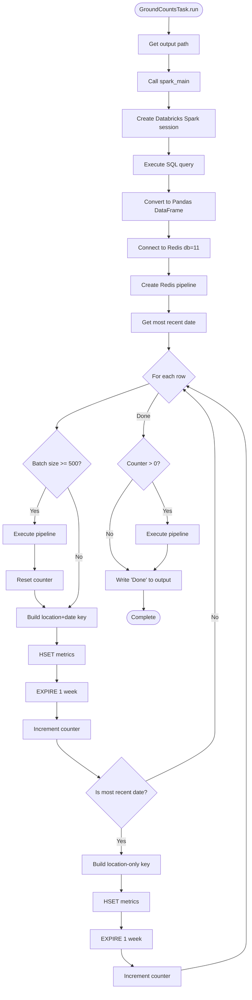
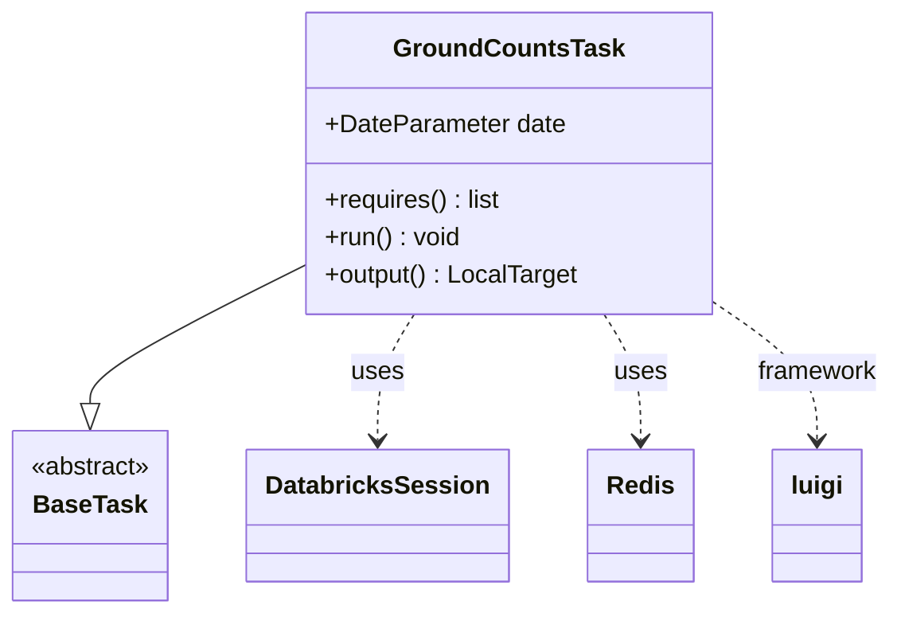
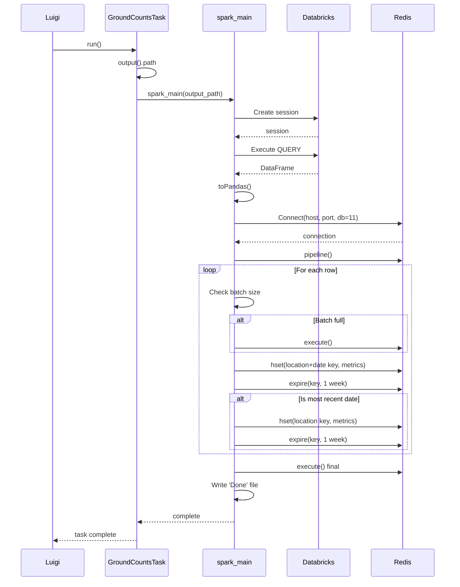
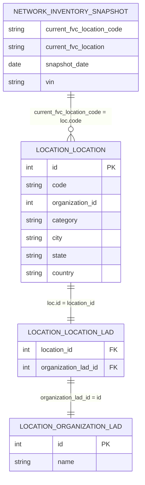

# Diagram: research/orchestrator/tasks/transforms/ground_counts_task.py

> Auto-generated by Obscura crawlers

## Diagram 1

### SVG

<svg id="container" width="701.7069702148438" xmlns="http://www.w3.org/2000/svg" class="flowchart" height="2751.390625" viewBox="0 0 701.7069702148438 2751.390625" role="graphics-document document" aria-roledescription="flowchart-v2"><g><marker id="container_flowchart-v2-pointEnd" class="marker flowchart-v2" viewBox="0 0 10 10" refX="5" refY="5" markerUnits="userSpaceOnUse" markerWidth="8" markerHeight="8" orient="auto"><path d="M 0 0 L 10 5 L 0 10 z" class="arrowMarkerPath" style="stroke-width: 1; stroke-dasharray: 1, 0;"></path></marker><marker id="container_flowchart-v2-pointStart" class="marker flowchart-v2" viewBox="0 0 10 10" refX="4.5" refY="5" markerUnits="userSpaceOnUse" markerWidth="8" markerHeight="8" orient="auto"><path d="M 0 5 L 10 10 L 10 0 z" class="arrowMarkerPath" style="stroke-width: 1; stroke-dasharray: 1, 0;"></path></marker><marker id="container_flowchart-v2-circleEnd" class="marker flowchart-v2" viewBox="0 0 10 10" refX="11" refY="5" markerUnits="userSpaceOnUse" markerWidth="11" markerHeight="11" orient="auto"><circle cx="5" cy="5" r="5" class="arrowMarkerPath" style="stroke-width: 1; stroke-dasharray: 1, 0;"></circle></marker><marker id="container_flowchart-v2-circleStart" class="marker flowchart-v2" viewBox="0 0 10 10" refX="-1" refY="5" markerUnits="userSpaceOnUse" markerWidth="11" markerHeight="11" orient="auto"><circle cx="5" cy="5" r="5" class="arrowMarkerPath" style="stroke-width: 1; stroke-dasharray: 1, 0;"></circle></marker><marker id="container_flowchart-v2-crossEnd" class="marker cross flowchart-v2" viewBox="0 0 11 11" refX="12" refY="5.2" markerUnits="userSpaceOnUse" markerWidth="11" markerHeight="11" orient="auto"><path d="M 1,1 l 9,9 M 10,1 l -9,9" class="arrowMarkerPath" style="stroke-width: 2; stroke-dasharray: 1, 0;"></path></marker><marker id="container_flowchart-v2-crossStart" class="marker cross flowchart-v2" viewBox="0 0 11 11" refX="-1" refY="5.2" markerUnits="userSpaceOnUse" markerWidth="11" markerHeight="11" orient="auto"><path d="M 1,1 l 9,9 M 10,1 l -9,9" class="arrowMarkerPath" style="stroke-width: 2; stroke-dasharray: 1, 0;"></path></marker><g class="root"><g class="clusters"></g><g class="edgePaths"><path d="M474.82,47.5L474.737,51.583C474.654,55.667,474.487,63.833,474.404,71.417C474.32,79,474.32,86,474.32,89.5L474.32,93" id="L_Start_GetOutput_0" class="edge-thickness-normal edge-pattern-solid edge-thickness-normal edge-pattern-solid flowchart-link" style=";" data-edge="true" data-et="edge" data-id="L_Start_GetOutput_0" data-points="W3sieCI6NDc0LjgyMDMxMjUsInkiOjQ3LjV9LHsieCI6NDc0LjMyMDMxMjUsInkiOjcyfSx7IngiOjQ3NC4zMjAzMTI1LCJ5Ijo5N31d" marker-end="url(#container_flowchart-v2-pointEnd)"></path><path d="M474.32,151L474.32,155.167C474.32,159.333,474.32,167.667,474.32,175.333C474.32,183,474.32,190,474.32,193.5L474.32,197" id="L_GetOutput_CallSparkMain_0" class="edge-thickness-normal edge-pattern-solid edge-thickness-normal edge-pattern-solid flowchart-link" style=";" data-edge="true" data-et="edge" data-id="L_GetOutput_CallSparkMain_0" data-points="W3sieCI6NDc0LjMyMDMxMjUsInkiOjE1MX0seyJ4Ijo0NzQuMzIwMzEyNSwieSI6MTc2fSx7IngiOjQ3NC4zMjAzMTI1LCJ5IjoyMDF9XQ==" marker-end="url(#container_flowchart-v2-pointEnd)"></path><path d="M474.32,255L474.32,259.167C474.32,263.333,474.32,271.667,474.32,279.333C474.32,287,474.32,294,474.32,297.5L474.32,301" id="L_CallSparkMain_CreateSpark_0" class="edge-thickness-normal edge-pattern-solid edge-thickness-normal edge-pattern-solid flowchart-link" style=";" data-edge="true" data-et="edge" data-id="L_CallSparkMain_CreateSpark_0" data-points="W3sieCI6NDc0LjMyMDMxMjUsInkiOjI1NX0seyJ4Ijo0NzQuMzIwMzEyNSwieSI6MjgwfSx7IngiOjQ3NC4zMjAzMTI1LCJ5IjozMDV9XQ==" marker-end="url(#container_flowchart-v2-pointEnd)"></path><path d="M474.32,383L474.32,387.167C474.32,391.333,474.32,399.667,474.32,407.333C474.32,415,474.32,422,474.32,425.5L474.32,429" id="L_CreateSpark_ExecuteQuery_0" class="edge-thickness-normal edge-pattern-solid edge-thickness-normal edge-pattern-solid flowchart-link" style=";" data-edge="true" data-et="edge" data-id="L_CreateSpark_ExecuteQuery_0" data-points="W3sieCI6NDc0LjMyMDMxMjUsInkiOjM4M30seyJ4Ijo0NzQuMzIwMzEyNSwieSI6NDA4fSx7IngiOjQ3NC4zMjAzMTI1LCJ5Ijo0MzN9XQ==" marker-end="url(#container_flowchart-v2-pointEnd)"></path><path d="M474.32,487L474.32,491.167C474.32,495.333,474.32,503.667,474.32,511.333C474.32,519,474.32,526,474.32,529.5L474.32,533" id="L_ExecuteQuery_ConvertPandas_0" class="edge-thickness-normal edge-pattern-solid edge-thickness-normal edge-pattern-solid flowchart-link" style=";" data-edge="true" data-et="edge" data-id="L_ExecuteQuery_ConvertPandas_0" data-points="W3sieCI6NDc0LjMyMDMxMjUsInkiOjQ4N30seyJ4Ijo0NzQuMzIwMzEyNSwieSI6NTEyfSx7IngiOjQ3NC4zMjAzMTI1LCJ5Ijo1Mzd9XQ==" marker-end="url(#container_flowchart-v2-pointEnd)"></path><path d="M474.32,615L474.32,619.167C474.32,623.333,474.32,631.667,474.32,639.333C474.32,647,474.32,654,474.32,657.5L474.32,661" id="L_ConvertPandas_ConnectRedis_0" class="edge-thickness-normal edge-pattern-solid edge-thickness-normal edge-pattern-solid flowchart-link" style=";" data-edge="true" data-et="edge" data-id="L_ConvertPandas_ConnectRedis_0" data-points="W3sieCI6NDc0LjMyMDMxMjUsInkiOjYxNX0seyJ4Ijo0NzQuMzIwMzEyNSwieSI6NjQwfSx7IngiOjQ3NC4zMjAzMTI1LCJ5Ijo2NjV9XQ==" marker-end="url(#container_flowchart-v2-pointEnd)"></path><path d="M474.32,719L474.32,723.167C474.32,727.333,474.32,735.667,474.32,743.333C474.32,751,474.32,758,474.32,761.5L474.32,765" id="L_ConnectRedis_CreatePipeline_0" class="edge-thickness-normal edge-pattern-solid edge-thickness-normal edge-pattern-solid flowchart-link" style=";" data-edge="true" data-et="edge" data-id="L_ConnectRedis_CreatePipeline_0" data-points="W3sieCI6NDc0LjMyMDMxMjUsInkiOjcxOX0seyJ4Ijo0NzQuMzIwMzEyNSwieSI6NzQ0fSx7IngiOjQ3NC4zMjAzMTI1LCJ5Ijo3Njl9XQ==" marker-end="url(#container_flowchart-v2-pointEnd)"></path><path d="M474.32,823L474.32,827.167C474.32,831.333,474.32,839.667,474.32,847.333C474.32,855,474.32,862,474.32,865.5L474.32,869" id="L_CreatePipeline_GetMaxDate_0" class="edge-thickness-normal edge-pattern-solid edge-thickness-normal edge-pattern-solid flowchart-link" style=";" data-edge="true" data-et="edge" data-id="L_CreatePipeline_GetMaxDate_0" data-points="W3sieCI6NDc0LjMyMDMxMjUsInkiOjgyM30seyJ4Ijo0NzQuMzIwMzEyNSwieSI6ODQ4fSx7IngiOjQ3NC4zMjAzMTI1LCJ5Ijo4NzN9XQ==" marker-end="url(#container_flowchart-v2-pointEnd)"></path><path d="M474.32,927L474.32,931.167C474.32,935.333,474.32,943.667,474.32,951.333C474.32,959,474.32,966,474.32,969.5L474.32,973" id="L_GetMaxDate_LoopStart_0" class="edge-thickness-normal edge-pattern-solid edge-thickness-normal edge-pattern-solid flowchart-link" style=";" data-edge="true" data-et="edge" data-id="L_GetMaxDate_LoopStart_0" data-points="W3sieCI6NDc0LjMyMDMxMjUsInkiOjkyN30seyJ4Ijo0NzQuMzIwMzEyNSwieSI6OTUyfSx7IngiOjQ3NC4zMjAzMTI1LCJ5Ijo5Nzd9XQ==" marker-end="url(#container_flowchart-v2-pointEnd)"></path><path d="M420.225,1069.014L376.904,1084.196C333.583,1099.379,246.942,1129.744,203.621,1150.427C160.301,1171.109,160.301,1182.109,160.301,1187.609L160.301,1193.109" id="L_LoopStart_CheckBatch_0" class="edge-thickness-normal edge-pattern-solid edge-thickness-normal edge-pattern-solid flowchart-link" style=";" data-edge="true" data-et="edge" data-id="L_LoopStart_CheckBatch_0" data-points="W3sieCI6NDIwLjIyNDU5NTk3MTkyNDE1LCJ5IjoxMDY5LjAxMzY1ODQ3MTkyNDF9LHsieCI6MTYwLjMwMDc4MTI1LCJ5IjoxMTYwLjEwOTM3NX0seyJ4IjoxNjAuMzAwNzgxMjUsInkiOjExOTcuMTA5Mzc1fV0=" marker-end="url(#container_flowchart-v2-pointEnd)"></path><path d="M130.279,1351.291L124.877,1362.461C119.475,1373.631,108.671,1395.972,103.269,1412.642C97.867,1429.313,97.867,1440.313,97.867,1445.813L97.867,1451.313" id="L_CheckBatch_ExecutePipe_0" class="edge-thickness-normal edge-pattern-solid edge-thickness-normal edge-pattern-solid flowchart-link" style=";" data-edge="true" data-et="edge" data-id="L_CheckBatch_ExecutePipe_0" data-points="W3sieCI6MTMwLjI3ODk3NDAyOTYwNzYsInkiOjEzNTEuMjkwNjkyNzc5NjA3NX0seyJ4Ijo5Ny44NjcxODc1LCJ5IjoxNDE4LjMxMjV9LHsieCI6OTcuODY3MTg3NSwieSI6MTQ1NS4zMTI1fV0=" marker-end="url(#container_flowchart-v2-pointEnd)"></path><path d="M97.867,1509.313L97.867,1515.479C97.867,1521.646,97.867,1533.979,97.867,1545.646C97.867,1557.313,97.867,1568.313,97.867,1573.813L97.867,1579.313" id="L_ExecutePipe_ResetCounter_0" class="edge-thickness-normal edge-pattern-solid edge-thickness-normal edge-pattern-solid flowchart-link" style=";" data-edge="true" data-et="edge" data-id="L_ExecutePipe_ResetCounter_0" data-points="W3sieCI6OTcuODY3MTg3NSwieSI6MTUwOS4zMTI1fSx7IngiOjk3Ljg2NzE4NzUsInkiOjE1NDYuMzEyNX0seyJ4Ijo5Ny44NjcxODc1LCJ5IjoxNTgzLjMxMjV9XQ==" marker-end="url(#container_flowchart-v2-pointEnd)"></path><path d="M97.867,1637.313L97.867,1641.479C97.867,1645.646,97.867,1653.979,102.358,1661.886C106.848,1669.793,115.829,1677.273,120.319,1681.013L124.81,1684.753" id="L_ResetCounter_BuildKey_0" class="edge-thickness-normal edge-pattern-solid edge-thickness-normal edge-pattern-solid flowchart-link" style=";" data-edge="true" data-et="edge" data-id="L_ResetCounter_BuildKey_0" data-points="W3sieCI6OTcuODY3MTg3NSwieSI6MTYzNy4zMTI1fSx7IngiOjk3Ljg2NzE4NzUsInkiOjE2NjIuMzEyNX0seyJ4IjoxMjcuODgzMzM4MzQxMzQ2MTYsInkiOjE2ODcuMzEyNX1d" marker-end="url(#container_flowchart-v2-pointEnd)"></path><path d="M190.323,1351.291L195.725,1362.461C201.127,1373.631,211.93,1395.972,217.332,1417.809C222.734,1439.646,222.734,1460.979,222.734,1482.313C222.734,1503.646,222.734,1524.979,222.734,1546.313C222.734,1567.646,222.734,1588.979,222.734,1608.313C222.734,1627.646,222.734,1644.979,218.244,1657.386C213.754,1669.793,204.773,1677.273,200.282,1681.013L195.792,1684.753" id="L_CheckBatch_BuildKey_0" class="edge-thickness-normal edge-pattern-solid edge-thickness-normal edge-pattern-solid flowchart-link" style=";" data-edge="true" data-et="edge" data-id="L_CheckBatch_BuildKey_0" data-points="W3sieCI6MTkwLjMyMjU4ODQ3MDM5MjQsInkiOjEzNTEuMjkwNjkyNzc5NjA3NX0seyJ4IjoyMjIuNzM0Mzc1LCJ5IjoxNDE4LjMxMjV9LHsieCI6MjIyLjczNDM3NSwieSI6MTQ4Mi4zMTI1fSx7IngiOjIyMi43MzQzNzUsInkiOjE1NDYuMzEyNX0seyJ4IjoyMjIuNzM0Mzc1LCJ5IjoxNjEwLjMxMjV9LHsieCI6MjIyLjczNDM3NSwieSI6MTY2Mi4zMTI1fSx7IngiOjE5Mi43MTgyMjQxNTg2NTM4NCwieSI6MTY4Ny4zMTI1fV0=" marker-end="url(#container_flowchart-v2-pointEnd)"></path><path d="M160.301,1741.313L160.301,1745.479C160.301,1749.646,160.301,1757.979,160.301,1765.646C160.301,1773.313,160.301,1780.313,160.301,1783.813L160.301,1787.313" id="L_BuildKey_SetHash_0" class="edge-thickness-normal edge-pattern-solid edge-thickness-normal edge-pattern-solid flowchart-link" style=";" data-edge="true" data-et="edge" data-id="L_BuildKey_SetHash_0" data-points="W3sieCI6MTYwLjMwMDc4MTI1LCJ5IjoxNzQxLjMxMjV9LHsieCI6MTYwLjMwMDc4MTI1LCJ5IjoxNzY2LjMxMjV9LHsieCI6MTYwLjMwMDc4MTI1LCJ5IjoxNzkxLjMxMjV9XQ==" marker-end="url(#container_flowchart-v2-pointEnd)"></path><path d="M160.301,1845.313L160.301,1849.479C160.301,1853.646,160.301,1861.979,160.301,1869.646C160.301,1877.313,160.301,1884.313,160.301,1887.813L160.301,1891.313" id="L_SetHash_SetExpire_0" class="edge-thickness-normal edge-pattern-solid edge-thickness-normal edge-pattern-solid flowchart-link" style=";" data-edge="true" data-et="edge" data-id="L_SetHash_SetExpire_0" data-points="W3sieCI6MTYwLjMwMDc4MTI1LCJ5IjoxODQ1LjMxMjV9LHsieCI6MTYwLjMwMDc4MTI1LCJ5IjoxODcwLjMxMjV9LHsieCI6MTYwLjMwMDc4MTI1LCJ5IjoxODk1LjMxMjV9XQ==" marker-end="url(#container_flowchart-v2-pointEnd)"></path><path d="M160.301,1949.313L160.301,1953.479C160.301,1957.646,160.301,1965.979,160.301,1973.646C160.301,1981.313,160.301,1988.313,160.301,1991.813L160.301,1995.313" id="L_SetExpire_IncrementCounter_0" class="edge-thickness-normal edge-pattern-solid edge-thickness-normal edge-pattern-solid flowchart-link" style=";" data-edge="true" data-et="edge" data-id="L_SetExpire_IncrementCounter_0" data-points="W3sieCI6MTYwLjMwMDc4MTI1LCJ5IjoxOTQ5LjMxMjV9LHsieCI6MTYwLjMwMDc4MTI1LCJ5IjoxOTc0LjMxMjV9LHsieCI6MTYwLjMwMDc4MTI1LCJ5IjoxOTk5LjMxMjV9XQ==" marker-end="url(#container_flowchart-v2-pointEnd)"></path><path d="M160.301,2053.313L160.301,2057.479C160.301,2061.646,160.301,2069.979,179.809,2087.753C199.317,2105.527,238.333,2132.742,257.841,2146.349L277.349,2159.957" id="L_IncrementCounter_CheckRecent_0" class="edge-thickness-normal edge-pattern-solid edge-thickness-normal edge-pattern-solid flowchart-link" style=";" data-edge="true" data-et="edge" data-id="L_IncrementCounter_CheckRecent_0" data-points="W3sieCI6MTYwLjMwMDc4MTI1LCJ5IjoyMDUzLjMxMjV9LHsieCI6MTYwLjMwMDc4MTI1LCJ5IjoyMDc4LjMxMjV9LHsieCI6MjgwLjYzMDEwMzUzMjg0OTQsInkiOjIxNjIuMjQ0ODk2NDY3MTUwN31d" marker-end="url(#container_flowchart-v2-pointEnd)"></path><path d="M339.563,2303.391L339.563,2309.557C339.563,2315.724,339.563,2328.057,339.563,2339.724C339.563,2351.391,339.563,2362.391,339.563,2367.891L339.563,2373.391" id="L_CheckRecent_BuildRecentKey_0" class="edge-thickness-normal edge-pattern-solid edge-thickness-normal edge-pattern-solid flowchart-link" style=";" data-edge="true" data-et="edge" data-id="L_CheckRecent_BuildRecentKey_0" data-points="W3sieCI6MzM5LjU2MjUsInkiOjIzMDMuMzkwNjI1fSx7IngiOjMzOS41NjI1LCJ5IjoyMzQwLjM5MDYyNX0seyJ4IjozMzkuNTYyNSwieSI6MjM3Ny4zOTA2MjV9XQ==" marker-end="url(#container_flowchart-v2-pointEnd)"></path><path d="M339.563,2431.391L339.563,2435.557C339.563,2439.724,339.563,2448.057,339.563,2455.724C339.563,2463.391,339.563,2470.391,339.563,2473.891L339.563,2477.391" id="L_BuildRecentKey_SetRecentHash_0" class="edge-thickness-normal edge-pattern-solid edge-thickness-normal edge-pattern-solid flowchart-link" style=";" data-edge="true" data-et="edge" data-id="L_BuildRecentKey_SetRecentHash_0" data-points="W3sieCI6MzM5LjU2MjUsInkiOjI0MzEuMzkwNjI1fSx7IngiOjMzOS41NjI1LCJ5IjoyNDU2LjM5MDYyNX0seyJ4IjozMzkuNTYyNSwieSI6MjQ4MS4zOTA2MjV9XQ==" marker-end="url(#container_flowchart-v2-pointEnd)"></path><path d="M339.563,2535.391L339.563,2539.557C339.563,2543.724,339.563,2552.057,339.563,2559.724C339.563,2567.391,339.563,2574.391,339.563,2577.891L339.563,2581.391" id="L_SetRecentHash_SetRecentExpire_0" class="edge-thickness-normal edge-pattern-solid edge-thickness-normal edge-pattern-solid flowchart-link" style=";" data-edge="true" data-et="edge" data-id="L_SetRecentHash_SetRecentExpire_0" data-points="W3sieCI6MzM5LjU2MjUsInkiOjI1MzUuMzkwNjI1fSx7IngiOjMzOS41NjI1LCJ5IjoyNTYwLjM5MDYyNX0seyJ4IjozMzkuNTYyNSwieSI6MjU4NS4zOTA2MjV9XQ==" marker-end="url(#container_flowchart-v2-pointEnd)"></path><path d="M339.563,2639.391L339.563,2643.557C339.563,2647.724,339.563,2656.057,344.976,2664.009C350.389,2671.96,361.216,2679.529,366.63,2683.314L372.043,2687.099" id="L_SetRecentExpire_IncrementAgain_0" class="edge-thickness-normal edge-pattern-solid edge-thickness-normal edge-pattern-solid flowchart-link" style=";" data-edge="true" data-et="edge" data-id="L_SetRecentExpire_IncrementAgain_0" data-points="W3sieCI6MzM5LjU2MjUsInkiOjI2MzkuMzkwNjI1fSx7IngiOjMzOS41NjI1LCJ5IjoyNjY0LjM5MDYyNX0seyJ4IjozNzUuMzIxNTg5NTQzMjY5MiwieSI6MjY4OS4zOTA2MjV9XQ==" marker-end="url(#container_flowchart-v2-pointEnd)"></path><path d="M510.832,2698.382L541.311,2692.716C571.79,2687.051,632.749,2675.721,663.228,2661.389C693.707,2647.057,693.707,2629.724,693.707,2612.391C693.707,2595.057,693.707,2577.724,693.707,2560.391C693.707,2543.057,693.707,2525.724,693.707,2508.391C693.707,2491.057,693.707,2473.724,693.707,2456.391C693.707,2439.057,693.707,2421.724,693.707,2402.391C693.707,2383.057,693.707,2361.724,693.707,2328.217C693.707,2294.711,693.707,2249.031,693.707,2205.352C693.707,2161.672,693.707,2119.992,693.707,2090.486C693.707,2060.979,693.707,2043.646,693.707,2026.313C693.707,2008.979,693.707,1991.646,693.707,1974.313C693.707,1956.979,693.707,1939.646,693.707,1922.313C693.707,1904.979,693.707,1887.646,693.707,1870.313C693.707,1852.979,693.707,1835.646,693.707,1818.313C693.707,1800.979,693.707,1783.646,693.707,1766.313C693.707,1748.979,693.707,1731.646,693.707,1714.313C693.707,1696.979,693.707,1679.646,693.707,1662.313C693.707,1644.979,693.707,1627.646,693.707,1608.313C693.707,1588.979,693.707,1567.646,693.707,1546.313C693.707,1524.979,693.707,1503.646,693.707,1482.313C693.707,1460.979,693.707,1439.646,693.707,1407.462C693.707,1375.279,693.707,1332.245,693.707,1289.211C693.707,1246.177,693.707,1203.143,665.847,1167.65C637.986,1132.157,582.266,1104.205,554.406,1090.229L526.545,1076.253" id="L_IncrementAgain_LoopStart_0" class="edge-thickness-normal edge-pattern-solid edge-thickness-normal edge-pattern-solid flowchart-link" style=";" data-edge="true" data-et="edge" data-id="L_IncrementAgain_LoopStart_0" data-points="W3sieCI6NTEwLjgzMjAzMTI1LCJ5IjoyNjk4LjM4MTU3NzI0Nzk3NX0seyJ4Ijo2OTMuNzA3MDMxMjUsInkiOjI2NjQuMzkwNjI1fSx7IngiOjY5My43MDcwMzEyNSwieSI6MjYxMi4zOTA2MjV9LHsieCI6NjkzLjcwNzAzMTI1LCJ5IjoyNTYwLjM5MDYyNX0seyJ4Ijo2OTMuNzA3MDMxMjUsInkiOjI1MDguMzkwNjI1fSx7IngiOjY5My43MDcwMzEyNSwieSI6MjQ1Ni4zOTA2MjV9LHsieCI6NjkzLjcwNzAzMTI1LCJ5IjoyNDA0LjM5MDYyNX0seyJ4Ijo2OTMuNzA3MDMxMjUsInkiOjIzNDAuMzkwNjI1fSx7IngiOjY5My43MDcwMzEyNSwieSI6MjIwMy4zNTE1NjI1fSx7IngiOjY5My43MDcwMzEyNSwieSI6MjA3OC4zMTI1fSx7IngiOjY5My43MDcwMzEyNSwieSI6MjAyNi4zMTI1fSx7IngiOjY5My43MDcwMzEyNSwieSI6MTk3NC4zMTI1fSx7IngiOjY5My43MDcwMzEyNSwieSI6MTkyMi4zMTI1fSx7IngiOjY5My43MDcwMzEyNSwieSI6MTg3MC4zMTI1fSx7IngiOjY5My43MDcwMzEyNSwieSI6MTgxOC4zMTI1fSx7IngiOjY5My43MDcwMzEyNSwieSI6MTc2Ni4zMTI1fSx7IngiOjY5My43MDcwMzEyNSwieSI6MTcxNC4zMTI1fSx7IngiOjY5My43MDcwMzEyNSwieSI6MTY2Mi4zMTI1fSx7IngiOjY5My43MDcwMzEyNSwieSI6MTYxMC4zMTI1fSx7IngiOjY5My43MDcwMzEyNSwieSI6MTU0Ni4zMTI1fSx7IngiOjY5My43MDcwMzEyNSwieSI6MTQ4Mi4zMTI1fSx7IngiOjY5My43MDcwMzEyNSwieSI6MTQxOC4zMTI1fSx7IngiOjY5My43MDcwMzEyNSwieSI6MTI4OS4yMTA5Mzc1fSx7IngiOjY5My43MDcwMzEyNSwieSI6MTE2MC4xMDkzNzV9LHsieCI6NTIyLjk3MDAyMDM4Njk1OTUsInkiOjEwNzQuNDU5NjY3MTEzMDQwNX1d" marker-end="url(#container_flowchart-v2-pointEnd)"></path><path d="M407.506,2171.256L440.298,2155.765C473.09,2140.275,538.674,2109.294,571.466,2085.136C604.258,2060.979,604.258,2043.646,604.258,2026.313C604.258,2008.979,604.258,1991.646,604.258,1974.313C604.258,1956.979,604.258,1939.646,604.258,1922.313C604.258,1904.979,604.258,1887.646,604.258,1870.313C604.258,1852.979,604.258,1835.646,604.258,1818.313C604.258,1800.979,604.258,1783.646,604.258,1766.313C604.258,1748.979,604.258,1731.646,604.258,1714.313C604.258,1696.979,604.258,1679.646,604.258,1662.313C604.258,1644.979,604.258,1627.646,604.258,1608.313C604.258,1588.979,604.258,1567.646,604.258,1546.313C604.258,1524.979,604.258,1503.646,604.258,1482.313C604.258,1460.979,604.258,1439.646,604.258,1407.462C604.258,1375.279,604.258,1332.245,604.258,1289.211C604.258,1246.177,604.258,1203.143,589.703,1169.298C575.147,1135.453,546.037,1110.797,531.481,1098.469L516.926,1086.141" id="L_CheckRecent_LoopStart_0" class="edge-thickness-normal edge-pattern-solid edge-thickness-normal edge-pattern-solid flowchart-link" style=";" data-edge="true" data-et="edge" data-id="L_CheckRecent_LoopStart_0" data-points="W3sieCI6NDA3LjUwNTg4MDQzODY1MDE0LCJ5IjoyMTcxLjI1NTg4MDQzODY1fSx7IngiOjYwNC4yNTc4MTI1LCJ5IjoyMDc4LjMxMjV9LHsieCI6NjA0LjI1NzgxMjUsInkiOjIwMjYuMzEyNX0seyJ4Ijo2MDQuMjU3ODEyNSwieSI6MTk3NC4zMTI1fSx7IngiOjYwNC4yNTc4MTI1LCJ5IjoxOTIyLjMxMjV9LHsieCI6NjA0LjI1NzgxMjUsInkiOjE4NzAuMzEyNX0seyJ4Ijo2MDQuMjU3ODEyNSwieSI6MTgxOC4zMTI1fSx7IngiOjYwNC4yNTc4MTI1LCJ5IjoxNzY2LjMxMjV9LHsieCI6NjA0LjI1NzgxMjUsInkiOjE3MTQuMzEyNX0seyJ4Ijo2MDQuMjU3ODEyNSwieSI6MTY2Mi4zMTI1fSx7IngiOjYwNC4yNTc4MTI1LCJ5IjoxNjEwLjMxMjV9LHsieCI6NjA0LjI1NzgxMjUsInkiOjE1NDYuMzEyNX0seyJ4Ijo2MDQuMjU3ODEyNSwieSI6MTQ4Mi4zMTI1fSx7IngiOjYwNC4yNTc4MTI1LCJ5IjoxNDE4LjMxMjV9LHsieCI6NjA0LjI1NzgxMjUsInkiOjEyODkuMjEwOTM3NX0seyJ4Ijo2MDQuMjU3ODEyNSwieSI6MTE2MC4xMDkzNzV9LHsieCI6NTEzLjg3Mzg2NDQ1NDgxNjMsInkiOjEwODMuNTU1ODIzMDQ1MTgzOH1d" marker-end="url(#container_flowchart-v2-pointEnd)"></path><path d="M445.35,1094.139L438.124,1105.134C430.899,1116.129,416.447,1138.119,409.222,1158.002C401.996,1177.885,401.996,1195.661,401.996,1204.549L401.996,1213.438" id="L_LoopStart_FinalCheck_0" class="edge-thickness-normal edge-pattern-solid edge-thickness-normal edge-pattern-solid flowchart-link" style=";" data-edge="true" data-et="edge" data-id="L_LoopStart_FinalCheck_0" data-points="W3sieCI6NDQ1LjM0OTcyOTcyNzU1ODk1LCJ5IjoxMDk0LjEzODc5MjIyNzU1OX0seyJ4Ijo0MDEuOTk2MDkzNzUsInkiOjExNjAuMTA5Mzc1fSx7IngiOjQwMS45OTYwOTM3NSwieSI6MTIxNy40Mzc1fV0=" marker-end="url(#container_flowchart-v2-pointEnd)"></path><path d="M426.639,1336.341L433.783,1350.003C440.926,1363.665,455.213,1390.989,462.357,1410.151C469.5,1429.313,469.5,1440.313,469.5,1445.813L469.5,1451.313" id="L_FinalCheck_FinalExecute_0" class="edge-thickness-normal edge-pattern-solid edge-thickness-normal edge-pattern-solid flowchart-link" style=";" data-edge="true" data-et="edge" data-id="L_FinalCheck_FinalExecute_0" data-points="W3sieCI6NDI2LjYzOTI5MTI1MTI5MTQ3LCJ5IjoxMzM2LjM0MTE3NzQ5ODcwODV9LHsieCI6NDY5LjUsInkiOjE0MTguMzEyNX0seyJ4Ijo0NjkuNSwieSI6MTQ1NS4zMTI1fV0=" marker-end="url(#container_flowchart-v2-pointEnd)"></path><path d="M372.156,1331.145L361.819,1345.673C351.481,1360.201,330.805,1389.257,320.467,1414.451C310.129,1439.646,310.129,1460.979,310.129,1482.313C310.129,1503.646,310.129,1524.979,318.434,1541.431C326.738,1557.884,343.348,1569.455,351.653,1575.24L359.958,1581.026" id="L_FinalCheck_WriteFile_0" class="edge-thickness-normal edge-pattern-solid edge-thickness-normal edge-pattern-solid flowchart-link" style=";" data-edge="true" data-et="edge" data-id="L_FinalCheck_WriteFile_0" data-points="W3sieCI6MzcyLjE1NjQ3MjM1NDA2OTQsInkiOjEzMzEuMTQ0NzUzNjA0MDY5NH0seyJ4IjozMTAuMTI4OTA2MjUsInkiOjE0MTguMzEyNX0seyJ4IjozMTAuMTI4OTA2MjUsInkiOjE0ODIuMzEyNX0seyJ4IjozMTAuMTI4OTA2MjUsInkiOjE1NDYuMzEyNX0seyJ4IjozNjMuMjM5NjI0MDIzNDM3NSwieSI6MTU4My4zMTI1fV0=" marker-end="url(#container_flowchart-v2-pointEnd)"></path><path d="M469.5,1509.313L469.5,1515.479C469.5,1521.646,469.5,1533.979,463.48,1545.854C457.459,1557.728,445.418,1569.144,439.398,1574.852L433.377,1580.56" id="L_FinalExecute_WriteFile_0" class="edge-thickness-normal edge-pattern-solid edge-thickness-normal edge-pattern-solid flowchart-link" style=";" data-edge="true" data-et="edge" data-id="L_FinalExecute_WriteFile_0" data-points="W3sieCI6NDY5LjUsInkiOjE1MDkuMzEyNX0seyJ4Ijo0NjkuNSwieSI6MTU0Ni4zMTI1fSx7IngiOjQzMC40NzQzMDQxOTkyMTg3NSwieSI6MTU4My4zMTI1fV0=" marker-end="url(#container_flowchart-v2-pointEnd)"></path><path d="M401.996,1637.313L401.996,1641.479C401.996,1645.646,401.996,1653.979,402.069,1662.979C402.143,1671.979,402.289,1681.646,402.362,1686.48L402.435,1691.313" id="L_WriteFile_End_0" class="edge-thickness-normal edge-pattern-solid edge-thickness-normal edge-pattern-solid flowchart-link" style=";" data-edge="true" data-et="edge" data-id="L_WriteFile_End_0" data-points="W3sieCI6NDAxLjk5NjA5Mzc1LCJ5IjoxNjM3LjMxMjV9LHsieCI6NDAxLjk5NjA5Mzc1LCJ5IjoxNjYyLjMxMjV9LHsieCI6NDAyLjQ5NjA5Mzc1LCJ5IjoxNjk1LjMxMjV9XQ==" marker-end="url(#container_flowchart-v2-pointEnd)"></path></g><g class="edgeLabels"><g class="edgeLabel"><g class="label" data-id="L_Start_GetOutput_0" transform="translate(0, 0)"><foreignObject width="0" height="0">

</foreignObject></g></g><g class="edgeLabel"><g class="label" data-id="L_GetOutput_CallSparkMain_0" transform="translate(0, 0)"><foreignObject width="0" height="0">

</foreignObject></g></g><g class="edgeLabel"><g class="label" data-id="L_CallSparkMain_CreateSpark_0" transform="translate(0, 0)"><foreignObject width="0" height="0">

</foreignObject></g></g><g class="edgeLabel"><g class="label" data-id="L_CreateSpark_ExecuteQuery_0" transform="translate(0, 0)"><foreignObject width="0" height="0">

</foreignObject></g></g><g class="edgeLabel"><g class="label" data-id="L_ExecuteQuery_ConvertPandas_0" transform="translate(0, 0)"><foreignObject width="0" height="0">

</foreignObject></g></g><g class="edgeLabel"><g class="label" data-id="L_ConvertPandas_ConnectRedis_0" transform="translate(0, 0)"><foreignObject width="0" height="0">

</foreignObject></g></g><g class="edgeLabel"><g class="label" data-id="L_ConnectRedis_CreatePipeline_0" transform="translate(0, 0)"><foreignObject width="0" height="0">

</foreignObject></g></g><g class="edgeLabel"><g class="label" data-id="L_CreatePipeline_GetMaxDate_0" transform="translate(0, 0)"><foreignObject width="0" height="0">

</foreignObject></g></g><g class="edgeLabel"><g class="label" data-id="L_GetMaxDate_LoopStart_0" transform="translate(0, 0)"><foreignObject width="0" height="0">

</foreignObject></g></g><g class="edgeLabel"><g class="label" data-id="L_LoopStart_CheckBatch_0" transform="translate(0, 0)"><foreignObject width="0" height="0">

</foreignObject></g></g><g class="edgeLabel" transform="translate(97.8671875, 1418.3125)"><g class="label" data-id="L_CheckBatch_ExecutePipe_0" transform="translate(-12.03125, -12)"><foreignObject width="24.0625" height="24">

Yes

</foreignObject></g></g><g class="edgeLabel"><g class="label" data-id="L_ExecutePipe_ResetCounter_0" transform="translate(0, 0)"><foreignObject width="0" height="0">

</foreignObject></g></g><g class="edgeLabel"><g class="label" data-id="L_ResetCounter_BuildKey_0" transform="translate(0, 0)"><foreignObject width="0" height="0">

</foreignObject></g></g><g class="edgeLabel" transform="translate(222.734375, 1546.3125)"><g class="label" data-id="L_CheckBatch_BuildKey_0" transform="translate(-10.140625, -12)"><foreignObject width="20.28125" height="24">

No

</foreignObject></g></g><g class="edgeLabel"><g class="label" data-id="L_BuildKey_SetHash_0" transform="translate(0, 0)"><foreignObject width="0" height="0">

</foreignObject></g></g><g class="edgeLabel"><g class="label" data-id="L_SetHash_SetExpire_0" transform="translate(0, 0)"><foreignObject width="0" height="0">

</foreignObject></g></g><g class="edgeLabel"><g class="label" data-id="L_SetExpire_IncrementCounter_0" transform="translate(0, 0)"><foreignObject width="0" height="0">

</foreignObject></g></g><g class="edgeLabel"><g class="label" data-id="L_IncrementCounter_CheckRecent_0" transform="translate(0, 0)"><foreignObject width="0" height="0">

</foreignObject></g></g><g class="edgeLabel" transform="translate(339.5625, 2340.390625)"><g class="label" data-id="L_CheckRecent_BuildRecentKey_0" transform="translate(-12.03125, -12)"><foreignObject width="24.0625" height="24">

Yes

</foreignObject></g></g><g class="edgeLabel"><g class="label" data-id="L_BuildRecentKey_SetRecentHash_0" transform="translate(0, 0)"><foreignObject width="0" height="0">

</foreignObject></g></g><g class="edgeLabel"><g class="label" data-id="L_SetRecentHash_SetRecentExpire_0" transform="translate(0, 0)"><foreignObject width="0" height="0">

</foreignObject></g></g><g class="edgeLabel"><g class="label" data-id="L_SetRecentExpire_IncrementAgain_0" transform="translate(0, 0)"><foreignObject width="0" height="0">

</foreignObject></g></g><g class="edgeLabel"><g class="label" data-id="L_IncrementAgain_LoopStart_0" transform="translate(0, 0)"><foreignObject width="0" height="0">

</foreignObject></g></g><g class="edgeLabel" transform="translate(604.2578125, 1714.3125)"><g class="label" data-id="L_CheckRecent_LoopStart_0" transform="translate(-10.140625, -12)"><foreignObject width="20.28125" height="24">

No

</foreignObject></g></g><g class="edgeLabel" transform="translate(401.99609375, 1160.109375)"><g class="label" data-id="L_LoopStart_FinalCheck_0" transform="translate(-18.875, -12)"><foreignObject width="37.75" height="24">

Done

</foreignObject></g></g><g class="edgeLabel" transform="translate(469.5, 1418.3125)"><g class="label" data-id="L_FinalCheck_FinalExecute_0" transform="translate(-12.03125, -12)"><foreignObject width="24.0625" height="24">

Yes

</foreignObject></g></g><g class="edgeLabel" transform="translate(310.12890625, 1482.3125)"><g class="label" data-id="L_FinalCheck_WriteFile_0" transform="translate(-10.140625, -12)"><foreignObject width="20.28125" height="24">

No

</foreignObject></g></g><g class="edgeLabel"><g class="label" data-id="L_FinalExecute_WriteFile_0" transform="translate(0, 0)"><foreignObject width="0" height="0">

</foreignObject></g></g><g class="edgeLabel"><g class="label" data-id="L_WriteFile_End_0" transform="translate(0, 0)"><foreignObject width="0" height="0">

</foreignObject></g></g></g><g class="nodes"><g class="node default" id="flowchart-Start-0" transform="translate(474.3203125, 27.5)"><g class="basic label-container outer-path"><path d="M-74.7578125 -19.5 C-20.403381356325305 -19.5, 33.95104978734939 -19.5, 74.7578125 -19.5 C74.7578125 -19.5, 74.7578125 -19.5, 74.7578125 -19.5 C75.22729954388393 -19.484944464303737, 75.69678658776787 -19.469888928607475, 76.0071817896239 -19.45993515863156 C76.42963651949286 -19.419181458917247, 76.85209124936183 -19.378427759202932, 77.25141715284786 -19.3399052695533 C77.67348079204115 -19.271669293520937, 78.09554443123442 -19.203433317488575, 78.48540575967675 -19.140403561325776 C78.91795691328606 -19.04167658317452, 79.35050806689536 -18.942949605023266, 79.70407688623538 -18.862249829261074 C79.96375979929381 -18.78517730376876, 80.22344271235224 -18.708104778276446, 80.9024227514606 -18.50658706670804 C81.34407458097785 -18.344055110860936, 81.78572641049509 -18.18152315501383, 82.0755190951478 -18.074876768247425 C82.4214135441141 -17.921759556284314, 82.7673079930804 -17.7686423443212, 83.21854541279238 -17.568892924097174 C83.60330360921505 -17.368164819472856, 83.98806180563771 -17.167436714848538, 84.32680476407678 -16.990714730406097 C84.64429447565135 -16.798250601472947, 84.96178418722593 -16.605786472539798, 85.3957430736057 -16.342718045390892 C85.78746393677609 -16.069470528566093, 86.17918479994647 -15.796223011741295, 86.42096784457871 -15.627565626425154 C86.76682329396137 -15.351755109142523, 87.11267874334402 -15.075944591859892, 87.39826620850187 -14.848196188198123 C87.74065130461493 -14.537251102921472, 88.08303640072798 -14.22630601764482, 88.32362223676799 -14.007812326905688 C88.51931159709152 -13.805746995976365, 88.71500095741504 -13.603681665047045, 89.19323344296865 -13.10986736009568 C89.43455552103019 -12.826396715589343, 89.67587759909175 -12.542926071083004, 90.00352640812658 -12.158051136245305 C90.16028976870618 -11.94800251450459, 90.31705312928577 -11.737953892763876, 90.75117146464063 -11.156274872382312 C90.90066818251526 -10.926607768237238, 91.05016490038989 -10.696940664092162, 91.43309637860425 -10.108655082055241 C91.66019731502813 -9.705414372971179, 91.88729825145201 -9.302173663887118, 92.0464989742735 -9.019496659696287 C92.26198601775961 -8.57203320321328, 92.4774730612457 -8.124569746730273, 92.58885864880834 -7.893275190886684 C92.70867183717787 -7.5973342991835295, 92.82848502554741 -7.301393407480374, 93.05794672997033 -6.734618561215508 C93.14828421913454 -6.4625364371771346, 93.23862170829877 -6.19045431313876, 93.45183563421489 -5.548287939305138 C93.53997969572644 -5.212156430883657, 93.628123757238 -4.876024922462176, 93.76890678754556 -4.339158212148133 C93.84163857036579 -3.9656958792340076, 93.91437035318602 -3.592233546319882, 94.00785727658177 -3.1121979531509023 C94.064278364023 -2.674607140560753, 94.1206994514642 -2.2370163279706046, 94.16770520250937 -1.872449005199798 C94.19239276774076 -1.487920249276917, 94.21708033297215 -1.103391493354036, 94.24779371591342 -0.6250057626472757 C94.24779371591342 -0.29237381955405306, 94.24779371591342 0.04025812353916958, 94.24779371591342 0.625005762647271 C94.21930668207477 1.0687143090040763, 94.19081964823611 1.5124228553608814, 94.16770520250937 1.8724490051997846 C94.12692250862546 2.188751525509614, 94.08613981474153 2.5050540458194432, 94.00785727658177 3.1121979531508885 C93.94831090051571 3.417956009119078, 93.88876452444966 3.7237140650872678, 93.76890678754556 4.339158212148129 C93.65676329932668 4.7668099360219385, 93.54461981110782 5.194461659895749, 93.45183563421489 5.548287939305125 C93.36295703621958 5.815976115585462, 93.27407843822428 6.083664291865798, 93.05794672997033 6.734618561215495 C92.91615934637537 7.084836139967628, 92.7743719627804 7.43505371871976, 92.58885864880834 7.893275190886679 C92.46069752189072 8.159404513139942, 92.3325363949731 8.425533835393203, 92.0464989742735 9.019496659696284 C91.91932624543013 9.245304717392898, 91.79215351658675 9.471112775089512, 91.43309637860425 10.108655082055236 C91.21471283224147 10.444150853461611, 90.99632928587872 10.779646624867986, 90.75117146464065 11.156274872382301 C90.51857520983538 11.46793266386663, 90.28597895503012 11.77959045535096, 90.00352640812659 12.158051136245302 C89.72059482170573 12.490398676918588, 89.43766323528486 12.822746217591872, 89.19323344296866 13.10986736009567 C88.9143959471303 13.397789967532937, 88.63555845129194 13.685712574970204, 88.32362223676799 14.007812326905684 C88.0096437438054 14.292959286798615, 87.69566525084282 14.578106246691544, 87.3982662085019 14.848196188198111 C87.1541457737084 15.042875738628332, 86.91002533891488 15.237555289058553, 86.42096784457871 15.627565626425152 C86.14211281253709 15.822082825337608, 85.86325778049547 16.016600024250064, 85.3957430736057 16.34271804539089 C85.13496719186892 16.500801917388912, 84.87419131013213 16.658885789386936, 84.32680476407678 16.990714730406093 C83.89098257171769 17.218082889002396, 83.45516037935859 17.445451047598702, 83.21854541279238 17.56889292409717 C82.86363153025552 17.72600277174998, 82.50871764771867 17.883112619402784, 82.0755190951478 18.07487676824742 C81.62036956509415 18.2423760026633, 81.1652200350405 18.409875237079177, 80.90242275146062 18.506587066708033 C80.49274832678354 18.628176285527253, 80.08307390210646 18.749765504346474, 79.70407688623541 18.86224982926107 C79.41134276672996 18.929064481769537, 79.11860864722449 18.995879134278006, 78.48540575967677 19.140403561325773 C78.14034061961524 19.19619101715079, 77.79527547955372 19.25197847297581, 77.25141715284788 19.3399052695533 C76.87826338677752 19.375902964583045, 76.50510962070717 19.411900659612787, 76.0071817896239 19.45993515863156 C75.73358841606415 19.468708765604426, 75.4599950425044 19.47748237257729, 74.7578125 19.5 C74.7578125 19.5, 74.7578125 19.5, 74.7578125 19.5 C28.743811715730658 19.5, -17.270189068538684 19.5, -74.7578125 19.5 C-75.13695627739126 19.487841597017656, -75.51610005478253 19.475683194035312, -76.0071817896239 19.45993515863156 C-76.3591109284602 19.425984977864736, -76.7110400672965 19.39203479709791, -77.25141715284786 19.3399052695533 C-77.73038003331305 19.2624702654523, -78.20934291377824 19.1850352613513, -78.48540575967675 19.140403561325773 C-78.76772239586472 19.075966631404093, -79.05003903205268 19.01152970148241, -79.70407688623538 18.862249829261074 C-80.16610505513647 18.72512229396658, -80.62813322403757 18.587994758672085, -80.90242275146059 18.506587066708043 C-81.20567338451825 18.3949880305247, -81.50892401757591 18.28338899434136, -82.0755190951478 18.074876768247425 C-82.38945591431298 17.93590625100786, -82.70339273347817 17.796935733768297, -83.21854541279238 17.568892924097174 C-83.58543606496325 17.377486305864313, -83.95232671713411 17.186079687631455, -84.32680476407678 16.990714730406097 C-84.57130890202843 16.842494885114004, -84.81581303998009 16.694275039821907, -85.39574307360569 16.3427180453909 C-85.67515175264333 16.147814646301015, -85.95456043168096 15.952911247211132, -86.42096784457871 15.627565626425156 C-86.71805242638612 15.390648578186482, -87.01513700819355 15.153731529947809, -87.39826620850187 14.848196188198125 C-87.69976998981078 14.574378431366279, -88.00127377111968 14.300560674534434, -88.32362223676797 14.007812326905697 C-88.5929688528762 13.729689832005512, -88.86231546898442 13.451567337105326, -89.19323344296865 13.109867360095677 C-89.47466449607482 12.779282431236593, -89.756095549181 12.448697502377508, -90.00352640812658 12.158051136245307 C-90.15426762267455 11.95607164155817, -90.30500883722254 11.75409214687103, -90.75117146464063 11.156274872382316 C-90.89614056142355 10.933563410070606, -91.04110965820647 10.710851947758895, -91.43309637860425 10.108655082055249 C-91.6199866375834 9.776812502546932, -91.80687689656254 9.444969923038613, -92.0464989742735 9.019496659696289 C-92.17593772761653 8.750714318833863, -92.30537648095954 8.481931977971435, -92.58885864880834 7.893275190886686 C-92.76766423208669 7.451621943218377, -92.94646981536505 7.009968695550066, -93.05794672997033 6.73461856121551 C-93.2151876677749 6.261033909489335, -93.37242860557946 5.787449257763161, -93.45183563421489 5.5482879393051325 C-93.5371885526747 5.22280026902898, -93.62254147113453 4.897312598752826, -93.76890678754556 4.339158212148136 C-93.85954494983625 3.873750405167825, -93.95018311212694 3.4083425981875144, -94.00785727658177 3.112197953150904 C-94.0440760820985 2.8312920497753638, -94.08029488761521 2.5503861463998234, -94.16770520250937 1.872449005199809 C-94.19447064075612 1.4555556998337424, -94.22123607900288 1.0386623944676758, -94.24779371591342 0.6250057626472781 C-94.24779371591342 0.26209136065417027, -94.24779371591342 -0.1008230413389376, -94.24779371591342 -0.6250057626472687 C-94.22767827687562 -0.9383199625511596, -94.20756283783781 -1.2516341624550504, -94.16770520250937 -1.8724490051997822 C-94.10700199906202 -2.343251063934015, -94.04629879561467 -2.814053122668248, -94.00785727658177 -3.112197953150895 C-93.9331986131541 -3.495554410737895, -93.85853994972643 -3.8789108683248945, -93.76890678754556 -4.339158212148126 C-93.66340993772384 -4.741463423142277, -93.55791308790212 -5.143768634136428, -93.45183563421489 -5.548287939305123 C-93.31899155930866 -5.948393127093728, -93.18614748440243 -6.348498314882333, -93.05794672997033 -6.734618561215485 C-92.93027408646348 -7.049972459060023, -92.80260144295664 -7.365326356904562, -92.58885864880834 -7.893275190886676 C-92.37337284153985 -8.340736080337377, -92.15788703427134 -8.788196969788078, -92.0464989742735 -9.019496659696282 C-91.87321384999711 -9.32718194487059, -91.69992872572071 -9.6348672300449, -91.43309637860425 -10.108655082055243 C-91.17639468374705 -10.503017819412651, -90.91969298888984 -10.89738055677006, -90.75117146464063 -11.156274872382308 C-90.46384167203207 -11.54127061819519, -90.1765118794235 -11.926266364008072, -90.00352640812659 -12.158051136245302 C-89.72421423783204 -12.48614710478601, -89.44490206753748 -12.814243073326717, -89.19323344296866 -13.10986736009567 C-88.85858901635468 -13.45541520539299, -88.5239445897407 -13.80096305069031, -88.32362223676799 -14.007812326905677 C-87.98423555661074 -14.316034330145014, -87.64484887645348 -14.62425633338435, -87.3982662085019 -14.848196188198107 C-87.15378080572499 -15.043166790882879, -86.9092954029481 -15.23813739356765, -86.42096784457871 -15.627565626425149 C-86.10738878359409 -15.846304804749256, -85.79380972260948 -16.065043983073362, -85.39574307360571 -16.342718045390885 C-85.00072131297453 -16.582182558091045, -84.60569955234334 -16.821647070791204, -84.32680476407678 -16.99071473040609 C-84.07818080481913 -17.120421690699565, -83.82955684556147 -17.250128650993044, -83.2185454127924 -17.56889292409717 C-82.7900569315699 -17.75857206407519, -82.36156845034739 -17.948251204053207, -82.07551909514781 -18.07487676824742 C-81.69915381087092 -18.21338267194386, -81.32278852659405 -18.351888575640302, -80.90242275146062 -18.506587066708033 C-80.51031238918651 -18.622963364001695, -80.1182020269124 -18.73933966129536, -79.70407688623541 -18.862249829261067 C-79.33146218947732 -18.947296702257965, -78.95884749271923 -19.032343575254867, -78.48540575967677 -19.140403561325773 C-78.16107935166853 -19.192838139783685, -77.83675294366031 -19.245272718241598, -77.25141715284788 -19.3399052695533 C-76.87138674277314 -19.37656634615977, -76.49135633269842 -19.413227422766244, -76.0071817896239 -19.45993515863156 C-75.57360572656692 -19.473839099069185, -75.14002966350995 -19.487743039506814, -74.7578125 -19.5 C-74.7578125 -19.5, -74.7578125 -19.5, -74.7578125 -19.5" stroke="none" stroke-width="0" fill="#ECECFF" style=""></path><path d="M-74.7578125 -19.5 C-35.34974967289561 -19.5, 4.058313154208776 -19.5, 74.7578125 -19.5 M-74.7578125 -19.5 C-20.765396952081026 -19.5, 33.22701859583795 -19.5, 74.7578125 -19.5 M74.7578125 -19.5 C74.7578125 -19.5, 74.7578125 -19.5, 74.7578125 -19.5 M74.7578125 -19.5 C74.7578125 -19.5, 74.7578125 -19.5, 74.7578125 -19.5 M74.7578125 -19.5 C75.17125493676063 -19.48674170576997, 75.58469737352127 -19.47348341153994, 76.0071817896239 -19.45993515863156 M74.7578125 -19.5 C75.02032840758322 -19.491581625800023, 75.28284431516644 -19.483163251600047, 76.0071817896239 -19.45993515863156 M76.0071817896239 -19.45993515863156 C76.47831460831405 -19.414485542232633, 76.94944742700419 -19.36903592583371, 77.25141715284786 -19.3399052695533 M76.0071817896239 -19.45993515863156 C76.29706476679229 -19.431970496459414, 76.58694774396066 -19.404005834287265, 77.25141715284786 -19.3399052695533 M77.25141715284786 -19.3399052695533 C77.74245093800369 -19.260518735193184, 78.23348472315952 -19.181132200833066, 78.48540575967675 -19.140403561325776 M77.25141715284786 -19.3399052695533 C77.73232936712132 -19.262155112279487, 78.2132415813948 -19.184404955005675, 78.48540575967675 -19.140403561325776 M78.48540575967675 -19.140403561325776 C78.87514855605183 -19.051447311362598, 79.26489135242689 -18.96249106139942, 79.70407688623538 -18.862249829261074 M78.48540575967675 -19.140403561325776 C78.89358657047066 -19.047238954890783, 79.30176738126457 -18.954074348455794, 79.70407688623538 -18.862249829261074 M79.70407688623538 -18.862249829261074 C80.08431363610616 -18.749397557802858, 80.46455038597692 -18.636545286344646, 80.9024227514606 -18.50658706670804 M79.70407688623538 -18.862249829261074 C79.9461162057619 -18.79041382971592, 80.18815552528841 -18.71857783017077, 80.9024227514606 -18.50658706670804 M80.9024227514606 -18.50658706670804 C81.16416706523006 -18.410262739702965, 81.42591137899952 -18.313938412697894, 82.0755190951478 -18.074876768247425 M80.9024227514606 -18.50658706670804 C81.27144989631108 -18.37078166615353, 81.64047704116157 -18.23497626559902, 82.0755190951478 -18.074876768247425 M82.0755190951478 -18.074876768247425 C82.4838925846682 -17.8941019384059, 82.8922660741886 -17.713327108564375, 83.21854541279238 -17.568892924097174 M82.0755190951478 -18.074876768247425 C82.49718172899861 -17.888219228419285, 82.91884436284943 -17.701561688591145, 83.21854541279238 -17.568892924097174 M83.21854541279238 -17.568892924097174 C83.50818418531246 -17.417788561995938, 83.79782295783254 -17.266684199894705, 84.32680476407678 -16.990714730406097 M83.21854541279238 -17.568892924097174 C83.54574794990073 -17.398191570070978, 83.87295048700908 -17.22749021604478, 84.32680476407678 -16.990714730406097 M84.32680476407678 -16.990714730406097 C84.70732117480293 -16.760043446061264, 85.08783758552909 -16.529372161716434, 85.3957430736057 -16.342718045390892 M84.32680476407678 -16.990714730406097 C84.57322469646031 -16.841333519270936, 84.81964462884386 -16.691952308135775, 85.3957430736057 -16.342718045390892 M85.3957430736057 -16.342718045390892 C85.69602172022965 -16.133256660359134, 85.9963003668536 -15.923795275327372, 86.42096784457871 -15.627565626425154 M85.3957430736057 -16.342718045390892 C85.65961740283889 -16.158650736253428, 85.92349173207208 -15.974583427115965, 86.42096784457871 -15.627565626425154 M86.42096784457871 -15.627565626425154 C86.6252780649292 -15.464633662618933, 86.8295882852797 -15.301701698812714, 87.39826620850187 -14.848196188198123 M86.42096784457871 -15.627565626425154 C86.73821489011482 -15.374569549908545, 87.05546193565092 -15.121573473391937, 87.39826620850187 -14.848196188198123 M87.39826620850187 -14.848196188198123 C87.70164738176 -14.572673433671063, 88.00502855501814 -14.297150679144002, 88.32362223676799 -14.007812326905688 M87.39826620850187 -14.848196188198123 C87.66577210187606 -14.605254413653777, 87.93327799525024 -14.36231263910943, 88.32362223676799 -14.007812326905688 M88.32362223676799 -14.007812326905688 C88.5210283410501 -13.803974316891827, 88.71843444533222 -13.600136306877966, 89.19323344296865 -13.10986736009568 M88.32362223676799 -14.007812326905688 C88.57994633936809 -13.743136646370882, 88.8362704419682 -13.478460965836076, 89.19323344296865 -13.10986736009568 M89.19323344296865 -13.10986736009568 C89.51094569579492 -12.73666446958662, 89.82865794862118 -12.363461579077557, 90.00352640812658 -12.158051136245305 M89.19323344296865 -13.10986736009568 C89.5130310800847 -12.734214858538117, 89.83282871720075 -12.358562356980553, 90.00352640812658 -12.158051136245305 M90.00352640812658 -12.158051136245305 C90.1993750333843 -11.895631820576773, 90.39522365864201 -11.63321250490824, 90.75117146464063 -11.156274872382312 M90.00352640812658 -12.158051136245305 C90.16827203023615 -11.937307011253402, 90.33301765234573 -11.7165628862615, 90.75117146464063 -11.156274872382312 M90.75117146464063 -11.156274872382312 C90.90114537292858 -10.925874675618813, 91.05111928121653 -10.695474478855314, 91.43309637860425 -10.108655082055241 M90.75117146464063 -11.156274872382312 C91.01832897944257 -10.745849187809016, 91.2854864942445 -10.33542350323572, 91.43309637860425 -10.108655082055241 M91.43309637860425 -10.108655082055241 C91.59499460979228 -9.821188378607289, 91.7568928409803 -9.533721675159336, 92.0464989742735 -9.019496659696287 M91.43309637860425 -10.108655082055241 C91.57226698545136 -9.861543577046113, 91.71143759229847 -9.614432072036983, 92.0464989742735 -9.019496659696287 M92.0464989742735 -9.019496659696287 C92.2159708510148 -8.667584681525698, 92.38544272775611 -8.31567270335511, 92.58885864880834 -7.893275190886684 M92.0464989742735 -9.019496659696287 C92.184696151004 -8.73252726526951, 92.3228933277345 -8.445557870842736, 92.58885864880834 -7.893275190886684 M92.58885864880834 -7.893275190886684 C92.69747108051406 -7.625000384695049, 92.80608351221977 -7.356725578503415, 93.05794672997033 -6.734618561215508 M92.58885864880834 -7.893275190886684 C92.76029284667818 -7.4698294076934495, 92.93172704454801 -7.046383624500214, 93.05794672997033 -6.734618561215508 M93.05794672997033 -6.734618561215508 C93.20156106313756 -6.302075071552368, 93.3451753963048 -5.869531581889229, 93.45183563421489 -5.548287939305138 M93.05794672997033 -6.734618561215508 C93.19351989194844 -6.326293797987386, 93.32909305392654 -5.917969034759263, 93.45183563421489 -5.548287939305138 M93.45183563421489 -5.548287939305138 C93.56483401895751 -5.117376124471755, 93.67783240370014 -4.686464309638373, 93.76890678754556 -4.339158212148133 M93.45183563421489 -5.548287939305138 C93.51931958397073 -5.29094239115727, 93.58680353372657 -5.033596843009402, 93.76890678754556 -4.339158212148133 M93.76890678754556 -4.339158212148133 C93.82136586237283 -4.069791950139492, 93.8738249372001 -3.800425688130851, 94.00785727658177 -3.1121979531509023 M93.76890678754556 -4.339158212148133 C93.85185151894333 -3.913254546795764, 93.93479625034111 -3.487350881443395, 94.00785727658177 -3.1121979531509023 M94.00785727658177 -3.1121979531509023 C94.03995089065165 -2.8632862200258136, 94.07204450472155 -2.614374486900725, 94.16770520250937 -1.872449005199798 M94.00785727658177 -3.1121979531509023 C94.06277720130134 -2.6862498621917448, 94.11769712602091 -2.2603017712325877, 94.16770520250937 -1.872449005199798 M94.16770520250937 -1.872449005199798 C94.18962633649289 -1.5310096489854321, 94.21154747047643 -1.1895702927710665, 94.24779371591342 -0.6250057626472757 M94.16770520250937 -1.872449005199798 C94.19784341753659 -1.403021979021489, 94.22798163256381 -0.9335949528431802, 94.24779371591342 -0.6250057626472757 M94.24779371591342 -0.6250057626472757 C94.24779371591342 -0.20906443117872486, 94.24779371591342 0.20687690028982597, 94.24779371591342 0.625005762647271 M94.24779371591342 -0.6250057626472757 C94.24779371591342 -0.2424556777600494, 94.24779371591342 0.1400944071271769, 94.24779371591342 0.625005762647271 M94.24779371591342 0.625005762647271 C94.22386628794887 0.9976947670674556, 94.1999388599843 1.3703837714876403, 94.16770520250937 1.8724490051997846 M94.24779371591342 0.625005762647271 C94.2317064545549 0.8755778437098581, 94.21561919319637 1.1261499247724451, 94.16770520250937 1.8724490051997846 M94.16770520250937 1.8724490051997846 C94.11868679033387 2.252626130252608, 94.06966837815837 2.6328032553054315, 94.00785727658177 3.1121979531508885 M94.16770520250937 1.8724490051997846 C94.13105464690396 2.1567034770045157, 94.09440409129854 2.440957948809247, 94.00785727658177 3.1121979531508885 M94.00785727658177 3.1121979531508885 C93.94344965002789 3.442917502948394, 93.87904202347401 3.7736370527458996, 93.76890678754556 4.339158212148129 M94.00785727658177 3.1121979531508885 C93.91366714791518 3.5958443567631533, 93.81947701924857 4.079490760375418, 93.76890678754556 4.339158212148129 M93.76890678754556 4.339158212148129 C93.66088890643076 4.7510772080846975, 93.55287102531595 5.162996204021265, 93.45183563421489 5.548287939305125 M93.76890678754556 4.339158212148129 C93.69641554980954 4.615598719536729, 93.62392431207353 4.89203922692533, 93.45183563421489 5.548287939305125 M93.45183563421489 5.548287939305125 C93.32377578266413 5.933983808609519, 93.19571593111337 6.319679677913912, 93.05794672997033 6.734618561215495 M93.45183563421489 5.548287939305125 C93.33705065895913 5.894001996273295, 93.22226568370337 6.239716053241464, 93.05794672997033 6.734618561215495 M93.05794672997033 6.734618561215495 C92.90728489702481 7.106756201439316, 92.75662306407928 7.478893841663137, 92.58885864880834 7.893275190886679 M93.05794672997033 6.734618561215495 C92.89578458212375 7.135162201588391, 92.73362243427717 7.535705841961286, 92.58885864880834 7.893275190886679 M92.58885864880834 7.893275190886679 C92.46983427008215 8.14043186002536, 92.35080989135595 8.387588529164042, 92.0464989742735 9.019496659696284 M92.58885864880834 7.893275190886679 C92.45739532128476 8.166261603353986, 92.32593199376119 8.439248015821292, 92.0464989742735 9.019496659696284 M92.0464989742735 9.019496659696284 C91.85652910417058 9.356807400599319, 91.66655923406765 9.694118141502353, 91.43309637860425 10.108655082055236 M92.0464989742735 9.019496659696284 C91.85213078755557 9.36461705712713, 91.65776260083761 9.709737454557978, 91.43309637860425 10.108655082055236 M91.43309637860425 10.108655082055236 C91.22001968543275 10.435998101870208, 91.00694299226126 10.76334112168518, 90.75117146464065 11.156274872382301 M91.43309637860425 10.108655082055236 C91.19749006442281 10.470609649791806, 90.96188375024137 10.832564217528377, 90.75117146464065 11.156274872382301 M90.75117146464065 11.156274872382301 C90.54101985272477 11.437858887143872, 90.33086824080891 11.71944290190544, 90.00352640812659 12.158051136245302 M90.75117146464065 11.156274872382301 C90.53600423224431 11.444579361655265, 90.32083699984798 11.732883850928227, 90.00352640812659 12.158051136245302 M90.00352640812659 12.158051136245302 C89.8178900822533 12.376110127622251, 89.63225375638 12.5941691189992, 89.19323344296866 13.10986736009567 M90.00352640812659 12.158051136245302 C89.7974395275948 12.400132512793643, 89.59135264706302 12.642213889341987, 89.19323344296866 13.10986736009567 M89.19323344296866 13.10986736009567 C88.87920177348953 13.434130841312422, 88.5651701040104 13.758394322529174, 88.32362223676799 14.007812326905684 M89.19323344296866 13.10986736009567 C88.96628796180177 13.344207201971013, 88.73934248063487 13.578547043846354, 88.32362223676799 14.007812326905684 M88.32362223676799 14.007812326905684 C88.01444479633112 14.28859909792365, 87.70526735589425 14.569385868941614, 87.3982662085019 14.848196188198111 M88.32362223676799 14.007812326905684 C88.00596406702402 14.296301071892552, 87.68830589728006 14.584789816879418, 87.3982662085019 14.848196188198111 M87.3982662085019 14.848196188198111 C87.15066405384053 15.045652317570497, 86.90306189917915 15.243108446942884, 86.42096784457871 15.627565626425152 M87.3982662085019 14.848196188198111 C87.12729892472657 15.064285386266677, 86.85633164095124 15.280374584335243, 86.42096784457871 15.627565626425152 M86.42096784457871 15.627565626425152 C86.02385872207874 15.90457175970428, 85.62674959957877 16.18157789298341, 85.3957430736057 16.34271804539089 M86.42096784457871 15.627565626425152 C86.09708871147743 15.853489689174907, 85.77320957837614 16.079413751924662, 85.3957430736057 16.34271804539089 M85.3957430736057 16.34271804539089 C85.1311316876209 16.503127022603987, 84.8665203016361 16.663535999817086, 84.32680476407678 16.990714730406093 M85.3957430736057 16.34271804539089 C85.10344457134366 16.519911115198802, 84.81114606908163 16.697104185006715, 84.32680476407678 16.990714730406093 M84.32680476407678 16.990714730406093 C83.95002798087916 17.187278936863247, 83.57325119768153 17.383843143320398, 83.21854541279238 17.56889292409717 M84.32680476407678 16.990714730406093 C83.96979744670922 17.17696521920265, 83.61279012934166 17.363215707999206, 83.21854541279238 17.56889292409717 M83.21854541279238 17.56889292409717 C82.86806776077525 17.724038984094996, 82.51759010875811 17.879185044092825, 82.0755190951478 18.07487676824742 M83.21854541279238 17.56889292409717 C82.903116543031 17.708523927875564, 82.58768767326961 17.848154931653955, 82.0755190951478 18.07487676824742 M82.0755190951478 18.07487676824742 C81.65288184810126 18.23041118197643, 81.23024460105474 18.38594559570544, 80.90242275146062 18.506587066708033 M82.0755190951478 18.07487676824742 C81.75200042727356 18.193934628598925, 81.42848175939932 18.312992488950428, 80.90242275146062 18.506587066708033 M80.90242275146062 18.506587066708033 C80.50616922679352 18.624193032852034, 80.10991570212641 18.74179899899604, 79.70407688623541 18.86224982926107 M80.90242275146062 18.506587066708033 C80.55019746432545 18.61112568306149, 80.19797217719027 18.715664299414954, 79.70407688623541 18.86224982926107 M79.70407688623541 18.86224982926107 C79.29746730461386 18.9550558128907, 78.89085772299232 19.047861796520323, 78.48540575967677 19.140403561325773 M79.70407688623541 18.86224982926107 C79.31140246524257 18.951875203412616, 78.91872804424973 19.04150057756416, 78.48540575967677 19.140403561325773 M78.48540575967677 19.140403561325773 C78.04852017191911 19.211035835056098, 77.61163458416145 19.28166810878642, 77.25141715284788 19.3399052695533 M78.48540575967677 19.140403561325773 C78.06128878458344 19.2089715047826, 77.63717180949011 19.277539448239423, 77.25141715284788 19.3399052695533 M77.25141715284788 19.3399052695533 C76.94966483187545 19.369014953047248, 76.64791251090304 19.398124636541194, 76.0071817896239 19.45993515863156 M77.25141715284788 19.3399052695533 C76.81971131902473 19.38155141213999, 76.3880054852016 19.42319755472668, 76.0071817896239 19.45993515863156 M76.0071817896239 19.45993515863156 C75.70581545903124 19.46959939027969, 75.40444912843857 19.479263621927817, 74.7578125 19.5 M76.0071817896239 19.45993515863156 C75.52955667625899 19.475251666376288, 75.05193156289408 19.490568174121012, 74.7578125 19.5 M74.7578125 19.5 C74.7578125 19.5, 74.7578125 19.5, 74.7578125 19.5 M74.7578125 19.5 C74.7578125 19.5, 74.7578125 19.5, 74.7578125 19.5 M74.7578125 19.5 C25.49637672615213 19.5, -23.765059047695743 19.5, -74.7578125 19.5 M74.7578125 19.5 C22.507620986717193 19.5, -29.742570526565615 19.5, -74.7578125 19.5 M-74.7578125 19.5 C-75.10073256680177 19.489003220911087, -75.44365263360353 19.47800644182217, -76.0071817896239 19.45993515863156 M-74.7578125 19.5 C-75.06247298674695 19.49023013117569, -75.36713347349391 19.48046026235138, -76.0071817896239 19.45993515863156 M-76.0071817896239 19.45993515863156 C-76.45689904404519 19.416551475961665, -76.90661629846647 19.373167793291774, -77.25141715284786 19.3399052695533 M-76.0071817896239 19.45993515863156 C-76.33246060163091 19.42855590284225, -76.65773941363793 19.397176647052937, -77.25141715284786 19.3399052695533 M-77.25141715284786 19.3399052695533 C-77.5147059977049 19.2973387709523, -77.77799484256192 19.254772272351303, -78.48540575967675 19.140403561325773 M-77.25141715284786 19.3399052695533 C-77.63922335567338 19.277207770162487, -78.0270295584989 19.21451027077168, -78.48540575967675 19.140403561325773 M-78.48540575967675 19.140403561325773 C-78.814185116137 19.06536181869953, -79.14296447259724 18.99032007607329, -79.70407688623538 18.862249829261074 M-78.48540575967675 19.140403561325773 C-78.96901209832006 19.030023570356725, -79.45261843696338 18.919643579387678, -79.70407688623538 18.862249829261074 M-79.70407688623538 18.862249829261074 C-80.14155603051795 18.732408315612897, -80.57903517480052 18.60256680196472, -80.90242275146059 18.506587066708043 M-79.70407688623538 18.862249829261074 C-80.09587254658267 18.74596693384739, -80.48766820692994 18.62968403843371, -80.90242275146059 18.506587066708043 M-80.90242275146059 18.506587066708043 C-81.28018992741198 18.36756525391644, -81.65795710336337 18.22854344112483, -82.0755190951478 18.074876768247425 M-80.90242275146059 18.506587066708043 C-81.14285018709104 18.418107547909184, -81.3832776227215 18.329628029110328, -82.0755190951478 18.074876768247425 M-82.0755190951478 18.074876768247425 C-82.43130426728897 17.91738122653268, -82.78708943943013 17.75988568481793, -83.21854541279238 17.568892924097174 M-82.0755190951478 18.074876768247425 C-82.52373499262147 17.876464886288026, -82.97195089009514 17.67805300432863, -83.21854541279238 17.568892924097174 M-83.21854541279238 17.568892924097174 C-83.55672410283893 17.392465318113683, -83.89490279288547 17.216037712130188, -84.32680476407678 16.990714730406097 M-83.21854541279238 17.568892924097174 C-83.56682333466777 17.38719655533744, -83.91510125654317 17.205500186577705, -84.32680476407678 16.990714730406097 M-84.32680476407678 16.990714730406097 C-84.55506385758207 16.852342726523865, -84.78332295108736 16.713970722641633, -85.39574307360569 16.3427180453909 M-84.32680476407678 16.990714730406097 C-84.57979062734007 16.83735321338593, -84.83277649060338 16.683991696365766, -85.39574307360569 16.3427180453909 M-85.39574307360569 16.3427180453909 C-85.62852769561026 16.180337570164383, -85.86131231761483 16.017957094937863, -86.42096784457871 15.627565626425156 M-85.39574307360569 16.3427180453909 C-85.63976735899065 16.172497267547403, -85.88379164437562 16.00227648970391, -86.42096784457871 15.627565626425156 M-86.42096784457871 15.627565626425156 C-86.69209762576975 15.411346840991792, -86.9632274069608 15.195128055558428, -87.39826620850187 14.848196188198125 M-86.42096784457871 15.627565626425156 C-86.73777003399981 15.374924310822145, -87.05457222342092 15.122282995219132, -87.39826620850187 14.848196188198125 M-87.39826620850187 14.848196188198125 C-87.73442676419243 14.542904065840863, -88.070587319883 14.237611943483602, -88.32362223676797 14.007812326905697 M-87.39826620850187 14.848196188198125 C-87.66189945751536 14.608771446797604, -87.92553270652884 14.369346705397083, -88.32362223676797 14.007812326905697 M-88.32362223676797 14.007812326905697 C-88.66893922983147 13.651244180515258, -89.01425622289494 13.294676034124821, -89.19323344296865 13.109867360095677 M-88.32362223676797 14.007812326905697 C-88.57409346279833 13.749180221959262, -88.82456468882867 13.490548117012828, -89.19323344296865 13.109867360095677 M-89.19323344296865 13.109867360095677 C-89.41018496466697 12.855023757817538, -89.62713648636527 12.600180155539396, -90.00352640812658 12.158051136245307 M-89.19323344296865 13.109867360095677 C-89.41300050214778 12.85171646728394, -89.63276756132693 12.593565574472201, -90.00352640812658 12.158051136245307 M-90.00352640812658 12.158051136245307 C-90.29316967927176 11.769955539955596, -90.58281295041694 11.381859943665887, -90.75117146464063 11.156274872382316 M-90.00352640812658 12.158051136245307 C-90.29194663571931 11.771594306894308, -90.58036686331207 11.38513747754331, -90.75117146464063 11.156274872382316 M-90.75117146464063 11.156274872382316 C-90.9473715801426 10.854858807863398, -91.14357169564457 10.553442743344478, -91.43309637860425 10.108655082055249 M-90.75117146464063 11.156274872382316 C-90.91805251045132 10.899900772181788, -91.08493355626199 10.64352667198126, -91.43309637860425 10.108655082055249 M-91.43309637860425 10.108655082055249 C-91.58346584105928 9.841658874907159, -91.73383530351431 9.574662667759071, -92.0464989742735 9.019496659696289 M-91.43309637860425 10.108655082055249 C-91.59605818637719 9.819299890681958, -91.75901999415015 9.529944699308667, -92.0464989742735 9.019496659696289 M-92.0464989742735 9.019496659696289 C-92.22823423136391 8.642119509836467, -92.40996948845434 8.264742359976648, -92.58885864880834 7.893275190886686 M-92.0464989742735 9.019496659696289 C-92.20137154227773 8.697900458493423, -92.35624411028193 8.376304257290558, -92.58885864880834 7.893275190886686 M-92.58885864880834 7.893275190886686 C-92.69214236267536 7.638162420780382, -92.79542607654238 7.38304965067408, -93.05794672997033 6.73461856121551 M-92.58885864880834 7.893275190886686 C-92.73370497666309 7.535501960672227, -92.87855130451783 7.177728730457769, -93.05794672997033 6.73461856121551 M-93.05794672997033 6.73461856121551 C-93.21112897618373 6.273258041897242, -93.36431122239713 5.811897522578974, -93.45183563421489 5.5482879393051325 M-93.05794672997033 6.73461856121551 C-93.17131820260789 6.393161748922283, -93.28468967524546 6.051704936629056, -93.45183563421489 5.5482879393051325 M-93.45183563421489 5.5482879393051325 C-93.5243730556797 5.271671313342481, -93.5969104771445 4.99505468737983, -93.76890678754556 4.339158212148136 M-93.45183563421489 5.5482879393051325 C-93.56931435491809 5.1002906616641805, -93.6867930756213 4.652293384023229, -93.76890678754556 4.339158212148136 M-93.76890678754556 4.339158212148136 C-93.84486001362241 3.9491544489635144, -93.92081323969926 3.559150685778893, -94.00785727658177 3.112197953150904 M-93.76890678754556 4.339158212148136 C-93.83319507318956 4.009051452700199, -93.89748335883355 3.6789446932522614, -94.00785727658177 3.112197953150904 M-94.00785727658177 3.112197953150904 C-94.05163919308599 2.772634054461526, -94.0954211095902 2.433070155772148, -94.16770520250937 1.872449005199809 M-94.00785727658177 3.112197953150904 C-94.04508589210916 2.823460162742157, -94.08231450763655 2.53472237233341, -94.16770520250937 1.872449005199809 M-94.16770520250937 1.872449005199809 C-94.1971256417395 1.4142019164392465, -94.22654608096965 0.9559548276786842, -94.24779371591342 0.6250057626472781 M-94.16770520250937 1.872449005199809 C-94.18764525608023 1.5618665755120251, -94.2075853096511 1.2512841458242412, -94.24779371591342 0.6250057626472781 M-94.24779371591342 0.6250057626472781 C-94.24779371591342 0.25216789824320907, -94.24779371591342 -0.12066996616086001, -94.24779371591342 -0.6250057626472687 M-94.24779371591342 0.6250057626472781 C-94.24779371591342 0.19410779763802916, -94.24779371591342 -0.23679016737121983, -94.24779371591342 -0.6250057626472687 M-94.24779371591342 -0.6250057626472687 C-94.22475984646509 -0.9837768719096591, -94.20172597701678 -1.3425479811720495, -94.16770520250937 -1.8724490051997822 M-94.24779371591342 -0.6250057626472687 C-94.22209603561234 -1.025267876130676, -94.19639835531127 -1.4255299896140832, -94.16770520250937 -1.8724490051997822 M-94.16770520250937 -1.8724490051997822 C-94.1348833284433 -2.1270089790441182, -94.10206145437722 -2.3815689528884545, -94.00785727658177 -3.112197953150895 M-94.16770520250937 -1.8724490051997822 C-94.1276435370933 -2.183159371096135, -94.08758187167724 -2.493869736992488, -94.00785727658177 -3.112197953150895 M-94.00785727658177 -3.112197953150895 C-93.91545736904881 -3.5866519496052693, -93.82305746151586 -4.0611059460596435, -93.76890678754556 -4.339158212148126 M-94.00785727658177 -3.112197953150895 C-93.91551060058903 -3.5863786168967438, -93.82316392459629 -4.060559280642592, -93.76890678754556 -4.339158212148126 M-93.76890678754556 -4.339158212148126 C-93.65959369202956 -4.756016421945913, -93.55028059651357 -5.172874631743699, -93.45183563421489 -5.548287939305123 M-93.76890678754556 -4.339158212148126 C-93.6842266835055 -4.662080149442108, -93.59954657946545 -4.985002086736091, -93.45183563421489 -5.548287939305123 M-93.45183563421489 -5.548287939305123 C-93.3477916568816 -5.861651821876413, -93.2437476795483 -6.175015704447703, -93.05794672997033 -6.734618561215485 M-93.45183563421489 -5.548287939305123 C-93.31571931358327 -5.958248609857027, -93.17960299295166 -6.368209280408932, -93.05794672997033 -6.734618561215485 M-93.05794672997033 -6.734618561215485 C-92.90315162909299 -7.1169654531422, -92.74835652821564 -7.499312345068914, -92.58885864880834 -7.893275190886676 M-93.05794672997033 -6.734618561215485 C-92.95882678563585 -6.9794467400754066, -92.85970684130136 -7.224274918935327, -92.58885864880834 -7.893275190886676 M-92.58885864880834 -7.893275190886676 C-92.45661219590633 -8.167887779958498, -92.32436574300432 -8.44250036903032, -92.0464989742735 -9.019496659696282 M-92.58885864880834 -7.893275190886676 C-92.38234471090189 -8.322105801639836, -92.17583077299544 -8.750936412392997, -92.0464989742735 -9.019496659696282 M-92.0464989742735 -9.019496659696282 C-91.90790315337642 -9.265587574047753, -91.76930733247933 -9.511678488399225, -91.43309637860425 -10.108655082055243 M-92.0464989742735 -9.019496659696282 C-91.82659424596646 -9.409959772573822, -91.6066895176594 -9.800422885451363, -91.43309637860425 -10.108655082055243 M-91.43309637860425 -10.108655082055243 C-91.22581479149724 -10.427095262751273, -91.01853320439025 -10.7455354434473, -90.75117146464063 -11.156274872382308 M-91.43309637860425 -10.108655082055243 C-91.25431053824488 -10.383318143567495, -91.07552469788551 -10.657981205079746, -90.75117146464063 -11.156274872382308 M-90.75117146464063 -11.156274872382308 C-90.59974381811776 -11.359174123380562, -90.4483161715949 -11.562073374378816, -90.00352640812659 -12.158051136245302 M-90.75117146464063 -11.156274872382308 C-90.5019649387463 -11.490188913899175, -90.25275841285195 -11.824102955416041, -90.00352640812659 -12.158051136245302 M-90.00352640812659 -12.158051136245302 C-89.82955719180791 -12.362405276862061, -89.65558797548923 -12.566759417478819, -89.19323344296866 -13.10986736009567 M-90.00352640812659 -12.158051136245302 C-89.81386018475554 -12.380843874530774, -89.62419396138449 -12.603636612816246, -89.19323344296866 -13.10986736009567 M-89.19323344296866 -13.10986736009567 C-89.00499005089087 -13.304244117485908, -88.81674665881307 -13.498620874876147, -88.32362223676799 -14.007812326905677 M-89.19323344296866 -13.10986736009567 C-88.95866921852794 -13.35207417991168, -88.72410499408724 -13.59428099972769, -88.32362223676799 -14.007812326905677 M-88.32362223676799 -14.007812326905677 C-88.09302298770567 -14.217236463582289, -87.86242373864336 -14.4266606002589, -87.3982662085019 -14.848196188198107 M-88.32362223676799 -14.007812326905677 C-88.07442591197245 -14.234125835711533, -87.82522958717693 -14.460439344517388, -87.3982662085019 -14.848196188198107 M-87.3982662085019 -14.848196188198107 C-87.00960907173535 -15.15813991216865, -86.62095193496882 -15.468083636139191, -86.42096784457871 -15.627565626425149 M-87.3982662085019 -14.848196188198107 C-87.02422627854298 -15.146483078719776, -86.65018634858407 -15.444769969241445, -86.42096784457871 -15.627565626425149 M-86.42096784457871 -15.627565626425149 C-86.18904368947965 -15.789345877187403, -85.95711953438057 -15.951126127949657, -85.39574307360571 -16.342718045390885 M-86.42096784457871 -15.627565626425149 C-86.03594349722343 -15.896141943704833, -85.65091914986814 -16.164718260984518, -85.39574307360571 -16.342718045390885 M-85.39574307360571 -16.342718045390885 C-85.05354484476482 -16.550160622694246, -84.7113466159239 -16.757603199997607, -84.32680476407678 -16.99071473040609 M-85.39574307360571 -16.342718045390885 C-85.14380735587054 -16.495442958020565, -84.89187163813536 -16.64816787065024, -84.32680476407678 -16.99071473040609 M-84.32680476407678 -16.99071473040609 C-84.10007727619931 -17.108998315605884, -83.87334978832183 -17.227281900805675, -83.2185454127924 -17.56889292409717 M-84.32680476407678 -16.99071473040609 C-83.8901928297258 -17.21849489689371, -83.45358089537481 -17.446275063381332, -83.2185454127924 -17.56889292409717 M-83.2185454127924 -17.56889292409717 C-82.8365325578622 -17.737998682966058, -82.45451970293199 -17.907104441834942, -82.07551909514781 -18.07487676824742 M-83.2185454127924 -17.56889292409717 C-82.95352942227623 -17.68620764167863, -82.68851343176007 -17.803522359260096, -82.07551909514781 -18.07487676824742 M-82.07551909514781 -18.07487676824742 C-81.68931904169392 -18.21700195791261, -81.30311898824002 -18.359127147577805, -80.90242275146062 -18.506587066708033 M-82.07551909514781 -18.07487676824742 C-81.61587881161404 -18.244028641456055, -81.15623852808025 -18.41318051466469, -80.90242275146062 -18.506587066708033 M-80.90242275146062 -18.506587066708033 C-80.49257966625638 -18.6282263430864, -80.08273658105212 -18.749865619464767, -79.70407688623541 -18.862249829261067 M-80.90242275146062 -18.506587066708033 C-80.49259857882821 -18.628220729934352, -80.08277440619578 -18.749854393160675, -79.70407688623541 -18.862249829261067 M-79.70407688623541 -18.862249829261067 C-79.21912861786755 -18.972936106932835, -78.7341803494997 -19.083622384604602, -78.48540575967677 -19.140403561325773 M-79.70407688623541 -18.862249829261067 C-79.3704053228347 -18.938408186196842, -79.03673375943397 -19.014566543132617, -78.48540575967677 -19.140403561325773 M-78.48540575967677 -19.140403561325773 C-78.01682637207328 -19.21615984282608, -77.54824698446981 -19.291916124326388, -77.25141715284788 -19.3399052695533 M-78.48540575967677 -19.140403561325773 C-78.20837315978493 -19.185192043656386, -77.93134055989309 -19.229980525987, -77.25141715284788 -19.3399052695533 M-77.25141715284788 -19.3399052695533 C-76.77855342015819 -19.38552186514403, -76.30568968746849 -19.431138460734765, -76.0071817896239 -19.45993515863156 M-77.25141715284788 -19.3399052695533 C-76.84282120042388 -19.379322029675112, -76.43422524799989 -19.41873878979693, -76.0071817896239 -19.45993515863156 M-76.0071817896239 -19.45993515863156 C-75.67018879438972 -19.470741868071645, -75.33319579915555 -19.481548577511735, -74.7578125 -19.5 M-76.0071817896239 -19.45993515863156 C-75.69085936330096 -19.470079003159483, -75.37453693697802 -19.480222847687408, -74.7578125 -19.5 M-74.7578125 -19.5 C-74.7578125 -19.5, -74.7578125 -19.5, -74.7578125 -19.5 M-74.7578125 -19.5 C-74.7578125 -19.5, -74.7578125 -19.5, -74.7578125 -19.5" stroke="#9370DB" stroke-width="1.3" fill="none" stroke-dasharray="0 0" style=""></path></g><g class="label" style="" transform="translate(-81.8828125, -12)"><rect></rect><foreignObject width="163.765625" height="24">

GroundCountsTask.run

</foreignObject></g></g><g class="node default" id="flowchart-GetOutput-1" transform="translate(474.3203125, 124)"><rect class="basic label-container" style="" x="-87.6484375" y="-27" width="175.296875" height="54"></rect><g class="label" style="" transform="translate(-57.6484375, -12)"><rect></rect><foreignObject width="115.296875" height="24">

Get output path

</foreignObject></g></g><g class="node default" id="flowchart-CallSparkMain-3" transform="translate(474.3203125, 228)"><rect class="basic label-container" style="" x="-87.7421875" y="-27" width="175.484375" height="54"></rect><g class="label" style="" transform="translate(-57.7421875, -12)"><rect></rect><foreignObject width="115.484375" height="24">

Call spark_main

</foreignObject></g></g><g class="node default" id="flowchart-CreateSpark-5" transform="translate(474.3203125, 344)"><rect class="basic label-container" style="" x="-130" y="-39" width="260" height="78"></rect><g class="label" style="" transform="translate(-100, -24)"><rect></rect><foreignObject width="200" height="48">

Create Databricks Spark session

</foreignObject></g></g><g class="node default" id="flowchart-ExecuteQuery-7" transform="translate(474.3203125, 460)"><rect class="basic label-container" style="" x="-96.9140625" y="-27" width="193.828125" height="54"></rect><g class="label" style="" transform="translate(-66.9140625, -12)"><rect></rect><foreignObject width="133.828125" height="24">

Execute SQL query

</foreignObject></g></g><g class="node default" id="flowchart-ConvertPandas-9" transform="translate(474.3203125, 576)"><rect class="basic label-container" style="" x="-130" y="-39" width="260" height="78"></rect><g class="label" style="" transform="translate(-100, -24)"><rect></rect><foreignObject width="200" height="48">

Convert to Pandas DataFrame

</foreignObject></g></g><g class="node default" id="flowchart-ConnectRedis-11" transform="translate(474.3203125, 692)"><rect class="basic label-container" style="" x="-113.2890625" y="-27" width="226.578125" height="54"></rect><g class="label" style="" transform="translate(-83.2890625, -12)"><rect></rect><foreignObject width="166.578125" height="24">

Connect to Redis db=11

</foreignObject></g></g><g class="node default" id="flowchart-CreatePipeline-13" transform="translate(474.3203125, 796)"><rect class="basic label-container" style="" x="-106.8359375" y="-27" width="213.671875" height="54"></rect><g class="label" style="" transform="translate(-76.8359375, -12)"><rect></rect><foreignObject width="153.671875" height="24">

Create Redis pipeline

</foreignObject></g></g><g class="node default" id="flowchart-GetMaxDate-15" transform="translate(474.3203125, 900)"><rect class="basic label-container" style="" x="-105.8828125" y="-27" width="211.765625" height="54"></rect><g class="label" style="" transform="translate(-75.8828125, -12)"><rect></rect><foreignObject width="151.765625" height="24">

Get most recent date

</foreignObject></g></g><g class="node default" id="flowchart-LoopStart-17" transform="translate(474.3203125, 1050.0546875)"><polygon points="73.0546875,0 146.109375,-73.0546875 73.0546875,-146.109375 0,-73.0546875" class="label-container" transform="translate(-72.5546875, 73.0546875)"></polygon><g class="label" style="" transform="translate(-46.0546875, -12)"><rect></rect><foreignObject width="92.109375" height="24">

For each row

</foreignObject></g></g><g class="node default" id="flowchart-CheckBatch-19" transform="translate(160.30078125, 1289.2109375)"><polygon points="92.1015625,0 184.203125,-92.1015625 92.1015625,-184.203125 0,-92.1015625" class="label-container" transform="translate(-91.6015625, 92.1015625)"></polygon><g class="label" style="" transform="translate(-65.1015625, -12)"><rect></rect><foreignObject width="130.203125" height="24">

Batch size &gt;= 500?

</foreignObject></g></g><g class="node default" id="flowchart-ExecutePipe-21" transform="translate(97.8671875, 1482.3125)"><rect class="basic label-container" style="" x="-89.8671875" y="-27" width="179.734375" height="54"></rect><g class="label" style="" transform="translate(-59.8671875, -12)"><rect></rect><foreignObject width="119.734375" height="24">

Execute pipeline

</foreignObject></g></g><g class="node default" id="flowchart-ResetCounter-23" transform="translate(97.8671875, 1610.3125)"><rect class="basic label-container" style="" x="-80.0859375" y="-27" width="160.171875" height="54"></rect><g class="label" style="" transform="translate(-50.0859375, -12)"><rect></rect><foreignObject width="100.171875" height="24">

Reset counter

</foreignObject></g></g><g class="node default" id="flowchart-BuildKey-25" transform="translate(160.30078125, 1714.3125)"><rect class="basic label-container" style="" x="-115.2265625" y="-27" width="230.453125" height="54"></rect><g class="label" style="" transform="translate(-85.2265625, -12)"><rect></rect><foreignObject width="170.453125" height="24">

Build location+date key

</foreignObject></g></g><g class="node default" id="flowchart-SetHash-29" transform="translate(160.30078125, 1818.3125)"><rect class="basic label-container" style="" x="-77.3515625" y="-27" width="154.703125" height="54"></rect><g class="label" style="" transform="translate(-47.3515625, -12)"><rect></rect><foreignObject width="94.703125" height="24">

HSET metrics

</foreignObject></g></g><g class="node default" id="flowchart-SetExpire-31" transform="translate(160.30078125, 1922.3125)"><rect class="basic label-container" style="" x="-80.984375" y="-27" width="161.96875" height="54"></rect><g class="label" style="" transform="translate(-50.984375, -12)"><rect></rect><foreignObject width="101.96875" height="24">

EXPIRE 1 week

</foreignObject></g></g><g class="node default" id="flowchart-IncrementCounter-33" transform="translate(160.30078125, 2026.3125)"><rect class="basic label-container" style="" x="-96.890625" y="-27" width="193.78125" height="54"></rect><g class="label" style="" transform="translate(-66.890625, -12)"><rect></rect><foreignObject width="133.78125" height="24">

Increment counter

</foreignObject></g></g><g class="node default" id="flowchart-CheckRecent-35" transform="translate(339.5625, 2203.3515625)"><polygon points="100.0390625,0 200.078125,-100.0390625 100.0390625,-200.078125 0,-100.0390625" class="label-container" transform="translate(-99.5390625, 100.0390625)"></polygon><g class="label" style="" transform="translate(-73.0390625, -12)"><rect></rect><foreignObject width="146.078125" height="24">

Is most recent date?

</foreignObject></g></g><g class="node default" id="flowchart-BuildRecentKey-37" transform="translate(339.5625, 2404.390625)"><rect class="basic label-container" style="" x="-113.7578125" y="-27" width="227.515625" height="54"></rect><g class="label" style="" transform="translate(-83.7578125, -12)"><rect></rect><foreignObject width="167.515625" height="24">

Build location-only key

</foreignObject></g></g><g class="node default" id="flowchart-SetRecentHash-39" transform="translate(339.5625, 2508.390625)"><rect class="basic label-container" style="" x="-77.3515625" y="-27" width="154.703125" height="54"></rect><g class="label" style="" transform="translate(-47.3515625, -12)"><rect></rect><foreignObject width="94.703125" height="24">

HSET metrics

</foreignObject></g></g><g class="node default" id="flowchart-SetRecentExpire-41" transform="translate(339.5625, 2612.390625)"><rect class="basic label-container" style="" x="-80.984375" y="-27" width="161.96875" height="54"></rect><g class="label" style="" transform="translate(-50.984375, -12)"><rect></rect><foreignObject width="101.96875" height="24">

EXPIRE 1 week

</foreignObject></g></g><g class="node default" id="flowchart-IncrementAgain-43" transform="translate(413.94140625, 2716.390625)"><rect class="basic label-container" style="" x="-96.890625" y="-27" width="193.78125" height="54"></rect><g class="label" style="" transform="translate(-66.890625, -12)"><rect></rect><foreignObject width="133.78125" height="24">

Increment counter

</foreignObject></g></g><g class="node default" id="flowchart-FinalCheck-49" transform="translate(401.99609375, 1289.2109375)"><polygon points="71.7734375,0 143.546875,-71.7734375 71.7734375,-143.546875 0,-71.7734375" class="label-container" transform="translate(-71.2734375, 71.7734375)"></polygon><g class="label" style="" transform="translate(-44.7734375, -12)"><rect></rect><foreignObject width="89.546875" height="24">

Counter &gt; 0?

</foreignObject></g></g><g class="node default" id="flowchart-FinalExecute-51" transform="translate(469.5, 1482.3125)"><rect class="basic label-container" style="" x="-89.8671875" y="-27" width="179.734375" height="54"></rect><g class="label" style="" transform="translate(-59.8671875, -12)"><rect></rect><foreignObject width="119.734375" height="24">

Execute pipeline

</foreignObject></g></g><g class="node default" id="flowchart-WriteFile-53" transform="translate(401.99609375, 1610.3125)"><rect class="basic label-container" style="" x="-109.6484375" y="-27" width="219.296875" height="54"></rect><g class="label" style="" transform="translate(-79.6484375, -12)"><rect></rect><foreignObject width="159.296875" height="24">

Write 'Done' to output

</foreignObject></g></g><g class="node default" id="flowchart-End-57" transform="translate(401.99609375, 1714.3125)"><g class="basic label-container outer-path"><path d="M-27.2734375 -19.5 C-7.597020824137221 -19.5, 12.079395851725558 -19.5, 27.2734375 -19.5 C27.2734375 -19.5, 27.2734375 -19.5, 27.2734375 -19.5 C27.65424264477675 -19.487788320199257, 28.035047789553506 -19.47557664039852, 28.5228067896239 -19.45993515863156 C28.7741218485728 -19.435691097145337, 29.0254369075217 -19.411447035659116, 29.767042152847864 -19.3399052695533 C30.25468438558191 -19.261067055086855, 30.74232661831596 -19.18222884062041, 31.00103075967676 -19.140403561325776 C31.280957226558634 -19.0765121719509, 31.560883693440505 -19.01262078257602, 32.21970188623539 -18.862249829261074 C32.56980172858352 -18.75834203376372, 32.91990157093165 -18.654434238266372, 33.418047751460605 -18.50658706670804 C33.744307564383874 -18.386520439639625, 34.07056737730715 -18.26645381257121, 34.5911440951478 -18.074876768247425 C34.827009982789995 -17.970465936501185, 35.062875870432194 -17.866055104754945, 35.73417041279238 -17.568892924097174 C36.17515751833554 -17.338830233601033, 36.61614462387869 -17.108767543104893, 36.84242976407678 -16.990714730406097 C37.14543575177221 -16.807030720004292, 37.44844173946765 -16.623346709602487, 37.9113680736057 -16.342718045390892 C38.12203150237438 -16.19576835695472, 38.332694931143045 -16.048818668518543, 38.93659284457871 -15.627565626425154 C39.20092318953524 -15.416769210448216, 39.46525353449177 -15.205972794471275, 39.913891208501866 -14.848196188198123 C40.27179333318659 -14.523158948130767, 40.62969545787131 -14.19812170806341, 40.83924723676799 -14.007812326905688 C41.16024749144974 -13.676353209335744, 41.48124774613148 -13.344894091765802, 41.70885844296865 -13.10986736009568 C41.889496960542346 -12.89767907873079, 42.070135478116036 -12.6854907973659, 42.51915140812658 -12.158051136245305 C42.715011557247045 -11.895616379650543, 42.9108717063675 -11.63318162305578, 43.266796464640635 -11.156274872382312 C43.5199350034669 -10.767386099529794, 43.773073542293155 -10.378497326677277, 43.94872137860425 -10.108655082055241 C44.11495280802791 -9.813494346356018, 44.281184237451576 -9.518333610656793, 44.562123974273504 -9.019496659696287 C44.739786287584316 -8.650577064741842, 44.91744860089513 -8.2816574697874, 45.10448364880834 -7.893275190886684 C45.250553719279104 -7.5324792927512005, 45.396623789749874 -7.171683394615718, 45.573571729970325 -6.734618561215508 C45.67634363084824 -6.425085970249941, 45.77911553172615 -6.115553379284375, 45.96746063421488 -5.548287939305138 C46.03730964576377 -5.28192338551613, 46.10715865731265 -5.015558831727122, 46.28453178754556 -4.339158212148133 C46.34184572989051 -4.044863231512824, 46.399159672235456 -3.750568250877516, 46.523482276581774 -3.1121979531509023 C46.576572629863634 -2.700439656972883, 46.629662983145494 -2.2886813607948637, 46.68333020250937 -1.872449005199798 C46.70095499036794 -1.597928707829808, 46.71857977822651 -1.3234084104598178, 46.76341871591342 -0.6250057626472757 C46.76341871591342 -0.1336708854355807, 46.76341871591342 0.3576639917761143, 46.76341871591342 0.625005762647271 C46.74123291028958 0.9705675932984903, 46.71904710466575 1.3161294239497097, 46.68333020250937 1.8724490051997846 C46.6217599874455 2.3499754348209367, 46.560189772381634 2.8275018644420884, 46.523482276581774 3.1121979531508885 C46.47092011272075 3.3820935555600005, 46.41835794885972 3.651989157969113, 46.28453178754556 4.339158212148129 C46.176822006319725 4.749902289676731, 46.06911222509388 5.1606463672053335, 45.96746063421489 5.548287939305125 C45.83301246172673 5.953224413432248, 45.69856428923857 6.358160887559372, 45.573571729970325 6.734618561215495 C45.4337570840118 7.079963439865335, 45.29394243805328 7.4253083185151745, 45.10448364880834 7.893275190886679 C44.896948810017015 8.32422572417106, 44.68941397122569 8.755176257455439, 44.562123974273504 9.019496659696284 C44.34928207369194 9.397419006758367, 44.13644017311037 9.775341353820451, 43.94872137860425 10.108655082055236 C43.79573800336913 10.343678628204616, 43.64275462813402 10.578702174353996, 43.26679646464064 11.156274872382301 C42.96918425981286 11.5550481138219, 42.671572054985084 11.953821355261498, 42.51915140812658 12.158051136245302 C42.24616125699121 12.47872090134856, 41.97317110585583 12.799390666451817, 41.70885844296866 13.10986736009567 C41.40243368737661 13.42627607818477, 41.09600893178456 13.74268479627387, 40.83924723676799 14.007812326905684 C40.604362939943435 14.221128030583806, 40.36947864311888 14.434443734261926, 39.91389120850189 14.848196188198111 C39.572408212117935 15.120519790570135, 39.23092521573399 15.392843392942162, 38.93659284457871 15.627565626425152 C38.67115633363151 15.812722645900559, 38.405719822684304 15.997879665375963, 37.91136807360571 16.34271804539089 C37.527235001230174 16.57558177128144, 37.14310192885464 16.808445497171988, 36.84242976407678 16.990714730406093 C36.54831016838999 17.144156735083303, 36.254190572703195 17.297598739760513, 35.73417041279239 17.56889292409717 C35.288007721038085 17.766395912790788, 34.84184502928378 17.963898901484406, 34.591144095147804 18.07487676824742 C34.330127179002986 18.170933406202636, 34.06911026285817 18.266990044157854, 33.41804775146062 18.506587066708033 C32.988135950272614 18.63418263264754, 32.55822414908461 18.761778198587045, 32.21970188623541 18.86224982926107 C31.819161631445162 18.953670528647514, 31.41862137665491 19.045091228033954, 31.001030759676766 19.140403561325773 C30.64942677600569 19.197248166676097, 30.297822792334614 19.254092772026418, 29.76704215284788 19.3399052695533 C29.42796276511005 19.37261585028574, 29.088883377372216 19.40532643101818, 28.5228067896239 19.45993515863156 C28.150910349652353 19.47186115360894, 27.779013909680806 19.48378714858632, 27.273437500000004 19.5 C27.273437500000004 19.5, 27.273437500000004 19.5, 27.2734375 19.5 C9.077899427025514 19.5, -9.117638645948972 19.5, -27.273437499999996 19.5 C-27.536695136170533 19.491557840007914, -27.799952772341072 19.48311568001583, -28.522806789623893 19.45993515863156 C-28.783906378308707 19.434747195329333, -29.045005966993518 19.409559232027107, -29.76704215284787 19.3399052695533 C-30.139666441918624 19.27966226424086, -30.51229073098938 19.21941925892842, -31.00103075967676 19.140403561325773 C-31.308388585774352 19.070251143216254, -31.61574641187195 19.000098725106735, -32.219701886235384 18.862249829261074 C-32.65807700010623 18.732142396542137, -33.09645211397707 18.6020349638232, -33.41804775146059 18.506587066708043 C-33.87904572450867 18.3369355512078, -34.34004369755675 18.16728403570756, -34.5911440951478 18.074876768247425 C-35.02027488690674 17.88491329644839, -35.44940567866569 17.694949824649353, -35.73417041279238 17.568892924097174 C-36.038611146481344 17.41006638833524, -36.343051880170314 17.251239852573303, -36.84242976407678 16.990714730406097 C-37.1303539125348 16.81617341958074, -37.41827806099282 16.641632108755378, -37.911368073605686 16.3427180453909 C-38.12271609299864 16.19529081617068, -38.33406411239159 16.04786358695046, -38.93659284457871 15.627565626425156 C-39.29493558121033 15.34179682986214, -39.65327831784195 15.056028033299127, -39.913891208501866 14.848196188198125 C-40.137679612567304 14.6449574807426, -40.36146801663274 14.441718773287075, -40.839247236767974 14.007812326905697 C-41.11389567658518 13.72421526373817, -41.388544116402386 13.440618200570643, -41.708858442968655 13.109867360095677 C-41.99103938295678 12.778401571435278, -42.2732203229449 12.44693578277488, -42.519151408126575 12.158051136245307 C-42.70066917229428 11.914833868869087, -42.88218693646199 11.671616601492866, -43.266796464640635 11.156274872382316 C-43.40965638153553 10.936803676772715, -43.55251629843042 10.717332481163115, -43.94872137860425 10.108655082055249 C-44.137314169234386 9.773789485200574, -44.32590695986452 9.438923888345897, -44.562123974273504 9.019496659696289 C-44.77735911257328 8.572556289722604, -44.99259425087305 8.12561591974892, -45.10448364880834 7.893275190886686 C-45.21373048267202 7.6234333990995475, -45.322977316535706 7.35359160731241, -45.573571729970325 6.73461856121551 C-45.727218993896926 6.271857482635593, -45.88086625782353 5.809096404055676, -45.96746063421488 5.5482879393051325 C-46.08996132650258 5.081139707476258, -46.212462018790276 4.613991475647385, -46.28453178754556 4.339158212148136 C-46.36949613355854 3.902884252592369, -46.454460479571516 3.4666102930366023, -46.523482276581774 3.112197953150904 C-46.557261807655436 2.8502105806664972, -46.5910413387291 2.5882232081820904, -46.68333020250937 1.872449005199809 C-46.71000044519611 1.4570384475214107, -46.73667068788285 1.0416278898430122, -46.76341871591342 0.6250057626472781 C-46.76341871591342 0.16558178061639006, -46.76341871591342 -0.293842201414498, -46.76341871591342 -0.6250057626472687 C-46.732301469779216 -1.1096819885763871, -46.70118422364502 -1.5943582145055055, -46.68333020250937 -1.8724490051997822 C-46.63520590639191 -2.2456915426696122, -46.58708161027445 -2.618934080139443, -46.523482276581774 -3.112197953150895 C-46.4520649811763 -3.4789106710072977, -46.38064768577082 -3.8456233888637006, -46.28453178754556 -4.339158212148126 C-46.18113591790578 -4.733451475138002, -46.07774004826599 -5.127744738127878, -45.96746063421489 -5.548287939305123 C-45.82320828372442 -5.982753035491572, -45.67895593323396 -6.417218131678022, -45.57357172997033 -6.734618561215485 C-45.406548569422746 -7.147168996941151, -45.23952540887516 -7.5597194326668165, -45.10448364880834 -7.893275190886676 C-44.96944479080908 -8.173686268890835, -44.83440593280982 -8.454097346894992, -44.562123974273504 -9.019496659696282 C-44.39099808091666 -9.323348011727093, -44.21987218755981 -9.627199363757903, -43.94872137860425 -10.108655082055243 C-43.72784881289985 -10.447974655565638, -43.50697624719545 -10.787294229076032, -43.26679646464064 -11.156274872382308 C-43.1148255378632 -11.35990206942784, -42.96285461108575 -11.56352926647337, -42.51915140812659 -12.158051136245302 C-42.298058277743245 -12.417759707749088, -42.0769651473599 -12.677468279252876, -41.70885844296866 -13.10986736009567 C-41.52625085250667 -13.29842468960967, -41.34364326204469 -13.48698201912367, -40.839247236767996 -14.007812326905677 C-40.47317795418088 -14.340266763688836, -40.107108671593764 -14.672721200471994, -39.91389120850189 -14.848196188198107 C-39.62222199870358 -15.080794621368614, -39.33055278890528 -15.313393054539123, -38.93659284457872 -15.627565626425149 C-38.594339659549114 -15.866306632400212, -38.25208647451951 -16.105047638375275, -37.911368073605715 -16.342718045390885 C-37.64639765370676 -16.50334467107266, -37.38142723380779 -16.66397129675444, -36.84242976407679 -16.99071473040609 C-36.45519781381924 -17.192733390821555, -36.06796586356168 -17.394752051237017, -35.73417041279239 -17.56889292409717 C-35.49469362931272 -17.674902192317237, -35.25521684583305 -17.780911460537304, -34.591144095147804 -18.07487676824742 C-34.20619457397432 -18.216541750473628, -33.82124505280084 -18.358206732699834, -33.41804775146062 -18.506587066708033 C-33.101407022374126 -18.6005643730198, -32.784766293287625 -18.694541679331568, -32.21970188623541 -18.862249829261067 C-31.964627919053175 -18.92046879775722, -31.70955395187094 -18.978687766253373, -31.001030759676766 -19.140403561325773 C-30.68710063928508 -19.191157348626255, -30.373170518893392 -19.241911135926742, -29.767042152847882 -19.3399052695533 C-29.407180676165343 -19.374620673412117, -29.047319199482803 -19.409336077270936, -28.522806789623903 -19.45993515863156 C-28.096783068726207 -19.47359691015588, -27.670759347828515 -19.4872586616802, -27.273437500000007 -19.5 C-27.273437500000007 -19.5, -27.273437500000004 -19.5, -27.2734375 -19.5" stroke="none" stroke-width="0" fill="#ECECFF" style=""></path><path d="M-27.2734375 -19.5 C-12.643205013148766 -19.5, 1.9870274737024687 -19.5, 27.2734375 -19.5 M-27.2734375 -19.5 C-12.994874162952906 -19.5, 1.2836891740941887 -19.5, 27.2734375 -19.5 M27.2734375 -19.5 C27.2734375 -19.5, 27.2734375 -19.5, 27.2734375 -19.5 M27.2734375 -19.5 C27.2734375 -19.5, 27.2734375 -19.5, 27.2734375 -19.5 M27.2734375 -19.5 C27.584930398923778 -19.490011029015662, 27.896423297847555 -19.480022058031324, 28.5228067896239 -19.45993515863156 M27.2734375 -19.5 C27.577462909963998 -19.490250496852017, 27.881488319927993 -19.48050099370403, 28.5228067896239 -19.45993515863156 M28.5228067896239 -19.45993515863156 C28.7895785086582 -19.43420001173625, 29.056350227692498 -19.408464864840948, 29.767042152847864 -19.3399052695533 M28.5228067896239 -19.45993515863156 C28.85474142273317 -19.42791382378531, 29.18667605584244 -19.39589248893906, 29.767042152847864 -19.3399052695533 M29.767042152847864 -19.3399052695533 C30.1288661881066 -19.28140836551997, 30.490690223365334 -19.22291146148664, 31.00103075967676 -19.140403561325776 M29.767042152847864 -19.3399052695533 C30.16506544503859 -19.275555950388636, 30.563088737229315 -19.21120663122397, 31.00103075967676 -19.140403561325776 M31.00103075967676 -19.140403561325776 C31.41701749240196 -19.045457304148368, 31.83300422512716 -18.950511046970963, 32.21970188623539 -18.862249829261074 M31.00103075967676 -19.140403561325776 C31.385502385504434 -19.052650421642436, 31.76997401133211 -18.964897281959097, 32.21970188623539 -18.862249829261074 M32.21970188623539 -18.862249829261074 C32.66480868242147 -18.730144468566294, 33.10991547860756 -18.598039107871518, 33.418047751460605 -18.50658706670804 M32.21970188623539 -18.862249829261074 C32.56721752584101 -18.759109011572946, 32.91473316544662 -18.655968193884814, 33.418047751460605 -18.50658706670804 M33.418047751460605 -18.50658706670804 C33.74885007015996 -18.384848755523564, 34.07965238885931 -18.26311044433909, 34.5911440951478 -18.074876768247425 M33.418047751460605 -18.50658706670804 C33.85422828945066 -18.346068596719007, 34.29040882744071 -18.185550126729975, 34.5911440951478 -18.074876768247425 M34.5911440951478 -18.074876768247425 C34.8221525685017 -17.972616169716538, 35.05316104185561 -17.87035557118565, 35.73417041279238 -17.568892924097174 M34.5911440951478 -18.074876768247425 C34.941780811443486 -17.919660295211955, 35.29241752773918 -17.76444382217648, 35.73417041279238 -17.568892924097174 M35.73417041279238 -17.568892924097174 C36.14618657092568 -17.353944358307977, 36.558202729058976 -17.13899579251878, 36.84242976407678 -16.990714730406097 M35.73417041279238 -17.568892924097174 C36.06389196225633 -17.396877402938564, 36.39361351172028 -17.224861881779955, 36.84242976407678 -16.990714730406097 M36.84242976407678 -16.990714730406097 C37.069670582019306 -16.852960011154067, 37.29691139996182 -16.715205291902034, 37.9113680736057 -16.342718045390892 M36.84242976407678 -16.990714730406097 C37.063339770859926 -16.856797786082858, 37.28424977764306 -16.72288084175962, 37.9113680736057 -16.342718045390892 M37.9113680736057 -16.342718045390892 C38.163566652649635 -16.16679523415037, 38.41576523169358 -15.990872422909847, 38.93659284457871 -15.627565626425154 M37.9113680736057 -16.342718045390892 C38.19068009029266 -16.147882073772397, 38.46999210697961 -15.953046102153904, 38.93659284457871 -15.627565626425154 M38.93659284457871 -15.627565626425154 C39.14942667597134 -15.457836309635645, 39.36226050736398 -15.288106992846135, 39.913891208501866 -14.848196188198123 M38.93659284457871 -15.627565626425154 C39.22967287543013 -15.39384210100831, 39.52275290628155 -15.160118575591468, 39.913891208501866 -14.848196188198123 M39.913891208501866 -14.848196188198123 C40.149290318776245 -14.634412944566092, 40.38468942905062 -14.420629700934063, 40.83924723676799 -14.007812326905688 M39.913891208501866 -14.848196188198123 C40.240233455334334 -14.55182079416757, 40.5665757021668 -14.255445400137017, 40.83924723676799 -14.007812326905688 M40.83924723676799 -14.007812326905688 C41.13896207028529 -13.698332154253613, 41.43867690380259 -13.388851981601539, 41.70885844296865 -13.10986736009568 M40.83924723676799 -14.007812326905688 C41.04963890334236 -13.790565657690575, 41.26003056991674 -13.573318988475462, 41.70885844296865 -13.10986736009568 M41.70885844296865 -13.10986736009568 C41.978000174094014 -12.793718168117483, 42.24714190521938 -12.477568976139285, 42.51915140812658 -12.158051136245305 M41.70885844296865 -13.10986736009568 C41.92748567764304 -12.853055370005073, 42.14611291231743 -12.596243379914467, 42.51915140812658 -12.158051136245305 M42.51915140812658 -12.158051136245305 C42.68525492531555 -11.935487555553804, 42.85135844250452 -11.712923974862303, 43.266796464640635 -11.156274872382312 M42.51915140812658 -12.158051136245305 C42.67242426368772 -11.952679473237781, 42.82569711924885 -11.747307810230257, 43.266796464640635 -11.156274872382312 M43.266796464640635 -11.156274872382312 C43.478749649860625 -10.83065786248499, 43.690702835080614 -10.505040852587669, 43.94872137860425 -10.108655082055241 M43.266796464640635 -11.156274872382312 C43.45704996264601 -10.863994409228534, 43.647303460651386 -10.571713946074755, 43.94872137860425 -10.108655082055241 M43.94872137860425 -10.108655082055241 C44.1299283871351 -9.78690368920938, 44.31113539566596 -9.465152296363518, 44.562123974273504 -9.019496659696287 M43.94872137860425 -10.108655082055241 C44.15935581873315 -9.734652304556482, 44.36999025886204 -9.360649527057722, 44.562123974273504 -9.019496659696287 M44.562123974273504 -9.019496659696287 C44.7356347919967 -8.659197734157308, 44.90914560971989 -8.298898808618329, 45.10448364880834 -7.893275190886684 M44.562123974273504 -9.019496659696287 C44.69571396776268 -8.742094179848058, 44.82930396125185 -8.464691699999829, 45.10448364880834 -7.893275190886684 M45.10448364880834 -7.893275190886684 C45.285861011323775 -7.445269598780815, 45.46723837383921 -6.997264006674946, 45.573571729970325 -6.734618561215508 M45.10448364880834 -7.893275190886684 C45.257554145265374 -7.515188105221083, 45.410624641722414 -7.137101019555482, 45.573571729970325 -6.734618561215508 M45.573571729970325 -6.734618561215508 C45.68452611268991 -6.400441638644258, 45.7954804954095 -6.066264716073007, 45.96746063421488 -5.548287939305138 M45.573571729970325 -6.734618561215508 C45.67488171557855 -6.429489026117678, 45.776191701186775 -6.124359491019848, 45.96746063421488 -5.548287939305138 M45.96746063421488 -5.548287939305138 C46.07539221314109 -5.136698051017272, 46.18332379206731 -4.725108162729406, 46.28453178754556 -4.339158212148133 M45.96746063421488 -5.548287939305138 C46.06544767078509 -5.174620901012647, 46.1634347073553 -4.800953862720155, 46.28453178754556 -4.339158212148133 M46.28453178754556 -4.339158212148133 C46.35611082180023 -3.9716149994846544, 46.4276898560549 -3.6040717868211756, 46.523482276581774 -3.1121979531509023 M46.28453178754556 -4.339158212148133 C46.36211363981549 -3.940791797672333, 46.43969549208541 -3.5424253831965333, 46.523482276581774 -3.1121979531509023 M46.523482276581774 -3.1121979531509023 C46.55712625442684 -2.851261904739451, 46.59077023227191 -2.5903258563279996, 46.68333020250937 -1.872449005199798 M46.523482276581774 -3.1121979531509023 C46.5742338164889 -2.718579031656379, 46.624985356396024 -2.324960110161856, 46.68333020250937 -1.872449005199798 M46.68333020250937 -1.872449005199798 C46.699571373314164 -1.619479660277994, 46.71581254411896 -1.36651031535619, 46.76341871591342 -0.6250057626472757 M46.68333020250937 -1.872449005199798 C46.71247461835204 -1.4185012035010875, 46.74161903419472 -0.964553401802377, 46.76341871591342 -0.6250057626472757 M46.76341871591342 -0.6250057626472757 C46.76341871591342 -0.1389341598806862, 46.76341871591342 0.3471374428859033, 46.76341871591342 0.625005762647271 M46.76341871591342 -0.6250057626472757 C46.76341871591342 -0.19696373344601908, 46.76341871591342 0.23107829575523753, 46.76341871591342 0.625005762647271 M46.76341871591342 0.625005762647271 C46.73173166147689 1.1185572128260568, 46.700044607040375 1.6121086630048425, 46.68333020250937 1.8724490051997846 M46.76341871591342 0.625005762647271 C46.746694443388684 0.8854998068098471, 46.72997017086394 1.145993850972423, 46.68333020250937 1.8724490051997846 M46.68333020250937 1.8724490051997846 C46.62503934250963 2.324541404525453, 46.566748482509894 2.776633803851121, 46.523482276581774 3.1121979531508885 M46.68333020250937 1.8724490051997846 C46.63484123398154 2.2485198698717497, 46.58635226545371 2.624590734543715, 46.523482276581774 3.1121979531508885 M46.523482276581774 3.1121979531508885 C46.46452436739029 3.4149343560906456, 46.405566458198805 3.7176707590304026, 46.28453178754556 4.339158212148129 M46.523482276581774 3.1121979531508885 C46.466156799009156 3.4065521647423096, 46.40883132143654 3.700906376333731, 46.28453178754556 4.339158212148129 M46.28453178754556 4.339158212148129 C46.21927815225231 4.587998604625731, 46.15402451695906 4.8368389971033325, 45.96746063421489 5.548287939305125 M46.28453178754556 4.339158212148129 C46.190304073851465 4.69848932301317, 46.09607636015737 5.057820433878211, 45.96746063421489 5.548287939305125 M45.96746063421489 5.548287939305125 C45.864457527723275 5.8585168847415385, 45.76145442123166 6.168745830177951, 45.573571729970325 6.734618561215495 M45.96746063421489 5.548287939305125 C45.8829563982345 5.802801234156478, 45.798452162254115 6.05731452900783, 45.573571729970325 6.734618561215495 M45.573571729970325 6.734618561215495 C45.41779476855755 7.119390667647724, 45.262017807144765 7.504162774079953, 45.10448364880834 7.893275190886679 M45.573571729970325 6.734618561215495 C45.39508890110077 7.175474599254049, 45.21660607223121 7.616330637292604, 45.10448364880834 7.893275190886679 M45.10448364880834 7.893275190886679 C44.97973067332307 8.15232741376791, 44.854977697837796 8.41137963664914, 44.562123974273504 9.019496659696284 M45.10448364880834 7.893275190886679 C44.94241397545897 8.229816335332144, 44.7803443021096 8.566357479777608, 44.562123974273504 9.019496659696284 M44.562123974273504 9.019496659696284 C44.382724655945374 9.338038315538727, 44.203325337617244 9.65657997138117, 43.94872137860425 10.108655082055236 M44.562123974273504 9.019496659696284 C44.340343054933804 9.413291139737238, 44.118562135594104 9.807085619778194, 43.94872137860425 10.108655082055236 M43.94872137860425 10.108655082055236 C43.736360239448615 10.434898818748675, 43.52399910029299 10.761142555442113, 43.26679646464064 11.156274872382301 M43.94872137860425 10.108655082055236 C43.79000712510546 10.352482796173902, 43.631292871606675 10.59631051029257, 43.26679646464064 11.156274872382301 M43.26679646464064 11.156274872382301 C43.03184560433952 11.471087620722093, 42.79689474403841 11.785900369061885, 42.51915140812658 12.158051136245302 M43.26679646464064 11.156274872382301 C43.03680191290219 11.464446618777115, 42.80680736116375 11.772618365171928, 42.51915140812658 12.158051136245302 M42.51915140812658 12.158051136245302 C42.32291960715296 12.388556175574713, 42.12668780617933 12.619061214904125, 41.70885844296866 13.10986736009567 M42.51915140812658 12.158051136245302 C42.26852336968018 12.452453091343834, 42.01789533123378 12.746855046442366, 41.70885844296866 13.10986736009567 M41.70885844296866 13.10986736009567 C41.380806413617115 13.448608013973644, 41.052754384265576 13.787348667851617, 40.83924723676799 14.007812326905684 M41.70885844296866 13.10986736009567 C41.37206941701585 13.457629680285212, 41.03528039106304 13.805392000474754, 40.83924723676799 14.007812326905684 M40.83924723676799 14.007812326905684 C40.609284125705884 14.216658739881789, 40.379321014643786 14.425505152857891, 39.91389120850189 14.848196188198111 M40.83924723676799 14.007812326905684 C40.481988038576176 14.33226567814309, 40.124728840384364 14.656719029380495, 39.91389120850189 14.848196188198111 M39.91389120850189 14.848196188198111 C39.6203133818964 15.082316692481916, 39.32673555529092 15.31643719676572, 38.93659284457871 15.627565626425152 M39.91389120850189 14.848196188198111 C39.64062308082121 15.066120248053172, 39.36735495314053 15.284044307908234, 38.93659284457871 15.627565626425152 M38.93659284457871 15.627565626425152 C38.54367757133488 15.901646312012007, 38.15076229809106 16.17572699759886, 37.91136807360571 16.34271804539089 M38.93659284457871 15.627565626425152 C38.58967328591161 15.869561692645675, 38.24275372724451 16.111557758866198, 37.91136807360571 16.34271804539089 M37.91136807360571 16.34271804539089 C37.58358018646689 16.54142498886988, 37.255792299328064 16.740131932348874, 36.84242976407678 16.990714730406093 M37.91136807360571 16.34271804539089 C37.49535013931512 16.59491056195059, 37.07933220502453 16.847103078510298, 36.84242976407678 16.990714730406093 M36.84242976407678 16.990714730406093 C36.45613871345379 17.192242524084882, 36.069847662830796 17.39377031776367, 35.73417041279239 17.56889292409717 M36.84242976407678 16.990714730406093 C36.5736161522736 17.13095461950048, 36.30480254047041 17.271194508594867, 35.73417041279239 17.56889292409717 M35.73417041279239 17.56889292409717 C35.31630841841108 17.753868033574122, 34.898446424029785 17.93884314305107, 34.591144095147804 18.07487676824742 M35.73417041279239 17.56889292409717 C35.42389954837562 17.70624063191629, 35.113628683958865 17.843588339735412, 34.591144095147804 18.07487676824742 M34.591144095147804 18.07487676824742 C34.29311385175807 18.184554652776214, 33.99508360836834 18.294232537305003, 33.41804775146062 18.506587066708033 M34.591144095147804 18.07487676824742 C34.15077971949589 18.236934929170992, 33.71041534384396 18.398993090094564, 33.41804775146062 18.506587066708033 M33.41804775146062 18.506587066708033 C33.08364095440329 18.60583724873755, 32.74923415734597 18.70508743076707, 32.21970188623541 18.86224982926107 M33.41804775146062 18.506587066708033 C33.12001732466231 18.595040932988137, 32.821986897863994 18.683494799268246, 32.21970188623541 18.86224982926107 M32.21970188623541 18.86224982926107 C31.882864066781025 18.939130863479342, 31.54602624732664 19.016011897697613, 31.001030759676766 19.140403561325773 M32.21970188623541 18.86224982926107 C31.890939020822504 18.937287807913375, 31.562176155409592 19.01232578656568, 31.001030759676766 19.140403561325773 M31.001030759676766 19.140403561325773 C30.576112420323383 19.209101063141492, 30.151194080970004 19.27779856495721, 29.76704215284788 19.3399052695533 M31.001030759676766 19.140403561325773 C30.637187726015817 19.19922688136321, 30.27334469235487 19.258050201400643, 29.76704215284788 19.3399052695533 M29.76704215284788 19.3399052695533 C29.44121050758774 19.371337856501658, 29.115378862327603 19.402770443450017, 28.5228067896239 19.45993515863156 M29.76704215284788 19.3399052695533 C29.445980969790487 19.37087765575028, 29.124919786733095 19.40185004194726, 28.5228067896239 19.45993515863156 M28.5228067896239 19.45993515863156 C28.18318956491649 19.4708260220031, 27.843572340209082 19.48171688537464, 27.273437500000004 19.5 M28.5228067896239 19.45993515863156 C28.161835584385024 19.47151080259574, 27.800864379146145 19.483086446559927, 27.273437500000004 19.5 M27.273437500000004 19.5 C27.273437500000004 19.5, 27.273437500000004 19.5, 27.2734375 19.5 M27.273437500000004 19.5 C27.273437500000004 19.5, 27.2734375 19.5, 27.2734375 19.5 M27.2734375 19.5 C10.99735777232825 19.5, -5.278721955343499 19.5, -27.273437499999996 19.5 M27.2734375 19.5 C12.548880522379646 19.5, -2.1756764552407084 19.5, -27.273437499999996 19.5 M-27.273437499999996 19.5 C-27.586464086264137 19.489961846647798, -27.89949067252828 19.479923693295593, -28.522806789623893 19.45993515863156 M-27.273437499999996 19.5 C-27.599192861975524 19.48955365958579, -27.924948223951052 19.479107319171582, -28.522806789623893 19.45993515863156 M-28.522806789623893 19.45993515863156 C-28.857819672805363 19.427616868702984, -29.192832555986833 19.39529857877441, -29.76704215284787 19.3399052695533 M-28.522806789623893 19.45993515863156 C-28.77253371428556 19.435844302550016, -29.02226063894723 19.411753446468474, -29.76704215284787 19.3399052695533 M-29.76704215284787 19.3399052695533 C-30.029019042215708 19.297550877741426, -30.290995931583545 19.255196485929552, -31.00103075967676 19.140403561325773 M-29.76704215284787 19.3399052695533 C-30.147735163270465 19.278357775946564, -30.52842817369306 19.216810282339825, -31.00103075967676 19.140403561325773 M-31.00103075967676 19.140403561325773 C-31.357152925814944 19.059121000819047, -31.71327509195313 18.977838440312322, -32.219701886235384 18.862249829261074 M-31.00103075967676 19.140403561325773 C-31.475860246289834 19.032026829558312, -31.950689732902912 18.923650097790855, -32.219701886235384 18.862249829261074 M-32.219701886235384 18.862249829261074 C-32.55058545094847 18.764045324097506, -32.88146901566155 18.665840818933937, -33.41804775146059 18.506587066708043 M-32.219701886235384 18.862249829261074 C-32.60310493841165 18.74845781589885, -32.9865079905879 18.634665802536627, -33.41804775146059 18.506587066708043 M-33.41804775146059 18.506587066708043 C-33.730062566272636 18.39176273062388, -34.04207738108468 18.276938394539716, -34.5911440951478 18.074876768247425 M-33.41804775146059 18.506587066708043 C-33.68261320311571 18.409224534882735, -33.94717865477082 18.311862003057424, -34.5911440951478 18.074876768247425 M-34.5911440951478 18.074876768247425 C-34.933052062889 17.9235242532679, -35.2749600306302 17.772171738288378, -35.73417041279238 17.568892924097174 M-34.5911440951478 18.074876768247425 C-35.006011899328136 17.891227097952946, -35.420879703508476 17.707577427658464, -35.73417041279238 17.568892924097174 M-35.73417041279238 17.568892924097174 C-36.17147634841546 17.340750697590437, -36.60878228403853 17.112608471083696, -36.84242976407678 16.990714730406097 M-35.73417041279238 17.568892924097174 C-36.139536377560944 17.35741375992671, -36.5449023423295 17.145934595756245, -36.84242976407678 16.990714730406097 M-36.84242976407678 16.990714730406097 C-37.148095114690115 16.805418598575308, -37.453760465303446 16.620122466744522, -37.911368073605686 16.3427180453909 M-36.84242976407678 16.990714730406097 C-37.22428055373387 16.75923453771165, -37.606131343390956 16.5277543450172, -37.911368073605686 16.3427180453909 M-37.911368073605686 16.3427180453909 C-38.13640763727502 16.185740187580876, -38.361447200944355 16.02876232977085, -38.93659284457871 15.627565626425156 M-37.911368073605686 16.3427180453909 C-38.20463098853035 16.138150531086435, -38.49789390345501 15.93358301678197, -38.93659284457871 15.627565626425156 M-38.93659284457871 15.627565626425156 C-39.223783690688926 15.398538569121635, -39.51097453679914 15.169511511818117, -39.913891208501866 14.848196188198125 M-38.93659284457871 15.627565626425156 C-39.141677633794544 15.464015964560975, -39.34676242301037 15.300466302696792, -39.913891208501866 14.848196188198125 M-39.913891208501866 14.848196188198125 C-40.16320985342365 14.621771591490022, -40.41252849834544 14.395346994781919, -40.839247236767974 14.007812326905697 M-39.913891208501866 14.848196188198125 C-40.20402388409848 14.584705368711216, -40.4941565596951 14.321214549224308, -40.839247236767974 14.007812326905697 M-40.839247236767974 14.007812326905697 C-41.05252155303899 13.787589085208865, -41.265795869310004 13.56736584351203, -41.708858442968655 13.109867360095677 M-40.839247236767974 14.007812326905697 C-41.14356205144005 13.693582296045845, -41.447876866112125 13.379352265185993, -41.708858442968655 13.109867360095677 M-41.708858442968655 13.109867360095677 C-41.93316061888484 12.846389261109147, -42.157462794801035 12.582911162122617, -42.519151408126575 12.158051136245307 M-41.708858442968655 13.109867360095677 C-41.91325446011553 12.8697721678921, -42.11765047726241 12.629676975688522, -42.519151408126575 12.158051136245307 M-42.519151408126575 12.158051136245307 C-42.79867036203846 11.783521202703948, -43.07818931595034 11.40899126916259, -43.266796464640635 11.156274872382316 M-42.519151408126575 12.158051136245307 C-42.75336548874851 11.844225605553618, -42.98757956937044 11.530400074861928, -43.266796464640635 11.156274872382316 M-43.266796464640635 11.156274872382316 C-43.472714821355865 10.83992897964666, -43.678633178071095 10.523583086911003, -43.94872137860425 10.108655082055249 M-43.266796464640635 11.156274872382316 C-43.52405590251252 10.761055291979378, -43.78131534038441 10.365835711576443, -43.94872137860425 10.108655082055249 M-43.94872137860425 10.108655082055249 C-44.07852828206096 9.878169780593563, -44.20833518551766 9.647684479131877, -44.562123974273504 9.019496659696289 M-43.94872137860425 10.108655082055249 C-44.18713593601395 9.685325893282508, -44.42555049342365 9.261996704509766, -44.562123974273504 9.019496659696289 M-44.562123974273504 9.019496659696289 C-44.75649851288521 8.615873771320206, -44.95087305149691 8.212250882944126, -45.10448364880834 7.893275190886686 M-44.562123974273504 9.019496659696289 C-44.75115996859753 8.626959372760133, -44.94019596292154 8.23442208582398, -45.10448364880834 7.893275190886686 M-45.10448364880834 7.893275190886686 C-45.24363616621501 7.5495657825613085, -45.38278868362168 7.205856374235931, -45.573571729970325 6.73461856121551 M-45.10448364880834 7.893275190886686 C-45.23730468478086 7.5652046641145345, -45.37012572075337 7.237134137342383, -45.573571729970325 6.73461856121551 M-45.573571729970325 6.73461856121551 C-45.652752914905875 6.496137447998201, -45.73193409984142 6.257656334780892, -45.96746063421488 5.5482879393051325 M-45.573571729970325 6.73461856121551 C-45.71323100195561 6.313987085678976, -45.8528902739409 5.893355610142442, -45.96746063421488 5.5482879393051325 M-45.96746063421488 5.5482879393051325 C-46.040001497550385 5.271658187997816, -46.11254236088589 4.9950284366905, -46.28453178754556 4.339158212148136 M-45.96746063421488 5.5482879393051325 C-46.04720164209032 5.2442009163046555, -46.12694264996576 4.940113893304178, -46.28453178754556 4.339158212148136 M-46.28453178754556 4.339158212148136 C-46.33942704782549 4.05728265272806, -46.39432230810542 3.7754070933079844, -46.523482276581774 3.112197953150904 M-46.28453178754556 4.339158212148136 C-46.3695098033568 3.902814061067435, -46.45448781916803 3.466469909986734, -46.523482276581774 3.112197953150904 M-46.523482276581774 3.112197953150904 C-46.57004785763866 2.751044501887715, -46.61661343869556 2.3898910506245263, -46.68333020250937 1.872449005199809 M-46.523482276581774 3.112197953150904 C-46.57455752218841 2.7160684341739083, -46.62563276779504 2.319938915196913, -46.68333020250937 1.872449005199809 M-46.68333020250937 1.872449005199809 C-46.703116457742325 1.564262108768717, -46.722902712975284 1.2560752123376249, -46.76341871591342 0.6250057626472781 M-46.68333020250937 1.872449005199809 C-46.71510514801321 1.3775285807031532, -46.74688009351704 0.8826081562064972, -46.76341871591342 0.6250057626472781 M-46.76341871591342 0.6250057626472781 C-46.76341871591342 0.21747227627583948, -46.76341871591342 -0.19006121009559918, -46.76341871591342 -0.6250057626472687 M-46.76341871591342 0.6250057626472781 C-46.76341871591342 0.2589960802798686, -46.76341871591342 -0.10701360208754096, -46.76341871591342 -0.6250057626472687 M-46.76341871591342 -0.6250057626472687 C-46.74584234794182 -0.8987718811938061, -46.72826597997022 -1.1725379997403436, -46.68333020250937 -1.8724490051997822 M-46.76341871591342 -0.6250057626472687 C-46.736546353703496 -1.0435644950471181, -46.70967399149358 -1.4621232274469675, -46.68333020250937 -1.8724490051997822 M-46.68333020250937 -1.8724490051997822 C-46.6485010530355 -2.1425770107255695, -46.61367190356164 -2.4127050162513566, -46.523482276581774 -3.112197953150895 M-46.68333020250937 -1.8724490051997822 C-46.62195716497395 -2.3484461648474113, -46.56058412743853 -2.82444332449504, -46.523482276581774 -3.112197953150895 M-46.523482276581774 -3.112197953150895 C-46.43497681761652 -3.566654779302092, -46.34647135865127 -4.021111605453289, -46.28453178754556 -4.339158212148126 M-46.523482276581774 -3.112197953150895 C-46.46976284253546 -3.388035893372335, -46.41604340848914 -3.663873833593775, -46.28453178754556 -4.339158212148126 M-46.28453178754556 -4.339158212148126 C-46.190253126577666 -4.698683607048856, -46.095974465609764 -5.058209001949586, -45.96746063421489 -5.548287939305123 M-46.28453178754556 -4.339158212148126 C-46.16156662022026 -4.808077688600136, -46.03860145289496 -5.276997165052147, -45.96746063421489 -5.548287939305123 M-45.96746063421489 -5.548287939305123 C-45.87844155162237 -5.816399232809095, -45.78942246902985 -6.084510526313068, -45.57357172997033 -6.734618561215485 M-45.96746063421489 -5.548287939305123 C-45.84171176740708 -5.927023490769172, -45.715962900599266 -6.3057590422332215, -45.57357172997033 -6.734618561215485 M-45.57357172997033 -6.734618561215485 C-45.43374028801668 -7.080004926298014, -45.29390884606303 -7.425391291380544, -45.10448364880834 -7.893275190886676 M-45.57357172997033 -6.734618561215485 C-45.42241701690897 -7.107973624854606, -45.271262303847614 -7.481328688493727, -45.10448364880834 -7.893275190886676 M-45.10448364880834 -7.893275190886676 C-44.894271235900426 -8.32978576411507, -44.684058822992505 -8.766296337343462, -44.562123974273504 -9.019496659696282 M-45.10448364880834 -7.893275190886676 C-44.98694679057514 -8.137342991893817, -44.86940993234193 -8.381410792900958, -44.562123974273504 -9.019496659696282 M-44.562123974273504 -9.019496659696282 C-44.382548488323295 -9.338351118990637, -44.202973002373085 -9.657205578284993, -43.94872137860425 -10.108655082055243 M-44.562123974273504 -9.019496659696282 C-44.404953204949635 -9.298569275896993, -44.24778243562577 -9.577641892097706, -43.94872137860425 -10.108655082055243 M-43.94872137860425 -10.108655082055243 C-43.719120271069166 -10.461384039759233, -43.489519163534084 -10.814112997463221, -43.26679646464064 -11.156274872382308 M-43.94872137860425 -10.108655082055243 C-43.68185405832403 -10.51863494991505, -43.41498673804381 -10.928614817774857, -43.26679646464064 -11.156274872382308 M-43.26679646464064 -11.156274872382308 C-43.029002500689785 -11.474897120600685, -42.79120853673892 -11.793519368819062, -42.51915140812659 -12.158051136245302 M-43.26679646464064 -11.156274872382308 C-43.03071724084184 -11.472599525012972, -42.794638017043034 -11.788924177643638, -42.51915140812659 -12.158051136245302 M-42.51915140812659 -12.158051136245302 C-42.20274883473698 -12.529715602765185, -41.88634626134737 -12.90138006928507, -41.70885844296866 -13.10986736009567 M-42.51915140812659 -12.158051136245302 C-42.31912544602687 -12.393013013127307, -42.11909948392715 -12.62797489000931, -41.70885844296866 -13.10986736009567 M-41.70885844296866 -13.10986736009567 C-41.53050677887803 -13.294030096213195, -41.352155114787394 -13.47819283233072, -40.839247236767996 -14.007812326905677 M-41.70885844296866 -13.10986736009567 C-41.459683021815046 -13.367161440119315, -41.21050760066143 -13.624455520142961, -40.839247236767996 -14.007812326905677 M-40.839247236767996 -14.007812326905677 C-40.603164300012196 -14.222216603655081, -40.367081363256396 -14.436620880404485, -39.91389120850189 -14.848196188198107 M-40.839247236767996 -14.007812326905677 C-40.56418452392546 -14.257617004948694, -40.28912181108293 -14.507421682991712, -39.91389120850189 -14.848196188198107 M-39.91389120850189 -14.848196188198107 C-39.663695553301025 -15.047720565234794, -39.413499898100156 -15.247244942271482, -38.93659284457872 -15.627565626425149 M-39.91389120850189 -14.848196188198107 C-39.62233651047497 -15.080703301278216, -39.330781812448066 -15.313210414358325, -38.93659284457872 -15.627565626425149 M-38.93659284457872 -15.627565626425149 C-38.61179296842797 -15.854131959667889, -38.286993092277214 -16.08069829291063, -37.911368073605715 -16.342718045390885 M-38.93659284457872 -15.627565626425149 C-38.61093216025371 -15.854732422186466, -38.2852714759287 -16.081899217947782, -37.911368073605715 -16.342718045390885 M-37.911368073605715 -16.342718045390885 C-37.54849868763029 -16.562691599626394, -37.18562930165488 -16.782665153861902, -36.84242976407679 -16.99071473040609 M-37.911368073605715 -16.342718045390885 C-37.63614051397372 -16.50956260945647, -37.36091295434173 -16.676407173522055, -36.84242976407679 -16.99071473040609 M-36.84242976407679 -16.99071473040609 C-36.4353683620852 -17.20307840308983, -36.028306960093616 -17.41544207577357, -35.73417041279239 -17.56889292409717 M-36.84242976407679 -16.99071473040609 C-36.601605746157155 -17.116352466299617, -36.36078172823753 -17.241990202193143, -35.73417041279239 -17.56889292409717 M-35.73417041279239 -17.56889292409717 C-35.38843130565063 -17.72194137084261, -35.04269219850887 -17.87498981758805, -34.591144095147804 -18.07487676824742 M-35.73417041279239 -17.56889292409717 C-35.34798539034753 -17.73984557776184, -34.96180036790267 -17.910798231426515, -34.591144095147804 -18.07487676824742 M-34.591144095147804 -18.07487676824742 C-34.16610187744023 -18.231296233410998, -33.741059659732656 -18.387715698574574, -33.41804775146062 -18.506587066708033 M-34.591144095147804 -18.07487676824742 C-34.348620934828 -18.16412753310463, -34.10609777450819 -18.253378297961834, -33.41804775146062 -18.506587066708033 M-33.41804775146062 -18.506587066708033 C-33.108168893780125 -18.598557485080285, -32.79829003609964 -18.69052790345254, -32.21970188623541 -18.862249829261067 M-33.41804775146062 -18.506587066708033 C-33.099373492616444 -18.601167913977665, -32.780699233772275 -18.695748761247295, -32.21970188623541 -18.862249829261067 M-32.21970188623541 -18.862249829261067 C-31.80498569507125 -18.956906093618226, -31.390269503907085 -19.051562357975385, -31.001030759676766 -19.140403561325773 M-32.21970188623541 -18.862249829261067 C-31.857489094172887 -18.944922535389974, -31.495276302110366 -19.027595241518885, -31.001030759676766 -19.140403561325773 M-31.001030759676766 -19.140403561325773 C-30.561172054975636 -19.21151650554665, -30.12131335027451 -19.28262944976753, -29.767042152847882 -19.3399052695533 M-31.001030759676766 -19.140403561325773 C-30.597565439691977 -19.205632705340626, -30.19410011970719 -19.27086184935548, -29.767042152847882 -19.3399052695533 M-29.767042152847882 -19.3399052695533 C-29.496901205172353 -19.365965441883535, -29.226760257496824 -19.392025614213768, -28.522806789623903 -19.45993515863156 M-29.767042152847882 -19.3399052695533 C-29.504105453494578 -19.365270456712267, -29.241168754141277 -19.39063564387123, -28.522806789623903 -19.45993515863156 M-28.522806789623903 -19.45993515863156 C-28.07180345899879 -19.474397957619978, -27.620800128373673 -19.488860756608396, -27.273437500000007 -19.5 M-28.522806789623903 -19.45993515863156 C-28.042297512380802 -19.475344155898174, -27.561788235137698 -19.490753153164793, -27.273437500000007 -19.5 M-27.273437500000007 -19.5 C-27.273437500000004 -19.5, -27.273437500000004 -19.5, -27.2734375 -19.5 M-27.273437500000007 -19.5 C-27.273437500000007 -19.5, -27.273437500000004 -19.5, -27.2734375 -19.5" stroke="#9370DB" stroke-width="1.3" fill="none" stroke-dasharray="0 0" style=""></path></g><g class="label" style="" transform="translate(-34.3984375, -12)"><rect></rect><foreignObject width="68.796875" height="24">

Complete

</foreignObject></g></g></g></g></g></svg>

## Diagram 2

### SVG

<svg id="container" width="556.8828125" xmlns="http://www.w3.org/2000/svg" class="classDiagram" height="390" viewBox="0 0 556.8828125 390" role="graphics-document document" aria-roledescription="class"><g><defs><marker id="container_class-aggregationStart" class="marker aggregation class" refX="18" refY="7" markerWidth="190" markerHeight="240" orient="auto"><path d="M 18,7 L9,13 L1,7 L9,1 Z"></path></marker></defs><defs><marker id="container_class-aggregationEnd" class="marker aggregation class" refX="1" refY="7" markerWidth="20" markerHeight="28" orient="auto"><path d="M 18,7 L9,13 L1,7 L9,1 Z"></path></marker></defs><defs><marker id="container_class-extensionStart" class="marker extension class" refX="18" refY="7" markerWidth="190" markerHeight="240" orient="auto"><path d="M 1,7 L18,13 V 1 Z"></path></marker></defs><defs><marker id="container_class-extensionEnd" class="marker extension class" refX="1" refY="7" markerWidth="20" markerHeight="28" orient="auto"><path d="M 1,1 V 13 L18,7 Z"></path></marker></defs><defs><marker id="container_class-compositionStart" class="marker composition class" refX="18" refY="7" markerWidth="190" markerHeight="240" orient="auto"><path d="M 18,7 L9,13 L1,7 L9,1 Z"></path></marker></defs><defs><marker id="container_class-compositionEnd" class="marker composition class" refX="1" refY="7" markerWidth="20" markerHeight="28" orient="auto"><path d="M 18,7 L9,13 L1,7 L9,1 Z"></path></marker></defs><defs><marker id="container_class-dependencyStart" class="marker dependency class" refX="6" refY="7" markerWidth="190" markerHeight="240" orient="auto"><path d="M 5,7 L9,13 L1,7 L9,1 Z"></path></marker></defs><defs><marker id="container_class-dependencyEnd" class="marker dependency class" refX="13" refY="7" markerWidth="20" markerHeight="28" orient="auto"><path d="M 18,7 L9,13 L14,7 L9,1 Z"></path></marker></defs><defs><marker id="container_class-lollipopStart" class="marker lollipop class" refX="13" refY="7" markerWidth="190" markerHeight="240" orient="auto"><circle stroke="black" fill="transparent" cx="7" cy="7" r="6"></circle></marker></defs><defs><marker id="container_class-lollipopEnd" class="marker lollipop class" refX="1" refY="7" markerWidth="190" markerHeight="240" orient="auto"><circle stroke="black" fill="transparent" cx="7" cy="7" r="6"></circle></marker></defs><g class="root"><g class="clusters"></g><g class="edgePaths"><path d="M192.133,168.909L169.879,180.258C147.625,191.606,103.117,214.303,80.863,228.943C58.609,243.583,58.609,250.167,58.609,253.458L58.609,256.75" id="id_GroundCountsTask_BaseTask_1" class="edge-thickness-normal edge-pattern-solid relation" style=";;;" data-edge="true" data-et="edge" data-id="id_GroundCountsTask_BaseTask_1" data-points="W3sieCI6MTkyLjEzMjgxMjUsInkiOjE2OC45MDkzODYzNzM1MDc4Nn0seyJ4Ijo1OC42MDkzNzUsInkiOjIzN30seyJ4Ijo1OC42MDkzNzUsInkiOjI3NH1d" marker-end="url(#container_class-extensionEnd)"></path><path d="M261.107,200L257.361,206.167C253.616,212.333,246.124,224.667,242.378,238C238.633,251.333,238.633,265.667,238.633,272.833L238.633,280" id="id_GroundCountsTask_DatabricksSession_2" class="edge-thickness-normal edge-pattern-dashed relation" style=";;;" data-edge="true" data-et="edge" data-id="id_GroundCountsTask_DatabricksSession_2" data-points="W3sieCI6MjYxLjEwNjg3ODUyNDQzNjA3LCJ5IjoyMDB9LHsieCI6MjM4LjYzMjgxMjUsInkiOjIzN30seyJ4IjoyMzguNjMyODEyNSwieSI6Mjg2fV0=" marker-end="url(#container_class-dependencyEnd)"></path><path d="M377.729,200L381.475,206.167C385.22,212.333,392.712,224.667,396.457,238C400.203,251.333,400.203,265.667,400.203,272.833L400.203,280" id="id_GroundCountsTask_Redis_3" class="edge-thickness-normal edge-pattern-dashed relation" style=";;;" data-edge="true" data-et="edge" data-id="id_GroundCountsTask_Redis_3" data-points="W3sieCI6Mzc3LjcyOTA1ODk3NTU2MzkzLCJ5IjoyMDB9LHsieCI6NDAwLjIwMzEyNSwieSI6MjM3fSx7IngiOjQwMC4yMDMxMjUsInkiOjI4Nn1d" marker-end="url(#container_class-dependencyEnd)"></path><path d="M446.703,192.718L457.292,200.099C467.88,207.479,489.057,222.239,499.646,236.786C510.234,251.333,510.234,265.667,510.234,272.833L510.234,280" id="id_GroundCountsTask_luigi_4" class="edge-thickness-normal edge-pattern-dashed relation" style=";;;" data-edge="true" data-et="edge" data-id="id_GroundCountsTask_luigi_4" data-points="W3sieCI6NDQ2LjcwMzEyNSwieSI6MTkyLjcxODM5NzUxMDY5NjJ9LHsieCI6NTEwLjIzNDM3NSwieSI6MjM3fSx7IngiOjUxMC4yMzQzNzUsInkiOjI4Nn1d" marker-end="url(#container_class-dependencyEnd)"></path></g><g class="edgeLabels"><g class="edgeLabel"><g class="label" data-id="id_GroundCountsTask_BaseTask_1" transform="translate(0, 0)"><foreignObject width="0" height="0">

</foreignObject></g></g><g class="edgeLabel" transform="translate(238.6328125, 237)"><g class="label" data-id="id_GroundCountsTask_DatabricksSession_2" transform="translate(-16.4921875, -12)"><foreignObject width="32.984375" height="24">

uses

</foreignObject></g></g><g class="edgeLabel" transform="translate(400.203125, 237)"><g class="label" data-id="id_GroundCountsTask_Redis_3" transform="translate(-16.4921875, -12)"><foreignObject width="32.984375" height="24">

uses

</foreignObject></g></g><g class="edgeLabel" transform="translate(510.234375, 237)"><g class="label" data-id="id_GroundCountsTask_luigi_4" transform="translate(-38.6484375, -12)"><foreignObject width="77.296875" height="24">

framework

</foreignObject></g></g></g><g class="nodes"><g class="node default" id="classId-GroundCountsTask-0" transform="translate(319.41796875, 104)"><g class="basic label-container"><path d="M-127.28515625 -96 L127.28515625 -96 L127.28515625 96 L-127.28515625 96" stroke="none" stroke-width="0" fill="#ECECFF" style=""></path><path d="M-127.28515625 -96 C-31.972917189051984 -96, 63.33932187189603 -96, 127.28515625 -96 M-127.28515625 -96 C-72.57958974129114 -96, -17.87402323258229 -96, 127.28515625 -96 M127.28515625 -96 C127.28515625 -50.96342806652233, 127.28515625 -5.926856133044666, 127.28515625 96 M127.28515625 -96 C127.28515625 -43.336344472198945, 127.28515625 9.32731105560211, 127.28515625 96 M127.28515625 96 C54.713759388259675 96, -17.85763747348065 96, -127.28515625 96 M127.28515625 96 C70.2070814308066 96, 13.129006611613192 96, -127.28515625 96 M-127.28515625 96 C-127.28515625 47.12219829574259, -127.28515625 -1.7556034085148156, -127.28515625 -96 M-127.28515625 96 C-127.28515625 57.02079649756305, -127.28515625 18.041592995126095, -127.28515625 -96" stroke="#9370DB" stroke-width="1.3" fill="none" stroke-dasharray="0 0" style=""></path></g><g class="annotation-group text" transform="translate(0, -72)"></g><g class="label-group text" transform="translate(-68.5546875, -72)"><g class="label" style="font-weight: bolder" transform="translate(0,-12)"><foreignObject width="137.109375" height="24">

GroundCountsTask

</foreignObject></g></g><g class="members-group text" transform="translate(-115.28515625, -24)"><g class="label" style="" transform="translate(0,-12)"><foreignObject width="152.171875" height="24">

+DateParameter date

</foreignObject></g></g><g class="methods-group text" transform="translate(-115.28515625, 24)"><g class="label" style="" transform="translate(0,-12)"><foreignObject width="112.828125" height="24">

+requires() : list

</foreignObject></g><g class="label" style="" transform="translate(0,12)"><foreignObject width="86.78125" height="24">

+run() : void

</foreignObject></g><g class="label" style="" transform="translate(0,36)"><foreignObject width="162.015625" height="24">

+output() : LocalTarget

</foreignObject></g></g><g class="divider" style=""><path d="M-127.28515625 -48 C-70.17152969798059 -48, -13.057903145961163 -48, 127.28515625 -48 M-127.28515625 -48 C-39.46663962920738 -48, 48.35187699158524 -48, 127.28515625 -48" stroke="#9370DB" stroke-width="1.3" fill="none" stroke-dasharray="0 0" style=""></path></g><g class="divider" style=""><path d="M-127.28515625 0 C-51.546116617953274 0, 24.192923014093452 0, 127.28515625 0 M-127.28515625 0 C-34.28585518171306 0, 58.71344588657388 0, 127.28515625 0" stroke="#9370DB" stroke-width="1.3" fill="none" stroke-dasharray="0 0" style=""></path></g></g><g class="node default" id="classId-BaseTask-1" transform="translate(58.609375, 328)"><g class="basic label-container"><path d="M-50.609375 -54 L50.609375 -54 L50.609375 54 L-50.609375 54" stroke="none" stroke-width="0" fill="#ECECFF" style=""></path><path d="M-50.609375 -54 C-11.674304766551167 -54, 27.260765466897666 -54, 50.609375 -54 M-50.609375 -54 C-22.301215282069364 -54, 6.006944435861271 -54, 50.609375 -54 M50.609375 -54 C50.609375 -21.948172811201104, 50.609375 10.103654377597792, 50.609375 54 M50.609375 -54 C50.609375 -21.683691381377976, 50.609375 10.632617237244048, 50.609375 54 M50.609375 54 C16.232986868767554 54, -18.14340126246489 54, -50.609375 54 M50.609375 54 C12.805438128727126 54, -24.99849874254575 54, -50.609375 54 M-50.609375 54 C-50.609375 18.084090096736674, -50.609375 -17.831819806526653, -50.609375 -54 M-50.609375 54 C-50.609375 17.387484714821916, -50.609375 -19.225030570356168, -50.609375 -54" stroke="#9370DB" stroke-width="1.3" fill="none" stroke-dasharray="0 0" style=""></path></g><g class="annotation-group text" transform="translate(-38.609375, -30)"><g class="label" style="" transform="translate(0,-12)"><foreignObject width="77.21875" height="24">

«abstract»

</foreignObject></g></g><g class="label-group text" transform="translate(-34.03125, -6)"><g class="label" style="font-weight: bolder" transform="translate(0,-12)"><foreignObject width="68.0625" height="24">

BaseTask

</foreignObject></g></g><g class="members-group text" transform="translate(-38.609375, 42)"></g><g class="methods-group text" transform="translate(-38.609375, 72)"></g><g class="divider" style=""><path d="M-50.609375 18 C-28.30106968490093 18, -5.992764369801861 18, 50.609375 18 M-50.609375 18 C-19.598864118560396 18, 11.411646762879208 18, 50.609375 18" stroke="#9370DB" stroke-width="1.3" fill="none" stroke-dasharray="0 0" style=""></path></g><g class="divider" style=""><path d="M-50.609375 36 C-11.852392123917674 36, 26.90459075216465 36, 50.609375 36 M-50.609375 36 C-21.009758853868377 36, 8.589857292263247 36, 50.609375 36" stroke="#9370DB" stroke-width="1.3" fill="none" stroke-dasharray="0 0" style=""></path></g></g><g class="node default" id="classId-DatabricksSession-2" transform="translate(238.6328125, 328)"><g class="basic label-container"><path d="M-79.4140625 -42 L79.4140625 -42 L79.4140625 42 L-79.4140625 42" stroke="none" stroke-width="0" fill="#ECECFF" style=""></path><path d="M-79.4140625 -42 C-36.41421520627194 -42, 6.585632087456119 -42, 79.4140625 -42 M-79.4140625 -42 C-20.98417911724549 -42, 37.44570426550902 -42, 79.4140625 -42 M79.4140625 -42 C79.4140625 -12.803198044612817, 79.4140625 16.393603910774367, 79.4140625 42 M79.4140625 -42 C79.4140625 -23.04896276644029, 79.4140625 -4.097925532880581, 79.4140625 42 M79.4140625 42 C34.23715349744374 42, -10.939755505112515 42, -79.4140625 42 M79.4140625 42 C20.725580004137164 42, -37.96290249172567 42, -79.4140625 42 M-79.4140625 42 C-79.4140625 24.839559157994984, -79.4140625 7.679118315989967, -79.4140625 -42 M-79.4140625 42 C-79.4140625 24.373123099099995, -79.4140625 6.746246198199991, -79.4140625 -42" stroke="#9370DB" stroke-width="1.3" fill="none" stroke-dasharray="0 0" style=""></path></g><g class="annotation-group text" transform="translate(0, -18)"></g><g class="label-group text" transform="translate(-67.4140625, -18)"><g class="label" style="font-weight: bolder" transform="translate(0,-12)"><foreignObject width="134.828125" height="24">

DatabricksSession

</foreignObject></g></g><g class="members-group text" transform="translate(-67.4140625, 30)"></g><g class="methods-group text" transform="translate(-67.4140625, 60)"></g><g class="divider" style=""><path d="M-79.4140625 6 C-27.91936251832402 6, 23.575337463351957 6, 79.4140625 6 M-79.4140625 6 C-46.54708998095164 6, -13.68011746190328 6, 79.4140625 6" stroke="#9370DB" stroke-width="1.3" fill="none" stroke-dasharray="0 0" style=""></path></g><g class="divider" style=""><path d="M-79.4140625 24 C-19.556161754167668 24, 40.301738991664664 24, 79.4140625 24 M-79.4140625 24 C-30.783625703051563 24, 17.846811093896875 24, 79.4140625 24" stroke="#9370DB" stroke-width="1.3" fill="none" stroke-dasharray="0 0" style=""></path></g></g><g class="node default" id="classId-Redis-3" transform="translate(400.203125, 328)"><g class="basic label-container"><path d="M-32.15625 -42 L32.15625 -42 L32.15625 42 L-32.15625 42" stroke="none" stroke-width="0" fill="#ECECFF" style=""></path><path d="M-32.15625 -42 C-12.990167979199335 -42, 6.175914041601331 -42, 32.15625 -42 M-32.15625 -42 C-18.710873226943455 -42, -5.265496453886911 -42, 32.15625 -42 M32.15625 -42 C32.15625 -13.338358237312274, 32.15625 15.323283525375452, 32.15625 42 M32.15625 -42 C32.15625 -9.173405393373812, 32.15625 23.653189213252375, 32.15625 42 M32.15625 42 C15.054073844152803 42, -2.048102311694393 42, -32.15625 42 M32.15625 42 C9.153789204962312 42, -13.848671590075377 42, -32.15625 42 M-32.15625 42 C-32.15625 21.286176101390144, -32.15625 0.5723522027802872, -32.15625 -42 M-32.15625 42 C-32.15625 13.511244927971642, -32.15625 -14.977510144056716, -32.15625 -42" stroke="#9370DB" stroke-width="1.3" fill="none" stroke-dasharray="0 0" style=""></path></g><g class="annotation-group text" transform="translate(0, -18)"></g><g class="label-group text" transform="translate(-20.15625, -18)"><g class="label" style="font-weight: bolder" transform="translate(0,-12)"><foreignObject width="40.3125" height="24">

Redis

</foreignObject></g></g><g class="members-group text" transform="translate(-20.15625, 30)"></g><g class="methods-group text" transform="translate(-20.15625, 60)"></g><g class="divider" style=""><path d="M-32.15625 6 C-10.834423142891882 6, 10.487403714216235 6, 32.15625 6 M-32.15625 6 C-17.575751386866436 6, -2.9952527737328687 6, 32.15625 6" stroke="#9370DB" stroke-width="1.3" fill="none" stroke-dasharray="0 0" style=""></path></g><g class="divider" style=""><path d="M-32.15625 24 C-16.514217024017768 24, -0.872184048035539 24, 32.15625 24 M-32.15625 24 C-10.925002826361663 24, 10.306244347276674 24, 32.15625 24" stroke="#9370DB" stroke-width="1.3" fill="none" stroke-dasharray="0 0" style=""></path></g></g><g class="node default" id="classId-luigi-4" transform="translate(510.234375, 328)"><g class="basic label-container"><path d="M-27.875 -42 L27.875 -42 L27.875 42 L-27.875 42" stroke="none" stroke-width="0" fill="#ECECFF" style=""></path><path d="M-27.875 -42 C-9.662396401303077 -42, 8.550207197393846 -42, 27.875 -42 M-27.875 -42 C-14.480918394084144 -42, -1.0868367881682879 -42, 27.875 -42 M27.875 -42 C27.875 -25.182193377501235, 27.875 -8.36438675500247, 27.875 42 M27.875 -42 C27.875 -24.099320654449098, 27.875 -6.198641308898196, 27.875 42 M27.875 42 C8.935413443707397 42, -10.004173112585207 42, -27.875 42 M27.875 42 C6.20304900852285 42, -15.4689019829543 42, -27.875 42 M-27.875 42 C-27.875 10.583546377231265, -27.875 -20.83290724553747, -27.875 -42 M-27.875 42 C-27.875 20.352941933216563, -27.875 -1.2941161335668738, -27.875 -42" stroke="#9370DB" stroke-width="1.3" fill="none" stroke-dasharray="0 0" style=""></path></g><g class="annotation-group text" transform="translate(0, -18)"></g><g class="label-group text" transform="translate(-15.875, -18)"><g class="label" style="font-weight: bolder" transform="translate(0,-12)"><foreignObject width="31.75" height="24">

luigi

</foreignObject></g></g><g class="members-group text" transform="translate(-15.875, 30)"></g><g class="methods-group text" transform="translate(-15.875, 60)"></g><g class="divider" style=""><path d="M-27.875 6 C-15.109431018250072 6, -2.343862036500145 6, 27.875 6 M-27.875 6 C-6.296470867917915 6, 15.28205826416417 6, 27.875 6" stroke="#9370DB" stroke-width="1.3" fill="none" stroke-dasharray="0 0" style=""></path></g><g class="divider" style=""><path d="M-27.875 24 C-10.449694157260971 24, 6.975611685478057 24, 27.875 24 M-27.875 24 C-7.882697854657032 24, 12.109604290685937 24, 27.875 24" stroke="#9370DB" stroke-width="1.3" fill="none" stroke-dasharray="0 0" style=""></path></g></g></g></g></g></svg>

## Diagram 3

### SVG

<svg id="container" width="1108" xmlns="http://www.w3.org/2000/svg" height="1464" viewBox="-50 -10 1108 1464" role="graphics-document document" aria-roledescription="sequence"><g><rect x="858" y="1378" fill="#eaeaea" stroke="#666" width="150" height="65" name="Redis" rx="3" ry="3" class="actor actor-bottom"></rect><text x="933" y="1410.5" dominant-baseline="central" alignment-baseline="central" class="actor actor-box" style="text-anchor: middle; font-size: 16px; font-weight: 400;"><tspan x="933" dy="0">Redis</tspan></text></g><g><rect x="658" y="1378" fill="#eaeaea" stroke="#666" width="150" height="65" name="Databricks" rx="3" ry="3" class="actor actor-bottom"></rect><text x="733" y="1410.5" dominant-baseline="central" alignment-baseline="central" class="actor actor-box" style="text-anchor: middle; font-size: 16px; font-weight: 400;"><tspan x="733" dy="0">Databricks</tspan></text></g><g><rect x="458" y="1378" fill="#eaeaea" stroke="#666" width="150" height="65" name="spark_main" rx="3" ry="3" class="actor actor-bottom"></rect><text x="533" y="1410.5" dominant-baseline="central" alignment-baseline="central" class="actor actor-box" style="text-anchor: middle; font-size: 16px; font-weight: 400;"><tspan x="533" dy="0">spark_main</tspan></text></g><g><rect x="200" y="1378" fill="#eaeaea" stroke="#666" width="156" height="65" name="GroundCountsTask" rx="3" ry="3" class="actor actor-bottom"></rect><text x="278" y="1410.5" dominant-baseline="central" alignment-baseline="central" class="actor actor-box" style="text-anchor: middle; font-size: 16px; font-weight: 400;"><tspan x="278" dy="0">GroundCountsTask</tspan></text></g><g><rect x="0" y="1378" fill="#eaeaea" stroke="#666" width="150" height="65" name="Luigi" rx="3" ry="3" class="actor actor-bottom"></rect><text x="75" y="1410.5" dominant-baseline="central" alignment-baseline="central" class="actor actor-box" style="text-anchor: middle; font-size: 16px; font-weight: 400;"><tspan x="75" dy="0">Luigi</tspan></text></g><g><line id="actor4" x1="933" y1="65" x2="933" y2="1378" class="actor-line 200" stroke-width="0.5px" stroke="#999" name="Redis"></line><g id="root-4"><rect x="858" y="0" fill="#eaeaea" stroke="#666" width="150" height="65" name="Redis" rx="3" ry="3" class="actor actor-top"></rect><text x="933" y="32.5" dominant-baseline="central" alignment-baseline="central" class="actor actor-box" style="text-anchor: middle; font-size: 16px; font-weight: 400;"><tspan x="933" dy="0">Redis</tspan></text></g></g><g><line id="actor3" x1="733" y1="65" x2="733" y2="1378" class="actor-line 200" stroke-width="0.5px" stroke="#999" name="Databricks"></line><g id="root-3"><rect x="658" y="0" fill="#eaeaea" stroke="#666" width="150" height="65" name="Databricks" rx="3" ry="3" class="actor actor-top"></rect><text x="733" y="32.5" dominant-baseline="central" alignment-baseline="central" class="actor actor-box" style="text-anchor: middle; font-size: 16px; font-weight: 400;"><tspan x="733" dy="0">Databricks</tspan></text></g></g><g><line id="actor2" x1="533" y1="65" x2="533" y2="1378" class="actor-line 200" stroke-width="0.5px" stroke="#999" name="spark_main"></line><g id="root-2"><rect x="458" y="0" fill="#eaeaea" stroke="#666" width="150" height="65" name="spark_main" rx="3" ry="3" class="actor actor-top"></rect><text x="533" y="32.5" dominant-baseline="central" alignment-baseline="central" class="actor actor-box" style="text-anchor: middle; font-size: 16px; font-weight: 400;"><tspan x="533" dy="0">spark_main</tspan></text></g></g><g><line id="actor1" x1="278" y1="65" x2="278" y2="1378" class="actor-line 200" stroke-width="0.5px" stroke="#999" name="GroundCountsTask"></line><g id="root-1"><rect x="200" y="0" fill="#eaeaea" stroke="#666" width="156" height="65" name="GroundCountsTask" rx="3" ry="3" class="actor actor-top"></rect><text x="278" y="32.5" dominant-baseline="central" alignment-baseline="central" class="actor actor-box" style="text-anchor: middle; font-size: 16px; font-weight: 400;"><tspan x="278" dy="0">GroundCountsTask</tspan></text></g></g><g><line id="actor0" x1="75" y1="65" x2="75" y2="1378" class="actor-line 200" stroke-width="0.5px" stroke="#999" name="Luigi"></line><g id="root-0"><rect x="0" y="0" fill="#eaeaea" stroke="#666" width="150" height="65" name="Luigi" rx="3" ry="3" class="actor actor-top"></rect><text x="75" y="32.5" dominant-baseline="central" alignment-baseline="central" class="actor actor-box" style="text-anchor: middle; font-size: 16px; font-weight: 400;"><tspan x="75" dy="0">Luigi</tspan></text></g></g><g></g><defs><symbol id="computer" width="24" height="24"><path transform="scale(.5)" d="M2 2v13h20v-13h-20zm18 11h-16v-9h16v9zm-10.228 6l.466-1h3.524l.467 1h-4.457zm14.228 3h-24l2-6h2.104l-1.33 4h18.45l-1.297-4h2.073l2 6zm-5-10h-14v-7h14v7z"></path></symbol></defs><defs><symbol id="database" fill-rule="evenodd" clip-rule="evenodd"><path transform="scale(.5)" d="M12.258.001l.256.004.255.005.253.008.251.01.249.012.247.015.246.016.242.019.241.02.239.023.236.024.233.027.231.028.229.031.225.032.223.034.22.036.217.038.214.04.211.041.208.043.205.045.201.046.198.048.194.05.191.051.187.053.183.054.18.056.175.057.172.059.168.06.163.061.16.063.155.064.15.066.074.033.073.033.071.034.07.034.069.035.068.035.067.035.066.035.064.036.064.036.062.036.06.036.06.037.058.037.058.037.055.038.055.038.053.038.052.038.051.039.05.039.048.039.047.039.045.04.044.04.043.04.041.04.04.041.039.041.037.041.036.041.034.041.033.042.032.042.03.042.029.042.027.042.026.043.024.043.023.043.021.043.02.043.018.044.017.043.015.044.013.044.012.044.011.045.009.044.007.045.006.045.004.045.002.045.001.045v17l-.001.045-.002.045-.004.045-.006.045-.007.045-.009.044-.011.045-.012.044-.013.044-.015.044-.017.043-.018.044-.02.043-.021.043-.023.043-.024.043-.026.043-.027.042-.029.042-.03.042-.032.042-.033.042-.034.041-.036.041-.037.041-.039.041-.04.041-.041.04-.043.04-.044.04-.045.04-.047.039-.048.039-.05.039-.051.039-.052.038-.053.038-.055.038-.055.038-.058.037-.058.037-.06.037-.06.036-.062.036-.064.036-.064.036-.066.035-.067.035-.068.035-.069.035-.07.034-.071.034-.073.033-.074.033-.15.066-.155.064-.16.063-.163.061-.168.06-.172.059-.175.057-.18.056-.183.054-.187.053-.191.051-.194.05-.198.048-.201.046-.205.045-.208.043-.211.041-.214.04-.217.038-.22.036-.223.034-.225.032-.229.031-.231.028-.233.027-.236.024-.239.023-.241.02-.242.019-.246.016-.247.015-.249.012-.251.01-.253.008-.255.005-.256.004-.258.001-.258-.001-.256-.004-.255-.005-.253-.008-.251-.01-.249-.012-.247-.015-.245-.016-.243-.019-.241-.02-.238-.023-.236-.024-.234-.027-.231-.028-.228-.031-.226-.032-.223-.034-.22-.036-.217-.038-.214-.04-.211-.041-.208-.043-.204-.045-.201-.046-.198-.048-.195-.05-.19-.051-.187-.053-.184-.054-.179-.056-.176-.057-.172-.059-.167-.06-.164-.061-.159-.063-.155-.064-.151-.066-.074-.033-.072-.033-.072-.034-.07-.034-.069-.035-.068-.035-.067-.035-.066-.035-.064-.036-.063-.036-.062-.036-.061-.036-.06-.037-.058-.037-.057-.037-.056-.038-.055-.038-.053-.038-.052-.038-.051-.039-.049-.039-.049-.039-.046-.039-.046-.04-.044-.04-.043-.04-.041-.04-.04-.041-.039-.041-.037-.041-.036-.041-.034-.041-.033-.042-.032-.042-.03-.042-.029-.042-.027-.042-.026-.043-.024-.043-.023-.043-.021-.043-.02-.043-.018-.044-.017-.043-.015-.044-.013-.044-.012-.044-.011-.045-.009-.044-.007-.045-.006-.045-.004-.045-.002-.045-.001-.045v-17l.001-.045.002-.045.004-.045.006-.045.007-.045.009-.044.011-.045.012-.044.013-.044.015-.044.017-.043.018-.044.02-.043.021-.043.023-.043.024-.043.026-.043.027-.042.029-.042.03-.042.032-.042.033-.042.034-.041.036-.041.037-.041.039-.041.04-.041.041-.04.043-.04.044-.04.046-.04.046-.039.049-.039.049-.039.051-.039.052-.038.053-.038.055-.038.056-.038.057-.037.058-.037.06-.037.061-.036.062-.036.063-.036.064-.036.066-.035.067-.035.068-.035.069-.035.07-.034.072-.034.072-.033.074-.033.151-.066.155-.064.159-.063.164-.061.167-.06.172-.059.176-.057.179-.056.184-.054.187-.053.19-.051.195-.05.198-.048.201-.046.204-.045.208-.043.211-.041.214-.04.217-.038.22-.036.223-.034.226-.032.228-.031.231-.028.234-.027.236-.024.238-.023.241-.02.243-.019.245-.016.247-.015.249-.012.251-.01.253-.008.255-.005.256-.004.258-.001.258.001zm-9.258 20.499v.01l.001.021.003.021.004.022.005.021.006.022.007.022.009.023.01.022.011.023.012.023.013.023.015.023.016.024.017.023.018.024.019.024.021.024.022.025.023.024.024.025.052.049.056.05.061.051.066.051.07.051.075.051.079.052.084.052.088.052.092.052.097.052.102.051.105.052.11.052.114.051.119.051.123.051.127.05.131.05.135.05.139.048.144.049.147.047.152.047.155.047.16.045.163.045.167.043.171.043.176.041.178.041.183.039.187.039.19.037.194.035.197.035.202.033.204.031.209.03.212.029.216.027.219.025.222.024.226.021.23.02.233.018.236.016.24.015.243.012.246.01.249.008.253.005.256.004.259.001.26-.001.257-.004.254-.005.25-.008.247-.011.244-.012.241-.014.237-.016.233-.018.231-.021.226-.021.224-.024.22-.026.216-.027.212-.028.21-.031.205-.031.202-.034.198-.034.194-.036.191-.037.187-.039.183-.04.179-.04.175-.042.172-.043.168-.044.163-.045.16-.046.155-.046.152-.047.148-.048.143-.049.139-.049.136-.05.131-.05.126-.05.123-.051.118-.052.114-.051.11-.052.106-.052.101-.052.096-.052.092-.052.088-.053.083-.051.079-.052.074-.052.07-.051.065-.051.06-.051.056-.05.051-.05.023-.024.023-.025.021-.024.02-.024.019-.024.018-.024.017-.024.015-.023.014-.024.013-.023.012-.023.01-.023.01-.022.008-.022.006-.022.006-.022.004-.022.004-.021.001-.021.001-.021v-4.127l-.077.055-.08.053-.083.054-.085.053-.087.052-.09.052-.093.051-.095.05-.097.05-.1.049-.102.049-.105.048-.106.047-.109.047-.111.046-.114.045-.115.045-.118.044-.12.043-.122.042-.124.042-.126.041-.128.04-.13.04-.132.038-.134.038-.135.037-.138.037-.139.035-.142.035-.143.034-.144.033-.147.032-.148.031-.15.03-.151.03-.153.029-.154.027-.156.027-.158.026-.159.025-.161.024-.162.023-.163.022-.165.021-.166.02-.167.019-.169.018-.169.017-.171.016-.173.015-.173.014-.175.013-.175.012-.177.011-.178.01-.179.008-.179.008-.181.006-.182.005-.182.004-.184.003-.184.002h-.37l-.184-.002-.184-.003-.182-.004-.182-.005-.181-.006-.179-.008-.179-.008-.178-.01-.176-.011-.176-.012-.175-.013-.173-.014-.172-.015-.171-.016-.17-.017-.169-.018-.167-.019-.166-.02-.165-.021-.163-.022-.162-.023-.161-.024-.159-.025-.157-.026-.156-.027-.155-.027-.153-.029-.151-.03-.15-.03-.148-.031-.146-.032-.145-.033-.143-.034-.141-.035-.14-.035-.137-.037-.136-.037-.134-.038-.132-.038-.13-.04-.128-.04-.126-.041-.124-.042-.122-.042-.12-.044-.117-.043-.116-.045-.113-.045-.112-.046-.109-.047-.106-.047-.105-.048-.102-.049-.1-.049-.097-.05-.095-.05-.093-.052-.09-.051-.087-.052-.085-.053-.083-.054-.08-.054-.077-.054v4.127zm0-5.654v.011l.001.021.003.021.004.021.005.022.006.022.007.022.009.022.01.022.011.023.012.023.013.023.015.024.016.023.017.024.018.024.019.024.021.024.022.024.023.025.024.024.052.05.056.05.061.05.066.051.07.051.075.052.079.051.084.052.088.052.092.052.097.052.102.052.105.052.11.051.114.051.119.052.123.05.127.051.131.05.135.049.139.049.144.048.147.048.152.047.155.046.16.045.163.045.167.044.171.042.176.042.178.04.183.04.187.038.19.037.194.036.197.034.202.033.204.032.209.03.212.028.216.027.219.025.222.024.226.022.23.02.233.018.236.016.24.014.243.012.246.01.249.008.253.006.256.003.259.001.26-.001.257-.003.254-.006.25-.008.247-.01.244-.012.241-.015.237-.016.233-.018.231-.02.226-.022.224-.024.22-.025.216-.027.212-.029.21-.03.205-.032.202-.033.198-.035.194-.036.191-.037.187-.039.183-.039.179-.041.175-.042.172-.043.168-.044.163-.045.16-.045.155-.047.152-.047.148-.048.143-.048.139-.05.136-.049.131-.05.126-.051.123-.051.118-.051.114-.052.11-.052.106-.052.101-.052.096-.052.092-.052.088-.052.083-.052.079-.052.074-.051.07-.052.065-.051.06-.05.056-.051.051-.049.023-.025.023-.024.021-.025.02-.024.019-.024.018-.024.017-.024.015-.023.014-.023.013-.024.012-.022.01-.023.01-.023.008-.022.006-.022.006-.022.004-.021.004-.022.001-.021.001-.021v-4.139l-.077.054-.08.054-.083.054-.085.052-.087.053-.09.051-.093.051-.095.051-.097.05-.1.049-.102.049-.105.048-.106.047-.109.047-.111.046-.114.045-.115.044-.118.044-.12.044-.122.042-.124.042-.126.041-.128.04-.13.039-.132.039-.134.038-.135.037-.138.036-.139.036-.142.035-.143.033-.144.033-.147.033-.148.031-.15.03-.151.03-.153.028-.154.028-.156.027-.158.026-.159.025-.161.024-.162.023-.163.022-.165.021-.166.02-.167.019-.169.018-.169.017-.171.016-.173.015-.173.014-.175.013-.175.012-.177.011-.178.009-.179.009-.179.007-.181.007-.182.005-.182.004-.184.003-.184.002h-.37l-.184-.002-.184-.003-.182-.004-.182-.005-.181-.007-.179-.007-.179-.009-.178-.009-.176-.011-.176-.012-.175-.013-.173-.014-.172-.015-.171-.016-.17-.017-.169-.018-.167-.019-.166-.02-.165-.021-.163-.022-.162-.023-.161-.024-.159-.025-.157-.026-.156-.027-.155-.028-.153-.028-.151-.03-.15-.03-.148-.031-.146-.033-.145-.033-.143-.033-.141-.035-.14-.036-.137-.036-.136-.037-.134-.038-.132-.039-.13-.039-.128-.04-.126-.041-.124-.042-.122-.043-.12-.043-.117-.044-.116-.044-.113-.046-.112-.046-.109-.046-.106-.047-.105-.048-.102-.049-.1-.049-.097-.05-.095-.051-.093-.051-.09-.051-.087-.053-.085-.052-.083-.054-.08-.054-.077-.054v4.139zm0-5.666v.011l.001.02.003.022.004.021.005.022.006.021.007.022.009.023.01.022.011.023.012.023.013.023.015.023.016.024.017.024.018.023.019.024.021.025.022.024.023.024.024.025.052.05.056.05.061.05.066.051.07.051.075.052.079.051.084.052.088.052.092.052.097.052.102.052.105.051.11.052.114.051.119.051.123.051.127.05.131.05.135.05.139.049.144.048.147.048.152.047.155.046.16.045.163.045.167.043.171.043.176.042.178.04.183.04.187.038.19.037.194.036.197.034.202.033.204.032.209.03.212.028.216.027.219.025.222.024.226.021.23.02.233.018.236.017.24.014.243.012.246.01.249.008.253.006.256.003.259.001.26-.001.257-.003.254-.006.25-.008.247-.01.244-.013.241-.014.237-.016.233-.018.231-.02.226-.022.224-.024.22-.025.216-.027.212-.029.21-.03.205-.032.202-.033.198-.035.194-.036.191-.037.187-.039.183-.039.179-.041.175-.042.172-.043.168-.044.163-.045.16-.045.155-.047.152-.047.148-.048.143-.049.139-.049.136-.049.131-.051.126-.05.123-.051.118-.052.114-.051.11-.052.106-.052.101-.052.096-.052.092-.052.088-.052.083-.052.079-.052.074-.052.07-.051.065-.051.06-.051.056-.05.051-.049.023-.025.023-.025.021-.024.02-.024.019-.024.018-.024.017-.024.015-.023.014-.024.013-.023.012-.023.01-.022.01-.023.008-.022.006-.022.006-.022.004-.022.004-.021.001-.021.001-.021v-4.153l-.077.054-.08.054-.083.053-.085.053-.087.053-.09.051-.093.051-.095.051-.097.05-.1.049-.102.048-.105.048-.106.048-.109.046-.111.046-.114.046-.115.044-.118.044-.12.043-.122.043-.124.042-.126.041-.128.04-.13.039-.132.039-.134.038-.135.037-.138.036-.139.036-.142.034-.143.034-.144.033-.147.032-.148.032-.15.03-.151.03-.153.028-.154.028-.156.027-.158.026-.159.024-.161.024-.162.023-.163.023-.165.021-.166.02-.167.019-.169.018-.169.017-.171.016-.173.015-.173.014-.175.013-.175.012-.177.01-.178.01-.179.009-.179.007-.181.006-.182.006-.182.004-.184.003-.184.001-.185.001-.185-.001-.184-.001-.184-.003-.182-.004-.182-.006-.181-.006-.179-.007-.179-.009-.178-.01-.176-.01-.176-.012-.175-.013-.173-.014-.172-.015-.171-.016-.17-.017-.169-.018-.167-.019-.166-.02-.165-.021-.163-.023-.162-.023-.161-.024-.159-.024-.157-.026-.156-.027-.155-.028-.153-.028-.151-.03-.15-.03-.148-.032-.146-.032-.145-.033-.143-.034-.141-.034-.14-.036-.137-.036-.136-.037-.134-.038-.132-.039-.13-.039-.128-.041-.126-.041-.124-.041-.122-.043-.12-.043-.117-.044-.116-.044-.113-.046-.112-.046-.109-.046-.106-.048-.105-.048-.102-.048-.1-.05-.097-.049-.095-.051-.093-.051-.09-.052-.087-.052-.085-.053-.083-.053-.08-.054-.077-.054v4.153zm8.74-8.179l-.257.004-.254.005-.25.008-.247.011-.244.012-.241.014-.237.016-.233.018-.231.021-.226.022-.224.023-.22.026-.216.027-.212.028-.21.031-.205.032-.202.033-.198.034-.194.036-.191.038-.187.038-.183.04-.179.041-.175.042-.172.043-.168.043-.163.045-.16.046-.155.046-.152.048-.148.048-.143.048-.139.049-.136.05-.131.05-.126.051-.123.051-.118.051-.114.052-.11.052-.106.052-.101.052-.096.052-.092.052-.088.052-.083.052-.079.052-.074.051-.07.052-.065.051-.06.05-.056.05-.051.05-.023.025-.023.024-.021.024-.02.025-.019.024-.018.024-.017.023-.015.024-.014.023-.013.023-.012.023-.01.023-.01.022-.008.022-.006.023-.006.021-.004.022-.004.021-.001.021-.001.021.001.021.001.021.004.021.004.022.006.021.006.023.008.022.01.022.01.023.012.023.013.023.014.023.015.024.017.023.018.024.019.024.02.025.021.024.023.024.023.025.051.05.056.05.06.05.065.051.07.052.074.051.079.052.083.052.088.052.092.052.096.052.101.052.106.052.11.052.114.052.118.051.123.051.126.051.131.05.136.05.139.049.143.048.148.048.152.048.155.046.16.046.163.045.168.043.172.043.175.042.179.041.183.04.187.038.191.038.194.036.198.034.202.033.205.032.21.031.212.028.216.027.22.026.224.023.226.022.231.021.233.018.237.016.241.014.244.012.247.011.25.008.254.005.257.004.26.001.26-.001.257-.004.254-.005.25-.008.247-.011.244-.012.241-.014.237-.016.233-.018.231-.021.226-.022.224-.023.22-.026.216-.027.212-.028.21-.031.205-.032.202-.033.198-.034.194-.036.191-.038.187-.038.183-.04.179-.041.175-.042.172-.043.168-.043.163-.045.16-.046.155-.046.152-.048.148-.048.143-.048.139-.049.136-.05.131-.05.126-.051.123-.051.118-.051.114-.052.11-.052.106-.052.101-.052.096-.052.092-.052.088-.052.083-.052.079-.052.074-.051.07-.052.065-.051.06-.05.056-.05.051-.05.023-.025.023-.024.021-.024.02-.025.019-.024.018-.024.017-.023.015-.024.014-.023.013-.023.012-.023.01-.023.01-.022.008-.022.006-.023.006-.021.004-.022.004-.021.001-.021.001-.021-.001-.021-.001-.021-.004-.021-.004-.022-.006-.021-.006-.023-.008-.022-.01-.022-.01-.023-.012-.023-.013-.023-.014-.023-.015-.024-.017-.023-.018-.024-.019-.024-.02-.025-.021-.024-.023-.024-.023-.025-.051-.05-.056-.05-.06-.05-.065-.051-.07-.052-.074-.051-.079-.052-.083-.052-.088-.052-.092-.052-.096-.052-.101-.052-.106-.052-.11-.052-.114-.052-.118-.051-.123-.051-.126-.051-.131-.05-.136-.05-.139-.049-.143-.048-.148-.048-.152-.048-.155-.046-.16-.046-.163-.045-.168-.043-.172-.043-.175-.042-.179-.041-.183-.04-.187-.038-.191-.038-.194-.036-.198-.034-.202-.033-.205-.032-.21-.031-.212-.028-.216-.027-.22-.026-.224-.023-.226-.022-.231-.021-.233-.018-.237-.016-.241-.014-.244-.012-.247-.011-.25-.008-.254-.005-.257-.004-.26-.001-.26.001z"></path></symbol></defs><defs><symbol id="clock" width="24" height="24"><path transform="scale(.5)" d="M12 2c5.514 0 10 4.486 10 10s-4.486 10-10 10-10-4.486-10-10 4.486-10 10-10zm0-2c-6.627 0-12 5.373-12 12s5.373 12 12 12 12-5.373 12-12-5.373-12-12-12zm5.848 12.459c.202.038.202.333.001.372-1.907.361-6.045 1.111-6.547 1.111-.719 0-1.301-.582-1.301-1.301 0-.512.77-5.447 1.125-7.445.034-.192.312-.181.343.014l.985 6.238 5.394 1.011z"></path></symbol></defs><defs><marker id="arrowhead" refX="7.9" refY="5" markerUnits="userSpaceOnUse" markerWidth="12" markerHeight="12" orient="auto-start-reverse"><path d="M -1 0 L 10 5 L 0 10 z"></path></marker></defs><defs><marker id="crosshead" markerWidth="15" markerHeight="8" orient="auto" refX="4" refY="4.5"><path fill="none" stroke="#000000" stroke-width="1pt" d="M 1,2 L 6,7 M 6,2 L 1,7" style="stroke-dasharray: 0, 0;"></path></marker></defs><defs><marker id="filled-head" refX="15.5" refY="7" markerWidth="20" markerHeight="28" orient="auto"><path d="M 18,7 L9,13 L14,7 L9,1 Z"></path></marker></defs><defs><marker id="sequencenumber" refX="15" refY="15" markerWidth="60" markerHeight="40" orient="auto"><circle cx="15" cy="15" r="6"></circle></marker></defs><g><line x1="522" y1="786" x2="944" y2="786" class="loopLine"></line><line x1="944" y1="786" x2="944" y2="879" class="loopLine"></line><line x1="522" y1="879" x2="944" y2="879" class="loopLine"></line><line x1="522" y1="786" x2="522" y2="879" class="loopLine"></line><polygon points="522,786 572,786 572,799 563.6,806 522,806" class="labelBox"></polygon><text x="547" y="799" text-anchor="middle" dominant-baseline="middle" alignment-baseline="middle" class="labelText" style="font-size: 16px; font-weight: 400;">alt</text><text x="758" y="804" text-anchor="middle" class="loopText" style="font-size: 16px; font-weight: 400;"><tspan x="758">[Batch full]</tspan></text></g><g><line x1="522" y1="985" x2="944" y2="985" class="loopLine"></line><line x1="944" y1="985" x2="944" y2="1126" class="loopLine"></line><line x1="522" y1="1126" x2="944" y2="1126" class="loopLine"></line><line x1="522" y1="985" x2="522" y2="1126" class="loopLine"></line><polygon points="522,985 572,985 572,998 563.6,1005 522,1005" class="labelBox"></polygon><text x="547" y="998" text-anchor="middle" dominant-baseline="middle" alignment-baseline="middle" class="labelText" style="font-size: 16px; font-weight: 400;">alt</text><text x="758" y="1003" text-anchor="middle" class="loopText" style="font-size: 16px; font-weight: 400;"><tspan x="758">[Is most recent date]</tspan></text></g><g><line x1="449" y1="663" x2="954" y2="663" class="loopLine"></line><line x1="954" y1="663" x2="954" y2="1136" class="loopLine"></line><line x1="449" y1="1136" x2="954" y2="1136" class="loopLine"></line><line x1="449" y1="663" x2="449" y2="1136" class="loopLine"></line><polygon points="449,663 499,663 499,676 490.6,683 449,683" class="labelBox"></polygon><text x="474" y="676" text-anchor="middle" dominant-baseline="middle" alignment-baseline="middle" class="labelText" style="font-size: 16px; font-weight: 400;">loop</text><text x="726.5" y="681" text-anchor="middle" class="loopText" style="font-size: 16px; font-weight: 400;"><tspan x="726.5">[For each row]</tspan></text></g><text x="175" y="80" text-anchor="middle" dominant-baseline="middle" alignment-baseline="middle" class="messageText" dy="1em" style="font-size: 16px; font-weight: 400;">run()</text><line x1="76" y1="113" x2="274" y2="113" class="messageLine0" stroke-width="2" stroke="none" marker-end="url(#arrowhead)" style="fill: none;"></line><text x="279" y="128" text-anchor="middle" dominant-baseline="middle" alignment-baseline="middle" class="messageText" dy="1em" style="font-size: 16px; font-weight: 400;">output().path</text><path d="M 279,161 C 339,151 339,191 279,181" class="messageLine0" stroke-width="2" stroke="none" marker-end="url(#arrowhead)" style="fill: none;"></path><text x="404" y="206" text-anchor="middle" dominant-baseline="middle" alignment-baseline="middle" class="messageText" dy="1em" style="font-size: 16px; font-weight: 400;">spark_main(output_path)</text><line x1="279" y1="239" x2="529" y2="239" class="messageLine0" stroke-width="2" stroke="none" marker-end="url(#arrowhead)" style="fill: none;"></line><text x="632" y="254" text-anchor="middle" dominant-baseline="middle" alignment-baseline="middle" class="messageText" dy="1em" style="font-size: 16px; font-weight: 400;">Create session</text><line x1="534" y1="287" x2="729" y2="287" class="messageLine0" stroke-width="2" stroke="none" marker-end="url(#arrowhead)" style="fill: none;"></line><text x="635" y="302" text-anchor="middle" dominant-baseline="middle" alignment-baseline="middle" class="messageText" dy="1em" style="font-size: 16px; font-weight: 400;">session</text><line x1="732" y1="335" x2="537" y2="335" class="messageLine1" stroke-width="2" stroke="none" marker-end="url(#arrowhead)" style="stroke-dasharray: 3, 3; fill: none;"></line><text x="632" y="350" text-anchor="middle" dominant-baseline="middle" alignment-baseline="middle" class="messageText" dy="1em" style="font-size: 16px; font-weight: 400;">Execute QUERY</text><line x1="534" y1="383" x2="729" y2="383" class="messageLine0" stroke-width="2" stroke="none" marker-end="url(#arrowhead)" style="fill: none;"></line><text x="635" y="398" text-anchor="middle" dominant-baseline="middle" alignment-baseline="middle" class="messageText" dy="1em" style="font-size: 16px; font-weight: 400;">DataFrame</text><line x1="732" y1="431" x2="537" y2="431" class="messageLine1" stroke-width="2" stroke="none" marker-end="url(#arrowhead)" style="stroke-dasharray: 3, 3; fill: none;"></line><text x="534" y="446" text-anchor="middle" dominant-baseline="middle" alignment-baseline="middle" class="messageText" dy="1em" style="font-size: 16px; font-weight: 400;">toPandas()</text><path d="M 534,479 C 594,469 594,509 534,499" class="messageLine0" stroke-width="2" stroke="none" marker-end="url(#arrowhead)" style="fill: none;"></path><text x="732" y="524" text-anchor="middle" dominant-baseline="middle" alignment-baseline="middle" class="messageText" dy="1em" style="font-size: 16px; font-weight: 400;">Connect(host, port, db=11)</text><line x1="534" y1="557" x2="929" y2="557" class="messageLine0" stroke-width="2" stroke="none" marker-end="url(#arrowhead)" style="fill: none;"></line><text x="735" y="572" text-anchor="middle" dominant-baseline="middle" alignment-baseline="middle" class="messageText" dy="1em" style="font-size: 16px; font-weight: 400;">connection</text><line x1="932" y1="605" x2="537" y2="605" class="messageLine1" stroke-width="2" stroke="none" marker-end="url(#arrowhead)" style="stroke-dasharray: 3, 3; fill: none;"></line><text x="732" y="620" text-anchor="middle" dominant-baseline="middle" alignment-baseline="middle" class="messageText" dy="1em" style="font-size: 16px; font-weight: 400;">pipeline()</text><line x1="534" y1="653" x2="929" y2="653" class="messageLine0" stroke-width="2" stroke="none" marker-end="url(#arrowhead)" style="fill: none;"></line><text x="534" y="713" text-anchor="middle" dominant-baseline="middle" alignment-baseline="middle" class="messageText" dy="1em" style="font-size: 16px; font-weight: 400;">Check batch size</text><path d="M 534,746 C 594,736 594,776 534,766" class="messageLine0" stroke-width="2" stroke="none" marker-end="url(#arrowhead)" style="fill: none;"></path><text x="732" y="836" text-anchor="middle" dominant-baseline="middle" alignment-baseline="middle" class="messageText" dy="1em" style="font-size: 16px; font-weight: 400;">execute()</text><line x1="534" y1="869" x2="929" y2="869" class="messageLine0" stroke-width="2" stroke="none" marker-end="url(#arrowhead)" style="fill: none;"></line><text x="732" y="894" text-anchor="middle" dominant-baseline="middle" alignment-baseline="middle" class="messageText" dy="1em" style="font-size: 16px; font-weight: 400;">hset(location+date key, metrics)</text><line x1="534" y1="927" x2="929" y2="927" class="messageLine0" stroke-width="2" stroke="none" marker-end="url(#arrowhead)" style="fill: none;"></line><text x="732" y="942" text-anchor="middle" dominant-baseline="middle" alignment-baseline="middle" class="messageText" dy="1em" style="font-size: 16px; font-weight: 400;">expire(key, 1 week)</text><line x1="534" y1="975" x2="929" y2="975" class="messageLine0" stroke-width="2" stroke="none" marker-end="url(#arrowhead)" style="fill: none;"></line><text x="732" y="1035" text-anchor="middle" dominant-baseline="middle" alignment-baseline="middle" class="messageText" dy="1em" style="font-size: 16px; font-weight: 400;">hset(location key, metrics)</text><line x1="534" y1="1068" x2="929" y2="1068" class="messageLine0" stroke-width="2" stroke="none" marker-end="url(#arrowhead)" style="fill: none;"></line><text x="732" y="1083" text-anchor="middle" dominant-baseline="middle" alignment-baseline="middle" class="messageText" dy="1em" style="font-size: 16px; font-weight: 400;">expire(key, 1 week)</text><line x1="534" y1="1116" x2="929" y2="1116" class="messageLine0" stroke-width="2" stroke="none" marker-end="url(#arrowhead)" style="fill: none;"></line><text x="732" y="1151" text-anchor="middle" dominant-baseline="middle" alignment-baseline="middle" class="messageText" dy="1em" style="font-size: 16px; font-weight: 400;">execute() final</text><line x1="534" y1="1184" x2="929" y2="1184" class="messageLine0" stroke-width="2" stroke="none" marker-end="url(#arrowhead)" style="fill: none;"></line><text x="534" y="1199" text-anchor="middle" dominant-baseline="middle" alignment-baseline="middle" class="messageText" dy="1em" style="font-size: 16px; font-weight: 400;">Write 'Done' file</text><path d="M 534,1232 C 594,1222 594,1262 534,1252" class="messageLine0" stroke-width="2" stroke="none" marker-end="url(#arrowhead)" style="fill: none;"></path><text x="407" y="1277" text-anchor="middle" dominant-baseline="middle" alignment-baseline="middle" class="messageText" dy="1em" style="font-size: 16px; font-weight: 400;">complete</text><line x1="532" y1="1310" x2="282" y2="1310" class="messageLine1" stroke-width="2" stroke="none" marker-end="url(#arrowhead)" style="stroke-dasharray: 3, 3; fill: none;"></line><text x="178" y="1325" text-anchor="middle" dominant-baseline="middle" alignment-baseline="middle" class="messageText" dy="1em" style="font-size: 16px; font-weight: 400;">task complete</text><line x1="277" y1="1358" x2="79" y2="1358" class="messageLine1" stroke-width="2" stroke="none" marker-end="url(#arrowhead)" style="stroke-dasharray: 3, 3; fill: none;"></line></svg>

## Diagram 4

### SVG

<svg id="container" width="309.25" xmlns="http://www.w3.org/2000/svg" class="erDiagram" height="1152.25" viewBox="0 0 309.25 1152.25" role="graphics-document document" aria-roledescription="er"><g><defs><marker id="container_er-onlyOneStart" class="marker onlyOne er" refX="0" refY="9" markerWidth="18" markerHeight="18" orient="auto"><path d="M9,0 L9,18 M15,0 L15,18"></path></marker></defs><defs><marker id="container_er-onlyOneEnd" class="marker onlyOne er" refX="18" refY="9" markerWidth="18" markerHeight="18" orient="auto"><path d="M3,0 L3,18 M9,0 L9,18"></path></marker></defs><defs><marker id="container_er-zeroOrOneStart" class="marker zeroOrOne er" refX="0" refY="9" markerWidth="30" markerHeight="18" orient="auto"><circle fill="white" cx="21" cy="9" r="6"></circle><path d="M9,0 L9,18"></path></marker></defs><defs><marker id="container_er-zeroOrOneEnd" class="marker zeroOrOne er" refX="30" refY="9" markerWidth="30" markerHeight="18" orient="auto"><circle fill="white" cx="9" cy="9" r="6"></circle><path d="M21,0 L21,18"></path></marker></defs><defs><marker id="container_er-oneOrMoreStart" class="marker oneOrMore er" refX="18" refY="18" markerWidth="45" markerHeight="36" orient="auto"><path d="M0,18 Q 18,0 36,18 Q 18,36 0,18 M42,9 L42,27"></path></marker></defs><defs><marker id="container_er-oneOrMoreEnd" class="marker oneOrMore er" refX="27" refY="18" markerWidth="45" markerHeight="36" orient="auto"><path d="M3,9 L3,27 M9,18 Q27,0 45,18 Q27,36 9,18"></path></marker></defs><defs><marker id="container_er-zeroOrMoreStart" class="marker zeroOrMore er" refX="18" refY="18" markerWidth="57" markerHeight="36" orient="auto"><circle fill="white" cx="48" cy="18" r="6"></circle><path d="M0,18 Q18,0 36,18 Q18,36 0,18"></path></marker></defs><defs><marker id="container_er-zeroOrMoreEnd" class="marker zeroOrMore er" refX="39" refY="18" markerWidth="57" markerHeight="36" orient="auto"><circle fill="white" cx="9" cy="18" r="6"></circle><path d="M21,18 Q39,0 57,18 Q39,36 21,18"></path></marker></defs><g class="root"><g class="clusters"></g><g class="edgePaths"><path d="M154.625,221.75L154.625,231.917C154.625,242.083,154.625,262.417,154.625,282.75C154.625,303.083,154.625,323.417,154.625,333.583L154.625,343.75" id="id_entity-NETWORK_INVENTORY_SNAPSHOT-0_entity-LOCATION_LOCATION-1_0" class="edge-thickness-normal edge-pattern-solid relationshipLine" style="undefined;;;undefined" data-edge="true" data-et="edge" data-id="id_entity-NETWORK_INVENTORY_SNAPSHOT-0_entity-LOCATION_LOCATION-1_0" data-points="W3sieCI6MTU0LjYyNSwieSI6MjIxLjc1fSx7IngiOjE1NC42MjUsInkiOjI4Mi43NX0seyJ4IjoxNTQuNjI1LCJ5IjozNDMuNzV9XQ==" marker-start="url(#container_er-onlyOneStart)" marker-end="url(#container_er-zeroOrMoreEnd)"></path><path d="M154.625,685.75L154.625,694.167C154.625,702.583,154.625,719.417,154.625,736.25C154.625,753.083,154.625,769.917,154.625,778.333L154.625,786.75" id="id_entity-LOCATION_LOCATION-1_entity-LOCATION_LOCATION_LAD-2_1" class="edge-thickness-normal edge-pattern-solid relationshipLine" style="undefined;;;undefined" data-edge="true" data-et="edge" data-id="id_entity-LOCATION_LOCATION-1_entity-LOCATION_LOCATION_LAD-2_1" data-points="W3sieCI6MTU0LjYyNSwieSI6Njg1Ljc1fSx7IngiOjE1NC42MjUsInkiOjczNi4yNX0seyJ4IjoxNTQuNjI1LCJ5Ijo3ODYuNzV9XQ==" marker-start="url(#container_er-onlyOneStart)" marker-end="url(#container_er-onlyOneEnd)"></path><path d="M154.625,915L154.625,923.417C154.625,931.833,154.625,948.667,154.625,965.5C154.625,982.333,154.625,999.167,154.625,1007.583L154.625,1016" id="id_entity-LOCATION_LOCATION_LAD-2_entity-LOCATION_ORGANIZATION_LAD-3_2" class="edge-thickness-normal edge-pattern-solid relationshipLine" style="undefined;;;undefined" data-edge="true" data-et="edge" data-id="id_entity-LOCATION_LOCATION_LAD-2_entity-LOCATION_ORGANIZATION_LAD-3_2" data-points="W3sieCI6MTU0LjYyNSwieSI6OTE1fSx7IngiOjE1NC42MjUsInkiOjk2NS41fSx7IngiOjE1NC42MjUsInkiOjEwMTZ9XQ==" marker-start="url(#container_er-onlyOneStart)" marker-end="url(#container_er-onlyOneEnd)"></path></g><g class="edgeLabels"><g class="edgeLabel" transform="translate(154.625, 282.75)"><g class="label" data-id="id_entity-NETWORK_INVENTORY_SNAPSHOT-0_entity-LOCATION_LOCATION-1_0" transform="translate(-100, -21)"><foreignObject width="200" height="42">

current_fvc_location_code = loc.code

</foreignObject></g></g><g class="edgeLabel" transform="translate(154.625, 736.25)"><g class="label" data-id="id_entity-LOCATION_LOCATION-1_entity-LOCATION_LOCATION_LAD-2_1" transform="translate(-60.25, -10.5)"><foreignObject width="120.5" height="21">

loc.id = location_id

</foreignObject></g></g><g class="edgeLabel" transform="translate(154.625, 965.5)"><g class="label" data-id="id_entity-LOCATION_LOCATION_LAD-2_entity-LOCATION_ORGANIZATION_LAD-3_2" transform="translate(-76.28125, -10.5)"><foreignObject width="152.5625" height="21">

organization_lad_id = id

</foreignObject></g></g></g><g class="nodes"><g class="node default" id="entity-NETWORK_INVENTORY_SNAPSHOT-0" transform="translate(154.625, 114.875)"><g style=""><path d="M-146.625 -106.875 L146.625 -106.875 L146.625 106.875 L-146.625 106.875" stroke="none" stroke-width="0" fill="#ECECFF"></path><path d="M-146.625 -106.875 C-68.49311368893164 -106.875, 9.638772622136713 -106.875, 146.625 -106.875 M-146.625 -106.875 C-82.79065817837196 -106.875, -18.956316356743926 -106.875, 146.625 -106.875 M146.625 -106.875 C146.625 -40.44208862890085, 146.625 25.990822742198304, 146.625 106.875 M146.625 -106.875 C146.625 -47.03565973364137, 146.625 12.803680532717266, 146.625 106.875 M146.625 106.875 C86.43162442413312 106.875, 26.238248848266238 106.875, -146.625 106.875 M146.625 106.875 C75.7964487015369 106.875, 4.967897403073806 106.875, -146.625 106.875 M-146.625 106.875 C-146.625 42.80162916238976, -146.625 -21.271741675220483, -146.625 -106.875 M-146.625 106.875 C-146.625 44.508467534194644, -146.625 -17.858064931610713, -146.625 -106.875" stroke="#9370DB" stroke-width="1.3" fill="none" stroke-dasharray="0 0"></path></g><g style="" class="row-rect-odd"><path d="M-146.625 -64.125 L146.625 -64.125 L146.625 -21.375 L-146.625 -21.375" stroke="none" stroke-width="0" fill="hsl(240, 100%, 100%)"></path><path d="M-146.625 -64.125 C-60.050968910718 -64.125, 26.523062178564004 -64.125, 146.625 -64.125 M-146.625 -64.125 C-54.535104766719485 -64.125, 37.55479046656103 -64.125, 146.625 -64.125 M146.625 -64.125 C146.625 -54.515172674710584, 146.625 -44.90534534942117, 146.625 -21.375 M146.625 -64.125 C146.625 -49.781268887987814, 146.625 -35.43753777597563, 146.625 -21.375 M146.625 -21.375 C62.23208932612131 -21.375, -22.160821347757377 -21.375, -146.625 -21.375 M146.625 -21.375 C37.69961936789058 -21.375, -71.22576126421885 -21.375, -146.625 -21.375 M-146.625 -21.375 C-146.625 -34.026150200748276, -146.625 -46.67730040149656, -146.625 -64.125 M-146.625 -21.375 C-146.625 -35.802083621376724, -146.625 -50.22916724275345, -146.625 -64.125" stroke="#9370DB" stroke-width="1.3" fill="none" stroke-dasharray="0 0"></path></g><g style="" class="row-rect-even"><path d="M-146.625 -21.375 L146.625 -21.375 L146.625 21.375 L-146.625 21.375" stroke="none" stroke-width="0" fill="hsl(240, 100%, 97.2745098039%)"></path><path d="M-146.625 -21.375 C-68.0203520492725 -21.375, 10.584295901454993 -21.375, 146.625 -21.375 M-146.625 -21.375 C-81.433139790724 -21.375, -16.241279581447998 -21.375, 146.625 -21.375 M146.625 -21.375 C146.625 -5.109436957688917, 146.625 11.156126084622166, 146.625 21.375 M146.625 -21.375 C146.625 -10.905854988357433, 146.625 -0.4367099767148659, 146.625 21.375 M146.625 21.375 C38.038039021723534 21.375, -70.54892195655293 21.375, -146.625 21.375 M146.625 21.375 C70.5625303885388 21.375, -5.499939222922393 21.375, -146.625 21.375 M-146.625 21.375 C-146.625 10.159619357182734, -146.625 -1.0557612856345315, -146.625 -21.375 M-146.625 21.375 C-146.625 7.179903975742947, -146.625 -7.0151920485141055, -146.625 -21.375" stroke="#9370DB" stroke-width="1.3" fill="none" stroke-dasharray="0 0"></path></g><g style="" class="row-rect-odd"><path d="M-146.625 21.375 L146.625 21.375 L146.625 64.125 L-146.625 64.125" stroke="none" stroke-width="0" fill="hsl(240, 100%, 100%)"></path><path d="M-146.625 21.375 C-60.12659922323256 21.375, 26.37180155353488 21.375, 146.625 21.375 M-146.625 21.375 C-41.983994352039915 21.375, 62.65701129592017 21.375, 146.625 21.375 M146.625 21.375 C146.625 33.73131215751738, 146.625 46.08762431503476, 146.625 64.125 M146.625 21.375 C146.625 30.40198339683976, 146.625 39.42896679367952, 146.625 64.125 M146.625 64.125 C40.35706521301792 64.125, -65.91086957396416 64.125, -146.625 64.125 M146.625 64.125 C57.98183790545302 64.125, -30.66132418909396 64.125, -146.625 64.125 M-146.625 64.125 C-146.625 52.184998503302076, -146.625 40.24499700660415, -146.625 21.375 M-146.625 64.125 C-146.625 53.279423673723684, -146.625 42.43384734744737, -146.625 21.375" stroke="#9370DB" stroke-width="1.3" fill="none" stroke-dasharray="0 0"></path></g><g style="" class="row-rect-even"><path d="M-146.625 64.125 L146.625 64.125 L146.625 106.875 L-146.625 106.875" stroke="none" stroke-width="0" fill="hsl(240, 100%, 97.2745098039%)"></path><path d="M-146.625 64.125 C-83.76999814921246 64.125, -20.914996298424924 64.125, 146.625 64.125 M-146.625 64.125 C-62.54812316115904 64.125, 21.52875367768192 64.125, 146.625 64.125 M146.625 64.125 C146.625 80.84264720585763, 146.625 97.56029441171526, 146.625 106.875 M146.625 64.125 C146.625 76.87589353515743, 146.625 89.62678707031486, 146.625 106.875 M146.625 106.875 C43.38187882892261 106.875, -59.86124234215478 106.875, -146.625 106.875 M146.625 106.875 C58.52252363729261 106.875, -29.579952725414785 106.875, -146.625 106.875 M-146.625 106.875 C-146.625 90.25255228168768, -146.625 73.63010456337537, -146.625 64.125 M-146.625 106.875 C-146.625 97.09280641360787, -146.625 87.31061282721575, -146.625 64.125" stroke="#9370DB" stroke-width="1.3" fill="none" stroke-dasharray="0 0"></path></g><g class="label name" transform="translate(-121.625, -97.5)" style=""><foreignObject width="243.25" height="24">

NETWORK_INVENTORY_SNAPSHOT

</foreignObject></g><g class="label attribute-type" transform="translate(-134.125, -54.75)" style=""><foreignObject width="41.640625" height="24">

string

</foreignObject></g><g class="label attribute-name" transform="translate(-62.5, -54.75)" style=""><foreignObject width="191.640625" height="24">

current_fvc_location_code

</foreignObject></g><g class="label attribute-keys" transform="translate(159.125, -54.75)" style=""><foreignObject width="0" height="0">

</foreignObject></g><g class="label attribute-comment" transform="translate(159.125, -54.75)" style=""><foreignObject width="0" height="0">

</foreignObject></g><g class="label attribute-type" transform="translate(-134.125, -12)" style=""><foreignObject width="41.640625" height="24">

string

</foreignObject></g><g class="label attribute-name" transform="translate(-62.5, -12)" style=""><foreignObject width="148.6875" height="24">

current_fvc_location

</foreignObject></g><g class="label attribute-keys" transform="translate(159.125, -12)" style=""><foreignObject width="0" height="0">

</foreignObject></g><g class="label attribute-comment" transform="translate(159.125, -12)" style=""><foreignObject width="0" height="0">

</foreignObject></g><g class="label attribute-type" transform="translate(-134.125, 30.75)" style=""><foreignObject width="32.53125" height="24">

date

</foreignObject></g><g class="label attribute-name" transform="translate(-62.5, 30.75)" style=""><foreignObject width="107.5625" height="24">

snapshot_date

</foreignObject></g><g class="label attribute-keys" transform="translate(159.125, 30.75)" style=""><foreignObject width="0" height="0">

</foreignObject></g><g class="label attribute-comment" transform="translate(159.125, 30.75)" style=""><foreignObject width="0" height="0">

</foreignObject></g><g class="label attribute-type" transform="translate(-134.125, 73.5)" style=""><foreignObject width="41.640625" height="24">

string

</foreignObject></g><g class="label attribute-name" transform="translate(-62.5, 73.5)" style=""><foreignObject width="21.765625" height="24">

vin

</foreignObject></g><g class="label attribute-keys" transform="translate(159.125, 73.5)" style=""><foreignObject width="0" height="0">

</foreignObject></g><g class="label attribute-comment" transform="translate(159.125, 73.5)" style=""><foreignObject width="0" height="0">

</foreignObject></g><g class="divider"><path d="M-146.625 -64.125 C-60.47301309745734 -64.125, 25.67897380508532 -64.125, 146.625 -64.125 M-146.625 -64.125 C-62.669826831132184 -64.125, 21.285346337735632 -64.125, 146.625 -64.125" stroke="#9370DB" stroke-width="1.3" fill="none" stroke-dasharray="0 0"></path></g><g class="divider"><path d="M-75 -64.125 C-75 -0.5660977510493908, -75 62.99280449790122, -75 106.875 M-75 -64.125 C-75 2.906342449517183, -75 69.93768489903437, -75 106.875" stroke="#9370DB" stroke-width="1.3" fill="none" stroke-dasharray="0 0"></path></g><g class="divider"><path d="M-146.625 -64.125 C-38.31237545352309 -64.125, 70.00024909295382 -64.125, 146.625 -64.125 M-146.625 -64.125 C-55.477324412193354 -64.125, 35.67035117561329 -64.125, 146.625 -64.125" stroke="#9370DB" stroke-width="1.3" fill="none" stroke-dasharray="0 0"></path></g></g><g class="node default" id="entity-LOCATION_LOCATION-1" transform="translate(154.625, 514.75)"><g style=""><path d="M-124.0703125 -171 L124.0703125 -171 L124.0703125 171 L-124.0703125 171" stroke="none" stroke-width="0" fill="#ECECFF"></path><path d="M-124.0703125 -171 C-52.90388289066907 -171, 18.262546718661866 -171, 124.0703125 -171 M-124.0703125 -171 C-37.48857310658117 -171, 49.09316628683766 -171, 124.0703125 -171 M124.0703125 -171 C124.0703125 -94.10361451461567, 124.0703125 -17.207229029231343, 124.0703125 171 M124.0703125 -171 C124.0703125 -42.44764227488977, 124.0703125 86.10471545022045, 124.0703125 171 M124.0703125 171 C34.64290910889734 171, -54.784494282205316 171, -124.0703125 171 M124.0703125 171 C45.656565743290244 171, -32.75718101341951 171, -124.0703125 171 M-124.0703125 171 C-124.0703125 62.45082328289112, -124.0703125 -46.098353434217756, -124.0703125 -171 M-124.0703125 171 C-124.0703125 70.48400865000858, -124.0703125 -30.031982699982848, -124.0703125 -171" stroke="#9370DB" stroke-width="1.3" fill="none" stroke-dasharray="0 0"></path></g><g style="" class="row-rect-odd"><path d="M-124.0703125 -128.25 L124.0703125 -128.25 L124.0703125 -85.5 L-124.0703125 -85.5" stroke="none" stroke-width="0" fill="hsl(240, 100%, 100%)"></path><path d="M-124.0703125 -128.25 C-35.39755829868851 -128.25, 53.27519590262298 -128.25, 124.0703125 -128.25 M-124.0703125 -128.25 C-51.79070328751483 -128.25, 20.48890592497034 -128.25, 124.0703125 -128.25 M124.0703125 -128.25 C124.0703125 -119.51003092701805, 124.0703125 -110.77006185403611, 124.0703125 -85.5 M124.0703125 -128.25 C124.0703125 -117.40757486304956, 124.0703125 -106.56514972609911, 124.0703125 -85.5 M124.0703125 -85.5 C70.30469904230893 -85.5, 16.53908558461785 -85.5, -124.0703125 -85.5 M124.0703125 -85.5 C55.825009676454144 -85.5, -12.420293147091712 -85.5, -124.0703125 -85.5 M-124.0703125 -85.5 C-124.0703125 -97.31245048110007, -124.0703125 -109.12490096220014, -124.0703125 -128.25 M-124.0703125 -85.5 C-124.0703125 -96.85407141481858, -124.0703125 -108.20814282963714, -124.0703125 -128.25" stroke="#9370DB" stroke-width="1.3" fill="none" stroke-dasharray="0 0"></path></g><g style="" class="row-rect-even"><path d="M-124.0703125 -85.5 L124.0703125 -85.5 L124.0703125 -42.75 L-124.0703125 -42.75" stroke="none" stroke-width="0" fill="hsl(240, 100%, 97.2745098039%)"></path><path d="M-124.0703125 -85.5 C-44.81695664034757 -85.5, 34.43639921930486 -85.5, 124.0703125 -85.5 M-124.0703125 -85.5 C-36.943836167756444 -85.5, 50.18264016448711 -85.5, 124.0703125 -85.5 M124.0703125 -85.5 C124.0703125 -68.50299078250063, 124.0703125 -51.50598156500126, 124.0703125 -42.75 M124.0703125 -85.5 C124.0703125 -70.32456602468277, 124.0703125 -55.149132049365534, 124.0703125 -42.75 M124.0703125 -42.75 C30.663217070442045 -42.75, -62.74387835911591 -42.75, -124.0703125 -42.75 M124.0703125 -42.75 C63.872888227930915 -42.75, 3.6754639558618294 -42.75, -124.0703125 -42.75 M-124.0703125 -42.75 C-124.0703125 -57.00605577499547, -124.0703125 -71.26211154999093, -124.0703125 -85.5 M-124.0703125 -42.75 C-124.0703125 -58.11664766193905, -124.0703125 -73.4832953238781, -124.0703125 -85.5" stroke="#9370DB" stroke-width="1.3" fill="none" stroke-dasharray="0 0"></path></g><g style="" class="row-rect-odd"><path d="M-124.0703125 -42.75 L124.0703125 -42.75 L124.0703125 0 L-124.0703125 0" stroke="none" stroke-width="0" fill="hsl(240, 100%, 100%)"></path><path d="M-124.0703125 -42.75 C-68.0425545767281 -42.75, -12.014796653456173 -42.75, 124.0703125 -42.75 M-124.0703125 -42.75 C-62.84706905289931 -42.75, -1.623825605798615 -42.75, 124.0703125 -42.75 M124.0703125 -42.75 C124.0703125 -33.79250751349379, 124.0703125 -24.835015026987584, 124.0703125 0 M124.0703125 -42.75 C124.0703125 -33.37907185450396, 124.0703125 -24.00814370900792, 124.0703125 0 M124.0703125 0 C52.17525859944638 0, -19.71979530110724 0, -124.0703125 0 M124.0703125 0 C57.14268568858621 0, -9.784941122827576 0, -124.0703125 0 M-124.0703125 0 C-124.0703125 -16.166077948640677, -124.0703125 -32.33215589728135, -124.0703125 -42.75 M-124.0703125 0 C-124.0703125 -9.641207425819818, -124.0703125 -19.282414851639636, -124.0703125 -42.75" stroke="#9370DB" stroke-width="1.3" fill="none" stroke-dasharray="0 0"></path></g><g style="" class="row-rect-even"><path d="M-124.0703125 0 L124.0703125 0 L124.0703125 42.75 L-124.0703125 42.75" stroke="none" stroke-width="0" fill="hsl(240, 100%, 97.2745098039%)"></path><path d="M-124.0703125 0 C-33.16601643872349 0, 57.73827962255302 0, 124.0703125 0 M-124.0703125 0 C-50.35273187705894 0, 23.364848745882114 0, 124.0703125 0 M124.0703125 0 C124.0703125 15.762888157482843, 124.0703125 31.525776314965686, 124.0703125 42.75 M124.0703125 0 C124.0703125 16.241562626617434, 124.0703125 32.48312525323487, 124.0703125 42.75 M124.0703125 42.75 C36.83810643625699 42.75, -50.394099627486014 42.75, -124.0703125 42.75 M124.0703125 42.75 C34.06336521142987 42.75, -55.94358207714026 42.75, -124.0703125 42.75 M-124.0703125 42.75 C-124.0703125 30.387064285342717, -124.0703125 18.024128570685438, -124.0703125 0 M-124.0703125 42.75 C-124.0703125 28.048086231636873, -124.0703125 13.34617246327375, -124.0703125 0" stroke="#9370DB" stroke-width="1.3" fill="none" stroke-dasharray="0 0"></path></g><g style="" class="row-rect-odd"><path d="M-124.0703125 42.75 L124.0703125 42.75 L124.0703125 85.5 L-124.0703125 85.5" stroke="none" stroke-width="0" fill="hsl(240, 100%, 100%)"></path><path d="M-124.0703125 42.75 C-41.77058981382157 42.75, 40.529132872356854 42.75, 124.0703125 42.75 M-124.0703125 42.75 C-50.059283079447994 42.75, 23.951746341104013 42.75, 124.0703125 42.75 M124.0703125 42.75 C124.0703125 55.75681797035959, 124.0703125 68.76363594071918, 124.0703125 85.5 M124.0703125 42.75 C124.0703125 53.91819226478772, 124.0703125 65.08638452957544, 124.0703125 85.5 M124.0703125 85.5 C64.57303643496324 85.5, 5.075760369926485 85.5, -124.0703125 85.5 M124.0703125 85.5 C70.4610851980113 85.5, 16.851857896022608 85.5, -124.0703125 85.5 M-124.0703125 85.5 C-124.0703125 70.691636558245, -124.0703125 55.88327311649, -124.0703125 42.75 M-124.0703125 85.5 C-124.0703125 70.11786519292286, -124.0703125 54.73573038584571, -124.0703125 42.75" stroke="#9370DB" stroke-width="1.3" fill="none" stroke-dasharray="0 0"></path></g><g style="" class="row-rect-even"><path d="M-124.0703125 85.5 L124.0703125 85.5 L124.0703125 128.25 L-124.0703125 128.25" stroke="none" stroke-width="0" fill="hsl(240, 100%, 97.2745098039%)"></path><path d="M-124.0703125 85.5 C-72.87806784208979 85.5, -21.685823184179597 85.5, 124.0703125 85.5 M-124.0703125 85.5 C-44.15742488248871 85.5, 35.755462735022576 85.5, 124.0703125 85.5 M124.0703125 85.5 C124.0703125 99.03124391219495, 124.0703125 112.5624878243899, 124.0703125 128.25 M124.0703125 85.5 C124.0703125 97.43619550057437, 124.0703125 109.37239100114874, 124.0703125 128.25 M124.0703125 128.25 C65.79429518845055 128.25, 7.518277876901109 128.25, -124.0703125 128.25 M124.0703125 128.25 C30.52738575036392 128.25, -63.01554099927216 128.25, -124.0703125 128.25 M-124.0703125 128.25 C-124.0703125 119.31582915293126, -124.0703125 110.38165830586253, -124.0703125 85.5 M-124.0703125 128.25 C-124.0703125 113.30812078054576, -124.0703125 98.36624156109151, -124.0703125 85.5" stroke="#9370DB" stroke-width="1.3" fill="none" stroke-dasharray="0 0"></path></g><g style="" class="row-rect-odd"><path d="M-124.0703125 128.25 L124.0703125 128.25 L124.0703125 171 L-124.0703125 171" stroke="none" stroke-width="0" fill="hsl(240, 100%, 100%)"></path><path d="M-124.0703125 128.25 C-66.88240479521639 128.25, -9.69449709043279 128.25, 124.0703125 128.25 M-124.0703125 128.25 C-69.04641610645243 128.25, -14.022519712904867 128.25, 124.0703125 128.25 M124.0703125 128.25 C124.0703125 144.63080457056384, 124.0703125 161.0116091411277, 124.0703125 171 M124.0703125 128.25 C124.0703125 139.51564321407943, 124.0703125 150.78128642815886, 124.0703125 171 M124.0703125 171 C61.73652666915236 171, -0.5972591616952769 171, -124.0703125 171 M124.0703125 171 C36.298673390912896 171, -51.47296571817421 171, -124.0703125 171 M-124.0703125 171 C-124.0703125 155.50015415993326, -124.0703125 140.00030831986652, -124.0703125 128.25 M-124.0703125 171 C-124.0703125 158.51743408267492, -124.0703125 146.03486816534985, -124.0703125 128.25" stroke="#9370DB" stroke-width="1.3" fill="none" stroke-dasharray="0 0"></path></g><g class="label name" transform="translate(-74.8046875, -161.625)" style=""><foreignObject width="149.609375" height="24">

LOCATION_LOCATION

</foreignObject></g><g class="label attribute-type" transform="translate(-111.5703125, -118.875)" style=""><foreignObject width="19.671875" height="24">

int

</foreignObject></g><g class="label attribute-name" transform="translate(-44.9296875, -118.875)" style=""><foreignObject width="14.09375" height="24">

id

</foreignObject></g><g class="label attribute-keys" transform="translate(92.8359375, -118.875)" style=""><foreignObject width="18.734375" height="24">

PK

</foreignObject></g><g class="label attribute-comment" transform="translate(136.5703125, -118.875)" style=""><foreignObject width="0" height="0">

</foreignObject></g><g class="label attribute-type" transform="translate(-111.5703125, -76.125)" style=""><foreignObject width="41.640625" height="24">

string

</foreignObject></g><g class="label attribute-name" transform="translate(-44.9296875, -76.125)" style=""><foreignObject width="34.96875" height="24">

code

</foreignObject></g><g class="label attribute-keys" transform="translate(92.8359375, -76.125)" style=""><foreignObject width="0" height="0">

</foreignObject></g><g class="label attribute-comment" transform="translate(136.5703125, -76.125)" style=""><foreignObject width="0" height="0">

</foreignObject></g><g class="label attribute-type" transform="translate(-111.5703125, -33.375)" style=""><foreignObject width="19.671875" height="24">

int

</foreignObject></g><g class="label attribute-name" transform="translate(-44.9296875, -33.375)" style=""><foreignObject width="112.765625" height="24">

organization_id

</foreignObject></g><g class="label attribute-keys" transform="translate(92.8359375, -33.375)" style=""><foreignObject width="0" height="0">

</foreignObject></g><g class="label attribute-comment" transform="translate(136.5703125, -33.375)" style=""><foreignObject width="0" height="0">

</foreignObject></g><g class="label attribute-type" transform="translate(-111.5703125, 9.375)" style=""><foreignObject width="41.640625" height="24">

string

</foreignObject></g><g class="label attribute-name" transform="translate(-44.9296875, 9.375)" style=""><foreignObject width="61.90625" height="24">

category

</foreignObject></g><g class="label attribute-keys" transform="translate(92.8359375, 9.375)" style=""><foreignObject width="0" height="0">

</foreignObject></g><g class="label attribute-comment" transform="translate(136.5703125, 9.375)" style=""><foreignObject width="0" height="0">

</foreignObject></g><g class="label attribute-type" transform="translate(-111.5703125, 52.125)" style=""><foreignObject width="41.640625" height="24">

string

</foreignObject></g><g class="label attribute-name" transform="translate(-44.9296875, 52.125)" style=""><foreignObject width="25.734375" height="24">

city

</foreignObject></g><g class="label attribute-keys" transform="translate(92.8359375, 52.125)" style=""><foreignObject width="0" height="0">

</foreignObject></g><g class="label attribute-comment" transform="translate(136.5703125, 52.125)" style=""><foreignObject width="0" height="0">

</foreignObject></g><g class="label attribute-type" transform="translate(-111.5703125, 94.875)" style=""><foreignObject width="41.640625" height="24">

string

</foreignObject></g><g class="label attribute-name" transform="translate(-44.9296875, 94.875)" style=""><foreignObject width="36.109375" height="24">

state

</foreignObject></g><g class="label attribute-keys" transform="translate(92.8359375, 94.875)" style=""><foreignObject width="0" height="0">

</foreignObject></g><g class="label attribute-comment" transform="translate(136.5703125, 94.875)" style=""><foreignObject width="0" height="0">

</foreignObject></g><g class="label attribute-type" transform="translate(-111.5703125, 137.625)" style=""><foreignObject width="41.640625" height="24">

string

</foreignObject></g><g class="label attribute-name" transform="translate(-44.9296875, 137.625)" style=""><foreignObject width="55.1875" height="24">

country

</foreignObject></g><g class="label attribute-keys" transform="translate(92.8359375, 137.625)" style=""><foreignObject width="0" height="0">

</foreignObject></g><g class="label attribute-comment" transform="translate(136.5703125, 137.625)" style=""><foreignObject width="0" height="0">

</foreignObject></g><g class="divider"><path d="M-124.0703125 -128.25 C-48.76165676746261 -128.25, 26.546998965074778 -128.25, 124.0703125 -128.25 M-124.0703125 -128.25 C-30.048822593668348 -128.25, 63.972667312663305 -128.25, 124.0703125 -128.25" stroke="#9370DB" stroke-width="1.3" fill="none" stroke-dasharray="0 0"></path></g><g class="divider"><path d="M-57.4296875 -128.25 C-57.4296875 -13.658462052432512, -57.4296875 100.93307589513498, -57.4296875 171 M-57.4296875 -128.25 C-57.4296875 -27.543870297607256, -57.4296875 73.16225940478549, -57.4296875 171" stroke="#9370DB" stroke-width="1.3" fill="none" stroke-dasharray="0 0"></path></g><g class="divider"><path d="M80.3359375 -128.25 C80.3359375 -35.10783454598112, 80.3359375 58.03433090803776, 80.3359375 171 M80.3359375 -128.25 C80.3359375 -66.96707855928307, 80.3359375 -5.684157118566134, 80.3359375 171" stroke="#9370DB" stroke-width="1.3" fill="none" stroke-dasharray="0 0"></path></g><g class="divider"><path d="M-124.0703125 -128.25 C-32.41896117692144 -128.25, 59.232390146157115 -128.25, 124.0703125 -128.25 M-124.0703125 -128.25 C-63.71528405025046 -128.25, -3.3602556005009205 -128.25, 124.0703125 -128.25" stroke="#9370DB" stroke-width="1.3" fill="none" stroke-dasharray="0 0"></path></g></g><g class="node default" id="entity-LOCATION_LOCATION_LAD-2" transform="translate(154.625, 850.875)"><g style=""><path d="M-127.875 -64.125 L127.875 -64.125 L127.875 64.125 L-127.875 64.125" stroke="none" stroke-width="0" fill="#ECECFF"></path><path d="M-127.875 -64.125 C-69.17650400156 -64.125, -10.478008003119996 -64.125, 127.875 -64.125 M-127.875 -64.125 C-42.69744103493382 -64.125, 42.480117930132366 -64.125, 127.875 -64.125 M127.875 -64.125 C127.875 -30.472855938240514, 127.875 3.1792881235189725, 127.875 64.125 M127.875 -64.125 C127.875 -15.926089142910136, 127.875 32.27282171417973, 127.875 64.125 M127.875 64.125 C25.949809229723556 64.125, -75.97538154055289 64.125, -127.875 64.125 M127.875 64.125 C72.86018443499248 64.125, 17.845368869984952 64.125, -127.875 64.125 M-127.875 64.125 C-127.875 30.641507008832733, -127.875 -2.841985982334535, -127.875 -64.125 M-127.875 64.125 C-127.875 35.66591292955093, -127.875 7.206825859101848, -127.875 -64.125" stroke="#9370DB" stroke-width="1.3" fill="none" stroke-dasharray="0 0"></path></g><g style="" class="row-rect-odd"><path d="M-127.875 -21.375 L127.875 -21.375 L127.875 21.375 L-127.875 21.375" stroke="none" stroke-width="0" fill="hsl(240, 100%, 100%)"></path><path d="M-127.875 -21.375 C-28.64122507977639 -21.375, 70.59254984044722 -21.375, 127.875 -21.375 M-127.875 -21.375 C-54.66674027906524 -21.375, 18.541519441869525 -21.375, 127.875 -21.375 M127.875 -21.375 C127.875 -6.48401329567894, 127.875 8.40697340864212, 127.875 21.375 M127.875 -21.375 C127.875 -6.168706290954409, 127.875 9.037587418091181, 127.875 21.375 M127.875 21.375 C51.86027782141716 21.375, -24.154444357165687 21.375, -127.875 21.375 M127.875 21.375 C27.681026028748178 21.375, -72.51294794250364 21.375, -127.875 21.375 M-127.875 21.375 C-127.875 10.522804466577197, -127.875 -0.3293910668456057, -127.875 -21.375 M-127.875 21.375 C-127.875 4.899521067150641, -127.875 -11.575957865698719, -127.875 -21.375" stroke="#9370DB" stroke-width="1.3" fill="none" stroke-dasharray="0 0"></path></g><g style="" class="row-rect-even"><path d="M-127.875 21.375 L127.875 21.375 L127.875 64.125 L-127.875 64.125" stroke="none" stroke-width="0" fill="hsl(240, 100%, 97.2745098039%)"></path><path d="M-127.875 21.375 C-46.50483380786564 21.375, 34.865332384268726 21.375, 127.875 21.375 M-127.875 21.375 C-25.617196192253914 21.375, 76.64060761549217 21.375, 127.875 21.375 M127.875 21.375 C127.875 36.22913594454845, 127.875 51.083271889096906, 127.875 64.125 M127.875 21.375 C127.875 32.984335575694246, 127.875 44.593671151388484, 127.875 64.125 M127.875 64.125 C56.9803722641156 64.125, -13.914255471768797 64.125, -127.875 64.125 M127.875 64.125 C64.4401988632857 64.125, 1.0053977265713883 64.125, -127.875 64.125 M-127.875 64.125 C-127.875 48.35903391479239, -127.875 32.59306782958478, -127.875 21.375 M-127.875 64.125 C-127.875 51.39523134435999, -127.875 38.665462688719984, -127.875 21.375" stroke="#9370DB" stroke-width="1.3" fill="none" stroke-dasharray="0 0"></path></g><g class="label name" transform="translate(-92.6875, -54.75)" style=""><foreignObject width="185.375" height="24">

LOCATION_LOCATION_LAD

</foreignObject></g><g class="label attribute-type" transform="translate(-115.375, -12)" style=""><foreignObject width="19.671875" height="24">

int

</foreignObject></g><g class="label attribute-name" transform="translate(-70.703125, -12)" style=""><foreignObject width="81.5625" height="24">

location_id

</foreignObject></g><g class="label attribute-keys" transform="translate(98.09375, -12)" style=""><foreignObject width="17.28125" height="24">

FK

</foreignObject></g><g class="label attribute-comment" transform="translate(140.375, -12)" style=""><foreignObject width="0" height="0">

</foreignObject></g><g class="label attribute-type" transform="translate(-115.375, 30.75)" style=""><foreignObject width="19.671875" height="24">

int

</foreignObject></g><g class="label attribute-name" transform="translate(-70.703125, 30.75)" style=""><foreignObject width="143.796875" height="24">

organization_lad_id

</foreignObject></g><g class="label attribute-keys" transform="translate(98.09375, 30.75)" style=""><foreignObject width="17.28125" height="24">

FK

</foreignObject></g><g class="label attribute-comment" transform="translate(140.375, 30.75)" style=""><foreignObject width="0" height="0">

</foreignObject></g><g class="divider"><path d="M-127.875 -21.375 C-74.33897410936893 -21.375, -20.802948218737882 -21.375, 127.875 -21.375 M-127.875 -21.375 C-27.707880609603535 -21.375, 72.45923878079293 -21.375, 127.875 -21.375" stroke="#9370DB" stroke-width="1.3" fill="none" stroke-dasharray="0 0"></path></g><g class="divider"><path d="M-83.203125 -21.375 C-83.203125 10.183558250858834, -83.203125 41.74211650171767, -83.203125 64.125 M-83.203125 -21.375 C-83.203125 4.682275306521937, -83.203125 30.739550613043875, -83.203125 64.125" stroke="#9370DB" stroke-width="1.3" fill="none" stroke-dasharray="0 0"></path></g><g class="divider"><path d="M85.59375 -21.375 C85.59375 6.657155260129599, 85.59375 34.6893105202592, 85.59375 64.125 M85.59375 -21.375 C85.59375 -0.18500726185252603, 85.59375 21.004985476294948, 85.59375 64.125" stroke="#9370DB" stroke-width="1.3" fill="none" stroke-dasharray="0 0"></path></g><g class="divider"><path d="M-127.875 -21.375 C-68.60234794213528 -21.375, -9.32969588427055 -21.375, 127.875 -21.375 M-127.875 -21.375 C-68.8227950184425 -21.375, -9.770590036885011 -21.375, 127.875 -21.375" stroke="#9370DB" stroke-width="1.3" fill="none" stroke-dasharray="0 0"></path></g></g><g class="node default" id="entity-LOCATION_ORGANIZATION_LAD-3" transform="translate(154.625, 1080.125)"><g style=""><path d="M-135.65625 -64.125 L135.65625 -64.125 L135.65625 64.125 L-135.65625 64.125" stroke="none" stroke-width="0" fill="#ECECFF"></path><path d="M-135.65625 -64.125 C-79.385375031009 -64.125, -23.114500062018024 -64.125, 135.65625 -64.125 M-135.65625 -64.125 C-27.35535093890715 -64.125, 80.9455481221857 -64.125, 135.65625 -64.125 M135.65625 -64.125 C135.65625 -17.804258330101277, 135.65625 28.516483339797446, 135.65625 64.125 M135.65625 -64.125 C135.65625 -14.347980150163863, 135.65625 35.42903969967227, 135.65625 64.125 M135.65625 64.125 C48.03137719261778 64.125, -39.593495614764436 64.125, -135.65625 64.125 M135.65625 64.125 C42.566043905551254 64.125, -50.52416218889749 64.125, -135.65625 64.125 M-135.65625 64.125 C-135.65625 33.23308344357805, -135.65625 2.3411668871561133, -135.65625 -64.125 M-135.65625 64.125 C-135.65625 30.877198821742155, -135.65625 -2.3706023565156897, -135.65625 -64.125" stroke="#9370DB" stroke-width="1.3" fill="none" stroke-dasharray="0 0"></path></g><g style="" class="row-rect-odd"><path d="M-135.65625 -21.375 L135.65625 -21.375 L135.65625 21.375 L-135.65625 21.375" stroke="none" stroke-width="0" fill="hsl(240, 100%, 100%)"></path><path d="M-135.65625 -21.375 C-73.12059202601014 -21.375, -10.584934052020287 -21.375, 135.65625 -21.375 M-135.65625 -21.375 C-77.17395360260595 -21.375, -18.691657205211897 -21.375, 135.65625 -21.375 M135.65625 -21.375 C135.65625 -8.238093727905445, 135.65625 4.898812544189109, 135.65625 21.375 M135.65625 -21.375 C135.65625 -9.66383786566262, 135.65625 2.0473242686747604, 135.65625 21.375 M135.65625 21.375 C43.55382206829334 21.375, -48.548605863413314 21.375, -135.65625 21.375 M135.65625 21.375 C31.154853582835955 21.375, -73.34654283432809 21.375, -135.65625 21.375 M-135.65625 21.375 C-135.65625 8.197791795452975, -135.65625 -4.97941640909405, -135.65625 -21.375 M-135.65625 21.375 C-135.65625 7.556617954943995, -135.65625 -6.26176409011201, -135.65625 -21.375" stroke="#9370DB" stroke-width="1.3" fill="none" stroke-dasharray="0 0"></path></g><g style="" class="row-rect-even"><path d="M-135.65625 21.375 L135.65625 21.375 L135.65625 64.125 L-135.65625 64.125" stroke="none" stroke-width="0" fill="hsl(240, 100%, 97.2745098039%)"></path><path d="M-135.65625 21.375 C-55.77808881281405 21.375, 24.100072374371905 21.375, 135.65625 21.375 M-135.65625 21.375 C-47.31561769277651 21.375, 41.025014614446974 21.375, 135.65625 21.375 M135.65625 21.375 C135.65625 32.776199288970886, 135.65625 44.177398577941766, 135.65625 64.125 M135.65625 21.375 C135.65625 30.10201026722989, 135.65625 38.82902053445978, 135.65625 64.125 M135.65625 64.125 C48.80599807915296 64.125, -38.044253841694086 64.125, -135.65625 64.125 M135.65625 64.125 C51.89934640100691 64.125, -31.857557197986182 64.125, -135.65625 64.125 M-135.65625 64.125 C-135.65625 49.42888249907995, -135.65625 34.732764998159894, -135.65625 21.375 M-135.65625 64.125 C-135.65625 54.226077898645194, -135.65625 44.32715579729039, -135.65625 21.375" stroke="#9370DB" stroke-width="1.3" fill="none" stroke-dasharray="0 0"></path></g><g class="label name" transform="translate(-110.65625, -54.75)" style=""><foreignObject width="221.3125" height="24">

LOCATION_ORGANIZATION_LAD

</foreignObject></g><g class="label attribute-type" transform="translate(-123.15625, -12)" style=""><foreignObject width="19.671875" height="24">

int

</foreignObject></g><g class="label attribute-name" transform="translate(-24.70833333333333, -12)" style=""><foreignObject width="14.09375" height="24">

id

</foreignObject></g><g class="label attribute-keys" transform="translate(72.61458333333334, -12)" style=""><foreignObject width="18.734375" height="24">

PK

</foreignObject></g><g class="label attribute-comment" transform="translate(148.15625, -12)" style=""><foreignObject width="0" height="0">

</foreignObject></g><g class="label attribute-type" transform="translate(-123.15625, 30.75)" style=""><foreignObject width="41.640625" height="24">

string

</foreignObject></g><g class="label attribute-name" transform="translate(-24.70833333333333, 30.75)" style=""><foreignObject width="40.515625" height="24">

name

</foreignObject></g><g class="label attribute-keys" transform="translate(72.61458333333334, 30.75)" style=""><foreignObject width="0" height="0">

</foreignObject></g><g class="label attribute-comment" transform="translate(148.15625, 30.75)" style=""><foreignObject width="0" height="0">

</foreignObject></g><g class="divider"><path d="M-135.65625 -21.375 C-37.97194641851395 -21.375, 59.7123571629721 -21.375, 135.65625 -21.375 M-135.65625 -21.375 C-49.35403760060292 -21.375, 36.948174798794156 -21.375, 135.65625 -21.375" stroke="#9370DB" stroke-width="1.3" fill="none" stroke-dasharray="0 0"></path></g><g class="divider"><path d="M-37.20833333333333 -21.375 C-37.20833333333333 12.63814538234518, -37.20833333333333 46.65129076469036, -37.20833333333333 64.125 M-37.20833333333333 -21.375 C-37.20833333333333 12.159408453157873, -37.20833333333333 45.693816906315746, -37.20833333333333 64.125" stroke="#9370DB" stroke-width="1.3" fill="none" stroke-dasharray="0 0"></path></g><g class="divider"><path d="M60.11458333333334 -21.375 C60.11458333333334 12.309085704316125, 60.11458333333334 45.99317140863225, 60.11458333333334 64.125 M60.11458333333334 -21.375 C60.11458333333334 0.6653242024862678, 60.11458333333334 22.705648404972536, 60.11458333333334 64.125" stroke="#9370DB" stroke-width="1.3" fill="none" stroke-dasharray="0 0"></path></g><g class="divider"><path d="M-135.65625 -21.375 C-45.643042768051785 -21.375, 44.37016446389643 -21.375, 135.65625 -21.375 M-135.65625 -21.375 C-65.66650696864458 -21.375, 4.3232360627108335 -21.375, 135.65625 -21.375" stroke="#9370DB" stroke-width="1.3" fill="none" stroke-dasharray="0 0"></path></g></g></g></g></g></svg>
