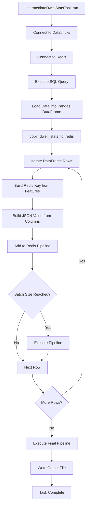
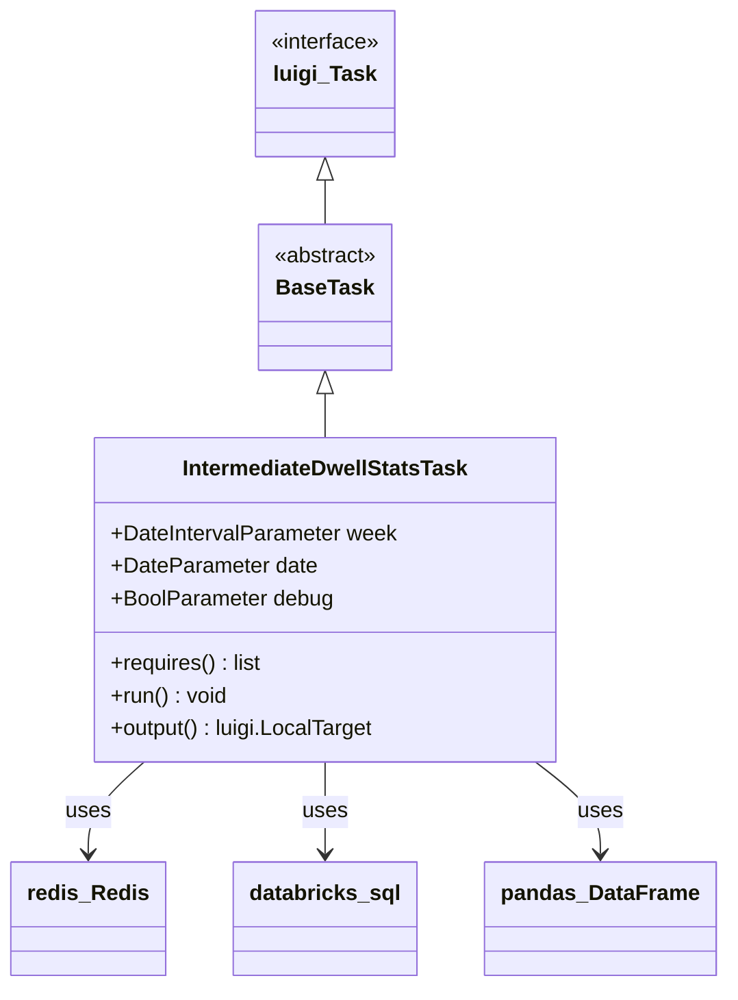
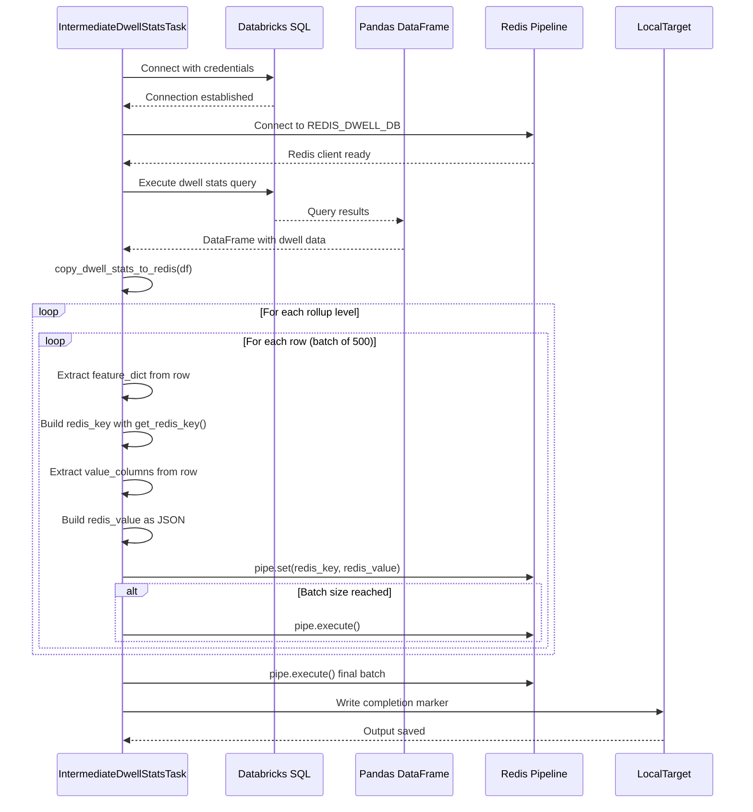
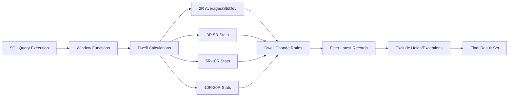

# Diagram: research/orchestrator/tasks/transforms/intermediate_dwell_stats_task.py


> Auto-generated by Obscura crawlers

## Diagram 1

```mermaid
flowchart TD
      Start[IntermediateDwellStatsTask.run] --> Connect[Connect to Databricks]
      Connect --> Redis[Connect to Redis]
      Redis --> Query[Execute SQL Query]...
  └ 171 lines...
```

> SVG rendering failed for this diagram.

## Diagram 2



### SVG

<svg id="container" width="373.8359375" xmlns="http://www.w3.org/2000/svg" class="flowchart" height="2110.71875" viewBox="0 0 373.8359375 2110.71875" role="graphics-document document" aria-roledescription="flowchart-v2"><style>#container{font-family:"trebuchet ms",verdana,arial,sans-serif;font-size:16px;fill:#333;}@keyframes edge-animation-frame{from{stroke-dashoffset:0;}}@keyframes dash{to{stroke-dashoffset:0;}}#container .edge-animation-slow{stroke-dasharray:9,5!important;stroke-dashoffset:900;animation:dash 50s linear infinite;stroke-linecap:round;}#container .edge-animation-fast{stroke-dasharray:9,5!important;stroke-dashoffset:900;animation:dash 20s linear infinite;stroke-linecap:round;}#container .error-icon{fill:#552222;}#container .error-text{fill:#552222;stroke:#552222;}#container .edge-thickness-normal{stroke-width:1px;}#container .edge-thickness-thick{stroke-width:3.5px;}#container .edge-pattern-solid{stroke-dasharray:0;}#container .edge-thickness-invisible{stroke-width:0;fill:none;}#container .edge-pattern-dashed{stroke-dasharray:3;}#container .edge-pattern-dotted{stroke-dasharray:2;}#container .marker{fill:#333333;stroke:#333333;}#container .marker.cross{stroke:#333333;}#container svg{font-family:"trebuchet ms",verdana,arial,sans-serif;font-size:16px;}#container p{margin:0;}#container .label{font-family:"trebuchet ms",verdana,arial,sans-serif;color:#333;}#container .cluster-label text{fill:#333;}#container .cluster-label span{color:#333;}#container .cluster-label span p{background-color:transparent;}#container .label text,#container span{fill:#333;color:#333;}#container .node rect,#container .node circle,#container .node ellipse,#container .node polygon,#container .node path{fill:#ECECFF;stroke:#9370DB;stroke-width:1px;}#container .rough-node .label text,#container .node .label text,#container .image-shape .label,#container .icon-shape .label{text-anchor:middle;}#container .node .katex path{fill:#000;stroke:#000;stroke-width:1px;}#container .rough-node .label,#container .node .label,#container .image-shape .label,#container .icon-shape .label{text-align:center;}#container .node.clickable{cursor:pointer;}#container .root .anchor path{fill:#333333!important;stroke-width:0;stroke:#333333;}#container .arrowheadPath{fill:#333333;}#container .edgePath .path{stroke:#333333;stroke-width:2.0px;}#container .flowchart-link{stroke:#333333;fill:none;}#container .edgeLabel{background-color:rgba(232,232,232, 0.8);text-align:center;}#container .edgeLabel p{background-color:rgba(232,232,232, 0.8);}#container .edgeLabel rect{opacity:0.5;background-color:rgba(232,232,232, 0.8);fill:rgba(232,232,232, 0.8);}#container .labelBkg{background-color:rgba(232, 232, 232, 0.5);}#container .cluster rect{fill:#ffffde;stroke:#aaaa33;stroke-width:1px;}#container .cluster text{fill:#333;}#container .cluster span{color:#333;}#container div.mermaidTooltip{position:absolute;text-align:center;max-width:200px;padding:2px;font-family:"trebuchet ms",verdana,arial,sans-serif;font-size:12px;background:hsl(80, 100%, 96.2745098039%);border:1px solid #aaaa33;border-radius:2px;pointer-events:none;z-index:100;}#container .flowchartTitleText{text-anchor:middle;font-size:18px;fill:#333;}#container rect.text{fill:none;stroke-width:0;}#container .icon-shape,#container .image-shape{background-color:rgba(232,232,232, 0.8);text-align:center;}#container .icon-shape p,#container .image-shape p{background-color:rgba(232,232,232, 0.8);padding:2px;}#container .icon-shape rect,#container .image-shape rect{opacity:0.5;background-color:rgba(232,232,232, 0.8);fill:rgba(232,232,232, 0.8);}#container .label-icon{display:inline-block;height:1em;overflow:visible;vertical-align:-0.125em;}#container .node .label-icon path{fill:currentColor;stroke:revert;stroke-width:revert;}#container :root{--mermaid-font-family:"trebuchet ms",verdana,arial,sans-serif;}</style><g><marker id="container_flowchart-v2-pointEnd" class="marker flowchart-v2" viewBox="0 0 10 10" refX="5" refY="5" markerUnits="userSpaceOnUse" markerWidth="8" markerHeight="8" orient="auto"><path d="M 0 0 L 10 5 L 0 10 z" class="arrowMarkerPath" style="stroke-width: 1; stroke-dasharray: 1, 0;"></path></marker><marker id="container_flowchart-v2-pointStart" class="marker flowchart-v2" viewBox="0 0 10 10" refX="4.5" refY="5" markerUnits="userSpaceOnUse" markerWidth="8" markerHeight="8" orient="auto"><path d="M 0 5 L 10 10 L 10 0 z" class="arrowMarkerPath" style="stroke-width: 1; stroke-dasharray: 1, 0;"></path></marker><marker id="container_flowchart-v2-circleEnd" class="marker flowchart-v2" viewBox="0 0 10 10" refX="11" refY="5" markerUnits="userSpaceOnUse" markerWidth="11" markerHeight="11" orient="auto"><circle cx="5" cy="5" r="5" class="arrowMarkerPath" style="stroke-width: 1; stroke-dasharray: 1, 0;"></circle></marker><marker id="container_flowchart-v2-circleStart" class="marker flowchart-v2" viewBox="0 0 10 10" refX="-1" refY="5" markerUnits="userSpaceOnUse" markerWidth="11" markerHeight="11" orient="auto"><circle cx="5" cy="5" r="5" class="arrowMarkerPath" style="stroke-width: 1; stroke-dasharray: 1, 0;"></circle></marker><marker id="container_flowchart-v2-crossEnd" class="marker cross flowchart-v2" viewBox="0 0 11 11" refX="12" refY="5.2" markerUnits="userSpaceOnUse" markerWidth="11" markerHeight="11" orient="auto"><path d="M 1,1 l 9,9 M 10,1 l -9,9" class="arrowMarkerPath" style="stroke-width: 2; stroke-dasharray: 1, 0;"></path></marker><marker id="container_flowchart-v2-crossStart" class="marker cross flowchart-v2" viewBox="0 0 11 11" refX="-1" refY="5.2" markerUnits="userSpaceOnUse" markerWidth="11" markerHeight="11" orient="auto"><path d="M 1,1 l 9,9 M 10,1 l -9,9" class="arrowMarkerPath" style="stroke-width: 2; stroke-dasharray: 1, 0;"></path></marker><g class="root"><g class="clusters"></g><g class="edgePaths"><path d="M220.5,62L220.5,66.167C220.5,70.333,220.5,78.667,220.5,86.333C220.5,94,220.5,101,220.5,104.5L220.5,108" id="L_Start_Connect_0" class="edge-thickness-normal edge-pattern-solid edge-thickness-normal edge-pattern-solid flowchart-link" style=";" data-edge="true" data-et="edge" data-id="L_Start_Connect_0" data-points="W3sieCI6MjIwLjUsInkiOjYyfSx7IngiOjIyMC41LCJ5Ijo4N30seyJ4IjoyMjAuNSwieSI6MTEyfV0=" marker-end="url(#container_flowchart-v2-pointEnd)"></path><path d="M220.5,166L220.5,170.167C220.5,174.333,220.5,182.667,220.5,190.333C220.5,198,220.5,205,220.5,208.5L220.5,212" id="L_Connect_Redis_0" class="edge-thickness-normal edge-pattern-solid edge-thickness-normal edge-pattern-solid flowchart-link" style=";" data-edge="true" data-et="edge" data-id="L_Connect_Redis_0" data-points="W3sieCI6MjIwLjUsInkiOjE2Nn0seyJ4IjoyMjAuNSwieSI6MTkxfSx7IngiOjIyMC41LCJ5IjoyMTZ9XQ==" marker-end="url(#container_flowchart-v2-pointEnd)"></path><path d="M220.5,270L220.5,274.167C220.5,278.333,220.5,286.667,220.5,294.333C220.5,302,220.5,309,220.5,312.5L220.5,316" id="L_Redis_Query_0" class="edge-thickness-normal edge-pattern-solid edge-thickness-normal edge-pattern-solid flowchart-link" style=";" data-edge="true" data-et="edge" data-id="L_Redis_Query_0" data-points="W3sieCI6MjIwLjUsInkiOjI3MH0seyJ4IjoyMjAuNSwieSI6Mjk1fSx7IngiOjIyMC41LCJ5IjozMjB9XQ==" marker-end="url(#container_flowchart-v2-pointEnd)"></path><path d="M220.5,374L220.5,378.167C220.5,382.333,220.5,390.667,220.5,398.333C220.5,406,220.5,413,220.5,416.5L220.5,420" id="L_Query_DataFrame_0" class="edge-thickness-normal edge-pattern-solid edge-thickness-normal edge-pattern-solid flowchart-link" style=";" data-edge="true" data-et="edge" data-id="L_Query_DataFrame_0" data-points="W3sieCI6MjIwLjUsInkiOjM3NH0seyJ4IjoyMjAuNSwieSI6Mzk5fSx7IngiOjIyMC41LCJ5Ijo0MjR9XQ==" marker-end="url(#container_flowchart-v2-pointEnd)"></path><path d="M220.5,502L220.5,506.167C220.5,510.333,220.5,518.667,220.5,526.333C220.5,534,220.5,541,220.5,544.5L220.5,548" id="L_DataFrame_Copy_0" class="edge-thickness-normal edge-pattern-solid edge-thickness-normal edge-pattern-solid flowchart-link" style=";" data-edge="true" data-et="edge" data-id="L_DataFrame_Copy_0" data-points="W3sieCI6MjIwLjUsInkiOjUwMn0seyJ4IjoyMjAuNSwieSI6NTI3fSx7IngiOjIyMC41LCJ5Ijo1NTJ9XQ==" marker-end="url(#container_flowchart-v2-pointEnd)"></path><path d="M220.5,606L220.5,610.167C220.5,614.333,220.5,622.667,220.5,630.333C220.5,638,220.5,645,220.5,648.5L220.5,652" id="L_Copy_Iterate_0" class="edge-thickness-normal edge-pattern-solid edge-thickness-normal edge-pattern-solid flowchart-link" style=";" data-edge="true" data-et="edge" data-id="L_Copy_Iterate_0" data-points="W3sieCI6MjIwLjUsInkiOjYwNn0seyJ4IjoyMjAuNSwieSI6NjMxfSx7IngiOjIyMC41LCJ5Ijo2NTZ9XQ==" marker-end="url(#container_flowchart-v2-pointEnd)"></path><path d="M177.663,710L171.053,714.167C164.442,718.333,151.221,726.667,144.611,734.333C138,742,138,749,138,752.5L138,756" id="L_Iterate_BuildKey_0" class="edge-thickness-normal edge-pattern-solid edge-thickness-normal edge-pattern-solid flowchart-link" style=";" data-edge="true" data-et="edge" data-id="L_Iterate_BuildKey_0" data-points="W3sieCI6MTc3LjY2MzQ2MTUzODQ2MTU1LCJ5Ijo3MTB9LHsieCI6MTM4LCJ5Ijo3MzV9LHsieCI6MTM4LCJ5Ijo3NjB9XQ==" marker-end="url(#container_flowchart-v2-pointEnd)"></path><path d="M138,838L138,842.167C138,846.333,138,854.667,138,862.333C138,870,138,877,138,880.5L138,884" id="L_BuildKey_BuildValue_0" class="edge-thickness-normal edge-pattern-solid edge-thickness-normal edge-pattern-solid flowchart-link" style=";" data-edge="true" data-et="edge" data-id="L_BuildKey_BuildValue_0" data-points="W3sieCI6MTM4LCJ5Ijo4Mzh9LHsieCI6MTM4LCJ5Ijo4NjN9LHsieCI6MTM4LCJ5Ijo4ODh9XQ==" marker-end="url(#container_flowchart-v2-pointEnd)"></path><path d="M138,966L138,970.167C138,974.333,138,982.667,138,990.333C138,998,138,1005,138,1008.5L138,1012" id="L_BuildValue_Pipeline_0" class="edge-thickness-normal edge-pattern-solid edge-thickness-normal edge-pattern-solid flowchart-link" style=";" data-edge="true" data-et="edge" data-id="L_BuildValue_Pipeline_0" data-points="W3sieCI6MTM4LCJ5Ijo5NjZ9LHsieCI6MTM4LCJ5Ijo5OTF9LHsieCI6MTM4LCJ5IjoxMDE2fV0=" marker-end="url(#container_flowchart-v2-pointEnd)"></path><path d="M138,1070L138,1076.167C138,1082.333,138,1094.667,138,1106.333C138,1118,138,1129,138,1134.5L138,1140" id="L_Pipeline_Batch_0" class="edge-thickness-normal edge-pattern-solid edge-thickness-normal edge-pattern-solid flowchart-link" style=";" data-edge="true" data-et="edge" data-id="L_Pipeline_Batch_0" data-points="W3sieCI6MTM4LCJ5IjoxMDcwfSx7IngiOjEzOCwieSI6MTEwN30seyJ4IjoxMzgsInkiOjExNDR9XQ==" marker-end="url(#container_flowchart-v2-pointEnd)"></path><path d="M171.132,1312.54L176.852,1324.228C182.573,1335.917,194.013,1359.294,199.733,1376.483C205.453,1393.672,205.453,1404.672,205.453,1410.172L205.453,1415.672" id="L_Batch_Execute_0" class="edge-thickness-normal edge-pattern-solid edge-thickness-normal edge-pattern-solid flowchart-link" style=";" data-edge="true" data-et="edge" data-id="L_Batch_Execute_0" data-points="W3sieCI6MTcxLjEzMjMwMTQxODU0MDkyLCJ5IjoxMzEyLjUzOTU3MzU4MTQ1OX0seyJ4IjoyMDUuNDUzMTI1LCJ5IjoxMzgyLjY3MTg3NX0seyJ4IjoyMDUuNDUzMTI1LCJ5IjoxNDE5LjY3MTg3NX1d" marker-end="url(#container_flowchart-v2-pointEnd)"></path><path d="M104.868,1312.54L99.148,1324.228C93.427,1335.917,81.987,1359.294,76.267,1381.65C70.547,1404.005,70.547,1425.339,70.547,1444.672C70.547,1464.005,70.547,1481.339,75.424,1493.765C80.301,1506.191,90.055,1513.71,94.931,1517.47L99.808,1521.23" id="L_Batch_NextRow_0" class="edge-thickness-normal edge-pattern-solid edge-thickness-normal edge-pattern-solid flowchart-link" style=";" data-edge="true" data-et="edge" data-id="L_Batch_NextRow_0" data-points="W3sieCI6MTA0Ljg2NzY5ODU4MTQ1OTA3LCJ5IjoxMzEyLjUzOTU3MzU4MTQ1OX0seyJ4Ijo3MC41NDY4NzUsInkiOjEzODIuNjcxODc1fSx7IngiOjcwLjU0Njg3NSwieSI6MTQ0Ni42NzE4NzV9LHsieCI6NzAuNTQ2ODc1LCJ5IjoxNDk4LjY3MTg3NX0seyJ4IjoxMDIuOTc2MjYyMDE5MjMwNzcsInkiOjE1MjMuNjcxODc1fV0=" marker-end="url(#container_flowchart-v2-pointEnd)"></path><path d="M205.453,1473.672L205.453,1477.839C205.453,1482.005,205.453,1490.339,200.576,1498.265C195.699,1506.191,185.945,1513.71,181.069,1517.47L176.192,1521.23" id="L_Execute_NextRow_0" class="edge-thickness-normal edge-pattern-solid edge-thickness-normal edge-pattern-solid flowchart-link" style=";" data-edge="true" data-et="edge" data-id="L_Execute_NextRow_0" data-points="W3sieCI6MjA1LjQ1MzEyNSwieSI6MTQ3My42NzE4NzV9LHsieCI6MjA1LjQ1MzEyNSwieSI6MTQ5OC42NzE4NzV9LHsieCI6MTczLjAyMzczNzk4MDc2OTIzLCJ5IjoxNTIzLjY3MTg3NX1d" marker-end="url(#container_flowchart-v2-pointEnd)"></path><path d="M138,1577.672L138,1581.839C138,1586.005,138,1594.339,145.912,1607.57C153.823,1620.801,169.646,1638.93,177.558,1647.994L185.469,1657.059" id="L_NextRow_MoreRows_0" class="edge-thickness-normal edge-pattern-solid edge-thickness-normal edge-pattern-solid flowchart-link" style=";" data-edge="true" data-et="edge" data-id="L_NextRow_MoreRows_0" data-points="W3sieCI6MTM4LCJ5IjoxNTc3LjY3MTg3NX0seyJ4IjoxMzgsInkiOjE2MDIuNjcxODc1fSx7IngiOjE4OC4wOTkyOTgyOTIwNjkzNiwieSI6MTY2MC4wNzI1NzY3MDc5MzA3fV0=" marker-end="url(#container_flowchart-v2-pointEnd)"></path><path d="M260.733,1667.905L275.667,1657.033C290.601,1646.161,320.468,1624.416,335.402,1604.877C350.336,1585.339,350.336,1568.005,350.336,1550.672C350.336,1533.339,350.336,1516.005,350.336,1498.672C350.336,1481.339,350.336,1464.005,350.336,1444.672C350.336,1425.339,350.336,1404.005,350.336,1370.366C350.336,1336.727,350.336,1290.781,350.336,1244.836C350.336,1198.891,350.336,1152.945,350.336,1119.306C350.336,1085.667,350.336,1064.333,350.336,1045C350.336,1025.667,350.336,1008.333,350.336,989C350.336,969.667,350.336,948.333,350.336,927C350.336,905.667,350.336,884.333,350.336,863C350.336,841.667,350.336,820.333,350.336,799C350.336,777.667,350.336,756.333,340.551,741.748C330.767,727.162,311.197,719.325,301.413,715.406L291.628,711.487" id="L_MoreRows_Iterate_0" class="edge-thickness-normal edge-pattern-solid edge-thickness-normal edge-pattern-solid flowchart-link" style=";" data-edge="true" data-et="edge" data-id="L_MoreRows_Iterate_0" data-points="W3sieCI6MjYwLjczMjk1NTIxMzE5MzgsInkiOjE2NjcuOTA0ODMwMjEzMTk0fSx7IngiOjM1MC4zMzU5Mzc1LCJ5IjoxNjAyLjY3MTg3NX0seyJ4IjozNTAuMzM1OTM3NSwieSI6MTU1MC42NzE4NzV9LHsieCI6MzUwLjMzNTkzNzUsInkiOjE0OTguNjcxODc1fSx7IngiOjM1MC4zMzU5Mzc1LCJ5IjoxNDQ2LjY3MTg3NX0seyJ4IjozNTAuMzM1OTM3NSwieSI6MTM4Mi42NzE4NzV9LHsieCI6MzUwLjMzNTkzNzUsInkiOjEyNDQuODM1OTM3NX0seyJ4IjozNTAuMzM1OTM3NSwieSI6MTEwN30seyJ4IjozNTAuMzM1OTM3NSwieSI6MTA0M30seyJ4IjozNTAuMzM1OTM3NSwieSI6OTkxfSx7IngiOjM1MC4zMzU5Mzc1LCJ5Ijo5Mjd9LHsieCI6MzUwLjMzNTkzNzUsInkiOjg2M30seyJ4IjozNTAuMzM1OTM3NSwieSI6Nzk5fSx7IngiOjM1MC4zMzU5Mzc1LCJ5Ijo3MzV9LHsieCI6Mjg3LjkxNDgxMzcwMTkyMzEsInkiOjcxMH1d" marker-end="url(#container_flowchart-v2-pointEnd)"></path><path d="M220.5,1766.719L220.5,1772.885C220.5,1779.052,220.5,1791.385,220.5,1803.052C220.5,1814.719,220.5,1825.719,220.5,1831.219L220.5,1836.719" id="L_MoreRows_FinalExecute_0" class="edge-thickness-normal edge-pattern-solid edge-thickness-normal edge-pattern-solid flowchart-link" style=";" data-edge="true" data-et="edge" data-id="L_MoreRows_FinalExecute_0" data-points="W3sieCI6MjIwLjUsInkiOjE3NjYuNzE4NzV9LHsieCI6MjIwLjUsInkiOjE4MDMuNzE4NzV9LHsieCI6MjIwLjUsInkiOjE4NDAuNzE4NzV9XQ==" marker-end="url(#container_flowchart-v2-pointEnd)"></path><path d="M220.5,1894.719L220.5,1898.885C220.5,1903.052,220.5,1911.385,220.5,1919.052C220.5,1926.719,220.5,1933.719,220.5,1937.219L220.5,1940.719" id="L_FinalExecute_WriteOutput_0" class="edge-thickness-normal edge-pattern-solid edge-thickness-normal edge-pattern-solid flowchart-link" style=";" data-edge="true" data-et="edge" data-id="L_FinalExecute_WriteOutput_0" data-points="W3sieCI6MjIwLjUsInkiOjE4OTQuNzE4NzV9LHsieCI6MjIwLjUsInkiOjE5MTkuNzE4NzV9LHsieCI6MjIwLjUsInkiOjE5NDQuNzE4NzV9XQ==" marker-end="url(#container_flowchart-v2-pointEnd)"></path><path d="M220.5,1998.719L220.5,2002.885C220.5,2007.052,220.5,2015.385,220.5,2023.052C220.5,2030.719,220.5,2037.719,220.5,2041.219L220.5,2044.719" id="L_WriteOutput_End_0" class="edge-thickness-normal edge-pattern-solid edge-thickness-normal edge-pattern-solid flowchart-link" style=";" data-edge="true" data-et="edge" data-id="L_WriteOutput_End_0" data-points="W3sieCI6MjIwLjUsInkiOjE5OTguNzE4NzV9LHsieCI6MjIwLjUsInkiOjIwMjMuNzE4NzV9LHsieCI6MjIwLjUsInkiOjIwNDguNzE4NzV9XQ==" marker-end="url(#container_flowchart-v2-pointEnd)"></path></g><g class="edgeLabels"><g class="edgeLabel"><g class="label" data-id="L_Start_Connect_0" transform="translate(0, 0)"><foreignObject width="0" height="0"><div xmlns="http://www.w3.org/1999/xhtml" class="labelBkg" style="display: table-cell; white-space: nowrap; line-height: 1.5; max-width: 200px; text-align: center;"><span class="edgeLabel"></span></div></foreignObject></g></g><g class="edgeLabel"><g class="label" data-id="L_Connect_Redis_0" transform="translate(0, 0)"><foreignObject width="0" height="0"><div xmlns="http://www.w3.org/1999/xhtml" class="labelBkg" style="display: table-cell; white-space: nowrap; line-height: 1.5; max-width: 200px; text-align: center;"><span class="edgeLabel"></span></div></foreignObject></g></g><g class="edgeLabel"><g class="label" data-id="L_Redis_Query_0" transform="translate(0, 0)"><foreignObject width="0" height="0"><div xmlns="http://www.w3.org/1999/xhtml" class="labelBkg" style="display: table-cell; white-space: nowrap; line-height: 1.5; max-width: 200px; text-align: center;"><span class="edgeLabel"></span></div></foreignObject></g></g><g class="edgeLabel"><g class="label" data-id="L_Query_DataFrame_0" transform="translate(0, 0)"><foreignObject width="0" height="0"><div xmlns="http://www.w3.org/1999/xhtml" class="labelBkg" style="display: table-cell; white-space: nowrap; line-height: 1.5; max-width: 200px; text-align: center;"><span class="edgeLabel"></span></div></foreignObject></g></g><g class="edgeLabel"><g class="label" data-id="L_DataFrame_Copy_0" transform="translate(0, 0)"><foreignObject width="0" height="0"><div xmlns="http://www.w3.org/1999/xhtml" class="labelBkg" style="display: table-cell; white-space: nowrap; line-height: 1.5; max-width: 200px; text-align: center;"><span class="edgeLabel"></span></div></foreignObject></g></g><g class="edgeLabel"><g class="label" data-id="L_Copy_Iterate_0" transform="translate(0, 0)"><foreignObject width="0" height="0"><div xmlns="http://www.w3.org/1999/xhtml" class="labelBkg" style="display: table-cell; white-space: nowrap; line-height: 1.5; max-width: 200px; text-align: center;"><span class="edgeLabel"></span></div></foreignObject></g></g><g class="edgeLabel"><g class="label" data-id="L_Iterate_BuildKey_0" transform="translate(0, 0)"><foreignObject width="0" height="0"><div xmlns="http://www.w3.org/1999/xhtml" class="labelBkg" style="display: table-cell; white-space: nowrap; line-height: 1.5; max-width: 200px; text-align: center;"><span class="edgeLabel"></span></div></foreignObject></g></g><g class="edgeLabel"><g class="label" data-id="L_BuildKey_BuildValue_0" transform="translate(0, 0)"><foreignObject width="0" height="0"><div xmlns="http://www.w3.org/1999/xhtml" class="labelBkg" style="display: table-cell; white-space: nowrap; line-height: 1.5; max-width: 200px; text-align: center;"><span class="edgeLabel"></span></div></foreignObject></g></g><g class="edgeLabel"><g class="label" data-id="L_BuildValue_Pipeline_0" transform="translate(0, 0)"><foreignObject width="0" height="0"><div xmlns="http://www.w3.org/1999/xhtml" class="labelBkg" style="display: table-cell; white-space: nowrap; line-height: 1.5; max-width: 200px; text-align: center;"><span class="edgeLabel"></span></div></foreignObject></g></g><g class="edgeLabel"><g class="label" data-id="L_Pipeline_Batch_0" transform="translate(0, 0)"><foreignObject width="0" height="0"><div xmlns="http://www.w3.org/1999/xhtml" class="labelBkg" style="display: table-cell; white-space: nowrap; line-height: 1.5; max-width: 200px; text-align: center;"><span class="edgeLabel"></span></div></foreignObject></g></g><g class="edgeLabel" transform="translate(205.453125, 1382.671875)"><g class="label" data-id="L_Batch_Execute_0" transform="translate(-12.03125, -12)"><foreignObject width="24.0625" height="24"><div xmlns="http://www.w3.org/1999/xhtml" class="labelBkg" style="display: table-cell; white-space: nowrap; line-height: 1.5; max-width: 200px; text-align: center;"><span class="edgeLabel"><p>Yes</p></span></div></foreignObject></g></g><g class="edgeLabel" transform="translate(70.546875, 1446.671875)"><g class="label" data-id="L_Batch_NextRow_0" transform="translate(-10.140625, -12)"><foreignObject width="20.28125" height="24"><div xmlns="http://www.w3.org/1999/xhtml" class="labelBkg" style="display: table-cell; white-space: nowrap; line-height: 1.5; max-width: 200px; text-align: center;"><span class="edgeLabel"><p>No</p></span></div></foreignObject></g></g><g class="edgeLabel"><g class="label" data-id="L_Execute_NextRow_0" transform="translate(0, 0)"><foreignObject width="0" height="0"><div xmlns="http://www.w3.org/1999/xhtml" class="labelBkg" style="display: table-cell; white-space: nowrap; line-height: 1.5; max-width: 200px; text-align: center;"><span class="edgeLabel"></span></div></foreignObject></g></g><g class="edgeLabel"><g class="label" data-id="L_NextRow_MoreRows_0" transform="translate(0, 0)"><foreignObject width="0" height="0"><div xmlns="http://www.w3.org/1999/xhtml" class="labelBkg" style="display: table-cell; white-space: nowrap; line-height: 1.5; max-width: 200px; text-align: center;"><span class="edgeLabel"></span></div></foreignObject></g></g><g class="edgeLabel" transform="translate(350.3359375, 1107)"><g class="label" data-id="L_MoreRows_Iterate_0" transform="translate(-12.03125, -12)"><foreignObject width="24.0625" height="24"><div xmlns="http://www.w3.org/1999/xhtml" class="labelBkg" style="display: table-cell; white-space: nowrap; line-height: 1.5; max-width: 200px; text-align: center;"><span class="edgeLabel"><p>Yes</p></span></div></foreignObject></g></g><g class="edgeLabel" transform="translate(220.5, 1803.71875)"><g class="label" data-id="L_MoreRows_FinalExecute_0" transform="translate(-10.140625, -12)"><foreignObject width="20.28125" height="24"><div xmlns="http://www.w3.org/1999/xhtml" class="labelBkg" style="display: table-cell; white-space: nowrap; line-height: 1.5; max-width: 200px; text-align: center;"><span class="edgeLabel"><p>No</p></span></div></foreignObject></g></g><g class="edgeLabel"><g class="label" data-id="L_FinalExecute_WriteOutput_0" transform="translate(0, 0)"><foreignObject width="0" height="0"><div xmlns="http://www.w3.org/1999/xhtml" class="labelBkg" style="display: table-cell; white-space: nowrap; line-height: 1.5; max-width: 200px; text-align: center;"><span class="edgeLabel"></span></div></foreignObject></g></g><g class="edgeLabel"><g class="label" data-id="L_WriteOutput_End_0" transform="translate(0, 0)"><foreignObject width="0" height="0"><div xmlns="http://www.w3.org/1999/xhtml" class="labelBkg" style="display: table-cell; white-space: nowrap; line-height: 1.5; max-width: 200px; text-align: center;"><span class="edgeLabel"></span></div></foreignObject></g></g></g><g class="nodes"><g class="node default" id="flowchart-Start-0" transform="translate(220.5, 35)"><rect class="basic label-container" style="" x="-145.3359375" y="-27" width="290.671875" height="54"></rect><g class="label" style="" transform="translate(-115.3359375, -12)"><rect></rect><foreignObject width="230.671875" height="24"><div xmlns="http://www.w3.org/1999/xhtml" style="display: table; white-space: break-spaces; line-height: 1.5; max-width: 200px; text-align: center; width: 200px;"><span class="nodeLabel"><p>IntermediateDwellStatsTask.run</p></span></div></foreignObject></g></g><g class="node default" id="flowchart-Connect-1" transform="translate(220.5, 139)"><rect class="basic label-container" style="" x="-109.4453125" y="-27" width="218.890625" height="54"></rect><g class="label" style="" transform="translate(-79.4453125, -12)"><rect></rect><foreignObject width="158.890625" height="24"><div xmlns="http://www.w3.org/1999/xhtml" style="display: table-cell; white-space: nowrap; line-height: 1.5; max-width: 200px; text-align: center;"><span class="nodeLabel"><p>Connect to Databricks</p></span></div></foreignObject></g></g><g class="node default" id="flowchart-Redis-3" transform="translate(220.5, 243)"><rect class="basic label-container" style="" x="-90.9765625" y="-27" width="181.953125" height="54"></rect><g class="label" style="" transform="translate(-60.9765625, -12)"><rect></rect><foreignObject width="121.953125" height="24"><div xmlns="http://www.w3.org/1999/xhtml" style="display: table-cell; white-space: nowrap; line-height: 1.5; max-width: 200px; text-align: center;"><span class="nodeLabel"><p>Connect to Redis</p></span></div></foreignObject></g></g><g class="node default" id="flowchart-Query-5" transform="translate(220.5, 347)"><rect class="basic label-container" style="" x="-97.65625" y="-27" width="195.3125" height="54"></rect><g class="label" style="" transform="translate(-67.65625, -12)"><rect></rect><foreignObject width="135.3125" height="24"><div xmlns="http://www.w3.org/1999/xhtml" style="display: table-cell; white-space: nowrap; line-height: 1.5; max-width: 200px; text-align: center;"><span class="nodeLabel"><p>Execute SQL Query</p></span></div></foreignObject></g></g><g class="node default" id="flowchart-DataFrame-7" transform="translate(220.5, 463)"><rect class="basic label-container" style="" x="-130" y="-39" width="260" height="78"></rect><g class="label" style="" transform="translate(-100, -24)"><rect></rect><foreignObject width="200" height="48"><div xmlns="http://www.w3.org/1999/xhtml" style="display: table; white-space: break-spaces; line-height: 1.5; max-width: 200px; text-align: center; width: 200px;"><span class="nodeLabel"><p>Load Data into Pandas DataFrame</p></span></div></foreignObject></g></g><g class="node default" id="flowchart-Copy-9" transform="translate(220.5, 579)"><rect class="basic label-container" style="" x="-125.2890625" y="-27" width="250.578125" height="54"></rect><g class="label" style="" transform="translate(-95.2890625, -12)"><rect></rect><foreignObject width="190.578125" height="24"><div xmlns="http://www.w3.org/1999/xhtml" style="display: table-cell; white-space: nowrap; line-height: 1.5; max-width: 200px; text-align: center;"><span class="nodeLabel"><p>copy_dwell_stats_to_redis</p></span></div></foreignObject></g></g><g class="node default" id="flowchart-Iterate-11" transform="translate(220.5, 683)"><rect class="basic label-container" style="" x="-115.515625" y="-27" width="231.03125" height="54"></rect><g class="label" style="" transform="translate(-85.515625, -12)"><rect></rect><foreignObject width="171.03125" height="24"><div xmlns="http://www.w3.org/1999/xhtml" style="display: table-cell; white-space: nowrap; line-height: 1.5; max-width: 200px; text-align: center;"><span class="nodeLabel"><p>Iterate DataFrame Rows</p></span></div></foreignObject></g></g><g class="node default" id="flowchart-BuildKey-13" transform="translate(138, 799)"><rect class="basic label-container" style="" x="-130" y="-39" width="260" height="78"></rect><g class="label" style="" transform="translate(-100, -24)"><rect></rect><foreignObject width="200" height="48"><div xmlns="http://www.w3.org/1999/xhtml" style="display: table; white-space: break-spaces; line-height: 1.5; max-width: 200px; text-align: center; width: 200px;"><span class="nodeLabel"><p>Build Redis Key from Features</p></span></div></foreignObject></g></g><g class="node default" id="flowchart-BuildValue-15" transform="translate(138, 927)"><rect class="basic label-container" style="" x="-130" y="-39" width="260" height="78"></rect><g class="label" style="" transform="translate(-100, -24)"><rect></rect><foreignObject width="200" height="48"><div xmlns="http://www.w3.org/1999/xhtml" style="display: table; white-space: break-spaces; line-height: 1.5; max-width: 200px; text-align: center; width: 200px;"><span class="nodeLabel"><p>Build JSON Value from Columns</p></span></div></foreignObject></g></g><g class="node default" id="flowchart-Pipeline-17" transform="translate(138, 1043)"><rect class="basic label-container" style="" x="-107.4765625" y="-27" width="214.953125" height="54"></rect><g class="label" style="" transform="translate(-77.4765625, -12)"><rect></rect><foreignObject width="154.953125" height="24"><div xmlns="http://www.w3.org/1999/xhtml" style="display: table-cell; white-space: nowrap; line-height: 1.5; max-width: 200px; text-align: center;"><span class="nodeLabel"><p>Add to Redis Pipeline</p></span></div></foreignObject></g></g><g class="node default" id="flowchart-Batch-19" transform="translate(138, 1244.8359375)"><polygon points="100.8359375,0 201.671875,-100.8359375 100.8359375,-201.671875 0,-100.8359375" class="label-container" transform="translate(-100.3359375, 100.8359375)"></polygon><g class="label" style="" transform="translate(-73.8359375, -12)"><rect></rect><foreignObject width="147.671875" height="24"><div xmlns="http://www.w3.org/1999/xhtml" style="display: table-cell; white-space: nowrap; line-height: 1.5; max-width: 200px; text-align: center;"><span class="nodeLabel"><p>Batch Size Reached?</p></span></div></foreignObject></g></g><g class="node default" id="flowchart-Execute-21" transform="translate(205.453125, 1446.671875)"><rect class="basic label-container" style="" x="-89.765625" y="-27" width="179.53125" height="54"></rect><g class="label" style="" transform="translate(-59.765625, -12)"><rect></rect><foreignObject width="119.53125" height="24"><div xmlns="http://www.w3.org/1999/xhtml" style="display: table-cell; white-space: nowrap; line-height: 1.5; max-width: 200px; text-align: center;"><span class="nodeLabel"><p>Execute Pipeline</p></span></div></foreignObject></g></g><g class="node default" id="flowchart-NextRow-23" transform="translate(138, 1550.671875)"><rect class="basic label-container" style="" x="-63.7734375" y="-27" width="127.546875" height="54"></rect><g class="label" style="" transform="translate(-33.7734375, -12)"><rect></rect><foreignObject width="67.546875" height="24"><div xmlns="http://www.w3.org/1999/xhtml" style="display: table-cell; white-space: nowrap; line-height: 1.5; max-width: 200px; text-align: center;"><span class="nodeLabel"><p>Next Row</p></span></div></foreignObject></g></g><g class="node default" id="flowchart-MoreRows-27" transform="translate(220.5, 1697.1953125)"><polygon points="69.5234375,0 139.046875,-69.5234375 69.5234375,-139.046875 0,-69.5234375" class="label-container" transform="translate(-69.0234375, 69.5234375)"></polygon><g class="label" style="" transform="translate(-42.5234375, -12)"><rect></rect><foreignObject width="85.046875" height="24"><div xmlns="http://www.w3.org/1999/xhtml" style="display: table-cell; white-space: nowrap; line-height: 1.5; max-width: 200px; text-align: center;"><span class="nodeLabel"><p>More Rows?</p></span></div></foreignObject></g></g><g class="node default" id="flowchart-FinalExecute-31" transform="translate(220.5, 1867.71875)"><rect class="basic label-container" style="" x="-109.09375" y="-27" width="218.1875" height="54"></rect><g class="label" style="" transform="translate(-79.09375, -12)"><rect></rect><foreignObject width="158.1875" height="24"><div xmlns="http://www.w3.org/1999/xhtml" style="display: table-cell; white-space: nowrap; line-height: 1.5; max-width: 200px; text-align: center;"><span class="nodeLabel"><p>Execute Final Pipeline</p></span></div></foreignObject></g></g><g class="node default" id="flowchart-WriteOutput-33" transform="translate(220.5, 1971.71875)"><rect class="basic label-container" style="" x="-91.2265625" y="-27" width="182.453125" height="54"></rect><g class="label" style="" transform="translate(-61.2265625, -12)"><rect></rect><foreignObject width="122.453125" height="24"><div xmlns="http://www.w3.org/1999/xhtml" style="display: table-cell; white-space: nowrap; line-height: 1.5; max-width: 200px; text-align: center;"><span class="nodeLabel"><p>Write Output File</p></span></div></foreignObject></g></g><g class="node default" id="flowchart-End-35" transform="translate(220.5, 2075.71875)"><rect class="basic label-container" style="" x="-82.359375" y="-27" width="164.71875" height="54"></rect><g class="label" style="" transform="translate(-52.359375, -12)"><rect></rect><foreignObject width="104.71875" height="24"><div xmlns="http://www.w3.org/1999/xhtml" style="display: table-cell; white-space: nowrap; line-height: 1.5; max-width: 200px; text-align: center;"><span class="nodeLabel"><p>Task Complete</p></span></div></foreignObject></g></g></g></g></g></svg>

## Diagram 3



### SVG

<svg id="container" width="520.0625" xmlns="http://www.w3.org/2000/svg" class="classDiagram" height="730" viewBox="0 0 520.0625 730" role="graphics-document document" aria-roledescription="class"><style>#container{font-family:"trebuchet ms",verdana,arial,sans-serif;font-size:16px;fill:#333;}@keyframes edge-animation-frame{from{stroke-dashoffset:0;}}@keyframes dash{to{stroke-dashoffset:0;}}#container .edge-animation-slow{stroke-dasharray:9,5!important;stroke-dashoffset:900;animation:dash 50s linear infinite;stroke-linecap:round;}#container .edge-animation-fast{stroke-dasharray:9,5!important;stroke-dashoffset:900;animation:dash 20s linear infinite;stroke-linecap:round;}#container .error-icon{fill:#552222;}#container .error-text{fill:#552222;stroke:#552222;}#container .edge-thickness-normal{stroke-width:1px;}#container .edge-thickness-thick{stroke-width:3.5px;}#container .edge-pattern-solid{stroke-dasharray:0;}#container .edge-thickness-invisible{stroke-width:0;fill:none;}#container .edge-pattern-dashed{stroke-dasharray:3;}#container .edge-pattern-dotted{stroke-dasharray:2;}#container .marker{fill:#333333;stroke:#333333;}#container .marker.cross{stroke:#333333;}#container svg{font-family:"trebuchet ms",verdana,arial,sans-serif;font-size:16px;}#container p{margin:0;}#container g.classGroup text{fill:#9370DB;stroke:none;font-family:"trebuchet ms",verdana,arial,sans-serif;font-size:10px;}#container g.classGroup text .title{font-weight:bolder;}#container .nodeLabel,#container .edgeLabel{color:#131300;}#container .edgeLabel .label rect{fill:#ECECFF;}#container .label text{fill:#131300;}#container .labelBkg{background:#ECECFF;}#container .edgeLabel .label span{background:#ECECFF;}#container .classTitle{font-weight:bolder;}#container .node rect,#container .node circle,#container .node ellipse,#container .node polygon,#container .node path{fill:#ECECFF;stroke:#9370DB;stroke-width:1px;}#container .divider{stroke:#9370DB;stroke-width:1;}#container g.clickable{cursor:pointer;}#container g.classGroup rect{fill:#ECECFF;stroke:#9370DB;}#container g.classGroup line{stroke:#9370DB;stroke-width:1;}#container .classLabel .box{stroke:none;stroke-width:0;fill:#ECECFF;opacity:0.5;}#container .classLabel .label{fill:#9370DB;font-size:10px;}#container .relation{stroke:#333333;stroke-width:1;fill:none;}#container .dashed-line{stroke-dasharray:3;}#container .dotted-line{stroke-dasharray:1 2;}#container #compositionStart,#container .composition{fill:#333333!important;stroke:#333333!important;stroke-width:1;}#container #compositionEnd,#container .composition{fill:#333333!important;stroke:#333333!important;stroke-width:1;}#container #dependencyStart,#container .dependency{fill:#333333!important;stroke:#333333!important;stroke-width:1;}#container #dependencyStart,#container .dependency{fill:#333333!important;stroke:#333333!important;stroke-width:1;}#container #extensionStart,#container .extension{fill:transparent!important;stroke:#333333!important;stroke-width:1;}#container #extensionEnd,#container .extension{fill:transparent!important;stroke:#333333!important;stroke-width:1;}#container #aggregationStart,#container .aggregation{fill:transparent!important;stroke:#333333!important;stroke-width:1;}#container #aggregationEnd,#container .aggregation{fill:transparent!important;stroke:#333333!important;stroke-width:1;}#container #lollipopStart,#container .lollipop{fill:#ECECFF!important;stroke:#333333!important;stroke-width:1;}#container #lollipopEnd,#container .lollipop{fill:#ECECFF!important;stroke:#333333!important;stroke-width:1;}#container .edgeTerminals{font-size:11px;line-height:initial;}#container .classTitleText{text-anchor:middle;font-size:18px;fill:#333;}#container .label-icon{display:inline-block;height:1em;overflow:visible;vertical-align:-0.125em;}#container .node .label-icon path{fill:currentColor;stroke:revert;stroke-width:revert;}#container :root{--mermaid-font-family:"trebuchet ms",verdana,arial,sans-serif;}</style><g><defs><marker id="container_class-aggregationStart" class="marker aggregation class" refX="18" refY="7" markerWidth="190" markerHeight="240" orient="auto"><path d="M 18,7 L9,13 L1,7 L9,1 Z"></path></marker></defs><defs><marker id="container_class-aggregationEnd" class="marker aggregation class" refX="1" refY="7" markerWidth="20" markerHeight="28" orient="auto"><path d="M 18,7 L9,13 L1,7 L9,1 Z"></path></marker></defs><defs><marker id="container_class-extensionStart" class="marker extension class" refX="18" refY="7" markerWidth="190" markerHeight="240" orient="auto"><path d="M 1,7 L18,13 V 1 Z"></path></marker></defs><defs><marker id="container_class-extensionEnd" class="marker extension class" refX="1" refY="7" markerWidth="20" markerHeight="28" orient="auto"><path d="M 1,1 V 13 L18,7 Z"></path></marker></defs><defs><marker id="container_class-compositionStart" class="marker composition class" refX="18" refY="7" markerWidth="190" markerHeight="240" orient="auto"><path d="M 18,7 L9,13 L1,7 L9,1 Z"></path></marker></defs><defs><marker id="container_class-compositionEnd" class="marker composition class" refX="1" refY="7" markerWidth="20" markerHeight="28" orient="auto"><path d="M 18,7 L9,13 L1,7 L9,1 Z"></path></marker></defs><defs><marker id="container_class-dependencyStart" class="marker dependency class" refX="6" refY="7" markerWidth="190" markerHeight="240" orient="auto"><path d="M 5,7 L9,13 L1,7 L9,1 Z"></path></marker></defs><defs><marker id="container_class-dependencyEnd" class="marker dependency class" refX="13" refY="7" markerWidth="20" markerHeight="28" orient="auto"><path d="M 18,7 L9,13 L14,7 L9,1 Z"></path></marker></defs><defs><marker id="container_class-lollipopStart" class="marker lollipop class" refX="13" refY="7" markerWidth="190" markerHeight="240" orient="auto"><circle stroke="black" fill="transparent" cx="7" cy="7" r="6"></circle></marker></defs><defs><marker id="container_class-lollipopEnd" class="marker lollipop class" refX="1" refY="7" markerWidth="190" markerHeight="240" orient="auto"><circle stroke="black" fill="transparent" cx="7" cy="7" r="6"></circle></marker></defs><g class="root"><g class="clusters"></g><g class="edgePaths"><path d="M232.836,133.25L232.836,134.542C232.836,135.833,232.836,138.417,232.836,143.875C232.836,149.333,232.836,157.667,232.836,161.833L232.836,166" id="id_luigi_Task_BaseTask_1" class="edge-thickness-normal edge-pattern-solid relation" style=";;;" data-edge="true" data-et="edge" data-id="id_luigi_Task_BaseTask_1" data-points="W3sieCI6MjMyLjgzNTkzNzUsInkiOjExNn0seyJ4IjoyMzIuODM1OTM3NSwieSI6MTQxfSx7IngiOjIzMi44MzU5Mzc1LCJ5IjoxNjZ9XQ==" marker-start="url(#container_class-extensionStart)"></path><path d="M232.836,291.25L232.836,292.542C232.836,293.833,232.836,296.417,232.836,301.875C232.836,307.333,232.836,315.667,232.836,319.833L232.836,324" id="id_BaseTask_IntermediateDwellStatsTask_2" class="edge-thickness-normal edge-pattern-solid relation" style=";;;" data-edge="true" data-et="edge" data-id="id_BaseTask_IntermediateDwellStatsTask_2" data-points="W3sieCI6MjMyLjgzNTkzNzUsInkiOjI3NH0seyJ4IjoyMzIuODM1OTM3NSwieSI6Mjk5fSx7IngiOjIzMi44MzU5Mzc1LCJ5IjozMjR9XQ==" marker-start="url(#container_class-extensionStart)"></path><path d="M102.613,564L95.921,570.167C89.229,576.333,75.845,588.667,69.153,600C62.461,611.333,62.461,621.667,62.461,626.833L62.461,632" id="id_IntermediateDwellStatsTask_redis_Redis_3" class="edge-thickness-normal edge-pattern-solid relation" style=";;;" data-edge="true" data-et="edge" data-id="id_IntermediateDwellStatsTask_redis_Redis_3" data-points="W3sieCI6MTAyLjYxMzAwNzU2MzY5NDI1LCJ5Ijo1NjR9LHsieCI6NjIuNDYwOTM3NSwieSI6NjAxfSx7IngiOjYyLjQ2MDkzNzUsInkiOjYzOH1d" marker-end="url(#container_class-dependencyEnd)"></path><path d="M232.836,564L232.836,570.167C232.836,576.333,232.836,588.667,232.836,600C232.836,611.333,232.836,621.667,232.836,626.833L232.836,632" id="id_IntermediateDwellStatsTask_databricks_sql_4" class="edge-thickness-normal edge-pattern-solid relation" style=";;;" data-edge="true" data-et="edge" data-id="id_IntermediateDwellStatsTask_databricks_sql_4" data-points="W3sieCI6MjMyLjgzNTkzNzUsInkiOjU2NH0seyJ4IjoyMzIuODM1OTM3NSwieSI6NjAxfSx7IngiOjIzMi44MzU5Mzc1LCJ5Ijo2Mzh9XQ==" marker-end="url(#container_class-dependencyEnd)"></path><path d="M383.845,564L391.605,570.167C399.365,576.333,414.886,588.667,422.646,600C430.406,611.333,430.406,621.667,430.406,626.833L430.406,632" id="id_IntermediateDwellStatsTask_pandas_DataFrame_5" class="edge-thickness-normal edge-pattern-solid relation" style=";;;" data-edge="true" data-et="edge" data-id="id_IntermediateDwellStatsTask_pandas_DataFrame_5" data-points="W3sieCI6MzgzLjg0NTA5MzU1MDk1NTQsInkiOjU2NH0seyJ4Ijo0MzAuNDA2MjUsInkiOjYwMX0seyJ4Ijo0MzAuNDA2MjUsInkiOjYzOH1d" marker-end="url(#container_class-dependencyEnd)"></path></g><g class="edgeLabels"><g class="edgeLabel"><g class="label" data-id="id_luigi_Task_BaseTask_1" transform="translate(0, 0)"><foreignObject width="0" height="0"><div xmlns="http://www.w3.org/1999/xhtml" class="labelBkg" style="display: table-cell; white-space: nowrap; line-height: 1.5; max-width: 200px; text-align: center;"><span class="edgeLabel"></span></div></foreignObject></g></g><g class="edgeLabel"><g class="label" data-id="id_BaseTask_IntermediateDwellStatsTask_2" transform="translate(0, 0)"><foreignObject width="0" height="0"><div xmlns="http://www.w3.org/1999/xhtml" class="labelBkg" style="display: table-cell; white-space: nowrap; line-height: 1.5; max-width: 200px; text-align: center;"><span class="edgeLabel"></span></div></foreignObject></g></g><g class="edgeLabel" transform="translate(62.4609375, 601)"><g class="label" data-id="id_IntermediateDwellStatsTask_redis_Redis_3" transform="translate(-16.4921875, -12)"><foreignObject width="32.984375" height="24"><div xmlns="http://www.w3.org/1999/xhtml" class="labelBkg" style="display: table-cell; white-space: nowrap; line-height: 1.5; max-width: 200px; text-align: center;"><span class="edgeLabel"><p>uses</p></span></div></foreignObject></g></g><g class="edgeLabel" transform="translate(232.8359375, 601)"><g class="label" data-id="id_IntermediateDwellStatsTask_databricks_sql_4" transform="translate(-16.4921875, -12)"><foreignObject width="32.984375" height="24"><div xmlns="http://www.w3.org/1999/xhtml" class="labelBkg" style="display: table-cell; white-space: nowrap; line-height: 1.5; max-width: 200px; text-align: center;"><span class="edgeLabel"><p>uses</p></span></div></foreignObject></g></g><g class="edgeLabel" transform="translate(430.40625, 601)"><g class="label" data-id="id_IntermediateDwellStatsTask_pandas_DataFrame_5" transform="translate(-16.4921875, -12)"><foreignObject width="32.984375" height="24"><div xmlns="http://www.w3.org/1999/xhtml" class="labelBkg" style="display: table-cell; white-space: nowrap; line-height: 1.5; max-width: 200px; text-align: center;"><span class="edgeLabel"><p>uses</p></span></div></foreignObject></g></g></g><g class="nodes"><g class="node default" id="classId-BaseTask-0" transform="translate(232.8359375, 220)"><g class="basic label-container"><path d="M-50.609375 -54 L50.609375 -54 L50.609375 54 L-50.609375 54" stroke="none" stroke-width="0" fill="#ECECFF" style=""></path><path d="M-50.609375 -54 C-19.869355652750464 -54, 10.870663694499072 -54, 50.609375 -54 M-50.609375 -54 C-14.586657330043842 -54, 21.436060339912316 -54, 50.609375 -54 M50.609375 -54 C50.609375 -14.227015815347073, 50.609375 25.545968369305854, 50.609375 54 M50.609375 -54 C50.609375 -29.14113705574257, 50.609375 -4.282274111485137, 50.609375 54 M50.609375 54 C17.971463795533168 54, -14.666447408933664 54, -50.609375 54 M50.609375 54 C11.871361734147662 54, -26.866651531704676 54, -50.609375 54 M-50.609375 54 C-50.609375 26.71443210381229, -50.609375 -0.5711357923754221, -50.609375 -54 M-50.609375 54 C-50.609375 13.05419862213423, -50.609375 -27.89160275573154, -50.609375 -54" stroke="#9370DB" stroke-width="1.3" fill="none" stroke-dasharray="0 0" style=""></path></g><g class="annotation-group text" transform="translate(-38.609375, -30)"><g class="label" style="" transform="translate(0,-12)"><foreignObject width="77.21875" height="24"><div xmlns="http://www.w3.org/1999/xhtml" style="display: table-cell; white-space: nowrap; line-height: 1.5; max-width: 127px; text-align: center;"><span class="nodeLabel markdown-node-label" style=""><p>«abstract»</p></span></div></foreignObject></g></g><g class="label-group text" transform="translate(-34.03125, -6)"><g class="label" style="font-weight: bolder" transform="translate(0,-12)"><foreignObject width="68.0625" height="24"><div xmlns="http://www.w3.org/1999/xhtml" style="display: table-cell; white-space: nowrap; line-height: 1.5; max-width: 117px; text-align: center;"><span class="nodeLabel markdown-node-label" style=""><p>BaseTask</p></span></div></foreignObject></g></g><g class="members-group text" transform="translate(-38.609375, 42)"></g><g class="methods-group text" transform="translate(-38.609375, 72)"></g><g class="divider" style=""><path d="M-50.609375 18 C-19.268492510174145 18, 12.07238997965171 18, 50.609375 18 M-50.609375 18 C-19.427359249615 18, 11.754656500769997 18, 50.609375 18" stroke="#9370DB" stroke-width="1.3" fill="none" stroke-dasharray="0 0" style=""></path></g><g class="divider" style=""><path d="M-50.609375 36 C-12.399027471589804 36, 25.811320056820392 36, 50.609375 36 M-50.609375 36 C-17.777012982779247 36, 15.055349034441505 36, 50.609375 36" stroke="#9370DB" stroke-width="1.3" fill="none" stroke-dasharray="0 0" style=""></path></g></g><g class="node default" id="classId-IntermediateDwellStatsTask-1" transform="translate(232.8359375, 444)"><g class="basic label-container"><path d="M-169.703125 -120 L169.703125 -120 L169.703125 120 L-169.703125 120" stroke="none" stroke-width="0" fill="#ECECFF" style=""></path><path d="M-169.703125 -120 C-71.67105707029516 -120, 26.361010859409674 -120, 169.703125 -120 M-169.703125 -120 C-92.6599273847642 -120, -15.616729769528405 -120, 169.703125 -120 M169.703125 -120 C169.703125 -26.61862181292716, 169.703125 66.76275637414568, 169.703125 120 M169.703125 -120 C169.703125 -27.813988268396415, 169.703125 64.37202346320717, 169.703125 120 M169.703125 120 C77.08012608769147 120, -15.542872824617064 120, -169.703125 120 M169.703125 120 C84.48580904130992 120, -0.7315069173801589 120, -169.703125 120 M-169.703125 120 C-169.703125 61.04461383869281, -169.703125 2.0892276773856224, -169.703125 -120 M-169.703125 120 C-169.703125 30.00168628813759, -169.703125 -59.99662742372482, -169.703125 -120" stroke="#9370DB" stroke-width="1.3" fill="none" stroke-dasharray="0 0" style=""></path></g><g class="annotation-group text" transform="translate(0, -96)"></g><g class="label-group text" transform="translate(-103.28125, -96)"><g class="label" style="font-weight: bolder" transform="translate(0,-12)"><foreignObject width="206.5625" height="24"><div xmlns="http://www.w3.org/1999/xhtml" style="display: table-cell; white-space: nowrap; line-height: 1.5; max-width: 253px; text-align: center;"><span class="nodeLabel markdown-node-label" style=""><p>IntermediateDwellStatsTask</p></span></div></foreignObject></g></g><g class="members-group text" transform="translate(-157.703125, -48)"><g class="label" style="" transform="translate(0,-12)"><foreignObject width="212.125" height="24"><div xmlns="http://www.w3.org/1999/xhtml" style="display: table-cell; white-space: nowrap; line-height: 1.5; max-width: 270px; text-align: center;"><span class="nodeLabel markdown-node-label" style=""><p>+DateIntervalParameter week</p></span></div></foreignObject></g><g class="label" style="" transform="translate(0,12)"><foreignObject width="152.171875" height="24"><div xmlns="http://www.w3.org/1999/xhtml" style="display: table-cell; white-space: nowrap; line-height: 1.5; max-width: 210px; text-align: center;"><span class="nodeLabel markdown-node-label" style=""><p>+DateParameter date</p></span></div></foreignObject></g><g class="label" style="" transform="translate(0,36)"><foreignObject width="165.0625" height="24"><div xmlns="http://www.w3.org/1999/xhtml" style="display: table-cell; white-space: nowrap; line-height: 1.5; max-width: 223px; text-align: center;"><span class="nodeLabel markdown-node-label" style=""><p>+BoolParameter debug</p></span></div></foreignObject></g></g><g class="methods-group text" transform="translate(-157.703125, 48)"><g class="label" style="" transform="translate(0,-12)"><foreignObject width="112.828125" height="24"><div xmlns="http://www.w3.org/1999/xhtml" style="display: table-cell; white-space: nowrap; line-height: 1.5; max-width: 170px; text-align: center;"><span class="nodeLabel markdown-node-label" style=""><p>+requires() : list</p></span></div></foreignObject></g><g class="label" style="" transform="translate(0,12)"><foreignObject width="86.78125" height="24"><div xmlns="http://www.w3.org/1999/xhtml" style="display: table-cell; white-space: nowrap; line-height: 1.5; max-width: 144px; text-align: center;"><span class="nodeLabel markdown-node-label" style=""><p>+run() : void</p></span></div></foreignObject></g><g class="label" style="" transform="translate(0,36)"><foreignObject width="197.1875" height="24"><div xmlns="http://www.w3.org/1999/xhtml" style="display: table-cell; white-space: nowrap; line-height: 1.5; max-width: 255px; text-align: center;"><span class="nodeLabel markdown-node-label" style=""><p>+output() : luigi.LocalTarget</p></span></div></foreignObject></g></g><g class="divider" style=""><path d="M-169.703125 -72 C-64.91149025612756 -72, 39.88014448774487 -72, 169.703125 -72 M-169.703125 -72 C-58.220105276538874 -72, 53.26291444692225 -72, 169.703125 -72" stroke="#9370DB" stroke-width="1.3" fill="none" stroke-dasharray="0 0" style=""></path></g><g class="divider" style=""><path d="M-169.703125 24 C-49.3987676542083 24, 70.9055896915834 24, 169.703125 24 M-169.703125 24 C-71.04948159870983 24, 27.604161802580336 24, 169.703125 24" stroke="#9370DB" stroke-width="1.3" fill="none" stroke-dasharray="0 0" style=""></path></g></g><g class="node default" id="classId-luigi_Task-2" transform="translate(232.8359375, 62)"><g class="basic label-container"><path d="M-53.015625 -54 L53.015625 -54 L53.015625 54 L-53.015625 54" stroke="none" stroke-width="0" fill="#ECECFF" style=""></path><path d="M-53.015625 -54 C-25.90633435760384 -54, 1.2029562847923216 -54, 53.015625 -54 M-53.015625 -54 C-18.254151885813513 -54, 16.507321228372973 -54, 53.015625 -54 M53.015625 -54 C53.015625 -17.97678488251109, 53.015625 18.04643023497782, 53.015625 54 M53.015625 -54 C53.015625 -14.135726273277115, 53.015625 25.72854745344577, 53.015625 54 M53.015625 54 C20.644464868771166 54, -11.726695262457667 54, -53.015625 54 M53.015625 54 C26.65658344358972 54, 0.29754188717944174 54, -53.015625 54 M-53.015625 54 C-53.015625 25.861396764742093, -53.015625 -2.2772064705158144, -53.015625 -54 M-53.015625 54 C-53.015625 25.132945066621037, -53.015625 -3.734109866757926, -53.015625 -54" stroke="#9370DB" stroke-width="1.3" fill="none" stroke-dasharray="0 0" style=""></path></g><g class="annotation-group text" transform="translate(-41.015625, -30)"><g class="label" style="" transform="translate(0,-12)"><foreignObject width="82.03125" height="24"><div xmlns="http://www.w3.org/1999/xhtml" style="display: table-cell; white-space: nowrap; line-height: 1.5; max-width: 132px; text-align: center;"><span class="nodeLabel markdown-node-label" style=""><p>«interface»</p></span></div></foreignObject></g></g><g class="label-group text" transform="translate(-36.140625, -6)"><g class="label" style="font-weight: bolder" transform="translate(0,-12)"><foreignObject width="72.28125" height="24"><div xmlns="http://www.w3.org/1999/xhtml" style="display: table-cell; white-space: nowrap; line-height: 1.5; max-width: 121px; text-align: center;"><span class="nodeLabel markdown-node-label" style=""><p>luigi_Task</p></span></div></foreignObject></g></g><g class="members-group text" transform="translate(-41.015625, 42)"></g><g class="methods-group text" transform="translate(-41.015625, 72)"></g><g class="divider" style=""><path d="M-53.015625 18 C-23.71839906600118 18, 5.578826867997641 18, 53.015625 18 M-53.015625 18 C-17.21476411758686 18, 18.58609676482628 18, 53.015625 18" stroke="#9370DB" stroke-width="1.3" fill="none" stroke-dasharray="0 0" style=""></path></g><g class="divider" style=""><path d="M-53.015625 36 C-23.14063021129355 36, 6.734364577412897 36, 53.015625 36 M-53.015625 36 C-29.129645675832677 36, -5.243666351665354 36, 53.015625 36" stroke="#9370DB" stroke-width="1.3" fill="none" stroke-dasharray="0 0" style=""></path></g></g><g class="node default" id="classId-redis_Redis-3" transform="translate(62.4609375, 680)"><g class="basic label-container"><path d="M-54.4609375 -42 L54.4609375 -42 L54.4609375 42 L-54.4609375 42" stroke="none" stroke-width="0" fill="#ECECFF" style=""></path><path d="M-54.4609375 -42 C-11.413506125774184 -42, 31.633925248451632 -42, 54.4609375 -42 M-54.4609375 -42 C-27.946043306183487 -42, -1.431149112366974 -42, 54.4609375 -42 M54.4609375 -42 C54.4609375 -9.492934024145576, 54.4609375 23.014131951708848, 54.4609375 42 M54.4609375 -42 C54.4609375 -17.4213271565904, 54.4609375 7.157345686819198, 54.4609375 42 M54.4609375 42 C30.47205897710712 42, 6.483180454214242 42, -54.4609375 42 M54.4609375 42 C16.166725802390424 42, -22.127485895219152 42, -54.4609375 42 M-54.4609375 42 C-54.4609375 12.17516635657131, -54.4609375 -17.64966728685738, -54.4609375 -42 M-54.4609375 42 C-54.4609375 23.64936205791787, -54.4609375 5.298724115835739, -54.4609375 -42" stroke="#9370DB" stroke-width="1.3" fill="none" stroke-dasharray="0 0" style=""></path></g><g class="annotation-group text" transform="translate(0, -18)"></g><g class="label-group text" transform="translate(-42.4609375, -18)"><g class="label" style="font-weight: bolder" transform="translate(0,-12)"><foreignObject width="84.921875" height="24"><div xmlns="http://www.w3.org/1999/xhtml" style="display: table-cell; white-space: nowrap; line-height: 1.5; max-width: 134px; text-align: center;"><span class="nodeLabel markdown-node-label" style=""><p>redis_Redis</p></span></div></foreignObject></g></g><g class="members-group text" transform="translate(-42.4609375, 30)"></g><g class="methods-group text" transform="translate(-42.4609375, 60)"></g><g class="divider" style=""><path d="M-54.4609375 6 C-27.834118393523603 6, -1.2072992870472063 6, 54.4609375 6 M-54.4609375 6 C-29.824305042851336 6, -5.187672585702671 6, 54.4609375 6" stroke="#9370DB" stroke-width="1.3" fill="none" stroke-dasharray="0 0" style=""></path></g><g class="divider" style=""><path d="M-54.4609375 24 C-29.311433489246664 24, -4.161929478493327 24, 54.4609375 24 M-54.4609375 24 C-30.071871756362263 24, -5.682806012724527 24, 54.4609375 24" stroke="#9370DB" stroke-width="1.3" fill="none" stroke-dasharray="0 0" style=""></path></g></g><g class="node default" id="classId-databricks_sql-4" transform="translate(232.8359375, 680)"><g class="basic label-container"><path d="M-65.9140625 -42 L65.9140625 -42 L65.9140625 42 L-65.9140625 42" stroke="none" stroke-width="0" fill="#ECECFF" style=""></path><path d="M-65.9140625 -42 C-36.96628494962079 -42, -8.018507399241585 -42, 65.9140625 -42 M-65.9140625 -42 C-19.519938174720608 -42, 26.874186150558785 -42, 65.9140625 -42 M65.9140625 -42 C65.9140625 -15.883721350357064, 65.9140625 10.232557299285872, 65.9140625 42 M65.9140625 -42 C65.9140625 -24.978088989994973, 65.9140625 -7.9561779799899455, 65.9140625 42 M65.9140625 42 C25.19214013089801 42, -15.529782238203978 42, -65.9140625 42 M65.9140625 42 C23.721709662236165 42, -18.47064317552767 42, -65.9140625 42 M-65.9140625 42 C-65.9140625 15.132653649391372, -65.9140625 -11.734692701217256, -65.9140625 -42 M-65.9140625 42 C-65.9140625 24.926222218139035, -65.9140625 7.85244443627807, -65.9140625 -42" stroke="#9370DB" stroke-width="1.3" fill="none" stroke-dasharray="0 0" style=""></path></g><g class="annotation-group text" transform="translate(0, -18)"></g><g class="label-group text" transform="translate(-53.9140625, -18)"><g class="label" style="font-weight: bolder" transform="translate(0,-12)"><foreignObject width="107.828125" height="24"><div xmlns="http://www.w3.org/1999/xhtml" style="display: table-cell; white-space: nowrap; line-height: 1.5; max-width: 156px; text-align: center;"><span class="nodeLabel markdown-node-label" style=""><p>databricks_sql</p></span></div></foreignObject></g></g><g class="members-group text" transform="translate(-53.9140625, 30)"></g><g class="methods-group text" transform="translate(-53.9140625, 60)"></g><g class="divider" style=""><path d="M-65.9140625 6 C-26.4995643488338 6, 12.9149338023324 6, 65.9140625 6 M-65.9140625 6 C-27.49431844064852 6, 10.92542561870296 6, 65.9140625 6" stroke="#9370DB" stroke-width="1.3" fill="none" stroke-dasharray="0 0" style=""></path></g><g class="divider" style=""><path d="M-65.9140625 24 C-25.07785959354613 24, 15.75834331290774 24, 65.9140625 24 M-65.9140625 24 C-28.526787606988968 24, 8.860487286022064 24, 65.9140625 24" stroke="#9370DB" stroke-width="1.3" fill="none" stroke-dasharray="0 0" style=""></path></g></g><g class="node default" id="classId-pandas_DataFrame-5" transform="translate(430.40625, 680)"><g class="basic label-container"><path d="M-81.65625 -42 L81.65625 -42 L81.65625 42 L-81.65625 42" stroke="none" stroke-width="0" fill="#ECECFF" style=""></path><path d="M-81.65625 -42 C-41.060718632724324 -42, -0.4651872654486482 -42, 81.65625 -42 M-81.65625 -42 C-20.156746657589864 -42, 41.34275668482027 -42, 81.65625 -42 M81.65625 -42 C81.65625 -10.89940040937432, 81.65625 20.20119918125136, 81.65625 42 M81.65625 -42 C81.65625 -15.89428321687377, 81.65625 10.21143356625246, 81.65625 42 M81.65625 42 C29.48819624172873 42, -22.67985751654254 42, -81.65625 42 M81.65625 42 C19.026014818514042 42, -43.604220362971915 42, -81.65625 42 M-81.65625 42 C-81.65625 16.86790214149578, -81.65625 -8.264195717008441, -81.65625 -42 M-81.65625 42 C-81.65625 18.458059757763195, -81.65625 -5.08388048447361, -81.65625 -42" stroke="#9370DB" stroke-width="1.3" fill="none" stroke-dasharray="0 0" style=""></path></g><g class="annotation-group text" transform="translate(0, -18)"></g><g class="label-group text" transform="translate(-69.65625, -18)"><g class="label" style="font-weight: bolder" transform="translate(0,-12)"><foreignObject width="139.3125" height="24"><div xmlns="http://www.w3.org/1999/xhtml" style="display: table-cell; white-space: nowrap; line-height: 1.5; max-width: 188px; text-align: center;"><span class="nodeLabel markdown-node-label" style=""><p>pandas_DataFrame</p></span></div></foreignObject></g></g><g class="members-group text" transform="translate(-69.65625, 30)"></g><g class="methods-group text" transform="translate(-69.65625, 60)"></g><g class="divider" style=""><path d="M-81.65625 6 C-30.157617686990825 6, 21.34101462601835 6, 81.65625 6 M-81.65625 6 C-46.42497396142835 6, -11.1936979228567 6, 81.65625 6" stroke="#9370DB" stroke-width="1.3" fill="none" stroke-dasharray="0 0" style=""></path></g><g class="divider" style=""><path d="M-81.65625 24 C-32.13136942441313 24, 17.39351115117374 24, 81.65625 24 M-81.65625 24 C-19.298379672989114 24, 43.05949065402177 24, 81.65625 24" stroke="#9370DB" stroke-width="1.3" fill="none" stroke-dasharray="0 0" style=""></path></g></g></g></g></g></svg>

## Diagram 4



### SVG

<svg id="container" width="1183" xmlns="http://www.w3.org/2000/svg" height="1302" viewBox="-87.5 -10 1183 1302" role="graphics-document document" aria-roledescription="sequence"><g><rect x="895.5" y="1216" fill="#eaeaea" stroke="#666" width="150" height="65" name="File" rx="3" ry="3" class="actor actor-bottom"></rect><text x="970.5" y="1248.5" dominant-baseline="central" alignment-baseline="central" class="actor actor-box" style="text-anchor: middle; font-size: 16px; font-weight: 400;"><tspan x="970.5" dy="0">LocalTarget</tspan></text></g><g><rect x="695.5" y="1216" fill="#eaeaea" stroke="#666" width="150" height="65" name="Redis" rx="3" ry="3" class="actor actor-bottom"></rect><text x="770.5" y="1248.5" dominant-baseline="central" alignment-baseline="central" class="actor actor-box" style="text-anchor: middle; font-size: 16px; font-weight: 400;"><tspan x="770.5" dy="0">Redis Pipeline</tspan></text></g><g><rect x="491.5" y="1216" fill="#eaeaea" stroke="#666" width="154" height="65" name="PD" rx="3" ry="3" class="actor actor-bottom"></rect><text x="568.5" y="1248.5" dominant-baseline="central" alignment-baseline="central" class="actor actor-box" style="text-anchor: middle; font-size: 16px; font-weight: 400;"><tspan x="568.5" dy="0">Pandas DataFrame</tspan></text></g><g><rect x="291.5" y="1216" fill="#eaeaea" stroke="#666" width="150" height="65" name="DB" rx="3" ry="3" class="actor actor-bottom"></rect><text x="366.5" y="1248.5" dominant-baseline="central" alignment-baseline="central" class="actor actor-box" style="text-anchor: middle; font-size: 16px; font-weight: 400;"><tspan x="366.5" dy="0">Databricks SQL</tspan></text></g><g><rect x="0" y="1216" fill="#eaeaea" stroke="#666" width="223" height="65" name="Task" rx="3" ry="3" class="actor actor-bottom"></rect><text x="111.5" y="1248.5" dominant-baseline="central" alignment-baseline="central" class="actor actor-box" style="text-anchor: middle; font-size: 16px; font-weight: 400;"><tspan x="111.5" dy="0">IntermediateDwellStatsTask</tspan></text></g><g><line id="actor4" x1="970.5" y1="65" x2="970.5" y2="1216" class="actor-line 200" stroke-width="0.5px" stroke="#999" name="File"></line><g id="root-4"><rect x="895.5" y="0" fill="#eaeaea" stroke="#666" width="150" height="65" name="File" rx="3" ry="3" class="actor actor-top"></rect><text x="970.5" y="32.5" dominant-baseline="central" alignment-baseline="central" class="actor actor-box" style="text-anchor: middle; font-size: 16px; font-weight: 400;"><tspan x="970.5" dy="0">LocalTarget</tspan></text></g></g><g><line id="actor3" x1="770.5" y1="65" x2="770.5" y2="1216" class="actor-line 200" stroke-width="0.5px" stroke="#999" name="Redis"></line><g id="root-3"><rect x="695.5" y="0" fill="#eaeaea" stroke="#666" width="150" height="65" name="Redis" rx="3" ry="3" class="actor actor-top"></rect><text x="770.5" y="32.5" dominant-baseline="central" alignment-baseline="central" class="actor actor-box" style="text-anchor: middle; font-size: 16px; font-weight: 400;"><tspan x="770.5" dy="0">Redis Pipeline</tspan></text></g></g><g><line id="actor2" x1="568.5" y1="65" x2="568.5" y2="1216" class="actor-line 200" stroke-width="0.5px" stroke="#999" name="PD"></line><g id="root-2"><rect x="491.5" y="0" fill="#eaeaea" stroke="#666" width="154" height="65" name="PD" rx="3" ry="3" class="actor actor-top"></rect><text x="568.5" y="32.5" dominant-baseline="central" alignment-baseline="central" class="actor actor-box" style="text-anchor: middle; font-size: 16px; font-weight: 400;"><tspan x="568.5" dy="0">Pandas DataFrame</tspan></text></g></g><g><line id="actor1" x1="366.5" y1="65" x2="366.5" y2="1216" class="actor-line 200" stroke-width="0.5px" stroke="#999" name="DB"></line><g id="root-1"><rect x="291.5" y="0" fill="#eaeaea" stroke="#666" width="150" height="65" name="DB" rx="3" ry="3" class="actor actor-top"></rect><text x="366.5" y="32.5" dominant-baseline="central" alignment-baseline="central" class="actor actor-box" style="text-anchor: middle; font-size: 16px; font-weight: 400;"><tspan x="366.5" dy="0">Databricks SQL</tspan></text></g></g><g><line id="actor0" x1="111.5" y1="65" x2="111.5" y2="1216" class="actor-line 200" stroke-width="0.5px" stroke="#999" name="Task"></line><g id="root-0"><rect x="0" y="0" fill="#eaeaea" stroke="#666" width="223" height="65" name="Task" rx="3" ry="3" class="actor actor-top"></rect><text x="111.5" y="32.5" dominant-baseline="central" alignment-baseline="central" class="actor actor-box" style="text-anchor: middle; font-size: 16px; font-weight: 400;"><tspan x="111.5" dy="0">IntermediateDwellStatsTask</tspan></text></g></g><style>#container{font-family:"trebuchet ms",verdana,arial,sans-serif;font-size:16px;fill:#333;}@keyframes edge-animation-frame{from{stroke-dashoffset:0;}}@keyframes dash{to{stroke-dashoffset:0;}}#container .edge-animation-slow{stroke-dasharray:9,5!important;stroke-dashoffset:900;animation:dash 50s linear infinite;stroke-linecap:round;}#container .edge-animation-fast{stroke-dasharray:9,5!important;stroke-dashoffset:900;animation:dash 20s linear infinite;stroke-linecap:round;}#container .error-icon{fill:#552222;}#container .error-text{fill:#552222;stroke:#552222;}#container .edge-thickness-normal{stroke-width:1px;}#container .edge-thickness-thick{stroke-width:3.5px;}#container .edge-pattern-solid{stroke-dasharray:0;}#container .edge-thickness-invisible{stroke-width:0;fill:none;}#container .edge-pattern-dashed{stroke-dasharray:3;}#container .edge-pattern-dotted{stroke-dasharray:2;}#container .marker{fill:#333333;stroke:#333333;}#container .marker.cross{stroke:#333333;}#container svg{font-family:"trebuchet ms",verdana,arial,sans-serif;font-size:16px;}#container p{margin:0;}#container .actor{stroke:hsl(259.6261682243, 59.7765363128%, 87.9019607843%);fill:#ECECFF;}#container text.actor&gt;tspan{fill:black;stroke:none;}#container .actor-line{stroke:hsl(259.6261682243, 59.7765363128%, 87.9019607843%);}#container .innerArc{stroke-width:1.5;stroke-dasharray:none;}#container .messageLine0{stroke-width:1.5;stroke-dasharray:none;stroke:#333;}#container .messageLine1{stroke-width:1.5;stroke-dasharray:2,2;stroke:#333;}#container #arrowhead path{fill:#333;stroke:#333;}#container .sequenceNumber{fill:white;}#container #sequencenumber{fill:#333;}#container #crosshead path{fill:#333;stroke:#333;}#container .messageText{fill:#333;stroke:none;}#container .labelBox{stroke:hsl(259.6261682243, 59.7765363128%, 87.9019607843%);fill:#ECECFF;}#container .labelText,#container .labelText&gt;tspan{fill:black;stroke:none;}#container .loopText,#container .loopText&gt;tspan{fill:black;stroke:none;}#container .loopLine{stroke-width:2px;stroke-dasharray:2,2;stroke:hsl(259.6261682243, 59.7765363128%, 87.9019607843%);fill:hsl(259.6261682243, 59.7765363128%, 87.9019607843%);}#container .note{stroke:#aaaa33;fill:#fff5ad;}#container .noteText,#container .noteText&gt;tspan{fill:black;stroke:none;}#container .activation0{fill:#f4f4f4;stroke:#666;}#container .activation1{fill:#f4f4f4;stroke:#666;}#container .activation2{fill:#f4f4f4;stroke:#666;}#container .actorPopupMenu{position:absolute;}#container .actorPopupMenuPanel{position:absolute;fill:#ECECFF;box-shadow:0px 8px 16px 0px rgba(0,0,0,0.2);filter:drop-shadow(3px 5px 2px rgb(0 0 0 / 0.4));}#container .actor-man line{stroke:hsl(259.6261682243, 59.7765363128%, 87.9019607843%);fill:#ECECFF;}#container .actor-man circle,#container line{stroke:hsl(259.6261682243, 59.7765363128%, 87.9019607843%);fill:#ECECFF;stroke-width:2px;}#container :root{--mermaid-font-family:"trebuchet ms",verdana,arial,sans-serif;}</style><g></g><defs><symbol id="computer" width="24" height="24"><path transform="scale(.5)" d="M2 2v13h20v-13h-20zm18 11h-16v-9h16v9zm-10.228 6l.466-1h3.524l.467 1h-4.457zm14.228 3h-24l2-6h2.104l-1.33 4h18.45l-1.297-4h2.073l2 6zm-5-10h-14v-7h14v7z"></path></symbol></defs><defs><symbol id="database" fill-rule="evenodd" clip-rule="evenodd"><path transform="scale(.5)" d="M12.258.001l.256.004.255.005.253.008.251.01.249.012.247.015.246.016.242.019.241.02.239.023.236.024.233.027.231.028.229.031.225.032.223.034.22.036.217.038.214.04.211.041.208.043.205.045.201.046.198.048.194.05.191.051.187.053.183.054.18.056.175.057.172.059.168.06.163.061.16.063.155.064.15.066.074.033.073.033.071.034.07.034.069.035.068.035.067.035.066.035.064.036.064.036.062.036.06.036.06.037.058.037.058.037.055.038.055.038.053.038.052.038.051.039.05.039.048.039.047.039.045.04.044.04.043.04.041.04.04.041.039.041.037.041.036.041.034.041.033.042.032.042.03.042.029.042.027.042.026.043.024.043.023.043.021.043.02.043.018.044.017.043.015.044.013.044.012.044.011.045.009.044.007.045.006.045.004.045.002.045.001.045v17l-.001.045-.002.045-.004.045-.006.045-.007.045-.009.044-.011.045-.012.044-.013.044-.015.044-.017.043-.018.044-.02.043-.021.043-.023.043-.024.043-.026.043-.027.042-.029.042-.03.042-.032.042-.033.042-.034.041-.036.041-.037.041-.039.041-.04.041-.041.04-.043.04-.044.04-.045.04-.047.039-.048.039-.05.039-.051.039-.052.038-.053.038-.055.038-.055.038-.058.037-.058.037-.06.037-.06.036-.062.036-.064.036-.064.036-.066.035-.067.035-.068.035-.069.035-.07.034-.071.034-.073.033-.074.033-.15.066-.155.064-.16.063-.163.061-.168.06-.172.059-.175.057-.18.056-.183.054-.187.053-.191.051-.194.05-.198.048-.201.046-.205.045-.208.043-.211.041-.214.04-.217.038-.22.036-.223.034-.225.032-.229.031-.231.028-.233.027-.236.024-.239.023-.241.02-.242.019-.246.016-.247.015-.249.012-.251.01-.253.008-.255.005-.256.004-.258.001-.258-.001-.256-.004-.255-.005-.253-.008-.251-.01-.249-.012-.247-.015-.245-.016-.243-.019-.241-.02-.238-.023-.236-.024-.234-.027-.231-.028-.228-.031-.226-.032-.223-.034-.22-.036-.217-.038-.214-.04-.211-.041-.208-.043-.204-.045-.201-.046-.198-.048-.195-.05-.19-.051-.187-.053-.184-.054-.179-.056-.176-.057-.172-.059-.167-.06-.164-.061-.159-.063-.155-.064-.151-.066-.074-.033-.072-.033-.072-.034-.07-.034-.069-.035-.068-.035-.067-.035-.066-.035-.064-.036-.063-.036-.062-.036-.061-.036-.06-.037-.058-.037-.057-.037-.056-.038-.055-.038-.053-.038-.052-.038-.051-.039-.049-.039-.049-.039-.046-.039-.046-.04-.044-.04-.043-.04-.041-.04-.04-.041-.039-.041-.037-.041-.036-.041-.034-.041-.033-.042-.032-.042-.03-.042-.029-.042-.027-.042-.026-.043-.024-.043-.023-.043-.021-.043-.02-.043-.018-.044-.017-.043-.015-.044-.013-.044-.012-.044-.011-.045-.009-.044-.007-.045-.006-.045-.004-.045-.002-.045-.001-.045v-17l.001-.045.002-.045.004-.045.006-.045.007-.045.009-.044.011-.045.012-.044.013-.044.015-.044.017-.043.018-.044.02-.043.021-.043.023-.043.024-.043.026-.043.027-.042.029-.042.03-.042.032-.042.033-.042.034-.041.036-.041.037-.041.039-.041.04-.041.041-.04.043-.04.044-.04.046-.04.046-.039.049-.039.049-.039.051-.039.052-.038.053-.038.055-.038.056-.038.057-.037.058-.037.06-.037.061-.036.062-.036.063-.036.064-.036.066-.035.067-.035.068-.035.069-.035.07-.034.072-.034.072-.033.074-.033.151-.066.155-.064.159-.063.164-.061.167-.06.172-.059.176-.057.179-.056.184-.054.187-.053.19-.051.195-.05.198-.048.201-.046.204-.045.208-.043.211-.041.214-.04.217-.038.22-.036.223-.034.226-.032.228-.031.231-.028.234-.027.236-.024.238-.023.241-.02.243-.019.245-.016.247-.015.249-.012.251-.01.253-.008.255-.005.256-.004.258-.001.258.001zm-9.258 20.499v.01l.001.021.003.021.004.022.005.021.006.022.007.022.009.023.01.022.011.023.012.023.013.023.015.023.016.024.017.023.018.024.019.024.021.024.022.025.023.024.024.025.052.049.056.05.061.051.066.051.07.051.075.051.079.052.084.052.088.052.092.052.097.052.102.051.105.052.11.052.114.051.119.051.123.051.127.05.131.05.135.05.139.048.144.049.147.047.152.047.155.047.16.045.163.045.167.043.171.043.176.041.178.041.183.039.187.039.19.037.194.035.197.035.202.033.204.031.209.03.212.029.216.027.219.025.222.024.226.021.23.02.233.018.236.016.24.015.243.012.246.01.249.008.253.005.256.004.259.001.26-.001.257-.004.254-.005.25-.008.247-.011.244-.012.241-.014.237-.016.233-.018.231-.021.226-.021.224-.024.22-.026.216-.027.212-.028.21-.031.205-.031.202-.034.198-.034.194-.036.191-.037.187-.039.183-.04.179-.04.175-.042.172-.043.168-.044.163-.045.16-.046.155-.046.152-.047.148-.048.143-.049.139-.049.136-.05.131-.05.126-.05.123-.051.118-.052.114-.051.11-.052.106-.052.101-.052.096-.052.092-.052.088-.053.083-.051.079-.052.074-.052.07-.051.065-.051.06-.051.056-.05.051-.05.023-.024.023-.025.021-.024.02-.024.019-.024.018-.024.017-.024.015-.023.014-.024.013-.023.012-.023.01-.023.01-.022.008-.022.006-.022.006-.022.004-.022.004-.021.001-.021.001-.021v-4.127l-.077.055-.08.053-.083.054-.085.053-.087.052-.09.052-.093.051-.095.05-.097.05-.1.049-.102.049-.105.048-.106.047-.109.047-.111.046-.114.045-.115.045-.118.044-.12.043-.122.042-.124.042-.126.041-.128.04-.13.04-.132.038-.134.038-.135.037-.138.037-.139.035-.142.035-.143.034-.144.033-.147.032-.148.031-.15.03-.151.03-.153.029-.154.027-.156.027-.158.026-.159.025-.161.024-.162.023-.163.022-.165.021-.166.02-.167.019-.169.018-.169.017-.171.016-.173.015-.173.014-.175.013-.175.012-.177.011-.178.01-.179.008-.179.008-.181.006-.182.005-.182.004-.184.003-.184.002h-.37l-.184-.002-.184-.003-.182-.004-.182-.005-.181-.006-.179-.008-.179-.008-.178-.01-.176-.011-.176-.012-.175-.013-.173-.014-.172-.015-.171-.016-.17-.017-.169-.018-.167-.019-.166-.02-.165-.021-.163-.022-.162-.023-.161-.024-.159-.025-.157-.026-.156-.027-.155-.027-.153-.029-.151-.03-.15-.03-.148-.031-.146-.032-.145-.033-.143-.034-.141-.035-.14-.035-.137-.037-.136-.037-.134-.038-.132-.038-.13-.04-.128-.04-.126-.041-.124-.042-.122-.042-.12-.044-.117-.043-.116-.045-.113-.045-.112-.046-.109-.047-.106-.047-.105-.048-.102-.049-.1-.049-.097-.05-.095-.05-.093-.052-.09-.051-.087-.052-.085-.053-.083-.054-.08-.054-.077-.054v4.127zm0-5.654v.011l.001.021.003.021.004.021.005.022.006.022.007.022.009.022.01.022.011.023.012.023.013.023.015.024.016.023.017.024.018.024.019.024.021.024.022.024.023.025.024.024.052.05.056.05.061.05.066.051.07.051.075.052.079.051.084.052.088.052.092.052.097.052.102.052.105.052.11.051.114.051.119.052.123.05.127.051.131.05.135.049.139.049.144.048.147.048.152.047.155.046.16.045.163.045.167.044.171.042.176.042.178.04.183.04.187.038.19.037.194.036.197.034.202.033.204.032.209.03.212.028.216.027.219.025.222.024.226.022.23.02.233.018.236.016.24.014.243.012.246.01.249.008.253.006.256.003.259.001.26-.001.257-.003.254-.006.25-.008.247-.01.244-.012.241-.015.237-.016.233-.018.231-.02.226-.022.224-.024.22-.025.216-.027.212-.029.21-.03.205-.032.202-.033.198-.035.194-.036.191-.037.187-.039.183-.039.179-.041.175-.042.172-.043.168-.044.163-.045.16-.045.155-.047.152-.047.148-.048.143-.048.139-.05.136-.049.131-.05.126-.051.123-.051.118-.051.114-.052.11-.052.106-.052.101-.052.096-.052.092-.052.088-.052.083-.052.079-.052.074-.051.07-.052.065-.051.06-.05.056-.051.051-.049.023-.025.023-.024.021-.025.02-.024.019-.024.018-.024.017-.024.015-.023.014-.023.013-.024.012-.022.01-.023.01-.023.008-.022.006-.022.006-.022.004-.021.004-.022.001-.021.001-.021v-4.139l-.077.054-.08.054-.083.054-.085.052-.087.053-.09.051-.093.051-.095.051-.097.05-.1.049-.102.049-.105.048-.106.047-.109.047-.111.046-.114.045-.115.044-.118.044-.12.044-.122.042-.124.042-.126.041-.128.04-.13.039-.132.039-.134.038-.135.037-.138.036-.139.036-.142.035-.143.033-.144.033-.147.033-.148.031-.15.03-.151.03-.153.028-.154.028-.156.027-.158.026-.159.025-.161.024-.162.023-.163.022-.165.021-.166.02-.167.019-.169.018-.169.017-.171.016-.173.015-.173.014-.175.013-.175.012-.177.011-.178.009-.179.009-.179.007-.181.007-.182.005-.182.004-.184.003-.184.002h-.37l-.184-.002-.184-.003-.182-.004-.182-.005-.181-.007-.179-.007-.179-.009-.178-.009-.176-.011-.176-.012-.175-.013-.173-.014-.172-.015-.171-.016-.17-.017-.169-.018-.167-.019-.166-.02-.165-.021-.163-.022-.162-.023-.161-.024-.159-.025-.157-.026-.156-.027-.155-.028-.153-.028-.151-.03-.15-.03-.148-.031-.146-.033-.145-.033-.143-.033-.141-.035-.14-.036-.137-.036-.136-.037-.134-.038-.132-.039-.13-.039-.128-.04-.126-.041-.124-.042-.122-.043-.12-.043-.117-.044-.116-.044-.113-.046-.112-.046-.109-.046-.106-.047-.105-.048-.102-.049-.1-.049-.097-.05-.095-.051-.093-.051-.09-.051-.087-.053-.085-.052-.083-.054-.08-.054-.077-.054v4.139zm0-5.666v.011l.001.02.003.022.004.021.005.022.006.021.007.022.009.023.01.022.011.023.012.023.013.023.015.023.016.024.017.024.018.023.019.024.021.025.022.024.023.024.024.025.052.05.056.05.061.05.066.051.07.051.075.052.079.051.084.052.088.052.092.052.097.052.102.052.105.051.11.052.114.051.119.051.123.051.127.05.131.05.135.05.139.049.144.048.147.048.152.047.155.046.16.045.163.045.167.043.171.043.176.042.178.04.183.04.187.038.19.037.194.036.197.034.202.033.204.032.209.03.212.028.216.027.219.025.222.024.226.021.23.02.233.018.236.017.24.014.243.012.246.01.249.008.253.006.256.003.259.001.26-.001.257-.003.254-.006.25-.008.247-.01.244-.013.241-.014.237-.016.233-.018.231-.02.226-.022.224-.024.22-.025.216-.027.212-.029.21-.03.205-.032.202-.033.198-.035.194-.036.191-.037.187-.039.183-.039.179-.041.175-.042.172-.043.168-.044.163-.045.16-.045.155-.047.152-.047.148-.048.143-.049.139-.049.136-.049.131-.051.126-.05.123-.051.118-.052.114-.051.11-.052.106-.052.101-.052.096-.052.092-.052.088-.052.083-.052.079-.052.074-.052.07-.051.065-.051.06-.051.056-.05.051-.049.023-.025.023-.025.021-.024.02-.024.019-.024.018-.024.017-.024.015-.023.014-.024.013-.023.012-.023.01-.022.01-.023.008-.022.006-.022.006-.022.004-.022.004-.021.001-.021.001-.021v-4.153l-.077.054-.08.054-.083.053-.085.053-.087.053-.09.051-.093.051-.095.051-.097.05-.1.049-.102.048-.105.048-.106.048-.109.046-.111.046-.114.046-.115.044-.118.044-.12.043-.122.043-.124.042-.126.041-.128.04-.13.039-.132.039-.134.038-.135.037-.138.036-.139.036-.142.034-.143.034-.144.033-.147.032-.148.032-.15.03-.151.03-.153.028-.154.028-.156.027-.158.026-.159.024-.161.024-.162.023-.163.023-.165.021-.166.02-.167.019-.169.018-.169.017-.171.016-.173.015-.173.014-.175.013-.175.012-.177.01-.178.01-.179.009-.179.007-.181.006-.182.006-.182.004-.184.003-.184.001-.185.001-.185-.001-.184-.001-.184-.003-.182-.004-.182-.006-.181-.006-.179-.007-.179-.009-.178-.01-.176-.01-.176-.012-.175-.013-.173-.014-.172-.015-.171-.016-.17-.017-.169-.018-.167-.019-.166-.02-.165-.021-.163-.023-.162-.023-.161-.024-.159-.024-.157-.026-.156-.027-.155-.028-.153-.028-.151-.03-.15-.03-.148-.032-.146-.032-.145-.033-.143-.034-.141-.034-.14-.036-.137-.036-.136-.037-.134-.038-.132-.039-.13-.039-.128-.041-.126-.041-.124-.041-.122-.043-.12-.043-.117-.044-.116-.044-.113-.046-.112-.046-.109-.046-.106-.048-.105-.048-.102-.048-.1-.05-.097-.049-.095-.051-.093-.051-.09-.052-.087-.052-.085-.053-.083-.053-.08-.054-.077-.054v4.153zm8.74-8.179l-.257.004-.254.005-.25.008-.247.011-.244.012-.241.014-.237.016-.233.018-.231.021-.226.022-.224.023-.22.026-.216.027-.212.028-.21.031-.205.032-.202.033-.198.034-.194.036-.191.038-.187.038-.183.04-.179.041-.175.042-.172.043-.168.043-.163.045-.16.046-.155.046-.152.048-.148.048-.143.048-.139.049-.136.05-.131.05-.126.051-.123.051-.118.051-.114.052-.11.052-.106.052-.101.052-.096.052-.092.052-.088.052-.083.052-.079.052-.074.051-.07.052-.065.051-.06.05-.056.05-.051.05-.023.025-.023.024-.021.024-.02.025-.019.024-.018.024-.017.023-.015.024-.014.023-.013.023-.012.023-.01.023-.01.022-.008.022-.006.023-.006.021-.004.022-.004.021-.001.021-.001.021.001.021.001.021.004.021.004.022.006.021.006.023.008.022.01.022.01.023.012.023.013.023.014.023.015.024.017.023.018.024.019.024.02.025.021.024.023.024.023.025.051.05.056.05.06.05.065.051.07.052.074.051.079.052.083.052.088.052.092.052.096.052.101.052.106.052.11.052.114.052.118.051.123.051.126.051.131.05.136.05.139.049.143.048.148.048.152.048.155.046.16.046.163.045.168.043.172.043.175.042.179.041.183.04.187.038.191.038.194.036.198.034.202.033.205.032.21.031.212.028.216.027.22.026.224.023.226.022.231.021.233.018.237.016.241.014.244.012.247.011.25.008.254.005.257.004.26.001.26-.001.257-.004.254-.005.25-.008.247-.011.244-.012.241-.014.237-.016.233-.018.231-.021.226-.022.224-.023.22-.026.216-.027.212-.028.21-.031.205-.032.202-.033.198-.034.194-.036.191-.038.187-.038.183-.04.179-.041.175-.042.172-.043.168-.043.163-.045.16-.046.155-.046.152-.048.148-.048.143-.048.139-.049.136-.05.131-.05.126-.051.123-.051.118-.051.114-.052.11-.052.106-.052.101-.052.096-.052.092-.052.088-.052.083-.052.079-.052.074-.051.07-.052.065-.051.06-.05.056-.05.051-.05.023-.025.023-.024.021-.024.02-.025.019-.024.018-.024.017-.023.015-.024.014-.023.013-.023.012-.023.01-.023.01-.022.008-.022.006-.023.006-.021.004-.022.004-.021.001-.021.001-.021-.001-.021-.001-.021-.004-.021-.004-.022-.006-.021-.006-.023-.008-.022-.01-.022-.01-.023-.012-.023-.013-.023-.014-.023-.015-.024-.017-.023-.018-.024-.019-.024-.02-.025-.021-.024-.023-.024-.023-.025-.051-.05-.056-.05-.06-.05-.065-.051-.07-.052-.074-.051-.079-.052-.083-.052-.088-.052-.092-.052-.096-.052-.101-.052-.106-.052-.11-.052-.114-.052-.118-.051-.123-.051-.126-.051-.131-.05-.136-.05-.139-.049-.143-.048-.148-.048-.152-.048-.155-.046-.16-.046-.163-.045-.168-.043-.172-.043-.175-.042-.179-.041-.183-.04-.187-.038-.191-.038-.194-.036-.198-.034-.202-.033-.205-.032-.21-.031-.212-.028-.216-.027-.22-.026-.224-.023-.226-.022-.231-.021-.233-.018-.237-.016-.241-.014-.244-.012-.247-.011-.25-.008-.254-.005-.257-.004-.26-.001-.26.001z"></path></symbol></defs><defs><symbol id="clock" width="24" height="24"><path transform="scale(.5)" d="M12 2c5.514 0 10 4.486 10 10s-4.486 10-10 10-10-4.486-10-10 4.486-10 10-10zm0-2c-6.627 0-12 5.373-12 12s5.373 12 12 12 12-5.373 12-12-5.373-12-12-12zm5.848 12.459c.202.038.202.333.001.372-1.907.361-6.045 1.111-6.547 1.111-.719 0-1.301-.582-1.301-1.301 0-.512.77-5.447 1.125-7.445.034-.192.312-.181.343.014l.985 6.238 5.394 1.011z"></path></symbol></defs><defs><marker id="arrowhead" refX="7.9" refY="5" markerUnits="userSpaceOnUse" markerWidth="12" markerHeight="12" orient="auto-start-reverse"><path d="M -1 0 L 10 5 L 0 10 z"></path></marker></defs><defs><marker id="crosshead" markerWidth="15" markerHeight="8" orient="auto" refX="4" refY="4.5"><path fill="none" stroke="#000000" stroke-width="1pt" d="M 1,2 L 6,7 M 6,2 L 1,7" style="stroke-dasharray: 0, 0;"></path></marker></defs><defs><marker id="filled-head" refX="15.5" refY="7" markerWidth="20" markerHeight="28" orient="auto"><path d="M 18,7 L9,13 L14,7 L9,1 Z"></path></marker></defs><defs><marker id="sequencenumber" refX="15" refY="15" markerWidth="60" markerHeight="40" orient="auto"><circle cx="15" cy="15" r="6"></circle></marker></defs><g><line x1="100.5" y1="939" x2="781.5" y2="939" class="loopLine"></line><line x1="781.5" y1="939" x2="781.5" y2="1032" class="loopLine"></line><line x1="100.5" y1="1032" x2="781.5" y2="1032" class="loopLine"></line><line x1="100.5" y1="939" x2="100.5" y2="1032" class="loopLine"></line><polygon points="100.5,939 150.5,939 150.5,952 142.1,959 100.5,959" class="labelBox"></polygon><text x="126" y="952" text-anchor="middle" dominant-baseline="middle" alignment-baseline="middle" class="labelText" style="font-size: 16px; font-weight: 400;">alt</text><text x="466" y="957" text-anchor="middle" class="loopText" style="font-size: 16px; font-weight: 400;"><tspan x="466">[Batch size reached]</tspan></text></g><g><line x1="-27.5" y1="534" x2="791.5" y2="534" class="loopLine"></line><line x1="791.5" y1="534" x2="791.5" y2="1042" class="loopLine"></line><line x1="-27.5" y1="1042" x2="791.5" y2="1042" class="loopLine"></line><line x1="-27.5" y1="534" x2="-27.5" y2="1042" class="loopLine"></line><polygon points="-27.5,534 22.5,534 22.5,547 14.1,554 -27.5,554" class="labelBox"></polygon><text x="-2" y="547" text-anchor="middle" dominant-baseline="middle" alignment-baseline="middle" class="labelText" style="font-size: 16px; font-weight: 400;">loop</text><text x="407" y="552" text-anchor="middle" class="loopText" style="font-size: 16px; font-weight: 400;"><tspan x="407">[For each row (batch of 500)]</tspan></text></g><g><line x1="-37.5" y1="489" x2="801.5" y2="489" class="loopLine"></line><line x1="801.5" y1="489" x2="801.5" y2="1052" class="loopLine"></line><line x1="-37.5" y1="1052" x2="801.5" y2="1052" class="loopLine"></line><line x1="-37.5" y1="489" x2="-37.5" y2="1052" class="loopLine"></line><polygon points="-37.5,489 12.5,489 12.5,502 4.1,509 -37.5,509" class="labelBox"></polygon><text x="-12" y="502" text-anchor="middle" dominant-baseline="middle" alignment-baseline="middle" class="labelText" style="font-size: 16px; font-weight: 400;">loop</text><text x="407" y="507" text-anchor="middle" class="loopText" style="font-size: 16px; font-weight: 400;"><tspan x="407">[For each rollup level]</tspan></text></g><text x="238" y="80" text-anchor="middle" dominant-baseline="middle" alignment-baseline="middle" class="messageText" dy="1em" style="font-size: 16px; font-weight: 400;">Connect with credentials</text><line x1="112.5" y1="113" x2="362.5" y2="113" class="messageLine0" stroke-width="2" stroke="none" marker-end="url(#arrowhead)" style="fill: none;"></line><text x="241" y="128" text-anchor="middle" dominant-baseline="middle" alignment-baseline="middle" class="messageText" dy="1em" style="font-size: 16px; font-weight: 400;">Connection established</text><line x1="365.5" y1="161" x2="115.5" y2="161" class="messageLine1" stroke-width="2" stroke="none" marker-end="url(#arrowhead)" style="stroke-dasharray: 3, 3; fill: none;"></line><text x="440" y="176" text-anchor="middle" dominant-baseline="middle" alignment-baseline="middle" class="messageText" dy="1em" style="font-size: 16px; font-weight: 400;">Connect to REDIS_DWELL_DB</text><line x1="112.5" y1="209" x2="766.5" y2="209" class="messageLine0" stroke-width="2" stroke="none" marker-end="url(#arrowhead)" style="fill: none;"></line><text x="443" y="224" text-anchor="middle" dominant-baseline="middle" alignment-baseline="middle" class="messageText" dy="1em" style="font-size: 16px; font-weight: 400;">Redis client ready</text><line x1="769.5" y1="257" x2="115.5" y2="257" class="messageLine1" stroke-width="2" stroke="none" marker-end="url(#arrowhead)" style="stroke-dasharray: 3, 3; fill: none;"></line><text x="238" y="272" text-anchor="middle" dominant-baseline="middle" alignment-baseline="middle" class="messageText" dy="1em" style="font-size: 16px; font-weight: 400;">Execute dwell stats query</text><line x1="112.5" y1="305" x2="362.5" y2="305" class="messageLine0" stroke-width="2" stroke="none" marker-end="url(#arrowhead)" style="fill: none;"></line><text x="466" y="320" text-anchor="middle" dominant-baseline="middle" alignment-baseline="middle" class="messageText" dy="1em" style="font-size: 16px; font-weight: 400;">Query results</text><line x1="367.5" y1="353" x2="564.5" y2="353" class="messageLine1" stroke-width="2" stroke="none" marker-end="url(#arrowhead)" style="stroke-dasharray: 3, 3; fill: none;"></line><text x="342" y="368" text-anchor="middle" dominant-baseline="middle" alignment-baseline="middle" class="messageText" dy="1em" style="font-size: 16px; font-weight: 400;">DataFrame with dwell data</text><line x1="567.5" y1="401" x2="115.5" y2="401" class="messageLine1" stroke-width="2" stroke="none" marker-end="url(#arrowhead)" style="stroke-dasharray: 3, 3; fill: none;"></line><text x="113" y="416" text-anchor="middle" dominant-baseline="middle" alignment-baseline="middle" class="messageText" dy="1em" style="font-size: 16px; font-weight: 400;">copy_dwell_stats_to_redis(df)</text><path d="M 112.5,449 C 172.5,439 172.5,479 112.5,469" class="messageLine0" stroke-width="2" stroke="none" marker-end="url(#arrowhead)" style="fill: none;"></path><text x="113" y="584" text-anchor="middle" dominant-baseline="middle" alignment-baseline="middle" class="messageText" dy="1em" style="font-size: 16px; font-weight: 400;">Extract feature_dict from row</text><path d="M 112.5,617 C 172.5,607 172.5,647 112.5,637" class="messageLine0" stroke-width="2" stroke="none" marker-end="url(#arrowhead)" style="fill: none;"></path><text x="113" y="662" text-anchor="middle" dominant-baseline="middle" alignment-baseline="middle" class="messageText" dy="1em" style="font-size: 16px; font-weight: 400;">Build redis_key with get_redis_key()</text><path d="M 112.5,695 C 172.5,685 172.5,725 112.5,715" class="messageLine0" stroke-width="2" stroke="none" marker-end="url(#arrowhead)" style="fill: none;"></path><text x="113" y="740" text-anchor="middle" dominant-baseline="middle" alignment-baseline="middle" class="messageText" dy="1em" style="font-size: 16px; font-weight: 400;">Extract value_columns from row</text><path d="M 112.5,773 C 172.5,763 172.5,803 112.5,793" class="messageLine0" stroke-width="2" stroke="none" marker-end="url(#arrowhead)" style="fill: none;"></path><text x="113" y="818" text-anchor="middle" dominant-baseline="middle" alignment-baseline="middle" class="messageText" dy="1em" style="font-size: 16px; font-weight: 400;">Build redis_value as JSON</text><path d="M 112.5,851 C 172.5,841 172.5,881 112.5,871" class="messageLine0" stroke-width="2" stroke="none" marker-end="url(#arrowhead)" style="fill: none;"></path><text x="440" y="896" text-anchor="middle" dominant-baseline="middle" alignment-baseline="middle" class="messageText" dy="1em" style="font-size: 16px; font-weight: 400;">pipe.set(redis_key, redis_value)</text><line x1="112.5" y1="929" x2="766.5" y2="929" class="messageLine0" stroke-width="2" stroke="none" marker-end="url(#arrowhead)" style="fill: none;"></line><text x="440" y="989" text-anchor="middle" dominant-baseline="middle" alignment-baseline="middle" class="messageText" dy="1em" style="font-size: 16px; font-weight: 400;">pipe.execute()</text><line x1="112.5" y1="1022" x2="766.5" y2="1022" class="messageLine0" stroke-width="2" stroke="none" marker-end="url(#arrowhead)" style="fill: none;"></line><text x="440" y="1067" text-anchor="middle" dominant-baseline="middle" alignment-baseline="middle" class="messageText" dy="1em" style="font-size: 16px; font-weight: 400;">pipe.execute() final batch</text><line x1="112.5" y1="1100" x2="766.5" y2="1100" class="messageLine0" stroke-width="2" stroke="none" marker-end="url(#arrowhead)" style="fill: none;"></line><text x="540" y="1115" text-anchor="middle" dominant-baseline="middle" alignment-baseline="middle" class="messageText" dy="1em" style="font-size: 16px; font-weight: 400;">Write completion marker</text><line x1="112.5" y1="1148" x2="966.5" y2="1148" class="messageLine0" stroke-width="2" stroke="none" marker-end="url(#arrowhead)" style="fill: none;"></line><text x="543" y="1163" text-anchor="middle" dominant-baseline="middle" alignment-baseline="middle" class="messageText" dy="1em" style="font-size: 16px; font-weight: 400;">Output saved</text><line x1="969.5" y1="1196" x2="115.5" y2="1196" class="messageLine1" stroke-width="2" stroke="none" marker-end="url(#arrowhead)" style="stroke-dasharray: 3, 3; fill: none;"></line></svg>

## Diagram 5



### SVG

<svg id="container" width="1999.515625" xmlns="http://www.w3.org/2000/svg" class="flowchart" height="382" viewBox="0 0 1999.515625 382" role="graphics-document document" aria-roledescription="flowchart-v2"><style>#container{font-family:"trebuchet ms",verdana,arial,sans-serif;font-size:16px;fill:#333;}@keyframes edge-animation-frame{from{stroke-dashoffset:0;}}@keyframes dash{to{stroke-dashoffset:0;}}#container .edge-animation-slow{stroke-dasharray:9,5!important;stroke-dashoffset:900;animation:dash 50s linear infinite;stroke-linecap:round;}#container .edge-animation-fast{stroke-dasharray:9,5!important;stroke-dashoffset:900;animation:dash 20s linear infinite;stroke-linecap:round;}#container .error-icon{fill:#552222;}#container .error-text{fill:#552222;stroke:#552222;}#container .edge-thickness-normal{stroke-width:1px;}#container .edge-thickness-thick{stroke-width:3.5px;}#container .edge-pattern-solid{stroke-dasharray:0;}#container .edge-thickness-invisible{stroke-width:0;fill:none;}#container .edge-pattern-dashed{stroke-dasharray:3;}#container .edge-pattern-dotted{stroke-dasharray:2;}#container .marker{fill:#333333;stroke:#333333;}#container .marker.cross{stroke:#333333;}#container svg{font-family:"trebuchet ms",verdana,arial,sans-serif;font-size:16px;}#container p{margin:0;}#container .label{font-family:"trebuchet ms",verdana,arial,sans-serif;color:#333;}#container .cluster-label text{fill:#333;}#container .cluster-label span{color:#333;}#container .cluster-label span p{background-color:transparent;}#container .label text,#container span{fill:#333;color:#333;}#container .node rect,#container .node circle,#container .node ellipse,#container .node polygon,#container .node path{fill:#ECECFF;stroke:#9370DB;stroke-width:1px;}#container .rough-node .label text,#container .node .label text,#container .image-shape .label,#container .icon-shape .label{text-anchor:middle;}#container .node .katex path{fill:#000;stroke:#000;stroke-width:1px;}#container .rough-node .label,#container .node .label,#container .image-shape .label,#container .icon-shape .label{text-align:center;}#container .node.clickable{cursor:pointer;}#container .root .anchor path{fill:#333333!important;stroke-width:0;stroke:#333333;}#container .arrowheadPath{fill:#333333;}#container .edgePath .path{stroke:#333333;stroke-width:2.0px;}#container .flowchart-link{stroke:#333333;fill:none;}#container .edgeLabel{background-color:rgba(232,232,232, 0.8);text-align:center;}#container .edgeLabel p{background-color:rgba(232,232,232, 0.8);}#container .edgeLabel rect{opacity:0.5;background-color:rgba(232,232,232, 0.8);fill:rgba(232,232,232, 0.8);}#container .labelBkg{background-color:rgba(232, 232, 232, 0.5);}#container .cluster rect{fill:#ffffde;stroke:#aaaa33;stroke-width:1px;}#container .cluster text{fill:#333;}#container .cluster span{color:#333;}#container div.mermaidTooltip{position:absolute;text-align:center;max-width:200px;padding:2px;font-family:"trebuchet ms",verdana,arial,sans-serif;font-size:12px;background:hsl(80, 100%, 96.2745098039%);border:1px solid #aaaa33;border-radius:2px;pointer-events:none;z-index:100;}#container .flowchartTitleText{text-anchor:middle;font-size:18px;fill:#333;}#container rect.text{fill:none;stroke-width:0;}#container .icon-shape,#container .image-shape{background-color:rgba(232,232,232, 0.8);text-align:center;}#container .icon-shape p,#container .image-shape p{background-color:rgba(232,232,232, 0.8);padding:2px;}#container .icon-shape rect,#container .image-shape rect{opacity:0.5;background-color:rgba(232,232,232, 0.8);fill:rgba(232,232,232, 0.8);}#container .label-icon{display:inline-block;height:1em;overflow:visible;vertical-align:-0.125em;}#container .node .label-icon path{fill:currentColor;stroke:revert;stroke-width:revert;}#container :root{--mermaid-font-family:"trebuchet ms",verdana,arial,sans-serif;}</style><g><marker id="container_flowchart-v2-pointEnd" class="marker flowchart-v2" viewBox="0 0 10 10" refX="5" refY="5" markerUnits="userSpaceOnUse" markerWidth="8" markerHeight="8" orient="auto"><path d="M 0 0 L 10 5 L 0 10 z" class="arrowMarkerPath" style="stroke-width: 1; stroke-dasharray: 1, 0;"></path></marker><marker id="container_flowchart-v2-pointStart" class="marker flowchart-v2" viewBox="0 0 10 10" refX="4.5" refY="5" markerUnits="userSpaceOnUse" markerWidth="8" markerHeight="8" orient="auto"><path d="M 0 5 L 10 10 L 10 0 z" class="arrowMarkerPath" style="stroke-width: 1; stroke-dasharray: 1, 0;"></path></marker><marker id="container_flowchart-v2-circleEnd" class="marker flowchart-v2" viewBox="0 0 10 10" refX="11" refY="5" markerUnits="userSpaceOnUse" markerWidth="11" markerHeight="11" orient="auto"><circle cx="5" cy="5" r="5" class="arrowMarkerPath" style="stroke-width: 1; stroke-dasharray: 1, 0;"></circle></marker><marker id="container_flowchart-v2-circleStart" class="marker flowchart-v2" viewBox="0 0 10 10" refX="-1" refY="5" markerUnits="userSpaceOnUse" markerWidth="11" markerHeight="11" orient="auto"><circle cx="5" cy="5" r="5" class="arrowMarkerPath" style="stroke-width: 1; stroke-dasharray: 1, 0;"></circle></marker><marker id="container_flowchart-v2-crossEnd" class="marker cross flowchart-v2" viewBox="0 0 11 11" refX="12" refY="5.2" markerUnits="userSpaceOnUse" markerWidth="11" markerHeight="11" orient="auto"><path d="M 1,1 l 9,9 M 10,1 l -9,9" class="arrowMarkerPath" style="stroke-width: 2; stroke-dasharray: 1, 0;"></path></marker><marker id="container_flowchart-v2-crossStart" class="marker cross flowchart-v2" viewBox="0 0 11 11" refX="-1" refY="5.2" markerUnits="userSpaceOnUse" markerWidth="11" markerHeight="11" orient="auto"><path d="M 1,1 l 9,9 M 10,1 l -9,9" class="arrowMarkerPath" style="stroke-width: 2; stroke-dasharray: 1, 0;"></path></marker><g class="root"><g class="clusters"></g><g class="edgePaths"><path d="M218.078,191L222.245,191C226.411,191,234.745,191,242.411,191C250.078,191,257.078,191,260.578,191L264.078,191" id="L_A_B_0" class="edge-thickness-normal edge-pattern-solid edge-thickness-normal edge-pattern-solid flowchart-link" style=";" data-edge="true" data-et="edge" data-id="L_A_B_0" data-points="W3sieCI6MjE4LjA3ODEyNSwieSI6MTkxfSx7IngiOjI0My4wNzgxMjUsInkiOjE5MX0seyJ4IjoyNjguMDc4MTI1LCJ5IjoxOTF9XQ==" marker-end="url(#container_flowchart-v2-pointEnd)"></path><path d="M459.891,191L464.057,191C468.224,191,476.557,191,484.224,191C491.891,191,498.891,191,502.391,191L505.891,191" id="L_B_C_0" class="edge-thickness-normal edge-pattern-solid edge-thickness-normal edge-pattern-solid flowchart-link" style=";" data-edge="true" data-et="edge" data-id="L_B_C_0" data-points="W3sieCI6NDU5Ljg5MDYyNSwieSI6MTkxfSx7IngiOjQ4NC44OTA2MjUsInkiOjE5MX0seyJ4Ijo1MDkuODkwNjI1LCJ5IjoxOTF9XQ==" marker-end="url(#container_flowchart-v2-pointEnd)"></path><path d="M627.218,164L643.939,142.5C660.661,121,694.104,78,714.325,56.5C734.547,35,741.547,35,745.047,35L748.547,35" id="L_C_D_0" class="edge-thickness-normal edge-pattern-solid edge-thickness-normal edge-pattern-solid flowchart-link" style=";" data-edge="true" data-et="edge" data-id="L_C_D_0" data-points="W3sieCI6NjI3LjIxNzg0ODU1NzY5MjMsInkiOjE2NH0seyJ4Ijo3MjcuNTQ2ODc1LCJ5IjozNX0seyJ4Ijo3NTIuNTQ2ODc1LCJ5IjozNX1d" marker-end="url(#container_flowchart-v2-pointEnd)"></path><path d="M669.216,164L678.938,159.833C688.66,155.667,708.103,147.333,726.583,143.167C745.063,139,762.578,139,771.336,139L780.094,139" id="L_C_E_0" class="edge-thickness-normal edge-pattern-solid edge-thickness-normal edge-pattern-solid flowchart-link" style=";" data-edge="true" data-et="edge" data-id="L_C_E_0" data-points="W3sieCI6NjY5LjIxNjA0NTY3MzA3NjksInkiOjE2NH0seyJ4Ijo3MjcuNTQ2ODc1LCJ5IjoxMzl9LHsieCI6Nzg0LjA5Mzc1LCJ5IjoxMzl9XQ==" marker-end="url(#container_flowchart-v2-pointEnd)"></path><path d="M669.216,218L678.938,222.167C688.66,226.333,708.103,234.667,726.006,238.833C743.909,243,760.271,243,768.452,243L776.633,243" id="L_C_F_0" class="edge-thickness-normal edge-pattern-solid edge-thickness-normal edge-pattern-solid flowchart-link" style=";" data-edge="true" data-et="edge" data-id="L_C_F_0" data-points="W3sieCI6NjY5LjIxNjA0NTY3MzA3NjksInkiOjIxOH0seyJ4Ijo3MjcuNTQ2ODc1LCJ5IjoyNDN9LHsieCI6NzgwLjYzMjgxMjUsInkiOjI0M31d" marker-end="url(#container_flowchart-v2-pointEnd)"></path><path d="M627.218,218L643.939,239.5C660.661,261,694.104,304,718.259,325.5C742.414,347,757.281,347,764.715,347L772.148,347" id="L_C_G_0" class="edge-thickness-normal edge-pattern-solid edge-thickness-normal edge-pattern-solid flowchart-link" style=";" data-edge="true" data-et="edge" data-id="L_C_G_0" data-points="W3sieCI6NjI3LjIxNzg0ODU1NzY5MjMsInkiOjIxOH0seyJ4Ijo3MjcuNTQ2ODc1LCJ5IjozNDd9LHsieCI6Nzc2LjE0ODQzNzUsInkiOjM0N31d" marker-end="url(#container_flowchart-v2-pointEnd)"></path><path d="M957.484,35L961.651,35C965.818,35,974.151,35,995.586,55.985C1017.02,76.97,1051.556,118.941,1068.825,139.926L1086.093,160.911" id="L_D_H_0" class="edge-thickness-normal edge-pattern-solid edge-thickness-normal edge-pattern-solid flowchart-link" style=";" data-edge="true" data-et="edge" data-id="L_D_H_0" data-points="W3sieCI6OTU3LjQ4NDM3NSwieSI6MzV9LHsieCI6OTgyLjQ4NDM3NSwieSI6MzV9LHsieCI6MTA4OC42MzQxNjQ2NjM0NjE0LCJ5IjoxNjR9XQ==" marker-end="url(#container_flowchart-v2-pointEnd)"></path><path d="M925.938,139L935.362,139C944.786,139,963.635,139,982.728,142.916C1001.82,146.833,1021.156,154.665,1030.824,158.582L1040.492,162.498" id="L_E_H_0" class="edge-thickness-normal edge-pattern-solid edge-thickness-normal edge-pattern-solid flowchart-link" style=";" data-edge="true" data-et="edge" data-id="L_E_H_0" data-points="W3sieCI6OTI1LjkzNzUsInkiOjEzOX0seyJ4Ijo5ODIuNDg0Mzc1LCJ5IjoxMzl9LHsieCI6MTA0NC4xOTkzNjg5OTAzODQ1LCJ5IjoxNjR9XQ==" marker-end="url(#container_flowchart-v2-pointEnd)"></path><path d="M929.398,243L938.246,243C947.094,243,964.789,243,983.305,239.084C1001.82,235.167,1021.156,227.335,1030.824,223.418L1040.492,219.502" id="L_F_H_0" class="edge-thickness-normal edge-pattern-solid edge-thickness-normal edge-pattern-solid flowchart-link" style=";" data-edge="true" data-et="edge" data-id="L_F_H_0" data-points="W3sieCI6OTI5LjM5ODQzNzUsInkiOjI0M30seyJ4Ijo5ODIuNDg0Mzc1LCJ5IjoyNDN9LHsieCI6MTA0NC4xOTkzNjg5OTAzODQ1LCJ5IjoyMTh9XQ==" marker-end="url(#container_flowchart-v2-pointEnd)"></path><path d="M933.883,347L941.983,347C950.083,347,966.284,347,991.652,326.015C1017.02,305.03,1051.556,263.059,1068.825,242.074L1086.093,221.089" id="L_G_H_0" class="edge-thickness-normal edge-pattern-solid edge-thickness-normal edge-pattern-solid flowchart-link" style=";" data-edge="true" data-et="edge" data-id="L_G_H_0" data-points="W3sieCI6OTMzLjg4MjgxMjUsInkiOjM0N30seyJ4Ijo5ODIuNDg0Mzc1LCJ5IjozNDd9LHsieCI6MTA4OC42MzQxNjQ2NjM0NjE0LCJ5IjoyMTh9XQ==" marker-end="url(#container_flowchart-v2-pointEnd)"></path><path d="M1214.219,191L1218.385,191C1222.552,191,1230.885,191,1238.552,191C1246.219,191,1253.219,191,1256.719,191L1260.219,191" id="L_H_I_0" class="edge-thickness-normal edge-pattern-solid edge-thickness-normal edge-pattern-solid flowchart-link" style=";" data-edge="true" data-et="edge" data-id="L_H_I_0" data-points="W3sieCI6MTIxNC4yMTg3NSwieSI6MTkxfSx7IngiOjEyMzkuMjE4NzUsInkiOjE5MX0seyJ4IjoxMjY0LjIxODc1LCJ5IjoxOTF9XQ==" marker-end="url(#container_flowchart-v2-pointEnd)"></path><path d="M1471.219,191L1475.385,191C1479.552,191,1487.885,191,1495.552,191C1503.219,191,1510.219,191,1513.719,191L1517.219,191" id="L_I_J_0" class="edge-thickness-normal edge-pattern-solid edge-thickness-normal edge-pattern-solid flowchart-link" style=";" data-edge="true" data-et="edge" data-id="L_I_J_0" data-points="W3sieCI6MTQ3MS4yMTg3NSwieSI6MTkxfSx7IngiOjE0OTYuMjE4NzUsInkiOjE5MX0seyJ4IjoxNTIxLjIxODc1LCJ5IjoxOTF9XQ==" marker-end="url(#container_flowchart-v2-pointEnd)"></path><path d="M1769.984,191L1774.151,191C1778.318,191,1786.651,191,1794.318,191C1801.984,191,1808.984,191,1812.484,191L1815.984,191" id="L_J_K_0" class="edge-thickness-normal edge-pattern-solid edge-thickness-normal edge-pattern-solid flowchart-link" style=";" data-edge="true" data-et="edge" data-id="L_J_K_0" data-points="W3sieCI6MTc2OS45ODQzNzUsInkiOjE5MX0seyJ4IjoxNzk0Ljk4NDM3NSwieSI6MTkxfSx7IngiOjE4MTkuOTg0Mzc1LCJ5IjoxOTF9XQ==" marker-end="url(#container_flowchart-v2-pointEnd)"></path></g><g class="edgeLabels"><g class="edgeLabel"><g class="label" data-id="L_A_B_0" transform="translate(0, 0)"><foreignObject width="0" height="0"><div xmlns="http://www.w3.org/1999/xhtml" class="labelBkg" style="display: table-cell; white-space: nowrap; line-height: 1.5; max-width: 200px; text-align: center;"><span class="edgeLabel"></span></div></foreignObject></g></g><g class="edgeLabel"><g class="label" data-id="L_B_C_0" transform="translate(0, 0)"><foreignObject width="0" height="0"><div xmlns="http://www.w3.org/1999/xhtml" class="labelBkg" style="display: table-cell; white-space: nowrap; line-height: 1.5; max-width: 200px; text-align: center;"><span class="edgeLabel"></span></div></foreignObject></g></g><g class="edgeLabel"><g class="label" data-id="L_C_D_0" transform="translate(0, 0)"><foreignObject width="0" height="0"><div xmlns="http://www.w3.org/1999/xhtml" class="labelBkg" style="display: table-cell; white-space: nowrap; line-height: 1.5; max-width: 200px; text-align: center;"><span class="edgeLabel"></span></div></foreignObject></g></g><g class="edgeLabel"><g class="label" data-id="L_C_E_0" transform="translate(0, 0)"><foreignObject width="0" height="0"><div xmlns="http://www.w3.org/1999/xhtml" class="labelBkg" style="display: table-cell; white-space: nowrap; line-height: 1.5; max-width: 200px; text-align: center;"><span class="edgeLabel"></span></div></foreignObject></g></g><g class="edgeLabel"><g class="label" data-id="L_C_F_0" transform="translate(0, 0)"><foreignObject width="0" height="0"><div xmlns="http://www.w3.org/1999/xhtml" class="labelBkg" style="display: table-cell; white-space: nowrap; line-height: 1.5; max-width: 200px; text-align: center;"><span class="edgeLabel"></span></div></foreignObject></g></g><g class="edgeLabel"><g class="label" data-id="L_C_G_0" transform="translate(0, 0)"><foreignObject width="0" height="0"><div xmlns="http://www.w3.org/1999/xhtml" class="labelBkg" style="display: table-cell; white-space: nowrap; line-height: 1.5; max-width: 200px; text-align: center;"><span class="edgeLabel"></span></div></foreignObject></g></g><g class="edgeLabel"><g class="label" data-id="L_D_H_0" transform="translate(0, 0)"><foreignObject width="0" height="0"><div xmlns="http://www.w3.org/1999/xhtml" class="labelBkg" style="display: table-cell; white-space: nowrap; line-height: 1.5; max-width: 200px; text-align: center;"><span class="edgeLabel"></span></div></foreignObject></g></g><g class="edgeLabel"><g class="label" data-id="L_E_H_0" transform="translate(0, 0)"><foreignObject width="0" height="0"><div xmlns="http://www.w3.org/1999/xhtml" class="labelBkg" style="display: table-cell; white-space: nowrap; line-height: 1.5; max-width: 200px; text-align: center;"><span class="edgeLabel"></span></div></foreignObject></g></g><g class="edgeLabel"><g class="label" data-id="L_F_H_0" transform="translate(0, 0)"><foreignObject width="0" height="0"><div xmlns="http://www.w3.org/1999/xhtml" class="labelBkg" style="display: table-cell; white-space: nowrap; line-height: 1.5; max-width: 200px; text-align: center;"><span class="edgeLabel"></span></div></foreignObject></g></g><g class="edgeLabel"><g class="label" data-id="L_G_H_0" transform="translate(0, 0)"><foreignObject width="0" height="0"><div xmlns="http://www.w3.org/1999/xhtml" class="labelBkg" style="display: table-cell; white-space: nowrap; line-height: 1.5; max-width: 200px; text-align: center;"><span class="edgeLabel"></span></div></foreignObject></g></g><g class="edgeLabel"><g class="label" data-id="L_H_I_0" transform="translate(0, 0)"><foreignObject width="0" height="0"><div xmlns="http://www.w3.org/1999/xhtml" class="labelBkg" style="display: table-cell; white-space: nowrap; line-height: 1.5; max-width: 200px; text-align: center;"><span class="edgeLabel"></span></div></foreignObject></g></g><g class="edgeLabel"><g class="label" data-id="L_I_J_0" transform="translate(0, 0)"><foreignObject width="0" height="0"><div xmlns="http://www.w3.org/1999/xhtml" class="labelBkg" style="display: table-cell; white-space: nowrap; line-height: 1.5; max-width: 200px; text-align: center;"><span class="edgeLabel"></span></div></foreignObject></g></g><g class="edgeLabel"><g class="label" data-id="L_J_K_0" transform="translate(0, 0)"><foreignObject width="0" height="0"><div xmlns="http://www.w3.org/1999/xhtml" class="labelBkg" style="display: table-cell; white-space: nowrap; line-height: 1.5; max-width: 200px; text-align: center;"><span class="edgeLabel"></span></div></foreignObject></g></g></g><g class="nodes"><g class="node default" id="flowchart-A-0" transform="translate(113.0390625, 191)"><rect class="basic label-container" style="" x="-105.0390625" y="-27" width="210.078125" height="54"></rect><g class="label" style="" transform="translate(-75.0390625, -12)"><rect></rect><foreignObject width="150.078125" height="24"><div xmlns="http://www.w3.org/1999/xhtml" style="display: table-cell; white-space: nowrap; line-height: 1.5; max-width: 200px; text-align: center;"><span class="nodeLabel"><p>SQL Query Execution</p></span></div></foreignObject></g></g><g class="node default" id="flowchart-B-1" transform="translate(363.984375, 191)"><rect class="basic label-container" style="" x="-95.90625" y="-27" width="191.8125" height="54"></rect><g class="label" style="" transform="translate(-65.90625, -12)"><rect></rect><foreignObject width="131.8125" height="24"><div xmlns="http://www.w3.org/1999/xhtml" style="display: table-cell; white-space: nowrap; line-height: 1.5; max-width: 200px; text-align: center;"><span class="nodeLabel"><p>Window Functions</p></span></div></foreignObject></g></g><g class="node default" id="flowchart-C-3" transform="translate(606.21875, 191)"><rect class="basic label-container" style="" x="-96.328125" y="-27" width="192.65625" height="54"></rect><g class="label" style="" transform="translate(-66.328125, -12)"><rect></rect><foreignObject width="132.65625" height="24"><div xmlns="http://www.w3.org/1999/xhtml" style="display: table-cell; white-space: nowrap; line-height: 1.5; max-width: 200px; text-align: center;"><span class="nodeLabel"><p>Dwell Calculations</p></span></div></foreignObject></g></g><g class="node default" id="flowchart-D-5" transform="translate(855.015625, 35)"><rect class="basic label-container" style="" x="-102.46875" y="-27" width="204.9375" height="54"></rect><g class="label" style="" transform="translate(-72.46875, -12)"><rect></rect><foreignObject width="144.9375" height="24"><div xmlns="http://www.w3.org/1999/xhtml" style="display: table-cell; white-space: nowrap; line-height: 1.5; max-width: 200px; text-align: center;"><span class="nodeLabel"><p>2R Averages/StdDev</p></span></div></foreignObject></g></g><g class="node default" id="flowchart-E-7" transform="translate(855.015625, 139)"><rect class="basic label-container" style="" x="-70.921875" y="-27" width="141.84375" height="54"></rect><g class="label" style="" transform="translate(-40.921875, -12)"><rect></rect><foreignObject width="81.84375" height="24"><div xmlns="http://www.w3.org/1999/xhtml" style="display: table-cell; white-space: nowrap; line-height: 1.5; max-width: 200px; text-align: center;"><span class="nodeLabel"><p>3R-5R Stats</p></span></div></foreignObject></g></g><g class="node default" id="flowchart-F-9" transform="translate(855.015625, 243)"><rect class="basic label-container" style="" x="-74.3828125" y="-27" width="148.765625" height="54"></rect><g class="label" style="" transform="translate(-44.3828125, -12)"><rect></rect><foreignObject width="88.765625" height="24"><div xmlns="http://www.w3.org/1999/xhtml" style="display: table-cell; white-space: nowrap; line-height: 1.5; max-width: 200px; text-align: center;"><span class="nodeLabel"><p>5R-10R Stats</p></span></div></foreignObject></g></g><g class="node default" id="flowchart-G-11" transform="translate(855.015625, 347)"><rect class="basic label-container" style="" x="-78.8671875" y="-27" width="157.734375" height="54"></rect><g class="label" style="" transform="translate(-48.8671875, -12)"><rect></rect><foreignObject width="97.734375" height="24"><div xmlns="http://www.w3.org/1999/xhtml" style="display: table-cell; white-space: nowrap; line-height: 1.5; max-width: 200px; text-align: center;"><span class="nodeLabel"><p>10R-20R Stats</p></span></div></foreignObject></g></g><g class="node default" id="flowchart-H-13" transform="translate(1110.8515625, 191)"><rect class="basic label-container" style="" x="-103.3671875" y="-27" width="206.734375" height="54"></rect><g class="label" style="" transform="translate(-73.3671875, -12)"><rect></rect><foreignObject width="146.734375" height="24"><div xmlns="http://www.w3.org/1999/xhtml" style="display: table-cell; white-space: nowrap; line-height: 1.5; max-width: 200px; text-align: center;"><span class="nodeLabel"><p>Dwell Change Ratios</p></span></div></foreignObject></g></g><g class="node default" id="flowchart-I-21" transform="translate(1367.71875, 191)"><rect class="basic label-container" style="" x="-103.5" y="-27" width="207" height="54"></rect><g class="label" style="" transform="translate(-73.5, -12)"><rect></rect><foreignObject width="147" height="24"><div xmlns="http://www.w3.org/1999/xhtml" style="display: table-cell; white-space: nowrap; line-height: 1.5; max-width: 200px; text-align: center;"><span class="nodeLabel"><p>Filter Latest Records</p></span></div></foreignObject></g></g><g class="node default" id="flowchart-J-23" transform="translate(1645.6015625, 191)"><rect class="basic label-container" style="" x="-124.3828125" y="-27" width="248.765625" height="54"></rect><g class="label" style="" transform="translate(-94.3828125, -12)"><rect></rect><foreignObject width="188.765625" height="24"><div xmlns="http://www.w3.org/1999/xhtml" style="display: table-cell; white-space: nowrap; line-height: 1.5; max-width: 200px; text-align: center;"><span class="nodeLabel"><p>Exclude Holds/Exceptions</p></span></div></foreignObject></g></g><g class="node default" id="flowchart-K-25" transform="translate(1905.75, 191)"><rect class="basic label-container" style="" x="-85.765625" y="-27" width="171.53125" height="54"></rect><g class="label" style="" transform="translate(-55.765625, -12)"><rect></rect><foreignObject width="111.53125" height="24"><div xmlns="http://www.w3.org/1999/xhtml" style="display: table-cell; white-space: nowrap; line-height: 1.5; max-width: 200px; text-align: center;"><span class="nodeLabel"><p>Final Result Set</p></span></div></foreignObject></g></g></g></g></g></svg>
