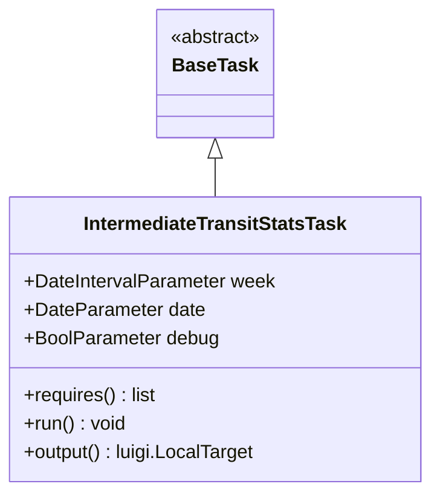
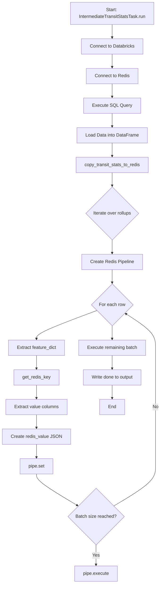
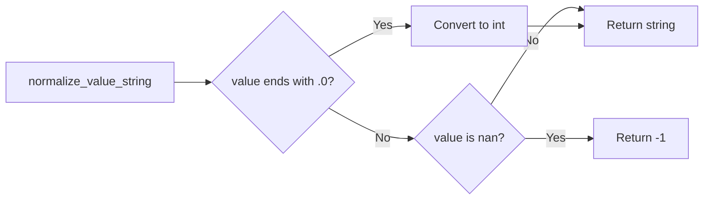
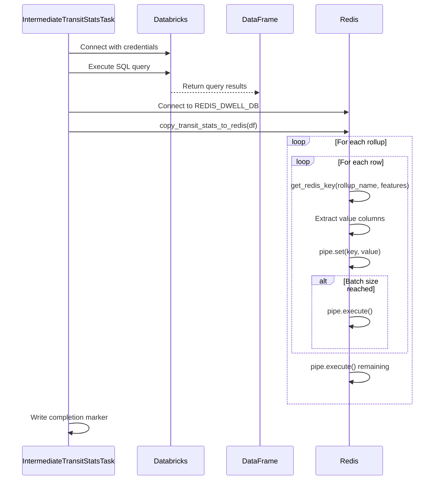
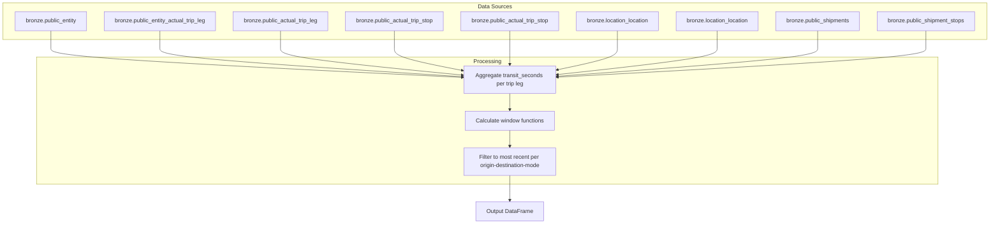

# Diagram: research/orchestrator/tasks/transforms/intermediate_transit_stats_task.py


> Auto-generated by Obscura crawlers

## Diagram 1

```mermaid
classDiagram
      class IntermediateTransitStatsTask {
          +DateIntervalParameter week
          +DateParameter date...
  └ 94 lines...

● Echo Mermaid diagrams
  $ echo 'classDiagram
      class IntermediateTransitStatsTask {
          +DateIntervalParameter week
          +DateParameter date
          +BoolParameter debug...
  └ 91 lines...

● stop_bash
  └ <command with id: 0 stopped>

● stop_bash
  └ <command with id: 1 stopped>
```

> SVG rendering failed for this diagram.

## Diagram 2



### SVG

<svg id="container" width="360.2578125" xmlns="http://www.w3.org/2000/svg" class="classDiagram" height="414" viewBox="0 0 360.2578125 414" role="graphics-document document" aria-roledescription="class"><style>#container{font-family:"trebuchet ms",verdana,arial,sans-serif;font-size:16px;fill:#333;}@keyframes edge-animation-frame{from{stroke-dashoffset:0;}}@keyframes dash{to{stroke-dashoffset:0;}}#container .edge-animation-slow{stroke-dasharray:9,5!important;stroke-dashoffset:900;animation:dash 50s linear infinite;stroke-linecap:round;}#container .edge-animation-fast{stroke-dasharray:9,5!important;stroke-dashoffset:900;animation:dash 20s linear infinite;stroke-linecap:round;}#container .error-icon{fill:#552222;}#container .error-text{fill:#552222;stroke:#552222;}#container .edge-thickness-normal{stroke-width:1px;}#container .edge-thickness-thick{stroke-width:3.5px;}#container .edge-pattern-solid{stroke-dasharray:0;}#container .edge-thickness-invisible{stroke-width:0;fill:none;}#container .edge-pattern-dashed{stroke-dasharray:3;}#container .edge-pattern-dotted{stroke-dasharray:2;}#container .marker{fill:#333333;stroke:#333333;}#container .marker.cross{stroke:#333333;}#container svg{font-family:"trebuchet ms",verdana,arial,sans-serif;font-size:16px;}#container p{margin:0;}#container g.classGroup text{fill:#9370DB;stroke:none;font-family:"trebuchet ms",verdana,arial,sans-serif;font-size:10px;}#container g.classGroup text .title{font-weight:bolder;}#container .nodeLabel,#container .edgeLabel{color:#131300;}#container .edgeLabel .label rect{fill:#ECECFF;}#container .label text{fill:#131300;}#container .labelBkg{background:#ECECFF;}#container .edgeLabel .label span{background:#ECECFF;}#container .classTitle{font-weight:bolder;}#container .node rect,#container .node circle,#container .node ellipse,#container .node polygon,#container .node path{fill:#ECECFF;stroke:#9370DB;stroke-width:1px;}#container .divider{stroke:#9370DB;stroke-width:1;}#container g.clickable{cursor:pointer;}#container g.classGroup rect{fill:#ECECFF;stroke:#9370DB;}#container g.classGroup line{stroke:#9370DB;stroke-width:1;}#container .classLabel .box{stroke:none;stroke-width:0;fill:#ECECFF;opacity:0.5;}#container .classLabel .label{fill:#9370DB;font-size:10px;}#container .relation{stroke:#333333;stroke-width:1;fill:none;}#container .dashed-line{stroke-dasharray:3;}#container .dotted-line{stroke-dasharray:1 2;}#container #compositionStart,#container .composition{fill:#333333!important;stroke:#333333!important;stroke-width:1;}#container #compositionEnd,#container .composition{fill:#333333!important;stroke:#333333!important;stroke-width:1;}#container #dependencyStart,#container .dependency{fill:#333333!important;stroke:#333333!important;stroke-width:1;}#container #dependencyStart,#container .dependency{fill:#333333!important;stroke:#333333!important;stroke-width:1;}#container #extensionStart,#container .extension{fill:transparent!important;stroke:#333333!important;stroke-width:1;}#container #extensionEnd,#container .extension{fill:transparent!important;stroke:#333333!important;stroke-width:1;}#container #aggregationStart,#container .aggregation{fill:transparent!important;stroke:#333333!important;stroke-width:1;}#container #aggregationEnd,#container .aggregation{fill:transparent!important;stroke:#333333!important;stroke-width:1;}#container #lollipopStart,#container .lollipop{fill:#ECECFF!important;stroke:#333333!important;stroke-width:1;}#container #lollipopEnd,#container .lollipop{fill:#ECECFF!important;stroke:#333333!important;stroke-width:1;}#container .edgeTerminals{font-size:11px;line-height:initial;}#container .classTitleText{text-anchor:middle;font-size:18px;fill:#333;}#container .label-icon{display:inline-block;height:1em;overflow:visible;vertical-align:-0.125em;}#container .node .label-icon path{fill:currentColor;stroke:revert;stroke-width:revert;}#container :root{--mermaid-font-family:"trebuchet ms",verdana,arial,sans-serif;}</style><g><defs><marker id="container_class-aggregationStart" class="marker aggregation class" refX="18" refY="7" markerWidth="190" markerHeight="240" orient="auto"><path d="M 18,7 L9,13 L1,7 L9,1 Z"></path></marker></defs><defs><marker id="container_class-aggregationEnd" class="marker aggregation class" refX="1" refY="7" markerWidth="20" markerHeight="28" orient="auto"><path d="M 18,7 L9,13 L1,7 L9,1 Z"></path></marker></defs><defs><marker id="container_class-extensionStart" class="marker extension class" refX="18" refY="7" markerWidth="190" markerHeight="240" orient="auto"><path d="M 1,7 L18,13 V 1 Z"></path></marker></defs><defs><marker id="container_class-extensionEnd" class="marker extension class" refX="1" refY="7" markerWidth="20" markerHeight="28" orient="auto"><path d="M 1,1 V 13 L18,7 Z"></path></marker></defs><defs><marker id="container_class-compositionStart" class="marker composition class" refX="18" refY="7" markerWidth="190" markerHeight="240" orient="auto"><path d="M 18,7 L9,13 L1,7 L9,1 Z"></path></marker></defs><defs><marker id="container_class-compositionEnd" class="marker composition class" refX="1" refY="7" markerWidth="20" markerHeight="28" orient="auto"><path d="M 18,7 L9,13 L1,7 L9,1 Z"></path></marker></defs><defs><marker id="container_class-dependencyStart" class="marker dependency class" refX="6" refY="7" markerWidth="190" markerHeight="240" orient="auto"><path d="M 5,7 L9,13 L1,7 L9,1 Z"></path></marker></defs><defs><marker id="container_class-dependencyEnd" class="marker dependency class" refX="13" refY="7" markerWidth="20" markerHeight="28" orient="auto"><path d="M 18,7 L9,13 L14,7 L9,1 Z"></path></marker></defs><defs><marker id="container_class-lollipopStart" class="marker lollipop class" refX="13" refY="7" markerWidth="190" markerHeight="240" orient="auto"><circle stroke="black" fill="transparent" cx="7" cy="7" r="6"></circle></marker></defs><defs><marker id="container_class-lollipopEnd" class="marker lollipop class" refX="1" refY="7" markerWidth="190" markerHeight="240" orient="auto"><circle stroke="black" fill="transparent" cx="7" cy="7" r="6"></circle></marker></defs><g class="root"><g class="clusters"></g><g class="edgePaths"><path d="M180.129,133.25L180.129,134.542C180.129,135.833,180.129,138.417,180.129,143.875C180.129,149.333,180.129,157.667,180.129,161.833L180.129,166" id="id_BaseTask_IntermediateTransitStatsTask_1" class="edge-thickness-normal edge-pattern-solid relation" style=";;;" data-edge="true" data-et="edge" data-id="id_BaseTask_IntermediateTransitStatsTask_1" data-points="W3sieCI6MTgwLjEyODkwNjI1LCJ5IjoxMTZ9LHsieCI6MTgwLjEyODkwNjI1LCJ5IjoxNDF9LHsieCI6MTgwLjEyODkwNjI1LCJ5IjoxNjZ9XQ==" marker-start="url(#container_class-extensionStart)"></path></g><g class="edgeLabels"><g class="edgeLabel"><g class="label" data-id="id_BaseTask_IntermediateTransitStatsTask_1" transform="translate(0, 0)"><foreignObject width="0" height="0"><div xmlns="http://www.w3.org/1999/xhtml" class="labelBkg" style="display: table-cell; white-space: nowrap; line-height: 1.5; max-width: 200px; text-align: center;"><span class="edgeLabel"></span></div></foreignObject></g></g></g><g class="nodes"><g class="node default" id="classId-IntermediateTransitStatsTask-0" transform="translate(180.12890625, 286)"><g class="basic label-container"><path d="M-172.12890625 -120 L172.12890625 -120 L172.12890625 120 L-172.12890625 120" stroke="none" stroke-width="0" fill="#ECECFF" style=""></path><path d="M-172.12890625 -120 C-37.27738949205764 -120, 97.57412726588473 -120, 172.12890625 -120 M-172.12890625 -120 C-55.236279880831205 -120, 61.65634648833759 -120, 172.12890625 -120 M172.12890625 -120 C172.12890625 -62.908350312920874, 172.12890625 -5.816700625841747, 172.12890625 120 M172.12890625 -120 C172.12890625 -35.39944326343917, 172.12890625 49.201113473121666, 172.12890625 120 M172.12890625 120 C64.1419116115305 120, -43.845083026938994 120, -172.12890625 120 M172.12890625 120 C64.76636052985567 120, -42.59618519028865 120, -172.12890625 120 M-172.12890625 120 C-172.12890625 66.5852976291748, -172.12890625 13.170595258349607, -172.12890625 -120 M-172.12890625 120 C-172.12890625 29.03616931326539, -172.12890625 -61.92766137346922, -172.12890625 -120" stroke="#9370DB" stroke-width="1.3" fill="none" stroke-dasharray="0 0" style=""></path></g><g class="annotation-group text" transform="translate(0, -96)"></g><g class="label-group text" transform="translate(-108.1328125, -96)"><g class="label" style="font-weight: bolder" transform="translate(0,-12)"><foreignObject width="216.265625" height="24"><div xmlns="http://www.w3.org/1999/xhtml" style="display: table-cell; white-space: nowrap; line-height: 1.5; max-width: 262px; text-align: center;"><span class="nodeLabel markdown-node-label" style=""><p>IntermediateTransitStatsTask</p></span></div></foreignObject></g></g><g class="members-group text" transform="translate(-160.12890625, -48)"><g class="label" style="" transform="translate(0,-12)"><foreignObject width="212.125" height="24"><div xmlns="http://www.w3.org/1999/xhtml" style="display: table-cell; white-space: nowrap; line-height: 1.5; max-width: 270px; text-align: center;"><span class="nodeLabel markdown-node-label" style=""><p>+DateIntervalParameter week</p></span></div></foreignObject></g><g class="label" style="" transform="translate(0,12)"><foreignObject width="152.171875" height="24"><div xmlns="http://www.w3.org/1999/xhtml" style="display: table-cell; white-space: nowrap; line-height: 1.5; max-width: 210px; text-align: center;"><span class="nodeLabel markdown-node-label" style=""><p>+DateParameter date</p></span></div></foreignObject></g><g class="label" style="" transform="translate(0,36)"><foreignObject width="165.0625" height="24"><div xmlns="http://www.w3.org/1999/xhtml" style="display: table-cell; white-space: nowrap; line-height: 1.5; max-width: 223px; text-align: center;"><span class="nodeLabel markdown-node-label" style=""><p>+BoolParameter debug</p></span></div></foreignObject></g></g><g class="methods-group text" transform="translate(-160.12890625, 48)"><g class="label" style="" transform="translate(0,-12)"><foreignObject width="112.828125" height="24"><div xmlns="http://www.w3.org/1999/xhtml" style="display: table-cell; white-space: nowrap; line-height: 1.5; max-width: 170px; text-align: center;"><span class="nodeLabel markdown-node-label" style=""><p>+requires() : list</p></span></div></foreignObject></g><g class="label" style="" transform="translate(0,12)"><foreignObject width="86.78125" height="24"><div xmlns="http://www.w3.org/1999/xhtml" style="display: table-cell; white-space: nowrap; line-height: 1.5; max-width: 144px; text-align: center;"><span class="nodeLabel markdown-node-label" style=""><p>+run() : void</p></span></div></foreignObject></g><g class="label" style="" transform="translate(0,36)"><foreignObject width="197.1875" height="24"><div xmlns="http://www.w3.org/1999/xhtml" style="display: table-cell; white-space: nowrap; line-height: 1.5; max-width: 255px; text-align: center;"><span class="nodeLabel markdown-node-label" style=""><p>+output() : luigi.LocalTarget</p></span></div></foreignObject></g></g><g class="divider" style=""><path d="M-172.12890625 -72 C-52.027669785248804 -72, 68.07356667950239 -72, 172.12890625 -72 M-172.12890625 -72 C-86.44707147559764 -72, -0.7652367011952776 -72, 172.12890625 -72" stroke="#9370DB" stroke-width="1.3" fill="none" stroke-dasharray="0 0" style=""></path></g><g class="divider" style=""><path d="M-172.12890625 24 C-42.79421782237827 24, 86.54047060524346 24, 172.12890625 24 M-172.12890625 24 C-63.56679294183408 24, 44.99532036633184 24, 172.12890625 24" stroke="#9370DB" stroke-width="1.3" fill="none" stroke-dasharray="0 0" style=""></path></g></g><g class="node default" id="classId-BaseTask-1" transform="translate(180.12890625, 62)"><g class="basic label-container"><path d="M-50.609375 -54 L50.609375 -54 L50.609375 54 L-50.609375 54" stroke="none" stroke-width="0" fill="#ECECFF" style=""></path><path d="M-50.609375 -54 C-16.205151030067675 -54, 18.19907293986465 -54, 50.609375 -54 M-50.609375 -54 C-10.636732974350338 -54, 29.335909051299325 -54, 50.609375 -54 M50.609375 -54 C50.609375 -19.923935250779017, 50.609375 14.152129498441965, 50.609375 54 M50.609375 -54 C50.609375 -30.08598263918839, 50.609375 -6.171965278376781, 50.609375 54 M50.609375 54 C20.707440673236206 54, -9.194493653527587 54, -50.609375 54 M50.609375 54 C19.31778311080408 54, -11.973808778391842 54, -50.609375 54 M-50.609375 54 C-50.609375 12.254371585772148, -50.609375 -29.491256828455704, -50.609375 -54 M-50.609375 54 C-50.609375 14.962919889310747, -50.609375 -24.074160221378506, -50.609375 -54" stroke="#9370DB" stroke-width="1.3" fill="none" stroke-dasharray="0 0" style=""></path></g><g class="annotation-group text" transform="translate(-38.609375, -30)"><g class="label" style="" transform="translate(0,-12)"><foreignObject width="77.21875" height="24"><div xmlns="http://www.w3.org/1999/xhtml" style="display: table-cell; white-space: nowrap; line-height: 1.5; max-width: 127px; text-align: center;"><span class="nodeLabel markdown-node-label" style=""><p>«abstract»</p></span></div></foreignObject></g></g><g class="label-group text" transform="translate(-34.03125, -6)"><g class="label" style="font-weight: bolder" transform="translate(0,-12)"><foreignObject width="68.0625" height="24"><div xmlns="http://www.w3.org/1999/xhtml" style="display: table-cell; white-space: nowrap; line-height: 1.5; max-width: 117px; text-align: center;"><span class="nodeLabel markdown-node-label" style=""><p>BaseTask</p></span></div></foreignObject></g></g><g class="members-group text" transform="translate(-38.609375, 42)"></g><g class="methods-group text" transform="translate(-38.609375, 72)"></g><g class="divider" style=""><path d="M-50.609375 18 C-21.19365482911944 18, 8.222065341761123 18, 50.609375 18 M-50.609375 18 C-13.226006238354074 18, 24.15736252329185 18, 50.609375 18" stroke="#9370DB" stroke-width="1.3" fill="none" stroke-dasharray="0 0" style=""></path></g><g class="divider" style=""><path d="M-50.609375 36 C-14.72325473906718 36, 21.16286552186564 36, 50.609375 36 M-50.609375 36 C-24.294230200058756 36, 2.020914599882488 36, 50.609375 36" stroke="#9370DB" stroke-width="1.3" fill="none" stroke-dasharray="0 0" style=""></path></g></g></g></g></g></svg>

## Diagram 3



### SVG

<svg id="container" width="565.921875" xmlns="http://www.w3.org/2000/svg" class="flowchart" height="2051.53125" viewBox="0 0 565.921875 2051.53125" role="graphics-document document" aria-roledescription="flowchart-v2"><style>#container{font-family:"trebuchet ms",verdana,arial,sans-serif;font-size:16px;fill:#333;}@keyframes edge-animation-frame{from{stroke-dashoffset:0;}}@keyframes dash{to{stroke-dashoffset:0;}}#container .edge-animation-slow{stroke-dasharray:9,5!important;stroke-dashoffset:900;animation:dash 50s linear infinite;stroke-linecap:round;}#container .edge-animation-fast{stroke-dasharray:9,5!important;stroke-dashoffset:900;animation:dash 20s linear infinite;stroke-linecap:round;}#container .error-icon{fill:#552222;}#container .error-text{fill:#552222;stroke:#552222;}#container .edge-thickness-normal{stroke-width:1px;}#container .edge-thickness-thick{stroke-width:3.5px;}#container .edge-pattern-solid{stroke-dasharray:0;}#container .edge-thickness-invisible{stroke-width:0;fill:none;}#container .edge-pattern-dashed{stroke-dasharray:3;}#container .edge-pattern-dotted{stroke-dasharray:2;}#container .marker{fill:#333333;stroke:#333333;}#container .marker.cross{stroke:#333333;}#container svg{font-family:"trebuchet ms",verdana,arial,sans-serif;font-size:16px;}#container p{margin:0;}#container .label{font-family:"trebuchet ms",verdana,arial,sans-serif;color:#333;}#container .cluster-label text{fill:#333;}#container .cluster-label span{color:#333;}#container .cluster-label span p{background-color:transparent;}#container .label text,#container span{fill:#333;color:#333;}#container .node rect,#container .node circle,#container .node ellipse,#container .node polygon,#container .node path{fill:#ECECFF;stroke:#9370DB;stroke-width:1px;}#container .rough-node .label text,#container .node .label text,#container .image-shape .label,#container .icon-shape .label{text-anchor:middle;}#container .node .katex path{fill:#000;stroke:#000;stroke-width:1px;}#container .rough-node .label,#container .node .label,#container .image-shape .label,#container .icon-shape .label{text-align:center;}#container .node.clickable{cursor:pointer;}#container .root .anchor path{fill:#333333!important;stroke-width:0;stroke:#333333;}#container .arrowheadPath{fill:#333333;}#container .edgePath .path{stroke:#333333;stroke-width:2.0px;}#container .flowchart-link{stroke:#333333;fill:none;}#container .edgeLabel{background-color:rgba(232,232,232, 0.8);text-align:center;}#container .edgeLabel p{background-color:rgba(232,232,232, 0.8);}#container .edgeLabel rect{opacity:0.5;background-color:rgba(232,232,232, 0.8);fill:rgba(232,232,232, 0.8);}#container .labelBkg{background-color:rgba(232, 232, 232, 0.5);}#container .cluster rect{fill:#ffffde;stroke:#aaaa33;stroke-width:1px;}#container .cluster text{fill:#333;}#container .cluster span{color:#333;}#container div.mermaidTooltip{position:absolute;text-align:center;max-width:200px;padding:2px;font-family:"trebuchet ms",verdana,arial,sans-serif;font-size:12px;background:hsl(80, 100%, 96.2745098039%);border:1px solid #aaaa33;border-radius:2px;pointer-events:none;z-index:100;}#container .flowchartTitleText{text-anchor:middle;font-size:18px;fill:#333;}#container rect.text{fill:none;stroke-width:0;}#container .icon-shape,#container .image-shape{background-color:rgba(232,232,232, 0.8);text-align:center;}#container .icon-shape p,#container .image-shape p{background-color:rgba(232,232,232, 0.8);padding:2px;}#container .icon-shape rect,#container .image-shape rect{opacity:0.5;background-color:rgba(232,232,232, 0.8);fill:rgba(232,232,232, 0.8);}#container .label-icon{display:inline-block;height:1em;overflow:visible;vertical-align:-0.125em;}#container .node .label-icon path{fill:currentColor;stroke:revert;stroke-width:revert;}#container :root{--mermaid-font-family:"trebuchet ms",verdana,arial,sans-serif;}</style><g><marker id="container_flowchart-v2-pointEnd" class="marker flowchart-v2" viewBox="0 0 10 10" refX="5" refY="5" markerUnits="userSpaceOnUse" markerWidth="8" markerHeight="8" orient="auto"><path d="M 0 0 L 10 5 L 0 10 z" class="arrowMarkerPath" style="stroke-width: 1; stroke-dasharray: 1, 0;"></path></marker><marker id="container_flowchart-v2-pointStart" class="marker flowchart-v2" viewBox="0 0 10 10" refX="4.5" refY="5" markerUnits="userSpaceOnUse" markerWidth="8" markerHeight="8" orient="auto"><path d="M 0 5 L 10 10 L 10 0 z" class="arrowMarkerPath" style="stroke-width: 1; stroke-dasharray: 1, 0;"></path></marker><marker id="container_flowchart-v2-circleEnd" class="marker flowchart-v2" viewBox="0 0 10 10" refX="11" refY="5" markerUnits="userSpaceOnUse" markerWidth="11" markerHeight="11" orient="auto"><circle cx="5" cy="5" r="5" class="arrowMarkerPath" style="stroke-width: 1; stroke-dasharray: 1, 0;"></circle></marker><marker id="container_flowchart-v2-circleStart" class="marker flowchart-v2" viewBox="0 0 10 10" refX="-1" refY="5" markerUnits="userSpaceOnUse" markerWidth="11" markerHeight="11" orient="auto"><circle cx="5" cy="5" r="5" class="arrowMarkerPath" style="stroke-width: 1; stroke-dasharray: 1, 0;"></circle></marker><marker id="container_flowchart-v2-crossEnd" class="marker cross flowchart-v2" viewBox="0 0 11 11" refX="12" refY="5.2" markerUnits="userSpaceOnUse" markerWidth="11" markerHeight="11" orient="auto"><path d="M 1,1 l 9,9 M 10,1 l -9,9" class="arrowMarkerPath" style="stroke-width: 2; stroke-dasharray: 1, 0;"></path></marker><marker id="container_flowchart-v2-crossStart" class="marker cross flowchart-v2" viewBox="0 0 11 11" refX="-1" refY="5.2" markerUnits="userSpaceOnUse" markerWidth="11" markerHeight="11" orient="auto"><path d="M 1,1 l 9,9 M 10,1 l -9,9" class="arrowMarkerPath" style="stroke-width: 2; stroke-dasharray: 1, 0;"></path></marker><g class="root"><g class="clusters"></g><g class="edgePaths"><path d="M393.797,86L393.797,90.167C393.797,94.333,393.797,102.667,393.797,110.333C393.797,118,393.797,125,393.797,128.5L393.797,132" id="L_A_B_0" class="edge-thickness-normal edge-pattern-solid edge-thickness-normal edge-pattern-solid flowchart-link" style=";" data-edge="true" data-et="edge" data-id="L_A_B_0" data-points="W3sieCI6MzkzLjc5Njg3NSwieSI6ODZ9LHsieCI6MzkzLjc5Njg3NSwieSI6MTExfSx7IngiOjM5My43OTY4NzUsInkiOjEzNn1d" marker-end="url(#container_flowchart-v2-pointEnd)"></path><path d="M393.797,190L393.797,194.167C393.797,198.333,393.797,206.667,393.797,214.333C393.797,222,393.797,229,393.797,232.5L393.797,236" id="L_B_C_0" class="edge-thickness-normal edge-pattern-solid edge-thickness-normal edge-pattern-solid flowchart-link" style=";" data-edge="true" data-et="edge" data-id="L_B_C_0" data-points="W3sieCI6MzkzLjc5Njg3NSwieSI6MTkwfSx7IngiOjM5My43OTY4NzUsInkiOjIxNX0seyJ4IjozOTMuNzk2ODc1LCJ5IjoyNDB9XQ==" marker-end="url(#container_flowchart-v2-pointEnd)"></path><path d="M393.797,294L393.797,298.167C393.797,302.333,393.797,310.667,393.797,318.333C393.797,326,393.797,333,393.797,336.5L393.797,340" id="L_C_D_0" class="edge-thickness-normal edge-pattern-solid edge-thickness-normal edge-pattern-solid flowchart-link" style=";" data-edge="true" data-et="edge" data-id="L_C_D_0" data-points="W3sieCI6MzkzLjc5Njg3NSwieSI6Mjk0fSx7IngiOjM5My43OTY4NzUsInkiOjMxOX0seyJ4IjozOTMuNzk2ODc1LCJ5IjozNDR9XQ==" marker-end="url(#container_flowchart-v2-pointEnd)"></path><path d="M393.797,398L393.797,402.167C393.797,406.333,393.797,414.667,393.797,422.333C393.797,430,393.797,437,393.797,440.5L393.797,444" id="L_D_E_0" class="edge-thickness-normal edge-pattern-solid edge-thickness-normal edge-pattern-solid flowchart-link" style=";" data-edge="true" data-et="edge" data-id="L_D_E_0" data-points="W3sieCI6MzkzLjc5Njg3NSwieSI6Mzk4fSx7IngiOjM5My43OTY4NzUsInkiOjQyM30seyJ4IjozOTMuNzk2ODc1LCJ5Ijo0NDh9XQ==" marker-end="url(#container_flowchart-v2-pointEnd)"></path><path d="M393.797,502L393.797,506.167C393.797,510.333,393.797,518.667,393.797,526.333C393.797,534,393.797,541,393.797,544.5L393.797,548" id="L_E_F_0" class="edge-thickness-normal edge-pattern-solid edge-thickness-normal edge-pattern-solid flowchart-link" style=";" data-edge="true" data-et="edge" data-id="L_E_F_0" data-points="W3sieCI6MzkzLjc5Njg3NSwieSI6NTAyfSx7IngiOjM5My43OTY4NzUsInkiOjUyN30seyJ4IjozOTMuNzk2ODc1LCJ5Ijo1NTJ9XQ==" marker-end="url(#container_flowchart-v2-pointEnd)"></path><path d="M393.797,606L393.797,610.167C393.797,614.333,393.797,622.667,393.797,630.333C393.797,638,393.797,645,393.797,648.5L393.797,652" id="L_F_G_0" class="edge-thickness-normal edge-pattern-solid edge-thickness-normal edge-pattern-solid flowchart-link" style=";" data-edge="true" data-et="edge" data-id="L_F_G_0" data-points="W3sieCI6MzkzLjc5Njg3NSwieSI6NjA2fSx7IngiOjM5My43OTY4NzUsInkiOjYzMX0seyJ4IjozOTMuNzk2ODc1LCJ5Ijo2NTZ9XQ==" marker-end="url(#container_flowchart-v2-pointEnd)"></path><path d="M393.797,848.734L393.797,852.901C393.797,857.068,393.797,865.401,393.797,873.068C393.797,880.734,393.797,887.734,393.797,891.234L393.797,894.734" id="L_G_H_0" class="edge-thickness-normal edge-pattern-solid edge-thickness-normal edge-pattern-solid flowchart-link" style=";" data-edge="true" data-et="edge" data-id="L_G_H_0" data-points="W3sieCI6MzkzLjc5Njg3NSwieSI6ODQ4LjczNDM3NX0seyJ4IjozOTMuNzk2ODc1LCJ5Ijo4NzMuNzM0Mzc1fSx7IngiOjM5My43OTY4NzUsInkiOjg5OC43MzQzNzV9XQ==" marker-end="url(#container_flowchart-v2-pointEnd)"></path><path d="M393.797,952.734L393.797,956.901C393.797,961.068,393.797,969.401,393.797,977.068C393.797,984.734,393.797,991.734,393.797,995.234L393.797,998.734" id="L_H_I_0" class="edge-thickness-normal edge-pattern-solid edge-thickness-normal edge-pattern-solid flowchart-link" style=";" data-edge="true" data-et="edge" data-id="L_H_I_0" data-points="W3sieCI6MzkzLjc5Njg3NSwieSI6OTUyLjczNDM3NX0seyJ4IjozOTMuNzk2ODc1LCJ5Ijo5NzcuNzM0Mzc1fSx7IngiOjM5My43OTY4NzUsInkiOjEwMDIuNzM0Mzc1fV0=" marker-end="url(#container_flowchart-v2-pointEnd)"></path><path d="M340.226,1095.273L304.221,1108.368C268.216,1121.463,196.206,1147.653,160.2,1164.249C124.195,1180.844,124.195,1187.844,124.195,1191.344L124.195,1194.844" id="L_I_J_0" class="edge-thickness-normal edge-pattern-solid edge-thickness-normal edge-pattern-solid flowchart-link" style=";" data-edge="true" data-et="edge" data-id="L_I_J_0" data-points="W3sieCI6MzQwLjIyNjAyNDc4ODgzMzQsInkiOjEwOTUuMjcyODk5Nzg4ODMzNX0seyJ4IjoxMjQuMTk1MzEyNSwieSI6MTE3My44NDM3NX0seyJ4IjoxMjQuMTk1MzEyNSwieSI6MTE5OC44NDM3NX1d" marker-end="url(#container_flowchart-v2-pointEnd)"></path><path d="M124.195,1252.844L124.195,1257.01C124.195,1261.177,124.195,1269.51,124.195,1277.177C124.195,1284.844,124.195,1291.844,124.195,1295.344L124.195,1298.844" id="L_J_K_0" class="edge-thickness-normal edge-pattern-solid edge-thickness-normal edge-pattern-solid flowchart-link" style=";" data-edge="true" data-et="edge" data-id="L_J_K_0" data-points="W3sieCI6MTI0LjE5NTMxMjUsInkiOjEyNTIuODQzNzV9LHsieCI6MTI0LjE5NTMxMjUsInkiOjEyNzcuODQzNzV9LHsieCI6MTI0LjE5NTMxMjUsInkiOjEzMDIuODQzNzV9XQ==" marker-end="url(#container_flowchart-v2-pointEnd)"></path><path d="M124.195,1356.844L124.195,1361.01C124.195,1365.177,124.195,1373.51,124.195,1381.177C124.195,1388.844,124.195,1395.844,124.195,1399.344L124.195,1402.844" id="L_K_L_0" class="edge-thickness-normal edge-pattern-solid edge-thickness-normal edge-pattern-solid flowchart-link" style=";" data-edge="true" data-et="edge" data-id="L_K_L_0" data-points="W3sieCI6MTI0LjE5NTMxMjUsInkiOjEzNTYuODQzNzV9LHsieCI6MTI0LjE5NTMxMjUsInkiOjEzODEuODQzNzV9LHsieCI6MTI0LjE5NTMxMjUsInkiOjE0MDYuODQzNzV9XQ==" marker-end="url(#container_flowchart-v2-pointEnd)"></path><path d="M124.195,1460.844L124.195,1465.01C124.195,1469.177,124.195,1477.51,124.195,1485.177C124.195,1492.844,124.195,1499.844,124.195,1503.344L124.195,1506.844" id="L_L_M_0" class="edge-thickness-normal edge-pattern-solid edge-thickness-normal edge-pattern-solid flowchart-link" style=";" data-edge="true" data-et="edge" data-id="L_L_M_0" data-points="W3sieCI6MTI0LjE5NTMxMjUsInkiOjE0NjAuODQzNzV9LHsieCI6MTI0LjE5NTMxMjUsInkiOjE0ODUuODQzNzV9LHsieCI6MTI0LjE5NTMxMjUsInkiOjE1MTAuODQzNzV9XQ==" marker-end="url(#container_flowchart-v2-pointEnd)"></path><path d="M124.195,1564.844L124.195,1569.01C124.195,1573.177,124.195,1581.51,124.195,1589.177C124.195,1596.844,124.195,1603.844,124.195,1607.344L124.195,1610.844" id="L_M_N_0" class="edge-thickness-normal edge-pattern-solid edge-thickness-normal edge-pattern-solid flowchart-link" style=";" data-edge="true" data-et="edge" data-id="L_M_N_0" data-points="W3sieCI6MTI0LjE5NTMxMjUsInkiOjE1NjQuODQzNzV9LHsieCI6MTI0LjE5NTMxMjUsInkiOjE1ODkuODQzNzV9LHsieCI6MTI0LjE5NTMxMjUsInkiOjE2MTQuODQzNzV9XQ==" marker-end="url(#container_flowchart-v2-pointEnd)"></path><path d="M124.195,1668.844L124.195,1673.01C124.195,1677.177,124.195,1685.51,148.56,1703.866C172.924,1722.223,221.653,1750.601,246.018,1764.791L270.382,1778.98" id="L_N_O_0" class="edge-thickness-normal edge-pattern-solid edge-thickness-normal edge-pattern-solid flowchart-link" style=";" data-edge="true" data-et="edge" data-id="L_N_O_0" data-points="W3sieCI6MTI0LjE5NTMxMjUsInkiOjE2NjguODQzNzV9LHsieCI6MTI0LjE5NTMxMjUsInkiOjE2OTMuODQzNzV9LHsieCI6MjczLjgzODk3NDM5OTM2NzY2LCJ5IjoxNzgwLjk5MzA1Njg1MDYzMjJ9XQ==" marker-end="url(#container_flowchart-v2-pointEnd)"></path><path d="M335.988,1915.531L335.988,1921.698C335.988,1927.865,335.988,1940.198,335.988,1951.865C335.988,1963.531,335.988,1974.531,335.988,1980.031L335.988,1985.531" id="L_O_P_0" class="edge-thickness-normal edge-pattern-solid edge-thickness-normal edge-pattern-solid flowchart-link" style=";" data-edge="true" data-et="edge" data-id="L_O_P_0" data-points="W3sieCI6MzM1Ljk4ODI4MTI1LCJ5IjoxOTE1LjUzMTI1fSx7IngiOjMzNS45ODgyODEyNSwieSI6MTk1Mi41MzEyNX0seyJ4IjozMzUuOTg4MjgxMjUsInkiOjE5ODkuNTMxMjV9XQ==" marker-end="url(#container_flowchart-v2-pointEnd)"></path><path d="M398.138,1780.993L423.078,1766.468C448.019,1751.943,497.9,1722.894,522.841,1699.702C547.781,1676.51,547.781,1659.177,547.781,1641.844C547.781,1624.51,547.781,1607.177,547.781,1589.844C547.781,1572.51,547.781,1555.177,547.781,1537.844C547.781,1520.51,547.781,1503.177,547.781,1485.844C547.781,1468.51,547.781,1451.177,547.781,1433.844C547.781,1416.51,547.781,1399.177,547.781,1381.844C547.781,1364.51,547.781,1347.177,547.781,1329.844C547.781,1312.51,547.781,1295.177,547.781,1277.844C547.781,1260.51,547.781,1243.177,547.781,1225.844C547.781,1208.51,547.781,1191.177,530.118,1171.263C512.455,1151.349,477.13,1128.854,459.467,1117.607L441.804,1106.359" id="L_O_I_0" class="edge-thickness-normal edge-pattern-solid edge-thickness-normal edge-pattern-solid flowchart-link" style=";" data-edge="true" data-et="edge" data-id="L_O_I_0" data-points="W3sieCI6Mzk4LjEzNzU4ODEwMDYzMjM0LCJ5IjoxNzgwLjk5MzA1Njg1MDYzMjJ9LHsieCI6NTQ3Ljc4MTI1LCJ5IjoxNjkzLjg0Mzc1fSx7IngiOjU0Ny43ODEyNSwieSI6MTY0MS44NDM3NX0seyJ4Ijo1NDcuNzgxMjUsInkiOjE1ODkuODQzNzV9LHsieCI6NTQ3Ljc4MTI1LCJ5IjoxNTM3Ljg0Mzc1fSx7IngiOjU0Ny43ODEyNSwieSI6MTQ4NS44NDM3NX0seyJ4Ijo1NDcuNzgxMjUsInkiOjE0MzMuODQzNzV9LHsieCI6NTQ3Ljc4MTI1LCJ5IjoxMzgxLjg0Mzc1fSx7IngiOjU0Ny43ODEyNSwieSI6MTMyOS44NDM3NX0seyJ4Ijo1NDcuNzgxMjUsInkiOjEyNzcuODQzNzV9LHsieCI6NTQ3Ljc4MTI1LCJ5IjoxMjI1Ljg0Mzc1fSx7IngiOjU0Ny43ODEyNSwieSI6MTE3My44NDM3NX0seyJ4Ijo0MzguNDI5OTU3OTk4ODIyMSwieSI6MTEwNC4yMTA2NjcwMDExNzc5fV0=" marker-end="url(#container_flowchart-v2-pointEnd)"></path><path d="M393.797,1148.844L393.797,1153.01C393.797,1157.177,393.797,1165.51,393.797,1173.177C393.797,1180.844,393.797,1187.844,393.797,1191.344L393.797,1194.844" id="L_I_Q_0" class="edge-thickness-normal edge-pattern-solid edge-thickness-normal edge-pattern-solid flowchart-link" style=";" data-edge="true" data-et="edge" data-id="L_I_Q_0" data-points="W3sieCI6MzkzLjc5Njg3NSwieSI6MTE0OC44NDM3NX0seyJ4IjozOTMuNzk2ODc1LCJ5IjoxMTczLjg0Mzc1fSx7IngiOjM5My43OTY4NzUsInkiOjExOTguODQzNzV9XQ==" marker-end="url(#container_flowchart-v2-pointEnd)"></path><path d="M393.797,1252.844L393.797,1257.01C393.797,1261.177,393.797,1269.51,393.797,1277.177C393.797,1284.844,393.797,1291.844,393.797,1295.344L393.797,1298.844" id="L_Q_R_0" class="edge-thickness-normal edge-pattern-solid edge-thickness-normal edge-pattern-solid flowchart-link" style=";" data-edge="true" data-et="edge" data-id="L_Q_R_0" data-points="W3sieCI6MzkzLjc5Njg3NSwieSI6MTI1Mi44NDM3NX0seyJ4IjozOTMuNzk2ODc1LCJ5IjoxMjc3Ljg0Mzc1fSx7IngiOjM5My43OTY4NzUsInkiOjEzMDIuODQzNzV9XQ==" marker-end="url(#container_flowchart-v2-pointEnd)"></path><path d="M393.797,1356.844L393.797,1361.01C393.797,1365.177,393.797,1373.51,393.797,1381.177C393.797,1388.844,393.797,1395.844,393.797,1399.344L393.797,1402.844" id="L_R_S_0" class="edge-thickness-normal edge-pattern-solid edge-thickness-normal edge-pattern-solid flowchart-link" style=";" data-edge="true" data-et="edge" data-id="L_R_S_0" data-points="W3sieCI6MzkzLjc5Njg3NSwieSI6MTM1Ni44NDM3NX0seyJ4IjozOTMuNzk2ODc1LCJ5IjoxMzgxLjg0Mzc1fSx7IngiOjM5My43OTY4NzUsInkiOjE0MDYuODQzNzV9XQ==" marker-end="url(#container_flowchart-v2-pointEnd)"></path></g><g class="edgeLabels"><g class="edgeLabel"><g class="label" data-id="L_A_B_0" transform="translate(0, 0)"><foreignObject width="0" height="0"><div xmlns="http://www.w3.org/1999/xhtml" class="labelBkg" style="display: table-cell; white-space: nowrap; line-height: 1.5; max-width: 200px; text-align: center;"><span class="edgeLabel"></span></div></foreignObject></g></g><g class="edgeLabel"><g class="label" data-id="L_B_C_0" transform="translate(0, 0)"><foreignObject width="0" height="0"><div xmlns="http://www.w3.org/1999/xhtml" class="labelBkg" style="display: table-cell; white-space: nowrap; line-height: 1.5; max-width: 200px; text-align: center;"><span class="edgeLabel"></span></div></foreignObject></g></g><g class="edgeLabel"><g class="label" data-id="L_C_D_0" transform="translate(0, 0)"><foreignObject width="0" height="0"><div xmlns="http://www.w3.org/1999/xhtml" class="labelBkg" style="display: table-cell; white-space: nowrap; line-height: 1.5; max-width: 200px; text-align: center;"><span class="edgeLabel"></span></div></foreignObject></g></g><g class="edgeLabel"><g class="label" data-id="L_D_E_0" transform="translate(0, 0)"><foreignObject width="0" height="0"><div xmlns="http://www.w3.org/1999/xhtml" class="labelBkg" style="display: table-cell; white-space: nowrap; line-height: 1.5; max-width: 200px; text-align: center;"><span class="edgeLabel"></span></div></foreignObject></g></g><g class="edgeLabel"><g class="label" data-id="L_E_F_0" transform="translate(0, 0)"><foreignObject width="0" height="0"><div xmlns="http://www.w3.org/1999/xhtml" class="labelBkg" style="display: table-cell; white-space: nowrap; line-height: 1.5; max-width: 200px; text-align: center;"><span class="edgeLabel"></span></div></foreignObject></g></g><g class="edgeLabel"><g class="label" data-id="L_F_G_0" transform="translate(0, 0)"><foreignObject width="0" height="0"><div xmlns="http://www.w3.org/1999/xhtml" class="labelBkg" style="display: table-cell; white-space: nowrap; line-height: 1.5; max-width: 200px; text-align: center;"><span class="edgeLabel"></span></div></foreignObject></g></g><g class="edgeLabel"><g class="label" data-id="L_G_H_0" transform="translate(0, 0)"><foreignObject width="0" height="0"><div xmlns="http://www.w3.org/1999/xhtml" class="labelBkg" style="display: table-cell; white-space: nowrap; line-height: 1.5; max-width: 200px; text-align: center;"><span class="edgeLabel"></span></div></foreignObject></g></g><g class="edgeLabel"><g class="label" data-id="L_H_I_0" transform="translate(0, 0)"><foreignObject width="0" height="0"><div xmlns="http://www.w3.org/1999/xhtml" class="labelBkg" style="display: table-cell; white-space: nowrap; line-height: 1.5; max-width: 200px; text-align: center;"><span class="edgeLabel"></span></div></foreignObject></g></g><g class="edgeLabel"><g class="label" data-id="L_I_J_0" transform="translate(0, 0)"><foreignObject width="0" height="0"><div xmlns="http://www.w3.org/1999/xhtml" class="labelBkg" style="display: table-cell; white-space: nowrap; line-height: 1.5; max-width: 200px; text-align: center;"><span class="edgeLabel"></span></div></foreignObject></g></g><g class="edgeLabel"><g class="label" data-id="L_J_K_0" transform="translate(0, 0)"><foreignObject width="0" height="0"><div xmlns="http://www.w3.org/1999/xhtml" class="labelBkg" style="display: table-cell; white-space: nowrap; line-height: 1.5; max-width: 200px; text-align: center;"><span class="edgeLabel"></span></div></foreignObject></g></g><g class="edgeLabel"><g class="label" data-id="L_K_L_0" transform="translate(0, 0)"><foreignObject width="0" height="0"><div xmlns="http://www.w3.org/1999/xhtml" class="labelBkg" style="display: table-cell; white-space: nowrap; line-height: 1.5; max-width: 200px; text-align: center;"><span class="edgeLabel"></span></div></foreignObject></g></g><g class="edgeLabel"><g class="label" data-id="L_L_M_0" transform="translate(0, 0)"><foreignObject width="0" height="0"><div xmlns="http://www.w3.org/1999/xhtml" class="labelBkg" style="display: table-cell; white-space: nowrap; line-height: 1.5; max-width: 200px; text-align: center;"><span class="edgeLabel"></span></div></foreignObject></g></g><g class="edgeLabel"><g class="label" data-id="L_M_N_0" transform="translate(0, 0)"><foreignObject width="0" height="0"><div xmlns="http://www.w3.org/1999/xhtml" class="labelBkg" style="display: table-cell; white-space: nowrap; line-height: 1.5; max-width: 200px; text-align: center;"><span class="edgeLabel"></span></div></foreignObject></g></g><g class="edgeLabel"><g class="label" data-id="L_N_O_0" transform="translate(0, 0)"><foreignObject width="0" height="0"><div xmlns="http://www.w3.org/1999/xhtml" class="labelBkg" style="display: table-cell; white-space: nowrap; line-height: 1.5; max-width: 200px; text-align: center;"><span class="edgeLabel"></span></div></foreignObject></g></g><g class="edgeLabel" transform="translate(335.98828125, 1952.53125)"><g class="label" data-id="L_O_P_0" transform="translate(-12.03125, -12)"><foreignObject width="24.0625" height="24"><div xmlns="http://www.w3.org/1999/xhtml" class="labelBkg" style="display: table-cell; white-space: nowrap; line-height: 1.5; max-width: 200px; text-align: center;"><span class="edgeLabel"><p>Yes</p></span></div></foreignObject></g></g><g class="edgeLabel" transform="translate(547.78125, 1433.84375)"><g class="label" data-id="L_O_I_0" transform="translate(-10.140625, -12)"><foreignObject width="20.28125" height="24"><div xmlns="http://www.w3.org/1999/xhtml" class="labelBkg" style="display: table-cell; white-space: nowrap; line-height: 1.5; max-width: 200px; text-align: center;"><span class="edgeLabel"><p>No</p></span></div></foreignObject></g></g><g class="edgeLabel"><g class="label" data-id="L_I_Q_0" transform="translate(0, 0)"><foreignObject width="0" height="0"><div xmlns="http://www.w3.org/1999/xhtml" class="labelBkg" style="display: table-cell; white-space: nowrap; line-height: 1.5; max-width: 200px; text-align: center;"><span class="edgeLabel"></span></div></foreignObject></g></g><g class="edgeLabel"><g class="label" data-id="L_Q_R_0" transform="translate(0, 0)"><foreignObject width="0" height="0"><div xmlns="http://www.w3.org/1999/xhtml" class="labelBkg" style="display: table-cell; white-space: nowrap; line-height: 1.5; max-width: 200px; text-align: center;"><span class="edgeLabel"></span></div></foreignObject></g></g><g class="edgeLabel"><g class="label" data-id="L_R_S_0" transform="translate(0, 0)"><foreignObject width="0" height="0"><div xmlns="http://www.w3.org/1999/xhtml" class="labelBkg" style="display: table-cell; white-space: nowrap; line-height: 1.5; max-width: 200px; text-align: center;"><span class="edgeLabel"></span></div></foreignObject></g></g></g><g class="nodes"><g class="node default" id="flowchart-A-0" transform="translate(393.796875, 47)"><rect class="basic label-container" style="" x="-150.015625" y="-39" width="300.03125" height="78"></rect><g class="label" style="" transform="translate(-120.015625, -24)"><rect></rect><foreignObject width="240.03125" height="48"><div xmlns="http://www.w3.org/1999/xhtml" style="display: table; white-space: break-spaces; line-height: 1.5; max-width: 200px; text-align: center; width: 200px;"><span class="nodeLabel"><p>Start: IntermediateTransitStatsTask.run</p></span></div></foreignObject></g></g><g class="node default" id="flowchart-B-1" transform="translate(393.796875, 163)"><rect class="basic label-container" style="" x="-109.4453125" y="-27" width="218.890625" height="54"></rect><g class="label" style="" transform="translate(-79.4453125, -12)"><rect></rect><foreignObject width="158.890625" height="24"><div xmlns="http://www.w3.org/1999/xhtml" style="display: table-cell; white-space: nowrap; line-height: 1.5; max-width: 200px; text-align: center;"><span class="nodeLabel"><p>Connect to Databricks</p></span></div></foreignObject></g></g><g class="node default" id="flowchart-C-3" transform="translate(393.796875, 267)"><rect class="basic label-container" style="" x="-90.9765625" y="-27" width="181.953125" height="54"></rect><g class="label" style="" transform="translate(-60.9765625, -12)"><rect></rect><foreignObject width="121.953125" height="24"><div xmlns="http://www.w3.org/1999/xhtml" style="display: table-cell; white-space: nowrap; line-height: 1.5; max-width: 200px; text-align: center;"><span class="nodeLabel"><p>Connect to Redis</p></span></div></foreignObject></g></g><g class="node default" id="flowchart-D-5" transform="translate(393.796875, 371)"><rect class="basic label-container" style="" x="-97.65625" y="-27" width="195.3125" height="54"></rect><g class="label" style="" transform="translate(-67.65625, -12)"><rect></rect><foreignObject width="135.3125" height="24"><div xmlns="http://www.w3.org/1999/xhtml" style="display: table-cell; white-space: nowrap; line-height: 1.5; max-width: 200px; text-align: center;"><span class="nodeLabel"><p>Execute SQL Query</p></span></div></foreignObject></g></g><g class="node default" id="flowchart-E-7" transform="translate(393.796875, 475)"><rect class="basic label-container" style="" x="-123.5" y="-27" width="247" height="54"></rect><g class="label" style="" transform="translate(-93.5, -12)"><rect></rect><foreignObject width="187" height="24"><div xmlns="http://www.w3.org/1999/xhtml" style="display: table-cell; white-space: nowrap; line-height: 1.5; max-width: 200px; text-align: center;"><span class="nodeLabel"><p>Load Data into DataFrame</p></span></div></foreignObject></g></g><g class="node default" id="flowchart-F-9" transform="translate(393.796875, 579)"><rect class="basic label-container" style="" x="-129.34375" y="-27" width="258.6875" height="54"></rect><g class="label" style="" transform="translate(-99.34375, -12)"><rect></rect><foreignObject width="198.6875" height="24"><div xmlns="http://www.w3.org/1999/xhtml" style="display: table-cell; white-space: nowrap; line-height: 1.5; max-width: 200px; text-align: center;"><span class="nodeLabel"><p>copy_transit_stats_to_redis</p></span></div></foreignObject></g></g><g class="node default" id="flowchart-G-11" transform="translate(393.796875, 752.3671875)"><polygon points="96.3671875,0 192.734375,-96.3671875 96.3671875,-192.734375 0,-96.3671875" class="label-container" transform="translate(-95.8671875, 96.3671875)"></polygon><g class="label" style="" transform="translate(-69.3671875, -12)"><rect></rect><foreignObject width="138.734375" height="24"><div xmlns="http://www.w3.org/1999/xhtml" style="display: table-cell; white-space: nowrap; line-height: 1.5; max-width: 200px; text-align: center;"><span class="nodeLabel"><p>Iterate over rollups</p></span></div></foreignObject></g></g><g class="node default" id="flowchart-H-13" transform="translate(393.796875, 925.734375)"><rect class="basic label-container" style="" x="-106.734375" y="-27" width="213.46875" height="54"></rect><g class="label" style="" transform="translate(-76.734375, -12)"><rect></rect><foreignObject width="153.46875" height="24"><div xmlns="http://www.w3.org/1999/xhtml" style="display: table-cell; white-space: nowrap; line-height: 1.5; max-width: 200px; text-align: center;"><span class="nodeLabel"><p>Create Redis Pipeline</p></span></div></foreignObject></g></g><g class="node default" id="flowchart-I-15" transform="translate(393.796875, 1075.7890625)"><polygon points="73.0546875,0 146.109375,-73.0546875 73.0546875,-146.109375 0,-73.0546875" class="label-container" transform="translate(-72.5546875, 73.0546875)"></polygon><g class="label" style="" transform="translate(-46.0546875, -12)"><rect></rect><foreignObject width="92.109375" height="24"><div xmlns="http://www.w3.org/1999/xhtml" style="display: table-cell; white-space: nowrap; line-height: 1.5; max-width: 200px; text-align: center;"><span class="nodeLabel"><p>For each row</p></span></div></foreignObject></g></g><g class="node default" id="flowchart-J-17" transform="translate(124.1953125, 1225.84375)"><rect class="basic label-container" style="" x="-100.6171875" y="-27" width="201.234375" height="54"></rect><g class="label" style="" transform="translate(-70.6171875, -12)"><rect></rect><foreignObject width="141.234375" height="24"><div xmlns="http://www.w3.org/1999/xhtml" style="display: table-cell; white-space: nowrap; line-height: 1.5; max-width: 200px; text-align: center;"><span class="nodeLabel"><p>Extract feature_dict</p></span></div></foreignObject></g></g><g class="node default" id="flowchart-K-19" transform="translate(124.1953125, 1329.84375)"><rect class="basic label-container" style="" x="-79.71875" y="-27" width="159.4375" height="54"></rect><g class="label" style="" transform="translate(-49.71875, -12)"><rect></rect><foreignObject width="99.4375" height="24"><div xmlns="http://www.w3.org/1999/xhtml" style="display: table-cell; white-space: nowrap; line-height: 1.5; max-width: 200px; text-align: center;"><span class="nodeLabel"><p>get_redis_key</p></span></div></foreignObject></g></g><g class="node default" id="flowchart-L-21" transform="translate(124.1953125, 1433.84375)"><rect class="basic label-container" style="" x="-109.21875" y="-27" width="218.4375" height="54"></rect><g class="label" style="" transform="translate(-79.21875, -12)"><rect></rect><foreignObject width="158.4375" height="24"><div xmlns="http://www.w3.org/1999/xhtml" style="display: table-cell; white-space: nowrap; line-height: 1.5; max-width: 200px; text-align: center;"><span class="nodeLabel"><p>Extract value columns</p></span></div></foreignObject></g></g><g class="node default" id="flowchart-M-23" transform="translate(124.1953125, 1537.84375)"><rect class="basic label-container" style="" x="-116.1953125" y="-27" width="232.390625" height="54"></rect><g class="label" style="" transform="translate(-86.1953125, -12)"><rect></rect><foreignObject width="172.390625" height="24"><div xmlns="http://www.w3.org/1999/xhtml" style="display: table-cell; white-space: nowrap; line-height: 1.5; max-width: 200px; text-align: center;"><span class="nodeLabel"><p>Create redis_value JSON</p></span></div></foreignObject></g></g><g class="node default" id="flowchart-N-25" transform="translate(124.1953125, 1641.84375)"><rect class="basic label-container" style="" x="-58.9765625" y="-27" width="117.953125" height="54"></rect><g class="label" style="" transform="translate(-28.9765625, -12)"><rect></rect><foreignObject width="57.953125" height="24"><div xmlns="http://www.w3.org/1999/xhtml" style="display: table-cell; white-space: nowrap; line-height: 1.5; max-width: 200px; text-align: center;"><span class="nodeLabel"><p>pipe.set</p></span></div></foreignObject></g></g><g class="node default" id="flowchart-O-27" transform="translate(335.98828125, 1817.1875)"><polygon points="98.34375,0 196.6875,-98.34375 98.34375,-196.6875 0,-98.34375" class="label-container" transform="translate(-97.84375, 98.34375)"></polygon><g class="label" style="" transform="translate(-71.34375, -12)"><rect></rect><foreignObject width="142.6875" height="24"><div xmlns="http://www.w3.org/1999/xhtml" style="display: table-cell; white-space: nowrap; line-height: 1.5; max-width: 200px; text-align: center;"><span class="nodeLabel"><p>Batch size reached?</p></span></div></foreignObject></g></g><g class="node default" id="flowchart-P-29" transform="translate(335.98828125, 2016.53125)"><rect class="basic label-container" style="" x="-75.8671875" y="-27" width="151.734375" height="54"></rect><g class="label" style="" transform="translate(-45.8671875, -12)"><rect></rect><foreignObject width="91.734375" height="24"><div xmlns="http://www.w3.org/1999/xhtml" style="display: table-cell; white-space: nowrap; line-height: 1.5; max-width: 200px; text-align: center;"><span class="nodeLabel"><p>pipe.execute</p></span></div></foreignObject></g></g><g class="node default" id="flowchart-Q-33" transform="translate(393.796875, 1225.84375)"><rect class="basic label-container" style="" x="-118.984375" y="-27" width="237.96875" height="54"></rect><g class="label" style="" transform="translate(-88.984375, -12)"><rect></rect><foreignObject width="177.96875" height="24"><div xmlns="http://www.w3.org/1999/xhtml" style="display: table-cell; white-space: nowrap; line-height: 1.5; max-width: 200px; text-align: center;"><span class="nodeLabel"><p>Execute remaining batch</p></span></div></foreignObject></g></g><g class="node default" id="flowchart-R-35" transform="translate(393.796875, 1329.84375)"><rect class="basic label-container" style="" x="-105.859375" y="-27" width="211.71875" height="54"></rect><g class="label" style="" transform="translate(-75.859375, -12)"><rect></rect><foreignObject width="151.71875" height="24"><div xmlns="http://www.w3.org/1999/xhtml" style="display: table-cell; white-space: nowrap; line-height: 1.5; max-width: 200px; text-align: center;"><span class="nodeLabel"><p>Write done to output</p></span></div></foreignObject></g></g><g class="node default" id="flowchart-S-37" transform="translate(393.796875, 1433.84375)"><rect class="basic label-container" style="" x="-43.6796875" y="-27" width="87.359375" height="54"></rect><g class="label" style="" transform="translate(-13.6796875, -12)"><rect></rect><foreignObject width="27.359375" height="24"><div xmlns="http://www.w3.org/1999/xhtml" style="display: table-cell; white-space: nowrap; line-height: 1.5; max-width: 200px; text-align: center;"><span class="nodeLabel"><p>End</p></span></div></foreignObject></g></g></g></g></g></svg>

## Diagram 4



### SVG

<svg id="container" width="947.046875" xmlns="http://www.w3.org/2000/svg" class="flowchart" height="267.671875" viewBox="0 17 947.046875 267.671875" role="graphics-document document" aria-roledescription="flowchart-v2"><style>#container{font-family:"trebuchet ms",verdana,arial,sans-serif;font-size:16px;fill:#333;}@keyframes edge-animation-frame{from{stroke-dashoffset:0;}}@keyframes dash{to{stroke-dashoffset:0;}}#container .edge-animation-slow{stroke-dasharray:9,5!important;stroke-dashoffset:900;animation:dash 50s linear infinite;stroke-linecap:round;}#container .edge-animation-fast{stroke-dasharray:9,5!important;stroke-dashoffset:900;animation:dash 20s linear infinite;stroke-linecap:round;}#container .error-icon{fill:#552222;}#container .error-text{fill:#552222;stroke:#552222;}#container .edge-thickness-normal{stroke-width:1px;}#container .edge-thickness-thick{stroke-width:3.5px;}#container .edge-pattern-solid{stroke-dasharray:0;}#container .edge-thickness-invisible{stroke-width:0;fill:none;}#container .edge-pattern-dashed{stroke-dasharray:3;}#container .edge-pattern-dotted{stroke-dasharray:2;}#container .marker{fill:#333333;stroke:#333333;}#container .marker.cross{stroke:#333333;}#container svg{font-family:"trebuchet ms",verdana,arial,sans-serif;font-size:16px;}#container p{margin:0;}#container .label{font-family:"trebuchet ms",verdana,arial,sans-serif;color:#333;}#container .cluster-label text{fill:#333;}#container .cluster-label span{color:#333;}#container .cluster-label span p{background-color:transparent;}#container .label text,#container span{fill:#333;color:#333;}#container .node rect,#container .node circle,#container .node ellipse,#container .node polygon,#container .node path{fill:#ECECFF;stroke:#9370DB;stroke-width:1px;}#container .rough-node .label text,#container .node .label text,#container .image-shape .label,#container .icon-shape .label{text-anchor:middle;}#container .node .katex path{fill:#000;stroke:#000;stroke-width:1px;}#container .rough-node .label,#container .node .label,#container .image-shape .label,#container .icon-shape .label{text-align:center;}#container .node.clickable{cursor:pointer;}#container .root .anchor path{fill:#333333!important;stroke-width:0;stroke:#333333;}#container .arrowheadPath{fill:#333333;}#container .edgePath .path{stroke:#333333;stroke-width:2.0px;}#container .flowchart-link{stroke:#333333;fill:none;}#container .edgeLabel{background-color:rgba(232,232,232, 0.8);text-align:center;}#container .edgeLabel p{background-color:rgba(232,232,232, 0.8);}#container .edgeLabel rect{opacity:0.5;background-color:rgba(232,232,232, 0.8);fill:rgba(232,232,232, 0.8);}#container .labelBkg{background-color:rgba(232, 232, 232, 0.5);}#container .cluster rect{fill:#ffffde;stroke:#aaaa33;stroke-width:1px;}#container .cluster text{fill:#333;}#container .cluster span{color:#333;}#container div.mermaidTooltip{position:absolute;text-align:center;max-width:200px;padding:2px;font-family:"trebuchet ms",verdana,arial,sans-serif;font-size:12px;background:hsl(80, 100%, 96.2745098039%);border:1px solid #aaaa33;border-radius:2px;pointer-events:none;z-index:100;}#container .flowchartTitleText{text-anchor:middle;font-size:18px;fill:#333;}#container rect.text{fill:none;stroke-width:0;}#container .icon-shape,#container .image-shape{background-color:rgba(232,232,232, 0.8);text-align:center;}#container .icon-shape p,#container .image-shape p{background-color:rgba(232,232,232, 0.8);padding:2px;}#container .icon-shape rect,#container .image-shape rect{opacity:0.5;background-color:rgba(232,232,232, 0.8);fill:rgba(232,232,232, 0.8);}#container .label-icon{display:inline-block;height:1em;overflow:visible;vertical-align:-0.125em;}#container .node .label-icon path{fill:currentColor;stroke:revert;stroke-width:revert;}#container :root{--mermaid-font-family:"trebuchet ms",verdana,arial,sans-serif;}</style><g><marker id="container_flowchart-v2-pointEnd" class="marker flowchart-v2" viewBox="0 0 10 10" refX="5" refY="5" markerUnits="userSpaceOnUse" markerWidth="8" markerHeight="8" orient="auto"><path d="M 0 0 L 10 5 L 0 10 z" class="arrowMarkerPath" style="stroke-width: 1; stroke-dasharray: 1, 0;"></path></marker><marker id="container_flowchart-v2-pointStart" class="marker flowchart-v2" viewBox="0 0 10 10" refX="4.5" refY="5" markerUnits="userSpaceOnUse" markerWidth="8" markerHeight="8" orient="auto"><path d="M 0 5 L 10 10 L 10 0 z" class="arrowMarkerPath" style="stroke-width: 1; stroke-dasharray: 1, 0;"></path></marker><marker id="container_flowchart-v2-circleEnd" class="marker flowchart-v2" viewBox="0 0 10 10" refX="11" refY="5" markerUnits="userSpaceOnUse" markerWidth="11" markerHeight="11" orient="auto"><circle cx="5" cy="5" r="5" class="arrowMarkerPath" style="stroke-width: 1; stroke-dasharray: 1, 0;"></circle></marker><marker id="container_flowchart-v2-circleStart" class="marker flowchart-v2" viewBox="0 0 10 10" refX="-1" refY="5" markerUnits="userSpaceOnUse" markerWidth="11" markerHeight="11" orient="auto"><circle cx="5" cy="5" r="5" class="arrowMarkerPath" style="stroke-width: 1; stroke-dasharray: 1, 0;"></circle></marker><marker id="container_flowchart-v2-crossEnd" class="marker cross flowchart-v2" viewBox="0 0 11 11" refX="12" refY="5.2" markerUnits="userSpaceOnUse" markerWidth="11" markerHeight="11" orient="auto"><path d="M 1,1 l 9,9 M 10,1 l -9,9" class="arrowMarkerPath" style="stroke-width: 2; stroke-dasharray: 1, 0;"></path></marker><marker id="container_flowchart-v2-crossStart" class="marker cross flowchart-v2" viewBox="0 0 11 11" refX="-1" refY="5.2" markerUnits="userSpaceOnUse" markerWidth="11" markerHeight="11" orient="auto"><path d="M 1,1 l 9,9 M 10,1 l -9,9" class="arrowMarkerPath" style="stroke-width: 2; stroke-dasharray: 1, 0;"></path></marker><g class="root"><g class="clusters"></g><g class="edgePaths"><path d="M235.984,127.418L240.151,127.418C244.318,127.418,252.651,127.418,260.318,127.418C267.984,127.418,274.984,127.418,278.484,127.418L281.984,127.418" id="L_A_B_0" class="edge-thickness-normal edge-pattern-solid edge-thickness-normal edge-pattern-solid flowchart-link" style=";" data-edge="true" data-et="edge" data-id="L_A_B_0" data-points="W3sieCI6MjM1Ljk4NDM3NSwieSI6MTI3LjQxNzk2ODc1fSx7IngiOjI2MC45ODQzNzUsInkiOjEyNy40MTc5Njg3NX0seyJ4IjoyODUuOTg0Mzc1LCJ5IjoxMjcuNDE3OTY4NzV9XQ==" marker-end="url(#container_flowchart-v2-pointEnd)"></path><path d="M442.786,92.735L454.738,85.946C466.691,79.157,490.595,65.578,508.053,58.789C525.51,52,536.521,52,542.026,52L547.531,52" id="L_B_C_0" class="edge-thickness-normal edge-pattern-solid edge-thickness-normal edge-pattern-solid flowchart-link" style=";" data-edge="true" data-et="edge" data-id="L_B_C_0" data-points="W3sieCI6NDQyLjc4NTg1MjAxMjA3Mzg2LCJ5Ijo5Mi43MzUwNzA3NjIwNzM4NX0seyJ4Ijo1MTQuNSwieSI6NTJ9LHsieCI6NTUxLjUzMTI1LCJ5Ijo1Mn1d" marker-end="url(#container_flowchart-v2-pointEnd)"></path><path d="M442.786,162.101L454.738,168.89C466.691,175.679,490.595,189.258,508.977,196.047C527.359,202.836,540.219,202.836,546.648,202.836L553.078,202.836" id="L_B_D_0" class="edge-thickness-normal edge-pattern-solid edge-thickness-normal edge-pattern-solid flowchart-link" style=";" data-edge="true" data-et="edge" data-id="L_B_D_0" data-points="W3sieCI6NDQyLjc4NTg1MjAxMjA3Mzg2LCJ5IjoxNjIuMTAwODY2NzM3OTI2MTR9LHsieCI6NTE0LjUsInkiOjIwMi44MzU5Mzc1fSx7IngiOjU1Ny4wNzgxMjUsInkiOjIwMi44MzU5Mzc1fV0=" marker-end="url(#container_flowchart-v2-pointEnd)"></path><path d="M704.75,202.836L711.846,202.836C718.943,202.836,733.135,202.836,748.186,202.836C763.237,202.836,779.146,202.836,787.1,202.836L795.055,202.836" id="L_D_E_0" class="edge-thickness-normal edge-pattern-solid edge-thickness-normal edge-pattern-solid flowchart-link" style=";" data-edge="true" data-et="edge" data-id="L_D_E_0" data-points="W3sieCI6NzA0Ljc1LCJ5IjoyMDIuODM1OTM3NX0seyJ4Ijo3NDcuMzI4MTI1LCJ5IjoyMDIuODM1OTM3NX0seyJ4Ijo3OTkuMDU0Njg3NSwieSI6MjAyLjgzNTkzNzV9XQ==" marker-end="url(#container_flowchart-v2-pointEnd)"></path><path d="M659.638,157.724L674.253,134.77C688.868,111.816,718.098,65.908,738.243,44.501C758.388,23.094,769.448,26.189,774.977,27.736L780.507,29.283" id="L_D_F_0" class="edge-thickness-normal edge-pattern-solid edge-thickness-normal edge-pattern-solid flowchart-link" style=";" data-edge="true" data-et="edge" data-id="L_D_F_0" data-points="W3sieCI6NjU5LjYzNzY3NjM0NDE4MDgsInkiOjE1Ny43MjM2MTM4NDQxODA3Nn0seyJ4Ijo3NDcuMzI4MTI1LCJ5IjoyMH0seyJ4Ijo3ODQuMzU5Mzc1LCJ5IjozMC4zNjA2NTU3Mzc3MDQ5MTd9XQ==" marker-end="url(#container_flowchart-v2-pointEnd)"></path><path d="M710.297,52L716.469,52C722.641,52,734.984,52,746.661,52C758.339,52,769.349,52,774.854,52L780.359,52" id="L_C_F_0" class="edge-thickness-normal edge-pattern-solid edge-thickness-normal edge-pattern-solid flowchart-link" style=";" data-edge="true" data-et="edge" data-id="L_C_F_0" data-points="W3sieCI6NzEwLjI5Njg3NSwieSI6NTJ9LHsieCI6NzQ3LjMyODEyNSwieSI6NTJ9LHsieCI6Nzg0LjM1OTM3NSwieSI6NTJ9XQ==" marker-end="url(#container_flowchart-v2-pointEnd)"></path></g><g class="edgeLabels"><g class="edgeLabel"><g class="label" data-id="L_A_B_0" transform="translate(0, 0)"><foreignObject width="0" height="0"><div xmlns="http://www.w3.org/1999/xhtml" class="labelBkg" style="display: table-cell; white-space: nowrap; line-height: 1.5; max-width: 200px; text-align: center;"><span class="edgeLabel"></span></div></foreignObject></g></g><g class="edgeLabel" transform="translate(514.5, 52)"><g class="label" data-id="L_B_C_0" transform="translate(-12.03125, -12)"><foreignObject width="24.0625" height="24"><div xmlns="http://www.w3.org/1999/xhtml" class="labelBkg" style="display: table-cell; white-space: nowrap; line-height: 1.5; max-width: 200px; text-align: center;"><span class="edgeLabel"><p>Yes</p></span></div></foreignObject></g></g><g class="edgeLabel" transform="translate(514.5, 202.8359375)"><g class="label" data-id="L_B_D_0" transform="translate(-10.140625, -12)"><foreignObject width="20.28125" height="24"><div xmlns="http://www.w3.org/1999/xhtml" class="labelBkg" style="display: table-cell; white-space: nowrap; line-height: 1.5; max-width: 200px; text-align: center;"><span class="edgeLabel"><p>No</p></span></div></foreignObject></g></g><g class="edgeLabel" transform="translate(747.328125, 202.8359375)"><g class="label" data-id="L_D_E_0" transform="translate(-12.03125, -12)"><foreignObject width="24.0625" height="24"><div xmlns="http://www.w3.org/1999/xhtml" class="labelBkg" style="display: table-cell; white-space: nowrap; line-height: 1.5; max-width: 200px; text-align: center;"><span class="edgeLabel"><p>Yes</p></span></div></foreignObject></g></g><g class="edgeLabel" transform="translate(713.80925, 72.64359)"><g class="label" data-id="L_D_F_0" transform="translate(-10.140625, -12)"><foreignObject width="20.28125" height="24"><div xmlns="http://www.w3.org/1999/xhtml" class="labelBkg" style="display: table-cell; white-space: nowrap; line-height: 1.5; max-width: 200px; text-align: center;"><span class="edgeLabel"><p>No</p></span></div></foreignObject></g></g><g class="edgeLabel"><g class="label" data-id="L_C_F_0" transform="translate(0, 0)"><foreignObject width="0" height="0"><div xmlns="http://www.w3.org/1999/xhtml" class="labelBkg" style="display: table-cell; white-space: nowrap; line-height: 1.5; max-width: 200px; text-align: center;"><span class="edgeLabel"></span></div></foreignObject></g></g></g><g class="nodes"><g class="node default" id="flowchart-A-0" transform="translate(121.9921875, 127.41796875)"><rect class="basic label-container" style="" x="-113.9921875" y="-27" width="227.984375" height="54"></rect><g class="label" style="" transform="translate(-83.9921875, -12)"><rect></rect><foreignObject width="167.984375" height="24"><div xmlns="http://www.w3.org/1999/xhtml" style="display: table-cell; white-space: nowrap; line-height: 1.5; max-width: 200px; text-align: center;"><span class="nodeLabel"><p>normalize_value_string</p></span></div></foreignObject></g></g><g class="node default" id="flowchart-B-1" transform="translate(381.7265625, 127.41796875)"><polygon points="95.7421875,0 191.484375,-95.7421875 95.7421875,-191.484375 0,-95.7421875" class="label-container" transform="translate(-95.2421875, 95.7421875)"></polygon><g class="label" style="" transform="translate(-68.7421875, -12)"><rect></rect><foreignObject width="137.484375" height="24"><div xmlns="http://www.w3.org/1999/xhtml" style="display: table-cell; white-space: nowrap; line-height: 1.5; max-width: 200px; text-align: center;"><span class="nodeLabel"><p>value ends with .0?</p></span></div></foreignObject></g></g><g class="node default" id="flowchart-C-3" transform="translate(630.9140625, 52)"><rect class="basic label-container" style="" x="-79.3828125" y="-27" width="158.765625" height="54"></rect><g class="label" style="" transform="translate(-49.3828125, -12)"><rect></rect><foreignObject width="98.765625" height="24"><div xmlns="http://www.w3.org/1999/xhtml" style="display: table-cell; white-space: nowrap; line-height: 1.5; max-width: 200px; text-align: center;"><span class="nodeLabel"><p>Convert to int</p></span></div></foreignObject></g></g><g class="node default" id="flowchart-D-5" transform="translate(630.9140625, 202.8359375)"><polygon points="73.8359375,0 147.671875,-73.8359375 73.8359375,-147.671875 0,-73.8359375" class="label-container" transform="translate(-73.3359375, 73.8359375)"></polygon><g class="label" style="" transform="translate(-46.8359375, -12)"><rect></rect><foreignObject width="93.671875" height="24"><div xmlns="http://www.w3.org/1999/xhtml" style="display: table-cell; white-space: nowrap; line-height: 1.5; max-width: 200px; text-align: center;"><span class="nodeLabel"><p>value is nan?</p></span></div></foreignObject></g></g><g class="node default" id="flowchart-E-7" transform="translate(861.703125, 202.8359375)"><rect class="basic label-container" style="" x="-62.6484375" y="-27" width="125.296875" height="54"></rect><g class="label" style="" transform="translate(-32.6484375, -12)"><rect></rect><foreignObject width="65.296875" height="24"><div xmlns="http://www.w3.org/1999/xhtml" style="display: table-cell; white-space: nowrap; line-height: 1.5; max-width: 200px; text-align: center;"><span class="nodeLabel"><p>Return -1</p></span></div></foreignObject></g></g><g class="node default" id="flowchart-F-9" transform="translate(861.703125, 52)"><rect class="basic label-container" style="" x="-77.34375" y="-27" width="154.6875" height="54"></rect><g class="label" style="" transform="translate(-47.34375, -12)"><rect></rect><foreignObject width="94.6875" height="24"><div xmlns="http://www.w3.org/1999/xhtml" style="display: table-cell; white-space: nowrap; line-height: 1.5; max-width: 200px; text-align: center;"><span class="nodeLabel"><p>Return string</p></span></div></foreignObject></g></g></g></g></g></svg>

## Diagram 5



### SVG

<svg id="container" width="1038.5" xmlns="http://www.w3.org/2000/svg" height="1122" viewBox="-50 -10 1038.5 1122" role="graphics-document document" aria-roledescription="sequence"><g><rect x="708" y="1036" fill="#eaeaea" stroke="#666" width="150" height="65" name="Redis" rx="3" ry="3" class="actor actor-bottom"></rect><text x="783" y="1068.5" dominant-baseline="central" alignment-baseline="central" class="actor actor-box" style="text-anchor: middle; font-size: 16px; font-weight: 400;"><tspan x="783" dy="0">Redis</tspan></text></g><g><rect x="508" y="1036" fill="#eaeaea" stroke="#666" width="150" height="65" name="DF" rx="3" ry="3" class="actor actor-bottom"></rect><text x="583" y="1068.5" dominant-baseline="central" alignment-baseline="central" class="actor actor-box" style="text-anchor: middle; font-size: 16px; font-weight: 400;"><tspan x="583" dy="0">DataFrame</tspan></text></g><g><rect x="290" y="1036" fill="#eaeaea" stroke="#666" width="150" height="65" name="DB" rx="3" ry="3" class="actor actor-bottom"></rect><text x="365" y="1068.5" dominant-baseline="central" alignment-baseline="central" class="actor actor-box" style="text-anchor: middle; font-size: 16px; font-weight: 400;"><tspan x="365" dy="0">Databricks</tspan></text></g><g><rect x="0" y="1036" fill="#eaeaea" stroke="#666" width="232" height="65" name="Main" rx="3" ry="3" class="actor actor-bottom"></rect><text x="116" y="1068.5" dominant-baseline="central" alignment-baseline="central" class="actor actor-box" style="text-anchor: middle; font-size: 16px; font-weight: 400;"><tspan x="116" dy="0">IntermediateTransitStatsTask</tspan></text></g><g><line id="actor3" x1="783" y1="65" x2="783" y2="1036" class="actor-line 200" stroke-width="0.5px" stroke="#999" name="Redis"></line><g id="root-3"><rect x="708" y="0" fill="#eaeaea" stroke="#666" width="150" height="65" name="Redis" rx="3" ry="3" class="actor actor-top"></rect><text x="783" y="32.5" dominant-baseline="central" alignment-baseline="central" class="actor actor-box" style="text-anchor: middle; font-size: 16px; font-weight: 400;"><tspan x="783" dy="0">Redis</tspan></text></g></g><g><line id="actor2" x1="583" y1="65" x2="583" y2="1036" class="actor-line 200" stroke-width="0.5px" stroke="#999" name="DF"></line><g id="root-2"><rect x="508" y="0" fill="#eaeaea" stroke="#666" width="150" height="65" name="DF" rx="3" ry="3" class="actor actor-top"></rect><text x="583" y="32.5" dominant-baseline="central" alignment-baseline="central" class="actor actor-box" style="text-anchor: middle; font-size: 16px; font-weight: 400;"><tspan x="583" dy="0">DataFrame</tspan></text></g></g><g><line id="actor1" x1="365" y1="65" x2="365" y2="1036" class="actor-line 200" stroke-width="0.5px" stroke="#999" name="DB"></line><g id="root-1"><rect x="290" y="0" fill="#eaeaea" stroke="#666" width="150" height="65" name="DB" rx="3" ry="3" class="actor actor-top"></rect><text x="365" y="32.5" dominant-baseline="central" alignment-baseline="central" class="actor actor-box" style="text-anchor: middle; font-size: 16px; font-weight: 400;"><tspan x="365" dy="0">Databricks</tspan></text></g></g><g><line id="actor0" x1="116" y1="65" x2="116" y2="1036" class="actor-line 200" stroke-width="0.5px" stroke="#999" name="Main"></line><g id="root-0"><rect x="0" y="0" fill="#eaeaea" stroke="#666" width="232" height="65" name="Main" rx="3" ry="3" class="actor actor-top"></rect><text x="116" y="32.5" dominant-baseline="central" alignment-baseline="central" class="actor actor-box" style="text-anchor: middle; font-size: 16px; font-weight: 400;"><tspan x="116" dy="0">IntermediateTransitStatsTask</tspan></text></g></g><style>#container{font-family:"trebuchet ms",verdana,arial,sans-serif;font-size:16px;fill:#333;}@keyframes edge-animation-frame{from{stroke-dashoffset:0;}}@keyframes dash{to{stroke-dashoffset:0;}}#container .edge-animation-slow{stroke-dasharray:9,5!important;stroke-dashoffset:900;animation:dash 50s linear infinite;stroke-linecap:round;}#container .edge-animation-fast{stroke-dasharray:9,5!important;stroke-dashoffset:900;animation:dash 20s linear infinite;stroke-linecap:round;}#container .error-icon{fill:#552222;}#container .error-text{fill:#552222;stroke:#552222;}#container .edge-thickness-normal{stroke-width:1px;}#container .edge-thickness-thick{stroke-width:3.5px;}#container .edge-pattern-solid{stroke-dasharray:0;}#container .edge-thickness-invisible{stroke-width:0;fill:none;}#container .edge-pattern-dashed{stroke-dasharray:3;}#container .edge-pattern-dotted{stroke-dasharray:2;}#container .marker{fill:#333333;stroke:#333333;}#container .marker.cross{stroke:#333333;}#container svg{font-family:"trebuchet ms",verdana,arial,sans-serif;font-size:16px;}#container p{margin:0;}#container .actor{stroke:hsl(259.6261682243, 59.7765363128%, 87.9019607843%);fill:#ECECFF;}#container text.actor&gt;tspan{fill:black;stroke:none;}#container .actor-line{stroke:hsl(259.6261682243, 59.7765363128%, 87.9019607843%);}#container .innerArc{stroke-width:1.5;stroke-dasharray:none;}#container .messageLine0{stroke-width:1.5;stroke-dasharray:none;stroke:#333;}#container .messageLine1{stroke-width:1.5;stroke-dasharray:2,2;stroke:#333;}#container #arrowhead path{fill:#333;stroke:#333;}#container .sequenceNumber{fill:white;}#container #sequencenumber{fill:#333;}#container #crosshead path{fill:#333;stroke:#333;}#container .messageText{fill:#333;stroke:none;}#container .labelBox{stroke:hsl(259.6261682243, 59.7765363128%, 87.9019607843%);fill:#ECECFF;}#container .labelText,#container .labelText&gt;tspan{fill:black;stroke:none;}#container .loopText,#container .loopText&gt;tspan{fill:black;stroke:none;}#container .loopLine{stroke-width:2px;stroke-dasharray:2,2;stroke:hsl(259.6261682243, 59.7765363128%, 87.9019607843%);fill:hsl(259.6261682243, 59.7765363128%, 87.9019607843%);}#container .note{stroke:#aaaa33;fill:#fff5ad;}#container .noteText,#container .noteText&gt;tspan{fill:black;stroke:none;}#container .activation0{fill:#f4f4f4;stroke:#666;}#container .activation1{fill:#f4f4f4;stroke:#666;}#container .activation2{fill:#f4f4f4;stroke:#666;}#container .actorPopupMenu{position:absolute;}#container .actorPopupMenuPanel{position:absolute;fill:#ECECFF;box-shadow:0px 8px 16px 0px rgba(0,0,0,0.2);filter:drop-shadow(3px 5px 2px rgb(0 0 0 / 0.4));}#container .actor-man line{stroke:hsl(259.6261682243, 59.7765363128%, 87.9019607843%);fill:#ECECFF;}#container .actor-man circle,#container line{stroke:hsl(259.6261682243, 59.7765363128%, 87.9019607843%);fill:#ECECFF;stroke-width:2px;}#container :root{--mermaid-font-family:"trebuchet ms",verdana,arial,sans-serif;}</style><g></g><defs><symbol id="computer" width="24" height="24"><path transform="scale(.5)" d="M2 2v13h20v-13h-20zm18 11h-16v-9h16v9zm-10.228 6l.466-1h3.524l.467 1h-4.457zm14.228 3h-24l2-6h2.104l-1.33 4h18.45l-1.297-4h2.073l2 6zm-5-10h-14v-7h14v7z"></path></symbol></defs><defs><symbol id="database" fill-rule="evenodd" clip-rule="evenodd"><path transform="scale(.5)" d="M12.258.001l.256.004.255.005.253.008.251.01.249.012.247.015.246.016.242.019.241.02.239.023.236.024.233.027.231.028.229.031.225.032.223.034.22.036.217.038.214.04.211.041.208.043.205.045.201.046.198.048.194.05.191.051.187.053.183.054.18.056.175.057.172.059.168.06.163.061.16.063.155.064.15.066.074.033.073.033.071.034.07.034.069.035.068.035.067.035.066.035.064.036.064.036.062.036.06.036.06.037.058.037.058.037.055.038.055.038.053.038.052.038.051.039.05.039.048.039.047.039.045.04.044.04.043.04.041.04.04.041.039.041.037.041.036.041.034.041.033.042.032.042.03.042.029.042.027.042.026.043.024.043.023.043.021.043.02.043.018.044.017.043.015.044.013.044.012.044.011.045.009.044.007.045.006.045.004.045.002.045.001.045v17l-.001.045-.002.045-.004.045-.006.045-.007.045-.009.044-.011.045-.012.044-.013.044-.015.044-.017.043-.018.044-.02.043-.021.043-.023.043-.024.043-.026.043-.027.042-.029.042-.03.042-.032.042-.033.042-.034.041-.036.041-.037.041-.039.041-.04.041-.041.04-.043.04-.044.04-.045.04-.047.039-.048.039-.05.039-.051.039-.052.038-.053.038-.055.038-.055.038-.058.037-.058.037-.06.037-.06.036-.062.036-.064.036-.064.036-.066.035-.067.035-.068.035-.069.035-.07.034-.071.034-.073.033-.074.033-.15.066-.155.064-.16.063-.163.061-.168.06-.172.059-.175.057-.18.056-.183.054-.187.053-.191.051-.194.05-.198.048-.201.046-.205.045-.208.043-.211.041-.214.04-.217.038-.22.036-.223.034-.225.032-.229.031-.231.028-.233.027-.236.024-.239.023-.241.02-.242.019-.246.016-.247.015-.249.012-.251.01-.253.008-.255.005-.256.004-.258.001-.258-.001-.256-.004-.255-.005-.253-.008-.251-.01-.249-.012-.247-.015-.245-.016-.243-.019-.241-.02-.238-.023-.236-.024-.234-.027-.231-.028-.228-.031-.226-.032-.223-.034-.22-.036-.217-.038-.214-.04-.211-.041-.208-.043-.204-.045-.201-.046-.198-.048-.195-.05-.19-.051-.187-.053-.184-.054-.179-.056-.176-.057-.172-.059-.167-.06-.164-.061-.159-.063-.155-.064-.151-.066-.074-.033-.072-.033-.072-.034-.07-.034-.069-.035-.068-.035-.067-.035-.066-.035-.064-.036-.063-.036-.062-.036-.061-.036-.06-.037-.058-.037-.057-.037-.056-.038-.055-.038-.053-.038-.052-.038-.051-.039-.049-.039-.049-.039-.046-.039-.046-.04-.044-.04-.043-.04-.041-.04-.04-.041-.039-.041-.037-.041-.036-.041-.034-.041-.033-.042-.032-.042-.03-.042-.029-.042-.027-.042-.026-.043-.024-.043-.023-.043-.021-.043-.02-.043-.018-.044-.017-.043-.015-.044-.013-.044-.012-.044-.011-.045-.009-.044-.007-.045-.006-.045-.004-.045-.002-.045-.001-.045v-17l.001-.045.002-.045.004-.045.006-.045.007-.045.009-.044.011-.045.012-.044.013-.044.015-.044.017-.043.018-.044.02-.043.021-.043.023-.043.024-.043.026-.043.027-.042.029-.042.03-.042.032-.042.033-.042.034-.041.036-.041.037-.041.039-.041.04-.041.041-.04.043-.04.044-.04.046-.04.046-.039.049-.039.049-.039.051-.039.052-.038.053-.038.055-.038.056-.038.057-.037.058-.037.06-.037.061-.036.062-.036.063-.036.064-.036.066-.035.067-.035.068-.035.069-.035.07-.034.072-.034.072-.033.074-.033.151-.066.155-.064.159-.063.164-.061.167-.06.172-.059.176-.057.179-.056.184-.054.187-.053.19-.051.195-.05.198-.048.201-.046.204-.045.208-.043.211-.041.214-.04.217-.038.22-.036.223-.034.226-.032.228-.031.231-.028.234-.027.236-.024.238-.023.241-.02.243-.019.245-.016.247-.015.249-.012.251-.01.253-.008.255-.005.256-.004.258-.001.258.001zm-9.258 20.499v.01l.001.021.003.021.004.022.005.021.006.022.007.022.009.023.01.022.011.023.012.023.013.023.015.023.016.024.017.023.018.024.019.024.021.024.022.025.023.024.024.025.052.049.056.05.061.051.066.051.07.051.075.051.079.052.084.052.088.052.092.052.097.052.102.051.105.052.11.052.114.051.119.051.123.051.127.05.131.05.135.05.139.048.144.049.147.047.152.047.155.047.16.045.163.045.167.043.171.043.176.041.178.041.183.039.187.039.19.037.194.035.197.035.202.033.204.031.209.03.212.029.216.027.219.025.222.024.226.021.23.02.233.018.236.016.24.015.243.012.246.01.249.008.253.005.256.004.259.001.26-.001.257-.004.254-.005.25-.008.247-.011.244-.012.241-.014.237-.016.233-.018.231-.021.226-.021.224-.024.22-.026.216-.027.212-.028.21-.031.205-.031.202-.034.198-.034.194-.036.191-.037.187-.039.183-.04.179-.04.175-.042.172-.043.168-.044.163-.045.16-.046.155-.046.152-.047.148-.048.143-.049.139-.049.136-.05.131-.05.126-.05.123-.051.118-.052.114-.051.11-.052.106-.052.101-.052.096-.052.092-.052.088-.053.083-.051.079-.052.074-.052.07-.051.065-.051.06-.051.056-.05.051-.05.023-.024.023-.025.021-.024.02-.024.019-.024.018-.024.017-.024.015-.023.014-.024.013-.023.012-.023.01-.023.01-.022.008-.022.006-.022.006-.022.004-.022.004-.021.001-.021.001-.021v-4.127l-.077.055-.08.053-.083.054-.085.053-.087.052-.09.052-.093.051-.095.05-.097.05-.1.049-.102.049-.105.048-.106.047-.109.047-.111.046-.114.045-.115.045-.118.044-.12.043-.122.042-.124.042-.126.041-.128.04-.13.04-.132.038-.134.038-.135.037-.138.037-.139.035-.142.035-.143.034-.144.033-.147.032-.148.031-.15.03-.151.03-.153.029-.154.027-.156.027-.158.026-.159.025-.161.024-.162.023-.163.022-.165.021-.166.02-.167.019-.169.018-.169.017-.171.016-.173.015-.173.014-.175.013-.175.012-.177.011-.178.01-.179.008-.179.008-.181.006-.182.005-.182.004-.184.003-.184.002h-.37l-.184-.002-.184-.003-.182-.004-.182-.005-.181-.006-.179-.008-.179-.008-.178-.01-.176-.011-.176-.012-.175-.013-.173-.014-.172-.015-.171-.016-.17-.017-.169-.018-.167-.019-.166-.02-.165-.021-.163-.022-.162-.023-.161-.024-.159-.025-.157-.026-.156-.027-.155-.027-.153-.029-.151-.03-.15-.03-.148-.031-.146-.032-.145-.033-.143-.034-.141-.035-.14-.035-.137-.037-.136-.037-.134-.038-.132-.038-.13-.04-.128-.04-.126-.041-.124-.042-.122-.042-.12-.044-.117-.043-.116-.045-.113-.045-.112-.046-.109-.047-.106-.047-.105-.048-.102-.049-.1-.049-.097-.05-.095-.05-.093-.052-.09-.051-.087-.052-.085-.053-.083-.054-.08-.054-.077-.054v4.127zm0-5.654v.011l.001.021.003.021.004.021.005.022.006.022.007.022.009.022.01.022.011.023.012.023.013.023.015.024.016.023.017.024.018.024.019.024.021.024.022.024.023.025.024.024.052.05.056.05.061.05.066.051.07.051.075.052.079.051.084.052.088.052.092.052.097.052.102.052.105.052.11.051.114.051.119.052.123.05.127.051.131.05.135.049.139.049.144.048.147.048.152.047.155.046.16.045.163.045.167.044.171.042.176.042.178.04.183.04.187.038.19.037.194.036.197.034.202.033.204.032.209.03.212.028.216.027.219.025.222.024.226.022.23.02.233.018.236.016.24.014.243.012.246.01.249.008.253.006.256.003.259.001.26-.001.257-.003.254-.006.25-.008.247-.01.244-.012.241-.015.237-.016.233-.018.231-.02.226-.022.224-.024.22-.025.216-.027.212-.029.21-.03.205-.032.202-.033.198-.035.194-.036.191-.037.187-.039.183-.039.179-.041.175-.042.172-.043.168-.044.163-.045.16-.045.155-.047.152-.047.148-.048.143-.048.139-.05.136-.049.131-.05.126-.051.123-.051.118-.051.114-.052.11-.052.106-.052.101-.052.096-.052.092-.052.088-.052.083-.052.079-.052.074-.051.07-.052.065-.051.06-.05.056-.051.051-.049.023-.025.023-.024.021-.025.02-.024.019-.024.018-.024.017-.024.015-.023.014-.023.013-.024.012-.022.01-.023.01-.023.008-.022.006-.022.006-.022.004-.021.004-.022.001-.021.001-.021v-4.139l-.077.054-.08.054-.083.054-.085.052-.087.053-.09.051-.093.051-.095.051-.097.05-.1.049-.102.049-.105.048-.106.047-.109.047-.111.046-.114.045-.115.044-.118.044-.12.044-.122.042-.124.042-.126.041-.128.04-.13.039-.132.039-.134.038-.135.037-.138.036-.139.036-.142.035-.143.033-.144.033-.147.033-.148.031-.15.03-.151.03-.153.028-.154.028-.156.027-.158.026-.159.025-.161.024-.162.023-.163.022-.165.021-.166.02-.167.019-.169.018-.169.017-.171.016-.173.015-.173.014-.175.013-.175.012-.177.011-.178.009-.179.009-.179.007-.181.007-.182.005-.182.004-.184.003-.184.002h-.37l-.184-.002-.184-.003-.182-.004-.182-.005-.181-.007-.179-.007-.179-.009-.178-.009-.176-.011-.176-.012-.175-.013-.173-.014-.172-.015-.171-.016-.17-.017-.169-.018-.167-.019-.166-.02-.165-.021-.163-.022-.162-.023-.161-.024-.159-.025-.157-.026-.156-.027-.155-.028-.153-.028-.151-.03-.15-.03-.148-.031-.146-.033-.145-.033-.143-.033-.141-.035-.14-.036-.137-.036-.136-.037-.134-.038-.132-.039-.13-.039-.128-.04-.126-.041-.124-.042-.122-.043-.12-.043-.117-.044-.116-.044-.113-.046-.112-.046-.109-.046-.106-.047-.105-.048-.102-.049-.1-.049-.097-.05-.095-.051-.093-.051-.09-.051-.087-.053-.085-.052-.083-.054-.08-.054-.077-.054v4.139zm0-5.666v.011l.001.02.003.022.004.021.005.022.006.021.007.022.009.023.01.022.011.023.012.023.013.023.015.023.016.024.017.024.018.023.019.024.021.025.022.024.023.024.024.025.052.05.056.05.061.05.066.051.07.051.075.052.079.051.084.052.088.052.092.052.097.052.102.052.105.051.11.052.114.051.119.051.123.051.127.05.131.05.135.05.139.049.144.048.147.048.152.047.155.046.16.045.163.045.167.043.171.043.176.042.178.04.183.04.187.038.19.037.194.036.197.034.202.033.204.032.209.03.212.028.216.027.219.025.222.024.226.021.23.02.233.018.236.017.24.014.243.012.246.01.249.008.253.006.256.003.259.001.26-.001.257-.003.254-.006.25-.008.247-.01.244-.013.241-.014.237-.016.233-.018.231-.02.226-.022.224-.024.22-.025.216-.027.212-.029.21-.03.205-.032.202-.033.198-.035.194-.036.191-.037.187-.039.183-.039.179-.041.175-.042.172-.043.168-.044.163-.045.16-.045.155-.047.152-.047.148-.048.143-.049.139-.049.136-.049.131-.051.126-.05.123-.051.118-.052.114-.051.11-.052.106-.052.101-.052.096-.052.092-.052.088-.052.083-.052.079-.052.074-.052.07-.051.065-.051.06-.051.056-.05.051-.049.023-.025.023-.025.021-.024.02-.024.019-.024.018-.024.017-.024.015-.023.014-.024.013-.023.012-.023.01-.022.01-.023.008-.022.006-.022.006-.022.004-.022.004-.021.001-.021.001-.021v-4.153l-.077.054-.08.054-.083.053-.085.053-.087.053-.09.051-.093.051-.095.051-.097.05-.1.049-.102.048-.105.048-.106.048-.109.046-.111.046-.114.046-.115.044-.118.044-.12.043-.122.043-.124.042-.126.041-.128.04-.13.039-.132.039-.134.038-.135.037-.138.036-.139.036-.142.034-.143.034-.144.033-.147.032-.148.032-.15.03-.151.03-.153.028-.154.028-.156.027-.158.026-.159.024-.161.024-.162.023-.163.023-.165.021-.166.02-.167.019-.169.018-.169.017-.171.016-.173.015-.173.014-.175.013-.175.012-.177.01-.178.01-.179.009-.179.007-.181.006-.182.006-.182.004-.184.003-.184.001-.185.001-.185-.001-.184-.001-.184-.003-.182-.004-.182-.006-.181-.006-.179-.007-.179-.009-.178-.01-.176-.01-.176-.012-.175-.013-.173-.014-.172-.015-.171-.016-.17-.017-.169-.018-.167-.019-.166-.02-.165-.021-.163-.023-.162-.023-.161-.024-.159-.024-.157-.026-.156-.027-.155-.028-.153-.028-.151-.03-.15-.03-.148-.032-.146-.032-.145-.033-.143-.034-.141-.034-.14-.036-.137-.036-.136-.037-.134-.038-.132-.039-.13-.039-.128-.041-.126-.041-.124-.041-.122-.043-.12-.043-.117-.044-.116-.044-.113-.046-.112-.046-.109-.046-.106-.048-.105-.048-.102-.048-.1-.05-.097-.049-.095-.051-.093-.051-.09-.052-.087-.052-.085-.053-.083-.053-.08-.054-.077-.054v4.153zm8.74-8.179l-.257.004-.254.005-.25.008-.247.011-.244.012-.241.014-.237.016-.233.018-.231.021-.226.022-.224.023-.22.026-.216.027-.212.028-.21.031-.205.032-.202.033-.198.034-.194.036-.191.038-.187.038-.183.04-.179.041-.175.042-.172.043-.168.043-.163.045-.16.046-.155.046-.152.048-.148.048-.143.048-.139.049-.136.05-.131.05-.126.051-.123.051-.118.051-.114.052-.11.052-.106.052-.101.052-.096.052-.092.052-.088.052-.083.052-.079.052-.074.051-.07.052-.065.051-.06.05-.056.05-.051.05-.023.025-.023.024-.021.024-.02.025-.019.024-.018.024-.017.023-.015.024-.014.023-.013.023-.012.023-.01.023-.01.022-.008.022-.006.023-.006.021-.004.022-.004.021-.001.021-.001.021.001.021.001.021.004.021.004.022.006.021.006.023.008.022.01.022.01.023.012.023.013.023.014.023.015.024.017.023.018.024.019.024.02.025.021.024.023.024.023.025.051.05.056.05.06.05.065.051.07.052.074.051.079.052.083.052.088.052.092.052.096.052.101.052.106.052.11.052.114.052.118.051.123.051.126.051.131.05.136.05.139.049.143.048.148.048.152.048.155.046.16.046.163.045.168.043.172.043.175.042.179.041.183.04.187.038.191.038.194.036.198.034.202.033.205.032.21.031.212.028.216.027.22.026.224.023.226.022.231.021.233.018.237.016.241.014.244.012.247.011.25.008.254.005.257.004.26.001.26-.001.257-.004.254-.005.25-.008.247-.011.244-.012.241-.014.237-.016.233-.018.231-.021.226-.022.224-.023.22-.026.216-.027.212-.028.21-.031.205-.032.202-.033.198-.034.194-.036.191-.038.187-.038.183-.04.179-.041.175-.042.172-.043.168-.043.163-.045.16-.046.155-.046.152-.048.148-.048.143-.048.139-.049.136-.05.131-.05.126-.051.123-.051.118-.051.114-.052.11-.052.106-.052.101-.052.096-.052.092-.052.088-.052.083-.052.079-.052.074-.051.07-.052.065-.051.06-.05.056-.05.051-.05.023-.025.023-.024.021-.024.02-.025.019-.024.018-.024.017-.023.015-.024.014-.023.013-.023.012-.023.01-.023.01-.022.008-.022.006-.023.006-.021.004-.022.004-.021.001-.021.001-.021-.001-.021-.001-.021-.004-.021-.004-.022-.006-.021-.006-.023-.008-.022-.01-.022-.01-.023-.012-.023-.013-.023-.014-.023-.015-.024-.017-.023-.018-.024-.019-.024-.02-.025-.021-.024-.023-.024-.023-.025-.051-.05-.056-.05-.06-.05-.065-.051-.07-.052-.074-.051-.079-.052-.083-.052-.088-.052-.092-.052-.096-.052-.101-.052-.106-.052-.11-.052-.114-.052-.118-.051-.123-.051-.126-.051-.131-.05-.136-.05-.139-.049-.143-.048-.148-.048-.152-.048-.155-.046-.16-.046-.163-.045-.168-.043-.172-.043-.175-.042-.179-.041-.183-.04-.187-.038-.191-.038-.194-.036-.198-.034-.202-.033-.205-.032-.21-.031-.212-.028-.216-.027-.22-.026-.224-.023-.226-.022-.231-.021-.233-.018-.237-.016-.241-.014-.244-.012-.247-.011-.25-.008-.254-.005-.257-.004-.26-.001-.26.001z"></path></symbol></defs><defs><symbol id="clock" width="24" height="24"><path transform="scale(.5)" d="M12 2c5.514 0 10 4.486 10 10s-4.486 10-10 10-10-4.486-10-10 4.486-10 10-10zm0-2c-6.627 0-12 5.373-12 12s5.373 12 12 12 12-5.373 12-12-5.373-12-12-12zm5.848 12.459c.202.038.202.333.001.372-1.907.361-6.045 1.111-6.547 1.111-.719 0-1.301-.582-1.301-1.301 0-.512.77-5.447 1.125-7.445.034-.192.312-.181.343.014l.985 6.238 5.394 1.011z"></path></symbol></defs><defs><marker id="arrowhead" refX="7.9" refY="5" markerUnits="userSpaceOnUse" markerWidth="12" markerHeight="12" orient="auto-start-reverse"><path d="M -1 0 L 10 5 L 0 10 z"></path></marker></defs><defs><marker id="crosshead" markerWidth="15" markerHeight="8" orient="auto" refX="4" refY="4.5"><path fill="none" stroke="#000000" stroke-width="1pt" d="M 1,2 L 6,7 M 6,2 L 1,7" style="stroke-dasharray: 0, 0;"></path></marker></defs><defs><marker id="filled-head" refX="15.5" refY="7" markerWidth="20" markerHeight="28" orient="auto"><path d="M 18,7 L9,13 L14,7 L9,1 Z"></path></marker></defs><defs><marker id="sequencenumber" refX="15" refY="15" markerWidth="60" markerHeight="40" orient="auto"><circle cx="15" cy="15" r="6"></circle></marker></defs><g><line x1="699" y1="639" x2="869" y2="639" class="loopLine"></line><line x1="869" y1="639" x2="869" y2="810" class="loopLine"></line><line x1="699" y1="810" x2="869" y2="810" class="loopLine"></line><line x1="699" y1="639" x2="699" y2="810" class="loopLine"></line><polygon points="699,639 749,639 749,652 740.6,659 699,659" class="labelBox"></polygon><text x="724" y="652" text-anchor="middle" dominant-baseline="middle" alignment-baseline="middle" class="labelText" style="font-size: 16px; font-weight: 400;">alt</text><text x="809" y="657" text-anchor="middle" class="loopText" style="font-size: 16px; font-weight: 400;"><tspan x="809">[Batch size</tspan></text><text x="809" y="676" text-anchor="middle" class="loopText" style="font-size: 16px; font-weight: 400;"><tspan x="809">reached]</tspan></text></g><g><line x1="639.5" y1="360" x2="928.5" y2="360" class="loopLine"></line><line x1="928.5" y1="360" x2="928.5" y2="820" class="loopLine"></line><line x1="639.5" y1="820" x2="928.5" y2="820" class="loopLine"></line><line x1="639.5" y1="360" x2="639.5" y2="820" class="loopLine"></line><polygon points="639.5,360 689.5,360 689.5,373 681.1,380 639.5,380" class="labelBox"></polygon><text x="665" y="373" text-anchor="middle" dominant-baseline="middle" alignment-baseline="middle" class="labelText" style="font-size: 16px; font-weight: 400;">loop</text><text x="809" y="378" text-anchor="middle" class="loopText" style="font-size: 16px; font-weight: 400;"><tspan x="809">[For each row]</tspan></text></g><g><line x1="629.5" y1="315" x2="938.5" y2="315" class="loopLine"></line><line x1="938.5" y1="315" x2="938.5" y2="938" class="loopLine"></line><line x1="629.5" y1="938" x2="938.5" y2="938" class="loopLine"></line><line x1="629.5" y1="315" x2="629.5" y2="938" class="loopLine"></line><polygon points="629.5,315 679.5,315 679.5,328 671.1,335 629.5,335" class="labelBox"></polygon><text x="655" y="328" text-anchor="middle" dominant-baseline="middle" alignment-baseline="middle" class="labelText" style="font-size: 16px; font-weight: 400;">loop</text><text x="809" y="333" text-anchor="middle" class="loopText" style="font-size: 16px; font-weight: 400;"><tspan x="809">[For each rollup]</tspan></text></g><text x="239" y="80" text-anchor="middle" dominant-baseline="middle" alignment-baseline="middle" class="messageText" dy="1em" style="font-size: 16px; font-weight: 400;">Connect with credentials</text><line x1="117" y1="113" x2="361" y2="113" class="messageLine0" stroke-width="2" stroke="none" marker-end="url(#arrowhead)" style="fill: none;"></line><text x="239" y="128" text-anchor="middle" dominant-baseline="middle" alignment-baseline="middle" class="messageText" dy="1em" style="font-size: 16px; font-weight: 400;">Execute SQL query</text><line x1="117" y1="161" x2="361" y2="161" class="messageLine0" stroke-width="2" stroke="none" marker-end="url(#arrowhead)" style="fill: none;"></line><text x="473" y="176" text-anchor="middle" dominant-baseline="middle" alignment-baseline="middle" class="messageText" dy="1em" style="font-size: 16px; font-weight: 400;">Return query results</text><line x1="366" y1="209" x2="579" y2="209" class="messageLine1" stroke-width="2" stroke="none" marker-end="url(#arrowhead)" style="stroke-dasharray: 3, 3; fill: none;"></line><text x="448" y="224" text-anchor="middle" dominant-baseline="middle" alignment-baseline="middle" class="messageText" dy="1em" style="font-size: 16px; font-weight: 400;">Connect to REDIS_DWELL_DB</text><line x1="117" y1="257" x2="779" y2="257" class="messageLine0" stroke-width="2" stroke="none" marker-end="url(#arrowhead)" style="fill: none;"></line><text x="448" y="272" text-anchor="middle" dominant-baseline="middle" alignment-baseline="middle" class="messageText" dy="1em" style="font-size: 16px; font-weight: 400;">copy_transit_stats_to_redis(df)</text><line x1="117" y1="305" x2="779" y2="305" class="messageLine0" stroke-width="2" stroke="none" marker-end="url(#arrowhead)" style="fill: none;"></line><text x="784" y="410" text-anchor="middle" dominant-baseline="middle" alignment-baseline="middle" class="messageText" dy="1em" style="font-size: 16px; font-weight: 400;">get_redis_key(rollup_name, features)</text><path d="M 784,443 C 844,433 844,473 784,463" class="messageLine0" stroke-width="2" stroke="none" marker-end="url(#arrowhead)" style="fill: none;"></path><text x="784" y="488" text-anchor="middle" dominant-baseline="middle" alignment-baseline="middle" class="messageText" dy="1em" style="font-size: 16px; font-weight: 400;">Extract value columns</text><path d="M 784,521 C 844,511 844,551 784,541" class="messageLine0" stroke-width="2" stroke="none" marker-end="url(#arrowhead)" style="fill: none;"></path><text x="784" y="566" text-anchor="middle" dominant-baseline="middle" alignment-baseline="middle" class="messageText" dy="1em" style="font-size: 16px; font-weight: 400;">pipe.set(key, value)</text><path d="M 784,599 C 844,589 844,629 784,619" class="messageLine0" stroke-width="2" stroke="none" marker-end="url(#arrowhead)" style="fill: none;"></path><text x="784" y="707" text-anchor="middle" dominant-baseline="middle" alignment-baseline="middle" class="messageText" dy="1em" style="font-size: 16px; font-weight: 400;">pipe.execute()</text><path d="M 784,740 C 844,730 844,770 784,760" class="messageLine0" stroke-width="2" stroke="none" marker-end="url(#arrowhead)" style="fill: none;"></path><text x="784" y="835" text-anchor="middle" dominant-baseline="middle" alignment-baseline="middle" class="messageText" dy="1em" style="font-size: 16px; font-weight: 400;">pipe.execute() remaining</text><path d="M 784,868 C 844,858 844,898 784,888" class="messageLine0" stroke-width="2" stroke="none" marker-end="url(#arrowhead)" style="fill: none;"></path><text x="117" y="953" text-anchor="middle" dominant-baseline="middle" alignment-baseline="middle" class="messageText" dy="1em" style="font-size: 16px; font-weight: 400;">Write completion marker</text><path d="M 117,986 C 177,976 177,1016 117,1006" class="messageLine0" stroke-width="2" stroke="none" marker-end="url(#arrowhead)" style="fill: none;"></path></svg>

## Diagram 6



### SVG

<svg id="container" width="2867.296875" xmlns="http://www.w3.org/2000/svg" class="flowchart" height="634" viewBox="0 0 2867.296875 634" role="graphics-document document" aria-roledescription="flowchart-v2"><style>#container{font-family:"trebuchet ms",verdana,arial,sans-serif;font-size:16px;fill:#333;}@keyframes edge-animation-frame{from{stroke-dashoffset:0;}}@keyframes dash{to{stroke-dashoffset:0;}}#container .edge-animation-slow{stroke-dasharray:9,5!important;stroke-dashoffset:900;animation:dash 50s linear infinite;stroke-linecap:round;}#container .edge-animation-fast{stroke-dasharray:9,5!important;stroke-dashoffset:900;animation:dash 20s linear infinite;stroke-linecap:round;}#container .error-icon{fill:#552222;}#container .error-text{fill:#552222;stroke:#552222;}#container .edge-thickness-normal{stroke-width:1px;}#container .edge-thickness-thick{stroke-width:3.5px;}#container .edge-pattern-solid{stroke-dasharray:0;}#container .edge-thickness-invisible{stroke-width:0;fill:none;}#container .edge-pattern-dashed{stroke-dasharray:3;}#container .edge-pattern-dotted{stroke-dasharray:2;}#container .marker{fill:#333333;stroke:#333333;}#container .marker.cross{stroke:#333333;}#container svg{font-family:"trebuchet ms",verdana,arial,sans-serif;font-size:16px;}#container p{margin:0;}#container .label{font-family:"trebuchet ms",verdana,arial,sans-serif;color:#333;}#container .cluster-label text{fill:#333;}#container .cluster-label span{color:#333;}#container .cluster-label span p{background-color:transparent;}#container .label text,#container span{fill:#333;color:#333;}#container .node rect,#container .node circle,#container .node ellipse,#container .node polygon,#container .node path{fill:#ECECFF;stroke:#9370DB;stroke-width:1px;}#container .rough-node .label text,#container .node .label text,#container .image-shape .label,#container .icon-shape .label{text-anchor:middle;}#container .node .katex path{fill:#000;stroke:#000;stroke-width:1px;}#container .rough-node .label,#container .node .label,#container .image-shape .label,#container .icon-shape .label{text-align:center;}#container .node.clickable{cursor:pointer;}#container .root .anchor path{fill:#333333!important;stroke-width:0;stroke:#333333;}#container .arrowheadPath{fill:#333333;}#container .edgePath .path{stroke:#333333;stroke-width:2.0px;}#container .flowchart-link{stroke:#333333;fill:none;}#container .edgeLabel{background-color:rgba(232,232,232, 0.8);text-align:center;}#container .edgeLabel p{background-color:rgba(232,232,232, 0.8);}#container .edgeLabel rect{opacity:0.5;background-color:rgba(232,232,232, 0.8);fill:rgba(232,232,232, 0.8);}#container .labelBkg{background-color:rgba(232, 232, 232, 0.5);}#container .cluster rect{fill:#ffffde;stroke:#aaaa33;stroke-width:1px;}#container .cluster text{fill:#333;}#container .cluster span{color:#333;}#container div.mermaidTooltip{position:absolute;text-align:center;max-width:200px;padding:2px;font-family:"trebuchet ms",verdana,arial,sans-serif;font-size:12px;background:hsl(80, 100%, 96.2745098039%);border:1px solid #aaaa33;border-radius:2px;pointer-events:none;z-index:100;}#container .flowchartTitleText{text-anchor:middle;font-size:18px;fill:#333;}#container rect.text{fill:none;stroke-width:0;}#container .icon-shape,#container .image-shape{background-color:rgba(232,232,232, 0.8);text-align:center;}#container .icon-shape p,#container .image-shape p{background-color:rgba(232,232,232, 0.8);padding:2px;}#container .icon-shape rect,#container .image-shape rect{opacity:0.5;background-color:rgba(232,232,232, 0.8);fill:rgba(232,232,232, 0.8);}#container .label-icon{display:inline-block;height:1em;overflow:visible;vertical-align:-0.125em;}#container .node .label-icon path{fill:currentColor;stroke:revert;stroke-width:revert;}#container :root{--mermaid-font-family:"trebuchet ms",verdana,arial,sans-serif;}</style><g><marker id="container_flowchart-v2-pointEnd" class="marker flowchart-v2" viewBox="0 0 10 10" refX="5" refY="5" markerUnits="userSpaceOnUse" markerWidth="8" markerHeight="8" orient="auto"><path d="M 0 0 L 10 5 L 0 10 z" class="arrowMarkerPath" style="stroke-width: 1; stroke-dasharray: 1, 0;"></path></marker><marker id="container_flowchart-v2-pointStart" class="marker flowchart-v2" viewBox="0 0 10 10" refX="4.5" refY="5" markerUnits="userSpaceOnUse" markerWidth="8" markerHeight="8" orient="auto"><path d="M 0 5 L 10 10 L 10 0 z" class="arrowMarkerPath" style="stroke-width: 1; stroke-dasharray: 1, 0;"></path></marker><marker id="container_flowchart-v2-circleEnd" class="marker flowchart-v2" viewBox="0 0 10 10" refX="11" refY="5" markerUnits="userSpaceOnUse" markerWidth="11" markerHeight="11" orient="auto"><circle cx="5" cy="5" r="5" class="arrowMarkerPath" style="stroke-width: 1; stroke-dasharray: 1, 0;"></circle></marker><marker id="container_flowchart-v2-circleStart" class="marker flowchart-v2" viewBox="0 0 10 10" refX="-1" refY="5" markerUnits="userSpaceOnUse" markerWidth="11" markerHeight="11" orient="auto"><circle cx="5" cy="5" r="5" class="arrowMarkerPath" style="stroke-width: 1; stroke-dasharray: 1, 0;"></circle></marker><marker id="container_flowchart-v2-crossEnd" class="marker cross flowchart-v2" viewBox="0 0 11 11" refX="12" refY="5.2" markerUnits="userSpaceOnUse" markerWidth="11" markerHeight="11" orient="auto"><path d="M 1,1 l 9,9 M 10,1 l -9,9" class="arrowMarkerPath" style="stroke-width: 2; stroke-dasharray: 1, 0;"></path></marker><marker id="container_flowchart-v2-crossStart" class="marker cross flowchart-v2" viewBox="0 0 11 11" refX="-1" refY="5.2" markerUnits="userSpaceOnUse" markerWidth="11" markerHeight="11" orient="auto"><path d="M 1,1 l 9,9 M 10,1 l -9,9" class="arrowMarkerPath" style="stroke-width: 2; stroke-dasharray: 1, 0;"></path></marker><g class="root"><g class="clusters"><g class="cluster" id="Processing" data-look="classic"><rect style="" x="107.1640625" y="162" width="2608.65234375" height="360"></rect><g class="cluster-label" transform="translate(1372.958984375, 162)"><foreignObject width="77.0625" height="24"><div xmlns="http://www.w3.org/1999/xhtml" style="display: table-cell; white-space: nowrap; line-height: 1.5; max-width: 200px; text-align: center;"><span class="nodeLabel"><p>Processing</p></span></div></foreignObject></g></g><g class="cluster" id="subGraph0" data-look="classic"><rect style="" x="8" y="8" width="2851.296875" height="104"></rect><g class="cluster-label" transform="translate(1386.6171875, 8)"><foreignObject width="94.0625" height="24"><div xmlns="http://www.w3.org/1999/xhtml" style="display: table-cell; white-space: nowrap; line-height: 1.5; max-width: 200px; text-align: center;"><span class="nodeLabel"><p>Data Sources</p></span></div></foreignObject></g></g></g><g class="edgePaths"><path d="M147.164,87L147.164,91.167C147.164,95.333,147.164,103.667,147.164,112C147.164,120.333,147.164,128.667,147.164,137C147.164,145.333,147.164,153.667,346.489,167.425C545.814,181.184,944.464,200.368,1143.789,209.96L1343.114,219.552" id="L_E_T2_0" class="edge-thickness-normal edge-pattern-solid edge-thickness-normal edge-pattern-solid flowchart-link" style=";" data-edge="true" data-et="edge" data-id="L_E_T2_0" data-points="W3sieCI6MTQ3LjE2NDA2MjUsInkiOjg3fSx7IngiOjE0Ny4xNjQwNjI1LCJ5IjoxMTJ9LHsieCI6MTQ3LjE2NDA2MjUsInkiOjEzN30seyJ4IjoxNDcuMTY0MDYyNSwieSI6MTYyfSx7IngiOjEzNDcuMTA5Mzc1LCJ5IjoyMTkuNzQ0MTAzNjY5Njc2MjZ9XQ==" marker-end="url(#container_flowchart-v2-pointEnd)"></path><path d="M463.313,87L463.313,91.167C463.313,95.333,463.313,103.667,463.313,112C463.313,120.333,463.313,128.667,463.313,137C463.313,145.333,463.313,153.667,609.947,167.09C756.581,180.514,1049.849,199.027,1196.483,208.284L1343.117,217.541" id="L_EATL_T2_0" class="edge-thickness-normal edge-pattern-solid edge-thickness-normal edge-pattern-solid flowchart-link" style=";" data-edge="true" data-et="edge" data-id="L_EATL_T2_0" data-points="W3sieCI6NDYzLjMxMjUsInkiOjg3fSx7IngiOjQ2My4zMTI1LCJ5IjoxMTJ9LHsieCI6NDYzLjMxMjUsInkiOjEzN30seyJ4Ijo0NjMuMzEyNSwieSI6MTYyfSx7IngiOjEzNDcuMTA5Mzc1LCJ5IjoyMTcuNzkzMjI3ODEwMDU4MX1d" marker-end="url(#container_flowchart-v2-pointEnd)"></path><path d="M812.547,87L812.547,91.167C812.547,95.333,812.547,103.667,812.547,112C812.547,120.333,812.547,128.667,812.547,137C812.547,145.333,812.547,153.667,900.977,166.35C989.407,179.032,1166.267,196.065,1254.698,204.581L1343.128,213.097" id="L_ATL_T2_0" class="edge-thickness-normal edge-pattern-solid edge-thickness-normal edge-pattern-solid flowchart-link" style=";" data-edge="true" data-et="edge" data-id="L_ATL_T2_0" data-points="W3sieCI6ODEyLjU0Njg3NSwieSI6ODd9LHsieCI6ODEyLjU0Njg3NSwieSI6MTEyfSx7IngiOjgxMi41NDY4NzUsInkiOjEzN30seyJ4Ijo4MTIuNTQ2ODc1LCJ5IjoxNjJ9LHsieCI6MTM0Ny4xMDkzNzUsInkiOjIxMy40ODA0ODUyODE2NzAyN31d" marker-end="url(#container_flowchart-v2-pointEnd)"></path><path d="M1142.234,87L1142.234,91.167C1142.234,95.333,1142.234,103.667,1142.234,112C1142.234,120.333,1142.234,128.667,1142.234,137C1142.234,145.333,1142.234,153.667,1175.725,164.234C1209.216,174.801,1276.198,187.603,1309.689,194.003L1343.18,200.404" id="L_ATSO_T2_0" class="edge-thickness-normal edge-pattern-solid edge-thickness-normal edge-pattern-solid flowchart-link" style=";" data-edge="true" data-et="edge" data-id="L_ATSO_T2_0" data-points="W3sieCI6MTE0Mi4yMzQzNzUsInkiOjg3fSx7IngiOjExNDIuMjM0Mzc1LCJ5IjoxMTJ9LHsieCI6MTE0Mi4yMzQzNzUsInkiOjEzN30seyJ4IjoxMTQyLjIzNDM3NSwieSI6MTYyfSx7IngiOjEzNDcuMTA5Mzc1LCJ5IjoyMDEuMTU0OTA4NTQ3OTY1NjV9XQ==" marker-end="url(#container_flowchart-v2-pointEnd)"></path><path d="M1477.109,87L1477.109,91.167C1477.109,95.333,1477.109,103.667,1477.109,112C1477.109,120.333,1477.109,128.667,1477.109,137C1477.109,145.333,1477.109,153.667,1477.109,161.333C1477.109,169,1477.109,176,1477.109,179.5L1477.109,183" id="L_ATSD_T2_0" class="edge-thickness-normal edge-pattern-solid edge-thickness-normal edge-pattern-solid flowchart-link" style=";" data-edge="true" data-et="edge" data-id="L_ATSD_T2_0" data-points="W3sieCI6MTQ3Ny4xMDkzNzUsInkiOjg3fSx7IngiOjE0NzcuMTA5Mzc1LCJ5IjoxMTJ9LHsieCI6MTQ3Ny4xMDkzNzUsInkiOjEzN30seyJ4IjoxNDc3LjEwOTM3NSwieSI6MTYyfSx7IngiOjE0NzcuMTA5Mzc1LCJ5IjoxODd9XQ==" marker-end="url(#container_flowchart-v2-pointEnd)"></path><path d="M1789.383,87L1789.383,91.167C1789.383,95.333,1789.383,103.667,1789.383,112C1789.383,120.333,1789.383,128.667,1789.383,137C1789.383,145.333,1789.383,153.667,1759.657,163.926C1729.931,174.185,1670.48,186.369,1640.754,192.461L1611.028,198.554" id="L_LOC1_T2_0" class="edge-thickness-normal edge-pattern-solid edge-thickness-normal edge-pattern-solid flowchart-link" style=";" data-edge="true" data-et="edge" data-id="L_LOC1_T2_0" data-points="W3sieCI6MTc4OS4zODI4MTI1LCJ5Ijo4N30seyJ4IjoxNzg5LjM4MjgxMjUsInkiOjExMn0seyJ4IjoxNzg5LjM4MjgxMjUsInkiOjEzN30seyJ4IjoxNzg5LjM4MjgxMjUsInkiOjE2Mn0seyJ4IjoxNjA3LjEwOTM3NSwieSI6MTk5LjM1NjY4MzU5NTYwNjgyfV0=" marker-end="url(#container_flowchart-v2-pointEnd)"></path><path d="M2079.055,87L2079.055,91.167C2079.055,95.333,2079.055,103.667,2079.055,112C2079.055,120.333,2079.055,128.667,2079.055,137C2079.055,145.333,2079.055,153.667,2001.06,166.126C1923.065,178.585,1767.076,195.17,1689.082,203.463L1611.087,211.755" id="L_LOC2_T2_0" class="edge-thickness-normal edge-pattern-solid edge-thickness-normal edge-pattern-solid flowchart-link" style=";" data-edge="true" data-et="edge" data-id="L_LOC2_T2_0" data-points="W3sieCI6MjA3OS4wNTQ2ODc1LCJ5Ijo4N30seyJ4IjoyMDc5LjA1NDY4NzUsInkiOjExMn0seyJ4IjoyMDc5LjA1NDY4NzUsInkiOjEzN30seyJ4IjoyMDc5LjA1NDY4NzUsInkiOjE2Mn0seyJ4IjoxNjA3LjEwOTM3NSwieSI6MjEyLjE3ODE0NjM3NDM4NTE0fV0=" marker-end="url(#container_flowchart-v2-pointEnd)"></path><path d="M2370.195,87L2370.195,91.167C2370.195,95.333,2370.195,103.667,2370.195,112C2370.195,120.333,2370.195,128.667,2370.195,137C2370.195,145.333,2370.195,153.667,2243.679,166.9C2117.163,180.133,1864.131,198.265,1737.615,207.332L1611.099,216.398" id="L_SHIP_T2_0" class="edge-thickness-normal edge-pattern-solid edge-thickness-normal edge-pattern-solid flowchart-link" style=";" data-edge="true" data-et="edge" data-id="L_SHIP_T2_0" data-points="W3sieCI6MjM3MC4xOTUzMTI1LCJ5Ijo4N30seyJ4IjoyMzcwLjE5NTMxMjUsInkiOjExMn0seyJ4IjoyMzcwLjE5NTMxMjUsInkiOjEzN30seyJ4IjoyMzcwLjE5NTMxMjUsInkiOjE2Mn0seyJ4IjoxNjA3LjEwOTM3NSwieSI6MjE2LjY4Mzk4NzIyODI3Mjc3fV0=" marker-end="url(#container_flowchart-v2-pointEnd)"></path><path d="M2682.898,87L2682.898,91.167C2682.898,95.333,2682.898,103.667,2682.898,112C2682.898,120.333,2682.898,128.667,2682.898,137C2682.898,145.333,2682.898,153.667,2504.266,167.315C2325.634,180.963,1968.369,199.925,1789.736,209.407L1611.104,218.888" id="L_SSTOP_T2_0" class="edge-thickness-normal edge-pattern-solid edge-thickness-normal edge-pattern-solid flowchart-link" style=";" data-edge="true" data-et="edge" data-id="L_SSTOP_T2_0" data-points="W3sieCI6MjY4Mi44OTg0Mzc1LCJ5Ijo4N30seyJ4IjoyNjgyLjg5ODQzNzUsInkiOjExMn0seyJ4IjoyNjgyLjg5ODQzNzUsInkiOjEzN30seyJ4IjoyNjgyLjg5ODQzNzUsInkiOjE2Mn0seyJ4IjoxNjA3LjEwOTM3NSwieSI6MjE5LjA5OTk1Mzk5Nzk2NTU0fV0=" marker-end="url(#container_flowchart-v2-pointEnd)"></path><path d="M1477.109,265L1477.109,269.167C1477.109,273.333,1477.109,281.667,1477.109,289.333C1477.109,297,1477.109,304,1477.109,307.5L1477.109,311" id="L_T2_T3_0" class="edge-thickness-normal edge-pattern-solid edge-thickness-normal edge-pattern-solid flowchart-link" style=";" data-edge="true" data-et="edge" data-id="L_T2_T3_0" data-points="W3sieCI6MTQ3Ny4xMDkzNzUsInkiOjI2NX0seyJ4IjoxNDc3LjEwOTM3NSwieSI6MjkwfSx7IngiOjE0NzcuMTA5Mzc1LCJ5IjozMTV9XQ==" marker-end="url(#container_flowchart-v2-pointEnd)"></path><path d="M1477.109,369L1477.109,373.167C1477.109,377.333,1477.109,385.667,1477.109,393.333C1477.109,401,1477.109,408,1477.109,411.5L1477.109,415" id="L_T3_FINAL_0" class="edge-thickness-normal edge-pattern-solid edge-thickness-normal edge-pattern-solid flowchart-link" style=";" data-edge="true" data-et="edge" data-id="L_T3_FINAL_0" data-points="W3sieCI6MTQ3Ny4xMDkzNzUsInkiOjM2OX0seyJ4IjoxNDc3LjEwOTM3NSwieSI6Mzk0fSx7IngiOjE0NzcuMTA5Mzc1LCJ5Ijo0MTl9XQ==" marker-end="url(#container_flowchart-v2-pointEnd)"></path><path d="M1477.109,497L1477.109,501.167C1477.109,505.333,1477.109,513.667,1477.109,522C1477.109,530.333,1477.109,538.667,1477.109,546.333C1477.109,554,1477.109,561,1477.109,564.5L1477.109,568" id="L_FINAL_OUT_0" class="edge-thickness-normal edge-pattern-solid edge-thickness-normal edge-pattern-solid flowchart-link" style=";" data-edge="true" data-et="edge" data-id="L_FINAL_OUT_0" data-points="W3sieCI6MTQ3Ny4xMDkzNzUsInkiOjQ5N30seyJ4IjoxNDc3LjEwOTM3NSwieSI6NTIyfSx7IngiOjE0NzcuMTA5Mzc1LCJ5Ijo1NDd9LHsieCI6MTQ3Ny4xMDkzNzUsInkiOjU3Mn1d" marker-end="url(#container_flowchart-v2-pointEnd)"></path></g><g class="edgeLabels"><g class="edgeLabel"><g class="label" data-id="L_E_T2_0" transform="translate(0, 0)"><foreignObject width="0" height="0"><div xmlns="http://www.w3.org/1999/xhtml" class="labelBkg" style="display: table-cell; white-space: nowrap; line-height: 1.5; max-width: 200px; text-align: center;"><span class="edgeLabel"></span></div></foreignObject></g></g><g class="edgeLabel"><g class="label" data-id="L_EATL_T2_0" transform="translate(0, 0)"><foreignObject width="0" height="0"><div xmlns="http://www.w3.org/1999/xhtml" class="labelBkg" style="display: table-cell; white-space: nowrap; line-height: 1.5; max-width: 200px; text-align: center;"><span class="edgeLabel"></span></div></foreignObject></g></g><g class="edgeLabel"><g class="label" data-id="L_ATL_T2_0" transform="translate(0, 0)"><foreignObject width="0" height="0"><div xmlns="http://www.w3.org/1999/xhtml" class="labelBkg" style="display: table-cell; white-space: nowrap; line-height: 1.5; max-width: 200px; text-align: center;"><span class="edgeLabel"></span></div></foreignObject></g></g><g class="edgeLabel"><g class="label" data-id="L_ATSO_T2_0" transform="translate(0, 0)"><foreignObject width="0" height="0"><div xmlns="http://www.w3.org/1999/xhtml" class="labelBkg" style="display: table-cell; white-space: nowrap; line-height: 1.5; max-width: 200px; text-align: center;"><span class="edgeLabel"></span></div></foreignObject></g></g><g class="edgeLabel"><g class="label" data-id="L_ATSD_T2_0" transform="translate(0, 0)"><foreignObject width="0" height="0"><div xmlns="http://www.w3.org/1999/xhtml" class="labelBkg" style="display: table-cell; white-space: nowrap; line-height: 1.5; max-width: 200px; text-align: center;"><span class="edgeLabel"></span></div></foreignObject></g></g><g class="edgeLabel"><g class="label" data-id="L_LOC1_T2_0" transform="translate(0, 0)"><foreignObject width="0" height="0"><div xmlns="http://www.w3.org/1999/xhtml" class="labelBkg" style="display: table-cell; white-space: nowrap; line-height: 1.5; max-width: 200px; text-align: center;"><span class="edgeLabel"></span></div></foreignObject></g></g><g class="edgeLabel"><g class="label" data-id="L_LOC2_T2_0" transform="translate(0, 0)"><foreignObject width="0" height="0"><div xmlns="http://www.w3.org/1999/xhtml" class="labelBkg" style="display: table-cell; white-space: nowrap; line-height: 1.5; max-width: 200px; text-align: center;"><span class="edgeLabel"></span></div></foreignObject></g></g><g class="edgeLabel"><g class="label" data-id="L_SHIP_T2_0" transform="translate(0, 0)"><foreignObject width="0" height="0"><div xmlns="http://www.w3.org/1999/xhtml" class="labelBkg" style="display: table-cell; white-space: nowrap; line-height: 1.5; max-width: 200px; text-align: center;"><span class="edgeLabel"></span></div></foreignObject></g></g><g class="edgeLabel"><g class="label" data-id="L_SSTOP_T2_0" transform="translate(0, 0)"><foreignObject width="0" height="0"><div xmlns="http://www.w3.org/1999/xhtml" class="labelBkg" style="display: table-cell; white-space: nowrap; line-height: 1.5; max-width: 200px; text-align: center;"><span class="edgeLabel"></span></div></foreignObject></g></g><g class="edgeLabel"><g class="label" data-id="L_T2_T3_0" transform="translate(0, 0)"><foreignObject width="0" height="0"><div xmlns="http://www.w3.org/1999/xhtml" class="labelBkg" style="display: table-cell; white-space: nowrap; line-height: 1.5; max-width: 200px; text-align: center;"><span class="edgeLabel"></span></div></foreignObject></g></g><g class="edgeLabel"><g class="label" data-id="L_T3_FINAL_0" transform="translate(0, 0)"><foreignObject width="0" height="0"><div xmlns="http://www.w3.org/1999/xhtml" class="labelBkg" style="display: table-cell; white-space: nowrap; line-height: 1.5; max-width: 200px; text-align: center;"><span class="edgeLabel"></span></div></foreignObject></g></g><g class="edgeLabel"><g class="label" data-id="L_FINAL_OUT_0" transform="translate(0, 0)"><foreignObject width="0" height="0"><div xmlns="http://www.w3.org/1999/xhtml" class="labelBkg" style="display: table-cell; white-space: nowrap; line-height: 1.5; max-width: 200px; text-align: center;"><span class="edgeLabel"></span></div></foreignObject></g></g></g><g class="nodes"><g class="node default" id="flowchart-E-0" transform="translate(147.1640625, 60)"><rect class="basic label-container" style="" x="-104.1640625" y="-27" width="208.328125" height="54"></rect><g class="label" style="" transform="translate(-74.1640625, -12)"><rect></rect><foreignObject width="148.328125" height="24"><div xmlns="http://www.w3.org/1999/xhtml" style="display: table-cell; white-space: nowrap; line-height: 1.5; max-width: 200px; text-align: center;"><span class="nodeLabel"><p>bronze.public_entity</p></span></div></foreignObject></g></g><g class="node default" id="flowchart-EATL-1" transform="translate(463.3125, 60)"><rect class="basic label-container" style="" x="-161.984375" y="-27" width="323.96875" height="54"></rect><g class="label" style="" transform="translate(-131.984375, -12)"><rect></rect><foreignObject width="263.96875" height="24"><div xmlns="http://www.w3.org/1999/xhtml" style="display: table; white-space: break-spaces; line-height: 1.5; max-width: 200px; text-align: center; width: 200px;"><span class="nodeLabel"><p>bronze.public_entity_actual_trip_leg</p></span></div></foreignObject></g></g><g class="node default" id="flowchart-ATL-2" transform="translate(812.546875, 60)"><rect class="basic label-container" style="" x="-137.25" y="-27" width="274.5" height="54"></rect><g class="label" style="" transform="translate(-107.25, -12)"><rect></rect><foreignObject width="214.5" height="24"><div xmlns="http://www.w3.org/1999/xhtml" style="display: table; white-space: break-spaces; line-height: 1.5; max-width: 200px; text-align: center; width: 200px;"><span class="nodeLabel"><p>bronze.public_actual_trip_leg</p></span></div></foreignObject></g></g><g class="node default" id="flowchart-ATSO-3" transform="translate(1142.234375, 60)"><rect class="basic label-container" style="" x="-142.4375" y="-27" width="284.875" height="54"></rect><g class="label" style="" transform="translate(-112.4375, -12)"><rect></rect><foreignObject width="224.875" height="24"><div xmlns="http://www.w3.org/1999/xhtml" style="display: table; white-space: break-spaces; line-height: 1.5; max-width: 200px; text-align: center; width: 200px;"><span class="nodeLabel"><p>bronze.public_actual_trip_stop</p></span></div></foreignObject></g></g><g class="node default" id="flowchart-ATSD-4" transform="translate(1477.109375, 60)"><rect class="basic label-container" style="" x="-142.4375" y="-27" width="284.875" height="54"></rect><g class="label" style="" transform="translate(-112.4375, -12)"><rect></rect><foreignObject width="224.875" height="24"><div xmlns="http://www.w3.org/1999/xhtml" style="display: table; white-space: break-spaces; line-height: 1.5; max-width: 200px; text-align: center; width: 200px;"><span class="nodeLabel"><p>bronze.public_actual_trip_stop</p></span></div></foreignObject></g></g><g class="node default" id="flowchart-LOC1-5" transform="translate(1789.3828125, 60)"><rect class="basic label-container" style="" x="-119.8359375" y="-27" width="239.671875" height="54"></rect><g class="label" style="" transform="translate(-89.8359375, -12)"><rect></rect><foreignObject width="179.671875" height="24"><div xmlns="http://www.w3.org/1999/xhtml" style="display: table-cell; white-space: nowrap; line-height: 1.5; max-width: 200px; text-align: center;"><span class="nodeLabel"><p>bronze.location_location</p></span></div></foreignObject></g></g><g class="node default" id="flowchart-LOC2-6" transform="translate(2079.0546875, 60)"><rect class="basic label-container" style="" x="-119.8359375" y="-27" width="239.671875" height="54"></rect><g class="label" style="" transform="translate(-89.8359375, -12)"><rect></rect><foreignObject width="179.671875" height="24"><div xmlns="http://www.w3.org/1999/xhtml" style="display: table-cell; white-space: nowrap; line-height: 1.5; max-width: 200px; text-align: center;"><span class="nodeLabel"><p>bronze.location_location</p></span></div></foreignObject></g></g><g class="node default" id="flowchart-SHIP-7" transform="translate(2370.1953125, 60)"><rect class="basic label-container" style="" x="-121.3046875" y="-27" width="242.609375" height="54"></rect><g class="label" style="" transform="translate(-91.3046875, -12)"><rect></rect><foreignObject width="182.609375" height="24"><div xmlns="http://www.w3.org/1999/xhtml" style="display: table-cell; white-space: nowrap; line-height: 1.5; max-width: 200px; text-align: center;"><span class="nodeLabel"><p>bronze.public_shipments</p></span></div></foreignObject></g></g><g class="node default" id="flowchart-SSTOP-8" transform="translate(2682.8984375, 60)"><rect class="basic label-container" style="" x="-141.3984375" y="-27" width="282.796875" height="54"></rect><g class="label" style="" transform="translate(-111.3984375, -12)"><rect></rect><foreignObject width="222.796875" height="24"><div xmlns="http://www.w3.org/1999/xhtml" style="display: table; white-space: break-spaces; line-height: 1.5; max-width: 200px; text-align: center; width: 200px;"><span class="nodeLabel"><p>bronze.public_shipment_stops</p></span></div></foreignObject></g></g><g class="node default" id="flowchart-T2-9" transform="translate(1477.109375, 226)"><rect class="basic label-container" style="" x="-130" y="-39" width="260" height="78"></rect><g class="label" style="" transform="translate(-100, -24)"><rect></rect><foreignObject width="200" height="48"><div xmlns="http://www.w3.org/1999/xhtml" style="display: table; white-space: break-spaces; line-height: 1.5; max-width: 200px; text-align: center; width: 200px;"><span class="nodeLabel"><p>Aggregate transit_seconds per trip leg</p></span></div></foreignObject></g></g><g class="node default" id="flowchart-T3-10" transform="translate(1477.109375, 342)"><rect class="basic label-container" style="" x="-129.3671875" y="-27" width="258.734375" height="54"></rect><g class="label" style="" transform="translate(-99.3671875, -12)"><rect></rect><foreignObject width="198.734375" height="24"><div xmlns="http://www.w3.org/1999/xhtml" style="display: table-cell; white-space: nowrap; line-height: 1.5; max-width: 200px; text-align: center;"><span class="nodeLabel"><p>Calculate window functions</p></span></div></foreignObject></g></g><g class="node default" id="flowchart-FINAL-11" transform="translate(1477.109375, 458)"><rect class="basic label-container" style="" x="-130" y="-39" width="260" height="78"></rect><g class="label" style="" transform="translate(-100, -24)"><rect></rect><foreignObject width="200" height="48"><div xmlns="http://www.w3.org/1999/xhtml" style="display: table; white-space: break-spaces; line-height: 1.5; max-width: 200px; text-align: center; width: 200px;"><span class="nodeLabel"><p>Filter to most recent per origin-destination-mode</p></span></div></foreignObject></g></g><g class="node default" id="flowchart-OUT-35" transform="translate(1477.109375, 599)"><rect class="basic label-container" style="" x="-96.1328125" y="-27" width="192.265625" height="54"></rect><g class="label" style="" transform="translate(-66.1328125, -12)"><rect></rect><foreignObject width="132.265625" height="24"><div xmlns="http://www.w3.org/1999/xhtml" style="display: table-cell; white-space: nowrap; line-height: 1.5; max-width: 200px; text-align: center;"><span class="nodeLabel"><p>Output DataFrame</p></span></div></foreignObject></g></g></g></g></g></svg>
