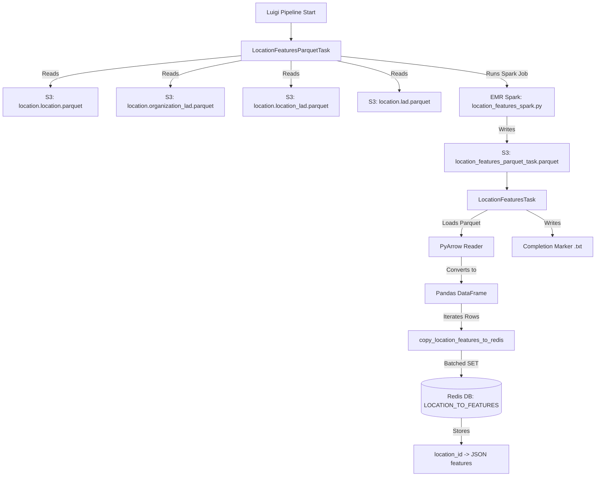
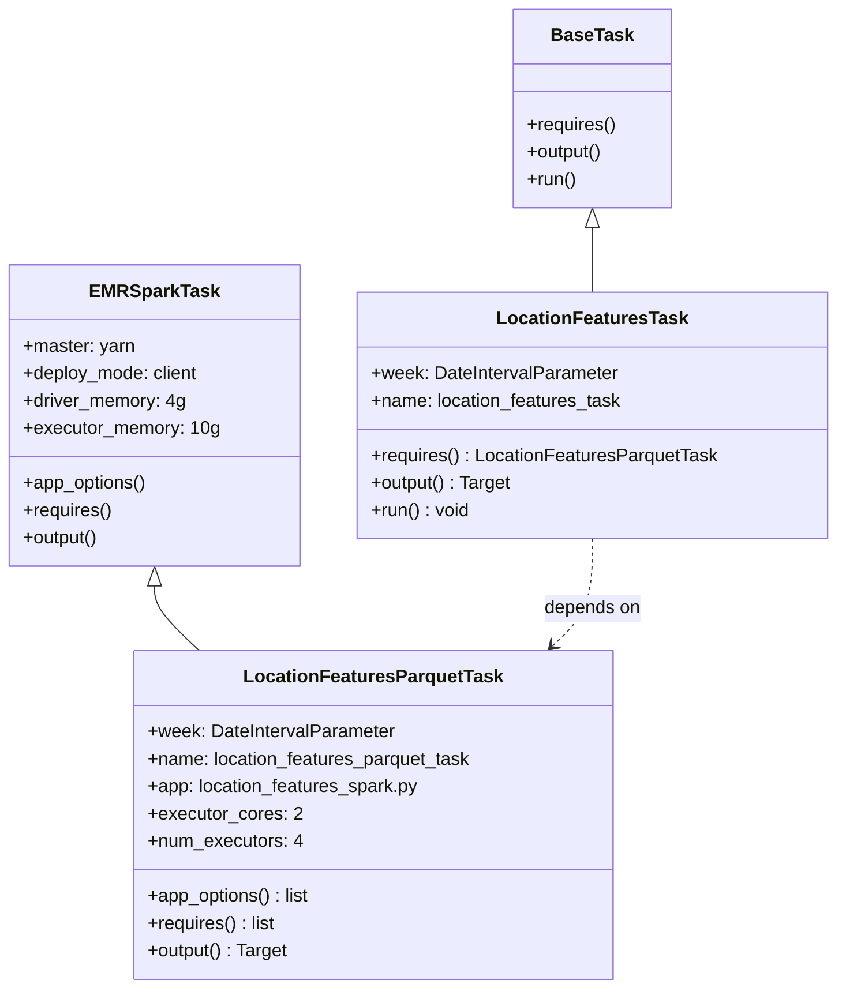
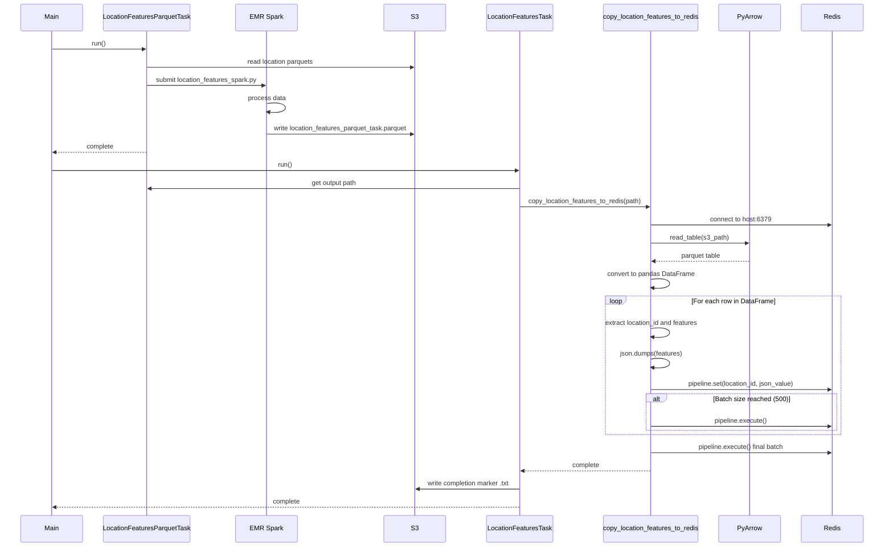

# Diagram: research/orchestrator/tasks/transforms/location_features_task.py


> Auto-generated by Obscura crawlers

## Diagram 1

```mermaid
graph TB
      Start[Luigi Pipeline Start] --> LFP[LocationFeaturesParquetTask]
      LFP -->|Reads| LP[S3: location.location.parquet]
      LFP -->|Reads| OLP[S3: location.organization_lad.parquet]...
  └ 86 lines...

✗ read_bash
  Invalid shell ID: 0. Please supply a valid shell ID to read output from.

  <no active shell sessions>

● Output Mermaid diagrams without fences
  $ cat << 'HEREDOC_EOF'
```

> SVG rendering failed for this diagram.

## Diagram 2

```mermaid
graph TB
      Start[Luigi Pipeline Start] --> LFP[LocationFeaturesParquetTask]
      LFP -->|Reads| LP[S3: location.location.parquet]
      LFP -->|Reads| OLP[S3: location.organization_lad.parquet]...
  └ 86 lines...

● Print mermaid diagrams
  $ echo "graph TB
      Start[Luigi Pipeline Start] --> LFP[LocationFeaturesParquetTask]
      LFP -->|Reads| LP[S3: location.location.parquet]
      LFP -->|Reads| OLP[S3: location.organization_lad.parquet]
      LFP -->|Reads| LLP[S3: location.location_lad.parquet]...
  └ 84 lines...
```

> SVG rendering failed for this diagram.

## Diagram 3



### SVG

<svg id="container" width="1654.25390625" xmlns="http://www.w3.org/2000/svg" class="flowchart" height="1302.426513671875" viewBox="0 0 1654.25390625 1302.426513671875" role="graphics-document document" aria-roledescription="flowchart-v2"><style>#container{font-family:"trebuchet ms",verdana,arial,sans-serif;font-size:16px;fill:#333;}@keyframes edge-animation-frame{from{stroke-dashoffset:0;}}@keyframes dash{to{stroke-dashoffset:0;}}#container .edge-animation-slow{stroke-dasharray:9,5!important;stroke-dashoffset:900;animation:dash 50s linear infinite;stroke-linecap:round;}#container .edge-animation-fast{stroke-dasharray:9,5!important;stroke-dashoffset:900;animation:dash 20s linear infinite;stroke-linecap:round;}#container .error-icon{fill:#552222;}#container .error-text{fill:#552222;stroke:#552222;}#container .edge-thickness-normal{stroke-width:1px;}#container .edge-thickness-thick{stroke-width:3.5px;}#container .edge-pattern-solid{stroke-dasharray:0;}#container .edge-thickness-invisible{stroke-width:0;fill:none;}#container .edge-pattern-dashed{stroke-dasharray:3;}#container .edge-pattern-dotted{stroke-dasharray:2;}#container .marker{fill:#333333;stroke:#333333;}#container .marker.cross{stroke:#333333;}#container svg{font-family:"trebuchet ms",verdana,arial,sans-serif;font-size:16px;}#container p{margin:0;}#container .label{font-family:"trebuchet ms",verdana,arial,sans-serif;color:#333;}#container .cluster-label text{fill:#333;}#container .cluster-label span{color:#333;}#container .cluster-label span p{background-color:transparent;}#container .label text,#container span{fill:#333;color:#333;}#container .node rect,#container .node circle,#container .node ellipse,#container .node polygon,#container .node path{fill:#ECECFF;stroke:#9370DB;stroke-width:1px;}#container .rough-node .label text,#container .node .label text,#container .image-shape .label,#container .icon-shape .label{text-anchor:middle;}#container .node .katex path{fill:#000;stroke:#000;stroke-width:1px;}#container .rough-node .label,#container .node .label,#container .image-shape .label,#container .icon-shape .label{text-align:center;}#container .node.clickable{cursor:pointer;}#container .root .anchor path{fill:#333333!important;stroke-width:0;stroke:#333333;}#container .arrowheadPath{fill:#333333;}#container .edgePath .path{stroke:#333333;stroke-width:2.0px;}#container .flowchart-link{stroke:#333333;fill:none;}#container .edgeLabel{background-color:rgba(232,232,232, 0.8);text-align:center;}#container .edgeLabel p{background-color:rgba(232,232,232, 0.8);}#container .edgeLabel rect{opacity:0.5;background-color:rgba(232,232,232, 0.8);fill:rgba(232,232,232, 0.8);}#container .labelBkg{background-color:rgba(232, 232, 232, 0.5);}#container .cluster rect{fill:#ffffde;stroke:#aaaa33;stroke-width:1px;}#container .cluster text{fill:#333;}#container .cluster span{color:#333;}#container div.mermaidTooltip{position:absolute;text-align:center;max-width:200px;padding:2px;font-family:"trebuchet ms",verdana,arial,sans-serif;font-size:12px;background:hsl(80, 100%, 96.2745098039%);border:1px solid #aaaa33;border-radius:2px;pointer-events:none;z-index:100;}#container .flowchartTitleText{text-anchor:middle;font-size:18px;fill:#333;}#container rect.text{fill:none;stroke-width:0;}#container .icon-shape,#container .image-shape{background-color:rgba(232,232,232, 0.8);text-align:center;}#container .icon-shape p,#container .image-shape p{background-color:rgba(232,232,232, 0.8);padding:2px;}#container .icon-shape rect,#container .image-shape rect{opacity:0.5;background-color:rgba(232,232,232, 0.8);fill:rgba(232,232,232, 0.8);}#container .label-icon{display:inline-block;height:1em;overflow:visible;vertical-align:-0.125em;}#container .node .label-icon path{fill:currentColor;stroke:revert;stroke-width:revert;}#container :root{--mermaid-font-family:"trebuchet ms",verdana,arial,sans-serif;}</style><g><marker id="container_flowchart-v2-pointEnd" class="marker flowchart-v2" viewBox="0 0 10 10" refX="5" refY="5" markerUnits="userSpaceOnUse" markerWidth="8" markerHeight="8" orient="auto"><path d="M 0 0 L 10 5 L 0 10 z" class="arrowMarkerPath" style="stroke-width: 1; stroke-dasharray: 1, 0;"></path></marker><marker id="container_flowchart-v2-pointStart" class="marker flowchart-v2" viewBox="0 0 10 10" refX="4.5" refY="5" markerUnits="userSpaceOnUse" markerWidth="8" markerHeight="8" orient="auto"><path d="M 0 5 L 10 10 L 10 0 z" class="arrowMarkerPath" style="stroke-width: 1; stroke-dasharray: 1, 0;"></path></marker><marker id="container_flowchart-v2-circleEnd" class="marker flowchart-v2" viewBox="0 0 10 10" refX="11" refY="5" markerUnits="userSpaceOnUse" markerWidth="11" markerHeight="11" orient="auto"><circle cx="5" cy="5" r="5" class="arrowMarkerPath" style="stroke-width: 1; stroke-dasharray: 1, 0;"></circle></marker><marker id="container_flowchart-v2-circleStart" class="marker flowchart-v2" viewBox="0 0 10 10" refX="-1" refY="5" markerUnits="userSpaceOnUse" markerWidth="11" markerHeight="11" orient="auto"><circle cx="5" cy="5" r="5" class="arrowMarkerPath" style="stroke-width: 1; stroke-dasharray: 1, 0;"></circle></marker><marker id="container_flowchart-v2-crossEnd" class="marker cross flowchart-v2" viewBox="0 0 11 11" refX="12" refY="5.2" markerUnits="userSpaceOnUse" markerWidth="11" markerHeight="11" orient="auto"><path d="M 1,1 l 9,9 M 10,1 l -9,9" class="arrowMarkerPath" style="stroke-width: 2; stroke-dasharray: 1, 0;"></path></marker><marker id="container_flowchart-v2-crossStart" class="marker cross flowchart-v2" viewBox="0 0 11 11" refX="-1" refY="5.2" markerUnits="userSpaceOnUse" markerWidth="11" markerHeight="11" orient="auto"><path d="M 1,1 l 9,9 M 10,1 l -9,9" class="arrowMarkerPath" style="stroke-width: 2; stroke-dasharray: 1, 0;"></path></marker><g class="root"><g class="clusters"></g><g class="edgePaths"><path d="M810.242,62L810.242,66.167C810.242,70.333,810.242,78.667,810.242,86.333C810.242,94,810.242,101,810.242,104.5L810.242,108" id="L_Start_LFP_0" class="edge-thickness-normal edge-pattern-solid edge-thickness-normal edge-pattern-solid flowchart-link" style=";" data-edge="true" data-et="edge" data-id="L_Start_LFP_0" data-points="W3sieCI6ODEwLjI0MjE4NzUsInkiOjYyfSx7IngiOjgxMC4yNDIxODc1LCJ5Ijo4N30seyJ4Ijo4MTAuMjQyMTg3NSwieSI6MTEyfV0=" marker-end="url(#container_flowchart-v2-pointEnd)"></path><path d="M674.477,151.925L585.064,160.438C495.651,168.95,316.826,185.975,227.413,199.988C138,214,138,225,138,230.5L138,236" id="L_LFP_LP_0" class="edge-thickness-normal edge-pattern-solid edge-thickness-normal edge-pattern-solid flowchart-link" style=";" data-edge="true" data-et="edge" data-id="L_LFP_LP_0" data-points="W3sieCI6Njc0LjQ3NjU2MjUsInkiOjE1MS45MjU0MDEyMzQyMDkyfSx7IngiOjEzOCwieSI6MjAzfSx7IngiOjEzOCwieSI6MjQwfV0=" marker-end="url(#container_flowchart-v2-pointEnd)"></path><path d="M674.477,164.582L640.495,170.985C606.513,177.388,538.549,190.194,504.568,202.097C470.586,214,470.586,225,470.586,230.5L470.586,236" id="L_LFP_OLP_0" class="edge-thickness-normal edge-pattern-solid edge-thickness-normal edge-pattern-solid flowchart-link" style=";" data-edge="true" data-et="edge" data-id="L_LFP_OLP_0" data-points="W3sieCI6Njc0LjQ3NjU2MjUsInkiOjE2NC41ODE3NDYyNTA4MDUwNX0seyJ4Ijo0NzAuNTg1OTM3NSwieSI6MjAzfSx7IngiOjQ3MC41ODU5Mzc1LCJ5IjoyNDB9XQ==" marker-end="url(#container_flowchart-v2-pointEnd)"></path><path d="M810.242,166L810.242,172.167C810.242,178.333,810.242,190.667,810.242,202.333C810.242,214,810.242,225,810.242,230.5L810.242,236" id="L_LFP_LLP_0" class="edge-thickness-normal edge-pattern-solid edge-thickness-normal edge-pattern-solid flowchart-link" style=";" data-edge="true" data-et="edge" data-id="L_LFP_LLP_0" data-points="W3sieCI6ODEwLjI0MjE4NzUsInkiOjE2Nn0seyJ4Ijo4MTAuMjQyMTg3NSwieSI6MjAzfSx7IngiOjgxMC4yNDIxODc1LCJ5IjoyNDB9XQ==" marker-end="url(#container_flowchart-v2-pointEnd)"></path><path d="M938.021,166L967.205,172.167C996.389,178.333,1054.757,190.667,1083.941,204.333C1113.125,218,1113.125,233,1113.125,240.5L1113.125,248" id="L_LFP_LADP_0" class="edge-thickness-normal edge-pattern-solid edge-thickness-normal edge-pattern-solid flowchart-link" style=";" data-edge="true" data-et="edge" data-id="L_LFP_LADP_0" data-points="W3sieCI6OTM4LjAyMDg3NDAyMzQzNzUsInkiOjE2Nn0seyJ4IjoxMTEzLjEyNSwieSI6MjAzfSx7IngiOjExMTMuMTI1LCJ5IjoyNTJ9XQ==" marker-end="url(#container_flowchart-v2-pointEnd)"></path><path d="M946.008,153.513L1023.163,161.761C1100.318,170.009,1254.628,186.504,1331.783,200.252C1408.938,214,1408.938,225,1408.938,230.5L1408.938,236" id="L_LFP_Spark_0" class="edge-thickness-normal edge-pattern-solid edge-thickness-normal edge-pattern-solid flowchart-link" style=";" data-edge="true" data-et="edge" data-id="L_LFP_Spark_0" data-points="W3sieCI6OTQ2LjAwNzgxMjUsInkiOjE1My41MTMyMjUzNzI4ODExMn0seyJ4IjoxNDA4LjkzNzUsInkiOjIwM30seyJ4IjoxNDA4LjkzNzUsInkiOjI0MH1d" marker-end="url(#container_flowchart-v2-pointEnd)"></path><path d="M1408.938,318L1408.938,324.167C1408.938,330.333,1408.938,342.667,1408.938,354.333C1408.938,366,1408.938,377,1408.938,382.5L1408.938,388" id="L_Spark_Output_0" class="edge-thickness-normal edge-pattern-solid edge-thickness-normal edge-pattern-solid flowchart-link" style=";" data-edge="true" data-et="edge" data-id="L_Spark_Output_0" data-points="W3sieCI6MTQwOC45Mzc1LCJ5IjozMTh9LHsieCI6MTQwOC45Mzc1LCJ5IjozNTV9LHsieCI6MTQwOC45Mzc1LCJ5IjozOTJ9XQ==" marker-end="url(#container_flowchart-v2-pointEnd)"></path><path d="M1408.938,470L1408.938,474.167C1408.938,478.333,1408.938,486.667,1408.938,494.333C1408.938,502,1408.938,509,1408.938,512.5L1408.938,516" id="L_Output_LFT_0" class="edge-thickness-normal edge-pattern-solid edge-thickness-normal edge-pattern-solid flowchart-link" style=";" data-edge="true" data-et="edge" data-id="L_Output_LFT_0" data-points="W3sieCI6MTQwOC45Mzc1LCJ5Ijo0NzB9LHsieCI6MTQwOC45Mzc1LCJ5Ijo0OTV9LHsieCI6MTQwOC45Mzc1LCJ5Ijo1MjB9XQ==" marker-end="url(#container_flowchart-v2-pointEnd)"></path><path d="M1356.274,574L1344.246,580.167C1332.218,586.333,1308.162,598.667,1296.134,610.333C1284.105,622,1284.105,633,1284.105,638.5L1284.105,644" id="L_LFT_PyArrow_0" class="edge-thickness-normal edge-pattern-solid edge-thickness-normal edge-pattern-solid flowchart-link" style=";" data-edge="true" data-et="edge" data-id="L_LFT_PyArrow_0" data-points="W3sieCI6MTM1Ni4yNzM5ODY4MTY0MDYyLCJ5Ijo1NzR9LHsieCI6MTI4NC4xMDU0Njg3NSwieSI6NjExfSx7IngiOjEyODQuMTA1NDY4NzUsInkiOjY0OH1d" marker-end="url(#container_flowchart-v2-pointEnd)"></path><path d="M1284.105,702L1284.105,708.167C1284.105,714.333,1284.105,726.667,1284.105,738.333C1284.105,750,1284.105,761,1284.105,766.5L1284.105,772" id="L_PyArrow_DF_0" class="edge-thickness-normal edge-pattern-solid edge-thickness-normal edge-pattern-solid flowchart-link" style=";" data-edge="true" data-et="edge" data-id="L_PyArrow_DF_0" data-points="W3sieCI6MTI4NC4xMDU0Njg3NSwieSI6NzAyfSx7IngiOjEyODQuMTA1NDY4NzUsInkiOjczOX0seyJ4IjoxMjg0LjEwNTQ2ODc1LCJ5Ijo3NzZ9XQ==" marker-end="url(#container_flowchart-v2-pointEnd)"></path><path d="M1284.105,830L1284.105,836.167C1284.105,842.333,1284.105,854.667,1284.105,866.333C1284.105,878,1284.105,889,1284.105,894.5L1284.105,900" id="L_DF_Copy_0" class="edge-thickness-normal edge-pattern-solid edge-thickness-normal edge-pattern-solid flowchart-link" style=";" data-edge="true" data-et="edge" data-id="L_DF_Copy_0" data-points="W3sieCI6MTI4NC4xMDU0Njg3NSwieSI6ODMwfSx7IngiOjEyODQuMTA1NDY4NzUsInkiOjg2N30seyJ4IjoxMjg0LjEwNTQ2ODc1LCJ5Ijo5MDR9XQ==" marker-end="url(#container_flowchart-v2-pointEnd)"></path><path d="M1284.105,958L1284.105,964.167C1284.105,970.333,1284.105,982.667,1284.105,994.333C1284.105,1006,1284.105,1017,1284.105,1022.5L1284.105,1028" id="L_Copy_Redis_0" class="edge-thickness-normal edge-pattern-solid edge-thickness-normal edge-pattern-solid flowchart-link" style=";" data-edge="true" data-et="edge" data-id="L_Copy_Redis_0" data-points="W3sieCI6MTI4NC4xMDU0Njg3NSwieSI6OTU4fSx7IngiOjEyODQuMTA1NDY4NzUsInkiOjk5NX0seyJ4IjoxMjg0LjEwNTQ2ODc1LCJ5IjoxMDMyfV0=" marker-end="url(#container_flowchart-v2-pointEnd)"></path><path d="M1284.105,1142.426L1284.105,1148.593C1284.105,1154.76,1284.105,1167.093,1284.105,1178.76C1284.105,1190.426,1284.105,1201.426,1284.105,1206.926L1284.105,1212.426" id="L_Redis_Features_0" class="edge-thickness-normal edge-pattern-solid edge-thickness-normal edge-pattern-solid flowchart-link" style=";" data-edge="true" data-et="edge" data-id="L_Redis_Features_0" data-points="W3sieCI6MTI4NC4xMDU0Njg3NSwieSI6MTE0Mi40MjY0NzU1MjQ5MDIzfSx7IngiOjEyODQuMTA1NDY4NzUsInkiOjExNzkuNDI2NDc1NTI0OTAyM30seyJ4IjoxMjg0LjEwNTQ2ODc1LCJ5IjoxMjE2LjQyNjQ3NTUyNDkwMjN9XQ==" marker-end="url(#container_flowchart-v2-pointEnd)"></path><path d="M1461.601,574L1473.629,580.167C1485.657,586.333,1509.713,598.667,1521.741,610.333C1533.77,622,1533.77,633,1533.77,638.5L1533.77,644" id="L_LFT_Complete_0" class="edge-thickness-normal edge-pattern-solid edge-thickness-normal edge-pattern-solid flowchart-link" style=";" data-edge="true" data-et="edge" data-id="L_LFT_Complete_0" data-points="W3sieCI6MTQ2MS42MDEwMTMxODM1OTM4LCJ5Ijo1NzR9LHsieCI6MTUzMy43Njk1MzEyNSwieSI6NjExfSx7IngiOjE1MzMuNzY5NTMxMjUsInkiOjY0OH1d" marker-end="url(#container_flowchart-v2-pointEnd)"></path></g><g class="edgeLabels"><g class="edgeLabel"><g class="label" data-id="L_Start_LFP_0" transform="translate(0, 0)"><foreignObject width="0" height="0"><div xmlns="http://www.w3.org/1999/xhtml" class="labelBkg" style="display: table-cell; white-space: nowrap; line-height: 1.5; max-width: 200px; text-align: center;"><span class="edgeLabel"></span></div></foreignObject></g></g><g class="edgeLabel" transform="translate(138, 203)"><g class="label" data-id="L_LFP_LP_0" transform="translate(-21.875, -12)"><foreignObject width="43.75" height="24"><div xmlns="http://www.w3.org/1999/xhtml" class="labelBkg" style="display: table-cell; white-space: nowrap; line-height: 1.5; max-width: 200px; text-align: center;"><span class="edgeLabel"><p>Reads</p></span></div></foreignObject></g></g><g class="edgeLabel" transform="translate(470.5859375, 203)"><g class="label" data-id="L_LFP_OLP_0" transform="translate(-21.875, -12)"><foreignObject width="43.75" height="24"><div xmlns="http://www.w3.org/1999/xhtml" class="labelBkg" style="display: table-cell; white-space: nowrap; line-height: 1.5; max-width: 200px; text-align: center;"><span class="edgeLabel"><p>Reads</p></span></div></foreignObject></g></g><g class="edgeLabel" transform="translate(810.2421875, 203)"><g class="label" data-id="L_LFP_LLP_0" transform="translate(-21.875, -12)"><foreignObject width="43.75" height="24"><div xmlns="http://www.w3.org/1999/xhtml" class="labelBkg" style="display: table-cell; white-space: nowrap; line-height: 1.5; max-width: 200px; text-align: center;"><span class="edgeLabel"><p>Reads</p></span></div></foreignObject></g></g><g class="edgeLabel" transform="translate(1113.125, 203)"><g class="label" data-id="L_LFP_LADP_0" transform="translate(-21.875, -12)"><foreignObject width="43.75" height="24"><div xmlns="http://www.w3.org/1999/xhtml" class="labelBkg" style="display: table-cell; white-space: nowrap; line-height: 1.5; max-width: 200px; text-align: center;"><span class="edgeLabel"><p>Reads</p></span></div></foreignObject></g></g><g class="edgeLabel" transform="translate(1408.9375, 203)"><g class="label" data-id="L_LFP_Spark_0" transform="translate(-54.59375, -12)"><foreignObject width="109.1875" height="24"><div xmlns="http://www.w3.org/1999/xhtml" class="labelBkg" style="display: table-cell; white-space: nowrap; line-height: 1.5; max-width: 200px; text-align: center;"><span class="edgeLabel"><p>Runs Spark Job</p></span></div></foreignObject></g></g><g class="edgeLabel" transform="translate(1408.9375, 355)"><g class="label" data-id="L_Spark_Output_0" transform="translate(-22.78125, -12)"><foreignObject width="45.5625" height="24"><div xmlns="http://www.w3.org/1999/xhtml" class="labelBkg" style="display: table-cell; white-space: nowrap; line-height: 1.5; max-width: 200px; text-align: center;"><span class="edgeLabel"><p>Writes</p></span></div></foreignObject></g></g><g class="edgeLabel"><g class="label" data-id="L_Output_LFT_0" transform="translate(0, 0)"><foreignObject width="0" height="0"><div xmlns="http://www.w3.org/1999/xhtml" class="labelBkg" style="display: table-cell; white-space: nowrap; line-height: 1.5; max-width: 200px; text-align: center;"><span class="edgeLabel"></span></div></foreignObject></g></g><g class="edgeLabel" transform="translate(1284.10546875, 611)"><g class="label" data-id="L_LFT_PyArrow_0" transform="translate(-51.46875, -12)"><foreignObject width="102.9375" height="24"><div xmlns="http://www.w3.org/1999/xhtml" class="labelBkg" style="display: table-cell; white-space: nowrap; line-height: 1.5; max-width: 200px; text-align: center;"><span class="edgeLabel"><p>Loads Parquet</p></span></div></foreignObject></g></g><g class="edgeLabel" transform="translate(1284.10546875, 739)"><g class="label" data-id="L_PyArrow_DF_0" transform="translate(-41.1640625, -12)"><foreignObject width="82.328125" height="24"><div xmlns="http://www.w3.org/1999/xhtml" class="labelBkg" style="display: table-cell; white-space: nowrap; line-height: 1.5; max-width: 200px; text-align: center;"><span class="edgeLabel"><p>Converts to</p></span></div></foreignObject></g></g><g class="edgeLabel" transform="translate(1284.10546875, 867)"><g class="label" data-id="L_DF_Copy_0" transform="translate(-48.5, -12)"><foreignObject width="97" height="24"><div xmlns="http://www.w3.org/1999/xhtml" class="labelBkg" style="display: table-cell; white-space: nowrap; line-height: 1.5; max-width: 200px; text-align: center;"><span class="edgeLabel"><p>Iterates Rows</p></span></div></foreignObject></g></g><g class="edgeLabel" transform="translate(1284.10546875, 995)"><g class="label" data-id="L_Copy_Redis_0" transform="translate(-44.5390625, -12)"><foreignObject width="89.078125" height="24"><div xmlns="http://www.w3.org/1999/xhtml" class="labelBkg" style="display: table-cell; white-space: nowrap; line-height: 1.5; max-width: 200px; text-align: center;"><span class="edgeLabel"><p>Batched SET</p></span></div></foreignObject></g></g><g class="edgeLabel" transform="translate(1284.10546875, 1179.4264755249023)"><g class="label" data-id="L_Redis_Features_0" transform="translate(-22.75, -12)"><foreignObject width="45.5" height="24"><div xmlns="http://www.w3.org/1999/xhtml" class="labelBkg" style="display: table-cell; white-space: nowrap; line-height: 1.5; max-width: 200px; text-align: center;"><span class="edgeLabel"><p>Stores</p></span></div></foreignObject></g></g><g class="edgeLabel" transform="translate(1533.76953125, 611)"><g class="label" data-id="L_LFT_Complete_0" transform="translate(-22.78125, -12)"><foreignObject width="45.5625" height="24"><div xmlns="http://www.w3.org/1999/xhtml" class="labelBkg" style="display: table-cell; white-space: nowrap; line-height: 1.5; max-width: 200px; text-align: center;"><span class="edgeLabel"><p>Writes</p></span></div></foreignObject></g></g></g><g class="nodes"><g class="node default" id="flowchart-Start-0" transform="translate(810.2421875, 35)"><rect class="basic label-container" style="" x="-98.6171875" y="-27" width="197.234375" height="54"></rect><g class="label" style="" transform="translate(-68.6171875, -12)"><rect></rect><foreignObject width="137.234375" height="24"><div xmlns="http://www.w3.org/1999/xhtml" style="display: table-cell; white-space: nowrap; line-height: 1.5; max-width: 200px; text-align: center;"><span class="nodeLabel"><p>Luigi Pipeline Start</p></span></div></foreignObject></g></g><g class="node default" id="flowchart-LFP-1" transform="translate(810.2421875, 139)"><rect class="basic label-container" style="" x="-135.765625" y="-27" width="271.53125" height="54"></rect><g class="label" style="" transform="translate(-105.765625, -12)"><rect></rect><foreignObject width="211.53125" height="24"><div xmlns="http://www.w3.org/1999/xhtml" style="display: table; white-space: break-spaces; line-height: 1.5; max-width: 200px; text-align: center; width: 200px;"><span class="nodeLabel"><p>LocationFeaturesParquetTask</p></span></div></foreignObject></g></g><g class="node default" id="flowchart-LP-3" transform="translate(138, 279)"><rect class="basic label-container" style="" x="-130" y="-39" width="260" height="78"></rect><g class="label" style="" transform="translate(-100, -24)"><rect></rect><foreignObject width="200" height="48"><div xmlns="http://www.w3.org/1999/xhtml" style="display: table; white-space: break-spaces; line-height: 1.5; max-width: 200px; text-align: center; width: 200px;"><span class="nodeLabel"><p>S3: location.location.parquet</p></span></div></foreignObject></g></g><g class="node default" id="flowchart-OLP-5" transform="translate(470.5859375, 279)"><rect class="basic label-container" style="" x="-152.5859375" y="-39" width="305.171875" height="78"></rect><g class="label" style="" transform="translate(-122.5859375, -24)"><rect></rect><foreignObject width="245.171875" height="48"><div xmlns="http://www.w3.org/1999/xhtml" style="display: table; white-space: break-spaces; line-height: 1.5; max-width: 200px; text-align: center; width: 200px;"><span class="nodeLabel"><p>S3: location.organization_lad.parquet</p></span></div></foreignObject></g></g><g class="node default" id="flowchart-LLP-7" transform="translate(810.2421875, 279)"><rect class="basic label-container" style="" x="-137.0703125" y="-39" width="274.140625" height="78"></rect><g class="label" style="" transform="translate(-107.0703125, -24)"><rect></rect><foreignObject width="214.140625" height="48"><div xmlns="http://www.w3.org/1999/xhtml" style="display: table; white-space: break-spaces; line-height: 1.5; max-width: 200px; text-align: center; width: 200px;"><span class="nodeLabel"><p>S3: location.location_lad.parquet</p></span></div></foreignObject></g></g><g class="node default" id="flowchart-LADP-9" transform="translate(1113.125, 279)"><rect class="basic label-container" style="" x="-115.8125" y="-27" width="231.625" height="54"></rect><g class="label" style="" transform="translate(-85.8125, -12)"><rect></rect><foreignObject width="171.625" height="24"><div xmlns="http://www.w3.org/1999/xhtml" style="display: table-cell; white-space: nowrap; line-height: 1.5; max-width: 200px; text-align: center;"><span class="nodeLabel"><p>S3: location.lad.parquet</p></span></div></foreignObject></g></g><g class="node default" id="flowchart-Spark-11" transform="translate(1408.9375, 279)"><rect class="basic label-container" style="" x="-130" y="-39" width="260" height="78"></rect><g class="label" style="" transform="translate(-100, -24)"><rect></rect><foreignObject width="200" height="48"><div xmlns="http://www.w3.org/1999/xhtml" style="display: table; white-space: break-spaces; line-height: 1.5; max-width: 200px; text-align: center; width: 200px;"><span class="nodeLabel"><p>EMR Spark: location_features_spark.py</p></span></div></foreignObject></g></g><g class="node default" id="flowchart-Output-13" transform="translate(1408.9375, 431)"><rect class="basic label-container" style="" x="-175.3046875" y="-39" width="350.609375" height="78"></rect><g class="label" style="" transform="translate(-145.3046875, -24)"><rect></rect><foreignObject width="290.609375" height="48"><div xmlns="http://www.w3.org/1999/xhtml" style="display: table; white-space: break-spaces; line-height: 1.5; max-width: 200px; text-align: center; width: 200px;"><span class="nodeLabel"><p>S3: location_features_parquet_task.parquet</p></span></div></foreignObject></g></g><g class="node default" id="flowchart-LFT-15" transform="translate(1408.9375, 547)"><rect class="basic label-container" style="" x="-107.671875" y="-27" width="215.34375" height="54"></rect><g class="label" style="" transform="translate(-77.671875, -12)"><rect></rect><foreignObject width="155.34375" height="24"><div xmlns="http://www.w3.org/1999/xhtml" style="display: table-cell; white-space: nowrap; line-height: 1.5; max-width: 200px; text-align: center;"><span class="nodeLabel"><p>LocationFeaturesTask</p></span></div></foreignObject></g></g><g class="node default" id="flowchart-PyArrow-17" transform="translate(1284.10546875, 675)"><rect class="basic label-container" style="" x="-87.1796875" y="-27" width="174.359375" height="54"></rect><g class="label" style="" transform="translate(-57.1796875, -12)"><rect></rect><foreignObject width="114.359375" height="24"><div xmlns="http://www.w3.org/1999/xhtml" style="display: table-cell; white-space: nowrap; line-height: 1.5; max-width: 200px; text-align: center;"><span class="nodeLabel"><p>PyArrow Reader</p></span></div></foreignObject></g></g><g class="node default" id="flowchart-DF-19" transform="translate(1284.10546875, 803)"><rect class="basic label-container" style="" x="-96.796875" y="-27" width="193.59375" height="54"></rect><g class="label" style="" transform="translate(-66.796875, -12)"><rect></rect><foreignObject width="133.59375" height="24"><div xmlns="http://www.w3.org/1999/xhtml" style="display: table-cell; white-space: nowrap; line-height: 1.5; max-width: 200px; text-align: center;"><span class="nodeLabel"><p>Pandas DataFrame</p></span></div></foreignObject></g></g><g class="node default" id="flowchart-Copy-21" transform="translate(1284.10546875, 931)"><rect class="basic label-container" style="" x="-147.3984375" y="-27" width="294.796875" height="54"></rect><g class="label" style="" transform="translate(-117.3984375, -12)"><rect></rect><foreignObject width="234.796875" height="24"><div xmlns="http://www.w3.org/1999/xhtml" style="display: table; white-space: break-spaces; line-height: 1.5; max-width: 200px; text-align: center; width: 200px;"><span class="nodeLabel"><p>copy_location_features_to_redis</p></span></div></foreignObject></g></g><g class="node default" id="flowchart-Redis-23" transform="translate(1284.10546875, 1087.2132377624512)"><path d="M0,15.808823529411764 a107.5,15.808823529411764 0,0,0 215,0 a107.5,15.808823529411764 0,0,0 -215,0 l0,78.80882352941177 a107.5,15.808823529411764 0,0,0 215,0 l0,-78.80882352941177" class="basic label-container" style="" transform="translate(-107.5, -55.21323529411765)"></path><g class="label" style="" transform="translate(-100, -14)"><rect></rect><foreignObject width="200" height="48"><div xmlns="http://www.w3.org/1999/xhtml" style="display: table; white-space: break-spaces; line-height: 1.5; max-width: 200px; text-align: center; width: 200px;"><span class="nodeLabel"><p>Redis DB: LOCATION_TO_FEATURES</p></span></div></foreignObject></g></g><g class="node default" id="flowchart-Features-25" transform="translate(1284.10546875, 1255.4264755249023)"><rect class="basic label-container" style="" x="-130" y="-39" width="260" height="78"></rect><g class="label" style="" transform="translate(-100, -24)"><rect></rect><foreignObject width="200" height="48"><div xmlns="http://www.w3.org/1999/xhtml" style="display: table; white-space: break-spaces; line-height: 1.5; max-width: 200px; text-align: center; width: 200px;"><span class="nodeLabel"><p>location_id -&gt; JSON features</p></span></div></foreignObject></g></g><g class="node default" id="flowchart-Complete-27" transform="translate(1533.76953125, 675)"><rect class="basic label-container" style="" x="-112.484375" y="-27" width="224.96875" height="54"></rect><g class="label" style="" transform="translate(-82.484375, -12)"><rect></rect><foreignObject width="164.96875" height="24"><div xmlns="http://www.w3.org/1999/xhtml" style="display: table-cell; white-space: nowrap; line-height: 1.5; max-width: 200px; text-align: center;"><span class="nodeLabel"><p>Completion Marker .txt</p></span></div></foreignObject></g></g></g></g></g></svg>

## Diagram 4



### SVG

<svg id="container" width="717.796875" xmlns="http://www.w3.org/2000/svg" class="classDiagram" height="866" viewBox="0 0 717.796875 866" role="graphics-document document" aria-roledescription="class"><style>#container{font-family:"trebuchet ms",verdana,arial,sans-serif;font-size:16px;fill:#333;}@keyframes edge-animation-frame{from{stroke-dashoffset:0;}}@keyframes dash{to{stroke-dashoffset:0;}}#container .edge-animation-slow{stroke-dasharray:9,5!important;stroke-dashoffset:900;animation:dash 50s linear infinite;stroke-linecap:round;}#container .edge-animation-fast{stroke-dasharray:9,5!important;stroke-dashoffset:900;animation:dash 20s linear infinite;stroke-linecap:round;}#container .error-icon{fill:#552222;}#container .error-text{fill:#552222;stroke:#552222;}#container .edge-thickness-normal{stroke-width:1px;}#container .edge-thickness-thick{stroke-width:3.5px;}#container .edge-pattern-solid{stroke-dasharray:0;}#container .edge-thickness-invisible{stroke-width:0;fill:none;}#container .edge-pattern-dashed{stroke-dasharray:3;}#container .edge-pattern-dotted{stroke-dasharray:2;}#container .marker{fill:#333333;stroke:#333333;}#container .marker.cross{stroke:#333333;}#container svg{font-family:"trebuchet ms",verdana,arial,sans-serif;font-size:16px;}#container p{margin:0;}#container g.classGroup text{fill:#9370DB;stroke:none;font-family:"trebuchet ms",verdana,arial,sans-serif;font-size:10px;}#container g.classGroup text .title{font-weight:bolder;}#container .nodeLabel,#container .edgeLabel{color:#131300;}#container .edgeLabel .label rect{fill:#ECECFF;}#container .label text{fill:#131300;}#container .labelBkg{background:#ECECFF;}#container .edgeLabel .label span{background:#ECECFF;}#container .classTitle{font-weight:bolder;}#container .node rect,#container .node circle,#container .node ellipse,#container .node polygon,#container .node path{fill:#ECECFF;stroke:#9370DB;stroke-width:1px;}#container .divider{stroke:#9370DB;stroke-width:1;}#container g.clickable{cursor:pointer;}#container g.classGroup rect{fill:#ECECFF;stroke:#9370DB;}#container g.classGroup line{stroke:#9370DB;stroke-width:1;}#container .classLabel .box{stroke:none;stroke-width:0;fill:#ECECFF;opacity:0.5;}#container .classLabel .label{fill:#9370DB;font-size:10px;}#container .relation{stroke:#333333;stroke-width:1;fill:none;}#container .dashed-line{stroke-dasharray:3;}#container .dotted-line{stroke-dasharray:1 2;}#container #compositionStart,#container .composition{fill:#333333!important;stroke:#333333!important;stroke-width:1;}#container #compositionEnd,#container .composition{fill:#333333!important;stroke:#333333!important;stroke-width:1;}#container #dependencyStart,#container .dependency{fill:#333333!important;stroke:#333333!important;stroke-width:1;}#container #dependencyStart,#container .dependency{fill:#333333!important;stroke:#333333!important;stroke-width:1;}#container #extensionStart,#container .extension{fill:transparent!important;stroke:#333333!important;stroke-width:1;}#container #extensionEnd,#container .extension{fill:transparent!important;stroke:#333333!important;stroke-width:1;}#container #aggregationStart,#container .aggregation{fill:transparent!important;stroke:#333333!important;stroke-width:1;}#container #aggregationEnd,#container .aggregation{fill:transparent!important;stroke:#333333!important;stroke-width:1;}#container #lollipopStart,#container .lollipop{fill:#ECECFF!important;stroke:#333333!important;stroke-width:1;}#container #lollipopEnd,#container .lollipop{fill:#ECECFF!important;stroke:#333333!important;stroke-width:1;}#container .edgeTerminals{font-size:11px;line-height:initial;}#container .classTitleText{text-anchor:middle;font-size:18px;fill:#333;}#container .label-icon{display:inline-block;height:1em;overflow:visible;vertical-align:-0.125em;}#container .node .label-icon path{fill:currentColor;stroke:revert;stroke-width:revert;}#container :root{--mermaid-font-family:"trebuchet ms",verdana,arial,sans-serif;}</style><g><defs><marker id="container_class-aggregationStart" class="marker aggregation class" refX="18" refY="7" markerWidth="190" markerHeight="240" orient="auto"><path d="M 18,7 L9,13 L1,7 L9,1 Z"></path></marker></defs><defs><marker id="container_class-aggregationEnd" class="marker aggregation class" refX="1" refY="7" markerWidth="20" markerHeight="28" orient="auto"><path d="M 18,7 L9,13 L1,7 L9,1 Z"></path></marker></defs><defs><marker id="container_class-extensionStart" class="marker extension class" refX="18" refY="7" markerWidth="190" markerHeight="240" orient="auto"><path d="M 1,7 L18,13 V 1 Z"></path></marker></defs><defs><marker id="container_class-extensionEnd" class="marker extension class" refX="1" refY="7" markerWidth="20" markerHeight="28" orient="auto"><path d="M 1,1 V 13 L18,7 Z"></path></marker></defs><defs><marker id="container_class-compositionStart" class="marker composition class" refX="18" refY="7" markerWidth="190" markerHeight="240" orient="auto"><path d="M 18,7 L9,13 L1,7 L9,1 Z"></path></marker></defs><defs><marker id="container_class-compositionEnd" class="marker composition class" refX="1" refY="7" markerWidth="20" markerHeight="28" orient="auto"><path d="M 18,7 L9,13 L1,7 L9,1 Z"></path></marker></defs><defs><marker id="container_class-dependencyStart" class="marker dependency class" refX="6" refY="7" markerWidth="190" markerHeight="240" orient="auto"><path d="M 5,7 L9,13 L1,7 L9,1 Z"></path></marker></defs><defs><marker id="container_class-dependencyEnd" class="marker dependency class" refX="13" refY="7" markerWidth="20" markerHeight="28" orient="auto"><path d="M 18,7 L9,13 L14,7 L9,1 Z"></path></marker></defs><defs><marker id="container_class-lollipopStart" class="marker lollipop class" refX="13" refY="7" markerWidth="190" markerHeight="240" orient="auto"><circle stroke="black" fill="transparent" cx="7" cy="7" r="6"></circle></marker></defs><defs><marker id="container_class-lollipopEnd" class="marker lollipop class" refX="1" refY="7" markerWidth="190" markerHeight="240" orient="auto"><circle stroke="black" fill="transparent" cx="7" cy="7" r="6"></circle></marker></defs><g class="root"><g class="clusters"></g><g class="edgePaths"><path d="M131.402,513.25L131.402,516.542C131.402,519.833,131.402,526.417,137.806,535.875C144.209,545.333,157.016,557.667,163.419,563.833L169.823,570" id="id_EMRSparkTask_LocationFeaturesParquetTask_1" class="edge-thickness-normal edge-pattern-solid relation" style=";;;" data-edge="true" data-et="edge" data-id="id_EMRSparkTask_LocationFeaturesParquetTask_1" data-points="W3sieCI6MTMxLjQwMjM0Mzc1LCJ5Ijo0OTZ9LHsieCI6MTMxLjQwMjM0Mzc1LCJ5Ijo1MzN9LHsieCI6MTY5LjgyMjkwMjI3OTAwNTUyLCJ5Ijo1NzB9XQ==" marker-start="url(#container_class-extensionStart)"></path><path d="M507.301,199.25L507.301,200.542C507.301,201.833,507.301,204.417,507.301,213.875C507.301,223.333,507.301,239.667,507.301,247.833L507.301,256" id="id_BaseTask_LocationFeaturesTask_2" class="edge-thickness-normal edge-pattern-solid relation" style=";;;" data-edge="true" data-et="edge" data-id="id_BaseTask_LocationFeaturesTask_2" data-points="W3sieCI6NTA3LjMwMDc4MTI1LCJ5IjoxODJ9LHsieCI6NTA3LjMwMDc4MTI1LCJ5IjoyMDd9LHsieCI6NTA3LjMwMDc4MTI1LCJ5IjoyNTZ9XQ==" marker-start="url(#container_class-extensionStart)"></path><path d="M507.301,472L507.301,482.167C507.301,492.333,507.301,512.667,501.618,528.306C495.935,543.946,484.568,554.892,478.885,560.365L473.202,565.838" id="id_LocationFeaturesTask_LocationFeaturesParquetTask_3" class="edge-thickness-normal edge-pattern-dashed relation" style=";;;" data-edge="true" data-et="edge" data-id="id_LocationFeaturesTask_LocationFeaturesParquetTask_3" data-points="W3sieCI6NTA3LjMwMDc4MTI1LCJ5Ijo0NzJ9LHsieCI6NTA3LjMwMDc4MTI1LCJ5Ijo1MzN9LHsieCI6NDY4Ljg4MDIyMjcyMDk5NDUsInkiOjU3MH1d" marker-end="url(#container_class-dependencyEnd)"></path></g><g class="edgeLabels"><g class="edgeLabel"><g class="label" data-id="id_EMRSparkTask_LocationFeaturesParquetTask_1" transform="translate(0, 0)"><foreignObject width="0" height="0"><div xmlns="http://www.w3.org/1999/xhtml" class="labelBkg" style="display: table-cell; white-space: nowrap; line-height: 1.5; max-width: 200px; text-align: center;"><span class="edgeLabel"></span></div></foreignObject></g></g><g class="edgeLabel"><g class="label" data-id="id_BaseTask_LocationFeaturesTask_2" transform="translate(0, 0)"><foreignObject width="0" height="0"><div xmlns="http://www.w3.org/1999/xhtml" class="labelBkg" style="display: table-cell; white-space: nowrap; line-height: 1.5; max-width: 200px; text-align: center;"><span class="edgeLabel"></span></div></foreignObject></g></g><g class="edgeLabel" transform="translate(507.30078125, 533)"><g class="label" data-id="id_LocationFeaturesTask_LocationFeaturesParquetTask_3" transform="translate(-42.9453125, -12)"><foreignObject width="85.890625" height="24"><div xmlns="http://www.w3.org/1999/xhtml" class="labelBkg" style="display: table-cell; white-space: nowrap; line-height: 1.5; max-width: 200px; text-align: center;"><span class="edgeLabel"><p>depends on</p></span></div></foreignObject></g></g></g><g class="nodes"><g class="node default" id="classId-EMRSparkTask-0" transform="translate(131.40234375, 364)"><g class="basic label-container"><path d="M-123.40234375 -132 L123.40234375 -132 L123.40234375 132 L-123.40234375 132" stroke="none" stroke-width="0" fill="#ECECFF" style=""></path><path d="M-123.40234375 -132 C-62.81423108166809 -132, -2.226118413336181 -132, 123.40234375 -132 M-123.40234375 -132 C-59.257258073778786 -132, 4.887827602442428 -132, 123.40234375 -132 M123.40234375 -132 C123.40234375 -56.7232163539114, 123.40234375 18.553567292177206, 123.40234375 132 M123.40234375 -132 C123.40234375 -51.528460371906036, 123.40234375 28.94307925618793, 123.40234375 132 M123.40234375 132 C37.25209509329794 132, -48.89815356340412 132, -123.40234375 132 M123.40234375 132 C54.80599941488629 132, -13.790344920227426 132, -123.40234375 132 M-123.40234375 132 C-123.40234375 69.37148300700062, -123.40234375 6.74296601400124, -123.40234375 -132 M-123.40234375 132 C-123.40234375 78.42748327313777, -123.40234375 24.85496654627552, -123.40234375 -132" stroke="#9370DB" stroke-width="1.3" fill="none" stroke-dasharray="0 0" style=""></path></g><g class="annotation-group text" transform="translate(0, -108)"></g><g class="label-group text" transform="translate(-53.1484375, -108)"><g class="label" style="font-weight: bolder" transform="translate(0,-12)"><foreignObject width="106.296875" height="24"><div xmlns="http://www.w3.org/1999/xhtml" style="display: table-cell; white-space: nowrap; line-height: 1.5; max-width: 154px; text-align: center;"><span class="nodeLabel markdown-node-label" style=""><p>EMRSparkTask</p></span></div></foreignObject></g></g><g class="members-group text" transform="translate(-111.40234375, -60)"><g class="label" style="" transform="translate(0,-12)"><foreignObject width="98.265625" height="24"><div xmlns="http://www.w3.org/1999/xhtml" style="display: table-cell; white-space: nowrap; line-height: 1.5; max-width: 156px; text-align: center;"><span class="nodeLabel markdown-node-label" style=""><p>+master: yarn</p></span></div></foreignObject></g><g class="label" style="" transform="translate(0,12)"><foreignObject width="155.53125" height="24"><div xmlns="http://www.w3.org/1999/xhtml" style="display: table-cell; white-space: nowrap; line-height: 1.5; max-width: 213px; text-align: center;"><span class="nodeLabel markdown-node-label" style=""><p>+deploy_mode: client</p></span></div></foreignObject></g><g class="label" style="" transform="translate(0,36)"><foreignObject width="142.5" height="24"><div xmlns="http://www.w3.org/1999/xhtml" style="display: table-cell; white-space: nowrap; line-height: 1.5; max-width: 201px; text-align: center;"><span class="nodeLabel markdown-node-label" style=""><p>+driver_memory: 4g</p></span></div></foreignObject></g><g class="label" style="" transform="translate(0,60)"><foreignObject width="169.65625" height="24"><div xmlns="http://www.w3.org/1999/xhtml" style="display: table-cell; white-space: nowrap; line-height: 1.5; max-width: 228px; text-align: center;"><span class="nodeLabel markdown-node-label" style=""><p>+executor_memory: 10g</p></span></div></foreignObject></g></g><g class="methods-group text" transform="translate(-111.40234375, 60)"><g class="label" style="" transform="translate(0,-12)"><foreignObject width="108.84375" height="24"><div xmlns="http://www.w3.org/1999/xhtml" style="display: table-cell; white-space: nowrap; line-height: 1.5; max-width: 166px; text-align: center;"><span class="nodeLabel markdown-node-label" style=""><p>+app_options()</p></span></div></foreignObject></g><g class="label" style="" transform="translate(0,12)"><foreignObject width="78.0625" height="24"><div xmlns="http://www.w3.org/1999/xhtml" style="display: table-cell; white-space: nowrap; line-height: 1.5; max-width: 135px; text-align: center;"><span class="nodeLabel markdown-node-label" style=""><p>+requires()</p></span></div></foreignObject></g><g class="label" style="" transform="translate(0,36)"><foreignObject width="67.390625" height="24"><div xmlns="http://www.w3.org/1999/xhtml" style="display: table-cell; white-space: nowrap; line-height: 1.5; max-width: 125px; text-align: center;"><span class="nodeLabel markdown-node-label" style=""><p>+output()</p></span></div></foreignObject></g></g><g class="divider" style=""><path d="M-123.40234375 -84 C-34.82458757227417 -84, 53.75316860545166 -84, 123.40234375 -84 M-123.40234375 -84 C-58.52275740073128 -84, 6.356828948537441 -84, 123.40234375 -84" stroke="#9370DB" stroke-width="1.3" fill="none" stroke-dasharray="0 0" style=""></path></g><g class="divider" style=""><path d="M-123.40234375 36 C-68.721903395563 36, -14.041463041125994 36, 123.40234375 36 M-123.40234375 36 C-56.49527166848608 36, 10.411800413027834 36, 123.40234375 36" stroke="#9370DB" stroke-width="1.3" fill="none" stroke-dasharray="0 0" style=""></path></g></g><g class="node default" id="classId-BaseTask-1" transform="translate(507.30078125, 95)"><g class="basic label-container"><path d="M-68.046875 -87 L68.046875 -87 L68.046875 87 L-68.046875 87" stroke="none" stroke-width="0" fill="#ECECFF" style=""></path><path d="M-68.046875 -87 C-35.66898205819178 -87, -3.29108911638356 -87, 68.046875 -87 M-68.046875 -87 C-39.91364667719869 -87, -11.780418354397383 -87, 68.046875 -87 M68.046875 -87 C68.046875 -19.158097129756428, 68.046875 48.683805740487145, 68.046875 87 M68.046875 -87 C68.046875 -29.904908371573427, 68.046875 27.190183256853146, 68.046875 87 M68.046875 87 C40.65137602532007 87, 13.255877050640137 87, -68.046875 87 M68.046875 87 C32.509643180191695 87, -3.02758863961661 87, -68.046875 87 M-68.046875 87 C-68.046875 34.186787817489936, -68.046875 -18.626424365020128, -68.046875 -87 M-68.046875 87 C-68.046875 34.34636599132015, -68.046875 -18.307268017359704, -68.046875 -87" stroke="#9370DB" stroke-width="1.3" fill="none" stroke-dasharray="0 0" style=""></path></g><g class="annotation-group text" transform="translate(0, -63)"></g><g class="label-group text" transform="translate(-34.03125, -63)"><g class="label" style="font-weight: bolder" transform="translate(0,-12)"><foreignObject width="68.0625" height="24"><div xmlns="http://www.w3.org/1999/xhtml" style="display: table-cell; white-space: nowrap; line-height: 1.5; max-width: 117px; text-align: center;"><span class="nodeLabel markdown-node-label" style=""><p>BaseTask</p></span></div></foreignObject></g></g><g class="members-group text" transform="translate(-56.046875, -15)"></g><g class="methods-group text" transform="translate(-56.046875, 15)"><g class="label" style="" transform="translate(0,-12)"><foreignObject width="78.0625" height="24"><div xmlns="http://www.w3.org/1999/xhtml" style="display: table-cell; white-space: nowrap; line-height: 1.5; max-width: 135px; text-align: center;"><span class="nodeLabel markdown-node-label" style=""><p>+requires()</p></span></div></foreignObject></g><g class="label" style="" transform="translate(0,12)"><foreignObject width="67.390625" height="24"><div xmlns="http://www.w3.org/1999/xhtml" style="display: table-cell; white-space: nowrap; line-height: 1.5; max-width: 125px; text-align: center;"><span class="nodeLabel markdown-node-label" style=""><p>+output()</p></span></div></foreignObject></g><g class="label" style="" transform="translate(0,36)"><foreignObject width="43.21875" height="24"><div xmlns="http://www.w3.org/1999/xhtml" style="display: table-cell; white-space: nowrap; line-height: 1.5; max-width: 101px; text-align: center;"><span class="nodeLabel markdown-node-label" style=""><p>+run()</p></span></div></foreignObject></g></g><g class="divider" style=""><path d="M-68.046875 -39 C-36.52702406166828 -39, -5.007173123336557 -39, 68.046875 -39 M-68.046875 -39 C-24.138270127140785 -39, 19.77033474571843 -39, 68.046875 -39" stroke="#9370DB" stroke-width="1.3" fill="none" stroke-dasharray="0 0" style=""></path></g><g class="divider" style=""><path d="M-68.046875 -15 C-37.880600473670036 -15, -7.714325947340072 -15, 68.046875 -15 M-68.046875 -15 C-15.596142452947241 -15, 36.85459009410552 -15, 68.046875 -15" stroke="#9370DB" stroke-width="1.3" fill="none" stroke-dasharray="0 0" style=""></path></g></g><g class="node default" id="classId-LocationFeaturesParquetTask-2" transform="translate(319.3515625, 714)"><g class="basic label-container"><path d="M-208.9453125 -144 L208.9453125 -144 L208.9453125 144 L-208.9453125 144" stroke="none" stroke-width="0" fill="#ECECFF" style=""></path><path d="M-208.9453125 -144 C-85.38072680290784 -144, 38.18385889418431 -144, 208.9453125 -144 M-208.9453125 -144 C-112.35941013969415 -144, -15.773507779388297 -144, 208.9453125 -144 M208.9453125 -144 C208.9453125 -67.59068769948964, 208.9453125 8.81862460102073, 208.9453125 144 M208.9453125 -144 C208.9453125 -65.8041578808177, 208.9453125 12.391684238364604, 208.9453125 144 M208.9453125 144 C91.23507200915697 144, -26.47516848168607 144, -208.9453125 144 M208.9453125 144 C57.63577735751787 144, -93.67375778496427 144, -208.9453125 144 M-208.9453125 144 C-208.9453125 78.53038989094979, -208.9453125 13.060779781899583, -208.9453125 -144 M-208.9453125 144 C-208.9453125 52.99706200485703, -208.9453125 -38.00587599028594, -208.9453125 -144" stroke="#9370DB" stroke-width="1.3" fill="none" stroke-dasharray="0 0" style=""></path></g><g class="annotation-group text" transform="translate(0, -120)"></g><g class="label-group text" transform="translate(-107.71875, -120)"><g class="label" style="font-weight: bolder" transform="translate(0,-12)"><foreignObject width="215.4375" height="24"><div xmlns="http://www.w3.org/1999/xhtml" style="display: table-cell; white-space: nowrap; line-height: 1.5; max-width: 262px; text-align: center;"><span class="nodeLabel markdown-node-label" style=""><p>LocationFeaturesParquetTask</p></span></div></foreignObject></g></g><g class="members-group text" transform="translate(-196.9453125, -72)"><g class="label" style="" transform="translate(0,-12)"><foreignObject width="216.03125" height="24"><div xmlns="http://www.w3.org/1999/xhtml" style="display: table-cell; white-space: nowrap; line-height: 1.5; max-width: 274px; text-align: center;"><span class="nodeLabel markdown-node-label" style=""><p>+week: DateIntervalParameter</p></span></div></foreignObject></g><g class="label" style="" transform="translate(0,12)"><foreignObject width="286.171875" height="24"><div xmlns="http://www.w3.org/1999/xhtml" style="display: table-cell; white-space: nowrap; line-height: 1.5; max-width: 344px; text-align: center;"><span class="nodeLabel markdown-node-label" style=""><p>+name: location_features_parquet_task</p></span></div></foreignObject></g><g class="label" style="" transform="translate(0,36)"><foreignObject width="239.234375" height="24"><div xmlns="http://www.w3.org/1999/xhtml" style="display: table-cell; white-space: nowrap; line-height: 1.5; max-width: 297px; text-align: center;"><span class="nodeLabel markdown-node-label" style=""><p>+app: location_features_spark.py</p></span></div></foreignObject></g><g class="label" style="" transform="translate(0,60)"><foreignObject width="132.046875" height="24"><div xmlns="http://www.w3.org/1999/xhtml" style="display: table-cell; white-space: nowrap; line-height: 1.5; max-width: 189px; text-align: center;"><span class="nodeLabel markdown-node-label" style=""><p>+executor_cores: 2</p></span></div></foreignObject></g><g class="label" style="" transform="translate(0,84)"><foreignObject width="134.984375" height="24"><div xmlns="http://www.w3.org/1999/xhtml" style="display: table-cell; white-space: nowrap; line-height: 1.5; max-width: 193px; text-align: center;"><span class="nodeLabel markdown-node-label" style=""><p>+num_executors: 4</p></span></div></foreignObject></g></g><g class="methods-group text" transform="translate(-196.9453125, 72)"><g class="label" style="" transform="translate(0,-12)"><foreignObject width="143.609375" height="24"><div xmlns="http://www.w3.org/1999/xhtml" style="display: table-cell; white-space: nowrap; line-height: 1.5; max-width: 201px; text-align: center;"><span class="nodeLabel markdown-node-label" style=""><p>+app_options() : list</p></span></div></foreignObject></g><g class="label" style="" transform="translate(0,12)"><foreignObject width="112.828125" height="24"><div xmlns="http://www.w3.org/1999/xhtml" style="display: table-cell; white-space: nowrap; line-height: 1.5; max-width: 170px; text-align: center;"><span class="nodeLabel markdown-node-label" style=""><p>+requires() : list</p></span></div></foreignObject></g><g class="label" style="" transform="translate(0,36)"><foreignObject width="124.375" height="24"><div xmlns="http://www.w3.org/1999/xhtml" style="display: table-cell; white-space: nowrap; line-height: 1.5; max-width: 182px; text-align: center;"><span class="nodeLabel markdown-node-label" style=""><p>+output() : Target</p></span></div></foreignObject></g></g><g class="divider" style=""><path d="M-208.9453125 -96 C-110.15234104256533 -96, -11.35936958513065 -96, 208.9453125 -96 M-208.9453125 -96 C-71.97405804232463 -96, 64.99719641535074 -96, 208.9453125 -96" stroke="#9370DB" stroke-width="1.3" fill="none" stroke-dasharray="0 0" style=""></path></g><g class="divider" style=""><path d="M-208.9453125 48 C-81.39467299001636 48, 46.15596651996728 48, 208.9453125 48 M-208.9453125 48 C-57.82095929885327 48, 93.30339390229346 48, 208.9453125 48" stroke="#9370DB" stroke-width="1.3" fill="none" stroke-dasharray="0 0" style=""></path></g></g><g class="node default" id="classId-LocationFeaturesTask-3" transform="translate(507.30078125, 364)"><g class="basic label-container"><path d="M-202.49609375 -108 L202.49609375 -108 L202.49609375 108 L-202.49609375 108" stroke="none" stroke-width="0" fill="#ECECFF" style=""></path><path d="M-202.49609375 -108 C-94.88859877301131 -108, 12.71889620397738 -108, 202.49609375 -108 M-202.49609375 -108 C-105.13857817253796 -108, -7.781062595075923 -108, 202.49609375 -108 M202.49609375 -108 C202.49609375 -49.919181430353504, 202.49609375 8.161637139292992, 202.49609375 108 M202.49609375 -108 C202.49609375 -28.54666867752826, 202.49609375 50.90666264494348, 202.49609375 108 M202.49609375 108 C115.46062785521805 108, 28.4251619604361 108, -202.49609375 108 M202.49609375 108 C48.12069860312329 108, -106.25469654375343 108, -202.49609375 108 M-202.49609375 108 C-202.49609375 43.224174623062154, -202.49609375 -21.55165075387569, -202.49609375 -108 M-202.49609375 108 C-202.49609375 28.54930126012819, -202.49609375 -50.90139747974362, -202.49609375 -108" stroke="#9370DB" stroke-width="1.3" fill="none" stroke-dasharray="0 0" style=""></path></g><g class="annotation-group text" transform="translate(0, -84)"></g><g class="label-group text" transform="translate(-79.1015625, -84)"><g class="label" style="font-weight: bolder" transform="translate(0,-12)"><foreignObject width="158.203125" height="24"><div xmlns="http://www.w3.org/1999/xhtml" style="display: table-cell; white-space: nowrap; line-height: 1.5; max-width: 206px; text-align: center;"><span class="nodeLabel markdown-node-label" style=""><p>LocationFeaturesTask</p></span></div></foreignObject></g></g><g class="members-group text" transform="translate(-190.49609375, -36)"><g class="label" style="" transform="translate(0,-12)"><foreignObject width="216.03125" height="24"><div xmlns="http://www.w3.org/1999/xhtml" style="display: table-cell; white-space: nowrap; line-height: 1.5; max-width: 274px; text-align: center;"><span class="nodeLabel markdown-node-label" style=""><p>+week: DateIntervalParameter</p></span></div></foreignObject></g><g class="label" style="" transform="translate(0,12)"><foreignObject width="220.734375" height="24"><div xmlns="http://www.w3.org/1999/xhtml" style="display: table-cell; white-space: nowrap; line-height: 1.5; max-width: 279px; text-align: center;"><span class="nodeLabel markdown-node-label" style=""><p>+name: location_features_task</p></span></div></foreignObject></g></g><g class="methods-group text" transform="translate(-190.49609375, 36)"><g class="label" style="" transform="translate(0,-12)"><foreignObject width="301.890625" height="24"><div xmlns="http://www.w3.org/1999/xhtml" style="display: table-cell; white-space: nowrap; line-height: 1.5; max-width: 360px; text-align: center;"><span class="nodeLabel markdown-node-label" style=""><p>+requires() : LocationFeaturesParquetTask</p></span></div></foreignObject></g><g class="label" style="" transform="translate(0,12)"><foreignObject width="124.375" height="24"><div xmlns="http://www.w3.org/1999/xhtml" style="display: table-cell; white-space: nowrap; line-height: 1.5; max-width: 182px; text-align: center;"><span class="nodeLabel markdown-node-label" style=""><p>+output() : Target</p></span></div></foreignObject></g><g class="label" style="" transform="translate(0,36)"><foreignObject width="86.78125" height="24"><div xmlns="http://www.w3.org/1999/xhtml" style="display: table-cell; white-space: nowrap; line-height: 1.5; max-width: 144px; text-align: center;"><span class="nodeLabel markdown-node-label" style=""><p>+run() : void</p></span></div></foreignObject></g></g><g class="divider" style=""><path d="M-202.49609375 -60 C-96.68572814120444 -60, 9.124637467591128 -60, 202.49609375 -60 M-202.49609375 -60 C-82.39068844762461 -60, 37.714716854750776 -60, 202.49609375 -60" stroke="#9370DB" stroke-width="1.3" fill="none" stroke-dasharray="0 0" style=""></path></g><g class="divider" style=""><path d="M-202.49609375 12 C-60.076410992826624 12, 82.34327176434675 12, 202.49609375 12 M-202.49609375 12 C-52.47080700272727 12, 97.55447974454546 12, 202.49609375 12" stroke="#9370DB" stroke-width="1.3" fill="none" stroke-dasharray="0 0" style=""></path></g></g></g></g></g></svg>

## Diagram 5



> SVG rendering failed for this diagram.
