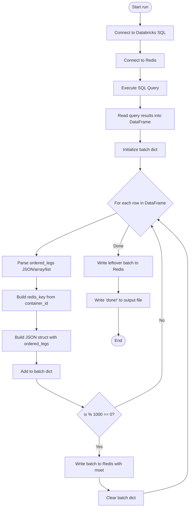
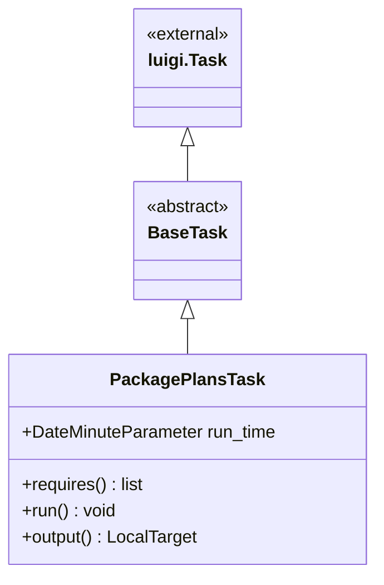
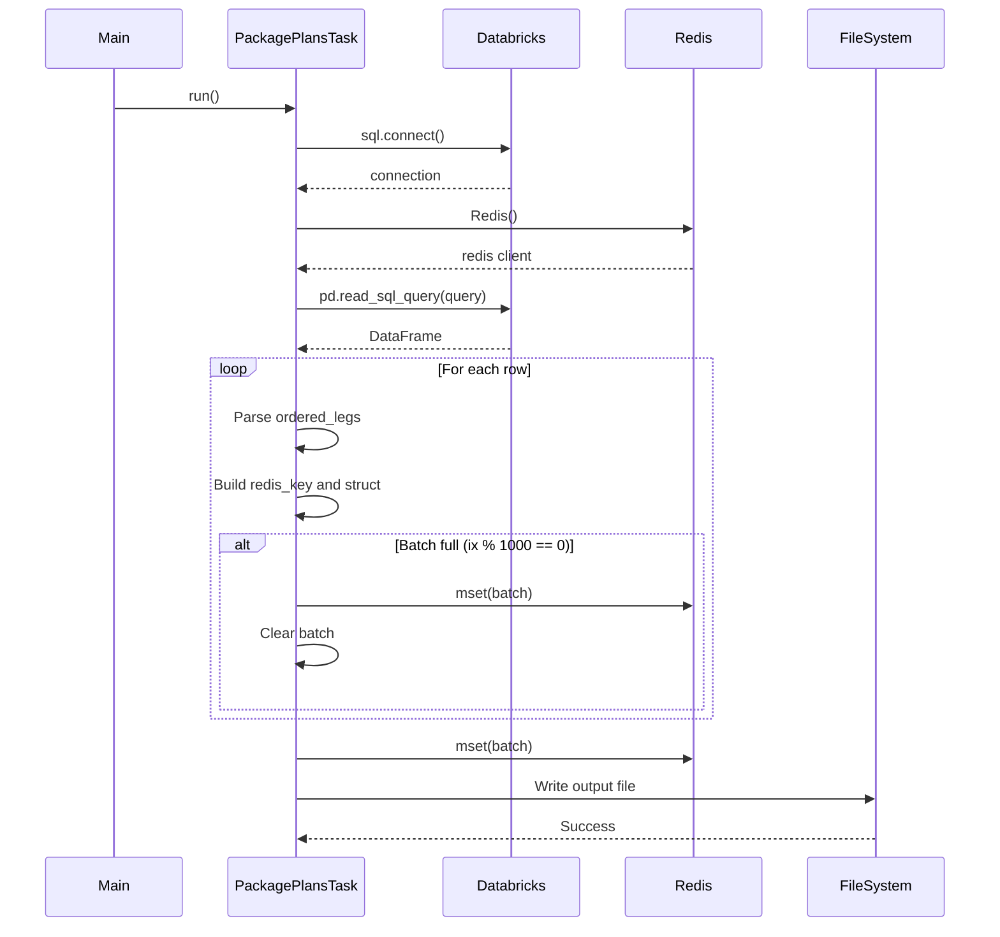
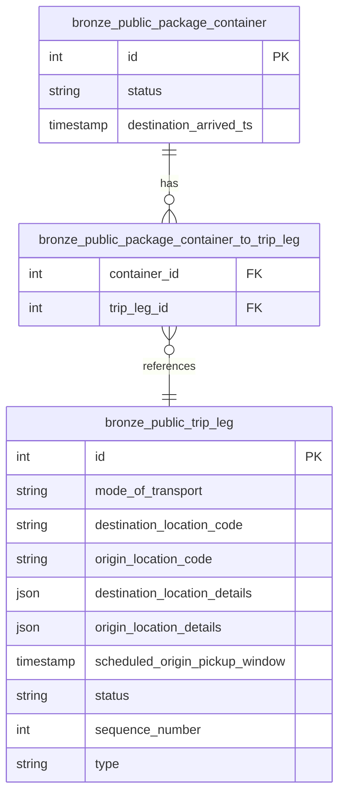

# Diagram: research/orchestrator/tasks/transforms/package_plans_task.py

> Auto-generated by Obscura crawlers

## Diagram 1

### SVG

<svg id="container" width="718.5700073242188" xmlns="http://www.w3.org/2000/svg" class="flowchart" height="1898.859375" viewBox="0 0 718.5700073242188 1898.859375" role="graphics-document document" aria-roledescription="flowchart-v2"><g><marker id="container_flowchart-v2-pointEnd" class="marker flowchart-v2" viewBox="0 0 10 10" refX="5" refY="5" markerUnits="userSpaceOnUse" markerWidth="8" markerHeight="8" orient="auto"><path d="M 0 0 L 10 5 L 0 10 z" class="arrowMarkerPath" style="stroke-width: 1; stroke-dasharray: 1, 0;"></path></marker><marker id="container_flowchart-v2-pointStart" class="marker flowchart-v2" viewBox="0 0 10 10" refX="4.5" refY="5" markerUnits="userSpaceOnUse" markerWidth="8" markerHeight="8" orient="auto"><path d="M 0 5 L 10 10 L 10 0 z" class="arrowMarkerPath" style="stroke-width: 1; stroke-dasharray: 1, 0;"></path></marker><marker id="container_flowchart-v2-circleEnd" class="marker flowchart-v2" viewBox="0 0 10 10" refX="11" refY="5" markerUnits="userSpaceOnUse" markerWidth="11" markerHeight="11" orient="auto"><circle cx="5" cy="5" r="5" class="arrowMarkerPath" style="stroke-width: 1; stroke-dasharray: 1, 0;"></circle></marker><marker id="container_flowchart-v2-circleStart" class="marker flowchart-v2" viewBox="0 0 10 10" refX="-1" refY="5" markerUnits="userSpaceOnUse" markerWidth="11" markerHeight="11" orient="auto"><circle cx="5" cy="5" r="5" class="arrowMarkerPath" style="stroke-width: 1; stroke-dasharray: 1, 0;"></circle></marker><marker id="container_flowchart-v2-crossEnd" class="marker cross flowchart-v2" viewBox="0 0 11 11" refX="12" refY="5.2" markerUnits="userSpaceOnUse" markerWidth="11" markerHeight="11" orient="auto"><path d="M 1,1 l 9,9 M 10,1 l -9,9" class="arrowMarkerPath" style="stroke-width: 2; stroke-dasharray: 1, 0;"></path></marker><marker id="container_flowchart-v2-crossStart" class="marker cross flowchart-v2" viewBox="0 0 11 11" refX="-1" refY="5.2" markerUnits="userSpaceOnUse" markerWidth="11" markerHeight="11" orient="auto"><path d="M 1,1 l 9,9 M 10,1 l -9,9" class="arrowMarkerPath" style="stroke-width: 2; stroke-dasharray: 1, 0;"></path></marker><g class="root"><g class="clusters"></g><g class="edgePaths"><path d="M531,47.5L530.917,51.583C530.833,55.667,530.667,63.833,530.583,71.417C530.5,79,530.5,86,530.5,89.5L530.5,93" id="L_Start_Connect_0" class="edge-thickness-normal edge-pattern-solid edge-thickness-normal edge-pattern-solid flowchart-link" style=";" data-edge="true" data-et="edge" data-id="L_Start_Connect_0" data-points="W3sieCI6NTMxLCJ5Ijo0Ny41fSx7IngiOjUzMC41LCJ5Ijo3Mn0seyJ4Ijo1MzAuNSwieSI6OTd9XQ==" marker-end="url(#container_flowchart-v2-pointEnd)"></path><path d="M530.5,151L530.5,155.167C530.5,159.333,530.5,167.667,530.5,175.333C530.5,183,530.5,190,530.5,193.5L530.5,197" id="L_Connect_Redis_0" class="edge-thickness-normal edge-pattern-solid edge-thickness-normal edge-pattern-solid flowchart-link" style=";" data-edge="true" data-et="edge" data-id="L_Connect_Redis_0" data-points="W3sieCI6NTMwLjUsInkiOjE1MX0seyJ4Ijo1MzAuNSwieSI6MTc2fSx7IngiOjUzMC41LCJ5IjoyMDF9XQ==" marker-end="url(#container_flowchart-v2-pointEnd)"></path><path d="M530.5,255L530.5,259.167C530.5,263.333,530.5,271.667,530.5,279.333C530.5,287,530.5,294,530.5,297.5L530.5,301" id="L_Redis_Query_0" class="edge-thickness-normal edge-pattern-solid edge-thickness-normal edge-pattern-solid flowchart-link" style=";" data-edge="true" data-et="edge" data-id="L_Redis_Query_0" data-points="W3sieCI6NTMwLjUsInkiOjI1NX0seyJ4Ijo1MzAuNSwieSI6MjgwfSx7IngiOjUzMC41LCJ5IjozMDV9XQ==" marker-end="url(#container_flowchart-v2-pointEnd)"></path><path d="M530.5,359L530.5,363.167C530.5,367.333,530.5,375.667,530.5,383.333C530.5,391,530.5,398,530.5,401.5L530.5,405" id="L_Query_ReadData_0" class="edge-thickness-normal edge-pattern-solid edge-thickness-normal edge-pattern-solid flowchart-link" style=";" data-edge="true" data-et="edge" data-id="L_Query_ReadData_0" data-points="W3sieCI6NTMwLjUsInkiOjM1OX0seyJ4Ijo1MzAuNSwieSI6Mzg0fSx7IngiOjUzMC41LCJ5Ijo0MDl9XQ==" marker-end="url(#container_flowchart-v2-pointEnd)"></path><path d="M530.5,487L530.5,491.167C530.5,495.333,530.5,503.667,530.5,511.333C530.5,519,530.5,526,530.5,529.5L530.5,533" id="L_ReadData_InitBatch_0" class="edge-thickness-normal edge-pattern-solid edge-thickness-normal edge-pattern-solid flowchart-link" style=";" data-edge="true" data-et="edge" data-id="L_ReadData_InitBatch_0" data-points="W3sieCI6NTMwLjUsInkiOjQ4N30seyJ4Ijo1MzAuNSwieSI6NTEyfSx7IngiOjUzMC41LCJ5Ijo1Mzd9XQ==" marker-end="url(#container_flowchart-v2-pointEnd)"></path><path d="M530.5,591L530.5,595.167C530.5,599.333,530.5,607.667,530.5,615.333C530.5,623,530.5,630,530.5,633.5L530.5,637" id="L_InitBatch_LoopStart_0" class="edge-thickness-normal edge-pattern-solid edge-thickness-normal edge-pattern-solid flowchart-link" style=";" data-edge="true" data-et="edge" data-id="L_InitBatch_LoopStart_0" data-points="W3sieCI6NTMwLjUsInkiOjU5MX0seyJ4Ijo1MzAuNSwieSI6NjE2fSx7IngiOjUzMC41LCJ5Ijo2NDF9XQ==" marker-end="url(#container_flowchart-v2-pointEnd)"></path><path d="M443.193,799.428L392.328,820.145C341.462,840.863,239.731,882.299,188.866,908.517C138,934.734,138,945.734,138,951.234L138,956.734" id="L_LoopStart_ParseLegs_0" class="edge-thickness-normal edge-pattern-solid edge-thickness-normal edge-pattern-solid flowchart-link" style=";" data-edge="true" data-et="edge" data-id="L_LoopStart_ParseLegs_0" data-points="W3sieCI6NDQzLjE5MzI3MzI2OTg3NTQsInkiOjc5OS40Mjc2NDgyNjk4NzU0fSx7IngiOjEzOCwieSI6OTIzLjczNDM3NX0seyJ4IjoxMzgsInkiOjk2MC43MzQzNzV9XQ==" marker-end="url(#container_flowchart-v2-pointEnd)"></path><path d="M138,1038.734L138,1042.901C138,1047.068,138,1055.401,138,1063.068C138,1070.734,138,1077.734,138,1081.234L138,1084.734" id="L_ParseLegs_BuildKey_0" class="edge-thickness-normal edge-pattern-solid edge-thickness-normal edge-pattern-solid flowchart-link" style=";" data-edge="true" data-et="edge" data-id="L_ParseLegs_BuildKey_0" data-points="W3sieCI6MTM4LCJ5IjoxMDM4LjczNDM3NX0seyJ4IjoxMzgsInkiOjEwNjMuNzM0Mzc1fSx7IngiOjEzOCwieSI6MTA4OC43MzQzNzV9XQ==" marker-end="url(#container_flowchart-v2-pointEnd)"></path><path d="M138,1166.734L138,1172.901C138,1179.068,138,1191.401,138,1203.068C138,1214.734,138,1225.734,138,1231.234L138,1236.734" id="L_BuildKey_BuildStruct_0" class="edge-thickness-normal edge-pattern-solid edge-thickness-normal edge-pattern-solid flowchart-link" style=";" data-edge="true" data-et="edge" data-id="L_BuildKey_BuildStruct_0" data-points="W3sieCI6MTM4LCJ5IjoxMTY2LjczNDM3NX0seyJ4IjoxMzgsInkiOjEyMDMuNzM0Mzc1fSx7IngiOjEzOCwieSI6MTI0MC43MzQzNzV9XQ==" marker-end="url(#container_flowchart-v2-pointEnd)"></path><path d="M138,1318.734L138,1322.901C138,1327.068,138,1335.401,138,1343.068C138,1350.734,138,1357.734,138,1361.234L138,1364.734" id="L_BuildStruct_AddToBatch_0" class="edge-thickness-normal edge-pattern-solid edge-thickness-normal edge-pattern-solid flowchart-link" style=";" data-edge="true" data-et="edge" data-id="L_BuildStruct_AddToBatch_0" data-points="W3sieCI6MTM4LCJ5IjoxMzE4LjczNDM3NX0seyJ4IjoxMzgsInkiOjEzNDMuNzM0Mzc1fSx7IngiOjEzOCwieSI6MTM2OC43MzQzNzV9XQ==" marker-end="url(#container_flowchart-v2-pointEnd)"></path><path d="M138,1422.734L138,1426.901C138,1431.068,138,1439.401,167.635,1456.802C197.27,1474.203,256.54,1500.672,286.175,1513.906L315.81,1527.141" id="L_AddToBatch_CheckBatch_0" class="edge-thickness-normal edge-pattern-solid edge-thickness-normal edge-pattern-solid flowchart-link" style=";" data-edge="true" data-et="edge" data-id="L_AddToBatch_CheckBatch_0" data-points="W3sieCI6MTM4LCJ5IjoxNDIyLjczNDM3NX0seyJ4IjoxMzgsInkiOjE0NDcuNzM0Mzc1fSx7IngiOjMxOS40NjI2MTU5NzIzNDg1NCwieSI6MTUyOC43NzE3NTkwMjc2NTEzfV0=" marker-end="url(#container_flowchart-v2-pointEnd)"></path><path d="M375.5,1634.859L375.5,1641.026C375.5,1647.193,375.5,1659.526,375.5,1671.193C375.5,1682.859,375.5,1693.859,375.5,1699.359L375.5,1704.859" id="L_CheckBatch_WriteBatch_0" class="edge-thickness-normal edge-pattern-solid edge-thickness-normal edge-pattern-solid flowchart-link" style=";" data-edge="true" data-et="edge" data-id="L_CheckBatch_WriteBatch_0" data-points="W3sieCI6Mzc1LjUsInkiOjE2MzQuODU5Mzc1fSx7IngiOjM3NS41LCJ5IjoxNjcxLjg1OTM3NX0seyJ4IjozNzUuNSwieSI6MTcwOC44NTkzNzV9XQ==" marker-end="url(#container_flowchart-v2-pointEnd)"></path><path d="M375.5,1786.859L375.5,1791.026C375.5,1795.193,375.5,1803.526,381.547,1811.504C387.593,1819.482,399.686,1827.104,405.733,1830.915L411.78,1834.726" id="L_WriteBatch_ClearBatch_0" class="edge-thickness-normal edge-pattern-solid edge-thickness-normal edge-pattern-solid flowchart-link" style=";" data-edge="true" data-et="edge" data-id="L_WriteBatch_ClearBatch_0" data-points="W3sieCI6Mzc1LjUsInkiOjE3ODYuODU5Mzc1fSx7IngiOjM3NS41LCJ5IjoxODExLjg1OTM3NX0seyJ4Ijo0MTUuMTYzNDYxNTM4NDYxNTUsInkiOjE4MzYuODU5Mzc1fV0=" marker-end="url(#container_flowchart-v2-pointEnd)"></path><path d="M544.727,1846.004L572.367,1840.313C600.008,1834.622,655.289,1823.241,682.93,1806.883C710.57,1790.526,710.57,1769.193,710.57,1745.859C710.57,1722.526,710.57,1697.193,710.57,1664.849C710.57,1632.505,710.57,1593.151,710.57,1555.797C710.57,1518.443,710.57,1483.089,710.57,1456.745C710.57,1430.401,710.57,1413.068,710.57,1395.734C710.57,1378.401,710.57,1361.068,710.57,1341.734C710.57,1322.401,710.57,1301.068,710.57,1277.734C710.57,1254.401,710.57,1229.068,710.57,1203.734C710.57,1178.401,710.57,1153.068,710.57,1129.734C710.57,1106.401,710.57,1085.068,710.57,1063.734C710.57,1042.401,710.57,1021.068,710.57,997.734C710.57,974.401,710.57,949.068,691.905,919.83C673.239,890.591,635.907,857.448,617.242,840.877L598.576,824.305" id="L_ClearBatch_LoopStart_0" class="edge-thickness-normal edge-pattern-solid edge-thickness-normal edge-pattern-solid flowchart-link" style=";" data-edge="true" data-et="edge" data-id="L_ClearBatch_LoopStart_0" data-points="W3sieCI6NTQ0LjcyNjU2MjUsInkiOjE4NDYuMDAzODI3MzQ5Mjg0fSx7IngiOjcxMC41NzAzMTI1LCJ5IjoxODExLjg1OTM3NX0seyJ4Ijo3MTAuNTcwMzEyNSwieSI6MTc0Ny44NTkzNzV9LHsieCI6NzEwLjU3MDMxMjUsInkiOjE2NzEuODU5Mzc1fSx7IngiOjcxMC41NzAzMTI1LCJ5IjoxNTUzLjc5Njg3NX0seyJ4Ijo3MTAuNTcwMzEyNSwieSI6MTQ0Ny43MzQzNzV9LHsieCI6NzEwLjU3MDMxMjUsInkiOjEzOTUuNzM0Mzc1fSx7IngiOjcxMC41NzAzMTI1LCJ5IjoxMzQzLjczNDM3NX0seyJ4Ijo3MTAuNTcwMzEyNSwieSI6MTI3OS43MzQzNzV9LHsieCI6NzEwLjU3MDMxMjUsInkiOjEyMDMuNzM0Mzc1fSx7IngiOjcxMC41NzAzMTI1LCJ5IjoxMTI3LjczNDM3NX0seyJ4Ijo3MTAuNTcwMzEyNSwieSI6MTA2My43MzQzNzV9LHsieCI6NzEwLjU3MDMxMjUsInkiOjk5OS43MzQzNzV9LHsieCI6NzEwLjU3MDMxMjUsInkiOjkyMy43MzQzNzV9LHsieCI6NTk1LjU4NDcwNzc3NDU3OTQsInkiOjgyMS42NDk2NjcyMjU0MjA2fV0=" marker-end="url(#container_flowchart-v2-pointEnd)"></path><path d="M431.537,1528.772L461.781,1515.266C492.025,1501.759,552.512,1474.747,582.756,1452.574C613,1430.401,613,1413.068,613,1395.734C613,1378.401,613,1361.068,613,1341.734C613,1322.401,613,1301.068,613,1277.734C613,1254.401,613,1229.068,613,1203.734C613,1178.401,613,1153.068,613,1129.734C613,1106.401,613,1085.068,613,1063.734C613,1042.401,613,1021.068,613,997.734C613,974.401,613,949.068,606.526,923.856C600.052,898.645,587.105,873.555,580.631,861.011L574.157,848.466" id="L_CheckBatch_LoopStart_0" class="edge-thickness-normal edge-pattern-solid edge-thickness-normal edge-pattern-solid flowchart-link" style=";" data-edge="true" data-et="edge" data-id="L_CheckBatch_LoopStart_0" data-points="W3sieCI6NDMxLjUzNzM4NDAyNzY1MTQ2LCJ5IjoxNTI4Ljc3MTc1OTAyNzY1MTN9LHsieCI6NjEzLCJ5IjoxNDQ3LjczNDM3NX0seyJ4Ijo2MTMsInkiOjEzOTUuNzM0Mzc1fSx7IngiOjYxMywieSI6MTM0My43MzQzNzV9LHsieCI6NjEzLCJ5IjoxMjc5LjczNDM3NX0seyJ4Ijo2MTMsInkiOjEyMDMuNzM0Mzc1fSx7IngiOjYxMywieSI6MTEyNy43MzQzNzV9LHsieCI6NjEzLCJ5IjoxMDYzLjczNDM3NX0seyJ4Ijo2MTMsInkiOjk5OS43MzQzNzV9LHsieCI6NjEzLCJ5Ijo5MjMuNzM0Mzc1fSx7IngiOjU3Mi4zMjMwODI4NzM5OTY3LCJ5Ijo4NDQuOTExMjkyMTI2MDAzM31d" marker-end="url(#container_flowchart-v2-pointEnd)"></path><path d="M488.677,844.911L481.897,858.048C475.118,871.186,461.559,897.46,454.779,916.097C448,934.734,448,945.734,448,951.234L448,956.734" id="L_LoopStart_WriteLeftovers_0" class="edge-thickness-normal edge-pattern-solid edge-thickness-normal edge-pattern-solid flowchart-link" style=";" data-edge="true" data-et="edge" data-id="L_LoopStart_WriteLeftovers_0" data-points="W3sieCI6NDg4LjY3NjkxNzEyNjAwMzMsInkiOjg0NC45MTEyOTIxMjYwMDMzfSx7IngiOjQ0OCwieSI6OTIzLjczNDM3NX0seyJ4Ijo0NDgsInkiOjk2MC43MzQzNzV9XQ==" marker-end="url(#container_flowchart-v2-pointEnd)"></path><path d="M448,1038.734L448,1042.901C448,1047.068,448,1055.401,448,1065.068C448,1074.734,448,1085.734,448,1091.234L448,1096.734" id="L_WriteLeftovers_WriteOutput_0" class="edge-thickness-normal edge-pattern-solid edge-thickness-normal edge-pattern-solid flowchart-link" style=";" data-edge="true" data-et="edge" data-id="L_WriteLeftovers_WriteOutput_0" data-points="W3sieCI6NDQ4LCJ5IjoxMDM4LjczNDM3NX0seyJ4Ijo0NDgsInkiOjEwNjMuNzM0Mzc1fSx7IngiOjQ0OCwieSI6MTEwMC43MzQzNzV9XQ==" marker-end="url(#container_flowchart-v2-pointEnd)"></path><path d="M448,1154.734L448,1162.901C448,1171.068,448,1187.401,448.077,1204.401C448.155,1221.401,448.31,1239.068,448.387,1247.901L448.465,1256.735" id="L_WriteOutput_End_0" class="edge-thickness-normal edge-pattern-solid edge-thickness-normal edge-pattern-solid flowchart-link" style=";" data-edge="true" data-et="edge" data-id="L_WriteOutput_End_0" data-points="W3sieCI6NDQ4LCJ5IjoxMTU0LjczNDM3NX0seyJ4Ijo0NDgsInkiOjEyMDMuNzM0Mzc1fSx7IngiOjQ0OC41LCJ5IjoxMjYwLjczNDM3NX1d" marker-end="url(#container_flowchart-v2-pointEnd)"></path></g><g class="edgeLabels"><g class="edgeLabel"><g class="label" data-id="L_Start_Connect_0" transform="translate(0, 0)"><foreignObject width="0" height="0">

</foreignObject></g></g><g class="edgeLabel"><g class="label" data-id="L_Connect_Redis_0" transform="translate(0, 0)"><foreignObject width="0" height="0">

</foreignObject></g></g><g class="edgeLabel"><g class="label" data-id="L_Redis_Query_0" transform="translate(0, 0)"><foreignObject width="0" height="0">

</foreignObject></g></g><g class="edgeLabel"><g class="label" data-id="L_Query_ReadData_0" transform="translate(0, 0)"><foreignObject width="0" height="0">

</foreignObject></g></g><g class="edgeLabel"><g class="label" data-id="L_ReadData_InitBatch_0" transform="translate(0, 0)"><foreignObject width="0" height="0">

</foreignObject></g></g><g class="edgeLabel"><g class="label" data-id="L_InitBatch_LoopStart_0" transform="translate(0, 0)"><foreignObject width="0" height="0">

</foreignObject></g></g><g class="edgeLabel"><g class="label" data-id="L_LoopStart_ParseLegs_0" transform="translate(0, 0)"><foreignObject width="0" height="0">

</foreignObject></g></g><g class="edgeLabel"><g class="label" data-id="L_ParseLegs_BuildKey_0" transform="translate(0, 0)"><foreignObject width="0" height="0">

</foreignObject></g></g><g class="edgeLabel"><g class="label" data-id="L_BuildKey_BuildStruct_0" transform="translate(0, 0)"><foreignObject width="0" height="0">

</foreignObject></g></g><g class="edgeLabel"><g class="label" data-id="L_BuildStruct_AddToBatch_0" transform="translate(0, 0)"><foreignObject width="0" height="0">

</foreignObject></g></g><g class="edgeLabel"><g class="label" data-id="L_AddToBatch_CheckBatch_0" transform="translate(0, 0)"><foreignObject width="0" height="0">

</foreignObject></g></g><g class="edgeLabel" transform="translate(375.5, 1671.859375)"><g class="label" data-id="L_CheckBatch_WriteBatch_0" transform="translate(-12.03125, -12)"><foreignObject width="24.0625" height="24">

Yes

</foreignObject></g></g><g class="edgeLabel"><g class="label" data-id="L_WriteBatch_ClearBatch_0" transform="translate(0, 0)"><foreignObject width="0" height="0">

</foreignObject></g></g><g class="edgeLabel"><g class="label" data-id="L_ClearBatch_LoopStart_0" transform="translate(0, 0)"><foreignObject width="0" height="0">

</foreignObject></g></g><g class="edgeLabel" transform="translate(613, 1203.734375)"><g class="label" data-id="L_CheckBatch_LoopStart_0" transform="translate(-10.140625, -12)"><foreignObject width="20.28125" height="24">

No

</foreignObject></g></g><g class="edgeLabel" transform="translate(448, 923.734375)"><g class="label" data-id="L_LoopStart_WriteLeftovers_0" transform="translate(-18.875, -12)"><foreignObject width="37.75" height="24">

Done

</foreignObject></g></g><g class="edgeLabel"><g class="label" data-id="L_WriteLeftovers_WriteOutput_0" transform="translate(0, 0)"><foreignObject width="0" height="0">

</foreignObject></g></g><g class="edgeLabel"><g class="label" data-id="L_WriteOutput_End_0" transform="translate(0, 0)"><foreignObject width="0" height="0">

</foreignObject></g></g></g><g class="nodes"><g class="node default" id="flowchart-Start-0" transform="translate(530.5, 27.5)"><g class="basic label-container outer-path"><path d="M-24.953125 -19.5 C-12.115146255803912 -19.5, 0.7228324883921751 -19.5, 24.953125 -19.5 C24.953125 -19.5, 24.953125 -19.5, 24.953125 -19.5 C25.31332554353192 -19.488449069656756, 25.673526087063838 -19.476898139313516, 26.2024942896239 -19.45993515863156 C26.622952855173732 -19.419374026488374, 27.04341142072357 -19.378812894345188, 27.446729652847864 -19.3399052695533 C27.84596182941969 -19.275360507336938, 28.245194005991515 -19.210815745120573, 28.68071825967676 -19.140403561325776 C29.11786731246855 -19.040627142690216, 29.55501636526034 -18.940850724054652, 29.89938938623539 -18.862249829261074 C30.349303169544307 -18.72871778002063, 30.799216952853225 -18.595185730780184, 31.097735251460602 -18.50658706670804 C31.362916485081367 -18.408997921427147, 31.628097718702133 -18.31140877614625, 32.2708315951478 -18.074876768247425 C32.65519104144778 -17.904732242988295, 33.03955048774776 -17.73458771772917, 33.41385791279238 -17.568892924097174 C33.766686790275294 -17.38482232471202, 34.119515667758215 -17.200751725326864, 34.52211726407678 -16.990714730406097 C34.88360497607118 -16.771578755057497, 35.24509268806559 -16.552442779708894, 35.5910555736057 -16.342718045390892 C35.850472727446494 -16.16175986885915, 36.10988988128729 -15.980801692327404, 36.61628034457871 -15.627565626425154 C37.00100619385995 -15.320756999608182, 37.38573204314119 -15.013948372791212, 37.593578708501866 -14.848196188198123 C37.79574523299081 -14.664593899690388, 37.99791175747975 -14.48099161118265, 38.51893473676799 -14.007812326905688 C38.83203015524041 -13.684515601720998, 39.145125573712825 -13.361218876536306, 39.38854594296865 -13.10986736009568 C39.71132267373766 -12.73071544561812, 40.03409940450667 -12.351563531140561, 40.19883890812658 -12.158051136245305 C40.458812584581736 -11.809710093884549, 40.71878626103689 -11.461369051523793, 40.946483964640635 -11.156274872382312 C41.187506199045295 -10.785999996804673, 41.42852843344995 -10.415725121227034, 41.62840887860425 -10.108655082055241 C41.81142023758396 -9.78369988227714, 41.994431596563665 -9.45874468249904, 42.241811474273504 -9.019496659696287 C42.405720161960225 -8.67913676263072, 42.569628849646946 -8.338776865565151, 42.78417114880834 -7.893275190886684 C42.938545350097705 -7.5119679290798125, 43.09291955138707 -7.130660667272941, 43.253259229970325 -6.734618561215508 C43.358628303472955 -6.417263700107559, 43.463997376975584 -6.09990883899961, 43.64714813421488 -5.548287939305138 C43.737649667277374 -5.203166370125293, 43.828151200339875 -4.858044800945447, 43.96421928754556 -4.339158212148133 C44.033576163321534 -3.983025313619391, 44.10293303909751 -3.6268924150906487, 44.203169776581774 -3.1121979531509023 C44.24247364770565 -2.8073648901413666, 44.28177751882952 -2.5025318271318313, 44.36301770250937 -1.872449005199798 C44.39389460246059 -1.3915163650744922, 44.42477150241181 -0.9105837249491865, 44.44310621591342 -0.6250057626472757 C44.44310621591342 -0.19065229643651116, 44.44310621591342 0.24370116977425338, 44.44310621591342 0.625005762647271 C44.42588421049897 0.8932523983298196, 44.408662205084525 1.161499034012368, 44.36301770250937 1.8724490051997846 C44.30745074565804 2.303415349601936, 44.25188378880671 2.734381694004087, 44.203169776581774 3.1121979531508885 C44.14233391011172 3.4245772698097188, 44.08149804364165 3.736956586468549, 43.96421928754556 4.339158212148129 C43.88364863222468 4.646409040429566, 43.80307797690379 4.953659868711004, 43.64714813421489 5.548287939305125 C43.529785001405465 5.901766996051295, 43.41242186859604 6.255246052797465, 43.253259229970325 6.734618561215495 C43.0884785343375 7.141630065246602, 42.92369783870467 7.548641569277709, 42.78417114880834 7.893275190886679 C42.57943272437368 8.318418909925752, 42.37469429993903 8.743562628964826, 42.241811474273504 9.019496659696284 C42.02496264697918 9.404533710882195, 41.808113819684856 9.789570762068106, 41.62840887860425 10.108655082055236 C41.41659920991834 10.434051612016622, 41.20478954123244 10.759448141978009, 40.94648396464064 11.156274872382301 C40.69536929796219 11.492745648714669, 40.444254631283734 11.829216425047038, 40.19883890812658 12.158051136245302 C39.949875759036935 12.450497417570501, 39.70091260994729 12.7429436988957, 39.38854594296866 13.10986736009567 C39.13541601880864 13.371244789144166, 38.88228609464861 13.632622218192662, 38.51893473676799 14.007812326905684 C38.27617107182976 14.228283864227993, 38.03340740689152 14.448755401550303, 37.59357870850189 14.848196188198111 C37.365578157577254 15.030020560211035, 37.13757760665261 15.211844932223961, 36.61628034457871 15.627565626425152 C36.354425444035286 15.810224269528302, 36.09257054349185 15.992882912631451, 35.59105557360571 16.34271804539089 C35.20745740668079 16.57525750845382, 34.823859239755876 16.807796971516755, 34.52211726407678 16.990714730406093 C34.273782926378686 17.120270595317454, 34.0254485886806 17.249826460228814, 33.41385791279239 17.56889292409717 C33.03266152163469 17.737637258673505, 32.65146513047699 17.906381593249844, 32.270831595147804 18.07487676824742 C32.015818263169656 18.16872403173278, 31.760804931191508 18.262571295218137, 31.097735251460616 18.506587066708033 C30.674928299261428 18.63207395076177, 30.25212134706224 18.75756083481551, 29.899389386235413 18.86224982926107 C29.61986815854016 18.926048725436036, 29.34034693084491 18.989847621611, 28.680718259676766 19.140403561325773 C28.279694532314476 19.205237967580256, 27.878670804952183 19.270072373834736, 27.44672965284788 19.3399052695533 C26.97005385051671 19.38588961091766, 26.493378048185544 19.43187395228202, 26.2024942896239 19.45993515863156 C25.707855001263855 19.475797277852298, 25.21321571290381 19.491659397073036, 24.953125000000004 19.5 C24.953125000000004 19.5, 24.953125 19.5, 24.953125 19.5 C5.104233864708355 19.5, -14.74465727058329 19.5, -24.953124999999996 19.5 C-25.434991998729352 19.484547463247964, -25.91685899745871 19.469094926495927, -26.202494289623893 19.45993515863156 C-26.688776353177527 19.413024112800287, -27.17505841673116 19.366113066969014, -27.44672965284787 19.3399052695533 C-27.703477105980358 19.298396332437076, -27.96022455911284 19.25688739532085, -28.68071825967676 19.140403561325773 C-28.96178433821362 19.076252063027304, -29.24285041675048 19.012100564728836, -29.899389386235388 18.862249829261074 C-30.374743146767635 18.72116732831791, -30.850096907299882 18.580084827374748, -31.09773525146059 18.506587066708043 C-31.39252304290019 18.3981024344698, -31.68731083433979 18.289617802231554, -32.2708315951478 18.074876768247425 C-32.61610560778595 17.922034205042195, -32.9613796204241 17.769191641836965, -33.41385791279238 17.568892924097174 C-33.79013263739496 17.372590641287474, -34.16640736199754 17.17628835847777, -34.52211726407678 16.990714730406097 C-34.8689582430754 16.7804576906733, -35.21579922207401 16.5702006509405, -35.591055573605686 16.3427180453909 C-35.82207028334228 16.18157218434426, -36.05308499307887 16.02042632329762, -36.61628034457871 15.627565626425156 C-36.8713647929584 15.424142566924605, -37.12644924133809 15.220719507424054, -37.593578708501866 14.848196188198125 C-37.792344293470954 14.667682542978392, -37.99110987844004 14.487168897758659, -38.518934736767974 14.007812326905697 C-38.85565920505381 13.660116667807587, -39.19238367333965 13.31242100870948, -39.388545942968655 13.109867360095677 C-39.56594827871331 12.901480482051143, -39.74335061445795 12.693093604006608, -40.198838908126575 12.158051136245307 C-40.467020235429615 11.79871258948076, -40.73520156273266 11.439374042716214, -40.946483964640635 11.156274872382316 C-41.19305073455262 10.777482101349168, -41.43961750446461 10.39868933031602, -41.62840887860425 10.108655082055249 C-41.811359456477696 9.78380780528607, -41.994310034351145 9.45896052851689, -42.241811474273504 9.019496659696289 C-42.37156010595671 8.750070849830124, -42.50130873763992 8.48064503996396, -42.78417114880834 7.893275190886686 C-42.916422288719886 7.566612318403326, -43.04867342863143 7.239949445919966, -43.253259229970325 6.73461856121551 C-43.38870900804056 6.3266654106593565, -43.52415878611078 5.918712260103203, -43.64714813421488 5.5482879393051325 C-43.7292098465214 5.235351064509288, -43.81127155882792 4.922414189713443, -43.96421928754556 4.339158212148136 C-44.05571082467956 3.8693685057082905, -44.14720236181355 3.399578799268445, -44.203169776581774 3.112197953150904 C-44.255097226643635 2.7094589047059903, -44.30702467670549 2.3067198562610765, -44.36301770250937 1.872449005199809 C-44.3795306068799 1.615247190652283, -44.39604351125043 1.3580453761047568, -44.44310621591342 0.6250057626472781 C-44.44310621591342 0.25800089658609976, -44.44310621591342 -0.10900396947507862, -44.44310621591342 -0.6250057626472687 C-44.41233474295184 -1.1042962923097126, -44.38156326999027 -1.5835868219721565, -44.36301770250937 -1.8724490051997822 C-44.30929688468329 -2.2890970598834723, -44.25557606685721 -2.7057451145671623, -44.203169776581774 -3.112197953150895 C-44.15467253046007 -3.3612210620892626, -44.10617528433836 -3.61024417102763, -43.96421928754556 -4.339158212148126 C-43.898518886959344 -4.5897023143171145, -43.83281848637313 -4.840246416486102, -43.64714813421489 -5.548287939305123 C-43.56090359494913 -5.80804275037233, -43.47465905568338 -6.067797561439538, -43.25325922997033 -6.734618561215485 C-43.157633221852485 -6.970816650069667, -43.06200721373463 -7.207014738923848, -42.78417114880834 -7.893275190886676 C-42.66388115313927 -8.143059940687095, -42.5435911574702 -8.392844690487513, -42.241811474273504 -9.019496659696282 C-42.00315372966638 -9.443257651963417, -41.76449598505926 -9.867018644230551, -41.62840887860425 -10.108655082055243 C-41.3599661212288 -10.52105524435741, -41.09152336385336 -10.933455406659574, -40.94648396464064 -11.156274872382308 C-40.70154224337536 -11.48447446422793, -40.45660052211007 -11.812674056073549, -40.19883890812659 -12.158051136245302 C-39.95969966581403 -12.438957697674002, -39.72056042350147 -12.719864259102701, -39.38854594296866 -13.10986736009567 C-39.17445009418939 -13.330938901556353, -38.960354245410116 -13.552010443017036, -38.518934736767996 -14.007812326905677 C-38.226319188305474 -14.273558025836188, -37.933703639842946 -14.539303724766697, -37.59357870850189 -14.848196188198107 C-37.36937528709145 -15.026992450469319, -37.145171865681014 -15.205788712740532, -36.61628034457872 -15.627565626425149 C-36.31031968354266 -15.84099053874036, -36.00435902250659 -16.054415451055572, -35.591055573605715 -16.342718045390885 C-35.18767382464245 -16.587250432146696, -34.78429207567919 -16.831782818902507, -34.52211726407679 -16.99071473040609 C-34.21111127190041 -17.152966357315663, -33.90010527972402 -17.315217984225235, -33.41385791279239 -17.56889292409717 C-33.09745493504087 -17.70895513658691, -32.78105195728935 -17.849017349076647, -32.270831595147804 -18.07487676824742 C-31.89790432412301 -18.21211745128645, -31.52497705309822 -18.349358134325477, -31.09773525146062 -18.506587066708033 C-30.725384057802156 -18.617098946474563, -30.353032864143696 -18.727610826241097, -29.899389386235413 -18.862249829261067 C-29.529699539241236 -18.946629124385783, -29.160009692247055 -19.031008419510496, -28.680718259676766 -19.140403561325773 C-28.36620062820187 -19.191252332861975, -28.05168299672697 -19.242101104398177, -27.446729652847882 -19.3399052695533 C-27.028069374233507 -19.380292923118574, -26.609409095619135 -19.420680576683854, -26.202494289623903 -19.45993515863156 C-25.773893257693803 -19.47367955950426, -25.345292225763703 -19.487423960376958, -24.953125000000007 -19.5 C-24.953125000000004 -19.5, -24.953125 -19.5, -24.953125 -19.5" stroke="none" stroke-width="0" fill="#ECECFF" style=""></path><path d="M-24.953125 -19.5 C-9.634841176092824 -19.5, 5.683442647814353 -19.5, 24.953125 -19.5 M-24.953125 -19.5 C-6.500412167224972 -19.5, 11.952300665550055 -19.5, 24.953125 -19.5 M24.953125 -19.5 C24.953125 -19.5, 24.953125 -19.5, 24.953125 -19.5 M24.953125 -19.5 C24.953125 -19.5, 24.953125 -19.5, 24.953125 -19.5 M24.953125 -19.5 C25.406261467086058 -19.48546879547718, 25.859397934172115 -19.470937590954353, 26.2024942896239 -19.45993515863156 M24.953125 -19.5 C25.2838017679063 -19.48939583967653, 25.6144785358126 -19.478791679353055, 26.2024942896239 -19.45993515863156 M26.2024942896239 -19.45993515863156 C26.576592807936393 -19.423846324489247, 26.950691326248883 -19.387757490346935, 27.446729652847864 -19.3399052695533 M26.2024942896239 -19.45993515863156 C26.533709533454036 -19.427983222403874, 26.864924777284177 -19.396031286176193, 27.446729652847864 -19.3399052695533 M27.446729652847864 -19.3399052695533 C27.811877534418336 -19.2808709918251, 28.177025415988812 -19.2218367140969, 28.68071825967676 -19.140403561325776 M27.446729652847864 -19.3399052695533 C27.90174180518708 -19.26634243343504, 28.356753957526294 -19.192779597316775, 28.68071825967676 -19.140403561325776 M28.68071825967676 -19.140403561325776 C29.154993126530353 -19.032153417899185, 29.629267993383948 -18.923903274472593, 29.89938938623539 -18.862249829261074 M28.68071825967676 -19.140403561325776 C29.034332991072155 -19.05969330643655, 29.387947722467548 -18.978983051547328, 29.89938938623539 -18.862249829261074 M29.89938938623539 -18.862249829261074 C30.366367024490927 -18.723653317442476, 30.83334466274646 -18.585056805623875, 31.097735251460602 -18.50658706670804 M29.89938938623539 -18.862249829261074 C30.212552017700567 -18.769304804066408, 30.525714649165742 -18.67635977887174, 31.097735251460602 -18.50658706670804 M31.097735251460602 -18.50658706670804 C31.513315752044747 -18.353649600909037, 31.928896252628892 -18.200712135110038, 32.2708315951478 -18.074876768247425 M31.097735251460602 -18.50658706670804 C31.500407470418054 -18.358399967870508, 31.903079689375506 -18.21021286903298, 32.2708315951478 -18.074876768247425 M32.2708315951478 -18.074876768247425 C32.72727723509139 -17.87282182342323, 33.18372287503498 -17.670766878599032, 33.41385791279238 -17.568892924097174 M32.2708315951478 -18.074876768247425 C32.653603395793816 -17.90543504662347, 33.03637519643984 -17.735993324999516, 33.41385791279238 -17.568892924097174 M33.41385791279238 -17.568892924097174 C33.698186871459974 -17.42055868848168, 33.982515830127575 -17.272224452866187, 34.52211726407678 -16.990714730406097 M33.41385791279238 -17.568892924097174 C33.83094294276821 -17.351299931114497, 34.24802797274404 -17.133706938131816, 34.52211726407678 -16.990714730406097 M34.52211726407678 -16.990714730406097 C34.78391877602558 -16.83200911534628, 35.04572028797437 -16.673303500286465, 35.5910555736057 -16.342718045390892 M34.52211726407678 -16.990714730406097 C34.92315613696097 -16.74760260889769, 35.324195009845155 -16.50449048738928, 35.5910555736057 -16.342718045390892 M35.5910555736057 -16.342718045390892 C35.909622451852805 -16.12049958166361, 36.2281893300999 -15.898281117936326, 36.61628034457871 -15.627565626425154 M35.5910555736057 -16.342718045390892 C35.85182149202276 -16.160819029077825, 36.112587410439815 -15.978920012764757, 36.61628034457871 -15.627565626425154 M36.61628034457871 -15.627565626425154 C36.991267136188526 -15.328523638933936, 37.36625392779834 -15.029481651442717, 37.593578708501866 -14.848196188198123 M36.61628034457871 -15.627565626425154 C36.85755462070304 -15.435155811794136, 37.09882889682737 -15.242745997163118, 37.593578708501866 -14.848196188198123 M37.593578708501866 -14.848196188198123 C37.909849543875985 -14.560967383579095, 38.22612037925011 -14.273738578960069, 38.51893473676799 -14.007812326905688 M37.593578708501866 -14.848196188198123 C37.81937477116492 -14.643134178323983, 38.04517083382797 -14.438072168449843, 38.51893473676799 -14.007812326905688 M38.51893473676799 -14.007812326905688 C38.79964361287083 -13.717957365702166, 39.08035248897367 -13.428102404498642, 39.38854594296865 -13.10986736009568 M38.51893473676799 -14.007812326905688 C38.761785122520294 -13.757049365228958, 39.00463550827259 -13.506286403552231, 39.38854594296865 -13.10986736009568 M39.38854594296865 -13.10986736009568 C39.6900873025995 -12.755659720883846, 39.99162866223036 -12.401452081672012, 40.19883890812658 -12.158051136245305 M39.38854594296865 -13.10986736009568 C39.71101079902387 -12.731081791403113, 40.03347565507909 -12.352296222710546, 40.19883890812658 -12.158051136245305 M40.19883890812658 -12.158051136245305 C40.3636898296736 -11.937165919600202, 40.528540751220625 -11.716280702955101, 40.946483964640635 -11.156274872382312 M40.19883890812658 -12.158051136245305 C40.4380297941545 -11.837557139705881, 40.67722068018243 -11.517063143166457, 40.946483964640635 -11.156274872382312 M40.946483964640635 -11.156274872382312 C41.15375565430563 -10.837849896815046, 41.36102734397061 -10.51942492124778, 41.62840887860425 -10.108655082055241 M40.946483964640635 -11.156274872382312 C41.14750432077424 -10.847453623837346, 41.34852467690785 -10.53863237529238, 41.62840887860425 -10.108655082055241 M41.62840887860425 -10.108655082055241 C41.78001595897575 -9.839461358974049, 41.93162303934726 -9.570267635892858, 42.241811474273504 -9.019496659696287 M41.62840887860425 -10.108655082055241 C41.85015032463717 -9.714930690867583, 42.071891770670085 -9.321206299679922, 42.241811474273504 -9.019496659696287 M42.241811474273504 -9.019496659696287 C42.380603386849955 -8.731292283560093, 42.5193952994264 -8.443087907423898, 42.78417114880834 -7.893275190886684 M42.241811474273504 -9.019496659696287 C42.354135626137264 -8.78625315499935, 42.466459778001024 -8.553009650302414, 42.78417114880834 -7.893275190886684 M42.78417114880834 -7.893275190886684 C42.90746423875198 -7.5887388750161655, 43.03075732869562 -7.284202559145647, 43.253259229970325 -6.734618561215508 M42.78417114880834 -7.893275190886684 C42.94814966311859 -7.48824509023146, 43.11212817742884 -7.083214989576236, 43.253259229970325 -6.734618561215508 M43.253259229970325 -6.734618561215508 C43.33724565358314 -6.48166483471308, 43.42123207719595 -6.228711108210653, 43.64714813421488 -5.548287939305138 M43.253259229970325 -6.734618561215508 C43.37154970680013 -6.3783464920321284, 43.489840183629944 -6.02207442284875, 43.64714813421488 -5.548287939305138 M43.64714813421488 -5.548287939305138 C43.738978919539655 -5.198097355147664, 43.83080970486442 -4.847906770990189, 43.96421928754556 -4.339158212148133 M43.64714813421488 -5.548287939305138 C43.740594713205134 -5.191935633611779, 43.83404129219539 -4.835583327918419, 43.96421928754556 -4.339158212148133 M43.96421928754556 -4.339158212148133 C44.05517412267871 -3.872124357050618, 44.14612895781186 -3.4050905019531026, 44.203169776581774 -3.1121979531509023 M43.96421928754556 -4.339158212148133 C44.041186451032075 -3.943948094660656, 44.11815361451858 -3.5487379771731784, 44.203169776581774 -3.1121979531509023 M44.203169776581774 -3.1121979531509023 C44.26124518782197 -2.66177653185907, 44.31932059906216 -2.2113551105672373, 44.36301770250937 -1.872449005199798 M44.203169776581774 -3.1121979531509023 C44.246065604920325 -2.7795063792965324, 44.28896143325887 -2.446814805442163, 44.36301770250937 -1.872449005199798 M44.36301770250937 -1.872449005199798 C44.385425810578276 -1.5234246345273166, 44.40783391864718 -1.1744002638548352, 44.44310621591342 -0.6250057626472757 M44.36301770250937 -1.872449005199798 C44.38956469001557 -1.4589582464480508, 44.416111677521776 -1.045467487696304, 44.44310621591342 -0.6250057626472757 M44.44310621591342 -0.6250057626472757 C44.44310621591342 -0.31278308884675593, 44.44310621591342 -0.0005604150462361623, 44.44310621591342 0.625005762647271 M44.44310621591342 -0.6250057626472757 C44.44310621591342 -0.2524402200067519, 44.44310621591342 0.12012532263377185, 44.44310621591342 0.625005762647271 M44.44310621591342 0.625005762647271 C44.425311133026185 0.9021785425482378, 44.40751605013896 1.1793513224492045, 44.36301770250937 1.8724490051997846 M44.44310621591342 0.625005762647271 C44.42410825906824 0.920914275385633, 44.405110302223065 1.2168227881239948, 44.36301770250937 1.8724490051997846 M44.36301770250937 1.8724490051997846 C44.300084506900824 2.3605464427745155, 44.23715131129228 2.8486438803492464, 44.203169776581774 3.1121979531508885 M44.36301770250937 1.8724490051997846 C44.30910405820529 2.290592583968923, 44.25519041390122 2.7087361627380617, 44.203169776581774 3.1121979531508885 M44.203169776581774 3.1121979531508885 C44.14592202723326 3.406153046739404, 44.08867427788475 3.70010814032792, 43.96421928754556 4.339158212148129 M44.203169776581774 3.1121979531508885 C44.15165850076038 3.3766974675817836, 44.10014722493897 3.6411969820126786, 43.96421928754556 4.339158212148129 M43.96421928754556 4.339158212148129 C43.871106622609496 4.694237158833605, 43.77799395767343 5.049316105519082, 43.64714813421489 5.548287939305125 M43.96421928754556 4.339158212148129 C43.8954856307878 4.60126943472074, 43.826751974030046 4.863380657293351, 43.64714813421489 5.548287939305125 M43.64714813421489 5.548287939305125 C43.565874061540065 5.793072496936756, 43.48459998886524 6.037857054568387, 43.253259229970325 6.734618561215495 M43.64714813421489 5.548287939305125 C43.51526618730862 5.945495350852119, 43.38338424040235 6.342702762399112, 43.253259229970325 6.734618561215495 M43.253259229970325 6.734618561215495 C43.11395780440053 7.078695775582746, 42.97465637883073 7.422772989949999, 42.78417114880834 7.893275190886679 M43.253259229970325 6.734618561215495 C43.09492713087518 7.125701907123403, 42.93659503178003 7.516785253031313, 42.78417114880834 7.893275190886679 M42.78417114880834 7.893275190886679 C42.624884770481664 8.224036763664536, 42.465598392154995 8.554798336442392, 42.241811474273504 9.019496659696284 M42.78417114880834 7.893275190886679 C42.59831951979414 8.2792000751225, 42.412467890779936 8.665124959358321, 42.241811474273504 9.019496659696284 M42.241811474273504 9.019496659696284 C42.042467837770445 9.373451472039523, 41.843124201267386 9.727406284382765, 41.62840887860425 10.108655082055236 M42.241811474273504 9.019496659696284 C42.118244291892395 9.23890270454797, 41.99467710951129 9.458308749399656, 41.62840887860425 10.108655082055236 M41.62840887860425 10.108655082055236 C41.453843702207216 10.376834070314386, 41.27927852581018 10.645013058573536, 40.94648396464064 11.156274872382301 M41.62840887860425 10.108655082055236 C41.4416002584439 10.39564328775983, 41.25479163828355 10.682631493464424, 40.94648396464064 11.156274872382301 M40.94648396464064 11.156274872382301 C40.753693056179536 11.414597126107104, 40.56090214771843 11.672919379831908, 40.19883890812658 12.158051136245302 M40.94648396464064 11.156274872382301 C40.73242662066194 11.443092212288555, 40.51836927668324 11.729909552194806, 40.19883890812658 12.158051136245302 M40.19883890812658 12.158051136245302 C40.01888518572032 12.36943501824058, 39.83893146331406 12.580818900235856, 39.38854594296866 13.10986736009567 M40.19883890812658 12.158051136245302 C39.90672934332951 12.501179652561051, 39.61461977853243 12.8443081688768, 39.38854594296866 13.10986736009567 M39.38854594296866 13.10986736009567 C39.16871554173095 13.336860297785208, 38.94888514049323 13.563853235474745, 38.51893473676799 14.007812326905684 M39.38854594296866 13.10986736009567 C39.13670682207982 13.369911928789747, 38.884867701190984 13.629956497483825, 38.51893473676799 14.007812326905684 M38.51893473676799 14.007812326905684 C38.25326467619959 14.249086846669288, 37.9875946156312 14.490361366432893, 37.59357870850189 14.848196188198111 M38.51893473676799 14.007812326905684 C38.2423750981328 14.25897647334711, 37.9658154594976 14.510140619788535, 37.59357870850189 14.848196188198111 M37.59357870850189 14.848196188198111 C37.3082030832492 15.075775655172807, 37.022827457996506 15.303355122147504, 36.61628034457871 15.627565626425152 M37.59357870850189 14.848196188198111 C37.24333469599888 15.127506467784652, 36.89309068349588 15.406816747371193, 36.61628034457871 15.627565626425152 M36.61628034457871 15.627565626425152 C36.28722549447355 15.857100045303632, 35.958170644368394 16.08663446418211, 35.59105557360571 16.34271804539089 M36.61628034457871 15.627565626425152 C36.20681730338466 15.913189318592753, 35.79735426219061 16.198813010760354, 35.59105557360571 16.34271804539089 M35.59105557360571 16.34271804539089 C35.18412806353545 16.589399893366966, 34.777200553465185 16.836081741343044, 34.52211726407678 16.990714730406093 M35.59105557360571 16.34271804539089 C35.33716227208525 16.49662965681524, 35.0832689705648 16.650541268239593, 34.52211726407678 16.990714730406093 M34.52211726407678 16.990714730406093 C34.10570346761721 17.207957541293286, 33.68928967115764 17.42520035218048, 33.41385791279239 17.56889292409717 M34.52211726407678 16.990714730406093 C34.221223223023685 17.147690958891666, 33.92032918197058 17.304667187377238, 33.41385791279239 17.56889292409717 M33.41385791279239 17.56889292409717 C32.969799604092266 17.765464364837005, 32.52574129539215 17.962035805576843, 32.270831595147804 18.07487676824742 M33.41385791279239 17.56889292409717 C33.12153830731564 17.698294142088724, 32.8292187018389 17.827695360080277, 32.270831595147804 18.07487676824742 M32.270831595147804 18.07487676824742 C32.02721265752886 18.164530789279965, 31.783593719909913 18.25418481031251, 31.097735251460616 18.506587066708033 M32.270831595147804 18.07487676824742 C31.90635134078586 18.209008871071152, 31.541871086423917 18.343140973894887, 31.097735251460616 18.506587066708033 M31.097735251460616 18.506587066708033 C30.656338449756536 18.637591320514712, 30.214941648052456 18.768595574321395, 29.899389386235413 18.86224982926107 M31.097735251460616 18.506587066708033 C30.752770420263637 18.608970817849947, 30.40780558906666 18.71135456899186, 29.899389386235413 18.86224982926107 M29.899389386235413 18.86224982926107 C29.489673740629865 18.955764751726083, 29.079958095024317 19.049279674191098, 28.680718259676766 19.140403561325773 M29.899389386235413 18.86224982926107 C29.5998710647925 18.930612931590705, 29.300352743349585 18.998976033920343, 28.680718259676766 19.140403561325773 M28.680718259676766 19.140403561325773 C28.405230840506874 19.18494223082032, 28.129743421336983 19.22948090031486, 27.44672965284788 19.3399052695533 M28.680718259676766 19.140403561325773 C28.199136256511 19.218262004873402, 27.717554253345234 19.29612044842103, 27.44672965284788 19.3399052695533 M27.44672965284788 19.3399052695533 C27.192192637668843 19.36446014928207, 26.937655622489803 19.389015029010846, 26.2024942896239 19.45993515863156 M27.44672965284788 19.3399052695533 C27.132683322572973 19.370200941338947, 26.818636992298067 19.4004966131246, 26.2024942896239 19.45993515863156 M26.2024942896239 19.45993515863156 C25.77412935241771 19.473671988405993, 25.345764415211516 19.487408818180427, 24.953125000000004 19.5 M26.2024942896239 19.45993515863156 C25.91758073571404 19.46907178175486, 25.63266718180418 19.478208404878156, 24.953125000000004 19.5 M24.953125000000004 19.5 C24.953125000000004 19.5, 24.953125 19.5, 24.953125 19.5 M24.953125000000004 19.5 C24.953125000000004 19.5, 24.953125 19.5, 24.953125 19.5 M24.953125 19.5 C10.276403525596532 19.5, -4.400317948806936 19.5, -24.953124999999996 19.5 M24.953125 19.5 C8.917442199898826 19.5, -7.118240600202348 19.5, -24.953124999999996 19.5 M-24.953124999999996 19.5 C-25.24817765407797 19.490538235668872, -25.54323030815594 19.48107647133774, -26.202494289623893 19.45993515863156 M-24.953124999999996 19.5 C-25.286635577198872 19.48930496492819, -25.620146154397748 19.47860992985638, -26.202494289623893 19.45993515863156 M-26.202494289623893 19.45993515863156 C-26.613176384230815 19.420317150882312, -27.023858478837735 19.38069914313306, -27.44672965284787 19.3399052695533 M-26.202494289623893 19.45993515863156 C-26.68257210241696 19.413622629409456, -27.16264991521003 19.36731010018735, -27.44672965284787 19.3399052695533 M-27.44672965284787 19.3399052695533 C-27.8835453112358 19.269284301461163, -28.320360969623728 19.198663333369026, -28.68071825967676 19.140403561325773 M-27.44672965284787 19.3399052695533 C-27.85571050989936 19.273784416279128, -28.26469136695085 19.20766356300496, -28.68071825967676 19.140403561325773 M-28.68071825967676 19.140403561325773 C-28.938921892237712 19.0814702671299, -29.19712552479867 19.022536972934034, -29.899389386235388 18.862249829261074 M-28.68071825967676 19.140403561325773 C-29.128526022546982 19.038194361669394, -29.576333785417205 18.935985162013015, -29.899389386235388 18.862249829261074 M-29.899389386235388 18.862249829261074 C-30.34600126155663 18.729697768979303, -30.79261313687787 18.597145708697532, -31.09773525146059 18.506587066708043 M-29.899389386235388 18.862249829261074 C-30.17387378966543 18.780784299121073, -30.44835819309547 18.699318768981072, -31.09773525146059 18.506587066708043 M-31.09773525146059 18.506587066708043 C-31.475977633654338 18.367390373626492, -31.854220015848085 18.22819368054494, -32.2708315951478 18.074876768247425 M-31.09773525146059 18.506587066708043 C-31.462764401565448 18.372252965176983, -31.827793551670307 18.23791886364592, -32.2708315951478 18.074876768247425 M-32.2708315951478 18.074876768247425 C-32.575769679469545 17.939889723985065, -32.88070776379129 17.804902679722705, -33.41385791279238 17.568892924097174 M-32.2708315951478 18.074876768247425 C-32.64798160279917 17.907923647617636, -33.02513161045055 17.740970526987844, -33.41385791279238 17.568892924097174 M-33.41385791279238 17.568892924097174 C-33.68677827460955 17.42651054615099, -33.95969863642673 17.284128168204806, -34.52211726407678 16.990714730406097 M-33.41385791279238 17.568892924097174 C-33.707886597293665 17.415498347727215, -34.00191528179495 17.262103771357253, -34.52211726407678 16.990714730406097 M-34.52211726407678 16.990714730406097 C-34.74594575019361 16.855028586759886, -34.96977423631044 16.71934244311368, -35.591055573605686 16.3427180453909 M-34.52211726407678 16.990714730406097 C-34.94719939737474 16.73302744314098, -35.372281530672694 16.475340155875863, -35.591055573605686 16.3427180453909 M-35.591055573605686 16.3427180453909 C-35.84924213954428 16.162618273708443, -36.10742870548287 15.982518502025984, -36.61628034457871 15.627565626425156 M-35.591055573605686 16.3427180453909 C-36.000403773361825 16.057174461638986, -36.409751973117956 15.771630877887073, -36.61628034457871 15.627565626425156 M-36.61628034457871 15.627565626425156 C-36.913313172563036 15.39068985048317, -37.21034600054736 15.153814074541184, -37.593578708501866 14.848196188198125 M-36.61628034457871 15.627565626425156 C-36.96914829595024 15.346162825416908, -37.32201624732178 15.06476002440866, -37.593578708501866 14.848196188198125 M-37.593578708501866 14.848196188198125 C-37.84534496160264 14.61954873850203, -38.09711121470341 14.390901288805932, -38.518934736767974 14.007812326905697 M-37.593578708501866 14.848196188198125 C-37.92653186362746 14.545816942170804, -38.259485018753054 14.243437696143483, -38.518934736767974 14.007812326905697 M-38.518934736767974 14.007812326905697 C-38.86046379896265 13.655155530132216, -39.20199286115732 13.302498733358737, -39.388545942968655 13.109867360095677 M-38.518934736767974 14.007812326905697 C-38.80289448687593 13.714600571390177, -39.08685423698389 13.421388815874655, -39.388545942968655 13.109867360095677 M-39.388545942968655 13.109867360095677 C-39.653950176148996 12.79810844587336, -39.91935440932934 12.486349531651046, -40.198838908126575 12.158051136245307 M-39.388545942968655 13.109867360095677 C-39.55898795479031 12.90965647458474, -39.72942996661197 12.709445589073804, -40.198838908126575 12.158051136245307 M-40.198838908126575 12.158051136245307 C-40.41319922459809 11.870827840800052, -40.6275595410696 11.583604545354797, -40.946483964640635 11.156274872382316 M-40.198838908126575 12.158051136245307 C-40.458805731325924 11.809719276622994, -40.718772554525266 11.46138741700068, -40.946483964640635 11.156274872382316 M-40.946483964640635 11.156274872382316 C-41.17735173734367 10.801599976833131, -41.408219510046706 10.446925081283949, -41.62840887860425 10.108655082055249 M-40.946483964640635 11.156274872382316 C-41.174085156021356 10.806618322944106, -41.401686347402084 10.456961773505896, -41.62840887860425 10.108655082055249 M-41.62840887860425 10.108655082055249 C-41.791828460878385 9.818487065700404, -41.95524804315252 9.528319049345562, -42.241811474273504 9.019496659696289 M-41.62840887860425 10.108655082055249 C-41.85652775859852 9.703606911083991, -42.084646638592794 9.298558740112735, -42.241811474273504 9.019496659696289 M-42.241811474273504 9.019496659696289 C-42.399093438785265 8.692897295092687, -42.556375403297025 8.366297930489086, -42.78417114880834 7.893275190886686 M-42.241811474273504 9.019496659696289 C-42.35082733327639 8.793122895911083, -42.45984319227927 8.566749132125876, -42.78417114880834 7.893275190886686 M-42.78417114880834 7.893275190886686 C-42.93366841766948 7.5240140464666005, -43.08316568653063 7.154752902046515, -43.253259229970325 6.73461856121551 M-42.78417114880834 7.893275190886686 C-42.95801077029109 7.463887964863866, -43.13185039177383 7.034500738841045, -43.253259229970325 6.73461856121551 M-43.253259229970325 6.73461856121551 C-43.351775552518475 6.437903094144866, -43.45029187506662 6.1411876270742205, -43.64714813421488 5.5482879393051325 M-43.253259229970325 6.73461856121551 C-43.33923953597356 6.475659578635147, -43.4252198419768 6.216700596054785, -43.64714813421488 5.5482879393051325 M-43.64714813421488 5.5482879393051325 C-43.758397039197305 5.124047649026732, -43.86964594417973 4.69980735874833, -43.96421928754556 4.339158212148136 M-43.64714813421488 5.5482879393051325 C-43.73117761369164 5.227847115453467, -43.815207093168404 4.9074062916018, -43.96421928754556 4.339158212148136 M-43.96421928754556 4.339158212148136 C-44.03730848387907 3.9638606363826607, -44.110397680212586 3.5885630606171857, -44.203169776581774 3.112197953150904 M-43.96421928754556 4.339158212148136 C-44.038430959274685 3.9580969624614486, -44.11264263100381 3.577035712774761, -44.203169776581774 3.112197953150904 M-44.203169776581774 3.112197953150904 C-44.25166899764672 2.7360475718256825, -44.30016821871166 2.359897190500461, -44.36301770250937 1.872449005199809 M-44.203169776581774 3.112197953150904 C-44.23591680500225 2.8582184673539253, -44.268663833422714 2.6042389815569464, -44.36301770250937 1.872449005199809 M-44.36301770250937 1.872449005199809 C-44.394071837511376 1.3887557860969353, -44.425125972513385 0.9050625669940613, -44.44310621591342 0.6250057626472781 M-44.36301770250937 1.872449005199809 C-44.38118239865885 1.589519200392786, -44.399347094808334 1.3065893955857633, -44.44310621591342 0.6250057626472781 M-44.44310621591342 0.6250057626472781 C-44.44310621591342 0.3509370058516925, -44.44310621591342 0.0768682490561069, -44.44310621591342 -0.6250057626472687 M-44.44310621591342 0.6250057626472781 C-44.44310621591342 0.15530149575305652, -44.44310621591342 -0.3144027711411651, -44.44310621591342 -0.6250057626472687 M-44.44310621591342 -0.6250057626472687 C-44.41693687778896 -1.0326143274451491, -44.39076753966451 -1.4402228922430296, -44.36301770250937 -1.8724490051997822 M-44.44310621591342 -0.6250057626472687 C-44.41804037737085 -1.0154264307284497, -44.392974538828284 -1.4058470988096308, -44.36301770250937 -1.8724490051997822 M-44.36301770250937 -1.8724490051997822 C-44.312823136151096 -2.261748149836256, -44.26262856979283 -2.6510472944727304, -44.203169776581774 -3.112197953150895 M-44.36301770250937 -1.8724490051997822 C-44.31424104667257 -2.25075111582984, -44.26546439083577 -2.6290532264598983, -44.203169776581774 -3.112197953150895 M-44.203169776581774 -3.112197953150895 C-44.125052030782236 -3.5133160676401007, -44.0469342849827 -3.9144341821293063, -43.96421928754556 -4.339158212148126 M-44.203169776581774 -3.112197953150895 C-44.13426800729666 -3.4659939760358482, -44.06536623801155 -3.8197899989208013, -43.96421928754556 -4.339158212148126 M-43.96421928754556 -4.339158212148126 C-43.90049478297851 -4.582167366437279, -43.83677027841146 -4.825176520726432, -43.64714813421489 -5.548287939305123 M-43.96421928754556 -4.339158212148126 C-43.88750783997474 -4.631692208687359, -43.810796392403915 -4.924226205226591, -43.64714813421489 -5.548287939305123 M-43.64714813421489 -5.548287939305123 C-43.546609740965934 -5.851093561153375, -43.44607134771698 -6.153899183001628, -43.25325922997033 -6.734618561215485 M-43.64714813421489 -5.548287939305123 C-43.49199670113639 -6.015579335713753, -43.336845268057886 -6.482870732122383, -43.25325922997033 -6.734618561215485 M-43.25325922997033 -6.734618561215485 C-43.082776594772554 -7.155713966211526, -42.91229395957477 -7.576809371207569, -42.78417114880834 -7.893275190886676 M-43.25325922997033 -6.734618561215485 C-43.08269008007988 -7.155927659175068, -42.91212093018943 -7.57723675713465, -42.78417114880834 -7.893275190886676 M-42.78417114880834 -7.893275190886676 C-42.58879065303054 -8.298986970842192, -42.39341015725274 -8.704698750797707, -42.241811474273504 -9.019496659696282 M-42.78417114880834 -7.893275190886676 C-42.6290401741277 -8.215407979082148, -42.473909199447064 -8.53754076727762, -42.241811474273504 -9.019496659696282 M-42.241811474273504 -9.019496659696282 C-42.106033022163174 -9.260585050477346, -41.970254570052845 -9.50167344125841, -41.62840887860425 -10.108655082055243 M-42.241811474273504 -9.019496659696282 C-42.10867316744709 -9.25589720518206, -41.97553486062067 -9.492297750667841, -41.62840887860425 -10.108655082055243 M-41.62840887860425 -10.108655082055243 C-41.3725519177821 -10.501720081091964, -41.11669495695995 -10.894785080128685, -40.94648396464064 -11.156274872382308 M-41.62840887860425 -10.108655082055243 C-41.401297719437835 -10.457558810420203, -41.174186560271416 -10.806462538785162, -40.94648396464064 -11.156274872382308 M-40.94648396464064 -11.156274872382308 C-40.79022159734053 -11.365652208769939, -40.63395923004042 -11.57502954515757, -40.19883890812659 -12.158051136245302 M-40.94648396464064 -11.156274872382308 C-40.652970753703144 -11.549555835434953, -40.35945754276565 -11.9428367984876, -40.19883890812659 -12.158051136245302 M-40.19883890812659 -12.158051136245302 C-39.96482629411457 -12.432935668358772, -39.73081368010255 -12.707820200472241, -39.38854594296866 -13.10986736009567 M-40.19883890812659 -12.158051136245302 C-39.927770867541675 -12.476463080924798, -39.65670282695676 -12.794875025604297, -39.38854594296866 -13.10986736009567 M-39.38854594296866 -13.10986736009567 C-39.2082119565854 -13.296077006732014, -39.02787797020215 -13.482286653368359, -38.518934736767996 -14.007812326905677 M-39.38854594296866 -13.10986736009567 C-39.18283616178368 -13.322279598256287, -38.97712638059871 -13.534691836416904, -38.518934736767996 -14.007812326905677 M-38.518934736767996 -14.007812326905677 C-38.307707035968 -14.199643735993526, -38.096479335168006 -14.391475145081376, -37.59357870850189 -14.848196188198107 M-38.518934736767996 -14.007812326905677 C-38.14935423234546 -14.343455562457924, -37.77977372792293 -14.679098798010171, -37.59357870850189 -14.848196188198107 M-37.59357870850189 -14.848196188198107 C-37.265683610181824 -15.10968380345334, -36.937788511861754 -15.371171418708574, -36.61628034457872 -15.627565626425149 M-37.59357870850189 -14.848196188198107 C-37.393417465358894 -15.007819453090265, -37.1932562222159 -15.167442717982425, -36.61628034457872 -15.627565626425149 M-36.61628034457872 -15.627565626425149 C-36.322871167148925 -15.832235167121596, -36.02946198971913 -16.036904707818042, -35.591055573605715 -16.342718045390885 M-36.61628034457872 -15.627565626425149 C-36.36689864448397 -15.801523504851446, -36.117516944389216 -15.975481383277744, -35.591055573605715 -16.342718045390885 M-35.591055573605715 -16.342718045390885 C-35.34053259337453 -16.494586548243475, -35.09000961314335 -16.646455051096066, -34.52211726407679 -16.99071473040609 M-35.591055573605715 -16.342718045390885 C-35.2186265472199 -16.568486709821862, -34.84619752083408 -16.794255374252838, -34.52211726407679 -16.99071473040609 M-34.52211726407679 -16.99071473040609 C-34.2207795428828 -17.147922426536972, -33.91944182168881 -17.305130122667855, -33.41385791279239 -17.56889292409717 M-34.52211726407679 -16.99071473040609 C-34.214242936493164 -17.151332569903552, -33.90636860890953 -17.311950409401014, -33.41385791279239 -17.56889292409717 M-33.41385791279239 -17.56889292409717 C-32.99060386248151 -17.756254936784487, -32.56734981217063 -17.943616949471803, -32.270831595147804 -18.07487676824742 M-33.41385791279239 -17.56889292409717 C-33.154517291248794 -17.683695324188317, -32.8951766697052 -17.798497724279464, -32.270831595147804 -18.07487676824742 M-32.270831595147804 -18.07487676824742 C-31.90608125196191 -18.20910826625504, -31.54133090877602 -18.34333976426266, -31.09773525146062 -18.506587066708033 M-32.270831595147804 -18.07487676824742 C-31.810681122358826 -18.244216395818107, -31.35053064956985 -18.413556023388793, -31.09773525146062 -18.506587066708033 M-31.09773525146062 -18.506587066708033 C-30.69290479332567 -18.626738621684048, -30.28807433519072 -18.746890176660063, -29.899389386235413 -18.862249829261067 M-31.09773525146062 -18.506587066708033 C-30.65906700954299 -18.636781498292596, -30.220398767625365 -18.76697592987716, -29.899389386235413 -18.862249829261067 M-29.899389386235413 -18.862249829261067 C-29.43419493263677 -18.96842742761745, -28.969000479038133 -19.07460502597383, -28.680718259676766 -19.140403561325773 M-29.899389386235413 -18.862249829261067 C-29.543730099733885 -18.9434267405113, -29.188070813232358 -19.02460365176153, -28.680718259676766 -19.140403561325773 M-28.680718259676766 -19.140403561325773 C-28.22231846942596 -19.214514084470057, -27.763918679175152 -19.28862460761434, -27.446729652847882 -19.3399052695533 M-28.680718259676766 -19.140403561325773 C-28.222619890011877 -19.214465353127277, -27.764521520346992 -19.288527144928782, -27.446729652847882 -19.3399052695533 M-27.446729652847882 -19.3399052695533 C-27.08595905396636 -19.374708375337274, -26.72518845508484 -19.40951148112125, -26.202494289623903 -19.45993515863156 M-27.446729652847882 -19.3399052695533 C-26.97630466561811 -19.385286602302532, -26.505879678388332 -19.43066793505177, -26.202494289623903 -19.45993515863156 M-26.202494289623903 -19.45993515863156 C-25.796050859066703 -19.472969008355385, -25.389607428509503 -19.486002858079207, -24.953125000000007 -19.5 M-26.202494289623903 -19.45993515863156 C-25.732856026819018 -19.47499554362429, -25.263217764014136 -19.490055928617018, -24.953125000000007 -19.5 M-24.953125000000007 -19.5 C-24.953125000000004 -19.5, -24.953125000000004 -19.5, -24.953125 -19.5 M-24.953125000000007 -19.5 C-24.953125000000007 -19.5, -24.953125000000004 -19.5, -24.953125 -19.5" stroke="#9370DB" stroke-width="1.3" fill="none" stroke-dasharray="0 0" style=""></path></g><g class="label" style="" transform="translate(-32.078125, -12)"><rect></rect><foreignObject width="64.15625" height="24">

Start run

</foreignObject></g></g><g class="node default" id="flowchart-Connect-1" transform="translate(530.5, 124)"><rect class="basic label-container" style="" x="-125.4375" y="-27" width="250.875" height="54"></rect><g class="label" style="" transform="translate(-95.4375, -12)"><rect></rect><foreignObject width="190.875" height="24">

Connect to Databricks SQL

</foreignObject></g></g><g class="node default" id="flowchart-Redis-3" transform="translate(530.5, 228)"><rect class="basic label-container" style="" x="-90.9765625" y="-27" width="181.953125" height="54"></rect><g class="label" style="" transform="translate(-60.9765625, -12)"><rect></rect><foreignObject width="121.953125" height="24">

Connect to Redis

</foreignObject></g></g><g class="node default" id="flowchart-Query-5" transform="translate(530.5, 332)"><rect class="basic label-container" style="" x="-97.65625" y="-27" width="195.3125" height="54"></rect><g class="label" style="" transform="translate(-67.65625, -12)"><rect></rect><foreignObject width="135.3125" height="24">

Execute SQL Query

</foreignObject></g></g><g class="node default" id="flowchart-ReadData-7" transform="translate(530.5, 448)"><rect class="basic label-container" style="" x="-130" y="-39" width="260" height="78"></rect><g class="label" style="" transform="translate(-100, -24)"><rect></rect><foreignObject width="200" height="48">

Read query results into DataFrame

</foreignObject></g></g><g class="node default" id="flowchart-InitBatch-9" transform="translate(530.5, 564)"><rect class="basic label-container" style="" x="-99.421875" y="-27" width="198.84375" height="54"></rect><g class="label" style="" transform="translate(-69.421875, -12)"><rect></rect><foreignObject width="138.84375" height="24">

Initialize batch dict

</foreignObject></g></g><g class="node default" id="flowchart-LoopStart-11" transform="translate(530.5, 763.8671875)"><polygon points="122.8671875,0 245.734375,-122.8671875 122.8671875,-245.734375 0,-122.8671875" class="label-container" transform="translate(-122.3671875, 122.8671875)"></polygon><g class="label" style="" transform="translate(-95.8671875, -12)"><rect></rect><foreignObject width="191.734375" height="24">

For each row in DataFrame

</foreignObject></g></g><g class="node default" id="flowchart-ParseLegs-13" transform="translate(138, 999.734375)"><rect class="basic label-container" style="" x="-130" y="-39" width="260" height="78"></rect><g class="label" style="" transform="translate(-100, -24)"><rect></rect><foreignObject width="200" height="48">

Parse ordered_legs JSON/array/list

</foreignObject></g></g><g class="node default" id="flowchart-BuildKey-15" transform="translate(138, 1127.734375)"><rect class="basic label-container" style="" x="-130" y="-39" width="260" height="78"></rect><g class="label" style="" transform="translate(-100, -24)"><rect></rect><foreignObject width="200" height="48">

Build redis_key from container_id

</foreignObject></g></g><g class="node default" id="flowchart-BuildStruct-17" transform="translate(138, 1279.734375)"><rect class="basic label-container" style="" x="-130" y="-39" width="260" height="78"></rect><g class="label" style="" transform="translate(-100, -24)"><rect></rect><foreignObject width="200" height="48">

Build JSON struct with ordered_legs

</foreignObject></g></g><g class="node default" id="flowchart-AddToBatch-19" transform="translate(138, 1395.734375)"><rect class="basic label-container" style="" x="-92.015625" y="-27" width="184.03125" height="54"></rect><g class="label" style="" transform="translate(-62.015625, -12)"><rect></rect><foreignObject width="124.03125" height="24">

Add to batch dict

</foreignObject></g></g><g class="node default" id="flowchart-CheckBatch-21" transform="translate(375.5, 1553.796875)"><polygon points="81.0625,0 162.125,-81.0625 81.0625,-162.125 0,-81.0625" class="label-container" transform="translate(-80.5625, 81.0625)"></polygon><g class="label" style="" transform="translate(-54.0625, -12)"><rect></rect><foreignObject width="108.125" height="24">

ix % 1000 == 0?

</foreignObject></g></g><g class="node default" id="flowchart-WriteBatch-23" transform="translate(375.5, 1747.859375)"><rect class="basic label-container" style="" x="-130" y="-39" width="260" height="78"></rect><g class="label" style="" transform="translate(-100, -24)"><rect></rect><foreignObject width="200" height="48">

Write batch to Redis with mset

</foreignObject></g></g><g class="node default" id="flowchart-ClearBatch-25" transform="translate(458, 1863.859375)"><rect class="basic label-container" style="" x="-86.7265625" y="-27" width="173.453125" height="54"></rect><g class="label" style="" transform="translate(-56.7265625, -12)"><rect></rect><foreignObject width="113.453125" height="24">

Clear batch dict

</foreignObject></g></g><g class="node default" id="flowchart-WriteLeftovers-31" transform="translate(448, 999.734375)"><rect class="basic label-container" style="" x="-130" y="-39" width="260" height="78"></rect><g class="label" style="" transform="translate(-100, -24)"><rect></rect><foreignObject width="200" height="48">

Write leftover batch to Redis

</foreignObject></g></g><g class="node default" id="flowchart-WriteOutput-33" transform="translate(448, 1127.734375)"><rect class="basic label-container" style="" x="-124.59375" y="-27" width="249.1875" height="54"></rect><g class="label" style="" transform="translate(-94.59375, -12)"><rect></rect><foreignObject width="189.1875" height="24">

Write 'done!' to output file

</foreignObject></g></g><g class="node default" id="flowchart-End-35" transform="translate(448, 1279.734375)"><g class="basic label-container outer-path"><path d="M-6.5546875 -19.5 C-2.260220891742705 -19.5, 2.03424571651459 -19.5, 6.5546875 -19.5 C6.5546875 -19.5, 6.554687499999999 -19.5, 6.554687499999999 -19.5 C6.834162662244392 -19.491037775512225, 7.113637824488785 -19.48207555102445, 7.8040567896239 -19.45993515863156 C8.122543281199803 -19.429211149825278, 8.441029772775709 -19.398487141018997, 9.048292152847864 -19.3399052695533 C9.519729469029915 -19.263686940323975, 9.991166785211965 -19.187468611094655, 10.282280759676757 -19.140403561325776 C10.68669991567978 -19.048097528049713, 11.091119071682801 -18.955791494773653, 11.50095188623539 -18.862249829261074 C11.866316642918594 -18.753811487316245, 12.231681399601799 -18.645373145371412, 12.699297751460602 -18.50658706670804 C13.154685978687462 -18.338999989525927, 13.610074205914323 -18.171412912343815, 13.872394095147794 -18.074876768247425 C14.311774527913766 -17.880376084419378, 14.751154960679738 -17.68587540059133, 15.015420412792382 -17.568892924097174 C15.270507257800203 -17.435814280447516, 15.525594102808023 -17.30273563679786, 16.123679764076783 -16.990714730406097 C16.52268950480156 -16.748832680737227, 16.921699245526334 -16.506950631068356, 17.192618073605697 -16.342718045390892 C17.41664376552115 -16.186447420626575, 17.6406694574366 -16.030176795862253, 18.217842844578712 -15.627565626425154 C18.53331421901192 -15.375985600360513, 18.84878559344513 -15.12440557429587, 19.19514120850187 -14.848196188198123 C19.396607827179103 -14.665229535630086, 19.598074445856337 -14.48226288306205, 20.120497236767985 -14.007812326905688 C20.335440620471978 -13.78586563605132, 20.550384004175974 -13.56391894519695, 20.990108442968648 -13.10986736009568 C21.30548431595142 -12.739408914294572, 21.6208601889342 -12.368950468493463, 21.800401408126582 -12.158051136245305 C22.02460313554191 -11.857641246706317, 22.24880486295724 -11.55723135716733, 22.548046464640635 -11.156274872382312 C22.719723430943354 -10.892532950421034, 22.891400397246073 -10.628791028459757, 23.229971378604247 -10.108655082055241 C23.413915085092935 -9.782044404864525, 23.597858791581622 -9.455433727673809, 23.8433739742735 -9.019496659696287 C24.011835935093437 -8.669681793545159, 24.180297895913373 -8.319866927394031, 24.38573364880834 -7.893275190886684 C24.52568041127058 -7.547603981918368, 24.66562717373282 -7.201932772950051, 24.854821729970325 -6.734618561215508 C24.975376880987476 -6.371525654206684, 25.09593203200463 -6.008432747197859, 25.24871063421488 -5.548287939305138 C25.31379514439839 -5.300092494170271, 25.378879654581898 -5.051897049035405, 25.56578178754556 -4.339158212148133 C25.65580724237542 -3.876896528483415, 25.74583269720528 -3.4146348448186967, 25.804732276581777 -3.1121979531509023 C25.861124619085444 -2.674830080620051, 25.91751696158911 -2.2374622080892004, 25.964580202509367 -1.872449005199798 C25.984424737790803 -1.5633543499708547, 26.00426927307224 -1.2542596947419113, 26.044668715913414 -0.6250057626472757 C26.044668715913414 -0.20892286397137033, 26.044668715913414 0.20716003470453503, 26.044668715913414 0.625005762647271 C26.01454217490798 1.0942509565130991, 25.98441563390255 1.5634961503789273, 25.964580202509367 1.8724490051997846 C25.92205035219829 2.2023021257436106, 25.879520501887217 2.5321552462874366, 25.804732276581777 3.1121979531508885 C25.75547598158428 3.365118617641417, 25.706219686586778 3.618039282131946, 25.56578178754556 4.339158212148129 C25.484345255303097 4.649711004404983, 25.402908723060634 4.960263796661838, 25.248710634214884 5.548287939305125 C25.114553072799396 5.952349139183962, 24.980395511383907 6.3564103390627995, 24.85482172997033 6.734618561215495 C24.670800347557833 7.189154933585754, 24.486778965145337 7.643691305956013, 24.385733648808344 7.893275190886679 C24.238862014011637 8.198257283091598, 24.09199037921493 8.503239375296516, 23.843373974273504 9.019496659696284 C23.650597795161595 9.361790286414365, 23.457821616049685 9.704083913132449, 23.22997137860425 10.108655082055236 C22.98542932113774 10.484337351060718, 22.740887263671226 10.860019620066199, 22.54804646464064 11.156274872382301 C22.385639141442432 11.373885889856387, 22.22323181824422 11.591496907330473, 21.800401408126582 12.158051136245302 C21.500024963783428 12.510890399674647, 21.199648519440274 12.863729663103992, 20.99010844296866 13.10986736009567 C20.709162702679222 13.399966903018761, 20.428216962389786 13.690066445941852, 20.12049723676799 14.007812326905684 C19.934141625020796 14.177055562795193, 19.747786013273604 14.3462987986847, 19.195141208501887 14.848196188198111 C18.832027203473164 15.13776994433903, 18.468913198444437 15.42734370047995, 18.217842844578715 15.627565626425152 C17.979757897154204 15.79364337921723, 17.741672949729693 15.959721132009308, 17.192618073605708 16.34271804539089 C16.792037342452197 16.58555243868982, 16.391456611298686 16.82838683198875, 16.123679764076787 16.990714730406093 C15.71628326868317 17.203253221103033, 15.308886773289553 17.415791711799972, 15.015420412792386 17.56889292409717 C14.633309981744318 17.738041877018944, 14.251199550696251 17.907190829940713, 13.872394095147804 18.07487676824742 C13.469623837351147 18.22309994628404, 13.066853579554488 18.371323124320657, 12.699297751460616 18.506587066708033 C12.317262229273162 18.619973204347893, 11.93522670708571 18.733359341987754, 11.500951886235413 18.86224982926107 C11.242204637797341 18.921307200233468, 10.98345738935927 18.980364571205865, 10.282280759676766 19.140403561325773 C9.826133818831813 19.214149861249226, 9.369986877986861 19.287896161172682, 9.048292152847878 19.3399052695533 C8.758825764173896 19.36782974393441, 8.469359375499913 19.395754218315524, 7.804056789623901 19.45993515863156 C7.369476032430088 19.473871317654638, 6.934895275236274 19.487807476677713, 6.5546875000000036 19.5 C6.554687500000003 19.5, 6.554687500000002 19.5, 6.5546875 19.5 C1.831702101604579 19.5, -2.891283296790842 19.5, -6.5546874999999964 19.5 C-6.98402957421385 19.486231835343613, -7.413371648427705 19.472463670687226, -7.8040567896238935 19.45993515863156 C-8.282918322328523 19.413739962486797, -8.761779855033152 19.367544766342032, -9.048292152847871 19.3399052695533 C-9.365743729906718 19.288582160448172, -9.683195306965565 19.237259051343045, -10.282280759676759 19.140403561325773 C-10.741040629444775 19.03569461473915, -11.199800499212792 18.930985668152523, -11.500951886235388 18.862249829261074 C-11.861489447844246 18.755244173475845, -12.222027009453104 18.64823851769062, -12.699297751460593 18.506587066708043 C-12.967689347811042 18.40781647826636, -13.23608094416149 18.309045889824674, -13.872394095147797 18.074876768247425 C-14.109155457528106 17.97006953639794, -14.345916819908412 17.865262304548455, -15.01542041279238 17.568892924097174 C-15.426313739720547 17.354530138628487, -15.837207066648714 17.1401673531598, -16.12367976407678 16.990714730406097 C-16.344098717050624 16.857095465787804, -16.564517670024472 16.723476201169515, -17.192618073605686 16.3427180453909 C-17.47089928496645 16.148601118945116, -17.749180496327213 15.95448419249933, -18.217842844578712 15.627565626425156 C-18.55926976784947 15.35528674086873, -18.900696691120235 15.083007855312303, -19.19514120850187 14.848196188198125 C-19.40215554262043 14.660191247250781, -19.609169876738996 14.472186306303435, -20.120497236767974 14.007812326905697 C-20.319684648857045 13.802134970333062, -20.51887206094612 13.596457613760428, -20.990108442968655 13.109867360095677 C-21.282204759100818 12.766754406415604, -21.574301075232984 12.423641452735529, -21.80040140812658 12.158051136245307 C-22.00353950603605 11.885864591308044, -22.206677603945522 11.613678046370783, -22.548046464640635 11.156274872382316 C-22.705390690635614 10.914551888413394, -22.862734916630593 10.672828904444472, -23.229971378604244 10.108655082055249 C-23.395472546955887 9.814790998836347, -23.56097371530753 9.520926915617446, -23.8433739742735 9.019496659696289 C-23.991351234058367 8.71221871354687, -24.139328493843234 8.404940767397452, -24.38573364880834 7.893275190886686 C-24.481029741281525 7.657892000053312, -24.57632583375471 7.422508809219939, -24.854821729970325 6.73461856121551 C-25.00384768596802 6.285776125812036, -25.152873641965712 5.836933690408561, -25.24871063421488 5.5482879393051325 C-25.331112908963508 5.234052352316823, -25.41351518371214 4.919816765328514, -25.565781787545557 4.339158212148136 C-25.650775534195155 3.9027332865371798, -25.73576928084475 3.4663083609262237, -25.804732276581777 3.112197953150904 C-25.851473364613533 2.7496833044484204, -25.89821445264529 2.387168655745936, -25.964580202509364 1.872449005199809 C-25.988345520000905 1.502285002250051, -26.012110837492447 1.132120999300293, -26.044668715913414 0.6250057626472781 C-26.044668715913414 0.15923878654786638, -26.044668715913414 -0.30652818955154537, -26.044668715913414 -0.6250057626472687 C-26.02042925051795 -1.002555001925911, -25.99618978512249 -1.3801042412045534, -25.964580202509367 -1.8724490051997822 C-25.921028071296337 -2.2102307345469696, -25.877475940083308 -2.548012463894157, -25.804732276581777 -3.112197953150895 C-25.731567705839215 -3.4878825605764536, -25.658403135096652 -3.8635671680020116, -25.56578178754556 -4.339158212148126 C-25.490586075479456 -4.625912052283945, -25.41539036341335 -4.912665892419763, -25.248710634214884 -5.548287939305123 C-25.11592589641661 -5.948214413178647, -24.983141158618338 -6.348140887052172, -24.854821729970332 -6.734618561215485 C-24.757940083777715 -6.973918100390454, -24.661058437585098 -7.213217639565423, -24.385733648808344 -7.893275190886676 C-24.266811888455425 -8.140218770777562, -24.147890128102503 -8.387162350668449, -23.843373974273504 -9.019496659696282 C-23.706390471369097 -9.262724740186853, -23.56940696846469 -9.505952820677425, -23.229971378604247 -10.108655082055243 C-23.02216411838052 -10.427902837821563, -22.814356858156795 -10.747150593587884, -22.54804646464064 -11.156274872382308 C-22.38998994384693 -11.368056211000615, -22.23193342305322 -11.579837549618922, -21.800401408126586 -12.158051136245302 C-21.47806729848365 -12.53668312276232, -21.155733188840717 -12.915315109279335, -20.990108442968662 -13.10986736009567 C-20.657462623023466 -13.453351479918814, -20.324816803078267 -13.796835599741955, -20.120497236767996 -14.007812326905677 C-19.925404726455238 -14.18499018290676, -19.730312216142483 -14.362168038907846, -19.195141208501887 -14.848196188198107 C-18.95511097596771 -15.039613911171372, -18.71508074343353 -15.231031634144635, -18.21784284457872 -15.627565626425149 C-17.956647493876318 -15.809764196110649, -17.695452143173917 -15.991962765796147, -17.19261807360571 -16.342718045390885 C-16.869614168865755 -16.538524910625885, -16.546610264125796 -16.734331775860888, -16.12367976407679 -16.99071473040609 C-15.836215893609689 -17.140684447499382, -15.548752023142589 -17.29065416459267, -15.01542041279239 -17.56889292409717 C-14.684418394984892 -17.715417698554553, -14.353416377177394 -17.86194247301194, -13.872394095147806 -18.07487676824742 C-13.543647077722534 -18.195858709564035, -13.214900060297262 -18.316840650880653, -12.699297751460618 -18.506587066708033 C-12.362826154278903 -18.606450070576113, -12.02635455709719 -18.70631307444419, -11.500951886235413 -18.862249829261067 C-11.081233313763299 -18.958047854508177, -10.661514741291183 -19.053845879755286, -10.282280759676768 -19.140403561325773 C-9.990074777264418 -19.187645158470964, -9.697868794852068 -19.234886755616156, -9.04829215284788 -19.3399052695533 C-8.740102516589227 -19.369635953110905, -8.431912880330573 -19.39936663666851, -7.804056789623903 -19.45993515863156 C-7.385407698255745 -19.473360420140715, -6.966758606887586 -19.486785681649867, -6.554687500000006 -19.5 C-6.554687500000005 -19.5, -6.5546875000000036 -19.5, -6.5546875 -19.5" stroke="none" stroke-width="0" fill="#ECECFF" style=""></path><path d="M-6.5546875 -19.5 C-1.5662266351598007 -19.5, 3.4222342296803987 -19.5, 6.5546875 -19.5 M-6.5546875 -19.5 C-2.485024496400789 -19.5, 1.584638507198422 -19.5, 6.5546875 -19.5 M6.5546875 -19.5 C6.5546875 -19.5, 6.554687499999999 -19.5, 6.554687499999999 -19.5 M6.5546875 -19.5 C6.5546875 -19.5, 6.554687499999999 -19.5, 6.554687499999999 -19.5 M6.554687499999999 -19.5 C6.986677025062867 -19.486146936747836, 7.418666550125733 -19.47229387349567, 7.8040567896239 -19.45993515863156 M6.554687499999999 -19.5 C6.9636585527019745 -19.48688509435371, 7.37262960540395 -19.473770188707423, 7.8040567896239 -19.45993515863156 M7.8040567896239 -19.45993515863156 C8.240926253911853 -19.4177908868241, 8.677795718199807 -19.37564661501664, 9.048292152847864 -19.3399052695533 M7.8040567896239 -19.45993515863156 C8.116778801855258 -19.429767242214844, 8.429500814086618 -19.399599325798132, 9.048292152847864 -19.3399052695533 M9.048292152847864 -19.3399052695533 C9.345409217543803 -19.29186968671051, 9.642526282239745 -19.24383410386772, 10.282280759676757 -19.140403561325776 M9.048292152847864 -19.3399052695533 C9.350240118216359 -19.291088664153964, 9.652188083584853 -19.242272058754633, 10.282280759676757 -19.140403561325776 M10.282280759676757 -19.140403561325776 C10.650022372700025 -19.056468937891506, 11.017763985723295 -18.97253431445724, 11.50095188623539 -18.862249829261074 M10.282280759676757 -19.140403561325776 C10.735135830721445 -19.03704234651534, 11.187990901766133 -18.9336811317049, 11.50095188623539 -18.862249829261074 M11.50095188623539 -18.862249829261074 C11.888635616727997 -18.747187333044298, 12.276319347220607 -18.63212483682752, 12.699297751460602 -18.50658706670804 M11.50095188623539 -18.862249829261074 C11.803235727768193 -18.772533571814403, 12.105519569300997 -18.68281731436773, 12.699297751460602 -18.50658706670804 M12.699297751460602 -18.50658706670804 C13.142800868176629 -18.343373820058673, 13.586303984892654 -18.180160573409307, 13.872394095147794 -18.074876768247425 M12.699297751460602 -18.50658706670804 C13.103035758750485 -18.358007747912136, 13.506773766040366 -18.20942842911623, 13.872394095147794 -18.074876768247425 M13.872394095147794 -18.074876768247425 C14.32794983188619 -17.87321575717413, 14.783505568624589 -17.67155474610083, 15.015420412792382 -17.568892924097174 M13.872394095147794 -18.074876768247425 C14.29196435675991 -17.88914545954134, 14.711534618372028 -17.703414150835258, 15.015420412792382 -17.568892924097174 M15.015420412792382 -17.568892924097174 C15.325654201046676 -17.407044155479134, 15.63588798930097 -17.245195386861095, 16.123679764076783 -16.990714730406097 M15.015420412792382 -17.568892924097174 C15.32449442838294 -17.407649208134938, 15.633568443973495 -17.2464054921727, 16.123679764076783 -16.990714730406097 M16.123679764076783 -16.990714730406097 C16.34288604300153 -16.85783059592283, 16.56209232192628 -16.724946461439565, 17.192618073605697 -16.342718045390892 M16.123679764076783 -16.990714730406097 C16.452729512519188 -16.79124283918935, 16.78177926096159 -16.591770947972606, 17.192618073605697 -16.342718045390892 M17.192618073605697 -16.342718045390892 C17.460227426190563 -16.156045345649854, 17.72783677877543 -15.969372645908813, 18.217842844578712 -15.627565626425154 M17.192618073605697 -16.342718045390892 C17.441981775515064 -16.168772721719595, 17.69134547742443 -15.994827398048294, 18.217842844578712 -15.627565626425154 M18.217842844578712 -15.627565626425154 C18.548937643212764 -15.363526335317118, 18.88003244184682 -15.099487044209082, 19.19514120850187 -14.848196188198123 M18.217842844578712 -15.627565626425154 C18.52254818404196 -15.384571226752833, 18.82725352350521 -15.141576827080513, 19.19514120850187 -14.848196188198123 M19.19514120850187 -14.848196188198123 C19.396175761810767 -14.665621925965786, 19.597210315119668 -14.483047663733448, 20.120497236767985 -14.007812326905688 M19.19514120850187 -14.848196188198123 C19.395904223442123 -14.665868529927677, 19.59666723838238 -14.48354087165723, 20.120497236767985 -14.007812326905688 M20.120497236767985 -14.007812326905688 C20.428719056712566 -13.689547992330873, 20.736940876657144 -13.37128365775606, 20.990108442968648 -13.10986736009568 M20.120497236767985 -14.007812326905688 C20.416298420528005 -13.702373318944629, 20.71209960428802 -13.396934310983571, 20.990108442968648 -13.10986736009568 M20.990108442968648 -13.10986736009568 C21.166238368870047 -12.902975127055202, 21.342368294771447 -12.696082894014722, 21.800401408126582 -12.158051136245305 M20.990108442968648 -13.10986736009568 C21.2590435162249 -12.793960920209713, 21.527978589481148 -12.478054480323745, 21.800401408126582 -12.158051136245305 M21.800401408126582 -12.158051136245305 C22.04149634782207 -11.835005881254204, 22.282591287517555 -11.511960626263104, 22.548046464640635 -11.156274872382312 M21.800401408126582 -12.158051136245305 C22.060560171949913 -11.809462093672998, 22.320718935773243 -11.460873051100693, 22.548046464640635 -11.156274872382312 M22.548046464640635 -11.156274872382312 C22.73681431680112 -10.866276760198055, 22.925582168961608 -10.576278648013798, 23.229971378604247 -10.108655082055241 M22.548046464640635 -11.156274872382312 C22.814125555572446 -10.747505936470878, 23.080204646504257 -10.338737000559446, 23.229971378604247 -10.108655082055241 M23.229971378604247 -10.108655082055241 C23.36163249437003 -9.874877438879432, 23.493293610135815 -9.641099795703624, 23.8433739742735 -9.019496659696287 M23.229971378604247 -10.108655082055241 C23.432118837035365 -9.749721799960975, 23.63426629546648 -9.39078851786671, 23.8433739742735 -9.019496659696287 M23.8433739742735 -9.019496659696287 C23.977346877090387 -8.74129906043612, 24.11131977990727 -8.463101461175954, 24.38573364880834 -7.893275190886684 M23.8433739742735 -9.019496659696287 C24.049247164023317 -8.591996576200195, 24.255120353773137 -8.164496492704103, 24.38573364880834 -7.893275190886684 M24.38573364880834 -7.893275190886684 C24.556222790250075 -7.472163715342288, 24.72671193169181 -7.051052239797891, 24.854821729970325 -6.734618561215508 M24.38573364880834 -7.893275190886684 C24.53893852498284 -7.514856184720898, 24.692143401157338 -7.136437178555112, 24.854821729970325 -6.734618561215508 M24.854821729970325 -6.734618561215508 C24.95528058122891 -6.432052507168947, 25.055739432487496 -6.129486453122387, 25.24871063421488 -5.548287939305138 M24.854821729970325 -6.734618561215508 C24.983157207357483 -6.348092550806885, 25.111492684744643 -5.961566540398262, 25.24871063421488 -5.548287939305138 M25.24871063421488 -5.548287939305138 C25.3172696152592 -5.286842830932807, 25.38582859630352 -5.025397722560477, 25.56578178754556 -4.339158212148133 M25.24871063421488 -5.548287939305138 C25.368745852653724 -5.090541627805069, 25.48878107109257 -4.632795316305, 25.56578178754556 -4.339158212148133 M25.56578178754556 -4.339158212148133 C25.632060491661473 -3.9988310745219917, 25.69833919577739 -3.6585039368958503, 25.804732276581777 -3.1121979531509023 M25.56578178754556 -4.339158212148133 C25.64898047098759 -3.9119505567213015, 25.732179154429613 -3.4847429012944695, 25.804732276581777 -3.1121979531509023 M25.804732276581777 -3.1121979531509023 C25.845047040409952 -2.799524605950161, 25.885361804238126 -2.48685125874942, 25.964580202509367 -1.872449005199798 M25.804732276581777 -3.1121979531509023 C25.837926036249673 -2.8547537080159495, 25.87111979591757 -2.5973094628809967, 25.964580202509367 -1.872449005199798 M25.964580202509367 -1.872449005199798 C25.991004894519605 -1.4608630975128396, 26.017429586529843 -1.0492771898258813, 26.044668715913414 -0.6250057626472757 M25.964580202509367 -1.872449005199798 C25.983301444053758 -1.580850556631719, 26.00202268559815 -1.28925210806364, 26.044668715913414 -0.6250057626472757 M26.044668715913414 -0.6250057626472757 C26.044668715913414 -0.29006874573180463, 26.044668715913414 0.04486827118366643, 26.044668715913414 0.625005762647271 M26.044668715913414 -0.6250057626472757 C26.044668715913414 -0.31605965283176385, 26.044668715913414 -0.007113543016252, 26.044668715913414 0.625005762647271 M26.044668715913414 0.625005762647271 C26.023306096471437 0.9577458040521112, 26.00194347702946 1.2904858454569514, 25.964580202509367 1.8724490051997846 M26.044668715913414 0.625005762647271 C26.025607026809112 0.9219069567652607, 26.006545337704814 1.2188081508832505, 25.964580202509367 1.8724490051997846 M25.964580202509367 1.8724490051997846 C25.920200498134168 2.2166492285699566, 25.87582079375897 2.560849451940128, 25.804732276581777 3.1121979531508885 M25.964580202509367 1.8724490051997846 C25.906764940111497 2.320852763442776, 25.848949677713623 2.769256521685767, 25.804732276581777 3.1121979531508885 M25.804732276581777 3.1121979531508885 C25.73552594185176 3.4675578552255106, 25.66631960712174 3.8229177573001323, 25.56578178754556 4.339158212148129 M25.804732276581777 3.1121979531508885 C25.735153855837357 3.4694684382690557, 25.665575435092936 3.8267389233872224, 25.56578178754556 4.339158212148129 M25.56578178754556 4.339158212148129 C25.439716308840715 4.819900519573796, 25.313650830135867 5.3006428269994625, 25.248710634214884 5.548287939305125 M25.56578178754556 4.339158212148129 C25.475950595043575 4.681723482243317, 25.386119402541585 5.024288752338506, 25.248710634214884 5.548287939305125 M25.248710634214884 5.548287939305125 C25.157762114812776 5.822210389065581, 25.066813595410668 6.096132838826037, 24.85482172997033 6.734618561215495 M25.248710634214884 5.548287939305125 C25.109564893997835 5.967372738975902, 24.970419153780785 6.386457538646678, 24.85482172997033 6.734618561215495 M24.85482172997033 6.734618561215495 C24.726113220383503 7.0525310683047016, 24.597404710796678 7.370443575393908, 24.385733648808344 7.893275190886679 M24.85482172997033 6.734618561215495 C24.697414174940835 7.123418265406391, 24.540006619911342 7.512217969597287, 24.385733648808344 7.893275190886679 M24.385733648808344 7.893275190886679 C24.225755309360906 8.225473635737396, 24.06577696991347 8.557672080588114, 23.843373974273504 9.019496659696284 M24.385733648808344 7.893275190886679 C24.209766205447877 8.258675352124822, 24.033798762087407 8.624075513362964, 23.843373974273504 9.019496659696284 M23.843373974273504 9.019496659696284 C23.718419200545046 9.241366513494052, 23.593464426816585 9.46323636729182, 23.22997137860425 10.108655082055236 M23.843373974273504 9.019496659696284 C23.658461329445284 9.347827785024483, 23.473548684617064 9.676158910352685, 23.22997137860425 10.108655082055236 M23.22997137860425 10.108655082055236 C22.971630816835336 10.50553555908642, 22.713290255066422 10.902416036117604, 22.54804646464064 11.156274872382301 M23.22997137860425 10.108655082055236 C22.98649620919859 10.482698324499692, 22.74302103979293 10.856741566944148, 22.54804646464064 11.156274872382301 M22.54804646464064 11.156274872382301 C22.339667080933367 11.43548426279766, 22.131287697226096 11.714693653213018, 21.800401408126582 12.158051136245302 M22.54804646464064 11.156274872382301 C22.323934811875006 11.45656407009667, 22.09982315910937 11.756853267811039, 21.800401408126582 12.158051136245302 M21.800401408126582 12.158051136245302 C21.548079960668673 12.45444226592645, 21.295758513210764 12.750833395607602, 20.99010844296866 13.10986736009567 M21.800401408126582 12.158051136245302 C21.533899436162145 12.471099516906525, 21.267397464197703 12.784147897567749, 20.99010844296866 13.10986736009567 M20.99010844296866 13.10986736009567 C20.75528239546284 13.35234453372248, 20.52045634795702 13.59482170734929, 20.12049723676799 14.007812326905684 M20.99010844296866 13.10986736009567 C20.78421623448209 13.322467969422739, 20.578324025995528 13.535068578749808, 20.12049723676799 14.007812326905684 M20.12049723676799 14.007812326905684 C19.895291551298346 14.212338171833299, 19.670085865828703 14.416864016760915, 19.195141208501887 14.848196188198111 M20.12049723676799 14.007812326905684 C19.755220158683144 14.339547304520464, 19.3899430805983 14.671282282135245, 19.195141208501887 14.848196188198111 M19.195141208501887 14.848196188198111 C18.968893249459207 15.028622914823606, 18.742645290416526 15.2090496414491, 18.217842844578715 15.627565626425152 M19.195141208501887 14.848196188198111 C18.916144717953937 15.070688465001682, 18.637148227405987 15.293180741805253, 18.217842844578715 15.627565626425152 M18.217842844578715 15.627565626425152 C17.811556354185022 15.910973494265091, 17.405269863791325 16.19438136210503, 17.192618073605708 16.34271804539089 M18.217842844578715 15.627565626425152 C17.808112655199697 15.913375669601928, 17.398382465820678 16.199185712778704, 17.192618073605708 16.34271804539089 M17.192618073605708 16.34271804539089 C16.93321216453325 16.499971431908943, 16.673806255460793 16.657224818427, 16.123679764076787 16.990714730406093 M17.192618073605708 16.34271804539089 C16.86171624053493 16.543312681193413, 16.530814407464153 16.743907316995937, 16.123679764076787 16.990714730406093 M16.123679764076787 16.990714730406093 C15.842543949858424 17.13738310460773, 15.561408135640061 17.284051478809367, 15.015420412792386 17.56889292409717 M16.123679764076787 16.990714730406093 C15.87293480249867 17.121528216251583, 15.622189840920553 17.252341702097073, 15.015420412792386 17.56889292409717 M15.015420412792386 17.56889292409717 C14.758285334963333 17.68271899541102, 14.50115025713428 17.796545066724867, 13.872394095147804 18.07487676824742 M15.015420412792386 17.56889292409717 C14.775286906710512 17.67519290393225, 14.53515340062864 17.781492883767328, 13.872394095147804 18.07487676824742 M13.872394095147804 18.07487676824742 C13.513434473147935 18.206977227329745, 13.154474851148066 18.339077686412068, 12.699297751460616 18.506587066708033 M13.872394095147804 18.07487676824742 C13.528519806121851 18.201425685348052, 13.1846455170959 18.327974602448684, 12.699297751460616 18.506587066708033 M12.699297751460616 18.506587066708033 C12.282222888466316 18.63037269677411, 11.865148025472019 18.75415832684019, 11.500951886235413 18.86224982926107 M12.699297751460616 18.506587066708033 C12.436851371827762 18.584479774573907, 12.174404992194908 18.66237248243978, 11.500951886235413 18.86224982926107 M11.500951886235413 18.86224982926107 C11.01529536843855 18.97309776024325, 10.529638850641689 19.083945691225424, 10.282280759676766 19.140403561325773 M11.500951886235413 18.86224982926107 C11.152485538412723 18.941784999196166, 10.804019190590033 19.021320169131265, 10.282280759676766 19.140403561325773 M10.282280759676766 19.140403561325773 C9.943340102646404 19.19520085823039, 9.604399445616043 19.249998155135007, 9.048292152847878 19.3399052695533 M10.282280759676766 19.140403561325773 C9.895688733555883 19.202904762043058, 9.509096707434999 19.265405962760344, 9.048292152847878 19.3399052695533 M9.048292152847878 19.3399052695533 C8.686667456218736 19.374790769119784, 8.325042759589595 19.40967626868627, 7.804056789623901 19.45993515863156 M9.048292152847878 19.3399052695533 C8.664610496406844 19.37691857750546, 8.280928839965808 19.413931885457625, 7.804056789623901 19.45993515863156 M7.804056789623901 19.45993515863156 C7.404073356107521 19.472761848823907, 7.004089922591141 19.485588539016252, 6.5546875000000036 19.5 M7.804056789623901 19.45993515863156 C7.510924747784698 19.469335332666436, 7.217792705945497 19.478735506701312, 6.5546875000000036 19.5 M6.5546875000000036 19.5 C6.554687500000003 19.5, 6.554687500000002 19.5, 6.5546875 19.5 M6.5546875000000036 19.5 C6.554687500000003 19.5, 6.554687500000002 19.5, 6.5546875 19.5 M6.5546875 19.5 C2.733032314669406 19.5, -1.0886228706611876 19.5, -6.5546874999999964 19.5 M6.5546875 19.5 C3.7646257977413042 19.5, 0.9745640954826085 19.5, -6.5546874999999964 19.5 M-6.5546874999999964 19.5 C-6.894436829549438 19.4891049002833, -7.234186159098879 19.478209800566603, -7.8040567896238935 19.45993515863156 M-6.5546874999999964 19.5 C-6.827749493983912 19.491243433335864, -7.100811487967829 19.482486866671728, -7.8040567896238935 19.45993515863156 M-7.8040567896238935 19.45993515863156 C-8.220959593255754 19.419717046564173, -8.637862396887614 19.379498934496784, -9.048292152847871 19.3399052695533 M-7.8040567896238935 19.45993515863156 C-8.15388245912906 19.426187897021318, -8.503708128634226 19.392440635411077, -9.048292152847871 19.3399052695533 M-9.048292152847871 19.3399052695533 C-9.4768845479946 19.27061377488964, -9.905476943141327 19.20132228022598, -10.282280759676759 19.140403561325773 M-9.048292152847871 19.3399052695533 C-9.429477629156457 19.278278157881246, -9.810663105465041 19.21665104620919, -10.282280759676759 19.140403561325773 M-10.282280759676759 19.140403561325773 C-10.542154324497092 19.081089115989027, -10.802027889317426 19.02177467065228, -11.500951886235388 18.862249829261074 M-10.282280759676759 19.140403561325773 C-10.71283909107015 19.04213143184092, -11.143397422463538 18.943859302356067, -11.500951886235388 18.862249829261074 M-11.500951886235388 18.862249829261074 C-11.872825977914033 18.751879550857794, -12.244700069592678 18.641509272454513, -12.699297751460593 18.506587066708043 M-11.500951886235388 18.862249829261074 C-11.821061542774721 18.767242963490077, -12.141171199314055 18.67223609771908, -12.699297751460593 18.506587066708043 M-12.699297751460593 18.506587066708043 C-13.110163674201322 18.3553846091365, -13.521029596942052 18.204182151564954, -13.872394095147797 18.074876768247425 M-12.699297751460593 18.506587066708043 C-13.074893718993014 18.36836427868505, -13.450489686525435 18.230141490662053, -13.872394095147797 18.074876768247425 M-13.872394095147797 18.074876768247425 C-14.243605952152725 17.91055229075984, -14.614817809157651 17.746227813272252, -15.01542041279238 17.568892924097174 M-13.872394095147797 18.074876768247425 C-14.265442431096446 17.900885929287586, -14.658490767045093 17.726895090327748, -15.01542041279238 17.568892924097174 M-15.01542041279238 17.568892924097174 C-15.319410774715957 17.410301346996764, -15.623401136639533 17.251709769896355, -16.12367976407678 16.990714730406097 M-15.01542041279238 17.568892924097174 C-15.255130509264113 17.443836320309515, -15.494840605735844 17.31877971652186, -16.12367976407678 16.990714730406097 M-16.12367976407678 16.990714730406097 C-16.459802782392163 16.786954981425204, -16.795925800707547 16.58319523244431, -17.192618073605686 16.3427180453909 M-16.12367976407678 16.990714730406097 C-16.42036655390235 16.81086145488873, -16.717053343727923 16.631008179371364, -17.192618073605686 16.3427180453909 M-17.192618073605686 16.3427180453909 C-17.445208991627194 16.166521555463703, -17.6977999096487 15.99032506553651, -18.217842844578712 15.627565626425156 M-17.192618073605686 16.3427180453909 C-17.565140858571826 16.082862276849973, -17.937663643537967 15.823006508309048, -18.217842844578712 15.627565626425156 M-18.217842844578712 15.627565626425156 C-18.537265246564967 15.37283476102822, -18.856687648551222 15.118103895631283, -19.19514120850187 14.848196188198125 M-18.217842844578712 15.627565626425156 C-18.510674229954656 15.394040389158272, -18.8035056153306 15.160515151891389, -19.19514120850187 14.848196188198125 M-19.19514120850187 14.848196188198125 C-19.502468957623982 14.569089257892074, -19.809796706746095 14.289982327586024, -20.120497236767974 14.007812326905697 M-19.19514120850187 14.848196188198125 C-19.509718643170057 14.562505285295297, -19.824296077838245 14.27681438239247, -20.120497236767974 14.007812326905697 M-20.120497236767974 14.007812326905697 C-20.368080795125827 13.752161975913044, -20.61566435348368 13.496511624920391, -20.990108442968655 13.109867360095677 M-20.120497236767974 14.007812326905697 C-20.423616149795784 13.694817162678898, -20.726735062823597 13.3818219984521, -20.990108442968655 13.109867360095677 M-20.990108442968655 13.109867360095677 C-21.200931397877255 12.862222721094065, -21.411754352785852 12.614578082092454, -21.80040140812658 12.158051136245307 M-20.990108442968655 13.109867360095677 C-21.191820461186097 12.872924945758484, -21.393532479403536 12.63598253142129, -21.80040140812658 12.158051136245307 M-21.80040140812658 12.158051136245307 C-21.95667141171632 11.948663567925253, -22.11294141530606 11.7392759996052, -22.548046464640635 11.156274872382316 M-21.80040140812658 12.158051136245307 C-22.06821882484026 11.799200196517564, -22.33603624155394 11.440349256789823, -22.548046464640635 11.156274872382316 M-22.548046464640635 11.156274872382316 C-22.748579519276827 10.848202249796152, -22.949112573913016 10.540129627209987, -23.229971378604244 10.108655082055249 M-22.548046464640635 11.156274872382316 C-22.747911739179536 10.849228139349654, -22.947777013718436 10.542181406316992, -23.229971378604244 10.108655082055249 M-23.229971378604244 10.108655082055249 C-23.428518719289812 9.756114173569658, -23.627066059975377 9.403573265084068, -23.8433739742735 9.019496659696289 M-23.229971378604244 10.108655082055249 C-23.458569748401224 9.702755528385673, -23.68716811819821 9.296855974716097, -23.8433739742735 9.019496659696289 M-23.8433739742735 9.019496659696289 C-24.02878379442224 8.634489201022804, -24.214193614570977 8.24948174234932, -24.38573364880834 7.893275190886686 M-23.8433739742735 9.019496659696289 C-24.009655867173567 8.67420875122675, -24.175937760073634 8.328920842757212, -24.38573364880834 7.893275190886686 M-24.38573364880834 7.893275190886686 C-24.5590775569556 7.465112386386482, -24.73242146510286 7.036949581886279, -24.854821729970325 6.73461856121551 M-24.38573364880834 7.893275190886686 C-24.48591332517149 7.645829453427421, -24.586093001534646 7.398383715968156, -24.854821729970325 6.73461856121551 M-24.854821729970325 6.73461856121551 C-24.973587522155444 6.376914917913151, -25.092353314340563 6.019211274610793, -25.24871063421488 5.5482879393051325 M-24.854821729970325 6.73461856121551 C-24.99319003355625 6.3178752768099695, -25.131558337142177 5.901131992404429, -25.24871063421488 5.5482879393051325 M-25.24871063421488 5.5482879393051325 C-25.370080483547 5.085452101776321, -25.49145033287912 4.62261626424751, -25.565781787545557 4.339158212148136 M-25.24871063421488 5.5482879393051325 C-25.37346418506376 5.0725485813874, -25.498217735912636 4.596809223469667, -25.565781787545557 4.339158212148136 M-25.565781787545557 4.339158212148136 C-25.615573780471276 4.083486852015996, -25.665365773397 3.8278154918838574, -25.804732276581777 3.112197953150904 M-25.565781787545557 4.339158212148136 C-25.64623725798143 3.9260363757296335, -25.7266927284173 3.512914539311131, -25.804732276581777 3.112197953150904 M-25.804732276581777 3.112197953150904 C-25.852406729073163 2.742444314013202, -25.90008118156455 2.3726906748755, -25.964580202509364 1.872449005199809 M-25.804732276581777 3.112197953150904 C-25.839796916096187 2.840243533373404, -25.874861555610597 2.5682891135959047, -25.964580202509364 1.872449005199809 M-25.964580202509364 1.872449005199809 C-25.988229082211824 1.5040986148018856, -26.011877961914283 1.135748224403962, -26.044668715913414 0.6250057626472781 M-25.964580202509364 1.872449005199809 C-25.98109010473748 1.615293951443671, -25.997600006965598 1.358138897687533, -26.044668715913414 0.6250057626472781 M-26.044668715913414 0.6250057626472781 C-26.044668715913414 0.2893005371982256, -26.044668715913414 -0.04640468825082689, -26.044668715913414 -0.6250057626472687 M-26.044668715913414 0.6250057626472781 C-26.044668715913414 0.1609459971056319, -26.044668715913414 -0.30311376843601434, -26.044668715913414 -0.6250057626472687 M-26.044668715913414 -0.6250057626472687 C-26.026230826977844 -0.9121907656148205, -26.00779293804228 -1.1993757685823723, -25.964580202509367 -1.8724490051997822 M-26.044668715913414 -0.6250057626472687 C-26.025028519441275 -0.9309176759820886, -26.005388322969136 -1.2368295893169086, -25.964580202509367 -1.8724490051997822 M-25.964580202509367 -1.8724490051997822 C-25.922557162127536 -2.198371408013327, -25.880534121745708 -2.524293810826872, -25.804732276581777 -3.112197953150895 M-25.964580202509367 -1.8724490051997822 C-25.90926713049837 -2.301446268915563, -25.85395405848737 -2.7304435326313437, -25.804732276581777 -3.112197953150895 M-25.804732276581777 -3.112197953150895 C-25.7221631269889 -3.536173085314372, -25.639593977396025 -3.9601482174778484, -25.56578178754556 -4.339158212148126 M-25.804732276581777 -3.112197953150895 C-25.74690861046691 -3.409110257614574, -25.689084944352043 -3.7060225620782536, -25.56578178754556 -4.339158212148126 M-25.56578178754556 -4.339158212148126 C-25.448056479508427 -4.788095834164967, -25.330331171471297 -5.237033456181808, -25.248710634214884 -5.548287939305123 M-25.56578178754556 -4.339158212148126 C-25.478560195112426 -4.671771946172956, -25.39133860267929 -5.004385680197784, -25.248710634214884 -5.548287939305123 M-25.248710634214884 -5.548287939305123 C-25.167699014158302 -5.792282031466755, -25.086687394101723 -6.036276123628386, -24.854821729970332 -6.734618561215485 M-25.248710634214884 -5.548287939305123 C-25.144271484242264 -5.862842018903886, -25.03983233426964 -6.177396098502649, -24.854821729970332 -6.734618561215485 M-24.854821729970332 -6.734618561215485 C-24.755308801239583 -6.980417419132033, -24.65579587250883 -7.226216277048582, -24.385733648808344 -7.893275190886676 M-24.854821729970332 -6.734618561215485 C-24.750810438475593 -6.991528462129015, -24.64679914698085 -7.248438363042545, -24.385733648808344 -7.893275190886676 M-24.385733648808344 -7.893275190886676 C-24.233212982620344 -8.209987617645526, -24.080692316432344 -8.526700044404375, -23.843373974273504 -9.019496659696282 M-24.385733648808344 -7.893275190886676 C-24.19846713651606 -8.282138110523075, -24.011200624223783 -8.671001030159474, -23.843373974273504 -9.019496659696282 M-23.843373974273504 -9.019496659696282 C-23.717579546776577 -9.242857403784127, -23.591785119279653 -9.46621814787197, -23.229971378604247 -10.108655082055243 M-23.843373974273504 -9.019496659696282 C-23.636788232708046 -9.386310562920475, -23.430202491142587 -9.753124466144666, -23.229971378604247 -10.108655082055243 M-23.229971378604247 -10.108655082055243 C-22.96032992713493 -10.522896760380036, -22.69068847566561 -10.93713843870483, -22.54804646464064 -11.156274872382308 M-23.229971378604247 -10.108655082055243 C-23.00499680391968 -10.454276442902817, -22.780022229235115 -10.799897803750389, -22.54804646464064 -11.156274872382308 M-22.54804646464064 -11.156274872382308 C-22.303237501986185 -11.484296579783976, -22.05842853933173 -11.812318287185642, -21.800401408126586 -12.158051136245302 M-22.54804646464064 -11.156274872382308 C-22.33806349729275 -11.437632918786619, -22.12808052994486 -11.71899096519093, -21.800401408126586 -12.158051136245302 M-21.800401408126586 -12.158051136245302 C-21.577367479724433 -12.420039479536516, -21.35433355132228 -12.682027822827731, -20.990108442968662 -13.10986736009567 M-21.800401408126586 -12.158051136245302 C-21.617476412807438 -12.372925244474272, -21.43455141748829 -12.587799352703245, -20.990108442968662 -13.10986736009567 M-20.990108442968662 -13.10986736009567 C-20.719169599500738 -13.389633960469041, -20.448230756032814 -13.669400560842412, -20.120497236767996 -14.007812326905677 M-20.990108442968662 -13.10986736009567 C-20.6641798417798 -13.446415400058982, -20.338251240590935 -13.782963440022295, -20.120497236767996 -14.007812326905677 M-20.120497236767996 -14.007812326905677 C-19.812118368114273 -14.287873856159237, -19.503739499460547 -14.567935385412799, -19.195141208501887 -14.848196188198107 M-20.120497236767996 -14.007812326905677 C-19.759913729569785 -14.335284727626297, -19.399330222371574 -14.662757128346916, -19.195141208501887 -14.848196188198107 M-19.195141208501887 -14.848196188198107 C-18.94412007907691 -15.048378858961732, -18.693098949651937 -15.248561529725357, -18.21784284457872 -15.627565626425149 M-19.195141208501887 -14.848196188198107 C-18.84638546878507 -15.126319609842271, -18.497629729068247 -15.404443031486434, -18.21784284457872 -15.627565626425149 M-18.21784284457872 -15.627565626425149 C-17.918244345477767 -15.836552569987978, -17.618645846376815 -16.045539513550807, -17.19261807360571 -16.342718045390885 M-18.21784284457872 -15.627565626425149 C-17.93100721632583 -15.827649743780142, -17.644171588072943 -16.027733861135136, -17.19261807360571 -16.342718045390885 M-17.19261807360571 -16.342718045390885 C-16.815333261790123 -16.571430315485152, -16.438048449974534 -16.80014258557942, -16.12367976407679 -16.99071473040609 M-17.19261807360571 -16.342718045390885 C-16.78308430545287 -16.5909798223327, -16.373550537300027 -16.83924159927451, -16.12367976407679 -16.99071473040609 M-16.12367976407679 -16.99071473040609 C-15.860413779819218 -17.128060425763355, -15.597147795561646 -17.26540612112062, -15.01542041279239 -17.56889292409717 M-16.12367976407679 -16.99071473040609 C-15.690476738304293 -17.216716471471823, -15.257273712531793 -17.442718212537553, -15.01542041279239 -17.56889292409717 M-15.01542041279239 -17.56889292409717 C-14.618200458924601 -17.744730414563165, -14.220980505056815 -17.920567905029156, -13.872394095147806 -18.07487676824742 M-15.01542041279239 -17.56889292409717 C-14.737221923694515 -17.692043142755832, -14.45902343459664 -17.815193361414494, -13.872394095147806 -18.07487676824742 M-13.872394095147806 -18.07487676824742 C-13.433184510189205 -18.236509955521083, -12.993974925230605 -18.398143142794744, -12.699297751460618 -18.506587066708033 M-13.872394095147806 -18.07487676824742 C-13.473971709634931 -18.221499889092318, -13.075549324122058 -18.36812300993721, -12.699297751460618 -18.506587066708033 M-12.699297751460618 -18.506587066708033 C-12.363063358478414 -18.606379669614807, -12.026828965496211 -18.70617227252158, -11.500951886235413 -18.862249829261067 M-12.699297751460618 -18.506587066708033 C-12.442151019905708 -18.58290686684279, -12.185004288350797 -18.659226666977553, -11.500951886235413 -18.862249829261067 M-11.500951886235413 -18.862249829261067 C-11.076890439383183 -18.959039087245536, -10.652828992530953 -19.05582834523, -10.282280759676768 -19.140403561325773 M-11.500951886235413 -18.862249829261067 C-11.014027519964648 -18.97338713838393, -10.527103153693881 -19.08452444750679, -10.282280759676768 -19.140403561325773 M-10.282280759676768 -19.140403561325773 C-10.020336847410672 -19.182752621655577, -9.758392935144576 -19.22510168198538, -9.04829215284788 -19.3399052695533 M-10.282280759676768 -19.140403561325773 C-9.880109018932075 -19.205423569480946, -9.477937278187383 -19.27044357763612, -9.04829215284788 -19.3399052695533 M-9.04829215284788 -19.3399052695533 C-8.740405767661988 -19.369606698844628, -8.432519382476096 -19.39930812813596, -7.804056789623903 -19.45993515863156 M-9.04829215284788 -19.3399052695533 C-8.746961158696198 -19.36897430815557, -8.445630164544516 -19.39804334675784, -7.804056789623903 -19.45993515863156 M-7.804056789623903 -19.45993515863156 C-7.481812265404547 -19.470268913312356, -7.15956774118519 -19.480602667993157, -6.554687500000006 -19.5 M-7.804056789623903 -19.45993515863156 C-7.381812223599958 -19.473475720014758, -6.959567657576014 -19.487016281397956, -6.554687500000006 -19.5 M-6.554687500000006 -19.5 C-6.554687500000005 -19.5, -6.5546875000000036 -19.5, -6.5546875 -19.5 M-6.554687500000006 -19.5 C-6.554687500000004 -19.5, -6.5546875000000036 -19.5, -6.5546875 -19.5" stroke="#9370DB" stroke-width="1.3" fill="none" stroke-dasharray="0 0" style=""></path></g><g class="label" style="" transform="translate(-13.6796875, -12)"><rect></rect><foreignObject width="27.359375" height="24">

End

</foreignObject></g></g></g></g></g></svg>

## Diagram 2

### SVG

<svg id="container" width="341.3984375" xmlns="http://www.w3.org/2000/svg" class="classDiagram" height="524" viewBox="0 0 341.3984375 524" role="graphics-document document" aria-roledescription="class"><g><defs><marker id="container_class-aggregationStart" class="marker aggregation class" refX="18" refY="7" markerWidth="190" markerHeight="240" orient="auto"><path d="M 18,7 L9,13 L1,7 L9,1 Z"></path></marker></defs><defs><marker id="container_class-aggregationEnd" class="marker aggregation class" refX="1" refY="7" markerWidth="20" markerHeight="28" orient="auto"><path d="M 18,7 L9,13 L1,7 L9,1 Z"></path></marker></defs><defs><marker id="container_class-extensionStart" class="marker extension class" refX="18" refY="7" markerWidth="190" markerHeight="240" orient="auto"><path d="M 1,7 L18,13 V 1 Z"></path></marker></defs><defs><marker id="container_class-extensionEnd" class="marker extension class" refX="1" refY="7" markerWidth="20" markerHeight="28" orient="auto"><path d="M 1,1 V 13 L18,7 Z"></path></marker></defs><defs><marker id="container_class-compositionStart" class="marker composition class" refX="18" refY="7" markerWidth="190" markerHeight="240" orient="auto"><path d="M 18,7 L9,13 L1,7 L9,1 Z"></path></marker></defs><defs><marker id="container_class-compositionEnd" class="marker composition class" refX="1" refY="7" markerWidth="20" markerHeight="28" orient="auto"><path d="M 18,7 L9,13 L1,7 L9,1 Z"></path></marker></defs><defs><marker id="container_class-dependencyStart" class="marker dependency class" refX="6" refY="7" markerWidth="190" markerHeight="240" orient="auto"><path d="M 5,7 L9,13 L1,7 L9,1 Z"></path></marker></defs><defs><marker id="container_class-dependencyEnd" class="marker dependency class" refX="13" refY="7" markerWidth="20" markerHeight="28" orient="auto"><path d="M 18,7 L9,13 L14,7 L9,1 Z"></path></marker></defs><defs><marker id="container_class-lollipopStart" class="marker lollipop class" refX="13" refY="7" markerWidth="190" markerHeight="240" orient="auto"><circle stroke="black" fill="transparent" cx="7" cy="7" r="6"></circle></marker></defs><defs><marker id="container_class-lollipopEnd" class="marker lollipop class" refX="1" refY="7" markerWidth="190" markerHeight="240" orient="auto"><circle stroke="black" fill="transparent" cx="7" cy="7" r="6"></circle></marker></defs><g class="root"><g class="clusters"></g><g class="edgePaths"><path d="M170.699,133.25L170.699,134.542C170.699,135.833,170.699,138.417,170.699,143.875C170.699,149.333,170.699,157.667,170.699,161.833L170.699,166" id="id_luigi.Task_BaseTask_1" class="edge-thickness-normal edge-pattern-solid relation" style=";;;" data-edge="true" data-et="edge" data-id="id_luigi.Task_BaseTask_1" data-points="W3sieCI6MTcwLjY5OTIxODc1LCJ5IjoxMTZ9LHsieCI6MTcwLjY5OTIxODc1LCJ5IjoxNDF9LHsieCI6MTcwLjY5OTIxODc1LCJ5IjoxNjZ9XQ==" marker-start="url(#container_class-extensionStart)"></path><path d="M170.699,291.25L170.699,292.542C170.699,293.833,170.699,296.417,170.699,301.875C170.699,307.333,170.699,315.667,170.699,319.833L170.699,324" id="id_BaseTask_PackagePlansTask_2" class="edge-thickness-normal edge-pattern-solid relation" style=";;;" data-edge="true" data-et="edge" data-id="id_BaseTask_PackagePlansTask_2" data-points="W3sieCI6MTcwLjY5OTIxODc1LCJ5IjoyNzR9LHsieCI6MTcwLjY5OTIxODc1LCJ5IjoyOTl9LHsieCI6MTcwLjY5OTIxODc1LCJ5IjozMjR9XQ==" marker-start="url(#container_class-extensionStart)"></path></g><g class="edgeLabels"><g class="edgeLabel"><g class="label" data-id="id_luigi.Task_BaseTask_1" transform="translate(0, 0)"><foreignObject width="0" height="0">

</foreignObject></g></g><g class="edgeLabel"><g class="label" data-id="id_BaseTask_PackagePlansTask_2" transform="translate(0, 0)"><foreignObject width="0" height="0">

</foreignObject></g></g></g><g class="nodes"><g class="node default" id="classId-BaseTask-0" transform="translate(170.69921875, 220)"><g class="basic label-container"><path d="M-50.609375 -54 L50.609375 -54 L50.609375 54 L-50.609375 54" stroke="none" stroke-width="0" fill="#ECECFF" style=""></path><path d="M-50.609375 -54 C-17.39993150027997 -54, 15.809511999440062 -54, 50.609375 -54 M-50.609375 -54 C-27.65678449723424 -54, -4.704193994468483 -54, 50.609375 -54 M50.609375 -54 C50.609375 -32.05105469687675, 50.609375 -10.102109393753494, 50.609375 54 M50.609375 -54 C50.609375 -23.932395172565343, 50.609375 6.135209654869314, 50.609375 54 M50.609375 54 C10.427281018888856 54, -29.75481296222229 54, -50.609375 54 M50.609375 54 C11.1253280431377 54, -28.3587189137246 54, -50.609375 54 M-50.609375 54 C-50.609375 28.818887515590795, -50.609375 3.63777503118159, -50.609375 -54 M-50.609375 54 C-50.609375 20.019286942531892, -50.609375 -13.961426114936216, -50.609375 -54" stroke="#9370DB" stroke-width="1.3" fill="none" stroke-dasharray="0 0" style=""></path></g><g class="annotation-group text" transform="translate(-38.609375, -30)"><g class="label" style="" transform="translate(0,-12)"><foreignObject width="77.21875" height="24">

«abstract»

</foreignObject></g></g><g class="label-group text" transform="translate(-34.03125, -6)"><g class="label" style="font-weight: bolder" transform="translate(0,-12)"><foreignObject width="68.0625" height="24">

BaseTask

</foreignObject></g></g><g class="members-group text" transform="translate(-38.609375, 42)"></g><g class="methods-group text" transform="translate(-38.609375, 72)"></g><g class="divider" style=""><path d="M-50.609375 18 C-22.660936519562785 18, 5.28750196087443 18, 50.609375 18 M-50.609375 18 C-27.630022182763966 18, -4.650669365527932 18, 50.609375 18" stroke="#9370DB" stroke-width="1.3" fill="none" stroke-dasharray="0 0" style=""></path></g><g class="divider" style=""><path d="M-50.609375 36 C-25.43232333050013 36, -0.25527166100025767 36, 50.609375 36 M-50.609375 36 C-29.393385809804702 36, -8.177396619609404 36, 50.609375 36" stroke="#9370DB" stroke-width="1.3" fill="none" stroke-dasharray="0 0" style=""></path></g></g><g class="node default" id="classId-PackagePlansTask-1" transform="translate(170.69921875, 420)"><g class="basic label-container"><path d="M-162.69921875 -96 L162.69921875 -96 L162.69921875 96 L-162.69921875 96" stroke="none" stroke-width="0" fill="#ECECFF" style=""></path><path d="M-162.69921875 -96 C-87.53974290883039 -96, -12.380267067660782 -96, 162.69921875 -96 M-162.69921875 -96 C-68.61728854478578 -96, 25.46464166042844 -96, 162.69921875 -96 M162.69921875 -96 C162.69921875 -42.3543284290907, 162.69921875 11.2913431418186, 162.69921875 96 M162.69921875 -96 C162.69921875 -52.43049782782464, 162.69921875 -8.860995655649276, 162.69921875 96 M162.69921875 96 C48.947256962184795 96, -64.80470482563041 96, -162.69921875 96 M162.69921875 96 C72.31549563776959 96, -18.068227474460826 96, -162.69921875 96 M-162.69921875 96 C-162.69921875 22.627170002532623, -162.69921875 -50.745659994934755, -162.69921875 -96 M-162.69921875 96 C-162.69921875 51.35779355037435, -162.69921875 6.7155871007487065, -162.69921875 -96" stroke="#9370DB" stroke-width="1.3" fill="none" stroke-dasharray="0 0" style=""></path></g><g class="annotation-group text" transform="translate(0, -72)"></g><g class="label-group text" transform="translate(-66.2734375, -72)"><g class="label" style="font-weight: bolder" transform="translate(0,-12)"><foreignObject width="132.546875" height="24">

PackagePlansTask

</foreignObject></g></g><g class="members-group text" transform="translate(-150.69921875, -24)"><g class="label" style="" transform="translate(0,-12)"><foreignObject width="235.125" height="24">

+DateMinuteParameter run_time

</foreignObject></g></g><g class="methods-group text" transform="translate(-150.69921875, 24)"><g class="label" style="" transform="translate(0,-12)"><foreignObject width="112.828125" height="24">

+requires() : list

</foreignObject></g><g class="label" style="" transform="translate(0,12)"><foreignObject width="86.78125" height="24">

+run() : void

</foreignObject></g><g class="label" style="" transform="translate(0,36)"><foreignObject width="162.015625" height="24">

+output() : LocalTarget

</foreignObject></g></g><g class="divider" style=""><path d="M-162.69921875 -48 C-73.78958316459162 -48, 15.120052420816762 -48, 162.69921875 -48 M-162.69921875 -48 C-43.648208621044716 -48, 75.40280150791057 -48, 162.69921875 -48" stroke="#9370DB" stroke-width="1.3" fill="none" stroke-dasharray="0 0" style=""></path></g><g class="divider" style=""><path d="M-162.69921875 0 C-63.147590202978236 0, 36.40403834404353 0, 162.69921875 0 M-162.69921875 0 C-69.56792620618418 0, 23.563366337631635 0, 162.69921875 0" stroke="#9370DB" stroke-width="1.3" fill="none" stroke-dasharray="0 0" style=""></path></g></g><g class="node default" id="classId-luigi.Task-2" transform="translate(170.69921875, 62)"><g class="basic label-container"><path d="M-50.65625 -54 L50.65625 -54 L50.65625 54 L-50.65625 54" stroke="none" stroke-width="0" fill="#ECECFF" style=""></path><path d="M-50.65625 -54 C-21.39973204036163 -54, 7.856785919276739 -54, 50.65625 -54 M-50.65625 -54 C-16.405234837998805 -54, 17.84578032400239 -54, 50.65625 -54 M50.65625 -54 C50.65625 -23.57145370481317, 50.65625 6.857092590373661, 50.65625 54 M50.65625 -54 C50.65625 -31.49787634883536, 50.65625 -8.995752697670717, 50.65625 54 M50.65625 54 C14.480951637530893 54, -21.694346724938214 54, -50.65625 54 M50.65625 54 C17.999529628613587 54, -14.657190742772826 54, -50.65625 54 M-50.65625 54 C-50.65625 28.42586856717373, -50.65625 2.8517371343474593, -50.65625 -54 M-50.65625 54 C-50.65625 28.999289759272976, -50.65625 3.9985795185459523, -50.65625 -54" stroke="#9370DB" stroke-width="1.3" fill="none" stroke-dasharray="0 0" style=""></path></g><g class="annotation-group text" transform="translate(-38.65625, -30)"><g class="label" style="" transform="translate(0,-12)"><foreignObject width="77.3125" height="24">

«external»

</foreignObject></g></g><g class="label-group text" transform="translate(-33.8203125, -6)"><g class="label" style="font-weight: bolder" transform="translate(0,-12)"><foreignObject width="67.640625" height="24">

luigi.Task

</foreignObject></g></g><g class="members-group text" transform="translate(-38.65625, 42)"></g><g class="methods-group text" transform="translate(-38.65625, 72)"></g><g class="divider" style=""><path d="M-50.65625 18 C-27.40353225579 18, -4.150814511580002 18, 50.65625 18 M-50.65625 18 C-11.99586116105182 18, 26.66452767789636 18, 50.65625 18" stroke="#9370DB" stroke-width="1.3" fill="none" stroke-dasharray="0 0" style=""></path></g><g class="divider" style=""><path d="M-50.65625 36 C-16.35724649972034 36, 17.94175700055932 36, 50.65625 36 M-50.65625 36 C-21.22229375472285 36, 8.211662490554303 36, 50.65625 36" stroke="#9370DB" stroke-width="1.3" fill="none" stroke-dasharray="0 0" style=""></path></g></g></g></g></g></svg>

## Diagram 3

### SVG

<svg id="container" width="1107" xmlns="http://www.w3.org/2000/svg" height="1073" viewBox="-50 -10 1107 1073" role="graphics-document document" aria-roledescription="sequence"><g><rect x="857" y="987" fill="#eaeaea" stroke="#666" width="150" height="65" name="FileSystem" rx="3" ry="3" class="actor actor-bottom"></rect><text x="932" y="1019.5" dominant-baseline="central" alignment-baseline="central" class="actor actor-box" style="text-anchor: middle; font-size: 16px; font-weight: 400;"><tspan x="932" dy="0">FileSystem</tspan></text></g><g><rect x="657" y="987" fill="#eaeaea" stroke="#666" width="150" height="65" name="Redis" rx="3" ry="3" class="actor actor-bottom"></rect><text x="732" y="1019.5" dominant-baseline="central" alignment-baseline="central" class="actor actor-box" style="text-anchor: middle; font-size: 16px; font-weight: 400;"><tspan x="732" dy="0">Redis</tspan></text></g><g><rect x="457" y="987" fill="#eaeaea" stroke="#666" width="150" height="65" name="Databricks" rx="3" ry="3" class="actor actor-bottom"></rect><text x="532" y="1019.5" dominant-baseline="central" alignment-baseline="central" class="actor actor-box" style="text-anchor: middle; font-size: 16px; font-weight: 400;"><tspan x="532" dy="0">Databricks</tspan></text></g><g><rect x="200" y="987" fill="#eaeaea" stroke="#666" width="150" height="65" name="PackagePlansTask" rx="3" ry="3" class="actor actor-bottom"></rect><text x="275" y="1019.5" dominant-baseline="central" alignment-baseline="central" class="actor actor-box" style="text-anchor: middle; font-size: 16px; font-weight: 400;"><tspan x="275" dy="0">PackagePlansTask</tspan></text></g><g><rect x="0" y="987" fill="#eaeaea" stroke="#666" width="150" height="65" name="Main" rx="3" ry="3" class="actor actor-bottom"></rect><text x="75" y="1019.5" dominant-baseline="central" alignment-baseline="central" class="actor actor-box" style="text-anchor: middle; font-size: 16px; font-weight: 400;"><tspan x="75" dy="0">Main</tspan></text></g><g><line id="actor4" x1="932" y1="65" x2="932" y2="987" class="actor-line 200" stroke-width="0.5px" stroke="#999" name="FileSystem"></line><g id="root-4"><rect x="857" y="0" fill="#eaeaea" stroke="#666" width="150" height="65" name="FileSystem" rx="3" ry="3" class="actor actor-top"></rect><text x="932" y="32.5" dominant-baseline="central" alignment-baseline="central" class="actor actor-box" style="text-anchor: middle; font-size: 16px; font-weight: 400;"><tspan x="932" dy="0">FileSystem</tspan></text></g></g><g><line id="actor3" x1="732" y1="65" x2="732" y2="987" class="actor-line 200" stroke-width="0.5px" stroke="#999" name="Redis"></line><g id="root-3"><rect x="657" y="0" fill="#eaeaea" stroke="#666" width="150" height="65" name="Redis" rx="3" ry="3" class="actor actor-top"></rect><text x="732" y="32.5" dominant-baseline="central" alignment-baseline="central" class="actor actor-box" style="text-anchor: middle; font-size: 16px; font-weight: 400;"><tspan x="732" dy="0">Redis</tspan></text></g></g><g><line id="actor2" x1="532" y1="65" x2="532" y2="987" class="actor-line 200" stroke-width="0.5px" stroke="#999" name="Databricks"></line><g id="root-2"><rect x="457" y="0" fill="#eaeaea" stroke="#666" width="150" height="65" name="Databricks" rx="3" ry="3" class="actor actor-top"></rect><text x="532" y="32.5" dominant-baseline="central" alignment-baseline="central" class="actor actor-box" style="text-anchor: middle; font-size: 16px; font-weight: 400;"><tspan x="532" dy="0">Databricks</tspan></text></g></g><g><line id="actor1" x1="275" y1="65" x2="275" y2="987" class="actor-line 200" stroke-width="0.5px" stroke="#999" name="PackagePlansTask"></line><g id="root-1"><rect x="200" y="0" fill="#eaeaea" stroke="#666" width="150" height="65" name="PackagePlansTask" rx="3" ry="3" class="actor actor-top"></rect><text x="275" y="32.5" dominant-baseline="central" alignment-baseline="central" class="actor actor-box" style="text-anchor: middle; font-size: 16px; font-weight: 400;"><tspan x="275" dy="0">PackagePlansTask</tspan></text></g></g><g><line id="actor0" x1="75" y1="65" x2="75" y2="987" class="actor-line 200" stroke-width="0.5px" stroke="#999" name="Main"></line><g id="root-0"><rect x="0" y="0" fill="#eaeaea" stroke="#666" width="150" height="65" name="Main" rx="3" ry="3" class="actor actor-top"></rect><text x="75" y="32.5" dominant-baseline="central" alignment-baseline="central" class="actor actor-box" style="text-anchor: middle; font-size: 16px; font-weight: 400;"><tspan x="75" dy="0">Main</tspan></text></g></g><g></g><defs><symbol id="computer" width="24" height="24"><path transform="scale(.5)" d="M2 2v13h20v-13h-20zm18 11h-16v-9h16v9zm-10.228 6l.466-1h3.524l.467 1h-4.457zm14.228 3h-24l2-6h2.104l-1.33 4h18.45l-1.297-4h2.073l2 6zm-5-10h-14v-7h14v7z"></path></symbol></defs><defs><symbol id="database" fill-rule="evenodd" clip-rule="evenodd"><path transform="scale(.5)" d="M12.258.001l.256.004.255.005.253.008.251.01.249.012.247.015.246.016.242.019.241.02.239.023.236.024.233.027.231.028.229.031.225.032.223.034.22.036.217.038.214.04.211.041.208.043.205.045.201.046.198.048.194.05.191.051.187.053.183.054.18.056.175.057.172.059.168.06.163.061.16.063.155.064.15.066.074.033.073.033.071.034.07.034.069.035.068.035.067.035.066.035.064.036.064.036.062.036.06.036.06.037.058.037.058.037.055.038.055.038.053.038.052.038.051.039.05.039.048.039.047.039.045.04.044.04.043.04.041.04.04.041.039.041.037.041.036.041.034.041.033.042.032.042.03.042.029.042.027.042.026.043.024.043.023.043.021.043.02.043.018.044.017.043.015.044.013.044.012.044.011.045.009.044.007.045.006.045.004.045.002.045.001.045v17l-.001.045-.002.045-.004.045-.006.045-.007.045-.009.044-.011.045-.012.044-.013.044-.015.044-.017.043-.018.044-.02.043-.021.043-.023.043-.024.043-.026.043-.027.042-.029.042-.03.042-.032.042-.033.042-.034.041-.036.041-.037.041-.039.041-.04.041-.041.04-.043.04-.044.04-.045.04-.047.039-.048.039-.05.039-.051.039-.052.038-.053.038-.055.038-.055.038-.058.037-.058.037-.06.037-.06.036-.062.036-.064.036-.064.036-.066.035-.067.035-.068.035-.069.035-.07.034-.071.034-.073.033-.074.033-.15.066-.155.064-.16.063-.163.061-.168.06-.172.059-.175.057-.18.056-.183.054-.187.053-.191.051-.194.05-.198.048-.201.046-.205.045-.208.043-.211.041-.214.04-.217.038-.22.036-.223.034-.225.032-.229.031-.231.028-.233.027-.236.024-.239.023-.241.02-.242.019-.246.016-.247.015-.249.012-.251.01-.253.008-.255.005-.256.004-.258.001-.258-.001-.256-.004-.255-.005-.253-.008-.251-.01-.249-.012-.247-.015-.245-.016-.243-.019-.241-.02-.238-.023-.236-.024-.234-.027-.231-.028-.228-.031-.226-.032-.223-.034-.22-.036-.217-.038-.214-.04-.211-.041-.208-.043-.204-.045-.201-.046-.198-.048-.195-.05-.19-.051-.187-.053-.184-.054-.179-.056-.176-.057-.172-.059-.167-.06-.164-.061-.159-.063-.155-.064-.151-.066-.074-.033-.072-.033-.072-.034-.07-.034-.069-.035-.068-.035-.067-.035-.066-.035-.064-.036-.063-.036-.062-.036-.061-.036-.06-.037-.058-.037-.057-.037-.056-.038-.055-.038-.053-.038-.052-.038-.051-.039-.049-.039-.049-.039-.046-.039-.046-.04-.044-.04-.043-.04-.041-.04-.04-.041-.039-.041-.037-.041-.036-.041-.034-.041-.033-.042-.032-.042-.03-.042-.029-.042-.027-.042-.026-.043-.024-.043-.023-.043-.021-.043-.02-.043-.018-.044-.017-.043-.015-.044-.013-.044-.012-.044-.011-.045-.009-.044-.007-.045-.006-.045-.004-.045-.002-.045-.001-.045v-17l.001-.045.002-.045.004-.045.006-.045.007-.045.009-.044.011-.045.012-.044.013-.044.015-.044.017-.043.018-.044.02-.043.021-.043.023-.043.024-.043.026-.043.027-.042.029-.042.03-.042.032-.042.033-.042.034-.041.036-.041.037-.041.039-.041.04-.041.041-.04.043-.04.044-.04.046-.04.046-.039.049-.039.049-.039.051-.039.052-.038.053-.038.055-.038.056-.038.057-.037.058-.037.06-.037.061-.036.062-.036.063-.036.064-.036.066-.035.067-.035.068-.035.069-.035.07-.034.072-.034.072-.033.074-.033.151-.066.155-.064.159-.063.164-.061.167-.06.172-.059.176-.057.179-.056.184-.054.187-.053.19-.051.195-.05.198-.048.201-.046.204-.045.208-.043.211-.041.214-.04.217-.038.22-.036.223-.034.226-.032.228-.031.231-.028.234-.027.236-.024.238-.023.241-.02.243-.019.245-.016.247-.015.249-.012.251-.01.253-.008.255-.005.256-.004.258-.001.258.001zm-9.258 20.499v.01l.001.021.003.021.004.022.005.021.006.022.007.022.009.023.01.022.011.023.012.023.013.023.015.023.016.024.017.023.018.024.019.024.021.024.022.025.023.024.024.025.052.049.056.05.061.051.066.051.07.051.075.051.079.052.084.052.088.052.092.052.097.052.102.051.105.052.11.052.114.051.119.051.123.051.127.05.131.05.135.05.139.048.144.049.147.047.152.047.155.047.16.045.163.045.167.043.171.043.176.041.178.041.183.039.187.039.19.037.194.035.197.035.202.033.204.031.209.03.212.029.216.027.219.025.222.024.226.021.23.02.233.018.236.016.24.015.243.012.246.01.249.008.253.005.256.004.259.001.26-.001.257-.004.254-.005.25-.008.247-.011.244-.012.241-.014.237-.016.233-.018.231-.021.226-.021.224-.024.22-.026.216-.027.212-.028.21-.031.205-.031.202-.034.198-.034.194-.036.191-.037.187-.039.183-.04.179-.04.175-.042.172-.043.168-.044.163-.045.16-.046.155-.046.152-.047.148-.048.143-.049.139-.049.136-.05.131-.05.126-.05.123-.051.118-.052.114-.051.11-.052.106-.052.101-.052.096-.052.092-.052.088-.053.083-.051.079-.052.074-.052.07-.051.065-.051.06-.051.056-.05.051-.05.023-.024.023-.025.021-.024.02-.024.019-.024.018-.024.017-.024.015-.023.014-.024.013-.023.012-.023.01-.023.01-.022.008-.022.006-.022.006-.022.004-.022.004-.021.001-.021.001-.021v-4.127l-.077.055-.08.053-.083.054-.085.053-.087.052-.09.052-.093.051-.095.05-.097.05-.1.049-.102.049-.105.048-.106.047-.109.047-.111.046-.114.045-.115.045-.118.044-.12.043-.122.042-.124.042-.126.041-.128.04-.13.04-.132.038-.134.038-.135.037-.138.037-.139.035-.142.035-.143.034-.144.033-.147.032-.148.031-.15.03-.151.03-.153.029-.154.027-.156.027-.158.026-.159.025-.161.024-.162.023-.163.022-.165.021-.166.02-.167.019-.169.018-.169.017-.171.016-.173.015-.173.014-.175.013-.175.012-.177.011-.178.01-.179.008-.179.008-.181.006-.182.005-.182.004-.184.003-.184.002h-.37l-.184-.002-.184-.003-.182-.004-.182-.005-.181-.006-.179-.008-.179-.008-.178-.01-.176-.011-.176-.012-.175-.013-.173-.014-.172-.015-.171-.016-.17-.017-.169-.018-.167-.019-.166-.02-.165-.021-.163-.022-.162-.023-.161-.024-.159-.025-.157-.026-.156-.027-.155-.027-.153-.029-.151-.03-.15-.03-.148-.031-.146-.032-.145-.033-.143-.034-.141-.035-.14-.035-.137-.037-.136-.037-.134-.038-.132-.038-.13-.04-.128-.04-.126-.041-.124-.042-.122-.042-.12-.044-.117-.043-.116-.045-.113-.045-.112-.046-.109-.047-.106-.047-.105-.048-.102-.049-.1-.049-.097-.05-.095-.05-.093-.052-.09-.051-.087-.052-.085-.053-.083-.054-.08-.054-.077-.054v4.127zm0-5.654v.011l.001.021.003.021.004.021.005.022.006.022.007.022.009.022.01.022.011.023.012.023.013.023.015.024.016.023.017.024.018.024.019.024.021.024.022.024.023.025.024.024.052.05.056.05.061.05.066.051.07.051.075.052.079.051.084.052.088.052.092.052.097.052.102.052.105.052.11.051.114.051.119.052.123.05.127.051.131.05.135.049.139.049.144.048.147.048.152.047.155.046.16.045.163.045.167.044.171.042.176.042.178.04.183.04.187.038.19.037.194.036.197.034.202.033.204.032.209.03.212.028.216.027.219.025.222.024.226.022.23.02.233.018.236.016.24.014.243.012.246.01.249.008.253.006.256.003.259.001.26-.001.257-.003.254-.006.25-.008.247-.01.244-.012.241-.015.237-.016.233-.018.231-.02.226-.022.224-.024.22-.025.216-.027.212-.029.21-.03.205-.032.202-.033.198-.035.194-.036.191-.037.187-.039.183-.039.179-.041.175-.042.172-.043.168-.044.163-.045.16-.045.155-.047.152-.047.148-.048.143-.048.139-.05.136-.049.131-.05.126-.051.123-.051.118-.051.114-.052.11-.052.106-.052.101-.052.096-.052.092-.052.088-.052.083-.052.079-.052.074-.051.07-.052.065-.051.06-.05.056-.051.051-.049.023-.025.023-.024.021-.025.02-.024.019-.024.018-.024.017-.024.015-.023.014-.023.013-.024.012-.022.01-.023.01-.023.008-.022.006-.022.006-.022.004-.021.004-.022.001-.021.001-.021v-4.139l-.077.054-.08.054-.083.054-.085.052-.087.053-.09.051-.093.051-.095.051-.097.05-.1.049-.102.049-.105.048-.106.047-.109.047-.111.046-.114.045-.115.044-.118.044-.12.044-.122.042-.124.042-.126.041-.128.04-.13.039-.132.039-.134.038-.135.037-.138.036-.139.036-.142.035-.143.033-.144.033-.147.033-.148.031-.15.03-.151.03-.153.028-.154.028-.156.027-.158.026-.159.025-.161.024-.162.023-.163.022-.165.021-.166.02-.167.019-.169.018-.169.017-.171.016-.173.015-.173.014-.175.013-.175.012-.177.011-.178.009-.179.009-.179.007-.181.007-.182.005-.182.004-.184.003-.184.002h-.37l-.184-.002-.184-.003-.182-.004-.182-.005-.181-.007-.179-.007-.179-.009-.178-.009-.176-.011-.176-.012-.175-.013-.173-.014-.172-.015-.171-.016-.17-.017-.169-.018-.167-.019-.166-.02-.165-.021-.163-.022-.162-.023-.161-.024-.159-.025-.157-.026-.156-.027-.155-.028-.153-.028-.151-.03-.15-.03-.148-.031-.146-.033-.145-.033-.143-.033-.141-.035-.14-.036-.137-.036-.136-.037-.134-.038-.132-.039-.13-.039-.128-.04-.126-.041-.124-.042-.122-.043-.12-.043-.117-.044-.116-.044-.113-.046-.112-.046-.109-.046-.106-.047-.105-.048-.102-.049-.1-.049-.097-.05-.095-.051-.093-.051-.09-.051-.087-.053-.085-.052-.083-.054-.08-.054-.077-.054v4.139zm0-5.666v.011l.001.02.003.022.004.021.005.022.006.021.007.022.009.023.01.022.011.023.012.023.013.023.015.023.016.024.017.024.018.023.019.024.021.025.022.024.023.024.024.025.052.05.056.05.061.05.066.051.07.051.075.052.079.051.084.052.088.052.092.052.097.052.102.052.105.051.11.052.114.051.119.051.123.051.127.05.131.05.135.05.139.049.144.048.147.048.152.047.155.046.16.045.163.045.167.043.171.043.176.042.178.04.183.04.187.038.19.037.194.036.197.034.202.033.204.032.209.03.212.028.216.027.219.025.222.024.226.021.23.02.233.018.236.017.24.014.243.012.246.01.249.008.253.006.256.003.259.001.26-.001.257-.003.254-.006.25-.008.247-.01.244-.013.241-.014.237-.016.233-.018.231-.02.226-.022.224-.024.22-.025.216-.027.212-.029.21-.03.205-.032.202-.033.198-.035.194-.036.191-.037.187-.039.183-.039.179-.041.175-.042.172-.043.168-.044.163-.045.16-.045.155-.047.152-.047.148-.048.143-.049.139-.049.136-.049.131-.051.126-.05.123-.051.118-.052.114-.051.11-.052.106-.052.101-.052.096-.052.092-.052.088-.052.083-.052.079-.052.074-.052.07-.051.065-.051.06-.051.056-.05.051-.049.023-.025.023-.025.021-.024.02-.024.019-.024.018-.024.017-.024.015-.023.014-.024.013-.023.012-.023.01-.022.01-.023.008-.022.006-.022.006-.022.004-.022.004-.021.001-.021.001-.021v-4.153l-.077.054-.08.054-.083.053-.085.053-.087.053-.09.051-.093.051-.095.051-.097.05-.1.049-.102.048-.105.048-.106.048-.109.046-.111.046-.114.046-.115.044-.118.044-.12.043-.122.043-.124.042-.126.041-.128.04-.13.039-.132.039-.134.038-.135.037-.138.036-.139.036-.142.034-.143.034-.144.033-.147.032-.148.032-.15.03-.151.03-.153.028-.154.028-.156.027-.158.026-.159.024-.161.024-.162.023-.163.023-.165.021-.166.02-.167.019-.169.018-.169.017-.171.016-.173.015-.173.014-.175.013-.175.012-.177.01-.178.01-.179.009-.179.007-.181.006-.182.006-.182.004-.184.003-.184.001-.185.001-.185-.001-.184-.001-.184-.003-.182-.004-.182-.006-.181-.006-.179-.007-.179-.009-.178-.01-.176-.01-.176-.012-.175-.013-.173-.014-.172-.015-.171-.016-.17-.017-.169-.018-.167-.019-.166-.02-.165-.021-.163-.023-.162-.023-.161-.024-.159-.024-.157-.026-.156-.027-.155-.028-.153-.028-.151-.03-.15-.03-.148-.032-.146-.032-.145-.033-.143-.034-.141-.034-.14-.036-.137-.036-.136-.037-.134-.038-.132-.039-.13-.039-.128-.041-.126-.041-.124-.041-.122-.043-.12-.043-.117-.044-.116-.044-.113-.046-.112-.046-.109-.046-.106-.048-.105-.048-.102-.048-.1-.05-.097-.049-.095-.051-.093-.051-.09-.052-.087-.052-.085-.053-.083-.053-.08-.054-.077-.054v4.153zm8.74-8.179l-.257.004-.254.005-.25.008-.247.011-.244.012-.241.014-.237.016-.233.018-.231.021-.226.022-.224.023-.22.026-.216.027-.212.028-.21.031-.205.032-.202.033-.198.034-.194.036-.191.038-.187.038-.183.04-.179.041-.175.042-.172.043-.168.043-.163.045-.16.046-.155.046-.152.048-.148.048-.143.048-.139.049-.136.05-.131.05-.126.051-.123.051-.118.051-.114.052-.11.052-.106.052-.101.052-.096.052-.092.052-.088.052-.083.052-.079.052-.074.051-.07.052-.065.051-.06.05-.056.05-.051.05-.023.025-.023.024-.021.024-.02.025-.019.024-.018.024-.017.023-.015.024-.014.023-.013.023-.012.023-.01.023-.01.022-.008.022-.006.023-.006.021-.004.022-.004.021-.001.021-.001.021.001.021.001.021.004.021.004.022.006.021.006.023.008.022.01.022.01.023.012.023.013.023.014.023.015.024.017.023.018.024.019.024.02.025.021.024.023.024.023.025.051.05.056.05.06.05.065.051.07.052.074.051.079.052.083.052.088.052.092.052.096.052.101.052.106.052.11.052.114.052.118.051.123.051.126.051.131.05.136.05.139.049.143.048.148.048.152.048.155.046.16.046.163.045.168.043.172.043.175.042.179.041.183.04.187.038.191.038.194.036.198.034.202.033.205.032.21.031.212.028.216.027.22.026.224.023.226.022.231.021.233.018.237.016.241.014.244.012.247.011.25.008.254.005.257.004.26.001.26-.001.257-.004.254-.005.25-.008.247-.011.244-.012.241-.014.237-.016.233-.018.231-.021.226-.022.224-.023.22-.026.216-.027.212-.028.21-.031.205-.032.202-.033.198-.034.194-.036.191-.038.187-.038.183-.04.179-.041.175-.042.172-.043.168-.043.163-.045.16-.046.155-.046.152-.048.148-.048.143-.048.139-.049.136-.05.131-.05.126-.051.123-.051.118-.051.114-.052.11-.052.106-.052.101-.052.096-.052.092-.052.088-.052.083-.052.079-.052.074-.051.07-.052.065-.051.06-.05.056-.05.051-.05.023-.025.023-.024.021-.024.02-.025.019-.024.018-.024.017-.023.015-.024.014-.023.013-.023.012-.023.01-.023.01-.022.008-.022.006-.023.006-.021.004-.022.004-.021.001-.021.001-.021-.001-.021-.001-.021-.004-.021-.004-.022-.006-.021-.006-.023-.008-.022-.01-.022-.01-.023-.012-.023-.013-.023-.014-.023-.015-.024-.017-.023-.018-.024-.019-.024-.02-.025-.021-.024-.023-.024-.023-.025-.051-.05-.056-.05-.06-.05-.065-.051-.07-.052-.074-.051-.079-.052-.083-.052-.088-.052-.092-.052-.096-.052-.101-.052-.106-.052-.11-.052-.114-.052-.118-.051-.123-.051-.126-.051-.131-.05-.136-.05-.139-.049-.143-.048-.148-.048-.152-.048-.155-.046-.16-.046-.163-.045-.168-.043-.172-.043-.175-.042-.179-.041-.183-.04-.187-.038-.191-.038-.194-.036-.198-.034-.202-.033-.205-.032-.21-.031-.212-.028-.216-.027-.22-.026-.224-.023-.226-.022-.231-.021-.233-.018-.237-.016-.241-.014-.244-.012-.247-.011-.25-.008-.254-.005-.257-.004-.26-.001-.26.001z"></path></symbol></defs><defs><symbol id="clock" width="24" height="24"><path transform="scale(.5)" d="M12 2c5.514 0 10 4.486 10 10s-4.486 10-10 10-10-4.486-10-10 4.486-10 10-10zm0-2c-6.627 0-12 5.373-12 12s5.373 12 12 12 12-5.373 12-12-5.373-12-12-12zm5.848 12.459c.202.038.202.333.001.372-1.907.361-6.045 1.111-6.547 1.111-.719 0-1.301-.582-1.301-1.301 0-.512.77-5.447 1.125-7.445.034-.192.312-.181.343.014l.985 6.238 5.394 1.011z"></path></symbol></defs><defs><marker id="arrowhead" refX="7.9" refY="5" markerUnits="userSpaceOnUse" markerWidth="12" markerHeight="12" orient="auto-start-reverse"><path d="M -1 0 L 10 5 L 0 10 z"></path></marker></defs><defs><marker id="crosshead" markerWidth="15" markerHeight="8" orient="auto" refX="4" refY="4.5"><path fill="none" stroke="#000000" stroke-width="1pt" d="M 1,2 L 6,7 M 6,2 L 1,7" style="stroke-dasharray: 0, 0;"></path></marker></defs><defs><marker id="filled-head" refX="15.5" refY="7" markerWidth="20" markerHeight="28" orient="auto"><path d="M 18,7 L9,13 L14,7 L9,1 Z"></path></marker></defs><defs><marker id="sequencenumber" refX="15" refY="15" markerWidth="60" markerHeight="40" orient="auto"><circle cx="15" cy="15" r="6"></circle></marker></defs><g><line x1="191" y1="612" x2="743" y2="612" class="loopLine"></line><line x1="743" y1="612" x2="743" y2="813" class="loopLine"></line><line x1="191" y1="813" x2="743" y2="813" class="loopLine"></line><line x1="191" y1="612" x2="191" y2="813" class="loopLine"></line><polygon points="191,612 241,612 241,625 232.6,632 191,632" class="labelBox"></polygon><text x="216" y="625" text-anchor="middle" dominant-baseline="middle" alignment-baseline="middle" class="labelText" style="font-size: 16px; font-weight: 400;">alt</text><text x="492" y="630" text-anchor="middle" class="loopText" style="font-size: 16px; font-weight: 400;"><tspan x="492">[Batch full (ix % 1000 == 0)]</tspan></text></g><g><line x1="171.5" y1="411" x2="753" y2="411" class="loopLine"></line><line x1="753" y1="411" x2="753" y2="823" class="loopLine"></line><line x1="171.5" y1="823" x2="753" y2="823" class="loopLine"></line><line x1="171.5" y1="411" x2="171.5" y2="823" class="loopLine"></line><polygon points="171.5,411 221.5,411 221.5,424 213.1,431 171.5,431" class="labelBox"></polygon><text x="197" y="424" text-anchor="middle" dominant-baseline="middle" alignment-baseline="middle" class="labelText" style="font-size: 16px; font-weight: 400;">loop</text><text x="487.25" y="429" text-anchor="middle" class="loopText" style="font-size: 16px; font-weight: 400;"><tspan x="487.25">[For each row]</tspan></text></g><text x="174" y="80" text-anchor="middle" dominant-baseline="middle" alignment-baseline="middle" class="messageText" dy="1em" style="font-size: 16px; font-weight: 400;">run()</text><line x1="76" y1="113" x2="271" y2="113" class="messageLine0" stroke-width="2" stroke="none" marker-end="url(#arrowhead)" style="fill: none;"></line><text x="402" y="128" text-anchor="middle" dominant-baseline="middle" alignment-baseline="middle" class="messageText" dy="1em" style="font-size: 16px; font-weight: 400;">sql.connect()</text><line x1="276" y1="161" x2="528" y2="161" class="messageLine0" stroke-width="2" stroke="none" marker-end="url(#arrowhead)" style="fill: none;"></line><text x="405" y="176" text-anchor="middle" dominant-baseline="middle" alignment-baseline="middle" class="messageText" dy="1em" style="font-size: 16px; font-weight: 400;">connection</text><line x1="531" y1="209" x2="279" y2="209" class="messageLine1" stroke-width="2" stroke="none" marker-end="url(#arrowhead)" style="stroke-dasharray: 3, 3; fill: none;"></line><text x="502" y="224" text-anchor="middle" dominant-baseline="middle" alignment-baseline="middle" class="messageText" dy="1em" style="font-size: 16px; font-weight: 400;">Redis()</text><line x1="276" y1="257" x2="728" y2="257" class="messageLine0" stroke-width="2" stroke="none" marker-end="url(#arrowhead)" style="fill: none;"></line><text x="505" y="272" text-anchor="middle" dominant-baseline="middle" alignment-baseline="middle" class="messageText" dy="1em" style="font-size: 16px; font-weight: 400;">redis client</text><line x1="731" y1="305" x2="279" y2="305" class="messageLine1" stroke-width="2" stroke="none" marker-end="url(#arrowhead)" style="stroke-dasharray: 3, 3; fill: none;"></line><text x="402" y="320" text-anchor="middle" dominant-baseline="middle" alignment-baseline="middle" class="messageText" dy="1em" style="font-size: 16px; font-weight: 400;">pd.read_sql_query(query)</text><line x1="276" y1="353" x2="528" y2="353" class="messageLine0" stroke-width="2" stroke="none" marker-end="url(#arrowhead)" style="fill: none;"></line><text x="405" y="368" text-anchor="middle" dominant-baseline="middle" alignment-baseline="middle" class="messageText" dy="1em" style="font-size: 16px; font-weight: 400;">DataFrame</text><line x1="531" y1="401" x2="279" y2="401" class="messageLine1" stroke-width="2" stroke="none" marker-end="url(#arrowhead)" style="stroke-dasharray: 3, 3; fill: none;"></line><text x="276" y="461" text-anchor="middle" dominant-baseline="middle" alignment-baseline="middle" class="messageText" dy="1em" style="font-size: 16px; font-weight: 400;">Parse ordered_legs</text><path d="M 276,494 C 336,484 336,524 276,514" class="messageLine0" stroke-width="2" stroke="none" marker-end="url(#arrowhead)" style="fill: none;"></path><text x="276" y="539" text-anchor="middle" dominant-baseline="middle" alignment-baseline="middle" class="messageText" dy="1em" style="font-size: 16px; font-weight: 400;">Build redis_key and struct</text><path d="M 276,572 C 336,562 336,602 276,592" class="messageLine0" stroke-width="2" stroke="none" marker-end="url(#arrowhead)" style="fill: none;"></path><text x="502" y="662" text-anchor="middle" dominant-baseline="middle" alignment-baseline="middle" class="messageText" dy="1em" style="font-size: 16px; font-weight: 400;">mset(batch)</text><line x1="276" y1="695" x2="728" y2="695" class="messageLine0" stroke-width="2" stroke="none" marker-end="url(#arrowhead)" style="fill: none;"></line><text x="276" y="710" text-anchor="middle" dominant-baseline="middle" alignment-baseline="middle" class="messageText" dy="1em" style="font-size: 16px; font-weight: 400;">Clear batch</text><path d="M 276,743 C 336,733 336,773 276,763" class="messageLine0" stroke-width="2" stroke="none" marker-end="url(#arrowhead)" style="fill: none;"></path><text x="502" y="838" text-anchor="middle" dominant-baseline="middle" alignment-baseline="middle" class="messageText" dy="1em" style="font-size: 16px; font-weight: 400;">mset(batch)</text><line x1="276" y1="871" x2="728" y2="871" class="messageLine0" stroke-width="2" stroke="none" marker-end="url(#arrowhead)" style="fill: none;"></line><text x="602" y="886" text-anchor="middle" dominant-baseline="middle" alignment-baseline="middle" class="messageText" dy="1em" style="font-size: 16px; font-weight: 400;">Write output file</text><line x1="276" y1="919" x2="928" y2="919" class="messageLine0" stroke-width="2" stroke="none" marker-end="url(#arrowhead)" style="fill: none;"></line><text x="605" y="934" text-anchor="middle" dominant-baseline="middle" alignment-baseline="middle" class="messageText" dy="1em" style="font-size: 16px; font-weight: 400;">Success</text><line x1="931" y1="967" x2="279" y2="967" class="messageLine1" stroke-width="2" stroke="none" marker-end="url(#arrowhead)" style="stroke-dasharray: 3, 3; fill: none;"></line></svg>

## Diagram 4

### SVG

<svg id="container" width="433.0625" xmlns="http://www.w3.org/2000/svg" class="erDiagram" height="987.5" viewBox="0 0 433.0625 987.5" role="graphics-document document" aria-roledescription="er"><g><defs><marker id="container_er-onlyOneStart" class="marker onlyOne er" refX="0" refY="9" markerWidth="18" markerHeight="18" orient="auto"><path d="M9,0 L9,18 M15,0 L15,18"></path></marker></defs><defs><marker id="container_er-onlyOneEnd" class="marker onlyOne er" refX="18" refY="9" markerWidth="18" markerHeight="18" orient="auto"><path d="M3,0 L3,18 M9,0 L9,18"></path></marker></defs><defs><marker id="container_er-zeroOrOneStart" class="marker zeroOrOne er" refX="0" refY="9" markerWidth="30" markerHeight="18" orient="auto"><circle fill="white" cx="21" cy="9" r="6"></circle><path d="M9,0 L9,18"></path></marker></defs><defs><marker id="container_er-zeroOrOneEnd" class="marker zeroOrOne er" refX="30" refY="9" markerWidth="30" markerHeight="18" orient="auto"><circle fill="white" cx="9" cy="9" r="6"></circle><path d="M21,0 L21,18"></path></marker></defs><defs><marker id="container_er-oneOrMoreStart" class="marker oneOrMore er" refX="18" refY="18" markerWidth="45" markerHeight="36" orient="auto"><path d="M0,18 Q 18,0 36,18 Q 18,36 0,18 M42,9 L42,27"></path></marker></defs><defs><marker id="container_er-oneOrMoreEnd" class="marker oneOrMore er" refX="27" refY="18" markerWidth="45" markerHeight="36" orient="auto"><path d="M3,9 L3,27 M9,18 Q27,0 45,18 Q27,36 9,18"></path></marker></defs><defs><marker id="container_er-zeroOrMoreStart" class="marker zeroOrMore er" refX="18" refY="18" markerWidth="57" markerHeight="36" orient="auto"><circle fill="white" cx="48" cy="18" r="6"></circle><path d="M0,18 Q18,0 36,18 Q18,36 0,18"></path></marker></defs><defs><marker id="container_er-zeroOrMoreEnd" class="marker zeroOrMore er" refX="39" refY="18" markerWidth="57" markerHeight="36" orient="auto"><circle fill="white" cx="9" cy="18" r="6"></circle><path d="M21,18 Q39,0 57,18 Q39,36 21,18"></path></marker></defs><g class="root"><g class="clusters"></g><g class="edgePaths"><path d="M216.531,179L216.531,187.417C216.531,195.833,216.531,212.667,216.531,229.5C216.531,246.333,216.531,263.167,216.531,271.583L216.531,280" id="id_entity-bronze_public_package_container-0_entity-bronze_public_package_container_to_trip_leg-1_0" class="edge-thickness-normal edge-pattern-solid relationshipLine" style="undefined;;;undefined" data-edge="true" data-et="edge" data-id="id_entity-bronze_public_package_container-0_entity-bronze_public_package_container_to_trip_leg-1_0" data-points="W3sieCI6MjE2LjUzMTI1LCJ5IjoxNzl9LHsieCI6MjE2LjUzMTI1LCJ5IjoyMjkuNX0seyJ4IjoyMTYuNTMxMjUsInkiOjI4MH1d" marker-start="url(#container_er-onlyOneStart)" marker-end="url(#container_er-zeroOrMoreEnd)"></path><path d="M216.531,408.25L216.531,416.667C216.531,425.083,216.531,441.917,216.531,458.75C216.531,475.583,216.531,492.417,216.531,500.833L216.531,509.25" id="id_entity-bronze_public_package_container_to_trip_leg-1_entity-bronze_public_trip_leg-2_1" class="edge-thickness-normal edge-pattern-solid relationshipLine" style="undefined;;;undefined" data-edge="true" data-et="edge" data-id="id_entity-bronze_public_package_container_to_trip_leg-1_entity-bronze_public_trip_leg-2_1" data-points="W3sieCI6MjE2LjUzMTI1LCJ5Ijo0MDguMjV9LHsieCI6MjE2LjUzMTI1LCJ5Ijo0NTguNzV9LHsieCI6MjE2LjUzMTI1LCJ5Ijo1MDkuMjV9XQ==" marker-start="url(#container_er-zeroOrMoreStart)" marker-end="url(#container_er-onlyOneEnd)"></path></g><g class="edgeLabels"><g class="edgeLabel" transform="translate(216.53125, 229.5)"><g class="label" data-id="id_entity-bronze_public_package_container-0_entity-bronze_public_package_container_to_trip_leg-1_0" transform="translate(-11.109375, -10.5)"><foreignObject width="22.21875" height="21">

has

</foreignObject></g></g><g class="edgeLabel" transform="translate(216.53125, 458.75)"><g class="label" data-id="id_entity-bronze_public_package_container_to_trip_leg-1_entity-bronze_public_trip_leg-2_1" transform="translate(-33.1015625, -10.5)"><foreignObject width="66.203125" height="21">

references

</foreignObject></g></g></g><g class="nodes"><g class="node default" id="entity-bronze_public_package_container-0" transform="translate(216.53125, 93.5)"><g style=""><path d="M-167.7890625 -85.5 L167.7890625 -85.5 L167.7890625 85.5 L-167.7890625 85.5" stroke="none" stroke-width="0" fill="#ECECFF"></path><path d="M-167.7890625 -85.5 C-76.93847684243642 -85.5, 13.91210881512717 -85.5, 167.7890625 -85.5 M-167.7890625 -85.5 C-55.374653726381524 -85.5, 57.03975504723695 -85.5, 167.7890625 -85.5 M167.7890625 -85.5 C167.7890625 -22.777425056660057, 167.7890625 39.945149886679886, 167.7890625 85.5 M167.7890625 -85.5 C167.7890625 -50.41086816030227, 167.7890625 -15.321736320604543, 167.7890625 85.5 M167.7890625 85.5 C99.51295046172365 85.5, 31.236838423447296 85.5, -167.7890625 85.5 M167.7890625 85.5 C70.98504588641205 85.5, -25.818970727175895 85.5, -167.7890625 85.5 M-167.7890625 85.5 C-167.7890625 24.833939803050626, -167.7890625 -35.83212039389875, -167.7890625 -85.5 M-167.7890625 85.5 C-167.7890625 46.75463939706894, -167.7890625 8.009278794137884, -167.7890625 -85.5" stroke="#9370DB" stroke-width="1.3" fill="none" stroke-dasharray="0 0"></path></g><g style="" class="row-rect-odd"><path d="M-167.7890625 -42.75 L167.7890625 -42.75 L167.7890625 0 L-167.7890625 0" stroke="none" stroke-width="0" fill="hsl(240, 100%, 100%)"></path><path d="M-167.7890625 -42.75 C-94.05600761699068 -42.75, -20.322952733981367 -42.75, 167.7890625 -42.75 M-167.7890625 -42.75 C-44.42195159343305 -42.75, 78.9451593131339 -42.75, 167.7890625 -42.75 M167.7890625 -42.75 C167.7890625 -29.77531508040524, 167.7890625 -16.800630160810478, 167.7890625 0 M167.7890625 -42.75 C167.7890625 -31.046981311532125, 167.7890625 -19.34396262306425, 167.7890625 0 M167.7890625 0 C89.64969069599566 0, 11.510318891991318 0, -167.7890625 0 M167.7890625 0 C57.64318094978702 0, -52.50270060042595 0, -167.7890625 0 M-167.7890625 0 C-167.7890625 -13.99124486589218, -167.7890625 -27.98248973178436, -167.7890625 -42.75 M-167.7890625 0 C-167.7890625 -14.674282146954685, -167.7890625 -29.34856429390937, -167.7890625 -42.75" stroke="#9370DB" stroke-width="1.3" fill="none" stroke-dasharray="0 0"></path></g><g style="" class="row-rect-even"><path d="M-167.7890625 0 L167.7890625 0 L167.7890625 42.75 L-167.7890625 42.75" stroke="none" stroke-width="0" fill="hsl(240, 100%, 97.2745098039%)"></path><path d="M-167.7890625 0 C-36.57724095379015 0, 94.6345805924197 0, 167.7890625 0 M-167.7890625 0 C-48.68082482948611 0, 70.42741284102777 0, 167.7890625 0 M167.7890625 0 C167.7890625 15.28323525999346, 167.7890625 30.56647051998692, 167.7890625 42.75 M167.7890625 0 C167.7890625 16.267217567449652, 167.7890625 32.534435134899304, 167.7890625 42.75 M167.7890625 42.75 C72.53818566712214 42.75, -22.71269116575573 42.75, -167.7890625 42.75 M167.7890625 42.75 C59.07350623041616 42.75, -49.642050039167685 42.75, -167.7890625 42.75 M-167.7890625 42.75 C-167.7890625 27.604697514862313, -167.7890625 12.459395029724625, -167.7890625 0 M-167.7890625 42.75 C-167.7890625 30.912647366365643, -167.7890625 19.075294732731287, -167.7890625 0" stroke="#9370DB" stroke-width="1.3" fill="none" stroke-dasharray="0 0"></path></g><g style="" class="row-rect-odd"><path d="M-167.7890625 42.75 L167.7890625 42.75 L167.7890625 85.5 L-167.7890625 85.5" stroke="none" stroke-width="0" fill="hsl(240, 100%, 100%)"></path><path d="M-167.7890625 42.75 C-55.61096235589821 42.75, 56.56713778820358 42.75, 167.7890625 42.75 M-167.7890625 42.75 C-98.08183332285165 42.75, -28.3746041457033 42.75, 167.7890625 42.75 M167.7890625 42.75 C167.7890625 59.54812918931106, 167.7890625 76.34625837862212, 167.7890625 85.5 M167.7890625 42.75 C167.7890625 58.40643133860489, 167.7890625 74.06286267720978, 167.7890625 85.5 M167.7890625 85.5 C55.853893217190034 85.5, -56.08127606561993 85.5, -167.7890625 85.5 M167.7890625 85.5 C81.93348131084436 85.5, -3.922099878311286 85.5, -167.7890625 85.5 M-167.7890625 85.5 C-167.7890625 76.08816638915687, -167.7890625 66.67633277831374, -167.7890625 42.75 M-167.7890625 85.5 C-167.7890625 74.9683951270126, -167.7890625 64.43679025402518, -167.7890625 42.75" stroke="#9370DB" stroke-width="1.3" fill="none" stroke-dasharray="0 0"></path></g><g class="label name" transform="translate(-123.4375, -76.125)" style=""><foreignObject width="246.875" height="24">

bronze_public_package_container

</foreignObject></g><g class="label attribute-type" transform="translate(-155.2890625, -33.375)" style=""><foreignObject width="19.671875" height="24">

int

</foreignObject></g><g class="label attribute-name" transform="translate(-52.5078125, -33.375)" style=""><foreignObject width="14.09375" height="24">

id

</foreignObject></g><g class="label attribute-keys" transform="translate(136.5546875, -33.375)" style=""><foreignObject width="18.734375" height="24">

PK

</foreignObject></g><g class="label attribute-comment" transform="translate(180.2890625, -33.375)" style=""><foreignObject width="0" height="0">

</foreignObject></g><g class="label attribute-type" transform="translate(-155.2890625, 9.375)" style=""><foreignObject width="41.640625" height="24">

string

</foreignObject></g><g class="label attribute-name" transform="translate(-52.5078125, 9.375)" style=""><foreignObject width="44.40625" height="24">

status

</foreignObject></g><g class="label attribute-keys" transform="translate(136.5546875, 9.375)" style=""><foreignObject width="0" height="0">

</foreignObject></g><g class="label attribute-comment" transform="translate(180.2890625, 9.375)" style=""><foreignObject width="0" height="0">

</foreignObject></g><g class="label attribute-type" transform="translate(-155.2890625, 52.125)" style=""><foreignObject width="77.78125" height="24">

timestamp

</foreignObject></g><g class="label attribute-name" transform="translate(-52.5078125, 52.125)" style=""><foreignObject width="164.0625" height="24">

destination_arrived_ts

</foreignObject></g><g class="label attribute-keys" transform="translate(136.5546875, 52.125)" style=""><foreignObject width="0" height="0">

</foreignObject></g><g class="label attribute-comment" transform="translate(180.2890625, 52.125)" style=""><foreignObject width="0" height="0">

</foreignObject></g><g class="divider"><path d="M-167.7890625 -42.75 C-90.9635060172736 -42.75, -14.137949534547204 -42.75, 167.7890625 -42.75 M-167.7890625 -42.75 C-82.03081225504262 -42.75, 3.727437989914762 -42.75, 167.7890625 -42.75" stroke="#9370DB" stroke-width="1.3" fill="none" stroke-dasharray="0 0"></path></g><g class="divider"><path d="M-65.0078125 -42.75 C-65.0078125 5.365551426967073, -65.0078125 53.481102853934146, -65.0078125 85.5 M-65.0078125 -42.75 C-65.0078125 -10.829865012678887, -65.0078125 21.090269974642226, -65.0078125 85.5" stroke="#9370DB" stroke-width="1.3" fill="none" stroke-dasharray="0 0"></path></g><g class="divider"><path d="M124.0546875 -42.75 C124.0546875 0.13902534767077412, 124.0546875 43.02805069534155, 124.0546875 85.5 M124.0546875 -42.75 C124.0546875 4.50596794894345, 124.0546875 51.7619358978869, 124.0546875 85.5" stroke="#9370DB" stroke-width="1.3" fill="none" stroke-dasharray="0 0"></path></g><g class="divider"><path d="M-167.7890625 -42.75 C-57.1128308444913 -42.75, 53.5634008110174 -42.75, 167.7890625 -42.75 M-167.7890625 -42.75 C-53.994515306463896 -42.75, 59.80003188707221 -42.75, 167.7890625 -42.75" stroke="#9370DB" stroke-width="1.3" fill="none" stroke-dasharray="0 0"></path></g></g><g class="node default" id="entity-bronze_public_package_container_to_trip_leg-1" transform="translate(216.53125, 344.125)"><g style=""><path d="M-190.8046875 -64.125 L190.8046875 -64.125 L190.8046875 64.125 L-190.8046875 64.125" stroke="none" stroke-width="0" fill="#ECECFF"></path><path d="M-190.8046875 -64.125 C-52.66191178571276 -64.125, 85.48086392857448 -64.125, 190.8046875 -64.125 M-190.8046875 -64.125 C-43.24350335290006 -64.125, 104.31768079419987 -64.125, 190.8046875 -64.125 M190.8046875 -64.125 C190.8046875 -28.705159039979222, 190.8046875 6.714681920041556, 190.8046875 64.125 M190.8046875 -64.125 C190.8046875 -30.290907381035844, 190.8046875 3.543185237928313, 190.8046875 64.125 M190.8046875 64.125 C103.98860785777171 64.125, 17.172528215543423 64.125, -190.8046875 64.125 M190.8046875 64.125 C51.82700664832424 64.125, -87.15067420335151 64.125, -190.8046875 64.125 M-190.8046875 64.125 C-190.8046875 28.4097471342847, -190.8046875 -7.3055057314306, -190.8046875 -64.125 M-190.8046875 64.125 C-190.8046875 32.27286213764047, -190.8046875 0.42072427528093925, -190.8046875 -64.125" stroke="#9370DB" stroke-width="1.3" fill="none" stroke-dasharray="0 0"></path></g><g style="" class="row-rect-odd"><path d="M-190.8046875 -21.375 L190.8046875 -21.375 L190.8046875 21.375 L-190.8046875 21.375" stroke="none" stroke-width="0" fill="hsl(240, 100%, 100%)"></path><path d="M-190.8046875 -21.375 C-54.495282701782315 -21.375, 81.81412209643537 -21.375, 190.8046875 -21.375 M-190.8046875 -21.375 C-88.98451562785903 -21.375, 12.83565624428195 -21.375, 190.8046875 -21.375 M190.8046875 -21.375 C190.8046875 -5.722916978430524, 190.8046875 9.929166043138952, 190.8046875 21.375 M190.8046875 -21.375 C190.8046875 -6.3428402257272225, 190.8046875 8.689319548545555, 190.8046875 21.375 M190.8046875 21.375 C104.24977862134064 21.375, 17.694869742681277 21.375, -190.8046875 21.375 M190.8046875 21.375 C57.07650667782022 21.375, -76.65167414435956 21.375, -190.8046875 21.375 M-190.8046875 21.375 C-190.8046875 5.551140900246649, -190.8046875 -10.272718199506702, -190.8046875 -21.375 M-190.8046875 21.375 C-190.8046875 8.08210120441284, -190.8046875 -5.21079759117432, -190.8046875 -21.375" stroke="#9370DB" stroke-width="1.3" fill="none" stroke-dasharray="0 0"></path></g><g style="" class="row-rect-even"><path d="M-190.8046875 21.375 L190.8046875 21.375 L190.8046875 64.125 L-190.8046875 64.125" stroke="none" stroke-width="0" fill="hsl(240, 100%, 97.2745098039%)"></path><path d="M-190.8046875 21.375 C-48.51585980032618 21.375, 93.77296789934763 21.375, 190.8046875 21.375 M-190.8046875 21.375 C-57.972022332118456 21.375, 74.86064283576309 21.375, 190.8046875 21.375 M190.8046875 21.375 C190.8046875 34.895839092368846, 190.8046875 48.4166781847377, 190.8046875 64.125 M190.8046875 21.375 C190.8046875 34.98752621263787, 190.8046875 48.600052425275734, 190.8046875 64.125 M190.8046875 64.125 C58.60465053489443 64.125, -73.59538643021114 64.125, -190.8046875 64.125 M190.8046875 64.125 C90.61346114710172 64.125, -9.577765205796567 64.125, -190.8046875 64.125 M-190.8046875 64.125 C-190.8046875 51.590551974388845, -190.8046875 39.05610394877768, -190.8046875 21.375 M-190.8046875 64.125 C-190.8046875 54.056842885308605, -190.8046875 43.98868577061721, -190.8046875 21.375" stroke="#9370DB" stroke-width="1.3" fill="none" stroke-dasharray="0 0"></path></g><g class="label name" transform="translate(-165.8046875, -54.75)" style=""><foreignObject width="331.609375" height="24">

bronze_public_package_container_to_trip_leg

</foreignObject></g><g class="label attribute-type" transform="translate(-178.3046875, -12)" style=""><foreignObject width="19.671875" height="24">

int

</foreignObject></g><g class="label attribute-name" transform="translate(-73.85677083333334, -12)" style=""><foreignObject width="90.328125" height="24">

container_id

</foreignObject></g><g class="label attribute-keys" transform="translate(101.24739583333331, -12)" style=""><foreignObject width="17.28125" height="24">

FK

</foreignObject></g><g class="label attribute-comment" transform="translate(203.3046875, -12)" style=""><foreignObject width="0" height="0">

</foreignObject></g><g class="label attribute-type" transform="translate(-178.3046875, 30.75)" style=""><foreignObject width="19.671875" height="24">

int

</foreignObject></g><g class="label attribute-name" transform="translate(-73.85677083333334, 30.75)" style=""><foreignObject width="77.921875" height="24">

trip_leg_id

</foreignObject></g><g class="label attribute-keys" transform="translate(101.24739583333331, 30.75)" style=""><foreignObject width="17.28125" height="24">

FK

</foreignObject></g><g class="label attribute-comment" transform="translate(203.3046875, 30.75)" style=""><foreignObject width="0" height="0">

</foreignObject></g><g class="divider"><path d="M-190.8046875 -21.375 C-63.068805633827466 -21.375, 64.66707623234507 -21.375, 190.8046875 -21.375 M-190.8046875 -21.375 C-89.47383303656412 -21.375, 11.857021426871768 -21.375, 190.8046875 -21.375" stroke="#9370DB" stroke-width="1.3" fill="none" stroke-dasharray="0 0"></path></g><g class="divider"><path d="M-86.35677083333334 -21.375 C-86.35677083333334 10.521842012263075, -86.35677083333334 42.41868402452615, -86.35677083333334 64.125 M-86.35677083333334 -21.375 C-86.35677083333334 7.659270773650327, -86.35677083333334 36.693541547300654, -86.35677083333334 64.125" stroke="#9370DB" stroke-width="1.3" fill="none" stroke-dasharray="0 0"></path></g><g class="divider"><path d="M88.74739583333331 -21.375 C88.74739583333331 3.2552271341508145, 88.74739583333331 27.88545426830163, 88.74739583333331 64.125 M88.74739583333331 -21.375 C88.74739583333331 12.27666147248231, 88.74739583333331 45.92832294496462, 88.74739583333331 64.125" stroke="#9370DB" stroke-width="1.3" fill="none" stroke-dasharray="0 0"></path></g><g class="divider"><path d="M-190.8046875 -21.375 C-59.90279294988915 -21.375, 70.9991016002217 -21.375, 190.8046875 -21.375 M-190.8046875 -21.375 C-93.18449554664213 -21.375, 4.435696406715749 -21.375, 190.8046875 -21.375" stroke="#9370DB" stroke-width="1.3" fill="none" stroke-dasharray="0 0"></path></g></g><g class="node default" id="entity-bronze_public_trip_leg-2" transform="translate(216.53125, 744.375)"><g style=""><path d="M-208.53125 -235.125 L208.53125 -235.125 L208.53125 235.125 L-208.53125 235.125" stroke="none" stroke-width="0" fill="#ECECFF"></path><path d="M-208.53125 -235.125 C-95.24060881672324 -235.125, 18.050032366553523 -235.125, 208.53125 -235.125 M-208.53125 -235.125 C-86.86811797249561 -235.125, 34.79501405500878 -235.125, 208.53125 -235.125 M208.53125 -235.125 C208.53125 -78.22147460714791, 208.53125 78.68205078570418, 208.53125 235.125 M208.53125 -235.125 C208.53125 -104.5481972606452, 208.53125 26.028605478709608, 208.53125 235.125 M208.53125 235.125 C99.1306803873951 235.125, -10.269889225209795 235.125, -208.53125 235.125 M208.53125 235.125 C86.55105355880126 235.125, -35.429142882397485 235.125, -208.53125 235.125 M-208.53125 235.125 C-208.53125 66.05560972697461, -208.53125 -103.01378054605078, -208.53125 -235.125 M-208.53125 235.125 C-208.53125 131.72057242234465, -208.53125 28.31614484468929, -208.53125 -235.125" stroke="#9370DB" stroke-width="1.3" fill="none" stroke-dasharray="0 0"></path></g><g style="" class="row-rect-odd"><path d="M-208.53125 -192.375 L208.53125 -192.375 L208.53125 -149.625 L-208.53125 -149.625" stroke="none" stroke-width="0" fill="hsl(240, 100%, 100%)"></path><path d="M-208.53125 -192.375 C-56.4400132949242 -192.375, 95.6512234101516 -192.375, 208.53125 -192.375 M-208.53125 -192.375 C-61.70282256003128 -192.375, 85.12560487993744 -192.375, 208.53125 -192.375 M208.53125 -192.375 C208.53125 -183.14658148462655, 208.53125 -173.9181629692531, 208.53125 -149.625 M208.53125 -192.375 C208.53125 -178.0084635818464, 208.53125 -163.64192716369283, 208.53125 -149.625 M208.53125 -149.625 C46.763129081326724 -149.625, -115.00499183734655 -149.625, -208.53125 -149.625 M208.53125 -149.625 C66.23207250247393 -149.625, -76.06710499505215 -149.625, -208.53125 -149.625 M-208.53125 -149.625 C-208.53125 -163.39859851525594, -208.53125 -177.17219703051188, -208.53125 -192.375 M-208.53125 -149.625 C-208.53125 -160.2329712689653, -208.53125 -170.8409425379306, -208.53125 -192.375" stroke="#9370DB" stroke-width="1.3" fill="none" stroke-dasharray="0 0"></path></g><g style="" class="row-rect-even"><path d="M-208.53125 -149.625 L208.53125 -149.625 L208.53125 -106.875 L-208.53125 -106.875" stroke="none" stroke-width="0" fill="hsl(240, 100%, 97.2745098039%)"></path><path d="M-208.53125 -149.625 C-79.65884076686021 -149.625, 49.21356846627958 -149.625, 208.53125 -149.625 M-208.53125 -149.625 C-71.10682652703517 -149.625, 66.31759694592967 -149.625, 208.53125 -149.625 M208.53125 -149.625 C208.53125 -137.22543325251516, 208.53125 -124.82586650503029, 208.53125 -106.875 M208.53125 -149.625 C208.53125 -134.9535538477254, 208.53125 -120.28210769545083, 208.53125 -106.875 M208.53125 -106.875 C74.41046669498928 -106.875, -59.71031661002144 -106.875, -208.53125 -106.875 M208.53125 -106.875 C63.82669004635099 -106.875, -80.87786990729802 -106.875, -208.53125 -106.875 M-208.53125 -106.875 C-208.53125 -121.02251801022673, -208.53125 -135.17003602045347, -208.53125 -149.625 M-208.53125 -106.875 C-208.53125 -121.24039304281932, -208.53125 -135.60578608563864, -208.53125 -149.625" stroke="#9370DB" stroke-width="1.3" fill="none" stroke-dasharray="0 0"></path></g><g style="" class="row-rect-odd"><path d="M-208.53125 -106.875 L208.53125 -106.875 L208.53125 -64.125 L-208.53125 -64.125" stroke="none" stroke-width="0" fill="hsl(240, 100%, 100%)"></path><path d="M-208.53125 -106.875 C-58.7867462801718 -106.875, 90.9577574396564 -106.875, 208.53125 -106.875 M-208.53125 -106.875 C-81.7609927741448 -106.875, 45.00926445171041 -106.875, 208.53125 -106.875 M208.53125 -106.875 C208.53125 -93.72187919103098, 208.53125 -80.56875838206194, 208.53125 -64.125 M208.53125 -106.875 C208.53125 -91.23493376450078, 208.53125 -75.59486752900156, 208.53125 -64.125 M208.53125 -64.125 C55.84457797003358 -64.125, -96.84209405993283 -64.125, -208.53125 -64.125 M208.53125 -64.125 C80.69839058863285 -64.125, -47.134468822734306 -64.125, -208.53125 -64.125 M-208.53125 -64.125 C-208.53125 -72.79789450248555, -208.53125 -81.4707890049711, -208.53125 -106.875 M-208.53125 -64.125 C-208.53125 -76.31309108636248, -208.53125 -88.50118217272495, -208.53125 -106.875" stroke="#9370DB" stroke-width="1.3" fill="none" stroke-dasharray="0 0"></path></g><g style="" class="row-rect-even"><path d="M-208.53125 -64.125 L208.53125 -64.125 L208.53125 -21.375 L-208.53125 -21.375" stroke="none" stroke-width="0" fill="hsl(240, 100%, 97.2745098039%)"></path><path d="M-208.53125 -64.125 C-63.309179948267115 -64.125, 81.91289010346577 -64.125, 208.53125 -64.125 M-208.53125 -64.125 C-100.83060984537758 -64.125, 6.870030309244839 -64.125, 208.53125 -64.125 M208.53125 -64.125 C208.53125 -49.59051084415128, 208.53125 -35.056021688302565, 208.53125 -21.375 M208.53125 -64.125 C208.53125 -54.37362875602184, 208.53125 -44.622257512043674, 208.53125 -21.375 M208.53125 -21.375 C88.56241716015353 -21.375, -31.40641567969294 -21.375, -208.53125 -21.375 M208.53125 -21.375 C107.77707099214369 -21.375, 7.022891984287384 -21.375, -208.53125 -21.375 M-208.53125 -21.375 C-208.53125 -33.563858959467055, -208.53125 -45.75271791893411, -208.53125 -64.125 M-208.53125 -21.375 C-208.53125 -34.48865808759811, -208.53125 -47.602316175196215, -208.53125 -64.125" stroke="#9370DB" stroke-width="1.3" fill="none" stroke-dasharray="0 0"></path></g><g style="" class="row-rect-odd"><path d="M-208.53125 -21.375 L208.53125 -21.375 L208.53125 21.375 L-208.53125 21.375" stroke="none" stroke-width="0" fill="hsl(240, 100%, 100%)"></path><path d="M-208.53125 -21.375 C-45.192939016895735 -21.375, 118.14537196620853 -21.375, 208.53125 -21.375 M-208.53125 -21.375 C-117.20630032627166 -21.375, -25.88135065254332 -21.375, 208.53125 -21.375 M208.53125 -21.375 C208.53125 -7.380077053288492, 208.53125 6.614845893423016, 208.53125 21.375 M208.53125 -21.375 C208.53125 -8.915268487859468, 208.53125 3.5444630242810646, 208.53125 21.375 M208.53125 21.375 C82.932438259361 21.375, -42.66637348127799 21.375, -208.53125 21.375 M208.53125 21.375 C114.50443582587921 21.375, 20.477621651758426 21.375, -208.53125 21.375 M-208.53125 21.375 C-208.53125 8.009732709956701, -208.53125 -5.355534580086598, -208.53125 -21.375 M-208.53125 21.375 C-208.53125 5.618784365867954, -208.53125 -10.137431268264091, -208.53125 -21.375" stroke="#9370DB" stroke-width="1.3" fill="none" stroke-dasharray="0 0"></path></g><g style="" class="row-rect-even"><path d="M-208.53125 21.375 L208.53125 21.375 L208.53125 64.125 L-208.53125 64.125" stroke="none" stroke-width="0" fill="hsl(240, 100%, 97.2745098039%)"></path><path d="M-208.53125 21.375 C-95.97658471065853 21.375, 16.578080578682943 21.375, 208.53125 21.375 M-208.53125 21.375 C-56.017175437848636 21.375, 96.49689912430273 21.375, 208.53125 21.375 M208.53125 21.375 C208.53125 31.519867513936262, 208.53125 41.664735027872524, 208.53125 64.125 M208.53125 21.375 C208.53125 34.3089937496782, 208.53125 47.2429874993564, 208.53125 64.125 M208.53125 64.125 C87.67585913752521 64.125, -33.179531724949584 64.125, -208.53125 64.125 M208.53125 64.125 C90.28335525748193 64.125, -27.96453948503614 64.125, -208.53125 64.125 M-208.53125 64.125 C-208.53125 50.4702915399247, -208.53125 36.815583079849404, -208.53125 21.375 M-208.53125 64.125 C-208.53125 50.24834389799645, -208.53125 36.3716877959929, -208.53125 21.375" stroke="#9370DB" stroke-width="1.3" fill="none" stroke-dasharray="0 0"></path></g><g style="" class="row-rect-odd"><path d="M-208.53125 64.125 L208.53125 64.125 L208.53125 106.875 L-208.53125 106.875" stroke="none" stroke-width="0" fill="hsl(240, 100%, 100%)"></path><path d="M-208.53125 64.125 C-70.69852498542556 64.125, 67.13420002914887 64.125, 208.53125 64.125 M-208.53125 64.125 C-45.00747053500618 64.125, 118.51630892998764 64.125, 208.53125 64.125 M208.53125 64.125 C208.53125 80.94832981256263, 208.53125 97.77165962512527, 208.53125 106.875 M208.53125 64.125 C208.53125 74.37724745257587, 208.53125 84.62949490515174, 208.53125 106.875 M208.53125 106.875 C44.123653397778924 106.875, -120.28394320444215 106.875, -208.53125 106.875 M208.53125 106.875 C55.469325133747475 106.875, -97.59259973250505 106.875, -208.53125 106.875 M-208.53125 106.875 C-208.53125 94.35428390017594, -208.53125 81.83356780035189, -208.53125 64.125 M-208.53125 106.875 C-208.53125 91.1876856801997, -208.53125 75.50037136039941, -208.53125 64.125" stroke="#9370DB" stroke-width="1.3" fill="none" stroke-dasharray="0 0"></path></g><g style="" class="row-rect-even"><path d="M-208.53125 106.875 L208.53125 106.875 L208.53125 149.625 L-208.53125 149.625" stroke="none" stroke-width="0" fill="hsl(240, 100%, 97.2745098039%)"></path><path d="M-208.53125 106.875 C-95.98818593754658 106.875, 16.55487812490685 106.875, 208.53125 106.875 M-208.53125 106.875 C-111.70721676336655 106.875, -14.883183526733092 106.875, 208.53125 106.875 M208.53125 106.875 C208.53125 123.8474795263107, 208.53125 140.8199590526214, 208.53125 149.625 M208.53125 106.875 C208.53125 123.89683152383404, 208.53125 140.91866304766808, 208.53125 149.625 M208.53125 149.625 C114.81124273112037 149.625, 21.091235462240746 149.625, -208.53125 149.625 M208.53125 149.625 C109.42773049859184 149.625, 10.324210997183684 149.625, -208.53125 149.625 M-208.53125 149.625 C-208.53125 140.0502865801259, -208.53125 130.47557316025186, -208.53125 106.875 M-208.53125 149.625 C-208.53125 135.41526425642593, -208.53125 121.20552851285188, -208.53125 106.875" stroke="#9370DB" stroke-width="1.3" fill="none" stroke-dasharray="0 0"></path></g><g style="" class="row-rect-odd"><path d="M-208.53125 149.625 L208.53125 149.625 L208.53125 192.375 L-208.53125 192.375" stroke="none" stroke-width="0" fill="hsl(240, 100%, 100%)"></path><path d="M-208.53125 149.625 C-82.43241498759267 149.625, 43.66642002481467 149.625, 208.53125 149.625 M-208.53125 149.625 C-113.99499754238212 149.625, -19.458745084764246 149.625, 208.53125 149.625 M208.53125 149.625 C208.53125 165.5705283704058, 208.53125 181.51605674081162, 208.53125 192.375 M208.53125 149.625 C208.53125 162.34764376221375, 208.53125 175.0702875244275, 208.53125 192.375 M208.53125 192.375 C60.81602199966491 192.375, -86.89920600067018 192.375, -208.53125 192.375 M208.53125 192.375 C71.49802150041137 192.375, -65.53520699917726 192.375, -208.53125 192.375 M-208.53125 192.375 C-208.53125 179.3856327074666, -208.53125 166.39626541493325, -208.53125 149.625 M-208.53125 192.375 C-208.53125 183.0267658947559, -208.53125 173.6785317895118, -208.53125 149.625" stroke="#9370DB" stroke-width="1.3" fill="none" stroke-dasharray="0 0"></path></g><g style="" class="row-rect-even"><path d="M-208.53125 192.375 L208.53125 192.375 L208.53125 235.125 L-208.53125 235.125" stroke="none" stroke-width="0" fill="hsl(240, 100%, 97.2745098039%)"></path><path d="M-208.53125 192.375 C-113.83327156258345 192.375, -19.135293125166896 192.375, 208.53125 192.375 M-208.53125 192.375 C-122.13246503621447 192.375, -35.73368007242894 192.375, 208.53125 192.375 M208.53125 192.375 C208.53125 204.42141881534252, 208.53125 216.46783763068504, 208.53125 235.125 M208.53125 192.375 C208.53125 201.16379087918824, 208.53125 209.95258175837648, 208.53125 235.125 M208.53125 235.125 C59.92419117187421 235.125, -88.68286765625157 235.125, -208.53125 235.125 M208.53125 235.125 C46.266626025449796 235.125, -115.99799794910041 235.125, -208.53125 235.125 M-208.53125 235.125 C-208.53125 224.4622917882955, -208.53125 213.799583576591, -208.53125 192.375 M-208.53125 235.125 C-208.53125 219.29152275904215, -208.53125 203.45804551808428, -208.53125 192.375" stroke="#9370DB" stroke-width="1.3" fill="none" stroke-dasharray="0 0"></path></g><g class="label name" transform="translate(-83.078125, -225.75)" style=""><foreignObject width="166.15625" height="24">

bronze_public_trip_leg

</foreignObject></g><g class="label attribute-type" transform="translate(-196.03125, -183)" style=""><foreignObject width="19.671875" height="24">

int

</foreignObject></g><g class="label attribute-name" transform="translate(-93.25, -183)" style=""><foreignObject width="14.09375" height="24">

id

</foreignObject></g><g class="label attribute-keys" transform="translate(177.296875, -183)" style=""><foreignObject width="18.734375" height="24">

PK

</foreignObject></g><g class="label attribute-comment" transform="translate(221.03125, -183)" style=""><foreignObject width="0" height="0">

</foreignObject></g><g class="label attribute-type" transform="translate(-196.03125, -140.25)" style=""><foreignObject width="41.640625" height="24">

string

</foreignObject></g><g class="label attribute-name" transform="translate(-93.25, -140.25)" style=""><foreignObject width="139" height="24">

mode_of_transport

</foreignObject></g><g class="label attribute-keys" transform="translate(177.296875, -140.25)" style=""><foreignObject width="0" height="0">

</foreignObject></g><g class="label attribute-comment" transform="translate(221.03125, -140.25)" style=""><foreignObject width="0" height="0">

</foreignObject></g><g class="label attribute-type" transform="translate(-196.03125, -97.5)" style=""><foreignObject width="41.640625" height="24">

string

</foreignObject></g><g class="label attribute-name" transform="translate(-93.25, -97.5)" style=""><foreignObject width="193.421875" height="24">

destination_location_code

</foreignObject></g><g class="label attribute-keys" transform="translate(177.296875, -97.5)" style=""><foreignObject width="0" height="0">

</foreignObject></g><g class="label attribute-comment" transform="translate(221.03125, -97.5)" style=""><foreignObject width="0" height="0">

</foreignObject></g><g class="label attribute-type" transform="translate(-196.03125, -54.75)" style=""><foreignObject width="41.640625" height="24">

string

</foreignObject></g><g class="label attribute-name" transform="translate(-93.25, -54.75)" style=""><foreignObject width="152.515625" height="24">

origin_location_code

</foreignObject></g><g class="label attribute-keys" transform="translate(177.296875, -54.75)" style=""><foreignObject width="0" height="0">

</foreignObject></g><g class="label attribute-comment" transform="translate(221.03125, -54.75)" style=""><foreignObject width="0" height="0">

</foreignObject></g><g class="label attribute-type" transform="translate(-196.03125, -12)" style=""><foreignObject width="30.6875" height="24">

json

</foreignObject></g><g class="label attribute-name" transform="translate(-93.25, -12)" style=""><foreignObject width="207.78125" height="24">

destination_location_details

</foreignObject></g><g class="label attribute-keys" transform="translate(177.296875, -12)" style=""><foreignObject width="0" height="0">

</foreignObject></g><g class="label attribute-comment" transform="translate(221.03125, -12)" style=""><foreignObject width="0" height="0">

</foreignObject></g><g class="label attribute-type" transform="translate(-196.03125, 30.75)" style=""><foreignObject width="30.6875" height="24">

json

</foreignObject></g><g class="label attribute-name" transform="translate(-93.25, 30.75)" style=""><foreignObject width="166.890625" height="24">

origin_location_details

</foreignObject></g><g class="label attribute-keys" transform="translate(177.296875, 30.75)" style=""><foreignObject width="0" height="0">

</foreignObject></g><g class="label attribute-comment" transform="translate(221.03125, 30.75)" style=""><foreignObject width="0" height="0">

</foreignObject></g><g class="label attribute-type" transform="translate(-196.03125, 73.5)" style=""><foreignObject width="77.78125" height="24">

timestamp

</foreignObject></g><g class="label attribute-name" transform="translate(-93.25, 73.5)" style=""><foreignObject width="245.546875" height="24">

scheduled_origin_pickup_window

</foreignObject></g><g class="label attribute-keys" transform="translate(177.296875, 73.5)" style=""><foreignObject width="0" height="0">

</foreignObject></g><g class="label attribute-comment" transform="translate(221.03125, 73.5)" style=""><foreignObject width="0" height="0">

</foreignObject></g><g class="label attribute-type" transform="translate(-196.03125, 116.25)" style=""><foreignObject width="41.640625" height="24">

string

</foreignObject></g><g class="label attribute-name" transform="translate(-93.25, 116.25)" style=""><foreignObject width="44.40625" height="24">

status

</foreignObject></g><g class="label attribute-keys" transform="translate(177.296875, 116.25)" style=""><foreignObject width="0" height="0">

</foreignObject></g><g class="label attribute-comment" transform="translate(221.03125, 116.25)" style=""><foreignObject width="0" height="0">

</foreignObject></g><g class="label attribute-type" transform="translate(-196.03125, 159)" style=""><foreignObject width="19.671875" height="24">

int

</foreignObject></g><g class="label attribute-name" transform="translate(-93.25, 159)" style=""><foreignObject width="134.03125" height="24">

sequence_number

</foreignObject></g><g class="label attribute-keys" transform="translate(177.296875, 159)" style=""><foreignObject width="0" height="0">

</foreignObject></g><g class="label attribute-comment" transform="translate(221.03125, 159)" style=""><foreignObject width="0" height="0">

</foreignObject></g><g class="label attribute-type" transform="translate(-196.03125, 201.75)" style=""><foreignObject width="41.640625" height="24">

string

</foreignObject></g><g class="label attribute-name" transform="translate(-93.25, 201.75)" style=""><foreignObject width="31.796875" height="24">

type

</foreignObject></g><g class="label attribute-keys" transform="translate(177.296875, 201.75)" style=""><foreignObject width="0" height="0">

</foreignObject></g><g class="label attribute-comment" transform="translate(221.03125, 201.75)" style=""><foreignObject width="0" height="0">

</foreignObject></g><g class="divider"><path d="M-208.53125 -192.375 C-85.8507258162509 -192.375, 36.8297983674982 -192.375, 208.53125 -192.375 M-208.53125 -192.375 C-45.954739247543586 -192.375, 116.62177150491283 -192.375, 208.53125 -192.375" stroke="#9370DB" stroke-width="1.3" fill="none" stroke-dasharray="0 0"></path></g><g class="divider"><path d="M-105.75 -192.375 C-105.75 -70.87895627923615, -105.75 50.6170874415277, -105.75 235.125 M-105.75 -192.375 C-105.75 -75.32229376917773, -105.75 41.73041246164453, -105.75 235.125" stroke="#9370DB" stroke-width="1.3" fill="none" stroke-dasharray="0 0"></path></g><g class="divider"><path d="M164.796875 -192.375 C164.796875 -106.02805610211549, 164.796875 -19.68111220423097, 164.796875 235.125 M164.796875 -192.375 C164.796875 -53.62132203386449, 164.796875 85.13235593227103, 164.796875 235.125" stroke="#9370DB" stroke-width="1.3" fill="none" stroke-dasharray="0 0"></path></g><g class="divider"><path d="M-208.53125 -192.375 C-108.13267133806832 -192.375, -7.73409267613664 -192.375, 208.53125 -192.375 M-208.53125 -192.375 C-56.43635863267906 -192.375, 95.65853273464188 -192.375, 208.53125 -192.375" stroke="#9370DB" stroke-width="1.3" fill="none" stroke-dasharray="0 0"></path></g></g></g></g></g></svg>
