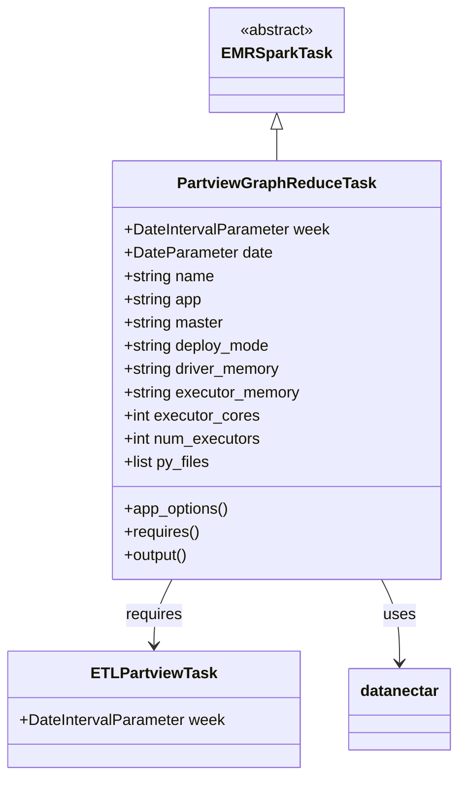
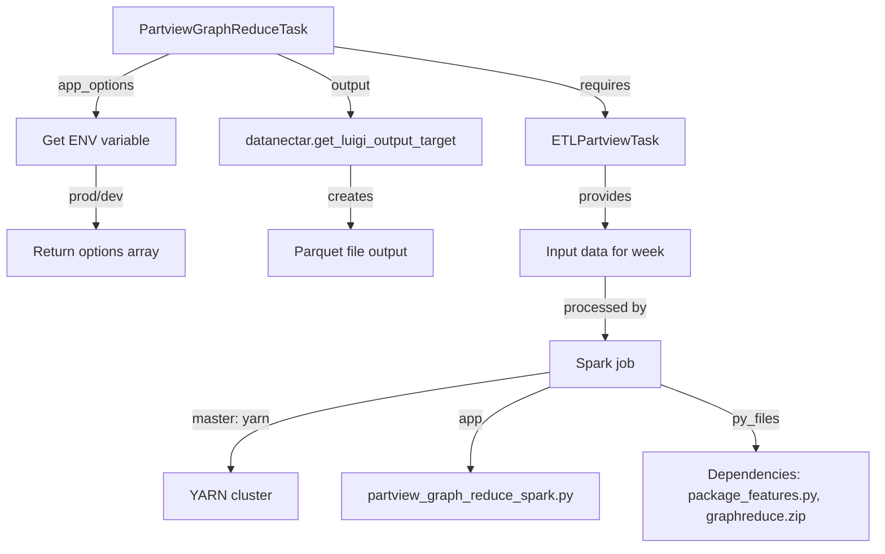
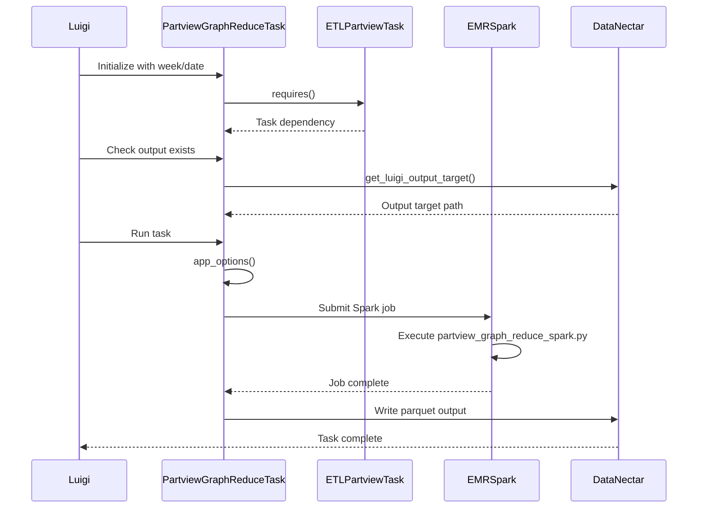

# Diagram: research/orchestrator/tasks/transforms/partview_graph_reduce_task.py

> Auto-generated by Obscura crawlers

## Diagram 1

### SVG

<svg id="container" width="467.0859375" xmlns="http://www.w3.org/2000/svg" class="classDiagram" height="800" viewBox="0 0 467.0859375 800" role="graphics-document document" aria-roledescription="class"><g><defs><marker id="container_class-aggregationStart" class="marker aggregation class" refX="18" refY="7" markerWidth="190" markerHeight="240" orient="auto"><path d="M 18,7 L9,13 L1,7 L9,1 Z"></path></marker></defs><defs><marker id="container_class-aggregationEnd" class="marker aggregation class" refX="1" refY="7" markerWidth="20" markerHeight="28" orient="auto"><path d="M 18,7 L9,13 L1,7 L9,1 Z"></path></marker></defs><defs><marker id="container_class-extensionStart" class="marker extension class" refX="18" refY="7" markerWidth="190" markerHeight="240" orient="auto"><path d="M 1,7 L18,13 V 1 Z"></path></marker></defs><defs><marker id="container_class-extensionEnd" class="marker extension class" refX="1" refY="7" markerWidth="20" markerHeight="28" orient="auto"><path d="M 1,1 V 13 L18,7 Z"></path></marker></defs><defs><marker id="container_class-compositionStart" class="marker composition class" refX="18" refY="7" markerWidth="190" markerHeight="240" orient="auto"><path d="M 18,7 L9,13 L1,7 L9,1 Z"></path></marker></defs><defs><marker id="container_class-compositionEnd" class="marker composition class" refX="1" refY="7" markerWidth="20" markerHeight="28" orient="auto"><path d="M 18,7 L9,13 L1,7 L9,1 Z"></path></marker></defs><defs><marker id="container_class-dependencyStart" class="marker dependency class" refX="6" refY="7" markerWidth="190" markerHeight="240" orient="auto"><path d="M 5,7 L9,13 L1,7 L9,1 Z"></path></marker></defs><defs><marker id="container_class-dependencyEnd" class="marker dependency class" refX="13" refY="7" markerWidth="20" markerHeight="28" orient="auto"><path d="M 18,7 L9,13 L14,7 L9,1 Z"></path></marker></defs><defs><marker id="container_class-lollipopStart" class="marker lollipop class" refX="13" refY="7" markerWidth="190" markerHeight="240" orient="auto"><circle stroke="black" fill="transparent" cx="7" cy="7" r="6"></circle></marker></defs><defs><marker id="container_class-lollipopEnd" class="marker lollipop class" refX="1" refY="7" markerWidth="190" markerHeight="240" orient="auto"><circle stroke="black" fill="transparent" cx="7" cy="7" r="6"></circle></marker></defs><g class="root"><g class="clusters"></g><g class="edgePaths"><path d="M281.799,133.25L281.799,134.542C281.799,135.833,281.799,138.417,281.799,143.875C281.799,149.333,281.799,157.667,281.799,161.833L281.799,166" id="id_EMRSparkTask_PartviewGraphReduceTask_1" class="edge-thickness-normal edge-pattern-solid relation" style=";;;" data-edge="true" data-et="edge" data-id="id_EMRSparkTask_PartviewGraphReduceTask_1" data-points="W3sieCI6MjgxLjc5ODgyODEyNSwieSI6MTE2fSx7IngiOjI4MS43OTg4MjgxMjUsInkiOjE0MX0seyJ4IjoyODEuNzk4ODI4MTI1LCJ5IjoxNjZ9XQ==" marker-start="url(#container_class-extensionStart)"></path><path d="M174.848,598L171.794,604.167C168.741,610.333,162.634,622.667,159.581,634C156.527,645.333,156.527,655.667,156.527,660.833L156.527,666" id="id_PartviewGraphReduceTask_ETLPartviewTask_2" class="edge-thickness-normal edge-pattern-solid relation" style=";;;" data-edge="true" data-et="edge" data-id="id_PartviewGraphReduceTask_ETLPartviewTask_2" data-points="W3sieCI6MTc0Ljg0NzY3OTQwOTU4NSwieSI6NTk4fSx7IngiOjE1Ni41MjczNDM3NSwieSI6NjM1fSx7IngiOjE1Ni41MjczNDM3NSwieSI6NjcyfV0=" marker-end="url(#container_class-dependencyEnd)"></path><path d="M388.75,598L391.803,604.167C394.857,610.333,400.964,622.667,404.017,637C407.07,651.333,407.07,667.667,407.07,675.833L407.07,684" id="id_PartviewGraphReduceTask_datanectar_3" class="edge-thickness-normal edge-pattern-solid relation" style=";;;" data-edge="true" data-et="edge" data-id="id_PartviewGraphReduceTask_datanectar_3" data-points="W3sieCI6Mzg4Ljc0OTk3Njg0MDQxNSwieSI6NTk4fSx7IngiOjQwNy4wNzAzMTI1LCJ5Ijo2MzV9LHsieCI6NDA3LjA3MDMxMjUsInkiOjY5MH1d" marker-end="url(#container_class-dependencyEnd)"></path></g><g class="edgeLabels"><g class="edgeLabel"><g class="label" data-id="id_EMRSparkTask_PartviewGraphReduceTask_1" transform="translate(0, 0)"><foreignObject width="0" height="0">

</foreignObject></g></g><g class="edgeLabel" transform="translate(156.52734375, 635)"><g class="label" data-id="id_PartviewGraphReduceTask_ETLPartviewTask_2" transform="translate(-29.8515625, -12)"><foreignObject width="59.703125" height="24">

requires

</foreignObject></g></g><g class="edgeLabel" transform="translate(407.0703125, 635)"><g class="label" data-id="id_PartviewGraphReduceTask_datanectar_3" transform="translate(-16.4921875, -12)"><foreignObject width="32.984375" height="24">

uses

</foreignObject></g></g></g><g class="nodes"><g class="node default" id="classId-EMRSparkTask-0" transform="translate(281.798828125, 62)"><g class="basic label-container"><path d="M-65.1484375 -54 L65.1484375 -54 L65.1484375 54 L-65.1484375 54" stroke="none" stroke-width="0" fill="#ECECFF" style=""></path><path d="M-65.1484375 -54 C-13.465492941682022 -54, 38.217451616635955 -54, 65.1484375 -54 M-65.1484375 -54 C-38.44346294856736 -54, -11.738488397134716 -54, 65.1484375 -54 M65.1484375 -54 C65.1484375 -26.32458099542805, 65.1484375 1.3508380091438994, 65.1484375 54 M65.1484375 -54 C65.1484375 -17.033330328327203, 65.1484375 19.933339343345594, 65.1484375 54 M65.1484375 54 C14.451912500028037 54, -36.244612499943926 54, -65.1484375 54 M65.1484375 54 C21.88064586216226 54, -21.387145775675478 54, -65.1484375 54 M-65.1484375 54 C-65.1484375 27.797190499617088, -65.1484375 1.5943809992341755, -65.1484375 -54 M-65.1484375 54 C-65.1484375 26.780890497157987, -65.1484375 -0.43821900568402583, -65.1484375 -54" stroke="#9370DB" stroke-width="1.3" fill="none" stroke-dasharray="0 0" style=""></path></g><g class="annotation-group text" transform="translate(-38.609375, -30)"><g class="label" style="" transform="translate(0,-12)"><foreignObject width="77.21875" height="24">

«abstract»

</foreignObject></g></g><g class="label-group text" transform="translate(-53.1484375, -6)"><g class="label" style="font-weight: bolder" transform="translate(0,-12)"><foreignObject width="106.296875" height="24">

EMRSparkTask

</foreignObject></g></g><g class="members-group text" transform="translate(-53.1484375, 42)"></g><g class="methods-group text" transform="translate(-53.1484375, 72)"></g><g class="divider" style=""><path d="M-65.1484375 18 C-29.902538513206373 18, 5.3433604735872535 18, 65.1484375 18 M-65.1484375 18 C-31.035045741440257 18, 3.078346017119486 18, 65.1484375 18" stroke="#9370DB" stroke-width="1.3" fill="none" stroke-dasharray="0 0" style=""></path></g><g class="divider" style=""><path d="M-65.1484375 36 C-33.55856904804767 36, -1.9687005960953528 36, 65.1484375 36 M-65.1484375 36 C-21.246399883510655 36, 22.65563773297869 36, 65.1484375 36" stroke="#9370DB" stroke-width="1.3" fill="none" stroke-dasharray="0 0" style=""></path></g></g><g class="node default" id="classId-PartviewGraphReduceTask-1" transform="translate(281.798828125, 382)"><g class="basic label-container"><path d="M-166.4921875 -216 L166.4921875 -216 L166.4921875 216 L-166.4921875 216" stroke="none" stroke-width="0" fill="#ECECFF" style=""></path><path d="M-166.4921875 -216 C-41.278546787323165 -216, 83.93509392535367 -216, 166.4921875 -216 M-166.4921875 -216 C-59.01243913572597 -216, 48.46730922854806 -216, 166.4921875 -216 M166.4921875 -216 C166.4921875 -47.878045910712615, 166.4921875 120.24390817857477, 166.4921875 216 M166.4921875 -216 C166.4921875 -56.84343506754945, 166.4921875 102.3131298649011, 166.4921875 216 M166.4921875 216 C87.508474789971 216, 8.524762079942008 216, -166.4921875 216 M166.4921875 216 C98.53437309567255 216, 30.5765586913451 216, -166.4921875 216 M-166.4921875 216 C-166.4921875 104.18397125031765, -166.4921875 -7.6320574993646915, -166.4921875 -216 M-166.4921875 216 C-166.4921875 82.4460331662242, -166.4921875 -51.107933667551606, -166.4921875 -216" stroke="#9370DB" stroke-width="1.3" fill="none" stroke-dasharray="0 0" style=""></path></g><g class="annotation-group text" transform="translate(0, -192)"></g><g class="label-group text" transform="translate(-96.859375, -192)"><g class="label" style="font-weight: bolder" transform="translate(0,-12)"><foreignObject width="193.71875" height="24">

PartviewGraphReduceTask

</foreignObject></g></g><g class="members-group text" transform="translate(-154.4921875, -144)"><g class="label" style="" transform="translate(0,-12)"><foreignObject width="212.125" height="24">

+DateIntervalParameter week

</foreignObject></g><g class="label" style="" transform="translate(0,12)"><foreignObject width="152.171875" height="24">

+DateParameter date

</foreignObject></g><g class="label" style="" transform="translate(0,36)"><foreignObject width="94.375" height="24">

+string name

</foreignObject></g><g class="label" style="" transform="translate(0,60)"><foreignObject width="81.578125" height="24">

+string app

</foreignObject></g><g class="label" style="" transform="translate(0,84)"><foreignObject width="104.03125" height="24">

+string master

</foreignObject></g><g class="label" style="" transform="translate(0,108)"><foreignObject width="152.59375" height="24">

+string deploy_mode

</foreignObject></g><g class="label" style="" transform="translate(0,132)"><foreignObject width="163.40625" height="24">

+string driver_memory

</foreignObject></g><g class="label" style="" transform="translate(0,156)"><foreignObject width="183.203125" height="24">

+string executor_memory

</foreignObject></g><g class="label" style="" transform="translate(0,180)"><foreignObject width="139.9375" height="24">

+int executor_cores

</foreignObject></g><g class="label" style="" transform="translate(0,204)"><foreignObject width="142.296875" height="24">

+int num_executors

</foreignObject></g><g class="label" style="" transform="translate(0,228)"><foreignObject width="89.515625" height="24">

+list py_files

</foreignObject></g></g><g class="methods-group text" transform="translate(-154.4921875, 144)"><g class="label" style="" transform="translate(0,-12)"><foreignObject width="108.84375" height="24">

+app_options()

</foreignObject></g><g class="label" style="" transform="translate(0,12)"><foreignObject width="78.0625" height="24">

+requires()

</foreignObject></g><g class="label" style="" transform="translate(0,36)"><foreignObject width="67.390625" height="24">

+output()

</foreignObject></g></g><g class="divider" style=""><path d="M-166.4921875 -168 C-82.30109546588258 -168, 1.8899965682348352 -168, 166.4921875 -168 M-166.4921875 -168 C-35.04547106001374 -168, 96.40124537997252 -168, 166.4921875 -168" stroke="#9370DB" stroke-width="1.3" fill="none" stroke-dasharray="0 0" style=""></path></g><g class="divider" style=""><path d="M-166.4921875 120 C-88.56234695943314 120, -10.632506418866285 120, 166.4921875 120 M-166.4921875 120 C-73.499773088294 120, 19.492641323411988 120, 166.4921875 120" stroke="#9370DB" stroke-width="1.3" fill="none" stroke-dasharray="0 0" style=""></path></g></g><g class="node default" id="classId-ETLPartviewTask-2" transform="translate(156.52734375, 732)"><g class="basic label-container"><path d="M-148.52734375 -60 L148.52734375 -60 L148.52734375 60 L-148.52734375 60" stroke="none" stroke-width="0" fill="#ECECFF" style=""></path><path d="M-148.52734375 -60 C-47.845119350058795 -60, 52.83710504988241 -60, 148.52734375 -60 M-148.52734375 -60 C-71.49312143120147 -60, 5.541100887597054 -60, 148.52734375 -60 M148.52734375 -60 C148.52734375 -23.46319860788423, 148.52734375 13.07360278423154, 148.52734375 60 M148.52734375 -60 C148.52734375 -31.16634849192625, 148.52734375 -2.3326969838525002, 148.52734375 60 M148.52734375 60 C78.19665012916462 60, 7.865956508329248 60, -148.52734375 60 M148.52734375 60 C54.1791411840629 60, -40.1690613818742 60, -148.52734375 60 M-148.52734375 60 C-148.52734375 25.51489997169753, -148.52734375 -8.970200056604938, -148.52734375 -60 M-148.52734375 60 C-148.52734375 35.34045942848034, -148.52734375 10.680918856960673, -148.52734375 -60" stroke="#9370DB" stroke-width="1.3" fill="none" stroke-dasharray="0 0" style=""></path></g><g class="annotation-group text" transform="translate(0, -36)"></g><g class="label-group text" transform="translate(-60.9296875, -36)"><g class="label" style="font-weight: bolder" transform="translate(0,-12)"><foreignObject width="121.859375" height="24">

ETLPartviewTask

</foreignObject></g></g><g class="members-group text" transform="translate(-136.52734375, 12)"><g class="label" style="" transform="translate(0,-12)"><foreignObject width="212.125" height="24">

+DateIntervalParameter week

</foreignObject></g></g><g class="methods-group text" transform="translate(-136.52734375, 60)"></g><g class="divider" style=""><path d="M-148.52734375 -12 C-64.24363348747326 -12, 20.04007677505348 -12, 148.52734375 -12 M-148.52734375 -12 C-61.112277850282226 -12, 26.30278804943555 -12, 148.52734375 -12" stroke="#9370DB" stroke-width="1.3" fill="none" stroke-dasharray="0 0" style=""></path></g><g class="divider" style=""><path d="M-148.52734375 36 C-82.14836521921123 36, -15.769386688422458 36, 148.52734375 36 M-148.52734375 36 C-76.94016879955612 36, -5.352993849112238 36, 148.52734375 36" stroke="#9370DB" stroke-width="1.3" fill="none" stroke-dasharray="0 0" style=""></path></g></g><g class="node default" id="classId-datanectar-3" transform="translate(407.0703125, 732)"><g class="basic label-container"><path d="M-52.015625 -42 L52.015625 -42 L52.015625 42 L-52.015625 42" stroke="none" stroke-width="0" fill="#ECECFF" style=""></path><path d="M-52.015625 -42 C-14.586526202916872 -42, 22.842572594166256 -42, 52.015625 -42 M-52.015625 -42 C-19.41994446048865 -42, 13.175736079022698 -42, 52.015625 -42 M52.015625 -42 C52.015625 -12.122893225656977, 52.015625 17.754213548686046, 52.015625 42 M52.015625 -42 C52.015625 -20.454564573613805, 52.015625 1.0908708527723903, 52.015625 42 M52.015625 42 C13.147899551027542 42, -25.719825897944915 42, -52.015625 42 M52.015625 42 C19.244248339754577 42, -13.527128320490846 42, -52.015625 42 M-52.015625 42 C-52.015625 10.033791368203495, -52.015625 -21.93241726359301, -52.015625 -42 M-52.015625 42 C-52.015625 18.256080411550126, -52.015625 -5.487839176899747, -52.015625 -42" stroke="#9370DB" stroke-width="1.3" fill="none" stroke-dasharray="0 0" style=""></path></g><g class="annotation-group text" transform="translate(0, -18)"></g><g class="label-group text" transform="translate(-40.015625, -18)"><g class="label" style="font-weight: bolder" transform="translate(0,-12)"><foreignObject width="80.03125" height="24">

datanectar

</foreignObject></g></g><g class="members-group text" transform="translate(-40.015625, 30)"></g><g class="methods-group text" transform="translate(-40.015625, 60)"></g><g class="divider" style=""><path d="M-52.015625 6 C-15.18901887694426 6, 21.63758724611148 6, 52.015625 6 M-52.015625 6 C-25.866702996891686 6, 0.28221900621662854 6, 52.015625 6" stroke="#9370DB" stroke-width="1.3" fill="none" stroke-dasharray="0 0" style=""></path></g><g class="divider" style=""><path d="M-52.015625 24 C-23.452736153251873 24, 5.110152693496254 24, 52.015625 24 M-52.015625 24 C-13.021053325481127 24, 25.973518349037747 24, 52.015625 24" stroke="#9370DB" stroke-width="1.3" fill="none" stroke-dasharray="0 0" style=""></path></g></g></g></g></g></svg>

## Diagram 2

### SVG

<svg id="container" width="1012.98828125" xmlns="http://www.w3.org/2000/svg" class="flowchart" height="630" viewBox="0 0 1012.98828125 630" role="graphics-document document" aria-roledescription="flowchart-v2"><g><marker id="container_flowchart-v2-pointEnd" class="marker flowchart-v2" viewBox="0 0 10 10" refX="5" refY="5" markerUnits="userSpaceOnUse" markerWidth="8" markerHeight="8" orient="auto"><path d="M 0 0 L 10 5 L 0 10 z" class="arrowMarkerPath" style="stroke-width: 1; stroke-dasharray: 1, 0;"></path></marker><marker id="container_flowchart-v2-pointStart" class="marker flowchart-v2" viewBox="0 0 10 10" refX="4.5" refY="5" markerUnits="userSpaceOnUse" markerWidth="8" markerHeight="8" orient="auto"><path d="M 0 5 L 10 10 L 10 0 z" class="arrowMarkerPath" style="stroke-width: 1; stroke-dasharray: 1, 0;"></path></marker><marker id="container_flowchart-v2-circleEnd" class="marker flowchart-v2" viewBox="0 0 10 10" refX="11" refY="5" markerUnits="userSpaceOnUse" markerWidth="11" markerHeight="11" orient="auto"><circle cx="5" cy="5" r="5" class="arrowMarkerPath" style="stroke-width: 1; stroke-dasharray: 1, 0;"></circle></marker><marker id="container_flowchart-v2-circleStart" class="marker flowchart-v2" viewBox="0 0 10 10" refX="-1" refY="5" markerUnits="userSpaceOnUse" markerWidth="11" markerHeight="11" orient="auto"><circle cx="5" cy="5" r="5" class="arrowMarkerPath" style="stroke-width: 1; stroke-dasharray: 1, 0;"></circle></marker><marker id="container_flowchart-v2-crossEnd" class="marker cross flowchart-v2" viewBox="0 0 11 11" refX="12" refY="5.2" markerUnits="userSpaceOnUse" markerWidth="11" markerHeight="11" orient="auto"><path d="M 1,1 l 9,9 M 10,1 l -9,9" class="arrowMarkerPath" style="stroke-width: 2; stroke-dasharray: 1, 0;"></path></marker><marker id="container_flowchart-v2-crossStart" class="marker cross flowchart-v2" viewBox="0 0 11 11" refX="-1" refY="5.2" markerUnits="userSpaceOnUse" markerWidth="11" markerHeight="11" orient="auto"><path d="M 1,1 l 9,9 M 10,1 l -9,9" class="arrowMarkerPath" style="stroke-width: 2; stroke-dasharray: 1, 0;"></path></marker><g class="root"><g class="clusters"></g><g class="edgePaths"><path d="M385.371,53.053L438.317,60.711C491.263,68.369,597.155,83.684,650.101,96.842C703.047,110,703.047,121,703.047,126.5L703.047,132" id="L_A_B_0" class="edge-thickness-normal edge-pattern-solid edge-thickness-normal edge-pattern-solid flowchart-link" style=";" data-edge="true" data-et="edge" data-id="L_A_B_0" data-points="W3sieCI6Mzg1LjM3MTA5Mzc1LCJ5Ijo1My4wNTMyNjY3MTMxNTk1NDV9LHsieCI6NzAzLjA0Njg3NSwieSI6OTl9LHsieCI6NzAzLjA0Njg3NSwieSI6MTM2fV0=" marker-end="url(#container_flowchart-v2-pointEnd)"></path><path d="M198.187,62L183.944,68.167C169.7,74.333,141.214,86.667,126.97,98.333C112.727,110,112.727,121,112.727,126.5L112.727,132" id="L_A_C_0" class="edge-thickness-normal edge-pattern-solid edge-thickness-normal edge-pattern-solid flowchart-link" style=";" data-edge="true" data-et="edge" data-id="L_A_C_0" data-points="W3sieCI6MTk4LjE4NzQzODk2NDg0Mzc1LCJ5Ijo2Mn0seyJ4IjoxMTIuNzI2NTYyNSwieSI6OTl9LHsieCI6MTEyLjcyNjU2MjUsInkiOjEzNn1d" marker-end="url(#container_flowchart-v2-pointEnd)"></path><path d="M112.727,190L112.727,196.167C112.727,202.333,112.727,214.667,112.727,226.333C112.727,238,112.727,249,112.727,254.5L112.727,260" id="L_C_D_0" class="edge-thickness-normal edge-pattern-solid edge-thickness-normal edge-pattern-solid flowchart-link" style=";" data-edge="true" data-et="edge" data-id="L_C_D_0" data-points="W3sieCI6MTEyLjcyNjU2MjUsInkiOjE5MH0seyJ4IjoxMTIuNzI2NTYyNSwieSI6MjI3fSx7IngiOjExMi43MjY1NjI1LCJ5IjoyNjR9XQ==" marker-end="url(#container_flowchart-v2-pointEnd)"></path><path d="M322.914,62L337.158,68.167C351.401,74.333,379.888,86.667,394.132,98.333C408.375,110,408.375,121,408.375,126.5L408.375,132" id="L_A_E_0" class="edge-thickness-normal edge-pattern-solid edge-thickness-normal edge-pattern-solid flowchart-link" style=";" data-edge="true" data-et="edge" data-id="L_A_E_0" data-points="W3sieCI6MzIyLjkxNDEyMzUzNTE1NjI1LCJ5Ijo2Mn0seyJ4Ijo0MDguMzc1LCJ5Ijo5OX0seyJ4Ijo0MDguMzc1LCJ5IjoxMzZ9XQ==" marker-end="url(#container_flowchart-v2-pointEnd)"></path><path d="M408.375,190L408.375,196.167C408.375,202.333,408.375,214.667,408.375,226.333C408.375,238,408.375,249,408.375,254.5L408.375,260" id="L_E_F_0" class="edge-thickness-normal edge-pattern-solid edge-thickness-normal edge-pattern-solid flowchart-link" style=";" data-edge="true" data-et="edge" data-id="L_E_F_0" data-points="W3sieCI6NDA4LjM3NSwieSI6MTkwfSx7IngiOjQwOC4zNzUsInkiOjIyN30seyJ4Ijo0MDguMzc1LCJ5IjoyNjR9XQ==" marker-end="url(#container_flowchart-v2-pointEnd)"></path><path d="M703.047,190L703.047,196.167C703.047,202.333,703.047,214.667,703.047,226.333C703.047,238,703.047,249,703.047,254.5L703.047,260" id="L_B_G_0" class="edge-thickness-normal edge-pattern-solid edge-thickness-normal edge-pattern-solid flowchart-link" style=";" data-edge="true" data-et="edge" data-id="L_B_G_0" data-points="W3sieCI6NzAzLjA0Njg3NSwieSI6MTkwfSx7IngiOjcwMy4wNDY4NzUsInkiOjIyN30seyJ4Ijo3MDMuMDQ2ODc1LCJ5IjoyNjR9XQ==" marker-end="url(#container_flowchart-v2-pointEnd)"></path><path d="M703.047,318L703.047,324.167C703.047,330.333,703.047,342.667,703.047,354.333C703.047,366,703.047,377,703.047,382.5L703.047,388" id="L_G_H_0" class="edge-thickness-normal edge-pattern-solid edge-thickness-normal edge-pattern-solid flowchart-link" style=";" data-edge="true" data-et="edge" data-id="L_G_H_0" data-points="W3sieCI6NzAzLjA0Njg3NSwieSI6MzE4fSx7IngiOjcwMy4wNDY4NzUsInkiOjM1NX0seyJ4Ijo3MDMuMDQ2ODc1LCJ5IjozOTJ9XQ==" marker-end="url(#container_flowchart-v2-pointEnd)"></path><path d="M638.688,428.517L577.282,437.598C515.876,446.678,393.065,464.839,331.66,483.42C270.254,502,270.254,521,270.254,530.5L270.254,540" id="L_H_I_0" class="edge-thickness-normal edge-pattern-solid edge-thickness-normal edge-pattern-solid flowchart-link" style=";" data-edge="true" data-et="edge" data-id="L_H_I_0" data-points="W3sieCI6NjM4LjY4NzUsInkiOjQyOC41MTcyNTI1ODM2MDAzNH0seyJ4IjoyNzAuMjUzOTA2MjUsInkiOjQ4M30seyJ4IjoyNzAuMjUzOTA2MjUsInkiOjU0NH1d" marker-end="url(#container_flowchart-v2-pointEnd)"></path><path d="M638.688,445.148L623.16,451.457C607.632,457.765,576.576,470.383,561.048,486.191C545.52,502,545.52,521,545.52,530.5L545.52,540" id="L_H_J_0" class="edge-thickness-normal edge-pattern-solid edge-thickness-normal edge-pattern-solid flowchart-link" style=";" data-edge="true" data-et="edge" data-id="L_H_J_0" data-points="W3sieCI6NjM4LjY4NzUsInkiOjQ0NS4xNDc4NDEzOTY1ODI5fSx7IngiOjU0NS41MTk1MzEyNSwieSI6NDgzfSx7IngiOjU0NS41MTk1MzEyNSwieSI6NTQ0fV0=" marker-end="url(#container_flowchart-v2-pointEnd)"></path><path d="M767.406,442.956L785.337,449.63C803.267,456.304,839.128,469.652,857.058,481.826C874.988,494,874.988,505,874.988,510.5L874.988,516" id="L_H_K_0" class="edge-thickness-normal edge-pattern-solid edge-thickness-normal edge-pattern-solid flowchart-link" style=";" data-edge="true" data-et="edge" data-id="L_H_K_0" data-points="W3sieCI6NzY3LjQwNjI1LCJ5Ijo0NDIuOTU1ODM1MjQ1NDczMzR9LHsieCI6ODc0Ljk4ODI4MTI1LCJ5Ijo0ODN9LHsieCI6ODc0Ljk4ODI4MTI1LCJ5Ijo1MjB9XQ==" marker-end="url(#container_flowchart-v2-pointEnd)"></path></g><g class="edgeLabels"><g class="edgeLabel" transform="translate(703.046875, 99)"><g class="label" data-id="L_A_B_0" transform="translate(-29.8515625, -12)"><foreignObject width="59.703125" height="24">

requires

</foreignObject></g></g><g class="edgeLabel" transform="translate(112.7265625, 99)"><g class="label" data-id="L_A_C_0" transform="translate(-45.3671875, -12)"><foreignObject width="90.734375" height="24">

app_options

</foreignObject></g></g><g class="edgeLabel" transform="translate(112.7265625, 227)"><g class="label" data-id="L_C_D_0" transform="translate(-33.8671875, -12)"><foreignObject width="67.734375" height="24">

prod/dev

</foreignObject></g></g><g class="edgeLabel" transform="translate(408.375, 99)"><g class="label" data-id="L_A_E_0" transform="translate(-24.515625, -12)"><foreignObject width="49.03125" height="24">

output

</foreignObject></g></g><g class="edgeLabel" transform="translate(408.375, 227)"><g class="label" data-id="L_E_F_0" transform="translate(-26.171875, -12)"><foreignObject width="52.34375" height="24">

creates

</foreignObject></g></g><g class="edgeLabel" transform="translate(703.046875, 227)"><g class="label" data-id="L_B_G_0" transform="translate(-31.3125, -12)"><foreignObject width="62.625" height="24">

provides

</foreignObject></g></g><g class="edgeLabel" transform="translate(703.046875, 355)"><g class="label" data-id="L_G_H_0" transform="translate(-47.609375, -12)"><foreignObject width="95.21875" height="24">

processed by

</foreignObject></g></g><g class="edgeLabel" transform="translate(270.25390625, 483)"><g class="label" data-id="L_H_I_0" transform="translate(-45.140625, -12)"><foreignObject width="90.28125" height="24">

master: yarn

</foreignObject></g></g><g class="edgeLabel" transform="translate(545.51953125, 483)"><g class="label" data-id="L_H_J_0" transform="translate(-13.859375, -12)"><foreignObject width="27.71875" height="24">

app

</foreignObject></g></g><g class="edgeLabel" transform="translate(874.98828125, 483)"><g class="label" data-id="L_H_K_0" transform="translate(-27.421875, -12)"><foreignObject width="54.84375" height="24">

py_files

</foreignObject></g></g></g><g class="nodes"><g class="node default" id="flowchart-A-0" transform="translate(260.55078125, 35)"><rect class="basic label-container" style="" x="-124.8203125" y="-27" width="249.640625" height="54"></rect><g class="label" style="" transform="translate(-94.8203125, -12)"><rect></rect><foreignObject width="189.640625" height="24">

PartviewGraphReduceTask

</foreignObject></g></g><g class="node default" id="flowchart-B-1" transform="translate(703.046875, 163)"><rect class="basic label-container" style="" x="-89.03125" y="-27" width="178.0625" height="54"></rect><g class="label" style="" transform="translate(-59.03125, -12)"><rect></rect><foreignObject width="118.0625" height="24">

ETLPartviewTask

</foreignObject></g></g><g class="node default" id="flowchart-C-3" transform="translate(112.7265625, 163)"><rect class="basic label-container" style="" x="-90.0078125" y="-27" width="180.015625" height="54"></rect><g class="label" style="" transform="translate(-60.0078125, -12)"><rect></rect><foreignObject width="120.015625" height="24">

Get ENV variable

</foreignObject></g></g><g class="node default" id="flowchart-D-5" transform="translate(112.7265625, 291)"><rect class="basic label-container" style="" x="-104.7265625" y="-27" width="209.453125" height="54"></rect><g class="label" style="" transform="translate(-74.7265625, -12)"><rect></rect><foreignObject width="149.453125" height="24">

Return options array

</foreignObject></g></g><g class="node default" id="flowchart-E-7" transform="translate(408.375, 163)"><rect class="basic label-container" style="" x="-155.640625" y="-27" width="311.28125" height="54"></rect><g class="label" style="" transform="translate(-125.640625, -12)"><rect></rect><foreignObject width="251.28125" height="24">

datanectar.get_luigi_output_target

</foreignObject></g></g><g class="node default" id="flowchart-F-9" transform="translate(408.375, 291)"><rect class="basic label-container" style="" x="-98.1171875" y="-27" width="196.234375" height="54"></rect><g class="label" style="" transform="translate(-68.1171875, -12)"><rect></rect><foreignObject width="136.234375" height="24">

Parquet file output

</foreignObject></g></g><g class="node default" id="flowchart-G-11" transform="translate(703.046875, 291)"><rect class="basic label-container" style="" x="-100.9375" y="-27" width="201.875" height="54"></rect><g class="label" style="" transform="translate(-70.9375, -12)"><rect></rect><foreignObject width="141.875" height="24">

Input data for week

</foreignObject></g></g><g class="node default" id="flowchart-H-13" transform="translate(703.046875, 419)"><rect class="basic label-container" style="" x="-64.359375" y="-27" width="128.71875" height="54"></rect><g class="label" style="" transform="translate(-34.359375, -12)"><rect></rect><foreignObject width="68.71875" height="24">

Spark job

</foreignObject></g></g><g class="node default" id="flowchart-I-15" transform="translate(270.25390625, 571)"><rect class="basic label-container" style="" x="-75.796875" y="-27" width="151.59375" height="54"></rect><g class="label" style="" transform="translate(-45.796875, -12)"><rect></rect><foreignObject width="91.59375" height="24">

YARN cluster

</foreignObject></g></g><g class="node default" id="flowchart-J-17" transform="translate(545.51953125, 571)"><rect class="basic label-container" style="" x="-149.46875" y="-27" width="298.9375" height="54"></rect><g class="label" style="" transform="translate(-119.46875, -12)"><rect></rect><foreignObject width="238.9375" height="24">

partview_graph_reduce_spark.py

</foreignObject></g></g><g class="node default" id="flowchart-K-19" transform="translate(874.98828125, 571)"><rect class="basic label-container" style="" x="-130" y="-51" width="260" height="102"></rect><g class="label" style="" transform="translate(-100, -36)"><rect></rect><foreignObject width="200" height="72">

Dependencies: package_features.py, graphreduce.zip

</foreignObject></g></g></g></g></g></svg>

## Diagram 3

### SVG

<svg id="container" width="1138.5" xmlns="http://www.w3.org/2000/svg" height="855" viewBox="-50 -10 1138.5 855" role="graphics-document document" aria-roledescription="sequence"><g><rect x="888.5" y="769" fill="#eaeaea" stroke="#666" width="150" height="65" name="DataNectar" rx="3" ry="3" class="actor actor-bottom"></rect><text x="963.5" y="801.5" dominant-baseline="central" alignment-baseline="central" class="actor actor-box" style="text-anchor: middle; font-size: 16px; font-weight: 400;"><tspan x="963.5" dy="0">DataNectar</tspan></text></g><g><rect x="679" y="769" fill="#eaeaea" stroke="#666" width="150" height="65" name="EMRSpark" rx="3" ry="3" class="actor actor-bottom"></rect><text x="754" y="801.5" dominant-baseline="central" alignment-baseline="central" class="actor actor-box" style="text-anchor: middle; font-size: 16px; font-weight: 400;"><tspan x="754" dy="0">EMRSpark</tspan></text></g><g><rect x="479" y="769" fill="#eaeaea" stroke="#666" width="150" height="65" name="ETLPartviewTask" rx="3" ry="3" class="actor actor-bottom"></rect><text x="554" y="801.5" dominant-baseline="central" alignment-baseline="central" class="actor actor-box" style="text-anchor: middle; font-size: 16px; font-weight: 400;"><tspan x="554" dy="0">ETLPartviewTask</tspan></text></g><g><rect x="219" y="769" fill="#eaeaea" stroke="#666" width="210" height="65" name="PartviewGraphReduceTask" rx="3" ry="3" class="actor actor-bottom"></rect><text x="324" y="801.5" dominant-baseline="central" alignment-baseline="central" class="actor actor-box" style="text-anchor: middle; font-size: 16px; font-weight: 400;"><tspan x="324" dy="0">PartviewGraphReduceTask</tspan></text></g><g><rect x="0" y="769" fill="#eaeaea" stroke="#666" width="150" height="65" name="Luigi" rx="3" ry="3" class="actor actor-bottom"></rect><text x="75" y="801.5" dominant-baseline="central" alignment-baseline="central" class="actor actor-box" style="text-anchor: middle; font-size: 16px; font-weight: 400;"><tspan x="75" dy="0">Luigi</tspan></text></g><g><line id="actor4" x1="963.5" y1="65" x2="963.5" y2="769" class="actor-line 200" stroke-width="0.5px" stroke="#999" name="DataNectar"></line><g id="root-4"><rect x="888.5" y="0" fill="#eaeaea" stroke="#666" width="150" height="65" name="DataNectar" rx="3" ry="3" class="actor actor-top"></rect><text x="963.5" y="32.5" dominant-baseline="central" alignment-baseline="central" class="actor actor-box" style="text-anchor: middle; font-size: 16px; font-weight: 400;"><tspan x="963.5" dy="0">DataNectar</tspan></text></g></g><g><line id="actor3" x1="754" y1="65" x2="754" y2="769" class="actor-line 200" stroke-width="0.5px" stroke="#999" name="EMRSpark"></line><g id="root-3"><rect x="679" y="0" fill="#eaeaea" stroke="#666" width="150" height="65" name="EMRSpark" rx="3" ry="3" class="actor actor-top"></rect><text x="754" y="32.5" dominant-baseline="central" alignment-baseline="central" class="actor actor-box" style="text-anchor: middle; font-size: 16px; font-weight: 400;"><tspan x="754" dy="0">EMRSpark</tspan></text></g></g><g><line id="actor2" x1="554" y1="65" x2="554" y2="769" class="actor-line 200" stroke-width="0.5px" stroke="#999" name="ETLPartviewTask"></line><g id="root-2"><rect x="479" y="0" fill="#eaeaea" stroke="#666" width="150" height="65" name="ETLPartviewTask" rx="3" ry="3" class="actor actor-top"></rect><text x="554" y="32.5" dominant-baseline="central" alignment-baseline="central" class="actor actor-box" style="text-anchor: middle; font-size: 16px; font-weight: 400;"><tspan x="554" dy="0">ETLPartviewTask</tspan></text></g></g><g><line id="actor1" x1="324" y1="65" x2="324" y2="769" class="actor-line 200" stroke-width="0.5px" stroke="#999" name="PartviewGraphReduceTask"></line><g id="root-1"><rect x="219" y="0" fill="#eaeaea" stroke="#666" width="210" height="65" name="PartviewGraphReduceTask" rx="3" ry="3" class="actor actor-top"></rect><text x="324" y="32.5" dominant-baseline="central" alignment-baseline="central" class="actor actor-box" style="text-anchor: middle; font-size: 16px; font-weight: 400;"><tspan x="324" dy="0">PartviewGraphReduceTask</tspan></text></g></g><g><line id="actor0" x1="75" y1="65" x2="75" y2="769" class="actor-line 200" stroke-width="0.5px" stroke="#999" name="Luigi"></line><g id="root-0"><rect x="0" y="0" fill="#eaeaea" stroke="#666" width="150" height="65" name="Luigi" rx="3" ry="3" class="actor actor-top"></rect><text x="75" y="32.5" dominant-baseline="central" alignment-baseline="central" class="actor actor-box" style="text-anchor: middle; font-size: 16px; font-weight: 400;"><tspan x="75" dy="0">Luigi</tspan></text></g></g><g></g><defs><symbol id="computer" width="24" height="24"><path transform="scale(.5)" d="M2 2v13h20v-13h-20zm18 11h-16v-9h16v9zm-10.228 6l.466-1h3.524l.467 1h-4.457zm14.228 3h-24l2-6h2.104l-1.33 4h18.45l-1.297-4h2.073l2 6zm-5-10h-14v-7h14v7z"></path></symbol></defs><defs><symbol id="database" fill-rule="evenodd" clip-rule="evenodd"><path transform="scale(.5)" d="M12.258.001l.256.004.255.005.253.008.251.01.249.012.247.015.246.016.242.019.241.02.239.023.236.024.233.027.231.028.229.031.225.032.223.034.22.036.217.038.214.04.211.041.208.043.205.045.201.046.198.048.194.05.191.051.187.053.183.054.18.056.175.057.172.059.168.06.163.061.16.063.155.064.15.066.074.033.073.033.071.034.07.034.069.035.068.035.067.035.066.035.064.036.064.036.062.036.06.036.06.037.058.037.058.037.055.038.055.038.053.038.052.038.051.039.05.039.048.039.047.039.045.04.044.04.043.04.041.04.04.041.039.041.037.041.036.041.034.041.033.042.032.042.03.042.029.042.027.042.026.043.024.043.023.043.021.043.02.043.018.044.017.043.015.044.013.044.012.044.011.045.009.044.007.045.006.045.004.045.002.045.001.045v17l-.001.045-.002.045-.004.045-.006.045-.007.045-.009.044-.011.045-.012.044-.013.044-.015.044-.017.043-.018.044-.02.043-.021.043-.023.043-.024.043-.026.043-.027.042-.029.042-.03.042-.032.042-.033.042-.034.041-.036.041-.037.041-.039.041-.04.041-.041.04-.043.04-.044.04-.045.04-.047.039-.048.039-.05.039-.051.039-.052.038-.053.038-.055.038-.055.038-.058.037-.058.037-.06.037-.06.036-.062.036-.064.036-.064.036-.066.035-.067.035-.068.035-.069.035-.07.034-.071.034-.073.033-.074.033-.15.066-.155.064-.16.063-.163.061-.168.06-.172.059-.175.057-.18.056-.183.054-.187.053-.191.051-.194.05-.198.048-.201.046-.205.045-.208.043-.211.041-.214.04-.217.038-.22.036-.223.034-.225.032-.229.031-.231.028-.233.027-.236.024-.239.023-.241.02-.242.019-.246.016-.247.015-.249.012-.251.01-.253.008-.255.005-.256.004-.258.001-.258-.001-.256-.004-.255-.005-.253-.008-.251-.01-.249-.012-.247-.015-.245-.016-.243-.019-.241-.02-.238-.023-.236-.024-.234-.027-.231-.028-.228-.031-.226-.032-.223-.034-.22-.036-.217-.038-.214-.04-.211-.041-.208-.043-.204-.045-.201-.046-.198-.048-.195-.05-.19-.051-.187-.053-.184-.054-.179-.056-.176-.057-.172-.059-.167-.06-.164-.061-.159-.063-.155-.064-.151-.066-.074-.033-.072-.033-.072-.034-.07-.034-.069-.035-.068-.035-.067-.035-.066-.035-.064-.036-.063-.036-.062-.036-.061-.036-.06-.037-.058-.037-.057-.037-.056-.038-.055-.038-.053-.038-.052-.038-.051-.039-.049-.039-.049-.039-.046-.039-.046-.04-.044-.04-.043-.04-.041-.04-.04-.041-.039-.041-.037-.041-.036-.041-.034-.041-.033-.042-.032-.042-.03-.042-.029-.042-.027-.042-.026-.043-.024-.043-.023-.043-.021-.043-.02-.043-.018-.044-.017-.043-.015-.044-.013-.044-.012-.044-.011-.045-.009-.044-.007-.045-.006-.045-.004-.045-.002-.045-.001-.045v-17l.001-.045.002-.045.004-.045.006-.045.007-.045.009-.044.011-.045.012-.044.013-.044.015-.044.017-.043.018-.044.02-.043.021-.043.023-.043.024-.043.026-.043.027-.042.029-.042.03-.042.032-.042.033-.042.034-.041.036-.041.037-.041.039-.041.04-.041.041-.04.043-.04.044-.04.046-.04.046-.039.049-.039.049-.039.051-.039.052-.038.053-.038.055-.038.056-.038.057-.037.058-.037.06-.037.061-.036.062-.036.063-.036.064-.036.066-.035.067-.035.068-.035.069-.035.07-.034.072-.034.072-.033.074-.033.151-.066.155-.064.159-.063.164-.061.167-.06.172-.059.176-.057.179-.056.184-.054.187-.053.19-.051.195-.05.198-.048.201-.046.204-.045.208-.043.211-.041.214-.04.217-.038.22-.036.223-.034.226-.032.228-.031.231-.028.234-.027.236-.024.238-.023.241-.02.243-.019.245-.016.247-.015.249-.012.251-.01.253-.008.255-.005.256-.004.258-.001.258.001zm-9.258 20.499v.01l.001.021.003.021.004.022.005.021.006.022.007.022.009.023.01.022.011.023.012.023.013.023.015.023.016.024.017.023.018.024.019.024.021.024.022.025.023.024.024.025.052.049.056.05.061.051.066.051.07.051.075.051.079.052.084.052.088.052.092.052.097.052.102.051.105.052.11.052.114.051.119.051.123.051.127.05.131.05.135.05.139.048.144.049.147.047.152.047.155.047.16.045.163.045.167.043.171.043.176.041.178.041.183.039.187.039.19.037.194.035.197.035.202.033.204.031.209.03.212.029.216.027.219.025.222.024.226.021.23.02.233.018.236.016.24.015.243.012.246.01.249.008.253.005.256.004.259.001.26-.001.257-.004.254-.005.25-.008.247-.011.244-.012.241-.014.237-.016.233-.018.231-.021.226-.021.224-.024.22-.026.216-.027.212-.028.21-.031.205-.031.202-.034.198-.034.194-.036.191-.037.187-.039.183-.04.179-.04.175-.042.172-.043.168-.044.163-.045.16-.046.155-.046.152-.047.148-.048.143-.049.139-.049.136-.05.131-.05.126-.05.123-.051.118-.052.114-.051.11-.052.106-.052.101-.052.096-.052.092-.052.088-.053.083-.051.079-.052.074-.052.07-.051.065-.051.06-.051.056-.05.051-.05.023-.024.023-.025.021-.024.02-.024.019-.024.018-.024.017-.024.015-.023.014-.024.013-.023.012-.023.01-.023.01-.022.008-.022.006-.022.006-.022.004-.022.004-.021.001-.021.001-.021v-4.127l-.077.055-.08.053-.083.054-.085.053-.087.052-.09.052-.093.051-.095.05-.097.05-.1.049-.102.049-.105.048-.106.047-.109.047-.111.046-.114.045-.115.045-.118.044-.12.043-.122.042-.124.042-.126.041-.128.04-.13.04-.132.038-.134.038-.135.037-.138.037-.139.035-.142.035-.143.034-.144.033-.147.032-.148.031-.15.03-.151.03-.153.029-.154.027-.156.027-.158.026-.159.025-.161.024-.162.023-.163.022-.165.021-.166.02-.167.019-.169.018-.169.017-.171.016-.173.015-.173.014-.175.013-.175.012-.177.011-.178.01-.179.008-.179.008-.181.006-.182.005-.182.004-.184.003-.184.002h-.37l-.184-.002-.184-.003-.182-.004-.182-.005-.181-.006-.179-.008-.179-.008-.178-.01-.176-.011-.176-.012-.175-.013-.173-.014-.172-.015-.171-.016-.17-.017-.169-.018-.167-.019-.166-.02-.165-.021-.163-.022-.162-.023-.161-.024-.159-.025-.157-.026-.156-.027-.155-.027-.153-.029-.151-.03-.15-.03-.148-.031-.146-.032-.145-.033-.143-.034-.141-.035-.14-.035-.137-.037-.136-.037-.134-.038-.132-.038-.13-.04-.128-.04-.126-.041-.124-.042-.122-.042-.12-.044-.117-.043-.116-.045-.113-.045-.112-.046-.109-.047-.106-.047-.105-.048-.102-.049-.1-.049-.097-.05-.095-.05-.093-.052-.09-.051-.087-.052-.085-.053-.083-.054-.08-.054-.077-.054v4.127zm0-5.654v.011l.001.021.003.021.004.021.005.022.006.022.007.022.009.022.01.022.011.023.012.023.013.023.015.024.016.023.017.024.018.024.019.024.021.024.022.024.023.025.024.024.052.05.056.05.061.05.066.051.07.051.075.052.079.051.084.052.088.052.092.052.097.052.102.052.105.052.11.051.114.051.119.052.123.05.127.051.131.05.135.049.139.049.144.048.147.048.152.047.155.046.16.045.163.045.167.044.171.042.176.042.178.04.183.04.187.038.19.037.194.036.197.034.202.033.204.032.209.03.212.028.216.027.219.025.222.024.226.022.23.02.233.018.236.016.24.014.243.012.246.01.249.008.253.006.256.003.259.001.26-.001.257-.003.254-.006.25-.008.247-.01.244-.012.241-.015.237-.016.233-.018.231-.02.226-.022.224-.024.22-.025.216-.027.212-.029.21-.03.205-.032.202-.033.198-.035.194-.036.191-.037.187-.039.183-.039.179-.041.175-.042.172-.043.168-.044.163-.045.16-.045.155-.047.152-.047.148-.048.143-.048.139-.05.136-.049.131-.05.126-.051.123-.051.118-.051.114-.052.11-.052.106-.052.101-.052.096-.052.092-.052.088-.052.083-.052.079-.052.074-.051.07-.052.065-.051.06-.05.056-.051.051-.049.023-.025.023-.024.021-.025.02-.024.019-.024.018-.024.017-.024.015-.023.014-.023.013-.024.012-.022.01-.023.01-.023.008-.022.006-.022.006-.022.004-.021.004-.022.001-.021.001-.021v-4.139l-.077.054-.08.054-.083.054-.085.052-.087.053-.09.051-.093.051-.095.051-.097.05-.1.049-.102.049-.105.048-.106.047-.109.047-.111.046-.114.045-.115.044-.118.044-.12.044-.122.042-.124.042-.126.041-.128.04-.13.039-.132.039-.134.038-.135.037-.138.036-.139.036-.142.035-.143.033-.144.033-.147.033-.148.031-.15.03-.151.03-.153.028-.154.028-.156.027-.158.026-.159.025-.161.024-.162.023-.163.022-.165.021-.166.02-.167.019-.169.018-.169.017-.171.016-.173.015-.173.014-.175.013-.175.012-.177.011-.178.009-.179.009-.179.007-.181.007-.182.005-.182.004-.184.003-.184.002h-.37l-.184-.002-.184-.003-.182-.004-.182-.005-.181-.007-.179-.007-.179-.009-.178-.009-.176-.011-.176-.012-.175-.013-.173-.014-.172-.015-.171-.016-.17-.017-.169-.018-.167-.019-.166-.02-.165-.021-.163-.022-.162-.023-.161-.024-.159-.025-.157-.026-.156-.027-.155-.028-.153-.028-.151-.03-.15-.03-.148-.031-.146-.033-.145-.033-.143-.033-.141-.035-.14-.036-.137-.036-.136-.037-.134-.038-.132-.039-.13-.039-.128-.04-.126-.041-.124-.042-.122-.043-.12-.043-.117-.044-.116-.044-.113-.046-.112-.046-.109-.046-.106-.047-.105-.048-.102-.049-.1-.049-.097-.05-.095-.051-.093-.051-.09-.051-.087-.053-.085-.052-.083-.054-.08-.054-.077-.054v4.139zm0-5.666v.011l.001.02.003.022.004.021.005.022.006.021.007.022.009.023.01.022.011.023.012.023.013.023.015.023.016.024.017.024.018.023.019.024.021.025.022.024.023.024.024.025.052.05.056.05.061.05.066.051.07.051.075.052.079.051.084.052.088.052.092.052.097.052.102.052.105.051.11.052.114.051.119.051.123.051.127.05.131.05.135.05.139.049.144.048.147.048.152.047.155.046.16.045.163.045.167.043.171.043.176.042.178.04.183.04.187.038.19.037.194.036.197.034.202.033.204.032.209.03.212.028.216.027.219.025.222.024.226.021.23.02.233.018.236.017.24.014.243.012.246.01.249.008.253.006.256.003.259.001.26-.001.257-.003.254-.006.25-.008.247-.01.244-.013.241-.014.237-.016.233-.018.231-.02.226-.022.224-.024.22-.025.216-.027.212-.029.21-.03.205-.032.202-.033.198-.035.194-.036.191-.037.187-.039.183-.039.179-.041.175-.042.172-.043.168-.044.163-.045.16-.045.155-.047.152-.047.148-.048.143-.049.139-.049.136-.049.131-.051.126-.05.123-.051.118-.052.114-.051.11-.052.106-.052.101-.052.096-.052.092-.052.088-.052.083-.052.079-.052.074-.052.07-.051.065-.051.06-.051.056-.05.051-.049.023-.025.023-.025.021-.024.02-.024.019-.024.018-.024.017-.024.015-.023.014-.024.013-.023.012-.023.01-.022.01-.023.008-.022.006-.022.006-.022.004-.022.004-.021.001-.021.001-.021v-4.153l-.077.054-.08.054-.083.053-.085.053-.087.053-.09.051-.093.051-.095.051-.097.05-.1.049-.102.048-.105.048-.106.048-.109.046-.111.046-.114.046-.115.044-.118.044-.12.043-.122.043-.124.042-.126.041-.128.04-.13.039-.132.039-.134.038-.135.037-.138.036-.139.036-.142.034-.143.034-.144.033-.147.032-.148.032-.15.03-.151.03-.153.028-.154.028-.156.027-.158.026-.159.024-.161.024-.162.023-.163.023-.165.021-.166.02-.167.019-.169.018-.169.017-.171.016-.173.015-.173.014-.175.013-.175.012-.177.01-.178.01-.179.009-.179.007-.181.006-.182.006-.182.004-.184.003-.184.001-.185.001-.185-.001-.184-.001-.184-.003-.182-.004-.182-.006-.181-.006-.179-.007-.179-.009-.178-.01-.176-.01-.176-.012-.175-.013-.173-.014-.172-.015-.171-.016-.17-.017-.169-.018-.167-.019-.166-.02-.165-.021-.163-.023-.162-.023-.161-.024-.159-.024-.157-.026-.156-.027-.155-.028-.153-.028-.151-.03-.15-.03-.148-.032-.146-.032-.145-.033-.143-.034-.141-.034-.14-.036-.137-.036-.136-.037-.134-.038-.132-.039-.13-.039-.128-.041-.126-.041-.124-.041-.122-.043-.12-.043-.117-.044-.116-.044-.113-.046-.112-.046-.109-.046-.106-.048-.105-.048-.102-.048-.1-.05-.097-.049-.095-.051-.093-.051-.09-.052-.087-.052-.085-.053-.083-.053-.08-.054-.077-.054v4.153zm8.74-8.179l-.257.004-.254.005-.25.008-.247.011-.244.012-.241.014-.237.016-.233.018-.231.021-.226.022-.224.023-.22.026-.216.027-.212.028-.21.031-.205.032-.202.033-.198.034-.194.036-.191.038-.187.038-.183.04-.179.041-.175.042-.172.043-.168.043-.163.045-.16.046-.155.046-.152.048-.148.048-.143.048-.139.049-.136.05-.131.05-.126.051-.123.051-.118.051-.114.052-.11.052-.106.052-.101.052-.096.052-.092.052-.088.052-.083.052-.079.052-.074.051-.07.052-.065.051-.06.05-.056.05-.051.05-.023.025-.023.024-.021.024-.02.025-.019.024-.018.024-.017.023-.015.024-.014.023-.013.023-.012.023-.01.023-.01.022-.008.022-.006.023-.006.021-.004.022-.004.021-.001.021-.001.021.001.021.001.021.004.021.004.022.006.021.006.023.008.022.01.022.01.023.012.023.013.023.014.023.015.024.017.023.018.024.019.024.02.025.021.024.023.024.023.025.051.05.056.05.06.05.065.051.07.052.074.051.079.052.083.052.088.052.092.052.096.052.101.052.106.052.11.052.114.052.118.051.123.051.126.051.131.05.136.05.139.049.143.048.148.048.152.048.155.046.16.046.163.045.168.043.172.043.175.042.179.041.183.04.187.038.191.038.194.036.198.034.202.033.205.032.21.031.212.028.216.027.22.026.224.023.226.022.231.021.233.018.237.016.241.014.244.012.247.011.25.008.254.005.257.004.26.001.26-.001.257-.004.254-.005.25-.008.247-.011.244-.012.241-.014.237-.016.233-.018.231-.021.226-.022.224-.023.22-.026.216-.027.212-.028.21-.031.205-.032.202-.033.198-.034.194-.036.191-.038.187-.038.183-.04.179-.041.175-.042.172-.043.168-.043.163-.045.16-.046.155-.046.152-.048.148-.048.143-.048.139-.049.136-.05.131-.05.126-.051.123-.051.118-.051.114-.052.11-.052.106-.052.101-.052.096-.052.092-.052.088-.052.083-.052.079-.052.074-.051.07-.052.065-.051.06-.05.056-.05.051-.05.023-.025.023-.024.021-.024.02-.025.019-.024.018-.024.017-.023.015-.024.014-.023.013-.023.012-.023.01-.023.01-.022.008-.022.006-.023.006-.021.004-.022.004-.021.001-.021.001-.021-.001-.021-.001-.021-.004-.021-.004-.022-.006-.021-.006-.023-.008-.022-.01-.022-.01-.023-.012-.023-.013-.023-.014-.023-.015-.024-.017-.023-.018-.024-.019-.024-.02-.025-.021-.024-.023-.024-.023-.025-.051-.05-.056-.05-.06-.05-.065-.051-.07-.052-.074-.051-.079-.052-.083-.052-.088-.052-.092-.052-.096-.052-.101-.052-.106-.052-.11-.052-.114-.052-.118-.051-.123-.051-.126-.051-.131-.05-.136-.05-.139-.049-.143-.048-.148-.048-.152-.048-.155-.046-.16-.046-.163-.045-.168-.043-.172-.043-.175-.042-.179-.041-.183-.04-.187-.038-.191-.038-.194-.036-.198-.034-.202-.033-.205-.032-.21-.031-.212-.028-.216-.027-.22-.026-.224-.023-.226-.022-.231-.021-.233-.018-.237-.016-.241-.014-.244-.012-.247-.011-.25-.008-.254-.005-.257-.004-.26-.001-.26.001z"></path></symbol></defs><defs><symbol id="clock" width="24" height="24"><path transform="scale(.5)" d="M12 2c5.514 0 10 4.486 10 10s-4.486 10-10 10-10-4.486-10-10 4.486-10 10-10zm0-2c-6.627 0-12 5.373-12 12s5.373 12 12 12 12-5.373 12-12-5.373-12-12-12zm5.848 12.459c.202.038.202.333.001.372-1.907.361-6.045 1.111-6.547 1.111-.719 0-1.301-.582-1.301-1.301 0-.512.77-5.447 1.125-7.445.034-.192.312-.181.343.014l.985 6.238 5.394 1.011z"></path></symbol></defs><defs><marker id="arrowhead" refX="7.9" refY="5" markerUnits="userSpaceOnUse" markerWidth="12" markerHeight="12" orient="auto-start-reverse"><path d="M -1 0 L 10 5 L 0 10 z"></path></marker></defs><defs><marker id="crosshead" markerWidth="15" markerHeight="8" orient="auto" refX="4" refY="4.5"><path fill="none" stroke="#000000" stroke-width="1pt" d="M 1,2 L 6,7 M 6,2 L 1,7" style="stroke-dasharray: 0, 0;"></path></marker></defs><defs><marker id="filled-head" refX="15.5" refY="7" markerWidth="20" markerHeight="28" orient="auto"><path d="M 18,7 L9,13 L14,7 L9,1 Z"></path></marker></defs><defs><marker id="sequencenumber" refX="15" refY="15" markerWidth="60" markerHeight="40" orient="auto"><circle cx="15" cy="15" r="6"></circle></marker></defs><text x="198" y="80" text-anchor="middle" dominant-baseline="middle" alignment-baseline="middle" class="messageText" dy="1em" style="font-size: 16px; font-weight: 400;">Initialize with week/date</text><line x1="76" y1="113" x2="320" y2="113" class="messageLine0" stroke-width="2" stroke="none" marker-end="url(#arrowhead)" style="fill: none;"></line><text x="438" y="128" text-anchor="middle" dominant-baseline="middle" alignment-baseline="middle" class="messageText" dy="1em" style="font-size: 16px; font-weight: 400;">requires()</text><line x1="325" y1="161" x2="550" y2="161" class="messageLine0" stroke-width="2" stroke="none" marker-end="url(#arrowhead)" style="fill: none;"></line><text x="441" y="176" text-anchor="middle" dominant-baseline="middle" alignment-baseline="middle" class="messageText" dy="1em" style="font-size: 16px; font-weight: 400;">Task dependency</text><line x1="553" y1="209" x2="328" y2="209" class="messageLine1" stroke-width="2" stroke="none" marker-end="url(#arrowhead)" style="stroke-dasharray: 3, 3; fill: none;"></line><text x="198" y="224" text-anchor="middle" dominant-baseline="middle" alignment-baseline="middle" class="messageText" dy="1em" style="font-size: 16px; font-weight: 400;">Check output exists</text><line x1="76" y1="257" x2="320" y2="257" class="messageLine0" stroke-width="2" stroke="none" marker-end="url(#arrowhead)" style="fill: none;"></line><text x="642" y="272" text-anchor="middle" dominant-baseline="middle" alignment-baseline="middle" class="messageText" dy="1em" style="font-size: 16px; font-weight: 400;">get_luigi_output_target()</text><line x1="325" y1="305" x2="959.5" y2="305" class="messageLine0" stroke-width="2" stroke="none" marker-end="url(#arrowhead)" style="fill: none;"></line><text x="645" y="320" text-anchor="middle" dominant-baseline="middle" alignment-baseline="middle" class="messageText" dy="1em" style="font-size: 16px; font-weight: 400;">Output target path</text><line x1="962.5" y1="353" x2="328" y2="353" class="messageLine1" stroke-width="2" stroke="none" marker-end="url(#arrowhead)" style="stroke-dasharray: 3, 3; fill: none;"></line><text x="198" y="368" text-anchor="middle" dominant-baseline="middle" alignment-baseline="middle" class="messageText" dy="1em" style="font-size: 16px; font-weight: 400;">Run task</text><line x1="76" y1="401" x2="320" y2="401" class="messageLine0" stroke-width="2" stroke="none" marker-end="url(#arrowhead)" style="fill: none;"></line><text x="325" y="416" text-anchor="middle" dominant-baseline="middle" alignment-baseline="middle" class="messageText" dy="1em" style="font-size: 16px; font-weight: 400;">app_options()</text><path d="M 325,449 C 385,439 385,479 325,469" class="messageLine0" stroke-width="2" stroke="none" marker-end="url(#arrowhead)" style="fill: none;"></path><text x="538" y="494" text-anchor="middle" dominant-baseline="middle" alignment-baseline="middle" class="messageText" dy="1em" style="font-size: 16px; font-weight: 400;">Submit Spark job</text><line x1="325" y1="527" x2="750" y2="527" class="messageLine0" stroke-width="2" stroke="none" marker-end="url(#arrowhead)" style="fill: none;"></line><text x="755" y="542" text-anchor="middle" dominant-baseline="middle" alignment-baseline="middle" class="messageText" dy="1em" style="font-size: 16px; font-weight: 400;">Execute partview_graph_reduce_spark.py</text><path d="M 755,575 C 815,565 815,605 755,595" class="messageLine0" stroke-width="2" stroke="none" marker-end="url(#arrowhead)" style="fill: none;"></path><text x="541" y="620" text-anchor="middle" dominant-baseline="middle" alignment-baseline="middle" class="messageText" dy="1em" style="font-size: 16px; font-weight: 400;">Job complete</text><line x1="753" y1="653" x2="328" y2="653" class="messageLine1" stroke-width="2" stroke="none" marker-end="url(#arrowhead)" style="stroke-dasharray: 3, 3; fill: none;"></line><text x="642" y="668" text-anchor="middle" dominant-baseline="middle" alignment-baseline="middle" class="messageText" dy="1em" style="font-size: 16px; font-weight: 400;">Write parquet output</text><line x1="325" y1="701" x2="959.5" y2="701" class="messageLine0" stroke-width="2" stroke="none" marker-end="url(#arrowhead)" style="fill: none;"></line><text x="521" y="716" text-anchor="middle" dominant-baseline="middle" alignment-baseline="middle" class="messageText" dy="1em" style="font-size: 16px; font-weight: 400;">Task complete</text><line x1="962.5" y1="749" x2="79" y2="749" class="messageLine1" stroke-width="2" stroke="none" marker-end="url(#arrowhead)" style="stroke-dasharray: 3, 3; fill: none;"></line></svg>
