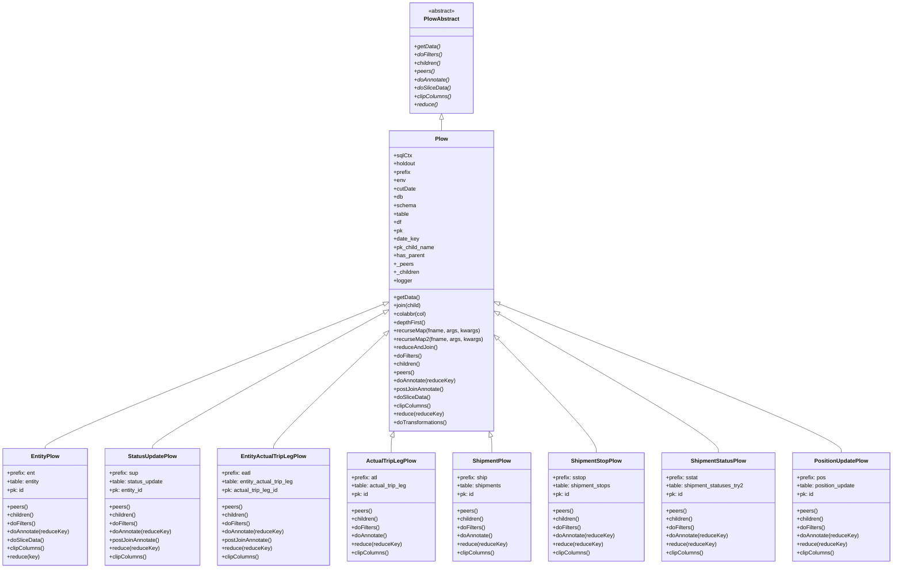
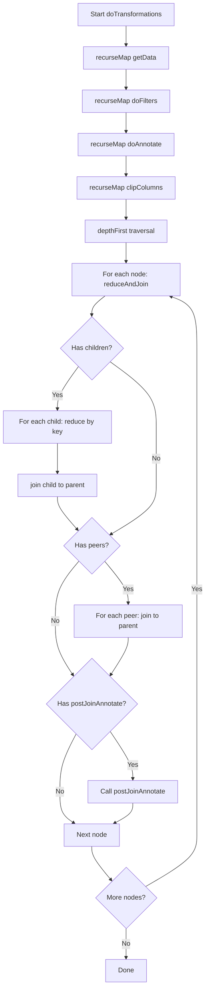
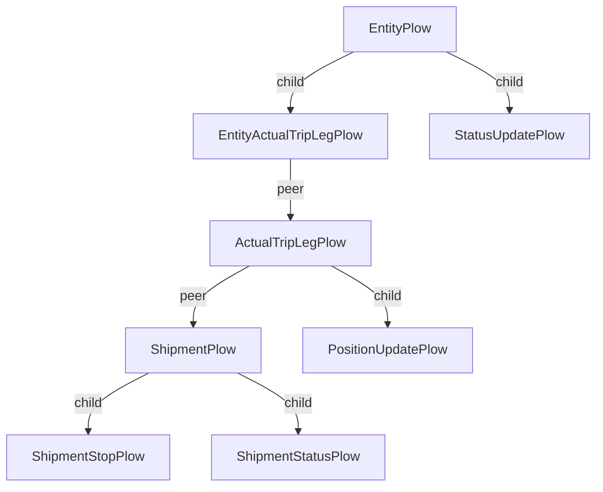
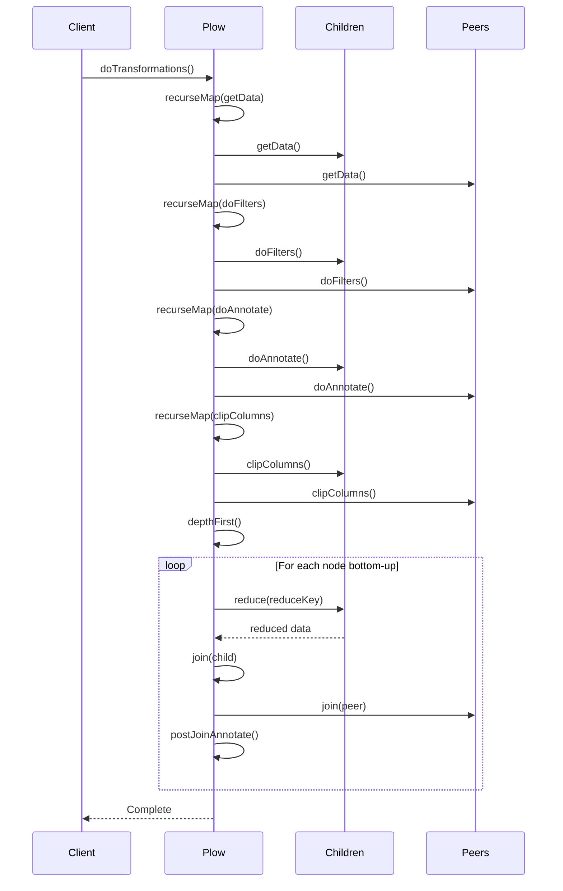

# Diagram: research/orchestrator/tasks/transforms/plow.py

> Auto-generated by Obscura crawlers

## Diagram 1

### SVG

<svg id="container" width="2548.1640625" xmlns="http://www.w3.org/2000/svg" class="classDiagram" height="1634" viewBox="0 0 2548.1640625 1634" role="graphics-document document" aria-roledescription="class"><g><defs><marker id="container_class-aggregationStart" class="marker aggregation class" refX="18" refY="7" markerWidth="190" markerHeight="240" orient="auto"><path d="M 18,7 L9,13 L1,7 L9,1 Z"></path></marker></defs><defs><marker id="container_class-aggregationEnd" class="marker aggregation class" refX="1" refY="7" markerWidth="20" markerHeight="28" orient="auto"><path d="M 18,7 L9,13 L1,7 L9,1 Z"></path></marker></defs><defs><marker id="container_class-extensionStart" class="marker extension class" refX="18" refY="7" markerWidth="190" markerHeight="240" orient="auto"><path d="M 1,7 L18,13 V 1 Z"></path></marker></defs><defs><marker id="container_class-extensionEnd" class="marker extension class" refX="1" refY="7" markerWidth="20" markerHeight="28" orient="auto"><path d="M 1,1 V 13 L18,7 Z"></path></marker></defs><defs><marker id="container_class-compositionStart" class="marker composition class" refX="18" refY="7" markerWidth="190" markerHeight="240" orient="auto"><path d="M 18,7 L9,13 L1,7 L9,1 Z"></path></marker></defs><defs><marker id="container_class-compositionEnd" class="marker composition class" refX="1" refY="7" markerWidth="20" markerHeight="28" orient="auto"><path d="M 18,7 L9,13 L1,7 L9,1 Z"></path></marker></defs><defs><marker id="container_class-dependencyStart" class="marker dependency class" refX="6" refY="7" markerWidth="190" markerHeight="240" orient="auto"><path d="M 5,7 L9,13 L1,7 L9,1 Z"></path></marker></defs><defs><marker id="container_class-dependencyEnd" class="marker dependency class" refX="13" refY="7" markerWidth="20" markerHeight="28" orient="auto"><path d="M 18,7 L9,13 L14,7 L9,1 Z"></path></marker></defs><defs><marker id="container_class-lollipopStart" class="marker lollipop class" refX="13" refY="7" markerWidth="190" markerHeight="240" orient="auto"><circle stroke="black" fill="transparent" cx="7" cy="7" r="6"></circle></marker></defs><defs><marker id="container_class-lollipopEnd" class="marker lollipop class" refX="1" refY="7" markerWidth="190" markerHeight="240" orient="auto"><circle stroke="black" fill="transparent" cx="7" cy="7" r="6"></circle></marker></defs><g class="root"><g class="clusters"></g><g class="edgePaths"><path d="M1262.594,343.25L1262.594,344.542C1262.594,345.833,1262.594,348.417,1262.594,353.875C1262.594,359.333,1262.594,367.667,1262.594,371.833L1262.594,376" id="id_PlowAbstract_Plow_1" class="edge-thickness-normal edge-pattern-solid relation" style=";;;" data-edge="true" data-et="edge" data-id="id_PlowAbstract_Plow_1" data-points="W3sieCI6MTI2Mi41OTM3NSwieSI6MzI2fSx7IngiOjEyNjIuNTkzNzUsInkiOjM1MX0seyJ4IjoxMjYyLjU5Mzc1LCJ5IjozNzZ9XQ==" marker-start="url(#container_class-extensionStart)"></path><path d="M1099.762,873.622L937.905,938.852C776.048,1004.082,452.335,1134.541,290.478,1203.937C128.621,1273.333,128.621,1281.667,128.621,1285.833L128.621,1290" id="id_Plow_EntityPlow_2" class="edge-thickness-normal edge-pattern-solid relation" style=";;;" data-edge="true" data-et="edge" data-id="id_Plow_EntityPlow_2" data-points="W3sieCI6MTExNS43NjE3MTg3NSwieSI6ODY3LjE3NDQ3NjQ4NDQyOH0seyJ4IjoxMjguNjIxMDkzNzUsInkiOjEyNjV9LHsieCI6MTI4LjYyMTA5Mzc1LCJ5IjoxMjkwfV0=" marker-start="url(#container_class-extensionStart)"></path><path d="M1100.658,897.338L989.586,958.615C878.514,1019.892,656.37,1142.446,545.298,1207.89C434.227,1273.333,434.227,1281.667,434.227,1285.833L434.227,1290" id="id_Plow_StatusUpdatePlow_3" class="edge-thickness-normal edge-pattern-solid relation" style=";;;" data-edge="true" data-et="edge" data-id="id_Plow_StatusUpdatePlow_3" data-points="W3sieCI6MTExNS43NjE3MTg3NSwieSI6ODg5LjAwNTQyNzY1Nzk0OTF9LHsieCI6NDM0LjIyNjU2MjUsInkiOjEyNjV9LHsieCI6NDM0LjIyNjU2MjUsInkiOjEyOTB9XQ==" marker-start="url(#container_class-extensionStart)"></path><path d="M1103.25,959.232L1049.555,1010.194C995.861,1061.155,888.471,1163.077,834.777,1218.205C781.082,1273.333,781.082,1281.667,781.082,1285.833L781.082,1290" id="id_Plow_EntityActualTripLegPlow_4" class="edge-thickness-normal edge-pattern-solid relation" style=";;;" data-edge="true" data-et="edge" data-id="id_Plow_EntityActualTripLegPlow_4" data-points="W3sieCI6MTExNS43NjE3MTg3NSwieSI6OTQ3LjM1NzQzNTQ4NTU3Mn0seyJ4Ijo3ODEuMDgyMDMxMjUsInkiOjEyNjV9LHsieCI6NzgxLjA4MjAzMTI1LCJ5IjoxMjkwfV0=" marker-start="url(#container_class-extensionStart)"></path><path d="M1122.12,1256.461L1121.674,1257.884C1121.228,1259.308,1120.337,1262.154,1119.891,1269.744C1119.445,1277.333,1119.445,1289.667,1119.445,1295.833L1119.445,1302" id="id_Plow_ActualTripLegPlow_5" class="edge-thickness-normal edge-pattern-solid relation" style=";;;" data-edge="true" data-et="edge" data-id="id_Plow_ActualTripLegPlow_5" data-points="W3sieCI6MTEyNy4yNzYxODk4MjQ5NDUzLCJ5IjoxMjQwfSx7IngiOjExMTkuNDQ1MzEyNSwieSI6MTI2NX0seyJ4IjoxMTE5LjQ0NTMxMjUsInkiOjEzMDJ9XQ==" marker-start="url(#container_class-extensionStart)"></path><path d="M1403.068,1256.461L1403.513,1257.884C1403.959,1259.308,1404.851,1262.154,1405.296,1269.744C1405.742,1277.333,1405.742,1289.667,1405.742,1295.833L1405.742,1302" id="id_Plow_ShipmentPlow_6" class="edge-thickness-normal edge-pattern-solid relation" style=";;;" data-edge="true" data-et="edge" data-id="id_Plow_ShipmentPlow_6" data-points="W3sieCI6MTM5Ny45MTEzMTAxNzUwNTQ3LCJ5IjoxMjQwfSx7IngiOjE0MDUuNzQyMTg3NSwieSI6MTI2NX0seyJ4IjoxNDA1Ljc0MjE4NzUsInkiOjEzMDJ9XQ==" marker-start="url(#container_class-extensionStart)"></path><path d="M1421.375,973.304L1468.073,1021.92C1514.771,1070.536,1608.167,1167.768,1654.865,1222.551C1701.563,1277.333,1701.563,1289.667,1701.563,1295.833L1701.563,1302" id="id_Plow_ShipmentStopPlow_7" class="edge-thickness-normal edge-pattern-solid relation" style=";;;" data-edge="true" data-et="edge" data-id="id_Plow_ShipmentStopPlow_7" data-points="W3sieCI6MTQwOS40MjU3ODEyNSwieSI6OTYwLjg2MzM2MDUwNDAyMjJ9LHsieCI6MTcwMS41NjI1LCJ5IjoxMjY1fSx7IngiOjE3MDEuNTYyNSwieSI6MTMwMn1d" marker-start="url(#container_class-extensionStart)"></path><path d="M1424.348,901.804L1528.73,962.337C1633.111,1022.869,1841.874,1143.935,1946.255,1210.634C2050.637,1277.333,2050.637,1289.667,2050.637,1295.833L2050.637,1302" id="id_Plow_ShipmentStatusPlow_8" class="edge-thickness-normal edge-pattern-solid relation" style=";;;" data-edge="true" data-et="edge" data-id="id_Plow_ShipmentStatusPlow_8" data-points="W3sieCI6MTQwOS40MjU3ODEyNSwieSI6ODkzLjE1MDQ4MTU2MjgxMTR9LHsieCI6MjA1MC42MzY3MTg3NSwieSI6MTI2NX0seyJ4IjoyMDUwLjYzNjcxODc1LCJ5IjoxMzAyfV0=" marker-start="url(#container_class-extensionStart)"></path><path d="M1425.436,873.318L1588.185,938.598C1750.934,1003.878,2076.432,1134.439,2239.181,1205.886C2401.93,1277.333,2401.93,1289.667,2401.93,1295.833L2401.93,1302" id="id_Plow_PositionUpdatePlow_9" class="edge-thickness-normal edge-pattern-solid relation" style=";;;" data-edge="true" data-et="edge" data-id="id_Plow_PositionUpdatePlow_9" data-points="W3sieCI6MTQwOS40MjU3ODEyNSwieSI6ODY2Ljg5NTkyMDA0NjYyOH0seyJ4IjoyNDAxLjkyOTY4NzUsInkiOjEyNjV9LHsieCI6MjQwMS45Mjk2ODc1LCJ5IjoxMzAyfV0=" marker-start="url(#container_class-extensionStart)"></path></g><g class="edgeLabels"><g class="edgeLabel"><g class="label" data-id="id_PlowAbstract_Plow_1" transform="translate(0, 0)"><foreignObject width="0" height="0">

</foreignObject></g></g><g class="edgeLabel"><g class="label" data-id="id_Plow_EntityPlow_2" transform="translate(0, 0)"><foreignObject width="0" height="0">

</foreignObject></g></g><g class="edgeLabel"><g class="label" data-id="id_Plow_StatusUpdatePlow_3" transform="translate(0, 0)"><foreignObject width="0" height="0">

</foreignObject></g></g><g class="edgeLabel"><g class="label" data-id="id_Plow_EntityActualTripLegPlow_4" transform="translate(0, 0)"><foreignObject width="0" height="0">

</foreignObject></g></g><g class="edgeLabel"><g class="label" data-id="id_Plow_ActualTripLegPlow_5" transform="translate(0, 0)"><foreignObject width="0" height="0">

</foreignObject></g></g><g class="edgeLabel"><g class="label" data-id="id_Plow_ShipmentPlow_6" transform="translate(0, 0)"><foreignObject width="0" height="0">

</foreignObject></g></g><g class="edgeLabel"><g class="label" data-id="id_Plow_ShipmentStopPlow_7" transform="translate(0, 0)"><foreignObject width="0" height="0">

</foreignObject></g></g><g class="edgeLabel"><g class="label" data-id="id_Plow_ShipmentStatusPlow_8" transform="translate(0, 0)"><foreignObject width="0" height="0">

</foreignObject></g></g><g class="edgeLabel"><g class="label" data-id="id_Plow_PositionUpdatePlow_9" transform="translate(0, 0)"><foreignObject width="0" height="0">

</foreignObject></g></g></g><g class="nodes"><g class="node default" id="classId-PlowAbstract-0" transform="translate(1262.59375, 167)"><g class="basic label-container"><path d="M-89.109375 -159 L89.109375 -159 L89.109375 159 L-89.109375 159" stroke="none" stroke-width="0" fill="#ECECFF" style=""></path><path d="M-89.109375 -159 C-46.741737507246434 -159, -4.374100014492868 -159, 89.109375 -159 M-89.109375 -159 C-40.8675149648611 -159, 7.374345070277798 -159, 89.109375 -159 M89.109375 -159 C89.109375 -62.880870133198755, 89.109375 33.23825973360249, 89.109375 159 M89.109375 -159 C89.109375 -74.9059755101283, 89.109375 9.1880489797434, 89.109375 159 M89.109375 159 C37.457204839159616 159, -14.194965321680769 159, -89.109375 159 M89.109375 159 C27.511467340969425 159, -34.08644031806115 159, -89.109375 159 M-89.109375 159 C-89.109375 90.81702083556564, -89.109375 22.634041671131286, -89.109375 -159 M-89.109375 159 C-89.109375 56.34630919390396, -89.109375 -46.307381612192074, -89.109375 -159" stroke="#9370DB" stroke-width="1.3" fill="none" stroke-dasharray="0 0" style=""></path></g><g class="annotation-group text" transform="translate(-38.609375, -135)"><g class="label" style="" transform="translate(0,-12)"><foreignObject width="77.21875" height="24">

«abstract»

</foreignObject></g></g><g class="label-group text" transform="translate(-48.40625, -111)"><g class="label" style="font-weight: bolder" transform="translate(0,-12)"><foreignObject width="96.8125" height="24">

PlowAbstract

</foreignObject></g></g><g class="members-group text" transform="translate(-77.109375, -63)"></g><g class="methods-group text" transform="translate(-77.109375, -33)"><g class="label" style="font-style:italic;" transform="translate(0,-12)"><foreignObject width="75.09375" height="24">

+getData()

</foreignObject></g><g class="label" style="font-style:italic;" transform="translate(0,12)"><foreignObject width="79.84375" height="24">

+doFilters()

</foreignObject></g><g class="label" style="font-style:italic;" transform="translate(0,36)"><foreignObject width="76.46875" height="24">

+children()

</foreignObject></g><g class="label" style="font-style:italic;" transform="translate(0,60)"><foreignObject width="57.03125" height="24">

+peers()

</foreignObject></g><g class="label" style="font-style:italic;" transform="translate(0,84)"><foreignObject width="101.6875" height="24">

+doAnnotate()

</foreignObject></g><g class="label" style="font-style:italic;" transform="translate(0,108)"><foreignObject width="103.703125" height="24">

+doSliceData()

</foreignObject></g><g class="label" style="font-style:italic;" transform="translate(0,132)"><foreignObject width="105.8125" height="24">

+clipColumns()

</foreignObject></g><g class="label" style="font-style:italic;" transform="translate(0,156)"><foreignObject width="65.984375" height="24">

+reduce()

</foreignObject></g></g><g class="divider" style=""><path d="M-89.109375 -87 C-20.114242344816574 -87, 48.88089031036685 -87, 89.109375 -87 M-89.109375 -87 C-23.204097293560494 -87, 42.70118041287901 -87, 89.109375 -87" stroke="#9370DB" stroke-width="1.3" fill="none" stroke-dasharray="0 0" style=""></path></g><g class="divider" style=""><path d="M-89.109375 -63 C-50.085252631334576 -63, -11.061130262669153 -63, 89.109375 -63 M-89.109375 -63 C-41.87114190083696 -63, 5.367091198326079 -63, 89.109375 -63" stroke="#9370DB" stroke-width="1.3" fill="none" stroke-dasharray="0 0" style=""></path></g></g><g class="node default" id="classId-Plow-1" transform="translate(1262.59375, 808)"><g class="basic label-container"><path d="M-146.83203125 -432 L146.83203125 -432 L146.83203125 432 L-146.83203125 432" stroke="none" stroke-width="0" fill="#ECECFF" style=""></path><path d="M-146.83203125 -432 C-46.83663892619599 -432, 53.158753397608024 -432, 146.83203125 -432 M-146.83203125 -432 C-43.64297159311242 -432, 59.54608806377516 -432, 146.83203125 -432 M146.83203125 -432 C146.83203125 -106.90851049451345, 146.83203125 218.1829790109731, 146.83203125 432 M146.83203125 -432 C146.83203125 -132.09551824370368, 146.83203125 167.80896351259264, 146.83203125 432 M146.83203125 432 C56.18966859557284 432, -34.45269405885432 432, -146.83203125 432 M146.83203125 432 C52.19931231215013 432, -42.433406625699746 432, -146.83203125 432 M-146.83203125 432 C-146.83203125 152.86828131964728, -146.83203125 -126.26343736070544, -146.83203125 -432 M-146.83203125 432 C-146.83203125 117.21524625912463, -146.83203125 -197.56950748175075, -146.83203125 -432" stroke="#9370DB" stroke-width="1.3" fill="none" stroke-dasharray="0 0" style=""></path></g><g class="annotation-group text" transform="translate(0, -408)"></g><g class="label-group text" transform="translate(-17.7265625, -408)"><g class="label" style="font-weight: bolder" transform="translate(0,-12)"><foreignObject width="35.453125" height="24">

Plow

</foreignObject></g></g><g class="members-group text" transform="translate(-134.83203125, -360)"><g class="label" style="" transform="translate(0,-12)"><foreignObject width="51.734375" height="24">

+sqlCtx

</foreignObject></g><g class="label" style="" transform="translate(0,12)"><foreignObject width="65.3125" height="24">

+holdout

</foreignObject></g><g class="label" style="" transform="translate(0,36)"><foreignObject width="48.875" height="24">

+prefix

</foreignObject></g><g class="label" style="" transform="translate(0,60)"><foreignObject width="33.84375" height="24">

+env

</foreignObject></g><g class="label" style="" transform="translate(0,84)"><foreignObject width="63.671875" height="24">

+cutDate

</foreignObject></g><g class="label" style="" transform="translate(0,108)"><foreignObject width="27.0625" height="24">

+db

</foreignObject></g><g class="label" style="" transform="translate(0,132)"><foreignObject width="63.625" height="24">

+schema

</foreignObject></g><g class="label" style="" transform="translate(0,156)"><foreignObject width="45.109375" height="24">

+table

</foreignObject></g><g class="label" style="" transform="translate(0,180)"><foreignObject width="22.921875" height="24">

+df

</foreignObject></g><g class="label" style="" transform="translate(0,204)"><foreignObject width="25.6875" height="24">

+pk

</foreignObject></g><g class="label" style="" transform="translate(0,228)"><foreignObject width="73.09375" height="24">

+date_key

</foreignObject></g><g class="label" style="" transform="translate(0,252)"><foreignObject width="118.234375" height="24">

+pk_child_name

</foreignObject></g><g class="label" style="" transform="translate(0,276)"><foreignObject width="89" height="24">

+has_parent

</foreignObject></g><g class="label" style="" transform="translate(0,300)"><foreignObject width="55.390625" height="24">

+_peers

</foreignObject></g><g class="label" style="" transform="translate(0,324)"><foreignObject width="74.21875" height="24">

+_children

</foreignObject></g><g class="label" style="" transform="translate(0,348)"><foreignObject width="53.21875" height="24">

+logger

</foreignObject></g></g><g class="methods-group text" transform="translate(-134.83203125, 48)"><g class="label" style="" transform="translate(0,-12)"><foreignObject width="74.140625" height="24">

+getData()

</foreignObject></g><g class="label" style="" transform="translate(0,12)"><foreignObject width="81.625" height="24">

+join(child)

</foreignObject></g><g class="label" style="" transform="translate(0,36)"><foreignObject width="94.890625" height="24">

+colabbr(col)

</foreignObject></g><g class="label" style="" transform="translate(0,60)"><foreignObject width="92.296875" height="24">

+depthFirst()

</foreignObject></g><g class="label" style="" transform="translate(0,84)"><foreignObject width="244.34375" height="24">

+recurseMap(fname, args, kwargs)

</foreignObject></g><g class="label" style="" transform="translate(0,108)"><foreignObject width="251.9375" height="24">

+recurseMap2(fname, args, kwargs)

</foreignObject></g><g class="label" style="" transform="translate(0,132)"><foreignObject width="123.921875" height="24">

+reduceAndJoin()

</foreignObject></g><g class="label" style="" transform="translate(0,156)"><foreignObject width="81.4375" height="24">

+doFilters()

</foreignObject></g><g class="label" style="" transform="translate(0,180)"><foreignObject width="77.859375" height="24">

+children()

</foreignObject></g><g class="label" style="" transform="translate(0,204)"><foreignObject width="58.71875" height="24">

+peers()

</foreignObject></g><g class="label" style="" transform="translate(0,228)"><foreignObject width="178.234375" height="24">

+doAnnotate(reduceKey)

</foreignObject></g><g class="label" style="" transform="translate(0,252)"><foreignObject width="144.453125" height="24">

+postJoinAnnotate()

</foreignObject></g><g class="label" style="" transform="translate(0,276)"><foreignObject width="104.453125" height="24">

+doSliceData()

</foreignObject></g><g class="label" style="" transform="translate(0,300)"><foreignObject width="107.25" height="24">

+clipColumns()

</foreignObject></g><g class="label" style="" transform="translate(0,324)"><foreignObject width="142.78125" height="24">

+reduce(reduceKey)

</foreignObject></g><g class="label" style="" transform="translate(0,348)"><foreignObject width="155.84375" height="24">

+doTransformations()

</foreignObject></g></g><g class="divider" style=""><path d="M-146.83203125 -384 C-77.95396940180665 -384, -9.075907553613291 -384, 146.83203125 -384 M-146.83203125 -384 C-64.57872406546645 -384, 17.67458311906711 -384, 146.83203125 -384" stroke="#9370DB" stroke-width="1.3" fill="none" stroke-dasharray="0 0" style=""></path></g><g class="divider" style=""><path d="M-146.83203125 24 C-86.91341914032043 24, -26.994807030640857 24, 146.83203125 24 M-146.83203125 24 C-45.33761667385872 24, 56.15679790228256 24, 146.83203125 24" stroke="#9370DB" stroke-width="1.3" fill="none" stroke-dasharray="0 0" style=""></path></g></g><g class="node default" id="classId-EntityPlow-2" transform="translate(128.62109375, 1458)"><g class="basic label-container"><path d="M-120.62109375 -168 L120.62109375 -168 L120.62109375 168 L-120.62109375 168" stroke="none" stroke-width="0" fill="#ECECFF" style=""></path><path d="M-120.62109375 -168 C-55.58502813710045 -168, 9.451037475799097 -168, 120.62109375 -168 M-120.62109375 -168 C-52.21444434968615 -168, 16.192205050627706 -168, 120.62109375 -168 M120.62109375 -168 C120.62109375 -53.283621421415035, 120.62109375 61.43275715716993, 120.62109375 168 M120.62109375 -168 C120.62109375 -51.32926382974799, 120.62109375 65.34147234050403, 120.62109375 168 M120.62109375 168 C49.59584497423508 168, -21.429403801529844 168, -120.62109375 168 M120.62109375 168 C70.31973537430841 168, 20.01837699861683 168, -120.62109375 168 M-120.62109375 168 C-120.62109375 37.3948428482432, -120.62109375 -93.2103143035136, -120.62109375 -168 M-120.62109375 168 C-120.62109375 84.99763099201422, -120.62109375 1.9952619840284456, -120.62109375 -168" stroke="#9370DB" stroke-width="1.3" fill="none" stroke-dasharray="0 0" style=""></path></g><g class="annotation-group text" transform="translate(0, -144)"></g><g class="label-group text" transform="translate(-39.0078125, -144)"><g class="label" style="font-weight: bolder" transform="translate(0,-12)"><foreignObject width="78.015625" height="24">

EntityPlow

</foreignObject></g></g><g class="members-group text" transform="translate(-108.62109375, -96)"><g class="label" style="" transform="translate(0,-12)"><foreignObject width="80.890625" height="24">

+prefix: ent

</foreignObject></g><g class="label" style="" transform="translate(0,12)"><foreignObject width="95.140625" height="24">

+table: entity

</foreignObject></g><g class="label" style="" transform="translate(0,36)"><foreignObject width="47.90625" height="24">

+pk: id

</foreignObject></g></g><g class="methods-group text" transform="translate(-108.62109375, 0)"><g class="label" style="" transform="translate(0,-12)"><foreignObject width="58.71875" height="24">

+peers()

</foreignObject></g><g class="label" style="" transform="translate(0,12)"><foreignObject width="77.859375" height="24">

+children()

</foreignObject></g><g class="label" style="" transform="translate(0,36)"><foreignObject width="81.4375" height="24">

+doFilters()

</foreignObject></g><g class="label" style="" transform="translate(0,60)"><foreignObject width="178.234375" height="24">

+doAnnotate(reduceKey)

</foreignObject></g><g class="label" style="" transform="translate(0,84)"><foreignObject width="104.453125" height="24">

+doSliceData()

</foreignObject></g><g class="label" style="" transform="translate(0,108)"><foreignObject width="107.25" height="24">

+clipColumns()

</foreignObject></g><g class="label" style="" transform="translate(0,132)"><foreignObject width="92.28125" height="24">

+reduce(key)

</foreignObject></g></g><g class="divider" style=""><path d="M-120.62109375 -120 C-66.0199317401256 -120, -11.4187697302512 -120, 120.62109375 -120 M-120.62109375 -120 C-28.138823515599285 -120, 64.34344671880143 -120, 120.62109375 -120" stroke="#9370DB" stroke-width="1.3" fill="none" stroke-dasharray="0 0" style=""></path></g><g class="divider" style=""><path d="M-120.62109375 -24 C-35.467974893042566 -24, 49.68514396391487 -24, 120.62109375 -24 M-120.62109375 -24 C-38.15683319969072 -24, 44.30742735061855 -24, 120.62109375 -24" stroke="#9370DB" stroke-width="1.3" fill="none" stroke-dasharray="0 0" style=""></path></g></g><g class="node default" id="classId-StatusUpdatePlow-3" transform="translate(434.2265625, 1458)"><g class="basic label-container"><path d="M-134.984375 -168 L134.984375 -168 L134.984375 168 L-134.984375 168" stroke="none" stroke-width="0" fill="#ECECFF" style=""></path><path d="M-134.984375 -168 C-74.0943959753071 -168, -13.204416950614188 -168, 134.984375 -168 M-134.984375 -168 C-42.27746805313947 -168, 50.429438893721056 -168, 134.984375 -168 M134.984375 -168 C134.984375 -55.01266538996623, 134.984375 57.97466922006754, 134.984375 168 M134.984375 -168 C134.984375 -87.5252206367997, 134.984375 -7.050441273599404, 134.984375 168 M134.984375 168 C38.27279509881319 168, -58.43878480237362 168, -134.984375 168 M134.984375 168 C30.299360808270748 168, -74.3856533834585 168, -134.984375 168 M-134.984375 168 C-134.984375 42.182135501501364, -134.984375 -83.63572899699727, -134.984375 -168 M-134.984375 168 C-134.984375 47.68626027848025, -134.984375 -72.6274794430395, -134.984375 -168" stroke="#9370DB" stroke-width="1.3" fill="none" stroke-dasharray="0 0" style=""></path></g><g class="annotation-group text" transform="translate(0, -144)"></g><g class="label-group text" transform="translate(-67.734375, -144)"><g class="label" style="font-weight: bolder" transform="translate(0,-12)"><foreignObject width="135.46875" height="24">

StatusUpdatePlow

</foreignObject></g></g><g class="members-group text" transform="translate(-122.984375, -96)"><g class="label" style="" transform="translate(0,-12)"><foreignObject width="83.296875" height="24">

+prefix: sup

</foreignObject></g><g class="label" style="" transform="translate(0,12)"><foreignObject width="156.609375" height="24">

+table: status_update

</foreignObject></g><g class="label" style="" transform="translate(0,36)"><foreignObject width="97.703125" height="24">

+pk: entity_id

</foreignObject></g></g><g class="methods-group text" transform="translate(-122.984375, 0)"><g class="label" style="" transform="translate(0,-12)"><foreignObject width="58.71875" height="24">

+peers()

</foreignObject></g><g class="label" style="" transform="translate(0,12)"><foreignObject width="77.859375" height="24">

+children()

</foreignObject></g><g class="label" style="" transform="translate(0,36)"><foreignObject width="81.4375" height="24">

+doFilters()

</foreignObject></g><g class="label" style="" transform="translate(0,60)"><foreignObject width="178.234375" height="24">

+doAnnotate(reduceKey)

</foreignObject></g><g class="label" style="" transform="translate(0,84)"><foreignObject width="144.453125" height="24">

+postJoinAnnotate()

</foreignObject></g><g class="label" style="" transform="translate(0,108)"><foreignObject width="142.78125" height="24">

+reduce(reduceKey)

</foreignObject></g><g class="label" style="" transform="translate(0,132)"><foreignObject width="107.25" height="24">

+clipColumns()

</foreignObject></g></g><g class="divider" style=""><path d="M-134.984375 -120 C-47.61402754901697 -120, 39.756319901966066 -120, 134.984375 -120 M-134.984375 -120 C-35.18834926508404 -120, 64.60767646983192 -120, 134.984375 -120" stroke="#9370DB" stroke-width="1.3" fill="none" stroke-dasharray="0 0" style=""></path></g><g class="divider" style=""><path d="M-134.984375 -24 C-72.72307846938227 -24, -10.461781938764531 -24, 134.984375 -24 M-134.984375 -24 C-52.05374731260123 -24, 30.876880374797537 -24, 134.984375 -24" stroke="#9370DB" stroke-width="1.3" fill="none" stroke-dasharray="0 0" style=""></path></g></g><g class="node default" id="classId-EntityActualTripLegPlow-4" transform="translate(781.08203125, 1458)"><g class="basic label-container"><path d="M-161.87109375 -168 L161.87109375 -168 L161.87109375 168 L-161.87109375 168" stroke="none" stroke-width="0" fill="#ECECFF" style=""></path><path d="M-161.87109375 -168 C-44.65772700595029 -168, 72.55563973809942 -168, 161.87109375 -168 M-161.87109375 -168 C-66.85776293044331 -168, 28.15556788911337 -168, 161.87109375 -168 M161.87109375 -168 C161.87109375 -91.91503087127299, 161.87109375 -15.830061742545979, 161.87109375 168 M161.87109375 -168 C161.87109375 -87.6747738823109, 161.87109375 -7.3495477646218035, 161.87109375 168 M161.87109375 168 C94.74827779917588 168, 27.62546184835176 168, -161.87109375 168 M161.87109375 168 C36.939463388241066 168, -87.99216697351787 168, -161.87109375 168 M-161.87109375 168 C-161.87109375 66.0358999746289, -161.87109375 -35.92820005074219, -161.87109375 -168 M-161.87109375 168 C-161.87109375 97.64302521218954, -161.87109375 27.286050424379084, -161.87109375 -168" stroke="#9370DB" stroke-width="1.3" fill="none" stroke-dasharray="0 0" style=""></path></g><g class="annotation-group text" transform="translate(0, -144)"></g><g class="label-group text" transform="translate(-88.9453125, -144)"><g class="label" style="font-weight: bolder" transform="translate(0,-12)"><foreignObject width="177.890625" height="24">

EntityActualTripLegPlow

</foreignObject></g></g><g class="members-group text" transform="translate(-149.87109375, -96)"><g class="label" style="" transform="translate(0,-12)"><foreignObject width="84.578125" height="24">

+prefix: eatl

</foreignObject></g><g class="label" style="" transform="translate(0,12)"><foreignObject width="210.796875" height="24">

+table: entity_actual_trip_leg

</foreignObject></g><g class="label" style="" transform="translate(0,36)"><foreignObject width="164.421875" height="24">

+pk: actual_trip_leg_id

</foreignObject></g></g><g class="methods-group text" transform="translate(-149.87109375, 0)"><g class="label" style="" transform="translate(0,-12)"><foreignObject width="58.71875" height="24">

+peers()

</foreignObject></g><g class="label" style="" transform="translate(0,12)"><foreignObject width="77.859375" height="24">

+children()

</foreignObject></g><g class="label" style="" transform="translate(0,36)"><foreignObject width="81.4375" height="24">

+doFilters()

</foreignObject></g><g class="label" style="" transform="translate(0,60)"><foreignObject width="178.234375" height="24">

+doAnnotate(reduceKey)

</foreignObject></g><g class="label" style="" transform="translate(0,84)"><foreignObject width="144.453125" height="24">

+postJoinAnnotate()

</foreignObject></g><g class="label" style="" transform="translate(0,108)"><foreignObject width="142.78125" height="24">

+reduce(reduceKey)

</foreignObject></g><g class="label" style="" transform="translate(0,132)"><foreignObject width="107.25" height="24">

+clipColumns()

</foreignObject></g></g><g class="divider" style=""><path d="M-161.87109375 -120 C-64.51175891719116 -120, 32.84757591561768 -120, 161.87109375 -120 M-161.87109375 -120 C-53.18130237027745 -120, 55.5084890094451 -120, 161.87109375 -120" stroke="#9370DB" stroke-width="1.3" fill="none" stroke-dasharray="0 0" style=""></path></g><g class="divider" style=""><path d="M-161.87109375 -24 C-54.54120336872464 -24, 52.788687012550724 -24, 161.87109375 -24 M-161.87109375 -24 C-86.38424094350664 -24, -10.89738813701328 -24, 161.87109375 -24" stroke="#9370DB" stroke-width="1.3" fill="none" stroke-dasharray="0 0" style=""></path></g></g><g class="node default" id="classId-ActualTripLegPlow-5" transform="translate(1119.4453125, 1458)"><g class="basic label-container"><path d="M-126.4921875 -156 L126.4921875 -156 L126.4921875 156 L-126.4921875 156" stroke="none" stroke-width="0" fill="#ECECFF" style=""></path><path d="M-126.4921875 -156 C-74.46217514231577 -156, -22.43216278463153 -156, 126.4921875 -156 M-126.4921875 -156 C-40.20080338255379 -156, 46.09058073489243 -156, 126.4921875 -156 M126.4921875 -156 C126.4921875 -37.80048262902935, 126.4921875 80.3990347419413, 126.4921875 156 M126.4921875 -156 C126.4921875 -38.46414512364176, 126.4921875 79.07170975271649, 126.4921875 156 M126.4921875 156 C66.22696443652293 156, 5.961741373045882 156, -126.4921875 156 M126.4921875 156 C27.79590364820025 156, -70.9003802035995 156, -126.4921875 156 M-126.4921875 156 C-126.4921875 62.96985512284276, -126.4921875 -30.060289754314482, -126.4921875 -156 M-126.4921875 156 C-126.4921875 68.66617258762572, -126.4921875 -18.667654824748553, -126.4921875 -156" stroke="#9370DB" stroke-width="1.3" fill="none" stroke-dasharray="0 0" style=""></path></g><g class="annotation-group text" transform="translate(0, -132)"></g><g class="label-group text" transform="translate(-67.671875, -132)"><g class="label" style="font-weight: bolder" transform="translate(0,-12)"><foreignObject width="135.34375" height="24">

ActualTripLegPlow

</foreignObject></g></g><g class="members-group text" transform="translate(-114.4921875, -84)"><g class="label" style="" transform="translate(0,-12)"><foreignObject width="76.03125" height="24">

+prefix: atl

</foreignObject></g><g class="label" style="" transform="translate(0,12)"><foreignObject width="161.3125" height="24">

+table: actual_trip_leg

</foreignObject></g><g class="label" style="" transform="translate(0,36)"><foreignObject width="47.90625" height="24">

+pk: id

</foreignObject></g></g><g class="methods-group text" transform="translate(-114.4921875, 12)"><g class="label" style="" transform="translate(0,-12)"><foreignObject width="58.71875" height="24">

+peers()

</foreignObject></g><g class="label" style="" transform="translate(0,12)"><foreignObject width="77.859375" height="24">

+children()

</foreignObject></g><g class="label" style="" transform="translate(0,36)"><foreignObject width="81.4375" height="24">

+doFilters()

</foreignObject></g><g class="label" style="" transform="translate(0,60)"><foreignObject width="103.15625" height="24">

+doAnnotate()

</foreignObject></g><g class="label" style="" transform="translate(0,84)"><foreignObject width="142.78125" height="24">

+reduce(reduceKey)

</foreignObject></g><g class="label" style="" transform="translate(0,108)"><foreignObject width="107.25" height="24">

+clipColumns()

</foreignObject></g></g><g class="divider" style=""><path d="M-126.4921875 -108 C-50.57360801036134 -108, 25.34497147927732 -108, 126.4921875 -108 M-126.4921875 -108 C-57.494064933156025 -108, 11.50405763368795 -108, 126.4921875 -108" stroke="#9370DB" stroke-width="1.3" fill="none" stroke-dasharray="0 0" style=""></path></g><g class="divider" style=""><path d="M-126.4921875 -12 C-67.53818156780784 -12, -8.584175635615694 -12, 126.4921875 -12 M-126.4921875 -12 C-50.01922453679707 -12, 26.453738426405863 -12, 126.4921875 -12" stroke="#9370DB" stroke-width="1.3" fill="none" stroke-dasharray="0 0" style=""></path></g></g><g class="node default" id="classId-ShipmentPlow-6" transform="translate(1405.7421875, 1458)"><g class="basic label-container"><path d="M-109.8046875 -156 L109.8046875 -156 L109.8046875 156 L-109.8046875 156" stroke="none" stroke-width="0" fill="#ECECFF" style=""></path><path d="M-109.8046875 -156 C-22.188430248562625 -156, 65.42782700287475 -156, 109.8046875 -156 M-109.8046875 -156 C-39.70121054368781 -156, 30.402266412624385 -156, 109.8046875 -156 M109.8046875 -156 C109.8046875 -59.25352216232267, 109.8046875 37.492955675354665, 109.8046875 156 M109.8046875 -156 C109.8046875 -44.88866568989819, 109.8046875 66.22266862020362, 109.8046875 156 M109.8046875 156 C57.44241741053929 156, 5.080147321078584 156, -109.8046875 156 M109.8046875 156 C32.160879674262105 156, -45.48292815147579 156, -109.8046875 156 M-109.8046875 156 C-109.8046875 81.33420582924676, -109.8046875 6.668411658493511, -109.8046875 -156 M-109.8046875 156 C-109.8046875 47.03288107281726, -109.8046875 -61.93423785436548, -109.8046875 -156" stroke="#9370DB" stroke-width="1.3" fill="none" stroke-dasharray="0 0" style=""></path></g><g class="annotation-group text" transform="translate(0, -132)"></g><g class="label-group text" transform="translate(-52.828125, -132)"><g class="label" style="font-weight: bolder" transform="translate(0,-12)"><foreignObject width="105.65625" height="24">

ShipmentPlow

</foreignObject></g></g><g class="members-group text" transform="translate(-97.8046875, -84)"><g class="label" style="" transform="translate(0,-12)"><foreignObject width="87.875" height="24">

+prefix: ship

</foreignObject></g><g class="label" style="" transform="translate(0,12)"><foreignObject width="129.109375" height="24">

+table: shipments

</foreignObject></g><g class="label" style="" transform="translate(0,36)"><foreignObject width="47.90625" height="24">

+pk: id

</foreignObject></g></g><g class="methods-group text" transform="translate(-97.8046875, 12)"><g class="label" style="" transform="translate(0,-12)"><foreignObject width="58.71875" height="24">

+peers()

</foreignObject></g><g class="label" style="" transform="translate(0,12)"><foreignObject width="77.859375" height="24">

+children()

</foreignObject></g><g class="label" style="" transform="translate(0,36)"><foreignObject width="81.4375" height="24">

+doFilters()

</foreignObject></g><g class="label" style="" transform="translate(0,60)"><foreignObject width="103.15625" height="24">

+doAnnotate()

</foreignObject></g><g class="label" style="" transform="translate(0,84)"><foreignObject width="142.78125" height="24">

+reduce(reduceKey)

</foreignObject></g><g class="label" style="" transform="translate(0,108)"><foreignObject width="107.25" height="24">

+clipColumns()

</foreignObject></g></g><g class="divider" style=""><path d="M-109.8046875 -108 C-54.92075130390447 -108, -0.036815107808934044 -108, 109.8046875 -108 M-109.8046875 -108 C-60.70127720515418 -108, -11.597866910308355 -108, 109.8046875 -108" stroke="#9370DB" stroke-width="1.3" fill="none" stroke-dasharray="0 0" style=""></path></g><g class="divider" style=""><path d="M-109.8046875 -12 C-46.48410070791468 -12, 16.836486084170645 -12, 109.8046875 -12 M-109.8046875 -12 C-51.32059090051342 -12, 7.163505698973154 -12, 109.8046875 -12" stroke="#9370DB" stroke-width="1.3" fill="none" stroke-dasharray="0 0" style=""></path></g></g><g class="node default" id="classId-ShipmentStopPlow-7" transform="translate(1701.5625, 1458)"><g class="basic label-container"><path d="M-136.015625 -156 L136.015625 -156 L136.015625 156 L-136.015625 156" stroke="none" stroke-width="0" fill="#ECECFF" style=""></path><path d="M-136.015625 -156 C-42.22552744037348 -156, 51.564570119253034 -156, 136.015625 -156 M-136.015625 -156 C-62.2825521391369 -156, 11.450520721726207 -156, 136.015625 -156 M136.015625 -156 C136.015625 -63.630965936192936, 136.015625 28.738068127614127, 136.015625 156 M136.015625 -156 C136.015625 -38.001048057920414, 136.015625 79.99790388415917, 136.015625 156 M136.015625 156 C47.35422280950523 156, -41.30717938098954 156, -136.015625 156 M136.015625 156 C39.78317407349188 156, -56.449276853016244 156, -136.015625 156 M-136.015625 156 C-136.015625 41.373010634964444, -136.015625 -73.25397873007111, -136.015625 -156 M-136.015625 156 C-136.015625 47.729885560355626, -136.015625 -60.54022887928875, -136.015625 -156" stroke="#9370DB" stroke-width="1.3" fill="none" stroke-dasharray="0 0" style=""></path></g><g class="annotation-group text" transform="translate(0, -132)"></g><g class="label-group text" transform="translate(-69.796875, -132)"><g class="label" style="font-weight: bolder" transform="translate(0,-12)"><foreignObject width="139.59375" height="24">

ShipmentStopPlow

</foreignObject></g></g><g class="members-group text" transform="translate(-124.015625, -84)"><g class="label" style="" transform="translate(0,-12)"><foreignObject width="96.1875" height="24">

+prefix: sstop

</foreignObject></g><g class="label" style="" transform="translate(0,12)"><foreignObject width="169.28125" height="24">

+table: shipment_stops

</foreignObject></g><g class="label" style="" transform="translate(0,36)"><foreignObject width="47.90625" height="24">

+pk: id

</foreignObject></g></g><g class="methods-group text" transform="translate(-124.015625, 12)"><g class="label" style="" transform="translate(0,-12)"><foreignObject width="58.71875" height="24">

+peers()

</foreignObject></g><g class="label" style="" transform="translate(0,12)"><foreignObject width="77.859375" height="24">

+children()

</foreignObject></g><g class="label" style="" transform="translate(0,36)"><foreignObject width="81.4375" height="24">

+doFilters()

</foreignObject></g><g class="label" style="" transform="translate(0,60)"><foreignObject width="178.234375" height="24">

+doAnnotate(reduceKey)

</foreignObject></g><g class="label" style="" transform="translate(0,84)"><foreignObject width="142.78125" height="24">

+reduce(reduceKey)

</foreignObject></g><g class="label" style="" transform="translate(0,108)"><foreignObject width="107.25" height="24">

+clipColumns()

</foreignObject></g></g><g class="divider" style=""><path d="M-136.015625 -108 C-39.41980262241525 -108, 57.176019755169506 -108, 136.015625 -108 M-136.015625 -108 C-68.54949828556194 -108, -1.0833715711238767 -108, 136.015625 -108" stroke="#9370DB" stroke-width="1.3" fill="none" stroke-dasharray="0 0" style=""></path></g><g class="divider" style=""><path d="M-136.015625 -12 C-65.0594405399821 -12, 5.896743920035789 -12, 136.015625 -12 M-136.015625 -12 C-76.14469976466503 -12, -16.27377452933007 -12, 136.015625 -12" stroke="#9370DB" stroke-width="1.3" fill="none" stroke-dasharray="0 0" style=""></path></g></g><g class="node default" id="classId-ShipmentStatusPlow-8" transform="translate(2050.63671875, 1458)"><g class="basic label-container"><path d="M-163.05859375 -156 L163.05859375 -156 L163.05859375 156 L-163.05859375 156" stroke="none" stroke-width="0" fill="#ECECFF" style=""></path><path d="M-163.05859375 -156 C-66.5837407728003 -156, 29.891112204399406 -156, 163.05859375 -156 M-163.05859375 -156 C-89.33407877192069 -156, -15.609563793841374 -156, 163.05859375 -156 M163.05859375 -156 C163.05859375 -76.12035232430277, 163.05859375 3.7592953513944565, 163.05859375 156 M163.05859375 -156 C163.05859375 -87.20991565024147, 163.05859375 -18.41983130048294, 163.05859375 156 M163.05859375 156 C38.084377574380284 156, -86.88983860123943 156, -163.05859375 156 M163.05859375 156 C91.70205057637723 156, 20.345507402754464 156, -163.05859375 156 M-163.05859375 156 C-163.05859375 45.578431592188466, -163.05859375 -64.84313681562307, -163.05859375 -156 M-163.05859375 156 C-163.05859375 36.121826178787074, -163.05859375 -83.75634764242585, -163.05859375 -156" stroke="#9370DB" stroke-width="1.3" fill="none" stroke-dasharray="0 0" style=""></path></g><g class="annotation-group text" transform="translate(0, -132)"></g><g class="label-group text" transform="translate(-76.3046875, -132)"><g class="label" style="font-weight: bolder" transform="translate(0,-12)"><foreignObject width="152.609375" height="24">

ShipmentStatusPlow

</foreignObject></g></g><g class="members-group text" transform="translate(-151.05859375, -84)"><g class="label" style="" transform="translate(0,-12)"><foreignObject width="91.9375" height="24">

+prefix: sstat

</foreignObject></g><g class="label" style="" transform="translate(0,12)"><foreignObject width="225.8125" height="24">

+table: shipment_statuses_try2

</foreignObject></g><g class="label" style="" transform="translate(0,36)"><foreignObject width="47.90625" height="24">

+pk: id

</foreignObject></g></g><g class="methods-group text" transform="translate(-151.05859375, 12)"><g class="label" style="" transform="translate(0,-12)"><foreignObject width="58.71875" height="24">

+peers()

</foreignObject></g><g class="label" style="" transform="translate(0,12)"><foreignObject width="77.859375" height="24">

+children()

</foreignObject></g><g class="label" style="" transform="translate(0,36)"><foreignObject width="81.4375" height="24">

+doFilters()

</foreignObject></g><g class="label" style="" transform="translate(0,60)"><foreignObject width="178.234375" height="24">

+doAnnotate(reduceKey)

</foreignObject></g><g class="label" style="" transform="translate(0,84)"><foreignObject width="142.78125" height="24">

+reduce(reduceKey)

</foreignObject></g><g class="label" style="" transform="translate(0,108)"><foreignObject width="107.25" height="24">

+clipColumns()

</foreignObject></g></g><g class="divider" style=""><path d="M-163.05859375 -108 C-72.0399171030435 -108, 18.978759543912986 -108, 163.05859375 -108 M-163.05859375 -108 C-86.24719423560144 -108, -9.435794721202882 -108, 163.05859375 -108" stroke="#9370DB" stroke-width="1.3" fill="none" stroke-dasharray="0 0" style=""></path></g><g class="divider" style=""><path d="M-163.05859375 -12 C-57.555896778393446 -12, 47.94680019321311 -12, 163.05859375 -12 M-163.05859375 -12 C-43.64159224481834 -12, 75.77540926036332 -12, 163.05859375 -12" stroke="#9370DB" stroke-width="1.3" fill="none" stroke-dasharray="0 0" style=""></path></g></g><g class="node default" id="classId-PositionUpdatePlow-9" transform="translate(2401.9296875, 1458)"><g class="basic label-container"><path d="M-138.234375 -156 L138.234375 -156 L138.234375 156 L-138.234375 156" stroke="none" stroke-width="0" fill="#ECECFF" style=""></path><path d="M-138.234375 -156 C-51.413549684672816 -156, 35.40727563065437 -156, 138.234375 -156 M-138.234375 -156 C-42.479628261263514 -156, 53.27511847747297 -156, 138.234375 -156 M138.234375 -156 C138.234375 -82.414768042873, 138.234375 -8.829536085746014, 138.234375 156 M138.234375 -156 C138.234375 -66.6144787043462, 138.234375 22.771042591307605, 138.234375 156 M138.234375 156 C69.07054441221901 156, -0.09328617556198537 156, -138.234375 156 M138.234375 156 C53.98210918654742 156, -30.270156626905163 156, -138.234375 156 M-138.234375 156 C-138.234375 34.108712660284496, -138.234375 -87.78257467943101, -138.234375 -156 M-138.234375 156 C-138.234375 42.313420184936234, -138.234375 -71.37315963012753, -138.234375 -156" stroke="#9370DB" stroke-width="1.3" fill="none" stroke-dasharray="0 0" style=""></path></g><g class="annotation-group text" transform="translate(0, -132)"></g><g class="label-group text" transform="translate(-74.234375, -132)"><g class="label" style="font-weight: bolder" transform="translate(0,-12)"><foreignObject width="148.46875" height="24">

PositionUpdatePlow

</foreignObject></g></g><g class="members-group text" transform="translate(-126.234375, -84)"><g class="label" style="" transform="translate(0,-12)"><foreignObject width="83.34375" height="24">

+prefix: pos

</foreignObject></g><g class="label" style="" transform="translate(0,12)"><foreignObject width="172.375" height="24">

+table: position_update

</foreignObject></g><g class="label" style="" transform="translate(0,36)"><foreignObject width="47.90625" height="24">

+pk: id

</foreignObject></g></g><g class="methods-group text" transform="translate(-126.234375, 12)"><g class="label" style="" transform="translate(0,-12)"><foreignObject width="58.71875" height="24">

+peers()

</foreignObject></g><g class="label" style="" transform="translate(0,12)"><foreignObject width="77.859375" height="24">

+children()

</foreignObject></g><g class="label" style="" transform="translate(0,36)"><foreignObject width="81.4375" height="24">

+doFilters()

</foreignObject></g><g class="label" style="" transform="translate(0,60)"><foreignObject width="178.234375" height="24">

+doAnnotate(reduceKey)

</foreignObject></g><g class="label" style="" transform="translate(0,84)"><foreignObject width="142.78125" height="24">

+reduce(reduceKey)

</foreignObject></g><g class="label" style="" transform="translate(0,108)"><foreignObject width="107.25" height="24">

+clipColumns()

</foreignObject></g></g><g class="divider" style=""><path d="M-138.234375 -108 C-78.68601498135686 -108, -19.13765496271371 -108, 138.234375 -108 M-138.234375 -108 C-29.620399098800405 -108, 78.99357680239919 -108, 138.234375 -108" stroke="#9370DB" stroke-width="1.3" fill="none" stroke-dasharray="0 0" style=""></path></g><g class="divider" style=""><path d="M-138.234375 -12 C-56.753933312278434 -12, 24.72650837544313 -12, 138.234375 -12 M-138.234375 -12 C-48.34498347300401 -12, 41.54440805399199 -12, 138.234375 -12" stroke="#9370DB" stroke-width="1.3" fill="none" stroke-dasharray="0 0" style=""></path></g></g></g></g></g></svg>

## Diagram 2

### SVG

<svg id="container" width="493.1015625" xmlns="http://www.w3.org/2000/svg" class="flowchart" height="2357.609375" viewBox="0 0 493.1015625 2357.609375" role="graphics-document document" aria-roledescription="flowchart-v2"><g><marker id="container_flowchart-v2-pointEnd" class="marker flowchart-v2" viewBox="0 0 10 10" refX="5" refY="5" markerUnits="userSpaceOnUse" markerWidth="8" markerHeight="8" orient="auto"><path d="M 0 0 L 10 5 L 0 10 z" class="arrowMarkerPath" style="stroke-width: 1; stroke-dasharray: 1, 0;"></path></marker><marker id="container_flowchart-v2-pointStart" class="marker flowchart-v2" viewBox="0 0 10 10" refX="4.5" refY="5" markerUnits="userSpaceOnUse" markerWidth="8" markerHeight="8" orient="auto"><path d="M 0 5 L 10 10 L 10 0 z" class="arrowMarkerPath" style="stroke-width: 1; stroke-dasharray: 1, 0;"></path></marker><marker id="container_flowchart-v2-circleEnd" class="marker flowchart-v2" viewBox="0 0 10 10" refX="11" refY="5" markerUnits="userSpaceOnUse" markerWidth="11" markerHeight="11" orient="auto"><circle cx="5" cy="5" r="5" class="arrowMarkerPath" style="stroke-width: 1; stroke-dasharray: 1, 0;"></circle></marker><marker id="container_flowchart-v2-circleStart" class="marker flowchart-v2" viewBox="0 0 10 10" refX="-1" refY="5" markerUnits="userSpaceOnUse" markerWidth="11" markerHeight="11" orient="auto"><circle cx="5" cy="5" r="5" class="arrowMarkerPath" style="stroke-width: 1; stroke-dasharray: 1, 0;"></circle></marker><marker id="container_flowchart-v2-crossEnd" class="marker cross flowchart-v2" viewBox="0 0 11 11" refX="12" refY="5.2" markerUnits="userSpaceOnUse" markerWidth="11" markerHeight="11" orient="auto"><path d="M 1,1 l 9,9 M 10,1 l -9,9" class="arrowMarkerPath" style="stroke-width: 2; stroke-dasharray: 1, 0;"></path></marker><marker id="container_flowchart-v2-crossStart" class="marker cross flowchart-v2" viewBox="0 0 11 11" refX="-1" refY="5.2" markerUnits="userSpaceOnUse" markerWidth="11" markerHeight="11" orient="auto"><path d="M 1,1 l 9,9 M 10,1 l -9,9" class="arrowMarkerPath" style="stroke-width: 2; stroke-dasharray: 1, 0;"></path></marker><g class="root"><g class="clusters"></g><g class="edgePaths"><path d="M303,62L303,66.167C303,70.333,303,78.667,303,86.333C303,94,303,101,303,104.5L303,108" id="L_A_B_0" class="edge-thickness-normal edge-pattern-solid edge-thickness-normal edge-pattern-solid flowchart-link" style=";" data-edge="true" data-et="edge" data-id="L_A_B_0" data-points="W3sieCI6MzAzLCJ5Ijo2Mn0seyJ4IjozMDMsInkiOjg3fSx7IngiOjMwMywieSI6MTEyfV0=" marker-end="url(#container_flowchart-v2-pointEnd)"></path><path d="M303,166L303,170.167C303,174.333,303,182.667,303,190.333C303,198,303,205,303,208.5L303,212" id="L_B_C_0" class="edge-thickness-normal edge-pattern-solid edge-thickness-normal edge-pattern-solid flowchart-link" style=";" data-edge="true" data-et="edge" data-id="L_B_C_0" data-points="W3sieCI6MzAzLCJ5IjoxNjZ9LHsieCI6MzAzLCJ5IjoxOTF9LHsieCI6MzAzLCJ5IjoyMTZ9XQ==" marker-end="url(#container_flowchart-v2-pointEnd)"></path><path d="M303,270L303,274.167C303,278.333,303,286.667,303,294.333C303,302,303,309,303,312.5L303,316" id="L_C_D_0" class="edge-thickness-normal edge-pattern-solid edge-thickness-normal edge-pattern-solid flowchart-link" style=";" data-edge="true" data-et="edge" data-id="L_C_D_0" data-points="W3sieCI6MzAzLCJ5IjoyNzB9LHsieCI6MzAzLCJ5IjoyOTV9LHsieCI6MzAzLCJ5IjozMjB9XQ==" marker-end="url(#container_flowchart-v2-pointEnd)"></path><path d="M303,374L303,378.167C303,382.333,303,390.667,303,398.333C303,406,303,413,303,416.5L303,420" id="L_D_E_0" class="edge-thickness-normal edge-pattern-solid edge-thickness-normal edge-pattern-solid flowchart-link" style=";" data-edge="true" data-et="edge" data-id="L_D_E_0" data-points="W3sieCI6MzAzLCJ5IjozNzR9LHsieCI6MzAzLCJ5IjozOTl9LHsieCI6MzAzLCJ5Ijo0MjR9XQ==" marker-end="url(#container_flowchart-v2-pointEnd)"></path><path d="M303,478L303,482.167C303,486.333,303,494.667,303,502.333C303,510,303,517,303,520.5L303,524" id="L_E_F_0" class="edge-thickness-normal edge-pattern-solid edge-thickness-normal edge-pattern-solid flowchart-link" style=";" data-edge="true" data-et="edge" data-id="L_E_F_0" data-points="W3sieCI6MzAzLCJ5Ijo0Nzh9LHsieCI6MzAzLCJ5Ijo1MDN9LHsieCI6MzAzLCJ5Ijo1Mjh9XQ==" marker-end="url(#container_flowchart-v2-pointEnd)"></path><path d="M303,582L303,586.167C303,590.333,303,598.667,303,606.333C303,614,303,621,303,624.5L303,628" id="L_F_G_0" class="edge-thickness-normal edge-pattern-solid edge-thickness-normal edge-pattern-solid flowchart-link" style=";" data-edge="true" data-et="edge" data-id="L_F_G_0" data-points="W3sieCI6MzAzLCJ5Ijo1ODJ9LHsieCI6MzAzLCJ5Ijo2MDd9LHsieCI6MzAzLCJ5Ijo2MzJ9XQ==" marker-end="url(#container_flowchart-v2-pointEnd)"></path><path d="M252.727,710L247.355,714.167C241.984,718.333,231.242,726.667,225.871,734.333C220.5,742,220.5,749,220.5,752.5L220.5,756" id="L_G_H_0" class="edge-thickness-normal edge-pattern-solid edge-thickness-normal edge-pattern-solid flowchart-link" style=";" data-edge="true" data-et="edge" data-id="L_G_H_0" data-points="W3sieCI6MjUyLjcyNjU2MjUsInkiOjcxMH0seyJ4IjoyMjAuNSwieSI6NzM1fSx7IngiOjIyMC41LCJ5Ijo3NjB9XQ==" marker-end="url(#container_flowchart-v2-pointEnd)"></path><path d="M188.491,879.507L180.076,891.008C171.661,902.51,154.83,925.513,146.415,942.514C138,959.516,138,970.516,138,976.016L138,981.516" id="L_H_I_0" class="edge-thickness-normal edge-pattern-solid edge-thickness-normal edge-pattern-solid flowchart-link" style=";" data-edge="true" data-et="edge" data-id="L_H_I_0" data-points="W3sieCI6MTg4LjQ5MDkzNzQ2MjQ4OTQ4LCJ5Ijo4NzkuNTA2NTYyNDYyNDg5NX0seyJ4IjoxMzgsInkiOjk0OC41MTU2MjV9LHsieCI6MTM4LCJ5Ijo5ODUuNTE1NjI1fV0=" marker-end="url(#container_flowchart-v2-pointEnd)"></path><path d="M138,1063.516L138,1069.682C138,1075.849,138,1088.182,138,1099.849C138,1111.516,138,1122.516,138,1128.016L138,1133.516" id="L_I_J_0" class="edge-thickness-normal edge-pattern-solid edge-thickness-normal edge-pattern-solid flowchart-link" style=";" data-edge="true" data-et="edge" data-id="L_I_J_0" data-points="W3sieCI6MTM4LCJ5IjoxMDYzLjUxNTYyNX0seyJ4IjoxMzgsInkiOjExMDAuNTE1NjI1fSx7IngiOjEzOCwieSI6MTEzNy41MTU2MjV9XQ==" marker-end="url(#container_flowchart-v2-pointEnd)"></path><path d="M138,1191.516L138,1195.682C138,1199.849,138,1208.182,146.063,1221.261C154.127,1234.339,170.253,1252.162,178.317,1261.074L186.38,1269.986" id="L_J_K_0" class="edge-thickness-normal edge-pattern-solid edge-thickness-normal edge-pattern-solid flowchart-link" style=";" data-edge="true" data-et="edge" data-id="L_J_K_0" data-points="W3sieCI6MTM4LCJ5IjoxMTkxLjUxNTYyNX0seyJ4IjoxMzgsInkiOjEyMTYuNTE1NjI1fSx7IngiOjE4OS4wNjM4Mjk3ODcyMzQwNiwieSI6MTI3Mi45NTE3OTUyMTI3NjZ9XQ==" marker-end="url(#container_flowchart-v2-pointEnd)"></path><path d="M264.355,867.661L282.879,881.137C301.403,894.612,338.452,921.564,356.976,947.706C375.5,973.849,375.5,999.182,375.5,1024.516C375.5,1049.849,375.5,1075.182,375.5,1098.516C375.5,1121.849,375.5,1143.182,375.5,1162.516C375.5,1181.849,375.5,1199.182,357.186,1218.622C338.872,1238.062,302.244,1259.609,283.93,1270.382L265.616,1281.156" id="L_H_K_0" class="edge-thickness-normal edge-pattern-solid edge-thickness-normal edge-pattern-solid flowchart-link" style=";" data-edge="true" data-et="edge" data-id="L_H_K_0" data-points="W3sieCI6MjY0LjM1NDc4MzY0ODkzNjQ2LCJ5Ijo4NjcuNjYwODQxMzUxMDYzNX0seyJ4IjozNzUuNSwieSI6OTQ4LjUxNTYyNX0seyJ4IjozNzUuNSwieSI6MTAyNC41MTU2MjV9LHsieCI6Mzc1LjUsInkiOjExMDAuNTE1NjI1fSx7IngiOjM3NS41LCJ5IjoxMTY0LjUxNTYyNX0seyJ4IjozNzUuNSwieSI6MTIxNi41MTU2MjV9LHsieCI6MjYyLjE2ODE0NzYzMDk4NiwieSI6MTI4My4xODM3NzI2MzA5ODZ9XQ==" marker-end="url(#container_flowchart-v2-pointEnd)"></path><path d="M250.882,1343.493L260.413,1354.723C269.945,1365.954,289.008,1388.414,298.539,1405.145C308.07,1421.875,308.07,1432.875,308.07,1438.375L308.07,1443.875" id="L_K_L_0" class="edge-thickness-normal edge-pattern-solid edge-thickness-normal edge-pattern-solid flowchart-link" style=";" data-edge="true" data-et="edge" data-id="L_K_L_0" data-points="W3sieCI6MjUwLjg4MjA0OTM2MDU2Mjc1LCJ5IjoxMzQzLjQ5Mjk1MDYzOTQzNzR9LHsieCI6MzA4LjA3MDMxMjUsInkiOjE0MTAuODc1fSx7IngiOjMwOC4wNzAzMTI1LCJ5IjoxNDQ3Ljg3NX1d" marker-end="url(#container_flowchart-v2-pointEnd)"></path><path d="M190.118,1343.493L180.587,1354.723C171.055,1365.954,151.992,1388.414,142.461,1412.311C132.93,1436.208,132.93,1461.542,132.93,1484.875C132.93,1508.208,132.93,1529.542,139.981,1550.996C147.032,1572.45,161.135,1594.025,168.187,1604.813L175.238,1615.6" id="L_K_M_0" class="edge-thickness-normal edge-pattern-solid edge-thickness-normal edge-pattern-solid flowchart-link" style=";" data-edge="true" data-et="edge" data-id="L_K_M_0" data-points="W3sieCI6MTkwLjExNzk1MDYzOTQzNzI1LCJ5IjoxMzQzLjQ5Mjk1MDYzOTQzNzR9LHsieCI6MTMyLjkyOTY4NzUsInkiOjE0MTAuODc1fSx7IngiOjEzMi45Mjk2ODc1LCJ5IjoxNDg2Ljg3NX0seyJ4IjoxMzIuOTI5Njg3NSwieSI6MTU1MC44NzV9LHsieCI6MTc3LjQyNjY1OTQyMjcxNzUsInkiOjE2MTguOTQ4MzQwNTc3MjgyNn1d" marker-end="url(#container_flowchart-v2-pointEnd)"></path><path d="M308.07,1525.875L308.07,1530.042C308.07,1534.208,308.07,1542.542,301.019,1557.496C293.968,1572.45,279.865,1594.025,272.813,1604.813L265.762,1615.6" id="L_L_M_0" class="edge-thickness-normal edge-pattern-solid edge-thickness-normal edge-pattern-solid flowchart-link" style=";" data-edge="true" data-et="edge" data-id="L_L_M_0" data-points="W3sieCI6MzA4LjA3MDMxMjUsInkiOjE1MjUuODc1fSx7IngiOjMwOC4wNzAzMTI1LCJ5IjoxNTUwLjg3NX0seyJ4IjoyNjMuNTczMzQwNTc3MjgyNSwieSI6MTYxOC45NDgzNDA1NzcyODI2fV0=" marker-end="url(#container_flowchart-v2-pointEnd)"></path><path d="M264.353,1749.959L273.428,1763.435C282.504,1776.91,300.654,1803.861,309.729,1822.837C318.805,1841.813,318.805,1852.813,318.805,1858.313L318.805,1863.813" id="L_M_N_0" class="edge-thickness-normal edge-pattern-solid edge-thickness-normal edge-pattern-solid flowchart-link" style=";" data-edge="true" data-et="edge" data-id="L_M_N_0" data-points="W3sieCI6MjY0LjM1MzA2NDkzMjY3NjYsInkiOjE3NDkuOTU5NDM1MDY3MzIzM30seyJ4IjozMTguODA0Njg3NSwieSI6MTgzMC44MTI1fSx7IngiOjMxOC44MDQ2ODc1LCJ5IjoxODY3LjgxMjV9XQ==" marker-end="url(#container_flowchart-v2-pointEnd)"></path><path d="M182.921,1756.234L176.378,1768.664C169.836,1781.093,156.75,1805.953,150.207,1829.049C143.664,1852.146,143.664,1873.479,143.664,1892.813C143.664,1912.146,143.664,1929.479,149.269,1941.939C154.873,1954.399,166.083,1961.985,171.687,1965.778L177.292,1969.571" id="L_M_O_0" class="edge-thickness-normal edge-pattern-solid edge-thickness-normal edge-pattern-solid flowchart-link" style=";" data-edge="true" data-et="edge" data-id="L_M_O_0" data-points="W3sieCI6MTgyLjkyMTI3NTA3MTAwNTI4LCJ5IjoxNzU2LjIzMzc3NTA3MTAwNTN9LHsieCI6MTQzLjY2NDA2MjUsInkiOjE4MzAuODEyNX0seyJ4IjoxNDMuNjY0MDYyNSwieSI6MTg5NC44MTI1fSx7IngiOjE0My42NjQwNjI1LCJ5IjoxOTQ2LjgxMjV9LHsieCI6MTgwLjYwNDQxNzA2NzMwNzY4LCJ5IjoxOTcxLjgxMjV9XQ==" marker-end="url(#container_flowchart-v2-pointEnd)"></path><path d="M318.805,1921.813L318.805,1925.979C318.805,1930.146,318.805,1938.479,311.517,1946.501C304.229,1954.522,289.654,1962.232,282.366,1966.087L275.079,1969.942" id="L_N_O_0" class="edge-thickness-normal edge-pattern-solid edge-thickness-normal edge-pattern-solid flowchart-link" style=";" data-edge="true" data-et="edge" data-id="L_N_O_0" data-points="W3sieCI6MzE4LjgwNDY4NzUsInkiOjE5MjEuODEyNX0seyJ4IjozMTguODA0Njg3NSwieSI6MTk0Ni44MTI1fSx7IngiOjI3MS41NDI4MTg1MDk2MTUzNiwieSI6MTk3MS44MTI1fV0=" marker-end="url(#container_flowchart-v2-pointEnd)"></path><path d="M220.5,2025.813L220.5,2029.979C220.5,2034.146,220.5,2042.479,228.264,2055.859C236.028,2069.239,251.556,2087.665,259.32,2096.879L267.084,2106.092" id="L_O_P_0" class="edge-thickness-normal edge-pattern-solid edge-thickness-normal edge-pattern-solid flowchart-link" style=";" data-edge="true" data-et="edge" data-id="L_O_P_0" data-points="W3sieCI6MjIwLjUsInkiOjIwMjUuODEyNX0seyJ4IjoyMjAuNSwieSI6MjA1MC44MTI1fSx7IngiOjI2OS42NjIwMTExNzMxODQzNCwieSI6MjEwOS4xNTA0ODg4MjY4MTU1fV0=" marker-end="url(#container_flowchart-v2-pointEnd)"></path><path d="M349.266,2122.079L369.9,2110.201C390.534,2098.323,431.802,2074.568,452.436,2054.024C473.07,2033.479,473.07,2016.146,473.07,1998.813C473.07,1981.479,473.07,1964.146,473.07,1946.813C473.07,1929.479,473.07,1912.146,473.07,1892.813C473.07,1873.479,473.07,1852.146,473.07,1817.151C473.07,1782.156,473.07,1733.5,473.07,1686.844C473.07,1640.188,473.07,1595.531,473.07,1562.536C473.07,1529.542,473.07,1508.208,473.07,1484.875C473.07,1461.542,473.07,1436.208,473.07,1406.345C473.07,1376.482,473.07,1342.089,473.07,1309.695C473.07,1277.302,473.07,1246.909,473.07,1223.046C473.07,1199.182,473.07,1181.849,473.07,1162.516C473.07,1143.182,473.07,1121.849,473.07,1098.516C473.07,1075.182,473.07,1049.849,473.07,1024.516C473.07,999.182,473.07,973.849,473.07,942.389C473.07,910.93,473.07,873.344,473.07,837.758C473.07,802.172,473.07,768.586,462.622,747.861C452.174,727.136,431.277,719.273,420.829,715.341L410.38,711.409" id="L_P_G_0" class="edge-thickness-normal edge-pattern-solid edge-thickness-normal edge-pattern-solid flowchart-link" style=";" data-edge="true" data-et="edge" data-id="L_P_G_0" data-points="W3sieCI6MzQ5LjI2NjA2NjY0NTQwODE2LCJ5IjoyMTIyLjA3ODU2NjY0NTQwOH0seyJ4Ijo0NzMuMDcwMzEyNSwieSI6MjA1MC44MTI1fSx7IngiOjQ3My4wNzAzMTI1LCJ5IjoxOTk4LjgxMjV9LHsieCI6NDczLjA3MDMxMjUsInkiOjE5NDYuODEyNX0seyJ4Ijo0NzMuMDcwMzEyNSwieSI6MTg5NC44MTI1fSx7IngiOjQ3My4wNzAzMTI1LCJ5IjoxODMwLjgxMjV9LHsieCI6NDczLjA3MDMxMjUsInkiOjE2ODQuODQzNzV9LHsieCI6NDczLjA3MDMxMjUsInkiOjE1NTAuODc1fSx7IngiOjQ3My4wNzAzMTI1LCJ5IjoxNDg2Ljg3NX0seyJ4Ijo0NzMuMDcwMzEyNSwieSI6MTQxMC44NzV9LHsieCI6NDczLjA3MDMxMjUsInkiOjEzMDcuNjk1MzEyNX0seyJ4Ijo0NzMuMDcwMzEyNSwieSI6MTIxNi41MTU2MjV9LHsieCI6NDczLjA3MDMxMjUsInkiOjExNjQuNTE1NjI1fSx7IngiOjQ3My4wNzAzMTI1LCJ5IjoxMTAwLjUxNTYyNX0seyJ4Ijo0NzMuMDcwMzEyNSwieSI6MTAyNC41MTU2MjV9LHsieCI6NDczLjA3MDMxMjUsInkiOjk0OC41MTU2MjV9LHsieCI6NDczLjA3MDMxMjUsInkiOjgzNS43NTc4MTI1fSx7IngiOjQ3My4wNzAzMTI1LCJ5Ijo3MzV9LHsieCI6NDA2LjYzNjU5NjY3OTY4NzUsInkiOjcxMH1d" marker-end="url(#container_flowchart-v2-pointEnd)"></path><path d="M303,2221.609L303,2227.776C303,2233.943,303,2246.276,303,2257.943C303,2269.609,303,2280.609,303,2286.109L303,2291.609" id="L_P_Q_0" class="edge-thickness-normal edge-pattern-solid edge-thickness-normal edge-pattern-solid flowchart-link" style=";" data-edge="true" data-et="edge" data-id="L_P_Q_0" data-points="W3sieCI6MzAzLCJ5IjoyMjIxLjYwOTM3NX0seyJ4IjozMDMsInkiOjIyNTguNjA5Mzc1fSx7IngiOjMwMywieSI6MjI5NS42MDkzNzV9XQ==" marker-end="url(#container_flowchart-v2-pointEnd)"></path></g><g class="edgeLabels"><g class="edgeLabel"><g class="label" data-id="L_A_B_0" transform="translate(0, 0)"><foreignObject width="0" height="0">

</foreignObject></g></g><g class="edgeLabel"><g class="label" data-id="L_B_C_0" transform="translate(0, 0)"><foreignObject width="0" height="0">

</foreignObject></g></g><g class="edgeLabel"><g class="label" data-id="L_C_D_0" transform="translate(0, 0)"><foreignObject width="0" height="0">

</foreignObject></g></g><g class="edgeLabel"><g class="label" data-id="L_D_E_0" transform="translate(0, 0)"><foreignObject width="0" height="0">

</foreignObject></g></g><g class="edgeLabel"><g class="label" data-id="L_E_F_0" transform="translate(0, 0)"><foreignObject width="0" height="0">

</foreignObject></g></g><g class="edgeLabel"><g class="label" data-id="L_F_G_0" transform="translate(0, 0)"><foreignObject width="0" height="0">

</foreignObject></g></g><g class="edgeLabel"><g class="label" data-id="L_G_H_0" transform="translate(0, 0)"><foreignObject width="0" height="0">

</foreignObject></g></g><g class="edgeLabel" transform="translate(138, 948.515625)"><g class="label" data-id="L_H_I_0" transform="translate(-12.03125, -12)"><foreignObject width="24.0625" height="24">

Yes

</foreignObject></g></g><g class="edgeLabel"><g class="label" data-id="L_I_J_0" transform="translate(0, 0)"><foreignObject width="0" height="0">

</foreignObject></g></g><g class="edgeLabel"><g class="label" data-id="L_J_K_0" transform="translate(0, 0)"><foreignObject width="0" height="0">

</foreignObject></g></g><g class="edgeLabel" transform="translate(375.5, 1100.515625)"><g class="label" data-id="L_H_K_0" transform="translate(-10.140625, -12)"><foreignObject width="20.28125" height="24">

No

</foreignObject></g></g><g class="edgeLabel" transform="translate(308.0703125, 1410.875)"><g class="label" data-id="L_K_L_0" transform="translate(-12.03125, -12)"><foreignObject width="24.0625" height="24">

Yes

</foreignObject></g></g><g class="edgeLabel" transform="translate(132.9296875, 1486.875)"><g class="label" data-id="L_K_M_0" transform="translate(-10.140625, -12)"><foreignObject width="20.28125" height="24">

No

</foreignObject></g></g><g class="edgeLabel"><g class="label" data-id="L_L_M_0" transform="translate(0, 0)"><foreignObject width="0" height="0">

</foreignObject></g></g><g class="edgeLabel" transform="translate(318.8046875, 1830.8125)"><g class="label" data-id="L_M_N_0" transform="translate(-12.03125, -12)"><foreignObject width="24.0625" height="24">

Yes

</foreignObject></g></g><g class="edgeLabel" transform="translate(143.6640625, 1894.8125)"><g class="label" data-id="L_M_O_0" transform="translate(-10.140625, -12)"><foreignObject width="20.28125" height="24">

No

</foreignObject></g></g><g class="edgeLabel"><g class="label" data-id="L_N_O_0" transform="translate(0, 0)"><foreignObject width="0" height="0">

</foreignObject></g></g><g class="edgeLabel"><g class="label" data-id="L_O_P_0" transform="translate(0, 0)"><foreignObject width="0" height="0">

</foreignObject></g></g><g class="edgeLabel" transform="translate(473.0703125, 1410.875)"><g class="label" data-id="L_P_G_0" transform="translate(-12.03125, -12)"><foreignObject width="24.0625" height="24">

Yes

</foreignObject></g></g><g class="edgeLabel" transform="translate(303, 2258.609375)"><g class="label" data-id="L_P_Q_0" transform="translate(-10.140625, -12)"><foreignObject width="20.28125" height="24">

No

</foreignObject></g></g></g><g class="nodes"><g class="node default" id="flowchart-A-0" transform="translate(303, 35)"><rect class="basic label-container" style="" x="-118.390625" y="-27" width="236.78125" height="54"></rect><g class="label" style="" transform="translate(-88.390625, -12)"><rect></rect><foreignObject width="176.78125" height="24">

Start doTransformations

</foreignObject></g></g><g class="node default" id="flowchart-B-1" transform="translate(303, 139)"><rect class="basic label-container" style="" x="-102.015625" y="-27" width="204.03125" height="54"></rect><g class="label" style="" transform="translate(-72.015625, -12)"><rect></rect><foreignObject width="144.03125" height="24">

recurseMap getData

</foreignObject></g></g><g class="node default" id="flowchart-C-3" transform="translate(303, 243)"><rect class="basic label-container" style="" x="-105.65625" y="-27" width="211.3125" height="54"></rect><g class="label" style="" transform="translate(-75.65625, -12)"><rect></rect><foreignObject width="151.3125" height="24">

recurseMap doFilters

</foreignObject></g></g><g class="node default" id="flowchart-D-5" transform="translate(303, 347)"><rect class="basic label-container" style="" x="-116.5234375" y="-27" width="233.046875" height="54"></rect><g class="label" style="" transform="translate(-86.5234375, -12)"><rect></rect><foreignObject width="173.046875" height="24">

recurseMap doAnnotate

</foreignObject></g></g><g class="node default" id="flowchart-E-7" transform="translate(303, 451)"><rect class="basic label-container" style="" x="-118.5703125" y="-27" width="237.140625" height="54"></rect><g class="label" style="" transform="translate(-88.5703125, -12)"><rect></rect><foreignObject width="177.140625" height="24">

recurseMap clipColumns

</foreignObject></g></g><g class="node default" id="flowchart-F-9" transform="translate(303, 555)"><rect class="basic label-container" style="" x="-100.5234375" y="-27" width="201.046875" height="54"></rect><g class="label" style="" transform="translate(-70.5234375, -12)"><rect></rect><foreignObject width="141.046875" height="24">

depthFirst traversal

</foreignObject></g></g><g class="node default" id="flowchart-G-11" transform="translate(303, 671)"><rect class="basic label-container" style="" x="-130" y="-39" width="260" height="78"></rect><g class="label" style="" transform="translate(-100, -24)"><rect></rect><foreignObject width="200" height="48">

For each node: reduceAndJoin

</foreignObject></g></g><g class="node default" id="flowchart-H-13" transform="translate(220.5, 835.7578125)"><polygon points="75.7578125,0 151.515625,-75.7578125 75.7578125,-151.515625 0,-75.7578125" class="label-container" transform="translate(-75.2578125, 75.7578125)"></polygon><g class="label" style="" transform="translate(-48.7578125, -12)"><rect></rect><foreignObject width="97.515625" height="24">

Has children?

</foreignObject></g></g><g class="node default" id="flowchart-I-15" transform="translate(138, 1024.515625)"><rect class="basic label-container" style="" x="-130" y="-39" width="260" height="78"></rect><g class="label" style="" transform="translate(-100, -24)"><rect></rect><foreignObject width="200" height="48">

For each child: reduce by key

</foreignObject></g></g><g class="node default" id="flowchart-J-17" transform="translate(138, 1164.515625)"><rect class="basic label-container" style="" x="-99.3203125" y="-27" width="198.640625" height="54"></rect><g class="label" style="" transform="translate(-69.3203125, -12)"><rect></rect><foreignObject width="138.640625" height="24">

join child to parent

</foreignObject></g></g><g class="node default" id="flowchart-K-19" transform="translate(220.5, 1307.6953125)"><polygon points="66.1796875,0 132.359375,-66.1796875 66.1796875,-132.359375 0,-66.1796875" class="label-container" transform="translate(-65.6796875, 66.1796875)"></polygon><g class="label" style="" transform="translate(-39.1796875, -12)"><rect></rect><foreignObject width="78.359375" height="24">

Has peers?

</foreignObject></g></g><g class="node default" id="flowchart-L-23" transform="translate(308.0703125, 1486.875)"><rect class="basic label-container" style="" x="-130" y="-39" width="260" height="78"></rect><g class="label" style="" transform="translate(-100, -24)"><rect></rect><foreignObject width="200" height="48">

For each peer: join to parent

</foreignObject></g></g><g class="node default" id="flowchart-M-25" transform="translate(220.5, 1684.84375)"><polygon points="108.96875,0 217.9375,-108.96875 108.96875,-217.9375 0,-108.96875" class="label-container" transform="translate(-108.46875, 108.96875)"></polygon><g class="label" style="" transform="translate(-81.96875, -12)"><rect></rect><foreignObject width="163.9375" height="24">

Has postJoinAnnotate?

</foreignObject></g></g><g class="node default" id="flowchart-N-29" transform="translate(318.8046875, 1894.8125)"><rect class="basic label-container" style="" x="-108.53125" y="-27" width="217.0625" height="54"></rect><g class="label" style="" transform="translate(-78.53125, -12)"><rect></rect><foreignObject width="157.0625" height="24">

Call postJoinAnnotate

</foreignObject></g></g><g class="node default" id="flowchart-O-31" transform="translate(220.5, 1998.8125)"><rect class="basic label-container" style="" x="-67.1484375" y="-27" width="134.296875" height="54"></rect><g class="label" style="" transform="translate(-37.1484375, -12)"><rect></rect><foreignObject width="74.296875" height="24">

Next node

</foreignObject></g></g><g class="node default" id="flowchart-P-35" transform="translate(303, 2148.7109375)"><polygon points="72.8984375,0 145.796875,-72.8984375 72.8984375,-145.796875 0,-72.8984375" class="label-container" transform="translate(-72.3984375, 72.8984375)"></polygon><g class="label" style="" transform="translate(-45.8984375, -12)"><rect></rect><foreignObject width="91.796875" height="24">

More nodes?

</foreignObject></g></g><g class="node default" id="flowchart-Q-39" transform="translate(303, 2322.609375)"><rect class="basic label-container" style="" x="-48.875" y="-27" width="97.75" height="54"></rect><g class="label" style="" transform="translate(-18.875, -12)"><rect></rect><foreignObject width="37.75" height="24">

Done

</foreignObject></g></g></g></g></g></svg>

## Diagram 3

### SVG

<svg id="container" width="718.96484375" xmlns="http://www.w3.org/2000/svg" class="flowchart" height="582" viewBox="0 0 718.96484375 582" role="graphics-document document" aria-roledescription="flowchart-v2"><g><marker id="container_flowchart-v2-pointEnd" class="marker flowchart-v2" viewBox="0 0 10 10" refX="5" refY="5" markerUnits="userSpaceOnUse" markerWidth="8" markerHeight="8" orient="auto"><path d="M 0 0 L 10 5 L 0 10 z" class="arrowMarkerPath" style="stroke-width: 1; stroke-dasharray: 1, 0;"></path></marker><marker id="container_flowchart-v2-pointStart" class="marker flowchart-v2" viewBox="0 0 10 10" refX="4.5" refY="5" markerUnits="userSpaceOnUse" markerWidth="8" markerHeight="8" orient="auto"><path d="M 0 5 L 10 10 L 10 0 z" class="arrowMarkerPath" style="stroke-width: 1; stroke-dasharray: 1, 0;"></path></marker><marker id="container_flowchart-v2-circleEnd" class="marker flowchart-v2" viewBox="0 0 10 10" refX="11" refY="5" markerUnits="userSpaceOnUse" markerWidth="11" markerHeight="11" orient="auto"><circle cx="5" cy="5" r="5" class="arrowMarkerPath" style="stroke-width: 1; stroke-dasharray: 1, 0;"></circle></marker><marker id="container_flowchart-v2-circleStart" class="marker flowchart-v2" viewBox="0 0 10 10" refX="-1" refY="5" markerUnits="userSpaceOnUse" markerWidth="11" markerHeight="11" orient="auto"><circle cx="5" cy="5" r="5" class="arrowMarkerPath" style="stroke-width: 1; stroke-dasharray: 1, 0;"></circle></marker><marker id="container_flowchart-v2-crossEnd" class="marker cross flowchart-v2" viewBox="0 0 11 11" refX="12" refY="5.2" markerUnits="userSpaceOnUse" markerWidth="11" markerHeight="11" orient="auto"><path d="M 1,1 l 9,9 M 10,1 l -9,9" class="arrowMarkerPath" style="stroke-width: 2; stroke-dasharray: 1, 0;"></path></marker><marker id="container_flowchart-v2-crossStart" class="marker cross flowchart-v2" viewBox="0 0 11 11" refX="-1" refY="5.2" markerUnits="userSpaceOnUse" markerWidth="11" markerHeight="11" orient="auto"><path d="M 1,1 l 9,9 M 10,1 l -9,9" class="arrowMarkerPath" style="stroke-width: 2; stroke-dasharray: 1, 0;"></path></marker><g class="root"><g class="clusters"></g><g class="edgePaths"><path d="M427.294,62L414.605,68.167C401.916,74.333,376.538,86.667,363.849,98.333C351.16,110,351.16,121,351.16,126.5L351.16,132" id="L_Entity_EATL_0" class="edge-thickness-normal edge-pattern-solid edge-thickness-normal edge-pattern-solid flowchart-link" style=";" data-edge="true" data-et="edge" data-id="L_Entity_EATL_0" data-points="W3sieCI6NDI3LjI5NDI1MDQ4ODI4MTI1LCJ5Ijo2Mn0seyJ4IjozNTEuMTYwMTU2MjUsInkiOjk5fSx7IngiOjM1MS4xNjAxNTYyNSwieSI6MTM2fV0=" marker-end="url(#container_flowchart-v2-pointEnd)"></path><path d="M538.409,62L551.098,68.167C563.787,74.333,589.165,86.667,601.854,98.333C614.543,110,614.543,121,614.543,126.5L614.543,132" id="L_Entity_StatusUpdate_0" class="edge-thickness-normal edge-pattern-solid edge-thickness-normal edge-pattern-solid flowchart-link" style=";" data-edge="true" data-et="edge" data-id="L_Entity_StatusUpdate_0" data-points="W3sieCI6NTM4LjQwODg3NDUxMTcxODgsInkiOjYyfSx7IngiOjYxNC41NDI5Njg3NSwieSI6OTl9LHsieCI6NjE0LjU0Mjk2ODc1LCJ5IjoxMzZ9XQ==" marker-end="url(#container_flowchart-v2-pointEnd)"></path><path d="M351.16,190L351.16,196.167C351.16,202.333,351.16,214.667,351.16,226.333C351.16,238,351.16,249,351.16,254.5L351.16,260" id="L_EATL_ATL_0" class="edge-thickness-normal edge-pattern-solid edge-thickness-normal edge-pattern-solid flowchart-link" style=";" data-edge="true" data-et="edge" data-id="L_EATL_ATL_0" data-points="W3sieCI6MzUxLjE2MDE1NjI1LCJ5IjoxOTB9LHsieCI6MzUxLjE2MDE1NjI1LCJ5IjoyMjd9LHsieCI6MzUxLjE2MDE1NjI1LCJ5IjoyNjR9XQ==" marker-end="url(#container_flowchart-v2-pointEnd)"></path><path d="M301.526,318L290.189,324.167C278.853,330.333,256.18,342.667,244.844,354.333C233.508,366,233.508,377,233.508,382.5L233.508,388" id="L_ATL_Shipment_0" class="edge-thickness-normal edge-pattern-solid edge-thickness-normal edge-pattern-solid flowchart-link" style=";" data-edge="true" data-et="edge" data-id="L_ATL_Shipment_0" data-points="W3sieCI6MzAxLjUyNTU3MzczMDQ2ODc1LCJ5IjozMTh9LHsieCI6MjMzLjUwNzgxMjUsInkiOjM1NX0seyJ4IjoyMzMuNTA3ODEyNSwieSI6MzkyfV0=" marker-end="url(#container_flowchart-v2-pointEnd)"></path><path d="M400.795,318L412.131,324.167C423.467,330.333,446.14,342.667,457.476,354.333C468.813,366,468.813,377,468.813,382.5L468.813,388" id="L_ATL_Position_0" class="edge-thickness-normal edge-pattern-solid edge-thickness-normal edge-pattern-solid flowchart-link" style=";" data-edge="true" data-et="edge" data-id="L_ATL_Position_0" data-points="W3sieCI6NDAwLjc5NDczODc2OTUzMTI1LCJ5IjozMTh9LHsieCI6NDY4LjgxMjUsInkiOjM1NX0seyJ4Ijo0NjguODEyNSwieSI6MzkyfV0=" marker-end="url(#container_flowchart-v2-pointEnd)"></path><path d="M180.005,446L167.786,452.167C155.566,458.333,131.127,470.667,118.907,482.333C106.688,494,106.688,505,106.688,510.5L106.688,516" id="L_Shipment_ShipStop_0" class="edge-thickness-normal edge-pattern-solid edge-thickness-normal edge-pattern-solid flowchart-link" style=";" data-edge="true" data-et="edge" data-id="L_Shipment_ShipStop_0" data-points="W3sieCI6MTgwLjAwNTQ5MzE2NDA2MjUsInkiOjQ0Nn0seyJ4IjoxMDYuNjg3NSwieSI6NDgzfSx7IngiOjEwNi42ODc1LCJ5Ijo1MjB9XQ==" marker-end="url(#container_flowchart-v2-pointEnd)"></path><path d="M287.01,446L299.23,452.167C311.449,458.333,335.889,470.667,348.108,482.333C360.328,494,360.328,505,360.328,510.5L360.328,516" id="L_Shipment_ShipStatus_0" class="edge-thickness-normal edge-pattern-solid edge-thickness-normal edge-pattern-solid flowchart-link" style=";" data-edge="true" data-et="edge" data-id="L_Shipment_ShipStatus_0" data-points="W3sieCI6Mjg3LjAxMDEzMTgzNTkzNzUsInkiOjQ0Nn0seyJ4IjozNjAuMzI4MTI1LCJ5Ijo0ODN9LHsieCI6MzYwLjMyODEyNSwieSI6NTIwfV0=" marker-end="url(#container_flowchart-v2-pointEnd)"></path></g><g class="edgeLabels"><g class="edgeLabel" transform="translate(351.16015625, 99)"><g class="label" data-id="L_Entity_EATL_0" transform="translate(-17.859375, -12)"><foreignObject width="35.71875" height="24">

child

</foreignObject></g></g><g class="edgeLabel" transform="translate(614.54296875, 99)"><g class="label" data-id="L_Entity_StatusUpdate_0" transform="translate(-17.859375, -12)"><foreignObject width="35.71875" height="24">

child

</foreignObject></g></g><g class="edgeLabel" transform="translate(351.16015625, 227)"><g class="label" data-id="L_EATL_ATL_0" transform="translate(-16.5625, -12)"><foreignObject width="33.125" height="24">

peer

</foreignObject></g></g><g class="edgeLabel" transform="translate(233.5078125, 355)"><g class="label" data-id="L_ATL_Shipment_0" transform="translate(-16.5625, -12)"><foreignObject width="33.125" height="24">

peer

</foreignObject></g></g><g class="edgeLabel" transform="translate(468.8125, 355)"><g class="label" data-id="L_ATL_Position_0" transform="translate(-17.859375, -12)"><foreignObject width="35.71875" height="24">

child

</foreignObject></g></g><g class="edgeLabel" transform="translate(106.6875, 483)"><g class="label" data-id="L_Shipment_ShipStop_0" transform="translate(-17.859375, -12)"><foreignObject width="35.71875" height="24">

child

</foreignObject></g></g><g class="edgeLabel" transform="translate(360.328125, 483)"><g class="label" data-id="L_Shipment_ShipStatus_0" transform="translate(-17.859375, -12)"><foreignObject width="35.71875" height="24">

child

</foreignObject></g></g></g><g class="nodes"><g class="node default" id="flowchart-Entity-0" transform="translate(482.8515625, 35)"><rect class="basic label-container" style="" x="-68.1015625" y="-27" width="136.203125" height="54"></rect><g class="label" style="" transform="translate(-38.1015625, -12)"><rect></rect><foreignObject width="76.203125" height="24">

EntityPlow

</foreignObject></g></g><g class="node default" id="flowchart-EATL-1" transform="translate(351.16015625, 163)"><rect class="basic label-container" style="" x="-116.9609375" y="-27" width="233.921875" height="54"></rect><g class="label" style="" transform="translate(-86.9609375, -12)"><rect></rect><foreignObject width="173.921875" height="24">

EntityActualTripLegPlow

</foreignObject></g></g><g class="node default" id="flowchart-StatusUpdate-3" transform="translate(614.54296875, 163)"><rect class="basic label-container" style="" x="-96.421875" y="-27" width="192.84375" height="54"></rect><g class="label" style="" transform="translate(-66.421875, -12)"><rect></rect><foreignObject width="132.84375" height="24">

StatusUpdatePlow

</foreignObject></g></g><g class="node default" id="flowchart-ATL-5" transform="translate(351.16015625, 291)"><rect class="basic label-container" style="" x="-96.1484375" y="-27" width="192.296875" height="54"></rect><g class="label" style="" transform="translate(-66.1484375, -12)"><rect></rect><foreignObject width="132.296875" height="24">

ActualTripLegPlow

</foreignObject></g></g><g class="node default" id="flowchart-Shipment-7" transform="translate(233.5078125, 419)"><rect class="basic label-container" style="" x="-82.1328125" y="-27" width="164.265625" height="54"></rect><g class="label" style="" transform="translate(-52.1328125, -12)"><rect></rect><foreignObject width="104.265625" height="24">

ShipmentPlow

</foreignObject></g></g><g class="node default" id="flowchart-Position-9" transform="translate(468.8125, 419)"><rect class="basic label-container" style="" x="-103.171875" y="-27" width="206.34375" height="54"></rect><g class="label" style="" transform="translate(-73.171875, -12)"><rect></rect><foreignObject width="146.34375" height="24">

PositionUpdatePlow

</foreignObject></g></g><g class="node default" id="flowchart-ShipStop-11" transform="translate(106.6875, 547)"><rect class="basic label-container" style="" x="-98.6875" y="-27" width="197.375" height="54"></rect><g class="label" style="" transform="translate(-68.6875, -12)"><rect></rect><foreignObject width="137.375" height="24">

ShipmentStopPlow

</foreignObject></g></g><g class="node default" id="flowchart-ShipStatus-13" transform="translate(360.328125, 547)"><rect class="basic label-container" style="" x="-104.953125" y="-27" width="209.90625" height="54"></rect><g class="label" style="" transform="translate(-74.953125, -12)"><rect></rect><foreignObject width="149.90625" height="24">

ShipmentStatusPlow

</foreignObject></g></g></g></g></g></svg>

## Diagram 4

### SVG

<svg id="container" width="873" xmlns="http://www.w3.org/2000/svg" height="1426" viewBox="-50 -10 873 1426" role="graphics-document document" aria-roledescription="sequence"><g><rect x="623" y="1340" fill="#eaeaea" stroke="#666" width="150" height="65" name="Peers" rx="3" ry="3" class="actor actor-bottom"></rect><text x="698" y="1372.5" dominant-baseline="central" alignment-baseline="central" class="actor actor-box" style="text-anchor: middle; font-size: 16px; font-weight: 400;"><tspan x="698" dy="0">Peers</tspan></text></g><g><rect x="423" y="1340" fill="#eaeaea" stroke="#666" width="150" height="65" name="Children" rx="3" ry="3" class="actor actor-bottom"></rect><text x="498" y="1372.5" dominant-baseline="central" alignment-baseline="central" class="actor actor-box" style="text-anchor: middle; font-size: 16px; font-weight: 400;"><tspan x="498" dy="0">Children</tspan></text></g><g><rect x="218" y="1340" fill="#eaeaea" stroke="#666" width="150" height="65" name="Plow" rx="3" ry="3" class="actor actor-bottom"></rect><text x="293" y="1372.5" dominant-baseline="central" alignment-baseline="central" class="actor actor-box" style="text-anchor: middle; font-size: 16px; font-weight: 400;"><tspan x="293" dy="0">Plow</tspan></text></g><g><rect x="0" y="1340" fill="#eaeaea" stroke="#666" width="150" height="65" name="Client" rx="3" ry="3" class="actor actor-bottom"></rect><text x="75" y="1372.5" dominant-baseline="central" alignment-baseline="central" class="actor actor-box" style="text-anchor: middle; font-size: 16px; font-weight: 400;"><tspan x="75" dy="0">Client</tspan></text></g><g><line id="actor3" x1="698" y1="65" x2="698" y2="1340" class="actor-line 200" stroke-width="0.5px" stroke="#999" name="Peers"></line><g id="root-3"><rect x="623" y="0" fill="#eaeaea" stroke="#666" width="150" height="65" name="Peers" rx="3" ry="3" class="actor actor-top"></rect><text x="698" y="32.5" dominant-baseline="central" alignment-baseline="central" class="actor actor-box" style="text-anchor: middle; font-size: 16px; font-weight: 400;"><tspan x="698" dy="0">Peers</tspan></text></g></g><g><line id="actor2" x1="498" y1="65" x2="498" y2="1340" class="actor-line 200" stroke-width="0.5px" stroke="#999" name="Children"></line><g id="root-2"><rect x="423" y="0" fill="#eaeaea" stroke="#666" width="150" height="65" name="Children" rx="3" ry="3" class="actor actor-top"></rect><text x="498" y="32.5" dominant-baseline="central" alignment-baseline="central" class="actor actor-box" style="text-anchor: middle; font-size: 16px; font-weight: 400;"><tspan x="498" dy="0">Children</tspan></text></g></g><g><line id="actor1" x1="293" y1="65" x2="293" y2="1340" class="actor-line 200" stroke-width="0.5px" stroke="#999" name="Plow"></line><g id="root-1"><rect x="218" y="0" fill="#eaeaea" stroke="#666" width="150" height="65" name="Plow" rx="3" ry="3" class="actor actor-top"></rect><text x="293" y="32.5" dominant-baseline="central" alignment-baseline="central" class="actor actor-box" style="text-anchor: middle; font-size: 16px; font-weight: 400;"><tspan x="293" dy="0">Plow</tspan></text></g></g><g><line id="actor0" x1="75" y1="65" x2="75" y2="1340" class="actor-line 200" stroke-width="0.5px" stroke="#999" name="Client"></line><g id="root-0"><rect x="0" y="0" fill="#eaeaea" stroke="#666" width="150" height="65" name="Client" rx="3" ry="3" class="actor actor-top"></rect><text x="75" y="32.5" dominant-baseline="central" alignment-baseline="central" class="actor actor-box" style="text-anchor: middle; font-size: 16px; font-weight: 400;"><tspan x="75" dy="0">Client</tspan></text></g></g><g></g><defs><symbol id="computer" width="24" height="24"><path transform="scale(.5)" d="M2 2v13h20v-13h-20zm18 11h-16v-9h16v9zm-10.228 6l.466-1h3.524l.467 1h-4.457zm14.228 3h-24l2-6h2.104l-1.33 4h18.45l-1.297-4h2.073l2 6zm-5-10h-14v-7h14v7z"></path></symbol></defs><defs><symbol id="database" fill-rule="evenodd" clip-rule="evenodd"><path transform="scale(.5)" d="M12.258.001l.256.004.255.005.253.008.251.01.249.012.247.015.246.016.242.019.241.02.239.023.236.024.233.027.231.028.229.031.225.032.223.034.22.036.217.038.214.04.211.041.208.043.205.045.201.046.198.048.194.05.191.051.187.053.183.054.18.056.175.057.172.059.168.06.163.061.16.063.155.064.15.066.074.033.073.033.071.034.07.034.069.035.068.035.067.035.066.035.064.036.064.036.062.036.06.036.06.037.058.037.058.037.055.038.055.038.053.038.052.038.051.039.05.039.048.039.047.039.045.04.044.04.043.04.041.04.04.041.039.041.037.041.036.041.034.041.033.042.032.042.03.042.029.042.027.042.026.043.024.043.023.043.021.043.02.043.018.044.017.043.015.044.013.044.012.044.011.045.009.044.007.045.006.045.004.045.002.045.001.045v17l-.001.045-.002.045-.004.045-.006.045-.007.045-.009.044-.011.045-.012.044-.013.044-.015.044-.017.043-.018.044-.02.043-.021.043-.023.043-.024.043-.026.043-.027.042-.029.042-.03.042-.032.042-.033.042-.034.041-.036.041-.037.041-.039.041-.04.041-.041.04-.043.04-.044.04-.045.04-.047.039-.048.039-.05.039-.051.039-.052.038-.053.038-.055.038-.055.038-.058.037-.058.037-.06.037-.06.036-.062.036-.064.036-.064.036-.066.035-.067.035-.068.035-.069.035-.07.034-.071.034-.073.033-.074.033-.15.066-.155.064-.16.063-.163.061-.168.06-.172.059-.175.057-.18.056-.183.054-.187.053-.191.051-.194.05-.198.048-.201.046-.205.045-.208.043-.211.041-.214.04-.217.038-.22.036-.223.034-.225.032-.229.031-.231.028-.233.027-.236.024-.239.023-.241.02-.242.019-.246.016-.247.015-.249.012-.251.01-.253.008-.255.005-.256.004-.258.001-.258-.001-.256-.004-.255-.005-.253-.008-.251-.01-.249-.012-.247-.015-.245-.016-.243-.019-.241-.02-.238-.023-.236-.024-.234-.027-.231-.028-.228-.031-.226-.032-.223-.034-.22-.036-.217-.038-.214-.04-.211-.041-.208-.043-.204-.045-.201-.046-.198-.048-.195-.05-.19-.051-.187-.053-.184-.054-.179-.056-.176-.057-.172-.059-.167-.06-.164-.061-.159-.063-.155-.064-.151-.066-.074-.033-.072-.033-.072-.034-.07-.034-.069-.035-.068-.035-.067-.035-.066-.035-.064-.036-.063-.036-.062-.036-.061-.036-.06-.037-.058-.037-.057-.037-.056-.038-.055-.038-.053-.038-.052-.038-.051-.039-.049-.039-.049-.039-.046-.039-.046-.04-.044-.04-.043-.04-.041-.04-.04-.041-.039-.041-.037-.041-.036-.041-.034-.041-.033-.042-.032-.042-.03-.042-.029-.042-.027-.042-.026-.043-.024-.043-.023-.043-.021-.043-.02-.043-.018-.044-.017-.043-.015-.044-.013-.044-.012-.044-.011-.045-.009-.044-.007-.045-.006-.045-.004-.045-.002-.045-.001-.045v-17l.001-.045.002-.045.004-.045.006-.045.007-.045.009-.044.011-.045.012-.044.013-.044.015-.044.017-.043.018-.044.02-.043.021-.043.023-.043.024-.043.026-.043.027-.042.029-.042.03-.042.032-.042.033-.042.034-.041.036-.041.037-.041.039-.041.04-.041.041-.04.043-.04.044-.04.046-.04.046-.039.049-.039.049-.039.051-.039.052-.038.053-.038.055-.038.056-.038.057-.037.058-.037.06-.037.061-.036.062-.036.063-.036.064-.036.066-.035.067-.035.068-.035.069-.035.07-.034.072-.034.072-.033.074-.033.151-.066.155-.064.159-.063.164-.061.167-.06.172-.059.176-.057.179-.056.184-.054.187-.053.19-.051.195-.05.198-.048.201-.046.204-.045.208-.043.211-.041.214-.04.217-.038.22-.036.223-.034.226-.032.228-.031.231-.028.234-.027.236-.024.238-.023.241-.02.243-.019.245-.016.247-.015.249-.012.251-.01.253-.008.255-.005.256-.004.258-.001.258.001zm-9.258 20.499v.01l.001.021.003.021.004.022.005.021.006.022.007.022.009.023.01.022.011.023.012.023.013.023.015.023.016.024.017.023.018.024.019.024.021.024.022.025.023.024.024.025.052.049.056.05.061.051.066.051.07.051.075.051.079.052.084.052.088.052.092.052.097.052.102.051.105.052.11.052.114.051.119.051.123.051.127.05.131.05.135.05.139.048.144.049.147.047.152.047.155.047.16.045.163.045.167.043.171.043.176.041.178.041.183.039.187.039.19.037.194.035.197.035.202.033.204.031.209.03.212.029.216.027.219.025.222.024.226.021.23.02.233.018.236.016.24.015.243.012.246.01.249.008.253.005.256.004.259.001.26-.001.257-.004.254-.005.25-.008.247-.011.244-.012.241-.014.237-.016.233-.018.231-.021.226-.021.224-.024.22-.026.216-.027.212-.028.21-.031.205-.031.202-.034.198-.034.194-.036.191-.037.187-.039.183-.04.179-.04.175-.042.172-.043.168-.044.163-.045.16-.046.155-.046.152-.047.148-.048.143-.049.139-.049.136-.05.131-.05.126-.05.123-.051.118-.052.114-.051.11-.052.106-.052.101-.052.096-.052.092-.052.088-.053.083-.051.079-.052.074-.052.07-.051.065-.051.06-.051.056-.05.051-.05.023-.024.023-.025.021-.024.02-.024.019-.024.018-.024.017-.024.015-.023.014-.024.013-.023.012-.023.01-.023.01-.022.008-.022.006-.022.006-.022.004-.022.004-.021.001-.021.001-.021v-4.127l-.077.055-.08.053-.083.054-.085.053-.087.052-.09.052-.093.051-.095.05-.097.05-.1.049-.102.049-.105.048-.106.047-.109.047-.111.046-.114.045-.115.045-.118.044-.12.043-.122.042-.124.042-.126.041-.128.04-.13.04-.132.038-.134.038-.135.037-.138.037-.139.035-.142.035-.143.034-.144.033-.147.032-.148.031-.15.03-.151.03-.153.029-.154.027-.156.027-.158.026-.159.025-.161.024-.162.023-.163.022-.165.021-.166.02-.167.019-.169.018-.169.017-.171.016-.173.015-.173.014-.175.013-.175.012-.177.011-.178.01-.179.008-.179.008-.181.006-.182.005-.182.004-.184.003-.184.002h-.37l-.184-.002-.184-.003-.182-.004-.182-.005-.181-.006-.179-.008-.179-.008-.178-.01-.176-.011-.176-.012-.175-.013-.173-.014-.172-.015-.171-.016-.17-.017-.169-.018-.167-.019-.166-.02-.165-.021-.163-.022-.162-.023-.161-.024-.159-.025-.157-.026-.156-.027-.155-.027-.153-.029-.151-.03-.15-.03-.148-.031-.146-.032-.145-.033-.143-.034-.141-.035-.14-.035-.137-.037-.136-.037-.134-.038-.132-.038-.13-.04-.128-.04-.126-.041-.124-.042-.122-.042-.12-.044-.117-.043-.116-.045-.113-.045-.112-.046-.109-.047-.106-.047-.105-.048-.102-.049-.1-.049-.097-.05-.095-.05-.093-.052-.09-.051-.087-.052-.085-.053-.083-.054-.08-.054-.077-.054v4.127zm0-5.654v.011l.001.021.003.021.004.021.005.022.006.022.007.022.009.022.01.022.011.023.012.023.013.023.015.024.016.023.017.024.018.024.019.024.021.024.022.024.023.025.024.024.052.05.056.05.061.05.066.051.07.051.075.052.079.051.084.052.088.052.092.052.097.052.102.052.105.052.11.051.114.051.119.052.123.05.127.051.131.05.135.049.139.049.144.048.147.048.152.047.155.046.16.045.163.045.167.044.171.042.176.042.178.04.183.04.187.038.19.037.194.036.197.034.202.033.204.032.209.03.212.028.216.027.219.025.222.024.226.022.23.02.233.018.236.016.24.014.243.012.246.01.249.008.253.006.256.003.259.001.26-.001.257-.003.254-.006.25-.008.247-.01.244-.012.241-.015.237-.016.233-.018.231-.02.226-.022.224-.024.22-.025.216-.027.212-.029.21-.03.205-.032.202-.033.198-.035.194-.036.191-.037.187-.039.183-.039.179-.041.175-.042.172-.043.168-.044.163-.045.16-.045.155-.047.152-.047.148-.048.143-.048.139-.05.136-.049.131-.05.126-.051.123-.051.118-.051.114-.052.11-.052.106-.052.101-.052.096-.052.092-.052.088-.052.083-.052.079-.052.074-.051.07-.052.065-.051.06-.05.056-.051.051-.049.023-.025.023-.024.021-.025.02-.024.019-.024.018-.024.017-.024.015-.023.014-.023.013-.024.012-.022.01-.023.01-.023.008-.022.006-.022.006-.022.004-.021.004-.022.001-.021.001-.021v-4.139l-.077.054-.08.054-.083.054-.085.052-.087.053-.09.051-.093.051-.095.051-.097.05-.1.049-.102.049-.105.048-.106.047-.109.047-.111.046-.114.045-.115.044-.118.044-.12.044-.122.042-.124.042-.126.041-.128.04-.13.039-.132.039-.134.038-.135.037-.138.036-.139.036-.142.035-.143.033-.144.033-.147.033-.148.031-.15.03-.151.03-.153.028-.154.028-.156.027-.158.026-.159.025-.161.024-.162.023-.163.022-.165.021-.166.02-.167.019-.169.018-.169.017-.171.016-.173.015-.173.014-.175.013-.175.012-.177.011-.178.009-.179.009-.179.007-.181.007-.182.005-.182.004-.184.003-.184.002h-.37l-.184-.002-.184-.003-.182-.004-.182-.005-.181-.007-.179-.007-.179-.009-.178-.009-.176-.011-.176-.012-.175-.013-.173-.014-.172-.015-.171-.016-.17-.017-.169-.018-.167-.019-.166-.02-.165-.021-.163-.022-.162-.023-.161-.024-.159-.025-.157-.026-.156-.027-.155-.028-.153-.028-.151-.03-.15-.03-.148-.031-.146-.033-.145-.033-.143-.033-.141-.035-.14-.036-.137-.036-.136-.037-.134-.038-.132-.039-.13-.039-.128-.04-.126-.041-.124-.042-.122-.043-.12-.043-.117-.044-.116-.044-.113-.046-.112-.046-.109-.046-.106-.047-.105-.048-.102-.049-.1-.049-.097-.05-.095-.051-.093-.051-.09-.051-.087-.053-.085-.052-.083-.054-.08-.054-.077-.054v4.139zm0-5.666v.011l.001.02.003.022.004.021.005.022.006.021.007.022.009.023.01.022.011.023.012.023.013.023.015.023.016.024.017.024.018.023.019.024.021.025.022.024.023.024.024.025.052.05.056.05.061.05.066.051.07.051.075.052.079.051.084.052.088.052.092.052.097.052.102.052.105.051.11.052.114.051.119.051.123.051.127.05.131.05.135.05.139.049.144.048.147.048.152.047.155.046.16.045.163.045.167.043.171.043.176.042.178.04.183.04.187.038.19.037.194.036.197.034.202.033.204.032.209.03.212.028.216.027.219.025.222.024.226.021.23.02.233.018.236.017.24.014.243.012.246.01.249.008.253.006.256.003.259.001.26-.001.257-.003.254-.006.25-.008.247-.01.244-.013.241-.014.237-.016.233-.018.231-.02.226-.022.224-.024.22-.025.216-.027.212-.029.21-.03.205-.032.202-.033.198-.035.194-.036.191-.037.187-.039.183-.039.179-.041.175-.042.172-.043.168-.044.163-.045.16-.045.155-.047.152-.047.148-.048.143-.049.139-.049.136-.049.131-.051.126-.05.123-.051.118-.052.114-.051.11-.052.106-.052.101-.052.096-.052.092-.052.088-.052.083-.052.079-.052.074-.052.07-.051.065-.051.06-.051.056-.05.051-.049.023-.025.023-.025.021-.024.02-.024.019-.024.018-.024.017-.024.015-.023.014-.024.013-.023.012-.023.01-.022.01-.023.008-.022.006-.022.006-.022.004-.022.004-.021.001-.021.001-.021v-4.153l-.077.054-.08.054-.083.053-.085.053-.087.053-.09.051-.093.051-.095.051-.097.05-.1.049-.102.048-.105.048-.106.048-.109.046-.111.046-.114.046-.115.044-.118.044-.12.043-.122.043-.124.042-.126.041-.128.04-.13.039-.132.039-.134.038-.135.037-.138.036-.139.036-.142.034-.143.034-.144.033-.147.032-.148.032-.15.03-.151.03-.153.028-.154.028-.156.027-.158.026-.159.024-.161.024-.162.023-.163.023-.165.021-.166.02-.167.019-.169.018-.169.017-.171.016-.173.015-.173.014-.175.013-.175.012-.177.01-.178.01-.179.009-.179.007-.181.006-.182.006-.182.004-.184.003-.184.001-.185.001-.185-.001-.184-.001-.184-.003-.182-.004-.182-.006-.181-.006-.179-.007-.179-.009-.178-.01-.176-.01-.176-.012-.175-.013-.173-.014-.172-.015-.171-.016-.17-.017-.169-.018-.167-.019-.166-.02-.165-.021-.163-.023-.162-.023-.161-.024-.159-.024-.157-.026-.156-.027-.155-.028-.153-.028-.151-.03-.15-.03-.148-.032-.146-.032-.145-.033-.143-.034-.141-.034-.14-.036-.137-.036-.136-.037-.134-.038-.132-.039-.13-.039-.128-.041-.126-.041-.124-.041-.122-.043-.12-.043-.117-.044-.116-.044-.113-.046-.112-.046-.109-.046-.106-.048-.105-.048-.102-.048-.1-.05-.097-.049-.095-.051-.093-.051-.09-.052-.087-.052-.085-.053-.083-.053-.08-.054-.077-.054v4.153zm8.74-8.179l-.257.004-.254.005-.25.008-.247.011-.244.012-.241.014-.237.016-.233.018-.231.021-.226.022-.224.023-.22.026-.216.027-.212.028-.21.031-.205.032-.202.033-.198.034-.194.036-.191.038-.187.038-.183.04-.179.041-.175.042-.172.043-.168.043-.163.045-.16.046-.155.046-.152.048-.148.048-.143.048-.139.049-.136.05-.131.05-.126.051-.123.051-.118.051-.114.052-.11.052-.106.052-.101.052-.096.052-.092.052-.088.052-.083.052-.079.052-.074.051-.07.052-.065.051-.06.05-.056.05-.051.05-.023.025-.023.024-.021.024-.02.025-.019.024-.018.024-.017.023-.015.024-.014.023-.013.023-.012.023-.01.023-.01.022-.008.022-.006.023-.006.021-.004.022-.004.021-.001.021-.001.021.001.021.001.021.004.021.004.022.006.021.006.023.008.022.01.022.01.023.012.023.013.023.014.023.015.024.017.023.018.024.019.024.02.025.021.024.023.024.023.025.051.05.056.05.06.05.065.051.07.052.074.051.079.052.083.052.088.052.092.052.096.052.101.052.106.052.11.052.114.052.118.051.123.051.126.051.131.05.136.05.139.049.143.048.148.048.152.048.155.046.16.046.163.045.168.043.172.043.175.042.179.041.183.04.187.038.191.038.194.036.198.034.202.033.205.032.21.031.212.028.216.027.22.026.224.023.226.022.231.021.233.018.237.016.241.014.244.012.247.011.25.008.254.005.257.004.26.001.26-.001.257-.004.254-.005.25-.008.247-.011.244-.012.241-.014.237-.016.233-.018.231-.021.226-.022.224-.023.22-.026.216-.027.212-.028.21-.031.205-.032.202-.033.198-.034.194-.036.191-.038.187-.038.183-.04.179-.041.175-.042.172-.043.168-.043.163-.045.16-.046.155-.046.152-.048.148-.048.143-.048.139-.049.136-.05.131-.05.126-.051.123-.051.118-.051.114-.052.11-.052.106-.052.101-.052.096-.052.092-.052.088-.052.083-.052.079-.052.074-.051.07-.052.065-.051.06-.05.056-.05.051-.05.023-.025.023-.024.021-.024.02-.025.019-.024.018-.024.017-.023.015-.024.014-.023.013-.023.012-.023.01-.023.01-.022.008-.022.006-.023.006-.021.004-.022.004-.021.001-.021.001-.021-.001-.021-.001-.021-.004-.021-.004-.022-.006-.021-.006-.023-.008-.022-.01-.022-.01-.023-.012-.023-.013-.023-.014-.023-.015-.024-.017-.023-.018-.024-.019-.024-.02-.025-.021-.024-.023-.024-.023-.025-.051-.05-.056-.05-.06-.05-.065-.051-.07-.052-.074-.051-.079-.052-.083-.052-.088-.052-.092-.052-.096-.052-.101-.052-.106-.052-.11-.052-.114-.052-.118-.051-.123-.051-.126-.051-.131-.05-.136-.05-.139-.049-.143-.048-.148-.048-.152-.048-.155-.046-.16-.046-.163-.045-.168-.043-.172-.043-.175-.042-.179-.041-.183-.04-.187-.038-.191-.038-.194-.036-.198-.034-.202-.033-.205-.032-.21-.031-.212-.028-.216-.027-.22-.026-.224-.023-.226-.022-.231-.021-.233-.018-.237-.016-.241-.014-.244-.012-.247-.011-.25-.008-.254-.005-.257-.004-.26-.001-.26.001z"></path></symbol></defs><defs><symbol id="clock" width="24" height="24"><path transform="scale(.5)" d="M12 2c5.514 0 10 4.486 10 10s-4.486 10-10 10-10-4.486-10-10 4.486-10 10-10zm0-2c-6.627 0-12 5.373-12 12s5.373 12 12 12 12-5.373 12-12-5.373-12-12-12zm5.848 12.459c.202.038.202.333.001.372-1.907.361-6.045 1.111-6.547 1.111-.719 0-1.301-.582-1.301-1.301 0-.512.77-5.447 1.125-7.445.034-.192.312-.181.343.014l.985 6.238 5.394 1.011z"></path></symbol></defs><defs><marker id="arrowhead" refX="7.9" refY="5" markerUnits="userSpaceOnUse" markerWidth="12" markerHeight="12" orient="auto-start-reverse"><path d="M -1 0 L 10 5 L 0 10 z"></path></marker></defs><defs><marker id="crosshead" markerWidth="15" markerHeight="8" orient="auto" refX="4" refY="4.5"><path fill="none" stroke="#000000" stroke-width="1pt" d="M 1,2 L 6,7 M 6,2 L 1,7" style="stroke-dasharray: 0, 0;"></path></marker></defs><defs><marker id="filled-head" refX="15.5" refY="7" markerWidth="20" markerHeight="28" orient="auto"><path d="M 18,7 L9,13 L14,7 L9,1 Z"></path></marker></defs><defs><marker id="sequencenumber" refX="15" refY="15" markerWidth="60" markerHeight="40" orient="auto"><circle cx="15" cy="15" r="6"></circle></marker></defs><g><line x1="209" y1="897" x2="709" y2="897" class="loopLine"></line><line x1="709" y1="897" x2="709" y2="1272" class="loopLine"></line><line x1="209" y1="1272" x2="709" y2="1272" class="loopLine"></line><line x1="209" y1="897" x2="209" y2="1272" class="loopLine"></line><polygon points="209,897 259,897 259,910 250.6,917 209,917" class="labelBox"></polygon><text x="234" y="910" text-anchor="middle" dominant-baseline="middle" alignment-baseline="middle" class="labelText" style="font-size: 16px; font-weight: 400;">loop</text><text x="484" y="915" text-anchor="middle" class="loopText" style="font-size: 16px; font-weight: 400;"><tspan x="484">[For each node bottom-up]</tspan></text></g><text x="183" y="80" text-anchor="middle" dominant-baseline="middle" alignment-baseline="middle" class="messageText" dy="1em" style="font-size: 16px; font-weight: 400;">doTransformations()</text><line x1="76" y1="113" x2="289" y2="113" class="messageLine0" stroke-width="2" stroke="none" marker-end="url(#arrowhead)" style="fill: none;"></line><text x="294" y="128" text-anchor="middle" dominant-baseline="middle" alignment-baseline="middle" class="messageText" dy="1em" style="font-size: 16px; font-weight: 400;">recurseMap(getData)</text><path d="M 294,161 C 354,151 354,191 294,181" class="messageLine0" stroke-width="2" stroke="none" marker-end="url(#arrowhead)" style="fill: none;"></path><text x="394" y="206" text-anchor="middle" dominant-baseline="middle" alignment-baseline="middle" class="messageText" dy="1em" style="font-size: 16px; font-weight: 400;">getData()</text><line x1="294" y1="239" x2="494" y2="239" class="messageLine0" stroke-width="2" stroke="none" marker-end="url(#arrowhead)" style="fill: none;"></line><text x="494" y="254" text-anchor="middle" dominant-baseline="middle" alignment-baseline="middle" class="messageText" dy="1em" style="font-size: 16px; font-weight: 400;">getData()</text><line x1="294" y1="287" x2="694" y2="287" class="messageLine0" stroke-width="2" stroke="none" marker-end="url(#arrowhead)" style="fill: none;"></line><text x="294" y="302" text-anchor="middle" dominant-baseline="middle" alignment-baseline="middle" class="messageText" dy="1em" style="font-size: 16px; font-weight: 400;">recurseMap(doFilters)</text><path d="M 294,335 C 354,325 354,365 294,355" class="messageLine0" stroke-width="2" stroke="none" marker-end="url(#arrowhead)" style="fill: none;"></path><text x="394" y="380" text-anchor="middle" dominant-baseline="middle" alignment-baseline="middle" class="messageText" dy="1em" style="font-size: 16px; font-weight: 400;">doFilters()</text><line x1="294" y1="413" x2="494" y2="413" class="messageLine0" stroke-width="2" stroke="none" marker-end="url(#arrowhead)" style="fill: none;"></line><text x="494" y="428" text-anchor="middle" dominant-baseline="middle" alignment-baseline="middle" class="messageText" dy="1em" style="font-size: 16px; font-weight: 400;">doFilters()</text><line x1="294" y1="461" x2="694" y2="461" class="messageLine0" stroke-width="2" stroke="none" marker-end="url(#arrowhead)" style="fill: none;"></line><text x="294" y="476" text-anchor="middle" dominant-baseline="middle" alignment-baseline="middle" class="messageText" dy="1em" style="font-size: 16px; font-weight: 400;">recurseMap(doAnnotate)</text><path d="M 294,509 C 354,499 354,539 294,529" class="messageLine0" stroke-width="2" stroke="none" marker-end="url(#arrowhead)" style="fill: none;"></path><text x="394" y="554" text-anchor="middle" dominant-baseline="middle" alignment-baseline="middle" class="messageText" dy="1em" style="font-size: 16px; font-weight: 400;">doAnnotate()</text><line x1="294" y1="587" x2="494" y2="587" class="messageLine0" stroke-width="2" stroke="none" marker-end="url(#arrowhead)" style="fill: none;"></line><text x="494" y="602" text-anchor="middle" dominant-baseline="middle" alignment-baseline="middle" class="messageText" dy="1em" style="font-size: 16px; font-weight: 400;">doAnnotate()</text><line x1="294" y1="635" x2="694" y2="635" class="messageLine0" stroke-width="2" stroke="none" marker-end="url(#arrowhead)" style="fill: none;"></line><text x="294" y="650" text-anchor="middle" dominant-baseline="middle" alignment-baseline="middle" class="messageText" dy="1em" style="font-size: 16px; font-weight: 400;">recurseMap(clipColumns)</text><path d="M 294,683 C 354,673 354,713 294,703" class="messageLine0" stroke-width="2" stroke="none" marker-end="url(#arrowhead)" style="fill: none;"></path><text x="394" y="728" text-anchor="middle" dominant-baseline="middle" alignment-baseline="middle" class="messageText" dy="1em" style="font-size: 16px; font-weight: 400;">clipColumns()</text><line x1="294" y1="761" x2="494" y2="761" class="messageLine0" stroke-width="2" stroke="none" marker-end="url(#arrowhead)" style="fill: none;"></line><text x="494" y="776" text-anchor="middle" dominant-baseline="middle" alignment-baseline="middle" class="messageText" dy="1em" style="font-size: 16px; font-weight: 400;">clipColumns()</text><line x1="294" y1="809" x2="694" y2="809" class="messageLine0" stroke-width="2" stroke="none" marker-end="url(#arrowhead)" style="fill: none;"></line><text x="294" y="824" text-anchor="middle" dominant-baseline="middle" alignment-baseline="middle" class="messageText" dy="1em" style="font-size: 16px; font-weight: 400;">depthFirst()</text><path d="M 294,857 C 354,847 354,887 294,877" class="messageLine0" stroke-width="2" stroke="none" marker-end="url(#arrowhead)" style="fill: none;"></path><text x="394" y="947" text-anchor="middle" dominant-baseline="middle" alignment-baseline="middle" class="messageText" dy="1em" style="font-size: 16px; font-weight: 400;">reduce(reduceKey)</text><line x1="294" y1="980" x2="494" y2="980" class="messageLine0" stroke-width="2" stroke="none" marker-end="url(#arrowhead)" style="fill: none;"></line><text x="397" y="995" text-anchor="middle" dominant-baseline="middle" alignment-baseline="middle" class="messageText" dy="1em" style="font-size: 16px; font-weight: 400;">reduced data</text><line x1="497" y1="1028" x2="297" y2="1028" class="messageLine1" stroke-width="2" stroke="none" marker-end="url(#arrowhead)" style="stroke-dasharray: 3, 3; fill: none;"></line><text x="294" y="1043" text-anchor="middle" dominant-baseline="middle" alignment-baseline="middle" class="messageText" dy="1em" style="font-size: 16px; font-weight: 400;">join(child)</text><path d="M 294,1076 C 354,1066 354,1106 294,1096" class="messageLine0" stroke-width="2" stroke="none" marker-end="url(#arrowhead)" style="fill: none;"></path><text x="494" y="1121" text-anchor="middle" dominant-baseline="middle" alignment-baseline="middle" class="messageText" dy="1em" style="font-size: 16px; font-weight: 400;">join(peer)</text><line x1="294" y1="1154" x2="694" y2="1154" class="messageLine0" stroke-width="2" stroke="none" marker-end="url(#arrowhead)" style="fill: none;"></line><text x="294" y="1169" text-anchor="middle" dominant-baseline="middle" alignment-baseline="middle" class="messageText" dy="1em" style="font-size: 16px; font-weight: 400;">postJoinAnnotate()</text><path d="M 294,1202 C 354,1192 354,1232 294,1222" class="messageLine0" stroke-width="2" stroke="none" marker-end="url(#arrowhead)" style="fill: none;"></path><text x="186" y="1287" text-anchor="middle" dominant-baseline="middle" alignment-baseline="middle" class="messageText" dy="1em" style="font-size: 16px; font-weight: 400;">Complete</text><line x1="292" y1="1320" x2="79" y2="1320" class="messageLine1" stroke-width="2" stroke="none" marker-end="url(#arrowhead)" style="stroke-dasharray: 3, 3; fill: none;"></line></svg>
