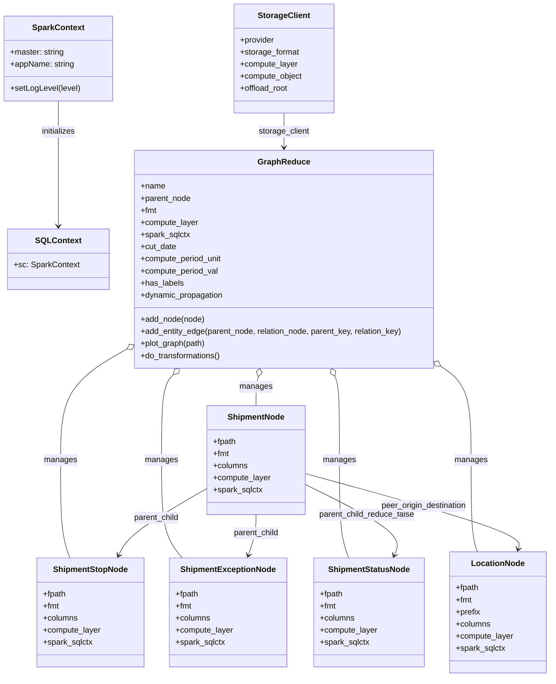
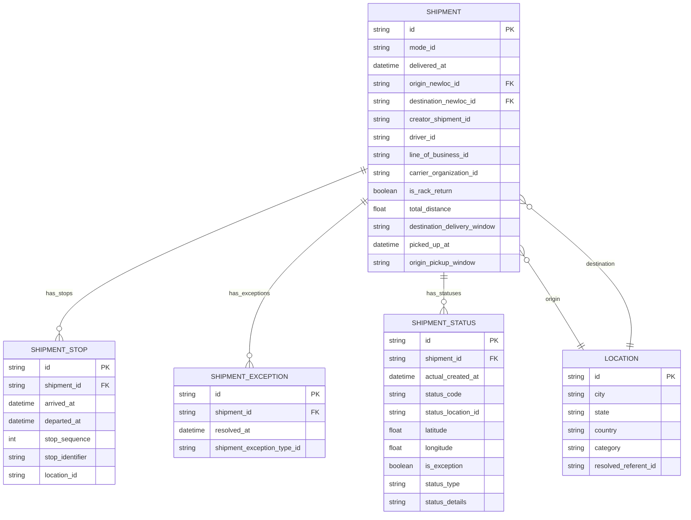

# Diagram: research/orchestrator/tasks/transforms/shipment_graph_reduce_spark.py


> Auto-generated by Obscura crawlers

## Diagram 1



### SVG

<svg id="container" width="1084.390625" xmlns="http://www.w3.org/2000/svg" class="classDiagram" height="1342" viewBox="0 0 1084.390625 1342" role="graphics-document document" aria-roledescription="class"><style>#container{font-family:"trebuchet ms",verdana,arial,sans-serif;font-size:16px;fill:#333;}@keyframes edge-animation-frame{from{stroke-dashoffset:0;}}@keyframes dash{to{stroke-dashoffset:0;}}#container .edge-animation-slow{stroke-dasharray:9,5!important;stroke-dashoffset:900;animation:dash 50s linear infinite;stroke-linecap:round;}#container .edge-animation-fast{stroke-dasharray:9,5!important;stroke-dashoffset:900;animation:dash 20s linear infinite;stroke-linecap:round;}#container .error-icon{fill:#552222;}#container .error-text{fill:#552222;stroke:#552222;}#container .edge-thickness-normal{stroke-width:1px;}#container .edge-thickness-thick{stroke-width:3.5px;}#container .edge-pattern-solid{stroke-dasharray:0;}#container .edge-thickness-invisible{stroke-width:0;fill:none;}#container .edge-pattern-dashed{stroke-dasharray:3;}#container .edge-pattern-dotted{stroke-dasharray:2;}#container .marker{fill:#333333;stroke:#333333;}#container .marker.cross{stroke:#333333;}#container svg{font-family:"trebuchet ms",verdana,arial,sans-serif;font-size:16px;}#container p{margin:0;}#container g.classGroup text{fill:#9370DB;stroke:none;font-family:"trebuchet ms",verdana,arial,sans-serif;font-size:10px;}#container g.classGroup text .title{font-weight:bolder;}#container .nodeLabel,#container .edgeLabel{color:#131300;}#container .edgeLabel .label rect{fill:#ECECFF;}#container .label text{fill:#131300;}#container .labelBkg{background:#ECECFF;}#container .edgeLabel .label span{background:#ECECFF;}#container .classTitle{font-weight:bolder;}#container .node rect,#container .node circle,#container .node ellipse,#container .node polygon,#container .node path{fill:#ECECFF;stroke:#9370DB;stroke-width:1px;}#container .divider{stroke:#9370DB;stroke-width:1;}#container g.clickable{cursor:pointer;}#container g.classGroup rect{fill:#ECECFF;stroke:#9370DB;}#container g.classGroup line{stroke:#9370DB;stroke-width:1;}#container .classLabel .box{stroke:none;stroke-width:0;fill:#ECECFF;opacity:0.5;}#container .classLabel .label{fill:#9370DB;font-size:10px;}#container .relation{stroke:#333333;stroke-width:1;fill:none;}#container .dashed-line{stroke-dasharray:3;}#container .dotted-line{stroke-dasharray:1 2;}#container #compositionStart,#container .composition{fill:#333333!important;stroke:#333333!important;stroke-width:1;}#container #compositionEnd,#container .composition{fill:#333333!important;stroke:#333333!important;stroke-width:1;}#container #dependencyStart,#container .dependency{fill:#333333!important;stroke:#333333!important;stroke-width:1;}#container #dependencyStart,#container .dependency{fill:#333333!important;stroke:#333333!important;stroke-width:1;}#container #extensionStart,#container .extension{fill:transparent!important;stroke:#333333!important;stroke-width:1;}#container #extensionEnd,#container .extension{fill:transparent!important;stroke:#333333!important;stroke-width:1;}#container #aggregationStart,#container .aggregation{fill:transparent!important;stroke:#333333!important;stroke-width:1;}#container #aggregationEnd,#container .aggregation{fill:transparent!important;stroke:#333333!important;stroke-width:1;}#container #lollipopStart,#container .lollipop{fill:#ECECFF!important;stroke:#333333!important;stroke-width:1;}#container #lollipopEnd,#container .lollipop{fill:#ECECFF!important;stroke:#333333!important;stroke-width:1;}#container .edgeTerminals{font-size:11px;line-height:initial;}#container .classTitleText{text-anchor:middle;font-size:18px;fill:#333;}#container .label-icon{display:inline-block;height:1em;overflow:visible;vertical-align:-0.125em;}#container .node .label-icon path{fill:currentColor;stroke:revert;stroke-width:revert;}#container :root{--mermaid-font-family:"trebuchet ms",verdana,arial,sans-serif;}</style><g><defs><marker id="container_class-aggregationStart" class="marker aggregation class" refX="18" refY="7" markerWidth="190" markerHeight="240" orient="auto"><path d="M 18,7 L9,13 L1,7 L9,1 Z"></path></marker></defs><defs><marker id="container_class-aggregationEnd" class="marker aggregation class" refX="1" refY="7" markerWidth="20" markerHeight="28" orient="auto"><path d="M 18,7 L9,13 L1,7 L9,1 Z"></path></marker></defs><defs><marker id="container_class-extensionStart" class="marker extension class" refX="18" refY="7" markerWidth="190" markerHeight="240" orient="auto"><path d="M 1,7 L18,13 V 1 Z"></path></marker></defs><defs><marker id="container_class-extensionEnd" class="marker extension class" refX="1" refY="7" markerWidth="20" markerHeight="28" orient="auto"><path d="M 1,1 V 13 L18,7 Z"></path></marker></defs><defs><marker id="container_class-compositionStart" class="marker composition class" refX="18" refY="7" markerWidth="190" markerHeight="240" orient="auto"><path d="M 18,7 L9,13 L1,7 L9,1 Z"></path></marker></defs><defs><marker id="container_class-compositionEnd" class="marker composition class" refX="1" refY="7" markerWidth="20" markerHeight="28" orient="auto"><path d="M 18,7 L9,13 L1,7 L9,1 Z"></path></marker></defs><defs><marker id="container_class-dependencyStart" class="marker dependency class" refX="6" refY="7" markerWidth="190" markerHeight="240" orient="auto"><path d="M 5,7 L9,13 L1,7 L9,1 Z"></path></marker></defs><defs><marker id="container_class-dependencyEnd" class="marker dependency class" refX="13" refY="7" markerWidth="20" markerHeight="28" orient="auto"><path d="M 18,7 L9,13 L14,7 L9,1 Z"></path></marker></defs><defs><marker id="container_class-lollipopStart" class="marker lollipop class" refX="13" refY="7" markerWidth="190" markerHeight="240" orient="auto"><circle stroke="black" fill="transparent" cx="7" cy="7" r="6"></circle></marker></defs><defs><marker id="container_class-lollipopEnd" class="marker lollipop class" refX="1" refY="7" markerWidth="190" markerHeight="240" orient="auto"><circle stroke="black" fill="transparent" cx="7" cy="7" r="6"></circle></marker></defs><g class="root"><g class="clusters"></g><g class="edgePaths"><path d="M113.469,200L113.469,210.167C113.469,220.333,113.469,240.667,113.469,282C113.469,323.333,113.469,385.667,113.469,416.833L113.469,448" id="id_SparkContext_SQLContext_1" class="edge-thickness-normal edge-pattern-solid relation" style=";;;" data-edge="true" data-et="edge" data-id="id_SparkContext_SQLContext_1" data-points="W3sieCI6MTEzLjQ2ODc1LCJ5IjoyMDB9LHsieCI6MTEzLjQ2ODc1LCJ5IjoyNjF9LHsieCI6MTEzLjQ2ODc1LCJ5Ijo0NTR9XQ==" marker-end="url(#container_class-dependencyEnd)"></path><path d="M559.941,224L559.941,230.167C559.941,236.333,559.941,248.667,559.941,260C559.941,271.333,559.941,281.667,559.941,286.833L559.941,292" id="id_StorageClient_GraphReduce_2" class="edge-thickness-normal edge-pattern-solid relation" style=";;;" data-edge="true" data-et="edge" data-id="id_StorageClient_GraphReduce_2" data-points="W3sieCI6NTU5Ljk0MTQwNjI1LCJ5IjoyMjR9LHsieCI6NTU5Ljk0MTQwNjI1LCJ5IjoyNjF9LHsieCI6NTU5Ljk0MTQwNjI1LCJ5IjoyOTh9XQ==" marker-end="url(#container_class-dependencyEnd)"></path><path d="M508.813,746.849L508.076,750.207C507.339,753.566,505.864,760.283,505.126,769.808C504.389,779.333,504.389,791.667,504.389,797.833L504.389,804" id="id_GraphReduce_ShipmentNode_3" class="edge-thickness-normal edge-pattern-solid relation" style=";;;" data-edge="true" data-et="edge" data-id="id_GraphReduce_ShipmentNode_3" data-points="W3sieCI6NTEyLjUxMjk4NDgwNzMxMjMsInkiOjczMH0seyJ4Ijo1MDQuMzg4NjcxODc1LCJ5Ijo3Njd9LHsieCI6NTA0LjM4ODY3MTg3NSwieSI6ODA0fV0=" marker-start="url(#container_class-aggregationStart)"></path><path d="M245.237,694.926L224.342,706.938C203.447,718.95,161.658,742.975,140.764,779.154C119.869,815.333,119.869,863.667,119.869,912C119.869,960.333,119.869,1008.667,122.952,1041C126.035,1073.333,132.202,1089.667,135.285,1097.833L138.368,1106" id="id_GraphReduce_ShipmentStopNode_4" class="edge-thickness-normal edge-pattern-solid relation" style=";;;" data-edge="true" data-et="edge" data-id="id_GraphReduce_ShipmentStopNode_4" data-points="W3sieCI6MjYwLjE5MTQwNjI1LCJ5Ijo2ODYuMzI3OTQ2ODQ4MjE4M30seyJ4IjoxMTkuODY5MTQwNjI1LCJ5Ijo3Njd9LHsieCI6MTE5Ljg2OTE0MDYyNSwieSI6OTEyfSx7IngiOjExOS44NjkxNDA2MjUsInkiOjEwNTd9LHsieCI6MTM4LjM2Nzg4NDE1NjA1MDk2LCJ5IjoxMTA2fV0=" marker-start="url(#container_class-aggregationStart)"></path><path d="M659.304,745.855L660.814,749.379C662.324,752.904,665.345,759.952,666.855,787.643C668.365,815.333,668.365,863.667,668.365,912C668.365,960.333,668.365,1008.667,671.486,1041C674.607,1073.333,680.85,1089.667,683.971,1097.833L687.092,1106" id="id_GraphReduce_ShipmentStatusNode_5" class="edge-thickness-normal edge-pattern-solid relation" style=";;;" data-edge="true" data-et="edge" data-id="id_GraphReduce_ShipmentStatusNode_5" data-points="W3sieCI6NjUyLjUwODc4NTIwMjU2OTEsInkiOjczMH0seyJ4Ijo2NjguMzY1MjM0Mzc1LCJ5Ijo3Njd9LHsieCI6NjY4LjM2NTIzNDM3NSwieSI6OTEyfSx7IngiOjY2OC4zNjUyMzQzNzUsInkiOjEwNTd9LHsieCI6Njg3LjA5MTk1ODU5ODcyNjEsInkiOjExMDZ9XQ==" marker-start="url(#container_class-aggregationStart)"></path><path d="M343.562,742.526L339.7,746.605C335.837,750.684,328.113,758.842,324.251,787.088C320.389,815.333,320.389,863.667,320.389,912C320.389,960.333,320.389,1008.667,327.07,1041C333.752,1073.333,347.114,1089.667,353.796,1097.833L360.477,1106" id="id_GraphReduce_ShipmentExceptionNode_6" class="edge-thickness-normal edge-pattern-solid relation" style=";;;" data-edge="true" data-et="edge" data-id="id_GraphReduce_ShipmentExceptionNode_6" data-points="W3sieCI6MzU1LjQyMjA3NTcxNjQwMzEsInkiOjczMH0seyJ4IjozMjAuMzg4NjcxODc1LCJ5Ijo3Njd9LHsieCI6MzIwLjM4ODY3MTg3NSwieSI6OTEyfSx7IngiOjMyMC4zODg2NzE4NzUsInkiOjEwNTd9LHsieCI6MzYwLjQ3NzMwODkxNzE5NzQzLCJ5IjoxMTA2fV0=" marker-start="url(#container_class-aggregationStart)"></path><path d="M873.883,730.943L882.579,736.953C891.275,742.962,908.668,754.981,917.364,785.157C926.061,815.333,926.061,863.667,926.061,912C926.061,960.333,926.061,1008.667,928.242,1039C930.423,1069.333,934.785,1081.667,936.966,1087.833L939.147,1094" id="id_GraphReduce_LocationNode_7" class="edge-thickness-normal edge-pattern-solid relation" style=";;;" data-edge="true" data-et="edge" data-id="id_GraphReduce_LocationNode_7" data-points="W3sieCI6ODU5LjY5MTQwNjI1LCJ5Ijo3MjEuMTM2ODA3NjI2NDQ1fSx7IngiOjkyNi4wNjA1NDY4NzUsInkiOjc2N30seyJ4Ijo5MjYuMDYwNTQ2ODc1LCJ5Ijo5MTJ9LHsieCI6OTI2LjA2MDU0Njg3NSwieSI6MTA1N30seyJ4Ijo5MzkuMTQ3MDY5MDY4NDcxMywieSI6MTA5NH1d" marker-start="url(#container_class-aggregationStart)"></path><path d="M407.709,968.148L382.21,982.957C356.712,997.765,305.714,1027.383,276.718,1049.457C247.722,1071.531,240.727,1086.063,237.229,1093.328L233.732,1100.594" id="id_ShipmentNode_ShipmentStopNode_8" class="edge-thickness-normal edge-pattern-solid relation" style=";;;" data-edge="true" data-et="edge" data-id="id_ShipmentNode_ShipmentStopNode_8" data-points="W3sieCI6NDA3LjcwODk4NDM3NSwieSI6OTY4LjE0NzkxMjg4NTY2MjR9LHsieCI6MjU0LjcxNjc5Njg3NSwieSI6MTA1N30seyJ4IjoyMzEuMTI5MzI5MjE5NzQ1MjIsInkiOjExMDZ9XQ==" marker-end="url(#container_class-dependencyEnd)"></path><path d="M504.389,1020L504.389,1026.167C504.389,1032.333,504.389,1044.667,501.833,1058.057C499.276,1071.448,494.164,1085.896,491.608,1093.12L489.052,1100.344" id="id_ShipmentNode_ShipmentExceptionNode_9" class="edge-thickness-normal edge-pattern-solid relation" style=";;;" data-edge="true" data-et="edge" data-id="id_ShipmentNode_ShipmentExceptionNode_9" data-points="W3sieCI6NTA0LjM4ODY3MTg3NSwieSI6MTAyMH0seyJ4Ijo1MDQuMzg4NjcxODc1LCJ5IjoxMDU3fSx7IngiOjQ4Ny4wNTA1NTczMjQ4NDA4LCJ5IjoxMTA2fV0=" marker-end="url(#container_class-dependencyEnd)"></path><path d="M601.068,960.242L633.386,976.368C665.704,992.495,730.34,1024.747,759.584,1048.12C788.828,1071.492,782.68,1085.984,779.605,1093.23L776.531,1100.477" id="id_ShipmentNode_ShipmentStatusNode_10" class="edge-thickness-normal edge-pattern-solid relation" style=";;;" data-edge="true" data-et="edge" data-id="id_ShipmentNode_ShipmentStatusNode_10" data-points="W3sieCI6NjAxLjA2ODM1OTM3NSwieSI6OTYwLjI0MjA0NzAzNTU3NTh9LHsieCI6Nzk0Ljk3NjU2MjUsInkiOjEwNTd9LHsieCI6Nzc0LjE4NzY0OTI4MzQzOTQsInkiOjExMDZ9XQ==" marker-end="url(#container_class-dependencyEnd)"></path><path d="M601.068,938.536L673.002,958.28C744.936,978.024,888.803,1017.512,959.039,1042.472C1029.276,1067.431,1025.882,1077.863,1024.185,1083.079L1022.488,1088.294" id="id_ShipmentNode_LocationNode_11" class="edge-thickness-normal edge-pattern-solid relation" style=";;;" data-edge="true" data-et="edge" data-id="id_ShipmentNode_LocationNode_11" data-points="W3sieCI6NjAxLjA2ODM1OTM3NSwieSI6OTM4LjUzNjE1Nzk0MTQzNzR9LHsieCI6MTAzMi42Njk5MjE4NzUsInkiOjEwNTd9LHsieCI6MTAyMC42MzE5NDE2Nzk5MzYzLCJ5IjoxMDk0fV0=" marker-end="url(#container_class-dependencyEnd)"></path></g><g class="edgeLabels"><g class="edgeLabel" transform="translate(113.46875, 261)"><g class="label" data-id="id_SparkContext_SQLContext_1" transform="translate(-34.7578125, -12)"><foreignObject width="69.515625" height="24"><div xmlns="http://www.w3.org/1999/xhtml" class="labelBkg" style="display: table-cell; white-space: nowrap; line-height: 1.5; max-width: 200px; text-align: center;"><span class="edgeLabel"><p>initializes</p></span></div></foreignObject></g></g><g class="edgeLabel" transform="translate(559.94140625, 261)"><g class="label" data-id="id_StorageClient_GraphReduce_2" transform="translate(-50.8515625, -12)"><foreignObject width="101.703125" height="24"><div xmlns="http://www.w3.org/1999/xhtml" class="labelBkg" style="display: table-cell; white-space: nowrap; line-height: 1.5; max-width: 200px; text-align: center;"><span class="edgeLabel"><p>storage_client</p></span></div></foreignObject></g></g><g class="edgeLabel" transform="translate(504.388671875, 767)"><g class="label" data-id="id_GraphReduce_ShipmentNode_3" transform="translate(-32.296875, -12)"><foreignObject width="64.59375" height="24"><div xmlns="http://www.w3.org/1999/xhtml" class="labelBkg" style="display: table-cell; white-space: nowrap; line-height: 1.5; max-width: 200px; text-align: center;"><span class="edgeLabel"><p>manages</p></span></div></foreignObject></g></g><g class="edgeLabel" transform="translate(119.869140625, 912)"><g class="label" data-id="id_GraphReduce_ShipmentStopNode_4" transform="translate(-32.296875, -12)"><foreignObject width="64.59375" height="24"><div xmlns="http://www.w3.org/1999/xhtml" class="labelBkg" style="display: table-cell; white-space: nowrap; line-height: 1.5; max-width: 200px; text-align: center;"><span class="edgeLabel"><p>manages</p></span></div></foreignObject></g></g><g class="edgeLabel" transform="translate(668.365234375, 912)"><g class="label" data-id="id_GraphReduce_ShipmentStatusNode_5" transform="translate(-32.296875, -12)"><foreignObject width="64.59375" height="24"><div xmlns="http://www.w3.org/1999/xhtml" class="labelBkg" style="display: table-cell; white-space: nowrap; line-height: 1.5; max-width: 200px; text-align: center;"><span class="edgeLabel"><p>manages</p></span></div></foreignObject></g></g><g class="edgeLabel" transform="translate(320.388671875, 912)"><g class="label" data-id="id_GraphReduce_ShipmentExceptionNode_6" transform="translate(-32.296875, -12)"><foreignObject width="64.59375" height="24"><div xmlns="http://www.w3.org/1999/xhtml" class="labelBkg" style="display: table-cell; white-space: nowrap; line-height: 1.5; max-width: 200px; text-align: center;"><span class="edgeLabel"><p>manages</p></span></div></foreignObject></g></g><g class="edgeLabel" transform="translate(926.060546875, 912)"><g class="label" data-id="id_GraphReduce_LocationNode_7" transform="translate(-32.296875, -12)"><foreignObject width="64.59375" height="24"><div xmlns="http://www.w3.org/1999/xhtml" class="labelBkg" style="display: table-cell; white-space: nowrap; line-height: 1.5; max-width: 200px; text-align: center;"><span class="edgeLabel"><p>manages</p></span></div></foreignObject></g></g><g class="edgeLabel" transform="translate(307.69974, 1026.22951)"><g class="label" data-id="id_ShipmentNode_ShipmentStopNode_8" transform="translate(-45.671875, -12)"><foreignObject width="91.34375" height="24"><div xmlns="http://www.w3.org/1999/xhtml" class="labelBkg" style="display: table-cell; white-space: nowrap; line-height: 1.5; max-width: 200px; text-align: center;"><span class="edgeLabel"><p>parent_child</p></span></div></foreignObject></g></g><g class="edgeLabel" transform="translate(504.388671875, 1057)"><g class="label" data-id="id_ShipmentNode_ShipmentExceptionNode_9" transform="translate(-45.671875, -12)"><foreignObject width="91.34375" height="24"><div xmlns="http://www.w3.org/1999/xhtml" class="labelBkg" style="display: table-cell; white-space: nowrap; line-height: 1.5; max-width: 200px; text-align: center;"><span class="edgeLabel"><p>parent_child</p></span></div></foreignObject></g></g><g class="edgeLabel" transform="translate(721.8362, 1020.5038)"><g class="label" data-id="id_ShipmentNode_ShipmentStatusNode_10" transform="translate(-95.5546875, -12)"><foreignObject width="191.109375" height="24"><div xmlns="http://www.w3.org/1999/xhtml" class="labelBkg" style="display: table-cell; white-space: nowrap; line-height: 1.5; max-width: 200px; text-align: center;"><span class="edgeLabel"><p>parent_child_reduce_false</p></span></div></foreignObject></g></g><g class="edgeLabel" transform="translate(835.62981, 1002.91741)"><g class="label" data-id="id_ShipmentNode_LocationNode_11" transform="translate(-86.609375, -12)"><foreignObject width="173.21875" height="24"><div xmlns="http://www.w3.org/1999/xhtml" class="labelBkg" style="display: table-cell; white-space: nowrap; line-height: 1.5; max-width: 200px; text-align: center;"><span class="edgeLabel"><p>peer_origin_destination</p></span></div></foreignObject></g></g></g><g class="nodes"><g class="node default" id="classId-SparkContext-0" transform="translate(113.46875, 116)"><g class="basic label-container"><path d="M-105.46875 -84 L105.46875 -84 L105.46875 84 L-105.46875 84" stroke="none" stroke-width="0" fill="#ECECFF" style=""></path><path d="M-105.46875 -84 C-60.84359766382886 -84, -16.21844532765772 -84, 105.46875 -84 M-105.46875 -84 C-53.665248681595756 -84, -1.8617473631915118 -84, 105.46875 -84 M105.46875 -84 C105.46875 -42.26482979099313, 105.46875 -0.529659581986266, 105.46875 84 M105.46875 -84 C105.46875 -28.690837466393162, 105.46875 26.618325067213675, 105.46875 84 M105.46875 84 C23.709474357706725 84, -58.04980128458655 84, -105.46875 84 M105.46875 84 C59.986277841999026 84, 14.503805683998053 84, -105.46875 84 M-105.46875 84 C-105.46875 29.88465614432255, -105.46875 -24.230687711354904, -105.46875 -84 M-105.46875 84 C-105.46875 18.598583704424, -105.46875 -46.802832591152, -105.46875 -84" stroke="#9370DB" stroke-width="1.3" fill="none" stroke-dasharray="0 0" style=""></path></g><g class="annotation-group text" transform="translate(0, -60)"></g><g class="label-group text" transform="translate(-49.453125, -60)"><g class="label" style="font-weight: bolder" transform="translate(0,-12)"><foreignObject width="98.90625" height="24"><div xmlns="http://www.w3.org/1999/xhtml" style="display: table-cell; white-space: nowrap; line-height: 1.5; max-width: 146px; text-align: center;"><span class="nodeLabel markdown-node-label" style=""><p>SparkContext</p></span></div></foreignObject></g></g><g class="members-group text" transform="translate(-93.46875, -12)"><g class="label" style="" transform="translate(0,-12)"><foreignObject width="108.03125" height="24"><div xmlns="http://www.w3.org/1999/xhtml" style="display: table-cell; white-space: nowrap; line-height: 1.5; max-width: 166px; text-align: center;"><span class="nodeLabel markdown-node-label" style=""><p>+master: string</p></span></div></foreignObject></g><g class="label" style="" transform="translate(0,12)"><foreignObject width="127.234375" height="24"><div xmlns="http://www.w3.org/1999/xhtml" style="display: table-cell; white-space: nowrap; line-height: 1.5; max-width: 185px; text-align: center;"><span class="nodeLabel markdown-node-label" style=""><p>+appName: string</p></span></div></foreignObject></g></g><g class="methods-group text" transform="translate(-93.46875, 60)"><g class="label" style="" transform="translate(0,-12)"><foreignObject width="137.484375" height="24"><div xmlns="http://www.w3.org/1999/xhtml" style="display: table-cell; white-space: nowrap; line-height: 1.5; max-width: 195px; text-align: center;"><span class="nodeLabel markdown-node-label" style=""><p>+setLogLevel(level)</p></span></div></foreignObject></g></g><g class="divider" style=""><path d="M-105.46875 -36 C-58.94595279270375 -36, -12.4231555854075 -36, 105.46875 -36 M-105.46875 -36 C-62.16204244089272 -36, -18.85533488178544 -36, 105.46875 -36" stroke="#9370DB" stroke-width="1.3" fill="none" stroke-dasharray="0 0" style=""></path></g><g class="divider" style=""><path d="M-105.46875 36 C-23.239384053002325 36, 58.98998189399535 36, 105.46875 36 M-105.46875 36 C-47.07080926847639 36, 11.327131463047223 36, 105.46875 36" stroke="#9370DB" stroke-width="1.3" fill="none" stroke-dasharray="0 0" style=""></path></g></g><g class="node default" id="classId-SQLContext-1" transform="translate(113.46875, 514)"><g class="basic label-container"><path d="M-96.72265625 -60 L96.72265625 -60 L96.72265625 60 L-96.72265625 60" stroke="none" stroke-width="0" fill="#ECECFF" style=""></path><path d="M-96.72265625 -60 C-43.46289082830802 -60, 9.796874593383961 -60, 96.72265625 -60 M-96.72265625 -60 C-46.93474664379879 -60, 2.853162962402422 -60, 96.72265625 -60 M96.72265625 -60 C96.72265625 -27.887130884725494, 96.72265625 4.2257382305490125, 96.72265625 60 M96.72265625 -60 C96.72265625 -15.61174669781164, 96.72265625 28.77650660437672, 96.72265625 60 M96.72265625 60 C48.51579727262941 60, 0.30893829525882666 60, -96.72265625 60 M96.72265625 60 C49.68987756191269 60, 2.657098873825376 60, -96.72265625 60 M-96.72265625 60 C-96.72265625 19.41559327804319, -96.72265625 -21.16881344391362, -96.72265625 -60 M-96.72265625 60 C-96.72265625 16.96950259760422, -96.72265625 -26.060994804791562, -96.72265625 -60" stroke="#9370DB" stroke-width="1.3" fill="none" stroke-dasharray="0 0" style=""></path></g><g class="annotation-group text" transform="translate(0, -36)"></g><g class="label-group text" transform="translate(-42.0390625, -36)"><g class="label" style="font-weight: bolder" transform="translate(0,-12)"><foreignObject width="84.078125" height="24"><div xmlns="http://www.w3.org/1999/xhtml" style="display: table-cell; white-space: nowrap; line-height: 1.5; max-width: 132px; text-align: center;"><span class="nodeLabel markdown-node-label" style=""><p>SQLContext</p></span></div></foreignObject></g></g><g class="members-group text" transform="translate(-84.72265625, 12)"><g class="label" style="" transform="translate(0,-12)"><foreignObject width="127.40625" height="24"><div xmlns="http://www.w3.org/1999/xhtml" style="display: table-cell; white-space: nowrap; line-height: 1.5; max-width: 185px; text-align: center;"><span class="nodeLabel markdown-node-label" style=""><p>+sc: SparkContext</p></span></div></foreignObject></g></g><g class="methods-group text" transform="translate(-84.72265625, 60)"></g><g class="divider" style=""><path d="M-96.72265625 -12 C-19.984765842344927 -12, 56.753124565310145 -12, 96.72265625 -12 M-96.72265625 -12 C-21.665383199375256 -12, 53.39188985124949 -12, 96.72265625 -12" stroke="#9370DB" stroke-width="1.3" fill="none" stroke-dasharray="0 0" style=""></path></g><g class="divider" style=""><path d="M-96.72265625 36 C-49.9475466533384 36, -3.1724370566767988 36, 96.72265625 36 M-96.72265625 36 C-30.54401379266838 36, 35.63462866466324 36, 96.72265625 36" stroke="#9370DB" stroke-width="1.3" fill="none" stroke-dasharray="0 0" style=""></path></g></g><g class="node default" id="classId-StorageClient-2" transform="translate(559.94140625, 116)"><g class="basic label-container"><path d="M-98.97265625 -108 L98.97265625 -108 L98.97265625 108 L-98.97265625 108" stroke="none" stroke-width="0" fill="#ECECFF" style=""></path><path d="M-98.97265625 -108 C-41.69333180859401 -108, 15.58599263281198 -108, 98.97265625 -108 M-98.97265625 -108 C-35.32859474098031 -108, 28.315466768039386 -108, 98.97265625 -108 M98.97265625 -108 C98.97265625 -22.72562939794871, 98.97265625 62.54874120410258, 98.97265625 108 M98.97265625 -108 C98.97265625 -57.80653287994712, 98.97265625 -7.613065759894241, 98.97265625 108 M98.97265625 108 C32.8495781843158 108, -33.273499881368394 108, -98.97265625 108 M98.97265625 108 C48.34891414763659 108, -2.274827954726817 108, -98.97265625 108 M-98.97265625 108 C-98.97265625 47.42990402339271, -98.97265625 -13.140191953214583, -98.97265625 -108 M-98.97265625 108 C-98.97265625 43.173676374444625, -98.97265625 -21.65264725111075, -98.97265625 -108" stroke="#9370DB" stroke-width="1.3" fill="none" stroke-dasharray="0 0" style=""></path></g><g class="annotation-group text" transform="translate(0, -84)"></g><g class="label-group text" transform="translate(-49.3515625, -84)"><g class="label" style="font-weight: bolder" transform="translate(0,-12)"><foreignObject width="98.703125" height="24"><div xmlns="http://www.w3.org/1999/xhtml" style="display: table-cell; white-space: nowrap; line-height: 1.5; max-width: 147px; text-align: center;"><span class="nodeLabel markdown-node-label" style=""><p>StorageClient</p></span></div></foreignObject></g></g><g class="members-group text" transform="translate(-86.97265625, -36)"><g class="label" style="" transform="translate(0,-12)"><foreignObject width="69.3125" height="24"><div xmlns="http://www.w3.org/1999/xhtml" style="display: table-cell; white-space: nowrap; line-height: 1.5; max-width: 127px; text-align: center;"><span class="nodeLabel markdown-node-label" style=""><p>+provider</p></span></div></foreignObject></g><g class="label" style="" transform="translate(0,12)"><foreignObject width="117.875" height="24"><div xmlns="http://www.w3.org/1999/xhtml" style="display: table-cell; white-space: nowrap; line-height: 1.5; max-width: 175px; text-align: center;"><span class="nodeLabel markdown-node-label" style=""><p>+storage_format</p></span></div></foreignObject></g><g class="label" style="" transform="translate(0,36)"><foreignObject width="115.0625" height="24"><div xmlns="http://www.w3.org/1999/xhtml" style="display: table-cell; white-space: nowrap; line-height: 1.5; max-width: 173px; text-align: center;"><span class="nodeLabel markdown-node-label" style=""><p>+compute_layer</p></span></div></foreignObject></g><g class="label" style="" transform="translate(0,60)"><foreignObject width="124.59375" height="24"><div xmlns="http://www.w3.org/1999/xhtml" style="display: table-cell; white-space: nowrap; line-height: 1.5; max-width: 182px; text-align: center;"><span class="nodeLabel markdown-node-label" style=""><p>+compute_object</p></span></div></foreignObject></g><g class="label" style="" transform="translate(0,84)"><foreignObject width="98.03125" height="24"><div xmlns="http://www.w3.org/1999/xhtml" style="display: table-cell; white-space: nowrap; line-height: 1.5; max-width: 156px; text-align: center;"><span class="nodeLabel markdown-node-label" style=""><p>+offload_root</p></span></div></foreignObject></g></g><g class="methods-group text" transform="translate(-86.97265625, 108)"></g><g class="divider" style=""><path d="M-98.97265625 -60 C-46.76261468732267 -60, 5.447426875354665 -60, 98.97265625 -60 M-98.97265625 -60 C-28.8896573588637 -60, 41.1933415322726 -60, 98.97265625 -60" stroke="#9370DB" stroke-width="1.3" fill="none" stroke-dasharray="0 0" style=""></path></g><g class="divider" style=""><path d="M-98.97265625 84 C-52.42411797429827 84, -5.875579698596539 84, 98.97265625 84 M-98.97265625 84 C-43.55428566076166 84, 11.864084928476686 84, 98.97265625 84" stroke="#9370DB" stroke-width="1.3" fill="none" stroke-dasharray="0 0" style=""></path></g></g><g class="node default" id="classId-GraphReduce-3" transform="translate(559.94140625, 514)"><g class="basic label-container"><path d="M-299.75 -216 L299.75 -216 L299.75 216 L-299.75 216" stroke="none" stroke-width="0" fill="#ECECFF" style=""></path><path d="M-299.75 -216 C-107.92183310682069 -216, 83.90633378635863 -216, 299.75 -216 M-299.75 -216 C-60.69259463384827 -216, 178.36481073230345 -216, 299.75 -216 M299.75 -216 C299.75 -127.039084957364, 299.75 -38.078169914727994, 299.75 216 M299.75 -216 C299.75 -89.40743317484004, 299.75 37.185133650319926, 299.75 216 M299.75 216 C68.68043017446226 216, -162.38913965107548 216, -299.75 216 M299.75 216 C105.04847328603799 216, -89.65305342792402 216, -299.75 216 M-299.75 216 C-299.75 65.7715468699945, -299.75 -84.45690626001101, -299.75 -216 M-299.75 216 C-299.75 118.17287645683962, -299.75 20.345752913679235, -299.75 -216" stroke="#9370DB" stroke-width="1.3" fill="none" stroke-dasharray="0 0" style=""></path></g><g class="annotation-group text" transform="translate(0, -192)"></g><g class="label-group text" transform="translate(-48.5625, -192)"><g class="label" style="font-weight: bolder" transform="translate(0,-12)"><foreignObject width="97.125" height="24"><div xmlns="http://www.w3.org/1999/xhtml" style="display: table-cell; white-space: nowrap; line-height: 1.5; max-width: 146px; text-align: center;"><span class="nodeLabel markdown-node-label" style=""><p>GraphReduce</p></span></div></foreignObject></g></g><g class="members-group text" transform="translate(-287.75, -144)"><g class="label" style="" transform="translate(0,-12)"><foreignObject width="48.5" height="24"><div xmlns="http://www.w3.org/1999/xhtml" style="display: table-cell; white-space: nowrap; line-height: 1.5; max-width: 106px; text-align: center;"><span class="nodeLabel markdown-node-label" style=""><p>+name</p></span></div></foreignObject></g><g class="label" style="" transform="translate(0,12)"><foreignObject width="100.9375" height="24"><div xmlns="http://www.w3.org/1999/xhtml" style="display: table-cell; white-space: nowrap; line-height: 1.5; max-width: 158px; text-align: center;"><span class="nodeLabel markdown-node-label" style=""><p>+parent_node</p></span></div></foreignObject></g><g class="label" style="" transform="translate(0,36)"><foreignObject width="32.59375" height="24"><div xmlns="http://www.w3.org/1999/xhtml" style="display: table-cell; white-space: nowrap; line-height: 1.5; max-width: 90px; text-align: center;"><span class="nodeLabel markdown-node-label" style=""><p>+fmt</p></span></div></foreignObject></g><g class="label" style="" transform="translate(0,60)"><foreignObject width="115.0625" height="24"><div xmlns="http://www.w3.org/1999/xhtml" style="display: table-cell; white-space: nowrap; line-height: 1.5; max-width: 173px; text-align: center;"><span class="nodeLabel markdown-node-label" style=""><p>+compute_layer</p></span></div></foreignObject></g><g class="label" style="" transform="translate(0,84)"><foreignObject width="99.03125" height="24"><div xmlns="http://www.w3.org/1999/xhtml" style="display: table-cell; white-space: nowrap; line-height: 1.5; max-width: 157px; text-align: center;"><span class="nodeLabel markdown-node-label" style=""><p>+spark_sqlctx</p></span></div></foreignObject></g><g class="label" style="" transform="translate(0,108)"><foreignObject width="71.09375" height="24"><div xmlns="http://www.w3.org/1999/xhtml" style="display: table-cell; white-space: nowrap; line-height: 1.5; max-width: 128px; text-align: center;"><span class="nodeLabel markdown-node-label" style=""><p>+cut_date</p></span></div></foreignObject></g><g class="label" style="" transform="translate(0,132)"><foreignObject width="164.25" height="24"><div xmlns="http://www.w3.org/1999/xhtml" style="display: table-cell; white-space: nowrap; line-height: 1.5; max-width: 222px; text-align: center;"><span class="nodeLabel markdown-node-label" style=""><p>+compute_period_unit</p></span></div></foreignObject></g><g class="label" style="" transform="translate(0,156)"><foreignObject width="155.953125" height="24"><div xmlns="http://www.w3.org/1999/xhtml" style="display: table-cell; white-space: nowrap; line-height: 1.5; max-width: 214px; text-align: center;"><span class="nodeLabel markdown-node-label" style=""><p>+compute_period_val</p></span></div></foreignObject></g><g class="label" style="" transform="translate(0,180)"><foreignObject width="84.921875" height="24"><div xmlns="http://www.w3.org/1999/xhtml" style="display: table-cell; white-space: nowrap; line-height: 1.5; max-width: 142px; text-align: center;"><span class="nodeLabel markdown-node-label" style=""><p>+has_labels</p></span></div></foreignObject></g><g class="label" style="" transform="translate(0,204)"><foreignObject width="165.859375" height="24"><div xmlns="http://www.w3.org/1999/xhtml" style="display: table-cell; white-space: nowrap; line-height: 1.5; max-width: 223px; text-align: center;"><span class="nodeLabel markdown-node-label" style=""><p>+dynamic_propagation</p></span></div></foreignObject></g></g><g class="methods-group text" transform="translate(-287.75, 120)"><g class="label" style="" transform="translate(0,-12)"><foreignObject width="128.296875" height="24"><div xmlns="http://www.w3.org/1999/xhtml" style="display: table-cell; white-space: nowrap; line-height: 1.5; max-width: 186px; text-align: center;"><span class="nodeLabel markdown-node-label" style=""><p>+add_node(node)</p></span></div></foreignObject></g><g class="label" style="" transform="translate(0,12)"><foreignObject width="526.9375" height="24"><div xmlns="http://www.w3.org/1999/xhtml" style="display: table-cell; white-space: nowrap; line-height: 1.5; max-width: 584px; text-align: center;"><span class="nodeLabel markdown-node-label" style=""><p>+add_entity_edge(parent_node, relation_node, parent_key, relation_key)</p></span></div></foreignObject></g><g class="label" style="" transform="translate(0,36)"><foreignObject width="130.78125" height="24"><div xmlns="http://www.w3.org/1999/xhtml" style="display: table-cell; white-space: nowrap; line-height: 1.5; max-width: 188px; text-align: center;"><span class="nodeLabel markdown-node-label" style=""><p>+plot_graph(path)</p></span></div></foreignObject></g><g class="label" style="" transform="translate(0,60)"><foreignObject width="161.515625" height="24"><div xmlns="http://www.w3.org/1999/xhtml" style="display: table-cell; white-space: nowrap; line-height: 1.5; max-width: 219px; text-align: center;"><span class="nodeLabel markdown-node-label" style=""><p>+do_transformations()</p></span></div></foreignObject></g></g><g class="divider" style=""><path d="M-299.75 -168 C-76.7019206525139 -168, 146.3461586949722 -168, 299.75 -168 M-299.75 -168 C-88.32441915623423 -168, 123.10116168753154 -168, 299.75 -168" stroke="#9370DB" stroke-width="1.3" fill="none" stroke-dasharray="0 0" style=""></path></g><g class="divider" style=""><path d="M-299.75 96 C-89.79453395438861 96, 120.16093209122278 96, 299.75 96 M-299.75 96 C-116.8238611193822 96, 66.1022777612356 96, 299.75 96" stroke="#9370DB" stroke-width="1.3" fill="none" stroke-dasharray="0 0" style=""></path></g></g><g class="node default" id="classId-ShipmentNode-4" transform="translate(504.388671875, 912)"><g class="basic label-container"><path d="M-96.6796875 -108 L96.6796875 -108 L96.6796875 108 L-96.6796875 108" stroke="none" stroke-width="0" fill="#ECECFF" style=""></path><path d="M-96.6796875 -108 C-42.985307893425315 -108, 10.70907171314937 -108, 96.6796875 -108 M-96.6796875 -108 C-39.40503526315538 -108, 17.869616973689233 -108, 96.6796875 -108 M96.6796875 -108 C96.6796875 -35.832218299744866, 96.6796875 36.33556340051027, 96.6796875 108 M96.6796875 -108 C96.6796875 -29.293249103914334, 96.6796875 49.41350179217133, 96.6796875 108 M96.6796875 108 C29.009991996124015 108, -38.65970350775197 108, -96.6796875 108 M96.6796875 108 C39.230232958365065 108, -18.21922158326987 108, -96.6796875 108 M-96.6796875 108 C-96.6796875 34.026467952279205, -96.6796875 -39.94706409544159, -96.6796875 -108 M-96.6796875 108 C-96.6796875 26.115585302057227, -96.6796875 -55.76882939588555, -96.6796875 -108" stroke="#9370DB" stroke-width="1.3" fill="none" stroke-dasharray="0 0" style=""></path></g><g class="annotation-group text" transform="translate(0, -84)"></g><g class="label-group text" transform="translate(-54.296875, -84)"><g class="label" style="font-weight: bolder" transform="translate(0,-12)"><foreignObject width="108.59375" height="24"><div xmlns="http://www.w3.org/1999/xhtml" style="display: table-cell; white-space: nowrap; line-height: 1.5; max-width: 158px; text-align: center;"><span class="nodeLabel markdown-node-label" style=""><p>ShipmentNode</p></span></div></foreignObject></g></g><g class="members-group text" transform="translate(-84.6796875, -36)"><g class="label" style="" transform="translate(0,-12)"><foreignObject width="46.3125" height="24"><div xmlns="http://www.w3.org/1999/xhtml" style="display: table-cell; white-space: nowrap; line-height: 1.5; max-width: 104px; text-align: center;"><span class="nodeLabel markdown-node-label" style=""><p>+fpath</p></span></div></foreignObject></g><g class="label" style="" transform="translate(0,12)"><foreignObject width="32.59375" height="24"><div xmlns="http://www.w3.org/1999/xhtml" style="display: table-cell; white-space: nowrap; line-height: 1.5; max-width: 90px; text-align: center;"><span class="nodeLabel markdown-node-label" style=""><p>+fmt</p></span></div></foreignObject></g><g class="label" style="" transform="translate(0,36)"><foreignObject width="69.21875" height="24"><div xmlns="http://www.w3.org/1999/xhtml" style="display: table-cell; white-space: nowrap; line-height: 1.5; max-width: 127px; text-align: center;"><span class="nodeLabel markdown-node-label" style=""><p>+columns</p></span></div></foreignObject></g><g class="label" style="" transform="translate(0,60)"><foreignObject width="115.0625" height="24"><div xmlns="http://www.w3.org/1999/xhtml" style="display: table-cell; white-space: nowrap; line-height: 1.5; max-width: 173px; text-align: center;"><span class="nodeLabel markdown-node-label" style=""><p>+compute_layer</p></span></div></foreignObject></g><g class="label" style="" transform="translate(0,84)"><foreignObject width="99.03125" height="24"><div xmlns="http://www.w3.org/1999/xhtml" style="display: table-cell; white-space: nowrap; line-height: 1.5; max-width: 157px; text-align: center;"><span class="nodeLabel markdown-node-label" style=""><p>+spark_sqlctx</p></span></div></foreignObject></g></g><g class="methods-group text" transform="translate(-84.6796875, 108)"></g><g class="divider" style=""><path d="M-96.6796875 -60 C-20.487215274134115 -60, 55.70525695173177 -60, 96.6796875 -60 M-96.6796875 -60 C-24.160568174546583 -60, 48.358551150906834 -60, 96.6796875 -60" stroke="#9370DB" stroke-width="1.3" fill="none" stroke-dasharray="0 0" style=""></path></g><g class="divider" style=""><path d="M-96.6796875 84 C-54.19989079992842 84, -11.720094099856837 84, 96.6796875 84 M-96.6796875 84 C-34.68998576525017 84, 27.29971596949966 84, 96.6796875 84" stroke="#9370DB" stroke-width="1.3" fill="none" stroke-dasharray="0 0" style=""></path></g></g><g class="node default" id="classId-ShipmentStopNode-5" transform="translate(179.140625, 1214)"><g class="basic label-container"><path d="M-105.1640625 -108 L105.1640625 -108 L105.1640625 108 L-105.1640625 108" stroke="none" stroke-width="0" fill="#ECECFF" style=""></path><path d="M-105.1640625 -108 C-61.70635868603414 -108, -18.248654872068286 -108, 105.1640625 -108 M-105.1640625 -108 C-46.47029695075925 -108, 12.223468598481503 -108, 105.1640625 -108 M105.1640625 -108 C105.1640625 -22.594487867835426, 105.1640625 62.81102426432915, 105.1640625 108 M105.1640625 -108 C105.1640625 -58.595837200990935, 105.1640625 -9.19167440198187, 105.1640625 108 M105.1640625 108 C34.147107804441944 108, -36.86984689111611 108, -105.1640625 108 M105.1640625 108 C21.5919168010698 108, -61.9802288978604 108, -105.1640625 108 M-105.1640625 108 C-105.1640625 54.32220805248001, -105.1640625 0.6444161049600154, -105.1640625 -108 M-105.1640625 108 C-105.1640625 50.81431197453073, -105.1640625 -6.371376050938537, -105.1640625 -108" stroke="#9370DB" stroke-width="1.3" fill="none" stroke-dasharray="0 0" style=""></path></g><g class="annotation-group text" transform="translate(0, -84)"></g><g class="label-group text" transform="translate(-71.265625, -84)"><g class="label" style="font-weight: bolder" transform="translate(0,-12)"><foreignObject width="142.53125" height="24"><div xmlns="http://www.w3.org/1999/xhtml" style="display: table-cell; white-space: nowrap; line-height: 1.5; max-width: 191px; text-align: center;"><span class="nodeLabel markdown-node-label" style=""><p>ShipmentStopNode</p></span></div></foreignObject></g></g><g class="members-group text" transform="translate(-93.1640625, -36)"><g class="label" style="" transform="translate(0,-12)"><foreignObject width="46.3125" height="24"><div xmlns="http://www.w3.org/1999/xhtml" style="display: table-cell; white-space: nowrap; line-height: 1.5; max-width: 104px; text-align: center;"><span class="nodeLabel markdown-node-label" style=""><p>+fpath</p></span></div></foreignObject></g><g class="label" style="" transform="translate(0,12)"><foreignObject width="32.59375" height="24"><div xmlns="http://www.w3.org/1999/xhtml" style="display: table-cell; white-space: nowrap; line-height: 1.5; max-width: 90px; text-align: center;"><span class="nodeLabel markdown-node-label" style=""><p>+fmt</p></span></div></foreignObject></g><g class="label" style="" transform="translate(0,36)"><foreignObject width="69.21875" height="24"><div xmlns="http://www.w3.org/1999/xhtml" style="display: table-cell; white-space: nowrap; line-height: 1.5; max-width: 127px; text-align: center;"><span class="nodeLabel markdown-node-label" style=""><p>+columns</p></span></div></foreignObject></g><g class="label" style="" transform="translate(0,60)"><foreignObject width="115.0625" height="24"><div xmlns="http://www.w3.org/1999/xhtml" style="display: table-cell; white-space: nowrap; line-height: 1.5; max-width: 173px; text-align: center;"><span class="nodeLabel markdown-node-label" style=""><p>+compute_layer</p></span></div></foreignObject></g><g class="label" style="" transform="translate(0,84)"><foreignObject width="99.03125" height="24"><div xmlns="http://www.w3.org/1999/xhtml" style="display: table-cell; white-space: nowrap; line-height: 1.5; max-width: 157px; text-align: center;"><span class="nodeLabel markdown-node-label" style=""><p>+spark_sqlctx</p></span></div></foreignObject></g></g><g class="methods-group text" transform="translate(-93.1640625, 108)"></g><g class="divider" style=""><path d="M-105.1640625 -60 C-24.18673336700664 -60, 56.79059576598672 -60, 105.1640625 -60 M-105.1640625 -60 C-54.035403306207236 -60, -2.906744112414472 -60, 105.1640625 -60" stroke="#9370DB" stroke-width="1.3" fill="none" stroke-dasharray="0 0" style=""></path></g><g class="divider" style=""><path d="M-105.1640625 84 C-58.96389825909184 84, -12.763734018183683 84, 105.1640625 84 M-105.1640625 84 C-25.69153843311389 84, 53.78098563377222 84, 105.1640625 84" stroke="#9370DB" stroke-width="1.3" fill="none" stroke-dasharray="0 0" style=""></path></g></g><g class="node default" id="classId-ShipmentStatusNode-6" transform="translate(728.3671875, 1214)"><g class="basic label-container"><path d="M-108.421875 -108 L108.421875 -108 L108.421875 108 L-108.421875 108" stroke="none" stroke-width="0" fill="#ECECFF" style=""></path><path d="M-108.421875 -108 C-38.05541141789108 -108, 32.31105216421784 -108, 108.421875 -108 M-108.421875 -108 C-38.72819210720412 -108, 30.965490785591754 -108, 108.421875 -108 M108.421875 -108 C108.421875 -23.028863714493838, 108.421875 61.942272571012325, 108.421875 108 M108.421875 -108 C108.421875 -60.19111541564336, 108.421875 -12.38223083128672, 108.421875 108 M108.421875 108 C38.68928497402527 108, -31.04330505194946 108, -108.421875 108 M108.421875 108 C33.49129310859935 108, -41.4392887828013 108, -108.421875 108 M-108.421875 108 C-108.421875 30.295228007195632, -108.421875 -47.409543985608735, -108.421875 -108 M-108.421875 108 C-108.421875 63.926314469310924, -108.421875 19.852628938621848, -108.421875 -108" stroke="#9370DB" stroke-width="1.3" fill="none" stroke-dasharray="0 0" style=""></path></g><g class="annotation-group text" transform="translate(0, -84)"></g><g class="label-group text" transform="translate(-77.78125, -84)"><g class="label" style="font-weight: bolder" transform="translate(0,-12)"><foreignObject width="155.5625" height="24"><div xmlns="http://www.w3.org/1999/xhtml" style="display: table-cell; white-space: nowrap; line-height: 1.5; max-width: 204px; text-align: center;"><span class="nodeLabel markdown-node-label" style=""><p>ShipmentStatusNode</p></span></div></foreignObject></g></g><g class="members-group text" transform="translate(-96.421875, -36)"><g class="label" style="" transform="translate(0,-12)"><foreignObject width="46.3125" height="24"><div xmlns="http://www.w3.org/1999/xhtml" style="display: table-cell; white-space: nowrap; line-height: 1.5; max-width: 104px; text-align: center;"><span class="nodeLabel markdown-node-label" style=""><p>+fpath</p></span></div></foreignObject></g><g class="label" style="" transform="translate(0,12)"><foreignObject width="32.59375" height="24"><div xmlns="http://www.w3.org/1999/xhtml" style="display: table-cell; white-space: nowrap; line-height: 1.5; max-width: 90px; text-align: center;"><span class="nodeLabel markdown-node-label" style=""><p>+fmt</p></span></div></foreignObject></g><g class="label" style="" transform="translate(0,36)"><foreignObject width="69.21875" height="24"><div xmlns="http://www.w3.org/1999/xhtml" style="display: table-cell; white-space: nowrap; line-height: 1.5; max-width: 127px; text-align: center;"><span class="nodeLabel markdown-node-label" style=""><p>+columns</p></span></div></foreignObject></g><g class="label" style="" transform="translate(0,60)"><foreignObject width="115.0625" height="24"><div xmlns="http://www.w3.org/1999/xhtml" style="display: table-cell; white-space: nowrap; line-height: 1.5; max-width: 173px; text-align: center;"><span class="nodeLabel markdown-node-label" style=""><p>+compute_layer</p></span></div></foreignObject></g><g class="label" style="" transform="translate(0,84)"><foreignObject width="99.03125" height="24"><div xmlns="http://www.w3.org/1999/xhtml" style="display: table-cell; white-space: nowrap; line-height: 1.5; max-width: 157px; text-align: center;"><span class="nodeLabel markdown-node-label" style=""><p>+spark_sqlctx</p></span></div></foreignObject></g></g><g class="methods-group text" transform="translate(-96.421875, 108)"></g><g class="divider" style=""><path d="M-108.421875 -60 C-34.722667288133394 -60, 38.97654042373321 -60, 108.421875 -60 M-108.421875 -60 C-45.44022090797656 -60, 17.54143318404688 -60, 108.421875 -60" stroke="#9370DB" stroke-width="1.3" fill="none" stroke-dasharray="0 0" style=""></path></g><g class="divider" style=""><path d="M-108.421875 84 C-52.04433430980565 84, 4.333206380388702 84, 108.421875 84 M-108.421875 84 C-50.177646014528236 84, 8.066582970943529 84, 108.421875 84" stroke="#9370DB" stroke-width="1.3" fill="none" stroke-dasharray="0 0" style=""></path></g></g><g class="node default" id="classId-ShipmentExceptionNode-7" transform="translate(448.8359375, 1214)"><g class="basic label-container"><path d="M-114.53125 -108 L114.53125 -108 L114.53125 108 L-114.53125 108" stroke="none" stroke-width="0" fill="#ECECFF" style=""></path><path d="M-114.53125 -108 C-61.270053950009405 -108, -8.00885790001881 -108, 114.53125 -108 M-114.53125 -108 C-57.41735890336101 -108, -0.30346780672202556 -108, 114.53125 -108 M114.53125 -108 C114.53125 -25.71259160855459, 114.53125 56.57481678289082, 114.53125 108 M114.53125 -108 C114.53125 -23.14288748285381, 114.53125 61.71422503429238, 114.53125 108 M114.53125 108 C66.46481732452787 108, 18.39838464905573 108, -114.53125 108 M114.53125 108 C53.51014105918056 108, -7.5109678816388765 108, -114.53125 108 M-114.53125 108 C-114.53125 26.120669697874035, -114.53125 -55.75866060425193, -114.53125 -108 M-114.53125 108 C-114.53125 57.00846954246158, -114.53125 6.016939084923166, -114.53125 -108" stroke="#9370DB" stroke-width="1.3" fill="none" stroke-dasharray="0 0" style=""></path></g><g class="annotation-group text" transform="translate(0, -84)"></g><g class="label-group text" transform="translate(-90, -84)"><g class="label" style="font-weight: bolder" transform="translate(0,-12)"><foreignObject width="180" height="24"><div xmlns="http://www.w3.org/1999/xhtml" style="display: table-cell; white-space: nowrap; line-height: 1.5; max-width: 229px; text-align: center;"><span class="nodeLabel markdown-node-label" style=""><p>ShipmentExceptionNode</p></span></div></foreignObject></g></g><g class="members-group text" transform="translate(-102.53125, -36)"><g class="label" style="" transform="translate(0,-12)"><foreignObject width="46.3125" height="24"><div xmlns="http://www.w3.org/1999/xhtml" style="display: table-cell; white-space: nowrap; line-height: 1.5; max-width: 104px; text-align: center;"><span class="nodeLabel markdown-node-label" style=""><p>+fpath</p></span></div></foreignObject></g><g class="label" style="" transform="translate(0,12)"><foreignObject width="32.59375" height="24"><div xmlns="http://www.w3.org/1999/xhtml" style="display: table-cell; white-space: nowrap; line-height: 1.5; max-width: 90px; text-align: center;"><span class="nodeLabel markdown-node-label" style=""><p>+fmt</p></span></div></foreignObject></g><g class="label" style="" transform="translate(0,36)"><foreignObject width="69.21875" height="24"><div xmlns="http://www.w3.org/1999/xhtml" style="display: table-cell; white-space: nowrap; line-height: 1.5; max-width: 127px; text-align: center;"><span class="nodeLabel markdown-node-label" style=""><p>+columns</p></span></div></foreignObject></g><g class="label" style="" transform="translate(0,60)"><foreignObject width="115.0625" height="24"><div xmlns="http://www.w3.org/1999/xhtml" style="display: table-cell; white-space: nowrap; line-height: 1.5; max-width: 173px; text-align: center;"><span class="nodeLabel markdown-node-label" style=""><p>+compute_layer</p></span></div></foreignObject></g><g class="label" style="" transform="translate(0,84)"><foreignObject width="99.03125" height="24"><div xmlns="http://www.w3.org/1999/xhtml" style="display: table-cell; white-space: nowrap; line-height: 1.5; max-width: 157px; text-align: center;"><span class="nodeLabel markdown-node-label" style=""><p>+spark_sqlctx</p></span></div></foreignObject></g></g><g class="methods-group text" transform="translate(-102.53125, 108)"></g><g class="divider" style=""><path d="M-114.53125 -60 C-23.02238922337034 -60, 68.48647155325932 -60, 114.53125 -60 M-114.53125 -60 C-54.033612856238605 -60, 6.46402428752279 -60, 114.53125 -60" stroke="#9370DB" stroke-width="1.3" fill="none" stroke-dasharray="0 0" style=""></path></g><g class="divider" style=""><path d="M-114.53125 84 C-33.61443757672485 84, 47.30237484655029 84, 114.53125 84 M-114.53125 84 C-44.17102096610073 84, 26.189208067798546 84, 114.53125 84" stroke="#9370DB" stroke-width="1.3" fill="none" stroke-dasharray="0 0" style=""></path></g></g><g class="node default" id="classId-LocationNode-8" transform="translate(981.58984375, 1214)"><g class="basic label-container"><path d="M-94.80078125 -120 L94.80078125 -120 L94.80078125 120 L-94.80078125 120" stroke="none" stroke-width="0" fill="#ECECFF" style=""></path><path d="M-94.80078125 -120 C-27.772377332721433 -120, 39.256026584557134 -120, 94.80078125 -120 M-94.80078125 -120 C-42.4581138455171 -120, 9.884553558965806 -120, 94.80078125 -120 M94.80078125 -120 C94.80078125 -51.31923318359418, 94.80078125 17.361533632811643, 94.80078125 120 M94.80078125 -120 C94.80078125 -54.13812999157739, 94.80078125 11.723740016845227, 94.80078125 120 M94.80078125 120 C29.657312583231956 120, -35.48615608353609 120, -94.80078125 120 M94.80078125 120 C36.26593804216854 120, -22.268905165662915 120, -94.80078125 120 M-94.80078125 120 C-94.80078125 60.81373117034821, -94.80078125 1.6274623406964253, -94.80078125 -120 M-94.80078125 120 C-94.80078125 58.00539801999847, -94.80078125 -3.989203960003067, -94.80078125 -120" stroke="#9370DB" stroke-width="1.3" fill="none" stroke-dasharray="0 0" style=""></path></g><g class="annotation-group text" transform="translate(0, -96)"></g><g class="label-group text" transform="translate(-50.5390625, -96)"><g class="label" style="font-weight: bolder" transform="translate(0,-12)"><foreignObject width="101.078125" height="24"><div xmlns="http://www.w3.org/1999/xhtml" style="display: table-cell; white-space: nowrap; line-height: 1.5; max-width: 151px; text-align: center;"><span class="nodeLabel markdown-node-label" style=""><p>LocationNode</p></span></div></foreignObject></g></g><g class="members-group text" transform="translate(-82.80078125, -48)"><g class="label" style="" transform="translate(0,-12)"><foreignObject width="46.3125" height="24"><div xmlns="http://www.w3.org/1999/xhtml" style="display: table-cell; white-space: nowrap; line-height: 1.5; max-width: 104px; text-align: center;"><span class="nodeLabel markdown-node-label" style=""><p>+fpath</p></span></div></foreignObject></g><g class="label" style="" transform="translate(0,12)"><foreignObject width="32.59375" height="24"><div xmlns="http://www.w3.org/1999/xhtml" style="display: table-cell; white-space: nowrap; line-height: 1.5; max-width: 90px; text-align: center;"><span class="nodeLabel markdown-node-label" style=""><p>+fmt</p></span></div></foreignObject></g><g class="label" style="" transform="translate(0,36)"><foreignObject width="48.875" height="24"><div xmlns="http://www.w3.org/1999/xhtml" style="display: table-cell; white-space: nowrap; line-height: 1.5; max-width: 106px; text-align: center;"><span class="nodeLabel markdown-node-label" style=""><p>+prefix</p></span></div></foreignObject></g><g class="label" style="" transform="translate(0,60)"><foreignObject width="69.21875" height="24"><div xmlns="http://www.w3.org/1999/xhtml" style="display: table-cell; white-space: nowrap; line-height: 1.5; max-width: 127px; text-align: center;"><span class="nodeLabel markdown-node-label" style=""><p>+columns</p></span></div></foreignObject></g><g class="label" style="" transform="translate(0,84)"><foreignObject width="115.0625" height="24"><div xmlns="http://www.w3.org/1999/xhtml" style="display: table-cell; white-space: nowrap; line-height: 1.5; max-width: 173px; text-align: center;"><span class="nodeLabel markdown-node-label" style=""><p>+compute_layer</p></span></div></foreignObject></g><g class="label" style="" transform="translate(0,108)"><foreignObject width="99.03125" height="24"><div xmlns="http://www.w3.org/1999/xhtml" style="display: table-cell; white-space: nowrap; line-height: 1.5; max-width: 157px; text-align: center;"><span class="nodeLabel markdown-node-label" style=""><p>+spark_sqlctx</p></span></div></foreignObject></g></g><g class="methods-group text" transform="translate(-82.80078125, 120)"></g><g class="divider" style=""><path d="M-94.80078125 -72 C-23.76166519139599 -72, 47.27745086720802 -72, 94.80078125 -72 M-94.80078125 -72 C-42.009068034685235 -72, 10.78264518062953 -72, 94.80078125 -72" stroke="#9370DB" stroke-width="1.3" fill="none" stroke-dasharray="0 0" style=""></path></g><g class="divider" style=""><path d="M-94.80078125 96 C-20.55895186667513 96, 53.68287751664974 96, 94.80078125 96 M-94.80078125 96 C-25.156637612427076 96, 44.48750602514585 96, 94.80078125 96" stroke="#9370DB" stroke-width="1.3" fill="none" stroke-dasharray="0 0" style=""></path></g></g></g></g></g></svg>

## Diagram 2

```mermaid
flowchart TD
  Start((Start)) --> Args[Parse args: s3_output_path, env]
  Args --> InitSpark[[Init SparkContext & SQLContext]]
  InitSpark --> CreateStorageClient[Create StorageClient]
  CreateStorageClient --> CreateNodes[Instantiate nodes: Shipment, Stop, Exception, Status, Location]
  CreateNodes --> BuildGraph[Create GraphReduce; add nodes & add_entity_edge relations]
  BuildGraph --> PlotGraph[Plot graph → shipment_compute_graph.html]
  PlotGraph --> Transformations[Run do_transformations()]
  Transformations --> WriteOutput[Write parent_node.df.parquet → s3_output_path]
  WriteOutput --> GetLatest[get_latest_path(s3_output_path) → latest_path]
  GetLatest --> ReadParquet[sqlCtx.read.parquet(s3_output_path)]
  ReadParquet --> WriteLatest[Write parquet latest_path (overwrite)]
  WriteLatest --> End((End))
```

> SVG rendering failed for this diagram.

## Diagram 3



### SVG

<svg id="container" width="1650.765625" xmlns="http://www.w3.org/2000/svg" class="erDiagram" height="1228.5" viewBox="0 0 1650.765625 1228.5" role="graphics-document document" aria-roledescription="er"><style>#container{font-family:"trebuchet ms",verdana,arial,sans-serif;font-size:16px;fill:#333;}@keyframes edge-animation-frame{from{stroke-dashoffset:0;}}@keyframes dash{to{stroke-dashoffset:0;}}#container .edge-animation-slow{stroke-dasharray:9,5!important;stroke-dashoffset:900;animation:dash 50s linear infinite;stroke-linecap:round;}#container .edge-animation-fast{stroke-dasharray:9,5!important;stroke-dashoffset:900;animation:dash 20s linear infinite;stroke-linecap:round;}#container .error-icon{fill:#552222;}#container .error-text{fill:#552222;stroke:#552222;}#container .edge-thickness-normal{stroke-width:1px;}#container .edge-thickness-thick{stroke-width:3.5px;}#container .edge-pattern-solid{stroke-dasharray:0;}#container .edge-thickness-invisible{stroke-width:0;fill:none;}#container .edge-pattern-dashed{stroke-dasharray:3;}#container .edge-pattern-dotted{stroke-dasharray:2;}#container .marker{fill:#333333;stroke:#333333;}#container .marker.cross{stroke:#333333;}#container svg{font-family:"trebuchet ms",verdana,arial,sans-serif;font-size:16px;}#container p{margin:0;}#container .entityBox{fill:#ECECFF;stroke:#9370DB;}#container .relationshipLabelBox{fill:hsl(80, 100%, 96.2745098039%);opacity:0.7;background-color:hsl(80, 100%, 96.2745098039%);}#container .relationshipLabelBox rect{opacity:0.5;}#container .labelBkg{background-color:rgba(248.6666666666, 255, 235.9999999999, 0.5);}#container .edgeLabel .label{fill:#9370DB;font-size:14px;}#container .label{font-family:"trebuchet ms",verdana,arial,sans-serif;color:#333;}#container .edge-pattern-dashed{stroke-dasharray:8,8;}#container .node rect,#container .node circle,#container .node ellipse,#container .node polygon{fill:#ECECFF;stroke:#9370DB;stroke-width:1px;}#container .relationshipLine{stroke:#333333;stroke-width:1;fill:none;}#container .marker{fill:none!important;stroke:#333333!important;stroke-width:1;}#container :root{--mermaid-font-family:"trebuchet ms",verdana,arial,sans-serif;}</style><g><defs><marker id="container_er-onlyOneStart" class="marker onlyOne er" refX="0" refY="9" markerWidth="18" markerHeight="18" orient="auto"><path d="M9,0 L9,18 M15,0 L15,18"></path></marker></defs><defs><marker id="container_er-onlyOneEnd" class="marker onlyOne er" refX="18" refY="9" markerWidth="18" markerHeight="18" orient="auto"><path d="M3,0 L3,18 M9,0 L9,18"></path></marker></defs><defs><marker id="container_er-zeroOrOneStart" class="marker zeroOrOne er" refX="0" refY="9" markerWidth="30" markerHeight="18" orient="auto"><circle fill="white" cx="21" cy="9" r="6"></circle><path d="M9,0 L9,18"></path></marker></defs><defs><marker id="container_er-zeroOrOneEnd" class="marker zeroOrOne er" refX="30" refY="9" markerWidth="30" markerHeight="18" orient="auto"><circle fill="white" cx="9" cy="9" r="6"></circle><path d="M21,0 L21,18"></path></marker></defs><defs><marker id="container_er-oneOrMoreStart" class="marker oneOrMore er" refX="18" refY="18" markerWidth="45" markerHeight="36" orient="auto"><path d="M0,18 Q 18,0 36,18 Q 18,36 0,18 M42,9 L42,27"></path></marker></defs><defs><marker id="container_er-oneOrMoreEnd" class="marker oneOrMore er" refX="27" refY="18" markerWidth="45" markerHeight="36" orient="auto"><path d="M3,9 L3,27 M9,18 Q27,0 45,18 Q27,36 9,18"></path></marker></defs><defs><marker id="container_er-zeroOrMoreStart" class="marker zeroOrMore er" refX="18" refY="18" markerWidth="57" markerHeight="36" orient="auto"><circle fill="white" cx="48" cy="18" r="6"></circle><path d="M0,18 Q18,0 36,18 Q18,36 0,18"></path></marker></defs><defs><marker id="container_er-zeroOrMoreEnd" class="marker zeroOrMore er" refX="39" refY="18" markerWidth="57" markerHeight="36" orient="auto"><circle fill="white" cx="9" cy="18" r="6"></circle><path d="M21,18 Q39,0 57,18 Q39,36 21,18"></path></marker></defs><g class="root"><g class="clusters"></g><g class="edgePaths"><path d="M884.789,402.862L760.996,452.343C637.203,501.825,389.617,600.787,265.824,669.373C142.031,737.958,142.031,776.167,142.031,795.271L142.031,814.375" id="id_entity-SHIPMENT-0_entity-SHIPMENT_STOP-1_0" class="edge-thickness-normal edge-pattern-solid relationshipLine" style="undefined;;;undefined" data-edge="true" data-et="edge" data-id="id_entity-SHIPMENT-0_entity-SHIPMENT_STOP-1_0" data-points="W3sieCI6ODg0Ljc4OTA2MjUsInkiOjQwMi44NjE4NjY0MDY5NDY4fSx7IngiOjE0Mi4wMzEyNSwieSI6Njk5Ljc1fSx7IngiOjE0Mi4wMzEyNSwieSI6ODE0LjM3NX1d" marker-start="url(#container_er-onlyOneStart)" marker-end="url(#container_er-zeroOrMoreEnd)"></path><path d="M884.789,475.148L837.34,512.582C789.891,550.016,694.992,624.883,647.543,692.108C600.094,759.333,600.094,818.917,600.094,848.708L600.094,878.5" id="id_entity-SHIPMENT-0_entity-SHIPMENT_EXCEPTION-2_1" class="edge-thickness-normal edge-pattern-solid relationshipLine" style="undefined;;;undefined" data-edge="true" data-et="edge" data-id="id_entity-SHIPMENT-0_entity-SHIPMENT_EXCEPTION-2_1" data-points="W3sieCI6ODg0Ljc4OTA2MjUsInkiOjQ3NS4xNDgzMTA2MDg4Mjg1fSx7IngiOjYwMC4wOTM3NSwieSI6Njk5Ljc1fSx7IngiOjYwMC4wOTM3NSwieSI6ODc4LjV9XQ==" marker-start="url(#container_er-onlyOneStart)" marker-end="url(#container_er-zeroOrMoreEnd)"></path><path d="M1070.516,649.25L1070.516,657.667C1070.516,666.083,1070.516,682.917,1070.516,699.75C1070.516,716.583,1070.516,733.417,1070.516,741.833L1070.516,750.25" id="id_entity-SHIPMENT-0_entity-SHIPMENT_STATUS-3_2" class="edge-thickness-normal edge-pattern-solid relationshipLine" style="undefined;;;undefined" data-edge="true" data-et="edge" data-id="id_entity-SHIPMENT-0_entity-SHIPMENT_STATUS-3_2" data-points="W3sieCI6MTA3MC41MTU2MjUsInkiOjY0OS4yNX0seyJ4IjoxMDcwLjUxNTYyNSwieSI6Njk5Ljc1fSx7IngiOjEwNzAuNTE1NjI1LCJ5Ijo3NTAuMjV9XQ==" marker-start="url(#container_er-onlyOneStart)" marker-end="url(#container_er-zeroOrMoreEnd)"></path><path d="M1256.242,599.498L1267.699,616.207C1279.155,632.916,1302.068,666.333,1327.4,705.708C1352.733,745.083,1380.485,790.417,1394.361,813.083L1408.238,835.75" id="id_entity-SHIPMENT-0_entity-LOCATION-4_3" class="edge-thickness-normal edge-pattern-solid relationshipLine" style="undefined;;;undefined" data-edge="true" data-et="edge" data-id="id_entity-SHIPMENT-0_entity-LOCATION-4_3" data-points="W3sieCI6MTI1Ni4yNDIxODc1LCJ5Ijo1OTkuNDk4NDUxNDgzNjU5fSx7IngiOjEzMjQuOTgwNDY4NzUsInkiOjY5OS43NX0seyJ4IjoxNDA4LjIzNzY4OTc1NjU2NDYsInkiOjgzNS43NX1d" marker-start="url(#container_er-zeroOrMoreStart)" marker-end="url(#container_er-onlyOneEnd)"></path><path d="M1256.242,476.301L1303.079,513.542C1349.917,550.784,1443.591,625.267,1487.458,685.175C1531.325,745.083,1525.384,790.417,1522.414,813.083L1519.444,835.75" id="id_entity-SHIPMENT-0_entity-LOCATION-4_4" class="edge-thickness-normal edge-pattern-solid relationshipLine" style="undefined;;;undefined" data-edge="true" data-et="edge" data-id="id_entity-SHIPMENT-0_entity-LOCATION-4_4" data-points="W3sieCI6MTI1Ni4yNDIxODc1LCJ5Ijo0NzYuMzAwOTk0NjYwNTUxN30seyJ4IjoxNTM3LjI2NTYyNSwieSI6Njk5Ljc1fSx7IngiOjE1MTkuNDQzNTI0MzQzNTQ0OCwieSI6ODM1Ljc1fV0=" marker-start="url(#container_er-zeroOrMoreStart)" marker-end="url(#container_er-onlyOneEnd)"></path></g><g class="edgeLabels"><g class="edgeLabel" transform="translate(142.03125, 699.75)"><g class="label" data-id="id_entity-SHIPMENT-0_entity-SHIPMENT_STOP-1_0" transform="translate(-31.8203125, -10.5)"><foreignObject width="63.640625" height="21"><div xmlns="http://www.w3.org/1999/xhtml" class="labelBkg" style="display: table-cell; white-space: nowrap; line-height: 1.5; max-width: 200px; text-align: center;"><span class="edgeLabel"><p>has_stops</p></span></div></foreignObject></g></g><g class="edgeLabel" transform="translate(600.09375, 699.75)"><g class="label" data-id="id_entity-SHIPMENT-0_entity-SHIPMENT_EXCEPTION-2_1" transform="translate(-48.6953125, -10.5)"><foreignObject width="97.390625" height="21"><div xmlns="http://www.w3.org/1999/xhtml" class="labelBkg" style="display: table-cell; white-space: nowrap; line-height: 1.5; max-width: 200px; text-align: center;"><span class="edgeLabel"><p>has_exceptions</p></span></div></foreignObject></g></g><g class="edgeLabel" transform="translate(1070.515625, 699.75)"><g class="label" data-id="id_entity-SHIPMENT-0_entity-SHIPMENT_STATUS-3_2" transform="translate(-41.125, -10.5)"><foreignObject width="82.25" height="21"><div xmlns="http://www.w3.org/1999/xhtml" class="labelBkg" style="display: table-cell; white-space: nowrap; line-height: 1.5; max-width: 200px; text-align: center;"><span class="edgeLabel"><p>has_statuses</p></span></div></foreignObject></g></g><g class="edgeLabel" transform="translate(1334.87643, 715.91497)"><g class="label" data-id="id_entity-SHIPMENT-0_entity-LOCATION-4_3" transform="translate(-18.484375, -10.5)"><foreignObject width="36.96875" height="21"><div xmlns="http://www.w3.org/1999/xhtml" class="labelBkg" style="display: table-cell; white-space: nowrap; line-height: 1.5; max-width: 200px; text-align: center;"><span class="edgeLabel"><p>origin</p></span></div></foreignObject></g></g><g class="edgeLabel" transform="translate(1450.43437, 630.70822)"><g class="label" data-id="id_entity-SHIPMENT-0_entity-LOCATION-4_4" transform="translate(-36.375, -10.5)"><foreignObject width="72.75" height="21"><div xmlns="http://www.w3.org/1999/xhtml" class="labelBkg" style="display: table-cell; white-space: nowrap; line-height: 1.5; max-width: 200px; text-align: center;"><span class="edgeLabel"><p>destination</p></span></div></foreignObject></g></g></g><g class="nodes"><g class="node default" id="entity-SHIPMENT-0" transform="translate(1070.515625, 328.625)"><g style=""><path d="M-185.7265625 -320.625 L185.7265625 -320.625 L185.7265625 320.625 L-185.7265625 320.625" stroke="none" stroke-width="0" fill="#ECECFF"></path><path d="M-185.7265625 -320.625 C-53.32589169965354 -320.625, 79.07477910069292 -320.625, 185.7265625 -320.625 M-185.7265625 -320.625 C-50.93190217258342 -320.625, 83.86275815483316 -320.625, 185.7265625 -320.625 M185.7265625 -320.625 C185.7265625 -78.01794658296464, 185.7265625 164.58910683407072, 185.7265625 320.625 M185.7265625 -320.625 C185.7265625 -158.2782890940254, 185.7265625 4.068421811949179, 185.7265625 320.625 M185.7265625 320.625 C110.15647246697424 320.625, 34.58638243394847 320.625, -185.7265625 320.625 M185.7265625 320.625 C108.41580622526874 320.625, 31.105049950537477 320.625, -185.7265625 320.625 M-185.7265625 320.625 C-185.7265625 84.95164909471134, -185.7265625 -150.72170181057731, -185.7265625 -320.625 M-185.7265625 320.625 C-185.7265625 173.8239110756592, -185.7265625 27.022822151318394, -185.7265625 -320.625" stroke="#9370DB" stroke-width="1.3" fill="none" stroke-dasharray="0 0"></path></g><g style="" class="row-rect-odd"><path d="M-185.7265625 -277.875 L185.7265625 -277.875 L185.7265625 -235.125 L-185.7265625 -235.125" stroke="none" stroke-width="0" fill="hsl(240, 100%, 100%)"></path><path d="M-185.7265625 -277.875 C-102.94991484702402 -277.875, -20.173267194048037 -277.875, 185.7265625 -277.875 M-185.7265625 -277.875 C-105.5762315780956 -277.875, -25.425900656191203 -277.875, 185.7265625 -277.875 M185.7265625 -277.875 C185.7265625 -267.79039167945484, 185.7265625 -257.7057833589097, 185.7265625 -235.125 M185.7265625 -277.875 C185.7265625 -267.4960516312777, 185.7265625 -257.11710326255536, 185.7265625 -235.125 M185.7265625 -235.125 C62.27730705391336 -235.125, -61.17194839217328 -235.125, -185.7265625 -235.125 M185.7265625 -235.125 C100.21181265615354 -235.125, 14.697062812307081 -235.125, -185.7265625 -235.125 M-185.7265625 -235.125 C-185.7265625 -249.06591634990193, -185.7265625 -263.00683269980385, -185.7265625 -277.875 M-185.7265625 -235.125 C-185.7265625 -247.61763309730028, -185.7265625 -260.11026619460057, -185.7265625 -277.875" stroke="#9370DB" stroke-width="1.3" fill="none" stroke-dasharray="0 0"></path></g><g style="" class="row-rect-even"><path d="M-185.7265625 -235.125 L185.7265625 -235.125 L185.7265625 -192.375 L-185.7265625 -192.375" stroke="none" stroke-width="0" fill="hsl(240, 100%, 97.2745098039%)"></path><path d="M-185.7265625 -235.125 C-78.78886967850696 -235.125, 28.14882314298609 -235.125, 185.7265625 -235.125 M-185.7265625 -235.125 C-71.49440259110642 -235.125, 42.73775731778716 -235.125, 185.7265625 -235.125 M185.7265625 -235.125 C185.7265625 -220.98188870813698, 185.7265625 -206.83877741627393, 185.7265625 -192.375 M185.7265625 -235.125 C185.7265625 -223.9235372736181, 185.7265625 -212.72207454723622, 185.7265625 -192.375 M185.7265625 -192.375 C73.00887556067202 -192.375, -39.70881137865595 -192.375, -185.7265625 -192.375 M185.7265625 -192.375 C74.27920214570985 -192.375, -37.16815820858031 -192.375, -185.7265625 -192.375 M-185.7265625 -192.375 C-185.7265625 -201.6822356684719, -185.7265625 -210.98947133694378, -185.7265625 -235.125 M-185.7265625 -192.375 C-185.7265625 -203.8241608375446, -185.7265625 -215.27332167508922, -185.7265625 -235.125" stroke="#9370DB" stroke-width="1.3" fill="none" stroke-dasharray="0 0"></path></g><g style="" class="row-rect-odd"><path d="M-185.7265625 -192.375 L185.7265625 -192.375 L185.7265625 -149.625 L-185.7265625 -149.625" stroke="none" stroke-width="0" fill="hsl(240, 100%, 100%)"></path><path d="M-185.7265625 -192.375 C-84.95257430461781 -192.375, 15.821413890764376 -192.375, 185.7265625 -192.375 M-185.7265625 -192.375 C-73.16458918026046 -192.375, 39.39738413947907 -192.375, 185.7265625 -192.375 M185.7265625 -192.375 C185.7265625 -183.00984108808072, 185.7265625 -173.64468217616144, 185.7265625 -149.625 M185.7265625 -192.375 C185.7265625 -178.07567311120147, 185.7265625 -163.77634622240296, 185.7265625 -149.625 M185.7265625 -149.625 C107.1515821279284 -149.625, 28.576601755856814 -149.625, -185.7265625 -149.625 M185.7265625 -149.625 C70.25609285604835 -149.625, -45.21437678790329 -149.625, -185.7265625 -149.625 M-185.7265625 -149.625 C-185.7265625 -163.65511463022634, -185.7265625 -177.68522926045264, -185.7265625 -192.375 M-185.7265625 -149.625 C-185.7265625 -158.9431755528708, -185.7265625 -168.2613511057416, -185.7265625 -192.375" stroke="#9370DB" stroke-width="1.3" fill="none" stroke-dasharray="0 0"></path></g><g style="" class="row-rect-even"><path d="M-185.7265625 -149.625 L185.7265625 -149.625 L185.7265625 -106.875 L-185.7265625 -106.875" stroke="none" stroke-width="0" fill="hsl(240, 100%, 97.2745098039%)"></path><path d="M-185.7265625 -149.625 C-75.70085356672729 -149.625, 34.32485536654542 -149.625, 185.7265625 -149.625 M-185.7265625 -149.625 C-52.28454750515917 -149.625, 81.15746748968166 -149.625, 185.7265625 -149.625 M185.7265625 -149.625 C185.7265625 -136.0735806705248, 185.7265625 -122.52216134104961, 185.7265625 -106.875 M185.7265625 -149.625 C185.7265625 -133.62641123316615, 185.7265625 -117.62782246633228, 185.7265625 -106.875 M185.7265625 -106.875 C41.58987892162827 -106.875, -102.54680465674346 -106.875, -185.7265625 -106.875 M185.7265625 -106.875 C72.3648270346055 -106.875, -40.996908430789006 -106.875, -185.7265625 -106.875 M-185.7265625 -106.875 C-185.7265625 -120.00433472421786, -185.7265625 -133.1336694484357, -185.7265625 -149.625 M-185.7265625 -106.875 C-185.7265625 -119.1398954448676, -185.7265625 -131.4047908897352, -185.7265625 -149.625" stroke="#9370DB" stroke-width="1.3" fill="none" stroke-dasharray="0 0"></path></g><g style="" class="row-rect-odd"><path d="M-185.7265625 -106.875 L185.7265625 -106.875 L185.7265625 -64.125 L-185.7265625 -64.125" stroke="none" stroke-width="0" fill="hsl(240, 100%, 100%)"></path><path d="M-185.7265625 -106.875 C-109.75916380694318 -106.875, -33.791765113886356 -106.875, 185.7265625 -106.875 M-185.7265625 -106.875 C-108.53436511539617 -106.875, -31.34216773079234 -106.875, 185.7265625 -106.875 M185.7265625 -106.875 C185.7265625 -89.85466575971029, 185.7265625 -72.83433151942057, 185.7265625 -64.125 M185.7265625 -106.875 C185.7265625 -98.26363507269268, 185.7265625 -89.65227014538536, 185.7265625 -64.125 M185.7265625 -64.125 C44.32022873798448 -64.125, -97.08610502403104 -64.125, -185.7265625 -64.125 M185.7265625 -64.125 C76.09385568659208 -64.125, -33.53885112681584 -64.125, -185.7265625 -64.125 M-185.7265625 -64.125 C-185.7265625 -77.62216048283175, -185.7265625 -91.11932096566349, -185.7265625 -106.875 M-185.7265625 -64.125 C-185.7265625 -76.98616436562557, -185.7265625 -89.84732873125114, -185.7265625 -106.875" stroke="#9370DB" stroke-width="1.3" fill="none" stroke-dasharray="0 0"></path></g><g style="" class="row-rect-even"><path d="M-185.7265625 -64.125 L185.7265625 -64.125 L185.7265625 -21.375 L-185.7265625 -21.375" stroke="none" stroke-width="0" fill="hsl(240, 100%, 97.2745098039%)"></path><path d="M-185.7265625 -64.125 C-108.62568404793686 -64.125, -31.524805595873715 -64.125, 185.7265625 -64.125 M-185.7265625 -64.125 C-44.57661122625254 -64.125, 96.57334004749492 -64.125, 185.7265625 -64.125 M185.7265625 -64.125 C185.7265625 -48.12962322314695, 185.7265625 -32.13424644629391, 185.7265625 -21.375 M185.7265625 -64.125 C185.7265625 -53.497049233292714, 185.7265625 -42.86909846658543, 185.7265625 -21.375 M185.7265625 -21.375 C76.53569517835135 -21.375, -32.65517214329731 -21.375, -185.7265625 -21.375 M185.7265625 -21.375 C94.63443731858177 -21.375, 3.542312137163549 -21.375, -185.7265625 -21.375 M-185.7265625 -21.375 C-185.7265625 -31.5960957808154, -185.7265625 -41.8171915616308, -185.7265625 -64.125 M-185.7265625 -21.375 C-185.7265625 -32.286392766830176, -185.7265625 -43.19778553366035, -185.7265625 -64.125" stroke="#9370DB" stroke-width="1.3" fill="none" stroke-dasharray="0 0"></path></g><g style="" class="row-rect-odd"><path d="M-185.7265625 -21.375 L185.7265625 -21.375 L185.7265625 21.375 L-185.7265625 21.375" stroke="none" stroke-width="0" fill="hsl(240, 100%, 100%)"></path><path d="M-185.7265625 -21.375 C-94.51160248103174 -21.375, -3.296642462063488 -21.375, 185.7265625 -21.375 M-185.7265625 -21.375 C-59.49814115940978 -21.375, 66.73028018118043 -21.375, 185.7265625 -21.375 M185.7265625 -21.375 C185.7265625 -6.7996585920449455, 185.7265625 7.775682815910109, 185.7265625 21.375 M185.7265625 -21.375 C185.7265625 -9.698717552322739, 185.7265625 1.9775648953545222, 185.7265625 21.375 M185.7265625 21.375 C70.56004905524318 21.375, -44.60646438951363 21.375, -185.7265625 21.375 M185.7265625 21.375 C100.02562971701096 21.375, 14.324696934021915 21.375, -185.7265625 21.375 M-185.7265625 21.375 C-185.7265625 9.07866420514894, -185.7265625 -3.217671589702121, -185.7265625 -21.375 M-185.7265625 21.375 C-185.7265625 4.607590198937519, -185.7265625 -12.159819602124962, -185.7265625 -21.375" stroke="#9370DB" stroke-width="1.3" fill="none" stroke-dasharray="0 0"></path></g><g style="" class="row-rect-even"><path d="M-185.7265625 21.375 L185.7265625 21.375 L185.7265625 64.125 L-185.7265625 64.125" stroke="none" stroke-width="0" fill="hsl(240, 100%, 97.2745098039%)"></path><path d="M-185.7265625 21.375 C-88.49654011424428 21.375, 8.733482271511434 21.375, 185.7265625 21.375 M-185.7265625 21.375 C-82.20024115524056 21.375, 21.326080189518876 21.375, 185.7265625 21.375 M185.7265625 21.375 C185.7265625 30.029864695155595, 185.7265625 38.68472939031119, 185.7265625 64.125 M185.7265625 21.375 C185.7265625 33.35061004009356, 185.7265625 45.32622008018712, 185.7265625 64.125 M185.7265625 64.125 C103.06437906623198 64.125, 20.402195632463958 64.125, -185.7265625 64.125 M185.7265625 64.125 C92.57627223983405 64.125, -0.5740180203318914 64.125, -185.7265625 64.125 M-185.7265625 64.125 C-185.7265625 47.51071554025634, -185.7265625 30.89643108051269, -185.7265625 21.375 M-185.7265625 64.125 C-185.7265625 50.039762799515614, -185.7265625 35.95452559903123, -185.7265625 21.375" stroke="#9370DB" stroke-width="1.3" fill="none" stroke-dasharray="0 0"></path></g><g style="" class="row-rect-odd"><path d="M-185.7265625 64.125 L185.7265625 64.125 L185.7265625 106.875 L-185.7265625 106.875" stroke="none" stroke-width="0" fill="hsl(240, 100%, 100%)"></path><path d="M-185.7265625 64.125 C-63.25155513186894 64.125, 59.22345223626212 64.125, 185.7265625 64.125 M-185.7265625 64.125 C-94.92504577861526 64.125, -4.123529057230513 64.125, 185.7265625 64.125 M185.7265625 64.125 C185.7265625 74.39983927456915, 185.7265625 84.6746785491383, 185.7265625 106.875 M185.7265625 64.125 C185.7265625 73.5617790787308, 185.7265625 82.99855815746159, 185.7265625 106.875 M185.7265625 106.875 C76.70393853720115 106.875, -32.31868542559769 106.875, -185.7265625 106.875 M185.7265625 106.875 C89.65555557173997 106.875, -6.415451356520066 106.875, -185.7265625 106.875 M-185.7265625 106.875 C-185.7265625 89.79039426994616, -185.7265625 72.70578853989232, -185.7265625 64.125 M-185.7265625 106.875 C-185.7265625 90.78792330778046, -185.7265625 74.70084661556093, -185.7265625 64.125" stroke="#9370DB" stroke-width="1.3" fill="none" stroke-dasharray="0 0"></path></g><g style="" class="row-rect-even"><path d="M-185.7265625 106.875 L185.7265625 106.875 L185.7265625 149.625 L-185.7265625 149.625" stroke="none" stroke-width="0" fill="hsl(240, 100%, 97.2745098039%)"></path><path d="M-185.7265625 106.875 C-43.67045092564152 106.875, 98.38566064871696 106.875, 185.7265625 106.875 M-185.7265625 106.875 C-38.61068245709828 106.875, 108.50519758580344 106.875, 185.7265625 106.875 M185.7265625 106.875 C185.7265625 122.31015706752254, 185.7265625 137.74531413504508, 185.7265625 149.625 M185.7265625 106.875 C185.7265625 122.094800977189, 185.7265625 137.314601954378, 185.7265625 149.625 M185.7265625 149.625 C87.18109571086747 149.625, -11.364371078265066 149.625, -185.7265625 149.625 M185.7265625 149.625 C106.22567318195094 149.625, 26.724783863901877 149.625, -185.7265625 149.625 M-185.7265625 149.625 C-185.7265625 132.6169989167, -185.7265625 115.60899783340001, -185.7265625 106.875 M-185.7265625 149.625 C-185.7265625 136.07936203350965, -185.7265625 122.5337240670193, -185.7265625 106.875" stroke="#9370DB" stroke-width="1.3" fill="none" stroke-dasharray="0 0"></path></g><g style="" class="row-rect-odd"><path d="M-185.7265625 149.625 L185.7265625 149.625 L185.7265625 192.375 L-185.7265625 192.375" stroke="none" stroke-width="0" fill="hsl(240, 100%, 100%)"></path><path d="M-185.7265625 149.625 C-42.485888665744596 149.625, 100.75478516851081 149.625, 185.7265625 149.625 M-185.7265625 149.625 C-62.388098396190685 149.625, 60.95036570761863 149.625, 185.7265625 149.625 M185.7265625 149.625 C185.7265625 160.83774059330204, 185.7265625 172.0504811866041, 185.7265625 192.375 M185.7265625 149.625 C185.7265625 164.1771712030783, 185.7265625 178.7293424061566, 185.7265625 192.375 M185.7265625 192.375 C102.93594929888181 192.375, 20.145336097763618 192.375, -185.7265625 192.375 M185.7265625 192.375 C52.68792826231683 192.375, -80.35070597536634 192.375, -185.7265625 192.375 M-185.7265625 192.375 C-185.7265625 176.16185012797345, -185.7265625 159.9487002559469, -185.7265625 149.625 M-185.7265625 192.375 C-185.7265625 181.09924844195942, -185.7265625 169.82349688391884, -185.7265625 149.625" stroke="#9370DB" stroke-width="1.3" fill="none" stroke-dasharray="0 0"></path></g><g style="" class="row-rect-even"><path d="M-185.7265625 192.375 L185.7265625 192.375 L185.7265625 235.125 L-185.7265625 235.125" stroke="none" stroke-width="0" fill="hsl(240, 100%, 97.2745098039%)"></path><path d="M-185.7265625 192.375 C-43.082683011928026 192.375, 99.56119647614395 192.375, 185.7265625 192.375 M-185.7265625 192.375 C-87.65477916629925 192.375, 10.417004167401501 192.375, 185.7265625 192.375 M185.7265625 192.375 C185.7265625 201.2488453542141, 185.7265625 210.1226907084282, 185.7265625 235.125 M185.7265625 192.375 C185.7265625 203.52237649020222, 185.7265625 214.66975298040444, 185.7265625 235.125 M185.7265625 235.125 C73.82129048290751 235.125, -38.08398153418497 235.125, -185.7265625 235.125 M185.7265625 235.125 C42.88576645867002 235.125, -99.95502958265996 235.125, -185.7265625 235.125 M-185.7265625 235.125 C-185.7265625 226.47003100917902, -185.7265625 217.81506201835802, -185.7265625 192.375 M-185.7265625 235.125 C-185.7265625 225.77960173114454, -185.7265625 216.4342034622891, -185.7265625 192.375" stroke="#9370DB" stroke-width="1.3" fill="none" stroke-dasharray="0 0"></path></g><g style="" class="row-rect-odd"><path d="M-185.7265625 235.125 L185.7265625 235.125 L185.7265625 277.875 L-185.7265625 277.875" stroke="none" stroke-width="0" fill="hsl(240, 100%, 100%)"></path><path d="M-185.7265625 235.125 C-49.04633487811202 235.125, 87.63389274377596 235.125, 185.7265625 235.125 M-185.7265625 235.125 C-63.12152900775783 235.125, 59.48350448448434 235.125, 185.7265625 235.125 M185.7265625 235.125 C185.7265625 244.64743134302202, 185.7265625 254.169862686044, 185.7265625 277.875 M185.7265625 235.125 C185.7265625 248.9033658205187, 185.7265625 262.6817316410374, 185.7265625 277.875 M185.7265625 277.875 C97.32016378874266 277.875, 8.913765077485323 277.875, -185.7265625 277.875 M185.7265625 277.875 C56.38674070830373 277.875, -72.95308108339253 277.875, -185.7265625 277.875 M-185.7265625 277.875 C-185.7265625 262.95472310751603, -185.7265625 248.03444621503206, -185.7265625 235.125 M-185.7265625 277.875 C-185.7265625 268.86161058938774, -185.7265625 259.8482211787754, -185.7265625 235.125" stroke="#9370DB" stroke-width="1.3" fill="none" stroke-dasharray="0 0"></path></g><g style="" class="row-rect-even"><path d="M-185.7265625 277.875 L185.7265625 277.875 L185.7265625 320.625 L-185.7265625 320.625" stroke="none" stroke-width="0" fill="hsl(240, 100%, 97.2745098039%)"></path><path d="M-185.7265625 277.875 C-83.31258834247802 277.875, 19.101385815043955 277.875, 185.7265625 277.875 M-185.7265625 277.875 C-45.812541858892445 277.875, 94.10147878221511 277.875, 185.7265625 277.875 M185.7265625 277.875 C185.7265625 293.3742857438198, 185.7265625 308.87357148763965, 185.7265625 320.625 M185.7265625 277.875 C185.7265625 291.42965987308, 185.7265625 304.9843197461601, 185.7265625 320.625 M185.7265625 320.625 C52.43966492157432 320.625, -80.84723265685136 320.625, -185.7265625 320.625 M185.7265625 320.625 C40.58525960996852 320.625, -104.55604328006297 320.625, -185.7265625 320.625 M-185.7265625 320.625 C-185.7265625 307.91134307221336, -185.7265625 295.19768614442677, -185.7265625 277.875 M-185.7265625 320.625 C-185.7265625 307.57728264737574, -185.7265625 294.5295652947514, -185.7265625 277.875" stroke="#9370DB" stroke-width="1.3" fill="none" stroke-dasharray="0 0"></path></g><g class="label name" transform="translate(-36.6796875, -311.25)" style=""><foreignObject width="73.359375" height="24"><div xmlns="http://www.w3.org/1999/xhtml" style="display: table-cell; white-space: nowrap; line-height: 1.5; max-width: 174px; text-align: start;"><span class="nodeLabel"><p>SHIPMENT</p></span></div></foreignObject></g><g class="label attribute-type" transform="translate(-173.2265625, -268.5)" style=""><foreignObject width="41.640625" height="24"><div xmlns="http://www.w3.org/1999/xhtml" style="display: table-cell; white-space: nowrap; line-height: 1.5; max-width: 142px; text-align: start;"><span class="nodeLabel"><p>string</p></span></div></foreignObject></g><g class="label attribute-name" transform="translate(-82.9765625, -268.5)" style=""><foreignObject width="14.09375" height="24"><div xmlns="http://www.w3.org/1999/xhtml" style="display: table-cell; white-space: nowrap; line-height: 1.5; max-width: 114px; text-align: start;"><span class="nodeLabel"><p>id</p></span></div></foreignObject></g><g class="label attribute-keys" transform="translate(154.4921875, -268.5)" style=""><foreignObject width="18.734375" height="24"><div xmlns="http://www.w3.org/1999/xhtml" style="display: table-cell; white-space: nowrap; line-height: 1.5; max-width: 119px; text-align: start;"><span class="nodeLabel"><p>PK</p></span></div></foreignObject></g><g class="label attribute-comment" transform="translate(198.2265625, -268.5)" style=""><foreignObject width="0" height="0"><div xmlns="http://www.w3.org/1999/xhtml" style="display: table-cell; white-space: nowrap; line-height: 1.5; max-width: 100px; text-align: start;"><span class="nodeLabel"></span></div></foreignObject></g><g class="label attribute-type" transform="translate(-173.2265625, -225.75)" style=""><foreignObject width="41.640625" height="24"><div xmlns="http://www.w3.org/1999/xhtml" style="display: table-cell; white-space: nowrap; line-height: 1.5; max-width: 142px; text-align: start;"><span class="nodeLabel"><p>string</p></span></div></foreignObject></g><g class="label attribute-name" transform="translate(-82.9765625, -225.75)" style=""><foreignObject width="63.4375" height="24"><div xmlns="http://www.w3.org/1999/xhtml" style="display: table-cell; white-space: nowrap; line-height: 1.5; max-width: 163px; text-align: start;"><span class="nodeLabel"><p>mode_id</p></span></div></foreignObject></g><g class="label attribute-keys" transform="translate(154.4921875, -225.75)" style=""><foreignObject width="0" height="0"><div xmlns="http://www.w3.org/1999/xhtml" style="display: table-cell; white-space: nowrap; line-height: 1.5; max-width: 100px; text-align: start;"><span class="nodeLabel"></span></div></foreignObject></g><g class="label attribute-comment" transform="translate(198.2265625, -225.75)" style=""><foreignObject width="0" height="0"><div xmlns="http://www.w3.org/1999/xhtml" style="display: table-cell; white-space: nowrap; line-height: 1.5; max-width: 100px; text-align: start;"><span class="nodeLabel"></span></div></foreignObject></g><g class="label attribute-type" transform="translate(-173.2265625, -183)" style=""><foreignObject width="65.25" height="24"><div xmlns="http://www.w3.org/1999/xhtml" style="display: table-cell; white-space: nowrap; line-height: 1.5; max-width: 165px; text-align: start;"><span class="nodeLabel"><p>datetime</p></span></div></foreignObject></g><g class="label attribute-name" transform="translate(-82.9765625, -183)" style=""><foreignObject width="90.484375" height="24"><div xmlns="http://www.w3.org/1999/xhtml" style="display: table-cell; white-space: nowrap; line-height: 1.5; max-width: 191px; text-align: start;"><span class="nodeLabel"><p>delivered_at</p></span></div></foreignObject></g><g class="label attribute-keys" transform="translate(154.4921875, -183)" style=""><foreignObject width="0" height="0"><div xmlns="http://www.w3.org/1999/xhtml" style="display: table-cell; white-space: nowrap; line-height: 1.5; max-width: 100px; text-align: start;"><span class="nodeLabel"></span></div></foreignObject></g><g class="label attribute-comment" transform="translate(198.2265625, -183)" style=""><foreignObject width="0" height="0"><div xmlns="http://www.w3.org/1999/xhtml" style="display: table-cell; white-space: nowrap; line-height: 1.5; max-width: 100px; text-align: start;"><span class="nodeLabel"></span></div></foreignObject></g><g class="label attribute-type" transform="translate(-173.2265625, -140.25)" style=""><foreignObject width="41.640625" height="24"><div xmlns="http://www.w3.org/1999/xhtml" style="display: table-cell; white-space: nowrap; line-height: 1.5; max-width: 142px; text-align: start;"><span class="nodeLabel"><p>string</p></span></div></foreignObject></g><g class="label attribute-name" transform="translate(-82.9765625, -140.25)" style=""><foreignObject width="124.140625" height="24"><div xmlns="http://www.w3.org/1999/xhtml" style="display: table-cell; white-space: nowrap; line-height: 1.5; max-width: 224px; text-align: start;"><span class="nodeLabel"><p>origin_newloc_id</p></span></div></foreignObject></g><g class="label attribute-keys" transform="translate(154.4921875, -140.25)" style=""><foreignObject width="17.28125" height="24"><div xmlns="http://www.w3.org/1999/xhtml" style="display: table-cell; white-space: nowrap; line-height: 1.5; max-width: 118px; text-align: start;"><span class="nodeLabel"><p>FK</p></span></div></foreignObject></g><g class="label attribute-comment" transform="translate(198.2265625, -140.25)" style=""><foreignObject width="0" height="0"><div xmlns="http://www.w3.org/1999/xhtml" style="display: table-cell; white-space: nowrap; line-height: 1.5; max-width: 100px; text-align: start;"><span class="nodeLabel"></span></div></foreignObject></g><g class="label attribute-type" transform="translate(-173.2265625, -97.5)" style=""><foreignObject width="41.640625" height="24"><div xmlns="http://www.w3.org/1999/xhtml" style="display: table-cell; white-space: nowrap; line-height: 1.5; max-width: 142px; text-align: start;"><span class="nodeLabel"><p>string</p></span></div></foreignObject></g><g class="label attribute-name" transform="translate(-82.9765625, -97.5)" style=""><foreignObject width="165.03125" height="24"><div xmlns="http://www.w3.org/1999/xhtml" style="display: table-cell; white-space: nowrap; line-height: 1.5; max-width: 265px; text-align: start;"><span class="nodeLabel"><p>destination_newloc_id</p></span></div></foreignObject></g><g class="label attribute-keys" transform="translate(154.4921875, -97.5)" style=""><foreignObject width="17.28125" height="24"><div xmlns="http://www.w3.org/1999/xhtml" style="display: table-cell; white-space: nowrap; line-height: 1.5; max-width: 118px; text-align: start;"><span class="nodeLabel"><p>FK</p></span></div></foreignObject></g><g class="label attribute-comment" transform="translate(198.2265625, -97.5)" style=""><foreignObject width="0" height="0"><div xmlns="http://www.w3.org/1999/xhtml" style="display: table-cell; white-space: nowrap; line-height: 1.5; max-width: 100px; text-align: start;"><span class="nodeLabel"></span></div></foreignObject></g><g class="label attribute-type" transform="translate(-173.2265625, -54.75)" style=""><foreignObject width="41.640625" height="24"><div xmlns="http://www.w3.org/1999/xhtml" style="display: table-cell; white-space: nowrap; line-height: 1.5; max-width: 142px; text-align: start;"><span class="nodeLabel"><p>string</p></span></div></foreignObject></g><g class="label attribute-name" transform="translate(-82.9765625, -54.75)" style=""><foreignObject width="149.5625" height="24"><div xmlns="http://www.w3.org/1999/xhtml" style="display: table-cell; white-space: nowrap; line-height: 1.5; max-width: 250px; text-align: start;"><span class="nodeLabel"><p>creator_shipment_id</p></span></div></foreignObject></g><g class="label attribute-keys" transform="translate(154.4921875, -54.75)" style=""><foreignObject width="0" height="0"><div xmlns="http://www.w3.org/1999/xhtml" style="display: table-cell; white-space: nowrap; line-height: 1.5; max-width: 100px; text-align: start;"><span class="nodeLabel"></span></div></foreignObject></g><g class="label attribute-comment" transform="translate(198.2265625, -54.75)" style=""><foreignObject width="0" height="0"><div xmlns="http://www.w3.org/1999/xhtml" style="display: table-cell; white-space: nowrap; line-height: 1.5; max-width: 100px; text-align: start;"><span class="nodeLabel"></span></div></foreignObject></g><g class="label attribute-type" transform="translate(-173.2265625, -12)" style=""><foreignObject width="41.640625" height="24"><div xmlns="http://www.w3.org/1999/xhtml" style="display: table-cell; white-space: nowrap; line-height: 1.5; max-width: 142px; text-align: start;"><span class="nodeLabel"><p>string</p></span></div></foreignObject></g><g class="label attribute-name" transform="translate(-82.9765625, -12)" style=""><foreignObject width="64.09375" height="24"><div xmlns="http://www.w3.org/1999/xhtml" style="display: table-cell; white-space: nowrap; line-height: 1.5; max-width: 164px; text-align: start;"><span class="nodeLabel"><p>driver_id</p></span></div></foreignObject></g><g class="label attribute-keys" transform="translate(154.4921875, -12)" style=""><foreignObject width="0" height="0"><div xmlns="http://www.w3.org/1999/xhtml" style="display: table-cell; white-space: nowrap; line-height: 1.5; max-width: 100px; text-align: start;"><span class="nodeLabel"></span></div></foreignObject></g><g class="label attribute-comment" transform="translate(198.2265625, -12)" style=""><foreignObject width="0" height="0"><div xmlns="http://www.w3.org/1999/xhtml" style="display: table-cell; white-space: nowrap; line-height: 1.5; max-width: 100px; text-align: start;"><span class="nodeLabel"></span></div></foreignObject></g><g class="label attribute-type" transform="translate(-173.2265625, 30.75)" style=""><foreignObject width="41.640625" height="24"><div xmlns="http://www.w3.org/1999/xhtml" style="display: table-cell; white-space: nowrap; line-height: 1.5; max-width: 142px; text-align: start;"><span class="nodeLabel"><p>string</p></span></div></foreignObject></g><g class="label attribute-name" transform="translate(-82.9765625, 30.75)" style=""><foreignObject width="143.28125" height="24"><div xmlns="http://www.w3.org/1999/xhtml" style="display: table-cell; white-space: nowrap; line-height: 1.5; max-width: 243px; text-align: start;"><span class="nodeLabel"><p>line_of_business_id</p></span></div></foreignObject></g><g class="label attribute-keys" transform="translate(154.4921875, 30.75)" style=""><foreignObject width="0" height="0"><div xmlns="http://www.w3.org/1999/xhtml" style="display: table-cell; white-space: nowrap; line-height: 1.5; max-width: 100px; text-align: start;"><span class="nodeLabel"></span></div></foreignObject></g><g class="label attribute-comment" transform="translate(198.2265625, 30.75)" style=""><foreignObject width="0" height="0"><div xmlns="http://www.w3.org/1999/xhtml" style="display: table-cell; white-space: nowrap; line-height: 1.5; max-width: 100px; text-align: start;"><span class="nodeLabel"></span></div></foreignObject></g><g class="label attribute-type" transform="translate(-173.2265625, 73.5)" style=""><foreignObject width="41.640625" height="24"><div xmlns="http://www.w3.org/1999/xhtml" style="display: table-cell; white-space: nowrap; line-height: 1.5; max-width: 142px; text-align: start;"><span class="nodeLabel"><p>string</p></span></div></foreignObject></g><g class="label attribute-name" transform="translate(-82.9765625, 73.5)" style=""><foreignObject width="167.4375" height="24"><div xmlns="http://www.w3.org/1999/xhtml" style="display: table-cell; white-space: nowrap; line-height: 1.5; max-width: 267px; text-align: start;"><span class="nodeLabel"><p>carrier_organization_id</p></span></div></foreignObject></g><g class="label attribute-keys" transform="translate(154.4921875, 73.5)" style=""><foreignObject width="0" height="0"><div xmlns="http://www.w3.org/1999/xhtml" style="display: table-cell; white-space: nowrap; line-height: 1.5; max-width: 100px; text-align: start;"><span class="nodeLabel"></span></div></foreignObject></g><g class="label attribute-comment" transform="translate(198.2265625, 73.5)" style=""><foreignObject width="0" height="0"><div xmlns="http://www.w3.org/1999/xhtml" style="display: table-cell; white-space: nowrap; line-height: 1.5; max-width: 100px; text-align: start;"><span class="nodeLabel"></span></div></foreignObject></g><g class="label attribute-type" transform="translate(-173.2265625, 116.25)" style=""><foreignObject width="59.453125" height="24"><div xmlns="http://www.w3.org/1999/xhtml" style="display: table-cell; white-space: nowrap; line-height: 1.5; max-width: 159px; text-align: start;"><span class="nodeLabel"><p>boolean</p></span></div></foreignObject></g><g class="label attribute-name" transform="translate(-82.9765625, 116.25)" style=""><foreignObject width="103.53125" height="24"><div xmlns="http://www.w3.org/1999/xhtml" style="display: table-cell; white-space: nowrap; line-height: 1.5; max-width: 204px; text-align: start;"><span class="nodeLabel"><p>is_rack_return</p></span></div></foreignObject></g><g class="label attribute-keys" transform="translate(154.4921875, 116.25)" style=""><foreignObject width="0" height="0"><div xmlns="http://www.w3.org/1999/xhtml" style="display: table-cell; white-space: nowrap; line-height: 1.5; max-width: 100px; text-align: start;"><span class="nodeLabel"></span></div></foreignObject></g><g class="label attribute-comment" transform="translate(198.2265625, 116.25)" style=""><foreignObject width="0" height="0"><div xmlns="http://www.w3.org/1999/xhtml" style="display: table-cell; white-space: nowrap; line-height: 1.5; max-width: 100px; text-align: start;"><span class="nodeLabel"></span></div></foreignObject></g><g class="label attribute-type" transform="translate(-173.2265625, 159)" style=""><foreignObject width="33.0625" height="24"><div xmlns="http://www.w3.org/1999/xhtml" style="display: table-cell; white-space: nowrap; line-height: 1.5; max-width: 133px; text-align: start;"><span class="nodeLabel"><p>float</p></span></div></foreignObject></g><g class="label attribute-name" transform="translate(-82.9765625, 159)" style=""><foreignObject width="103.125" height="24"><div xmlns="http://www.w3.org/1999/xhtml" style="display: table-cell; white-space: nowrap; line-height: 1.5; max-width: 203px; text-align: start;"><span class="nodeLabel"><p>total_distance</p></span></div></foreignObject></g><g class="label attribute-keys" transform="translate(154.4921875, 159)" style=""><foreignObject width="0" height="0"><div xmlns="http://www.w3.org/1999/xhtml" style="display: table-cell; white-space: nowrap; line-height: 1.5; max-width: 100px; text-align: start;"><span class="nodeLabel"></span></div></foreignObject></g><g class="label attribute-comment" transform="translate(198.2265625, 159)" style=""><foreignObject width="0" height="0"><div xmlns="http://www.w3.org/1999/xhtml" style="display: table-cell; white-space: nowrap; line-height: 1.5; max-width: 100px; text-align: start;"><span class="nodeLabel"></span></div></foreignObject></g><g class="label attribute-type" transform="translate(-173.2265625, 201.75)" style=""><foreignObject width="41.640625" height="24"><div xmlns="http://www.w3.org/1999/xhtml" style="display: table-cell; white-space: nowrap; line-height: 1.5; max-width: 142px; text-align: start;"><span class="nodeLabel"><p>string</p></span></div></foreignObject></g><g class="label attribute-name" transform="translate(-82.9765625, 201.75)" style=""><foreignObject width="212.46875" height="24"><div xmlns="http://www.w3.org/1999/xhtml" style="display: table-cell; white-space: nowrap; line-height: 1.5; max-width: 313px; text-align: start;"><span class="nodeLabel"><p>destination_delivery_window</p></span></div></foreignObject></g><g class="label attribute-keys" transform="translate(154.4921875, 201.75)" style=""><foreignObject width="0" height="0"><div xmlns="http://www.w3.org/1999/xhtml" style="display: table-cell; white-space: nowrap; line-height: 1.5; max-width: 100px; text-align: start;"><span class="nodeLabel"></span></div></foreignObject></g><g class="label attribute-comment" transform="translate(198.2265625, 201.75)" style=""><foreignObject width="0" height="0"><div xmlns="http://www.w3.org/1999/xhtml" style="display: table-cell; white-space: nowrap; line-height: 1.5; max-width: 100px; text-align: start;"><span class="nodeLabel"></span></div></foreignObject></g><g class="label attribute-type" transform="translate(-173.2265625, 244.5)" style=""><foreignObject width="65.25" height="24"><div xmlns="http://www.w3.org/1999/xhtml" style="display: table-cell; white-space: nowrap; line-height: 1.5; max-width: 165px; text-align: start;"><span class="nodeLabel"><p>datetime</p></span></div></foreignObject></g><g class="label attribute-name" transform="translate(-82.9765625, 244.5)" style=""><foreignObject width="96.984375" height="24"><div xmlns="http://www.w3.org/1999/xhtml" style="display: table-cell; white-space: nowrap; line-height: 1.5; max-width: 197px; text-align: start;"><span class="nodeLabel"><p>picked_up_at</p></span></div></foreignObject></g><g class="label attribute-keys" transform="translate(154.4921875, 244.5)" style=""><foreignObject width="0" height="0"><div xmlns="http://www.w3.org/1999/xhtml" style="display: table-cell; white-space: nowrap; line-height: 1.5; max-width: 100px; text-align: start;"><span class="nodeLabel"></span></div></foreignObject></g><g class="label attribute-comment" transform="translate(198.2265625, 244.5)" style=""><foreignObject width="0" height="0"><div xmlns="http://www.w3.org/1999/xhtml" style="display: table-cell; white-space: nowrap; line-height: 1.5; max-width: 100px; text-align: start;"><span class="nodeLabel"></span></div></foreignObject></g><g class="label attribute-type" transform="translate(-173.2265625, 287.25)" style=""><foreignObject width="41.640625" height="24"><div xmlns="http://www.w3.org/1999/xhtml" style="display: table-cell; white-space: nowrap; line-height: 1.5; max-width: 142px; text-align: start;"><span class="nodeLabel"><p>string</p></span></div></foreignObject></g><g class="label attribute-name" transform="translate(-82.9765625, 287.25)" style=""><foreignObject width="162.546875" height="24"><div xmlns="http://www.w3.org/1999/xhtml" style="display: table-cell; white-space: nowrap; line-height: 1.5; max-width: 263px; text-align: start;"><span class="nodeLabel"><p>origin_pickup_window</p></span></div></foreignObject></g><g class="label attribute-keys" transform="translate(154.4921875, 287.25)" style=""><foreignObject width="0" height="0"><div xmlns="http://www.w3.org/1999/xhtml" style="display: table-cell; white-space: nowrap; line-height: 1.5; max-width: 100px; text-align: start;"><span class="nodeLabel"></span></div></foreignObject></g><g class="label attribute-comment" transform="translate(198.2265625, 287.25)" style=""><foreignObject width="0" height="0"><div xmlns="http://www.w3.org/1999/xhtml" style="display: table-cell; white-space: nowrap; line-height: 1.5; max-width: 100px; text-align: start;"><span class="nodeLabel"></span></div></foreignObject></g><g class="divider"><path d="M-185.7265625 -277.875 C-47.52753052581696 -277.875, 90.67150144836609 -277.875, 185.7265625 -277.875 M-185.7265625 -277.875 C-95.44914616425604 -277.875, -5.1717298285120705 -277.875, 185.7265625 -277.875" stroke="#9370DB" stroke-width="1.3" fill="none" stroke-dasharray="0 0"></path></g><g class="divider"><path d="M-95.4765625 -277.875 C-95.4765625 -113.38843240917913, -95.4765625 51.09813518164174, -95.4765625 320.625 M-95.4765625 -277.875 C-95.4765625 -153.06782600045386, -95.4765625 -28.260652000907754, -95.4765625 320.625" stroke="#9370DB" stroke-width="1.3" fill="none" stroke-dasharray="0 0"></path></g><g class="divider"><path d="M141.9921875 -277.875 C141.9921875 -132.62027059955093, 141.9921875 12.63445880089813, 141.9921875 320.625 M141.9921875 -277.875 C141.9921875 -118.2230524059091, 141.9921875 41.4288951881818, 141.9921875 320.625" stroke="#9370DB" stroke-width="1.3" fill="none" stroke-dasharray="0 0"></path></g><g class="divider"><path d="M-185.7265625 -277.875 C-72.72579730632712 -277.875, 40.27496788734575 -277.875, 185.7265625 -277.875 M-185.7265625 -277.875 C-98.49127489221526 -277.875, -11.255987284430518 -277.875, 185.7265625 -277.875" stroke="#9370DB" stroke-width="1.3" fill="none" stroke-dasharray="0 0"></path></g></g><g class="node default" id="entity-SHIPMENT_STOP-1" transform="translate(142.03125, 985.375)"><g style=""><path d="M-134.03125 -171 L134.03125 -171 L134.03125 171 L-134.03125 171" stroke="none" stroke-width="0" fill="#ECECFF"></path><path d="M-134.03125 -171 C-57.39075845323353 -171, 19.24973309353294 -171, 134.03125 -171 M-134.03125 -171 C-63.93108868629483 -171, 6.169072627410344 -171, 134.03125 -171 M134.03125 -171 C134.03125 -46.70376576361423, 134.03125 77.59246847277154, 134.03125 171 M134.03125 -171 C134.03125 -91.35995880989445, 134.03125 -11.719917619788902, 134.03125 171 M134.03125 171 C49.22432309342024 171, -35.58260381315952 171, -134.03125 171 M134.03125 171 C61.27934529764774 171, -11.472559404704526 171, -134.03125 171 M-134.03125 171 C-134.03125 66.96266448877368, -134.03125 -37.074671022452634, -134.03125 -171 M-134.03125 171 C-134.03125 91.0142879165833, -134.03125 11.028575833166599, -134.03125 -171" stroke="#9370DB" stroke-width="1.3" fill="none" stroke-dasharray="0 0"></path></g><g style="" class="row-rect-odd"><path d="M-134.03125 -128.25 L134.03125 -128.25 L134.03125 -85.5 L-134.03125 -85.5" stroke="none" stroke-width="0" fill="hsl(240, 100%, 100%)"></path><path d="M-134.03125 -128.25 C-42.08825819369143 -128.25, 49.85473361261714 -128.25, 134.03125 -128.25 M-134.03125 -128.25 C-34.25672340518112 -128.25, 65.51780318963776 -128.25, 134.03125 -128.25 M134.03125 -128.25 C134.03125 -118.24776491587919, 134.03125 -108.24552983175838, 134.03125 -85.5 M134.03125 -128.25 C134.03125 -111.4241186588879, 134.03125 -94.59823731777581, 134.03125 -85.5 M134.03125 -85.5 C39.33098951906098 -85.5, -55.369270961878044 -85.5, -134.03125 -85.5 M134.03125 -85.5 C37.313921549403304 -85.5, -59.40340690119339 -85.5, -134.03125 -85.5 M-134.03125 -85.5 C-134.03125 -100.16596083207331, -134.03125 -114.8319216641466, -134.03125 -128.25 M-134.03125 -85.5 C-134.03125 -95.94543574014567, -134.03125 -106.39087148029134, -134.03125 -128.25" stroke="#9370DB" stroke-width="1.3" fill="none" stroke-dasharray="0 0"></path></g><g style="" class="row-rect-even"><path d="M-134.03125 -85.5 L134.03125 -85.5 L134.03125 -42.75 L-134.03125 -42.75" stroke="none" stroke-width="0" fill="hsl(240, 100%, 97.2745098039%)"></path><path d="M-134.03125 -85.5 C-28.123174672245582 -85.5, 77.78490065550884 -85.5, 134.03125 -85.5 M-134.03125 -85.5 C-59.86465600736942 -85.5, 14.301937985261162 -85.5, 134.03125 -85.5 M134.03125 -85.5 C134.03125 -71.73694160477831, 134.03125 -57.97388320955663, 134.03125 -42.75 M134.03125 -85.5 C134.03125 -75.11288637492996, 134.03125 -64.72577274985991, 134.03125 -42.75 M134.03125 -42.75 C34.05666792900669 -42.75, -65.91791414198661 -42.75, -134.03125 -42.75 M134.03125 -42.75 C35.88039047206256 -42.75, -62.270469055874884 -42.75, -134.03125 -42.75 M-134.03125 -42.75 C-134.03125 -52.90559119374541, -134.03125 -63.06118238749082, -134.03125 -85.5 M-134.03125 -42.75 C-134.03125 -52.39687638683457, -134.03125 -62.04375277366914, -134.03125 -85.5" stroke="#9370DB" stroke-width="1.3" fill="none" stroke-dasharray="0 0"></path></g><g style="" class="row-rect-odd"><path d="M-134.03125 -42.75 L134.03125 -42.75 L134.03125 0 L-134.03125 0" stroke="none" stroke-width="0" fill="hsl(240, 100%, 100%)"></path><path d="M-134.03125 -42.75 C-32.64610992820073 -42.75, 68.73903014359854 -42.75, 134.03125 -42.75 M-134.03125 -42.75 C-61.624093434843516 -42.75, 10.783063130312968 -42.75, 134.03125 -42.75 M134.03125 -42.75 C134.03125 -33.00746587060479, 134.03125 -23.26493174120958, 134.03125 0 M134.03125 -42.75 C134.03125 -32.971562605121036, 134.03125 -23.19312521024208, 134.03125 0 M134.03125 0 C34.88477303454049 0, -64.26170393091903 0, -134.03125 0 M134.03125 0 C60.67561094580189 0, -12.680028108396215 0, -134.03125 0 M-134.03125 0 C-134.03125 -9.721982219754596, -134.03125 -19.44396443950919, -134.03125 -42.75 M-134.03125 0 C-134.03125 -11.168132032749188, -134.03125 -22.336264065498376, -134.03125 -42.75" stroke="#9370DB" stroke-width="1.3" fill="none" stroke-dasharray="0 0"></path></g><g style="" class="row-rect-even"><path d="M-134.03125 0 L134.03125 0 L134.03125 42.75 L-134.03125 42.75" stroke="none" stroke-width="0" fill="hsl(240, 100%, 97.2745098039%)"></path><path d="M-134.03125 0 C-58.69318377364857 0, 16.64488245270286 0, 134.03125 0 M-134.03125 0 C-70.84543809748327 0, -7.659626194966535 0, 134.03125 0 M134.03125 0 C134.03125 13.487964546931993, 134.03125 26.975929093863986, 134.03125 42.75 M134.03125 0 C134.03125 13.151050236741469, 134.03125 26.302100473482938, 134.03125 42.75 M134.03125 42.75 C70.1787535249088 42.75, 6.326257049817599 42.75, -134.03125 42.75 M134.03125 42.75 C57.39641562954833 42.75, -19.23841874090334 42.75, -134.03125 42.75 M-134.03125 42.75 C-134.03125 28.66464734092523, -134.03125 14.579294681850463, -134.03125 0 M-134.03125 42.75 C-134.03125 29.08066287395914, -134.03125 15.411325747918283, -134.03125 0" stroke="#9370DB" stroke-width="1.3" fill="none" stroke-dasharray="0 0"></path></g><g style="" class="row-rect-odd"><path d="M-134.03125 42.75 L134.03125 42.75 L134.03125 85.5 L-134.03125 85.5" stroke="none" stroke-width="0" fill="hsl(240, 100%, 100%)"></path><path d="M-134.03125 42.75 C-39.39614163936382 42.75, 55.23896672127236 42.75, 134.03125 42.75 M-134.03125 42.75 C-80.05236372026734 42.75, -26.073477440534674 42.75, 134.03125 42.75 M134.03125 42.75 C134.03125 56.24155899765239, 134.03125 69.73311799530478, 134.03125 85.5 M134.03125 42.75 C134.03125 57.45337318845521, 134.03125 72.15674637691042, 134.03125 85.5 M134.03125 85.5 C70.40618207989397 85.5, 6.781114159787933 85.5, -134.03125 85.5 M134.03125 85.5 C71.4685228138717 85.5, 8.905795627743402 85.5, -134.03125 85.5 M-134.03125 85.5 C-134.03125 75.81646465097381, -134.03125 66.13292930194763, -134.03125 42.75 M-134.03125 85.5 C-134.03125 69.84795755368177, -134.03125 54.19591510736353, -134.03125 42.75" stroke="#9370DB" stroke-width="1.3" fill="none" stroke-dasharray="0 0"></path></g><g style="" class="row-rect-even"><path d="M-134.03125 85.5 L134.03125 85.5 L134.03125 128.25 L-134.03125 128.25" stroke="none" stroke-width="0" fill="hsl(240, 100%, 97.2745098039%)"></path><path d="M-134.03125 85.5 C-71.29205299344459 85.5, -8.55285598688917 85.5, 134.03125 85.5 M-134.03125 85.5 C-32.929057572593464 85.5, 68.17313485481307 85.5, 134.03125 85.5 M134.03125 85.5 C134.03125 94.82478137101795, 134.03125 104.1495627420359, 134.03125 128.25 M134.03125 85.5 C134.03125 95.2750928517085, 134.03125 105.05018570341699, 134.03125 128.25 M134.03125 128.25 C60.23041597604167 128.25, -13.570418047916661 128.25, -134.03125 128.25 M134.03125 128.25 C72.91624535539646 128.25, 11.801240710792896 128.25, -134.03125 128.25 M-134.03125 128.25 C-134.03125 112.34615150891241, -134.03125 96.44230301782483, -134.03125 85.5 M-134.03125 128.25 C-134.03125 118.98733157515277, -134.03125 109.72466315030552, -134.03125 85.5" stroke="#9370DB" stroke-width="1.3" fill="none" stroke-dasharray="0 0"></path></g><g style="" class="row-rect-odd"><path d="M-134.03125 128.25 L134.03125 128.25 L134.03125 171 L-134.03125 171" stroke="none" stroke-width="0" fill="hsl(240, 100%, 100%)"></path><path d="M-134.03125 128.25 C-71.4573889874468 128.25, -8.88352797489361 128.25, 134.03125 128.25 M-134.03125 128.25 C-59.979347414931965 128.25, 14.07255517013607 128.25, 134.03125 128.25 M134.03125 128.25 C134.03125 142.96416109870253, 134.03125 157.67832219740504, 134.03125 171 M134.03125 128.25 C134.03125 143.0934935593711, 134.03125 157.9369871187422, 134.03125 171 M134.03125 171 C75.9169293038297 171, 17.802608607659394 171, -134.03125 171 M134.03125 171 C40.934263391375495 171, -52.16272321724901 171, -134.03125 171 M-134.03125 171 C-134.03125 161.66362177865182, -134.03125 152.32724355730366, -134.03125 128.25 M-134.03125 171 C-134.03125 155.67389001018356, -134.03125 140.3477800203671, -134.03125 128.25" stroke="#9370DB" stroke-width="1.3" fill="none" stroke-dasharray="0 0"></path></g><g class="label name" transform="translate(-58.5, -161.625)" style=""><foreignObject width="117" height="24"><div xmlns="http://www.w3.org/1999/xhtml" style="display: table-cell; white-space: nowrap; line-height: 1.5; max-width: 217px; text-align: start;"><span class="nodeLabel"><p>SHIPMENT_STOP</p></span></div></foreignObject></g><g class="label attribute-type" transform="translate(-121.53125, -118.875)" style=""><foreignObject width="41.640625" height="24"><div xmlns="http://www.w3.org/1999/xhtml" style="display: table-cell; white-space: nowrap; line-height: 1.5; max-width: 142px; text-align: start;"><span class="nodeLabel"><p>string</p></span></div></foreignObject></g><g class="label attribute-name" transform="translate(-31.28125, -118.875)" style=""><foreignObject width="14.09375" height="24"><div xmlns="http://www.w3.org/1999/xhtml" style="display: table-cell; white-space: nowrap; line-height: 1.5; max-width: 114px; text-align: start;"><span class="nodeLabel"><p>id</p></span></div></foreignObject></g><g class="label attribute-keys" transform="translate(102.796875, -118.875)" style=""><foreignObject width="18.734375" height="24"><div xmlns="http://www.w3.org/1999/xhtml" style="display: table-cell; white-space: nowrap; line-height: 1.5; max-width: 119px; text-align: start;"><span class="nodeLabel"><p>PK</p></span></div></foreignObject></g><g class="label attribute-comment" transform="translate(146.53125, -118.875)" style=""><foreignObject width="0" height="0"><div xmlns="http://www.w3.org/1999/xhtml" style="display: table-cell; white-space: nowrap; line-height: 1.5; max-width: 100px; text-align: start;"><span class="nodeLabel"></span></div></foreignObject></g><g class="label attribute-type" transform="translate(-121.53125, -76.125)" style=""><foreignObject width="41.640625" height="24"><div xmlns="http://www.w3.org/1999/xhtml" style="display: table-cell; white-space: nowrap; line-height: 1.5; max-width: 142px; text-align: start;"><span class="nodeLabel"><p>string</p></span></div></foreignObject></g><g class="label attribute-name" transform="translate(-31.28125, -76.125)" style=""><foreignObject width="90.859375" height="24"><div xmlns="http://www.w3.org/1999/xhtml" style="display: table-cell; white-space: nowrap; line-height: 1.5; max-width: 191px; text-align: start;"><span class="nodeLabel"><p>shipment_id</p></span></div></foreignObject></g><g class="label attribute-keys" transform="translate(102.796875, -76.125)" style=""><foreignObject width="17.28125" height="24"><div xmlns="http://www.w3.org/1999/xhtml" style="display: table-cell; white-space: nowrap; line-height: 1.5; max-width: 118px; text-align: start;"><span class="nodeLabel"><p>FK</p></span></div></foreignObject></g><g class="label attribute-comment" transform="translate(146.53125, -76.125)" style=""><foreignObject width="0" height="0"><div xmlns="http://www.w3.org/1999/xhtml" style="display: table-cell; white-space: nowrap; line-height: 1.5; max-width: 100px; text-align: start;"><span class="nodeLabel"></span></div></foreignObject></g><g class="label attribute-type" transform="translate(-121.53125, -33.375)" style=""><foreignObject width="65.25" height="24"><div xmlns="http://www.w3.org/1999/xhtml" style="display: table-cell; white-space: nowrap; line-height: 1.5; max-width: 165px; text-align: start;"><span class="nodeLabel"><p>datetime</p></span></div></foreignObject></g><g class="label attribute-name" transform="translate(-31.28125, -33.375)" style=""><foreignObject width="74.15625" height="24"><div xmlns="http://www.w3.org/1999/xhtml" style="display: table-cell; white-space: nowrap; line-height: 1.5; max-width: 174px; text-align: start;"><span class="nodeLabel"><p>arrived_at</p></span></div></foreignObject></g><g class="label attribute-keys" transform="translate(102.796875, -33.375)" style=""><foreignObject width="0" height="0"><div xmlns="http://www.w3.org/1999/xhtml" style="display: table-cell; white-space: nowrap; line-height: 1.5; max-width: 100px; text-align: start;"><span class="nodeLabel"></span></div></foreignObject></g><g class="label attribute-comment" transform="translate(146.53125, -33.375)" style=""><foreignObject width="0" height="0"><div xmlns="http://www.w3.org/1999/xhtml" style="display: table-cell; white-space: nowrap; line-height: 1.5; max-width: 100px; text-align: start;"><span class="nodeLabel"></span></div></foreignObject></g><g class="label attribute-type" transform="translate(-121.53125, 9.375)" style=""><foreignObject width="65.25" height="24"><div xmlns="http://www.w3.org/1999/xhtml" style="display: table-cell; white-space: nowrap; line-height: 1.5; max-width: 165px; text-align: start;"><span class="nodeLabel"><p>datetime</p></span></div></foreignObject></g><g class="label attribute-name" transform="translate(-31.28125, 9.375)" style=""><foreignObject width="88.828125" height="24"><div xmlns="http://www.w3.org/1999/xhtml" style="display: table-cell; white-space: nowrap; line-height: 1.5; max-width: 189px; text-align: start;"><span class="nodeLabel"><p>departed_at</p></span></div></foreignObject></g><g class="label attribute-keys" transform="translate(102.796875, 9.375)" style=""><foreignObject width="0" height="0"><div xmlns="http://www.w3.org/1999/xhtml" style="display: table-cell; white-space: nowrap; line-height: 1.5; max-width: 100px; text-align: start;"><span class="nodeLabel"></span></div></foreignObject></g><g class="label attribute-comment" transform="translate(146.53125, 9.375)" style=""><foreignObject width="0" height="0"><div xmlns="http://www.w3.org/1999/xhtml" style="display: table-cell; white-space: nowrap; line-height: 1.5; max-width: 100px; text-align: start;"><span class="nodeLabel"></span></div></foreignObject></g><g class="label attribute-type" transform="translate(-121.53125, 52.125)" style=""><foreignObject width="19.671875" height="24"><div xmlns="http://www.w3.org/1999/xhtml" style="display: table-cell; white-space: nowrap; line-height: 1.5; max-width: 120px; text-align: start;"><span class="nodeLabel"><p>int</p></span></div></foreignObject></g><g class="label attribute-name" transform="translate(-31.28125, 52.125)" style=""><foreignObject width="109.078125" height="24"><div xmlns="http://www.w3.org/1999/xhtml" style="display: table-cell; white-space: nowrap; line-height: 1.5; max-width: 209px; text-align: start;"><span class="nodeLabel"><p>stop_sequence</p></span></div></foreignObject></g><g class="label attribute-keys" transform="translate(102.796875, 52.125)" style=""><foreignObject width="0" height="0"><div xmlns="http://www.w3.org/1999/xhtml" style="display: table-cell; white-space: nowrap; line-height: 1.5; max-width: 100px; text-align: start;"><span class="nodeLabel"></span></div></foreignObject></g><g class="label attribute-comment" transform="translate(146.53125, 52.125)" style=""><foreignObject width="0" height="0"><div xmlns="http://www.w3.org/1999/xhtml" style="display: table-cell; white-space: nowrap; line-height: 1.5; max-width: 100px; text-align: start;"><span class="nodeLabel"></span></div></foreignObject></g><g class="label attribute-type" transform="translate(-121.53125, 94.875)" style=""><foreignObject width="41.640625" height="24"><div xmlns="http://www.w3.org/1999/xhtml" style="display: table-cell; white-space: nowrap; line-height: 1.5; max-width: 142px; text-align: start;"><span class="nodeLabel"><p>string</p></span></div></foreignObject></g><g class="label attribute-name" transform="translate(-31.28125, 94.875)" style=""><foreignObject width="106.421875" height="24"><div xmlns="http://www.w3.org/1999/xhtml" style="display: table-cell; white-space: nowrap; line-height: 1.5; max-width: 207px; text-align: start;"><span class="nodeLabel"><p>stop_identifier</p></span></div></foreignObject></g><g class="label attribute-keys" transform="translate(102.796875, 94.875)" style=""><foreignObject width="0" height="0"><div xmlns="http://www.w3.org/1999/xhtml" style="display: table-cell; white-space: nowrap; line-height: 1.5; max-width: 100px; text-align: start;"><span class="nodeLabel"></span></div></foreignObject></g><g class="label attribute-comment" transform="translate(146.53125, 94.875)" style=""><foreignObject width="0" height="0"><div xmlns="http://www.w3.org/1999/xhtml" style="display: table-cell; white-space: nowrap; line-height: 1.5; max-width: 100px; text-align: start;"><span class="nodeLabel"></span></div></foreignObject></g><g class="label attribute-type" transform="translate(-121.53125, 137.625)" style=""><foreignObject width="41.640625" height="24"><div xmlns="http://www.w3.org/1999/xhtml" style="display: table-cell; white-space: nowrap; line-height: 1.5; max-width: 142px; text-align: start;"><span class="nodeLabel"><p>string</p></span></div></foreignObject></g><g class="label attribute-name" transform="translate(-31.28125, 137.625)" style=""><foreignObject width="81.5625" height="24"><div xmlns="http://www.w3.org/1999/xhtml" style="display: table-cell; white-space: nowrap; line-height: 1.5; max-width: 182px; text-align: start;"><span class="nodeLabel"><p>location_id</p></span></div></foreignObject></g><g class="label attribute-keys" transform="translate(102.796875, 137.625)" style=""><foreignObject width="0" height="0"><div xmlns="http://www.w3.org/1999/xhtml" style="display: table-cell; white-space: nowrap; line-height: 1.5; max-width: 100px; text-align: start;"><span class="nodeLabel"></span></div></foreignObject></g><g class="label attribute-comment" transform="translate(146.53125, 137.625)" style=""><foreignObject width="0" height="0"><div xmlns="http://www.w3.org/1999/xhtml" style="display: table-cell; white-space: nowrap; line-height: 1.5; max-width: 100px; text-align: start;"><span class="nodeLabel"></span></div></foreignObject></g><g class="divider"><path d="M-134.03125 -128.25 C-51.079538475706414 -128.25, 31.87217304858717 -128.25, 134.03125 -128.25 M-134.03125 -128.25 C-45.450571336125165 -128.25, 43.13010732774967 -128.25, 134.03125 -128.25" stroke="#9370DB" stroke-width="1.3" fill="none" stroke-dasharray="0 0"></path></g><g class="divider"><path d="M-43.78125 -128.25 C-43.78125 -58.229214592981066, -43.78125 11.791570814037868, -43.78125 171 M-43.78125 -128.25 C-43.78125 -31.87343237768306, -43.78125 64.50313524463388, -43.78125 171" stroke="#9370DB" stroke-width="1.3" fill="none" stroke-dasharray="0 0"></path></g><g class="divider"><path d="M90.296875 -128.25 C90.296875 -21.348306535004284, 90.296875 85.55338692999143, 90.296875 171 M90.296875 -128.25 C90.296875 -61.04096770779469, 90.296875 6.168064584410615, 90.296875 171" stroke="#9370DB" stroke-width="1.3" fill="none" stroke-dasharray="0 0"></path></g><g class="divider"><path d="M-134.03125 -128.25 C-69.85344911547841 -128.25, -5.675648230956824 -128.25, 134.03125 -128.25 M-134.03125 -128.25 C-27.149657846864514 -128.25, 79.73193430627097 -128.25, 134.03125 -128.25" stroke="#9370DB" stroke-width="1.3" fill="none" stroke-dasharray="0 0"></path></g></g><g class="node default" id="entity-SHIPMENT_EXCEPTION-2" transform="translate(600.09375, 985.375)"><g style=""><path d="M-184.03125 -106.875 L184.03125 -106.875 L184.03125 106.875 L-184.03125 106.875" stroke="none" stroke-width="0" fill="#ECECFF"></path><path d="M-184.03125 -106.875 C-53.415225834771434 -106.875, 77.20079833045713 -106.875, 184.03125 -106.875 M-184.03125 -106.875 C-102.13853822033902 -106.875, -20.24582644067803 -106.875, 184.03125 -106.875 M184.03125 -106.875 C184.03125 -37.609445444845136, 184.03125 31.65610911030973, 184.03125 106.875 M184.03125 -106.875 C184.03125 -49.61240052790658, 184.03125 7.65019894418684, 184.03125 106.875 M184.03125 106.875 C95.67712005055687 106.875, 7.3229901011137315 106.875, -184.03125 106.875 M184.03125 106.875 C85.27787563298288 106.875, -13.475498734034232 106.875, -184.03125 106.875 M-184.03125 106.875 C-184.03125 62.74894504537724, -184.03125 18.62289009075448, -184.03125 -106.875 M-184.03125 106.875 C-184.03125 54.01444096308556, -184.03125 1.153881926171124, -184.03125 -106.875" stroke="#9370DB" stroke-width="1.3" fill="none" stroke-dasharray="0 0"></path></g><g style="" class="row-rect-odd"><path d="M-184.03125 -64.125 L184.03125 -64.125 L184.03125 -21.375 L-184.03125 -21.375" stroke="none" stroke-width="0" fill="hsl(240, 100%, 100%)"></path><path d="M-184.03125 -64.125 C-61.85181777778497 -64.125, 60.327614444430054 -64.125, 184.03125 -64.125 M-184.03125 -64.125 C-70.93550072901368 -64.125, 42.160248541972635 -64.125, 184.03125 -64.125 M184.03125 -64.125 C184.03125 -50.29542702802522, 184.03125 -36.465854056050446, 184.03125 -21.375 M184.03125 -64.125 C184.03125 -52.58800125591431, 184.03125 -41.051002511828614, 184.03125 -21.375 M184.03125 -21.375 C41.04332119178727 -21.375, -101.94460761642546 -21.375, -184.03125 -21.375 M184.03125 -21.375 C39.36474185826182 -21.375, -105.30176628347635 -21.375, -184.03125 -21.375 M-184.03125 -21.375 C-184.03125 -37.1056354927664, -184.03125 -52.836270985532806, -184.03125 -64.125 M-184.03125 -21.375 C-184.03125 -33.30160084298681, -184.03125 -45.228201685973616, -184.03125 -64.125" stroke="#9370DB" stroke-width="1.3" fill="none" stroke-dasharray="0 0"></path></g><g style="" class="row-rect-even"><path d="M-184.03125 -21.375 L184.03125 -21.375 L184.03125 21.375 L-184.03125 21.375" stroke="none" stroke-width="0" fill="hsl(240, 100%, 97.2745098039%)"></path><path d="M-184.03125 -21.375 C-87.98977410949466 -21.375, 8.051701781010678 -21.375, 184.03125 -21.375 M-184.03125 -21.375 C-41.70029862520542 -21.375, 100.63065274958916 -21.375, 184.03125 -21.375 M184.03125 -21.375 C184.03125 -6.756870348229665, 184.03125 7.86125930354067, 184.03125 21.375 M184.03125 -21.375 C184.03125 -9.13848478397314, 184.03125 3.0980304320537186, 184.03125 21.375 M184.03125 21.375 C81.31612740005546 21.375, -21.39899519988907 21.375, -184.03125 21.375 M184.03125 21.375 C96.35602446435429 21.375, 8.680798928708583 21.375, -184.03125 21.375 M-184.03125 21.375 C-184.03125 5.422738278155316, -184.03125 -10.529523443689367, -184.03125 -21.375 M-184.03125 21.375 C-184.03125 10.873599843442774, -184.03125 0.3721996868855477, -184.03125 -21.375" stroke="#9370DB" stroke-width="1.3" fill="none" stroke-dasharray="0 0"></path></g><g style="" class="row-rect-odd"><path d="M-184.03125 21.375 L184.03125 21.375 L184.03125 64.125 L-184.03125 64.125" stroke="none" stroke-width="0" fill="hsl(240, 100%, 100%)"></path><path d="M-184.03125 21.375 C-90.47526860155074 21.375, 3.080712796898524 21.375, 184.03125 21.375 M-184.03125 21.375 C-42.82978066214764 21.375, 98.37168867570472 21.375, 184.03125 21.375 M184.03125 21.375 C184.03125 32.520938088146984, 184.03125 43.66687617629397, 184.03125 64.125 M184.03125 21.375 C184.03125 32.57252840998188, 184.03125 43.770056819963756, 184.03125 64.125 M184.03125 64.125 C73.30734362383888 64.125, -37.41656275232225 64.125, -184.03125 64.125 M184.03125 64.125 C98.85496956314756 64.125, 13.678689126295126 64.125, -184.03125 64.125 M-184.03125 64.125 C-184.03125 53.54743904898995, -184.03125 42.9698780979799, -184.03125 21.375 M-184.03125 64.125 C-184.03125 47.6649750836217, -184.03125 31.20495016724339, -184.03125 21.375" stroke="#9370DB" stroke-width="1.3" fill="none" stroke-dasharray="0 0"></path></g><g style="" class="row-rect-even"><path d="M-184.03125 64.125 L184.03125 64.125 L184.03125 106.875 L-184.03125 106.875" stroke="none" stroke-width="0" fill="hsl(240, 100%, 97.2745098039%)"></path><path d="M-184.03125 64.125 C-57.868820745133576 64.125, 68.29360850973285 64.125, 184.03125 64.125 M-184.03125 64.125 C-46.51920724520002 64.125, 90.99283550959996 64.125, 184.03125 64.125 M184.03125 64.125 C184.03125 76.81894270232289, 184.03125 89.51288540464576, 184.03125 106.875 M184.03125 64.125 C184.03125 73.05518561703259, 184.03125 81.9853712340652, 184.03125 106.875 M184.03125 106.875 C80.13618765421066 106.875, -23.758874691578683 106.875, -184.03125 106.875 M184.03125 106.875 C40.253915698582574 106.875, -103.52341860283485 106.875, -184.03125 106.875 M-184.03125 106.875 C-184.03125 95.10621278390579, -184.03125 83.33742556781158, -184.03125 64.125 M-184.03125 106.875 C-184.03125 98.24621756948261, -184.03125 89.6174351389652, -184.03125 64.125" stroke="#9370DB" stroke-width="1.3" fill="none" stroke-dasharray="0 0"></path></g><g class="label name" transform="translate(-79.625, -97.5)" style=""><foreignObject width="159.25" height="24"><div xmlns="http://www.w3.org/1999/xhtml" style="display: table-cell; white-space: nowrap; line-height: 1.5; max-width: 259px; text-align: start;"><span class="nodeLabel"><p>SHIPMENT_EXCEPTION</p></span></div></foreignObject></g><g class="label attribute-type" transform="translate(-171.53125, -54.75)" style=""><foreignObject width="41.640625" height="24"><div xmlns="http://www.w3.org/1999/xhtml" style="display: table-cell; white-space: nowrap; line-height: 1.5; max-width: 142px; text-align: start;"><span class="nodeLabel"><p>string</p></span></div></foreignObject></g><g class="label attribute-name" transform="translate(-81.28125, -54.75)" style=""><foreignObject width="14.09375" height="24"><div xmlns="http://www.w3.org/1999/xhtml" style="display: table-cell; white-space: nowrap; line-height: 1.5; max-width: 114px; text-align: start;"><span class="nodeLabel"><p>id</p></span></div></foreignObject></g><g class="label attribute-keys" transform="translate(152.796875, -54.75)" style=""><foreignObject width="18.734375" height="24"><div xmlns="http://www.w3.org/1999/xhtml" style="display: table-cell; white-space: nowrap; line-height: 1.5; max-width: 119px; text-align: start;"><span class="nodeLabel"><p>PK</p></span></div></foreignObject></g><g class="label attribute-comment" transform="translate(196.53125, -54.75)" style=""><foreignObject width="0" height="0"><div xmlns="http://www.w3.org/1999/xhtml" style="display: table-cell; white-space: nowrap; line-height: 1.5; max-width: 100px; text-align: start;"><span class="nodeLabel"></span></div></foreignObject></g><g class="label attribute-type" transform="translate(-171.53125, -12)" style=""><foreignObject width="41.640625" height="24"><div xmlns="http://www.w3.org/1999/xhtml" style="display: table-cell; white-space: nowrap; line-height: 1.5; max-width: 142px; text-align: start;"><span class="nodeLabel"><p>string</p></span></div></foreignObject></g><g class="label attribute-name" transform="translate(-81.28125, -12)" style=""><foreignObject width="90.859375" height="24"><div xmlns="http://www.w3.org/1999/xhtml" style="display: table-cell; white-space: nowrap; line-height: 1.5; max-width: 191px; text-align: start;"><span class="nodeLabel"><p>shipment_id</p></span></div></foreignObject></g><g class="label attribute-keys" transform="translate(152.796875, -12)" style=""><foreignObject width="17.28125" height="24"><div xmlns="http://www.w3.org/1999/xhtml" style="display: table-cell; white-space: nowrap; line-height: 1.5; max-width: 118px; text-align: start;"><span class="nodeLabel"><p>FK</p></span></div></foreignObject></g><g class="label attribute-comment" transform="translate(196.53125, -12)" style=""><foreignObject width="0" height="0"><div xmlns="http://www.w3.org/1999/xhtml" style="display: table-cell; white-space: nowrap; line-height: 1.5; max-width: 100px; text-align: start;"><span class="nodeLabel"></span></div></foreignObject></g><g class="label attribute-type" transform="translate(-171.53125, 30.75)" style=""><foreignObject width="65.25" height="24"><div xmlns="http://www.w3.org/1999/xhtml" style="display: table-cell; white-space: nowrap; line-height: 1.5; max-width: 165px; text-align: start;"><span class="nodeLabel"><p>datetime</p></span></div></foreignObject></g><g class="label attribute-name" transform="translate(-81.28125, 30.75)" style=""><foreignObject width="84.34375" height="24"><div xmlns="http://www.w3.org/1999/xhtml" style="display: table-cell; white-space: nowrap; line-height: 1.5; max-width: 185px; text-align: start;"><span class="nodeLabel"><p>resolved_at</p></span></div></foreignObject></g><g class="label attribute-keys" transform="translate(152.796875, 30.75)" style=""><foreignObject width="0" height="0"><div xmlns="http://www.w3.org/1999/xhtml" style="display: table-cell; white-space: nowrap; line-height: 1.5; max-width: 100px; text-align: start;"><span class="nodeLabel"></span></div></foreignObject></g><g class="label attribute-comment" transform="translate(196.53125, 30.75)" style=""><foreignObject width="0" height="0"><div xmlns="http://www.w3.org/1999/xhtml" style="display: table-cell; white-space: nowrap; line-height: 1.5; max-width: 100px; text-align: start;"><span class="nodeLabel"></span></div></foreignObject></g><g class="label attribute-type" transform="translate(-171.53125, 73.5)" style=""><foreignObject width="41.640625" height="24"><div xmlns="http://www.w3.org/1999/xhtml" style="display: table-cell; white-space: nowrap; line-height: 1.5; max-width: 142px; text-align: start;"><span class="nodeLabel"><p>string</p></span></div></foreignObject></g><g class="label attribute-name" transform="translate(-81.28125, 73.5)" style=""><foreignObject width="209.078125" height="24"><div xmlns="http://www.w3.org/1999/xhtml" style="display: table-cell; white-space: nowrap; line-height: 1.5; max-width: 309px; text-align: start;"><span class="nodeLabel"><p>shipment_exception_type_id</p></span></div></foreignObject></g><g class="label attribute-keys" transform="translate(152.796875, 73.5)" style=""><foreignObject width="0" height="0"><div xmlns="http://www.w3.org/1999/xhtml" style="display: table-cell; white-space: nowrap; line-height: 1.5; max-width: 100px; text-align: start;"><span class="nodeLabel"></span></div></foreignObject></g><g class="label attribute-comment" transform="translate(196.53125, 73.5)" style=""><foreignObject width="0" height="0"><div xmlns="http://www.w3.org/1999/xhtml" style="display: table-cell; white-space: nowrap; line-height: 1.5; max-width: 100px; text-align: start;"><span class="nodeLabel"></span></div></foreignObject></g><g class="divider"><path d="M-184.03125 -64.125 C-50.36130811696583 -64.125, 83.30863376606834 -64.125, 184.03125 -64.125 M-184.03125 -64.125 C-68.99338086272373 -64.125, 46.04448827455255 -64.125, 184.03125 -64.125" stroke="#9370DB" stroke-width="1.3" fill="none" stroke-dasharray="0 0"></path></g><g class="divider"><path d="M-93.78125 -64.125 C-93.78125 -26.646545799941535, -93.78125 10.83190840011693, -93.78125 106.875 M-93.78125 -64.125 C-93.78125 -22.127669136660856, -93.78125 19.869661726678288, -93.78125 106.875" stroke="#9370DB" stroke-width="1.3" fill="none" stroke-dasharray="0 0"></path></g><g class="divider"><path d="M140.296875 -64.125 C140.296875 -16.36236064100607, 140.296875 31.40027871798786, 140.296875 106.875 M140.296875 -64.125 C140.296875 -26.766200571281544, 140.296875 10.592598857436911, 140.296875 106.875" stroke="#9370DB" stroke-width="1.3" fill="none" stroke-dasharray="0 0"></path></g><g class="divider"><path d="M-184.03125 -64.125 C-84.24196860427611 -64.125, 15.54731279144778 -64.125, 184.03125 -64.125 M-184.03125 -64.125 C-49.359936450590425 -64.125, 85.31137709881915 -64.125, 184.03125 -64.125" stroke="#9370DB" stroke-width="1.3" fill="none" stroke-dasharray="0 0"></path></g></g><g class="node default" id="entity-SHIPMENT_STATUS-3" transform="translate(1070.515625, 985.375)"><g style=""><path d="M-146.390625 -235.125 L146.390625 -235.125 L146.390625 235.125 L-146.390625 235.125" stroke="none" stroke-width="0" fill="#ECECFF"></path><path d="M-146.390625 -235.125 C-38.49220335884651 -235.125, 69.40621828230698 -235.125, 146.390625 -235.125 M-146.390625 -235.125 C-72.85860510157218 -235.125, 0.6734147968556385 -235.125, 146.390625 -235.125 M146.390625 -235.125 C146.390625 -71.28075385410969, 146.390625 92.56349229178062, 146.390625 235.125 M146.390625 -235.125 C146.390625 -106.01489843937821, 146.390625 23.09520312124357, 146.390625 235.125 M146.390625 235.125 C55.88357254330242 235.125, -34.62347991339516 235.125, -146.390625 235.125 M146.390625 235.125 C81.29282156870129 235.125, 16.19501813740257 235.125, -146.390625 235.125 M-146.390625 235.125 C-146.390625 55.494968312073695, -146.390625 -124.13506337585261, -146.390625 -235.125 M-146.390625 235.125 C-146.390625 93.5789085631832, -146.390625 -47.96718287363359, -146.390625 -235.125" stroke="#9370DB" stroke-width="1.3" fill="none" stroke-dasharray="0 0"></path></g><g style="" class="row-rect-odd"><path d="M-146.390625 -192.375 L146.390625 -192.375 L146.390625 -149.625 L-146.390625 -149.625" stroke="none" stroke-width="0" fill="hsl(240, 100%, 100%)"></path><path d="M-146.390625 -192.375 C-65.63869068436107 -192.375, 15.113243631277868 -192.375, 146.390625 -192.375 M-146.390625 -192.375 C-41.53657925012071 -192.375, 63.31746649975858 -192.375, 146.390625 -192.375 M146.390625 -192.375 C146.390625 -183.67887261074392, 146.390625 -174.98274522148787, 146.390625 -149.625 M146.390625 -192.375 C146.390625 -177.36379389487752, 146.390625 -162.35258778975506, 146.390625 -149.625 M146.390625 -149.625 C81.49478552637179 -149.625, 16.59894605274357 -149.625, -146.390625 -149.625 M146.390625 -149.625 C46.498489455395145 -149.625, -53.39364608920971 -149.625, -146.390625 -149.625 M-146.390625 -149.625 C-146.390625 -159.2672552729867, -146.390625 -168.90951054597338, -146.390625 -192.375 M-146.390625 -149.625 C-146.390625 -161.8076947738727, -146.390625 -173.99038954774537, -146.390625 -192.375" stroke="#9370DB" stroke-width="1.3" fill="none" stroke-dasharray="0 0"></path></g><g style="" class="row-rect-even"><path d="M-146.390625 -149.625 L146.390625 -149.625 L146.390625 -106.875 L-146.390625 -106.875" stroke="none" stroke-width="0" fill="hsl(240, 100%, 97.2745098039%)"></path><path d="M-146.390625 -149.625 C-42.00572526710185 -149.625, 62.3791744657963 -149.625, 146.390625 -149.625 M-146.390625 -149.625 C-30.406572772934 -149.625, 85.577479454132 -149.625, 146.390625 -149.625 M146.390625 -149.625 C146.390625 -138.06715373735773, 146.390625 -126.50930747471546, 146.390625 -106.875 M146.390625 -149.625 C146.390625 -134.97833028976444, 146.390625 -120.33166057952886, 146.390625 -106.875 M146.390625 -106.875 C49.30259544545834 -106.875, -47.785434109083326 -106.875, -146.390625 -106.875 M146.390625 -106.875 C69.98594543009632 -106.875, -6.418734139807356 -106.875, -146.390625 -106.875 M-146.390625 -106.875 C-146.390625 -116.38357600988512, -146.390625 -125.89215201977024, -146.390625 -149.625 M-146.390625 -106.875 C-146.390625 -119.14153649021159, -146.390625 -131.40807298042319, -146.390625 -149.625" stroke="#9370DB" stroke-width="1.3" fill="none" stroke-dasharray="0 0"></path></g><g style="" class="row-rect-odd"><path d="M-146.390625 -106.875 L146.390625 -106.875 L146.390625 -64.125 L-146.390625 -64.125" stroke="none" stroke-width="0" fill="hsl(240, 100%, 100%)"></path><path d="M-146.390625 -106.875 C-81.53520743140336 -106.875, -16.67978986280673 -106.875, 146.390625 -106.875 M-146.390625 -106.875 C-86.17666147053737 -106.875, -25.96269794107475 -106.875, 146.390625 -106.875 M146.390625 -106.875 C146.390625 -98.18421281930986, 146.390625 -89.49342563861971, 146.390625 -64.125 M146.390625 -106.875 C146.390625 -98.0189134163675, 146.390625 -89.162826832735, 146.390625 -64.125 M146.390625 -64.125 C44.13252230074437 -64.125, -58.12558039851126 -64.125, -146.390625 -64.125 M146.390625 -64.125 C69.44194190647049 -64.125, -7.506741187059021 -64.125, -146.390625 -64.125 M-146.390625 -64.125 C-146.390625 -75.7245633980346, -146.390625 -87.32412679606921, -146.390625 -106.875 M-146.390625 -64.125 C-146.390625 -78.0435887792533, -146.390625 -91.9621775585066, -146.390625 -106.875" stroke="#9370DB" stroke-width="1.3" fill="none" stroke-dasharray="0 0"></path></g><g style="" class="row-rect-even"><path d="M-146.390625 -64.125 L146.390625 -64.125 L146.390625 -21.375 L-146.390625 -21.375" stroke="none" stroke-width="0" fill="hsl(240, 100%, 97.2745098039%)"></path><path d="M-146.390625 -64.125 C-86.24818605394854 -64.125, -26.105747107897088 -64.125, 146.390625 -64.125 M-146.390625 -64.125 C-41.18256587783149 -64.125, 64.02549324433701 -64.125, 146.390625 -64.125 M146.390625 -64.125 C146.390625 -50.648512500288966, 146.390625 -37.17202500057793, 146.390625 -21.375 M146.390625 -64.125 C146.390625 -54.28945866701045, 146.390625 -44.45391733402091, 146.390625 -21.375 M146.390625 -21.375 C76.55228560391437 -21.375, 6.713946207828741 -21.375, -146.390625 -21.375 M146.390625 -21.375 C39.03149526011464 -21.375, -68.32763447977072 -21.375, -146.390625 -21.375 M-146.390625 -21.375 C-146.390625 -31.748150116898664, -146.390625 -42.12130023379733, -146.390625 -64.125 M-146.390625 -21.375 C-146.390625 -34.73865820948541, -146.390625 -48.102316418970815, -146.390625 -64.125" stroke="#9370DB" stroke-width="1.3" fill="none" stroke-dasharray="0 0"></path></g><g style="" class="row-rect-odd"><path d="M-146.390625 -21.375 L146.390625 -21.375 L146.390625 21.375 L-146.390625 21.375" stroke="none" stroke-width="0" fill="hsl(240, 100%, 100%)"></path><path d="M-146.390625 -21.375 C-76.7685184157433 -21.375, -7.146411831486603 -21.375, 146.390625 -21.375 M-146.390625 -21.375 C-40.66261733357172 -21.375, 65.06539033285657 -21.375, 146.390625 -21.375 M146.390625 -21.375 C146.390625 -12.363464261600567, 146.390625 -3.351928523201135, 146.390625 21.375 M146.390625 -21.375 C146.390625 -6.184523095755489, 146.390625 9.005953808489021, 146.390625 21.375 M146.390625 21.375 C76.12088367266371 21.375, 5.851142345327418 21.375, -146.390625 21.375 M146.390625 21.375 C75.76142667645028 21.375, 5.132228352900569 21.375, -146.390625 21.375 M-146.390625 21.375 C-146.390625 11.433572582983695, -146.390625 1.4921451659673899, -146.390625 -21.375 M-146.390625 21.375 C-146.390625 9.599995269571817, -146.390625 -2.1750094608563657, -146.390625 -21.375" stroke="#9370DB" stroke-width="1.3" fill="none" stroke-dasharray="0 0"></path></g><g style="" class="row-rect-even"><path d="M-146.390625 21.375 L146.390625 21.375 L146.390625 64.125 L-146.390625 64.125" stroke="none" stroke-width="0" fill="hsl(240, 100%, 97.2745098039%)"></path><path d="M-146.390625 21.375 C-31.598419942795914 21.375, 83.19378511440817 21.375, 146.390625 21.375 M-146.390625 21.375 C-34.18817384001834 21.375, 78.01427731996333 21.375, 146.390625 21.375 M146.390625 21.375 C146.390625 36.57504206458997, 146.390625 51.775084129179945, 146.390625 64.125 M146.390625 21.375 C146.390625 36.24582937512635, 146.390625 51.11665875025269, 146.390625 64.125 M146.390625 64.125 C60.47942628772432 64.125, -25.431772424551355 64.125, -146.390625 64.125 M146.390625 64.125 C45.68862131939662 64.125, -55.013382361206766 64.125, -146.390625 64.125 M-146.390625 64.125 C-146.390625 51.96495641901173, -146.390625 39.804912838023455, -146.390625 21.375 M-146.390625 64.125 C-146.390625 54.07239269321055, -146.390625 44.019785386421105, -146.390625 21.375" stroke="#9370DB" stroke-width="1.3" fill="none" stroke-dasharray="0 0"></path></g><g style="" class="row-rect-odd"><path d="M-146.390625 64.125 L146.390625 64.125 L146.390625 106.875 L-146.390625 106.875" stroke="none" stroke-width="0" fill="hsl(240, 100%, 100%)"></path><path d="M-146.390625 64.125 C-34.779872599586085 64.125, 76.83087980082783 64.125, 146.390625 64.125 M-146.390625 64.125 C-60.68249522529972 64.125, 25.025634549400564 64.125, 146.390625 64.125 M146.390625 64.125 C146.390625 72.7627402062314, 146.390625 81.40048041246278, 146.390625 106.875 M146.390625 64.125 C146.390625 78.68130409421319, 146.390625 93.23760818842638, 146.390625 106.875 M146.390625 106.875 C44.87540671699824 106.875, -56.639811566003516 106.875, -146.390625 106.875 M146.390625 106.875 C74.39730733784464 106.875, 2.4039896756892745 106.875, -146.390625 106.875 M-146.390625 106.875 C-146.390625 97.86691288969593, -146.390625 88.85882577939185, -146.390625 64.125 M-146.390625 106.875 C-146.390625 97.62904719417186, -146.390625 88.38309438834374, -146.390625 64.125" stroke="#9370DB" stroke-width="1.3" fill="none" stroke-dasharray="0 0"></path></g><g style="" class="row-rect-even"><path d="M-146.390625 106.875 L146.390625 106.875 L146.390625 149.625 L-146.390625 149.625" stroke="none" stroke-width="0" fill="hsl(240, 100%, 97.2745098039%)"></path><path d="M-146.390625 106.875 C-31.36961168769743 106.875, 83.65140162460514 106.875, 146.390625 106.875 M-146.390625 106.875 C-36.31376702444658 106.875, 73.76309095110685 106.875, 146.390625 106.875 M146.390625 106.875 C146.390625 118.74556342525688, 146.390625 130.61612685051375, 146.390625 149.625 M146.390625 106.875 C146.390625 119.33262995880638, 146.390625 131.79025991761276, 146.390625 149.625 M146.390625 149.625 C48.82656547892839 149.625, -48.737494042143226 149.625, -146.390625 149.625 M146.390625 149.625 C55.53592149858129 149.625, -35.31878200283742 149.625, -146.390625 149.625 M-146.390625 149.625 C-146.390625 137.7990728701368, -146.390625 125.97314574027362, -146.390625 106.875 M-146.390625 149.625 C-146.390625 139.61515916441863, -146.390625 129.60531832883726, -146.390625 106.875" stroke="#9370DB" stroke-width="1.3" fill="none" stroke-dasharray="0 0"></path></g><g style="" class="row-rect-odd"><path d="M-146.390625 149.625 L146.390625 149.625 L146.390625 192.375 L-146.390625 192.375" stroke="none" stroke-width="0" fill="hsl(240, 100%, 100%)"></path><path d="M-146.390625 149.625 C-57.49438815471264 149.625, 31.401848690574724 149.625, 146.390625 149.625 M-146.390625 149.625 C-84.5734453034224 149.625, -22.75626560684482 149.625, 146.390625 149.625 M146.390625 149.625 C146.390625 163.51065450644833, 146.390625 177.39630901289667, 146.390625 192.375 M146.390625 149.625 C146.390625 161.62789217464362, 146.390625 173.6307843492872, 146.390625 192.375 M146.390625 192.375 C74.63498977031385 192.375, 2.879354540627702 192.375, -146.390625 192.375 M146.390625 192.375 C59.83538141886031 192.375, -26.719862162279384 192.375, -146.390625 192.375 M-146.390625 192.375 C-146.390625 177.7273216037983, -146.390625 163.07964320759658, -146.390625 149.625 M-146.390625 192.375 C-146.390625 182.827804533692, -146.390625 173.28060906738395, -146.390625 149.625" stroke="#9370DB" stroke-width="1.3" fill="none" stroke-dasharray="0 0"></path></g><g style="" class="row-rect-even"><path d="M-146.390625 192.375 L146.390625 192.375 L146.390625 235.125 L-146.390625 235.125" stroke="none" stroke-width="0" fill="hsl(240, 100%, 97.2745098039%)"></path><path d="M-146.390625 192.375 C-83.78532882849737 192.375, -21.180032656994754 192.375, 146.390625 192.375 M-146.390625 192.375 C-79.4139801403102 192.375, -12.437335280620403 192.375, 146.390625 192.375 M146.390625 192.375 C146.390625 209.17733249248082, 146.390625 225.97966498496163, 146.390625 235.125 M146.390625 192.375 C146.390625 207.0122337828733, 146.390625 221.6494675657466, 146.390625 235.125 M146.390625 235.125 C73.96047178609375 235.125, 1.5303185721874968 235.125, -146.390625 235.125 M146.390625 235.125 C72.4178930595591 235.125, -1.554838880881789 235.125, -146.390625 235.125 M-146.390625 235.125 C-146.390625 218.40960324410756, -146.390625 201.69420648821512, -146.390625 192.375 M-146.390625 235.125 C-146.390625 222.76539399461123, -146.390625 210.40578798922246, -146.390625 192.375" stroke="#9370DB" stroke-width="1.3" fill="none" stroke-dasharray="0 0"></path></g><g class="label name" transform="translate(-66.1171875, -225.75)" style=""><foreignObject width="132.234375" height="24"><div xmlns="http://www.w3.org/1999/xhtml" style="display: table-cell; white-space: nowrap; line-height: 1.5; max-width: 233px; text-align: start;"><span class="nodeLabel"><p>SHIPMENT_STATUS</p></span></div></foreignObject></g><g class="label attribute-type" transform="translate(-133.890625, -183)" style=""><foreignObject width="41.640625" height="24"><div xmlns="http://www.w3.org/1999/xhtml" style="display: table-cell; white-space: nowrap; line-height: 1.5; max-width: 142px; text-align: start;"><span class="nodeLabel"><p>string</p></span></div></foreignObject></g><g class="label attribute-name" transform="translate(-43.640625, -183)" style=""><foreignObject width="14.09375" height="24"><div xmlns="http://www.w3.org/1999/xhtml" style="display: table-cell; white-space: nowrap; line-height: 1.5; max-width: 114px; text-align: start;"><span class="nodeLabel"><p>id</p></span></div></foreignObject></g><g class="label attribute-keys" transform="translate(115.15625, -183)" style=""><foreignObject width="18.734375" height="24"><div xmlns="http://www.w3.org/1999/xhtml" style="display: table-cell; white-space: nowrap; line-height: 1.5; max-width: 119px; text-align: start;"><span class="nodeLabel"><p>PK</p></span></div></foreignObject></g><g class="label attribute-comment" transform="translate(158.890625, -183)" style=""><foreignObject width="0" height="0"><div xmlns="http://www.w3.org/1999/xhtml" style="display: table-cell; white-space: nowrap; line-height: 1.5; max-width: 100px; text-align: start;"><span class="nodeLabel"></span></div></foreignObject></g><g class="label attribute-type" transform="translate(-133.890625, -140.25)" style=""><foreignObject width="41.640625" height="24"><div xmlns="http://www.w3.org/1999/xhtml" style="display: table-cell; white-space: nowrap; line-height: 1.5; max-width: 142px; text-align: start;"><span class="nodeLabel"><p>string</p></span></div></foreignObject></g><g class="label attribute-name" transform="translate(-43.640625, -140.25)" style=""><foreignObject width="90.859375" height="24"><div xmlns="http://www.w3.org/1999/xhtml" style="display: table-cell; white-space: nowrap; line-height: 1.5; max-width: 191px; text-align: start;"><span class="nodeLabel"><p>shipment_id</p></span></div></foreignObject></g><g class="label attribute-keys" transform="translate(115.15625, -140.25)" style=""><foreignObject width="17.28125" height="24"><div xmlns="http://www.w3.org/1999/xhtml" style="display: table-cell; white-space: nowrap; line-height: 1.5; max-width: 118px; text-align: start;"><span class="nodeLabel"><p>FK</p></span></div></foreignObject></g><g class="label attribute-comment" transform="translate(158.890625, -140.25)" style=""><foreignObject width="0" height="0"><div xmlns="http://www.w3.org/1999/xhtml" style="display: table-cell; white-space: nowrap; line-height: 1.5; max-width: 100px; text-align: start;"><span class="nodeLabel"></span></div></foreignObject></g><g class="label attribute-type" transform="translate(-133.890625, -97.5)" style=""><foreignObject width="65.25" height="24"><div xmlns="http://www.w3.org/1999/xhtml" style="display: table-cell; white-space: nowrap; line-height: 1.5; max-width: 165px; text-align: start;"><span class="nodeLabel"><p>datetime</p></span></div></foreignObject></g><g class="label attribute-name" transform="translate(-43.640625, -97.5)" style=""><foreignObject width="129.59375" height="24"><div xmlns="http://www.w3.org/1999/xhtml" style="display: table-cell; white-space: nowrap; line-height: 1.5; max-width: 230px; text-align: start;"><span class="nodeLabel"><p>actual_created_at</p></span></div></foreignObject></g><g class="label attribute-keys" transform="translate(115.15625, -97.5)" style=""><foreignObject width="0" height="0"><div xmlns="http://www.w3.org/1999/xhtml" style="display: table-cell; white-space: nowrap; line-height: 1.5; max-width: 100px; text-align: start;"><span class="nodeLabel"></span></div></foreignObject></g><g class="label attribute-comment" transform="translate(158.890625, -97.5)" style=""><foreignObject width="0" height="0"><div xmlns="http://www.w3.org/1999/xhtml" style="display: table-cell; white-space: nowrap; line-height: 1.5; max-width: 100px; text-align: start;"><span class="nodeLabel"></span></div></foreignObject></g><g class="label attribute-type" transform="translate(-133.890625, -54.75)" style=""><foreignObject width="41.640625" height="24"><div xmlns="http://www.w3.org/1999/xhtml" style="display: table-cell; white-space: nowrap; line-height: 1.5; max-width: 142px; text-align: start;"><span class="nodeLabel"><p>string</p></span></div></foreignObject></g><g class="label attribute-name" transform="translate(-43.640625, -54.75)" style=""><foreignObject width="87.046875" height="24"><div xmlns="http://www.w3.org/1999/xhtml" style="display: table-cell; white-space: nowrap; line-height: 1.5; max-width: 187px; text-align: start;"><span class="nodeLabel"><p>status_code</p></span></div></foreignObject></g><g class="label attribute-keys" transform="translate(115.15625, -54.75)" style=""><foreignObject width="0" height="0"><div xmlns="http://www.w3.org/1999/xhtml" style="display: table-cell; white-space: nowrap; line-height: 1.5; max-width: 100px; text-align: start;"><span class="nodeLabel"></span></div></foreignObject></g><g class="label attribute-comment" transform="translate(158.890625, -54.75)" style=""><foreignObject width="0" height="0"><div xmlns="http://www.w3.org/1999/xhtml" style="display: table-cell; white-space: nowrap; line-height: 1.5; max-width: 100px; text-align: start;"><span class="nodeLabel"></span></div></foreignObject></g><g class="label attribute-type" transform="translate(-133.890625, -12)" style=""><foreignObject width="41.640625" height="24"><div xmlns="http://www.w3.org/1999/xhtml" style="display: table-cell; white-space: nowrap; line-height: 1.5; max-width: 142px; text-align: start;"><span class="nodeLabel"><p>string</p></span></div></foreignObject></g><g class="label attribute-name" transform="translate(-43.640625, -12)" style=""><foreignObject width="133.796875" height="24"><div xmlns="http://www.w3.org/1999/xhtml" style="display: table-cell; white-space: nowrap; line-height: 1.5; max-width: 234px; text-align: start;"><span class="nodeLabel"><p>status_location_id</p></span></div></foreignObject></g><g class="label attribute-keys" transform="translate(115.15625, -12)" style=""><foreignObject width="0" height="0"><div xmlns="http://www.w3.org/1999/xhtml" style="display: table-cell; white-space: nowrap; line-height: 1.5; max-width: 100px; text-align: start;"><span class="nodeLabel"></span></div></foreignObject></g><g class="label attribute-comment" transform="translate(158.890625, -12)" style=""><foreignObject width="0" height="0"><div xmlns="http://www.w3.org/1999/xhtml" style="display: table-cell; white-space: nowrap; line-height: 1.5; max-width: 100px; text-align: start;"><span class="nodeLabel"></span></div></foreignObject></g><g class="label attribute-type" transform="translate(-133.890625, 30.75)" style=""><foreignObject width="33.0625" height="24"><div xmlns="http://www.w3.org/1999/xhtml" style="display: table-cell; white-space: nowrap; line-height: 1.5; max-width: 133px; text-align: start;"><span class="nodeLabel"><p>float</p></span></div></foreignObject></g><g class="label attribute-name" transform="translate(-43.640625, 30.75)" style=""><foreignObject width="56.984375" height="24"><div xmlns="http://www.w3.org/1999/xhtml" style="display: table-cell; white-space: nowrap; line-height: 1.5; max-width: 157px; text-align: start;"><span class="nodeLabel"><p>latitude</p></span></div></foreignObject></g><g class="label attribute-keys" transform="translate(115.15625, 30.75)" style=""><foreignObject width="0" height="0"><div xmlns="http://www.w3.org/1999/xhtml" style="display: table-cell; white-space: nowrap; line-height: 1.5; max-width: 100px; text-align: start;"><span class="nodeLabel"></span></div></foreignObject></g><g class="label attribute-comment" transform="translate(158.890625, 30.75)" style=""><foreignObject width="0" height="0"><div xmlns="http://www.w3.org/1999/xhtml" style="display: table-cell; white-space: nowrap; line-height: 1.5; max-width: 100px; text-align: start;"><span class="nodeLabel"></span></div></foreignObject></g><g class="label attribute-type" transform="translate(-133.890625, 73.5)" style=""><foreignObject width="33.0625" height="24"><div xmlns="http://www.w3.org/1999/xhtml" style="display: table-cell; white-space: nowrap; line-height: 1.5; max-width: 133px; text-align: start;"><span class="nodeLabel"><p>float</p></span></div></foreignObject></g><g class="label attribute-name" transform="translate(-43.640625, 73.5)" style=""><foreignObject width="69.546875" height="24"><div xmlns="http://www.w3.org/1999/xhtml" style="display: table-cell; white-space: nowrap; line-height: 1.5; max-width: 170px; text-align: start;"><span class="nodeLabel"><p>longitude</p></span></div></foreignObject></g><g class="label attribute-keys" transform="translate(115.15625, 73.5)" style=""><foreignObject width="0" height="0"><div xmlns="http://www.w3.org/1999/xhtml" style="display: table-cell; white-space: nowrap; line-height: 1.5; max-width: 100px; text-align: start;"><span class="nodeLabel"></span></div></foreignObject></g><g class="label attribute-comment" transform="translate(158.890625, 73.5)" style=""><foreignObject width="0" height="0"><div xmlns="http://www.w3.org/1999/xhtml" style="display: table-cell; white-space: nowrap; line-height: 1.5; max-width: 100px; text-align: start;"><span class="nodeLabel"></span></div></foreignObject></g><g class="label attribute-type" transform="translate(-133.890625, 116.25)" style=""><foreignObject width="59.453125" height="24"><div xmlns="http://www.w3.org/1999/xhtml" style="display: table-cell; white-space: nowrap; line-height: 1.5; max-width: 159px; text-align: start;"><span class="nodeLabel"><p>boolean</p></span></div></foreignObject></g><g class="label attribute-name" transform="translate(-43.640625, 116.25)" style=""><foreignObject width="90.421875" height="24"><div xmlns="http://www.w3.org/1999/xhtml" style="display: table-cell; white-space: nowrap; line-height: 1.5; max-width: 190px; text-align: start;"><span class="nodeLabel"><p>is_exception</p></span></div></foreignObject></g><g class="label attribute-keys" transform="translate(115.15625, 116.25)" style=""><foreignObject width="0" height="0"><div xmlns="http://www.w3.org/1999/xhtml" style="display: table-cell; white-space: nowrap; line-height: 1.5; max-width: 100px; text-align: start;"><span class="nodeLabel"></span></div></foreignObject></g><g class="label attribute-comment" transform="translate(158.890625, 116.25)" style=""><foreignObject width="0" height="0"><div xmlns="http://www.w3.org/1999/xhtml" style="display: table-cell; white-space: nowrap; line-height: 1.5; max-width: 100px; text-align: start;"><span class="nodeLabel"></span></div></foreignObject></g><g class="label attribute-type" transform="translate(-133.890625, 159)" style=""><foreignObject width="41.640625" height="24"><div xmlns="http://www.w3.org/1999/xhtml" style="display: table-cell; white-space: nowrap; line-height: 1.5; max-width: 142px; text-align: start;"><span class="nodeLabel"><p>string</p></span></div></foreignObject></g><g class="label attribute-name" transform="translate(-43.640625, 159)" style=""><foreignObject width="83.875" height="24"><div xmlns="http://www.w3.org/1999/xhtml" style="display: table-cell; white-space: nowrap; line-height: 1.5; max-width: 184px; text-align: start;"><span class="nodeLabel"><p>status_type</p></span></div></foreignObject></g><g class="label attribute-keys" transform="translate(115.15625, 159)" style=""><foreignObject width="0" height="0"><div xmlns="http://www.w3.org/1999/xhtml" style="display: table-cell; white-space: nowrap; line-height: 1.5; max-width: 100px; text-align: start;"><span class="nodeLabel"></span></div></foreignObject></g><g class="label attribute-comment" transform="translate(158.890625, 159)" style=""><foreignObject width="0" height="0"><div xmlns="http://www.w3.org/1999/xhtml" style="display: table-cell; white-space: nowrap; line-height: 1.5; max-width: 100px; text-align: start;"><span class="nodeLabel"></span></div></foreignObject></g><g class="label attribute-type" transform="translate(-133.890625, 201.75)" style=""><foreignObject width="41.640625" height="24"><div xmlns="http://www.w3.org/1999/xhtml" style="display: table-cell; white-space: nowrap; line-height: 1.5; max-width: 142px; text-align: start;"><span class="nodeLabel"><p>string</p></span></div></foreignObject></g><g class="label attribute-name" transform="translate(-43.640625, 201.75)" style=""><foreignObject width="101.421875" height="24"><div xmlns="http://www.w3.org/1999/xhtml" style="display: table-cell; white-space: nowrap; line-height: 1.5; max-width: 201px; text-align: start;"><span class="nodeLabel"><p>status_details</p></span></div></foreignObject></g><g class="label attribute-keys" transform="translate(115.15625, 201.75)" style=""><foreignObject width="0" height="0"><div xmlns="http://www.w3.org/1999/xhtml" style="display: table-cell; white-space: nowrap; line-height: 1.5; max-width: 100px; text-align: start;"><span class="nodeLabel"></span></div></foreignObject></g><g class="label attribute-comment" transform="translate(158.890625, 201.75)" style=""><foreignObject width="0" height="0"><div xmlns="http://www.w3.org/1999/xhtml" style="display: table-cell; white-space: nowrap; line-height: 1.5; max-width: 100px; text-align: start;"><span class="nodeLabel"></span></div></foreignObject></g><g class="divider"><path d="M-146.390625 -192.375 C-54.329852699768395 -192.375, 37.73091960046321 -192.375, 146.390625 -192.375 M-146.390625 -192.375 C-78.95459222707883 -192.375, -11.518559454157668 -192.375, 146.390625 -192.375" stroke="#9370DB" stroke-width="1.3" fill="none" stroke-dasharray="0 0"></path></g><g class="divider"><path d="M-56.140625 -192.375 C-56.140625 -53.22967552893229, -56.140625 85.91564894213542, -56.140625 235.125 M-56.140625 -192.375 C-56.140625 -56.56002541640487, -56.140625 79.25494916719026, -56.140625 235.125" stroke="#9370DB" stroke-width="1.3" fill="none" stroke-dasharray="0 0"></path></g><g class="divider"><path d="M102.65625 -192.375 C102.65625 -100.06029184264276, 102.65625 -7.74558368528551, 102.65625 235.125 M102.65625 -192.375 C102.65625 -37.80847189314008, 102.65625 116.75805621371984, 102.65625 235.125" stroke="#9370DB" stroke-width="1.3" fill="none" stroke-dasharray="0 0"></path></g><g class="divider"><path d="M-146.390625 -192.375 C-85.91290412198589 -192.375, -25.435183243971792 -192.375, 146.390625 -192.375 M-146.390625 -192.375 C-43.952620614430074 -192.375, 58.48538377113985 -192.375, 146.390625 -192.375" stroke="#9370DB" stroke-width="1.3" fill="none" stroke-dasharray="0 0"></path></g></g><g class="node default" id="entity-LOCATION-4" transform="translate(1499.8359375, 985.375)"><g style=""><path d="M-142.9296875 -149.625 L142.9296875 -149.625 L142.9296875 149.625 L-142.9296875 149.625" stroke="none" stroke-width="0" fill="#ECECFF"></path><path d="M-142.9296875 -149.625 C-74.53719757893917 -149.625, -6.144707657878342 -149.625, 142.9296875 -149.625 M-142.9296875 -149.625 C-37.95332209557637 -149.625, 67.02304330884726 -149.625, 142.9296875 -149.625 M142.9296875 -149.625 C142.9296875 -70.66289097219938, 142.9296875 8.299218055601244, 142.9296875 149.625 M142.9296875 -149.625 C142.9296875 -46.679673311910236, 142.9296875 56.26565337617953, 142.9296875 149.625 M142.9296875 149.625 C75.73272278580276 149.625, 8.535758071605528 149.625, -142.9296875 149.625 M142.9296875 149.625 C30.768178600554947 149.625, -81.3933302988901 149.625, -142.9296875 149.625 M-142.9296875 149.625 C-142.9296875 68.43627900389401, -142.9296875 -12.75244199221197, -142.9296875 -149.625 M-142.9296875 149.625 C-142.9296875 43.593832287920534, -142.9296875 -62.43733542415893, -142.9296875 -149.625" stroke="#9370DB" stroke-width="1.3" fill="none" stroke-dasharray="0 0"></path></g><g style="" class="row-rect-odd"><path d="M-142.9296875 -106.875 L142.9296875 -106.875 L142.9296875 -64.125 L-142.9296875 -64.125" stroke="none" stroke-width="0" fill="hsl(240, 100%, 100%)"></path><path d="M-142.9296875 -106.875 C-63.87270205713543 -106.875, 15.184283385729145 -106.875, 142.9296875 -106.875 M-142.9296875 -106.875 C-49.874835642254894 -106.875, 43.18001621549021 -106.875, 142.9296875 -106.875 M142.9296875 -106.875 C142.9296875 -94.73861295575415, 142.9296875 -82.6022259115083, 142.9296875 -64.125 M142.9296875 -106.875 C142.9296875 -95.20922787057725, 142.9296875 -83.5434557411545, 142.9296875 -64.125 M142.9296875 -64.125 C35.031656911649705 -64.125, -72.86637367670059 -64.125, -142.9296875 -64.125 M142.9296875 -64.125 C57.644823945348136 -64.125, -27.640039609303727 -64.125, -142.9296875 -64.125 M-142.9296875 -64.125 C-142.9296875 -74.50960531454734, -142.9296875 -84.89421062909467, -142.9296875 -106.875 M-142.9296875 -64.125 C-142.9296875 -79.52715461485344, -142.9296875 -94.9293092297069, -142.9296875 -106.875" stroke="#9370DB" stroke-width="1.3" fill="none" stroke-dasharray="0 0"></path></g><g style="" class="row-rect-even"><path d="M-142.9296875 -64.125 L142.9296875 -64.125 L142.9296875 -21.375 L-142.9296875 -21.375" stroke="none" stroke-width="0" fill="hsl(240, 100%, 97.2745098039%)"></path><path d="M-142.9296875 -64.125 C-66.8980758852642 -64.125, 9.133535729471589 -64.125, 142.9296875 -64.125 M-142.9296875 -64.125 C-77.02808647359268 -64.125, -11.12648544718536 -64.125, 142.9296875 -64.125 M142.9296875 -64.125 C142.9296875 -52.261655634339284, 142.9296875 -40.39831126867857, 142.9296875 -21.375 M142.9296875 -64.125 C142.9296875 -49.614267029976844, 142.9296875 -35.10353405995368, 142.9296875 -21.375 M142.9296875 -21.375 C84.98870086843601 -21.375, 27.04771423687201 -21.375, -142.9296875 -21.375 M142.9296875 -21.375 C73.34150162824875 -21.375, 3.7533157564975 -21.375, -142.9296875 -21.375 M-142.9296875 -21.375 C-142.9296875 -31.62969002329688, -142.9296875 -41.88438004659376, -142.9296875 -64.125 M-142.9296875 -21.375 C-142.9296875 -33.377691627392046, -142.9296875 -45.38038325478409, -142.9296875 -64.125" stroke="#9370DB" stroke-width="1.3" fill="none" stroke-dasharray="0 0"></path></g><g style="" class="row-rect-odd"><path d="M-142.9296875 -21.375 L142.9296875 -21.375 L142.9296875 21.375 L-142.9296875 21.375" stroke="none" stroke-width="0" fill="hsl(240, 100%, 100%)"></path><path d="M-142.9296875 -21.375 C-64.80718627545639 -21.375, 13.315314949087224 -21.375, 142.9296875 -21.375 M-142.9296875 -21.375 C-56.57725922218562 -21.375, 29.775169055628766 -21.375, 142.9296875 -21.375 M142.9296875 -21.375 C142.9296875 -9.372910561937877, 142.9296875 2.6291788761242465, 142.9296875 21.375 M142.9296875 -21.375 C142.9296875 -12.332788513207344, 142.9296875 -3.290577026414688, 142.9296875 21.375 M142.9296875 21.375 C36.036006958030185 21.375, -70.85767358393963 21.375, -142.9296875 21.375 M142.9296875 21.375 C63.249319815468624 21.375, -16.431047869062752 21.375, -142.9296875 21.375 M-142.9296875 21.375 C-142.9296875 7.9377182412049905, -142.9296875 -5.499563517590019, -142.9296875 -21.375 M-142.9296875 21.375 C-142.9296875 6.436279377813873, -142.9296875 -8.502441244372253, -142.9296875 -21.375" stroke="#9370DB" stroke-width="1.3" fill="none" stroke-dasharray="0 0"></path></g><g style="" class="row-rect-even"><path d="M-142.9296875 21.375 L142.9296875 21.375 L142.9296875 64.125 L-142.9296875 64.125" stroke="none" stroke-width="0" fill="hsl(240, 100%, 97.2745098039%)"></path><path d="M-142.9296875 21.375 C-49.83462164575589 21.375, 43.260444208488224 21.375, 142.9296875 21.375 M-142.9296875 21.375 C-39.58908369947879 21.375, 63.751520101042416 21.375, 142.9296875 21.375 M142.9296875 21.375 C142.9296875 33.64499077884902, 142.9296875 45.91498155769804, 142.9296875 64.125 M142.9296875 21.375 C142.9296875 30.85747071426534, 142.9296875 40.33994142853068, 142.9296875 64.125 M142.9296875 64.125 C80.14378202166134 64.125, 17.357876543322675 64.125, -142.9296875 64.125 M142.9296875 64.125 C52.511630667140295 64.125, -37.90642616571941 64.125, -142.9296875 64.125 M-142.9296875 64.125 C-142.9296875 49.57206610306284, -142.9296875 35.01913220612567, -142.9296875 21.375 M-142.9296875 64.125 C-142.9296875 50.15000842435942, -142.9296875 36.17501684871884, -142.9296875 21.375" stroke="#9370DB" stroke-width="1.3" fill="none" stroke-dasharray="0 0"></path></g><g style="" class="row-rect-odd"><path d="M-142.9296875 64.125 L142.9296875 64.125 L142.9296875 106.875 L-142.9296875 106.875" stroke="none" stroke-width="0" fill="hsl(240, 100%, 100%)"></path><path d="M-142.9296875 64.125 C-67.71726979931196 64.125, 7.495147901376072 64.125, 142.9296875 64.125 M-142.9296875 64.125 C-60.438973442431305 64.125, 22.05174061513739 64.125, 142.9296875 64.125 M142.9296875 64.125 C142.9296875 75.32117753410127, 142.9296875 86.51735506820253, 142.9296875 106.875 M142.9296875 64.125 C142.9296875 72.86668522458224, 142.9296875 81.60837044916448, 142.9296875 106.875 M142.9296875 106.875 C74.47193832374013 106.875, 6.014189147480266 106.875, -142.9296875 106.875 M142.9296875 106.875 C58.79257289772646 106.875, -25.344541704547083 106.875, -142.9296875 106.875 M-142.9296875 106.875 C-142.9296875 98.26450433882268, -142.9296875 89.65400867764535, -142.9296875 64.125 M-142.9296875 106.875 C-142.9296875 92.84183598730435, -142.9296875 78.8086719746087, -142.9296875 64.125" stroke="#9370DB" stroke-width="1.3" fill="none" stroke-dasharray="0 0"></path></g><g style="" class="row-rect-even"><path d="M-142.9296875 106.875 L142.9296875 106.875 L142.9296875 149.625 L-142.9296875 149.625" stroke="none" stroke-width="0" fill="hsl(240, 100%, 97.2745098039%)"></path><path d="M-142.9296875 106.875 C-32.15327324919487 106.875, 78.62314100161026 106.875, 142.9296875 106.875 M-142.9296875 106.875 C-66.86520640379129 106.875, 9.199274692417418 106.875, 142.9296875 106.875 M142.9296875 106.875 C142.9296875 123.57807373819308, 142.9296875 140.28114747638617, 142.9296875 149.625 M142.9296875 106.875 C142.9296875 117.07813861759217, 142.9296875 127.28127723518435, 142.9296875 149.625 M142.9296875 149.625 C65.33562507281016 149.625, -12.25843735437968 149.625, -142.9296875 149.625 M142.9296875 149.625 C39.01129794898296 149.625, -64.90709160203409 149.625, -142.9296875 149.625 M-142.9296875 149.625 C-142.9296875 137.92696804053898, -142.9296875 126.22893608107795, -142.9296875 106.875 M-142.9296875 149.625 C-142.9296875 138.08411917068938, -142.9296875 126.54323834137875, -142.9296875 106.875" stroke="#9370DB" stroke-width="1.3" fill="none" stroke-dasharray="0 0"></path></g><g class="label name" transform="translate(-35.3203125, -140.25)" style=""><foreignObject width="70.640625" height="24"><div xmlns="http://www.w3.org/1999/xhtml" style="display: table-cell; white-space: nowrap; line-height: 1.5; max-width: 171px; text-align: start;"><span class="nodeLabel"><p>LOCATION</p></span></div></foreignObject></g><g class="label attribute-type" transform="translate(-130.4296875, -97.5)" style=""><foreignObject width="41.640625" height="24"><div xmlns="http://www.w3.org/1999/xhtml" style="display: table-cell; white-space: nowrap; line-height: 1.5; max-width: 142px; text-align: start;"><span class="nodeLabel"><p>string</p></span></div></foreignObject></g><g class="label attribute-name" transform="translate(-63.7890625, -97.5)" style=""><foreignObject width="14.09375" height="24"><div xmlns="http://www.w3.org/1999/xhtml" style="display: table-cell; white-space: nowrap; line-height: 1.5; max-width: 114px; text-align: start;"><span class="nodeLabel"><p>id</p></span></div></foreignObject></g><g class="label attribute-keys" transform="translate(111.6953125, -97.5)" style=""><foreignObject width="18.734375" height="24"><div xmlns="http://www.w3.org/1999/xhtml" style="display: table-cell; white-space: nowrap; line-height: 1.5; max-width: 119px; text-align: start;"><span class="nodeLabel"><p>PK</p></span></div></foreignObject></g><g class="label attribute-comment" transform="translate(155.4296875, -97.5)" style=""><foreignObject width="0" height="0"><div xmlns="http://www.w3.org/1999/xhtml" style="display: table-cell; white-space: nowrap; line-height: 1.5; max-width: 100px; text-align: start;"><span class="nodeLabel"></span></div></foreignObject></g><g class="label attribute-type" transform="translate(-130.4296875, -54.75)" style=""><foreignObject width="41.640625" height="24"><div xmlns="http://www.w3.org/1999/xhtml" style="display: table-cell; white-space: nowrap; line-height: 1.5; max-width: 142px; text-align: start;"><span class="nodeLabel"><p>string</p></span></div></foreignObject></g><g class="label attribute-name" transform="translate(-63.7890625, -54.75)" style=""><foreignObject width="25.734375" height="24"><div xmlns="http://www.w3.org/1999/xhtml" style="display: table-cell; white-space: nowrap; line-height: 1.5; max-width: 126px; text-align: start;"><span class="nodeLabel"><p>city</p></span></div></foreignObject></g><g class="label attribute-keys" transform="translate(111.6953125, -54.75)" style=""><foreignObject width="0" height="0"><div xmlns="http://www.w3.org/1999/xhtml" style="display: table-cell; white-space: nowrap; line-height: 1.5; max-width: 100px; text-align: start;"><span class="nodeLabel"></span></div></foreignObject></g><g class="label attribute-comment" transform="translate(155.4296875, -54.75)" style=""><foreignObject width="0" height="0"><div xmlns="http://www.w3.org/1999/xhtml" style="display: table-cell; white-space: nowrap; line-height: 1.5; max-width: 100px; text-align: start;"><span class="nodeLabel"></span></div></foreignObject></g><g class="label attribute-type" transform="translate(-130.4296875, -12)" style=""><foreignObject width="41.640625" height="24"><div xmlns="http://www.w3.org/1999/xhtml" style="display: table-cell; white-space: nowrap; line-height: 1.5; max-width: 142px; text-align: start;"><span class="nodeLabel"><p>string</p></span></div></foreignObject></g><g class="label attribute-name" transform="translate(-63.7890625, -12)" style=""><foreignObject width="36.109375" height="24"><div xmlns="http://www.w3.org/1999/xhtml" style="display: table-cell; white-space: nowrap; line-height: 1.5; max-width: 136px; text-align: start;"><span class="nodeLabel"><p>state</p></span></div></foreignObject></g><g class="label attribute-keys" transform="translate(111.6953125, -12)" style=""><foreignObject width="0" height="0"><div xmlns="http://www.w3.org/1999/xhtml" style="display: table-cell; white-space: nowrap; line-height: 1.5; max-width: 100px; text-align: start;"><span class="nodeLabel"></span></div></foreignObject></g><g class="label attribute-comment" transform="translate(155.4296875, -12)" style=""><foreignObject width="0" height="0"><div xmlns="http://www.w3.org/1999/xhtml" style="display: table-cell; white-space: nowrap; line-height: 1.5; max-width: 100px; text-align: start;"><span class="nodeLabel"></span></div></foreignObject></g><g class="label attribute-type" transform="translate(-130.4296875, 30.75)" style=""><foreignObject width="41.640625" height="24"><div xmlns="http://www.w3.org/1999/xhtml" style="display: table-cell; white-space: nowrap; line-height: 1.5; max-width: 142px; text-align: start;"><span class="nodeLabel"><p>string</p></span></div></foreignObject></g><g class="label attribute-name" transform="translate(-63.7890625, 30.75)" style=""><foreignObject width="55.1875" height="24"><div xmlns="http://www.w3.org/1999/xhtml" style="display: table-cell; white-space: nowrap; line-height: 1.5; max-width: 155px; text-align: start;"><span class="nodeLabel"><p>country</p></span></div></foreignObject></g><g class="label attribute-keys" transform="translate(111.6953125, 30.75)" style=""><foreignObject width="0" height="0"><div xmlns="http://www.w3.org/1999/xhtml" style="display: table-cell; white-space: nowrap; line-height: 1.5; max-width: 100px; text-align: start;"><span class="nodeLabel"></span></div></foreignObject></g><g class="label attribute-comment" transform="translate(155.4296875, 30.75)" style=""><foreignObject width="0" height="0"><div xmlns="http://www.w3.org/1999/xhtml" style="display: table-cell; white-space: nowrap; line-height: 1.5; max-width: 100px; text-align: start;"><span class="nodeLabel"></span></div></foreignObject></g><g class="label attribute-type" transform="translate(-130.4296875, 73.5)" style=""><foreignObject width="41.640625" height="24"><div xmlns="http://www.w3.org/1999/xhtml" style="display: table-cell; white-space: nowrap; line-height: 1.5; max-width: 142px; text-align: start;"><span class="nodeLabel"><p>string</p></span></div></foreignObject></g><g class="label attribute-name" transform="translate(-63.7890625, 73.5)" style=""><foreignObject width="61.90625" height="24"><div xmlns="http://www.w3.org/1999/xhtml" style="display: table-cell; white-space: nowrap; line-height: 1.5; max-width: 162px; text-align: start;"><span class="nodeLabel"><p>category</p></span></div></foreignObject></g><g class="label attribute-keys" transform="translate(111.6953125, 73.5)" style=""><foreignObject width="0" height="0"><div xmlns="http://www.w3.org/1999/xhtml" style="display: table-cell; white-space: nowrap; line-height: 1.5; max-width: 100px; text-align: start;"><span class="nodeLabel"></span></div></foreignObject></g><g class="label attribute-comment" transform="translate(155.4296875, 73.5)" style=""><foreignObject width="0" height="0"><div xmlns="http://www.w3.org/1999/xhtml" style="display: table-cell; white-space: nowrap; line-height: 1.5; max-width: 100px; text-align: start;"><span class="nodeLabel"></span></div></foreignObject></g><g class="label attribute-type" transform="translate(-130.4296875, 116.25)" style=""><foreignObject width="41.640625" height="24"><div xmlns="http://www.w3.org/1999/xhtml" style="display: table-cell; white-space: nowrap; line-height: 1.5; max-width: 142px; text-align: start;"><span class="nodeLabel"><p>string</p></span></div></foreignObject></g><g class="label attribute-name" transform="translate(-63.7890625, 116.25)" style=""><foreignObject width="150.484375" height="24"><div xmlns="http://www.w3.org/1999/xhtml" style="display: table-cell; white-space: nowrap; line-height: 1.5; max-width: 250px; text-align: start;"><span class="nodeLabel"><p>resolved_referent_id</p></span></div></foreignObject></g><g class="label attribute-keys" transform="translate(111.6953125, 116.25)" style=""><foreignObject width="0" height="0"><div xmlns="http://www.w3.org/1999/xhtml" style="display: table-cell; white-space: nowrap; line-height: 1.5; max-width: 100px; text-align: start;"><span class="nodeLabel"></span></div></foreignObject></g><g class="label attribute-comment" transform="translate(155.4296875, 116.25)" style=""><foreignObject width="0" height="0"><div xmlns="http://www.w3.org/1999/xhtml" style="display: table-cell; white-space: nowrap; line-height: 1.5; max-width: 100px; text-align: start;"><span class="nodeLabel"></span></div></foreignObject></g><g class="divider"><path d="M-142.9296875 -106.875 C-39.659795974441266 -106.875, 63.61009555111747 -106.875, 142.9296875 -106.875 M-142.9296875 -106.875 C-40.11710189672755 -106.875, 62.695483706544906 -106.875, 142.9296875 -106.875" stroke="#9370DB" stroke-width="1.3" fill="none" stroke-dasharray="0 0"></path></g><g class="divider"><path d="M-76.2890625 -106.875 C-76.2890625 -42.220508500645025, -76.2890625 22.43398299870995, -76.2890625 149.625 M-76.2890625 -106.875 C-76.2890625 -19.307669997082414, -76.2890625 68.25966000583517, -76.2890625 149.625" stroke="#9370DB" stroke-width="1.3" fill="none" stroke-dasharray="0 0"></path></g><g class="divider"><path d="M99.1953125 -106.875 C99.1953125 -32.54166297115607, 99.1953125 41.79167405768786, 99.1953125 149.625 M99.1953125 -106.875 C99.1953125 -13.943799848865709, 99.1953125 78.98740030226858, 99.1953125 149.625" stroke="#9370DB" stroke-width="1.3" fill="none" stroke-dasharray="0 0"></path></g><g class="divider"><path d="M-142.9296875 -106.875 C-47.78496464881036 -106.875, 47.35975820237928 -106.875, 142.9296875 -106.875 M-142.9296875 -106.875 C-76.52398863707033 -106.875, -10.118289774140663 -106.875, 142.9296875 -106.875" stroke="#9370DB" stroke-width="1.3" fill="none" stroke-dasharray="0 0"></path></g></g></g></g></g></svg>
