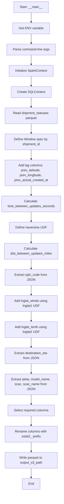
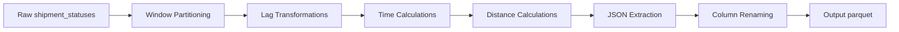
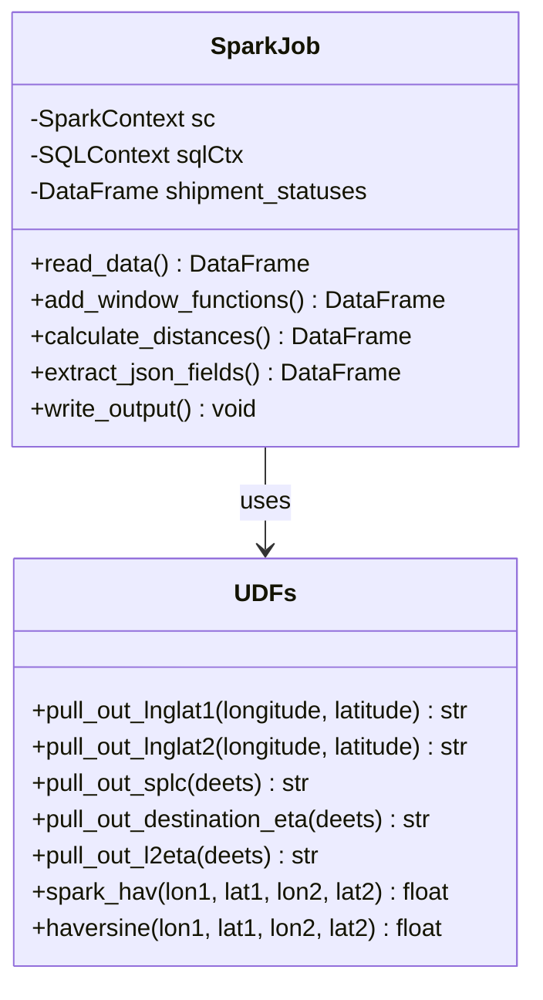
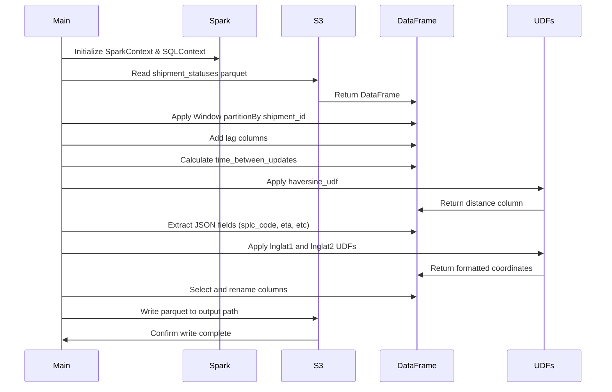

# Diagram: research/orchestrator/tasks/transforms/shipment_status_extraction_spark.py

> Auto-generated by Obscura crawlers

## Diagram 1

### SVG

<svg id="container" width="313.109375" xmlns="http://www.w3.org/2000/svg" class="flowchart" height="2406" viewBox="0 0 313.109375 2406" role="graphics-document document" aria-roledescription="flowchart-v2"><g><marker id="container_flowchart-v2-pointEnd" class="marker flowchart-v2" viewBox="0 0 10 10" refX="5" refY="5" markerUnits="userSpaceOnUse" markerWidth="8" markerHeight="8" orient="auto"><path d="M 0 0 L 10 5 L 0 10 z" class="arrowMarkerPath" style="stroke-width: 1; stroke-dasharray: 1, 0;"></path></marker><marker id="container_flowchart-v2-pointStart" class="marker flowchart-v2" viewBox="0 0 10 10" refX="4.5" refY="5" markerUnits="userSpaceOnUse" markerWidth="8" markerHeight="8" orient="auto"><path d="M 0 5 L 10 10 L 10 0 z" class="arrowMarkerPath" style="stroke-width: 1; stroke-dasharray: 1, 0;"></path></marker><marker id="container_flowchart-v2-circleEnd" class="marker flowchart-v2" viewBox="0 0 10 10" refX="11" refY="5" markerUnits="userSpaceOnUse" markerWidth="11" markerHeight="11" orient="auto"><circle cx="5" cy="5" r="5" class="arrowMarkerPath" style="stroke-width: 1; stroke-dasharray: 1, 0;"></circle></marker><marker id="container_flowchart-v2-circleStart" class="marker flowchart-v2" viewBox="0 0 10 10" refX="-1" refY="5" markerUnits="userSpaceOnUse" markerWidth="11" markerHeight="11" orient="auto"><circle cx="5" cy="5" r="5" class="arrowMarkerPath" style="stroke-width: 1; stroke-dasharray: 1, 0;"></circle></marker><marker id="container_flowchart-v2-crossEnd" class="marker cross flowchart-v2" viewBox="0 0 11 11" refX="12" refY="5.2" markerUnits="userSpaceOnUse" markerWidth="11" markerHeight="11" orient="auto"><path d="M 1,1 l 9,9 M 10,1 l -9,9" class="arrowMarkerPath" style="stroke-width: 2; stroke-dasharray: 1, 0;"></path></marker><marker id="container_flowchart-v2-crossStart" class="marker cross flowchart-v2" viewBox="0 0 11 11" refX="-1" refY="5.2" markerUnits="userSpaceOnUse" markerWidth="11" markerHeight="11" orient="auto"><path d="M 1,1 l 9,9 M 10,1 l -9,9" class="arrowMarkerPath" style="stroke-width: 2; stroke-dasharray: 1, 0;"></path></marker><g class="root"><g class="clusters"></g><g class="edgePaths"><path d="M156.555,62L156.555,66.167C156.555,70.333,156.555,78.667,156.555,86.333C156.555,94,156.555,101,156.555,104.5L156.555,108" id="L_A_B_0" class="edge-thickness-normal edge-pattern-solid edge-thickness-normal edge-pattern-solid flowchart-link" style=";" data-edge="true" data-et="edge" data-id="L_A_B_0" data-points="W3sieCI6MTU2LjU1NDY4NzUsInkiOjYyfSx7IngiOjE1Ni41NTQ2ODc1LCJ5Ijo4N30seyJ4IjoxNTYuNTU0Njg3NSwieSI6MTEyfV0=" marker-end="url(#container_flowchart-v2-pointEnd)"></path><path d="M156.555,166L156.555,170.167C156.555,174.333,156.555,182.667,156.555,190.333C156.555,198,156.555,205,156.555,208.5L156.555,212" id="L_B_C_0" class="edge-thickness-normal edge-pattern-solid edge-thickness-normal edge-pattern-solid flowchart-link" style=";" data-edge="true" data-et="edge" data-id="L_B_C_0" data-points="W3sieCI6MTU2LjU1NDY4NzUsInkiOjE2Nn0seyJ4IjoxNTYuNTU0Njg3NSwieSI6MTkxfSx7IngiOjE1Ni41NTQ2ODc1LCJ5IjoyMTZ9XQ==" marker-end="url(#container_flowchart-v2-pointEnd)"></path><path d="M156.555,270L156.555,274.167C156.555,278.333,156.555,286.667,156.555,294.333C156.555,302,156.555,309,156.555,312.5L156.555,316" id="L_C_D_0" class="edge-thickness-normal edge-pattern-solid edge-thickness-normal edge-pattern-solid flowchart-link" style=";" data-edge="true" data-et="edge" data-id="L_C_D_0" data-points="W3sieCI6MTU2LjU1NDY4NzUsInkiOjI3MH0seyJ4IjoxNTYuNTU0Njg3NSwieSI6Mjk1fSx7IngiOjE1Ni41NTQ2ODc1LCJ5IjozMjB9XQ==" marker-end="url(#container_flowchart-v2-pointEnd)"></path><path d="M156.555,374L156.555,378.167C156.555,382.333,156.555,390.667,156.555,398.333C156.555,406,156.555,413,156.555,416.5L156.555,420" id="L_D_E_0" class="edge-thickness-normal edge-pattern-solid edge-thickness-normal edge-pattern-solid flowchart-link" style=";" data-edge="true" data-et="edge" data-id="L_D_E_0" data-points="W3sieCI6MTU2LjU1NDY4NzUsInkiOjM3NH0seyJ4IjoxNTYuNTU0Njg3NSwieSI6Mzk5fSx7IngiOjE1Ni41NTQ2ODc1LCJ5Ijo0MjR9XQ==" marker-end="url(#container_flowchart-v2-pointEnd)"></path><path d="M156.555,478L156.555,482.167C156.555,486.333,156.555,494.667,156.555,502.333C156.555,510,156.555,517,156.555,520.5L156.555,524" id="L_E_F_0" class="edge-thickness-normal edge-pattern-solid edge-thickness-normal edge-pattern-solid flowchart-link" style=";" data-edge="true" data-et="edge" data-id="L_E_F_0" data-points="W3sieCI6MTU2LjU1NDY4NzUsInkiOjQ3OH0seyJ4IjoxNTYuNTU0Njg3NSwieSI6NTAzfSx7IngiOjE1Ni41NTQ2ODc1LCJ5Ijo1Mjh9XQ==" marker-end="url(#container_flowchart-v2-pointEnd)"></path><path d="M156.555,606L156.555,610.167C156.555,614.333,156.555,622.667,156.555,630.333C156.555,638,156.555,645,156.555,648.5L156.555,652" id="L_F_G_0" class="edge-thickness-normal edge-pattern-solid edge-thickness-normal edge-pattern-solid flowchart-link" style=";" data-edge="true" data-et="edge" data-id="L_F_G_0" data-points="W3sieCI6MTU2LjU1NDY4NzUsInkiOjYwNn0seyJ4IjoxNTYuNTU0Njg3NSwieSI6NjMxfSx7IngiOjE1Ni41NTQ2ODc1LCJ5Ijo2NTZ9XQ==" marker-end="url(#container_flowchart-v2-pointEnd)"></path><path d="M156.555,734L156.555,738.167C156.555,742.333,156.555,750.667,156.555,758.333C156.555,766,156.555,773,156.555,776.5L156.555,780" id="L_G_H_0" class="edge-thickness-normal edge-pattern-solid edge-thickness-normal edge-pattern-solid flowchart-link" style=";" data-edge="true" data-et="edge" data-id="L_G_H_0" data-points="W3sieCI6MTU2LjU1NDY4NzUsInkiOjczNH0seyJ4IjoxNTYuNTU0Njg3NSwieSI6NzU5fSx7IngiOjE1Ni41NTQ2ODc1LCJ5Ijo3ODR9XQ==" marker-end="url(#container_flowchart-v2-pointEnd)"></path><path d="M156.555,910L156.555,914.167C156.555,918.333,156.555,926.667,156.555,934.333C156.555,942,156.555,949,156.555,952.5L156.555,956" id="L_H_I_0" class="edge-thickness-normal edge-pattern-solid edge-thickness-normal edge-pattern-solid flowchart-link" style=";" data-edge="true" data-et="edge" data-id="L_H_I_0" data-points="W3sieCI6MTU2LjU1NDY4NzUsInkiOjkxMH0seyJ4IjoxNTYuNTU0Njg3NSwieSI6OTM1fSx7IngiOjE1Ni41NTQ2ODc1LCJ5Ijo5NjB9XQ==" marker-end="url(#container_flowchart-v2-pointEnd)"></path><path d="M156.555,1038L156.555,1042.167C156.555,1046.333,156.555,1054.667,156.555,1062.333C156.555,1070,156.555,1077,156.555,1080.5L156.555,1084" id="L_I_J_0" class="edge-thickness-normal edge-pattern-solid edge-thickness-normal edge-pattern-solid flowchart-link" style=";" data-edge="true" data-et="edge" data-id="L_I_J_0" data-points="W3sieCI6MTU2LjU1NDY4NzUsInkiOjEwMzh9LHsieCI6MTU2LjU1NDY4NzUsInkiOjEwNjN9LHsieCI6MTU2LjU1NDY4NzUsInkiOjEwODh9XQ==" marker-end="url(#container_flowchart-v2-pointEnd)"></path><path d="M156.555,1142L156.555,1146.167C156.555,1150.333,156.555,1158.667,156.555,1166.333C156.555,1174,156.555,1181,156.555,1184.5L156.555,1188" id="L_J_K_0" class="edge-thickness-normal edge-pattern-solid edge-thickness-normal edge-pattern-solid flowchart-link" style=";" data-edge="true" data-et="edge" data-id="L_J_K_0" data-points="W3sieCI6MTU2LjU1NDY4NzUsInkiOjExNDJ9LHsieCI6MTU2LjU1NDY4NzUsInkiOjExNjd9LHsieCI6MTU2LjU1NDY4NzUsInkiOjExOTJ9XQ==" marker-end="url(#container_flowchart-v2-pointEnd)"></path><path d="M156.555,1270L156.555,1274.167C156.555,1278.333,156.555,1286.667,156.555,1294.333C156.555,1302,156.555,1309,156.555,1312.5L156.555,1316" id="L_K_L_0" class="edge-thickness-normal edge-pattern-solid edge-thickness-normal edge-pattern-solid flowchart-link" style=";" data-edge="true" data-et="edge" data-id="L_K_L_0" data-points="W3sieCI6MTU2LjU1NDY4NzUsInkiOjEyNzB9LHsieCI6MTU2LjU1NDY4NzUsInkiOjEyOTV9LHsieCI6MTU2LjU1NDY4NzUsInkiOjEzMjB9XQ==" marker-end="url(#container_flowchart-v2-pointEnd)"></path><path d="M156.555,1398L156.555,1402.167C156.555,1406.333,156.555,1414.667,156.555,1422.333C156.555,1430,156.555,1437,156.555,1440.5L156.555,1444" id="L_L_M_0" class="edge-thickness-normal edge-pattern-solid edge-thickness-normal edge-pattern-solid flowchart-link" style=";" data-edge="true" data-et="edge" data-id="L_L_M_0" data-points="W3sieCI6MTU2LjU1NDY4NzUsInkiOjEzOTh9LHsieCI6MTU2LjU1NDY4NzUsInkiOjE0MjN9LHsieCI6MTU2LjU1NDY4NzUsInkiOjE0NDh9XQ==" marker-end="url(#container_flowchart-v2-pointEnd)"></path><path d="M156.555,1526L156.555,1530.167C156.555,1534.333,156.555,1542.667,156.555,1550.333C156.555,1558,156.555,1565,156.555,1568.5L156.555,1572" id="L_M_N_0" class="edge-thickness-normal edge-pattern-solid edge-thickness-normal edge-pattern-solid flowchart-link" style=";" data-edge="true" data-et="edge" data-id="L_M_N_0" data-points="W3sieCI6MTU2LjU1NDY4NzUsInkiOjE1MjZ9LHsieCI6MTU2LjU1NDY4NzUsInkiOjE1NTF9LHsieCI6MTU2LjU1NDY4NzUsInkiOjE1NzZ9XQ==" marker-end="url(#container_flowchart-v2-pointEnd)"></path><path d="M156.555,1654L156.555,1658.167C156.555,1662.333,156.555,1670.667,156.555,1678.333C156.555,1686,156.555,1693,156.555,1696.5L156.555,1700" id="L_N_O_0" class="edge-thickness-normal edge-pattern-solid edge-thickness-normal edge-pattern-solid flowchart-link" style=";" data-edge="true" data-et="edge" data-id="L_N_O_0" data-points="W3sieCI6MTU2LjU1NDY4NzUsInkiOjE2NTR9LHsieCI6MTU2LjU1NDY4NzUsInkiOjE2Nzl9LHsieCI6MTU2LjU1NDY4NzUsInkiOjE3MDR9XQ==" marker-end="url(#container_flowchart-v2-pointEnd)"></path><path d="M156.555,1782L156.555,1786.167C156.555,1790.333,156.555,1798.667,156.555,1806.333C156.555,1814,156.555,1821,156.555,1824.5L156.555,1828" id="L_O_P_0" class="edge-thickness-normal edge-pattern-solid edge-thickness-normal edge-pattern-solid flowchart-link" style=";" data-edge="true" data-et="edge" data-id="L_O_P_0" data-points="W3sieCI6MTU2LjU1NDY4NzUsInkiOjE3ODJ9LHsieCI6MTU2LjU1NDY4NzUsInkiOjE4MDd9LHsieCI6MTU2LjU1NDY4NzUsInkiOjE4MzJ9XQ==" marker-end="url(#container_flowchart-v2-pointEnd)"></path><path d="M156.555,1934L156.555,1938.167C156.555,1942.333,156.555,1950.667,156.555,1958.333C156.555,1966,156.555,1973,156.555,1976.5L156.555,1980" id="L_P_Q_0" class="edge-thickness-normal edge-pattern-solid edge-thickness-normal edge-pattern-solid flowchart-link" style=";" data-edge="true" data-et="edge" data-id="L_P_Q_0" data-points="W3sieCI6MTU2LjU1NDY4NzUsInkiOjE5MzR9LHsieCI6MTU2LjU1NDY4NzUsInkiOjE5NTl9LHsieCI6MTU2LjU1NDY4NzUsInkiOjE5ODR9XQ==" marker-end="url(#container_flowchart-v2-pointEnd)"></path><path d="M156.555,2038L156.555,2042.167C156.555,2046.333,156.555,2054.667,156.555,2062.333C156.555,2070,156.555,2077,156.555,2080.5L156.555,2084" id="L_Q_R_0" class="edge-thickness-normal edge-pattern-solid edge-thickness-normal edge-pattern-solid flowchart-link" style=";" data-edge="true" data-et="edge" data-id="L_Q_R_0" data-points="W3sieCI6MTU2LjU1NDY4NzUsInkiOjIwMzh9LHsieCI6MTU2LjU1NDY4NzUsInkiOjIwNjN9LHsieCI6MTU2LjU1NDY4NzUsInkiOjIwODh9XQ==" marker-end="url(#container_flowchart-v2-pointEnd)"></path><path d="M156.555,2166L156.555,2170.167C156.555,2174.333,156.555,2182.667,156.555,2190.333C156.555,2198,156.555,2205,156.555,2208.5L156.555,2212" id="L_R_S_0" class="edge-thickness-normal edge-pattern-solid edge-thickness-normal edge-pattern-solid flowchart-link" style=";" data-edge="true" data-et="edge" data-id="L_R_S_0" data-points="W3sieCI6MTU2LjU1NDY4NzUsInkiOjIxNjZ9LHsieCI6MTU2LjU1NDY4NzUsInkiOjIxOTF9LHsieCI6MTU2LjU1NDY4NzUsInkiOjIyMTZ9XQ==" marker-end="url(#container_flowchart-v2-pointEnd)"></path><path d="M156.555,2294L156.555,2298.167C156.555,2302.333,156.555,2310.667,156.555,2318.333C156.555,2326,156.555,2333,156.555,2336.5L156.555,2340" id="L_S_T_0" class="edge-thickness-normal edge-pattern-solid edge-thickness-normal edge-pattern-solid flowchart-link" style=";" data-edge="true" data-et="edge" data-id="L_S_T_0" data-points="W3sieCI6MTU2LjU1NDY4NzUsInkiOjIyOTR9LHsieCI6MTU2LjU1NDY4NzUsInkiOjIzMTl9LHsieCI6MTU2LjU1NDY4NzUsInkiOjIzNDR9XQ==" marker-end="url(#container_flowchart-v2-pointEnd)"></path></g><g class="edgeLabels"><g class="edgeLabel"><g class="label" data-id="L_A_B_0" transform="translate(0, 0)"><foreignObject width="0" height="0">

</foreignObject></g></g><g class="edgeLabel"><g class="label" data-id="L_B_C_0" transform="translate(0, 0)"><foreignObject width="0" height="0">

</foreignObject></g></g><g class="edgeLabel"><g class="label" data-id="L_C_D_0" transform="translate(0, 0)"><foreignObject width="0" height="0">

</foreignObject></g></g><g class="edgeLabel"><g class="label" data-id="L_D_E_0" transform="translate(0, 0)"><foreignObject width="0" height="0">

</foreignObject></g></g><g class="edgeLabel"><g class="label" data-id="L_E_F_0" transform="translate(0, 0)"><foreignObject width="0" height="0">

</foreignObject></g></g><g class="edgeLabel"><g class="label" data-id="L_F_G_0" transform="translate(0, 0)"><foreignObject width="0" height="0">

</foreignObject></g></g><g class="edgeLabel"><g class="label" data-id="L_G_H_0" transform="translate(0, 0)"><foreignObject width="0" height="0">

</foreignObject></g></g><g class="edgeLabel"><g class="label" data-id="L_H_I_0" transform="translate(0, 0)"><foreignObject width="0" height="0">

</foreignObject></g></g><g class="edgeLabel"><g class="label" data-id="L_I_J_0" transform="translate(0, 0)"><foreignObject width="0" height="0">

</foreignObject></g></g><g class="edgeLabel"><g class="label" data-id="L_J_K_0" transform="translate(0, 0)"><foreignObject width="0" height="0">

</foreignObject></g></g><g class="edgeLabel"><g class="label" data-id="L_K_L_0" transform="translate(0, 0)"><foreignObject width="0" height="0">

</foreignObject></g></g><g class="edgeLabel"><g class="label" data-id="L_L_M_0" transform="translate(0, 0)"><foreignObject width="0" height="0">

</foreignObject></g></g><g class="edgeLabel"><g class="label" data-id="L_M_N_0" transform="translate(0, 0)"><foreignObject width="0" height="0">

</foreignObject></g></g><g class="edgeLabel"><g class="label" data-id="L_N_O_0" transform="translate(0, 0)"><foreignObject width="0" height="0">

</foreignObject></g></g><g class="edgeLabel"><g class="label" data-id="L_O_P_0" transform="translate(0, 0)"><foreignObject width="0" height="0">

</foreignObject></g></g><g class="edgeLabel"><g class="label" data-id="L_P_Q_0" transform="translate(0, 0)"><foreignObject width="0" height="0">

</foreignObject></g></g><g class="edgeLabel"><g class="label" data-id="L_Q_R_0" transform="translate(0, 0)"><foreignObject width="0" height="0">

</foreignObject></g></g><g class="edgeLabel"><g class="label" data-id="L_R_S_0" transform="translate(0, 0)"><foreignObject width="0" height="0">

</foreignObject></g></g><g class="edgeLabel"><g class="label" data-id="L_S_T_0" transform="translate(0, 0)"><foreignObject width="0" height="0">

</foreignObject></g></g></g><g class="nodes"><g class="node default" id="flowchart-A-0" transform="translate(156.5546875, 35)"><rect class="basic label-container" style="" x="-69.6171875" y="-27" width="139.234375" height="54"></rect><g class="label" style="" transform="translate(-39.6171875, -12)"><rect></rect><foreignObject width="79.234375" height="24">

Start: <strong>main</strong>

</foreignObject></g></g><g class="node default" id="flowchart-B-1" transform="translate(156.5546875, 139)"><rect class="basic label-container" style="" x="-90.0078125" y="-27" width="180.015625" height="54"></rect><g class="label" style="" transform="translate(-60.0078125, -12)"><rect></rect><foreignObject width="120.015625" height="24">

Get ENV variable

</foreignObject></g></g><g class="node default" id="flowchart-C-3" transform="translate(156.5546875, 243)"><rect class="basic label-container" style="" x="-121.7734375" y="-27" width="243.546875" height="54"></rect><g class="label" style="" transform="translate(-91.7734375, -12)"><rect></rect><foreignObject width="183.546875" height="24">

Parse command-line args

</foreignObject></g></g><g class="node default" id="flowchart-D-5" transform="translate(156.5546875, 347)"><rect class="basic label-container" style="" x="-111.3125" y="-27" width="222.625" height="54"></rect><g class="label" style="" transform="translate(-81.3125, -12)"><rect></rect><foreignObject width="162.625" height="24">

Initialize SparkContext

</foreignObject></g></g><g class="node default" id="flowchart-E-7" transform="translate(156.5546875, 451)"><rect class="basic label-container" style="" x="-96.109375" y="-27" width="192.21875" height="54"></rect><g class="label" style="" transform="translate(-66.109375, -12)"><rect></rect><foreignObject width="132.21875" height="24">

Create SQLContext

</foreignObject></g></g><g class="node default" id="flowchart-F-9" transform="translate(156.5546875, 567)"><rect class="basic label-container" style="" x="-130" y="-39" width="260" height="78"></rect><g class="label" style="" transform="translate(-100, -24)"><rect></rect><foreignObject width="200" height="48">

Read shipment_statuses parquet

</foreignObject></g></g><g class="node default" id="flowchart-G-11" transform="translate(156.5546875, 695)"><rect class="basic label-container" style="" x="-130" y="-39" width="260" height="78"></rect><g class="label" style="" transform="translate(-100, -24)"><rect></rect><foreignObject width="200" height="48">

Define Window spec by shipment_id

</foreignObject></g></g><g class="node default" id="flowchart-H-13" transform="translate(156.5546875, 847)"><rect class="basic label-container" style="" x="-130" y="-63" width="260" height="126"></rect><g class="label" style="" transform="translate(-100, -48)"><rect></rect><foreignObject width="200" height="96">

Add lag columns: prev_latitude, prev_longitude, prev_actual_created_at

</foreignObject></g></g><g class="node default" id="flowchart-I-15" transform="translate(156.5546875, 999)"><rect class="basic label-container" style="" x="-148.5546875" y="-39" width="297.109375" height="78"></rect><g class="label" style="" transform="translate(-118.5546875, -24)"><rect></rect><foreignObject width="237.109375" height="48">

Calculate time_between_updates_seconds

</foreignObject></g></g><g class="node default" id="flowchart-J-17" transform="translate(156.5546875, 1115)"><rect class="basic label-container" style="" x="-106.96875" y="-27" width="213.9375" height="54"></rect><g class="label" style="" transform="translate(-76.96875, -12)"><rect></rect><foreignObject width="153.9375" height="24">

Define haversine UDF

</foreignObject></g></g><g class="node default" id="flowchart-K-19" transform="translate(156.5546875, 1231)"><rect class="basic label-container" style="" x="-135.890625" y="-39" width="271.78125" height="78"></rect><g class="label" style="" transform="translate(-105.890625, -24)"><rect></rect><foreignObject width="211.78125" height="48">

Calculate dist_between_updates_miles

</foreignObject></g></g><g class="node default" id="flowchart-L-21" transform="translate(156.5546875, 1359)"><rect class="basic label-container" style="" x="-130" y="-39" width="260" height="78"></rect><g class="label" style="" transform="translate(-100, -24)"><rect></rect><foreignObject width="200" height="48">

Extract splc_code from JSON

</foreignObject></g></g><g class="node default" id="flowchart-M-23" transform="translate(156.5546875, 1487)"><rect class="basic label-container" style="" x="-130" y="-39" width="260" height="78"></rect><g class="label" style="" transform="translate(-100, -24)"><rect></rect><foreignObject width="200" height="48">

Add lnglat_whole using lnglat1 UDF

</foreignObject></g></g><g class="node default" id="flowchart-N-25" transform="translate(156.5546875, 1615)"><rect class="basic label-container" style="" x="-130" y="-39" width="260" height="78"></rect><g class="label" style="" transform="translate(-100, -24)"><rect></rect><foreignObject width="200" height="48">

Add lnglat_tenth using lnglat2 UDF

</foreignObject></g></g><g class="node default" id="flowchart-O-27" transform="translate(156.5546875, 1743)"><rect class="basic label-container" style="" x="-130" y="-39" width="260" height="78"></rect><g class="label" style="" transform="translate(-100, -24)"><rect></rect><foreignObject width="200" height="48">

Extract destination_eta from JSON

</foreignObject></g></g><g class="node default" id="flowchart-P-29" transform="translate(156.5546875, 1883)"><rect class="basic label-container" style="" x="-130" y="-51" width="260" height="102"></rect><g class="label" style="" transform="translate(-100, -36)"><rect></rect><foreignObject width="200" height="72">

Extract aieta, model_name, scac, scac_name from JSON

</foreignObject></g></g><g class="node default" id="flowchart-Q-31" transform="translate(156.5546875, 2011)"><rect class="basic label-container" style="" x="-117.8515625" y="-27" width="235.703125" height="54"></rect><g class="label" style="" transform="translate(-87.8515625, -12)"><rect></rect><foreignObject width="175.703125" height="24">

Select required columns

</foreignObject></g></g><g class="node default" id="flowchart-R-33" transform="translate(156.5546875, 2127)"><rect class="basic label-container" style="" x="-130" y="-39" width="260" height="78"></rect><g class="label" style="" transform="translate(-100, -24)"><rect></rect><foreignObject width="200" height="48">

Rename columns with sstat2_ prefix

</foreignObject></g></g><g class="node default" id="flowchart-S-35" transform="translate(156.5546875, 2255)"><rect class="basic label-container" style="" x="-130" y="-39" width="260" height="78"></rect><g class="label" style="" transform="translate(-100, -24)"><rect></rect><foreignObject width="200" height="48">

Write parquet to output_s3_path

</foreignObject></g></g><g class="node default" id="flowchart-T-37" transform="translate(156.5546875, 2371)"><rect class="basic label-container" style="" x="-43.6796875" y="-27" width="87.359375" height="54"></rect><g class="label" style="" transform="translate(-13.6796875, -12)"><rect></rect><foreignObject width="27.359375" height="24">

End

</foreignObject></g></g></g></g></g></svg>

## Diagram 2

### SVG

<svg id="container" width="1950.671875" xmlns="http://www.w3.org/2000/svg" class="flowchart" height="70" viewBox="0 0 1950.671875 70" role="graphics-document document" aria-roledescription="flowchart-v2"><g><marker id="container_flowchart-v2-pointEnd" class="marker flowchart-v2" viewBox="0 0 10 10" refX="5" refY="5" markerUnits="userSpaceOnUse" markerWidth="8" markerHeight="8" orient="auto"><path d="M 0 0 L 10 5 L 0 10 z" class="arrowMarkerPath" style="stroke-width: 1; stroke-dasharray: 1, 0;"></path></marker><marker id="container_flowchart-v2-pointStart" class="marker flowchart-v2" viewBox="0 0 10 10" refX="4.5" refY="5" markerUnits="userSpaceOnUse" markerWidth="8" markerHeight="8" orient="auto"><path d="M 0 5 L 10 10 L 10 0 z" class="arrowMarkerPath" style="stroke-width: 1; stroke-dasharray: 1, 0;"></path></marker><marker id="container_flowchart-v2-circleEnd" class="marker flowchart-v2" viewBox="0 0 10 10" refX="11" refY="5" markerUnits="userSpaceOnUse" markerWidth="11" markerHeight="11" orient="auto"><circle cx="5" cy="5" r="5" class="arrowMarkerPath" style="stroke-width: 1; stroke-dasharray: 1, 0;"></circle></marker><marker id="container_flowchart-v2-circleStart" class="marker flowchart-v2" viewBox="0 0 10 10" refX="-1" refY="5" markerUnits="userSpaceOnUse" markerWidth="11" markerHeight="11" orient="auto"><circle cx="5" cy="5" r="5" class="arrowMarkerPath" style="stroke-width: 1; stroke-dasharray: 1, 0;"></circle></marker><marker id="container_flowchart-v2-crossEnd" class="marker cross flowchart-v2" viewBox="0 0 11 11" refX="12" refY="5.2" markerUnits="userSpaceOnUse" markerWidth="11" markerHeight="11" orient="auto"><path d="M 1,1 l 9,9 M 10,1 l -9,9" class="arrowMarkerPath" style="stroke-width: 2; stroke-dasharray: 1, 0;"></path></marker><marker id="container_flowchart-v2-crossStart" class="marker cross flowchart-v2" viewBox="0 0 11 11" refX="-1" refY="5.2" markerUnits="userSpaceOnUse" markerWidth="11" markerHeight="11" orient="auto"><path d="M 1,1 l 9,9 M 10,1 l -9,9" class="arrowMarkerPath" style="stroke-width: 2; stroke-dasharray: 1, 0;"></path></marker><g class="root"><g class="clusters"></g><g class="edgePaths"><path d="M239.219,35L243.385,35C247.552,35,255.885,35,263.552,35C271.219,35,278.219,35,281.719,35L285.219,35" id="L_A_B_0" class="edge-thickness-normal edge-pattern-solid edge-thickness-normal edge-pattern-solid flowchart-link" style=";" data-edge="true" data-et="edge" data-id="L_A_B_0" data-points="W3sieCI6MjM5LjIxODc1LCJ5IjozNX0seyJ4IjoyNjQuMjE4NzUsInkiOjM1fSx7IngiOjI4OS4yMTg3NSwieSI6MzV9XQ==" marker-end="url(#container_flowchart-v2-pointEnd)"></path><path d="M495.75,35L499.917,35C504.083,35,512.417,35,520.083,35C527.75,35,534.75,35,538.25,35L541.75,35" id="L_B_C_0" class="edge-thickness-normal edge-pattern-solid edge-thickness-normal edge-pattern-solid flowchart-link" style=";" data-edge="true" data-et="edge" data-id="L_B_C_0" data-points="W3sieCI6NDk1Ljc1LCJ5IjozNX0seyJ4Ijo1MjAuNzUsInkiOjM1fSx7IngiOjU0NS43NSwieSI6MzV9XQ==" marker-end="url(#container_flowchart-v2-pointEnd)"></path><path d="M753.25,35L757.417,35C761.583,35,769.917,35,777.583,35C785.25,35,792.25,35,795.75,35L799.25,35" id="L_C_D_0" class="edge-thickness-normal edge-pattern-solid edge-thickness-normal edge-pattern-solid flowchart-link" style=";" data-edge="true" data-et="edge" data-id="L_C_D_0" data-points="W3sieCI6NzUzLjI1LCJ5IjozNX0seyJ4Ijo3NzguMjUsInkiOjM1fSx7IngiOjgwMy4yNSwieSI6MzV9XQ==" marker-end="url(#container_flowchart-v2-pointEnd)"></path><path d="M991.266,35L995.432,35C999.599,35,1007.932,35,1015.599,35C1023.266,35,1030.266,35,1033.766,35L1037.266,35" id="L_D_E_0" class="edge-thickness-normal edge-pattern-solid edge-thickness-normal edge-pattern-solid flowchart-link" style=";" data-edge="true" data-et="edge" data-id="L_D_E_0" data-points="W3sieCI6OTkxLjI2NTYyNSwieSI6MzV9LHsieCI6MTAxNi4yNjU2MjUsInkiOjM1fSx7IngiOjEwNDEuMjY1NjI1LCJ5IjozNX1d" marker-end="url(#container_flowchart-v2-pointEnd)"></path><path d="M1256.141,35L1260.307,35C1264.474,35,1272.807,35,1280.474,35C1288.141,35,1295.141,35,1298.641,35L1302.141,35" id="L_E_F_0" class="edge-thickness-normal edge-pattern-solid edge-thickness-normal edge-pattern-solid flowchart-link" style=";" data-edge="true" data-et="edge" data-id="L_E_F_0" data-points="W3sieCI6MTI1Ni4xNDA2MjUsInkiOjM1fSx7IngiOjEyODEuMTQwNjI1LCJ5IjozNX0seyJ4IjoxMzA2LjE0MDYyNSwieSI6MzV9XQ==" marker-end="url(#container_flowchart-v2-pointEnd)"></path><path d="M1479.063,35L1483.229,35C1487.396,35,1495.729,35,1503.396,35C1511.063,35,1518.063,35,1521.563,35L1525.063,35" id="L_F_G_0" class="edge-thickness-normal edge-pattern-solid edge-thickness-normal edge-pattern-solid flowchart-link" style=";" data-edge="true" data-et="edge" data-id="L_F_G_0" data-points="W3sieCI6MTQ3OS4wNjI1LCJ5IjozNX0seyJ4IjoxNTA0LjA2MjUsInkiOjM1fSx7IngiOjE1MjkuMDYyNSwieSI6MzV9XQ==" marker-end="url(#container_flowchart-v2-pointEnd)"></path><path d="M1720.547,35L1724.714,35C1728.88,35,1737.214,35,1744.88,35C1752.547,35,1759.547,35,1763.047,35L1766.547,35" id="L_G_H_0" class="edge-thickness-normal edge-pattern-solid edge-thickness-normal edge-pattern-solid flowchart-link" style=";" data-edge="true" data-et="edge" data-id="L_G_H_0" data-points="W3sieCI6MTcyMC41NDY4NzUsInkiOjM1fSx7IngiOjE3NDUuNTQ2ODc1LCJ5IjozNX0seyJ4IjoxNzcwLjU0Njg3NSwieSI6MzV9XQ==" marker-end="url(#container_flowchart-v2-pointEnd)"></path></g><g class="edgeLabels"><g class="edgeLabel"><g class="label" data-id="L_A_B_0" transform="translate(0, 0)"><foreignObject width="0" height="0">

</foreignObject></g></g><g class="edgeLabel"><g class="label" data-id="L_B_C_0" transform="translate(0, 0)"><foreignObject width="0" height="0">

</foreignObject></g></g><g class="edgeLabel"><g class="label" data-id="L_C_D_0" transform="translate(0, 0)"><foreignObject width="0" height="0">

</foreignObject></g></g><g class="edgeLabel"><g class="label" data-id="L_D_E_0" transform="translate(0, 0)"><foreignObject width="0" height="0">

</foreignObject></g></g><g class="edgeLabel"><g class="label" data-id="L_E_F_0" transform="translate(0, 0)"><foreignObject width="0" height="0">

</foreignObject></g></g><g class="edgeLabel"><g class="label" data-id="L_F_G_0" transform="translate(0, 0)"><foreignObject width="0" height="0">

</foreignObject></g></g><g class="edgeLabel"><g class="label" data-id="L_G_H_0" transform="translate(0, 0)"><foreignObject width="0" height="0">

</foreignObject></g></g></g><g class="nodes"><g class="node default" id="flowchart-A-0" transform="translate(123.609375, 35)"><rect class="basic label-container" style="" x="-115.609375" y="-27" width="231.21875" height="54"></rect><g class="label" style="" transform="translate(-85.609375, -12)"><rect></rect><foreignObject width="171.21875" height="24">

Raw shipment_statuses

</foreignObject></g></g><g class="node default" id="flowchart-B-1" transform="translate(392.484375, 35)"><rect class="basic label-container" style="" x="-103.265625" y="-27" width="206.53125" height="54"></rect><g class="label" style="" transform="translate(-73.265625, -12)"><rect></rect><foreignObject width="146.53125" height="24">

Window Partitioning

</foreignObject></g></g><g class="node default" id="flowchart-C-3" transform="translate(649.5, 35)"><rect class="basic label-container" style="" x="-103.75" y="-27" width="207.5" height="54"></rect><g class="label" style="" transform="translate(-73.75, -12)"><rect></rect><foreignObject width="147.5" height="24">

Lag Transformations

</foreignObject></g></g><g class="node default" id="flowchart-D-5" transform="translate(897.2578125, 35)"><rect class="basic label-container" style="" x="-94.0078125" y="-27" width="188.015625" height="54"></rect><g class="label" style="" transform="translate(-64.0078125, -12)"><rect></rect><foreignObject width="128.015625" height="24">

Time Calculations

</foreignObject></g></g><g class="node default" id="flowchart-E-7" transform="translate(1148.703125, 35)"><rect class="basic label-container" style="" x="-107.4375" y="-27" width="214.875" height="54"></rect><g class="label" style="" transform="translate(-77.4375, -12)"><rect></rect><foreignObject width="154.875" height="24">

Distance Calculations

</foreignObject></g></g><g class="node default" id="flowchart-F-9" transform="translate(1392.6015625, 35)"><rect class="basic label-container" style="" x="-86.4609375" y="-27" width="172.921875" height="54"></rect><g class="label" style="" transform="translate(-56.4609375, -12)"><rect></rect><foreignObject width="112.921875" height="24">

JSON Extraction

</foreignObject></g></g><g class="node default" id="flowchart-G-11" transform="translate(1624.8046875, 35)"><rect class="basic label-container" style="" x="-95.7421875" y="-27" width="191.484375" height="54"></rect><g class="label" style="" transform="translate(-65.7421875, -12)"><rect></rect><foreignObject width="131.484375" height="24">

Column Renaming

</foreignObject></g></g><g class="node default" id="flowchart-H-13" transform="translate(1856.609375, 35)"><rect class="basic label-container" style="" x="-86.0625" y="-27" width="172.125" height="54"></rect><g class="label" style="" transform="translate(-56.0625, -12)"><rect></rect><foreignObject width="112.125" height="24">

Output parquet

</foreignObject></g></g></g></g></g></svg>

## Diagram 3

### SVG

<svg id="container" width="360.5390625" xmlns="http://www.w3.org/2000/svg" class="classDiagram" height="648" viewBox="0 0 360.5390625 648" role="graphics-document document" aria-roledescription="class"><g><defs><marker id="container_class-aggregationStart" class="marker aggregation class" refX="18" refY="7" markerWidth="190" markerHeight="240" orient="auto"><path d="M 18,7 L9,13 L1,7 L9,1 Z"></path></marker></defs><defs><marker id="container_class-aggregationEnd" class="marker aggregation class" refX="1" refY="7" markerWidth="20" markerHeight="28" orient="auto"><path d="M 18,7 L9,13 L1,7 L9,1 Z"></path></marker></defs><defs><marker id="container_class-extensionStart" class="marker extension class" refX="18" refY="7" markerWidth="190" markerHeight="240" orient="auto"><path d="M 1,7 L18,13 V 1 Z"></path></marker></defs><defs><marker id="container_class-extensionEnd" class="marker extension class" refX="1" refY="7" markerWidth="20" markerHeight="28" orient="auto"><path d="M 1,1 V 13 L18,7 Z"></path></marker></defs><defs><marker id="container_class-compositionStart" class="marker composition class" refX="18" refY="7" markerWidth="190" markerHeight="240" orient="auto"><path d="M 18,7 L9,13 L1,7 L9,1 Z"></path></marker></defs><defs><marker id="container_class-compositionEnd" class="marker composition class" refX="1" refY="7" markerWidth="20" markerHeight="28" orient="auto"><path d="M 18,7 L9,13 L1,7 L9,1 Z"></path></marker></defs><defs><marker id="container_class-dependencyStart" class="marker dependency class" refX="6" refY="7" markerWidth="190" markerHeight="240" orient="auto"><path d="M 5,7 L9,13 L1,7 L9,1 Z"></path></marker></defs><defs><marker id="container_class-dependencyEnd" class="marker dependency class" refX="13" refY="7" markerWidth="20" markerHeight="28" orient="auto"><path d="M 18,7 L9,13 L14,7 L9,1 Z"></path></marker></defs><defs><marker id="container_class-lollipopStart" class="marker lollipop class" refX="13" refY="7" markerWidth="190" markerHeight="240" orient="auto"><circle stroke="black" fill="transparent" cx="7" cy="7" r="6"></circle></marker></defs><defs><marker id="container_class-lollipopEnd" class="marker lollipop class" refX="1" refY="7" markerWidth="190" markerHeight="240" orient="auto"><circle stroke="black" fill="transparent" cx="7" cy="7" r="6"></circle></marker></defs><g class="root"><g class="clusters"></g><g class="edgePaths"><path d="M180.27,296L180.27,302.167C180.27,308.333,180.27,320.667,180.27,332C180.27,343.333,180.27,353.667,180.27,358.833L180.27,364" id="id_SparkJob_UDFs_1" class="edge-thickness-normal edge-pattern-solid relation" style=";;;" data-edge="true" data-et="edge" data-id="id_SparkJob_UDFs_1" data-points="W3sieCI6MTgwLjI2OTUzMTI1LCJ5IjoyOTZ9LHsieCI6MTgwLjI2OTUzMTI1LCJ5IjozMzN9LHsieCI6MTgwLjI2OTUzMTI1LCJ5IjozNzB9XQ==" marker-end="url(#container_class-dependencyEnd)"></path></g><g class="edgeLabels"><g class="edgeLabel" transform="translate(180.26953125, 333)"><g class="label" data-id="id_SparkJob_UDFs_1" transform="translate(-16.4921875, -12)"><foreignObject width="32.984375" height="24">

uses

</foreignObject></g></g></g><g class="nodes"><g class="node default" id="classId-UDFs-0" transform="translate(180.26953125, 505)"><g class="basic label-container"><path d="M-172.26953125 -135 L172.26953125 -135 L172.26953125 135 L-172.26953125 135" stroke="none" stroke-width="0" fill="#ECECFF" style=""></path><path d="M-172.26953125 -135 C-87.44313544715688 -135, -2.6167396443137534 -135, 172.26953125 -135 M-172.26953125 -135 C-92.71981789933639 -135, -13.170104548672782 -135, 172.26953125 -135 M172.26953125 -135 C172.26953125 -54.35026370984586, 172.26953125 26.299472580308276, 172.26953125 135 M172.26953125 -135 C172.26953125 -34.30413470008243, 172.26953125 66.39173059983514, 172.26953125 135 M172.26953125 135 C56.807307086699296 135, -58.65491707660141 135, -172.26953125 135 M172.26953125 135 C82.73515044536356 135, -6.799230359272883 135, -172.26953125 135 M-172.26953125 135 C-172.26953125 62.51689367102426, -172.26953125 -9.966212657951473, -172.26953125 -135 M-172.26953125 135 C-172.26953125 40.200901539433005, -172.26953125 -54.59819692113399, -172.26953125 -135" stroke="#9370DB" stroke-width="1.3" fill="none" stroke-dasharray="0 0" style=""></path></g><g class="annotation-group text" transform="translate(0, -111)"></g><g class="label-group text" transform="translate(-17.8203125, -111)"><g class="label" style="font-weight: bolder" transform="translate(0,-12)"><foreignObject width="35.640625" height="24">

UDFs

</foreignObject></g></g><g class="members-group text" transform="translate(-160.26953125, -63)"></g><g class="methods-group text" transform="translate(-160.26953125, -33)"><g class="label" style="" transform="translate(0,-12)"><foreignObject width="301.40625" height="24">

+pull_out_lnglat1(longitude, latitude) : str

</foreignObject></g><g class="label" style="" transform="translate(0,12)"><foreignObject width="302.71875" height="24">

+pull_out_lnglat2(longitude, latitude) : str

</foreignObject></g><g class="label" style="" transform="translate(0,36)"><foreignObject width="188.53125" height="24">

+pull_out_splc(deets) : str

</foreignObject></g><g class="label" style="" transform="translate(0,60)"><foreignObject width="273.203125" height="24">

+pull_out_destination_eta(deets) : str

</foreignObject></g><g class="label" style="" transform="translate(0,84)"><foreignObject width="194.515625" height="24">

+pull_out_l2eta(deets) : str

</foreignObject></g><g class="label" style="" transform="translate(0,108)"><foreignObject width="275.625" height="24">

+spark_hav(lon1, lat1, lon2, lat2) : float

</foreignObject></g><g class="label" style="" transform="translate(0,132)"><foreignObject width="272.09375" height="24">

+haversine(lon1, lat1, lon2, lat2) : float

</foreignObject></g></g><g class="divider" style=""><path d="M-172.26953125 -87 C-84.90412588901543 -87, 2.461279471969135 -87, 172.26953125 -87 M-172.26953125 -87 C-74.47245529590998 -87, 23.324620658180038 -87, 172.26953125 -87" stroke="#9370DB" stroke-width="1.3" fill="none" stroke-dasharray="0 0" style=""></path></g><g class="divider" style=""><path d="M-172.26953125 -63 C-81.16226662089115 -63, 9.94499800821771 -63, 172.26953125 -63 M-172.26953125 -63 C-63.64540231952776 -63, 44.97872661094448 -63, 172.26953125 -63" stroke="#9370DB" stroke-width="1.3" fill="none" stroke-dasharray="0 0" style=""></path></g></g><g class="node default" id="classId-SparkJob-1" transform="translate(180.26953125, 152)"><g class="basic label-container"><path d="M-166.203125 -144 L166.203125 -144 L166.203125 144 L-166.203125 144" stroke="none" stroke-width="0" fill="#ECECFF" style=""></path><path d="M-166.203125 -144 C-88.46425010478744 -144, -10.725375209574878 -144, 166.203125 -144 M-166.203125 -144 C-53.138541882347525 -144, 59.92604123530495 -144, 166.203125 -144 M166.203125 -144 C166.203125 -59.21119845967887, 166.203125 25.577603080642263, 166.203125 144 M166.203125 -144 C166.203125 -82.1555742683178, 166.203125 -20.311148536635613, 166.203125 144 M166.203125 144 C43.753761892260414 144, -78.69560121547917 144, -166.203125 144 M166.203125 144 C94.85921711091318 144, 23.515309221826357 144, -166.203125 144 M-166.203125 144 C-166.203125 49.38087386566403, -166.203125 -45.23825226867194, -166.203125 -144 M-166.203125 144 C-166.203125 34.243351885386915, -166.203125 -75.51329622922617, -166.203125 -144" stroke="#9370DB" stroke-width="1.3" fill="none" stroke-dasharray="0 0" style=""></path></g><g class="annotation-group text" transform="translate(0, -120)"></g><g class="label-group text" transform="translate(-33.265625, -120)"><g class="label" style="font-weight: bolder" transform="translate(0,-12)"><foreignObject width="66.53125" height="24">

SparkJob

</foreignObject></g></g><g class="members-group text" transform="translate(-154.203125, -72)"><g class="label" style="" transform="translate(0,-12)"><foreignObject width="121.3125" height="24">

-SparkContext sc

</foreignObject></g><g class="label" style="" transform="translate(0,12)"><foreignObject width="135.828125" height="24">

-SQLContext sqlCtx

</foreignObject></g><g class="label" style="" transform="translate(0,36)"><foreignObject width="225.3125" height="24">

-DataFrame shipment_statuses

</foreignObject></g></g><g class="methods-group text" transform="translate(-154.203125, 24)"><g class="label" style="" transform="translate(0,-12)"><foreignObject width="181.109375" height="24">

+read_data() : DataFrame

</foreignObject></g><g class="label" style="" transform="translate(0,12)"><foreignObject width="275.140625" height="24">

+add_window_functions() : DataFrame

</foreignObject></g><g class="label" style="" transform="translate(0,36)"><foreignObject width="249.453125" height="24">

+calculate_distances() : DataFrame

</foreignObject></g><g class="label" style="" transform="translate(0,60)"><foreignObject width="244.9375" height="24">

+extract_json_fields() : DataFrame

</foreignObject></g><g class="label" style="" transform="translate(0,84)"><foreignObject width="155.03125" height="24">

+write_output() : void

</foreignObject></g></g><g class="divider" style=""><path d="M-166.203125 -96 C-77.24572646233267 -96, 11.711672075334661 -96, 166.203125 -96 M-166.203125 -96 C-83.00720967871715 -96, 0.18870564256570788 -96, 166.203125 -96" stroke="#9370DB" stroke-width="1.3" fill="none" stroke-dasharray="0 0" style=""></path></g><g class="divider" style=""><path d="M-166.203125 0 C-36.138599369807025 0, 93.92592626038595 0, 166.203125 0 M-166.203125 0 C-86.301953852588 0, -6.400782705175999 0, 166.203125 0" stroke="#9370DB" stroke-width="1.3" fill="none" stroke-dasharray="0 0" style=""></path></g></g></g></g></g></svg>

## Diagram 4

### SVG

<svg id="container" width="1271" xmlns="http://www.w3.org/2000/svg" height="843" viewBox="-50 -10 1271 843" role="graphics-document document" aria-roledescription="sequence"><g><rect x="1021" y="757" fill="#eaeaea" stroke="#666" width="150" height="65" name="UDFs" rx="3" ry="3" class="actor actor-bottom"></rect><text x="1096" y="789.5" dominant-baseline="central" alignment-baseline="central" class="actor actor-box" style="text-anchor: middle; font-size: 16px; font-weight: 400;"><tspan x="1096" dy="0">UDFs</tspan></text></g><g><rect x="735" y="757" fill="#eaeaea" stroke="#666" width="150" height="65" name="DataFrame" rx="3" ry="3" class="actor actor-bottom"></rect><text x="810" y="789.5" dominant-baseline="central" alignment-baseline="central" class="actor actor-box" style="text-anchor: middle; font-size: 16px; font-weight: 400;"><tspan x="810" dy="0">DataFrame</tspan></text></g><g><rect x="535" y="757" fill="#eaeaea" stroke="#666" width="150" height="65" name="S3" rx="3" ry="3" class="actor actor-bottom"></rect><text x="610" y="789.5" dominant-baseline="central" alignment-baseline="central" class="actor actor-box" style="text-anchor: middle; font-size: 16px; font-weight: 400;"><tspan x="610" dy="0">S3</tspan></text></g><g><rect x="335" y="757" fill="#eaeaea" stroke="#666" width="150" height="65" name="Spark" rx="3" ry="3" class="actor actor-bottom"></rect><text x="410" y="789.5" dominant-baseline="central" alignment-baseline="central" class="actor actor-box" style="text-anchor: middle; font-size: 16px; font-weight: 400;"><tspan x="410" dy="0">Spark</tspan></text></g><g><rect x="0" y="757" fill="#eaeaea" stroke="#666" width="150" height="65" name="Main" rx="3" ry="3" class="actor actor-bottom"></rect><text x="75" y="789.5" dominant-baseline="central" alignment-baseline="central" class="actor actor-box" style="text-anchor: middle; font-size: 16px; font-weight: 400;"><tspan x="75" dy="0">Main</tspan></text></g><g><line id="actor4" x1="1096" y1="65" x2="1096" y2="757" class="actor-line 200" stroke-width="0.5px" stroke="#999" name="UDFs"></line><g id="root-4"><rect x="1021" y="0" fill="#eaeaea" stroke="#666" width="150" height="65" name="UDFs" rx="3" ry="3" class="actor actor-top"></rect><text x="1096" y="32.5" dominant-baseline="central" alignment-baseline="central" class="actor actor-box" style="text-anchor: middle; font-size: 16px; font-weight: 400;"><tspan x="1096" dy="0">UDFs</tspan></text></g></g><g><line id="actor3" x1="810" y1="65" x2="810" y2="757" class="actor-line 200" stroke-width="0.5px" stroke="#999" name="DataFrame"></line><g id="root-3"><rect x="735" y="0" fill="#eaeaea" stroke="#666" width="150" height="65" name="DataFrame" rx="3" ry="3" class="actor actor-top"></rect><text x="810" y="32.5" dominant-baseline="central" alignment-baseline="central" class="actor actor-box" style="text-anchor: middle; font-size: 16px; font-weight: 400;"><tspan x="810" dy="0">DataFrame</tspan></text></g></g><g><line id="actor2" x1="610" y1="65" x2="610" y2="757" class="actor-line 200" stroke-width="0.5px" stroke="#999" name="S3"></line><g id="root-2"><rect x="535" y="0" fill="#eaeaea" stroke="#666" width="150" height="65" name="S3" rx="3" ry="3" class="actor actor-top"></rect><text x="610" y="32.5" dominant-baseline="central" alignment-baseline="central" class="actor actor-box" style="text-anchor: middle; font-size: 16px; font-weight: 400;"><tspan x="610" dy="0">S3</tspan></text></g></g><g><line id="actor1" x1="410" y1="65" x2="410" y2="757" class="actor-line 200" stroke-width="0.5px" stroke="#999" name="Spark"></line><g id="root-1"><rect x="335" y="0" fill="#eaeaea" stroke="#666" width="150" height="65" name="Spark" rx="3" ry="3" class="actor actor-top"></rect><text x="410" y="32.5" dominant-baseline="central" alignment-baseline="central" class="actor actor-box" style="text-anchor: middle; font-size: 16px; font-weight: 400;"><tspan x="410" dy="0">Spark</tspan></text></g></g><g><line id="actor0" x1="75" y1="65" x2="75" y2="757" class="actor-line 200" stroke-width="0.5px" stroke="#999" name="Main"></line><g id="root-0"><rect x="0" y="0" fill="#eaeaea" stroke="#666" width="150" height="65" name="Main" rx="3" ry="3" class="actor actor-top"></rect><text x="75" y="32.5" dominant-baseline="central" alignment-baseline="central" class="actor actor-box" style="text-anchor: middle; font-size: 16px; font-weight: 400;"><tspan x="75" dy="0">Main</tspan></text></g></g><g></g><defs><symbol id="computer" width="24" height="24"><path transform="scale(.5)" d="M2 2v13h20v-13h-20zm18 11h-16v-9h16v9zm-10.228 6l.466-1h3.524l.467 1h-4.457zm14.228 3h-24l2-6h2.104l-1.33 4h18.45l-1.297-4h2.073l2 6zm-5-10h-14v-7h14v7z"></path></symbol></defs><defs><symbol id="database" fill-rule="evenodd" clip-rule="evenodd"><path transform="scale(.5)" d="M12.258.001l.256.004.255.005.253.008.251.01.249.012.247.015.246.016.242.019.241.02.239.023.236.024.233.027.231.028.229.031.225.032.223.034.22.036.217.038.214.04.211.041.208.043.205.045.201.046.198.048.194.05.191.051.187.053.183.054.18.056.175.057.172.059.168.06.163.061.16.063.155.064.15.066.074.033.073.033.071.034.07.034.069.035.068.035.067.035.066.035.064.036.064.036.062.036.06.036.06.037.058.037.058.037.055.038.055.038.053.038.052.038.051.039.05.039.048.039.047.039.045.04.044.04.043.04.041.04.04.041.039.041.037.041.036.041.034.041.033.042.032.042.03.042.029.042.027.042.026.043.024.043.023.043.021.043.02.043.018.044.017.043.015.044.013.044.012.044.011.045.009.044.007.045.006.045.004.045.002.045.001.045v17l-.001.045-.002.045-.004.045-.006.045-.007.045-.009.044-.011.045-.012.044-.013.044-.015.044-.017.043-.018.044-.02.043-.021.043-.023.043-.024.043-.026.043-.027.042-.029.042-.03.042-.032.042-.033.042-.034.041-.036.041-.037.041-.039.041-.04.041-.041.04-.043.04-.044.04-.045.04-.047.039-.048.039-.05.039-.051.039-.052.038-.053.038-.055.038-.055.038-.058.037-.058.037-.06.037-.06.036-.062.036-.064.036-.064.036-.066.035-.067.035-.068.035-.069.035-.07.034-.071.034-.073.033-.074.033-.15.066-.155.064-.16.063-.163.061-.168.06-.172.059-.175.057-.18.056-.183.054-.187.053-.191.051-.194.05-.198.048-.201.046-.205.045-.208.043-.211.041-.214.04-.217.038-.22.036-.223.034-.225.032-.229.031-.231.028-.233.027-.236.024-.239.023-.241.02-.242.019-.246.016-.247.015-.249.012-.251.01-.253.008-.255.005-.256.004-.258.001-.258-.001-.256-.004-.255-.005-.253-.008-.251-.01-.249-.012-.247-.015-.245-.016-.243-.019-.241-.02-.238-.023-.236-.024-.234-.027-.231-.028-.228-.031-.226-.032-.223-.034-.22-.036-.217-.038-.214-.04-.211-.041-.208-.043-.204-.045-.201-.046-.198-.048-.195-.05-.19-.051-.187-.053-.184-.054-.179-.056-.176-.057-.172-.059-.167-.06-.164-.061-.159-.063-.155-.064-.151-.066-.074-.033-.072-.033-.072-.034-.07-.034-.069-.035-.068-.035-.067-.035-.066-.035-.064-.036-.063-.036-.062-.036-.061-.036-.06-.037-.058-.037-.057-.037-.056-.038-.055-.038-.053-.038-.052-.038-.051-.039-.049-.039-.049-.039-.046-.039-.046-.04-.044-.04-.043-.04-.041-.04-.04-.041-.039-.041-.037-.041-.036-.041-.034-.041-.033-.042-.032-.042-.03-.042-.029-.042-.027-.042-.026-.043-.024-.043-.023-.043-.021-.043-.02-.043-.018-.044-.017-.043-.015-.044-.013-.044-.012-.044-.011-.045-.009-.044-.007-.045-.006-.045-.004-.045-.002-.045-.001-.045v-17l.001-.045.002-.045.004-.045.006-.045.007-.045.009-.044.011-.045.012-.044.013-.044.015-.044.017-.043.018-.044.02-.043.021-.043.023-.043.024-.043.026-.043.027-.042.029-.042.03-.042.032-.042.033-.042.034-.041.036-.041.037-.041.039-.041.04-.041.041-.04.043-.04.044-.04.046-.04.046-.039.049-.039.049-.039.051-.039.052-.038.053-.038.055-.038.056-.038.057-.037.058-.037.06-.037.061-.036.062-.036.063-.036.064-.036.066-.035.067-.035.068-.035.069-.035.07-.034.072-.034.072-.033.074-.033.151-.066.155-.064.159-.063.164-.061.167-.06.172-.059.176-.057.179-.056.184-.054.187-.053.19-.051.195-.05.198-.048.201-.046.204-.045.208-.043.211-.041.214-.04.217-.038.22-.036.223-.034.226-.032.228-.031.231-.028.234-.027.236-.024.238-.023.241-.02.243-.019.245-.016.247-.015.249-.012.251-.01.253-.008.255-.005.256-.004.258-.001.258.001zm-9.258 20.499v.01l.001.021.003.021.004.022.005.021.006.022.007.022.009.023.01.022.011.023.012.023.013.023.015.023.016.024.017.023.018.024.019.024.021.024.022.025.023.024.024.025.052.049.056.05.061.051.066.051.07.051.075.051.079.052.084.052.088.052.092.052.097.052.102.051.105.052.11.052.114.051.119.051.123.051.127.05.131.05.135.05.139.048.144.049.147.047.152.047.155.047.16.045.163.045.167.043.171.043.176.041.178.041.183.039.187.039.19.037.194.035.197.035.202.033.204.031.209.03.212.029.216.027.219.025.222.024.226.021.23.02.233.018.236.016.24.015.243.012.246.01.249.008.253.005.256.004.259.001.26-.001.257-.004.254-.005.25-.008.247-.011.244-.012.241-.014.237-.016.233-.018.231-.021.226-.021.224-.024.22-.026.216-.027.212-.028.21-.031.205-.031.202-.034.198-.034.194-.036.191-.037.187-.039.183-.04.179-.04.175-.042.172-.043.168-.044.163-.045.16-.046.155-.046.152-.047.148-.048.143-.049.139-.049.136-.05.131-.05.126-.05.123-.051.118-.052.114-.051.11-.052.106-.052.101-.052.096-.052.092-.052.088-.053.083-.051.079-.052.074-.052.07-.051.065-.051.06-.051.056-.05.051-.05.023-.024.023-.025.021-.024.02-.024.019-.024.018-.024.017-.024.015-.023.014-.024.013-.023.012-.023.01-.023.01-.022.008-.022.006-.022.006-.022.004-.022.004-.021.001-.021.001-.021v-4.127l-.077.055-.08.053-.083.054-.085.053-.087.052-.09.052-.093.051-.095.05-.097.05-.1.049-.102.049-.105.048-.106.047-.109.047-.111.046-.114.045-.115.045-.118.044-.12.043-.122.042-.124.042-.126.041-.128.04-.13.04-.132.038-.134.038-.135.037-.138.037-.139.035-.142.035-.143.034-.144.033-.147.032-.148.031-.15.03-.151.03-.153.029-.154.027-.156.027-.158.026-.159.025-.161.024-.162.023-.163.022-.165.021-.166.02-.167.019-.169.018-.169.017-.171.016-.173.015-.173.014-.175.013-.175.012-.177.011-.178.01-.179.008-.179.008-.181.006-.182.005-.182.004-.184.003-.184.002h-.37l-.184-.002-.184-.003-.182-.004-.182-.005-.181-.006-.179-.008-.179-.008-.178-.01-.176-.011-.176-.012-.175-.013-.173-.014-.172-.015-.171-.016-.17-.017-.169-.018-.167-.019-.166-.02-.165-.021-.163-.022-.162-.023-.161-.024-.159-.025-.157-.026-.156-.027-.155-.027-.153-.029-.151-.03-.15-.03-.148-.031-.146-.032-.145-.033-.143-.034-.141-.035-.14-.035-.137-.037-.136-.037-.134-.038-.132-.038-.13-.04-.128-.04-.126-.041-.124-.042-.122-.042-.12-.044-.117-.043-.116-.045-.113-.045-.112-.046-.109-.047-.106-.047-.105-.048-.102-.049-.1-.049-.097-.05-.095-.05-.093-.052-.09-.051-.087-.052-.085-.053-.083-.054-.08-.054-.077-.054v4.127zm0-5.654v.011l.001.021.003.021.004.021.005.022.006.022.007.022.009.022.01.022.011.023.012.023.013.023.015.024.016.023.017.024.018.024.019.024.021.024.022.024.023.025.024.024.052.05.056.05.061.05.066.051.07.051.075.052.079.051.084.052.088.052.092.052.097.052.102.052.105.052.11.051.114.051.119.052.123.05.127.051.131.05.135.049.139.049.144.048.147.048.152.047.155.046.16.045.163.045.167.044.171.042.176.042.178.04.183.04.187.038.19.037.194.036.197.034.202.033.204.032.209.03.212.028.216.027.219.025.222.024.226.022.23.02.233.018.236.016.24.014.243.012.246.01.249.008.253.006.256.003.259.001.26-.001.257-.003.254-.006.25-.008.247-.01.244-.012.241-.015.237-.016.233-.018.231-.02.226-.022.224-.024.22-.025.216-.027.212-.029.21-.03.205-.032.202-.033.198-.035.194-.036.191-.037.187-.039.183-.039.179-.041.175-.042.172-.043.168-.044.163-.045.16-.045.155-.047.152-.047.148-.048.143-.048.139-.05.136-.049.131-.05.126-.051.123-.051.118-.051.114-.052.11-.052.106-.052.101-.052.096-.052.092-.052.088-.052.083-.052.079-.052.074-.051.07-.052.065-.051.06-.05.056-.051.051-.049.023-.025.023-.024.021-.025.02-.024.019-.024.018-.024.017-.024.015-.023.014-.023.013-.024.012-.022.01-.023.01-.023.008-.022.006-.022.006-.022.004-.021.004-.022.001-.021.001-.021v-4.139l-.077.054-.08.054-.083.054-.085.052-.087.053-.09.051-.093.051-.095.051-.097.05-.1.049-.102.049-.105.048-.106.047-.109.047-.111.046-.114.045-.115.044-.118.044-.12.044-.122.042-.124.042-.126.041-.128.04-.13.039-.132.039-.134.038-.135.037-.138.036-.139.036-.142.035-.143.033-.144.033-.147.033-.148.031-.15.03-.151.03-.153.028-.154.028-.156.027-.158.026-.159.025-.161.024-.162.023-.163.022-.165.021-.166.02-.167.019-.169.018-.169.017-.171.016-.173.015-.173.014-.175.013-.175.012-.177.011-.178.009-.179.009-.179.007-.181.007-.182.005-.182.004-.184.003-.184.002h-.37l-.184-.002-.184-.003-.182-.004-.182-.005-.181-.007-.179-.007-.179-.009-.178-.009-.176-.011-.176-.012-.175-.013-.173-.014-.172-.015-.171-.016-.17-.017-.169-.018-.167-.019-.166-.02-.165-.021-.163-.022-.162-.023-.161-.024-.159-.025-.157-.026-.156-.027-.155-.028-.153-.028-.151-.03-.15-.03-.148-.031-.146-.033-.145-.033-.143-.033-.141-.035-.14-.036-.137-.036-.136-.037-.134-.038-.132-.039-.13-.039-.128-.04-.126-.041-.124-.042-.122-.043-.12-.043-.117-.044-.116-.044-.113-.046-.112-.046-.109-.046-.106-.047-.105-.048-.102-.049-.1-.049-.097-.05-.095-.051-.093-.051-.09-.051-.087-.053-.085-.052-.083-.054-.08-.054-.077-.054v4.139zm0-5.666v.011l.001.02.003.022.004.021.005.022.006.021.007.022.009.023.01.022.011.023.012.023.013.023.015.023.016.024.017.024.018.023.019.024.021.025.022.024.023.024.024.025.052.05.056.05.061.05.066.051.07.051.075.052.079.051.084.052.088.052.092.052.097.052.102.052.105.051.11.052.114.051.119.051.123.051.127.05.131.05.135.05.139.049.144.048.147.048.152.047.155.046.16.045.163.045.167.043.171.043.176.042.178.04.183.04.187.038.19.037.194.036.197.034.202.033.204.032.209.03.212.028.216.027.219.025.222.024.226.021.23.02.233.018.236.017.24.014.243.012.246.01.249.008.253.006.256.003.259.001.26-.001.257-.003.254-.006.25-.008.247-.01.244-.013.241-.014.237-.016.233-.018.231-.02.226-.022.224-.024.22-.025.216-.027.212-.029.21-.03.205-.032.202-.033.198-.035.194-.036.191-.037.187-.039.183-.039.179-.041.175-.042.172-.043.168-.044.163-.045.16-.045.155-.047.152-.047.148-.048.143-.049.139-.049.136-.049.131-.051.126-.05.123-.051.118-.052.114-.051.11-.052.106-.052.101-.052.096-.052.092-.052.088-.052.083-.052.079-.052.074-.052.07-.051.065-.051.06-.051.056-.05.051-.049.023-.025.023-.025.021-.024.02-.024.019-.024.018-.024.017-.024.015-.023.014-.024.013-.023.012-.023.01-.022.01-.023.008-.022.006-.022.006-.022.004-.022.004-.021.001-.021.001-.021v-4.153l-.077.054-.08.054-.083.053-.085.053-.087.053-.09.051-.093.051-.095.051-.097.05-.1.049-.102.048-.105.048-.106.048-.109.046-.111.046-.114.046-.115.044-.118.044-.12.043-.122.043-.124.042-.126.041-.128.04-.13.039-.132.039-.134.038-.135.037-.138.036-.139.036-.142.034-.143.034-.144.033-.147.032-.148.032-.15.03-.151.03-.153.028-.154.028-.156.027-.158.026-.159.024-.161.024-.162.023-.163.023-.165.021-.166.02-.167.019-.169.018-.169.017-.171.016-.173.015-.173.014-.175.013-.175.012-.177.01-.178.01-.179.009-.179.007-.181.006-.182.006-.182.004-.184.003-.184.001-.185.001-.185-.001-.184-.001-.184-.003-.182-.004-.182-.006-.181-.006-.179-.007-.179-.009-.178-.01-.176-.01-.176-.012-.175-.013-.173-.014-.172-.015-.171-.016-.17-.017-.169-.018-.167-.019-.166-.02-.165-.021-.163-.023-.162-.023-.161-.024-.159-.024-.157-.026-.156-.027-.155-.028-.153-.028-.151-.03-.15-.03-.148-.032-.146-.032-.145-.033-.143-.034-.141-.034-.14-.036-.137-.036-.136-.037-.134-.038-.132-.039-.13-.039-.128-.041-.126-.041-.124-.041-.122-.043-.12-.043-.117-.044-.116-.044-.113-.046-.112-.046-.109-.046-.106-.048-.105-.048-.102-.048-.1-.05-.097-.049-.095-.051-.093-.051-.09-.052-.087-.052-.085-.053-.083-.053-.08-.054-.077-.054v4.153zm8.74-8.179l-.257.004-.254.005-.25.008-.247.011-.244.012-.241.014-.237.016-.233.018-.231.021-.226.022-.224.023-.22.026-.216.027-.212.028-.21.031-.205.032-.202.033-.198.034-.194.036-.191.038-.187.038-.183.04-.179.041-.175.042-.172.043-.168.043-.163.045-.16.046-.155.046-.152.048-.148.048-.143.048-.139.049-.136.05-.131.05-.126.051-.123.051-.118.051-.114.052-.11.052-.106.052-.101.052-.096.052-.092.052-.088.052-.083.052-.079.052-.074.051-.07.052-.065.051-.06.05-.056.05-.051.05-.023.025-.023.024-.021.024-.02.025-.019.024-.018.024-.017.023-.015.024-.014.023-.013.023-.012.023-.01.023-.01.022-.008.022-.006.023-.006.021-.004.022-.004.021-.001.021-.001.021.001.021.001.021.004.021.004.022.006.021.006.023.008.022.01.022.01.023.012.023.013.023.014.023.015.024.017.023.018.024.019.024.02.025.021.024.023.024.023.025.051.05.056.05.06.05.065.051.07.052.074.051.079.052.083.052.088.052.092.052.096.052.101.052.106.052.11.052.114.052.118.051.123.051.126.051.131.05.136.05.139.049.143.048.148.048.152.048.155.046.16.046.163.045.168.043.172.043.175.042.179.041.183.04.187.038.191.038.194.036.198.034.202.033.205.032.21.031.212.028.216.027.22.026.224.023.226.022.231.021.233.018.237.016.241.014.244.012.247.011.25.008.254.005.257.004.26.001.26-.001.257-.004.254-.005.25-.008.247-.011.244-.012.241-.014.237-.016.233-.018.231-.021.226-.022.224-.023.22-.026.216-.027.212-.028.21-.031.205-.032.202-.033.198-.034.194-.036.191-.038.187-.038.183-.04.179-.041.175-.042.172-.043.168-.043.163-.045.16-.046.155-.046.152-.048.148-.048.143-.048.139-.049.136-.05.131-.05.126-.051.123-.051.118-.051.114-.052.11-.052.106-.052.101-.052.096-.052.092-.052.088-.052.083-.052.079-.052.074-.051.07-.052.065-.051.06-.05.056-.05.051-.05.023-.025.023-.024.021-.024.02-.025.019-.024.018-.024.017-.023.015-.024.014-.023.013-.023.012-.023.01-.023.01-.022.008-.022.006-.023.006-.021.004-.022.004-.021.001-.021.001-.021-.001-.021-.001-.021-.004-.021-.004-.022-.006-.021-.006-.023-.008-.022-.01-.022-.01-.023-.012-.023-.013-.023-.014-.023-.015-.024-.017-.023-.018-.024-.019-.024-.02-.025-.021-.024-.023-.024-.023-.025-.051-.05-.056-.05-.06-.05-.065-.051-.07-.052-.074-.051-.079-.052-.083-.052-.088-.052-.092-.052-.096-.052-.101-.052-.106-.052-.11-.052-.114-.052-.118-.051-.123-.051-.126-.051-.131-.05-.136-.05-.139-.049-.143-.048-.148-.048-.152-.048-.155-.046-.16-.046-.163-.045-.168-.043-.172-.043-.175-.042-.179-.041-.183-.04-.187-.038-.191-.038-.194-.036-.198-.034-.202-.033-.205-.032-.21-.031-.212-.028-.216-.027-.22-.026-.224-.023-.226-.022-.231-.021-.233-.018-.237-.016-.241-.014-.244-.012-.247-.011-.25-.008-.254-.005-.257-.004-.26-.001-.26.001z"></path></symbol></defs><defs><symbol id="clock" width="24" height="24"><path transform="scale(.5)" d="M12 2c5.514 0 10 4.486 10 10s-4.486 10-10 10-10-4.486-10-10 4.486-10 10-10zm0-2c-6.627 0-12 5.373-12 12s5.373 12 12 12 12-5.373 12-12-5.373-12-12-12zm5.848 12.459c.202.038.202.333.001.372-1.907.361-6.045 1.111-6.547 1.111-.719 0-1.301-.582-1.301-1.301 0-.512.77-5.447 1.125-7.445.034-.192.312-.181.343.014l.985 6.238 5.394 1.011z"></path></symbol></defs><defs><marker id="arrowhead" refX="7.9" refY="5" markerUnits="userSpaceOnUse" markerWidth="12" markerHeight="12" orient="auto-start-reverse"><path d="M -1 0 L 10 5 L 0 10 z"></path></marker></defs><defs><marker id="crosshead" markerWidth="15" markerHeight="8" orient="auto" refX="4" refY="4.5"><path fill="none" stroke="#000000" stroke-width="1pt" d="M 1,2 L 6,7 M 6,2 L 1,7" style="stroke-dasharray: 0, 0;"></path></marker></defs><defs><marker id="filled-head" refX="15.5" refY="7" markerWidth="20" markerHeight="28" orient="auto"><path d="M 18,7 L9,13 L14,7 L9,1 Z"></path></marker></defs><defs><marker id="sequencenumber" refX="15" refY="15" markerWidth="60" markerHeight="40" orient="auto"><circle cx="15" cy="15" r="6"></circle></marker></defs><text x="241" y="80" text-anchor="middle" dominant-baseline="middle" alignment-baseline="middle" class="messageText" dy="1em" style="font-size: 16px; font-weight: 400;">Initialize SparkContext &amp; SQLContext</text><line x1="76" y1="113" x2="406" y2="113" class="messageLine0" stroke-width="2" stroke="none" marker-end="url(#arrowhead)" style="fill: none;"></line><text x="341" y="128" text-anchor="middle" dominant-baseline="middle" alignment-baseline="middle" class="messageText" dy="1em" style="font-size: 16px; font-weight: 400;">Read shipment_statuses parquet</text><line x1="76" y1="161" x2="606" y2="161" class="messageLine0" stroke-width="2" stroke="none" marker-end="url(#arrowhead)" style="fill: none;"></line><text x="709" y="176" text-anchor="middle" dominant-baseline="middle" alignment-baseline="middle" class="messageText" dy="1em" style="font-size: 16px; font-weight: 400;">Return DataFrame</text><line x1="611" y1="209" x2="806" y2="209" class="messageLine0" stroke-width="2" stroke="none" marker-end="url(#arrowhead)" style="fill: none;"></line><text x="441" y="224" text-anchor="middle" dominant-baseline="middle" alignment-baseline="middle" class="messageText" dy="1em" style="font-size: 16px; font-weight: 400;">Apply Window partitionBy shipment_id</text><line x1="76" y1="257" x2="806" y2="257" class="messageLine0" stroke-width="2" stroke="none" marker-end="url(#arrowhead)" style="fill: none;"></line><text x="441" y="272" text-anchor="middle" dominant-baseline="middle" alignment-baseline="middle" class="messageText" dy="1em" style="font-size: 16px; font-weight: 400;">Add lag columns</text><line x1="76" y1="305" x2="806" y2="305" class="messageLine0" stroke-width="2" stroke="none" marker-end="url(#arrowhead)" style="fill: none;"></line><text x="441" y="320" text-anchor="middle" dominant-baseline="middle" alignment-baseline="middle" class="messageText" dy="1em" style="font-size: 16px; font-weight: 400;">Calculate time_between_updates</text><line x1="76" y1="353" x2="806" y2="353" class="messageLine0" stroke-width="2" stroke="none" marker-end="url(#arrowhead)" style="fill: none;"></line><text x="584" y="368" text-anchor="middle" dominant-baseline="middle" alignment-baseline="middle" class="messageText" dy="1em" style="font-size: 16px; font-weight: 400;">Apply haversine_udf</text><line x1="76" y1="401" x2="1092" y2="401" class="messageLine0" stroke-width="2" stroke="none" marker-end="url(#arrowhead)" style="fill: none;"></line><text x="955" y="416" text-anchor="middle" dominant-baseline="middle" alignment-baseline="middle" class="messageText" dy="1em" style="font-size: 16px; font-weight: 400;">Return distance column</text><line x1="1095" y1="449" x2="814" y2="449" class="messageLine0" stroke-width="2" stroke="none" marker-end="url(#arrowhead)" style="fill: none;"></line><text x="441" y="464" text-anchor="middle" dominant-baseline="middle" alignment-baseline="middle" class="messageText" dy="1em" style="font-size: 16px; font-weight: 400;">Extract JSON fields (splc_code, eta, etc)</text><line x1="76" y1="497" x2="806" y2="497" class="messageLine0" stroke-width="2" stroke="none" marker-end="url(#arrowhead)" style="fill: none;"></line><text x="584" y="512" text-anchor="middle" dominant-baseline="middle" alignment-baseline="middle" class="messageText" dy="1em" style="font-size: 16px; font-weight: 400;">Apply lnglat1 and lnglat2 UDFs</text><line x1="76" y1="545" x2="1092" y2="545" class="messageLine0" stroke-width="2" stroke="none" marker-end="url(#arrowhead)" style="fill: none;"></line><text x="955" y="560" text-anchor="middle" dominant-baseline="middle" alignment-baseline="middle" class="messageText" dy="1em" style="font-size: 16px; font-weight: 400;">Return formatted coordinates</text><line x1="1095" y1="593" x2="814" y2="593" class="messageLine0" stroke-width="2" stroke="none" marker-end="url(#arrowhead)" style="fill: none;"></line><text x="441" y="608" text-anchor="middle" dominant-baseline="middle" alignment-baseline="middle" class="messageText" dy="1em" style="font-size: 16px; font-weight: 400;">Select and rename columns</text><line x1="76" y1="641" x2="806" y2="641" class="messageLine0" stroke-width="2" stroke="none" marker-end="url(#arrowhead)" style="fill: none;"></line><text x="341" y="656" text-anchor="middle" dominant-baseline="middle" alignment-baseline="middle" class="messageText" dy="1em" style="font-size: 16px; font-weight: 400;">Write parquet to output path</text><line x1="76" y1="689" x2="606" y2="689" class="messageLine0" stroke-width="2" stroke="none" marker-end="url(#arrowhead)" style="fill: none;"></line><text x="344" y="704" text-anchor="middle" dominant-baseline="middle" alignment-baseline="middle" class="messageText" dy="1em" style="font-size: 16px; font-weight: 400;">Confirm write complete</text><line x1="609" y1="737" x2="79" y2="737" class="messageLine0" stroke-width="2" stroke="none" marker-end="url(#arrowhead)" style="fill: none;"></line></svg>
