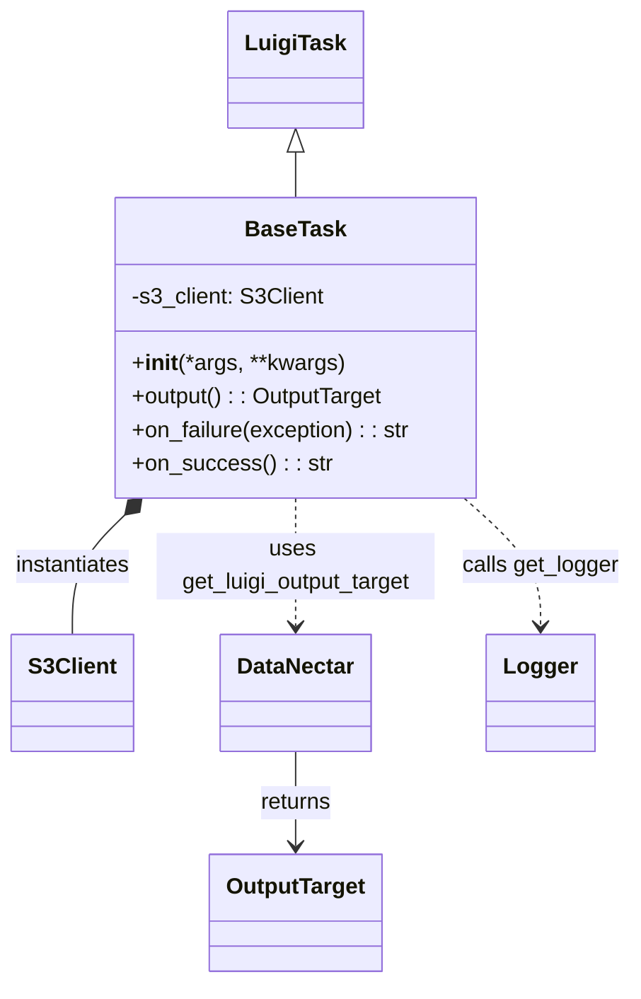

# Diagram: research/orchestrator/util/base_task.py


> Auto-generated by Obscura crawlers

## Diagram 1



### SVG

<svg id="container" width="454.90625" xmlns="http://www.w3.org/2000/svg" class="classDiagram" height="706" viewBox="0 0 454.90625 706" role="graphics-document document" aria-roledescription="class"><style>#container{font-family:"trebuchet ms",verdana,arial,sans-serif;font-size:16px;fill:#333;}@keyframes edge-animation-frame{from{stroke-dashoffset:0;}}@keyframes dash{to{stroke-dashoffset:0;}}#container .edge-animation-slow{stroke-dasharray:9,5!important;stroke-dashoffset:900;animation:dash 50s linear infinite;stroke-linecap:round;}#container .edge-animation-fast{stroke-dasharray:9,5!important;stroke-dashoffset:900;animation:dash 20s linear infinite;stroke-linecap:round;}#container .error-icon{fill:#552222;}#container .error-text{fill:#552222;stroke:#552222;}#container .edge-thickness-normal{stroke-width:1px;}#container .edge-thickness-thick{stroke-width:3.5px;}#container .edge-pattern-solid{stroke-dasharray:0;}#container .edge-thickness-invisible{stroke-width:0;fill:none;}#container .edge-pattern-dashed{stroke-dasharray:3;}#container .edge-pattern-dotted{stroke-dasharray:2;}#container .marker{fill:#333333;stroke:#333333;}#container .marker.cross{stroke:#333333;}#container svg{font-family:"trebuchet ms",verdana,arial,sans-serif;font-size:16px;}#container p{margin:0;}#container g.classGroup text{fill:#9370DB;stroke:none;font-family:"trebuchet ms",verdana,arial,sans-serif;font-size:10px;}#container g.classGroup text .title{font-weight:bolder;}#container .nodeLabel,#container .edgeLabel{color:#131300;}#container .edgeLabel .label rect{fill:#ECECFF;}#container .label text{fill:#131300;}#container .labelBkg{background:#ECECFF;}#container .edgeLabel .label span{background:#ECECFF;}#container .classTitle{font-weight:bolder;}#container .node rect,#container .node circle,#container .node ellipse,#container .node polygon,#container .node path{fill:#ECECFF;stroke:#9370DB;stroke-width:1px;}#container .divider{stroke:#9370DB;stroke-width:1;}#container g.clickable{cursor:pointer;}#container g.classGroup rect{fill:#ECECFF;stroke:#9370DB;}#container g.classGroup line{stroke:#9370DB;stroke-width:1;}#container .classLabel .box{stroke:none;stroke-width:0;fill:#ECECFF;opacity:0.5;}#container .classLabel .label{fill:#9370DB;font-size:10px;}#container .relation{stroke:#333333;stroke-width:1;fill:none;}#container .dashed-line{stroke-dasharray:3;}#container .dotted-line{stroke-dasharray:1 2;}#container #compositionStart,#container .composition{fill:#333333!important;stroke:#333333!important;stroke-width:1;}#container #compositionEnd,#container .composition{fill:#333333!important;stroke:#333333!important;stroke-width:1;}#container #dependencyStart,#container .dependency{fill:#333333!important;stroke:#333333!important;stroke-width:1;}#container #dependencyStart,#container .dependency{fill:#333333!important;stroke:#333333!important;stroke-width:1;}#container #extensionStart,#container .extension{fill:transparent!important;stroke:#333333!important;stroke-width:1;}#container #extensionEnd,#container .extension{fill:transparent!important;stroke:#333333!important;stroke-width:1;}#container #aggregationStart,#container .aggregation{fill:transparent!important;stroke:#333333!important;stroke-width:1;}#container #aggregationEnd,#container .aggregation{fill:transparent!important;stroke:#333333!important;stroke-width:1;}#container #lollipopStart,#container .lollipop{fill:#ECECFF!important;stroke:#333333!important;stroke-width:1;}#container #lollipopEnd,#container .lollipop{fill:#ECECFF!important;stroke:#333333!important;stroke-width:1;}#container .edgeTerminals{font-size:11px;line-height:initial;}#container .classTitleText{text-anchor:middle;font-size:18px;fill:#333;}#container .label-icon{display:inline-block;height:1em;overflow:visible;vertical-align:-0.125em;}#container .node .label-icon path{fill:currentColor;stroke:revert;stroke-width:revert;}#container :root{--mermaid-font-family:"trebuchet ms",verdana,arial,sans-serif;}</style><g><defs><marker id="container_class-aggregationStart" class="marker aggregation class" refX="18" refY="7" markerWidth="190" markerHeight="240" orient="auto"><path d="M 18,7 L9,13 L1,7 L9,1 Z"></path></marker></defs><defs><marker id="container_class-aggregationEnd" class="marker aggregation class" refX="1" refY="7" markerWidth="20" markerHeight="28" orient="auto"><path d="M 18,7 L9,13 L1,7 L9,1 Z"></path></marker></defs><defs><marker id="container_class-extensionStart" class="marker extension class" refX="18" refY="7" markerWidth="190" markerHeight="240" orient="auto"><path d="M 1,7 L18,13 V 1 Z"></path></marker></defs><defs><marker id="container_class-extensionEnd" class="marker extension class" refX="1" refY="7" markerWidth="20" markerHeight="28" orient="auto"><path d="M 1,1 V 13 L18,7 Z"></path></marker></defs><defs><marker id="container_class-compositionStart" class="marker composition class" refX="18" refY="7" markerWidth="190" markerHeight="240" orient="auto"><path d="M 18,7 L9,13 L1,7 L9,1 Z"></path></marker></defs><defs><marker id="container_class-compositionEnd" class="marker composition class" refX="1" refY="7" markerWidth="20" markerHeight="28" orient="auto"><path d="M 18,7 L9,13 L1,7 L9,1 Z"></path></marker></defs><defs><marker id="container_class-dependencyStart" class="marker dependency class" refX="6" refY="7" markerWidth="190" markerHeight="240" orient="auto"><path d="M 5,7 L9,13 L1,7 L9,1 Z"></path></marker></defs><defs><marker id="container_class-dependencyEnd" class="marker dependency class" refX="13" refY="7" markerWidth="20" markerHeight="28" orient="auto"><path d="M 18,7 L9,13 L14,7 L9,1 Z"></path></marker></defs><defs><marker id="container_class-lollipopStart" class="marker lollipop class" refX="13" refY="7" markerWidth="190" markerHeight="240" orient="auto"><circle stroke="black" fill="transparent" cx="7" cy="7" r="6"></circle></marker></defs><defs><marker id="container_class-lollipopEnd" class="marker lollipop class" refX="1" refY="7" markerWidth="190" markerHeight="240" orient="auto"><circle stroke="black" fill="transparent" cx="7" cy="7" r="6"></circle></marker></defs><g class="root"><g class="clusters"></g><g class="edgePaths"><path d="M213.828,109.25L213.828,110.542C213.828,111.833,213.828,114.417,213.828,119.875C213.828,125.333,213.828,133.667,213.828,137.833L213.828,142" id="id_LuigiTask_BaseTask_1" class="edge-thickness-normal edge-pattern-solid relation" style=";;;" data-edge="true" data-et="edge" data-id="id_LuigiTask_BaseTask_1" data-points="W3sieCI6MjEzLjgyODEyNSwieSI6OTJ9LHsieCI6MjEzLjgyODEyNSwieSI6MTE3fSx7IngiOjIxMy44MjgxMjUsInkiOjE0Mn1d" marker-start="url(#container_class-extensionStart)"></path><path d="M89.339,369.97L82.935,376.142C76.531,382.313,63.722,394.657,57.318,408.995C50.914,423.333,50.914,439.667,50.914,447.833L50.914,456" id="id_BaseTask_S3Client_2" class="edge-thickness-normal edge-pattern-solid relation" style=";;;" data-edge="true" data-et="edge" data-id="id_BaseTask_S3Client_2" data-points="W3sieCI6MTAxLjc1OTg1MjcwNzAwNjM3LCJ5IjozNTh9LHsieCI6NTAuOTE0MDYyNSwieSI6NDA3fSx7IngiOjUwLjkxNDA2MjUsInkiOjQ1Nn1d" marker-start="url(#container_class-compositionStart)"></path><path d="M213.828,358L213.828,366.167C213.828,374.333,213.828,390.667,213.828,406C213.828,421.333,213.828,435.667,213.828,442.833L213.828,450" id="id_BaseTask_DataNectar_3" class="edge-thickness-normal edge-pattern-dashed relation" style=";;;" data-edge="true" data-et="edge" data-id="id_BaseTask_DataNectar_3" data-points="W3sieCI6MjEzLjgyODEyNSwieSI6MzU4fSx7IngiOjIxMy44MjgxMjUsInkiOjQwN30seyJ4IjoyMTMuODI4MTI1LCJ5Ijo0NTZ9XQ==" marker-end="url(#container_class-dependencyEnd)"></path><path d="M335.269,358L344.452,366.167C353.635,374.333,372.001,390.667,381.184,406C390.367,421.333,390.367,435.667,390.367,442.833L390.367,450" id="id_BaseTask_Logger_4" class="edge-thickness-normal edge-pattern-dashed relation" style=";;;" data-edge="true" data-et="edge" data-id="id_BaseTask_Logger_4" data-points="W3sieCI6MzM1LjI2OTAwODc1Nzk2MTgsInkiOjM1OH0seyJ4IjozOTAuMzY3MTg3NSwieSI6NDA3fSx7IngiOjM5MC4zNjcxODc1LCJ5Ijo0NTZ9XQ==" marker-end="url(#container_class-dependencyEnd)"></path><path d="M213.828,540L213.828,546.167C213.828,552.333,213.828,564.667,213.828,576C213.828,587.333,213.828,597.667,213.828,602.833L213.828,608" id="id_DataNectar_OutputTarget_5" class="edge-thickness-normal edge-pattern-solid relation" style=";;;" data-edge="true" data-et="edge" data-id="id_DataNectar_OutputTarget_5" data-points="W3sieCI6MjEzLjgyODEyNSwieSI6NTQwfSx7IngiOjIxMy44MjgxMjUsInkiOjU3N30seyJ4IjoyMTMuODI4MTI1LCJ5Ijo2MTR9XQ==" marker-end="url(#container_class-dependencyEnd)"></path></g><g class="edgeLabels"><g class="edgeLabel"><g class="label" data-id="id_LuigiTask_BaseTask_1" transform="translate(0, 0)"><foreignObject width="0" height="0"><div xmlns="http://www.w3.org/1999/xhtml" class="labelBkg" style="display: table-cell; white-space: nowrap; line-height: 1.5; max-width: 200px; text-align: center;"><span class="edgeLabel"></span></div></foreignObject></g></g><g class="edgeLabel" transform="translate(50.9140625, 407)"><g class="label" data-id="id_BaseTask_S3Client_2" transform="translate(-42.9140625, -12)"><foreignObject width="85.828125" height="24"><div xmlns="http://www.w3.org/1999/xhtml" class="labelBkg" style="display: table-cell; white-space: nowrap; line-height: 1.5; max-width: 200px; text-align: center;"><span class="edgeLabel"><p>instantiates</p></span></div></foreignObject></g></g><g class="edgeLabel" transform="translate(213.828125, 407)"><g class="label" data-id="id_BaseTask_DataNectar_3" transform="translate(-100, -24)"><foreignObject width="200" height="48"><div xmlns="http://www.w3.org/1999/xhtml" class="labelBkg" style="display: table; white-space: break-spaces; line-height: 1.5; max-width: 200px; text-align: center; width: 200px;"><span class="edgeLabel"><p>uses get_luigi_output_target</p></span></div></foreignObject></g></g><g class="edgeLabel" transform="translate(390.3671875, 407)"><g class="label" data-id="id_BaseTask_Logger_4" transform="translate(-56.5390625, -12)"><foreignObject width="113.078125" height="24"><div xmlns="http://www.w3.org/1999/xhtml" class="labelBkg" style="display: table-cell; white-space: nowrap; line-height: 1.5; max-width: 200px; text-align: center;"><span class="edgeLabel"><p>calls get_logger</p></span></div></foreignObject></g></g><g class="edgeLabel" transform="translate(213.828125, 577)"><g class="label" data-id="id_DataNectar_OutputTarget_5" transform="translate(-26.265625, -12)"><foreignObject width="52.53125" height="24"><div xmlns="http://www.w3.org/1999/xhtml" class="labelBkg" style="display: table-cell; white-space: nowrap; line-height: 1.5; max-width: 200px; text-align: center;"><span class="edgeLabel"><p>returns</p></span></div></foreignObject></g></g></g><g class="nodes"><g class="node default" id="classId-BaseTask-0" transform="translate(213.828125, 250)"><g class="basic label-container"><path d="M-130.1640625 -108 L130.1640625 -108 L130.1640625 108 L-130.1640625 108" stroke="none" stroke-width="0" fill="#ECECFF" style=""></path><path d="M-130.1640625 -108 C-75.39772432697166 -108, -20.63138615394331 -108, 130.1640625 -108 M-130.1640625 -108 C-54.85038003839439 -108, 20.463302423211218 -108, 130.1640625 -108 M130.1640625 -108 C130.1640625 -32.07655162693281, 130.1640625 43.84689674613438, 130.1640625 108 M130.1640625 -108 C130.1640625 -29.005402808705142, 130.1640625 49.989194382589716, 130.1640625 108 M130.1640625 108 C73.1701065083576 108, 16.176150516715197 108, -130.1640625 108 M130.1640625 108 C28.562593867722242 108, -73.03887476455552 108, -130.1640625 108 M-130.1640625 108 C-130.1640625 50.38128683676667, -130.1640625 -7.237426326466661, -130.1640625 -108 M-130.1640625 108 C-130.1640625 63.632389544289765, -130.1640625 19.26477908857953, -130.1640625 -108" stroke="#9370DB" stroke-width="1.3" fill="none" stroke-dasharray="0 0" style=""></path></g><g class="annotation-group text" transform="translate(0, -84)"></g><g class="label-group text" transform="translate(-34.03125, -84)"><g class="label" style="font-weight: bolder" transform="translate(0,-12)"><foreignObject width="68.0625" height="24"><div xmlns="http://www.w3.org/1999/xhtml" style="display: table-cell; white-space: nowrap; line-height: 1.5; max-width: 117px; text-align: center;"><span class="nodeLabel markdown-node-label" style=""><p>BaseTask</p></span></div></foreignObject></g></g><g class="members-group text" transform="translate(-118.1640625, -36)"><g class="label" style="" transform="translate(0,-12)"><foreignObject width="137.03125" height="24"><div xmlns="http://www.w3.org/1999/xhtml" style="display: table-cell; white-space: nowrap; line-height: 1.5; max-width: 195px; text-align: center;"><span class="nodeLabel markdown-node-label" style=""><p>-s3_client: S3Client</p></span></div></foreignObject></g></g><g class="methods-group text" transform="translate(-118.1640625, 12)"><g class="label" style="" transform="translate(0,-12)"><foreignObject width="151.8125" height="24"><div xmlns="http://www.w3.org/1999/xhtml" style="display: table-cell; white-space: nowrap; line-height: 1.5; max-width: 241px; text-align: center;"><span class="nodeLabel markdown-node-label" style=""><p>+<strong>init</strong>(*args, **kwargs)</p></span></div></foreignObject></g><g class="label" style="" transform="translate(0,12)"><foreignObject width="183.203125" height="24"><div xmlns="http://www.w3.org/1999/xhtml" style="display: table-cell; white-space: nowrap; line-height: 1.5; max-width: 241px; text-align: center;"><span class="nodeLabel markdown-node-label" style=""><p>+output() : : OutputTarget</p></span></div></foreignObject></g><g class="label" style="" transform="translate(0,36)"><foreignObject width="202.296875" height="24"><div xmlns="http://www.w3.org/1999/xhtml" style="display: table-cell; white-space: nowrap; line-height: 1.5; max-width: 260px; text-align: center;"><span class="nodeLabel markdown-node-label" style=""><p>+on_failure(exception) : : str</p></span></div></foreignObject></g><g class="label" style="" transform="translate(0,60)"><foreignObject width="140.171875" height="24"><div xmlns="http://www.w3.org/1999/xhtml" style="display: table-cell; white-space: nowrap; line-height: 1.5; max-width: 198px; text-align: center;"><span class="nodeLabel markdown-node-label" style=""><p>+on_success() : : str</p></span></div></foreignObject></g></g><g class="divider" style=""><path d="M-130.1640625 -60 C-52.16691674784626 -60, 25.830229004307483 -60, 130.1640625 -60 M-130.1640625 -60 C-39.12074628500882 -60, 51.92256992998236 -60, 130.1640625 -60" stroke="#9370DB" stroke-width="1.3" fill="none" stroke-dasharray="0 0" style=""></path></g><g class="divider" style=""><path d="M-130.1640625 -12 C-56.533747105058765 -12, 17.09656828988247 -12, 130.1640625 -12 M-130.1640625 -12 C-51.207156485674176 -12, 27.74974952865165 -12, 130.1640625 -12" stroke="#9370DB" stroke-width="1.3" fill="none" stroke-dasharray="0 0" style=""></path></g></g><g class="node default" id="classId-LuigiTask-1" transform="translate(213.828125, 50)"><g class="basic label-container"><path d="M-45.984375 -42 L45.984375 -42 L45.984375 42 L-45.984375 42" stroke="none" stroke-width="0" fill="#ECECFF" style=""></path><path d="M-45.984375 -42 C-10.520302551593808 -42, 24.943769896812384 -42, 45.984375 -42 M-45.984375 -42 C-23.526342289381844 -42, -1.0683095787636887 -42, 45.984375 -42 M45.984375 -42 C45.984375 -12.668917604854691, 45.984375 16.662164790290618, 45.984375 42 M45.984375 -42 C45.984375 -11.820041027480148, 45.984375 18.359917945039705, 45.984375 42 M45.984375 42 C26.82390574682617 42, 7.663436493652341 42, -45.984375 42 M45.984375 42 C24.279677268108905 42, 2.5749795362178105 42, -45.984375 42 M-45.984375 42 C-45.984375 17.98833004683456, -45.984375 -6.023339906330882, -45.984375 -42 M-45.984375 42 C-45.984375 18.739497406990704, -45.984375 -4.521005186018591, -45.984375 -42" stroke="#9370DB" stroke-width="1.3" fill="none" stroke-dasharray="0 0" style=""></path></g><g class="annotation-group text" transform="translate(0, -18)"></g><g class="label-group text" transform="translate(-33.984375, -18)"><g class="label" style="font-weight: bolder" transform="translate(0,-12)"><foreignObject width="67.96875" height="24"><div xmlns="http://www.w3.org/1999/xhtml" style="display: table-cell; white-space: nowrap; line-height: 1.5; max-width: 117px; text-align: center;"><span class="nodeLabel markdown-node-label" style=""><p>LuigiTask</p></span></div></foreignObject></g></g><g class="members-group text" transform="translate(-33.984375, 30)"></g><g class="methods-group text" transform="translate(-33.984375, 60)"></g><g class="divider" style=""><path d="M-45.984375 6 C-26.285376351819746 6, -6.586377703639492 6, 45.984375 6 M-45.984375 6 C-24.840035025947778 6, -3.695695051895555 6, 45.984375 6" stroke="#9370DB" stroke-width="1.3" fill="none" stroke-dasharray="0 0" style=""></path></g><g class="divider" style=""><path d="M-45.984375 24 C-27.3957561432026 24, -8.8071372864052 24, 45.984375 24 M-45.984375 24 C-26.24137079337854 24, -6.498366586757079 24, 45.984375 24" stroke="#9370DB" stroke-width="1.3" fill="none" stroke-dasharray="0 0" style=""></path></g></g><g class="node default" id="classId-S3Client-2" transform="translate(50.9140625, 498)"><g class="basic label-container"><path d="M-42.015625 -42 L42.015625 -42 L42.015625 42 L-42.015625 42" stroke="none" stroke-width="0" fill="#ECECFF" style=""></path><path d="M-42.015625 -42 C-22.78224309340838 -42, -3.548861186816758 -42, 42.015625 -42 M-42.015625 -42 C-23.368534917613722 -42, -4.7214448352274445 -42, 42.015625 -42 M42.015625 -42 C42.015625 -19.291865202253838, 42.015625 3.4162695954923237, 42.015625 42 M42.015625 -42 C42.015625 -11.77348986999963, 42.015625 18.45302026000074, 42.015625 42 M42.015625 42 C22.864313578071727 42, 3.713002156143453 42, -42.015625 42 M42.015625 42 C23.254703632570084 42, 4.493782265140169 42, -42.015625 42 M-42.015625 42 C-42.015625 15.97706260204729, -42.015625 -10.04587479590542, -42.015625 -42 M-42.015625 42 C-42.015625 9.821898083090026, -42.015625 -22.356203833819947, -42.015625 -42" stroke="#9370DB" stroke-width="1.3" fill="none" stroke-dasharray="0 0" style=""></path></g><g class="annotation-group text" transform="translate(0, -18)"></g><g class="label-group text" transform="translate(-30.015625, -18)"><g class="label" style="font-weight: bolder" transform="translate(0,-12)"><foreignObject width="60.03125" height="24"><div xmlns="http://www.w3.org/1999/xhtml" style="display: table-cell; white-space: nowrap; line-height: 1.5; max-width: 109px; text-align: center;"><span class="nodeLabel markdown-node-label" style=""><p>S3Client</p></span></div></foreignObject></g></g><g class="members-group text" transform="translate(-30.015625, 30)"></g><g class="methods-group text" transform="translate(-30.015625, 60)"></g><g class="divider" style=""><path d="M-42.015625 6 C-24.40295159749934 6, -6.7902781949986775 6, 42.015625 6 M-42.015625 6 C-13.929126718133219 6, 14.157371563733562 6, 42.015625 6" stroke="#9370DB" stroke-width="1.3" fill="none" stroke-dasharray="0 0" style=""></path></g><g class="divider" style=""><path d="M-42.015625 24 C-8.53894450220038 24, 24.93773599559924 24, 42.015625 24 M-42.015625 24 C-11.51710072017513 24, 18.98142355964974 24, 42.015625 24" stroke="#9370DB" stroke-width="1.3" fill="none" stroke-dasharray="0 0" style=""></path></g></g><g class="node default" id="classId-OutputTarget-3" transform="translate(213.828125, 656)"><g class="basic label-container"><path d="M-60.7890625 -42 L60.7890625 -42 L60.7890625 42 L-60.7890625 42" stroke="none" stroke-width="0" fill="#ECECFF" style=""></path><path d="M-60.7890625 -42 C-22.22965086615428 -42, 16.32976076769144 -42, 60.7890625 -42 M-60.7890625 -42 C-12.50521936160618 -42, 35.77862377678764 -42, 60.7890625 -42 M60.7890625 -42 C60.7890625 -17.77146401848051, 60.7890625 6.4570719630389775, 60.7890625 42 M60.7890625 -42 C60.7890625 -17.847226504583755, 60.7890625 6.3055469908324895, 60.7890625 42 M60.7890625 42 C17.669280552345533 42, -25.450501395308933 42, -60.7890625 42 M60.7890625 42 C27.281355038970574 42, -6.226352422058852 42, -60.7890625 42 M-60.7890625 42 C-60.7890625 20.43063403729486, -60.7890625 -1.1387319254102835, -60.7890625 -42 M-60.7890625 42 C-60.7890625 16.54801248107157, -60.7890625 -8.90397503785686, -60.7890625 -42" stroke="#9370DB" stroke-width="1.3" fill="none" stroke-dasharray="0 0" style=""></path></g><g class="annotation-group text" transform="translate(0, -18)"></g><g class="label-group text" transform="translate(-48.7890625, -18)"><g class="label" style="font-weight: bolder" transform="translate(0,-12)"><foreignObject width="97.578125" height="24"><div xmlns="http://www.w3.org/1999/xhtml" style="display: table-cell; white-space: nowrap; line-height: 1.5; max-width: 146px; text-align: center;"><span class="nodeLabel markdown-node-label" style=""><p>OutputTarget</p></span></div></foreignObject></g></g><g class="members-group text" transform="translate(-48.7890625, 30)"></g><g class="methods-group text" transform="translate(-48.7890625, 60)"></g><g class="divider" style=""><path d="M-60.7890625 6 C-22.94775156501086 6, 14.893559369978277 6, 60.7890625 6 M-60.7890625 6 C-15.685835700473085 6, 29.41739109905383 6, 60.7890625 6" stroke="#9370DB" stroke-width="1.3" fill="none" stroke-dasharray="0 0" style=""></path></g><g class="divider" style=""><path d="M-60.7890625 24 C-22.381749936454376 24, 16.025562627091247 24, 60.7890625 24 M-60.7890625 24 C-23.62243630489406 24, 13.544189890211882 24, 60.7890625 24" stroke="#9370DB" stroke-width="1.3" fill="none" stroke-dasharray="0 0" style=""></path></g></g><g class="node default" id="classId-DataNectar-4" transform="translate(213.828125, 498)"><g class="basic label-container"><path d="M-53.03125 -42 L53.03125 -42 L53.03125 42 L-53.03125 42" stroke="none" stroke-width="0" fill="#ECECFF" style=""></path><path d="M-53.03125 -42 C-16.562119978202134 -42, 19.907010043595733 -42, 53.03125 -42 M-53.03125 -42 C-21.131970434183447 -42, 10.767309131633105 -42, 53.03125 -42 M53.03125 -42 C53.03125 -10.77161223065545, 53.03125 20.4567755386891, 53.03125 42 M53.03125 -42 C53.03125 -16.114629084407376, 53.03125 9.770741831185248, 53.03125 42 M53.03125 42 C17.20175158022291 42, -18.627746839554177 42, -53.03125 42 M53.03125 42 C27.958957281186052 42, 2.886664562372104 42, -53.03125 42 M-53.03125 42 C-53.03125 22.060025393322444, -53.03125 2.1200507866448888, -53.03125 -42 M-53.03125 42 C-53.03125 24.40381227581654, -53.03125 6.807624551633083, -53.03125 -42" stroke="#9370DB" stroke-width="1.3" fill="none" stroke-dasharray="0 0" style=""></path></g><g class="annotation-group text" transform="translate(0, -18)"></g><g class="label-group text" transform="translate(-41.03125, -18)"><g class="label" style="font-weight: bolder" transform="translate(0,-12)"><foreignObject width="82.0625" height="24"><div xmlns="http://www.w3.org/1999/xhtml" style="display: table-cell; white-space: nowrap; line-height: 1.5; max-width: 132px; text-align: center;"><span class="nodeLabel markdown-node-label" style=""><p>DataNectar</p></span></div></foreignObject></g></g><g class="members-group text" transform="translate(-41.03125, 30)"></g><g class="methods-group text" transform="translate(-41.03125, 60)"></g><g class="divider" style=""><path d="M-53.03125 6 C-17.965146739426153 6, 17.100956521147694 6, 53.03125 6 M-53.03125 6 C-25.353533255480315 6, 2.3241834890393704 6, 53.03125 6" stroke="#9370DB" stroke-width="1.3" fill="none" stroke-dasharray="0 0" style=""></path></g><g class="divider" style=""><path d="M-53.03125 24 C-10.960490177340915 24, 31.11026964531817 24, 53.03125 24 M-53.03125 24 C-22.250005339414937 24, 8.531239321170126 24, 53.03125 24" stroke="#9370DB" stroke-width="1.3" fill="none" stroke-dasharray="0 0" style=""></path></g></g><g class="node default" id="classId-Logger-5" transform="translate(390.3671875, 498)"><g class="basic label-container"><path d="M-36.84375 -42 L36.84375 -42 L36.84375 42 L-36.84375 42" stroke="none" stroke-width="0" fill="#ECECFF" style=""></path><path d="M-36.84375 -42 C-12.823699272682571 -42, 11.196351454634858 -42, 36.84375 -42 M-36.84375 -42 C-7.650009035959428 -42, 21.543731928081144 -42, 36.84375 -42 M36.84375 -42 C36.84375 -11.053958289374894, 36.84375 19.892083421250213, 36.84375 42 M36.84375 -42 C36.84375 -18.515140268526864, 36.84375 4.969719462946273, 36.84375 42 M36.84375 42 C8.945133623159762 42, -18.953482753680476 42, -36.84375 42 M36.84375 42 C13.433140519036467 42, -9.977468961927066 42, -36.84375 42 M-36.84375 42 C-36.84375 24.189430207396374, -36.84375 6.378860414792747, -36.84375 -42 M-36.84375 42 C-36.84375 8.40758845395198, -36.84375 -25.18482309209604, -36.84375 -42" stroke="#9370DB" stroke-width="1.3" fill="none" stroke-dasharray="0 0" style=""></path></g><g class="annotation-group text" transform="translate(0, -18)"></g><g class="label-group text" transform="translate(-24.84375, -18)"><g class="label" style="font-weight: bolder" transform="translate(0,-12)"><foreignObject width="49.6875" height="24"><div xmlns="http://www.w3.org/1999/xhtml" style="display: table-cell; white-space: nowrap; line-height: 1.5; max-width: 99px; text-align: center;"><span class="nodeLabel markdown-node-label" style=""><p>Logger</p></span></div></foreignObject></g></g><g class="members-group text" transform="translate(-24.84375, 30)"></g><g class="methods-group text" transform="translate(-24.84375, 60)"></g><g class="divider" style=""><path d="M-36.84375 6 C-14.759252766485222 6, 7.325244467029556 6, 36.84375 6 M-36.84375 6 C-10.965801712132649 6, 14.912146575734702 6, 36.84375 6" stroke="#9370DB" stroke-width="1.3" fill="none" stroke-dasharray="0 0" style=""></path></g><g class="divider" style=""><path d="M-36.84375 24 C-16.821424297330047 24, 3.2009014053399056 24, 36.84375 24 M-36.84375 24 C-20.228298525657742 24, -3.612847051315484 24, 36.84375 24" stroke="#9370DB" stroke-width="1.3" fill="none" stroke-dasharray="0 0" style=""></path></g></g></g></g></g></svg>

## Diagram 2

```mermaid
flowchart TD
    Start([BaseTask methods]) --> F1[on_failure(exception)]
    F1 --> F2[message = super().on_failure(exception)]
    F2 --> F3{try}
    F3 --> F4[out_obj = datanectar.get_luigi_output_target(ROOT, self, failure.txt)]
    F4 --> F5[open out_obj and write TASK, DATETIME, ERROR]
    F5 --> F6[return message]
    F3 --> F7[except Exception]
    F7 --> F8[logger.exception Failed to save failure file to s3]
    F8 --> F6

    Start --> S1[on_success()]
    S1 --> S2[message = super().on_success()]
    S2 --> S3{try}
    S3 --> S4[out_obj = datanectar.get_luigi_output_target(ROOT, self, success.txt)]
    S4 --> S5[open out_obj and write TASK, DATETIME]
    S5 --> S6[return message]
    S3 --> S7[except Exception]
    S7 --> S8[logger.exception Failed to save success file to s3]
    S8 --> S6
```

> SVG rendering failed for this diagram.
