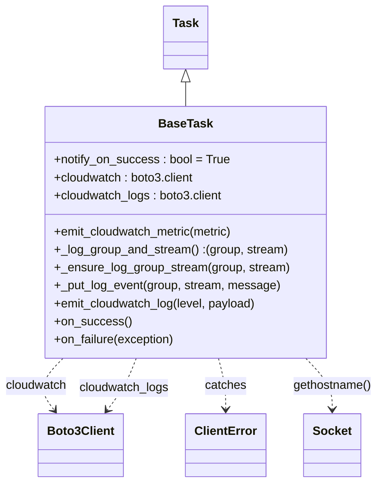
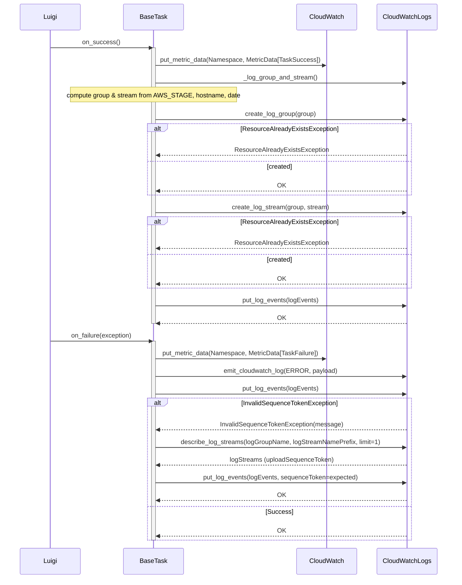

# Diagram: research/orchestrator/util/base_task_databricks.py

> Auto-generated by Obscura crawlers

## Diagram 1

### SVG

<svg id="container" width="502.44140625" xmlns="http://www.w3.org/2000/svg" class="classDiagram" height="644" viewBox="0 0 502.44140625 644" role="graphics-document document" aria-roledescription="class"><g><defs><marker id="container_class-aggregationStart" class="marker aggregation class" refX="18" refY="7" markerWidth="190" markerHeight="240" orient="auto"><path d="M 18,7 L9,13 L1,7 L9,1 Z"></path></marker></defs><defs><marker id="container_class-aggregationEnd" class="marker aggregation class" refX="1" refY="7" markerWidth="20" markerHeight="28" orient="auto"><path d="M 18,7 L9,13 L1,7 L9,1 Z"></path></marker></defs><defs><marker id="container_class-extensionStart" class="marker extension class" refX="18" refY="7" markerWidth="190" markerHeight="240" orient="auto"><path d="M 1,7 L18,13 V 1 Z"></path></marker></defs><defs><marker id="container_class-extensionEnd" class="marker extension class" refX="1" refY="7" markerWidth="20" markerHeight="28" orient="auto"><path d="M 1,1 V 13 L18,7 Z"></path></marker></defs><defs><marker id="container_class-compositionStart" class="marker composition class" refX="18" refY="7" markerWidth="190" markerHeight="240" orient="auto"><path d="M 18,7 L9,13 L1,7 L9,1 Z"></path></marker></defs><defs><marker id="container_class-compositionEnd" class="marker composition class" refX="1" refY="7" markerWidth="20" markerHeight="28" orient="auto"><path d="M 18,7 L9,13 L1,7 L9,1 Z"></path></marker></defs><defs><marker id="container_class-dependencyStart" class="marker dependency class" refX="6" refY="7" markerWidth="190" markerHeight="240" orient="auto"><path d="M 5,7 L9,13 L1,7 L9,1 Z"></path></marker></defs><defs><marker id="container_class-dependencyEnd" class="marker dependency class" refX="13" refY="7" markerWidth="20" markerHeight="28" orient="auto"><path d="M 18,7 L9,13 L14,7 L9,1 Z"></path></marker></defs><defs><marker id="container_class-lollipopStart" class="marker lollipop class" refX="13" refY="7" markerWidth="190" markerHeight="240" orient="auto"><circle stroke="black" fill="transparent" cx="7" cy="7" r="6"></circle></marker></defs><defs><marker id="container_class-lollipopEnd" class="marker lollipop class" refX="1" refY="7" markerWidth="190" markerHeight="240" orient="auto"><circle stroke="black" fill="transparent" cx="7" cy="7" r="6"></circle></marker></defs><g class="root"><g class="clusters"></g><g class="edgePaths"><path d="M249.426,109.25L249.426,110.542C249.426,111.833,249.426,114.417,249.426,119.875C249.426,125.333,249.426,133.667,249.426,137.833L249.426,142" id="id_Task_BaseTask_1" class="edge-thickness-normal edge-pattern-solid relation" style=";;;" data-edge="true" data-et="edge" data-id="id_Task_BaseTask_1" data-points="W3sieCI6MjQ5LjQyNTc4MTI1LCJ5Ijo5Mn0seyJ4IjoyNDkuNDI1NzgxMjUsInkiOjExN30seyJ4IjoyNDkuNDI1NzgxMjUsInkiOjE0Mn1d" marker-start="url(#container_class-extensionStart)"></path><path d="M85.597,478L79.583,484.167C73.57,490.333,61.543,502.667,59.677,514.208C57.811,525.75,66.107,536.5,70.255,541.875L74.403,547.25" id="id_BaseTask_Boto3Client_2" class="edge-thickness-normal edge-pattern-dashed relation" style=";;;" data-edge="true" data-et="edge" data-id="id_BaseTask_Boto3Client_2" data-points="W3sieCI6ODUuNTk2OTcwMjc0MzkwMjMsInkiOjQ3OH0seyJ4Ijo0OS41MTU2MjUsInkiOjUxNX0seyJ4Ijo3OC4wNjg3Nzk2Njc3MjE1MSwieSI6NTUyfV0=" marker-end="url(#container_class-dependencyEnd)"></path><path d="M185.52,478L183.174,484.167C180.828,490.333,176.137,502.667,169.643,514.208C163.149,525.75,154.854,536.5,150.706,541.875L146.558,547.25" id="id_BaseTask_Boto3Client_3" class="edge-thickness-normal edge-pattern-dashed relation" style=";;;" data-edge="true" data-et="edge" data-id="id_BaseTask_Boto3Client_3" data-points="W3sieCI6MTg1LjUxOTgzNjEyODA0ODc4LCJ5Ijo0Nzh9LHsieCI6MTcxLjQ0NTMxMjUsInkiOjUxNX0seyJ4IjoxNDIuODkyMTU3ODMyMjc4NDksInkiOjU1Mn1d" marker-end="url(#container_class-dependencyEnd)"></path><path d="M293.635,478L295.257,484.167C296.88,490.333,300.126,502.667,301.748,514C303.371,525.333,303.371,535.667,303.371,540.833L303.371,546" id="id_BaseTask_ClientError_4" class="edge-thickness-normal edge-pattern-dashed relation" style=";;;" data-edge="true" data-et="edge" data-id="id_BaseTask_ClientError_4" data-points="W3sieCI6MjkzLjYzNDYyMjcxMzQxNDYsInkiOjQ3OH0seyJ4IjozMDMuMzcxMDkzNzUsInkiOjUxNX0seyJ4IjozMDMuMzcxMDkzNzUsInkiOjU1Mn1d" marker-end="url(#container_class-dependencyEnd)"></path><path d="M407.022,478L412.807,484.167C418.591,490.333,430.161,502.667,435.946,514C441.73,525.333,441.73,535.667,441.73,540.833L441.73,546" id="id_BaseTask_Socket_5" class="edge-thickness-normal edge-pattern-dashed relation" style=";;;" data-edge="true" data-et="edge" data-id="id_BaseTask_Socket_5" data-points="W3sieCI6NDA3LjAyMTgxNzgzNTM2NTgsInkiOjQ3OH0seyJ4Ijo0NDEuNzMwNDY4NzUsInkiOjUxNX0seyJ4Ijo0NDEuNzMwNDY4NzUsInkiOjU1Mn1d" marker-end="url(#container_class-dependencyEnd)"></path></g><g class="edgeLabels"><g class="edgeLabel"><g class="label" data-id="id_Task_BaseTask_1" transform="translate(0, 0)"><foreignObject width="0" height="0">

</foreignObject></g></g><g class="edgeLabel" transform="translate(49.515625, 515)"><g class="label" data-id="id_BaseTask_Boto3Client_2" transform="translate(-41.515625, -12)"><foreignObject width="83.03125" height="24">

cloudwatch

</foreignObject></g></g><g class="edgeLabel" transform="translate(169.26126, 517.83016)"><g class="label" data-id="id_BaseTask_Boto3Client_3" transform="translate(-60.4140625, -12)"><foreignObject width="120.828125" height="24">

cloudwatch_logs

</foreignObject></g></g><g class="edgeLabel" transform="translate(303.37109375, 515)"><g class="label" data-id="id_BaseTask_ClientError_4" transform="translate(-27.4765625, -12)"><foreignObject width="54.953125" height="24">

catches

</foreignObject></g></g><g class="edgeLabel" transform="translate(441.73046875, 515)"><g class="label" data-id="id_BaseTask_Socket_5" transform="translate(-52.7109375, -12)"><foreignObject width="105.421875" height="24">

gethostname()

</foreignObject></g></g></g><g class="nodes"><g class="node default" id="classId-Task-0" transform="translate(249.42578125, 50)"><g class="basic label-container"><path d="M-28.5078125 -42 L28.5078125 -42 L28.5078125 42 L-28.5078125 42" stroke="none" stroke-width="0" fill="#ECECFF" style=""></path><path d="M-28.5078125 -42 C-12.047686410846843 -42, 4.412439678306313 -42, 28.5078125 -42 M-28.5078125 -42 C-7.057691979733718 -42, 14.392428540532563 -42, 28.5078125 -42 M28.5078125 -42 C28.5078125 -9.751985340989407, 28.5078125 22.496029318021186, 28.5078125 42 M28.5078125 -42 C28.5078125 -9.519057940226695, 28.5078125 22.96188411954661, 28.5078125 42 M28.5078125 42 C9.494664818387516 42, -9.518482863224968 42, -28.5078125 42 M28.5078125 42 C11.813297914916408 42, -4.881216670167184 42, -28.5078125 42 M-28.5078125 42 C-28.5078125 15.138169822384704, -28.5078125 -11.723660355230592, -28.5078125 -42 M-28.5078125 42 C-28.5078125 12.519621895307907, -28.5078125 -16.960756209384186, -28.5078125 -42" stroke="#9370DB" stroke-width="1.3" fill="none" stroke-dasharray="0 0" style=""></path></g><g class="annotation-group text" transform="translate(0, -18)"></g><g class="label-group text" transform="translate(-16.5078125, -18)"><g class="label" style="font-weight: bolder" transform="translate(0,-12)"><foreignObject width="33.015625" height="24">

Task

</foreignObject></g></g><g class="members-group text" transform="translate(-16.5078125, 30)"></g><g class="methods-group text" transform="translate(-16.5078125, 60)"></g><g class="divider" style=""><path d="M-28.5078125 6 C-7.4270130443562685 6, 13.653786411287463 6, 28.5078125 6 M-28.5078125 6 C-15.825908204069702 6, -3.1440039081394033 6, 28.5078125 6" stroke="#9370DB" stroke-width="1.3" fill="none" stroke-dasharray="0 0" style=""></path></g><g class="divider" style=""><path d="M-28.5078125 24 C-10.87650257728114 24, 6.754807345437719 24, 28.5078125 24 M-28.5078125 24 C-6.409957201761657 24, 15.687898096476687 24, 28.5078125 24" stroke="#9370DB" stroke-width="1.3" fill="none" stroke-dasharray="0 0" style=""></path></g></g><g class="node default" id="classId-BaseTask-1" transform="translate(249.42578125, 310)"><g class="basic label-container"><path d="M-185.578125 -168 L185.578125 -168 L185.578125 168 L-185.578125 168" stroke="none" stroke-width="0" fill="#ECECFF" style=""></path><path d="M-185.578125 -168 C-70.75020926282204 -168, 44.07770647435592 -168, 185.578125 -168 M-185.578125 -168 C-82.30970296206898 -168, 20.958719075862035 -168, 185.578125 -168 M185.578125 -168 C185.578125 -79.031872051617, 185.578125 9.936255896766, 185.578125 168 M185.578125 -168 C185.578125 -46.46016970489438, 185.578125 75.07966059021123, 185.578125 168 M185.578125 168 C100.97930553255323 168, 16.380486065106453 168, -185.578125 168 M185.578125 168 C84.61889687915475 168, -16.340331241690507 168, -185.578125 168 M-185.578125 168 C-185.578125 60.584452894865976, -185.578125 -46.83109421026805, -185.578125 -168 M-185.578125 168 C-185.578125 80.03884174280932, -185.578125 -7.92231651438135, -185.578125 -168" stroke="#9370DB" stroke-width="1.3" fill="none" stroke-dasharray="0 0" style=""></path></g><g class="annotation-group text" transform="translate(0, -144)"></g><g class="label-group text" transform="translate(-34.03125, -144)"><g class="label" style="font-weight: bolder" transform="translate(0,-12)"><foreignObject width="68.0625" height="24">

BaseTask

</foreignObject></g></g><g class="members-group text" transform="translate(-173.578125, -96)"><g class="label" style="" transform="translate(0,-12)"><foreignObject width="233.421875" height="24">

+notify_on_success : bool = True

</foreignObject></g><g class="label" style="" transform="translate(0,12)"><foreignObject width="189.125" height="24">

+cloudwatch : boto3.client

</foreignObject></g><g class="label" style="" transform="translate(0,36)"><foreignObject width="226.921875" height="24">

+cloudwatch_logs : boto3.client

</foreignObject></g></g><g class="methods-group text" transform="translate(-173.578125, 0)"><g class="label" style="" transform="translate(0,-12)"><foreignObject width="243.515625" height="24">

+emit_cloudwatch_metric(metric)

</foreignObject></g><g class="label" style="" transform="translate(0,12)"><foreignObject width="310.25" height="24">

+_log_group_and_stream() :(group, stream)

</foreignObject></g><g class="label" style="" transform="translate(0,36)"><foreignObject width="313.125" height="24">

+_ensure_log_group_stream(group, stream)

</foreignObject></g><g class="label" style="" transform="translate(0,60)"><foreignObject width="299.296875" height="24">

+_put_log_event(group, stream, message)

</foreignObject></g><g class="label" style="" transform="translate(0,84)"><foreignObject width="272.90625" height="24">

+emit_cloudwatch_log(level, payload)

</foreignObject></g><g class="label" style="" transform="translate(0,108)"><foreignObject width="100.34375" height="24">

+on_success()

</foreignObject></g><g class="label" style="" transform="translate(0,132)"><foreignObject width="162.46875" height="24">

+on_failure(exception)

</foreignObject></g></g><g class="divider" style=""><path d="M-185.578125 -120 C-98.40322874945562 -120, -11.228332498911243 -120, 185.578125 -120 M-185.578125 -120 C-37.27774097153224 -120, 111.02264305693552 -120, 185.578125 -120" stroke="#9370DB" stroke-width="1.3" fill="none" stroke-dasharray="0 0" style=""></path></g><g class="divider" style=""><path d="M-185.578125 -24 C-110.80731843747027 -24, -36.036511874940544 -24, 185.578125 -24 M-185.578125 -24 C-61.66378146483265 -24, 62.250562070334695 -24, 185.578125 -24" stroke="#9370DB" stroke-width="1.3" fill="none" stroke-dasharray="0 0" style=""></path></g></g><g class="node default" id="classId-Boto3Client-2" transform="translate(110.48046875, 594)"><g class="basic label-container"><path d="M-54.5 -42 L54.5 -42 L54.5 42 L-54.5 42" stroke="none" stroke-width="0" fill="#ECECFF" style=""></path><path d="M-54.5 -42 C-31.77141375586405 -42, -9.042827511728099 -42, 54.5 -42 M-54.5 -42 C-27.017364867555298 -42, 0.4652702648894049 -42, 54.5 -42 M54.5 -42 C54.5 -14.213265448639106, 54.5 13.573469102721788, 54.5 42 M54.5 -42 C54.5 -20.300789973106724, 54.5 1.3984200537865519, 54.5 42 M54.5 42 C20.227758997285243 42, -14.044482005429515 42, -54.5 42 M54.5 42 C16.073651010291904 42, -22.35269797941619 42, -54.5 42 M-54.5 42 C-54.5 22.79582809484136, -54.5 3.5916561896827233, -54.5 -42 M-54.5 42 C-54.5 13.84732967769359, -54.5 -14.30534064461282, -54.5 -42" stroke="#9370DB" stroke-width="1.3" fill="none" stroke-dasharray="0 0" style=""></path></g><g class="annotation-group text" transform="translate(0, -18)"></g><g class="label-group text" transform="translate(-42.5, -18)"><g class="label" style="font-weight: bolder" transform="translate(0,-12)"><foreignObject width="85" height="24">

Boto3Client

</foreignObject></g></g><g class="members-group text" transform="translate(-42.5, 30)"></g><g class="methods-group text" transform="translate(-42.5, 60)"></g><g class="divider" style=""><path d="M-54.5 6 C-24.708481336639537 6, 5.083037326720927 6, 54.5 6 M-54.5 6 C-25.454685845613877 6, 3.5906283087722457 6, 54.5 6" stroke="#9370DB" stroke-width="1.3" fill="none" stroke-dasharray="0 0" style=""></path></g><g class="divider" style=""><path d="M-54.5 24 C-29.182376650473945 24, -3.864753300947889 24, 54.5 24 M-54.5 24 C-27.531569300558893 24, -0.5631386011177852 24, 54.5 24" stroke="#9370DB" stroke-width="1.3" fill="none" stroke-dasharray="0 0" style=""></path></g></g><g class="node default" id="classId-ClientError-3" transform="translate(303.37109375, 594)"><g class="basic label-container"><path d="M-51.4609375 -42 L51.4609375 -42 L51.4609375 42 L-51.4609375 42" stroke="none" stroke-width="0" fill="#ECECFF" style=""></path><path d="M-51.4609375 -42 C-30.746111203393617 -42, -10.031284906787235 -42, 51.4609375 -42 M-51.4609375 -42 C-13.519266035123962 -42, 24.422405429752075 -42, 51.4609375 -42 M51.4609375 -42 C51.4609375 -20.477991222941, 51.4609375 1.0440175541179997, 51.4609375 42 M51.4609375 -42 C51.4609375 -14.124590913860182, 51.4609375 13.750818172279637, 51.4609375 42 M51.4609375 42 C25.623807192716182 42, -0.2133231145676362 42, -51.4609375 42 M51.4609375 42 C22.19032255999899 42, -7.080292380002021 42, -51.4609375 42 M-51.4609375 42 C-51.4609375 18.931035765295636, -51.4609375 -4.1379284694087275, -51.4609375 -42 M-51.4609375 42 C-51.4609375 12.632668243301111, -51.4609375 -16.734663513397777, -51.4609375 -42" stroke="#9370DB" stroke-width="1.3" fill="none" stroke-dasharray="0 0" style=""></path></g><g class="annotation-group text" transform="translate(0, -18)"></g><g class="label-group text" transform="translate(-39.4609375, -18)"><g class="label" style="font-weight: bolder" transform="translate(0,-12)"><foreignObject width="78.921875" height="24">

ClientError

</foreignObject></g></g><g class="members-group text" transform="translate(-39.4609375, 30)"></g><g class="methods-group text" transform="translate(-39.4609375, 60)"></g><g class="divider" style=""><path d="M-51.4609375 6 C-15.133009908503404 6, 21.194917682993193 6, 51.4609375 6 M-51.4609375 6 C-20.754992724851622 6, 9.950952050296756 6, 51.4609375 6" stroke="#9370DB" stroke-width="1.3" fill="none" stroke-dasharray="0 0" style=""></path></g><g class="divider" style=""><path d="M-51.4609375 24 C-22.02053416270112 24, 7.419869174597757 24, 51.4609375 24 M-51.4609375 24 C-15.643776865904165 24, 20.17338376819167 24, 51.4609375 24" stroke="#9370DB" stroke-width="1.3" fill="none" stroke-dasharray="0 0" style=""></path></g></g><g class="node default" id="classId-Socket-4" transform="translate(441.73046875, 594)"><g class="basic label-container"><path d="M-36.8984375 -42 L36.8984375 -42 L36.8984375 42 L-36.8984375 42" stroke="none" stroke-width="0" fill="#ECECFF" style=""></path><path d="M-36.8984375 -42 C-19.971192155774897 -42, -3.0439468115497945 -42, 36.8984375 -42 M-36.8984375 -42 C-17.378781489998882 -42, 2.140874520002235 -42, 36.8984375 -42 M36.8984375 -42 C36.8984375 -13.193114065439328, 36.8984375 15.613771869121344, 36.8984375 42 M36.8984375 -42 C36.8984375 -17.646818591453822, 36.8984375 6.706362817092355, 36.8984375 42 M36.8984375 42 C16.558275475952232 42, -3.7818865480955353 42, -36.8984375 42 M36.8984375 42 C9.019003754546112 42, -18.860429990907775 42, -36.8984375 42 M-36.8984375 42 C-36.8984375 16.474582059553814, -36.8984375 -9.050835880892372, -36.8984375 -42 M-36.8984375 42 C-36.8984375 19.872047209121575, -36.8984375 -2.255905581756849, -36.8984375 -42" stroke="#9370DB" stroke-width="1.3" fill="none" stroke-dasharray="0 0" style=""></path></g><g class="annotation-group text" transform="translate(0, -18)"></g><g class="label-group text" transform="translate(-24.8984375, -18)"><g class="label" style="font-weight: bolder" transform="translate(0,-12)"><foreignObject width="49.796875" height="24">

Socket

</foreignObject></g></g><g class="members-group text" transform="translate(-24.8984375, 30)"></g><g class="methods-group text" transform="translate(-24.8984375, 60)"></g><g class="divider" style=""><path d="M-36.8984375 6 C-8.50273237652636 6, 19.89297274694728 6, 36.8984375 6 M-36.8984375 6 C-19.419852577522462 6, -1.9412676550449248 6, 36.8984375 6" stroke="#9370DB" stroke-width="1.3" fill="none" stroke-dasharray="0 0" style=""></path></g><g class="divider" style=""><path d="M-36.8984375 24 C-17.367652726919946 24, 2.163132046160108 24, 36.8984375 24 M-36.8984375 24 C-17.903405031542796 24, 1.0916274369144077 24, 36.8984375 24" stroke="#9370DB" stroke-width="1.3" fill="none" stroke-dasharray="0 0" style=""></path></g></g></g></g></g></svg>

## Diagram 2

### SVG

<svg id="container" width="1192" xmlns="http://www.w3.org/2000/svg" height="1528" viewBox="-50 -10 1192 1528" role="graphics-document document" aria-roledescription="sequence"><g><rect x="942" y="1442" fill="#eaeaea" stroke="#666" width="150" height="65" name="CloudWatchLogs" rx="3" ry="3" class="actor actor-bottom"></rect><text x="1017" y="1474.5" dominant-baseline="central" alignment-baseline="central" class="actor actor-box" style="text-anchor: middle; font-size: 16px; font-weight: 400;"><tspan x="1017" dy="0">CloudWatchLogs</tspan></text></g><g><rect x="742" y="1442" fill="#eaeaea" stroke="#666" width="150" height="65" name="CloudWatch" rx="3" ry="3" class="actor actor-bottom"></rect><text x="817" y="1474.5" dominant-baseline="central" alignment-baseline="central" class="actor actor-box" style="text-anchor: middle; font-size: 16px; font-weight: 400;"><tspan x="817" dy="0">CloudWatch</tspan></text></g><g><rect x="273" y="1442" fill="#eaeaea" stroke="#666" width="150" height="65" name="BaseTask" rx="3" ry="3" class="actor actor-bottom"></rect><text x="348" y="1474.5" dominant-baseline="central" alignment-baseline="central" class="actor actor-box" style="text-anchor: middle; font-size: 16px; font-weight: 400;"><tspan x="348" dy="0">BaseTask</tspan></text></g><g><rect x="0" y="1442" fill="#eaeaea" stroke="#666" width="150" height="65" name="Luigi" rx="3" ry="3" class="actor actor-bottom"></rect><text x="75" y="1474.5" dominant-baseline="central" alignment-baseline="central" class="actor actor-box" style="text-anchor: middle; font-size: 16px; font-weight: 400;"><tspan x="75" dy="0">Luigi</tspan></text></g><g><line id="actor3" x1="1017" y1="65" x2="1017" y2="1442" class="actor-line 200" stroke-width="0.5px" stroke="#999" name="CloudWatchLogs"></line><g id="root-3"><rect x="942" y="0" fill="#eaeaea" stroke="#666" width="150" height="65" name="CloudWatchLogs" rx="3" ry="3" class="actor actor-top"></rect><text x="1017" y="32.5" dominant-baseline="central" alignment-baseline="central" class="actor actor-box" style="text-anchor: middle; font-size: 16px; font-weight: 400;"><tspan x="1017" dy="0">CloudWatchLogs</tspan></text></g></g><g><line id="actor2" x1="817" y1="65" x2="817" y2="1442" class="actor-line 200" stroke-width="0.5px" stroke="#999" name="CloudWatch"></line><g id="root-2"><rect x="742" y="0" fill="#eaeaea" stroke="#666" width="150" height="65" name="CloudWatch" rx="3" ry="3" class="actor actor-top"></rect><text x="817" y="32.5" dominant-baseline="central" alignment-baseline="central" class="actor actor-box" style="text-anchor: middle; font-size: 16px; font-weight: 400;"><tspan x="817" dy="0">CloudWatch</tspan></text></g></g><g><line id="actor1" x1="348" y1="65" x2="348" y2="1442" class="actor-line 200" stroke-width="0.5px" stroke="#999" name="BaseTask"></line><g id="root-1"><rect x="273" y="0" fill="#eaeaea" stroke="#666" width="150" height="65" name="BaseTask" rx="3" ry="3" class="actor actor-top"></rect><text x="348" y="32.5" dominant-baseline="central" alignment-baseline="central" class="actor actor-box" style="text-anchor: middle; font-size: 16px; font-weight: 400;"><tspan x="348" dy="0">BaseTask</tspan></text></g></g><g><line id="actor0" x1="75" y1="65" x2="75" y2="1442" class="actor-line 200" stroke-width="0.5px" stroke="#999" name="Luigi"></line><g id="root-0"><rect x="0" y="0" fill="#eaeaea" stroke="#666" width="150" height="65" name="Luigi" rx="3" ry="3" class="actor actor-top"></rect><text x="75" y="32.5" dominant-baseline="central" alignment-baseline="central" class="actor actor-box" style="text-anchor: middle; font-size: 16px; font-weight: 400;"><tspan x="75" dy="0">Luigi</tspan></text></g></g><g></g><defs><symbol id="computer" width="24" height="24"><path transform="scale(.5)" d="M2 2v13h20v-13h-20zm18 11h-16v-9h16v9zm-10.228 6l.466-1h3.524l.467 1h-4.457zm14.228 3h-24l2-6h2.104l-1.33 4h18.45l-1.297-4h2.073l2 6zm-5-10h-14v-7h14v7z"></path></symbol></defs><defs><symbol id="database" fill-rule="evenodd" clip-rule="evenodd"><path transform="scale(.5)" d="M12.258.001l.256.004.255.005.253.008.251.01.249.012.247.015.246.016.242.019.241.02.239.023.236.024.233.027.231.028.229.031.225.032.223.034.22.036.217.038.214.04.211.041.208.043.205.045.201.046.198.048.194.05.191.051.187.053.183.054.18.056.175.057.172.059.168.06.163.061.16.063.155.064.15.066.074.033.073.033.071.034.07.034.069.035.068.035.067.035.066.035.064.036.064.036.062.036.06.036.06.037.058.037.058.037.055.038.055.038.053.038.052.038.051.039.05.039.048.039.047.039.045.04.044.04.043.04.041.04.04.041.039.041.037.041.036.041.034.041.033.042.032.042.03.042.029.042.027.042.026.043.024.043.023.043.021.043.02.043.018.044.017.043.015.044.013.044.012.044.011.045.009.044.007.045.006.045.004.045.002.045.001.045v17l-.001.045-.002.045-.004.045-.006.045-.007.045-.009.044-.011.045-.012.044-.013.044-.015.044-.017.043-.018.044-.02.043-.021.043-.023.043-.024.043-.026.043-.027.042-.029.042-.03.042-.032.042-.033.042-.034.041-.036.041-.037.041-.039.041-.04.041-.041.04-.043.04-.044.04-.045.04-.047.039-.048.039-.05.039-.051.039-.052.038-.053.038-.055.038-.055.038-.058.037-.058.037-.06.037-.06.036-.062.036-.064.036-.064.036-.066.035-.067.035-.068.035-.069.035-.07.034-.071.034-.073.033-.074.033-.15.066-.155.064-.16.063-.163.061-.168.06-.172.059-.175.057-.18.056-.183.054-.187.053-.191.051-.194.05-.198.048-.201.046-.205.045-.208.043-.211.041-.214.04-.217.038-.22.036-.223.034-.225.032-.229.031-.231.028-.233.027-.236.024-.239.023-.241.02-.242.019-.246.016-.247.015-.249.012-.251.01-.253.008-.255.005-.256.004-.258.001-.258-.001-.256-.004-.255-.005-.253-.008-.251-.01-.249-.012-.247-.015-.245-.016-.243-.019-.241-.02-.238-.023-.236-.024-.234-.027-.231-.028-.228-.031-.226-.032-.223-.034-.22-.036-.217-.038-.214-.04-.211-.041-.208-.043-.204-.045-.201-.046-.198-.048-.195-.05-.19-.051-.187-.053-.184-.054-.179-.056-.176-.057-.172-.059-.167-.06-.164-.061-.159-.063-.155-.064-.151-.066-.074-.033-.072-.033-.072-.034-.07-.034-.069-.035-.068-.035-.067-.035-.066-.035-.064-.036-.063-.036-.062-.036-.061-.036-.06-.037-.058-.037-.057-.037-.056-.038-.055-.038-.053-.038-.052-.038-.051-.039-.049-.039-.049-.039-.046-.039-.046-.04-.044-.04-.043-.04-.041-.04-.04-.041-.039-.041-.037-.041-.036-.041-.034-.041-.033-.042-.032-.042-.03-.042-.029-.042-.027-.042-.026-.043-.024-.043-.023-.043-.021-.043-.02-.043-.018-.044-.017-.043-.015-.044-.013-.044-.012-.044-.011-.045-.009-.044-.007-.045-.006-.045-.004-.045-.002-.045-.001-.045v-17l.001-.045.002-.045.004-.045.006-.045.007-.045.009-.044.011-.045.012-.044.013-.044.015-.044.017-.043.018-.044.02-.043.021-.043.023-.043.024-.043.026-.043.027-.042.029-.042.03-.042.032-.042.033-.042.034-.041.036-.041.037-.041.039-.041.04-.041.041-.04.043-.04.044-.04.046-.04.046-.039.049-.039.049-.039.051-.039.052-.038.053-.038.055-.038.056-.038.057-.037.058-.037.06-.037.061-.036.062-.036.063-.036.064-.036.066-.035.067-.035.068-.035.069-.035.07-.034.072-.034.072-.033.074-.033.151-.066.155-.064.159-.063.164-.061.167-.06.172-.059.176-.057.179-.056.184-.054.187-.053.19-.051.195-.05.198-.048.201-.046.204-.045.208-.043.211-.041.214-.04.217-.038.22-.036.223-.034.226-.032.228-.031.231-.028.234-.027.236-.024.238-.023.241-.02.243-.019.245-.016.247-.015.249-.012.251-.01.253-.008.255-.005.256-.004.258-.001.258.001zm-9.258 20.499v.01l.001.021.003.021.004.022.005.021.006.022.007.022.009.023.01.022.011.023.012.023.013.023.015.023.016.024.017.023.018.024.019.024.021.024.022.025.023.024.024.025.052.049.056.05.061.051.066.051.07.051.075.051.079.052.084.052.088.052.092.052.097.052.102.051.105.052.11.052.114.051.119.051.123.051.127.05.131.05.135.05.139.048.144.049.147.047.152.047.155.047.16.045.163.045.167.043.171.043.176.041.178.041.183.039.187.039.19.037.194.035.197.035.202.033.204.031.209.03.212.029.216.027.219.025.222.024.226.021.23.02.233.018.236.016.24.015.243.012.246.01.249.008.253.005.256.004.259.001.26-.001.257-.004.254-.005.25-.008.247-.011.244-.012.241-.014.237-.016.233-.018.231-.021.226-.021.224-.024.22-.026.216-.027.212-.028.21-.031.205-.031.202-.034.198-.034.194-.036.191-.037.187-.039.183-.04.179-.04.175-.042.172-.043.168-.044.163-.045.16-.046.155-.046.152-.047.148-.048.143-.049.139-.049.136-.05.131-.05.126-.05.123-.051.118-.052.114-.051.11-.052.106-.052.101-.052.096-.052.092-.052.088-.053.083-.051.079-.052.074-.052.07-.051.065-.051.06-.051.056-.05.051-.05.023-.024.023-.025.021-.024.02-.024.019-.024.018-.024.017-.024.015-.023.014-.024.013-.023.012-.023.01-.023.01-.022.008-.022.006-.022.006-.022.004-.022.004-.021.001-.021.001-.021v-4.127l-.077.055-.08.053-.083.054-.085.053-.087.052-.09.052-.093.051-.095.05-.097.05-.1.049-.102.049-.105.048-.106.047-.109.047-.111.046-.114.045-.115.045-.118.044-.12.043-.122.042-.124.042-.126.041-.128.04-.13.04-.132.038-.134.038-.135.037-.138.037-.139.035-.142.035-.143.034-.144.033-.147.032-.148.031-.15.03-.151.03-.153.029-.154.027-.156.027-.158.026-.159.025-.161.024-.162.023-.163.022-.165.021-.166.02-.167.019-.169.018-.169.017-.171.016-.173.015-.173.014-.175.013-.175.012-.177.011-.178.01-.179.008-.179.008-.181.006-.182.005-.182.004-.184.003-.184.002h-.37l-.184-.002-.184-.003-.182-.004-.182-.005-.181-.006-.179-.008-.179-.008-.178-.01-.176-.011-.176-.012-.175-.013-.173-.014-.172-.015-.171-.016-.17-.017-.169-.018-.167-.019-.166-.02-.165-.021-.163-.022-.162-.023-.161-.024-.159-.025-.157-.026-.156-.027-.155-.027-.153-.029-.151-.03-.15-.03-.148-.031-.146-.032-.145-.033-.143-.034-.141-.035-.14-.035-.137-.037-.136-.037-.134-.038-.132-.038-.13-.04-.128-.04-.126-.041-.124-.042-.122-.042-.12-.044-.117-.043-.116-.045-.113-.045-.112-.046-.109-.047-.106-.047-.105-.048-.102-.049-.1-.049-.097-.05-.095-.05-.093-.052-.09-.051-.087-.052-.085-.053-.083-.054-.08-.054-.077-.054v4.127zm0-5.654v.011l.001.021.003.021.004.021.005.022.006.022.007.022.009.022.01.022.011.023.012.023.013.023.015.024.016.023.017.024.018.024.019.024.021.024.022.024.023.025.024.024.052.05.056.05.061.05.066.051.07.051.075.052.079.051.084.052.088.052.092.052.097.052.102.052.105.052.11.051.114.051.119.052.123.05.127.051.131.05.135.049.139.049.144.048.147.048.152.047.155.046.16.045.163.045.167.044.171.042.176.042.178.04.183.04.187.038.19.037.194.036.197.034.202.033.204.032.209.03.212.028.216.027.219.025.222.024.226.022.23.02.233.018.236.016.24.014.243.012.246.01.249.008.253.006.256.003.259.001.26-.001.257-.003.254-.006.25-.008.247-.01.244-.012.241-.015.237-.016.233-.018.231-.02.226-.022.224-.024.22-.025.216-.027.212-.029.21-.03.205-.032.202-.033.198-.035.194-.036.191-.037.187-.039.183-.039.179-.041.175-.042.172-.043.168-.044.163-.045.16-.045.155-.047.152-.047.148-.048.143-.048.139-.05.136-.049.131-.05.126-.051.123-.051.118-.051.114-.052.11-.052.106-.052.101-.052.096-.052.092-.052.088-.052.083-.052.079-.052.074-.051.07-.052.065-.051.06-.05.056-.051.051-.049.023-.025.023-.024.021-.025.02-.024.019-.024.018-.024.017-.024.015-.023.014-.023.013-.024.012-.022.01-.023.01-.023.008-.022.006-.022.006-.022.004-.021.004-.022.001-.021.001-.021v-4.139l-.077.054-.08.054-.083.054-.085.052-.087.053-.09.051-.093.051-.095.051-.097.05-.1.049-.102.049-.105.048-.106.047-.109.047-.111.046-.114.045-.115.044-.118.044-.12.044-.122.042-.124.042-.126.041-.128.04-.13.039-.132.039-.134.038-.135.037-.138.036-.139.036-.142.035-.143.033-.144.033-.147.033-.148.031-.15.03-.151.03-.153.028-.154.028-.156.027-.158.026-.159.025-.161.024-.162.023-.163.022-.165.021-.166.02-.167.019-.169.018-.169.017-.171.016-.173.015-.173.014-.175.013-.175.012-.177.011-.178.009-.179.009-.179.007-.181.007-.182.005-.182.004-.184.003-.184.002h-.37l-.184-.002-.184-.003-.182-.004-.182-.005-.181-.007-.179-.007-.179-.009-.178-.009-.176-.011-.176-.012-.175-.013-.173-.014-.172-.015-.171-.016-.17-.017-.169-.018-.167-.019-.166-.02-.165-.021-.163-.022-.162-.023-.161-.024-.159-.025-.157-.026-.156-.027-.155-.028-.153-.028-.151-.03-.15-.03-.148-.031-.146-.033-.145-.033-.143-.033-.141-.035-.14-.036-.137-.036-.136-.037-.134-.038-.132-.039-.13-.039-.128-.04-.126-.041-.124-.042-.122-.043-.12-.043-.117-.044-.116-.044-.113-.046-.112-.046-.109-.046-.106-.047-.105-.048-.102-.049-.1-.049-.097-.05-.095-.051-.093-.051-.09-.051-.087-.053-.085-.052-.083-.054-.08-.054-.077-.054v4.139zm0-5.666v.011l.001.02.003.022.004.021.005.022.006.021.007.022.009.023.01.022.011.023.012.023.013.023.015.023.016.024.017.024.018.023.019.024.021.025.022.024.023.024.024.025.052.05.056.05.061.05.066.051.07.051.075.052.079.051.084.052.088.052.092.052.097.052.102.052.105.051.11.052.114.051.119.051.123.051.127.05.131.05.135.05.139.049.144.048.147.048.152.047.155.046.16.045.163.045.167.043.171.043.176.042.178.04.183.04.187.038.19.037.194.036.197.034.202.033.204.032.209.03.212.028.216.027.219.025.222.024.226.021.23.02.233.018.236.017.24.014.243.012.246.01.249.008.253.006.256.003.259.001.26-.001.257-.003.254-.006.25-.008.247-.01.244-.013.241-.014.237-.016.233-.018.231-.02.226-.022.224-.024.22-.025.216-.027.212-.029.21-.03.205-.032.202-.033.198-.035.194-.036.191-.037.187-.039.183-.039.179-.041.175-.042.172-.043.168-.044.163-.045.16-.045.155-.047.152-.047.148-.048.143-.049.139-.049.136-.049.131-.051.126-.05.123-.051.118-.052.114-.051.11-.052.106-.052.101-.052.096-.052.092-.052.088-.052.083-.052.079-.052.074-.052.07-.051.065-.051.06-.051.056-.05.051-.049.023-.025.023-.025.021-.024.02-.024.019-.024.018-.024.017-.024.015-.023.014-.024.013-.023.012-.023.01-.022.01-.023.008-.022.006-.022.006-.022.004-.022.004-.021.001-.021.001-.021v-4.153l-.077.054-.08.054-.083.053-.085.053-.087.053-.09.051-.093.051-.095.051-.097.05-.1.049-.102.048-.105.048-.106.048-.109.046-.111.046-.114.046-.115.044-.118.044-.12.043-.122.043-.124.042-.126.041-.128.04-.13.039-.132.039-.134.038-.135.037-.138.036-.139.036-.142.034-.143.034-.144.033-.147.032-.148.032-.15.03-.151.03-.153.028-.154.028-.156.027-.158.026-.159.024-.161.024-.162.023-.163.023-.165.021-.166.02-.167.019-.169.018-.169.017-.171.016-.173.015-.173.014-.175.013-.175.012-.177.01-.178.01-.179.009-.179.007-.181.006-.182.006-.182.004-.184.003-.184.001-.185.001-.185-.001-.184-.001-.184-.003-.182-.004-.182-.006-.181-.006-.179-.007-.179-.009-.178-.01-.176-.01-.176-.012-.175-.013-.173-.014-.172-.015-.171-.016-.17-.017-.169-.018-.167-.019-.166-.02-.165-.021-.163-.023-.162-.023-.161-.024-.159-.024-.157-.026-.156-.027-.155-.028-.153-.028-.151-.03-.15-.03-.148-.032-.146-.032-.145-.033-.143-.034-.141-.034-.14-.036-.137-.036-.136-.037-.134-.038-.132-.039-.13-.039-.128-.041-.126-.041-.124-.041-.122-.043-.12-.043-.117-.044-.116-.044-.113-.046-.112-.046-.109-.046-.106-.048-.105-.048-.102-.048-.1-.05-.097-.049-.095-.051-.093-.051-.09-.052-.087-.052-.085-.053-.083-.053-.08-.054-.077-.054v4.153zm8.74-8.179l-.257.004-.254.005-.25.008-.247.011-.244.012-.241.014-.237.016-.233.018-.231.021-.226.022-.224.023-.22.026-.216.027-.212.028-.21.031-.205.032-.202.033-.198.034-.194.036-.191.038-.187.038-.183.04-.179.041-.175.042-.172.043-.168.043-.163.045-.16.046-.155.046-.152.048-.148.048-.143.048-.139.049-.136.05-.131.05-.126.051-.123.051-.118.051-.114.052-.11.052-.106.052-.101.052-.096.052-.092.052-.088.052-.083.052-.079.052-.074.051-.07.052-.065.051-.06.05-.056.05-.051.05-.023.025-.023.024-.021.024-.02.025-.019.024-.018.024-.017.023-.015.024-.014.023-.013.023-.012.023-.01.023-.01.022-.008.022-.006.023-.006.021-.004.022-.004.021-.001.021-.001.021.001.021.001.021.004.021.004.022.006.021.006.023.008.022.01.022.01.023.012.023.013.023.014.023.015.024.017.023.018.024.019.024.02.025.021.024.023.024.023.025.051.05.056.05.06.05.065.051.07.052.074.051.079.052.083.052.088.052.092.052.096.052.101.052.106.052.11.052.114.052.118.051.123.051.126.051.131.05.136.05.139.049.143.048.148.048.152.048.155.046.16.046.163.045.168.043.172.043.175.042.179.041.183.04.187.038.191.038.194.036.198.034.202.033.205.032.21.031.212.028.216.027.22.026.224.023.226.022.231.021.233.018.237.016.241.014.244.012.247.011.25.008.254.005.257.004.26.001.26-.001.257-.004.254-.005.25-.008.247-.011.244-.012.241-.014.237-.016.233-.018.231-.021.226-.022.224-.023.22-.026.216-.027.212-.028.21-.031.205-.032.202-.033.198-.034.194-.036.191-.038.187-.038.183-.04.179-.041.175-.042.172-.043.168-.043.163-.045.16-.046.155-.046.152-.048.148-.048.143-.048.139-.049.136-.05.131-.05.126-.051.123-.051.118-.051.114-.052.11-.052.106-.052.101-.052.096-.052.092-.052.088-.052.083-.052.079-.052.074-.051.07-.052.065-.051.06-.05.056-.05.051-.05.023-.025.023-.024.021-.024.02-.025.019-.024.018-.024.017-.023.015-.024.014-.023.013-.023.012-.023.01-.023.01-.022.008-.022.006-.023.006-.021.004-.022.004-.021.001-.021.001-.021-.001-.021-.001-.021-.004-.021-.004-.022-.006-.021-.006-.023-.008-.022-.01-.022-.01-.023-.012-.023-.013-.023-.014-.023-.015-.024-.017-.023-.018-.024-.019-.024-.02-.025-.021-.024-.023-.024-.023-.025-.051-.05-.056-.05-.06-.05-.065-.051-.07-.052-.074-.051-.079-.052-.083-.052-.088-.052-.092-.052-.096-.052-.101-.052-.106-.052-.11-.052-.114-.052-.118-.051-.123-.051-.126-.051-.131-.05-.136-.05-.139-.049-.143-.048-.148-.048-.152-.048-.155-.046-.16-.046-.163-.045-.168-.043-.172-.043-.175-.042-.179-.041-.183-.04-.187-.038-.191-.038-.194-.036-.198-.034-.202-.033-.205-.032-.21-.031-.212-.028-.216-.027-.22-.026-.224-.023-.226-.022-.231-.021-.233-.018-.237-.016-.241-.014-.244-.012-.247-.011-.25-.008-.254-.005-.257-.004-.26-.001-.26.001z"></path></symbol></defs><defs><symbol id="clock" width="24" height="24"><path transform="scale(.5)" d="M12 2c5.514 0 10 4.486 10 10s-4.486 10-10 10-10-4.486-10-10 4.486-10 10-10zm0-2c-6.627 0-12 5.373-12 12s5.373 12 12 12 12-5.373 12-12-5.373-12-12-12zm5.848 12.459c.202.038.202.333.001.372-1.907.361-6.045 1.111-6.547 1.111-.719 0-1.301-.582-1.301-1.301 0-.512.77-5.447 1.125-7.445.034-.192.312-.181.343.014l.985 6.238 5.394 1.011z"></path></symbol></defs><defs><marker id="arrowhead" refX="7.9" refY="5" markerUnits="userSpaceOnUse" markerWidth="12" markerHeight="12" orient="auto-start-reverse"><path d="M -1 0 L 10 5 L 0 10 z"></path></marker></defs><defs><marker id="crosshead" markerWidth="15" markerHeight="8" orient="auto" refX="4" refY="4.5"><path fill="none" stroke="#000000" stroke-width="1pt" d="M 1,2 L 6,7 M 6,2 L 1,7" style="stroke-dasharray: 0, 0;"></path></marker></defs><defs><marker id="filled-head" refX="15.5" refY="7" markerWidth="20" markerHeight="28" orient="auto"><path d="M 18,7 L9,13 L14,7 L9,1 Z"></path></marker></defs><defs><marker id="sequencenumber" refX="15" refY="15" markerWidth="60" markerHeight="40" orient="auto"><circle cx="15" cy="15" r="6"></circle></marker></defs><g><rect x="343" y="113" fill="#EDF2AE" stroke="#666" width="10" height="729" class="activation0"></rect></g><g><rect x="125" y="219" fill="#EDF2AE" stroke="#666" width="446" height="39" class="note"></rect><text x="348" y="224" text-anchor="middle" dominant-baseline="middle" alignment-baseline="middle" class="noteText" dy="1em" style="font-size: 16px; font-weight: 400;"><tspan x="348">compute group &amp; stream from AWS_STAGE, hostname, date</tspan></text></g><g><line x1="333" y1="316" x2="1028" y2="316" class="loopLine"></line><line x1="1028" y1="316" x2="1028" y2="502" class="loopLine"></line><line x1="333" y1="502" x2="1028" y2="502" class="loopLine"></line><line x1="333" y1="316" x2="333" y2="502" class="loopLine"></line><line x1="333" y1="414" x2="1028" y2="414" class="loopLine" style="stroke-dasharray: 3, 3;"></line><polygon points="333,316 383,316 383,329 374.6,336 333,336" class="labelBox"></polygon><text x="358" y="329" text-anchor="middle" dominant-baseline="middle" alignment-baseline="middle" class="labelText" style="font-size: 16px; font-weight: 400;">alt</text><text x="705.5" y="334" text-anchor="middle" class="loopText" style="font-size: 16px; font-weight: 400;"><tspan x="705.5">[ResourceAlreadyExistsException]</tspan></text><text x="680.5" y="432" text-anchor="middle" class="loopText" style="font-size: 16px; font-weight: 400;">[created]</text></g><g><line x1="333" y1="560" x2="1028" y2="560" class="loopLine"></line><line x1="1028" y1="560" x2="1028" y2="746" class="loopLine"></line><line x1="333" y1="746" x2="1028" y2="746" class="loopLine"></line><line x1="333" y1="560" x2="333" y2="746" class="loopLine"></line><line x1="333" y1="658" x2="1028" y2="658" class="loopLine" style="stroke-dasharray: 3, 3;"></line><polygon points="333,560 383,560 383,573 374.6,580 333,580" class="labelBox"></polygon><text x="358" y="573" text-anchor="middle" dominant-baseline="middle" alignment-baseline="middle" class="labelText" style="font-size: 16px; font-weight: 400;">alt</text><text x="705.5" y="578" text-anchor="middle" class="loopText" style="font-size: 16px; font-weight: 400;"><tspan x="705.5">[ResourceAlreadyExistsException]</tspan></text><text x="680.5" y="676" text-anchor="middle" class="loopText" style="font-size: 16px; font-weight: 400;">[created]</text></g><g><rect x="343" y="890" fill="#EDF2AE" stroke="#666" width="10" height="532" class="activation0"></rect></g><g><line x1="333" y1="1044" x2="1028" y2="1044" class="loopLine"></line><line x1="1028" y1="1044" x2="1028" y2="1422" class="loopLine"></line><line x1="333" y1="1422" x2="1028" y2="1422" class="loopLine"></line><line x1="333" y1="1044" x2="333" y2="1422" class="loopLine"></line><line x1="333" y1="1334" x2="1028" y2="1334" class="loopLine" style="stroke-dasharray: 3, 3;"></line><polygon points="333,1044 383,1044 383,1057 374.6,1064 333,1064" class="labelBox"></polygon><text x="358" y="1057" text-anchor="middle" dominant-baseline="middle" alignment-baseline="middle" class="labelText" style="font-size: 16px; font-weight: 400;">alt</text><text x="705.5" y="1062" text-anchor="middle" class="loopText" style="font-size: 16px; font-weight: 400;"><tspan x="705.5">[InvalidSequenceTokenException]</tspan></text><text x="680.5" y="1352" text-anchor="middle" class="loopText" style="font-size: 16px; font-weight: 400;">[Success]</text></g><text x="210" y="80" text-anchor="middle" dominant-baseline="middle" alignment-baseline="middle" class="messageText" dy="1em" style="font-size: 16px; font-weight: 400;">on_success()</text><line x1="76" y1="113" x2="344" y2="113" class="messageLine0" stroke-width="2" stroke="none" marker-end="url(#arrowhead)" style="fill: none;"></line><text x="583" y="128" text-anchor="middle" dominant-baseline="middle" alignment-baseline="middle" class="messageText" dy="1em" style="font-size: 16px; font-weight: 400;">put_metric_data(Namespace, MetricData[TaskSuccess])</text><line x1="353" y1="161" x2="813" y2="161" class="messageLine0" stroke-width="2" stroke="none" marker-end="url(#arrowhead)" style="fill: none;"></line><text x="683" y="176" text-anchor="middle" dominant-baseline="middle" alignment-baseline="middle" class="messageText" dy="1em" style="font-size: 16px; font-weight: 400;">_log_group_and_stream()</text><line x1="353" y1="209" x2="1013" y2="209" class="messageLine0" stroke-width="2" stroke="none" marker-end="url(#arrowhead)" style="fill: none;"></line><text x="683" y="273" text-anchor="middle" dominant-baseline="middle" alignment-baseline="middle" class="messageText" dy="1em" style="font-size: 16px; font-weight: 400;">create_log_group(group)</text><line x1="353" y1="306" x2="1013" y2="306" class="messageLine0" stroke-width="2" stroke="none" marker-end="url(#arrowhead)" style="fill: none;"></line><text x="686" y="366" text-anchor="middle" dominant-baseline="middle" alignment-baseline="middle" class="messageText" dy="1em" style="font-size: 16px; font-weight: 400;">ResourceAlreadyExistsException</text><line x1="1016" y1="399" x2="356" y2="399" class="messageLine1" stroke-width="2" stroke="none" marker-end="url(#arrowhead)" style="stroke-dasharray: 3, 3; fill: none;"></line><text x="686" y="459" text-anchor="middle" dominant-baseline="middle" alignment-baseline="middle" class="messageText" dy="1em" style="font-size: 16px; font-weight: 400;">OK</text><line x1="1016" y1="492" x2="356" y2="492" class="messageLine1" stroke-width="2" stroke="none" marker-end="url(#arrowhead)" style="stroke-dasharray: 3, 3; fill: none;"></line><text x="683" y="517" text-anchor="middle" dominant-baseline="middle" alignment-baseline="middle" class="messageText" dy="1em" style="font-size: 16px; font-weight: 400;">create_log_stream(group, stream)</text><line x1="353" y1="550" x2="1013" y2="550" class="messageLine0" stroke-width="2" stroke="none" marker-end="url(#arrowhead)" style="fill: none;"></line><text x="686" y="610" text-anchor="middle" dominant-baseline="middle" alignment-baseline="middle" class="messageText" dy="1em" style="font-size: 16px; font-weight: 400;">ResourceAlreadyExistsException</text><line x1="1016" y1="643" x2="356" y2="643" class="messageLine1" stroke-width="2" stroke="none" marker-end="url(#arrowhead)" style="stroke-dasharray: 3, 3; fill: none;"></line><text x="686" y="703" text-anchor="middle" dominant-baseline="middle" alignment-baseline="middle" class="messageText" dy="1em" style="font-size: 16px; font-weight: 400;">OK</text><line x1="1016" y1="736" x2="356" y2="736" class="messageLine1" stroke-width="2" stroke="none" marker-end="url(#arrowhead)" style="stroke-dasharray: 3, 3; fill: none;"></line><text x="683" y="761" text-anchor="middle" dominant-baseline="middle" alignment-baseline="middle" class="messageText" dy="1em" style="font-size: 16px; font-weight: 400;">put_log_events(logEvents)</text><line x1="353" y1="794" x2="1013" y2="794" class="messageLine0" stroke-width="2" stroke="none" marker-end="url(#arrowhead)" style="fill: none;"></line><text x="686" y="809" text-anchor="middle" dominant-baseline="middle" alignment-baseline="middle" class="messageText" dy="1em" style="font-size: 16px; font-weight: 400;">OK</text><line x1="1016" y1="842" x2="356" y2="842" class="messageLine1" stroke-width="2" stroke="none" marker-end="url(#arrowhead)" style="stroke-dasharray: 3, 3; fill: none;"></line><text x="210" y="857" text-anchor="middle" dominant-baseline="middle" alignment-baseline="middle" class="messageText" dy="1em" style="font-size: 16px; font-weight: 400;">on_failure(exception)</text><line x1="76" y1="890" x2="344" y2="890" class="messageLine0" stroke-width="2" stroke="none" marker-end="url(#arrowhead)" style="fill: none;"></line><text x="583" y="905" text-anchor="middle" dominant-baseline="middle" alignment-baseline="middle" class="messageText" dy="1em" style="font-size: 16px; font-weight: 400;">put_metric_data(Namespace, MetricData[TaskFailure])</text><line x1="353" y1="938" x2="813" y2="938" class="messageLine0" stroke-width="2" stroke="none" marker-end="url(#arrowhead)" style="fill: none;"></line><text x="683" y="953" text-anchor="middle" dominant-baseline="middle" alignment-baseline="middle" class="messageText" dy="1em" style="font-size: 16px; font-weight: 400;">emit_cloudwatch_log(ERROR, payload)</text><line x1="353" y1="986" x2="1013" y2="986" class="messageLine0" stroke-width="2" stroke="none" marker-end="url(#arrowhead)" style="fill: none;"></line><text x="683" y="1001" text-anchor="middle" dominant-baseline="middle" alignment-baseline="middle" class="messageText" dy="1em" style="font-size: 16px; font-weight: 400;">put_log_events(logEvents)</text><line x1="353" y1="1034" x2="1013" y2="1034" class="messageLine0" stroke-width="2" stroke="none" marker-end="url(#arrowhead)" style="fill: none;"></line><text x="686" y="1094" text-anchor="middle" dominant-baseline="middle" alignment-baseline="middle" class="messageText" dy="1em" style="font-size: 16px; font-weight: 400;">InvalidSequenceTokenException(message)</text><line x1="1016" y1="1127" x2="356" y2="1127" class="messageLine1" stroke-width="2" stroke="none" marker-end="url(#arrowhead)" style="stroke-dasharray: 3, 3; fill: none;"></line><text x="683" y="1142" text-anchor="middle" dominant-baseline="middle" alignment-baseline="middle" class="messageText" dy="1em" style="font-size: 16px; font-weight: 400;">describe_log_streams(logGroupName, logStreamNamePrefix, limit=1)</text><line x1="353" y1="1175" x2="1013" y2="1175" class="messageLine0" stroke-width="2" stroke="none" marker-end="url(#arrowhead)" style="fill: none;"></line><text x="686" y="1190" text-anchor="middle" dominant-baseline="middle" alignment-baseline="middle" class="messageText" dy="1em" style="font-size: 16px; font-weight: 400;">logStreams (uploadSequenceToken)</text><line x1="1016" y1="1223" x2="356" y2="1223" class="messageLine1" stroke-width="2" stroke="none" marker-end="url(#arrowhead)" style="stroke-dasharray: 3, 3; fill: none;"></line><text x="683" y="1238" text-anchor="middle" dominant-baseline="middle" alignment-baseline="middle" class="messageText" dy="1em" style="font-size: 16px; font-weight: 400;">put_log_events(logEvents, sequenceToken=expected)</text><line x1="353" y1="1271" x2="1013" y2="1271" class="messageLine0" stroke-width="2" stroke="none" marker-end="url(#arrowhead)" style="fill: none;"></line><text x="686" y="1286" text-anchor="middle" dominant-baseline="middle" alignment-baseline="middle" class="messageText" dy="1em" style="font-size: 16px; font-weight: 400;">OK</text><line x1="1016" y1="1319" x2="356" y2="1319" class="messageLine1" stroke-width="2" stroke="none" marker-end="url(#arrowhead)" style="stroke-dasharray: 3, 3; fill: none;"></line><text x="686" y="1379" text-anchor="middle" dominant-baseline="middle" alignment-baseline="middle" class="messageText" dy="1em" style="font-size: 16px; font-weight: 400;">OK</text><line x1="1016" y1="1412" x2="356" y2="1412" class="messageLine1" stroke-width="2" stroke="none" marker-end="url(#arrowhead)" style="stroke-dasharray: 3, 3; fill: none;"></line></svg>
