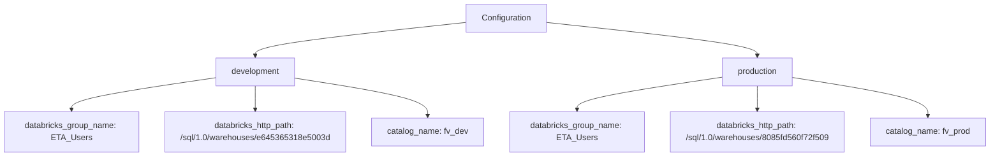
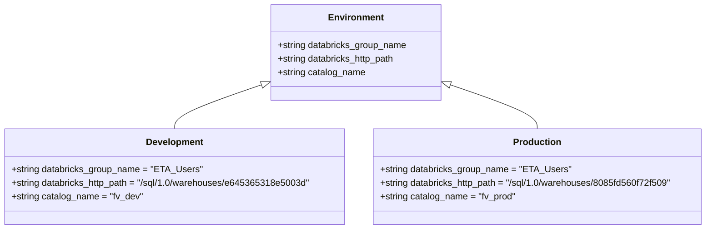
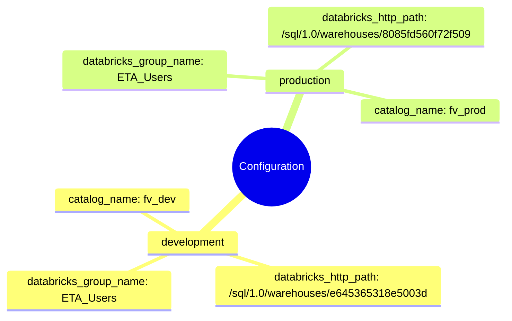

# Diagram: research/orchestrator/util/databricks_config.yaml

> Auto-generated by Obscura crawlers

## Diagram 1

### SVG

<svg id="container" width="1923.625" xmlns="http://www.w3.org/2000/svg" class="flowchart" height="302" viewBox="0 0 1923.625 302" role="graphics-document document" aria-roledescription="flowchart-v2"><g><marker id="container_flowchart-v2-pointEnd" class="marker flowchart-v2" viewBox="0 0 10 10" refX="5" refY="5" markerUnits="userSpaceOnUse" markerWidth="8" markerHeight="8" orient="auto"><path d="M 0 0 L 10 5 L 0 10 z" class="arrowMarkerPath" style="stroke-width: 1; stroke-dasharray: 1, 0;"></path></marker><marker id="container_flowchart-v2-pointStart" class="marker flowchart-v2" viewBox="0 0 10 10" refX="4.5" refY="5" markerUnits="userSpaceOnUse" markerWidth="8" markerHeight="8" orient="auto"><path d="M 0 5 L 10 10 L 10 0 z" class="arrowMarkerPath" style="stroke-width: 1; stroke-dasharray: 1, 0;"></path></marker><marker id="container_flowchart-v2-circleEnd" class="marker flowchart-v2" viewBox="0 0 10 10" refX="11" refY="5" markerUnits="userSpaceOnUse" markerWidth="11" markerHeight="11" orient="auto"><circle cx="5" cy="5" r="5" class="arrowMarkerPath" style="stroke-width: 1; stroke-dasharray: 1, 0;"></circle></marker><marker id="container_flowchart-v2-circleStart" class="marker flowchart-v2" viewBox="0 0 10 10" refX="-1" refY="5" markerUnits="userSpaceOnUse" markerWidth="11" markerHeight="11" orient="auto"><circle cx="5" cy="5" r="5" class="arrowMarkerPath" style="stroke-width: 1; stroke-dasharray: 1, 0;"></circle></marker><marker id="container_flowchart-v2-crossEnd" class="marker cross flowchart-v2" viewBox="0 0 11 11" refX="12" refY="5.2" markerUnits="userSpaceOnUse" markerWidth="11" markerHeight="11" orient="auto"><path d="M 1,1 l 9,9 M 10,1 l -9,9" class="arrowMarkerPath" style="stroke-width: 2; stroke-dasharray: 1, 0;"></path></marker><marker id="container_flowchart-v2-crossStart" class="marker cross flowchart-v2" viewBox="0 0 11 11" refX="-1" refY="5.2" markerUnits="userSpaceOnUse" markerWidth="11" markerHeight="11" orient="auto"><path d="M 1,1 l 9,9 M 10,1 l -9,9" class="arrowMarkerPath" style="stroke-width: 2; stroke-dasharray: 1, 0;"></path></marker><g class="root"><g class="clusters"></g><g class="edgePaths"><path d="M902.156,43.396L834.051,50.664C765.945,57.931,629.734,72.465,561.629,83.233C493.523,94,493.523,101,493.523,104.5L493.523,108" id="L_Config_Dev_0" class="edge-thickness-normal edge-pattern-solid edge-thickness-normal edge-pattern-solid flowchart-link" style=";" data-edge="true" data-et="edge" data-id="L_Config_Dev_0" data-points="W3sieCI6OTAyLjE1NjI1LCJ5Ijo0My4zOTY0MjgxNzA2Mzk4Mn0seyJ4Ijo0OTMuNTIzNDM3NSwieSI6ODd9LHsieCI6NDkzLjUyMzQzNzUsInkiOjExMn1d" marker-end="url(#container_flowchart-v2-pointEnd)"></path><path d="M1059.531,43.396L1127.637,50.664C1195.742,57.931,1331.953,72.465,1400.059,83.233C1468.164,94,1468.164,101,1468.164,104.5L1468.164,108" id="L_Config_Prod_0" class="edge-thickness-normal edge-pattern-solid edge-thickness-normal edge-pattern-solid flowchart-link" style=";" data-edge="true" data-et="edge" data-id="L_Config_Prod_0" data-points="W3sieCI6MTA1OS41MzEyNSwieSI6NDMuMzk2NDI4MTcwNjM5ODJ9LHsieCI6MTQ2OC4xNjQwNjI1LCJ5Ijo4N30seyJ4IjoxNDY4LjE2NDA2MjUsInkiOjExMn1d" marker-end="url(#container_flowchart-v2-pointEnd)"></path><path d="M415.625,150.394L369.354,157.161C323.083,163.929,230.542,177.465,184.271,187.732C138,198,138,205,138,208.5L138,212" id="L_Dev_DevGroup_0" class="edge-thickness-normal edge-pattern-solid edge-thickness-normal edge-pattern-solid flowchart-link" style=";" data-edge="true" data-et="edge" data-id="L_Dev_DevGroup_0" data-points="W3sieCI6NDE1LjYyNSwieSI6MTUwLjM5MzY3NTY5ODI0NDI0fSx7IngiOjEzOCwieSI6MTkxfSx7IngiOjEzOCwieSI6MjE2fV0=" marker-end="url(#container_flowchart-v2-pointEnd)"></path><path d="M493.523,166L493.523,170.167C493.523,174.333,493.523,182.667,493.523,190.333C493.523,198,493.523,205,493.523,208.5L493.523,212" id="L_Dev_DevPath_0" class="edge-thickness-normal edge-pattern-solid edge-thickness-normal edge-pattern-solid flowchart-link" style=";" data-edge="true" data-et="edge" data-id="L_Dev_DevPath_0" data-points="W3sieCI6NDkzLjUyMzQzNzUsInkiOjE2Nn0seyJ4Ijo0OTMuNTIzNDM3NSwieSI6MTkxfSx7IngiOjQ5My41MjM0Mzc1LCJ5IjoyMTZ9XQ==" marker-end="url(#container_flowchart-v2-pointEnd)"></path><path d="M571.422,151.136L614.068,157.78C656.714,164.424,742.005,177.712,784.651,189.856C827.297,202,827.297,213,827.297,218.5L827.297,224" id="L_Dev_DevCatalog_0" class="edge-thickness-normal edge-pattern-solid edge-thickness-normal edge-pattern-solid flowchart-link" style=";" data-edge="true" data-et="edge" data-id="L_Dev_DevCatalog_0" data-points="W3sieCI6NTcxLjQyMTg3NSwieSI6MTUxLjEzNjEzMjc2MjIxMjM4fSx7IngiOjgyNy4yOTY4NzUsInkiOjE5MX0seyJ4Ijo4MjcuMjk2ODc1LCJ5IjoyMjh9XQ==" marker-end="url(#container_flowchart-v2-pointEnd)"></path><path d="M1398.117,149.33L1351.022,156.275C1303.927,163.22,1209.737,177.11,1162.642,187.555C1115.547,198,1115.547,205,1115.547,208.5L1115.547,212" id="L_Prod_ProdGroup_0" class="edge-thickness-normal edge-pattern-solid edge-thickness-normal edge-pattern-solid flowchart-link" style=";" data-edge="true" data-et="edge" data-id="L_Prod_ProdGroup_0" data-points="W3sieCI6MTM5OC4xMTcxODc1LCJ5IjoxNDkuMzI5NzIxOTQ1Mjc1Mjh9LHsieCI6MTExNS41NDY4NzUsInkiOjE5MX0seyJ4IjoxMTE1LjU0Njg3NSwieSI6MjE2fV0=" marker-end="url(#container_flowchart-v2-pointEnd)"></path><path d="M1468.164,166L1468.164,170.167C1468.164,174.333,1468.164,182.667,1468.164,190.333C1468.164,198,1468.164,205,1468.164,208.5L1468.164,212" id="L_Prod_ProdPath_0" class="edge-thickness-normal edge-pattern-solid edge-thickness-normal edge-pattern-solid flowchart-link" style=";" data-edge="true" data-et="edge" data-id="L_Prod_ProdPath_0" data-points="W3sieCI6MTQ2OC4xNjQwNjI1LCJ5IjoxNjZ9LHsieCI6MTQ2OC4xNjQwNjI1LCJ5IjoxOTF9LHsieCI6MTQ2OC4xNjQwNjI1LCJ5IjoyMTZ9XQ==" marker-end="url(#container_flowchart-v2-pointEnd)"></path><path d="M1538.211,149.872L1582.376,156.726C1626.542,163.581,1714.872,177.291,1759.038,189.645C1803.203,202,1803.203,213,1803.203,218.5L1803.203,224" id="L_Prod_ProdCatalog_0" class="edge-thickness-normal edge-pattern-solid edge-thickness-normal edge-pattern-solid flowchart-link" style=";" data-edge="true" data-et="edge" data-id="L_Prod_ProdCatalog_0" data-points="W3sieCI6MTUzOC4yMTA5Mzc1LCJ5IjoxNDkuODcxNjgwMDc0NjE4MTV9LHsieCI6MTgwMy4yMDMxMjUsInkiOjE5MX0seyJ4IjoxODAzLjIwMzEyNSwieSI6MjI4fV0=" marker-end="url(#container_flowchart-v2-pointEnd)"></path></g><g class="edgeLabels"><g class="edgeLabel"><g class="label" data-id="L_Config_Dev_0" transform="translate(0, 0)"><foreignObject width="0" height="0">

</foreignObject></g></g><g class="edgeLabel"><g class="label" data-id="L_Config_Prod_0" transform="translate(0, 0)"><foreignObject width="0" height="0">

</foreignObject></g></g><g class="edgeLabel"><g class="label" data-id="L_Dev_DevGroup_0" transform="translate(0, 0)"><foreignObject width="0" height="0">

</foreignObject></g></g><g class="edgeLabel"><g class="label" data-id="L_Dev_DevPath_0" transform="translate(0, 0)"><foreignObject width="0" height="0">

</foreignObject></g></g><g class="edgeLabel"><g class="label" data-id="L_Dev_DevCatalog_0" transform="translate(0, 0)"><foreignObject width="0" height="0">

</foreignObject></g></g><g class="edgeLabel"><g class="label" data-id="L_Prod_ProdGroup_0" transform="translate(0, 0)"><foreignObject width="0" height="0">

</foreignObject></g></g><g class="edgeLabel"><g class="label" data-id="L_Prod_ProdPath_0" transform="translate(0, 0)"><foreignObject width="0" height="0">

</foreignObject></g></g><g class="edgeLabel"><g class="label" data-id="L_Prod_ProdCatalog_0" transform="translate(0, 0)"><foreignObject width="0" height="0">

</foreignObject></g></g></g><g class="nodes"><g class="node default" id="flowchart-Config-0" transform="translate(980.84375, 35)"><rect class="basic label-container" style="" x="-78.6875" y="-27" width="157.375" height="54"></rect><g class="label" style="" transform="translate(-48.6875, -12)"><rect></rect><foreignObject width="97.375" height="24">

Configuration

</foreignObject></g></g><g class="node default" id="flowchart-Dev-2" transform="translate(493.5234375, 139)"><rect class="basic label-container" style="" x="-77.8984375" y="-27" width="155.796875" height="54"></rect><g class="label" style="" transform="translate(-47.8984375, -12)"><rect></rect><foreignObject width="95.796875" height="24">

development

</foreignObject></g></g><g class="node default" id="flowchart-Prod-4" transform="translate(1468.1640625, 139)"><rect class="basic label-container" style="" x="-70.046875" y="-27" width="140.09375" height="54"></rect><g class="label" style="" transform="translate(-40.046875, -12)"><rect></rect><foreignObject width="80.09375" height="24">

production

</foreignObject></g></g><g class="node default" id="flowchart-DevGroup-6" transform="translate(138, 255)"><rect class="basic label-container" style="" x="-130" y="-39" width="260" height="78"></rect><g class="label" style="" transform="translate(-100, -24)"><rect></rect><foreignObject width="200" height="48">

databricks_group_name: ETA_Users

</foreignObject></g></g><g class="node default" id="flowchart-DevPath-8" transform="translate(493.5234375, 255)"><rect class="basic label-container" style="" x="-175.5234375" y="-39" width="351.046875" height="78"></rect><g class="label" style="" transform="translate(-145.5234375, -24)"><rect></rect><foreignObject width="291.046875" height="48">

databricks_http_path: /sql/1.0/warehouses/e645365318e5003d

</foreignObject></g></g><g class="node default" id="flowchart-DevCatalog-10" transform="translate(827.296875, 255)"><rect class="basic label-container" style="" x="-108.25" y="-27" width="216.5" height="54"></rect><g class="label" style="" transform="translate(-78.25, -12)"><rect></rect><foreignObject width="156.5" height="24">

catalog_name: fv_dev

</foreignObject></g></g><g class="node default" id="flowchart-ProdGroup-12" transform="translate(1115.546875, 255)"><rect class="basic label-container" style="" x="-130" y="-39" width="260" height="78"></rect><g class="label" style="" transform="translate(-100, -24)"><rect></rect><foreignObject width="200" height="48">

databricks_group_name: ETA_Users

</foreignObject></g></g><g class="node default" id="flowchart-ProdPath-14" transform="translate(1468.1640625, 255)"><rect class="basic label-container" style="" x="-172.6171875" y="-39" width="345.234375" height="78"></rect><g class="label" style="" transform="translate(-142.6171875, -24)"><rect></rect><foreignObject width="285.234375" height="48">

databricks_http_path: /sql/1.0/warehouses/8085fd560f72f509

</foreignObject></g></g><g class="node default" id="flowchart-ProdCatalog-16" transform="translate(1803.203125, 255)"><rect class="basic label-container" style="" x="-112.421875" y="-27" width="224.84375" height="54"></rect><g class="label" style="" transform="translate(-82.421875, -12)"><rect></rect><foreignObject width="164.84375" height="24">

catalog_name: fv_prod

</foreignObject></g></g></g></g></g></svg>

## Diagram 2

### SVG

<svg id="container" width="1253.5" xmlns="http://www.w3.org/2000/svg" class="classDiagram" height="402" viewBox="0 0 1253.5 402" role="graphics-document document" aria-roledescription="class"><g><defs><marker id="container_class-aggregationStart" class="marker aggregation class" refX="18" refY="7" markerWidth="190" markerHeight="240" orient="auto"><path d="M 18,7 L9,13 L1,7 L9,1 Z"></path></marker></defs><defs><marker id="container_class-aggregationEnd" class="marker aggregation class" refX="1" refY="7" markerWidth="20" markerHeight="28" orient="auto"><path d="M 18,7 L9,13 L1,7 L9,1 Z"></path></marker></defs><defs><marker id="container_class-extensionStart" class="marker extension class" refX="18" refY="7" markerWidth="190" markerHeight="240" orient="auto"><path d="M 1,7 L18,13 V 1 Z"></path></marker></defs><defs><marker id="container_class-extensionEnd" class="marker extension class" refX="1" refY="7" markerWidth="20" markerHeight="28" orient="auto"><path d="M 1,1 V 13 L18,7 Z"></path></marker></defs><defs><marker id="container_class-compositionStart" class="marker composition class" refX="18" refY="7" markerWidth="190" markerHeight="240" orient="auto"><path d="M 18,7 L9,13 L1,7 L9,1 Z"></path></marker></defs><defs><marker id="container_class-compositionEnd" class="marker composition class" refX="1" refY="7" markerWidth="20" markerHeight="28" orient="auto"><path d="M 18,7 L9,13 L1,7 L9,1 Z"></path></marker></defs><defs><marker id="container_class-dependencyStart" class="marker dependency class" refX="6" refY="7" markerWidth="190" markerHeight="240" orient="auto"><path d="M 5,7 L9,13 L1,7 L9,1 Z"></path></marker></defs><defs><marker id="container_class-dependencyEnd" class="marker dependency class" refX="13" refY="7" markerWidth="20" markerHeight="28" orient="auto"><path d="M 18,7 L9,13 L14,7 L9,1 Z"></path></marker></defs><defs><marker id="container_class-lollipopStart" class="marker lollipop class" refX="13" refY="7" markerWidth="190" markerHeight="240" orient="auto"><circle stroke="black" fill="transparent" cx="7" cy="7" r="6"></circle></marker></defs><defs><marker id="container_class-lollipopEnd" class="marker lollipop class" refX="1" refY="7" markerWidth="190" markerHeight="240" orient="auto"><circle stroke="black" fill="transparent" cx="7" cy="7" r="6"></circle></marker></defs><g class="root"><g class="clusters"></g><g class="edgePaths"><path d="M464.525,148.153L438.515,156.961C412.506,165.769,360.487,183.384,334.478,196.359C308.469,209.333,308.469,217.667,308.469,221.833L308.469,226" id="id_Environment_Development_1" class="edge-thickness-normal edge-pattern-solid relation" style=";;;" data-edge="true" data-et="edge" data-id="id_Environment_Development_1" data-points="W3sieCI6NDgwLjg2MzI4MTI1LCJ5IjoxNDIuNjIwMTgyMDM4ODM0OTd9LHsieCI6MzA4LjQ2ODc1LCJ5IjoyMDF9LHsieCI6MzA4LjQ2ODc1LCJ5IjoyMjZ9XQ==" marker-start="url(#container_class-extensionStart)"></path><path d="M796.163,148.153L822.172,156.961C848.181,165.769,900.2,183.384,926.209,196.359C952.219,209.333,952.219,217.667,952.219,221.833L952.219,226" id="id_Environment_Production_2" class="edge-thickness-normal edge-pattern-solid relation" style=";;;" data-edge="true" data-et="edge" data-id="id_Environment_Production_2" data-points="W3sieCI6Nzc5LjgyNDIxODc1LCJ5IjoxNDIuNjIwMTgyMDM4ODM0OTd9LHsieCI6OTUyLjIxODc1LCJ5IjoyMDF9LHsieCI6OTUyLjIxODc1LCJ5IjoyMjZ9XQ==" marker-start="url(#container_class-extensionStart)"></path></g><g class="edgeLabels"><g class="edgeLabel"><g class="label" data-id="id_Environment_Development_1" transform="translate(0, 0)"><foreignObject width="0" height="0">

</foreignObject></g></g><g class="edgeLabel"><g class="label" data-id="id_Environment_Production_2" transform="translate(0, 0)"><foreignObject width="0" height="0">

</foreignObject></g></g></g><g class="nodes"><g class="node default" id="classId-Environment-0" transform="translate(630.34375, 92)"><g class="basic label-container"><path d="M-149.48046875 -84 L149.48046875 -84 L149.48046875 84 L-149.48046875 84" stroke="none" stroke-width="0" fill="#ECECFF" style=""></path><path d="M-149.48046875 -84 C-56.64873554290361 -84, 36.18299766419278 -84, 149.48046875 -84 M-149.48046875 -84 C-49.282267939964854 -84, 50.91593287007029 -84, 149.48046875 -84 M149.48046875 -84 C149.48046875 -26.258518713229762, 149.48046875 31.482962573540476, 149.48046875 84 M149.48046875 -84 C149.48046875 -37.49728745791183, 149.48046875 9.005425084176338, 149.48046875 84 M149.48046875 84 C46.20304537161222 84, -57.07437800677556 84, -149.48046875 84 M149.48046875 84 C78.29235014900186 84, 7.104231548003725 84, -149.48046875 84 M-149.48046875 84 C-149.48046875 17.246718418784837, -149.48046875 -49.506563162430325, -149.48046875 -84 M-149.48046875 84 C-149.48046875 30.339349223913608, -149.48046875 -23.321301552172784, -149.48046875 -84" stroke="#9370DB" stroke-width="1.3" fill="none" stroke-dasharray="0 0" style=""></path></g><g class="annotation-group text" transform="translate(0, -60)"></g><g class="label-group text" transform="translate(-46.1953125, -60)"><g class="label" style="font-weight: bolder" transform="translate(0,-12)"><foreignObject width="92.390625" height="24">

Environment

</foreignObject></g></g><g class="members-group text" transform="translate(-137.48046875, -12)"><g class="label" style="" transform="translate(0,-12)"><foreignObject width="228.765625" height="24">

+string databricks_group_name

</foreignObject></g><g class="label" style="" transform="translate(0,12)"><foreignObject width="209.5625" height="24">

+string databricks_http_path

</foreignObject></g><g class="label" style="" transform="translate(0,36)"><foreignObject width="155.4375" height="24">

+string catalog_name

</foreignObject></g></g><g class="methods-group text" transform="translate(-137.48046875, 84)"></g><g class="divider" style=""><path d="M-149.48046875 -36 C-51.944684565616896 -36, 45.59109961876621 -36, 149.48046875 -36 M-149.48046875 -36 C-63.81559175187731 -36, 21.849285246245387 -36, 149.48046875 -36" stroke="#9370DB" stroke-width="1.3" fill="none" stroke-dasharray="0 0" style=""></path></g><g class="divider" style=""><path d="M-149.48046875 60 C-57.67513695790322 60, 34.13019483419356 60, 149.48046875 60 M-149.48046875 60 C-76.38792419577135 60, -3.295379641542695 60, 149.48046875 60" stroke="#9370DB" stroke-width="1.3" fill="none" stroke-dasharray="0 0" style=""></path></g></g><g class="node default" id="classId-Development-1" transform="translate(308.46875, 310)"><g class="basic label-container"><path d="M-300.46875 -84 L300.46875 -84 L300.46875 84 L-300.46875 84" stroke="none" stroke-width="0" fill="#ECECFF" style=""></path><path d="M-300.46875 -84 C-64.37700544065191 -84, 171.71473911869617 -84, 300.46875 -84 M-300.46875 -84 C-67.7832701357024 -84, 164.9022097285952 -84, 300.46875 -84 M300.46875 -84 C300.46875 -29.08441991993712, 300.46875 25.831160160125762, 300.46875 84 M300.46875 -84 C300.46875 -19.11953711280843, 300.46875 45.76092577438314, 300.46875 84 M300.46875 84 C138.4998668926604 84, -23.469016214679186 84, -300.46875 84 M300.46875 84 C80.571661951252 84, -139.325426097496 84, -300.46875 84 M-300.46875 84 C-300.46875 17.744075159712168, -300.46875 -48.511849680575665, -300.46875 -84 M-300.46875 84 C-300.46875 46.209405570152946, -300.46875 8.418811140305891, -300.46875 -84" stroke="#9370DB" stroke-width="1.3" fill="none" stroke-dasharray="0 0" style=""></path></g><g class="annotation-group text" transform="translate(0, -60)"></g><g class="label-group text" transform="translate(-48.6875, -60)"><g class="label" style="font-weight: bolder" transform="translate(0,-12)"><foreignObject width="97.375" height="24">

Development

</foreignObject></g></g><g class="members-group text" transform="translate(-288.46875, -12)"><g class="label" style="" transform="translate(0,-12)"><foreignObject width="330.921875" height="24">

+string databricks_group_name = "ETA_Users"

</foreignObject></g><g class="label" style="" transform="translate(0,12)"><foreignObject width="528.25" height="24">

+string databricks_http_path = "/sql/1.0/warehouses/e645365318e5003d"

</foreignObject></g><g class="label" style="" transform="translate(0,36)"><foreignObject width="231.53125" height="24">

+string catalog_name = "fv_dev"

</foreignObject></g></g><g class="methods-group text" transform="translate(-288.46875, 84)"></g><g class="divider" style=""><path d="M-300.46875 -36 C-161.03271488489327 -36, -21.596679769786533 -36, 300.46875 -36 M-300.46875 -36 C-143.1558980569241 -36, 14.156953886151825 -36, 300.46875 -36" stroke="#9370DB" stroke-width="1.3" fill="none" stroke-dasharray="0 0" style=""></path></g><g class="divider" style=""><path d="M-300.46875 60 C-110.27454606833831 60, 79.91965786332338 60, 300.46875 60 M-300.46875 60 C-100.48867865738629 60, 99.49139268522742 60, 300.46875 60" stroke="#9370DB" stroke-width="1.3" fill="none" stroke-dasharray="0 0" style=""></path></g></g><g class="node default" id="classId-Production-2" transform="translate(952.21875, 310)"><g class="basic label-container"><path d="M-293.28125 -84 L293.28125 -84 L293.28125 84 L-293.28125 84" stroke="none" stroke-width="0" fill="#ECECFF" style=""></path><path d="M-293.28125 -84 C-145.20322120069798 -84, 2.8748075986040362 -84, 293.28125 -84 M-293.28125 -84 C-83.3979064689949 -84, 126.48543706201019 -84, 293.28125 -84 M293.28125 -84 C293.28125 -22.801353451653156, 293.28125 38.39729309669369, 293.28125 84 M293.28125 -84 C293.28125 -32.92130802769055, 293.28125 18.1573839446189, 293.28125 84 M293.28125 84 C80.83545573607691 84, -131.61033852784618 84, -293.28125 84 M293.28125 84 C111.1092491114581 84, -71.0627517770838 84, -293.28125 84 M-293.28125 84 C-293.28125 28.95856598943905, -293.28125 -26.082868021121897, -293.28125 -84 M-293.28125 84 C-293.28125 49.690392026602346, -293.28125 15.380784053204692, -293.28125 -84" stroke="#9370DB" stroke-width="1.3" fill="none" stroke-dasharray="0 0" style=""></path></g><g class="annotation-group text" transform="translate(0, -60)"></g><g class="label-group text" transform="translate(-40.125, -60)"><g class="label" style="font-weight: bolder" transform="translate(0,-12)"><foreignObject width="80.25" height="24">

Production

</foreignObject></g></g><g class="members-group text" transform="translate(-281.28125, -12)"><g class="label" style="" transform="translate(0,-12)"><foreignObject width="330.921875" height="24">

+string databricks_group_name = "ETA_Users"

</foreignObject></g><g class="label" style="" transform="translate(0,12)"><foreignObject width="522.4375" height="24">

+string databricks_http_path = "/sql/1.0/warehouses/8085fd560f72f509"

</foreignObject></g><g class="label" style="" transform="translate(0,36)"><foreignObject width="239.859375" height="24">

+string catalog_name = "fv_prod"

</foreignObject></g></g><g class="methods-group text" transform="translate(-281.28125, 84)"></g><g class="divider" style=""><path d="M-293.28125 -36 C-117.85656353982813 -36, 57.56812292034374 -36, 293.28125 -36 M-293.28125 -36 C-123.83149360103752 -36, 45.618262797924956 -36, 293.28125 -36" stroke="#9370DB" stroke-width="1.3" fill="none" stroke-dasharray="0 0" style=""></path></g><g class="divider" style=""><path d="M-293.28125 60 C-163.5900710237011 60, -33.89889204740223 60, 293.28125 60 M-293.28125 60 C-117.37551585224085 60, 58.530218295518296 60, 293.28125 60" stroke="#9370DB" stroke-width="1.3" fill="none" stroke-dasharray="0 0" style=""></path></g></g></g></g></g></svg>

## Diagram 3

### SVG

<svg id="container" width="100%" xmlns="http://www.w3.org/2000/svg" class="mindmapDiagram" style="max-width: 859.362548828125px;" viewBox="5 5 859.362548828125 475.3116455078125" role="graphics-document document" aria-roledescription="mindmap"><g><marker id="container_mindmap-pointEnd" class="marker mindmap" viewBox="0 0 10 10" refX="5" refY="5" markerUnits="userSpaceOnUse" markerWidth="8" markerHeight="8" orient="auto"><path d="M 0 0 L 10 5 L 0 10 z" class="arrowMarkerPath" style="stroke-width: 1; stroke-dasharray: 1, 0;"></path></marker><marker id="container_mindmap-pointStart" class="marker mindmap" viewBox="0 0 10 10" refX="4.5" refY="5" markerUnits="userSpaceOnUse" markerWidth="8" markerHeight="8" orient="auto"><path d="M 0 5 L 10 10 L 10 0 z" class="arrowMarkerPath" style="stroke-width: 1; stroke-dasharray: 1, 0;"></path></marker><g class="subgraphs"></g><g class="edgePaths"><path d="M487.971,264.768L479.85,271.955C471.728,279.142,455.486,293.516,439.243,307.89C423.001,322.265,406.758,336.639,398.637,343.826L390.516,351.013" id="edge_0_1" class="edge-thickness-normal edge-pattern-solid edge section-edge-0 edge-depth-1" style="undefined;;;undefined" data-edge="true" data-et="edge" data-id="edge_0_1" data-points="W3sieCI6NDg3Ljk3MDkyNjg3MjYxNzE2LCJ5IjoyNjQuNzY3OTQ2OTA0MzIzMjV9LHsieCI6NDM5LjI0MzM2Njk5MDAwODksInkiOjMwNy44OTAzODYyMTQ4MTUyfSx7IngiOjM5MC41MTU4MDcxMDc0MDA1LCJ5IjozNTEuMDEyODI1NTI1MzA3MX1d"></path><path d="M364.4,362.828L346.524,365.079C328.647,367.33,292.894,371.832,257.141,376.334C221.388,380.836,185.635,385.338,167.759,387.589L149.882,389.84" id="edge_1_2" class="edge-thickness-normal edge-pattern-solid edge section-edge-0 edge-depth-3" style="undefined;;;undefined" data-edge="true" data-et="edge" data-id="edge_1_2" data-points="W3sieCI6MzY0LjQwMDM1OTY2NTY2MDYzLCJ5IjozNjIuODI3NjY4MTU1NjczMX0seyJ4IjoyNTcuMTQxNDE4NDYzMTIyNSwieSI6Mzc2LjMzMzY5MjU1MDcyMTkzfSx7IngiOjE0OS44ODI0NzcyNjA1ODQzNSwieSI6Mzg5LjgzOTcxNjk0NTc3MDY1fV0="></path><path d="M391.144,370.136L397.817,375.302C404.49,380.468,417.835,390.801,431.181,401.133C444.527,411.465,457.873,421.797,464.546,426.963L471.218,432.129" id="edge_1_3" class="edge-thickness-normal edge-pattern-solid edge section-edge-0 edge-depth-3" style="undefined;;;undefined" data-edge="true" data-et="edge" data-id="edge_1_3" data-points="W3sieCI6MzkxLjE0MzcyNjczNTc1MzIsInkiOjM3MC4xMzYyMjMzMjUzNjU5Nn0seyJ4Ijo0MzEuMTgxMTA0NDYyNTUxNSwieSI6NDAxLjEzMjY2NDM5NTEyOTV9LHsieCI6NDcxLjIxODQ4MjE4OTM0OTgsInkiOjQzMi4xMjkxMDU0NjQ4OTMwM31d"></path><path d="M366.435,353.212L359.997,349.334C353.559,345.455,340.684,337.697,327.809,329.939C314.933,322.182,302.058,314.424,295.62,310.545L289.183,306.666" id="edge_1_4" class="edge-thickness-normal edge-pattern-solid edge section-edge-0 edge-depth-3" style="undefined;;;undefined" data-edge="true" data-et="edge" data-id="edge_1_4" data-points="W3sieCI6MzY2LjQzNDc2NTQ0OTM1MjksInkiOjM1My4yMTI0MTI2MzkzMzk4NX0seyJ4IjozMjcuODA4NzMwMDM5MTQyOSwieSI6MzI5LjkzOTM0Mjc0Njc4MjM2fSx7IngiOjI4OS4xODI2OTQ2Mjg5MzI5NSwieSI6MzA2LjY2NjI3Mjg1NDIyNDg3fV0="></path><path d="M503.182,240.364L505.463,232.071C507.744,223.778,512.306,207.192,516.868,190.606C521.429,174.019,525.991,157.433,528.272,149.14L530.553,140.847" id="edge_0_5" class="edge-thickness-normal edge-pattern-solid edge section-edge-1 edge-depth-1" style="undefined;;;undefined" data-edge="true" data-et="edge" data-id="edge_0_5" data-points="W3sieCI6NTAzLjE4MTgxNzk5MDIxNTIsInkiOjI0MC4zNjQxNzk3MTUyNzg3NH0seyJ4Ijo1MTYuODY3NTYwNTc3OTk0OCwieSI6MTkwLjYwNTU2MzA5NjcwNzE2fSx7IngiOjUzMC41NTMzMDMxNjU3NzQ0LCJ5IjoxNDAuODQ2OTQ2NDc4MTM1NTh9XQ=="></path><path d="M519.574,125.254L502.401,123.956C485.227,122.659,450.881,120.064,416.535,117.469C382.188,114.874,347.842,112.279,330.669,110.981L313.496,109.684" id="edge_5_6" class="edge-thickness-normal edge-pattern-solid edge section-edge-1 edge-depth-3" style="undefined;;;undefined" data-edge="true" data-et="edge" data-id="edge_5_6" data-points="W3sieCI6NTE5LjU3Mzg1Njc1NDQ1NTQsInkiOjEyNS4yNTM5MDc0Mjk0NDg3NH0seyJ4Ijo0MTYuNTM0NzQ2NDI4ODc3ODQsInkiOjExNy40Njg3MDQ0Nzk2Njc5Nn0seyJ4IjozMTMuNDk1NjM2MTAzMzAwMzQsInkiOjEwOS42ODM1MDE1Mjk4ODcxOH1d"></path><path d="M545.815,116.501L551.774,111.283C557.732,106.065,569.649,95.628,581.565,85.192C593.482,74.756,605.398,64.319,611.357,59.101L617.315,53.883" id="edge_5_7" class="edge-thickness-normal edge-pattern-solid edge section-edge-1 edge-depth-3" style="undefined;;;undefined" data-edge="true" data-et="edge" data-id="edge_5_7" data-points="W3sieCI6NTQ1LjgxNTQ0MTQyMzkwMzQsInkiOjExNi41MDEzOTAxMzk1MzY4OH0seyJ4Ijo1ODEuNTY1MjA3OTgxMzYzMSwieSI6ODUuMTkyMDExNjgxNjg4Nn0seyJ4Ijo2MTcuMzE0OTc0NTM4ODIyOCwieSI6NTMuODgyNjMzMjIzODQwMzE1fV0="></path><path d="M549.51,127.188L565.131,128.027C580.752,128.865,611.994,130.542,643.236,132.22C674.478,133.897,705.72,135.574,721.341,136.413L736.962,137.251" id="edge_5_8" class="edge-thickness-normal edge-pattern-solid edge section-edge-1 edge-depth-3" style="undefined;;;undefined" data-edge="true" data-et="edge" data-id="edge_5_8" data-points="W3sieCI6NTQ5LjUwOTY1NjQ3MzAyMzUsInkiOjEyNy4xODgxMTUyMTk1NTcwNX0seyJ4Ijo2NDMuMjM1OTQ3MjkwMzY3NywieSI6MTMyLjIxOTY1MjkxOTI2MDQ1fSx7IngiOjczNi45NjIyMzgxMDc3MTE5LCJ5IjoxMzcuMjUxMTkwNjE4OTYzODV9XQ=="></path></g><g class="edgeLabels"><g class="edgeLabel"><g class="label" data-id="edge_0_1" transform="translate(0, 0)"><foreignObject width="0" height="0">

</foreignObject></g></g><g class="edgeLabel"><g class="label" data-id="edge_1_2" transform="translate(0, 0)"><foreignObject width="0" height="0">

</foreignObject></g></g><g class="edgeLabel"><g class="label" data-id="edge_1_3" transform="translate(0, 0)"><foreignObject width="0" height="0">

</foreignObject></g></g><g class="edgeLabel"><g class="label" data-id="edge_1_4" transform="translate(0, 0)"><foreignObject width="0" height="0">

</foreignObject></g></g><g class="edgeLabel"><g class="label" data-id="edge_0_5" transform="translate(0, 0)"><foreignObject width="0" height="0">

</foreignObject></g></g><g class="edgeLabel"><g class="label" data-id="edge_5_6" transform="translate(0, 0)"><foreignObject width="0" height="0">

</foreignObject></g></g><g class="edgeLabel"><g class="label" data-id="edge_5_7" transform="translate(0, 0)"><foreignObject width="0" height="0">

</foreignObject></g></g><g class="edgeLabel"><g class="label" data-id="edge_5_8" transform="translate(0, 0)"><foreignObject width="0" height="0">

</foreignObject></g></g></g><g class="nodes"><g class="node mindmap-node section-root section--1" id="node_0" transform="translate(499.2038970537727, 254.82710283003712)"><circle class="basic label-container" style="" r="58.6875" cx="0" cy="0"></circle><g class="label" style="" transform="translate(-48.6875, -12)"><rect></rect><foreignObject width="97.375" height="24">

Configuration

</foreignObject></g></g><g class="node mindmap-node section-0" id="node_1" transform="translate(379.28283692624495, 360.95366959959324)"><path id="node-1" class="node-bkg node-0" style="" d="M-67.8984375 12
    v-24
    q0,-5 5,-5
    h125.796875
    q5,0 5,5
    v24
    q0,5 -5,5
    h-125.796875
    q-5,0 -5,-5
    Z"></path><line class="node-line-" x1="-67.8984375" y1="17" x2="67.8984375" y2="17"></line><g class="label" style="" transform="translate(-47.8984375, -12)"><rect></rect><foreignObject width="95.796875" height="24">

development

</foreignObject></g></g><g class="node mindmap-node section-0" id="node_2" transform="translate(135, 391.7137155018505)"><path id="node-2" class="node-bkg node-0" style="" d="M-120 24
    v-48
    q0,-5 5,-5
    h230
    q5,0 5,5
    v48
    q0,5 -5,5
    h-230
    q-5,0 -5,-5
    Z"></path><line class="node-line-" x1="-120" y1="29" x2="120" y2="29"></line><g class="label" style="" transform="translate(-100, -24)"><rect></rect><foreignObject width="200" height="48">

databricks_group_name: ETA_Users

</foreignObject></g></g><g class="node mindmap-node section-0" id="node_3" transform="translate(483.07937199885805, 441.31165919066575)"><path id="node-3" class="node-bkg node-0" style="" d="M-165.5234375 24
    v-48
    q0,-5 5,-5
    h321.046875
    q5,0 5,5
    v48
    q0,5 -5,5
    h-321.046875
    q-5,0 -5,-5
    Z"></path><line class="node-line-" x1="-165.5234375" y1="29" x2="165.5234375" y2="29"></line><g class="label" style="" transform="translate(-145.5234375, -24)"><rect></rect><foreignObject width="291.046875" height="48">

databricks_http_path: /sql/1.0/warehouses/e645365318e5003d

</foreignObject></g></g><g class="node mindmap-node section-0" id="node_4" transform="translate(276.3346231520409, 298.9250158939715)"><path id="node-4" class="node-bkg node-0" style="" d="M-98.25 12
    v-24
    q0,-5 5,-5
    h186.5
    q5,0 5,5
    v24
    q0,5 -5,5
    h-186.5
    q-5,0 -5,-5
    Z"></path><line class="node-line-" x1="-98.25" y1="17" x2="98.25" y2="17"></line><g class="label" style="" transform="translate(-78.25, -12)"><rect></rect><foreignObject width="156.5" height="24">

catalog_name: fv_dev

</foreignObject></g></g><g class="node mindmap-node section-1" id="node_5" transform="translate(534.5312241022169, 126.3840233633772)"><path id="node-5" class="node-bkg node-0" style="" d="M-60.046875 12
    v-24
    q0,-5 5,-5
    h110.09375
    q5,0 5,5
    v24
    q0,5 -5,5
    h-110.09375
    q-5,0 -5,-5
    Z"></path><line class="node-line-" x1="-60.046875" y1="17" x2="60.046875" y2="17"></line><g class="label" style="" transform="translate(-40.046875, -12)"><rect></rect><foreignObject width="80.09375" height="24">

production

</foreignObject></g></g><g class="node mindmap-node section-1" id="node_6" transform="translate(298.53826875553887, 108.55338559595873)"><path id="node-6" class="node-bkg node-0" style="" d="M-120 24
    v-48
    q0,-5 5,-5
    h230
    q5,0 5,5
    v48
    q0,5 -5,5
    h-230
    q-5,0 -5,-5
    Z"></path><line class="node-line-" x1="-120" y1="29" x2="120" y2="29"></line><g class="label" style="" transform="translate(-100, -24)"><rect></rect><foreignObject width="200" height="48">

databricks_group_name: ETA_Users

</foreignObject></g></g><g class="node mindmap-node section-1" id="node_7" transform="translate(628.5991918605092, 44)"><path id="node-7" class="node-bkg node-0" style="" d="M-162.6171875 24
    v-48
    q0,-5 5,-5
    h315.234375
    q5,0 5,5
    v48
    q0,5 -5,5
    h-315.234375
    q-5,0 -5,-5
    Z"></path><line class="node-line-" x1="-162.6171875" y1="29" x2="162.6171875" y2="29"></line><g class="label" style="" transform="translate(-142.6171875, -24)"><rect></rect><foreignObject width="285.234375" height="48">

databricks_http_path: /sql/1.0/warehouses/8085fd560f72f509

</foreignObject></g></g><g class="node mindmap-node section-1" id="node_8" transform="translate(751.9406704785184, 138.0552824751437)"><path id="node-8" class="node-bkg node-0" style="" d="M-102.421875 12
    v-24
    q0,-5 5,-5
    h194.84375
    q5,0 5,5
    v24
    q0,5 -5,5
    h-194.84375
    q-5,0 -5,-5
    Z"></path><line class="node-line-" x1="-102.421875" y1="17" x2="102.421875" y2="17"></line><g class="label" style="" transform="translate(-82.421875, -12)"><rect></rect><foreignObject width="164.84375" height="24">

catalog_name: fv_prod

</foreignObject></g></g></g></g></svg>
