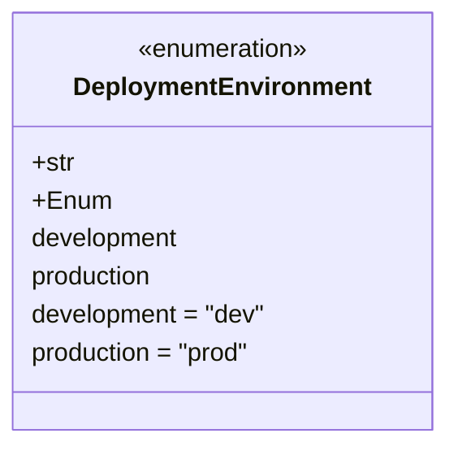

# Diagram: research/orchestrator/util/deployment_environment.py

> Auto-generated by Obscura crawlers

## Mermaid

### SVG

<svg id="container" width="281.546875" xmlns="http://www.w3.org/2000/svg" class="classDiagram" height="280" viewBox="0 0 281.546875 280" role="graphics-document document" aria-roledescription="class"><g><defs><marker id="container_class-aggregationStart" class="marker aggregation class" refX="18" refY="7" markerWidth="190" markerHeight="240" orient="auto"><path d="M 18,7 L9,13 L1,7 L9,1 Z"></path></marker></defs><defs><marker id="container_class-aggregationEnd" class="marker aggregation class" refX="1" refY="7" markerWidth="20" markerHeight="28" orient="auto"><path d="M 18,7 L9,13 L1,7 L9,1 Z"></path></marker></defs><defs><marker id="container_class-extensionStart" class="marker extension class" refX="18" refY="7" markerWidth="190" markerHeight="240" orient="auto"><path d="M 1,7 L18,13 V 1 Z"></path></marker></defs><defs><marker id="container_class-extensionEnd" class="marker extension class" refX="1" refY="7" markerWidth="20" markerHeight="28" orient="auto"><path d="M 1,1 V 13 L18,7 Z"></path></marker></defs><defs><marker id="container_class-compositionStart" class="marker composition class" refX="18" refY="7" markerWidth="190" markerHeight="240" orient="auto"><path d="M 18,7 L9,13 L1,7 L9,1 Z"></path></marker></defs><defs><marker id="container_class-compositionEnd" class="marker composition class" refX="1" refY="7" markerWidth="20" markerHeight="28" orient="auto"><path d="M 18,7 L9,13 L1,7 L9,1 Z"></path></marker></defs><defs><marker id="container_class-dependencyStart" class="marker dependency class" refX="6" refY="7" markerWidth="190" markerHeight="240" orient="auto"><path d="M 5,7 L9,13 L1,7 L9,1 Z"></path></marker></defs><defs><marker id="container_class-dependencyEnd" class="marker dependency class" refX="13" refY="7" markerWidth="20" markerHeight="28" orient="auto"><path d="M 18,7 L9,13 L14,7 L9,1 Z"></path></marker></defs><defs><marker id="container_class-lollipopStart" class="marker lollipop class" refX="13" refY="7" markerWidth="190" markerHeight="240" orient="auto"><circle stroke="black" fill="transparent" cx="7" cy="7" r="6"></circle></marker></defs><defs><marker id="container_class-lollipopEnd" class="marker lollipop class" refX="1" refY="7" markerWidth="190" markerHeight="240" orient="auto"><circle stroke="black" fill="transparent" cx="7" cy="7" r="6"></circle></marker></defs><g class="root"><g class="clusters"></g><g class="edgePaths"></g><g class="edgeLabels"></g><g class="nodes"><g class="node default" id="classId-DeploymentEnvironment-0" transform="translate(140.7734375, 140)"><g class="basic label-container"><path d="M-132.7734375 -132 L132.7734375 -132 L132.7734375 132 L-132.7734375 132" stroke="none" stroke-width="0" fill="#ECECFF" style=""></path><path d="M-132.7734375 -132 C-65.25828552208947 -132, 2.2568664558210685 -132, 132.7734375 -132 M-132.7734375 -132 C-41.24362311569358 -132, 50.28619126861284 -132, 132.7734375 -132 M132.7734375 -132 C132.7734375 -29.24617947920615, 132.7734375 73.5076410415877, 132.7734375 132 M132.7734375 -132 C132.7734375 -60.32328047277723, 132.7734375 11.353439054445545, 132.7734375 132 M132.7734375 132 C56.00440422846981 132, -20.76462904306038 132, -132.7734375 132 M132.7734375 132 C78.81062371773227 132, 24.84780993546454 132, -132.7734375 132 M-132.7734375 132 C-132.7734375 44.06866638595868, -132.7734375 -43.86266722808264, -132.7734375 -132 M-132.7734375 132 C-132.7734375 57.47885170351722, -132.7734375 -17.042296592965556, -132.7734375 -132" stroke="#9370DB" stroke-width="1.3" fill="none" stroke-dasharray="0 0" style=""></path></g><g class="annotation-group text" transform="translate(-55.5546875, -108)"><g class="label" style="" transform="translate(0,-12)"><foreignObject width="111.109375" height="24">

«enumeration»

</foreignObject></g></g><g class="label-group text" transform="translate(-90.5625, -84)"><g class="label" style="font-weight: bolder" transform="translate(0,-12)"><foreignObject width="181.125" height="24">

DeploymentEnvironment

</foreignObject></g></g><g class="members-group text" transform="translate(-120.7734375, -36)"><g class="label" style="" transform="translate(0,-12)"><foreignObject width="27.421875" height="24">

+str

</foreignObject></g><g class="label" style="" transform="translate(0,12)"><foreignObject width="48.796875" height="24">

+Enum

</foreignObject></g><g class="label" style="" transform="translate(0,36)"><foreignObject width="95.796875" height="24">

development

</foreignObject></g><g class="label" style="" transform="translate(0,60)"><foreignObject width="80.09375" height="24">

production

</foreignObject></g><g class="label" style="" transform="translate(0,84)"><foreignObject width="150.984375" height="24">

development = "dev"

</foreignObject></g><g class="label" style="" transform="translate(0,108)"><foreignObject width="143.453125" height="24">

production = "prod"

</foreignObject></g></g><g class="methods-group text" transform="translate(-120.7734375, 132)"></g><g class="divider" style=""><path d="M-132.7734375 -60 C-36.45079872150572 -60, 59.87184005698856 -60, 132.7734375 -60 M-132.7734375 -60 C-68.88601103389419 -60, -4.998584567788399 -60, 132.7734375 -60" stroke="#9370DB" stroke-width="1.3" fill="none" stroke-dasharray="0 0" style=""></path></g><g class="divider" style=""><path d="M-132.7734375 108 C-58.187567885976165 108, 16.39830172804767 108, 132.7734375 108 M-132.7734375 108 C-34.3971771870759 108, 63.979083125848206 108, 132.7734375 108" stroke="#9370DB" stroke-width="1.3" fill="none" stroke-dasharray="0 0" style=""></path></g></g></g></g></g></svg>
