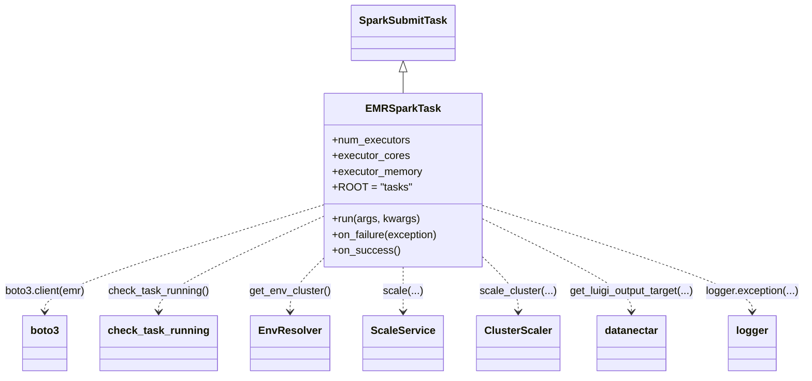
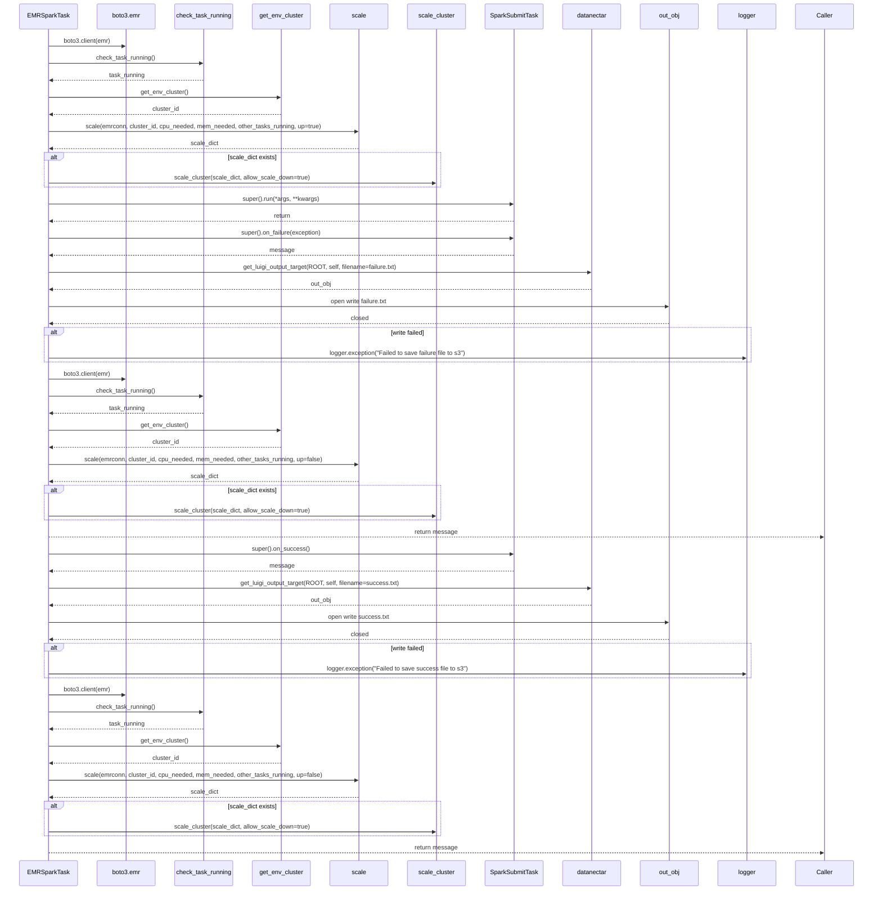

# Diagram: research/orchestrator/util/emr_spark_task.py

> Auto-generated by Obscura crawlers

## Diagram 1

### SVG

<svg id="container" width="1201.5" xmlns="http://www.w3.org/2000/svg" class="classDiagram" height="572" viewBox="0 0 1201.5 572" role="graphics-document document" aria-roledescription="class"><g><defs><marker id="container_class-aggregationStart" class="marker aggregation class" refX="18" refY="7" markerWidth="190" markerHeight="240" orient="auto"><path d="M 18,7 L9,13 L1,7 L9,1 Z"></path></marker></defs><defs><marker id="container_class-aggregationEnd" class="marker aggregation class" refX="1" refY="7" markerWidth="20" markerHeight="28" orient="auto"><path d="M 18,7 L9,13 L1,7 L9,1 Z"></path></marker></defs><defs><marker id="container_class-extensionStart" class="marker extension class" refX="18" refY="7" markerWidth="190" markerHeight="240" orient="auto"><path d="M 1,7 L18,13 V 1 Z"></path></marker></defs><defs><marker id="container_class-extensionEnd" class="marker extension class" refX="1" refY="7" markerWidth="20" markerHeight="28" orient="auto"><path d="M 1,1 V 13 L18,7 Z"></path></marker></defs><defs><marker id="container_class-compositionStart" class="marker composition class" refX="18" refY="7" markerWidth="190" markerHeight="240" orient="auto"><path d="M 18,7 L9,13 L1,7 L9,1 Z"></path></marker></defs><defs><marker id="container_class-compositionEnd" class="marker composition class" refX="1" refY="7" markerWidth="20" markerHeight="28" orient="auto"><path d="M 18,7 L9,13 L1,7 L9,1 Z"></path></marker></defs><defs><marker id="container_class-dependencyStart" class="marker dependency class" refX="6" refY="7" markerWidth="190" markerHeight="240" orient="auto"><path d="M 5,7 L9,13 L1,7 L9,1 Z"></path></marker></defs><defs><marker id="container_class-dependencyEnd" class="marker dependency class" refX="13" refY="7" markerWidth="20" markerHeight="28" orient="auto"><path d="M 18,7 L9,13 L14,7 L9,1 Z"></path></marker></defs><defs><marker id="container_class-lollipopStart" class="marker lollipop class" refX="13" refY="7" markerWidth="190" markerHeight="240" orient="auto"><circle stroke="black" fill="transparent" cx="7" cy="7" r="6"></circle></marker></defs><defs><marker id="container_class-lollipopEnd" class="marker lollipop class" refX="1" refY="7" markerWidth="190" markerHeight="240" orient="auto"><circle stroke="black" fill="transparent" cx="7" cy="7" r="6"></circle></marker></defs><g class="root"><g class="clusters"></g><g class="edgePaths"><path d="M594.859,109.25L594.859,110.542C594.859,111.833,594.859,114.417,594.859,119.875C594.859,125.333,594.859,133.667,594.859,137.833L594.859,142" id="id_SparkSubmitTask_EMRSparkTask_1" class="edge-thickness-normal edge-pattern-solid relation" style=";;;" data-edge="true" data-et="edge" data-id="id_SparkSubmitTask_EMRSparkTask_1" data-points="W3sieCI6NTk0Ljg1OTM3NSwieSI6OTJ9LHsieCI6NTk0Ljg1OTM3NSwieSI6MTE3fSx7IngiOjU5NC44NTkzNzUsInkiOjE0Mn1d" marker-start="url(#container_class-extensionStart)"></path><path d="M475.051,312.606L407.607,334.338C340.164,356.071,205.277,399.535,137.834,426.434C70.391,453.333,70.391,463.667,70.391,468.833L70.391,474" id="id_EMRSparkTask_boto3_2" class="edge-thickness-normal edge-pattern-dashed relation" style=";;;" data-edge="true" data-et="edge" data-id="id_EMRSparkTask_boto3_2" data-points="W3sieCI6NDc1LjA1MDc4MTI1LCJ5IjozMTIuNjA2MDIyNDYzMjA2ODR9LHsieCI6NzAuMzkwNjI1LCJ5Ijo0NDN9LHsieCI6NzAuMzkwNjI1LCJ5Ijo0ODB9XQ==" marker-end="url(#container_class-dependencyEnd)"></path><path d="M475.051,330.836L435.644,349.53C396.237,368.224,317.423,405.612,278.016,429.473C238.609,453.333,238.609,463.667,238.609,468.833L238.609,474" id="id_EMRSparkTask_check_task_running_3" class="edge-thickness-normal edge-pattern-dashed relation" style=";;;" data-edge="true" data-et="edge" data-id="id_EMRSparkTask_check_task_running_3" data-points="W3sieCI6NDc1LjA1MDc4MTI1LCJ5IjozMzAuODM1NTE1MzUwODc3Mn0seyJ4IjoyMzguNjA5Mzc1LCJ5Ijo0NDN9LHsieCI6MjM4LjYwOTM3NSwieSI6NDgwfV0=" marker-end="url(#container_class-dependencyEnd)"></path><path d="M475.051,397.033L467.59,404.695C460.13,412.356,445.21,427.678,437.749,440.506C430.289,453.333,430.289,463.667,430.289,468.833L430.289,474" id="id_EMRSparkTask_EnvResolver_4" class="edge-thickness-normal edge-pattern-dashed relation" style=";;;" data-edge="true" data-et="edge" data-id="id_EMRSparkTask_EnvResolver_4" data-points="W3sieCI6NDc1LjA1MDc4MTI1LCJ5IjozOTcuMDMzNDQ0MTAxNTkwM30seyJ4Ijo0MzAuMjg5MDYyNSwieSI6NDQzfSx7IngiOjQzMC4yODkwNjI1LCJ5Ijo0ODB9XQ==" marker-end="url(#container_class-dependencyEnd)"></path><path d="M594.859,406L594.859,412.167C594.859,418.333,594.859,430.667,594.859,442C594.859,453.333,594.859,463.667,594.859,468.833L594.859,474" id="id_EMRSparkTask_ScaleService_5" class="edge-thickness-normal edge-pattern-dashed relation" style=";;;" data-edge="true" data-et="edge" data-id="id_EMRSparkTask_ScaleService_5" data-points="W3sieCI6NTk0Ljg1OTM3NSwieSI6NDA2fSx7IngiOjU5NC44NTkzNzUsInkiOjQ0M30seyJ4Ijo1OTQuODU5Mzc1LCJ5Ijo0ODB9XQ==" marker-end="url(#container_class-dependencyEnd)"></path><path d="M714.668,394.136L722.79,402.28C730.911,410.424,747.155,426.712,755.277,440.023C763.398,453.333,763.398,463.667,763.398,468.833L763.398,474" id="id_EMRSparkTask_ClusterScaler_6" class="edge-thickness-normal edge-pattern-dashed relation" style=";;;" data-edge="true" data-et="edge" data-id="id_EMRSparkTask_ClusterScaler_6" data-points="W3sieCI6NzE0LjY2Nzk2ODc1LCJ5IjozOTQuMTM2MjU4Mjg1ODIwMjV9LHsieCI6NzYzLjM5ODQzNzUsInkiOjQ0M30seyJ4Ijo3NjMuMzk4NDM3NSwieSI6NDgwfV0=" marker-end="url(#container_class-dependencyEnd)"></path><path d="M714.668,333.128L751.773,351.44C788.878,369.752,863.087,406.376,900.192,429.855C937.297,453.333,937.297,463.667,937.297,468.833L937.297,474" id="id_EMRSparkTask_datanectar_7" class="edge-thickness-normal edge-pattern-dashed relation" style=";;;" data-edge="true" data-et="edge" data-id="id_EMRSparkTask_datanectar_7" data-points="W3sieCI6NzE0LjY2Nzk2ODc1LCJ5IjozMzMuMTI4MDIyOTA1NjM5NzR9LHsieCI6OTM3LjI5Njg3NSwieSI6NDQzfSx7IngiOjkzNy4yOTY4NzUsInkiOjQ4MH1d" marker-end="url(#container_class-dependencyEnd)"></path><path d="M714.668,312.312L782.783,334.093C850.898,355.874,987.129,399.437,1055.244,426.385C1123.359,453.333,1123.359,463.667,1123.359,468.833L1123.359,474" id="id_EMRSparkTask_logger_8" class="edge-thickness-normal edge-pattern-dashed relation" style=";;;" data-edge="true" data-et="edge" data-id="id_EMRSparkTask_logger_8" data-points="W3sieCI6NzE0LjY2Nzk2ODc1LCJ5IjozMTIuMzExNTQ2NTM1MDA0N30seyJ4IjoxMTIzLjM1OTM3NSwieSI6NDQzfSx7IngiOjExMjMuMzU5Mzc1LCJ5Ijo0ODB9XQ==" marker-end="url(#container_class-dependencyEnd)"></path></g><g class="edgeLabels"><g class="edgeLabel"><g class="label" data-id="id_SparkSubmitTask_EMRSparkTask_1" transform="translate(0, 0)"><foreignObject width="0" height="0">

</foreignObject></g></g><g class="edgeLabel" transform="translate(70.390625, 443)"><g class="label" data-id="id_EMRSparkTask_boto3_2" transform="translate(-62.390625, -12)"><foreignObject width="124.78125" height="24">

boto3.client(emr)

</foreignObject></g></g><g class="edgeLabel" transform="translate(238.609375, 443)"><g class="label" data-id="id_EMRSparkTask_check_task_running_3" transform="translate(-77.296875, -12)"><foreignObject width="154.59375" height="24">

check_task_running()

</foreignObject></g></g><g class="edgeLabel" transform="translate(430.2890625, 443)"><g class="label" data-id="id_EMRSparkTask_EnvResolver_4" transform="translate(-61.9296875, -12)"><foreignObject width="123.859375" height="24">

get_env_cluster()

</foreignObject></g></g><g class="edgeLabel" transform="translate(594.859375, 443)"><g class="label" data-id="id_EMRSparkTask_ScaleService_5" transform="translate(-29.3671875, -12)"><foreignObject width="58.734375" height="24">

scale(...)

</foreignObject></g></g><g class="edgeLabel" transform="translate(763.3984375, 443)"><g class="label" data-id="id_EMRSparkTask_ClusterScaler_6" transform="translate(-57.9765625, -12)"><foreignObject width="115.953125" height="24">

scale_cluster(...)

</foreignObject></g></g><g class="edgeLabel" transform="translate(937.296875, 443)"><g class="label" data-id="id_EMRSparkTask_datanectar_7" transform="translate(-95.921875, -12)"><foreignObject width="191.84375" height="24">

get_luigi_output_target(...)

</foreignObject></g></g><g class="edgeLabel" transform="translate(1123.359375, 443)"><g class="label" data-id="id_EMRSparkTask_logger_8" transform="translate(-70.140625, -12)"><foreignObject width="140.28125" height="24">

logger.exception(...)

</foreignObject></g></g></g><g class="nodes"><g class="node default" id="classId-SparkSubmitTask-0" transform="translate(594.859375, 50)"><g class="basic label-container"><path d="M-75.8203125 -42 L75.8203125 -42 L75.8203125 42 L-75.8203125 42" stroke="none" stroke-width="0" fill="#ECECFF" style=""></path><path d="M-75.8203125 -42 C-39.83386823541218 -42, -3.847423970824366 -42, 75.8203125 -42 M-75.8203125 -42 C-30.524966401759485 -42, 14.77037969648103 -42, 75.8203125 -42 M75.8203125 -42 C75.8203125 -14.122059036039783, 75.8203125 13.755881927920434, 75.8203125 42 M75.8203125 -42 C75.8203125 -13.959016285690446, 75.8203125 14.081967428619109, 75.8203125 42 M75.8203125 42 C36.413221900535554 42, -2.9938686989288925 42, -75.8203125 42 M75.8203125 42 C19.19340278466685 42, -37.4335069306663 42, -75.8203125 42 M-75.8203125 42 C-75.8203125 10.359105819562132, -75.8203125 -21.281788360875737, -75.8203125 -42 M-75.8203125 42 C-75.8203125 20.026529171861377, -75.8203125 -1.9469416562772466, -75.8203125 -42" stroke="#9370DB" stroke-width="1.3" fill="none" stroke-dasharray="0 0" style=""></path></g><g class="annotation-group text" transform="translate(0, -18)"></g><g class="label-group text" transform="translate(-63.8203125, -18)"><g class="label" style="font-weight: bolder" transform="translate(0,-12)"><foreignObject width="127.640625" height="24">

SparkSubmitTask

</foreignObject></g></g><g class="members-group text" transform="translate(-63.8203125, 30)"></g><g class="methods-group text" transform="translate(-63.8203125, 60)"></g><g class="divider" style=""><path d="M-75.8203125 6 C-19.555159174654015 6, 36.70999415069197 6, 75.8203125 6 M-75.8203125 6 C-15.998116517935252 6, 43.8240794641295 6, 75.8203125 6" stroke="#9370DB" stroke-width="1.3" fill="none" stroke-dasharray="0 0" style=""></path></g><g class="divider" style=""><path d="M-75.8203125 24 C-27.245036724553515 24, 21.33023905089297 24, 75.8203125 24 M-75.8203125 24 C-42.60291774358903 24, -9.385522987178064 24, 75.8203125 24" stroke="#9370DB" stroke-width="1.3" fill="none" stroke-dasharray="0 0" style=""></path></g></g><g class="node default" id="classId-EMRSparkTask-1" transform="translate(594.859375, 274)"><g class="basic label-container"><path d="M-119.80859375 -132 L119.80859375 -132 L119.80859375 132 L-119.80859375 132" stroke="none" stroke-width="0" fill="#ECECFF" style=""></path><path d="M-119.80859375 -132 C-35.886194295684945 -132, 48.03620515863011 -132, 119.80859375 -132 M-119.80859375 -132 C-32.67699550736032 -132, 54.454602735279366 -132, 119.80859375 -132 M119.80859375 -132 C119.80859375 -28.370679445953016, 119.80859375 75.25864110809397, 119.80859375 132 M119.80859375 -132 C119.80859375 -65.35706433530991, 119.80859375 1.2858713293801713, 119.80859375 132 M119.80859375 132 C49.75884340990848 132, -20.29090693018304 132, -119.80859375 132 M119.80859375 132 C25.755368560587044 132, -68.29785662882591 132, -119.80859375 132 M-119.80859375 132 C-119.80859375 61.53584340150303, -119.80859375 -8.92831319699394, -119.80859375 -132 M-119.80859375 132 C-119.80859375 45.90740649372796, -119.80859375 -40.18518701254408, -119.80859375 -132" stroke="#9370DB" stroke-width="1.3" fill="none" stroke-dasharray="0 0" style=""></path></g><g class="annotation-group text" transform="translate(0, -108)"></g><g class="label-group text" transform="translate(-53.1484375, -108)"><g class="label" style="font-weight: bolder" transform="translate(0,-12)"><foreignObject width="106.296875" height="24">

EMRSparkTask

</foreignObject></g></g><g class="members-group text" transform="translate(-107.80859375, -60)"><g class="label" style="" transform="translate(0,-12)"><foreignObject width="118.390625" height="24">

+num_executors

</foreignObject></g><g class="label" style="" transform="translate(0,12)"><foreignObject width="116.046875" height="24">

+executor_cores

</foreignObject></g><g class="label" style="" transform="translate(0,36)"><foreignObject width="137.34375" height="24">

+executor_memory

</foreignObject></g><g class="label" style="" transform="translate(0,60)"><foreignObject width="113.8125" height="24">

+ROOT = "tasks"

</foreignObject></g></g><g class="methods-group text" transform="translate(-107.80859375, 60)"><g class="label" style="" transform="translate(0,-12)"><foreignObject width="131.421875" height="24">

+run(args, kwargs)

</foreignObject></g><g class="label" style="" transform="translate(0,12)"><foreignObject width="162.46875" height="24">

+on_failure(exception)

</foreignObject></g><g class="label" style="" transform="translate(0,36)"><foreignObject width="100.34375" height="24">

+on_success()

</foreignObject></g></g><g class="divider" style=""><path d="M-119.80859375 -84 C-31.59999191630841 -84, 56.60860991738318 -84, 119.80859375 -84 M-119.80859375 -84 C-37.3203399586273 -84, 45.1679138327454 -84, 119.80859375 -84" stroke="#9370DB" stroke-width="1.3" fill="none" stroke-dasharray="0 0" style=""></path></g><g class="divider" style=""><path d="M-119.80859375 36 C-36.90524253944602 36, 45.99810867110796 36, 119.80859375 36 M-119.80859375 36 C-51.10703067184187 36, 17.59453240631626 36, 119.80859375 36" stroke="#9370DB" stroke-width="1.3" fill="none" stroke-dasharray="0 0" style=""></path></g></g><g class="node default" id="classId-boto3-2" transform="translate(70.390625, 522)"><g class="basic label-container"><path d="M-33.0703125 -42 L33.0703125 -42 L33.0703125 42 L-33.0703125 42" stroke="none" stroke-width="0" fill="#ECECFF" style=""></path><path d="M-33.0703125 -42 C-11.271819283929503 -42, 10.526673932140994 -42, 33.0703125 -42 M-33.0703125 -42 C-19.69767272894925 -42, -6.325032957898504 -42, 33.0703125 -42 M33.0703125 -42 C33.0703125 -18.349179710794253, 33.0703125 5.301640578411494, 33.0703125 42 M33.0703125 -42 C33.0703125 -16.200287763921374, 33.0703125 9.599424472157253, 33.0703125 42 M33.0703125 42 C15.374228846046279 42, -2.3218548079074424 42, -33.0703125 42 M33.0703125 42 C8.15184131981874 42, -16.76662986036252 42, -33.0703125 42 M-33.0703125 42 C-33.0703125 24.18386219335257, -33.0703125 6.367724386705142, -33.0703125 -42 M-33.0703125 42 C-33.0703125 24.484661200500998, -33.0703125 6.969322401001996, -33.0703125 -42" stroke="#9370DB" stroke-width="1.3" fill="none" stroke-dasharray="0 0" style=""></path></g><g class="annotation-group text" transform="translate(0, -18)"></g><g class="label-group text" transform="translate(-21.0703125, -18)"><g class="label" style="font-weight: bolder" transform="translate(0,-12)"><foreignObject width="42.140625" height="24">

boto3

</foreignObject></g></g><g class="members-group text" transform="translate(-21.0703125, 30)"></g><g class="methods-group text" transform="translate(-21.0703125, 60)"></g><g class="divider" style=""><path d="M-33.0703125 6 C-19.599878771350426 6, -6.129445042700851 6, 33.0703125 6 M-33.0703125 6 C-13.127045382632488 6, 6.816221734735024 6, 33.0703125 6" stroke="#9370DB" stroke-width="1.3" fill="none" stroke-dasharray="0 0" style=""></path></g><g class="divider" style=""><path d="M-33.0703125 24 C-16.399363502694865 24, 0.2715854946102709 24, 33.0703125 24 M-33.0703125 24 C-16.2796060824273 24, 0.5111003351454002 24, 33.0703125 24" stroke="#9370DB" stroke-width="1.3" fill="none" stroke-dasharray="0 0" style=""></path></g></g><g class="node default" id="classId-datanectar-3" transform="translate(937.296875, 522)"><g class="basic label-container"><path d="M-52.015625 -42 L52.015625 -42 L52.015625 42 L-52.015625 42" stroke="none" stroke-width="0" fill="#ECECFF" style=""></path><path d="M-52.015625 -42 C-15.384913935778194 -42, 21.245797128443613 -42, 52.015625 -42 M-52.015625 -42 C-16.58844823391481 -42, 18.83872853217038 -42, 52.015625 -42 M52.015625 -42 C52.015625 -17.77107419427458, 52.015625 6.457851611450842, 52.015625 42 M52.015625 -42 C52.015625 -14.080909529524732, 52.015625 13.838180940950537, 52.015625 42 M52.015625 42 C13.503481286123112 42, -25.008662427753777 42, -52.015625 42 M52.015625 42 C17.680584703443422 42, -16.654455593113155 42, -52.015625 42 M-52.015625 42 C-52.015625 16.92020312595355, -52.015625 -8.159593748092902, -52.015625 -42 M-52.015625 42 C-52.015625 20.434934110353556, -52.015625 -1.1301317792928884, -52.015625 -42" stroke="#9370DB" stroke-width="1.3" fill="none" stroke-dasharray="0 0" style=""></path></g><g class="annotation-group text" transform="translate(0, -18)"></g><g class="label-group text" transform="translate(-40.015625, -18)"><g class="label" style="font-weight: bolder" transform="translate(0,-12)"><foreignObject width="80.03125" height="24">

datanectar

</foreignObject></g></g><g class="members-group text" transform="translate(-40.015625, 30)"></g><g class="methods-group text" transform="translate(-40.015625, 60)"></g><g class="divider" style=""><path d="M-52.015625 6 C-20.28306188303012 6, 11.449501233939763 6, 52.015625 6 M-52.015625 6 C-16.877431083626654 6, 18.260762832746693 6, 52.015625 6" stroke="#9370DB" stroke-width="1.3" fill="none" stroke-dasharray="0 0" style=""></path></g><g class="divider" style=""><path d="M-52.015625 24 C-29.186340742263226 24, -6.357056484526453 24, 52.015625 24 M-52.015625 24 C-28.312040746629314 24, -4.608456493258629 24, 52.015625 24" stroke="#9370DB" stroke-width="1.3" fill="none" stroke-dasharray="0 0" style=""></path></g></g><g class="node default" id="classId-ScaleService-4" transform="translate(594.859375, 522)"><g class="basic label-container"><path d="M-58.0390625 -42 L58.0390625 -42 L58.0390625 42 L-58.0390625 42" stroke="none" stroke-width="0" fill="#ECECFF" style=""></path><path d="M-58.0390625 -42 C-24.252909615357893 -42, 9.533243269284213 -42, 58.0390625 -42 M-58.0390625 -42 C-24.08178507180626 -42, 9.875492356387483 -42, 58.0390625 -42 M58.0390625 -42 C58.0390625 -24.27032834374959, 58.0390625 -6.54065668749918, 58.0390625 42 M58.0390625 -42 C58.0390625 -17.176962807235657, 58.0390625 7.646074385528685, 58.0390625 42 M58.0390625 42 C26.493333372014916 42, -5.052395755970167 42, -58.0390625 42 M58.0390625 42 C26.960988999585485 42, -4.11708450082903 42, -58.0390625 42 M-58.0390625 42 C-58.0390625 18.928890507905706, -58.0390625 -4.142218984188588, -58.0390625 -42 M-58.0390625 42 C-58.0390625 17.202334823552846, -58.0390625 -7.595330352894308, -58.0390625 -42" stroke="#9370DB" stroke-width="1.3" fill="none" stroke-dasharray="0 0" style=""></path></g><g class="annotation-group text" transform="translate(0, -18)"></g><g class="label-group text" transform="translate(-46.0390625, -18)"><g class="label" style="font-weight: bolder" transform="translate(0,-12)"><foreignObject width="92.078125" height="24">

ScaleService

</foreignObject></g></g><g class="members-group text" transform="translate(-46.0390625, 30)"></g><g class="methods-group text" transform="translate(-46.0390625, 60)"></g><g class="divider" style=""><path d="M-58.0390625 6 C-19.725164290623752 6, 18.588733918752496 6, 58.0390625 6 M-58.0390625 6 C-32.29399200708932 6, -6.5489215141786445 6, 58.0390625 6" stroke="#9370DB" stroke-width="1.3" fill="none" stroke-dasharray="0 0" style=""></path></g><g class="divider" style=""><path d="M-58.0390625 24 C-14.540294613533412 24, 28.958473272933176 24, 58.0390625 24 M-58.0390625 24 C-13.446048448318237 24, 31.146965603363526 24, 58.0390625 24" stroke="#9370DB" stroke-width="1.3" fill="none" stroke-dasharray="0 0" style=""></path></g></g><g class="node default" id="classId-ClusterScaler-5" transform="translate(763.3984375, 522)"><g class="basic label-container"><path d="M-60.5 -42 L60.5 -42 L60.5 42 L-60.5 42" stroke="none" stroke-width="0" fill="#ECECFF" style=""></path><path d="M-60.5 -42 C-28.168853931056567 -42, 4.162292137886865 -42, 60.5 -42 M-60.5 -42 C-15.385409060841987 -42, 29.729181878316027 -42, 60.5 -42 M60.5 -42 C60.5 -18.27916627032622, 60.5 5.441667459347563, 60.5 42 M60.5 -42 C60.5 -21.95809445175484, 60.5 -1.9161889035096777, 60.5 42 M60.5 42 C24.566112790114985 42, -11.36777441977003 42, -60.5 42 M60.5 42 C25.230034328108772 42, -10.039931343782456 42, -60.5 42 M-60.5 42 C-60.5 9.678322203359713, -60.5 -22.643355593280575, -60.5 -42 M-60.5 42 C-60.5 21.55086078897743, -60.5 1.1017215779548621, -60.5 -42" stroke="#9370DB" stroke-width="1.3" fill="none" stroke-dasharray="0 0" style=""></path></g><g class="annotation-group text" transform="translate(0, -18)"></g><g class="label-group text" transform="translate(-48.5, -18)"><g class="label" style="font-weight: bolder" transform="translate(0,-12)"><foreignObject width="97" height="24">

ClusterScaler

</foreignObject></g></g><g class="members-group text" transform="translate(-48.5, 30)"></g><g class="methods-group text" transform="translate(-48.5, 60)"></g><g class="divider" style=""><path d="M-60.5 6 C-12.957549510021195 6, 34.58490097995761 6, 60.5 6 M-60.5 6 C-31.887589654146463 6, -3.275179308292927 6, 60.5 6" stroke="#9370DB" stroke-width="1.3" fill="none" stroke-dasharray="0 0" style=""></path></g><g class="divider" style=""><path d="M-60.5 24 C-15.349215317545315 24, 29.80156936490937 24, 60.5 24 M-60.5 24 C-35.15495072916711 24, -9.809901458334224 24, 60.5 24" stroke="#9370DB" stroke-width="1.3" fill="none" stroke-dasharray="0 0" style=""></path></g></g><g class="node default" id="classId-EnvResolver-6" transform="translate(430.2890625, 522)"><g class="basic label-container"><path d="M-56.53125 -42 L56.53125 -42 L56.53125 42 L-56.53125 42" stroke="none" stroke-width="0" fill="#ECECFF" style=""></path><path d="M-56.53125 -42 C-27.175531705316743 -42, 2.1801865893665138 -42, 56.53125 -42 M-56.53125 -42 C-17.67927723591947 -42, 21.172695528161057 -42, 56.53125 -42 M56.53125 -42 C56.53125 -20.223541924987096, 56.53125 1.5529161500258084, 56.53125 42 M56.53125 -42 C56.53125 -17.177391380485403, 56.53125 7.6452172390291935, 56.53125 42 M56.53125 42 C14.883882257066183 42, -26.763485485867633 42, -56.53125 42 M56.53125 42 C32.43903285662117 42, 8.346815713242329 42, -56.53125 42 M-56.53125 42 C-56.53125 9.596162796460447, -56.53125 -22.807674407079105, -56.53125 -42 M-56.53125 42 C-56.53125 22.721812064601295, -56.53125 3.4436241292025898, -56.53125 -42" stroke="#9370DB" stroke-width="1.3" fill="none" stroke-dasharray="0 0" style=""></path></g><g class="annotation-group text" transform="translate(0, -18)"></g><g class="label-group text" transform="translate(-44.53125, -18)"><g class="label" style="font-weight: bolder" transform="translate(0,-12)"><foreignObject width="89.0625" height="24">

EnvResolver

</foreignObject></g></g><g class="members-group text" transform="translate(-44.53125, 30)"></g><g class="methods-group text" transform="translate(-44.53125, 60)"></g><g class="divider" style=""><path d="M-56.53125 6 C-18.198791064740263 6, 20.133667870519474 6, 56.53125 6 M-56.53125 6 C-14.01928830005916 6, 28.49267339988168 6, 56.53125 6" stroke="#9370DB" stroke-width="1.3" fill="none" stroke-dasharray="0 0" style=""></path></g><g class="divider" style=""><path d="M-56.53125 24 C-15.22513609373759 24, 26.08097781252482 24, 56.53125 24 M-56.53125 24 C-33.77598044370335 24, -11.0207108874067 24, 56.53125 24" stroke="#9370DB" stroke-width="1.3" fill="none" stroke-dasharray="0 0" style=""></path></g></g><g class="node default" id="classId-check_task_running-7" transform="translate(238.609375, 522)"><g class="basic label-container"><path d="M-85.1484375 -42 L85.1484375 -42 L85.1484375 42 L-85.1484375 42" stroke="none" stroke-width="0" fill="#ECECFF" style=""></path><path d="M-85.1484375 -42 C-37.03017988741594 -42, 11.08807772516812 -42, 85.1484375 -42 M-85.1484375 -42 C-40.203692692371284 -42, 4.741052115257432 -42, 85.1484375 -42 M85.1484375 -42 C85.1484375 -16.189369631839792, 85.1484375 9.621260736320416, 85.1484375 42 M85.1484375 -42 C85.1484375 -24.75217690934449, 85.1484375 -7.504353818688983, 85.1484375 42 M85.1484375 42 C30.25040150174153 42, -24.647634496516943 42, -85.1484375 42 M85.1484375 42 C19.714469565549066 42, -45.71949836890187 42, -85.1484375 42 M-85.1484375 42 C-85.1484375 23.7195421319629, -85.1484375 5.4390842639258, -85.1484375 -42 M-85.1484375 42 C-85.1484375 24.97126635046999, -85.1484375 7.942532700939978, -85.1484375 -42" stroke="#9370DB" stroke-width="1.3" fill="none" stroke-dasharray="0 0" style=""></path></g><g class="annotation-group text" transform="translate(0, -18)"></g><g class="label-group text" transform="translate(-73.1484375, -18)"><g class="label" style="font-weight: bolder" transform="translate(0,-12)"><foreignObject width="146.296875" height="24">

check_task_running

</foreignObject></g></g><g class="members-group text" transform="translate(-73.1484375, 30)"></g><g class="methods-group text" transform="translate(-73.1484375, 60)"></g><g class="divider" style=""><path d="M-85.1484375 6 C-17.723656849383588 6, 49.701123801232825 6, 85.1484375 6 M-85.1484375 6 C-44.29741302654221 6, -3.446388553084418 6, 85.1484375 6" stroke="#9370DB" stroke-width="1.3" fill="none" stroke-dasharray="0 0" style=""></path></g><g class="divider" style=""><path d="M-85.1484375 24 C-26.771096384377607 24, 31.606244731244786 24, 85.1484375 24 M-85.1484375 24 C-45.79568331214177 24, -6.442929124283538 24, 85.1484375 24" stroke="#9370DB" stroke-width="1.3" fill="none" stroke-dasharray="0 0" style=""></path></g></g><g class="node default" id="classId-logger-8" transform="translate(1123.359375, 522)"><g class="basic label-container"><path d="M-35.2734375 -42 L35.2734375 -42 L35.2734375 42 L-35.2734375 42" stroke="none" stroke-width="0" fill="#ECECFF" style=""></path><path d="M-35.2734375 -42 C-13.742894417398691 -42, 7.787648665202617 -42, 35.2734375 -42 M-35.2734375 -42 C-20.645247650680936 -42, -6.017057801361869 -42, 35.2734375 -42 M35.2734375 -42 C35.2734375 -16.970395995602257, 35.2734375 8.059208008795487, 35.2734375 42 M35.2734375 -42 C35.2734375 -18.717316932226765, 35.2734375 4.565366135546469, 35.2734375 42 M35.2734375 42 C14.82855335729089 42, -5.616330785418221 42, -35.2734375 42 M35.2734375 42 C8.272454619054145 42, -18.72852826189171 42, -35.2734375 42 M-35.2734375 42 C-35.2734375 13.443181739446445, -35.2734375 -15.11363652110711, -35.2734375 -42 M-35.2734375 42 C-35.2734375 19.342047715785288, -35.2734375 -3.315904568429424, -35.2734375 -42" stroke="#9370DB" stroke-width="1.3" fill="none" stroke-dasharray="0 0" style=""></path></g><g class="annotation-group text" transform="translate(0, -18)"></g><g class="label-group text" transform="translate(-23.2734375, -18)"><g class="label" style="font-weight: bolder" transform="translate(0,-12)"><foreignObject width="46.546875" height="24">

logger

</foreignObject></g></g><g class="members-group text" transform="translate(-23.2734375, 30)"></g><g class="methods-group text" transform="translate(-23.2734375, 60)"></g><g class="divider" style=""><path d="M-35.2734375 6 C-11.815348870509645 6, 11.64273975898071 6, 35.2734375 6 M-35.2734375 6 C-17.672459702271198 6, -0.07148190454239511 6, 35.2734375 6" stroke="#9370DB" stroke-width="1.3" fill="none" stroke-dasharray="0 0" style=""></path></g><g class="divider" style=""><path d="M-35.2734375 24 C-19.026373446991894 24, -2.7793093939837874 24, 35.2734375 24 M-35.2734375 24 C-12.162439838099594 24, 10.948557823800812 24, 35.2734375 24" stroke="#9370DB" stroke-width="1.3" fill="none" stroke-dasharray="0 0" style=""></path></g></g></g></g></g></svg>

## Diagram 2

### SVG

<svg id="container" width="2265" xmlns="http://www.w3.org/2000/svg" height="2462" viewBox="-50 -10 2265 2462" role="graphics-document document" aria-roledescription="sequence"><g><rect x="2015" y="2376" fill="#eaeaea" stroke="#666" width="150" height="65" name="Caller" rx="3" ry="3" class="actor actor-bottom"></rect><text x="2090" y="2408.5" dominant-baseline="central" alignment-baseline="central" class="actor actor-box" style="text-anchor: middle; font-size: 16px; font-weight: 400;"><tspan x="2090" dy="0">Caller</tspan></text></g><g><rect x="1815" y="2376" fill="#eaeaea" stroke="#666" width="150" height="65" name="Logger" rx="3" ry="3" class="actor actor-bottom"></rect><text x="1890" y="2408.5" dominant-baseline="central" alignment-baseline="central" class="actor actor-box" style="text-anchor: middle; font-size: 16px; font-weight: 400;"><tspan x="1890" dy="0">logger</tspan></text></g><g><rect x="1615" y="2376" fill="#eaeaea" stroke="#666" width="150" height="65" name="Out" rx="3" ry="3" class="actor actor-bottom"></rect><text x="1690" y="2408.5" dominant-baseline="central" alignment-baseline="central" class="actor actor-box" style="text-anchor: middle; font-size: 16px; font-weight: 400;"><tspan x="1690" dy="0">out_obj</tspan></text></g><g><rect x="1415" y="2376" fill="#eaeaea" stroke="#666" width="150" height="65" name="DN" rx="3" ry="3" class="actor actor-bottom"></rect><text x="1490" y="2408.5" dominant-baseline="central" alignment-baseline="central" class="actor actor-box" style="text-anchor: middle; font-size: 16px; font-weight: 400;"><tspan x="1490" dy="0">datanectar</tspan></text></g><g><rect x="1215" y="2376" fill="#eaeaea" stroke="#666" width="150" height="65" name="Luigi" rx="3" ry="3" class="actor actor-bottom"></rect><text x="1290" y="2408.5" dominant-baseline="central" alignment-baseline="central" class="actor actor-box" style="text-anchor: middle; font-size: 16px; font-weight: 400;"><tspan x="1290" dy="0">SparkSubmitTask</tspan></text></g><g><rect x="1015" y="2376" fill="#eaeaea" stroke="#666" width="150" height="65" name="Cluster" rx="3" ry="3" class="actor actor-bottom"></rect><text x="1090" y="2408.5" dominant-baseline="central" alignment-baseline="central" class="actor actor-box" style="text-anchor: middle; font-size: 16px; font-weight: 400;"><tspan x="1090" dy="0">scale_cluster</tspan></text></g><g><rect x="815" y="2376" fill="#eaeaea" stroke="#666" width="150" height="65" name="Scale" rx="3" ry="3" class="actor actor-bottom"></rect><text x="890" y="2408.5" dominant-baseline="central" alignment-baseline="central" class="actor actor-box" style="text-anchor: middle; font-size: 16px; font-weight: 400;"><tspan x="890" dy="0">scale</tspan></text></g><g><rect x="615" y="2376" fill="#eaeaea" stroke="#666" width="150" height="65" name="Env" rx="3" ry="3" class="actor actor-bottom"></rect><text x="690" y="2408.5" dominant-baseline="central" alignment-baseline="central" class="actor actor-box" style="text-anchor: middle; font-size: 16px; font-weight: 400;"><tspan x="690" dy="0">get_env_cluster</tspan></text></g><g><rect x="400" y="2376" fill="#eaeaea" stroke="#666" width="165" height="65" name="Check" rx="3" ry="3" class="actor actor-bottom"></rect><text x="482.5" y="2408.5" dominant-baseline="central" alignment-baseline="central" class="actor actor-box" style="text-anchor: middle; font-size: 16px; font-weight: 400;"><tspan x="482.5" dy="0">check_task_running</tspan></text></g><g><rect x="200" y="2376" fill="#eaeaea" stroke="#666" width="150" height="65" name="EMR" rx="3" ry="3" class="actor actor-bottom"></rect><text x="275" y="2408.5" dominant-baseline="central" alignment-baseline="central" class="actor actor-box" style="text-anchor: middle; font-size: 16px; font-weight: 400;"><tspan x="275" dy="0">boto3.emr</tspan></text></g><g><rect x="0" y="2376" fill="#eaeaea" stroke="#666" width="150" height="65" name="T" rx="3" ry="3" class="actor actor-bottom"></rect><text x="75" y="2408.5" dominant-baseline="central" alignment-baseline="central" class="actor actor-box" style="text-anchor: middle; font-size: 16px; font-weight: 400;"><tspan x="75" dy="0">EMRSparkTask</tspan></text></g><g><line id="actor10" x1="2090" y1="65" x2="2090" y2="2376" class="actor-line 200" stroke-width="0.5px" stroke="#999" name="Caller"></line><g id="root-10"><rect x="2015" y="0" fill="#eaeaea" stroke="#666" width="150" height="65" name="Caller" rx="3" ry="3" class="actor actor-top"></rect><text x="2090" y="32.5" dominant-baseline="central" alignment-baseline="central" class="actor actor-box" style="text-anchor: middle; font-size: 16px; font-weight: 400;"><tspan x="2090" dy="0">Caller</tspan></text></g></g><g><line id="actor9" x1="1890" y1="65" x2="1890" y2="2376" class="actor-line 200" stroke-width="0.5px" stroke="#999" name="Logger"></line><g id="root-9"><rect x="1815" y="0" fill="#eaeaea" stroke="#666" width="150" height="65" name="Logger" rx="3" ry="3" class="actor actor-top"></rect><text x="1890" y="32.5" dominant-baseline="central" alignment-baseline="central" class="actor actor-box" style="text-anchor: middle; font-size: 16px; font-weight: 400;"><tspan x="1890" dy="0">logger</tspan></text></g></g><g><line id="actor8" x1="1690" y1="65" x2="1690" y2="2376" class="actor-line 200" stroke-width="0.5px" stroke="#999" name="Out"></line><g id="root-8"><rect x="1615" y="0" fill="#eaeaea" stroke="#666" width="150" height="65" name="Out" rx="3" ry="3" class="actor actor-top"></rect><text x="1690" y="32.5" dominant-baseline="central" alignment-baseline="central" class="actor actor-box" style="text-anchor: middle; font-size: 16px; font-weight: 400;"><tspan x="1690" dy="0">out_obj</tspan></text></g></g><g><line id="actor7" x1="1490" y1="65" x2="1490" y2="2376" class="actor-line 200" stroke-width="0.5px" stroke="#999" name="DN"></line><g id="root-7"><rect x="1415" y="0" fill="#eaeaea" stroke="#666" width="150" height="65" name="DN" rx="3" ry="3" class="actor actor-top"></rect><text x="1490" y="32.5" dominant-baseline="central" alignment-baseline="central" class="actor actor-box" style="text-anchor: middle; font-size: 16px; font-weight: 400;"><tspan x="1490" dy="0">datanectar</tspan></text></g></g><g><line id="actor6" x1="1290" y1="65" x2="1290" y2="2376" class="actor-line 200" stroke-width="0.5px" stroke="#999" name="Luigi"></line><g id="root-6"><rect x="1215" y="0" fill="#eaeaea" stroke="#666" width="150" height="65" name="Luigi" rx="3" ry="3" class="actor actor-top"></rect><text x="1290" y="32.5" dominant-baseline="central" alignment-baseline="central" class="actor actor-box" style="text-anchor: middle; font-size: 16px; font-weight: 400;"><tspan x="1290" dy="0">SparkSubmitTask</tspan></text></g></g><g><line id="actor5" x1="1090" y1="65" x2="1090" y2="2376" class="actor-line 200" stroke-width="0.5px" stroke="#999" name="Cluster"></line><g id="root-5"><rect x="1015" y="0" fill="#eaeaea" stroke="#666" width="150" height="65" name="Cluster" rx="3" ry="3" class="actor actor-top"></rect><text x="1090" y="32.5" dominant-baseline="central" alignment-baseline="central" class="actor actor-box" style="text-anchor: middle; font-size: 16px; font-weight: 400;"><tspan x="1090" dy="0">scale_cluster</tspan></text></g></g><g><line id="actor4" x1="890" y1="65" x2="890" y2="2376" class="actor-line 200" stroke-width="0.5px" stroke="#999" name="Scale"></line><g id="root-4"><rect x="815" y="0" fill="#eaeaea" stroke="#666" width="150" height="65" name="Scale" rx="3" ry="3" class="actor actor-top"></rect><text x="890" y="32.5" dominant-baseline="central" alignment-baseline="central" class="actor actor-box" style="text-anchor: middle; font-size: 16px; font-weight: 400;"><tspan x="890" dy="0">scale</tspan></text></g></g><g><line id="actor3" x1="690" y1="65" x2="690" y2="2376" class="actor-line 200" stroke-width="0.5px" stroke="#999" name="Env"></line><g id="root-3"><rect x="615" y="0" fill="#eaeaea" stroke="#666" width="150" height="65" name="Env" rx="3" ry="3" class="actor actor-top"></rect><text x="690" y="32.5" dominant-baseline="central" alignment-baseline="central" class="actor actor-box" style="text-anchor: middle; font-size: 16px; font-weight: 400;"><tspan x="690" dy="0">get_env_cluster</tspan></text></g></g><g><line id="actor2" x1="482.5" y1="65" x2="482.5" y2="2376" class="actor-line 200" stroke-width="0.5px" stroke="#999" name="Check"></line><g id="root-2"><rect x="400" y="0" fill="#eaeaea" stroke="#666" width="165" height="65" name="Check" rx="3" ry="3" class="actor actor-top"></rect><text x="482.5" y="32.5" dominant-baseline="central" alignment-baseline="central" class="actor actor-box" style="text-anchor: middle; font-size: 16px; font-weight: 400;"><tspan x="482.5" dy="0">check_task_running</tspan></text></g></g><g><line id="actor1" x1="275" y1="65" x2="275" y2="2376" class="actor-line 200" stroke-width="0.5px" stroke="#999" name="EMR"></line><g id="root-1"><rect x="200" y="0" fill="#eaeaea" stroke="#666" width="150" height="65" name="EMR" rx="3" ry="3" class="actor actor-top"></rect><text x="275" y="32.5" dominant-baseline="central" alignment-baseline="central" class="actor actor-box" style="text-anchor: middle; font-size: 16px; font-weight: 400;"><tspan x="275" dy="0">boto3.emr</tspan></text></g></g><g><line id="actor0" x1="75" y1="65" x2="75" y2="2376" class="actor-line 200" stroke-width="0.5px" stroke="#999" name="T"></line><g id="root-0"><rect x="0" y="0" fill="#eaeaea" stroke="#666" width="150" height="65" name="T" rx="3" ry="3" class="actor actor-top"></rect><text x="75" y="32.5" dominant-baseline="central" alignment-baseline="central" class="actor actor-box" style="text-anchor: middle; font-size: 16px; font-weight: 400;"><tspan x="75" dy="0">EMRSparkTask</tspan></text></g></g><g></g><defs><symbol id="computer" width="24" height="24"><path transform="scale(.5)" d="M2 2v13h20v-13h-20zm18 11h-16v-9h16v9zm-10.228 6l.466-1h3.524l.467 1h-4.457zm14.228 3h-24l2-6h2.104l-1.33 4h18.45l-1.297-4h2.073l2 6zm-5-10h-14v-7h14v7z"></path></symbol></defs><defs><symbol id="database" fill-rule="evenodd" clip-rule="evenodd"><path transform="scale(.5)" d="M12.258.001l.256.004.255.005.253.008.251.01.249.012.247.015.246.016.242.019.241.02.239.023.236.024.233.027.231.028.229.031.225.032.223.034.22.036.217.038.214.04.211.041.208.043.205.045.201.046.198.048.194.05.191.051.187.053.183.054.18.056.175.057.172.059.168.06.163.061.16.063.155.064.15.066.074.033.073.033.071.034.07.034.069.035.068.035.067.035.066.035.064.036.064.036.062.036.06.036.06.037.058.037.058.037.055.038.055.038.053.038.052.038.051.039.05.039.048.039.047.039.045.04.044.04.043.04.041.04.04.041.039.041.037.041.036.041.034.041.033.042.032.042.03.042.029.042.027.042.026.043.024.043.023.043.021.043.02.043.018.044.017.043.015.044.013.044.012.044.011.045.009.044.007.045.006.045.004.045.002.045.001.045v17l-.001.045-.002.045-.004.045-.006.045-.007.045-.009.044-.011.045-.012.044-.013.044-.015.044-.017.043-.018.044-.02.043-.021.043-.023.043-.024.043-.026.043-.027.042-.029.042-.03.042-.032.042-.033.042-.034.041-.036.041-.037.041-.039.041-.04.041-.041.04-.043.04-.044.04-.045.04-.047.039-.048.039-.05.039-.051.039-.052.038-.053.038-.055.038-.055.038-.058.037-.058.037-.06.037-.06.036-.062.036-.064.036-.064.036-.066.035-.067.035-.068.035-.069.035-.07.034-.071.034-.073.033-.074.033-.15.066-.155.064-.16.063-.163.061-.168.06-.172.059-.175.057-.18.056-.183.054-.187.053-.191.051-.194.05-.198.048-.201.046-.205.045-.208.043-.211.041-.214.04-.217.038-.22.036-.223.034-.225.032-.229.031-.231.028-.233.027-.236.024-.239.023-.241.02-.242.019-.246.016-.247.015-.249.012-.251.01-.253.008-.255.005-.256.004-.258.001-.258-.001-.256-.004-.255-.005-.253-.008-.251-.01-.249-.012-.247-.015-.245-.016-.243-.019-.241-.02-.238-.023-.236-.024-.234-.027-.231-.028-.228-.031-.226-.032-.223-.034-.22-.036-.217-.038-.214-.04-.211-.041-.208-.043-.204-.045-.201-.046-.198-.048-.195-.05-.19-.051-.187-.053-.184-.054-.179-.056-.176-.057-.172-.059-.167-.06-.164-.061-.159-.063-.155-.064-.151-.066-.074-.033-.072-.033-.072-.034-.07-.034-.069-.035-.068-.035-.067-.035-.066-.035-.064-.036-.063-.036-.062-.036-.061-.036-.06-.037-.058-.037-.057-.037-.056-.038-.055-.038-.053-.038-.052-.038-.051-.039-.049-.039-.049-.039-.046-.039-.046-.04-.044-.04-.043-.04-.041-.04-.04-.041-.039-.041-.037-.041-.036-.041-.034-.041-.033-.042-.032-.042-.03-.042-.029-.042-.027-.042-.026-.043-.024-.043-.023-.043-.021-.043-.02-.043-.018-.044-.017-.043-.015-.044-.013-.044-.012-.044-.011-.045-.009-.044-.007-.045-.006-.045-.004-.045-.002-.045-.001-.045v-17l.001-.045.002-.045.004-.045.006-.045.007-.045.009-.044.011-.045.012-.044.013-.044.015-.044.017-.043.018-.044.02-.043.021-.043.023-.043.024-.043.026-.043.027-.042.029-.042.03-.042.032-.042.033-.042.034-.041.036-.041.037-.041.039-.041.04-.041.041-.04.043-.04.044-.04.046-.04.046-.039.049-.039.049-.039.051-.039.052-.038.053-.038.055-.038.056-.038.057-.037.058-.037.06-.037.061-.036.062-.036.063-.036.064-.036.066-.035.067-.035.068-.035.069-.035.07-.034.072-.034.072-.033.074-.033.151-.066.155-.064.159-.063.164-.061.167-.06.172-.059.176-.057.179-.056.184-.054.187-.053.19-.051.195-.05.198-.048.201-.046.204-.045.208-.043.211-.041.214-.04.217-.038.22-.036.223-.034.226-.032.228-.031.231-.028.234-.027.236-.024.238-.023.241-.02.243-.019.245-.016.247-.015.249-.012.251-.01.253-.008.255-.005.256-.004.258-.001.258.001zm-9.258 20.499v.01l.001.021.003.021.004.022.005.021.006.022.007.022.009.023.01.022.011.023.012.023.013.023.015.023.016.024.017.023.018.024.019.024.021.024.022.025.023.024.024.025.052.049.056.05.061.051.066.051.07.051.075.051.079.052.084.052.088.052.092.052.097.052.102.051.105.052.11.052.114.051.119.051.123.051.127.05.131.05.135.05.139.048.144.049.147.047.152.047.155.047.16.045.163.045.167.043.171.043.176.041.178.041.183.039.187.039.19.037.194.035.197.035.202.033.204.031.209.03.212.029.216.027.219.025.222.024.226.021.23.02.233.018.236.016.24.015.243.012.246.01.249.008.253.005.256.004.259.001.26-.001.257-.004.254-.005.25-.008.247-.011.244-.012.241-.014.237-.016.233-.018.231-.021.226-.021.224-.024.22-.026.216-.027.212-.028.21-.031.205-.031.202-.034.198-.034.194-.036.191-.037.187-.039.183-.04.179-.04.175-.042.172-.043.168-.044.163-.045.16-.046.155-.046.152-.047.148-.048.143-.049.139-.049.136-.05.131-.05.126-.05.123-.051.118-.052.114-.051.11-.052.106-.052.101-.052.096-.052.092-.052.088-.053.083-.051.079-.052.074-.052.07-.051.065-.051.06-.051.056-.05.051-.05.023-.024.023-.025.021-.024.02-.024.019-.024.018-.024.017-.024.015-.023.014-.024.013-.023.012-.023.01-.023.01-.022.008-.022.006-.022.006-.022.004-.022.004-.021.001-.021.001-.021v-4.127l-.077.055-.08.053-.083.054-.085.053-.087.052-.09.052-.093.051-.095.05-.097.05-.1.049-.102.049-.105.048-.106.047-.109.047-.111.046-.114.045-.115.045-.118.044-.12.043-.122.042-.124.042-.126.041-.128.04-.13.04-.132.038-.134.038-.135.037-.138.037-.139.035-.142.035-.143.034-.144.033-.147.032-.148.031-.15.03-.151.03-.153.029-.154.027-.156.027-.158.026-.159.025-.161.024-.162.023-.163.022-.165.021-.166.02-.167.019-.169.018-.169.017-.171.016-.173.015-.173.014-.175.013-.175.012-.177.011-.178.01-.179.008-.179.008-.181.006-.182.005-.182.004-.184.003-.184.002h-.37l-.184-.002-.184-.003-.182-.004-.182-.005-.181-.006-.179-.008-.179-.008-.178-.01-.176-.011-.176-.012-.175-.013-.173-.014-.172-.015-.171-.016-.17-.017-.169-.018-.167-.019-.166-.02-.165-.021-.163-.022-.162-.023-.161-.024-.159-.025-.157-.026-.156-.027-.155-.027-.153-.029-.151-.03-.15-.03-.148-.031-.146-.032-.145-.033-.143-.034-.141-.035-.14-.035-.137-.037-.136-.037-.134-.038-.132-.038-.13-.04-.128-.04-.126-.041-.124-.042-.122-.042-.12-.044-.117-.043-.116-.045-.113-.045-.112-.046-.109-.047-.106-.047-.105-.048-.102-.049-.1-.049-.097-.05-.095-.05-.093-.052-.09-.051-.087-.052-.085-.053-.083-.054-.08-.054-.077-.054v4.127zm0-5.654v.011l.001.021.003.021.004.021.005.022.006.022.007.022.009.022.01.022.011.023.012.023.013.023.015.024.016.023.017.024.018.024.019.024.021.024.022.024.023.025.024.024.052.05.056.05.061.05.066.051.07.051.075.052.079.051.084.052.088.052.092.052.097.052.102.052.105.052.11.051.114.051.119.052.123.05.127.051.131.05.135.049.139.049.144.048.147.048.152.047.155.046.16.045.163.045.167.044.171.042.176.042.178.04.183.04.187.038.19.037.194.036.197.034.202.033.204.032.209.03.212.028.216.027.219.025.222.024.226.022.23.02.233.018.236.016.24.014.243.012.246.01.249.008.253.006.256.003.259.001.26-.001.257-.003.254-.006.25-.008.247-.01.244-.012.241-.015.237-.016.233-.018.231-.02.226-.022.224-.024.22-.025.216-.027.212-.029.21-.03.205-.032.202-.033.198-.035.194-.036.191-.037.187-.039.183-.039.179-.041.175-.042.172-.043.168-.044.163-.045.16-.045.155-.047.152-.047.148-.048.143-.048.139-.05.136-.049.131-.05.126-.051.123-.051.118-.051.114-.052.11-.052.106-.052.101-.052.096-.052.092-.052.088-.052.083-.052.079-.052.074-.051.07-.052.065-.051.06-.05.056-.051.051-.049.023-.025.023-.024.021-.025.02-.024.019-.024.018-.024.017-.024.015-.023.014-.023.013-.024.012-.022.01-.023.01-.023.008-.022.006-.022.006-.022.004-.021.004-.022.001-.021.001-.021v-4.139l-.077.054-.08.054-.083.054-.085.052-.087.053-.09.051-.093.051-.095.051-.097.05-.1.049-.102.049-.105.048-.106.047-.109.047-.111.046-.114.045-.115.044-.118.044-.12.044-.122.042-.124.042-.126.041-.128.04-.13.039-.132.039-.134.038-.135.037-.138.036-.139.036-.142.035-.143.033-.144.033-.147.033-.148.031-.15.03-.151.03-.153.028-.154.028-.156.027-.158.026-.159.025-.161.024-.162.023-.163.022-.165.021-.166.02-.167.019-.169.018-.169.017-.171.016-.173.015-.173.014-.175.013-.175.012-.177.011-.178.009-.179.009-.179.007-.181.007-.182.005-.182.004-.184.003-.184.002h-.37l-.184-.002-.184-.003-.182-.004-.182-.005-.181-.007-.179-.007-.179-.009-.178-.009-.176-.011-.176-.012-.175-.013-.173-.014-.172-.015-.171-.016-.17-.017-.169-.018-.167-.019-.166-.02-.165-.021-.163-.022-.162-.023-.161-.024-.159-.025-.157-.026-.156-.027-.155-.028-.153-.028-.151-.03-.15-.03-.148-.031-.146-.033-.145-.033-.143-.033-.141-.035-.14-.036-.137-.036-.136-.037-.134-.038-.132-.039-.13-.039-.128-.04-.126-.041-.124-.042-.122-.043-.12-.043-.117-.044-.116-.044-.113-.046-.112-.046-.109-.046-.106-.047-.105-.048-.102-.049-.1-.049-.097-.05-.095-.051-.093-.051-.09-.051-.087-.053-.085-.052-.083-.054-.08-.054-.077-.054v4.139zm0-5.666v.011l.001.02.003.022.004.021.005.022.006.021.007.022.009.023.01.022.011.023.012.023.013.023.015.023.016.024.017.024.018.023.019.024.021.025.022.024.023.024.024.025.052.05.056.05.061.05.066.051.07.051.075.052.079.051.084.052.088.052.092.052.097.052.102.052.105.051.11.052.114.051.119.051.123.051.127.05.131.05.135.05.139.049.144.048.147.048.152.047.155.046.16.045.163.045.167.043.171.043.176.042.178.04.183.04.187.038.19.037.194.036.197.034.202.033.204.032.209.03.212.028.216.027.219.025.222.024.226.021.23.02.233.018.236.017.24.014.243.012.246.01.249.008.253.006.256.003.259.001.26-.001.257-.003.254-.006.25-.008.247-.01.244-.013.241-.014.237-.016.233-.018.231-.02.226-.022.224-.024.22-.025.216-.027.212-.029.21-.03.205-.032.202-.033.198-.035.194-.036.191-.037.187-.039.183-.039.179-.041.175-.042.172-.043.168-.044.163-.045.16-.045.155-.047.152-.047.148-.048.143-.049.139-.049.136-.049.131-.051.126-.05.123-.051.118-.052.114-.051.11-.052.106-.052.101-.052.096-.052.092-.052.088-.052.083-.052.079-.052.074-.052.07-.051.065-.051.06-.051.056-.05.051-.049.023-.025.023-.025.021-.024.02-.024.019-.024.018-.024.017-.024.015-.023.014-.024.013-.023.012-.023.01-.022.01-.023.008-.022.006-.022.006-.022.004-.022.004-.021.001-.021.001-.021v-4.153l-.077.054-.08.054-.083.053-.085.053-.087.053-.09.051-.093.051-.095.051-.097.05-.1.049-.102.048-.105.048-.106.048-.109.046-.111.046-.114.046-.115.044-.118.044-.12.043-.122.043-.124.042-.126.041-.128.04-.13.039-.132.039-.134.038-.135.037-.138.036-.139.036-.142.034-.143.034-.144.033-.147.032-.148.032-.15.03-.151.03-.153.028-.154.028-.156.027-.158.026-.159.024-.161.024-.162.023-.163.023-.165.021-.166.02-.167.019-.169.018-.169.017-.171.016-.173.015-.173.014-.175.013-.175.012-.177.01-.178.01-.179.009-.179.007-.181.006-.182.006-.182.004-.184.003-.184.001-.185.001-.185-.001-.184-.001-.184-.003-.182-.004-.182-.006-.181-.006-.179-.007-.179-.009-.178-.01-.176-.01-.176-.012-.175-.013-.173-.014-.172-.015-.171-.016-.17-.017-.169-.018-.167-.019-.166-.02-.165-.021-.163-.023-.162-.023-.161-.024-.159-.024-.157-.026-.156-.027-.155-.028-.153-.028-.151-.03-.15-.03-.148-.032-.146-.032-.145-.033-.143-.034-.141-.034-.14-.036-.137-.036-.136-.037-.134-.038-.132-.039-.13-.039-.128-.041-.126-.041-.124-.041-.122-.043-.12-.043-.117-.044-.116-.044-.113-.046-.112-.046-.109-.046-.106-.048-.105-.048-.102-.048-.1-.05-.097-.049-.095-.051-.093-.051-.09-.052-.087-.052-.085-.053-.083-.053-.08-.054-.077-.054v4.153zm8.74-8.179l-.257.004-.254.005-.25.008-.247.011-.244.012-.241.014-.237.016-.233.018-.231.021-.226.022-.224.023-.22.026-.216.027-.212.028-.21.031-.205.032-.202.033-.198.034-.194.036-.191.038-.187.038-.183.04-.179.041-.175.042-.172.043-.168.043-.163.045-.16.046-.155.046-.152.048-.148.048-.143.048-.139.049-.136.05-.131.05-.126.051-.123.051-.118.051-.114.052-.11.052-.106.052-.101.052-.096.052-.092.052-.088.052-.083.052-.079.052-.074.051-.07.052-.065.051-.06.05-.056.05-.051.05-.023.025-.023.024-.021.024-.02.025-.019.024-.018.024-.017.023-.015.024-.014.023-.013.023-.012.023-.01.023-.01.022-.008.022-.006.023-.006.021-.004.022-.004.021-.001.021-.001.021.001.021.001.021.004.021.004.022.006.021.006.023.008.022.01.022.01.023.012.023.013.023.014.023.015.024.017.023.018.024.019.024.02.025.021.024.023.024.023.025.051.05.056.05.06.05.065.051.07.052.074.051.079.052.083.052.088.052.092.052.096.052.101.052.106.052.11.052.114.052.118.051.123.051.126.051.131.05.136.05.139.049.143.048.148.048.152.048.155.046.16.046.163.045.168.043.172.043.175.042.179.041.183.04.187.038.191.038.194.036.198.034.202.033.205.032.21.031.212.028.216.027.22.026.224.023.226.022.231.021.233.018.237.016.241.014.244.012.247.011.25.008.254.005.257.004.26.001.26-.001.257-.004.254-.005.25-.008.247-.011.244-.012.241-.014.237-.016.233-.018.231-.021.226-.022.224-.023.22-.026.216-.027.212-.028.21-.031.205-.032.202-.033.198-.034.194-.036.191-.038.187-.038.183-.04.179-.041.175-.042.172-.043.168-.043.163-.045.16-.046.155-.046.152-.048.148-.048.143-.048.139-.049.136-.05.131-.05.126-.051.123-.051.118-.051.114-.052.11-.052.106-.052.101-.052.096-.052.092-.052.088-.052.083-.052.079-.052.074-.051.07-.052.065-.051.06-.05.056-.05.051-.05.023-.025.023-.024.021-.024.02-.025.019-.024.018-.024.017-.023.015-.024.014-.023.013-.023.012-.023.01-.023.01-.022.008-.022.006-.023.006-.021.004-.022.004-.021.001-.021.001-.021-.001-.021-.001-.021-.004-.021-.004-.022-.006-.021-.006-.023-.008-.022-.01-.022-.01-.023-.012-.023-.013-.023-.014-.023-.015-.024-.017-.023-.018-.024-.019-.024-.02-.025-.021-.024-.023-.024-.023-.025-.051-.05-.056-.05-.06-.05-.065-.051-.07-.052-.074-.051-.079-.052-.083-.052-.088-.052-.092-.052-.096-.052-.101-.052-.106-.052-.11-.052-.114-.052-.118-.051-.123-.051-.126-.051-.131-.05-.136-.05-.139-.049-.143-.048-.148-.048-.152-.048-.155-.046-.16-.046-.163-.045-.168-.043-.172-.043-.175-.042-.179-.041-.183-.04-.187-.038-.191-.038-.194-.036-.198-.034-.202-.033-.205-.032-.21-.031-.212-.028-.216-.027-.22-.026-.224-.023-.226-.022-.231-.021-.233-.018-.237-.016-.241-.014-.244-.012-.247-.011-.25-.008-.254-.005-.257-.004-.26-.001-.26.001z"></path></symbol></defs><defs><symbol id="clock" width="24" height="24"><path transform="scale(.5)" d="M12 2c5.514 0 10 4.486 10 10s-4.486 10-10 10-10-4.486-10-10 4.486-10 10-10zm0-2c-6.627 0-12 5.373-12 12s5.373 12 12 12 12-5.373 12-12-5.373-12-12-12zm5.848 12.459c.202.038.202.333.001.372-1.907.361-6.045 1.111-6.547 1.111-.719 0-1.301-.582-1.301-1.301 0-.512.77-5.447 1.125-7.445.034-.192.312-.181.343.014l.985 6.238 5.394 1.011z"></path></symbol></defs><defs><marker id="arrowhead" refX="7.9" refY="5" markerUnits="userSpaceOnUse" markerWidth="12" markerHeight="12" orient="auto-start-reverse"><path d="M -1 0 L 10 5 L 0 10 z"></path></marker></defs><defs><marker id="crosshead" markerWidth="15" markerHeight="8" orient="auto" refX="4" refY="4.5"><path fill="none" stroke="#000000" stroke-width="1pt" d="M 1,2 L 6,7 M 6,2 L 1,7" style="stroke-dasharray: 0, 0;"></path></marker></defs><defs><marker id="filled-head" refX="15.5" refY="7" markerWidth="20" markerHeight="28" orient="auto"><path d="M 18,7 L9,13 L14,7 L9,1 Z"></path></marker></defs><defs><marker id="sequencenumber" refX="15" refY="15" markerWidth="60" markerHeight="40" orient="auto"><circle cx="15" cy="15" r="6"></circle></marker></defs><g><line x1="64" y1="411" x2="1101" y2="411" class="loopLine"></line><line x1="1101" y1="411" x2="1101" y2="504" class="loopLine"></line><line x1="64" y1="504" x2="1101" y2="504" class="loopLine"></line><line x1="64" y1="411" x2="64" y2="504" class="loopLine"></line><polygon points="64,411 114,411 114,424 105.6,431 64,431" class="labelBox"></polygon><text x="89" y="424" text-anchor="middle" dominant-baseline="middle" alignment-baseline="middle" class="labelText" style="font-size: 16px; font-weight: 400;">alt</text><text x="607.5" y="429" text-anchor="middle" class="loopText" style="font-size: 16px; font-weight: 400;"><tspan x="607.5">[scale_dict exists]</tspan></text></g><g><line x1="64" y1="898" x2="1901" y2="898" class="loopLine"></line><line x1="1901" y1="898" x2="1901" y2="991" class="loopLine"></line><line x1="64" y1="991" x2="1901" y2="991" class="loopLine"></line><line x1="64" y1="898" x2="64" y2="991" class="loopLine"></line><polygon points="64,898 114,898 114,911 105.6,918 64,918" class="labelBox"></polygon><text x="89" y="911" text-anchor="middle" dominant-baseline="middle" alignment-baseline="middle" class="labelText" style="font-size: 16px; font-weight: 400;">alt</text><text x="1007.5" y="916" text-anchor="middle" class="loopText" style="font-size: 16px; font-weight: 400;"><tspan x="1007.5">[write failed]</tspan></text></g><g><line x1="64" y1="1337" x2="1101" y2="1337" class="loopLine"></line><line x1="1101" y1="1337" x2="1101" y2="1430" class="loopLine"></line><line x1="64" y1="1430" x2="1101" y2="1430" class="loopLine"></line><line x1="64" y1="1337" x2="64" y2="1430" class="loopLine"></line><polygon points="64,1337 114,1337 114,1350 105.6,1357 64,1357" class="labelBox"></polygon><text x="89" y="1350" text-anchor="middle" dominant-baseline="middle" alignment-baseline="middle" class="labelText" style="font-size: 16px; font-weight: 400;">alt</text><text x="607.5" y="1355" text-anchor="middle" class="loopText" style="font-size: 16px; font-weight: 400;"><tspan x="607.5">[scale_dict exists]</tspan></text></g><g><line x1="64" y1="1776" x2="1901" y2="1776" class="loopLine"></line><line x1="1901" y1="1776" x2="1901" y2="1869" class="loopLine"></line><line x1="64" y1="1869" x2="1901" y2="1869" class="loopLine"></line><line x1="64" y1="1776" x2="64" y2="1869" class="loopLine"></line><polygon points="64,1776 114,1776 114,1789 105.6,1796 64,1796" class="labelBox"></polygon><text x="89" y="1789" text-anchor="middle" dominant-baseline="middle" alignment-baseline="middle" class="labelText" style="font-size: 16px; font-weight: 400;">alt</text><text x="1007.5" y="1794" text-anchor="middle" class="loopText" style="font-size: 16px; font-weight: 400;"><tspan x="1007.5">[write failed]</tspan></text></g><g><line x1="64" y1="2215" x2="1101" y2="2215" class="loopLine"></line><line x1="1101" y1="2215" x2="1101" y2="2308" class="loopLine"></line><line x1="64" y1="2308" x2="1101" y2="2308" class="loopLine"></line><line x1="64" y1="2215" x2="64" y2="2308" class="loopLine"></line><polygon points="64,2215 114,2215 114,2228 105.6,2235 64,2235" class="labelBox"></polygon><text x="89" y="2228" text-anchor="middle" dominant-baseline="middle" alignment-baseline="middle" class="labelText" style="font-size: 16px; font-weight: 400;">alt</text><text x="607.5" y="2233" text-anchor="middle" class="loopText" style="font-size: 16px; font-weight: 400;"><tspan x="607.5">[scale_dict exists]</tspan></text></g><text x="174" y="80" text-anchor="middle" dominant-baseline="middle" alignment-baseline="middle" class="messageText" dy="1em" style="font-size: 16px; font-weight: 400;">boto3.client(emr)</text><line x1="76" y1="113" x2="271" y2="113" class="messageLine0" stroke-width="2" stroke="none" marker-end="url(#arrowhead)" style="fill: none;"></line><text x="277" y="128" text-anchor="middle" dominant-baseline="middle" alignment-baseline="middle" class="messageText" dy="1em" style="font-size: 16px; font-weight: 400;">check_task_running()</text><line x1="76" y1="161" x2="478.5" y2="161" class="messageLine0" stroke-width="2" stroke="none" marker-end="url(#arrowhead)" style="fill: none;"></line><text x="280" y="176" text-anchor="middle" dominant-baseline="middle" alignment-baseline="middle" class="messageText" dy="1em" style="font-size: 16px; font-weight: 400;">task_running</text><line x1="481.5" y1="209" x2="79" y2="209" class="messageLine1" stroke-width="2" stroke="none" marker-end="url(#arrowhead)" style="stroke-dasharray: 3, 3; fill: none;"></line><text x="381" y="224" text-anchor="middle" dominant-baseline="middle" alignment-baseline="middle" class="messageText" dy="1em" style="font-size: 16px; font-weight: 400;">get_env_cluster()</text><line x1="76" y1="257" x2="686" y2="257" class="messageLine0" stroke-width="2" stroke="none" marker-end="url(#arrowhead)" style="fill: none;"></line><text x="384" y="272" text-anchor="middle" dominant-baseline="middle" alignment-baseline="middle" class="messageText" dy="1em" style="font-size: 16px; font-weight: 400;">cluster_id</text><line x1="689" y1="305" x2="79" y2="305" class="messageLine1" stroke-width="2" stroke="none" marker-end="url(#arrowhead)" style="stroke-dasharray: 3, 3; fill: none;"></line><text x="481" y="320" text-anchor="middle" dominant-baseline="middle" alignment-baseline="middle" class="messageText" dy="1em" style="font-size: 16px; font-weight: 400;">scale(emrconn, cluster_id, cpu_needed, mem_needed, other_tasks_running, up=true)</text><line x1="76" y1="353" x2="886" y2="353" class="messageLine0" stroke-width="2" stroke="none" marker-end="url(#arrowhead)" style="fill: none;"></line><text x="484" y="368" text-anchor="middle" dominant-baseline="middle" alignment-baseline="middle" class="messageText" dy="1em" style="font-size: 16px; font-weight: 400;">scale_dict</text><line x1="889" y1="401" x2="79" y2="401" class="messageLine1" stroke-width="2" stroke="none" marker-end="url(#arrowhead)" style="stroke-dasharray: 3, 3; fill: none;"></line><text x="581" y="461" text-anchor="middle" dominant-baseline="middle" alignment-baseline="middle" class="messageText" dy="1em" style="font-size: 16px; font-weight: 400;">scale_cluster(scale_dict, allow_scale_down=true)</text><line x1="76" y1="494" x2="1086" y2="494" class="messageLine0" stroke-width="2" stroke="none" marker-end="url(#arrowhead)" style="fill: none;"></line><text x="681" y="519" text-anchor="middle" dominant-baseline="middle" alignment-baseline="middle" class="messageText" dy="1em" style="font-size: 16px; font-weight: 400;">super().run(*args, **kwargs)</text><line x1="76" y1="552" x2="1286" y2="552" class="messageLine0" stroke-width="2" stroke="none" marker-end="url(#arrowhead)" style="fill: none;"></line><text x="684" y="567" text-anchor="middle" dominant-baseline="middle" alignment-baseline="middle" class="messageText" dy="1em" style="font-size: 16px; font-weight: 400;">return</text><line x1="1289" y1="600" x2="79" y2="600" class="messageLine1" stroke-width="2" stroke="none" marker-end="url(#arrowhead)" style="stroke-dasharray: 3, 3; fill: none;"></line><text x="681" y="615" text-anchor="middle" dominant-baseline="middle" alignment-baseline="middle" class="messageText" dy="1em" style="font-size: 16px; font-weight: 400;">super().on_failure(exception)</text><line x1="76" y1="648" x2="1286" y2="648" class="messageLine0" stroke-width="2" stroke="none" marker-end="url(#arrowhead)" style="fill: none;"></line><text x="684" y="663" text-anchor="middle" dominant-baseline="middle" alignment-baseline="middle" class="messageText" dy="1em" style="font-size: 16px; font-weight: 400;">message</text><line x1="1289" y1="696" x2="79" y2="696" class="messageLine1" stroke-width="2" stroke="none" marker-end="url(#arrowhead)" style="stroke-dasharray: 3, 3; fill: none;"></line><text x="781" y="711" text-anchor="middle" dominant-baseline="middle" alignment-baseline="middle" class="messageText" dy="1em" style="font-size: 16px; font-weight: 400;">get_luigi_output_target(ROOT, self, filename=failure.txt)</text><line x1="76" y1="744" x2="1486" y2="744" class="messageLine0" stroke-width="2" stroke="none" marker-end="url(#arrowhead)" style="fill: none;"></line><text x="784" y="759" text-anchor="middle" dominant-baseline="middle" alignment-baseline="middle" class="messageText" dy="1em" style="font-size: 16px; font-weight: 400;">out_obj</text><line x1="1489" y1="792" x2="79" y2="792" class="messageLine1" stroke-width="2" stroke="none" marker-end="url(#arrowhead)" style="stroke-dasharray: 3, 3; fill: none;"></line><text x="881" y="807" text-anchor="middle" dominant-baseline="middle" alignment-baseline="middle" class="messageText" dy="1em" style="font-size: 16px; font-weight: 400;">open write failure.txt</text><line x1="76" y1="840" x2="1686" y2="840" class="messageLine0" stroke-width="2" stroke="none" marker-end="url(#arrowhead)" style="fill: none;"></line><text x="884" y="855" text-anchor="middle" dominant-baseline="middle" alignment-baseline="middle" class="messageText" dy="1em" style="font-size: 16px; font-weight: 400;">closed</text><line x1="1689" y1="888" x2="79" y2="888" class="messageLine1" stroke-width="2" stroke="none" marker-end="url(#arrowhead)" style="stroke-dasharray: 3, 3; fill: none;"></line><text x="981" y="948" text-anchor="middle" dominant-baseline="middle" alignment-baseline="middle" class="messageText" dy="1em" style="font-size: 16px; font-weight: 400;">logger.exception("Failed to save failure file to s3")</text><line x1="76" y1="981" x2="1886" y2="981" class="messageLine0" stroke-width="2" stroke="none" marker-end="url(#arrowhead)" style="fill: none;"></line><text x="174" y="1006" text-anchor="middle" dominant-baseline="middle" alignment-baseline="middle" class="messageText" dy="1em" style="font-size: 16px; font-weight: 400;">boto3.client(emr)</text><line x1="76" y1="1039" x2="271" y2="1039" class="messageLine0" stroke-width="2" stroke="none" marker-end="url(#arrowhead)" style="fill: none;"></line><text x="277" y="1054" text-anchor="middle" dominant-baseline="middle" alignment-baseline="middle" class="messageText" dy="1em" style="font-size: 16px; font-weight: 400;">check_task_running()</text><line x1="76" y1="1087" x2="478.5" y2="1087" class="messageLine0" stroke-width="2" stroke="none" marker-end="url(#arrowhead)" style="fill: none;"></line><text x="280" y="1102" text-anchor="middle" dominant-baseline="middle" alignment-baseline="middle" class="messageText" dy="1em" style="font-size: 16px; font-weight: 400;">task_running</text><line x1="481.5" y1="1135" x2="79" y2="1135" class="messageLine1" stroke-width="2" stroke="none" marker-end="url(#arrowhead)" style="stroke-dasharray: 3, 3; fill: none;"></line><text x="381" y="1150" text-anchor="middle" dominant-baseline="middle" alignment-baseline="middle" class="messageText" dy="1em" style="font-size: 16px; font-weight: 400;">get_env_cluster()</text><line x1="76" y1="1183" x2="686" y2="1183" class="messageLine0" stroke-width="2" stroke="none" marker-end="url(#arrowhead)" style="fill: none;"></line><text x="384" y="1198" text-anchor="middle" dominant-baseline="middle" alignment-baseline="middle" class="messageText" dy="1em" style="font-size: 16px; font-weight: 400;">cluster_id</text><line x1="689" y1="1231" x2="79" y2="1231" class="messageLine1" stroke-width="2" stroke="none" marker-end="url(#arrowhead)" style="stroke-dasharray: 3, 3; fill: none;"></line><text x="481" y="1246" text-anchor="middle" dominant-baseline="middle" alignment-baseline="middle" class="messageText" dy="1em" style="font-size: 16px; font-weight: 400;">scale(emrconn, cluster_id, cpu_needed, mem_needed, other_tasks_running, up=false)</text><line x1="76" y1="1279" x2="886" y2="1279" class="messageLine0" stroke-width="2" stroke="none" marker-end="url(#arrowhead)" style="fill: none;"></line><text x="484" y="1294" text-anchor="middle" dominant-baseline="middle" alignment-baseline="middle" class="messageText" dy="1em" style="font-size: 16px; font-weight: 400;">scale_dict</text><line x1="889" y1="1327" x2="79" y2="1327" class="messageLine1" stroke-width="2" stroke="none" marker-end="url(#arrowhead)" style="stroke-dasharray: 3, 3; fill: none;"></line><text x="581" y="1387" text-anchor="middle" dominant-baseline="middle" alignment-baseline="middle" class="messageText" dy="1em" style="font-size: 16px; font-weight: 400;">scale_cluster(scale_dict, allow_scale_down=true)</text><line x1="76" y1="1420" x2="1086" y2="1420" class="messageLine0" stroke-width="2" stroke="none" marker-end="url(#arrowhead)" style="fill: none;"></line><text x="1081" y="1445" text-anchor="middle" dominant-baseline="middle" alignment-baseline="middle" class="messageText" dy="1em" style="font-size: 16px; font-weight: 400;">return message</text><line x1="76" y1="1478" x2="2086" y2="1478" class="messageLine1" stroke-width="2" stroke="none" marker-end="url(#arrowhead)" style="stroke-dasharray: 3, 3; fill: none;"></line><text x="681" y="1493" text-anchor="middle" dominant-baseline="middle" alignment-baseline="middle" class="messageText" dy="1em" style="font-size: 16px; font-weight: 400;">super().on_success()</text><line x1="76" y1="1526" x2="1286" y2="1526" class="messageLine0" stroke-width="2" stroke="none" marker-end="url(#arrowhead)" style="fill: none;"></line><text x="684" y="1541" text-anchor="middle" dominant-baseline="middle" alignment-baseline="middle" class="messageText" dy="1em" style="font-size: 16px; font-weight: 400;">message</text><line x1="1289" y1="1574" x2="79" y2="1574" class="messageLine1" stroke-width="2" stroke="none" marker-end="url(#arrowhead)" style="stroke-dasharray: 3, 3; fill: none;"></line><text x="781" y="1589" text-anchor="middle" dominant-baseline="middle" alignment-baseline="middle" class="messageText" dy="1em" style="font-size: 16px; font-weight: 400;">get_luigi_output_target(ROOT, self, filename=success.txt)</text><line x1="76" y1="1622" x2="1486" y2="1622" class="messageLine0" stroke-width="2" stroke="none" marker-end="url(#arrowhead)" style="fill: none;"></line><text x="784" y="1637" text-anchor="middle" dominant-baseline="middle" alignment-baseline="middle" class="messageText" dy="1em" style="font-size: 16px; font-weight: 400;">out_obj</text><line x1="1489" y1="1670" x2="79" y2="1670" class="messageLine1" stroke-width="2" stroke="none" marker-end="url(#arrowhead)" style="stroke-dasharray: 3, 3; fill: none;"></line><text x="881" y="1685" text-anchor="middle" dominant-baseline="middle" alignment-baseline="middle" class="messageText" dy="1em" style="font-size: 16px; font-weight: 400;">open write success.txt</text><line x1="76" y1="1718" x2="1686" y2="1718" class="messageLine0" stroke-width="2" stroke="none" marker-end="url(#arrowhead)" style="fill: none;"></line><text x="884" y="1733" text-anchor="middle" dominant-baseline="middle" alignment-baseline="middle" class="messageText" dy="1em" style="font-size: 16px; font-weight: 400;">closed</text><line x1="1689" y1="1766" x2="79" y2="1766" class="messageLine1" stroke-width="2" stroke="none" marker-end="url(#arrowhead)" style="stroke-dasharray: 3, 3; fill: none;"></line><text x="981" y="1826" text-anchor="middle" dominant-baseline="middle" alignment-baseline="middle" class="messageText" dy="1em" style="font-size: 16px; font-weight: 400;">logger.exception("Failed to save success file to s3")</text><line x1="76" y1="1859" x2="1886" y2="1859" class="messageLine0" stroke-width="2" stroke="none" marker-end="url(#arrowhead)" style="fill: none;"></line><text x="174" y="1884" text-anchor="middle" dominant-baseline="middle" alignment-baseline="middle" class="messageText" dy="1em" style="font-size: 16px; font-weight: 400;">boto3.client(emr)</text><line x1="76" y1="1917" x2="271" y2="1917" class="messageLine0" stroke-width="2" stroke="none" marker-end="url(#arrowhead)" style="fill: none;"></line><text x="277" y="1932" text-anchor="middle" dominant-baseline="middle" alignment-baseline="middle" class="messageText" dy="1em" style="font-size: 16px; font-weight: 400;">check_task_running()</text><line x1="76" y1="1965" x2="478.5" y2="1965" class="messageLine0" stroke-width="2" stroke="none" marker-end="url(#arrowhead)" style="fill: none;"></line><text x="280" y="1980" text-anchor="middle" dominant-baseline="middle" alignment-baseline="middle" class="messageText" dy="1em" style="font-size: 16px; font-weight: 400;">task_running</text><line x1="481.5" y1="2013" x2="79" y2="2013" class="messageLine1" stroke-width="2" stroke="none" marker-end="url(#arrowhead)" style="stroke-dasharray: 3, 3; fill: none;"></line><text x="381" y="2028" text-anchor="middle" dominant-baseline="middle" alignment-baseline="middle" class="messageText" dy="1em" style="font-size: 16px; font-weight: 400;">get_env_cluster()</text><line x1="76" y1="2061" x2="686" y2="2061" class="messageLine0" stroke-width="2" stroke="none" marker-end="url(#arrowhead)" style="fill: none;"></line><text x="384" y="2076" text-anchor="middle" dominant-baseline="middle" alignment-baseline="middle" class="messageText" dy="1em" style="font-size: 16px; font-weight: 400;">cluster_id</text><line x1="689" y1="2109" x2="79" y2="2109" class="messageLine1" stroke-width="2" stroke="none" marker-end="url(#arrowhead)" style="stroke-dasharray: 3, 3; fill: none;"></line><text x="481" y="2124" text-anchor="middle" dominant-baseline="middle" alignment-baseline="middle" class="messageText" dy="1em" style="font-size: 16px; font-weight: 400;">scale(emrconn, cluster_id, cpu_needed, mem_needed, other_tasks_running, up=false)</text><line x1="76" y1="2157" x2="886" y2="2157" class="messageLine0" stroke-width="2" stroke="none" marker-end="url(#arrowhead)" style="fill: none;"></line><text x="484" y="2172" text-anchor="middle" dominant-baseline="middle" alignment-baseline="middle" class="messageText" dy="1em" style="font-size: 16px; font-weight: 400;">scale_dict</text><line x1="889" y1="2205" x2="79" y2="2205" class="messageLine1" stroke-width="2" stroke="none" marker-end="url(#arrowhead)" style="stroke-dasharray: 3, 3; fill: none;"></line><text x="581" y="2265" text-anchor="middle" dominant-baseline="middle" alignment-baseline="middle" class="messageText" dy="1em" style="font-size: 16px; font-weight: 400;">scale_cluster(scale_dict, allow_scale_down=true)</text><line x1="76" y1="2298" x2="1086" y2="2298" class="messageLine0" stroke-width="2" stroke="none" marker-end="url(#arrowhead)" style="fill: none;"></line><text x="1081" y="2323" text-anchor="middle" dominant-baseline="middle" alignment-baseline="middle" class="messageText" dy="1em" style="font-size: 16px; font-weight: 400;">return message</text><line x1="76" y1="2356" x2="2086" y2="2356" class="messageLine1" stroke-width="2" stroke="none" marker-end="url(#arrowhead)" style="stroke-dasharray: 3, 3; fill: none;"></line></svg>
