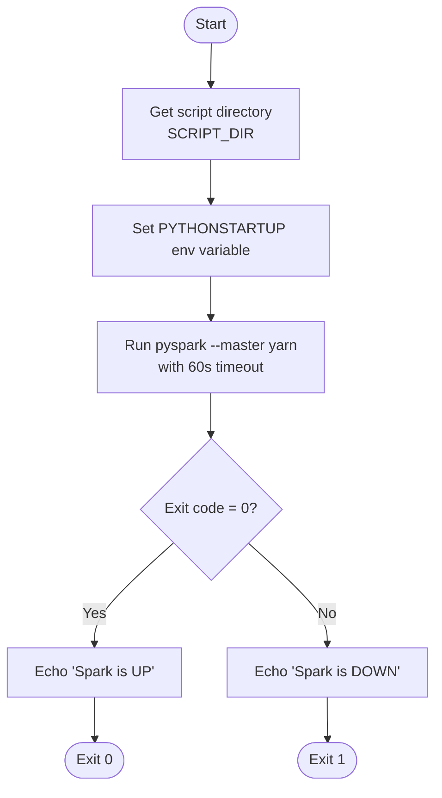
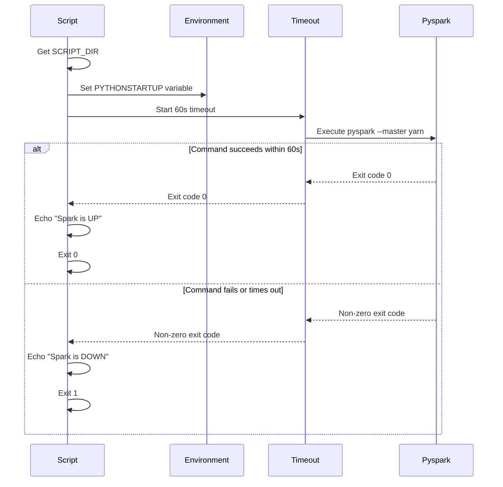

# Diagram: research/orchestrator/util/is_spark_up.sh

> Auto-generated by Obscura crawlers

## Diagram 1

### SVG

<svg id="container" width="466.34375" xmlns="http://www.w3.org/2000/svg" class="flowchart" height="858.25" viewBox="0 0 466.34375 858.25" role="graphics-document document" aria-roledescription="flowchart-v2"><g><marker id="container_flowchart-v2-pointEnd" class="marker flowchart-v2" viewBox="0 0 10 10" refX="5" refY="5" markerUnits="userSpaceOnUse" markerWidth="8" markerHeight="8" orient="auto"><path d="M 0 0 L 10 5 L 0 10 z" class="arrowMarkerPath" style="stroke-width: 1; stroke-dasharray: 1, 0;"></path></marker><marker id="container_flowchart-v2-pointStart" class="marker flowchart-v2" viewBox="0 0 10 10" refX="4.5" refY="5" markerUnits="userSpaceOnUse" markerWidth="8" markerHeight="8" orient="auto"><path d="M 0 5 L 10 10 L 10 0 z" class="arrowMarkerPath" style="stroke-width: 1; stroke-dasharray: 1, 0;"></path></marker><marker id="container_flowchart-v2-circleEnd" class="marker flowchart-v2" viewBox="0 0 10 10" refX="11" refY="5" markerUnits="userSpaceOnUse" markerWidth="11" markerHeight="11" orient="auto"><circle cx="5" cy="5" r="5" class="arrowMarkerPath" style="stroke-width: 1; stroke-dasharray: 1, 0;"></circle></marker><marker id="container_flowchart-v2-circleStart" class="marker flowchart-v2" viewBox="0 0 10 10" refX="-1" refY="5" markerUnits="userSpaceOnUse" markerWidth="11" markerHeight="11" orient="auto"><circle cx="5" cy="5" r="5" class="arrowMarkerPath" style="stroke-width: 1; stroke-dasharray: 1, 0;"></circle></marker><marker id="container_flowchart-v2-crossEnd" class="marker cross flowchart-v2" viewBox="0 0 11 11" refX="12" refY="5.2" markerUnits="userSpaceOnUse" markerWidth="11" markerHeight="11" orient="auto"><path d="M 1,1 l 9,9 M 10,1 l -9,9" class="arrowMarkerPath" style="stroke-width: 2; stroke-dasharray: 1, 0;"></path></marker><marker id="container_flowchart-v2-crossStart" class="marker cross flowchart-v2" viewBox="0 0 11 11" refX="-1" refY="5.2" markerUnits="userSpaceOnUse" markerWidth="11" markerHeight="11" orient="auto"><path d="M 1,1 l 9,9 M 10,1 l -9,9" class="arrowMarkerPath" style="stroke-width: 2; stroke-dasharray: 1, 0;"></path></marker><g class="root"><g class="clusters"></g><g class="edgePaths"><path d="M227.266,47.5L227.182,51.583C227.099,55.667,226.932,63.833,226.849,71.417C226.766,79,226.766,86,226.766,89.5L226.766,93" id="L_Start_GetDir_0" class="edge-thickness-normal edge-pattern-solid edge-thickness-normal edge-pattern-solid flowchart-link" style=";" data-edge="true" data-et="edge" data-id="L_Start_GetDir_0" data-points="W3sieCI6MjI3LjI2NTYyNSwieSI6NDcuNX0seyJ4IjoyMjYuNzY1NjI1LCJ5Ijo3Mn0seyJ4IjoyMjYuNzY1NjI1LCJ5Ijo5N31d" marker-end="url(#container_flowchart-v2-pointEnd)"></path><path d="M226.766,175L226.766,179.167C226.766,183.333,226.766,191.667,226.766,199.333C226.766,207,226.766,214,226.766,217.5L226.766,221" id="L_GetDir_SetEnv_0" class="edge-thickness-normal edge-pattern-solid edge-thickness-normal edge-pattern-solid flowchart-link" style=";" data-edge="true" data-et="edge" data-id="L_GetDir_SetEnv_0" data-points="W3sieCI6MjI2Ljc2NTYyNSwieSI6MTc1fSx7IngiOjIyNi43NjU2MjUsInkiOjIwMH0seyJ4IjoyMjYuNzY1NjI1LCJ5IjoyMjV9XQ==" marker-end="url(#container_flowchart-v2-pointEnd)"></path><path d="M226.766,303L226.766,307.167C226.766,311.333,226.766,319.667,226.766,327.333C226.766,335,226.766,342,226.766,345.5L226.766,349" id="L_SetEnv_RunPyspark_0" class="edge-thickness-normal edge-pattern-solid edge-thickness-normal edge-pattern-solid flowchart-link" style=";" data-edge="true" data-et="edge" data-id="L_SetEnv_RunPyspark_0" data-points="W3sieCI6MjI2Ljc2NTYyNSwieSI6MzAzfSx7IngiOjIyNi43NjU2MjUsInkiOjMyOH0seyJ4IjoyMjYuNzY1NjI1LCJ5IjozNTN9XQ==" marker-end="url(#container_flowchart-v2-pointEnd)"></path><path d="M226.766,431L226.766,435.167C226.766,439.333,226.766,447.667,226.766,455.333C226.766,463,226.766,470,226.766,473.5L226.766,477" id="L_RunPyspark_CheckExit_0" class="edge-thickness-normal edge-pattern-solid edge-thickness-normal edge-pattern-solid flowchart-link" style=";" data-edge="true" data-et="edge" data-id="L_RunPyspark_CheckExit_0" data-points="W3sieCI6MjI2Ljc2NTYyNSwieSI6NDMxfSx7IngiOjIyNi43NjU2MjUsInkiOjQ1Nn0seyJ4IjoyMjYuNzY1NjI1LCJ5Ijo0ODF9XQ==" marker-end="url(#container_flowchart-v2-pointEnd)"></path><path d="M186.792,593.276L172.607,606.105C158.421,618.934,130.05,644.592,115.865,662.921C101.68,681.25,101.68,692.25,101.68,697.75L101.68,703.25" id="L_CheckExit_EchoUp_0" class="edge-thickness-normal edge-pattern-solid edge-thickness-normal edge-pattern-solid flowchart-link" style=";" data-edge="true" data-et="edge" data-id="L_CheckExit_EchoUp_0" data-points="W3sieCI6MTg2Ljc5MTk0ODM0MTMxMzgzLCJ5Ijo1OTMuMjc2MzIzMzQxMzEzOX0seyJ4IjoxMDEuNjc5Njg3NSwieSI6NjcwLjI1fSx7IngiOjEwMS42Nzk2ODc1LCJ5Ijo3MDcuMjV9XQ==" marker-end="url(#container_flowchart-v2-pointEnd)"></path><path d="M266.739,593.276L280.925,606.105C295.11,618.934,323.481,644.592,337.666,662.921C351.852,681.25,351.852,692.25,351.852,697.75L351.852,703.25" id="L_CheckExit_EchoDown_0" class="edge-thickness-normal edge-pattern-solid edge-thickness-normal edge-pattern-solid flowchart-link" style=";" data-edge="true" data-et="edge" data-id="L_CheckExit_EchoDown_0" data-points="W3sieCI6MjY2LjczOTMwMTY1ODY4NjE0LCJ5Ijo1OTMuMjc2MzIzMzQxMzEzOX0seyJ4IjozNTEuODUxNTYyNSwieSI6NjcwLjI1fSx7IngiOjM1MS44NTE1NjI1LCJ5Ijo3MDcuMjV9XQ==" marker-end="url(#container_flowchart-v2-pointEnd)"></path><path d="M101.68,761.25L101.68,765.417C101.68,769.583,101.68,777.917,101.75,785.667C101.82,793.417,101.961,800.584,102.031,804.167L102.101,807.751" id="L_EchoUp_Exit0_0" class="edge-thickness-normal edge-pattern-solid edge-thickness-normal edge-pattern-solid flowchart-link" style=";" data-edge="true" data-et="edge" data-id="L_EchoUp_Exit0_0" data-points="W3sieCI6MTAxLjY3OTY4NzUsInkiOjc2MS4yNX0seyJ4IjoxMDEuNjc5Njg3NSwieSI6Nzg2LjI1fSx7IngiOjEwMi4xNzk2ODc1LCJ5Ijo4MTEuNzV9XQ==" marker-end="url(#container_flowchart-v2-pointEnd)"></path><path d="M351.852,761.25L351.852,765.417C351.852,769.583,351.852,777.917,351.922,785.667C351.992,793.417,352.133,800.584,352.203,804.167L352.273,807.751" id="L_EchoDown_Exit1_0" class="edge-thickness-normal edge-pattern-solid edge-thickness-normal edge-pattern-solid flowchart-link" style=";" data-edge="true" data-et="edge" data-id="L_EchoDown_Exit1_0" data-points="W3sieCI6MzUxLjg1MTU2MjUsInkiOjc2MS4yNX0seyJ4IjozNTEuODUxNTYyNSwieSI6Nzg2LjI1fSx7IngiOjM1Mi4zNTE1NjI1LCJ5Ijo4MTEuNzV9XQ==" marker-end="url(#container_flowchart-v2-pointEnd)"></path></g><g class="edgeLabels"><g class="edgeLabel"><g class="label" data-id="L_Start_GetDir_0" transform="translate(0, 0)"><foreignObject width="0" height="0">

</foreignObject></g></g><g class="edgeLabel"><g class="label" data-id="L_GetDir_SetEnv_0" transform="translate(0, 0)"><foreignObject width="0" height="0">

</foreignObject></g></g><g class="edgeLabel"><g class="label" data-id="L_SetEnv_RunPyspark_0" transform="translate(0, 0)"><foreignObject width="0" height="0">

</foreignObject></g></g><g class="edgeLabel"><g class="label" data-id="L_RunPyspark_CheckExit_0" transform="translate(0, 0)"><foreignObject width="0" height="0">

</foreignObject></g></g><g class="edgeLabel" transform="translate(101.6796875, 670.25)"><g class="label" data-id="L_CheckExit_EchoUp_0" transform="translate(-12.03125, -12)"><foreignObject width="24.0625" height="24">

Yes

</foreignObject></g></g><g class="edgeLabel" transform="translate(351.8515625, 670.25)"><g class="label" data-id="L_CheckExit_EchoDown_0" transform="translate(-10.140625, -12)"><foreignObject width="20.28125" height="24">

No

</foreignObject></g></g><g class="edgeLabel"><g class="label" data-id="L_EchoUp_Exit0_0" transform="translate(0, 0)"><foreignObject width="0" height="0">

</foreignObject></g></g><g class="edgeLabel"><g class="label" data-id="L_EchoDown_Exit1_0" transform="translate(0, 0)"><foreignObject width="0" height="0">

</foreignObject></g></g></g><g class="nodes"><g class="node default" id="flowchart-Start-0" transform="translate(226.765625, 27.5)"><g class="basic label-container outer-path"><path d="M-10.3984375 -19.5 C-6.074453473909574 -19.5, -1.7504694478191478 -19.5, 10.3984375 -19.5 C10.3984375 -19.5, 10.3984375 -19.5, 10.398437499999998 -19.5 C10.74962085314933 -19.48873823340143, 11.10080420629866 -19.477476466802862, 11.6478067896239 -19.45993515863156 C12.020383758037157 -19.423993106578095, 12.392960726450417 -19.388051054524627, 12.892042152847864 -19.3399052695533 C13.184949785628284 -19.292550235017977, 13.477857418408705 -19.24519520048266, 14.126030759676757 -19.140403561325776 C14.547706115184925 -19.04415891311989, 14.969381470693092 -18.947914264914004, 15.34470188623539 -18.862249829261074 C15.742595148542737 -18.744157197592607, 16.140488410850086 -18.626064565924143, 16.543047751460602 -18.50658706670804 C16.906544335563616 -18.37281696363254, 17.27004091966663 -18.239046860557043, 17.716144095147794 -18.074876768247425 C17.959163904957247 -17.967299107371304, 18.202183714766704 -17.859721446495183, 18.85917041279238 -17.568892924097174 C19.28588531773411 -17.346276031513018, 19.71260022267584 -17.123659138928858, 19.967429764076783 -16.990714730406097 C20.357089025805166 -16.754500996054354, 20.74674828753355 -16.51828726170261, 21.036368073605697 -16.342718045390892 C21.27352988567538 -16.177284231860458, 21.510691697745067 -16.011850418330024, 22.061592844578712 -15.627565626425154 C22.305849113482246 -15.43277775190688, 22.550105382385784 -15.237989877388605, 23.03889120850187 -14.848196188198123 C23.370550156819036 -14.546992306551378, 23.702209105136205 -14.245788424904632, 23.964247236767985 -14.007812326905688 C24.155750271917118 -13.81006972042262, 24.34725330706625 -13.612327113939552, 24.833858442968648 -13.10986736009568 C25.01874547380947 -12.892688533299967, 25.203632504650294 -12.675509706504256, 25.644151408126582 -12.158051136245305 C25.850889891978266 -11.881040402147386, 26.057628375829946 -11.604029668049467, 26.391796464640635 -11.156274872382312 C26.594862842343108 -10.844310385273847, 26.79792922004558 -10.532345898165381, 27.073721378604247 -10.108655082055241 C27.20056043873804 -9.883439486940116, 27.32739949887183 -9.65822389182499, 27.6871239742735 -9.019496659696287 C27.81033104462586 -8.763654541900625, 27.933538114978216 -8.507812424104964, 28.22948364880834 -7.893275190886684 C28.361720897710608 -7.5666466294648025, 28.493958146612876 -7.240018068042922, 28.698571729970325 -6.734618561215508 C28.80393590680357 -6.417278448095565, 28.909300083636815 -6.099938334975621, 29.09246063421488 -5.548287939305138 C29.2041532946483 -5.12235541716727, 29.315845955081716 -4.696422895029402, 29.40953178754556 -4.339158212148133 C29.50152700657246 -3.8667822056414334, 29.593522225599358 -3.3944061991347336, 29.648482276581777 -3.1121979531509023 C29.702010277606085 -2.6970453475057483, 29.755538278630397 -2.2818927418605943, 29.808330202509367 -1.872449005199798 C29.8256343784269 -1.6029224976048166, 29.842938554344432 -1.3333959900098353, 29.888418715913414 -0.6250057626472757 C29.888418715913414 -0.19944308818503675, 29.888418715913414 0.2261195862772022, 29.888418715913414 0.625005762647271 C29.85716857416362 1.1117519450607591, 29.825918432413822 1.5984981274742471, 29.808330202509367 1.8724490051997846 C29.77561133725849 2.126210063014861, 29.742892472007608 2.3799711208299374, 29.648482276581777 3.1121979531508885 C29.595096638584227 3.3863219212097233, 29.541711000586677 3.6604458892685576, 29.40953178754556 4.339158212148129 C29.307375711382818 4.7287236052801385, 29.20521963522008 5.118288998412148, 29.092460634214884 5.548287939305125 C28.948569577425243 5.9816648764290274, 28.8046785206356 6.4150418135529295, 28.69857172997033 6.734618561215495 C28.604360189575274 6.967322887447502, 28.51014864918022 7.20002721367951, 28.229483648808344 7.893275190886679 C28.044863648178502 8.276642572429742, 27.860243647548664 8.660009953972805, 27.687123974273504 9.019496659696284 C27.445155418183422 9.44913633300743, 27.20318686209334 9.878776006318576, 27.07372137860425 10.108655082055236 C26.887620573432102 10.394555893863014, 26.701519768259953 10.680456705670792, 26.39179646464064 11.156274872382301 C26.16933164715707 11.454357460848486, 25.946866829673496 11.75244004931467, 25.644151408126582 12.158051136245302 C25.334745899376735 12.52149645249507, 25.025340390626884 12.884941768744836, 24.83385844296866 13.10986736009567 C24.58871653724156 13.362996504283663, 24.34357463151446 13.616125648471655, 23.96424723676799 14.007812326905684 C23.65955182766869 14.284528635650917, 23.35485641856939 14.561244944396147, 23.038891208501887 14.848196188198111 C22.652541839719404 15.156299528613655, 22.26619247093692 15.464402869029199, 22.061592844578715 15.627565626425152 C21.705750477260995 15.875785857698183, 21.34990810994328 16.124006088971214, 21.036368073605708 16.34271804539089 C20.703328805883885 16.544608406639835, 20.370289538162062 16.746498767888784, 19.967429764076787 16.990714730406093 C19.685712021944862 17.137686696027494, 19.403994279812938 17.28465866164889, 18.859170412792388 17.56889292409717 C18.590320135698978 17.68790496660631, 18.321469858605568 17.806917009115452, 17.716144095147804 18.07487676824742 C17.333543053032635 18.215677488471066, 16.950942010917466 18.35647820869471, 16.543047751460616 18.506587066708033 C16.125983495948777 18.630369548528996, 15.708919240436938 18.754152030349964, 15.344701886235413 18.86224982926107 C14.85793057795844 18.973352203895644, 14.371159269681467 19.08445457853022, 14.126030759676766 19.140403561325773 C13.84956684665583 19.185100102773333, 13.57310293363489 19.22979664422089, 12.892042152847878 19.3399052695533 C12.496808094655904 19.37803302380858, 12.10157403646393 19.41616077806386, 11.6478067896239 19.45993515863156 C11.210733339962031 19.473951253450355, 10.773659890300163 19.48796734826915, 10.398437500000004 19.5 C10.398437500000002 19.5, 10.398437500000002 19.5, 10.3984375 19.5 C4.4923036983746805 19.5, -1.413830103250639 19.5, -10.398437499999996 19.5 C-10.701681527859028 19.490275554255255, -11.00492555571806 19.480551108510507, -11.647806789623893 19.45993515863156 C-11.902106905775828 19.435403132267016, -12.156407021927764 19.410871105902476, -12.892042152847871 19.3399052695533 C-13.30621450399128 19.272945095774986, -13.720386855134688 19.205984921996674, -14.126030759676759 19.140403561325773 C-14.472493960198147 19.06132559669044, -14.818957160719533 18.98224763205511, -15.344701886235388 18.862249829261074 C-15.63324347221425 18.77661220112824, -15.921785058193114 18.690974572995405, -16.54304775146059 18.506587066708043 C-16.784504457392583 18.417728766923748, -17.02596116332457 18.328870467139453, -17.716144095147797 18.074876768247425 C-18.04861794083435 17.927700459248204, -18.381091786520905 17.780524150248983, -18.85917041279238 17.568892924097174 C-19.103447175904794 17.441453893248163, -19.347723939017207 17.31401486239915, -19.96742976407678 16.990714730406097 C-20.200770477341152 16.849262218762995, -20.434111190605527 16.707809707119893, -21.036368073605686 16.3427180453909 C-21.328839975140912 16.138702307784484, -21.62131187667614 15.934686570178073, -22.061592844578712 15.627565626425156 C-22.41005629148423 15.349675300519765, -22.758519738389754 15.071784974614376, -23.03889120850187 14.848196188198125 C-23.300728398148856 14.610402580393135, -23.562565587795845 14.372608972588147, -23.964247236767974 14.007812326905697 C-24.26722851850573 13.69495927828562, -24.570209800243486 13.382106229665542, -24.833858442968655 13.109867360095677 C-25.13640866389445 12.754474655000969, -25.43895888482025 12.399081949906261, -25.64415140812658 12.158051136245307 C-25.89750280864518 11.818583340337788, -26.150854209163775 11.479115544430272, -26.391796464640635 11.156274872382316 C-26.64768543127348 10.763160703825605, -26.903574397906326 10.370046535268893, -27.073721378604244 10.108655082055249 C-27.31901519822082 9.673111066633364, -27.5643090178374 9.237567051211478, -27.6871239742735 9.019496659696289 C-27.895945810972226 8.585873647719852, -28.10476764767095 8.152250635743416, -28.22948364880834 7.893275190886686 C-28.34269603162257 7.613638416523021, -28.4559084144368 7.334001642159356, -28.698571729970325 6.73461856121551 C-28.782385430855253 6.482185048049848, -28.86619913174018 6.229751534884185, -29.09246063421488 5.5482879393051325 C-29.185831845031768 5.192223045121588, -29.279203055848654 4.836158150938043, -29.409531787545557 4.339158212148136 C-29.479429315968755 3.9802491765428796, -29.549326844391956 3.6213401409376234, -29.648482276581777 3.112197953150904 C-29.681315144915168 2.8575527099403124, -29.71414801324856 2.6029074667297203, -29.808330202509364 1.872449005199809 C-29.830761377719046 1.5230653451902774, -29.85319255292873 1.1736816851807457, -29.888418715913414 0.6250057626472781 C-29.888418715913414 0.3263822158075838, -29.888418715913414 0.027758668967889477, -29.888418715913414 -0.6250057626472687 C-29.8646366159213 -0.9954311665900539, -29.840854515929184 -1.3658565705328392, -29.808330202509367 -1.8724490051997822 C-29.76756462531259 -2.1886187718642396, -29.726799048115815 -2.504788538528697, -29.648482276581777 -3.112197953150895 C-29.55475149735328 -3.5934856944820326, -29.46102071812478 -4.07477343581317, -29.40953178754556 -4.339158212148126 C-29.308094898773437 -4.7259810320619255, -29.206658010001313 -5.112803851975726, -29.092460634214884 -5.548287939305123 C-28.952931242761288 -5.968528235373855, -28.81340185130769 -6.388768531442586, -28.698571729970332 -6.734618561215485 C-28.552776572638408 -7.094735418582953, -28.40698141530648 -7.454852275950421, -28.229483648808344 -7.893275190886676 C-28.06588015054566 -8.233001355583225, -27.902276652282975 -8.572727520279773, -27.687123974273504 -9.019496659696282 C-27.48436033156309 -9.37952403937387, -27.281596688852673 -9.739551419051455, -27.073721378604247 -10.108655082055243 C-26.838288248921987 -10.470343591894519, -26.602855119239727 -10.832032101733796, -26.39179646464064 -11.156274872382308 C-26.176556105288643 -11.44467734511386, -25.961315745936645 -11.73307981784541, -25.644151408126586 -12.158051136245302 C-25.343305011315344 -12.511442432584715, -25.042458614504103 -12.864833728924129, -24.833858442968662 -13.10986736009567 C-24.52201899760312 -13.431867189930198, -24.210179552237577 -13.753867019764725, -23.964247236767996 -14.007812326905677 C-23.643316406119844 -14.29927321593586, -23.322385575471696 -14.590734104966044, -23.038891208501887 -14.848196188198107 C-22.661720328276097 -15.14897992823953, -22.284549448050303 -15.449763668280953, -22.06159284457872 -15.627565626425149 C-21.6709725328201 -15.900045446227201, -21.28035222106148 -16.172525266029254, -21.03636807360571 -16.342718045390885 C-20.659855866296777 -16.57096195809289, -20.283343658987842 -16.799205870794893, -19.96742976407679 -16.99071473040609 C-19.57359465438655 -17.196178254868062, -19.17975954469631 -17.40164177933003, -18.859170412792388 -17.56889292409717 C-18.594802371151207 -17.6859208139324, -18.330434329510027 -17.80294870376763, -17.716144095147804 -18.07487676824742 C-17.47560134285242 -18.16339872464495, -17.23505859055704 -18.251920681042478, -16.54304775146062 -18.506587066708033 C-16.111055706278435 -18.63480003814559, -15.679063661096247 -18.763013009583144, -15.344701886235413 -18.862249829261067 C-14.930203117097173 -18.95685646845962, -14.515704347958932 -19.051463107658172, -14.126030759676768 -19.140403561325773 C-13.757411950271905 -19.19999899174879, -13.388793140867044 -19.25959442217181, -12.89204215284788 -19.3399052695533 C-12.411460078434391 -19.38626644428746, -11.930878004020903 -19.432627619021623, -11.647806789623903 -19.45993515863156 C-11.357791395633667 -19.469235387836108, -11.06777600164343 -19.478535617040652, -10.398437500000005 -19.5 C-10.398437500000004 -19.5, -10.398437500000002 -19.5, -10.3984375 -19.5" stroke="none" stroke-width="0" fill="#ECECFF" style=""></path><path d="M-10.3984375 -19.5 C-4.931482816904722 -19.5, 0.5354718661905569 -19.5, 10.3984375 -19.5 M-10.3984375 -19.5 C-4.233788858210098 -19.5, 1.9308597835798036 -19.5, 10.3984375 -19.5 M10.3984375 -19.5 C10.3984375 -19.5, 10.398437499999998 -19.5, 10.398437499999998 -19.5 M10.3984375 -19.5 C10.3984375 -19.5, 10.3984375 -19.5, 10.398437499999998 -19.5 M10.398437499999998 -19.5 C10.786390619386038 -19.487559098566226, 11.174343738772077 -19.475118197132456, 11.6478067896239 -19.45993515863156 M10.398437499999998 -19.5 C10.663452538876898 -19.4915014835237, 10.928467577753798 -19.483002967047398, 11.6478067896239 -19.45993515863156 M11.6478067896239 -19.45993515863156 C12.103706616274488 -19.415955050654336, 12.559606442925077 -19.371974942677113, 12.892042152847864 -19.3399052695533 M11.6478067896239 -19.45993515863156 C12.03637083318593 -19.42245085266576, 12.424934876747962 -19.384966546699967, 12.892042152847864 -19.3399052695533 M12.892042152847864 -19.3399052695533 C13.266313210721941 -19.279396027431623, 13.640584268596017 -19.218886785309945, 14.126030759676757 -19.140403561325776 M12.892042152847864 -19.3399052695533 C13.214080352929173 -19.287840630807693, 13.536118553010482 -19.23577599206209, 14.126030759676757 -19.140403561325776 M14.126030759676757 -19.140403561325776 C14.455536270873658 -19.065196078619493, 14.785041782070559 -18.98998859591321, 15.34470188623539 -18.862249829261074 M14.126030759676757 -19.140403561325776 C14.478938935221164 -19.05985457319883, 14.831847110765569 -18.979305585071888, 15.34470188623539 -18.862249829261074 M15.34470188623539 -18.862249829261074 C15.691917217197247 -18.75919814160206, 16.039132548159106 -18.656146453943045, 16.543047751460602 -18.50658706670804 M15.34470188623539 -18.862249829261074 C15.65246520093612 -18.770907292940503, 15.960228515636851 -18.679564756619932, 16.543047751460602 -18.50658706670804 M16.543047751460602 -18.50658706670804 C16.91772941203031 -18.368700752099084, 17.29241107260002 -18.230814437490128, 17.716144095147794 -18.074876768247425 M16.543047751460602 -18.50658706670804 C16.83559057890493 -18.398928601972273, 17.12813340634926 -18.29127013723651, 17.716144095147794 -18.074876768247425 M17.716144095147794 -18.074876768247425 C17.966500993322644 -17.964051195998938, 18.21685789149749 -17.85322562375045, 18.85917041279238 -17.568892924097174 M17.716144095147794 -18.074876768247425 C18.10982117274665 -17.90060760401, 18.50349825034551 -17.72633843977257, 18.85917041279238 -17.568892924097174 M18.85917041279238 -17.568892924097174 C19.151820155097305 -17.4162177409878, 19.44446989740223 -17.26354255787843, 19.967429764076783 -16.990714730406097 M18.85917041279238 -17.568892924097174 C19.282350366780765 -17.34812021316113, 19.70553032076915 -17.12734750222509, 19.967429764076783 -16.990714730406097 M19.967429764076783 -16.990714730406097 C20.193141506575774 -16.85388694567378, 20.418853249074765 -16.71705916094146, 21.036368073605697 -16.342718045390892 M19.967429764076783 -16.990714730406097 C20.31518604488092 -16.779902829339882, 20.662942325685055 -16.569090928273667, 21.036368073605697 -16.342718045390892 M21.036368073605697 -16.342718045390892 C21.273435416925476 -16.177350129170904, 21.510502760245256 -16.01198221295092, 22.061592844578712 -15.627565626425154 M21.036368073605697 -16.342718045390892 C21.291867963944895 -16.164492382302257, 21.547367854284097 -15.986266719213623, 22.061592844578712 -15.627565626425154 M22.061592844578712 -15.627565626425154 C22.31148106535971 -15.428286420157137, 22.561369286140707 -15.22900721388912, 23.03889120850187 -14.848196188198123 M22.061592844578712 -15.627565626425154 C22.382856095943477 -15.371366732635913, 22.704119347308247 -15.115167838846673, 23.03889120850187 -14.848196188198123 M23.03889120850187 -14.848196188198123 C23.258408649269935 -14.648836256605772, 23.477926090038004 -14.449476325013423, 23.964247236767985 -14.007812326905688 M23.03889120850187 -14.848196188198123 C23.33945101237663 -14.575235726695697, 23.640010816251397 -14.302275265193272, 23.964247236767985 -14.007812326905688 M23.964247236767985 -14.007812326905688 C24.17309766510184 -13.792157112711926, 24.381948093435692 -13.576501898518165, 24.833858442968648 -13.10986736009568 M23.964247236767985 -14.007812326905688 C24.211299224173437 -13.752710866564174, 24.45835121157889 -13.49760940622266, 24.833858442968648 -13.10986736009568 M24.833858442968648 -13.10986736009568 C25.122036098639274 -12.77135748797183, 25.410213754309897 -12.43284761584798, 25.644151408126582 -12.158051136245305 M24.833858442968648 -13.10986736009568 C25.109265163320817 -12.786358955283694, 25.384671883672986 -12.462850550471705, 25.644151408126582 -12.158051136245305 M25.644151408126582 -12.158051136245305 C25.9188652948791 -11.789959554946865, 26.19357918163162 -11.421867973648425, 26.391796464640635 -11.156274872382312 M25.644151408126582 -12.158051136245305 C25.79617564685647 -11.954352506040323, 25.94819988558635 -11.750653875835338, 26.391796464640635 -11.156274872382312 M26.391796464640635 -11.156274872382312 C26.53042483526102 -10.943304468179626, 26.669053205881408 -10.73033406397694, 27.073721378604247 -10.108655082055241 M26.391796464640635 -11.156274872382312 C26.53665935494264 -10.933726571745716, 26.681522245244643 -10.71117827110912, 27.073721378604247 -10.108655082055241 M27.073721378604247 -10.108655082055241 C27.230244450994576 -9.830732517346455, 27.386767523384904 -9.552809952637666, 27.6871239742735 -9.019496659696287 M27.073721378604247 -10.108655082055241 C27.23173096030322 -9.828093069543566, 27.38974054200219 -9.547531057031893, 27.6871239742735 -9.019496659696287 M27.6871239742735 -9.019496659696287 C27.837251846371593 -8.707752921062722, 27.987379718469686 -8.396009182429157, 28.22948364880834 -7.893275190886684 M27.6871239742735 -9.019496659696287 C27.81726846661557 -8.749248836701938, 27.94741295895764 -8.479001013707588, 28.22948364880834 -7.893275190886684 M28.22948364880834 -7.893275190886684 C28.3666913872344 -7.554369424243161, 28.50389912566046 -7.215463657599637, 28.698571729970325 -6.734618561215508 M28.22948364880834 -7.893275190886684 C28.392044737834137 -7.491746158088121, 28.554605826859934 -7.090217125289557, 28.698571729970325 -6.734618561215508 M28.698571729970325 -6.734618561215508 C28.8545831339962 -6.26473706933115, 29.010594538022076 -5.794855577446792, 29.09246063421488 -5.548287939305138 M28.698571729970325 -6.734618561215508 C28.847134549540545 -6.287171018940823, 28.99569736911076 -5.839723476666138, 29.09246063421488 -5.548287939305138 M29.09246063421488 -5.548287939305138 C29.166679454127937 -5.265259412336621, 29.240898274040998 -4.982230885368104, 29.40953178754556 -4.339158212148133 M29.09246063421488 -5.548287939305138 C29.159367171739813 -5.293144314245775, 29.22627370926475 -5.038000689186412, 29.40953178754556 -4.339158212148133 M29.40953178754556 -4.339158212148133 C29.499185985286587 -3.8788028551693587, 29.588840183027617 -3.4184474981905844, 29.648482276581777 -3.1121979531509023 M29.40953178754556 -4.339158212148133 C29.498136102430735 -3.884193781741344, 29.58674041731591 -3.4292293513345546, 29.648482276581777 -3.1121979531509023 M29.648482276581777 -3.1121979531509023 C29.70560612996446 -2.669156626695574, 29.76272998334714 -2.2261153002402465, 29.808330202509367 -1.872449005199798 M29.648482276581777 -3.1121979531509023 C29.7000157848699 -2.7125142393104564, 29.751549293158025 -2.31283052547001, 29.808330202509367 -1.872449005199798 M29.808330202509367 -1.872449005199798 C29.83784303699945 -1.4127627856855616, 29.867355871489526 -0.9530765661713253, 29.888418715913414 -0.6250057626472757 M29.808330202509367 -1.872449005199798 C29.834979842000873 -1.4573593589177467, 29.86162948149238 -1.0422697126356955, 29.888418715913414 -0.6250057626472757 M29.888418715913414 -0.6250057626472757 C29.888418715913414 -0.2747692817912494, 29.888418715913414 0.07546719906477695, 29.888418715913414 0.625005762647271 M29.888418715913414 -0.6250057626472757 C29.888418715913414 -0.12950636478750005, 29.888418715913414 0.3659930330722756, 29.888418715913414 0.625005762647271 M29.888418715913414 0.625005762647271 C29.860655003363355 1.0574479960798415, 29.832891290813297 1.4898902295124121, 29.808330202509367 1.8724490051997846 M29.888418715913414 0.625005762647271 C29.856647316218343 1.119870958310256, 29.824875916523272 1.6147361539732408, 29.808330202509367 1.8724490051997846 M29.808330202509367 1.8724490051997846 C29.74801880991416 2.3402122563366397, 29.687707417318954 2.8079755074734942, 29.648482276581777 3.1121979531508885 M29.808330202509367 1.8724490051997846 C29.7506759512901 2.319603992536782, 29.69302170007083 2.766758979873779, 29.648482276581777 3.1121979531508885 M29.648482276581777 3.1121979531508885 C29.577518151936445 3.47658373493162, 29.506554027291113 3.8409695167123514, 29.40953178754556 4.339158212148129 M29.648482276581777 3.1121979531508885 C29.565831324402993 3.5365931243040154, 29.48318037222421 3.9609882954571423, 29.40953178754556 4.339158212148129 M29.40953178754556 4.339158212148129 C29.33493995213175 4.623609208886953, 29.260348116717942 4.908060205625778, 29.092460634214884 5.548287939305125 M29.40953178754556 4.339158212148129 C29.32958271664262 4.644038669647561, 29.249633645739678 4.948919127146992, 29.092460634214884 5.548287939305125 M29.092460634214884 5.548287939305125 C28.998593057563138 5.831002124412876, 28.90472548091139 6.113716309520628, 28.69857172997033 6.734618561215495 M29.092460634214884 5.548287939305125 C28.95726073857657 5.955488483789709, 28.822060842938257 6.362689028274292, 28.69857172997033 6.734618561215495 M28.69857172997033 6.734618561215495 C28.517841284444053 7.181026255850857, 28.337110838917773 7.627433950486219, 28.229483648808344 7.893275190886679 M28.69857172997033 6.734618561215495 C28.5941547467439 6.992530528549812, 28.489737763517468 7.25044249588413, 28.229483648808344 7.893275190886679 M28.229483648808344 7.893275190886679 C28.09227996239707 8.178181581408298, 27.95507627598579 8.463087971929916, 27.687123974273504 9.019496659696284 M28.229483648808344 7.893275190886679 C28.076422752950887 8.211109416113217, 27.923361857093433 8.528943641339755, 27.687123974273504 9.019496659696284 M27.687123974273504 9.019496659696284 C27.543360116183496 9.274763947404304, 27.39959625809349 9.530031235112325, 27.07372137860425 10.108655082055236 M27.687123974273504 9.019496659696284 C27.500411812168167 9.35102301017089, 27.31369965006283 9.682549360645497, 27.07372137860425 10.108655082055236 M27.07372137860425 10.108655082055236 C26.91042979705476 10.359514801244465, 26.747138215505274 10.610374520433696, 26.39179646464064 11.156274872382301 M27.07372137860425 10.108655082055236 C26.81692573377912 10.503162151792486, 26.560130088953983 10.897669221529737, 26.39179646464064 11.156274872382301 M26.39179646464064 11.156274872382301 C26.168160154589792 11.455927154163469, 25.944523844538942 11.755579435944636, 25.644151408126582 12.158051136245302 M26.39179646464064 11.156274872382301 C26.226953371063072 11.377149600261482, 26.0621102774855 11.598024328140664, 25.644151408126582 12.158051136245302 M25.644151408126582 12.158051136245302 C25.38818356570837 12.458725528932574, 25.132215723290162 12.759399921619845, 24.83385844296866 13.10986736009567 M25.644151408126582 12.158051136245302 C25.408666028640887 12.434665662486882, 25.173180649155192 12.711280188728463, 24.83385844296866 13.10986736009567 M24.83385844296866 13.10986736009567 C24.514357073356237 13.43977875577078, 24.19485570374382 13.76969015144589, 23.96424723676799 14.007812326905684 M24.83385844296866 13.10986736009567 C24.575802452527785 13.376331357016708, 24.31774646208691 13.642795353937748, 23.96424723676799 14.007812326905684 M23.96424723676799 14.007812326905684 C23.66857266308507 14.276336151603987, 23.37289808940215 14.54485997630229, 23.038891208501887 14.848196188198111 M23.96424723676799 14.007812326905684 C23.704091590601283 14.244078801413085, 23.443935944434575 14.480345275920486, 23.038891208501887 14.848196188198111 M23.038891208501887 14.848196188198111 C22.817481553748525 15.02476449590556, 22.59607189899516 15.201332803613006, 22.061592844578715 15.627565626425152 M23.038891208501887 14.848196188198111 C22.70955793863922 15.110830706987214, 22.38022466877656 15.373465225776316, 22.061592844578715 15.627565626425152 M22.061592844578715 15.627565626425152 C21.82250546635402 15.79434263154891, 21.58341808812932 15.961119636672667, 21.036368073605708 16.34271804539089 M22.061592844578715 15.627565626425152 C21.794025964861614 15.814208698932262, 21.526459085144513 16.000851771439372, 21.036368073605708 16.34271804539089 M21.036368073605708 16.34271804539089 C20.657082997566736 16.57264288741223, 20.27779792152776 16.802567729433566, 19.967429764076787 16.990714730406093 M21.036368073605708 16.34271804539089 C20.659964590468515 16.57089604886105, 20.28356110733132 16.79907405233121, 19.967429764076787 16.990714730406093 M19.967429764076787 16.990714730406093 C19.549496741406475 17.208750120634317, 19.13156371873616 17.426785510862544, 18.859170412792388 17.56889292409717 M19.967429764076787 16.990714730406093 C19.694089076756622 17.133316391897957, 19.420748389436458 17.27591805338982, 18.859170412792388 17.56889292409717 M18.859170412792388 17.56889292409717 C18.43563885309399 17.756377781958317, 18.01210729339559 17.943862639819468, 17.716144095147804 18.07487676824742 M18.859170412792388 17.56889292409717 C18.407036603534678 17.76903914938264, 17.95490279427697 17.969185374668108, 17.716144095147804 18.07487676824742 M17.716144095147804 18.07487676824742 C17.35501418230494 18.207775914421916, 16.993884269462075 18.340675060596407, 16.543047751460616 18.506587066708033 M17.716144095147804 18.07487676824742 C17.3729126540935 18.201189111352065, 17.029681213039197 18.32750145445671, 16.543047751460616 18.506587066708033 M16.543047751460616 18.506587066708033 C16.14886868916907 18.623577343308042, 15.754689626877527 18.740567619908056, 15.344701886235413 18.86224982926107 M16.543047751460616 18.506587066708033 C16.301301778041882 18.578336002668205, 16.059555804623148 18.65008493862838, 15.344701886235413 18.86224982926107 M15.344701886235413 18.86224982926107 C14.896349248140924 18.964583393131747, 14.447996610046435 19.06691695700242, 14.126030759676766 19.140403561325773 M15.344701886235413 18.86224982926107 C15.05463385062918 18.92845596551736, 14.76456581502295 18.994662101773653, 14.126030759676766 19.140403561325773 M14.126030759676766 19.140403561325773 C13.823898616141927 19.18924994322272, 13.521766472607087 19.238096325119667, 12.892042152847878 19.3399052695533 M14.126030759676766 19.140403561325773 C13.853721769869415 19.18442836701007, 13.581412780062063 19.22845317269437, 12.892042152847878 19.3399052695533 M12.892042152847878 19.3399052695533 C12.399683305117144 19.387402535445734, 11.907324457386409 19.43489980133817, 11.6478067896239 19.45993515863156 M12.892042152847878 19.3399052695533 C12.470960396376151 19.38052652017522, 12.049878639904424 19.421147770797145, 11.6478067896239 19.45993515863156 M11.6478067896239 19.45993515863156 C11.331294935516057 19.470085077739846, 11.014783081408217 19.480234996848136, 10.398437500000004 19.5 M11.6478067896239 19.45993515863156 C11.221548028464815 19.473604447439584, 10.795289267305728 19.48727373624761, 10.398437500000004 19.5 M10.398437500000004 19.5 C10.398437500000004 19.5, 10.398437500000002 19.5, 10.3984375 19.5 M10.398437500000004 19.5 C10.398437500000004 19.5, 10.398437500000002 19.5, 10.3984375 19.5 M10.3984375 19.5 C5.692979259654486 19.5, 0.9875210193089714 19.5, -10.398437499999996 19.5 M10.3984375 19.5 C3.546370479464086 19.5, -3.3056965410718284 19.5, -10.398437499999996 19.5 M-10.398437499999996 19.5 C-10.89035987484927 19.4842250069074, -11.382282249698543 19.468450013814802, -11.647806789623893 19.45993515863156 M-10.398437499999996 19.5 C-10.663419372894525 19.4915025470922, -10.928401245789054 19.4830050941844, -11.647806789623893 19.45993515863156 M-11.647806789623893 19.45993515863156 C-12.115791005455291 19.414789284163668, -12.583775221286688 19.36964340969578, -12.892042152847871 19.3399052695533 M-11.647806789623893 19.45993515863156 C-11.920104815577858 19.43366689555407, -12.192402841531825 19.40739863247658, -12.892042152847871 19.3399052695533 M-12.892042152847871 19.3399052695533 C-13.266937971017516 19.279295021032123, -13.641833789187162 19.218684772510944, -14.126030759676759 19.140403561325773 M-12.892042152847871 19.3399052695533 C-13.31833642384897 19.270985317779285, -13.744630694850072 19.202065366005275, -14.126030759676759 19.140403561325773 M-14.126030759676759 19.140403561325773 C-14.416428413887626 19.074122191773935, -14.706826068098492 19.007840822222096, -15.344701886235388 18.862249829261074 M-14.126030759676759 19.140403561325773 C-14.562238323577002 19.040842031385917, -14.998445887477246 18.941280501446062, -15.344701886235388 18.862249829261074 M-15.344701886235388 18.862249829261074 C-15.598646197705396 18.786880490597667, -15.852590509175403 18.711511151934264, -16.54304775146059 18.506587066708043 M-15.344701886235388 18.862249829261074 C-15.598136863510428 18.787031658313186, -15.851571840785468 18.711813487365298, -16.54304775146059 18.506587066708043 M-16.54304775146059 18.506587066708043 C-16.843834380467356 18.395894806792434, -17.14462100947412 18.285202546876828, -17.716144095147797 18.074876768247425 M-16.54304775146059 18.506587066708043 C-16.806426912433697 18.409661100819665, -17.069806073406806 18.312735134931287, -17.716144095147797 18.074876768247425 M-17.716144095147797 18.074876768247425 C-18.07392949790386 17.916495783774195, -18.43171490065992 17.75811479930097, -18.85917041279238 17.568892924097174 M-17.716144095147797 18.074876768247425 C-17.98487271748993 17.955918578687914, -18.253601339832066 17.836960389128404, -18.85917041279238 17.568892924097174 M-18.85917041279238 17.568892924097174 C-19.105136391491644 17.440572630558496, -19.351102370190908 17.31225233701982, -19.96742976407678 16.990714730406097 M-18.85917041279238 17.568892924097174 C-19.281172925544507 17.3487344834999, -19.703175438296633 17.128576042902626, -19.96742976407678 16.990714730406097 M-19.96742976407678 16.990714730406097 C-20.353316851899695 16.756787710043604, -20.73920393972261 16.52286068968111, -21.036368073605686 16.3427180453909 M-19.96742976407678 16.990714730406097 C-20.241625598948545 16.82449560395325, -20.51582143382031 16.6582764775004, -21.036368073605686 16.3427180453909 M-21.036368073605686 16.3427180453909 C-21.32306400291463 16.142731375971735, -21.60975993222357 15.942744706552567, -22.061592844578712 15.627565626425156 M-21.036368073605686 16.3427180453909 C-21.275797428232746 16.175702492332775, -21.515226782859806 16.00868693927465, -22.061592844578712 15.627565626425156 M-22.061592844578712 15.627565626425156 C-22.309681469341875 15.4297215500921, -22.557770094105038 15.231877473759045, -23.03889120850187 14.848196188198125 M-22.061592844578712 15.627565626425156 C-22.35596927969707 15.392808253104196, -22.65034571481543 15.158050879783238, -23.03889120850187 14.848196188198125 M-23.03889120850187 14.848196188198125 C-23.22641558108481 14.677891514641306, -23.413939953667757 14.507586841084485, -23.964247236767974 14.007812326905697 M-23.03889120850187 14.848196188198125 C-23.290848946331284 14.619374837137885, -23.5428066841607 14.390553486077645, -23.964247236767974 14.007812326905697 M-23.964247236767974 14.007812326905697 C-24.209987081559767 13.7540657615417, -24.45572692635156 13.500319196177703, -24.833858442968655 13.109867360095677 M-23.964247236767974 14.007812326905697 C-24.294968529644688 13.666315439287375, -24.6256898225214 13.324818551669054, -24.833858442968655 13.109867360095677 M-24.833858442968655 13.109867360095677 C-25.016647669271496 12.895152733878735, -25.199436895574337 12.680438107661795, -25.64415140812658 12.158051136245307 M-24.833858442968655 13.109867360095677 C-25.09886757054352 12.798572559399698, -25.363876698118386 12.487277758703721, -25.64415140812658 12.158051136245307 M-25.64415140812658 12.158051136245307 C-25.930749677513333 11.774035564906521, -26.21734794690009 11.390019993567737, -26.391796464640635 11.156274872382316 M-25.64415140812658 12.158051136245307 C-25.8999439963224 11.815312371247083, -26.15573658451822 11.472573606248861, -26.391796464640635 11.156274872382316 M-26.391796464640635 11.156274872382316 C-26.587606619717533 10.85545789179533, -26.783416774794436 10.554640911208347, -27.073721378604244 10.108655082055249 M-26.391796464640635 11.156274872382316 C-26.653418988491097 10.754352420263658, -26.91504151234156 10.352429968145, -27.073721378604244 10.108655082055249 M-27.073721378604244 10.108655082055249 C-27.250462646741457 9.794833063483546, -27.427203914878667 9.481011044911842, -27.6871239742735 9.019496659696289 M-27.073721378604244 10.108655082055249 C-27.26402043239533 9.770759842180423, -27.45431948618642 9.432864602305596, -27.6871239742735 9.019496659696289 M-27.6871239742735 9.019496659696289 C-27.892467032623394 8.593097405395136, -28.097810090973287 8.166698151093982, -28.22948364880834 7.893275190886686 M-27.6871239742735 9.019496659696289 C-27.86505217553703 8.650024942718941, -28.04298037680056 8.280553225741592, -28.22948364880834 7.893275190886686 M-28.22948364880834 7.893275190886686 C-28.390867834753685 7.494653131450713, -28.55225202069903 7.09603107201474, -28.698571729970325 6.73461856121551 M-28.22948364880834 7.893275190886686 C-28.38891694836628 7.499471858545428, -28.54835024792422 7.1056685262041706, -28.698571729970325 6.73461856121551 M-28.698571729970325 6.73461856121551 C-28.778038077044254 6.495278585071807, -28.857504424118186 6.255938608928104, -29.09246063421488 5.5482879393051325 M-28.698571729970325 6.73461856121551 C-28.828691328495417 6.342719062200525, -28.95881092702051 5.950819563185541, -29.09246063421488 5.5482879393051325 M-29.09246063421488 5.5482879393051325 C-29.211040042163436 5.096093264156798, -29.329619450111988 4.643898589008464, -29.409531787545557 4.339158212148136 M-29.09246063421488 5.5482879393051325 C-29.198670150758872 5.1432650212272355, -29.304879667302867 4.738242103149339, -29.409531787545557 4.339158212148136 M-29.409531787545557 4.339158212148136 C-29.46311279337259 4.064031071575917, -29.516693799199622 3.7889039310036976, -29.648482276581777 3.112197953150904 M-29.409531787545557 4.339158212148136 C-29.4982180312944 3.8837730943420854, -29.586904275043246 3.428387976536035, -29.648482276581777 3.112197953150904 M-29.648482276581777 3.112197953150904 C-29.68800058124743 2.805701785936024, -29.72751888591308 2.4992056187211436, -29.808330202509364 1.872449005199809 M-29.648482276581777 3.112197953150904 C-29.694320776398722 2.756683600406288, -29.74015927621567 2.4011692476616715, -29.808330202509364 1.872449005199809 M-29.808330202509364 1.872449005199809 C-29.831812745986305 1.5066894357785174, -29.855295289463246 1.140929866357226, -29.888418715913414 0.6250057626472781 M-29.808330202509364 1.872449005199809 C-29.825064005726553 1.6118065128092272, -29.841797808943745 1.3511640204186453, -29.888418715913414 0.6250057626472781 M-29.888418715913414 0.6250057626472781 C-29.888418715913414 0.276750857301822, -29.888418715913414 -0.0715040480436342, -29.888418715913414 -0.6250057626472687 M-29.888418715913414 0.6250057626472781 C-29.888418715913414 0.2353820779419888, -29.888418715913414 -0.15424160676330056, -29.888418715913414 -0.6250057626472687 M-29.888418715913414 -0.6250057626472687 C-29.872011029712592 -0.8805687192709772, -29.855603343511774 -1.1361316758946858, -29.808330202509367 -1.8724490051997822 M-29.888418715913414 -0.6250057626472687 C-29.85911238744097 -1.0814754842481438, -29.82980605896853 -1.5379452058490188, -29.808330202509367 -1.8724490051997822 M-29.808330202509367 -1.8724490051997822 C-29.774468141718025 -2.1350764618772144, -29.74060608092668 -2.3977039185546465, -29.648482276581777 -3.112197953150895 M-29.808330202509367 -1.8724490051997822 C-29.757678351045378 -2.2652947628150657, -29.70702649958139 -2.6581405204303494, -29.648482276581777 -3.112197953150895 M-29.648482276581777 -3.112197953150895 C-29.577787952357074 -3.475198366794027, -29.507093628132374 -3.838198780437159, -29.40953178754556 -4.339158212148126 M-29.648482276581777 -3.112197953150895 C-29.58678749846638 -3.4289875995774888, -29.525092720350983 -3.7457772460040824, -29.40953178754556 -4.339158212148126 M-29.40953178754556 -4.339158212148126 C-29.291074818306157 -4.790885975433193, -29.172617849066757 -5.24261373871826, -29.092460634214884 -5.548287939305123 M-29.40953178754556 -4.339158212148126 C-29.33584590145983 -4.62015443145806, -29.2621600153741 -4.901150650767993, -29.092460634214884 -5.548287939305123 M-29.092460634214884 -5.548287939305123 C-28.988576796285177 -5.861169507507588, -28.88469295835547 -6.174051075710053, -28.698571729970332 -6.734618561215485 M-29.092460634214884 -5.548287939305123 C-28.974831116261967 -5.9025693056607995, -28.85720159830905 -6.256850672016475, -28.698571729970332 -6.734618561215485 M-28.698571729970332 -6.734618561215485 C-28.576915868609824 -7.035110890832015, -28.455260007249315 -7.3356032204485455, -28.229483648808344 -7.893275190886676 M-28.698571729970332 -6.734618561215485 C-28.5936288739984 -6.993829444398244, -28.488686018026474 -7.2530403275810045, -28.229483648808344 -7.893275190886676 M-28.229483648808344 -7.893275190886676 C-28.095233070514524 -8.172049389216001, -27.960982492220705 -8.450823587545328, -27.687123974273504 -9.019496659696282 M-28.229483648808344 -7.893275190886676 C-28.087302305602844 -8.188517792246296, -27.94512096239734 -8.483760393605914, -27.687123974273504 -9.019496659696282 M-27.687123974273504 -9.019496659696282 C-27.47444818236022 -9.397124063997506, -27.261772390446936 -9.774751468298732, -27.073721378604247 -10.108655082055243 M-27.687123974273504 -9.019496659696282 C-27.45111222334849 -9.438559422244921, -27.215100472423476 -9.85762218479356, -27.073721378604247 -10.108655082055243 M-27.073721378604247 -10.108655082055243 C-26.89393406258841 -10.38485667910971, -26.714146746572574 -10.661058276164175, -26.39179646464064 -11.156274872382308 M-27.073721378604247 -10.108655082055243 C-26.85287029581297 -10.447941652042111, -26.632019213021696 -10.787228222028979, -26.39179646464064 -11.156274872382308 M-26.39179646464064 -11.156274872382308 C-26.241674779149502 -11.357424254573539, -26.091553093658362 -11.55857363676477, -25.644151408126586 -12.158051136245302 M-26.39179646464064 -11.156274872382308 C-26.158419469411495 -11.468978784907717, -25.925042474182348 -11.781682697433128, -25.644151408126586 -12.158051136245302 M-25.644151408126586 -12.158051136245302 C-25.381762806643508 -12.466267717881708, -25.119374205160426 -12.774484299518116, -24.833858442968662 -13.10986736009567 M-25.644151408126586 -12.158051136245302 C-25.392870423154967 -12.45322007948606, -25.141589438183352 -12.74838902272682, -24.833858442968662 -13.10986736009567 M-24.833858442968662 -13.10986736009567 C-24.61851041551252 -13.332231878846, -24.403162388056376 -13.554596397596333, -23.964247236767996 -14.007812326905677 M-24.833858442968662 -13.10986736009567 C-24.58074783195053 -13.371224846739524, -24.3276372209324 -13.63258233338338, -23.964247236767996 -14.007812326905677 M-23.964247236767996 -14.007812326905677 C-23.60477120745758 -14.334278945510857, -23.24529517814717 -14.660745564116036, -23.038891208501887 -14.848196188198107 M-23.964247236767996 -14.007812326905677 C-23.763606887572898 -14.190028583391928, -23.562966538377804 -14.372244839878181, -23.038891208501887 -14.848196188198107 M-23.038891208501887 -14.848196188198107 C-22.77992941990908 -15.054711323338262, -22.520967631316278 -15.261226458478415, -22.06159284457872 -15.627565626425149 M-23.038891208501887 -14.848196188198107 C-22.836798942027716 -15.009359392810191, -22.634706675553545 -15.170522597422275, -22.06159284457872 -15.627565626425149 M-22.06159284457872 -15.627565626425149 C-21.73303784637149 -15.856751370257872, -21.404482848164264 -16.085937114090594, -21.03636807360571 -16.342718045390885 M-22.06159284457872 -15.627565626425149 C-21.839002985452634 -15.782834676391806, -21.61641312632655 -15.938103726358463, -21.03636807360571 -16.342718045390885 M-21.03636807360571 -16.342718045390885 C-20.777576544640016 -16.499598991077722, -20.51878501567432 -16.65647993676456, -19.96742976407679 -16.99071473040609 M-21.03636807360571 -16.342718045390885 C-20.760431144790036 -16.509992633224336, -20.484494215974358 -16.677267221057786, -19.96742976407679 -16.99071473040609 M-19.96742976407679 -16.99071473040609 C-19.69832813120675 -17.131104879906566, -19.429226498336714 -17.271495029407046, -18.859170412792388 -17.56889292409717 M-19.96742976407679 -16.99071473040609 C-19.619716209664542 -17.1721166690218, -19.27200265525229 -17.353518607637508, -18.859170412792388 -17.56889292409717 M-18.859170412792388 -17.56889292409717 C-18.58794858867797 -17.68895478012307, -18.31672676456355 -17.809016636148964, -17.716144095147804 -18.07487676824742 M-18.859170412792388 -17.56889292409717 C-18.534933461495715 -17.71242300428878, -18.210696510199043 -17.85595308448039, -17.716144095147804 -18.07487676824742 M-17.716144095147804 -18.07487676824742 C-17.41360901764812 -18.186212473370905, -17.111073940148433 -18.297548178494388, -16.54304775146062 -18.506587066708033 M-17.716144095147804 -18.07487676824742 C-17.344929039982407 -18.21148734002264, -16.97371398481701 -18.34809791179786, -16.54304775146062 -18.506587066708033 M-16.54304775146062 -18.506587066708033 C-16.13147942758806 -18.62873838486719, -15.719911103715507 -18.75088970302635, -15.344701886235413 -18.862249829261067 M-16.54304775146062 -18.506587066708033 C-16.11681151387838 -18.633091744662774, -15.690575276296135 -18.759596422617516, -15.344701886235413 -18.862249829261067 M-15.344701886235413 -18.862249829261067 C-14.959129169392618 -18.950254285783316, -14.573556452549822 -19.038258742305565, -14.126030759676768 -19.140403561325773 M-15.344701886235413 -18.862249829261067 C-14.877467418608356 -18.9688930475071, -14.410232950981298 -19.075536265753133, -14.126030759676768 -19.140403561325773 M-14.126030759676768 -19.140403561325773 C-13.647058882524808 -19.21784001994132, -13.16808700537285 -19.295276478556865, -12.89204215284788 -19.3399052695533 M-14.126030759676768 -19.140403561325773 C-13.842641772985857 -19.186219694979545, -13.559252786294948 -19.232035828633318, -12.89204215284788 -19.3399052695533 M-12.89204215284788 -19.3399052695533 C-12.51706027510577 -19.37607932031739, -12.142078397363658 -19.412253371081484, -11.647806789623903 -19.45993515863156 M-12.89204215284788 -19.3399052695533 C-12.590442710058099 -19.36900020507283, -12.28884326726832 -19.39809514059236, -11.647806789623903 -19.45993515863156 M-11.647806789623903 -19.45993515863156 C-11.215695410336236 -19.473792129511537, -10.78358403104857 -19.48764910039152, -10.398437500000005 -19.5 M-11.647806789623903 -19.45993515863156 C-11.270476678792035 -19.472035400857433, -10.893146567960164 -19.484135643083302, -10.398437500000005 -19.5 M-10.398437500000005 -19.5 C-10.398437500000004 -19.5, -10.398437500000002 -19.5, -10.3984375 -19.5 M-10.398437500000005 -19.5 C-10.398437500000004 -19.5, -10.398437500000002 -19.5, -10.3984375 -19.5" stroke="#9370DB" stroke-width="1.3" fill="none" stroke-dasharray="0 0" style=""></path></g><g class="label" style="" transform="translate(-17.5234375, -12)"><rect></rect><foreignObject width="35.046875" height="24">

Start

</foreignObject></g></g><g class="node default" id="flowchart-GetDir-1" transform="translate(226.765625, 136)"><rect class="basic label-container" style="" x="-99.6171875" y="-39" width="199.234375" height="78"></rect><g class="label" style="" transform="translate(-69.6171875, -24)"><rect></rect><foreignObject width="139.234375" height="48">

Get script directory SCRIPT_DIR

</foreignObject></g></g><g class="node default" id="flowchart-SetEnv-3" transform="translate(226.765625, 264)"><rect class="basic label-container" style="" x="-130" y="-39" width="260" height="78"></rect><g class="label" style="" transform="translate(-100, -24)"><rect></rect><foreignObject width="200" height="48">

Set PYTHONSTARTUP env variable

</foreignObject></g></g><g class="node default" id="flowchart-RunPyspark-5" transform="translate(226.765625, 392)"><rect class="basic label-container" style="" x="-126.5546875" y="-39" width="253.109375" height="78"></rect><g class="label" style="" transform="translate(-96.5546875, -24)"><rect></rect><foreignObject width="193.109375" height="48">

Run pyspark --master yarn with 60s timeout

</foreignObject></g></g><g class="node default" id="flowchart-CheckExit-7" transform="translate(226.765625, 557.125)"><polygon points="76.125,0 152.25,-76.125 76.125,-152.25 0,-76.125" class="label-container" transform="translate(-75.625, 76.125)"></polygon><g class="label" style="" transform="translate(-49.125, -12)"><rect></rect><foreignObject width="98.25" height="24">

Exit code = 0?

</foreignObject></g></g><g class="node default" id="flowchart-EchoUp-9" transform="translate(101.6796875, 734.25)"><rect class="basic label-container" style="" x="-93.6796875" y="-27" width="187.359375" height="54"></rect><g class="label" style="" transform="translate(-63.6796875, -12)"><rect></rect><foreignObject width="127.359375" height="24">

Echo 'Spark is UP'

</foreignObject></g></g><g class="node default" id="flowchart-EchoDown-11" transform="translate(351.8515625, 734.25)"><rect class="basic label-container" style="" x="-106.4921875" y="-27" width="212.984375" height="54"></rect><g class="label" style="" transform="translate(-76.4921875, -12)"><rect></rect><foreignObject width="152.984375" height="24">

Echo 'Spark is DOWN'

</foreignObject></g></g><g class="node default" id="flowchart-Exit0-13" transform="translate(101.6796875, 830.75)"><g class="basic label-container outer-path"><path d="M-12.765625 -19.5 C-4.444470270282265 -19.5, 3.87668445943547 -19.5, 12.765625 -19.5 C12.765625 -19.5, 12.765624999999998 -19.5, 12.765624999999998 -19.5 C13.243952107502233 -19.484660980669638, 13.722279215004468 -19.469321961339276, 14.0149942896239 -19.45993515863156 C14.34534877980064 -19.42806625827361, 14.67570326997738 -19.396197357915664, 15.259229652847864 -19.3399052695533 C15.705806560285946 -19.26770617841435, 16.15238346772403 -19.195507087275406, 16.49321825967676 -19.140403561325776 C16.812398547893643 -19.067552743386305, 17.131578836110528 -18.994701925446833, 17.71188938623539 -18.862249829261074 C18.15704155826959 -18.730131001252758, 18.60219373030379 -18.59801217324444, 18.910235251460602 -18.50658706670804 C19.15004392877984 -18.418335256687445, 19.389852606099083 -18.330083446666855, 20.083331595147794 -18.074876768247425 C20.32059106557382 -17.969849038741952, 20.55785053599984 -17.86482130923648, 21.22635791279238 -17.568892924097174 C21.634153774833614 -17.356146084075977, 22.04194963687485 -17.143399244054784, 22.334617264076783 -16.990714730406097 C22.755810026784008 -16.73538520244956, 23.177002789491233 -16.48005567449302, 23.403555573605697 -16.342718045390892 C23.67584508878465 -16.15278066682519, 23.948134603963606 -15.962843288259487, 24.428780344578712 -15.627565626425154 C24.81502100258105 -15.319548979963859, 25.20126166058339 -15.011532333502563, 25.40607870850187 -14.848196188198123 C25.62347773107282 -14.65076014796212, 25.84087675364377 -14.453324107726118, 26.331434736767985 -14.007812326905688 C26.5459437282103 -13.78631418172577, 26.76045271965262 -13.56481603654585, 27.201045942968648 -13.10986736009568 C27.38792505657124 -12.890348519535273, 27.574804170173834 -12.670829678974863, 28.011338908126582 -12.158051136245305 C28.20575364206039 -11.897553104320625, 28.400168375994195 -11.637055072395945, 28.758983964640635 -11.156274872382312 C29.023650227491164 -10.749676419801188, 29.288316490341693 -10.343077967220065, 29.440908878604247 -10.108655082055241 C29.64783426025682 -9.741238113464092, 29.85475964190939 -9.373821144872945, 30.0543114742735 -9.019496659696287 C30.23103716656133 -8.652521978336551, 30.407762858849157 -8.285547296976816, 30.59667114880834 -7.893275190886684 C30.715236785527605 -7.600415775879464, 30.833802422246865 -7.307556360872242, 31.065759229970325 -6.734618561215508 C31.200710387215754 -6.328167177139221, 31.33566154446118 -5.921715793062935, 31.45964813421488 -5.548287939305138 C31.586086061193413 -5.066125325191804, 31.712523988171945 -4.583962711078469, 31.77671928754556 -4.339158212148133 C31.832033688710897 -4.055130452866952, 31.887348089876234 -3.771102693585771, 32.015669776581774 -3.1121979531509023 C32.06704064101978 -2.7137756728942963, 32.11841150545779 -2.3153533926376904, 32.17551770250937 -1.872449005199798 C32.20699295394532 -1.38219655771918, 32.238468205381274 -0.8919441102385618, 32.25560621591342 -0.6250057626472757 C32.25560621591342 -0.36991143868213766, 32.25560621591342 -0.11481711471699962, 32.25560621591342 0.625005762647271 C32.23010511489642 1.0222059951052993, 32.20460401387942 1.4194062275633275, 32.17551770250937 1.8724490051997846 C32.11459263486661 2.3449717988215983, 32.053667567223854 2.8174945924434116, 32.015669776581774 3.1121979531508885 C31.96643232021942 3.3650218852315117, 31.91719486385706 3.6178458173121353, 31.77671928754556 4.339158212148129 C31.651384877867045 4.817112636529079, 31.52605046818853 5.2950670609100285, 31.459648134214884 5.548287939305125 C31.37385053649717 5.806696633640111, 31.28805293877945 6.065105327975096, 31.06575922997033 6.734618561215495 C30.963365300635473 6.9875335463245385, 30.860971371300618 7.240448531433582, 30.596671148808344 7.893275190886679 C30.431985065419827 8.23524936676063, 30.26729898203131 8.57722354263458, 30.054311474273504 9.019496659696284 C29.831363888370543 9.415362674358112, 29.608416302467578 9.811228689019941, 29.44090887860425 10.108655082055236 C29.235651219668917 10.423985965578776, 29.030393560733582 10.739316849102316, 28.75898396464064 11.156274872382301 C28.560618208736557 11.422066913801647, 28.36225245283247 11.687858955220992, 28.011338908126582 12.158051136245302 C27.847566182502824 12.350427898695047, 27.68379345687907 12.542804661144794, 27.20104594296866 13.10986736009567 C26.89370026716492 13.427227003912293, 26.586354591361182 13.744586647728918, 26.33143473676799 14.007812326905684 C26.04336625997059 14.269428495658852, 25.75529778317319 14.531044664412022, 25.406078708501887 14.848196188198111 C25.02799230898302 15.14971003051277, 24.649905909464152 15.451223872827427, 24.428780344578715 15.627565626425152 C24.03611933284294 15.901468950190791, 23.64345832110717 16.17537227395643, 23.403555573605708 16.34271804539089 C23.039372883526408 16.563487732292003, 22.675190193447104 16.784257419193118, 22.334617264076787 16.990714730406093 C21.90133347209934 17.216758607149213, 21.468049680121894 17.442802483892333, 21.226357912792388 17.56889292409717 C20.997495645956125 17.67020346066765, 20.76863337911986 17.77151399723813, 20.083331595147804 18.07487676824742 C19.845098531802535 18.162548737760776, 19.60686546845726 18.25022070727413, 18.910235251460616 18.506587066708033 C18.493607418280636 18.630240020671728, 18.076979585100652 18.753892974635427, 17.711889386235413 18.86224982926107 C17.465129133130265 18.918571246771183, 17.21836888002512 18.974892664281292, 16.493218259676766 19.140403561325773 C16.22085613131635 19.184436958039235, 15.948494002955936 19.228470354752695, 15.259229652847878 19.3399052695533 C14.781357078418843 19.38600506208261, 14.303484503989809 19.432104854611925, 14.0149942896239 19.45993515863156 C13.701793545871826 19.46997889687542, 13.388592802119753 19.480022635119287, 12.765625000000004 19.5 C12.765625000000002 19.5, 12.765625000000002 19.5, 12.765625 19.5 C7.143913860557862 19.5, 1.5222027211157236 19.5, -12.765624999999996 19.5 C-13.12642191234613 19.488429945269647, -13.487218824692262 19.476859890539295, -14.014994289623893 19.45993515863156 C-14.483404474609687 19.41474819143165, -14.951814659595481 19.369561224231735, -15.259229652847871 19.3399052695533 C-15.652168171763813 19.276378017098693, -16.045106690679756 19.212850764644088, -16.49321825967676 19.140403561325773 C-16.842480534205517 19.06068672631392, -17.191742808734272 18.980969891302074, -17.711889386235388 18.862249829261074 C-18.140121233277206 18.735152864893898, -18.568353080319028 18.608055900526722, -18.91023525146059 18.506587066708043 C-19.165324390086795 18.41271190567545, -19.420413528712995 18.318836744642862, -20.083331595147797 18.074876768247425 C-20.512084904822984 17.88508039656926, -20.94083821449817 17.695284024891098, -21.22635791279238 17.568892924097174 C-21.627461963876588 17.35963719756595, -22.0285660149608 17.150381471034724, -22.33461726407678 16.990714730406097 C-22.552001623063997 16.858935054495753, -22.769385982051215 16.727155378585408, -23.403555573605686 16.3427180453909 C-23.806407861986507 16.06170572821093, -24.20926015036733 15.780693411030967, -24.428780344578712 15.627565626425156 C-24.66822242352596 15.436616940286045, -24.907664502473207 15.245668254146935, -25.40607870850187 14.848196188198125 C-25.639688595698786 14.636037869624793, -25.873298482895702 14.423879551051462, -26.331434736767974 14.007812326905697 C-26.674469794664674 13.653600465925328, -27.017504852561377 13.29938860494496, -27.201045942968655 13.109867360095677 C-27.387752793600093 12.890550869423226, -27.57445964423153 12.671234378750775, -28.01133890812658 12.158051136245307 C-28.18634966486114 11.923552666028929, -28.361360421595702 11.689054195812549, -28.758983964640635 11.156274872382316 C-28.963039923788607 10.842790122433737, -29.16709588293658 10.52930537248516, -29.440908878604244 10.108655082055249 C-29.56968976463671 9.879991578425834, -29.698470650669176 9.65132807479642, -30.0543114742735 9.019496659696289 C-30.22609901747006 8.66277615058404, -30.397886560666617 8.30605564147179, -30.59667114880834 7.893275190886686 C-30.70781030654697 7.618759322542832, -30.818949464285602 7.3442434541989785, -31.065759229970325 6.73461856121551 C-31.19067217448258 6.358400674519544, -31.31558511899483 5.982182787823577, -31.45964813421488 5.5482879393051325 C-31.560258445878183 5.164617216148056, -31.660868757541486 4.78094649299098, -31.776719287545557 4.339158212148136 C-31.854662067231715 3.938938511672031, -31.932604846917876 3.5387188111959254, -32.015669776581774 3.112197953150904 C-32.076609514572304 2.639561379208761, -32.137549252562835 2.1669248052666172, -32.17551770250937 1.872449005199809 C-32.19375637056666 1.5883670282196256, -32.21199503862395 1.3042850512394422, -32.25560621591342 0.6250057626472781 C-32.25560621591342 0.37151060103906675, -32.25560621591342 0.11801543943085535, -32.25560621591342 -0.6250057626472687 C-32.22886393145746 -1.0415384290323133, -32.2021216470015 -1.458071095417358, -32.17551770250937 -1.8724490051997822 C-32.12787998004712 -2.241917773484653, -32.08024225758487 -2.6113865417695243, -32.015669776581774 -3.112197953150895 C-31.948627922475403 -3.4564437046862264, -31.881586068369035 -3.8006894562215576, -31.77671928754556 -4.339158212148126 C-31.65238726648486 -4.813290094291374, -31.528055245424156 -5.287421976434622, -31.459648134214884 -5.548287939305123 C-31.379171013427847 -5.7906722048277866, -31.298693892640806 -6.03305647035045, -31.065759229970332 -6.734618561215485 C-30.900755223645458 -7.142181646973363, -30.735751217320587 -7.549744732731241, -30.596671148808344 -7.893275190886676 C-30.388395013003258 -8.325765043281342, -30.180118877198172 -8.758254895676009, -30.054311474273504 -9.019496659696282 C-29.841019892166493 -9.398217461841988, -29.62772831005948 -9.776938263987695, -29.440908878604247 -10.108655082055243 C-29.267347166567795 -10.375292479588632, -29.09378545453134 -10.64192987712202, -28.75898396464064 -11.156274872382308 C-28.60093146245255 -11.36805082643519, -28.44287896026446 -11.579826780488071, -28.011338908126586 -12.158051136245302 C-27.833053435652342 -12.367475396944322, -27.654767963178095 -12.576899657643342, -27.201045942968662 -13.10986736009567 C-26.94967077888959 -13.369432855292102, -26.69829561481052 -13.628998350488532, -26.331434736767996 -14.007812326905677 C-26.0165186526992 -14.293810782233962, -25.70160256863041 -14.579809237562248, -25.406078708501887 -14.848196188198107 C-25.147216118686664 -15.05463221495293, -24.88835352887144 -15.261068241707752, -24.42878034457872 -15.627565626425149 C-24.019004884557393 -15.913407248442264, -23.609229424536064 -16.19924887045938, -23.40355557360571 -16.342718045390885 C-23.068628731626358 -16.545752665247367, -22.733701889647 -16.748787285103845, -22.33461726407679 -16.99071473040609 C-21.943261069472996 -17.194885006455284, -21.551904874869205 -17.399055282504477, -21.226357912792388 -17.56889292409717 C-20.949954916601083 -17.6912483313075, -20.67355192040978 -17.813603738517823, -20.083331595147804 -18.07487676824742 C-19.840420040027123 -18.16427046598163, -19.59750848490644 -18.253664163715843, -18.91023525146062 -18.506587066708033 C-18.47832193258408 -18.634776672591315, -18.04640861370754 -18.762966278474597, -17.711889386235413 -18.862249829261067 C-17.28056820713084 -18.96069607375795, -16.849247028026273 -19.059142318254835, -16.493218259676766 -19.140403561325773 C-16.09519991688131 -19.204752080310595, -15.697181574085855 -19.269100599295417, -15.25922965284788 -19.3399052695533 C-14.948868636017748 -19.36984542358317, -14.638507619187616 -19.399785577613038, -14.014994289623903 -19.45993515863156 C-13.591412289485852 -19.47351860892364, -13.167830289347801 -19.48710205921572, -12.765625000000005 -19.5 C-12.765625000000004 -19.5, -12.765625000000002 -19.5, -12.765625 -19.5" stroke="none" stroke-width="0" fill="#ECECFF" style=""></path><path d="M-12.765625 -19.5 C-3.0300428421175205 -19.5, 6.705539315764959 -19.5, 12.765625 -19.5 M-12.765625 -19.5 C-5.548360710583809 -19.5, 1.6689035788323814 -19.5, 12.765625 -19.5 M12.765625 -19.5 C12.765625 -19.5, 12.765625 -19.5, 12.765624999999998 -19.5 M12.765625 -19.5 C12.765625 -19.5, 12.765625 -19.5, 12.765624999999998 -19.5 M12.765624999999998 -19.5 C13.258711364826363 -19.484187680014404, 13.751797729652727 -19.46837536002881, 14.0149942896239 -19.45993515863156 M12.765624999999998 -19.5 C13.112094714915097 -19.488889390605063, 13.458564429830194 -19.477778781210123, 14.0149942896239 -19.45993515863156 M14.0149942896239 -19.45993515863156 C14.505228005991711 -19.41264290160586, 14.99546172235952 -19.36535064458016, 15.259229652847864 -19.3399052695533 M14.0149942896239 -19.45993515863156 C14.342884886433291 -19.428303947103494, 14.670775483242682 -19.39667273557543, 15.259229652847864 -19.3399052695533 M15.259229652847864 -19.3399052695533 C15.511122389404736 -19.299181205364132, 15.763015125961608 -19.258457141174965, 16.49321825967676 -19.140403561325776 M15.259229652847864 -19.3399052695533 C15.643929247552537 -19.27771002247136, 16.02862884225721 -19.215514775389426, 16.49321825967676 -19.140403561325776 M16.49321825967676 -19.140403561325776 C16.85278480525311 -19.058334843688964, 17.212351350829454 -18.976266126052156, 17.71188938623539 -18.862249829261074 M16.49321825967676 -19.140403561325776 C16.91711078083485 -19.043652859528652, 17.34100330199294 -18.94690215773153, 17.71188938623539 -18.862249829261074 M17.71188938623539 -18.862249829261074 C18.04968506020679 -18.761993846352038, 18.38748073417819 -18.661737863443005, 18.910235251460602 -18.50658706670804 M17.71188938623539 -18.862249829261074 C18.191129653405362 -18.720013833548524, 18.67036992057533 -18.577777837835974, 18.910235251460602 -18.50658706670804 M18.910235251460602 -18.50658706670804 C19.352581299082683 -18.343799632181074, 19.79492734670476 -18.18101219765411, 20.083331595147794 -18.074876768247425 M18.910235251460602 -18.50658706670804 C19.376757692383602 -18.334902495962204, 19.843280133306603 -18.16321792521637, 20.083331595147794 -18.074876768247425 M20.083331595147794 -18.074876768247425 C20.381644299101307 -17.942822583339158, 20.679957003054824 -17.810768398430888, 21.22635791279238 -17.568892924097174 M20.083331595147794 -18.074876768247425 C20.37810319063045 -17.944390127015954, 20.67287478611311 -17.813903485784486, 21.22635791279238 -17.568892924097174 M21.22635791279238 -17.568892924097174 C21.453695479039716 -17.4502910614026, 21.68103304528705 -17.331689198708027, 22.334617264076783 -16.990714730406097 M21.22635791279238 -17.568892924097174 C21.45033905307577 -17.452042106678096, 21.67432019335916 -17.335191289259022, 22.334617264076783 -16.990714730406097 M22.334617264076783 -16.990714730406097 C22.71795954909858 -16.758330384456563, 23.101301834120374 -16.52594603850703, 23.403555573605697 -16.342718045390892 M22.334617264076783 -16.990714730406097 C22.550349309616696 -16.85993669661758, 22.76608135515661 -16.72915866282906, 23.403555573605697 -16.342718045390892 M23.403555573605697 -16.342718045390892 C23.640603678137424 -16.177363549316617, 23.87765178266915 -16.01200905324234, 24.428780344578712 -15.627565626425154 M23.403555573605697 -16.342718045390892 C23.663350972292157 -16.161496021628768, 23.923146370978614 -15.980273997866645, 24.428780344578712 -15.627565626425154 M24.428780344578712 -15.627565626425154 C24.639376166217943 -15.459621062858043, 24.84997198785717 -15.291676499290933, 25.40607870850187 -14.848196188198123 M24.428780344578712 -15.627565626425154 C24.730358812033444 -15.387064823970066, 25.03193727948818 -15.146564021514978, 25.40607870850187 -14.848196188198123 M25.40607870850187 -14.848196188198123 C25.651400770185226 -14.625401182643362, 25.896722831868583 -14.4026061770886, 26.331434736767985 -14.007812326905688 M25.40607870850187 -14.848196188198123 C25.737651991593435 -14.547070105442693, 26.069225274685 -14.245944022687262, 26.331434736767985 -14.007812326905688 M26.331434736767985 -14.007812326905688 C26.519592997784198 -13.813523474325924, 26.70775125880041 -13.61923462174616, 27.201045942968648 -13.10986736009568 M26.331434736767985 -14.007812326905688 C26.538889739634353 -13.793598004073667, 26.746344742500725 -13.579383681241644, 27.201045942968648 -13.10986736009568 M27.201045942968648 -13.10986736009568 C27.499394657129056 -12.75940998392011, 27.79774337128946 -12.408952607744538, 28.011338908126582 -12.158051136245305 M27.201045942968648 -13.10986736009568 C27.42339412898724 -12.848684528828041, 27.645742315005837 -12.587501697560404, 28.011338908126582 -12.158051136245305 M28.011338908126582 -12.158051136245305 C28.27458420875406 -11.805326415544732, 28.537829509381535 -11.452601694844157, 28.758983964640635 -11.156274872382312 M28.011338908126582 -12.158051136245305 C28.23047290573956 -11.864431542961782, 28.449606903352542 -11.570811949678259, 28.758983964640635 -11.156274872382312 M28.758983964640635 -11.156274872382312 C28.963308611537965 -10.842377345897958, 29.167633258435295 -10.528479819413604, 29.440908878604247 -10.108655082055241 M28.758983964640635 -11.156274872382312 C28.97215678243995 -10.828784179325943, 29.18532960023926 -10.501293486269576, 29.440908878604247 -10.108655082055241 M29.440908878604247 -10.108655082055241 C29.611287872836183 -9.80612992505245, 29.78166686706812 -9.503604768049655, 30.0543114742735 -9.019496659696287 M29.440908878604247 -10.108655082055241 C29.58920878402268 -9.845333582991, 29.737508689441118 -9.58201208392676, 30.0543114742735 -9.019496659696287 M30.0543114742735 -9.019496659696287 C30.16388103834183 -8.791973115495297, 30.27345060241016 -8.564449571294308, 30.59667114880834 -7.893275190886684 M30.0543114742735 -9.019496659696287 C30.220423290191 -8.67456191972011, 30.386535106108504 -8.329627179743934, 30.59667114880834 -7.893275190886684 M30.59667114880834 -7.893275190886684 C30.697938844388386 -7.643142024926272, 30.79920653996843 -7.393008858965859, 31.065759229970325 -6.734618561215508 M30.59667114880834 -7.893275190886684 C30.759340781400308 -7.49147805338113, 30.92201041399228 -7.089680915875576, 31.065759229970325 -6.734618561215508 M31.065759229970325 -6.734618561215508 C31.184208515115472 -6.377868186689003, 31.30265780026062 -6.021117812162498, 31.45964813421488 -5.548287939305138 M31.065759229970325 -6.734618561215508 C31.183035879278055 -6.381399978997154, 31.300312528585785 -6.028181396778799, 31.45964813421488 -5.548287939305138 M31.45964813421488 -5.548287939305138 C31.586062214304143 -5.0662162637159005, 31.712476294393404 -4.584144588126662, 31.77671928754556 -4.339158212148133 M31.45964813421488 -5.548287939305138 C31.549573577286008 -5.205363250941368, 31.639499020357135 -4.8624385625776, 31.77671928754556 -4.339158212148133 M31.77671928754556 -4.339158212148133 C31.863628236026617 -3.892899129910675, 31.95053718450767 -3.4466400476732173, 32.015669776581774 -3.1121979531509023 M31.77671928754556 -4.339158212148133 C31.846588779413892 -3.9803931383265865, 31.91645827128222 -3.62162806450504, 32.015669776581774 -3.1121979531509023 M32.015669776581774 -3.1121979531509023 C32.048500322863134 -2.857570719317317, 32.0813308691445 -2.602943485483732, 32.17551770250937 -1.872449005199798 M32.015669776581774 -3.1121979531509023 C32.062267086279256 -2.7507984208168024, 32.108864395976745 -2.3893988884827024, 32.17551770250937 -1.872449005199798 M32.17551770250937 -1.872449005199798 C32.193631328778714 -1.59031465499871, 32.21174495504807 -1.308180304797622, 32.25560621591342 -0.6250057626472757 M32.17551770250937 -1.872449005199798 C32.20227144157888 -1.4557379239626937, 32.229025180648385 -1.0390268427255895, 32.25560621591342 -0.6250057626472757 M32.25560621591342 -0.6250057626472757 C32.25560621591342 -0.29038055036428534, 32.25560621591342 0.04424466191870502, 32.25560621591342 0.625005762647271 M32.25560621591342 -0.6250057626472757 C32.25560621591342 -0.15800516192928904, 32.25560621591342 0.3089954387886976, 32.25560621591342 0.625005762647271 M32.25560621591342 0.625005762647271 C32.23802917772346 0.8987823203856273, 32.22045213953351 1.1725588781239837, 32.17551770250937 1.8724490051997846 M32.25560621591342 0.625005762647271 C32.23830430107897 0.8944970520480693, 32.22100238624452 1.1639883414488674, 32.17551770250937 1.8724490051997846 M32.17551770250937 1.8724490051997846 C32.11227210959687 2.362969334574114, 32.049026516684386 2.8534896639484426, 32.015669776581774 3.1121979531508885 M32.17551770250937 1.8724490051997846 C32.13185797355115 2.2110652414110787, 32.08819824459293 2.5496814776223724, 32.015669776581774 3.1121979531508885 M32.015669776581774 3.1121979531508885 C31.926376554193784 3.5706997779839975, 31.837083331805793 4.029201602817107, 31.77671928754556 4.339158212148129 M32.015669776581774 3.1121979531508885 C31.944942177393965 3.4753692266969125, 31.874214578206157 3.838540500242937, 31.77671928754556 4.339158212148129 M31.77671928754556 4.339158212148129 C31.701213628806016 4.627094013281514, 31.625707970066472 4.9150298144149, 31.459648134214884 5.548287939305125 M31.77671928754556 4.339158212148129 C31.660524937455715 4.78225762799059, 31.54433058736587 5.225357043833052, 31.459648134214884 5.548287939305125 M31.459648134214884 5.548287939305125 C31.317362592032982 5.97682932223453, 31.17507704985108 6.405370705163935, 31.06575922997033 6.734618561215495 M31.459648134214884 5.548287939305125 C31.32476983408409 5.954519889360339, 31.1898915339533 6.360751839415552, 31.06575922997033 6.734618561215495 M31.06575922997033 6.734618561215495 C30.943174662755418 7.037404812247707, 30.820590095540503 7.340191063279918, 30.596671148808344 7.893275190886679 M31.06575922997033 6.734618561215495 C30.897898773117507 7.149237135003123, 30.730038316264682 7.563855708790751, 30.596671148808344 7.893275190886679 M30.596671148808344 7.893275190886679 C30.443082236215197 8.212205854162628, 30.28949332362205 8.531136517438576, 30.054311474273504 9.019496659696284 M30.596671148808344 7.893275190886679 C30.446398272796916 8.205320033248874, 30.296125396785484 8.517364875611069, 30.054311474273504 9.019496659696284 M30.054311474273504 9.019496659696284 C29.81914209288928 9.437063709826083, 29.58397271150506 9.854630759955882, 29.44090887860425 10.108655082055236 M30.054311474273504 9.019496659696284 C29.889247708365097 9.31258409058542, 29.724183942456687 9.605671521474557, 29.44090887860425 10.108655082055236 M29.44090887860425 10.108655082055236 C29.267711978510935 10.374732030478242, 29.09451507841762 10.640808978901248, 28.75898396464064 11.156274872382301 M29.44090887860425 10.108655082055236 C29.186455150935497 10.49956433814748, 28.93200142326674 10.890473594239722, 28.75898396464064 11.156274872382301 M28.75898396464064 11.156274872382301 C28.59162098138338 11.380526022865597, 28.424257998126116 11.604777173348893, 28.011338908126582 12.158051136245302 M28.75898396464064 11.156274872382301 C28.547872347861148 11.43914520620288, 28.336760731081657 11.722015540023458, 28.011338908126582 12.158051136245302 M28.011338908126582 12.158051136245302 C27.81636883810281 12.387074074606492, 27.621398768079036 12.616097012967682, 27.20104594296866 13.10986736009567 M28.011338908126582 12.158051136245302 C27.745957970534334 12.469782686144285, 27.48057703294209 12.781514236043268, 27.20104594296866 13.10986736009567 M27.20104594296866 13.10986736009567 C26.949166920273566 13.369953130680708, 26.69728789757847 13.630038901265744, 26.33143473676799 14.007812326905684 M27.20104594296866 13.10986736009567 C26.944235390146986 13.375045340422552, 26.687424837325313 13.640223320749437, 26.33143473676799 14.007812326905684 M26.33143473676799 14.007812326905684 C25.989950665957693 14.317939124842194, 25.648466595147397 14.628065922778704, 25.406078708501887 14.848196188198111 M26.33143473676799 14.007812326905684 C26.113220631986305 14.205988603239582, 25.89500652720462 14.404164879573479, 25.406078708501887 14.848196188198111 M25.406078708501887 14.848196188198111 C25.037139730816154 15.142415205023964, 24.66820075313042 15.436634221849815, 24.428780344578715 15.627565626425152 M25.406078708501887 14.848196188198111 C25.09899584500095 15.093086600021918, 24.79191298150001 15.337977011845723, 24.428780344578715 15.627565626425152 M24.428780344578715 15.627565626425152 C24.139940789786138 15.829047596185651, 23.85110123499356 16.03052956594615, 23.403555573605708 16.34271804539089 M24.428780344578715 15.627565626425152 C24.203181532491683 15.784933591721892, 23.977582720404648 15.942301557018633, 23.403555573605708 16.34271804539089 M23.403555573605708 16.34271804539089 C23.127981566315732 16.509772628062695, 22.85240755902576 16.6768272107345, 22.334617264076787 16.990714730406093 M23.403555573605708 16.34271804539089 C23.053734728933893 16.554781497206413, 22.703913884262075 16.76684494902194, 22.334617264076787 16.990714730406093 M22.334617264076787 16.990714730406093 C22.012550586117722 17.158736710003783, 21.69048390815866 17.326758689601476, 21.226357912792388 17.56889292409717 M22.334617264076787 16.990714730406093 C22.019877369212654 17.15491433195619, 21.705137474348522 17.31911393350628, 21.226357912792388 17.56889292409717 M21.226357912792388 17.56889292409717 C20.905980165556613 17.710714649130242, 20.585602418320843 17.85253637416331, 20.083331595147804 18.07487676824742 M21.226357912792388 17.56889292409717 C20.786690769994287 17.763520525951492, 20.347023627196187 17.95814812780581, 20.083331595147804 18.07487676824742 M20.083331595147804 18.07487676824742 C19.682654451184245 18.222329661044927, 19.281977307220686 18.369782553842434, 18.910235251460616 18.506587066708033 M20.083331595147804 18.07487676824742 C19.643079693230494 18.23689353779696, 19.20282779131318 18.3989103073465, 18.910235251460616 18.506587066708033 M18.910235251460616 18.506587066708033 C18.459394669247637 18.64039418499834, 18.00855408703466 18.774201303288645, 17.711889386235413 18.86224982926107 M18.910235251460616 18.506587066708033 C18.66267085174057 18.580062881052893, 18.415106452020524 18.65353869539775, 17.711889386235413 18.86224982926107 M17.711889386235413 18.86224982926107 C17.236793085899123 18.97068745951973, 16.761696785562833 19.07912508977839, 16.493218259676766 19.140403561325773 M17.711889386235413 18.86224982926107 C17.34284127585779 18.946482652190777, 16.973793165480167 19.030715475120488, 16.493218259676766 19.140403561325773 M16.493218259676766 19.140403561325773 C16.198882542031456 19.187989477547085, 15.904546824386145 19.2355753937684, 15.259229652847878 19.3399052695533 M16.493218259676766 19.140403561325773 C16.10035171318675 19.203919177836706, 15.707485166696737 19.267434794347643, 15.259229652847878 19.3399052695533 M15.259229652847878 19.3399052695533 C15.009446579305873 19.3640015422498, 14.759663505763866 19.3880978149463, 14.0149942896239 19.45993515863156 M15.259229652847878 19.3399052695533 C14.87148490937057 19.377310538625274, 14.483740165893265 19.41471580769725, 14.0149942896239 19.45993515863156 M14.0149942896239 19.45993515863156 C13.609359446403406 19.472943078533316, 13.203724603182913 19.485950998435072, 12.765625000000004 19.5 M14.0149942896239 19.45993515863156 C13.549664729156556 19.474857371926703, 13.08433516868921 19.489779585221847, 12.765625000000004 19.5 M12.765625000000004 19.5 C12.765625000000002 19.5, 12.765625000000002 19.5, 12.765625 19.5 M12.765625000000004 19.5 C12.765625000000002 19.5, 12.765625 19.5, 12.765625 19.5 M12.765625 19.5 C2.8769251165232834 19.5, -7.011774766953433 19.5, -12.765624999999996 19.5 M12.765625 19.5 C4.245775835788281 19.5, -4.274073328423437 19.5, -12.765624999999996 19.5 M-12.765624999999996 19.5 C-13.169735500528217 19.487040962801434, -13.57384600105644 19.474081925602864, -14.014994289623893 19.45993515863156 M-12.765624999999996 19.5 C-13.086759034764805 19.48970185655457, -13.407893069529614 19.479403713109143, -14.014994289623893 19.45993515863156 M-14.014994289623893 19.45993515863156 C-14.415602358464934 19.421288980032156, -14.816210427305977 19.382642801432755, -15.259229652847871 19.3399052695533 M-14.014994289623893 19.45993515863156 C-14.453213636332247 19.417660665290477, -14.891432983040602 19.375386171949394, -15.259229652847871 19.3399052695533 M-15.259229652847871 19.3399052695533 C-15.670888227572807 19.273351503651696, -16.082546802297742 19.206797737750097, -16.49321825967676 19.140403561325773 M-15.259229652847871 19.3399052695533 C-15.744987210928471 19.26137175466895, -16.23074476900907 19.182838239784605, -16.49321825967676 19.140403561325773 M-16.49321825967676 19.140403561325773 C-16.957641691591338 19.03440194363739, -17.422065123505917 18.928400325949013, -17.711889386235388 18.862249829261074 M-16.49321825967676 19.140403561325773 C-16.846620528322656 19.059741799672672, -17.200022796968558 18.97908003801957, -17.711889386235388 18.862249829261074 M-17.711889386235388 18.862249829261074 C-17.960466909112284 18.788473325281256, -18.20904443198918 18.714696821301438, -18.91023525146059 18.506587066708043 M-17.711889386235388 18.862249829261074 C-18.019343943372842 18.77099893056458, -18.326798500510296 18.67974803186809, -18.91023525146059 18.506587066708043 M-18.91023525146059 18.506587066708043 C-19.198829891920585 18.40038157127915, -19.487424532380583 18.294176075850263, -20.083331595147797 18.074876768247425 M-18.91023525146059 18.506587066708043 C-19.276209844030742 18.37190503361018, -19.642184436600896 18.237223000512316, -20.083331595147797 18.074876768247425 M-20.083331595147797 18.074876768247425 C-20.400602490513172 17.93443035437589, -20.717873385878548 17.79398394050436, -21.22635791279238 17.568892924097174 M-20.083331595147797 18.074876768247425 C-20.406552830343315 17.93179631544365, -20.729774065538837 17.78871586263987, -21.22635791279238 17.568892924097174 M-21.22635791279238 17.568892924097174 C-21.533109348705345 17.408860896465054, -21.839860784618306 17.248828868832934, -22.33461726407678 16.990714730406097 M-21.22635791279238 17.568892924097174 C-21.604332178310795 17.37170399188029, -21.982306443829206 17.174515059663406, -22.33461726407678 16.990714730406097 M-22.33461726407678 16.990714730406097 C-22.743976540823162 16.742558731180306, -23.153335817569545 16.494402731954512, -23.403555573605686 16.3427180453909 M-22.33461726407678 16.990714730406097 C-22.651893562960534 16.798379973500275, -22.969169861844286 16.606045216594453, -23.403555573605686 16.3427180453909 M-23.403555573605686 16.3427180453909 C-23.671576514723814 16.155758239306437, -23.93959745584194 15.968798433221977, -24.428780344578712 15.627565626425156 M-23.403555573605686 16.3427180453909 C-23.663975239542207 16.161060559819227, -23.924394905478728 15.979403074247553, -24.428780344578712 15.627565626425156 M-24.428780344578712 15.627565626425156 C-24.72116952552385 15.394393035424285, -25.01355870646899 15.161220444423414, -25.40607870850187 14.848196188198125 M-24.428780344578712 15.627565626425156 C-24.751561372030885 15.370156346595927, -25.074342399483058 15.112747066766696, -25.40607870850187 14.848196188198125 M-25.40607870850187 14.848196188198125 C-25.71660074933669 14.566188286674922, -26.027122790171504 14.28418038515172, -26.331434736767974 14.007812326905697 M-25.40607870850187 14.848196188198125 C-25.615075640610897 14.65839070421251, -25.82407257271992 14.468585220226895, -26.331434736767974 14.007812326905697 M-26.331434736767974 14.007812326905697 C-26.580489623822594 13.750642708235297, -26.829544510877216 13.4934730895649, -27.201045942968655 13.109867360095677 M-26.331434736767974 14.007812326905697 C-26.641637968627805 13.687502021851442, -26.95184120048764 13.367191716797189, -27.201045942968655 13.109867360095677 M-27.201045942968655 13.109867360095677 C-27.480133763196566 12.782034925909127, -27.759221583424473 12.454202491722576, -28.01133890812658 12.158051136245307 M-27.201045942968655 13.109867360095677 C-27.36332442264805 12.919245823957183, -27.52560290232744 12.72862428781869, -28.01133890812658 12.158051136245307 M-28.01133890812658 12.158051136245307 C-28.20757213505057 11.895116489381902, -28.40380536197456 11.632181842518497, -28.758983964640635 11.156274872382316 M-28.01133890812658 12.158051136245307 C-28.20775934160457 11.89486564965441, -28.40417977508256 11.63168016306351, -28.758983964640635 11.156274872382316 M-28.758983964640635 11.156274872382316 C-28.992803653891666 10.797065040314825, -29.2266233431427 10.437855208247333, -29.440908878604244 10.108655082055249 M-28.758983964640635 11.156274872382316 C-29.01394016797031 10.764593678741289, -29.268896371299988 10.372912485100263, -29.440908878604244 10.108655082055249 M-29.440908878604244 10.108655082055249 C-29.585025262995334 9.852761848202501, -29.72914164738642 9.596868614349752, -30.0543114742735 9.019496659696289 M-29.440908878604244 10.108655082055249 C-29.584349461607598 9.853961801998736, -29.72779004461095 9.599268521942225, -30.0543114742735 9.019496659696289 M-30.0543114742735 9.019496659696289 C-30.19623798504134 8.724783223346018, -30.338164495809178 8.430069786995746, -30.59667114880834 7.893275190886686 M-30.0543114742735 9.019496659696289 C-30.21082914038514 8.694484377073906, -30.36734680649678 8.369472094451522, -30.59667114880834 7.893275190886686 M-30.59667114880834 7.893275190886686 C-30.70886288696024 7.6161594285717955, -30.821054625112144 7.339043666256906, -31.065759229970325 6.73461856121551 M-30.59667114880834 7.893275190886686 C-30.695971065316684 7.648002477277802, -30.795270981825023 7.402729763668919, -31.065759229970325 6.73461856121551 M-31.065759229970325 6.73461856121551 C-31.148304469562596 6.486005451361467, -31.230849709154867 6.237392341507424, -31.45964813421488 5.5482879393051325 M-31.065759229970325 6.73461856121551 C-31.217191567303832 6.278528488633369, -31.368623904637335 5.822438416051228, -31.45964813421488 5.5482879393051325 M-31.45964813421488 5.5482879393051325 C-31.530981280820328 5.276263735317264, -31.60231442742577 5.004239531329396, -31.776719287545557 4.339158212148136 M-31.45964813421488 5.5482879393051325 C-31.564723923641015 5.147588414088066, -31.669799713067153 4.746888888871, -31.776719287545557 4.339158212148136 M-31.776719287545557 4.339158212148136 C-31.827505846408 4.078379966132516, -31.87829240527044 3.8176017201168957, -32.015669776581774 3.112197953150904 M-31.776719287545557 4.339158212148136 C-31.862544752950853 3.898462586510475, -31.94837021835615 3.4577669608728145, -32.015669776581774 3.112197953150904 M-32.015669776581774 3.112197953150904 C-32.06624134980521 2.719974817716631, -32.11681292302865 2.327751682282358, -32.17551770250937 1.872449005199809 M-32.015669776581774 3.112197953150904 C-32.075126460367684 2.651063654757633, -32.13458314415359 2.1899293563643623, -32.17551770250937 1.872449005199809 M-32.17551770250937 1.872449005199809 C-32.20467668646415 1.4182742933958619, -32.233835670418934 0.9640995815919147, -32.25560621591342 0.6250057626472781 M-32.17551770250937 1.872449005199809 C-32.20079287678037 1.478767764175469, -32.22606805105137 1.0850865231511289, -32.25560621591342 0.6250057626472781 M-32.25560621591342 0.6250057626472781 C-32.25560621591342 0.16566564553072427, -32.25560621591342 -0.2936744715858296, -32.25560621591342 -0.6250057626472687 M-32.25560621591342 0.6250057626472781 C-32.25560621591342 0.32191534198419836, -32.25560621591342 0.01882492132111857, -32.25560621591342 -0.6250057626472687 M-32.25560621591342 -0.6250057626472687 C-32.23916558316266 -0.8810818883802466, -32.222724950411894 -1.1371580141132245, -32.17551770250937 -1.8724490051997822 M-32.25560621591342 -0.6250057626472687 C-32.23193469403274 -0.9937088232473871, -32.20826317215206 -1.3624118838475054, -32.17551770250937 -1.8724490051997822 M-32.17551770250937 -1.8724490051997822 C-32.12972879275642 -2.2275787472007034, -32.08393988300347 -2.5827084892016243, -32.015669776581774 -3.112197953150895 M-32.17551770250937 -1.8724490051997822 C-32.13281259357291 -2.2036613970333603, -32.09010748463645 -2.534873788866938, -32.015669776581774 -3.112197953150895 M-32.015669776581774 -3.112197953150895 C-31.921118050788362 -3.5977010815857415, -31.826566324994953 -4.083204210020588, -31.77671928754556 -4.339158212148126 M-32.015669776581774 -3.112197953150895 C-31.933931265338824 -3.5319079329429846, -31.85219275409587 -3.951617912735074, -31.77671928754556 -4.339158212148126 M-31.77671928754556 -4.339158212148126 C-31.667125219696885 -4.757087891224594, -31.55753115184821 -5.175017570301062, -31.459648134214884 -5.548287939305123 M-31.77671928754556 -4.339158212148126 C-31.664435255614276 -4.76734589010939, -31.55215122368299 -5.195533568070654, -31.459648134214884 -5.548287939305123 M-31.459648134214884 -5.548287939305123 C-31.331882092636324 -5.933098899785529, -31.20411605105776 -6.317909860265935, -31.065759229970332 -6.734618561215485 M-31.459648134214884 -5.548287939305123 C-31.345374998339867 -5.892460417609029, -31.231101862464847 -6.236632895912935, -31.065759229970332 -6.734618561215485 M-31.065759229970332 -6.734618561215485 C-30.92828425067182 -7.074184417980724, -30.790809271373305 -7.413750274745962, -30.596671148808344 -7.893275190886676 M-31.065759229970332 -6.734618561215485 C-30.95742400555747 -7.002208660034332, -30.84908878114461 -7.269798758853177, -30.596671148808344 -7.893275190886676 M-30.596671148808344 -7.893275190886676 C-30.467005088338645 -8.162529539861247, -30.33733902786895 -8.431783888835817, -30.054311474273504 -9.019496659696282 M-30.596671148808344 -7.893275190886676 C-30.449360903881093 -8.199168066412426, -30.302050658953842 -8.505060941938176, -30.054311474273504 -9.019496659696282 M-30.054311474273504 -9.019496659696282 C-29.92225308369394 -9.253979704532394, -29.790194693114376 -9.488462749368507, -29.440908878604247 -10.108655082055243 M-30.054311474273504 -9.019496659696282 C-29.86183000285524 -9.361267003061908, -29.669348531436977 -9.703037346427532, -29.440908878604247 -10.108655082055243 M-29.440908878604247 -10.108655082055243 C-29.240828102604933 -10.416032883201344, -29.04074732660562 -10.723410684347447, -28.75898396464064 -11.156274872382308 M-29.440908878604247 -10.108655082055243 C-29.27824077680208 -10.358556968924837, -29.115572674999907 -10.608458855794433, -28.75898396464064 -11.156274872382308 M-28.75898396464064 -11.156274872382308 C-28.602397062722403 -11.366087055592518, -28.445810160804164 -11.575899238802725, -28.011338908126586 -12.158051136245302 M-28.75898396464064 -11.156274872382308 C-28.570964338967126 -11.408204041844545, -28.38294471329361 -11.660133211306782, -28.011338908126586 -12.158051136245302 M-28.011338908126586 -12.158051136245302 C-27.74252281811239 -12.473817811644816, -27.473706728098197 -12.78958448704433, -27.201045942968662 -13.10986736009567 M-28.011338908126586 -12.158051136245302 C-27.79297974456745 -12.414548234750255, -27.574620581008315 -12.671045333255206, -27.201045942968662 -13.10986736009567 M-27.201045942968662 -13.10986736009567 C-26.96814589124741 -13.35035578494772, -26.735245839526158 -13.59084420979977, -26.331434736767996 -14.007812326905677 M-27.201045942968662 -13.10986736009567 C-27.019083435348744 -13.297758588612945, -26.837120927728826 -13.485649817130222, -26.331434736767996 -14.007812326905677 M-26.331434736767996 -14.007812326905677 C-26.093546710535335 -14.223855938157916, -25.85565868430267 -14.439899549410155, -25.406078708501887 -14.848196188198107 M-26.331434736767996 -14.007812326905677 C-26.12966349606467 -14.191055629137955, -25.927892255361343 -14.374298931370232, -25.406078708501887 -14.848196188198107 M-25.406078708501887 -14.848196188198107 C-25.035019400117726 -15.144106112331587, -24.663960091733568 -15.440016036465066, -24.42878034457872 -15.627565626425149 M-25.406078708501887 -14.848196188198107 C-25.14072734555402 -15.059806838852708, -24.875375982606155 -15.271417489507309, -24.42878034457872 -15.627565626425149 M-24.42878034457872 -15.627565626425149 C-24.063548699157217 -15.882335411648082, -23.698317053735714 -16.137105196871016, -23.40355557360571 -16.342718045390885 M-24.42878034457872 -15.627565626425149 C-24.087966697765673 -15.865302472856946, -23.747153050952623 -16.103039319288744, -23.40355557360571 -16.342718045390885 M-23.40355557360571 -16.342718045390885 C-23.05915361376662 -16.55149653737591, -22.714751653927536 -16.760275029360933, -22.33461726407679 -16.99071473040609 M-23.40355557360571 -16.342718045390885 C-23.131398497064364 -16.50770126456276, -22.859241420523016 -16.67268448373463, -22.33461726407679 -16.99071473040609 M-22.33461726407679 -16.99071473040609 C-22.109458164096168 -17.108180088644694, -21.88429906411555 -17.2256454468833, -21.226357912792388 -17.56889292409717 M-22.33461726407679 -16.99071473040609 C-22.037310771664895 -17.14581933706348, -21.740004279253 -17.300923943720868, -21.226357912792388 -17.56889292409717 M-21.226357912792388 -17.56889292409717 C-20.89191935168871 -17.716938954330338, -20.557480790585032 -17.864984984563506, -20.083331595147804 -18.07487676824742 M-21.226357912792388 -17.56889292409717 C-20.920596348160725 -17.704244498665055, -20.614834783529062 -17.839596073232936, -20.083331595147804 -18.07487676824742 M-20.083331595147804 -18.07487676824742 C-19.794243535274568 -18.181263846581505, -19.50515547540133 -18.287650924915585, -18.91023525146062 -18.506587066708033 M-20.083331595147804 -18.07487676824742 C-19.617953311846808 -18.24614027841188, -19.15257502854581 -18.41740378857634, -18.91023525146062 -18.506587066708033 M-18.91023525146062 -18.506587066708033 C-18.648878535300575 -18.584156368174934, -18.38752181914053 -18.66172566964184, -17.711889386235413 -18.862249829261067 M-18.91023525146062 -18.506587066708033 C-18.588036545049135 -18.602213951515438, -18.265837838637648 -18.697840836322847, -17.711889386235413 -18.862249829261067 M-17.711889386235413 -18.862249829261067 C-17.311104946691454 -18.95372626222409, -16.910320507147492 -19.04520269518711, -16.493218259676766 -19.140403561325773 M-17.711889386235413 -18.862249829261067 C-17.449952560722682 -18.92203520038682, -17.188015735209955 -18.98182057151257, -16.493218259676766 -19.140403561325773 M-16.493218259676766 -19.140403561325773 C-16.01754527081133 -19.217306681266415, -15.54187228194589 -19.294209801207057, -15.25922965284788 -19.3399052695533 M-16.493218259676766 -19.140403561325773 C-16.191890900939896 -19.18911983185778, -15.89056354220303 -19.237836102389792, -15.25922965284788 -19.3399052695533 M-15.25922965284788 -19.3399052695533 C-14.999810710421105 -19.364931102932285, -14.740391767994332 -19.389956936311272, -14.014994289623903 -19.45993515863156 M-15.25922965284788 -19.3399052695533 C-14.851210310151973 -19.37926640482812, -14.443190967456067 -19.41862754010294, -14.014994289623903 -19.45993515863156 M-14.014994289623903 -19.45993515863156 C-13.587774462322097 -19.47363526696018, -13.16055463502029 -19.4873353752888, -12.765625000000005 -19.5 M-14.014994289623903 -19.45993515863156 C-13.572545588218627 -19.474123627311474, -13.130096886813352 -19.488312095991386, -12.765625000000005 -19.5 M-12.765625000000005 -19.5 C-12.765625000000004 -19.5, -12.765625000000002 -19.5, -12.765625 -19.5 M-12.765625000000005 -19.5 C-12.765625000000004 -19.5, -12.765625000000002 -19.5, -12.765625 -19.5" stroke="#9370DB" stroke-width="1.3" fill="none" stroke-dasharray="0 0" style=""></path></g><g class="label" style="" transform="translate(-19.890625, -12)"><rect></rect><foreignObject width="39.78125" height="24">

Exit 0

</foreignObject></g></g><g class="node default" id="flowchart-Exit1-15" transform="translate(351.8515625, 830.75)"><g class="basic label-container outer-path"><path d="M-11.765625 -19.5 C-6.669755339854147 -19.5, -1.5738856797082938 -19.5, 11.765625 -19.5 C11.765625 -19.5, 11.765624999999998 -19.5, 11.765624999999998 -19.5 C12.263646262540282 -19.484029427449915, 12.761667525080565 -19.46805885489983, 13.0149942896239 -19.45993515863156 C13.475226066475358 -19.415537152628392, 13.935457843326818 -19.371139146625225, 14.259229652847864 -19.3399052695533 C14.683366430752196 -19.271334124531563, 15.107503208656528 -19.20276297950983, 15.493218259676757 -19.140403561325776 C15.790667564232626 -19.07251269859901, 16.088116868788493 -19.004621835872246, 16.71188938623539 -18.862249829261074 C17.03378572651392 -18.766712685134777, 17.355682066792447 -18.67117554100848, 17.910235251460602 -18.50658706670804 C18.29499387158946 -18.364992337830923, 18.67975249171832 -18.223397608953807, 19.083331595147794 -18.074876768247425 C19.537894796489823 -17.873655123151583, 19.992457997831856 -17.672433478055744, 20.22635791279238 -17.568892924097174 C20.62167999051578 -17.362653649364752, 21.017002068239176 -17.156414374632334, 21.334617264076783 -16.990714730406097 C21.597502805257975 -16.831351970455138, 21.860388346439166 -16.67198921050418, 22.403555573605697 -16.342718045390892 C22.620321839394332 -16.191511282037148, 22.837088105182968 -16.040304518683406, 23.428780344578712 -15.627565626425154 C23.744406252061406 -15.375862364365846, 24.0600321595441 -15.124159102306535, 24.40607870850187 -14.848196188198123 C24.728142342786114 -14.555706516877983, 25.050205977070355 -14.26321684555784, 25.331434736767985 -14.007812326905688 C25.659402947812254 -13.669158222311586, 25.987371158856522 -13.330504117717483, 26.201045942968648 -13.10986736009568 C26.48841540444625 -12.772306838858508, 26.77578486592385 -12.434746317621336, 27.011338908126582 -12.158051136245305 C27.218161060409223 -11.880928294072254, 27.424983212691863 -11.6038054518992, 27.758983964640635 -11.156274872382312 C27.964490193849702 -10.840562118167854, 28.169996423058766 -10.524849363953397, 28.440908878604247 -10.108655082055241 C28.579048041058357 -9.863375011010953, 28.717187203512466 -9.618094939966666, 29.0543114742735 -9.019496659696287 C29.16821169639211 -8.78298041139265, 29.282111918510722 -8.546464163089015, 29.59667114880834 -7.893275190886684 C29.783628115907664 -7.4314878675842975, 29.970585083006984 -6.96970054428191, 30.065759229970325 -6.734618561215508 C30.176545003888112 -6.400949461491113, 30.2873307778059 -6.067280361766717, 30.45964813421488 -5.548287939305138 C30.565324934264083 -5.145296500102662, 30.67100173431329 -4.742305060900185, 30.77671928754556 -4.339158212148133 C30.847080026837272 -3.9778706866327154, 30.917440766128983 -3.6165831611172976, 31.015669776581777 -3.1121979531509023 C31.06295990379731 -2.7454250649591017, 31.110250031012843 -2.378652176767301, 31.175517702509367 -1.872449005199798 C31.202992001908214 -1.4445146152074069, 31.230466301307064 -1.0165802252150158, 31.255606215913414 -0.6250057626472757 C31.255606215913414 -0.22899053943288494, 31.255606215913414 0.1670246837815058, 31.255606215913414 0.625005762647271 C31.230737029338876 1.012363417591778, 31.20586784276434 1.399721072536285, 31.175517702509367 1.8724490051997846 C31.138696875525255 2.158024068193854, 31.101876048541143 2.443599131187923, 31.015669776581777 3.1121979531508885 C30.94506712696079 3.4747276370793814, 30.874464477339803 3.837257321007874, 30.77671928754556 4.339158212148129 C30.654700369024965 4.804469231800968, 30.53268145050437 5.269780251453806, 30.459648134214884 5.548287939305125 C30.318116495589326 5.974558684841042, 30.176584856963768 6.400829430376958, 30.06575922997033 6.734618561215495 C29.895050668031022 7.156272009631103, 29.724342106091715 7.577925458046712, 29.596671148808344 7.893275190886679 C29.39385171963661 8.314434075202369, 29.19103229046488 8.73559295951806, 29.054311474273504 9.019496659696284 C28.86483776471055 9.35592641731889, 28.675364055147597 9.692356174941498, 28.44090887860425 10.108655082055236 C28.270095976453522 10.371069569445343, 28.099283074302797 10.63348405683545, 27.75898396464064 11.156274872382301 C27.608886638681284 11.357391615020141, 27.45878931272193 11.558508357657981, 27.011338908126582 12.158051136245302 C26.70262795861531 12.520680583691899, 26.393917009104037 12.883310031138494, 26.20104594296866 13.10986736009567 C25.911602947498917 13.408741016630053, 25.622159952029175 13.707614673164434, 25.33143473676799 14.007812326905684 C25.096453168328534 14.221216370090792, 24.861471599889082 14.4346204132759, 24.406078708501887 14.848196188198111 C24.035027158629436 15.144099925124962, 23.66397560875699 15.440003662051813, 23.428780344578715 15.627565626425152 C23.15632863489314 15.81761614485739, 22.88387692520756 16.007666663289626, 22.403555573605708 16.34271804539089 C22.02612291300519 16.571519942287434, 21.64869025240467 16.800321839183983, 21.334617264076787 16.990714730406093 C21.042681704105924 17.143017325049243, 20.75074614413506 17.29531991969239, 20.226357912792388 17.56889292409717 C19.97657252193837 17.67946550700789, 19.726787131084354 17.790038089918607, 19.083331595147804 18.07487676824742 C18.744139625236283 18.19970254863106, 18.40494765532476 18.324528329014697, 17.910235251460616 18.506587066708033 C17.563950616841424 18.609362528577872, 17.217665982222233 18.712137990447708, 16.711889386235413 18.86224982926107 C16.44203532935041 18.92384225678278, 16.172181272465412 18.98543468430449, 15.493218259676766 19.140403561325773 C15.138947732063826 19.197679272821258, 14.784677204450887 19.254954984316747, 14.259229652847878 19.3399052695533 C13.949778800271778 19.369757621132216, 13.640327947695678 19.39960997271113, 13.0149942896239 19.45993515863156 C12.609276036412188 19.472945753329387, 12.203557783200477 19.485956348027212, 11.765625000000004 19.5 C11.765625000000004 19.5, 11.765625000000002 19.5, 11.765625 19.5 C5.21093073967882 19.5, -1.3437635206423604 19.5, -11.765624999999996 19.5 C-12.058756187255904 19.490599853369947, -12.35188737451181 19.481199706739893, -13.014994289623893 19.45993515863156 C-13.4793313226341 19.41514112350405, -13.943668355644306 19.37034708837654, -14.259229652847871 19.3399052695533 C-14.573623293541468 19.289076543885056, -14.888016934235063 19.238247818216813, -15.493218259676759 19.140403561325773 C-15.944474119982091 19.037407355930767, -16.395729980287424 18.934411150535762, -16.711889386235388 18.862249829261074 C-17.18671594917538 18.721323797795975, -17.661542512115375 18.580397766330876, -17.91023525146059 18.506587066708043 C-18.365591249419012 18.33901185019464, -18.820947247377433 18.17143663368124, -19.083331595147797 18.074876768247425 C-19.4991380389742 17.89081159002539, -19.914944482800596 17.706746411803355, -20.22635791279238 17.568892924097174 C-20.630499233979272 17.35805265569884, -21.034640555166167 17.147212387300513, -21.33461726407678 16.990714730406097 C-21.7548067195847 16.735993413169865, -22.17499617509262 16.481272095933633, -22.403555573605686 16.3427180453909 C-22.627435786842156 16.186548900255367, -22.851316000078626 16.03037975511984, -23.428780344578712 15.627565626425156 C-23.691331310144065 15.418188218161406, -23.953882275709418 15.208810809897656, -24.40607870850187 14.848196188198125 C-24.64743439289581 14.629003341553018, -24.88879007728975 14.409810494907912, -25.331434736767974 14.007812326905697 C-25.51429364879961 13.81899548723715, -25.697152560831253 13.630178647568602, -26.201045942968655 13.109867360095677 C-26.36688511902759 12.91506322738041, -26.532724295086524 12.720259094665144, -27.01133890812658 12.158051136245307 C-27.256343703181557 11.829767031267641, -27.50134849823653 11.501482926289977, -27.758983964640635 11.156274872382316 C-27.989066256312572 10.802806686628083, -28.219148547984513 10.44933850087385, -28.440908878604244 10.108655082055249 C-28.593872061284237 9.83705346200508, -28.746835243964235 9.565451841954912, -29.0543114742735 9.019496659696289 C-29.16557440662573 8.788456800021503, -29.27683733897796 8.557416940346718, -29.59667114880834 7.893275190886686 C-29.760215299785028 7.489317976063217, -29.92375945076171 7.085360761239748, -30.065759229970325 6.73461856121551 C-30.156437750581322 6.461509304795411, -30.247116271192322 6.1884000483753105, -30.45964813421488 5.5482879393051325 C-30.558311620319767 5.172041305761826, -30.656975106424657 4.795794672218519, -30.776719287545557 4.339158212148136 C-30.84011114163306 4.0136544392819244, -30.90350299572056 3.6881506664157135, -31.015669776581777 3.112197953150904 C-31.055954134123827 2.7997604311009296, -31.09623849166588 2.487322909050955, -31.175517702509364 1.872449005199809 C-31.19393202937252 1.5856310005290524, -31.212346356235674 1.2988129958582957, -31.255606215913414 0.6250057626472781 C-31.255606215913414 0.307323661132838, -31.255606215913414 -0.010358440381602163, -31.255606215913414 -0.6250057626472687 C-31.226528562259343 -1.0779136893689902, -31.197450908605276 -1.5308216160907118, -31.175517702509367 -1.8724490051997822 C-31.13300791165739 -2.2021465485400307, -31.090498120805414 -2.5318440918802794, -31.015669776581777 -3.112197953150895 C-30.954659168132206 -3.4254745329427894, -30.89364855968263 -3.738751112734683, -30.77671928754556 -4.339158212148126 C-30.681731377662725 -4.701388280551943, -30.586743467779886 -5.06361834895576, -30.459648134214884 -5.548287939305123 C-30.34385437066861 -5.897040305875736, -30.228060607122334 -6.245792672446349, -30.065759229970332 -6.734618561215485 C-29.8982826280137 -7.148289005988192, -29.730806026057067 -7.5619594507609005, -29.596671148808344 -7.893275190886676 C-29.46739732321422 -8.161715055749635, -29.338123497620096 -8.430154920612594, -29.054311474273504 -9.019496659696282 C-28.83364879465433 -9.411305591879392, -28.612986115035156 -9.803114524062503, -28.440908878604247 -10.108655082055243 C-28.16918311426005 -10.526098824672221, -27.897457349915854 -10.9435425672892, -27.75898396464064 -11.156274872382308 C-27.579549774071264 -11.39670034095423, -27.400115583501886 -11.637125809526149, -27.011338908126586 -12.158051136245302 C-26.72325699970885 -12.49644853819774, -26.43517509129111 -12.834845940150176, -26.201045942968662 -13.10986736009567 C-25.99721209133821 -13.32034254697456, -25.79337823970776 -13.530817733853448, -25.331434736767996 -14.007812326905677 C-25.142794237189122 -14.179130637469097, -24.954153737610252 -14.350448948032517, -24.406078708501887 -14.848196188198107 C-24.09177821230593 -15.098842470026922, -23.77747771610997 -15.349488751855734, -23.42878034457872 -15.627565626425149 C-23.07702254135281 -15.872936642605662, -22.725264738126903 -16.118307658786176, -22.40355557360571 -16.342718045390885 C-22.09664655585445 -16.528768095549285, -21.789737538103186 -16.714818145707685, -21.33461726407679 -16.99071473040609 C-21.05266518205739 -17.137808950996682, -20.77071310003799 -17.284903171587278, -20.226357912792388 -17.56889292409717 C-19.798369138345322 -17.758350858708976, -19.370380363898256 -17.94780879332078, -19.083331595147804 -18.07487676824742 C-18.797162713914073 -18.180189561857574, -18.51099383268034 -18.285502355467727, -17.91023525146062 -18.506587066708033 C-17.44076120499612 -18.645924499379138, -16.97128715853162 -18.785261932050243, -16.711889386235413 -18.862249829261067 C-16.323654908204716 -18.950861815404842, -15.935420430174018 -19.039473801548613, -15.493218259676768 -19.140403561325773 C-15.191948058546568 -19.1891105910592, -14.89067785741637 -19.237817620792626, -14.25922965284788 -19.3399052695533 C-13.777100273759837 -19.38641571090851, -13.294970894671794 -19.43292615226372, -13.014994289623903 -19.45993515863156 C-12.61602340215721 -19.472729378442892, -12.217052514690518 -19.48552359825423, -11.765625000000005 -19.5 C-11.765625000000004 -19.5, -11.765625000000002 -19.5, -11.765625 -19.5" stroke="none" stroke-width="0" fill="#ECECFF" style=""></path><path d="M-11.765625 -19.5 C-7.032332462336756 -19.5, -2.2990399246735116 -19.5, 11.765625 -19.5 M-11.765625 -19.5 C-3.430684666595859 -19.5, 4.904255666808282 -19.5, 11.765625 -19.5 M11.765625 -19.5 C11.765625 -19.5, 11.765625 -19.5, 11.765624999999998 -19.5 M11.765625 -19.5 C11.765625 -19.5, 11.765624999999998 -19.5, 11.765624999999998 -19.5 M11.765624999999998 -19.5 C12.201201357300821 -19.48603191401931, 12.636777714601646 -19.472063828038618, 13.0149942896239 -19.45993515863156 M11.765624999999998 -19.5 C12.125486516307607 -19.488459941599963, 12.485348032615217 -19.47691988319993, 13.0149942896239 -19.45993515863156 M13.0149942896239 -19.45993515863156 C13.318102693451086 -19.43069465545554, 13.621211097278275 -19.40145415227952, 14.259229652847864 -19.3399052695533 M13.0149942896239 -19.45993515863156 C13.39506899612411 -19.423269808802196, 13.775143702624321 -19.38660445897283, 14.259229652847864 -19.3399052695533 M14.259229652847864 -19.3399052695533 C14.529626220126982 -19.29618964951231, 14.8000227874061 -19.25247402947132, 15.493218259676757 -19.140403561325776 M14.259229652847864 -19.3399052695533 C14.53095923677536 -19.295974137718297, 14.802688820702853 -19.252043005883298, 15.493218259676757 -19.140403561325776 M15.493218259676757 -19.140403561325776 C15.934018800561136 -19.039793714361267, 16.374819341445516 -18.93918386739676, 16.71188938623539 -18.862249829261074 M15.493218259676757 -19.140403561325776 C15.909845306826545 -19.0453111565594, 16.32647235397633 -18.950218751793024, 16.71188938623539 -18.862249829261074 M16.71188938623539 -18.862249829261074 C17.115621622097887 -18.74242422089084, 17.51935385796038 -18.6225986125206, 17.910235251460602 -18.50658706670804 M16.71188938623539 -18.862249829261074 C16.97365787928804 -18.784558314573907, 17.23542637234069 -18.70686679988674, 17.910235251460602 -18.50658706670804 M17.910235251460602 -18.50658706670804 C18.365273847785026 -18.339128656929976, 18.820312444109454 -18.171670247151912, 19.083331595147794 -18.074876768247425 M17.910235251460602 -18.50658706670804 C18.334346592100353 -18.350510172910354, 18.758457932740104 -18.19443327911267, 19.083331595147794 -18.074876768247425 M19.083331595147794 -18.074876768247425 C19.521848664742244 -17.88075826968465, 19.960365734336694 -17.68663977112188, 20.22635791279238 -17.568892924097174 M19.083331595147794 -18.074876768247425 C19.52510714615641 -17.879315836622016, 19.966882697165026 -17.683754904996608, 20.22635791279238 -17.568892924097174 M20.22635791279238 -17.568892924097174 C20.621376461542617 -17.362812000235632, 21.016395010292854 -17.15673107637409, 21.334617264076783 -16.990714730406097 M20.22635791279238 -17.568892924097174 C20.474515736275414 -17.439429146538746, 20.72267355975845 -17.30996536898032, 21.334617264076783 -16.990714730406097 M21.334617264076783 -16.990714730406097 C21.74744867648956 -16.7404539021348, 22.160280088902343 -16.4901930738635, 22.403555573605697 -16.342718045390892 M21.334617264076783 -16.990714730406097 C21.680314181245116 -16.78115122767807, 22.026011098413452 -16.571587724950042, 22.403555573605697 -16.342718045390892 M22.403555573605697 -16.342718045390892 C22.802675405535204 -16.064309328255927, 23.201795237464715 -15.785900611120958, 23.428780344578712 -15.627565626425154 M22.403555573605697 -16.342718045390892 C22.75373511239897 -16.09844795815662, 23.10391465119224 -15.854177870922348, 23.428780344578712 -15.627565626425154 M23.428780344578712 -15.627565626425154 C23.806457465795084 -15.326378172665384, 24.184134587011453 -15.025190718905613, 24.40607870850187 -14.848196188198123 M23.428780344578712 -15.627565626425154 C23.65883287277098 -15.444104857146703, 23.888885400963243 -15.26064408786825, 24.40607870850187 -14.848196188198123 M24.40607870850187 -14.848196188198123 C24.76594974581538 -14.52137083377587, 25.12582078312889 -14.194545479353618, 25.331434736767985 -14.007812326905688 M24.40607870850187 -14.848196188198123 C24.613637088634018 -14.65969715905591, 24.821195468766167 -14.471198129913695, 25.331434736767985 -14.007812326905688 M25.331434736767985 -14.007812326905688 C25.507990729061664 -13.825503769345918, 25.684546721355343 -13.643195211786146, 26.201045942968648 -13.10986736009568 M25.331434736767985 -14.007812326905688 C25.599753733721528 -13.730750933151814, 25.86807273067507 -13.453689539397939, 26.201045942968648 -13.10986736009568 M26.201045942968648 -13.10986736009568 C26.50713860329261 -12.750313504113379, 26.813231263616572 -12.390759648131077, 27.011338908126582 -12.158051136245305 M26.201045942968648 -13.10986736009568 C26.366685285229757 -12.915297963530204, 26.53232462749087 -12.720728566964727, 27.011338908126582 -12.158051136245305 M27.011338908126582 -12.158051136245305 C27.28151906482756 -11.796034340184628, 27.551699221528533 -11.43401754412395, 27.758983964640635 -11.156274872382312 M27.011338908126582 -12.158051136245305 C27.254589094883148 -11.832118046539406, 27.49783928163971 -11.506184956833508, 27.758983964640635 -11.156274872382312 M27.758983964640635 -11.156274872382312 C28.015840036992874 -10.761674969736367, 28.272696109345112 -10.36707506709042, 28.440908878604247 -10.108655082055241 M27.758983964640635 -11.156274872382312 C28.006658112764082 -10.775780871043672, 28.25433226088753 -10.395286869705034, 28.440908878604247 -10.108655082055241 M28.440908878604247 -10.108655082055241 C28.623502898215264 -9.784440910586445, 28.80609691782628 -9.46022673911765, 29.0543114742735 -9.019496659696287 M28.440908878604247 -10.108655082055241 C28.57426394823219 -9.87186965226574, 28.707619017860136 -9.63508422247624, 29.0543114742735 -9.019496659696287 M29.0543114742735 -9.019496659696287 C29.230602123423807 -8.653425354720047, 29.406892772574114 -8.287354049743808, 29.59667114880834 -7.893275190886684 M29.0543114742735 -9.019496659696287 C29.230959639860863 -8.652682964188875, 29.407607805448226 -8.285869268681465, 29.59667114880834 -7.893275190886684 M29.59667114880834 -7.893275190886684 C29.69696734105226 -7.645541656949238, 29.79726353329618 -7.397808123011792, 30.065759229970325 -6.734618561215508 M29.59667114880834 -7.893275190886684 C29.721133814823748 -7.585849999506685, 29.845596480839152 -7.278424808126685, 30.065759229970325 -6.734618561215508 M30.065759229970325 -6.734618561215508 C30.15356154946882 -6.470171964285859, 30.241363868967312 -6.20572536735621, 30.45964813421488 -5.548287939305138 M30.065759229970325 -6.734618561215508 C30.19838320946955 -6.335176265725363, 30.331007188968773 -5.935733970235217, 30.45964813421488 -5.548287939305138 M30.45964813421488 -5.548287939305138 C30.540665168500908 -5.239334874567739, 30.62168220278694 -4.9303818098303385, 30.77671928754556 -4.339158212148133 M30.45964813421488 -5.548287939305138 C30.532510137968167 -5.270433540401682, 30.60537214172145 -4.992579141498226, 30.77671928754556 -4.339158212148133 M30.77671928754556 -4.339158212148133 C30.857713009343215 -3.9232725687463468, 30.93870673114087 -3.5073869253445604, 31.015669776581777 -3.1121979531509023 M30.77671928754556 -4.339158212148133 C30.842140982985192 -4.0032316329458535, 30.907562678424824 -3.667305053743573, 31.015669776581777 -3.1121979531509023 M31.015669776581777 -3.1121979531509023 C31.073731368080583 -2.661883715044243, 31.13179295957939 -2.211569476937584, 31.175517702509367 -1.872449005199798 M31.015669776581777 -3.1121979531509023 C31.079415495421483 -2.617798745846134, 31.143161214261188 -2.1233995385413658, 31.175517702509367 -1.872449005199798 M31.175517702509367 -1.872449005199798 C31.207060559066484 -1.3811435533871532, 31.2386034156236 -0.8898381015745084, 31.255606215913414 -0.6250057626472757 M31.175517702509367 -1.872449005199798 C31.19733601930403 -1.5326111096946289, 31.219154336098686 -1.1927732141894598, 31.255606215913414 -0.6250057626472757 M31.255606215913414 -0.6250057626472757 C31.255606215913414 -0.29260255580743894, 31.255606215913414 0.03980065103239783, 31.255606215913414 0.625005762647271 M31.255606215913414 -0.6250057626472757 C31.255606215913414 -0.14759549273275174, 31.255606215913414 0.3298147771817722, 31.255606215913414 0.625005762647271 M31.255606215913414 0.625005762647271 C31.23954916580344 0.8751072791277021, 31.223492115693464 1.1252087956081334, 31.175517702509367 1.8724490051997846 M31.255606215913414 0.625005762647271 C31.225424175643134 1.0951154023613177, 31.19524213537285 1.5652250420753642, 31.175517702509367 1.8724490051997846 M31.175517702509367 1.8724490051997846 C31.123650652481636 2.274719602907349, 31.071783602453905 2.6769902006149136, 31.015669776581777 3.1121979531508885 M31.175517702509367 1.8724490051997846 C31.125207227552917 2.262647114035013, 31.074896752596466 2.6528452228702406, 31.015669776581777 3.1121979531508885 M31.015669776581777 3.1121979531508885 C30.951082698907527 3.443838946524469, 30.886495621233276 3.7754799398980494, 30.77671928754556 4.339158212148129 M31.015669776581777 3.1121979531508885 C30.950094446886236 3.448913411786661, 30.884519117190692 3.7856288704224337, 30.77671928754556 4.339158212148129 M30.77671928754556 4.339158212148129 C30.70803749605304 4.601071649985828, 30.639355704560526 4.862985087823527, 30.459648134214884 5.548287939305125 M30.77671928754556 4.339158212148129 C30.665886246655997 4.761812632403813, 30.555053205766434 5.184467052659498, 30.459648134214884 5.548287939305125 M30.459648134214884 5.548287939305125 C30.36467882598637 5.834320364385012, 30.269709517757857 6.120352789464898, 30.06575922997033 6.734618561215495 M30.459648134214884 5.548287939305125 C30.34737514995792 5.88643627961634, 30.235102165700955 6.224584619927553, 30.06575922997033 6.734618561215495 M30.06575922997033 6.734618561215495 C29.95348820964818 7.01193015202371, 29.841217189326034 7.289241742831925, 29.596671148808344 7.893275190886679 M30.06575922997033 6.734618561215495 C29.968678000322907 6.974411075382517, 29.871596770675485 7.214203589549539, 29.596671148808344 7.893275190886679 M29.596671148808344 7.893275190886679 C29.38652309603214 8.329652118924484, 29.17637504325593 8.76602904696229, 29.054311474273504 9.019496659696284 M29.596671148808344 7.893275190886679 C29.423313212129408 8.25325665566612, 29.249955275450475 8.613238120445562, 29.054311474273504 9.019496659696284 M29.054311474273504 9.019496659696284 C28.91020009756257 9.275381001905833, 28.766088720851638 9.531265344115383, 28.44090887860425 10.108655082055236 M29.054311474273504 9.019496659696284 C28.874026859600544 9.33961024884495, 28.693742244927584 9.659723837993619, 28.44090887860425 10.108655082055236 M28.44090887860425 10.108655082055236 C28.17430806014952 10.518225531545328, 27.90770724169479 10.927795981035421, 27.75898396464064 11.156274872382301 M28.44090887860425 10.108655082055236 C28.21353751817343 10.457958549436146, 27.98616615774261 10.807262016817056, 27.75898396464064 11.156274872382301 M27.75898396464064 11.156274872382301 C27.58182218360496 11.39365551919984, 27.404660402569274 11.631036166017376, 27.011338908126582 12.158051136245302 M27.75898396464064 11.156274872382301 C27.478180528552073 11.532525895021688, 27.19737709246351 11.908776917661076, 27.011338908126582 12.158051136245302 M27.011338908126582 12.158051136245302 C26.73275597330449 12.485290503305386, 26.4541730384824 12.812529870365468, 26.20104594296866 13.10986736009567 M27.011338908126582 12.158051136245302 C26.798689934922745 12.407840720239884, 26.586040961718908 12.657630304234464, 26.20104594296866 13.10986736009567 M26.20104594296866 13.10986736009567 C26.024991423404675 13.291658105890354, 25.848936903840688 13.47344885168504, 25.33143473676799 14.007812326905684 M26.20104594296866 13.10986736009567 C25.90763940730373 13.412833697294285, 25.6142328716388 13.715800034492899, 25.33143473676799 14.007812326905684 M25.33143473676799 14.007812326905684 C25.07129317934247 14.244066006391106, 24.811151621916952 14.480319685876529, 24.406078708501887 14.848196188198111 M25.33143473676799 14.007812326905684 C24.96557089845947 14.340080184630779, 24.599707060150955 14.672348042355873, 24.406078708501887 14.848196188198111 M24.406078708501887 14.848196188198111 C24.072090520025178 15.114542880709328, 23.738102331548472 15.380889573220543, 23.428780344578715 15.627565626425152 M24.406078708501887 14.848196188198111 C24.15044042781707 15.052060914223903, 23.894802147132253 15.255925640249695, 23.428780344578715 15.627565626425152 M23.428780344578715 15.627565626425152 C23.10001542576068 15.856897801788659, 22.771250506942643 16.086229977152165, 22.403555573605708 16.34271804539089 M23.428780344578715 15.627565626425152 C23.197334247594323 15.789012404541406, 22.965888150609928 15.950459182657662, 22.403555573605708 16.34271804539089 M22.403555573605708 16.34271804539089 C22.029589165952665 16.569418679380714, 21.655622758299618 16.79611931337054, 21.334617264076787 16.990714730406093 M22.403555573605708 16.34271804539089 C22.153075542058257 16.494560512499007, 21.902595510510807 16.646402979607124, 21.334617264076787 16.990714730406093 M21.334617264076787 16.990714730406093 C21.08531966223451 17.120773129604473, 20.83602206039224 17.250831528802852, 20.226357912792388 17.56889292409717 M21.334617264076787 16.990714730406093 C21.037808850666107 17.145559489567585, 20.741000437255426 17.300404248729073, 20.226357912792388 17.56889292409717 M20.226357912792388 17.56889292409717 C19.957226619723013 17.688029364042826, 19.688095326653638 17.807165803988486, 19.083331595147804 18.07487676824742 M20.226357912792388 17.56889292409717 C19.87960715663631 17.722389197851747, 19.532856400480235 17.87588547160632, 19.083331595147804 18.07487676824742 M19.083331595147804 18.07487676824742 C18.69289127655717 18.218562414679514, 18.302450957966535 18.362248061111607, 17.910235251460616 18.506587066708033 M19.083331595147804 18.07487676824742 C18.81712158895849 18.17284451134341, 18.550911582769174 18.2708122544394, 17.910235251460616 18.506587066708033 M17.910235251460616 18.506587066708033 C17.57692025906145 18.60551320684601, 17.24360526666228 18.704439346983985, 16.711889386235413 18.86224982926107 M17.910235251460616 18.506587066708033 C17.625212595481496 18.591180294888186, 17.340189939502377 18.675773523068337, 16.711889386235413 18.86224982926107 M16.711889386235413 18.86224982926107 C16.301298995163993 18.95596440667042, 15.890708604092577 19.049678984079772, 15.493218259676766 19.140403561325773 M16.711889386235413 18.86224982926107 C16.2535551282801 18.966861632728822, 15.795220870324792 19.071473436196573, 15.493218259676766 19.140403561325773 M15.493218259676766 19.140403561325773 C15.062559886413926 19.210029067309346, 14.631901513151083 19.279654573292916, 14.259229652847878 19.3399052695533 M15.493218259676766 19.140403561325773 C15.046190172923573 19.21267559563744, 14.59916208617038 19.28494762994911, 14.259229652847878 19.3399052695533 M14.259229652847878 19.3399052695533 C13.891171997867652 19.375411348875147, 13.523114342887423 19.410917428197, 13.0149942896239 19.45993515863156 M14.259229652847878 19.3399052695533 C13.79718096023758 19.38447855123456, 13.335132267627278 19.42905183291582, 13.0149942896239 19.45993515863156 M13.0149942896239 19.45993515863156 C12.518113307607114 19.475869164604678, 12.02123232559033 19.491803170577796, 11.765625000000004 19.5 M13.0149942896239 19.45993515863156 C12.610829111459406 19.4728959492355, 12.206663933294912 19.485856739839438, 11.765625000000004 19.5 M11.765625000000004 19.5 C11.765625000000002 19.5, 11.765625 19.5, 11.765625 19.5 M11.765625000000004 19.5 C11.765625000000002 19.5, 11.765625000000002 19.5, 11.765625 19.5 M11.765625 19.5 C5.050177813066864 19.5, -1.6652693738662716 19.5, -11.765624999999996 19.5 M11.765625 19.5 C5.486339853727978 19.5, -0.7929452925440437 19.5, -11.765624999999996 19.5 M-11.765624999999996 19.5 C-12.100470095083397 19.489262169537113, -12.435315190166797 19.47852433907423, -13.014994289623893 19.45993515863156 M-11.765624999999996 19.5 C-12.033165051024872 19.49142051129875, -12.300705102049749 19.4828410225975, -13.014994289623893 19.45993515863156 M-13.014994289623893 19.45993515863156 C-13.413875345263625 19.42145558291865, -13.812756400903357 19.38297600720574, -14.259229652847871 19.3399052695533 M-13.014994289623893 19.45993515863156 C-13.379102110089507 19.424810115094964, -13.743209930555121 19.389685071558368, -14.259229652847871 19.3399052695533 M-14.259229652847871 19.3399052695533 C-14.713065527189467 19.26653260493952, -15.166901401531062 19.19315994032574, -15.493218259676759 19.140403561325773 M-14.259229652847871 19.3399052695533 C-14.700623174068715 19.268544188100194, -15.142016695289561 19.197183106647085, -15.493218259676759 19.140403561325773 M-15.493218259676759 19.140403561325773 C-15.772662840675675 19.07662215925908, -16.05210742167459 19.01284075719239, -16.711889386235388 18.862249829261074 M-15.493218259676759 19.140403561325773 C-15.82208771558999 19.06534125408734, -16.150957171503222 18.990278946848903, -16.711889386235388 18.862249829261074 M-16.711889386235388 18.862249829261074 C-17.009933021446837 18.773792042793282, -17.307976656658287 18.68533425632549, -17.91023525146059 18.506587066708043 M-16.711889386235388 18.862249829261074 C-17.06808597806321 18.756532550520642, -17.42428256989103 18.65081527178021, -17.91023525146059 18.506587066708043 M-17.91023525146059 18.506587066708043 C-18.24257830178274 18.384281752044014, -18.574921352104887 18.26197643737998, -19.083331595147797 18.074876768247425 M-17.91023525146059 18.506587066708043 C-18.159211313018712 18.41496157454517, -18.408187374576837 18.323336082382298, -19.083331595147797 18.074876768247425 M-19.083331595147797 18.074876768247425 C-19.37844357963159 17.944239446902433, -19.67355556411538 17.81360212555744, -20.22635791279238 17.568892924097174 M-19.083331595147797 18.074876768247425 C-19.32378095354686 17.968436969960955, -19.564230311945916 17.86199717167448, -20.22635791279238 17.568892924097174 M-20.22635791279238 17.568892924097174 C-20.466478500179697 17.443622167461786, -20.706599087567017 17.3183514108264, -21.33461726407678 16.990714730406097 M-20.22635791279238 17.568892924097174 C-20.610790965322437 17.368334446833366, -20.995224017852497 17.167775969569558, -21.33461726407678 16.990714730406097 M-21.33461726407678 16.990714730406097 C-21.65833218472667 16.7944768431481, -21.982047105376566 16.598238955890103, -22.403555573605686 16.3427180453909 M-21.33461726407678 16.990714730406097 C-21.75166588514948 16.73789740546209, -22.16871450622218 16.48508008051808, -22.403555573605686 16.3427180453909 M-22.403555573605686 16.3427180453909 C-22.773646725289293 16.08455847896416, -23.1437378769729 15.826398912537421, -23.428780344578712 15.627565626425156 M-22.403555573605686 16.3427180453909 C-22.635219105170812 16.181119594323718, -22.86688263673594 16.019521143256537, -23.428780344578712 15.627565626425156 M-23.428780344578712 15.627565626425156 C-23.79817130214712 15.33298616767056, -24.167562259715528 15.038406708915966, -24.40607870850187 14.848196188198125 M-23.428780344578712 15.627565626425156 C-23.64551578240826 15.454724882328314, -23.86225122023781 15.281884138231472, -24.40607870850187 14.848196188198125 M-24.40607870850187 14.848196188198125 C-24.69179091769568 14.58871991933911, -24.977503126889495 14.329243650480096, -25.331434736767974 14.007812326905697 M-24.40607870850187 14.848196188198125 C-24.738618425161743 14.546192416046388, -25.071158141821616 14.244188643894649, -25.331434736767974 14.007812326905697 M-25.331434736767974 14.007812326905697 C-25.63184688300949 13.697612121615432, -25.932259029251007 13.387411916325169, -26.201045942968655 13.109867360095677 M-25.331434736767974 14.007812326905697 C-25.510436748858613 13.822978053083606, -25.68943876094925 13.638143779261515, -26.201045942968655 13.109867360095677 M-26.201045942968655 13.109867360095677 C-26.42820974482587 12.843027832447685, -26.65537354668309 12.576188304799695, -27.01133890812658 12.158051136245307 M-26.201045942968655 13.109867360095677 C-26.50052880387171 12.758077750621409, -26.800011664774768 12.40628814114714, -27.01133890812658 12.158051136245307 M-27.01133890812658 12.158051136245307 C-27.30476659092468 11.764884773107681, -27.59819427372278 11.371718409970056, -27.758983964640635 11.156274872382316 M-27.01133890812658 12.158051136245307 C-27.285051190521617 11.791301613537856, -27.55876347291666 11.424552090830405, -27.758983964640635 11.156274872382316 M-27.758983964640635 11.156274872382316 C-27.89653465533987 10.944960073936095, -28.034085346039106 10.733645275489874, -28.440908878604244 10.108655082055249 M-27.758983964640635 11.156274872382316 C-28.005516086991463 10.777535329307279, -28.25204820934229 10.398795786232242, -28.440908878604244 10.108655082055249 M-28.440908878604244 10.108655082055249 C-28.58900286903443 9.845699205903795, -28.737096859464618 9.582743329752342, -29.0543114742735 9.019496659696289 M-28.440908878604244 10.108655082055249 C-28.626653528876133 9.778846646812124, -28.812398179148023 9.449038211569, -29.0543114742735 9.019496659696289 M-29.0543114742735 9.019496659696289 C-29.20868052882475 8.698946014951973, -29.363049583376004 8.378395370207658, -29.59667114880834 7.893275190886686 M-29.0543114742735 9.019496659696289 C-29.256153302108988 8.600367785472631, -29.457995129944475 8.181238911248974, -29.59667114880834 7.893275190886686 M-29.59667114880834 7.893275190886686 C-29.73289361122683 7.556803075030871, -29.869116073645323 7.2203309591750555, -30.065759229970325 6.73461856121551 M-29.59667114880834 7.893275190886686 C-29.73820510920997 7.54368357232169, -29.879739069611603 7.194091953756693, -30.065759229970325 6.73461856121551 M-30.065759229970325 6.73461856121551 C-30.16385848814435 6.439159225589546, -30.26195774631837 6.1436998899635835, -30.45964813421488 5.5482879393051325 M-30.065759229970325 6.73461856121551 C-30.203554984770594 6.3195997025291115, -30.34135073957086 5.904580843842712, -30.45964813421488 5.5482879393051325 M-30.45964813421488 5.5482879393051325 C-30.561506435856824 5.159858089477225, -30.663364737498764 4.771428239649316, -30.776719287545557 4.339158212148136 M-30.45964813421488 5.5482879393051325 C-30.532346337330356 5.271058183225293, -30.605044540445828 4.993828427145454, -30.776719287545557 4.339158212148136 M-30.776719287545557 4.339158212148136 C-30.867874924386676 3.8710932827196634, -30.959030561227795 3.4030283532911905, -31.015669776581777 3.112197953150904 M-30.776719287545557 4.339158212148136 C-30.841631500721 4.005847716693344, -30.906543713896447 3.672537221238553, -31.015669776581777 3.112197953150904 M-31.015669776581777 3.112197953150904 C-31.054132003398767 2.8138925171841076, -31.092594230215752 2.515587081217311, -31.175517702509364 1.872449005199809 M-31.015669776581777 3.112197953150904 C-31.055709346734652 2.801658953752649, -31.095748916887526 2.4911199543543936, -31.175517702509364 1.872449005199809 M-31.175517702509364 1.872449005199809 C-31.195353264214038 1.5634941206722641, -31.215188825918716 1.2545392361447192, -31.255606215913414 0.6250057626472781 M-31.175517702509364 1.872449005199809 C-31.204685131660682 1.4181427526429484, -31.233852560812004 0.9638365000860879, -31.255606215913414 0.6250057626472781 M-31.255606215913414 0.6250057626472781 C-31.255606215913414 0.32423805626882407, -31.255606215913414 0.02347034989037, -31.255606215913414 -0.6250057626472687 M-31.255606215913414 0.6250057626472781 C-31.255606215913414 0.3069061167397401, -31.255606215913414 -0.011193529167797922, -31.255606215913414 -0.6250057626472687 M-31.255606215913414 -0.6250057626472687 C-31.224619473405113 -1.1076492892624432, -31.19363273089681 -1.5902928158776177, -31.175517702509367 -1.8724490051997822 M-31.255606215913414 -0.6250057626472687 C-31.227909700301492 -1.0564013495279956, -31.200213184689567 -1.4877969364087225, -31.175517702509367 -1.8724490051997822 M-31.175517702509367 -1.8724490051997822 C-31.130625659017955 -2.2206228295824975, -31.085733615526543 -2.568796653965213, -31.015669776581777 -3.112197953150895 M-31.175517702509367 -1.8724490051997822 C-31.116900829587795 -2.3270698963686978, -31.058283956666223 -2.781690787537613, -31.015669776581777 -3.112197953150895 M-31.015669776581777 -3.112197953150895 C-30.92082621992575 -3.5991995713867944, -30.825982663269723 -4.0862011896226935, -30.77671928754556 -4.339158212148126 M-31.015669776581777 -3.112197953150895 C-30.95500150645785 -3.423716697993828, -30.894333236333924 -3.735235442836761, -30.77671928754556 -4.339158212148126 M-30.77671928754556 -4.339158212148126 C-30.65661127240095 -4.797182129037565, -30.536503257256346 -5.255206045927004, -30.459648134214884 -5.548287939305123 M-30.77671928754556 -4.339158212148126 C-30.698325786253385 -4.638106608533576, -30.61993228496121 -4.937055004919026, -30.459648134214884 -5.548287939305123 M-30.459648134214884 -5.548287939305123 C-30.32807180402056 -5.944574882009158, -30.196495473826236 -6.340861824713194, -30.065759229970332 -6.734618561215485 M-30.459648134214884 -5.548287939305123 C-30.30223102964973 -6.022403177245832, -30.14481392508457 -6.496518415186541, -30.065759229970332 -6.734618561215485 M-30.065759229970332 -6.734618561215485 C-29.91621279051941 -7.104001157942982, -29.766666351068487 -7.473383754670477, -29.596671148808344 -7.893275190886676 M-30.065759229970332 -6.734618561215485 C-29.938680338721078 -7.04850587950437, -29.81160144747182 -7.3623931977932555, -29.596671148808344 -7.893275190886676 M-29.596671148808344 -7.893275190886676 C-29.379791604483856 -8.343630205155339, -29.162912060159364 -8.793985219424, -29.054311474273504 -9.019496659696282 M-29.596671148808344 -7.893275190886676 C-29.397884965270876 -8.30605895434518, -29.19909878173341 -8.718842717803687, -29.054311474273504 -9.019496659696282 M-29.054311474273504 -9.019496659696282 C-28.86549077078107 -9.354766938916647, -28.676670067288637 -9.690037218137014, -28.440908878604247 -10.108655082055243 M-29.054311474273504 -9.019496659696282 C-28.818423922126758 -9.438338894737619, -28.58253636998001 -9.857181129778954, -28.440908878604247 -10.108655082055243 M-28.440908878604247 -10.108655082055243 C-28.233254313775745 -10.427668256690042, -28.025599748947247 -10.74668143132484, -27.75898396464064 -11.156274872382308 M-28.440908878604247 -10.108655082055243 C-28.201658988203476 -10.476207161301913, -27.962409097802702 -10.843759240548584, -27.75898396464064 -11.156274872382308 M-27.75898396464064 -11.156274872382308 C-27.481964861366166 -11.527455233810624, -27.20494575809169 -11.89863559523894, -27.011338908126586 -12.158051136245302 M-27.75898396464064 -11.156274872382308 C-27.5131474367444 -11.485673423594847, -27.267310908848163 -11.815071974807383, -27.011338908126586 -12.158051136245302 M-27.011338908126586 -12.158051136245302 C-26.815716167878175 -12.387840738190338, -26.620093427629765 -12.617630340135374, -26.201045942968662 -13.10986736009567 M-27.011338908126586 -12.158051136245302 C-26.732909225937906 -12.485110484041854, -26.45447954374923 -12.812169831838409, -26.201045942968662 -13.10986736009567 M-26.201045942968662 -13.10986736009567 C-25.993661497484077 -13.324008826638131, -25.786277051999487 -13.538150293180593, -25.331434736767996 -14.007812326905677 M-26.201045942968662 -13.10986736009567 C-26.005437654603245 -13.311848977572106, -25.80982936623783 -13.513830595048542, -25.331434736767996 -14.007812326905677 M-25.331434736767996 -14.007812326905677 C-25.104498667151923 -14.213909660931625, -24.877562597535846 -14.420006994957573, -24.406078708501887 -14.848196188198107 M-25.331434736767996 -14.007812326905677 C-24.97261577247453 -14.333682216447453, -24.613796808181064 -14.65955210598923, -24.406078708501887 -14.848196188198107 M-24.406078708501887 -14.848196188198107 C-24.11633454688443 -15.079259446672074, -23.82659038526697 -15.310322705146039, -23.42878034457872 -15.627565626425149 M-24.406078708501887 -14.848196188198107 C-24.1587408614543 -15.045441539282024, -23.911403014406716 -15.242686890365942, -23.42878034457872 -15.627565626425149 M-23.42878034457872 -15.627565626425149 C-23.110848654350303 -15.849341010487443, -22.79291696412189 -16.071116394549737, -22.40355557360571 -16.342718045390885 M-23.42878034457872 -15.627565626425149 C-23.18780527866018 -15.795659400767448, -22.946830212741638 -15.963753175109748, -22.40355557360571 -16.342718045390885 M-22.40355557360571 -16.342718045390885 C-22.05843931939166 -16.551929546823672, -21.713323065177608 -16.76114104825646, -21.33461726407679 -16.99071473040609 M-22.40355557360571 -16.342718045390885 C-21.981639935565862 -16.598485784622145, -21.559724297526014 -16.854253523853405, -21.33461726407679 -16.99071473040609 M-21.33461726407679 -16.99071473040609 C-21.00679931341567 -17.161737145288576, -20.678981362754552 -17.332759560171066, -20.226357912792388 -17.56889292409717 M-21.33461726407679 -16.99071473040609 C-20.978821761277796 -17.17633301631843, -20.623026258478802 -17.361951302230768, -20.226357912792388 -17.56889292409717 M-20.226357912792388 -17.56889292409717 C-19.883564601409574 -17.72063735444405, -19.54077129002676 -17.87238178479093, -19.083331595147804 -18.07487676824742 M-20.226357912792388 -17.56889292409717 C-19.775129608780254 -17.76863830907128, -19.323901304768125 -17.96838369404539, -19.083331595147804 -18.07487676824742 M-19.083331595147804 -18.07487676824742 C-18.831754010671343 -18.167459644892457, -18.58017642619488 -18.260042521537493, -17.91023525146062 -18.506587066708033 M-19.083331595147804 -18.07487676824742 C-18.664690248758475 -18.22894065359688, -18.246048902369147 -18.383004538946334, -17.91023525146062 -18.506587066708033 M-17.91023525146062 -18.506587066708033 C-17.567358302756354 -18.608351145285628, -17.224481354052084 -18.710115223863223, -16.711889386235413 -18.862249829261067 M-17.91023525146062 -18.506587066708033 C-17.433170509051116 -18.64817737809124, -16.956105766641617 -18.789767689474445, -16.711889386235413 -18.862249829261067 M-16.711889386235413 -18.862249829261067 C-16.248701475334933 -18.967969447340508, -15.785513564434451 -19.073689065419952, -15.493218259676768 -19.140403561325773 M-16.711889386235413 -18.862249829261067 C-16.279290316524303 -18.96098774394988, -15.846691246813192 -19.05972565863869, -15.493218259676768 -19.140403561325773 M-15.493218259676768 -19.140403561325773 C-15.112777349103949 -19.20191029738386, -14.73233643853113 -19.26341703344195, -14.25922965284788 -19.3399052695533 M-15.493218259676768 -19.140403561325773 C-15.202290882833166 -19.187438443438342, -14.911363505989565 -19.234473325550912, -14.25922965284788 -19.3399052695533 M-14.25922965284788 -19.3399052695533 C-13.91766164494316 -19.372855924480238, -13.576093637038438 -19.405806579407173, -13.014994289623903 -19.45993515863156 M-14.25922965284788 -19.3399052695533 C-14.001674009931008 -19.36475135266951, -13.744118367014137 -19.38959743578572, -13.014994289623903 -19.45993515863156 M-13.014994289623903 -19.45993515863156 C-12.694924479388172 -19.470199174467727, -12.37485466915244 -19.480463190303894, -11.765625000000005 -19.5 M-13.014994289623903 -19.45993515863156 C-12.543085097887817 -19.475068367895016, -12.07117590615173 -19.490201577158473, -11.765625000000005 -19.5 M-11.765625000000005 -19.5 C-11.765625000000004 -19.5, -11.765625000000002 -19.5, -11.765625 -19.5 M-11.765625000000005 -19.5 C-11.765625000000004 -19.5, -11.765625000000002 -19.5, -11.765625 -19.5" stroke="#9370DB" stroke-width="1.3" fill="none" stroke-dasharray="0 0" style=""></path></g><g class="label" style="" transform="translate(-18.890625, -12)"><rect></rect><foreignObject width="37.78125" height="24">

Exit 1

</foreignObject></g></g></g></g></g></svg>

## Diagram 2

### SVG

<svg id="container" width="1035.5" xmlns="http://www.w3.org/2000/svg" height="1027" viewBox="-63.5 -10 1035.5 1027" role="graphics-document document" aria-roledescription="sequence"><g><rect x="772" y="941" fill="#eaeaea" stroke="#666" width="150" height="65" name="Pyspark" rx="3" ry="3" class="actor actor-bottom"></rect><text x="847" y="973.5" dominant-baseline="central" alignment-baseline="central" class="actor actor-box" style="text-anchor: middle; font-size: 16px; font-weight: 400;"><tspan x="847" dy="0">Pyspark</tspan></text></g><g><rect x="481" y="941" fill="#eaeaea" stroke="#666" width="150" height="65" name="Timeout" rx="3" ry="3" class="actor actor-bottom"></rect><text x="556" y="973.5" dominant-baseline="central" alignment-baseline="central" class="actor actor-box" style="text-anchor: middle; font-size: 16px; font-weight: 400;"><tspan x="556" dy="0">Timeout</tspan></text></g><g><rect x="281" y="941" fill="#eaeaea" stroke="#666" width="150" height="65" name="ENV" rx="3" ry="3" class="actor actor-bottom"></rect><text x="356" y="973.5" dominant-baseline="central" alignment-baseline="central" class="actor actor-box" style="text-anchor: middle; font-size: 16px; font-weight: 400;"><tspan x="356" dy="0">Environment</tspan></text></g><g><rect x="0" y="941" fill="#eaeaea" stroke="#666" width="150" height="65" name="Script" rx="3" ry="3" class="actor actor-bottom"></rect><text x="75" y="973.5" dominant-baseline="central" alignment-baseline="central" class="actor actor-box" style="text-anchor: middle; font-size: 16px; font-weight: 400;"><tspan x="75" dy="0">Script</tspan></text></g><g><line id="actor3" x1="847" y1="65" x2="847" y2="941" class="actor-line 200" stroke-width="0.5px" stroke="#999" name="Pyspark"></line><g id="root-3"><rect x="772" y="0" fill="#eaeaea" stroke="#666" width="150" height="65" name="Pyspark" rx="3" ry="3" class="actor actor-top"></rect><text x="847" y="32.5" dominant-baseline="central" alignment-baseline="central" class="actor actor-box" style="text-anchor: middle; font-size: 16px; font-weight: 400;"><tspan x="847" dy="0">Pyspark</tspan></text></g></g><g><line id="actor2" x1="556" y1="65" x2="556" y2="941" class="actor-line 200" stroke-width="0.5px" stroke="#999" name="Timeout"></line><g id="root-2"><rect x="481" y="0" fill="#eaeaea" stroke="#666" width="150" height="65" name="Timeout" rx="3" ry="3" class="actor actor-top"></rect><text x="556" y="32.5" dominant-baseline="central" alignment-baseline="central" class="actor actor-box" style="text-anchor: middle; font-size: 16px; font-weight: 400;"><tspan x="556" dy="0">Timeout</tspan></text></g></g><g><line id="actor1" x1="356" y1="65" x2="356" y2="941" class="actor-line 200" stroke-width="0.5px" stroke="#999" name="ENV"></line><g id="root-1"><rect x="281" y="0" fill="#eaeaea" stroke="#666" width="150" height="65" name="ENV" rx="3" ry="3" class="actor actor-top"></rect><text x="356" y="32.5" dominant-baseline="central" alignment-baseline="central" class="actor actor-box" style="text-anchor: middle; font-size: 16px; font-weight: 400;"><tspan x="356" dy="0">Environment</tspan></text></g></g><g><line id="actor0" x1="75" y1="65" x2="75" y2="941" class="actor-line 200" stroke-width="0.5px" stroke="#999" name="Script"></line><g id="root-0"><rect x="0" y="0" fill="#eaeaea" stroke="#666" width="150" height="65" name="Script" rx="3" ry="3" class="actor actor-top"></rect><text x="75" y="32.5" dominant-baseline="central" alignment-baseline="central" class="actor actor-box" style="text-anchor: middle; font-size: 16px; font-weight: 400;"><tspan x="75" dy="0">Script</tspan></text></g></g><g></g><defs><symbol id="computer" width="24" height="24"><path transform="scale(.5)" d="M2 2v13h20v-13h-20zm18 11h-16v-9h16v9zm-10.228 6l.466-1h3.524l.467 1h-4.457zm14.228 3h-24l2-6h2.104l-1.33 4h18.45l-1.297-4h2.073l2 6zm-5-10h-14v-7h14v7z"></path></symbol></defs><defs><symbol id="database" fill-rule="evenodd" clip-rule="evenodd"><path transform="scale(.5)" d="M12.258.001l.256.004.255.005.253.008.251.01.249.012.247.015.246.016.242.019.241.02.239.023.236.024.233.027.231.028.229.031.225.032.223.034.22.036.217.038.214.04.211.041.208.043.205.045.201.046.198.048.194.05.191.051.187.053.183.054.18.056.175.057.172.059.168.06.163.061.16.063.155.064.15.066.074.033.073.033.071.034.07.034.069.035.068.035.067.035.066.035.064.036.064.036.062.036.06.036.06.037.058.037.058.037.055.038.055.038.053.038.052.038.051.039.05.039.048.039.047.039.045.04.044.04.043.04.041.04.04.041.039.041.037.041.036.041.034.041.033.042.032.042.03.042.029.042.027.042.026.043.024.043.023.043.021.043.02.043.018.044.017.043.015.044.013.044.012.044.011.045.009.044.007.045.006.045.004.045.002.045.001.045v17l-.001.045-.002.045-.004.045-.006.045-.007.045-.009.044-.011.045-.012.044-.013.044-.015.044-.017.043-.018.044-.02.043-.021.043-.023.043-.024.043-.026.043-.027.042-.029.042-.03.042-.032.042-.033.042-.034.041-.036.041-.037.041-.039.041-.04.041-.041.04-.043.04-.044.04-.045.04-.047.039-.048.039-.05.039-.051.039-.052.038-.053.038-.055.038-.055.038-.058.037-.058.037-.06.037-.06.036-.062.036-.064.036-.064.036-.066.035-.067.035-.068.035-.069.035-.07.034-.071.034-.073.033-.074.033-.15.066-.155.064-.16.063-.163.061-.168.06-.172.059-.175.057-.18.056-.183.054-.187.053-.191.051-.194.05-.198.048-.201.046-.205.045-.208.043-.211.041-.214.04-.217.038-.22.036-.223.034-.225.032-.229.031-.231.028-.233.027-.236.024-.239.023-.241.02-.242.019-.246.016-.247.015-.249.012-.251.01-.253.008-.255.005-.256.004-.258.001-.258-.001-.256-.004-.255-.005-.253-.008-.251-.01-.249-.012-.247-.015-.245-.016-.243-.019-.241-.02-.238-.023-.236-.024-.234-.027-.231-.028-.228-.031-.226-.032-.223-.034-.22-.036-.217-.038-.214-.04-.211-.041-.208-.043-.204-.045-.201-.046-.198-.048-.195-.05-.19-.051-.187-.053-.184-.054-.179-.056-.176-.057-.172-.059-.167-.06-.164-.061-.159-.063-.155-.064-.151-.066-.074-.033-.072-.033-.072-.034-.07-.034-.069-.035-.068-.035-.067-.035-.066-.035-.064-.036-.063-.036-.062-.036-.061-.036-.06-.037-.058-.037-.057-.037-.056-.038-.055-.038-.053-.038-.052-.038-.051-.039-.049-.039-.049-.039-.046-.039-.046-.04-.044-.04-.043-.04-.041-.04-.04-.041-.039-.041-.037-.041-.036-.041-.034-.041-.033-.042-.032-.042-.03-.042-.029-.042-.027-.042-.026-.043-.024-.043-.023-.043-.021-.043-.02-.043-.018-.044-.017-.043-.015-.044-.013-.044-.012-.044-.011-.045-.009-.044-.007-.045-.006-.045-.004-.045-.002-.045-.001-.045v-17l.001-.045.002-.045.004-.045.006-.045.007-.045.009-.044.011-.045.012-.044.013-.044.015-.044.017-.043.018-.044.02-.043.021-.043.023-.043.024-.043.026-.043.027-.042.029-.042.03-.042.032-.042.033-.042.034-.041.036-.041.037-.041.039-.041.04-.041.041-.04.043-.04.044-.04.046-.04.046-.039.049-.039.049-.039.051-.039.052-.038.053-.038.055-.038.056-.038.057-.037.058-.037.06-.037.061-.036.062-.036.063-.036.064-.036.066-.035.067-.035.068-.035.069-.035.07-.034.072-.034.072-.033.074-.033.151-.066.155-.064.159-.063.164-.061.167-.06.172-.059.176-.057.179-.056.184-.054.187-.053.19-.051.195-.05.198-.048.201-.046.204-.045.208-.043.211-.041.214-.04.217-.038.22-.036.223-.034.226-.032.228-.031.231-.028.234-.027.236-.024.238-.023.241-.02.243-.019.245-.016.247-.015.249-.012.251-.01.253-.008.255-.005.256-.004.258-.001.258.001zm-9.258 20.499v.01l.001.021.003.021.004.022.005.021.006.022.007.022.009.023.01.022.011.023.012.023.013.023.015.023.016.024.017.023.018.024.019.024.021.024.022.025.023.024.024.025.052.049.056.05.061.051.066.051.07.051.075.051.079.052.084.052.088.052.092.052.097.052.102.051.105.052.11.052.114.051.119.051.123.051.127.05.131.05.135.05.139.048.144.049.147.047.152.047.155.047.16.045.163.045.167.043.171.043.176.041.178.041.183.039.187.039.19.037.194.035.197.035.202.033.204.031.209.03.212.029.216.027.219.025.222.024.226.021.23.02.233.018.236.016.24.015.243.012.246.01.249.008.253.005.256.004.259.001.26-.001.257-.004.254-.005.25-.008.247-.011.244-.012.241-.014.237-.016.233-.018.231-.021.226-.021.224-.024.22-.026.216-.027.212-.028.21-.031.205-.031.202-.034.198-.034.194-.036.191-.037.187-.039.183-.04.179-.04.175-.042.172-.043.168-.044.163-.045.16-.046.155-.046.152-.047.148-.048.143-.049.139-.049.136-.05.131-.05.126-.05.123-.051.118-.052.114-.051.11-.052.106-.052.101-.052.096-.052.092-.052.088-.053.083-.051.079-.052.074-.052.07-.051.065-.051.06-.051.056-.05.051-.05.023-.024.023-.025.021-.024.02-.024.019-.024.018-.024.017-.024.015-.023.014-.024.013-.023.012-.023.01-.023.01-.022.008-.022.006-.022.006-.022.004-.022.004-.021.001-.021.001-.021v-4.127l-.077.055-.08.053-.083.054-.085.053-.087.052-.09.052-.093.051-.095.05-.097.05-.1.049-.102.049-.105.048-.106.047-.109.047-.111.046-.114.045-.115.045-.118.044-.12.043-.122.042-.124.042-.126.041-.128.04-.13.04-.132.038-.134.038-.135.037-.138.037-.139.035-.142.035-.143.034-.144.033-.147.032-.148.031-.15.03-.151.03-.153.029-.154.027-.156.027-.158.026-.159.025-.161.024-.162.023-.163.022-.165.021-.166.02-.167.019-.169.018-.169.017-.171.016-.173.015-.173.014-.175.013-.175.012-.177.011-.178.01-.179.008-.179.008-.181.006-.182.005-.182.004-.184.003-.184.002h-.37l-.184-.002-.184-.003-.182-.004-.182-.005-.181-.006-.179-.008-.179-.008-.178-.01-.176-.011-.176-.012-.175-.013-.173-.014-.172-.015-.171-.016-.17-.017-.169-.018-.167-.019-.166-.02-.165-.021-.163-.022-.162-.023-.161-.024-.159-.025-.157-.026-.156-.027-.155-.027-.153-.029-.151-.03-.15-.03-.148-.031-.146-.032-.145-.033-.143-.034-.141-.035-.14-.035-.137-.037-.136-.037-.134-.038-.132-.038-.13-.04-.128-.04-.126-.041-.124-.042-.122-.042-.12-.044-.117-.043-.116-.045-.113-.045-.112-.046-.109-.047-.106-.047-.105-.048-.102-.049-.1-.049-.097-.05-.095-.05-.093-.052-.09-.051-.087-.052-.085-.053-.083-.054-.08-.054-.077-.054v4.127zm0-5.654v.011l.001.021.003.021.004.021.005.022.006.022.007.022.009.022.01.022.011.023.012.023.013.023.015.024.016.023.017.024.018.024.019.024.021.024.022.024.023.025.024.024.052.05.056.05.061.05.066.051.07.051.075.052.079.051.084.052.088.052.092.052.097.052.102.052.105.052.11.051.114.051.119.052.123.05.127.051.131.05.135.049.139.049.144.048.147.048.152.047.155.046.16.045.163.045.167.044.171.042.176.042.178.04.183.04.187.038.19.037.194.036.197.034.202.033.204.032.209.03.212.028.216.027.219.025.222.024.226.022.23.02.233.018.236.016.24.014.243.012.246.01.249.008.253.006.256.003.259.001.26-.001.257-.003.254-.006.25-.008.247-.01.244-.012.241-.015.237-.016.233-.018.231-.02.226-.022.224-.024.22-.025.216-.027.212-.029.21-.03.205-.032.202-.033.198-.035.194-.036.191-.037.187-.039.183-.039.179-.041.175-.042.172-.043.168-.044.163-.045.16-.045.155-.047.152-.047.148-.048.143-.048.139-.05.136-.049.131-.05.126-.051.123-.051.118-.051.114-.052.11-.052.106-.052.101-.052.096-.052.092-.052.088-.052.083-.052.079-.052.074-.051.07-.052.065-.051.06-.05.056-.051.051-.049.023-.025.023-.024.021-.025.02-.024.019-.024.018-.024.017-.024.015-.023.014-.023.013-.024.012-.022.01-.023.01-.023.008-.022.006-.022.006-.022.004-.021.004-.022.001-.021.001-.021v-4.139l-.077.054-.08.054-.083.054-.085.052-.087.053-.09.051-.093.051-.095.051-.097.05-.1.049-.102.049-.105.048-.106.047-.109.047-.111.046-.114.045-.115.044-.118.044-.12.044-.122.042-.124.042-.126.041-.128.04-.13.039-.132.039-.134.038-.135.037-.138.036-.139.036-.142.035-.143.033-.144.033-.147.033-.148.031-.15.03-.151.03-.153.028-.154.028-.156.027-.158.026-.159.025-.161.024-.162.023-.163.022-.165.021-.166.02-.167.019-.169.018-.169.017-.171.016-.173.015-.173.014-.175.013-.175.012-.177.011-.178.009-.179.009-.179.007-.181.007-.182.005-.182.004-.184.003-.184.002h-.37l-.184-.002-.184-.003-.182-.004-.182-.005-.181-.007-.179-.007-.179-.009-.178-.009-.176-.011-.176-.012-.175-.013-.173-.014-.172-.015-.171-.016-.17-.017-.169-.018-.167-.019-.166-.02-.165-.021-.163-.022-.162-.023-.161-.024-.159-.025-.157-.026-.156-.027-.155-.028-.153-.028-.151-.03-.15-.03-.148-.031-.146-.033-.145-.033-.143-.033-.141-.035-.14-.036-.137-.036-.136-.037-.134-.038-.132-.039-.13-.039-.128-.04-.126-.041-.124-.042-.122-.043-.12-.043-.117-.044-.116-.044-.113-.046-.112-.046-.109-.046-.106-.047-.105-.048-.102-.049-.1-.049-.097-.05-.095-.051-.093-.051-.09-.051-.087-.053-.085-.052-.083-.054-.08-.054-.077-.054v4.139zm0-5.666v.011l.001.02.003.022.004.021.005.022.006.021.007.022.009.023.01.022.011.023.012.023.013.023.015.023.016.024.017.024.018.023.019.024.021.025.022.024.023.024.024.025.052.05.056.05.061.05.066.051.07.051.075.052.079.051.084.052.088.052.092.052.097.052.102.052.105.051.11.052.114.051.119.051.123.051.127.05.131.05.135.05.139.049.144.048.147.048.152.047.155.046.16.045.163.045.167.043.171.043.176.042.178.04.183.04.187.038.19.037.194.036.197.034.202.033.204.032.209.03.212.028.216.027.219.025.222.024.226.021.23.02.233.018.236.017.24.014.243.012.246.01.249.008.253.006.256.003.259.001.26-.001.257-.003.254-.006.25-.008.247-.01.244-.013.241-.014.237-.016.233-.018.231-.02.226-.022.224-.024.22-.025.216-.027.212-.029.21-.03.205-.032.202-.033.198-.035.194-.036.191-.037.187-.039.183-.039.179-.041.175-.042.172-.043.168-.044.163-.045.16-.045.155-.047.152-.047.148-.048.143-.049.139-.049.136-.049.131-.051.126-.05.123-.051.118-.052.114-.051.11-.052.106-.052.101-.052.096-.052.092-.052.088-.052.083-.052.079-.052.074-.052.07-.051.065-.051.06-.051.056-.05.051-.049.023-.025.023-.025.021-.024.02-.024.019-.024.018-.024.017-.024.015-.023.014-.024.013-.023.012-.023.01-.022.01-.023.008-.022.006-.022.006-.022.004-.022.004-.021.001-.021.001-.021v-4.153l-.077.054-.08.054-.083.053-.085.053-.087.053-.09.051-.093.051-.095.051-.097.05-.1.049-.102.048-.105.048-.106.048-.109.046-.111.046-.114.046-.115.044-.118.044-.12.043-.122.043-.124.042-.126.041-.128.04-.13.039-.132.039-.134.038-.135.037-.138.036-.139.036-.142.034-.143.034-.144.033-.147.032-.148.032-.15.03-.151.03-.153.028-.154.028-.156.027-.158.026-.159.024-.161.024-.162.023-.163.023-.165.021-.166.02-.167.019-.169.018-.169.017-.171.016-.173.015-.173.014-.175.013-.175.012-.177.01-.178.01-.179.009-.179.007-.181.006-.182.006-.182.004-.184.003-.184.001-.185.001-.185-.001-.184-.001-.184-.003-.182-.004-.182-.006-.181-.006-.179-.007-.179-.009-.178-.01-.176-.01-.176-.012-.175-.013-.173-.014-.172-.015-.171-.016-.17-.017-.169-.018-.167-.019-.166-.02-.165-.021-.163-.023-.162-.023-.161-.024-.159-.024-.157-.026-.156-.027-.155-.028-.153-.028-.151-.03-.15-.03-.148-.032-.146-.032-.145-.033-.143-.034-.141-.034-.14-.036-.137-.036-.136-.037-.134-.038-.132-.039-.13-.039-.128-.041-.126-.041-.124-.041-.122-.043-.12-.043-.117-.044-.116-.044-.113-.046-.112-.046-.109-.046-.106-.048-.105-.048-.102-.048-.1-.05-.097-.049-.095-.051-.093-.051-.09-.052-.087-.052-.085-.053-.083-.053-.08-.054-.077-.054v4.153zm8.74-8.179l-.257.004-.254.005-.25.008-.247.011-.244.012-.241.014-.237.016-.233.018-.231.021-.226.022-.224.023-.22.026-.216.027-.212.028-.21.031-.205.032-.202.033-.198.034-.194.036-.191.038-.187.038-.183.04-.179.041-.175.042-.172.043-.168.043-.163.045-.16.046-.155.046-.152.048-.148.048-.143.048-.139.049-.136.05-.131.05-.126.051-.123.051-.118.051-.114.052-.11.052-.106.052-.101.052-.096.052-.092.052-.088.052-.083.052-.079.052-.074.051-.07.052-.065.051-.06.05-.056.05-.051.05-.023.025-.023.024-.021.024-.02.025-.019.024-.018.024-.017.023-.015.024-.014.023-.013.023-.012.023-.01.023-.01.022-.008.022-.006.023-.006.021-.004.022-.004.021-.001.021-.001.021.001.021.001.021.004.021.004.022.006.021.006.023.008.022.01.022.01.023.012.023.013.023.014.023.015.024.017.023.018.024.019.024.02.025.021.024.023.024.023.025.051.05.056.05.06.05.065.051.07.052.074.051.079.052.083.052.088.052.092.052.096.052.101.052.106.052.11.052.114.052.118.051.123.051.126.051.131.05.136.05.139.049.143.048.148.048.152.048.155.046.16.046.163.045.168.043.172.043.175.042.179.041.183.04.187.038.191.038.194.036.198.034.202.033.205.032.21.031.212.028.216.027.22.026.224.023.226.022.231.021.233.018.237.016.241.014.244.012.247.011.25.008.254.005.257.004.26.001.26-.001.257-.004.254-.005.25-.008.247-.011.244-.012.241-.014.237-.016.233-.018.231-.021.226-.022.224-.023.22-.026.216-.027.212-.028.21-.031.205-.032.202-.033.198-.034.194-.036.191-.038.187-.038.183-.04.179-.041.175-.042.172-.043.168-.043.163-.045.16-.046.155-.046.152-.048.148-.048.143-.048.139-.049.136-.05.131-.05.126-.051.123-.051.118-.051.114-.052.11-.052.106-.052.101-.052.096-.052.092-.052.088-.052.083-.052.079-.052.074-.051.07-.052.065-.051.06-.05.056-.05.051-.05.023-.025.023-.024.021-.024.02-.025.019-.024.018-.024.017-.023.015-.024.014-.023.013-.023.012-.023.01-.023.01-.022.008-.022.006-.023.006-.021.004-.022.004-.021.001-.021.001-.021-.001-.021-.001-.021-.004-.021-.004-.022-.006-.021-.006-.023-.008-.022-.01-.022-.01-.023-.012-.023-.013-.023-.014-.023-.015-.024-.017-.023-.018-.024-.019-.024-.02-.025-.021-.024-.023-.024-.023-.025-.051-.05-.056-.05-.06-.05-.065-.051-.07-.052-.074-.051-.079-.052-.083-.052-.088-.052-.092-.052-.096-.052-.101-.052-.106-.052-.11-.052-.114-.052-.118-.051-.123-.051-.126-.051-.131-.05-.136-.05-.139-.049-.143-.048-.148-.048-.152-.048-.155-.046-.16-.046-.163-.045-.168-.043-.172-.043-.175-.042-.179-.041-.183-.04-.187-.038-.191-.038-.194-.036-.198-.034-.202-.033-.205-.032-.21-.031-.212-.028-.216-.027-.22-.026-.224-.023-.226-.022-.231-.021-.233-.018-.237-.016-.241-.014-.244-.012-.247-.011-.25-.008-.254-.005-.257-.004-.26-.001-.26.001z"></path></symbol></defs><defs><symbol id="clock" width="24" height="24"><path transform="scale(.5)" d="M12 2c5.514 0 10 4.486 10 10s-4.486 10-10 10-10-4.486-10-10 4.486-10 10-10zm0-2c-6.627 0-12 5.373-12 12s5.373 12 12 12 12-5.373 12-12-5.373-12-12-12zm5.848 12.459c.202.038.202.333.001.372-1.907.361-6.045 1.111-6.547 1.111-.719 0-1.301-.582-1.301-1.301 0-.512.77-5.447 1.125-7.445.034-.192.312-.181.343.014l.985 6.238 5.394 1.011z"></path></symbol></defs><defs><marker id="arrowhead" refX="7.9" refY="5" markerUnits="userSpaceOnUse" markerWidth="12" markerHeight="12" orient="auto-start-reverse"><path d="M -1 0 L 10 5 L 0 10 z"></path></marker></defs><defs><marker id="crosshead" markerWidth="15" markerHeight="8" orient="auto" refX="4" refY="4.5"><path fill="none" stroke="#000000" stroke-width="1pt" d="M 1,2 L 6,7 M 6,2 L 1,7" style="stroke-dasharray: 0, 0;"></path></marker></defs><defs><marker id="filled-head" refX="15.5" refY="7" markerWidth="20" markerHeight="28" orient="auto"><path d="M 18,7 L9,13 L14,7 L9,1 Z"></path></marker></defs><defs><marker id="sequencenumber" refX="15" refY="15" markerWidth="60" markerHeight="40" orient="auto"><circle cx="15" cy="15" r="6"></circle></marker></defs><g><line x1="-13.5" y1="297" x2="858" y2="297" class="loopLine"></line><line x1="858" y1="297" x2="858" y2="921" class="loopLine"></line><line x1="-13.5" y1="921" x2="858" y2="921" class="loopLine"></line><line x1="-13.5" y1="297" x2="-13.5" y2="921" class="loopLine"></line><line x1="-13.5" y1="599" x2="858" y2="599" class="loopLine" style="stroke-dasharray: 3, 3;"></line><polygon points="-13.5,297 36.5,297 36.5,310 28.1,317 -13.5,317" class="labelBox"></polygon><text x="12" y="310" text-anchor="middle" dominant-baseline="middle" alignment-baseline="middle" class="labelText" style="font-size: 16px; font-weight: 400;">alt</text><text x="447.25" y="315" text-anchor="middle" class="loopText" style="font-size: 16px; font-weight: 400;"><tspan x="447.25">[Command succeeds within 60s]</tspan></text><text x="422.25" y="617" text-anchor="middle" class="loopText" style="font-size: 16px; font-weight: 400;">[Command fails or times out]</text></g><text x="76" y="80" text-anchor="middle" dominant-baseline="middle" alignment-baseline="middle" class="messageText" dy="1em" style="font-size: 16px; font-weight: 400;">Get SCRIPT_DIR</text><path d="M 76,113 C 136,103 136,143 76,133" class="messageLine0" stroke-width="2" stroke="none" marker-end="url(#arrowhead)" style="fill: none;"></path><text x="214" y="158" text-anchor="middle" dominant-baseline="middle" alignment-baseline="middle" class="messageText" dy="1em" style="font-size: 16px; font-weight: 400;">Set PYTHONSTARTUP variable</text><line x1="76" y1="191" x2="352" y2="191" class="messageLine0" stroke-width="2" stroke="none" marker-end="url(#arrowhead)" style="fill: none;"></line><text x="314" y="206" text-anchor="middle" dominant-baseline="middle" alignment-baseline="middle" class="messageText" dy="1em" style="font-size: 16px; font-weight: 400;">Start 60s timeout</text><line x1="76" y1="239" x2="552" y2="239" class="messageLine0" stroke-width="2" stroke="none" marker-end="url(#arrowhead)" style="fill: none;"></line><text x="700" y="254" text-anchor="middle" dominant-baseline="middle" alignment-baseline="middle" class="messageText" dy="1em" style="font-size: 16px; font-weight: 400;">Execute pyspark --master yarn</text><line x1="557" y1="287" x2="843" y2="287" class="messageLine0" stroke-width="2" stroke="none" marker-end="url(#arrowhead)" style="fill: none;"></line><text x="703" y="347" text-anchor="middle" dominant-baseline="middle" alignment-baseline="middle" class="messageText" dy="1em" style="font-size: 16px; font-weight: 400;">Exit code 0</text><line x1="846" y1="380" x2="560" y2="380" class="messageLine1" stroke-width="2" stroke="none" marker-end="url(#arrowhead)" style="stroke-dasharray: 3, 3; fill: none;"></line><text x="317" y="395" text-anchor="middle" dominant-baseline="middle" alignment-baseline="middle" class="messageText" dy="1em" style="font-size: 16px; font-weight: 400;">Exit code 0</text><line x1="555" y1="428" x2="79" y2="428" class="messageLine1" stroke-width="2" stroke="none" marker-end="url(#arrowhead)" style="stroke-dasharray: 3, 3; fill: none;"></line><text x="76" y="443" text-anchor="middle" dominant-baseline="middle" alignment-baseline="middle" class="messageText" dy="1em" style="font-size: 16px; font-weight: 400;">Echo "Spark is UP"</text><path d="M 76,476 C 136,466 136,506 76,496" class="messageLine0" stroke-width="2" stroke="none" marker-end="url(#arrowhead)" style="fill: none;"></path><text x="76" y="521" text-anchor="middle" dominant-baseline="middle" alignment-baseline="middle" class="messageText" dy="1em" style="font-size: 16px; font-weight: 400;">Exit 0</text><path d="M 76,554 C 136,544 136,584 76,574" class="messageLine0" stroke-width="2" stroke="none" marker-end="url(#arrowhead)" style="fill: none;"></path><text x="703" y="644" text-anchor="middle" dominant-baseline="middle" alignment-baseline="middle" class="messageText" dy="1em" style="font-size: 16px; font-weight: 400;">Non-zero exit code</text><line x1="846" y1="677" x2="560" y2="677" class="messageLine1" stroke-width="2" stroke="none" marker-end="url(#arrowhead)" style="stroke-dasharray: 3, 3; fill: none;"></line><text x="317" y="692" text-anchor="middle" dominant-baseline="middle" alignment-baseline="middle" class="messageText" dy="1em" style="font-size: 16px; font-weight: 400;">Non-zero exit code</text><line x1="555" y1="725" x2="79" y2="725" class="messageLine1" stroke-width="2" stroke="none" marker-end="url(#arrowhead)" style="stroke-dasharray: 3, 3; fill: none;"></line><text x="76" y="740" text-anchor="middle" dominant-baseline="middle" alignment-baseline="middle" class="messageText" dy="1em" style="font-size: 16px; font-weight: 400;">Echo "Spark is DOWN"</text><path d="M 76,773 C 136,763 136,803 76,793" class="messageLine0" stroke-width="2" stroke="none" marker-end="url(#arrowhead)" style="fill: none;"></path><text x="76" y="818" text-anchor="middle" dominant-baseline="middle" alignment-baseline="middle" class="messageText" dy="1em" style="font-size: 16px; font-weight: 400;">Exit 1</text><path d="M 76,851 C 136,841 136,881 76,871" class="messageLine0" stroke-width="2" stroke="none" marker-end="url(#arrowhead)" style="fill: none;"></path></svg>
