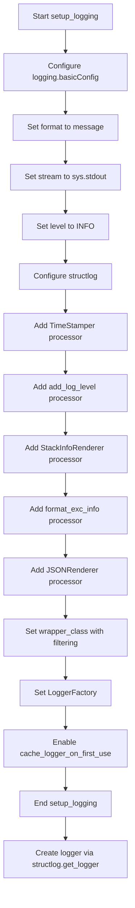
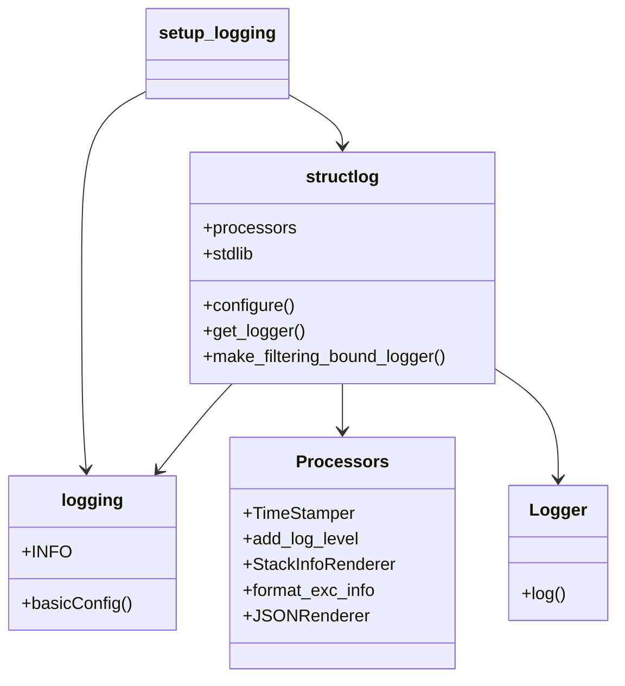
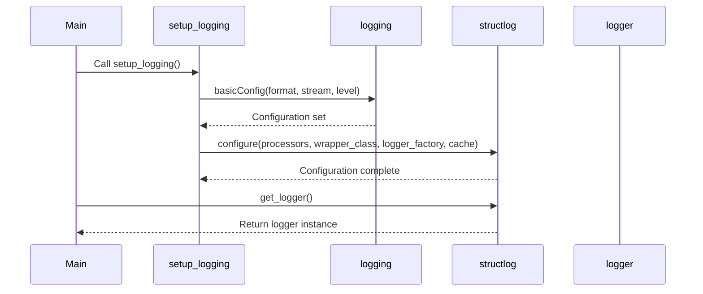

# Diagram: research/orchestrator/util/logging_setup.py

> Auto-generated by Obscura crawlers

## Diagram 1

### SVG

<svg id="container" width="276" xmlns="http://www.w3.org/2000/svg" class="flowchart" height="1846" viewBox="0 0 276 1846" role="graphics-document document" aria-roledescription="flowchart-v2"><g><marker id="container_flowchart-v2-pointEnd" class="marker flowchart-v2" viewBox="0 0 10 10" refX="5" refY="5" markerUnits="userSpaceOnUse" markerWidth="8" markerHeight="8" orient="auto"><path d="M 0 0 L 10 5 L 0 10 z" class="arrowMarkerPath" style="stroke-width: 1; stroke-dasharray: 1, 0;"></path></marker><marker id="container_flowchart-v2-pointStart" class="marker flowchart-v2" viewBox="0 0 10 10" refX="4.5" refY="5" markerUnits="userSpaceOnUse" markerWidth="8" markerHeight="8" orient="auto"><path d="M 0 5 L 10 10 L 10 0 z" class="arrowMarkerPath" style="stroke-width: 1; stroke-dasharray: 1, 0;"></path></marker><marker id="container_flowchart-v2-circleEnd" class="marker flowchart-v2" viewBox="0 0 10 10" refX="11" refY="5" markerUnits="userSpaceOnUse" markerWidth="11" markerHeight="11" orient="auto"><circle cx="5" cy="5" r="5" class="arrowMarkerPath" style="stroke-width: 1; stroke-dasharray: 1, 0;"></circle></marker><marker id="container_flowchart-v2-circleStart" class="marker flowchart-v2" viewBox="0 0 10 10" refX="-1" refY="5" markerUnits="userSpaceOnUse" markerWidth="11" markerHeight="11" orient="auto"><circle cx="5" cy="5" r="5" class="arrowMarkerPath" style="stroke-width: 1; stroke-dasharray: 1, 0;"></circle></marker><marker id="container_flowchart-v2-crossEnd" class="marker cross flowchart-v2" viewBox="0 0 11 11" refX="12" refY="5.2" markerUnits="userSpaceOnUse" markerWidth="11" markerHeight="11" orient="auto"><path d="M 1,1 l 9,9 M 10,1 l -9,9" class="arrowMarkerPath" style="stroke-width: 2; stroke-dasharray: 1, 0;"></path></marker><marker id="container_flowchart-v2-crossStart" class="marker cross flowchart-v2" viewBox="0 0 11 11" refX="-1" refY="5.2" markerUnits="userSpaceOnUse" markerWidth="11" markerHeight="11" orient="auto"><path d="M 1,1 l 9,9 M 10,1 l -9,9" class="arrowMarkerPath" style="stroke-width: 2; stroke-dasharray: 1, 0;"></path></marker><g class="root"><g class="clusters"></g><g class="edgePaths"><path d="M138,62L138,66.167C138,70.333,138,78.667,138,86.333C138,94,138,101,138,104.5L138,108" id="L_A_B_0" class="edge-thickness-normal edge-pattern-solid edge-thickness-normal edge-pattern-solid flowchart-link" style=";" data-edge="true" data-et="edge" data-id="L_A_B_0" data-points="W3sieCI6MTM4LCJ5Ijo2Mn0seyJ4IjoxMzgsInkiOjg3fSx7IngiOjEzOCwieSI6MTEyfV0=" marker-end="url(#container_flowchart-v2-pointEnd)"></path><path d="M138,190L138,194.167C138,198.333,138,206.667,138,214.333C138,222,138,229,138,232.5L138,236" id="L_B_C_0" class="edge-thickness-normal edge-pattern-solid edge-thickness-normal edge-pattern-solid flowchart-link" style=";" data-edge="true" data-et="edge" data-id="L_B_C_0" data-points="W3sieCI6MTM4LCJ5IjoxOTB9LHsieCI6MTM4LCJ5IjoyMTV9LHsieCI6MTM4LCJ5IjoyNDB9XQ==" marker-end="url(#container_flowchart-v2-pointEnd)"></path><path d="M138,294L138,298.167C138,302.333,138,310.667,138,318.333C138,326,138,333,138,336.5L138,340" id="L_C_D_0" class="edge-thickness-normal edge-pattern-solid edge-thickness-normal edge-pattern-solid flowchart-link" style=";" data-edge="true" data-et="edge" data-id="L_C_D_0" data-points="W3sieCI6MTM4LCJ5IjoyOTR9LHsieCI6MTM4LCJ5IjozMTl9LHsieCI6MTM4LCJ5IjozNDR9XQ==" marker-end="url(#container_flowchart-v2-pointEnd)"></path><path d="M138,398L138,402.167C138,406.333,138,414.667,138,422.333C138,430,138,437,138,440.5L138,444" id="L_D_E_0" class="edge-thickness-normal edge-pattern-solid edge-thickness-normal edge-pattern-solid flowchart-link" style=";" data-edge="true" data-et="edge" data-id="L_D_E_0" data-points="W3sieCI6MTM4LCJ5IjozOTh9LHsieCI6MTM4LCJ5Ijo0MjN9LHsieCI6MTM4LCJ5Ijo0NDh9XQ==" marker-end="url(#container_flowchart-v2-pointEnd)"></path><path d="M138,502L138,506.167C138,510.333,138,518.667,138,526.333C138,534,138,541,138,544.5L138,548" id="L_E_F_0" class="edge-thickness-normal edge-pattern-solid edge-thickness-normal edge-pattern-solid flowchart-link" style=";" data-edge="true" data-et="edge" data-id="L_E_F_0" data-points="W3sieCI6MTM4LCJ5Ijo1MDJ9LHsieCI6MTM4LCJ5Ijo1Mjd9LHsieCI6MTM4LCJ5Ijo1NTJ9XQ==" marker-end="url(#container_flowchart-v2-pointEnd)"></path><path d="M138,606L138,610.167C138,614.333,138,622.667,138,630.333C138,638,138,645,138,648.5L138,652" id="L_F_G_0" class="edge-thickness-normal edge-pattern-solid edge-thickness-normal edge-pattern-solid flowchart-link" style=";" data-edge="true" data-et="edge" data-id="L_F_G_0" data-points="W3sieCI6MTM4LCJ5Ijo2MDZ9LHsieCI6MTM4LCJ5Ijo2MzF9LHsieCI6MTM4LCJ5Ijo2NTZ9XQ==" marker-end="url(#container_flowchart-v2-pointEnd)"></path><path d="M138,734L138,738.167C138,742.333,138,750.667,138,758.333C138,766,138,773,138,776.5L138,780" id="L_G_H_0" class="edge-thickness-normal edge-pattern-solid edge-thickness-normal edge-pattern-solid flowchart-link" style=";" data-edge="true" data-et="edge" data-id="L_G_H_0" data-points="W3sieCI6MTM4LCJ5Ijo3MzR9LHsieCI6MTM4LCJ5Ijo3NTl9LHsieCI6MTM4LCJ5Ijo3ODR9XQ==" marker-end="url(#container_flowchart-v2-pointEnd)"></path><path d="M138,862L138,866.167C138,870.333,138,878.667,138,886.333C138,894,138,901,138,904.5L138,908" id="L_H_I_0" class="edge-thickness-normal edge-pattern-solid edge-thickness-normal edge-pattern-solid flowchart-link" style=";" data-edge="true" data-et="edge" data-id="L_H_I_0" data-points="W3sieCI6MTM4LCJ5Ijo4NjJ9LHsieCI6MTM4LCJ5Ijo4ODd9LHsieCI6MTM4LCJ5Ijo5MTJ9XQ==" marker-end="url(#container_flowchart-v2-pointEnd)"></path><path d="M138,990L138,994.167C138,998.333,138,1006.667,138,1014.333C138,1022,138,1029,138,1032.5L138,1036" id="L_I_J_0" class="edge-thickness-normal edge-pattern-solid edge-thickness-normal edge-pattern-solid flowchart-link" style=";" data-edge="true" data-et="edge" data-id="L_I_J_0" data-points="W3sieCI6MTM4LCJ5Ijo5OTB9LHsieCI6MTM4LCJ5IjoxMDE1fSx7IngiOjEzOCwieSI6MTA0MH1d" marker-end="url(#container_flowchart-v2-pointEnd)"></path><path d="M138,1118L138,1122.167C138,1126.333,138,1134.667,138,1142.333C138,1150,138,1157,138,1160.5L138,1164" id="L_J_K_0" class="edge-thickness-normal edge-pattern-solid edge-thickness-normal edge-pattern-solid flowchart-link" style=";" data-edge="true" data-et="edge" data-id="L_J_K_0" data-points="W3sieCI6MTM4LCJ5IjoxMTE4fSx7IngiOjEzOCwieSI6MTE0M30seyJ4IjoxMzgsInkiOjExNjh9XQ==" marker-end="url(#container_flowchart-v2-pointEnd)"></path><path d="M138,1246L138,1250.167C138,1254.333,138,1262.667,138,1270.333C138,1278,138,1285,138,1288.5L138,1292" id="L_K_L_0" class="edge-thickness-normal edge-pattern-solid edge-thickness-normal edge-pattern-solid flowchart-link" style=";" data-edge="true" data-et="edge" data-id="L_K_L_0" data-points="W3sieCI6MTM4LCJ5IjoxMjQ2fSx7IngiOjEzOCwieSI6MTI3MX0seyJ4IjoxMzgsInkiOjEyOTZ9XQ==" marker-end="url(#container_flowchart-v2-pointEnd)"></path><path d="M138,1374L138,1378.167C138,1382.333,138,1390.667,138,1398.333C138,1406,138,1413,138,1416.5L138,1420" id="L_L_M_0" class="edge-thickness-normal edge-pattern-solid edge-thickness-normal edge-pattern-solid flowchart-link" style=";" data-edge="true" data-et="edge" data-id="L_L_M_0" data-points="W3sieCI6MTM4LCJ5IjoxMzc0fSx7IngiOjEzOCwieSI6MTM5OX0seyJ4IjoxMzgsInkiOjE0MjR9XQ==" marker-end="url(#container_flowchart-v2-pointEnd)"></path><path d="M138,1478L138,1482.167C138,1486.333,138,1494.667,138,1502.333C138,1510,138,1517,138,1520.5L138,1524" id="L_M_N_0" class="edge-thickness-normal edge-pattern-solid edge-thickness-normal edge-pattern-solid flowchart-link" style=";" data-edge="true" data-et="edge" data-id="L_M_N_0" data-points="W3sieCI6MTM4LCJ5IjoxNDc4fSx7IngiOjEzOCwieSI6MTUwM30seyJ4IjoxMzgsInkiOjE1Mjh9XQ==" marker-end="url(#container_flowchart-v2-pointEnd)"></path><path d="M138,1606L138,1610.167C138,1614.333,138,1622.667,138,1630.333C138,1638,138,1645,138,1648.5L138,1652" id="L_N_O_0" class="edge-thickness-normal edge-pattern-solid edge-thickness-normal edge-pattern-solid flowchart-link" style=";" data-edge="true" data-et="edge" data-id="L_N_O_0" data-points="W3sieCI6MTM4LCJ5IjoxNjA2fSx7IngiOjEzOCwieSI6MTYzMX0seyJ4IjoxMzgsInkiOjE2NTZ9XQ==" marker-end="url(#container_flowchart-v2-pointEnd)"></path><path d="M138,1710L138,1714.167C138,1718.333,138,1726.667,138,1734.333C138,1742,138,1749,138,1752.5L138,1756" id="L_O_P_0" class="edge-thickness-normal edge-pattern-solid edge-thickness-normal edge-pattern-solid flowchart-link" style=";" data-edge="true" data-et="edge" data-id="L_O_P_0" data-points="W3sieCI6MTM4LCJ5IjoxNzEwfSx7IngiOjEzOCwieSI6MTczNX0seyJ4IjoxMzgsInkiOjE3NjB9XQ==" marker-end="url(#container_flowchart-v2-pointEnd)"></path></g><g class="edgeLabels"><g class="edgeLabel"><g class="label" data-id="L_A_B_0" transform="translate(0, 0)"><foreignObject width="0" height="0">

</foreignObject></g></g><g class="edgeLabel"><g class="label" data-id="L_B_C_0" transform="translate(0, 0)"><foreignObject width="0" height="0">

</foreignObject></g></g><g class="edgeLabel"><g class="label" data-id="L_C_D_0" transform="translate(0, 0)"><foreignObject width="0" height="0">

</foreignObject></g></g><g class="edgeLabel"><g class="label" data-id="L_D_E_0" transform="translate(0, 0)"><foreignObject width="0" height="0">

</foreignObject></g></g><g class="edgeLabel"><g class="label" data-id="L_E_F_0" transform="translate(0, 0)"><foreignObject width="0" height="0">

</foreignObject></g></g><g class="edgeLabel"><g class="label" data-id="L_F_G_0" transform="translate(0, 0)"><foreignObject width="0" height="0">

</foreignObject></g></g><g class="edgeLabel"><g class="label" data-id="L_G_H_0" transform="translate(0, 0)"><foreignObject width="0" height="0">

</foreignObject></g></g><g class="edgeLabel"><g class="label" data-id="L_H_I_0" transform="translate(0, 0)"><foreignObject width="0" height="0">

</foreignObject></g></g><g class="edgeLabel"><g class="label" data-id="L_I_J_0" transform="translate(0, 0)"><foreignObject width="0" height="0">

</foreignObject></g></g><g class="edgeLabel"><g class="label" data-id="L_J_K_0" transform="translate(0, 0)"><foreignObject width="0" height="0">

</foreignObject></g></g><g class="edgeLabel"><g class="label" data-id="L_K_L_0" transform="translate(0, 0)"><foreignObject width="0" height="0">

</foreignObject></g></g><g class="edgeLabel"><g class="label" data-id="L_L_M_0" transform="translate(0, 0)"><foreignObject width="0" height="0">

</foreignObject></g></g><g class="edgeLabel"><g class="label" data-id="L_M_N_0" transform="translate(0, 0)"><foreignObject width="0" height="0">

</foreignObject></g></g><g class="edgeLabel"><g class="label" data-id="L_N_O_0" transform="translate(0, 0)"><foreignObject width="0" height="0">

</foreignObject></g></g><g class="edgeLabel"><g class="label" data-id="L_O_P_0" transform="translate(0, 0)"><foreignObject width="0" height="0">

</foreignObject></g></g></g><g class="nodes"><g class="node default" id="flowchart-A-0" transform="translate(138, 35)"><rect class="basic label-container" style="" x="-100.359375" y="-27" width="200.71875" height="54"></rect><g class="label" style="" transform="translate(-70.359375, -12)"><rect></rect><foreignObject width="140.71875" height="24">

Start setup_logging

</foreignObject></g></g><g class="node default" id="flowchart-B-1" transform="translate(138, 151)"><rect class="basic label-container" style="" x="-130" y="-39" width="260" height="78"></rect><g class="label" style="" transform="translate(-100, -24)"><rect></rect><foreignObject width="200" height="48">

Configure logging.basicConfig

</foreignObject></g></g><g class="node default" id="flowchart-C-3" transform="translate(138, 267)"><rect class="basic label-container" style="" x="-111.0625" y="-27" width="222.125" height="54"></rect><g class="label" style="" transform="translate(-81.0625, -12)"><rect></rect><foreignObject width="162.125" height="24">

Set format to message

</foreignObject></g></g><g class="node default" id="flowchart-D-5" transform="translate(138, 371)"><rect class="basic label-container" style="" x="-117.046875" y="-27" width="234.09375" height="54"></rect><g class="label" style="" transform="translate(-87.046875, -12)"><rect></rect><foreignObject width="174.09375" height="24">

Set stream to sys.stdout

</foreignObject></g></g><g class="node default" id="flowchart-E-7" transform="translate(138, 475)"><rect class="basic label-container" style="" x="-89.8046875" y="-27" width="179.609375" height="54"></rect><g class="label" style="" transform="translate(-59.8046875, -12)"><rect></rect><foreignObject width="119.609375" height="24">

Set level to INFO

</foreignObject></g></g><g class="node default" id="flowchart-F-9" transform="translate(138, 579)"><rect class="basic label-container" style="" x="-98.484375" y="-27" width="196.96875" height="54"></rect><g class="label" style="" transform="translate(-68.484375, -12)"><rect></rect><foreignObject width="136.96875" height="24">

Configure structlog

</foreignObject></g></g><g class="node default" id="flowchart-G-11" transform="translate(138, 695)"><rect class="basic label-container" style="" x="-130" y="-39" width="260" height="78"></rect><g class="label" style="" transform="translate(-100, -24)"><rect></rect><foreignObject width="200" height="48">

Add TimeStamper processor

</foreignObject></g></g><g class="node default" id="flowchart-H-13" transform="translate(138, 823)"><rect class="basic label-container" style="" x="-130" y="-39" width="260" height="78"></rect><g class="label" style="" transform="translate(-100, -24)"><rect></rect><foreignObject width="200" height="48">

Add add_log_level processor

</foreignObject></g></g><g class="node default" id="flowchart-I-15" transform="translate(138, 951)"><rect class="basic label-container" style="" x="-130" y="-39" width="260" height="78"></rect><g class="label" style="" transform="translate(-100, -24)"><rect></rect><foreignObject width="200" height="48">

Add StackInfoRenderer processor

</foreignObject></g></g><g class="node default" id="flowchart-J-17" transform="translate(138, 1079)"><rect class="basic label-container" style="" x="-130" y="-39" width="260" height="78"></rect><g class="label" style="" transform="translate(-100, -24)"><rect></rect><foreignObject width="200" height="48">

Add format_exc_info processor

</foreignObject></g></g><g class="node default" id="flowchart-K-19" transform="translate(138, 1207)"><rect class="basic label-container" style="" x="-130" y="-39" width="260" height="78"></rect><g class="label" style="" transform="translate(-100, -24)"><rect></rect><foreignObject width="200" height="48">

Add JSONRenderer processor

</foreignObject></g></g><g class="node default" id="flowchart-L-21" transform="translate(138, 1335)"><rect class="basic label-container" style="" x="-130" y="-39" width="260" height="78"></rect><g class="label" style="" transform="translate(-100, -24)"><rect></rect><foreignObject width="200" height="48">

Set wrapper_class with filtering

</foreignObject></g></g><g class="node default" id="flowchart-M-23" transform="translate(138, 1451)"><rect class="basic label-container" style="" x="-93.9140625" y="-27" width="187.828125" height="54"></rect><g class="label" style="" transform="translate(-63.9140625, -12)"><rect></rect><foreignObject width="127.828125" height="24">

Set LoggerFactory

</foreignObject></g></g><g class="node default" id="flowchart-N-25" transform="translate(138, 1567)"><rect class="basic label-container" style="" x="-130" y="-39" width="260" height="78"></rect><g class="label" style="" transform="translate(-100, -24)"><rect></rect><foreignObject width="200" height="48">

Enable cache_logger_on_first_use

</foreignObject></g></g><g class="node default" id="flowchart-O-27" transform="translate(138, 1683)"><rect class="basic label-container" style="" x="-96.5078125" y="-27" width="193.015625" height="54"></rect><g class="label" style="" transform="translate(-66.5078125, -12)"><rect></rect><foreignObject width="133.015625" height="24">

End setup_logging

</foreignObject></g></g><g class="node default" id="flowchart-P-29" transform="translate(138, 1799)"><rect class="basic label-container" style="" x="-130" y="-39" width="260" height="78"></rect><g class="label" style="" transform="translate(-100, -24)"><rect></rect><foreignObject width="200" height="48">

Create logger via structlog.get_logger

</foreignObject></g></g></g></g></g></svg>

## Diagram 2

### SVG

<svg id="container" width="562.3828125" xmlns="http://www.w3.org/2000/svg" class="classDiagram" height="632" viewBox="0 0 562.3828125 632" role="graphics-document document" aria-roledescription="class"><g><defs><marker id="container_class-aggregationStart" class="marker aggregation class" refX="18" refY="7" markerWidth="190" markerHeight="240" orient="auto"><path d="M 18,7 L9,13 L1,7 L9,1 Z"></path></marker></defs><defs><marker id="container_class-aggregationEnd" class="marker aggregation class" refX="1" refY="7" markerWidth="20" markerHeight="28" orient="auto"><path d="M 18,7 L9,13 L1,7 L9,1 Z"></path></marker></defs><defs><marker id="container_class-extensionStart" class="marker extension class" refX="18" refY="7" markerWidth="190" markerHeight="240" orient="auto"><path d="M 1,7 L18,13 V 1 Z"></path></marker></defs><defs><marker id="container_class-extensionEnd" class="marker extension class" refX="1" refY="7" markerWidth="20" markerHeight="28" orient="auto"><path d="M 1,1 V 13 L18,7 Z"></path></marker></defs><defs><marker id="container_class-compositionStart" class="marker composition class" refX="18" refY="7" markerWidth="190" markerHeight="240" orient="auto"><path d="M 18,7 L9,13 L1,7 L9,1 Z"></path></marker></defs><defs><marker id="container_class-compositionEnd" class="marker composition class" refX="1" refY="7" markerWidth="20" markerHeight="28" orient="auto"><path d="M 18,7 L9,13 L1,7 L9,1 Z"></path></marker></defs><defs><marker id="container_class-dependencyStart" class="marker dependency class" refX="6" refY="7" markerWidth="190" markerHeight="240" orient="auto"><path d="M 5,7 L9,13 L1,7 L9,1 Z"></path></marker></defs><defs><marker id="container_class-dependencyEnd" class="marker dependency class" refX="13" refY="7" markerWidth="20" markerHeight="28" orient="auto"><path d="M 18,7 L9,13 L14,7 L9,1 Z"></path></marker></defs><defs><marker id="container_class-lollipopStart" class="marker lollipop class" refX="13" refY="7" markerWidth="190" markerHeight="240" orient="auto"><circle stroke="black" fill="transparent" cx="7" cy="7" r="6"></circle></marker></defs><defs><marker id="container_class-lollipopEnd" class="marker lollipop class" refX="1" refY="7" markerWidth="190" markerHeight="240" orient="auto"><circle stroke="black" fill="transparent" cx="7" cy="7" r="6"></circle></marker></defs><g class="root"><g class="clusters"></g><g class="edgePaths"><path d="M312.395,358L312.395,362.167C312.395,366.333,312.395,374.667,312.395,382C312.395,389.333,312.395,395.667,312.395,398.833L312.395,402" id="id_structlog_Processors_1" class="edge-thickness-normal edge-pattern-solid relation" style=";;;" data-edge="true" data-et="edge" data-id="id_structlog_Processors_1" data-points="W3sieCI6MzEyLjM5NDUzMTI1LCJ5IjozNTh9LHsieCI6MzEyLjM5NDUzMTI1LCJ5IjozODN9LHsieCI6MzEyLjM5NDUzMTI1LCJ5Ijo0MDh9XQ==" marker-end="url(#container_class-dependencyEnd)"></path><path d="M211.517,358L207.625,362.167C203.733,366.333,195.95,374.667,184.707,388.213C173.465,401.759,158.764,420.518,151.413,429.898L144.063,439.277" id="id_structlog_logging_2" class="edge-thickness-normal edge-pattern-solid relation" style=";;;" data-edge="true" data-et="edge" data-id="id_structlog_logging_2" data-points="W3sieCI6MjExLjUxNzI0MDM2NjU0MTM2LCJ5IjozNTh9LHsieCI6MTg4LjE2NjAxNTYyNSwieSI6MzgzfSx7IngiOjE0MC4zNjE5NTk1ODY0NjYxNiwieSI6NDQ0fV0=" marker-end="url(#container_class-dependencyEnd)"></path><path d="M456.203,346.964L465.111,352.97C474.018,358.976,491.833,370.988,500.741,387.661C509.648,404.333,509.648,425.667,509.648,436.333L509.648,447" id="id_structlog_Logger_3" class="edge-thickness-normal edge-pattern-solid relation" style=";;;" data-edge="true" data-et="edge" data-id="id_structlog_Logger_3" data-points="W3sieCI6NDU2LjIwMzEyNSwieSI6MzQ2Ljk2NDA3NzA3Mzg4NTU2fSx7IngiOjUwOS42NDg0Mzc1LCJ5IjozODN9LHsieCI6NTA5LjY0ODQzNzUsInkiOjQ1M31d" marker-end="url(#container_class-dependencyEnd)"></path><path d="M134.416,84.382L124.336,89.819C114.257,95.255,94.097,106.127,84.017,133.73C73.938,161.333,73.938,205.667,73.938,250C73.938,294.333,73.938,338.667,74.627,370.003C75.316,401.339,76.695,419.678,77.385,428.847L78.074,438.017" id="id_setup_logging_logging_4" class="edge-thickness-normal edge-pattern-solid relation" style=";;;" data-edge="true" data-et="edge" data-id="id_setup_logging_logging_4" data-points="W3sieCI6MTM0LjQxNjAxNTYyNSwieSI6ODQuMzgyMjAyNjU3MDIzODF9LHsieCI6NzMuOTM3NSwieSI6MTE3fSx7IngiOjczLjkzNzUsInkiOjI1MH0seyJ4Ijo3My45Mzc1LCJ5IjozODN9LHsieCI6NzguNTIzOTY2MTY1NDEzNTQsInkiOjQ0NH1d" marker-end="url(#container_class-dependencyEnd)"></path><path d="M261.916,87.392L270.329,92.327C278.742,97.261,295.568,107.131,303.981,115.232C312.395,123.333,312.395,129.667,312.395,132.833L312.395,136" id="id_setup_logging_structlog_5" class="edge-thickness-normal edge-pattern-solid relation" style=";;;" data-edge="true" data-et="edge" data-id="id_setup_logging_structlog_5" data-points="W3sieCI6MjYxLjkxNjAxNTYyNSwieSI6ODcuMzkyMTUxODMzODAzNTR9LHsieCI6MzEyLjM5NDUzMTI1LCJ5IjoxMTd9LHsieCI6MzEyLjM5NDUzMTI1LCJ5IjoxNDJ9XQ==" marker-end="url(#container_class-dependencyEnd)"></path></g><g class="edgeLabels"><g class="edgeLabel"><g class="label" data-id="id_structlog_Processors_1" transform="translate(0, 0)"><foreignObject width="0" height="0">

</foreignObject></g></g><g class="edgeLabel"><g class="label" data-id="id_structlog_logging_2" transform="translate(0, 0)"><foreignObject width="0" height="0">

</foreignObject></g></g><g class="edgeLabel"><g class="label" data-id="id_structlog_Logger_3" transform="translate(0, 0)"><foreignObject width="0" height="0">

</foreignObject></g></g><g class="edgeLabel"><g class="label" data-id="id_setup_logging_logging_4" transform="translate(0, 0)"><foreignObject width="0" height="0">

</foreignObject></g></g><g class="edgeLabel"><g class="label" data-id="id_setup_logging_structlog_5" transform="translate(0, 0)"><foreignObject width="0" height="0">

</foreignObject></g></g></g><g class="nodes"><g class="node default" id="classId-logging-0" transform="translate(83.9375, 516)"><g class="basic label-container"><path d="M-75.9375 -72 L75.9375 -72 L75.9375 72 L-75.9375 72" stroke="none" stroke-width="0" fill="#ECECFF" style=""></path><path d="M-75.9375 -72 C-26.581093315391684 -72, 22.775313369216633 -72, 75.9375 -72 M-75.9375 -72 C-37.60153380956255 -72, 0.7344323808749067 -72, 75.9375 -72 M75.9375 -72 C75.9375 -15.57692047391938, 75.9375 40.84615905216124, 75.9375 72 M75.9375 -72 C75.9375 -31.836217079663975, 75.9375 8.327565840672051, 75.9375 72 M75.9375 72 C24.882027431246627 72, -26.173445137506747 72, -75.9375 72 M75.9375 72 C24.041055400656454 72, -27.855389198687092 72, -75.9375 72 M-75.9375 72 C-75.9375 26.74389426253753, -75.9375 -18.51221147492494, -75.9375 -72 M-75.9375 72 C-75.9375 26.40066722142098, -75.9375 -19.198665557158037, -75.9375 -72" stroke="#9370DB" stroke-width="1.3" fill="none" stroke-dasharray="0 0" style=""></path></g><g class="annotation-group text" transform="translate(0, -48)"></g><g class="label-group text" transform="translate(-27.109375, -48)"><g class="label" style="font-weight: bolder" transform="translate(0,-12)"><foreignObject width="54.21875" height="24">

logging

</foreignObject></g></g><g class="members-group text" transform="translate(-63.9375, 0)"><g class="label" style="" transform="translate(0,-12)"><foreignObject width="42.296875" height="24">

+INFO

</foreignObject></g></g><g class="methods-group text" transform="translate(-63.9375, 48)"><g class="label" style="" transform="translate(0,-12)"><foreignObject width="100.765625" height="24">

+basicConfig()

</foreignObject></g></g><g class="divider" style=""><path d="M-75.9375 -24 C-19.548380029851188 -24, 36.840739940297624 -24, 75.9375 -24 M-75.9375 -24 C-15.838893274554707 -24, 44.25971345089059 -24, 75.9375 -24" stroke="#9370DB" stroke-width="1.3" fill="none" stroke-dasharray="0 0" style=""></path></g><g class="divider" style=""><path d="M-75.9375 24 C-25.20410043180182 24, 25.52929913639636 24, 75.9375 24 M-75.9375 24 C-20.51098225454141 24, 34.91553549091718 24, 75.9375 24" stroke="#9370DB" stroke-width="1.3" fill="none" stroke-dasharray="0 0" style=""></path></g></g><g class="node default" id="classId-structlog-1" transform="translate(312.39453125, 250)"><g class="basic label-container"><path d="M-143.80859375 -108 L143.80859375 -108 L143.80859375 108 L-143.80859375 108" stroke="none" stroke-width="0" fill="#ECECFF" style=""></path><path d="M-143.80859375 -108 C-65.54283379476449 -108, 12.722926160471019 -108, 143.80859375 -108 M-143.80859375 -108 C-66.93651279325199 -108, 9.935568163496015 -108, 143.80859375 -108 M143.80859375 -108 C143.80859375 -64.16179590071974, 143.80859375 -20.323591801439463, 143.80859375 108 M143.80859375 -108 C143.80859375 -22.88460200229774, 143.80859375 62.23079599540452, 143.80859375 108 M143.80859375 108 C37.53568638282513 108, -68.73722098434973 108, -143.80859375 108 M143.80859375 108 C82.06248768819854 108, 20.31638162639709 108, -143.80859375 108 M-143.80859375 108 C-143.80859375 30.248950682613028, -143.80859375 -47.502098634773944, -143.80859375 -108 M-143.80859375 108 C-143.80859375 22.32354435958588, -143.80859375 -63.35291128082824, -143.80859375 -108" stroke="#9370DB" stroke-width="1.3" fill="none" stroke-dasharray="0 0" style=""></path></g><g class="annotation-group text" transform="translate(0, -84)"></g><g class="label-group text" transform="translate(-32.9921875, -84)"><g class="label" style="font-weight: bolder" transform="translate(0,-12)"><foreignObject width="65.984375" height="24">

structlog

</foreignObject></g></g><g class="members-group text" transform="translate(-131.80859375, -36)"><g class="label" style="" transform="translate(0,-12)"><foreignObject width="86.125" height="24">

+processors

</foreignObject></g><g class="label" style="" transform="translate(0,12)"><foreignObject width="49.265625" height="24">

+stdlib

</foreignObject></g></g><g class="methods-group text" transform="translate(-131.80859375, 36)"><g class="label" style="" transform="translate(0,-12)"><foreignObject width="85.5" height="24">

+configure()

</foreignObject></g><g class="label" style="" transform="translate(0,12)"><foreignObject width="94.3125" height="24">

+get_logger()

</foreignObject></g><g class="label" style="" transform="translate(0,36)"><foreignObject width="230.625" height="24">

+make_filtering_bound_logger()

</foreignObject></g></g><g class="divider" style=""><path d="M-143.80859375 -60 C-71.12336313646698 -60, 1.5618674770660448 -60, 143.80859375 -60 M-143.80859375 -60 C-40.911973457899464 -60, 61.98464683420107 -60, 143.80859375 -60" stroke="#9370DB" stroke-width="1.3" fill="none" stroke-dasharray="0 0" style=""></path></g><g class="divider" style=""><path d="M-143.80859375 12 C-53.17503895935543 12, 37.458515831289134 12, 143.80859375 12 M-143.80859375 12 C-67.71526709376681 12, 8.378059562466376 12, 143.80859375 12" stroke="#9370DB" stroke-width="1.3" fill="none" stroke-dasharray="0 0" style=""></path></g></g><g class="node default" id="classId-Processors-2" transform="translate(312.39453125, 516)"><g class="basic label-container"><path d="M-102.51953125 -108 L102.51953125 -108 L102.51953125 108 L-102.51953125 108" stroke="none" stroke-width="0" fill="#ECECFF" style=""></path><path d="M-102.51953125 -108 C-37.32335328287276 -108, 27.872824684254482 -108, 102.51953125 -108 M-102.51953125 -108 C-24.003710856734443 -108, 54.51210953653111 -108, 102.51953125 -108 M102.51953125 -108 C102.51953125 -53.56554922428123, 102.51953125 0.8689015514375455, 102.51953125 108 M102.51953125 -108 C102.51953125 -54.99482854676281, 102.51953125 -1.9896570935256221, 102.51953125 108 M102.51953125 108 C53.74178319402375 108, 4.964035138047507 108, -102.51953125 108 M102.51953125 108 C53.18226635077454 108, 3.8450014515490807 108, -102.51953125 108 M-102.51953125 108 C-102.51953125 53.892396272218434, -102.51953125 -0.2152074555631316, -102.51953125 -108 M-102.51953125 108 C-102.51953125 46.79470767062579, -102.51953125 -14.41058465874842, -102.51953125 -108" stroke="#9370DB" stroke-width="1.3" fill="none" stroke-dasharray="0 0" style=""></path></g><g class="annotation-group text" transform="translate(0, -84)"></g><g class="label-group text" transform="translate(-39.6953125, -84)"><g class="label" style="font-weight: bolder" transform="translate(0,-12)"><foreignObject width="79.390625" height="24">

Processors

</foreignObject></g></g><g class="members-group text" transform="translate(-90.51953125, -36)"><g class="label" style="" transform="translate(0,-12)"><foreignObject width="103.609375" height="24">

+TimeStamper

</foreignObject></g><g class="label" style="" transform="translate(0,12)"><foreignObject width="108.734375" height="24">

+add_log_level

</foreignObject></g><g class="label" style="" transform="translate(0,36)"><foreignObject width="141.34375" height="24">

+StackInfoRenderer

</foreignObject></g><g class="label" style="" transform="translate(0,60)"><foreignObject width="125.25" height="24">

+format_exc_info

</foreignObject></g><g class="label" style="" transform="translate(0,84)"><foreignObject width="109.859375" height="24">

+JSONRenderer

</foreignObject></g></g><g class="methods-group text" transform="translate(-90.51953125, 108)"></g><g class="divider" style=""><path d="M-102.51953125 -60 C-24.51137110305872 -60, 53.49678904388256 -60, 102.51953125 -60 M-102.51953125 -60 C-28.428489752401475 -60, 45.66255174519705 -60, 102.51953125 -60" stroke="#9370DB" stroke-width="1.3" fill="none" stroke-dasharray="0 0" style=""></path></g><g class="divider" style=""><path d="M-102.51953125 84 C-37.8630658956659 84, 26.793399458668205 84, 102.51953125 84 M-102.51953125 84 C-24.760827432904335 84, 52.99787638419133 84, 102.51953125 84" stroke="#9370DB" stroke-width="1.3" fill="none" stroke-dasharray="0 0" style=""></path></g></g><g class="node default" id="classId-Logger-3" transform="translate(509.6484375, 516)"><g class="basic label-container"><path d="M-44.734375 -63 L44.734375 -63 L44.734375 63 L-44.734375 63" stroke="none" stroke-width="0" fill="#ECECFF" style=""></path><path d="M-44.734375 -63 C-15.385678061884125 -63, 13.96301887623175 -63, 44.734375 -63 M-44.734375 -63 C-13.536630140285677 -63, 17.661114719428646 -63, 44.734375 -63 M44.734375 -63 C44.734375 -21.077759738450524, 44.734375 20.84448052309895, 44.734375 63 M44.734375 -63 C44.734375 -16.077871654960646, 44.734375 30.84425669007871, 44.734375 63 M44.734375 63 C12.586281638171428 63, -19.561811723657144 63, -44.734375 63 M44.734375 63 C12.172602311434403 63, -20.389170377131194 63, -44.734375 63 M-44.734375 63 C-44.734375 34.93690433613594, -44.734375 6.873808672271885, -44.734375 -63 M-44.734375 63 C-44.734375 17.064882485238385, -44.734375 -28.87023502952323, -44.734375 -63" stroke="#9370DB" stroke-width="1.3" fill="none" stroke-dasharray="0 0" style=""></path></g><g class="annotation-group text" transform="translate(0, -39)"></g><g class="label-group text" transform="translate(-24.84375, -39)"><g class="label" style="font-weight: bolder" transform="translate(0,-12)"><foreignObject width="49.6875" height="24">

Logger

</foreignObject></g></g><g class="members-group text" transform="translate(-32.734375, 9)"></g><g class="methods-group text" transform="translate(-32.734375, 39)"><g class="label" style="" transform="translate(0,-12)"><foreignObject width="40.625" height="24">

+log()

</foreignObject></g></g><g class="divider" style=""><path d="M-44.734375 -15 C-18.820799394458582 -15, 7.092776211082835 -15, 44.734375 -15 M-44.734375 -15 C-15.961307334356174 -15, 12.811760331287651 -15, 44.734375 -15" stroke="#9370DB" stroke-width="1.3" fill="none" stroke-dasharray="0 0" style=""></path></g><g class="divider" style=""><path d="M-44.734375 9 C-18.912468969602248 9, 6.909437060795504 9, 44.734375 9 M-44.734375 9 C-13.6270459769603 9, 17.4802830460794 9, 44.734375 9" stroke="#9370DB" stroke-width="1.3" fill="none" stroke-dasharray="0 0" style=""></path></g></g><g class="node default" id="classId-setup_logging-4" transform="translate(198.166015625, 50)"><g class="basic label-container"><path d="M-63.75 -42 L63.75 -42 L63.75 42 L-63.75 42" stroke="none" stroke-width="0" fill="#ECECFF" style=""></path><path d="M-63.75 -42 C-17.985261825235007 -42, 27.779476349529986 -42, 63.75 -42 M-63.75 -42 C-35.960093139011086 -42, -8.170186278022172 -42, 63.75 -42 M63.75 -42 C63.75 -18.37437199553241, 63.75 5.251256008935179, 63.75 42 M63.75 -42 C63.75 -12.69097688890881, 63.75 16.61804622218238, 63.75 42 M63.75 42 C35.68722009128594 42, 7.624440182571881 42, -63.75 42 M63.75 42 C31.702713973717806 42, -0.34457205256438783 42, -63.75 42 M-63.75 42 C-63.75 12.273545281355595, -63.75 -17.45290943728881, -63.75 -42 M-63.75 42 C-63.75 20.648890042239163, -63.75 -0.702219915521674, -63.75 -42" stroke="#9370DB" stroke-width="1.3" fill="none" stroke-dasharray="0 0" style=""></path></g><g class="annotation-group text" transform="translate(0, -18)"></g><g class="label-group text" transform="translate(-51.75, -18)"><g class="label" style="font-weight: bolder" transform="translate(0,-12)"><foreignObject width="103.5" height="24">

setup_logging

</foreignObject></g></g><g class="members-group text" transform="translate(-51.75, 30)"></g><g class="methods-group text" transform="translate(-51.75, 60)"></g><g class="divider" style=""><path d="M-63.75 6 C-27.25112263679552 6, 9.247754726408957 6, 63.75 6 M-63.75 6 C-34.61491340960872 6, -5.479826819217443 6, 63.75 6" stroke="#9370DB" stroke-width="1.3" fill="none" stroke-dasharray="0 0" style=""></path></g><g class="divider" style=""><path d="M-63.75 24 C-21.072720152963782 24, 21.604559694072435 24, 63.75 24 M-63.75 24 C-13.324288178146482 24, 37.10142364370704 24, 63.75 24" stroke="#9370DB" stroke-width="1.3" fill="none" stroke-dasharray="0 0" style=""></path></g></g></g></g></g></svg>

## Diagram 3

### SVG

<svg id="container" width="1175" xmlns="http://www.w3.org/2000/svg" height="507" viewBox="-50 -10 1175 507" role="graphics-document document" aria-roledescription="sequence"><g><rect x="925" y="421" fill="#eaeaea" stroke="#666" width="150" height="65" name="logger" rx="3" ry="3" class="actor actor-bottom"></rect><text x="1000" y="453.5" dominant-baseline="central" alignment-baseline="central" class="actor actor-box" style="text-anchor: middle; font-size: 16px; font-weight: 400;"><tspan x="1000" dy="0">logger</tspan></text></g><g><rect x="725" y="421" fill="#eaeaea" stroke="#666" width="150" height="65" name="structlog" rx="3" ry="3" class="actor actor-bottom"></rect><text x="800" y="453.5" dominant-baseline="central" alignment-baseline="central" class="actor actor-box" style="text-anchor: middle; font-size: 16px; font-weight: 400;"><tspan x="800" dy="0">structlog</tspan></text></g><g><rect x="525" y="421" fill="#eaeaea" stroke="#666" width="150" height="65" name="logging" rx="3" ry="3" class="actor actor-bottom"></rect><text x="600" y="453.5" dominant-baseline="central" alignment-baseline="central" class="actor actor-box" style="text-anchor: middle; font-size: 16px; font-weight: 400;"><tspan x="600" dy="0">logging</tspan></text></g><g><rect x="213" y="421" fill="#eaeaea" stroke="#666" width="150" height="65" name="setup_logging" rx="3" ry="3" class="actor actor-bottom"></rect><text x="288" y="453.5" dominant-baseline="central" alignment-baseline="central" class="actor actor-box" style="text-anchor: middle; font-size: 16px; font-weight: 400;"><tspan x="288" dy="0">setup_logging</tspan></text></g><g><rect x="0" y="421" fill="#eaeaea" stroke="#666" width="150" height="65" name="Main" rx="3" ry="3" class="actor actor-bottom"></rect><text x="75" y="453.5" dominant-baseline="central" alignment-baseline="central" class="actor actor-box" style="text-anchor: middle; font-size: 16px; font-weight: 400;"><tspan x="75" dy="0">Main</tspan></text></g><g><line id="actor4" x1="1000" y1="65" x2="1000" y2="421" class="actor-line 200" stroke-width="0.5px" stroke="#999" name="logger"></line><g id="root-4"><rect x="925" y="0" fill="#eaeaea" stroke="#666" width="150" height="65" name="logger" rx="3" ry="3" class="actor actor-top"></rect><text x="1000" y="32.5" dominant-baseline="central" alignment-baseline="central" class="actor actor-box" style="text-anchor: middle; font-size: 16px; font-weight: 400;"><tspan x="1000" dy="0">logger</tspan></text></g></g><g><line id="actor3" x1="800" y1="65" x2="800" y2="421" class="actor-line 200" stroke-width="0.5px" stroke="#999" name="structlog"></line><g id="root-3"><rect x="725" y="0" fill="#eaeaea" stroke="#666" width="150" height="65" name="structlog" rx="3" ry="3" class="actor actor-top"></rect><text x="800" y="32.5" dominant-baseline="central" alignment-baseline="central" class="actor actor-box" style="text-anchor: middle; font-size: 16px; font-weight: 400;"><tspan x="800" dy="0">structlog</tspan></text></g></g><g><line id="actor2" x1="600" y1="65" x2="600" y2="421" class="actor-line 200" stroke-width="0.5px" stroke="#999" name="logging"></line><g id="root-2"><rect x="525" y="0" fill="#eaeaea" stroke="#666" width="150" height="65" name="logging" rx="3" ry="3" class="actor actor-top"></rect><text x="600" y="32.5" dominant-baseline="central" alignment-baseline="central" class="actor actor-box" style="text-anchor: middle; font-size: 16px; font-weight: 400;"><tspan x="600" dy="0">logging</tspan></text></g></g><g><line id="actor1" x1="288" y1="65" x2="288" y2="421" class="actor-line 200" stroke-width="0.5px" stroke="#999" name="setup_logging"></line><g id="root-1"><rect x="213" y="0" fill="#eaeaea" stroke="#666" width="150" height="65" name="setup_logging" rx="3" ry="3" class="actor actor-top"></rect><text x="288" y="32.5" dominant-baseline="central" alignment-baseline="central" class="actor actor-box" style="text-anchor: middle; font-size: 16px; font-weight: 400;"><tspan x="288" dy="0">setup_logging</tspan></text></g></g><g><line id="actor0" x1="75" y1="65" x2="75" y2="421" class="actor-line 200" stroke-width="0.5px" stroke="#999" name="Main"></line><g id="root-0"><rect x="0" y="0" fill="#eaeaea" stroke="#666" width="150" height="65" name="Main" rx="3" ry="3" class="actor actor-top"></rect><text x="75" y="32.5" dominant-baseline="central" alignment-baseline="central" class="actor actor-box" style="text-anchor: middle; font-size: 16px; font-weight: 400;"><tspan x="75" dy="0">Main</tspan></text></g></g><g></g><defs><symbol id="computer" width="24" height="24"><path transform="scale(.5)" d="M2 2v13h20v-13h-20zm18 11h-16v-9h16v9zm-10.228 6l.466-1h3.524l.467 1h-4.457zm14.228 3h-24l2-6h2.104l-1.33 4h18.45l-1.297-4h2.073l2 6zm-5-10h-14v-7h14v7z"></path></symbol></defs><defs><symbol id="database" fill-rule="evenodd" clip-rule="evenodd"><path transform="scale(.5)" d="M12.258.001l.256.004.255.005.253.008.251.01.249.012.247.015.246.016.242.019.241.02.239.023.236.024.233.027.231.028.229.031.225.032.223.034.22.036.217.038.214.04.211.041.208.043.205.045.201.046.198.048.194.05.191.051.187.053.183.054.18.056.175.057.172.059.168.06.163.061.16.063.155.064.15.066.074.033.073.033.071.034.07.034.069.035.068.035.067.035.066.035.064.036.064.036.062.036.06.036.06.037.058.037.058.037.055.038.055.038.053.038.052.038.051.039.05.039.048.039.047.039.045.04.044.04.043.04.041.04.04.041.039.041.037.041.036.041.034.041.033.042.032.042.03.042.029.042.027.042.026.043.024.043.023.043.021.043.02.043.018.044.017.043.015.044.013.044.012.044.011.045.009.044.007.045.006.045.004.045.002.045.001.045v17l-.001.045-.002.045-.004.045-.006.045-.007.045-.009.044-.011.045-.012.044-.013.044-.015.044-.017.043-.018.044-.02.043-.021.043-.023.043-.024.043-.026.043-.027.042-.029.042-.03.042-.032.042-.033.042-.034.041-.036.041-.037.041-.039.041-.04.041-.041.04-.043.04-.044.04-.045.04-.047.039-.048.039-.05.039-.051.039-.052.038-.053.038-.055.038-.055.038-.058.037-.058.037-.06.037-.06.036-.062.036-.064.036-.064.036-.066.035-.067.035-.068.035-.069.035-.07.034-.071.034-.073.033-.074.033-.15.066-.155.064-.16.063-.163.061-.168.06-.172.059-.175.057-.18.056-.183.054-.187.053-.191.051-.194.05-.198.048-.201.046-.205.045-.208.043-.211.041-.214.04-.217.038-.22.036-.223.034-.225.032-.229.031-.231.028-.233.027-.236.024-.239.023-.241.02-.242.019-.246.016-.247.015-.249.012-.251.01-.253.008-.255.005-.256.004-.258.001-.258-.001-.256-.004-.255-.005-.253-.008-.251-.01-.249-.012-.247-.015-.245-.016-.243-.019-.241-.02-.238-.023-.236-.024-.234-.027-.231-.028-.228-.031-.226-.032-.223-.034-.22-.036-.217-.038-.214-.04-.211-.041-.208-.043-.204-.045-.201-.046-.198-.048-.195-.05-.19-.051-.187-.053-.184-.054-.179-.056-.176-.057-.172-.059-.167-.06-.164-.061-.159-.063-.155-.064-.151-.066-.074-.033-.072-.033-.072-.034-.07-.034-.069-.035-.068-.035-.067-.035-.066-.035-.064-.036-.063-.036-.062-.036-.061-.036-.06-.037-.058-.037-.057-.037-.056-.038-.055-.038-.053-.038-.052-.038-.051-.039-.049-.039-.049-.039-.046-.039-.046-.04-.044-.04-.043-.04-.041-.04-.04-.041-.039-.041-.037-.041-.036-.041-.034-.041-.033-.042-.032-.042-.03-.042-.029-.042-.027-.042-.026-.043-.024-.043-.023-.043-.021-.043-.02-.043-.018-.044-.017-.043-.015-.044-.013-.044-.012-.044-.011-.045-.009-.044-.007-.045-.006-.045-.004-.045-.002-.045-.001-.045v-17l.001-.045.002-.045.004-.045.006-.045.007-.045.009-.044.011-.045.012-.044.013-.044.015-.044.017-.043.018-.044.02-.043.021-.043.023-.043.024-.043.026-.043.027-.042.029-.042.03-.042.032-.042.033-.042.034-.041.036-.041.037-.041.039-.041.04-.041.041-.04.043-.04.044-.04.046-.04.046-.039.049-.039.049-.039.051-.039.052-.038.053-.038.055-.038.056-.038.057-.037.058-.037.06-.037.061-.036.062-.036.063-.036.064-.036.066-.035.067-.035.068-.035.069-.035.07-.034.072-.034.072-.033.074-.033.151-.066.155-.064.159-.063.164-.061.167-.06.172-.059.176-.057.179-.056.184-.054.187-.053.19-.051.195-.05.198-.048.201-.046.204-.045.208-.043.211-.041.214-.04.217-.038.22-.036.223-.034.226-.032.228-.031.231-.028.234-.027.236-.024.238-.023.241-.02.243-.019.245-.016.247-.015.249-.012.251-.01.253-.008.255-.005.256-.004.258-.001.258.001zm-9.258 20.499v.01l.001.021.003.021.004.022.005.021.006.022.007.022.009.023.01.022.011.023.012.023.013.023.015.023.016.024.017.023.018.024.019.024.021.024.022.025.023.024.024.025.052.049.056.05.061.051.066.051.07.051.075.051.079.052.084.052.088.052.092.052.097.052.102.051.105.052.11.052.114.051.119.051.123.051.127.05.131.05.135.05.139.048.144.049.147.047.152.047.155.047.16.045.163.045.167.043.171.043.176.041.178.041.183.039.187.039.19.037.194.035.197.035.202.033.204.031.209.03.212.029.216.027.219.025.222.024.226.021.23.02.233.018.236.016.24.015.243.012.246.01.249.008.253.005.256.004.259.001.26-.001.257-.004.254-.005.25-.008.247-.011.244-.012.241-.014.237-.016.233-.018.231-.021.226-.021.224-.024.22-.026.216-.027.212-.028.21-.031.205-.031.202-.034.198-.034.194-.036.191-.037.187-.039.183-.04.179-.04.175-.042.172-.043.168-.044.163-.045.16-.046.155-.046.152-.047.148-.048.143-.049.139-.049.136-.05.131-.05.126-.05.123-.051.118-.052.114-.051.11-.052.106-.052.101-.052.096-.052.092-.052.088-.053.083-.051.079-.052.074-.052.07-.051.065-.051.06-.051.056-.05.051-.05.023-.024.023-.025.021-.024.02-.024.019-.024.018-.024.017-.024.015-.023.014-.024.013-.023.012-.023.01-.023.01-.022.008-.022.006-.022.006-.022.004-.022.004-.021.001-.021.001-.021v-4.127l-.077.055-.08.053-.083.054-.085.053-.087.052-.09.052-.093.051-.095.05-.097.05-.1.049-.102.049-.105.048-.106.047-.109.047-.111.046-.114.045-.115.045-.118.044-.12.043-.122.042-.124.042-.126.041-.128.04-.13.04-.132.038-.134.038-.135.037-.138.037-.139.035-.142.035-.143.034-.144.033-.147.032-.148.031-.15.03-.151.03-.153.029-.154.027-.156.027-.158.026-.159.025-.161.024-.162.023-.163.022-.165.021-.166.02-.167.019-.169.018-.169.017-.171.016-.173.015-.173.014-.175.013-.175.012-.177.011-.178.01-.179.008-.179.008-.181.006-.182.005-.182.004-.184.003-.184.002h-.37l-.184-.002-.184-.003-.182-.004-.182-.005-.181-.006-.179-.008-.179-.008-.178-.01-.176-.011-.176-.012-.175-.013-.173-.014-.172-.015-.171-.016-.17-.017-.169-.018-.167-.019-.166-.02-.165-.021-.163-.022-.162-.023-.161-.024-.159-.025-.157-.026-.156-.027-.155-.027-.153-.029-.151-.03-.15-.03-.148-.031-.146-.032-.145-.033-.143-.034-.141-.035-.14-.035-.137-.037-.136-.037-.134-.038-.132-.038-.13-.04-.128-.04-.126-.041-.124-.042-.122-.042-.12-.044-.117-.043-.116-.045-.113-.045-.112-.046-.109-.047-.106-.047-.105-.048-.102-.049-.1-.049-.097-.05-.095-.05-.093-.052-.09-.051-.087-.052-.085-.053-.083-.054-.08-.054-.077-.054v4.127zm0-5.654v.011l.001.021.003.021.004.021.005.022.006.022.007.022.009.022.01.022.011.023.012.023.013.023.015.024.016.023.017.024.018.024.019.024.021.024.022.024.023.025.024.024.052.05.056.05.061.05.066.051.07.051.075.052.079.051.084.052.088.052.092.052.097.052.102.052.105.052.11.051.114.051.119.052.123.05.127.051.131.05.135.049.139.049.144.048.147.048.152.047.155.046.16.045.163.045.167.044.171.042.176.042.178.04.183.04.187.038.19.037.194.036.197.034.202.033.204.032.209.03.212.028.216.027.219.025.222.024.226.022.23.02.233.018.236.016.24.014.243.012.246.01.249.008.253.006.256.003.259.001.26-.001.257-.003.254-.006.25-.008.247-.01.244-.012.241-.015.237-.016.233-.018.231-.02.226-.022.224-.024.22-.025.216-.027.212-.029.21-.03.205-.032.202-.033.198-.035.194-.036.191-.037.187-.039.183-.039.179-.041.175-.042.172-.043.168-.044.163-.045.16-.045.155-.047.152-.047.148-.048.143-.048.139-.05.136-.049.131-.05.126-.051.123-.051.118-.051.114-.052.11-.052.106-.052.101-.052.096-.052.092-.052.088-.052.083-.052.079-.052.074-.051.07-.052.065-.051.06-.05.056-.051.051-.049.023-.025.023-.024.021-.025.02-.024.019-.024.018-.024.017-.024.015-.023.014-.023.013-.024.012-.022.01-.023.01-.023.008-.022.006-.022.006-.022.004-.021.004-.022.001-.021.001-.021v-4.139l-.077.054-.08.054-.083.054-.085.052-.087.053-.09.051-.093.051-.095.051-.097.05-.1.049-.102.049-.105.048-.106.047-.109.047-.111.046-.114.045-.115.044-.118.044-.12.044-.122.042-.124.042-.126.041-.128.04-.13.039-.132.039-.134.038-.135.037-.138.036-.139.036-.142.035-.143.033-.144.033-.147.033-.148.031-.15.03-.151.03-.153.028-.154.028-.156.027-.158.026-.159.025-.161.024-.162.023-.163.022-.165.021-.166.02-.167.019-.169.018-.169.017-.171.016-.173.015-.173.014-.175.013-.175.012-.177.011-.178.009-.179.009-.179.007-.181.007-.182.005-.182.004-.184.003-.184.002h-.37l-.184-.002-.184-.003-.182-.004-.182-.005-.181-.007-.179-.007-.179-.009-.178-.009-.176-.011-.176-.012-.175-.013-.173-.014-.172-.015-.171-.016-.17-.017-.169-.018-.167-.019-.166-.02-.165-.021-.163-.022-.162-.023-.161-.024-.159-.025-.157-.026-.156-.027-.155-.028-.153-.028-.151-.03-.15-.03-.148-.031-.146-.033-.145-.033-.143-.033-.141-.035-.14-.036-.137-.036-.136-.037-.134-.038-.132-.039-.13-.039-.128-.04-.126-.041-.124-.042-.122-.043-.12-.043-.117-.044-.116-.044-.113-.046-.112-.046-.109-.046-.106-.047-.105-.048-.102-.049-.1-.049-.097-.05-.095-.051-.093-.051-.09-.051-.087-.053-.085-.052-.083-.054-.08-.054-.077-.054v4.139zm0-5.666v.011l.001.02.003.022.004.021.005.022.006.021.007.022.009.023.01.022.011.023.012.023.013.023.015.023.016.024.017.024.018.023.019.024.021.025.022.024.023.024.024.025.052.05.056.05.061.05.066.051.07.051.075.052.079.051.084.052.088.052.092.052.097.052.102.052.105.051.11.052.114.051.119.051.123.051.127.05.131.05.135.05.139.049.144.048.147.048.152.047.155.046.16.045.163.045.167.043.171.043.176.042.178.04.183.04.187.038.19.037.194.036.197.034.202.033.204.032.209.03.212.028.216.027.219.025.222.024.226.021.23.02.233.018.236.017.24.014.243.012.246.01.249.008.253.006.256.003.259.001.26-.001.257-.003.254-.006.25-.008.247-.01.244-.013.241-.014.237-.016.233-.018.231-.02.226-.022.224-.024.22-.025.216-.027.212-.029.21-.03.205-.032.202-.033.198-.035.194-.036.191-.037.187-.039.183-.039.179-.041.175-.042.172-.043.168-.044.163-.045.16-.045.155-.047.152-.047.148-.048.143-.049.139-.049.136-.049.131-.051.126-.05.123-.051.118-.052.114-.051.11-.052.106-.052.101-.052.096-.052.092-.052.088-.052.083-.052.079-.052.074-.052.07-.051.065-.051.06-.051.056-.05.051-.049.023-.025.023-.025.021-.024.02-.024.019-.024.018-.024.017-.024.015-.023.014-.024.013-.023.012-.023.01-.022.01-.023.008-.022.006-.022.006-.022.004-.022.004-.021.001-.021.001-.021v-4.153l-.077.054-.08.054-.083.053-.085.053-.087.053-.09.051-.093.051-.095.051-.097.05-.1.049-.102.048-.105.048-.106.048-.109.046-.111.046-.114.046-.115.044-.118.044-.12.043-.122.043-.124.042-.126.041-.128.04-.13.039-.132.039-.134.038-.135.037-.138.036-.139.036-.142.034-.143.034-.144.033-.147.032-.148.032-.15.03-.151.03-.153.028-.154.028-.156.027-.158.026-.159.024-.161.024-.162.023-.163.023-.165.021-.166.02-.167.019-.169.018-.169.017-.171.016-.173.015-.173.014-.175.013-.175.012-.177.01-.178.01-.179.009-.179.007-.181.006-.182.006-.182.004-.184.003-.184.001-.185.001-.185-.001-.184-.001-.184-.003-.182-.004-.182-.006-.181-.006-.179-.007-.179-.009-.178-.01-.176-.01-.176-.012-.175-.013-.173-.014-.172-.015-.171-.016-.17-.017-.169-.018-.167-.019-.166-.02-.165-.021-.163-.023-.162-.023-.161-.024-.159-.024-.157-.026-.156-.027-.155-.028-.153-.028-.151-.03-.15-.03-.148-.032-.146-.032-.145-.033-.143-.034-.141-.034-.14-.036-.137-.036-.136-.037-.134-.038-.132-.039-.13-.039-.128-.041-.126-.041-.124-.041-.122-.043-.12-.043-.117-.044-.116-.044-.113-.046-.112-.046-.109-.046-.106-.048-.105-.048-.102-.048-.1-.05-.097-.049-.095-.051-.093-.051-.09-.052-.087-.052-.085-.053-.083-.053-.08-.054-.077-.054v4.153zm8.74-8.179l-.257.004-.254.005-.25.008-.247.011-.244.012-.241.014-.237.016-.233.018-.231.021-.226.022-.224.023-.22.026-.216.027-.212.028-.21.031-.205.032-.202.033-.198.034-.194.036-.191.038-.187.038-.183.04-.179.041-.175.042-.172.043-.168.043-.163.045-.16.046-.155.046-.152.048-.148.048-.143.048-.139.049-.136.05-.131.05-.126.051-.123.051-.118.051-.114.052-.11.052-.106.052-.101.052-.096.052-.092.052-.088.052-.083.052-.079.052-.074.051-.07.052-.065.051-.06.05-.056.05-.051.05-.023.025-.023.024-.021.024-.02.025-.019.024-.018.024-.017.023-.015.024-.014.023-.013.023-.012.023-.01.023-.01.022-.008.022-.006.023-.006.021-.004.022-.004.021-.001.021-.001.021.001.021.001.021.004.021.004.022.006.021.006.023.008.022.01.022.01.023.012.023.013.023.014.023.015.024.017.023.018.024.019.024.02.025.021.024.023.024.023.025.051.05.056.05.06.05.065.051.07.052.074.051.079.052.083.052.088.052.092.052.096.052.101.052.106.052.11.052.114.052.118.051.123.051.126.051.131.05.136.05.139.049.143.048.148.048.152.048.155.046.16.046.163.045.168.043.172.043.175.042.179.041.183.04.187.038.191.038.194.036.198.034.202.033.205.032.21.031.212.028.216.027.22.026.224.023.226.022.231.021.233.018.237.016.241.014.244.012.247.011.25.008.254.005.257.004.26.001.26-.001.257-.004.254-.005.25-.008.247-.011.244-.012.241-.014.237-.016.233-.018.231-.021.226-.022.224-.023.22-.026.216-.027.212-.028.21-.031.205-.032.202-.033.198-.034.194-.036.191-.038.187-.038.183-.04.179-.041.175-.042.172-.043.168-.043.163-.045.16-.046.155-.046.152-.048.148-.048.143-.048.139-.049.136-.05.131-.05.126-.051.123-.051.118-.051.114-.052.11-.052.106-.052.101-.052.096-.052.092-.052.088-.052.083-.052.079-.052.074-.051.07-.052.065-.051.06-.05.056-.05.051-.05.023-.025.023-.024.021-.024.02-.025.019-.024.018-.024.017-.023.015-.024.014-.023.013-.023.012-.023.01-.023.01-.022.008-.022.006-.023.006-.021.004-.022.004-.021.001-.021.001-.021-.001-.021-.001-.021-.004-.021-.004-.022-.006-.021-.006-.023-.008-.022-.01-.022-.01-.023-.012-.023-.013-.023-.014-.023-.015-.024-.017-.023-.018-.024-.019-.024-.02-.025-.021-.024-.023-.024-.023-.025-.051-.05-.056-.05-.06-.05-.065-.051-.07-.052-.074-.051-.079-.052-.083-.052-.088-.052-.092-.052-.096-.052-.101-.052-.106-.052-.11-.052-.114-.052-.118-.051-.123-.051-.126-.051-.131-.05-.136-.05-.139-.049-.143-.048-.148-.048-.152-.048-.155-.046-.16-.046-.163-.045-.168-.043-.172-.043-.175-.042-.179-.041-.183-.04-.187-.038-.191-.038-.194-.036-.198-.034-.202-.033-.205-.032-.21-.031-.212-.028-.216-.027-.22-.026-.224-.023-.226-.022-.231-.021-.233-.018-.237-.016-.241-.014-.244-.012-.247-.011-.25-.008-.254-.005-.257-.004-.26-.001-.26.001z"></path></symbol></defs><defs><symbol id="clock" width="24" height="24"><path transform="scale(.5)" d="M12 2c5.514 0 10 4.486 10 10s-4.486 10-10 10-10-4.486-10-10 4.486-10 10-10zm0-2c-6.627 0-12 5.373-12 12s5.373 12 12 12 12-5.373 12-12-5.373-12-12-12zm5.848 12.459c.202.038.202.333.001.372-1.907.361-6.045 1.111-6.547 1.111-.719 0-1.301-.582-1.301-1.301 0-.512.77-5.447 1.125-7.445.034-.192.312-.181.343.014l.985 6.238 5.394 1.011z"></path></symbol></defs><defs><marker id="arrowhead" refX="7.9" refY="5" markerUnits="userSpaceOnUse" markerWidth="12" markerHeight="12" orient="auto-start-reverse"><path d="M -1 0 L 10 5 L 0 10 z"></path></marker></defs><defs><marker id="crosshead" markerWidth="15" markerHeight="8" orient="auto" refX="4" refY="4.5"><path fill="none" stroke="#000000" stroke-width="1pt" d="M 1,2 L 6,7 M 6,2 L 1,7" style="stroke-dasharray: 0, 0;"></path></marker></defs><defs><marker id="filled-head" refX="15.5" refY="7" markerWidth="20" markerHeight="28" orient="auto"><path d="M 18,7 L9,13 L14,7 L9,1 Z"></path></marker></defs><defs><marker id="sequencenumber" refX="15" refY="15" markerWidth="60" markerHeight="40" orient="auto"><circle cx="15" cy="15" r="6"></circle></marker></defs><text x="180" y="80" text-anchor="middle" dominant-baseline="middle" alignment-baseline="middle" class="messageText" dy="1em" style="font-size: 16px; font-weight: 400;">Call setup_logging()</text><line x1="76" y1="113" x2="284" y2="113" class="messageLine0" stroke-width="2" stroke="none" marker-end="url(#arrowhead)" style="fill: none;"></line><text x="443" y="128" text-anchor="middle" dominant-baseline="middle" alignment-baseline="middle" class="messageText" dy="1em" style="font-size: 16px; font-weight: 400;">basicConfig(format, stream, level)</text><line x1="289" y1="161" x2="596" y2="161" class="messageLine0" stroke-width="2" stroke="none" marker-end="url(#arrowhead)" style="fill: none;"></line><text x="446" y="176" text-anchor="middle" dominant-baseline="middle" alignment-baseline="middle" class="messageText" dy="1em" style="font-size: 16px; font-weight: 400;">Configuration set</text><line x1="599" y1="209" x2="292" y2="209" class="messageLine1" stroke-width="2" stroke="none" marker-end="url(#arrowhead)" style="stroke-dasharray: 3, 3; fill: none;"></line><text x="543" y="224" text-anchor="middle" dominant-baseline="middle" alignment-baseline="middle" class="messageText" dy="1em" style="font-size: 16px; font-weight: 400;">configure(processors, wrapper_class, logger_factory, cache)</text><line x1="289" y1="257" x2="796" y2="257" class="messageLine0" stroke-width="2" stroke="none" marker-end="url(#arrowhead)" style="fill: none;"></line><text x="546" y="272" text-anchor="middle" dominant-baseline="middle" alignment-baseline="middle" class="messageText" dy="1em" style="font-size: 16px; font-weight: 400;">Configuration complete</text><line x1="799" y1="305" x2="292" y2="305" class="messageLine1" stroke-width="2" stroke="none" marker-end="url(#arrowhead)" style="stroke-dasharray: 3, 3; fill: none;"></line><text x="436" y="320" text-anchor="middle" dominant-baseline="middle" alignment-baseline="middle" class="messageText" dy="1em" style="font-size: 16px; font-weight: 400;">get_logger()</text><line x1="76" y1="353" x2="796" y2="353" class="messageLine0" stroke-width="2" stroke="none" marker-end="url(#arrowhead)" style="fill: none;"></line><text x="439" y="368" text-anchor="middle" dominant-baseline="middle" alignment-baseline="middle" class="messageText" dy="1em" style="font-size: 16px; font-weight: 400;">Return logger instance</text><line x1="799" y1="401" x2="79" y2="401" class="messageLine1" stroke-width="2" stroke="none" marker-end="url(#arrowhead)" style="stroke-dasharray: 3, 3; fill: none;"></line></svg>
