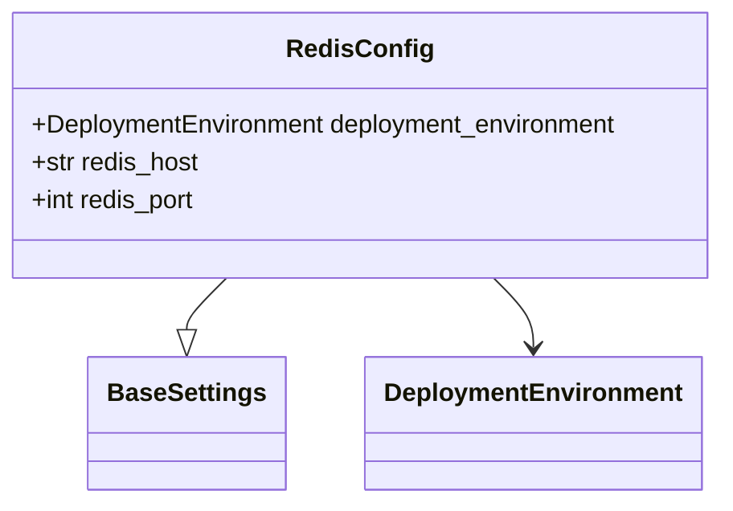
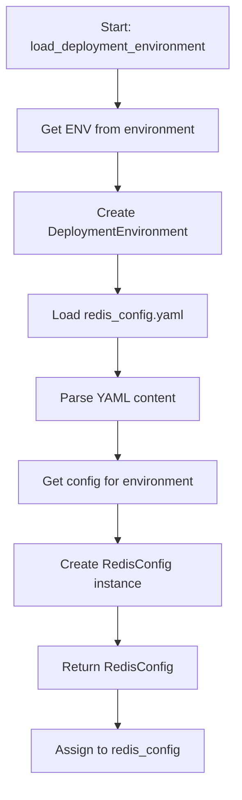

# Diagram: research/orchestrator/util/redis_config.py

> Auto-generated by Obscura crawlers

## Diagram 1

### SVG

<svg id="container" width="462.7421875" xmlns="http://www.w3.org/2000/svg" class="classDiagram" height="318" viewBox="0 0 462.7421875 318" role="graphics-document document" aria-roledescription="class"><g><defs><marker id="container_class-aggregationStart" class="marker aggregation class" refX="18" refY="7" markerWidth="190" markerHeight="240" orient="auto"><path d="M 18,7 L9,13 L1,7 L9,1 Z"></path></marker></defs><defs><marker id="container_class-aggregationEnd" class="marker aggregation class" refX="1" refY="7" markerWidth="20" markerHeight="28" orient="auto"><path d="M 18,7 L9,13 L1,7 L9,1 Z"></path></marker></defs><defs><marker id="container_class-extensionStart" class="marker extension class" refX="18" refY="7" markerWidth="190" markerHeight="240" orient="auto"><path d="M 1,7 L18,13 V 1 Z"></path></marker></defs><defs><marker id="container_class-extensionEnd" class="marker extension class" refX="1" refY="7" markerWidth="20" markerHeight="28" orient="auto"><path d="M 1,1 V 13 L18,7 Z"></path></marker></defs><defs><marker id="container_class-compositionStart" class="marker composition class" refX="18" refY="7" markerWidth="190" markerHeight="240" orient="auto"><path d="M 18,7 L9,13 L1,7 L9,1 Z"></path></marker></defs><defs><marker id="container_class-compositionEnd" class="marker composition class" refX="1" refY="7" markerWidth="20" markerHeight="28" orient="auto"><path d="M 18,7 L9,13 L1,7 L9,1 Z"></path></marker></defs><defs><marker id="container_class-dependencyStart" class="marker dependency class" refX="6" refY="7" markerWidth="190" markerHeight="240" orient="auto"><path d="M 5,7 L9,13 L1,7 L9,1 Z"></path></marker></defs><defs><marker id="container_class-dependencyEnd" class="marker dependency class" refX="13" refY="7" markerWidth="20" markerHeight="28" orient="auto"><path d="M 18,7 L9,13 L14,7 L9,1 Z"></path></marker></defs><defs><marker id="container_class-lollipopStart" class="marker lollipop class" refX="13" refY="7" markerWidth="190" markerHeight="240" orient="auto"><circle stroke="black" fill="transparent" cx="7" cy="7" r="6"></circle></marker></defs><defs><marker id="container_class-lollipopEnd" class="marker lollipop class" refX="1" refY="7" markerWidth="190" markerHeight="240" orient="auto"><circle stroke="black" fill="transparent" cx="7" cy="7" r="6"></circle></marker></defs><g class="root"><g class="clusters"></g><g class="edgePaths"><path d="M149.557,176L145.498,180.167C141.44,184.333,133.324,192.667,129.265,198.125C125.207,203.583,125.207,206.167,125.207,207.458L125.207,208.75" id="id_RedisConfig_BaseSettings_1" class="edge-thickness-normal edge-pattern-solid relation" style=";;;" data-edge="true" data-et="edge" data-id="id_RedisConfig_BaseSettings_1" data-points="W3sieCI6MTQ5LjU1NjU4Njg2OTI2NjA2LCJ5IjoxNzZ9LHsieCI6MTI1LjIwNzAzMTI1LCJ5IjoyMDF9LHsieCI6MTI1LjIwNzAzMTI1LCJ5IjoyMjZ9XQ==" marker-end="url(#container_class-extensionEnd)"></path><path d="M313.186,176L317.244,180.167C321.302,184.333,329.419,192.667,333.477,200C337.535,207.333,337.535,213.667,337.535,216.833L337.535,220" id="id_RedisConfig_DeploymentEnvironment_2" class="edge-thickness-normal edge-pattern-solid relation" style=";;;" data-edge="true" data-et="edge" data-id="id_RedisConfig_DeploymentEnvironment_2" data-points="W3sieCI6MzEzLjE4NTYwMDYzMDczMzksInkiOjE3Nn0seyJ4IjozMzcuNTM1MTU2MjUsInkiOjIwMX0seyJ4IjozMzcuNTM1MTU2MjUsInkiOjIyNn1d" marker-end="url(#container_class-dependencyEnd)"></path></g><g class="edgeLabels"><g class="edgeLabel"><g class="label" data-id="id_RedisConfig_BaseSettings_1" transform="translate(0, 0)"><foreignObject width="0" height="0">

</foreignObject></g></g><g class="edgeLabel"><g class="label" data-id="id_RedisConfig_DeploymentEnvironment_2" transform="translate(0, 0)"><foreignObject width="0" height="0">

</foreignObject></g></g></g><g class="nodes"><g class="node default" id="classId-RedisConfig-0" transform="translate(231.37109375, 92)"><g class="basic label-container"><path d="M-223.37109375 -84 L223.37109375 -84 L223.37109375 84 L-223.37109375 84" stroke="none" stroke-width="0" fill="#ECECFF" style=""></path><path d="M-223.37109375 -84 C-127.5760809010877 -84, -31.781068052175414 -84, 223.37109375 -84 M-223.37109375 -84 C-56.06388440294543 -84, 111.24332494410913 -84, 223.37109375 -84 M223.37109375 -84 C223.37109375 -41.59497592979628, 223.37109375 0.8100481404074458, 223.37109375 84 M223.37109375 -84 C223.37109375 -31.297205399441772, 223.37109375 21.405589201116456, 223.37109375 84 M223.37109375 84 C53.819934430687255 84, -115.73122488862549 84, -223.37109375 84 M223.37109375 84 C113.45643340943536 84, 3.541773068870725 84, -223.37109375 84 M-223.37109375 84 C-223.37109375 26.182769356760915, -223.37109375 -31.63446128647817, -223.37109375 -84 M-223.37109375 84 C-223.37109375 28.317198615576203, -223.37109375 -27.365602768847594, -223.37109375 -84" stroke="#9370DB" stroke-width="1.3" fill="none" stroke-dasharray="0 0" style=""></path></g><g class="annotation-group text" transform="translate(0, -60)"></g><g class="label-group text" transform="translate(-43.0859375, -60)"><g class="label" style="font-weight: bolder" transform="translate(0,-12)"><foreignObject width="86.171875" height="24">

RedisConfig

</foreignObject></g></g><g class="members-group text" transform="translate(-211.37109375, -12)"><g class="label" style="" transform="translate(0,-12)"><foreignObject width="379.65625" height="24">

+DeploymentEnvironment deployment_environment

</foreignObject></g><g class="label" style="" transform="translate(0,12)"><foreignObject width="107.59375" height="24">

+str redis_host

</foreignObject></g><g class="label" style="" transform="translate(0,36)"><foreignObject width="106.65625" height="24">

+int redis_port

</foreignObject></g></g><g class="methods-group text" transform="translate(-211.37109375, 84)"></g><g class="divider" style=""><path d="M-223.37109375 -36 C-99.33612741728255 -36, 24.69883891543489 -36, 223.37109375 -36 M-223.37109375 -36 C-111.56802668975591 -36, 0.2350403704881785 -36, 223.37109375 -36" stroke="#9370DB" stroke-width="1.3" fill="none" stroke-dasharray="0 0" style=""></path></g><g class="divider" style=""><path d="M-223.37109375 60 C-55.446274291590726 60, 112.47854516681855 60, 223.37109375 60 M-223.37109375 60 C-63.1185899299237 60, 97.1339138901526 60, 223.37109375 60" stroke="#9370DB" stroke-width="1.3" fill="none" stroke-dasharray="0 0" style=""></path></g></g><g class="node default" id="classId-BaseSettings-1" transform="translate(125.20703125, 268)"><g class="basic label-container"><path d="M-59.765625 -42 L59.765625 -42 L59.765625 42 L-59.765625 42" stroke="none" stroke-width="0" fill="#ECECFF" style=""></path><path d="M-59.765625 -42 C-27.06930119424014 -42, 5.62702261151972 -42, 59.765625 -42 M-59.765625 -42 C-19.492103731147523 -42, 20.781417537704954 -42, 59.765625 -42 M59.765625 -42 C59.765625 -21.282127239253793, 59.765625 -0.5642544785075856, 59.765625 42 M59.765625 -42 C59.765625 -20.189680926310793, 59.765625 1.6206381473784148, 59.765625 42 M59.765625 42 C30.408194488984172 42, 1.0507639779683444 42, -59.765625 42 M59.765625 42 C22.38581067999626 42, -14.994003640007477 42, -59.765625 42 M-59.765625 42 C-59.765625 21.557382680768647, -59.765625 1.1147653615372946, -59.765625 -42 M-59.765625 42 C-59.765625 8.700526696998445, -59.765625 -24.59894660600311, -59.765625 -42" stroke="#9370DB" stroke-width="1.3" fill="none" stroke-dasharray="0 0" style=""></path></g><g class="annotation-group text" transform="translate(0, -18)"></g><g class="label-group text" transform="translate(-47.765625, -18)"><g class="label" style="font-weight: bolder" transform="translate(0,-12)"><foreignObject width="95.53125" height="24">

BaseSettings

</foreignObject></g></g><g class="members-group text" transform="translate(-47.765625, 30)"></g><g class="methods-group text" transform="translate(-47.765625, 60)"></g><g class="divider" style=""><path d="M-59.765625 6 C-15.718141505944544 6, 28.32934198811091 6, 59.765625 6 M-59.765625 6 C-29.388396464845005 6, 0.9888320703099893 6, 59.765625 6" stroke="#9370DB" stroke-width="1.3" fill="none" stroke-dasharray="0 0" style=""></path></g><g class="divider" style=""><path d="M-59.765625 24 C-17.750917637421082 24, 24.263789725157835 24, 59.765625 24 M-59.765625 24 C-30.834641581948922 24, -1.9036581638978447 24, 59.765625 24" stroke="#9370DB" stroke-width="1.3" fill="none" stroke-dasharray="0 0" style=""></path></g></g><g class="node default" id="classId-DeploymentEnvironment-2" transform="translate(337.53515625, 268)"><g class="basic label-container"><path d="M-102.5625 -42 L102.5625 -42 L102.5625 42 L-102.5625 42" stroke="none" stroke-width="0" fill="#ECECFF" style=""></path><path d="M-102.5625 -42 C-36.27949367092745 -42, 30.003512658145098 -42, 102.5625 -42 M-102.5625 -42 C-58.09137872475498 -42, -13.620257449509964 -42, 102.5625 -42 M102.5625 -42 C102.5625 -22.472311966419465, 102.5625 -2.9446239328389296, 102.5625 42 M102.5625 -42 C102.5625 -19.19438168872702, 102.5625 3.6112366225459596, 102.5625 42 M102.5625 42 C39.33687897597809 42, -23.888742048043824 42, -102.5625 42 M102.5625 42 C29.13896707294886 42, -44.28456585410228 42, -102.5625 42 M-102.5625 42 C-102.5625 12.374389552215547, -102.5625 -17.251220895568906, -102.5625 -42 M-102.5625 42 C-102.5625 22.346230981968265, -102.5625 2.6924619639365304, -102.5625 -42" stroke="#9370DB" stroke-width="1.3" fill="none" stroke-dasharray="0 0" style=""></path></g><g class="annotation-group text" transform="translate(0, -18)"></g><g class="label-group text" transform="translate(-90.5625, -18)"><g class="label" style="font-weight: bolder" transform="translate(0,-12)"><foreignObject width="181.125" height="24">

DeploymentEnvironment

</foreignObject></g></g><g class="members-group text" transform="translate(-90.5625, 30)"></g><g class="methods-group text" transform="translate(-90.5625, 60)"></g><g class="divider" style=""><path d="M-102.5625 6 C-21.4076507298183 6, 59.7471985403634 6, 102.5625 6 M-102.5625 6 C-59.50696208861845 6, -16.451424177236902 6, 102.5625 6" stroke="#9370DB" stroke-width="1.3" fill="none" stroke-dasharray="0 0" style=""></path></g><g class="divider" style=""><path d="M-102.5625 24 C-38.772754719803025 24, 25.01699056039395 24, 102.5625 24 M-102.5625 24 C-25.026425682421603 24, 52.50964863515679 24, 102.5625 24" stroke="#9370DB" stroke-width="1.3" fill="none" stroke-dasharray="0 0" style=""></path></g></g></g></g></g></svg>

## Diagram 2

### SVG

<svg id="container" width="303.578125" xmlns="http://www.w3.org/2000/svg" class="flowchart" height="974" viewBox="0 0 303.578125 974" role="graphics-document document" aria-roledescription="flowchart-v2"><g><marker id="container_flowchart-v2-pointEnd" class="marker flowchart-v2" viewBox="0 0 10 10" refX="5" refY="5" markerUnits="userSpaceOnUse" markerWidth="8" markerHeight="8" orient="auto"><path d="M 0 0 L 10 5 L 0 10 z" class="arrowMarkerPath" style="stroke-width: 1; stroke-dasharray: 1, 0;"></path></marker><marker id="container_flowchart-v2-pointStart" class="marker flowchart-v2" viewBox="0 0 10 10" refX="4.5" refY="5" markerUnits="userSpaceOnUse" markerWidth="8" markerHeight="8" orient="auto"><path d="M 0 5 L 10 10 L 10 0 z" class="arrowMarkerPath" style="stroke-width: 1; stroke-dasharray: 1, 0;"></path></marker><marker id="container_flowchart-v2-circleEnd" class="marker flowchart-v2" viewBox="0 0 10 10" refX="11" refY="5" markerUnits="userSpaceOnUse" markerWidth="11" markerHeight="11" orient="auto"><circle cx="5" cy="5" r="5" class="arrowMarkerPath" style="stroke-width: 1; stroke-dasharray: 1, 0;"></circle></marker><marker id="container_flowchart-v2-circleStart" class="marker flowchart-v2" viewBox="0 0 10 10" refX="-1" refY="5" markerUnits="userSpaceOnUse" markerWidth="11" markerHeight="11" orient="auto"><circle cx="5" cy="5" r="5" class="arrowMarkerPath" style="stroke-width: 1; stroke-dasharray: 1, 0;"></circle></marker><marker id="container_flowchart-v2-crossEnd" class="marker cross flowchart-v2" viewBox="0 0 11 11" refX="12" refY="5.2" markerUnits="userSpaceOnUse" markerWidth="11" markerHeight="11" orient="auto"><path d="M 1,1 l 9,9 M 10,1 l -9,9" class="arrowMarkerPath" style="stroke-width: 2; stroke-dasharray: 1, 0;"></path></marker><marker id="container_flowchart-v2-crossStart" class="marker cross flowchart-v2" viewBox="0 0 11 11" refX="-1" refY="5.2" markerUnits="userSpaceOnUse" markerWidth="11" markerHeight="11" orient="auto"><path d="M 1,1 l 9,9 M 10,1 l -9,9" class="arrowMarkerPath" style="stroke-width: 2; stroke-dasharray: 1, 0;"></path></marker><g class="root"><g class="clusters"></g><g class="edgePaths"><path d="M151.789,86L151.789,90.167C151.789,94.333,151.789,102.667,151.789,110.333C151.789,118,151.789,125,151.789,128.5L151.789,132" id="L_A_B_0" class="edge-thickness-normal edge-pattern-solid edge-thickness-normal edge-pattern-solid flowchart-link" style=";" data-edge="true" data-et="edge" data-id="L_A_B_0" data-points="W3sieCI6MTUxLjc4OTA2MjUsInkiOjg2fSx7IngiOjE1MS43ODkwNjI1LCJ5IjoxMTF9LHsieCI6MTUxLjc4OTA2MjUsInkiOjEzNn1d" marker-end="url(#container_flowchart-v2-pointEnd)"></path><path d="M151.789,190L151.789,194.167C151.789,198.333,151.789,206.667,151.789,214.333C151.789,222,151.789,229,151.789,232.5L151.789,236" id="L_B_C_0" class="edge-thickness-normal edge-pattern-solid edge-thickness-normal edge-pattern-solid flowchart-link" style=";" data-edge="true" data-et="edge" data-id="L_B_C_0" data-points="W3sieCI6MTUxLjc4OTA2MjUsInkiOjE5MH0seyJ4IjoxNTEuNzg5MDYyNSwieSI6MjE1fSx7IngiOjE1MS43ODkwNjI1LCJ5IjoyNDB9XQ==" marker-end="url(#container_flowchart-v2-pointEnd)"></path><path d="M151.789,318L151.789,322.167C151.789,326.333,151.789,334.667,151.789,342.333C151.789,350,151.789,357,151.789,360.5L151.789,364" id="L_C_D_0" class="edge-thickness-normal edge-pattern-solid edge-thickness-normal edge-pattern-solid flowchart-link" style=";" data-edge="true" data-et="edge" data-id="L_C_D_0" data-points="W3sieCI6MTUxLjc4OTA2MjUsInkiOjMxOH0seyJ4IjoxNTEuNzg5MDYyNSwieSI6MzQzfSx7IngiOjE1MS43ODkwNjI1LCJ5IjozNjh9XQ==" marker-end="url(#container_flowchart-v2-pointEnd)"></path><path d="M151.789,422L151.789,426.167C151.789,430.333,151.789,438.667,151.789,446.333C151.789,454,151.789,461,151.789,464.5L151.789,468" id="L_D_E_0" class="edge-thickness-normal edge-pattern-solid edge-thickness-normal edge-pattern-solid flowchart-link" style=";" data-edge="true" data-et="edge" data-id="L_D_E_0" data-points="W3sieCI6MTUxLjc4OTA2MjUsInkiOjQyMn0seyJ4IjoxNTEuNzg5MDYyNSwieSI6NDQ3fSx7IngiOjE1MS43ODkwNjI1LCJ5Ijo0NzJ9XQ==" marker-end="url(#container_flowchart-v2-pointEnd)"></path><path d="M151.789,526L151.789,530.167C151.789,534.333,151.789,542.667,151.789,550.333C151.789,558,151.789,565,151.789,568.5L151.789,572" id="L_E_F_0" class="edge-thickness-normal edge-pattern-solid edge-thickness-normal edge-pattern-solid flowchart-link" style=";" data-edge="true" data-et="edge" data-id="L_E_F_0" data-points="W3sieCI6MTUxLjc4OTA2MjUsInkiOjUyNn0seyJ4IjoxNTEuNzg5MDYyNSwieSI6NTUxfSx7IngiOjE1MS43ODkwNjI1LCJ5Ijo1NzZ9XQ==" marker-end="url(#container_flowchart-v2-pointEnd)"></path><path d="M151.789,630L151.789,634.167C151.789,638.333,151.789,646.667,151.789,654.333C151.789,662,151.789,669,151.789,672.5L151.789,676" id="L_F_G_0" class="edge-thickness-normal edge-pattern-solid edge-thickness-normal edge-pattern-solid flowchart-link" style=";" data-edge="true" data-et="edge" data-id="L_F_G_0" data-points="W3sieCI6MTUxLjc4OTA2MjUsInkiOjYzMH0seyJ4IjoxNTEuNzg5MDYyNSwieSI6NjU1fSx7IngiOjE1MS43ODkwNjI1LCJ5Ijo2ODB9XQ==" marker-end="url(#container_flowchart-v2-pointEnd)"></path><path d="M151.789,758L151.789,762.167C151.789,766.333,151.789,774.667,151.789,782.333C151.789,790,151.789,797,151.789,800.5L151.789,804" id="L_G_H_0" class="edge-thickness-normal edge-pattern-solid edge-thickness-normal edge-pattern-solid flowchart-link" style=";" data-edge="true" data-et="edge" data-id="L_G_H_0" data-points="W3sieCI6MTUxLjc4OTA2MjUsInkiOjc1OH0seyJ4IjoxNTEuNzg5MDYyNSwieSI6NzgzfSx7IngiOjE1MS43ODkwNjI1LCJ5Ijo4MDh9XQ==" marker-end="url(#container_flowchart-v2-pointEnd)"></path><path d="M151.789,862L151.789,866.167C151.789,870.333,151.789,878.667,151.789,886.333C151.789,894,151.789,901,151.789,904.5L151.789,908" id="L_H_I_0" class="edge-thickness-normal edge-pattern-solid edge-thickness-normal edge-pattern-solid flowchart-link" style=";" data-edge="true" data-et="edge" data-id="L_H_I_0" data-points="W3sieCI6MTUxLjc4OTA2MjUsInkiOjg2Mn0seyJ4IjoxNTEuNzg5MDYyNSwieSI6ODg3fSx7IngiOjE1MS43ODkwNjI1LCJ5Ijo5MTJ9XQ==" marker-end="url(#container_flowchart-v2-pointEnd)"></path></g><g class="edgeLabels"><g class="edgeLabel"><g class="label" data-id="L_A_B_0" transform="translate(0, 0)"><foreignObject width="0" height="0">

</foreignObject></g></g><g class="edgeLabel"><g class="label" data-id="L_B_C_0" transform="translate(0, 0)"><foreignObject width="0" height="0">

</foreignObject></g></g><g class="edgeLabel"><g class="label" data-id="L_C_D_0" transform="translate(0, 0)"><foreignObject width="0" height="0">

</foreignObject></g></g><g class="edgeLabel"><g class="label" data-id="L_D_E_0" transform="translate(0, 0)"><foreignObject width="0" height="0">

</foreignObject></g></g><g class="edgeLabel"><g class="label" data-id="L_E_F_0" transform="translate(0, 0)"><foreignObject width="0" height="0">

</foreignObject></g></g><g class="edgeLabel"><g class="label" data-id="L_F_G_0" transform="translate(0, 0)"><foreignObject width="0" height="0">

</foreignObject></g></g><g class="edgeLabel"><g class="label" data-id="L_G_H_0" transform="translate(0, 0)"><foreignObject width="0" height="0">

</foreignObject></g></g><g class="edgeLabel"><g class="label" data-id="L_H_I_0" transform="translate(0, 0)"><foreignObject width="0" height="0">

</foreignObject></g></g></g><g class="nodes"><g class="node default" id="flowchart-A-0" transform="translate(151.7890625, 47)"><rect class="basic label-container" style="" x="-143.7890625" y="-39" width="287.578125" height="78"></rect><g class="label" style="" transform="translate(-113.7890625, -24)"><rect></rect><foreignObject width="227.578125" height="48">

Start: load_deployment_environment

</foreignObject></g></g><g class="node default" id="flowchart-B-1" transform="translate(151.7890625, 163)"><rect class="basic label-container" style="" x="-126.09375" y="-27" width="252.1875" height="54"></rect><g class="label" style="" transform="translate(-96.09375, -12)"><rect></rect><foreignObject width="192.1875" height="24">

Get ENV from environment

</foreignObject></g></g><g class="node default" id="flowchart-C-3" transform="translate(151.7890625, 279)"><rect class="basic label-container" style="" x="-130" y="-39" width="260" height="78"></rect><g class="label" style="" transform="translate(-100, -24)"><rect></rect><foreignObject width="200" height="48">

Create DeploymentEnvironment

</foreignObject></g></g><g class="node default" id="flowchart-D-5" transform="translate(151.7890625, 395)"><rect class="basic label-container" style="" x="-112.203125" y="-27" width="224.40625" height="54"></rect><g class="label" style="" transform="translate(-82.203125, -12)"><rect></rect><foreignObject width="164.40625" height="24">

Load redis_config.yaml

</foreignObject></g></g><g class="node default" id="flowchart-E-7" transform="translate(151.7890625, 499)"><rect class="basic label-container" style="" x="-100.3984375" y="-27" width="200.796875" height="54"></rect><g class="label" style="" transform="translate(-70.3984375, -12)"><rect></rect><foreignObject width="140.796875" height="24">

Parse YAML content

</foreignObject></g></g><g class="node default" id="flowchart-F-9" transform="translate(151.7890625, 603)"><rect class="basic label-container" style="" x="-126.984375" y="-27" width="253.96875" height="54"></rect><g class="label" style="" transform="translate(-96.984375, -12)"><rect></rect><foreignObject width="193.96875" height="24">

Get config for environment

</foreignObject></g></g><g class="node default" id="flowchart-G-11" transform="translate(151.7890625, 719)"><rect class="basic label-container" style="" x="-130" y="-39" width="260" height="78"></rect><g class="label" style="" transform="translate(-100, -24)"><rect></rect><foreignObject width="200" height="48">

Create RedisConfig instance

</foreignObject></g></g><g class="node default" id="flowchart-H-13" transform="translate(151.7890625, 835)"><rect class="basic label-container" style="" x="-98.8203125" y="-27" width="197.640625" height="54"></rect><g class="label" style="" transform="translate(-68.8203125, -12)"><rect></rect><foreignObject width="137.640625" height="24">

Return RedisConfig

</foreignObject></g></g><g class="node default" id="flowchart-I-15" transform="translate(151.7890625, 939)"><rect class="basic label-container" style="" x="-108.375" y="-27" width="216.75" height="54"></rect><g class="label" style="" transform="translate(-78.375, -12)"><rect></rect><foreignObject width="156.75" height="24">

Assign to redis_config

</foreignObject></g></g></g></g></g></svg>
