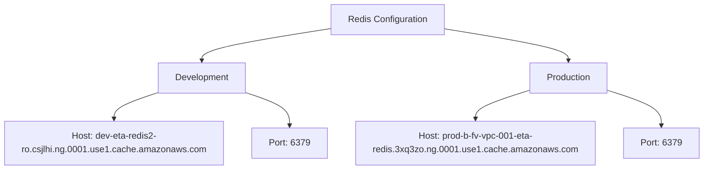
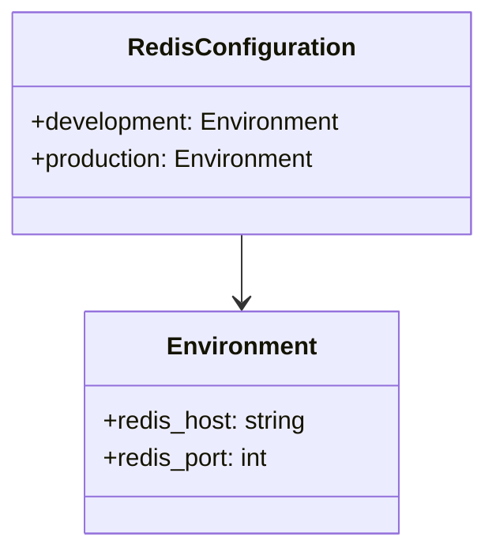

# Diagram: research/orchestrator/util/redis_config.yaml

> Auto-generated by Obscura crawlers

## Diagram 1

### SVG

<svg id="container" width="1214.328125" xmlns="http://www.w3.org/2000/svg" class="flowchart" height="302" viewBox="0 0 1214.328125 302" role="graphics-document document" aria-roledescription="flowchart-v2"><g><marker id="container_flowchart-v2-pointEnd" class="marker flowchart-v2" viewBox="0 0 10 10" refX="5" refY="5" markerUnits="userSpaceOnUse" markerWidth="8" markerHeight="8" orient="auto"><path d="M 0 0 L 10 5 L 0 10 z" class="arrowMarkerPath" style="stroke-width: 1; stroke-dasharray: 1, 0;"></path></marker><marker id="container_flowchart-v2-pointStart" class="marker flowchart-v2" viewBox="0 0 10 10" refX="4.5" refY="5" markerUnits="userSpaceOnUse" markerWidth="8" markerHeight="8" orient="auto"><path d="M 0 5 L 10 10 L 10 0 z" class="arrowMarkerPath" style="stroke-width: 1; stroke-dasharray: 1, 0;"></path></marker><marker id="container_flowchart-v2-circleEnd" class="marker flowchart-v2" viewBox="0 0 10 10" refX="11" refY="5" markerUnits="userSpaceOnUse" markerWidth="11" markerHeight="11" orient="auto"><circle cx="5" cy="5" r="5" class="arrowMarkerPath" style="stroke-width: 1; stroke-dasharray: 1, 0;"></circle></marker><marker id="container_flowchart-v2-circleStart" class="marker flowchart-v2" viewBox="0 0 10 10" refX="-1" refY="5" markerUnits="userSpaceOnUse" markerWidth="11" markerHeight="11" orient="auto"><circle cx="5" cy="5" r="5" class="arrowMarkerPath" style="stroke-width: 1; stroke-dasharray: 1, 0;"></circle></marker><marker id="container_flowchart-v2-crossEnd" class="marker cross flowchart-v2" viewBox="0 0 11 11" refX="12" refY="5.2" markerUnits="userSpaceOnUse" markerWidth="11" markerHeight="11" orient="auto"><path d="M 1,1 l 9,9 M 10,1 l -9,9" class="arrowMarkerPath" style="stroke-width: 2; stroke-dasharray: 1, 0;"></path></marker><marker id="container_flowchart-v2-crossStart" class="marker cross flowchart-v2" viewBox="0 0 11 11" refX="-1" refY="5.2" markerUnits="userSpaceOnUse" markerWidth="11" markerHeight="11" orient="auto"><path d="M 1,1 l 9,9 M 10,1 l -9,9" class="arrowMarkerPath" style="stroke-width: 2; stroke-dasharray: 1, 0;"></path></marker><g class="root"><g class="clusters"></g><g class="edgePaths"><path d="M568.621,51.347L532.033,57.289C495.444,63.231,422.267,75.116,385.678,84.558C349.09,94,349.09,101,349.09,104.5L349.09,108" id="L_Config_Dev_0" class="edge-thickness-normal edge-pattern-solid edge-thickness-normal edge-pattern-solid flowchart-link" style=";" data-edge="true" data-et="edge" data-id="L_Config_Dev_0" data-points="W3sieCI6NTY4LjYyMTA5Mzc1LCJ5Ijo1MS4zNDcwNjIyNjgyMDIyMn0seyJ4IjozNDkuMDg5ODQzNzUsInkiOjg3fSx7IngiOjM0OS4wODk4NDM3NSwieSI6MTEyfV0=" marker-end="url(#container_flowchart-v2-pointEnd)"></path><path d="M769.934,51.772L805.171,57.643C840.409,63.514,910.884,75.257,946.122,84.629C981.359,94,981.359,101,981.359,104.5L981.359,108" id="L_Config_Prod_0" class="edge-thickness-normal edge-pattern-solid edge-thickness-normal edge-pattern-solid flowchart-link" style=";" data-edge="true" data-et="edge" data-id="L_Config_Prod_0" data-points="W3sieCI6NzY5LjkzMzU5Mzc1LCJ5Ijo1MS43NzE2MzIwNTc4Nzc0MX0seyJ4Ijo5ODEuMzU5Mzc1LCJ5Ijo4N30seyJ4Ijo5ODEuMzU5Mzc1LCJ5IjoxMTJ9XQ==" marker-end="url(#container_flowchart-v2-pointEnd)"></path><path d="M270.824,165.777L258.537,169.981C246.25,174.185,221.676,182.592,209.389,190.296C197.102,198,197.102,205,197.102,208.5L197.102,212" id="L_Dev_DevHost_0" class="edge-thickness-normal edge-pattern-solid edge-thickness-normal edge-pattern-solid flowchart-link" style=";" data-edge="true" data-et="edge" data-id="L_Dev_DevHost_0" data-points="W3sieCI6MjcwLjgyNDIxODc1LCJ5IjoxNjUuNzc3MTQ2Njc1NTc2MzV9LHsieCI6MTk3LjEwMTU2MjUsInkiOjE5MX0seyJ4IjoxOTcuMTAxNTYyNSwieSI6MjE2fV0=" marker-end="url(#container_flowchart-v2-pointEnd)"></path><path d="M427.355,165.777L439.643,169.981C451.93,174.185,476.504,182.592,488.791,192.296C501.078,202,501.078,213,501.078,218.5L501.078,224" id="L_Dev_DevPort_0" class="edge-thickness-normal edge-pattern-solid edge-thickness-normal edge-pattern-solid flowchart-link" style=";" data-edge="true" data-et="edge" data-id="L_Dev_DevPort_0" data-points="W3sieCI6NDI3LjM1NTQ2ODc1LCJ5IjoxNjUuNzc3MTQ2Njc1NTc2MzV9LHsieCI6NTAxLjA3ODEyNSwieSI6MTkxfSx7IngiOjUwMS4wNzgxMjUsInkiOjIyOH1d" marker-end="url(#container_flowchart-v2-pointEnd)"></path><path d="M911.578,161.666L896.526,166.555C881.474,171.444,851.37,181.222,836.318,189.611C821.266,198,821.266,205,821.266,208.5L821.266,212" id="L_Prod_ProdHost_0" class="edge-thickness-normal edge-pattern-solid edge-thickness-normal edge-pattern-solid flowchart-link" style=";" data-edge="true" data-et="edge" data-id="L_Prod_ProdHost_0" data-points="W3sieCI6OTExLjU3ODEyNSwieSI6MTYxLjY2NTYyNTYwOTk5NDE1fSx7IngiOjgyMS4yNjU2MjUsInkiOjE5MX0seyJ4Ijo4MjEuMjY1NjI1LCJ5IjoyMTZ9XQ==" marker-end="url(#container_flowchart-v2-pointEnd)"></path><path d="M1051.141,161.666L1066.193,166.555C1081.245,171.444,1111.349,181.222,1126.401,191.611C1141.453,202,1141.453,213,1141.453,218.5L1141.453,224" id="L_Prod_ProdPort_0" class="edge-thickness-normal edge-pattern-solid edge-thickness-normal edge-pattern-solid flowchart-link" style=";" data-edge="true" data-et="edge" data-id="L_Prod_ProdPort_0" data-points="W3sieCI6MTA1MS4xNDA2MjUsInkiOjE2MS42NjU2MjU2MDk5OTQxNX0seyJ4IjoxMTQxLjQ1MzEyNSwieSI6MTkxfSx7IngiOjExNDEuNDUzMTI1LCJ5IjoyMjh9XQ==" marker-end="url(#container_flowchart-v2-pointEnd)"></path></g><g class="edgeLabels"><g class="edgeLabel"><g class="label" data-id="L_Config_Dev_0" transform="translate(0, 0)"><foreignObject width="0" height="0">

</foreignObject></g></g><g class="edgeLabel"><g class="label" data-id="L_Config_Prod_0" transform="translate(0, 0)"><foreignObject width="0" height="0">

</foreignObject></g></g><g class="edgeLabel"><g class="label" data-id="L_Dev_DevHost_0" transform="translate(0, 0)"><foreignObject width="0" height="0">

</foreignObject></g></g><g class="edgeLabel"><g class="label" data-id="L_Dev_DevPort_0" transform="translate(0, 0)"><foreignObject width="0" height="0">

</foreignObject></g></g><g class="edgeLabel"><g class="label" data-id="L_Prod_ProdHost_0" transform="translate(0, 0)"><foreignObject width="0" height="0">

</foreignObject></g></g><g class="edgeLabel"><g class="label" data-id="L_Prod_ProdPort_0" transform="translate(0, 0)"><foreignObject width="0" height="0">

</foreignObject></g></g></g><g class="nodes"><g class="node default" id="flowchart-Config-0" transform="translate(669.27734375, 35)"><rect class="basic label-container" style="" x="-100.65625" y="-27" width="201.3125" height="54"></rect><g class="label" style="" transform="translate(-70.65625, -12)"><rect></rect><foreignObject width="141.3125" height="24">

Redis Configuration

</foreignObject></g></g><g class="node default" id="flowchart-Dev-2" transform="translate(349.08984375, 139)"><rect class="basic label-container" style="" x="-78.265625" y="-27" width="156.53125" height="54"></rect><g class="label" style="" transform="translate(-48.265625, -12)"><rect></rect><foreignObject width="96.53125" height="24">

Development

</foreignObject></g></g><g class="node default" id="flowchart-Prod-4" transform="translate(981.359375, 139)"><rect class="basic label-container" style="" x="-69.78125" y="-27" width="139.5625" height="54"></rect><g class="label" style="" transform="translate(-39.78125, -12)"><rect></rect><foreignObject width="79.5625" height="24">

Production

</foreignObject></g></g><g class="node default" id="flowchart-DevHost-6" transform="translate(197.1015625, 255)"><rect class="basic label-container" style="" x="-189.1015625" y="-39" width="378.203125" height="78"></rect><g class="label" style="" transform="translate(-159.1015625, -24)"><rect></rect><foreignObject width="318.203125" height="48">

Host: dev-eta-redis2-ro.csjlhi.ng.0001.use1.cache.amazonaws.com

</foreignObject></g></g><g class="node default" id="flowchart-DevPort-8" transform="translate(501.078125, 255)"><rect class="basic label-container" style="" x="-64.875" y="-27" width="129.75" height="54"></rect><g class="label" style="" transform="translate(-34.875, -12)"><rect></rect><foreignObject width="69.75" height="24">

Port: 6379

</foreignObject></g></g><g class="node default" id="flowchart-ProdHost-10" transform="translate(821.265625, 255)"><rect class="basic label-container" style="" x="-205.3125" y="-39" width="410.625" height="78"></rect><g class="label" style="" transform="translate(-175.3125, -24)"><rect></rect><foreignObject width="350.625" height="48">

Host: prod-b-fv-vpc-001-eta-redis.3xq3zo.ng.0001.use1.cache.amazonaws.com

</foreignObject></g></g><g class="node default" id="flowchart-ProdPort-12" transform="translate(1141.453125, 255)"><rect class="basic label-container" style="" x="-64.875" y="-27" width="129.75" height="54"></rect><g class="label" style="" transform="translate(-34.875, -12)"><rect></rect><foreignObject width="69.75" height="24">

Port: 6379

</foreignObject></g></g></g></g></g></svg>

## Diagram 2

### SVG

<svg id="container" width="313.4921875" xmlns="http://www.w3.org/2000/svg" class="classDiagram" height="354" viewBox="0 0 313.4921875 354" role="graphics-document document" aria-roledescription="class"><g><defs><marker id="container_class-aggregationStart" class="marker aggregation class" refX="18" refY="7" markerWidth="190" markerHeight="240" orient="auto"><path d="M 18,7 L9,13 L1,7 L9,1 Z"></path></marker></defs><defs><marker id="container_class-aggregationEnd" class="marker aggregation class" refX="1" refY="7" markerWidth="20" markerHeight="28" orient="auto"><path d="M 18,7 L9,13 L1,7 L9,1 Z"></path></marker></defs><defs><marker id="container_class-extensionStart" class="marker extension class" refX="18" refY="7" markerWidth="190" markerHeight="240" orient="auto"><path d="M 1,7 L18,13 V 1 Z"></path></marker></defs><defs><marker id="container_class-extensionEnd" class="marker extension class" refX="1" refY="7" markerWidth="20" markerHeight="28" orient="auto"><path d="M 1,1 V 13 L18,7 Z"></path></marker></defs><defs><marker id="container_class-compositionStart" class="marker composition class" refX="18" refY="7" markerWidth="190" markerHeight="240" orient="auto"><path d="M 18,7 L9,13 L1,7 L9,1 Z"></path></marker></defs><defs><marker id="container_class-compositionEnd" class="marker composition class" refX="1" refY="7" markerWidth="20" markerHeight="28" orient="auto"><path d="M 18,7 L9,13 L1,7 L9,1 Z"></path></marker></defs><defs><marker id="container_class-dependencyStart" class="marker dependency class" refX="6" refY="7" markerWidth="190" markerHeight="240" orient="auto"><path d="M 5,7 L9,13 L1,7 L9,1 Z"></path></marker></defs><defs><marker id="container_class-dependencyEnd" class="marker dependency class" refX="13" refY="7" markerWidth="20" markerHeight="28" orient="auto"><path d="M 18,7 L9,13 L14,7 L9,1 Z"></path></marker></defs><defs><marker id="container_class-lollipopStart" class="marker lollipop class" refX="13" refY="7" markerWidth="190" markerHeight="240" orient="auto"><circle stroke="black" fill="transparent" cx="7" cy="7" r="6"></circle></marker></defs><defs><marker id="container_class-lollipopEnd" class="marker lollipop class" refX="1" refY="7" markerWidth="190" markerHeight="240" orient="auto"><circle stroke="black" fill="transparent" cx="7" cy="7" r="6"></circle></marker></defs><g class="root"><g class="clusters"></g><g class="edgePaths"><path d="M156.746,152L156.746,156.167C156.746,160.333,156.746,168.667,156.746,176C156.746,183.333,156.746,189.667,156.746,192.833L156.746,196" id="id_RedisConfiguration_Environment_1" class="edge-thickness-normal edge-pattern-solid relation" style=";;;" data-edge="true" data-et="edge" data-id="id_RedisConfiguration_Environment_1" data-points="W3sieCI6MTU2Ljc0NjA5Mzc1LCJ5IjoxNTJ9LHsieCI6MTU2Ljc0NjA5Mzc1LCJ5IjoxNzd9LHsieCI6MTU2Ljc0NjA5Mzc1LCJ5IjoyMDJ9XQ==" marker-end="url(#container_class-dependencyEnd)"></path></g><g class="edgeLabels"><g class="edgeLabel"><g class="label" data-id="id_RedisConfiguration_Environment_1" transform="translate(0, 0)"><foreignObject width="0" height="0">

</foreignObject></g></g></g><g class="nodes"><g class="node default" id="classId-RedisConfiguration-0" transform="translate(156.74609375, 80)"><g class="basic label-container"><path d="M-148.74609375 -72 L148.74609375 -72 L148.74609375 72 L-148.74609375 72" stroke="none" stroke-width="0" fill="#ECECFF" style=""></path><path d="M-148.74609375 -72 C-49.671563334932955 -72, 49.40296708013409 -72, 148.74609375 -72 M-148.74609375 -72 C-64.34962057205327 -72, 20.046852605893463 -72, 148.74609375 -72 M148.74609375 -72 C148.74609375 -33.053907366789865, 148.74609375 5.89218526642027, 148.74609375 72 M148.74609375 -72 C148.74609375 -37.276226337254066, 148.74609375 -2.5524526745081317, 148.74609375 72 M148.74609375 72 C67.21052233664312 72, -14.325049076713753 72, -148.74609375 72 M148.74609375 72 C40.76396780047183 72, -67.21815814905634 72, -148.74609375 72 M-148.74609375 72 C-148.74609375 29.518377228085022, -148.74609375 -12.963245543829956, -148.74609375 -72 M-148.74609375 72 C-148.74609375 39.74967466023814, -148.74609375 7.499349320476284, -148.74609375 -72" stroke="#9370DB" stroke-width="1.3" fill="none" stroke-dasharray="0 0" style=""></path></g><g class="annotation-group text" transform="translate(0, -48)"></g><g class="label-group text" transform="translate(-69.5234375, -48)"><g class="label" style="font-weight: bolder" transform="translate(0,-12)"><foreignObject width="139.046875" height="24">

RedisConfiguration

</foreignObject></g></g><g class="members-group text" transform="translate(-136.74609375, 0)"><g class="label" style="" transform="translate(0,-12)"><foreignObject width="203.96875" height="24">

+development: Environment

</foreignObject></g><g class="label" style="" transform="translate(0,12)"><foreignObject width="188.203125" height="24">

+production: Environment

</foreignObject></g></g><g class="methods-group text" transform="translate(-136.74609375, 72)"></g><g class="divider" style=""><path d="M-148.74609375 -24 C-45.660390463293766 -24, 57.42531282341247 -24, 148.74609375 -24 M-148.74609375 -24 C-44.718697382866466 -24, 59.30869898426707 -24, 148.74609375 -24" stroke="#9370DB" stroke-width="1.3" fill="none" stroke-dasharray="0 0" style=""></path></g><g class="divider" style=""><path d="M-148.74609375 48 C-82.12704482486198 48, -15.507995899723966 48, 148.74609375 48 M-148.74609375 48 C-71.5204753202922 48, 5.705143109415587 48, 148.74609375 48" stroke="#9370DB" stroke-width="1.3" fill="none" stroke-dasharray="0 0" style=""></path></g></g><g class="node default" id="classId-Environment-1" transform="translate(156.74609375, 274)"><g class="basic label-container"><path d="M-101.94921875 -72 L101.94921875 -72 L101.94921875 72 L-101.94921875 72" stroke="none" stroke-width="0" fill="#ECECFF" style=""></path><path d="M-101.94921875 -72 C-48.97813721155502 -72, 3.9929443268899547 -72, 101.94921875 -72 M-101.94921875 -72 C-21.982306395529065 -72, 57.98460595894187 -72, 101.94921875 -72 M101.94921875 -72 C101.94921875 -30.090891252722784, 101.94921875 11.818217494554432, 101.94921875 72 M101.94921875 -72 C101.94921875 -18.985179002144164, 101.94921875 34.02964199571167, 101.94921875 72 M101.94921875 72 C27.004994932959974 72, -47.93922888408005 72, -101.94921875 72 M101.94921875 72 C20.769480412609923 72, -60.410257924780154 72, -101.94921875 72 M-101.94921875 72 C-101.94921875 38.345341275544016, -101.94921875 4.690682551088031, -101.94921875 -72 M-101.94921875 72 C-101.94921875 41.821670609928844, -101.94921875 11.643341219857689, -101.94921875 -72" stroke="#9370DB" stroke-width="1.3" fill="none" stroke-dasharray="0 0" style=""></path></g><g class="annotation-group text" transform="translate(0, -48)"></g><g class="label-group text" transform="translate(-46.1953125, -48)"><g class="label" style="font-weight: bolder" transform="translate(0,-12)"><foreignObject width="92.390625" height="24">

Environment

</foreignObject></g></g><g class="members-group text" transform="translate(-89.94921875, 0)"><g class="label" style="" transform="translate(0,-12)"><foreignObject width="133.703125" height="24">

+redis_host: string

</foreignObject></g><g class="label" style="" transform="translate(0,12)"><foreignObject width="110.5625" height="24">

+redis_port: int

</foreignObject></g></g><g class="methods-group text" transform="translate(-89.94921875, 72)"></g><g class="divider" style=""><path d="M-101.94921875 -24 C-33.35952700505071 -24, 35.23016473989858 -24, 101.94921875 -24 M-101.94921875 -24 C-28.82621780790592 -24, 44.29678313418816 -24, 101.94921875 -24" stroke="#9370DB" stroke-width="1.3" fill="none" stroke-dasharray="0 0" style=""></path></g><g class="divider" style=""><path d="M-101.94921875 48 C-42.438486828060846 48, 17.07224509387831 48, 101.94921875 48 M-101.94921875 48 C-37.37445180056913 48, 27.200315148861733 48, 101.94921875 48" stroke="#9370DB" stroke-width="1.3" fill="none" stroke-dasharray="0 0" style=""></path></g></g></g></g></g></svg>
