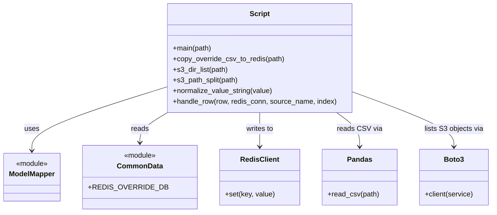

# Diagram: research/overrides/copy_overrides_to_redis.py


> Auto-generated by Obscura crawlers

## Diagram 1



### SVG

<svg id="container" width="1067.46875" xmlns="http://www.w3.org/2000/svg" class="classDiagram" height="480" viewBox="0 0 1067.46875 480" role="graphics-document document" aria-roledescription="class"><style>#container{font-family:"trebuchet ms",verdana,arial,sans-serif;font-size:16px;fill:#333;}@keyframes edge-animation-frame{from{stroke-dashoffset:0;}}@keyframes dash{to{stroke-dashoffset:0;}}#container .edge-animation-slow{stroke-dasharray:9,5!important;stroke-dashoffset:900;animation:dash 50s linear infinite;stroke-linecap:round;}#container .edge-animation-fast{stroke-dasharray:9,5!important;stroke-dashoffset:900;animation:dash 20s linear infinite;stroke-linecap:round;}#container .error-icon{fill:#552222;}#container .error-text{fill:#552222;stroke:#552222;}#container .edge-thickness-normal{stroke-width:1px;}#container .edge-thickness-thick{stroke-width:3.5px;}#container .edge-pattern-solid{stroke-dasharray:0;}#container .edge-thickness-invisible{stroke-width:0;fill:none;}#container .edge-pattern-dashed{stroke-dasharray:3;}#container .edge-pattern-dotted{stroke-dasharray:2;}#container .marker{fill:#333333;stroke:#333333;}#container .marker.cross{stroke:#333333;}#container svg{font-family:"trebuchet ms",verdana,arial,sans-serif;font-size:16px;}#container p{margin:0;}#container g.classGroup text{fill:#9370DB;stroke:none;font-family:"trebuchet ms",verdana,arial,sans-serif;font-size:10px;}#container g.classGroup text .title{font-weight:bolder;}#container .nodeLabel,#container .edgeLabel{color:#131300;}#container .edgeLabel .label rect{fill:#ECECFF;}#container .label text{fill:#131300;}#container .labelBkg{background:#ECECFF;}#container .edgeLabel .label span{background:#ECECFF;}#container .classTitle{font-weight:bolder;}#container .node rect,#container .node circle,#container .node ellipse,#container .node polygon,#container .node path{fill:#ECECFF;stroke:#9370DB;stroke-width:1px;}#container .divider{stroke:#9370DB;stroke-width:1;}#container g.clickable{cursor:pointer;}#container g.classGroup rect{fill:#ECECFF;stroke:#9370DB;}#container g.classGroup line{stroke:#9370DB;stroke-width:1;}#container .classLabel .box{stroke:none;stroke-width:0;fill:#ECECFF;opacity:0.5;}#container .classLabel .label{fill:#9370DB;font-size:10px;}#container .relation{stroke:#333333;stroke-width:1;fill:none;}#container .dashed-line{stroke-dasharray:3;}#container .dotted-line{stroke-dasharray:1 2;}#container #compositionStart,#container .composition{fill:#333333!important;stroke:#333333!important;stroke-width:1;}#container #compositionEnd,#container .composition{fill:#333333!important;stroke:#333333!important;stroke-width:1;}#container #dependencyStart,#container .dependency{fill:#333333!important;stroke:#333333!important;stroke-width:1;}#container #dependencyStart,#container .dependency{fill:#333333!important;stroke:#333333!important;stroke-width:1;}#container #extensionStart,#container .extension{fill:transparent!important;stroke:#333333!important;stroke-width:1;}#container #extensionEnd,#container .extension{fill:transparent!important;stroke:#333333!important;stroke-width:1;}#container #aggregationStart,#container .aggregation{fill:transparent!important;stroke:#333333!important;stroke-width:1;}#container #aggregationEnd,#container .aggregation{fill:transparent!important;stroke:#333333!important;stroke-width:1;}#container #lollipopStart,#container .lollipop{fill:#ECECFF!important;stroke:#333333!important;stroke-width:1;}#container #lollipopEnd,#container .lollipop{fill:#ECECFF!important;stroke:#333333!important;stroke-width:1;}#container .edgeTerminals{font-size:11px;line-height:initial;}#container .classTitleText{text-anchor:middle;font-size:18px;fill:#333;}#container .label-icon{display:inline-block;height:1em;overflow:visible;vertical-align:-0.125em;}#container .node .label-icon path{fill:currentColor;stroke:revert;stroke-width:revert;}#container :root{--mermaid-font-family:"trebuchet ms",verdana,arial,sans-serif;}</style><g><defs><marker id="container_class-aggregationStart" class="marker aggregation class" refX="18" refY="7" markerWidth="190" markerHeight="240" orient="auto"><path d="M 18,7 L9,13 L1,7 L9,1 Z"></path></marker></defs><defs><marker id="container_class-aggregationEnd" class="marker aggregation class" refX="1" refY="7" markerWidth="20" markerHeight="28" orient="auto"><path d="M 18,7 L9,13 L1,7 L9,1 Z"></path></marker></defs><defs><marker id="container_class-extensionStart" class="marker extension class" refX="18" refY="7" markerWidth="190" markerHeight="240" orient="auto"><path d="M 1,7 L18,13 V 1 Z"></path></marker></defs><defs><marker id="container_class-extensionEnd" class="marker extension class" refX="1" refY="7" markerWidth="20" markerHeight="28" orient="auto"><path d="M 1,1 V 13 L18,7 Z"></path></marker></defs><defs><marker id="container_class-compositionStart" class="marker composition class" refX="18" refY="7" markerWidth="190" markerHeight="240" orient="auto"><path d="M 18,7 L9,13 L1,7 L9,1 Z"></path></marker></defs><defs><marker id="container_class-compositionEnd" class="marker composition class" refX="1" refY="7" markerWidth="20" markerHeight="28" orient="auto"><path d="M 18,7 L9,13 L1,7 L9,1 Z"></path></marker></defs><defs><marker id="container_class-dependencyStart" class="marker dependency class" refX="6" refY="7" markerWidth="190" markerHeight="240" orient="auto"><path d="M 5,7 L9,13 L1,7 L9,1 Z"></path></marker></defs><defs><marker id="container_class-dependencyEnd" class="marker dependency class" refX="13" refY="7" markerWidth="20" markerHeight="28" orient="auto"><path d="M 18,7 L9,13 L14,7 L9,1 Z"></path></marker></defs><defs><marker id="container_class-lollipopStart" class="marker lollipop class" refX="13" refY="7" markerWidth="190" markerHeight="240" orient="auto"><circle stroke="black" fill="transparent" cx="7" cy="7" r="6"></circle></marker></defs><defs><marker id="container_class-lollipopEnd" class="marker lollipop class" refX="1" refY="7" markerWidth="190" markerHeight="240" orient="auto"><circle stroke="black" fill="transparent" cx="7" cy="7" r="6"></circle></marker></defs><g class="root"><g class="clusters"></g><g class="edgePaths"><path d="M343.625,200.015L298.089,215.179C252.552,230.343,161.479,260.672,115.943,284.003C70.406,307.333,70.406,323.667,70.406,331.833L70.406,340" id="id_Script_ModelMapper_1" class="edge-thickness-normal edge-pattern-solid relation" style=";;;" data-edge="true" data-et="edge" data-id="id_Script_ModelMapper_1" data-points="W3sieCI6MzQzLjYyNSwieSI6MjAwLjAxNTE5NTI0NTQ4OTh9LHsieCI6NzAuNDA2MjUsInkiOjI5MX0seyJ4Ijo3MC40MDYyNSwieSI6MzQ2fV0=" marker-end="url(#container_class-dependencyEnd)"></path><path d="M356.23,254L346.472,260.167C336.713,266.333,317.197,278.667,307.438,290C297.68,301.333,297.68,311.667,297.68,316.833L297.68,322" id="id_Script_CommonData_2" class="edge-thickness-normal edge-pattern-solid relation" style=";;;" data-edge="true" data-et="edge" data-id="id_Script_CommonData_2" data-points="W3sieCI6MzU2LjIzMDIwMDE5NTMxMjUsInkiOjI1NH0seyJ4IjoyOTcuNjc5Njg3NSwieSI6MjkxfSx7IngiOjI5Ny42Nzk2ODc1LCJ5IjozMjh9XQ==" marker-end="url(#container_class-dependencyEnd)"></path><path d="M550.871,254L550.871,260.167C550.871,266.333,550.871,278.667,550.871,291.5C550.871,304.333,550.871,317.667,550.871,324.333L550.871,331" id="id_Script_RedisClient_3" class="edge-thickness-normal edge-pattern-solid relation" style=";;;" data-edge="true" data-et="edge" data-id="id_Script_RedisClient_3" data-points="W3sieCI6NTUwLjg3MTA5Mzc1LCJ5IjoyNTR9LHsieCI6NTUwLjg3MTA5Mzc1LCJ5IjoyOTF9LHsieCI6NTUwLjg3MTA5Mzc1LCJ5IjozMzd9XQ==" marker-end="url(#container_class-dependencyEnd)"></path><path d="M720.696,254L729.21,260.167C737.724,266.333,754.753,278.667,763.267,291.5C771.781,304.333,771.781,317.667,771.781,324.333L771.781,331" id="id_Script_Pandas_4" class="edge-thickness-normal edge-pattern-solid relation" style=";;;" data-edge="true" data-et="edge" data-id="id_Script_Pandas_4" data-points="W3sieCI6NzIwLjY5NTc3NjM2NzE4NzUsInkiOjI1NH0seyJ4Ijo3NzEuNzgxMjUsInkiOjI5MX0seyJ4Ijo3NzEuNzgxMjUsInkiOjMzN31d" marker-end="url(#container_class-dependencyEnd)"></path><path d="M758.117,207.928L795.417,221.773C832.717,235.618,907.318,263.309,944.618,283.821C981.918,304.333,981.918,317.667,981.918,324.333L981.918,331" id="id_Script_Boto3_5" class="edge-thickness-normal edge-pattern-solid relation" style=";;;" data-edge="true" data-et="edge" data-id="id_Script_Boto3_5" data-points="W3sieCI6NzU4LjExNzE4NzUsInkiOjIwNy45Mjc1MzgzMzMyNzI5M30seyJ4Ijo5ODEuOTE3OTY4NzUsInkiOjI5MX0seyJ4Ijo5ODEuOTE3OTY4NzUsInkiOjMzN31d" marker-end="url(#container_class-dependencyEnd)"></path></g><g class="edgeLabels"><g class="edgeLabel" transform="translate(70.40625, 291)"><g class="label" data-id="id_Script_ModelMapper_1" transform="translate(-16.4921875, -12)"><foreignObject width="32.984375" height="24"><div xmlns="http://www.w3.org/1999/xhtml" class="labelBkg" style="display: table-cell; white-space: nowrap; line-height: 1.5; max-width: 200px; text-align: center;"><span class="edgeLabel"><p>uses</p></span></div></foreignObject></g></g><g class="edgeLabel" transform="translate(297.6796875, 291)"><g class="label" data-id="id_Script_CommonData_2" transform="translate(-20.0078125, -12)"><foreignObject width="40.015625" height="24"><div xmlns="http://www.w3.org/1999/xhtml" class="labelBkg" style="display: table-cell; white-space: nowrap; line-height: 1.5; max-width: 200px; text-align: center;"><span class="edgeLabel"><p>reads</p></span></div></foreignObject></g></g><g class="edgeLabel" transform="translate(550.87109375, 291)"><g class="label" data-id="id_Script_RedisClient_3" transform="translate(-31.5078125, -12)"><foreignObject width="63.015625" height="24"><div xmlns="http://www.w3.org/1999/xhtml" class="labelBkg" style="display: table-cell; white-space: nowrap; line-height: 1.5; max-width: 200px; text-align: center;"><span class="edgeLabel"><p>writes to</p></span></div></foreignObject></g></g><g class="edgeLabel" transform="translate(771.78125, 291)"><g class="label" data-id="id_Script_Pandas_4" transform="translate(-47.8359375, -12)"><foreignObject width="95.671875" height="24"><div xmlns="http://www.w3.org/1999/xhtml" class="labelBkg" style="display: table-cell; white-space: nowrap; line-height: 1.5; max-width: 200px; text-align: center;"><span class="edgeLabel"><p>reads CSV via</p></span></div></foreignObject></g></g><g class="edgeLabel" transform="translate(981.91796875, 291)"><g class="label" data-id="id_Script_Boto3_5" transform="translate(-66.6953125, -12)"><foreignObject width="133.390625" height="24"><div xmlns="http://www.w3.org/1999/xhtml" class="labelBkg" style="display: table-cell; white-space: nowrap; line-height: 1.5; max-width: 200px; text-align: center;"><span class="edgeLabel"><p>lists S3 objects via</p></span></div></foreignObject></g></g></g><g class="nodes"><g class="node default" id="classId-Script-0" transform="translate(550.87109375, 131)"><g class="basic label-container"><path d="M-207.24609375 -123 L207.24609375 -123 L207.24609375 123 L-207.24609375 123" stroke="none" stroke-width="0" fill="#ECECFF" style=""></path><path d="M-207.24609375 -123 C-118.38980240010807 -123, -29.533511050216134 -123, 207.24609375 -123 M-207.24609375 -123 C-67.34995215369392 -123, 72.54618944261216 -123, 207.24609375 -123 M207.24609375 -123 C207.24609375 -69.18267343878085, 207.24609375 -15.365346877561706, 207.24609375 123 M207.24609375 -123 C207.24609375 -69.91128305995122, 207.24609375 -16.82256611990242, 207.24609375 123 M207.24609375 123 C96.12328776108598 123, -14.999518227828048 123, -207.24609375 123 M207.24609375 123 C107.45815887035647 123, 7.670223990712941 123, -207.24609375 123 M-207.24609375 123 C-207.24609375 50.26503707992133, -207.24609375 -22.469925840157345, -207.24609375 -123 M-207.24609375 123 C-207.24609375 64.00685851952449, -207.24609375 5.01371703904897, -207.24609375 -123" stroke="#9370DB" stroke-width="1.3" fill="none" stroke-dasharray="0 0" style=""></path></g><g class="annotation-group text" transform="translate(0, -99)"></g><g class="label-group text" transform="translate(-21.7421875, -99)"><g class="label" style="font-weight: bolder" transform="translate(0,-12)"><foreignObject width="43.484375" height="24"><div xmlns="http://www.w3.org/1999/xhtml" style="display: table-cell; white-space: nowrap; line-height: 1.5; max-width: 93px; text-align: center;"><span class="nodeLabel markdown-node-label" style=""><p>Script</p></span></div></foreignObject></g></g><g class="members-group text" transform="translate(-195.24609375, -51)"></g><g class="methods-group text" transform="translate(-195.24609375, -21)"><g class="label" style="" transform="translate(0,-12)"><foreignObject width="87.859375" height="24"><div xmlns="http://www.w3.org/1999/xhtml" style="display: table-cell; white-space: nowrap; line-height: 1.5; max-width: 145px; text-align: center;"><span class="nodeLabel markdown-node-label" style=""><p>+main(path)</p></span></div></foreignObject></g><g class="label" style="" transform="translate(0,12)"><foreignObject width="250.796875" height="24"><div xmlns="http://www.w3.org/1999/xhtml" style="display: table-cell; white-space: nowrap; line-height: 1.5; max-width: 308px; text-align: center;"><span class="nodeLabel markdown-node-label" style=""><p>+copy_override_csv_to_redis(path)</p></span></div></foreignObject></g><g class="label" style="" transform="translate(0,36)"><foreignObject width="124.28125" height="24"><div xmlns="http://www.w3.org/1999/xhtml" style="display: table-cell; white-space: nowrap; line-height: 1.5; max-width: 182px; text-align: center;"><span class="nodeLabel markdown-node-label" style=""><p>+s3_dir_list(path)</p></span></div></foreignObject></g><g class="label" style="" transform="translate(0,60)"><foreignObject width="148.484375" height="24"><div xmlns="http://www.w3.org/1999/xhtml" style="display: table-cell; white-space: nowrap; line-height: 1.5; max-width: 206px; text-align: center;"><span class="nodeLabel markdown-node-label" style=""><p>+s3_path_split(path)</p></span></div></foreignObject></g><g class="label" style="" transform="translate(0,84)"><foreignObject width="225.21875" height="24"><div xmlns="http://www.w3.org/1999/xhtml" style="display: table-cell; white-space: nowrap; line-height: 1.5; max-width: 283px; text-align: center;"><span class="nodeLabel markdown-node-label" style=""><p>+normalize_value_string(value)</p></span></div></foreignObject></g><g class="label" style="" transform="translate(0,108)"><foreignObject width="368.75" height="24"><div xmlns="http://www.w3.org/1999/xhtml" style="display: table-cell; white-space: nowrap; line-height: 1.5; max-width: 426px; text-align: center;"><span class="nodeLabel markdown-node-label" style=""><p>+handle_row(row, redis_conn, source_name, index)</p></span></div></foreignObject></g></g><g class="divider" style=""><path d="M-207.24609375 -75 C-51.99207324353938 -75, 103.26194726292124 -75, 207.24609375 -75 M-207.24609375 -75 C-95.82542445146152 -75, 15.59524484707697 -75, 207.24609375 -75" stroke="#9370DB" stroke-width="1.3" fill="none" stroke-dasharray="0 0" style=""></path></g><g class="divider" style=""><path d="M-207.24609375 -51 C-114.99301635305265 -51, -22.739938956105306 -51, 207.24609375 -51 M-207.24609375 -51 C-121.11655626771243 -51, -34.98701878542485 -51, 207.24609375 -51" stroke="#9370DB" stroke-width="1.3" fill="none" stroke-dasharray="0 0" style=""></path></g></g><g class="node default" id="classId-ModelMapper-1" transform="translate(70.40625, 400)"><g class="basic label-container"><path d="M-62.40625 -54 L62.40625 -54 L62.40625 54 L-62.40625 54" stroke="none" stroke-width="0" fill="#ECECFF" style=""></path><path d="M-62.40625 -54 C-17.346711968745247 -54, 27.712826062509507 -54, 62.40625 -54 M-62.40625 -54 C-15.580744461239469 -54, 31.244761077521062 -54, 62.40625 -54 M62.40625 -54 C62.40625 -28.990329610920927, 62.40625 -3.9806592218418544, 62.40625 54 M62.40625 -54 C62.40625 -12.295363236739831, 62.40625 29.409273526520337, 62.40625 54 M62.40625 54 C28.8033491122374 54, -4.799551775525202 54, -62.40625 54 M62.40625 54 C14.355566458604734 54, -33.69511708279053 54, -62.40625 54 M-62.40625 54 C-62.40625 18.180132809648022, -62.40625 -17.639734380703956, -62.40625 -54 M-62.40625 54 C-62.40625 19.06150363072323, -62.40625 -15.87699273855354, -62.40625 -54" stroke="#9370DB" stroke-width="1.3" fill="none" stroke-dasharray="0 0" style=""></path></g><g class="annotation-group text" transform="translate(-36.6015625, -30)"><g class="label" style="" transform="translate(0,-12)"><foreignObject width="73.203125" height="24"><div xmlns="http://www.w3.org/1999/xhtml" style="display: table-cell; white-space: nowrap; line-height: 1.5; max-width: 123px; text-align: center;"><span class="nodeLabel markdown-node-label" style=""><p>«module»</p></span></div></foreignObject></g></g><g class="label-group text" transform="translate(-50.40625, -6)"><g class="label" style="font-weight: bolder" transform="translate(0,-12)"><foreignObject width="100.8125" height="24"><div xmlns="http://www.w3.org/1999/xhtml" style="display: table-cell; white-space: nowrap; line-height: 1.5; max-width: 151px; text-align: center;"><span class="nodeLabel markdown-node-label" style=""><p>ModelMapper</p></span></div></foreignObject></g></g><g class="members-group text" transform="translate(-50.40625, 42)"></g><g class="methods-group text" transform="translate(-50.40625, 72)"></g><g class="divider" style=""><path d="M-62.40625 18 C-14.85815783372697 18, 32.68993433254606 18, 62.40625 18 M-62.40625 18 C-18.85148556009743 18, 24.70327887980514 18, 62.40625 18" stroke="#9370DB" stroke-width="1.3" fill="none" stroke-dasharray="0 0" style=""></path></g><g class="divider" style=""><path d="M-62.40625 36 C-27.81914506955907 36, 6.767959860881859 36, 62.40625 36 M-62.40625 36 C-25.898753431025256 36, 10.608743137949489 36, 62.40625 36" stroke="#9370DB" stroke-width="1.3" fill="none" stroke-dasharray="0 0" style=""></path></g></g><g class="node default" id="classId-CommonData-2" transform="translate(297.6796875, 400)"><g class="basic label-container"><path d="M-114.8671875 -72 L114.8671875 -72 L114.8671875 72 L-114.8671875 72" stroke="none" stroke-width="0" fill="#ECECFF" style=""></path><path d="M-114.8671875 -72 C-29.824379340254907 -72, 55.218428819490185 -72, 114.8671875 -72 M-114.8671875 -72 C-28.208803027732515 -72, 58.44958144453497 -72, 114.8671875 -72 M114.8671875 -72 C114.8671875 -37.79862277572313, 114.8671875 -3.597245551446264, 114.8671875 72 M114.8671875 -72 C114.8671875 -22.322544241848036, 114.8671875 27.35491151630393, 114.8671875 72 M114.8671875 72 C51.06561528041781 72, -12.735956939164382 72, -114.8671875 72 M114.8671875 72 C26.283940904219577 72, -62.299305691560846 72, -114.8671875 72 M-114.8671875 72 C-114.8671875 23.358690288665883, -114.8671875 -25.282619422668233, -114.8671875 -72 M-114.8671875 72 C-114.8671875 26.987423727991114, -114.8671875 -18.02515254401777, -114.8671875 -72" stroke="#9370DB" stroke-width="1.3" fill="none" stroke-dasharray="0 0" style=""></path></g><g class="annotation-group text" transform="translate(-36.6015625, -48)"><g class="label" style="" transform="translate(0,-12)"><foreignObject width="73.203125" height="24"><div xmlns="http://www.w3.org/1999/xhtml" style="display: table-cell; white-space: nowrap; line-height: 1.5; max-width: 123px; text-align: center;"><span class="nodeLabel markdown-node-label" style=""><p>«module»</p></span></div></foreignObject></g></g><g class="label-group text" transform="translate(-48.8125, -24)"><g class="label" style="font-weight: bolder" transform="translate(0,-12)"><foreignObject width="97.625" height="24"><div xmlns="http://www.w3.org/1999/xhtml" style="display: table-cell; white-space: nowrap; line-height: 1.5; max-width: 147px; text-align: center;"><span class="nodeLabel markdown-node-label" style=""><p>CommonData</p></span></div></foreignObject></g></g><g class="members-group text" transform="translate(-102.8671875, 24)"><g class="label" style="" transform="translate(0,-12)"><foreignObject width="156.921875" height="24"><div xmlns="http://www.w3.org/1999/xhtml" style="display: table-cell; white-space: nowrap; line-height: 1.5; max-width: 215px; text-align: center;"><span class="nodeLabel markdown-node-label" style=""><p>+REDIS_OVERRIDE_DB</p></span></div></foreignObject></g></g><g class="methods-group text" transform="translate(-102.8671875, 72)"></g><g class="divider" style=""><path d="M-114.8671875 0 C-55.79282541134894 0, 3.281536677302114 0, 114.8671875 0 M-114.8671875 0 C-34.738671640472475 0, 45.38984421905505 0, 114.8671875 0" stroke="#9370DB" stroke-width="1.3" fill="none" stroke-dasharray="0 0" style=""></path></g><g class="divider" style=""><path d="M-114.8671875 48 C-58.030938035781915 48, -1.1946885715638302 48, 114.8671875 48 M-114.8671875 48 C-56.04153241349441 48, 2.7841226730111828 48, 114.8671875 48" stroke="#9370DB" stroke-width="1.3" fill="none" stroke-dasharray="0 0" style=""></path></g></g><g class="node default" id="classId-RedisClient-3" transform="translate(550.87109375, 400)"><g class="basic label-container"><path d="M-88.32421875 -63 L88.32421875 -63 L88.32421875 63 L-88.32421875 63" stroke="none" stroke-width="0" fill="#ECECFF" style=""></path><path d="M-88.32421875 -63 C-44.120144113725104 -63, 0.08393052254979239 -63, 88.32421875 -63 M-88.32421875 -63 C-25.496517780383265 -63, 37.33118318923347 -63, 88.32421875 -63 M88.32421875 -63 C88.32421875 -35.520037919193854, 88.32421875 -8.040075838387715, 88.32421875 63 M88.32421875 -63 C88.32421875 -22.085776300012952, 88.32421875 18.828447399974095, 88.32421875 63 M88.32421875 63 C48.013541994753396 63, 7.702865239506792 63, -88.32421875 63 M88.32421875 63 C42.643180709784865 63, -3.0378573304302705 63, -88.32421875 63 M-88.32421875 63 C-88.32421875 24.117331616009835, -88.32421875 -14.76533676798033, -88.32421875 -63 M-88.32421875 63 C-88.32421875 22.056401617371264, -88.32421875 -18.88719676525747, -88.32421875 -63" stroke="#9370DB" stroke-width="1.3" fill="none" stroke-dasharray="0 0" style=""></path></g><g class="annotation-group text" transform="translate(0, -39)"></g><g class="label-group text" transform="translate(-41.4296875, -39)"><g class="label" style="font-weight: bolder" transform="translate(0,-12)"><foreignObject width="82.859375" height="24"><div xmlns="http://www.w3.org/1999/xhtml" style="display: table-cell; white-space: nowrap; line-height: 1.5; max-width: 132px; text-align: center;"><span class="nodeLabel markdown-node-label" style=""><p>RedisClient</p></span></div></foreignObject></g></g><g class="members-group text" transform="translate(-76.32421875, 9)"></g><g class="methods-group text" transform="translate(-76.32421875, 39)"><g class="label" style="" transform="translate(0,-12)"><foreignObject width="111.21875" height="24"><div xmlns="http://www.w3.org/1999/xhtml" style="display: table-cell; white-space: nowrap; line-height: 1.5; max-width: 169px; text-align: center;"><span class="nodeLabel markdown-node-label" style=""><p>+set(key, value)</p></span></div></foreignObject></g></g><g class="divider" style=""><path d="M-88.32421875 -15 C-17.926932923846053 -15, 52.470352902307894 -15, 88.32421875 -15 M-88.32421875 -15 C-32.56782768284639 -15, 23.188563384307216 -15, 88.32421875 -15" stroke="#9370DB" stroke-width="1.3" fill="none" stroke-dasharray="0 0" style=""></path></g><g class="divider" style=""><path d="M-88.32421875 9 C-43.34886742676757 9, 1.6264838964648618 9, 88.32421875 9 M-88.32421875 9 C-39.16666304084948 9, 9.990892668301043 9, 88.32421875 9" stroke="#9370DB" stroke-width="1.3" fill="none" stroke-dasharray="0 0" style=""></path></g></g><g class="node default" id="classId-Pandas-4" transform="translate(771.78125, 400)"><g class="basic label-container"><path d="M-82.5859375 -63 L82.5859375 -63 L82.5859375 63 L-82.5859375 63" stroke="none" stroke-width="0" fill="#ECECFF" style=""></path><path d="M-82.5859375 -63 C-25.20702763253147 -63, 32.17188223493706 -63, 82.5859375 -63 M-82.5859375 -63 C-24.19858131881886 -63, 34.18877486236228 -63, 82.5859375 -63 M82.5859375 -63 C82.5859375 -30.399584626001776, 82.5859375 2.2008307479964486, 82.5859375 63 M82.5859375 -63 C82.5859375 -15.077971615648757, 82.5859375 32.84405676870249, 82.5859375 63 M82.5859375 63 C19.501482765095936 63, -43.58297196980813 63, -82.5859375 63 M82.5859375 63 C21.333670845007035 63, -39.91859580998593 63, -82.5859375 63 M-82.5859375 63 C-82.5859375 16.00711427692331, -82.5859375 -30.98577144615338, -82.5859375 -63 M-82.5859375 63 C-82.5859375 13.760053778391182, -82.5859375 -35.479892443217636, -82.5859375 -63" stroke="#9370DB" stroke-width="1.3" fill="none" stroke-dasharray="0 0" style=""></path></g><g class="annotation-group text" transform="translate(0, -39)"></g><g class="label-group text" transform="translate(-26.359375, -39)"><g class="label" style="font-weight: bolder" transform="translate(0,-12)"><foreignObject width="52.71875" height="24"><div xmlns="http://www.w3.org/1999/xhtml" style="display: table-cell; white-space: nowrap; line-height: 1.5; max-width: 102px; text-align: center;"><span class="nodeLabel markdown-node-label" style=""><p>Pandas</p></span></div></foreignObject></g></g><g class="members-group text" transform="translate(-70.5859375, 9)"></g><g class="methods-group text" transform="translate(-70.5859375, 39)"><g class="label" style="" transform="translate(0,-12)"><foreignObject width="114.8125" height="24"><div xmlns="http://www.w3.org/1999/xhtml" style="display: table-cell; white-space: nowrap; line-height: 1.5; max-width: 172px; text-align: center;"><span class="nodeLabel markdown-node-label" style=""><p>+read_csv(path)</p></span></div></foreignObject></g></g><g class="divider" style=""><path d="M-82.5859375 -15 C-48.28988899356545 -15, -13.993840487130896 -15, 82.5859375 -15 M-82.5859375 -15 C-41.14668796829724 -15, 0.2925615634055134 -15, 82.5859375 -15" stroke="#9370DB" stroke-width="1.3" fill="none" stroke-dasharray="0 0" style=""></path></g><g class="divider" style=""><path d="M-82.5859375 9 C-38.177426956709205 9, 6.23108358658159 9, 82.5859375 9 M-82.5859375 9 C-47.42780629558735 9, -12.269675091174705 9, 82.5859375 9" stroke="#9370DB" stroke-width="1.3" fill="none" stroke-dasharray="0 0" style=""></path></g></g><g class="node default" id="classId-Boto3-5" transform="translate(981.91796875, 400)"><g class="basic label-container"><path d="M-77.55078125 -63 L77.55078125 -63 L77.55078125 63 L-77.55078125 63" stroke="none" stroke-width="0" fill="#ECECFF" style=""></path><path d="M-77.55078125 -63 C-15.524969907028073 -63, 46.500841435943855 -63, 77.55078125 -63 M-77.55078125 -63 C-26.44270815306423 -63, 24.665364943871538 -63, 77.55078125 -63 M77.55078125 -63 C77.55078125 -21.997927616583233, 77.55078125 19.004144766833534, 77.55078125 63 M77.55078125 -63 C77.55078125 -37.42216718519094, 77.55078125 -11.84433437038188, 77.55078125 63 M77.55078125 63 C36.95822930418748 63, -3.634322641625033 63, -77.55078125 63 M77.55078125 63 C27.825874367662763 63, -21.899032514674474 63, -77.55078125 63 M-77.55078125 63 C-77.55078125 20.617171073241984, -77.55078125 -21.765657853516032, -77.55078125 -63 M-77.55078125 63 C-77.55078125 20.65322438149702, -77.55078125 -21.693551237005963, -77.55078125 -63" stroke="#9370DB" stroke-width="1.3" fill="none" stroke-dasharray="0 0" style=""></path></g><g class="annotation-group text" transform="translate(0, -39)"></g><g class="label-group text" transform="translate(-21.2265625, -39)"><g class="label" style="font-weight: bolder" transform="translate(0,-12)"><foreignObject width="42.453125" height="24"><div xmlns="http://www.w3.org/1999/xhtml" style="display: table-cell; white-space: nowrap; line-height: 1.5; max-width: 92px; text-align: center;"><span class="nodeLabel markdown-node-label" style=""><p>Boto3</p></span></div></foreignObject></g></g><g class="members-group text" transform="translate(-65.55078125, 9)"></g><g class="methods-group text" transform="translate(-65.55078125, 39)"><g class="label" style="" transform="translate(0,-12)"><foreignObject width="109.875" height="24"><div xmlns="http://www.w3.org/1999/xhtml" style="display: table-cell; white-space: nowrap; line-height: 1.5; max-width: 167px; text-align: center;"><span class="nodeLabel markdown-node-label" style=""><p>+client(service)</p></span></div></foreignObject></g></g><g class="divider" style=""><path d="M-77.55078125 -15 C-33.22603288472545 -15, 11.098715480549103 -15, 77.55078125 -15 M-77.55078125 -15 C-24.97799586725224 -15, 27.59478951549552 -15, 77.55078125 -15" stroke="#9370DB" stroke-width="1.3" fill="none" stroke-dasharray="0 0" style=""></path></g><g class="divider" style=""><path d="M-77.55078125 9 C-44.78790743108926 9, -12.025033612178518 9, 77.55078125 9 M-77.55078125 9 C-24.17246011099705 9, 29.2058610280059 9, 77.55078125 9" stroke="#9370DB" stroke-width="1.3" fill="none" stroke-dasharray="0 0" style=""></path></g></g></g></g></g></svg>

## Diagram 2

```mermaid
flowchart TD
    Start([Start])
    ParseArgs[/Parse CLI args/]
    PathTypeS3{Path starts with "s3://"?}
    PathTypeCSV{Path ends with ".csv"?}
    PathTypeDir{Path is a local directory?}
    S3List[/List objects via s3_dir_list/]
    ForEachS3File[/For each CSV in S3 list/]
    ReadCSV[/pd.read_csv(file) -> DataFrame/]
    ForEachRow[/For each row in DataFrame/]
    HandleRow[/handle_row(row)/]
    BuildKey[/build redis_key from model & query keys/]
    BuildValue[/collect override_dict and json.dumps/]
    SetRedis[/redis_conn.set(redis_key, redis_value)/]
    LogPrint[/print progress and errors/]
    ErrorThreshold{(errors/insert_count) > 0.05 or insert_count==0?}
    RaiseError[/raise Exception/]
    End([End])

    Start --> ParseArgs --> PathTypeS3
    PathTypeS3 -- Yes --> S3List --> ForEachS3File --> ReadCSV --> ForEachRow
    PathTypeS3 -- No --> PathTypeCSV
    PathTypeCSV -- Yes --> ReadCSV --> ForEachRow
    PathTypeCSV -- No --> PathTypeDir
    PathTypeDir -- Yes --> ForEachS3File --> ReadCSV --> ForEachRow
    PathTypeDir -- No --> RaiseError

    ForEachRow --> HandleRow --> BuildKey --> BuildValue --> SetRedis --> LogPrint
    LogPrint --> ForEachRow
    ReadCSV --> ErrorThreshold
    ForEachS3File --> ErrorThreshold
    ErrorThreshold -- True --> RaiseError
    ErrorThreshold -- False --> End
```

> SVG rendering failed for this diagram.
