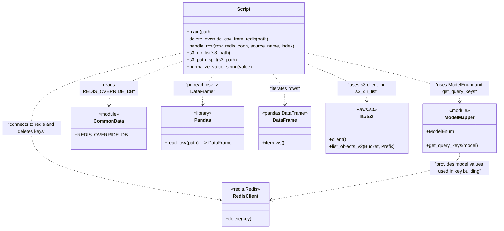

# Diagram: research/overrides/delete_overrides_from_redis.py


> Auto-generated by Obscura crawlers

## Diagram 1

```mermaid
flowchart LR
    Start([Start]) --> Input{override_csv_path type}
    Input -->|endswith .csv| SingleCSV[delete_override_csv_from_redis(csv)]
    Input -->|starts with s3| S3Dir[s3_dir_list(s3_path) -> for each csv_path]
    Input -->|is dir| LocalDir[iterate local directory -> for each csv_path]
    SingleCSV --> DeleteCSV[delete_override_csv_from_redis]
    S3Dir --> ForEachS3[for csv_path in s3_dir_list] --> DeleteCSV
    LocalDir --> ForEachLocal[for csv_path in os.listdir] --> DeleteCSV
    DeleteCSV --> ReadCSV[read CSV via pandas.read_csv -> DataFrame]
    ReadCSV --> SourceName[source_name = basename(file) without extension]
    ReadCSV --> RedisConnect[connect to redis.Redis(db=common_data.REDIS_OVERRIDE_DB)]
    RedisConnect --> IterateRows{for each row in df.iterrows()}
    IterateRows -->|success| HandleRowCall[handle_row(row, redis_conn, source_name, index)]
    IterateRows -->|exception| LogError[increment error counters and print traceback]
    HandleRowCall --> GetModel[get model_name from row and ModelEnum lookup]
    GetModel --> GetQueryKeys[get_query_keys(model)]
    GetQueryKeys --> NormalizeVals[normalize_value_string on query field values]
    NormalizeVals --> BuildKey[build redis_key string from model and field=value pairs]
    BuildKey --> RedisDelete[redis_conn.delete(redis_key) and log deletion]
    RedisDelete --> Counters[insert_count += 1; total_deletes += 1]
    LogError --> Counters
    Counters --> AfterLoop[check failure threshold: if insert_count==0 or (error_count/insert_count) > 0.05 -> raise Exception]
    AfterLoop --> End([End])
```

> SVG rendering failed for this diagram.

## Diagram 2



### SVG

<svg id="container" width="1667.671875" xmlns="http://www.w3.org/2000/svg" class="classDiagram" height="782" viewBox="0 0 1667.671875 782" role="graphics-document document" aria-roledescription="class"><style>#container{font-family:"trebuchet ms",verdana,arial,sans-serif;font-size:16px;fill:#333;}@keyframes edge-animation-frame{from{stroke-dashoffset:0;}}@keyframes dash{to{stroke-dashoffset:0;}}#container .edge-animation-slow{stroke-dasharray:9,5!important;stroke-dashoffset:900;animation:dash 50s linear infinite;stroke-linecap:round;}#container .edge-animation-fast{stroke-dasharray:9,5!important;stroke-dashoffset:900;animation:dash 20s linear infinite;stroke-linecap:round;}#container .error-icon{fill:#552222;}#container .error-text{fill:#552222;stroke:#552222;}#container .edge-thickness-normal{stroke-width:1px;}#container .edge-thickness-thick{stroke-width:3.5px;}#container .edge-pattern-solid{stroke-dasharray:0;}#container .edge-thickness-invisible{stroke-width:0;fill:none;}#container .edge-pattern-dashed{stroke-dasharray:3;}#container .edge-pattern-dotted{stroke-dasharray:2;}#container .marker{fill:#333333;stroke:#333333;}#container .marker.cross{stroke:#333333;}#container svg{font-family:"trebuchet ms",verdana,arial,sans-serif;font-size:16px;}#container p{margin:0;}#container g.classGroup text{fill:#9370DB;stroke:none;font-family:"trebuchet ms",verdana,arial,sans-serif;font-size:10px;}#container g.classGroup text .title{font-weight:bolder;}#container .nodeLabel,#container .edgeLabel{color:#131300;}#container .edgeLabel .label rect{fill:#ECECFF;}#container .label text{fill:#131300;}#container .labelBkg{background:#ECECFF;}#container .edgeLabel .label span{background:#ECECFF;}#container .classTitle{font-weight:bolder;}#container .node rect,#container .node circle,#container .node ellipse,#container .node polygon,#container .node path{fill:#ECECFF;stroke:#9370DB;stroke-width:1px;}#container .divider{stroke:#9370DB;stroke-width:1;}#container g.clickable{cursor:pointer;}#container g.classGroup rect{fill:#ECECFF;stroke:#9370DB;}#container g.classGroup line{stroke:#9370DB;stroke-width:1;}#container .classLabel .box{stroke:none;stroke-width:0;fill:#ECECFF;opacity:0.5;}#container .classLabel .label{fill:#9370DB;font-size:10px;}#container .relation{stroke:#333333;stroke-width:1;fill:none;}#container .dashed-line{stroke-dasharray:3;}#container .dotted-line{stroke-dasharray:1 2;}#container #compositionStart,#container .composition{fill:#333333!important;stroke:#333333!important;stroke-width:1;}#container #compositionEnd,#container .composition{fill:#333333!important;stroke:#333333!important;stroke-width:1;}#container #dependencyStart,#container .dependency{fill:#333333!important;stroke:#333333!important;stroke-width:1;}#container #dependencyStart,#container .dependency{fill:#333333!important;stroke:#333333!important;stroke-width:1;}#container #extensionStart,#container .extension{fill:transparent!important;stroke:#333333!important;stroke-width:1;}#container #extensionEnd,#container .extension{fill:transparent!important;stroke:#333333!important;stroke-width:1;}#container #aggregationStart,#container .aggregation{fill:transparent!important;stroke:#333333!important;stroke-width:1;}#container #aggregationEnd,#container .aggregation{fill:transparent!important;stroke:#333333!important;stroke-width:1;}#container #lollipopStart,#container .lollipop{fill:#ECECFF!important;stroke:#333333!important;stroke-width:1;}#container #lollipopEnd,#container .lollipop{fill:#ECECFF!important;stroke:#333333!important;stroke-width:1;}#container .edgeTerminals{font-size:11px;line-height:initial;}#container .classTitleText{text-anchor:middle;font-size:18px;fill:#333;}#container .label-icon{display:inline-block;height:1em;overflow:visible;vertical-align:-0.125em;}#container .node .label-icon path{fill:currentColor;stroke:revert;stroke-width:revert;}#container :root{--mermaid-font-family:"trebuchet ms",verdana,arial,sans-serif;}</style><g><defs><marker id="container_class-aggregationStart" class="marker aggregation class" refX="18" refY="7" markerWidth="190" markerHeight="240" orient="auto"><path d="M 18,7 L9,13 L1,7 L9,1 Z"></path></marker></defs><defs><marker id="container_class-aggregationEnd" class="marker aggregation class" refX="1" refY="7" markerWidth="20" markerHeight="28" orient="auto"><path d="M 18,7 L9,13 L1,7 L9,1 Z"></path></marker></defs><defs><marker id="container_class-extensionStart" class="marker extension class" refX="18" refY="7" markerWidth="190" markerHeight="240" orient="auto"><path d="M 1,7 L18,13 V 1 Z"></path></marker></defs><defs><marker id="container_class-extensionEnd" class="marker extension class" refX="1" refY="7" markerWidth="20" markerHeight="28" orient="auto"><path d="M 1,1 V 13 L18,7 Z"></path></marker></defs><defs><marker id="container_class-compositionStart" class="marker composition class" refX="18" refY="7" markerWidth="190" markerHeight="240" orient="auto"><path d="M 18,7 L9,13 L1,7 L9,1 Z"></path></marker></defs><defs><marker id="container_class-compositionEnd" class="marker composition class" refX="1" refY="7" markerWidth="20" markerHeight="28" orient="auto"><path d="M 18,7 L9,13 L1,7 L9,1 Z"></path></marker></defs><defs><marker id="container_class-dependencyStart" class="marker dependency class" refX="6" refY="7" markerWidth="190" markerHeight="240" orient="auto"><path d="M 5,7 L9,13 L1,7 L9,1 Z"></path></marker></defs><defs><marker id="container_class-dependencyEnd" class="marker dependency class" refX="13" refY="7" markerWidth="20" markerHeight="28" orient="auto"><path d="M 18,7 L9,13 L14,7 L9,1 Z"></path></marker></defs><defs><marker id="container_class-lollipopStart" class="marker lollipop class" refX="13" refY="7" markerWidth="190" markerHeight="240" orient="auto"><circle stroke="black" fill="transparent" cx="7" cy="7" r="6"></circle></marker></defs><defs><marker id="container_class-lollipopEnd" class="marker lollipop class" refX="1" refY="7" markerWidth="190" markerHeight="240" orient="auto"><circle stroke="black" fill="transparent" cx="7" cy="7" r="6"></circle></marker></defs><g class="root"><g class="clusters"></g><g class="edgePaths"><path d="M1009.115,179.67L1096.643,200.225C1184.171,220.78,1359.226,261.89,1446.754,290.112C1534.281,318.333,1534.281,333.667,1534.281,341.333L1534.281,349" id="id_Script_ModelMapper_1" class="edge-thickness-normal edge-pattern-dashed relation" style=";;;" data-edge="true" data-et="edge" data-id="id_Script_ModelMapper_1" data-points="W3sieCI6MTAwOS4xMTUyMzQzNzUsInkiOjE3OS42Njk3Njg5MzAyNTI0Mn0seyJ4IjoxNTM0LjI4MTI1LCJ5IjozMDN9LHsieCI6MTUzNC4yODEyNSwieSI6MzU1fV0=" marker-end="url(#container_class-dependencyEnd)"></path><path d="M594.623,211.284L555.164,226.57C515.704,241.856,436.786,272.428,397.326,297.381C357.867,322.333,357.867,341.667,357.867,351.333L357.867,361" id="id_Script_CommonData_2" class="edge-thickness-normal edge-pattern-dashed relation" style=";;;" data-edge="true" data-et="edge" data-id="id_Script_CommonData_2" data-points="W3sieCI6NTk0LjYyMzA0Njg3NSwieSI6MjExLjI4NDE2OTYzOTU5NzIyfSx7IngiOjM1Ny44NjcxODc1LCJ5IjozMDN9LHsieCI6MzU3Ljg2NzE4NzUsInkiOjM2N31d" marker-end="url(#container_class-dependencyEnd)"></path><path d="M702.279,254L695.667,262.167C689.055,270.333,675.83,286.667,669.218,304C662.605,321.333,662.605,339.667,662.605,348.833L662.605,358" id="id_Script_Pandas_3" class="edge-thickness-normal edge-pattern-dashed relation" style=";;;" data-edge="true" data-et="edge" data-id="id_Script_Pandas_3" data-points="W3sieCI6NzAyLjI3OTQyMTc4NDE1NywieSI6MjU0fSx7IngiOjY2Mi42MDU0Njg3NSwieSI6MzAzfSx7IngiOjY2Mi42MDU0Njg3NSwieSI6MzY0fV0=" marker-end="url(#container_class-dependencyEnd)"></path><path d="M901.459,254L908.071,262.167C914.684,270.333,927.908,286.667,934.52,304C941.133,321.333,941.133,339.667,941.133,348.833L941.133,358" id="id_Script_DataFrame_4" class="edge-thickness-normal edge-pattern-dashed relation" style=";;;" data-edge="true" data-et="edge" data-id="id_Script_DataFrame_4" data-points="W3sieCI6OTAxLjQ1ODg1OTQ2NTg0MywieSI6MjU0fSx7IngiOjk0MS4xMzI4MTI1LCJ5IjozMDN9LHsieCI6OTQxLjEzMjgxMjUsInkiOjM2NH1d" marker-end="url(#container_class-dependencyEnd)"></path><path d="M1009.115,216.386L1044.153,230.822C1079.19,245.258,1149.265,274.129,1184.302,295.731C1219.34,317.333,1219.34,331.667,1219.34,338.833L1219.34,346" id="id_Script_Boto3_5" class="edge-thickness-normal edge-pattern-dashed relation" style=";;;" data-edge="true" data-et="edge" data-id="id_Script_Boto3_5" data-points="W3sieCI6MTAwOS4xMTUyMzQzNzUsInkiOjIxNi4zODY0MTgzOTU3NTE5NX0seyJ4IjoxMjE5LjMzOTg0Mzc1LCJ5IjozMDN9LHsieCI6MTIxOS4zMzk4NDM3NSwieSI6MzUyfV0=" marker-end="url(#container_class-dependencyEnd)"></path><path d="M594.623,182.373L513.519,202.478C432.415,222.582,270.208,262.791,189.104,305.562C108,348.333,108,393.667,108,439C108,484.333,108,529.667,212.396,570.486C316.793,611.305,525.585,647.609,629.981,665.761L734.378,683.914" id="id_Script_RedisClient_6" class="edge-thickness-normal edge-pattern-dashed relation" style=";;;" data-edge="true" data-et="edge" data-id="id_Script_RedisClient_6" data-points="W3sieCI6NTk0LjYyMzA0Njg3NSwieSI6MTgyLjM3MzI3MjA0NTA1OTgyfSx7IngiOjEwOCwieSI6MzAzfSx7IngiOjEwOCwieSI6NDM5fSx7IngiOjEwOCwieSI6NTc1fSx7IngiOjc0MC4yODkwNjI1LCJ5Ijo2ODQuOTQxNjMxNDI3ODgyOH1d" marker-end="url(#container_class-dependencyEnd)"></path><path d="M1534.281,523L1534.281,531.667C1534.281,540.333,1534.281,557.667,1429.885,584.486C1325.489,611.305,1116.696,647.609,1012.3,665.761L907.903,683.914" id="id_ModelMapper_RedisClient_7" class="edge-thickness-normal edge-pattern-dashed relation" style=";;;" data-edge="true" data-et="edge" data-id="id_ModelMapper_RedisClient_7" data-points="W3sieCI6MTUzNC4yODEyNSwieSI6NTIzfSx7IngiOjE1MzQuMjgxMjUsInkiOjU3NX0seyJ4Ijo5MDEuOTkyMTg3NSwieSI6Njg0Ljk0MTYzMTQyNzg4Mjh9XQ==" marker-end="url(#container_class-dependencyEnd)"></path></g><g class="edgeLabels"><g class="edgeLabel" transform="translate(1534.28125, 303)"><g class="label" data-id="id_Script_ModelMapper_1" transform="translate(-100, -24)"><foreignObject width="200" height="48"><div xmlns="http://www.w3.org/1999/xhtml" class="labelBkg" style="display: table; white-space: break-spaces; line-height: 1.5; max-width: 200px; text-align: center; width: 200px;"><span class="edgeLabel"><p>"uses ModelEnum and get_query_keys"</p></span></div></foreignObject></g></g><g class="edgeLabel" transform="translate(357.8671875, 303)"><g class="label" data-id="id_Script_CommonData_2" transform="translate(-100, -24)"><foreignObject width="200" height="48"><div xmlns="http://www.w3.org/1999/xhtml" class="labelBkg" style="display: table; white-space: break-spaces; line-height: 1.5; max-width: 200px; text-align: center; width: 200px;"><span class="edgeLabel"><p>"reads REDIS_OVERRIDE_DB"</p></span></div></foreignObject></g></g><g class="edgeLabel" transform="translate(662.60546875, 303)"><g class="label" data-id="id_Script_Pandas_3" transform="translate(-99.484375, -12)"><foreignObject width="198.96875" height="24"><div xmlns="http://www.w3.org/1999/xhtml" class="labelBkg" style="display: table-cell; white-space: nowrap; line-height: 1.5; max-width: 200px; text-align: center;"><span class="edgeLabel"><p>"pd.read_csv -&gt; DataFrame"</p></span></div></foreignObject></g></g><g class="edgeLabel" transform="translate(941.1328125, 303)"><g class="label" data-id="id_Script_DataFrame_4" transform="translate(-52.7890625, -12)"><foreignObject width="105.578125" height="24"><div xmlns="http://www.w3.org/1999/xhtml" class="labelBkg" style="display: table-cell; white-space: nowrap; line-height: 1.5; max-width: 200px; text-align: center;"><span class="edgeLabel"><p>"iterates rows"</p></span></div></foreignObject></g></g><g class="edgeLabel" transform="translate(1219.33984375, 303)"><g class="label" data-id="id_Script_Boto3_5" transform="translate(-100, -24)"><foreignObject width="200" height="48"><div xmlns="http://www.w3.org/1999/xhtml" class="labelBkg" style="display: table; white-space: break-spaces; line-height: 1.5; max-width: 200px; text-align: center; width: 200px;"><span class="edgeLabel"><p>"uses s3 client for s3_dir_list"</p></span></div></foreignObject></g></g><g class="edgeLabel" transform="translate(108, 439)"><g class="label" data-id="id_Script_RedisClient_6" transform="translate(-100, -24)"><foreignObject width="200" height="48"><div xmlns="http://www.w3.org/1999/xhtml" class="labelBkg" style="display: table; white-space: break-spaces; line-height: 1.5; max-width: 200px; text-align: center; width: 200px;"><span class="edgeLabel"><p>"connects to redis and deletes keys"</p></span></div></foreignObject></g></g><g class="edgeLabel" transform="translate(1534.28125, 575)"><g class="label" data-id="id_ModelMapper_RedisClient_7" transform="translate(-100, -24)"><foreignObject width="200" height="48"><div xmlns="http://www.w3.org/1999/xhtml" class="labelBkg" style="display: table; white-space: break-spaces; line-height: 1.5; max-width: 200px; text-align: center; width: 200px;"><span class="edgeLabel"><p>"provides model values used in key building"</p></span></div></foreignObject></g></g></g><g class="nodes"><g class="node default" id="classId-Script-0" transform="translate(801.869140625, 131)"><g class="basic label-container"><path d="M-207.24609375 -123 L207.24609375 -123 L207.24609375 123 L-207.24609375 123" stroke="none" stroke-width="0" fill="#ECECFF" style=""></path><path d="M-207.24609375 -123 C-63.801083303954925 -123, 79.64392714209015 -123, 207.24609375 -123 M-207.24609375 -123 C-79.4020392061956 -123, 48.44201533760881 -123, 207.24609375 -123 M207.24609375 -123 C207.24609375 -44.0223370073077, 207.24609375 34.955325985384604, 207.24609375 123 M207.24609375 -123 C207.24609375 -67.14167406016904, 207.24609375 -11.28334812033809, 207.24609375 123 M207.24609375 123 C45.69690747107262 123, -115.85227880785476 123, -207.24609375 123 M207.24609375 123 C47.88531079095239 123, -111.47547216809522 123, -207.24609375 123 M-207.24609375 123 C-207.24609375 34.41957214397283, -207.24609375 -54.16085571205434, -207.24609375 -123 M-207.24609375 123 C-207.24609375 68.83984028428466, -207.24609375 14.67968056856931, -207.24609375 -123" stroke="#9370DB" stroke-width="1.3" fill="none" stroke-dasharray="0 0" style=""></path></g><g class="annotation-group text" transform="translate(0, -99)"></g><g class="label-group text" transform="translate(-21.7421875, -99)"><g class="label" style="font-weight: bolder" transform="translate(0,-12)"><foreignObject width="43.484375" height="24"><div xmlns="http://www.w3.org/1999/xhtml" style="display: table-cell; white-space: nowrap; line-height: 1.5; max-width: 93px; text-align: center;"><span class="nodeLabel markdown-node-label" style=""><p>Script</p></span></div></foreignObject></g></g><g class="members-group text" transform="translate(-195.24609375, -51)"></g><g class="methods-group text" transform="translate(-195.24609375, -21)"><g class="label" style="" transform="translate(0,-12)"><foreignObject width="87.859375" height="24"><div xmlns="http://www.w3.org/1999/xhtml" style="display: table-cell; white-space: nowrap; line-height: 1.5; max-width: 145px; text-align: center;"><span class="nodeLabel markdown-node-label" style=""><p>+main(path)</p></span></div></foreignObject></g><g class="label" style="" transform="translate(0,12)"><foreignObject width="282.390625" height="24"><div xmlns="http://www.w3.org/1999/xhtml" style="display: table-cell; white-space: nowrap; line-height: 1.5; max-width: 340px; text-align: center;"><span class="nodeLabel markdown-node-label" style=""><p>+delete_override_csv_from_redis(path)</p></span></div></foreignObject></g><g class="label" style="" transform="translate(0,36)"><foreignObject width="368.75" height="24"><div xmlns="http://www.w3.org/1999/xhtml" style="display: table-cell; white-space: nowrap; line-height: 1.5; max-width: 426px; text-align: center;"><span class="nodeLabel markdown-node-label" style=""><p>+handle_row(row, redis_conn, source_name, index)</p></span></div></foreignObject></g><g class="label" style="" transform="translate(0,60)"><foreignObject width="147.734375" height="24"><div xmlns="http://www.w3.org/1999/xhtml" style="display: table-cell; white-space: nowrap; line-height: 1.5; max-width: 205px; text-align: center;"><span class="nodeLabel markdown-node-label" style=""><p>+s3_dir_list(s3_path)</p></span></div></foreignObject></g><g class="label" style="" transform="translate(0,84)"><foreignObject width="171.9375" height="24"><div xmlns="http://www.w3.org/1999/xhtml" style="display: table-cell; white-space: nowrap; line-height: 1.5; max-width: 229px; text-align: center;"><span class="nodeLabel markdown-node-label" style=""><p>+s3_path_split(s3_path)</p></span></div></foreignObject></g><g class="label" style="" transform="translate(0,108)"><foreignObject width="225.21875" height="24"><div xmlns="http://www.w3.org/1999/xhtml" style="display: table-cell; white-space: nowrap; line-height: 1.5; max-width: 283px; text-align: center;"><span class="nodeLabel markdown-node-label" style=""><p>+normalize_value_string(value)</p></span></div></foreignObject></g></g><g class="divider" style=""><path d="M-207.24609375 -75 C-84.74005060677392 -75, 37.76599253645216 -75, 207.24609375 -75 M-207.24609375 -75 C-91.95129814909147 -75, 23.343497451817058 -75, 207.24609375 -75" stroke="#9370DB" stroke-width="1.3" fill="none" stroke-dasharray="0 0" style=""></path></g><g class="divider" style=""><path d="M-207.24609375 -51 C-69.31633885509436 -51, 68.61341603981128 -51, 207.24609375 -51 M-207.24609375 -51 C-123.97563869018262 -51, -40.70518363036524 -51, 207.24609375 -51" stroke="#9370DB" stroke-width="1.3" fill="none" stroke-dasharray="0 0" style=""></path></g></g><g class="node default" id="classId-ModelMapper-1" transform="translate(1534.28125, 439)"><g class="basic label-container"><path d="M-125.390625 -84 L125.390625 -84 L125.390625 84 L-125.390625 84" stroke="none" stroke-width="0" fill="#ECECFF" style=""></path><path d="M-125.390625 -84 C-68.34651660172545 -84, -11.30240820345091 -84, 125.390625 -84 M-125.390625 -84 C-56.23589318832599 -84, 12.918838623348023 -84, 125.390625 -84 M125.390625 -84 C125.390625 -39.20705750099044, 125.390625 5.585884998019125, 125.390625 84 M125.390625 -84 C125.390625 -33.985596268895705, 125.390625 16.02880746220859, 125.390625 84 M125.390625 84 C31.578292719175664 84, -62.23403956164867 84, -125.390625 84 M125.390625 84 C43.274919174725966 84, -38.84078665054807 84, -125.390625 84 M-125.390625 84 C-125.390625 42.51773125089503, -125.390625 1.0354625017900645, -125.390625 -84 M-125.390625 84 C-125.390625 33.98585589140842, -125.390625 -16.02828821718316, -125.390625 -84" stroke="#9370DB" stroke-width="1.3" fill="none" stroke-dasharray="0 0" style=""></path></g><g class="annotation-group text" transform="translate(-36.6015625, -60)"><g class="label" style="" transform="translate(0,-12)"><foreignObject width="73.203125" height="24"><div xmlns="http://www.w3.org/1999/xhtml" style="display: table-cell; white-space: nowrap; line-height: 1.5; max-width: 123px; text-align: center;"><span class="nodeLabel markdown-node-label" style=""><p>«module»</p></span></div></foreignObject></g></g><g class="label-group text" transform="translate(-50.40625, -36)"><g class="label" style="font-weight: bolder" transform="translate(0,-12)"><foreignObject width="100.8125" height="24"><div xmlns="http://www.w3.org/1999/xhtml" style="display: table-cell; white-space: nowrap; line-height: 1.5; max-width: 151px; text-align: center;"><span class="nodeLabel markdown-node-label" style=""><p>ModelMapper</p></span></div></foreignObject></g></g><g class="members-group text" transform="translate(-113.390625, 12)"><g class="label" style="" transform="translate(0,-12)"><foreignObject width="93.5625" height="24"><div xmlns="http://www.w3.org/1999/xhtml" style="display: table-cell; white-space: nowrap; line-height: 1.5; max-width: 151px; text-align: center;"><span class="nodeLabel markdown-node-label" style=""><p>+ModelEnum</p></span></div></foreignObject></g></g><g class="methods-group text" transform="translate(-113.390625, 60)"><g class="label" style="" transform="translate(0,-12)"><foreignObject width="176.375" height="24"><div xmlns="http://www.w3.org/1999/xhtml" style="display: table-cell; white-space: nowrap; line-height: 1.5; max-width: 234px; text-align: center;"><span class="nodeLabel markdown-node-label" style=""><p>+get_query_keys(model)</p></span></div></foreignObject></g></g><g class="divider" style=""><path d="M-125.390625 -12 C-39.63018301343956 -12, 46.130258973120874 -12, 125.390625 -12 M-125.390625 -12 C-48.61584850064874 -12, 28.158927998702524 -12, 125.390625 -12" stroke="#9370DB" stroke-width="1.3" fill="none" stroke-dasharray="0 0" style=""></path></g><g class="divider" style=""><path d="M-125.390625 36 C-27.21282790242205 36, 70.9649691951559 36, 125.390625 36 M-125.390625 36 C-25.7310890163821 36, 73.9284469672358 36, 125.390625 36" stroke="#9370DB" stroke-width="1.3" fill="none" stroke-dasharray="0 0" style=""></path></g></g><g class="node default" id="classId-CommonData-2" transform="translate(357.8671875, 439)"><g class="basic label-container"><path d="M-114.8671875 -72 L114.8671875 -72 L114.8671875 72 L-114.8671875 72" stroke="none" stroke-width="0" fill="#ECECFF" style=""></path><path d="M-114.8671875 -72 C-58.33147917668844 -72, -1.7957708533768795 -72, 114.8671875 -72 M-114.8671875 -72 C-55.675392382949255 -72, 3.51640273410149 -72, 114.8671875 -72 M114.8671875 -72 C114.8671875 -30.25629085182937, 114.8671875 11.48741829634126, 114.8671875 72 M114.8671875 -72 C114.8671875 -36.51421794071916, 114.8671875 -1.0284358814383268, 114.8671875 72 M114.8671875 72 C52.98291541934847 72, -8.901356661303055 72, -114.8671875 72 M114.8671875 72 C35.86373369655894 72, -43.13972010688212 72, -114.8671875 72 M-114.8671875 72 C-114.8671875 25.09445600420318, -114.8671875 -21.811087991593638, -114.8671875 -72 M-114.8671875 72 C-114.8671875 29.810021704080874, -114.8671875 -12.379956591838251, -114.8671875 -72" stroke="#9370DB" stroke-width="1.3" fill="none" stroke-dasharray="0 0" style=""></path></g><g class="annotation-group text" transform="translate(-36.6015625, -48)"><g class="label" style="" transform="translate(0,-12)"><foreignObject width="73.203125" height="24"><div xmlns="http://www.w3.org/1999/xhtml" style="display: table-cell; white-space: nowrap; line-height: 1.5; max-width: 123px; text-align: center;"><span class="nodeLabel markdown-node-label" style=""><p>«module»</p></span></div></foreignObject></g></g><g class="label-group text" transform="translate(-48.8125, -24)"><g class="label" style="font-weight: bolder" transform="translate(0,-12)"><foreignObject width="97.625" height="24"><div xmlns="http://www.w3.org/1999/xhtml" style="display: table-cell; white-space: nowrap; line-height: 1.5; max-width: 147px; text-align: center;"><span class="nodeLabel markdown-node-label" style=""><p>CommonData</p></span></div></foreignObject></g></g><g class="members-group text" transform="translate(-102.8671875, 24)"><g class="label" style="" transform="translate(0,-12)"><foreignObject width="156.921875" height="24"><div xmlns="http://www.w3.org/1999/xhtml" style="display: table-cell; white-space: nowrap; line-height: 1.5; max-width: 215px; text-align: center;"><span class="nodeLabel markdown-node-label" style=""><p>+REDIS_OVERRIDE_DB</p></span></div></foreignObject></g></g><g class="methods-group text" transform="translate(-102.8671875, 72)"></g><g class="divider" style=""><path d="M-114.8671875 0 C-41.43085462784727 0, 32.005478244305465 0, 114.8671875 0 M-114.8671875 0 C-59.57093272489388 0, -4.274677949787758 0, 114.8671875 0" stroke="#9370DB" stroke-width="1.3" fill="none" stroke-dasharray="0 0" style=""></path></g><g class="divider" style=""><path d="M-114.8671875 48 C-61.521545115064406 48, -8.175902730128811 48, 114.8671875 48 M-114.8671875 48 C-46.7608008233518 48, 21.3455858532964 48, 114.8671875 48" stroke="#9370DB" stroke-width="1.3" fill="none" stroke-dasharray="0 0" style=""></path></g></g><g class="node default" id="classId-Pandas-3" transform="translate(662.60546875, 439)"><g class="basic label-container"><path d="M-139.87109375 -75 L139.87109375 -75 L139.87109375 75 L-139.87109375 75" stroke="none" stroke-width="0" fill="#ECECFF" style=""></path><path d="M-139.87109375 -75 C-50.07712580799061 -75, 39.716842134018776 -75, 139.87109375 -75 M-139.87109375 -75 C-44.148654848060914 -75, 51.57378405387817 -75, 139.87109375 -75 M139.87109375 -75 C139.87109375 -23.848891631801095, 139.87109375 27.30221673639781, 139.87109375 75 M139.87109375 -75 C139.87109375 -36.103688430862945, 139.87109375 2.7926231382741094, 139.87109375 75 M139.87109375 75 C62.67716229991953 75, -14.51676915016094 75, -139.87109375 75 M139.87109375 75 C73.93966341076622 75, 8.00823307153243 75, -139.87109375 75 M-139.87109375 75 C-139.87109375 32.53639706949949, -139.87109375 -9.927205861001013, -139.87109375 -75 M-139.87109375 75 C-139.87109375 38.396211645321245, -139.87109375 1.792423290642489, -139.87109375 -75" stroke="#9370DB" stroke-width="1.3" fill="none" stroke-dasharray="0 0" style=""></path></g><g class="annotation-group text" transform="translate(-32.6640625, -51)"><g class="label" style="" transform="translate(0,-12)"><foreignObject width="65.328125" height="24"><div xmlns="http://www.w3.org/1999/xhtml" style="display: table-cell; white-space: nowrap; line-height: 1.5; max-width: 115px; text-align: center;"><span class="nodeLabel markdown-node-label" style=""><p>«library»</p></span></div></foreignObject></g></g><g class="label-group text" transform="translate(-26.359375, -27)"><g class="label" style="font-weight: bolder" transform="translate(0,-12)"><foreignObject width="52.71875" height="24"><div xmlns="http://www.w3.org/1999/xhtml" style="display: table-cell; white-space: nowrap; line-height: 1.5; max-width: 102px; text-align: center;"><span class="nodeLabel markdown-node-label" style=""><p>Pandas</p></span></div></foreignObject></g></g><g class="members-group text" transform="translate(-127.87109375, 21)"></g><g class="methods-group text" transform="translate(-127.87109375, 51)"><g class="label" style="" transform="translate(0,-12)"><foreignObject width="223.078125" height="24"><div xmlns="http://www.w3.org/1999/xhtml" style="display: table-cell; white-space: nowrap; line-height: 1.5; max-width: 302px; text-align: center;"><span class="nodeLabel markdown-node-label" style=""><p>+read_csv(path) : -&gt; DataFrame</p></span></div></foreignObject></g></g><g class="divider" style=""><path d="M-139.87109375 -3 C-38.608687843494536 -3, 62.65371806301093 -3, 139.87109375 -3 M-139.87109375 -3 C-47.5490275529755 -3, 44.773038644048995 -3, 139.87109375 -3" stroke="#9370DB" stroke-width="1.3" fill="none" stroke-dasharray="0 0" style=""></path></g><g class="divider" style=""><path d="M-139.87109375 21 C-70.74840263529946 21, -1.6257115205989123 21, 139.87109375 21 M-139.87109375 21 C-35.543450561464795 21, 68.78419262707041 21, 139.87109375 21" stroke="#9370DB" stroke-width="1.3" fill="none" stroke-dasharray="0 0" style=""></path></g></g><g class="node default" id="classId-DataFrame-4" transform="translate(941.1328125, 439)"><g class="basic label-container"><path d="M-88.65625 -75 L88.65625 -75 L88.65625 75 L-88.65625 75" stroke="none" stroke-width="0" fill="#ECECFF" style=""></path><path d="M-88.65625 -75 C-33.806989338576365 -75, 21.04227132284727 -75, 88.65625 -75 M-88.65625 -75 C-51.09569815396065 -75, -13.535146307921295 -75, 88.65625 -75 M88.65625 -75 C88.65625 -29.37803700895349, 88.65625 16.243925982093018, 88.65625 75 M88.65625 -75 C88.65625 -38.537009631579636, 88.65625 -2.074019263159272, 88.65625 75 M88.65625 75 C20.288495040921035 75, -48.07925991815793 75, -88.65625 75 M88.65625 75 C19.036368855723893 75, -50.583512288552214 75, -88.65625 75 M-88.65625 75 C-88.65625 21.853973515608807, -88.65625 -31.292052968782386, -88.65625 -75 M-88.65625 75 C-88.65625 22.010204381942053, -88.65625 -30.979591236115894, -88.65625 -75" stroke="#9370DB" stroke-width="1.3" fill="none" stroke-dasharray="0 0" style=""></path></g><g class="annotation-group text" transform="translate(-76.03125, -51)"><g class="label" style="" transform="translate(0,-12)"><foreignObject width="152.0625" height="24"><div xmlns="http://www.w3.org/1999/xhtml" style="display: table-cell; white-space: nowrap; line-height: 1.5; max-width: 202px; text-align: center;"><span class="nodeLabel markdown-node-label" style=""><p>«pandas.DataFrame»</p></span></div></foreignObject></g></g><g class="label-group text" transform="translate(-38.9921875, -27)"><g class="label" style="font-weight: bolder" transform="translate(0,-12)"><foreignObject width="77.984375" height="24"><div xmlns="http://www.w3.org/1999/xhtml" style="display: table-cell; white-space: nowrap; line-height: 1.5; max-width: 127px; text-align: center;"><span class="nodeLabel markdown-node-label" style=""><p>DataFrame</p></span></div></foreignObject></g></g><g class="members-group text" transform="translate(-76.65625, 21)"></g><g class="methods-group text" transform="translate(-76.65625, 51)"><g class="label" style="" transform="translate(0,-12)"><foreignObject width="77.28125" height="24"><div xmlns="http://www.w3.org/1999/xhtml" style="display: table-cell; white-space: nowrap; line-height: 1.5; max-width: 135px; text-align: center;"><span class="nodeLabel markdown-node-label" style=""><p>+iterrows()</p></span></div></foreignObject></g></g><g class="divider" style=""><path d="M-88.65625 -3 C-27.420364070662536 -3, 33.81552185867493 -3, 88.65625 -3 M-88.65625 -3 C-42.589313385313794 -3, 3.477623229372412 -3, 88.65625 -3" stroke="#9370DB" stroke-width="1.3" fill="none" stroke-dasharray="0 0" style=""></path></g><g class="divider" style=""><path d="M-88.65625 21 C-31.73549600405508 21, 25.18525799188984 21, 88.65625 21 M-88.65625 21 C-32.65631715155934 21, 23.343615696881315 21, 88.65625 21" stroke="#9370DB" stroke-width="1.3" fill="none" stroke-dasharray="0 0" style=""></path></g></g><g class="node default" id="classId-Boto3-5" transform="translate(1219.33984375, 439)"><g class="basic label-container"><path d="M-139.55078125 -87 L139.55078125 -87 L139.55078125 87 L-139.55078125 87" stroke="none" stroke-width="0" fill="#ECECFF" style=""></path><path d="M-139.55078125 -87 C-34.32343986471662 -87, 70.90390152056676 -87, 139.55078125 -87 M-139.55078125 -87 C-58.27565742401481 -87, 22.99946640197038 -87, 139.55078125 -87 M139.55078125 -87 C139.55078125 -39.04645929055001, 139.55078125 8.907081418899978, 139.55078125 87 M139.55078125 -87 C139.55078125 -20.889593423206236, 139.55078125 45.22081315358753, 139.55078125 87 M139.55078125 87 C63.898914585332236 87, -11.752952079335529 87, -139.55078125 87 M139.55078125 87 C44.89205932563567 87, -49.76666259872866 87, -139.55078125 87 M-139.55078125 87 C-139.55078125 38.915074225913216, -139.55078125 -9.169851548173568, -139.55078125 -87 M-139.55078125 87 C-139.55078125 27.73132301764432, -139.55078125 -31.537353964711357, -139.55078125 -87" stroke="#9370DB" stroke-width="1.3" fill="none" stroke-dasharray="0 0" style=""></path></g><g class="annotation-group text" transform="translate(-32.4765625, -63)"><g class="label" style="" transform="translate(0,-12)"><foreignObject width="64.953125" height="24"><div xmlns="http://www.w3.org/1999/xhtml" style="display: table-cell; white-space: nowrap; line-height: 1.5; max-width: 115px; text-align: center;"><span class="nodeLabel markdown-node-label" style=""><p>«aws.s3»</p></span></div></foreignObject></g></g><g class="label-group text" transform="translate(-21.2265625, -39)"><g class="label" style="font-weight: bolder" transform="translate(0,-12)"><foreignObject width="42.453125" height="24"><div xmlns="http://www.w3.org/1999/xhtml" style="display: table-cell; white-space: nowrap; line-height: 1.5; max-width: 92px; text-align: center;"><span class="nodeLabel markdown-node-label" style=""><p>Boto3</p></span></div></foreignObject></g></g><g class="members-group text" transform="translate(-127.55078125, 9)"></g><g class="methods-group text" transform="translate(-127.55078125, 39)"><g class="label" style="" transform="translate(0,-12)"><foreignObject width="59.078125" height="24"><div xmlns="http://www.w3.org/1999/xhtml" style="display: table-cell; white-space: nowrap; line-height: 1.5; max-width: 116px; text-align: center;"><span class="nodeLabel markdown-node-label" style=""><p>+client()</p></span></div></foreignObject></g><g class="label" style="" transform="translate(0,12)"><foreignObject width="222.625" height="24"><div xmlns="http://www.w3.org/1999/xhtml" style="display: table-cell; white-space: nowrap; line-height: 1.5; max-width: 280px; text-align: center;"><span class="nodeLabel markdown-node-label" style=""><p>+list_objects_v2(Bucket, Prefix)</p></span></div></foreignObject></g></g><g class="divider" style=""><path d="M-139.55078125 -15 C-82.69477192266237 -15, -25.838762595324724 -15, 139.55078125 -15 M-139.55078125 -15 C-28.711746287838224 -15, 82.12728867432355 -15, 139.55078125 -15" stroke="#9370DB" stroke-width="1.3" fill="none" stroke-dasharray="0 0" style=""></path></g><g class="divider" style=""><path d="M-139.55078125 9 C-78.34236744096697 9, -17.133953631933935 9, 139.55078125 9 M-139.55078125 9 C-45.65655497138134 9, 48.23767130723732 9, 139.55078125 9" stroke="#9370DB" stroke-width="1.3" fill="none" stroke-dasharray="0 0" style=""></path></g></g><g class="node default" id="classId-RedisClient-6" transform="translate(821.140625, 699)"><g class="basic label-container"><path d="M-80.8515625 -75 L80.8515625 -75 L80.8515625 75 L-80.8515625 75" stroke="none" stroke-width="0" fill="#ECECFF" style=""></path><path d="M-80.8515625 -75 C-22.86906290574752 -75, 35.11343668850496 -75, 80.8515625 -75 M-80.8515625 -75 C-31.188531059389668 -75, 18.474500381220665 -75, 80.8515625 -75 M80.8515625 -75 C80.8515625 -15.167789241554246, 80.8515625 44.66442151689151, 80.8515625 75 M80.8515625 -75 C80.8515625 -36.88836513871885, 80.8515625 1.223269722562307, 80.8515625 75 M80.8515625 75 C48.332164849847054 75, 15.812767199694107 75, -80.8515625 75 M80.8515625 75 C29.539012304569127 75, -21.773537890861746 75, -80.8515625 75 M-80.8515625 75 C-80.8515625 19.54122580322381, -80.8515625 -35.91754839355238, -80.8515625 -75 M-80.8515625 75 C-80.8515625 31.448013195688148, -80.8515625 -12.103973608623704, -80.8515625 -75" stroke="#9370DB" stroke-width="1.3" fill="none" stroke-dasharray="0 0" style=""></path></g><g class="annotation-group text" transform="translate(-48.890625, -51)"><g class="label" style="" transform="translate(0,-12)"><foreignObject width="97.78125" height="24"><div xmlns="http://www.w3.org/1999/xhtml" style="display: table-cell; white-space: nowrap; line-height: 1.5; max-width: 148px; text-align: center;"><span class="nodeLabel markdown-node-label" style=""><p>«redis.Redis»</p></span></div></foreignObject></g></g><g class="label-group text" transform="translate(-41.4296875, -27)"><g class="label" style="font-weight: bolder" transform="translate(0,-12)"><foreignObject width="82.859375" height="24"><div xmlns="http://www.w3.org/1999/xhtml" style="display: table-cell; white-space: nowrap; line-height: 1.5; max-width: 132px; text-align: center;"><span class="nodeLabel markdown-node-label" style=""><p>RedisClient</p></span></div></foreignObject></g></g><g class="members-group text" transform="translate(-68.8515625, 21)"></g><g class="methods-group text" transform="translate(-68.8515625, 51)"><g class="label" style="" transform="translate(0,-12)"><foreignObject width="88.8125" height="24"><div xmlns="http://www.w3.org/1999/xhtml" style="display: table-cell; white-space: nowrap; line-height: 1.5; max-width: 146px; text-align: center;"><span class="nodeLabel markdown-node-label" style=""><p>+delete(key)</p></span></div></foreignObject></g></g><g class="divider" style=""><path d="M-80.8515625 -3 C-23.24270519841253 -3, 34.36615210317494 -3, 80.8515625 -3 M-80.8515625 -3 C-33.220137436193305 -3, 14.41128762761339 -3, 80.8515625 -3" stroke="#9370DB" stroke-width="1.3" fill="none" stroke-dasharray="0 0" style=""></path></g><g class="divider" style=""><path d="M-80.8515625 21 C-32.45691172560827 21, 15.937739048783456 21, 80.8515625 21 M-80.8515625 21 C-45.14719787470245 21, -9.442833249404899 21, 80.8515625 21" stroke="#9370DB" stroke-width="1.3" fill="none" stroke-dasharray="0 0" style=""></path></g></g></g></g></g></svg>
