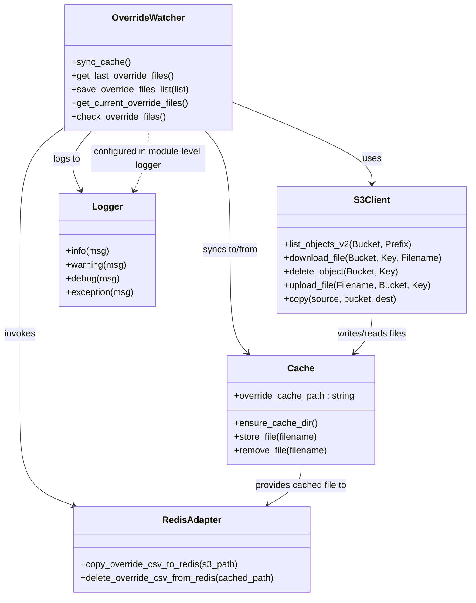

# Diagram: research/overrides/override_watcher.py


> Auto-generated by Obscura crawlers

## Diagram 1

```mermaid
flowchart TD
    Start[Start] --> SyncCache[sync_cache()]
    SyncCache --> GetLast[get_last_override_files()]
    SyncCache --> GetCurrent[get_current_override_files()]
    GetLast --> Compute[Compute added / deleted sets]
    GetCurrent --> Compute
    Compute --> Added{added?}
    Compute --> Deleted{deleted?}
    Added -->|yes| ForEachAdd[For each added file]
    ForEachAdd --> CopyFunc[copy_override_csv_to_redis(s3://.../<file>)]
    CopyFunc --> AddSuccess[Overrides added]
    CopyFunc -->|exception| AddFail[Error running override]
    AddFail --> RemoveFromCurrent[remove filename from current_overrides]
    RemoveFromCurrent --> MoveFailed[move_s3_file(bucket, active_overrides/<file>, failed_overrides/<file>)]
    MoveFailed --> WriteError[write_string_to_s3(failed_overrides/<error_file>, error_msg)]
    Deleted -->|yes| ForEachDel[For each deleted file]
    ForEachDel --> CachedPath[get cached_override_path]
    CachedPath --> DeleteFunc[delete_override_csv_from_redis(cached_override_path)]
    DeleteFunc --> DelSuccess[Overrides deleted]
    DelSuccess --> UploadDeleted[s3.meta.client.upload_file(cached_override_path, s3_bucket, deleted_overrides/<file>)]
    UploadDeleted --> RemoveCache[os.remove(cached_override_path)]
    Added -->|no| CheckDeleted1
    Deleted -->|no| CheckAdded1
    CheckAdded1 --> CheckBoth[If no added and no deleted]
    CheckDeleted1 --> CheckBoth
    CheckBoth --> NoChange[Log "No changes detected"]
    AddSuccess --> Save[save_override_files_list(current_overrides)]
    RemoveCache --> Save
    NoChange --> Save
    Save --> End[End]
```

> SVG rendering failed for this diagram.

## Diagram 2



### SVG

<svg id="container" width="830.2890625" xmlns="http://www.w3.org/2000/svg" class="classDiagram" height="1048" viewBox="0 0 830.2890625 1048" role="graphics-document document" aria-roledescription="class"><style>#container{font-family:"trebuchet ms",verdana,arial,sans-serif;font-size:16px;fill:#333;}@keyframes edge-animation-frame{from{stroke-dashoffset:0;}}@keyframes dash{to{stroke-dashoffset:0;}}#container .edge-animation-slow{stroke-dasharray:9,5!important;stroke-dashoffset:900;animation:dash 50s linear infinite;stroke-linecap:round;}#container .edge-animation-fast{stroke-dasharray:9,5!important;stroke-dashoffset:900;animation:dash 20s linear infinite;stroke-linecap:round;}#container .error-icon{fill:#552222;}#container .error-text{fill:#552222;stroke:#552222;}#container .edge-thickness-normal{stroke-width:1px;}#container .edge-thickness-thick{stroke-width:3.5px;}#container .edge-pattern-solid{stroke-dasharray:0;}#container .edge-thickness-invisible{stroke-width:0;fill:none;}#container .edge-pattern-dashed{stroke-dasharray:3;}#container .edge-pattern-dotted{stroke-dasharray:2;}#container .marker{fill:#333333;stroke:#333333;}#container .marker.cross{stroke:#333333;}#container svg{font-family:"trebuchet ms",verdana,arial,sans-serif;font-size:16px;}#container p{margin:0;}#container g.classGroup text{fill:#9370DB;stroke:none;font-family:"trebuchet ms",verdana,arial,sans-serif;font-size:10px;}#container g.classGroup text .title{font-weight:bolder;}#container .nodeLabel,#container .edgeLabel{color:#131300;}#container .edgeLabel .label rect{fill:#ECECFF;}#container .label text{fill:#131300;}#container .labelBkg{background:#ECECFF;}#container .edgeLabel .label span{background:#ECECFF;}#container .classTitle{font-weight:bolder;}#container .node rect,#container .node circle,#container .node ellipse,#container .node polygon,#container .node path{fill:#ECECFF;stroke:#9370DB;stroke-width:1px;}#container .divider{stroke:#9370DB;stroke-width:1;}#container g.clickable{cursor:pointer;}#container g.classGroup rect{fill:#ECECFF;stroke:#9370DB;}#container g.classGroup line{stroke:#9370DB;stroke-width:1;}#container .classLabel .box{stroke:none;stroke-width:0;fill:#ECECFF;opacity:0.5;}#container .classLabel .label{fill:#9370DB;font-size:10px;}#container .relation{stroke:#333333;stroke-width:1;fill:none;}#container .dashed-line{stroke-dasharray:3;}#container .dotted-line{stroke-dasharray:1 2;}#container #compositionStart,#container .composition{fill:#333333!important;stroke:#333333!important;stroke-width:1;}#container #compositionEnd,#container .composition{fill:#333333!important;stroke:#333333!important;stroke-width:1;}#container #dependencyStart,#container .dependency{fill:#333333!important;stroke:#333333!important;stroke-width:1;}#container #dependencyStart,#container .dependency{fill:#333333!important;stroke:#333333!important;stroke-width:1;}#container #extensionStart,#container .extension{fill:transparent!important;stroke:#333333!important;stroke-width:1;}#container #extensionEnd,#container .extension{fill:transparent!important;stroke:#333333!important;stroke-width:1;}#container #aggregationStart,#container .aggregation{fill:transparent!important;stroke:#333333!important;stroke-width:1;}#container #aggregationEnd,#container .aggregation{fill:transparent!important;stroke:#333333!important;stroke-width:1;}#container #lollipopStart,#container .lollipop{fill:#ECECFF!important;stroke:#333333!important;stroke-width:1;}#container #lollipopEnd,#container .lollipop{fill:#ECECFF!important;stroke:#333333!important;stroke-width:1;}#container .edgeTerminals{font-size:11px;line-height:initial;}#container .classTitleText{text-anchor:middle;font-size:18px;fill:#333;}#container .label-icon{display:inline-block;height:1em;overflow:visible;vertical-align:-0.125em;}#container .node .label-icon path{fill:currentColor;stroke:revert;stroke-width:revert;}#container :root{--mermaid-font-family:"trebuchet ms",verdana,arial,sans-serif;}</style><g><defs><marker id="container_class-aggregationStart" class="marker aggregation class" refX="18" refY="7" markerWidth="190" markerHeight="240" orient="auto"><path d="M 18,7 L9,13 L1,7 L9,1 Z"></path></marker></defs><defs><marker id="container_class-aggregationEnd" class="marker aggregation class" refX="1" refY="7" markerWidth="20" markerHeight="28" orient="auto"><path d="M 18,7 L9,13 L1,7 L9,1 Z"></path></marker></defs><defs><marker id="container_class-extensionStart" class="marker extension class" refX="18" refY="7" markerWidth="190" markerHeight="240" orient="auto"><path d="M 1,7 L18,13 V 1 Z"></path></marker></defs><defs><marker id="container_class-extensionEnd" class="marker extension class" refX="1" refY="7" markerWidth="20" markerHeight="28" orient="auto"><path d="M 1,1 V 13 L18,7 Z"></path></marker></defs><defs><marker id="container_class-compositionStart" class="marker composition class" refX="18" refY="7" markerWidth="190" markerHeight="240" orient="auto"><path d="M 18,7 L9,13 L1,7 L9,1 Z"></path></marker></defs><defs><marker id="container_class-compositionEnd" class="marker composition class" refX="1" refY="7" markerWidth="20" markerHeight="28" orient="auto"><path d="M 18,7 L9,13 L1,7 L9,1 Z"></path></marker></defs><defs><marker id="container_class-dependencyStart" class="marker dependency class" refX="6" refY="7" markerWidth="190" markerHeight="240" orient="auto"><path d="M 5,7 L9,13 L1,7 L9,1 Z"></path></marker></defs><defs><marker id="container_class-dependencyEnd" class="marker dependency class" refX="13" refY="7" markerWidth="20" markerHeight="28" orient="auto"><path d="M 18,7 L9,13 L14,7 L9,1 Z"></path></marker></defs><defs><marker id="container_class-lollipopStart" class="marker lollipop class" refX="13" refY="7" markerWidth="190" markerHeight="240" orient="auto"><circle stroke="black" fill="transparent" cx="7" cy="7" r="6"></circle></marker></defs><defs><marker id="container_class-lollipopEnd" class="marker lollipop class" refX="1" refY="7" markerWidth="190" markerHeight="240" orient="auto"><circle stroke="black" fill="transparent" cx="7" cy="7" r="6"></circle></marker></defs><g class="root"><g class="clusters"></g><g class="edgePaths"><path d="M409.289,178.808L450.546,195.507C491.802,212.206,574.315,245.603,615.572,269.468C656.828,293.333,656.828,307.667,656.828,314.833L656.828,322" id="id_OverrideWatcher_S3Client_1" class="edge-thickness-normal edge-pattern-solid relation" style=";;;" data-edge="true" data-et="edge" data-id="id_OverrideWatcher_S3Client_1" data-points="W3sieCI6NDA5LjI4OTA2MjUsInkiOjE3OC44MDgyOTY2MDY2NTIzfSx7IngiOjY1Ni44MjgxMjUsInkiOjI3OX0seyJ4Ijo2NTYuODI4MTI1LCJ5IjozMjh9XQ==" marker-end="url(#container_class-dependencyEnd)"></path><path d="M361.787,230L369.163,238.167C376.54,246.333,391.293,262.667,398.67,297.5C406.047,332.333,406.047,385.667,406.047,437C406.047,488.333,406.047,537.667,411.175,567.772C416.303,597.878,426.558,608.756,431.686,614.195L436.814,619.634" id="id_OverrideWatcher_Cache_2" class="edge-thickness-normal edge-pattern-solid relation" style=";;;" data-edge="true" data-et="edge" data-id="id_OverrideWatcher_Cache_2" data-points="W3sieCI6MzYxLjc4NjU3MjI2NTYyNSwieSI6MjMwfSx7IngiOjQwNi4wNDY4NzUsInkiOjI3OX0seyJ4Ijo0MDYuMDQ2ODc1LCJ5Ijo0Mzl9LHsieCI6NDA2LjA0Njg3NSwieSI6NTg3fSx7IngiOjQ0MC45Mjk5ODEyMDMwMDc1LCJ5Ijo2MjR9XQ==" marker-end="url(#container_class-dependencyEnd)"></path><path d="M113.758,223.642L100.729,232.868C87.701,242.095,61.643,260.547,48.615,296.44C35.586,332.333,35.586,385.667,35.586,437C35.586,488.333,35.586,537.667,35.586,584.5C35.586,631.333,35.586,675.667,35.586,720C35.586,764.333,35.586,808.667,51.402,836.655C67.218,864.643,98.85,876.285,114.666,882.106L130.482,887.928" id="id_OverrideWatcher_RedisAdapter_3" class="edge-thickness-normal edge-pattern-solid relation" style=";;;" data-edge="true" data-et="edge" data-id="id_OverrideWatcher_RedisAdapter_3" data-points="W3sieCI6MTEzLjc1NzgxMjUsInkiOjIyMy42NDE3NzA0MDExMDY1fSx7IngiOjM1LjU4NTkzNzUsInkiOjI3OX0seyJ4IjozNS41ODU5Mzc1LCJ5Ijo0Mzl9LHsieCI6MzUuNTg1OTM3NSwieSI6NTg3fSx7IngiOjM1LjU4NTkzNzUsInkiOjcyMH0seyJ4IjozNS41ODU5Mzc1LCJ5Ijo4NTN9LHsieCI6MTM2LjExMjU4MzcwNTM1NzE0LCJ5Ijo4OTB9XQ==" marker-end="url(#container_class-dependencyEnd)"></path><path d="M161.358,230L153.988,238.167C146.619,246.333,131.88,262.667,128.686,280.088C125.492,297.51,133.844,316.021,138.02,325.276L142.196,334.531" id="id_OverrideWatcher_Logger_4" class="edge-thickness-normal edge-pattern-solid relation" style=";;;" data-edge="true" data-et="edge" data-id="id_OverrideWatcher_Logger_4" data-points="W3sieCI6MTYxLjM1Nzg2MTMyODEyNSwieSI6MjMwfSx7IngiOjExNy4xNDA2MjUsInkiOjI3OX0seyJ4IjoxNDQuNjYzNTk4NjMyODEyNSwieSI6MzQwfV0=" marker-end="url(#container_class-dependencyEnd)"></path><path d="M656.828,550L656.828,556.167C656.828,562.333,656.828,574.667,651.7,586.272C646.572,597.878,636.317,608.756,631.189,614.195L626.061,619.634" id="id_S3Client_Cache_5" class="edge-thickness-normal edge-pattern-solid relation" style=";;;" data-edge="true" data-et="edge" data-id="id_S3Client_Cache_5" data-points="W3sieCI6NjU2LjgyODEyNSwieSI6NTUwfSx7IngiOjY1Ni44MjgxMjUsInkiOjU4N30seyJ4Ijo2MjEuOTQ1MDE4Nzk2OTkyNSwieSI6NjI0fV0=" marker-end="url(#container_class-dependencyEnd)"></path><path d="M531.438,816L531.438,822.167C531.438,828.333,531.438,840.667,521.754,852.495C512.07,864.324,492.703,875.648,483.019,881.31L473.336,886.972" id="id_Cache_RedisAdapter_6" class="edge-thickness-normal edge-pattern-solid relation" style=";;;" data-edge="true" data-et="edge" data-id="id_Cache_RedisAdapter_6" data-points="W3sieCI6NTMxLjQzNzUsInkiOjgxNn0seyJ4Ijo1MzEuNDM3NSwieSI6ODUzfSx7IngiOjQ2OC4xNTYwNDA3MzY2MDcxLCJ5Ijo4OTB9XQ==" marker-end="url(#container_class-dependencyEnd)"></path><path d="M236.468,334.531L240.644,325.276C244.82,316.021,253.172,297.51,257.348,280.088C261.523,262.667,261.523,246.333,261.523,238.167L261.523,230" id="id_Logger_OverrideWatcher_7" class="edge-thickness-normal edge-pattern-dashed relation" style=";;;" data-edge="true" data-et="edge" data-id="id_Logger_OverrideWatcher_7" data-points="W3sieCI6MjM0LjAwMDQ2Mzg2NzE4NzUsInkiOjM0MH0seyJ4IjoyNjEuNTIzNDM3NSwieSI6Mjc5fSx7IngiOjI2MS41MjM0Mzc1LCJ5IjoyMzB9XQ==" marker-start="url(#container_class-dependencyStart)"></path></g><g class="edgeLabels"><g class="edgeLabel" transform="translate(656.828125, 279)"><g class="label" data-id="id_OverrideWatcher_S3Client_1" transform="translate(-16.4921875, -12)"><foreignObject width="32.984375" height="24"><div xmlns="http://www.w3.org/1999/xhtml" class="labelBkg" style="display: table-cell; white-space: nowrap; line-height: 1.5; max-width: 200px; text-align: center;"><span class="edgeLabel"><p>uses</p></span></div></foreignObject></g></g><g class="edgeLabel" transform="translate(406.046875, 439)"><g class="label" data-id="id_OverrideWatcher_Cache_2" transform="translate(-50.3203125, -12)"><foreignObject width="100.640625" height="24"><div xmlns="http://www.w3.org/1999/xhtml" class="labelBkg" style="display: table-cell; white-space: nowrap; line-height: 1.5; max-width: 200px; text-align: center;"><span class="edgeLabel"><p>syncs to/from</p></span></div></foreignObject></g></g><g class="edgeLabel" transform="translate(35.5859375, 587)"><g class="label" data-id="id_OverrideWatcher_RedisAdapter_3" transform="translate(-27.5859375, -12)"><foreignObject width="55.171875" height="24"><div xmlns="http://www.w3.org/1999/xhtml" class="labelBkg" style="display: table-cell; white-space: nowrap; line-height: 1.5; max-width: 200px; text-align: center;"><span class="edgeLabel"><p>invokes</p></span></div></foreignObject></g></g><g class="edgeLabel" transform="translate(117.3299, 279.41951)"><g class="label" data-id="id_OverrideWatcher_Logger_4" transform="translate(-24.3828125, -12)"><foreignObject width="48.765625" height="24"><div xmlns="http://www.w3.org/1999/xhtml" class="labelBkg" style="display: table-cell; white-space: nowrap; line-height: 1.5; max-width: 200px; text-align: center;"><span class="edgeLabel"><p>logs to</p></span></div></foreignObject></g></g><g class="edgeLabel" transform="translate(656.828125, 587)"><g class="label" data-id="id_S3Client_Cache_5" transform="translate(-62.984375, -12)"><foreignObject width="125.96875" height="24"><div xmlns="http://www.w3.org/1999/xhtml" class="labelBkg" style="display: table-cell; white-space: nowrap; line-height: 1.5; max-width: 200px; text-align: center;"><span class="edgeLabel"><p>writes/reads files</p></span></div></foreignObject></g></g><g class="edgeLabel" transform="translate(531.4375, 853)"><g class="label" data-id="id_Cache_RedisAdapter_6" transform="translate(-82.1328125, -12)"><foreignObject width="164.265625" height="24"><div xmlns="http://www.w3.org/1999/xhtml" class="labelBkg" style="display: table-cell; white-space: nowrap; line-height: 1.5; max-width: 200px; text-align: center;"><span class="edgeLabel"><p>provides cached file to</p></span></div></foreignObject></g></g><g class="edgeLabel" transform="translate(261.5234375, 279)"><g class="label" data-id="id_Logger_OverrideWatcher_7" transform="translate(-100, -24)"><foreignObject width="200" height="48"><div xmlns="http://www.w3.org/1999/xhtml" class="labelBkg" style="display: table; white-space: break-spaces; line-height: 1.5; max-width: 200px; text-align: center; width: 200px;"><span class="edgeLabel"><p>configured in module-level logger</p></span></div></foreignObject></g></g></g><g class="nodes"><g class="node default" id="classId-OverrideWatcher-0" transform="translate(261.5234375, 119)"><g class="basic label-container"><path d="M-147.765625 -111 L147.765625 -111 L147.765625 111 L-147.765625 111" stroke="none" stroke-width="0" fill="#ECECFF" style=""></path><path d="M-147.765625 -111 C-69.9457825699007 -111, 7.874059860198599 -111, 147.765625 -111 M-147.765625 -111 C-34.410974217367055 -111, 78.94367656526589 -111, 147.765625 -111 M147.765625 -111 C147.765625 -31.360941698771484, 147.765625 48.27811660245703, 147.765625 111 M147.765625 -111 C147.765625 -44.29022658720447, 147.765625 22.419546825591055, 147.765625 111 M147.765625 111 C33.257688898867926 111, -81.25024720226415 111, -147.765625 111 M147.765625 111 C49.71872192713671 111, -48.328181145726575 111, -147.765625 111 M-147.765625 111 C-147.765625 26.01877079428199, -147.765625 -58.96245841143602, -147.765625 -111 M-147.765625 111 C-147.765625 56.39745957494261, -147.765625 1.7949191498852173, -147.765625 -111" stroke="#9370DB" stroke-width="1.3" fill="none" stroke-dasharray="0 0" style=""></path></g><g class="annotation-group text" transform="translate(0, -87)"></g><g class="label-group text" transform="translate(-61.8125, -87)"><g class="label" style="font-weight: bolder" transform="translate(0,-12)"><foreignObject width="123.625" height="24"><div xmlns="http://www.w3.org/1999/xhtml" style="display: table-cell; white-space: nowrap; line-height: 1.5; max-width: 172px; text-align: center;"><span class="nodeLabel markdown-node-label" style=""><p>OverrideWatcher</p></span></div></foreignObject></g></g><g class="members-group text" transform="translate(-135.765625, -39)"></g><g class="methods-group text" transform="translate(-135.765625, -9)"><g class="label" style="" transform="translate(0,-12)"><foreignObject width="100.390625" height="24"><div xmlns="http://www.w3.org/1999/xhtml" style="display: table-cell; white-space: nowrap; line-height: 1.5; max-width: 158px; text-align: center;"><span class="nodeLabel markdown-node-label" style=""><p>+sync_cache()</p></span></div></foreignObject></g><g class="label" style="" transform="translate(0,12)"><foreignObject width="182.125" height="24"><div xmlns="http://www.w3.org/1999/xhtml" style="display: table-cell; white-space: nowrap; line-height: 1.5; max-width: 239px; text-align: center;"><span class="nodeLabel markdown-node-label" style=""><p>+get_last_override_files()</p></span></div></foreignObject></g><g class="label" style="" transform="translate(0,36)"><foreignObject width="209.71875" height="24"><div xmlns="http://www.w3.org/1999/xhtml" style="display: table-cell; white-space: nowrap; line-height: 1.5; max-width: 267px; text-align: center;"><span class="nodeLabel markdown-node-label" style=""><p>+save_override_files_list(list)</p></span></div></foreignObject></g><g class="label" style="" transform="translate(0,60)"><foreignObject width="208.109375" height="24"><div xmlns="http://www.w3.org/1999/xhtml" style="display: table-cell; white-space: nowrap; line-height: 1.5; max-width: 265px; text-align: center;"><span class="nodeLabel markdown-node-label" style=""><p>+get_current_override_files()</p></span></div></foreignObject></g><g class="label" style="" transform="translate(0,84)"><foreignObject width="166.578125" height="24"><div xmlns="http://www.w3.org/1999/xhtml" style="display: table-cell; white-space: nowrap; line-height: 1.5; max-width: 224px; text-align: center;"><span class="nodeLabel markdown-node-label" style=""><p>+check_override_files()</p></span></div></foreignObject></g></g><g class="divider" style=""><path d="M-147.765625 -63 C-47.442525935385106 -63, 52.88057312922979 -63, 147.765625 -63 M-147.765625 -63 C-51.232782299503555 -63, 45.30006040099289 -63, 147.765625 -63" stroke="#9370DB" stroke-width="1.3" fill="none" stroke-dasharray="0 0" style=""></path></g><g class="divider" style=""><path d="M-147.765625 -39 C-33.97318337645183 -39, 79.81925824709634 -39, 147.765625 -39 M-147.765625 -39 C-49.86155826754748 -39, 48.04250846490504 -39, 147.765625 -39" stroke="#9370DB" stroke-width="1.3" fill="none" stroke-dasharray="0 0" style=""></path></g></g><g class="node default" id="classId-S3Client-1" transform="translate(656.828125, 439)"><g class="basic label-container"><path d="M-165.4609375 -111 L165.4609375 -111 L165.4609375 111 L-165.4609375 111" stroke="none" stroke-width="0" fill="#ECECFF" style=""></path><path d="M-165.4609375 -111 C-55.577428034446584 -111, 54.30608143110683 -111, 165.4609375 -111 M-165.4609375 -111 C-71.4226694839422 -111, 22.615598532115598 -111, 165.4609375 -111 M165.4609375 -111 C165.4609375 -32.48477909848033, 165.4609375 46.03044180303934, 165.4609375 111 M165.4609375 -111 C165.4609375 -62.24666574691764, 165.4609375 -13.493331493835285, 165.4609375 111 M165.4609375 111 C68.3522420161054 111, -28.756453467789214 111, -165.4609375 111 M165.4609375 111 C64.56867045906559 111, -36.32359658186883 111, -165.4609375 111 M-165.4609375 111 C-165.4609375 27.266486850619728, -165.4609375 -56.467026298760544, -165.4609375 -111 M-165.4609375 111 C-165.4609375 33.111226800312835, -165.4609375 -44.77754639937433, -165.4609375 -111" stroke="#9370DB" stroke-width="1.3" fill="none" stroke-dasharray="0 0" style=""></path></g><g class="annotation-group text" transform="translate(0, -87)"></g><g class="label-group text" transform="translate(-30.015625, -87)"><g class="label" style="font-weight: bolder" transform="translate(0,-12)"><foreignObject width="60.03125" height="24"><div xmlns="http://www.w3.org/1999/xhtml" style="display: table-cell; white-space: nowrap; line-height: 1.5; max-width: 109px; text-align: center;"><span class="nodeLabel markdown-node-label" style=""><p>S3Client</p></span></div></foreignObject></g></g><g class="members-group text" transform="translate(-153.4609375, -39)"></g><g class="methods-group text" transform="translate(-153.4609375, -9)"><g class="label" style="" transform="translate(0,-12)"><foreignObject width="222.625" height="24"><div xmlns="http://www.w3.org/1999/xhtml" style="display: table-cell; white-space: nowrap; line-height: 1.5; max-width: 280px; text-align: center;"><span class="nodeLabel markdown-node-label" style=""><p>+list_objects_v2(Bucket, Prefix)</p></span></div></foreignObject></g><g class="label" style="" transform="translate(0,12)"><foreignObject width="276.90625" height="24"><div xmlns="http://www.w3.org/1999/xhtml" style="display: table-cell; white-space: nowrap; line-height: 1.5; max-width: 334px; text-align: center;"><span class="nodeLabel markdown-node-label" style=""><p>+download_file(Bucket, Key, Filename)</p></span></div></foreignObject></g><g class="label" style="" transform="translate(0,36)"><foreignObject width="200.484375" height="24"><div xmlns="http://www.w3.org/1999/xhtml" style="display: table-cell; white-space: nowrap; line-height: 1.5; max-width: 258px; text-align: center;"><span class="nodeLabel markdown-node-label" style=""><p>+delete_object(Bucket, Key)</p></span></div></foreignObject></g><g class="label" style="" transform="translate(0,60)"><foreignObject width="256.4375" height="24"><div xmlns="http://www.w3.org/1999/xhtml" style="display: table-cell; white-space: nowrap; line-height: 1.5; max-width: 314px; text-align: center;"><span class="nodeLabel markdown-node-label" style=""><p>+upload_file(Filename, Bucket, Key)</p></span></div></foreignObject></g><g class="label" style="" transform="translate(0,84)"><foreignObject width="196.828125" height="24"><div xmlns="http://www.w3.org/1999/xhtml" style="display: table-cell; white-space: nowrap; line-height: 1.5; max-width: 254px; text-align: center;"><span class="nodeLabel markdown-node-label" style=""><p>+copy(source, bucket, dest)</p></span></div></foreignObject></g></g><g class="divider" style=""><path d="M-165.4609375 -63 C-97.42047906170731 -63, -29.380020623414623 -63, 165.4609375 -63 M-165.4609375 -63 C-94.7702785716929 -63, -24.079619643385797 -63, 165.4609375 -63" stroke="#9370DB" stroke-width="1.3" fill="none" stroke-dasharray="0 0" style=""></path></g><g class="divider" style=""><path d="M-165.4609375 -39 C-98.32354901925406 -39, -31.18616053850812 -39, 165.4609375 -39 M-165.4609375 -39 C-78.33037163783489 -39, 8.800194224330227 -39, 165.4609375 -39" stroke="#9370DB" stroke-width="1.3" fill="none" stroke-dasharray="0 0" style=""></path></g></g><g class="node default" id="classId-Cache-2" transform="translate(531.4375, 720)"><g class="basic label-container"><path d="M-129.74609375 -96 L129.74609375 -96 L129.74609375 96 L-129.74609375 96" stroke="none" stroke-width="0" fill="#ECECFF" style=""></path><path d="M-129.74609375 -96 C-45.80978058399076 -96, 38.126532582018484 -96, 129.74609375 -96 M-129.74609375 -96 C-51.741167450195505 -96, 26.26375884960899 -96, 129.74609375 -96 M129.74609375 -96 C129.74609375 -57.40562220214734, 129.74609375 -18.811244404294683, 129.74609375 96 M129.74609375 -96 C129.74609375 -31.500225300137288, 129.74609375 32.999549399725424, 129.74609375 96 M129.74609375 96 C27.924956087316005 96, -73.89618157536799 96, -129.74609375 96 M129.74609375 96 C69.3883497187787 96, 9.030605687557383 96, -129.74609375 96 M-129.74609375 96 C-129.74609375 25.790253758669337, -129.74609375 -44.419492482661326, -129.74609375 -96 M-129.74609375 96 C-129.74609375 20.778546943405672, -129.74609375 -54.442906113188656, -129.74609375 -96" stroke="#9370DB" stroke-width="1.3" fill="none" stroke-dasharray="0 0" style=""></path></g><g class="annotation-group text" transform="translate(0, -72)"></g><g class="label-group text" transform="translate(-21.7734375, -72)"><g class="label" style="font-weight: bolder" transform="translate(0,-12)"><foreignObject width="43.546875" height="24"><div xmlns="http://www.w3.org/1999/xhtml" style="display: table-cell; white-space: nowrap; line-height: 1.5; max-width: 93px; text-align: center;"><span class="nodeLabel markdown-node-label" style=""><p>Cache</p></span></div></foreignObject></g></g><g class="members-group text" transform="translate(-117.74609375, -24)"><g class="label" style="" transform="translate(0,-12)"><foreignObject width="213.71875" height="24"><div xmlns="http://www.w3.org/1999/xhtml" style="display: table-cell; white-space: nowrap; line-height: 1.5; max-width: 272px; text-align: center;"><span class="nodeLabel markdown-node-label" style=""><p>+override_cache_path : string</p></span></div></foreignObject></g></g><g class="methods-group text" transform="translate(-117.74609375, 24)"><g class="label" style="" transform="translate(0,-12)"><foreignObject width="145.203125" height="24"><div xmlns="http://www.w3.org/1999/xhtml" style="display: table-cell; white-space: nowrap; line-height: 1.5; max-width: 203px; text-align: center;"><span class="nodeLabel markdown-node-label" style=""><p>+ensure_cache_dir()</p></span></div></foreignObject></g><g class="label" style="" transform="translate(0,12)"><foreignObject width="148.375" height="24"><div xmlns="http://www.w3.org/1999/xhtml" style="display: table-cell; white-space: nowrap; line-height: 1.5; max-width: 206px; text-align: center;"><span class="nodeLabel markdown-node-label" style=""><p>+store_file(filename)</p></span></div></foreignObject></g><g class="label" style="" transform="translate(0,36)"><foreignObject width="165.546875" height="24"><div xmlns="http://www.w3.org/1999/xhtml" style="display: table-cell; white-space: nowrap; line-height: 1.5; max-width: 223px; text-align: center;"><span class="nodeLabel markdown-node-label" style=""><p>+remove_file(filename)</p></span></div></foreignObject></g></g><g class="divider" style=""><path d="M-129.74609375 -48 C-73.67605338447231 -48, -17.606013018944637 -48, 129.74609375 -48 M-129.74609375 -48 C-61.05848089335399 -48, 7.629131963292025 -48, 129.74609375 -48" stroke="#9370DB" stroke-width="1.3" fill="none" stroke-dasharray="0 0" style=""></path></g><g class="divider" style=""><path d="M-129.74609375 0 C-68.55576528539203 0, -7.365436820784055 0, 129.74609375 0 M-129.74609375 0 C-28.126604889108847 0, 73.4928839717823 0, 129.74609375 0" stroke="#9370DB" stroke-width="1.3" fill="none" stroke-dasharray="0 0" style=""></path></g></g><g class="node default" id="classId-RedisAdapter-3" transform="translate(339.8828125, 965)"><g class="basic label-container"><path d="M-207.8125 -75 L207.8125 -75 L207.8125 75 L-207.8125 75" stroke="none" stroke-width="0" fill="#ECECFF" style=""></path><path d="M-207.8125 -75 C-93.83950920769782 -75, 20.133481584604368 -75, 207.8125 -75 M-207.8125 -75 C-73.41747651859055 -75, 60.977546962818906 -75, 207.8125 -75 M207.8125 -75 C207.8125 -17.817224547537656, 207.8125 39.36555090492469, 207.8125 75 M207.8125 -75 C207.8125 -30.621317588987736, 207.8125 13.757364822024527, 207.8125 75 M207.8125 75 C97.77394558371938 75, -12.264608832561237 75, -207.8125 75 M207.8125 75 C116.53606489304227 75, 25.25962978608453 75, -207.8125 75 M-207.8125 75 C-207.8125 44.00987186034776, -207.8125 13.019743720695509, -207.8125 -75 M-207.8125 75 C-207.8125 20.112162162333505, -207.8125 -34.77567567533299, -207.8125 -75" stroke="#9370DB" stroke-width="1.3" fill="none" stroke-dasharray="0 0" style=""></path></g><g class="annotation-group text" transform="translate(0, -51)"></g><g class="label-group text" transform="translate(-49.40625, -51)"><g class="label" style="font-weight: bolder" transform="translate(0,-12)"><foreignObject width="98.8125" height="24"><div xmlns="http://www.w3.org/1999/xhtml" style="display: table-cell; white-space: nowrap; line-height: 1.5; max-width: 148px; text-align: center;"><span class="nodeLabel markdown-node-label" style=""><p>RedisAdapter</p></span></div></foreignObject></g></g><g class="members-group text" transform="translate(-195.8125, -3)"></g><g class="methods-group text" transform="translate(-195.8125, 27)"><g class="label" style="" transform="translate(0,-12)"><foreignObject width="274.25" height="24"><div xmlns="http://www.w3.org/1999/xhtml" style="display: table-cell; white-space: nowrap; line-height: 1.5; max-width: 332px; text-align: center;"><span class="nodeLabel markdown-node-label" style=""><p>+copy_override_csv_to_redis(s3_path)</p></span></div></foreignObject></g><g class="label" style="" transform="translate(0,12)"><foreignObject width="342.21875" height="24"><div xmlns="http://www.w3.org/1999/xhtml" style="display: table-cell; white-space: nowrap; line-height: 1.5; max-width: 400px; text-align: center;"><span class="nodeLabel markdown-node-label" style=""><p>+delete_override_csv_from_redis(cached_path)</p></span></div></foreignObject></g></g><g class="divider" style=""><path d="M-207.8125 -27 C-52.824203712681964 -27, 102.16409257463607 -27, 207.8125 -27 M-207.8125 -27 C-120.30019271752606 -27, -32.78788543505212 -27, 207.8125 -27" stroke="#9370DB" stroke-width="1.3" fill="none" stroke-dasharray="0 0" style=""></path></g><g class="divider" style=""><path d="M-207.8125 -3 C-85.22137091192786 -3, 37.36975817614427 -3, 207.8125 -3 M-207.8125 -3 C-86.97208605222434 -3, 33.86832789555132 -3, 207.8125 -3" stroke="#9370DB" stroke-width="1.3" fill="none" stroke-dasharray="0 0" style=""></path></g></g><g class="node default" id="classId-Logger-4" transform="translate(189.33203125, 439)"><g class="basic label-container"><path d="M-83.7265625 -99 L83.7265625 -99 L83.7265625 99 L-83.7265625 99" stroke="none" stroke-width="0" fill="#ECECFF" style=""></path><path d="M-83.7265625 -99 C-48.91732835203129 -99, -14.108094204062581 -99, 83.7265625 -99 M-83.7265625 -99 C-29.52107094183078 -99, 24.684420616338443 -99, 83.7265625 -99 M83.7265625 -99 C83.7265625 -37.80838782710743, 83.7265625 23.383224345785138, 83.7265625 99 M83.7265625 -99 C83.7265625 -19.841594777460458, 83.7265625 59.316810445079085, 83.7265625 99 M83.7265625 99 C34.363712156252085 99, -14.99913818749583 99, -83.7265625 99 M83.7265625 99 C30.855548141156 99, -22.015466217688 99, -83.7265625 99 M-83.7265625 99 C-83.7265625 55.037219067054075, -83.7265625 11.07443813410815, -83.7265625 -99 M-83.7265625 99 C-83.7265625 53.0556536636752, -83.7265625 7.111307327350403, -83.7265625 -99" stroke="#9370DB" stroke-width="1.3" fill="none" stroke-dasharray="0 0" style=""></path></g><g class="annotation-group text" transform="translate(0, -75)"></g><g class="label-group text" transform="translate(-24.84375, -75)"><g class="label" style="font-weight: bolder" transform="translate(0,-12)"><foreignObject width="49.6875" height="24"><div xmlns="http://www.w3.org/1999/xhtml" style="display: table-cell; white-space: nowrap; line-height: 1.5; max-width: 99px; text-align: center;"><span class="nodeLabel markdown-node-label" style=""><p>Logger</p></span></div></foreignObject></g></g><g class="members-group text" transform="translate(-71.7265625, -27)"></g><g class="methods-group text" transform="translate(-71.7265625, 3)"><g class="label" style="" transform="translate(0,-12)"><foreignObject width="76.296875" height="24"><div xmlns="http://www.w3.org/1999/xhtml" style="display: table-cell; white-space: nowrap; line-height: 1.5; max-width: 134px; text-align: center;"><span class="nodeLabel markdown-node-label" style=""><p>+info(msg)</p></span></div></foreignObject></g><g class="label" style="" transform="translate(0,12)"><foreignObject width="105.609375" height="24"><div xmlns="http://www.w3.org/1999/xhtml" style="display: table-cell; white-space: nowrap; line-height: 1.5; max-width: 163px; text-align: center;"><span class="nodeLabel markdown-node-label" style=""><p>+warning(msg)</p></span></div></foreignObject></g><g class="label" style="" transform="translate(0,36)"><foreignObject width="93.28125" height="24"><div xmlns="http://www.w3.org/1999/xhtml" style="display: table-cell; white-space: nowrap; line-height: 1.5; max-width: 151px; text-align: center;"><span class="nodeLabel markdown-node-label" style=""><p>+debug(msg)</p></span></div></foreignObject></g><g class="label" style="" transform="translate(0,60)"><foreignObject width="118.609375" height="24"><div xmlns="http://www.w3.org/1999/xhtml" style="display: table-cell; white-space: nowrap; line-height: 1.5; max-width: 176px; text-align: center;"><span class="nodeLabel markdown-node-label" style=""><p>+exception(msg)</p></span></div></foreignObject></g></g><g class="divider" style=""><path d="M-83.7265625 -51 C-48.72599596101506 -51, -13.725429422030118 -51, 83.7265625 -51 M-83.7265625 -51 C-35.87625962983638 -51, 11.974043240327234 -51, 83.7265625 -51" stroke="#9370DB" stroke-width="1.3" fill="none" stroke-dasharray="0 0" style=""></path></g><g class="divider" style=""><path d="M-83.7265625 -27 C-22.890256066929147 -27, 37.946050366141705 -27, 83.7265625 -27 M-83.7265625 -27 C-22.396572501110327 -27, 38.933417497779345 -27, 83.7265625 -27" stroke="#9370DB" stroke-width="1.3" fill="none" stroke-dasharray="0 0" style=""></path></g></g></g></g></g></svg>
