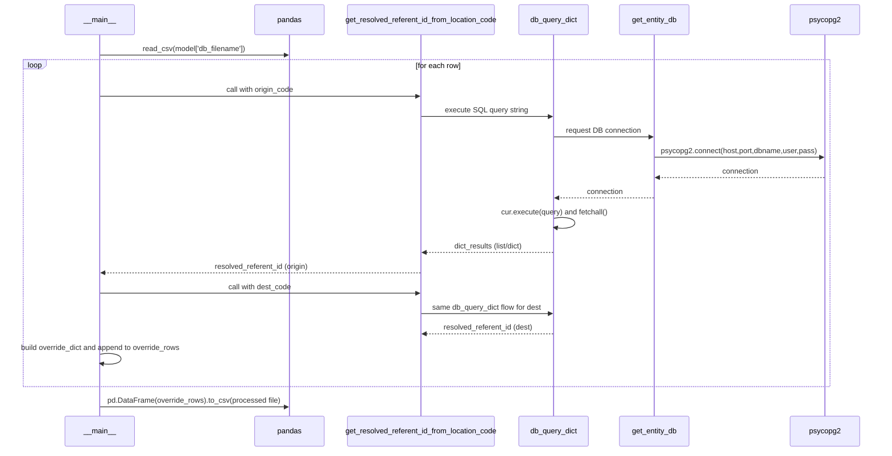
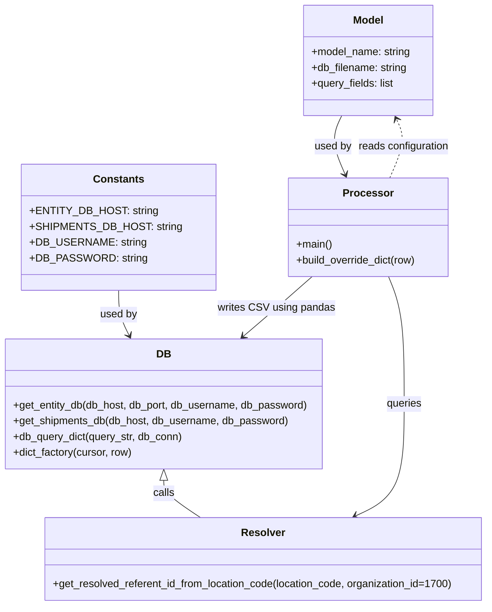

# Diagram: research/overrides/scripts/convert_hyundai_failover.py


> Auto-generated by Obscura crawlers

## Diagram 1

```mermaid
flowchart TD
    Start([Start: script executed]) --> Models[Load models list]
    Models --> ForEachModel{For each model}
    ForEachModel --> ReadCSV[Read CSV: pd.read_csv(model['db_filename'])]
    ReadCSV --> IterateRows{For each row in DataFrame}
    IterateRows --> QueryOrigin[get_resolved_referent_id_from_location_code(origin_code)]
    IterateRows --> QueryDest[get_resolved_referent_id_from_location_code(dest_code)]
    QueryOrigin --> DBQueryOrigin[db_query_dict(sql, get_entity_db())]
    QueryDest --> DBQueryDest[db_query_dict(sql, get_entity_db())]
    DBQueryOrigin --> GetEntityDB[get_entity_db(db_host,...)]
    DBQueryDest --> GetEntityDB
    GetEntityDB --> PGConnect[psycopg2.connect(...) returns connection]
    IterateRows --> BuildOverride[Build override_dict with ETA and IDs]
    BuildOverride --> AppendRow[append to override_rows list]
    IterateRows -->|after loop| MakeDF[Create df_result = pd.DataFrame(override_rows)]
    MakeDF --> MkDir[os.makedirs("processed", exist_ok=True)]
    MkDir --> WriteCSV[df_result.to_csv(f"processed/{model_name}.csv")]
    WriteCSV --> End([End])
```

> SVG rendering failed for this diagram.

## Diagram 2



### SVG

<svg id="container" width="2063" xmlns="http://www.w3.org/2000/svg" height="1036" viewBox="-162 -10 2063 1036" role="graphics-document document" aria-roledescription="sequence"><g><rect x="1701" y="950" fill="#eaeaea" stroke="#666" width="150" height="65" name="Psycopg" rx="3" ry="3" class="actor actor-bottom"></rect><text x="1776" y="982.5" dominant-baseline="central" alignment-baseline="central" class="actor actor-box" style="text-anchor: middle; font-size: 16px; font-weight: 400;"><tspan x="1776" dy="0">psycopg2</tspan></text></g><g><rect x="1292" y="950" fill="#eaeaea" stroke="#666" width="150" height="65" name="DBFactory" rx="3" ry="3" class="actor actor-bottom"></rect><text x="1367" y="982.5" dominant-baseline="central" alignment-baseline="central" class="actor actor-box" style="text-anchor: middle; font-size: 16px; font-weight: 400;"><tspan x="1367" dy="0">get_entity_db</tspan></text></g><g><rect x="1057" y="950" fill="#eaeaea" stroke="#666" width="150" height="65" name="DBQ" rx="3" ry="3" class="actor actor-bottom"></rect><text x="1132" y="982.5" dominant-baseline="central" alignment-baseline="central" class="actor actor-box" style="text-anchor: middle; font-size: 16px; font-weight: 400;"><tspan x="1132" dy="0">db_query_dict</tspan></text></g><g><rect x="643" y="950" fill="#eaeaea" stroke="#666" width="354" height="65" name="Resolver" rx="3" ry="3" class="actor actor-bottom"></rect><text x="820" y="982.5" dominant-baseline="central" alignment-baseline="central" class="actor actor-box" style="text-anchor: middle; font-size: 16px; font-weight: 400;"><tspan x="820" dy="0">get_resolved_referent_id_from_location_code</tspan></text></g><g><rect x="443" y="950" fill="#eaeaea" stroke="#666" width="150" height="65" name="Pandas" rx="3" ry="3" class="actor actor-bottom"></rect><text x="518" y="982.5" dominant-baseline="central" alignment-baseline="central" class="actor actor-box" style="text-anchor: middle; font-size: 16px; font-weight: 400;"><tspan x="518" dy="0">pandas</tspan></text></g><g><rect x="0" y="950" fill="#eaeaea" stroke="#666" width="150" height="65" name="Main" rx="3" ry="3" class="actor actor-bottom"></rect><text x="75" y="982.5" dominant-baseline="central" alignment-baseline="central" class="actor actor-box" style="text-anchor: middle; font-size: 16px; font-weight: 400;"><tspan x="75" dy="0">__main__</tspan></text></g><g><line id="actor5" x1="1776" y1="65" x2="1776" y2="950" class="actor-line 200" stroke-width="0.5px" stroke="#999" name="Psycopg"></line><g id="root-5"><rect x="1701" y="0" fill="#eaeaea" stroke="#666" width="150" height="65" name="Psycopg" rx="3" ry="3" class="actor actor-top"></rect><text x="1776" y="32.5" dominant-baseline="central" alignment-baseline="central" class="actor actor-box" style="text-anchor: middle; font-size: 16px; font-weight: 400;"><tspan x="1776" dy="0">psycopg2</tspan></text></g></g><g><line id="actor4" x1="1367" y1="65" x2="1367" y2="950" class="actor-line 200" stroke-width="0.5px" stroke="#999" name="DBFactory"></line><g id="root-4"><rect x="1292" y="0" fill="#eaeaea" stroke="#666" width="150" height="65" name="DBFactory" rx="3" ry="3" class="actor actor-top"></rect><text x="1367" y="32.5" dominant-baseline="central" alignment-baseline="central" class="actor actor-box" style="text-anchor: middle; font-size: 16px; font-weight: 400;"><tspan x="1367" dy="0">get_entity_db</tspan></text></g></g><g><line id="actor3" x1="1132" y1="65" x2="1132" y2="950" class="actor-line 200" stroke-width="0.5px" stroke="#999" name="DBQ"></line><g id="root-3"><rect x="1057" y="0" fill="#eaeaea" stroke="#666" width="150" height="65" name="DBQ" rx="3" ry="3" class="actor actor-top"></rect><text x="1132" y="32.5" dominant-baseline="central" alignment-baseline="central" class="actor actor-box" style="text-anchor: middle; font-size: 16px; font-weight: 400;"><tspan x="1132" dy="0">db_query_dict</tspan></text></g></g><g><line id="actor2" x1="820" y1="65" x2="820" y2="950" class="actor-line 200" stroke-width="0.5px" stroke="#999" name="Resolver"></line><g id="root-2"><rect x="643" y="0" fill="#eaeaea" stroke="#666" width="354" height="65" name="Resolver" rx="3" ry="3" class="actor actor-top"></rect><text x="820" y="32.5" dominant-baseline="central" alignment-baseline="central" class="actor actor-box" style="text-anchor: middle; font-size: 16px; font-weight: 400;"><tspan x="820" dy="0">get_resolved_referent_id_from_location_code</tspan></text></g></g><g><line id="actor1" x1="518" y1="65" x2="518" y2="950" class="actor-line 200" stroke-width="0.5px" stroke="#999" name="Pandas"></line><g id="root-1"><rect x="443" y="0" fill="#eaeaea" stroke="#666" width="150" height="65" name="Pandas" rx="3" ry="3" class="actor actor-top"></rect><text x="518" y="32.5" dominant-baseline="central" alignment-baseline="central" class="actor actor-box" style="text-anchor: middle; font-size: 16px; font-weight: 400;"><tspan x="518" dy="0">pandas</tspan></text></g></g><g><line id="actor0" x1="75" y1="65" x2="75" y2="950" class="actor-line 200" stroke-width="0.5px" stroke="#999" name="Main"></line><g id="root-0"><rect x="0" y="0" fill="#eaeaea" stroke="#666" width="150" height="65" name="Main" rx="3" ry="3" class="actor actor-top"></rect><text x="75" y="32.5" dominant-baseline="central" alignment-baseline="central" class="actor actor-box" style="text-anchor: middle; font-size: 16px; font-weight: 400;"><tspan x="75" dy="0">__main__</tspan></text></g></g><style>#container{font-family:"trebuchet ms",verdana,arial,sans-serif;font-size:16px;fill:#333;}@keyframes edge-animation-frame{from{stroke-dashoffset:0;}}@keyframes dash{to{stroke-dashoffset:0;}}#container .edge-animation-slow{stroke-dasharray:9,5!important;stroke-dashoffset:900;animation:dash 50s linear infinite;stroke-linecap:round;}#container .edge-animation-fast{stroke-dasharray:9,5!important;stroke-dashoffset:900;animation:dash 20s linear infinite;stroke-linecap:round;}#container .error-icon{fill:#552222;}#container .error-text{fill:#552222;stroke:#552222;}#container .edge-thickness-normal{stroke-width:1px;}#container .edge-thickness-thick{stroke-width:3.5px;}#container .edge-pattern-solid{stroke-dasharray:0;}#container .edge-thickness-invisible{stroke-width:0;fill:none;}#container .edge-pattern-dashed{stroke-dasharray:3;}#container .edge-pattern-dotted{stroke-dasharray:2;}#container .marker{fill:#333333;stroke:#333333;}#container .marker.cross{stroke:#333333;}#container svg{font-family:"trebuchet ms",verdana,arial,sans-serif;font-size:16px;}#container p{margin:0;}#container .actor{stroke:hsl(259.6261682243, 59.7765363128%, 87.9019607843%);fill:#ECECFF;}#container text.actor&gt;tspan{fill:black;stroke:none;}#container .actor-line{stroke:hsl(259.6261682243, 59.7765363128%, 87.9019607843%);}#container .innerArc{stroke-width:1.5;stroke-dasharray:none;}#container .messageLine0{stroke-width:1.5;stroke-dasharray:none;stroke:#333;}#container .messageLine1{stroke-width:1.5;stroke-dasharray:2,2;stroke:#333;}#container #arrowhead path{fill:#333;stroke:#333;}#container .sequenceNumber{fill:white;}#container #sequencenumber{fill:#333;}#container #crosshead path{fill:#333;stroke:#333;}#container .messageText{fill:#333;stroke:none;}#container .labelBox{stroke:hsl(259.6261682243, 59.7765363128%, 87.9019607843%);fill:#ECECFF;}#container .labelText,#container .labelText&gt;tspan{fill:black;stroke:none;}#container .loopText,#container .loopText&gt;tspan{fill:black;stroke:none;}#container .loopLine{stroke-width:2px;stroke-dasharray:2,2;stroke:hsl(259.6261682243, 59.7765363128%, 87.9019607843%);fill:hsl(259.6261682243, 59.7765363128%, 87.9019607843%);}#container .note{stroke:#aaaa33;fill:#fff5ad;}#container .noteText,#container .noteText&gt;tspan{fill:black;stroke:none;}#container .activation0{fill:#f4f4f4;stroke:#666;}#container .activation1{fill:#f4f4f4;stroke:#666;}#container .activation2{fill:#f4f4f4;stroke:#666;}#container .actorPopupMenu{position:absolute;}#container .actorPopupMenuPanel{position:absolute;fill:#ECECFF;box-shadow:0px 8px 16px 0px rgba(0,0,0,0.2);filter:drop-shadow(3px 5px 2px rgb(0 0 0 / 0.4));}#container .actor-man line{stroke:hsl(259.6261682243, 59.7765363128%, 87.9019607843%);fill:#ECECFF;}#container .actor-man circle,#container line{stroke:hsl(259.6261682243, 59.7765363128%, 87.9019607843%);fill:#ECECFF;stroke-width:2px;}#container :root{--mermaid-font-family:"trebuchet ms",verdana,arial,sans-serif;}</style><g></g><defs><symbol id="computer" width="24" height="24"><path transform="scale(.5)" d="M2 2v13h20v-13h-20zm18 11h-16v-9h16v9zm-10.228 6l.466-1h3.524l.467 1h-4.457zm14.228 3h-24l2-6h2.104l-1.33 4h18.45l-1.297-4h2.073l2 6zm-5-10h-14v-7h14v7z"></path></symbol></defs><defs><symbol id="database" fill-rule="evenodd" clip-rule="evenodd"><path transform="scale(.5)" d="M12.258.001l.256.004.255.005.253.008.251.01.249.012.247.015.246.016.242.019.241.02.239.023.236.024.233.027.231.028.229.031.225.032.223.034.22.036.217.038.214.04.211.041.208.043.205.045.201.046.198.048.194.05.191.051.187.053.183.054.18.056.175.057.172.059.168.06.163.061.16.063.155.064.15.066.074.033.073.033.071.034.07.034.069.035.068.035.067.035.066.035.064.036.064.036.062.036.06.036.06.037.058.037.058.037.055.038.055.038.053.038.052.038.051.039.05.039.048.039.047.039.045.04.044.04.043.04.041.04.04.041.039.041.037.041.036.041.034.041.033.042.032.042.03.042.029.042.027.042.026.043.024.043.023.043.021.043.02.043.018.044.017.043.015.044.013.044.012.044.011.045.009.044.007.045.006.045.004.045.002.045.001.045v17l-.001.045-.002.045-.004.045-.006.045-.007.045-.009.044-.011.045-.012.044-.013.044-.015.044-.017.043-.018.044-.02.043-.021.043-.023.043-.024.043-.026.043-.027.042-.029.042-.03.042-.032.042-.033.042-.034.041-.036.041-.037.041-.039.041-.04.041-.041.04-.043.04-.044.04-.045.04-.047.039-.048.039-.05.039-.051.039-.052.038-.053.038-.055.038-.055.038-.058.037-.058.037-.06.037-.06.036-.062.036-.064.036-.064.036-.066.035-.067.035-.068.035-.069.035-.07.034-.071.034-.073.033-.074.033-.15.066-.155.064-.16.063-.163.061-.168.06-.172.059-.175.057-.18.056-.183.054-.187.053-.191.051-.194.05-.198.048-.201.046-.205.045-.208.043-.211.041-.214.04-.217.038-.22.036-.223.034-.225.032-.229.031-.231.028-.233.027-.236.024-.239.023-.241.02-.242.019-.246.016-.247.015-.249.012-.251.01-.253.008-.255.005-.256.004-.258.001-.258-.001-.256-.004-.255-.005-.253-.008-.251-.01-.249-.012-.247-.015-.245-.016-.243-.019-.241-.02-.238-.023-.236-.024-.234-.027-.231-.028-.228-.031-.226-.032-.223-.034-.22-.036-.217-.038-.214-.04-.211-.041-.208-.043-.204-.045-.201-.046-.198-.048-.195-.05-.19-.051-.187-.053-.184-.054-.179-.056-.176-.057-.172-.059-.167-.06-.164-.061-.159-.063-.155-.064-.151-.066-.074-.033-.072-.033-.072-.034-.07-.034-.069-.035-.068-.035-.067-.035-.066-.035-.064-.036-.063-.036-.062-.036-.061-.036-.06-.037-.058-.037-.057-.037-.056-.038-.055-.038-.053-.038-.052-.038-.051-.039-.049-.039-.049-.039-.046-.039-.046-.04-.044-.04-.043-.04-.041-.04-.04-.041-.039-.041-.037-.041-.036-.041-.034-.041-.033-.042-.032-.042-.03-.042-.029-.042-.027-.042-.026-.043-.024-.043-.023-.043-.021-.043-.02-.043-.018-.044-.017-.043-.015-.044-.013-.044-.012-.044-.011-.045-.009-.044-.007-.045-.006-.045-.004-.045-.002-.045-.001-.045v-17l.001-.045.002-.045.004-.045.006-.045.007-.045.009-.044.011-.045.012-.044.013-.044.015-.044.017-.043.018-.044.02-.043.021-.043.023-.043.024-.043.026-.043.027-.042.029-.042.03-.042.032-.042.033-.042.034-.041.036-.041.037-.041.039-.041.04-.041.041-.04.043-.04.044-.04.046-.04.046-.039.049-.039.049-.039.051-.039.052-.038.053-.038.055-.038.056-.038.057-.037.058-.037.06-.037.061-.036.062-.036.063-.036.064-.036.066-.035.067-.035.068-.035.069-.035.07-.034.072-.034.072-.033.074-.033.151-.066.155-.064.159-.063.164-.061.167-.06.172-.059.176-.057.179-.056.184-.054.187-.053.19-.051.195-.05.198-.048.201-.046.204-.045.208-.043.211-.041.214-.04.217-.038.22-.036.223-.034.226-.032.228-.031.231-.028.234-.027.236-.024.238-.023.241-.02.243-.019.245-.016.247-.015.249-.012.251-.01.253-.008.255-.005.256-.004.258-.001.258.001zm-9.258 20.499v.01l.001.021.003.021.004.022.005.021.006.022.007.022.009.023.01.022.011.023.012.023.013.023.015.023.016.024.017.023.018.024.019.024.021.024.022.025.023.024.024.025.052.049.056.05.061.051.066.051.07.051.075.051.079.052.084.052.088.052.092.052.097.052.102.051.105.052.11.052.114.051.119.051.123.051.127.05.131.05.135.05.139.048.144.049.147.047.152.047.155.047.16.045.163.045.167.043.171.043.176.041.178.041.183.039.187.039.19.037.194.035.197.035.202.033.204.031.209.03.212.029.216.027.219.025.222.024.226.021.23.02.233.018.236.016.24.015.243.012.246.01.249.008.253.005.256.004.259.001.26-.001.257-.004.254-.005.25-.008.247-.011.244-.012.241-.014.237-.016.233-.018.231-.021.226-.021.224-.024.22-.026.216-.027.212-.028.21-.031.205-.031.202-.034.198-.034.194-.036.191-.037.187-.039.183-.04.179-.04.175-.042.172-.043.168-.044.163-.045.16-.046.155-.046.152-.047.148-.048.143-.049.139-.049.136-.05.131-.05.126-.05.123-.051.118-.052.114-.051.11-.052.106-.052.101-.052.096-.052.092-.052.088-.053.083-.051.079-.052.074-.052.07-.051.065-.051.06-.051.056-.05.051-.05.023-.024.023-.025.021-.024.02-.024.019-.024.018-.024.017-.024.015-.023.014-.024.013-.023.012-.023.01-.023.01-.022.008-.022.006-.022.006-.022.004-.022.004-.021.001-.021.001-.021v-4.127l-.077.055-.08.053-.083.054-.085.053-.087.052-.09.052-.093.051-.095.05-.097.05-.1.049-.102.049-.105.048-.106.047-.109.047-.111.046-.114.045-.115.045-.118.044-.12.043-.122.042-.124.042-.126.041-.128.04-.13.04-.132.038-.134.038-.135.037-.138.037-.139.035-.142.035-.143.034-.144.033-.147.032-.148.031-.15.03-.151.03-.153.029-.154.027-.156.027-.158.026-.159.025-.161.024-.162.023-.163.022-.165.021-.166.02-.167.019-.169.018-.169.017-.171.016-.173.015-.173.014-.175.013-.175.012-.177.011-.178.01-.179.008-.179.008-.181.006-.182.005-.182.004-.184.003-.184.002h-.37l-.184-.002-.184-.003-.182-.004-.182-.005-.181-.006-.179-.008-.179-.008-.178-.01-.176-.011-.176-.012-.175-.013-.173-.014-.172-.015-.171-.016-.17-.017-.169-.018-.167-.019-.166-.02-.165-.021-.163-.022-.162-.023-.161-.024-.159-.025-.157-.026-.156-.027-.155-.027-.153-.029-.151-.03-.15-.03-.148-.031-.146-.032-.145-.033-.143-.034-.141-.035-.14-.035-.137-.037-.136-.037-.134-.038-.132-.038-.13-.04-.128-.04-.126-.041-.124-.042-.122-.042-.12-.044-.117-.043-.116-.045-.113-.045-.112-.046-.109-.047-.106-.047-.105-.048-.102-.049-.1-.049-.097-.05-.095-.05-.093-.052-.09-.051-.087-.052-.085-.053-.083-.054-.08-.054-.077-.054v4.127zm0-5.654v.011l.001.021.003.021.004.021.005.022.006.022.007.022.009.022.01.022.011.023.012.023.013.023.015.024.016.023.017.024.018.024.019.024.021.024.022.024.023.025.024.024.052.05.056.05.061.05.066.051.07.051.075.052.079.051.084.052.088.052.092.052.097.052.102.052.105.052.11.051.114.051.119.052.123.05.127.051.131.05.135.049.139.049.144.048.147.048.152.047.155.046.16.045.163.045.167.044.171.042.176.042.178.04.183.04.187.038.19.037.194.036.197.034.202.033.204.032.209.03.212.028.216.027.219.025.222.024.226.022.23.02.233.018.236.016.24.014.243.012.246.01.249.008.253.006.256.003.259.001.26-.001.257-.003.254-.006.25-.008.247-.01.244-.012.241-.015.237-.016.233-.018.231-.02.226-.022.224-.024.22-.025.216-.027.212-.029.21-.03.205-.032.202-.033.198-.035.194-.036.191-.037.187-.039.183-.039.179-.041.175-.042.172-.043.168-.044.163-.045.16-.045.155-.047.152-.047.148-.048.143-.048.139-.05.136-.049.131-.05.126-.051.123-.051.118-.051.114-.052.11-.052.106-.052.101-.052.096-.052.092-.052.088-.052.083-.052.079-.052.074-.051.07-.052.065-.051.06-.05.056-.051.051-.049.023-.025.023-.024.021-.025.02-.024.019-.024.018-.024.017-.024.015-.023.014-.023.013-.024.012-.022.01-.023.01-.023.008-.022.006-.022.006-.022.004-.021.004-.022.001-.021.001-.021v-4.139l-.077.054-.08.054-.083.054-.085.052-.087.053-.09.051-.093.051-.095.051-.097.05-.1.049-.102.049-.105.048-.106.047-.109.047-.111.046-.114.045-.115.044-.118.044-.12.044-.122.042-.124.042-.126.041-.128.04-.13.039-.132.039-.134.038-.135.037-.138.036-.139.036-.142.035-.143.033-.144.033-.147.033-.148.031-.15.03-.151.03-.153.028-.154.028-.156.027-.158.026-.159.025-.161.024-.162.023-.163.022-.165.021-.166.02-.167.019-.169.018-.169.017-.171.016-.173.015-.173.014-.175.013-.175.012-.177.011-.178.009-.179.009-.179.007-.181.007-.182.005-.182.004-.184.003-.184.002h-.37l-.184-.002-.184-.003-.182-.004-.182-.005-.181-.007-.179-.007-.179-.009-.178-.009-.176-.011-.176-.012-.175-.013-.173-.014-.172-.015-.171-.016-.17-.017-.169-.018-.167-.019-.166-.02-.165-.021-.163-.022-.162-.023-.161-.024-.159-.025-.157-.026-.156-.027-.155-.028-.153-.028-.151-.03-.15-.03-.148-.031-.146-.033-.145-.033-.143-.033-.141-.035-.14-.036-.137-.036-.136-.037-.134-.038-.132-.039-.13-.039-.128-.04-.126-.041-.124-.042-.122-.043-.12-.043-.117-.044-.116-.044-.113-.046-.112-.046-.109-.046-.106-.047-.105-.048-.102-.049-.1-.049-.097-.05-.095-.051-.093-.051-.09-.051-.087-.053-.085-.052-.083-.054-.08-.054-.077-.054v4.139zm0-5.666v.011l.001.02.003.022.004.021.005.022.006.021.007.022.009.023.01.022.011.023.012.023.013.023.015.023.016.024.017.024.018.023.019.024.021.025.022.024.023.024.024.025.052.05.056.05.061.05.066.051.07.051.075.052.079.051.084.052.088.052.092.052.097.052.102.052.105.051.11.052.114.051.119.051.123.051.127.05.131.05.135.05.139.049.144.048.147.048.152.047.155.046.16.045.163.045.167.043.171.043.176.042.178.04.183.04.187.038.19.037.194.036.197.034.202.033.204.032.209.03.212.028.216.027.219.025.222.024.226.021.23.02.233.018.236.017.24.014.243.012.246.01.249.008.253.006.256.003.259.001.26-.001.257-.003.254-.006.25-.008.247-.01.244-.013.241-.014.237-.016.233-.018.231-.02.226-.022.224-.024.22-.025.216-.027.212-.029.21-.03.205-.032.202-.033.198-.035.194-.036.191-.037.187-.039.183-.039.179-.041.175-.042.172-.043.168-.044.163-.045.16-.045.155-.047.152-.047.148-.048.143-.049.139-.049.136-.049.131-.051.126-.05.123-.051.118-.052.114-.051.11-.052.106-.052.101-.052.096-.052.092-.052.088-.052.083-.052.079-.052.074-.052.07-.051.065-.051.06-.051.056-.05.051-.049.023-.025.023-.025.021-.024.02-.024.019-.024.018-.024.017-.024.015-.023.014-.024.013-.023.012-.023.01-.022.01-.023.008-.022.006-.022.006-.022.004-.022.004-.021.001-.021.001-.021v-4.153l-.077.054-.08.054-.083.053-.085.053-.087.053-.09.051-.093.051-.095.051-.097.05-.1.049-.102.048-.105.048-.106.048-.109.046-.111.046-.114.046-.115.044-.118.044-.12.043-.122.043-.124.042-.126.041-.128.04-.13.039-.132.039-.134.038-.135.037-.138.036-.139.036-.142.034-.143.034-.144.033-.147.032-.148.032-.15.03-.151.03-.153.028-.154.028-.156.027-.158.026-.159.024-.161.024-.162.023-.163.023-.165.021-.166.02-.167.019-.169.018-.169.017-.171.016-.173.015-.173.014-.175.013-.175.012-.177.01-.178.01-.179.009-.179.007-.181.006-.182.006-.182.004-.184.003-.184.001-.185.001-.185-.001-.184-.001-.184-.003-.182-.004-.182-.006-.181-.006-.179-.007-.179-.009-.178-.01-.176-.01-.176-.012-.175-.013-.173-.014-.172-.015-.171-.016-.17-.017-.169-.018-.167-.019-.166-.02-.165-.021-.163-.023-.162-.023-.161-.024-.159-.024-.157-.026-.156-.027-.155-.028-.153-.028-.151-.03-.15-.03-.148-.032-.146-.032-.145-.033-.143-.034-.141-.034-.14-.036-.137-.036-.136-.037-.134-.038-.132-.039-.13-.039-.128-.041-.126-.041-.124-.041-.122-.043-.12-.043-.117-.044-.116-.044-.113-.046-.112-.046-.109-.046-.106-.048-.105-.048-.102-.048-.1-.05-.097-.049-.095-.051-.093-.051-.09-.052-.087-.052-.085-.053-.083-.053-.08-.054-.077-.054v4.153zm8.74-8.179l-.257.004-.254.005-.25.008-.247.011-.244.012-.241.014-.237.016-.233.018-.231.021-.226.022-.224.023-.22.026-.216.027-.212.028-.21.031-.205.032-.202.033-.198.034-.194.036-.191.038-.187.038-.183.04-.179.041-.175.042-.172.043-.168.043-.163.045-.16.046-.155.046-.152.048-.148.048-.143.048-.139.049-.136.05-.131.05-.126.051-.123.051-.118.051-.114.052-.11.052-.106.052-.101.052-.096.052-.092.052-.088.052-.083.052-.079.052-.074.051-.07.052-.065.051-.06.05-.056.05-.051.05-.023.025-.023.024-.021.024-.02.025-.019.024-.018.024-.017.023-.015.024-.014.023-.013.023-.012.023-.01.023-.01.022-.008.022-.006.023-.006.021-.004.022-.004.021-.001.021-.001.021.001.021.001.021.004.021.004.022.006.021.006.023.008.022.01.022.01.023.012.023.013.023.014.023.015.024.017.023.018.024.019.024.02.025.021.024.023.024.023.025.051.05.056.05.06.05.065.051.07.052.074.051.079.052.083.052.088.052.092.052.096.052.101.052.106.052.11.052.114.052.118.051.123.051.126.051.131.05.136.05.139.049.143.048.148.048.152.048.155.046.16.046.163.045.168.043.172.043.175.042.179.041.183.04.187.038.191.038.194.036.198.034.202.033.205.032.21.031.212.028.216.027.22.026.224.023.226.022.231.021.233.018.237.016.241.014.244.012.247.011.25.008.254.005.257.004.26.001.26-.001.257-.004.254-.005.25-.008.247-.011.244-.012.241-.014.237-.016.233-.018.231-.021.226-.022.224-.023.22-.026.216-.027.212-.028.21-.031.205-.032.202-.033.198-.034.194-.036.191-.038.187-.038.183-.04.179-.041.175-.042.172-.043.168-.043.163-.045.16-.046.155-.046.152-.048.148-.048.143-.048.139-.049.136-.05.131-.05.126-.051.123-.051.118-.051.114-.052.11-.052.106-.052.101-.052.096-.052.092-.052.088-.052.083-.052.079-.052.074-.051.07-.052.065-.051.06-.05.056-.05.051-.05.023-.025.023-.024.021-.024.02-.025.019-.024.018-.024.017-.023.015-.024.014-.023.013-.023.012-.023.01-.023.01-.022.008-.022.006-.023.006-.021.004-.022.004-.021.001-.021.001-.021-.001-.021-.001-.021-.004-.021-.004-.022-.006-.021-.006-.023-.008-.022-.01-.022-.01-.023-.012-.023-.013-.023-.014-.023-.015-.024-.017-.023-.018-.024-.019-.024-.02-.025-.021-.024-.023-.024-.023-.025-.051-.05-.056-.05-.06-.05-.065-.051-.07-.052-.074-.051-.079-.052-.083-.052-.088-.052-.092-.052-.096-.052-.101-.052-.106-.052-.11-.052-.114-.052-.118-.051-.123-.051-.126-.051-.131-.05-.136-.05-.139-.049-.143-.048-.148-.048-.152-.048-.155-.046-.16-.046-.163-.045-.168-.043-.172-.043-.175-.042-.179-.041-.183-.04-.187-.038-.191-.038-.194-.036-.198-.034-.202-.033-.205-.032-.21-.031-.212-.028-.216-.027-.22-.026-.224-.023-.226-.022-.231-.021-.233-.018-.237-.016-.241-.014-.244-.012-.247-.011-.25-.008-.254-.005-.257-.004-.26-.001-.26.001z"></path></symbol></defs><defs><symbol id="clock" width="24" height="24"><path transform="scale(.5)" d="M12 2c5.514 0 10 4.486 10 10s-4.486 10-10 10-10-4.486-10-10 4.486-10 10-10zm0-2c-6.627 0-12 5.373-12 12s5.373 12 12 12 12-5.373 12-12-5.373-12-12-12zm5.848 12.459c.202.038.202.333.001.372-1.907.361-6.045 1.111-6.547 1.111-.719 0-1.301-.582-1.301-1.301 0-.512.77-5.447 1.125-7.445.034-.192.312-.181.343.014l.985 6.238 5.394 1.011z"></path></symbol></defs><defs><marker id="arrowhead" refX="7.9" refY="5" markerUnits="userSpaceOnUse" markerWidth="12" markerHeight="12" orient="auto-start-reverse"><path d="M -1 0 L 10 5 L 0 10 z"></path></marker></defs><defs><marker id="crosshead" markerWidth="15" markerHeight="8" orient="auto" refX="4" refY="4.5"><path fill="none" stroke="#000000" stroke-width="1pt" d="M 1,2 L 6,7 M 6,2 L 1,7" style="stroke-dasharray: 0, 0;"></path></marker></defs><defs><marker id="filled-head" refX="15.5" refY="7" markerWidth="20" markerHeight="28" orient="auto"><path d="M 18,7 L9,13 L14,7 L9,1 Z"></path></marker></defs><defs><marker id="sequencenumber" refX="15" refY="15" markerWidth="60" markerHeight="40" orient="auto"><circle cx="15" cy="15" r="6"></circle></marker></defs><g><line x1="-112" y1="123" x2="1787" y2="123" class="loopLine"></line><line x1="1787" y1="123" x2="1787" y2="882" class="loopLine"></line><line x1="-112" y1="882" x2="1787" y2="882" class="loopLine"></line><line x1="-112" y1="123" x2="-112" y2="882" class="loopLine"></line><polygon points="-112,123 -62,123 -62,136 -70.4,143 -112,143" class="labelBox"></polygon><text x="-87" y="136" text-anchor="middle" dominant-baseline="middle" alignment-baseline="middle" class="labelText" style="font-size: 16px; font-weight: 400;">loop</text><text x="862.5" y="141" text-anchor="middle" class="loopText" style="font-size: 16px; font-weight: 400;"><tspan x="862.5">[for each row]</tspan></text></g><text x="295" y="80" text-anchor="middle" dominant-baseline="middle" alignment-baseline="middle" class="messageText" dy="1em" style="font-size: 16px; font-weight: 400;">read_csv(model['db_filename'])</text><line x1="76" y1="113" x2="514" y2="113" class="messageLine0" stroke-width="2" stroke="none" marker-end="url(#arrowhead)" style="fill: none;"></line><text x="446" y="173" text-anchor="middle" dominant-baseline="middle" alignment-baseline="middle" class="messageText" dy="1em" style="font-size: 16px; font-weight: 400;">call with origin_code</text><line x1="76" y1="206" x2="816" y2="206" class="messageLine0" stroke-width="2" stroke="none" marker-end="url(#arrowhead)" style="fill: none;"></line><text x="975" y="221" text-anchor="middle" dominant-baseline="middle" alignment-baseline="middle" class="messageText" dy="1em" style="font-size: 16px; font-weight: 400;">execute SQL query string</text><line x1="821" y1="254" x2="1128" y2="254" class="messageLine0" stroke-width="2" stroke="none" marker-end="url(#arrowhead)" style="fill: none;"></line><text x="1248" y="269" text-anchor="middle" dominant-baseline="middle" alignment-baseline="middle" class="messageText" dy="1em" style="font-size: 16px; font-weight: 400;">request DB connection</text><line x1="1133" y1="302" x2="1363" y2="302" class="messageLine0" stroke-width="2" stroke="none" marker-end="url(#arrowhead)" style="fill: none;"></line><text x="1570" y="317" text-anchor="middle" dominant-baseline="middle" alignment-baseline="middle" class="messageText" dy="1em" style="font-size: 16px; font-weight: 400;">psycopg2.connect(host,port,dbname,user,pass)</text><line x1="1368" y1="350" x2="1772" y2="350" class="messageLine0" stroke-width="2" stroke="none" marker-end="url(#arrowhead)" style="fill: none;"></line><text x="1573" y="365" text-anchor="middle" dominant-baseline="middle" alignment-baseline="middle" class="messageText" dy="1em" style="font-size: 16px; font-weight: 400;">connection</text><line x1="1775" y1="398" x2="1371" y2="398" class="messageLine1" stroke-width="2" stroke="none" marker-end="url(#arrowhead)" style="stroke-dasharray: 3, 3; fill: none;"></line><text x="1251" y="413" text-anchor="middle" dominant-baseline="middle" alignment-baseline="middle" class="messageText" dy="1em" style="font-size: 16px; font-weight: 400;">connection</text><line x1="1366" y1="446" x2="1136" y2="446" class="messageLine1" stroke-width="2" stroke="none" marker-end="url(#arrowhead)" style="stroke-dasharray: 3, 3; fill: none;"></line><text x="1133" y="461" text-anchor="middle" dominant-baseline="middle" alignment-baseline="middle" class="messageText" dy="1em" style="font-size: 16px; font-weight: 400;">cur.execute(query) and fetchall()</text><path d="M 1133,494 C 1193,484 1193,524 1133,514" class="messageLine0" stroke-width="2" stroke="none" marker-end="url(#arrowhead)" style="fill: none;"></path><text x="978" y="539" text-anchor="middle" dominant-baseline="middle" alignment-baseline="middle" class="messageText" dy="1em" style="font-size: 16px; font-weight: 400;">dict_results (list/dict)</text><line x1="1131" y1="572" x2="824" y2="572" class="messageLine1" stroke-width="2" stroke="none" marker-end="url(#arrowhead)" style="stroke-dasharray: 3, 3; fill: none;"></line><text x="449" y="587" text-anchor="middle" dominant-baseline="middle" alignment-baseline="middle" class="messageText" dy="1em" style="font-size: 16px; font-weight: 400;">resolved_referent_id (origin)</text><line x1="819" y1="620" x2="79" y2="620" class="messageLine1" stroke-width="2" stroke="none" marker-end="url(#arrowhead)" style="stroke-dasharray: 3, 3; fill: none;"></line><text x="446" y="635" text-anchor="middle" dominant-baseline="middle" alignment-baseline="middle" class="messageText" dy="1em" style="font-size: 16px; font-weight: 400;">call with dest_code</text><line x1="76" y1="668" x2="816" y2="668" class="messageLine0" stroke-width="2" stroke="none" marker-end="url(#arrowhead)" style="fill: none;"></line><text x="975" y="683" text-anchor="middle" dominant-baseline="middle" alignment-baseline="middle" class="messageText" dy="1em" style="font-size: 16px; font-weight: 400;">same db_query_dict flow for dest</text><line x1="821" y1="716" x2="1128" y2="716" class="messageLine0" stroke-width="2" stroke="none" marker-end="url(#arrowhead)" style="fill: none;"></line><text x="978" y="731" text-anchor="middle" dominant-baseline="middle" alignment-baseline="middle" class="messageText" dy="1em" style="font-size: 16px; font-weight: 400;">resolved_referent_id (dest)</text><line x1="1131" y1="764" x2="824" y2="764" class="messageLine1" stroke-width="2" stroke="none" marker-end="url(#arrowhead)" style="stroke-dasharray: 3, 3; fill: none;"></line><text x="76" y="779" text-anchor="middle" dominant-baseline="middle" alignment-baseline="middle" class="messageText" dy="1em" style="font-size: 16px; font-weight: 400;">build override_dict and append to override_rows</text><path d="M 76,812 C 136,802 136,842 76,832" class="messageLine0" stroke-width="2" stroke="none" marker-end="url(#arrowhead)" style="fill: none;"></path><text x="295" y="897" text-anchor="middle" dominant-baseline="middle" alignment-baseline="middle" class="messageText" dy="1em" style="font-size: 16px; font-weight: 400;">pd.DataFrame(override_rows).to_csv(processed file)</text><line x1="76" y1="930" x2="514" y2="930" class="messageLine0" stroke-width="2" stroke="none" marker-end="url(#arrowhead)" style="fill: none;"></line></svg>

## Diagram 3



### SVG

<svg id="container" width="747.658203125" xmlns="http://www.w3.org/2000/svg" class="classDiagram" height="922" viewBox="0 0 747.658203125 922" role="graphics-document document" aria-roledescription="class"><style>#container{font-family:"trebuchet ms",verdana,arial,sans-serif;font-size:16px;fill:#333;}@keyframes edge-animation-frame{from{stroke-dashoffset:0;}}@keyframes dash{to{stroke-dashoffset:0;}}#container .edge-animation-slow{stroke-dasharray:9,5!important;stroke-dashoffset:900;animation:dash 50s linear infinite;stroke-linecap:round;}#container .edge-animation-fast{stroke-dasharray:9,5!important;stroke-dashoffset:900;animation:dash 20s linear infinite;stroke-linecap:round;}#container .error-icon{fill:#552222;}#container .error-text{fill:#552222;stroke:#552222;}#container .edge-thickness-normal{stroke-width:1px;}#container .edge-thickness-thick{stroke-width:3.5px;}#container .edge-pattern-solid{stroke-dasharray:0;}#container .edge-thickness-invisible{stroke-width:0;fill:none;}#container .edge-pattern-dashed{stroke-dasharray:3;}#container .edge-pattern-dotted{stroke-dasharray:2;}#container .marker{fill:#333333;stroke:#333333;}#container .marker.cross{stroke:#333333;}#container svg{font-family:"trebuchet ms",verdana,arial,sans-serif;font-size:16px;}#container p{margin:0;}#container g.classGroup text{fill:#9370DB;stroke:none;font-family:"trebuchet ms",verdana,arial,sans-serif;font-size:10px;}#container g.classGroup text .title{font-weight:bolder;}#container .nodeLabel,#container .edgeLabel{color:#131300;}#container .edgeLabel .label rect{fill:#ECECFF;}#container .label text{fill:#131300;}#container .labelBkg{background:#ECECFF;}#container .edgeLabel .label span{background:#ECECFF;}#container .classTitle{font-weight:bolder;}#container .node rect,#container .node circle,#container .node ellipse,#container .node polygon,#container .node path{fill:#ECECFF;stroke:#9370DB;stroke-width:1px;}#container .divider{stroke:#9370DB;stroke-width:1;}#container g.clickable{cursor:pointer;}#container g.classGroup rect{fill:#ECECFF;stroke:#9370DB;}#container g.classGroup line{stroke:#9370DB;stroke-width:1;}#container .classLabel .box{stroke:none;stroke-width:0;fill:#ECECFF;opacity:0.5;}#container .classLabel .label{fill:#9370DB;font-size:10px;}#container .relation{stroke:#333333;stroke-width:1;fill:none;}#container .dashed-line{stroke-dasharray:3;}#container .dotted-line{stroke-dasharray:1 2;}#container #compositionStart,#container .composition{fill:#333333!important;stroke:#333333!important;stroke-width:1;}#container #compositionEnd,#container .composition{fill:#333333!important;stroke:#333333!important;stroke-width:1;}#container #dependencyStart,#container .dependency{fill:#333333!important;stroke:#333333!important;stroke-width:1;}#container #dependencyStart,#container .dependency{fill:#333333!important;stroke:#333333!important;stroke-width:1;}#container #extensionStart,#container .extension{fill:transparent!important;stroke:#333333!important;stroke-width:1;}#container #extensionEnd,#container .extension{fill:transparent!important;stroke:#333333!important;stroke-width:1;}#container #aggregationStart,#container .aggregation{fill:transparent!important;stroke:#333333!important;stroke-width:1;}#container #aggregationEnd,#container .aggregation{fill:transparent!important;stroke:#333333!important;stroke-width:1;}#container #lollipopStart,#container .lollipop{fill:#ECECFF!important;stroke:#333333!important;stroke-width:1;}#container #lollipopEnd,#container .lollipop{fill:#ECECFF!important;stroke:#333333!important;stroke-width:1;}#container .edgeTerminals{font-size:11px;line-height:initial;}#container .classTitleText{text-anchor:middle;font-size:18px;fill:#333;}#container .label-icon{display:inline-block;height:1em;overflow:visible;vertical-align:-0.125em;}#container .node .label-icon path{fill:currentColor;stroke:revert;stroke-width:revert;}#container :root{--mermaid-font-family:"trebuchet ms",verdana,arial,sans-serif;}</style><g><defs><marker id="container_class-aggregationStart" class="marker aggregation class" refX="18" refY="7" markerWidth="190" markerHeight="240" orient="auto"><path d="M 18,7 L9,13 L1,7 L9,1 Z"></path></marker></defs><defs><marker id="container_class-aggregationEnd" class="marker aggregation class" refX="1" refY="7" markerWidth="20" markerHeight="28" orient="auto"><path d="M 18,7 L9,13 L1,7 L9,1 Z"></path></marker></defs><defs><marker id="container_class-extensionStart" class="marker extension class" refX="18" refY="7" markerWidth="190" markerHeight="240" orient="auto"><path d="M 1,7 L18,13 V 1 Z"></path></marker></defs><defs><marker id="container_class-extensionEnd" class="marker extension class" refX="1" refY="7" markerWidth="20" markerHeight="28" orient="auto"><path d="M 1,1 V 13 L18,7 Z"></path></marker></defs><defs><marker id="container_class-compositionStart" class="marker composition class" refX="18" refY="7" markerWidth="190" markerHeight="240" orient="auto"><path d="M 18,7 L9,13 L1,7 L9,1 Z"></path></marker></defs><defs><marker id="container_class-compositionEnd" class="marker composition class" refX="1" refY="7" markerWidth="20" markerHeight="28" orient="auto"><path d="M 18,7 L9,13 L1,7 L9,1 Z"></path></marker></defs><defs><marker id="container_class-dependencyStart" class="marker dependency class" refX="6" refY="7" markerWidth="190" markerHeight="240" orient="auto"><path d="M 5,7 L9,13 L1,7 L9,1 Z"></path></marker></defs><defs><marker id="container_class-dependencyEnd" class="marker dependency class" refX="13" refY="7" markerWidth="20" markerHeight="28" orient="auto"><path d="M 18,7 L9,13 L14,7 L9,1 Z"></path></marker></defs><defs><marker id="container_class-lollipopStart" class="marker lollipop class" refX="13" refY="7" markerWidth="190" markerHeight="240" orient="auto"><circle stroke="black" fill="transparent" cx="7" cy="7" r="6"></circle></marker></defs><defs><marker id="container_class-lollipopEnd" class="marker lollipop class" refX="1" refY="7" markerWidth="190" markerHeight="240" orient="auto"><circle stroke="black" fill="transparent" cx="7" cy="7" r="6"></circle></marker></defs><g class="root"><g class="clusters"></g><g class="edgePaths"><path d="M518.44,176L515.421,182.167C512.403,188.333,506.365,200.667,507.245,215.586C508.124,230.506,515.921,248.013,519.819,256.766L523.717,265.519" id="id_Model_Processor_1" class="edge-thickness-normal edge-pattern-solid relation" style=";;;" data-edge="true" data-et="edge" data-id="id_Model_Processor_1" data-points="W3sieCI6NTE4LjQzOTkyMTIyOTMzODksInkiOjE3Nn0seyJ4Ijo1MDAuMzI4MTI1LCJ5IjoyMTN9LHsieCI6NTI2LjE1Nzk1MzQ3NzQ0MzYsInkiOjI3MX1d" marker-end="url(#container_class-dependencyEnd)"></path><path d="M183.855,442L183.855,448.167C183.855,454.333,183.855,466.667,186.485,478.105C189.115,489.544,194.374,500.087,197.003,505.359L199.633,510.631" id="id_Constants_DB_2" class="edge-thickness-normal edge-pattern-solid relation" style=";;;" data-edge="true" data-et="edge" data-id="id_Constants_DB_2" data-points="W3sieCI6MTgzLjg1NTQ2ODc1LCJ5Ijo0NDJ9LHsieCI6MTgzLjg1NTQ2ODc1LCJ5Ijo0Nzl9LHsieCI6MjAyLjMxMDgzNDA5OTI2NDcsInkiOjUxNn1d" marker-end="url(#container_class-dependencyEnd)"></path><path d="M251.691,731.25L251.691,734.542C251.691,737.833,251.691,744.417,261.124,753.875C270.557,763.333,289.423,775.667,298.856,781.833L308.289,788" id="id_DB_Resolver_3" class="edge-thickness-normal edge-pattern-solid relation" style=";;;" data-edge="true" data-et="edge" data-id="id_DB_Resolver_3" data-points="W3sieCI6MjUxLjY5MTQwNjI1LCJ5Ijo3MTR9LHsieCI6MjUxLjY5MTQwNjI1LCJ5Ijo3NTF9LHsieCI6MzA4LjI4OTEyMTA5Mzc1LCJ5Ijo3ODh9XQ==" marker-start="url(#container_class-extensionStart)"></path><path d="M589.829,421L593.731,430.667C597.632,440.333,605.435,459.667,609.337,492C613.238,524.333,613.238,569.667,613.238,615C613.238,660.333,613.238,705.667,601.278,734.068C589.317,762.469,565.395,773.937,553.435,779.672L541.474,785.406" id="id_Processor_Resolver_4" class="edge-thickness-normal edge-pattern-solid relation" style=";;;" data-edge="true" data-et="edge" data-id="id_Processor_Resolver_4" data-points="W3sieCI6NTg5LjgyOTA5NDIxOTkyNDksInkiOjQyMX0seyJ4Ijo2MTMuMjM4MjgxMjUsInkiOjQ3OX0seyJ4Ijo2MTMuMjM4MjgxMjUsInkiOjYxNX0seyJ4Ijo2MTMuMjM4MjgxMjUsInkiOjc1MX0seyJ4Ijo1MzYuMDYzNjUyMzQzNzQ5OSwieSI6Nzg4fV0=" marker-end="url(#container_class-dependencyEnd)"></path><path d="M473.299,421L462.181,430.667C451.063,440.333,428.828,459.667,411.437,474.84C394.047,490.014,381.503,501.028,375.231,506.534L368.959,512.041" id="id_Processor_DB_5" class="edge-thickness-normal edge-pattern-solid relation" style=";;;" data-edge="true" data-et="edge" data-id="id_Processor_DB_5" data-points="W3sieCI6NDczLjI5OTEyMTgyODAwNzUsInkiOjQyMX0seyJ4Ijo0MDYuNTkxNzk2ODc1LCJ5Ijo0Nzl9LHsieCI6MzY0LjQ0OTc3ODgzNzMxNjE2LCJ5Ijo1MTZ9XQ==" marker-end="url(#container_class-dependencyEnd)"></path><path d="M592.959,271L597.264,261.333C601.569,251.667,610.179,232.333,611.905,217.398C613.631,202.463,608.473,191.926,605.894,186.657L603.315,181.389" id="id_Processor_Model_6" class="edge-thickness-normal edge-pattern-dashed relation" style=";;;" data-edge="true" data-et="edge" data-id="id_Processor_Model_6" data-points="W3sieCI6NTkyLjk1OTIzNDAyMjU1NjQsInkiOjI3MX0seyJ4Ijo2MTguNzg5MDYyNSwieSI6MjEzfSx7IngiOjYwMC42NzcyNjYyNzA2NjExLCJ5IjoxNzZ9XQ==" marker-end="url(#container_class-dependencyEnd)"></path></g><g class="edgeLabels"><g class="edgeLabel" transform="translate(504.86348, 223.18399)"><g class="label" data-id="id_Model_Processor_1" transform="translate(-28.3125, -12)"><foreignObject width="56.625" height="24"><div xmlns="http://www.w3.org/1999/xhtml" class="labelBkg" style="display: table-cell; white-space: nowrap; line-height: 1.5; max-width: 200px; text-align: center;"><span class="edgeLabel"><p>used by</p></span></div></foreignObject></g></g><g class="edgeLabel" transform="translate(183.85546875, 479)"><g class="label" data-id="id_Constants_DB_2" transform="translate(-28.3125, -12)"><foreignObject width="56.625" height="24"><div xmlns="http://www.w3.org/1999/xhtml" class="labelBkg" style="display: table-cell; white-space: nowrap; line-height: 1.5; max-width: 200px; text-align: center;"><span class="edgeLabel"><p>used by</p></span></div></foreignObject></g></g><g class="edgeLabel" transform="translate(251.69140625, 751)"><g class="label" data-id="id_DB_Resolver_3" transform="translate(-16.4453125, -12)"><foreignObject width="32.890625" height="24"><div xmlns="http://www.w3.org/1999/xhtml" class="labelBkg" style="display: table-cell; white-space: nowrap; line-height: 1.5; max-width: 200px; text-align: center;"><span class="edgeLabel"><p>calls</p></span></div></foreignObject></g></g><g class="edgeLabel" transform="translate(613.23828125, 615)"><g class="label" data-id="id_Processor_Resolver_4" transform="translate(-27.2421875, -12)"><foreignObject width="54.484375" height="24"><div xmlns="http://www.w3.org/1999/xhtml" class="labelBkg" style="display: table-cell; white-space: nowrap; line-height: 1.5; max-width: 200px; text-align: center;"><span class="edgeLabel"><p>queries</p></span></div></foreignObject></g></g><g class="edgeLabel" transform="translate(418.78538, 468.39805)"><g class="label" data-id="id_Processor_DB_5" transform="translate(-87.359375, -12)"><foreignObject width="174.71875" height="24"><div xmlns="http://www.w3.org/1999/xhtml" class="labelBkg" style="display: table-cell; white-space: nowrap; line-height: 1.5; max-width: 200px; text-align: center;"><span class="edgeLabel"><p>writes CSV using pandas</p></span></div></foreignObject></g></g><g class="edgeLabel" transform="translate(614.25371, 223.18399)"><g class="label" data-id="id_Processor_Model_6" transform="translate(-70.1484375, -12)"><foreignObject width="140.296875" height="24"><div xmlns="http://www.w3.org/1999/xhtml" class="labelBkg" style="display: table-cell; white-space: nowrap; line-height: 1.5; max-width: 200px; text-align: center;"><span class="edgeLabel"><p>reads configuration</p></span></div></foreignObject></g></g></g><g class="nodes"><g class="node default" id="classId-Model-0" transform="translate(559.55859375, 92)"><g class="basic label-container"><path d="M-99.55859375 -84 L99.55859375 -84 L99.55859375 84 L-99.55859375 84" stroke="none" stroke-width="0" fill="#ECECFF" style=""></path><path d="M-99.55859375 -84 C-49.46302799119652 -84, 0.6325377676069621 -84, 99.55859375 -84 M-99.55859375 -84 C-35.163556059833525 -84, 29.23148163033295 -84, 99.55859375 -84 M99.55859375 -84 C99.55859375 -30.264774840698273, 99.55859375 23.470450318603454, 99.55859375 84 M99.55859375 -84 C99.55859375 -23.41259906476631, 99.55859375 37.17480187046738, 99.55859375 84 M99.55859375 84 C37.07989616179054 84, -25.398801426418913 84, -99.55859375 84 M99.55859375 84 C47.18410679999785 84, -5.190380150004302 84, -99.55859375 84 M-99.55859375 84 C-99.55859375 45.49559600178331, -99.55859375 6.991192003566624, -99.55859375 -84 M-99.55859375 84 C-99.55859375 44.44847894871933, -99.55859375 4.896957897438654, -99.55859375 -84" stroke="#9370DB" stroke-width="1.3" fill="none" stroke-dasharray="0 0" style=""></path></g><g class="annotation-group text" transform="translate(0, -60)"></g><g class="label-group text" transform="translate(-22.5546875, -60)"><g class="label" style="font-weight: bolder" transform="translate(0,-12)"><foreignObject width="45.109375" height="24"><div xmlns="http://www.w3.org/1999/xhtml" style="display: table-cell; white-space: nowrap; line-height: 1.5; max-width: 95px; text-align: center;"><span class="nodeLabel markdown-node-label" style=""><p>Model</p></span></div></foreignObject></g></g><g class="members-group text" transform="translate(-87.55859375, -12)"><g class="label" style="" transform="translate(0,-12)"><foreignObject width="152.5625" height="24"><div xmlns="http://www.w3.org/1999/xhtml" style="display: table-cell; white-space: nowrap; line-height: 1.5; max-width: 211px; text-align: center;"><span class="nodeLabel markdown-node-label" style=""><p>+model_name: string</p></span></div></foreignObject></g><g class="label" style="" transform="translate(0,12)"><foreignObject width="147.5" height="24"><div xmlns="http://www.w3.org/1999/xhtml" style="display: table-cell; white-space: nowrap; line-height: 1.5; max-width: 206px; text-align: center;"><span class="nodeLabel markdown-node-label" style=""><p>+db_filename: string</p></span></div></foreignObject></g><g class="label" style="" transform="translate(0,36)"><foreignObject width="127.25" height="24"><div xmlns="http://www.w3.org/1999/xhtml" style="display: table-cell; white-space: nowrap; line-height: 1.5; max-width: 185px; text-align: center;"><span class="nodeLabel markdown-node-label" style=""><p>+query_fields: list</p></span></div></foreignObject></g></g><g class="methods-group text" transform="translate(-87.55859375, 84)"></g><g class="divider" style=""><path d="M-99.55859375 -36 C-39.60264038927559 -36, 20.353312971448815 -36, 99.55859375 -36 M-99.55859375 -36 C-56.39007150950146 -36, -13.22154926900292 -36, 99.55859375 -36" stroke="#9370DB" stroke-width="1.3" fill="none" stroke-dasharray="0 0" style=""></path></g><g class="divider" style=""><path d="M-99.55859375 60 C-32.421136651696884 60, 34.71632044660623 60, 99.55859375 60 M-99.55859375 60 C-43.789638414373904 60, 11.979316921252192 60, 99.55859375 60" stroke="#9370DB" stroke-width="1.3" fill="none" stroke-dasharray="0 0" style=""></path></g></g><g class="node default" id="classId-Constants-1" transform="translate(183.85546875, 346)"><g class="basic label-container"><path d="M-136.58203125 -96 L136.58203125 -96 L136.58203125 96 L-136.58203125 96" stroke="none" stroke-width="0" fill="#ECECFF" style=""></path><path d="M-136.58203125 -96 C-35.85880939164838 -96, 64.86441246670324 -96, 136.58203125 -96 M-136.58203125 -96 C-53.179524763425874 -96, 30.22298172314825 -96, 136.58203125 -96 M136.58203125 -96 C136.58203125 -50.211339524833946, 136.58203125 -4.422679049667892, 136.58203125 96 M136.58203125 -96 C136.58203125 -55.87590113588993, 136.58203125 -15.751802271779866, 136.58203125 96 M136.58203125 96 C74.29442025533395 96, 12.006809260667893 96, -136.58203125 96 M136.58203125 96 C34.397141136578824 96, -67.78774897684235 96, -136.58203125 96 M-136.58203125 96 C-136.58203125 33.47603377370254, -136.58203125 -29.04793245259492, -136.58203125 -96 M-136.58203125 96 C-136.58203125 27.76188545969552, -136.58203125 -40.47622908060896, -136.58203125 -96" stroke="#9370DB" stroke-width="1.3" fill="none" stroke-dasharray="0 0" style=""></path></g><g class="annotation-group text" transform="translate(0, -72)"></g><g class="label-group text" transform="translate(-36.5390625, -72)"><g class="label" style="font-weight: bolder" transform="translate(0,-12)"><foreignObject width="73.078125" height="24"><div xmlns="http://www.w3.org/1999/xhtml" style="display: table-cell; white-space: nowrap; line-height: 1.5; max-width: 122px; text-align: center;"><span class="nodeLabel markdown-node-label" style=""><p>Constants</p></span></div></foreignObject></g></g><g class="members-group text" transform="translate(-124.58203125, -24)"><g class="label" style="" transform="translate(0,-12)"><foreignObject width="180.28125" height="24"><div xmlns="http://www.w3.org/1999/xhtml" style="display: table-cell; white-space: nowrap; line-height: 1.5; max-width: 238px; text-align: center;"><span class="nodeLabel markdown-node-label" style=""><p>+ENTITY_DB_HOST: string</p></span></div></foreignObject></g><g class="label" style="" transform="translate(0,12)"><foreignObject width="212.625" height="24"><div xmlns="http://www.w3.org/1999/xhtml" style="display: table-cell; white-space: nowrap; line-height: 1.5; max-width: 271px; text-align: center;"><span class="nodeLabel markdown-node-label" style=""><p>+SHIPMENTS_DB_HOST: string</p></span></div></foreignObject></g><g class="label" style="" transform="translate(0,36)"><foreignObject width="163.796875" height="24"><div xmlns="http://www.w3.org/1999/xhtml" style="display: table-cell; white-space: nowrap; line-height: 1.5; max-width: 222px; text-align: center;"><span class="nodeLabel markdown-node-label" style=""><p>+DB_USERNAME: string</p></span></div></foreignObject></g><g class="label" style="" transform="translate(0,60)"><foreignObject width="164.59375" height="24"><div xmlns="http://www.w3.org/1999/xhtml" style="display: table-cell; white-space: nowrap; line-height: 1.5; max-width: 223px; text-align: center;"><span class="nodeLabel markdown-node-label" style=""><p>+DB_PASSWORD: string</p></span></div></foreignObject></g></g><g class="methods-group text" transform="translate(-124.58203125, 96)"></g><g class="divider" style=""><path d="M-136.58203125 -48 C-44.62238627958946 -48, 47.33725869082107 -48, 136.58203125 -48 M-136.58203125 -48 C-29.63266476898289 -48, 77.31670171203422 -48, 136.58203125 -48" stroke="#9370DB" stroke-width="1.3" fill="none" stroke-dasharray="0 0" style=""></path></g><g class="divider" style=""><path d="M-136.58203125 72 C-76.45429522439491 72, -16.326559198789823 72, 136.58203125 72 M-136.58203125 72 C-67.40569225885403 72, 1.7706467322919366 72, 136.58203125 72" stroke="#9370DB" stroke-width="1.3" fill="none" stroke-dasharray="0 0" style=""></path></g></g><g class="node default" id="classId-DB-2" transform="translate(251.69140625, 615)"><g class="basic label-container"><path d="M-243.69140625 -99 L243.69140625 -99 L243.69140625 99 L-243.69140625 99" stroke="none" stroke-width="0" fill="#ECECFF" style=""></path><path d="M-243.69140625 -99 C-125.55180449849956 -99, -7.412202746999128 -99, 243.69140625 -99 M-243.69140625 -99 C-62.04657903232396 -99, 119.59824818535208 -99, 243.69140625 -99 M243.69140625 -99 C243.69140625 -30.57342761577236, 243.69140625 37.85314476845528, 243.69140625 99 M243.69140625 -99 C243.69140625 -52.023952550511915, 243.69140625 -5.047905101023829, 243.69140625 99 M243.69140625 99 C50.708189595919265 99, -142.27502705816147 99, -243.69140625 99 M243.69140625 99 C68.5075857632088 99, -106.67623472358241 99, -243.69140625 99 M-243.69140625 99 C-243.69140625 48.59129745867274, -243.69140625 -1.817405082654517, -243.69140625 -99 M-243.69140625 99 C-243.69140625 53.174295583602145, -243.69140625 7.34859116720429, -243.69140625 -99" stroke="#9370DB" stroke-width="1.3" fill="none" stroke-dasharray="0 0" style=""></path></g><g class="annotation-group text" transform="translate(0, -75)"></g><g class="label-group text" transform="translate(-10.1484375, -75)"><g class="label" style="font-weight: bolder" transform="translate(0,-12)"><foreignObject width="20.296875" height="24"><div xmlns="http://www.w3.org/1999/xhtml" style="display: table-cell; white-space: nowrap; line-height: 1.5; max-width: 70px; text-align: center;"><span class="nodeLabel markdown-node-label" style=""><p>DB</p></span></div></foreignObject></g></g><g class="members-group text" transform="translate(-231.69140625, -27)"></g><g class="methods-group text" transform="translate(-231.69140625, 3)"><g class="label" style="" transform="translate(0,-12)"><foreignObject width="453.234375" height="24"><div xmlns="http://www.w3.org/1999/xhtml" style="display: table-cell; white-space: nowrap; line-height: 1.5; max-width: 511px; text-align: center;"><span class="nodeLabel markdown-node-label" style=""><p>+get_entity_db(db_host, db_port, db_username, db_password)</p></span></div></foreignObject></g><g class="label" style="" transform="translate(0,12)"><foreignObject width="421.671875" height="24"><div xmlns="http://www.w3.org/1999/xhtml" style="display: table-cell; white-space: nowrap; line-height: 1.5; max-width: 479px; text-align: center;"><span class="nodeLabel markdown-node-label" style=""><p>+get_shipments_db(db_host, db_username, db_password)</p></span></div></foreignObject></g><g class="label" style="" transform="translate(0,36)"><foreignObject width="259.671875" height="24"><div xmlns="http://www.w3.org/1999/xhtml" style="display: table-cell; white-space: nowrap; line-height: 1.5; max-width: 317px; text-align: center;"><span class="nodeLabel markdown-node-label" style=""><p>+db_query_dict(query_str, db_conn)</p></span></div></foreignObject></g><g class="label" style="" transform="translate(0,60)"><foreignObject width="183.1875" height="24"><div xmlns="http://www.w3.org/1999/xhtml" style="display: table-cell; white-space: nowrap; line-height: 1.5; max-width: 241px; text-align: center;"><span class="nodeLabel markdown-node-label" style=""><p>+dict_factory(cursor, row)</p></span></div></foreignObject></g></g><g class="divider" style=""><path d="M-243.69140625 -51 C-84.32907718889146 -51, 75.03325187221708 -51, 243.69140625 -51 M-243.69140625 -51 C-89.00134674270615 -51, 65.6887127645877 -51, 243.69140625 -51" stroke="#9370DB" stroke-width="1.3" fill="none" stroke-dasharray="0 0" style=""></path></g><g class="divider" style=""><path d="M-243.69140625 -27 C-122.21540726834101 -27, -0.7394082866820213 -27, 243.69140625 -27 M-243.69140625 -27 C-104.19073309826854 -27, 35.309940053462924 -27, 243.69140625 -27" stroke="#9370DB" stroke-width="1.3" fill="none" stroke-dasharray="0 0" style=""></path></g></g><g class="node default" id="classId-Resolver-3" transform="translate(404.658203125, 851)"><g class="basic label-container"><path d="M-335 -63 L335 -63 L335 63 L-335 63" stroke="none" stroke-width="0" fill="#ECECFF" style=""></path><path d="M-335 -63 C-78.9666632952862 -63, 177.0666734094276 -63, 335 -63 M-335 -63 C-183.24119044422883 -63, -31.48238088845767 -63, 335 -63 M335 -63 C335 -20.368935189770568, 335 22.262129620458865, 335 63 M335 -63 C335 -28.144599993517673, 335 6.710800012964654, 335 63 M335 63 C78.73177487787723 63, -177.53645024424554 63, -335 63 M335 63 C153.2406849457228 63, -28.51863010855442 63, -335 63 M-335 63 C-335 17.10951312262906, -335 -28.78097375474188, -335 -63 M-335 63 C-335 22.119492080481308, -335 -18.761015839037384, -335 -63" stroke="#9370DB" stroke-width="1.3" fill="none" stroke-dasharray="0 0" style=""></path></g><g class="annotation-group text" transform="translate(0, -39)"></g><g class="label-group text" transform="translate(-31.734375, -39)"><g class="label" style="font-weight: bolder" transform="translate(0,-12)"><foreignObject width="63.46875" height="24"><div xmlns="http://www.w3.org/1999/xhtml" style="display: table-cell; white-space: nowrap; line-height: 1.5; max-width: 113px; text-align: center;"><span class="nodeLabel markdown-node-label" style=""><p>Resolver</p></span></div></foreignObject></g></g><g class="members-group text" transform="translate(-323, 9)"></g><g class="methods-group text" transform="translate(-323, 39)"><g class="label" style="" transform="translate(0,-12)"><foreignObject width="614.265625" height="24"><div xmlns="http://www.w3.org/1999/xhtml" style="display: table-cell; white-space: nowrap; line-height: 1.5; max-width: 672px; text-align: center;"><span class="nodeLabel markdown-node-label" style=""><p>+get_resolved_referent_id_from_location_code(location_code, organization_id=1700)</p></span></div></foreignObject></g></g><g class="divider" style=""><path d="M-335 -15 C-79.03534522975391 -15, 176.92930954049217 -15, 335 -15 M-335 -15 C-121.94391668354362 -15, 91.11216663291276 -15, 335 -15" stroke="#9370DB" stroke-width="1.3" fill="none" stroke-dasharray="0 0" style=""></path></g><g class="divider" style=""><path d="M-335 9 C-67.5277957158707 9, 199.9444085682586 9, 335 9 M-335 9 C-182.3588733091474 9, -29.717746618294825 9, 335 9" stroke="#9370DB" stroke-width="1.3" fill="none" stroke-dasharray="0 0" style=""></path></g></g><g class="node default" id="classId-Processor-4" transform="translate(559.55859375, 346)"><g class="basic label-container"><path d="M-123.21875 -75 L123.21875 -75 L123.21875 75 L-123.21875 75" stroke="none" stroke-width="0" fill="#ECECFF" style=""></path><path d="M-123.21875 -75 C-61.71476985054652 -75, -0.2107897010930344 -75, 123.21875 -75 M-123.21875 -75 C-64.45049908183232 -75, -5.682248163664639 -75, 123.21875 -75 M123.21875 -75 C123.21875 -30.0283532175603, 123.21875 14.943293564879397, 123.21875 75 M123.21875 -75 C123.21875 -40.434699456805475, 123.21875 -5.869398913610951, 123.21875 75 M123.21875 75 C47.39317550094128 75, -28.432398998117435 75, -123.21875 75 M123.21875 75 C69.40863912236162 75, 15.598528244723255 75, -123.21875 75 M-123.21875 75 C-123.21875 30.08295839462894, -123.21875 -14.834083210742122, -123.21875 -75 M-123.21875 75 C-123.21875 39.217236999420145, -123.21875 3.4344739988402893, -123.21875 -75" stroke="#9370DB" stroke-width="1.3" fill="none" stroke-dasharray="0 0" style=""></path></g><g class="annotation-group text" transform="translate(0, -51)"></g><g class="label-group text" transform="translate(-35.921875, -51)"><g class="label" style="font-weight: bolder" transform="translate(0,-12)"><foreignObject width="71.84375" height="24"><div xmlns="http://www.w3.org/1999/xhtml" style="display: table-cell; white-space: nowrap; line-height: 1.5; max-width: 121px; text-align: center;"><span class="nodeLabel markdown-node-label" style=""><p>Processor</p></span></div></foreignObject></g></g><g class="members-group text" transform="translate(-111.21875, -3)"></g><g class="methods-group text" transform="translate(-111.21875, 27)"><g class="label" style="" transform="translate(0,-12)"><foreignObject width="54.65625" height="24"><div xmlns="http://www.w3.org/1999/xhtml" style="display: table-cell; white-space: nowrap; line-height: 1.5; max-width: 112px; text-align: center;"><span class="nodeLabel markdown-node-label" style=""><p>+main()</p></span></div></foreignObject></g><g class="label" style="" transform="translate(0,12)"><foreignObject width="186.515625" height="24"><div xmlns="http://www.w3.org/1999/xhtml" style="display: table-cell; white-space: nowrap; line-height: 1.5; max-width: 244px; text-align: center;"><span class="nodeLabel markdown-node-label" style=""><p>+build_override_dict(row)</p></span></div></foreignObject></g></g><g class="divider" style=""><path d="M-123.21875 -27 C-29.868661142143452 -27, 63.481427715713096 -27, 123.21875 -27 M-123.21875 -27 C-48.95128811564959 -27, 25.31617376870082 -27, 123.21875 -27" stroke="#9370DB" stroke-width="1.3" fill="none" stroke-dasharray="0 0" style=""></path></g><g class="divider" style=""><path d="M-123.21875 -3 C-34.41007326196127 -3, 54.398603476077454 -3, 123.21875 -3 M-123.21875 -3 C-31.240091294798447 -3, 60.73856741040311 -3, 123.21875 -3" stroke="#9370DB" stroke-width="1.3" fill="none" stroke-dasharray="0 0" style=""></path></g></g></g></g></g></svg>
