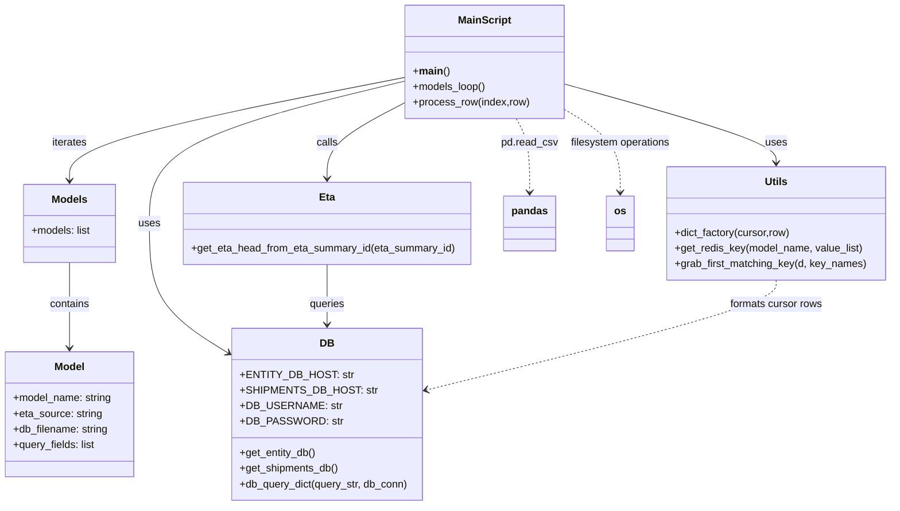

# Diagram: research/overrides/scripts/convert_override_csvs.py


> Auto-generated by Obscura crawlers

## Diagram 1



### SVG

<svg id="container" width="1366.37109375" xmlns="http://www.w3.org/2000/svg" class="classDiagram" height="776" viewBox="0 0 1366.37109375 776" role="graphics-document document" aria-roledescription="class"><style>#container{font-family:"trebuchet ms",verdana,arial,sans-serif;font-size:16px;fill:#333;}@keyframes edge-animation-frame{from{stroke-dashoffset:0;}}@keyframes dash{to{stroke-dashoffset:0;}}#container .edge-animation-slow{stroke-dasharray:9,5!important;stroke-dashoffset:900;animation:dash 50s linear infinite;stroke-linecap:round;}#container .edge-animation-fast{stroke-dasharray:9,5!important;stroke-dashoffset:900;animation:dash 20s linear infinite;stroke-linecap:round;}#container .error-icon{fill:#552222;}#container .error-text{fill:#552222;stroke:#552222;}#container .edge-thickness-normal{stroke-width:1px;}#container .edge-thickness-thick{stroke-width:3.5px;}#container .edge-pattern-solid{stroke-dasharray:0;}#container .edge-thickness-invisible{stroke-width:0;fill:none;}#container .edge-pattern-dashed{stroke-dasharray:3;}#container .edge-pattern-dotted{stroke-dasharray:2;}#container .marker{fill:#333333;stroke:#333333;}#container .marker.cross{stroke:#333333;}#container svg{font-family:"trebuchet ms",verdana,arial,sans-serif;font-size:16px;}#container p{margin:0;}#container g.classGroup text{fill:#9370DB;stroke:none;font-family:"trebuchet ms",verdana,arial,sans-serif;font-size:10px;}#container g.classGroup text .title{font-weight:bolder;}#container .nodeLabel,#container .edgeLabel{color:#131300;}#container .edgeLabel .label rect{fill:#ECECFF;}#container .label text{fill:#131300;}#container .labelBkg{background:#ECECFF;}#container .edgeLabel .label span{background:#ECECFF;}#container .classTitle{font-weight:bolder;}#container .node rect,#container .node circle,#container .node ellipse,#container .node polygon,#container .node path{fill:#ECECFF;stroke:#9370DB;stroke-width:1px;}#container .divider{stroke:#9370DB;stroke-width:1;}#container g.clickable{cursor:pointer;}#container g.classGroup rect{fill:#ECECFF;stroke:#9370DB;}#container g.classGroup line{stroke:#9370DB;stroke-width:1;}#container .classLabel .box{stroke:none;stroke-width:0;fill:#ECECFF;opacity:0.5;}#container .classLabel .label{fill:#9370DB;font-size:10px;}#container .relation{stroke:#333333;stroke-width:1;fill:none;}#container .dashed-line{stroke-dasharray:3;}#container .dotted-line{stroke-dasharray:1 2;}#container #compositionStart,#container .composition{fill:#333333!important;stroke:#333333!important;stroke-width:1;}#container #compositionEnd,#container .composition{fill:#333333!important;stroke:#333333!important;stroke-width:1;}#container #dependencyStart,#container .dependency{fill:#333333!important;stroke:#333333!important;stroke-width:1;}#container #dependencyStart,#container .dependency{fill:#333333!important;stroke:#333333!important;stroke-width:1;}#container #extensionStart,#container .extension{fill:transparent!important;stroke:#333333!important;stroke-width:1;}#container #extensionEnd,#container .extension{fill:transparent!important;stroke:#333333!important;stroke-width:1;}#container #aggregationStart,#container .aggregation{fill:transparent!important;stroke:#333333!important;stroke-width:1;}#container #aggregationEnd,#container .aggregation{fill:transparent!important;stroke:#333333!important;stroke-width:1;}#container #lollipopStart,#container .lollipop{fill:#ECECFF!important;stroke:#333333!important;stroke-width:1;}#container #lollipopEnd,#container .lollipop{fill:#ECECFF!important;stroke:#333333!important;stroke-width:1;}#container .edgeTerminals{font-size:11px;line-height:initial;}#container .classTitleText{text-anchor:middle;font-size:18px;fill:#333;}#container .label-icon{display:inline-block;height:1em;overflow:visible;vertical-align:-0.125em;}#container .node .label-icon path{fill:currentColor;stroke:revert;stroke-width:revert;}#container :root{--mermaid-font-family:"trebuchet ms",verdana,arial,sans-serif;}</style><g><defs><marker id="container_class-aggregationStart" class="marker aggregation class" refX="18" refY="7" markerWidth="190" markerHeight="240" orient="auto"><path d="M 18,7 L9,13 L1,7 L9,1 Z"></path></marker></defs><defs><marker id="container_class-aggregationEnd" class="marker aggregation class" refX="1" refY="7" markerWidth="20" markerHeight="28" orient="auto"><path d="M 18,7 L9,13 L1,7 L9,1 Z"></path></marker></defs><defs><marker id="container_class-extensionStart" class="marker extension class" refX="18" refY="7" markerWidth="190" markerHeight="240" orient="auto"><path d="M 1,7 L18,13 V 1 Z"></path></marker></defs><defs><marker id="container_class-extensionEnd" class="marker extension class" refX="1" refY="7" markerWidth="20" markerHeight="28" orient="auto"><path d="M 1,1 V 13 L18,7 Z"></path></marker></defs><defs><marker id="container_class-compositionStart" class="marker composition class" refX="18" refY="7" markerWidth="190" markerHeight="240" orient="auto"><path d="M 18,7 L9,13 L1,7 L9,1 Z"></path></marker></defs><defs><marker id="container_class-compositionEnd" class="marker composition class" refX="1" refY="7" markerWidth="20" markerHeight="28" orient="auto"><path d="M 18,7 L9,13 L1,7 L9,1 Z"></path></marker></defs><defs><marker id="container_class-dependencyStart" class="marker dependency class" refX="6" refY="7" markerWidth="190" markerHeight="240" orient="auto"><path d="M 5,7 L9,13 L1,7 L9,1 Z"></path></marker></defs><defs><marker id="container_class-dependencyEnd" class="marker dependency class" refX="13" refY="7" markerWidth="20" markerHeight="28" orient="auto"><path d="M 18,7 L9,13 L14,7 L9,1 Z"></path></marker></defs><defs><marker id="container_class-lollipopStart" class="marker lollipop class" refX="13" refY="7" markerWidth="190" markerHeight="240" orient="auto"><circle stroke="black" fill="transparent" cx="7" cy="7" r="6"></circle></marker></defs><defs><marker id="container_class-lollipopEnd" class="marker lollipop class" refX="1" refY="7" markerWidth="190" markerHeight="240" orient="auto"><circle stroke="black" fill="transparent" cx="7" cy="7" r="6"></circle></marker></defs><g class="root"><g class="clusters"></g><g class="edgePaths"><path d="M107.559,403L107.559,413.667C107.559,424.333,107.559,445.667,107.559,467.5C107.559,489.333,107.559,511.667,107.559,522.833L107.559,534" id="id_Models_Model_1" class="edge-thickness-normal edge-pattern-solid relation" style=";;;" data-edge="true" data-et="edge" data-id="id_Models_Model_1" data-points="W3sieCI6MTA3LjU1ODU5Mzc1LCJ5Ijo0MDN9LHsieCI6MTA3LjU1ODU5Mzc1LCJ5Ijo0Njd9LHsieCI6MTA3LjU1ODU5Mzc1LCJ5Ijo1NDB9XQ==" marker-end="url(#container_class-dependencyEnd)"></path><path d="M624.107,118.513L538.016,135.261C451.924,152.009,279.742,185.504,193.65,211.919C107.559,238.333,107.559,257.667,107.559,267.333L107.559,277" id="id_MainScript_Models_2" class="edge-thickness-normal edge-pattern-solid relation" style=";;;" data-edge="true" data-et="edge" data-id="id_MainScript_Models_2" data-points="W3sieCI6NjI0LjEwNzQyMTg3NSwieSI6MTE4LjUxMjk1MDU0MTg5MTI0fSx7IngiOjEwNy41NTg1OTM3NSwieSI6MjE5fSx7IngiOjEwNy41NTg1OTM3NSwieSI6MjgzfV0=" marker-end="url(#container_class-dependencyEnd)"></path><path d="M624.107,124.119L558.469,139.933C492.831,155.746,361.554,187.373,295.916,223.853C230.277,260.333,230.277,301.667,230.277,343C230.277,384.333,230.277,425.667,250.413,458.806C270.548,491.946,310.82,516.892,330.955,529.365L351.091,541.837" id="id_MainScript_DB_3" class="edge-thickness-normal edge-pattern-solid relation" style=";;;" data-edge="true" data-et="edge" data-id="id_MainScript_DB_3" data-points="W3sieCI6NjI0LjEwNzQyMTg3NSwieSI6MTI0LjExOTExOTYyODExODc3fSx7IngiOjIzMC4yNzczNDM3NSwieSI6MjE5fSx7IngiOjIzMC4yNzczNDM3NSwieSI6MzQzfSx7IngiOjIzMC4yNzczNDM3NSwieSI6NDY3fSx7IngiOjM1Ni4xOTE0MDYyNSwieSI6NTQ0Ljk5NzAyMTg5MTk1Nzd9XQ==" marker-end="url(#container_class-dependencyEnd)"></path><path d="M865.842,128.57L920.107,143.641C974.372,158.713,1082.903,188.857,1137.168,209.095C1191.434,229.333,1191.434,239.667,1191.434,244.833L1191.434,250" id="id_MainScript_Utils_4" class="edge-thickness-normal edge-pattern-solid relation" style=";;;" data-edge="true" data-et="edge" data-id="id_MainScript_Utils_4" data-points="W3sieCI6ODY1Ljg0MTc5Njg3NSwieSI6MTI4LjU2OTc4MzA1ODUyOTE0fSx7IngiOjExOTEuNDMzNTkzNzUsInkiOjIxOX0seyJ4IjoxMTkxLjQzMzU5Mzc1LCJ5IjoyNTZ9XQ==" marker-end="url(#container_class-dependencyEnd)"></path><path d="M624.107,156.964L603.94,167.304C583.772,177.643,543.437,198.321,523.269,217.827C503.102,237.333,503.102,255.667,503.102,264.833L503.102,274" id="id_MainScript_Eta_5" class="edge-thickness-normal edge-pattern-solid relation" style=";;;" data-edge="true" data-et="edge" data-id="id_MainScript_Eta_5" data-points="W3sieCI6NjI0LjEwNzQyMTg3NSwieSI6MTU2Ljk2NDQ1Mzg0NzMzNDAzfSx7IngiOjUwMy4xMDE1NjI1LCJ5IjoyMTl9LHsieCI6NTAzLjEwMTU2MjUsInkiOjI4MH1d" marker-end="url(#container_class-dependencyEnd)"></path><path d="M503.102,406L503.102,416.167C503.102,426.333,503.102,446.667,503.102,462C503.102,477.333,503.102,487.667,503.102,492.833L503.102,498" id="id_Eta_DB_6" class="edge-thickness-normal edge-pattern-solid relation" style=";;;" data-edge="true" data-et="edge" data-id="id_Eta_DB_6" data-points="W3sieCI6NTAzLjEwMTU2MjUsInkiOjQwNn0seyJ4Ijo1MDMuMTAxNTYyNSwieSI6NDY3fSx7IngiOjUwMy4xMDE1NjI1LCJ5Ijo1MDR9XQ==" marker-end="url(#container_class-dependencyEnd)"></path><path d="M1191.434,430L1191.434,436.167C1191.434,442.333,1191.434,454.667,1102.168,482.75C1012.902,510.833,834.37,554.667,745.104,576.583L655.839,598.5" id="id_Utils_DB_7" class="edge-thickness-normal edge-pattern-dashed relation" style=";;;" data-edge="true" data-et="edge" data-id="id_Utils_DB_7" data-points="W3sieCI6MTE5MS40MzM1OTM3NSwieSI6NDMwfSx7IngiOjExOTEuNDMzNTkzNzUsInkiOjQ2N30seyJ4Ijo2NTAuMDExNzE4NzUsInkiOjU5OS45MzA0NjQ4MzUxNzF9XQ==" marker-end="url(#container_class-dependencyEnd)"></path><path d="M792.771,182L796.158,188.167C799.546,194.333,806.322,206.667,809.71,225.5C813.098,244.333,813.098,269.667,813.098,282.333L813.098,295" id="id_MainScript_pandas_8" class="edge-thickness-normal edge-pattern-dashed relation" style=";;;" data-edge="true" data-et="edge" data-id="id_MainScript_pandas_8" data-points="W3sieCI6NzkyLjc3MDYxODA2OTU1NjUsInkiOjE4Mn0seyJ4Ijo4MTMuMDk3NjU2MjUsInkiOjIxOX0seyJ4Ijo4MTMuMDk3NjU2MjUsInkiOjMwMX1d" marker-end="url(#container_class-dependencyEnd)"></path><path d="M865.842,166.717L880.528,175.431C895.214,184.144,924.585,201.572,939.271,222.953C953.957,244.333,953.957,269.667,953.957,282.333L953.957,295" id="id_MainScript_os_9" class="edge-thickness-normal edge-pattern-dashed relation" style=";;;" data-edge="true" data-et="edge" data-id="id_MainScript_os_9" data-points="W3sieCI6ODY1Ljg0MTc5Njg3NSwieSI6MTY2LjcxNjcwNzYzMjc4MTZ9LHsieCI6OTUzLjk1NzAzMTI1LCJ5IjoyMTl9LHsieCI6OTUzLjk1NzAzMTI1LCJ5IjozMDF9XQ==" marker-end="url(#container_class-dependencyEnd)"></path></g><g class="edgeLabels"><g class="edgeLabel" transform="translate(107.55859375, 467)"><g class="label" data-id="id_Models_Model_1" transform="translate(-30.890625, -12)"><foreignObject width="61.78125" height="24"><div xmlns="http://www.w3.org/1999/xhtml" class="labelBkg" style="display: table-cell; white-space: nowrap; line-height: 1.5; max-width: 200px; text-align: center;"><span class="edgeLabel"><p>contains</p></span></div></foreignObject></g></g><g class="edgeLabel" transform="translate(107.55859375, 219)"><g class="label" data-id="id_MainScript_Models_2" transform="translate(-27.4140625, -12)"><foreignObject width="54.828125" height="24"><div xmlns="http://www.w3.org/1999/xhtml" class="labelBkg" style="display: table-cell; white-space: nowrap; line-height: 1.5; max-width: 200px; text-align: center;"><span class="edgeLabel"><p>iterates</p></span></div></foreignObject></g></g><g class="edgeLabel" transform="translate(230.27734375, 343)"><g class="label" data-id="id_MainScript_DB_3" transform="translate(-16.4921875, -12)"><foreignObject width="32.984375" height="24"><div xmlns="http://www.w3.org/1999/xhtml" class="labelBkg" style="display: table-cell; white-space: nowrap; line-height: 1.5; max-width: 200px; text-align: center;"><span class="edgeLabel"><p>uses</p></span></div></foreignObject></g></g><g class="edgeLabel" transform="translate(1191.43359375, 219)"><g class="label" data-id="id_MainScript_Utils_4" transform="translate(-16.4921875, -12)"><foreignObject width="32.984375" height="24"><div xmlns="http://www.w3.org/1999/xhtml" class="labelBkg" style="display: table-cell; white-space: nowrap; line-height: 1.5; max-width: 200px; text-align: center;"><span class="edgeLabel"><p>uses</p></span></div></foreignObject></g></g><g class="edgeLabel" transform="translate(503.1015625, 219)"><g class="label" data-id="id_MainScript_Eta_5" transform="translate(-16.4453125, -12)"><foreignObject width="32.890625" height="24"><div xmlns="http://www.w3.org/1999/xhtml" class="labelBkg" style="display: table-cell; white-space: nowrap; line-height: 1.5; max-width: 200px; text-align: center;"><span class="edgeLabel"><p>calls</p></span></div></foreignObject></g></g><g class="edgeLabel" transform="translate(503.1015625, 467)"><g class="label" data-id="id_Eta_DB_6" transform="translate(-27.2421875, -12)"><foreignObject width="54.484375" height="24"><div xmlns="http://www.w3.org/1999/xhtml" class="labelBkg" style="display: table-cell; white-space: nowrap; line-height: 1.5; max-width: 200px; text-align: center;"><span class="edgeLabel"><p>queries</p></span></div></foreignObject></g></g><g class="edgeLabel" transform="translate(1191.43359375, 467)"><g class="label" data-id="id_Utils_DB_7" transform="translate(-72.2890625, -12)"><foreignObject width="144.578125" height="24"><div xmlns="http://www.w3.org/1999/xhtml" class="labelBkg" style="display: table-cell; white-space: nowrap; line-height: 1.5; max-width: 200px; text-align: center;"><span class="edgeLabel"><p>formats cursor rows</p></span></div></foreignObject></g></g><g class="edgeLabel" transform="translate(813.09765625, 219)"><g class="label" data-id="id_MainScript_pandas_8" transform="translate(-43.0859375, -12)"><foreignObject width="86.171875" height="24"><div xmlns="http://www.w3.org/1999/xhtml" class="labelBkg" style="display: table-cell; white-space: nowrap; line-height: 1.5; max-width: 200px; text-align: center;"><span class="edgeLabel"><p>pd.read_csv</p></span></div></foreignObject></g></g><g class="edgeLabel" transform="translate(953.95703125, 219)"><g class="label" data-id="id_MainScript_os_9" transform="translate(-77.7734375, -12)"><foreignObject width="155.546875" height="24"><div xmlns="http://www.w3.org/1999/xhtml" class="labelBkg" style="display: table-cell; white-space: nowrap; line-height: 1.5; max-width: 200px; text-align: center;"><span class="edgeLabel"><p>filesystem operations</p></span></div></foreignObject></g></g></g><g class="nodes"><g class="node default" id="classId-Models-0" transform="translate(107.55859375, 343)"><g class="basic label-container"><path d="M-71.2265625 -60 L71.2265625 -60 L71.2265625 60 L-71.2265625 60" stroke="none" stroke-width="0" fill="#ECECFF" style=""></path><path d="M-71.2265625 -60 C-30.89335736595789 -60, 9.43984776808422 -60, 71.2265625 -60 M-71.2265625 -60 C-39.7111172751728 -60, -8.195672050345607 -60, 71.2265625 -60 M71.2265625 -60 C71.2265625 -20.032625449093764, 71.2265625 19.93474910181247, 71.2265625 60 M71.2265625 -60 C71.2265625 -20.341143797122683, 71.2265625 19.317712405754634, 71.2265625 60 M71.2265625 60 C40.503815144759415 60, 9.781067789518822 60, -71.2265625 60 M71.2265625 60 C16.155790083574963 60, -38.91498233285007 60, -71.2265625 60 M-71.2265625 60 C-71.2265625 19.034648690103843, -71.2265625 -21.930702619792314, -71.2265625 -60 M-71.2265625 60 C-71.2265625 28.737629860663844, -71.2265625 -2.5247402786723114, -71.2265625 -60" stroke="#9370DB" stroke-width="1.3" fill="none" stroke-dasharray="0 0" style=""></path></g><g class="annotation-group text" transform="translate(0, -36)"></g><g class="label-group text" transform="translate(-26.421875, -36)"><g class="label" style="font-weight: bolder" transform="translate(0,-12)"><foreignObject width="52.84375" height="24"><div xmlns="http://www.w3.org/1999/xhtml" style="display: table-cell; white-space: nowrap; line-height: 1.5; max-width: 102px; text-align: center;"><span class="nodeLabel markdown-node-label" style=""><p>Models</p></span></div></foreignObject></g></g><g class="members-group text" transform="translate(-59.2265625, 12)"><g class="label" style="" transform="translate(0,-12)"><foreignObject width="92.03125" height="24"><div xmlns="http://www.w3.org/1999/xhtml" style="display: table-cell; white-space: nowrap; line-height: 1.5; max-width: 150px; text-align: center;"><span class="nodeLabel markdown-node-label" style=""><p>+models: list</p></span></div></foreignObject></g></g><g class="methods-group text" transform="translate(-59.2265625, 60)"></g><g class="divider" style=""><path d="M-71.2265625 -12 C-31.109225481198926 -12, 9.008111537602147 -12, 71.2265625 -12 M-71.2265625 -12 C-29.077711854018325 -12, 13.07113879196335 -12, 71.2265625 -12" stroke="#9370DB" stroke-width="1.3" fill="none" stroke-dasharray="0 0" style=""></path></g><g class="divider" style=""><path d="M-71.2265625 36 C-40.93231381931159 36, -10.638065138623176 36, 71.2265625 36 M-71.2265625 36 C-31.63959529564952 36, 7.947371908700958 36, 71.2265625 36" stroke="#9370DB" stroke-width="1.3" fill="none" stroke-dasharray="0 0" style=""></path></g></g><g class="node default" id="classId-Model-1" transform="translate(107.55859375, 636)"><g class="basic label-container"><path d="M-99.55859375 -96 L99.55859375 -96 L99.55859375 96 L-99.55859375 96" stroke="none" stroke-width="0" fill="#ECECFF" style=""></path><path d="M-99.55859375 -96 C-55.67514815413232 -96, -11.791702558264646 -96, 99.55859375 -96 M-99.55859375 -96 C-50.64621816088275 -96, -1.733842571765507 -96, 99.55859375 -96 M99.55859375 -96 C99.55859375 -30.002762958564176, 99.55859375 35.99447408287165, 99.55859375 96 M99.55859375 -96 C99.55859375 -56.74246890038092, 99.55859375 -17.48493780076184, 99.55859375 96 M99.55859375 96 C31.936097016254706 96, -35.68639971749059 96, -99.55859375 96 M99.55859375 96 C28.76303433298331 96, -42.03252508403338 96, -99.55859375 96 M-99.55859375 96 C-99.55859375 20.93646464483082, -99.55859375 -54.12707071033836, -99.55859375 -96 M-99.55859375 96 C-99.55859375 46.369521730766344, -99.55859375 -3.260956538467312, -99.55859375 -96" stroke="#9370DB" stroke-width="1.3" fill="none" stroke-dasharray="0 0" style=""></path></g><g class="annotation-group text" transform="translate(0, -72)"></g><g class="label-group text" transform="translate(-22.5546875, -72)"><g class="label" style="font-weight: bolder" transform="translate(0,-12)"><foreignObject width="45.109375" height="24"><div xmlns="http://www.w3.org/1999/xhtml" style="display: table-cell; white-space: nowrap; line-height: 1.5; max-width: 95px; text-align: center;"><span class="nodeLabel markdown-node-label" style=""><p>Model</p></span></div></foreignObject></g></g><g class="members-group text" transform="translate(-87.55859375, -24)"><g class="label" style="" transform="translate(0,-12)"><foreignObject width="152.5625" height="24"><div xmlns="http://www.w3.org/1999/xhtml" style="display: table-cell; white-space: nowrap; line-height: 1.5; max-width: 211px; text-align: center;"><span class="nodeLabel markdown-node-label" style=""><p>+model_name: string</p></span></div></foreignObject></g><g class="label" style="" transform="translate(0,12)"><foreignObject width="136.984375" height="24"><div xmlns="http://www.w3.org/1999/xhtml" style="display: table-cell; white-space: nowrap; line-height: 1.5; max-width: 195px; text-align: center;"><span class="nodeLabel markdown-node-label" style=""><p>+eta_source: string</p></span></div></foreignObject></g><g class="label" style="" transform="translate(0,36)"><foreignObject width="147.5" height="24"><div xmlns="http://www.w3.org/1999/xhtml" style="display: table-cell; white-space: nowrap; line-height: 1.5; max-width: 206px; text-align: center;"><span class="nodeLabel markdown-node-label" style=""><p>+db_filename: string</p></span></div></foreignObject></g><g class="label" style="" transform="translate(0,60)"><foreignObject width="127.25" height="24"><div xmlns="http://www.w3.org/1999/xhtml" style="display: table-cell; white-space: nowrap; line-height: 1.5; max-width: 185px; text-align: center;"><span class="nodeLabel markdown-node-label" style=""><p>+query_fields: list</p></span></div></foreignObject></g></g><g class="methods-group text" transform="translate(-87.55859375, 96)"></g><g class="divider" style=""><path d="M-99.55859375 -48 C-34.022286368029654 -48, 31.51402101394069 -48, 99.55859375 -48 M-99.55859375 -48 C-21.116834858521813 -48, 57.324924032956375 -48, 99.55859375 -48" stroke="#9370DB" stroke-width="1.3" fill="none" stroke-dasharray="0 0" style=""></path></g><g class="divider" style=""><path d="M-99.55859375 72 C-23.799616832766503 72, 51.959360084466994 72, 99.55859375 72 M-99.55859375 72 C-42.94719285260787 72, 13.66420804478426 72, 99.55859375 72" stroke="#9370DB" stroke-width="1.3" fill="none" stroke-dasharray="0 0" style=""></path></g></g><g class="node default" id="classId-DB-2" transform="translate(503.1015625, 636)"><g class="basic label-container"><path d="M-146.91015625 -132 L146.91015625 -132 L146.91015625 132 L-146.91015625 132" stroke="none" stroke-width="0" fill="#ECECFF" style=""></path><path d="M-146.91015625 -132 C-39.77940291440892 -132, 67.35135042118216 -132, 146.91015625 -132 M-146.91015625 -132 C-85.8008674858778 -132, -24.691578721755604 -132, 146.91015625 -132 M146.91015625 -132 C146.91015625 -73.35990581978513, 146.91015625 -14.719811639570267, 146.91015625 132 M146.91015625 -132 C146.91015625 -53.28571587092175, 146.91015625 25.428568258156503, 146.91015625 132 M146.91015625 132 C84.11886620211476 132, 21.327576154229504 132, -146.91015625 132 M146.91015625 132 C50.72022577893621 132, -45.46970469212758 132, -146.91015625 132 M-146.91015625 132 C-146.91015625 32.30047790973384, -146.91015625 -67.39904418053231, -146.91015625 -132 M-146.91015625 132 C-146.91015625 27.814325267704945, -146.91015625 -76.37134946459011, -146.91015625 -132" stroke="#9370DB" stroke-width="1.3" fill="none" stroke-dasharray="0 0" style=""></path></g><g class="annotation-group text" transform="translate(0, -108)"></g><g class="label-group text" transform="translate(-10.1484375, -108)"><g class="label" style="font-weight: bolder" transform="translate(0,-12)"><foreignObject width="20.296875" height="24"><div xmlns="http://www.w3.org/1999/xhtml" style="display: table-cell; white-space: nowrap; line-height: 1.5; max-width: 70px; text-align: center;"><span class="nodeLabel markdown-node-label" style=""><p>DB</p></span></div></foreignObject></g></g><g class="members-group text" transform="translate(-134.91015625, -60)"><g class="label" style="" transform="translate(0,-12)"><foreignObject width="158.078125" height="24"><div xmlns="http://www.w3.org/1999/xhtml" style="display: table-cell; white-space: nowrap; line-height: 1.5; max-width: 216px; text-align: center;"><span class="nodeLabel markdown-node-label" style=""><p>+ENTITY_DB_HOST: str</p></span></div></foreignObject></g><g class="label" style="" transform="translate(0,12)"><foreignObject width="190.421875" height="24"><div xmlns="http://www.w3.org/1999/xhtml" style="display: table-cell; white-space: nowrap; line-height: 1.5; max-width: 249px; text-align: center;"><span class="nodeLabel markdown-node-label" style=""><p>+SHIPMENTS_DB_HOST: str</p></span></div></foreignObject></g><g class="label" style="" transform="translate(0,36)"><foreignObject width="141.59375" height="24"><div xmlns="http://www.w3.org/1999/xhtml" style="display: table-cell; white-space: nowrap; line-height: 1.5; max-width: 200px; text-align: center;"><span class="nodeLabel markdown-node-label" style=""><p>+DB_USERNAME: str</p></span></div></foreignObject></g><g class="label" style="" transform="translate(0,60)"><foreignObject width="142.390625" height="24"><div xmlns="http://www.w3.org/1999/xhtml" style="display: table-cell; white-space: nowrap; line-height: 1.5; max-width: 201px; text-align: center;"><span class="nodeLabel markdown-node-label" style=""><p>+DB_PASSWORD: str</p></span></div></foreignObject></g></g><g class="methods-group text" transform="translate(-134.91015625, 60)"><g class="label" style="" transform="translate(0,-12)"><foreignObject width="117.46875" height="24"><div xmlns="http://www.w3.org/1999/xhtml" style="display: table-cell; white-space: nowrap; line-height: 1.5; max-width: 175px; text-align: center;"><span class="nodeLabel markdown-node-label" style=""><p>+get_entity_db()</p></span></div></foreignObject></g><g class="label" style="" transform="translate(0,12)"><foreignObject width="151.90625" height="24"><div xmlns="http://www.w3.org/1999/xhtml" style="display: table-cell; white-space: nowrap; line-height: 1.5; max-width: 209px; text-align: center;"><span class="nodeLabel markdown-node-label" style=""><p>+get_shipments_db()</p></span></div></foreignObject></g><g class="label" style="" transform="translate(0,36)"><foreignObject width="259.671875" height="24"><div xmlns="http://www.w3.org/1999/xhtml" style="display: table-cell; white-space: nowrap; line-height: 1.5; max-width: 317px; text-align: center;"><span class="nodeLabel markdown-node-label" style=""><p>+db_query_dict(query_str, db_conn)</p></span></div></foreignObject></g></g><g class="divider" style=""><path d="M-146.91015625 -84 C-71.9118513050422 -84, 3.0864536399155895 -84, 146.91015625 -84 M-146.91015625 -84 C-81.74693668607445 -84, -16.583717122148897 -84, 146.91015625 -84" stroke="#9370DB" stroke-width="1.3" fill="none" stroke-dasharray="0 0" style=""></path></g><g class="divider" style=""><path d="M-146.91015625 36 C-83.38276651643775 36, -19.855376782875496 36, 146.91015625 36 M-146.91015625 36 C-37.189492195060595 36, 72.53117185987881 36, 146.91015625 36" stroke="#9370DB" stroke-width="1.3" fill="none" stroke-dasharray="0 0" style=""></path></g></g><g class="node default" id="classId-Utils-3" transform="translate(1191.43359375, 343)"><g class="basic label-container"><path d="M-166.9375 -87 L166.9375 -87 L166.9375 87 L-166.9375 87" stroke="none" stroke-width="0" fill="#ECECFF" style=""></path><path d="M-166.9375 -87 C-98.60424859313915 -87, -30.270997186278294 -87, 166.9375 -87 M-166.9375 -87 C-72.78773471875317 -87, 21.362030562493658 -87, 166.9375 -87 M166.9375 -87 C166.9375 -33.34719679426847, 166.9375 20.30560641146306, 166.9375 87 M166.9375 -87 C166.9375 -50.073692686916395, 166.9375 -13.14738537383279, 166.9375 87 M166.9375 87 C93.92962832058778 87, 20.921756641175563 87, -166.9375 87 M166.9375 87 C44.68561354543719 87, -77.56627290912562 87, -166.9375 87 M-166.9375 87 C-166.9375 49.85711791426714, -166.9375 12.714235828534285, -166.9375 -87 M-166.9375 87 C-166.9375 51.63799570950998, -166.9375 16.27599141901996, -166.9375 -87" stroke="#9370DB" stroke-width="1.3" fill="none" stroke-dasharray="0 0" style=""></path></g><g class="annotation-group text" transform="translate(0, -63)"></g><g class="label-group text" transform="translate(-16.796875, -63)"><g class="label" style="font-weight: bolder" transform="translate(0,-12)"><foreignObject width="33.59375" height="24"><div xmlns="http://www.w3.org/1999/xhtml" style="display: table-cell; white-space: nowrap; line-height: 1.5; max-width: 83px; text-align: center;"><span class="nodeLabel markdown-node-label" style=""><p>Utils</p></span></div></foreignObject></g></g><g class="members-group text" transform="translate(-154.9375, -15)"></g><g class="methods-group text" transform="translate(-154.9375, 15)"><g class="label" style="" transform="translate(0,-12)"><foreignObject width="178.953125" height="24"><div xmlns="http://www.w3.org/1999/xhtml" style="display: table-cell; white-space: nowrap; line-height: 1.5; max-width: 236px; text-align: center;"><span class="nodeLabel markdown-node-label" style=""><p>+dict_factory(cursor,row)</p></span></div></foreignObject></g><g class="label" style="" transform="translate(0,12)"><foreignObject width="289.734375" height="24"><div xmlns="http://www.w3.org/1999/xhtml" style="display: table-cell; white-space: nowrap; line-height: 1.5; max-width: 347px; text-align: center;"><span class="nodeLabel markdown-node-label" style=""><p>+get_redis_key(model_name, value_list)</p></span></div></foreignObject></g><g class="label" style="" transform="translate(0,36)"><foreignObject width="293.078125" height="24"><div xmlns="http://www.w3.org/1999/xhtml" style="display: table-cell; white-space: nowrap; line-height: 1.5; max-width: 350px; text-align: center;"><span class="nodeLabel markdown-node-label" style=""><p>+grab_first_matching_key(d, key_names)</p></span></div></foreignObject></g></g><g class="divider" style=""><path d="M-166.9375 -39 C-82.02704656889713 -39, 2.8834068622057316 -39, 166.9375 -39 M-166.9375 -39 C-58.850925253797286 -39, 49.23564949240543 -39, 166.9375 -39" stroke="#9370DB" stroke-width="1.3" fill="none" stroke-dasharray="0 0" style=""></path></g><g class="divider" style=""><path d="M-166.9375 -15 C-60.87619339269307 -15, 45.185113214613864 -15, 166.9375 -15 M-166.9375 -15 C-100.08644478864503 -15, -33.23538957729005 -15, 166.9375 -15" stroke="#9370DB" stroke-width="1.3" fill="none" stroke-dasharray="0 0" style=""></path></g></g><g class="node default" id="classId-Eta-4" transform="translate(503.1015625, 343)"><g class="basic label-container"><path d="M-221.33203125 -63 L221.33203125 -63 L221.33203125 63 L-221.33203125 63" stroke="none" stroke-width="0" fill="#ECECFF" style=""></path><path d="M-221.33203125 -63 C-56.114616459640445 -63, 109.10279833071911 -63, 221.33203125 -63 M-221.33203125 -63 C-98.14625877684118 -63, 25.03951369631764 -63, 221.33203125 -63 M221.33203125 -63 C221.33203125 -13.239791854008324, 221.33203125 36.52041629198335, 221.33203125 63 M221.33203125 -63 C221.33203125 -14.307232500583162, 221.33203125 34.38553499883368, 221.33203125 63 M221.33203125 63 C99.7795614910668 63, -21.7729082678664 63, -221.33203125 63 M221.33203125 63 C113.77595610019485 63, 6.219880950389694 63, -221.33203125 63 M-221.33203125 63 C-221.33203125 19.531776156742893, -221.33203125 -23.936447686514214, -221.33203125 -63 M-221.33203125 63 C-221.33203125 14.877303833820193, -221.33203125 -33.245392332359614, -221.33203125 -63" stroke="#9370DB" stroke-width="1.3" fill="none" stroke-dasharray="0 0" style=""></path></g><g class="annotation-group text" transform="translate(0, -39)"></g><g class="label-group text" transform="translate(-11.4453125, -39)"><g class="label" style="font-weight: bolder" transform="translate(0,-12)"><foreignObject width="22.890625" height="24"><div xmlns="http://www.w3.org/1999/xhtml" style="display: table-cell; white-space: nowrap; line-height: 1.5; max-width: 73px; text-align: center;"><span class="nodeLabel markdown-node-label" style=""><p>Eta</p></span></div></foreignObject></g></g><g class="members-group text" transform="translate(-209.33203125, 9)"></g><g class="methods-group text" transform="translate(-209.33203125, 39)"><g class="label" style="" transform="translate(0,-12)"><foreignObject width="407.21875" height="24"><div xmlns="http://www.w3.org/1999/xhtml" style="display: table-cell; white-space: nowrap; line-height: 1.5; max-width: 465px; text-align: center;"><span class="nodeLabel markdown-node-label" style=""><p>+get_eta_head_from_eta_summary_id(eta_summary_id)</p></span></div></foreignObject></g></g><g class="divider" style=""><path d="M-221.33203125 -15 C-61.43861888748083 -15, 98.45479347503834 -15, 221.33203125 -15 M-221.33203125 -15 C-65.62587823994451 -15, 90.08027477011098 -15, 221.33203125 -15" stroke="#9370DB" stroke-width="1.3" fill="none" stroke-dasharray="0 0" style=""></path></g><g class="divider" style=""><path d="M-221.33203125 9 C-131.27654759405402 9, -41.221063938108074 9, 221.33203125 9 M-221.33203125 9 C-60.93861293270555 9, 99.4548053845889 9, 221.33203125 9" stroke="#9370DB" stroke-width="1.3" fill="none" stroke-dasharray="0 0" style=""></path></g></g><g class="node default" id="classId-MainScript-5" transform="translate(744.974609375, 95)"><g class="basic label-container"><path d="M-120.8671875 -87 L120.8671875 -87 L120.8671875 87 L-120.8671875 87" stroke="none" stroke-width="0" fill="#ECECFF" style=""></path><path d="M-120.8671875 -87 C-67.75031674186927 -87, -14.63344598373854 -87, 120.8671875 -87 M-120.8671875 -87 C-30.328424029564317 -87, 60.210339440871365 -87, 120.8671875 -87 M120.8671875 -87 C120.8671875 -37.74179905795587, 120.8671875 11.516401884088253, 120.8671875 87 M120.8671875 -87 C120.8671875 -29.466490605390675, 120.8671875 28.06701878921865, 120.8671875 87 M120.8671875 87 C38.909068800835726 87, -43.04904989832855 87, -120.8671875 87 M120.8671875 87 C55.170406318078136 87, -10.526374863843728 87, -120.8671875 87 M-120.8671875 87 C-120.8671875 34.55164663458223, -120.8671875 -17.896706730835547, -120.8671875 -87 M-120.8671875 87 C-120.8671875 22.10888568388036, -120.8671875 -42.78222863223928, -120.8671875 -87" stroke="#9370DB" stroke-width="1.3" fill="none" stroke-dasharray="0 0" style=""></path></g><g class="annotation-group text" transform="translate(0, -63)"></g><g class="label-group text" transform="translate(-39.28125, -63)"><g class="label" style="font-weight: bolder" transform="translate(0,-12)"><foreignObject width="78.5625" height="24"><div xmlns="http://www.w3.org/1999/xhtml" style="display: table-cell; white-space: nowrap; line-height: 1.5; max-width: 128px; text-align: center;"><span class="nodeLabel markdown-node-label" style=""><p>MainScript</p></span></div></foreignObject></g></g><g class="members-group text" transform="translate(-108.8671875, -15)"></g><g class="methods-group text" transform="translate(-108.8671875, 15)"><g class="label" style="" transform="translate(0,-12)"><foreignObject width="54.40625" height="24"><div xmlns="http://www.w3.org/1999/xhtml" style="display: table-cell; white-space: nowrap; line-height: 1.5; max-width: 144px; text-align: center;"><span class="nodeLabel markdown-node-label" style=""><p>+<strong>main</strong>()</p></span></div></foreignObject></g><g class="label" style="" transform="translate(0,12)"><foreignObject width="112.5" height="24"><div xmlns="http://www.w3.org/1999/xhtml" style="display: table-cell; white-space: nowrap; line-height: 1.5; max-width: 170px; text-align: center;"><span class="nodeLabel markdown-node-label" style=""><p>+models_loop()</p></span></div></foreignObject></g><g class="label" style="" transform="translate(0,36)"><foreignObject width="178.453125" height="24"><div xmlns="http://www.w3.org/1999/xhtml" style="display: table-cell; white-space: nowrap; line-height: 1.5; max-width: 236px; text-align: center;"><span class="nodeLabel markdown-node-label" style=""><p>+process_row(index,row)</p></span></div></foreignObject></g></g><g class="divider" style=""><path d="M-120.8671875 -39 C-28.537358491726295 -39, 63.79247051654741 -39, 120.8671875 -39 M-120.8671875 -39 C-29.95375146047752 -39, 60.95968457904496 -39, 120.8671875 -39" stroke="#9370DB" stroke-width="1.3" fill="none" stroke-dasharray="0 0" style=""></path></g><g class="divider" style=""><path d="M-120.8671875 -15 C-60.367229471010006 -15, 0.13272855797998773 -15, 120.8671875 -15 M-120.8671875 -15 C-27.926747791241 -15, 65.013691917518 -15, 120.8671875 -15" stroke="#9370DB" stroke-width="1.3" fill="none" stroke-dasharray="0 0" style=""></path></g></g><g class="node default" id="classId-pandas-6" transform="translate(813.09765625, 343)"><g class="basic label-container"><path d="M-38.6640625 -42 L38.6640625 -42 L38.6640625 42 L-38.6640625 42" stroke="none" stroke-width="0" fill="#ECECFF" style=""></path><path d="M-38.6640625 -42 C-14.732654440981335 -42, 9.19875361803733 -42, 38.6640625 -42 M-38.6640625 -42 C-13.87571335113666 -42, 10.91263579772668 -42, 38.6640625 -42 M38.6640625 -42 C38.6640625 -14.953115022019762, 38.6640625 12.093769955960475, 38.6640625 42 M38.6640625 -42 C38.6640625 -19.341233192660678, 38.6640625 3.317533614678645, 38.6640625 42 M38.6640625 42 C16.786738492428324 42, -5.090585515143353 42, -38.6640625 42 M38.6640625 42 C13.030061284205214 42, -12.603939931589572 42, -38.6640625 42 M-38.6640625 42 C-38.6640625 24.218081481185383, -38.6640625 6.436162962370766, -38.6640625 -42 M-38.6640625 42 C-38.6640625 16.381258200144728, -38.6640625 -9.237483599710544, -38.6640625 -42" stroke="#9370DB" stroke-width="1.3" fill="none" stroke-dasharray="0 0" style=""></path></g><g class="annotation-group text" transform="translate(0, -18)"></g><g class="label-group text" transform="translate(-26.6640625, -18)"><g class="label" style="font-weight: bolder" transform="translate(0,-12)"><foreignObject width="53.328125" height="24"><div xmlns="http://www.w3.org/1999/xhtml" style="display: table-cell; white-space: nowrap; line-height: 1.5; max-width: 103px; text-align: center;"><span class="nodeLabel markdown-node-label" style=""><p>pandas</p></span></div></foreignObject></g></g><g class="members-group text" transform="translate(-26.6640625, 30)"></g><g class="methods-group text" transform="translate(-26.6640625, 60)"></g><g class="divider" style=""><path d="M-38.6640625 6 C-17.282408965802244 6, 4.0992445683955125 6, 38.6640625 6 M-38.6640625 6 C-9.313442740475363 6, 20.037177019049274 6, 38.6640625 6" stroke="#9370DB" stroke-width="1.3" fill="none" stroke-dasharray="0 0" style=""></path></g><g class="divider" style=""><path d="M-38.6640625 24 C-15.503470300707463 24, 7.657121898585075 24, 38.6640625 24 M-38.6640625 24 C-10.1680698056125 24, 18.327922888775 24, 38.6640625 24" stroke="#9370DB" stroke-width="1.3" fill="none" stroke-dasharray="0 0" style=""></path></g></g><g class="node default" id="classId-os-7" transform="translate(953.95703125, 343)"><g class="basic label-container"><path d="M-20.5390625 -42 L20.5390625 -42 L20.5390625 42 L-20.5390625 42" stroke="none" stroke-width="0" fill="#ECECFF" style=""></path><path d="M-20.5390625 -42 C-5.638810207860111 -42, 9.261442084279778 -42, 20.5390625 -42 M-20.5390625 -42 C-10.876036896427062 -42, -1.213011292854123 -42, 20.5390625 -42 M20.5390625 -42 C20.5390625 -20.423123028449123, 20.5390625 1.153753943101755, 20.5390625 42 M20.5390625 -42 C20.5390625 -15.344633797131479, 20.5390625 11.310732405737042, 20.5390625 42 M20.5390625 42 C4.38744488880636 42, -11.76417272238728 42, -20.5390625 42 M20.5390625 42 C11.774177784389526 42, 3.0092930687790513 42, -20.5390625 42 M-20.5390625 42 C-20.5390625 17.622904095038532, -20.5390625 -6.754191809922936, -20.5390625 -42 M-20.5390625 42 C-20.5390625 11.690494504497519, -20.5390625 -18.619010991004963, -20.5390625 -42" stroke="#9370DB" stroke-width="1.3" fill="none" stroke-dasharray="0 0" style=""></path></g><g class="annotation-group text" transform="translate(0, -18)"></g><g class="label-group text" transform="translate(-8.5390625, -18)"><g class="label" style="font-weight: bolder" transform="translate(0,-12)"><foreignObject width="17.078125" height="24"><div xmlns="http://www.w3.org/1999/xhtml" style="display: table-cell; white-space: nowrap; line-height: 1.5; max-width: 67px; text-align: center;"><span class="nodeLabel markdown-node-label" style=""><p>os</p></span></div></foreignObject></g></g><g class="members-group text" transform="translate(-8.5390625, 30)"></g><g class="methods-group text" transform="translate(-8.5390625, 60)"></g><g class="divider" style=""><path d="M-20.5390625 6 C-6.878269669897961 6, 6.782523160204079 6, 20.5390625 6 M-20.5390625 6 C-11.875018385855059 6, -3.2109742717101177 6, 20.5390625 6" stroke="#9370DB" stroke-width="1.3" fill="none" stroke-dasharray="0 0" style=""></path></g><g class="divider" style=""><path d="M-20.5390625 24 C-4.615626079450509 24, 11.307810341098982 24, 20.5390625 24 M-20.5390625 24 C-10.459372867358136 24, -0.3796832347162713 24, 20.5390625 24" stroke="#9370DB" stroke-width="1.3" fill="none" stroke-dasharray="0 0" style=""></path></g></g></g></g></g></svg>

## Diagram 2

```mermaid
flowchart LR
Start([Start]) --> ForModel{For each model in models}
ForModel --> ReadCSV[Read CSV: pd.read_csv(model.db_filename)]
ReadCSV --> ForRow{For each row in CSV}
ForRow --> ExtractID[Extract eta_summary_id = row["id"]]
ExtractID --> FindNewETA[eta_new_val = grab_first_matching_key(row, ["New eta_cal","New ETA_Cal"])]
FindNewETA --> GetEtaHead[get_eta_head_from_eta_summary_id(eta_summary_id)]
GetEtaHead --> DecisionModel{model_name?}
DecisionModel -->|model180daystatus_overrides| BuildOverride1[Build override_dict; dest_id=eta_head.destination_newloc_id; origin_id=eta_head.origin_newloc_id; poi_code=eta_head.pts_interest; mode_id=eta_head.mode_id]
DecisionModel -->|model180daystatus_state_overrides| BuildOverride2[Build override_dict; dest_id=eta_head.state; origin_id=eta_head.origin_newloc_id; poi_code=eta_head.pts_interest; mode_id=eta_head.mode_id]
DecisionModel -->|modelentity180daysplc_overrides| BuildOverride3[Build override_dict; dest_id=eta_head.destination_newloc_id; origin_id="-1"; poi_code=eta_head.pts_interest; mode_id=eta_head.mode_id]
DecisionModel -->|modelentity180daysplc_state_overrides| BuildOverride4[Build override_dict; dest_id=eta_head.state; origin_id="-1"; poi_code=eta_head.pts_interest; mode_id=eta_head.mode_id]
DecisionModel -->|other| Error[Raise Exception: unknown model_name]
BuildOverride1 --> SetDefaults1[Set next_planned_loc_id="-1"; day_of_week="-1"]
BuildOverride2 --> SetDefaults2[Set next_planned_loc_id="-1"; day_of_week="-1"]
BuildOverride3 --> SetDefaults3[Set next_planned_loc_id="-1"; day_of_week="-1"]
BuildOverride4 --> SetDefaults4[Set next_planned_loc_id="-1"; day_of_week="-1"]
SetDefaults1 --> SetValue[Set override_dict["value"] = eta_new_val * 60]
SetDefaults2 --> SetValue
SetDefaults3 --> SetValue
SetDefaults4 --> SetValue
SetValue --> Append[override_rows.append(override_dict)]
Append --> LogCheck{index % 100 == 0?}
LogCheck -->|yes| PrintLog[print(override_dict)]
LogCheck -->|no| ContinueRow
PrintLog --> ContinueRow
ContinueRow --> ForRow
ForRow --> AfterRows[All rows processed]
AfterRows --> SummaryPrint[print("{} override rows count = N")]
SummaryPrint --> WriteCSV[Create processed dir and df_result.to_csv(processed/{model_name}.csv)]
WriteCSV --> NextModel{More models?}
NextModel -->|yes| ForModel
NextModel -->|no| End([End])
```

> SVG rendering failed for this diagram.
