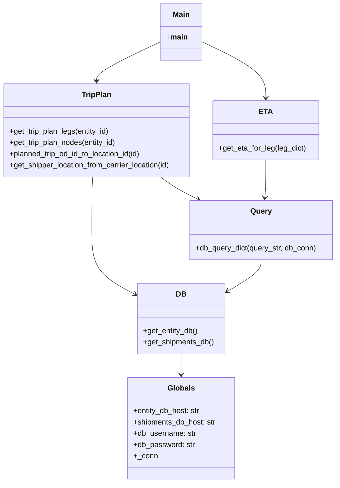
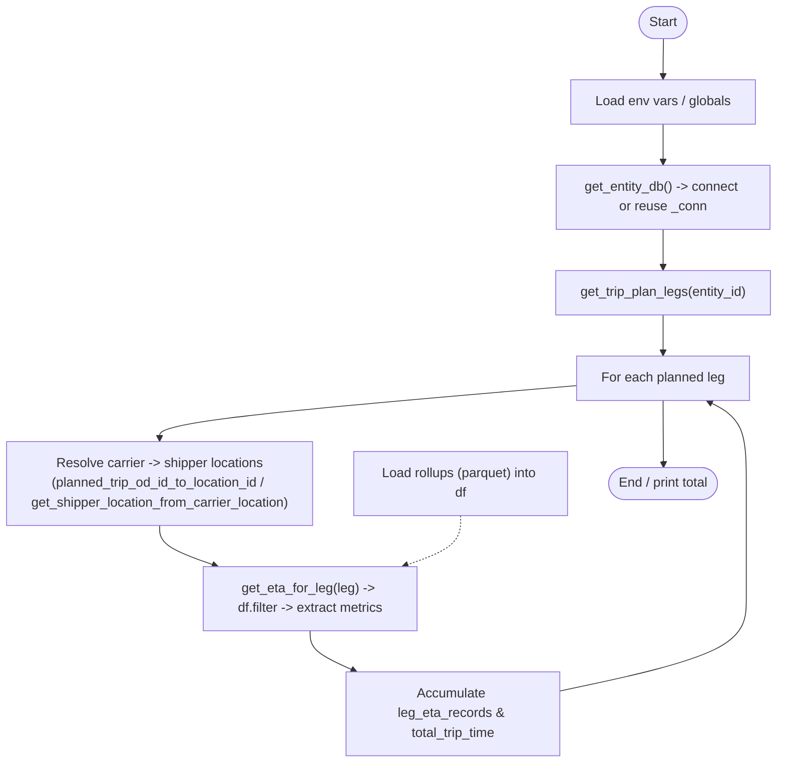
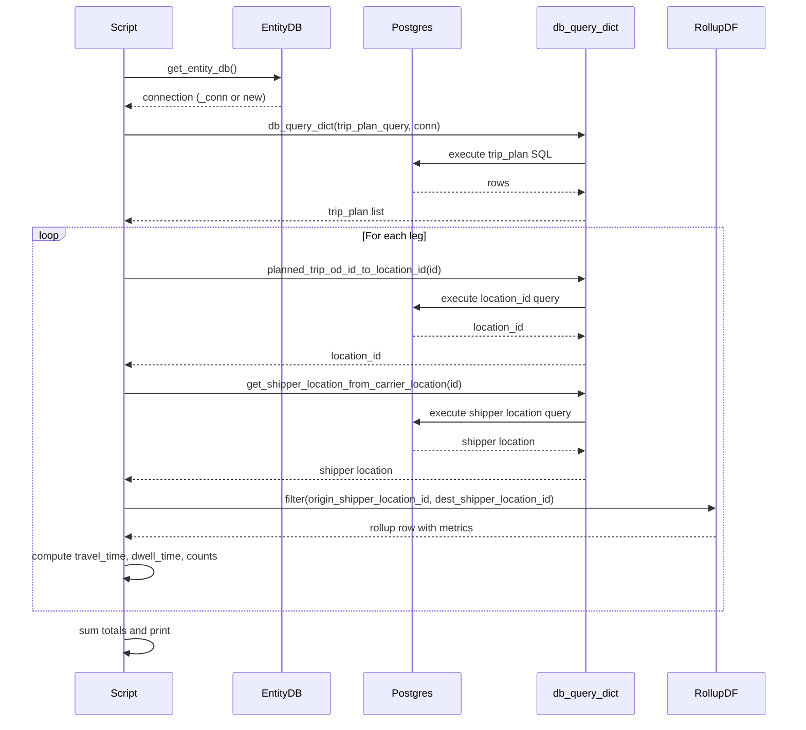

# Diagram: research/scripts/predict_test.py

> Auto-generated by Obscura crawlers

## Diagram 1

### SVG

<svg id="container" width="723.53125" xmlns="http://www.w3.org/2000/svg" class="classDiagram" height="1026" viewBox="0 0 723.53125 1026" role="graphics-document document" aria-roledescription="class"><g><defs><marker id="container_class-aggregationStart" class="marker aggregation class" refX="18" refY="7" markerWidth="190" markerHeight="240" orient="auto"><path d="M 18,7 L9,13 L1,7 L9,1 Z"></path></marker></defs><defs><marker id="container_class-aggregationEnd" class="marker aggregation class" refX="1" refY="7" markerWidth="20" markerHeight="28" orient="auto"><path d="M 18,7 L9,13 L1,7 L9,1 Z"></path></marker></defs><defs><marker id="container_class-extensionStart" class="marker extension class" refX="18" refY="7" markerWidth="190" markerHeight="240" orient="auto"><path d="M 1,7 L18,13 V 1 Z"></path></marker></defs><defs><marker id="container_class-extensionEnd" class="marker extension class" refX="1" refY="7" markerWidth="20" markerHeight="28" orient="auto"><path d="M 1,1 V 13 L18,7 Z"></path></marker></defs><defs><marker id="container_class-compositionStart" class="marker composition class" refX="18" refY="7" markerWidth="190" markerHeight="240" orient="auto"><path d="M 18,7 L9,13 L1,7 L9,1 Z"></path></marker></defs><defs><marker id="container_class-compositionEnd" class="marker composition class" refX="1" refY="7" markerWidth="20" markerHeight="28" orient="auto"><path d="M 18,7 L9,13 L1,7 L9,1 Z"></path></marker></defs><defs><marker id="container_class-dependencyStart" class="marker dependency class" refX="6" refY="7" markerWidth="190" markerHeight="240" orient="auto"><path d="M 5,7 L9,13 L1,7 L9,1 Z"></path></marker></defs><defs><marker id="container_class-dependencyEnd" class="marker dependency class" refX="13" refY="7" markerWidth="20" markerHeight="28" orient="auto"><path d="M 18,7 L9,13 L14,7 L9,1 Z"></path></marker></defs><defs><marker id="container_class-lollipopStart" class="marker lollipop class" refX="13" refY="7" markerWidth="190" markerHeight="240" orient="auto"><circle stroke="black" fill="transparent" cx="7" cy="7" r="6"></circle></marker></defs><defs><marker id="container_class-lollipopEnd" class="marker lollipop class" refX="1" refY="7" markerWidth="190" markerHeight="240" orient="auto"><circle stroke="black" fill="transparent" cx="7" cy="7" r="6"></circle></marker></defs><g class="root"><g class="clusters"></g><g class="edgePaths"><path d="M348.367,88.027L325.231,98.856C302.095,109.685,255.823,131.342,232.687,145.338C209.551,159.333,209.551,165.667,209.551,168.833L209.551,172" id="id_Main_TripPlan_1" class="edge-thickness-normal edge-pattern-solid relation" style=";;;" data-edge="true" data-et="edge" data-id="id_Main_TripPlan_1" data-points="W3sieCI6MzQ4LjM2NzE4NzUsInkiOjg4LjAyNzMxNzExNTE0MDU2fSx7IngiOjIwOS41NTA3ODEyNSwieSI6MTUzfSx7IngiOjIwOS41NTA3ODEyNSwieSI6MTc4fV0=" marker-end="url(#container_class-dependencyEnd)"></path><path d="M433.945,88.027L457.081,98.856C480.217,109.685,526.49,131.342,549.626,151.338C572.762,171.333,572.762,189.667,572.762,198.833L572.762,208" id="id_Main_ETA_2" class="edge-thickness-normal edge-pattern-solid relation" style=";;;" data-edge="true" data-et="edge" data-id="id_Main_ETA_2" data-points="W3sieCI6NDMzLjk0NTMxMjUsInkiOjg4LjAyNzMxNzExNTE0MDU2fSx7IngiOjU3Mi43NjE3MTg3NSwieSI6MTUzfSx7IngiOjU3Mi43NjE3MTg3NSwieSI6MjE0fV0=" marker-end="url(#container_class-dependencyEnd)"></path><path d="M346.558,376L352.325,380.167C358.091,384.333,369.624,392.667,383.089,400.564C396.554,408.461,411.952,415.922,419.65,419.653L427.349,423.384" id="id_TripPlan_Query_3" class="edge-thickness-normal edge-pattern-solid relation" style=";;;" data-edge="true" data-et="edge" data-id="id_TripPlan_Query_3" data-points="W3sieCI6MzQ2LjU1ODM3MzIzNTg4NzEsInkiOjM3Nn0seyJ4IjozODEuMTU2MjUsInkiOjQwMX0seyJ4Ijo0MzIuNzQ4NzEyNzEzMDY4MiwieSI6NDI2fV0=" marker-end="url(#container_class-dependencyEnd)"></path><path d="M201.567,376L201.231,380.167C200.895,384.333,200.223,392.667,199.887,411.5C199.551,430.333,199.551,459.667,199.551,489C199.551,518.333,199.551,547.667,215.094,570.445C230.637,593.224,261.723,609.448,277.267,617.56L292.81,625.672" id="id_TripPlan_DB_4" class="edge-thickness-normal edge-pattern-solid relation" style=";;;" data-edge="true" data-et="edge" data-id="id_TripPlan_DB_4" data-points="W3sieCI6MjAxLjU2NjkxMDI4MjI1ODA4LCJ5IjozNzZ9LHsieCI6MTk5LjU1MDc4MTI1LCJ5Ijo0MDF9LHsieCI6MTk5LjU1MDc4MTI1LCJ5Ijo0ODl9LHsieCI6MTk5LjU1MDc4MTI1LCJ5Ijo1Nzd9LHsieCI6Mjk4LjEyODkwNjI1LCJ5Ijo2MjguNDQ4NDkyMzg1NDc2NH1d" marker-end="url(#container_class-dependencyEnd)"></path><path d="M562.762,552L562.762,556.167C562.762,560.333,562.762,568.667,550.529,579.962C538.297,591.256,513.832,605.513,501.6,612.641L489.368,619.769" id="id_Query_DB_5" class="edge-thickness-normal edge-pattern-solid relation" style=";;;" data-edge="true" data-et="edge" data-id="id_Query_DB_5" data-points="W3sieCI6NTYyLjc2MTcxODc1LCJ5Ijo1NTJ9LHsieCI6NTYyLjc2MTcxODc1LCJ5Ijo1Nzd9LHsieCI6NDg0LjE4MzU5Mzc1LCJ5Ijo2MjIuNzg5OTg4ODQ2MTQ1MX1d" marker-end="url(#container_class-dependencyEnd)"></path><path d="M391.156,752L391.156,756.167C391.156,760.333,391.156,768.667,391.156,776C391.156,783.333,391.156,789.667,391.156,792.833L391.156,796" id="id_DB_Globals_6" class="edge-thickness-normal edge-pattern-solid relation" style=";;;" data-edge="true" data-et="edge" data-id="id_DB_Globals_6" data-points="W3sieCI6MzkxLjE1NjI1LCJ5Ijo3NTJ9LHsieCI6MzkxLjE1NjI1LCJ5Ijo3Nzd9LHsieCI6MzkxLjE1NjI1LCJ5Ijo4MDJ9XQ==" marker-end="url(#container_class-dependencyEnd)"></path><path d="M572.762,340L572.762,350.167C572.762,360.333,572.762,380.667,572.401,394.006C572.041,407.346,571.319,413.692,570.959,416.865L570.598,420.038" id="id_ETA_Query_7" class="edge-thickness-normal edge-pattern-solid relation" style=";;;" data-edge="true" data-et="edge" data-id="id_ETA_Query_7" data-points="W3sieCI6NTcyLjc2MTcxODc1LCJ5IjozNDB9LHsieCI6NTcyLjc2MTcxODc1LCJ5Ijo0MDF9LHsieCI6NTY5LjkyMDgwOTY1OTA5MDksInkiOjQyNn1d" marker-end="url(#container_class-dependencyEnd)"></path></g><g class="edgeLabels"><g class="edgeLabel"><g class="label" data-id="id_Main_TripPlan_1" transform="translate(0, 0)"><foreignObject width="0" height="0">

</foreignObject></g></g><g class="edgeLabel"><g class="label" data-id="id_Main_ETA_2" transform="translate(0, 0)"><foreignObject width="0" height="0">

</foreignObject></g></g><g class="edgeLabel"><g class="label" data-id="id_TripPlan_Query_3" transform="translate(0, 0)"><foreignObject width="0" height="0">

</foreignObject></g></g><g class="edgeLabel"><g class="label" data-id="id_TripPlan_DB_4" transform="translate(0, 0)"><foreignObject width="0" height="0">

</foreignObject></g></g><g class="edgeLabel"><g class="label" data-id="id_Query_DB_5" transform="translate(0, 0)"><foreignObject width="0" height="0">

</foreignObject></g></g><g class="edgeLabel"><g class="label" data-id="id_DB_Globals_6" transform="translate(0, 0)"><foreignObject width="0" height="0">

</foreignObject></g></g><g class="edgeLabel"><g class="label" data-id="id_ETA_Query_7" transform="translate(0, 0)"><foreignObject width="0" height="0">

</foreignObject></g></g></g><g class="nodes"><g class="node default" id="classId-Globals-0" transform="translate(391.15625, 910)"><g class="basic label-container"><path d="M-114.80859375 -108 L114.80859375 -108 L114.80859375 108 L-114.80859375 108" stroke="none" stroke-width="0" fill="#ECECFF" style=""></path><path d="M-114.80859375 -108 C-39.09885683909975 -108, 36.610880071800494 -108, 114.80859375 -108 M-114.80859375 -108 C-48.14507730067915 -108, 18.518439148641704 -108, 114.80859375 -108 M114.80859375 -108 C114.80859375 -50.115707912113024, 114.80859375 7.768584175773952, 114.80859375 108 M114.80859375 -108 C114.80859375 -64.56756492025951, 114.80859375 -21.135129840519028, 114.80859375 108 M114.80859375 108 C55.744553575808936 108, -3.3194865983821273 108, -114.80859375 108 M114.80859375 108 C38.544724517799224 108, -37.71914471440155 108, -114.80859375 108 M-114.80859375 108 C-114.80859375 21.707299950603087, -114.80859375 -64.58540009879383, -114.80859375 -108 M-114.80859375 108 C-114.80859375 40.4174001955856, -114.80859375 -27.1651996088288, -114.80859375 -108" stroke="#9370DB" stroke-width="1.3" fill="none" stroke-dasharray="0 0" style=""></path></g><g class="annotation-group text" transform="translate(0, -84)"></g><g class="label-group text" transform="translate(-27.4140625, -84)"><g class="label" style="font-weight: bolder" transform="translate(0,-12)"><foreignObject width="54.828125" height="24">

Globals

</foreignObject></g></g><g class="members-group text" transform="translate(-102.80859375, -36)"><g class="label" style="" transform="translate(0,-12)"><foreignObject width="144.078125" height="24">

+entity_db_host: str

</foreignObject></g><g class="label" style="" transform="translate(0,12)"><foreignObject width="178.203125" height="24">

+shipments_db_host: str

</foreignObject></g><g class="label" style="" transform="translate(0,36)"><foreignObject width="134.4375" height="24">

+db_username: str

</foreignObject></g><g class="label" style="" transform="translate(0,60)"><foreignObject width="131.203125" height="24">

+db_password: str

</foreignObject></g><g class="label" style="" transform="translate(0,84)"><foreignObject width="50.140625" height="24">

+_conn

</foreignObject></g></g><g class="methods-group text" transform="translate(-102.80859375, 108)"></g><g class="divider" style=""><path d="M-114.80859375 -60 C-56.68518649767733 -60, 1.438220754645343 -60, 114.80859375 -60 M-114.80859375 -60 C-53.69297326814357 -60, 7.422647213712864 -60, 114.80859375 -60" stroke="#9370DB" stroke-width="1.3" fill="none" stroke-dasharray="0 0" style=""></path></g><g class="divider" style=""><path d="M-114.80859375 84 C-33.77704539488268 84, 47.254502960234646 84, 114.80859375 84 M-114.80859375 84 C-58.06078828778897 84, -1.312982825577933 84, 114.80859375 84" stroke="#9370DB" stroke-width="1.3" fill="none" stroke-dasharray="0 0" style=""></path></g></g><g class="node default" id="classId-DB-1" transform="translate(391.15625, 677)"><g class="basic label-container"><path d="M-93.02734375 -75 L93.02734375 -75 L93.02734375 75 L-93.02734375 75" stroke="none" stroke-width="0" fill="#ECECFF" style=""></path><path d="M-93.02734375 -75 C-48.41160227215297 -75, -3.7958607943059377 -75, 93.02734375 -75 M-93.02734375 -75 C-21.28303155342917 -75, 50.46128064314166 -75, 93.02734375 -75 M93.02734375 -75 C93.02734375 -22.18609211472598, 93.02734375 30.62781577054804, 93.02734375 75 M93.02734375 -75 C93.02734375 -41.5351858290808, 93.02734375 -8.070371658161605, 93.02734375 75 M93.02734375 75 C25.920407284967666 75, -41.18652918006467 75, -93.02734375 75 M93.02734375 75 C29.287526281378142 75, -34.452291187243716 75, -93.02734375 75 M-93.02734375 75 C-93.02734375 25.74220475613558, -93.02734375 -23.515590487728844, -93.02734375 -75 M-93.02734375 75 C-93.02734375 40.9649215980401, -93.02734375 6.929843196080199, -93.02734375 -75" stroke="#9370DB" stroke-width="1.3" fill="none" stroke-dasharray="0 0" style=""></path></g><g class="annotation-group text" transform="translate(0, -51)"></g><g class="label-group text" transform="translate(-10.1484375, -51)"><g class="label" style="font-weight: bolder" transform="translate(0,-12)"><foreignObject width="20.296875" height="24">

DB

</foreignObject></g></g><g class="members-group text" transform="translate(-81.02734375, -3)"></g><g class="methods-group text" transform="translate(-81.02734375, 27)"><g class="label" style="" transform="translate(0,-12)"><foreignObject width="117.46875" height="24">

+get_entity_db()

</foreignObject></g><g class="label" style="" transform="translate(0,12)"><foreignObject width="151.90625" height="24">

+get_shipments_db()

</foreignObject></g></g><g class="divider" style=""><path d="M-93.02734375 -27 C-21.683973380771675 -27, 49.65939698845665 -27, 93.02734375 -27 M-93.02734375 -27 C-36.64953166375972 -27, 19.728280422480566 -27, 93.02734375 -27" stroke="#9370DB" stroke-width="1.3" fill="none" stroke-dasharray="0 0" style=""></path></g><g class="divider" style=""><path d="M-93.02734375 -3 C-36.5312048926758 -3, 19.964933964648395 -3, 93.02734375 -3 M-93.02734375 -3 C-54.42447975909802 -3, -15.82161576819604 -3, 93.02734375 -3" stroke="#9370DB" stroke-width="1.3" fill="none" stroke-dasharray="0 0" style=""></path></g></g><g class="node default" id="classId-Query-2" transform="translate(562.76171875, 489)"><g class="basic label-container"><path d="M-152.76953125 -63 L152.76953125 -63 L152.76953125 63 L-152.76953125 63" stroke="none" stroke-width="0" fill="#ECECFF" style=""></path><path d="M-152.76953125 -63 C-65.90845624937529 -63, 20.952618751249418 -63, 152.76953125 -63 M-152.76953125 -63 C-49.12297863119946 -63, 54.52357398760108 -63, 152.76953125 -63 M152.76953125 -63 C152.76953125 -30.287024779738708, 152.76953125 2.425950440522584, 152.76953125 63 M152.76953125 -63 C152.76953125 -16.272307648776177, 152.76953125 30.455384702447645, 152.76953125 63 M152.76953125 63 C41.161067362752405 63, -70.44739652449519 63, -152.76953125 63 M152.76953125 63 C37.73292641905009 63, -77.30367841189982 63, -152.76953125 63 M-152.76953125 63 C-152.76953125 20.203532183834405, -152.76953125 -22.59293563233119, -152.76953125 -63 M-152.76953125 63 C-152.76953125 35.30655781836278, -152.76953125 7.613115636725567, -152.76953125 -63" stroke="#9370DB" stroke-width="1.3" fill="none" stroke-dasharray="0 0" style=""></path></g><g class="annotation-group text" transform="translate(0, -39)"></g><g class="label-group text" transform="translate(-21.8671875, -39)"><g class="label" style="font-weight: bolder" transform="translate(0,-12)"><foreignObject width="43.734375" height="24">

Query

</foreignObject></g></g><g class="members-group text" transform="translate(-140.76953125, 9)"></g><g class="methods-group text" transform="translate(-140.76953125, 39)"><g class="label" style="" transform="translate(0,-12)"><foreignObject width="259.671875" height="24">

+db_query_dict(query_str, db_conn)

</foreignObject></g></g><g class="divider" style=""><path d="M-152.76953125 -15 C-33.7082409270505 -15, 85.353049395899 -15, 152.76953125 -15 M-152.76953125 -15 C-40.35606335986644 -15, 72.05740453026712 -15, 152.76953125 -15" stroke="#9370DB" stroke-width="1.3" fill="none" stroke-dasharray="0 0" style=""></path></g><g class="divider" style=""><path d="M-152.76953125 9 C-86.65684749104852 9, -20.544163732097047 9, 152.76953125 9 M-152.76953125 9 C-51.167672954763006 9, 50.43418534047399 9, 152.76953125 9" stroke="#9370DB" stroke-width="1.3" fill="none" stroke-dasharray="0 0" style=""></path></g></g><g class="node default" id="classId-TripPlan-3" transform="translate(209.55078125, 277)"><g class="basic label-container"><path d="M-201.55078125 -99 L201.55078125 -99 L201.55078125 99 L-201.55078125 99" stroke="none" stroke-width="0" fill="#ECECFF" style=""></path><path d="M-201.55078125 -99 C-58.96881770779285 -99, 83.6131458344143 -99, 201.55078125 -99 M-201.55078125 -99 C-109.1892331245401 -99, -16.82768499908019 -99, 201.55078125 -99 M201.55078125 -99 C201.55078125 -30.876721638180186, 201.55078125 37.24655672363963, 201.55078125 99 M201.55078125 -99 C201.55078125 -54.942013243922155, 201.55078125 -10.88402648784431, 201.55078125 99 M201.55078125 99 C47.684343329268785 99, -106.18209459146243 99, -201.55078125 99 M201.55078125 99 C53.136654080906 99, -95.277473088188 99, -201.55078125 99 M-201.55078125 99 C-201.55078125 45.92801890021095, -201.55078125 -7.143962199578098, -201.55078125 -99 M-201.55078125 99 C-201.55078125 53.70427640478732, -201.55078125 8.408552809574644, -201.55078125 -99" stroke="#9370DB" stroke-width="1.3" fill="none" stroke-dasharray="0 0" style=""></path></g><g class="annotation-group text" transform="translate(0, -75)"></g><g class="label-group text" transform="translate(-30.3828125, -75)"><g class="label" style="font-weight: bolder" transform="translate(0,-12)"><foreignObject width="60.765625" height="24">

TripPlan

</foreignObject></g></g><g class="members-group text" transform="translate(-189.55078125, -27)"></g><g class="methods-group text" transform="translate(-189.55078125, 3)"><g class="label" style="" transform="translate(0,-12)"><foreignObject width="216.125" height="24">

+get_trip_plan_legs(entity_id)

</foreignObject></g><g class="label" style="" transform="translate(0,12)"><foreignObject width="231.75" height="24">

+get_trip_plan_nodes(entity_id)

</foreignObject></g><g class="label" style="" transform="translate(0,36)"><foreignObject width="287.53125" height="24">

+planned_trip_od_id_to_location_id(id)

</foreignObject></g><g class="label" style="" transform="translate(0,60)"><foreignObject width="348.71875" height="24">

+get_shipper_location_from_carrier_location(id)

</foreignObject></g></g><g class="divider" style=""><path d="M-201.55078125 -51 C-76.48599036635048 -51, 48.578800517299044 -51, 201.55078125 -51 M-201.55078125 -51 C-92.41079197889898 -51, 16.72919729220203 -51, 201.55078125 -51" stroke="#9370DB" stroke-width="1.3" fill="none" stroke-dasharray="0 0" style=""></path></g><g class="divider" style=""><path d="M-201.55078125 -27 C-60.0124298305405 -27, 81.525921588919 -27, 201.55078125 -27 M-201.55078125 -27 C-93.5880396161822 -27, 14.374702017635599 -27, 201.55078125 -27" stroke="#9370DB" stroke-width="1.3" fill="none" stroke-dasharray="0 0" style=""></path></g></g><g class="node default" id="classId-ETA-4" transform="translate(572.76171875, 277)"><g class="basic label-container"><path d="M-111.66015625 -63 L111.66015625 -63 L111.66015625 63 L-111.66015625 63" stroke="none" stroke-width="0" fill="#ECECFF" style=""></path><path d="M-111.66015625 -63 C-26.052701952976705 -63, 59.55475234404659 -63, 111.66015625 -63 M-111.66015625 -63 C-55.19212800403361 -63, 1.2759002419327743 -63, 111.66015625 -63 M111.66015625 -63 C111.66015625 -15.01429501879403, 111.66015625 32.97140996241194, 111.66015625 63 M111.66015625 -63 C111.66015625 -32.68651719252574, 111.66015625 -2.37303438505149, 111.66015625 63 M111.66015625 63 C31.052123933850723 63, -49.555908382298554 63, -111.66015625 63 M111.66015625 63 C62.26042741092637 63, 12.860698571852737 63, -111.66015625 63 M-111.66015625 63 C-111.66015625 13.208771971937665, -111.66015625 -36.58245605612467, -111.66015625 -63 M-111.66015625 63 C-111.66015625 14.619884567041666, -111.66015625 -33.76023086591667, -111.66015625 -63" stroke="#9370DB" stroke-width="1.3" fill="none" stroke-dasharray="0 0" style=""></path></g><g class="annotation-group text" transform="translate(0, -39)"></g><g class="label-group text" transform="translate(-12.8515625, -39)"><g class="label" style="font-weight: bolder" transform="translate(0,-12)"><foreignObject width="25.703125" height="24">

ETA

</foreignObject></g></g><g class="members-group text" transform="translate(-99.66015625, 9)"></g><g class="methods-group text" transform="translate(-99.66015625, 39)"><g class="label" style="" transform="translate(0,-12)"><foreignObject width="186.46875" height="24">

+get_eta_for_leg(leg_dict)

</foreignObject></g></g><g class="divider" style=""><path d="M-111.66015625 -15 C-66.40650796118534 -15, -21.15285967237068 -15, 111.66015625 -15 M-111.66015625 -15 C-50.78990308303443 -15, 10.080350083931137 -15, 111.66015625 -15" stroke="#9370DB" stroke-width="1.3" fill="none" stroke-dasharray="0 0" style=""></path></g><g class="divider" style=""><path d="M-111.66015625 9 C-40.44110662753722 9, 30.777942994925553 9, 111.66015625 9 M-111.66015625 9 C-40.94608546632941 9, 29.767985317341186 9, 111.66015625 9" stroke="#9370DB" stroke-width="1.3" fill="none" stroke-dasharray="0 0" style=""></path></g></g><g class="node default" id="classId-Main-5" transform="translate(391.15625, 68)"><g class="basic label-container"><path d="M-42.7890625 -60 L42.7890625 -60 L42.7890625 60 L-42.7890625 60" stroke="none" stroke-width="0" fill="#ECECFF" style=""></path><path d="M-42.7890625 -60 C-11.991116679755123 -60, 18.806829140489754 -60, 42.7890625 -60 M-42.7890625 -60 C-17.70466162315653 -60, 7.379739253686942 -60, 42.7890625 -60 M42.7890625 -60 C42.7890625 -14.058996862108351, 42.7890625 31.882006275783297, 42.7890625 60 M42.7890625 -60 C42.7890625 -23.69303061019675, 42.7890625 12.6139387796065, 42.7890625 60 M42.7890625 60 C15.289657238086185 60, -12.209748023827629 60, -42.7890625 60 M42.7890625 60 C22.767623021695766 60, 2.746183543391531 60, -42.7890625 60 M-42.7890625 60 C-42.7890625 29.323016652568672, -42.7890625 -1.353966694862656, -42.7890625 -60 M-42.7890625 60 C-42.7890625 17.637465914849948, -42.7890625 -24.725068170300105, -42.7890625 -60" stroke="#9370DB" stroke-width="1.3" fill="none" stroke-dasharray="0 0" style=""></path></g><g class="annotation-group text" transform="translate(0, -36)"></g><g class="label-group text" transform="translate(-17.546875, -36)"><g class="label" style="font-weight: bolder" transform="translate(0,-12)"><foreignObject width="35.09375" height="24">

Main

</foreignObject></g></g><g class="members-group text" transform="translate(-30.7890625, 12)"><g class="label" style="" transform="translate(0,-12)"><foreignObject width="44.03125" height="24">

+<strong>main</strong>

</foreignObject></g></g><g class="methods-group text" transform="translate(-30.7890625, 60)"></g><g class="divider" style=""><path d="M-42.7890625 -12 C-10.257217826243405 -12, 22.27462684751319 -12, 42.7890625 -12 M-42.7890625 -12 C-20.887980022445696 -12, 1.0131024551086085 -12, 42.7890625 -12" stroke="#9370DB" stroke-width="1.3" fill="none" stroke-dasharray="0 0" style=""></path></g><g class="divider" style=""><path d="M-42.7890625 36 C-14.174347776565607 36, 14.440366946868785 36, 42.7890625 36 M-42.7890625 36 C-18.60157251186597 36, 5.585917476268058 36, 42.7890625 36" stroke="#9370DB" stroke-width="1.3" fill="none" stroke-dasharray="0 0" style=""></path></g></g></g></g></g></svg>

## Diagram 2

### SVG

<svg id="container" width="989.380615234375" xmlns="http://www.w3.org/2000/svg" class="flowchart" height="927" viewBox="0 0 989.380615234375 927" role="graphics-document document" aria-roledescription="flowchart-v2"><g><marker id="container_flowchart-v2-pointEnd" class="marker flowchart-v2" viewBox="0 0 10 10" refX="5" refY="5" markerUnits="userSpaceOnUse" markerWidth="8" markerHeight="8" orient="auto"><path d="M 0 0 L 10 5 L 0 10 z" class="arrowMarkerPath" style="stroke-width: 1; stroke-dasharray: 1, 0;"></path></marker><marker id="container_flowchart-v2-pointStart" class="marker flowchart-v2" viewBox="0 0 10 10" refX="4.5" refY="5" markerUnits="userSpaceOnUse" markerWidth="8" markerHeight="8" orient="auto"><path d="M 0 5 L 10 10 L 10 0 z" class="arrowMarkerPath" style="stroke-width: 1; stroke-dasharray: 1, 0;"></path></marker><marker id="container_flowchart-v2-circleEnd" class="marker flowchart-v2" viewBox="0 0 10 10" refX="11" refY="5" markerUnits="userSpaceOnUse" markerWidth="11" markerHeight="11" orient="auto"><circle cx="5" cy="5" r="5" class="arrowMarkerPath" style="stroke-width: 1; stroke-dasharray: 1, 0;"></circle></marker><marker id="container_flowchart-v2-circleStart" class="marker flowchart-v2" viewBox="0 0 10 10" refX="-1" refY="5" markerUnits="userSpaceOnUse" markerWidth="11" markerHeight="11" orient="auto"><circle cx="5" cy="5" r="5" class="arrowMarkerPath" style="stroke-width: 1; stroke-dasharray: 1, 0;"></circle></marker><marker id="container_flowchart-v2-crossEnd" class="marker cross flowchart-v2" viewBox="0 0 11 11" refX="12" refY="5.2" markerUnits="userSpaceOnUse" markerWidth="11" markerHeight="11" orient="auto"><path d="M 1,1 l 9,9 M 10,1 l -9,9" class="arrowMarkerPath" style="stroke-width: 2; stroke-dasharray: 1, 0;"></path></marker><marker id="container_flowchart-v2-crossStart" class="marker cross flowchart-v2" viewBox="0 0 11 11" refX="-1" refY="5.2" markerUnits="userSpaceOnUse" markerWidth="11" markerHeight="11" orient="auto"><path d="M 1,1 l 9,9 M 10,1 l -9,9" class="arrowMarkerPath" style="stroke-width: 2; stroke-dasharray: 1, 0;"></path></marker><g class="root"><g class="clusters"></g><g class="edgePaths"><path d="M847.81,47.5L847.727,51.583C847.644,55.667,847.477,63.833,847.394,71.417C847.31,79,847.31,86,847.31,89.5L847.31,93" id="L_Start_LoadEnv_0" class="edge-thickness-normal edge-pattern-solid edge-thickness-normal edge-pattern-solid flowchart-link" style=";" data-edge="true" data-et="edge" data-id="L_Start_LoadEnv_0" data-points="W3sieCI6ODQ3LjgxMDI5NTEwNDk4MDUsInkiOjQ3LjV9LHsieCI6ODQ3LjMxMDI5NTEwNDk4MDUsInkiOjcyfSx7IngiOjg0Ny4zMTAyOTUxMDQ5ODA1LCJ5Ijo5N31d" marker-end="url(#container_flowchart-v2-pointEnd)"></path><path d="M847.31,151L847.31,155.167C847.31,159.333,847.31,167.667,847.31,175.333C847.31,183,847.31,190,847.31,193.5L847.31,197" id="L_LoadEnv_ConnectEntity_0" class="edge-thickness-normal edge-pattern-solid edge-thickness-normal edge-pattern-solid flowchart-link" style=";" data-edge="true" data-et="edge" data-id="L_LoadEnv_ConnectEntity_0" data-points="W3sieCI6ODQ3LjMxMDI5NTEwNDk4MDUsInkiOjE1MX0seyJ4Ijo4NDcuMzEwMjk1MTA0OTgwNSwieSI6MTc2fSx7IngiOjg0Ny4zMTAyOTUxMDQ5ODA1LCJ5IjoyMDF9XQ==" marker-end="url(#container_flowchart-v2-pointEnd)"></path><path d="M847.31,279L847.31,283.167C847.31,287.333,847.31,295.667,847.31,303.333C847.31,311,847.31,318,847.31,321.5L847.31,325" id="L_ConnectEntity_QueryTrip_0" class="edge-thickness-normal edge-pattern-solid edge-thickness-normal edge-pattern-solid flowchart-link" style=";" data-edge="true" data-et="edge" data-id="L_ConnectEntity_QueryTrip_0" data-points="W3sieCI6ODQ3LjMxMDI5NTEwNDk4MDUsInkiOjI3OX0seyJ4Ijo4NDcuMzEwMjk1MTA0OTgwNSwieSI6MzA0fSx7IngiOjg0Ny4zMTAyOTUxMDQ5ODA1LCJ5IjozMjl9XQ==" marker-end="url(#container_flowchart-v2-pointEnd)"></path><path d="M847.31,383L847.31,387.167C847.31,391.333,847.31,399.667,847.31,407.333C847.31,415,847.31,422,847.31,425.5L847.31,429" id="L_QueryTrip_TripLoop_0" class="edge-thickness-normal edge-pattern-solid edge-thickness-normal edge-pattern-solid flowchart-link" style=";" data-edge="true" data-et="edge" data-id="L_QueryTrip_TripLoop_0" data-points="W3sieCI6ODQ3LjMxMDI5NTEwNDk4MDUsInkiOjM4M30seyJ4Ijo4NDcuMzEwMjk1MTA0OTgwNSwieSI6NDA4fSx7IngiOjg0Ny4zMTAyOTUxMDQ5ODA1LCJ5Ijo0MzN9XQ==" marker-end="url(#container_flowchart-v2-pointEnd)"></path><path d="M741.638,468.65L653.381,475.875C565.124,483.1,388.609,497.55,300.351,508.275C212.094,519,212.094,526,212.094,529.5L212.094,533" id="L_TripLoop_ResolveLoc_0" class="edge-thickness-normal edge-pattern-solid edge-thickness-normal edge-pattern-solid flowchart-link" style=";" data-edge="true" data-et="edge" data-id="L_TripLoop_ResolveLoc_0" data-points="W3sieCI6NzQxLjYzODQyMDEwNDk4MDUsInkiOjQ2OC42NTA0OTQ5MjU0NjE3N30seyJ4IjoyMTIuMDkzNzUsInkiOjUxMn0seyJ4IjoyMTIuMDkzNzUsInkiOjUzN31d" marker-end="url(#container_flowchart-v2-pointEnd)"></path><path d="M212.094,639L212.094,643.167C212.094,647.333,212.094,655.667,223.964,663.789C235.835,671.912,259.576,679.824,271.447,683.779L283.317,687.735" id="L_ResolveLoc_ComputeETA_0" class="edge-thickness-normal edge-pattern-solid edge-thickness-normal edge-pattern-solid flowchart-link" style=";" data-edge="true" data-et="edge" data-id="L_ResolveLoc_ComputeETA_0" data-points="W3sieCI6MjEyLjA5Mzc1LCJ5Ijo2Mzl9LHsieCI6MjEyLjA5Mzc1LCJ5Ijo2NjR9LHsieCI6Mjg3LjExMjA2MDU0Njg3NSwieSI6Njg5fV0=" marker-end="url(#container_flowchart-v2-pointEnd)"></path><path d="M404.141,767L404.141,771.167C404.141,775.333,404.141,783.667,413.32,791.739C422.5,799.811,440.858,807.623,450.038,811.528L459.217,815.434" id="L_ComputeETA_Accumulate_0" class="edge-thickness-normal edge-pattern-solid edge-thickness-normal edge-pattern-solid flowchart-link" style=";" data-edge="true" data-et="edge" data-id="L_ComputeETA_Accumulate_0" data-points="W3sieCI6NDA0LjE0MDYyNSwieSI6NzY3fSx7IngiOjQwNC4xNDA2MjUsInkiOjc5Mn0seyJ4Ijo0NjIuODk4MTIzMzg5Nzk2MiwieSI6ODE3fV0=" marker-end="url(#container_flowchart-v2-pointEnd)"></path><path d="M712.763,841.346L752.875,833.121C792.987,824.897,873.21,808.449,913.321,789.558C953.433,770.667,953.433,749.333,953.433,728C953.433,706.667,953.433,685.333,953.433,662C953.433,638.667,953.433,613.333,953.433,588C953.433,562.667,953.433,537.333,945.528,520.793C937.624,504.253,921.814,496.507,913.909,492.633L906.004,488.76" id="L_Accumulate_TripLoop_0" class="edge-thickness-normal edge-pattern-solid edge-thickness-normal edge-pattern-solid flowchart-link" style=";" data-edge="true" data-et="edge" data-id="L_Accumulate_TripLoop_0" data-points="W3sieCI6NzEyLjc2MzQyMDEwNDk4MDUsInkiOjg0MS4zNDU1Mzk3MTY4MDAxfSx7IngiOjk1My40MzMwOTAyMDk5NjA5LCJ5Ijo3OTJ9LHsieCI6OTUzLjQzMzA5MDIwOTk2MDksInkiOjcyOH0seyJ4Ijo5NTMuNDMzMDkwMjA5OTYwOSwieSI6NjY0fSx7IngiOjk1My40MzMwOTAyMDk5NjA5LCJ5Ijo1ODh9LHsieCI6OTUzLjQzMzA5MDIwOTk2MDksInkiOjUxMn0seyJ4Ijo5MDIuNDEyNTE1NjQwMjU4OCwieSI6NDg3fV0=" marker-end="url(#container_flowchart-v2-pointEnd)"></path><path d="M847.31,487L847.31,491.167C847.31,495.333,847.31,503.667,847.388,516.667C847.465,529.667,847.62,547.333,847.698,556.167L847.775,565" id="L_TripLoop_End_0" class="edge-thickness-normal edge-pattern-solid edge-thickness-normal edge-pattern-solid flowchart-link" style=";" data-edge="true" data-et="edge" data-id="L_TripLoop_End_0" data-points="W3sieCI6ODQ3LjMxMDI5NTEwNDk4MDUsInkiOjQ4N30seyJ4Ijo4NDcuMzEwMjk1MTA0OTgwNSwieSI6NTEyfSx7IngiOjg0Ny44MTAyOTUxMDQ5ODA1LCJ5Ijo1Njl9XQ==" marker-end="url(#container_flowchart-v2-pointEnd)"></path><path d="M596.188,627L596.188,633.167C596.188,639.333,596.188,651.667,584.317,661.789C572.446,671.912,548.705,679.824,536.835,683.779L524.964,687.735" id="L_LoadRollups_ComputeETA_0" class="edge-thickness-normal edge-pattern-dotted edge-thickness-normal edge-pattern-solid flowchart-link" style=";" data-edge="true" data-et="edge" data-id="L_LoadRollups_ComputeETA_0" data-points="W3sieCI6NTk2LjE4NzUsInkiOjYyN30seyJ4Ijo1OTYuMTg3NSwieSI6NjY0fSx7IngiOjUyMS4xNjkxODk0NTMxMjUsInkiOjY4OX1d" marker-end="url(#container_flowchart-v2-pointEnd)"></path></g><g class="edgeLabels"><g class="edgeLabel"><g class="label" data-id="L_Start_LoadEnv_0" transform="translate(0, 0)"><foreignObject width="0" height="0">

</foreignObject></g></g><g class="edgeLabel"><g class="label" data-id="L_LoadEnv_ConnectEntity_0" transform="translate(0, 0)"><foreignObject width="0" height="0">

</foreignObject></g></g><g class="edgeLabel"><g class="label" data-id="L_ConnectEntity_QueryTrip_0" transform="translate(0, 0)"><foreignObject width="0" height="0">

</foreignObject></g></g><g class="edgeLabel"><g class="label" data-id="L_QueryTrip_TripLoop_0" transform="translate(0, 0)"><foreignObject width="0" height="0">

</foreignObject></g></g><g class="edgeLabel"><g class="label" data-id="L_TripLoop_ResolveLoc_0" transform="translate(0, 0)"><foreignObject width="0" height="0">

</foreignObject></g></g><g class="edgeLabel"><g class="label" data-id="L_ResolveLoc_ComputeETA_0" transform="translate(0, 0)"><foreignObject width="0" height="0">

</foreignObject></g></g><g class="edgeLabel"><g class="label" data-id="L_ComputeETA_Accumulate_0" transform="translate(0, 0)"><foreignObject width="0" height="0">

</foreignObject></g></g><g class="edgeLabel"><g class="label" data-id="L_Accumulate_TripLoop_0" transform="translate(0, 0)"><foreignObject width="0" height="0">

</foreignObject></g></g><g class="edgeLabel"><g class="label" data-id="L_TripLoop_End_0" transform="translate(0, 0)"><foreignObject width="0" height="0">

</foreignObject></g></g><g class="edgeLabel"><g class="label" data-id="L_LoadRollups_ComputeETA_0" transform="translate(0, 0)"><foreignObject width="0" height="0">

</foreignObject></g></g></g><g class="nodes"><g class="node default" id="flowchart-Start-0" transform="translate(847.3102951049805, 27.5)"><g class="basic label-container outer-path"><path d="M-10.3984375 -19.5 C-4.127984859871769 -19.5, 2.142467780256462 -19.5, 10.3984375 -19.5 C10.3984375 -19.5, 10.3984375 -19.5, 10.398437499999998 -19.5 C10.686913542287755 -19.490749134808386, 10.975389584575513 -19.48149826961677, 11.6478067896239 -19.45993515863156 C11.900413472360144 -19.435566495751978, 12.153020155096389 -19.411197832872396, 12.892042152847864 -19.3399052695533 C13.201199124554687 -19.289923167915862, 13.51035609626151 -19.239941066278426, 14.126030759676757 -19.140403561325776 C14.54756110103395 -19.044192011653543, 14.969091442391143 -18.947980461981313, 15.34470188623539 -18.862249829261074 C15.660604856229016 -18.768491485975492, 15.976507826222644 -18.674733142689913, 16.543047751460602 -18.50658706670804 C16.94930571230629 -18.3570803817094, 17.355563673151977 -18.207573696710767, 17.716144095147794 -18.074876768247425 C18.025135070168773 -17.938095629497248, 18.334126045189752 -17.801314490747068, 18.85917041279238 -17.568892924097174 C19.08709746706654 -17.44998352587659, 19.3150245213407 -17.33107412765601, 19.967429764076783 -16.990714730406097 C20.29491434896981 -16.792191650530903, 20.622398933862836 -16.593668570655712, 21.036368073605697 -16.342718045390892 C21.434612508359546 -16.06491996743033, 21.8328569431134 -15.787121889469772, 22.061592844578712 -15.627565626425154 C22.401896744522375 -15.356182322087182, 22.74220064446604 -15.084799017749209, 23.03889120850187 -14.848196188198123 C23.2571401082244 -14.649988312019572, 23.475389007946934 -14.451780435841018, 23.964247236767985 -14.007812326905688 C24.20794161597174 -13.756177872697183, 24.4516359951755 -13.504543418488678, 24.833858442968648 -13.10986736009568 C25.01770185182951 -12.8939144310614, 25.201545260690377 -12.67796150202712, 25.644151408126582 -12.158051136245305 C25.824331658639718 -11.916626015316208, 26.004511909152853 -11.675200894387112, 26.391796464640635 -11.156274872382312 C26.55307729970581 -10.908504199754022, 26.714358134770983 -10.660733527125734, 27.073721378604247 -10.108655082055241 C27.2031039562136 -9.878923214103185, 27.33248653382295 -9.64919134615113, 27.6871239742735 -9.019496659696287 C27.83749072700656 -8.707256880312986, 27.98785747973962 -8.395017100929683, 28.22948364880834 -7.893275190886684 C28.401457270441327 -7.468497020569427, 28.573430892074313 -7.043718850252169, 28.698571729970325 -6.734618561215508 C28.84811370160684 -6.284221968923825, 28.99765567324336 -5.833825376632143, 29.09246063421488 -5.548287939305138 C29.16606346595515 -5.2676084422104275, 29.23966629769542 -4.986928945115716, 29.40953178754556 -4.339158212148133 C29.47670968674651 -3.994213897805283, 29.54388758594746 -3.6492695834624325, 29.648482276581777 -3.1121979531509023 C29.70318306226931 -2.6879494612503123, 29.757883847956844 -2.263700969349722, 29.808330202509367 -1.872449005199798 C29.83066433171256 -1.5245769150754729, 29.85299846091575 -1.176704824951148, 29.888418715913414 -0.6250057626472757 C29.888418715913414 -0.17668074605414885, 29.888418715913414 0.271644270538978, 29.888418715913414 0.625005762647271 C29.867794593789768 0.9462431122148084, 29.84717047166612 1.2674804617823456, 29.808330202509367 1.8724490051997846 C29.74623458835928 2.3540503263819184, 29.684138974209187 2.835651647564052, 29.648482276581777 3.1121979531508885 C29.583863728543708 3.4440005401914164, 29.51924518050564 3.775803127231945, 29.40953178754556 4.339158212148129 C29.343154812392196 4.592282386370919, 29.27677783723883 4.845406560593709, 29.092460634214884 5.548287939305125 C28.940967349254812 6.004561576427792, 28.789474064294744 6.46083521355046, 28.69857172997033 6.734618561215495 C28.56756565932107 7.058206088549239, 28.43655958867181 7.381793615882984, 28.229483648808344 7.893275190886679 C28.103971443733894 8.153903970254753, 27.97845923865944 8.414532749622827, 27.687123974273504 9.019496659696284 C27.546991755896133 9.268315603351121, 27.40685953751876 9.51713454700596, 27.07372137860425 10.108655082055236 C26.88366755512954 10.40062879150979, 26.693613731654832 10.692602500964345, 26.39179646464064 11.156274872382301 C26.096646748090688 11.551748603866908, 25.801497031540737 11.947222335351515, 25.644151408126582 12.158051136245302 C25.379416318609177 12.469024036245779, 25.114681229091772 12.779996936246258, 24.83385844296866 13.10986736009567 C24.544239442383628 13.408922756361875, 24.2546204417986 13.70797815262808, 23.96424723676799 14.007812326905684 C23.637404469748418 14.304642280127126, 23.31056170272885 14.60147223334857, 23.038891208501887 14.848196188198111 C22.742245514212183 15.084763235320695, 22.44559981992248 15.321330282443279, 22.061592844578715 15.627565626425152 C21.76340495279048 15.835568591390835, 21.465217061002246 16.043571556356518, 21.036368073605708 16.34271804539089 C20.63922380876806 16.583469232614227, 20.242079543930416 16.824220419837562, 19.967429764076787 16.990714730406093 C19.52576238591679 17.221132318690707, 19.084095007756787 17.451549906975323, 18.859170412792388 17.56889292409717 C18.605959149740887 17.680982039004828, 18.352747886689386 17.793071153912482, 17.716144095147804 18.07487676824742 C17.341839784897303 18.21262421445072, 16.967535474646805 18.350371660654016, 16.543047751460616 18.506587066708033 C16.098798185440078 18.63843800598937, 15.65454861941954 18.770288945270714, 15.344701886235413 18.86224982926107 C15.05441610392559 18.928505664781525, 14.764130321615767 18.994761500301983, 14.126030759676766 19.140403561325773 C13.759105014628258 19.199725270233564, 13.39217926957975 19.259046979141356, 12.892042152847878 19.3399052695533 C12.475719998821589 19.38006736705157, 12.059397844795301 19.42022946454984, 11.6478067896239 19.45993515863156 C11.193206178839796 19.474513315392997, 10.738605568055691 19.48909147215443, 10.398437500000004 19.5 C10.398437500000004 19.5, 10.398437500000002 19.5, 10.3984375 19.5 C3.114598766047502 19.5, -4.169239967904996 19.5, -10.398437499999996 19.5 C-10.835044918017534 19.485998849908963, -11.271652336035071 19.471997699817926, -11.647806789623893 19.45993515863156 C-12.097222177631128 19.416580596651585, -12.546637565638362 19.373226034671607, -12.892042152847871 19.3399052695533 C-13.204278865435422 19.289425259294013, -13.516515578022974 19.238945249034728, -14.126030759676759 19.140403561325773 C-14.596202304373096 19.0330899744049, -15.066373849069434 18.92577638748402, -15.344701886235388 18.862249829261074 C-15.628233995863948 18.77809898741373, -15.911766105492507 18.69394814556639, -16.54304775146059 18.506587066708043 C-16.972649339769212 18.34848971101692, -17.402250928077837 18.1903923553258, -17.716144095147797 18.074876768247425 C-18.07117789618599 17.917713836231332, -18.426211697224183 17.76055090421524, -18.85917041279238 17.568892924097174 C-19.08311334095603 17.45206204191649, -19.307056269119677 17.335231159735805, -19.96742976407678 16.990714730406097 C-20.34371891830693 16.762606033791258, -20.72000807253708 16.534497337176415, -21.036368073605686 16.3427180453909 C-21.426666302404897 16.070462896718585, -21.816964531204107 15.79820774804627, -22.061592844578712 15.627565626425156 C-22.380725040828715 15.37306619238018, -22.699857237078717 15.118566758335207, -23.03889120850187 14.848196188198125 C-23.248481601838236 14.657851738427961, -23.458071995174606 14.467507288657798, -23.964247236767974 14.007812326905697 C-24.307465711395082 13.653411073092391, -24.650684186022186 13.299009819279084, -24.833858442968655 13.109867360095677 C-25.127191997016393 12.765301076359139, -25.42052555106413 12.420734792622598, -25.64415140812658 12.158051136245307 C-25.887263532566262 11.832303037466295, -26.130375657005946 11.506554938687282, -26.391796464640635 11.156274872382316 C-26.647762147458966 10.763042847163518, -26.903727830277298 10.36981082194472, -27.073721378604244 10.108655082055249 C-27.266989813888827 9.765487404656238, -27.460258249173414 9.422319727257229, -27.6871239742735 9.019496659696289 C-27.818417987498687 8.74686183199234, -27.94971200072387 8.474227004288393, -28.22948364880834 7.893275190886686 C-28.37222840026231 7.540692895013363, -28.514973151716276 7.18811059914004, -28.698571729970325 6.73461856121551 C-28.80123492898243 6.425413362950463, -28.903898127994538 6.116208164685417, -29.09246063421488 5.5482879393051325 C-29.167561788632213 5.261894688465625, -29.242662943049545 4.975501437626118, -29.409531787545557 4.339158212148136 C-29.472954914156404 4.013493861483992, -29.536378040767254 3.6878295108198484, -29.648482276581777 3.112197953150904 C-29.709208745046027 2.6412154555397414, -29.769935213510276 2.1702329579285786, -29.808330202509364 1.872449005199809 C-29.837990404791793 1.4104674133665969, -29.867650607074225 0.9484858215333848, -29.888418715913414 0.6250057626472781 C-29.888418715913414 0.3147148296611295, -29.888418715913414 0.004423896674980887, -29.888418715913414 -0.6250057626472687 C-29.86157292694028 -1.043150595434655, -29.83472713796715 -1.4612954282220412, -29.808330202509367 -1.8724490051997822 C-29.761636133201247 -2.234598985966645, -29.714942063893126 -2.5967489667335073, -29.648482276581777 -3.112197953150895 C-29.60008216048263 -3.360722319951862, -29.55168204438348 -3.609246686752829, -29.40953178754556 -4.339158212148126 C-29.309272370746413 -4.721490821109378, -29.20901295394727 -5.10382343007063, -29.092460634214884 -5.548287939305123 C-28.969417530997582 -5.918874161939447, -28.846374427780283 -6.289460384573772, -28.698571729970332 -6.734618561215485 C-28.53441725207531 -7.140083295327116, -28.370262774180286 -7.545548029438748, -28.229483648808344 -7.893275190886676 C-28.02739238985342 -8.312922014166814, -27.8253011308985 -8.732568837446951, -27.687123974273504 -9.019496659696282 C-27.47105292836544 -9.403152681271985, -27.25498188245738 -9.786808702847688, -27.073721378604247 -10.108655082055243 C-26.87580748185926 -10.412703974778152, -26.67789358511427 -10.716752867501059, -26.39179646464064 -11.156274872382308 C-26.227814757353702 -11.375995421105952, -26.06383305006676 -11.595715969829593, -25.644151408126586 -12.158051136245302 C-25.456270239142537 -12.378747048075335, -25.26838907015849 -12.599442959905367, -24.833858442968662 -13.10986736009567 C-24.59137838749783 -13.360247925352095, -24.348898332026998 -13.61062849060852, -23.964247236767996 -14.007812326905677 C-23.596940103356957 -14.341390947055386, -23.229632969945918 -14.674969567205093, -23.038891208501887 -14.848196188198107 C-22.747075200567146 -15.080911688975963, -22.4552591926324 -15.313627189753818, -22.06159284457872 -15.627565626425149 C-21.745925992408132 -15.84776115750156, -21.43025914023755 -16.067956688577972, -21.03636807360571 -16.342718045390885 C-20.63044706495927 -16.588789746288985, -20.224526056312833 -16.834861447187084, -19.96742976407679 -16.99071473040609 C-19.54565291001383 -17.21075544500977, -19.123876055950863 -17.43079615961345, -18.859170412792388 -17.56889292409717 C-18.589427798421728 -17.688299977848704, -18.31968518405107 -17.807707031600238, -17.716144095147804 -18.07487676824742 C-17.439545056402512 -18.176667771359174, -17.16294601765722 -18.278458774470927, -16.54304775146062 -18.506587066708033 C-16.064356228475486 -18.648660198026942, -15.585664705490348 -18.79073332934585, -15.344701886235413 -18.862249829261067 C-14.86941998049605 -18.97072982274179, -14.394138074756686 -19.079209816222516, -14.126030759676768 -19.140403561325773 C-13.757093565703007 -19.20005046569678, -13.388156371729245 -19.259697370067787, -12.89204215284788 -19.3399052695533 C-12.454863718847927 -19.38207934729728, -12.017685284847975 -19.424253425041265, -11.647806789623903 -19.45993515863156 C-11.22985095708362 -19.47333818867945, -10.811895124543337 -19.486741218727342, -10.398437500000005 -19.5 C-10.398437500000004 -19.5, -10.398437500000002 -19.5, -10.3984375 -19.5" stroke="none" stroke-width="0" fill="#ECECFF" style=""></path><path d="M-10.3984375 -19.5 C-3.3998409398697635 -19.5, 3.598755620260473 -19.5, 10.3984375 -19.5 M-10.3984375 -19.5 C-5.753374912092514 -19.5, -1.1083123241850288 -19.5, 10.3984375 -19.5 M10.3984375 -19.5 C10.3984375 -19.5, 10.398437499999998 -19.5, 10.398437499999998 -19.5 M10.3984375 -19.5 C10.3984375 -19.5, 10.3984375 -19.5, 10.398437499999998 -19.5 M10.398437499999998 -19.5 C10.881101663813617 -19.4845218997153, 11.363765827627237 -19.469043799430597, 11.6478067896239 -19.45993515863156 M10.398437499999998 -19.5 C10.758435811423292 -19.48845555484686, 11.118434122846585 -19.47691110969372, 11.6478067896239 -19.45993515863156 M11.6478067896239 -19.45993515863156 C12.116780640340766 -19.41469381527648, 12.585754491057633 -19.369452471921395, 12.892042152847864 -19.3399052695533 M11.6478067896239 -19.45993515863156 C12.058334149251023 -19.420332077979715, 12.468861508878145 -19.38072899732787, 12.892042152847864 -19.3399052695533 M12.892042152847864 -19.3399052695533 C13.34517835228804 -19.266645722951523, 13.798314551728213 -19.193386176349748, 14.126030759676757 -19.140403561325776 M12.892042152847864 -19.3399052695533 C13.326762113128085 -19.269623117678837, 13.761482073408308 -19.199340965804375, 14.126030759676757 -19.140403561325776 M14.126030759676757 -19.140403561325776 C14.52033035572502 -19.050407251573088, 14.914629951773282 -18.9604109418204, 15.34470188623539 -18.862249829261074 M14.126030759676757 -19.140403561325776 C14.53736439225738 -19.046519343892054, 14.948698024838004 -18.95263512645833, 15.34470188623539 -18.862249829261074 M15.34470188623539 -18.862249829261074 C15.666406945013229 -18.766769456480127, 15.988112003791066 -18.671289083699175, 16.543047751460602 -18.50658706670804 M15.34470188623539 -18.862249829261074 C15.699199360826801 -18.75703683959756, 16.05369683541821 -18.651823849934047, 16.543047751460602 -18.50658706670804 M16.543047751460602 -18.50658706670804 C16.81387157725254 -18.406921395348604, 17.08469540304448 -18.307255723989165, 17.716144095147794 -18.074876768247425 M16.543047751460602 -18.50658706670804 C16.825680359320764 -18.402575654388315, 17.10831296718092 -18.298564242068586, 17.716144095147794 -18.074876768247425 M17.716144095147794 -18.074876768247425 C17.99993963130111 -17.94924890288782, 18.28373516745443 -17.823621037528216, 18.85917041279238 -17.568892924097174 M17.716144095147794 -18.074876768247425 C17.979849537413138 -17.958142191500567, 18.243554979678485 -17.841407614753706, 18.85917041279238 -17.568892924097174 M18.85917041279238 -17.568892924097174 C19.18348644554163 -17.399697457546225, 19.507802478290877 -17.230501990995275, 19.967429764076783 -16.990714730406097 M18.85917041279238 -17.568892924097174 C19.223302882222516 -17.37892524803345, 19.587435351652655 -17.188957571969727, 19.967429764076783 -16.990714730406097 M19.967429764076783 -16.990714730406097 C20.26426636318413 -16.81077063962174, 20.56110296229148 -16.630826548837383, 21.036368073605697 -16.342718045390892 M19.967429764076783 -16.990714730406097 C20.203427730178337 -16.847651376477344, 20.43942569627989 -16.70458802254859, 21.036368073605697 -16.342718045390892 M21.036368073605697 -16.342718045390892 C21.430554167113684 -16.067750890600685, 21.82474026062167 -15.79278373581048, 22.061592844578712 -15.627565626425154 M21.036368073605697 -16.342718045390892 C21.40887671221679 -16.08287214473486, 21.781385350827886 -15.823026244078827, 22.061592844578712 -15.627565626425154 M22.061592844578712 -15.627565626425154 C22.28803739750374 -15.446982121410072, 22.514481950428767 -15.266398616394987, 23.03889120850187 -14.848196188198123 M22.061592844578712 -15.627565626425154 C22.428973308667143 -15.334589482719363, 22.796353772755577 -15.04161333901357, 23.03889120850187 -14.848196188198123 M23.03889120850187 -14.848196188198123 C23.295356982798936 -14.61528075769407, 23.551822757096005 -14.382365327190016, 23.964247236767985 -14.007812326905688 M23.03889120850187 -14.848196188198123 C23.373451347064417 -14.54435752233181, 23.70801148562697 -14.240518856465496, 23.964247236767985 -14.007812326905688 M23.964247236767985 -14.007812326905688 C24.139173323905325 -13.827186780237538, 24.314099411042665 -13.64656123356939, 24.833858442968648 -13.10986736009568 M23.964247236767985 -14.007812326905688 C24.22569721992622 -13.737843753851987, 24.48714720308446 -13.467875180798286, 24.833858442968648 -13.10986736009568 M24.833858442968648 -13.10986736009568 C25.09721085580092 -12.800518630806094, 25.360563268633193 -12.491169901516507, 25.644151408126582 -12.158051136245305 M24.833858442968648 -13.10986736009568 C25.08950245058807 -12.809573362189788, 25.345146458207495 -12.509279364283895, 25.644151408126582 -12.158051136245305 M25.644151408126582 -12.158051136245305 C25.79541715945786 -11.95536881005483, 25.94668291078914 -11.752686483864357, 26.391796464640635 -11.156274872382312 M25.644151408126582 -12.158051136245305 C25.798436358127326 -11.951323358892408, 25.952721308128066 -11.74459558153951, 26.391796464640635 -11.156274872382312 M26.391796464640635 -11.156274872382312 C26.618747060936663 -10.807617811703434, 26.845697657232694 -10.458960751024556, 27.073721378604247 -10.108655082055241 M26.391796464640635 -11.156274872382312 C26.642235714966322 -10.771532931527126, 26.89267496529201 -10.38679099067194, 27.073721378604247 -10.108655082055241 M27.073721378604247 -10.108655082055241 C27.23217149430209 -9.82731085681967, 27.39062160999993 -9.545966631584097, 27.6871239742735 -9.019496659696287 M27.073721378604247 -10.108655082055241 C27.23078360208056 -9.829775199998318, 27.387845825556877 -9.550895317941395, 27.6871239742735 -9.019496659696287 M27.6871239742735 -9.019496659696287 C27.820026660424418 -8.743521388241971, 27.95292934657533 -8.467546116787657, 28.22948364880834 -7.893275190886684 M27.6871239742735 -9.019496659696287 C27.873629812855533 -8.632213295295031, 28.060135651437566 -8.244929930893774, 28.22948364880834 -7.893275190886684 M28.22948364880834 -7.893275190886684 C28.345370249954694 -7.607033045540183, 28.461256851101044 -7.32079090019368, 28.698571729970325 -6.734618561215508 M28.22948364880834 -7.893275190886684 C28.35166717182155 -7.591479526786346, 28.473850694834756 -7.289683862686008, 28.698571729970325 -6.734618561215508 M28.698571729970325 -6.734618561215508 C28.80476920685438 -6.414768681110853, 28.91096668373844 -6.094918801006196, 29.09246063421488 -5.548287939305138 M28.698571729970325 -6.734618561215508 C28.83730209432442 -6.3167848074627875, 28.97603245867852 -5.898951053710066, 29.09246063421488 -5.548287939305138 M29.09246063421488 -5.548287939305138 C29.2181283135935 -5.069062613117702, 29.343795992972115 -4.589837286930266, 29.40953178754556 -4.339158212148133 M29.09246063421488 -5.548287939305138 C29.20265485192629 -5.128069628695474, 29.3128490696377 -4.707851318085811, 29.40953178754556 -4.339158212148133 M29.40953178754556 -4.339158212148133 C29.47451171880486 -4.00549999864497, 29.539491650064157 -3.671841785141807, 29.648482276581777 -3.1121979531509023 M29.40953178754556 -4.339158212148133 C29.46623423908534 -4.048003107558753, 29.522936690625116 -3.756848002969373, 29.648482276581777 -3.1121979531509023 M29.648482276581777 -3.1121979531509023 C29.698748889764317 -2.7223400275726277, 29.749015502946857 -2.332482101994353, 29.808330202509367 -1.872449005199798 M29.648482276581777 -3.1121979531509023 C29.684195298380633 -2.8352148084128093, 29.71990832017949 -2.558231663674716, 29.808330202509367 -1.872449005199798 M29.808330202509367 -1.872449005199798 C29.824386313964755 -1.6223621090222347, 29.840442425420143 -1.3722752128446711, 29.888418715913414 -0.6250057626472757 M29.808330202509367 -1.872449005199798 C29.829060485433708 -1.5495581154699798, 29.849790768358048 -1.2266672257401616, 29.888418715913414 -0.6250057626472757 M29.888418715913414 -0.6250057626472757 C29.888418715913414 -0.22228119928346662, 29.888418715913414 0.18044336408034245, 29.888418715913414 0.625005762647271 M29.888418715913414 -0.6250057626472757 C29.888418715913414 -0.3136391388362578, 29.888418715913414 -0.0022725150252399517, 29.888418715913414 0.625005762647271 M29.888418715913414 0.625005762647271 C29.872120638065592 0.878861480698774, 29.855822560217767 1.132717198750277, 29.808330202509367 1.8724490051997846 M29.888418715913414 0.625005762647271 C29.856457733209613 1.1228238666998773, 29.824496750505812 1.6206419707524835, 29.808330202509367 1.8724490051997846 M29.808330202509367 1.8724490051997846 C29.770367930765484 2.166876888346874, 29.7324056590216 2.4613047714939635, 29.648482276581777 3.1121979531508885 M29.808330202509367 1.8724490051997846 C29.77439118376426 2.1356733325695543, 29.740452165019146 2.398897659939324, 29.648482276581777 3.1121979531508885 M29.648482276581777 3.1121979531508885 C29.59314178515305 3.3963596804203897, 29.53780129372433 3.6805214076898913, 29.40953178754556 4.339158212148129 M29.648482276581777 3.1121979531508885 C29.564722829753613 3.5422850100481655, 29.480963382925445 3.972372066945442, 29.40953178754556 4.339158212148129 M29.40953178754556 4.339158212148129 C29.328061414321688 4.649840054733874, 29.246591041097812 4.960521897319619, 29.092460634214884 5.548287939305125 M29.40953178754556 4.339158212148129 C29.34194600760231 4.596892082934061, 29.27436022765906 4.854625953719993, 29.092460634214884 5.548287939305125 M29.092460634214884 5.548287939305125 C29.00246376838832 5.819344160121452, 28.912466902561754 6.090400380937779, 28.69857172997033 6.734618561215495 M29.092460634214884 5.548287939305125 C29.011224774361832 5.792957406005971, 28.92998891450878 6.0376268727068165, 28.69857172997033 6.734618561215495 M28.69857172997033 6.734618561215495 C28.545763045405828 7.112058966444744, 28.39295436084133 7.489499371673993, 28.229483648808344 7.893275190886679 M28.69857172997033 6.734618561215495 C28.528205738789023 7.15542585323569, 28.357839747607713 7.576233145255886, 28.229483648808344 7.893275190886679 M28.229483648808344 7.893275190886679 C28.10190732253623 8.158190162086814, 27.97433099626412 8.423105133286949, 27.687123974273504 9.019496659696284 M28.229483648808344 7.893275190886679 C28.033737124120208 8.299747037706272, 27.837990599432068 8.706218884525864, 27.687123974273504 9.019496659696284 M27.687123974273504 9.019496659696284 C27.540238719217804 9.280306303792608, 27.3933534641621 9.541115947888935, 27.07372137860425 10.108655082055236 M27.687123974273504 9.019496659696284 C27.458505551144604 9.425431820087297, 27.229887128015708 9.831366980478311, 27.07372137860425 10.108655082055236 M27.07372137860425 10.108655082055236 C26.82689706664077 10.487843506839209, 26.580072754677282 10.867031931623181, 26.39179646464064 11.156274872382301 M27.07372137860425 10.108655082055236 C26.802071844886193 10.525981713959675, 26.530422311168135 10.943308345864116, 26.39179646464064 11.156274872382301 M26.39179646464064 11.156274872382301 C26.11376023132202 11.52881809540732, 25.8357239980034 11.901361318432341, 25.644151408126582 12.158051136245302 M26.39179646464064 11.156274872382301 C26.221846621311315 11.383992179694364, 26.051896777981987 11.611709487006426, 25.644151408126582 12.158051136245302 M25.644151408126582 12.158051136245302 C25.376598163035553 12.472334402140154, 25.109044917944523 12.786617668035007, 24.83385844296866 13.10986736009567 M25.644151408126582 12.158051136245302 C25.473140052509866 12.358930805374493, 25.30212869689315 12.559810474503685, 24.83385844296866 13.10986736009567 M24.83385844296866 13.10986736009567 C24.515985749165065 13.438097014281396, 24.19811305536147 13.766326668467123, 23.96424723676799 14.007812326905684 M24.83385844296866 13.10986736009567 C24.646798512974538 13.303022095720468, 24.45973858298042 13.496176831345268, 23.96424723676799 14.007812326905684 M23.96424723676799 14.007812326905684 C23.708811151070147 14.239792621467988, 23.45337506537231 14.471772916030291, 23.038891208501887 14.848196188198111 M23.96424723676799 14.007812326905684 C23.708917030023528 14.239696465003933, 23.453586823279068 14.47158060310218, 23.038891208501887 14.848196188198111 M23.038891208501887 14.848196188198111 C22.64800726681691 15.15991572983334, 22.257123325131936 15.471635271468571, 22.061592844578715 15.627565626425152 M23.038891208501887 14.848196188198111 C22.680064498561123 15.134350940596095, 22.32123778862036 15.42050569299408, 22.061592844578715 15.627565626425152 M22.061592844578715 15.627565626425152 C21.724952312947785 15.862391488357149, 21.388311781316858 16.097217350289146, 21.036368073605708 16.34271804539089 M22.061592844578715 15.627565626425152 C21.770484105719913 15.830630480758854, 21.47937536686111 16.033695335092556, 21.036368073605708 16.34271804539089 M21.036368073605708 16.34271804539089 C20.63378519955542 16.586766149479747, 20.231202325505134 16.8308142535686, 19.967429764076787 16.990714730406093 M21.036368073605708 16.34271804539089 C20.71980598793278 16.534619842051125, 20.403243902259856 16.72652163871136, 19.967429764076787 16.990714730406093 M19.967429764076787 16.990714730406093 C19.740131200627594 17.109296245365858, 19.512832637178402 17.227877760325622, 18.859170412792388 17.56889292409717 M19.967429764076787 16.990714730406093 C19.72425304722141 17.117579867827423, 19.481076330366037 17.24444500524875, 18.859170412792388 17.56889292409717 M18.859170412792388 17.56889292409717 C18.454461113964886 17.748045725413306, 18.049751815137384 17.927198526729438, 17.716144095147804 18.07487676824742 M18.859170412792388 17.56889292409717 C18.578109165164115 17.693310401036523, 18.297047917535846 17.817727877975877, 17.716144095147804 18.07487676824742 M17.716144095147804 18.07487676824742 C17.421317178954997 18.18337579875651, 17.126490262762193 18.291874829265602, 16.543047751460616 18.506587066708033 M17.716144095147804 18.07487676824742 C17.247857928765242 18.24721040626607, 16.77957176238268 18.419544044284724, 16.543047751460616 18.506587066708033 M16.543047751460616 18.506587066708033 C16.150281738813387 18.62315795759086, 15.757515726166162 18.739728848473685, 15.344701886235413 18.86224982926107 M16.543047751460616 18.506587066708033 C16.266560514326688 18.588647027378258, 15.990073277192764 18.670706988048487, 15.344701886235413 18.86224982926107 M15.344701886235413 18.86224982926107 C15.09182430894987 18.919967486096088, 14.838946731664327 18.9776851429311, 14.126030759676766 19.140403561325773 M15.344701886235413 18.86224982926107 C15.02146648562769 18.93602620014167, 14.698231085019966 19.009802571022266, 14.126030759676766 19.140403561325773 M14.126030759676766 19.140403561325773 C13.704380362191767 19.208572727643478, 13.282729964706768 19.276741893961184, 12.892042152847878 19.3399052695533 M14.126030759676766 19.140403561325773 C13.637746664972775 19.219345547057806, 13.149462570268785 19.29828753278984, 12.892042152847878 19.3399052695533 M12.892042152847878 19.3399052695533 C12.54531582298152 19.373353541596085, 12.19858949311516 19.40680181363887, 11.6478067896239 19.45993515863156 M12.892042152847878 19.3399052695533 C12.577039996602178 19.3702931487208, 12.262037840356477 19.400681027888304, 11.6478067896239 19.45993515863156 M11.6478067896239 19.45993515863156 C11.368627534759211 19.468887893945617, 11.089448279894523 19.47784062925967, 10.398437500000004 19.5 M11.6478067896239 19.45993515863156 C11.196155227469873 19.474418745143403, 10.744503665315847 19.488902331655247, 10.398437500000004 19.5 M10.398437500000004 19.5 C10.398437500000004 19.5, 10.398437500000002 19.5, 10.3984375 19.5 M10.398437500000004 19.5 C10.398437500000002 19.5, 10.398437500000002 19.5, 10.3984375 19.5 M10.3984375 19.5 C4.65136094901577 19.5, -1.0957156019684593 19.5, -10.398437499999996 19.5 M10.3984375 19.5 C5.6306530284792045 19.5, 0.8628685569584089 19.5, -10.398437499999996 19.5 M-10.398437499999996 19.5 C-10.704187001977171 19.490195208576896, -11.009936503954346 19.48039041715379, -11.647806789623893 19.45993515863156 M-10.398437499999996 19.5 C-10.772281872335816 19.488011538623116, -11.146126244671635 19.476023077246236, -11.647806789623893 19.45993515863156 M-11.647806789623893 19.45993515863156 C-12.122987257522135 19.41409507038154, -12.598167725420378 19.36825498213152, -12.892042152847871 19.3399052695533 M-11.647806789623893 19.45993515863156 C-11.897355378416599 19.435861506396815, -12.146903967209305 19.41178785416207, -12.892042152847871 19.3399052695533 M-12.892042152847871 19.3399052695533 C-13.378387003440295 19.261276805770162, -13.86473185403272 19.182648341987022, -14.126030759676759 19.140403561325773 M-12.892042152847871 19.3399052695533 C-13.28664726931347 19.276108574531523, -13.681252385779068 19.21231187950975, -14.126030759676759 19.140403561325773 M-14.126030759676759 19.140403561325773 C-14.39048897295037 19.08004269989719, -14.654947186223982 19.019681838468614, -15.344701886235388 18.862249829261074 M-14.126030759676759 19.140403561325773 C-14.59872970332068 19.03251311208793, -15.071428646964602 18.924622662850087, -15.344701886235388 18.862249829261074 M-15.344701886235388 18.862249829261074 C-15.822218906328112 18.720525284235542, -16.299735926420837 18.57880073921001, -16.54304775146059 18.506587066708043 M-15.344701886235388 18.862249829261074 C-15.817280900657863 18.72199085839835, -16.28985991508034 18.58173188753563, -16.54304775146059 18.506587066708043 M-16.54304775146059 18.506587066708043 C-17.003866254449793 18.33700159784847, -17.464684757438995 18.1674161289889, -17.716144095147797 18.074876768247425 M-16.54304775146059 18.506587066708043 C-16.993230517162818 18.340915647485758, -17.443413282865045 18.17524422826347, -17.716144095147797 18.074876768247425 M-17.716144095147797 18.074876768247425 C-18.034841606060617 17.933798833992086, -18.353539116973433 17.792720899736747, -18.85917041279238 17.568892924097174 M-17.716144095147797 18.074876768247425 C-18.005313286667448 17.94687014506097, -18.294482478187096 17.818863521874512, -18.85917041279238 17.568892924097174 M-18.85917041279238 17.568892924097174 C-19.184049507533178 17.39940370846589, -19.508928602273976 17.22991449283461, -19.96742976407678 16.990714730406097 M-18.85917041279238 17.568892924097174 C-19.18864845803512 17.397004438934797, -19.518126503277866 17.225115953772416, -19.96742976407678 16.990714730406097 M-19.96742976407678 16.990714730406097 C-20.275962723897347 16.803680237021943, -20.58449568371791 16.616645743637786, -21.036368073605686 16.3427180453909 M-19.96742976407678 16.990714730406097 C-20.23309884429237 16.829664572734593, -20.498767924507966 16.66861441506309, -21.036368073605686 16.3427180453909 M-21.036368073605686 16.3427180453909 C-21.25395557284919 16.190938425129662, -21.471543072092693 16.03915880486843, -22.061592844578712 15.627565626425156 M-21.036368073605686 16.3427180453909 C-21.300337728379464 16.158584241282895, -21.564307383153242 15.974450437174893, -22.061592844578712 15.627565626425156 M-22.061592844578712 15.627565626425156 C-22.415563077607963 15.345283785127824, -22.76953331063721 15.063001943830495, -23.03889120850187 14.848196188198125 M-22.061592844578712 15.627565626425156 C-22.31748563819184 15.423497933111909, -22.57337843180497 15.21943023979866, -23.03889120850187 14.848196188198125 M-23.03889120850187 14.848196188198125 C-23.3929701986091 14.526631017799442, -23.747049188716332 14.20506584740076, -23.964247236767974 14.007812326905697 M-23.03889120850187 14.848196188198125 C-23.385557392191707 14.533363132455609, -23.732223575881548 14.21853007671309, -23.964247236767974 14.007812326905697 M-23.964247236767974 14.007812326905697 C-24.20381806638005 13.760435776200321, -24.44338889599213 13.513059225494946, -24.833858442968655 13.109867360095677 M-23.964247236767974 14.007812326905697 C-24.22542226438001 13.738127668027722, -24.486597291992044 13.468443009149746, -24.833858442968655 13.109867360095677 M-24.833858442968655 13.109867360095677 C-25.033250307235186 12.875650330609725, -25.232642171501713 12.641433301123772, -25.64415140812658 12.158051136245307 M-24.833858442968655 13.109867360095677 C-25.010577974157215 12.902282543135406, -25.187297505345775 12.694697726175136, -25.64415140812658 12.158051136245307 M-25.64415140812658 12.158051136245307 C-25.936564371414576 11.766244404808372, -26.22897733470257 11.374437673371437, -26.391796464640635 11.156274872382316 M-25.64415140812658 12.158051136245307 C-25.86865317513427 11.857239220986726, -26.093154942141958 11.556427305728144, -26.391796464640635 11.156274872382316 M-26.391796464640635 11.156274872382316 C-26.636080547836407 10.780988921132481, -26.88036463103218 10.405702969882645, -27.073721378604244 10.108655082055249 M-26.391796464640635 11.156274872382316 C-26.544606763409664 10.92151721816238, -26.697417062178697 10.686759563942443, -27.073721378604244 10.108655082055249 M-27.073721378604244 10.108655082055249 C-27.282967913770204 9.737116670358802, -27.49221444893616 9.365578258662353, -27.6871239742735 9.019496659696289 M-27.073721378604244 10.108655082055249 C-27.282502488666914 9.737943079759088, -27.491283598729588 9.367231077462929, -27.6871239742735 9.019496659696289 M-27.6871239742735 9.019496659696289 C-27.862002734603703 8.656357172064576, -28.03688149493391 8.293217684432863, -28.22948364880834 7.893275190886686 M-27.6871239742735 9.019496659696289 C-27.862634662494322 8.655044960278616, -28.038145350715144 8.290593260860943, -28.22948364880834 7.893275190886686 M-28.22948364880834 7.893275190886686 C-28.35848651815216 7.574635609506654, -28.487489387495973 7.255996028126622, -28.698571729970325 6.73461856121551 M-28.22948364880834 7.893275190886686 C-28.41451549525807 7.436242952808476, -28.599547341707794 6.979210714730266, -28.698571729970325 6.73461856121551 M-28.698571729970325 6.73461856121551 C-28.78040478863733 6.48815042683775, -28.862237847304336 6.2416822924599895, -29.09246063421488 5.5482879393051325 M-28.698571729970325 6.73461856121551 C-28.82303280442828 6.359761635127371, -28.947493878886235 5.984904709039231, -29.09246063421488 5.5482879393051325 M-29.09246063421488 5.5482879393051325 C-29.216514634609005 5.075216270458459, -29.34056863500313 4.602144601611786, -29.409531787545557 4.339158212148136 M-29.09246063421488 5.5482879393051325 C-29.187872251679906 5.184442090254409, -29.283283869144928 4.820596241203686, -29.409531787545557 4.339158212148136 M-29.409531787545557 4.339158212148136 C-29.46984233152732 4.0294763154397755, -29.53015287550908 3.719794418731415, -29.648482276581777 3.112197953150904 M-29.409531787545557 4.339158212148136 C-29.47099919653677 4.0235360581197455, -29.532466605527986 3.707913904091356, -29.648482276581777 3.112197953150904 M-29.648482276581777 3.112197953150904 C-29.694397120609707 2.7560914897817677, -29.740311964637637 2.3999850264126312, -29.808330202509364 1.872449005199809 M-29.648482276581777 3.112197953150904 C-29.710753027526305 2.6292383055757758, -29.773023778470833 2.1462786580006474, -29.808330202509364 1.872449005199809 M-29.808330202509364 1.872449005199809 C-29.834763208990022 1.4607335929247485, -29.86119621547068 1.0490181806496879, -29.888418715913414 0.6250057626472781 M-29.808330202509364 1.872449005199809 C-29.82805096644408 1.5652821886024229, -29.847771730378803 1.2581153720050364, -29.888418715913414 0.6250057626472781 M-29.888418715913414 0.6250057626472781 C-29.888418715913414 0.20723058594416416, -29.888418715913414 -0.21054459075894982, -29.888418715913414 -0.6250057626472687 M-29.888418715913414 0.6250057626472781 C-29.888418715913414 0.1415615760956596, -29.888418715913414 -0.3418826104559589, -29.888418715913414 -0.6250057626472687 M-29.888418715913414 -0.6250057626472687 C-29.867936390617743 -0.9440345121627608, -29.847454065322072 -1.263063261678253, -29.808330202509367 -1.8724490051997822 M-29.888418715913414 -0.6250057626472687 C-29.859334594038252 -1.07801443713355, -29.83025047216309 -1.5310231116198314, -29.808330202509367 -1.8724490051997822 M-29.808330202509367 -1.8724490051997822 C-29.746720058672484 -2.350285114499655, -29.6851099148356 -2.8281212237995277, -29.648482276581777 -3.112197953150895 M-29.808330202509367 -1.8724490051997822 C-29.755645096151135 -2.281064286263243, -29.702959989792898 -2.6896795673267038, -29.648482276581777 -3.112197953150895 M-29.648482276581777 -3.112197953150895 C-29.565850387942643 -3.5364952370570086, -29.483218499303504 -3.960792520963122, -29.40953178754556 -4.339158212148126 M-29.648482276581777 -3.112197953150895 C-29.583695765648606 -3.4448629941587963, -29.518909254715435 -3.7775280351666973, -29.40953178754556 -4.339158212148126 M-29.40953178754556 -4.339158212148126 C-29.282916436434384 -4.821997421375346, -29.156301085323204 -5.304836630602566, -29.092460634214884 -5.548287939305123 M-29.40953178754556 -4.339158212148126 C-29.343253636249198 -4.591905528173637, -29.276975484952835 -4.844652844199148, -29.092460634214884 -5.548287939305123 M-29.092460634214884 -5.548287939305123 C-28.96080622105867 -5.944810055449534, -28.82915180790246 -6.341332171593945, -28.698571729970332 -6.734618561215485 M-29.092460634214884 -5.548287939305123 C-28.95735525732988 -5.95520380836426, -28.822249880444872 -6.362119677423396, -28.698571729970332 -6.734618561215485 M-28.698571729970332 -6.734618561215485 C-28.586370330529817 -7.011758187100042, -28.474168931089302 -7.288897812984598, -28.229483648808344 -7.893275190886676 M-28.698571729970332 -6.734618561215485 C-28.54193836566643 -7.1215059993462155, -28.385305001362525 -7.508393437476946, -28.229483648808344 -7.893275190886676 M-28.229483648808344 -7.893275190886676 C-28.056068042208373 -8.25337640849109, -27.8826524356084 -8.613477626095502, -27.687123974273504 -9.019496659696282 M-28.229483648808344 -7.893275190886676 C-28.11503548698778 -8.130929247705456, -28.00058732516721 -8.368583304524236, -27.687123974273504 -9.019496659696282 M-27.687123974273504 -9.019496659696282 C-27.48390888887888 -9.380325621573213, -27.28069380348425 -9.741154583450143, -27.073721378604247 -10.108655082055243 M-27.687123974273504 -9.019496659696282 C-27.54804671286884 -9.2664424204201, -27.408969451464174 -9.51338818114392, -27.073721378604247 -10.108655082055243 M-27.073721378604247 -10.108655082055243 C-26.879428701574735 -10.407140808861529, -26.685136024545226 -10.705626535667813, -26.39179646464064 -11.156274872382308 M-27.073721378604247 -10.108655082055243 C-26.847426408059047 -10.456304925520687, -26.621131437513846 -10.80395476898613, -26.39179646464064 -11.156274872382308 M-26.39179646464064 -11.156274872382308 C-26.111853093473524 -11.53137348638048, -25.831909722306406 -11.90647210037865, -25.644151408126586 -12.158051136245302 M-26.39179646464064 -11.156274872382308 C-26.184515301819147 -11.434012746860706, -25.97723413899765 -11.711750621339101, -25.644151408126586 -12.158051136245302 M-25.644151408126586 -12.158051136245302 C-25.402905676330825 -12.441432100083617, -25.161659944535064 -12.724813063921934, -24.833858442968662 -13.10986736009567 M-25.644151408126586 -12.158051136245302 C-25.397791497966825 -12.447439504994966, -25.151431587807064 -12.73682787374463, -24.833858442968662 -13.10986736009567 M-24.833858442968662 -13.10986736009567 C-24.526206600253783 -13.427543146384817, -24.2185547575389 -13.745218932673964, -23.964247236767996 -14.007812326905677 M-24.833858442968662 -13.10986736009567 C-24.582192075046088 -13.369733547168797, -24.330525707123513 -13.629599734241925, -23.964247236767996 -14.007812326905677 M-23.964247236767996 -14.007812326905677 C-23.64332002472899 -14.299269929610778, -23.322392812689984 -14.59072753231588, -23.038891208501887 -14.848196188198107 M-23.964247236767996 -14.007812326905677 C-23.618288621402783 -14.322002787817, -23.27233000603757 -14.636193248728324, -23.038891208501887 -14.848196188198107 M-23.038891208501887 -14.848196188198107 C-22.800354495341917 -15.03842286921466, -22.561817782181944 -15.228649550231214, -22.06159284457872 -15.627565626425149 M-23.038891208501887 -14.848196188198107 C-22.68659907815929 -15.129139787259021, -22.334306947816696 -15.410083386319933, -22.06159284457872 -15.627565626425149 M-22.06159284457872 -15.627565626425149 C-21.839740574504194 -15.78232016619915, -21.617888304429673 -15.937074705973155, -21.03636807360571 -16.342718045390885 M-22.06159284457872 -15.627565626425149 C-21.697213275710386 -15.881741039930391, -21.332833706842052 -16.135916453435634, -21.03636807360571 -16.342718045390885 M-21.03636807360571 -16.342718045390885 C-20.73268905209088 -16.526810052849196, -20.42901003057605 -16.710902060307504, -19.96742976407679 -16.99071473040609 M-21.03636807360571 -16.342718045390885 C-20.722164452336887 -16.533190127069478, -20.407960831068067 -16.72366220874807, -19.96742976407679 -16.99071473040609 M-19.96742976407679 -16.99071473040609 C-19.728318661503952 -17.11545883946037, -19.48920755893111 -17.24020294851465, -18.859170412792388 -17.56889292409717 M-19.96742976407679 -16.99071473040609 C-19.606568155911884 -17.17897600024283, -19.24570654774698 -17.36723727007957, -18.859170412792388 -17.56889292409717 M-18.859170412792388 -17.56889292409717 C-18.467716894718226 -17.742177784492565, -18.07626337664406 -17.91546264488796, -17.716144095147804 -18.07487676824742 M-18.859170412792388 -17.56889292409717 C-18.423402704687142 -17.761794361885585, -17.9876349965819 -17.954695799673996, -17.716144095147804 -18.07487676824742 M-17.716144095147804 -18.07487676824742 C-17.39239689785282 -18.19401872953826, -17.068649700557838 -18.3131606908291, -16.54304775146062 -18.506587066708033 M-17.716144095147804 -18.07487676824742 C-17.363194065691708 -18.204765641721572, -17.010244036235612 -18.334654515195723, -16.54304775146062 -18.506587066708033 M-16.54304775146062 -18.506587066708033 C-16.085679340513583 -18.642331610301333, -15.628310929566549 -18.778076153894634, -15.344701886235413 -18.862249829261067 M-16.54304775146062 -18.506587066708033 C-16.076939690835392 -18.644925492450465, -15.610831630210162 -18.783263918192894, -15.344701886235413 -18.862249829261067 M-15.344701886235413 -18.862249829261067 C-14.99666412275422 -18.94168717761699, -14.64862635927303 -19.02112452597292, -14.126030759676768 -19.140403561325773 M-15.344701886235413 -18.862249829261067 C-14.931852883772383 -18.95647991998174, -14.519003881309352 -19.050710010702407, -14.126030759676768 -19.140403561325773 M-14.126030759676768 -19.140403561325773 C-13.668309552946008 -19.21440437634903, -13.210588346215248 -19.288405191372288, -12.89204215284788 -19.3399052695533 M-14.126030759676768 -19.140403561325773 C-13.757367629738637 -19.2000061571489, -13.388704499800507 -19.259608752972024, -12.89204215284788 -19.3399052695533 M-12.89204215284788 -19.3399052695533 C-12.435339868949042 -19.383962789616163, -11.978637585050205 -19.428020309679027, -11.647806789623903 -19.45993515863156 M-12.89204215284788 -19.3399052695533 C-12.571382355380084 -19.37083893456519, -12.250722557912288 -19.40177259957708, -11.647806789623903 -19.45993515863156 M-11.647806789623903 -19.45993515863156 C-11.162433894349048 -19.475500122661995, -10.677060999074191 -19.491065086692434, -10.398437500000005 -19.5 M-11.647806789623903 -19.45993515863156 C-11.148389783436938 -19.475950489963743, -10.648972777249972 -19.491965821295928, -10.398437500000005 -19.5 M-10.398437500000005 -19.5 C-10.398437500000004 -19.5, -10.398437500000004 -19.5, -10.3984375 -19.5 M-10.398437500000005 -19.5 C-10.398437500000004 -19.5, -10.398437500000004 -19.5, -10.3984375 -19.5" stroke="#9370DB" stroke-width="1.3" fill="none" stroke-dasharray="0 0" style=""></path></g><g class="label" style="" transform="translate(-17.5234375, -12)"><rect></rect><foreignObject width="35.046875" height="24">

Start

</foreignObject></g></g><g class="node default" id="flowchart-LoadEnv-1" transform="translate(847.3102951049805, 124)"><rect class="basic label-container" style="" x="-114.109375" y="-27" width="228.21875" height="54"></rect><g class="label" style="" transform="translate(-84.109375, -12)"><rect></rect><foreignObject width="168.21875" height="24">

Load env vars / globals

</foreignObject></g></g><g class="node default" id="flowchart-ConnectEntity-2" transform="translate(847.3102951049805, 240)"><rect class="basic label-container" style="" x="-130" y="-39" width="260" height="78"></rect><g class="label" style="" transform="translate(-100, -24)"><rect></rect><foreignObject width="200" height="48">

get_entity_db() -&gt; connect or reuse _conn

</foreignObject></g></g><g class="node default" id="flowchart-QueryTrip-3" transform="translate(847.3102951049805, 356)"><rect class="basic label-container" style="" x="-134.0703125" y="-27" width="268.140625" height="54"></rect><g class="label" style="" transform="translate(-104.0703125, -12)"><rect></rect><foreignObject width="208.140625" height="24">

get_trip_plan_legs(entity_id)

</foreignObject></g></g><g class="node default" id="flowchart-TripLoop-4" transform="translate(847.3102951049805, 460)"><rect class="basic label-container" style="" x="-105.671875" y="-27" width="211.34375" height="54"></rect><g class="label" style="" transform="translate(-75.671875, -12)"><rect></rect><foreignObject width="151.34375" height="24">

For each planned leg

</foreignObject></g></g><g class="node default" id="flowchart-ResolveLoc-5" transform="translate(212.09375, 588)"><rect class="basic label-container" style="" x="-204.09375" y="-51" width="408.1875" height="102"></rect><g class="label" style="" transform="translate(-174.09375, -36)"><rect></rect><foreignObject width="348.1875" height="72">

Resolve carrier -&gt; shipper locations\n(planned_trip_od_id_to_location_id / get_shipper_location_from_carrier_location)

</foreignObject></g></g><g class="node default" id="flowchart-LoadRollups-6" transform="translate(596.1875, 588)"><rect class="basic label-container" style="" x="-130" y="-39" width="260" height="78"></rect><g class="label" style="" transform="translate(-100, -24)"><rect></rect><foreignObject width="200" height="48">

Load rollups (parquet) into df

</foreignObject></g></g><g class="node default" id="flowchart-ComputeETA-7" transform="translate(404.140625, 728)"><rect class="basic label-container" style="" x="-130" y="-39" width="260" height="78"></rect><g class="label" style="" transform="translate(-100, -24)"><rect></rect><foreignObject width="200" height="48">

get_eta_for_leg(leg) -&gt; df.filter -&gt; extract metrics

</foreignObject></g></g><g class="node default" id="flowchart-Accumulate-8" transform="translate(582.7634201049805, 868)"><rect class="basic label-container" style="" x="-130" y="-51" width="260" height="102"></rect><g class="label" style="" transform="translate(-100, -36)"><rect></rect><foreignObject width="200" height="72">

Accumulate leg_eta_records &amp; total_trip_time

</foreignObject></g></g><g class="node default" id="flowchart-End-9" transform="translate(847.3102951049805, 588)"><g class="basic label-container outer-path"><path d="M-51.6328125 -19.5 C-17.87448951146756 -19.5, 15.883833477064883 -19.5, 51.6328125 -19.5 C51.6328125 -19.5, 51.6328125 -19.5, 51.6328125 -19.5 C51.92280800572496 -19.49070040857341, 52.21280351144993 -19.48140081714682, 52.8821817896239 -19.45993515863156 C53.33576226359624 -19.41617879581778, 53.78934273756857 -19.372422433003997, 54.126417152847864 -19.3399052695533 C54.436504363094144 -19.289772774162913, 54.74659157334042 -19.239640278772526, 55.36040575967676 -19.140403561325776 C55.642939049758404 -19.075917181566663, 55.92547233984005 -19.011430801807546, 56.57907688623539 -18.862249829261074 C56.865713939886646 -18.77717745632598, 57.15235099353791 -18.692105083390885, 57.777422751460605 -18.50658706670804 C58.23113058658732 -18.339618389352157, 58.684838421714026 -18.172649711996275, 58.9505190951478 -18.074876768247425 C59.35128790024746 -17.897468306614012, 59.75205670534712 -17.7200598449806, 60.09354541279238 -17.568892924097174 C60.524003664255794 -17.344323130030382, 60.9544619157192 -17.11975333596359, 61.20180476407678 -16.990714730406097 C61.461880512107584 -16.833055283575085, 61.72195626013838 -16.675395836744073, 62.2707430736057 -16.342718045390892 C62.55785337124704 -16.142442330560762, 62.844963668888376 -15.942166615730633, 63.29596784457871 -15.627565626425154 C63.67347587382333 -15.32651301901313, 64.05098390306794 -15.025460411601104, 64.27326620850187 -14.848196188198123 C64.59052948608952 -14.560066073819348, 64.90779276367718 -14.27193595944057, 65.19862223676799 -14.007812326905688 C65.4266967326583 -13.772306684634577, 65.65477122854863 -13.536801042363468, 66.06823344296865 -13.10986736009568 C66.26616457326655 -12.877366191847388, 66.46409570356447 -12.644865023599095, 66.87852640812658 -12.158051136245305 C67.08653808730429 -11.879334436400976, 67.29454976648202 -11.600617736556647, 67.62617146464063 -11.156274872382312 C67.78156534373781 -10.917548144989883, 67.93695922283499 -10.678821417597455, 68.30809637860425 -10.108655082055241 C68.45269579692798 -9.851904172542596, 68.59729521525172 -9.59515326302995, 68.9214989742735 -9.019496659696287 C69.04944731350308 -8.753809195630163, 69.17739565273267 -8.48812173156404, 69.46385864880834 -7.893275190886684 C69.57756695702952 -7.612413471179783, 69.69127526525071 -7.331551751472882, 69.93294672997033 -6.734618561215508 C70.07121815078037 -6.318167072294757, 70.20948957159041 -5.901715583374005, 70.32683563421489 -5.548287939305138 C70.45101929750818 -5.074721809627645, 70.57520296080149 -4.601155679950153, 70.64390678754556 -4.339158212148133 C70.71714423828216 -3.9630993813564044, 70.79038168901876 -3.5870405505646756, 70.88285727658177 -3.1121979531509023 C70.92086465747 -2.8174202123880656, 70.95887203835824 -2.522642471625229, 71.04270520250937 -1.872449005199798 C71.06019173197251 -1.600082193938841, 71.07767826143565 -1.3277153826778842, 71.12279371591342 -0.6250057626472757 C71.12279371591342 -0.13706071594847974, 71.12279371591342 0.3508843307503162, 71.12279371591342 0.625005762647271 C71.10460027399927 0.9083833059421553, 71.08640683208512 1.1917608492370395, 71.04270520250937 1.8724490051997846 C70.99662222356665 2.229859489766052, 70.95053924462393 2.5872699743323198, 70.88285727658177 3.1121979531508885 C70.82223849553594 3.423462582037317, 70.76161971449011 3.7347272109237446, 70.64390678754556 4.339158212148129 C70.55452936949511 4.679993043592502, 70.46515195144467 5.020827875036875, 70.32683563421489 5.548287939305125 C70.18535434176128 5.97440705019269, 70.04387304930768 6.400526161080255, 69.93294672997033 6.734618561215495 C69.82490238857768 7.00149017335057, 69.71685804718503 7.268361785485645, 69.46385864880834 7.893275190886679 C69.30881509671737 8.21522644420417, 69.1537715446264 8.537177697521662, 68.9214989742735 9.019496659696284 C68.76460043380348 9.298085906000823, 68.60770189333347 9.576675152305363, 68.30809637860425 10.108655082055236 C68.11964359713099 10.398169161055582, 67.93119081565774 10.687683240055927, 67.62617146464065 11.156274872382301 C67.43281424748484 11.415355928166225, 67.23945703032904 11.67443698395015, 66.87852640812659 12.158051136245302 C66.65504740264755 12.420562292396628, 66.43156839716852 12.683073448547955, 66.06823344296866 13.10986736009567 C65.80798670615007 13.378593482515322, 65.54773996933149 13.647319604934973, 65.19862223676799 14.007812326905684 C64.98849213931348 14.198646921676156, 64.77836204185897 14.389481516446628, 64.2732662085019 14.848196188198111 C63.89284604702316 15.151571143571744, 63.51242588554443 15.454946098945378, 63.29596784457871 15.627565626425152 C62.95014669229073 15.86879549190485, 62.60432554000274 16.110025357384547, 62.27074307360571 16.34271804539089 C61.98890781361493 16.513568236245128, 61.70707255362415 16.684418427099363, 61.20180476407678 16.990714730406093 C60.84190368838293 17.17847489106794, 60.482002612689065 17.366235051729785, 60.09354541279239 17.56889292409717 C59.78557819783219 17.705220874637206, 59.47761098287199 17.841548825177238, 58.950519095147804 18.07487676824742 C58.616247352885516 18.197891859374057, 58.28197561062323 18.320906950500692, 57.77742275146062 18.506587066708033 C57.44916161852449 18.60401324788563, 57.120900485588365 18.701439429063225, 56.57907688623541 18.86224982926107 C56.19877294937209 18.949051721135007, 55.81846901250878 19.035853613008943, 55.360405759676766 19.140403561325773 C54.91368254660223 19.212626306025406, 54.466959333527704 19.284849050725036, 54.12641715284788 19.3399052695533 C53.654460932389355 19.385434318530532, 53.18250471193084 19.43096336750777, 52.8821817896239 19.45993515863156 C52.414796967666696 19.474923280162358, 51.947412145709485 19.48991140169316, 51.63281250000001 19.5 C51.63281250000001 19.5, 51.6328125 19.5, 51.6328125 19.5 C24.369541198535856 19.5, -2.893730102928288 19.5, -51.63281249999999 19.5 C-51.90295667241918 19.49133700219425, -52.17310084483837 19.4826740043885, -52.88218178962389 19.45993515863156 C-53.322145391050725 19.417492399135558, -53.76210899247756 19.375049639639556, -54.12641715284787 19.3399052695533 C-54.45489056314652 19.286800235925554, -54.78336397344518 19.23369520229781, -55.36040575967676 19.140403561325773 C-55.8018544011983 19.039645789620085, -56.243303042719845 18.938888017914397, -56.579076886235384 18.862249829261074 C-56.84668552301188 18.782824990572212, -57.11429415978837 18.703400151883347, -57.77742275146059 18.506587066708043 C-58.15939693274287 18.36601703706554, -58.541371114025154 18.225447007423032, -58.9505190951478 18.074876768247425 C-59.35864523953284 17.894211430760087, -59.766771383917884 17.713546093272754, -60.09354541279238 17.568892924097174 C-60.50573082890949 17.353856056526237, -60.917916245026596 17.138819188955303, -61.20180476407678 16.990714730406097 C-61.57804272977716 16.762637064578822, -61.954280695477536 16.534559398751547, -62.270743073605686 16.3427180453909 C-62.551682991563204 16.14674652031677, -62.83262290952072 15.950774995242645, -63.29596784457871 15.627565626425156 C-63.608906004219996 15.378005771745395, -63.92184416386129 15.128445917065633, -64.27326620850187 14.848196188198125 C-64.58269901057237 14.567177504500993, -64.89213181264289 14.286158820803859, -65.19862223676797 14.007812326905697 C-65.41184861718405 13.78763858291469, -65.62507499760014 13.567464838923682, -66.06823344296865 13.109867360095677 C-66.31777485855936 12.816741814034025, -66.56731627415009 12.523616267972372, -66.87852640812658 12.158051136245307 C-67.1433066824175 11.80326969067468, -67.40808695670844 11.448488245104054, -67.62617146464063 11.156274872382316 C-67.8229249888874 10.85400862342034, -68.01967851313415 10.551742374458366, -68.30809637860425 10.108655082055249 C-68.5094166076972 9.751190629416946, -68.71073683679015 9.393726176778646, -68.9214989742735 9.019496659696289 C-69.05702573539813 8.738072440412854, -69.19255249652275 8.456648221129418, -69.46385864880834 7.893275190886686 C-69.58043417279234 7.605331392811801, -69.69700969677632 7.317387594736917, -69.93294672997033 6.73461856121551 C-70.04928195928157 6.384235386031647, -70.16561718859283 6.033852210847785, -70.32683563421489 5.5482879393051325 C-70.4361059233718 5.131592968706953, -70.5453762125287 4.714897998108774, -70.64390678754556 4.339158212148136 C-70.69865677337854 4.058028606309326, -70.75340675921154 3.776899000470516, -70.88285727658177 3.112197953150904 C-70.92519651088105 2.783823212753244, -70.96753574518031 2.4554484723555836, -71.04270520250937 1.872449005199809 C-71.06885484460712 1.4651472219161152, -71.09500448670488 1.0578454386324214, -71.12279371591342 0.6250057626472781 C-71.12279371591342 0.1270770141161799, -71.12279371591342 -0.37085173441491837, -71.12279371591342 -0.6250057626472687 C-71.10488455064306 -0.9039554677510018, -71.08697538537271 -1.1829051728547348, -71.04270520250937 -1.8724490051997822 C-71.00406488711407 -2.1721356610123776, -70.96542457171877 -2.471822316824973, -70.88285727658177 -3.112197953150895 C-70.82249642116255 -3.4221381884573097, -70.76213556574332 -3.7320784237637237, -70.64390678754556 -4.339158212148126 C-70.58027309425343 -4.581821063688178, -70.51663940096128 -4.824483915228231, -70.32683563421489 -5.548287939305123 C-70.1875216394712 -5.967879494802425, -70.0482076447275 -6.387471050299726, -69.93294672997033 -6.734618561215485 C-69.8124993715342 -7.032125865243958, -69.69205201309809 -7.329633169272431, -69.46385864880834 -7.893275190886676 C-69.33786923598655 -8.154894902352723, -69.21187982316475 -8.41651461381877, -68.9214989742735 -9.019496659696282 C-68.73146443448933 -9.356922228166896, -68.54142989470515 -9.694347796637508, -68.30809637860425 -10.108655082055243 C-68.16460976036282 -10.329089059225995, -68.0211231421214 -10.549523036396746, -67.62617146464063 -11.156274872382308 C-67.47523170357022 -11.35852040132155, -67.3242919424998 -11.560765930260795, -66.87852640812659 -12.158051136245302 C-66.59828784479642 -12.487235298758911, -66.31804928146623 -12.81641946127252, -66.06823344296866 -13.10986736009567 C-65.88981193877358 -13.294102211855023, -65.71139043457848 -13.478337063614376, -65.19862223676799 -14.007812326905677 C-64.9582524025879 -14.226109850470726, -64.71788256840783 -14.444407374035773, -64.2732662085019 -14.848196188198107 C-63.9190913757187 -15.130641192354577, -63.564916542935514 -15.413086196511046, -63.29596784457872 -15.627565626425149 C-62.89067551123773 -15.910280013341488, -62.485383177896736 -16.192994400257827, -62.270743073605715 -16.342718045390885 C-61.926742346502614 -16.551253307733447, -61.58274161939951 -16.75978857007601, -61.20180476407679 -16.99071473040609 C-60.77597915224429 -17.212867679344786, -60.35015354041178 -17.435020628283482, -60.09354541279239 -17.56889292409717 C-59.74760652599825 -17.722029807368465, -59.40166763920412 -17.875166690639755, -58.950519095147804 -18.07487676824742 C-58.60422578020001 -18.202315909248522, -58.25793246525222 -18.32975505024962, -57.77742275146062 -18.506587066708033 C-57.33391234646441 -18.638218626877286, -56.890401941468205 -18.769850187046536, -56.57907688623541 -18.862249829261067 C-56.2912935649377 -18.927934494385593, -56.003510243639994 -18.99361915951012, -55.360405759676766 -19.140403561325773 C-54.87360682591828 -19.21910543775373, -54.3868078921598 -19.29780731418169, -54.12641715284788 -19.3399052695533 C-53.64542786452541 -19.386305727723514, -53.16443857620294 -19.432706185893732, -52.8821817896239 -19.45993515863156 C-52.596853120294284 -19.469085093698396, -52.31152445096467 -19.478235028765233, -51.63281250000001 -19.5 C-51.63281250000001 -19.5, -51.6328125 -19.5, -51.6328125 -19.5" stroke="none" stroke-width="0" fill="#ECECFF" style=""></path><path d="M-51.6328125 -19.5 C-24.59957005913167 -19.5, 2.4336723817366632 -19.5, 51.6328125 -19.5 M-51.6328125 -19.5 C-16.507282051651075 -19.5, 18.61824839669785 -19.5, 51.6328125 -19.5 M51.6328125 -19.5 C51.6328125 -19.5, 51.6328125 -19.5, 51.6328125 -19.5 M51.6328125 -19.5 C51.6328125 -19.5, 51.6328125 -19.5, 51.6328125 -19.5 M51.6328125 -19.5 C51.98637487531542 -19.48866194279105, 52.33993725063085 -19.4773238855821, 52.8821817896239 -19.45993515863156 M51.6328125 -19.5 C52.011210339689605 -19.487865517787867, 52.38960817937921 -19.475731035575738, 52.8821817896239 -19.45993515863156 M52.8821817896239 -19.45993515863156 C53.16512024294195 -19.432640426323243, 53.448058696260006 -19.405345694014922, 54.126417152847864 -19.3399052695533 M52.8821817896239 -19.45993515863156 C53.17737882218014 -19.43145785592723, 53.47257585473638 -19.402980553222907, 54.126417152847864 -19.3399052695533 M54.126417152847864 -19.3399052695533 C54.55779574303431 -19.270163324482883, 54.98917433322077 -19.20042137941247, 55.36040575967676 -19.140403561325776 M54.126417152847864 -19.3399052695533 C54.44658092233869 -19.288143674209138, 54.76674469182951 -19.236382078864978, 55.36040575967676 -19.140403561325776 M55.36040575967676 -19.140403561325776 C55.71313063755373 -19.059896409695295, 56.065855515430705 -18.979389258064813, 56.57907688623539 -18.862249829261074 M55.36040575967676 -19.140403561325776 C55.73016962794039 -19.056007371329343, 56.09993349620402 -18.97161118133291, 56.57907688623539 -18.862249829261074 M56.57907688623539 -18.862249829261074 C56.96091845858303 -18.74892125491561, 57.34276003093066 -18.63559268057015, 57.777422751460605 -18.50658706670804 M56.57907688623539 -18.862249829261074 C56.97644637179487 -18.744312651782014, 57.37381585735435 -18.626375474302957, 57.777422751460605 -18.50658706670804 M57.777422751460605 -18.50658706670804 C58.17704757475773 -18.359521437643323, 58.57667239805486 -18.21245580857861, 58.9505190951478 -18.074876768247425 M57.777422751460605 -18.50658706670804 C58.218373487088755 -18.344313119892963, 58.659324222716904 -18.182039173077886, 58.9505190951478 -18.074876768247425 M58.9505190951478 -18.074876768247425 C59.26219654515835 -17.93690640671081, 59.5738739951689 -17.798936045174198, 60.09354541279238 -17.568892924097174 M58.9505190951478 -18.074876768247425 C59.18036961214141 -17.973128762647683, 59.41022012913503 -17.871380757047945, 60.09354541279238 -17.568892924097174 M60.09354541279238 -17.568892924097174 C60.49310727610396 -17.36044175593911, 60.89266913941554 -17.15199058778105, 61.20180476407678 -16.990714730406097 M60.09354541279238 -17.568892924097174 C60.489786879314174 -17.36217400481753, 60.88602834583597 -17.15545508553788, 61.20180476407678 -16.990714730406097 M61.20180476407678 -16.990714730406097 C61.490428958628414 -16.81574904752486, 61.77905315318005 -16.640783364643625, 62.2707430736057 -16.342718045390892 M61.20180476407678 -16.990714730406097 C61.45259731118502 -16.838682814528482, 61.703389858293264 -16.686650898650868, 62.2707430736057 -16.342718045390892 M62.2707430736057 -16.342718045390892 C62.51201780758208 -16.17441523558386, 62.75329254155847 -16.00611242577683, 63.29596784457871 -15.627565626425154 M62.2707430736057 -16.342718045390892 C62.54521669641165 -16.151257127893093, 62.81969031921759 -15.959796210395297, 63.29596784457871 -15.627565626425154 M63.29596784457871 -15.627565626425154 C63.58064242232511 -15.400545226181062, 63.865317000071514 -15.173524825936973, 64.27326620850187 -14.848196188198123 M63.29596784457871 -15.627565626425154 C63.6832508629831 -15.318717725281596, 64.07053388138749 -15.009869824138038, 64.27326620850187 -14.848196188198123 M64.27326620850187 -14.848196188198123 C64.48094624364379 -14.659586675194856, 64.68862627878569 -14.47097716219159, 65.19862223676799 -14.007812326905688 M64.27326620850187 -14.848196188198123 C64.50914503707719 -14.633977277097825, 64.74502386565251 -14.419758365997527, 65.19862223676799 -14.007812326905688 M65.19862223676799 -14.007812326905688 C65.50096824573065 -13.695615249582765, 65.80331425469329 -13.383418172259843, 66.06823344296865 -13.10986736009568 M65.19862223676799 -14.007812326905688 C65.37954685130734 -13.820992808206697, 65.5604714658467 -13.634173289507707, 66.06823344296865 -13.10986736009568 M66.06823344296865 -13.10986736009568 C66.3657182934841 -12.76042472731271, 66.66320314399954 -12.410982094529741, 66.87852640812658 -12.158051136245305 M66.06823344296865 -13.10986736009568 C66.38766701066983 -12.734642515188948, 66.70710057837103 -12.359417670282218, 66.87852640812658 -12.158051136245305 M66.87852640812658 -12.158051136245305 C67.12256993826118 -11.831055038687907, 67.36661346839578 -11.50405894113051, 67.62617146464063 -11.156274872382312 M66.87852640812658 -12.158051136245305 C67.06331801276183 -11.910447220895582, 67.24810961739708 -11.662843305545858, 67.62617146464063 -11.156274872382312 M67.62617146464063 -11.156274872382312 C67.8830073634087 -10.761705961779029, 68.13984326217675 -10.367137051175748, 68.30809637860425 -10.108655082055241 M67.62617146464063 -11.156274872382312 C67.83938839147142 -10.828716416008675, 68.0526053183022 -10.501157959635037, 68.30809637860425 -10.108655082055241 M68.30809637860425 -10.108655082055241 C68.5008456205906 -9.766409284931285, 68.69359486257693 -9.424163487807327, 68.9214989742735 -9.019496659696287 M68.30809637860425 -10.108655082055241 C68.48767217145476 -9.789800077828325, 68.66724796430528 -9.470945073601406, 68.9214989742735 -9.019496659696287 M68.9214989742735 -9.019496659696287 C69.10582334950065 -8.636743150627291, 69.29014772472779 -8.253989641558297, 69.46385864880834 -7.893275190886684 M68.9214989742735 -9.019496659696287 C69.05392794029044 -8.744505078236179, 69.18635690630737 -8.469513496776068, 69.46385864880834 -7.893275190886684 M69.46385864880834 -7.893275190886684 C69.62167791134297 -7.503458561198266, 69.77949717387762 -7.113641931509847, 69.93294672997033 -6.734618561215508 M69.46385864880834 -7.893275190886684 C69.57237100970457 -7.6252475615292274, 69.6808833706008 -7.357219932171771, 69.93294672997033 -6.734618561215508 M69.93294672997033 -6.734618561215508 C70.02993941725775 -6.442492040791845, 70.12693210454518 -6.150365520368182, 70.32683563421489 -5.548287939305138 M69.93294672997033 -6.734618561215508 C70.08428229205715 -6.278819960257332, 70.23561785414398 -5.8230213592991555, 70.32683563421489 -5.548287939305138 M70.32683563421489 -5.548287939305138 C70.4496725375108 -5.079857589187114, 70.57250944080674 -4.61142723906909, 70.64390678754556 -4.339158212148133 M70.32683563421489 -5.548287939305138 C70.44780884398392 -5.086964660335054, 70.56878205375294 -4.62564138136497, 70.64390678754556 -4.339158212148133 M70.64390678754556 -4.339158212148133 C70.69825491129785 -4.060092083160126, 70.75260303505014 -3.781025954172119, 70.88285727658177 -3.1121979531509023 M70.64390678754556 -4.339158212148133 C70.73044696333345 -3.894792699749941, 70.81698713912134 -3.450427187351749, 70.88285727658177 -3.1121979531509023 M70.88285727658177 -3.1121979531509023 C70.93025438295027 -2.744595355774161, 70.97765148931876 -2.37699275839742, 71.04270520250937 -1.872449005199798 M70.88285727658177 -3.1121979531509023 C70.93587971266238 -2.7009664093739385, 70.98890214874301 -2.2897348655969747, 71.04270520250937 -1.872449005199798 M71.04270520250937 -1.872449005199798 C71.0701811742652 -1.44448856689742, 71.09765714602104 -1.0165281285950418, 71.12279371591342 -0.6250057626472757 M71.04270520250937 -1.872449005199798 C71.0737003154749 -1.3896751019569265, 71.10469542844041 -0.9069011987140551, 71.12279371591342 -0.6250057626472757 M71.12279371591342 -0.6250057626472757 C71.12279371591342 -0.3187336969256618, 71.12279371591342 -0.012461631204047863, 71.12279371591342 0.625005762647271 M71.12279371591342 -0.6250057626472757 C71.12279371591342 -0.13292871446836663, 71.12279371591342 0.35914833371054244, 71.12279371591342 0.625005762647271 M71.12279371591342 0.625005762647271 C71.09651443502433 1.034326774748544, 71.07023515413525 1.4436477868498172, 71.04270520250937 1.8724490051997846 M71.12279371591342 0.625005762647271 C71.09801052942927 1.0110238967658662, 71.07322734294513 1.3970420308844615, 71.04270520250937 1.8724490051997846 M71.04270520250937 1.8724490051997846 C71.00584259189787 2.1583481337566637, 70.9689799812864 2.4442472623135427, 70.88285727658177 3.1121979531508885 M71.04270520250937 1.8724490051997846 C70.9966762309153 2.2294406194348326, 70.95064725932123 2.586432233669881, 70.88285727658177 3.1121979531508885 M70.88285727658177 3.1121979531508885 C70.79584494759054 3.5589878724586455, 70.7088326185993 4.005777791766402, 70.64390678754556 4.339158212148129 M70.88285727658177 3.1121979531508885 C70.79809545084542 3.547432013888853, 70.71333362510907 3.982666074626817, 70.64390678754556 4.339158212148129 M70.64390678754556 4.339158212148129 C70.57070377478327 4.618313026197188, 70.49750076202096 4.8974678402462475, 70.32683563421489 5.548287939305125 M70.64390678754556 4.339158212148129 C70.55187543039325 4.690113663612408, 70.45984407324093 5.041069115076687, 70.32683563421489 5.548287939305125 M70.32683563421489 5.548287939305125 C70.1822305270273 5.983815482459133, 70.03762541983973 6.419343025613141, 69.93294672997033 6.734618561215495 M70.32683563421489 5.548287939305125 C70.2166239028422 5.880228114344953, 70.1064121714695 6.212168289384779, 69.93294672997033 6.734618561215495 M69.93294672997033 6.734618561215495 C69.83279638595789 6.981991847201395, 69.73264604194544 7.2293651331872955, 69.46385864880834 7.893275190886679 M69.93294672997033 6.734618561215495 C69.7652175883954 7.148912783727888, 69.59748844682049 7.563207006240281, 69.46385864880834 7.893275190886679 M69.46385864880834 7.893275190886679 C69.29327570998196 8.247494313249858, 69.12269277115557 8.601713435613036, 68.9214989742735 9.019496659696284 M69.46385864880834 7.893275190886679 C69.26606983259998 8.303987899746058, 69.06828101639162 8.714700608605437, 68.9214989742735 9.019496659696284 M68.9214989742735 9.019496659696284 C68.75207879442286 9.32031934467462, 68.5826586145722 9.621142029652958, 68.30809637860425 10.108655082055236 M68.9214989742735 9.019496659696284 C68.77782815369949 9.274598749873592, 68.63415733312547 9.529700840050898, 68.30809637860425 10.108655082055236 M68.30809637860425 10.108655082055236 C68.10724939459652 10.417209984457926, 67.90640241058878 10.725764886860619, 67.62617146464065 11.156274872382301 M68.30809637860425 10.108655082055236 C68.0718643581463 10.471570902658176, 67.83563233768837 10.834486723261117, 67.62617146464065 11.156274872382301 M67.62617146464065 11.156274872382301 C67.32868468999841 11.554880048800205, 67.03119791535616 11.953485225218108, 66.87852640812659 12.158051136245302 M67.62617146464065 11.156274872382301 C67.32975718165571 11.553443007685427, 67.03334289867075 11.950611142988551, 66.87852640812659 12.158051136245302 M66.87852640812659 12.158051136245302 C66.59604231334481 12.489873027776323, 66.31355821856303 12.821694919307344, 66.06823344296866 13.10986736009567 M66.87852640812659 12.158051136245302 C66.67008699216782 12.402895934769221, 66.46164757620907 12.64774073329314, 66.06823344296866 13.10986736009567 M66.06823344296866 13.10986736009567 C65.74886514191023 13.439641351563653, 65.4294968408518 13.769415343031636, 65.19862223676799 14.007812326905684 M66.06823344296866 13.10986736009567 C65.78173474452512 13.405700788219207, 65.4952360460816 13.701534216342742, 65.19862223676799 14.007812326905684 M65.19862223676799 14.007812326905684 C64.99180465439025 14.195638583127787, 64.7849870720125 14.383464839349887, 64.2732662085019 14.848196188198111 M65.19862223676799 14.007812326905684 C64.91178798706149 14.26830760327076, 64.62495373735499 14.528802879635837, 64.2732662085019 14.848196188198111 M64.2732662085019 14.848196188198111 C63.942906633443535 15.111649158069648, 63.612547058385175 15.375102127941187, 63.29596784457871 15.627565626425152 M64.2732662085019 14.848196188198111 C63.99107850185415 15.07323337491944, 63.70889079520641 15.298270561640766, 63.29596784457871 15.627565626425152 M63.29596784457871 15.627565626425152 C63.00641133489453 15.829547712881558, 62.71685482521035 16.031529799337964, 62.27074307360571 16.34271804539089 M63.29596784457871 15.627565626425152 C62.97188452234142 15.853632122676983, 62.64780120010413 16.079698618928813, 62.27074307360571 16.34271804539089 M62.27074307360571 16.34271804539089 C61.8984134750911 16.568426436062033, 61.52608387657649 16.794134826733178, 61.20180476407678 16.990714730406093 M62.27074307360571 16.34271804539089 C61.93112006843763 16.54859950697009, 61.59149706326956 16.754480968549288, 61.20180476407678 16.990714730406093 M61.20180476407678 16.990714730406093 C60.89919008948669 17.148588612305797, 60.59657541489659 17.306462494205498, 60.09354541279239 17.56889292409717 M61.20180476407678 16.990714730406093 C60.94407563036798 17.125171854378586, 60.68634649665918 17.259628978351078, 60.09354541279239 17.56889292409717 M60.09354541279239 17.56889292409717 C59.70052441418243 17.742871661628104, 59.30750341557247 17.91685039915904, 58.950519095147804 18.07487676824742 M60.09354541279239 17.56889292409717 C59.73289997934015 17.7285399593198, 59.372254545887905 17.888186994542433, 58.950519095147804 18.07487676824742 M58.950519095147804 18.07487676824742 C58.6675525264044 18.179011081259283, 58.38458595766099 18.283145394271145, 57.77742275146062 18.506587066708033 M58.950519095147804 18.07487676824742 C58.52933250714321 18.22987732603925, 58.10814591913861 18.384877883831084, 57.77742275146062 18.506587066708033 M57.77742275146062 18.506587066708033 C57.362833595288805 18.629634952036938, 56.94824443911699 18.752682837365846, 56.57907688623541 18.86224982926107 M57.77742275146062 18.506587066708033 C57.504338547879314 18.587637024882728, 57.23125434429801 18.668686983057427, 56.57907688623541 18.86224982926107 M56.57907688623541 18.86224982926107 C56.291132847970864 18.9279711769845, 56.00318880970632 18.99369252470793, 55.360405759676766 19.140403561325773 M56.57907688623541 18.86224982926107 C56.31460064132536 18.922614806293, 56.05012439641531 18.98297978332493, 55.360405759676766 19.140403561325773 M55.360405759676766 19.140403561325773 C54.89239542966437 19.216067842007863, 54.42438509965197 19.29173212268995, 54.12641715284788 19.3399052695533 M55.360405759676766 19.140403561325773 C55.08797900915994 19.18444740564833, 54.81555225864311 19.228491249970887, 54.12641715284788 19.3399052695533 M54.12641715284788 19.3399052695533 C53.824998689695654 19.368982746184855, 53.52358022654343 19.39806022281641, 52.8821817896239 19.45993515863156 M54.12641715284788 19.3399052695533 C53.69552288120743 19.381473121712272, 53.26462860956698 19.423040973871245, 52.8821817896239 19.45993515863156 M52.8821817896239 19.45993515863156 C52.48771645639155 19.47258489408813, 52.0932511231592 19.485234629544696, 51.63281250000001 19.5 M52.8821817896239 19.45993515863156 C52.58052431297494 19.46960872676703, 52.278866836325975 19.479282294902507, 51.63281250000001 19.5 M51.63281250000001 19.5 C51.63281250000001 19.5, 51.6328125 19.5, 51.6328125 19.5 M51.63281250000001 19.5 C51.63281250000001 19.5, 51.6328125 19.5, 51.6328125 19.5 M51.6328125 19.5 C19.982867724336298 19.5, -11.667077051327404 19.5, -51.63281249999999 19.5 M51.6328125 19.5 C20.760303504658623 19.5, -10.112205490682754 19.5, -51.63281249999999 19.5 M-51.63281249999999 19.5 C-51.98073069918351 19.48884294053388, -52.32864889836703 19.477685881067753, -52.88218178962389 19.45993515863156 M-51.63281249999999 19.5 C-51.98054790830981 19.488848802281417, -52.32828331661962 19.47769760456283, -52.88218178962389 19.45993515863156 M-52.88218178962389 19.45993515863156 C-53.29670696946507 19.41994641307175, -53.71123214930624 19.37995766751194, -54.12641715284787 19.3399052695533 M-52.88218178962389 19.45993515863156 C-53.22162701813609 19.427189285679603, -53.56107224664829 19.394443412727647, -54.12641715284787 19.3399052695533 M-54.12641715284787 19.3399052695533 C-54.55873541964384 19.270011404855957, -54.991053686439805 19.200117540158615, -55.36040575967676 19.140403561325773 M-54.12641715284787 19.3399052695533 C-54.587181913142054 19.265412396393018, -55.04794667343624 19.190919523232736, -55.36040575967676 19.140403561325773 M-55.36040575967676 19.140403561325773 C-55.72010821938464 19.058303822175365, -56.07981067909252 18.976204083024953, -56.579076886235384 18.862249829261074 M-55.36040575967676 19.140403561325773 C-55.72663081796787 19.056815081612672, -56.092855876258994 18.973226601899572, -56.579076886235384 18.862249829261074 M-56.579076886235384 18.862249829261074 C-56.94122528693263 18.75476608488988, -57.30337368762987 18.647282340518686, -57.77742275146059 18.506587066708043 M-56.579076886235384 18.862249829261074 C-56.96760659455015 18.74693625126731, -57.35613630286492 18.631622673273544, -57.77742275146059 18.506587066708043 M-57.77742275146059 18.506587066708043 C-58.14446900881986 18.37151065106142, -58.51151526617914 18.2364342354148, -58.9505190951478 18.074876768247425 M-57.77742275146059 18.506587066708043 C-58.21857915005886 18.344237434018837, -58.65973554865713 18.181887801329626, -58.9505190951478 18.074876768247425 M-58.9505190951478 18.074876768247425 C-59.26314457714359 17.936486741073313, -59.575770059139394 17.798096713899202, -60.09354541279238 17.568892924097174 M-58.9505190951478 18.074876768247425 C-59.26403690182548 17.936091735406514, -59.57755470850316 17.797306702565603, -60.09354541279238 17.568892924097174 M-60.09354541279238 17.568892924097174 C-60.442047121429866 17.387079805926994, -60.79054883006735 17.20526668775682, -61.20180476407678 16.990714730406097 M-60.09354541279238 17.568892924097174 C-60.38479501361029 17.416948193904748, -60.67604461442819 17.26500346371232, -61.20180476407678 16.990714730406097 M-61.20180476407678 16.990714730406097 C-61.46349771946289 16.832074922972527, -61.72519067484901 16.673435115538958, -62.270743073605686 16.3427180453909 M-61.20180476407678 16.990714730406097 C-61.611774363457926 16.74218875001246, -62.02174396283907 16.49366276961882, -62.270743073605686 16.3427180453909 M-62.270743073605686 16.3427180453909 C-62.59020166408385 16.119877561812828, -62.90966025456201 15.897037078234758, -63.29596784457871 15.627565626425156 M-62.270743073605686 16.3427180453909 C-62.66318072229409 16.068970530017875, -63.0556183709825 15.795223014644854, -63.29596784457871 15.627565626425156 M-63.29596784457871 15.627565626425156 C-63.55983079959014 15.417141941491666, -63.823693754601564 15.206718256558176, -64.27326620850187 14.848196188198125 M-63.29596784457871 15.627565626425156 C-63.57073842796709 15.408443398125227, -63.845509011355475 15.189321169825298, -64.27326620850187 14.848196188198125 M-64.27326620850187 14.848196188198125 C-64.56210160622025 14.585883522156134, -64.85093700393864 14.323570856114141, -65.19862223676797 14.007812326905697 M-64.27326620850187 14.848196188198125 C-64.61780153731956 14.535298318471161, -64.96233686613725 14.2224004487442, -65.19862223676797 14.007812326905697 M-65.19862223676797 14.007812326905697 C-65.5069484194973 13.689440229187284, -65.81527460222664 13.37106813146887, -66.06823344296865 13.109867360095677 M-65.19862223676797 14.007812326905697 C-65.5194517487296 13.676529515212524, -65.84028126069121 13.345246703519349, -66.06823344296865 13.109867360095677 M-66.06823344296865 13.109867360095677 C-66.26408172030902 12.879812829449003, -66.45992999764938 12.649758298802329, -66.87852640812658 12.158051136245307 M-66.06823344296865 13.109867360095677 C-66.23410769514646 12.915022024975292, -66.39998194732426 12.720176689854906, -66.87852640812658 12.158051136245307 M-66.87852640812658 12.158051136245307 C-67.05007102946512 11.928196971688168, -67.22161565080366 11.698342807131029, -67.62617146464063 11.156274872382316 M-66.87852640812658 12.158051136245307 C-67.14555224658694 11.800260839262746, -67.4125780850473 11.442470542280187, -67.62617146464063 11.156274872382316 M-67.62617146464063 11.156274872382316 C-67.81531285245448 10.865702909126131, -68.00445424026833 10.575130945869946, -68.30809637860425 10.108655082055249 M-67.62617146464063 11.156274872382316 C-67.81249496243889 10.870031944899498, -67.99881846023715 10.58378901741668, -68.30809637860425 10.108655082055249 M-68.30809637860425 10.108655082055249 C-68.49932538411514 9.769108618734085, -68.69055438962603 9.429562155412924, -68.9214989742735 9.019496659696289 M-68.30809637860425 10.108655082055249 C-68.54198360541032 9.693364627211178, -68.7758708322164 9.278074172367106, -68.9214989742735 9.019496659696289 M-68.9214989742735 9.019496659696289 C-69.07317479599517 8.704538570548548, -69.22485061771684 8.389580481400808, -69.46385864880834 7.893275190886686 M-68.9214989742735 9.019496659696289 C-69.0706892763367 8.709699805300998, -69.21987957839987 8.399902950905709, -69.46385864880834 7.893275190886686 M-69.46385864880834 7.893275190886686 C-69.61889934189816 7.510321681446949, -69.77394003498799 7.127368172007213, -69.93294672997033 6.73461856121551 M-69.46385864880834 7.893275190886686 C-69.58229972518032 7.600723442345462, -69.7007408015523 7.308171693804238, -69.93294672997033 6.73461856121551 M-69.93294672997033 6.73461856121551 C-70.03730965731054 6.420294052041112, -70.14167258465076 6.105969542866713, -70.32683563421489 5.5482879393051325 M-69.93294672997033 6.73461856121551 C-70.07859081443765 6.295961784033478, -70.22423489890497 5.857305006851447, -70.32683563421489 5.5482879393051325 M-70.32683563421489 5.5482879393051325 C-70.44658189267159 5.091643557452998, -70.5663281511283 4.634999175600864, -70.64390678754556 4.339158212148136 M-70.32683563421489 5.5482879393051325 C-70.42094980757106 5.1893898069572755, -70.51506398092724 4.8304916746094175, -70.64390678754556 4.339158212148136 M-70.64390678754556 4.339158212148136 C-70.70134878719396 4.044205684324499, -70.75879078684237 3.749253156500863, -70.88285727658177 3.112197953150904 M-70.64390678754556 4.339158212148136 C-70.69769313671034 4.062976676935866, -70.75147948587514 3.786795141723596, -70.88285727658177 3.112197953150904 M-70.88285727658177 3.112197953150904 C-70.92456559962469 2.7887164358700938, -70.96627392266758 2.4652349185892835, -71.04270520250937 1.872449005199809 M-70.88285727658177 3.112197953150904 C-70.91841688976368 2.83640461535197, -70.95397650294558 2.5606112775530367, -71.04270520250937 1.872449005199809 M-71.04270520250937 1.872449005199809 C-71.06506168120391 1.5242288037074312, -71.08741815989846 1.1760086022150533, -71.12279371591342 0.6250057626472781 M-71.04270520250937 1.872449005199809 C-71.07252804766135 1.4079341193902446, -71.10235089281335 0.9434192335806802, -71.12279371591342 0.6250057626472781 M-71.12279371591342 0.6250057626472781 C-71.12279371591342 0.3582203644920865, -71.12279371591342 0.09143496633689485, -71.12279371591342 -0.6250057626472687 M-71.12279371591342 0.6250057626472781 C-71.12279371591342 0.36106554308058775, -71.12279371591342 0.09712532351389735, -71.12279371591342 -0.6250057626472687 M-71.12279371591342 -0.6250057626472687 C-71.09146352792791 -1.1129987297939357, -71.06013333994242 -1.6009916969406024, -71.04270520250937 -1.8724490051997822 M-71.12279371591342 -0.6250057626472687 C-71.09237721758835 -1.0987672758158253, -71.06196071926327 -1.5725287889843818, -71.04270520250937 -1.8724490051997822 M-71.04270520250937 -1.8724490051997822 C-71.00502645908347 -2.1646778987016178, -70.96734771565755 -2.456906792203453, -70.88285727658177 -3.112197953150895 M-71.04270520250937 -1.8724490051997822 C-70.99267615154203 -2.2604644451489317, -70.94264710057469 -2.6484798850980815, -70.88285727658177 -3.112197953150895 M-70.88285727658177 -3.112197953150895 C-70.79478945289465 -3.564407614643169, -70.70672162920752 -4.016617276135443, -70.64390678754556 -4.339158212148126 M-70.88285727658177 -3.112197953150895 C-70.80749743453987 -3.49915481472784, -70.73213759249796 -3.886111676304785, -70.64390678754556 -4.339158212148126 M-70.64390678754556 -4.339158212148126 C-70.52653107419903 -4.786762678094427, -70.4091553608525 -5.234367144040729, -70.32683563421489 -5.548287939305123 M-70.64390678754556 -4.339158212148126 C-70.54835962022794 -4.7035209715344735, -70.45281245291032 -5.067883730920822, -70.32683563421489 -5.548287939305123 M-70.32683563421489 -5.548287939305123 C-70.20531232590308 -5.914296781830533, -70.08378901759127 -6.280305624355943, -69.93294672997033 -6.734618561215485 M-70.32683563421489 -5.548287939305123 C-70.20324594219277 -5.9205204003324505, -70.07965625017064 -6.292752861359779, -69.93294672997033 -6.734618561215485 M-69.93294672997033 -6.734618561215485 C-69.76307647777442 -7.154201368357282, -69.59320622557851 -7.573784175499079, -69.46385864880834 -7.893275190886676 M-69.93294672997033 -6.734618561215485 C-69.75649700611456 -7.170452790562578, -69.58004728225879 -7.606287019909671, -69.46385864880834 -7.893275190886676 M-69.46385864880834 -7.893275190886676 C-69.25316944600377 -8.330775828537144, -69.0424802431992 -8.768276466187611, -68.9214989742735 -9.019496659696282 M-69.46385864880834 -7.893275190886676 C-69.31515054474201 -8.20207075082412, -69.16644244067568 -8.510866310761562, -68.9214989742735 -9.019496659696282 M-68.9214989742735 -9.019496659696282 C-68.77593931295223 -9.277952577886213, -68.63037965163096 -9.536408496076142, -68.30809637860425 -10.108655082055243 M-68.9214989742735 -9.019496659696282 C-68.76679612432898 -9.294187235135041, -68.61209327438445 -9.5688778105738, -68.30809637860425 -10.108655082055243 M-68.30809637860425 -10.108655082055243 C-68.11690454780728 -10.402377076354538, -67.92571271701031 -10.696099070653833, -67.62617146464063 -11.156274872382308 M-68.30809637860425 -10.108655082055243 C-68.07837853095548 -10.461563383922972, -67.84866068330669 -10.8144716857907, -67.62617146464063 -11.156274872382308 M-67.62617146464063 -11.156274872382308 C-67.41871380019528 -11.434249242957064, -67.2112561357499 -11.712223613531819, -66.87852640812659 -12.158051136245302 M-67.62617146464063 -11.156274872382308 C-67.4233824661697 -11.427993655875545, -67.22059346769878 -11.699712439368781, -66.87852640812659 -12.158051136245302 M-66.87852640812659 -12.158051136245302 C-66.6503792811729 -12.426045733504381, -66.42223215421923 -12.694040330763459, -66.06823344296866 -13.10986736009567 M-66.87852640812659 -12.158051136245302 C-66.62942256607796 -12.450662683525778, -66.38031872402932 -12.743274230806255, -66.06823344296866 -13.10986736009567 M-66.06823344296866 -13.10986736009567 C-65.80750059974136 -13.379095427292391, -65.54676775651406 -13.64832349448911, -65.19862223676799 -14.007812326905677 M-66.06823344296866 -13.10986736009567 C-65.88835614372692 -13.295605439763676, -65.7084788444852 -13.481343519431682, -65.19862223676799 -14.007812326905677 M-65.19862223676799 -14.007812326905677 C-64.92778721278256 -14.253777529787186, -64.65695218879715 -14.499742732668695, -64.2732662085019 -14.848196188198107 M-65.19862223676799 -14.007812326905677 C-64.83346287565168 -14.339440397084266, -64.46830351453535 -14.671068467262854, -64.2732662085019 -14.848196188198107 M-64.2732662085019 -14.848196188198107 C-63.98172715630286 -15.080690824146837, -63.69018810410382 -15.313185460095566, -63.29596784457872 -15.627565626425149 M-64.2732662085019 -14.848196188198107 C-63.99631248317167 -15.069059414100808, -63.71935875784144 -15.289922640003509, -63.29596784457872 -15.627565626425149 M-63.29596784457872 -15.627565626425149 C-62.916970054314895 -15.891938078363278, -62.53797226405108 -16.156310530301408, -62.270743073605715 -16.342718045390885 M-63.29596784457872 -15.627565626425149 C-62.97383809243164 -15.85226939675073, -62.65170834028457 -16.07697316707631, -62.270743073605715 -16.342718045390885 M-62.270743073605715 -16.342718045390885 C-61.94800828092737 -16.53836177331266, -61.62527348824902 -16.73400550123443, -61.20180476407679 -16.99071473040609 M-62.270743073605715 -16.342718045390885 C-61.85089021481616 -16.59723531571838, -61.431037356026614 -16.85175258604587, -61.20180476407679 -16.99071473040609 M-61.20180476407679 -16.99071473040609 C-60.96032012186332 -17.116697113570563, -60.71883547964985 -17.242679496735036, -60.09354541279239 -17.56889292409717 M-61.20180476407679 -16.99071473040609 C-60.87324597471578 -17.162123640363784, -60.54468718535476 -17.333532550321475, -60.09354541279239 -17.56889292409717 M-60.09354541279239 -17.56889292409717 C-59.80823703754039 -17.695190478448982, -59.522928662288386 -17.821488032800794, -58.950519095147804 -18.07487676824742 M-60.09354541279239 -17.56889292409717 C-59.80627652177265 -17.696058340622727, -59.51900763075292 -17.82322375714828, -58.950519095147804 -18.07487676824742 M-58.950519095147804 -18.07487676824742 C-58.60558512167818 -18.20181565901894, -58.26065114820856 -18.328754549790457, -57.77742275146062 -18.506587066708033 M-58.950519095147804 -18.07487676824742 C-58.56595359993568 -18.21640042536995, -58.18138810472356 -18.35792408249248, -57.77742275146062 -18.506587066708033 M-57.77742275146062 -18.506587066708033 C-57.455043104525394 -18.60226765371311, -57.13266345759017 -18.697948240718187, -56.57907688623541 -18.862249829261067 M-57.77742275146062 -18.506587066708033 C-57.4155142806504 -18.61399960114818, -57.05360580984017 -18.721412135588324, -56.57907688623541 -18.862249829261067 M-56.57907688623541 -18.862249829261067 C-56.17071251021741 -18.95545633326058, -55.76234813419941 -19.048662837260096, -55.360405759676766 -19.140403561325773 M-56.57907688623541 -18.862249829261067 C-56.29263561587938 -18.92762818001586, -56.00619434552335 -18.993006530770646, -55.360405759676766 -19.140403561325773 M-55.360405759676766 -19.140403561325773 C-54.877213452753494 -19.218522346296822, -54.39402114583022 -19.296641131267872, -54.12641715284788 -19.3399052695533 M-55.360405759676766 -19.140403561325773 C-54.9669927605157 -19.20400752406676, -54.57357976135463 -19.26761148680775, -54.12641715284788 -19.3399052695533 M-54.12641715284788 -19.3399052695533 C-53.769705443197594 -19.374316819174666, -53.41299373354731 -19.40872836879603, -52.8821817896239 -19.45993515863156 M-54.12641715284788 -19.3399052695533 C-53.72765499493918 -19.37837337534509, -53.32889283703048 -19.416841481136885, -52.8821817896239 -19.45993515863156 M-52.8821817896239 -19.45993515863156 C-52.46663495715924 -19.47326093673586, -52.05108812469458 -19.486586714840158, -51.63281250000001 -19.5 M-52.8821817896239 -19.45993515863156 C-52.6031335556673 -19.46888369236011, -52.3240853217107 -19.477832226088662, -51.63281250000001 -19.5 M-51.63281250000001 -19.5 C-51.63281250000001 -19.5, -51.63281250000001 -19.5, -51.6328125 -19.5 M-51.63281250000001 -19.5 C-51.63281250000001 -19.5, -51.6328125 -19.5, -51.6328125 -19.5" stroke="#9370DB" stroke-width="1.3" fill="none" stroke-dasharray="0 0" style=""></path></g><g class="label" style="" transform="translate(-58.7578125, -12)"><rect></rect><foreignObject width="117.515625" height="24">

End / print total

</foreignObject></g></g></g></g></g></svg>

## Diagram 3

### SVG

<svg id="container" width="1289" xmlns="http://www.w3.org/2000/svg" height="1180" viewBox="-131 -10 1289 1180" role="graphics-document document" aria-roledescription="sequence"><g><rect x="958" y="1094" fill="#eaeaea" stroke="#666" width="150" height="65" name="DF" rx="3" ry="3" class="actor actor-bottom"></rect><text x="1033" y="1126.5" dominant-baseline="central" alignment-baseline="central" class="actor actor-box" style="text-anchor: middle; font-size: 16px; font-weight: 400;"><tspan x="1033" dy="0">RollupDF</tspan></text></g><g><rect x="758" y="1094" fill="#eaeaea" stroke="#666" width="150" height="65" name="QueryFunc" rx="3" ry="3" class="actor actor-bottom"></rect><text x="833" y="1126.5" dominant-baseline="central" alignment-baseline="central" class="actor actor-box" style="text-anchor: middle; font-size: 16px; font-weight: 400;"><tspan x="833" dy="0">db_query_dict</tspan></text></g><g><rect x="463" y="1094" fill="#eaeaea" stroke="#666" width="150" height="65" name="Postgres" rx="3" ry="3" class="actor actor-bottom"></rect><text x="538" y="1126.5" dominant-baseline="central" alignment-baseline="central" class="actor actor-box" style="text-anchor: middle; font-size: 16px; font-weight: 400;"><tspan x="538" dy="0">Postgres</tspan></text></g><g><rect x="263" y="1094" fill="#eaeaea" stroke="#666" width="150" height="65" name="DBConn" rx="3" ry="3" class="actor actor-bottom"></rect><text x="338" y="1126.5" dominant-baseline="central" alignment-baseline="central" class="actor actor-box" style="text-anchor: middle; font-size: 16px; font-weight: 400;"><tspan x="338" dy="0">EntityDB</tspan></text></g><g><rect x="0" y="1094" fill="#eaeaea" stroke="#666" width="150" height="65" name="Script" rx="3" ry="3" class="actor actor-bottom"></rect><text x="75" y="1126.5" dominant-baseline="central" alignment-baseline="central" class="actor actor-box" style="text-anchor: middle; font-size: 16px; font-weight: 400;"><tspan x="75" dy="0">Script</tspan></text></g><g><line id="actor4" x1="1033" y1="65" x2="1033" y2="1094" class="actor-line 200" stroke-width="0.5px" stroke="#999" name="DF"></line><g id="root-4"><rect x="958" y="0" fill="#eaeaea" stroke="#666" width="150" height="65" name="DF" rx="3" ry="3" class="actor actor-top"></rect><text x="1033" y="32.5" dominant-baseline="central" alignment-baseline="central" class="actor actor-box" style="text-anchor: middle; font-size: 16px; font-weight: 400;"><tspan x="1033" dy="0">RollupDF</tspan></text></g></g><g><line id="actor3" x1="833" y1="65" x2="833" y2="1094" class="actor-line 200" stroke-width="0.5px" stroke="#999" name="QueryFunc"></line><g id="root-3"><rect x="758" y="0" fill="#eaeaea" stroke="#666" width="150" height="65" name="QueryFunc" rx="3" ry="3" class="actor actor-top"></rect><text x="833" y="32.5" dominant-baseline="central" alignment-baseline="central" class="actor actor-box" style="text-anchor: middle; font-size: 16px; font-weight: 400;"><tspan x="833" dy="0">db_query_dict</tspan></text></g></g><g><line id="actor2" x1="538" y1="65" x2="538" y2="1094" class="actor-line 200" stroke-width="0.5px" stroke="#999" name="Postgres"></line><g id="root-2"><rect x="463" y="0" fill="#eaeaea" stroke="#666" width="150" height="65" name="Postgres" rx="3" ry="3" class="actor actor-top"></rect><text x="538" y="32.5" dominant-baseline="central" alignment-baseline="central" class="actor actor-box" style="text-anchor: middle; font-size: 16px; font-weight: 400;"><tspan x="538" dy="0">Postgres</tspan></text></g></g><g><line id="actor1" x1="338" y1="65" x2="338" y2="1094" class="actor-line 200" stroke-width="0.5px" stroke="#999" name="DBConn"></line><g id="root-1"><rect x="263" y="0" fill="#eaeaea" stroke="#666" width="150" height="65" name="DBConn" rx="3" ry="3" class="actor actor-top"></rect><text x="338" y="32.5" dominant-baseline="central" alignment-baseline="central" class="actor actor-box" style="text-anchor: middle; font-size: 16px; font-weight: 400;"><tspan x="338" dy="0">EntityDB</tspan></text></g></g><g><line id="actor0" x1="75" y1="65" x2="75" y2="1094" class="actor-line 200" stroke-width="0.5px" stroke="#999" name="Script"></line><g id="root-0"><rect x="0" y="0" fill="#eaeaea" stroke="#666" width="150" height="65" name="Script" rx="3" ry="3" class="actor actor-top"></rect><text x="75" y="32.5" dominant-baseline="central" alignment-baseline="central" class="actor actor-box" style="text-anchor: middle; font-size: 16px; font-weight: 400;"><tspan x="75" dy="0">Script</tspan></text></g></g><g></g><defs><symbol id="computer" width="24" height="24"><path transform="scale(.5)" d="M2 2v13h20v-13h-20zm18 11h-16v-9h16v9zm-10.228 6l.466-1h3.524l.467 1h-4.457zm14.228 3h-24l2-6h2.104l-1.33 4h18.45l-1.297-4h2.073l2 6zm-5-10h-14v-7h14v7z"></path></symbol></defs><defs><symbol id="database" fill-rule="evenodd" clip-rule="evenodd"><path transform="scale(.5)" d="M12.258.001l.256.004.255.005.253.008.251.01.249.012.247.015.246.016.242.019.241.02.239.023.236.024.233.027.231.028.229.031.225.032.223.034.22.036.217.038.214.04.211.041.208.043.205.045.201.046.198.048.194.05.191.051.187.053.183.054.18.056.175.057.172.059.168.06.163.061.16.063.155.064.15.066.074.033.073.033.071.034.07.034.069.035.068.035.067.035.066.035.064.036.064.036.062.036.06.036.06.037.058.037.058.037.055.038.055.038.053.038.052.038.051.039.05.039.048.039.047.039.045.04.044.04.043.04.041.04.04.041.039.041.037.041.036.041.034.041.033.042.032.042.03.042.029.042.027.042.026.043.024.043.023.043.021.043.02.043.018.044.017.043.015.044.013.044.012.044.011.045.009.044.007.045.006.045.004.045.002.045.001.045v17l-.001.045-.002.045-.004.045-.006.045-.007.045-.009.044-.011.045-.012.044-.013.044-.015.044-.017.043-.018.044-.02.043-.021.043-.023.043-.024.043-.026.043-.027.042-.029.042-.03.042-.032.042-.033.042-.034.041-.036.041-.037.041-.039.041-.04.041-.041.04-.043.04-.044.04-.045.04-.047.039-.048.039-.05.039-.051.039-.052.038-.053.038-.055.038-.055.038-.058.037-.058.037-.06.037-.06.036-.062.036-.064.036-.064.036-.066.035-.067.035-.068.035-.069.035-.07.034-.071.034-.073.033-.074.033-.15.066-.155.064-.16.063-.163.061-.168.06-.172.059-.175.057-.18.056-.183.054-.187.053-.191.051-.194.05-.198.048-.201.046-.205.045-.208.043-.211.041-.214.04-.217.038-.22.036-.223.034-.225.032-.229.031-.231.028-.233.027-.236.024-.239.023-.241.02-.242.019-.246.016-.247.015-.249.012-.251.01-.253.008-.255.005-.256.004-.258.001-.258-.001-.256-.004-.255-.005-.253-.008-.251-.01-.249-.012-.247-.015-.245-.016-.243-.019-.241-.02-.238-.023-.236-.024-.234-.027-.231-.028-.228-.031-.226-.032-.223-.034-.22-.036-.217-.038-.214-.04-.211-.041-.208-.043-.204-.045-.201-.046-.198-.048-.195-.05-.19-.051-.187-.053-.184-.054-.179-.056-.176-.057-.172-.059-.167-.06-.164-.061-.159-.063-.155-.064-.151-.066-.074-.033-.072-.033-.072-.034-.07-.034-.069-.035-.068-.035-.067-.035-.066-.035-.064-.036-.063-.036-.062-.036-.061-.036-.06-.037-.058-.037-.057-.037-.056-.038-.055-.038-.053-.038-.052-.038-.051-.039-.049-.039-.049-.039-.046-.039-.046-.04-.044-.04-.043-.04-.041-.04-.04-.041-.039-.041-.037-.041-.036-.041-.034-.041-.033-.042-.032-.042-.03-.042-.029-.042-.027-.042-.026-.043-.024-.043-.023-.043-.021-.043-.02-.043-.018-.044-.017-.043-.015-.044-.013-.044-.012-.044-.011-.045-.009-.044-.007-.045-.006-.045-.004-.045-.002-.045-.001-.045v-17l.001-.045.002-.045.004-.045.006-.045.007-.045.009-.044.011-.045.012-.044.013-.044.015-.044.017-.043.018-.044.02-.043.021-.043.023-.043.024-.043.026-.043.027-.042.029-.042.03-.042.032-.042.033-.042.034-.041.036-.041.037-.041.039-.041.04-.041.041-.04.043-.04.044-.04.046-.04.046-.039.049-.039.049-.039.051-.039.052-.038.053-.038.055-.038.056-.038.057-.037.058-.037.06-.037.061-.036.062-.036.063-.036.064-.036.066-.035.067-.035.068-.035.069-.035.07-.034.072-.034.072-.033.074-.033.151-.066.155-.064.159-.063.164-.061.167-.06.172-.059.176-.057.179-.056.184-.054.187-.053.19-.051.195-.05.198-.048.201-.046.204-.045.208-.043.211-.041.214-.04.217-.038.22-.036.223-.034.226-.032.228-.031.231-.028.234-.027.236-.024.238-.023.241-.02.243-.019.245-.016.247-.015.249-.012.251-.01.253-.008.255-.005.256-.004.258-.001.258.001zm-9.258 20.499v.01l.001.021.003.021.004.022.005.021.006.022.007.022.009.023.01.022.011.023.012.023.013.023.015.023.016.024.017.023.018.024.019.024.021.024.022.025.023.024.024.025.052.049.056.05.061.051.066.051.07.051.075.051.079.052.084.052.088.052.092.052.097.052.102.051.105.052.11.052.114.051.119.051.123.051.127.05.131.05.135.05.139.048.144.049.147.047.152.047.155.047.16.045.163.045.167.043.171.043.176.041.178.041.183.039.187.039.19.037.194.035.197.035.202.033.204.031.209.03.212.029.216.027.219.025.222.024.226.021.23.02.233.018.236.016.24.015.243.012.246.01.249.008.253.005.256.004.259.001.26-.001.257-.004.254-.005.25-.008.247-.011.244-.012.241-.014.237-.016.233-.018.231-.021.226-.021.224-.024.22-.026.216-.027.212-.028.21-.031.205-.031.202-.034.198-.034.194-.036.191-.037.187-.039.183-.04.179-.04.175-.042.172-.043.168-.044.163-.045.16-.046.155-.046.152-.047.148-.048.143-.049.139-.049.136-.05.131-.05.126-.05.123-.051.118-.052.114-.051.11-.052.106-.052.101-.052.096-.052.092-.052.088-.053.083-.051.079-.052.074-.052.07-.051.065-.051.06-.051.056-.05.051-.05.023-.024.023-.025.021-.024.02-.024.019-.024.018-.024.017-.024.015-.023.014-.024.013-.023.012-.023.01-.023.01-.022.008-.022.006-.022.006-.022.004-.022.004-.021.001-.021.001-.021v-4.127l-.077.055-.08.053-.083.054-.085.053-.087.052-.09.052-.093.051-.095.05-.097.05-.1.049-.102.049-.105.048-.106.047-.109.047-.111.046-.114.045-.115.045-.118.044-.12.043-.122.042-.124.042-.126.041-.128.04-.13.04-.132.038-.134.038-.135.037-.138.037-.139.035-.142.035-.143.034-.144.033-.147.032-.148.031-.15.03-.151.03-.153.029-.154.027-.156.027-.158.026-.159.025-.161.024-.162.023-.163.022-.165.021-.166.02-.167.019-.169.018-.169.017-.171.016-.173.015-.173.014-.175.013-.175.012-.177.011-.178.01-.179.008-.179.008-.181.006-.182.005-.182.004-.184.003-.184.002h-.37l-.184-.002-.184-.003-.182-.004-.182-.005-.181-.006-.179-.008-.179-.008-.178-.01-.176-.011-.176-.012-.175-.013-.173-.014-.172-.015-.171-.016-.17-.017-.169-.018-.167-.019-.166-.02-.165-.021-.163-.022-.162-.023-.161-.024-.159-.025-.157-.026-.156-.027-.155-.027-.153-.029-.151-.03-.15-.03-.148-.031-.146-.032-.145-.033-.143-.034-.141-.035-.14-.035-.137-.037-.136-.037-.134-.038-.132-.038-.13-.04-.128-.04-.126-.041-.124-.042-.122-.042-.12-.044-.117-.043-.116-.045-.113-.045-.112-.046-.109-.047-.106-.047-.105-.048-.102-.049-.1-.049-.097-.05-.095-.05-.093-.052-.09-.051-.087-.052-.085-.053-.083-.054-.08-.054-.077-.054v4.127zm0-5.654v.011l.001.021.003.021.004.021.005.022.006.022.007.022.009.022.01.022.011.023.012.023.013.023.015.024.016.023.017.024.018.024.019.024.021.024.022.024.023.025.024.024.052.05.056.05.061.05.066.051.07.051.075.052.079.051.084.052.088.052.092.052.097.052.102.052.105.052.11.051.114.051.119.052.123.05.127.051.131.05.135.049.139.049.144.048.147.048.152.047.155.046.16.045.163.045.167.044.171.042.176.042.178.04.183.04.187.038.19.037.194.036.197.034.202.033.204.032.209.03.212.028.216.027.219.025.222.024.226.022.23.02.233.018.236.016.24.014.243.012.246.01.249.008.253.006.256.003.259.001.26-.001.257-.003.254-.006.25-.008.247-.01.244-.012.241-.015.237-.016.233-.018.231-.02.226-.022.224-.024.22-.025.216-.027.212-.029.21-.03.205-.032.202-.033.198-.035.194-.036.191-.037.187-.039.183-.039.179-.041.175-.042.172-.043.168-.044.163-.045.16-.045.155-.047.152-.047.148-.048.143-.048.139-.05.136-.049.131-.05.126-.051.123-.051.118-.051.114-.052.11-.052.106-.052.101-.052.096-.052.092-.052.088-.052.083-.052.079-.052.074-.051.07-.052.065-.051.06-.05.056-.051.051-.049.023-.025.023-.024.021-.025.02-.024.019-.024.018-.024.017-.024.015-.023.014-.023.013-.024.012-.022.01-.023.01-.023.008-.022.006-.022.006-.022.004-.021.004-.022.001-.021.001-.021v-4.139l-.077.054-.08.054-.083.054-.085.052-.087.053-.09.051-.093.051-.095.051-.097.05-.1.049-.102.049-.105.048-.106.047-.109.047-.111.046-.114.045-.115.044-.118.044-.12.044-.122.042-.124.042-.126.041-.128.04-.13.039-.132.039-.134.038-.135.037-.138.036-.139.036-.142.035-.143.033-.144.033-.147.033-.148.031-.15.03-.151.03-.153.028-.154.028-.156.027-.158.026-.159.025-.161.024-.162.023-.163.022-.165.021-.166.02-.167.019-.169.018-.169.017-.171.016-.173.015-.173.014-.175.013-.175.012-.177.011-.178.009-.179.009-.179.007-.181.007-.182.005-.182.004-.184.003-.184.002h-.37l-.184-.002-.184-.003-.182-.004-.182-.005-.181-.007-.179-.007-.179-.009-.178-.009-.176-.011-.176-.012-.175-.013-.173-.014-.172-.015-.171-.016-.17-.017-.169-.018-.167-.019-.166-.02-.165-.021-.163-.022-.162-.023-.161-.024-.159-.025-.157-.026-.156-.027-.155-.028-.153-.028-.151-.03-.15-.03-.148-.031-.146-.033-.145-.033-.143-.033-.141-.035-.14-.036-.137-.036-.136-.037-.134-.038-.132-.039-.13-.039-.128-.04-.126-.041-.124-.042-.122-.043-.12-.043-.117-.044-.116-.044-.113-.046-.112-.046-.109-.046-.106-.047-.105-.048-.102-.049-.1-.049-.097-.05-.095-.051-.093-.051-.09-.051-.087-.053-.085-.052-.083-.054-.08-.054-.077-.054v4.139zm0-5.666v.011l.001.02.003.022.004.021.005.022.006.021.007.022.009.023.01.022.011.023.012.023.013.023.015.023.016.024.017.024.018.023.019.024.021.025.022.024.023.024.024.025.052.05.056.05.061.05.066.051.07.051.075.052.079.051.084.052.088.052.092.052.097.052.102.052.105.051.11.052.114.051.119.051.123.051.127.05.131.05.135.05.139.049.144.048.147.048.152.047.155.046.16.045.163.045.167.043.171.043.176.042.178.04.183.04.187.038.19.037.194.036.197.034.202.033.204.032.209.03.212.028.216.027.219.025.222.024.226.021.23.02.233.018.236.017.24.014.243.012.246.01.249.008.253.006.256.003.259.001.26-.001.257-.003.254-.006.25-.008.247-.01.244-.013.241-.014.237-.016.233-.018.231-.02.226-.022.224-.024.22-.025.216-.027.212-.029.21-.03.205-.032.202-.033.198-.035.194-.036.191-.037.187-.039.183-.039.179-.041.175-.042.172-.043.168-.044.163-.045.16-.045.155-.047.152-.047.148-.048.143-.049.139-.049.136-.049.131-.051.126-.05.123-.051.118-.052.114-.051.11-.052.106-.052.101-.052.096-.052.092-.052.088-.052.083-.052.079-.052.074-.052.07-.051.065-.051.06-.051.056-.05.051-.049.023-.025.023-.025.021-.024.02-.024.019-.024.018-.024.017-.024.015-.023.014-.024.013-.023.012-.023.01-.022.01-.023.008-.022.006-.022.006-.022.004-.022.004-.021.001-.021.001-.021v-4.153l-.077.054-.08.054-.083.053-.085.053-.087.053-.09.051-.093.051-.095.051-.097.05-.1.049-.102.048-.105.048-.106.048-.109.046-.111.046-.114.046-.115.044-.118.044-.12.043-.122.043-.124.042-.126.041-.128.04-.13.039-.132.039-.134.038-.135.037-.138.036-.139.036-.142.034-.143.034-.144.033-.147.032-.148.032-.15.03-.151.03-.153.028-.154.028-.156.027-.158.026-.159.024-.161.024-.162.023-.163.023-.165.021-.166.02-.167.019-.169.018-.169.017-.171.016-.173.015-.173.014-.175.013-.175.012-.177.01-.178.01-.179.009-.179.007-.181.006-.182.006-.182.004-.184.003-.184.001-.185.001-.185-.001-.184-.001-.184-.003-.182-.004-.182-.006-.181-.006-.179-.007-.179-.009-.178-.01-.176-.01-.176-.012-.175-.013-.173-.014-.172-.015-.171-.016-.17-.017-.169-.018-.167-.019-.166-.02-.165-.021-.163-.023-.162-.023-.161-.024-.159-.024-.157-.026-.156-.027-.155-.028-.153-.028-.151-.03-.15-.03-.148-.032-.146-.032-.145-.033-.143-.034-.141-.034-.14-.036-.137-.036-.136-.037-.134-.038-.132-.039-.13-.039-.128-.041-.126-.041-.124-.041-.122-.043-.12-.043-.117-.044-.116-.044-.113-.046-.112-.046-.109-.046-.106-.048-.105-.048-.102-.048-.1-.05-.097-.049-.095-.051-.093-.051-.09-.052-.087-.052-.085-.053-.083-.053-.08-.054-.077-.054v4.153zm8.74-8.179l-.257.004-.254.005-.25.008-.247.011-.244.012-.241.014-.237.016-.233.018-.231.021-.226.022-.224.023-.22.026-.216.027-.212.028-.21.031-.205.032-.202.033-.198.034-.194.036-.191.038-.187.038-.183.04-.179.041-.175.042-.172.043-.168.043-.163.045-.16.046-.155.046-.152.048-.148.048-.143.048-.139.049-.136.05-.131.05-.126.051-.123.051-.118.051-.114.052-.11.052-.106.052-.101.052-.096.052-.092.052-.088.052-.083.052-.079.052-.074.051-.07.052-.065.051-.06.05-.056.05-.051.05-.023.025-.023.024-.021.024-.02.025-.019.024-.018.024-.017.023-.015.024-.014.023-.013.023-.012.023-.01.023-.01.022-.008.022-.006.023-.006.021-.004.022-.004.021-.001.021-.001.021.001.021.001.021.004.021.004.022.006.021.006.023.008.022.01.022.01.023.012.023.013.023.014.023.015.024.017.023.018.024.019.024.02.025.021.024.023.024.023.025.051.05.056.05.06.05.065.051.07.052.074.051.079.052.083.052.088.052.092.052.096.052.101.052.106.052.11.052.114.052.118.051.123.051.126.051.131.05.136.05.139.049.143.048.148.048.152.048.155.046.16.046.163.045.168.043.172.043.175.042.179.041.183.04.187.038.191.038.194.036.198.034.202.033.205.032.21.031.212.028.216.027.22.026.224.023.226.022.231.021.233.018.237.016.241.014.244.012.247.011.25.008.254.005.257.004.26.001.26-.001.257-.004.254-.005.25-.008.247-.011.244-.012.241-.014.237-.016.233-.018.231-.021.226-.022.224-.023.22-.026.216-.027.212-.028.21-.031.205-.032.202-.033.198-.034.194-.036.191-.038.187-.038.183-.04.179-.041.175-.042.172-.043.168-.043.163-.045.16-.046.155-.046.152-.048.148-.048.143-.048.139-.049.136-.05.131-.05.126-.051.123-.051.118-.051.114-.052.11-.052.106-.052.101-.052.096-.052.092-.052.088-.052.083-.052.079-.052.074-.051.07-.052.065-.051.06-.05.056-.05.051-.05.023-.025.023-.024.021-.024.02-.025.019-.024.018-.024.017-.023.015-.024.014-.023.013-.023.012-.023.01-.023.01-.022.008-.022.006-.023.006-.021.004-.022.004-.021.001-.021.001-.021-.001-.021-.001-.021-.004-.021-.004-.022-.006-.021-.006-.023-.008-.022-.01-.022-.01-.023-.012-.023-.013-.023-.014-.023-.015-.024-.017-.023-.018-.024-.019-.024-.02-.025-.021-.024-.023-.024-.023-.025-.051-.05-.056-.05-.06-.05-.065-.051-.07-.052-.074-.051-.079-.052-.083-.052-.088-.052-.092-.052-.096-.052-.101-.052-.106-.052-.11-.052-.114-.052-.118-.051-.123-.051-.126-.051-.131-.05-.136-.05-.139-.049-.143-.048-.148-.048-.152-.048-.155-.046-.16-.046-.163-.045-.168-.043-.172-.043-.175-.042-.179-.041-.183-.04-.187-.038-.191-.038-.194-.036-.198-.034-.202-.033-.205-.032-.21-.031-.212-.028-.216-.027-.22-.026-.224-.023-.226-.022-.231-.021-.233-.018-.237-.016-.241-.014-.244-.012-.247-.011-.25-.008-.254-.005-.257-.004-.26-.001-.26.001z"></path></symbol></defs><defs><symbol id="clock" width="24" height="24"><path transform="scale(.5)" d="M12 2c5.514 0 10 4.486 10 10s-4.486 10-10 10-10-4.486-10-10 4.486-10 10-10zm0-2c-6.627 0-12 5.373-12 12s5.373 12 12 12 12-5.373 12-12-5.373-12-12-12zm5.848 12.459c.202.038.202.333.001.372-1.907.361-6.045 1.111-6.547 1.111-.719 0-1.301-.582-1.301-1.301 0-.512.77-5.447 1.125-7.445.034-.192.312-.181.343.014l.985 6.238 5.394 1.011z"></path></symbol></defs><defs><marker id="arrowhead" refX="7.9" refY="5" markerUnits="userSpaceOnUse" markerWidth="12" markerHeight="12" orient="auto-start-reverse"><path d="M -1 0 L 10 5 L 0 10 z"></path></marker></defs><defs><marker id="crosshead" markerWidth="15" markerHeight="8" orient="auto" refX="4" refY="4.5"><path fill="none" stroke="#000000" stroke-width="1pt" d="M 1,2 L 6,7 M 6,2 L 1,7" style="stroke-dasharray: 0, 0;"></path></marker></defs><defs><marker id="filled-head" refX="15.5" refY="7" markerWidth="20" markerHeight="28" orient="auto"><path d="M 18,7 L9,13 L14,7 L9,1 Z"></path></marker></defs><defs><marker id="sequencenumber" refX="15" refY="15" markerWidth="60" markerHeight="40" orient="auto"><circle cx="15" cy="15" r="6"></circle></marker></defs><g><line x1="-81" y1="363" x2="1044" y2="363" class="loopLine"></line><line x1="1044" y1="363" x2="1044" y2="996" class="loopLine"></line><line x1="-81" y1="996" x2="1044" y2="996" class="loopLine"></line><line x1="-81" y1="363" x2="-81" y2="996" class="loopLine"></line><polygon points="-81,363 -31,363 -31,376 -39.4,383 -81,383" class="labelBox"></polygon><text x="-56" y="376" text-anchor="middle" dominant-baseline="middle" alignment-baseline="middle" class="labelText" style="font-size: 16px; font-weight: 400;">loop</text><text x="506.5" y="381" text-anchor="middle" class="loopText" style="font-size: 16px; font-weight: 400;"><tspan x="506.5">[For each leg]</tspan></text></g><text x="205" y="80" text-anchor="middle" dominant-baseline="middle" alignment-baseline="middle" class="messageText" dy="1em" style="font-size: 16px; font-weight: 400;">get_entity_db()</text><line x1="76" y1="113" x2="334" y2="113" class="messageLine0" stroke-width="2" stroke="none" marker-end="url(#arrowhead)" style="fill: none;"></line><text x="208" y="128" text-anchor="middle" dominant-baseline="middle" alignment-baseline="middle" class="messageText" dy="1em" style="font-size: 16px; font-weight: 400;">connection (_conn or new)</text><line x1="337" y1="161" x2="79" y2="161" class="messageLine1" stroke-width="2" stroke="none" marker-end="url(#arrowhead)" style="stroke-dasharray: 3, 3; fill: none;"></line><text x="453" y="176" text-anchor="middle" dominant-baseline="middle" alignment-baseline="middle" class="messageText" dy="1em" style="font-size: 16px; font-weight: 400;">db_query_dict(trip_plan_query, conn)</text><line x1="76" y1="209" x2="829" y2="209" class="messageLine0" stroke-width="2" stroke="none" marker-end="url(#arrowhead)" style="fill: none;"></line><text x="687" y="224" text-anchor="middle" dominant-baseline="middle" alignment-baseline="middle" class="messageText" dy="1em" style="font-size: 16px; font-weight: 400;">execute trip_plan SQL</text><line x1="832" y1="257" x2="542" y2="257" class="messageLine0" stroke-width="2" stroke="none" marker-end="url(#arrowhead)" style="fill: none;"></line><text x="684" y="272" text-anchor="middle" dominant-baseline="middle" alignment-baseline="middle" class="messageText" dy="1em" style="font-size: 16px; font-weight: 400;">rows</text><line x1="539" y1="305" x2="829" y2="305" class="messageLine1" stroke-width="2" stroke="none" marker-end="url(#arrowhead)" style="stroke-dasharray: 3, 3; fill: none;"></line><text x="456" y="320" text-anchor="middle" dominant-baseline="middle" alignment-baseline="middle" class="messageText" dy="1em" style="font-size: 16px; font-weight: 400;">trip_plan list</text><line x1="832" y1="353" x2="79" y2="353" class="messageLine1" stroke-width="2" stroke="none" marker-end="url(#arrowhead)" style="stroke-dasharray: 3, 3; fill: none;"></line><text x="453" y="413" text-anchor="middle" dominant-baseline="middle" alignment-baseline="middle" class="messageText" dy="1em" style="font-size: 16px; font-weight: 400;">planned_trip_od_id_to_location_id(id)</text><line x1="76" y1="446" x2="829" y2="446" class="messageLine0" stroke-width="2" stroke="none" marker-end="url(#arrowhead)" style="fill: none;"></line><text x="687" y="461" text-anchor="middle" dominant-baseline="middle" alignment-baseline="middle" class="messageText" dy="1em" style="font-size: 16px; font-weight: 400;">execute location_id query</text><line x1="832" y1="494" x2="542" y2="494" class="messageLine0" stroke-width="2" stroke="none" marker-end="url(#arrowhead)" style="fill: none;"></line><text x="684" y="509" text-anchor="middle" dominant-baseline="middle" alignment-baseline="middle" class="messageText" dy="1em" style="font-size: 16px; font-weight: 400;">location_id</text><line x1="539" y1="542" x2="829" y2="542" class="messageLine1" stroke-width="2" stroke="none" marker-end="url(#arrowhead)" style="stroke-dasharray: 3, 3; fill: none;"></line><text x="456" y="557" text-anchor="middle" dominant-baseline="middle" alignment-baseline="middle" class="messageText" dy="1em" style="font-size: 16px; font-weight: 400;">location_id</text><line x1="832" y1="590" x2="79" y2="590" class="messageLine1" stroke-width="2" stroke="none" marker-end="url(#arrowhead)" style="stroke-dasharray: 3, 3; fill: none;"></line><text x="453" y="605" text-anchor="middle" dominant-baseline="middle" alignment-baseline="middle" class="messageText" dy="1em" style="font-size: 16px; font-weight: 400;">get_shipper_location_from_carrier_location(id)</text><line x1="76" y1="638" x2="829" y2="638" class="messageLine0" stroke-width="2" stroke="none" marker-end="url(#arrowhead)" style="fill: none;"></line><text x="687" y="653" text-anchor="middle" dominant-baseline="middle" alignment-baseline="middle" class="messageText" dy="1em" style="font-size: 16px; font-weight: 400;">execute shipper location query</text><line x1="832" y1="686" x2="542" y2="686" class="messageLine0" stroke-width="2" stroke="none" marker-end="url(#arrowhead)" style="fill: none;"></line><text x="684" y="701" text-anchor="middle" dominant-baseline="middle" alignment-baseline="middle" class="messageText" dy="1em" style="font-size: 16px; font-weight: 400;">shipper location</text><line x1="539" y1="734" x2="829" y2="734" class="messageLine1" stroke-width="2" stroke="none" marker-end="url(#arrowhead)" style="stroke-dasharray: 3, 3; fill: none;"></line><text x="456" y="749" text-anchor="middle" dominant-baseline="middle" alignment-baseline="middle" class="messageText" dy="1em" style="font-size: 16px; font-weight: 400;">shipper location</text><line x1="832" y1="782" x2="79" y2="782" class="messageLine1" stroke-width="2" stroke="none" marker-end="url(#arrowhead)" style="stroke-dasharray: 3, 3; fill: none;"></line><text x="553" y="797" text-anchor="middle" dominant-baseline="middle" alignment-baseline="middle" class="messageText" dy="1em" style="font-size: 16px; font-weight: 400;">filter(origin_shipper_location_id, dest_shipper_location_id)</text><line x1="76" y1="830" x2="1029" y2="830" class="messageLine0" stroke-width="2" stroke="none" marker-end="url(#arrowhead)" style="fill: none;"></line><text x="556" y="845" text-anchor="middle" dominant-baseline="middle" alignment-baseline="middle" class="messageText" dy="1em" style="font-size: 16px; font-weight: 400;">rollup row with metrics</text><line x1="1032" y1="878" x2="79" y2="878" class="messageLine1" stroke-width="2" stroke="none" marker-end="url(#arrowhead)" style="stroke-dasharray: 3, 3; fill: none;"></line><text x="76" y="893" text-anchor="middle" dominant-baseline="middle" alignment-baseline="middle" class="messageText" dy="1em" style="font-size: 16px; font-weight: 400;">compute travel_time, dwell_time, counts</text><path d="M 76,926 C 136,916 136,956 76,946" class="messageLine0" stroke-width="2" stroke="none" marker-end="url(#arrowhead)" style="fill: none;"></path><text x="76" y="1011" text-anchor="middle" dominant-baseline="middle" alignment-baseline="middle" class="messageText" dy="1em" style="font-size: 16px; font-weight: 400;">sum totals and print</text><path d="M 76,1044 C 136,1034 136,1074 76,1064" class="messageLine0" stroke-width="2" stroke="none" marker-end="url(#arrowhead)" style="fill: none;"></path></svg>
