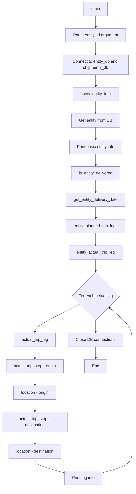
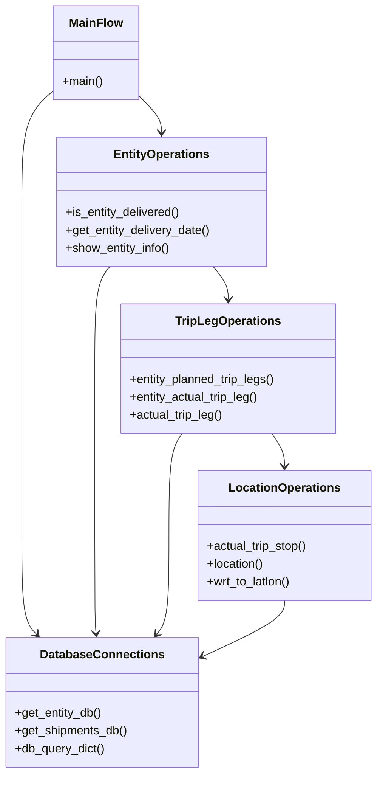
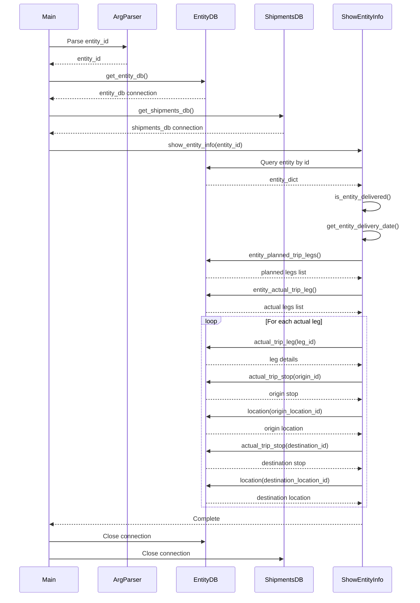
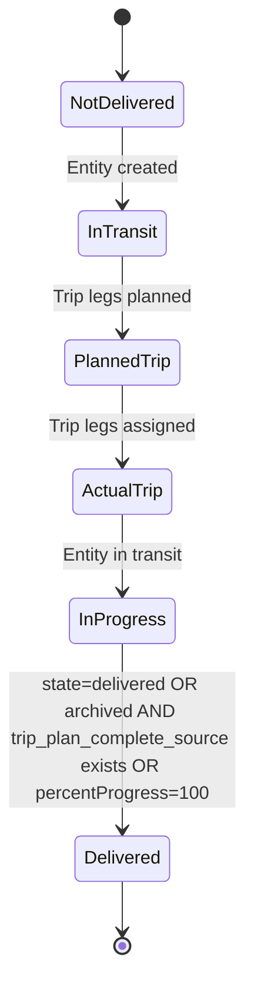

# Diagram: research/scripts/show_entity.py


> Auto-generated by Obscura crawlers

## Diagram 1

```mermaid
flowchart TD
      Start[main] --> ParseArgs[Parse entity_id argument]
      ParseArgs --> ConnectDBs[Connect to entity_db and shipments_db]
      ConnectDBs --> ShowInfo[show_entity_info]...
  └ 196 lines...
```

> SVG rendering failed for this diagram.

## Diagram 2



### SVG

<svg id="container" width="530.8049926757812" xmlns="http://www.w3.org/2000/svg" class="flowchart" height="1918.15625" viewBox="0 0 530.8049926757812 1918.15625" role="graphics-document document" aria-roledescription="flowchart-v2"><style>#container{font-family:"trebuchet ms",verdana,arial,sans-serif;font-size:16px;fill:#333;}@keyframes edge-animation-frame{from{stroke-dashoffset:0;}}@keyframes dash{to{stroke-dashoffset:0;}}#container .edge-animation-slow{stroke-dasharray:9,5!important;stroke-dashoffset:900;animation:dash 50s linear infinite;stroke-linecap:round;}#container .edge-animation-fast{stroke-dasharray:9,5!important;stroke-dashoffset:900;animation:dash 20s linear infinite;stroke-linecap:round;}#container .error-icon{fill:#552222;}#container .error-text{fill:#552222;stroke:#552222;}#container .edge-thickness-normal{stroke-width:1px;}#container .edge-thickness-thick{stroke-width:3.5px;}#container .edge-pattern-solid{stroke-dasharray:0;}#container .edge-thickness-invisible{stroke-width:0;fill:none;}#container .edge-pattern-dashed{stroke-dasharray:3;}#container .edge-pattern-dotted{stroke-dasharray:2;}#container .marker{fill:#333333;stroke:#333333;}#container .marker.cross{stroke:#333333;}#container svg{font-family:"trebuchet ms",verdana,arial,sans-serif;font-size:16px;}#container p{margin:0;}#container .label{font-family:"trebuchet ms",verdana,arial,sans-serif;color:#333;}#container .cluster-label text{fill:#333;}#container .cluster-label span{color:#333;}#container .cluster-label span p{background-color:transparent;}#container .label text,#container span{fill:#333;color:#333;}#container .node rect,#container .node circle,#container .node ellipse,#container .node polygon,#container .node path{fill:#ECECFF;stroke:#9370DB;stroke-width:1px;}#container .rough-node .label text,#container .node .label text,#container .image-shape .label,#container .icon-shape .label{text-anchor:middle;}#container .node .katex path{fill:#000;stroke:#000;stroke-width:1px;}#container .rough-node .label,#container .node .label,#container .image-shape .label,#container .icon-shape .label{text-align:center;}#container .node.clickable{cursor:pointer;}#container .root .anchor path{fill:#333333!important;stroke-width:0;stroke:#333333;}#container .arrowheadPath{fill:#333333;}#container .edgePath .path{stroke:#333333;stroke-width:2.0px;}#container .flowchart-link{stroke:#333333;fill:none;}#container .edgeLabel{background-color:rgba(232,232,232, 0.8);text-align:center;}#container .edgeLabel p{background-color:rgba(232,232,232, 0.8);}#container .edgeLabel rect{opacity:0.5;background-color:rgba(232,232,232, 0.8);fill:rgba(232,232,232, 0.8);}#container .labelBkg{background-color:rgba(232, 232, 232, 0.5);}#container .cluster rect{fill:#ffffde;stroke:#aaaa33;stroke-width:1px;}#container .cluster text{fill:#333;}#container .cluster span{color:#333;}#container div.mermaidTooltip{position:absolute;text-align:center;max-width:200px;padding:2px;font-family:"trebuchet ms",verdana,arial,sans-serif;font-size:12px;background:hsl(80, 100%, 96.2745098039%);border:1px solid #aaaa33;border-radius:2px;pointer-events:none;z-index:100;}#container .flowchartTitleText{text-anchor:middle;font-size:18px;fill:#333;}#container rect.text{fill:none;stroke-width:0;}#container .icon-shape,#container .image-shape{background-color:rgba(232,232,232, 0.8);text-align:center;}#container .icon-shape p,#container .image-shape p{background-color:rgba(232,232,232, 0.8);padding:2px;}#container .icon-shape rect,#container .image-shape rect{opacity:0.5;background-color:rgba(232,232,232, 0.8);fill:rgba(232,232,232, 0.8);}#container .label-icon{display:inline-block;height:1em;overflow:visible;vertical-align:-0.125em;}#container .node .label-icon path{fill:currentColor;stroke:revert;stroke-width:revert;}#container :root{--mermaid-font-family:"trebuchet ms",verdana,arial,sans-serif;}</style><g><marker id="container_flowchart-v2-pointEnd" class="marker flowchart-v2" viewBox="0 0 10 10" refX="5" refY="5" markerUnits="userSpaceOnUse" markerWidth="8" markerHeight="8" orient="auto"><path d="M 0 0 L 10 5 L 0 10 z" class="arrowMarkerPath" style="stroke-width: 1; stroke-dasharray: 1, 0;"></path></marker><marker id="container_flowchart-v2-pointStart" class="marker flowchart-v2" viewBox="0 0 10 10" refX="4.5" refY="5" markerUnits="userSpaceOnUse" markerWidth="8" markerHeight="8" orient="auto"><path d="M 0 5 L 10 10 L 10 0 z" class="arrowMarkerPath" style="stroke-width: 1; stroke-dasharray: 1, 0;"></path></marker><marker id="container_flowchart-v2-circleEnd" class="marker flowchart-v2" viewBox="0 0 10 10" refX="11" refY="5" markerUnits="userSpaceOnUse" markerWidth="11" markerHeight="11" orient="auto"><circle cx="5" cy="5" r="5" class="arrowMarkerPath" style="stroke-width: 1; stroke-dasharray: 1, 0;"></circle></marker><marker id="container_flowchart-v2-circleStart" class="marker flowchart-v2" viewBox="0 0 10 10" refX="-1" refY="5" markerUnits="userSpaceOnUse" markerWidth="11" markerHeight="11" orient="auto"><circle cx="5" cy="5" r="5" class="arrowMarkerPath" style="stroke-width: 1; stroke-dasharray: 1, 0;"></circle></marker><marker id="container_flowchart-v2-crossEnd" class="marker cross flowchart-v2" viewBox="0 0 11 11" refX="12" refY="5.2" markerUnits="userSpaceOnUse" markerWidth="11" markerHeight="11" orient="auto"><path d="M 1,1 l 9,9 M 10,1 l -9,9" class="arrowMarkerPath" style="stroke-width: 2; stroke-dasharray: 1, 0;"></path></marker><marker id="container_flowchart-v2-crossStart" class="marker cross flowchart-v2" viewBox="0 0 11 11" refX="-1" refY="5.2" markerUnits="userSpaceOnUse" markerWidth="11" markerHeight="11" orient="auto"><path d="M 1,1 l 9,9 M 10,1 l -9,9" class="arrowMarkerPath" style="stroke-width: 2; stroke-dasharray: 1, 0;"></path></marker><g class="root"><g class="clusters"></g><g class="edgePaths"><path d="M379.938,62L379.938,66.167C379.938,70.333,379.938,78.667,379.938,86.333C379.938,94,379.938,101,379.938,104.5L379.938,108" id="L_Start_ParseArgs_0" class="edge-thickness-normal edge-pattern-solid edge-thickness-normal edge-pattern-solid flowchart-link" style=";" data-edge="true" data-et="edge" data-id="L_Start_ParseArgs_0" data-points="W3sieCI6Mzc5LjkzNzUsInkiOjYyfSx7IngiOjM3OS45Mzc1LCJ5Ijo4N30seyJ4IjozNzkuOTM3NSwieSI6MTEyfV0=" marker-end="url(#container_flowchart-v2-pointEnd)"></path><path d="M379.938,166L379.938,170.167C379.938,174.333,379.938,182.667,379.938,190.333C379.938,198,379.938,205,379.938,208.5L379.938,212" id="L_ParseArgs_ConnectDBs_0" class="edge-thickness-normal edge-pattern-solid edge-thickness-normal edge-pattern-solid flowchart-link" style=";" data-edge="true" data-et="edge" data-id="L_ParseArgs_ConnectDBs_0" data-points="W3sieCI6Mzc5LjkzNzUsInkiOjE2Nn0seyJ4IjozNzkuOTM3NSwieSI6MTkxfSx7IngiOjM3OS45Mzc1LCJ5IjoyMTZ9XQ==" marker-end="url(#container_flowchart-v2-pointEnd)"></path><path d="M379.938,294L379.938,298.167C379.938,302.333,379.938,310.667,379.938,318.333C379.938,326,379.938,333,379.938,336.5L379.938,340" id="L_ConnectDBs_ShowInfo_0" class="edge-thickness-normal edge-pattern-solid edge-thickness-normal edge-pattern-solid flowchart-link" style=";" data-edge="true" data-et="edge" data-id="L_ConnectDBs_ShowInfo_0" data-points="W3sieCI6Mzc5LjkzNzUsInkiOjI5NH0seyJ4IjozNzkuOTM3NSwieSI6MzE5fSx7IngiOjM3OS45Mzc1LCJ5IjozNDR9XQ==" marker-end="url(#container_flowchart-v2-pointEnd)"></path><path d="M379.938,398L379.938,402.167C379.938,406.333,379.938,414.667,379.938,422.333C379.938,430,379.938,437,379.938,440.5L379.938,444" id="L_ShowInfo_GetEntity_0" class="edge-thickness-normal edge-pattern-solid edge-thickness-normal edge-pattern-solid flowchart-link" style=";" data-edge="true" data-et="edge" data-id="L_ShowInfo_GetEntity_0" data-points="W3sieCI6Mzc5LjkzNzUsInkiOjM5OH0seyJ4IjozNzkuOTM3NSwieSI6NDIzfSx7IngiOjM3OS45Mzc1LCJ5Ijo0NDh9XQ==" marker-end="url(#container_flowchart-v2-pointEnd)"></path><path d="M379.938,502L379.938,506.167C379.938,510.333,379.938,518.667,379.938,526.333C379.938,534,379.938,541,379.938,544.5L379.938,548" id="L_GetEntity_PrintBasic_0" class="edge-thickness-normal edge-pattern-solid edge-thickness-normal edge-pattern-solid flowchart-link" style=";" data-edge="true" data-et="edge" data-id="L_GetEntity_PrintBasic_0" data-points="W3sieCI6Mzc5LjkzNzUsInkiOjUwMn0seyJ4IjozNzkuOTM3NSwieSI6NTI3fSx7IngiOjM3OS45Mzc1LCJ5Ijo1NTJ9XQ==" marker-end="url(#container_flowchart-v2-pointEnd)"></path><path d="M379.938,606L379.938,610.167C379.938,614.333,379.938,622.667,379.938,630.333C379.938,638,379.938,645,379.938,648.5L379.938,652" id="L_PrintBasic_CheckDelivered_0" class="edge-thickness-normal edge-pattern-solid edge-thickness-normal edge-pattern-solid flowchart-link" style=";" data-edge="true" data-et="edge" data-id="L_PrintBasic_CheckDelivered_0" data-points="W3sieCI6Mzc5LjkzNzUsInkiOjYwNn0seyJ4IjozNzkuOTM3NSwieSI6NjMxfSx7IngiOjM3OS45Mzc1LCJ5Ijo2NTZ9XQ==" marker-end="url(#container_flowchart-v2-pointEnd)"></path><path d="M379.938,710L379.938,714.167C379.938,718.333,379.938,726.667,379.938,734.333C379.938,742,379.938,749,379.938,752.5L379.938,756" id="L_CheckDelivered_GetDeliveryDate_0" class="edge-thickness-normal edge-pattern-solid edge-thickness-normal edge-pattern-solid flowchart-link" style=";" data-edge="true" data-et="edge" data-id="L_CheckDelivered_GetDeliveryDate_0" data-points="W3sieCI6Mzc5LjkzNzUsInkiOjcxMH0seyJ4IjozNzkuOTM3NSwieSI6NzM1fSx7IngiOjM3OS45Mzc1LCJ5Ijo3NjB9XQ==" marker-end="url(#container_flowchart-v2-pointEnd)"></path><path d="M379.938,814L379.938,818.167C379.938,822.333,379.938,830.667,379.938,838.333C379.938,846,379.938,853,379.938,856.5L379.938,860" id="L_GetDeliveryDate_GetPlannedLegs_0" class="edge-thickness-normal edge-pattern-solid edge-thickness-normal edge-pattern-solid flowchart-link" style=";" data-edge="true" data-et="edge" data-id="L_GetDeliveryDate_GetPlannedLegs_0" data-points="W3sieCI6Mzc5LjkzNzUsInkiOjgxNH0seyJ4IjozNzkuOTM3NSwieSI6ODM5fSx7IngiOjM3OS45Mzc1LCJ5Ijo4NjR9XQ==" marker-end="url(#container_flowchart-v2-pointEnd)"></path><path d="M379.938,918L379.938,922.167C379.938,926.333,379.938,934.667,379.938,942.333C379.938,950,379.938,957,379.938,960.5L379.938,964" id="L_GetPlannedLegs_GetActualLegs_0" class="edge-thickness-normal edge-pattern-solid edge-thickness-normal edge-pattern-solid flowchart-link" style=";" data-edge="true" data-et="edge" data-id="L_GetPlannedLegs_GetActualLegs_0" data-points="W3sieCI6Mzc5LjkzNzUsInkiOjkxOH0seyJ4IjozNzkuOTM3NSwieSI6OTQzfSx7IngiOjM3OS45Mzc1LCJ5Ijo5Njh9XQ==" marker-end="url(#container_flowchart-v2-pointEnd)"></path><path d="M379.938,1022L379.938,1026.167C379.938,1030.333,379.938,1038.667,379.938,1046.333C379.938,1054,379.938,1061,379.938,1064.5L379.938,1068" id="L_GetActualLegs_LoopLegs_0" class="edge-thickness-normal edge-pattern-solid edge-thickness-normal edge-pattern-solid flowchart-link" style=";" data-edge="true" data-et="edge" data-id="L_GetActualLegs_LoopLegs_0" data-points="W3sieCI6Mzc5LjkzNzUsInkiOjEwMjJ9LHsieCI6Mzc5LjkzNzUsInkiOjEwNDd9LHsieCI6Mzc5LjkzNzUsInkiOjEwNzJ9XQ==" marker-end="url(#container_flowchart-v2-pointEnd)"></path><path d="M316.396,1198.615L286.663,1213.372C256.931,1228.129,197.465,1257.642,167.733,1275.899C138,1294.156,138,1301.156,138,1304.656L138,1308.156" id="L_LoopLegs_GetLegDetails_0" class="edge-thickness-normal edge-pattern-solid edge-thickness-normal edge-pattern-solid flowchart-link" style=";" data-edge="true" data-et="edge" data-id="L_LoopLegs_GetLegDetails_0" data-points="W3sieCI6MzE2LjM5NjE0MzU1Mzg4NjY1LCJ5IjoxMTk4LjYxNDg5MzU1Mzg4Njh9LHsieCI6MTM4LCJ5IjoxMjg3LjE1NjI1fSx7IngiOjEzOCwieSI6MTMxMi4xNTYyNX1d" marker-end="url(#container_flowchart-v2-pointEnd)"></path><path d="M138,1366.156L138,1370.323C138,1374.49,138,1382.823,138,1390.49C138,1398.156,138,1405.156,138,1408.656L138,1412.156" id="L_GetLegDetails_GetOrigin_0" class="edge-thickness-normal edge-pattern-solid edge-thickness-normal edge-pattern-solid flowchart-link" style=";" data-edge="true" data-et="edge" data-id="L_GetLegDetails_GetOrigin_0" data-points="W3sieCI6MTM4LCJ5IjoxMzY2LjE1NjI1fSx7IngiOjEzOCwieSI6MTM5MS4xNTYyNX0seyJ4IjoxMzgsInkiOjE0MTYuMTU2MjV9XQ==" marker-end="url(#container_flowchart-v2-pointEnd)"></path><path d="M138,1470.156L138,1474.323C138,1478.49,138,1486.823,138,1494.49C138,1502.156,138,1509.156,138,1512.656L138,1516.156" id="L_GetOrigin_GetOriginLoc_0" class="edge-thickness-normal edge-pattern-solid edge-thickness-normal edge-pattern-solid flowchart-link" style=";" data-edge="true" data-et="edge" data-id="L_GetOrigin_GetOriginLoc_0" data-points="W3sieCI6MTM4LCJ5IjoxNDcwLjE1NjI1fSx7IngiOjEzOCwieSI6MTQ5NS4xNTYyNX0seyJ4IjoxMzgsInkiOjE1MjAuMTU2MjV9XQ==" marker-end="url(#container_flowchart-v2-pointEnd)"></path><path d="M138,1574.156L138,1578.323C138,1582.49,138,1590.823,138,1598.49C138,1606.156,138,1613.156,138,1616.656L138,1620.156" id="L_GetOriginLoc_GetDest_0" class="edge-thickness-normal edge-pattern-solid edge-thickness-normal edge-pattern-solid flowchart-link" style=";" data-edge="true" data-et="edge" data-id="L_GetOriginLoc_GetDest_0" data-points="W3sieCI6MTM4LCJ5IjoxNTc0LjE1NjI1fSx7IngiOjEzOCwieSI6MTU5OS4xNTYyNX0seyJ4IjoxMzgsInkiOjE2MjQuMTU2MjV9XQ==" marker-end="url(#container_flowchart-v2-pointEnd)"></path><path d="M138,1702.156L138,1706.323C138,1710.49,138,1718.823,138,1726.49C138,1734.156,138,1741.156,138,1744.656L138,1748.156" id="L_GetDest_GetDestLoc_0" class="edge-thickness-normal edge-pattern-solid edge-thickness-normal edge-pattern-solid flowchart-link" style=";" data-edge="true" data-et="edge" data-id="L_GetDest_GetDestLoc_0" data-points="W3sieCI6MTM4LCJ5IjoxNzAyLjE1NjI1fSx7IngiOjEzOCwieSI6MTcyNy4xNTYyNX0seyJ4IjoxMzgsInkiOjE3NTIuMTU2MjV9XQ==" marker-end="url(#container_flowchart-v2-pointEnd)"></path><path d="M138,1806.156L138,1810.323C138,1814.49,138,1822.823,156.641,1832.028C175.282,1841.232,212.564,1851.308,231.205,1856.346L249.846,1861.384" id="L_GetDestLoc_PrintLegInfo_0" class="edge-thickness-normal edge-pattern-solid edge-thickness-normal edge-pattern-solid flowchart-link" style=";" data-edge="true" data-et="edge" data-id="L_GetDestLoc_PrintLegInfo_0" data-points="W3sieCI6MTM4LCJ5IjoxODA2LjE1NjI1fSx7IngiOjEzOCwieSI6MTgzMS4xNTYyNX0seyJ4IjoyNTMuNzA3MDMxMjUsInkiOjE4NjIuNDI4MDM5NjY2MDIzOH1d" marker-end="url(#container_flowchart-v2-pointEnd)"></path><path d="M407.098,1862.428L426.382,1857.216C445.667,1852.004,484.236,1841.58,503.52,1827.702C522.805,1813.823,522.805,1796.49,522.805,1779.156C522.805,1761.823,522.805,1744.49,522.805,1725.156C522.805,1705.823,522.805,1684.49,522.805,1663.156C522.805,1641.823,522.805,1620.49,522.805,1601.156C522.805,1581.823,522.805,1564.49,522.805,1547.156C522.805,1529.823,522.805,1512.49,522.805,1495.156C522.805,1477.823,522.805,1460.49,522.805,1443.156C522.805,1425.823,522.805,1408.49,522.805,1391.156C522.805,1373.823,522.805,1356.49,522.805,1339.156C522.805,1321.823,522.805,1304.49,508.114,1283.475C493.423,1262.461,464.041,1237.766,449.35,1225.418L434.659,1213.071" id="L_PrintLegInfo_LoopLegs_0" class="edge-thickness-normal edge-pattern-solid edge-thickness-normal edge-pattern-solid flowchart-link" style=";" data-edge="true" data-et="edge" data-id="L_PrintLegInfo_LoopLegs_0" data-points="W3sieCI6NDA3LjA5NzY1NjI1LCJ5IjoxODYyLjQyODAzOTY2NjAyMzh9LHsieCI6NTIyLjgwNDY4NzUsInkiOjE4MzEuMTU2MjV9LHsieCI6NTIyLjgwNDY4NzUsInkiOjE3NzkuMTU2MjV9LHsieCI6NTIyLjgwNDY4NzUsInkiOjE3MjcuMTU2MjV9LHsieCI6NTIyLjgwNDY4NzUsInkiOjE2NjMuMTU2MjV9LHsieCI6NTIyLjgwNDY4NzUsInkiOjE1OTkuMTU2MjV9LHsieCI6NTIyLjgwNDY4NzUsInkiOjE1NDcuMTU2MjV9LHsieCI6NTIyLjgwNDY4NzUsInkiOjE0OTUuMTU2MjV9LHsieCI6NTIyLjgwNDY4NzUsInkiOjE0NDMuMTU2MjV9LHsieCI6NTIyLjgwNDY4NzUsInkiOjEzOTEuMTU2MjV9LHsieCI6NTIyLjgwNDY4NzUsInkiOjEzMzkuMTU2MjV9LHsieCI6NTIyLjgwNDY4NzUsInkiOjEyODcuMTU2MjV9LHsieCI6NDMxLjU5NjY5OTMzMDc0ODQ0LCJ5IjoxMjEwLjQ5NzA1MDY2OTI1MTZ9XQ==" marker-end="url(#container_flowchart-v2-pointEnd)"></path><path d="M379.938,1262.156L379.938,1266.323C379.938,1270.49,379.938,1278.823,379.938,1286.49C379.938,1294.156,379.938,1301.156,379.938,1304.656L379.938,1308.156" id="L_LoopLegs_CloseDBs_0" class="edge-thickness-normal edge-pattern-solid edge-thickness-normal edge-pattern-solid flowchart-link" style=";" data-edge="true" data-et="edge" data-id="L_LoopLegs_CloseDBs_0" data-points="W3sieCI6Mzc5LjkzNzUsInkiOjEyNjIuMTU2MjV9LHsieCI6Mzc5LjkzNzUsInkiOjEyODcuMTU2MjV9LHsieCI6Mzc5LjkzNzUsInkiOjEzMTIuMTU2MjV9XQ==" marker-end="url(#container_flowchart-v2-pointEnd)"></path><path d="M379.938,1366.156L379.938,1370.323C379.938,1374.49,379.938,1382.823,379.938,1390.49C379.938,1398.156,379.938,1405.156,379.938,1408.656L379.938,1412.156" id="L_CloseDBs_End_0" class="edge-thickness-normal edge-pattern-solid edge-thickness-normal edge-pattern-solid flowchart-link" style=";" data-edge="true" data-et="edge" data-id="L_CloseDBs_End_0" data-points="W3sieCI6Mzc5LjkzNzUsInkiOjEzNjYuMTU2MjV9LHsieCI6Mzc5LjkzNzUsInkiOjEzOTEuMTU2MjV9LHsieCI6Mzc5LjkzNzUsInkiOjE0MTYuMTU2MjV9XQ==" marker-end="url(#container_flowchart-v2-pointEnd)"></path></g><g class="edgeLabels"><g class="edgeLabel"><g class="label" data-id="L_Start_ParseArgs_0" transform="translate(0, 0)"><foreignObject width="0" height="0"><div xmlns="http://www.w3.org/1999/xhtml" class="labelBkg" style="display: table-cell; white-space: nowrap; line-height: 1.5; max-width: 200px; text-align: center;"><span class="edgeLabel"></span></div></foreignObject></g></g><g class="edgeLabel"><g class="label" data-id="L_ParseArgs_ConnectDBs_0" transform="translate(0, 0)"><foreignObject width="0" height="0"><div xmlns="http://www.w3.org/1999/xhtml" class="labelBkg" style="display: table-cell; white-space: nowrap; line-height: 1.5; max-width: 200px; text-align: center;"><span class="edgeLabel"></span></div></foreignObject></g></g><g class="edgeLabel"><g class="label" data-id="L_ConnectDBs_ShowInfo_0" transform="translate(0, 0)"><foreignObject width="0" height="0"><div xmlns="http://www.w3.org/1999/xhtml" class="labelBkg" style="display: table-cell; white-space: nowrap; line-height: 1.5; max-width: 200px; text-align: center;"><span class="edgeLabel"></span></div></foreignObject></g></g><g class="edgeLabel"><g class="label" data-id="L_ShowInfo_GetEntity_0" transform="translate(0, 0)"><foreignObject width="0" height="0"><div xmlns="http://www.w3.org/1999/xhtml" class="labelBkg" style="display: table-cell; white-space: nowrap; line-height: 1.5; max-width: 200px; text-align: center;"><span class="edgeLabel"></span></div></foreignObject></g></g><g class="edgeLabel"><g class="label" data-id="L_GetEntity_PrintBasic_0" transform="translate(0, 0)"><foreignObject width="0" height="0"><div xmlns="http://www.w3.org/1999/xhtml" class="labelBkg" style="display: table-cell; white-space: nowrap; line-height: 1.5; max-width: 200px; text-align: center;"><span class="edgeLabel"></span></div></foreignObject></g></g><g class="edgeLabel"><g class="label" data-id="L_PrintBasic_CheckDelivered_0" transform="translate(0, 0)"><foreignObject width="0" height="0"><div xmlns="http://www.w3.org/1999/xhtml" class="labelBkg" style="display: table-cell; white-space: nowrap; line-height: 1.5; max-width: 200px; text-align: center;"><span class="edgeLabel"></span></div></foreignObject></g></g><g class="edgeLabel"><g class="label" data-id="L_CheckDelivered_GetDeliveryDate_0" transform="translate(0, 0)"><foreignObject width="0" height="0"><div xmlns="http://www.w3.org/1999/xhtml" class="labelBkg" style="display: table-cell; white-space: nowrap; line-height: 1.5; max-width: 200px; text-align: center;"><span class="edgeLabel"></span></div></foreignObject></g></g><g class="edgeLabel"><g class="label" data-id="L_GetDeliveryDate_GetPlannedLegs_0" transform="translate(0, 0)"><foreignObject width="0" height="0"><div xmlns="http://www.w3.org/1999/xhtml" class="labelBkg" style="display: table-cell; white-space: nowrap; line-height: 1.5; max-width: 200px; text-align: center;"><span class="edgeLabel"></span></div></foreignObject></g></g><g class="edgeLabel"><g class="label" data-id="L_GetPlannedLegs_GetActualLegs_0" transform="translate(0, 0)"><foreignObject width="0" height="0"><div xmlns="http://www.w3.org/1999/xhtml" class="labelBkg" style="display: table-cell; white-space: nowrap; line-height: 1.5; max-width: 200px; text-align: center;"><span class="edgeLabel"></span></div></foreignObject></g></g><g class="edgeLabel"><g class="label" data-id="L_GetActualLegs_LoopLegs_0" transform="translate(0, 0)"><foreignObject width="0" height="0"><div xmlns="http://www.w3.org/1999/xhtml" class="labelBkg" style="display: table-cell; white-space: nowrap; line-height: 1.5; max-width: 200px; text-align: center;"><span class="edgeLabel"></span></div></foreignObject></g></g><g class="edgeLabel"><g class="label" data-id="L_LoopLegs_GetLegDetails_0" transform="translate(0, 0)"><foreignObject width="0" height="0"><div xmlns="http://www.w3.org/1999/xhtml" class="labelBkg" style="display: table-cell; white-space: nowrap; line-height: 1.5; max-width: 200px; text-align: center;"><span class="edgeLabel"></span></div></foreignObject></g></g><g class="edgeLabel"><g class="label" data-id="L_GetLegDetails_GetOrigin_0" transform="translate(0, 0)"><foreignObject width="0" height="0"><div xmlns="http://www.w3.org/1999/xhtml" class="labelBkg" style="display: table-cell; white-space: nowrap; line-height: 1.5; max-width: 200px; text-align: center;"><span class="edgeLabel"></span></div></foreignObject></g></g><g class="edgeLabel"><g class="label" data-id="L_GetOrigin_GetOriginLoc_0" transform="translate(0, 0)"><foreignObject width="0" height="0"><div xmlns="http://www.w3.org/1999/xhtml" class="labelBkg" style="display: table-cell; white-space: nowrap; line-height: 1.5; max-width: 200px; text-align: center;"><span class="edgeLabel"></span></div></foreignObject></g></g><g class="edgeLabel"><g class="label" data-id="L_GetOriginLoc_GetDest_0" transform="translate(0, 0)"><foreignObject width="0" height="0"><div xmlns="http://www.w3.org/1999/xhtml" class="labelBkg" style="display: table-cell; white-space: nowrap; line-height: 1.5; max-width: 200px; text-align: center;"><span class="edgeLabel"></span></div></foreignObject></g></g><g class="edgeLabel"><g class="label" data-id="L_GetDest_GetDestLoc_0" transform="translate(0, 0)"><foreignObject width="0" height="0"><div xmlns="http://www.w3.org/1999/xhtml" class="labelBkg" style="display: table-cell; white-space: nowrap; line-height: 1.5; max-width: 200px; text-align: center;"><span class="edgeLabel"></span></div></foreignObject></g></g><g class="edgeLabel"><g class="label" data-id="L_GetDestLoc_PrintLegInfo_0" transform="translate(0, 0)"><foreignObject width="0" height="0"><div xmlns="http://www.w3.org/1999/xhtml" class="labelBkg" style="display: table-cell; white-space: nowrap; line-height: 1.5; max-width: 200px; text-align: center;"><span class="edgeLabel"></span></div></foreignObject></g></g><g class="edgeLabel"><g class="label" data-id="L_PrintLegInfo_LoopLegs_0" transform="translate(0, 0)"><foreignObject width="0" height="0"><div xmlns="http://www.w3.org/1999/xhtml" class="labelBkg" style="display: table-cell; white-space: nowrap; line-height: 1.5; max-width: 200px; text-align: center;"><span class="edgeLabel"></span></div></foreignObject></g></g><g class="edgeLabel"><g class="label" data-id="L_LoopLegs_CloseDBs_0" transform="translate(0, 0)"><foreignObject width="0" height="0"><div xmlns="http://www.w3.org/1999/xhtml" class="labelBkg" style="display: table-cell; white-space: nowrap; line-height: 1.5; max-width: 200px; text-align: center;"><span class="edgeLabel"></span></div></foreignObject></g></g><g class="edgeLabel"><g class="label" data-id="L_CloseDBs_End_0" transform="translate(0, 0)"><foreignObject width="0" height="0"><div xmlns="http://www.w3.org/1999/xhtml" class="labelBkg" style="display: table-cell; white-space: nowrap; line-height: 1.5; max-width: 200px; text-align: center;"><span class="edgeLabel"></span></div></foreignObject></g></g></g><g class="nodes"><g class="node default" id="flowchart-Start-0" transform="translate(379.9375, 35)"><rect class="basic label-container" style="" x="-48.15625" y="-27" width="96.3125" height="54"></rect><g class="label" style="" transform="translate(-18.15625, -12)"><rect></rect><foreignObject width="36.3125" height="24"><div xmlns="http://www.w3.org/1999/xhtml" style="display: table-cell; white-space: nowrap; line-height: 1.5; max-width: 200px; text-align: center;"><span class="nodeLabel"><p>main</p></span></div></foreignObject></g></g><g class="node default" id="flowchart-ParseArgs-1" transform="translate(379.9375, 139)"><rect class="basic label-container" style="" x="-120.6484375" y="-27" width="241.296875" height="54"></rect><g class="label" style="" transform="translate(-90.6484375, -12)"><rect></rect><foreignObject width="181.296875" height="24"><div xmlns="http://www.w3.org/1999/xhtml" style="display: table-cell; white-space: nowrap; line-height: 1.5; max-width: 200px; text-align: center;"><span class="nodeLabel"><p>Parse entity_id argument</p></span></div></foreignObject></g></g><g class="node default" id="flowchart-ConnectDBs-3" transform="translate(379.9375, 255)"><rect class="basic label-container" style="" x="-130" y="-39" width="260" height="78"></rect><g class="label" style="" transform="translate(-100, -24)"><rect></rect><foreignObject width="200" height="48"><div xmlns="http://www.w3.org/1999/xhtml" style="display: table; white-space: break-spaces; line-height: 1.5; max-width: 200px; text-align: center; width: 200px;"><span class="nodeLabel"><p>Connect to entity_db and shipments_db</p></span></div></foreignObject></g></g><g class="node default" id="flowchart-ShowInfo-5" transform="translate(379.9375, 371)"><rect class="basic label-container" style="" x="-91.7890625" y="-27" width="183.578125" height="54"></rect><g class="label" style="" transform="translate(-61.7890625, -12)"><rect></rect><foreignObject width="123.578125" height="24"><div xmlns="http://www.w3.org/1999/xhtml" style="display: table-cell; white-space: nowrap; line-height: 1.5; max-width: 200px; text-align: center;"><span class="nodeLabel"><p>show_entity_info</p></span></div></foreignObject></g></g><g class="node default" id="flowchart-GetEntity-7" transform="translate(379.9375, 475)"><rect class="basic label-container" style="" x="-96.7109375" y="-27" width="193.421875" height="54"></rect><g class="label" style="" transform="translate(-66.7109375, -12)"><rect></rect><foreignObject width="133.421875" height="24"><div xmlns="http://www.w3.org/1999/xhtml" style="display: table-cell; white-space: nowrap; line-height: 1.5; max-width: 200px; text-align: center;"><span class="nodeLabel"><p>Get entity from DB</p></span></div></foreignObject></g></g><g class="node default" id="flowchart-PrintBasic-9" transform="translate(379.9375, 579)"><rect class="basic label-container" style="" x="-107.7265625" y="-27" width="215.453125" height="54"></rect><g class="label" style="" transform="translate(-77.7265625, -12)"><rect></rect><foreignObject width="155.453125" height="24"><div xmlns="http://www.w3.org/1999/xhtml" style="display: table-cell; white-space: nowrap; line-height: 1.5; max-width: 200px; text-align: center;"><span class="nodeLabel"><p>Print basic entity info</p></span></div></foreignObject></g></g><g class="node default" id="flowchart-CheckDelivered-11" transform="translate(379.9375, 683)"><rect class="basic label-container" style="" x="-98.5703125" y="-27" width="197.140625" height="54"></rect><g class="label" style="" transform="translate(-68.5703125, -12)"><rect></rect><foreignObject width="137.140625" height="24"><div xmlns="http://www.w3.org/1999/xhtml" style="display: table-cell; white-space: nowrap; line-height: 1.5; max-width: 200px; text-align: center;"><span class="nodeLabel"><p>is_entity_delivered</p></span></div></foreignObject></g></g><g class="node default" id="flowchart-GetDeliveryDate-13" transform="translate(379.9375, 787)"><rect class="basic label-container" style="" x="-119.078125" y="-27" width="238.15625" height="54"></rect><g class="label" style="" transform="translate(-89.078125, -12)"><rect></rect><foreignObject width="178.15625" height="24"><div xmlns="http://www.w3.org/1999/xhtml" style="display: table-cell; white-space: nowrap; line-height: 1.5; max-width: 200px; text-align: center;"><span class="nodeLabel"><p>get_entity_delivery_date</p></span></div></foreignObject></g></g><g class="node default" id="flowchart-GetPlannedLegs-15" transform="translate(379.9375, 891)"><rect class="basic label-container" style="" x="-120.234375" y="-27" width="240.46875" height="54"></rect><g class="label" style="" transform="translate(-90.234375, -12)"><rect></rect><foreignObject width="180.46875" height="24"><div xmlns="http://www.w3.org/1999/xhtml" style="display: table-cell; white-space: nowrap; line-height: 1.5; max-width: 200px; text-align: center;"><span class="nodeLabel"><p>entity_planned_trip_legs</p></span></div></foreignObject></g></g><g class="node default" id="flowchart-GetActualLegs-17" transform="translate(379.9375, 995)"><rect class="basic label-container" style="" x="-108.8046875" y="-27" width="217.609375" height="54"></rect><g class="label" style="" transform="translate(-78.8046875, -12)"><rect></rect><foreignObject width="157.609375" height="24"><div xmlns="http://www.w3.org/1999/xhtml" style="display: table-cell; white-space: nowrap; line-height: 1.5; max-width: 200px; text-align: center;"><span class="nodeLabel"><p>entity_actual_trip_leg</p></span></div></foreignObject></g></g><g class="node default" id="flowchart-LoopLegs-19" transform="translate(379.9375, 1167.078125)"><polygon points="95.078125,0 190.15625,-95.078125 95.078125,-190.15625 0,-95.078125" class="label-container" transform="translate(-94.578125, 95.078125)"></polygon><g class="label" style="" transform="translate(-68.078125, -12)"><rect></rect><foreignObject width="136.15625" height="24"><div xmlns="http://www.w3.org/1999/xhtml" style="display: table-cell; white-space: nowrap; line-height: 1.5; max-width: 200px; text-align: center;"><span class="nodeLabel"><p>For each actual leg</p></span></div></foreignObject></g></g><g class="node default" id="flowchart-GetLegDetails-21" transform="translate(138, 1339.15625)"><rect class="basic label-container" style="" x="-84.0703125" y="-27" width="168.140625" height="54"></rect><g class="label" style="" transform="translate(-54.0703125, -12)"><rect></rect><foreignObject width="108.140625" height="24"><div xmlns="http://www.w3.org/1999/xhtml" style="display: table-cell; white-space: nowrap; line-height: 1.5; max-width: 200px; text-align: center;"><span class="nodeLabel"><p>actual_trip_leg</p></span></div></foreignObject></g></g><g class="node default" id="flowchart-GetOrigin-23" transform="translate(138, 1443.15625)"><rect class="basic label-container" style="" x="-117.8359375" y="-27" width="235.671875" height="54"></rect><g class="label" style="" transform="translate(-87.8359375, -12)"><rect></rect><foreignObject width="175.671875" height="24"><div xmlns="http://www.w3.org/1999/xhtml" style="display: table-cell; white-space: nowrap; line-height: 1.5; max-width: 200px; text-align: center;"><span class="nodeLabel"><p>actual_trip_stop - origin</p></span></div></foreignObject></g></g><g class="node default" id="flowchart-GetOriginLoc-25" transform="translate(138, 1547.15625)"><rect class="basic label-container" style="" x="-88.1640625" y="-27" width="176.328125" height="54"></rect><g class="label" style="" transform="translate(-58.1640625, -12)"><rect></rect><foreignObject width="116.328125" height="24"><div xmlns="http://www.w3.org/1999/xhtml" style="display: table-cell; white-space: nowrap; line-height: 1.5; max-width: 200px; text-align: center;"><span class="nodeLabel"><p>location - origin</p></span></div></foreignObject></g></g><g class="node default" id="flowchart-GetDest-27" transform="translate(138, 1663.15625)"><rect class="basic label-container" style="" x="-130" y="-39" width="260" height="78"></rect><g class="label" style="" transform="translate(-100, -24)"><rect></rect><foreignObject width="200" height="48"><div xmlns="http://www.w3.org/1999/xhtml" style="display: table; white-space: break-spaces; line-height: 1.5; max-width: 200px; text-align: center; width: 200px;"><span class="nodeLabel"><p>actual_trip_stop - destination</p></span></div></foreignObject></g></g><g class="node default" id="flowchart-GetDestLoc-29" transform="translate(138, 1779.15625)"><rect class="basic label-container" style="" x="-108.609375" y="-27" width="217.21875" height="54"></rect><g class="label" style="" transform="translate(-78.609375, -12)"><rect></rect><foreignObject width="157.21875" height="24"><div xmlns="http://www.w3.org/1999/xhtml" style="display: table-cell; white-space: nowrap; line-height: 1.5; max-width: 200px; text-align: center;"><span class="nodeLabel"><p>location - destination</p></span></div></foreignObject></g></g><g class="node default" id="flowchart-PrintLegInfo-31" transform="translate(330.40234375, 1883.15625)"><rect class="basic label-container" style="" x="-76.6953125" y="-27" width="153.390625" height="54"></rect><g class="label" style="" transform="translate(-46.6953125, -12)"><rect></rect><foreignObject width="93.390625" height="24"><div xmlns="http://www.w3.org/1999/xhtml" style="display: table-cell; white-space: nowrap; line-height: 1.5; max-width: 200px; text-align: center;"><span class="nodeLabel"><p>Print leg info</p></span></div></foreignObject></g></g><g class="node default" id="flowchart-CloseDBs-35" transform="translate(379.9375, 1339.15625)"><rect class="basic label-container" style="" x="-107.8671875" y="-27" width="215.734375" height="54"></rect><g class="label" style="" transform="translate(-77.8671875, -12)"><rect></rect><foreignObject width="155.734375" height="24"><div xmlns="http://www.w3.org/1999/xhtml" style="display: table-cell; white-space: nowrap; line-height: 1.5; max-width: 200px; text-align: center;"><span class="nodeLabel"><p>Close DB connections</p></span></div></foreignObject></g></g><g class="node default" id="flowchart-End-37" transform="translate(379.9375, 1443.15625)"><rect class="basic label-container" style="" x="-43.6796875" y="-27" width="87.359375" height="54"></rect><g class="label" style="" transform="translate(-13.6796875, -12)"><rect></rect><foreignObject width="27.359375" height="24"><div xmlns="http://www.w3.org/1999/xhtml" style="display: table-cell; white-space: nowrap; line-height: 1.5; max-width: 200px; text-align: center;"><span class="nodeLabel"><p>End</p></span></div></foreignObject></g></g></g></g></g></svg>

## Diagram 3



### SVG

<svg id="container" width="505.6484375" xmlns="http://www.w3.org/2000/svg" class="classDiagram" height="1038" viewBox="0 0 505.6484375 1038" role="graphics-document document" aria-roledescription="class"><style>#container{font-family:"trebuchet ms",verdana,arial,sans-serif;font-size:16px;fill:#333;}@keyframes edge-animation-frame{from{stroke-dashoffset:0;}}@keyframes dash{to{stroke-dashoffset:0;}}#container .edge-animation-slow{stroke-dasharray:9,5!important;stroke-dashoffset:900;animation:dash 50s linear infinite;stroke-linecap:round;}#container .edge-animation-fast{stroke-dasharray:9,5!important;stroke-dashoffset:900;animation:dash 20s linear infinite;stroke-linecap:round;}#container .error-icon{fill:#552222;}#container .error-text{fill:#552222;stroke:#552222;}#container .edge-thickness-normal{stroke-width:1px;}#container .edge-thickness-thick{stroke-width:3.5px;}#container .edge-pattern-solid{stroke-dasharray:0;}#container .edge-thickness-invisible{stroke-width:0;fill:none;}#container .edge-pattern-dashed{stroke-dasharray:3;}#container .edge-pattern-dotted{stroke-dasharray:2;}#container .marker{fill:#333333;stroke:#333333;}#container .marker.cross{stroke:#333333;}#container svg{font-family:"trebuchet ms",verdana,arial,sans-serif;font-size:16px;}#container p{margin:0;}#container g.classGroup text{fill:#9370DB;stroke:none;font-family:"trebuchet ms",verdana,arial,sans-serif;font-size:10px;}#container g.classGroup text .title{font-weight:bolder;}#container .nodeLabel,#container .edgeLabel{color:#131300;}#container .edgeLabel .label rect{fill:#ECECFF;}#container .label text{fill:#131300;}#container .labelBkg{background:#ECECFF;}#container .edgeLabel .label span{background:#ECECFF;}#container .classTitle{font-weight:bolder;}#container .node rect,#container .node circle,#container .node ellipse,#container .node polygon,#container .node path{fill:#ECECFF;stroke:#9370DB;stroke-width:1px;}#container .divider{stroke:#9370DB;stroke-width:1;}#container g.clickable{cursor:pointer;}#container g.classGroup rect{fill:#ECECFF;stroke:#9370DB;}#container g.classGroup line{stroke:#9370DB;stroke-width:1;}#container .classLabel .box{stroke:none;stroke-width:0;fill:#ECECFF;opacity:0.5;}#container .classLabel .label{fill:#9370DB;font-size:10px;}#container .relation{stroke:#333333;stroke-width:1;fill:none;}#container .dashed-line{stroke-dasharray:3;}#container .dotted-line{stroke-dasharray:1 2;}#container #compositionStart,#container .composition{fill:#333333!important;stroke:#333333!important;stroke-width:1;}#container #compositionEnd,#container .composition{fill:#333333!important;stroke:#333333!important;stroke-width:1;}#container #dependencyStart,#container .dependency{fill:#333333!important;stroke:#333333!important;stroke-width:1;}#container #dependencyStart,#container .dependency{fill:#333333!important;stroke:#333333!important;stroke-width:1;}#container #extensionStart,#container .extension{fill:transparent!important;stroke:#333333!important;stroke-width:1;}#container #extensionEnd,#container .extension{fill:transparent!important;stroke:#333333!important;stroke-width:1;}#container #aggregationStart,#container .aggregation{fill:transparent!important;stroke:#333333!important;stroke-width:1;}#container #aggregationEnd,#container .aggregation{fill:transparent!important;stroke:#333333!important;stroke-width:1;}#container #lollipopStart,#container .lollipop{fill:#ECECFF!important;stroke:#333333!important;stroke-width:1;}#container #lollipopEnd,#container .lollipop{fill:#ECECFF!important;stroke:#333333!important;stroke-width:1;}#container .edgeTerminals{font-size:11px;line-height:initial;}#container .classTitleText{text-anchor:middle;font-size:18px;fill:#333;}#container .label-icon{display:inline-block;height:1em;overflow:visible;vertical-align:-0.125em;}#container .node .label-icon path{fill:currentColor;stroke:revert;stroke-width:revert;}#container :root{--mermaid-font-family:"trebuchet ms",verdana,arial,sans-serif;}</style><g><defs><marker id="container_class-aggregationStart" class="marker aggregation class" refX="18" refY="7" markerWidth="190" markerHeight="240" orient="auto"><path d="M 18,7 L9,13 L1,7 L9,1 Z"></path></marker></defs><defs><marker id="container_class-aggregationEnd" class="marker aggregation class" refX="1" refY="7" markerWidth="20" markerHeight="28" orient="auto"><path d="M 18,7 L9,13 L1,7 L9,1 Z"></path></marker></defs><defs><marker id="container_class-extensionStart" class="marker extension class" refX="18" refY="7" markerWidth="190" markerHeight="240" orient="auto"><path d="M 1,7 L18,13 V 1 Z"></path></marker></defs><defs><marker id="container_class-extensionEnd" class="marker extension class" refX="1" refY="7" markerWidth="20" markerHeight="28" orient="auto"><path d="M 1,1 V 13 L18,7 Z"></path></marker></defs><defs><marker id="container_class-compositionStart" class="marker composition class" refX="18" refY="7" markerWidth="190" markerHeight="240" orient="auto"><path d="M 18,7 L9,13 L1,7 L9,1 Z"></path></marker></defs><defs><marker id="container_class-compositionEnd" class="marker composition class" refX="1" refY="7" markerWidth="20" markerHeight="28" orient="auto"><path d="M 18,7 L9,13 L1,7 L9,1 Z"></path></marker></defs><defs><marker id="container_class-dependencyStart" class="marker dependency class" refX="6" refY="7" markerWidth="190" markerHeight="240" orient="auto"><path d="M 5,7 L9,13 L1,7 L9,1 Z"></path></marker></defs><defs><marker id="container_class-dependencyEnd" class="marker dependency class" refX="13" refY="7" markerWidth="20" markerHeight="28" orient="auto"><path d="M 18,7 L9,13 L14,7 L9,1 Z"></path></marker></defs><defs><marker id="container_class-lollipopStart" class="marker lollipop class" refX="13" refY="7" markerWidth="190" markerHeight="240" orient="auto"><circle stroke="black" fill="transparent" cx="7" cy="7" r="6"></circle></marker></defs><defs><marker id="container_class-lollipopEnd" class="marker lollipop class" refX="1" refY="7" markerWidth="190" markerHeight="240" orient="auto"><circle stroke="black" fill="transparent" cx="7" cy="7" r="6"></circle></marker></defs><g class="root"><g class="clusters"></g><g class="edgePaths"><path d="M71.094,120.68L63.829,127.067C56.564,133.453,42.034,146.227,34.769,171.28C27.504,196.333,27.504,233.667,27.504,271C27.504,308.333,27.504,345.667,27.504,383C27.504,420.333,27.504,457.667,27.504,495C27.504,532.333,27.504,569.667,27.504,607C27.504,644.333,27.504,681.667,27.504,719C27.504,756.333,27.504,793.667,30.83,815.78C34.157,837.894,40.809,844.788,44.136,848.235L47.462,851.682" id="id_MainFlow_DatabaseConnections_1" class="edge-thickness-normal edge-pattern-solid relation" style=";;;" data-edge="true" data-et="edge" data-id="id_MainFlow_DatabaseConnections_1" data-points="W3sieCI6NzEuMDkzNzUsInkiOjEyMC42Nzk4NTYzOTU4NDc5Nn0seyJ4IjoyNy41MDM5MDYyNSwieSI6MTU5fSx7IngiOjI3LjUwMzkwNjI1LCJ5IjoyNzF9LHsieCI6MjcuNTAzOTA2MjUsInkiOjM4M30seyJ4IjoyNy41MDM5MDYyNSwieSI6NDk1fSx7IngiOjI3LjUwMzkwNjI1LCJ5Ijo2MDd9LHsieCI6MjcuNTAzOTA2MjUsInkiOjcxOX0seyJ4IjoyNy41MDM5MDYyNSwieSI6ODMxfSx7IngiOjUxLjYyODQ4NzcyMzIxNDI5LCJ5Ijo4NTZ9XQ==" marker-end="url(#container_class-dependencyEnd)"></path><path d="M184.117,127.462L189.378,132.718C194.639,137.974,205.161,148.487,210.423,156.91C215.684,165.333,215.684,171.667,215.684,174.833L215.684,178" id="id_MainFlow_EntityOperations_2" class="edge-thickness-normal edge-pattern-solid relation" style=";;;" data-edge="true" data-et="edge" data-id="id_MainFlow_EntityOperations_2" data-points="W3sieCI6MTg0LjExNzE4NzUsInkiOjEyNy40NjE1OTMwNDU5NDY0Mn0seyJ4IjoyMTUuNjgzNTkzNzUsInkiOjE1OX0seyJ4IjoyMTUuNjgzNTkzNzUsInkiOjE4NH1d" marker-end="url(#container_class-dependencyEnd)"></path><path d="M285.673,358L289.025,362.167C292.377,366.333,299.081,374.667,302.433,382C305.785,389.333,305.785,395.667,305.785,398.833L305.785,402" id="id_EntityOperations_TripLegOperations_3" class="edge-thickness-normal edge-pattern-solid relation" style=";;;" data-edge="true" data-et="edge" data-id="id_EntityOperations_TripLegOperations_3" data-points="W3sieCI6Mjg1LjY3MzIwMDMzNDgyMTQ0LCJ5IjozNTh9LHsieCI6MzA1Ljc4NTE1NjI1LCJ5IjozODN9LHsieCI6MzA1Ljc4NTE1NjI1LCJ5Ijo0MDh9XQ==" marker-end="url(#container_class-dependencyEnd)"></path><path d="M364.527,582L367.34,586.167C370.153,590.333,375.78,598.667,378.593,606C381.406,613.333,381.406,619.667,381.406,622.833L381.406,626" id="id_TripLegOperations_LocationOperations_4" class="edge-thickness-normal edge-pattern-solid relation" style=";;;" data-edge="true" data-et="edge" data-id="id_TripLegOperations_LocationOperations_4" data-points="W3sieCI6MzY0LjUyNjU0MTU3MzY2MDcsInkiOjU4Mn0seyJ4IjozODEuNDA2MjUsInkiOjYwN30seyJ4IjozODEuNDA2MjUsInkiOjYzMn1d" marker-end="url(#container_class-dependencyEnd)"></path><path d="M145.694,358L142.342,362.167C138.99,366.333,132.286,374.667,128.934,397.5C125.582,420.333,125.582,457.667,125.582,495C125.582,532.333,125.582,569.667,125.582,607C125.582,644.333,125.582,681.667,125.582,719C125.582,756.333,125.582,793.667,125.865,815.504C126.148,837.341,126.714,843.683,126.997,846.853L127.281,850.024" id="id_EntityOperations_DatabaseConnections_5" class="edge-thickness-normal edge-pattern-solid relation" style=";;;" data-edge="true" data-et="edge" data-id="id_EntityOperations_DatabaseConnections_5" data-points="W3sieCI6MTQ1LjY5Mzk4NzE2NTE3ODU2LCJ5IjozNTh9LHsieCI6MTI1LjU4MjAzMTI1LCJ5IjozODN9LHsieCI6MTI1LjU4MjAzMTI1LCJ5Ijo0OTV9LHsieCI6MTI1LjU4MjAzMTI1LCJ5Ijo2MDd9LHsieCI6MTI1LjU4MjAzMTI1LCJ5Ijo3MTl9LHsieCI6MTI1LjU4MjAzMTI1LCJ5Ijo4MzF9LHsieCI6MTI3LjgxNDE3NDEwNzE0Mjg2LCJ5Ijo4NTZ9XQ==" marker-end="url(#container_class-dependencyEnd)"></path><path d="M243.563,582L240.583,586.167C237.603,590.333,231.644,598.667,228.664,621.5C225.684,644.333,225.684,681.667,225.684,719C225.684,756.333,225.684,793.667,222.958,815.721C220.233,837.775,214.783,844.55,212.058,847.938L209.333,851.325" id="id_TripLegOperations_DatabaseConnections_6" class="edge-thickness-normal edge-pattern-solid relation" style=";;;" data-edge="true" data-et="edge" data-id="id_TripLegOperations_DatabaseConnections_6" data-points="W3sieCI6MjQzLjU2MzQwNjgwODAzNTcyLCJ5Ijo1ODJ9LHsieCI6MjI1LjY4MzU5Mzc1LCJ5Ijo2MDd9LHsieCI6MjI1LjY4MzU5Mzc1LCJ5Ijo3MTl9LHsieCI6MjI1LjY4MzU5Mzc1LCJ5Ijo4MzF9LHsieCI6MjA1LjU3MTYzNzgzNDgyMTQ0LCJ5Ijo4NTZ9XQ==" marker-end="url(#container_class-dependencyEnd)"></path><path d="M381.406,806L381.406,810.167C381.406,814.333,381.406,822.667,362.609,835.397C343.812,848.128,306.218,865.256,287.421,873.821L268.624,882.385" id="id_LocationOperations_DatabaseConnections_7" class="edge-thickness-normal edge-pattern-solid relation" style=";;;" data-edge="true" data-et="edge" data-id="id_LocationOperations_DatabaseConnections_7" data-points="W3sieCI6MzgxLjQwNjI1LCJ5Ijo4MDZ9LHsieCI6MzgxLjQwNjI1LCJ5Ijo4MzF9LHsieCI6MjYzLjE2NDA2MjUsInkiOjg4NC44NzIzMzYzNjg0MDM1fV0=" marker-end="url(#container_class-dependencyEnd)"></path></g><g class="edgeLabels"><g class="edgeLabel"><g class="label" data-id="id_MainFlow_DatabaseConnections_1" transform="translate(0, 0)"><foreignObject width="0" height="0"><div xmlns="http://www.w3.org/1999/xhtml" class="labelBkg" style="display: table-cell; white-space: nowrap; line-height: 1.5; max-width: 200px; text-align: center;"><span class="edgeLabel"></span></div></foreignObject></g></g><g class="edgeLabel"><g class="label" data-id="id_MainFlow_EntityOperations_2" transform="translate(0, 0)"><foreignObject width="0" height="0"><div xmlns="http://www.w3.org/1999/xhtml" class="labelBkg" style="display: table-cell; white-space: nowrap; line-height: 1.5; max-width: 200px; text-align: center;"><span class="edgeLabel"></span></div></foreignObject></g></g><g class="edgeLabel"><g class="label" data-id="id_EntityOperations_TripLegOperations_3" transform="translate(0, 0)"><foreignObject width="0" height="0"><div xmlns="http://www.w3.org/1999/xhtml" class="labelBkg" style="display: table-cell; white-space: nowrap; line-height: 1.5; max-width: 200px; text-align: center;"><span class="edgeLabel"></span></div></foreignObject></g></g><g class="edgeLabel"><g class="label" data-id="id_TripLegOperations_LocationOperations_4" transform="translate(0, 0)"><foreignObject width="0" height="0"><div xmlns="http://www.w3.org/1999/xhtml" class="labelBkg" style="display: table-cell; white-space: nowrap; line-height: 1.5; max-width: 200px; text-align: center;"><span class="edgeLabel"></span></div></foreignObject></g></g><g class="edgeLabel"><g class="label" data-id="id_EntityOperations_DatabaseConnections_5" transform="translate(0, 0)"><foreignObject width="0" height="0"><div xmlns="http://www.w3.org/1999/xhtml" class="labelBkg" style="display: table-cell; white-space: nowrap; line-height: 1.5; max-width: 200px; text-align: center;"><span class="edgeLabel"></span></div></foreignObject></g></g><g class="edgeLabel"><g class="label" data-id="id_TripLegOperations_DatabaseConnections_6" transform="translate(0, 0)"><foreignObject width="0" height="0"><div xmlns="http://www.w3.org/1999/xhtml" class="labelBkg" style="display: table-cell; white-space: nowrap; line-height: 1.5; max-width: 200px; text-align: center;"><span class="edgeLabel"></span></div></foreignObject></g></g><g class="edgeLabel"><g class="label" data-id="id_LocationOperations_DatabaseConnections_7" transform="translate(0, 0)"><foreignObject width="0" height="0"><div xmlns="http://www.w3.org/1999/xhtml" class="labelBkg" style="display: table-cell; white-space: nowrap; line-height: 1.5; max-width: 200px; text-align: center;"><span class="edgeLabel"></span></div></foreignObject></g></g></g><g class="nodes"><g class="node default" id="classId-DatabaseConnections-0" transform="translate(135.58203125, 943)"><g class="basic label-container"><path d="M-127.58203125 -87 L127.58203125 -87 L127.58203125 87 L-127.58203125 87" stroke="none" stroke-width="0" fill="#ECECFF" style=""></path><path d="M-127.58203125 -87 C-46.529157852965554 -87, 34.52371554406889 -87, 127.58203125 -87 M-127.58203125 -87 C-48.28492527906482 -87, 31.012180691870356 -87, 127.58203125 -87 M127.58203125 -87 C127.58203125 -51.29790113501159, 127.58203125 -15.595802270023185, 127.58203125 87 M127.58203125 -87 C127.58203125 -43.52471093721763, 127.58203125 -0.0494218744352537, 127.58203125 87 M127.58203125 87 C26.002573383711365 87, -75.57688448257727 87, -127.58203125 87 M127.58203125 87 C35.30402894849341 87, -56.97397335301318 87, -127.58203125 87 M-127.58203125 87 C-127.58203125 49.83169744390561, -127.58203125 12.663394887811222, -127.58203125 -87 M-127.58203125 87 C-127.58203125 22.866810710784037, -127.58203125 -41.266378578431926, -127.58203125 -87" stroke="#9370DB" stroke-width="1.3" fill="none" stroke-dasharray="0 0" style=""></path></g><g class="annotation-group text" transform="translate(0, -63)"></g><g class="label-group text" transform="translate(-79.2578125, -63)"><g class="label" style="font-weight: bolder" transform="translate(0,-12)"><foreignObject width="158.515625" height="24"><div xmlns="http://www.w3.org/1999/xhtml" style="display: table-cell; white-space: nowrap; line-height: 1.5; max-width: 207px; text-align: center;"><span class="nodeLabel markdown-node-label" style=""><p>DatabaseConnections</p></span></div></foreignObject></g></g><g class="members-group text" transform="translate(-115.58203125, -15)"></g><g class="methods-group text" transform="translate(-115.58203125, 15)"><g class="label" style="" transform="translate(0,-12)"><foreignObject width="117.46875" height="24"><div xmlns="http://www.w3.org/1999/xhtml" style="display: table-cell; white-space: nowrap; line-height: 1.5; max-width: 175px; text-align: center;"><span class="nodeLabel markdown-node-label" style=""><p>+get_entity_db()</p></span></div></foreignObject></g><g class="label" style="" transform="translate(0,12)"><foreignObject width="151.90625" height="24"><div xmlns="http://www.w3.org/1999/xhtml" style="display: table-cell; white-space: nowrap; line-height: 1.5; max-width: 209px; text-align: center;"><span class="nodeLabel markdown-node-label" style=""><p>+get_shipments_db()</p></span></div></foreignObject></g><g class="label" style="" transform="translate(0,36)"><foreignObject width="121.78125" height="24"><div xmlns="http://www.w3.org/1999/xhtml" style="display: table-cell; white-space: nowrap; line-height: 1.5; max-width: 179px; text-align: center;"><span class="nodeLabel markdown-node-label" style=""><p>+db_query_dict()</p></span></div></foreignObject></g></g><g class="divider" style=""><path d="M-127.58203125 -39 C-58.57898666959946 -39, 10.424057910801082 -39, 127.58203125 -39 M-127.58203125 -39 C-36.727787119924145 -39, 54.12645701015171 -39, 127.58203125 -39" stroke="#9370DB" stroke-width="1.3" fill="none" stroke-dasharray="0 0" style=""></path></g><g class="divider" style=""><path d="M-127.58203125 -15 C-52.269022564950106 -15, 23.043986120099788 -15, 127.58203125 -15 M-127.58203125 -15 C-31.416487757449488 -15, 64.74905573510102 -15, 127.58203125 -15" stroke="#9370DB" stroke-width="1.3" fill="none" stroke-dasharray="0 0" style=""></path></g></g><g class="node default" id="classId-EntityOperations-1" transform="translate(215.68359375, 271)"><g class="basic label-container"><path d="M-141.15625 -87 L141.15625 -87 L141.15625 87 L-141.15625 87" stroke="none" stroke-width="0" fill="#ECECFF" style=""></path><path d="M-141.15625 -87 C-46.44941191364752 -87, 48.25742617270495 -87, 141.15625 -87 M-141.15625 -87 C-41.02670470942785 -87, 59.10284058114431 -87, 141.15625 -87 M141.15625 -87 C141.15625 -35.03989350454038, 141.15625 16.92021299091924, 141.15625 87 M141.15625 -87 C141.15625 -38.13144678760296, 141.15625 10.737106424794078, 141.15625 87 M141.15625 87 C48.48331949234719 87, -44.189611015305616 87, -141.15625 87 M141.15625 87 C42.71059730126312 87, -55.73505539747376 87, -141.15625 87 M-141.15625 87 C-141.15625 27.518366778350313, -141.15625 -31.963266443299375, -141.15625 -87 M-141.15625 87 C-141.15625 45.5442581143587, -141.15625 4.0885162287173955, -141.15625 -87" stroke="#9370DB" stroke-width="1.3" fill="none" stroke-dasharray="0 0" style=""></path></g><g class="annotation-group text" transform="translate(0, -63)"></g><g class="label-group text" transform="translate(-61.8125, -63)"><g class="label" style="font-weight: bolder" transform="translate(0,-12)"><foreignObject width="123.625" height="24"><div xmlns="http://www.w3.org/1999/xhtml" style="display: table-cell; white-space: nowrap; line-height: 1.5; max-width: 172px; text-align: center;"><span class="nodeLabel markdown-node-label" style=""><p>EntityOperations</p></span></div></foreignObject></g></g><g class="members-group text" transform="translate(-129.15625, -15)"></g><g class="methods-group text" transform="translate(-129.15625, 15)"><g class="label" style="" transform="translate(0,-12)"><foreignObject width="155.5" height="24"><div xmlns="http://www.w3.org/1999/xhtml" style="display: table-cell; white-space: nowrap; line-height: 1.5; max-width: 213px; text-align: center;"><span class="nodeLabel markdown-node-label" style=""><p>+is_entity_delivered()</p></span></div></foreignObject></g><g class="label" style="" transform="translate(0,12)"><foreignObject width="196.5" height="24"><div xmlns="http://www.w3.org/1999/xhtml" style="display: table-cell; white-space: nowrap; line-height: 1.5; max-width: 254px; text-align: center;"><span class="nodeLabel markdown-node-label" style=""><p>+get_entity_delivery_date()</p></span></div></foreignObject></g><g class="label" style="" transform="translate(0,36)"><foreignObject width="141.921875" height="24"><div xmlns="http://www.w3.org/1999/xhtml" style="display: table-cell; white-space: nowrap; line-height: 1.5; max-width: 199px; text-align: center;"><span class="nodeLabel markdown-node-label" style=""><p>+show_entity_info()</p></span></div></foreignObject></g></g><g class="divider" style=""><path d="M-141.15625 -39 C-62.81583477624491 -39, 15.524580447510175 -39, 141.15625 -39 M-141.15625 -39 C-55.59841758267257 -39, 29.959414834654865 -39, 141.15625 -39" stroke="#9370DB" stroke-width="1.3" fill="none" stroke-dasharray="0 0" style=""></path></g><g class="divider" style=""><path d="M-141.15625 -15 C-66.11668102789962 -15, 8.922887944200767 -15, 141.15625 -15 M-141.15625 -15 C-36.42839039159789 -15, 68.29946921680423 -15, 141.15625 -15" stroke="#9370DB" stroke-width="1.3" fill="none" stroke-dasharray="0 0" style=""></path></g></g><g class="node default" id="classId-TripLegOperations-2" transform="translate(305.78515625, 495)"><g class="basic label-container"><path d="M-145.203125 -87 L145.203125 -87 L145.203125 87 L-145.203125 87" stroke="none" stroke-width="0" fill="#ECECFF" style=""></path><path d="M-145.203125 -87 C-69.20356512448437 -87, 6.795994751031259 -87, 145.203125 -87 M-145.203125 -87 C-74.5994270570782 -87, -3.995729114156404 -87, 145.203125 -87 M145.203125 -87 C145.203125 -39.837122451166664, 145.203125 7.325755097666672, 145.203125 87 M145.203125 -87 C145.203125 -33.34993755834973, 145.203125 20.30012488330054, 145.203125 87 M145.203125 87 C62.38247733644276 87, -20.438170327114477 87, -145.203125 87 M145.203125 87 C59.758069596394336 87, -25.68698580721133 87, -145.203125 87 M-145.203125 87 C-145.203125 50.40946001124051, -145.203125 13.818920022481024, -145.203125 -87 M-145.203125 87 C-145.203125 42.676900289028985, -145.203125 -1.646199421942029, -145.203125 -87" stroke="#9370DB" stroke-width="1.3" fill="none" stroke-dasharray="0 0" style=""></path></g><g class="annotation-group text" transform="translate(0, -63)"></g><g class="label-group text" transform="translate(-67.578125, -63)"><g class="label" style="font-weight: bolder" transform="translate(0,-12)"><foreignObject width="135.15625" height="24"><div xmlns="http://www.w3.org/1999/xhtml" style="display: table-cell; white-space: nowrap; line-height: 1.5; max-width: 183px; text-align: center;"><span class="nodeLabel markdown-node-label" style=""><p>TripLegOperations</p></span></div></foreignObject></g></g><g class="members-group text" transform="translate(-133.203125, -15)"></g><g class="methods-group text" transform="translate(-133.203125, 15)"><g class="label" style="" transform="translate(0,-12)"><foreignObject width="198.828125" height="24"><div xmlns="http://www.w3.org/1999/xhtml" style="display: table-cell; white-space: nowrap; line-height: 1.5; max-width: 256px; text-align: center;"><span class="nodeLabel markdown-node-label" style=""><p>+entity_planned_trip_legs()</p></span></div></foreignObject></g><g class="label" style="" transform="translate(0,12)"><foreignObject width="175.953125" height="24"><div xmlns="http://www.w3.org/1999/xhtml" style="display: table-cell; white-space: nowrap; line-height: 1.5; max-width: 233px; text-align: center;"><span class="nodeLabel markdown-node-label" style=""><p>+entity_actual_trip_leg()</p></span></div></foreignObject></g><g class="label" style="" transform="translate(0,36)"><foreignObject width="126.25" height="24"><div xmlns="http://www.w3.org/1999/xhtml" style="display: table-cell; white-space: nowrap; line-height: 1.5; max-width: 184px; text-align: center;"><span class="nodeLabel markdown-node-label" style=""><p>+actual_trip_leg()</p></span></div></foreignObject></g></g><g class="divider" style=""><path d="M-145.203125 -39 C-64.12194422509626 -39, 16.959236549807486 -39, 145.203125 -39 M-145.203125 -39 C-53.70716595999002 -39, 37.78879308001996 -39, 145.203125 -39" stroke="#9370DB" stroke-width="1.3" fill="none" stroke-dasharray="0 0" style=""></path></g><g class="divider" style=""><path d="M-145.203125 -15 C-87.00322825464295 -15, -28.803331509285883 -15, 145.203125 -15 M-145.203125 -15 C-52.18372725609102 -15, 40.835670487817964 -15, 145.203125 -15" stroke="#9370DB" stroke-width="1.3" fill="none" stroke-dasharray="0 0" style=""></path></g></g><g class="node default" id="classId-LocationOperations-3" transform="translate(381.40625, 719)"><g class="basic label-container"><path d="M-116.2421875 -87 L116.2421875 -87 L116.2421875 87 L-116.2421875 87" stroke="none" stroke-width="0" fill="#ECECFF" style=""></path><path d="M-116.2421875 -87 C-29.510801115778207 -87, 57.220585268443585 -87, 116.2421875 -87 M-116.2421875 -87 C-46.39465657541993 -87, 23.45287434916014 -87, 116.2421875 -87 M116.2421875 -87 C116.2421875 -25.412570810897698, 116.2421875 36.174858378204604, 116.2421875 87 M116.2421875 -87 C116.2421875 -48.82039094922851, 116.2421875 -10.640781898457021, 116.2421875 87 M116.2421875 87 C33.607291092695704 87, -49.02760531460859 87, -116.2421875 87 M116.2421875 87 C50.85518184261572 87, -14.531823814768558 87, -116.2421875 87 M-116.2421875 87 C-116.2421875 17.974767655212872, -116.2421875 -51.050464689574255, -116.2421875 -87 M-116.2421875 87 C-116.2421875 28.356603052004083, -116.2421875 -30.286793895991835, -116.2421875 -87" stroke="#9370DB" stroke-width="1.3" fill="none" stroke-dasharray="0 0" style=""></path></g><g class="annotation-group text" transform="translate(0, -63)"></g><g class="label-group text" transform="translate(-71.875, -63)"><g class="label" style="font-weight: bolder" transform="translate(0,-12)"><foreignObject width="143.75" height="24"><div xmlns="http://www.w3.org/1999/xhtml" style="display: table-cell; white-space: nowrap; line-height: 1.5; max-width: 192px; text-align: center;"><span class="nodeLabel markdown-node-label" style=""><p>LocationOperations</p></span></div></foreignObject></g></g><g class="members-group text" transform="translate(-104.2421875, -15)"></g><g class="methods-group text" transform="translate(-104.2421875, 15)"><g class="label" style="" transform="translate(0,-12)"><foreignObject width="136.609375" height="24"><div xmlns="http://www.w3.org/1999/xhtml" style="display: table-cell; white-space: nowrap; line-height: 1.5; max-width: 194px; text-align: center;"><span class="nodeLabel markdown-node-label" style=""><p>+actual_trip_stop()</p></span></div></foreignObject></g><g class="label" style="" transform="translate(0,12)"><foreignObject width="77.515625" height="24"><div xmlns="http://www.w3.org/1999/xhtml" style="display: table-cell; white-space: nowrap; line-height: 1.5; max-width: 135px; text-align: center;"><span class="nodeLabel markdown-node-label" style=""><p>+location()</p></span></div></foreignObject></g><g class="label" style="" transform="translate(0,36)"><foreignObject width="114.765625" height="24"><div xmlns="http://www.w3.org/1999/xhtml" style="display: table-cell; white-space: nowrap; line-height: 1.5; max-width: 172px; text-align: center;"><span class="nodeLabel markdown-node-label" style=""><p>+wrt_to_latlon()</p></span></div></foreignObject></g></g><g class="divider" style=""><path d="M-116.2421875 -39 C-30.34476177672596 -39, 55.55266394654808 -39, 116.2421875 -39 M-116.2421875 -39 C-50.69594170909224 -39, 14.850304081815523 -39, 116.2421875 -39" stroke="#9370DB" stroke-width="1.3" fill="none" stroke-dasharray="0 0" style=""></path></g><g class="divider" style=""><path d="M-116.2421875 -15 C-43.450830843173335 -15, 29.34052581365333 -15, 116.2421875 -15 M-116.2421875 -15 C-61.33281393465737 -15, -6.423440369314747 -15, 116.2421875 -15" stroke="#9370DB" stroke-width="1.3" fill="none" stroke-dasharray="0 0" style=""></path></g></g><g class="node default" id="classId-MainFlow-4" transform="translate(127.60546875, 71)"><g class="basic label-container"><path d="M-56.51171875 -63 L56.51171875 -63 L56.51171875 63 L-56.51171875 63" stroke="none" stroke-width="0" fill="#ECECFF" style=""></path><path d="M-56.51171875 -63 C-15.034711215581304 -63, 26.442296318837393 -63, 56.51171875 -63 M-56.51171875 -63 C-23.806904679292174 -63, 8.897909391415652 -63, 56.51171875 -63 M56.51171875 -63 C56.51171875 -13.290942085159429, 56.51171875 36.41811582968114, 56.51171875 63 M56.51171875 -63 C56.51171875 -15.851039530199998, 56.51171875 31.297920939600004, 56.51171875 63 M56.51171875 63 C14.842349826343515 63, -26.82701909731297 63, -56.51171875 63 M56.51171875 63 C31.564403692764607 63, 6.617088635529214 63, -56.51171875 63 M-56.51171875 63 C-56.51171875 12.994618204507816, -56.51171875 -37.01076359098437, -56.51171875 -63 M-56.51171875 63 C-56.51171875 25.226778202648013, -56.51171875 -12.546443594703973, -56.51171875 -63" stroke="#9370DB" stroke-width="1.3" fill="none" stroke-dasharray="0 0" style=""></path></g><g class="annotation-group text" transform="translate(0, -39)"></g><g class="label-group text" transform="translate(-34.3671875, -39)"><g class="label" style="font-weight: bolder" transform="translate(0,-12)"><foreignObject width="68.734375" height="24"><div xmlns="http://www.w3.org/1999/xhtml" style="display: table-cell; white-space: nowrap; line-height: 1.5; max-width: 119px; text-align: center;"><span class="nodeLabel markdown-node-label" style=""><p>MainFlow</p></span></div></foreignObject></g></g><g class="members-group text" transform="translate(-44.51171875, 9)"></g><g class="methods-group text" transform="translate(-44.51171875, 39)"><g class="label" style="" transform="translate(0,-12)"><foreignObject width="54.65625" height="24"><div xmlns="http://www.w3.org/1999/xhtml" style="display: table-cell; white-space: nowrap; line-height: 1.5; max-width: 112px; text-align: center;"><span class="nodeLabel markdown-node-label" style=""><p>+main()</p></span></div></foreignObject></g></g><g class="divider" style=""><path d="M-56.51171875 -15 C-15.52711560487488 -15, 25.45748754025024 -15, 56.51171875 -15 M-56.51171875 -15 C-22.442307953654826 -15, 11.627102842690348 -15, 56.51171875 -15" stroke="#9370DB" stroke-width="1.3" fill="none" stroke-dasharray="0 0" style=""></path></g><g class="divider" style=""><path d="M-56.51171875 9 C-24.39288331331243 9, 7.725952123375137 9, 56.51171875 9 M-56.51171875 9 C-28.752869643417053 9, -0.9940205368341068 9, 56.51171875 9" stroke="#9370DB" stroke-width="1.3" fill="none" stroke-dasharray="0 0" style=""></path></g></g></g></g></g></svg>

## Diagram 4



### SVG

<svg id="container" width="1070.5" xmlns="http://www.w3.org/2000/svg" height="1630" viewBox="-50 -10 1070.5 1630" role="graphics-document document" aria-roledescription="sequence"><g><rect x="800" y="1544" fill="#eaeaea" stroke="#666" width="150" height="65" name="ShowEntityInfo" rx="3" ry="3" class="actor actor-bottom"></rect><text x="875" y="1576.5" dominant-baseline="central" alignment-baseline="central" class="actor actor-box" style="text-anchor: middle; font-size: 16px; font-weight: 400;"><tspan x="875" dy="0">ShowEntityInfo</tspan></text></g><g><rect x="600" y="1544" fill="#eaeaea" stroke="#666" width="150" height="65" name="ShipmentsDB" rx="3" ry="3" class="actor actor-bottom"></rect><text x="675" y="1576.5" dominant-baseline="central" alignment-baseline="central" class="actor actor-box" style="text-anchor: middle; font-size: 16px; font-weight: 400;"><tspan x="675" dy="0">ShipmentsDB</tspan></text></g><g><rect x="400" y="1544" fill="#eaeaea" stroke="#666" width="150" height="65" name="EntityDB" rx="3" ry="3" class="actor actor-bottom"></rect><text x="475" y="1576.5" dominant-baseline="central" alignment-baseline="central" class="actor actor-box" style="text-anchor: middle; font-size: 16px; font-weight: 400;"><tspan x="475" dy="0">EntityDB</tspan></text></g><g><rect x="200" y="1544" fill="#eaeaea" stroke="#666" width="150" height="65" name="ArgParser" rx="3" ry="3" class="actor actor-bottom"></rect><text x="275" y="1576.5" dominant-baseline="central" alignment-baseline="central" class="actor actor-box" style="text-anchor: middle; font-size: 16px; font-weight: 400;"><tspan x="275" dy="0">ArgParser</tspan></text></g><g><rect x="0" y="1544" fill="#eaeaea" stroke="#666" width="150" height="65" name="Main" rx="3" ry="3" class="actor actor-bottom"></rect><text x="75" y="1576.5" dominant-baseline="central" alignment-baseline="central" class="actor actor-box" style="text-anchor: middle; font-size: 16px; font-weight: 400;"><tspan x="75" dy="0">Main</tspan></text></g><g><line id="actor4" x1="875" y1="65" x2="875" y2="1544" class="actor-line 200" stroke-width="0.5px" stroke="#999" name="ShowEntityInfo"></line><g id="root-4"><rect x="800" y="0" fill="#eaeaea" stroke="#666" width="150" height="65" name="ShowEntityInfo" rx="3" ry="3" class="actor actor-top"></rect><text x="875" y="32.5" dominant-baseline="central" alignment-baseline="central" class="actor actor-box" style="text-anchor: middle; font-size: 16px; font-weight: 400;"><tspan x="875" dy="0">ShowEntityInfo</tspan></text></g></g><g><line id="actor3" x1="675" y1="65" x2="675" y2="1544" class="actor-line 200" stroke-width="0.5px" stroke="#999" name="ShipmentsDB"></line><g id="root-3"><rect x="600" y="0" fill="#eaeaea" stroke="#666" width="150" height="65" name="ShipmentsDB" rx="3" ry="3" class="actor actor-top"></rect><text x="675" y="32.5" dominant-baseline="central" alignment-baseline="central" class="actor actor-box" style="text-anchor: middle; font-size: 16px; font-weight: 400;"><tspan x="675" dy="0">ShipmentsDB</tspan></text></g></g><g><line id="actor2" x1="475" y1="65" x2="475" y2="1544" class="actor-line 200" stroke-width="0.5px" stroke="#999" name="EntityDB"></line><g id="root-2"><rect x="400" y="0" fill="#eaeaea" stroke="#666" width="150" height="65" name="EntityDB" rx="3" ry="3" class="actor actor-top"></rect><text x="475" y="32.5" dominant-baseline="central" alignment-baseline="central" class="actor actor-box" style="text-anchor: middle; font-size: 16px; font-weight: 400;"><tspan x="475" dy="0">EntityDB</tspan></text></g></g><g><line id="actor1" x1="275" y1="65" x2="275" y2="1544" class="actor-line 200" stroke-width="0.5px" stroke="#999" name="ArgParser"></line><g id="root-1"><rect x="200" y="0" fill="#eaeaea" stroke="#666" width="150" height="65" name="ArgParser" rx="3" ry="3" class="actor actor-top"></rect><text x="275" y="32.5" dominant-baseline="central" alignment-baseline="central" class="actor actor-box" style="text-anchor: middle; font-size: 16px; font-weight: 400;"><tspan x="275" dy="0">ArgParser</tspan></text></g></g><g><line id="actor0" x1="75" y1="65" x2="75" y2="1544" class="actor-line 200" stroke-width="0.5px" stroke="#999" name="Main"></line><g id="root-0"><rect x="0" y="0" fill="#eaeaea" stroke="#666" width="150" height="65" name="Main" rx="3" ry="3" class="actor actor-top"></rect><text x="75" y="32.5" dominant-baseline="central" alignment-baseline="central" class="actor actor-box" style="text-anchor: middle; font-size: 16px; font-weight: 400;"><tspan x="75" dy="0">Main</tspan></text></g></g><style>#container{font-family:"trebuchet ms",verdana,arial,sans-serif;font-size:16px;fill:#333;}@keyframes edge-animation-frame{from{stroke-dashoffset:0;}}@keyframes dash{to{stroke-dashoffset:0;}}#container .edge-animation-slow{stroke-dasharray:9,5!important;stroke-dashoffset:900;animation:dash 50s linear infinite;stroke-linecap:round;}#container .edge-animation-fast{stroke-dasharray:9,5!important;stroke-dashoffset:900;animation:dash 20s linear infinite;stroke-linecap:round;}#container .error-icon{fill:#552222;}#container .error-text{fill:#552222;stroke:#552222;}#container .edge-thickness-normal{stroke-width:1px;}#container .edge-thickness-thick{stroke-width:3.5px;}#container .edge-pattern-solid{stroke-dasharray:0;}#container .edge-thickness-invisible{stroke-width:0;fill:none;}#container .edge-pattern-dashed{stroke-dasharray:3;}#container .edge-pattern-dotted{stroke-dasharray:2;}#container .marker{fill:#333333;stroke:#333333;}#container .marker.cross{stroke:#333333;}#container svg{font-family:"trebuchet ms",verdana,arial,sans-serif;font-size:16px;}#container p{margin:0;}#container .actor{stroke:hsl(259.6261682243, 59.7765363128%, 87.9019607843%);fill:#ECECFF;}#container text.actor&gt;tspan{fill:black;stroke:none;}#container .actor-line{stroke:hsl(259.6261682243, 59.7765363128%, 87.9019607843%);}#container .innerArc{stroke-width:1.5;stroke-dasharray:none;}#container .messageLine0{stroke-width:1.5;stroke-dasharray:none;stroke:#333;}#container .messageLine1{stroke-width:1.5;stroke-dasharray:2,2;stroke:#333;}#container #arrowhead path{fill:#333;stroke:#333;}#container .sequenceNumber{fill:white;}#container #sequencenumber{fill:#333;}#container #crosshead path{fill:#333;stroke:#333;}#container .messageText{fill:#333;stroke:none;}#container .labelBox{stroke:hsl(259.6261682243, 59.7765363128%, 87.9019607843%);fill:#ECECFF;}#container .labelText,#container .labelText&gt;tspan{fill:black;stroke:none;}#container .loopText,#container .loopText&gt;tspan{fill:black;stroke:none;}#container .loopLine{stroke-width:2px;stroke-dasharray:2,2;stroke:hsl(259.6261682243, 59.7765363128%, 87.9019607843%);fill:hsl(259.6261682243, 59.7765363128%, 87.9019607843%);}#container .note{stroke:#aaaa33;fill:#fff5ad;}#container .noteText,#container .noteText&gt;tspan{fill:black;stroke:none;}#container .activation0{fill:#f4f4f4;stroke:#666;}#container .activation1{fill:#f4f4f4;stroke:#666;}#container .activation2{fill:#f4f4f4;stroke:#666;}#container .actorPopupMenu{position:absolute;}#container .actorPopupMenuPanel{position:absolute;fill:#ECECFF;box-shadow:0px 8px 16px 0px rgba(0,0,0,0.2);filter:drop-shadow(3px 5px 2px rgb(0 0 0 / 0.4));}#container .actor-man line{stroke:hsl(259.6261682243, 59.7765363128%, 87.9019607843%);fill:#ECECFF;}#container .actor-man circle,#container line{stroke:hsl(259.6261682243, 59.7765363128%, 87.9019607843%);fill:#ECECFF;stroke-width:2px;}#container :root{--mermaid-font-family:"trebuchet ms",verdana,arial,sans-serif;}</style><g></g><defs><symbol id="computer" width="24" height="24"><path transform="scale(.5)" d="M2 2v13h20v-13h-20zm18 11h-16v-9h16v9zm-10.228 6l.466-1h3.524l.467 1h-4.457zm14.228 3h-24l2-6h2.104l-1.33 4h18.45l-1.297-4h2.073l2 6zm-5-10h-14v-7h14v7z"></path></symbol></defs><defs><symbol id="database" fill-rule="evenodd" clip-rule="evenodd"><path transform="scale(.5)" d="M12.258.001l.256.004.255.005.253.008.251.01.249.012.247.015.246.016.242.019.241.02.239.023.236.024.233.027.231.028.229.031.225.032.223.034.22.036.217.038.214.04.211.041.208.043.205.045.201.046.198.048.194.05.191.051.187.053.183.054.18.056.175.057.172.059.168.06.163.061.16.063.155.064.15.066.074.033.073.033.071.034.07.034.069.035.068.035.067.035.066.035.064.036.064.036.062.036.06.036.06.037.058.037.058.037.055.038.055.038.053.038.052.038.051.039.05.039.048.039.047.039.045.04.044.04.043.04.041.04.04.041.039.041.037.041.036.041.034.041.033.042.032.042.03.042.029.042.027.042.026.043.024.043.023.043.021.043.02.043.018.044.017.043.015.044.013.044.012.044.011.045.009.044.007.045.006.045.004.045.002.045.001.045v17l-.001.045-.002.045-.004.045-.006.045-.007.045-.009.044-.011.045-.012.044-.013.044-.015.044-.017.043-.018.044-.02.043-.021.043-.023.043-.024.043-.026.043-.027.042-.029.042-.03.042-.032.042-.033.042-.034.041-.036.041-.037.041-.039.041-.04.041-.041.04-.043.04-.044.04-.045.04-.047.039-.048.039-.05.039-.051.039-.052.038-.053.038-.055.038-.055.038-.058.037-.058.037-.06.037-.06.036-.062.036-.064.036-.064.036-.066.035-.067.035-.068.035-.069.035-.07.034-.071.034-.073.033-.074.033-.15.066-.155.064-.16.063-.163.061-.168.06-.172.059-.175.057-.18.056-.183.054-.187.053-.191.051-.194.05-.198.048-.201.046-.205.045-.208.043-.211.041-.214.04-.217.038-.22.036-.223.034-.225.032-.229.031-.231.028-.233.027-.236.024-.239.023-.241.02-.242.019-.246.016-.247.015-.249.012-.251.01-.253.008-.255.005-.256.004-.258.001-.258-.001-.256-.004-.255-.005-.253-.008-.251-.01-.249-.012-.247-.015-.245-.016-.243-.019-.241-.02-.238-.023-.236-.024-.234-.027-.231-.028-.228-.031-.226-.032-.223-.034-.22-.036-.217-.038-.214-.04-.211-.041-.208-.043-.204-.045-.201-.046-.198-.048-.195-.05-.19-.051-.187-.053-.184-.054-.179-.056-.176-.057-.172-.059-.167-.06-.164-.061-.159-.063-.155-.064-.151-.066-.074-.033-.072-.033-.072-.034-.07-.034-.069-.035-.068-.035-.067-.035-.066-.035-.064-.036-.063-.036-.062-.036-.061-.036-.06-.037-.058-.037-.057-.037-.056-.038-.055-.038-.053-.038-.052-.038-.051-.039-.049-.039-.049-.039-.046-.039-.046-.04-.044-.04-.043-.04-.041-.04-.04-.041-.039-.041-.037-.041-.036-.041-.034-.041-.033-.042-.032-.042-.03-.042-.029-.042-.027-.042-.026-.043-.024-.043-.023-.043-.021-.043-.02-.043-.018-.044-.017-.043-.015-.044-.013-.044-.012-.044-.011-.045-.009-.044-.007-.045-.006-.045-.004-.045-.002-.045-.001-.045v-17l.001-.045.002-.045.004-.045.006-.045.007-.045.009-.044.011-.045.012-.044.013-.044.015-.044.017-.043.018-.044.02-.043.021-.043.023-.043.024-.043.026-.043.027-.042.029-.042.03-.042.032-.042.033-.042.034-.041.036-.041.037-.041.039-.041.04-.041.041-.04.043-.04.044-.04.046-.04.046-.039.049-.039.049-.039.051-.039.052-.038.053-.038.055-.038.056-.038.057-.037.058-.037.06-.037.061-.036.062-.036.063-.036.064-.036.066-.035.067-.035.068-.035.069-.035.07-.034.072-.034.072-.033.074-.033.151-.066.155-.064.159-.063.164-.061.167-.06.172-.059.176-.057.179-.056.184-.054.187-.053.19-.051.195-.05.198-.048.201-.046.204-.045.208-.043.211-.041.214-.04.217-.038.22-.036.223-.034.226-.032.228-.031.231-.028.234-.027.236-.024.238-.023.241-.02.243-.019.245-.016.247-.015.249-.012.251-.01.253-.008.255-.005.256-.004.258-.001.258.001zm-9.258 20.499v.01l.001.021.003.021.004.022.005.021.006.022.007.022.009.023.01.022.011.023.012.023.013.023.015.023.016.024.017.023.018.024.019.024.021.024.022.025.023.024.024.025.052.049.056.05.061.051.066.051.07.051.075.051.079.052.084.052.088.052.092.052.097.052.102.051.105.052.11.052.114.051.119.051.123.051.127.05.131.05.135.05.139.048.144.049.147.047.152.047.155.047.16.045.163.045.167.043.171.043.176.041.178.041.183.039.187.039.19.037.194.035.197.035.202.033.204.031.209.03.212.029.216.027.219.025.222.024.226.021.23.02.233.018.236.016.24.015.243.012.246.01.249.008.253.005.256.004.259.001.26-.001.257-.004.254-.005.25-.008.247-.011.244-.012.241-.014.237-.016.233-.018.231-.021.226-.021.224-.024.22-.026.216-.027.212-.028.21-.031.205-.031.202-.034.198-.034.194-.036.191-.037.187-.039.183-.04.179-.04.175-.042.172-.043.168-.044.163-.045.16-.046.155-.046.152-.047.148-.048.143-.049.139-.049.136-.05.131-.05.126-.05.123-.051.118-.052.114-.051.11-.052.106-.052.101-.052.096-.052.092-.052.088-.053.083-.051.079-.052.074-.052.07-.051.065-.051.06-.051.056-.05.051-.05.023-.024.023-.025.021-.024.02-.024.019-.024.018-.024.017-.024.015-.023.014-.024.013-.023.012-.023.01-.023.01-.022.008-.022.006-.022.006-.022.004-.022.004-.021.001-.021.001-.021v-4.127l-.077.055-.08.053-.083.054-.085.053-.087.052-.09.052-.093.051-.095.05-.097.05-.1.049-.102.049-.105.048-.106.047-.109.047-.111.046-.114.045-.115.045-.118.044-.12.043-.122.042-.124.042-.126.041-.128.04-.13.04-.132.038-.134.038-.135.037-.138.037-.139.035-.142.035-.143.034-.144.033-.147.032-.148.031-.15.03-.151.03-.153.029-.154.027-.156.027-.158.026-.159.025-.161.024-.162.023-.163.022-.165.021-.166.02-.167.019-.169.018-.169.017-.171.016-.173.015-.173.014-.175.013-.175.012-.177.011-.178.01-.179.008-.179.008-.181.006-.182.005-.182.004-.184.003-.184.002h-.37l-.184-.002-.184-.003-.182-.004-.182-.005-.181-.006-.179-.008-.179-.008-.178-.01-.176-.011-.176-.012-.175-.013-.173-.014-.172-.015-.171-.016-.17-.017-.169-.018-.167-.019-.166-.02-.165-.021-.163-.022-.162-.023-.161-.024-.159-.025-.157-.026-.156-.027-.155-.027-.153-.029-.151-.03-.15-.03-.148-.031-.146-.032-.145-.033-.143-.034-.141-.035-.14-.035-.137-.037-.136-.037-.134-.038-.132-.038-.13-.04-.128-.04-.126-.041-.124-.042-.122-.042-.12-.044-.117-.043-.116-.045-.113-.045-.112-.046-.109-.047-.106-.047-.105-.048-.102-.049-.1-.049-.097-.05-.095-.05-.093-.052-.09-.051-.087-.052-.085-.053-.083-.054-.08-.054-.077-.054v4.127zm0-5.654v.011l.001.021.003.021.004.021.005.022.006.022.007.022.009.022.01.022.011.023.012.023.013.023.015.024.016.023.017.024.018.024.019.024.021.024.022.024.023.025.024.024.052.05.056.05.061.05.066.051.07.051.075.052.079.051.084.052.088.052.092.052.097.052.102.052.105.052.11.051.114.051.119.052.123.05.127.051.131.05.135.049.139.049.144.048.147.048.152.047.155.046.16.045.163.045.167.044.171.042.176.042.178.04.183.04.187.038.19.037.194.036.197.034.202.033.204.032.209.03.212.028.216.027.219.025.222.024.226.022.23.02.233.018.236.016.24.014.243.012.246.01.249.008.253.006.256.003.259.001.26-.001.257-.003.254-.006.25-.008.247-.01.244-.012.241-.015.237-.016.233-.018.231-.02.226-.022.224-.024.22-.025.216-.027.212-.029.21-.03.205-.032.202-.033.198-.035.194-.036.191-.037.187-.039.183-.039.179-.041.175-.042.172-.043.168-.044.163-.045.16-.045.155-.047.152-.047.148-.048.143-.048.139-.05.136-.049.131-.05.126-.051.123-.051.118-.051.114-.052.11-.052.106-.052.101-.052.096-.052.092-.052.088-.052.083-.052.079-.052.074-.051.07-.052.065-.051.06-.05.056-.051.051-.049.023-.025.023-.024.021-.025.02-.024.019-.024.018-.024.017-.024.015-.023.014-.023.013-.024.012-.022.01-.023.01-.023.008-.022.006-.022.006-.022.004-.021.004-.022.001-.021.001-.021v-4.139l-.077.054-.08.054-.083.054-.085.052-.087.053-.09.051-.093.051-.095.051-.097.05-.1.049-.102.049-.105.048-.106.047-.109.047-.111.046-.114.045-.115.044-.118.044-.12.044-.122.042-.124.042-.126.041-.128.04-.13.039-.132.039-.134.038-.135.037-.138.036-.139.036-.142.035-.143.033-.144.033-.147.033-.148.031-.15.03-.151.03-.153.028-.154.028-.156.027-.158.026-.159.025-.161.024-.162.023-.163.022-.165.021-.166.02-.167.019-.169.018-.169.017-.171.016-.173.015-.173.014-.175.013-.175.012-.177.011-.178.009-.179.009-.179.007-.181.007-.182.005-.182.004-.184.003-.184.002h-.37l-.184-.002-.184-.003-.182-.004-.182-.005-.181-.007-.179-.007-.179-.009-.178-.009-.176-.011-.176-.012-.175-.013-.173-.014-.172-.015-.171-.016-.17-.017-.169-.018-.167-.019-.166-.02-.165-.021-.163-.022-.162-.023-.161-.024-.159-.025-.157-.026-.156-.027-.155-.028-.153-.028-.151-.03-.15-.03-.148-.031-.146-.033-.145-.033-.143-.033-.141-.035-.14-.036-.137-.036-.136-.037-.134-.038-.132-.039-.13-.039-.128-.04-.126-.041-.124-.042-.122-.043-.12-.043-.117-.044-.116-.044-.113-.046-.112-.046-.109-.046-.106-.047-.105-.048-.102-.049-.1-.049-.097-.05-.095-.051-.093-.051-.09-.051-.087-.053-.085-.052-.083-.054-.08-.054-.077-.054v4.139zm0-5.666v.011l.001.02.003.022.004.021.005.022.006.021.007.022.009.023.01.022.011.023.012.023.013.023.015.023.016.024.017.024.018.023.019.024.021.025.022.024.023.024.024.025.052.05.056.05.061.05.066.051.07.051.075.052.079.051.084.052.088.052.092.052.097.052.102.052.105.051.11.052.114.051.119.051.123.051.127.05.131.05.135.05.139.049.144.048.147.048.152.047.155.046.16.045.163.045.167.043.171.043.176.042.178.04.183.04.187.038.19.037.194.036.197.034.202.033.204.032.209.03.212.028.216.027.219.025.222.024.226.021.23.02.233.018.236.017.24.014.243.012.246.01.249.008.253.006.256.003.259.001.26-.001.257-.003.254-.006.25-.008.247-.01.244-.013.241-.014.237-.016.233-.018.231-.02.226-.022.224-.024.22-.025.216-.027.212-.029.21-.03.205-.032.202-.033.198-.035.194-.036.191-.037.187-.039.183-.039.179-.041.175-.042.172-.043.168-.044.163-.045.16-.045.155-.047.152-.047.148-.048.143-.049.139-.049.136-.049.131-.051.126-.05.123-.051.118-.052.114-.051.11-.052.106-.052.101-.052.096-.052.092-.052.088-.052.083-.052.079-.052.074-.052.07-.051.065-.051.06-.051.056-.05.051-.049.023-.025.023-.025.021-.024.02-.024.019-.024.018-.024.017-.024.015-.023.014-.024.013-.023.012-.023.01-.022.01-.023.008-.022.006-.022.006-.022.004-.022.004-.021.001-.021.001-.021v-4.153l-.077.054-.08.054-.083.053-.085.053-.087.053-.09.051-.093.051-.095.051-.097.05-.1.049-.102.048-.105.048-.106.048-.109.046-.111.046-.114.046-.115.044-.118.044-.12.043-.122.043-.124.042-.126.041-.128.04-.13.039-.132.039-.134.038-.135.037-.138.036-.139.036-.142.034-.143.034-.144.033-.147.032-.148.032-.15.03-.151.03-.153.028-.154.028-.156.027-.158.026-.159.024-.161.024-.162.023-.163.023-.165.021-.166.02-.167.019-.169.018-.169.017-.171.016-.173.015-.173.014-.175.013-.175.012-.177.01-.178.01-.179.009-.179.007-.181.006-.182.006-.182.004-.184.003-.184.001-.185.001-.185-.001-.184-.001-.184-.003-.182-.004-.182-.006-.181-.006-.179-.007-.179-.009-.178-.01-.176-.01-.176-.012-.175-.013-.173-.014-.172-.015-.171-.016-.17-.017-.169-.018-.167-.019-.166-.02-.165-.021-.163-.023-.162-.023-.161-.024-.159-.024-.157-.026-.156-.027-.155-.028-.153-.028-.151-.03-.15-.03-.148-.032-.146-.032-.145-.033-.143-.034-.141-.034-.14-.036-.137-.036-.136-.037-.134-.038-.132-.039-.13-.039-.128-.041-.126-.041-.124-.041-.122-.043-.12-.043-.117-.044-.116-.044-.113-.046-.112-.046-.109-.046-.106-.048-.105-.048-.102-.048-.1-.05-.097-.049-.095-.051-.093-.051-.09-.052-.087-.052-.085-.053-.083-.053-.08-.054-.077-.054v4.153zm8.74-8.179l-.257.004-.254.005-.25.008-.247.011-.244.012-.241.014-.237.016-.233.018-.231.021-.226.022-.224.023-.22.026-.216.027-.212.028-.21.031-.205.032-.202.033-.198.034-.194.036-.191.038-.187.038-.183.04-.179.041-.175.042-.172.043-.168.043-.163.045-.16.046-.155.046-.152.048-.148.048-.143.048-.139.049-.136.05-.131.05-.126.051-.123.051-.118.051-.114.052-.11.052-.106.052-.101.052-.096.052-.092.052-.088.052-.083.052-.079.052-.074.051-.07.052-.065.051-.06.05-.056.05-.051.05-.023.025-.023.024-.021.024-.02.025-.019.024-.018.024-.017.023-.015.024-.014.023-.013.023-.012.023-.01.023-.01.022-.008.022-.006.023-.006.021-.004.022-.004.021-.001.021-.001.021.001.021.001.021.004.021.004.022.006.021.006.023.008.022.01.022.01.023.012.023.013.023.014.023.015.024.017.023.018.024.019.024.02.025.021.024.023.024.023.025.051.05.056.05.06.05.065.051.07.052.074.051.079.052.083.052.088.052.092.052.096.052.101.052.106.052.11.052.114.052.118.051.123.051.126.051.131.05.136.05.139.049.143.048.148.048.152.048.155.046.16.046.163.045.168.043.172.043.175.042.179.041.183.04.187.038.191.038.194.036.198.034.202.033.205.032.21.031.212.028.216.027.22.026.224.023.226.022.231.021.233.018.237.016.241.014.244.012.247.011.25.008.254.005.257.004.26.001.26-.001.257-.004.254-.005.25-.008.247-.011.244-.012.241-.014.237-.016.233-.018.231-.021.226-.022.224-.023.22-.026.216-.027.212-.028.21-.031.205-.032.202-.033.198-.034.194-.036.191-.038.187-.038.183-.04.179-.041.175-.042.172-.043.168-.043.163-.045.16-.046.155-.046.152-.048.148-.048.143-.048.139-.049.136-.05.131-.05.126-.051.123-.051.118-.051.114-.052.11-.052.106-.052.101-.052.096-.052.092-.052.088-.052.083-.052.079-.052.074-.051.07-.052.065-.051.06-.05.056-.05.051-.05.023-.025.023-.024.021-.024.02-.025.019-.024.018-.024.017-.023.015-.024.014-.023.013-.023.012-.023.01-.023.01-.022.008-.022.006-.023.006-.021.004-.022.004-.021.001-.021.001-.021-.001-.021-.001-.021-.004-.021-.004-.022-.006-.021-.006-.023-.008-.022-.01-.022-.01-.023-.012-.023-.013-.023-.014-.023-.015-.024-.017-.023-.018-.024-.019-.024-.02-.025-.021-.024-.023-.024-.023-.025-.051-.05-.056-.05-.06-.05-.065-.051-.07-.052-.074-.051-.079-.052-.083-.052-.088-.052-.092-.052-.096-.052-.101-.052-.106-.052-.11-.052-.114-.052-.118-.051-.123-.051-.126-.051-.131-.05-.136-.05-.139-.049-.143-.048-.148-.048-.152-.048-.155-.046-.16-.046-.163-.045-.168-.043-.172-.043-.175-.042-.179-.041-.183-.04-.187-.038-.191-.038-.194-.036-.198-.034-.202-.033-.205-.032-.21-.031-.212-.028-.216-.027-.22-.026-.224-.023-.226-.022-.231-.021-.233-.018-.237-.016-.241-.014-.244-.012-.247-.011-.25-.008-.254-.005-.257-.004-.26-.001-.26.001z"></path></symbol></defs><defs><symbol id="clock" width="24" height="24"><path transform="scale(.5)" d="M12 2c5.514 0 10 4.486 10 10s-4.486 10-10 10-10-4.486-10-10 4.486-10 10-10zm0-2c-6.627 0-12 5.373-12 12s5.373 12 12 12 12-5.373 12-12-5.373-12-12-12zm5.848 12.459c.202.038.202.333.001.372-1.907.361-6.045 1.111-6.547 1.111-.719 0-1.301-.582-1.301-1.301 0-.512.77-5.447 1.125-7.445.034-.192.312-.181.343.014l.985 6.238 5.394 1.011z"></path></symbol></defs><defs><marker id="arrowhead" refX="7.9" refY="5" markerUnits="userSpaceOnUse" markerWidth="12" markerHeight="12" orient="auto-start-reverse"><path d="M -1 0 L 10 5 L 0 10 z"></path></marker></defs><defs><marker id="crosshead" markerWidth="15" markerHeight="8" orient="auto" refX="4" refY="4.5"><path fill="none" stroke="#000000" stroke-width="1pt" d="M 1,2 L 6,7 M 6,2 L 1,7" style="stroke-dasharray: 0, 0;"></path></marker></defs><defs><marker id="filled-head" refX="15.5" refY="7" markerWidth="20" markerHeight="28" orient="auto"><path d="M 18,7 L9,13 L14,7 L9,1 Z"></path></marker></defs><defs><marker id="sequencenumber" refX="15" refY="15" markerWidth="60" markerHeight="40" orient="auto"><circle cx="15" cy="15" r="6"></circle></marker></defs><g><line x1="464" y1="855" x2="886" y2="855" class="loopLine"></line><line x1="886" y1="855" x2="886" y2="1380" class="loopLine"></line><line x1="464" y1="1380" x2="886" y2="1380" class="loopLine"></line><line x1="464" y1="855" x2="464" y2="1380" class="loopLine"></line><polygon points="464,855 514,855 514,868 505.6,875 464,875" class="labelBox"></polygon><text x="489" y="868" text-anchor="middle" dominant-baseline="middle" alignment-baseline="middle" class="labelText" style="font-size: 16px; font-weight: 400;">loop</text><text x="700" y="873" text-anchor="middle" class="loopText" style="font-size: 16px; font-weight: 400;"><tspan x="700">[For each actual leg]</tspan></text></g><text x="174" y="80" text-anchor="middle" dominant-baseline="middle" alignment-baseline="middle" class="messageText" dy="1em" style="font-size: 16px; font-weight: 400;">Parse entity_id</text><line x1="76" y1="113" x2="271" y2="113" class="messageLine0" stroke-width="2" stroke="none" marker-end="url(#arrowhead)" style="fill: none;"></line><text x="177" y="128" text-anchor="middle" dominant-baseline="middle" alignment-baseline="middle" class="messageText" dy="1em" style="font-size: 16px; font-weight: 400;">entity_id</text><line x1="274" y1="161" x2="79" y2="161" class="messageLine1" stroke-width="2" stroke="none" marker-end="url(#arrowhead)" style="stroke-dasharray: 3, 3; fill: none;"></line><text x="274" y="176" text-anchor="middle" dominant-baseline="middle" alignment-baseline="middle" class="messageText" dy="1em" style="font-size: 16px; font-weight: 400;">get_entity_db()</text><line x1="76" y1="209" x2="471" y2="209" class="messageLine0" stroke-width="2" stroke="none" marker-end="url(#arrowhead)" style="fill: none;"></line><text x="277" y="224" text-anchor="middle" dominant-baseline="middle" alignment-baseline="middle" class="messageText" dy="1em" style="font-size: 16px; font-weight: 400;">entity_db connection</text><line x1="474" y1="257" x2="79" y2="257" class="messageLine1" stroke-width="2" stroke="none" marker-end="url(#arrowhead)" style="stroke-dasharray: 3, 3; fill: none;"></line><text x="374" y="272" text-anchor="middle" dominant-baseline="middle" alignment-baseline="middle" class="messageText" dy="1em" style="font-size: 16px; font-weight: 400;">get_shipments_db()</text><line x1="76" y1="305" x2="671" y2="305" class="messageLine0" stroke-width="2" stroke="none" marker-end="url(#arrowhead)" style="fill: none;"></line><text x="377" y="320" text-anchor="middle" dominant-baseline="middle" alignment-baseline="middle" class="messageText" dy="1em" style="font-size: 16px; font-weight: 400;">shipments_db connection</text><line x1="674" y1="353" x2="79" y2="353" class="messageLine1" stroke-width="2" stroke="none" marker-end="url(#arrowhead)" style="stroke-dasharray: 3, 3; fill: none;"></line><text x="474" y="368" text-anchor="middle" dominant-baseline="middle" alignment-baseline="middle" class="messageText" dy="1em" style="font-size: 16px; font-weight: 400;">show_entity_info(entity_id)</text><line x1="76" y1="401" x2="871" y2="401" class="messageLine0" stroke-width="2" stroke="none" marker-end="url(#arrowhead)" style="fill: none;"></line><text x="677" y="416" text-anchor="middle" dominant-baseline="middle" alignment-baseline="middle" class="messageText" dy="1em" style="font-size: 16px; font-weight: 400;">Query entity by id</text><line x1="874" y1="449" x2="479" y2="449" class="messageLine0" stroke-width="2" stroke="none" marker-end="url(#arrowhead)" style="fill: none;"></line><text x="674" y="464" text-anchor="middle" dominant-baseline="middle" alignment-baseline="middle" class="messageText" dy="1em" style="font-size: 16px; font-weight: 400;">entity_dict</text><line x1="476" y1="497" x2="871" y2="497" class="messageLine1" stroke-width="2" stroke="none" marker-end="url(#arrowhead)" style="stroke-dasharray: 3, 3; fill: none;"></line><text x="876" y="512" text-anchor="middle" dominant-baseline="middle" alignment-baseline="middle" class="messageText" dy="1em" style="font-size: 16px; font-weight: 400;">is_entity_delivered()</text><path d="M 876,545 C 936,535 936,575 876,565" class="messageLine0" stroke-width="2" stroke="none" marker-end="url(#arrowhead)" style="fill: none;"></path><text x="876" y="590" text-anchor="middle" dominant-baseline="middle" alignment-baseline="middle" class="messageText" dy="1em" style="font-size: 16px; font-weight: 400;">get_entity_delivery_date()</text><path d="M 876,623 C 936,613 936,653 876,643" class="messageLine0" stroke-width="2" stroke="none" marker-end="url(#arrowhead)" style="fill: none;"></path><text x="677" y="668" text-anchor="middle" dominant-baseline="middle" alignment-baseline="middle" class="messageText" dy="1em" style="font-size: 16px; font-weight: 400;">entity_planned_trip_legs()</text><line x1="874" y1="701" x2="479" y2="701" class="messageLine0" stroke-width="2" stroke="none" marker-end="url(#arrowhead)" style="fill: none;"></line><text x="674" y="716" text-anchor="middle" dominant-baseline="middle" alignment-baseline="middle" class="messageText" dy="1em" style="font-size: 16px; font-weight: 400;">planned legs list</text><line x1="476" y1="749" x2="871" y2="749" class="messageLine1" stroke-width="2" stroke="none" marker-end="url(#arrowhead)" style="stroke-dasharray: 3, 3; fill: none;"></line><text x="677" y="764" text-anchor="middle" dominant-baseline="middle" alignment-baseline="middle" class="messageText" dy="1em" style="font-size: 16px; font-weight: 400;">entity_actual_trip_leg()</text><line x1="874" y1="797" x2="479" y2="797" class="messageLine0" stroke-width="2" stroke="none" marker-end="url(#arrowhead)" style="fill: none;"></line><text x="674" y="812" text-anchor="middle" dominant-baseline="middle" alignment-baseline="middle" class="messageText" dy="1em" style="font-size: 16px; font-weight: 400;">actual legs list</text><line x1="476" y1="845" x2="871" y2="845" class="messageLine1" stroke-width="2" stroke="none" marker-end="url(#arrowhead)" style="stroke-dasharray: 3, 3; fill: none;"></line><text x="677" y="905" text-anchor="middle" dominant-baseline="middle" alignment-baseline="middle" class="messageText" dy="1em" style="font-size: 16px; font-weight: 400;">actual_trip_leg(leg_id)</text><line x1="874" y1="938" x2="479" y2="938" class="messageLine0" stroke-width="2" stroke="none" marker-end="url(#arrowhead)" style="fill: none;"></line><text x="674" y="953" text-anchor="middle" dominant-baseline="middle" alignment-baseline="middle" class="messageText" dy="1em" style="font-size: 16px; font-weight: 400;">leg details</text><line x1="476" y1="986" x2="871" y2="986" class="messageLine1" stroke-width="2" stroke="none" marker-end="url(#arrowhead)" style="stroke-dasharray: 3, 3; fill: none;"></line><text x="677" y="1001" text-anchor="middle" dominant-baseline="middle" alignment-baseline="middle" class="messageText" dy="1em" style="font-size: 16px; font-weight: 400;">actual_trip_stop(origin_id)</text><line x1="874" y1="1034" x2="479" y2="1034" class="messageLine0" stroke-width="2" stroke="none" marker-end="url(#arrowhead)" style="fill: none;"></line><text x="674" y="1049" text-anchor="middle" dominant-baseline="middle" alignment-baseline="middle" class="messageText" dy="1em" style="font-size: 16px; font-weight: 400;">origin stop</text><line x1="476" y1="1082" x2="871" y2="1082" class="messageLine1" stroke-width="2" stroke="none" marker-end="url(#arrowhead)" style="stroke-dasharray: 3, 3; fill: none;"></line><text x="677" y="1097" text-anchor="middle" dominant-baseline="middle" alignment-baseline="middle" class="messageText" dy="1em" style="font-size: 16px; font-weight: 400;">location(origin_location_id)</text><line x1="874" y1="1130" x2="479" y2="1130" class="messageLine0" stroke-width="2" stroke="none" marker-end="url(#arrowhead)" style="fill: none;"></line><text x="674" y="1145" text-anchor="middle" dominant-baseline="middle" alignment-baseline="middle" class="messageText" dy="1em" style="font-size: 16px; font-weight: 400;">origin location</text><line x1="476" y1="1178" x2="871" y2="1178" class="messageLine1" stroke-width="2" stroke="none" marker-end="url(#arrowhead)" style="stroke-dasharray: 3, 3; fill: none;"></line><text x="677" y="1193" text-anchor="middle" dominant-baseline="middle" alignment-baseline="middle" class="messageText" dy="1em" style="font-size: 16px; font-weight: 400;">actual_trip_stop(destination_id)</text><line x1="874" y1="1226" x2="479" y2="1226" class="messageLine0" stroke-width="2" stroke="none" marker-end="url(#arrowhead)" style="fill: none;"></line><text x="674" y="1241" text-anchor="middle" dominant-baseline="middle" alignment-baseline="middle" class="messageText" dy="1em" style="font-size: 16px; font-weight: 400;">destination stop</text><line x1="476" y1="1274" x2="871" y2="1274" class="messageLine1" stroke-width="2" stroke="none" marker-end="url(#arrowhead)" style="stroke-dasharray: 3, 3; fill: none;"></line><text x="677" y="1289" text-anchor="middle" dominant-baseline="middle" alignment-baseline="middle" class="messageText" dy="1em" style="font-size: 16px; font-weight: 400;">location(destination_location_id)</text><line x1="874" y1="1322" x2="479" y2="1322" class="messageLine0" stroke-width="2" stroke="none" marker-end="url(#arrowhead)" style="fill: none;"></line><text x="674" y="1337" text-anchor="middle" dominant-baseline="middle" alignment-baseline="middle" class="messageText" dy="1em" style="font-size: 16px; font-weight: 400;">destination location</text><line x1="476" y1="1370" x2="871" y2="1370" class="messageLine1" stroke-width="2" stroke="none" marker-end="url(#arrowhead)" style="stroke-dasharray: 3, 3; fill: none;"></line><text x="477" y="1395" text-anchor="middle" dominant-baseline="middle" alignment-baseline="middle" class="messageText" dy="1em" style="font-size: 16px; font-weight: 400;">Complete</text><line x1="874" y1="1428" x2="79" y2="1428" class="messageLine1" stroke-width="2" stroke="none" marker-end="url(#arrowhead)" style="stroke-dasharray: 3, 3; fill: none;"></line><text x="274" y="1443" text-anchor="middle" dominant-baseline="middle" alignment-baseline="middle" class="messageText" dy="1em" style="font-size: 16px; font-weight: 400;">Close connection</text><line x1="76" y1="1476" x2="471" y2="1476" class="messageLine0" stroke-width="2" stroke="none" marker-end="url(#arrowhead)" style="fill: none;"></line><text x="374" y="1491" text-anchor="middle" dominant-baseline="middle" alignment-baseline="middle" class="messageText" dy="1em" style="font-size: 16px; font-weight: 400;">Close connection</text><line x1="76" y1="1524" x2="671" y2="1524" class="messageLine0" stroke-width="2" stroke="none" marker-end="url(#arrowhead)" style="fill: none;"></line></svg>

## Diagram 5



### SVG

<svg id="container" width="217.75" xmlns="http://www.w3.org/2000/svg" class="statediagram" height="850" viewBox="0 0 217.75 850" role="graphics-document document" aria-roledescription="stateDiagram"><style>#container{font-family:"trebuchet ms",verdana,arial,sans-serif;font-size:16px;fill:#333;}@keyframes edge-animation-frame{from{stroke-dashoffset:0;}}@keyframes dash{to{stroke-dashoffset:0;}}#container .edge-animation-slow{stroke-dasharray:9,5!important;stroke-dashoffset:900;animation:dash 50s linear infinite;stroke-linecap:round;}#container .edge-animation-fast{stroke-dasharray:9,5!important;stroke-dashoffset:900;animation:dash 20s linear infinite;stroke-linecap:round;}#container .error-icon{fill:#552222;}#container .error-text{fill:#552222;stroke:#552222;}#container .edge-thickness-normal{stroke-width:1px;}#container .edge-thickness-thick{stroke-width:3.5px;}#container .edge-pattern-solid{stroke-dasharray:0;}#container .edge-thickness-invisible{stroke-width:0;fill:none;}#container .edge-pattern-dashed{stroke-dasharray:3;}#container .edge-pattern-dotted{stroke-dasharray:2;}#container .marker{fill:#333333;stroke:#333333;}#container .marker.cross{stroke:#333333;}#container svg{font-family:"trebuchet ms",verdana,arial,sans-serif;font-size:16px;}#container p{margin:0;}#container defs #statediagram-barbEnd{fill:#333333;stroke:#333333;}#container g.stateGroup text{fill:#9370DB;stroke:none;font-size:10px;}#container g.stateGroup text{fill:#333;stroke:none;font-size:10px;}#container g.stateGroup .state-title{font-weight:bolder;fill:#131300;}#container g.stateGroup rect{fill:#ECECFF;stroke:#9370DB;}#container g.stateGroup line{stroke:#333333;stroke-width:1;}#container .transition{stroke:#333333;stroke-width:1;fill:none;}#container .stateGroup .composit{fill:white;border-bottom:1px;}#container .stateGroup .alt-composit{fill:#e0e0e0;border-bottom:1px;}#container .state-note{stroke:#aaaa33;fill:#fff5ad;}#container .state-note text{fill:black;stroke:none;font-size:10px;}#container .stateLabel .box{stroke:none;stroke-width:0;fill:#ECECFF;opacity:0.5;}#container .edgeLabel .label rect{fill:#ECECFF;opacity:0.5;}#container .edgeLabel{background-color:rgba(232,232,232, 0.8);text-align:center;}#container .edgeLabel p{background-color:rgba(232,232,232, 0.8);}#container .edgeLabel rect{opacity:0.5;background-color:rgba(232,232,232, 0.8);fill:rgba(232,232,232, 0.8);}#container .edgeLabel .label text{fill:#333;}#container .label div .edgeLabel{color:#333;}#container .stateLabel text{fill:#131300;font-size:10px;font-weight:bold;}#container .node circle.state-start{fill:#333333;stroke:#333333;}#container .node .fork-join{fill:#333333;stroke:#333333;}#container .node circle.state-end{fill:#9370DB;stroke:white;stroke-width:1.5;}#container .end-state-inner{fill:white;stroke-width:1.5;}#container .node rect{fill:#ECECFF;stroke:#9370DB;stroke-width:1px;}#container .node polygon{fill:#ECECFF;stroke:#9370DB;stroke-width:1px;}#container #statediagram-barbEnd{fill:#333333;}#container .statediagram-cluster rect{fill:#ECECFF;stroke:#9370DB;stroke-width:1px;}#container .cluster-label,#container .nodeLabel{color:#131300;}#container .statediagram-cluster rect.outer{rx:5px;ry:5px;}#container .statediagram-state .divider{stroke:#9370DB;}#container .statediagram-state .title-state{rx:5px;ry:5px;}#container .statediagram-cluster.statediagram-cluster .inner{fill:white;}#container .statediagram-cluster.statediagram-cluster-alt .inner{fill:#f0f0f0;}#container .statediagram-cluster .inner{rx:0;ry:0;}#container .statediagram-state rect.basic{rx:5px;ry:5px;}#container .statediagram-state rect.divider{stroke-dasharray:10,10;fill:#f0f0f0;}#container .note-edge{stroke-dasharray:5;}#container .statediagram-note rect{fill:#fff5ad;stroke:#aaaa33;stroke-width:1px;rx:0;ry:0;}#container .statediagram-note rect{fill:#fff5ad;stroke:#aaaa33;stroke-width:1px;rx:0;ry:0;}#container .statediagram-note text{fill:black;}#container .statediagram-note .nodeLabel{color:black;}#container .statediagram .edgeLabel{color:red;}#container #dependencyStart,#container #dependencyEnd{fill:#333333;stroke:#333333;stroke-width:1;}#container .statediagramTitleText{text-anchor:middle;font-size:18px;fill:#333;}#container :root{--mermaid-font-family:"trebuchet ms",verdana,arial,sans-serif;}</style><g><defs><marker id="container_stateDiagram-barbEnd" refX="19" refY="7" markerWidth="20" markerHeight="14" markerUnits="userSpaceOnUse" orient="auto"><path d="M 19,7 L9,13 L14,7 L9,1 Z"></path></marker></defs><g class="root"><g class="clusters"></g><g class="edgePaths"><path d="M108.875,22L108.875,26.167C108.875,30.333,108.875,38.667,108.958,47.083C109.042,55.5,109.208,64,109.292,68.25L109.375,72.5" id="edge0" class="edge-thickness-normal edge-pattern-solid transition" style="fill:none;;;fill:none" data-edge="true" data-et="edge" data-id="edge0" data-points="W3sieCI6MTA4Ljg3NSwieSI6MjJ9LHsieCI6MTA4Ljg3NSwieSI6NDd9LHsieCI6MTA5LjM3NSwieSI6NzIuNX1d" marker-end="url(#container_stateDiagram-barbEnd)"></path><path d="M109.375,112.5L109.292,118.583C109.208,124.667,109.042,136.833,109.042,149.167C109.042,161.5,109.208,174,109.292,180.25L109.375,186.5" id="edge1" class="edge-thickness-normal edge-pattern-solid transition" style="fill:none;;;fill:none" data-edge="true" data-et="edge" data-id="edge1" data-points="W3sieCI6MTA5LjM3NSwieSI6MTEyLjV9LHsieCI6MTA4Ljg3NSwieSI6MTQ5fSx7IngiOjEwOS4zNzUsInkiOjE4Ni41fV0=" marker-end="url(#container_stateDiagram-barbEnd)"></path><path d="M109.375,226.5L109.292,232.583C109.208,238.667,109.042,250.833,109.042,263.167C109.042,275.5,109.208,288,109.292,294.25L109.375,300.5" id="edge2" class="edge-thickness-normal edge-pattern-solid transition" style="fill:none;;;fill:none" data-edge="true" data-et="edge" data-id="edge2" data-points="W3sieCI6MTA5LjM3NSwieSI6MjI2LjV9LHsieCI6MTA4Ljg3NSwieSI6MjYzfSx7IngiOjEwOS4zNzUsInkiOjMwMC41fV0=" marker-end="url(#container_stateDiagram-barbEnd)"></path><path d="M109.375,340.5L109.292,346.583C109.208,352.667,109.042,364.833,109.042,377.167C109.042,389.5,109.208,402,109.292,408.25L109.375,414.5" id="edge3" class="edge-thickness-normal edge-pattern-solid transition" style="fill:none;;;fill:none" data-edge="true" data-et="edge" data-id="edge3" data-points="W3sieCI6MTA5LjM3NSwieSI6MzQwLjV9LHsieCI6MTA4Ljg3NSwieSI6Mzc3fSx7IngiOjEwOS4zNzUsInkiOjQxNC41fV0=" marker-end="url(#container_stateDiagram-barbEnd)"></path><path d="M109.375,454.5L109.292,460.583C109.208,466.667,109.042,478.833,109.042,491.167C109.042,503.5,109.208,516,109.292,522.25L109.375,528.5" id="edge4" class="edge-thickness-normal edge-pattern-solid transition" style="fill:none;;;fill:none" data-edge="true" data-et="edge" data-id="edge4" data-points="W3sieCI6MTA5LjM3NSwieSI6NDU0LjV9LHsieCI6MTA4Ljg3NSwieSI6NDkxfSx7IngiOjEwOS4zNzUsInkiOjUyOC41fV0=" marker-end="url(#container_stateDiagram-barbEnd)"></path><path d="M109.375,568.5L109.292,582.583C109.208,596.667,109.042,624.833,109.042,653.167C109.042,681.5,109.208,710,109.292,724.25L109.375,738.5" id="edge5" class="edge-thickness-normal edge-pattern-solid transition" style="fill:none;;;fill:none" data-edge="true" data-et="edge" data-id="edge5" data-points="W3sieCI6MTA5LjM3NSwieSI6NTY4LjV9LHsieCI6MTA4Ljg3NSwieSI6NjUzfSx7IngiOjEwOS4zNzUsInkiOjczOC41fV0=" marker-end="url(#container_stateDiagram-barbEnd)"></path><path d="M109.375,778.5L109.292,782.583C109.208,786.667,109.042,794.833,108.958,803.083C108.875,811.333,108.875,819.667,108.875,823.833L108.875,828" id="edge6" class="edge-thickness-normal edge-pattern-solid transition" style="fill:none;;;fill:none" data-edge="true" data-et="edge" data-id="edge6" data-points="W3sieCI6MTA5LjM3NSwieSI6Nzc4LjV9LHsieCI6MTA4Ljg3NSwieSI6ODAzfSx7IngiOjEwOC44NzUsInkiOjgyOH1d" marker-end="url(#container_stateDiagram-barbEnd)"></path></g><g class="edgeLabels"><g class="edgeLabel"><g class="label" data-id="edge0" transform="translate(0, 0)"><foreignObject width="0" height="0"><div xmlns="http://www.w3.org/1999/xhtml" class="labelBkg" style="display: table-cell; white-space: nowrap; line-height: 1.5; max-width: 200px; text-align: center;"><span class="edgeLabel"></span></div></foreignObject></g></g><g class="edgeLabel" transform="translate(108.875, 149)"><g class="label" data-id="edge1" transform="translate(-50.15625, -12)"><foreignObject width="100.3125" height="24"><div xmlns="http://www.w3.org/1999/xhtml" class="labelBkg" style="display: table-cell; white-space: nowrap; line-height: 1.5; max-width: 200px; text-align: center;"><span class="edgeLabel"><p>Entity created</p></span></div></foreignObject></g></g><g class="edgeLabel" transform="translate(108.875, 263)"><g class="label" data-id="edge2" transform="translate(-62.671875, -12)"><foreignObject width="125.34375" height="24"><div xmlns="http://www.w3.org/1999/xhtml" class="labelBkg" style="display: table-cell; white-space: nowrap; line-height: 1.5; max-width: 200px; text-align: center;"><span class="edgeLabel"><p>Trip legs planned</p></span></div></foreignObject></g></g><g class="edgeLabel" transform="translate(108.875, 377)"><g class="label" data-id="edge3" transform="translate(-64.6484375, -12)"><foreignObject width="129.296875" height="24"><div xmlns="http://www.w3.org/1999/xhtml" class="labelBkg" style="display: table-cell; white-space: nowrap; line-height: 1.5; max-width: 200px; text-align: center;"><span class="edgeLabel"><p>Trip legs assigned</p></span></div></foreignObject></g></g><g class="edgeLabel" transform="translate(108.875, 491)"><g class="label" data-id="edge4" transform="translate(-55.6171875, -12)"><foreignObject width="111.234375" height="24"><div xmlns="http://www.w3.org/1999/xhtml" class="labelBkg" style="display: table-cell; white-space: nowrap; line-height: 1.5; max-width: 200px; text-align: center;"><span class="edgeLabel"><p>Entity in transit</p></span></div></foreignObject></g></g><g class="edgeLabel" transform="translate(108.875, 653)"><g class="label" data-id="edge5" transform="translate(-100.875, -60)"><foreignObject width="201.75" height="120"><div xmlns="http://www.w3.org/1999/xhtml" class="labelBkg" style="display: table; white-space: break-spaces; line-height: 1.5; max-width: 200px; text-align: center; width: 200px;"><span class="edgeLabel"><p>state=delivered OR archived AND trip_plan_complete_source exists OR percentProgress=100</p></span></div></foreignObject></g></g><g class="edgeLabel"><g class="label" data-id="edge6" transform="translate(0, 0)"><foreignObject width="0" height="0"><div xmlns="http://www.w3.org/1999/xhtml" class="labelBkg" style="display: table-cell; white-space: nowrap; line-height: 1.5; max-width: 200px; text-align: center;"><span class="edgeLabel"></span></div></foreignObject></g></g></g><g class="nodes"><g class="node default" id="state-root_start-0" transform="translate(108.875, 15)"><circle class="state-start" r="7" width="14" height="14"></circle></g><g class="node  statediagram-state" id="state-NotDelivered-1" transform="translate(108.875, 92)"><g class="basic label-container outer-path"><path d="M-50.3984375 -20 C-23.919241459623972 -20, 2.5599545807520556 -20, 50.3984375 -20 C50.3984375 -20, 50.3984375 -20, 50.3984375 -20 C50.54484836768507 -19.993944401719126, 50.69125923537014 -19.987888803438253, 50.81133422736166 -19.982922465033347 C50.896846970499624 -19.97226331271727, 50.982359713637585 -19.961604160401194, 51.22141045140367 -19.931806517013612 C51.30367262635869 -19.914557952769776, 51.38593480131372 -19.897309388525944, 51.625864935703994 -19.847001329696653 C51.74707773121196 -19.810914716954485, 51.86829052671993 -19.774828104212315, 52.02193484602342 -19.729086208503173 C52.161769218061444 -19.674522667217115, 52.30160359009947 -19.619959125931057, 52.406914623264846 -19.578866633275286 C52.54682587028206 -19.510468192429478, 52.68673711729929 -19.442069751583674, 52.778174465185366 -19.397368756032446 C52.91493790441743 -19.315875434863443, 53.0517013436495 -19.234382113694437, 53.133178290612136 -19.185832391312644 C53.2184838080124 -19.124925422566136, 53.303789325412666 -19.06401845381963, 53.46950106344834 -18.94570254698197 C53.59095707132338 -18.842834555636724, 53.71241307919843 -18.739966564291475, 53.784845358128706 -18.678619553365657 C53.86850714334258 -18.594957768151783, 53.95216892855645 -18.511295982937906, 54.07705705336566 -18.386407858128706 C54.13875980634604 -18.313555555348294, 54.20046255932641 -18.240703252567883, 54.34414004698197 -18.07106356344834 C54.42991357586041 -17.950930261614275, 54.51568710473886 -17.83079695978021, 54.584269891312644 -17.734740790612136 C54.62919890066219 -17.659340184135566, 54.67412791001173 -17.583939577658995, 54.79580625603245 -17.37973696518537 C54.85634569665389 -17.255901560074815, 54.91688513727533 -17.13206615496426, 54.97730413327529 -17.008477123264846 C55.02023678967249 -16.8984501546018, 55.06316944606968 -16.78842318593875, 55.127523708503176 -16.623497346023417 C55.155704114299084 -16.528841031520415, 55.183884520094985 -16.434184717017413, 55.24543882969665 -16.227427435703994 C55.27928768345856 -16.065994849731844, 55.313136537220466 -15.904562263759694, 55.33024401701361 -15.82297295140367 C55.34467221216519 -15.707223170430881, 55.359100407316774 -15.591473389458093, 55.38135996503335 -15.412896727361662 C55.386103790426226 -15.29820160398935, 55.390847615819105 -15.183506480617037, 55.3984375 -15 C55.3984375 -15, 55.3984375 -15, 55.3984375 -15 C55.3984375 -4.223828180921167, 55.3984375 6.552343638157666, 55.3984375 15 C55.3984375 15, 55.3984375 15, 55.3984375 15 C55.391855020832175 15.159149673042824, 55.38527254166436 15.318299346085649, 55.38135996503335 15.412896727361662 C55.36657305762774 15.531524267083915, 55.351786150222125 15.65015180680617, 55.33024401701361 15.822972951403669 C55.31093360686206 15.915068520396197, 55.29162319671051 16.007164089388723, 55.24543882969665 16.227427435703994 C55.21599391870361 16.326331148292667, 55.18654900771057 16.425234860881343, 55.127523708503176 16.623497346023417 C55.0838133198915 16.73551747153191, 55.04010293127982 16.847537597040404, 54.97730413327529 17.008477123264846 C54.92607688742873 17.11326412950389, 54.874849641582166 17.218051135742932, 54.79580625603245 17.379736965185366 C54.726327153260016 17.49633794442647, 54.65684805048758 17.612938923667578, 54.584269891312644 17.734740790612133 C54.50156349398591 17.850578307426222, 54.41885709665918 17.96641582424031, 54.34414004698197 18.07106356344834 C54.24456090995617 18.188636428366095, 54.14498177293037 18.30620929328385, 54.07705705336566 18.386407858128706 C54.0079255551111 18.455539356383262, 53.938794056856544 18.52467085463782, 53.784845358128706 18.678619553365657 C53.70394582914476 18.747137959272074, 53.623046300160816 18.81565636517849, 53.46950106344834 18.94570254698197 C53.339049867034795 19.038842910994106, 53.20859867062125 19.13198327500624, 53.133178290612136 19.185832391312644 C53.03080276170712 19.246834965566034, 52.92842723280211 19.30783753981942, 52.778174465185366 19.397368756032446 C52.67151888969063 19.44950948972524, 52.564863314195904 19.50165022341804, 52.406914623264846 19.578866633275286 C52.26408351151392 19.63459950602589, 52.12125239976299 19.69033237877649, 52.02193484602342 19.729086208503173 C51.91414010370334 19.761178093732326, 51.80634536138326 19.79326997896148, 51.625864935703994 19.847001329696653 C51.476607815400506 19.878297256771425, 51.32735069509702 19.909593183846194, 51.22141045140367 19.931806517013612 C51.0668194585131 19.95107626418165, 50.91222846562254 19.97034601134969, 50.81133422736166 19.982922465033347 C50.7247410243686 19.986503986401747, 50.63814782137554 19.99008550777015, 50.3984375 20 C50.3984375 20, 50.3984375 20, 50.3984375 20 C19.292522524325182 20, -11.813392451349635 20, -50.3984375 20 C-50.3984375 20, -50.3984375 20, -50.3984375 20 C-50.53100878607523 19.994516811048637, -50.663580072150474 19.98903362209727, -50.81133422736166 19.982922465033347 C-50.93451655221875 19.96756780425277, -51.05769887707584 19.952213143472193, -51.22141045140367 19.931806517013612 C-51.328362774327545 19.90938097314745, -51.43531509725142 19.886955429281286, -51.625864935703994 19.847001329696653 C-51.77272520718334 19.803279132531944, -51.91958547866269 19.759556935367236, -52.02193484602342 19.729086208503173 C-52.17027525108431 19.671203602832158, -52.31861565614521 19.613320997161146, -52.406914623264846 19.578866633275286 C-52.51913629029794 19.524004803237876, -52.63135795733104 19.469142973200462, -52.778174465185366 19.397368756032446 C-52.859625647389834 19.348834386114177, -52.941076829594294 19.300300016195912, -53.133178290612136 19.185832391312644 C-53.254638744415686 19.09911129414096, -53.37609919821923 19.012390196969275, -53.46950106344834 18.94570254698197 C-53.56955938349863 18.860957472769236, -53.669617703548916 18.776212398556503, -53.784845358128706 18.67861955336566 C-53.85657774176763 18.606887169726733, -53.92831012540656 18.535154786087805, -54.07705705336566 18.386407858128706 C-54.176716619501626 18.268740030740016, -54.2763761856376 18.151072203351326, -54.34414004698197 18.07106356344834 C-54.43788681168254 17.939763050026524, -54.53163357638311 17.808462536604704, -54.584269891312644 17.734740790612133 C-54.6634278926742 17.601896523699857, -54.742585894035756 17.46905225678758, -54.79580625603244 17.37973696518537 C-54.859956125783775 17.248516309247695, -54.92410599553511 17.117295653310016, -54.97730413327528 17.00847712326485 C-55.01728936408775 16.906003759006037, -55.05727459490022 16.803530394747227, -55.127523708503176 16.623497346023417 C-55.167366857465176 16.489666567778027, -55.207210006427175 16.355835789532634, -55.24543882969665 16.227427435703994 C-55.26684476541091 16.12533784703395, -55.28825070112516 16.02324825836391, -55.33024401701361 15.82297295140367 C-55.34762457930208 15.683537889918941, -55.36500514159055 15.54410282843421, -55.38135996503335 15.412896727361664 C-55.386500534276735 15.288609222079783, -55.391641103520115 15.164321716797904, -55.3984375 15 C-55.3984375 15, -55.3984375 15, -55.3984375 15 C-55.3984375 6.610877091256864, -55.3984375 -1.7782458174862725, -55.3984375 -15 C-55.3984375 -15, -55.3984375 -15, -55.3984375 -15 C-55.3942300286268 -15.10172727878196, -55.3900225572536 -15.20345455756392, -55.38135996503335 -15.41289672736166 C-55.362686004975444 -15.562708035282615, -55.34401204491754 -15.71251934320357, -55.33024401701361 -15.822972951403669 C-55.30421394028532 -15.947116079819727, -55.27818386355704 -16.071259208235784, -55.24543882969665 -16.227427435703994 C-55.214033223141854 -16.332917008591554, -55.18262761658706 -16.438406581479118, -55.127523708503176 -16.623497346023417 C-55.082544581263726 -16.738768969970497, -55.03756545402427 -16.854040593917574, -54.97730413327529 -17.008477123264846 C-54.92252861871522 -17.12052222916698, -54.86775310415515 -17.232567335069113, -54.79580625603245 -17.379736965185366 C-54.720651249684 -17.50586333966954, -54.645496243335565 -17.631989714153708, -54.584269891312644 -17.734740790612133 C-54.49889661367256 -17.854313505707434, -54.41352333603246 -17.973886220802733, -54.34414004698197 -18.07106356344834 C-54.26002471800685 -18.17037834470159, -54.17590938903172 -18.269693125954838, -54.07705705336566 -18.386407858128706 C-54.00488280023101 -18.458582111263354, -53.93270854709636 -18.530756364398, -53.784845358128706 -18.678619553365657 C-53.70971463390636 -18.742252030871565, -53.63458390968402 -18.805884508377478, -53.46950106344834 -18.945702546981966 C-53.36864757905802 -19.017710550789214, -53.2677940946677 -19.089718554596466, -53.133178290612136 -19.185832391312644 C-53.01211409113486 -19.257970996084996, -52.89104989165759 -19.33010960085735, -52.778174465185366 -19.397368756032446 C-52.69569671476421 -19.437689671280825, -52.613218964343055 -19.47801058652921, -52.406914623264846 -19.578866633275286 C-52.29421649422493 -19.62284157968588, -52.18151836518502 -19.66681652609647, -52.02193484602342 -19.729086208503173 C-51.897718399325505 -19.766067046948578, -51.77350195262758 -19.80304788539398, -51.625864935703994 -19.847001329696653 C-51.5211002885069 -19.868968166200183, -51.416335641309814 -19.89093500270371, -51.22141045140367 -19.931806517013612 C-51.077762781205294 -19.949712180430627, -50.93411511100691 -19.96761784384764, -50.81133422736166 -19.982922465033347 C-50.70339584669051 -19.987386829480926, -50.595457466019354 -19.991851193928508, -50.3984375 -20 C-50.3984375 -20, -50.3984375 -20, -50.3984375 -20" stroke="none" stroke-width="0" fill="#ECECFF" style=""></path><path d="M-50.3984375 -20 C-25.44179409565684 -20, -0.4851506913136774 -20, 50.3984375 -20 M-50.3984375 -20 C-16.966121778816827 -20, 16.466193942366345 -20, 50.3984375 -20 M50.3984375 -20 C50.3984375 -20, 50.3984375 -20, 50.3984375 -20 M50.3984375 -20 C50.3984375 -20, 50.3984375 -20, 50.3984375 -20 M50.3984375 -20 C50.562297076858286 -19.993222717769406, 50.72615665371658 -19.986445435538812, 50.81133422736166 -19.982922465033347 M50.3984375 -20 C50.51927732158317 -19.99500202800919, 50.64011714316633 -19.990004056018382, 50.81133422736166 -19.982922465033347 M50.81133422736166 -19.982922465033347 C50.90974031287206 -19.970656159266593, 51.00814639838246 -19.95838985349984, 51.22141045140367 -19.931806517013612 M50.81133422736166 -19.982922465033347 C50.89566630074319 -19.972410483048932, 50.97999837412471 -19.961898501064518, 51.22141045140367 -19.931806517013612 M51.22141045140367 -19.931806517013612 C51.36317168318001 -19.902082312481987, 51.50493291495636 -19.87235810795036, 51.625864935703994 -19.847001329696653 M51.22141045140367 -19.931806517013612 C51.32802596955734 -19.909451593681368, 51.434641487711005 -19.88709667034912, 51.625864935703994 -19.847001329696653 M51.625864935703994 -19.847001329696653 C51.76961579711334 -19.804204844017953, 51.913366658522676 -19.76140835833925, 52.02193484602342 -19.729086208503173 M51.625864935703994 -19.847001329696653 C51.74770652436593 -19.810727517121766, 51.86954811302787 -19.774453704546882, 52.02193484602342 -19.729086208503173 M52.02193484602342 -19.729086208503173 C52.15319529179503 -19.677868223627907, 52.284455737566645 -19.626650238752642, 52.406914623264846 -19.578866633275286 M52.02193484602342 -19.729086208503173 C52.16123142370446 -19.674732515226392, 52.30052800138549 -19.620378821949615, 52.406914623264846 -19.578866633275286 M52.406914623264846 -19.578866633275286 C52.52675411438178 -19.520280675970906, 52.64659360549872 -19.46169471866653, 52.778174465185366 -19.397368756032446 M52.406914623264846 -19.578866633275286 C52.53642891947029 -19.515550951966233, 52.66594321567574 -19.45223527065718, 52.778174465185366 -19.397368756032446 M52.778174465185366 -19.397368756032446 C52.88101104486974 -19.33609145514562, 52.98384762455411 -19.274814154258795, 53.133178290612136 -19.185832391312644 M52.778174465185366 -19.397368756032446 C52.87188009316754 -19.341532321387536, 52.965585721149715 -19.285695886742626, 53.133178290612136 -19.185832391312644 M53.133178290612136 -19.185832391312644 C53.254342360259876 -19.099322908360822, 53.37550642990762 -19.012813425409004, 53.46950106344834 -18.94570254698197 M53.133178290612136 -19.185832391312644 C53.22227602914527 -19.122217828719236, 53.31137376767841 -19.05860326612583, 53.46950106344834 -18.94570254698197 M53.46950106344834 -18.94570254698197 C53.54474209051366 -18.88197664773353, 53.61998311757898 -18.818250748485088, 53.784845358128706 -18.678619553365657 M53.46950106344834 -18.94570254698197 C53.58804346218325 -18.845302256700297, 53.70658586091816 -18.744901966418624, 53.784845358128706 -18.678619553365657 M53.784845358128706 -18.678619553365657 C53.8472943416679 -18.61617056982647, 53.90974332520708 -18.55372158628728, 54.07705705336566 -18.386407858128706 M53.784845358128706 -18.678619553365657 C53.895569198184525 -18.567895713309838, 54.006293038240344 -18.45717187325402, 54.07705705336566 -18.386407858128706 M54.07705705336566 -18.386407858128706 C54.16659173757642 -18.280694456239736, 54.25612642178717 -18.174981054350763, 54.34414004698197 -18.07106356344834 M54.07705705336566 -18.386407858128706 C54.16292439245742 -18.285024482439606, 54.24879173154919 -18.183641106750503, 54.34414004698197 -18.07106356344834 M54.34414004698197 -18.07106356344834 C54.40703948179507 -17.98296742369055, 54.46993891660817 -17.894871283932755, 54.584269891312644 -17.734740790612136 M54.34414004698197 -18.07106356344834 C54.394686364405594 -18.000269041093333, 54.44523268182922 -17.929474518738324, 54.584269891312644 -17.734740790612136 M54.584269891312644 -17.734740790612136 C54.627885364569636 -17.66154458212789, 54.67150083782663 -17.58834837364364, 54.79580625603245 -17.37973696518537 M54.584269891312644 -17.734740790612136 C54.63438073746535 -17.650643939921025, 54.68449158361805 -17.566547089229914, 54.79580625603245 -17.37973696518537 M54.79580625603245 -17.37973696518537 C54.8332916673078 -17.303059330847027, 54.870777078583146 -17.226381696508685, 54.97730413327529 -17.008477123264846 M54.79580625603245 -17.37973696518537 C54.84774001673579 -17.27350475970748, 54.89967377743914 -17.167272554229587, 54.97730413327529 -17.008477123264846 M54.97730413327529 -17.008477123264846 C55.02179846556101 -16.894447922304327, 55.06629279784674 -16.78041872134381, 55.127523708503176 -16.623497346023417 M54.97730413327529 -17.008477123264846 C55.036804478614926 -16.855990806751894, 55.09630482395456 -16.703504490238938, 55.127523708503176 -16.623497346023417 M55.127523708503176 -16.623497346023417 C55.15620188001796 -16.527169065943472, 55.184880051532744 -16.43084078586353, 55.24543882969665 -16.227427435703994 M55.127523708503176 -16.623497346023417 C55.166053182933105 -16.49407912274842, 55.20458265736303 -16.364660899473424, 55.24543882969665 -16.227427435703994 M55.24543882969665 -16.227427435703994 C55.275247543180996 -16.08526316225094, 55.30505625666534 -15.94309888879788, 55.33024401701361 -15.82297295140367 M55.24543882969665 -16.227427435703994 C55.27752302730594 -16.0744108808351, 55.30960722491522 -15.921394325966205, 55.33024401701361 -15.82297295140367 M55.33024401701361 -15.82297295140367 C55.343693512720165 -15.715074758603183, 55.35714300842672 -15.607176565802698, 55.38135996503335 -15.412896727361662 M55.33024401701361 -15.82297295140367 C55.34404660231952 -15.712242107439259, 55.35784918762543 -15.60151126347485, 55.38135996503335 -15.412896727361662 M55.38135996503335 -15.412896727361662 C55.38634102793953 -15.292465729752095, 55.39132209084572 -15.172034732142526, 55.3984375 -15 M55.38135996503335 -15.412896727361662 C55.38658099191871 -15.286663935647615, 55.39180201880408 -15.160431143933566, 55.3984375 -15 M55.3984375 -15 C55.3984375 -15, 55.3984375 -15, 55.3984375 -15 M55.3984375 -15 C55.3984375 -15, 55.3984375 -15, 55.3984375 -15 M55.3984375 -15 C55.3984375 -4.330354750597849, 55.3984375 6.339290498804303, 55.3984375 15 M55.3984375 -15 C55.3984375 -7.9291442992340455, 55.3984375 -0.858288598468091, 55.3984375 15 M55.3984375 15 C55.3984375 15, 55.3984375 15, 55.3984375 15 M55.3984375 15 C55.3984375 15, 55.3984375 15, 55.3984375 15 M55.3984375 15 C55.392272163231766 15.149064099687521, 55.38610682646353 15.298128199375043, 55.38135996503335 15.412896727361662 M55.3984375 15 C55.39496887543709 15.083863609898604, 55.391500250874174 15.167727219797207, 55.38135996503335 15.412896727361662 M55.38135996503335 15.412896727361662 C55.36889282284308 15.51291401730813, 55.35642568065282 15.612931307254598, 55.33024401701361 15.822972951403669 M55.38135996503335 15.412896727361662 C55.363921189696924 15.552798801350717, 55.3464824143605 15.692700875339769, 55.33024401701361 15.822972951403669 M55.33024401701361 15.822972951403669 C55.312391394497965 15.908116012358041, 55.29453877198232 15.993259073312412, 55.24543882969665 16.227427435703994 M55.33024401701361 15.822972951403669 C55.30411840370334 15.947571714672042, 55.277992790393064 16.072170477940418, 55.24543882969665 16.227427435703994 M55.24543882969665 16.227427435703994 C55.211529733259006 16.34132608287609, 55.17762063682136 16.455224730048187, 55.127523708503176 16.623497346023417 M55.24543882969665 16.227427435703994 C55.20042544867763 16.378624717298827, 55.1554120676586 16.52982199889366, 55.127523708503176 16.623497346023417 M55.127523708503176 16.623497346023417 C55.07313513574072 16.76288331216534, 55.01874656297827 16.902269278307266, 54.97730413327529 17.008477123264846 M55.127523708503176 16.623497346023417 C55.08546932217145 16.731273501410975, 55.04341493583972 16.839049656798533, 54.97730413327529 17.008477123264846 M54.97730413327529 17.008477123264846 C54.916478252757116 17.13289845054923, 54.85565237223895 17.257319777833615, 54.79580625603245 17.379736965185366 M54.97730413327529 17.008477123264846 C54.92911044978745 17.107058878517684, 54.880916766299606 17.20564063377052, 54.79580625603245 17.379736965185366 M54.79580625603245 17.379736965185366 C54.73692549758413 17.47855162771807, 54.678044739135814 17.577366290250772, 54.584269891312644 17.734740790612133 M54.79580625603245 17.379736965185366 C54.74363865335649 17.46728549868616, 54.69147105068054 17.554834032186953, 54.584269891312644 17.734740790612133 M54.584269891312644 17.734740790612133 C54.517293954262904 17.82854642699464, 54.450318017213164 17.92235206337715, 54.34414004698197 18.07106356344834 M54.584269891312644 17.734740790612133 C54.52709721520329 17.814816105753238, 54.46992453909394 17.894891420894346, 54.34414004698197 18.07106356344834 M54.34414004698197 18.07106356344834 C54.25690767739126 18.174058627602058, 54.16967530780055 18.27705369175577, 54.07705705336566 18.386407858128706 M54.34414004698197 18.07106356344834 C54.251484645103474 18.180461589725052, 54.15882924322498 18.28985961600176, 54.07705705336566 18.386407858128706 M54.07705705336566 18.386407858128706 C53.97884045745241 18.48462445404196, 53.88062386153915 18.58284104995521, 53.784845358128706 18.678619553365657 M54.07705705336566 18.386407858128706 C53.98864548931445 18.474819422179912, 53.900233925263244 18.56323098623112, 53.784845358128706 18.678619553365657 M53.784845358128706 18.678619553365657 C53.701558787492445 18.749159680423027, 53.618272216856184 18.819699807480397, 53.46950106344834 18.94570254698197 M53.784845358128706 18.678619553365657 C53.69792631620925 18.752236226664408, 53.6110072742898 18.825852899963163, 53.46950106344834 18.94570254698197 M53.46950106344834 18.94570254698197 C53.35823569952002 19.025144489893503, 53.24697033559171 19.104586432805036, 53.133178290612136 19.185832391312644 M53.46950106344834 18.94570254698197 C53.340423174554054 19.03786238827173, 53.211345285659775 19.130022229561487, 53.133178290612136 19.185832391312644 M53.133178290612136 19.185832391312644 C53.00437184178212 19.262584375337642, 52.875565392952105 19.33933635936264, 52.778174465185366 19.397368756032446 M53.133178290612136 19.185832391312644 C53.033106784670004 19.245462065876254, 52.93303527872787 19.305091740439863, 52.778174465185366 19.397368756032446 M52.778174465185366 19.397368756032446 C52.66209208340087 19.454117974504854, 52.54600970161637 19.510867192977262, 52.406914623264846 19.578866633275286 M52.778174465185366 19.397368756032446 C52.63906495244383 19.46537525287376, 52.499955439702305 19.53338174971507, 52.406914623264846 19.578866633275286 M52.406914623264846 19.578866633275286 C52.27341279893558 19.630959206777696, 52.139910974606316 19.683051780280106, 52.02193484602342 19.729086208503173 M52.406914623264846 19.578866633275286 C52.25670903647941 19.63747703511365, 52.10650344969396 19.69608743695202, 52.02193484602342 19.729086208503173 M52.02193484602342 19.729086208503173 C51.9364712241998 19.75452983111222, 51.85100760237618 19.77997345372126, 51.625864935703994 19.847001329696653 M52.02193484602342 19.729086208503173 C51.871789089690026 19.77378653688828, 51.721643333356624 19.818486865273393, 51.625864935703994 19.847001329696653 M51.625864935703994 19.847001329696653 C51.51454178746236 19.8703433392572, 51.40321863922073 19.89368534881775, 51.22141045140367 19.931806517013612 M51.625864935703994 19.847001329696653 C51.48560841895678 19.876410028664964, 51.34535190220957 19.905818727633275, 51.22141045140367 19.931806517013612 M51.22141045140367 19.931806517013612 C51.109295681372174 19.945781608523884, 50.997180911340685 19.95975670003416, 50.81133422736166 19.982922465033347 M51.22141045140367 19.931806517013612 C51.07514794718979 19.950038119150747, 50.92888544297591 19.968269721287886, 50.81133422736166 19.982922465033347 M50.81133422736166 19.982922465033347 C50.679539178297865 19.988373548584434, 50.54774412923407 19.99382463213552, 50.3984375 20 M50.81133422736166 19.982922465033347 C50.663134533376606 19.98905204971727, 50.51493483939156 19.995181634401188, 50.3984375 20 M50.3984375 20 C50.3984375 20, 50.3984375 20, 50.3984375 20 M50.3984375 20 C50.3984375 20, 50.3984375 20, 50.3984375 20 M50.3984375 20 C24.750118062196684 20, -0.8982013756066323 20, -50.3984375 20 M50.3984375 20 C16.953007846397888 20, -16.492421807204224 20, -50.3984375 20 M-50.3984375 20 C-50.3984375 20, -50.3984375 20, -50.3984375 20 M-50.3984375 20 C-50.3984375 20, -50.3984375 20, -50.3984375 20 M-50.3984375 20 C-50.48652651724449 19.996356611296527, -50.57461553448899 19.99271322259305, -50.81133422736166 19.982922465033347 M-50.3984375 20 C-50.50894132106258 19.99542952815295, -50.61944514212516 19.990859056305904, -50.81133422736166 19.982922465033347 M-50.81133422736166 19.982922465033347 C-50.92221244384656 19.969101509761913, -51.03309066033147 19.95528055449048, -51.22141045140367 19.931806517013612 M-50.81133422736166 19.982922465033347 C-50.90946554601843 19.97069040891918, -51.00759686467521 19.958458352805014, -51.22141045140367 19.931806517013612 M-51.22141045140367 19.931806517013612 C-51.35027938922841 19.904785542254313, -51.47914832705315 19.877764567495014, -51.625864935703994 19.847001329696653 M-51.22141045140367 19.931806517013612 C-51.348823570730595 19.905090795293155, -51.47623669005752 19.878375073572702, -51.625864935703994 19.847001329696653 M-51.625864935703994 19.847001329696653 C-51.76497310992788 19.805587031878915, -51.90408128415177 19.764172734061177, -52.02193484602342 19.729086208503173 M-51.625864935703994 19.847001329696653 C-51.73723046041374 19.813846376490705, -51.84859598512348 19.780691423284754, -52.02193484602342 19.729086208503173 M-52.02193484602342 19.729086208503173 C-52.1535653059787 19.677723843645413, -52.28519576593398 19.62636147878765, -52.406914623264846 19.578866633275286 M-52.02193484602342 19.729086208503173 C-52.107149820278266 19.69583522236737, -52.19236479453311 19.66258423623157, -52.406914623264846 19.578866633275286 M-52.406914623264846 19.578866633275286 C-52.54851046371826 19.509644644880936, -52.69010630417168 19.440422656486586, -52.778174465185366 19.397368756032446 M-52.406914623264846 19.578866633275286 C-52.50458449710066 19.53111874144816, -52.60225437093647 19.483370849621036, -52.778174465185366 19.397368756032446 M-52.778174465185366 19.397368756032446 C-52.850497331385505 19.354273681821056, -52.922820197585644 19.311178607609666, -53.133178290612136 19.185832391312644 M-52.778174465185366 19.397368756032446 C-52.87291963236141 19.340912890479174, -52.96766479953745 19.284457024925906, -53.133178290612136 19.185832391312644 M-53.133178290612136 19.185832391312644 C-53.252204019012126 19.10084965466652, -53.37122974741211 19.015866918020393, -53.46950106344834 18.94570254698197 M-53.133178290612136 19.185832391312644 C-53.21315784086698 19.12872809001787, -53.29313739112182 19.071623788723095, -53.46950106344834 18.94570254698197 M-53.46950106344834 18.94570254698197 C-53.572193396710304 18.858726577377542, -53.67488572997227 18.771750607773114, -53.784845358128706 18.67861955336566 M-53.46950106344834 18.94570254698197 C-53.589535171445675 18.844038843402085, -53.709569279443016 18.7423751398222, -53.784845358128706 18.67861955336566 M-53.784845358128706 18.67861955336566 C-53.88567462845661 18.57779028303775, -53.98650389878453 18.47696101270984, -54.07705705336566 18.386407858128706 M-53.784845358128706 18.67861955336566 C-53.853253120579886 18.61021179091448, -53.921660883031066 18.541804028463297, -54.07705705336566 18.386407858128706 M-54.07705705336566 18.386407858128706 C-54.15900200488902 18.289655636690473, -54.24094695641239 18.19290341525224, -54.34414004698197 18.07106356344834 M-54.07705705336566 18.386407858128706 C-54.15195019984473 18.297981687173156, -54.2268433463238 18.209555516217605, -54.34414004698197 18.07106356344834 M-54.34414004698197 18.07106356344834 C-54.422249900999006 17.961663906100192, -54.500359755016035 17.852264248752043, -54.584269891312644 17.734740790612133 M-54.34414004698197 18.07106356344834 C-54.41005321170027 17.978746432330137, -54.475966376418576 17.88642930121193, -54.584269891312644 17.734740790612133 M-54.584269891312644 17.734740790612133 C-54.654928782718294 17.616159870576727, -54.725587674123936 17.49757895054132, -54.79580625603244 17.37973696518537 M-54.584269891312644 17.734740790612133 C-54.66086881773272 17.606191205585795, -54.737467744152795 17.477641620559456, -54.79580625603244 17.37973696518537 M-54.79580625603244 17.37973696518537 C-54.85385085914107 17.261004831775256, -54.9118954622497 17.14227269836514, -54.97730413327528 17.00847712326485 M-54.79580625603244 17.37973696518537 C-54.84267637008551 17.283862614485066, -54.889546484138585 17.187988263784767, -54.97730413327528 17.00847712326485 M-54.97730413327528 17.00847712326485 C-55.018119183657305 16.90387711370997, -55.05893423403932 16.799277104155088, -55.127523708503176 16.623497346023417 M-54.97730413327528 17.00847712326485 C-55.012533715291106 16.9181914423462, -55.04776329730693 16.827905761427544, -55.127523708503176 16.623497346023417 M-55.127523708503176 16.623497346023417 C-55.15407631224072 16.53430872225209, -55.18062891597826 16.445120098480757, -55.24543882969665 16.227427435703994 M-55.127523708503176 16.623497346023417 C-55.16975220148987 16.481654338435607, -55.21198069447656 16.339811330847798, -55.24543882969665 16.227427435703994 M-55.24543882969665 16.227427435703994 C-55.271015238018485 16.10544795113075, -55.29659164634031 15.983468466557506, -55.33024401701361 15.82297295140367 M-55.24543882969665 16.227427435703994 C-55.270922665747776 16.10588944853431, -55.2964065017989 15.984351461364627, -55.33024401701361 15.82297295140367 M-55.33024401701361 15.82297295140367 C-55.350559110932224 15.659995694247325, -55.370874204850836 15.49701843709098, -55.38135996503335 15.412896727361664 M-55.33024401701361 15.82297295140367 C-55.34408638285959 15.711922969199815, -55.35792874870556 15.60087298699596, -55.38135996503335 15.412896727361664 M-55.38135996503335 15.412896727361664 C-55.38620874713948 15.29566398462561, -55.39105752924561 15.178431241889557, -55.3984375 15 M-55.38135996503335 15.412896727361664 C-55.38665898724702 15.284778182471264, -55.391958009460694 15.156659637580862, -55.3984375 15 M-55.3984375 15 C-55.3984375 15, -55.3984375 15, -55.3984375 15 M-55.3984375 15 C-55.3984375 15, -55.3984375 15, -55.3984375 15 M-55.3984375 15 C-55.3984375 7.093647958747678, -55.3984375 -0.8127040825046432, -55.3984375 -15 M-55.3984375 15 C-55.3984375 7.63337546234492, -55.3984375 0.2667509246898394, -55.3984375 -15 M-55.3984375 -15 C-55.3984375 -15, -55.3984375 -15, -55.3984375 -15 M-55.3984375 -15 C-55.3984375 -15, -55.3984375 -15, -55.3984375 -15 M-55.3984375 -15 C-55.395004053938635 -15.083013072148866, -55.39157060787726 -15.16602614429773, -55.38135996503335 -15.41289672736166 M-55.3984375 -15 C-55.3928652832751 -15.134723779184409, -55.3872930665502 -15.26944755836882, -55.38135996503335 -15.41289672736166 M-55.38135996503335 -15.41289672736166 C-55.362011537033396 -15.568118934965174, -55.34266310903344 -15.723341142568689, -55.33024401701361 -15.822972951403669 M-55.38135996503335 -15.41289672736166 C-55.36171332001913 -15.570511372392108, -55.34206667500491 -15.728126017422555, -55.33024401701361 -15.822972951403669 M-55.33024401701361 -15.822972951403669 C-55.29764771541449 -15.97843184219175, -55.26505141381537 -16.133890732979832, -55.24543882969665 -16.227427435703994 M-55.33024401701361 -15.822972951403669 C-55.3029028597822 -15.953368909458398, -55.27556170255078 -16.08376486751313, -55.24543882969665 -16.227427435703994 M-55.24543882969665 -16.227427435703994 C-55.200695846512765 -16.377716466980885, -55.155952863328885 -16.528005498257777, -55.127523708503176 -16.623497346023417 M-55.24543882969665 -16.227427435703994 C-55.21735091735157 -16.321773070182243, -55.18926300500648 -16.41611870466049, -55.127523708503176 -16.623497346023417 M-55.127523708503176 -16.623497346023417 C-55.07481049661232 -16.758589730225903, -55.022097284721475 -16.893682114428394, -54.97730413327529 -17.008477123264846 M-55.127523708503176 -16.623497346023417 C-55.096053983832896 -16.704147338376508, -55.064584259162615 -16.784797330729596, -54.97730413327529 -17.008477123264846 M-54.97730413327529 -17.008477123264846 C-54.920404990898206 -17.124866179298078, -54.86350584852112 -17.24125523533131, -54.79580625603245 -17.379736965185366 M-54.97730413327529 -17.008477123264846 C-54.91439093980026 -17.13716811744657, -54.85147774632524 -17.265859111628295, -54.79580625603245 -17.379736965185366 M-54.79580625603245 -17.379736965185366 C-54.725509626714896 -17.497709930993842, -54.65521299739734 -17.61568289680232, -54.584269891312644 -17.734740790612133 M-54.79580625603245 -17.379736965185366 C-54.73683811016078 -17.47869828273705, -54.677869964289116 -17.57765960028873, -54.584269891312644 -17.734740790612133 M-54.584269891312644 -17.734740790612133 C-54.51034220311421 -17.838282960281088, -54.43641451491579 -17.941825129950043, -54.34414004698197 -18.07106356344834 M-54.584269891312644 -17.734740790612133 C-54.52525282712033 -17.81739933199059, -54.46623576292803 -17.90005787336905, -54.34414004698197 -18.07106356344834 M-54.34414004698197 -18.07106356344834 C-54.28487657724588 -18.141035809944448, -54.22561310750979 -18.21100805644055, -54.07705705336566 -18.386407858128706 M-54.34414004698197 -18.07106356344834 C-54.23925025450631 -18.194906707407267, -54.134360462030656 -18.318749851366196, -54.07705705336566 -18.386407858128706 M-54.07705705336566 -18.386407858128706 C-53.986029398331496 -18.477435513162867, -53.895001743297335 -18.568463168197027, -53.784845358128706 -18.678619553365657 M-54.07705705336566 -18.386407858128706 C-53.98142100287982 -18.482043908614546, -53.885784952393976 -18.577679959100386, -53.784845358128706 -18.678619553365657 M-53.784845358128706 -18.678619553365657 C-53.66035507985995 -18.784057440643274, -53.53586480159119 -18.889495327920887, -53.46950106344834 -18.945702546981966 M-53.784845358128706 -18.678619553365657 C-53.68625881995088 -18.762118091918545, -53.58767228177305 -18.845616630471437, -53.46950106344834 -18.945702546981966 M-53.46950106344834 -18.945702546981966 C-53.35457769560758 -19.027756254486924, -53.23965432776683 -19.109809961991882, -53.133178290612136 -19.185832391312644 M-53.46950106344834 -18.945702546981966 C-53.38834306386253 -19.003648244926783, -53.307185064276716 -19.0615939428716, -53.133178290612136 -19.185832391312644 M-53.133178290612136 -19.185832391312644 C-53.04001489377609 -19.241345726325175, -52.94685149694004 -19.296859061337706, -52.778174465185366 -19.397368756032446 M-53.133178290612136 -19.185832391312644 C-53.03378610886716 -19.245057276516704, -52.93439392712218 -19.304282161720764, -52.778174465185366 -19.397368756032446 M-52.778174465185366 -19.397368756032446 C-52.68617608124561 -19.442344025397592, -52.59417769730585 -19.48731929476274, -52.406914623264846 -19.578866633275286 M-52.778174465185366 -19.397368756032446 C-52.68747670701641 -19.441708188202632, -52.59677894884746 -19.486047620372823, -52.406914623264846 -19.578866633275286 M-52.406914623264846 -19.578866633275286 C-52.314864380442 -19.614784749482723, -52.22281413761916 -19.650702865690164, -52.02193484602342 -19.729086208503173 M-52.406914623264846 -19.578866633275286 C-52.27283968764992 -19.631182835495306, -52.138764752035 -19.683499037715322, -52.02193484602342 -19.729086208503173 M-52.02193484602342 -19.729086208503173 C-51.91753630087528 -19.760167002026815, -51.81313775572713 -19.79124779555046, -51.625864935703994 -19.847001329696653 M-52.02193484602342 -19.729086208503173 C-51.91847445010899 -19.759887702898787, -51.815014054194556 -19.7906891972944, -51.625864935703994 -19.847001329696653 M-51.625864935703994 -19.847001329696653 C-51.52207937509022 -19.868762873332084, -51.41829381447645 -19.890524416967512, -51.22141045140367 -19.931806517013612 M-51.625864935703994 -19.847001329696653 C-51.530791136598545 -19.86693620903424, -51.4357173374931 -19.886871088371823, -51.22141045140367 -19.931806517013612 M-51.22141045140367 -19.931806517013612 C-51.098867466179236 -19.94708148419209, -50.97632448095481 -19.962356451370564, -50.81133422736166 -19.982922465033347 M-51.22141045140367 -19.931806517013612 C-51.09983449617246 -19.94696094402914, -50.97825854094125 -19.962115371044668, -50.81133422736166 -19.982922465033347 M-50.81133422736166 -19.982922465033347 C-50.7068606919901 -19.98724352241929, -50.60238715661853 -19.99156457980523, -50.3984375 -20 M-50.81133422736166 -19.982922465033347 C-50.666709107221834 -19.988904204249412, -50.52208398708201 -19.994885943465476, -50.3984375 -20 M-50.3984375 -20 C-50.3984375 -20, -50.3984375 -20, -50.3984375 -20 M-50.3984375 -20 C-50.3984375 -20, -50.3984375 -20, -50.3984375 -20" stroke="#9370DB" stroke-width="1.3" fill="none" stroke-dasharray="0 0" style=""></path></g><g class="label" style="" transform="translate(-47.3984375, -12)"><rect></rect><foreignObject width="94.796875" height="24"><div xmlns="http://www.w3.org/1999/xhtml" style="display: table-cell; white-space: nowrap; line-height: 1.5; max-width: 200px; text-align: center;"><span class="nodeLabel"><p>NotDelivered</p></span></div></foreignObject></g></g><g class="node  statediagram-state" id="state-InTransit-2" transform="translate(108.875, 206)"><g class="basic label-container outer-path"><path d="M-34.6796875 -20 C-14.329226360790884 -20, 6.021234778418233 -20, 34.6796875 -20 C34.6796875 -20, 34.6796875 -20, 34.6796875 -20 C34.83423426578019 -19.99360789848479, 34.98878103156038 -19.987215796969576, 35.09258422736166 -19.982922465033347 C35.199869784711964 -19.96954933425602, 35.30715534206226 -19.956176203478694, 35.50266045140367 -19.931806517013612 C35.63767608074965 -19.90349671657411, 35.77269171009563 -19.875186916134613, 35.907114935703994 -19.847001329696653 C36.00144519089864 -19.818917995962668, 36.0957754460933 -19.790834662228686, 36.30318484602342 -19.729086208503173 C36.45140645890052 -19.67124995568611, 36.59962807177763 -19.613413702869053, 36.688164623264846 -19.578866633275286 C36.78184167744841 -19.533070712033908, 36.87551873163197 -19.487274790792526, 37.059424465185366 -19.397368756032446 C37.165035740077116 -19.334438095673594, 37.27064701496887 -19.271507435314742, 37.414428290612136 -19.185832391312644 C37.52964658331969 -19.103568111500152, 37.644864876027235 -19.021303831687664, 37.75075106344834 -18.94570254698197 C37.85256659481746 -18.859469190699865, 37.95438212618659 -18.77323583441776, 38.066095358128706 -18.678619553365657 C38.17374547003834 -18.570969441456022, 38.281395581947976 -18.463319329546383, 38.35830705336566 -18.386407858128706 C38.42284791508984 -18.31020460668652, 38.48738877681402 -18.234001355244335, 38.62539004698197 -18.07106356344834 C38.687651687413485 -17.98386071030185, 38.74991332784499 -17.896657857155365, 38.865519891312644 -17.734740790612136 C38.91324873705826 -17.654641452395087, 38.96097758280387 -17.574542114178037, 39.07705625603245 -17.37973696518537 C39.11766386505442 -17.296672773276974, 39.15827147407638 -17.213608581368582, 39.25855413327529 -17.008477123264846 C39.290569643377374 -16.926428402725765, 39.322585153479466 -16.844379682186688, 39.408773708503176 -16.623497346023417 C39.447987253683415 -16.491781369602037, 39.487200798863654 -16.360065393180662, 39.52668882969665 -16.227427435703994 C39.55319397239018 -16.101018613807874, 39.579699115083706 -15.97460979191175, 39.61149401701361 -15.82297295140367 C39.62398319365842 -15.722778890678848, 39.636472370303224 -15.622584829954027, 39.66260996503335 -15.412896727361662 C39.667447851272385 -15.295927422403652, 39.672285737511416 -15.178958117445644, 39.6796875 -15 C39.6796875 -15, 39.6796875 -15, 39.6796875 -15 C39.6796875 -3.2911688333552487, 39.6796875 8.417662333289503, 39.6796875 15 C39.6796875 15, 39.6796875 15, 39.6796875 15 C39.67579120209664 15.094203797929001, 39.67189490419328 15.188407595858003, 39.66260996503335 15.412896727361662 C39.64270351073008 15.572595684947228, 39.622797056426805 15.732294642532793, 39.61149401701361 15.822972951403669 C39.588403191923476 15.933098145974556, 39.56531236683334 16.043223340545442, 39.52668882969665 16.227427435703994 C39.49908368922334 16.32015146804993, 39.471478548750035 16.41287550039586, 39.408773708503176 16.623497346023417 C39.350163110685685 16.773703435060323, 39.291552512868186 16.92390952409723, 39.25855413327529 17.008477123264846 C39.19462180592354 17.139252789111698, 39.13068947857179 17.270028454958545, 39.07705625603245 17.379736965185366 C39.02460862546726 17.467755446120663, 38.97216099490207 17.55577392705596, 38.865519891312644 17.734740790612133 C38.78390267425923 17.849052815538023, 38.70228545720582 17.963364840463914, 38.62539004698197 18.07106356344834 C38.54835157922186 18.162022710454043, 38.47131311146174 18.252981857459744, 38.35830705336566 18.386407858128706 C38.283956172012324 18.460758739482035, 38.209605290659 18.535109620835364, 38.066095358128706 18.678619553365657 C37.94724692210821 18.77927904400634, 37.82839848608771 18.879938534647028, 37.75075106344834 18.94570254698197 C37.64477697339313 19.0213665929621, 37.53880288333791 19.097030638942233, 37.414428290612136 19.185832391312644 C37.33142211053137 19.235293338845967, 37.248415930450605 19.28475428637929, 37.059424465185366 19.397368756032446 C36.913384551489244 19.468763319450506, 36.76734463779313 19.540157882868566, 36.688164623264846 19.578866633275286 C36.60644420714861 19.610754038594056, 36.52472379103238 19.642641443912826, 36.30318484602342 19.729086208503173 C36.18771691997398 19.763462499504673, 36.072248993924546 19.797838790506177, 35.907114935703994 19.847001329696653 C35.80341687045358 19.86874452748362, 35.69971880520317 19.890487725270585, 35.50266045140367 19.931806517013612 C35.41610349762011 19.942595830050923, 35.32954654383654 19.95338514308823, 35.09258422736166 19.982922465033347 C34.96751049638726 19.988095552811913, 34.84243676541287 19.993268640590482, 34.6796875 20 C34.6796875 20, 34.6796875 20, 34.6796875 20 C9.002592641756245 20, -16.67450221648751 20, -34.6796875 20 C-34.6796875 20, -34.6796875 20, -34.6796875 20 C-34.76440061600723 19.996496239604532, -34.84911373201446 19.992992479209068, -35.09258422736166 19.982922465033347 C-35.25069643782493 19.963213798552605, -35.4088086482882 19.943505132071863, -35.50266045140367 19.931806517013612 C-35.63209210903067 19.9046675523195, -35.761523766657675 19.877528587625385, -35.907114935703994 19.847001329696653 C-36.02171623034997 19.812883046042607, -36.13631752499596 19.778764762388562, -36.30318484602342 19.729086208503173 C-36.40023262164569 19.69121804894619, -36.49728039726797 19.65334988938921, -36.688164623264846 19.578866633275286 C-36.80208195122728 19.523175845121624, -36.91599927918971 19.467485056967963, -37.059424465185366 19.397368756032446 C-37.175014491293005 19.32849205057362, -37.29060451740064 19.259615345114792, -37.414428290612136 19.185832391312644 C-37.514169615255 19.114618454302526, -37.613910939897856 19.04340451729241, -37.75075106344834 18.94570254698197 C-37.83553101329969 18.873897592248632, -37.92031096315105 18.80209263751529, -38.066095358128706 18.67861955336566 C-38.132031508084424 18.612683403409942, -38.19796765804014 18.546747253454225, -38.35830705336566 18.386407858128706 C-38.42928808702517 18.302600710050985, -38.50026912068469 18.218793561973264, -38.62539004698197 18.07106356344834 C-38.69415008464889 17.97475913867799, -38.7629101223158 17.878454713907637, -38.865519891312644 17.734740790612133 C-38.91931386463079 17.6444628550045, -38.97310783794893 17.554184919396874, -39.07705625603244 17.37973696518537 C-39.14317977349193 17.244479148332825, -39.20930329095142 17.109221331480278, -39.25855413327528 17.00847712326485 C-39.307117110911044 16.884020877905133, -39.3556800885468 16.759564632545416, -39.408773708503176 16.623497346023417 C-39.453673935263005 16.472680142885352, -39.49857416202283 16.321862939747287, -39.52668882969665 16.227427435703994 C-39.554364648192134 16.0954354048941, -39.582040466687616 15.963443374084203, -39.61149401701361 15.82297295140367 C-39.62257937089362 15.734041018467078, -39.63366472477362 15.645109085530487, -39.66260996503335 15.412896727361664 C-39.66792130205994 15.284480437746383, -39.67323263908652 15.156064148131103, -39.6796875 15 C-39.6796875 15, -39.6796875 15, -39.6796875 15 C-39.6796875 8.349067052243724, -39.6796875 1.6981341044874476, -39.6796875 -15 C-39.6796875 -15, -39.6796875 -15, -39.6796875 -15 C-39.6743240720799 -15.129675731302772, -39.6689606441598 -15.259351462605542, -39.66260996503335 -15.41289672736166 C-39.645212447521665 -15.55246781163739, -39.627814930009976 -15.69203889591312, -39.61149401701361 -15.822972951403669 C-39.583759098790324 -15.955246841739955, -39.556024180567036 -16.08752073207624, -39.52668882969665 -16.227427435703994 C-39.49668036051866 -16.328224106867566, -39.46667189134066 -16.429020778031138, -39.408773708503176 -16.623497346023417 C-39.35702870796004 -16.75610841719863, -39.3052837074169 -16.888719488373837, -39.25855413327529 -17.008477123264846 C-39.217672908422834 -17.09210100530029, -39.176791683570386 -17.175724887335733, -39.07705625603245 -17.379736965185366 C-39.01740942011417 -17.479837271596697, -38.95776258419589 -17.57993757800803, -38.865519891312644 -17.734740790612133 C-38.813716109177065 -17.80729650187661, -38.761912327041486 -17.87985221314109, -38.62539004698197 -18.07106356344834 C-38.52603214877363 -18.18837521218792, -38.42667425056529 -18.3056868609275, -38.35830705336566 -18.386407858128706 C-38.29393886101178 -18.45077605048258, -38.22957066865791 -18.515144242836456, -38.066095358128706 -18.678619553365657 C-37.99166331467972 -18.741660278441987, -37.91723127123073 -18.804701003518318, -37.75075106344834 -18.945702546981966 C-37.65576365596573 -19.013522252379325, -37.560776248483116 -19.081341957776687, -37.414428290612136 -19.185832391312644 C-37.29097814753556 -19.25939270987869, -37.16752800445899 -19.332953028444734, -37.059424465185366 -19.397368756032446 C-36.95841803353018 -19.446747791584624, -36.857411601875 -19.496126827136806, -36.688164623264846 -19.578866633275286 C-36.58941413838529 -19.617399192046165, -36.49066365350573 -19.655931750817047, -36.30318484602342 -19.729086208503173 C-36.21621447148949 -19.754978410829626, -36.12924409695555 -19.78087061315608, -35.907114935703994 -19.847001329696653 C-35.76011282919294 -19.8778244301012, -35.613110722681895 -19.908647530505743, -35.50266045140367 -19.931806517013612 C-35.41361220045 -19.942906369919324, -35.32456394949633 -19.954006222825036, -35.09258422736166 -19.982922465033347 C-34.96577964730085 -19.98816714125967, -34.838975067240035 -19.993411817485992, -34.6796875 -20 C-34.6796875 -20, -34.6796875 -20, -34.6796875 -20" stroke="none" stroke-width="0" fill="#ECECFF" style=""></path><path d="M-34.6796875 -20 C-10.926178803506609 -20, 12.827329892986782 -20, 34.6796875 -20 M-34.6796875 -20 C-9.362165759848892 -20, 15.955355980302215 -20, 34.6796875 -20 M34.6796875 -20 C34.6796875 -20, 34.6796875 -20, 34.6796875 -20 M34.6796875 -20 C34.6796875 -20, 34.6796875 -20, 34.6796875 -20 M34.6796875 -20 C34.76829751519186 -19.996335062662027, 34.856907530383715 -19.992670125324054, 35.09258422736166 -19.982922465033347 M34.6796875 -20 C34.76677350078325 -19.996398096364228, 34.8538595015665 -19.99279619272846, 35.09258422736166 -19.982922465033347 M35.09258422736166 -19.982922465033347 C35.23797012938913 -19.964800131244797, 35.3833560314166 -19.946677797456243, 35.50266045140367 -19.931806517013612 M35.09258422736166 -19.982922465033347 C35.249290078619225 -19.96338910104478, 35.40599592987679 -19.94385573705621, 35.50266045140367 -19.931806517013612 M35.50266045140367 -19.931806517013612 C35.65466186016856 -19.89993517315882, 35.806663268933455 -19.868063829304027, 35.907114935703994 -19.847001329696653 M35.50266045140367 -19.931806517013612 C35.663433424615086 -19.898095969503466, 35.8242063978265 -19.864385421993315, 35.907114935703994 -19.847001329696653 M35.907114935703994 -19.847001329696653 C36.05104160442875 -19.804152503912423, 36.1949682731535 -19.76130367812819, 36.30318484602342 -19.729086208503173 M35.907114935703994 -19.847001329696653 C36.00348863067053 -19.818309637584324, 36.09986232563707 -19.789617945471996, 36.30318484602342 -19.729086208503173 M36.30318484602342 -19.729086208503173 C36.38813651234983 -19.69593796543987, 36.473088178676235 -19.662789722376573, 36.688164623264846 -19.578866633275286 M36.30318484602342 -19.729086208503173 C36.42911431634155 -19.679948376704807, 36.555043786659674 -19.630810544906442, 36.688164623264846 -19.578866633275286 M36.688164623264846 -19.578866633275286 C36.810891797812644 -19.51886897356286, 36.93361897236044 -19.45887131385043, 37.059424465185366 -19.397368756032446 M36.688164623264846 -19.578866633275286 C36.772490961832695 -19.537641998349642, 36.85681730040054 -19.496417363423998, 37.059424465185366 -19.397368756032446 M37.059424465185366 -19.397368756032446 C37.161147831505694 -19.336754786330587, 37.262871197826016 -19.27614081662873, 37.414428290612136 -19.185832391312644 M37.059424465185366 -19.397368756032446 C37.166543567045686 -19.333539625818588, 37.27366266890601 -19.26971049560473, 37.414428290612136 -19.185832391312644 M37.414428290612136 -19.185832391312644 C37.51832169011712 -19.11165392983134, 37.622215089622095 -19.03747546835004, 37.75075106344834 -18.94570254698197 M37.414428290612136 -19.185832391312644 C37.53479869580148 -19.09988957389239, 37.65516910099081 -19.013946756472134, 37.75075106344834 -18.94570254698197 M37.75075106344834 -18.94570254698197 C37.87123515053931 -18.84365773055045, 37.99171923763028 -18.74161291411893, 38.066095358128706 -18.678619553365657 M37.75075106344834 -18.94570254698197 C37.86004605570964 -18.853134410463102, 37.96934104797093 -18.76056627394423, 38.066095358128706 -18.678619553365657 M38.066095358128706 -18.678619553365657 C38.12996197621546 -18.614752935278897, 38.193828594302225 -18.55088631719214, 38.35830705336566 -18.386407858128706 M38.066095358128706 -18.678619553365657 C38.16572986020419 -18.578985051290175, 38.26536436227967 -18.479350549214693, 38.35830705336566 -18.386407858128706 M38.35830705336566 -18.386407858128706 C38.42829986339805 -18.30376750348272, 38.498292673430456 -18.221127148836732, 38.62539004698197 -18.07106356344834 M38.35830705336566 -18.386407858128706 C38.432348904066416 -18.2989868101993, 38.50639075476718 -18.211565762269895, 38.62539004698197 -18.07106356344834 M38.62539004698197 -18.07106356344834 C38.70403218787135 -17.96091839194992, 38.78267432876073 -17.850773220451504, 38.865519891312644 -17.734740790612136 M38.62539004698197 -18.07106356344834 C38.694517072039716 -17.974245140856418, 38.76364409709747 -17.877426718264495, 38.865519891312644 -17.734740790612136 M38.865519891312644 -17.734740790612136 C38.9142454820591 -17.652968698451605, 38.96297107280556 -17.571196606291075, 39.07705625603245 -17.37973696518537 M38.865519891312644 -17.734740790612136 C38.933793644097136 -17.62016264965353, 39.002067396881635 -17.50558450869492, 39.07705625603245 -17.37973696518537 M39.07705625603245 -17.37973696518537 C39.12744153579083 -17.276672228107536, 39.17782681554921 -17.173607491029706, 39.25855413327529 -17.008477123264846 M39.07705625603245 -17.37973696518537 C39.116012200867694 -17.300051306371593, 39.15496814570294 -17.220365647557816, 39.25855413327529 -17.008477123264846 M39.25855413327529 -17.008477123264846 C39.30371698649392 -16.89273464998652, 39.34887983971255 -16.77699217670819, 39.408773708503176 -16.623497346023417 M39.25855413327529 -17.008477123264846 C39.30243995890058 -16.89600739122327, 39.34632578452587 -16.783537659181693, 39.408773708503176 -16.623497346023417 M39.408773708503176 -16.623497346023417 C39.44457609301642 -16.50323925630721, 39.48037847752967 -16.382981166591, 39.52668882969665 -16.227427435703994 M39.408773708503176 -16.623497346023417 C39.43679636637341 -16.52937089746249, 39.46481902424363 -16.43524444890156, 39.52668882969665 -16.227427435703994 M39.52668882969665 -16.227427435703994 C39.553961053383986 -16.097360236796007, 39.58123327707132 -15.96729303788802, 39.61149401701361 -15.82297295140367 M39.52668882969665 -16.227427435703994 C39.54803051282272 -16.125644281678372, 39.56937219594879 -16.023861127652747, 39.61149401701361 -15.82297295140367 M39.61149401701361 -15.82297295140367 C39.63076246983136 -15.668392342401088, 39.650030922649115 -15.513811733398507, 39.66260996503335 -15.412896727361662 M39.61149401701361 -15.82297295140367 C39.62421610169265 -15.720910392667408, 39.636938186371694 -15.618847833931147, 39.66260996503335 -15.412896727361662 M39.66260996503335 -15.412896727361662 C39.66938829145241 -15.24901190435384, 39.67616661787147 -15.085127081346016, 39.6796875 -15 M39.66260996503335 -15.412896727361662 C39.66751533054397 -15.294295924037064, 39.672420696054594 -15.175695120712465, 39.6796875 -15 M39.6796875 -15 C39.6796875 -15, 39.6796875 -15, 39.6796875 -15 M39.6796875 -15 C39.6796875 -15, 39.6796875 -15, 39.6796875 -15 M39.6796875 -15 C39.6796875 -8.442809704561595, 39.6796875 -1.8856194091231906, 39.6796875 15 M39.6796875 -15 C39.6796875 -3.9610783541990795, 39.6796875 7.077843291601841, 39.6796875 15 M39.6796875 15 C39.6796875 15, 39.6796875 15, 39.6796875 15 M39.6796875 15 C39.6796875 15, 39.6796875 15, 39.6796875 15 M39.6796875 15 C39.6761707505472 15.085027162459264, 39.67265400109439 15.170054324918528, 39.66260996503335 15.412896727361662 M39.6796875 15 C39.67332577928564 15.153812225738543, 39.666964058571274 15.307624451477086, 39.66260996503335 15.412896727361662 M39.66260996503335 15.412896727361662 C39.65189114429216 15.49888815872535, 39.641172323550975 15.584879590089038, 39.61149401701361 15.822972951403669 M39.66260996503335 15.412896727361662 C39.64988142663254 15.515011060895327, 39.63715288823173 15.617125394428992, 39.61149401701361 15.822972951403669 M39.61149401701361 15.822972951403669 C39.593867846073394 15.907036015272272, 39.57624167513318 15.991099079140877, 39.52668882969665 16.227427435703994 M39.61149401701361 15.822972951403669 C39.57944319493468 15.975830331069444, 39.54739237285575 16.12868771073522, 39.52668882969665 16.227427435703994 M39.52668882969665 16.227427435703994 C39.489125632407344 16.353599991277047, 39.451562435118035 16.479772546850104, 39.408773708503176 16.623497346023417 M39.52668882969665 16.227427435703994 C39.489179482091835 16.35341911337528, 39.451670134487024 16.479410791046572, 39.408773708503176 16.623497346023417 M39.408773708503176 16.623497346023417 C39.35983194010656 16.74892434890601, 39.31089017170995 16.8743513517886, 39.25855413327529 17.008477123264846 M39.408773708503176 16.623497346023417 C39.374649447341504 16.71095033236438, 39.34052518617983 16.79840331870534, 39.25855413327529 17.008477123264846 M39.25855413327529 17.008477123264846 C39.219919189857364 17.087506163184454, 39.18128424643943 17.166535203104058, 39.07705625603245 17.379736965185366 M39.25855413327529 17.008477123264846 C39.20942562574709 17.108971091656038, 39.16029711821889 17.209465060047233, 39.07705625603245 17.379736965185366 M39.07705625603245 17.379736965185366 C39.022499314663825 17.471295326392426, 38.96794237329521 17.562853687599485, 38.865519891312644 17.734740790612133 M39.07705625603245 17.379736965185366 C38.99873230407981 17.51118151658701, 38.92040835212717 17.642626067988655, 38.865519891312644 17.734740790612133 M38.865519891312644 17.734740790612133 C38.81705072821132 17.802626077327428, 38.76858156511 17.870511364042724, 38.62539004698197 18.07106356344834 M38.865519891312644 17.734740790612133 C38.77646461905222 17.859470460036583, 38.68740934679179 17.984200129461037, 38.62539004698197 18.07106356344834 M38.62539004698197 18.07106356344834 C38.540654582840396 18.17111053690905, 38.45591911869882 18.27115751036976, 38.35830705336566 18.386407858128706 M38.62539004698197 18.07106356344834 C38.561037828532385 18.147044084197088, 38.4966856100828 18.223024604945834, 38.35830705336566 18.386407858128706 M38.35830705336566 18.386407858128706 C38.29646980380769 18.448245107686674, 38.23463255424972 18.51008235724464, 38.066095358128706 18.678619553365657 M38.35830705336566 18.386407858128706 C38.25264402874402 18.492070882750337, 38.146981004122395 18.597733907371968, 38.066095358128706 18.678619553365657 M38.066095358128706 18.678619553365657 C37.96864665374787 18.7611543958509, 37.87119794936704 18.843689238336147, 37.75075106344834 18.94570254698197 M38.066095358128706 18.678619553365657 C37.95105428325416 18.776054373607053, 37.83601320837962 18.873489193848453, 37.75075106344834 18.94570254698197 M37.75075106344834 18.94570254698197 C37.67832475692832 18.997413935905875, 37.60589845040829 19.04912532482978, 37.414428290612136 19.185832391312644 M37.75075106344834 18.94570254698197 C37.61788601573623 19.040566367695156, 37.48502096802412 19.135430188408346, 37.414428290612136 19.185832391312644 M37.414428290612136 19.185832391312644 C37.301743621438845 19.25297787980961, 37.189058952265555 19.32012336830657, 37.059424465185366 19.397368756032446 M37.414428290612136 19.185832391312644 C37.287598244691516 19.26140669482625, 37.160768198770896 19.33698099833985, 37.059424465185366 19.397368756032446 M37.059424465185366 19.397368756032446 C36.92504457075694 19.463063083371242, 36.79066467632851 19.52875741071004, 36.688164623264846 19.578866633275286 M37.059424465185366 19.397368756032446 C36.97067639504261 19.44075504380595, 36.881928324899846 19.484141331579455, 36.688164623264846 19.578866633275286 M36.688164623264846 19.578866633275286 C36.58395136801413 19.619530771659523, 36.47973811276341 19.660194910043764, 36.30318484602342 19.729086208503173 M36.688164623264846 19.578866633275286 C36.56890561374839 19.625401643191992, 36.44964660423194 19.671936653108695, 36.30318484602342 19.729086208503173 M36.30318484602342 19.729086208503173 C36.175517252150264 19.767094497978867, 36.0478496582771 19.805102787454565, 35.907114935703994 19.847001329696653 M36.30318484602342 19.729086208503173 C36.196953317536654 19.760712704810313, 36.09072178904988 19.79233920111745, 35.907114935703994 19.847001329696653 M35.907114935703994 19.847001329696653 C35.800785571283754 19.86929625290056, 35.69445620686352 19.891591176104466, 35.50266045140367 19.931806517013612 M35.907114935703994 19.847001329696653 C35.81540867227248 19.866230111056073, 35.72370240884098 19.885458892415492, 35.50266045140367 19.931806517013612 M35.50266045140367 19.931806517013612 C35.380030273158006 19.94709235279085, 35.25740009491234 19.96237818856809, 35.09258422736166 19.982922465033347 M35.50266045140367 19.931806517013612 C35.40542879459508 19.943926430395354, 35.30819713778649 19.956046343777093, 35.09258422736166 19.982922465033347 M35.09258422736166 19.982922465033347 C34.963615510084104 19.98825665063706, 34.83464679280655 19.99359083624077, 34.6796875 20 M35.09258422736166 19.982922465033347 C34.98022043215936 19.98756986597986, 34.86785663695706 19.992217266926374, 34.6796875 20 M34.6796875 20 C34.6796875 20, 34.6796875 20, 34.6796875 20 M34.6796875 20 C34.6796875 20, 34.6796875 20, 34.6796875 20 M34.6796875 20 C8.845988773158474 20, -16.98770995368305 20, -34.6796875 20 M34.6796875 20 C18.627617212026692 20, 2.575546924053384 20, -34.6796875 20 M-34.6796875 20 C-34.6796875 20, -34.6796875 20, -34.6796875 20 M-34.6796875 20 C-34.6796875 20, -34.6796875 20, -34.6796875 20 M-34.6796875 20 C-34.792006953102664 19.995354433056292, -34.90432640620532 19.990708866112588, -35.09258422736166 19.982922465033347 M-34.6796875 20 C-34.837074894140066 19.99349040922675, -34.99446228828013 19.986980818453507, -35.09258422736166 19.982922465033347 M-35.09258422736166 19.982922465033347 C-35.25506481058215 19.962669281456275, -35.41754539380264 19.942416097879207, -35.50266045140367 19.931806517013612 M-35.09258422736166 19.982922465033347 C-35.1750400098425 19.972644362465797, -35.25749579232333 19.96236625989825, -35.50266045140367 19.931806517013612 M-35.50266045140367 19.931806517013612 C-35.645186491161255 19.901921949111998, -35.78771253091883 19.87203738121038, -35.907114935703994 19.847001329696653 M-35.50266045140367 19.931806517013612 C-35.585498684892805 19.914437165997008, -35.66833691838194 19.897067814980403, -35.907114935703994 19.847001329696653 M-35.907114935703994 19.847001329696653 C-36.00865970914427 19.816770140821138, -36.11020448258454 19.786538951945627, -36.30318484602342 19.729086208503173 M-35.907114935703994 19.847001329696653 C-35.99659269355431 19.820362647014264, -36.08607045140462 19.79372396433188, -36.30318484602342 19.729086208503173 M-36.30318484602342 19.729086208503173 C-36.436008547885905 19.6772582392084, -36.56883224974839 19.625430269913622, -36.688164623264846 19.578866633275286 M-36.30318484602342 19.729086208503173 C-36.41156712382262 19.686795312472505, -36.51994940162182 19.644504416441837, -36.688164623264846 19.578866633275286 M-36.688164623264846 19.578866633275286 C-36.816675601237776 19.51604144436223, -36.945186579210706 19.453216255449174, -37.059424465185366 19.397368756032446 M-36.688164623264846 19.578866633275286 C-36.77416662066174 19.53682281866438, -36.86016861805863 19.494779004053477, -37.059424465185366 19.397368756032446 M-37.059424465185366 19.397368756032446 C-37.14875580055362 19.344138834026253, -37.23808713592188 19.290908912020065, -37.414428290612136 19.185832391312644 M-37.059424465185366 19.397368756032446 C-37.17666466228516 19.327508762090947, -37.29390485938495 19.257648768149444, -37.414428290612136 19.185832391312644 M-37.414428290612136 19.185832391312644 C-37.5084143758685 19.118727616243337, -37.60240046112486 19.05162284117403, -37.75075106344834 18.94570254698197 M-37.414428290612136 19.185832391312644 C-37.496157435658205 19.12747890334723, -37.57788658070427 19.069125415381823, -37.75075106344834 18.94570254698197 M-37.75075106344834 18.94570254698197 C-37.824993005694154 18.882822829411687, -37.89923494793997 18.819943111841404, -38.066095358128706 18.67861955336566 M-37.75075106344834 18.94570254698197 C-37.83621570866495 18.873317684855493, -37.92168035388157 18.800932822729017, -38.066095358128706 18.67861955336566 M-38.066095358128706 18.67861955336566 C-38.17733596347624 18.567378948018128, -38.28857656882377 18.45613834267059, -38.35830705336566 18.386407858128706 M-38.066095358128706 18.67861955336566 C-38.17195839202654 18.572756519467823, -38.27782142592438 18.466893485569987, -38.35830705336566 18.386407858128706 M-38.35830705336566 18.386407858128706 C-38.431539532366045 18.29994243356016, -38.504772011366434 18.21347700899162, -38.62539004698197 18.07106356344834 M-38.35830705336566 18.386407858128706 C-38.42059526702652 18.312864303229055, -38.48288348068738 18.239320748329405, -38.62539004698197 18.07106356344834 M-38.62539004698197 18.07106356344834 C-38.6984526690731 17.968732994247897, -38.77151529116422 17.866402425047458, -38.865519891312644 17.734740790612133 M-38.62539004698197 18.07106356344834 C-38.71919482627899 17.93968179552858, -38.812999605576 17.808300027608816, -38.865519891312644 17.734740790612133 M-38.865519891312644 17.734740790612133 C-38.9498100199552 17.59328370282745, -39.03410014859776 17.451826615042766, -39.07705625603244 17.37973696518537 M-38.865519891312644 17.734740790612133 C-38.9233108551022 17.63775503949758, -38.98110181889175 17.540769288383025, -39.07705625603244 17.37973696518537 M-39.07705625603244 17.37973696518537 C-39.120079884553114 17.29173072640132, -39.163103513073786 17.203724487617265, -39.25855413327528 17.00847712326485 M-39.07705625603244 17.37973696518537 C-39.12371806015339 17.284288719261863, -39.17037986427434 17.188840473338356, -39.25855413327528 17.00847712326485 M-39.25855413327528 17.00847712326485 C-39.311059469596216 16.873917478490498, -39.36356480591715 16.73935783371614, -39.408773708503176 16.623497346023417 M-39.25855413327528 17.00847712326485 C-39.303057849503446 16.894423873320946, -39.34756156573161 16.780370623377042, -39.408773708503176 16.623497346023417 M-39.408773708503176 16.623497346023417 C-39.43570604934886 16.533033207790126, -39.46263839019454 16.442569069556832, -39.52668882969665 16.227427435703994 M-39.408773708503176 16.623497346023417 C-39.44238062319951 16.51061370942817, -39.47598753789584 16.397730072832925, -39.52668882969665 16.227427435703994 M-39.52668882969665 16.227427435703994 C-39.54798050009384 16.12588280331964, -39.569272170491026 16.024338170935287, -39.61149401701361 15.82297295140367 M-39.52668882969665 16.227427435703994 C-39.55940755464203 16.071384681204957, -39.5921262795874 15.915341926705919, -39.61149401701361 15.82297295140367 M-39.61149401701361 15.82297295140367 C-39.629289417353334 15.680209863574195, -39.647084817693056 15.537446775744721, -39.66260996503335 15.412896727361664 M-39.61149401701361 15.82297295140367 C-39.63122986786017 15.664642655146826, -39.650965718706736 15.506312358889982, -39.66260996503335 15.412896727361664 M-39.66260996503335 15.412896727361664 C-39.66899551973252 15.258508248999647, -39.675381074431684 15.10411977063763, -39.6796875 15 M-39.66260996503335 15.412896727361664 C-39.6675940557703 15.292392523553557, -39.672578146507256 15.171888319745452, -39.6796875 15 M-39.6796875 15 C-39.6796875 15, -39.6796875 15, -39.6796875 15 M-39.6796875 15 C-39.6796875 15, -39.6796875 15, -39.6796875 15 M-39.6796875 15 C-39.6796875 7.755587813645751, -39.6796875 0.511175627291502, -39.6796875 -15 M-39.6796875 15 C-39.6796875 4.763272584574414, -39.6796875 -5.473454830851171, -39.6796875 -15 M-39.6796875 -15 C-39.6796875 -15, -39.6796875 -15, -39.6796875 -15 M-39.6796875 -15 C-39.6796875 -15, -39.6796875 -15, -39.6796875 -15 M-39.6796875 -15 C-39.673447687568896 -15.150864755199418, -39.66720787513779 -15.301729510398836, -39.66260996503335 -15.41289672736166 M-39.6796875 -15 C-39.67461067703392 -15.122746262395788, -39.669533854067836 -15.245492524791574, -39.66260996503335 -15.41289672736166 M-39.66260996503335 -15.41289672736166 C-39.64354385238894 -15.565854068138378, -39.62447773974453 -15.718811408915094, -39.61149401701361 -15.822972951403669 M-39.66260996503335 -15.41289672736166 C-39.65229924477965 -15.495614184292288, -39.64198852452595 -15.578331641222913, -39.61149401701361 -15.822972951403669 M-39.61149401701361 -15.822972951403669 C-39.590595222251984 -15.922643873964342, -39.569696427490356 -16.022314796525016, -39.52668882969665 -16.227427435703994 M-39.61149401701361 -15.822972951403669 C-39.57915606879541 -15.977199698419021, -39.546818120577214 -16.131426445434375, -39.52668882969665 -16.227427435703994 M-39.52668882969665 -16.227427435703994 C-39.49819184916436 -16.3231471060021, -39.46969486863206 -16.418866776300202, -39.408773708503176 -16.623497346023417 M-39.52668882969665 -16.227427435703994 C-39.491218031072066 -16.346571748053453, -39.45574723244747 -16.46571606040291, -39.408773708503176 -16.623497346023417 M-39.408773708503176 -16.623497346023417 C-39.369808947534146 -16.7233554702084, -39.33084418656512 -16.823213594393383, -39.25855413327529 -17.008477123264846 M-39.408773708503176 -16.623497346023417 C-39.35356723352401 -16.7649794159036, -39.298360758544845 -16.90646148578378, -39.25855413327529 -17.008477123264846 M-39.25855413327529 -17.008477123264846 C-39.18821143062839 -17.15236542136327, -39.117868727981495 -17.2962537194617, -39.07705625603245 -17.379736965185366 M-39.25855413327529 -17.008477123264846 C-39.198461110927965 -17.131399365200174, -39.13836808858065 -17.254321607135502, -39.07705625603245 -17.379736965185366 M-39.07705625603245 -17.379736965185366 C-38.997655069881 -17.512989348833564, -38.91825388372954 -17.646241732481762, -38.865519891312644 -17.734740790612133 M-39.07705625603245 -17.379736965185366 C-39.03421794147978 -17.451628933080226, -38.99137962692711 -17.52352090097509, -38.865519891312644 -17.734740790612133 M-38.865519891312644 -17.734740790612133 C-38.80444725770713 -17.82027833608412, -38.74337462410162 -17.9058158815561, -38.62539004698197 -18.07106356344834 M-38.865519891312644 -17.734740790612133 C-38.785052518241606 -17.84744235883882, -38.70458514517057 -17.96014392706551, -38.62539004698197 -18.07106356344834 M-38.62539004698197 -18.07106356344834 C-38.533549318699805 -18.179499706427457, -38.44170859041765 -18.287935849406576, -38.35830705336566 -18.386407858128706 M-38.62539004698197 -18.07106356344834 C-38.538944784008876 -18.173129292574732, -38.45249952103578 -18.275195021701126, -38.35830705336566 -18.386407858128706 M-38.35830705336566 -18.386407858128706 C-38.272915373347765 -18.4717995381466, -38.18752369332987 -18.557191218164494, -38.066095358128706 -18.678619553365657 M-38.35830705336566 -18.386407858128706 C-38.29084586260324 -18.453869048891125, -38.22338467184082 -18.521330239653544, -38.066095358128706 -18.678619553365657 M-38.066095358128706 -18.678619553365657 C-37.96278135303749 -18.766122052151054, -37.859467347946286 -18.853624550936456, -37.75075106344834 -18.945702546981966 M-38.066095358128706 -18.678619553365657 C-37.994084934687805 -18.739609270917605, -37.922074511246905 -18.800598988469552, -37.75075106344834 -18.945702546981966 M-37.75075106344834 -18.945702546981966 C-37.633826281598544 -19.029185236623274, -37.516901499748755 -19.112667926264585, -37.414428290612136 -19.185832391312644 M-37.75075106344834 -18.945702546981966 C-37.664559695054216 -19.00724200118125, -37.57836832666009 -19.068781455380535, -37.414428290612136 -19.185832391312644 M-37.414428290612136 -19.185832391312644 C-37.309035202028674 -19.24863304085138, -37.20364211344521 -19.311433690390118, -37.059424465185366 -19.397368756032446 M-37.414428290612136 -19.185832391312644 C-37.305847606132524 -19.250532435730452, -37.19726692165292 -19.315232480148264, -37.059424465185366 -19.397368756032446 M-37.059424465185366 -19.397368756032446 C-36.92742379149187 -19.461899953228624, -36.79542311779837 -19.526431150424802, -36.688164623264846 -19.578866633275286 M-37.059424465185366 -19.397368756032446 C-36.98309427406578 -19.434684312668143, -36.90676408294619 -19.471999869303843, -36.688164623264846 -19.578866633275286 M-36.688164623264846 -19.578866633275286 C-36.53863100679103 -19.63721483148441, -36.389097390317204 -19.695563029693535, -36.30318484602342 -19.729086208503173 M-36.688164623264846 -19.578866633275286 C-36.53759374588912 -19.637619571944292, -36.387022868513384 -19.696372510613294, -36.30318484602342 -19.729086208503173 M-36.30318484602342 -19.729086208503173 C-36.181768443512716 -19.765233437676375, -36.06035204100201 -19.801380666849578, -35.907114935703994 -19.847001329696653 M-36.30318484602342 -19.729086208503173 C-36.22326582480489 -19.752879131992483, -36.143346803586354 -19.77667205548179, -35.907114935703994 -19.847001329696653 M-35.907114935703994 -19.847001329696653 C-35.82177231669059 -19.864895795137116, -35.73642969767718 -19.882790260577575, -35.50266045140367 -19.931806517013612 M-35.907114935703994 -19.847001329696653 C-35.748917230435666 -19.880171900302646, -35.59071952516734 -19.913342470908635, -35.50266045140367 -19.931806517013612 M-35.50266045140367 -19.931806517013612 C-35.391912097896245 -19.945611284881785, -35.28116374438881 -19.95941605274996, -35.09258422736166 -19.982922465033347 M-35.50266045140367 -19.931806517013612 C-35.37465126369327 -19.947762845621394, -35.24664207598287 -19.96371917422918, -35.09258422736166 -19.982922465033347 M-35.09258422736166 -19.982922465033347 C-34.94066228785222 -19.989206002930953, -34.788740348342785 -19.995489540828558, -34.6796875 -20 M-35.09258422736166 -19.982922465033347 C-34.94850305214843 -19.988881706520832, -34.8044218769352 -19.994840948008317, -34.6796875 -20 M-34.6796875 -20 C-34.6796875 -20, -34.6796875 -20, -34.6796875 -20 M-34.6796875 -20 C-34.6796875 -20, -34.6796875 -20, -34.6796875 -20" stroke="#9370DB" stroke-width="1.3" fill="none" stroke-dasharray="0 0" style=""></path></g><g class="label" style="" transform="translate(-31.6796875, -12)"><rect></rect><foreignObject width="63.359375" height="24"><div xmlns="http://www.w3.org/1999/xhtml" style="display: table-cell; white-space: nowrap; line-height: 1.5; max-width: 200px; text-align: center;"><span class="nodeLabel"><p>InTransit</p></span></div></foreignObject></g></g><g class="node  statediagram-state" id="state-PlannedTrip-3" transform="translate(108.875, 320)"><g class="basic label-container outer-path"><path d="M-46.7421875 -20 C-22.27922255935992 -20, 2.1837423812801617 -20, 46.7421875 -20 C46.7421875 -20, 46.7421875 -20, 46.7421875 -20 C46.864338680632166 -19.99494778979772, 46.98648986126434 -19.989895579595444, 47.15508422736166 -19.982922465033347 C47.31398985006566 -19.96311489981994, 47.47289547276965 -19.943307334606526, 47.56516045140367 -19.931806517013612 C47.6666324299455 -19.910530080525216, 47.76810440848733 -19.88925364403682, 47.969614935703994 -19.847001329696653 C48.08854676365186 -19.811593790419245, 48.20747859159973 -19.776186251141834, 48.36568484602342 -19.729086208503173 C48.44581826933288 -19.697818049699197, 48.52595169264235 -19.666549890895222, 48.750664623264846 -19.578866633275286 C48.87339487454395 -19.518867469440575, 48.99612512582305 -19.45886830560587, 49.121924465185366 -19.397368756032446 C49.21980304370441 -19.339045782585693, 49.31768162222346 -19.280722809138943, 49.476928290612136 -19.185832391312644 C49.587979573649 -19.106543299219698, 49.69903085668587 -19.027254207126752, 49.81325106344834 -18.94570254698197 C49.90685501587346 -18.866424043296465, 50.00045896829858 -18.78714553961096, 50.128595358128706 -18.678619553365657 C50.22941314174081 -18.577801769753556, 50.33023092535291 -18.476983986141455, 50.42080705336566 -18.386407858128706 C50.49712398452313 -18.29630062777994, 50.57344091568061 -18.20619339743117, 50.68789004698197 -18.07106356344834 C50.751544626427226 -17.981909777826967, 50.81519920587248 -17.892755992205593, 50.928019891312644 -17.734740790612136 C51.0040090669756 -17.60721449938978, 51.07999824263856 -17.479688208167424, 51.13955625603245 -17.37973696518537 C51.19227858245351 -17.27189172274997, 51.245000908874566 -17.16404648031457, 51.32105413327529 -17.008477123264846 C51.36137454571022 -16.905144762126593, 51.40169495814516 -16.801812400988336, 51.471273708503176 -16.623497346023417 C51.51040849177284 -16.492045926196145, 51.54954327504251 -16.360594506368873, 51.58918882969665 -16.227427435703994 C51.60865349467659 -16.13459619170103, 51.62811815965652 -16.04176494769806, 51.67399401701361 -15.82297295140367 C51.68465407547091 -15.7374529387738, 51.69531413392821 -15.651932926143926, 51.72510996503335 -15.412896727361662 C51.72934572880477 -15.310485401458156, 51.7335814925762 -15.208074075554649, 51.7421875 -15 C51.7421875 -15, 51.7421875 -15, 51.7421875 -15 C51.7421875 -6.3819510103532515, 51.7421875 2.236097979293497, 51.7421875 15 C51.7421875 15, 51.7421875 15, 51.7421875 15 C51.737381351169276 15.11620196517207, 51.732575202338545 15.232403930344141, 51.72510996503335 15.412896727361662 C51.713454882331824 15.506399293396306, 51.701799799630294 15.599901859430952, 51.67399401701361 15.822972951403669 C51.64673083497652 15.952997028704324, 51.619467652939434 16.08302110600498, 51.58918882969665 16.227427435703994 C51.5459731493517 16.372586347176707, 51.502757469006745 16.517745258649423, 51.471273708503176 16.623497346023417 C51.423415136485126 16.74614835449985, 51.375556564467075 16.86879936297629, 51.32105413327529 17.008477123264846 C51.261269302050536 17.13076895018275, 51.201484470825775 17.25306077710065, 51.13955625603245 17.379736965185366 C51.07874185309106 17.481796701882807, 51.01792745014967 17.583856438580252, 50.928019891312644 17.734740790612133 C50.8390623261161 17.85933361277904, 50.75010476091956 17.983926434945946, 50.68789004698197 18.07106356344834 C50.62920104532063 18.14035753677027, 50.570512043659285 18.209651510092204, 50.42080705336566 18.386407858128706 C50.3620925782353 18.445122333259068, 50.30337810310493 18.50383680838943, 50.128595358128706 18.678619553365657 C50.04752059058361 18.747286378762446, 49.96644582303852 18.815953204159236, 49.81325106344834 18.94570254698197 C49.715140906654845 19.015751852532723, 49.61703074986136 19.085801158083473, 49.476928290612136 19.185832391312644 C49.38585422130363 19.240100757346728, 49.294780151995134 19.29436912338081, 49.121924465185366 19.397368756032446 C48.98558466472069 19.464021223048654, 48.849244864256015 19.530673690064866, 48.750664623264846 19.578866633275286 C48.628565589789346 19.62650982397962, 48.506466556313846 19.674153014683952, 48.36568484602342 19.729086208503173 C48.26098870160445 19.760255601168463, 48.15629255718547 19.791424993833758, 47.969614935703994 19.847001329696653 C47.849276751050525 19.872233593615235, 47.72893856639706 19.897465857533817, 47.56516045140367 19.931806517013612 C47.475970194182686 19.942924070982084, 47.38677993696171 19.95404162495056, 47.15508422736166 19.982922465033347 C47.03514468443769 19.98788320122338, 46.91520514151372 19.99284393741341, 46.7421875 20 C46.7421875 20, 46.7421875 20, 46.7421875 20 C19.938844960727163 20, -6.864497578545674 20, -46.7421875 20 C-46.7421875 20, -46.7421875 20, -46.7421875 20 C-46.84842582902585 19.99560595020859, -46.95466415805169 19.991211900417177, -47.15508422736166 19.982922465033347 C-47.27820494896505 19.967575483090336, -47.40132567056844 19.952228501147324, -47.56516045140367 19.931806517013612 C-47.703338443045375 19.902833638929376, -47.84151643468709 19.873860760845137, -47.969614935703994 19.847001329696653 C-48.06086351248498 19.819835451376875, -48.15211208926597 19.792669573057097, -48.36568484602342 19.729086208503173 C-48.47757210422944 19.6854276648738, -48.58945936243546 19.641769121244426, -48.750664623264846 19.578866633275286 C-48.891101399134044 19.510211277028745, -49.031538175003234 19.441555920782204, -49.121924465185366 19.397368756032446 C-49.220942002865726 19.33836711023545, -49.31995954054609 19.27936546443845, -49.476928290612136 19.185832391312644 C-49.581223686832644 19.111366909693196, -49.68551908305315 19.036901428073744, -49.81325106344834 18.94570254698197 C-49.896830637807554 18.874914258430046, -49.980410212166774 18.804125969878122, -50.128595358128706 18.67861955336566 C-50.190931349675274 18.61628356181909, -50.25326734122185 18.553947570272516, -50.42080705336566 18.386407858128706 C-50.47651501168145 18.32063359603393, -50.53222296999724 18.254859333939148, -50.68789004698197 18.07106356344834 C-50.77039153959156 17.955513033546808, -50.852893032201145 17.839962503645275, -50.928019891312644 17.734740790612133 C-50.99609453254556 17.62049680195207, -51.064169173778474 17.506252813292008, -51.13955625603244 17.37973696518537 C-51.19894405734756 17.258257275928408, -51.25833185866268 17.13677758667145, -51.32105413327528 17.00847712326485 C-51.368494540343036 16.88689777971073, -51.41593494741078 16.765318436156612, -51.471273708503176 16.623497346023417 C-51.50037347492035 16.52575295362904, -51.52947324133752 16.428008561234662, -51.58918882969665 16.227427435703994 C-51.614975556444875 16.104444896560906, -51.64076228319309 15.98146235741782, -51.67399401701361 15.82297295140367 C-51.68753922004691 15.71430694932478, -51.70108442308021 15.60564094724589, -51.72510996503335 15.412896727361664 C-51.730598547554166 15.280195036800016, -51.736087130074985 15.147493346238369, -51.7421875 15 C-51.7421875 15, -51.7421875 15, -51.7421875 15 C-51.7421875 6.462846709895144, -51.7421875 -2.0743065802097114, -51.7421875 -15 C-51.7421875 -15, -51.7421875 -15, -51.7421875 -15 C-51.73542960102635 -15.163390932913398, -51.728671702052694 -15.326781865826796, -51.72510996503335 -15.41289672736166 C-51.71445882019292 -15.498345230756348, -51.70380767535249 -15.583793734151033, -51.67399401701361 -15.822972951403669 C-51.64426999803753 -15.964733298225063, -51.61454597906144 -16.10649364504646, -51.58918882969665 -16.227427435703994 C-51.55549046931062 -16.340618232956434, -51.521792108924586 -16.453809030208877, -51.471273708503176 -16.623497346023417 C-51.422671389326304 -16.748054415112072, -51.37406907014944 -16.872611484200725, -51.32105413327529 -17.008477123264846 C-51.25869209953173 -17.136040702195853, -51.19633006578817 -17.263604281126856, -51.13955625603245 -17.379736965185366 C-51.06107207686604 -17.511450412546818, -50.98258789769963 -17.643163859908267, -50.928019891312644 -17.734740790612133 C-50.87369492551205 -17.810827639305245, -50.81936995971145 -17.886914487998357, -50.68789004698197 -18.07106356344834 C-50.615145778827674 -18.156952558560143, -50.54240151067337 -18.24284155367194, -50.42080705336566 -18.386407858128706 C-50.329022734295776 -18.478192177198586, -50.237238415225896 -18.569976496268467, -50.128595358128706 -18.678619553365657 C-50.0465787613304 -18.748084067449593, -49.9645621645321 -18.81754858153353, -49.81325106344834 -18.945702546981966 C-49.67937800527459 -19.041286073331488, -49.545504947100845 -19.136869599681013, -49.476928290612136 -19.185832391312644 C-49.36546307100068 -19.25225124559106, -49.25399785138924 -19.318670099869475, -49.121924465185366 -19.397368756032446 C-49.01074047686083 -19.45172329586069, -48.8995564885363 -19.50607783568893, -48.750664623264846 -19.578866633275286 C-48.61091032170727 -19.63339893096292, -48.4711560201497 -19.687931228650555, -48.36568484602342 -19.729086208503173 C-48.27978057536046 -19.754661017955602, -48.193876304697504 -19.78023582740803, -47.969614935703994 -19.847001329696653 C-47.824363894756694 -19.877457270262692, -47.67911285380939 -19.907913210828735, -47.56516045140367 -19.931806517013612 C-47.40223798022903 -19.952114781866726, -47.23931550905439 -19.97242304671984, -47.15508422736166 -19.982922465033347 C-47.034037117924726 -19.987929010513206, -46.91299000848779 -19.992935555993068, -46.7421875 -20 C-46.7421875 -20, -46.7421875 -20, -46.7421875 -20" stroke="none" stroke-width="0" fill="#ECECFF" style=""></path><path d="M-46.7421875 -20 C-23.92746354855866 -20, -1.1127395971173186 -20, 46.7421875 -20 M-46.7421875 -20 C-18.038071058218407 -20, 10.666045383563187 -20, 46.7421875 -20 M46.7421875 -20 C46.7421875 -20, 46.7421875 -20, 46.7421875 -20 M46.7421875 -20 C46.7421875 -20, 46.7421875 -20, 46.7421875 -20 M46.7421875 -20 C46.87681090519469 -19.994431934774024, 47.011434310389376 -19.988863869548045, 47.15508422736166 -19.982922465033347 M46.7421875 -20 C46.88315433626544 -19.994169568524207, 47.02412117253088 -19.988339137048413, 47.15508422736166 -19.982922465033347 M47.15508422736166 -19.982922465033347 C47.27938707845565 -19.967428130803, 47.40368992954963 -19.951933796572657, 47.56516045140367 -19.931806517013612 M47.15508422736166 -19.982922465033347 C47.262921783280035 -19.969480527706267, 47.370759339198415 -19.956038590379183, 47.56516045140367 -19.931806517013612 M47.56516045140367 -19.931806517013612 C47.68539786339349 -19.906595382900605, 47.80563527538332 -19.881384248787594, 47.969614935703994 -19.847001329696653 M47.56516045140367 -19.931806517013612 C47.669967077928156 -19.909830878370755, 47.77477370445264 -19.887855239727894, 47.969614935703994 -19.847001329696653 M47.969614935703994 -19.847001329696653 C48.10064980989601 -19.807990557435605, 48.23168468408803 -19.76897978517456, 48.36568484602342 -19.729086208503173 M47.969614935703994 -19.847001329696653 C48.07577011422529 -19.81539756375907, 48.181925292746584 -19.783793797821488, 48.36568484602342 -19.729086208503173 M48.36568484602342 -19.729086208503173 C48.50142813682895 -19.67611901206767, 48.637171427634485 -19.62315181563217, 48.750664623264846 -19.578866633275286 M48.36568484602342 -19.729086208503173 C48.44310434306098 -19.698877027016618, 48.52052384009855 -19.668667845530067, 48.750664623264846 -19.578866633275286 M48.750664623264846 -19.578866633275286 C48.88010493770556 -19.515587119447165, 49.00954525214628 -19.45230760561904, 49.121924465185366 -19.397368756032446 M48.750664623264846 -19.578866633275286 C48.89875982255311 -19.5064673019562, 49.046855021841374 -19.434067970637113, 49.121924465185366 -19.397368756032446 M49.121924465185366 -19.397368756032446 C49.200804675016194 -19.35036635312625, 49.27968488484702 -19.30336395022006, 49.476928290612136 -19.185832391312644 M49.121924465185366 -19.397368756032446 C49.20736429577651 -19.346457667556713, 49.292804126367656 -19.295546579080977, 49.476928290612136 -19.185832391312644 M49.476928290612136 -19.185832391312644 C49.56788159815368 -19.120892977911847, 49.65883490569524 -19.05595356451105, 49.81325106344834 -18.94570254698197 M49.476928290612136 -19.185832391312644 C49.58936743222724 -19.105552387240905, 49.70180657384234 -19.025272383169163, 49.81325106344834 -18.94570254698197 M49.81325106344834 -18.94570254698197 C49.89091110352926 -18.87992784821915, 49.96857114361018 -18.81415314945633, 50.128595358128706 -18.678619553365657 M49.81325106344834 -18.94570254698197 C49.905419399018655 -18.86763994874881, 49.99758773458897 -18.78957735051565, 50.128595358128706 -18.678619553365657 M50.128595358128706 -18.678619553365657 C50.2014856558223 -18.60572925567206, 50.2743759535159 -18.532838957978463, 50.42080705336566 -18.386407858128706 M50.128595358128706 -18.678619553365657 C50.18822710145132 -18.618987810043045, 50.24785884477393 -18.559356066720433, 50.42080705336566 -18.386407858128706 M50.42080705336566 -18.386407858128706 C50.512258683721065 -18.278431122203603, 50.603710314076466 -18.170454386278497, 50.68789004698197 -18.07106356344834 M50.42080705336566 -18.386407858128706 C50.48947772343438 -18.305328551188037, 50.5581483935031 -18.224249244247368, 50.68789004698197 -18.07106356344834 M50.68789004698197 -18.07106356344834 C50.73627405619492 -18.00329754217435, 50.784658065407875 -17.93553152090036, 50.928019891312644 -17.734740790612136 M50.68789004698197 -18.07106356344834 C50.78254976147872 -17.93848438427897, 50.87720947597546 -17.8059052051096, 50.928019891312644 -17.734740790612136 M50.928019891312644 -17.734740790612136 C50.98245660538246 -17.64338419684612, 51.03689331945227 -17.552027603080106, 51.13955625603245 -17.37973696518537 M50.928019891312644 -17.734740790612136 C50.98150991745122 -17.644972944187607, 51.03499994358979 -17.555205097763075, 51.13955625603245 -17.37973696518537 M51.13955625603245 -17.37973696518537 C51.18122498478303 -17.29450221817909, 51.222893713533615 -17.209267471172815, 51.32105413327529 -17.008477123264846 M51.13955625603245 -17.37973696518537 C51.19278156823535 -17.27086284888824, 51.24600688043825 -17.16198873259111, 51.32105413327529 -17.008477123264846 M51.32105413327529 -17.008477123264846 C51.36269294109458 -16.901766004327452, 51.40433174891386 -16.79505488539006, 51.471273708503176 -16.623497346023417 M51.32105413327529 -17.008477123264846 C51.36499405953501 -16.895868743179825, 51.40893398579473 -16.783260363094804, 51.471273708503176 -16.623497346023417 M51.471273708503176 -16.623497346023417 C51.49587027251266 -16.54087894388126, 51.520466836522154 -16.4582605417391, 51.58918882969665 -16.227427435703994 M51.471273708503176 -16.623497346023417 C51.5021898201386 -16.519651957586987, 51.53310593177401 -16.415806569150558, 51.58918882969665 -16.227427435703994 M51.58918882969665 -16.227427435703994 C51.61481561618421 -16.105207686641247, 51.64044240267176 -15.9829879375785, 51.67399401701361 -15.82297295140367 M51.58918882969665 -16.227427435703994 C51.62079731407745 -16.076679661255127, 51.65240579845825 -15.925931886806262, 51.67399401701361 -15.82297295140367 M51.67399401701361 -15.82297295140367 C51.68727952850413 -15.716390317263837, 51.70056503999465 -15.609807683124005, 51.72510996503335 -15.412896727361662 M51.67399401701361 -15.82297295140367 C51.68904723230093 -15.702208964353447, 51.70410044758825 -15.581444977303224, 51.72510996503335 -15.412896727361662 M51.72510996503335 -15.412896727361662 C51.72937880388243 -15.309685719809098, 51.73364764273152 -15.206474712256533, 51.7421875 -15 M51.72510996503335 -15.412896727361662 C51.728744237582056 -15.32502811841832, 51.73237851013076 -15.237159509474976, 51.7421875 -15 M51.7421875 -15 C51.7421875 -15, 51.7421875 -15, 51.7421875 -15 M51.7421875 -15 C51.7421875 -15, 51.7421875 -15, 51.7421875 -15 M51.7421875 -15 C51.7421875 -5.615155301790317, 51.7421875 3.7696893964193663, 51.7421875 15 M51.7421875 -15 C51.7421875 -8.626036762630708, 51.7421875 -2.2520735252614177, 51.7421875 15 M51.7421875 15 C51.7421875 15, 51.7421875 15, 51.7421875 15 M51.7421875 15 C51.7421875 15, 51.7421875 15, 51.7421875 15 M51.7421875 15 C51.735880112269655 15.152498575300655, 51.7295727245393 15.304997150601308, 51.72510996503335 15.412896727361662 M51.7421875 15 C51.73843260979028 15.090784875113568, 51.73467771958056 15.181569750227135, 51.72510996503335 15.412896727361662 M51.72510996503335 15.412896727361662 C51.71009376221731 15.533363782924658, 51.69507755940128 15.653830838487652, 51.67399401701361 15.822972951403669 M51.72510996503335 15.412896727361662 C51.70951725542771 15.537988792076861, 51.69392454582207 15.66308085679206, 51.67399401701361 15.822972951403669 M51.67399401701361 15.822972951403669 C51.64738857775775 15.949860109539353, 51.620783138501885 16.07674726767504, 51.58918882969665 16.227427435703994 M51.67399401701361 15.822972951403669 C51.65309365784858 15.922651334946316, 51.63219329868354 16.02232971848896, 51.58918882969665 16.227427435703994 M51.58918882969665 16.227427435703994 C51.543353587567175 16.381385300106327, 51.497518345437705 16.53534316450866, 51.471273708503176 16.623497346023417 M51.58918882969665 16.227427435703994 C51.56216658996921 16.318193538958187, 51.53514435024177 16.408959642212377, 51.471273708503176 16.623497346023417 M51.471273708503176 16.623497346023417 C51.42069136635785 16.753128779090094, 51.37010902421252 16.88276021215677, 51.32105413327529 17.008477123264846 M51.471273708503176 16.623497346023417 C51.428944471479014 16.731977883367765, 51.38661523445486 16.84045842071211, 51.32105413327529 17.008477123264846 M51.32105413327529 17.008477123264846 C51.281734375692885 17.088906972947687, 51.24241461811048 17.169336822630527, 51.13955625603245 17.379736965185366 M51.32105413327529 17.008477123264846 C51.2813277470405 17.089738745150743, 51.24160136080572 17.17100036703664, 51.13955625603245 17.379736965185366 M51.13955625603245 17.379736965185366 C51.091982155323095 17.459576607723562, 51.04440805461374 17.53941625026176, 50.928019891312644 17.734740790612133 M51.13955625603245 17.379736965185366 C51.095688793318075 17.45335606654411, 51.05182133060371 17.526975167902858, 50.928019891312644 17.734740790612133 M50.928019891312644 17.734740790612133 C50.84284708282461 17.85403273119031, 50.75767427433659 17.973324671768488, 50.68789004698197 18.07106356344834 M50.928019891312644 17.734740790612133 C50.83403825294369 17.866370265074323, 50.74005661457475 17.997999739536517, 50.68789004698197 18.07106356344834 M50.68789004698197 18.07106356344834 C50.598919109478366 18.176111350857937, 50.50994817197476 18.281159138267533, 50.42080705336566 18.386407858128706 M50.68789004698197 18.07106356344834 C50.63172591336238 18.13737643070655, 50.57556177974279 18.203689297964758, 50.42080705336566 18.386407858128706 M50.42080705336566 18.386407858128706 C50.35680505671501 18.45040985477935, 50.29280306006437 18.51441185142999, 50.128595358128706 18.678619553365657 M50.42080705336566 18.386407858128706 C50.30947466989586 18.497740241598496, 50.19814228642608 18.60907262506829, 50.128595358128706 18.678619553365657 M50.128595358128706 18.678619553365657 C50.0235979691314 18.767547805591438, 49.9186005801341 18.856476057817222, 49.81325106344834 18.94570254698197 M50.128595358128706 18.678619553365657 C50.04167645523803 18.75223610891304, 49.95475755234736 18.82585266446042, 49.81325106344834 18.94570254698197 M49.81325106344834 18.94570254698197 C49.681912957657616 19.039476152118045, 49.5505748518669 19.133249757254116, 49.476928290612136 19.185832391312644 M49.81325106344834 18.94570254698197 C49.70260039265112 19.024705607433546, 49.59194972185391 19.103708667885122, 49.476928290612136 19.185832391312644 M49.476928290612136 19.185832391312644 C49.38379015153948 19.241330675964964, 49.29065201246682 19.296828960617283, 49.121924465185366 19.397368756032446 M49.476928290612136 19.185832391312644 C49.403717616982796 19.22945648392523, 49.33050694335345 19.27308057653781, 49.121924465185366 19.397368756032446 M49.121924465185366 19.397368756032446 C49.046014418794954 19.434478916425757, 48.97010437240454 19.471589076819065, 48.750664623264846 19.578866633275286 M49.121924465185366 19.397368756032446 C49.04032487498881 19.437260364906564, 48.95872528479226 19.477151973780682, 48.750664623264846 19.578866633275286 M48.750664623264846 19.578866633275286 C48.65333047093782 19.616846537369216, 48.55599631861079 19.65482644146315, 48.36568484602342 19.729086208503173 M48.750664623264846 19.578866633275286 C48.64131933169059 19.621533298447034, 48.53197404011634 19.66419996361878, 48.36568484602342 19.729086208503173 M48.36568484602342 19.729086208503173 C48.21801604341909 19.773049115813002, 48.07034724081477 19.81701202312283, 47.969614935703994 19.847001329696653 M48.36568484602342 19.729086208503173 C48.22544669226341 19.77083691580438, 48.0852085385034 19.812587623105586, 47.969614935703994 19.847001329696653 M47.969614935703994 19.847001329696653 C47.868753231154464 19.86814980518513, 47.767891526604934 19.88929828067361, 47.56516045140367 19.931806517013612 M47.969614935703994 19.847001329696653 C47.854410175289466 19.871157227742042, 47.73920541487494 19.895313125787432, 47.56516045140367 19.931806517013612 M47.56516045140367 19.931806517013612 C47.42124329147096 19.949745772290978, 47.277326131538246 19.967685027568347, 47.15508422736166 19.982922465033347 M47.56516045140367 19.931806517013612 C47.43573586519666 19.947939274860005, 47.30631127898966 19.964072032706397, 47.15508422736166 19.982922465033347 M47.15508422736166 19.982922465033347 C47.03159101685026 19.988030182002017, 46.90809780633885 19.993137898970684, 46.7421875 20 M47.15508422736166 19.982922465033347 C47.06273160401946 19.986742197789443, 46.97037898067727 19.990561930545542, 46.7421875 20 M46.7421875 20 C46.7421875 20, 46.7421875 20, 46.7421875 20 M46.7421875 20 C46.7421875 20, 46.7421875 20, 46.7421875 20 M46.7421875 20 C18.443552386380688 20, -9.855082727238624 20, -46.7421875 20 M46.7421875 20 C12.310583638685806 20, -22.12102022262839 20, -46.7421875 20 M-46.7421875 20 C-46.7421875 20, -46.7421875 20, -46.7421875 20 M-46.7421875 20 C-46.7421875 20, -46.7421875 20, -46.7421875 20 M-46.7421875 20 C-46.90277641002411 19.99335799355031, -47.06336532004821 19.986715987100613, -47.15508422736166 19.982922465033347 M-46.7421875 20 C-46.88445221876698 19.994115887706865, -47.02671693753396 19.98823177541373, -47.15508422736166 19.982922465033347 M-47.15508422736166 19.982922465033347 C-47.30080817367381 19.964757994068652, -47.44653211998595 19.94659352310396, -47.56516045140367 19.931806517013612 M-47.15508422736166 19.982922465033347 C-47.29595897363693 19.965362446222887, -47.436833719912194 19.94780242741243, -47.56516045140367 19.931806517013612 M-47.56516045140367 19.931806517013612 C-47.6683162664118 19.910177017146076, -47.77147208141993 19.88854751727854, -47.969614935703994 19.847001329696653 M-47.56516045140367 19.931806517013612 C-47.7248307323623 19.898327179755, -47.88450101332093 19.86484784249639, -47.969614935703994 19.847001329696653 M-47.969614935703994 19.847001329696653 C-48.10149554090855 19.80773877240412, -48.2333761461131 19.768476215111587, -48.36568484602342 19.729086208503173 M-47.969614935703994 19.847001329696653 C-48.07526531199561 19.815547849894273, -48.18091568828722 19.784094370091893, -48.36568484602342 19.729086208503173 M-48.36568484602342 19.729086208503173 C-48.45276137391248 19.69510884188526, -48.53983790180153 19.66113147526735, -48.750664623264846 19.578866633275286 M-48.36568484602342 19.729086208503173 C-48.49561543183161 19.67838713659588, -48.6255460176398 19.627688064688588, -48.750664623264846 19.578866633275286 M-48.750664623264846 19.578866633275286 C-48.897293450733095 19.507184167457204, -49.04392227820134 19.435501701639122, -49.121924465185366 19.397368756032446 M-48.750664623264846 19.578866633275286 C-48.82752179102797 19.54129345345669, -48.90437895879109 19.503720273638095, -49.121924465185366 19.397368756032446 M-49.121924465185366 19.397368756032446 C-49.20080555093675 19.350365831190892, -49.27968663668813 19.30336290634934, -49.476928290612136 19.185832391312644 M-49.121924465185366 19.397368756032446 C-49.211277268090285 19.344126042150958, -49.3006300709952 19.290883328269473, -49.476928290612136 19.185832391312644 M-49.476928290612136 19.185832391312644 C-49.59273731340227 19.103146338327985, -49.7085463361924 19.02046028534333, -49.81325106344834 18.94570254698197 M-49.476928290612136 19.185832391312644 C-49.560334024951985 19.126281841599887, -49.64373975929184 19.066731291887134, -49.81325106344834 18.94570254698197 M-49.81325106344834 18.94570254698197 C-49.91515427969125 18.85939492540006, -50.01705749593416 18.773087303818155, -50.128595358128706 18.67861955336566 M-49.81325106344834 18.94570254698197 C-49.893447625457085 18.877779523732915, -49.97364418746583 18.809856500483857, -50.128595358128706 18.67861955336566 M-50.128595358128706 18.67861955336566 C-50.2111587812177 18.596056130276665, -50.29372220430669 18.513492707187673, -50.42080705336566 18.386407858128706 M-50.128595358128706 18.67861955336566 C-50.24086260747965 18.566352304014718, -50.35312985683059 18.45408505466377, -50.42080705336566 18.386407858128706 M-50.42080705336566 18.386407858128706 C-50.48315063629866 18.312798928852967, -50.54549421923167 18.23918999957723, -50.68789004698197 18.07106356344834 M-50.42080705336566 18.386407858128706 C-50.483761569494945 18.312077601391156, -50.54671608562423 18.23774734465361, -50.68789004698197 18.07106356344834 M-50.68789004698197 18.07106356344834 C-50.77810163150147 17.944714377939498, -50.868313216020965 17.818365192430658, -50.928019891312644 17.734740790612133 M-50.68789004698197 18.07106356344834 C-50.76501102949536 17.96304890681516, -50.842132012008754 17.855034250181976, -50.928019891312644 17.734740790612133 M-50.928019891312644 17.734740790612133 C-50.979414929307296 17.648488787935324, -51.03080996730194 17.562236785258516, -51.13955625603244 17.37973696518537 M-50.928019891312644 17.734740790612133 C-50.978056617705015 17.65076832892852, -51.028093344097385 17.56679586724491, -51.13955625603244 17.37973696518537 M-51.13955625603244 17.37973696518537 C-51.203745442144005 17.248435886347405, -51.26793462825557 17.117134807509444, -51.32105413327528 17.00847712326485 M-51.13955625603244 17.37973696518537 C-51.199801625631544 17.256503091965573, -51.26004699523065 17.133269218745777, -51.32105413327528 17.00847712326485 M-51.32105413327528 17.00847712326485 C-51.369243093175456 16.88497940321258, -51.41743205307563 16.76148168316031, -51.471273708503176 16.623497346023417 M-51.32105413327528 17.00847712326485 C-51.37772272810113 16.863247961356066, -51.434391322926984 16.718018799447282, -51.471273708503176 16.623497346023417 M-51.471273708503176 16.623497346023417 C-51.506039703270616 16.506720428098593, -51.54080569803806 16.38994351017377, -51.58918882969665 16.227427435703994 M-51.471273708503176 16.623497346023417 C-51.498142370151896 16.533247102442274, -51.52501103180062 16.442996858861136, -51.58918882969665 16.227427435703994 M-51.58918882969665 16.227427435703994 C-51.608572724932074 16.1349814002761, -51.62795662016749 16.042535364848202, -51.67399401701361 15.82297295140367 M-51.58918882969665 16.227427435703994 C-51.608713683499055 16.13430913804404, -51.62823853730145 16.041190840384086, -51.67399401701361 15.82297295140367 M-51.67399401701361 15.82297295140367 C-51.690167592124766 15.693220909863092, -51.70634116723593 15.563468868322513, -51.72510996503335 15.412896727361664 M-51.67399401701361 15.82297295140367 C-51.69387168532434 15.663504928616021, -51.71374935363507 15.504036905828372, -51.72510996503335 15.412896727361664 M-51.72510996503335 15.412896727361664 C-51.731935194529555 15.24787789250183, -51.738760424025756 15.082859057641995, -51.7421875 15 M-51.72510996503335 15.412896727361664 C-51.7292925843542 15.311770315806964, -51.73347520367504 15.210643904252263, -51.7421875 15 M-51.7421875 15 C-51.7421875 15, -51.7421875 15, -51.7421875 15 M-51.7421875 15 C-51.7421875 15, -51.7421875 15, -51.7421875 15 M-51.7421875 15 C-51.7421875 5.155734870857749, -51.7421875 -4.688530258284501, -51.7421875 -15 M-51.7421875 15 C-51.7421875 8.8878015033679, -51.7421875 2.7756030067358015, -51.7421875 -15 M-51.7421875 -15 C-51.7421875 -15, -51.7421875 -15, -51.7421875 -15 M-51.7421875 -15 C-51.7421875 -15, -51.7421875 -15, -51.7421875 -15 M-51.7421875 -15 C-51.73741163010842 -15.115469887919371, -51.73263576021684 -15.23093977583874, -51.72510996503335 -15.41289672736166 M-51.7421875 -15 C-51.7379824935518 -15.101667682390278, -51.73377748710359 -15.203335364780557, -51.72510996503335 -15.41289672736166 M-51.72510996503335 -15.41289672736166 C-51.708244715461525 -15.548197707385919, -51.6913794658897 -15.683498687410175, -51.67399401701361 -15.822972951403669 M-51.72510996503335 -15.41289672736166 C-51.70741938832892 -15.554818870589367, -51.68972881162449 -15.696741013817075, -51.67399401701361 -15.822972951403669 M-51.67399401701361 -15.822972951403669 C-51.64572711385154 -15.957783994252415, -51.61746021068947 -16.09259503710116, -51.58918882969665 -16.227427435703994 M-51.67399401701361 -15.822972951403669 C-51.64813329525063 -15.946308388954078, -51.62227257348764 -16.06964382650449, -51.58918882969665 -16.227427435703994 M-51.58918882969665 -16.227427435703994 C-51.54647525354539 -16.37089980891977, -51.50376167739412 -16.51437218213555, -51.471273708503176 -16.623497346023417 M-51.58918882969665 -16.227427435703994 C-51.562640728673706 -16.316600935123606, -51.53609262765076 -16.40577443454322, -51.471273708503176 -16.623497346023417 M-51.471273708503176 -16.623497346023417 C-51.41139597682874 -16.776950820823718, -51.35151824515432 -16.93040429562402, -51.32105413327529 -17.008477123264846 M-51.471273708503176 -16.623497346023417 C-51.42824820990794 -16.733762248848272, -51.385222711312714 -16.844027151673124, -51.32105413327529 -17.008477123264846 M-51.32105413327529 -17.008477123264846 C-51.280318354832374 -17.09180348991425, -51.239582576389466 -17.175129856563647, -51.13955625603245 -17.379736965185366 M-51.32105413327529 -17.008477123264846 C-51.27219936841208 -17.108411142084858, -51.223344603548874 -17.20834516090487, -51.13955625603245 -17.379736965185366 M-51.13955625603245 -17.379736965185366 C-51.06571264782066 -17.50366252963016, -50.991869039608865 -17.62758809407495, -50.928019891312644 -17.734740790612133 M-51.13955625603245 -17.379736965185366 C-51.0826891140067 -17.47517234333876, -51.025821971980946 -17.570607721492152, -50.928019891312644 -17.734740790612133 M-50.928019891312644 -17.734740790612133 C-50.86955935128467 -17.816619871400757, -50.81109881125669 -17.898498952189378, -50.68789004698197 -18.07106356344834 M-50.928019891312644 -17.734740790612133 C-50.87745099335521 -17.805566938972497, -50.82688209539777 -17.876393087332865, -50.68789004698197 -18.07106356344834 M-50.68789004698197 -18.07106356344834 C-50.61104767866826 -18.161791176275194, -50.53420531035454 -18.252518789102044, -50.42080705336566 -18.386407858128706 M-50.68789004698197 -18.07106356344834 C-50.59123931566366 -18.185178866280758, -50.494588584345344 -18.29929416911318, -50.42080705336566 -18.386407858128706 M-50.42080705336566 -18.386407858128706 C-50.31971672462506 -18.487498186869306, -50.218626395884456 -18.588588515609903, -50.128595358128706 -18.678619553365657 M-50.42080705336566 -18.386407858128706 C-50.34998347894383 -18.457231432550536, -50.279159904522 -18.52805500697237, -50.128595358128706 -18.678619553365657 M-50.128595358128706 -18.678619553365657 C-50.06481657792176 -18.732637424734264, -50.00103779771481 -18.78665529610287, -49.81325106344834 -18.945702546981966 M-50.128595358128706 -18.678619553365657 C-50.0527823282491 -18.74282991428527, -49.976969298369504 -18.80704027520488, -49.81325106344834 -18.945702546981966 M-49.81325106344834 -18.945702546981966 C-49.73204180764905 -19.0036848411598, -49.65083255184976 -19.061667135337636, -49.476928290612136 -19.185832391312644 M-49.81325106344834 -18.945702546981966 C-49.721055649148624 -19.01152880756223, -49.628860234848915 -19.07735506814249, -49.476928290612136 -19.185832391312644 M-49.476928290612136 -19.185832391312644 C-49.357935316366245 -19.25673681373376, -49.23894234212036 -19.32764123615488, -49.121924465185366 -19.397368756032446 M-49.476928290612136 -19.185832391312644 C-49.339218206757685 -19.267889790240133, -49.20150812290324 -19.349947189167622, -49.121924465185366 -19.397368756032446 M-49.121924465185366 -19.397368756032446 C-48.99757937092683 -19.458157368495186, -48.8732342766683 -19.518945980957927, -48.750664623264846 -19.578866633275286 M-49.121924465185366 -19.397368756032446 C-48.98919141797502 -19.462257988824312, -48.85645837076467 -19.527147221616175, -48.750664623264846 -19.578866633275286 M-48.750664623264846 -19.578866633275286 C-48.623308564577165 -19.62856112158282, -48.495952505889484 -19.678255609890353, -48.36568484602342 -19.729086208503173 M-48.750664623264846 -19.578866633275286 C-48.599980183588634 -19.63766388409144, -48.44929574391243 -19.6964611349076, -48.36568484602342 -19.729086208503173 M-48.36568484602342 -19.729086208503173 C-48.2702903338783 -19.75748638525912, -48.17489582173319 -19.78588656201507, -47.969614935703994 -19.847001329696653 M-48.36568484602342 -19.729086208503173 C-48.209508847743145 -19.77558181769974, -48.05333284946287 -19.822077426896307, -47.969614935703994 -19.847001329696653 M-47.969614935703994 -19.847001329696653 C-47.88095902449093 -19.86559051945477, -47.79230311327786 -19.884179709212884, -47.56516045140367 -19.931806517013612 M-47.969614935703994 -19.847001329696653 C-47.83098291870485 -19.87606940688729, -47.69235090170571 -19.905137484077922, -47.56516045140367 -19.931806517013612 M-47.56516045140367 -19.931806517013612 C-47.475802651216114 -19.942944955191088, -47.38644485102856 -19.954083393368567, -47.15508422736166 -19.982922465033347 M-47.56516045140367 -19.931806517013612 C-47.44338927888203 -19.946985277839016, -47.32161810636038 -19.962164038664422, -47.15508422736166 -19.982922465033347 M-47.15508422736166 -19.982922465033347 C-47.0532934951532 -19.987132560859678, -46.95150276294474 -19.991342656686008, -46.7421875 -20 M-47.15508422736166 -19.982922465033347 C-46.99131522232351 -19.98969600118575, -46.82754621728535 -19.996469537338154, -46.7421875 -20 M-46.7421875 -20 C-46.7421875 -20, -46.7421875 -20, -46.7421875 -20 M-46.7421875 -20 C-46.7421875 -20, -46.7421875 -20, -46.7421875 -20" stroke="#9370DB" stroke-width="1.3" fill="none" stroke-dasharray="0 0" style=""></path></g><g class="label" style="" transform="translate(-43.7421875, -12)"><rect></rect><foreignObject width="87.484375" height="24"><div xmlns="http://www.w3.org/1999/xhtml" style="display: table-cell; white-space: nowrap; line-height: 1.5; max-width: 200px; text-align: center;"><span class="nodeLabel"><p>PlannedTrip</p></span></div></foreignObject></g></g><g class="node  statediagram-state" id="state-ActualTrip-4" transform="translate(108.875, 434)"><g class="basic label-container outer-path"><path d="M-39.5625 -20 C-18.08946960740798 -20, 3.383560785184038 -20, 39.5625 -20 C39.5625 -20, 39.5625 -20, 39.5625 -20 C39.66420876822032 -19.995793294229294, 39.76591753644064 -19.99158658845859, 39.97539672736166 -19.982922465033347 C40.121640901456026 -19.964693147743226, 40.267885075550396 -19.946463830453105, 40.38547295140367 -19.931806517013612 C40.53972903366999 -19.899462417840116, 40.693985115936314 -19.867118318666616, 40.789927435703994 -19.847001329696653 C40.873509700877165 -19.822117811229997, 40.957091966050335 -19.797234292763342, 41.18599734602342 -19.729086208503173 C41.31851356004847 -19.677378221334884, 41.451029774073525 -19.62567023416659, 41.570977123264846 -19.578866633275286 C41.676288455104725 -19.527383060261627, 41.781599786944604 -19.47589948724797, 41.942236965185366 -19.397368756032446 C42.0446515374745 -19.336342916971887, 42.147066109763635 -19.27531707791133, 42.297240790612136 -19.185832391312644 C42.412692772693404 -19.10340126049432, 42.52814475477467 -19.020970129675998, 42.63356356344834 -18.94570254698197 C42.74230065804779 -18.853606925679554, 42.85103775264724 -18.761511304377137, 42.948907858128706 -18.678619553365657 C43.032296432892615 -18.595230978601748, 43.11568500765652 -18.51184240383784, 43.24111955336566 -18.386407858128706 C43.30522495317001 -18.310718755603716, 43.369330352974366 -18.235029653078723, 43.50820254698197 -18.07106356344834 C43.602027603986045 -17.93965339483277, 43.69585266099011 -17.8082432262172, 43.748332391312644 -17.734740790612136 C43.79861637902746 -17.65035337088827, 43.84890036674227 -17.5659659511644, 43.95986875603245 -17.37973696518537 C44.029061110631915 -17.238201741628252, 44.09825346523139 -17.096666518071135, 44.14136663327529 -17.008477123264846 C44.20019578601126 -16.857710925975063, 44.259024938747224 -16.70694472868528, 44.291586208503176 -16.623497346023417 C44.3176702078235 -16.535882736743414, 44.34375420714382 -16.448268127463407, 44.40950132969665 -16.227427435703994 C44.43791544109374 -16.091914324589563, 44.46632955249084 -15.95640121347513, 44.49430651701361 -15.82297295140367 C44.50794323059264 -15.713572808601473, 44.52157994417166 -15.604172665799274, 44.54542246503335 -15.412896727361662 C44.551131024947516 -15.274876473788186, 44.55683958486168 -15.136856220214712, 44.5625 -15 C44.5625 -15, 44.5625 -15, 44.5625 -15 C44.5625 -6.651129028187253, 44.5625 1.6977419436254948, 44.5625 15 C44.5625 15, 44.5625 15, 44.5625 15 C44.55658841264147 15.142929004602607, 44.55067682528294 15.285858009205214, 44.54542246503335 15.412896727361662 C44.52800069031942 15.552662414345265, 44.5105789156055 15.692428101328867, 44.49430651701361 15.822972951403669 C44.4644525244456 15.965353170708799, 44.43459853187759 16.107733390013927, 44.40950132969665 16.227427435703994 C44.37454599319362 16.344840341307723, 44.33959065669058 16.46225324691145, 44.291586208503176 16.623497346023417 C44.243135685613055 16.747665394569506, 44.194685162722934 16.871833443115598, 44.14136663327529 17.008477123264846 C44.08471435388733 17.124361212982716, 44.02806207449936 17.240245302700586, 43.95986875603245 17.379736965185366 C43.90256038957624 17.475912813474437, 43.84525202312003 17.572088661763505, 43.748332391312644 17.734740790612133 C43.68209729507139 17.82750881488261, 43.61586219883012 17.920276839153086, 43.50820254698197 18.07106356344834 C43.40253570279069 18.19582417063424, 43.29686885859941 18.320584777820137, 43.24111955336566 18.386407858128706 C43.15537898032685 18.47214843116751, 43.069638407288046 18.557889004206313, 42.948907858128706 18.678619553365657 C42.845951364059516 18.765819255761134, 42.742994869990326 18.85301895815661, 42.63356356344834 18.94570254698197 C42.53937841091221 19.012949453357166, 42.44519325837607 19.080196359732362, 42.297240790612136 19.185832391312644 C42.19413575164635 19.247269659209397, 42.091030712680556 19.30870692710615, 41.942236965185366 19.397368756032446 C41.863064693209296 19.436073721336037, 41.783892421233226 19.474778686639624, 41.570977123264846 19.578866633275286 C41.44680214998753 19.627319858203915, 41.32262717671023 19.67577308313254, 41.18599734602342 19.729086208503173 C41.04647944527848 19.770622487191275, 40.90696154453354 19.812158765879378, 40.789927435703994 19.847001329696653 C40.63918907315293 19.878607840610012, 40.48845071060187 19.91021435152337, 40.38547295140367 19.931806517013612 C40.23643402034004 19.950384200396652, 40.08739508927641 19.968961883779695, 39.97539672736166 19.982922465033347 C39.871259715353084 19.98722960371004, 39.76712270334451 19.99153674238673, 39.5625 20 C39.5625 20, 39.5625 20, 39.5625 20 C16.602297586127527 20, -6.357904827744946 20, -39.5625 20 C-39.5625 20, -39.5625 20, -39.5625 20 C-39.66316045250785 19.99583665288789, -39.763820905015706 19.991673305775773, -39.97539672736166 19.982922465033347 C-40.1117179597248 19.96593004114011, -40.24803919208793 19.94893761724687, -40.38547295140367 19.931806517013612 C-40.518596725787724 19.90389339684507, -40.65172050017178 19.87598027667653, -40.789927435703994 19.847001329696653 C-40.92644629475438 19.80635790440555, -41.062965153804754 19.765714479114447, -41.18599734602342 19.729086208503173 C-41.29550130293362 19.68635763192522, -41.405005259843826 19.64362905534727, -41.570977123264846 19.578866633275286 C-41.710511882603974 19.51065224604009, -41.85004664194311 19.4424378588049, -41.942236965185366 19.397368756032446 C-42.02634900193213 19.347248860954696, -42.1104610386789 19.297128965876947, -42.297240790612136 19.185832391312644 C-42.420999339355106 19.09747048589177, -42.544757888098076 19.009108580470894, -42.63356356344834 18.94570254698197 C-42.72486229306707 18.868376467419782, -42.81616102268579 18.7910503878576, -42.948907858128706 18.67861955336566 C-43.00982469935292 18.61770271214145, -43.070741540577124 18.55678587091724, -43.24111955336566 18.386407858128706 C-43.300982332803386 18.31572800800498, -43.360845112241115 18.245048157881254, -43.50820254698197 18.07106356344834 C-43.5650269899699 17.991475979140176, -43.62185143295783 17.911888394832015, -43.748332391312644 17.734740790612133 C-43.806085039987224 17.63781934055714, -43.86383768866181 17.540897890502148, -43.95986875603244 17.37973696518537 C-44.00601632207668 17.28534061006063, -44.05216388812092 17.19094425493589, -44.14136663327528 17.00847712326485 C-44.19419725393837 16.87308384616666, -44.24702787460146 16.737690569068477, -44.291586208503176 16.623497346023417 C-44.33016943338305 16.493898578169624, -44.36875265826292 16.36429981031583, -44.40950132969665 16.227427435703994 C-44.44228892639739 16.071056216742136, -44.47507652309812 15.914684997780277, -44.49430651701361 15.82297295140367 C-44.5139609082184 15.665296162781972, -44.5336152994232 15.507619374160274, -44.54542246503335 15.412896727361664 C-44.55023785671277 15.29647129071166, -44.55505324839219 15.180045854061655, -44.5625 15 C-44.5625 15, -44.5625 15, -44.5625 15 C-44.5625 8.079006868001613, -44.5625 1.1580137360032285, -44.5625 -15 C-44.5625 -15, -44.5625 -15, -44.5625 -15 C-44.558169094289546 -15.104711645905022, -44.55383818857909 -15.209423291810046, -44.54542246503335 -15.41289672736166 C-44.526122456613294 -15.567730490276901, -44.50682244819323 -15.722564253192141, -44.49430651701361 -15.822972951403669 C-44.46431406136496 -15.966013531420778, -44.4343216057163 -16.109054111437885, -44.40950132969665 -16.227427435703994 C-44.365464393472 -16.375344897049956, -44.321427457247346 -16.523262358395915, -44.291586208503176 -16.623497346023417 C-44.242531297100236 -16.74921430958062, -44.193476385697295 -16.874931273137822, -44.14136663327529 -17.008477123264846 C-44.09616278322268 -17.100943076474177, -44.05095893317008 -17.193409029683508, -43.95986875603245 -17.379736965185366 C-43.87574679808249 -17.520911826132718, -43.79162484013252 -17.662086687080066, -43.748332391312644 -17.734740790612133 C-43.67738867106145 -17.83410365313638, -43.60644495081026 -17.93346651566063, -43.50820254698197 -18.07106356344834 C-43.41346581021919 -18.1829190171793, -43.318729073456424 -18.294774470910262, -43.24111955336566 -18.386407858128706 C-43.13292773574134 -18.494599675753022, -43.024735918117024 -18.60279149337734, -42.948907858128706 -18.678619553365657 C-42.87772083675272 -18.738911884942475, -42.80653381537673 -18.799204216519293, -42.63356356344834 -18.945702546981966 C-42.52396840339412 -19.023951987248186, -42.4143732433399 -19.102201427514405, -42.297240790612136 -19.185832391312644 C-42.21383208197641 -19.235533193802766, -42.1304233733407 -19.285233996292888, -41.942236965185366 -19.397368756032446 C-41.86011967255789 -19.437513454203184, -41.77800237993043 -19.47765815237392, -41.570977123264846 -19.578866633275286 C-41.43956909859404 -19.63014220361571, -41.308161073923245 -19.681417773956134, -41.18599734602342 -19.729086208503173 C-41.09792731508443 -19.75530579272584, -41.00985728414545 -19.781525376948505, -40.789927435703994 -19.847001329696653 C-40.69352182876874 -19.86721545977038, -40.59711622183349 -19.88742958984411, -40.38547295140367 -19.931806517013612 C-40.298521346041866 -19.942645023318846, -40.21156974068007 -19.953483529624084, -39.97539672736166 -19.982922465033347 C-39.89212366755762 -19.986366664263674, -39.80885060775358 -19.989810863494, -39.5625 -20 C-39.5625 -20, -39.5625 -20, -39.5625 -20" stroke="none" stroke-width="0" fill="#ECECFF" style=""></path><path d="M-39.5625 -20 C-18.166211888047158 -20, 3.2300762239056837 -20, 39.5625 -20 M-39.5625 -20 C-21.064980601506434 -20, -2.5674612030128685 -20, 39.5625 -20 M39.5625 -20 C39.5625 -20, 39.5625 -20, 39.5625 -20 M39.5625 -20 C39.5625 -20, 39.5625 -20, 39.5625 -20 M39.5625 -20 C39.646836686130605 -19.996511808859395, 39.73117337226121 -19.993023617718794, 39.97539672736166 -19.982922465033347 M39.5625 -20 C39.660074454887564 -19.995964290693603, 39.75764890977512 -19.991928581387207, 39.97539672736166 -19.982922465033347 M39.97539672736166 -19.982922465033347 C40.120939265842814 -19.964780606531207, 40.26648180432396 -19.946638748029063, 40.38547295140367 -19.931806517013612 M39.97539672736166 -19.982922465033347 C40.135281071654845 -19.96299290230107, 40.295165415948034 -19.943063339568795, 40.38547295140367 -19.931806517013612 M40.38547295140367 -19.931806517013612 C40.482167344560466 -19.911531834836836, 40.578861737717254 -19.891257152660057, 40.789927435703994 -19.847001329696653 M40.38547295140367 -19.931806517013612 C40.53720310662755 -19.89999204904535, 40.68893326185143 -19.868177581077088, 40.789927435703994 -19.847001329696653 M40.789927435703994 -19.847001329696653 C40.94714595493027 -19.800195348567023, 41.10436447415655 -19.75338936743739, 41.18599734602342 -19.729086208503173 M40.789927435703994 -19.847001329696653 C40.89361634329668 -19.81613180442686, 40.997305250889355 -19.785262279157063, 41.18599734602342 -19.729086208503173 M41.18599734602342 -19.729086208503173 C41.33011779151569 -19.672850236165527, 41.47423823700796 -19.616614263827877, 41.570977123264846 -19.578866633275286 M41.18599734602342 -19.729086208503173 C41.300451770699205 -19.684425953408873, 41.41490619537499 -19.639765698314573, 41.570977123264846 -19.578866633275286 M41.570977123264846 -19.578866633275286 C41.68847216140026 -19.52142680919458, 41.80596719953568 -19.463986985113877, 41.942236965185366 -19.397368756032446 M41.570977123264846 -19.578866633275286 C41.70266774745199 -19.51448701004669, 41.83435837163913 -19.450107386818097, 41.942236965185366 -19.397368756032446 M41.942236965185366 -19.397368756032446 C42.06096235879358 -19.326623777063226, 42.1796877524018 -19.255878798094006, 42.297240790612136 -19.185832391312644 M41.942236965185366 -19.397368756032446 C42.053873238380326 -19.330847975941865, 42.16550951157529 -19.264327195851287, 42.297240790612136 -19.185832391312644 M42.297240790612136 -19.185832391312644 C42.37007553941877 -19.133829380201295, 42.442910288225406 -19.081826369089942, 42.63356356344834 -18.94570254698197 M42.297240790612136 -19.185832391312644 C42.37809146042179 -19.12810612261041, 42.45894213023144 -19.070379853908175, 42.63356356344834 -18.94570254698197 M42.63356356344834 -18.94570254698197 C42.74031483435509 -18.855288832552727, 42.847066105261845 -18.764875118123484, 42.948907858128706 -18.678619553365657 M42.63356356344834 -18.94570254698197 C42.71180041896278 -18.879439310467408, 42.790037274477214 -18.813176073952842, 42.948907858128706 -18.678619553365657 M42.948907858128706 -18.678619553365657 C43.038541040246514 -18.588986371247845, 43.12817422236433 -18.499353189130037, 43.24111955336566 -18.386407858128706 M42.948907858128706 -18.678619553365657 C43.03897142686526 -18.5885559846291, 43.12903499560182 -18.498492415892542, 43.24111955336566 -18.386407858128706 M43.24111955336566 -18.386407858128706 C43.30937084018781 -18.305823716051588, 43.377622127009964 -18.22523957397447, 43.50820254698197 -18.07106356344834 M43.24111955336566 -18.386407858128706 C43.316746840309726 -18.297114889164053, 43.392374127253795 -18.207821920199404, 43.50820254698197 -18.07106356344834 M43.50820254698197 -18.07106356344834 C43.57914832402684 -17.97169782020531, 43.65009410107171 -17.872332076962284, 43.748332391312644 -17.734740790612136 M43.50820254698197 -18.07106356344834 C43.55750105055905 -18.00201671312479, 43.606799554136124 -17.932969862801237, 43.748332391312644 -17.734740790612136 M43.748332391312644 -17.734740790612136 C43.82533290152632 -17.605517261022424, 43.90233341174001 -17.476293731432712, 43.95986875603245 -17.37973696518537 M43.748332391312644 -17.734740790612136 C43.83056722147079 -17.596732938732252, 43.91280205162892 -17.45872508685237, 43.95986875603245 -17.37973696518537 M43.95986875603245 -17.37973696518537 C44.031293870079395 -17.233634559179016, 44.10271898412634 -17.087532153172663, 44.14136663327529 -17.008477123264846 M43.95986875603245 -17.37973696518537 C44.01167630380344 -17.273762932387104, 44.06348385157443 -17.167788899588835, 44.14136663327529 -17.008477123264846 M44.14136663327529 -17.008477123264846 C44.17777199782351 -16.91517816996327, 44.21417736237174 -16.821879216661692, 44.291586208503176 -16.623497346023417 M44.14136663327529 -17.008477123264846 C44.19552366590786 -16.869684543620583, 44.24968069854043 -16.730891963976323, 44.291586208503176 -16.623497346023417 M44.291586208503176 -16.623497346023417 C44.3256755177745 -16.508993374613418, 44.35976482704582 -16.39448940320342, 44.40950132969665 -16.227427435703994 M44.291586208503176 -16.623497346023417 C44.33349486853119 -16.48272863840646, 44.375403528559204 -16.341959930789503, 44.40950132969665 -16.227427435703994 M44.40950132969665 -16.227427435703994 C44.431661095094846 -16.12174266841676, 44.453820860493046 -16.01605790112953, 44.49430651701361 -15.82297295140367 M44.40950132969665 -16.227427435703994 C44.441418712292894 -16.075206458112973, 44.47333609488913 -15.92298548052195, 44.49430651701361 -15.82297295140367 M44.49430651701361 -15.82297295140367 C44.50810190907381 -15.712299815046288, 44.52189730113401 -15.601626678688907, 44.54542246503335 -15.412896727361662 M44.49430651701361 -15.82297295140367 C44.51116341753572 -15.687738951390806, 44.528020318057834 -15.55250495137794, 44.54542246503335 -15.412896727361662 M44.54542246503335 -15.412896727361662 C44.551507368989725 -15.265777313769268, 44.557592272946096 -15.118657900176872, 44.5625 -15 M44.54542246503335 -15.412896727361662 C44.55063093749334 -15.2869674736676, 44.555839409953336 -15.161038219973536, 44.5625 -15 M44.5625 -15 C44.5625 -15, 44.5625 -15, 44.5625 -15 M44.5625 -15 C44.5625 -15, 44.5625 -15, 44.5625 -15 M44.5625 -15 C44.5625 -7.141251186301717, 44.5625 0.7174976273965665, 44.5625 15 M44.5625 -15 C44.5625 -8.375545352872155, 44.5625 -1.7510907057443088, 44.5625 15 M44.5625 15 C44.5625 15, 44.5625 15, 44.5625 15 M44.5625 15 C44.5625 15, 44.5625 15, 44.5625 15 M44.5625 15 C44.558863143052186 15.087931093952813, 44.55522628610437 15.175862187905626, 44.54542246503335 15.412896727361662 M44.5625 15 C44.55767860312385 15.116570628920552, 44.552857206247694 15.233141257841103, 44.54542246503335 15.412896727361662 M44.54542246503335 15.412896727361662 C44.527740223247584 15.554752003943923, 44.51005798146182 15.696607280526186, 44.49430651701361 15.822972951403669 M44.54542246503335 15.412896727361662 C44.53035122831569 15.533805290818883, 44.515279991598035 15.654713854276102, 44.49430651701361 15.822972951403669 M44.49430651701361 15.822972951403669 C44.47397716961218 15.919928054971514, 44.453647822210755 16.01688315853936, 44.40950132969665 16.227427435703994 M44.49430651701361 15.822972951403669 C44.465676652911064 15.959515034353235, 44.43704678880851 16.096057117302802, 44.40950132969665 16.227427435703994 M44.40950132969665 16.227427435703994 C44.37869790212064 16.330894325056903, 44.34789447454464 16.43436121440981, 44.291586208503176 16.623497346023417 M44.40950132969665 16.227427435703994 C44.37123411280326 16.355964751442073, 44.33296689590987 16.484502067180152, 44.291586208503176 16.623497346023417 M44.291586208503176 16.623497346023417 C44.24640144968358 16.73929595854569, 44.20121669086399 16.855094571067966, 44.14136663327529 17.008477123264846 M44.291586208503176 16.623497346023417 C44.25583476901718 16.71512043301791, 44.22008332953118 16.806743520012397, 44.14136663327529 17.008477123264846 M44.14136663327529 17.008477123264846 C44.08464109252592 17.124511071492737, 44.027915551776545 17.240545019720628, 43.95986875603245 17.379736965185366 M44.14136663327529 17.008477123264846 C44.09305153493686 17.107307236564182, 44.044736436598434 17.206137349863518, 43.95986875603245 17.379736965185366 M43.95986875603245 17.379736965185366 C43.878086247810366 17.516985722912164, 43.79630373958828 17.65423448063896, 43.748332391312644 17.734740790612133 M43.95986875603245 17.379736965185366 C43.887458738829096 17.501256653492653, 43.81504872162574 17.622776341799945, 43.748332391312644 17.734740790612133 M43.748332391312644 17.734740790612133 C43.67935066077482 17.83135571556737, 43.610368930237 17.927970640522602, 43.50820254698197 18.07106356344834 M43.748332391312644 17.734740790612133 C43.667010097460754 17.848639749893533, 43.58568780360886 17.962538709174932, 43.50820254698197 18.07106356344834 M43.50820254698197 18.07106356344834 C43.43660329648194 18.15560063877037, 43.36500404598191 18.240137714092395, 43.24111955336566 18.386407858128706 M43.50820254698197 18.07106356344834 C43.41960282802189 18.17567305395182, 43.331003109061804 18.2802825444553, 43.24111955336566 18.386407858128706 M43.24111955336566 18.386407858128706 C43.15520471727022 18.47232269422414, 43.06928988117479 18.558237530319573, 42.948907858128706 18.678619553365657 M43.24111955336566 18.386407858128706 C43.14540617411922 18.48212123737514, 43.04969279487279 18.577834616621573, 42.948907858128706 18.678619553365657 M42.948907858128706 18.678619553365657 C42.882673179789755 18.734717464348673, 42.816438501450804 18.790815375331686, 42.63356356344834 18.94570254698197 M42.948907858128706 18.678619553365657 C42.82578355145284 18.782900521718854, 42.70265924477697 18.887181490072052, 42.63356356344834 18.94570254698197 M42.63356356344834 18.94570254698197 C42.52384697761814 19.024038683585864, 42.41413039178795 19.102374820189763, 42.297240790612136 19.185832391312644 M42.63356356344834 18.94570254698197 C42.55901839878624 18.998926771541488, 42.48447323412415 19.052150996101002, 42.297240790612136 19.185832391312644 M42.297240790612136 19.185832391312644 C42.218734336540884 19.23261208412669, 42.140227882469624 19.279391776940734, 41.942236965185366 19.397368756032446 M42.297240790612136 19.185832391312644 C42.15687323667841 19.269473298697392, 42.01650568274468 19.35311420608214, 41.942236965185366 19.397368756032446 M41.942236965185366 19.397368756032446 C41.81842516099189 19.457896658868574, 41.69461335679842 19.518424561704702, 41.570977123264846 19.578866633275286 M41.942236965185366 19.397368756032446 C41.85341167425257 19.440792794749868, 41.76458638331977 19.48421683346729, 41.570977123264846 19.578866633275286 M41.570977123264846 19.578866633275286 C41.477651343662565 19.61528246547853, 41.38432556406028 19.651698297681776, 41.18599734602342 19.729086208503173 M41.570977123264846 19.578866633275286 C41.45242795708378 19.625124661463015, 41.33387879090271 19.67138268965075, 41.18599734602342 19.729086208503173 M41.18599734602342 19.729086208503173 C41.04301098572528 19.771655092339795, 40.90002462542715 19.814223976176418, 40.789927435703994 19.847001329696653 M41.18599734602342 19.729086208503173 C41.06264850574544 19.765808749326137, 40.93929966546746 19.8025312901491, 40.789927435703994 19.847001329696653 M40.789927435703994 19.847001329696653 C40.68040186711998 19.86996642643883, 40.57087629853597 19.892931523181, 40.38547295140367 19.931806517013612 M40.789927435703994 19.847001329696653 C40.645862932261686 19.877208479510518, 40.501798428819384 19.907415629324383, 40.38547295140367 19.931806517013612 M40.38547295140367 19.931806517013612 C40.288863277104284 19.943848900356436, 40.1922536028049 19.955891283699255, 39.97539672736166 19.982922465033347 M40.38547295140367 19.931806517013612 C40.23694969811213 19.950319921229397, 40.088426444820584 19.968833325445182, 39.97539672736166 19.982922465033347 M39.97539672736166 19.982922465033347 C39.875015888892015 19.987074247223294, 39.77463505042237 19.99122602941324, 39.5625 20 M39.97539672736166 19.982922465033347 C39.870244612831726 19.98727158866089, 39.76509249830178 19.991620712288427, 39.5625 20 M39.5625 20 C39.5625 20, 39.5625 20, 39.5625 20 M39.5625 20 C39.5625 20, 39.5625 20, 39.5625 20 M39.5625 20 C21.3653735981673 20, 3.1682471963345975 20, -39.5625 20 M39.5625 20 C18.54306859802059 20, -2.4763628039588212 20, -39.5625 20 M-39.5625 20 C-39.5625 20, -39.5625 20, -39.5625 20 M-39.5625 20 C-39.5625 20, -39.5625 20, -39.5625 20 M-39.5625 20 C-39.649251949446096 19.996411912829736, -39.73600389889219 19.992823825659467, -39.97539672736166 19.982922465033347 M-39.5625 20 C-39.68619367757199 19.994883991652376, -39.80988735514398 19.98976798330475, -39.97539672736166 19.982922465033347 M-39.97539672736166 19.982922465033347 C-40.09271510506653 19.96829874450302, -40.2100334827714 19.953675023972696, -40.38547295140367 19.931806517013612 M-39.97539672736166 19.982922465033347 C-40.1020625897876 19.96713358174765, -40.22872845221354 19.951344698461952, -40.38547295140367 19.931806517013612 M-40.38547295140367 19.931806517013612 C-40.54264871942559 19.89885022411493, -40.69982448744752 19.865893931216252, -40.789927435703994 19.847001329696653 M-40.38547295140367 19.931806517013612 C-40.4787915895793 19.912239656222493, -40.57211022775494 19.892672795431373, -40.789927435703994 19.847001329696653 M-40.789927435703994 19.847001329696653 C-40.885738805537514 19.818477049029834, -40.98155017537103 19.78995276836302, -41.18599734602342 19.729086208503173 M-40.789927435703994 19.847001329696653 C-40.876339374633204 19.821275380852963, -40.96275131356242 19.795549432009278, -41.18599734602342 19.729086208503173 M-41.18599734602342 19.729086208503173 C-41.28367471573502 19.6909723805702, -41.38135208544661 19.652858552637234, -41.570977123264846 19.578866633275286 M-41.18599734602342 19.729086208503173 C-41.31196951818024 19.679931714395643, -41.437941690337055 19.630777220288113, -41.570977123264846 19.578866633275286 M-41.570977123264846 19.578866633275286 C-41.705013523671916 19.513340229931174, -41.83904992407899 19.447813826587065, -41.942236965185366 19.397368756032446 M-41.570977123264846 19.578866633275286 C-41.706342587321636 19.51269049030435, -41.841708051378426 19.446514347333416, -41.942236965185366 19.397368756032446 M-41.942236965185366 19.397368756032446 C-42.01687712506446 19.352892874500895, -42.09151728494355 19.308416992969345, -42.297240790612136 19.185832391312644 M-41.942236965185366 19.397368756032446 C-42.06568092173447 19.32381212383663, -42.189124878283565 19.250255491640807, -42.297240790612136 19.185832391312644 M-42.297240790612136 19.185832391312644 C-42.42501349436109 19.09460443430514, -42.55278619811005 19.003376477297635, -42.63356356344834 18.94570254698197 M-42.297240790612136 19.185832391312644 C-42.42120108624874 19.097326441378357, -42.54516138188534 19.008820491444066, -42.63356356344834 18.94570254698197 M-42.63356356344834 18.94570254698197 C-42.705576249944585 18.884710912719914, -42.777588936440836 18.82371927845786, -42.948907858128706 18.67861955336566 M-42.63356356344834 18.94570254698197 C-42.70589610265714 18.884440011291137, -42.778228641865944 18.823177475600303, -42.948907858128706 18.67861955336566 M-42.948907858128706 18.67861955336566 C-43.025516171650324 18.60201123984404, -43.10212448517195 18.525402926322418, -43.24111955336566 18.386407858128706 M-42.948907858128706 18.67861955336566 C-43.017312875294145 18.610214536200218, -43.085717892459584 18.54180951903478, -43.24111955336566 18.386407858128706 M-43.24111955336566 18.386407858128706 C-43.332329446588055 18.278716540697207, -43.42353933981046 18.171025223265705, -43.50820254698197 18.07106356344834 M-43.24111955336566 18.386407858128706 C-43.335010930888195 18.275550518166632, -43.42890230841073 18.164693178204562, -43.50820254698197 18.07106356344834 M-43.50820254698197 18.07106356344834 C-43.58435960173093 17.964398971649672, -43.66051665647989 17.857734379851003, -43.748332391312644 17.734740790612133 M-43.50820254698197 18.07106356344834 C-43.583312894503905 17.965864976335272, -43.65842324202584 17.860666389222203, -43.748332391312644 17.734740790612133 M-43.748332391312644 17.734740790612133 C-43.81523405599684 17.62246531059352, -43.882135720681035 17.510189830574905, -43.95986875603244 17.37973696518537 M-43.748332391312644 17.734740790612133 C-43.796991876455856 17.653079637968144, -43.845651361599074 17.57141848532416, -43.95986875603244 17.37973696518537 M-43.95986875603244 17.37973696518537 C-44.010792772552094 17.27557022444852, -44.061716789071745 17.17140348371167, -44.14136663327528 17.00847712326485 M-43.95986875603244 17.37973696518537 C-44.0310365256462 17.23416096563091, -44.10220429525996 17.088584966076446, -44.14136663327528 17.00847712326485 M-44.14136663327528 17.00847712326485 C-44.17622147441482 16.919151820904442, -44.21107631555435 16.82982651854403, -44.291586208503176 16.623497346023417 M-44.14136663327528 17.00847712326485 C-44.18115960267772 16.906496482771864, -44.22095257208016 16.804515842278875, -44.291586208503176 16.623497346023417 M-44.291586208503176 16.623497346023417 C-44.32959088799565 16.495841877870145, -44.367595567488124 16.368186409716877, -44.40950132969665 16.227427435703994 M-44.291586208503176 16.623497346023417 C-44.32346331304607 16.5164240393113, -44.355340417588955 16.409350732599183, -44.40950132969665 16.227427435703994 M-44.40950132969665 16.227427435703994 C-44.43997219920698 16.082105195356615, -44.470443068717294 15.936782955009235, -44.49430651701361 15.82297295140367 M-44.40950132969665 16.227427435703994 C-44.43687683322857 16.096867672631024, -44.464252336760474 15.96630790955805, -44.49430651701361 15.82297295140367 M-44.49430651701361 15.82297295140367 C-44.51366617794835 15.667660627903654, -44.53302583888309 15.512348304403638, -44.54542246503335 15.412896727361664 M-44.49430651701361 15.82297295140367 C-44.507624453024306 15.716130192482503, -44.52094238903501 15.609287433561335, -44.54542246503335 15.412896727361664 M-44.54542246503335 15.412896727361664 C-44.54908315567631 15.324389387788848, -44.55274384631926 15.23588204821603, -44.5625 15 M-44.54542246503335 15.412896727361664 C-44.55116171937393 15.274134350979411, -44.55690097371452 15.135371974597158, -44.5625 15 M-44.5625 15 C-44.5625 15, -44.5625 15, -44.5625 15 M-44.5625 15 C-44.5625 15, -44.5625 15, -44.5625 15 M-44.5625 15 C-44.5625 6.75387733800269, -44.5625 -1.49224532399462, -44.5625 -15 M-44.5625 15 C-44.5625 4.18380008998983, -44.5625 -6.632399820020339, -44.5625 -15 M-44.5625 -15 C-44.5625 -15, -44.5625 -15, -44.5625 -15 M-44.5625 -15 C-44.5625 -15, -44.5625 -15, -44.5625 -15 M-44.5625 -15 C-44.555937135949726 -15.158675423225274, -44.54937427189945 -15.317350846450546, -44.54542246503335 -15.41289672736166 M-44.5625 -15 C-44.55774163770654 -15.115046593223497, -44.55298327541309 -15.230093186446995, -44.54542246503335 -15.41289672736166 M-44.54542246503335 -15.41289672736166 C-44.53299857153794 -15.512567055896504, -44.52057467804253 -15.612237384431348, -44.49430651701361 -15.822972951403669 M-44.54542246503335 -15.41289672736166 C-44.53000345486287 -15.536595293349952, -44.514584444692396 -15.660293859338244, -44.49430651701361 -15.822972951403669 M-44.49430651701361 -15.822972951403669 C-44.47344848220871 -15.92244948081697, -44.4525904474038 -16.02192601023027, -44.40950132969665 -16.227427435703994 M-44.49430651701361 -15.822972951403669 C-44.470620028616544 -15.935938994550504, -44.44693354021947 -16.048905037697338, -44.40950132969665 -16.227427435703994 M-44.40950132969665 -16.227427435703994 C-44.3661481665641 -16.373048143719867, -44.32279500343156 -16.51866885173574, -44.291586208503176 -16.623497346023417 M-44.40950132969665 -16.227427435703994 C-44.367744059351914 -16.367687634338626, -44.32598678900718 -16.50794783297326, -44.291586208503176 -16.623497346023417 M-44.291586208503176 -16.623497346023417 C-44.25015567328915 -16.7296747080183, -44.208725138075124 -16.835852070013186, -44.14136663327529 -17.008477123264846 M-44.291586208503176 -16.623497346023417 C-44.244728449869676 -16.74358348961283, -44.19787069123618 -16.863669633202246, -44.14136663327529 -17.008477123264846 M-44.14136663327529 -17.008477123264846 C-44.09349192032007 -17.106406413864562, -44.04561720736485 -17.204335704464278, -43.95986875603245 -17.379736965185366 M-44.14136663327529 -17.008477123264846 C-44.08566978268918 -17.122406852131054, -44.02997293210308 -17.236336580997257, -43.95986875603245 -17.379736965185366 M-43.95986875603245 -17.379736965185366 C-43.91598551779182 -17.453382541293163, -43.872102279551186 -17.52702811740096, -43.748332391312644 -17.734740790612133 M-43.95986875603245 -17.379736965185366 C-43.90230008606443 -17.476349659132566, -43.84473141609641 -17.57296235307977, -43.748332391312644 -17.734740790612133 M-43.748332391312644 -17.734740790612133 C-43.66432502801145 -17.85240042364471, -43.58031766471025 -17.970060056677287, -43.50820254698197 -18.07106356344834 M-43.748332391312644 -17.734740790612133 C-43.66483972134562 -17.851679550777813, -43.5813470513786 -17.968618310943494, -43.50820254698197 -18.07106356344834 M-43.50820254698197 -18.07106356344834 C-43.443458963235756 -18.14750616832965, -43.37871537948954 -18.223948773210957, -43.24111955336566 -18.386407858128706 M-43.50820254698197 -18.07106356344834 C-43.4274604002077 -18.166395636002868, -43.34671825343343 -18.261727708557398, -43.24111955336566 -18.386407858128706 M-43.24111955336566 -18.386407858128706 C-43.16257258822313 -18.46495482327123, -43.084025623080606 -18.543501788413757, -42.948907858128706 -18.678619553365657 M-43.24111955336566 -18.386407858128706 C-43.181142842899284 -18.44638456859508, -43.12116613243291 -18.50636127906145, -42.948907858128706 -18.678619553365657 M-42.948907858128706 -18.678619553365657 C-42.85381516923003 -18.75915895252563, -42.75872248033136 -18.839698351685605, -42.63356356344834 -18.945702546981966 M-42.948907858128706 -18.678619553365657 C-42.85295221554542 -18.759889837013876, -42.75699657296214 -18.841160120662092, -42.63356356344834 -18.945702546981966 M-42.63356356344834 -18.945702546981966 C-42.50401519385187 -19.03819830503652, -42.3744668242554 -19.13069406309107, -42.297240790612136 -19.185832391312644 M-42.63356356344834 -18.945702546981966 C-42.53687013103074 -19.014740330770532, -42.44017669861314 -19.0837781145591, -42.297240790612136 -19.185832391312644 M-42.297240790612136 -19.185832391312644 C-42.169759569818716 -19.261794710829243, -42.04227834902529 -19.33775703034584, -41.942236965185366 -19.397368756032446 M-42.297240790612136 -19.185832391312644 C-42.17877268521109 -19.256424059787353, -42.06030457981004 -19.32701572826206, -41.942236965185366 -19.397368756032446 M-41.942236965185366 -19.397368756032446 C-41.82728203684125 -19.4535667961036, -41.71232710849713 -19.509764836174757, -41.570977123264846 -19.578866633275286 M-41.942236965185366 -19.397368756032446 C-41.851019704264566 -19.441962157622527, -41.759802443343766 -19.486555559212608, -41.570977123264846 -19.578866633275286 M-41.570977123264846 -19.578866633275286 C-41.41910210804107 -19.638128448111694, -41.26722709281731 -19.697390262948105, -41.18599734602342 -19.729086208503173 M-41.570977123264846 -19.578866633275286 C-41.43548087181261 -19.63173743465601, -41.29998462036037 -19.68460823603673, -41.18599734602342 -19.729086208503173 M-41.18599734602342 -19.729086208503173 C-41.031516296938854 -19.775077209461088, -40.87703524785429 -19.821068210419007, -40.789927435703994 -19.847001329696653 M-41.18599734602342 -19.729086208503173 C-41.10201923892854 -19.75408757421587, -41.01804113183366 -19.77908893992857, -40.789927435703994 -19.847001329696653 M-40.789927435703994 -19.847001329696653 C-40.671983611056206 -19.871731549116614, -40.55403978640842 -19.896461768536575, -40.38547295140367 -19.931806517013612 M-40.789927435703994 -19.847001329696653 C-40.68684370584359 -19.868615714898155, -40.58375997598319 -19.890230100099657, -40.38547295140367 -19.931806517013612 M-40.38547295140367 -19.931806517013612 C-40.269733848365284 -19.946233381162056, -40.1539947453269 -19.9606602453105, -39.97539672736166 -19.982922465033347 M-40.38547295140367 -19.931806517013612 C-40.24303872219045 -19.949560925169564, -40.10060449297723 -19.96731533332552, -39.97539672736166 -19.982922465033347 M-39.97539672736166 -19.982922465033347 C-39.88610245004613 -19.9866157036621, -39.7968081727306 -19.990308942290856, -39.5625 -20 M-39.97539672736166 -19.982922465033347 C-39.825665620846486 -19.98911538940804, -39.67593451433132 -19.99530831378273, -39.5625 -20 M-39.5625 -20 C-39.5625 -20, -39.5625 -20, -39.5625 -20 M-39.5625 -20 C-39.5625 -20, -39.5625 -20, -39.5625 -20" stroke="#9370DB" stroke-width="1.3" fill="none" stroke-dasharray="0 0" style=""></path></g><g class="label" style="" transform="translate(-36.5625, -12)"><rect></rect><foreignObject width="73.125" height="24"><div xmlns="http://www.w3.org/1999/xhtml" style="display: table-cell; white-space: nowrap; line-height: 1.5; max-width: 200px; text-align: center;"><span class="nodeLabel"><p>ActualTrip</p></span></div></foreignObject></g></g><g class="node  statediagram-state" id="state-InProgress-5" transform="translate(108.875, 548)"><g class="basic label-container outer-path"><path d="M-40.8203125 -20 C-12.520488573513404 -20, 15.779335352973192 -20, 40.8203125 -20 C40.8203125 -20, 40.8203125 -20, 40.8203125 -20 C40.91795463187097 -19.995961491552862, 41.01559676374195 -19.991922983105727, 41.23320922736166 -19.982922465033347 C41.33903652032565 -19.96973110672221, 41.44486381328963 -19.956539748411075, 41.64328545140367 -19.931806517013612 C41.7593550339591 -19.907469284834217, 41.87542461651454 -19.88313205265482, 42.047739935703994 -19.847001329696653 C42.19447316200893 -19.803316955519115, 42.34120638831388 -19.759632581341577, 42.44380984602342 -19.729086208503173 C42.52814377083591 -19.69617900892659, 42.6124776956484 -19.663271809350004, 42.828789623264846 -19.578866633275286 C42.91855834623239 -19.534981378740007, 43.008327069199936 -19.491096124204727, 43.200049465185366 -19.397368756032446 C43.297938698789444 -19.339039433533113, 43.39582793239352 -19.280710111033784, 43.555053290612136 -19.185832391312644 C43.66050178464421 -19.110543613680097, 43.765950278676286 -19.035254836047553, 43.89137606344834 -18.94570254698197 C44.00723028225761 -18.847579028958524, 44.12308450106688 -18.749455510935082, 44.206720358128706 -18.678619553365657 C44.29016354119366 -18.595176370300702, 44.373606724258615 -18.51173318723575, 44.49893205336566 -18.386407858128706 C44.55962642982705 -18.314746143254496, 44.62032080628844 -18.243084428380286, 44.76601504698197 -18.07106356344834 C44.83800240067355 -17.97023900134454, 44.909989754365135 -17.869414439240746, 45.006144891312644 -17.734740790612136 C45.071452873386505 -17.62513985510475, 45.13676085546036 -17.515538919597365, 45.21768125603245 -17.37973696518537 C45.25694747323264 -17.299416634104823, 45.296213690432836 -17.21909630302428, 45.39917913327529 -17.008477123264846 C45.45224026720035 -16.8724930913059, 45.505301401125415 -16.736509059346947, 45.549398708503176 -16.623497346023417 C45.58378499983844 -16.50799582944499, 45.6181712911737 -16.392494312866567, 45.66731382969665 -16.227427435703994 C45.69940157824479 -16.074393945631176, 45.73148932679292 -15.921360455558357, 45.75211901701361 -15.82297295140367 C45.765544186993935 -15.715269911042842, 45.77896935697425 -15.607566870682014, 45.80323496503335 -15.412896727361662 C45.809439270369126 -15.262890454577091, 45.815643575704904 -15.112884181792522, 45.8203125 -15 C45.8203125 -15, 45.8203125 -15, 45.8203125 -15 C45.8203125 -5.5439490574403205, 45.8203125 3.912101885119359, 45.8203125 15 C45.8203125 15, 45.8203125 15, 45.8203125 15 C45.81422009214865 15.147300841045608, 45.808127684297304 15.294601682091216, 45.80323496503335 15.412896727361662 C45.78537385006362 15.556187008921903, 45.76751273509389 15.699477290482143, 45.75211901701361 15.822972951403669 C45.724067251725 15.956757954685513, 45.6960154864364 16.090542957967354, 45.66731382969665 16.227427435703994 C45.63881249050737 16.323161746472856, 45.61031115131808 16.418896057241717, 45.549398708503176 16.623497346023417 C45.510488065699846 16.72321677723618, 45.471577422896516 16.82293620844894, 45.39917913327529 17.008477123264846 C45.34192219769309 17.125598056997095, 45.28466526211088 17.242718990729347, 45.21768125603245 17.379736965185366 C45.14123631366465 17.50802813162876, 45.06479137129684 17.636319298072152, 45.006144891312644 17.734740790612133 C44.91314792121011 17.86499115135938, 44.82015095110757 17.995241512106627, 44.76601504698197 18.07106356344834 C44.68591089905752 18.16564235218431, 44.605806751133066 18.26022114092028, 44.49893205336566 18.386407858128706 C44.401499706595565 18.4838402048988, 44.30406735982547 18.581272551668896, 44.206720358128706 18.678619553365657 C44.09892985074526 18.769913456192004, 43.99113934336181 18.861207359018355, 43.89137606344834 18.94570254698197 C43.790997798527364 19.01737125060971, 43.69061953360638 19.08903995423745, 43.555053290612136 19.185832391312644 C43.44051799696973 19.254080612638436, 43.32598270332733 19.322328833964228, 43.200049465185366 19.397368756032446 C43.11368601525212 19.43958927402105, 43.02732256531888 19.481809792009656, 42.828789623264846 19.578866633275286 C42.70340422530523 19.627792167380576, 42.578018827345616 19.67671770148587, 42.44380984602342 19.729086208503173 C42.298501949884454 19.772346243505016, 42.153194053745494 19.81560627850686, 42.047739935703994 19.847001329696653 C41.906878552403505 19.876536855844147, 41.766017169103016 19.906072381991645, 41.64328545140367 19.931806517013612 C41.53615700809478 19.9451600635461, 41.429028564785895 19.95851361007859, 41.23320922736166 19.982922465033347 C41.14914211509534 19.98639950651645, 41.06507500282902 19.98987654799955, 40.8203125 20 C40.8203125 20, 40.8203125 20, 40.8203125 20 C13.307123089796008 20, -14.206066320407984 20, -40.8203125 20 C-40.8203125 20, -40.8203125 20, -40.8203125 20 C-40.92863007660405 19.99551995189262, -41.0369476532081 19.991039903785246, -41.23320922736166 19.982922465033347 C-41.38435863732519 19.964081710729783, -41.535508047288715 19.94524095642622, -41.64328545140367 19.931806517013612 C-41.765199967768275 19.906243731092616, -41.88711448413287 19.88068094517162, -42.047739935703994 19.847001329696653 C-42.144899824017 19.818075577684, -42.24205971233001 19.78914982567135, -42.44380984602342 19.729086208503173 C-42.57115058005146 19.679397699896384, -42.698491314079504 19.629709191289596, -42.828789623264846 19.578866633275286 C-42.971527277296154 19.50908644623623, -43.11426493132746 19.439306259197167, -43.200049465185366 19.397368756032446 C-43.28640844631081 19.34590997271871, -43.37276742743626 19.294451189404977, -43.555053290612136 19.185832391312644 C-43.666931058047105 19.105953200701585, -43.77880882548208 19.026074010090525, -43.89137606344834 18.94570254698197 C-43.98189132999512 18.86904002679337, -44.0724065965419 18.792377506604772, -44.206720358128706 18.67861955336566 C-44.306658006559914 18.578681904934452, -44.40659565499112 18.478744256503244, -44.49893205336566 18.386407858128706 C-44.596368846122814 18.2713644543092, -44.69380563887998 18.156321050489698, -44.76601504698197 18.07106356344834 C-44.83094159414407 17.98012827619529, -44.89586814130618 17.88919298894224, -45.006144891312644 17.734740790612133 C-45.05595693478069 17.651145395527685, -45.10576897824873 17.567550000443237, -45.21768125603244 17.37973696518537 C-45.27633295424056 17.25976299890046, -45.334984652448675 17.139789032615546, -45.39917913327528 17.00847712326485 C-45.429269955581695 16.93136095480971, -45.45936077788811 16.854244786354567, -45.549398708503176 16.623497346023417 C-45.57654981209189 16.532298396689246, -45.60370091568061 16.441099447355075, -45.66731382969665 16.227427435703994 C-45.693881648572706 16.1007196973868, -45.72044946744876 15.974011959069607, -45.75211901701361 15.82297295140367 C-45.76452176754791 15.723472241666729, -45.77692451808221 15.623971531929786, -45.80323496503335 15.412896727361664 C-45.806662504301755 15.33002646829959, -45.810090043570156 15.247156209237515, -45.8203125 15 C-45.8203125 15, -45.8203125 15, -45.8203125 15 C-45.8203125 3.985263529142788, -45.8203125 -7.029472941714424, -45.8203125 -15 C-45.8203125 -15, -45.8203125 -15, -45.8203125 -15 C-45.81379399210299 -15.157602990315286, -45.807275484205974 -15.315205980630573, -45.80323496503335 -15.41289672736166 C-45.78382489824474 -15.568613430375825, -45.76441483145613 -15.724330133389987, -45.75211901701361 -15.822972951403669 C-45.719138628073416 -15.98026363871711, -45.68615823913323 -16.137554326030553, -45.66731382969665 -16.227427435703994 C-45.6336540935267 -16.340488496501568, -45.59999435735674 -16.45354955729914, -45.549398708503176 -16.623497346023417 C-45.502167801397796 -16.744539787188334, -45.454936894292416 -16.86558222835325, -45.39917913327529 -17.008477123264846 C-45.33018909115058 -17.149598510040292, -45.261199049025876 -17.290719896815737, -45.21768125603245 -17.379736965185366 C-45.13671056884736 -17.515623311422875, -45.05573988166228 -17.651509657660384, -45.006144891312644 -17.734740790612133 C-44.92379598900914 -17.850077604492675, -44.84144708670564 -17.96541441837322, -44.76601504698197 -18.07106356344834 C-44.680620320186485 -18.171888926853658, -44.595225593391 -18.272714290258975, -44.49893205336566 -18.386407858128706 C-44.41295597071821 -18.472383940776155, -44.32697988807076 -18.558360023423603, -44.206720358128706 -18.678619553365657 C-44.113474331914816 -18.75759490901391, -44.02022830570093 -18.836570264662164, -43.89137606344834 -18.945702546981966 C-43.75889241799681 -19.040294051715218, -43.62640877254528 -19.13488555644847, -43.555053290612136 -19.185832391312644 C-43.47855007886219 -19.231418410797133, -43.40204686711225 -19.277004430281618, -43.200049465185366 -19.397368756032446 C-43.09866989230204 -19.446930209215548, -42.99729031941871 -19.49649166239865, -42.828789623264846 -19.578866633275286 C-42.6754877202756 -19.638685221445517, -42.52218581728634 -19.698503809615747, -42.44380984602342 -19.729086208503173 C-42.32841762588102 -19.76343996087962, -42.21302540573863 -19.79779371325607, -42.047739935703994 -19.847001329696653 C-41.919098206961365 -19.87397466372129, -41.79045647821873 -19.900947997745934, -41.64328545140367 -19.931806517013612 C-41.510094954248714 -19.948408695170126, -41.37690445709375 -19.965010873326637, -41.23320922736166 -19.982922465033347 C-41.08839627629335 -19.98891197299408, -40.94358332522504 -19.994901480954812, -40.8203125 -20 C-40.8203125 -20, -40.8203125 -20, -40.8203125 -20" stroke="none" stroke-width="0" fill="#ECECFF" style=""></path><path d="M-40.8203125 -20 C-17.202592144608815 -20, 6.41512821078237 -20, 40.8203125 -20 M-40.8203125 -20 C-8.966428540511973 -20, 22.887455418976053 -20, 40.8203125 -20 M40.8203125 -20 C40.8203125 -20, 40.8203125 -20, 40.8203125 -20 M40.8203125 -20 C40.8203125 -20, 40.8203125 -20, 40.8203125 -20 M40.8203125 -20 C40.95500083247993 -19.99442924936164, 41.08968916495986 -19.988858498723282, 41.23320922736166 -19.982922465033347 M40.8203125 -20 C40.97813986128 -19.99347221205124, 41.13596722256 -19.986944424102482, 41.23320922736166 -19.982922465033347 M41.23320922736166 -19.982922465033347 C41.323322744073096 -19.971689826889406, 41.41343626078452 -19.96045718874547, 41.64328545140367 -19.931806517013612 M41.23320922736166 -19.982922465033347 C41.376587082556675 -19.96505043402143, 41.519964937751695 -19.94717840300951, 41.64328545140367 -19.931806517013612 M41.64328545140367 -19.931806517013612 C41.73117364918256 -19.913378299834903, 41.819061846961446 -19.894950082656194, 42.047739935703994 -19.847001329696653 M41.64328545140367 -19.931806517013612 C41.73468720378502 -19.912641584907078, 41.82608895616637 -19.893476652800544, 42.047739935703994 -19.847001329696653 M42.047739935703994 -19.847001329696653 C42.191117195785566 -19.8043160699523, 42.33449445586714 -19.761630810207947, 42.44380984602342 -19.729086208503173 M42.047739935703994 -19.847001329696653 C42.162198479604704 -19.81292554478081, 42.276657023505415 -19.77884975986497, 42.44380984602342 -19.729086208503173 M42.44380984602342 -19.729086208503173 C42.58324331575607 -19.674679099782097, 42.72267678548872 -19.620271991061024, 42.828789623264846 -19.578866633275286 M42.44380984602342 -19.729086208503173 C42.585794464829625 -19.67368363832457, 42.727779083635824 -19.618281068145965, 42.828789623264846 -19.578866633275286 M42.828789623264846 -19.578866633275286 C42.927448154467285 -19.53063541631277, 43.02610668566972 -19.48240419935025, 43.200049465185366 -19.397368756032446 M42.828789623264846 -19.578866633275286 C42.92180657961706 -19.533393414199974, 43.01482353596928 -19.487920195124666, 43.200049465185366 -19.397368756032446 M43.200049465185366 -19.397368756032446 C43.31805637570502 -19.32705190005735, 43.43606328622468 -19.25673504408225, 43.555053290612136 -19.185832391312644 M43.200049465185366 -19.397368756032446 C43.281416202553274 -19.348884704314898, 43.36278293992119 -19.30040065259735, 43.555053290612136 -19.185832391312644 M43.555053290612136 -19.185832391312644 C43.65579378459176 -19.113905061108024, 43.75653427857139 -19.041977730903408, 43.89137606344834 -18.94570254698197 M43.555053290612136 -19.185832391312644 C43.68069572793659 -19.09612541529785, 43.80633816526104 -19.006418439283053, 43.89137606344834 -18.94570254698197 M43.89137606344834 -18.94570254698197 C43.95528687032986 -18.891572854724018, 44.019197677211366 -18.837443162466066, 44.206720358128706 -18.678619553365657 M43.89137606344834 -18.94570254698197 C44.014375367489635 -18.841527450459704, 44.137374671530935 -18.73735235393744, 44.206720358128706 -18.678619553365657 M44.206720358128706 -18.678619553365657 C44.280030735100844 -18.60530917639352, 44.35334111207298 -18.53199879942138, 44.49893205336566 -18.386407858128706 M44.206720358128706 -18.678619553365657 C44.29165336520416 -18.5936865462902, 44.37658637227962 -18.508753539214744, 44.49893205336566 -18.386407858128706 M44.49893205336566 -18.386407858128706 C44.56375738544558 -18.309868733172177, 44.6285827175255 -18.23332960821565, 44.76601504698197 -18.07106356344834 M44.49893205336566 -18.386407858128706 C44.55929829261359 -18.315133574130325, 44.61966453186153 -18.243859290131947, 44.76601504698197 -18.07106356344834 M44.76601504698197 -18.07106356344834 C44.82957842770488 -17.982037509585023, 44.89314180842779 -17.893011455721705, 45.006144891312644 -17.734740790612136 M44.76601504698197 -18.07106356344834 C44.84854456626931 -17.955473779742256, 44.93107408555666 -17.83988399603617, 45.006144891312644 -17.734740790612136 M45.006144891312644 -17.734740790612136 C45.075713322749046 -17.617989898529938, 45.14528175418545 -17.50123900644774, 45.21768125603245 -17.37973696518537 M45.006144891312644 -17.734740790612136 C45.0760861736625 -17.617364173961175, 45.14602745601237 -17.499987557310213, 45.21768125603245 -17.37973696518537 M45.21768125603245 -17.37973696518537 C45.268047092758295 -17.276711999466272, 45.31841292948414 -17.17368703374718, 45.39917913327529 -17.008477123264846 M45.21768125603245 -17.37973696518537 C45.27253497570827 -17.26753188816208, 45.32738869538409 -17.155326811138785, 45.39917913327529 -17.008477123264846 M45.39917913327529 -17.008477123264846 C45.453921823906526 -16.86818363080331, 45.508664514537756 -16.727890138341767, 45.549398708503176 -16.623497346023417 M45.39917913327529 -17.008477123264846 C45.45120544963167 -16.875145101448194, 45.503231765988055 -16.74181307963154, 45.549398708503176 -16.623497346023417 M45.549398708503176 -16.623497346023417 C45.58995591860383 -16.487268078692953, 45.63051312870447 -16.35103881136249, 45.66731382969665 -16.227427435703994 M45.549398708503176 -16.623497346023417 C45.58848115275248 -16.49222172986655, 45.62756359700178 -16.360946113709684, 45.66731382969665 -16.227427435703994 M45.66731382969665 -16.227427435703994 C45.68894692456797 -16.124254475336638, 45.71058001943929 -16.021081514969286, 45.75211901701361 -15.82297295140367 M45.66731382969665 -16.227427435703994 C45.69547800612707 -16.093106319103757, 45.723642182557484 -15.958785202503519, 45.75211901701361 -15.82297295140367 M45.75211901701361 -15.82297295140367 C45.76489711358767 -15.720461038849239, 45.77767521016174 -15.617949126294809, 45.80323496503335 -15.412896727361662 M45.75211901701361 -15.82297295140367 C45.76855822828848 -15.691089851373473, 45.78499743956334 -15.559206751343273, 45.80323496503335 -15.412896727361662 M45.80323496503335 -15.412896727361662 C45.80727379230903 -15.315246886927124, 45.81131261958471 -15.217597046492585, 45.8203125 -15 M45.80323496503335 -15.412896727361662 C45.809526567115924 -15.26077981383572, 45.81581816919851 -15.108662900309776, 45.8203125 -15 M45.8203125 -15 C45.8203125 -15, 45.8203125 -15, 45.8203125 -15 M45.8203125 -15 C45.8203125 -15, 45.8203125 -15, 45.8203125 -15 M45.8203125 -15 C45.8203125 -5.186746393961521, 45.8203125 4.626507212076959, 45.8203125 15 M45.8203125 -15 C45.8203125 -3.6550909888472543, 45.8203125 7.6898180223054915, 45.8203125 15 M45.8203125 15 C45.8203125 15, 45.8203125 15, 45.8203125 15 M45.8203125 15 C45.8203125 15, 45.8203125 15, 45.8203125 15 M45.8203125 15 C45.81670711789753 15.087170102354088, 45.81310173579506 15.174340204708178, 45.80323496503335 15.412896727361662 M45.8203125 15 C45.813580876852704 15.16275564200442, 45.80684925370541 15.32551128400884, 45.80323496503335 15.412896727361662 M45.80323496503335 15.412896727361662 C45.78903533767041 15.52681282981852, 45.77483571030748 15.640728932275376, 45.75211901701361 15.822972951403669 M45.80323496503335 15.412896727361662 C45.78731804272578 15.540589779161047, 45.771401120418204 15.668282830960433, 45.75211901701361 15.822972951403669 M45.75211901701361 15.822972951403669 C45.73337371054976 15.912373417327426, 45.714628404085914 16.001773883251186, 45.66731382969665 16.227427435703994 M45.75211901701361 15.822972951403669 C45.72772989044657 15.93929002964253, 45.70334076387953 16.05560710788139, 45.66731382969665 16.227427435703994 M45.66731382969665 16.227427435703994 C45.627362151442114 16.36162275741698, 45.58741047318758 16.49581807912997, 45.549398708503176 16.623497346023417 M45.66731382969665 16.227427435703994 C45.635057263991584 16.335775329991915, 45.60280069828652 16.444123224279835, 45.549398708503176 16.623497346023417 M45.549398708503176 16.623497346023417 C45.50903602053034 16.726938050079973, 45.46867333255749 16.83037875413653, 45.39917913327529 17.008477123264846 M45.549398708503176 16.623497346023417 C45.509507462233785 16.725729848540983, 45.4696162159644 16.827962351058545, 45.39917913327529 17.008477123264846 M45.39917913327529 17.008477123264846 C45.358664975400245 17.091350157796853, 45.3181508175252 17.17422319232886, 45.21768125603245 17.379736965185366 M45.39917913327529 17.008477123264846 C45.34677801627534 17.115665321327523, 45.294376899275385 17.2228535193902, 45.21768125603245 17.379736965185366 M45.21768125603245 17.379736965185366 C45.17065732962276 17.458653296115685, 45.12363340321308 17.537569627046004, 45.006144891312644 17.734740790612133 M45.21768125603245 17.379736965185366 C45.1601711676267 17.476251346586, 45.10266107922096 17.57276572798664, 45.006144891312644 17.734740790612133 M45.006144891312644 17.734740790612133 C44.953615080539336 17.808313368252715, 44.90108526976603 17.8818859458933, 44.76601504698197 18.07106356344834 M45.006144891312644 17.734740790612133 C44.9389999147197 17.828783181605658, 44.871854938126766 17.922825572599184, 44.76601504698197 18.07106356344834 M44.76601504698197 18.07106356344834 C44.69799898338005 18.151369977994126, 44.629982919778136 18.231676392539914, 44.49893205336566 18.386407858128706 M44.76601504698197 18.07106356344834 C44.68634505699279 18.165129742878776, 44.606675067003614 18.259195922309207, 44.49893205336566 18.386407858128706 M44.49893205336566 18.386407858128706 C44.39065063709131 18.494689274403054, 44.28236922081696 18.602970690677402, 44.206720358128706 18.678619553365657 M44.49893205336566 18.386407858128706 C44.391330218552646 18.49400969294172, 44.28372838373963 18.60161152775473, 44.206720358128706 18.678619553365657 M44.206720358128706 18.678619553365657 C44.09073499591592 18.77685414418602, 43.97474963370314 18.87508873500639, 43.89137606344834 18.94570254698197 M44.206720358128706 18.678619553365657 C44.12428658962961 18.748437393856886, 44.04185282113051 18.81825523434811, 43.89137606344834 18.94570254698197 M43.89137606344834 18.94570254698197 C43.76545408634496 19.0356091105627, 43.63953210924158 19.12551567414343, 43.555053290612136 19.185832391312644 M43.89137606344834 18.94570254698197 C43.78357297776479 19.02267247074079, 43.675769892081235 19.09964239449961, 43.555053290612136 19.185832391312644 M43.555053290612136 19.185832391312644 C43.443356906273415 19.25238898987029, 43.3316605219347 19.318945588427937, 43.200049465185366 19.397368756032446 M43.555053290612136 19.185832391312644 C43.444674193462674 19.251604057079856, 43.33429509631321 19.317375722847068, 43.200049465185366 19.397368756032446 M43.200049465185366 19.397368756032446 C43.054925089383296 19.468315740247093, 42.90980071358123 19.539262724461743, 42.828789623264846 19.578866633275286 M43.200049465185366 19.397368756032446 C43.11194348596187 19.44044114468279, 43.023837506738374 19.483513533333134, 42.828789623264846 19.578866633275286 M42.828789623264846 19.578866633275286 C42.70964196102547 19.62535819534965, 42.59049429878609 19.671849757424017, 42.44380984602342 19.729086208503173 M42.828789623264846 19.578866633275286 C42.73578163619129 19.615158462449028, 42.642773649117736 19.651450291622766, 42.44380984602342 19.729086208503173 M42.44380984602342 19.729086208503173 C42.327577616149696 19.76369004261189, 42.21134538627597 19.79829387672061, 42.047739935703994 19.847001329696653 M42.44380984602342 19.729086208503173 C42.30509686196906 19.770382853109897, 42.166383877914704 19.811679497716625, 42.047739935703994 19.847001329696653 M42.047739935703994 19.847001329696653 C41.96647255492209 19.864041307537153, 41.88520517414019 19.88108128537765, 41.64328545140367 19.931806517013612 M42.047739935703994 19.847001329696653 C41.90574610076247 19.87677430598322, 41.76375226582095 19.906547282269788, 41.64328545140367 19.931806517013612 M41.64328545140367 19.931806517013612 C41.55835738007468 19.9423927900647, 41.47342930874569 19.952979063115794, 41.23320922736166 19.982922465033347 M41.64328545140367 19.931806517013612 C41.54723366825015 19.943779359297626, 41.45118188509663 19.955752201581635, 41.23320922736166 19.982922465033347 M41.23320922736166 19.982922465033347 C41.132560596198 19.987085323211048, 41.03191196503434 19.991248181388748, 40.8203125 20 M41.23320922736166 19.982922465033347 C41.10512226049212 19.988220181170416, 40.97703529362257 19.993517897307488, 40.8203125 20 M40.8203125 20 C40.8203125 20, 40.8203125 20, 40.8203125 20 M40.8203125 20 C40.8203125 20, 40.8203125 20, 40.8203125 20 M40.8203125 20 C21.647928897052907 20, 2.475545294105814 20, -40.8203125 20 M40.8203125 20 C18.52698878810031 20, -3.766334923799377 20, -40.8203125 20 M-40.8203125 20 C-40.8203125 20, -40.8203125 20, -40.8203125 20 M-40.8203125 20 C-40.8203125 20, -40.8203125 20, -40.8203125 20 M-40.8203125 20 C-40.98164704548549 19.993327153839502, -41.14298159097098 19.986654307679004, -41.23320922736166 19.982922465033347 M-40.8203125 20 C-40.977167544672454 19.9935124273636, -41.134022589344916 19.987024854727203, -41.23320922736166 19.982922465033347 M-41.23320922736166 19.982922465033347 C-41.37867836222409 19.964789756282737, -41.524147497086524 19.946657047532128, -41.64328545140367 19.931806517013612 M-41.23320922736166 19.982922465033347 C-41.37427906211694 19.965338128469213, -41.51534889687222 19.947753791905082, -41.64328545140367 19.931806517013612 M-41.64328545140367 19.931806517013612 C-41.79417624499629 19.90016804467188, -41.945067038588896 19.868529572330143, -42.047739935703994 19.847001329696653 M-41.64328545140367 19.931806517013612 C-41.77833423913705 19.903489763991402, -41.91338302687043 19.875173010969192, -42.047739935703994 19.847001329696653 M-42.047739935703994 19.847001329696653 C-42.16333865959981 19.812586098489128, -42.27893738349563 19.778170867281602, -42.44380984602342 19.729086208503173 M-42.047739935703994 19.847001329696653 C-42.1365313386879 19.820566983711263, -42.2253227416718 19.794132637725873, -42.44380984602342 19.729086208503173 M-42.44380984602342 19.729086208503173 C-42.59296684810393 19.67088496568634, -42.74212385018443 19.61268372286951, -42.828789623264846 19.578866633275286 M-42.44380984602342 19.729086208503173 C-42.54718152872751 19.688750452745637, -42.65055321143161 19.648414696988098, -42.828789623264846 19.578866633275286 M-42.828789623264846 19.578866633275286 C-42.93811990281762 19.525418316445364, -43.0474501823704 19.471969999615443, -43.200049465185366 19.397368756032446 M-42.828789623264846 19.578866633275286 C-42.913155695007845 19.537622573983924, -42.99752176675084 19.496378514692562, -43.200049465185366 19.397368756032446 M-43.200049465185366 19.397368756032446 C-43.30395860137461 19.335452350190273, -43.407867737563855 19.273535944348104, -43.555053290612136 19.185832391312644 M-43.200049465185366 19.397368756032446 C-43.318136893880855 19.327003921638553, -43.43622432257635 19.25663908724466, -43.555053290612136 19.185832391312644 M-43.555053290612136 19.185832391312644 C-43.637707121402286 19.126818690415742, -43.72036095219243 19.06780498951884, -43.89137606344834 18.94570254698197 M-43.555053290612136 19.185832391312644 C-43.64376453744747 19.12249377848751, -43.7324757842828 19.05915516566237, -43.89137606344834 18.94570254698197 M-43.89137606344834 18.94570254698197 C-43.97004515721746 18.879073223339898, -44.048714250986585 18.812443899697826, -44.206720358128706 18.67861955336566 M-43.89137606344834 18.94570254698197 C-43.99116286448148 18.861187437646187, -44.09094966551462 18.776672328310404, -44.206720358128706 18.67861955336566 M-44.206720358128706 18.67861955336566 C-44.27127018075612 18.614069730738244, -44.33582000338354 18.54951990811083, -44.49893205336566 18.386407858128706 M-44.206720358128706 18.67861955336566 C-44.30951316714702 18.575826744347346, -44.41230597616533 18.473033935329035, -44.49893205336566 18.386407858128706 M-44.49893205336566 18.386407858128706 C-44.56230373560025 18.311585054301347, -44.62567541783485 18.236762250473987, -44.76601504698197 18.07106356344834 M-44.49893205336566 18.386407858128706 C-44.60070176977865 18.266248581015837, -44.70247148619165 18.14608930390297, -44.76601504698197 18.07106356344834 M-44.76601504698197 18.07106356344834 C-44.846895002076074 17.957784138144344, -44.92777495717018 17.844504712840344, -45.006144891312644 17.734740790612133 M-44.76601504698197 18.07106356344834 C-44.850161090329124 17.953209696926283, -44.93430713367627 17.835355830404225, -45.006144891312644 17.734740790612133 M-45.006144891312644 17.734740790612133 C-45.06856906071045 17.629979517226985, -45.13099323010827 17.52521824384184, -45.21768125603244 17.37973696518537 M-45.006144891312644 17.734740790612133 C-45.07751742514282 17.614962224058452, -45.148889958972994 17.495183657504775, -45.21768125603244 17.37973696518537 M-45.21768125603244 17.37973696518537 C-45.26800637369964 17.27679529163203, -45.31833149136684 17.17385361807869, -45.39917913327528 17.00847712326485 M-45.21768125603244 17.37973696518537 C-45.27198674233391 17.268653317453644, -45.326292228635374 17.15756966972192, -45.39917913327528 17.00847712326485 M-45.39917913327528 17.00847712326485 C-45.44874317615321 16.88145536756236, -45.49830721903113 16.754433611859874, -45.549398708503176 16.623497346023417 M-45.39917913327528 17.00847712326485 C-45.44436805471473 16.89266784286217, -45.48955697615418 16.77685856245949, -45.549398708503176 16.623497346023417 M-45.549398708503176 16.623497346023417 C-45.57901154507432 16.524029581360786, -45.60862438164547 16.42456181669815, -45.66731382969665 16.227427435703994 M-45.549398708503176 16.623497346023417 C-45.58485476497858 16.5044025516802, -45.62031082145398 16.38530775733698, -45.66731382969665 16.227427435703994 M-45.66731382969665 16.227427435703994 C-45.70121492509527 16.065745697941686, -45.73511602049389 15.904063960179379, -45.75211901701361 15.82297295140367 M-45.66731382969665 16.227427435703994 C-45.69618984084564 16.089711423660244, -45.72506585199463 15.951995411616497, -45.75211901701361 15.82297295140367 M-45.75211901701361 15.82297295140367 C-45.76560281138812 15.714799598525172, -45.77908660576263 15.606626245646671, -45.80323496503335 15.412896727361664 M-45.75211901701361 15.82297295140367 C-45.769225250085114 15.6857386881785, -45.786331483156616 15.548504424953329, -45.80323496503335 15.412896727361664 M-45.80323496503335 15.412896727361664 C-45.808138270179704 15.294345739052151, -45.81304157532606 15.175794750742636, -45.8203125 15 M-45.80323496503335 15.412896727361664 C-45.80862137161189 15.282665423320287, -45.81400777819043 15.152434119278912, -45.8203125 15 M-45.8203125 15 C-45.8203125 15, -45.8203125 15, -45.8203125 15 M-45.8203125 15 C-45.8203125 15, -45.8203125 15, -45.8203125 15 M-45.8203125 15 C-45.8203125 4.487205016066042, -45.8203125 -6.025589967867916, -45.8203125 -15 M-45.8203125 15 C-45.8203125 7.356210178756445, -45.8203125 -0.28757964248710977, -45.8203125 -15 M-45.8203125 -15 C-45.8203125 -15, -45.8203125 -15, -45.8203125 -15 M-45.8203125 -15 C-45.8203125 -15, -45.8203125 -15, -45.8203125 -15 M-45.8203125 -15 C-45.81680087477866 -15.084903269965128, -45.813289249557315 -15.169806539930256, -45.80323496503335 -15.41289672736166 M-45.8203125 -15 C-45.814404304368516 -15.142847000203263, -45.80849610873703 -15.285694000406528, -45.80323496503335 -15.41289672736166 M-45.80323496503335 -15.41289672736166 C-45.78931859007906 -15.524540445510087, -45.775402215124785 -15.636184163658513, -45.75211901701361 -15.822972951403669 M-45.80323496503335 -15.41289672736166 C-45.79168499816772 -15.505556004623598, -45.78013503130209 -15.598215281885537, -45.75211901701361 -15.822972951403669 M-45.75211901701361 -15.822972951403669 C-45.72975226742247 -15.929644871572293, -45.70738551783133 -16.03631679174092, -45.66731382969665 -16.227427435703994 M-45.75211901701361 -15.822972951403669 C-45.72456576702871 -15.9543804261822, -45.69701251704381 -16.085787900960728, -45.66731382969665 -16.227427435703994 M-45.66731382969665 -16.227427435703994 C-45.64026895048619 -16.318269583641165, -45.61322407127573 -16.409111731578335, -45.549398708503176 -16.623497346023417 M-45.66731382969665 -16.227427435703994 C-45.6270534904205 -16.362659531512737, -45.58679315114434 -16.497891627321483, -45.549398708503176 -16.623497346023417 M-45.549398708503176 -16.623497346023417 C-45.49054228210069 -16.77433343973012, -45.431685855698206 -16.92516953343683, -45.39917913327529 -17.008477123264846 M-45.549398708503176 -16.623497346023417 C-45.51098671241597 -16.721938855224987, -45.47257471632876 -16.820380364426562, -45.39917913327529 -17.008477123264846 M-45.39917913327529 -17.008477123264846 C-45.33828999353331 -17.133027849359777, -45.27740085379133 -17.25757857545471, -45.21768125603245 -17.379736965185366 M-45.39917913327529 -17.008477123264846 C-45.33090735523458 -17.148129277373044, -45.26263557719386 -17.287781431481246, -45.21768125603245 -17.379736965185366 M-45.21768125603245 -17.379736965185366 C-45.17238167186954 -17.455759476441884, -45.12708208770663 -17.531781987698405, -45.006144891312644 -17.734740790612133 M-45.21768125603245 -17.379736965185366 C-45.161537116924436 -17.473958987885993, -45.10539297781642 -17.568181010586617, -45.006144891312644 -17.734740790612133 M-45.006144891312644 -17.734740790612133 C-44.93212723194321 -17.838408972746517, -44.85810957257378 -17.942077154880902, -44.76601504698197 -18.07106356344834 M-45.006144891312644 -17.734740790612133 C-44.93767160851667 -17.830643590196782, -44.86919832572071 -17.926546389781432, -44.76601504698197 -18.07106356344834 M-44.76601504698197 -18.07106356344834 C-44.676423982822485 -18.17684353301699, -44.58683291866299 -18.282623502585636, -44.49893205336566 -18.386407858128706 M-44.76601504698197 -18.07106356344834 C-44.68735458367986 -18.163937796971677, -44.60869412037776 -18.256812030495013, -44.49893205336566 -18.386407858128706 M-44.49893205336566 -18.386407858128706 C-44.38898528688563 -18.49635462460873, -44.27903852040561 -18.606301391088756, -44.206720358128706 -18.678619553365657 M-44.49893205336566 -18.386407858128706 C-44.39075556438453 -18.494584347109832, -44.282579075403405 -18.602760836090958, -44.206720358128706 -18.678619553365657 M-44.206720358128706 -18.678619553365657 C-44.13121314479586 -18.742570900882516, -44.055705931463 -18.80652224839938, -43.89137606344834 -18.945702546981966 M-44.206720358128706 -18.678619553365657 C-44.10352436562182 -18.766022100590686, -44.00032837311494 -18.853424647815718, -43.89137606344834 -18.945702546981966 M-43.89137606344834 -18.945702546981966 C-43.82030074450539 -18.996449349315913, -43.749225425562436 -19.04719615164986, -43.555053290612136 -19.185832391312644 M-43.89137606344834 -18.945702546981966 C-43.75908328124244 -19.040157777977125, -43.62679049903653 -19.134613008972284, -43.555053290612136 -19.185832391312644 M-43.555053290612136 -19.185832391312644 C-43.483561112417476 -19.22843248291171, -43.412068934222816 -19.271032574510773, -43.200049465185366 -19.397368756032446 M-43.555053290612136 -19.185832391312644 C-43.41882869236201 -19.267004632948648, -43.28260409411188 -19.34817687458465, -43.200049465185366 -19.397368756032446 M-43.200049465185366 -19.397368756032446 C-43.095586936413646 -19.448437374511105, -42.99112440764193 -19.499505992989764, -42.828789623264846 -19.578866633275286 M-43.200049465185366 -19.397368756032446 C-43.067236548983445 -19.46229703439507, -42.93442363278153 -19.527225312757697, -42.828789623264846 -19.578866633275286 M-42.828789623264846 -19.578866633275286 C-42.7068807065059 -19.626435640206623, -42.584971789746945 -19.674004647137956, -42.44380984602342 -19.729086208503173 M-42.828789623264846 -19.578866633275286 C-42.69513108432288 -19.631020357009326, -42.561472545380916 -19.683174080743367, -42.44380984602342 -19.729086208503173 M-42.44380984602342 -19.729086208503173 C-42.323493084740775 -19.76490606029855, -42.20317632345812 -19.800725912093927, -42.047739935703994 -19.847001329696653 M-42.44380984602342 -19.729086208503173 C-42.331432726057564 -19.762542326665397, -42.2190556060917 -19.79599844482762, -42.047739935703994 -19.847001329696653 M-42.047739935703994 -19.847001329696653 C-41.88947061703884 -19.880186916052914, -41.73120129837368 -19.913372502409178, -41.64328545140367 -19.931806517013612 M-42.047739935703994 -19.847001329696653 C-41.953491243416686 -19.86676320232771, -41.85924255112937 -19.886525074958772, -41.64328545140367 -19.931806517013612 M-41.64328545140367 -19.931806517013612 C-41.52595580740578 -19.946431641885898, -41.408626163407895 -19.961056766758187, -41.23320922736166 -19.982922465033347 M-41.64328545140367 -19.931806517013612 C-41.531570662061625 -19.94573175098294, -41.41985587271959 -19.959656984952268, -41.23320922736166 -19.982922465033347 M-41.23320922736166 -19.982922465033347 C-41.1158151430589 -19.987777920276038, -40.99842105875614 -19.992633375518732, -40.8203125 -20 M-41.23320922736166 -19.982922465033347 C-41.12565277621639 -19.987371032758887, -41.01809632507112 -19.99181960048443, -40.8203125 -20 M-40.8203125 -20 C-40.8203125 -20, -40.8203125 -20, -40.8203125 -20 M-40.8203125 -20 C-40.8203125 -20, -40.8203125 -20, -40.8203125 -20" stroke="#9370DB" stroke-width="1.3" fill="none" stroke-dasharray="0 0" style=""></path></g><g class="label" style="" transform="translate(-37.8203125, -12)"><rect></rect><foreignObject width="75.640625" height="24"><div xmlns="http://www.w3.org/1999/xhtml" style="display: table-cell; white-space: nowrap; line-height: 1.5; max-width: 200px; text-align: center;"><span class="nodeLabel"><p>InProgress</p></span></div></foreignObject></g></g><g class="node  statediagram-state" id="state-Delivered-6" transform="translate(108.875, 758)"><g class="basic label-container outer-path"><path d="M-37.375 -20 C-17.61181686241067 -20, 2.1513662751786597 -20, 37.375 -20 C37.375 -20, 37.375 -20, 37.375 -20 C37.47712195454924 -19.995776204716318, 37.57924390909848 -19.99155240943264, 37.78789672736166 -19.982922465033347 C37.89172637072764 -19.969980113484922, 37.995556014093616 -19.957037761936494, 38.19797295140367 -19.931806517013612 C38.32283809222766 -19.905625050203433, 38.447703233051655 -19.879443583393254, 38.602427435703994 -19.847001329696653 C38.68456723338492 -19.822547252408775, 38.76670703106584 -19.798093175120897, 38.99849734602342 -19.729086208503173 C39.12788780206405 -19.67859789588519, 39.257278258104684 -19.628109583267207, 39.383477123264846 -19.578866633275286 C39.50210276612869 -19.520874090222478, 39.620728408992534 -19.46288154716967, 39.754736965185366 -19.397368756032446 C39.87780261728056 -19.32403754436228, 40.00086826937575 -19.250706332692115, 40.109740790612136 -19.185832391312644 C40.20380224814686 -19.118673801470948, 40.29786370568157 -19.051515211629255, 40.44606356344834 -18.94570254698197 C40.53785621877271 -18.86795813368642, 40.62964887409708 -18.790213720390877, 40.761407858128706 -18.678619553365657 C40.86991756223527 -18.570109849259094, 40.97842726634183 -18.46160014515253, 41.05361955336566 -18.386407858128706 C41.1395122804798 -18.28499450685823, 41.225405007593935 -18.183581155587753, 41.32070254698197 -18.07106356344834 C41.39340206555911 -17.969241552361492, 41.466101584136254 -17.86741954127464, 41.560832391312644 -17.734740790612136 C41.62167940761497 -17.63262632163304, 41.682526423917295 -17.530511852653948, 41.77236875603245 -17.37973696518537 C41.82568789965489 -17.270670913651777, 41.87900704327733 -17.161604862118185, 41.95386663327529 -17.008477123264846 C42.00075904931413 -16.888302160357668, 42.04765146535296 -16.76812719745049, 42.104086208503176 -16.623497346023417 C42.15046142165852 -16.467725750916937, 42.19683663481387 -16.311954155810454, 42.22200132969665 -16.227427435703994 C42.244029758688335 -16.122369040461273, 42.266058187680024 -16.01731064521855, 42.30680651701361 -15.82297295140367 C42.32146358488527 -15.705387045611262, 42.33612065275693 -15.587801139818852, 42.35792246503335 -15.412896727361662 C42.36191037711833 -15.316477902741457, 42.36589828920331 -15.22005907812125, 42.375 -15 C42.375 -15, 42.375 -15, 42.375 -15 C42.375 -8.70064345671728, 42.375 -2.401286913434559, 42.375 15 C42.375 15, 42.375 15, 42.375 15 C42.36980516921242 15.125599428464186, 42.364610338424846 15.25119885692837, 42.35792246503335 15.412896727361662 C42.340472875232635 15.55288556007968, 42.32302328543192 15.692874392797696, 42.30680651701361 15.822972951403669 C42.27774201784334 15.961587904041249, 42.24867751867306 16.100202856678827, 42.22200132969665 16.227427435703994 C42.18462492140354 16.352972578098623, 42.14724851311043 16.478517720493247, 42.104086208503176 16.623497346023417 C42.065977125635094 16.72116255517591, 42.02786804276701 16.8188277643284, 41.95386663327529 17.008477123264846 C41.89425462069823 17.13041544398863, 41.83464260812117 17.252353764712414, 41.77236875603245 17.379736965185366 C41.71989229419955 17.46780383123091, 41.66741583236666 17.55587069727645, 41.560832391312644 17.734740790612133 C41.47435517965738 17.8558596614968, 41.38787796800211 17.976978532381473, 41.32070254698197 18.07106356344834 C41.26268611554 18.13956343461282, 41.20466968409802 18.208063305777298, 41.05361955336566 18.386407858128706 C40.93997550469105 18.500051906803314, 40.82633145601644 18.613695955477926, 40.761407858128706 18.678619553365657 C40.658372190252614 18.765886312554997, 40.55533652237652 18.853153071744334, 40.44606356344834 18.94570254698197 C40.361741438505135 19.00590738700957, 40.277419313561936 19.066112227037173, 40.109740790612136 19.185832391312644 C40.03148137258996 19.232464882592414, 39.95322195456778 19.279097373872183, 39.754736965185366 19.397368756032446 C39.64252972858887 19.45222353145927, 39.53032249199237 19.507078306886097, 39.383477123264846 19.578866633275286 C39.2408528460219 19.63451879895043, 39.09822856877895 19.690170964625572, 38.99849734602342 19.729086208503173 C38.84501041330885 19.77478124819467, 38.69152348059427 19.82047628788617, 38.602427435703994 19.847001329696653 C38.495228504483514 19.869478581885012, 38.38802957326303 19.891955834073368, 38.19797295140367 19.931806517013612 C38.073681662308196 19.947299410042348, 37.94939037321272 19.96279230307108, 37.78789672736166 19.982922465033347 C37.678163164870114 19.987461078750243, 37.568429602378565 19.99199969246714, 37.375 20 C37.375 20, 37.375 20, 37.375 20 C20.326669732674485 20, 3.278339465348971 20, -37.375 20 C-37.375 20, -37.375 20, -37.375 20 C-37.518214125862706 19.99407661993892, -37.66142825172541 19.988153239877843, -37.78789672736166 19.982922465033347 C-37.94116979552478 19.963816997011264, -38.09444286368789 19.94471152898918, -38.19797295140367 19.931806517013612 C-38.30726607987587 19.908890157837682, -38.41655920834808 19.88597379866175, -38.602427435703994 19.847001329696653 C-38.75500254497032 19.801577751607276, -38.90757765423663 19.756154173517903, -38.99849734602342 19.729086208503173 C-39.11201668621376 19.68479082450733, -39.22553602640409 19.64049544051149, -39.383477123264846 19.578866633275286 C-39.464344706873234 19.539332880616353, -39.545212290481615 19.499799127957424, -39.754736965185366 19.397368756032446 C-39.84361454162611 19.344409215659102, -39.93249211806685 19.291449675285758, -40.109740790612136 19.185832391312644 C-40.23197007692871 19.098562358277615, -40.354199363245286 19.011292325242582, -40.44606356344834 18.94570254698197 C-40.535454472604286 18.869992308927237, -40.624845381760224 18.7942820708725, -40.761407858128706 18.67861955336566 C-40.82467267570888 18.615354735785484, -40.88793749328906 18.552089918205304, -41.05361955336566 18.386407858128706 C-41.14147751559677 18.282674158140207, -41.22933547782788 18.17894045815171, -41.32070254698197 18.07106356344834 C-41.4141315163237 17.940208150120505, -41.50756048566542 17.809352736792672, -41.560832391312644 17.734740790612133 C-41.6395718509411 17.602598927357715, -41.71831131056957 17.4704570641033, -41.77236875603244 17.37973696518537 C-41.814671506711576 17.29320530559508, -41.8569742573907 17.206673646004788, -41.95386663327528 17.00847712326485 C-42.00549527927384 16.87616424323142, -42.05712392527239 16.74385136319799, -42.104086208503176 16.623497346023417 C-42.151112754825654 16.465537961374054, -42.19813930114813 16.30757857672469, -42.22200132969665 16.227427435703994 C-42.25501852509253 16.06996121035422, -42.2880357204884 15.912494985004447, -42.30680651701361 15.82297295140367 C-42.31917442225659 15.723751787015024, -42.331542327499555 15.624530622626375, -42.35792246503335 15.412896727361664 C-42.362339064952195 15.306113186521694, -42.36675566487104 15.199329645681724, -42.375 15 C-42.375 15, -42.375 15, -42.375 15 C-42.375 8.698302876771882, -42.375 2.3966057535437635, -42.375 -15 C-42.375 -15, -42.375 -15, -42.375 -15 C-42.36990260940399 -15.123243541839427, -42.36480521880798 -15.246487083678854, -42.35792246503335 -15.41289672736166 C-42.341629204540645 -15.543608941436222, -42.32533594404794 -15.674321155510784, -42.30680651701361 -15.822972951403669 C-42.288402480406454 -15.910745826748817, -42.26999844379929 -15.998518702093966, -42.22200132969665 -16.227427435703994 C-42.18981664149742 -16.335533897705695, -42.157631953298186 -16.443640359707395, -42.104086208503176 -16.623497346023417 C-42.06973708494148 -16.71152660530709, -42.03538796137979 -16.799555864590765, -41.95386663327529 -17.008477123264846 C-41.91542139229134 -17.087118120653475, -41.876976151307396 -17.165759118042104, -41.77236875603245 -17.379736965185366 C-41.69327640051245 -17.51247106416076, -41.61418404499245 -17.645205163136154, -41.560832391312644 -17.734740790612133 C-41.48900842219809 -17.83533651837784, -41.41718445308353 -17.935932246143544, -41.32070254698197 -18.07106356344834 C-41.21902437095674 -18.191114759029613, -41.1173461949315 -18.311165954610885, -41.05361955336566 -18.386407858128706 C-40.981761494030074 -18.458265917464292, -40.909903434694485 -18.530123976799874, -40.761407858128706 -18.678619553365657 C-40.691328757757354 -18.737973523717617, -40.621249657386 -18.797327494069577, -40.44606356344834 -18.945702546981966 C-40.31313557111431 -19.040611309291396, -40.18020757878028 -19.135520071600826, -40.109740790612136 -19.185832391312644 C-39.97364464083831 -19.26692809426995, -39.83754849106449 -19.348023797227256, -39.754736965185366 -19.397368756032446 C-39.64692319173888 -19.450075698202255, -39.53910941829239 -19.502782640372068, -39.383477123264846 -19.578866633275286 C-39.287892366823606 -19.616163920976348, -39.192307610382365 -19.65346120867741, -38.99849734602342 -19.729086208503173 C-38.908567993935804 -19.755859336615103, -38.81863864184818 -19.782632464727033, -38.602427435703994 -19.847001329696653 C-38.51092509433806 -19.86618735309531, -38.419422752972125 -19.88537337649397, -38.19797295140367 -19.931806517013612 C-38.058734580386165 -19.94916256186091, -37.91949620936865 -19.966518606708206, -37.78789672736166 -19.982922465033347 C-37.70365959222297 -19.98640653871447, -37.619422457084276 -19.989890612395588, -37.375 -20 C-37.375 -20, -37.375 -20, -37.375 -20" stroke="none" stroke-width="0" fill="#ECECFF" style=""></path><path d="M-37.375 -20 C-11.925670372341337 -20, 13.523659255317327 -20, 37.375 -20 M-37.375 -20 C-10.17217845820986 -20, 17.03064308358028 -20, 37.375 -20 M37.375 -20 C37.375 -20, 37.375 -20, 37.375 -20 M37.375 -20 C37.375 -20, 37.375 -20, 37.375 -20 M37.375 -20 C37.46301142685391 -19.996359820458817, 37.55102285370782 -19.992719640917638, 37.78789672736166 -19.982922465033347 M37.375 -20 C37.52050967211889 -19.993981675443457, 37.66601934423778 -19.987963350886915, 37.78789672736166 -19.982922465033347 M37.78789672736166 -19.982922465033347 C37.87889706764908 -19.97157928444594, 37.96989740793649 -19.960236103858538, 38.19797295140367 -19.931806517013612 M37.78789672736166 -19.982922465033347 C37.91073112893084 -19.96761117284538, 38.03356553050001 -19.952299880657414, 38.19797295140367 -19.931806517013612 M38.19797295140367 -19.931806517013612 C38.35111175299778 -19.899696686961537, 38.50425055459189 -19.867586856909462, 38.602427435703994 -19.847001329696653 M38.19797295140367 -19.931806517013612 C38.29707540511783 -19.911026917634615, 38.396177858832 -19.890247318255618, 38.602427435703994 -19.847001329696653 M38.602427435703994 -19.847001329696653 C38.72215692826943 -19.811356315373548, 38.841886420834854 -19.775711301050443, 38.99849734602342 -19.729086208503173 M38.602427435703994 -19.847001329696653 C38.722612957280376 -19.811220549654685, 38.842798478856764 -19.775439769612717, 38.99849734602342 -19.729086208503173 M38.99849734602342 -19.729086208503173 C39.096188114531316 -19.690967152343664, 39.19387888303921 -19.65284809618415, 39.383477123264846 -19.578866633275286 M38.99849734602342 -19.729086208503173 C39.076011522239945 -19.69884008308635, 39.15352569845646 -19.668593957669522, 39.383477123264846 -19.578866633275286 M39.383477123264846 -19.578866633275286 C39.51817712826147 -19.513015813415482, 39.652877133258094 -19.44716499355568, 39.754736965185366 -19.397368756032446 M39.383477123264846 -19.578866633275286 C39.495100866696575 -19.52429711027502, 39.6067246101283 -19.469727587274747, 39.754736965185366 -19.397368756032446 M39.754736965185366 -19.397368756032446 C39.83167070860062 -19.351526195359234, 39.90860445201587 -19.305683634686023, 40.109740790612136 -19.185832391312644 M39.754736965185366 -19.397368756032446 C39.83509751062689 -19.349484264564886, 39.91545805606841 -19.301599773097323, 40.109740790612136 -19.185832391312644 M40.109740790612136 -19.185832391312644 C40.222365822438505 -19.105419664181095, 40.33499085426488 -19.025006937049547, 40.44606356344834 -18.94570254698197 M40.109740790612136 -19.185832391312644 C40.177542069283476 -19.137423208801835, 40.245343347954815 -19.089014026291025, 40.44606356344834 -18.94570254698197 M40.44606356344834 -18.94570254698197 C40.53920224291986 -18.866818109386738, 40.63234092239139 -18.78793367179151, 40.761407858128706 -18.678619553365657 M40.44606356344834 -18.94570254698197 C40.549641823827905 -18.85797623538409, 40.65322008420747 -18.77024992378621, 40.761407858128706 -18.678619553365657 M40.761407858128706 -18.678619553365657 C40.82321677048604 -18.61681064100832, 40.88502568284338 -18.55500172865099, 41.05361955336566 -18.386407858128706 M40.761407858128706 -18.678619553365657 C40.82550868971185 -18.614518721782513, 40.88960952129499 -18.55041789019937, 41.05361955336566 -18.386407858128706 M41.05361955336566 -18.386407858128706 C41.14694198645771 -18.276222269586345, 41.24026441954977 -18.16603668104398, 41.32070254698197 -18.07106356344834 M41.05361955336566 -18.386407858128706 C41.11099277465353 -18.31866742375812, 41.16836599594141 -18.250926989387537, 41.32070254698197 -18.07106356344834 M41.32070254698197 -18.07106356344834 C41.409111210169485 -17.947239526378542, 41.49751987335699 -17.823415489308744, 41.560832391312644 -17.734740790612136 M41.32070254698197 -18.07106356344834 C41.38843459443126 -17.97619892856086, 41.45616664188054 -17.881334293673373, 41.560832391312644 -17.734740790612136 M41.560832391312644 -17.734740790612136 C41.616409219515745 -17.641470838453696, 41.671986047718846 -17.548200886295252, 41.77236875603245 -17.37973696518537 M41.560832391312644 -17.734740790612136 C41.604894501458816 -17.660795028714478, 41.648956611604994 -17.586849266816817, 41.77236875603245 -17.37973696518537 M41.77236875603245 -17.37973696518537 C41.8134078351126 -17.295790187166176, 41.85444691419274 -17.211843409146987, 41.95386663327529 -17.008477123264846 M41.77236875603245 -17.37973696518537 C41.826318067061244 -17.26938188561894, 41.88026737809004 -17.159026806052513, 41.95386663327529 -17.008477123264846 M41.95386663327529 -17.008477123264846 C42.00425261204899 -16.879348926390627, 42.05463859082268 -16.750220729516407, 42.104086208503176 -16.623497346023417 M41.95386663327529 -17.008477123264846 C42.00186089896907 -16.88547836170113, 42.04985516466285 -16.76247960013741, 42.104086208503176 -16.623497346023417 M42.104086208503176 -16.623497346023417 C42.14123812310692 -16.49870626463907, 42.17839003771067 -16.373915183254724, 42.22200132969665 -16.227427435703994 M42.104086208503176 -16.623497346023417 C42.12858611023864 -16.54120362673631, 42.15308601197411 -16.458909907449197, 42.22200132969665 -16.227427435703994 M42.22200132969665 -16.227427435703994 C42.2474507126111 -16.106053763077654, 42.27290009552555 -15.98468009045131, 42.30680651701361 -15.82297295140367 M42.22200132969665 -16.227427435703994 C42.250188875684536 -16.092994864573512, 42.27837642167242 -15.95856229344303, 42.30680651701361 -15.82297295140367 M42.30680651701361 -15.82297295140367 C42.31829215418814 -15.730829757239874, 42.32977779136268 -15.638686563076078, 42.35792246503335 -15.412896727361662 M42.30680651701361 -15.82297295140367 C42.32121375144265 -15.707391327225132, 42.335620985871685 -15.591809703046593, 42.35792246503335 -15.412896727361662 M42.35792246503335 -15.412896727361662 C42.364646988888715 -15.250312730410826, 42.371371512744076 -15.08772873345999, 42.375 -15 M42.35792246503335 -15.412896727361662 C42.364542881380096 -15.252829817899478, 42.371163297726845 -15.092762908437294, 42.375 -15 M42.375 -15 C42.375 -15, 42.375 -15, 42.375 -15 M42.375 -15 C42.375 -15, 42.375 -15, 42.375 -15 M42.375 -15 C42.375 -7.827592088030258, 42.375 -0.6551841760605157, 42.375 15 M42.375 -15 C42.375 -6.264621527926968, 42.375 2.470756944146064, 42.375 15 M42.375 15 C42.375 15, 42.375 15, 42.375 15 M42.375 15 C42.375 15, 42.375 15, 42.375 15 M42.375 15 C42.368604013160294 15.154640704265619, 42.36220802632058 15.309281408531236, 42.35792246503335 15.412896727361662 M42.375 15 C42.37049655935307 15.108883156065211, 42.36599311870615 15.217766312130422, 42.35792246503335 15.412896727361662 M42.35792246503335 15.412896727361662 C42.343081150854104 15.531960743861884, 42.328239836674854 15.651024760362105, 42.30680651701361 15.822972951403669 M42.35792246503335 15.412896727361662 C42.344391013072084 15.521452411860324, 42.33085956111082 15.630008096358983, 42.30680651701361 15.822972951403669 M42.30680651701361 15.822972951403669 C42.28830548463276 15.911208420805501, 42.269804452251904 15.999443890207331, 42.22200132969665 16.227427435703994 M42.30680651701361 15.822972951403669 C42.27562802939268 15.971669977269068, 42.244449541771736 16.12036700313447, 42.22200132969665 16.227427435703994 M42.22200132969665 16.227427435703994 C42.18398356679298 16.355126850260795, 42.14596580388932 16.482826264817596, 42.104086208503176 16.623497346023417 M42.22200132969665 16.227427435703994 C42.19658147007211 16.312811239069678, 42.17116161044757 16.398195042435365, 42.104086208503176 16.623497346023417 M42.104086208503176 16.623497346023417 C42.066972462377926 16.718611725718734, 42.02985871625267 16.81372610541405, 41.95386663327529 17.008477123264846 M42.104086208503176 16.623497346023417 C42.06230937653477 16.73056219053952, 42.02053254456637 16.83762703505562, 41.95386663327529 17.008477123264846 M41.95386663327529 17.008477123264846 C41.8941244547908 17.130681702608012, 41.83438227630631 17.25288628195118, 41.77236875603245 17.379736965185366 M41.95386663327529 17.008477123264846 C41.90130204822383 17.115999700571415, 41.84873746317238 17.223522277877983, 41.77236875603245 17.379736965185366 M41.77236875603245 17.379736965185366 C41.709637694275884 17.485013270402018, 41.64690663251932 17.590289575618673, 41.560832391312644 17.734740790612133 M41.77236875603245 17.379736965185366 C41.71087193973083 17.48294193926895, 41.6493751234292 17.586146913352533, 41.560832391312644 17.734740790612133 M41.560832391312644 17.734740790612133 C41.46848799307914 17.864077167589148, 41.37614359484563 17.99341354456616, 41.32070254698197 18.07106356344834 M41.560832391312644 17.734740790612133 C41.48046901964304 17.84729669581302, 41.40010564797344 17.959852601013914, 41.32070254698197 18.07106356344834 M41.32070254698197 18.07106356344834 C41.246724150937375 18.15840969060678, 41.17274575489278 18.24575581776522, 41.05361955336566 18.386407858128706 M41.32070254698197 18.07106356344834 C41.23404126147773 18.173384349895297, 41.14737997597349 18.275705136342253, 41.05361955336566 18.386407858128706 M41.05361955336566 18.386407858128706 C40.944037875341586 18.49598953615278, 40.83445619731751 18.605571214176855, 40.761407858128706 18.678619553365657 M41.05361955336566 18.386407858128706 C40.958554539423915 18.48147287207045, 40.863489525482166 18.576537886012197, 40.761407858128706 18.678619553365657 M40.761407858128706 18.678619553365657 C40.64326998660655 18.778677226575127, 40.52513211508438 18.878734899784593, 40.44606356344834 18.94570254698197 M40.761407858128706 18.678619553365657 C40.640138097147585 18.78132980163827, 40.51886833616646 18.884040049910883, 40.44606356344834 18.94570254698197 M40.44606356344834 18.94570254698197 C40.37325738635441 18.99768515828255, 40.30045120926047 19.04966776958313, 40.109740790612136 19.185832391312644 M40.44606356344834 18.94570254698197 C40.374700817222326 18.99665456845156, 40.30333807099631 19.047606589921152, 40.109740790612136 19.185832391312644 M40.109740790612136 19.185832391312644 C39.975186864030405 19.26600912871444, 39.84063293744867 19.346185866116233, 39.754736965185366 19.397368756032446 M40.109740790612136 19.185832391312644 C39.99066229754598 19.25678777188987, 39.87158380447982 19.327743152467093, 39.754736965185366 19.397368756032446 M39.754736965185366 19.397368756032446 C39.61617182925226 19.465109123268576, 39.47760669331916 19.53284949050471, 39.383477123264846 19.578866633275286 M39.754736965185366 19.397368756032446 C39.657334855793586 19.44498574579933, 39.5599327464018 19.49260273556621, 39.383477123264846 19.578866633275286 M39.383477123264846 19.578866633275286 C39.28993515639946 19.615366822010362, 39.196393189534064 19.65186701074544, 38.99849734602342 19.729086208503173 M39.383477123264846 19.578866633275286 C39.24363168359012 19.63343449316659, 39.10378624391539 19.68800235305789, 38.99849734602342 19.729086208503173 M38.99849734602342 19.729086208503173 C38.87175091596998 19.766820255627678, 38.745004485916546 19.804554302752184, 38.602427435703994 19.847001329696653 M38.99849734602342 19.729086208503173 C38.84669809993664 19.77427880211617, 38.69489885384985 19.819471395729167, 38.602427435703994 19.847001329696653 M38.602427435703994 19.847001329696653 C38.50877808804619 19.866637532974185, 38.41512874038839 19.88627373625172, 38.19797295140367 19.931806517013612 M38.602427435703994 19.847001329696653 C38.449363996329126 19.879095357953055, 38.296300556954264 19.911189386209458, 38.19797295140367 19.931806517013612 M38.19797295140367 19.931806517013612 C38.07099359995109 19.94763447666573, 37.9440142484985 19.96346243631785, 37.78789672736166 19.982922465033347 M38.19797295140367 19.931806517013612 C38.04546628876552 19.950816452686638, 37.89295962612736 19.96982638835966, 37.78789672736166 19.982922465033347 M37.78789672736166 19.982922465033347 C37.68262748391114 19.987276433148878, 37.57735824046062 19.99163040126441, 37.375 20 M37.78789672736166 19.982922465033347 C37.697696207668066 19.986653186124116, 37.60749568797447 19.990383907214884, 37.375 20 M37.375 20 C37.375 20, 37.375 20, 37.375 20 M37.375 20 C37.375 20, 37.375 20, 37.375 20 M37.375 20 C13.094857346744092 20, -11.185285306511815 20, -37.375 20 M37.375 20 C20.953010487552152 20, 4.531020975104305 20, -37.375 20 M-37.375 20 C-37.375 20, -37.375 20, -37.375 20 M-37.375 20 C-37.375 20, -37.375 20, -37.375 20 M-37.375 20 C-37.49169984414294 19.995173258742717, -37.60839968828588 19.99034651748543, -37.78789672736166 19.982922465033347 M-37.375 20 C-37.46788065943646 19.996158427509496, -37.56076131887292 19.99231685501899, -37.78789672736166 19.982922465033347 M-37.78789672736166 19.982922465033347 C-37.92128796363282 19.966295264772096, -38.05467919990397 19.949668064510842, -38.19797295140367 19.931806517013612 M-37.78789672736166 19.982922465033347 C-37.951457123946184 19.962534682860817, -38.11501752053071 19.94214690068829, -38.19797295140367 19.931806517013612 M-38.19797295140367 19.931806517013612 C-38.27981995268567 19.914645005534616, -38.36166695396768 19.89748349405562, -38.602427435703994 19.847001329696653 M-38.19797295140367 19.931806517013612 C-38.34190316181162 19.90162752548795, -38.48583337221958 19.871448533962287, -38.602427435703994 19.847001329696653 M-38.602427435703994 19.847001329696653 C-38.69428271665732 19.819654827718914, -38.78613799761065 19.792308325741175, -38.99849734602342 19.729086208503173 M-38.602427435703994 19.847001329696653 C-38.72856716662003 19.80944790473114, -38.854706897536076 19.771894479765628, -38.99849734602342 19.729086208503173 M-38.99849734602342 19.729086208503173 C-39.09755727380818 19.690432904736, -39.19661720159293 19.65177960096883, -39.383477123264846 19.578866633275286 M-38.99849734602342 19.729086208503173 C-39.14621230483942 19.67144765271423, -39.29392726365542 19.61380909692529, -39.383477123264846 19.578866633275286 M-39.383477123264846 19.578866633275286 C-39.49635733197908 19.52368286182729, -39.60923754069331 19.468499090379293, -39.754736965185366 19.397368756032446 M-39.383477123264846 19.578866633275286 C-39.46955512167229 19.53678566403432, -39.55563312007974 19.49470469479335, -39.754736965185366 19.397368756032446 M-39.754736965185366 19.397368756032446 C-39.88762826402375 19.31818272972591, -40.02051956286215 19.23899670341937, -40.109740790612136 19.185832391312644 M-39.754736965185366 19.397368756032446 C-39.85994466455128 19.33467857448963, -39.965152363917184 19.271988392946813, -40.109740790612136 19.185832391312644 M-40.109740790612136 19.185832391312644 C-40.202083043263976 19.119901290164076, -40.294425295915815 19.05397018901551, -40.44606356344834 18.94570254698197 M-40.109740790612136 19.185832391312644 C-40.204979152988514 19.11783350756508, -40.30021751536489 19.049834623817514, -40.44606356344834 18.94570254698197 M-40.44606356344834 18.94570254698197 C-40.549716056831 18.857913363237593, -40.653368550213656 18.77012417949322, -40.761407858128706 18.67861955336566 M-40.44606356344834 18.94570254698197 C-40.53494823542211 18.870421069949323, -40.62383290739587 18.795139592916673, -40.761407858128706 18.67861955336566 M-40.761407858128706 18.67861955336566 C-40.83493125295671 18.60509615853766, -40.90845464778471 18.531572763709654, -41.05361955336566 18.386407858128706 M-40.761407858128706 18.67861955336566 C-40.8199054377938 18.620121973700567, -40.87840301745889 18.56162439403547, -41.05361955336566 18.386407858128706 M-41.05361955336566 18.386407858128706 C-41.13526884755733 18.29000471864237, -41.216918141749 18.193601579156034, -41.32070254698197 18.07106356344834 M-41.05361955336566 18.386407858128706 C-41.120523818172025 18.307414141940317, -41.18742808297839 18.22842042575193, -41.32070254698197 18.07106356344834 M-41.32070254698197 18.07106356344834 C-41.374199325110084 17.996136663762044, -41.4276961032382 17.921209764075748, -41.560832391312644 17.734740790612133 M-41.32070254698197 18.07106356344834 C-41.380081327558074 17.987898406753004, -41.43946010813417 17.904733250057667, -41.560832391312644 17.734740790612133 M-41.560832391312644 17.734740790612133 C-41.60909568152781 17.653744538848226, -41.65735897174298 17.572748287084323, -41.77236875603244 17.37973696518537 M-41.560832391312644 17.734740790612133 C-41.62930930989818 17.619821693446486, -41.697786228483714 17.50490259628084, -41.77236875603244 17.37973696518537 M-41.77236875603244 17.37973696518537 C-41.830790989039414 17.26023237747169, -41.88921322204639 17.140727789758017, -41.95386663327528 17.00847712326485 M-41.77236875603244 17.37973696518537 C-41.81686848574918 17.288711313144063, -41.86136821546592 17.197685661102756, -41.95386663327528 17.00847712326485 M-41.95386663327528 17.00847712326485 C-42.00935061176334 16.86628387284195, -42.0648345902514 16.724090622419055, -42.104086208503176 16.623497346023417 M-41.95386663327528 17.00847712326485 C-41.98797891145511 16.921054846674433, -42.022091189634935 16.833632570084013, -42.104086208503176 16.623497346023417 M-42.104086208503176 16.623497346023417 C-42.136365945295495 16.51507162142537, -42.16864568208781 16.406645896827328, -42.22200132969665 16.227427435703994 M-42.104086208503176 16.623497346023417 C-42.14913900170491 16.472167681240474, -42.19419179490664 16.32083801645753, -42.22200132969665 16.227427435703994 M-42.22200132969665 16.227427435703994 C-42.240470090067966 16.139345878573224, -42.25893885043927 16.051264321442456, -42.30680651701361 15.82297295140367 M-42.22200132969665 16.227427435703994 C-42.24690469248981 16.108657852444846, -42.27180805528296 15.989888269185695, -42.30680651701361 15.82297295140367 M-42.30680651701361 15.82297295140367 C-42.317531226726686 15.736934275932237, -42.32825593643977 15.650895600460801, -42.35792246503335 15.412896727361664 M-42.30680651701361 15.82297295140367 C-42.32415034963148 15.683832552645823, -42.34149418224935 15.544692153887976, -42.35792246503335 15.412896727361664 M-42.35792246503335 15.412896727361664 C-42.36452109213152 15.253356633358845, -42.371119719229696 15.093816539356023, -42.375 15 M-42.35792246503335 15.412896727361664 C-42.36457695397301 15.252006018555397, -42.37123144291266 15.091115309749132, -42.375 15 M-42.375 15 C-42.375 15, -42.375 15, -42.375 15 M-42.375 15 C-42.375 15, -42.375 15, -42.375 15 M-42.375 15 C-42.375 7.777739076818082, -42.375 0.5554781536361642, -42.375 -15 M-42.375 15 C-42.375 5.29701253733349, -42.375 -4.40597492533302, -42.375 -15 M-42.375 -15 C-42.375 -15, -42.375 -15, -42.375 -15 M-42.375 -15 C-42.375 -15, -42.375 -15, -42.375 -15 M-42.375 -15 C-42.370442410905085 -15.110192344833361, -42.36588482181017 -15.220384689666723, -42.35792246503335 -15.41289672736166 M-42.375 -15 C-42.368979940941436 -15.145551608511397, -42.362959881882865 -15.291103217022796, -42.35792246503335 -15.41289672736166 M-42.35792246503335 -15.41289672736166 C-42.34130569561102 -15.546204282527308, -42.32468892618869 -15.679511837692955, -42.30680651701361 -15.822972951403669 M-42.35792246503335 -15.41289672736166 C-42.34217049797649 -15.539266430402629, -42.326418530919625 -15.665636133443597, -42.30680651701361 -15.822972951403669 M-42.30680651701361 -15.822972951403669 C-42.28842716723674 -15.91062808985643, -42.27004781745987 -15.998283228309194, -42.22200132969665 -16.227427435703994 M-42.30680651701361 -15.822972951403669 C-42.28070752954451 -15.947444730212741, -42.254608542075395 -16.07191650902181, -42.22200132969665 -16.227427435703994 M-42.22200132969665 -16.227427435703994 C-42.186578058567484 -16.346412106010433, -42.15115478743832 -16.46539677631687, -42.104086208503176 -16.623497346023417 M-42.22200132969665 -16.227427435703994 C-42.19196916470173 -16.328303699713594, -42.16193699970681 -16.42917996372319, -42.104086208503176 -16.623497346023417 M-42.104086208503176 -16.623497346023417 C-42.04669568047053 -16.770576664176595, -41.98930515243788 -16.917655982329773, -41.95386663327529 -17.008477123264846 M-42.104086208503176 -16.623497346023417 C-42.04679150041415 -16.770331098706873, -41.98949679232513 -16.91716485139033, -41.95386663327529 -17.008477123264846 M-41.95386663327529 -17.008477123264846 C-41.8917116952166 -17.135617081201516, -41.8295567571579 -17.262757039138187, -41.77236875603245 -17.379736965185366 M-41.95386663327529 -17.008477123264846 C-41.91210024759384 -17.093911630716075, -41.87033386191239 -17.179346138167304, -41.77236875603245 -17.379736965185366 M-41.77236875603245 -17.379736965185366 C-41.72186031843208 -17.464501060418876, -41.671351880831715 -17.54926515565238, -41.560832391312644 -17.734740790612133 M-41.77236875603245 -17.379736965185366 C-41.691102717284565 -17.516118975299758, -41.60983667853668 -17.652500985414154, -41.560832391312644 -17.734740790612133 M-41.560832391312644 -17.734740790612133 C-41.50002163041492 -17.819911560536255, -41.43921086951719 -17.905082330460374, -41.32070254698197 -18.07106356344834 M-41.560832391312644 -17.734740790612133 C-41.47945098147801 -17.84872254697896, -41.39806957164338 -17.962704303345788, -41.32070254698197 -18.07106356344834 M-41.32070254698197 -18.07106356344834 C-41.25247599881584 -18.151618496649487, -41.18424945064971 -18.232173429850636, -41.05361955336566 -18.386407858128706 M-41.32070254698197 -18.07106356344834 C-41.248869429041385 -18.155876765535655, -41.1770363111008 -18.240689967622966, -41.05361955336566 -18.386407858128706 M-41.05361955336566 -18.386407858128706 C-40.939118731648534 -18.50090867984583, -40.82461790993141 -18.615409501562954, -40.761407858128706 -18.678619553365657 M-41.05361955336566 -18.386407858128706 C-40.950005998177815 -18.490021413316548, -40.84639244298997 -18.593634968504386, -40.761407858128706 -18.678619553365657 M-40.761407858128706 -18.678619553365657 C-40.69023663342899 -18.738898505840147, -40.61906540872928 -18.799177458314634, -40.44606356344834 -18.945702546981966 M-40.761407858128706 -18.678619553365657 C-40.65408394061497 -18.769518274730675, -40.546760023101236 -18.86041699609569, -40.44606356344834 -18.945702546981966 M-40.44606356344834 -18.945702546981966 C-40.323709540438706 -19.033061640304034, -40.20135551742908 -19.120420733626105, -40.109740790612136 -19.185832391312644 M-40.44606356344834 -18.945702546981966 C-40.332847155608015 -19.02653750847182, -40.219630747767695 -19.107372469961675, -40.109740790612136 -19.185832391312644 M-40.109740790612136 -19.185832391312644 C-39.981647050017905 -19.26215969340887, -39.853553309423674 -19.338486995505097, -39.754736965185366 -19.397368756032446 M-40.109740790612136 -19.185832391312644 C-40.010077477327926 -19.245218835846664, -39.91041416404372 -19.304605280380684, -39.754736965185366 -19.397368756032446 M-39.754736965185366 -19.397368756032446 C-39.67034177106465 -19.438627052386746, -39.58594657694394 -19.479885348741043, -39.383477123264846 -19.578866633275286 M-39.754736965185366 -19.397368756032446 C-39.62674774911962 -19.45993887109186, -39.49875853305388 -19.52250898615128, -39.383477123264846 -19.578866633275286 M-39.383477123264846 -19.578866633275286 C-39.30543393713423 -19.609319179001133, -39.22739075100362 -19.639771724726984, -38.99849734602342 -19.729086208503173 M-39.383477123264846 -19.578866633275286 C-39.24573132226996 -19.63261521161139, -39.10798552127507 -19.686363789947496, -38.99849734602342 -19.729086208503173 M-38.99849734602342 -19.729086208503173 C-38.896247461960954 -19.75952731790611, -38.793997577898494 -19.789968427309045, -38.602427435703994 -19.847001329696653 M-38.99849734602342 -19.729086208503173 C-38.91368258713871 -19.754336656245645, -38.828867828254005 -19.779587103988117, -38.602427435703994 -19.847001329696653 M-38.602427435703994 -19.847001329696653 C-38.5051752228917 -19.867392974355514, -38.4079230100794 -19.887784619014376, -38.19797295140367 -19.931806517013612 M-38.602427435703994 -19.847001329696653 C-38.50285270575243 -19.867879954989153, -38.403277975800876 -19.888758580281653, -38.19797295140367 -19.931806517013612 M-38.19797295140367 -19.931806517013612 C-38.070014861573576 -19.94775647627726, -37.94205677174348 -19.963706435540903, -37.78789672736166 -19.982922465033347 M-38.19797295140367 -19.931806517013612 C-38.08913214210677 -19.94537350974391, -37.98029133280987 -19.95894050247421, -37.78789672736166 -19.982922465033347 M-37.78789672736166 -19.982922465033347 C-37.624449261477245 -19.989682702227977, -37.46100179559283 -19.99644293942261, -37.375 -20 M-37.78789672736166 -19.982922465033347 C-37.67328496640305 -19.987662842531293, -37.55867320544444 -19.992403220029235, -37.375 -20 M-37.375 -20 C-37.375 -20, -37.375 -20, -37.375 -20 M-37.375 -20 C-37.375 -20, -37.375 -20, -37.375 -20" stroke="#9370DB" stroke-width="1.3" fill="none" stroke-dasharray="0 0" style=""></path></g><g class="label" style="" transform="translate(-34.375, -12)"><rect></rect><foreignObject width="68.75" height="24"><div xmlns="http://www.w3.org/1999/xhtml" style="display: table-cell; white-space: nowrap; line-height: 1.5; max-width: 200px; text-align: center;"><span class="nodeLabel"><p>Delivered</p></span></div></foreignObject></g></g><g class="node default" id="state-root_end-6" transform="translate(108.875, 835)"><g><path d="M7 0 C7 0.40517908122283747, 6.964012880168563 0.816513743121899, 6.893654271085456 1.2155372436685123 C6.823295662002349 1.6145607442151257, 6.716427752933756 2.013397210557766, 6.5778483455013586 2.394141003279681 C6.439268938068961 2.7748847960015954, 6.26476736710249 3.149104622578984, 6.062177826491071 3.4999999999999996 C5.859588285879653 3.8508953774210153, 5.622755194947063 4.189128084166967, 5.362311101832846 4.499513267805774 C5.10186700871863 4.809898451444582, 4.809898451444583 5.10186700871863, 4.499513267805775 5.362311101832846 C4.189128084166968 5.622755194947063, 3.8508953774210166 5.859588285879652, 3.500000000000001 6.06217782649107 C3.149104622578985 6.264767367102489, 2.7748847960015963 6.439268938068961, 2.3941410032796817 6.5778483455013586 C2.013397210557767 6.716427752933756, 1.6145607442151264 6.823295662002349, 1.2155372436685128 6.893654271085456 C0.8165137431218992 6.964012880168563, 0.4051790812228379 7, 4.286263797015736e-16 7 C-0.405179081222837 7, -0.8165137431218985 6.964012880168563, -1.2155372436685121 6.893654271085456 C-1.6145607442151257 6.823295662002349, -2.0133972105577667 6.716427752933756, -2.394141003279681 6.5778483455013586 C-2.774884796001595 6.439268938068961, -3.149104622578983 6.26476736710249, -3.4999999999999982 6.062177826491071 C-3.8508953774210135 5.859588285879653, -4.189128084166966 5.6227551949470636, -4.499513267805773 5.362311101832848 C-4.809898451444581 5.101867008718632, -5.101867008718628 4.809898451444586, -5.3623111018328435 4.499513267805779 C-5.622755194947059 4.189128084166971, -5.859588285879649 3.8508953774210206, -6.062177826491068 3.5000000000000053 C-6.264767367102486 3.14910462257899, -6.439268938068958 2.774884796001602, -6.577848345501356 2.394141003279688 C-6.716427752933754 2.0133972105577738, -6.823295662002347 1.614560744215134, -6.893654271085454 1.215537243668521 C-6.9640128801685615 0.816513743121908, -6.999999999999999 0.4051790812228472, -7 1.0183126166254463e-14 C-7.000000000000001 -0.40517908122282686, -6.964012880168565 -0.8165137431218878, -6.893654271085459 -1.215537243668501 C-6.823295662002352 -1.6145607442151142, -6.716427752933759 -2.0133972105577542, -6.577848345501363 -2.394141003279669 C-6.439268938068967 -2.7748847960015834, -6.264767367102496 -3.149104622578972, -6.062177826491078 -3.4999999999999876 C-5.859588285879661 -3.8508953774210033, -5.6227551949470715 -4.1891280841669545, -5.362311101832856 -4.499513267805763 C-5.10186700871864 -4.809898451444571, -4.809898451444594 -5.10186700871862, -4.499513267805787 -5.362311101832836 C-4.189128084166979 -5.622755194947053, -3.850895377421028 -5.859588285879643, -3.5000000000000133 -6.062177826491062 C-3.1491046225789985 -6.264767367102482, -2.774884796001611 -6.439268938068954, -2.3941410032796973 -6.577848345501353 C-2.0133972105577835 -6.716427752933752, -1.6145607442151435 -6.823295662002345, -1.2155372436685306 -6.893654271085453 C-0.8165137431219176 -6.9640128801685615, -0.40517908122285695 -6.999999999999999, -1.9937625952807352e-14 -7 C0.4051790812228171 -7.000000000000001, 0.8165137431218781 -6.964012880168565, 1.2155372436684913 -6.89365427108546 C1.6145607442151044 -6.823295662002354, 2.013397210557745 -6.716427752933763, 2.3941410032796595 -6.5778483455013665 C2.774884796001574 -6.43926893806897, 3.149104622578963 -6.2647673671025, 3.499999999999979 -6.062177826491083 C3.8508953774209953 -5.859588285879665, 4.189128084166947 -5.622755194947077, 4.499513267805756 -5.362311101832862 C4.809898451444564 -5.1018670087186475, 5.101867008718613 -4.809898451444602, 5.362311101832829 -4.499513267805796 C5.622755194947046 -4.189128084166989, 5.859588285879637 -3.8508953774210393, 6.062177826491056 -3.500000000000025 C6.2647673671024755 -3.1491046225790105, 6.439268938068949 -2.774884796001623, 6.577848345501348 -2.3941410032797092 C6.716427752933747 -2.0133972105577955, 6.823295662002342 -1.6145607442151562, 6.893654271085451 -1.2155372436685434 C6.96401288016856 -0.8165137431219307, 6.982275711847575 -0.2025895406114567, 7 -3.2800750208310675e-14 C7.017724288152425 0.2025895406113911, 7.017724288152424 -0.2025895406114242, 7 0" stroke="none" stroke-width="0" fill="#ECECFF" style=""></path><path d="M7 0 C7 0.40517908122283747, 6.964012880168563 0.816513743121899, 6.893654271085456 1.2155372436685123 C6.823295662002349 1.6145607442151257, 6.716427752933756 2.013397210557766, 6.5778483455013586 2.394141003279681 C6.439268938068961 2.7748847960015954, 6.26476736710249 3.149104622578984, 6.062177826491071 3.4999999999999996 C5.859588285879653 3.8508953774210153, 5.622755194947063 4.189128084166967, 5.362311101832846 4.499513267805774 C5.10186700871863 4.809898451444582, 4.809898451444583 5.10186700871863, 4.499513267805775 5.362311101832846 C4.189128084166968 5.622755194947063, 3.8508953774210166 5.859588285879652, 3.500000000000001 6.06217782649107 C3.149104622578985 6.264767367102489, 2.7748847960015963 6.439268938068961, 2.3941410032796817 6.5778483455013586 C2.013397210557767 6.716427752933756, 1.6145607442151264 6.823295662002349, 1.2155372436685128 6.893654271085456 C0.8165137431218992 6.964012880168563, 0.4051790812228379 7, 4.286263797015736e-16 7 C-0.405179081222837 7, -0.8165137431218985 6.964012880168563, -1.2155372436685121 6.893654271085456 C-1.6145607442151257 6.823295662002349, -2.0133972105577667 6.716427752933756, -2.394141003279681 6.5778483455013586 C-2.774884796001595 6.439268938068961, -3.149104622578983 6.26476736710249, -3.4999999999999982 6.062177826491071 C-3.8508953774210135 5.859588285879653, -4.189128084166966 5.6227551949470636, -4.499513267805773 5.362311101832848 C-4.809898451444581 5.101867008718632, -5.101867008718628 4.809898451444586, -5.3623111018328435 4.499513267805779 C-5.622755194947059 4.189128084166971, -5.859588285879649 3.8508953774210206, -6.062177826491068 3.5000000000000053 C-6.264767367102486 3.14910462257899, -6.439268938068958 2.774884796001602, -6.577848345501356 2.394141003279688 C-6.716427752933754 2.0133972105577738, -6.823295662002347 1.614560744215134, -6.893654271085454 1.215537243668521 C-6.9640128801685615 0.816513743121908, -6.999999999999999 0.4051790812228472, -7 1.0183126166254463e-14 C-7.000000000000001 -0.40517908122282686, -6.964012880168565 -0.8165137431218878, -6.893654271085459 -1.215537243668501 C-6.823295662002352 -1.6145607442151142, -6.716427752933759 -2.0133972105577542, -6.577848345501363 -2.394141003279669 C-6.439268938068967 -2.7748847960015834, -6.264767367102496 -3.149104622578972, -6.062177826491078 -3.4999999999999876 C-5.859588285879661 -3.8508953774210033, -5.6227551949470715 -4.1891280841669545, -5.362311101832856 -4.499513267805763 C-5.10186700871864 -4.809898451444571, -4.809898451444594 -5.10186700871862, -4.499513267805787 -5.362311101832836 C-4.189128084166979 -5.622755194947053, -3.850895377421028 -5.859588285879643, -3.5000000000000133 -6.062177826491062 C-3.1491046225789985 -6.264767367102482, -2.774884796001611 -6.439268938068954, -2.3941410032796973 -6.577848345501353 C-2.0133972105577835 -6.716427752933752, -1.6145607442151435 -6.823295662002345, -1.2155372436685306 -6.893654271085453 C-0.8165137431219176 -6.9640128801685615, -0.40517908122285695 -6.999999999999999, -1.9937625952807352e-14 -7 C0.4051790812228171 -7.000000000000001, 0.8165137431218781 -6.964012880168565, 1.2155372436684913 -6.89365427108546 C1.6145607442151044 -6.823295662002354, 2.013397210557745 -6.716427752933763, 2.3941410032796595 -6.5778483455013665 C2.774884796001574 -6.43926893806897, 3.149104622578963 -6.2647673671025, 3.499999999999979 -6.062177826491083 C3.8508953774209953 -5.859588285879665, 4.189128084166947 -5.622755194947077, 4.499513267805756 -5.362311101832862 C4.809898451444564 -5.1018670087186475, 5.101867008718613 -4.809898451444602, 5.362311101832829 -4.499513267805796 C5.622755194947046 -4.189128084166989, 5.859588285879637 -3.8508953774210393, 6.062177826491056 -3.500000000000025 C6.2647673671024755 -3.1491046225790105, 6.439268938068949 -2.774884796001623, 6.577848345501348 -2.3941410032797092 C6.716427752933747 -2.0133972105577955, 6.823295662002342 -1.6145607442151562, 6.893654271085451 -1.2155372436685434 C6.96401288016856 -0.8165137431219307, 6.982275711847575 -0.2025895406114567, 7 -3.2800750208310675e-14 C7.017724288152425 0.2025895406113911, 7.017724288152424 -0.2025895406114242, 7 0" stroke="#333333" stroke-width="2" fill="none" stroke-dasharray="0 0" style=""></path><g><path d="M2.5 0 C2.5 0.14470681472244193, 2.487147457203058 0.29161205111496386, 2.46201938253052 0.4341204441673258 C2.436891307857982 0.5766288372196877, 2.3987241974763416 0.7190704323420595, 2.3492315519647713 0.8550503583141718 C2.299738906453201 0.991030284286284, 2.2374169168223177 1.124680222349637, 2.165063509461097 1.2499999999999998 C2.092710102099876 1.3753197776503625, 2.0081268553382365 1.496117172916774, 1.915111107797445 1.6069690242163481 C1.8220953602566536 1.7178208755159223, 1.7178208755159226 1.8220953602566536, 1.6069690242163484 1.915111107797445 C1.4961171729167742 2.0081268553382365, 1.375319777650363 2.0927101020998755, 1.2500000000000002 2.1650635094610964 C1.1246802223496375 2.2374169168223172, 0.9910302842862845 2.2997389064532, 0.8550503583141721 2.349231551964771 C0.7190704323420597 2.3987241974763416, 0.576628837219688 2.436891307857982, 0.43412044416732604 2.46201938253052 C0.291612051114964 2.487147457203058, 0.14470681472244212 2.5, 1.5308084989341916e-16 2.5 C-0.1447068147224418 2.5, -0.2916120511149638 2.487147457203058, -0.43412044416732576 2.46201938253052 C-0.5766288372196877 2.436891307857982, -0.7190704323420595 2.3987241974763416, -0.8550503583141718 2.3492315519647713 C-0.991030284286284 2.299738906453201, -1.124680222349637 2.2374169168223177, -1.2499999999999996 2.165063509461097 C-1.375319777650362 2.092710102099876, -1.4961171729167733 2.008126855338237, -1.6069690242163475 1.9151111077974459 C-1.7178208755159217 1.8220953602566548, -1.822095360256653 1.7178208755159234, -1.9151111077974443 1.6069690242163495 C-2.0081268553382357 1.4961171729167755, -2.0927101020998746 1.3753197776503645, -2.1650635094610955 1.250000000000002 C-2.2374169168223164 1.1246802223496395, -2.2997389064531992 0.9910302842862865, -2.34923155196477 0.8550503583141743 C-2.3987241974763407 0.7190704323420621, -2.436891307857981 0.5766288372196907, -2.4620193825305194 0.434120444167329 C-2.487147457203058 0.29161205111496724, -2.5 0.14470681472244545, -2.5 3.636830773662308e-15 C-2.5 -0.14470681472243818, -2.4871474572030587 -0.2916120511149599, -2.4620193825305208 -0.4341204441673218 C-2.436891307857983 -0.5766288372196837, -2.398724197476343 -0.7190704323420553, -2.3492315519647726 -0.8550503583141675 C-2.2997389064532023 -0.9910302842862798, -2.23741691682232 -1.1246802223496328, -2.165063509461099 -1.2499999999999956 C-2.092710102099878 -1.3753197776503583, -2.00812685533824 -1.4961171729167695, -1.9151111077974488 -1.606969024216344 C-1.8220953602566576 -1.7178208755159183, -1.7178208755159263 -1.82209536025665, -1.6069690242163523 -1.9151111077974416 C-1.4961171729167784 -2.0081268553382334, -1.3753197776503672 -2.0927101020998724, -1.2500000000000047 -2.1650635094610937 C-1.1246802223496422 -2.237416916822315, -0.9910302842862897 -2.299738906453198, -0.8550503583141776 -2.3492315519647686 C-0.7190704323420656 -2.3987241974763394, -0.5766288372196942 -2.4368913078579806, -0.43412044416733236 -2.462019382530519 C-0.29161205111497057 -2.4871474572030574, -0.1447068147224489 -2.4999999999999996, -7.120580697431198e-15 -2.5 C0.14470681472243463 -2.5000000000000004, 0.29161205111495647 -2.487147457203059, 0.4341204441673183 -2.4620193825305217 C0.5766288372196802 -2.436891307857984, 0.7190704323420518 -2.3987241974763442, 0.8550503583141642 -2.349231551964774 C0.9910302842862766 -2.2997389064532037, 1.1246802223496295 -2.2374169168223212, 1.2499999999999925 -2.165063509461101 C1.3753197776503554 -2.0927101020998804, 1.4961171729167668 -2.008126855338242, 1.6069690242163412 -1.915111107797451 C1.7178208755159157 -1.82209536025666, 1.8220953602566472 -1.7178208755159294, 1.915111107797439 -1.6069690242163557 C2.0081268553382308 -1.496117172916782, 2.09271010209987 -1.3753197776503712, 2.1650635094610915 -1.2500000000000089 C2.237416916822313 -1.1246802223496466, 2.299738906453196 -0.9910302842862939, 2.3492315519647673 -0.855050358314182 C2.3987241974763385 -0.71907043234207, 2.4368913078579792 -0.5766288372196986, 2.462019382530518 -0.4341204441673369 C2.487147457203057 -0.29161205111497523, 2.4936698970884197 -0.07235340736123454, 2.5 -1.1714553645825241e-14 C2.5063301029115803 0.07235340736121111, 2.50633010291158 -0.07235340736122292, 2.5 0" stroke="none" stroke-width="0" fill="#9370DB" style=""></path><path d="M2.5 0 C2.5 0.14470681472244193, 2.487147457203058 0.29161205111496386, 2.46201938253052 0.4341204441673258 C2.436891307857982 0.5766288372196877, 2.3987241974763416 0.7190704323420595, 2.3492315519647713 0.8550503583141718 C2.299738906453201 0.991030284286284, 2.2374169168223177 1.124680222349637, 2.165063509461097 1.2499999999999998 C2.092710102099876 1.3753197776503625, 2.0081268553382365 1.496117172916774, 1.915111107797445 1.6069690242163481 C1.8220953602566536 1.7178208755159223, 1.7178208755159226 1.8220953602566536, 1.6069690242163484 1.915111107797445 C1.4961171729167742 2.0081268553382365, 1.375319777650363 2.0927101020998755, 1.2500000000000002 2.1650635094610964 C1.1246802223496375 2.2374169168223172, 0.9910302842862845 2.2997389064532, 0.8550503583141721 2.349231551964771 C0.7190704323420597 2.3987241974763416, 0.576628837219688 2.436891307857982, 0.43412044416732604 2.46201938253052 C0.291612051114964 2.487147457203058, 0.14470681472244212 2.5, 1.5308084989341916e-16 2.5 C-0.1447068147224418 2.5, -0.2916120511149638 2.487147457203058, -0.43412044416732576 2.46201938253052 C-0.5766288372196877 2.436891307857982, -0.7190704323420595 2.3987241974763416, -0.8550503583141718 2.3492315519647713 C-0.991030284286284 2.299738906453201, -1.124680222349637 2.2374169168223177, -1.2499999999999996 2.165063509461097 C-1.375319777650362 2.092710102099876, -1.4961171729167733 2.008126855338237, -1.6069690242163475 1.9151111077974459 C-1.7178208755159217 1.8220953602566548, -1.822095360256653 1.7178208755159234, -1.9151111077974443 1.6069690242163495 C-2.0081268553382357 1.4961171729167755, -2.0927101020998746 1.3753197776503645, -2.1650635094610955 1.250000000000002 C-2.2374169168223164 1.1246802223496395, -2.2997389064531992 0.9910302842862865, -2.34923155196477 0.8550503583141743 C-2.3987241974763407 0.7190704323420621, -2.436891307857981 0.5766288372196907, -2.4620193825305194 0.434120444167329 C-2.487147457203058 0.29161205111496724, -2.5 0.14470681472244545, -2.5 3.636830773662308e-15 C-2.5 -0.14470681472243818, -2.4871474572030587 -0.2916120511149599, -2.4620193825305208 -0.4341204441673218 C-2.436891307857983 -0.5766288372196837, -2.398724197476343 -0.7190704323420553, -2.3492315519647726 -0.8550503583141675 C-2.2997389064532023 -0.9910302842862798, -2.23741691682232 -1.1246802223496328, -2.165063509461099 -1.2499999999999956 C-2.092710102099878 -1.3753197776503583, -2.00812685533824 -1.4961171729167695, -1.9151111077974488 -1.606969024216344 C-1.8220953602566576 -1.7178208755159183, -1.7178208755159263 -1.82209536025665, -1.6069690242163523 -1.9151111077974416 C-1.4961171729167784 -2.0081268553382334, -1.3753197776503672 -2.0927101020998724, -1.2500000000000047 -2.1650635094610937 C-1.1246802223496422 -2.237416916822315, -0.9910302842862897 -2.299738906453198, -0.8550503583141776 -2.3492315519647686 C-0.7190704323420656 -2.3987241974763394, -0.5766288372196942 -2.4368913078579806, -0.43412044416733236 -2.462019382530519 C-0.29161205111497057 -2.4871474572030574, -0.1447068147224489 -2.4999999999999996, -7.120580697431198e-15 -2.5 C0.14470681472243463 -2.5000000000000004, 0.29161205111495647 -2.487147457203059, 0.4341204441673183 -2.4620193825305217 C0.5766288372196802 -2.436891307857984, 0.7190704323420518 -2.3987241974763442, 0.8550503583141642 -2.349231551964774 C0.9910302842862766 -2.2997389064532037, 1.1246802223496295 -2.2374169168223212, 1.2499999999999925 -2.165063509461101 C1.3753197776503554 -2.0927101020998804, 1.4961171729167668 -2.008126855338242, 1.6069690242163412 -1.915111107797451 C1.7178208755159157 -1.82209536025666, 1.8220953602566472 -1.7178208755159294, 1.915111107797439 -1.6069690242163557 C2.0081268553382308 -1.496117172916782, 2.09271010209987 -1.3753197776503712, 2.1650635094610915 -1.2500000000000089 C2.237416916822313 -1.1246802223496466, 2.299738906453196 -0.9910302842862939, 2.3492315519647673 -0.855050358314182 C2.3987241974763385 -0.71907043234207, 2.4368913078579792 -0.5766288372196986, 2.462019382530518 -0.4341204441673369 C2.487147457203057 -0.29161205111497523, 2.4936698970884197 -0.07235340736123454, 2.5 -1.1714553645825241e-14 C2.5063301029115803 0.07235340736121111, 2.50633010291158 -0.07235340736122292, 2.5 0" stroke="#9370DB" stroke-width="2" fill="none" stroke-dasharray="0 0" style=""></path></g></g></g></g></g></g></svg>
