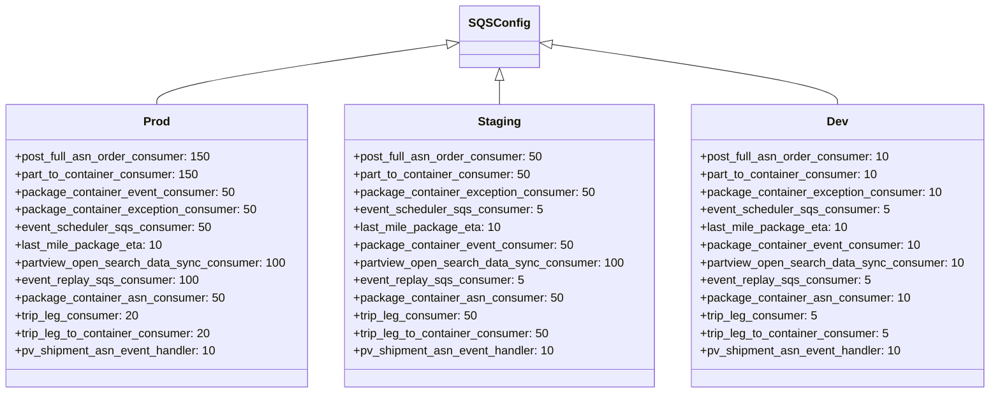

# Diagram: partview_service/config.cat.yml

> Auto-generated by Obscura crawlers

## Diagram 1

```mermaid
graph TD
  Config[Configuration]
  Config --> LogLevel[logLevel]
  Config --> Cloudwatch[cloudwatchOn]
  Config --> EventAudit[eventAuditOn]
  Config --> SQS[sqsConfig]
  Config --> PythonReq[pythonRequirements]

  subgraph LogLevels
    LL_dev["dev: info"]
    LL_dev2["dev2: info"]
    LL_qa["qa: warning"]
    LL_qa2["qa2: warning"]
    LL_test["test: warning"]
    LL_staging["staging: warning"]
    LL_prod["prod: warning"]
  end
  LogLevel --> LL_dev
  LogLevel --> LL_dev2
  LogLevel --> LL_qa
  LogLevel --> LL_qa2
  LogLevel --> LL_test
  LogLevel --> LL_staging
  LogLevel --> LL_prod

  subgraph CloudwatchOn
    CW_dev["dev: true"]
    CW_dev2["dev2: true"]
    CW_qa["qa: true"]
    CW_qa2["qa2: true"]
    CW_test["test: true"]
    CW_staging["staging: true"]
    CW_prod_a["prod-a: true"]
    CW_prod_b["prod-b: true"]
  end
  Cloudwatch --> CW_dev
  Cloudwatch --> CW_dev2
  Cloudwatch --> CW_qa
  Cloudwatch --> CW_qa2
  Cloudwatch --> CW_test
  Cloudwatch --> CW_staging
  Cloudwatch --> CW_prod_a
  Cloudwatch --> CW_prod_b

  subgraph EventAuditOn
    EA_dev["dev: true"]
    EA_dev2["dev2: true"]
    EA_qa["qa: true"]
    EA_qa2["qa2: true"]
    EA_test["test: true"]
    EA_staging["staging: true"]
    EA_prod_a["prod-a: true"]
    EA_prod_b["prod-b: true"]
  end
  EventAudit --> EA_dev
  EventAudit --> EA_dev2
  EventAudit --> EA_qa
  EventAudit --> EA_qa2
  EventAudit --> EA_test
  EventAudit --> EA_staging
  EventAudit --> EA_prod_a
  EventAudit --> EA_prod_b

  subgraph SQSConfig
    subgraph prod
      p_post_full_asn["post-full-asn-order-consumer: 150"]
      p_part_to_container["part-to-container-consumer: 150"]
      p_package_container_event["package-container-event-consumer: 50"]
      p_package_container_exception["package-container-exception-consumer: 50"]
      p_event_scheduler["event-scheduler-sqs-consumer: 50"]
      p_last_mile_eta["last-mile-package-eta: 10"]
      p_partview_open_search["partview_open_search_data_sync_consumer: 100"]
      p_event_replay["event-replay-sqs-consumer: 100"]
      p_package_container_asn["package-container-asn-consumer: 50"]
      p_trip_leg["trip-leg-consumer: 20"]
      p_trip_leg_to_container["trip-leg-to-container-consumer: 20"]
      p_pv_shipment_asn["pv-shipment-asn-event-handler: 10"]
    end
    subgraph staging
      s_post_full_asn["post-full-asn-order-consumer: 50"]
      s_part_to_container["part-to-container-consumer: 50"]
      s_package_container_exception["package-container-exception-consumer: 50"]
      s_event_scheduler["event-scheduler-sqs-consumer: 5"]
      s_last_mile_eta["last-mile-package-eta: 10"]
      s_package_container_event["package-container-event-consumer: 50"]
      s_partview_open_search["partview_open_search_data_sync_consumer: 100"]
      s_event_replay["event-replay-sqs-consumer: 5"]
      s_package_container_asn["package-container-asn-consumer: 50"]
      s_trip_leg["trip-leg-consumer: 50"]
      s_trip_leg_to_container["trip-leg-to-container-consumer: 50"]
      s_pv_shipment_asn["pv-shipment-asn-event-handler: 10"]
    end
    subgraph dev
      d_post_full_asn["post-full-asn-order-consumer: 10"]
      d_part_to_container["part-to-container-consumer: 10"]
      d_package_container_exception["package-container-exception-consumer: 10"]
      d_event_scheduler["event-scheduler-sqs-consumer: 5"]
      d_last_mile_eta["last-mile-package-eta: 10"]
      d_package_container_event["package-container-event-consumer: 10"]
      d_partview_open_search["partview_open_search_data_sync_consumer: 10"]
      d_event_replay["event-replay-sqs-consumer: 5"]
      d_package_container_asn["package-container-asn-consumer: 10"]
      d_trip_leg["trip-leg-consumer: 5"]
      d_trip_leg_to_container["trip-leg-to-container-consumer: 5"]
      d_pv_shipment_asn["pv-shipment-asn-event-handler: 10"]
    end
  end
  SQS --> prod
  SQS --> staging
  SQS --> dev

  PythonReq --> PR_dockerize["dockerizePip: non-linux"]
  PythonReq --> PR_image["dockerImage: public.ecr.aws/sam/emulation-python3.9:latest"]
  PythonReq --> PR_ssh["dockerSsh: true"]
  PythonReq --> PR_download_cache["useDownloadCache: false"]
  PythonReq --> PR_static_cache["useStaticCache: false"]
  PythonReq --> PR_slim["slim: true"]
```

### SVG

<svg id="container" width="7608.546875" xmlns="http://www.w3.org/2000/svg" class="flowchart" height="1782" viewBox="0 0 7608.546875 1782" role="graphics-document document" aria-roledescription="flowchart-v2"><g><marker id="container_flowchart-v2-pointEnd" class="marker flowchart-v2" viewBox="0 0 10 10" refX="5" refY="5" markerUnits="userSpaceOnUse" markerWidth="8" markerHeight="8" orient="auto"><path d="M 0 0 L 10 5 L 0 10 z" class="arrowMarkerPath" style="stroke-width: 1; stroke-dasharray: 1, 0;"></path></marker><marker id="container_flowchart-v2-pointStart" class="marker flowchart-v2" viewBox="0 0 10 10" refX="4.5" refY="5" markerUnits="userSpaceOnUse" markerWidth="8" markerHeight="8" orient="auto"><path d="M 0 5 L 10 10 L 10 0 z" class="arrowMarkerPath" style="stroke-width: 1; stroke-dasharray: 1, 0;"></path></marker><marker id="container_flowchart-v2-circleEnd" class="marker flowchart-v2" viewBox="0 0 10 10" refX="11" refY="5" markerUnits="userSpaceOnUse" markerWidth="11" markerHeight="11" orient="auto"><circle cx="5" cy="5" r="5" class="arrowMarkerPath" style="stroke-width: 1; stroke-dasharray: 1, 0;"></circle></marker><marker id="container_flowchart-v2-circleStart" class="marker flowchart-v2" viewBox="0 0 10 10" refX="-1" refY="5" markerUnits="userSpaceOnUse" markerWidth="11" markerHeight="11" orient="auto"><circle cx="5" cy="5" r="5" class="arrowMarkerPath" style="stroke-width: 1; stroke-dasharray: 1, 0;"></circle></marker><marker id="container_flowchart-v2-crossEnd" class="marker cross flowchart-v2" viewBox="0 0 11 11" refX="12" refY="5.2" markerUnits="userSpaceOnUse" markerWidth="11" markerHeight="11" orient="auto"><path d="M 1,1 l 9,9 M 10,1 l -9,9" class="arrowMarkerPath" style="stroke-width: 2; stroke-dasharray: 1, 0;"></path></marker><marker id="container_flowchart-v2-crossStart" class="marker cross flowchart-v2" viewBox="0 0 11 11" refX="-1" refY="5.2" markerUnits="userSpaceOnUse" markerWidth="11" markerHeight="11" orient="auto"><path d="M 1,1 l 9,9 M 10,1 l -9,9" class="arrowMarkerPath" style="stroke-width: 2; stroke-dasharray: 1, 0;"></path></marker><g class="root"><g class="clusters"><g class="cluster" id="SQSConfig" data-look="classic"><rect style="" x="8" y="216" width="1569.921875" height="1558"></rect><g class="cluster-label" transform="translate(756.265625, 216)"><foreignObject width="73.390625" height="24">

SQSConfig

</foreignObject></g></g><g class="cluster" id="EventAuditOn" data-look="classic"><rect style="" x="3174.109375" y="216" width="1487.921875" height="1558"></rect><g class="cluster-label" transform="translate(3868.7109375, 216)"><foreignObject width="98.71875" height="24">

EventAuditOn

</foreignObject></g></g><g class="cluster" id="CloudwatchOn" data-look="classic"><rect style="" x="4682.03125" y="216" width="1487.921875" height="1558"></rect><g class="cluster-label" transform="translate(5373.6796875, 216)"><foreignObject width="104.625" height="24">

CloudwatchOn

</foreignObject></g></g><g class="cluster" id="LogLevels" data-look="classic"><rect style="" x="6189.953125" y="216" width="1410.59375" height="1558"></rect><g class="cluster-label" transform="translate(6860.171875, 216)"><foreignObject width="70.15625" height="24">

LogLevels

</foreignObject></g></g></g><g class="edgePaths"><path d="M3959.906,36.379L4441.279,44.816C4922.651,53.253,5885.396,70.126,6366.768,82.063C6848.141,94,6848.141,101,6848.141,104.5L6848.141,108" id="L_Config_LogLevel_0" class="edge-thickness-normal edge-pattern-solid edge-thickness-normal edge-pattern-solid flowchart-link" style=";" data-edge="true" data-et="edge" data-id="L_Config_LogLevel_0" data-points="W3sieCI6Mzk1OS45MDYyNSwieSI6MzYuMzc5MTIyOTMzNTk1OTV9LHsieCI6Njg0OC4xNDA2MjUsInkiOjg3fSx7IngiOjY4NDguMTQwNjI1LCJ5IjoxMTJ9XQ==" marker-end="url(#container_flowchart-v2-pointEnd)"></path><path d="M3959.906,37.714L4198.112,45.928C4436.318,54.142,4912.729,70.571,5150.935,82.286C5389.141,94,5389.141,101,5389.141,104.5L5389.141,108" id="L_Config_Cloudwatch_0" class="edge-thickness-normal edge-pattern-solid edge-thickness-normal edge-pattern-solid flowchart-link" style=";" data-edge="true" data-et="edge" data-id="L_Config_Cloudwatch_0" data-points="W3sieCI6Mzk1OS45MDYyNSwieSI6MzcuNzEzNTAyNjQ3NDc2MzQ2fSx7IngiOjUzODkuMTQwNjI1LCJ5Ijo4N30seyJ4Ijo1Mzg5LjE0MDYyNSwieSI6MTEyfV0=" marker-end="url(#container_flowchart-v2-pointEnd)"></path><path d="M3881.219,62L3881.219,66.167C3881.219,70.333,3881.219,78.667,3881.219,86.333C3881.219,94,3881.219,101,3881.219,104.5L3881.219,108" id="L_Config_EventAudit_0" class="edge-thickness-normal edge-pattern-solid edge-thickness-normal edge-pattern-solid flowchart-link" style=";" data-edge="true" data-et="edge" data-id="L_Config_EventAudit_0" data-points="W3sieCI6Mzg4MS4yMTg3NSwieSI6NjJ9LHsieCI6Mzg4MS4yMTg3NSwieSI6ODd9LHsieCI6Mzg4MS4yMTg3NSwieSI6MTEyfV0=" marker-end="url(#container_flowchart-v2-pointEnd)"></path><path d="M3802.531,36.325L3300.936,44.771C2799.341,53.217,1796.151,70.108,1294.556,82.054C792.961,94,792.961,101,792.961,104.5L792.961,108" id="L_Config_SQS_0" class="edge-thickness-normal edge-pattern-solid edge-thickness-normal edge-pattern-solid flowchart-link" style=";" data-edge="true" data-et="edge" data-id="L_Config_SQS_0" data-points="W3sieCI6MzgwMi41MzEyNSwieSI6MzYuMzI0OTM3OTU4MDQxNjd9LHsieCI6NzkyLjk2MDkzNzUsInkiOjg3fSx7IngiOjc5Mi45NjA5Mzc1LCJ5IjoxMTJ9XQ==" marker-end="url(#container_flowchart-v2-pointEnd)"></path><path d="M3802.531,37.853L3576.643,46.044C3350.755,54.236,2898.979,70.618,2673.091,82.309C2447.203,94,2447.203,101,2447.203,104.5L2447.203,108" id="L_Config_PythonReq_0" class="edge-thickness-normal edge-pattern-solid edge-thickness-normal edge-pattern-solid flowchart-link" style=";" data-edge="true" data-et="edge" data-id="L_Config_PythonReq_0" data-points="W3sieCI6MzgwMi41MzEyNSwieSI6MzcuODUzMzUxMDU3NDU0NDh9LHsieCI6MjQ0Ny4yMDMxMjUsInkiOjg3fSx7IngiOjI0NDcuMjAzMTI1LCJ5IjoxMTJ9XQ==" marker-end="url(#container_flowchart-v2-pointEnd)"></path><path d="M6788.281,144.54L6704.617,152.283C6620.953,160.027,6453.625,175.513,6369.961,187.423C6286.297,199.333,6286.297,207.667,6286.297,336.5C6286.297,465.333,6286.297,714.667,6286.297,839.333L6286.297,964" id="L_LogLevel_LL_dev_0" class="edge-thickness-normal edge-pattern-solid edge-thickness-normal edge-pattern-solid flowchart-link" style=";" data-edge="true" data-et="edge" data-id="L_LogLevel_LL_dev_0" data-points="W3sieCI6Njc4OC4yODEyNSwieSI6MTQ0LjU0MDEzMDE1MTg0Mzh9LHsieCI6NjI4Ni4yOTY4NzUsInkiOjE5MX0seyJ4Ijo2Mjg2LjI5Njg3NSwieSI6MjE2fSx7IngiOjYyODYuMjk2ODc1LCJ5Ijo5Njh9XQ==" marker-end="url(#container_flowchart-v2-pointEnd)"></path><path d="M6788.281,147.078L6734.039,154.399C6679.797,161.719,6571.313,176.359,6517.07,187.846C6462.828,199.333,6462.828,207.667,6462.828,336.5C6462.828,465.333,6462.828,714.667,6462.828,839.333L6462.828,964" id="L_LogLevel_LL_dev2_0" class="edge-thickness-normal edge-pattern-solid edge-thickness-normal edge-pattern-solid flowchart-link" style=";" data-edge="true" data-et="edge" data-id="L_LogLevel_LL_dev2_0" data-points="W3sieCI6Njc4OC4yODEyNSwieSI6MTQ3LjA3ODM0NTQ5ODc4MzQ1fSx7IngiOjY0NjIuODI4MTI1LCJ5IjoxOTF9LHsieCI6NjQ2Mi44MjgxMjUsInkiOjIxNn0seyJ4Ijo2NDYyLjgyODEyNSwieSI6OTY4fV0=" marker-end="url(#container_flowchart-v2-pointEnd)"></path><path d="M6788.281,154.715L6765.246,160.763C6742.211,166.81,6696.141,178.905,6673.105,189.119C6650.07,199.333,6650.07,207.667,6650.07,336.5C6650.07,465.333,6650.07,714.667,6650.07,839.333L6650.07,964" id="L_LogLevel_LL_qa_0" class="edge-thickness-normal edge-pattern-solid edge-thickness-normal edge-pattern-solid flowchart-link" style=";" data-edge="true" data-et="edge" data-id="L_LogLevel_LL_qa_0" data-points="W3sieCI6Njc4OC4yODEyNSwieSI6MTU0LjcxNTA2MzMwNjExNzYzfSx7IngiOjY2NTAuMDcwMzEyNSwieSI6MTkxfSx7IngiOjY2NTAuMDcwMzEyNSwieSI6MjE2fSx7IngiOjY2NTAuMDcwMzEyNSwieSI6OTY4fV0=" marker-end="url(#container_flowchart-v2-pointEnd)"></path><path d="M6848.141,166L6848.141,170.167C6848.141,174.333,6848.141,182.667,6848.141,191C6848.141,199.333,6848.141,207.667,6848.141,336.5C6848.141,465.333,6848.141,714.667,6848.141,839.333L6848.141,964" id="L_LogLevel_LL_qa2_0" class="edge-thickness-normal edge-pattern-solid edge-thickness-normal edge-pattern-solid flowchart-link" style=";" data-edge="true" data-et="edge" data-id="L_LogLevel_LL_qa2_0" data-points="W3sieCI6Njg0OC4xNDA2MjUsInkiOjE2Nn0seyJ4Ijo2ODQ4LjE0MDYyNSwieSI6MTkxfSx7IngiOjY4NDguMTQwNjI1LCJ5IjoyMTZ9LHsieCI6Njg0OC4xNDA2MjUsInkiOjk2OH1d" marker-end="url(#container_flowchart-v2-pointEnd)"></path><path d="M6908,154.355L6931.81,160.462C6955.62,166.57,7003.24,178.785,7027.049,189.059C7050.859,199.333,7050.859,207.667,7050.859,336.5C7050.859,465.333,7050.859,714.667,7050.859,839.333L7050.859,964" id="L_LogLevel_LL_test_0" class="edge-thickness-normal edge-pattern-solid edge-thickness-normal edge-pattern-solid flowchart-link" style=";" data-edge="true" data-et="edge" data-id="L_LogLevel_LL_test_0" data-points="W3sieCI6NjkwOCwieSI6MTU0LjM1NDcwOTQxODgzNzY3fSx7IngiOjcwNTAuODU5Mzc1LCJ5IjoxOTF9LHsieCI6NzA1MC44NTkzNzUsInkiOjIxNn0seyJ4Ijo3MDUwLjg1OTM3NSwieSI6OTY4fV0=" marker-end="url(#container_flowchart-v2-pointEnd)"></path><path d="M6908,146.439L6967.764,153.866C7027.529,161.292,7147.057,176.146,7206.822,187.74C7266.586,199.333,7266.586,207.667,7266.586,336.5C7266.586,465.333,7266.586,714.667,7266.586,839.333L7266.586,964" id="L_LogLevel_LL_staging_0" class="edge-thickness-normal edge-pattern-solid edge-thickness-normal edge-pattern-solid flowchart-link" style=";" data-edge="true" data-et="edge" data-id="L_LogLevel_LL_staging_0" data-points="W3sieCI6NjkwOCwieSI6MTQ2LjQzODY5NjA2NjE2NzU1fSx7IngiOjcyNjYuNTg1OTM3NSwieSI6MTkxfSx7IngiOjcyNjYuNTg1OTM3NSwieSI6MjE2fSx7IngiOjcyNjYuNTg1OTM3NSwieSI6OTY4fV0=" marker-end="url(#container_flowchart-v2-pointEnd)"></path><path d="M6908,143.883L7004.263,151.736C7100.526,159.589,7293.052,175.294,7389.315,187.314C7485.578,199.333,7485.578,207.667,7485.578,336.5C7485.578,465.333,7485.578,714.667,7485.578,839.333L7485.578,964" id="L_LogLevel_LL_prod_0" class="edge-thickness-normal edge-pattern-solid edge-thickness-normal edge-pattern-solid flowchart-link" style=";" data-edge="true" data-et="edge" data-id="L_LogLevel_LL_prod_0" data-points="W3sieCI6NjkwOCwieSI6MTQzLjg4MzEyNTc5NjY0Njc0fSx7IngiOjc0ODUuNTc4MTI1LCJ5IjoxOTF9LHsieCI6NzQ4NS41NzgxMjUsInkiOjIxNn0seyJ4Ijo3NDg1LjU3ODEyNSwieSI6OTY4fV0=" marker-end="url(#container_flowchart-v2-pointEnd)"></path><path d="M5307.398,145.968L5219.357,153.474C5131.315,160.979,4955.232,175.989,4867.19,187.661C4779.148,199.333,4779.148,207.667,4779.148,336.5C4779.148,465.333,4779.148,714.667,4779.148,839.333L4779.148,964" id="L_Cloudwatch_CW_dev_0" class="edge-thickness-normal edge-pattern-solid edge-thickness-normal edge-pattern-solid flowchart-link" style=";" data-edge="true" data-et="edge" data-id="L_Cloudwatch_CW_dev_0" data-points="W3sieCI6NTMwNy4zOTg0Mzc1LCJ5IjoxNDUuOTY4Mjc1NzIwNzQ0Mzd9LHsieCI6NDc3OS4xNDg0Mzc1LCJ5IjoxOTF9LHsieCI6NDc3OS4xNDg0Mzc1LCJ5IjoyMTZ9LHsieCI6NDc3OS4xNDg0Mzc1LCJ5Ijo5Njh9XQ==" marker-end="url(#container_flowchart-v2-pointEnd)"></path><path d="M5307.398,148.841L5249.036,155.868C5190.674,162.894,5073.951,176.947,5015.589,188.14C4957.227,199.333,4957.227,207.667,4957.227,336.5C4957.227,465.333,4957.227,714.667,4957.227,839.333L4957.227,964" id="L_Cloudwatch_CW_dev2_0" class="edge-thickness-normal edge-pattern-solid edge-thickness-normal edge-pattern-solid flowchart-link" style=";" data-edge="true" data-et="edge" data-id="L_Cloudwatch_CW_dev2_0" data-points="W3sieCI6NTMwNy4zOTg0Mzc1LCJ5IjoxNDguODQxMjk1MTA3MTcxOTN9LHsieCI6NDk1Ny4yMjY1NjI1LCJ5IjoxOTF9LHsieCI6NDk1Ny4yMjY1NjI1LCJ5IjoyMTZ9LHsieCI6NDk1Ny4yMjY1NjI1LCJ5Ijo5Njh9XQ==" marker-end="url(#container_flowchart-v2-pointEnd)"></path><path d="M5307.398,155.489L5278.059,161.408C5248.719,167.326,5190.039,179.163,5160.699,189.248C5131.359,199.333,5131.359,207.667,5131.359,336.5C5131.359,465.333,5131.359,714.667,5131.359,839.333L5131.359,964" id="L_Cloudwatch_CW_qa_0" class="edge-thickness-normal edge-pattern-solid edge-thickness-normal edge-pattern-solid flowchart-link" style=";" data-edge="true" data-et="edge" data-id="L_Cloudwatch_CW_qa_0" data-points="W3sieCI6NTMwNy4zOTg0Mzc1LCJ5IjoxNTUuNDg5MTUwMjAwMDI0MjZ9LHsieCI6NTEzMS4zNTkzNzUsInkiOjE5MX0seyJ4Ijo1MTMxLjM1OTM3NSwieSI6MjE2fSx7IngiOjUxMzEuMzU5Mzc1LCJ5Ijo5Njh9XQ==" marker-end="url(#container_flowchart-v2-pointEnd)"></path><path d="M5343.72,166L5336.711,170.167C5329.701,174.333,5315.683,182.667,5308.673,191C5301.664,199.333,5301.664,207.667,5301.664,336.5C5301.664,465.333,5301.664,714.667,5301.664,839.333L5301.664,964" id="L_Cloudwatch_CW_qa2_0" class="edge-thickness-normal edge-pattern-solid edge-thickness-normal edge-pattern-solid flowchart-link" style=";" data-edge="true" data-et="edge" data-id="L_Cloudwatch_CW_qa2_0" data-points="W3sieCI6NTM0My43MjAxMDIxNjM0NjIsInkiOjE2Nn0seyJ4Ijo1MzAxLjY2NDA2MjUsInkiOjE5MX0seyJ4Ijo1MzAxLjY2NDA2MjUsInkiOjIxNn0seyJ4Ijo1MzAxLjY2NDA2MjUsInkiOjk2OH1d" marker-end="url(#container_flowchart-v2-pointEnd)"></path><path d="M5434.561,166L5441.57,170.167C5448.58,174.333,5462.599,182.667,5469.608,191C5476.617,199.333,5476.617,207.667,5476.617,336.5C5476.617,465.333,5476.617,714.667,5476.617,839.333L5476.617,964" id="L_Cloudwatch_CW_test_0" class="edge-thickness-normal edge-pattern-solid edge-thickness-normal edge-pattern-solid flowchart-link" style=";" data-edge="true" data-et="edge" data-id="L_Cloudwatch_CW_test_0" data-points="W3sieCI6NTQzNC41NjExNDc4MzY1MzgsInkiOjE2Nn0seyJ4Ijo1NDc2LjYxNzE4NzUsInkiOjE5MX0seyJ4Ijo1NDc2LjYxNzE4NzUsInkiOjIxNn0seyJ4Ijo1NDc2LjYxNzE4NzUsInkiOjk2OH1d" marker-end="url(#container_flowchart-v2-pointEnd)"></path><path d="M5470.883,154.432L5503.165,160.527C5535.448,166.621,5600.013,178.811,5632.296,189.072C5664.578,199.333,5664.578,207.667,5664.578,336.5C5664.578,465.333,5664.578,714.667,5664.578,839.333L5664.578,964" id="L_Cloudwatch_CW_staging_0" class="edge-thickness-normal edge-pattern-solid edge-thickness-normal edge-pattern-solid flowchart-link" style=";" data-edge="true" data-et="edge" data-id="L_Cloudwatch_CW_staging_0" data-points="W3sieCI6NTQ3MC44ODI4MTI1LCJ5IjoxNTQuNDMyMTUzMzkyMzMwMzh9LHsieCI6NTY2NC41NzgxMjUsInkiOjE5MX0seyJ4Ijo1NjY0LjU3ODEyNSwieSI6MjE2fSx7IngiOjU2NjQuNTc4MTI1LCJ5Ijo5Njh9XQ==" marker-end="url(#container_flowchart-v2-pointEnd)"></path><path d="M5470.883,147.965L5536.28,155.138C5601.677,162.31,5732.471,176.655,5797.868,187.994C5863.266,199.333,5863.266,207.667,5863.266,336.5C5863.266,465.333,5863.266,714.667,5863.266,839.333L5863.266,964" id="L_Cloudwatch_CW_prod_a_0" class="edge-thickness-normal edge-pattern-solid edge-thickness-normal edge-pattern-solid flowchart-link" style=";" data-edge="true" data-et="edge" data-id="L_Cloudwatch_CW_prod_a_0" data-points="W3sieCI6NTQ3MC44ODI4MTI1LCJ5IjoxNDcuOTY1MTMzMTM5OTk0NzJ9LHsieCI6NTg2My4yNjU2MjUsInkiOjE5MX0seyJ4Ijo1ODYzLjI2NTYyNSwieSI6MjE2fSx7IngiOjU4NjMuMjY1NjI1LCJ5Ijo5Njh9XQ==" marker-end="url(#container_flowchart-v2-pointEnd)"></path><path d="M5470.883,145.328L5569.216,152.94C5667.549,160.552,5864.216,175.776,5962.549,187.555C6060.883,199.333,6060.883,207.667,6060.883,336.5C6060.883,465.333,6060.883,714.667,6060.883,839.333L6060.883,964" id="L_Cloudwatch_CW_prod_b_0" class="edge-thickness-normal edge-pattern-solid edge-thickness-normal edge-pattern-solid flowchart-link" style=";" data-edge="true" data-et="edge" data-id="L_Cloudwatch_CW_prod_b_0" data-points="W3sieCI6NTQ3MC44ODI4MTI1LCJ5IjoxNDUuMzI3NzE1OTQzODQ5Mzd9LHsieCI6NjA2MC44ODI4MTI1LCJ5IjoxOTF9LHsieCI6NjA2MC44ODI4MTI1LCJ5IjoyMTZ9LHsieCI6NjA2MC44ODI4MTI1LCJ5Ijo5Njh9XQ==" marker-end="url(#container_flowchart-v2-pointEnd)"></path><path d="M3801.656,145.782L3713.251,153.319C3624.846,160.855,3448.036,175.927,3359.632,187.63C3271.227,199.333,3271.227,207.667,3271.227,336.5C3271.227,465.333,3271.227,714.667,3271.227,839.333L3271.227,964" id="L_EventAudit_EA_dev_0" class="edge-thickness-normal edge-pattern-solid edge-thickness-normal edge-pattern-solid flowchart-link" style=";" data-edge="true" data-et="edge" data-id="L_EventAudit_EA_dev_0" data-points="W3sieCI6MzgwMS42NTYyNSwieSI6MTQ1Ljc4MjQ2MzkxNDc1M30seyJ4IjozMjcxLjIyNjU2MjUsInkiOjE5MX0seyJ4IjozMjcxLjIyNjU2MjUsInkiOjIxNn0seyJ4IjozMjcxLjIyNjU2MjUsInkiOjk2OH1d" marker-end="url(#container_flowchart-v2-pointEnd)"></path><path d="M3801.656,148.579L3742.931,155.649C3684.206,162.719,3566.755,176.86,3508.03,188.096C3449.305,199.333,3449.305,207.667,3449.305,336.5C3449.305,465.333,3449.305,714.667,3449.305,839.333L3449.305,964" id="L_EventAudit_EA_dev2_0" class="edge-thickness-normal edge-pattern-solid edge-thickness-normal edge-pattern-solid flowchart-link" style=";" data-edge="true" data-et="edge" data-id="L_EventAudit_EA_dev2_0" data-points="W3sieCI6MzgwMS42NTYyNSwieSI6MTQ4LjU3ODg3MzExMjA1NTd9LHsieCI6MzQ0OS4zMDQ2ODc1LCJ5IjoxOTF9LHsieCI6MzQ0OS4zMDQ2ODc1LCJ5IjoyMTZ9LHsieCI6MzQ0OS4zMDQ2ODc1LCJ5Ijo5Njh9XQ==" marker-end="url(#container_flowchart-v2-pointEnd)"></path><path d="M3801.656,155.049L3771.953,161.041C3742.25,167.033,3682.844,179.016,3653.141,189.175C3623.438,199.333,3623.438,207.667,3623.438,336.5C3623.438,465.333,3623.438,714.667,3623.438,839.333L3623.438,964" id="L_EventAudit_EA_qa_0" class="edge-thickness-normal edge-pattern-solid edge-thickness-normal edge-pattern-solid flowchart-link" style=";" data-edge="true" data-et="edge" data-id="L_EventAudit_EA_qa_0" data-points="W3sieCI6MzgwMS42NTYyNSwieSI6MTU1LjA0OTQ2MDU0MDY3MTZ9LHsieCI6MzYyMy40Mzc1LCJ5IjoxOTF9LHsieCI6MzYyMy40Mzc1LCJ5IjoyMTZ9LHsieCI6MzYyMy40Mzc1LCJ5Ijo5Njh9XQ==" marker-end="url(#container_flowchart-v2-pointEnd)"></path><path d="M3835.798,166L3828.789,170.167C3821.78,174.333,3807.761,182.667,3800.752,191C3793.742,199.333,3793.742,207.667,3793.742,336.5C3793.742,465.333,3793.742,714.667,3793.742,839.333L3793.742,964" id="L_EventAudit_EA_qa2_0" class="edge-thickness-normal edge-pattern-solid edge-thickness-normal edge-pattern-solid flowchart-link" style=";" data-edge="true" data-et="edge" data-id="L_EventAudit_EA_qa2_0" data-points="W3sieCI6MzgzNS43OTgyMjcxNjM0NjE0LCJ5IjoxNjZ9LHsieCI6Mzc5My43NDIxODc1LCJ5IjoxOTF9LHsieCI6Mzc5My43NDIxODc1LCJ5IjoyMTZ9LHsieCI6Mzc5My43NDIxODc1LCJ5Ijo5Njh9XQ==" marker-end="url(#container_flowchart-v2-pointEnd)"></path><path d="M3926.639,166L3933.649,170.167C3940.658,174.333,3954.677,182.667,3961.686,191C3968.695,199.333,3968.695,207.667,3968.695,336.5C3968.695,465.333,3968.695,714.667,3968.695,839.333L3968.695,964" id="L_EventAudit_EA_test_0" class="edge-thickness-normal edge-pattern-solid edge-thickness-normal edge-pattern-solid flowchart-link" style=";" data-edge="true" data-et="edge" data-id="L_EventAudit_EA_test_0" data-points="W3sieCI6MzkyNi42MzkyNzI4MzY1Mzg2LCJ5IjoxNjZ9LHsieCI6Mzk2OC42OTUzMTI1LCJ5IjoxOTF9LHsieCI6Mzk2OC42OTUzMTI1LCJ5IjoyMTZ9LHsieCI6Mzk2OC42OTUzMTI1LCJ5Ijo5Njh9XQ==" marker-end="url(#container_flowchart-v2-pointEnd)"></path><path d="M3960.781,154.021L3993.427,160.184C4026.073,166.347,4091.365,178.674,4124.01,189.003C4156.656,199.333,4156.656,207.667,4156.656,336.5C4156.656,465.333,4156.656,714.667,4156.656,839.333L4156.656,964" id="L_EventAudit_EA_staging_0" class="edge-thickness-normal edge-pattern-solid edge-thickness-normal edge-pattern-solid flowchart-link" style=";" data-edge="true" data-et="edge" data-id="L_EventAudit_EA_staging_0" data-points="W3sieCI6Mzk2MC43ODEyNSwieSI6MTU0LjAyMDY0ODk2NzU1MTZ9LHsieCI6NDE1Ni42NTYyNSwieSI6MTkxfSx7IngiOjQxNTYuNjU2MjUsInkiOjIxNn0seyJ4Ijo0MTU2LjY1NjI1LCJ5Ijo5Njh9XQ==" marker-end="url(#container_flowchart-v2-pointEnd)"></path><path d="M3960.781,147.726L4026.542,154.938C4092.302,162.151,4223.823,176.575,4289.583,187.954C4355.344,199.333,4355.344,207.667,4355.344,336.5C4355.344,465.333,4355.344,714.667,4355.344,839.333L4355.344,964" id="L_EventAudit_EA_prod_a_0" class="edge-thickness-normal edge-pattern-solid edge-thickness-normal edge-pattern-solid flowchart-link" style=";" data-edge="true" data-et="edge" data-id="L_EventAudit_EA_prod_a_0" data-points="W3sieCI6Mzk2MC43ODEyNSwieSI6MTQ3LjcyNjA3NDM0NzQ4MjJ9LHsieCI6NDM1NS4zNDM3NSwieSI6MTkxfSx7IngiOjQzNTUuMzQzNzUsInkiOjIxNn0seyJ4Ijo0MzU1LjM0Mzc1LCJ5Ijo5Njh9XQ==" marker-end="url(#container_flowchart-v2-pointEnd)"></path><path d="M3960.781,145.159L4059.478,152.799C4158.174,160.439,4355.568,175.72,4454.264,187.526C4552.961,199.333,4552.961,207.667,4552.961,336.5C4552.961,465.333,4552.961,714.667,4552.961,839.333L4552.961,964" id="L_EventAudit_EA_prod_b_0" class="edge-thickness-normal edge-pattern-solid edge-thickness-normal edge-pattern-solid flowchart-link" style=";" data-edge="true" data-et="edge" data-id="L_EventAudit_EA_prod_b_0" data-points="W3sieCI6Mzk2MC43ODEyNSwieSI6MTQ1LjE1ODk4NDkxNTYyMjg1fSx7IngiOjQ1NTIuOTYwOTM3NSwieSI6MTkxfSx7IngiOjQ1NTIuOTYwOTM3NSwieSI6MjE2fSx7IngiOjQ1NTIuOTYwOTM3NSwieSI6OTY4fV0=" marker-end="url(#container_flowchart-v2-pointEnd)"></path><path d="M2341.094,146.678L2238.999,154.065C2136.904,161.452,1932.714,176.226,1830.618,187.78C1728.523,199.333,1728.523,207.667,1728.523,336.5C1728.523,465.333,1728.523,714.667,1728.523,839.333L1728.523,964" id="L_PythonReq_PR_dockerize_0" class="edge-thickness-normal edge-pattern-solid edge-thickness-normal edge-pattern-solid flowchart-link" style=";" data-edge="true" data-et="edge" data-id="L_PythonReq_PR_dockerize_0" data-points="W3sieCI6MjM0MS4wOTM3NSwieSI6MTQ2LjY3NzUzMzY3MTc3MjI0fSx7IngiOjE3MjguNTIzNDM3NSwieSI6MTkxfSx7IngiOjE3MjguNTIzNDM3NSwieSI6MjE2fSx7IngiOjE3MjguNTIzNDM3NSwieSI6OTY4fV0=" marker-end="url(#container_flowchart-v2-pointEnd)"></path><path d="M2341.094,152.476L2290.538,158.897C2239.982,165.317,2138.87,178.159,2088.314,188.746C2037.758,199.333,2037.758,207.667,2037.758,332.5C2037.758,457.333,2037.758,698.667,2037.758,819.333L2037.758,940" id="L_PythonReq_PR_image_0" class="edge-thickness-normal edge-pattern-solid edge-thickness-normal edge-pattern-solid flowchart-link" style=";" data-edge="true" data-et="edge" data-id="L_PythonReq_PR_image_0" data-points="W3sieCI6MjM0MS4wOTM3NSwieSI6MTUyLjQ3NjAwNjAyOTQ5ODc2fSx7IngiOjIwMzcuNzU3ODEyNSwieSI6MTkxfSx7IngiOjIwMzcuNzU3ODEyNSwieSI6MjE2fSx7IngiOjIwMzcuNzU3ODEyNSwieSI6OTQ0fV0=" marker-end="url(#container_flowchart-v2-pointEnd)"></path><path d="M2380.097,166L2369.741,170.167C2359.385,174.333,2338.673,182.667,2328.317,191C2317.961,199.333,2317.961,207.667,2317.961,336.5C2317.961,465.333,2317.961,714.667,2317.961,839.333L2317.961,964" id="L_PythonReq_PR_ssh_0" class="edge-thickness-normal edge-pattern-solid edge-thickness-normal edge-pattern-solid flowchart-link" style=";" data-edge="true" data-et="edge" data-id="L_PythonReq_PR_ssh_0" data-points="W3sieCI6MjM4MC4wOTY2MDQ1NjczMDc2LCJ5IjoxNjZ9LHsieCI6MjMxNy45NjA5Mzc1LCJ5IjoxOTF9LHsieCI6MjMxNy45NjA5Mzc1LCJ5IjoyMTZ9LHsieCI6MjMxNy45NjA5Mzc1LCJ5Ijo5Njh9XQ==" marker-end="url(#container_flowchart-v2-pointEnd)"></path><path d="M2514.31,166L2524.666,170.167C2535.022,174.333,2555.733,182.667,2566.089,191C2576.445,199.333,2576.445,207.667,2576.445,336.5C2576.445,465.333,2576.445,714.667,2576.445,839.333L2576.445,964" id="L_PythonReq_PR_download_cache_0" class="edge-thickness-normal edge-pattern-solid edge-thickness-normal edge-pattern-solid flowchart-link" style=";" data-edge="true" data-et="edge" data-id="L_PythonReq_PR_download_cache_0" data-points="W3sieCI6MjUxNC4zMDk2NDU0MzI2OTI0LCJ5IjoxNjZ9LHsieCI6MjU3Ni40NDUzMTI1LCJ5IjoxOTF9LHsieCI6MjU3Ni40NDUzMTI1LCJ5IjoyMTZ9LHsieCI6MjU3Ni40NDUzMTI1LCJ5Ijo5Njh9XQ==" marker-end="url(#container_flowchart-v2-pointEnd)"></path><path d="M2553.313,152.547L2603.512,158.956C2653.711,165.365,2754.109,178.182,2804.309,188.758C2854.508,199.333,2854.508,207.667,2854.508,336.5C2854.508,465.333,2854.508,714.667,2854.508,839.333L2854.508,964" id="L_PythonReq_PR_static_cache_0" class="edge-thickness-normal edge-pattern-solid edge-thickness-normal edge-pattern-solid flowchart-link" style=";" data-edge="true" data-et="edge" data-id="L_PythonReq_PR_static_cache_0" data-points="W3sieCI6MjU1My4zMTI1LCJ5IjoxNTIuNTQ2ODMwMzQ0Mjk4NDZ9LHsieCI6Mjg1NC41MDc4MTI1LCJ5IjoxOTF9LHsieCI6Mjg1NC41MDc4MTI1LCJ5IjoyMTZ9LHsieCI6Mjg1NC41MDc4MTI1LCJ5Ijo5Njh9XQ==" marker-end="url(#container_flowchart-v2-pointEnd)"></path><path d="M2553.313,147.791L2640.241,154.992C2727.169,162.194,2901.026,176.597,2987.954,187.965C3074.883,199.333,3074.883,207.667,3074.883,336.5C3074.883,465.333,3074.883,714.667,3074.883,839.333L3074.883,964" id="L_PythonReq_PR_slim_0" class="edge-thickness-normal edge-pattern-solid edge-thickness-normal edge-pattern-solid flowchart-link" style=";" data-edge="true" data-et="edge" data-id="L_PythonReq_PR_slim_0" data-points="W3sieCI6MjU1My4zMTI1LCJ5IjoxNDcuNzkwNjEwMjU4NTE2Nn0seyJ4IjozMDc0Ljg4MjgxMjUsInkiOjE5MX0seyJ4IjozMDc0Ljg4MjgxMjUsInkiOjIxNn0seyJ4IjozMDc0Ljg4MjgxMjUsInkiOjk2OH1d" marker-end="url(#container_flowchart-v2-pointEnd)"></path><path d="M857.664,145.512L932.987,153.094C1008.31,160.675,1158.956,175.837,1234.279,187.585C1309.602,199.333,1309.602,207.667,1309.602,215.333C1309.602,223,1309.602,230,1309.602,233.5L1309.602,237" id="L_SQS_prod_0" class="edge-thickness-normal edge-pattern-solid edge-thickness-normal edge-pattern-solid flowchart-link" style=";" data-edge="true" data-et="edge" data-id="L_SQS_prod_0" data-points="W3sieCI6ODU3LjY2NDA2MjUsInkiOjE0NS41MTIzODQ2OTY4MDkzfSx7IngiOjEzMDkuNjAxNTYyNSwieSI6MTkxfSx7IngiOjEzMDkuNjAxNTYyNSwieSI6MjE2fSx7IngiOjEzMDkuNjAxNTYyNSwieSI6MjQxfV0=" marker-end="url(#container_flowchart-v2-pointEnd)"></path><path d="M792.961,166L792.961,170.167C792.961,174.333,792.961,182.667,792.961,191C792.961,199.333,792.961,207.667,792.961,215.333C792.961,223,792.961,230,792.961,233.5L792.961,237" id="L_SQS_staging_0" class="edge-thickness-normal edge-pattern-solid edge-thickness-normal edge-pattern-solid flowchart-link" style=";" data-edge="true" data-et="edge" data-id="L_SQS_staging_0" data-points="W3sieCI6NzkyLjk2MDkzNzUsInkiOjE2Nn0seyJ4Ijo3OTIuOTYwOTM3NSwieSI6MTkxfSx7IngiOjc5Mi45NjA5Mzc1LCJ5IjoyMTZ9LHsieCI6NzkyLjk2MDkzNzUsInkiOjI0MX1d" marker-end="url(#container_flowchart-v2-pointEnd)"></path><path d="M728.258,145.512L652.935,153.094C577.612,160.675,426.966,175.837,351.643,187.585C276.32,199.333,276.32,207.667,276.32,215.333C276.32,223,276.32,230,276.32,233.5L276.32,237" id="L_SQS_dev_0" class="edge-thickness-normal edge-pattern-solid edge-thickness-normal edge-pattern-solid flowchart-link" style=";" data-edge="true" data-et="edge" data-id="L_SQS_dev_0" data-points="W3sieCI6NzI4LjI1NzgxMjUsInkiOjE0NS41MTIzODQ2OTY4MDkzfSx7IngiOjI3Ni4zMjAzMTI1LCJ5IjoxOTF9LHsieCI6Mjc2LjMyMDMxMjUsInkiOjIxNn0seyJ4IjoyNzYuMzIwMzEyNSwieSI6MjQxfV0=" marker-end="url(#container_flowchart-v2-pointEnd)"></path></g><g class="edgeLabels"><g class="edgeLabel"><g class="label" data-id="L_Config_LogLevel_0" transform="translate(0, 0)"><foreignObject width="0" height="0">

</foreignObject></g></g><g class="edgeLabel"><g class="label" data-id="L_Config_Cloudwatch_0" transform="translate(0, 0)"><foreignObject width="0" height="0">

</foreignObject></g></g><g class="edgeLabel"><g class="label" data-id="L_Config_EventAudit_0" transform="translate(0, 0)"><foreignObject width="0" height="0">

</foreignObject></g></g><g class="edgeLabel"><g class="label" data-id="L_Config_SQS_0" transform="translate(0, 0)"><foreignObject width="0" height="0">

</foreignObject></g></g><g class="edgeLabel"><g class="label" data-id="L_Config_PythonReq_0" transform="translate(0, 0)"><foreignObject width="0" height="0">

</foreignObject></g></g><g class="edgeLabel"><g class="label" data-id="L_LogLevel_LL_dev_0" transform="translate(0, 0)"><foreignObject width="0" height="0">

</foreignObject></g></g><g class="edgeLabel"><g class="label" data-id="L_LogLevel_LL_dev2_0" transform="translate(0, 0)"><foreignObject width="0" height="0">

</foreignObject></g></g><g class="edgeLabel"><g class="label" data-id="L_LogLevel_LL_qa_0" transform="translate(0, 0)"><foreignObject width="0" height="0">

</foreignObject></g></g><g class="edgeLabel"><g class="label" data-id="L_LogLevel_LL_qa2_0" transform="translate(0, 0)"><foreignObject width="0" height="0">

</foreignObject></g></g><g class="edgeLabel"><g class="label" data-id="L_LogLevel_LL_test_0" transform="translate(0, 0)"><foreignObject width="0" height="0">

</foreignObject></g></g><g class="edgeLabel"><g class="label" data-id="L_LogLevel_LL_staging_0" transform="translate(0, 0)"><foreignObject width="0" height="0">

</foreignObject></g></g><g class="edgeLabel"><g class="label" data-id="L_LogLevel_LL_prod_0" transform="translate(0, 0)"><foreignObject width="0" height="0">

</foreignObject></g></g><g class="edgeLabel"><g class="label" data-id="L_Cloudwatch_CW_dev_0" transform="translate(0, 0)"><foreignObject width="0" height="0">

</foreignObject></g></g><g class="edgeLabel"><g class="label" data-id="L_Cloudwatch_CW_dev2_0" transform="translate(0, 0)"><foreignObject width="0" height="0">

</foreignObject></g></g><g class="edgeLabel"><g class="label" data-id="L_Cloudwatch_CW_qa_0" transform="translate(0, 0)"><foreignObject width="0" height="0">

</foreignObject></g></g><g class="edgeLabel"><g class="label" data-id="L_Cloudwatch_CW_qa2_0" transform="translate(0, 0)"><foreignObject width="0" height="0">

</foreignObject></g></g><g class="edgeLabel"><g class="label" data-id="L_Cloudwatch_CW_test_0" transform="translate(0, 0)"><foreignObject width="0" height="0">

</foreignObject></g></g><g class="edgeLabel"><g class="label" data-id="L_Cloudwatch_CW_staging_0" transform="translate(0, 0)"><foreignObject width="0" height="0">

</foreignObject></g></g><g class="edgeLabel"><g class="label" data-id="L_Cloudwatch_CW_prod_a_0" transform="translate(0, 0)"><foreignObject width="0" height="0">

</foreignObject></g></g><g class="edgeLabel"><g class="label" data-id="L_Cloudwatch_CW_prod_b_0" transform="translate(0, 0)"><foreignObject width="0" height="0">

</foreignObject></g></g><g class="edgeLabel"><g class="label" data-id="L_EventAudit_EA_dev_0" transform="translate(0, 0)"><foreignObject width="0" height="0">

</foreignObject></g></g><g class="edgeLabel"><g class="label" data-id="L_EventAudit_EA_dev2_0" transform="translate(0, 0)"><foreignObject width="0" height="0">

</foreignObject></g></g><g class="edgeLabel"><g class="label" data-id="L_EventAudit_EA_qa_0" transform="translate(0, 0)"><foreignObject width="0" height="0">

</foreignObject></g></g><g class="edgeLabel"><g class="label" data-id="L_EventAudit_EA_qa2_0" transform="translate(0, 0)"><foreignObject width="0" height="0">

</foreignObject></g></g><g class="edgeLabel"><g class="label" data-id="L_EventAudit_EA_test_0" transform="translate(0, 0)"><foreignObject width="0" height="0">

</foreignObject></g></g><g class="edgeLabel"><g class="label" data-id="L_EventAudit_EA_staging_0" transform="translate(0, 0)"><foreignObject width="0" height="0">

</foreignObject></g></g><g class="edgeLabel"><g class="label" data-id="L_EventAudit_EA_prod_a_0" transform="translate(0, 0)"><foreignObject width="0" height="0">

</foreignObject></g></g><g class="edgeLabel"><g class="label" data-id="L_EventAudit_EA_prod_b_0" transform="translate(0, 0)"><foreignObject width="0" height="0">

</foreignObject></g></g><g class="edgeLabel"><g class="label" data-id="L_PythonReq_PR_dockerize_0" transform="translate(0, 0)"><foreignObject width="0" height="0">

</foreignObject></g></g><g class="edgeLabel"><g class="label" data-id="L_PythonReq_PR_image_0" transform="translate(0, 0)"><foreignObject width="0" height="0">

</foreignObject></g></g><g class="edgeLabel"><g class="label" data-id="L_PythonReq_PR_ssh_0" transform="translate(0, 0)"><foreignObject width="0" height="0">

</foreignObject></g></g><g class="edgeLabel"><g class="label" data-id="L_PythonReq_PR_download_cache_0" transform="translate(0, 0)"><foreignObject width="0" height="0">

</foreignObject></g></g><g class="edgeLabel"><g class="label" data-id="L_PythonReq_PR_static_cache_0" transform="translate(0, 0)"><foreignObject width="0" height="0">

</foreignObject></g></g><g class="edgeLabel"><g class="label" data-id="L_PythonReq_PR_slim_0" transform="translate(0, 0)"><foreignObject width="0" height="0">

</foreignObject></g></g><g class="edgeLabel"><g class="label" data-id="L_SQS_prod_0" transform="translate(0, 0)"><foreignObject width="0" height="0">

</foreignObject></g></g><g class="edgeLabel"><g class="label" data-id="L_SQS_staging_0" transform="translate(0, 0)"><foreignObject width="0" height="0">

</foreignObject></g></g><g class="edgeLabel"><g class="label" data-id="L_SQS_dev_0" transform="translate(0, 0)"><foreignObject width="0" height="0">

</foreignObject></g></g></g><g class="nodes"><g class="root" transform="translate(35, 233)"><g class="clusters"><g class="cluster" id="dev" data-look="classic"><rect style="" x="8" y="8" width="466.640625" height="1508"></rect><g class="cluster-label" transform="translate(228.265625, 8)"><foreignObject width="26.109375" height="24">

dev

</foreignObject></g></g></g><g class="edgePaths"></g><g class="edgeLabels"></g><g class="nodes"><g class="node default" id="flowchart-d_post_full_asn-104" transform="translate(241.3203125, 82)"><rect class="basic label-container" style="" x="-130" y="-39" width="260" height="78"></rect><g class="label" style="" transform="translate(-100, -24)"><rect></rect><foreignObject width="200" height="48">

post-full-asn-order-consumer: 10

</foreignObject></g></g><g class="node default" id="flowchart-d_part_to_container-105" transform="translate(241.3203125, 210)"><rect class="basic label-container" style="" x="-130" y="-39" width="260" height="78"></rect><g class="label" style="" transform="translate(-100, -24)"><rect></rect><foreignObject width="200" height="48">

part-to-container-consumer: 10

</foreignObject></g></g><g class="node default" id="flowchart-d_package_container_exception-106" transform="translate(241.3203125, 338)"><rect class="basic label-container" style="" x="-130" y="-39" width="260" height="78"></rect><g class="label" style="" transform="translate(-100, -24)"><rect></rect><foreignObject width="200" height="48">

package-container-exception-consumer: 10

</foreignObject></g></g><g class="node default" id="flowchart-d_event_scheduler-107" transform="translate(241.3203125, 466)"><rect class="basic label-container" style="" x="-130" y="-39" width="260" height="78"></rect><g class="label" style="" transform="translate(-100, -24)"><rect></rect><foreignObject width="200" height="48">

event-scheduler-sqs-consumer: 5

</foreignObject></g></g><g class="node default" id="flowchart-d_last_mile_eta-108" transform="translate(241.3203125, 582)"><rect class="basic label-container" style="" x="-121.3359375" y="-27" width="242.671875" height="54"></rect><g class="label" style="" transform="translate(-91.3359375, -12)"><rect></rect><foreignObject width="182.671875" height="24">

last-mile-package-eta: 10

</foreignObject></g></g><g class="node default" id="flowchart-d_package_container_event-109" transform="translate(241.3203125, 698)"><rect class="basic label-container" style="" x="-130" y="-39" width="260" height="78"></rect><g class="label" style="" transform="translate(-100, -24)"><rect></rect><foreignObject width="200" height="48">

package-container-event-consumer: 10

</foreignObject></g></g><g class="node default" id="flowchart-d_partview_open_search-110" transform="translate(241.3203125, 826)"><rect class="basic label-container" style="" x="-195.8203125" y="-39" width="391.640625" height="78"></rect><g class="label" style="" transform="translate(-165.8203125, -24)"><rect></rect><foreignObject width="331.640625" height="48">

partview_open_search_data_sync_consumer: 10

</foreignObject></g></g><g class="node default" id="flowchart-d_event_replay-111" transform="translate(241.3203125, 954)"><rect class="basic label-container" style="" x="-130" y="-39" width="260" height="78"></rect><g class="label" style="" transform="translate(-100, -24)"><rect></rect><foreignObject width="200" height="48">

event-replay-sqs-consumer: 5

</foreignObject></g></g><g class="node default" id="flowchart-d_package_container_asn-112" transform="translate(241.3203125, 1082)"><rect class="basic label-container" style="" x="-130" y="-39" width="260" height="78"></rect><g class="label" style="" transform="translate(-100, -24)"><rect></rect><foreignObject width="200" height="48">

package-container-asn-consumer: 10

</foreignObject></g></g><g class="node default" id="flowchart-d_trip_leg-113" transform="translate(241.3203125, 1198)"><rect class="basic label-container" style="" x="-104.03125" y="-27" width="208.0625" height="54"></rect><g class="label" style="" transform="translate(-74.03125, -12)"><rect></rect><foreignObject width="148.0625" height="24">

trip-leg-consumer: 5

</foreignObject></g></g><g class="node default" id="flowchart-d_trip_leg_to_container-114" transform="translate(241.3203125, 1314)"><rect class="basic label-container" style="" x="-130" y="-39" width="260" height="78"></rect><g class="label" style="" transform="translate(-100, -24)"><rect></rect><foreignObject width="200" height="48">

trip-leg-to-container-consumer: 5

</foreignObject></g></g><g class="node default" id="flowchart-d_pv_shipment_asn-115" transform="translate(241.3203125, 1442)"><rect class="basic label-container" style="" x="-130" y="-39" width="260" height="78"></rect><g class="label" style="" transform="translate(-100, -24)"><rect></rect><foreignObject width="200" height="48">

pv-shipment-asn-event-handler: 10

</foreignObject></g></g></g></g><g class="root" transform="translate(551.640625, 233)"><g class="clusters"><g class="cluster" id="staging" data-look="classic"><rect style="" x="8" y="8" width="466.640625" height="1508"></rect><g class="cluster-label" transform="translate(215.2109375, 8)"><foreignObject width="52.21875" height="24">

staging

</foreignObject></g></g></g><g class="edgePaths"></g><g class="edgeLabels"></g><g class="nodes"><g class="node default" id="flowchart-s_post_full_asn-92" transform="translate(241.3203125, 82)"><rect class="basic label-container" style="" x="-130" y="-39" width="260" height="78"></rect><g class="label" style="" transform="translate(-100, -24)"><rect></rect><foreignObject width="200" height="48">

post-full-asn-order-consumer: 50

</foreignObject></g></g><g class="node default" id="flowchart-s_part_to_container-93" transform="translate(241.3203125, 210)"><rect class="basic label-container" style="" x="-130" y="-39" width="260" height="78"></rect><g class="label" style="" transform="translate(-100, -24)"><rect></rect><foreignObject width="200" height="48">

part-to-container-consumer: 50

</foreignObject></g></g><g class="node default" id="flowchart-s_package_container_exception-94" transform="translate(241.3203125, 338)"><rect class="basic label-container" style="" x="-130" y="-39" width="260" height="78"></rect><g class="label" style="" transform="translate(-100, -24)"><rect></rect><foreignObject width="200" height="48">

package-container-exception-consumer: 50

</foreignObject></g></g><g class="node default" id="flowchart-s_event_scheduler-95" transform="translate(241.3203125, 466)"><rect class="basic label-container" style="" x="-130" y="-39" width="260" height="78"></rect><g class="label" style="" transform="translate(-100, -24)"><rect></rect><foreignObject width="200" height="48">

event-scheduler-sqs-consumer: 5

</foreignObject></g></g><g class="node default" id="flowchart-s_last_mile_eta-96" transform="translate(241.3203125, 582)"><rect class="basic label-container" style="" x="-121.3359375" y="-27" width="242.671875" height="54"></rect><g class="label" style="" transform="translate(-91.3359375, -12)"><rect></rect><foreignObject width="182.671875" height="24">

last-mile-package-eta: 10

</foreignObject></g></g><g class="node default" id="flowchart-s_package_container_event-97" transform="translate(241.3203125, 698)"><rect class="basic label-container" style="" x="-130" y="-39" width="260" height="78"></rect><g class="label" style="" transform="translate(-100, -24)"><rect></rect><foreignObject width="200" height="48">

package-container-event-consumer: 50

</foreignObject></g></g><g class="node default" id="flowchart-s_partview_open_search-98" transform="translate(241.3203125, 826)"><rect class="basic label-container" style="" x="-195.8203125" y="-39" width="391.640625" height="78"></rect><g class="label" style="" transform="translate(-165.8203125, -24)"><rect></rect><foreignObject width="331.640625" height="48">

partview_open_search_data_sync_consumer: 100

</foreignObject></g></g><g class="node default" id="flowchart-s_event_replay-99" transform="translate(241.3203125, 954)"><rect class="basic label-container" style="" x="-130" y="-39" width="260" height="78"></rect><g class="label" style="" transform="translate(-100, -24)"><rect></rect><foreignObject width="200" height="48">

event-replay-sqs-consumer: 5

</foreignObject></g></g><g class="node default" id="flowchart-s_package_container_asn-100" transform="translate(241.3203125, 1082)"><rect class="basic label-container" style="" x="-130" y="-39" width="260" height="78"></rect><g class="label" style="" transform="translate(-100, -24)"><rect></rect><foreignObject width="200" height="48">

package-container-asn-consumer: 50

</foreignObject></g></g><g class="node default" id="flowchart-s_trip_leg-101" transform="translate(241.3203125, 1198)"><rect class="basic label-container" style="" x="-108.4921875" y="-27" width="216.984375" height="54"></rect><g class="label" style="" transform="translate(-78.4921875, -12)"><rect></rect><foreignObject width="156.984375" height="24">

trip-leg-consumer: 50

</foreignObject></g></g><g class="node default" id="flowchart-s_trip_leg_to_container-102" transform="translate(241.3203125, 1314)"><rect class="basic label-container" style="" x="-130" y="-39" width="260" height="78"></rect><g class="label" style="" transform="translate(-100, -24)"><rect></rect><foreignObject width="200" height="48">

trip-leg-to-container-consumer: 50

</foreignObject></g></g><g class="node default" id="flowchart-s_pv_shipment_asn-103" transform="translate(241.3203125, 1442)"><rect class="basic label-container" style="" x="-130" y="-39" width="260" height="78"></rect><g class="label" style="" transform="translate(-100, -24)"><rect></rect><foreignObject width="200" height="48">

pv-shipment-asn-event-handler: 10

</foreignObject></g></g></g></g><g class="root" transform="translate(1068.28125, 233)"><g class="clusters"><g class="cluster" id="prod" data-look="classic"><rect style="" x="8" y="8" width="466.640625" height="1508"></rect><g class="cluster-label" transform="translate(224.2578125, 8)"><foreignObject width="34.125" height="24">

prod

</foreignObject></g></g></g><g class="edgePaths"></g><g class="edgeLabels"></g><g class="nodes"><g class="node default" id="flowchart-p_post_full_asn-80" transform="translate(241.3203125, 82)"><rect class="basic label-container" style="" x="-130" y="-39" width="260" height="78"></rect><g class="label" style="" transform="translate(-100, -24)"><rect></rect><foreignObject width="200" height="48">

post-full-asn-order-consumer: 150

</foreignObject></g></g><g class="node default" id="flowchart-p_part_to_container-81" transform="translate(241.3203125, 210)"><rect class="basic label-container" style="" x="-130" y="-39" width="260" height="78"></rect><g class="label" style="" transform="translate(-100, -24)"><rect></rect><foreignObject width="200" height="48">

part-to-container-consumer: 150

</foreignObject></g></g><g class="node default" id="flowchart-p_package_container_event-82" transform="translate(241.3203125, 338)"><rect class="basic label-container" style="" x="-130" y="-39" width="260" height="78"></rect><g class="label" style="" transform="translate(-100, -24)"><rect></rect><foreignObject width="200" height="48">

package-container-event-consumer: 50

</foreignObject></g></g><g class="node default" id="flowchart-p_package_container_exception-83" transform="translate(241.3203125, 466)"><rect class="basic label-container" style="" x="-130" y="-39" width="260" height="78"></rect><g class="label" style="" transform="translate(-100, -24)"><rect></rect><foreignObject width="200" height="48">

package-container-exception-consumer: 50

</foreignObject></g></g><g class="node default" id="flowchart-p_event_scheduler-84" transform="translate(241.3203125, 594)"><rect class="basic label-container" style="" x="-130" y="-39" width="260" height="78"></rect><g class="label" style="" transform="translate(-100, -24)"><rect></rect><foreignObject width="200" height="48">

event-scheduler-sqs-consumer: 50

</foreignObject></g></g><g class="node default" id="flowchart-p_last_mile_eta-85" transform="translate(241.3203125, 710)"><rect class="basic label-container" style="" x="-121.3359375" y="-27" width="242.671875" height="54"></rect><g class="label" style="" transform="translate(-91.3359375, -12)"><rect></rect><foreignObject width="182.671875" height="24">

last-mile-package-eta: 10

</foreignObject></g></g><g class="node default" id="flowchart-p_partview_open_search-86" transform="translate(241.3203125, 826)"><rect class="basic label-container" style="" x="-195.8203125" y="-39" width="391.640625" height="78"></rect><g class="label" style="" transform="translate(-165.8203125, -24)"><rect></rect><foreignObject width="331.640625" height="48">

partview_open_search_data_sync_consumer: 100

</foreignObject></g></g><g class="node default" id="flowchart-p_event_replay-87" transform="translate(241.3203125, 954)"><rect class="basic label-container" style="" x="-130" y="-39" width="260" height="78"></rect><g class="label" style="" transform="translate(-100, -24)"><rect></rect><foreignObject width="200" height="48">

event-replay-sqs-consumer: 100

</foreignObject></g></g><g class="node default" id="flowchart-p_package_container_asn-88" transform="translate(241.3203125, 1082)"><rect class="basic label-container" style="" x="-130" y="-39" width="260" height="78"></rect><g class="label" style="" transform="translate(-100, -24)"><rect></rect><foreignObject width="200" height="48">

package-container-asn-consumer: 50

</foreignObject></g></g><g class="node default" id="flowchart-p_trip_leg-89" transform="translate(241.3203125, 1198)"><rect class="basic label-container" style="" x="-108.4453125" y="-27" width="216.890625" height="54"></rect><g class="label" style="" transform="translate(-78.4453125, -12)"><rect></rect><foreignObject width="156.890625" height="24">

trip-leg-consumer: 20

</foreignObject></g></g><g class="node default" id="flowchart-p_trip_leg_to_container-90" transform="translate(241.3203125, 1314)"><rect class="basic label-container" style="" x="-130" y="-39" width="260" height="78"></rect><g class="label" style="" transform="translate(-100, -24)"><rect></rect><foreignObject width="200" height="48">

trip-leg-to-container-consumer: 20

</foreignObject></g></g><g class="node default" id="flowchart-p_pv_shipment_asn-91" transform="translate(241.3203125, 1442)"><rect class="basic label-container" style="" x="-130" y="-39" width="260" height="78"></rect><g class="label" style="" transform="translate(-100, -24)"><rect></rect><foreignObject width="200" height="48">

pv-shipment-asn-event-handler: 10

</foreignObject></g></g></g></g><g class="node default" id="flowchart-Config-0" transform="translate(3881.21875, 35)"><rect class="basic label-container" style="" x="-78.6875" y="-27" width="157.375" height="54"></rect><g class="label" style="" transform="translate(-48.6875, -12)"><rect></rect><foreignObject width="97.375" height="24">

Configuration

</foreignObject></g></g><g class="node default" id="flowchart-LogLevel-2" transform="translate(6848.140625, 139)"><rect class="basic label-container" style="" x="-59.859375" y="-27" width="119.71875" height="54"></rect><g class="label" style="" transform="translate(-29.859375, -12)"><rect></rect><foreignObject width="59.71875" height="24">

logLevel

</foreignObject></g></g><g class="node default" id="flowchart-Cloudwatch-4" transform="translate(5389.140625, 139)"><rect class="basic label-container" style="" x="-81.7421875" y="-27" width="163.484375" height="54"></rect><g class="label" style="" transform="translate(-51.7421875, -12)"><rect></rect><foreignObject width="103.484375" height="24">

cloudwatchOn

</foreignObject></g></g><g class="node default" id="flowchart-EventAudit-6" transform="translate(3881.21875, 139)"><rect class="basic label-container" style="" x="-79.5625" y="-27" width="159.125" height="54"></rect><g class="label" style="" transform="translate(-49.5625, -12)"><rect></rect><foreignObject width="99.125" height="24">

eventAuditOn

</foreignObject></g></g><g class="node default" id="flowchart-SQS-8" transform="translate(792.9609375, 139)"><rect class="basic label-container" style="" x="-64.703125" y="-27" width="129.40625" height="54"></rect><g class="label" style="" transform="translate(-34.703125, -12)"><rect></rect><foreignObject width="69.40625" height="24">

sqsConfig

</foreignObject></g></g><g class="node default" id="flowchart-PythonReq-10" transform="translate(2447.203125, 139)"><rect class="basic label-container" style="" x="-106.109375" y="-27" width="212.21875" height="54"></rect><g class="label" style="" transform="translate(-76.109375, -12)"><rect></rect><foreignObject width="152.21875" height="24">

pythonRequirements

</foreignObject></g></g><g class="node default" id="flowchart-LL_dev-11" transform="translate(6286.296875, 995)"><rect class="basic label-container" style="" x="-61.34375" y="-27" width="122.6875" height="54"></rect><g class="label" style="" transform="translate(-31.34375, -12)"><rect></rect><foreignObject width="62.6875" height="24">

dev: info

</foreignObject></g></g><g class="node default" id="flowchart-LL_dev2-12" transform="translate(6462.828125, 995)"><rect class="basic label-container" style="" x="-65.1875" y="-27" width="130.375" height="54"></rect><g class="label" style="" transform="translate(-35.1875, -12)"><rect></rect><foreignObject width="70.375" height="24">

dev2: info

</foreignObject></g></g><g class="node default" id="flowchart-LL_qa-13" transform="translate(6650.0703125, 995)"><rect class="basic label-container" style="" x="-72.0546875" y="-27" width="144.109375" height="54"></rect><g class="label" style="" transform="translate(-42.0546875, -12)"><rect></rect><foreignObject width="84.109375" height="24">

qa: warning

</foreignObject></g></g><g class="node default" id="flowchart-LL_qa2-14" transform="translate(6848.140625, 995)"><rect class="basic label-container" style="" x="-76.015625" y="-27" width="152.03125" height="54"></rect><g class="label" style="" transform="translate(-46.015625, -12)"><rect></rect><foreignObject width="92.03125" height="24">

qa2: warning

</foreignObject></g></g><g class="node default" id="flowchart-LL_test-15" transform="translate(7050.859375, 995)"><rect class="basic label-container" style="" x="-76.703125" y="-27" width="153.40625" height="54"></rect><g class="label" style="" transform="translate(-46.703125, -12)"><rect></rect><foreignObject width="93.40625" height="24">

test: warning

</foreignObject></g></g><g class="node default" id="flowchart-LL_staging-16" transform="translate(7266.5859375, 995)"><rect class="basic label-container" style="" x="-89.0234375" y="-27" width="178.046875" height="54"></rect><g class="label" style="" transform="translate(-59.0234375, -12)"><rect></rect><foreignObject width="118.046875" height="24">

staging: warning

</foreignObject></g></g><g class="node default" id="flowchart-LL_prod-17" transform="translate(7485.578125, 995)"><rect class="basic label-container" style="" x="-79.96875" y="-27" width="159.9375" height="54"></rect><g class="label" style="" transform="translate(-49.96875, -12)"><rect></rect><foreignObject width="99.9375" height="24">

prod: warning

</foreignObject></g></g><g class="node default" id="flowchart-CW_dev-32" transform="translate(4779.1484375, 995)"><rect class="basic label-container" style="" x="-62.1171875" y="-27" width="124.234375" height="54"></rect><g class="label" style="" transform="translate(-32.1171875, -12)"><rect></rect><foreignObject width="64.234375" height="24">

dev: true

</foreignObject></g></g><g class="node default" id="flowchart-CW_dev2-33" transform="translate(4957.2265625, 995)"><rect class="basic label-container" style="" x="-65.9609375" y="-27" width="131.921875" height="54"></rect><g class="label" style="" transform="translate(-35.9609375, -12)"><rect></rect><foreignObject width="71.921875" height="24">

dev2: true

</foreignObject></g></g><g class="node default" id="flowchart-CW_qa-34" transform="translate(5131.359375, 995)"><rect class="basic label-container" style="" x="-58.171875" y="-27" width="116.34375" height="54"></rect><g class="label" style="" transform="translate(-28.171875, -12)"><rect></rect><foreignObject width="56.34375" height="24">

qa: true

</foreignObject></g></g><g class="node default" id="flowchart-CW_qa2-35" transform="translate(5301.6640625, 995)"><rect class="basic label-container" style="" x="-62.1328125" y="-27" width="124.265625" height="54"></rect><g class="label" style="" transform="translate(-32.1328125, -12)"><rect></rect><foreignObject width="64.265625" height="24">

qa2: true

</foreignObject></g></g><g class="node default" id="flowchart-CW_test-36" transform="translate(5476.6171875, 995)"><rect class="basic label-container" style="" x="-62.8203125" y="-27" width="125.640625" height="54"></rect><g class="label" style="" transform="translate(-32.8203125, -12)"><rect></rect><foreignObject width="65.640625" height="24">

test: true

</foreignObject></g></g><g class="node default" id="flowchart-CW_staging-37" transform="translate(5664.578125, 995)"><rect class="basic label-container" style="" x="-75.140625" y="-27" width="150.28125" height="54"></rect><g class="label" style="" transform="translate(-45.140625, -12)"><rect></rect><foreignObject width="90.28125" height="24">

staging: true

</foreignObject></g></g><g class="node default" id="flowchart-CW_prod_a-38" transform="translate(5863.265625, 995)"><rect class="basic label-container" style="" x="-73.546875" y="-27" width="147.09375" height="54"></rect><g class="label" style="" transform="translate(-43.546875, -12)"><rect></rect><foreignObject width="87.09375" height="24">

prod-a: true

</foreignObject></g></g><g class="node default" id="flowchart-CW_prod_b-39" transform="translate(6060.8828125, 995)"><rect class="basic label-container" style="" x="-74.0703125" y="-27" width="148.140625" height="54"></rect><g class="label" style="" transform="translate(-44.0703125, -12)"><rect></rect><foreignObject width="88.140625" height="24">

prod-b: true

</foreignObject></g></g><g class="node default" id="flowchart-EA_dev-56" transform="translate(3271.2265625, 995)"><rect class="basic label-container" style="" x="-62.1171875" y="-27" width="124.234375" height="54"></rect><g class="label" style="" transform="translate(-32.1171875, -12)"><rect></rect><foreignObject width="64.234375" height="24">

dev: true

</foreignObject></g></g><g class="node default" id="flowchart-EA_dev2-57" transform="translate(3449.3046875, 995)"><rect class="basic label-container" style="" x="-65.9609375" y="-27" width="131.921875" height="54"></rect><g class="label" style="" transform="translate(-35.9609375, -12)"><rect></rect><foreignObject width="71.921875" height="24">

dev2: true

</foreignObject></g></g><g class="node default" id="flowchart-EA_qa-58" transform="translate(3623.4375, 995)"><rect class="basic label-container" style="" x="-58.171875" y="-27" width="116.34375" height="54"></rect><g class="label" style="" transform="translate(-28.171875, -12)"><rect></rect><foreignObject width="56.34375" height="24">

qa: true

</foreignObject></g></g><g class="node default" id="flowchart-EA_qa2-59" transform="translate(3793.7421875, 995)"><rect class="basic label-container" style="" x="-62.1328125" y="-27" width="124.265625" height="54"></rect><g class="label" style="" transform="translate(-32.1328125, -12)"><rect></rect><foreignObject width="64.265625" height="24">

qa2: true

</foreignObject></g></g><g class="node default" id="flowchart-EA_test-60" transform="translate(3968.6953125, 995)"><rect class="basic label-container" style="" x="-62.8203125" y="-27" width="125.640625" height="54"></rect><g class="label" style="" transform="translate(-32.8203125, -12)"><rect></rect><foreignObject width="65.640625" height="24">

test: true

</foreignObject></g></g><g class="node default" id="flowchart-EA_staging-61" transform="translate(4156.65625, 995)"><rect class="basic label-container" style="" x="-75.140625" y="-27" width="150.28125" height="54"></rect><g class="label" style="" transform="translate(-45.140625, -12)"><rect></rect><foreignObject width="90.28125" height="24">

staging: true

</foreignObject></g></g><g class="node default" id="flowchart-EA_prod_a-62" transform="translate(4355.34375, 995)"><rect class="basic label-container" style="" x="-73.546875" y="-27" width="147.09375" height="54"></rect><g class="label" style="" transform="translate(-43.546875, -12)"><rect></rect><foreignObject width="87.09375" height="24">

prod-a: true

</foreignObject></g></g><g class="node default" id="flowchart-EA_prod_b-63" transform="translate(4552.9609375, 995)"><rect class="basic label-container" style="" x="-74.0703125" y="-27" width="148.140625" height="54"></rect><g class="label" style="" transform="translate(-44.0703125, -12)"><rect></rect><foreignObject width="88.140625" height="24">

prod-b: true

</foreignObject></g></g><g class="node default" id="flowchart-PR_dockerize-123" transform="translate(1728.5234375, 995)"><rect class="basic label-container" style="" x="-115.6015625" y="-27" width="231.203125" height="54"></rect><g class="label" style="" transform="translate(-85.6015625, -12)"><rect></rect><foreignObject width="171.203125" height="24">

dockerizePip: non-linux

</foreignObject></g></g><g class="node default" id="flowchart-PR_image-125" transform="translate(2037.7578125, 995)"><rect class="basic label-container" style="" x="-143.6328125" y="-51" width="287.265625" height="102"></rect><g class="label" style="" transform="translate(-113.6328125, -36)"><rect></rect><foreignObject width="227.265625" height="72">

dockerImage: public.ecr.aws/sam/emulation-python3.9:latest

</foreignObject></g></g><g class="node default" id="flowchart-PR_ssh-127" transform="translate(2317.9609375, 995)"><rect class="basic label-container" style="" x="-86.5703125" y="-27" width="173.140625" height="54"></rect><g class="label" style="" transform="translate(-56.5703125, -12)"><rect></rect><foreignObject width="113.140625" height="24">

dockerSsh: true

</foreignObject></g></g><g class="node default" id="flowchart-PR_download_cache-129" transform="translate(2576.4453125, 995)"><rect class="basic label-container" style="" x="-121.9140625" y="-27" width="243.828125" height="54"></rect><g class="label" style="" transform="translate(-91.9140625, -12)"><rect></rect><foreignObject width="183.828125" height="24">

useDownloadCache: false

</foreignObject></g></g><g class="node default" id="flowchart-PR_static_cache-131" transform="translate(2854.5078125, 995)"><rect class="basic label-container" style="" x="-106.1484375" y="-27" width="212.296875" height="54"></rect><g class="label" style="" transform="translate(-76.1484375, -12)"><rect></rect><foreignObject width="152.296875" height="24">

useStaticCache: false

</foreignObject></g></g><g class="node default" id="flowchart-PR_slim-133" transform="translate(3074.8828125, 995)"><rect class="basic label-container" style="" x="-64.2265625" y="-27" width="128.453125" height="54"></rect><g class="label" style="" transform="translate(-34.2265625, -12)"><rect></rect><foreignObject width="68.453125" height="24">

slim: true

</foreignObject></g></g></g></g></g></svg>

## Diagram 2

### SVG

<svg id="container" width="1330.609375" xmlns="http://www.w3.org/2000/svg" class="classDiagram" height="534" viewBox="0 0 1330.609375 534" role="graphics-document document" aria-roledescription="class"><g><defs><marker id="container_class-aggregationStart" class="marker aggregation class" refX="18" refY="7" markerWidth="190" markerHeight="240" orient="auto"><path d="M 18,7 L9,13 L1,7 L9,1 Z"></path></marker></defs><defs><marker id="container_class-aggregationEnd" class="marker aggregation class" refX="1" refY="7" markerWidth="20" markerHeight="28" orient="auto"><path d="M 18,7 L9,13 L1,7 L9,1 Z"></path></marker></defs><defs><marker id="container_class-extensionStart" class="marker extension class" refX="18" refY="7" markerWidth="190" markerHeight="240" orient="auto"><path d="M 1,7 L18,13 V 1 Z"></path></marker></defs><defs><marker id="container_class-extensionEnd" class="marker extension class" refX="1" refY="7" markerWidth="20" markerHeight="28" orient="auto"><path d="M 1,1 V 13 L18,7 Z"></path></marker></defs><defs><marker id="container_class-compositionStart" class="marker composition class" refX="18" refY="7" markerWidth="190" markerHeight="240" orient="auto"><path d="M 18,7 L9,13 L1,7 L9,1 Z"></path></marker></defs><defs><marker id="container_class-compositionEnd" class="marker composition class" refX="1" refY="7" markerWidth="20" markerHeight="28" orient="auto"><path d="M 18,7 L9,13 L1,7 L9,1 Z"></path></marker></defs><defs><marker id="container_class-dependencyStart" class="marker dependency class" refX="6" refY="7" markerWidth="190" markerHeight="240" orient="auto"><path d="M 5,7 L9,13 L1,7 L9,1 Z"></path></marker></defs><defs><marker id="container_class-dependencyEnd" class="marker dependency class" refX="13" refY="7" markerWidth="20" markerHeight="28" orient="auto"><path d="M 18,7 L9,13 L14,7 L9,1 Z"></path></marker></defs><defs><marker id="container_class-lollipopStart" class="marker lollipop class" refX="13" refY="7" markerWidth="190" markerHeight="240" orient="auto"><circle stroke="black" fill="transparent" cx="7" cy="7" r="6"></circle></marker></defs><defs><marker id="container_class-lollipopEnd" class="marker lollipop class" refX="1" refY="7" markerWidth="190" markerHeight="240" orient="auto"><circle stroke="black" fill="transparent" cx="7" cy="7" r="6"></circle></marker></defs><g class="root"><g class="clusters"></g><g class="edgePaths"><path d="M604.805,59.696L539.128,69.246C473.452,78.797,342.099,97.899,276.423,111.616C210.746,125.333,210.746,133.667,210.746,137.833L210.746,142" id="id_SQSConfig_Prod_1" class="edge-thickness-normal edge-pattern-solid relation" style=";;;" data-edge="true" data-et="edge" data-id="id_SQSConfig_Prod_1" data-points="W3sieCI6NjIxLjg3NSwieSI6NTcuMjEzMTIxMTQ3NjM0MTA1fSx7IngiOjIxMC43NDYwOTM3NSwieSI6MTE3fSx7IngiOjIxMC43NDYwOTM3NSwieSI6MTQyfV0=" marker-start="url(#container_class-extensionStart)"></path><path d="M671.477,109.25L671.477,110.542C671.477,111.833,671.477,114.417,671.477,119.875C671.477,125.333,671.477,133.667,671.477,137.833L671.477,142" id="id_SQSConfig_Staging_2" class="edge-thickness-normal edge-pattern-solid relation" style=";;;" data-edge="true" data-et="edge" data-id="id_SQSConfig_Staging_2" data-points="W3sieCI6NjcxLjQ3NjU2MjUsInkiOjkyfSx7IngiOjY3MS40NzY1NjI1LCJ5IjoxMTd9LHsieCI6NjcxLjQ3NjU2MjUsInkiOjE0Mn1d" marker-start="url(#container_class-extensionStart)"></path><path d="M738.144,59.826L802.792,69.355C867.441,78.884,996.738,97.942,1061.387,111.638C1126.035,125.333,1126.035,133.667,1126.035,137.833L1126.035,142" id="id_SQSConfig_Dev_3" class="edge-thickness-normal edge-pattern-solid relation" style=";;;" data-edge="true" data-et="edge" data-id="id_SQSConfig_Dev_3" data-points="W3sieCI6NzIxLjA3ODEyNSwieSI6NTcuMzExMDU4OTc3MjAxNDR9LHsieCI6MTEyNi4wMzUxNTYyNSwieSI6MTE3fSx7IngiOjExMjYuMDM1MTU2MjUsInkiOjE0Mn1d" marker-start="url(#container_class-extensionStart)"></path></g><g class="edgeLabels"><g class="edgeLabel"><g class="label" data-id="id_SQSConfig_Prod_1" transform="translate(0, 0)"><foreignObject width="0" height="0">

</foreignObject></g></g><g class="edgeLabel"><g class="label" data-id="id_SQSConfig_Staging_2" transform="translate(0, 0)"><foreignObject width="0" height="0">

</foreignObject></g></g><g class="edgeLabel"><g class="label" data-id="id_SQSConfig_Dev_3" transform="translate(0, 0)"><foreignObject width="0" height="0">

</foreignObject></g></g></g><g class="nodes"><g class="node default" id="classId-SQSConfig-0" transform="translate(671.4765625, 50)"><g class="basic label-container"><path d="M-49.6015625 -42 L49.6015625 -42 L49.6015625 42 L-49.6015625 42" stroke="none" stroke-width="0" fill="#ECECFF" style=""></path><path d="M-49.6015625 -42 C-19.95759110629415 -42, 9.686380287411701 -42, 49.6015625 -42 M-49.6015625 -42 C-25.756657329514034 -42, -1.9117521590280688 -42, 49.6015625 -42 M49.6015625 -42 C49.6015625 -14.323654585256655, 49.6015625 13.35269082948669, 49.6015625 42 M49.6015625 -42 C49.6015625 -21.394473243457693, 49.6015625 -0.7889464869153855, 49.6015625 42 M49.6015625 42 C22.446067628362066 42, -4.709427243275869 42, -49.6015625 42 M49.6015625 42 C28.624568906203034 42, 7.647575312406069 42, -49.6015625 42 M-49.6015625 42 C-49.6015625 11.436565679566886, -49.6015625 -19.126868640866228, -49.6015625 -42 M-49.6015625 42 C-49.6015625 15.792984700004165, -49.6015625 -10.41403059999167, -49.6015625 -42" stroke="#9370DB" stroke-width="1.3" fill="none" stroke-dasharray="0 0" style=""></path></g><g class="annotation-group text" transform="translate(0, -18)"></g><g class="label-group text" transform="translate(-37.6015625, -18)"><g class="label" style="font-weight: bolder" transform="translate(0,-12)"><foreignObject width="75.203125" height="24">

SQSConfig

</foreignObject></g></g><g class="members-group text" transform="translate(-37.6015625, 30)"></g><g class="methods-group text" transform="translate(-37.6015625, 60)"></g><g class="divider" style=""><path d="M-49.6015625 6 C-28.107486783197135 6, -6.613411066394271 6, 49.6015625 6 M-49.6015625 6 C-18.031655573170006 6, 13.538251353659987 6, 49.6015625 6" stroke="#9370DB" stroke-width="1.3" fill="none" stroke-dasharray="0 0" style=""></path></g><g class="divider" style=""><path d="M-49.6015625 24 C-15.42550006492283 24, 18.75056237015434 24, 49.6015625 24 M-49.6015625 24 C-13.76527474181922 24, 22.07101301636156 24, 49.6015625 24" stroke="#9370DB" stroke-width="1.3" fill="none" stroke-dasharray="0 0" style=""></path></g></g><g class="node default" id="classId-Prod-1" transform="translate(210.74609375, 334)"><g class="basic label-container"><path d="M-202.74609375 -192 L202.74609375 -192 L202.74609375 192 L-202.74609375 192" stroke="none" stroke-width="0" fill="#ECECFF" style=""></path><path d="M-202.74609375 -192 C-80.6888431969422 -192, 41.3684073561156 -192, 202.74609375 -192 M-202.74609375 -192 C-84.00785491151515 -192, 34.730383926969694 -192, 202.74609375 -192 M202.74609375 -192 C202.74609375 -39.76689157455925, 202.74609375 112.4662168508815, 202.74609375 192 M202.74609375 -192 C202.74609375 -53.14185895114406, 202.74609375 85.71628209771188, 202.74609375 192 M202.74609375 192 C41.20179235474015 192, -120.3425090405197 192, -202.74609375 192 M202.74609375 192 C60.624603829308114 192, -81.49688609138377 192, -202.74609375 192 M-202.74609375 192 C-202.74609375 50.22953974998197, -202.74609375 -91.54092050003607, -202.74609375 -192 M-202.74609375 192 C-202.74609375 84.05985270334327, -202.74609375 -23.880294593313465, -202.74609375 -192" stroke="#9370DB" stroke-width="1.3" fill="none" stroke-dasharray="0 0" style=""></path></g><g class="annotation-group text" transform="translate(0, -168)"></g><g class="label-group text" transform="translate(-17.0859375, -168)"><g class="label" style="font-weight: bolder" transform="translate(0,-12)"><foreignObject width="34.171875" height="24">

Prod

</foreignObject></g></g><g class="members-group text" transform="translate(-190.74609375, -120)"><g class="label" style="" transform="translate(0,-12)"><foreignObject width="263.296875" height="24">

+post_full_asn_order_consumer: 150

</foreignObject></g><g class="label" style="" transform="translate(0,12)"><foreignObject width="248.03125" height="24">

+part_to_container_consumer: 150

</foreignObject></g><g class="label" style="" transform="translate(0,36)"><foreignObject width="295.53125" height="24">

+package_container_event_consumer: 50

</foreignObject></g><g class="label" style="" transform="translate(0,60)"><foreignObject width="325.9375" height="24">

+package_container_exception_consumer: 50

</foreignObject></g><g class="label" style="" transform="translate(0,84)"><foreignObject width="264.109375" height="24">

+event_scheduler_sqs_consumer: 50

</foreignObject></g><g class="label" style="" transform="translate(0,108)"><foreignObject width="195.9375" height="24">

+last_mile_package_eta: 10

</foreignObject></g><g class="label" style="" transform="translate(0,132)"><foreignObject width="364.40625" height="24">

+partview_open_search_data_sync_consumer: 100

</foreignObject></g><g class="label" style="" transform="translate(0,156)"><foreignObject width="246.015625" height="24">

+event_replay_sqs_consumer: 100

</foreignObject></g><g class="label" style="" transform="translate(0,180)"><foreignObject width="280.578125" height="24">

+package_container_asn_consumer: 50

</foreignObject></g><g class="label" style="" transform="translate(0,204)"><foreignObject width="167.953125" height="24">

+trip_leg_consumer: 20

</foreignObject></g><g class="label" style="" transform="translate(0,228)"><foreignObject width="266.4375" height="24">

+trip_leg_to_container_consumer: 20

</foreignObject></g><g class="label" style="" transform="translate(0,252)"><foreignObject width="272.265625" height="24">

+pv_shipment_asn_event_handler: 10

</foreignObject></g></g><g class="methods-group text" transform="translate(-190.74609375, 192)"></g><g class="divider" style=""><path d="M-202.74609375 -144 C-57.67133704752837 -144, 87.40341965494326 -144, 202.74609375 -144 M-202.74609375 -144 C-74.0213039167347 -144, 54.70348591653061 -144, 202.74609375 -144" stroke="#9370DB" stroke-width="1.3" fill="none" stroke-dasharray="0 0" style=""></path></g><g class="divider" style=""><path d="M-202.74609375 168 C-84.36960155550786 168, 34.00689063898429 168, 202.74609375 168 M-202.74609375 168 C-105.65794114161966 168, -8.569788533239318 168, 202.74609375 168" stroke="#9370DB" stroke-width="1.3" fill="none" stroke-dasharray="0 0" style=""></path></g></g><g class="node default" id="classId-Staging-2" transform="translate(671.4765625, 334)"><g class="basic label-container"><path d="M-207.984375 -192 L207.984375 -192 L207.984375 192 L-207.984375 192" stroke="none" stroke-width="0" fill="#ECECFF" style=""></path><path d="M-207.984375 -192 C-44.35376456441756 -192, 119.27684587116488 -192, 207.984375 -192 M-207.984375 -192 C-62.275447279626945 -192, 83.43348044074611 -192, 207.984375 -192 M207.984375 -192 C207.984375 -59.67948564894601, 207.984375 72.64102870210797, 207.984375 192 M207.984375 -192 C207.984375 -96.91981086207997, 207.984375 -1.8396217241599402, 207.984375 192 M207.984375 192 C42.92998495236327 192, -122.12440509527346 192, -207.984375 192 M207.984375 192 C64.48264064154867 192, -79.01909371690266 192, -207.984375 192 M-207.984375 192 C-207.984375 109.71793292798178, -207.984375 27.435865855963556, -207.984375 -192 M-207.984375 192 C-207.984375 42.48614922398548, -207.984375 -107.02770155202904, -207.984375 -192" stroke="#9370DB" stroke-width="1.3" fill="none" stroke-dasharray="0 0" style=""></path></g><g class="annotation-group text" transform="translate(0, -168)"></g><g class="label-group text" transform="translate(-27.5625, -168)"><g class="label" style="font-weight: bolder" transform="translate(0,-12)"><foreignObject width="55.125" height="24">

Staging

</foreignObject></g></g><g class="members-group text" transform="translate(-195.984375, -120)"><g class="label" style="" transform="translate(0,-12)"><foreignObject width="256.375" height="24">

+post_full_asn_order_consumer: 50

</foreignObject></g><g class="label" style="" transform="translate(0,12)"><foreignObject width="241.09375" height="24">

+part_to_container_consumer: 50

</foreignObject></g><g class="label" style="" transform="translate(0,36)"><foreignObject width="325.9375" height="24">

+package_container_exception_consumer: 50

</foreignObject></g><g class="label" style="" transform="translate(0,60)"><foreignObject width="255.171875" height="24">

+event_scheduler_sqs_consumer: 5

</foreignObject></g><g class="label" style="" transform="translate(0,84)"><foreignObject width="195.9375" height="24">

+last_mile_package_eta: 10

</foreignObject></g><g class="label" style="" transform="translate(0,108)"><foreignObject width="295.53125" height="24">

+package_container_event_consumer: 50

</foreignObject></g><g class="label" style="" transform="translate(0,132)"><foreignObject width="364.40625" height="24">

+partview_open_search_data_sync_consumer: 100

</foreignObject></g><g class="label" style="" transform="translate(0,156)"><foreignObject width="229.234375" height="24">

+event_replay_sqs_consumer: 5

</foreignObject></g><g class="label" style="" transform="translate(0,180)"><foreignObject width="280.578125" height="24">

+package_container_asn_consumer: 50

</foreignObject></g><g class="label" style="" transform="translate(0,204)"><foreignObject width="168.0625" height="24">

+trip_leg_consumer: 50

</foreignObject></g><g class="label" style="" transform="translate(0,228)"><foreignObject width="266.53125" height="24">

+trip_leg_to_container_consumer: 50

</foreignObject></g><g class="label" style="" transform="translate(0,252)"><foreignObject width="272.265625" height="24">

+pv_shipment_asn_event_handler: 10

</foreignObject></g></g><g class="methods-group text" transform="translate(-195.984375, 192)"></g><g class="divider" style=""><path d="M-207.984375 -144 C-87.47395795236683 -144, 33.03645909526634 -144, 207.984375 -144 M-207.984375 -144 C-86.2572777068611 -144, 35.469819586277794 -144, 207.984375 -144" stroke="#9370DB" stroke-width="1.3" fill="none" stroke-dasharray="0 0" style=""></path></g><g class="divider" style=""><path d="M-207.984375 168 C-102.68568060285907 168, 2.613013794281869 168, 207.984375 168 M-207.984375 168 C-120.65551409918815 168, -33.326653198376306 168, 207.984375 168" stroke="#9370DB" stroke-width="1.3" fill="none" stroke-dasharray="0 0" style=""></path></g></g><g class="node default" id="classId-Dev-3" transform="translate(1126.03515625, 334)"><g class="basic label-container"><path d="M-196.57421875 -192 L196.57421875 -192 L196.57421875 192 L-196.57421875 192" stroke="none" stroke-width="0" fill="#ECECFF" style=""></path><path d="M-196.57421875 -192 C-59.851117406638934 -192, 76.87198393672213 -192, 196.57421875 -192 M-196.57421875 -192 C-95.16160286284395 -192, 6.251013024312101 -192, 196.57421875 -192 M196.57421875 -192 C196.57421875 -84.90994697467539, 196.57421875 22.180106050649215, 196.57421875 192 M196.57421875 -192 C196.57421875 -89.6268681764594, 196.57421875 12.746263647081207, 196.57421875 192 M196.57421875 192 C75.84721664159362 192, -44.87978546681276 192, -196.57421875 192 M196.57421875 192 C84.41965638456334 192, -27.73490598087332 192, -196.57421875 192 M-196.57421875 192 C-196.57421875 106.15941189541003, -196.57421875 20.318823790820062, -196.57421875 -192 M-196.57421875 192 C-196.57421875 43.744622832104795, -196.57421875 -104.51075433579041, -196.57421875 -192" stroke="#9370DB" stroke-width="1.3" fill="none" stroke-dasharray="0 0" style=""></path></g><g class="annotation-group text" transform="translate(0, -168)"></g><g class="label-group text" transform="translate(-13.6640625, -168)"><g class="label" style="font-weight: bolder" transform="translate(0,-12)"><foreignObject width="27.328125" height="24">

Dev

</foreignObject></g></g><g class="members-group text" transform="translate(-184.57421875, -120)"><g class="label" style="" transform="translate(0,-12)"><foreignObject width="255.28125" height="24">

+post_full_asn_order_consumer: 10

</foreignObject></g><g class="label" style="" transform="translate(0,12)"><foreignObject width="240.015625" height="24">

+part_to_container_consumer: 10

</foreignObject></g><g class="label" style="" transform="translate(0,36)"><foreignObject width="324.859375" height="24">

+package_container_exception_consumer: 10

</foreignObject></g><g class="label" style="" transform="translate(0,60)"><foreignObject width="255.171875" height="24">

+event_scheduler_sqs_consumer: 5

</foreignObject></g><g class="label" style="" transform="translate(0,84)"><foreignObject width="195.9375" height="24">

+last_mile_package_eta: 10

</foreignObject></g><g class="label" style="" transform="translate(0,108)"><foreignObject width="294.4375" height="24">

+package_container_event_consumer: 10

</foreignObject></g><g class="label" style="" transform="translate(0,132)"><foreignObject width="355.484375" height="24">

+partview_open_search_data_sync_consumer: 10

</foreignObject></g><g class="label" style="" transform="translate(0,156)"><foreignObject width="229.234375" height="24">

+event_replay_sqs_consumer: 5

</foreignObject></g><g class="label" style="" transform="translate(0,180)"><foreignObject width="279.5" height="24">

+package_container_asn_consumer: 10

</foreignObject></g><g class="label" style="" transform="translate(0,204)"><foreignObject width="159.125" height="24">

+trip_leg_consumer: 5

</foreignObject></g><g class="label" style="" transform="translate(0,228)"><foreignObject width="257.609375" height="24">

+trip_leg_to_container_consumer: 5

</foreignObject></g><g class="label" style="" transform="translate(0,252)"><foreignObject width="272.265625" height="24">

+pv_shipment_asn_event_handler: 10

</foreignObject></g></g><g class="methods-group text" transform="translate(-184.57421875, 192)"></g><g class="divider" style=""><path d="M-196.57421875 -144 C-104.25471399194629 -144, -11.935209233892579 -144, 196.57421875 -144 M-196.57421875 -144 C-47.180465206811334 -144, 102.21328833637733 -144, 196.57421875 -144" stroke="#9370DB" stroke-width="1.3" fill="none" stroke-dasharray="0 0" style=""></path></g><g class="divider" style=""><path d="M-196.57421875 168 C-102.8331629121416 168, -9.092107074283206 168, 196.57421875 168 M-196.57421875 168 C-63.18621891261185 168, 70.2017809247763 168, 196.57421875 168" stroke="#9370DB" stroke-width="1.3" fill="none" stroke-dasharray="0 0" style=""></path></g></g></g></g></g></svg>
