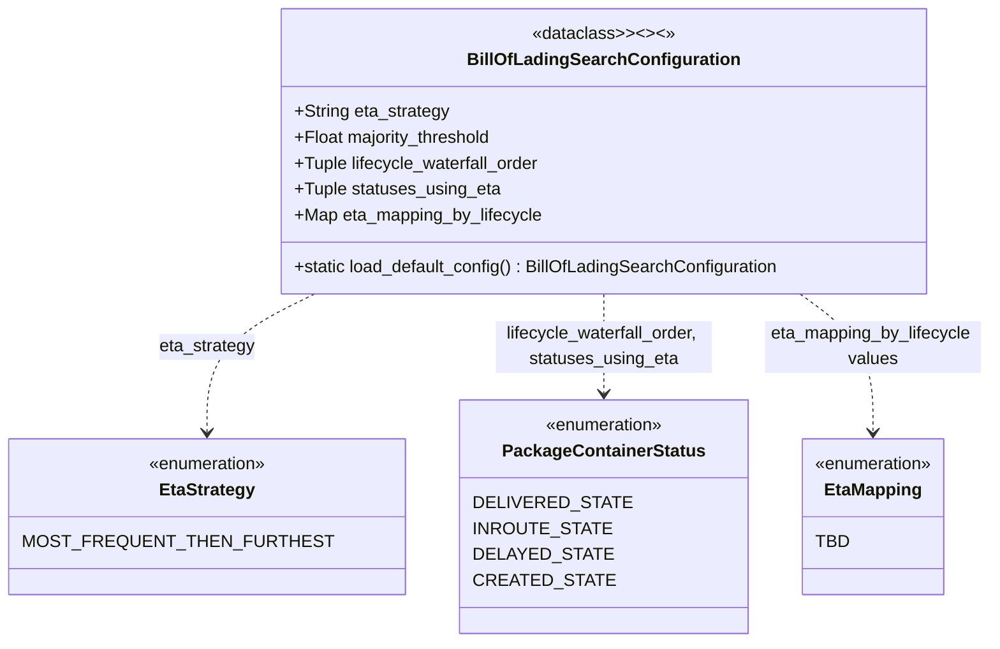

# Diagram: partview_service/partview_service/core/business/BillOfLadingSearchConfiguration.py

> Auto-generated by Obscura crawlers

## Mermaid

### SVG

<svg id="container" width="850.5078125" xmlns="http://www.w3.org/2000/svg" class="classDiagram" height="594" viewBox="0 0 850.5078125 594" role="graphics-document document" aria-roledescription="class"><g><defs><marker id="container_class-aggregationStart" class="marker aggregation class" refX="18" refY="7" markerWidth="190" markerHeight="240" orient="auto"><path d="M 18,7 L9,13 L1,7 L9,1 Z"></path></marker></defs><defs><marker id="container_class-aggregationEnd" class="marker aggregation class" refX="1" refY="7" markerWidth="20" markerHeight="28" orient="auto"><path d="M 18,7 L9,13 L1,7 L9,1 Z"></path></marker></defs><defs><marker id="container_class-extensionStart" class="marker extension class" refX="18" refY="7" markerWidth="190" markerHeight="240" orient="auto"><path d="M 1,7 L18,13 V 1 Z"></path></marker></defs><defs><marker id="container_class-extensionEnd" class="marker extension class" refX="1" refY="7" markerWidth="20" markerHeight="28" orient="auto"><path d="M 1,1 V 13 L18,7 Z"></path></marker></defs><defs><marker id="container_class-compositionStart" class="marker composition class" refX="18" refY="7" markerWidth="190" markerHeight="240" orient="auto"><path d="M 18,7 L9,13 L1,7 L9,1 Z"></path></marker></defs><defs><marker id="container_class-compositionEnd" class="marker composition class" refX="1" refY="7" markerWidth="20" markerHeight="28" orient="auto"><path d="M 18,7 L9,13 L1,7 L9,1 Z"></path></marker></defs><defs><marker id="container_class-dependencyStart" class="marker dependency class" refX="6" refY="7" markerWidth="190" markerHeight="240" orient="auto"><path d="M 5,7 L9,13 L1,7 L9,1 Z"></path></marker></defs><defs><marker id="container_class-dependencyEnd" class="marker dependency class" refX="13" refY="7" markerWidth="20" markerHeight="28" orient="auto"><path d="M 18,7 L9,13 L14,7 L9,1 Z"></path></marker></defs><defs><marker id="container_class-lollipopStart" class="marker lollipop class" refX="13" refY="7" markerWidth="190" markerHeight="240" orient="auto"><circle stroke="black" fill="transparent" cx="7" cy="7" r="6"></circle></marker></defs><defs><marker id="container_class-lollipopEnd" class="marker lollipop class" refX="1" refY="7" markerWidth="190" markerHeight="240" orient="auto"><circle stroke="black" fill="transparent" cx="7" cy="7" r="6"></circle></marker></defs><g class="root"><g class="clusters"></g><g class="edgePaths"><path d="M262.313,272L247.267,280.167C232.221,288.333,202.128,304.667,187.082,326C172.035,347.333,172.035,373.667,172.035,386.833L172.035,400" id="id_BillOfLadingSearchConfiguration_EtaStrategy_1" class="edge-thickness-normal edge-pattern-dashed relation" style=";;;" data-edge="true" data-et="edge" data-id="id_BillOfLadingSearchConfiguration_EtaStrategy_1" data-points="W3sieCI6MjYyLjMxMzM0MTY3ODE3NjgsInkiOjI3Mn0seyJ4IjoxNzIuMDM1MTU2MjUsInkiOjMyMX0seyJ4IjoxNzIuMDM1MTU2MjUsInkiOjQwNn1d" marker-end="url(#container_class-dependencyEnd)"></path><path d="M505.512,272L505.512,280.167C505.512,288.333,505.512,304.667,505.512,320C505.512,335.333,505.512,349.667,505.512,356.833L505.512,364" id="id_BillOfLadingSearchConfiguration_PackageContainerStatus_2" class="edge-thickness-normal edge-pattern-dashed relation" style=";;;" data-edge="true" data-et="edge" data-id="id_BillOfLadingSearchConfiguration_PackageContainerStatus_2" data-points="W3sieCI6NTA1LjUxMTcxODc1LCJ5IjoyNzJ9LHsieCI6NTA1LjUxMTcxODc1LCJ5IjozMjF9LHsieCI6NTA1LjUxMTcxODc1LCJ5IjozNzB9XQ==" marker-end="url(#container_class-dependencyEnd)"></path><path d="M678.349,272L689.042,280.167C699.735,288.333,721.121,304.667,731.815,326C742.508,347.333,742.508,373.667,742.508,386.833L742.508,400" id="id_BillOfLadingSearchConfiguration_EtaMapping_3" class="edge-thickness-normal edge-pattern-dashed relation" style=";;;" data-edge="true" data-et="edge" data-id="id_BillOfLadingSearchConfiguration_EtaMapping_3" data-points="W3sieCI6Njc4LjM0ODY0ODk5ODYxODcsInkiOjI3Mn0seyJ4Ijo3NDIuNTA3ODEyNSwieSI6MzIxfSx7IngiOjc0Mi41MDc4MTI1LCJ5Ijo0MDZ9XQ==" marker-end="url(#container_class-dependencyEnd)"></path></g><g class="edgeLabels"><g class="edgeLabel" transform="translate(172.03515625, 321)"><g class="label" data-id="id_BillOfLadingSearchConfiguration_EtaStrategy_1" transform="translate(-44.71875, -12)"><foreignObject width="89.4375" height="24">

eta_strategy

</foreignObject></g></g><g class="edgeLabel" transform="translate(505.51171875, 321)"><g class="label" data-id="id_BillOfLadingSearchConfiguration_PackageContainerStatus_2" transform="translate(-100, -24)"><foreignObject width="200" height="48">

lifecycle_waterfall_order, statuses_using_eta

</foreignObject></g></g><g class="edgeLabel" transform="translate(742.5078125, 321)"><g class="label" data-id="id_BillOfLadingSearchConfiguration_EtaMapping_3" transform="translate(-100, -24)"><foreignObject width="200" height="48">

eta_mapping_by_lifecycle values

</foreignObject></g></g></g><g class="nodes"><g class="node default" id="classId-BillOfLadingSearchConfiguration-0" transform="translate(505.51171875, 140)"><g class="basic label-container"><path d="M-297.6953125 -132 L297.6953125 -132 L297.6953125 132 L-297.6953125 132" stroke="none" stroke-width="0" fill="#ECECFF" style=""></path><path d="M-297.6953125 -132 C-173.45201257061427 -132, -49.208712641228516 -132, 297.6953125 -132 M-297.6953125 -132 C-110.1680814198485 -132, 77.35914966030299 -132, 297.6953125 -132 M297.6953125 -132 C297.6953125 -55.363648104027945, 297.6953125 21.27270379194411, 297.6953125 132 M297.6953125 -132 C297.6953125 -34.34883152424756, 297.6953125 63.302336951504884, 297.6953125 132 M297.6953125 132 C131.7499348851613 132, -34.19544272967738 132, -297.6953125 132 M297.6953125 132 C67.0421619317757 132, -163.6109886364486 132, -297.6953125 132 M-297.6953125 132 C-297.6953125 28.976644980641453, -297.6953125 -74.0467100387171, -297.6953125 -132 M-297.6953125 132 C-297.6953125 34.70303740126319, -297.6953125 -62.593925197473624, -297.6953125 -132" stroke="#9370DB" stroke-width="1.3" fill="none" stroke-dasharray="0 0" style=""></path></g><g class="annotation-group text" transform="translate(-63.0859375, -108)"><g class="label" style="" transform="translate(0,-12)"><foreignObject width="126.171875" height="24">

«dataclass&gt;&gt;&lt;&gt;&lt;»

</foreignObject></g></g><g class="label-group text" transform="translate(-118.890625, -84)"><g class="label" style="font-weight: bolder" transform="translate(0,-12)"><foreignObject width="237.78125" height="24">

BillOfLadingSearchConfiguration

</foreignObject></g></g><g class="members-group text" transform="translate(-285.6953125, -36)"><g class="label" style="" transform="translate(0,-12)"><foreignObject width="143.890625" height="24">

+String eta_strategy

</foreignObject></g><g class="label" style="" transform="translate(0,12)"><foreignObject width="186" height="24">

+Float majority_threshold

</foreignObject></g><g class="label" style="" transform="translate(0,36)"><foreignObject width="229.28125" height="24">

+Tuple lifecycle_waterfall_order

</foreignObject></g><g class="label" style="" transform="translate(0,60)"><foreignObject width="189.625" height="24">

+Tuple statuses_using_eta

</foreignObject></g><g class="label" style="" transform="translate(0,84)"><foreignObject width="230.859375" height="24">

+Map eta_mapping_by_lifecycle

</foreignObject></g></g><g class="methods-group text" transform="translate(-285.6953125, 108)"><g class="label" style="" transform="translate(0,-12)"><foreignObject width="452.5" height="24">

+static load_default_config() : BillOfLadingSearchConfiguration

</foreignObject></g></g><g class="divider" style=""><path d="M-297.6953125 -60 C-65.83784287760182 -60, 166.01962674479637 -60, 297.6953125 -60 M-297.6953125 -60 C-87.46225264659742 -60, 122.77080720680516 -60, 297.6953125 -60" stroke="#9370DB" stroke-width="1.3" fill="none" stroke-dasharray="0 0" style=""></path></g><g class="divider" style=""><path d="M-297.6953125 84 C-166.4994076862192 84, -35.3035028724384 84, 297.6953125 84 M-297.6953125 84 C-66.27441438107502 84, 165.14648373784996 84, 297.6953125 84" stroke="#9370DB" stroke-width="1.3" fill="none" stroke-dasharray="0 0" style=""></path></g></g><g class="node default" id="classId-EtaStrategy-1" transform="translate(172.03515625, 478)"><g class="basic label-container"><path d="M-164.03515625 -72 L164.03515625 -72 L164.03515625 72 L-164.03515625 72" stroke="none" stroke-width="0" fill="#ECECFF" style=""></path><path d="M-164.03515625 -72 C-55.80250297473788 -72, 52.43015030052425 -72, 164.03515625 -72 M-164.03515625 -72 C-43.442080927501024 -72, 77.15099439499795 -72, 164.03515625 -72 M164.03515625 -72 C164.03515625 -17.364989156129568, 164.03515625 37.270021687740865, 164.03515625 72 M164.03515625 -72 C164.03515625 -31.44279631418545, 164.03515625 9.114407371629099, 164.03515625 72 M164.03515625 72 C35.794931809180724 72, -92.44529263163855 72, -164.03515625 72 M164.03515625 72 C83.10165847583407 72, 2.1681607016681426 72, -164.03515625 72 M-164.03515625 72 C-164.03515625 34.637436689928826, -164.03515625 -2.7251266201423476, -164.03515625 -72 M-164.03515625 72 C-164.03515625 37.45326764263624, -164.03515625 2.906535285272483, -164.03515625 -72" stroke="#9370DB" stroke-width="1.3" fill="none" stroke-dasharray="0 0" style=""></path></g><g class="annotation-group text" transform="translate(-55.5546875, -48)"><g class="label" style="" transform="translate(0,-12)"><foreignObject width="111.109375" height="24">

«enumeration»

</foreignObject></g></g><g class="label-group text" transform="translate(-42.328125, -24)"><g class="label" style="font-weight: bolder" transform="translate(0,-12)"><foreignObject width="84.65625" height="24">

EtaStrategy

</foreignObject></g></g><g class="members-group text" transform="translate(-152.03515625, 24)"><g class="label" style="" transform="translate(0,-12)"><foreignObject width="248.515625" height="24">

MOST_FREQUENT_THEN_FURTHEST

</foreignObject></g></g><g class="methods-group text" transform="translate(-152.03515625, 72)"></g><g class="divider" style=""><path d="M-164.03515625 0 C-58.01929795903814 0, 47.99656033192372 0, 164.03515625 0 M-164.03515625 0 C-74.01157645269717 0, 16.01200334460566 0, 164.03515625 0" stroke="#9370DB" stroke-width="1.3" fill="none" stroke-dasharray="0 0" style=""></path></g><g class="divider" style=""><path d="M-164.03515625 48 C-86.5889625040828 48, -9.142768758165602 48, 164.03515625 48 M-164.03515625 48 C-34.787369385031184 48, 94.46041747993763 48, 164.03515625 48" stroke="#9370DB" stroke-width="1.3" fill="none" stroke-dasharray="0 0" style=""></path></g></g><g class="node default" id="classId-PackageContainerStatus-2" transform="translate(505.51171875, 478)"><g class="basic label-container"><path d="M-119.44140625 -108 L119.44140625 -108 L119.44140625 108 L-119.44140625 108" stroke="none" stroke-width="0" fill="#ECECFF" style=""></path><path d="M-119.44140625 -108 C-32.439519218301655 -108, 54.56236781339669 -108, 119.44140625 -108 M-119.44140625 -108 C-38.10060441562486 -108, 43.240197418750284 -108, 119.44140625 -108 M119.44140625 -108 C119.44140625 -46.17874012053542, 119.44140625 15.642519758929154, 119.44140625 108 M119.44140625 -108 C119.44140625 -60.03765267622958, 119.44140625 -12.075305352459154, 119.44140625 108 M119.44140625 108 C51.328474010567504 108, -16.78445822886499 108, -119.44140625 108 M119.44140625 108 C63.474950832366034 108, 7.508495414732067 108, -119.44140625 108 M-119.44140625 108 C-119.44140625 44.55313487576326, -119.44140625 -18.893730248473474, -119.44140625 -108 M-119.44140625 108 C-119.44140625 32.79317558983148, -119.44140625 -42.413648820337045, -119.44140625 -108" stroke="#9370DB" stroke-width="1.3" fill="none" stroke-dasharray="0 0" style=""></path></g><g class="annotation-group text" transform="translate(-55.5546875, -84)"><g class="label" style="" transform="translate(0,-12)"><foreignObject width="111.109375" height="24">

«enumeration»

</foreignObject></g></g><g class="label-group text" transform="translate(-88.9296875, -60)"><g class="label" style="font-weight: bolder" transform="translate(0,-12)"><foreignObject width="177.859375" height="24">

PackageContainerStatus

</foreignObject></g></g><g class="members-group text" transform="translate(-107.44140625, -12)"><g class="label" style="" transform="translate(0,-12)"><foreignObject width="125.953125" height="24">

DELIVERED_STATE

</foreignObject></g><g class="label" style="" transform="translate(0,12)"><foreignObject width="112.734375" height="24">

INROUTE_STATE

</foreignObject></g><g class="label" style="" transform="translate(0,36)"><foreignObject width="111.28125" height="24">

DELAYED_STATE

</foreignObject></g><g class="label" style="" transform="translate(0,60)"><foreignObject width="111.109375" height="24">

CREATED_STATE

</foreignObject></g></g><g class="methods-group text" transform="translate(-107.44140625, 108)"></g><g class="divider" style=""><path d="M-119.44140625 -36 C-35.025618897375494 -36, 49.39016845524901 -36, 119.44140625 -36 M-119.44140625 -36 C-46.25538985068275 -36, 26.930626548634507 -36, 119.44140625 -36" stroke="#9370DB" stroke-width="1.3" fill="none" stroke-dasharray="0 0" style=""></path></g><g class="divider" style=""><path d="M-119.44140625 84 C-54.75096243841091 84, 9.939481373178182 84, 119.44140625 84 M-119.44140625 84 C-56.03955214774653 84, 7.362301954506947 84, 119.44140625 84" stroke="#9370DB" stroke-width="1.3" fill="none" stroke-dasharray="0 0" style=""></path></g></g><g class="node default" id="classId-EtaMapping-3" transform="translate(742.5078125, 478)"><g class="basic label-container"><path d="M-67.5546875 -72 L67.5546875 -72 L67.5546875 72 L-67.5546875 72" stroke="none" stroke-width="0" fill="#ECECFF" style=""></path><path d="M-67.5546875 -72 C-24.14926930623863 -72, 19.25614888752274 -72, 67.5546875 -72 M-67.5546875 -72 C-15.931769141184766 -72, 35.69114921763047 -72, 67.5546875 -72 M67.5546875 -72 C67.5546875 -14.995343971520938, 67.5546875 42.00931205695812, 67.5546875 72 M67.5546875 -72 C67.5546875 -29.196920199862163, 67.5546875 13.606159600275674, 67.5546875 72 M67.5546875 72 C29.075105116810498 72, -9.404477266379004 72, -67.5546875 72 M67.5546875 72 C28.612412346669707 72, -10.329862806660586 72, -67.5546875 72 M-67.5546875 72 C-67.5546875 29.18368923938474, -67.5546875 -13.632621521230519, -67.5546875 -72 M-67.5546875 72 C-67.5546875 37.3831029738715, -67.5546875 2.7662059477430034, -67.5546875 -72" stroke="#9370DB" stroke-width="1.3" fill="none" stroke-dasharray="0 0" style=""></path></g><g class="annotation-group text" transform="translate(-55.5546875, -48)"><g class="label" style="" transform="translate(0,-12)"><foreignObject width="111.109375" height="24">

«enumeration»

</foreignObject></g></g><g class="label-group text" transform="translate(-42.9453125, -24)"><g class="label" style="font-weight: bolder" transform="translate(0,-12)"><foreignObject width="85.890625" height="24">

EtaMapping

</foreignObject></g></g><g class="members-group text" transform="translate(-55.5546875, 24)"><g class="label" style="" transform="translate(0,-12)"><foreignObject width="28.3125" height="24">

TBD

</foreignObject></g></g><g class="methods-group text" transform="translate(-55.5546875, 72)"></g><g class="divider" style=""><path d="M-67.5546875 0 C-16.881676765832765 0, 33.79133396833447 0, 67.5546875 0 M-67.5546875 0 C-22.301171586211545 0, 22.95234432757691 0, 67.5546875 0" stroke="#9370DB" stroke-width="1.3" fill="none" stroke-dasharray="0 0" style=""></path></g><g class="divider" style=""><path d="M-67.5546875 48 C-22.7888527354646 48, 21.976982029070797 48, 67.5546875 48 M-67.5546875 48 C-29.16104638110584 48, 9.232594737788318 48, 67.5546875 48" stroke="#9370DB" stroke-width="1.3" fill="none" stroke-dasharray="0 0" style=""></path></g></g></g></g></g></svg>
