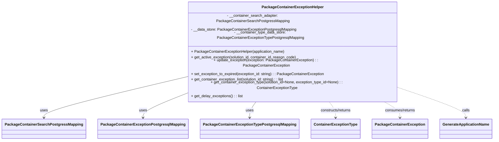

# Diagram: partview_service/partview_service/core/business/PackageContainerExceptionHelper.py

> Auto-generated by Obscura crawlers

## Mermaid

### SVG

<svg id="container" width="2016.453125" xmlns="http://www.w3.org/2000/svg" class="classDiagram" height="510" viewBox="0 0 2016.453125 510" role="graphics-document document" aria-roledescription="class"><g><defs><marker id="container_class-aggregationStart" class="marker aggregation class" refX="18" refY="7" markerWidth="190" markerHeight="240" orient="auto"><path d="M 18,7 L9,13 L1,7 L9,1 Z"></path></marker></defs><defs><marker id="container_class-aggregationEnd" class="marker aggregation class" refX="1" refY="7" markerWidth="20" markerHeight="28" orient="auto"><path d="M 18,7 L9,13 L1,7 L9,1 Z"></path></marker></defs><defs><marker id="container_class-extensionStart" class="marker extension class" refX="18" refY="7" markerWidth="190" markerHeight="240" orient="auto"><path d="M 1,7 L18,13 V 1 Z"></path></marker></defs><defs><marker id="container_class-extensionEnd" class="marker extension class" refX="1" refY="7" markerWidth="20" markerHeight="28" orient="auto"><path d="M 1,1 V 13 L18,7 Z"></path></marker></defs><defs><marker id="container_class-compositionStart" class="marker composition class" refX="18" refY="7" markerWidth="190" markerHeight="240" orient="auto"><path d="M 18,7 L9,13 L1,7 L9,1 Z"></path></marker></defs><defs><marker id="container_class-compositionEnd" class="marker composition class" refX="1" refY="7" markerWidth="20" markerHeight="28" orient="auto"><path d="M 18,7 L9,13 L1,7 L9,1 Z"></path></marker></defs><defs><marker id="container_class-dependencyStart" class="marker dependency class" refX="6" refY="7" markerWidth="190" markerHeight="240" orient="auto"><path d="M 5,7 L9,13 L1,7 L9,1 Z"></path></marker></defs><defs><marker id="container_class-dependencyEnd" class="marker dependency class" refX="13" refY="7" markerWidth="20" markerHeight="28" orient="auto"><path d="M 18,7 L9,13 L14,7 L9,1 Z"></path></marker></defs><defs><marker id="container_class-lollipopStart" class="marker lollipop class" refX="13" refY="7" markerWidth="190" markerHeight="240" orient="auto"><circle stroke="black" fill="transparent" cx="7" cy="7" r="6"></circle></marker></defs><defs><marker id="container_class-lollipopEnd" class="marker lollipop class" refX="1" refY="7" markerWidth="190" markerHeight="240" orient="auto"><circle stroke="black" fill="transparent" cx="7" cy="7" r="6"></circle></marker></defs><g class="root"><g class="clusters"></g><g class="edgePaths"><path d="M740.039,267.09L646.232,286.075C552.424,305.06,364.81,343.03,271.003,367.182C177.195,391.333,177.195,401.667,177.195,406.833L177.195,412" id="id_PackageContainerExceptionHelper_PackageContainerSearchPostgressMapping_1" class="edge-thickness-normal edge-pattern-solid relation" style=";;;" data-edge="true" data-et="edge" data-id="id_PackageContainerExceptionHelper_PackageContainerSearchPostgressMapping_1" data-points="W3sieCI6NzQwLjAzOTA2MjUsInkiOjI2Ny4wODk4NTM4NDI4OTA3Nn0seyJ4IjoxNzcuMTk1MzEyNSwieSI6MzgxfSx7IngiOjE3Ny4xOTUzMTI1LCJ5Ijo0MTh9XQ==" marker-end="url(#container_class-dependencyEnd)"></path><path d="M740.039,327.212L713.355,336.177C686.672,345.141,633.305,363.071,606.621,377.202C579.938,391.333,579.938,401.667,579.938,406.833L579.938,412" id="id_PackageContainerExceptionHelper_PackageContainerExceptionPostgresqlMapping_2" class="edge-thickness-normal edge-pattern-solid relation" style=";;;" data-edge="true" data-et="edge" data-id="id_PackageContainerExceptionHelper_PackageContainerExceptionPostgresqlMapping_2" data-points="W3sieCI6NzQwLjAzOTA2MjUsInkiOjMyNy4yMTE5MDk3NjEzNDM4Nn0seyJ4Ijo1NzkuOTM3NSwieSI6MzgxfSx7IngiOjU3OS45Mzc1LCJ5Ijo0MTh9XQ==" marker-end="url(#container_class-dependencyEnd)"></path><path d="M1046.089,344L1040.802,350.167C1035.515,356.333,1024.941,368.667,1019.654,380C1014.367,391.333,1014.367,401.667,1014.367,406.833L1014.367,412" id="id_PackageContainerExceptionHelper_PackageContainerExceptionTypePostgresqlMapping_3" class="edge-thickness-normal edge-pattern-solid relation" style=";;;" data-edge="true" data-et="edge" data-id="id_PackageContainerExceptionHelper_PackageContainerExceptionTypePostgresqlMapping_3" data-points="W3sieCI6MTA0Ni4wODkzMjkyNjgyOTI3LCJ5IjozNDR9LHsieCI6MTAxNC4zNjcxODc1LCJ5IjozODF9LHsieCI6MTAxNC4zNjcxODc1LCJ5Ijo0MTh9XQ==" marker-end="url(#container_class-dependencyEnd)"></path><path d="M1334.161,344L1339.448,350.167C1344.735,356.333,1355.309,368.667,1360.596,380C1365.883,391.333,1365.883,401.667,1365.883,406.833L1365.883,412" id="id_PackageContainerExceptionHelper_ContainerExceptionType_4" class="edge-thickness-normal edge-pattern-dashed relation" style=";;;" data-edge="true" data-et="edge" data-id="id_PackageContainerExceptionHelper_ContainerExceptionType_4" data-points="W3sieCI6MTMzNC4xNjA2NzA3MzE3MDczLCJ5IjozNDR9LHsieCI6MTM2NS44ODI4MTI1LCJ5IjozODF9LHsieCI6MTM2NS44ODI4MTI1LCJ5Ijo0MTh9XQ==" marker-end="url(#container_class-dependencyEnd)"></path><path d="M1550.333,344L1563.555,350.167C1576.776,356.333,1603.22,368.667,1616.442,380C1629.664,391.333,1629.664,401.667,1629.664,406.833L1629.664,412" id="id_PackageContainerExceptionHelper_PackageContainerException_5" class="edge-thickness-normal edge-pattern-dashed relation" style=";;;" data-edge="true" data-et="edge" data-id="id_PackageContainerExceptionHelper_PackageContainerException_5" data-points="W3sieCI6MTU1MC4zMzI2MjE5NTEyMTk2LCJ5IjozNDR9LHsieCI6MTYyOS42NjQwNjI1LCJ5IjozODF9LHsieCI6MTYyOS42NjQwNjI1LCJ5Ijo0MTh9XQ==" marker-end="url(#container_class-dependencyEnd)"></path><path d="M1640.211,305.862L1683.615,318.385C1727.018,330.908,1813.826,355.954,1857.229,373.644C1900.633,391.333,1900.633,401.667,1900.633,406.833L1900.633,412" id="id_PackageContainerExceptionHelper_GenerateApplicationName_6" class="edge-thickness-normal edge-pattern-dashed relation" style=";;;" data-edge="true" data-et="edge" data-id="id_PackageContainerExceptionHelper_GenerateApplicationName_6" data-points="W3sieCI6MTY0MC4yMTA5Mzc1LCJ5IjozMDUuODYxNTA5NzAzNjY3fSx7IngiOjE5MDAuNjMyODEyNSwieSI6MzgxfSx7IngiOjE5MDAuNjMyODEyNSwieSI6NDE4fV0=" marker-end="url(#container_class-dependencyEnd)"></path></g><g class="edgeLabels"><g class="edgeLabel" transform="translate(177.1953125, 381)"><g class="label" data-id="id_PackageContainerExceptionHelper_PackageContainerSearchPostgressMapping_1" transform="translate(-16.4921875, -12)"><foreignObject width="32.984375" height="24">

uses

</foreignObject></g></g><g class="edgeLabel" transform="translate(579.9375, 381)"><g class="label" data-id="id_PackageContainerExceptionHelper_PackageContainerExceptionPostgresqlMapping_2" transform="translate(-16.4921875, -12)"><foreignObject width="32.984375" height="24">

uses

</foreignObject></g></g><g class="edgeLabel" transform="translate(1014.3671875, 381)"><g class="label" data-id="id_PackageContainerExceptionHelper_PackageContainerExceptionTypePostgresqlMapping_3" transform="translate(-16.4921875, -12)"><foreignObject width="32.984375" height="24">

uses

</foreignObject></g></g><g class="edgeLabel" transform="translate(1365.8828125, 381)"><g class="label" data-id="id_PackageContainerExceptionHelper_ContainerExceptionType_4" transform="translate(-68.03125, -12)"><foreignObject width="136.0625" height="24">

constructs/returns

</foreignObject></g></g><g class="edgeLabel" transform="translate(1629.6640625, 381)"><g class="label" data-id="id_PackageContainerExceptionHelper_PackageContainerException_5" transform="translate(-66.5546875, -12)"><foreignObject width="133.109375" height="24">

consumes/returns

</foreignObject></g></g><g class="edgeLabel" transform="translate(1900.6328125, 381)"><g class="label" data-id="id_PackageContainerExceptionHelper_GenerateApplicationName_6" transform="translate(-16.4453125, -12)"><foreignObject width="32.890625" height="24">

calls

</foreignObject></g></g></g><g class="nodes"><g class="node default" id="classId-PackageContainerExceptionHelper-0" transform="translate(1190.125, 176)"><g class="basic label-container"><path d="M-450.0859375 -168 L450.0859375 -168 L450.0859375 168 L-450.0859375 168" stroke="none" stroke-width="0" fill="#ECECFF" style=""></path><path d="M-450.0859375 -168 C-131.39282015873187 -168, 187.30029718253627 -168, 450.0859375 -168 M-450.0859375 -168 C-233.90150877197078 -168, -17.717080043941564 -168, 450.0859375 -168 M450.0859375 -168 C450.0859375 -62.23583191968271, 450.0859375 43.52833616063458, 450.0859375 168 M450.0859375 -168 C450.0859375 -38.727647988226835, 450.0859375 90.54470402354633, 450.0859375 168 M450.0859375 168 C259.7400521444446 168, 69.39416678888921 168, -450.0859375 168 M450.0859375 168 C150.54204696223184 168, -149.00184357553633 168, -450.0859375 168 M-450.0859375 168 C-450.0859375 36.820631258037196, -450.0859375 -94.35873748392561, -450.0859375 -168 M-450.0859375 168 C-450.0859375 97.69091359237547, -450.0859375 27.381827184750932, -450.0859375 -168" stroke="#9370DB" stroke-width="1.3" fill="none" stroke-dasharray="0 0" style=""></path></g><g class="annotation-group text" transform="translate(0, -144)"></g><g class="label-group text" transform="translate(-125.671875, -144)"><g class="label" style="font-weight: bolder" transform="translate(0,-12)"><foreignObject width="251.34375" height="24">

PackageContainerExceptionHelper

</foreignObject></g></g><g class="members-group text" transform="translate(-438.0859375, -96)"><g class="label" style="" transform="translate(0,-12)"><foreignObject width="532.03125" height="24">

- __container_search_adapter: PackageContainerSearchPostgressMapping

</foreignObject></g><g class="label" style="" transform="translate(0,12)"><foreignObject width="449.953125" height="24">

- __data_store: PackageContainerExceptionPostgresqlMapping

</foreignObject></g><g class="label" style="" transform="translate(0,36)"><foreignObject width="599.078125" height="24">

- __container_type_data_store: PackageContainerExceptionTypePostgresqlMapping

</foreignObject></g></g><g class="methods-group text" transform="translate(-438.0859375, 0)"><g class="label" style="" transform="translate(0,-12)"><foreignObject width="401.53125" height="24">

+ PackageContainerExceptionHelper(application_name)

</foreignObject></g><g class="label" style="" transform="translate(0,12)"><foreignObject width="455.421875" height="24">

+ get_active_exception(solution_id, container_id, reason_code)

</foreignObject></g><g class="label" style="" transform="translate(0,36)"><foreignObject width="650.203125" height="24">

+ update_exception(exception: PackageContainerException) : : PackageContainerException

</foreignObject></g><g class="label" style="" transform="translate(0,60)"><foreignObject width="570.78125" height="24">

+ set_exception_to_expired(exception_id: string) : : PackageContainerException

</foreignObject></g><g class="label" style="" transform="translate(0,84)"><foreignObject width="405.21875" height="24">

+ get_container_exception_list(solution_id: string) : : list

</foreignObject></g><g class="label" style="" transform="translate(0,108)"><foreignObject width="750.5" height="24">

+ get_container_exception_type(solution_id=None, exception_type_id=None) : : ContainerExceptionType

</foreignObject></g><g class="label" style="" transform="translate(0,132)"><foreignObject width="220.984375" height="24">

+ get_delay_exceptions() : : list

</foreignObject></g></g><g class="divider" style=""><path d="M-450.0859375 -120 C-253.25997169294092 -120, -56.434005885881845 -120, 450.0859375 -120 M-450.0859375 -120 C-246.80865546466285 -120, -43.5313734293257 -120, 450.0859375 -120" stroke="#9370DB" stroke-width="1.3" fill="none" stroke-dasharray="0 0" style=""></path></g><g class="divider" style=""><path d="M-450.0859375 -24 C-157.37722993380999 -24, 135.33147763238003 -24, 450.0859375 -24 M-450.0859375 -24 C-194.8960348387103 -24, 60.29386782257939 -24, 450.0859375 -24" stroke="#9370DB" stroke-width="1.3" fill="none" stroke-dasharray="0 0" style=""></path></g></g><g class="node default" id="classId-ContainerExceptionType-1" transform="translate(1365.8828125, 460)"><g class="basic label-container"><path d="M-100.6328125 -42 L100.6328125 -42 L100.6328125 42 L-100.6328125 42" stroke="none" stroke-width="0" fill="#ECECFF" style=""></path><path d="M-100.6328125 -42 C-41.09108376776493 -42, 18.450644964470143 -42, 100.6328125 -42 M-100.6328125 -42 C-27.650812010924895 -42, 45.33118847815021 -42, 100.6328125 -42 M100.6328125 -42 C100.6328125 -21.72559264462883, 100.6328125 -1.4511852892576584, 100.6328125 42 M100.6328125 -42 C100.6328125 -23.336105408197245, 100.6328125 -4.6722108163944895, 100.6328125 42 M100.6328125 42 C54.402526258326056 42, 8.172240016652111 42, -100.6328125 42 M100.6328125 42 C30.286409319363827 42, -40.059993861272346 42, -100.6328125 42 M-100.6328125 42 C-100.6328125 18.8948441920576, -100.6328125 -4.210311615884798, -100.6328125 -42 M-100.6328125 42 C-100.6328125 23.974429512094858, -100.6328125 5.948859024189716, -100.6328125 -42" stroke="#9370DB" stroke-width="1.3" fill="none" stroke-dasharray="0 0" style=""></path></g><g class="annotation-group text" transform="translate(0, -18)"></g><g class="label-group text" transform="translate(-88.6328125, -18)"><g class="label" style="font-weight: bolder" transform="translate(0,-12)"><foreignObject width="177.265625" height="24">

ContainerExceptionType

</foreignObject></g></g><g class="members-group text" transform="translate(-88.6328125, 30)"></g><g class="methods-group text" transform="translate(-88.6328125, 60)"></g><g class="divider" style=""><path d="M-100.6328125 6 C-50.32257557924776 6, -0.012338658495522736 6, 100.6328125 6 M-100.6328125 6 C-55.20764603651261 6, -9.782479573025213 6, 100.6328125 6" stroke="#9370DB" stroke-width="1.3" fill="none" stroke-dasharray="0 0" style=""></path></g><g class="divider" style=""><path d="M-100.6328125 24 C-59.64394260045464 24, -18.655072700909287 24, 100.6328125 24 M-100.6328125 24 C-37.71613123196406 24, 25.200550036071874 24, 100.6328125 24" stroke="#9370DB" stroke-width="1.3" fill="none" stroke-dasharray="0 0" style=""></path></g></g><g class="node default" id="classId-PackageContainerSearchPostgressMapping-2" transform="translate(177.1953125, 460)"><g class="basic label-container"><path d="M-169.1953125 -42 L169.1953125 -42 L169.1953125 42 L-169.1953125 42" stroke="none" stroke-width="0" fill="#ECECFF" style=""></path><path d="M-169.1953125 -42 C-73.59383557360206 -42, 22.007641352795872 -42, 169.1953125 -42 M-169.1953125 -42 C-91.84144853424982 -42, -14.487584568499642 -42, 169.1953125 -42 M169.1953125 -42 C169.1953125 -22.576142777219193, 169.1953125 -3.152285554438386, 169.1953125 42 M169.1953125 -42 C169.1953125 -8.796154712652829, 169.1953125 24.407690574694342, 169.1953125 42 M169.1953125 42 C76.734824821545 42, -15.725662856909992 42, -169.1953125 42 M169.1953125 42 C89.13892060839872 42, 9.082528716797441 42, -169.1953125 42 M-169.1953125 42 C-169.1953125 22.27922386033368, -169.1953125 2.5584477206673597, -169.1953125 -42 M-169.1953125 42 C-169.1953125 20.855682162201358, -169.1953125 -0.2886356755972841, -169.1953125 -42" stroke="#9370DB" stroke-width="1.3" fill="none" stroke-dasharray="0 0" style=""></path></g><g class="annotation-group text" transform="translate(0, -18)"></g><g class="label-group text" transform="translate(-157.1953125, -18)"><g class="label" style="font-weight: bolder" transform="translate(0,-12)"><foreignObject width="314.390625" height="24">

PackageContainerSearchPostgressMapping

</foreignObject></g></g><g class="members-group text" transform="translate(-157.1953125, 30)"></g><g class="methods-group text" transform="translate(-157.1953125, 60)"></g><g class="divider" style=""><path d="M-169.1953125 6 C-86.038371691673 6, -2.881430883346013 6, 169.1953125 6 M-169.1953125 6 C-95.57317394192289 6, -21.951035383845777 6, 169.1953125 6" stroke="#9370DB" stroke-width="1.3" fill="none" stroke-dasharray="0 0" style=""></path></g><g class="divider" style=""><path d="M-169.1953125 24 C-42.71646474315932 24, 83.76238301368136 24, 169.1953125 24 M-169.1953125 24 C-90.85842481698003 24, -12.521537133960067 24, 169.1953125 24" stroke="#9370DB" stroke-width="1.3" fill="none" stroke-dasharray="0 0" style=""></path></g></g><g class="node default" id="classId-PackageContainerExceptionPostgresqlMapping-3" transform="translate(579.9375, 460)"><g class="basic label-container"><path d="M-183.546875 -42 L183.546875 -42 L183.546875 42 L-183.546875 42" stroke="none" stroke-width="0" fill="#ECECFF" style=""></path><path d="M-183.546875 -42 C-98.97367965916324 -42, -14.400484318326477 -42, 183.546875 -42 M-183.546875 -42 C-70.69372803293594 -42, 42.15941893412813 -42, 183.546875 -42 M183.546875 -42 C183.546875 -18.902219397391505, 183.546875 4.19556120521699, 183.546875 42 M183.546875 -42 C183.546875 -25.170048549074306, 183.546875 -8.340097098148611, 183.546875 42 M183.546875 42 C108.51939366453715 42, 33.491912329074296 42, -183.546875 42 M183.546875 42 C39.27470631792434 42, -104.99746236415132 42, -183.546875 42 M-183.546875 42 C-183.546875 23.94280394319891, -183.546875 5.885607886397821, -183.546875 -42 M-183.546875 42 C-183.546875 22.413023871692527, -183.546875 2.826047743385054, -183.546875 -42" stroke="#9370DB" stroke-width="1.3" fill="none" stroke-dasharray="0 0" style=""></path></g><g class="annotation-group text" transform="translate(0, -18)"></g><g class="label-group text" transform="translate(-171.546875, -18)"><g class="label" style="font-weight: bolder" transform="translate(0,-12)"><foreignObject width="343.09375" height="24">

PackageContainerExceptionPostgresqlMapping

</foreignObject></g></g><g class="members-group text" transform="translate(-171.546875, 30)"></g><g class="methods-group text" transform="translate(-171.546875, 60)"></g><g class="divider" style=""><path d="M-183.546875 6 C-78.58257957212622 6, 26.381715855747558 6, 183.546875 6 M-183.546875 6 C-104.8149724600776 6, -26.083069920155197 6, 183.546875 6" stroke="#9370DB" stroke-width="1.3" fill="none" stroke-dasharray="0 0" style=""></path></g><g class="divider" style=""><path d="M-183.546875 24 C-101.1603122475296 24, -18.773749495059207 24, 183.546875 24 M-183.546875 24 C-106.38090323403233 24, -29.214931468064663 24, 183.546875 24" stroke="#9370DB" stroke-width="1.3" fill="none" stroke-dasharray="0 0" style=""></path></g></g><g class="node default" id="classId-PackageContainerExceptionTypePostgresqlMapping-4" transform="translate(1014.3671875, 460)"><g class="basic label-container"><path d="M-200.8828125 -42 L200.8828125 -42 L200.8828125 42 L-200.8828125 42" stroke="none" stroke-width="0" fill="#ECECFF" style=""></path><path d="M-200.8828125 -42 C-116.2772498578545 -42, -31.671687215709 -42, 200.8828125 -42 M-200.8828125 -42 C-98.01041275188823 -42, 4.86198699622355 -42, 200.8828125 -42 M200.8828125 -42 C200.8828125 -23.052424655725694, 200.8828125 -4.104849311451389, 200.8828125 42 M200.8828125 -42 C200.8828125 -16.533607048965894, 200.8828125 8.932785902068211, 200.8828125 42 M200.8828125 42 C72.70400797362586 42, -55.47479655274827 42, -200.8828125 42 M200.8828125 42 C75.23445470415984 42, -50.41390309168031 42, -200.8828125 42 M-200.8828125 42 C-200.8828125 11.017326008497037, -200.8828125 -19.965347983005927, -200.8828125 -42 M-200.8828125 42 C-200.8828125 9.854453963297296, -200.8828125 -22.29109207340541, -200.8828125 -42" stroke="#9370DB" stroke-width="1.3" fill="none" stroke-dasharray="0 0" style=""></path></g><g class="annotation-group text" transform="translate(0, -18)"></g><g class="label-group text" transform="translate(-188.8828125, -18)"><g class="label" style="font-weight: bolder" transform="translate(0,-12)"><foreignObject width="377.765625" height="24">

PackageContainerExceptionTypePostgresqlMapping

</foreignObject></g></g><g class="members-group text" transform="translate(-188.8828125, 30)"></g><g class="methods-group text" transform="translate(-188.8828125, 60)"></g><g class="divider" style=""><path d="M-200.8828125 6 C-102.83181588107199 6, -4.780819262143979 6, 200.8828125 6 M-200.8828125 6 C-83.88423235993385 6, 33.114347780132306 6, 200.8828125 6" stroke="#9370DB" stroke-width="1.3" fill="none" stroke-dasharray="0 0" style=""></path></g><g class="divider" style=""><path d="M-200.8828125 24 C-90.09879691878295 24, 20.685218662434096 24, 200.8828125 24 M-200.8828125 24 C-92.49676199506992 24, 15.889288509860165 24, 200.8828125 24" stroke="#9370DB" stroke-width="1.3" fill="none" stroke-dasharray="0 0" style=""></path></g></g><g class="node default" id="classId-PackageContainerException-5" transform="translate(1629.6640625, 460)"><g class="basic label-container"><path d="M-113.1484375 -42 L113.1484375 -42 L113.1484375 42 L-113.1484375 42" stroke="none" stroke-width="0" fill="#ECECFF" style=""></path><path d="M-113.1484375 -42 C-62.22716550699804 -42, -11.305893513996082 -42, 113.1484375 -42 M-113.1484375 -42 C-55.71432085055409 -42, 1.7197957988918233 -42, 113.1484375 -42 M113.1484375 -42 C113.1484375 -23.247885761839996, 113.1484375 -4.495771523679991, 113.1484375 42 M113.1484375 -42 C113.1484375 -10.969855247455044, 113.1484375 20.060289505089912, 113.1484375 42 M113.1484375 42 C28.05404715565409 42, -57.04034318869182 42, -113.1484375 42 M113.1484375 42 C66.95549773583741 42, 20.762557971674838 42, -113.1484375 42 M-113.1484375 42 C-113.1484375 10.625354849058038, -113.1484375 -20.749290301883924, -113.1484375 -42 M-113.1484375 42 C-113.1484375 17.398492904792228, -113.1484375 -7.203014190415544, -113.1484375 -42" stroke="#9370DB" stroke-width="1.3" fill="none" stroke-dasharray="0 0" style=""></path></g><g class="annotation-group text" transform="translate(0, -18)"></g><g class="label-group text" transform="translate(-101.1484375, -18)"><g class="label" style="font-weight: bolder" transform="translate(0,-12)"><foreignObject width="202.296875" height="24">

PackageContainerException

</foreignObject></g></g><g class="members-group text" transform="translate(-101.1484375, 30)"></g><g class="methods-group text" transform="translate(-101.1484375, 60)"></g><g class="divider" style=""><path d="M-113.1484375 6 C-34.129479526874334 6, 44.88947844625133 6, 113.1484375 6 M-113.1484375 6 C-45.74152356683288 6, 21.665390366334236 6, 113.1484375 6" stroke="#9370DB" stroke-width="1.3" fill="none" stroke-dasharray="0 0" style=""></path></g><g class="divider" style=""><path d="M-113.1484375 24 C-49.68996179348616 24, 13.768513913027675 24, 113.1484375 24 M-113.1484375 24 C-30.80038477953137 24, 51.54766794093726 24, 113.1484375 24" stroke="#9370DB" stroke-width="1.3" fill="none" stroke-dasharray="0 0" style=""></path></g></g><g class="node default" id="classId-GenerateApplicationName-6" transform="translate(1900.6328125, 460)"><g class="basic label-container"><path d="M-107.8203125 -42 L107.8203125 -42 L107.8203125 42 L-107.8203125 42" stroke="none" stroke-width="0" fill="#ECECFF" style=""></path><path d="M-107.8203125 -42 C-37.681906357120624 -42, 32.45649978575875 -42, 107.8203125 -42 M-107.8203125 -42 C-33.347174075771704 -42, 41.12596434845659 -42, 107.8203125 -42 M107.8203125 -42 C107.8203125 -12.386710583013507, 107.8203125 17.226578833972987, 107.8203125 42 M107.8203125 -42 C107.8203125 -22.180866532163616, 107.8203125 -2.3617330643272325, 107.8203125 42 M107.8203125 42 C44.31071726293363 42, -19.198877974132742 42, -107.8203125 42 M107.8203125 42 C26.111221989280864 42, -55.59786852143827 42, -107.8203125 42 M-107.8203125 42 C-107.8203125 17.922954936940013, -107.8203125 -6.154090126119975, -107.8203125 -42 M-107.8203125 42 C-107.8203125 23.704567133758438, -107.8203125 5.409134267516876, -107.8203125 -42" stroke="#9370DB" stroke-width="1.3" fill="none" stroke-dasharray="0 0" style=""></path></g><g class="annotation-group text" transform="translate(0, -18)"></g><g class="label-group text" transform="translate(-95.8203125, -18)"><g class="label" style="font-weight: bolder" transform="translate(0,-12)"><foreignObject width="191.640625" height="24">

GenerateApplicationName

</foreignObject></g></g><g class="members-group text" transform="translate(-95.8203125, 30)"></g><g class="methods-group text" transform="translate(-95.8203125, 60)"></g><g class="divider" style=""><path d="M-107.8203125 6 C-60.739591662809396 6, -13.658870825618791 6, 107.8203125 6 M-107.8203125 6 C-36.8124768436808 6, 34.1953588126384 6, 107.8203125 6" stroke="#9370DB" stroke-width="1.3" fill="none" stroke-dasharray="0 0" style=""></path></g><g class="divider" style=""><path d="M-107.8203125 24 C-39.6943943736364 24, 28.431523752727202 24, 107.8203125 24 M-107.8203125 24 C-34.36605725975218 24, 39.088197980495636 24, 107.8203125 24" stroke="#9370DB" stroke-width="1.3" fill="none" stroke-dasharray="0 0" style=""></path></g></g></g></g></g></svg>
