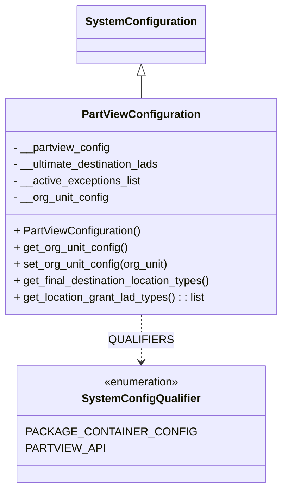

# Diagram: partview_service/partview_service/core/business/PartViewConfiguration.py

> Auto-generated by Obscura crawlers

## Mermaid

### SVG

<svg id="container" width="412.34375" xmlns="http://www.w3.org/2000/svg" class="classDiagram" height="704" viewBox="0 0 412.34375 704" role="graphics-document document" aria-roledescription="class"><g><defs><marker id="container_class-aggregationStart" class="marker aggregation class" refX="18" refY="7" markerWidth="190" markerHeight="240" orient="auto"><path d="M 18,7 L9,13 L1,7 L9,1 Z"></path></marker></defs><defs><marker id="container_class-aggregationEnd" class="marker aggregation class" refX="1" refY="7" markerWidth="20" markerHeight="28" orient="auto"><path d="M 18,7 L9,13 L1,7 L9,1 Z"></path></marker></defs><defs><marker id="container_class-extensionStart" class="marker extension class" refX="18" refY="7" markerWidth="190" markerHeight="240" orient="auto"><path d="M 1,7 L18,13 V 1 Z"></path></marker></defs><defs><marker id="container_class-extensionEnd" class="marker extension class" refX="1" refY="7" markerWidth="20" markerHeight="28" orient="auto"><path d="M 1,1 V 13 L18,7 Z"></path></marker></defs><defs><marker id="container_class-compositionStart" class="marker composition class" refX="18" refY="7" markerWidth="190" markerHeight="240" orient="auto"><path d="M 18,7 L9,13 L1,7 L9,1 Z"></path></marker></defs><defs><marker id="container_class-compositionEnd" class="marker composition class" refX="1" refY="7" markerWidth="20" markerHeight="28" orient="auto"><path d="M 18,7 L9,13 L1,7 L9,1 Z"></path></marker></defs><defs><marker id="container_class-dependencyStart" class="marker dependency class" refX="6" refY="7" markerWidth="190" markerHeight="240" orient="auto"><path d="M 5,7 L9,13 L1,7 L9,1 Z"></path></marker></defs><defs><marker id="container_class-dependencyEnd" class="marker dependency class" refX="13" refY="7" markerWidth="20" markerHeight="28" orient="auto"><path d="M 18,7 L9,13 L14,7 L9,1 Z"></path></marker></defs><defs><marker id="container_class-lollipopStart" class="marker lollipop class" refX="13" refY="7" markerWidth="190" markerHeight="240" orient="auto"><circle stroke="black" fill="transparent" cx="7" cy="7" r="6"></circle></marker></defs><defs><marker id="container_class-lollipopEnd" class="marker lollipop class" refX="1" refY="7" markerWidth="190" markerHeight="240" orient="auto"><circle stroke="black" fill="transparent" cx="7" cy="7" r="6"></circle></marker></defs><g class="root"><g class="clusters"></g><g class="edgePaths"><path d="M206.172,109.25L206.172,110.542C206.172,111.833,206.172,114.417,206.172,119.875C206.172,125.333,206.172,133.667,206.172,137.833L206.172,142" id="id_SystemConfiguration_PartViewConfiguration_1" class="edge-thickness-normal edge-pattern-solid relation" style=";;;" data-edge="true" data-et="edge" data-id="id_SystemConfiguration_PartViewConfiguration_1" data-points="W3sieCI6MjA2LjE3MTg3NSwieSI6OTJ9LHsieCI6MjA2LjE3MTg3NSwieSI6MTE3fSx7IngiOjIwNi4xNzE4NzUsInkiOjE0Mn1d" marker-start="url(#container_class-extensionStart)"></path><path d="M206.172,454L206.172,460.167C206.172,466.333,206.172,478.667,206.172,490C206.172,501.333,206.172,511.667,206.172,516.833L206.172,522" id="id_PartViewConfiguration_SystemConfigQualifier_2" class="edge-thickness-normal edge-pattern-dashed relation" style=";;;" data-edge="true" data-et="edge" data-id="id_PartViewConfiguration_SystemConfigQualifier_2" data-points="W3sieCI6MjA2LjE3MTg3NSwieSI6NDU0fSx7IngiOjIwNi4xNzE4NzUsInkiOjQ5MX0seyJ4IjoyMDYuMTcxODc1LCJ5Ijo1Mjh9XQ==" marker-end="url(#container_class-dependencyEnd)"></path></g><g class="edgeLabels"><g class="edgeLabel"><g class="label" data-id="id_SystemConfiguration_PartViewConfiguration_1" transform="translate(0, 0)"><foreignObject width="0" height="0">

</foreignObject></g></g><g class="edgeLabel" transform="translate(206.171875, 491)"><g class="label" data-id="id_PartViewConfiguration_SystemConfigQualifier_2" transform="translate(-41.390625, -12)"><foreignObject width="82.78125" height="24">

QUALIFIERS

</foreignObject></g></g></g><g class="nodes"><g class="node default" id="classId-SystemConfiguration-0" transform="translate(206.171875, 50)"><g class="basic label-container"><path d="M-87.921875 -42 L87.921875 -42 L87.921875 42 L-87.921875 42" stroke="none" stroke-width="0" fill="#ECECFF" style=""></path><path d="M-87.921875 -42 C-45.43429277611138 -42, -2.946710552222754 -42, 87.921875 -42 M-87.921875 -42 C-47.59184420327063 -42, -7.261813406541265 -42, 87.921875 -42 M87.921875 -42 C87.921875 -16.97343581791544, 87.921875 8.053128364169119, 87.921875 42 M87.921875 -42 C87.921875 -18.496022954501065, 87.921875 5.00795409099787, 87.921875 42 M87.921875 42 C47.47351262877826 42, 7.025150257556518 42, -87.921875 42 M87.921875 42 C33.11473025005658 42, -21.692414499886837 42, -87.921875 42 M-87.921875 42 C-87.921875 14.183897101354777, -87.921875 -13.632205797290446, -87.921875 -42 M-87.921875 42 C-87.921875 23.320630788837263, -87.921875 4.641261577674527, -87.921875 -42" stroke="#9370DB" stroke-width="1.3" fill="none" stroke-dasharray="0 0" style=""></path></g><g class="annotation-group text" transform="translate(0, -18)"></g><g class="label-group text" transform="translate(-75.921875, -18)"><g class="label" style="font-weight: bolder" transform="translate(0,-12)"><foreignObject width="151.84375" height="24">

SystemConfiguration

</foreignObject></g></g><g class="members-group text" transform="translate(-75.921875, 30)"></g><g class="methods-group text" transform="translate(-75.921875, 60)"></g><g class="divider" style=""><path d="M-87.921875 6 C-19.893422909849917 6, 48.135029180300165 6, 87.921875 6 M-87.921875 6 C-47.66489771570199 6, -7.40792043140398 6, 87.921875 6" stroke="#9370DB" stroke-width="1.3" fill="none" stroke-dasharray="0 0" style=""></path></g><g class="divider" style=""><path d="M-87.921875 24 C-37.01729011026178 24, 13.887294779476434 24, 87.921875 24 M-87.921875 24 C-23.339663360574292 24, 41.242548278851416 24, 87.921875 24" stroke="#9370DB" stroke-width="1.3" fill="none" stroke-dasharray="0 0" style=""></path></g></g><g class="node default" id="classId-SystemConfigQualifier-1" transform="translate(206.171875, 612)"><g class="basic label-container"><path d="M-159.08203125 -84 L159.08203125 -84 L159.08203125 84 L-159.08203125 84" stroke="none" stroke-width="0" fill="#ECECFF" style=""></path><path d="M-159.08203125 -84 C-47.73699764168268 -84, 63.608035966634645 -84, 159.08203125 -84 M-159.08203125 -84 C-73.78049713493427 -84, 11.52103698013147 -84, 159.08203125 -84 M159.08203125 -84 C159.08203125 -27.41940328166651, 159.08203125 29.161193436666977, 159.08203125 84 M159.08203125 -84 C159.08203125 -28.421061500389868, 159.08203125 27.157876999220264, 159.08203125 84 M159.08203125 84 C69.53937163547646 84, -20.003287979047087 84, -159.08203125 84 M159.08203125 84 C90.54181977764601 84, 22.001608305292024 84, -159.08203125 84 M-159.08203125 84 C-159.08203125 49.688619849519, -159.08203125 15.377239699038, -159.08203125 -84 M-159.08203125 84 C-159.08203125 28.87976391950366, -159.08203125 -26.24047216099268, -159.08203125 -84" stroke="#9370DB" stroke-width="1.3" fill="none" stroke-dasharray="0 0" style=""></path></g><g class="annotation-group text" transform="translate(-55.5546875, -60)"><g class="label" style="" transform="translate(0,-12)"><foreignObject width="111.109375" height="24">

«enumeration»

</foreignObject></g></g><g class="label-group text" transform="translate(-80.9296875, -36)"><g class="label" style="font-weight: bolder" transform="translate(0,-12)"><foreignObject width="161.859375" height="24">

SystemConfigQualifier

</foreignObject></g></g><g class="members-group text" transform="translate(-147.08203125, 12)"><g class="label" style="" transform="translate(0,-12)"><foreignObject width="213.234375" height="24">

PACKAGE_CONTAINER_CONFIG

</foreignObject></g><g class="label" style="" transform="translate(0,12)"><foreignObject width="101.078125" height="24">

PARTVIEW_API

</foreignObject></g></g><g class="methods-group text" transform="translate(-147.08203125, 84)"></g><g class="divider" style=""><path d="M-159.08203125 -12 C-86.8499786444562 -12, -14.617926038912401 -12, 159.08203125 -12 M-159.08203125 -12 C-65.25931469601869 -12, 28.563401857962617 -12, 159.08203125 -12" stroke="#9370DB" stroke-width="1.3" fill="none" stroke-dasharray="0 0" style=""></path></g><g class="divider" style=""><path d="M-159.08203125 60 C-86.17483004823603 60, -13.267628846472064 60, 159.08203125 60 M-159.08203125 60 C-38.41097543917172 60, 82.26008037165656 60, 159.08203125 60" stroke="#9370DB" stroke-width="1.3" fill="none" stroke-dasharray="0 0" style=""></path></g></g><g class="node default" id="classId-PartViewConfiguration-2" transform="translate(206.171875, 298)"><g class="basic label-container"><path d="M-198.171875 -156 L198.171875 -156 L198.171875 156 L-198.171875 156" stroke="none" stroke-width="0" fill="#ECECFF" style=""></path><path d="M-198.171875 -156 C-82.80242648808714 -156, 32.56702202382573 -156, 198.171875 -156 M-198.171875 -156 C-64.01226064474398 -156, 70.14735371051205 -156, 198.171875 -156 M198.171875 -156 C198.171875 -90.61354309611039, 198.171875 -25.22708619222078, 198.171875 156 M198.171875 -156 C198.171875 -46.76127538146926, 198.171875 62.47744923706148, 198.171875 156 M198.171875 156 C99.0550327028672 156, -0.06180959426561117 156, -198.171875 156 M198.171875 156 C101.43981563815603 156, 4.707756276312068 156, -198.171875 156 M-198.171875 156 C-198.171875 58.51442643487944, -198.171875 -38.97114713024112, -198.171875 -156 M-198.171875 156 C-198.171875 63.777722521836296, -198.171875 -28.44455495632741, -198.171875 -156" stroke="#9370DB" stroke-width="1.3" fill="none" stroke-dasharray="0 0" style=""></path></g><g class="annotation-group text" transform="translate(0, -132)"></g><g class="label-group text" transform="translate(-81.65625, -132)"><g class="label" style="font-weight: bolder" transform="translate(0,-12)"><foreignObject width="163.3125" height="24">

PartViewConfiguration

</foreignObject></g></g><g class="members-group text" transform="translate(-186.171875, -84)"><g class="label" style="" transform="translate(0,-12)"><foreignObject width="140.921875" height="24">

- __partview_config

</foreignObject></g><g class="label" style="" transform="translate(0,12)"><foreignObject width="217.140625" height="24">

- __ultimate_destination_lads

</foreignObject></g><g class="label" style="" transform="translate(0,36)"><foreignObject width="186.21875" height="24">

- __active_exceptions_list

</foreignObject></g><g class="label" style="" transform="translate(0,60)"><foreignObject width="139.0625" height="24">

- __org_unit_config

</foreignObject></g></g><g class="methods-group text" transform="translate(-186.171875, 36)"><g class="label" style="" transform="translate(0,-12)"><foreignObject width="182.625" height="24">

+ PartViewConfiguration()

</foreignObject></g><g class="label" style="" transform="translate(0,12)"><foreignObject width="165.375" height="24">

+ get_org_unit_config()

</foreignObject></g><g class="label" style="" transform="translate(0,36)"><foreignObject width="225.421875" height="24">

+ set_org_unit_config(org_unit)

</foreignObject></g><g class="label" style="" transform="translate(0,60)"><foreignObject width="290.6875" height="24">

+ get_final_destination_location_types()

</foreignObject></g><g class="label" style="" transform="translate(0,84)"><foreignObject width="279.875" height="24">

+ get_location_grant_lad_types() : : list

</foreignObject></g></g><g class="divider" style=""><path d="M-198.171875 -108 C-74.87614671282334 -108, 48.419581574353316 -108, 198.171875 -108 M-198.171875 -108 C-80.82789026942406 -108, 36.51609446115188 -108, 198.171875 -108" stroke="#9370DB" stroke-width="1.3" fill="none" stroke-dasharray="0 0" style=""></path></g><g class="divider" style=""><path d="M-198.171875 12 C-109.06023939533894 12, -19.94860379067788 12, 198.171875 12 M-198.171875 12 C-51.164880294250906 12, 95.84211441149819 12, 198.171875 12" stroke="#9370DB" stroke-width="1.3" fill="none" stroke-dasharray="0 0" style=""></path></g></g></g></g></g></svg>
