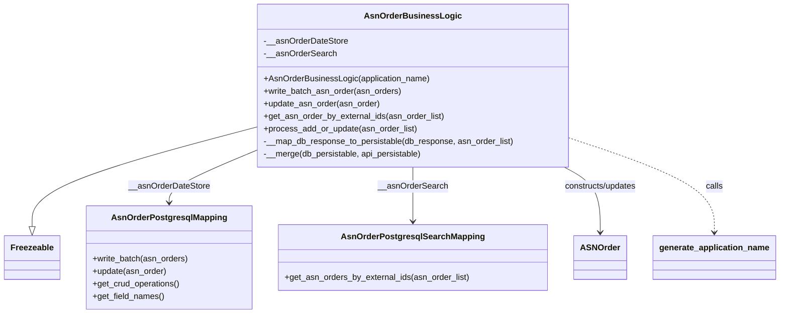
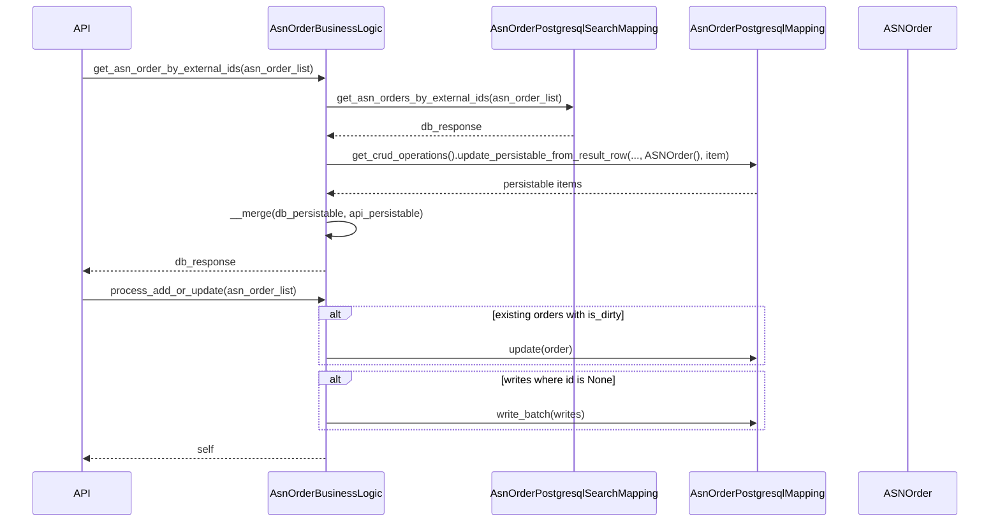

# Diagram: partview_service/partview_service/core/business/asn_order/ASNorderBusinessLogic.py

> Auto-generated by Obscura crawlers

## Diagram 1

### SVG

<svg id="container" width="1459.8046875" xmlns="http://www.w3.org/2000/svg" class="classDiagram" height="600" viewBox="0 0 1459.8046875 600" role="graphics-document document" aria-roledescription="class"><g><defs><marker id="container_class-aggregationStart" class="marker aggregation class" refX="18" refY="7" markerWidth="190" markerHeight="240" orient="auto"><path d="M 18,7 L9,13 L1,7 L9,1 Z"></path></marker></defs><defs><marker id="container_class-aggregationEnd" class="marker aggregation class" refX="1" refY="7" markerWidth="20" markerHeight="28" orient="auto"><path d="M 18,7 L9,13 L1,7 L9,1 Z"></path></marker></defs><defs><marker id="container_class-extensionStart" class="marker extension class" refX="18" refY="7" markerWidth="190" markerHeight="240" orient="auto"><path d="M 1,7 L18,13 V 1 Z"></path></marker></defs><defs><marker id="container_class-extensionEnd" class="marker extension class" refX="1" refY="7" markerWidth="20" markerHeight="28" orient="auto"><path d="M 1,1 V 13 L18,7 Z"></path></marker></defs><defs><marker id="container_class-compositionStart" class="marker composition class" refX="18" refY="7" markerWidth="190" markerHeight="240" orient="auto"><path d="M 18,7 L9,13 L1,7 L9,1 Z"></path></marker></defs><defs><marker id="container_class-compositionEnd" class="marker composition class" refX="1" refY="7" markerWidth="20" markerHeight="28" orient="auto"><path d="M 18,7 L9,13 L1,7 L9,1 Z"></path></marker></defs><defs><marker id="container_class-dependencyStart" class="marker dependency class" refX="6" refY="7" markerWidth="190" markerHeight="240" orient="auto"><path d="M 5,7 L9,13 L1,7 L9,1 Z"></path></marker></defs><defs><marker id="container_class-dependencyEnd" class="marker dependency class" refX="13" refY="7" markerWidth="20" markerHeight="28" orient="auto"><path d="M 18,7 L9,13 L14,7 L9,1 Z"></path></marker></defs><defs><marker id="container_class-lollipopStart" class="marker lollipop class" refX="13" refY="7" markerWidth="190" markerHeight="240" orient="auto"><circle stroke="black" fill="transparent" cx="7" cy="7" r="6"></circle></marker></defs><defs><marker id="container_class-lollipopEnd" class="marker lollipop class" refX="1" refY="7" markerWidth="190" markerHeight="240" orient="auto"><circle stroke="black" fill="transparent" cx="7" cy="7" r="6"></circle></marker></defs><g class="root"><g class="clusters"></g><g class="edgePaths"><path d="M481.016,243.381L410.712,262.318C340.409,281.254,199.802,319.127,129.499,350.855C59.195,382.583,59.195,408.167,59.195,420.958L59.195,433.75" id="id_AsnOrderBusinessLogic_Freezeable_1" class="edge-thickness-normal edge-pattern-solid relation" style=";;;" data-edge="true" data-et="edge" data-id="id_AsnOrderBusinessLogic_Freezeable_1" data-points="W3sieCI6NDgxLjAxNTYyNSwieSI6MjQzLjM4MTM0MDIyNDE3MDI2fSx7IngiOjU5LjE5NTMxMjUsInkiOjM1N30seyJ4Ijo1OS4xOTUzMTI1LCJ5Ijo0NTF9XQ==" marker-end="url(#container_class-extensionEnd)"></path><path d="M481.016,287.834L453.581,299.362C426.147,310.89,371.279,333.945,343.844,350.639C316.41,367.333,316.41,377.667,316.41,382.833L316.41,388" id="id_AsnOrderBusinessLogic_AsnOrderPostgresqlMapping_2" class="edge-thickness-normal edge-pattern-solid relation" style=";;;" data-edge="true" data-et="edge" data-id="id_AsnOrderBusinessLogic_AsnOrderPostgresqlMapping_2" data-points="W3sieCI6NDgxLjAxNTYyNSwieSI6Mjg3LjgzNDQ4NTY5MTIwMjF9LHsieCI6MzE2LjQxMDE1NjI1LCJ5IjozNTd9LHsieCI6MzE2LjQxMDE1NjI1LCJ5IjozOTR9XQ==" marker-end="url(#container_class-dependencyEnd)"></path><path d="M775.727,320L775.727,326.167C775.727,332.333,775.727,344.667,775.727,362C775.727,379.333,775.727,401.667,775.727,412.833L775.727,424" id="id_AsnOrderBusinessLogic_AsnOrderPostgresqlSearchMapping_3" class="edge-thickness-normal edge-pattern-solid relation" style=";;;" data-edge="true" data-et="edge" data-id="id_AsnOrderBusinessLogic_AsnOrderPostgresqlSearchMapping_3" data-points="W3sieCI6Nzc1LjcyNjU2MjUsInkiOjMyMH0seyJ4Ijo3NzUuNzI2NTYyNSwieSI6MzU3fSx7IngiOjc3NS43MjY1NjI1LCJ5Ijo0MzB9XQ==" marker-end="url(#container_class-dependencyEnd)"></path><path d="M1059.291,320L1070.5,326.167C1081.71,332.333,1104.128,344.667,1115.338,365.5C1126.547,386.333,1126.547,415.667,1126.547,430.333L1126.547,445" id="id_AsnOrderBusinessLogic_ASNOrder_4" class="edge-thickness-normal edge-pattern-solid relation" style=";;;" data-edge="true" data-et="edge" data-id="id_AsnOrderBusinessLogic_ASNOrder_4" data-points="W3sieCI6MTA1OS4yOTExNjc0MjIyNzk4LCJ5IjozMjB9LHsieCI6MTEyNi41NDY4NzUsInkiOjM1N30seyJ4IjoxMTI2LjU0Njg3NSwieSI6NDUxfV0=" marker-end="url(#container_class-dependencyEnd)"></path><path d="M1070.438,265.171L1115.021,280.475C1159.604,295.78,1248.771,326.39,1293.354,356.362C1337.938,386.333,1337.938,415.667,1337.938,430.333L1337.938,445" id="id_AsnOrderBusinessLogic_generate_application_name_5" class="edge-thickness-normal edge-pattern-dashed relation" style=";;;" data-edge="true" data-et="edge" data-id="id_AsnOrderBusinessLogic_generate_application_name_5" data-points="W3sieCI6MTA3MC40Mzc1LCJ5IjoyNjUuMTcwNTg3NjYzMTA0NjR9LHsieCI6MTMzNy45Mzc1LCJ5IjozNTd9LHsieCI6MTMzNy45Mzc1LCJ5Ijo0NTF9XQ==" marker-end="url(#container_class-dependencyEnd)"></path></g><g class="edgeLabels"><g class="edgeLabel"><g class="label" data-id="id_AsnOrderBusinessLogic_Freezeable_1" transform="translate(0, 0)"><foreignObject width="0" height="0">

</foreignObject></g></g><g class="edgeLabel" transform="translate(316.41015625, 357)"><g class="label" data-id="id_AsnOrderBusinessLogic_AsnOrderPostgresqlMapping_2" transform="translate(-76.953125, -12)"><foreignObject width="153.90625" height="24">

__asnOrderDateStore

</foreignObject></g></g><g class="edgeLabel" transform="translate(775.7265625, 357)"><g class="label" data-id="id_AsnOrderBusinessLogic_AsnOrderPostgresqlSearchMapping_3" transform="translate(-65.75, -12)"><foreignObject width="131.5" height="24">

__asnOrderSearch

</foreignObject></g></g><g class="edgeLabel" transform="translate(1126.546875, 357)"><g class="label" data-id="id_AsnOrderBusinessLogic_ASNOrder_4" transform="translate(-71.171875, -12)"><foreignObject width="142.34375" height="24">

constructs/updates

</foreignObject></g></g><g class="edgeLabel" transform="translate(1337.9375, 357)"><g class="label" data-id="id_AsnOrderBusinessLogic_generate_application_name_5" transform="translate(-16.4453125, -12)"><foreignObject width="32.890625" height="24">

calls

</foreignObject></g></g></g><g class="nodes"><g class="node default" id="classId-AsnOrderBusinessLogic-0" transform="translate(775.7265625, 164)"><g class="basic label-container"><path d="M-294.7109375 -156 L294.7109375 -156 L294.7109375 156 L-294.7109375 156" stroke="none" stroke-width="0" fill="#ECECFF" style=""></path><path d="M-294.7109375 -156 C-105.53379935546846 -156, 83.64333878906308 -156, 294.7109375 -156 M-294.7109375 -156 C-167.41947694680755 -156, -40.12801639361513 -156, 294.7109375 -156 M294.7109375 -156 C294.7109375 -57.754062585791274, 294.7109375 40.49187482841745, 294.7109375 156 M294.7109375 -156 C294.7109375 -86.95021532950288, 294.7109375 -17.900430659005764, 294.7109375 156 M294.7109375 156 C103.51635534187571 156, -87.67822681624858 156, -294.7109375 156 M294.7109375 156 C164.99459053795243 156, 35.27824357590487 156, -294.7109375 156 M-294.7109375 156 C-294.7109375 88.48784790800283, -294.7109375 20.97569581600567, -294.7109375 -156 M-294.7109375 156 C-294.7109375 82.97030075279409, -294.7109375 9.940601505588177, -294.7109375 -156" stroke="#9370DB" stroke-width="1.3" fill="none" stroke-dasharray="0 0" style=""></path></g><g class="annotation-group text" transform="translate(0, -132)"></g><g class="label-group text" transform="translate(-85.53125, -132)"><g class="label" style="font-weight: bolder" transform="translate(0,-12)"><foreignObject width="171.0625" height="24">

AsnOrderBusinessLogic

</foreignObject></g></g><g class="members-group text" transform="translate(-282.7109375, -84)"><g class="label" style="" transform="translate(0,-12)"><foreignObject width="159.078125" height="24">

-__asnOrderDateStore

</foreignObject></g><g class="label" style="" transform="translate(0,12)"><foreignObject width="136.671875" height="24">

-__asnOrderSearch

</foreignObject></g></g><g class="methods-group text" transform="translate(-282.7109375, -12)"><g class="label" style="" transform="translate(0,-12)"><foreignObject width="317.6875" height="24">

+AsnOrderBusinessLogic(application_name)

</foreignObject></g><g class="label" style="" transform="translate(0,12)"><foreignObject width="264.40625" height="24">

+write_batch_asn_order(asn_orders)

</foreignObject></g><g class="label" style="" transform="translate(0,36)"><foreignObject width="223.171875" height="24">

+update_asn_order(asn_order)

</foreignObject></g><g class="label" style="" transform="translate(0,60)"><foreignObject width="345.15625" height="24">

+get_asn_order_by_external_ids(asn_order_list)

</foreignObject></g><g class="label" style="" transform="translate(0,84)"><foreignObject width="293.0625" height="24">

+process_add_or_update(asn_order_list)

</foreignObject></g><g class="label" style="" transform="translate(0,108)"><foreignObject width="479.890625" height="24">

-__map_db_response_to_persistable(db_response, asn_order_list)

</foreignObject></g><g class="label" style="" transform="translate(0,132)"><foreignObject width="304.84375" height="24">

-__merge(db_persistable, api_persistable)

</foreignObject></g></g><g class="divider" style=""><path d="M-294.7109375 -108 C-133.02432656639638 -108, 28.662284367207235 -108, 294.7109375 -108 M-294.7109375 -108 C-166.4472219779976 -108, -38.1835064559952 -108, 294.7109375 -108" stroke="#9370DB" stroke-width="1.3" fill="none" stroke-dasharray="0 0" style=""></path></g><g class="divider" style=""><path d="M-294.7109375 -36 C-150.6605106433277 -36, -6.610083786655423 -36, 294.7109375 -36 M-294.7109375 -36 C-97.15847238597982 -36, 100.39399272804036 -36, 294.7109375 -36" stroke="#9370DB" stroke-width="1.3" fill="none" stroke-dasharray="0 0" style=""></path></g></g><g class="node default" id="classId-AsnOrderPostgresqlMapping-1" transform="translate(316.41015625, 493)"><g class="basic label-container"><path d="M-156.01953125 -99 L156.01953125 -99 L156.01953125 99 L-156.01953125 99" stroke="none" stroke-width="0" fill="#ECECFF" style=""></path><path d="M-156.01953125 -99 C-48.177912213202276 -99, 59.66370682359545 -99, 156.01953125 -99 M-156.01953125 -99 C-38.21412779866348 -99, 79.59127565267303 -99, 156.01953125 -99 M156.01953125 -99 C156.01953125 -46.103307367506716, 156.01953125 6.7933852649865685, 156.01953125 99 M156.01953125 -99 C156.01953125 -25.990835951706543, 156.01953125 47.01832809658691, 156.01953125 99 M156.01953125 99 C66.33317157046336 99, -23.353188109073272 99, -156.01953125 99 M156.01953125 99 C77.31809820938847 99, -1.3833348312230669 99, -156.01953125 99 M-156.01953125 99 C-156.01953125 27.00039278141962, -156.01953125 -44.99921443716076, -156.01953125 -99 M-156.01953125 99 C-156.01953125 47.976313262045174, -156.01953125 -3.0473734759096516, -156.01953125 -99" stroke="#9370DB" stroke-width="1.3" fill="none" stroke-dasharray="0 0" style=""></path></g><g class="annotation-group text" transform="translate(0, -75)"></g><g class="label-group text" transform="translate(-104.5234375, -75)"><g class="label" style="font-weight: bolder" transform="translate(0,-12)"><foreignObject width="209.046875" height="24">

AsnOrderPostgresqlMapping

</foreignObject></g></g><g class="members-group text" transform="translate(-144.01953125, -27)"></g><g class="methods-group text" transform="translate(-144.01953125, 3)"><g class="label" style="" transform="translate(0,-12)"><foreignObject width="183.515625" height="24">

+write_batch(asn_orders)

</foreignObject></g><g class="label" style="" transform="translate(0,12)"><foreignObject width="142.59375" height="24">

+update(asn_order)

</foreignObject></g><g class="label" style="" transform="translate(0,36)"><foreignObject width="167.984375" height="24">

+get_crud_operations()

</foreignObject></g><g class="label" style="" transform="translate(0,60)"><foreignObject width="137.3125" height="24">

+get_field_names()

</foreignObject></g></g><g class="divider" style=""><path d="M-156.01953125 -51 C-83.76482504678053 -51, -11.51011884356106 -51, 156.01953125 -51 M-156.01953125 -51 C-31.391733510662576 -51, 93.23606422867485 -51, 156.01953125 -51" stroke="#9370DB" stroke-width="1.3" fill="none" stroke-dasharray="0 0" style=""></path></g><g class="divider" style=""><path d="M-156.01953125 -27 C-82.33530656040088 -27, -8.651081870801761 -27, 156.01953125 -27 M-156.01953125 -27 C-56.56722925703903 -27, 42.88507273592194 -27, 156.01953125 -27" stroke="#9370DB" stroke-width="1.3" fill="none" stroke-dasharray="0 0" style=""></path></g></g><g class="node default" id="classId-AsnOrderPostgresqlSearchMapping-2" transform="translate(775.7265625, 493)"><g class="basic label-container"><path d="M-253.296875 -63 L253.296875 -63 L253.296875 63 L-253.296875 63" stroke="none" stroke-width="0" fill="#ECECFF" style=""></path><path d="M-253.296875 -63 C-101.1079326808784 -63, 51.08100963824319 -63, 253.296875 -63 M-253.296875 -63 C-88.25951258362102 -63, 76.77784983275797 -63, 253.296875 -63 M253.296875 -63 C253.296875 -28.704093839904573, 253.296875 5.591812320190854, 253.296875 63 M253.296875 -63 C253.296875 -15.045698983577218, 253.296875 32.908602032845565, 253.296875 63 M253.296875 63 C131.71122770973875 63, 10.125580419477501 63, -253.296875 63 M253.296875 63 C73.25371409803518 63, -106.78944680392965 63, -253.296875 63 M-253.296875 63 C-253.296875 35.87429312169613, -253.296875 8.748586243392253, -253.296875 -63 M-253.296875 63 C-253.296875 35.241695568191446, -253.296875 7.483391136382899, -253.296875 -63" stroke="#9370DB" stroke-width="1.3" fill="none" stroke-dasharray="0 0" style=""></path></g><g class="annotation-group text" transform="translate(0, -39)"></g><g class="label-group text" transform="translate(-129.234375, -39)"><g class="label" style="font-weight: bolder" transform="translate(0,-12)"><foreignObject width="258.46875" height="24">

AsnOrderPostgresqlSearchMapping

</foreignObject></g></g><g class="members-group text" transform="translate(-241.296875, 9)"></g><g class="methods-group text" transform="translate(-241.296875, 39)"><g class="label" style="" transform="translate(0,-12)"><foreignObject width="353.359375" height="24">

+get_asn_orders_by_external_ids(asn_order_list)

</foreignObject></g></g><g class="divider" style=""><path d="M-253.296875 -15 C-109.48265839638339 -15, 34.33155820723323 -15, 253.296875 -15 M-253.296875 -15 C-74.10032930854507 -15, 105.09621638290986 -15, 253.296875 -15" stroke="#9370DB" stroke-width="1.3" fill="none" stroke-dasharray="0 0" style=""></path></g><g class="divider" style=""><path d="M-253.296875 9 C-143.33782899388063 9, -33.37878298776124 9, 253.296875 9 M-253.296875 9 C-84.86559609672446 9, 83.56568280655108 9, 253.296875 9" stroke="#9370DB" stroke-width="1.3" fill="none" stroke-dasharray="0 0" style=""></path></g></g><g class="node default" id="classId-ASNOrder-3" transform="translate(1126.546875, 493)"><g class="basic label-container"><path d="M-47.5234375 -42 L47.5234375 -42 L47.5234375 42 L-47.5234375 42" stroke="none" stroke-width="0" fill="#ECECFF" style=""></path><path d="M-47.5234375 -42 C-14.44558610287109 -42, 18.63226529425782 -42, 47.5234375 -42 M-47.5234375 -42 C-21.958994971125946 -42, 3.605447557748107 -42, 47.5234375 -42 M47.5234375 -42 C47.5234375 -24.81928963258175, 47.5234375 -7.6385792651635, 47.5234375 42 M47.5234375 -42 C47.5234375 -23.623906391151, 47.5234375 -5.247812782301999, 47.5234375 42 M47.5234375 42 C10.954931683683718 42, -25.613574132632564 42, -47.5234375 42 M47.5234375 42 C27.94146464840864 42, 8.35949179681728 42, -47.5234375 42 M-47.5234375 42 C-47.5234375 17.7862330326073, -47.5234375 -6.4275339347854015, -47.5234375 -42 M-47.5234375 42 C-47.5234375 16.09951576022433, -47.5234375 -9.800968479551337, -47.5234375 -42" stroke="#9370DB" stroke-width="1.3" fill="none" stroke-dasharray="0 0" style=""></path></g><g class="annotation-group text" transform="translate(0, -18)"></g><g class="label-group text" transform="translate(-35.5234375, -18)"><g class="label" style="font-weight: bolder" transform="translate(0,-12)"><foreignObject width="71.046875" height="24">

ASNOrder

</foreignObject></g></g><g class="members-group text" transform="translate(-35.5234375, 30)"></g><g class="methods-group text" transform="translate(-35.5234375, 60)"></g><g class="divider" style=""><path d="M-47.5234375 6 C-27.741294616737346 6, -7.959151733474691 6, 47.5234375 6 M-47.5234375 6 C-22.06650682866966 6, 3.390423842660681 6, 47.5234375 6" stroke="#9370DB" stroke-width="1.3" fill="none" stroke-dasharray="0 0" style=""></path></g><g class="divider" style=""><path d="M-47.5234375 24 C-10.204126396392283 24, 27.115184707215434 24, 47.5234375 24 M-47.5234375 24 C-10.601273353615994 24, 26.32089079276801 24, 47.5234375 24" stroke="#9370DB" stroke-width="1.3" fill="none" stroke-dasharray="0 0" style=""></path></g></g><g class="node default" id="classId-Freezeable-4" transform="translate(59.1953125, 493)"><g class="basic label-container"><path d="M-51.1953125 -42 L51.1953125 -42 L51.1953125 42 L-51.1953125 42" stroke="none" stroke-width="0" fill="#ECECFF" style=""></path><path d="M-51.1953125 -42 C-19.77889044991277 -42, 11.637531600174462 -42, 51.1953125 -42 M-51.1953125 -42 C-23.64412432662565 -42, 3.9070638467486987 -42, 51.1953125 -42 M51.1953125 -42 C51.1953125 -10.15259452514675, 51.1953125 21.6948109497065, 51.1953125 42 M51.1953125 -42 C51.1953125 -13.893491207555982, 51.1953125 14.213017584888036, 51.1953125 42 M51.1953125 42 C29.894410113565126 42, 8.593507727130252 42, -51.1953125 42 M51.1953125 42 C13.872796189746659 42, -23.449720120506683 42, -51.1953125 42 M-51.1953125 42 C-51.1953125 13.84884578783949, -51.1953125 -14.30230842432102, -51.1953125 -42 M-51.1953125 42 C-51.1953125 17.093174885063164, -51.1953125 -7.813650229873673, -51.1953125 -42" stroke="#9370DB" stroke-width="1.3" fill="none" stroke-dasharray="0 0" style=""></path></g><g class="annotation-group text" transform="translate(0, -18)"></g><g class="label-group text" transform="translate(-39.1953125, -18)"><g class="label" style="font-weight: bolder" transform="translate(0,-12)"><foreignObject width="78.390625" height="24">

Freezeable

</foreignObject></g></g><g class="members-group text" transform="translate(-39.1953125, 30)"></g><g class="methods-group text" transform="translate(-39.1953125, 60)"></g><g class="divider" style=""><path d="M-51.1953125 6 C-18.14473652786191 6, 14.905839444276182 6, 51.1953125 6 M-51.1953125 6 C-16.507134454537834 6, 18.181043590924332 6, 51.1953125 6" stroke="#9370DB" stroke-width="1.3" fill="none" stroke-dasharray="0 0" style=""></path></g><g class="divider" style=""><path d="M-51.1953125 24 C-17.882086117303032 24, 15.431140265393935 24, 51.1953125 24 M-51.1953125 24 C-29.050370897978727 24, -6.905429295957454 24, 51.1953125 24" stroke="#9370DB" stroke-width="1.3" fill="none" stroke-dasharray="0 0" style=""></path></g></g><g class="node default" id="classId-generate_application_name-5" transform="translate(1337.9375, 493)"><g class="basic label-container"><path d="M-113.8671875 -42 L113.8671875 -42 L113.8671875 42 L-113.8671875 42" stroke="none" stroke-width="0" fill="#ECECFF" style=""></path><path d="M-113.8671875 -42 C-36.360936159540145 -42, 41.14531518091971 -42, 113.8671875 -42 M-113.8671875 -42 C-47.31670335766907 -42, 19.23378078466186 -42, 113.8671875 -42 M113.8671875 -42 C113.8671875 -23.516639219834364, 113.8671875 -5.033278439668727, 113.8671875 42 M113.8671875 -42 C113.8671875 -14.064578616132575, 113.8671875 13.87084276773485, 113.8671875 42 M113.8671875 42 C32.02192917425609 42, -49.823329151487826 42, -113.8671875 42 M113.8671875 42 C40.49563209640614 42, -32.87592330718772 42, -113.8671875 42 M-113.8671875 42 C-113.8671875 16.423316358620948, -113.8671875 -9.153367282758104, -113.8671875 -42 M-113.8671875 42 C-113.8671875 10.721324296598464, -113.8671875 -20.557351406803072, -113.8671875 -42" stroke="#9370DB" stroke-width="1.3" fill="none" stroke-dasharray="0 0" style=""></path></g><g class="annotation-group text" transform="translate(0, -18)"></g><g class="label-group text" transform="translate(-101.8671875, -18)"><g class="label" style="font-weight: bolder" transform="translate(0,-12)"><foreignObject width="203.734375" height="24">

generate_application_name

</foreignObject></g></g><g class="members-group text" transform="translate(-101.8671875, 30)"></g><g class="methods-group text" transform="translate(-101.8671875, 60)"></g><g class="divider" style=""><path d="M-113.8671875 6 C-26.93579498015481 6, 59.99559753969038 6, 113.8671875 6 M-113.8671875 6 C-56.22099813702932 6, 1.4251912259413615 6, 113.8671875 6" stroke="#9370DB" stroke-width="1.3" fill="none" stroke-dasharray="0 0" style=""></path></g><g class="divider" style=""><path d="M-113.8671875 24 C-27.387287764284963 24, 59.092611971430074 24, 113.8671875 24 M-113.8671875 24 C-38.59130366766793 24, 36.68458016466414 24, 113.8671875 24" stroke="#9370DB" stroke-width="1.3" fill="none" stroke-dasharray="0 0" style=""></path></g></g></g></g></g></svg>

## Diagram 2

### SVG

<svg id="container" width="1610.5" xmlns="http://www.w3.org/2000/svg" height="839" viewBox="-50 -10 1610.5 839" role="graphics-document document" aria-roledescription="sequence"><g><rect x="1360.5" y="753" fill="#eaeaea" stroke="#666" width="150" height="65" name="Model" rx="3" ry="3" class="actor actor-bottom"></rect><text x="1435.5" y="785.5" dominant-baseline="central" alignment-baseline="central" class="actor actor-box" style="text-anchor: middle; font-size: 16px; font-weight: 400;"><tspan x="1435.5" dy="0">ASNOrder</tspan></text></g><g><rect x="1084.5" y="753" fill="#eaeaea" stroke="#666" width="226" height="65" name="Store" rx="3" ry="3" class="actor actor-bottom"></rect><text x="1197.5" y="785.5" dominant-baseline="central" alignment-baseline="central" class="actor actor-box" style="text-anchor: middle; font-size: 16px; font-weight: 400;"><tspan x="1197.5" dy="0">AsnOrderPostgresqlMapping</tspan></text></g><g><rect x="759.5" y="753" fill="#eaeaea" stroke="#666" width="275" height="65" name="Search" rx="3" ry="3" class="actor actor-bottom"></rect><text x="897" y="785.5" dominant-baseline="central" alignment-baseline="central" class="actor actor-box" style="text-anchor: middle; font-size: 16px; font-weight: 400;"><tspan x="897" dy="0">AsnOrderPostgresqlSearchMapping</tspan></text></g><g><rect x="387.5" y="753" fill="#eaeaea" stroke="#666" width="189" height="65" name="Logic" rx="3" ry="3" class="actor actor-bottom"></rect><text x="482" y="785.5" dominant-baseline="central" alignment-baseline="central" class="actor actor-box" style="text-anchor: middle; font-size: 16px; font-weight: 400;"><tspan x="482" dy="0">AsnOrderBusinessLogic</tspan></text></g><g><rect x="0" y="753" fill="#eaeaea" stroke="#666" width="150" height="65" name="Client" rx="3" ry="3" class="actor actor-bottom"></rect><text x="75" y="785.5" dominant-baseline="central" alignment-baseline="central" class="actor actor-box" style="text-anchor: middle; font-size: 16px; font-weight: 400;"><tspan x="75" dy="0">API</tspan></text></g><g><line id="actor4" x1="1435.5" y1="65" x2="1435.5" y2="753" class="actor-line 200" stroke-width="0.5px" stroke="#999" name="Model"></line><g id="root-4"><rect x="1360.5" y="0" fill="#eaeaea" stroke="#666" width="150" height="65" name="Model" rx="3" ry="3" class="actor actor-top"></rect><text x="1435.5" y="32.5" dominant-baseline="central" alignment-baseline="central" class="actor actor-box" style="text-anchor: middle; font-size: 16px; font-weight: 400;"><tspan x="1435.5" dy="0">ASNOrder</tspan></text></g></g><g><line id="actor3" x1="1197.5" y1="65" x2="1197.5" y2="753" class="actor-line 200" stroke-width="0.5px" stroke="#999" name="Store"></line><g id="root-3"><rect x="1084.5" y="0" fill="#eaeaea" stroke="#666" width="226" height="65" name="Store" rx="3" ry="3" class="actor actor-top"></rect><text x="1197.5" y="32.5" dominant-baseline="central" alignment-baseline="central" class="actor actor-box" style="text-anchor: middle; font-size: 16px; font-weight: 400;"><tspan x="1197.5" dy="0">AsnOrderPostgresqlMapping</tspan></text></g></g><g><line id="actor2" x1="897" y1="65" x2="897" y2="753" class="actor-line 200" stroke-width="0.5px" stroke="#999" name="Search"></line><g id="root-2"><rect x="759.5" y="0" fill="#eaeaea" stroke="#666" width="275" height="65" name="Search" rx="3" ry="3" class="actor actor-top"></rect><text x="897" y="32.5" dominant-baseline="central" alignment-baseline="central" class="actor actor-box" style="text-anchor: middle; font-size: 16px; font-weight: 400;"><tspan x="897" dy="0">AsnOrderPostgresqlSearchMapping</tspan></text></g></g><g><line id="actor1" x1="482" y1="65" x2="482" y2="753" class="actor-line 200" stroke-width="0.5px" stroke="#999" name="Logic"></line><g id="root-1"><rect x="387.5" y="0" fill="#eaeaea" stroke="#666" width="189" height="65" name="Logic" rx="3" ry="3" class="actor actor-top"></rect><text x="482" y="32.5" dominant-baseline="central" alignment-baseline="central" class="actor actor-box" style="text-anchor: middle; font-size: 16px; font-weight: 400;"><tspan x="482" dy="0">AsnOrderBusinessLogic</tspan></text></g></g><g><line id="actor0" x1="75" y1="65" x2="75" y2="753" class="actor-line 200" stroke-width="0.5px" stroke="#999" name="Client"></line><g id="root-0"><rect x="0" y="0" fill="#eaeaea" stroke="#666" width="150" height="65" name="Client" rx="3" ry="3" class="actor actor-top"></rect><text x="75" y="32.5" dominant-baseline="central" alignment-baseline="central" class="actor actor-box" style="text-anchor: middle; font-size: 16px; font-weight: 400;"><tspan x="75" dy="0">API</tspan></text></g></g><g></g><defs><symbol id="computer" width="24" height="24"><path transform="scale(.5)" d="M2 2v13h20v-13h-20zm18 11h-16v-9h16v9zm-10.228 6l.466-1h3.524l.467 1h-4.457zm14.228 3h-24l2-6h2.104l-1.33 4h18.45l-1.297-4h2.073l2 6zm-5-10h-14v-7h14v7z"></path></symbol></defs><defs><symbol id="database" fill-rule="evenodd" clip-rule="evenodd"><path transform="scale(.5)" d="M12.258.001l.256.004.255.005.253.008.251.01.249.012.247.015.246.016.242.019.241.02.239.023.236.024.233.027.231.028.229.031.225.032.223.034.22.036.217.038.214.04.211.041.208.043.205.045.201.046.198.048.194.05.191.051.187.053.183.054.18.056.175.057.172.059.168.06.163.061.16.063.155.064.15.066.074.033.073.033.071.034.07.034.069.035.068.035.067.035.066.035.064.036.064.036.062.036.06.036.06.037.058.037.058.037.055.038.055.038.053.038.052.038.051.039.05.039.048.039.047.039.045.04.044.04.043.04.041.04.04.041.039.041.037.041.036.041.034.041.033.042.032.042.03.042.029.042.027.042.026.043.024.043.023.043.021.043.02.043.018.044.017.043.015.044.013.044.012.044.011.045.009.044.007.045.006.045.004.045.002.045.001.045v17l-.001.045-.002.045-.004.045-.006.045-.007.045-.009.044-.011.045-.012.044-.013.044-.015.044-.017.043-.018.044-.02.043-.021.043-.023.043-.024.043-.026.043-.027.042-.029.042-.03.042-.032.042-.033.042-.034.041-.036.041-.037.041-.039.041-.04.041-.041.04-.043.04-.044.04-.045.04-.047.039-.048.039-.05.039-.051.039-.052.038-.053.038-.055.038-.055.038-.058.037-.058.037-.06.037-.06.036-.062.036-.064.036-.064.036-.066.035-.067.035-.068.035-.069.035-.07.034-.071.034-.073.033-.074.033-.15.066-.155.064-.16.063-.163.061-.168.06-.172.059-.175.057-.18.056-.183.054-.187.053-.191.051-.194.05-.198.048-.201.046-.205.045-.208.043-.211.041-.214.04-.217.038-.22.036-.223.034-.225.032-.229.031-.231.028-.233.027-.236.024-.239.023-.241.02-.242.019-.246.016-.247.015-.249.012-.251.01-.253.008-.255.005-.256.004-.258.001-.258-.001-.256-.004-.255-.005-.253-.008-.251-.01-.249-.012-.247-.015-.245-.016-.243-.019-.241-.02-.238-.023-.236-.024-.234-.027-.231-.028-.228-.031-.226-.032-.223-.034-.22-.036-.217-.038-.214-.04-.211-.041-.208-.043-.204-.045-.201-.046-.198-.048-.195-.05-.19-.051-.187-.053-.184-.054-.179-.056-.176-.057-.172-.059-.167-.06-.164-.061-.159-.063-.155-.064-.151-.066-.074-.033-.072-.033-.072-.034-.07-.034-.069-.035-.068-.035-.067-.035-.066-.035-.064-.036-.063-.036-.062-.036-.061-.036-.06-.037-.058-.037-.057-.037-.056-.038-.055-.038-.053-.038-.052-.038-.051-.039-.049-.039-.049-.039-.046-.039-.046-.04-.044-.04-.043-.04-.041-.04-.04-.041-.039-.041-.037-.041-.036-.041-.034-.041-.033-.042-.032-.042-.03-.042-.029-.042-.027-.042-.026-.043-.024-.043-.023-.043-.021-.043-.02-.043-.018-.044-.017-.043-.015-.044-.013-.044-.012-.044-.011-.045-.009-.044-.007-.045-.006-.045-.004-.045-.002-.045-.001-.045v-17l.001-.045.002-.045.004-.045.006-.045.007-.045.009-.044.011-.045.012-.044.013-.044.015-.044.017-.043.018-.044.02-.043.021-.043.023-.043.024-.043.026-.043.027-.042.029-.042.03-.042.032-.042.033-.042.034-.041.036-.041.037-.041.039-.041.04-.041.041-.04.043-.04.044-.04.046-.04.046-.039.049-.039.049-.039.051-.039.052-.038.053-.038.055-.038.056-.038.057-.037.058-.037.06-.037.061-.036.062-.036.063-.036.064-.036.066-.035.067-.035.068-.035.069-.035.07-.034.072-.034.072-.033.074-.033.151-.066.155-.064.159-.063.164-.061.167-.06.172-.059.176-.057.179-.056.184-.054.187-.053.19-.051.195-.05.198-.048.201-.046.204-.045.208-.043.211-.041.214-.04.217-.038.22-.036.223-.034.226-.032.228-.031.231-.028.234-.027.236-.024.238-.023.241-.02.243-.019.245-.016.247-.015.249-.012.251-.01.253-.008.255-.005.256-.004.258-.001.258.001zm-9.258 20.499v.01l.001.021.003.021.004.022.005.021.006.022.007.022.009.023.01.022.011.023.012.023.013.023.015.023.016.024.017.023.018.024.019.024.021.024.022.025.023.024.024.025.052.049.056.05.061.051.066.051.07.051.075.051.079.052.084.052.088.052.092.052.097.052.102.051.105.052.11.052.114.051.119.051.123.051.127.05.131.05.135.05.139.048.144.049.147.047.152.047.155.047.16.045.163.045.167.043.171.043.176.041.178.041.183.039.187.039.19.037.194.035.197.035.202.033.204.031.209.03.212.029.216.027.219.025.222.024.226.021.23.02.233.018.236.016.24.015.243.012.246.01.249.008.253.005.256.004.259.001.26-.001.257-.004.254-.005.25-.008.247-.011.244-.012.241-.014.237-.016.233-.018.231-.021.226-.021.224-.024.22-.026.216-.027.212-.028.21-.031.205-.031.202-.034.198-.034.194-.036.191-.037.187-.039.183-.04.179-.04.175-.042.172-.043.168-.044.163-.045.16-.046.155-.046.152-.047.148-.048.143-.049.139-.049.136-.05.131-.05.126-.05.123-.051.118-.052.114-.051.11-.052.106-.052.101-.052.096-.052.092-.052.088-.053.083-.051.079-.052.074-.052.07-.051.065-.051.06-.051.056-.05.051-.05.023-.024.023-.025.021-.024.02-.024.019-.024.018-.024.017-.024.015-.023.014-.024.013-.023.012-.023.01-.023.01-.022.008-.022.006-.022.006-.022.004-.022.004-.021.001-.021.001-.021v-4.127l-.077.055-.08.053-.083.054-.085.053-.087.052-.09.052-.093.051-.095.05-.097.05-.1.049-.102.049-.105.048-.106.047-.109.047-.111.046-.114.045-.115.045-.118.044-.12.043-.122.042-.124.042-.126.041-.128.04-.13.04-.132.038-.134.038-.135.037-.138.037-.139.035-.142.035-.143.034-.144.033-.147.032-.148.031-.15.03-.151.03-.153.029-.154.027-.156.027-.158.026-.159.025-.161.024-.162.023-.163.022-.165.021-.166.02-.167.019-.169.018-.169.017-.171.016-.173.015-.173.014-.175.013-.175.012-.177.011-.178.01-.179.008-.179.008-.181.006-.182.005-.182.004-.184.003-.184.002h-.37l-.184-.002-.184-.003-.182-.004-.182-.005-.181-.006-.179-.008-.179-.008-.178-.01-.176-.011-.176-.012-.175-.013-.173-.014-.172-.015-.171-.016-.17-.017-.169-.018-.167-.019-.166-.02-.165-.021-.163-.022-.162-.023-.161-.024-.159-.025-.157-.026-.156-.027-.155-.027-.153-.029-.151-.03-.15-.03-.148-.031-.146-.032-.145-.033-.143-.034-.141-.035-.14-.035-.137-.037-.136-.037-.134-.038-.132-.038-.13-.04-.128-.04-.126-.041-.124-.042-.122-.042-.12-.044-.117-.043-.116-.045-.113-.045-.112-.046-.109-.047-.106-.047-.105-.048-.102-.049-.1-.049-.097-.05-.095-.05-.093-.052-.09-.051-.087-.052-.085-.053-.083-.054-.08-.054-.077-.054v4.127zm0-5.654v.011l.001.021.003.021.004.021.005.022.006.022.007.022.009.022.01.022.011.023.012.023.013.023.015.024.016.023.017.024.018.024.019.024.021.024.022.024.023.025.024.024.052.05.056.05.061.05.066.051.07.051.075.052.079.051.084.052.088.052.092.052.097.052.102.052.105.052.11.051.114.051.119.052.123.05.127.051.131.05.135.049.139.049.144.048.147.048.152.047.155.046.16.045.163.045.167.044.171.042.176.042.178.04.183.04.187.038.19.037.194.036.197.034.202.033.204.032.209.03.212.028.216.027.219.025.222.024.226.022.23.02.233.018.236.016.24.014.243.012.246.01.249.008.253.006.256.003.259.001.26-.001.257-.003.254-.006.25-.008.247-.01.244-.012.241-.015.237-.016.233-.018.231-.02.226-.022.224-.024.22-.025.216-.027.212-.029.21-.03.205-.032.202-.033.198-.035.194-.036.191-.037.187-.039.183-.039.179-.041.175-.042.172-.043.168-.044.163-.045.16-.045.155-.047.152-.047.148-.048.143-.048.139-.05.136-.049.131-.05.126-.051.123-.051.118-.051.114-.052.11-.052.106-.052.101-.052.096-.052.092-.052.088-.052.083-.052.079-.052.074-.051.07-.052.065-.051.06-.05.056-.051.051-.049.023-.025.023-.024.021-.025.02-.024.019-.024.018-.024.017-.024.015-.023.014-.023.013-.024.012-.022.01-.023.01-.023.008-.022.006-.022.006-.022.004-.021.004-.022.001-.021.001-.021v-4.139l-.077.054-.08.054-.083.054-.085.052-.087.053-.09.051-.093.051-.095.051-.097.05-.1.049-.102.049-.105.048-.106.047-.109.047-.111.046-.114.045-.115.044-.118.044-.12.044-.122.042-.124.042-.126.041-.128.04-.13.039-.132.039-.134.038-.135.037-.138.036-.139.036-.142.035-.143.033-.144.033-.147.033-.148.031-.15.03-.151.03-.153.028-.154.028-.156.027-.158.026-.159.025-.161.024-.162.023-.163.022-.165.021-.166.02-.167.019-.169.018-.169.017-.171.016-.173.015-.173.014-.175.013-.175.012-.177.011-.178.009-.179.009-.179.007-.181.007-.182.005-.182.004-.184.003-.184.002h-.37l-.184-.002-.184-.003-.182-.004-.182-.005-.181-.007-.179-.007-.179-.009-.178-.009-.176-.011-.176-.012-.175-.013-.173-.014-.172-.015-.171-.016-.17-.017-.169-.018-.167-.019-.166-.02-.165-.021-.163-.022-.162-.023-.161-.024-.159-.025-.157-.026-.156-.027-.155-.028-.153-.028-.151-.03-.15-.03-.148-.031-.146-.033-.145-.033-.143-.033-.141-.035-.14-.036-.137-.036-.136-.037-.134-.038-.132-.039-.13-.039-.128-.04-.126-.041-.124-.042-.122-.043-.12-.043-.117-.044-.116-.044-.113-.046-.112-.046-.109-.046-.106-.047-.105-.048-.102-.049-.1-.049-.097-.05-.095-.051-.093-.051-.09-.051-.087-.053-.085-.052-.083-.054-.08-.054-.077-.054v4.139zm0-5.666v.011l.001.02.003.022.004.021.005.022.006.021.007.022.009.023.01.022.011.023.012.023.013.023.015.023.016.024.017.024.018.023.019.024.021.025.022.024.023.024.024.025.052.05.056.05.061.05.066.051.07.051.075.052.079.051.084.052.088.052.092.052.097.052.102.052.105.051.11.052.114.051.119.051.123.051.127.05.131.05.135.05.139.049.144.048.147.048.152.047.155.046.16.045.163.045.167.043.171.043.176.042.178.04.183.04.187.038.19.037.194.036.197.034.202.033.204.032.209.03.212.028.216.027.219.025.222.024.226.021.23.02.233.018.236.017.24.014.243.012.246.01.249.008.253.006.256.003.259.001.26-.001.257-.003.254-.006.25-.008.247-.01.244-.013.241-.014.237-.016.233-.018.231-.02.226-.022.224-.024.22-.025.216-.027.212-.029.21-.03.205-.032.202-.033.198-.035.194-.036.191-.037.187-.039.183-.039.179-.041.175-.042.172-.043.168-.044.163-.045.16-.045.155-.047.152-.047.148-.048.143-.049.139-.049.136-.049.131-.051.126-.05.123-.051.118-.052.114-.051.11-.052.106-.052.101-.052.096-.052.092-.052.088-.052.083-.052.079-.052.074-.052.07-.051.065-.051.06-.051.056-.05.051-.049.023-.025.023-.025.021-.024.02-.024.019-.024.018-.024.017-.024.015-.023.014-.024.013-.023.012-.023.01-.022.01-.023.008-.022.006-.022.006-.022.004-.022.004-.021.001-.021.001-.021v-4.153l-.077.054-.08.054-.083.053-.085.053-.087.053-.09.051-.093.051-.095.051-.097.05-.1.049-.102.048-.105.048-.106.048-.109.046-.111.046-.114.046-.115.044-.118.044-.12.043-.122.043-.124.042-.126.041-.128.04-.13.039-.132.039-.134.038-.135.037-.138.036-.139.036-.142.034-.143.034-.144.033-.147.032-.148.032-.15.03-.151.03-.153.028-.154.028-.156.027-.158.026-.159.024-.161.024-.162.023-.163.023-.165.021-.166.02-.167.019-.169.018-.169.017-.171.016-.173.015-.173.014-.175.013-.175.012-.177.01-.178.01-.179.009-.179.007-.181.006-.182.006-.182.004-.184.003-.184.001-.185.001-.185-.001-.184-.001-.184-.003-.182-.004-.182-.006-.181-.006-.179-.007-.179-.009-.178-.01-.176-.01-.176-.012-.175-.013-.173-.014-.172-.015-.171-.016-.17-.017-.169-.018-.167-.019-.166-.02-.165-.021-.163-.023-.162-.023-.161-.024-.159-.024-.157-.026-.156-.027-.155-.028-.153-.028-.151-.03-.15-.03-.148-.032-.146-.032-.145-.033-.143-.034-.141-.034-.14-.036-.137-.036-.136-.037-.134-.038-.132-.039-.13-.039-.128-.041-.126-.041-.124-.041-.122-.043-.12-.043-.117-.044-.116-.044-.113-.046-.112-.046-.109-.046-.106-.048-.105-.048-.102-.048-.1-.05-.097-.049-.095-.051-.093-.051-.09-.052-.087-.052-.085-.053-.083-.053-.08-.054-.077-.054v4.153zm8.74-8.179l-.257.004-.254.005-.25.008-.247.011-.244.012-.241.014-.237.016-.233.018-.231.021-.226.022-.224.023-.22.026-.216.027-.212.028-.21.031-.205.032-.202.033-.198.034-.194.036-.191.038-.187.038-.183.04-.179.041-.175.042-.172.043-.168.043-.163.045-.16.046-.155.046-.152.048-.148.048-.143.048-.139.049-.136.05-.131.05-.126.051-.123.051-.118.051-.114.052-.11.052-.106.052-.101.052-.096.052-.092.052-.088.052-.083.052-.079.052-.074.051-.07.052-.065.051-.06.05-.056.05-.051.05-.023.025-.023.024-.021.024-.02.025-.019.024-.018.024-.017.023-.015.024-.014.023-.013.023-.012.023-.01.023-.01.022-.008.022-.006.023-.006.021-.004.022-.004.021-.001.021-.001.021.001.021.001.021.004.021.004.022.006.021.006.023.008.022.01.022.01.023.012.023.013.023.014.023.015.024.017.023.018.024.019.024.02.025.021.024.023.024.023.025.051.05.056.05.06.05.065.051.07.052.074.051.079.052.083.052.088.052.092.052.096.052.101.052.106.052.11.052.114.052.118.051.123.051.126.051.131.05.136.05.139.049.143.048.148.048.152.048.155.046.16.046.163.045.168.043.172.043.175.042.179.041.183.04.187.038.191.038.194.036.198.034.202.033.205.032.21.031.212.028.216.027.22.026.224.023.226.022.231.021.233.018.237.016.241.014.244.012.247.011.25.008.254.005.257.004.26.001.26-.001.257-.004.254-.005.25-.008.247-.011.244-.012.241-.014.237-.016.233-.018.231-.021.226-.022.224-.023.22-.026.216-.027.212-.028.21-.031.205-.032.202-.033.198-.034.194-.036.191-.038.187-.038.183-.04.179-.041.175-.042.172-.043.168-.043.163-.045.16-.046.155-.046.152-.048.148-.048.143-.048.139-.049.136-.05.131-.05.126-.051.123-.051.118-.051.114-.052.11-.052.106-.052.101-.052.096-.052.092-.052.088-.052.083-.052.079-.052.074-.051.07-.052.065-.051.06-.05.056-.05.051-.05.023-.025.023-.024.021-.024.02-.025.019-.024.018-.024.017-.023.015-.024.014-.023.013-.023.012-.023.01-.023.01-.022.008-.022.006-.023.006-.021.004-.022.004-.021.001-.021.001-.021-.001-.021-.001-.021-.004-.021-.004-.022-.006-.021-.006-.023-.008-.022-.01-.022-.01-.023-.012-.023-.013-.023-.014-.023-.015-.024-.017-.023-.018-.024-.019-.024-.02-.025-.021-.024-.023-.024-.023-.025-.051-.05-.056-.05-.06-.05-.065-.051-.07-.052-.074-.051-.079-.052-.083-.052-.088-.052-.092-.052-.096-.052-.101-.052-.106-.052-.11-.052-.114-.052-.118-.051-.123-.051-.126-.051-.131-.05-.136-.05-.139-.049-.143-.048-.148-.048-.152-.048-.155-.046-.16-.046-.163-.045-.168-.043-.172-.043-.175-.042-.179-.041-.183-.04-.187-.038-.191-.038-.194-.036-.198-.034-.202-.033-.205-.032-.21-.031-.212-.028-.216-.027-.22-.026-.224-.023-.226-.022-.231-.021-.233-.018-.237-.016-.241-.014-.244-.012-.247-.011-.25-.008-.254-.005-.257-.004-.26-.001-.26.001z"></path></symbol></defs><defs><symbol id="clock" width="24" height="24"><path transform="scale(.5)" d="M12 2c5.514 0 10 4.486 10 10s-4.486 10-10 10-10-4.486-10-10 4.486-10 10-10zm0-2c-6.627 0-12 5.373-12 12s5.373 12 12 12 12-5.373 12-12-5.373-12-12-12zm5.848 12.459c.202.038.202.333.001.372-1.907.361-6.045 1.111-6.547 1.111-.719 0-1.301-.582-1.301-1.301 0-.512.77-5.447 1.125-7.445.034-.192.312-.181.343.014l.985 6.238 5.394 1.011z"></path></symbol></defs><defs><marker id="arrowhead" refX="7.9" refY="5" markerUnits="userSpaceOnUse" markerWidth="12" markerHeight="12" orient="auto-start-reverse"><path d="M -1 0 L 10 5 L 0 10 z"></path></marker></defs><defs><marker id="crosshead" markerWidth="15" markerHeight="8" orient="auto" refX="4" refY="4.5"><path fill="none" stroke="#000000" stroke-width="1pt" d="M 1,2 L 6,7 M 6,2 L 1,7" style="stroke-dasharray: 0, 0;"></path></marker></defs><defs><marker id="filled-head" refX="15.5" refY="7" markerWidth="20" markerHeight="28" orient="auto"><path d="M 18,7 L9,13 L14,7 L9,1 Z"></path></marker></defs><defs><marker id="sequencenumber" refX="15" refY="15" markerWidth="60" markerHeight="40" orient="auto"><circle cx="15" cy="15" r="6"></circle></marker></defs><g><line x1="471" y1="489" x2="1208.5" y2="489" class="loopLine"></line><line x1="1208.5" y1="489" x2="1208.5" y2="582" class="loopLine"></line><line x1="471" y1="582" x2="1208.5" y2="582" class="loopLine"></line><line x1="471" y1="489" x2="471" y2="582" class="loopLine"></line><polygon points="471,489 521,489 521,502 512.6,509 471,509" class="labelBox"></polygon><text x="496" y="502" text-anchor="middle" dominant-baseline="middle" alignment-baseline="middle" class="labelText" style="font-size: 16px; font-weight: 400;">alt</text><text x="864.75" y="507" text-anchor="middle" class="loopText" style="font-size: 16px; font-weight: 400;"><tspan x="864.75">[existing orders with is_dirty]</tspan></text></g><g><line x1="471" y1="592" x2="1208.5" y2="592" class="loopLine"></line><line x1="1208.5" y1="592" x2="1208.5" y2="685" class="loopLine"></line><line x1="471" y1="685" x2="1208.5" y2="685" class="loopLine"></line><line x1="471" y1="592" x2="471" y2="685" class="loopLine"></line><polygon points="471,592 521,592 521,605 512.6,612 471,612" class="labelBox"></polygon><text x="496" y="605" text-anchor="middle" dominant-baseline="middle" alignment-baseline="middle" class="labelText" style="font-size: 16px; font-weight: 400;">alt</text><text x="864.75" y="610" text-anchor="middle" class="loopText" style="font-size: 16px; font-weight: 400;"><tspan x="864.75">[writes where id is None]</tspan></text></g><text x="277" y="80" text-anchor="middle" dominant-baseline="middle" alignment-baseline="middle" class="messageText" dy="1em" style="font-size: 16px; font-weight: 400;">get_asn_order_by_external_ids(asn_order_list)</text><line x1="76" y1="113" x2="478" y2="113" class="messageLine0" stroke-width="2" stroke="none" marker-end="url(#arrowhead)" style="fill: none;"></line><text x="688" y="128" text-anchor="middle" dominant-baseline="middle" alignment-baseline="middle" class="messageText" dy="1em" style="font-size: 16px; font-weight: 400;">get_asn_orders_by_external_ids(asn_order_list)</text><line x1="483" y1="161" x2="893" y2="161" class="messageLine0" stroke-width="2" stroke="none" marker-end="url(#arrowhead)" style="fill: none;"></line><text x="691" y="176" text-anchor="middle" dominant-baseline="middle" alignment-baseline="middle" class="messageText" dy="1em" style="font-size: 16px; font-weight: 400;">db_response</text><line x1="896" y1="209" x2="486" y2="209" class="messageLine1" stroke-width="2" stroke="none" marker-end="url(#arrowhead)" style="stroke-dasharray: 3, 3; fill: none;"></line><text x="838" y="224" text-anchor="middle" dominant-baseline="middle" alignment-baseline="middle" class="messageText" dy="1em" style="font-size: 16px; font-weight: 400;">get_crud_operations().update_persistable_from_result_row(..., ASNOrder(), item)</text><line x1="483" y1="257" x2="1193.5" y2="257" class="messageLine0" stroke-width="2" stroke="none" marker-end="url(#arrowhead)" style="fill: none;"></line><text x="841" y="272" text-anchor="middle" dominant-baseline="middle" alignment-baseline="middle" class="messageText" dy="1em" style="font-size: 16px; font-weight: 400;">persistable items</text><line x1="1196.5" y1="305" x2="486" y2="305" class="messageLine1" stroke-width="2" stroke="none" marker-end="url(#arrowhead)" style="stroke-dasharray: 3, 3; fill: none;"></line><text x="483" y="320" text-anchor="middle" dominant-baseline="middle" alignment-baseline="middle" class="messageText" dy="1em" style="font-size: 16px; font-weight: 400;">__merge(db_persistable, api_persistable)</text><path d="M 483,353 C 543,343 543,383 483,373" class="messageLine0" stroke-width="2" stroke="none" marker-end="url(#arrowhead)" style="fill: none;"></path><text x="280" y="398" text-anchor="middle" dominant-baseline="middle" alignment-baseline="middle" class="messageText" dy="1em" style="font-size: 16px; font-weight: 400;">db_response</text><line x1="481" y1="431" x2="79" y2="431" class="messageLine1" stroke-width="2" stroke="none" marker-end="url(#arrowhead)" style="stroke-dasharray: 3, 3; fill: none;"></line><text x="277" y="446" text-anchor="middle" dominant-baseline="middle" alignment-baseline="middle" class="messageText" dy="1em" style="font-size: 16px; font-weight: 400;">process_add_or_update(asn_order_list)</text><line x1="76" y1="479" x2="478" y2="479" class="messageLine0" stroke-width="2" stroke="none" marker-end="url(#arrowhead)" style="fill: none;"></line><text x="838" y="539" text-anchor="middle" dominant-baseline="middle" alignment-baseline="middle" class="messageText" dy="1em" style="font-size: 16px; font-weight: 400;">update(order)</text><line x1="483" y1="572" x2="1193.5" y2="572" class="messageLine0" stroke-width="2" stroke="none" marker-end="url(#arrowhead)" style="fill: none;"></line><text x="838" y="642" text-anchor="middle" dominant-baseline="middle" alignment-baseline="middle" class="messageText" dy="1em" style="font-size: 16px; font-weight: 400;">write_batch(writes)</text><line x1="483" y1="675" x2="1193.5" y2="675" class="messageLine0" stroke-width="2" stroke="none" marker-end="url(#arrowhead)" style="fill: none;"></line><text x="280" y="700" text-anchor="middle" dominant-baseline="middle" alignment-baseline="middle" class="messageText" dy="1em" style="font-size: 16px; font-weight: 400;">self</text><line x1="481" y1="733" x2="79" y2="733" class="messageLine1" stroke-width="2" stroke="none" marker-end="url(#arrowhead)" style="stroke-dasharray: 3, 3; fill: none;"></line></svg>
