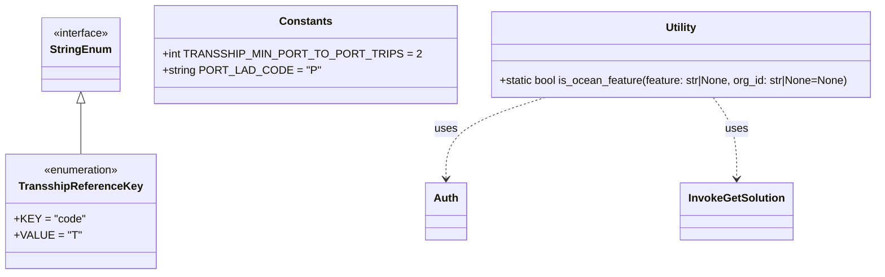

# Diagram: partview_service/partview_service/core/business/ocean_tracking/OceanConstants.py


> Auto-generated by Obscura crawlers

## Diagram 1



> SVG rendering failed for this diagram.

## Diagram 2

```mermaid
flowchart TD
  Start([start]) --> CheckFeature{feature provided?}
  CheckFeature -- Yes --> CompareFeature[feature.lower() == Auth.Feature.OCEAN_TRACKING.lower()]
  CompareFeature -- True --> ReturnTrue1([true])
  CompareFeature -- False --> ReturnFalse1([false])
  CheckFeature -- No --> CheckOrg{org_id is None?}
  CheckOrg -- Yes --> RaiseError{{"raise ValueError('org_id is required when feature is not provided')"}}
  CheckOrg -- No --> Invoke[InvokeGetSolution.invoke_get_solution_by_org_and_feature(org_id, Auth.Feature.OCEAN_TRACKING)]
  Invoke --> Evaluate[isinstance(solution, dict) and bool(solution.get("solution_id"))]
  Evaluate -- True --> ReturnTrue2([true])
  Evaluate -- False --> ReturnFalse2([false])
```

> SVG rendering failed for this diagram.
