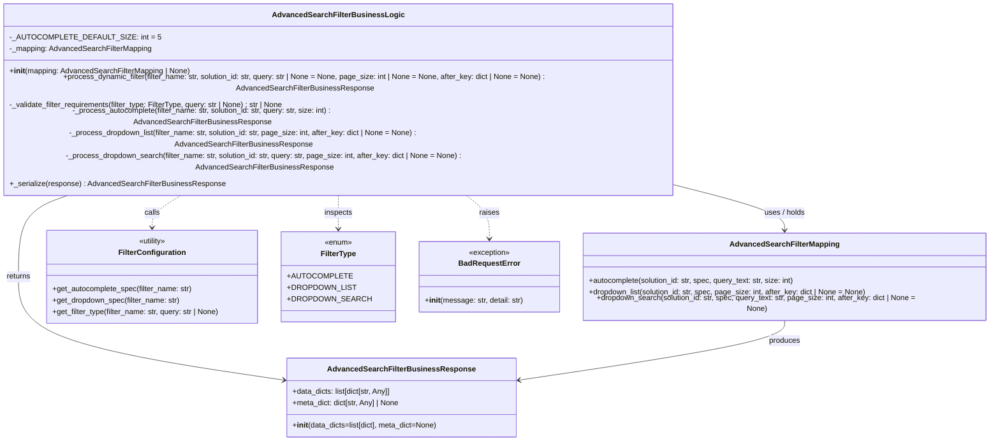

# Diagram: partview_service/partview_service/core/business/open_search/AdvancedSearchFilterBusinessLogic.py

> Auto-generated by Obscura crawlers

## Mermaid

### SVG

<svg id="container" width="2129.61328125" xmlns="http://www.w3.org/2000/svg" class="classDiagram" height="842" viewBox="0 0 2129.61328125 842" role="graphics-document document" aria-roledescription="class"><g><defs><marker id="container_class-aggregationStart" class="marker aggregation class" refX="18" refY="7" markerWidth="190" markerHeight="240" orient="auto"><path d="M 18,7 L9,13 L1,7 L9,1 Z"></path></marker></defs><defs><marker id="container_class-aggregationEnd" class="marker aggregation class" refX="1" refY="7" markerWidth="20" markerHeight="28" orient="auto"><path d="M 18,7 L9,13 L1,7 L9,1 Z"></path></marker></defs><defs><marker id="container_class-extensionStart" class="marker extension class" refX="18" refY="7" markerWidth="190" markerHeight="240" orient="auto"><path d="M 1,7 L18,13 V 1 Z"></path></marker></defs><defs><marker id="container_class-extensionEnd" class="marker extension class" refX="1" refY="7" markerWidth="20" markerHeight="28" orient="auto"><path d="M 1,1 V 13 L18,7 Z"></path></marker></defs><defs><marker id="container_class-compositionStart" class="marker composition class" refX="18" refY="7" markerWidth="190" markerHeight="240" orient="auto"><path d="M 18,7 L9,13 L1,7 L9,1 Z"></path></marker></defs><defs><marker id="container_class-compositionEnd" class="marker composition class" refX="1" refY="7" markerWidth="20" markerHeight="28" orient="auto"><path d="M 18,7 L9,13 L1,7 L9,1 Z"></path></marker></defs><defs><marker id="container_class-dependencyStart" class="marker dependency class" refX="6" refY="7" markerWidth="190" markerHeight="240" orient="auto"><path d="M 5,7 L9,13 L1,7 L9,1 Z"></path></marker></defs><defs><marker id="container_class-dependencyEnd" class="marker dependency class" refX="13" refY="7" markerWidth="20" markerHeight="28" orient="auto"><path d="M 18,7 L9,13 L14,7 L9,1 Z"></path></marker></defs><defs><marker id="container_class-lollipopStart" class="marker lollipop class" refX="13" refY="7" markerWidth="190" markerHeight="240" orient="auto"><circle stroke="black" fill="transparent" cx="7" cy="7" r="6"></circle></marker></defs><defs><marker id="container_class-lollipopEnd" class="marker lollipop class" refX="1" refY="7" markerWidth="190" markerHeight="240" orient="auto"><circle stroke="black" fill="transparent" cx="7" cy="7" r="6"></circle></marker></defs><g class="root"><g class="clusters"></g><g class="edgePaths"><path d="M1491.352,316.597L1524.08,323.331C1556.809,330.065,1622.266,343.532,1654.994,357.433C1687.723,371.333,1687.723,385.667,1687.723,392.833L1687.723,400" id="id_AdvancedSearchFilterBusinessLogic_AdvancedSearchFilterMapping_1" class="edge-thickness-normal edge-pattern-solid relation" style=";;;" data-edge="true" data-et="edge" data-id="id_AdvancedSearchFilterBusinessLogic_AdvancedSearchFilterMapping_1" data-points="W3sieCI6MTQ5MS4zNTE1NjI1LCJ5IjozMTYuNTk3MzA1NzM4MzE5M30seyJ4IjoxNjg3LjcyMjY1NjI1LCJ5IjozNTd9LHsieCI6MTY4Ny43MjI2NTYyNSwieSI6NDA2fV0=" marker-end="url(#container_class-dependencyEnd)"></path><path d="M205.848,320L184.351,326.167C162.853,332.333,119.858,344.667,98.361,373.5C76.863,402.333,76.863,447.667,76.863,493C76.863,538.333,76.863,583.667,169.757,620.289C262.65,656.911,448.436,684.822,541.33,698.777L634.223,712.732" id="id_AdvancedSearchFilterBusinessLogic_AdvancedSearchFilterBusinessResponse_2" class="edge-thickness-normal edge-pattern-solid relation" style=";;;" data-edge="true" data-et="edge" data-id="id_AdvancedSearchFilterBusinessLogic_AdvancedSearchFilterBusinessResponse_2" data-points="W3sieCI6MjA1Ljg0ODA2MTA0Mjc0NjE3LCJ5IjozMjB9LHsieCI6NzYuODYzMjgxMjUsInkiOjM1N30seyJ4Ijo3Ni44NjMyODEyNSwieSI6NDkzfSx7IngiOjc2Ljg2MzI4MTI1LCJ5Ijo2Mjl9LHsieCI6NjQwLjE1NjI1LCJ5Ijo3MTMuNjIzNzExMTQwMjEwNX1d" marker-end="url(#container_class-dependencyEnd)"></path><path d="M1687.723,580L1687.723,588.167C1687.723,596.333,1687.723,612.667,1594.829,634.789C1501.936,656.911,1316.15,684.822,1223.256,698.777L1130.363,712.732" id="id_AdvancedSearchFilterMapping_AdvancedSearchFilterBusinessResponse_3" class="edge-thickness-normal edge-pattern-solid relation" style=";;;" data-edge="true" data-et="edge" data-id="id_AdvancedSearchFilterMapping_AdvancedSearchFilterBusinessResponse_3" data-points="W3sieCI6MTY4Ny43MjI2NTYyNSwieSI6NTgwfSx7IngiOjE2ODcuNzIyNjU2MjUsInkiOjYyOX0seyJ4IjoxMTI0LjQyOTY4NzUsInkiOjcxMy42MjM3MTExNDAyMTA1fV0=" marker-end="url(#container_class-dependencyEnd)"></path><path d="M438.314,320L426.005,326.167C413.697,332.333,389.081,344.667,376.773,356C364.465,367.333,364.465,377.667,364.465,382.833L364.465,388" id="id_AdvancedSearchFilterBusinessLogic_FilterConfiguration_4" class="edge-thickness-normal edge-pattern-dashed relation" style=";;;" data-edge="true" data-et="edge" data-id="id_AdvancedSearchFilterBusinessLogic_FilterConfiguration_4" data-points="W3sieCI6NDM4LjMxMzU3MjcwMDc3NzIzLCJ5IjozMjB9LHsieCI6MzY0LjQ2NDg0Mzc1LCJ5IjozNTd9LHsieCI6MzY0LjQ2NDg0Mzc1LCJ5IjozOTR9XQ==" marker-end="url(#container_class-dependencyEnd)"></path><path d="M749.676,320L749.676,326.167C749.676,332.333,749.676,344.667,749.676,356.5C749.676,368.333,749.676,379.667,749.676,385.333L749.676,391" id="id_AdvancedSearchFilterBusinessLogic_FilterType_5" class="edge-thickness-normal edge-pattern-dashed relation" style=";;;" data-edge="true" data-et="edge" data-id="id_AdvancedSearchFilterBusinessLogic_FilterType_5" data-points="W3sieCI6NzQ5LjY3NTc4MTI1LCJ5IjozMjB9LHsieCI6NzQ5LjY3NTc4MTI1LCJ5IjozNTd9LHsieCI6NzQ5LjY3NTc4MTI1LCJ5IjozOTd9XQ==" marker-end="url(#container_class-dependencyEnd)"></path><path d="M997.429,320L1007.223,326.167C1017.017,332.333,1036.604,344.667,1046.398,360C1056.191,375.333,1056.191,393.667,1056.191,402.833L1056.191,412" id="id_AdvancedSearchFilterBusinessLogic_BadRequestError_6" class="edge-thickness-normal edge-pattern-dashed relation" style=";;;" data-edge="true" data-et="edge" data-id="id_AdvancedSearchFilterBusinessLogic_BadRequestError_6" data-points="W3sieCI6OTk3LjQyOTM0MzQyNjE2NTgsInkiOjMyMH0seyJ4IjoxMDU2LjE5MTQwNjI1LCJ5IjozNTd9LHsieCI6MTA1Ni4xOTE0MDYyNSwieSI6NDE4fV0=" marker-end="url(#container_class-dependencyEnd)"></path></g><g class="edgeLabels"><g class="edgeLabel" transform="translate(1687.72265625, 357)"><g class="label" data-id="id_AdvancedSearchFilterBusinessLogic_AdvancedSearchFilterMapping_1" transform="translate(-45.078125, -12)"><foreignObject width="90.15625" height="24">

uses / holds

</foreignObject></g></g><g class="edgeLabel" transform="translate(76.86328125, 493)"><g class="label" data-id="id_AdvancedSearchFilterBusinessLogic_AdvancedSearchFilterBusinessResponse_2" transform="translate(-26.265625, -12)"><foreignObject width="52.53125" height="24">

returns

</foreignObject></g></g><g class="edgeLabel" transform="translate(1687.72265625, 629)"><g class="label" data-id="id_AdvancedSearchFilterMapping_AdvancedSearchFilterBusinessResponse_3" transform="translate(-33.4765625, -12)"><foreignObject width="66.953125" height="24">

produces

</foreignObject></g></g><g class="edgeLabel" transform="translate(364.46484375, 357)"><g class="label" data-id="id_AdvancedSearchFilterBusinessLogic_FilterConfiguration_4" transform="translate(-16.4453125, -12)"><foreignObject width="32.890625" height="24">

calls

</foreignObject></g></g><g class="edgeLabel" transform="translate(749.67578125, 357)"><g class="label" data-id="id_AdvancedSearchFilterBusinessLogic_FilterType_5" transform="translate(-30.2421875, -12)"><foreignObject width="60.484375" height="24">

inspects

</foreignObject></g></g><g class="edgeLabel" transform="translate(1056.19140625, 357)"><g class="label" data-id="id_AdvancedSearchFilterBusinessLogic_BadRequestError_6" transform="translate(-21.25, -12)"><foreignObject width="42.5" height="24">

raises

</foreignObject></g></g></g><g class="nodes"><g class="node default" id="classId-AdvancedSearchFilterBusinessResponse-0" transform="translate(882.29296875, 750)"><g class="basic label-container"><path d="M-242.13671875 -84 L242.13671875 -84 L242.13671875 84 L-242.13671875 84" stroke="none" stroke-width="0" fill="#ECECFF" style=""></path><path d="M-242.13671875 -84 C-144.42914161468784 -84, -46.72156447937567 -84, 242.13671875 -84 M-242.13671875 -84 C-96.1916748354653 -84, 49.75336907906939 -84, 242.13671875 -84 M242.13671875 -84 C242.13671875 -23.737131711690637, 242.13671875 36.525736576618726, 242.13671875 84 M242.13671875 -84 C242.13671875 -36.446380396222494, 242.13671875 11.107239207555011, 242.13671875 84 M242.13671875 84 C85.65825829320534 84, -70.82020216358933 84, -242.13671875 84 M242.13671875 84 C66.38093494011605 84, -109.3748488697679 84, -242.13671875 84 M-242.13671875 84 C-242.13671875 18.613255221990443, -242.13671875 -46.773489556019115, -242.13671875 -84 M-242.13671875 84 C-242.13671875 28.616625377779414, -242.13671875 -26.766749244441172, -242.13671875 -84" stroke="#9370DB" stroke-width="1.3" fill="none" stroke-dasharray="0 0" style=""></path></g><g class="annotation-group text" transform="translate(0, -60)"></g><g class="label-group text" transform="translate(-146.6953125, -60)"><g class="label" style="font-weight: bolder" transform="translate(0,-12)"><foreignObject width="293.390625" height="24">

AdvancedSearchFilterBusinessResponse

</foreignObject></g></g><g class="members-group text" transform="translate(-230.13671875, -12)"><g class="label" style="" transform="translate(0,-12)"><foreignObject width="214.78125" height="24">

+data_dicts: list[dict[str, Any]]

</foreignObject></g><g class="label" style="" transform="translate(0,12)"><foreignObject width="232.078125" height="24">

+meta_dict: dict[str, Any] | None

</foreignObject></g></g><g class="methods-group text" transform="translate(-230.13671875, 60)"><g class="label" style="" transform="translate(0,-12)"><foreignObject width="313.578125" height="24">

+<strong>init</strong>(data_dicts=list[dict], meta_dict=None)

</foreignObject></g></g><g class="divider" style=""><path d="M-242.13671875 -36 C-50.22005464125539 -36, 141.69660946748922 -36, 242.13671875 -36 M-242.13671875 -36 C-143.794952225991 -36, -45.45318570198202 -36, 242.13671875 -36" stroke="#9370DB" stroke-width="1.3" fill="none" stroke-dasharray="0 0" style=""></path></g><g class="divider" style=""><path d="M-242.13671875 36 C-113.1794943707236 36, 15.777730008552794 36, 242.13671875 36 M-242.13671875 36 C-120.88689032106014 36, 0.362938107879728 36, 242.13671875 36" stroke="#9370DB" stroke-width="1.3" fill="none" stroke-dasharray="0 0" style=""></path></g></g><g class="node default" id="classId-AdvancedSearchFilterBusinessLogic-1" transform="translate(749.67578125, 164)"><g class="basic label-container"><path d="M-741.67578125 -156 L741.67578125 -156 L741.67578125 156 L-741.67578125 156" stroke="none" stroke-width="0" fill="#ECECFF" style=""></path><path d="M-741.67578125 -156 C-236.08689532073112 -156, 269.50199060853777 -156, 741.67578125 -156 M-741.67578125 -156 C-200.2107801230834 -156, 341.2542210038332 -156, 741.67578125 -156 M741.67578125 -156 C741.67578125 -68.98331556974343, 741.67578125 18.03336886051315, 741.67578125 156 M741.67578125 -156 C741.67578125 -61.19207475666971, 741.67578125 33.61585048666058, 741.67578125 156 M741.67578125 156 C219.09465079626295 156, -303.4864796574741 156, -741.67578125 156 M741.67578125 156 C344.5125660856845 156, -52.65064907863098 156, -741.67578125 156 M-741.67578125 156 C-741.67578125 70.52250585031162, -741.67578125 -14.954988299376765, -741.67578125 -156 M-741.67578125 156 C-741.67578125 60.57615891918702, -741.67578125 -34.847682161625954, -741.67578125 -156" stroke="#9370DB" stroke-width="1.3" fill="none" stroke-dasharray="0 0" style=""></path></g><g class="annotation-group text" transform="translate(0, -132)"></g><g class="label-group text" transform="translate(-130.3203125, -132)"><g class="label" style="font-weight: bolder" transform="translate(0,-12)"><foreignObject width="260.640625" height="24">

AdvancedSearchFilterBusinessLogic

</foreignObject></g></g><g class="members-group text" transform="translate(-729.67578125, -84)"><g class="label" style="" transform="translate(0,-12)"><foreignObject width="285.125" height="24">

-_AUTOCOMPLETE_DEFAULT_SIZE: int = 5

</foreignObject></g><g class="label" style="" transform="translate(0,12)"><foreignObject width="303.25" height="24">

-_mapping: AdvancedSearchFilterMapping

</foreignObject></g></g><g class="methods-group text" transform="translate(-729.67578125, -12)"><g class="label" style="" transform="translate(0,-12)"><foreignObject width="385.859375" height="24">

+<strong>init</strong>(mapping: AdvancedSearchFilterMapping | None)

</foreignObject></g><g class="label" style="" transform="translate(0,12)"><foreignObject width="1329.03125" height="24">

+process_dynamic_filter(filter_name: str, solution_id: str, query: str | None = None, page_size: int | None = None, after_key: dict | None = None) : AdvancedSearchFilterBusinessResponse

</foreignObject></g><g class="label" style="" transform="translate(0,36)"><foreignObject width="594.640625" height="24">

-_validate_filter_requirements(filter_type: FilterType, query: str | None) : str | None

</foreignObject></g><g class="label" style="" transform="translate(0,60)"><foreignObject width="853.296875" height="24">

-_process_autocomplete(filter_name: str, solution_id: str, query: str, size: int) : AdvancedSearchFilterBusinessResponse

</foreignObject></g><g class="label" style="" transform="translate(0,84)"><foreignObject width="1042.109375" height="24">

-_process_dropdown_list(filter_name: str, solution_id: str, page_size: int, after_key: dict | None = None) : AdvancedSearchFilterBusinessResponse

</foreignObject></g><g class="label" style="" transform="translate(0,108)"><foreignObject width="1143.296875" height="24">

-_process_dropdown_search(filter_name: str, solution_id: str, query: str, page_size: int, after_key: dict | None = None) : AdvancedSearchFilterBusinessResponse

</foreignObject></g><g class="label" style="" transform="translate(0,132)"><foreignObject width="453.875" height="24">

+_serialize(response) : AdvancedSearchFilterBusinessResponse

</foreignObject></g></g><g class="divider" style=""><path d="M-741.67578125 -108 C-257.8280248996328 -108, 226.0197314507344 -108, 741.67578125 -108 M-741.67578125 -108 C-192.28039641971918 -108, 357.11498841056164 -108, 741.67578125 -108" stroke="#9370DB" stroke-width="1.3" fill="none" stroke-dasharray="0 0" style=""></path></g><g class="divider" style=""><path d="M-741.67578125 -36 C-269.6002958944153 -36, 202.4751894611694 -36, 741.67578125 -36 M-741.67578125 -36 C-285.97846009300207 -36, 169.71886106399586 -36, 741.67578125 -36" stroke="#9370DB" stroke-width="1.3" fill="none" stroke-dasharray="0 0" style=""></path></g></g><g class="node default" id="classId-AdvancedSearchFilterMapping-2" transform="translate(1687.72265625, 493)"><g class="basic label-container"><path d="M-433.890625 -87 L433.890625 -87 L433.890625 87 L-433.890625 87" stroke="none" stroke-width="0" fill="#ECECFF" style=""></path><path d="M-433.890625 -87 C-132.41352780046913 -87, 169.06356939906175 -87, 433.890625 -87 M-433.890625 -87 C-88.75422644459974 -87, 256.3821721108005 -87, 433.890625 -87 M433.890625 -87 C433.890625 -24.853127724072564, 433.890625 37.29374455185487, 433.890625 87 M433.890625 -87 C433.890625 -27.277840641855995, 433.890625 32.44431871628801, 433.890625 87 M433.890625 87 C95.13823188491796 87, -243.6141612301641 87, -433.890625 87 M433.890625 87 C150.7833534910331 87, -132.3239180179338 87, -433.890625 87 M-433.890625 87 C-433.890625 45.67270437586855, -433.890625 4.3454087517370965, -433.890625 -87 M-433.890625 87 C-433.890625 26.571991121544997, -433.890625 -33.856017756910006, -433.890625 -87" stroke="#9370DB" stroke-width="1.3" fill="none" stroke-dasharray="0 0" style=""></path></g><g class="annotation-group text" transform="translate(0, -63)"></g><g class="label-group text" transform="translate(-110.421875, -63)"><g class="label" style="font-weight: bolder" transform="translate(0,-12)"><foreignObject width="220.84375" height="24">

AdvancedSearchFilterMapping

</foreignObject></g></g><g class="members-group text" transform="translate(-421.890625, -15)"></g><g class="methods-group text" transform="translate(-421.890625, 15)"><g class="label" style="" transform="translate(0,-12)"><foreignObject width="443.109375" height="24">

+autocomplete(solution_id: str, spec, query_text: str, size: int)

</foreignObject></g><g class="label" style="" transform="translate(0,12)"><foreignObject width="597" height="24">

+dropdown_list(solution_id: str, spec, page_size: int, after_key: dict | None = None)

</foreignObject></g><g class="label" style="" transform="translate(0,36)"><foreignObject width="733.359375" height="24">

+dropdown_search(solution_id: str, spec, query_text: str, page_size: int, after_key: dict | None = None)

</foreignObject></g></g><g class="divider" style=""><path d="M-433.890625 -39 C-208.04666700199692 -39, 17.797290996006154 -39, 433.890625 -39 M-433.890625 -39 C-203.64612467475035 -39, 26.598375650499293 -39, 433.890625 -39" stroke="#9370DB" stroke-width="1.3" fill="none" stroke-dasharray="0 0" style=""></path></g><g class="divider" style=""><path d="M-433.890625 -15 C-126.55456173347505 -15, 180.7815015330499 -15, 433.890625 -15 M-433.890625 -15 C-92.2589837472105 -15, 249.372657505579 -15, 433.890625 -15" stroke="#9370DB" stroke-width="1.3" fill="none" stroke-dasharray="0 0" style=""></path></g></g><g class="node default" id="classId-FilterConfiguration-3" transform="translate(364.46484375, 493)"><g class="basic label-container"><path d="M-226.3359375 -99 L226.3359375 -99 L226.3359375 99 L-226.3359375 99" stroke="none" stroke-width="0" fill="#ECECFF" style=""></path><path d="M-226.3359375 -99 C-111.82683115761203 -99, 2.682275184775932 -99, 226.3359375 -99 M-226.3359375 -99 C-61.821650445096736 -99, 102.69263660980653 -99, 226.3359375 -99 M226.3359375 -99 C226.3359375 -43.42399357656612, 226.3359375 12.152012846867763, 226.3359375 99 M226.3359375 -99 C226.3359375 -50.11871199394925, 226.3359375 -1.2374239878984952, 226.3359375 99 M226.3359375 99 C76.56331007640674 99, -73.20931734718653 99, -226.3359375 99 M226.3359375 99 C47.10136647568311 99, -132.13320454863378 99, -226.3359375 99 M-226.3359375 99 C-226.3359375 48.58871817441568, -226.3359375 -1.822563651168636, -226.3359375 -99 M-226.3359375 99 C-226.3359375 30.71688841840306, -226.3359375 -37.56622316319388, -226.3359375 -99" stroke="#9370DB" stroke-width="1.3" fill="none" stroke-dasharray="0 0" style=""></path></g><g class="annotation-group text" transform="translate(-30.3125, -75)"><g class="label" style="" transform="translate(0,-12)"><foreignObject width="60.625" height="24">

«utility»

</foreignObject></g></g><g class="label-group text" transform="translate(-68.234375, -51)"><g class="label" style="font-weight: bolder" transform="translate(0,-12)"><foreignObject width="136.46875" height="24">

FilterConfiguration

</foreignObject></g></g><g class="members-group text" transform="translate(-214.3359375, -3)"></g><g class="methods-group text" transform="translate(-214.3359375, 27)"><g class="label" style="" transform="translate(0,-12)"><foreignObject width="300.015625" height="24">

+get_autocomplete_spec(filter_name: str)

</foreignObject></g><g class="label" style="" transform="translate(0,12)"><foreignObject width="273.828125" height="24">

+get_dropdown_spec(filter_name: str)

</foreignObject></g><g class="label" style="" transform="translate(0,36)"><foreignObject width="360.4375" height="24">

+get_filter_type(filter_name: str, query: str | None)

</foreignObject></g></g><g class="divider" style=""><path d="M-226.3359375 -27 C-61.86363990461507 -27, 102.60865769076986 -27, 226.3359375 -27 M-226.3359375 -27 C-88.77321959186571 -27, 48.78949831626858 -27, 226.3359375 -27" stroke="#9370DB" stroke-width="1.3" fill="none" stroke-dasharray="0 0" style=""></path></g><g class="divider" style=""><path d="M-226.3359375 -3 C-86.5643630062317 -3, 53.2072114875366 -3, 226.3359375 -3 M-226.3359375 -3 C-99.61769279809161 -3, 27.10055190381678 -3, 226.3359375 -3" stroke="#9370DB" stroke-width="1.3" fill="none" stroke-dasharray="0 0" style=""></path></g></g><g class="node default" id="classId-FilterType-4" transform="translate(749.67578125, 493)"><g class="basic label-container"><path d="M-108.875 -96 L108.875 -96 L108.875 96 L-108.875 96" stroke="none" stroke-width="0" fill="#ECECFF" style=""></path><path d="M-108.875 -96 C-22.892897514675255 -96, 63.08920497064949 -96, 108.875 -96 M-108.875 -96 C-37.62395182117632 -96, 33.62709635764736 -96, 108.875 -96 M108.875 -96 C108.875 -56.4112941986249, 108.875 -16.822588397249802, 108.875 96 M108.875 -96 C108.875 -22.823885144248976, 108.875 50.35222971150205, 108.875 96 M108.875 96 C61.60376986014541 96, 14.332539720290825 96, -108.875 96 M108.875 96 C35.328091588100776 96, -38.21881682379845 96, -108.875 96 M-108.875 96 C-108.875 46.71831977150164, -108.875 -2.563360456996719, -108.875 -96 M-108.875 96 C-108.875 28.038435791657022, -108.875 -39.923128416685955, -108.875 -96" stroke="#9370DB" stroke-width="1.3" fill="none" stroke-dasharray="0 0" style=""></path></g><g class="annotation-group text" transform="translate(-29.53125, -72)"><g class="label" style="" transform="translate(0,-12)"><foreignObject width="59.0625" height="24">

«enum»

</foreignObject></g></g><g class="label-group text" transform="translate(-36.203125, -48)"><g class="label" style="font-weight: bolder" transform="translate(0,-12)"><foreignObject width="72.40625" height="24">

FilterType

</foreignObject></g></g><g class="members-group text" transform="translate(-96.875, 0)"><g class="label" style="" transform="translate(0,-12)"><foreignObject width="120.921875" height="24">

+AUTOCOMPLETE

</foreignObject></g><g class="label" style="" transform="translate(0,12)"><foreignObject width="131.375" height="24">

+DROPDOWN_LIST

</foreignObject></g><g class="label" style="" transform="translate(0,36)"><foreignObject width="157.546875" height="24">

+DROPDOWN_SEARCH

</foreignObject></g></g><g class="methods-group text" transform="translate(-96.875, 96)"></g><g class="divider" style=""><path d="M-108.875 -24 C-26.445003960303552 -24, 55.984992079392896 -24, 108.875 -24 M-108.875 -24 C-46.249607797690516 -24, 16.37578440461897 -24, 108.875 -24" stroke="#9370DB" stroke-width="1.3" fill="none" stroke-dasharray="0 0" style=""></path></g><g class="divider" style=""><path d="M-108.875 72 C-24.739508275250017 72, 59.395983449499965 72, 108.875 72 M-108.875 72 C-32.54360825018051 72, 43.78778349963898 72, 108.875 72" stroke="#9370DB" stroke-width="1.3" fill="none" stroke-dasharray="0 0" style=""></path></g></g><g class="node default" id="classId-BadRequestError-5" transform="translate(1056.19140625, 493)"><g class="basic label-container"><path d="M-147.640625 -75 L147.640625 -75 L147.640625 75 L-147.640625 75" stroke="none" stroke-width="0" fill="#ECECFF" style=""></path><path d="M-147.640625 -75 C-50.31033537487224 -75, 47.01995425025552 -75, 147.640625 -75 M-147.640625 -75 C-65.41714598005892 -75, 16.806333039882162 -75, 147.640625 -75 M147.640625 -75 C147.640625 -19.07591976411794, 147.640625 36.84816047176412, 147.640625 75 M147.640625 -75 C147.640625 -21.83504708025891, 147.640625 31.32990583948218, 147.640625 75 M147.640625 75 C35.571328378405155 75, -76.49796824318969 75, -147.640625 75 M147.640625 75 C40.63398170688346 75, -66.37266158623308 75, -147.640625 75 M-147.640625 75 C-147.640625 44.52796135430656, -147.640625 14.055922708613124, -147.640625 -75 M-147.640625 75 C-147.640625 25.165438408451152, -147.640625 -24.669123183097696, -147.640625 -75" stroke="#9370DB" stroke-width="1.3" fill="none" stroke-dasharray="0 0" style=""></path></g><g class="annotation-group text" transform="translate(-44.3515625, -51)"><g class="label" style="" transform="translate(0,-12)"><foreignObject width="88.703125" height="24">

«exception»

</foreignObject></g></g><g class="label-group text" transform="translate(-62.28125, -27)"><g class="label" style="font-weight: bolder" transform="translate(0,-12)"><foreignObject width="124.5625" height="24">

BadRequestError

</foreignObject></g></g><g class="members-group text" transform="translate(-135.640625, 21)"></g><g class="methods-group text" transform="translate(-135.640625, 51)"><g class="label" style="" transform="translate(0,-12)"><foreignObject width="209" height="24">

+<strong>init</strong>(message: str, detail: str)

</foreignObject></g></g><g class="divider" style=""><path d="M-147.640625 -3 C-69.24068685137487 -3, 9.15925129725025 -3, 147.640625 -3 M-147.640625 -3 C-54.56315785193877 -3, 38.51430929612246 -3, 147.640625 -3" stroke="#9370DB" stroke-width="1.3" fill="none" stroke-dasharray="0 0" style=""></path></g><g class="divider" style=""><path d="M-147.640625 21 C-79.85647066045651 21, -12.072316320913018 21, 147.640625 21 M-147.640625 21 C-61.91299228673057 21, 23.81464042653886 21, 147.640625 21" stroke="#9370DB" stroke-width="1.3" fill="none" stroke-dasharray="0 0" style=""></path></g></g></g></g></g></svg>
