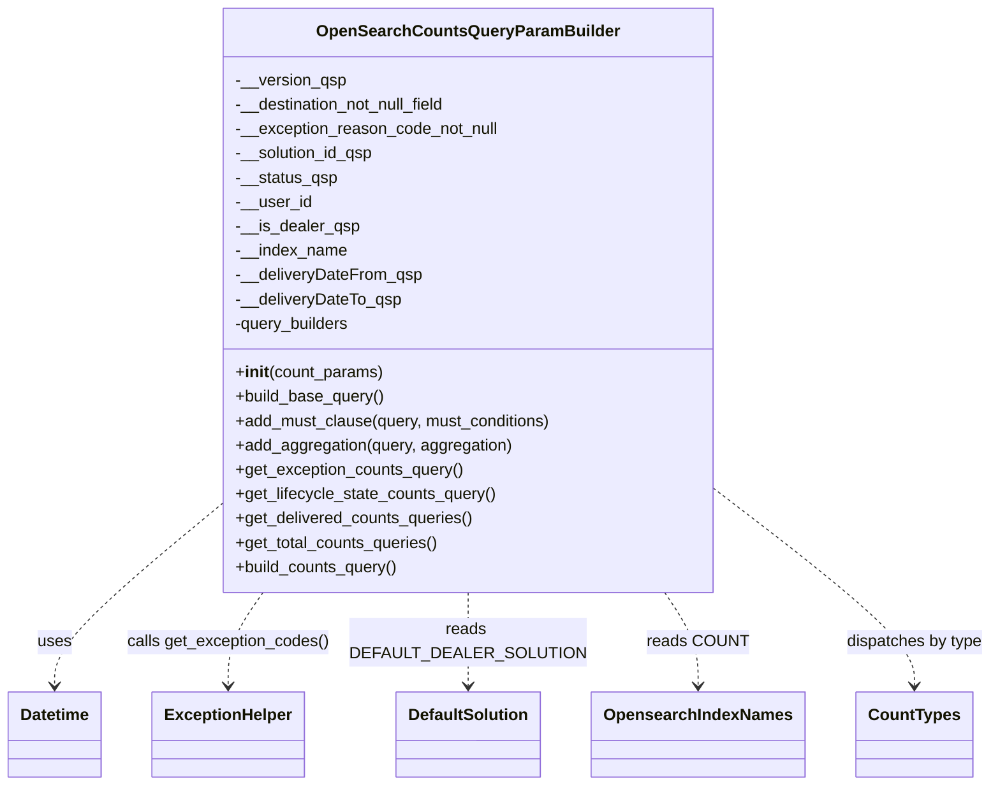

# Diagram: partview_service/partview_service/core/business/open_search/OpenSearchCountsQueryParamBuilder.py


> Auto-generated by Obscura crawlers

## Diagram 1



### SVG

<svg id="container" width="942.7734375" xmlns="http://www.w3.org/2000/svg" class="classDiagram" height="774" viewBox="0 0 942.7734375 774" role="graphics-document document" aria-roledescription="class"><style>#container{font-family:"trebuchet ms",verdana,arial,sans-serif;font-size:16px;fill:#333;}@keyframes edge-animation-frame{from{stroke-dashoffset:0;}}@keyframes dash{to{stroke-dashoffset:0;}}#container .edge-animation-slow{stroke-dasharray:9,5!important;stroke-dashoffset:900;animation:dash 50s linear infinite;stroke-linecap:round;}#container .edge-animation-fast{stroke-dasharray:9,5!important;stroke-dashoffset:900;animation:dash 20s linear infinite;stroke-linecap:round;}#container .error-icon{fill:#552222;}#container .error-text{fill:#552222;stroke:#552222;}#container .edge-thickness-normal{stroke-width:1px;}#container .edge-thickness-thick{stroke-width:3.5px;}#container .edge-pattern-solid{stroke-dasharray:0;}#container .edge-thickness-invisible{stroke-width:0;fill:none;}#container .edge-pattern-dashed{stroke-dasharray:3;}#container .edge-pattern-dotted{stroke-dasharray:2;}#container .marker{fill:#333333;stroke:#333333;}#container .marker.cross{stroke:#333333;}#container svg{font-family:"trebuchet ms",verdana,arial,sans-serif;font-size:16px;}#container p{margin:0;}#container g.classGroup text{fill:#9370DB;stroke:none;font-family:"trebuchet ms",verdana,arial,sans-serif;font-size:10px;}#container g.classGroup text .title{font-weight:bolder;}#container .nodeLabel,#container .edgeLabel{color:#131300;}#container .edgeLabel .label rect{fill:#ECECFF;}#container .label text{fill:#131300;}#container .labelBkg{background:#ECECFF;}#container .edgeLabel .label span{background:#ECECFF;}#container .classTitle{font-weight:bolder;}#container .node rect,#container .node circle,#container .node ellipse,#container .node polygon,#container .node path{fill:#ECECFF;stroke:#9370DB;stroke-width:1px;}#container .divider{stroke:#9370DB;stroke-width:1;}#container g.clickable{cursor:pointer;}#container g.classGroup rect{fill:#ECECFF;stroke:#9370DB;}#container g.classGroup line{stroke:#9370DB;stroke-width:1;}#container .classLabel .box{stroke:none;stroke-width:0;fill:#ECECFF;opacity:0.5;}#container .classLabel .label{fill:#9370DB;font-size:10px;}#container .relation{stroke:#333333;stroke-width:1;fill:none;}#container .dashed-line{stroke-dasharray:3;}#container .dotted-line{stroke-dasharray:1 2;}#container #compositionStart,#container .composition{fill:#333333!important;stroke:#333333!important;stroke-width:1;}#container #compositionEnd,#container .composition{fill:#333333!important;stroke:#333333!important;stroke-width:1;}#container #dependencyStart,#container .dependency{fill:#333333!important;stroke:#333333!important;stroke-width:1;}#container #dependencyStart,#container .dependency{fill:#333333!important;stroke:#333333!important;stroke-width:1;}#container #extensionStart,#container .extension{fill:transparent!important;stroke:#333333!important;stroke-width:1;}#container #extensionEnd,#container .extension{fill:transparent!important;stroke:#333333!important;stroke-width:1;}#container #aggregationStart,#container .aggregation{fill:transparent!important;stroke:#333333!important;stroke-width:1;}#container #aggregationEnd,#container .aggregation{fill:transparent!important;stroke:#333333!important;stroke-width:1;}#container #lollipopStart,#container .lollipop{fill:#ECECFF!important;stroke:#333333!important;stroke-width:1;}#container #lollipopEnd,#container .lollipop{fill:#ECECFF!important;stroke:#333333!important;stroke-width:1;}#container .edgeTerminals{font-size:11px;line-height:initial;}#container .classTitleText{text-anchor:middle;font-size:18px;fill:#333;}#container .label-icon{display:inline-block;height:1em;overflow:visible;vertical-align:-0.125em;}#container .node .label-icon path{fill:currentColor;stroke:revert;stroke-width:revert;}#container :root{--mermaid-font-family:"trebuchet ms",verdana,arial,sans-serif;}</style><g><defs><marker id="container_class-aggregationStart" class="marker aggregation class" refX="18" refY="7" markerWidth="190" markerHeight="240" orient="auto"><path d="M 18,7 L9,13 L1,7 L9,1 Z"></path></marker></defs><defs><marker id="container_class-aggregationEnd" class="marker aggregation class" refX="1" refY="7" markerWidth="20" markerHeight="28" orient="auto"><path d="M 18,7 L9,13 L1,7 L9,1 Z"></path></marker></defs><defs><marker id="container_class-extensionStart" class="marker extension class" refX="18" refY="7" markerWidth="190" markerHeight="240" orient="auto"><path d="M 1,7 L18,13 V 1 Z"></path></marker></defs><defs><marker id="container_class-extensionEnd" class="marker extension class" refX="1" refY="7" markerWidth="20" markerHeight="28" orient="auto"><path d="M 1,1 V 13 L18,7 Z"></path></marker></defs><defs><marker id="container_class-compositionStart" class="marker composition class" refX="18" refY="7" markerWidth="190" markerHeight="240" orient="auto"><path d="M 18,7 L9,13 L1,7 L9,1 Z"></path></marker></defs><defs><marker id="container_class-compositionEnd" class="marker composition class" refX="1" refY="7" markerWidth="20" markerHeight="28" orient="auto"><path d="M 18,7 L9,13 L1,7 L9,1 Z"></path></marker></defs><defs><marker id="container_class-dependencyStart" class="marker dependency class" refX="6" refY="7" markerWidth="190" markerHeight="240" orient="auto"><path d="M 5,7 L9,13 L1,7 L9,1 Z"></path></marker></defs><defs><marker id="container_class-dependencyEnd" class="marker dependency class" refX="13" refY="7" markerWidth="20" markerHeight="28" orient="auto"><path d="M 18,7 L9,13 L14,7 L9,1 Z"></path></marker></defs><defs><marker id="container_class-lollipopStart" class="marker lollipop class" refX="13" refY="7" markerWidth="190" markerHeight="240" orient="auto"><circle stroke="black" fill="transparent" cx="7" cy="7" r="6"></circle></marker></defs><defs><marker id="container_class-lollipopEnd" class="marker lollipop class" refX="1" refY="7" markerWidth="190" markerHeight="240" orient="auto"><circle stroke="black" fill="transparent" cx="7" cy="7" r="6"></circle></marker></defs><g class="root"><g class="clusters"></g><g class="edgePaths"><path d="M202.441,503.816L177.601,525.346C152.76,546.877,103.079,589.939,78.239,618.636C53.398,647.333,53.398,661.667,53.398,668.833L53.398,676" id="id_OpenSearchCountsQueryParamBuilder_Datetime_1" class="edge-thickness-normal edge-pattern-dashed relation" style=";;;" data-edge="true" data-et="edge" data-id="id_OpenSearchCountsQueryParamBuilder_Datetime_1" data-points="W3sieCI6MjAyLjQ0MTQwNjI1LCJ5Ijo1MDMuODE1NjUwOTMzMzQ5NH0seyJ4Ijo1My4zOTg0Mzc1LCJ5Ijo2MzN9LHsieCI6NTMuMzk4NDM3NSwieSI6NjgyfV0=" marker-end="url(#container_class-dependencyEnd)"></path><path d="M253.176,584L247.816,592.167C242.456,600.333,231.736,616.667,226.376,632C221.016,647.333,221.016,661.667,221.016,668.833L221.016,676" id="id_OpenSearchCountsQueryParamBuilder_ExceptionHelper_2" class="edge-thickness-normal edge-pattern-dashed relation" style=";;;" data-edge="true" data-et="edge" data-id="id_OpenSearchCountsQueryParamBuilder_ExceptionHelper_2" data-points="W3sieCI6MjUzLjE3NjQxODc2ODU0NiwieSI6NTg0fSx7IngiOjIyMS4wMTU2MjUsInkiOjYzM30seyJ4IjoyMjEuMDE1NjI1LCJ5Ijo2ODJ9XQ==" marker-end="url(#container_class-dependencyEnd)"></path><path d="M442.203,584L442.203,592.167C442.203,600.333,442.203,616.667,442.203,632C442.203,647.333,442.203,661.667,442.203,668.833L442.203,676" id="id_OpenSearchCountsQueryParamBuilder_DefaultSolution_3" class="edge-thickness-normal edge-pattern-dashed relation" style=";;;" data-edge="true" data-et="edge" data-id="id_OpenSearchCountsQueryParamBuilder_DefaultSolution_3" data-points="W3sieCI6NDQyLjIwMzEyNSwieSI6NTg0fSx7IngiOjQ0Mi4yMDMxMjUsInkiOjYzM30seyJ4Ijo0NDIuMjAzMTI1LCJ5Ijo2ODJ9XQ==" marker-end="url(#container_class-dependencyEnd)"></path><path d="M630.021,584L635.347,592.167C640.673,600.333,651.325,616.667,656.651,632C661.977,647.333,661.977,661.667,661.977,668.833L661.977,676" id="id_OpenSearchCountsQueryParamBuilder_OpensearchIndexNames_4" class="edge-thickness-normal edge-pattern-dashed relation" style=";;;" data-edge="true" data-et="edge" data-id="id_OpenSearchCountsQueryParamBuilder_OpensearchIndexNames_4" data-points="W3sieCI6NjMwLjAyMTM3NDI1ODE2MDIsInkiOjU4NH0seyJ4Ijo2NjEuOTc2NTYyNSwieSI6NjMzfSx7IngiOjY2MS45NzY1NjI1LCJ5Ijo2ODJ9XQ==" marker-end="url(#container_class-dependencyEnd)"></path><path d="M681.965,486.295L712.771,510.746C743.578,535.197,805.191,584.098,835.998,615.716C866.805,647.333,866.805,661.667,866.805,668.833L866.805,676" id="id_OpenSearchCountsQueryParamBuilder_CountTypes_5" class="edge-thickness-normal edge-pattern-dashed relation" style=";;;" data-edge="true" data-et="edge" data-id="id_OpenSearchCountsQueryParamBuilder_CountTypes_5" data-points="W3sieCI6NjgxLjk2NDg0Mzc1LCJ5Ijo0ODYuMjk1MzQxMjIwNjI5Njd9LHsieCI6ODY2LjgwNDY4NzUsInkiOjYzM30seyJ4Ijo4NjYuODA0Njg3NSwieSI6NjgyfV0=" marker-end="url(#container_class-dependencyEnd)"></path></g><g class="edgeLabels"><g class="edgeLabel" transform="translate(53.3984375, 633)"><g class="label" data-id="id_OpenSearchCountsQueryParamBuilder_Datetime_1" transform="translate(-16.4921875, -12)"><foreignObject width="32.984375" height="24"><div xmlns="http://www.w3.org/1999/xhtml" class="labelBkg" style="display: table-cell; white-space: nowrap; line-height: 1.5; max-width: 200px; text-align: center;"><span class="edgeLabel"><p>uses</p></span></div></foreignObject></g></g><g class="edgeLabel" transform="translate(221.015625, 633)"><g class="label" data-id="id_OpenSearchCountsQueryParamBuilder_ExceptionHelper_2" transform="translate(-99.6171875, -12)"><foreignObject width="199.234375" height="24"><div xmlns="http://www.w3.org/1999/xhtml" class="labelBkg" style="display: table-cell; white-space: nowrap; line-height: 1.5; max-width: 200px; text-align: center;"><span class="edgeLabel"><p>calls get_exception_codes()</p></span></div></foreignObject></g></g><g class="edgeLabel" transform="translate(442.203125, 633)"><g class="label" data-id="id_OpenSearchCountsQueryParamBuilder_DefaultSolution_3" transform="translate(-101.5703125, -24)"><foreignObject width="203.140625" height="48"><div xmlns="http://www.w3.org/1999/xhtml" class="labelBkg" style="display: table; white-space: break-spaces; line-height: 1.5; max-width: 200px; text-align: center; width: 200px;"><span class="edgeLabel"><p>reads DEFAULT_DEALER_SOLUTION</p></span></div></foreignObject></g></g><g class="edgeLabel" transform="translate(661.9765625, 633)"><g class="label" data-id="id_OpenSearchCountsQueryParamBuilder_OpensearchIndexNames_4" transform="translate(-46.875, -12)"><foreignObject width="93.75" height="24"><div xmlns="http://www.w3.org/1999/xhtml" class="labelBkg" style="display: table-cell; white-space: nowrap; line-height: 1.5; max-width: 200px; text-align: center;"><span class="edgeLabel"><p>reads COUNT</p></span></div></foreignObject></g></g><g class="edgeLabel" transform="translate(866.8046875, 633)"><g class="label" data-id="id_OpenSearchCountsQueryParamBuilder_CountTypes_5" transform="translate(-67.96875, -12)"><foreignObject width="135.9375" height="24"><div xmlns="http://www.w3.org/1999/xhtml" class="labelBkg" style="display: table-cell; white-space: nowrap; line-height: 1.5; max-width: 200px; text-align: center;"><span class="edgeLabel"><p>dispatches by type</p></span></div></foreignObject></g></g></g><g class="nodes"><g class="node default" id="classId-OpenSearchCountsQueryParamBuilder-0" transform="translate(442.203125, 296)"><g class="basic label-container"><path d="M-239.76171875 -288 L239.76171875 -288 L239.76171875 288 L-239.76171875 288" stroke="none" stroke-width="0" fill="#ECECFF" style=""></path><path d="M-239.76171875 -288 C-113.27894356662559 -288, 13.203831616748829 -288, 239.76171875 -288 M-239.76171875 -288 C-129.84858372127928 -288, -19.935448692558566 -288, 239.76171875 -288 M239.76171875 -288 C239.76171875 -97.26105725045477, 239.76171875 93.47788549909046, 239.76171875 288 M239.76171875 -288 C239.76171875 -161.3915785045677, 239.76171875 -34.78315700913535, 239.76171875 288 M239.76171875 288 C133.38795973552917 288, 27.01420072105833 288, -239.76171875 288 M239.76171875 288 C137.66414943584311 288, 35.5665801216862 288, -239.76171875 288 M-239.76171875 288 C-239.76171875 117.55391768964469, -239.76171875 -52.892164620710616, -239.76171875 -288 M-239.76171875 288 C-239.76171875 138.68572055991294, -239.76171875 -10.628558880174126, -239.76171875 -288" stroke="#9370DB" stroke-width="1.3" fill="none" stroke-dasharray="0 0" style=""></path></g><g class="annotation-group text" transform="translate(0, -264)"></g><g class="label-group text" transform="translate(-140.5390625, -264)"><g class="label" style="font-weight: bolder" transform="translate(0,-12)"><foreignObject width="281.078125" height="24"><div xmlns="http://www.w3.org/1999/xhtml" style="display: table-cell; white-space: nowrap; line-height: 1.5; max-width: 329px; text-align: center;"><span class="nodeLabel markdown-node-label" style=""><p>OpenSearchCountsQueryParamBuilder</p></span></div></foreignObject></g></g><g class="members-group text" transform="translate(-227.76171875, -216)"><g class="label" style="" transform="translate(0,-12)"><foreignObject width="108.890625" height="24"><div xmlns="http://www.w3.org/1999/xhtml" style="display: table-cell; white-space: nowrap; line-height: 1.5; max-width: 166px; text-align: center;"><span class="nodeLabel markdown-node-label" style=""><p>-__version_qsp</p></span></div></foreignObject></g><g class="label" style="" transform="translate(0,12)"><foreignObject width="213.765625" height="24"><div xmlns="http://www.w3.org/1999/xhtml" style="display: table-cell; white-space: nowrap; line-height: 1.5; max-width: 271px; text-align: center;"><span class="nodeLabel markdown-node-label" style=""><p>-__destination_not_null_field</p></span></div></foreignObject></g><g class="label" style="" transform="translate(0,36)"><foreignObject width="261.234375" height="24"><div xmlns="http://www.w3.org/1999/xhtml" style="display: table-cell; white-space: nowrap; line-height: 1.5; max-width: 319px; text-align: center;"><span class="nodeLabel markdown-node-label" style=""><p>-__exception_reason_code_not_null</p></span></div></foreignObject></g><g class="label" style="" transform="translate(0,60)"><foreignObject width="138.421875" height="24"><div xmlns="http://www.w3.org/1999/xhtml" style="display: table-cell; white-space: nowrap; line-height: 1.5; max-width: 196px; text-align: center;"><span class="nodeLabel markdown-node-label" style=""><p>-__solution_id_qsp</p></span></div></foreignObject></g><g class="label" style="" transform="translate(0,84)"><foreignObject width="100.28125" height="24"><div xmlns="http://www.w3.org/1999/xhtml" style="display: table-cell; white-space: nowrap; line-height: 1.5; max-width: 158px; text-align: center;"><span class="nodeLabel markdown-node-label" style=""><p>-__status_qsp</p></span></div></foreignObject></g><g class="label" style="" transform="translate(0,108)"><foreignObject width="74.140625" height="24"><div xmlns="http://www.w3.org/1999/xhtml" style="display: table-cell; white-space: nowrap; line-height: 1.5; max-width: 132px; text-align: center;"><span class="nodeLabel markdown-node-label" style=""><p>-__user_id</p></span></div></foreignObject></g><g class="label" style="" transform="translate(0,132)"><foreignObject width="120.765625" height="24"><div xmlns="http://www.w3.org/1999/xhtml" style="display: table-cell; white-space: nowrap; line-height: 1.5; max-width: 178px; text-align: center;"><span class="nodeLabel markdown-node-label" style=""><p>-__is_dealer_qsp</p></span></div></foreignObject></g><g class="label" style="" transform="translate(0,156)"><foreignObject width="110.28125" height="24"><div xmlns="http://www.w3.org/1999/xhtml" style="display: table-cell; white-space: nowrap; line-height: 1.5; max-width: 168px; text-align: center;"><span class="nodeLabel markdown-node-label" style=""><p>-__index_name</p></span></div></foreignObject></g><g class="label" style="" transform="translate(0,180)"><foreignObject width="183.09375" height="24"><div xmlns="http://www.w3.org/1999/xhtml" style="display: table-cell; white-space: nowrap; line-height: 1.5; max-width: 240px; text-align: center;"><span class="nodeLabel markdown-node-label" style=""><p>-__deliveryDateFrom_qsp</p></span></div></foreignObject></g><g class="label" style="" transform="translate(0,204)"><foreignObject width="163.46875" height="24"><div xmlns="http://www.w3.org/1999/xhtml" style="display: table-cell; white-space: nowrap; line-height: 1.5; max-width: 221px; text-align: center;"><span class="nodeLabel markdown-node-label" style=""><p>-__deliveryDateTo_qsp</p></span></div></foreignObject></g><g class="label" style="" transform="translate(0,228)"><foreignObject width="115.578125" height="24"><div xmlns="http://www.w3.org/1999/xhtml" style="display: table-cell; white-space: nowrap; line-height: 1.5; max-width: 173px; text-align: center;"><span class="nodeLabel markdown-node-label" style=""><p>-query_builders</p></span></div></foreignObject></g></g><g class="methods-group text" transform="translate(-227.76171875, 72)"><g class="label" style="" transform="translate(0,-12)"><foreignObject width="145.8125" height="24"><div xmlns="http://www.w3.org/1999/xhtml" style="display: table-cell; white-space: nowrap; line-height: 1.5; max-width: 235px; text-align: center;"><span class="nodeLabel markdown-node-label" style=""><p>+<strong>init</strong>(count_params)</p></span></div></foreignObject></g><g class="label" style="" transform="translate(0,12)"><foreignObject width="147.59375" height="24"><div xmlns="http://www.w3.org/1999/xhtml" style="display: table-cell; white-space: nowrap; line-height: 1.5; max-width: 205px; text-align: center;"><span class="nodeLabel markdown-node-label" style=""><p>+build_base_query()</p></span></div></foreignObject></g><g class="label" style="" transform="translate(0,36)"><foreignObject width="314.984375" height="24"><div xmlns="http://www.w3.org/1999/xhtml" style="display: table-cell; white-space: nowrap; line-height: 1.5; max-width: 372px; text-align: center;"><span class="nodeLabel markdown-node-label" style=""><p>+add_must_clause(query, must_conditions)</p></span></div></foreignObject></g><g class="label" style="" transform="translate(0,60)"><foreignObject width="273.703125" height="24"><div xmlns="http://www.w3.org/1999/xhtml" style="display: table-cell; white-space: nowrap; line-height: 1.5; max-width: 331px; text-align: center;"><span class="nodeLabel markdown-node-label" style=""><p>+add_aggregation(query, aggregation)</p></span></div></foreignObject></g><g class="label" style="" transform="translate(0,84)"><foreignObject width="225.609375" height="24"><div xmlns="http://www.w3.org/1999/xhtml" style="display: table-cell; white-space: nowrap; line-height: 1.5; max-width: 283px; text-align: center;"><span class="nodeLabel markdown-node-label" style=""><p>+get_exception_counts_query()</p></span></div></foreignObject></g><g class="label" style="" transform="translate(0,108)"><foreignObject width="258.34375" height="24"><div xmlns="http://www.w3.org/1999/xhtml" style="display: table-cell; white-space: nowrap; line-height: 1.5; max-width: 316px; text-align: center;"><span class="nodeLabel markdown-node-label" style=""><p>+get_lifecycle_state_counts_query()</p></span></div></foreignObject></g><g class="label" style="" transform="translate(0,132)"><foreignObject width="235.6875" height="24"><div xmlns="http://www.w3.org/1999/xhtml" style="display: table-cell; white-space: nowrap; line-height: 1.5; max-width: 293px; text-align: center;"><span class="nodeLabel markdown-node-label" style=""><p>+get_delivered_counts_queries()</p></span></div></foreignObject></g><g class="label" style="" transform="translate(0,156)"><foreignObject width="201.46875" height="24"><div xmlns="http://www.w3.org/1999/xhtml" style="display: table-cell; white-space: nowrap; line-height: 1.5; max-width: 259px; text-align: center;"><span class="nodeLabel markdown-node-label" style=""><p>+get_total_counts_queries()</p></span></div></foreignObject></g><g class="label" style="" transform="translate(0,180)"><foreignObject width="161.796875" height="24"><div xmlns="http://www.w3.org/1999/xhtml" style="display: table-cell; white-space: nowrap; line-height: 1.5; max-width: 219px; text-align: center;"><span class="nodeLabel markdown-node-label" style=""><p>+build_counts_query()</p></span></div></foreignObject></g></g><g class="divider" style=""><path d="M-239.76171875 -240 C-53.45140867045728 -240, 132.85890140908543 -240, 239.76171875 -240 M-239.76171875 -240 C-85.75667561595557 -240, 68.24836751808886 -240, 239.76171875 -240" stroke="#9370DB" stroke-width="1.3" fill="none" stroke-dasharray="0 0" style=""></path></g><g class="divider" style=""><path d="M-239.76171875 48 C-49.751063892588405 48, 140.2595909648232 48, 239.76171875 48 M-239.76171875 48 C-89.65650204378878 48, 60.44871466242245 48, 239.76171875 48" stroke="#9370DB" stroke-width="1.3" fill="none" stroke-dasharray="0 0" style=""></path></g></g><g class="node default" id="classId-Datetime-1" transform="translate(53.3984375, 724)"><g class="basic label-container"><path d="M-45.3984375 -42 L45.3984375 -42 L45.3984375 42 L-45.3984375 42" stroke="none" stroke-width="0" fill="#ECECFF" style=""></path><path d="M-45.3984375 -42 C-20.036916216903187 -42, 5.324605066193627 -42, 45.3984375 -42 M-45.3984375 -42 C-16.176943822480155 -42, 13.04454985503969 -42, 45.3984375 -42 M45.3984375 -42 C45.3984375 -12.264866492329357, 45.3984375 17.470267015341285, 45.3984375 42 M45.3984375 -42 C45.3984375 -10.866141876813764, 45.3984375 20.267716246372473, 45.3984375 42 M45.3984375 42 C10.469946205221959 42, -24.458545089556083 42, -45.3984375 42 M45.3984375 42 C14.168983161510312 42, -17.060471176979377 42, -45.3984375 42 M-45.3984375 42 C-45.3984375 16.688714352832708, -45.3984375 -8.622571294334584, -45.3984375 -42 M-45.3984375 42 C-45.3984375 8.970593555366385, -45.3984375 -24.05881288926723, -45.3984375 -42" stroke="#9370DB" stroke-width="1.3" fill="none" stroke-dasharray="0 0" style=""></path></g><g class="annotation-group text" transform="translate(0, -18)"></g><g class="label-group text" transform="translate(-33.3984375, -18)"><g class="label" style="font-weight: bolder" transform="translate(0,-12)"><foreignObject width="66.796875" height="24"><div xmlns="http://www.w3.org/1999/xhtml" style="display: table-cell; white-space: nowrap; line-height: 1.5; max-width: 116px; text-align: center;"><span class="nodeLabel markdown-node-label" style=""><p>Datetime</p></span></div></foreignObject></g></g><g class="members-group text" transform="translate(-33.3984375, 30)"></g><g class="methods-group text" transform="translate(-33.3984375, 60)"></g><g class="divider" style=""><path d="M-45.3984375 6 C-12.636599802832038 6, 20.125237894335925 6, 45.3984375 6 M-45.3984375 6 C-15.535422999701584 6, 14.327591500596832 6, 45.3984375 6" stroke="#9370DB" stroke-width="1.3" fill="none" stroke-dasharray="0 0" style=""></path></g><g class="divider" style=""><path d="M-45.3984375 24 C-11.587427866586069 24, 22.223581766827863 24, 45.3984375 24 M-45.3984375 24 C-11.8566836992552 24, 21.6850701014896 24, 45.3984375 24" stroke="#9370DB" stroke-width="1.3" fill="none" stroke-dasharray="0 0" style=""></path></g></g><g class="node default" id="classId-ExceptionHelper-2" transform="translate(221.015625, 724)"><g class="basic label-container"><path d="M-72.21875 -42 L72.21875 -42 L72.21875 42 L-72.21875 42" stroke="none" stroke-width="0" fill="#ECECFF" style=""></path><path d="M-72.21875 -42 C-29.90403914112059 -42, 12.410671717758817 -42, 72.21875 -42 M-72.21875 -42 C-38.72057408870819 -42, -5.22239817741638 -42, 72.21875 -42 M72.21875 -42 C72.21875 -21.207465198960236, 72.21875 -0.4149303979204717, 72.21875 42 M72.21875 -42 C72.21875 -16.6384032733341, 72.21875 8.723193453331803, 72.21875 42 M72.21875 42 C40.6748648289906 42, 9.1309796579812 42, -72.21875 42 M72.21875 42 C25.07979343832575 42, -22.059163123348497 42, -72.21875 42 M-72.21875 42 C-72.21875 17.859288180889784, -72.21875 -6.281423638220431, -72.21875 -42 M-72.21875 42 C-72.21875 16.273224080458384, -72.21875 -9.453551839083232, -72.21875 -42" stroke="#9370DB" stroke-width="1.3" fill="none" stroke-dasharray="0 0" style=""></path></g><g class="annotation-group text" transform="translate(0, -18)"></g><g class="label-group text" transform="translate(-60.21875, -18)"><g class="label" style="font-weight: bolder" transform="translate(0,-12)"><foreignObject width="120.4375" height="24"><div xmlns="http://www.w3.org/1999/xhtml" style="display: table-cell; white-space: nowrap; line-height: 1.5; max-width: 170px; text-align: center;"><span class="nodeLabel markdown-node-label" style=""><p>ExceptionHelper</p></span></div></foreignObject></g></g><g class="members-group text" transform="translate(-60.21875, 30)"></g><g class="methods-group text" transform="translate(-60.21875, 60)"></g><g class="divider" style=""><path d="M-72.21875 6 C-21.26290853046695 6, 29.692932939066097 6, 72.21875 6 M-72.21875 6 C-18.175419576742406 6, 35.86791084651519 6, 72.21875 6" stroke="#9370DB" stroke-width="1.3" fill="none" stroke-dasharray="0 0" style=""></path></g><g class="divider" style=""><path d="M-72.21875 24 C-16.37724013613861 24, 39.46426972772278 24, 72.21875 24 M-72.21875 24 C-17.474215085844392 24, 37.270319828311216 24, 72.21875 24" stroke="#9370DB" stroke-width="1.3" fill="none" stroke-dasharray="0 0" style=""></path></g></g><g class="node default" id="classId-DefaultSolution-3" transform="translate(442.203125, 724)"><g class="basic label-container"><path d="M-69.5390625 -42 L69.5390625 -42 L69.5390625 42 L-69.5390625 42" stroke="none" stroke-width="0" fill="#ECECFF" style=""></path><path d="M-69.5390625 -42 C-21.543887129179403 -42, 26.451288241641194 -42, 69.5390625 -42 M-69.5390625 -42 C-30.87083087326262 -42, 7.797400753474761 -42, 69.5390625 -42 M69.5390625 -42 C69.5390625 -12.342887350300373, 69.5390625 17.314225299399254, 69.5390625 42 M69.5390625 -42 C69.5390625 -14.245905578239022, 69.5390625 13.508188843521957, 69.5390625 42 M69.5390625 42 C29.849782140634368 42, -9.839498218731265 42, -69.5390625 42 M69.5390625 42 C28.36353612421901 42, -12.81199025156198 42, -69.5390625 42 M-69.5390625 42 C-69.5390625 21.135533075304796, -69.5390625 0.2710661506095917, -69.5390625 -42 M-69.5390625 42 C-69.5390625 14.286868324546617, -69.5390625 -13.426263350906765, -69.5390625 -42" stroke="#9370DB" stroke-width="1.3" fill="none" stroke-dasharray="0 0" style=""></path></g><g class="annotation-group text" transform="translate(0, -18)"></g><g class="label-group text" transform="translate(-57.5390625, -18)"><g class="label" style="font-weight: bolder" transform="translate(0,-12)"><foreignObject width="115.078125" height="24"><div xmlns="http://www.w3.org/1999/xhtml" style="display: table-cell; white-space: nowrap; line-height: 1.5; max-width: 164px; text-align: center;"><span class="nodeLabel markdown-node-label" style=""><p>DefaultSolution</p></span></div></foreignObject></g></g><g class="members-group text" transform="translate(-57.5390625, 30)"></g><g class="methods-group text" transform="translate(-57.5390625, 60)"></g><g class="divider" style=""><path d="M-69.5390625 6 C-27.629938054595883 6, 14.279186390808235 6, 69.5390625 6 M-69.5390625 6 C-21.760901100150924 6, 26.01726029969815 6, 69.5390625 6" stroke="#9370DB" stroke-width="1.3" fill="none" stroke-dasharray="0 0" style=""></path></g><g class="divider" style=""><path d="M-69.5390625 24 C-25.195309981520417 24, 19.148442536959166 24, 69.5390625 24 M-69.5390625 24 C-29.000871166838188 24, 11.537320166323624 24, 69.5390625 24" stroke="#9370DB" stroke-width="1.3" fill="none" stroke-dasharray="0 0" style=""></path></g></g><g class="node default" id="classId-OpensearchIndexNames-4" transform="translate(661.9765625, 724)"><g class="basic label-container"><path d="M-100.234375 -42 L100.234375 -42 L100.234375 42 L-100.234375 42" stroke="none" stroke-width="0" fill="#ECECFF" style=""></path><path d="M-100.234375 -42 C-52.577513130042526 -42, -4.920651260085052 -42, 100.234375 -42 M-100.234375 -42 C-38.842868921641774 -42, 22.548637156716453 -42, 100.234375 -42 M100.234375 -42 C100.234375 -15.45420572523605, 100.234375 11.091588549527899, 100.234375 42 M100.234375 -42 C100.234375 -15.227407233873535, 100.234375 11.54518553225293, 100.234375 42 M100.234375 42 C28.190918479390064 42, -43.85253804121987 42, -100.234375 42 M100.234375 42 C23.991413650124315 42, -52.25154769975137 42, -100.234375 42 M-100.234375 42 C-100.234375 23.664396482131814, -100.234375 5.328792964263627, -100.234375 -42 M-100.234375 42 C-100.234375 14.747746537062277, -100.234375 -12.504506925875447, -100.234375 -42" stroke="#9370DB" stroke-width="1.3" fill="none" stroke-dasharray="0 0" style=""></path></g><g class="annotation-group text" transform="translate(0, -18)"></g><g class="label-group text" transform="translate(-88.234375, -18)"><g class="label" style="font-weight: bolder" transform="translate(0,-12)"><foreignObject width="176.46875" height="24"><div xmlns="http://www.w3.org/1999/xhtml" style="display: table-cell; white-space: nowrap; line-height: 1.5; max-width: 226px; text-align: center;"><span class="nodeLabel markdown-node-label" style=""><p>OpensearchIndexNames</p></span></div></foreignObject></g></g><g class="members-group text" transform="translate(-88.234375, 30)"></g><g class="methods-group text" transform="translate(-88.234375, 60)"></g><g class="divider" style=""><path d="M-100.234375 6 C-57.05900908244142 6, -13.883643164882841 6, 100.234375 6 M-100.234375 6 C-28.13336956221214 6, 43.96763587557572 6, 100.234375 6" stroke="#9370DB" stroke-width="1.3" fill="none" stroke-dasharray="0 0" style=""></path></g><g class="divider" style=""><path d="M-100.234375 24 C-50.923923955747576 24, -1.6134729114951512 24, 100.234375 24 M-100.234375 24 C-36.4531421348929 24, 27.3280907302142 24, 100.234375 24" stroke="#9370DB" stroke-width="1.3" fill="none" stroke-dasharray="0 0" style=""></path></g></g><g class="node default" id="classId-CountTypes-5" transform="translate(866.8046875, 724)"><g class="basic label-container"><path d="M-54.59375 -42 L54.59375 -42 L54.59375 42 L-54.59375 42" stroke="none" stroke-width="0" fill="#ECECFF" style=""></path><path d="M-54.59375 -42 C-16.2400979975772 -42, 22.113554004845597 -42, 54.59375 -42 M-54.59375 -42 C-25.07225630634865 -42, 4.449237387302702 -42, 54.59375 -42 M54.59375 -42 C54.59375 -16.05571436359543, 54.59375 9.888571272809138, 54.59375 42 M54.59375 -42 C54.59375 -21.475361725153668, 54.59375 -0.9507234503073363, 54.59375 42 M54.59375 42 C14.858736356478857 42, -24.876277287042285 42, -54.59375 42 M54.59375 42 C17.77020355662585 42, -19.053342886748297 42, -54.59375 42 M-54.59375 42 C-54.59375 10.457231848801403, -54.59375 -21.085536302397195, -54.59375 -42 M-54.59375 42 C-54.59375 25.007667903462306, -54.59375 8.015335806924611, -54.59375 -42" stroke="#9370DB" stroke-width="1.3" fill="none" stroke-dasharray="0 0" style=""></path></g><g class="annotation-group text" transform="translate(0, -18)"></g><g class="label-group text" transform="translate(-42.59375, -18)"><g class="label" style="font-weight: bolder" transform="translate(0,-12)"><foreignObject width="85.1875" height="24"><div xmlns="http://www.w3.org/1999/xhtml" style="display: table-cell; white-space: nowrap; line-height: 1.5; max-width: 134px; text-align: center;"><span class="nodeLabel markdown-node-label" style=""><p>CountTypes</p></span></div></foreignObject></g></g><g class="members-group text" transform="translate(-42.59375, 30)"></g><g class="methods-group text" transform="translate(-42.59375, 60)"></g><g class="divider" style=""><path d="M-54.59375 6 C-13.199636558441078 6, 28.194476883117844 6, 54.59375 6 M-54.59375 6 C-26.592957222937205 6, 1.4078355541255902 6, 54.59375 6" stroke="#9370DB" stroke-width="1.3" fill="none" stroke-dasharray="0 0" style=""></path></g><g class="divider" style=""><path d="M-54.59375 24 C-14.293937075876471 24, 26.005875848247058 24, 54.59375 24 M-54.59375 24 C-21.05133490148519 24, 12.491080197029618 24, 54.59375 24" stroke="#9370DB" stroke-width="1.3" fill="none" stroke-dasharray="0 0" style=""></path></g></g></g></g></g></svg>

## Diagram 2

```mermaid
flowchart TD
Start([Start]) --> CheckVersion{version in query_builders?}
CheckVersion -- No --> RaiseError[Raise ValueError: "Unknown query type"]
CheckVersion -- Yes --> Lookup[query_builder = query_builders[version]]
Lookup --> CallBuilder[query = query_builder()]
CallBuilder --> Return([Return query])
RaiseError --> End([End])
Return --> End
```

> SVG rendering failed for this diagram.
