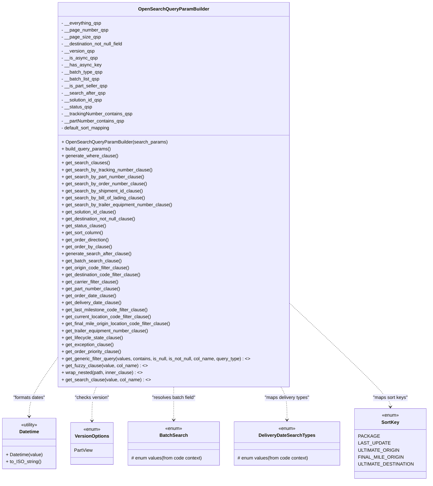

# Diagram: partview_service/partview_service/core/business/open_search/OpenSearchQueryParamBuilder.py

> Auto-generated by Obscura crawlers

## Mermaid

### SVG

<svg id="container" width="1445.5625" xmlns="http://www.w3.org/2000/svg" class="classDiagram" height="1650" viewBox="0 0 1445.5625 1650" role="graphics-document document" aria-roledescription="class"><g><defs><marker id="container_class-aggregationStart" class="marker aggregation class" refX="18" refY="7" markerWidth="190" markerHeight="240" orient="auto"><path d="M 18,7 L9,13 L1,7 L9,1 Z"></path></marker></defs><defs><marker id="container_class-aggregationEnd" class="marker aggregation class" refX="1" refY="7" markerWidth="20" markerHeight="28" orient="auto"><path d="M 18,7 L9,13 L1,7 L9,1 Z"></path></marker></defs><defs><marker id="container_class-extensionStart" class="marker extension class" refX="18" refY="7" markerWidth="190" markerHeight="240" orient="auto"><path d="M 1,7 L18,13 V 1 Z"></path></marker></defs><defs><marker id="container_class-extensionEnd" class="marker extension class" refX="1" refY="7" markerWidth="20" markerHeight="28" orient="auto"><path d="M 1,1 V 13 L18,7 Z"></path></marker></defs><defs><marker id="container_class-compositionStart" class="marker composition class" refX="18" refY="7" markerWidth="190" markerHeight="240" orient="auto"><path d="M 18,7 L9,13 L1,7 L9,1 Z"></path></marker></defs><defs><marker id="container_class-compositionEnd" class="marker composition class" refX="1" refY="7" markerWidth="20" markerHeight="28" orient="auto"><path d="M 18,7 L9,13 L1,7 L9,1 Z"></path></marker></defs><defs><marker id="container_class-dependencyStart" class="marker dependency class" refX="6" refY="7" markerWidth="190" markerHeight="240" orient="auto"><path d="M 5,7 L9,13 L1,7 L9,1 Z"></path></marker></defs><defs><marker id="container_class-dependencyEnd" class="marker dependency class" refX="13" refY="7" markerWidth="20" markerHeight="28" orient="auto"><path d="M 18,7 L9,13 L14,7 L9,1 Z"></path></marker></defs><defs><marker id="container_class-lollipopStart" class="marker lollipop class" refX="13" refY="7" markerWidth="190" markerHeight="240" orient="auto"><circle stroke="black" fill="transparent" cx="7" cy="7" r="6"></circle></marker></defs><defs><marker id="container_class-lollipopEnd" class="marker lollipop class" refX="1" refY="7" markerWidth="190" markerHeight="240" orient="auto"><circle stroke="black" fill="transparent" cx="7" cy="7" r="6"></circle></marker></defs><g class="root"><g class="clusters"></g><g class="edgePaths"><path d="M196.285,1229.304L180.296,1251.92C164.306,1274.536,132.327,1319.768,116.337,1353.051C100.348,1386.333,100.348,1407.667,100.348,1418.333L100.348,1429" id="id_OpenSearchQueryParamBuilder_Datetime_1" class="edge-thickness-normal edge-pattern-dashed relation" style=";;;" data-edge="true" data-et="edge" data-id="id_OpenSearchQueryParamBuilder_Datetime_1" data-points="W3sieCI6MTk2LjI4NTE1NjI1LCJ5IjoxMjI5LjMwNDAxNDIwNTA4NTl9LHsieCI6MTAwLjM0NzY1NjI1LCJ5IjoxMzY1fSx7IngiOjEwMC4zNDc2NTYyNSwieSI6MTQzNX1d" marker-end="url(#container_class-dependencyEnd)"></path><path d="M328.903,1328L326.434,1334.167C323.965,1340.333,319.027,1352.667,316.559,1372C314.09,1391.333,314.09,1417.667,314.09,1430.833L314.09,1444" id="id_OpenSearchQueryParamBuilder_VersionOptions_2" class="edge-thickness-normal edge-pattern-dashed relation" style=";;;" data-edge="true" data-et="edge" data-id="id_OpenSearchQueryParamBuilder_VersionOptions_2" data-points="W3sieCI6MzI4LjkwMjUzNDI5ODc4MDUsInkiOjEzMjh9LHsieCI6MzE0LjA4OTg0Mzc1LCJ5IjoxMzY1fSx7IngiOjMxNC4wODk4NDM3NSwieSI6MTQ1MH1d" marker-end="url(#container_class-dependencyEnd)"></path><path d="M593.129,1328L593.129,1334.167C593.129,1340.333,593.129,1352.667,593.129,1371.5C593.129,1390.333,593.129,1415.667,593.129,1428.333L593.129,1441" id="id_OpenSearchQueryParamBuilder_BatchSearch_3" class="edge-thickness-normal edge-pattern-dashed relation" style=";;;" data-edge="true" data-et="edge" data-id="id_OpenSearchQueryParamBuilder_BatchSearch_3" data-points="W3sieCI6NTkzLjEyODkwNjI1LCJ5IjoxMzI4fSx7IngiOjU5My4xMjg5MDYyNSwieSI6MTM2NX0seyJ4Ijo1OTMuMTI4OTA2MjUsInkiOjE0NDd9XQ==" marker-end="url(#container_class-dependencyEnd)"></path><path d="M961.479,1328L964.921,1334.167C968.362,1340.333,975.246,1352.667,978.687,1371.5C982.129,1390.333,982.129,1415.667,982.129,1428.333L982.129,1441" id="id_OpenSearchQueryParamBuilder_DeliveryDateSearchTypes_4" class="edge-thickness-normal edge-pattern-dashed relation" style=";;;" data-edge="true" data-et="edge" data-id="id_OpenSearchQueryParamBuilder_DeliveryDateSearchTypes_4" data-points="W3sieCI6OTYxLjQ3ODk3Nzk4NjAxMTUsInkiOjEzMjh9LHsieCI6OTgyLjEyODkwNjI1LCJ5IjoxMzY1fSx7IngiOjk4Mi4xMjg5MDYyNSwieSI6MTQ0N31d" marker-end="url(#container_class-dependencyEnd)"></path><path d="M989.973,1045.665L1045.898,1098.888C1101.823,1152.11,1213.673,1258.555,1269.598,1316.944C1325.523,1375.333,1325.523,1385.667,1325.523,1390.833L1325.523,1396" id="id_OpenSearchQueryParamBuilder_SortKey_5" class="edge-thickness-normal edge-pattern-dashed relation" style=";;;" data-edge="true" data-et="edge" data-id="id_OpenSearchQueryParamBuilder_SortKey_5" data-points="W3sieCI6OTg5Ljk3MjY1NjI1LCJ5IjoxMDQ1LjY2NTQyNzUwOTI5Mzd9LHsieCI6MTMyNS41MjM0Mzc1LCJ5IjoxMzY1fSx7IngiOjEzMjUuNTIzNDM3NSwieSI6MTQwMn1d" marker-end="url(#container_class-dependencyEnd)"></path></g><g class="edgeLabels"><g class="edgeLabel" transform="translate(100.34765625, 1365)"><g class="label" data-id="id_OpenSearchQueryParamBuilder_Datetime_1" transform="translate(-56.578125, -12)"><foreignObject width="113.15625" height="24">

"formats dates"

</foreignObject></g></g><g class="edgeLabel" transform="translate(314.08984375, 1365)"><g class="label" data-id="id_OpenSearchQueryParamBuilder_VersionOptions_2" transform="translate(-59.421875, -12)"><foreignObject width="118.84375" height="24">

"checks version"

</foreignObject></g></g><g class="edgeLabel" transform="translate(593.12890625, 1365)"><g class="label" data-id="id_OpenSearchQueryParamBuilder_BatchSearch_3" transform="translate(-76.859375, -12)"><foreignObject width="153.71875" height="24">

"resolves batch field"

</foreignObject></g></g><g class="edgeLabel" transform="translate(982.12890625, 1365)"><g class="label" data-id="id_OpenSearchQueryParamBuilder_DeliveryDateSearchTypes_4" transform="translate(-78.8671875, -12)"><foreignObject width="157.734375" height="24">

"maps delivery types"

</foreignObject></g></g><g class="edgeLabel" transform="translate(1325.5234375, 1365)"><g class="label" data-id="id_OpenSearchQueryParamBuilder_SortKey_5" transform="translate(-60.5546875, -12)"><foreignObject width="121.109375" height="24">

"maps sort keys"

</foreignObject></g></g></g><g class="nodes"><g class="node default" id="classId-OpenSearchQueryParamBuilder-0" transform="translate(593.12890625, 668)"><g class="basic label-container"><path d="M-396.84375 -660 L396.84375 -660 L396.84375 660 L-396.84375 660" stroke="none" stroke-width="0" fill="#ECECFF" style=""></path><path d="M-396.84375 -660 C-195.4288420073561 -660, 5.98606598528778 -660, 396.84375 -660 M-396.84375 -660 C-141.0222301284396 -660, 114.79928974312082 -660, 396.84375 -660 M396.84375 -660 C396.84375 -364.3498303372421, 396.84375 -68.69966067448422, 396.84375 660 M396.84375 -660 C396.84375 -378.2537527397758, 396.84375 -96.50750547955158, 396.84375 660 M396.84375 660 C155.8597740196715 660, -85.12420196065699 660, -396.84375 660 M396.84375 660 C110.2972801228704 660, -176.2491897542592 660, -396.84375 660 M-396.84375 660 C-396.84375 230.60620219233152, -396.84375 -198.78759561533695, -396.84375 -660 M-396.84375 660 C-396.84375 388.4143170939145, -396.84375 116.82863418782904, -396.84375 -660" stroke="#9370DB" stroke-width="1.3" fill="none" stroke-dasharray="0 0" style=""></path></g><g class="annotation-group text" transform="translate(0, -636)"></g><g class="label-group text" transform="translate(-115.28125, -636)"><g class="label" style="font-weight: bolder" transform="translate(0,-12)"><foreignObject width="230.5625" height="24">

OpenSearchQueryParamBuilder

</foreignObject></g></g><g class="members-group text" transform="translate(-384.84375, -588)"><g class="label" style="" transform="translate(0,-12)"><foreignObject width="138.0625" height="24">

- __everything_qsp

</foreignObject></g><g class="label" style="" transform="translate(0,12)"><foreignObject width="159.90625" height="24">

- __page_number_qsp

</foreignObject></g><g class="label" style="" transform="translate(0,36)"><foreignObject width="131.65625" height="24">

- __page_size_qsp

</foreignObject></g><g class="label" style="" transform="translate(0,60)"><foreignObject width="219.28125" height="24">

- __destination_not_null_field

</foreignObject></g><g class="label" style="" transform="translate(0,84)"><foreignObject width="114.40625" height="24">

- __version_qsp

</foreignObject></g><g class="label" style="" transform="translate(0,108)"><foreignObject width="122.03125" height="24">

- __is_async_qsp

</foreignObject></g><g class="label" style="" transform="translate(0,132)"><foreignObject width="133.78125" height="24">

- __has_async_key

</foreignObject></g><g class="label" style="" transform="translate(0,156)"><foreignObject width="141.796875" height="24">

- __batch_type_qsp

</foreignObject></g><g class="label" style="" transform="translate(0,180)"><foreignObject width="132.9375" height="24">

- __batch_list_qsp

</foreignObject></g><g class="label" style="" transform="translate(0,204)"><foreignObject width="159.125" height="24">

- __is_part_seller_qsp

</foreignObject></g><g class="label" style="" transform="translate(0,228)"><foreignObject width="150.390625" height="24">

- __search_after_qsp

</foreignObject></g><g class="label" style="" transform="translate(0,252)"><foreignObject width="143.9375" height="24">

- __solution_id_qsp

</foreignObject></g><g class="label" style="" transform="translate(0,276)"><foreignObject width="105.796875" height="24">

- __status_qsp

</foreignObject></g><g class="label" style="" transform="translate(0,300)"><foreignObject width="246.078125" height="24">

- __trackingNumber_contains_qsp

</foreignObject></g><g class="label" style="" transform="translate(0,324)"><foreignObject width="218.25" height="24">

- __partNumber_contains_qsp

</foreignObject></g><g class="label" style="" transform="translate(0,348)"><foreignObject width="171.515625" height="24">

- default_sort_mapping

</foreignObject></g></g><g class="methods-group text" transform="translate(-384.84375, -180)"><g class="label" style="" transform="translate(0,-12)"><foreignObject width="360.21875" height="24">

+ OpenSearchQueryParamBuilder(search_params)

</foreignObject></g><g class="label" style="" transform="translate(0,12)"><foreignObject width="171.140625" height="24">

+ build_query_params()

</foreignObject></g><g class="label" style="" transform="translate(0,36)"><foreignObject width="191.859375" height="24">

+ generate_where_clause()

</foreignObject></g><g class="label" style="" transform="translate(0,60)"><foreignObject width="162.875" height="24">

+ get_search_clauses()

</foreignObject></g><g class="label" style="" transform="translate(0,84)"><foreignObject width="310.59375" height="24">

+ get_search_by_tracking_number_clause()

</foreignObject></g><g class="label" style="" transform="translate(0,108)"><foreignObject width="282.71875" height="24">

+ get_search_by_part_number_clause()

</foreignObject></g><g class="label" style="" transform="translate(0,132)"><foreignObject width="290.609375" height="24">

+ get_search_by_order_number_clause()

</foreignObject></g><g class="label" style="" transform="translate(0,156)"><foreignObject width="279.71875" height="24">

+ get_search_by_shipment_id_clause()

</foreignObject></g><g class="label" style="" transform="translate(0,180)"><foreignObject width="287.796875" height="24">

+ get_search_by_bill_of_lading_clause()

</foreignObject></g><g class="label" style="" transform="translate(0,204)"><foreignObject width="382.421875" height="24">

+ get_search_by_trailer_equipment_number_clause()

</foreignObject></g><g class="label" style="" transform="translate(0,228)"><foreignObject width="190.171875" height="24">

+ get_solution_id_clause()

</foreignObject></g><g class="label" style="" transform="translate(0,252)"><foreignObject width="259.953125" height="24">

+ get_destination_not_null_clause()

</foreignObject></g><g class="label" style="" transform="translate(0,276)"><foreignObject width="152.03125" height="24">

+ get_status_clause()

</foreignObject></g><g class="label" style="" transform="translate(0,300)"><foreignObject width="144.015625" height="24">

+ get_sort_column()

</foreignObject></g><g class="label" style="" transform="translate(0,324)"><foreignObject width="164.53125" height="24">

+ get_order_direction()

</foreignObject></g><g class="label" style="" transform="translate(0,348)"><foreignObject width="171" height="24">

+ get_order_by_clause()

</foreignObject></g><g class="label" style="" transform="translate(0,372)"><foreignObject width="237.1875" height="24">

+ generate_search_after_clause()

</foreignObject></g><g class="label" style="" transform="translate(0,396)"><foreignObject width="204.328125" height="24">

+ get_batch_search_clause()

</foreignObject></g><g class="label" style="" transform="translate(0,420)"><foreignObject width="233.546875" height="24">

+ get_origin_code_filter_clause()

</foreignObject></g><g class="label" style="" transform="translate(0,444)"><foreignObject width="274.4375" height="24">

+ get_destination_code_filter_clause()

</foreignObject></g><g class="label" style="" transform="translate(0,468)"><foreignObject width="195.34375" height="24">

+ get_carrier_filter_clause()

</foreignObject></g><g class="label" style="" transform="translate(0,492)"><foreignObject width="201.78125" height="24">

+ get_part_number_clause()

</foreignObject></g><g class="label" style="" transform="translate(0,516)"><foreignObject width="186.0625" height="24">

+ get_order_date_clause()

</foreignObject></g><g class="label" style="" transform="translate(0,540)"><foreignObject width="205.421875" height="24">

+ get_delivery_date_clause()

</foreignObject></g><g class="label" style="" transform="translate(0,564)"><foreignObject width="297.859375" height="24">

+ get_last_milestone_code_filter_clause()

</foreignObject></g><g class="label" style="" transform="translate(0,588)"><foreignObject width="311.15625" height="24">

+ get_current_location_code_filter_clause()

</foreignObject></g><g class="label" style="" transform="translate(0,612)"><foreignObject width="380.21875" height="24">

+ get_final_mile_origin_location_code_filter_clause()

</foreignObject></g><g class="label" style="" transform="translate(0,636)"><foreignObject width="301.5" height="24">

+ get_trailer_equipment_number_clause()

</foreignObject></g><g class="label" style="" transform="translate(0,660)"><foreignObject width="211.109375" height="24">

+ get_lifecycle_state_clause()

</foreignObject></g><g class="label" style="" transform="translate(0,684)"><foreignObject width="178.375" height="24">

+ get_exception_clause()

</foreignObject></g><g class="label" style="" transform="translate(0,708)"><foreignObject width="207.484375" height="24">

+ get_order_priority_clause()

</foreignObject></g><g class="label" style="" transform="translate(0,732)"><foreignObject width="654.40625" height="24">

+ get_generic_filter_query(values, contains, is_null, is_not_null, col_name, query_type) : &lt;&gt;

</foreignObject></g><g class="label" style="" transform="translate(0,756)"><foreignObject width="288.984375" height="24">

+ get_fuzzy_clause(value, col_name) : &lt;&gt;

</foreignObject></g><g class="label" style="" transform="translate(0,780)"><foreignObject width="276.234375" height="24">

+ wrap_nested(path, inner_clause) : &lt;&gt;

</foreignObject></g><g class="label" style="" transform="translate(0,804)"><foreignObject width="300.71875" height="24">

+ get_search_clause(value, col_name) : &lt;&gt;

</foreignObject></g></g><g class="divider" style=""><path d="M-396.84375 -612 C-183.22519044228116 -612, 30.39336911543768 -612, 396.84375 -612 M-396.84375 -612 C-163.2789083939991 -612, 70.2859332120018 -612, 396.84375 -612" stroke="#9370DB" stroke-width="1.3" fill="none" stroke-dasharray="0 0" style=""></path></g><g class="divider" style=""><path d="M-396.84375 -204 C-158.98495184608456 -204, 78.87384630783089 -204, 396.84375 -204 M-396.84375 -204 C-109.48688906041531 -204, 177.86997187916938 -204, 396.84375 -204" stroke="#9370DB" stroke-width="1.3" fill="none" stroke-dasharray="0 0" style=""></path></g></g><g class="node default" id="classId-Datetime-1" transform="translate(100.34765625, 1522)"><g class="basic label-container"><path d="M-92.34765625 -87 L92.34765625 -87 L92.34765625 87 L-92.34765625 87" stroke="none" stroke-width="0" fill="#ECECFF" style=""></path><path d="M-92.34765625 -87 C-22.272462361137244 -87, 47.80273152772551 -87, 92.34765625 -87 M-92.34765625 -87 C-30.973252471577354 -87, 30.401151306845293 -87, 92.34765625 -87 M92.34765625 -87 C92.34765625 -22.08897401706065, 92.34765625 42.8220519658787, 92.34765625 87 M92.34765625 -87 C92.34765625 -24.335566768874322, 92.34765625 38.328866462251355, 92.34765625 87 M92.34765625 87 C22.242105044037828 87, -47.863446161924344 87, -92.34765625 87 M92.34765625 87 C29.21936752707942 87, -33.90892119584116 87, -92.34765625 87 M-92.34765625 87 C-92.34765625 38.62966786293482, -92.34765625 -9.740664274130367, -92.34765625 -87 M-92.34765625 87 C-92.34765625 41.832398491161264, -92.34765625 -3.335203017677472, -92.34765625 -87" stroke="#9370DB" stroke-width="1.3" fill="none" stroke-dasharray="0 0" style=""></path></g><g class="annotation-group text" transform="translate(-30.3125, -63)"><g class="label" style="" transform="translate(0,-12)"><foreignObject width="60.625" height="24">

«utility»

</foreignObject></g></g><g class="label-group text" transform="translate(-33.3984375, -39)"><g class="label" style="font-weight: bolder" transform="translate(0,-12)"><foreignObject width="66.796875" height="24">

Datetime

</foreignObject></g></g><g class="members-group text" transform="translate(-80.34765625, 9)"></g><g class="methods-group text" transform="translate(-80.34765625, 39)"><g class="label" style="" transform="translate(0,-12)"><foreignObject width="127.296875" height="24">

+ Datetime(value)

</foreignObject></g><g class="label" style="" transform="translate(0,12)"><foreignObject width="119.296875" height="24">

+ to_ISO_string()

</foreignObject></g></g><g class="divider" style=""><path d="M-92.34765625 -15 C-29.690204366878163 -15, 32.967247516243674 -15, 92.34765625 -15 M-92.34765625 -15 C-30.116295662028804 -15, 32.11506492594239 -15, 92.34765625 -15" stroke="#9370DB" stroke-width="1.3" fill="none" stroke-dasharray="0 0" style=""></path></g><g class="divider" style=""><path d="M-92.34765625 9 C-21.56860534124104 9, 49.21044556751792 9, 92.34765625 9 M-92.34765625 9 C-41.84516116196086 9, 8.65733392607828 9, 92.34765625 9" stroke="#9370DB" stroke-width="1.3" fill="none" stroke-dasharray="0 0" style=""></path></g></g><g class="node default" id="classId-VersionOptions-2" transform="translate(314.08984375, 1522)"><g class="basic label-container"><path d="M-71.39453125 -72 L71.39453125 -72 L71.39453125 72 L-71.39453125 72" stroke="none" stroke-width="0" fill="#ECECFF" style=""></path><path d="M-71.39453125 -72 C-35.88358679572999 -72, -0.3726423414599793 -72, 71.39453125 -72 M-71.39453125 -72 C-25.982467123912848 -72, 19.429597002174305 -72, 71.39453125 -72 M71.39453125 -72 C71.39453125 -31.89017379760905, 71.39453125 8.219652404781897, 71.39453125 72 M71.39453125 -72 C71.39453125 -42.51597286713884, 71.39453125 -13.031945734277684, 71.39453125 72 M71.39453125 72 C32.68243837200237 72, -6.0296545059952535 72, -71.39453125 72 M71.39453125 72 C40.353022160243185 72, 9.311513070486363 72, -71.39453125 72 M-71.39453125 72 C-71.39453125 17.34593192663793, -71.39453125 -37.30813614672414, -71.39453125 -72 M-71.39453125 72 C-71.39453125 19.2847100741277, -71.39453125 -33.4305798517446, -71.39453125 -72" stroke="#9370DB" stroke-width="1.3" fill="none" stroke-dasharray="0 0" style=""></path></g><g class="annotation-group text" transform="translate(-29.53125, -48)"><g class="label" style="" transform="translate(0,-12)"><foreignObject width="59.0625" height="24">

«enum»

</foreignObject></g></g><g class="label-group text" transform="translate(-56.1015625, -24)"><g class="label" style="font-weight: bolder" transform="translate(0,-12)"><foreignObject width="112.203125" height="24">

VersionOptions

</foreignObject></g></g><g class="members-group text" transform="translate(-59.39453125, 24)"><g class="label" style="" transform="translate(0,-12)"><foreignObject width="62.6875" height="24">

PartView

</foreignObject></g></g><g class="methods-group text" transform="translate(-59.39453125, 72)"></g><g class="divider" style=""><path d="M-71.39453125 0 C-20.089514912797107 0, 31.215501424405787 0, 71.39453125 0 M-71.39453125 0 C-25.310315874849564 0, 20.77389950030087 0, 71.39453125 0" stroke="#9370DB" stroke-width="1.3" fill="none" stroke-dasharray="0 0" style=""></path></g><g class="divider" style=""><path d="M-71.39453125 48 C-22.951913296221328 48, 25.490704657557345 48, 71.39453125 48 M-71.39453125 48 C-38.10781854848234 48, -4.821105846964684 48, 71.39453125 48" stroke="#9370DB" stroke-width="1.3" fill="none" stroke-dasharray="0 0" style=""></path></g></g><g class="node default" id="classId-BatchSearch-3" transform="translate(593.12890625, 1522)"><g class="basic label-container"><path d="M-157.64453125 -75 L157.64453125 -75 L157.64453125 75 L-157.64453125 75" stroke="none" stroke-width="0" fill="#ECECFF" style=""></path><path d="M-157.64453125 -75 C-75.76399795051618 -75, 6.116535348967631 -75, 157.64453125 -75 M-157.64453125 -75 C-69.71554378120136 -75, 18.213443687597277 -75, 157.64453125 -75 M157.64453125 -75 C157.64453125 -39.85203543931692, 157.64453125 -4.704070878633843, 157.64453125 75 M157.64453125 -75 C157.64453125 -41.066719352811084, 157.64453125 -7.133438705622169, 157.64453125 75 M157.64453125 75 C68.44542457257533 75, -20.753682104849332 75, -157.64453125 75 M157.64453125 75 C62.829981863068696 75, -31.98456752386261 75, -157.64453125 75 M-157.64453125 75 C-157.64453125 37.64897321166792, -157.64453125 0.2979464233358442, -157.64453125 -75 M-157.64453125 75 C-157.64453125 33.21529957457209, -157.64453125 -8.569400850855814, -157.64453125 -75" stroke="#9370DB" stroke-width="1.3" fill="none" stroke-dasharray="0 0" style=""></path></g><g class="annotation-group text" transform="translate(-29.53125, -51)"><g class="label" style="" transform="translate(0,-12)"><foreignObject width="59.0625" height="24">

«enum»

</foreignObject></g></g><g class="label-group text" transform="translate(-45.4296875, -27)"><g class="label" style="font-weight: bolder" transform="translate(0,-12)"><foreignObject width="90.859375" height="24">

BatchSearch

</foreignObject></g></g><g class="members-group text" transform="translate(-145.64453125, 21)"></g><g class="methods-group text" transform="translate(-145.64453125, 51)"><g class="label" style="" transform="translate(0,-12)"><foreignObject width="245.859375" height="24">

# enum values(from code context)

</foreignObject></g></g><g class="divider" style=""><path d="M-157.64453125 -3 C-43.192089284977584 -3, 71.26035268004483 -3, 157.64453125 -3 M-157.64453125 -3 C-51.532738106256886 -3, 54.57905503748623 -3, 157.64453125 -3" stroke="#9370DB" stroke-width="1.3" fill="none" stroke-dasharray="0 0" style=""></path></g><g class="divider" style=""><path d="M-157.64453125 21 C-39.62014802116036 21, 78.40423520767928 21, 157.64453125 21 M-157.64453125 21 C-86.0662225751042 21, -14.487913900208412 21, 157.64453125 21" stroke="#9370DB" stroke-width="1.3" fill="none" stroke-dasharray="0 0" style=""></path></g></g><g class="node default" id="classId-DeliveryDateSearchTypes-4" transform="translate(982.12890625, 1522)"><g class="basic label-container"><path d="M-181.35546875 -75 L181.35546875 -75 L181.35546875 75 L-181.35546875 75" stroke="none" stroke-width="0" fill="#ECECFF" style=""></path><path d="M-181.35546875 -75 C-60.24571828444283 -75, 60.86403218111434 -75, 181.35546875 -75 M-181.35546875 -75 C-48.683219045697086 -75, 83.98903065860583 -75, 181.35546875 -75 M181.35546875 -75 C181.35546875 -26.833731437676157, 181.35546875 21.332537124647686, 181.35546875 75 M181.35546875 -75 C181.35546875 -36.7887804173823, 181.35546875 1.422439165235403, 181.35546875 75 M181.35546875 75 C68.7637139079009 75, -43.828040934198214 75, -181.35546875 75 M181.35546875 75 C101.74843777166231 75, 22.14140679332462 75, -181.35546875 75 M-181.35546875 75 C-181.35546875 35.28282404109845, -181.35546875 -4.434351917803099, -181.35546875 -75 M-181.35546875 75 C-181.35546875 23.220130343887305, -181.35546875 -28.55973931222539, -181.35546875 -75" stroke="#9370DB" stroke-width="1.3" fill="none" stroke-dasharray="0 0" style=""></path></g><g class="annotation-group text" transform="translate(-29.53125, -51)"><g class="label" style="" transform="translate(0,-12)"><foreignObject width="59.0625" height="24">

«enum»

</foreignObject></g></g><g class="label-group text" transform="translate(-92.8515625, -27)"><g class="label" style="font-weight: bolder" transform="translate(0,-12)"><foreignObject width="185.703125" height="24">

DeliveryDateSearchTypes

</foreignObject></g></g><g class="members-group text" transform="translate(-169.35546875, 21)"></g><g class="methods-group text" transform="translate(-169.35546875, 51)"><g class="label" style="" transform="translate(0,-12)"><foreignObject width="245.859375" height="24">

# enum values(from code context)

</foreignObject></g></g><g class="divider" style=""><path d="M-181.35546875 -3 C-92.37476869013769 -3, -3.3940686302753704 -3, 181.35546875 -3 M-181.35546875 -3 C-95.82974650355536 -3, -10.304024257110711 -3, 181.35546875 -3" stroke="#9370DB" stroke-width="1.3" fill="none" stroke-dasharray="0 0" style=""></path></g><g class="divider" style=""><path d="M-181.35546875 21 C-92.9515806495949 21, -4.547692549189804 21, 181.35546875 21 M-181.35546875 21 C-58.33412160384046 21, 64.68722554231908 21, 181.35546875 21" stroke="#9370DB" stroke-width="1.3" fill="none" stroke-dasharray="0 0" style=""></path></g></g><g class="node default" id="classId-SortKey-5" transform="translate(1325.5234375, 1522)"><g class="basic label-container"><path d="M-112.0390625 -120 L112.0390625 -120 L112.0390625 120 L-112.0390625 120" stroke="none" stroke-width="0" fill="#ECECFF" style=""></path><path d="M-112.0390625 -120 C-39.21562983574499 -120, 33.60780282851002 -120, 112.0390625 -120 M-112.0390625 -120 C-39.51088024369713 -120, 33.01730201260574 -120, 112.0390625 -120 M112.0390625 -120 C112.0390625 -57.05717045179242, 112.0390625 5.885659096415154, 112.0390625 120 M112.0390625 -120 C112.0390625 -61.19766683679849, 112.0390625 -2.39533367359698, 112.0390625 120 M112.0390625 120 C62.59254922740566 120, 13.146035954811325 120, -112.0390625 120 M112.0390625 120 C41.206449853148484 120, -29.62616279370303 120, -112.0390625 120 M-112.0390625 120 C-112.0390625 57.67675801711262, -112.0390625 -4.646483965774763, -112.0390625 -120 M-112.0390625 120 C-112.0390625 41.09245933768163, -112.0390625 -37.815081324636736, -112.0390625 -120" stroke="#9370DB" stroke-width="1.3" fill="none" stroke-dasharray="0 0" style=""></path></g><g class="annotation-group text" transform="translate(-29.53125, -96)"><g class="label" style="" transform="translate(0,-12)"><foreignObject width="59.0625" height="24">

«enum»

</foreignObject></g></g><g class="label-group text" transform="translate(-28.9609375, -72)"><g class="label" style="font-weight: bolder" transform="translate(0,-12)"><foreignObject width="57.921875" height="24">

SortKey

</foreignObject></g></g><g class="members-group text" transform="translate(-100.0390625, -24)"><g class="label" style="" transform="translate(0,-12)"><foreignObject width="63.40625" height="24">

PACKAGE

</foreignObject></g><g class="label" style="" transform="translate(0,12)"><foreignObject width="96.0625" height="24">

LAST_UPDATE

</foreignObject></g><g class="label" style="" transform="translate(0,36)"><foreignObject width="126.78125" height="24">

ULTIMATE_ORIGIN

</foreignObject></g><g class="label" style="" transform="translate(0,60)"><foreignObject width="141.5625" height="24">

FINAL_MILE_ORIGIN

</foreignObject></g><g class="label" style="" transform="translate(0,84)"><foreignObject width="170.546875" height="24">

ULTIMATE_DESTINATION

</foreignObject></g></g><g class="methods-group text" transform="translate(-100.0390625, 120)"></g><g class="divider" style=""><path d="M-112.0390625 -48 C-42.92429597592151 -48, 26.19047054815698 -48, 112.0390625 -48 M-112.0390625 -48 C-28.427862166888403 -48, 55.183338166223194 -48, 112.0390625 -48" stroke="#9370DB" stroke-width="1.3" fill="none" stroke-dasharray="0 0" style=""></path></g><g class="divider" style=""><path d="M-112.0390625 96 C-55.26885255720941 96, 1.501357385581187 96, 112.0390625 96 M-112.0390625 96 C-36.59340990735963 96, 38.85224268528074 96, 112.0390625 96" stroke="#9370DB" stroke-width="1.3" fill="none" stroke-dasharray="0 0" style=""></path></g></g></g></g></g></svg>
