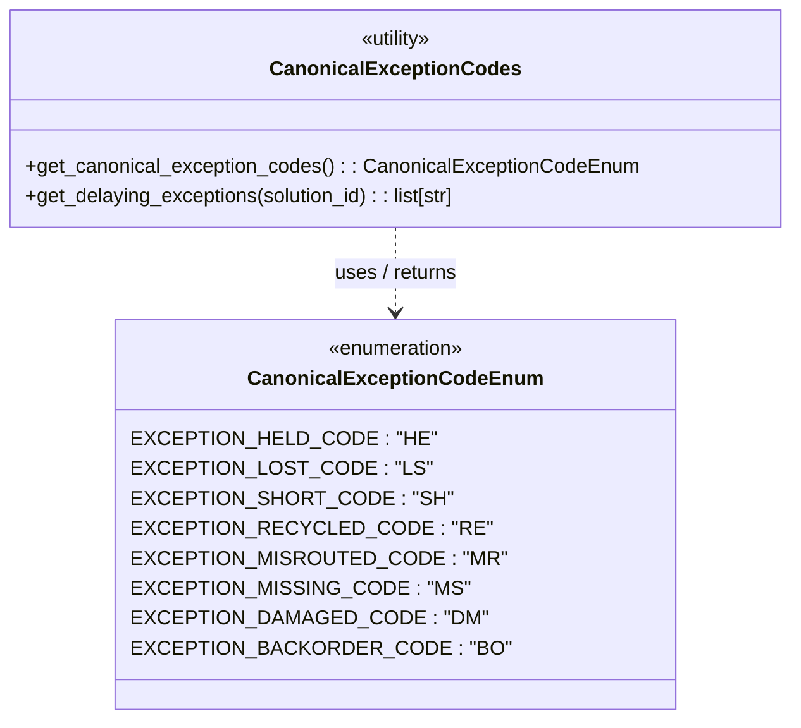

# Diagram: partview_service/partview_service/core/business/package_container/CanonicalExceptionCodes.py

> Auto-generated by Obscura crawlers

## Mermaid

### SVG

<svg id="container" width="620.0625" xmlns="http://www.w3.org/2000/svg" class="classDiagram" height="576" viewBox="0 0 620.0625 576" role="graphics-document document" aria-roledescription="class"><g><defs><marker id="container_class-aggregationStart" class="marker aggregation class" refX="18" refY="7" markerWidth="190" markerHeight="240" orient="auto"><path d="M 18,7 L9,13 L1,7 L9,1 Z"></path></marker></defs><defs><marker id="container_class-aggregationEnd" class="marker aggregation class" refX="1" refY="7" markerWidth="20" markerHeight="28" orient="auto"><path d="M 18,7 L9,13 L1,7 L9,1 Z"></path></marker></defs><defs><marker id="container_class-extensionStart" class="marker extension class" refX="18" refY="7" markerWidth="190" markerHeight="240" orient="auto"><path d="M 1,7 L18,13 V 1 Z"></path></marker></defs><defs><marker id="container_class-extensionEnd" class="marker extension class" refX="1" refY="7" markerWidth="20" markerHeight="28" orient="auto"><path d="M 1,1 V 13 L18,7 Z"></path></marker></defs><defs><marker id="container_class-compositionStart" class="marker composition class" refX="18" refY="7" markerWidth="190" markerHeight="240" orient="auto"><path d="M 18,7 L9,13 L1,7 L9,1 Z"></path></marker></defs><defs><marker id="container_class-compositionEnd" class="marker composition class" refX="1" refY="7" markerWidth="20" markerHeight="28" orient="auto"><path d="M 18,7 L9,13 L1,7 L9,1 Z"></path></marker></defs><defs><marker id="container_class-dependencyStart" class="marker dependency class" refX="6" refY="7" markerWidth="190" markerHeight="240" orient="auto"><path d="M 5,7 L9,13 L1,7 L9,1 Z"></path></marker></defs><defs><marker id="container_class-dependencyEnd" class="marker dependency class" refX="13" refY="7" markerWidth="20" markerHeight="28" orient="auto"><path d="M 18,7 L9,13 L14,7 L9,1 Z"></path></marker></defs><defs><marker id="container_class-lollipopStart" class="marker lollipop class" refX="13" refY="7" markerWidth="190" markerHeight="240" orient="auto"><circle stroke="black" fill="transparent" cx="7" cy="7" r="6"></circle></marker></defs><defs><marker id="container_class-lollipopEnd" class="marker lollipop class" refX="1" refY="7" markerWidth="190" markerHeight="240" orient="auto"><circle stroke="black" fill="transparent" cx="7" cy="7" r="6"></circle></marker></defs><g class="root"><g class="clusters"></g><g class="edgePaths"><path d="M310.031,182L310.031,188.167C310.031,194.333,310.031,206.667,310.031,218C310.031,229.333,310.031,239.667,310.031,244.833L310.031,250" id="id_CanonicalExceptionCodes_CanonicalExceptionCodeEnum_1" class="edge-thickness-normal edge-pattern-dashed relation" style=";;;" data-edge="true" data-et="edge" data-id="id_CanonicalExceptionCodes_CanonicalExceptionCodeEnum_1" data-points="W3sieCI6MzEwLjAzMTI1LCJ5IjoxODJ9LHsieCI6MzEwLjAzMTI1LCJ5IjoyMTl9LHsieCI6MzEwLjAzMTI1LCJ5IjoyNTZ9XQ==" marker-end="url(#container_class-dependencyEnd)"></path></g><g class="edgeLabels"><g class="edgeLabel" transform="translate(310.03125, 219)"><g class="label" data-id="id_CanonicalExceptionCodes_CanonicalExceptionCodeEnum_1" transform="translate(-51.15625, -12)"><foreignObject width="102.3125" height="24">

uses / returns

</foreignObject></g></g></g><g class="nodes"><g class="node default" id="classId-CanonicalExceptionCodeEnum-0" transform="translate(310.03125, 412)"><g class="basic label-container"><path d="M-199.28515625 -156 L199.28515625 -156 L199.28515625 156 L-199.28515625 156" stroke="none" stroke-width="0" fill="#ECECFF" style=""></path><path d="M-199.28515625 -156 C-75.48085728571273 -156, 48.32344167857454 -156, 199.28515625 -156 M-199.28515625 -156 C-117.07597724127997 -156, -34.866798232559944 -156, 199.28515625 -156 M199.28515625 -156 C199.28515625 -47.36572571319812, 199.28515625 61.268548573603766, 199.28515625 156 M199.28515625 -156 C199.28515625 -89.20673495471327, 199.28515625 -22.41346990942654, 199.28515625 156 M199.28515625 156 C57.91060774840906 156, -83.46394075318187 156, -199.28515625 156 M199.28515625 156 C79.96581611053348 156, -39.35352402893304 156, -199.28515625 156 M-199.28515625 156 C-199.28515625 43.60359006087198, -199.28515625 -68.79281987825604, -199.28515625 -156 M-199.28515625 156 C-199.28515625 43.60946038180552, -199.28515625 -68.78107923638896, -199.28515625 -156" stroke="#9370DB" stroke-width="1.3" fill="none" stroke-dasharray="0 0" style=""></path></g><g class="annotation-group text" transform="translate(-55.5546875, -132)"><g class="label" style="" transform="translate(0,-12)"><foreignObject width="111.109375" height="24">

«enumeration»

</foreignObject></g></g><g class="label-group text" transform="translate(-109.6015625, -108)"><g class="label" style="font-weight: bolder" transform="translate(0,-12)"><foreignObject width="219.203125" height="24">

CanonicalExceptionCodeEnum

</foreignObject></g></g><g class="members-group text" transform="translate(-187.28515625, -60)"><g class="label" style="" transform="translate(0,-12)"><foreignObject width="214.5625" height="24">

EXCEPTION_HELD_CODE : "HE"

</foreignObject></g><g class="label" style="" transform="translate(0,12)"><foreignObject width="208.5" height="24">

EXCEPTION_LOST_CODE : "LS"

</foreignObject></g><g class="label" style="" transform="translate(0,36)"><foreignObject width="224.84375" height="24">

EXCEPTION_SHORT_CODE : "SH"

</foreignObject></g><g class="label" style="" transform="translate(0,60)"><foreignObject width="246.484375" height="24">

EXCEPTION_RECYCLED_CODE : "RE"

</foreignObject></g><g class="label" style="" transform="translate(0,84)"><foreignObject width="263.765625" height="24">

EXCEPTION_MISROUTED_CODE : "MR"

</foreignObject></g><g class="label" style="" transform="translate(0,108)"><foreignObject width="238.984375" height="24">

EXCEPTION_MISSING_CODE : "MS"

</foreignObject></g><g class="label" style="" transform="translate(0,132)"><foreignObject width="249.78125" height="24">

EXCEPTION_DAMAGED_CODE : "DM"

</foreignObject></g><g class="label" style="" transform="translate(0,156)"><foreignObject width="264.96875" height="24">

EXCEPTION_BACKORDER_CODE : "BO"

</foreignObject></g></g><g class="methods-group text" transform="translate(-187.28515625, 156)"></g><g class="divider" style=""><path d="M-199.28515625 -84 C-101.01394517227081 -84, -2.7427340945416177 -84, 199.28515625 -84 M-199.28515625 -84 C-44.942859204589524 -84, 109.39943784082095 -84, 199.28515625 -84" stroke="#9370DB" stroke-width="1.3" fill="none" stroke-dasharray="0 0" style=""></path></g><g class="divider" style=""><path d="M-199.28515625 132 C-90.93076577076282 132, 17.423624708474364 132, 199.28515625 132 M-199.28515625 132 C-75.00511525995638 132, 49.27492573008723 132, 199.28515625 132" stroke="#9370DB" stroke-width="1.3" fill="none" stroke-dasharray="0 0" style=""></path></g></g><g class="node default" id="classId-CanonicalExceptionCodes-1" transform="translate(310.03125, 95)"><g class="basic label-container"><path d="M-302.03125 -87 L302.03125 -87 L302.03125 87 L-302.03125 87" stroke="none" stroke-width="0" fill="#ECECFF" style=""></path><path d="M-302.03125 -87 C-85.1749774953947 -87, 131.6812950092106 -87, 302.03125 -87 M-302.03125 -87 C-74.45829300955728 -87, 153.11466398088544 -87, 302.03125 -87 M302.03125 -87 C302.03125 -47.76409580751498, 302.03125 -8.528191615029954, 302.03125 87 M302.03125 -87 C302.03125 -31.7444911730095, 302.03125 23.511017653981, 302.03125 87 M302.03125 87 C147.93851832111528 87, -6.154213357769436 87, -302.03125 87 M302.03125 87 C102.76072976458306 87, -96.50979047083388 87, -302.03125 87 M-302.03125 87 C-302.03125 50.15477310182559, -302.03125 13.30954620365118, -302.03125 -87 M-302.03125 87 C-302.03125 30.11574922650385, -302.03125 -26.768501546992297, -302.03125 -87" stroke="#9370DB" stroke-width="1.3" fill="none" stroke-dasharray="0 0" style=""></path></g><g class="annotation-group text" transform="translate(-30.3125, -63)"><g class="label" style="" transform="translate(0,-12)"><foreignObject width="60.625" height="24">

«utility»

</foreignObject></g></g><g class="label-group text" transform="translate(-93.390625, -39)"><g class="label" style="font-weight: bolder" transform="translate(0,-12)"><foreignObject width="186.78125" height="24">

CanonicalExceptionCodes

</foreignObject></g></g><g class="members-group text" transform="translate(-290.03125, 9)"></g><g class="methods-group text" transform="translate(-290.03125, 39)"><g class="label" style="" transform="translate(0,-12)"><foreignObject width="486.671875" height="24">

+get_canonical_exception_codes() : : CanonicalExceptionCodeEnum

</foreignObject></g><g class="label" style="" transform="translate(0,12)"><foreignObject width="351.453125" height="24">

+get_delaying_exceptions(solution_id) : : list[str]

</foreignObject></g></g><g class="divider" style=""><path d="M-302.03125 -15 C-89.30193802222433 -15, 123.42737395555133 -15, 302.03125 -15 M-302.03125 -15 C-133.4999130664497 -15, 35.031423867100614 -15, 302.03125 -15" stroke="#9370DB" stroke-width="1.3" fill="none" stroke-dasharray="0 0" style=""></path></g><g class="divider" style=""><path d="M-302.03125 9 C-65.18584387770971 9, 171.65956224458057 9, 302.03125 9 M-302.03125 9 C-96.67844247637572 9, 108.67436504724856 9, 302.03125 9" stroke="#9370DB" stroke-width="1.3" fill="none" stroke-dasharray="0 0" style=""></path></g></g></g></g></g></svg>
