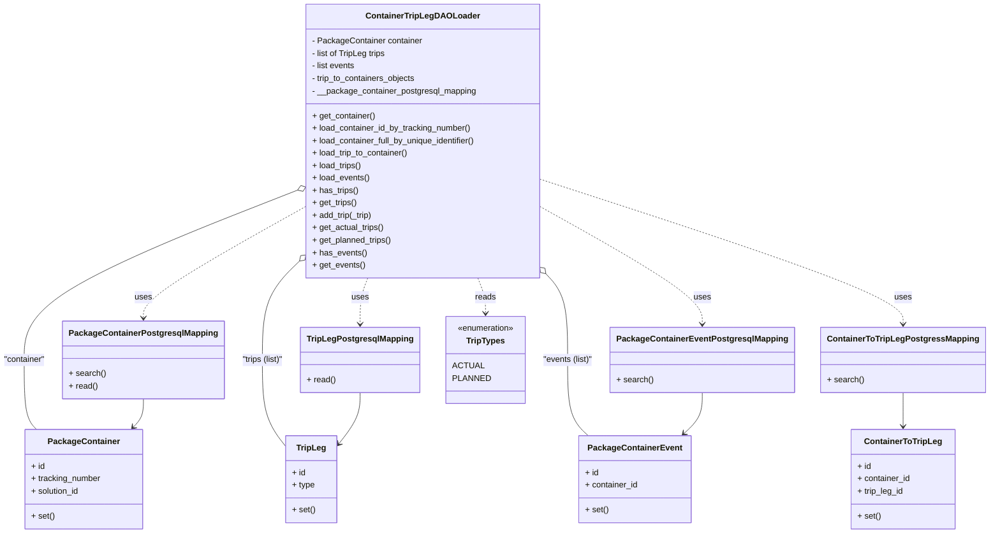

# Diagram: partview_service/partview_service/core/business/package_container/ContainerTripLegDAOLoader.py

> Auto-generated by Obscura crawlers

## Mermaid

### SVG

<svg id="container" width="1851.7109375" xmlns="http://www.w3.org/2000/svg" class="classDiagram" height="1028" viewBox="0 0 1851.7109375 1028" role="graphics-document document" aria-roledescription="class"><g><defs><marker id="container_class-aggregationStart" class="marker aggregation class" refX="18" refY="7" markerWidth="190" markerHeight="240" orient="auto"><path d="M 18,7 L9,13 L1,7 L9,1 Z"></path></marker></defs><defs><marker id="container_class-aggregationEnd" class="marker aggregation class" refX="1" refY="7" markerWidth="20" markerHeight="28" orient="auto"><path d="M 18,7 L9,13 L1,7 L9,1 Z"></path></marker></defs><defs><marker id="container_class-extensionStart" class="marker extension class" refX="18" refY="7" markerWidth="190" markerHeight="240" orient="auto"><path d="M 1,7 L18,13 V 1 Z"></path></marker></defs><defs><marker id="container_class-extensionEnd" class="marker extension class" refX="1" refY="7" markerWidth="20" markerHeight="28" orient="auto"><path d="M 1,1 V 13 L18,7 Z"></path></marker></defs><defs><marker id="container_class-compositionStart" class="marker composition class" refX="18" refY="7" markerWidth="190" markerHeight="240" orient="auto"><path d="M 18,7 L9,13 L1,7 L9,1 Z"></path></marker></defs><defs><marker id="container_class-compositionEnd" class="marker composition class" refX="1" refY="7" markerWidth="20" markerHeight="28" orient="auto"><path d="M 18,7 L9,13 L1,7 L9,1 Z"></path></marker></defs><defs><marker id="container_class-dependencyStart" class="marker dependency class" refX="6" refY="7" markerWidth="190" markerHeight="240" orient="auto"><path d="M 5,7 L9,13 L1,7 L9,1 Z"></path></marker></defs><defs><marker id="container_class-dependencyEnd" class="marker dependency class" refX="13" refY="7" markerWidth="20" markerHeight="28" orient="auto"><path d="M 18,7 L9,13 L14,7 L9,1 Z"></path></marker></defs><defs><marker id="container_class-lollipopStart" class="marker lollipop class" refX="13" refY="7" markerWidth="190" markerHeight="240" orient="auto"><circle stroke="black" fill="transparent" cx="7" cy="7" r="6"></circle></marker></defs><defs><marker id="container_class-lollipopEnd" class="marker lollipop class" refX="1" refY="7" markerWidth="190" markerHeight="240" orient="auto"><circle stroke="black" fill="transparent" cx="7" cy="7" r="6"></circle></marker></defs><g class="root"><g class="clusters"></g><g class="edgePaths"><path d="M559.666,368.283L474.545,402.402C389.423,436.522,219.18,504.761,134.059,559.047C48.938,613.333,48.938,653.667,48.938,692C48.938,730.333,48.938,766.667,52.791,789C56.644,811.333,64.35,819.667,68.203,823.833L72.056,828" id="id_ContainerTripLegDAOLoader_PackageContainer_1" class="edge-thickness-normal edge-pattern-solid relation" style=";;;" data-edge="true" data-et="edge" data-id="id_ContainerTripLegDAOLoader_PackageContainer_1" data-points="W3sieCI6NTc1LjY3NzczNDM3NSwieSI6MzYxLjg2NDk1NDkxMzAxMjJ9LHsieCI6NDguOTM3NSwieSI6NTczfSx7IngiOjQ4LjkzNzUsInkiOjY5NH0seyJ4Ijo0OC45Mzc1LCJ5Ijo4MDN9LHsieCI6NzIuMDU2MjA0ODAzNzE5MDEsInkiOjgyOH1d" marker-start="url(#container_class-aggregationStart)"></path><path d="M563.448,507.193L552.423,518.161C541.398,529.129,519.347,551.064,508.322,582.199C497.297,613.333,497.297,653.667,497.297,692C497.297,730.333,497.297,766.667,504.843,794.642C512.389,822.618,527.482,842.237,535.028,852.046L542.574,861.855" id="id_ContainerTripLegDAOLoader_TripLeg_2" class="edge-thickness-normal edge-pattern-solid relation" style=";;;" data-edge="true" data-et="edge" data-id="id_ContainerTripLegDAOLoader_TripLeg_2" data-points="W3sieCI6NTc1LjY3NzczNDM3NSwieSI6NDk1LjAyNzQ0MDE0NjE0MDg2fSx7IngiOjQ5Ny4yOTY4NzUsInkiOjU3M30seyJ4Ijo0OTcuMjk2ODc1LCJ5Ijo2OTR9LHsieCI6NDk3LjI5Njg3NSwieSI6ODAzfSx7IngiOjU0Mi41NzQyMTg3NSwieSI6ODYxLjg1NDg0NjgzMTcyNDd9XQ==" marker-start="url(#container_class-aggregationStart)"></path><path d="M1035.669,531.503L1041.953,538.419C1048.238,545.335,1060.806,559.168,1067.091,586.25C1073.375,613.333,1073.375,653.667,1073.375,692C1073.375,730.333,1073.375,766.667,1079.792,791C1086.208,815.333,1099.041,827.667,1105.458,833.833L1111.874,840" id="id_ContainerTripLegDAOLoader_PackageContainerEvent_3" class="edge-thickness-normal edge-pattern-solid relation" style=";;;" data-edge="true" data-et="edge" data-id="id_ContainerTripLegDAOLoader_PackageContainerEvent_3" data-points="W3sieCI6MTAyNC4wNjgzNTkzNzUsInkiOjUxOC43MzYwNDA3OTAzODUxfSx7IngiOjEwNzMuMzc1LCJ5Ijo1NzN9LHsieCI6MTA3My4zNzUsInkiOjY5NH0seyJ4IjoxMDczLjM3NSwieSI6ODAzfSx7IngiOjExMTEuODc0MDYzNzkxMzIyMiwieSI6ODQwfV0=" marker-start="url(#container_class-aggregationStart)"></path><path d="M575.678,400.015L525.186,428.846C474.694,457.677,373.71,515.338,323.218,550.836C272.727,586.333,272.727,599.667,272.727,606.333L272.727,613" id="id_ContainerTripLegDAOLoader_PackageContainerPostgresqlMapping_4" class="edge-thickness-normal edge-pattern-dashed relation" style=";;;" data-edge="true" data-et="edge" data-id="id_ContainerTripLegDAOLoader_PackageContainerPostgresqlMapping_4" data-points="W3sieCI6NTc1LjY3NzczNDM3NSwieSI6NDAwLjAxNTI1MDE0OTEyOTl9LHsieCI6MjcyLjcyNjU2MjUsInkiOjU3M30seyJ4IjoyNzIuNzI2NTYyNSwieSI6NjE5fV0=" marker-end="url(#container_class-dependencyEnd)"></path><path d="M1024.068,347.518L1135.636,385.098C1247.204,422.678,1470.34,497.839,1581.909,544.086C1693.477,590.333,1693.477,607.667,1693.477,616.333L1693.477,625" id="id_ContainerTripLegDAOLoader_ContainerToTripLegPostgressMapping_5" class="edge-thickness-normal edge-pattern-dashed relation" style=";;;" data-edge="true" data-et="edge" data-id="id_ContainerTripLegDAOLoader_ContainerToTripLegPostgressMapping_5" data-points="W3sieCI6MTAyNC4wNjgzNTkzNzUsInkiOjM0Ny41MTc1OTU3NTk3OTQ1fSx7IngiOjE2OTMuNDc2NTYyNSwieSI6NTczfSx7IngiOjE2OTMuNDc2NTYyNSwieSI6NjMxfV0=" marker-end="url(#container_class-dependencyEnd)"></path><path d="M697.778,536L695.393,542.167C693.008,548.333,688.238,560.667,685.854,575.5C683.469,590.333,683.469,607.667,683.469,616.333L683.469,625" id="id_ContainerTripLegDAOLoader_TripLegPostgresqlMapping_6" class="edge-thickness-normal edge-pattern-dashed relation" style=";;;" data-edge="true" data-et="edge" data-id="id_ContainerTripLegDAOLoader_TripLegPostgresqlMapping_6" data-points="W3sieCI6Njk3Ljc3NzU4MzgzNTEzMjksInkiOjUzNn0seyJ4Ijo2ODMuNDY4NzUsInkiOjU3M30seyJ4Ijo2ODMuNDY4NzUsInkiOjYzMX1d" marker-end="url(#container_class-dependencyEnd)"></path><path d="M1024.068,400.464L1074.254,429.22C1124.439,457.976,1224.809,515.488,1274.994,552.911C1325.18,590.333,1325.18,607.667,1325.18,616.333L1325.18,625" id="id_ContainerTripLegDAOLoader_PackageContainerEventPostgresqlMapping_7" class="edge-thickness-normal edge-pattern-dashed relation" style=";;;" data-edge="true" data-et="edge" data-id="id_ContainerTripLegDAOLoader_PackageContainerEventPostgresqlMapping_7" data-points="W3sieCI6MTAyNC4wNjgzNTkzNzUsInkiOjQwMC40NjM2MTMxNDI2MjEzfSx7IngiOjEzMjUuMTc5Njg3NSwieSI6NTczfSx7IngiOjEzMjUuMTc5Njg3NSwieSI6NjMxfV0=" marker-end="url(#container_class-dependencyEnd)"></path><path d="M901.969,536L904.353,542.167C906.738,548.333,911.508,560.667,913.893,572C916.277,583.333,916.277,593.667,916.277,598.833L916.277,604" id="id_ContainerTripLegDAOLoader_TripTypes_8" class="edge-thickness-normal edge-pattern-dashed relation" style=";;;" data-edge="true" data-et="edge" data-id="id_ContainerTripLegDAOLoader_TripTypes_8" data-points="W3sieCI6OTAxLjk2ODUwOTkxNDg2NzEsInkiOjUzNn0seyJ4Ijo5MTYuMjc3MzQzNzUsInkiOjU3M30seyJ4Ijo5MTYuMjc3MzQzNzUsInkiOjYxMH1d" marker-end="url(#container_class-dependencyEnd)"></path><path d="M1693.477,757L1693.477,764.667C1693.477,772.333,1693.477,787.667,1693.477,798.5C1693.477,809.333,1693.477,815.667,1693.477,818.833L1693.477,822" id="id_ContainerToTripLegPostgressMapping_ContainerToTripLeg_9" class="edge-thickness-normal edge-pattern-solid relation" style=";;;" data-edge="true" data-et="edge" data-id="id_ContainerToTripLegPostgressMapping_ContainerToTripLeg_9" data-points="W3sieCI6MTY5My40NzY1NjI1LCJ5Ijo3NTd9LHsieCI6MTY5My40NzY1NjI1LCJ5Ijo4MDN9LHsieCI6MTY5My40NzY1NjI1LCJ5Ijo4Mjh9XQ==" marker-end="url(#container_class-dependencyEnd)"></path><path d="M272.727,769L272.727,774.667C272.727,780.333,272.727,791.667,269.552,800.766C266.378,809.865,260.03,816.73,256.856,820.162L253.682,823.595" id="id_PackageContainerPostgresqlMapping_PackageContainer_10" class="edge-thickness-normal edge-pattern-solid relation" style=";;;" data-edge="true" data-et="edge" data-id="id_PackageContainerPostgresqlMapping_PackageContainer_10" data-points="W3sieCI6MjcyLjcyNjU2MjUsInkiOjc2OX0seyJ4IjoyNzIuNzI2NTYyNSwieSI6ODAzfSx7IngiOjI0OS42MDc4NTc2OTYyODA5NywieSI6ODI4fV0=" marker-end="url(#container_class-dependencyEnd)"></path><path d="M683.469,757L683.469,764.667C683.469,772.333,683.469,787.667,676.532,804.35C669.596,821.033,655.723,839.066,648.786,848.083L641.85,857.099" id="id_TripLegPostgresqlMapping_TripLeg_11" class="edge-thickness-normal edge-pattern-solid relation" style=";;;" data-edge="true" data-et="edge" data-id="id_TripLegPostgresqlMapping_TripLeg_11" data-points="W3sieCI6NjgzLjQ2ODc1LCJ5Ijo3NTd9LHsieCI6NjgzLjQ2ODc1LCJ5Ijo4MDN9LHsieCI6NjM4LjE5MTQwNjI1LCJ5Ijo4NjEuODU0ODQ2ODMxNzI0N31d" marker-end="url(#container_class-dependencyEnd)"></path><path d="M1325.18,757L1325.18,764.667C1325.18,772.333,1325.18,787.667,1319.484,800.807C1313.789,813.947,1302.398,824.895,1296.702,830.369L1291.007,835.842" id="id_PackageContainerEventPostgresqlMapping_PackageContainerEvent_12" class="edge-thickness-normal edge-pattern-solid relation" style=";;;" data-edge="true" data-et="edge" data-id="id_PackageContainerEventPostgresqlMapping_PackageContainerEvent_12" data-points="W3sieCI6MTMyNS4xNzk2ODc1LCJ5Ijo3NTd9LHsieCI6MTMyNS4xNzk2ODc1LCJ5Ijo4MDN9LHsieCI6MTI4Ni42ODA2MjM3MDg2Nzc4LCJ5Ijo4NDB9XQ==" marker-end="url(#container_class-dependencyEnd)"></path></g><g class="edgeLabels"><g class="edgeLabel" transform="translate(48.9375, 694)"><g class="label" data-id="id_ContainerTripLegDAOLoader_PackageContainer_1" transform="translate(-40.9375, -12)"><foreignObject width="81.875" height="24">

"container"

</foreignObject></g></g><g class="edgeLabel" transform="translate(497.296875, 694)"><g class="label" data-id="id_ContainerTripLegDAOLoader_TripLeg_2" transform="translate(-41.71875, -12)"><foreignObject width="83.4375" height="24">

"trips (list)"

</foreignObject></g></g><g class="edgeLabel" transform="translate(1073.375, 694)"><g class="label" data-id="id_ContainerTripLegDAOLoader_PackageContainerEvent_3" transform="translate(-48.7421875, -12)"><foreignObject width="97.484375" height="24">

"events (list)"

</foreignObject></g></g><g class="edgeLabel" transform="translate(272.7265625, 573)"><g class="label" data-id="id_ContainerTripLegDAOLoader_PackageContainerPostgresqlMapping_4" transform="translate(-16.4921875, -12)"><foreignObject width="32.984375" height="24">

uses

</foreignObject></g></g><g class="edgeLabel" transform="translate(1693.4765625, 573)"><g class="label" data-id="id_ContainerTripLegDAOLoader_ContainerToTripLegPostgressMapping_5" transform="translate(-16.4921875, -12)"><foreignObject width="32.984375" height="24">

uses

</foreignObject></g></g><g class="edgeLabel" transform="translate(683.46875, 573)"><g class="label" data-id="id_ContainerTripLegDAOLoader_TripLegPostgresqlMapping_6" transform="translate(-16.4921875, -12)"><foreignObject width="32.984375" height="24">

uses

</foreignObject></g></g><g class="edgeLabel" transform="translate(1325.1796875, 573)"><g class="label" data-id="id_ContainerTripLegDAOLoader_PackageContainerEventPostgresqlMapping_7" transform="translate(-16.4921875, -12)"><foreignObject width="32.984375" height="24">

uses

</foreignObject></g></g><g class="edgeLabel" transform="translate(916.27734375, 573)"><g class="label" data-id="id_ContainerTripLegDAOLoader_TripTypes_8" transform="translate(-20.0078125, -12)"><foreignObject width="40.015625" height="24">

reads

</foreignObject></g></g><g class="edgeLabel"><g class="label" data-id="id_ContainerToTripLegPostgressMapping_ContainerToTripLeg_9" transform="translate(0, 0)"><foreignObject width="0" height="0">

</foreignObject></g></g><g class="edgeLabel"><g class="label" data-id="id_PackageContainerPostgresqlMapping_PackageContainer_10" transform="translate(0, 0)"><foreignObject width="0" height="0">

</foreignObject></g></g><g class="edgeLabel"><g class="label" data-id="id_TripLegPostgresqlMapping_TripLeg_11" transform="translate(0, 0)"><foreignObject width="0" height="0">

</foreignObject></g></g><g class="edgeLabel"><g class="label" data-id="id_PackageContainerEventPostgresqlMapping_PackageContainerEvent_12" transform="translate(0, 0)"><foreignObject width="0" height="0">

</foreignObject></g></g></g><g class="nodes"><g class="node default" id="classId-ContainerTripLegDAOLoader-0" transform="translate(799.873046875, 272)"><g class="basic label-container"><path d="M-224.1953125 -264 L224.1953125 -264 L224.1953125 264 L-224.1953125 264" stroke="none" stroke-width="0" fill="#ECECFF" style=""></path><path d="M-224.1953125 -264 C-49.87233765993042 -264, 124.45063718013915 -264, 224.1953125 -264 M-224.1953125 -264 C-56.17753777669071 -264, 111.84023694661857 -264, 224.1953125 -264 M224.1953125 -264 C224.1953125 -89.67257416558897, 224.1953125 84.65485166882206, 224.1953125 264 M224.1953125 -264 C224.1953125 -109.40956368861436, 224.1953125 45.18087262277129, 224.1953125 264 M224.1953125 264 C103.03625956383252 264, -18.122793372334968 264, -224.1953125 264 M224.1953125 264 C96.65073550430509 264, -30.89384149138982 264, -224.1953125 264 M-224.1953125 264 C-224.1953125 150.44942316362994, -224.1953125 36.89884632725989, -224.1953125 -264 M-224.1953125 264 C-224.1953125 128.93413898712348, -224.1953125 -6.131722025753049, -224.1953125 -264" stroke="#9370DB" stroke-width="1.3" fill="none" stroke-dasharray="0 0" style=""></path></g><g class="annotation-group text" transform="translate(0, -240)"></g><g class="label-group text" transform="translate(-103.25, -240)"><g class="label" style="font-weight: bolder" transform="translate(0,-12)"><foreignObject width="206.5" height="24">

ContainerTripLegDAOLoader

</foreignObject></g></g><g class="members-group text" transform="translate(-212.1953125, -192)"><g class="label" style="" transform="translate(0,-12)"><foreignObject width="212.703125" height="24">

- PackageContainer container

</foreignObject></g><g class="label" style="" transform="translate(0,12)"><foreignObject width="146.59375" height="24">

- list of TripLeg trips

</foreignObject></g><g class="label" style="" transform="translate(0,36)"><foreignObject width="85.1875" height="24">

- list events

</foreignObject></g><g class="label" style="" transform="translate(0,60)"><foreignObject width="203.953125" height="24">

- trip_to_containers_objects

</foreignObject></g><g class="label" style="" transform="translate(0,84)"><foreignObject width="318.34375" height="24">

- __package_container_postgresql_mapping

</foreignObject></g></g><g class="methods-group text" transform="translate(-212.1953125, -48)"><g class="label" style="" transform="translate(0,-12)"><foreignObject width="122.359375" height="24">

+ get_container()

</foreignObject></g><g class="label" style="" transform="translate(0,12)"><foreignObject width="309.46875" height="24">

+ load_container_id_by_tracking_number()

</foreignObject></g><g class="label" style="" transform="translate(0,36)"><foreignObject width="321.140625" height="24">

+ load_container_full_by_unique_identifier()

</foreignObject></g><g class="label" style="" transform="translate(0,60)"><foreignObject width="188.078125" height="24">

+ load_trip_to_container()

</foreignObject></g><g class="label" style="" transform="translate(0,84)"><foreignObject width="96.109375" height="24">

+ load_trips()

</foreignObject></g><g class="label" style="" transform="translate(0,108)"><foreignObject width="110.46875" height="24">

+ load_events()

</foreignObject></g><g class="label" style="" transform="translate(0,132)"><foreignObject width="89.109375" height="24">

+ has_trips()

</foreignObject></g><g class="label" style="" transform="translate(0,156)"><foreignObject width="86.59375" height="24">

+ get_trips()

</foreignObject></g><g class="label" style="" transform="translate(0,180)"><foreignObject width="118.515625" height="24">

+ add_trip(_trip)

</foreignObject></g><g class="label" style="" transform="translate(0,204)"><foreignObject width="139.265625" height="24">

+ get_actual_trips()

</foreignObject></g><g class="label" style="" transform="translate(0,228)"><foreignObject width="154.78125" height="24">

+ get_planned_trips()

</foreignObject></g><g class="label" style="" transform="translate(0,252)"><foreignObject width="103.484375" height="24">

+ has_events()

</foreignObject></g><g class="label" style="" transform="translate(0,276)"><foreignObject width="100.96875" height="24">

+ get_events()

</foreignObject></g></g><g class="divider" style=""><path d="M-224.1953125 -216 C-116.19286770106159 -216, -8.190422902123174 -216, 224.1953125 -216 M-224.1953125 -216 C-74.61104961116206 -216, 74.97321327767588 -216, 224.1953125 -216" stroke="#9370DB" stroke-width="1.3" fill="none" stroke-dasharray="0 0" style=""></path></g><g class="divider" style=""><path d="M-224.1953125 -72 C-118.6484298011637 -72, -13.101547102327402 -72, 224.1953125 -72 M-224.1953125 -72 C-131.34694012110418 -72, -38.49856774220834 -72, 224.1953125 -72" stroke="#9370DB" stroke-width="1.3" fill="none" stroke-dasharray="0 0" style=""></path></g></g><g class="node default" id="classId-PackageContainer-1" transform="translate(160.83203125, 924)"><g class="basic label-container"><path d="M-112.5078125 -96 L112.5078125 -96 L112.5078125 96 L-112.5078125 96" stroke="none" stroke-width="0" fill="#ECECFF" style=""></path><path d="M-112.5078125 -96 C-46.667041853949215 -96, 19.17372879210157 -96, 112.5078125 -96 M-112.5078125 -96 C-41.09496626318786 -96, 30.317879973624287 -96, 112.5078125 -96 M112.5078125 -96 C112.5078125 -49.606366943661754, 112.5078125 -3.212733887323509, 112.5078125 96 M112.5078125 -96 C112.5078125 -51.35187744704962, 112.5078125 -6.703754894099234, 112.5078125 96 M112.5078125 96 C66.66643340385254 96, 20.825054307705074 96, -112.5078125 96 M112.5078125 96 C56.04227880231661 96, -0.4232548953667816 96, -112.5078125 96 M-112.5078125 96 C-112.5078125 31.394958722833792, -112.5078125 -33.210082554332416, -112.5078125 -96 M-112.5078125 96 C-112.5078125 35.62751791068872, -112.5078125 -24.744964178622567, -112.5078125 -96" stroke="#9370DB" stroke-width="1.3" fill="none" stroke-dasharray="0 0" style=""></path></g><g class="annotation-group text" transform="translate(0, -72)"></g><g class="label-group text" transform="translate(-65.453125, -72)"><g class="label" style="font-weight: bolder" transform="translate(0,-12)"><foreignObject width="130.90625" height="24">

PackageContainer

</foreignObject></g></g><g class="members-group text" transform="translate(-100.5078125, -24)"><g class="label" style="" transform="translate(0,-12)"><foreignObject width="26.3125" height="24">

+ id

</foreignObject></g><g class="label" style="" transform="translate(0,12)"><foreignObject width="135.5625" height="24">

+ tracking_number

</foreignObject></g><g class="label" style="" transform="translate(0,36)"><foreignObject width="94.453125" height="24">

+ solution_id

</foreignObject></g></g><g class="methods-group text" transform="translate(-100.5078125, 72)"><g class="label" style="" transform="translate(0,-12)"><foreignObject width="44.5625" height="24">

+ set()

</foreignObject></g></g><g class="divider" style=""><path d="M-112.5078125 -48 C-53.55582776489969 -48, 5.396156970200622 -48, 112.5078125 -48 M-112.5078125 -48 C-61.08725414373748 -48, -9.666695787474964 -48, 112.5078125 -48" stroke="#9370DB" stroke-width="1.3" fill="none" stroke-dasharray="0 0" style=""></path></g><g class="divider" style=""><path d="M-112.5078125 48 C-47.77030663344799 48, 16.967199233104026 48, 112.5078125 48 M-112.5078125 48 C-39.63280677818159 48, 33.24219894363682 48, 112.5078125 48" stroke="#9370DB" stroke-width="1.3" fill="none" stroke-dasharray="0 0" style=""></path></g></g><g class="node default" id="classId-TripLeg-2" transform="translate(590.3828125, 924)"><g class="basic label-container"><path d="M-47.80859375 -84 L47.80859375 -84 L47.80859375 84 L-47.80859375 84" stroke="none" stroke-width="0" fill="#ECECFF" style=""></path><path d="M-47.80859375 -84 C-10.359876654091188 -84, 27.088840441817624 -84, 47.80859375 -84 M-47.80859375 -84 C-19.224474947984266 -84, 9.359643854031468 -84, 47.80859375 -84 M47.80859375 -84 C47.80859375 -50.21284675069829, 47.80859375 -16.42569350139658, 47.80859375 84 M47.80859375 -84 C47.80859375 -48.50865369440366, 47.80859375 -13.017307388807325, 47.80859375 84 M47.80859375 84 C16.478869464105887 84, -14.850854821788225 84, -47.80859375 84 M47.80859375 84 C15.839741921463546 84, -16.12910990707291 84, -47.80859375 84 M-47.80859375 84 C-47.80859375 20.084188848778894, -47.80859375 -43.83162230244221, -47.80859375 -84 M-47.80859375 84 C-47.80859375 21.076885948850645, -47.80859375 -41.84622810229871, -47.80859375 -84" stroke="#9370DB" stroke-width="1.3" fill="none" stroke-dasharray="0 0" style=""></path></g><g class="annotation-group text" transform="translate(0, -60)"></g><g class="label-group text" transform="translate(-27.0546875, -60)"><g class="label" style="font-weight: bolder" transform="translate(0,-12)"><foreignObject width="54.109375" height="24">

TripLeg

</foreignObject></g></g><g class="members-group text" transform="translate(-35.80859375, -12)"><g class="label" style="" transform="translate(0,-12)"><foreignObject width="26.3125" height="24">

+ id

</foreignObject></g><g class="label" style="" transform="translate(0,12)"><foreignObject width="44.03125" height="24">

+ type

</foreignObject></g></g><g class="methods-group text" transform="translate(-35.80859375, 60)"><g class="label" style="" transform="translate(0,-12)"><foreignObject width="44.5625" height="24">

+ set()

</foreignObject></g></g><g class="divider" style=""><path d="M-47.80859375 -36 C-26.095445432254625 -36, -4.3822971145092495 -36, 47.80859375 -36 M-47.80859375 -36 C-12.280699647067316 -36, 23.24719445586537 -36, 47.80859375 -36" stroke="#9370DB" stroke-width="1.3" fill="none" stroke-dasharray="0 0" style=""></path></g><g class="divider" style=""><path d="M-47.80859375 36 C-11.792332283757553 36, 24.223929182484895 36, 47.80859375 36 M-47.80859375 36 C-25.38945953140555 36, -2.9703253128110987 36, 47.80859375 36" stroke="#9370DB" stroke-width="1.3" fill="none" stroke-dasharray="0 0" style=""></path></g></g><g class="node default" id="classId-ContainerToTripLeg-3" transform="translate(1693.4765625, 924)"><g class="basic label-container"><path d="M-98.875 -96 L98.875 -96 L98.875 96 L-98.875 96" stroke="none" stroke-width="0" fill="#ECECFF" style=""></path><path d="M-98.875 -96 C-21.778837109788753 -96, 55.31732578042249 -96, 98.875 -96 M-98.875 -96 C-23.31623316442655 -96, 52.2425336711469 -96, 98.875 -96 M98.875 -96 C98.875 -36.99863761007593, 98.875 22.002724779848137, 98.875 96 M98.875 -96 C98.875 -23.662815137317025, 98.875 48.67436972536595, 98.875 96 M98.875 96 C23.263510033055184 96, -52.34797993388963 96, -98.875 96 M98.875 96 C42.33127800235766 96, -14.212443995284687 96, -98.875 96 M-98.875 96 C-98.875 30.364764695422124, -98.875 -35.27047060915575, -98.875 -96 M-98.875 96 C-98.875 53.736337550836254, -98.875 11.472675101672507, -98.875 -96" stroke="#9370DB" stroke-width="1.3" fill="none" stroke-dasharray="0 0" style=""></path></g><g class="annotation-group text" transform="translate(0, -72)"></g><g class="label-group text" transform="translate(-71.203125, -72)"><g class="label" style="font-weight: bolder" transform="translate(0,-12)"><foreignObject width="142.40625" height="24">

ContainerToTripLeg

</foreignObject></g></g><g class="members-group text" transform="translate(-86.875, -24)"><g class="label" style="" transform="translate(0,-12)"><foreignObject width="26.3125" height="24">

+ id

</foreignObject></g><g class="label" style="" transform="translate(0,12)"><foreignObject width="102.546875" height="24">

+ container_id

</foreignObject></g><g class="label" style="" transform="translate(0,36)"><foreignObject width="90.15625" height="24">

+ trip_leg_id

</foreignObject></g></g><g class="methods-group text" transform="translate(-86.875, 72)"><g class="label" style="" transform="translate(0,-12)"><foreignObject width="44.5625" height="24">

+ set()

</foreignObject></g></g><g class="divider" style=""><path d="M-98.875 -48 C-48.2569452730322 -48, 2.3611094539355975 -48, 98.875 -48 M-98.875 -48 C-37.694748323071146 -48, 23.48550335385771 -48, 98.875 -48" stroke="#9370DB" stroke-width="1.3" fill="none" stroke-dasharray="0 0" style=""></path></g><g class="divider" style=""><path d="M-98.875 48 C-38.239564941013434 48, 22.395870117973132 48, 98.875 48 M-98.875 48 C-36.4007494096516 48, 26.073501180696795 48, 98.875 48" stroke="#9370DB" stroke-width="1.3" fill="none" stroke-dasharray="0 0" style=""></path></g></g><g class="node default" id="classId-PackageContainerEvent-4" transform="translate(1199.27734375, 924)"><g class="basic label-container"><path d="M-106.1015625 -84 L106.1015625 -84 L106.1015625 84 L-106.1015625 84" stroke="none" stroke-width="0" fill="#ECECFF" style=""></path><path d="M-106.1015625 -84 C-42.29057762778576 -84, 21.520407244428483 -84, 106.1015625 -84 M-106.1015625 -84 C-56.892038586609004 -84, -7.682514673218009 -84, 106.1015625 -84 M106.1015625 -84 C106.1015625 -45.977045620226654, 106.1015625 -7.954091240453309, 106.1015625 84 M106.1015625 -84 C106.1015625 -17.084758254594107, 106.1015625 49.83048349081179, 106.1015625 84 M106.1015625 84 C24.08124523317032 84, -57.93907203365936 84, -106.1015625 84 M106.1015625 84 C24.78261467959183 84, -56.53633314081634 84, -106.1015625 84 M-106.1015625 84 C-106.1015625 20.390785407461138, -106.1015625 -43.218429185077724, -106.1015625 -84 M-106.1015625 84 C-106.1015625 32.33415231994196, -106.1015625 -19.331695360116086, -106.1015625 -84" stroke="#9370DB" stroke-width="1.3" fill="none" stroke-dasharray="0 0" style=""></path></g><g class="annotation-group text" transform="translate(0, -60)"></g><g class="label-group text" transform="translate(-85.65625, -60)"><g class="label" style="font-weight: bolder" transform="translate(0,-12)"><foreignObject width="171.3125" height="24">

PackageContainerEvent

</foreignObject></g></g><g class="members-group text" transform="translate(-94.1015625, -12)"><g class="label" style="" transform="translate(0,-12)"><foreignObject width="26.3125" height="24">

+ id

</foreignObject></g><g class="label" style="" transform="translate(0,12)"><foreignObject width="102.546875" height="24">

+ container_id

</foreignObject></g></g><g class="methods-group text" transform="translate(-94.1015625, 60)"><g class="label" style="" transform="translate(0,-12)"><foreignObject width="44.5625" height="24">

+ set()

</foreignObject></g></g><g class="divider" style=""><path d="M-106.1015625 -36 C-35.150981853442104 -36, 35.79959879311579 -36, 106.1015625 -36 M-106.1015625 -36 C-35.51912439385539 -36, 35.063313712289215 -36, 106.1015625 -36" stroke="#9370DB" stroke-width="1.3" fill="none" stroke-dasharray="0 0" style=""></path></g><g class="divider" style=""><path d="M-106.1015625 36 C-47.895852479755035 36, 10.30985754048993 36, 106.1015625 36 M-106.1015625 36 C-54.71911512839135 36, -3.3366677567827026 36, 106.1015625 36" stroke="#9370DB" stroke-width="1.3" fill="none" stroke-dasharray="0 0" style=""></path></g></g><g class="node default" id="classId-PackageContainerPostgresqlMapping-5" transform="translate(272.7265625, 694)"><g class="basic label-container"><path d="M-147.8515625 -75 L147.8515625 -75 L147.8515625 75 L-147.8515625 75" stroke="none" stroke-width="0" fill="#ECECFF" style=""></path><path d="M-147.8515625 -75 C-47.800159258293874 -75, 52.25124398341225 -75, 147.8515625 -75 M-147.8515625 -75 C-44.68400069985199 -75, 58.483561100296015 -75, 147.8515625 -75 M147.8515625 -75 C147.8515625 -35.49594647319341, 147.8515625 4.008107053613173, 147.8515625 75 M147.8515625 -75 C147.8515625 -44.12038178158787, 147.8515625 -13.240763563175733, 147.8515625 75 M147.8515625 75 C36.978869786287675 75, -73.89382292742465 75, -147.8515625 75 M147.8515625 75 C72.32357374163352 75, -3.204415016732952 75, -147.8515625 75 M-147.8515625 75 C-147.8515625 39.50519977719994, -147.8515625 4.010399554399882, -147.8515625 -75 M-147.8515625 75 C-147.8515625 22.61658221901785, -147.8515625 -29.7668355619643, -147.8515625 -75" stroke="#9370DB" stroke-width="1.3" fill="none" stroke-dasharray="0 0" style=""></path></g><g class="annotation-group text" transform="translate(0, -51)"></g><g class="label-group text" transform="translate(-135.8515625, -51)"><g class="label" style="font-weight: bolder" transform="translate(0,-12)"><foreignObject width="271.703125" height="24">

PackageContainerPostgresqlMapping

</foreignObject></g></g><g class="members-group text" transform="translate(-135.8515625, -3)"></g><g class="methods-group text" transform="translate(-135.8515625, 27)"><g class="label" style="" transform="translate(0,-12)"><foreignObject width="70.0625" height="24">

+ search()

</foreignObject></g><g class="label" style="" transform="translate(0,12)"><foreignObject width="55.125" height="24">

+ read()

</foreignObject></g></g><g class="divider" style=""><path d="M-147.8515625 -27 C-88.34608158107497 -27, -28.840600662149953 -27, 147.8515625 -27 M-147.8515625 -27 C-87.78620309064993 -27, -27.720843681299854 -27, 147.8515625 -27" stroke="#9370DB" stroke-width="1.3" fill="none" stroke-dasharray="0 0" style=""></path></g><g class="divider" style=""><path d="M-147.8515625 -3 C-73.10873527086967 -3, 1.6340919582606546 -3, 147.8515625 -3 M-147.8515625 -3 C-63.26851393178093 -3, 21.31453463643814 -3, 147.8515625 -3" stroke="#9370DB" stroke-width="1.3" fill="none" stroke-dasharray="0 0" style=""></path></g></g><g class="node default" id="classId-ContainerToTripLegPostgressMapping-6" transform="translate(1693.4765625, 694)"><g class="basic label-container"><path d="M-150.234375 -63 L150.234375 -63 L150.234375 63 L-150.234375 63" stroke="none" stroke-width="0" fill="#ECECFF" style=""></path><path d="M-150.234375 -63 C-87.41780306595012 -63, -24.60123113190025 -63, 150.234375 -63 M-150.234375 -63 C-70.07080683423588 -63, 10.092761331528237 -63, 150.234375 -63 M150.234375 -63 C150.234375 -18.446876380809954, 150.234375 26.106247238380092, 150.234375 63 M150.234375 -63 C150.234375 -15.741157484563772, 150.234375 31.517685030872457, 150.234375 63 M150.234375 63 C43.83125118090389 63, -62.57187263819222 63, -150.234375 63 M150.234375 63 C38.78289246870406 63, -72.66859006259187 63, -150.234375 63 M-150.234375 63 C-150.234375 23.951781375107736, -150.234375 -15.096437249784529, -150.234375 -63 M-150.234375 63 C-150.234375 17.95683690629223, -150.234375 -27.086326187415537, -150.234375 -63" stroke="#9370DB" stroke-width="1.3" fill="none" stroke-dasharray="0 0" style=""></path></g><g class="annotation-group text" transform="translate(0, -39)"></g><g class="label-group text" transform="translate(-138.234375, -39)"><g class="label" style="font-weight: bolder" transform="translate(0,-12)"><foreignObject width="276.46875" height="24">

ContainerToTripLegPostgressMapping

</foreignObject></g></g><g class="members-group text" transform="translate(-138.234375, 9)"></g><g class="methods-group text" transform="translate(-138.234375, 39)"><g class="label" style="" transform="translate(0,-12)"><foreignObject width="70.0625" height="24">

+ search()

</foreignObject></g></g><g class="divider" style=""><path d="M-150.234375 -15 C-40.45530714632159 -15, 69.32376070735683 -15, 150.234375 -15 M-150.234375 -15 C-59.07237298065513 -15, 32.089629038689736 -15, 150.234375 -15" stroke="#9370DB" stroke-width="1.3" fill="none" stroke-dasharray="0 0" style=""></path></g><g class="divider" style=""><path d="M-150.234375 9 C-89.49144327854361 9, -28.74851155708724 9, 150.234375 9 M-150.234375 9 C-72.26441755696612 9, 5.705539886067754 9, 150.234375 9" stroke="#9370DB" stroke-width="1.3" fill="none" stroke-dasharray="0 0" style=""></path></g></g><g class="node default" id="classId-TripLegPostgresqlMapping-7" transform="translate(683.46875, 694)"><g class="basic label-container"><path d="M-109.453125 -63 L109.453125 -63 L109.453125 63 L-109.453125 63" stroke="none" stroke-width="0" fill="#ECECFF" style=""></path><path d="M-109.453125 -63 C-39.580298846236474 -63, 30.292527307527052 -63, 109.453125 -63 M-109.453125 -63 C-57.15915991302354 -63, -4.865194826047073 -63, 109.453125 -63 M109.453125 -63 C109.453125 -19.20953659940011, 109.453125 24.58092680119978, 109.453125 63 M109.453125 -63 C109.453125 -22.840828353616175, 109.453125 17.31834329276765, 109.453125 63 M109.453125 63 C45.757396944162075 63, -17.93833111167585 63, -109.453125 63 M109.453125 63 C24.992031783135488 63, -59.469061433729024 63, -109.453125 63 M-109.453125 63 C-109.453125 16.953044044399142, -109.453125 -29.093911911201715, -109.453125 -63 M-109.453125 63 C-109.453125 29.282980718675546, -109.453125 -4.434038562648908, -109.453125 -63" stroke="#9370DB" stroke-width="1.3" fill="none" stroke-dasharray="0 0" style=""></path></g><g class="annotation-group text" transform="translate(0, -39)"></g><g class="label-group text" transform="translate(-97.453125, -39)"><g class="label" style="font-weight: bolder" transform="translate(0,-12)"><foreignObject width="194.90625" height="24">

TripLegPostgresqlMapping

</foreignObject></g></g><g class="members-group text" transform="translate(-97.453125, 9)"></g><g class="methods-group text" transform="translate(-97.453125, 39)"><g class="label" style="" transform="translate(0,-12)"><foreignObject width="55.125" height="24">

+ read()

</foreignObject></g></g><g class="divider" style=""><path d="M-109.453125 -15 C-52.305701031761366 -15, 4.841722936477268 -15, 109.453125 -15 M-109.453125 -15 C-38.068501226399604 -15, 33.31612254720079 -15, 109.453125 -15" stroke="#9370DB" stroke-width="1.3" fill="none" stroke-dasharray="0 0" style=""></path></g><g class="divider" style=""><path d="M-109.453125 9 C-60.17364448348192 9, -10.894163966963845 9, 109.453125 9 M-109.453125 9 C-35.91218960745333 9, 37.628745785093344 9, 109.453125 9" stroke="#9370DB" stroke-width="1.3" fill="none" stroke-dasharray="0 0" style=""></path></g></g><g class="node default" id="classId-PackageContainerEventPostgresqlMapping-8" transform="translate(1325.1796875, 694)"><g class="basic label-container"><path d="M-168.0625 -63 L168.0625 -63 L168.0625 63 L-168.0625 63" stroke="none" stroke-width="0" fill="#ECECFF" style=""></path><path d="M-168.0625 -63 C-94.1036938402385 -63, -20.144887680477012 -63, 168.0625 -63 M-168.0625 -63 C-63.63700362653465 -63, 40.7884927469307 -63, 168.0625 -63 M168.0625 -63 C168.0625 -29.480921033702238, 168.0625 4.038157932595524, 168.0625 63 M168.0625 -63 C168.0625 -30.957315456608157, 168.0625 1.085369086783686, 168.0625 63 M168.0625 63 C50.322192543315836 63, -67.41811491336833 63, -168.0625 63 M168.0625 63 C53.45847343496352 63, -61.145553130072955 63, -168.0625 63 M-168.0625 63 C-168.0625 17.295253858858878, -168.0625 -28.409492282282244, -168.0625 -63 M-168.0625 63 C-168.0625 16.29383503393536, -168.0625 -30.412329932129282, -168.0625 -63" stroke="#9370DB" stroke-width="1.3" fill="none" stroke-dasharray="0 0" style=""></path></g><g class="annotation-group text" transform="translate(0, -39)"></g><g class="label-group text" transform="translate(-156.0625, -39)"><g class="label" style="font-weight: bolder" transform="translate(0,-12)"><foreignObject width="312.125" height="24">

PackageContainerEventPostgresqlMapping

</foreignObject></g></g><g class="members-group text" transform="translate(-156.0625, 9)"></g><g class="methods-group text" transform="translate(-156.0625, 39)"><g class="label" style="" transform="translate(0,-12)"><foreignObject width="70.0625" height="24">

+ search()

</foreignObject></g></g><g class="divider" style=""><path d="M-168.0625 -15 C-86.29641331262617 -15, -4.530326625252343 -15, 168.0625 -15 M-168.0625 -15 C-38.956177921266686 -15, 90.15014415746663 -15, 168.0625 -15" stroke="#9370DB" stroke-width="1.3" fill="none" stroke-dasharray="0 0" style=""></path></g><g class="divider" style=""><path d="M-168.0625 9 C-70.74327294777038 9, 26.575954104459242 9, 168.0625 9 M-168.0625 9 C-53.674302833816554 9, 60.71389433236689 9, 168.0625 9" stroke="#9370DB" stroke-width="1.3" fill="none" stroke-dasharray="0 0" style=""></path></g></g><g class="node default" id="classId-TripTypes-9" transform="translate(916.27734375, 694)"><g class="basic label-container"><path d="M-73.35546875 -84 L73.35546875 -84 L73.35546875 84 L-73.35546875 84" stroke="none" stroke-width="0" fill="#ECECFF" style=""></path><path d="M-73.35546875 -84 C-37.75778863927462 -84, -2.1601085285492445 -84, 73.35546875 -84 M-73.35546875 -84 C-31.193168010418766 -84, 10.969132729162467 -84, 73.35546875 -84 M73.35546875 -84 C73.35546875 -26.966811745607323, 73.35546875 30.066376508785353, 73.35546875 84 M73.35546875 -84 C73.35546875 -24.542727586070328, 73.35546875 34.914544827859345, 73.35546875 84 M73.35546875 84 C36.29496931655273 84, -0.7655301168945385 84, -73.35546875 84 M73.35546875 84 C20.28519039146969 84, -32.78508796706062 84, -73.35546875 84 M-73.35546875 84 C-73.35546875 24.9032215185117, -73.35546875 -34.1935569629766, -73.35546875 -84 M-73.35546875 84 C-73.35546875 48.112982430145586, -73.35546875 12.225964860291171, -73.35546875 -84" stroke="#9370DB" stroke-width="1.3" fill="none" stroke-dasharray="0 0" style=""></path></g><g class="annotation-group text" transform="translate(-55.5546875, -60)"><g class="label" style="" transform="translate(0,-12)"><foreignObject width="111.109375" height="24">

«enumeration»

</foreignObject></g></g><g class="label-group text" transform="translate(-35.5234375, -36)"><g class="label" style="font-weight: bolder" transform="translate(0,-12)"><foreignObject width="71.046875" height="24">

TripTypes

</foreignObject></g></g><g class="members-group text" transform="translate(-61.35546875, 12)"><g class="label" style="" transform="translate(0,-12)"><foreignObject width="53.65625" height="24">

ACTUAL

</foreignObject></g><g class="label" style="" transform="translate(0,12)"><foreignObject width="67.15625" height="24">

PLANNED

</foreignObject></g></g><g class="methods-group text" transform="translate(-61.35546875, 84)"></g><g class="divider" style=""><path d="M-73.35546875 -12 C-36.48696727724567 -12, 0.38153419550866374 -12, 73.35546875 -12 M-73.35546875 -12 C-25.683595947514227 -12, 21.988276854971545 -12, 73.35546875 -12" stroke="#9370DB" stroke-width="1.3" fill="none" stroke-dasharray="0 0" style=""></path></g><g class="divider" style=""><path d="M-73.35546875 60 C-23.629507468076746 60, 26.09645381384651 60, 73.35546875 60 M-73.35546875 60 C-23.09772031792562 60, 27.16002811414876 60, 73.35546875 60" stroke="#9370DB" stroke-width="1.3" fill="none" stroke-dasharray="0 0" style=""></path></g></g></g></g></g></svg>
