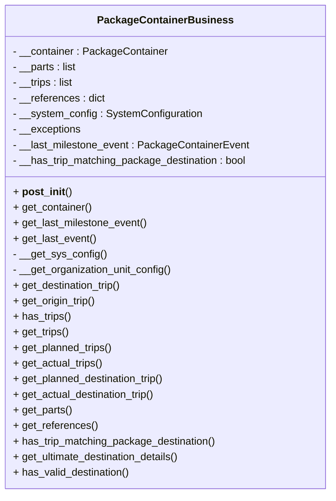

# Diagram: partview_service/partview_service/core/business/package_container/PackageContainerBusiness.py


> Auto-generated by Obscura crawlers

## Diagram 1



### SVG

<svg id="container" width="502.5703125" xmlns="http://www.w3.org/2000/svg" class="classDiagram" height="760" viewBox="0 0 502.5703125 760" role="graphics-document document" aria-roledescription="class"><style>#container{font-family:"trebuchet ms",verdana,arial,sans-serif;font-size:16px;fill:#333;}@keyframes edge-animation-frame{from{stroke-dashoffset:0;}}@keyframes dash{to{stroke-dashoffset:0;}}#container .edge-animation-slow{stroke-dasharray:9,5!important;stroke-dashoffset:900;animation:dash 50s linear infinite;stroke-linecap:round;}#container .edge-animation-fast{stroke-dasharray:9,5!important;stroke-dashoffset:900;animation:dash 20s linear infinite;stroke-linecap:round;}#container .error-icon{fill:#552222;}#container .error-text{fill:#552222;stroke:#552222;}#container .edge-thickness-normal{stroke-width:1px;}#container .edge-thickness-thick{stroke-width:3.5px;}#container .edge-pattern-solid{stroke-dasharray:0;}#container .edge-thickness-invisible{stroke-width:0;fill:none;}#container .edge-pattern-dashed{stroke-dasharray:3;}#container .edge-pattern-dotted{stroke-dasharray:2;}#container .marker{fill:#333333;stroke:#333333;}#container .marker.cross{stroke:#333333;}#container svg{font-family:"trebuchet ms",verdana,arial,sans-serif;font-size:16px;}#container p{margin:0;}#container g.classGroup text{fill:#9370DB;stroke:none;font-family:"trebuchet ms",verdana,arial,sans-serif;font-size:10px;}#container g.classGroup text .title{font-weight:bolder;}#container .nodeLabel,#container .edgeLabel{color:#131300;}#container .edgeLabel .label rect{fill:#ECECFF;}#container .label text{fill:#131300;}#container .labelBkg{background:#ECECFF;}#container .edgeLabel .label span{background:#ECECFF;}#container .classTitle{font-weight:bolder;}#container .node rect,#container .node circle,#container .node ellipse,#container .node polygon,#container .node path{fill:#ECECFF;stroke:#9370DB;stroke-width:1px;}#container .divider{stroke:#9370DB;stroke-width:1;}#container g.clickable{cursor:pointer;}#container g.classGroup rect{fill:#ECECFF;stroke:#9370DB;}#container g.classGroup line{stroke:#9370DB;stroke-width:1;}#container .classLabel .box{stroke:none;stroke-width:0;fill:#ECECFF;opacity:0.5;}#container .classLabel .label{fill:#9370DB;font-size:10px;}#container .relation{stroke:#333333;stroke-width:1;fill:none;}#container .dashed-line{stroke-dasharray:3;}#container .dotted-line{stroke-dasharray:1 2;}#container #compositionStart,#container .composition{fill:#333333!important;stroke:#333333!important;stroke-width:1;}#container #compositionEnd,#container .composition{fill:#333333!important;stroke:#333333!important;stroke-width:1;}#container #dependencyStart,#container .dependency{fill:#333333!important;stroke:#333333!important;stroke-width:1;}#container #dependencyStart,#container .dependency{fill:#333333!important;stroke:#333333!important;stroke-width:1;}#container #extensionStart,#container .extension{fill:transparent!important;stroke:#333333!important;stroke-width:1;}#container #extensionEnd,#container .extension{fill:transparent!important;stroke:#333333!important;stroke-width:1;}#container #aggregationStart,#container .aggregation{fill:transparent!important;stroke:#333333!important;stroke-width:1;}#container #aggregationEnd,#container .aggregation{fill:transparent!important;stroke:#333333!important;stroke-width:1;}#container #lollipopStart,#container .lollipop{fill:#ECECFF!important;stroke:#333333!important;stroke-width:1;}#container #lollipopEnd,#container .lollipop{fill:#ECECFF!important;stroke:#333333!important;stroke-width:1;}#container .edgeTerminals{font-size:11px;line-height:initial;}#container .classTitleText{text-anchor:middle;font-size:18px;fill:#333;}#container .label-icon{display:inline-block;height:1em;overflow:visible;vertical-align:-0.125em;}#container .node .label-icon path{fill:currentColor;stroke:revert;stroke-width:revert;}#container :root{--mermaid-font-family:"trebuchet ms",verdana,arial,sans-serif;}</style><g><defs><marker id="container_class-aggregationStart" class="marker aggregation class" refX="18" refY="7" markerWidth="190" markerHeight="240" orient="auto"><path d="M 18,7 L9,13 L1,7 L9,1 Z"></path></marker></defs><defs><marker id="container_class-aggregationEnd" class="marker aggregation class" refX="1" refY="7" markerWidth="20" markerHeight="28" orient="auto"><path d="M 18,7 L9,13 L1,7 L9,1 Z"></path></marker></defs><defs><marker id="container_class-extensionStart" class="marker extension class" refX="18" refY="7" markerWidth="190" markerHeight="240" orient="auto"><path d="M 1,7 L18,13 V 1 Z"></path></marker></defs><defs><marker id="container_class-extensionEnd" class="marker extension class" refX="1" refY="7" markerWidth="20" markerHeight="28" orient="auto"><path d="M 1,1 V 13 L18,7 Z"></path></marker></defs><defs><marker id="container_class-compositionStart" class="marker composition class" refX="18" refY="7" markerWidth="190" markerHeight="240" orient="auto"><path d="M 18,7 L9,13 L1,7 L9,1 Z"></path></marker></defs><defs><marker id="container_class-compositionEnd" class="marker composition class" refX="1" refY="7" markerWidth="20" markerHeight="28" orient="auto"><path d="M 18,7 L9,13 L1,7 L9,1 Z"></path></marker></defs><defs><marker id="container_class-dependencyStart" class="marker dependency class" refX="6" refY="7" markerWidth="190" markerHeight="240" orient="auto"><path d="M 5,7 L9,13 L1,7 L9,1 Z"></path></marker></defs><defs><marker id="container_class-dependencyEnd" class="marker dependency class" refX="13" refY="7" markerWidth="20" markerHeight="28" orient="auto"><path d="M 18,7 L9,13 L14,7 L9,1 Z"></path></marker></defs><defs><marker id="container_class-lollipopStart" class="marker lollipop class" refX="13" refY="7" markerWidth="190" markerHeight="240" orient="auto"><circle stroke="black" fill="transparent" cx="7" cy="7" r="6"></circle></marker></defs><defs><marker id="container_class-lollipopEnd" class="marker lollipop class" refX="1" refY="7" markerWidth="190" markerHeight="240" orient="auto"><circle stroke="black" fill="transparent" cx="7" cy="7" r="6"></circle></marker></defs><g class="root"><g class="clusters"></g><g class="edgePaths"></g><g class="edgeLabels"></g><g class="nodes"><g class="node default" id="classId-PackageContainerBusiness-0" transform="translate(251.28515625, 380)"><g class="basic label-container"><path d="M-243.28515625 -372 L243.28515625 -372 L243.28515625 372 L-243.28515625 372" stroke="none" stroke-width="0" fill="#ECECFF" style=""></path><path d="M-243.28515625 -372 C-120.63591630273694 -372, 2.0133236445261105 -372, 243.28515625 -372 M-243.28515625 -372 C-74.00689414084258 -372, 95.27136796831485 -372, 243.28515625 -372 M243.28515625 -372 C243.28515625 -112.7016163344565, 243.28515625 146.596767331087, 243.28515625 372 M243.28515625 -372 C243.28515625 -221.41118660608964, 243.28515625 -70.82237321217929, 243.28515625 372 M243.28515625 372 C101.50804321619825 372, -40.26906981760351 372, -243.28515625 372 M243.28515625 372 C70.55878240740267 372, -102.16759143519465 372, -243.28515625 372 M-243.28515625 372 C-243.28515625 178.5437465174861, -243.28515625 -14.912506965027774, -243.28515625 -372 M-243.28515625 372 C-243.28515625 200.09190778152785, -243.28515625 28.183815563055703, -243.28515625 -372" stroke="#9370DB" stroke-width="1.3" fill="none" stroke-dasharray="0 0" style=""></path></g><g class="annotation-group text" transform="translate(0, -348)"></g><g class="label-group text" transform="translate(-97.7890625, -348)"><g class="label" style="font-weight: bolder" transform="translate(0,-12)"><foreignObject width="195.578125" height="24"><div xmlns="http://www.w3.org/1999/xhtml" style="display: table-cell; white-space: nowrap; line-height: 1.5; max-width: 242px; text-align: center;"><span class="nodeLabel markdown-node-label" style=""><p>PackageContainerBusiness</p></span></div></foreignObject></g></g><g class="members-group text" transform="translate(-231.28515625, -300)"><g class="label" style="" transform="translate(0,-12)"><foreignObject width="236.9375" height="24"><div xmlns="http://www.w3.org/1999/xhtml" style="display: table-cell; white-space: nowrap; line-height: 1.5; max-width: 295px; text-align: center;"><span class="nodeLabel markdown-node-label" style=""><p>- __container : PackageContainer</p></span></div></foreignObject></g><g class="label" style="" transform="translate(0,12)"><foreignObject width="99.421875" height="24"><div xmlns="http://www.w3.org/1999/xhtml" style="display: table-cell; white-space: nowrap; line-height: 1.5; max-width: 157px; text-align: center;"><span class="nodeLabel markdown-node-label" style=""><p>- __parts : list</p></span></div></foreignObject></g><g class="label" style="" transform="translate(0,36)"><foreignObject width="95.0625" height="24"><div xmlns="http://www.w3.org/1999/xhtml" style="display: table-cell; white-space: nowrap; line-height: 1.5; max-width: 153px; text-align: center;"><span class="nodeLabel markdown-node-label" style=""><p>- __trips : list</p></span></div></foreignObject></g><g class="label" style="" transform="translate(0,60)"><foreignObject width="142.640625" height="24"><div xmlns="http://www.w3.org/1999/xhtml" style="display: table-cell; white-space: nowrap; line-height: 1.5; max-width: 200px; text-align: center;"><span class="nodeLabel markdown-node-label" style=""><p>- __references : dict</p></span></div></foreignObject></g><g class="label" style="" transform="translate(0,84)"><foreignObject width="290.578125" height="24"><div xmlns="http://www.w3.org/1999/xhtml" style="display: table-cell; white-space: nowrap; line-height: 1.5; max-width: 348px; text-align: center;"><span class="nodeLabel markdown-node-label" style=""><p>- __system_config : SystemConfiguration</p></span></div></foreignObject></g><g class="label" style="" transform="translate(0,108)"><foreignObject width="105.078125" height="24"><div xmlns="http://www.w3.org/1999/xhtml" style="display: table-cell; white-space: nowrap; line-height: 1.5; max-width: 162px; text-align: center;"><span class="nodeLabel markdown-node-label" style=""><p>- __exceptions</p></span></div></foreignObject></g><g class="label" style="" transform="translate(0,132)"><foreignObject width="362.546875" height="24"><div xmlns="http://www.w3.org/1999/xhtml" style="display: table-cell; white-space: nowrap; line-height: 1.5; max-width: 420px; text-align: center;"><span class="nodeLabel markdown-node-label" style=""><p>- __last_milestone_event : PackageContainerEvent</p></span></div></foreignObject></g><g class="label" style="" transform="translate(0,156)"><foreignObject width="364.78125" height="24"><div xmlns="http://www.w3.org/1999/xhtml" style="display: table-cell; white-space: nowrap; line-height: 1.5; max-width: 422px; text-align: center;"><span class="nodeLabel markdown-node-label" style=""><p>- __has_trip_matching_package_destination : bool</p></span></div></foreignObject></g></g><g class="methods-group text" transform="translate(-231.28515625, -84)"><g class="label" style="" transform="translate(0,-12)"><foreignObject width="88.171875" height="24"><div xmlns="http://www.w3.org/1999/xhtml" style="display: table-cell; white-space: nowrap; line-height: 1.5; max-width: 178px; text-align: center;"><span class="nodeLabel markdown-node-label" style=""><p>+ <strong>post_init</strong>()</p></span></div></foreignObject></g><g class="label" style="" transform="translate(0,12)"><foreignObject width="122.359375" height="24"><div xmlns="http://www.w3.org/1999/xhtml" style="display: table-cell; white-space: nowrap; line-height: 1.5; max-width: 180px; text-align: center;"><span class="nodeLabel markdown-node-label" style=""><p>+ get_container()</p></span></div></foreignObject></g><g class="label" style="" transform="translate(0,36)"><foreignObject width="208.0625" height="24"><div xmlns="http://www.w3.org/1999/xhtml" style="display: table-cell; white-space: nowrap; line-height: 1.5; max-width: 265px; text-align: center;"><span class="nodeLabel markdown-node-label" style=""><p>+ get_last_milestone_event()</p></span></div></foreignObject></g><g class="label" style="" transform="translate(0,60)"><foreignObject width="128.0625" height="24"><div xmlns="http://www.w3.org/1999/xhtml" style="display: table-cell; white-space: nowrap; line-height: 1.5; max-width: 185px; text-align: center;"><span class="nodeLabel markdown-node-label" style=""><p>+ get_last_event()</p></span></div></foreignObject></g><g class="label" style="" transform="translate(0,84)"><foreignObject width="142.25" height="24"><div xmlns="http://www.w3.org/1999/xhtml" style="display: table-cell; white-space: nowrap; line-height: 1.5; max-width: 200px; text-align: center;"><span class="nodeLabel markdown-node-label" style=""><p>- __get_sys_config()</p></span></div></foreignObject></g><g class="label" style="" transform="translate(0,108)"><foreignObject width="247.140625" height="24"><div xmlns="http://www.w3.org/1999/xhtml" style="display: table-cell; white-space: nowrap; line-height: 1.5; max-width: 305px; text-align: center;"><span class="nodeLabel markdown-node-label" style=""><p>- __get_organization_unit_config()</p></span></div></foreignObject></g><g class="label" style="" transform="translate(0,132)"><foreignObject width="170.265625" height="24"><div xmlns="http://www.w3.org/1999/xhtml" style="display: table-cell; white-space: nowrap; line-height: 1.5; max-width: 228px; text-align: center;"><span class="nodeLabel markdown-node-label" style=""><p>+ get_destination_trip()</p></span></div></foreignObject></g><g class="label" style="" transform="translate(0,156)"><foreignObject width="129.375" height="24"><div xmlns="http://www.w3.org/1999/xhtml" style="display: table-cell; white-space: nowrap; line-height: 1.5; max-width: 187px; text-align: center;"><span class="nodeLabel markdown-node-label" style=""><p>+ get_origin_trip()</p></span></div></foreignObject></g><g class="label" style="" transform="translate(0,180)"><foreignObject width="89.109375" height="24"><div xmlns="http://www.w3.org/1999/xhtml" style="display: table-cell; white-space: nowrap; line-height: 1.5; max-width: 146px; text-align: center;"><span class="nodeLabel markdown-node-label" style=""><p>+ has_trips()</p></span></div></foreignObject></g><g class="label" style="" transform="translate(0,204)"><foreignObject width="86.59375" height="24"><div xmlns="http://www.w3.org/1999/xhtml" style="display: table-cell; white-space: nowrap; line-height: 1.5; max-width: 144px; text-align: center;"><span class="nodeLabel markdown-node-label" style=""><p>+ get_trips()</p></span></div></foreignObject></g><g class="label" style="" transform="translate(0,228)"><foreignObject width="154.78125" height="24"><div xmlns="http://www.w3.org/1999/xhtml" style="display: table-cell; white-space: nowrap; line-height: 1.5; max-width: 212px; text-align: center;"><span class="nodeLabel markdown-node-label" style=""><p>+ get_planned_trips()</p></span></div></foreignObject></g><g class="label" style="" transform="translate(0,252)"><foreignObject width="139.265625" height="24"><div xmlns="http://www.w3.org/1999/xhtml" style="display: table-cell; white-space: nowrap; line-height: 1.5; max-width: 197px; text-align: center;"><span class="nodeLabel markdown-node-label" style=""><p>+ get_actual_trips()</p></span></div></foreignObject></g><g class="label" style="" transform="translate(0,276)"><foreignObject width="238.4375" height="24"><div xmlns="http://www.w3.org/1999/xhtml" style="display: table-cell; white-space: nowrap; line-height: 1.5; max-width: 296px; text-align: center;"><span class="nodeLabel markdown-node-label" style=""><p>+ get_planned_destination_trip()</p></span></div></foreignObject></g><g class="label" style="" transform="translate(0,300)"><foreignObject width="222.9375" height="24"><div xmlns="http://www.w3.org/1999/xhtml" style="display: table-cell; white-space: nowrap; line-height: 1.5; max-width: 280px; text-align: center;"><span class="nodeLabel markdown-node-label" style=""><p>+ get_actual_destination_trip()</p></span></div></foreignObject></g><g class="label" style="" transform="translate(0,324)"><foreignObject width="90.953125" height="24"><div xmlns="http://www.w3.org/1999/xhtml" style="display: table-cell; white-space: nowrap; line-height: 1.5; max-width: 148px; text-align: center;"><span class="nodeLabel markdown-node-label" style=""><p>+ get_parts()</p></span></div></foreignObject></g><g class="label" style="" transform="translate(0,348)"><foreignObject width="129.125" height="24"><div xmlns="http://www.w3.org/1999/xhtml" style="display: table-cell; white-space: nowrap; line-height: 1.5; max-width: 186px; text-align: center;"><span class="nodeLabel markdown-node-label" style=""><p>+ get_references()</p></span></div></foreignObject></g><g class="label" style="" transform="translate(0,372)"><foreignObject width="315" height="24"><div xmlns="http://www.w3.org/1999/xhtml" style="display: table-cell; white-space: nowrap; line-height: 1.5; max-width: 372px; text-align: center;"><span class="nodeLabel markdown-node-label" style=""><p>+ has_trip_matching_package_destination()</p></span></div></foreignObject></g><g class="label" style="" transform="translate(0,396)"><foreignObject width="262.265625" height="24"><div xmlns="http://www.w3.org/1999/xhtml" style="display: table-cell; white-space: nowrap; line-height: 1.5; max-width: 320px; text-align: center;"><span class="nodeLabel markdown-node-label" style=""><p>+ get_ultimate_destination_details()</p></span></div></foreignObject></g><g class="label" style="" transform="translate(0,420)"><foreignObject width="181.578125" height="24"><div xmlns="http://www.w3.org/1999/xhtml" style="display: table-cell; white-space: nowrap; line-height: 1.5; max-width: 239px; text-align: center;"><span class="nodeLabel markdown-node-label" style=""><p>+ has_valid_destination()</p></span></div></foreignObject></g></g><g class="divider" style=""><path d="M-243.28515625 -324 C-93.96740339044288 -324, 55.350349469114235 -324, 243.28515625 -324 M-243.28515625 -324 C-121.77057822493055 -324, -0.25600019986109146 -324, 243.28515625 -324" stroke="#9370DB" stroke-width="1.3" fill="none" stroke-dasharray="0 0" style=""></path></g><g class="divider" style=""><path d="M-243.28515625 -108 C-66.80809747775564 -108, 109.66896129448872 -108, 243.28515625 -108 M-243.28515625 -108 C-144.64204315764124 -108, -45.99893006528248 -108, 243.28515625 -108" stroke="#9370DB" stroke-width="1.3" fill="none" stroke-dasharray="0 0" style=""></path></g></g></g></g></g></svg>

## Diagram 2

```mermaid
flowchart TD
    A[Dataclass init / constructor] --> B[__post_init__()]
    B --> C[__get_sys_config()]
    C --> D[SystemConfiguration instance]
    D --> D1[set_solution_id(solution_id)]
    D --> D2{owner_org_fv_id present?}
    D2 -- yes --> D3[set_organization_id_by_fv_id(owner_org_fv_id)]
    E[has_trip_matching_package_destination()] --> E1{planned trips and container destination?}
    E1 -- false --> E_false[Return False]
    E1 -- true --> F[Compare planned_destination_trip.destination_location_code == container.destination_location_code]
    F -- true --> E_true[is_match = True]
    F -- false --> G[InvokeLocation.invoke_get_location(owner_organization_fv_id, container.destination_location_code)]
    G --> H{resolved_container_destination present?}
    H -- true --> I[Compare resolved_container_destination.code == planned_destination_trip.destination_location_code]
    I -- true --> E_true
    I -- false --> E_false
    H -- false --> E_false
    J[has_valid_destination()] --> K[__get_organization_unit_config() -> ultimate_destination_lads]
    J --> L[has_trip_matching_package_destination()?]
    L -- true --> M[Return True]
    L -- false --> N{ultimate_destination_lads present? and trips exist?}
    N -- false --> O[retval = True -> Return True]
    N -- true --> P[get_ultimate_destination_details()]
    P --> Q[Extract lad.name]
    Q --> R{lad.name in ultimate_destination_lads OR lad.name.lower() in ["unresolved","unclassified"]}
    R -- true --> S[retval = True -> Return True]
    R -- false --> T[retval = False -> Return False]
```

> SVG rendering failed for this diagram.
