# Diagram: partview_service/partview_service/core/business/package_container/PackageContainerBusinessLogic.py

> Auto-generated by Obscura crawlers

## Mermaid

```mermaid
classDiagram
    class Freezeable
    class PackageContainerBusinessLogic {
        - __application_name: str
        - __packageContainerDatastore
        - __packageContainerVisibility
        + PackageContainerBusinessLogic(application_name)
        + create_package_container_by_data_object(package_container)
        + create_package_container_by_data_object_with_owner_grant(package_container, organization_id, begin_ts, end_ts, terminate_ts)
        + create_package_container_by_customer_number_grant(package_container, organization_id, begin_ts, end_ts, terminate_ts)
        + create_package_container_owner_grant(package_container, organization_id, begin_ts, end_ts, terminate_ts)
        + create_package_container_customer_number_grant(package_container, begin_ts, end_ts, terminate_ts, organization_id)
        + read_package_container_by_data_object(package_container)
        + search_package_container_by_data_object(package_container, order_by)
        + getPackageContainer()
        + get_package_container_by_primary_id(solution_id, primary_id)
        + load_by_solution_id_and_tracking_number(solution_id, tracking_number)
        + load_visibility_grants(package_container, grant_type)
        + load_active_visibility_grants(grant_type=GrantTypes.OWNER)
        + isVisible(package_container, grantee_solution_id, grant_type)
        + grant_visibility(package_container, organization_id, grantee_solution_id, grant_type, reason, begin_ts, end_ts, terminate_ts)
        + revoke_visibility(package_container, organization_id, grantee_solution_id, grant_type)
        + archive_visibility(package_container, grantee_solution_id, grant_type)
        + archive_all_active_visibilies(package_container, solution_id, tracking_number)
        + unarchive_all_archived_visibilies(package_container, solution_id, tracking_number)
        + grant_visibility_to_multiple_locations(package_container, organization_id, location_codes)
        + get_grantee_solution_data(package_container, grant_type)
    }
    class PackageContainerPostgresqlMapping
    class PackageContainerVisibility
    class OpenSearchDataSyncProducer {
        + produce_batch_containers(list)
    }
    class InvokeCustomerNumberGrant
    class InvokeLocationGrant {
        + invoke_get_grantees(organization_id, owner_org_fv_id, location_codes)
    }
    class InvokeGetSolution {
        + invoke_get_solution_by_id(solution_id)
    }
    class generate_application_name
    class PackageContainer
    class PackageContainerType
    class VisibilityGrant {
        + STATE_ACTIVE
    }
    class GrantTypes {
        + OWNER
        + LOCATION
        + CUSTOMER
    }

    Freezeable <|-- PackageContainerBusinessLogic
    PackageContainerBusinessLogic --> PackageContainerPostgresqlMapping : __packageContainerDatastore
    PackageContainerBusinessLogic --> PackageContainerVisibility : __packageContainerVisibility
    PackageContainerBusinessLogic ..> OpenSearchDataSyncProducer : produce_batch_containers()
    PackageContainerBusinessLogic ..> InvokeCustomerNumberGrant : validate_org_against_feature()
    PackageContainerBusinessLogic ..> InvokeLocationGrant : invoke_get_grantees()
    PackageContainerBusinessLogic ..> InvokeGetSolution : invoke_get_solution_by_id()
    PackageContainerBusinessLogic ..> generate_application_name : generates name
    PackageContainerBusinessLogic ..> PackageContainer : constructs/uses
    PackageContainerBusinessLogic ..> PackageContainerType : method parameter type
    PackageContainerBusinessLogic ..> VisibilityGrant : uses STATE_ACTIVE
    PackageContainerBusinessLogic ..> GrantTypes : uses constants
```

### SVG

<svg id="container" width="3576.0390625" xmlns="http://www.w3.org/2000/svg" class="classDiagram" height="1064" viewBox="0 0 3576.0390625 1064" role="graphics-document document" aria-roledescription="class"><g><defs><marker id="container_class-aggregationStart" class="marker aggregation class" refX="18" refY="7" markerWidth="190" markerHeight="240" orient="auto"><path d="M 18,7 L9,13 L1,7 L9,1 Z"></path></marker></defs><defs><marker id="container_class-aggregationEnd" class="marker aggregation class" refX="1" refY="7" markerWidth="20" markerHeight="28" orient="auto"><path d="M 18,7 L9,13 L1,7 L9,1 Z"></path></marker></defs><defs><marker id="container_class-extensionStart" class="marker extension class" refX="18" refY="7" markerWidth="190" markerHeight="240" orient="auto"><path d="M 1,7 L18,13 V 1 Z"></path></marker></defs><defs><marker id="container_class-extensionEnd" class="marker extension class" refX="1" refY="7" markerWidth="20" markerHeight="28" orient="auto"><path d="M 1,1 V 13 L18,7 Z"></path></marker></defs><defs><marker id="container_class-compositionStart" class="marker composition class" refX="18" refY="7" markerWidth="190" markerHeight="240" orient="auto"><path d="M 18,7 L9,13 L1,7 L9,1 Z"></path></marker></defs><defs><marker id="container_class-compositionEnd" class="marker composition class" refX="1" refY="7" markerWidth="20" markerHeight="28" orient="auto"><path d="M 18,7 L9,13 L1,7 L9,1 Z"></path></marker></defs><defs><marker id="container_class-dependencyStart" class="marker dependency class" refX="6" refY="7" markerWidth="190" markerHeight="240" orient="auto"><path d="M 5,7 L9,13 L1,7 L9,1 Z"></path></marker></defs><defs><marker id="container_class-dependencyEnd" class="marker dependency class" refX="13" refY="7" markerWidth="20" markerHeight="28" orient="auto"><path d="M 18,7 L9,13 L14,7 L9,1 Z"></path></marker></defs><defs><marker id="container_class-lollipopStart" class="marker lollipop class" refX="13" refY="7" markerWidth="190" markerHeight="240" orient="auto"><circle stroke="black" fill="transparent" cx="7" cy="7" r="6"></circle></marker></defs><defs><marker id="container_class-lollipopEnd" class="marker lollipop class" refX="1" refY="7" markerWidth="190" markerHeight="240" orient="auto"><circle stroke="black" fill="transparent" cx="7" cy="7" r="6"></circle></marker></defs><g class="root"><g class="clusters"></g><g class="edgePaths"><path d="M2210.004,109.25L2210.004,110.542C2210.004,111.833,2210.004,114.417,2210.004,119.875C2210.004,125.333,2210.004,133.667,2210.004,137.833L2210.004,142" id="id_Freezeable_PackageContainerBusinessLogic_1" class="edge-thickness-normal edge-pattern-solid relation" style=";;;" data-edge="true" data-et="edge" data-id="id_Freezeable_PackageContainerBusinessLogic_1" data-points="W3sieCI6MjIxMC4wMDM5MDYyNSwieSI6OTJ9LHsieCI6MjIxMC4wMDM5MDYyNSwieSI6MTE3fSx7IngiOjIyMTAuMDAzOTA2MjUsInkiOjE0Mn1d" marker-start="url(#container_class-extensionStart)"></path><path d="M1665.238,576.92L1413.674,622.6C1162.109,668.28,658.98,759.64,407.416,817.487C155.852,875.333,155.852,899.667,155.852,911.833L155.852,924" id="id_PackageContainerBusinessLogic_PackageContainerPostgresqlMapping_2" class="edge-thickness-normal edge-pattern-solid relation" style=";;;" data-edge="true" data-et="edge" data-id="id_PackageContainerBusinessLogic_PackageContainerPostgresqlMapping_2" data-points="W3sieCI6MTY2NS4yMzgyODEyNSwieSI6NTc2LjkyMDQwMzIyMjg5Mjd9LHsieCI6MTU1Ljg1MTU2MjUsInkiOjg1MX0seyJ4IjoxNTUuODUxNTYyNSwieSI6OTMwfV0=" marker-end="url(#container_class-dependencyEnd)"></path><path d="M1665.238,594.308L1464.856,637.09C1264.474,679.872,863.71,765.436,663.327,820.385C462.945,875.333,462.945,899.667,462.945,911.833L462.945,924" id="id_PackageContainerBusinessLogic_PackageContainerVisibility_3" class="edge-thickness-normal edge-pattern-solid relation" style=";;;" data-edge="true" data-et="edge" data-id="id_PackageContainerBusinessLogic_PackageContainerVisibility_3" data-points="W3sieCI6MTY2NS4yMzgyODEyNSwieSI6NTk0LjMwODM5MzM0ODY0MTl9LHsieCI6NDYyLjk0NTMxMjUsInkiOjg1MX0seyJ4Ijo0NjIuOTQ1MzEyNSwieSI6OTMwfV0=" marker-end="url(#container_class-dependencyEnd)"></path><path d="M1665.238,622.981L1522.441,660.984C1379.645,698.987,1094.051,774.994,951.254,821.663C808.457,868.333,808.457,885.667,808.457,894.333L808.457,903" id="id_PackageContainerBusinessLogic_OpenSearchDataSyncProducer_4" class="edge-thickness-normal edge-pattern-dashed relation" style=";;;" data-edge="true" data-et="edge" data-id="id_PackageContainerBusinessLogic_OpenSearchDataSyncProducer_4" data-points="W3sieCI6MTY2NS4yMzgyODEyNSwieSI6NjIyLjk4MDkzNjI0MjMyMTZ9LHsieCI6ODA4LjQ1NzAzMTI1LCJ5Ijo4NTF9LHsieCI6ODA4LjQ1NzAzMTI1LCJ5Ijo5MDl9XQ==" marker-end="url(#container_class-dependencyEnd)"></path><path d="M1665.238,672.486L1581.9,702.238C1498.563,731.991,1331.887,791.495,1248.549,833.414C1165.211,875.333,1165.211,899.667,1165.211,911.833L1165.211,924" id="id_PackageContainerBusinessLogic_InvokeCustomerNumberGrant_5" class="edge-thickness-normal edge-pattern-dashed relation" style=";;;" data-edge="true" data-et="edge" data-id="id_PackageContainerBusinessLogic_InvokeCustomerNumberGrant_5" data-points="W3sieCI6MTY2NS4yMzgyODEyNSwieSI6NjcyLjQ4NTk3Mzk3MDYyMDZ9LHsieCI6MTE2NS4yMTA5Mzc1LCJ5Ijo4NTF9LHsieCI6MTE2NS4yMTA5Mzc1LCJ5Ijo5MzB9XQ==" marker-end="url(#container_class-dependencyEnd)"></path><path d="M1705.691,814L1696.435,820.167C1687.179,826.333,1668.668,838.667,1659.412,853.5C1650.156,868.333,1650.156,885.667,1650.156,894.333L1650.156,903" id="id_PackageContainerBusinessLogic_InvokeLocationGrant_6" class="edge-thickness-normal edge-pattern-dashed relation" style=";;;" data-edge="true" data-et="edge" data-id="id_PackageContainerBusinessLogic_InvokeLocationGrant_6" data-points="W3sieCI6MTcwNS42OTA3MzYwMDg3MTMyLCJ5Ijo4MTR9LHsieCI6MTY1MC4xNTYyNSwieSI6ODUxfSx7IngiOjE2NTAuMTU2MjUsInkiOjkwOX1d" marker-end="url(#container_class-dependencyEnd)"></path><path d="M2210.004,814L2210.004,820.167C2210.004,826.333,2210.004,838.667,2210.004,853.5C2210.004,868.333,2210.004,885.667,2210.004,894.333L2210.004,903" id="id_PackageContainerBusinessLogic_InvokeGetSolution_7" class="edge-thickness-normal edge-pattern-dashed relation" style=";;;" data-edge="true" data-et="edge" data-id="id_PackageContainerBusinessLogic_InvokeGetSolution_7" data-points="W3sieCI6MjIxMC4wMDM5MDYyNSwieSI6ODE0fSx7IngiOjIyMTAuMDAzOTA2MjUsInkiOjg1MX0seyJ4IjoyMjEwLjAwMzkwNjI1LCJ5Ijo5MDl9XQ==" marker-end="url(#container_class-dependencyEnd)"></path><path d="M2533.621,814L2539.561,820.167C2545.5,826.333,2557.379,838.667,2563.318,857C2569.258,875.333,2569.258,899.667,2569.258,911.833L2569.258,924" id="id_PackageContainerBusinessLogic_generate_application_name_8" class="edge-thickness-normal edge-pattern-dashed relation" style=";;;" data-edge="true" data-et="edge" data-id="id_PackageContainerBusinessLogic_generate_application_name_8" data-points="W3sieCI6MjUzMy42MjEzNjYwMzU1MjMsInkiOjgxNH0seyJ4IjoyNTY5LjI1NzgxMjUsInkiOjg1MX0seyJ4IjoyNTY5LjI1NzgxMjUsInkiOjkzMH1d" marker-end="url(#container_class-dependencyEnd)"></path><path d="M2751.004,814L2760.933,820.167C2770.862,826.333,2790.72,838.667,2800.649,857C2810.578,875.333,2810.578,899.667,2810.578,911.833L2810.578,924" id="id_PackageContainerBusinessLogic_PackageContainer_9" class="edge-thickness-normal edge-pattern-dashed relation" style=";;;" data-edge="true" data-et="edge" data-id="id_PackageContainerBusinessLogic_PackageContainer_9" data-points="W3sieCI6Mjc1MS4wMDM3Mzg2ODk2Nzg0LCJ5Ijo4MTR9LHsieCI6MjgxMC41NzgxMjUsInkiOjg1MX0seyJ4IjoyODEwLjU3ODEyNSwieSI6OTMwfV0=" marker-end="url(#container_class-dependencyEnd)"></path><path d="M2754.77,724.954L2801.111,745.961C2847.453,766.969,2940.137,808.985,2986.479,842.159C3032.82,875.333,3032.82,899.667,3032.82,911.833L3032.82,924" id="id_PackageContainerBusinessLogic_PackageContainerType_10" class="edge-thickness-normal edge-pattern-dashed relation" style=";;;" data-edge="true" data-et="edge" data-id="id_PackageContainerBusinessLogic_PackageContainerType_10" data-points="W3sieCI6Mjc1NC43Njk1MzEyNSwieSI6NzI0Ljk1MzcyNjk1NzI0MDF9LHsieCI6MzAzMi44MjAzMTI1LCJ5Ijo4NTF9LHsieCI6MzAzMi44MjAzMTI1LCJ5Ijo5MzB9XQ==" marker-end="url(#container_class-dependencyEnd)"></path><path d="M2754.77,669.603L2840.727,699.836C2926.685,730.069,3098.6,790.534,3184.558,829.934C3270.516,869.333,3270.516,887.667,3270.516,896.833L3270.516,906" id="id_PackageContainerBusinessLogic_VisibilityGrant_11" class="edge-thickness-normal edge-pattern-dashed relation" style=";;;" data-edge="true" data-et="edge" data-id="id_PackageContainerBusinessLogic_VisibilityGrant_11" data-points="W3sieCI6Mjc1NC43Njk1MzEyNSwieSI6NjY5LjYwMzMzMTIzMzgxNjJ9LHsieCI6MzI3MC41MTU2MjUsInkiOjg1MX0seyJ4IjozMjcwLjUxNTYyNSwieSI6OTEyfV0=" marker-end="url(#container_class-dependencyEnd)"></path><path d="M2754.77,636.658L2877.43,672.382C3000.09,708.105,3245.41,779.553,3368.07,820.443C3490.73,861.333,3490.73,871.667,3490.73,876.833L3490.73,882" id="id_PackageContainerBusinessLogic_GrantTypes_12" class="edge-thickness-normal edge-pattern-dashed relation" style=";;;" data-edge="true" data-et="edge" data-id="id_PackageContainerBusinessLogic_GrantTypes_12" data-points="W3sieCI6Mjc1NC43Njk1MzEyNSwieSI6NjM2LjY1ODA0OTMyNTAyOTJ9LHsieCI6MzQ5MC43MzA0Njg3NSwieSI6ODUxfSx7IngiOjM0OTAuNzMwNDY4NzUsInkiOjg4OH1d" marker-end="url(#container_class-dependencyEnd)"></path></g><g class="edgeLabels"><g class="edgeLabel"><g class="label" data-id="id_Freezeable_PackageContainerBusinessLogic_1" transform="translate(0, 0)"><foreignObject width="0" height="0">

</foreignObject></g></g><g class="edgeLabel" transform="translate(155.8515625, 851)"><g class="label" data-id="id_PackageContainerBusinessLogic_PackageContainerPostgresqlMapping_2" transform="translate(-107.8984375, -12)"><foreignObject width="215.796875" height="24">

__packageContainerDatastore

</foreignObject></g></g><g class="edgeLabel" transform="translate(462.9453125, 851)"><g class="label" data-id="id_PackageContainerBusinessLogic_PackageContainerVisibility_3" transform="translate(-104.078125, -12)"><foreignObject width="208.15625" height="24">

__packageContainerVisibility

</foreignObject></g></g><g class="edgeLabel" transform="translate(808.45703125, 851)"><g class="label" data-id="id_PackageContainerBusinessLogic_OpenSearchDataSyncProducer_4" transform="translate(-101.4453125, -12)"><foreignObject width="202.890625" height="24">

produce_batch_containers()

</foreignObject></g></g><g class="edgeLabel" transform="translate(1165.2109375, 851)"><g class="label" data-id="id_PackageContainerBusinessLogic_InvokeCustomerNumberGrant_5" transform="translate(-109.984375, -12)"><foreignObject width="219.96875" height="24">

validate_org_against_feature()

</foreignObject></g></g><g class="edgeLabel" transform="translate(1650.15625, 851)"><g class="label" data-id="id_PackageContainerBusinessLogic_InvokeLocationGrant_6" transform="translate(-79.8515625, -12)"><foreignObject width="159.703125" height="24">

invoke_get_grantees()

</foreignObject></g></g><g class="edgeLabel" transform="translate(2210.00390625, 851)"><g class="label" data-id="id_PackageContainerBusinessLogic_InvokeGetSolution_7" transform="translate(-102.234375, -12)"><foreignObject width="204.46875" height="24">

invoke_get_solution_by_id()

</foreignObject></g></g><g class="edgeLabel" transform="translate(2569.2578125, 851)"><g class="label" data-id="id_PackageContainerBusinessLogic_generate_application_name_8" transform="translate(-57.84375, -12)"><foreignObject width="115.6875" height="24">

generates name

</foreignObject></g></g><g class="edgeLabel" transform="translate(2810.578125, 851)"><g class="label" data-id="id_PackageContainerBusinessLogic_PackageContainer_9" transform="translate(-58.25, -12)"><foreignObject width="116.5" height="24">

constructs/uses

</foreignObject></g></g><g class="edgeLabel" transform="translate(3032.8203125, 851)"><g class="label" data-id="id_PackageContainerBusinessLogic_PackageContainerType_10" transform="translate(-86.0078125, -12)"><foreignObject width="172.015625" height="24">

method parameter type

</foreignObject></g></g><g class="edgeLabel" transform="translate(3270.515625, 851)"><g class="label" data-id="id_PackageContainerBusinessLogic_VisibilityGrant_11" transform="translate(-67.421875, -12)"><foreignObject width="134.84375" height="24">

uses STATE_ACTIVE

</foreignObject></g></g><g class="edgeLabel" transform="translate(3490.73046875, 851)"><g class="label" data-id="id_PackageContainerBusinessLogic_GrantTypes_12" transform="translate(-53.8671875, -12)"><foreignObject width="107.734375" height="24">

uses constants

</foreignObject></g></g></g><g class="nodes"><g class="node default" id="classId-Freezeable-0" transform="translate(2210.00390625, 50)"><g class="basic label-container"><path d="M-51.1953125 -42 L51.1953125 -42 L51.1953125 42 L-51.1953125 42" stroke="none" stroke-width="0" fill="#ECECFF" style=""></path><path d="M-51.1953125 -42 C-30.703001383983022 -42, -10.210690267966044 -42, 51.1953125 -42 M-51.1953125 -42 C-26.473056499877984 -42, -1.750800499755968 -42, 51.1953125 -42 M51.1953125 -42 C51.1953125 -22.14174804479626, 51.1953125 -2.283496089592518, 51.1953125 42 M51.1953125 -42 C51.1953125 -17.769787881085982, 51.1953125 6.460424237828036, 51.1953125 42 M51.1953125 42 C29.54145998767883 42, 7.887607475357662 42, -51.1953125 42 M51.1953125 42 C25.533719806248836 42, -0.12787288750232761 42, -51.1953125 42 M-51.1953125 42 C-51.1953125 10.731514449356048, -51.1953125 -20.536971101287904, -51.1953125 -42 M-51.1953125 42 C-51.1953125 11.010883386543288, -51.1953125 -19.978233226913424, -51.1953125 -42" stroke="#9370DB" stroke-width="1.3" fill="none" stroke-dasharray="0 0" style=""></path></g><g class="annotation-group text" transform="translate(0, -18)"></g><g class="label-group text" transform="translate(-39.1953125, -18)"><g class="label" style="font-weight: bolder" transform="translate(0,-12)"><foreignObject width="78.390625" height="24">

Freezeable

</foreignObject></g></g><g class="members-group text" transform="translate(-39.1953125, 30)"></g><g class="methods-group text" transform="translate(-39.1953125, 60)"></g><g class="divider" style=""><path d="M-51.1953125 6 C-18.163253354725313 6, 14.868805790549374 6, 51.1953125 6 M-51.1953125 6 C-26.607449504483515 6, -2.0195865089670306 6, 51.1953125 6" stroke="#9370DB" stroke-width="1.3" fill="none" stroke-dasharray="0 0" style=""></path></g><g class="divider" style=""><path d="M-51.1953125 24 C-12.516903093273527 24, 26.161506313452946 24, 51.1953125 24 M-51.1953125 24 C-11.648208054921831 24, 27.898896390156338 24, 51.1953125 24" stroke="#9370DB" stroke-width="1.3" fill="none" stroke-dasharray="0 0" style=""></path></g></g><g class="node default" id="classId-PackageContainerBusinessLogic-1" transform="translate(2210.00390625, 478)"><g class="basic label-container"><path d="M-544.765625 -336 L544.765625 -336 L544.765625 336 L-544.765625 336" stroke="none" stroke-width="0" fill="#ECECFF" style=""></path><path d="M-544.765625 -336 C-200.18968567672056 -336, 144.38625364655888 -336, 544.765625 -336 M-544.765625 -336 C-215.58027541910593 -336, 113.60507416178814 -336, 544.765625 -336 M544.765625 -336 C544.765625 -171.00732393388762, 544.765625 -6.014647867775238, 544.765625 336 M544.765625 -336 C544.765625 -182.89840322210273, 544.765625 -29.79680644420546, 544.765625 336 M544.765625 336 C161.97719487428395 336, -220.8112352514321 336, -544.765625 336 M544.765625 336 C153.15263206872697 336, -238.46036086254605 336, -544.765625 336 M-544.765625 336 C-544.765625 89.61867443289364, -544.765625 -156.76265113421272, -544.765625 -336 M-544.765625 336 C-544.765625 77.18787550942892, -544.765625 -181.62424898114216, -544.765625 -336" stroke="#9370DB" stroke-width="1.3" fill="none" stroke-dasharray="0 0" style=""></path></g><g class="annotation-group text" transform="translate(0, -312)"></g><g class="label-group text" transform="translate(-116.859375, -312)"><g class="label" style="font-weight: bolder" transform="translate(0,-12)"><foreignObject width="233.71875" height="24">

PackageContainerBusinessLogic

</foreignObject></g></g><g class="members-group text" transform="translate(-532.765625, -264)"><g class="label" style="" transform="translate(0,-12)"><foreignObject width="185.296875" height="24">

- __application_name: str

</foreignObject></g><g class="label" style="" transform="translate(0,12)"><foreignObject width="226.484375" height="24">

- __packageContainerDatastore

</foreignObject></g><g class="label" style="" transform="translate(0,36)"><foreignObject width="218.84375" height="24">

- __packageContainerVisibility

</foreignObject></g></g><g class="methods-group text" transform="translate(-532.765625, -168)"><g class="label" style="" transform="translate(0,-12)"><foreignObject width="383.40625" height="24">

+ PackageContainerBusinessLogic(application_name)

</foreignObject></g><g class="label" style="" transform="translate(0,12)"><foreignObject width="465.15625" height="24">

+ create_package_container_by_data_object(package_container)

</foreignObject></g><g class="label" style="" transform="translate(0,36)"><foreignObject width="948.671875" height="24">

+ create_package_container_by_data_object_with_owner_grant(package_container, organization_id, begin_ts, end_ts, terminate_ts)

</foreignObject></g><g class="label" style="" transform="translate(0,60)"><foreignObject width="901.921875" height="24">

+ create_package_container_by_customer_number_grant(package_container, organization_id, begin_ts, end_ts, terminate_ts)

</foreignObject></g><g class="label" style="" transform="translate(0,84)"><foreignObject width="790.265625" height="24">

+ create_package_container_owner_grant(package_container, organization_id, begin_ts, end_ts, terminate_ts)

</foreignObject></g><g class="label" style="" transform="translate(0,108)"><foreignObject width="876.78125" height="24">

+ create_package_container_customer_number_grant(package_container, begin_ts, end_ts, terminate_ts, organization_id)

</foreignObject></g><g class="label" style="" transform="translate(0,132)"><foreignObject width="453.140625" height="24">

+ read_package_container_by_data_object(package_container)

</foreignObject></g><g class="label" style="" transform="translate(0,156)"><foreignObject width="538.734375" height="24">

+ search_package_container_by_data_object(package_container, order_by)

</foreignObject></g><g class="label" style="" transform="translate(0,180)"><foreignObject width="173.71875" height="24">

+ getPackageContainer()

</foreignObject></g><g class="label" style="" transform="translate(0,204)"><foreignObject width="468.984375" height="24">

+ get_package_container_by_primary_id(solution_id, primary_id)

</foreignObject></g><g class="label" style="" transform="translate(0,228)"><foreignObject width="550.96875" height="24">

+ load_by_solution_id_and_tracking_number(solution_id, tracking_number)

</foreignObject></g><g class="label" style="" transform="translate(0,252)"><foreignObject width="397.140625" height="24">

+ load_visibility_grants(package_container, grant_type)

</foreignObject></g><g class="label" style="" transform="translate(0,276)"><foreignObject width="451.078125" height="24">

+ load_active_visibility_grants(grant_type=GrantTypes.OWNER)

</foreignObject></g><g class="label" style="" transform="translate(0,300)"><foreignObject width="456.34375" height="24">

+ isVisible(package_container, grantee_solution_id, grant_type)

</foreignObject></g><g class="label" style="" transform="translate(0,324)"><foreignObject width="907.421875" height="24">

+ grant_visibility(package_container, organization_id, grantee_solution_id, grant_type, reason, begin_ts, end_ts, terminate_ts)

</foreignObject></g><g class="label" style="" transform="translate(0,348)"><foreignObject width="633.90625" height="24">

+ revoke_visibility(package_container, organization_id, grantee_solution_id, grant_type)

</foreignObject></g><g class="label" style="" transform="translate(0,372)"><foreignObject width="517.265625" height="24">

+ archive_visibility(package_container, grantee_solution_id, grant_type)

</foreignObject></g><g class="label" style="" transform="translate(0,396)"><foreignObject width="579.421875" height="24">

+ archive_all_active_visibilies(package_container, solution_id, tracking_number)

</foreignObject></g><g class="label" style="" transform="translate(0,420)"><foreignObject width="617.28125" height="24">

+ unarchive_all_archived_visibilies(package_container, solution_id, tracking_number)

</foreignObject></g><g class="label" style="" transform="translate(0,444)"><foreignObject width="668.15625" height="24">

+ grant_visibility_to_multiple_locations(package_container, organization_id, location_codes)

</foreignObject></g><g class="label" style="" transform="translate(0,468)"><foreignObject width="437.328125" height="24">

+ get_grantee_solution_data(package_container, grant_type)

</foreignObject></g></g><g class="divider" style=""><path d="M-544.765625 -288 C-223.31098068605633 -288, 98.14366362788735 -288, 544.765625 -288 M-544.765625 -288 C-228.7224468595474 -288, 87.32073128090519 -288, 544.765625 -288" stroke="#9370DB" stroke-width="1.3" fill="none" stroke-dasharray="0 0" style=""></path></g><g class="divider" style=""><path d="M-544.765625 -192 C-199.1146841551717 -192, 146.53625668965662 -192, 544.765625 -192 M-544.765625 -192 C-266.92663581194927 -192, 10.912353376101464 -192, 544.765625 -192" stroke="#9370DB" stroke-width="1.3" fill="none" stroke-dasharray="0 0" style=""></path></g></g><g class="node default" id="classId-PackageContainerPostgresqlMapping-2" transform="translate(155.8515625, 972)"><g class="basic label-container"><path d="M-147.8515625 -42 L147.8515625 -42 L147.8515625 42 L-147.8515625 42" stroke="none" stroke-width="0" fill="#ECECFF" style=""></path><path d="M-147.8515625 -42 C-63.67696985602288 -42, 20.497622787954242 -42, 147.8515625 -42 M-147.8515625 -42 C-59.662529767667095 -42, 28.52650296466581 -42, 147.8515625 -42 M147.8515625 -42 C147.8515625 -24.249345726484876, 147.8515625 -6.4986914529697515, 147.8515625 42 M147.8515625 -42 C147.8515625 -17.60137167453721, 147.8515625 6.797256650925583, 147.8515625 42 M147.8515625 42 C63.28823019194343 42, -21.275102116113146 42, -147.8515625 42 M147.8515625 42 C46.78095124728259 42, -54.289660005434826 42, -147.8515625 42 M-147.8515625 42 C-147.8515625 9.196141144149976, -147.8515625 -23.607717711700047, -147.8515625 -42 M-147.8515625 42 C-147.8515625 24.113526061049615, -147.8515625 6.227052122099231, -147.8515625 -42" stroke="#9370DB" stroke-width="1.3" fill="none" stroke-dasharray="0 0" style=""></path></g><g class="annotation-group text" transform="translate(0, -18)"></g><g class="label-group text" transform="translate(-135.8515625, -18)"><g class="label" style="font-weight: bolder" transform="translate(0,-12)"><foreignObject width="271.703125" height="24">

PackageContainerPostgresqlMapping

</foreignObject></g></g><g class="members-group text" transform="translate(-135.8515625, 30)"></g><g class="methods-group text" transform="translate(-135.8515625, 60)"></g><g class="divider" style=""><path d="M-147.8515625 6 C-56.44556962633415 6, 34.960423247331704 6, 147.8515625 6 M-147.8515625 6 C-42.08683229567632 6, 63.67789790864737 6, 147.8515625 6" stroke="#9370DB" stroke-width="1.3" fill="none" stroke-dasharray="0 0" style=""></path></g><g class="divider" style=""><path d="M-147.8515625 24 C-56.47762810645135 24, 34.8963062870973 24, 147.8515625 24 M-147.8515625 24 C-35.7812023366245 24, 76.289157826751 24, 147.8515625 24" stroke="#9370DB" stroke-width="1.3" fill="none" stroke-dasharray="0 0" style=""></path></g></g><g class="node default" id="classId-PackageContainerVisibility-3" transform="translate(462.9453125, 972)"><g class="basic label-container"><path d="M-109.2421875 -42 L109.2421875 -42 L109.2421875 42 L-109.2421875 42" stroke="none" stroke-width="0" fill="#ECECFF" style=""></path><path d="M-109.2421875 -42 C-24.715758007761764 -42, 59.81067148447647 -42, 109.2421875 -42 M-109.2421875 -42 C-24.186647691254706 -42, 60.86889211749059 -42, 109.2421875 -42 M109.2421875 -42 C109.2421875 -19.02755349175766, 109.2421875 3.944893016484677, 109.2421875 42 M109.2421875 -42 C109.2421875 -18.68756118870469, 109.2421875 4.624877622590617, 109.2421875 42 M109.2421875 42 C47.719033000915324 42, -13.804121498169351 42, -109.2421875 42 M109.2421875 42 C52.06589526642859 42, -5.110396967142819 42, -109.2421875 42 M-109.2421875 42 C-109.2421875 14.236473506727052, -109.2421875 -13.527052986545897, -109.2421875 -42 M-109.2421875 42 C-109.2421875 16.641763241358788, -109.2421875 -8.716473517282424, -109.2421875 -42" stroke="#9370DB" stroke-width="1.3" fill="none" stroke-dasharray="0 0" style=""></path></g><g class="annotation-group text" transform="translate(0, -18)"></g><g class="label-group text" transform="translate(-97.2421875, -18)"><g class="label" style="font-weight: bolder" transform="translate(0,-12)"><foreignObject width="194.484375" height="24">

PackageContainerVisibility

</foreignObject></g></g><g class="members-group text" transform="translate(-97.2421875, 30)"></g><g class="methods-group text" transform="translate(-97.2421875, 60)"></g><g class="divider" style=""><path d="M-109.2421875 6 C-41.63906514179642 6, 25.964057216407156 6, 109.2421875 6 M-109.2421875 6 C-23.126943399193877 6, 62.988300701612246 6, 109.2421875 6" stroke="#9370DB" stroke-width="1.3" fill="none" stroke-dasharray="0 0" style=""></path></g><g class="divider" style=""><path d="M-109.2421875 24 C-41.23831076230144 24, 26.765565975397124 24, 109.2421875 24 M-109.2421875 24 C-40.98345157367994 24, 27.275284352640114 24, 109.2421875 24" stroke="#9370DB" stroke-width="1.3" fill="none" stroke-dasharray="0 0" style=""></path></g></g><g class="node default" id="classId-OpenSearchDataSyncProducer-4" transform="translate(808.45703125, 972)"><g class="basic label-container"><path d="M-186.26953125 -63 L186.26953125 -63 L186.26953125 63 L-186.26953125 63" stroke="none" stroke-width="0" fill="#ECECFF" style=""></path><path d="M-186.26953125 -63 C-74.24194147285297 -63, 37.78564830429406 -63, 186.26953125 -63 M-186.26953125 -63 C-108.12339335379446 -63, -29.97725545758891 -63, 186.26953125 -63 M186.26953125 -63 C186.26953125 -25.639164553542557, 186.26953125 11.721670892914887, 186.26953125 63 M186.26953125 -63 C186.26953125 -19.01080281051412, 186.26953125 24.978394378971757, 186.26953125 63 M186.26953125 63 C82.22023250575596 63, -21.829066238488082 63, -186.26953125 63 M186.26953125 63 C82.11592476893125 63, -22.0376817121375 63, -186.26953125 63 M-186.26953125 63 C-186.26953125 32.63884329724691, -186.26953125 2.277686594493808, -186.26953125 -63 M-186.26953125 63 C-186.26953125 21.02261417171274, -186.26953125 -20.954771656574522, -186.26953125 -63" stroke="#9370DB" stroke-width="1.3" fill="none" stroke-dasharray="0 0" style=""></path></g><g class="annotation-group text" transform="translate(0, -39)"></g><g class="label-group text" transform="translate(-110.9765625, -39)"><g class="label" style="font-weight: bolder" transform="translate(0,-12)"><foreignObject width="221.953125" height="24">

OpenSearchDataSyncProducer

</foreignObject></g></g><g class="members-group text" transform="translate(-174.26953125, 9)"></g><g class="methods-group text" transform="translate(-174.26953125, 39)"><g class="label" style="" transform="translate(0,-12)"><foreignObject width="237.5625" height="24">

+ produce_batch_containers(list)

</foreignObject></g></g><g class="divider" style=""><path d="M-186.26953125 -15 C-43.46594017576351 -15, 99.33765089847299 -15, 186.26953125 -15 M-186.26953125 -15 C-108.0591052200401 -15, -29.84867919008019 -15, 186.26953125 -15" stroke="#9370DB" stroke-width="1.3" fill="none" stroke-dasharray="0 0" style=""></path></g><g class="divider" style=""><path d="M-186.26953125 9 C-76.91788740146086 9, 32.43375644707828 9, 186.26953125 9 M-186.26953125 9 C-58.07140814365275 9, 70.1267149626945 9, 186.26953125 9" stroke="#9370DB" stroke-width="1.3" fill="none" stroke-dasharray="0 0" style=""></path></g></g><g class="node default" id="classId-InvokeCustomerNumberGrant-5" transform="translate(1165.2109375, 972)"><g class="basic label-container"><path d="M-120.484375 -42 L120.484375 -42 L120.484375 42 L-120.484375 42" stroke="none" stroke-width="0" fill="#ECECFF" style=""></path><path d="M-120.484375 -42 C-25.499215456815378 -42, 69.48594408636924 -42, 120.484375 -42 M-120.484375 -42 C-62.88307643134742 -42, -5.281777862694838 -42, 120.484375 -42 M120.484375 -42 C120.484375 -12.172412120999958, 120.484375 17.655175758000084, 120.484375 42 M120.484375 -42 C120.484375 -22.618736821095066, 120.484375 -3.237473642190132, 120.484375 42 M120.484375 42 C45.544001357212736 42, -29.39637228557453 42, -120.484375 42 M120.484375 42 C39.37147926682165 42, -41.741416466356696 42, -120.484375 42 M-120.484375 42 C-120.484375 9.953879149476172, -120.484375 -22.092241701047655, -120.484375 -42 M-120.484375 42 C-120.484375 21.82930959015395, -120.484375 1.6586191803079018, -120.484375 -42" stroke="#9370DB" stroke-width="1.3" fill="none" stroke-dasharray="0 0" style=""></path></g><g class="annotation-group text" transform="translate(0, -18)"></g><g class="label-group text" transform="translate(-108.484375, -18)"><g class="label" style="font-weight: bolder" transform="translate(0,-12)"><foreignObject width="216.96875" height="24">

InvokeCustomerNumberGrant

</foreignObject></g></g><g class="members-group text" transform="translate(-108.484375, 30)"></g><g class="methods-group text" transform="translate(-108.484375, 60)"></g><g class="divider" style=""><path d="M-120.484375 6 C-28.770092186342282 6, 62.944190627315436 6, 120.484375 6 M-120.484375 6 C-65.97864799804495 6, -11.472920996089897 6, 120.484375 6" stroke="#9370DB" stroke-width="1.3" fill="none" stroke-dasharray="0 0" style=""></path></g><g class="divider" style=""><path d="M-120.484375 24 C-71.88219608471164 24, -23.28001716942329 24, 120.484375 24 M-120.484375 24 C-29.781061642944735 24, 60.92225171411053 24, 120.484375 24" stroke="#9370DB" stroke-width="1.3" fill="none" stroke-dasharray="0 0" style=""></path></g></g><g class="node default" id="classId-InvokeLocationGrant-6" transform="translate(1650.15625, 972)"><g class="basic label-container"><path d="M-314.4609375 -63 L314.4609375 -63 L314.4609375 63 L-314.4609375 63" stroke="none" stroke-width="0" fill="#ECECFF" style=""></path><path d="M-314.4609375 -63 C-171.07720914600372 -63, -27.69348079200745 -63, 314.4609375 -63 M-314.4609375 -63 C-108.66358895391178 -63, 97.13375959217643 -63, 314.4609375 -63 M314.4609375 -63 C314.4609375 -13.792701203986567, 314.4609375 35.414597592026865, 314.4609375 63 M314.4609375 -63 C314.4609375 -35.244353823669954, 314.4609375 -7.488707647339915, 314.4609375 63 M314.4609375 63 C174.3686196817181 63, 34.276301863436174 63, -314.4609375 63 M314.4609375 63 C104.70176463360167 63, -105.05740823279666 63, -314.4609375 63 M-314.4609375 63 C-314.4609375 33.61902409184263, -314.4609375 4.238048183685272, -314.4609375 -63 M-314.4609375 63 C-314.4609375 14.631031230403522, -314.4609375 -33.737937539192956, -314.4609375 -63" stroke="#9370DB" stroke-width="1.3" fill="none" stroke-dasharray="0 0" style=""></path></g><g class="annotation-group text" transform="translate(0, -39)"></g><g class="label-group text" transform="translate(-75.875, -39)"><g class="label" style="font-weight: bolder" transform="translate(0,-12)"><foreignObject width="151.75" height="24">

InvokeLocationGrant

</foreignObject></g></g><g class="members-group text" transform="translate(-302.4609375, 9)"></g><g class="methods-group text" transform="translate(-302.4609375, 39)"><g class="label" style="" transform="translate(0,-12)"><foreignObject width="529.046875" height="24">

+ invoke_get_grantees(organization_id, owner_org_fv_id, location_codes)

</foreignObject></g></g><g class="divider" style=""><path d="M-314.4609375 -15 C-148.9657120969235 -15, 16.529513306152978 -15, 314.4609375 -15 M-314.4609375 -15 C-168.5200471679391 -15, -22.579156835878223 -15, 314.4609375 -15" stroke="#9370DB" stroke-width="1.3" fill="none" stroke-dasharray="0 0" style=""></path></g><g class="divider" style=""><path d="M-314.4609375 9 C-131.58142758467886 9, 51.29808233064227 9, 314.4609375 9 M-314.4609375 9 C-134.11026831698112 9, 46.24040086603776 9, 314.4609375 9" stroke="#9370DB" stroke-width="1.3" fill="none" stroke-dasharray="0 0" style=""></path></g></g><g class="node default" id="classId-InvokeGetSolution-7" transform="translate(2210.00390625, 972)"><g class="basic label-container"><path d="M-195.38671875 -63 L195.38671875 -63 L195.38671875 63 L-195.38671875 63" stroke="none" stroke-width="0" fill="#ECECFF" style=""></path><path d="M-195.38671875 -63 C-92.45302519227809 -63, 10.480668365443819 -63, 195.38671875 -63 M-195.38671875 -63 C-62.762871765731745 -63, 69.86097521853651 -63, 195.38671875 -63 M195.38671875 -63 C195.38671875 -25.77943550246229, 195.38671875 11.441128995075417, 195.38671875 63 M195.38671875 -63 C195.38671875 -30.754026075483296, 195.38671875 1.4919478490334086, 195.38671875 63 M195.38671875 63 C104.25728923321938 63, 13.127859716438763 63, -195.38671875 63 M195.38671875 63 C52.324648344251244 63, -90.73742206149751 63, -195.38671875 63 M-195.38671875 63 C-195.38671875 15.095651110871621, -195.38671875 -32.80869777825676, -195.38671875 -63 M-195.38671875 63 C-195.38671875 33.61774855815432, -195.38671875 4.235497116308629, -195.38671875 -63" stroke="#9370DB" stroke-width="1.3" fill="none" stroke-dasharray="0 0" style=""></path></g><g class="annotation-group text" transform="translate(0, -39)"></g><g class="label-group text" transform="translate(-67.8515625, -39)"><g class="label" style="font-weight: bolder" transform="translate(0,-12)"><foreignObject width="135.703125" height="24">

InvokeGetSolution

</foreignObject></g></g><g class="members-group text" transform="translate(-183.38671875, 9)"></g><g class="methods-group text" transform="translate(-183.38671875, 39)"><g class="label" style="" transform="translate(0,-12)"><foreignObject width="298.921875" height="24">

+ invoke_get_solution_by_id(solution_id)

</foreignObject></g></g><g class="divider" style=""><path d="M-195.38671875 -15 C-43.42570474176728 -15, 108.53530926646545 -15, 195.38671875 -15 M-195.38671875 -15 C-51.828065845695704 -15, 91.73058705860859 -15, 195.38671875 -15" stroke="#9370DB" stroke-width="1.3" fill="none" stroke-dasharray="0 0" style=""></path></g><g class="divider" style=""><path d="M-195.38671875 9 C-90.43171861043982 9, 14.523281529120368 9, 195.38671875 9 M-195.38671875 9 C-51.38619036238072 9, 92.61433802523857 9, 195.38671875 9" stroke="#9370DB" stroke-width="1.3" fill="none" stroke-dasharray="0 0" style=""></path></g></g><g class="node default" id="classId-generate_application_name-8" transform="translate(2569.2578125, 972)"><g class="basic label-container"><path d="M-113.8671875 -42 L113.8671875 -42 L113.8671875 42 L-113.8671875 42" stroke="none" stroke-width="0" fill="#ECECFF" style=""></path><path d="M-113.8671875 -42 C-23.638970976191885 -42, 66.58924554761623 -42, 113.8671875 -42 M-113.8671875 -42 C-29.033219031579137 -42, 55.80074943684173 -42, 113.8671875 -42 M113.8671875 -42 C113.8671875 -12.197693619556304, 113.8671875 17.60461276088739, 113.8671875 42 M113.8671875 -42 C113.8671875 -10.100986198056951, 113.8671875 21.798027603886098, 113.8671875 42 M113.8671875 42 C25.220744855184847 42, -63.425697789630306 42, -113.8671875 42 M113.8671875 42 C48.40662377718188 42, -17.053939945636245 42, -113.8671875 42 M-113.8671875 42 C-113.8671875 21.199830120578913, -113.8671875 0.39966024115782517, -113.8671875 -42 M-113.8671875 42 C-113.8671875 13.071251224964836, -113.8671875 -15.857497550070327, -113.8671875 -42" stroke="#9370DB" stroke-width="1.3" fill="none" stroke-dasharray="0 0" style=""></path></g><g class="annotation-group text" transform="translate(0, -18)"></g><g class="label-group text" transform="translate(-101.8671875, -18)"><g class="label" style="font-weight: bolder" transform="translate(0,-12)"><foreignObject width="203.734375" height="24">

generate_application_name

</foreignObject></g></g><g class="members-group text" transform="translate(-101.8671875, 30)"></g><g class="methods-group text" transform="translate(-101.8671875, 60)"></g><g class="divider" style=""><path d="M-113.8671875 6 C-24.099224307956604 6, 65.66873888408679 6, 113.8671875 6 M-113.8671875 6 C-56.95264028549046 6, -0.03809307098092063 6, 113.8671875 6" stroke="#9370DB" stroke-width="1.3" fill="none" stroke-dasharray="0 0" style=""></path></g><g class="divider" style=""><path d="M-113.8671875 24 C-23.818309714932354 24, 66.23056807013529 24, 113.8671875 24 M-113.8671875 24 C-57.73750257474667 24, -1.6078176494933416 24, 113.8671875 24" stroke="#9370DB" stroke-width="1.3" fill="none" stroke-dasharray="0 0" style=""></path></g></g><g class="node default" id="classId-PackageContainer-9" transform="translate(2810.578125, 972)"><g class="basic label-container"><path d="M-77.453125 -42 L77.453125 -42 L77.453125 42 L-77.453125 42" stroke="none" stroke-width="0" fill="#ECECFF" style=""></path><path d="M-77.453125 -42 C-26.15970226858927 -42, 25.133720462821458 -42, 77.453125 -42 M-77.453125 -42 C-35.877538155125144 -42, 5.698048689749712 -42, 77.453125 -42 M77.453125 -42 C77.453125 -16.49640645249275, 77.453125 9.007187095014501, 77.453125 42 M77.453125 -42 C77.453125 -11.341573651334329, 77.453125 19.316852697331342, 77.453125 42 M77.453125 42 C35.75675148185785 42, -5.939622036284305 42, -77.453125 42 M77.453125 42 C42.413401538782814 42, 7.3736780775656285 42, -77.453125 42 M-77.453125 42 C-77.453125 21.0977421466782, -77.453125 0.19548429335640094, -77.453125 -42 M-77.453125 42 C-77.453125 11.322814525712037, -77.453125 -19.354370948575927, -77.453125 -42" stroke="#9370DB" stroke-width="1.3" fill="none" stroke-dasharray="0 0" style=""></path></g><g class="annotation-group text" transform="translate(0, -18)"></g><g class="label-group text" transform="translate(-65.453125, -18)"><g class="label" style="font-weight: bolder" transform="translate(0,-12)"><foreignObject width="130.90625" height="24">

PackageContainer

</foreignObject></g></g><g class="members-group text" transform="translate(-65.453125, 30)"></g><g class="methods-group text" transform="translate(-65.453125, 60)"></g><g class="divider" style=""><path d="M-77.453125 6 C-33.28148354991688 6, 10.890157900166244 6, 77.453125 6 M-77.453125 6 C-33.774497536541254 6, 9.904129926917491 6, 77.453125 6" stroke="#9370DB" stroke-width="1.3" fill="none" stroke-dasharray="0 0" style=""></path></g><g class="divider" style=""><path d="M-77.453125 24 C-35.186296036370656 24, 7.080532927258687 24, 77.453125 24 M-77.453125 24 C-42.05144514761773 24, -6.649765295235454 24, 77.453125 24" stroke="#9370DB" stroke-width="1.3" fill="none" stroke-dasharray="0 0" style=""></path></g></g><g class="node default" id="classId-PackageContainerType-10" transform="translate(3032.8203125, 972)"><g class="basic label-container"><path d="M-94.7890625 -42 L94.7890625 -42 L94.7890625 42 L-94.7890625 42" stroke="none" stroke-width="0" fill="#ECECFF" style=""></path><path d="M-94.7890625 -42 C-26.087298714787494 -42, 42.61446507042501 -42, 94.7890625 -42 M-94.7890625 -42 C-30.990554439212666 -42, 32.80795362157467 -42, 94.7890625 -42 M94.7890625 -42 C94.7890625 -14.446264094683396, 94.7890625 13.107471810633207, 94.7890625 42 M94.7890625 -42 C94.7890625 -25.17862618191397, 94.7890625 -8.35725236382794, 94.7890625 42 M94.7890625 42 C29.649345443705343 42, -35.490371612589314 42, -94.7890625 42 M94.7890625 42 C41.12045616606825 42, -12.548150167863497 42, -94.7890625 42 M-94.7890625 42 C-94.7890625 18.171109514900685, -94.7890625 -5.65778097019863, -94.7890625 -42 M-94.7890625 42 C-94.7890625 15.32249155496277, -94.7890625 -11.35501689007446, -94.7890625 -42" stroke="#9370DB" stroke-width="1.3" fill="none" stroke-dasharray="0 0" style=""></path></g><g class="annotation-group text" transform="translate(0, -18)"></g><g class="label-group text" transform="translate(-82.7890625, -18)"><g class="label" style="font-weight: bolder" transform="translate(0,-12)"><foreignObject width="165.578125" height="24">

PackageContainerType

</foreignObject></g></g><g class="members-group text" transform="translate(-82.7890625, 30)"></g><g class="methods-group text" transform="translate(-82.7890625, 60)"></g><g class="divider" style=""><path d="M-94.7890625 6 C-30.78639902534661 6, 33.21626444930678 6, 94.7890625 6 M-94.7890625 6 C-20.89226536532577 6, 53.00453176934846 6, 94.7890625 6" stroke="#9370DB" stroke-width="1.3" fill="none" stroke-dasharray="0 0" style=""></path></g><g class="divider" style=""><path d="M-94.7890625 24 C-43.91671904996632 24, 6.955624400067364 24, 94.7890625 24 M-94.7890625 24 C-43.82087358526755 24, 7.147315329464902 24, 94.7890625 24" stroke="#9370DB" stroke-width="1.3" fill="none" stroke-dasharray="0 0" style=""></path></g></g><g class="node default" id="classId-VisibilityGrant-11" transform="translate(3270.515625, 972)"><g class="basic label-container"><path d="M-92.90625 -60 L92.90625 -60 L92.90625 60 L-92.90625 60" stroke="none" stroke-width="0" fill="#ECECFF" style=""></path><path d="M-92.90625 -60 C-52.82024989446605 -60, -12.734249788932104 -60, 92.90625 -60 M-92.90625 -60 C-24.5150842098258 -60, 43.8760815803484 -60, 92.90625 -60 M92.90625 -60 C92.90625 -17.413229562097428, 92.90625 25.173540875805145, 92.90625 60 M92.90625 -60 C92.90625 -14.35460141512035, 92.90625 31.2907971697593, 92.90625 60 M92.90625 60 C35.358514854600976 60, -22.189220290798048 60, -92.90625 60 M92.90625 60 C29.26989321573958 60, -34.36646356852084 60, -92.90625 60 M-92.90625 60 C-92.90625 25.868304557984587, -92.90625 -8.263390884030827, -92.90625 -60 M-92.90625 60 C-92.90625 28.844560145603943, -92.90625 -2.3108797087921147, -92.90625 -60" stroke="#9370DB" stroke-width="1.3" fill="none" stroke-dasharray="0 0" style=""></path></g><g class="annotation-group text" transform="translate(0, -36)"></g><g class="label-group text" transform="translate(-51.96875, -36)"><g class="label" style="font-weight: bolder" transform="translate(0,-12)"><foreignObject width="103.9375" height="24">

VisibilityGrant

</foreignObject></g></g><g class="members-group text" transform="translate(-80.90625, 12)"><g class="label" style="" transform="translate(0,-12)"><foreignObject width="109.84375" height="24">

+ STATE_ACTIVE

</foreignObject></g></g><g class="methods-group text" transform="translate(-80.90625, 60)"></g><g class="divider" style=""><path d="M-92.90625 -12 C-32.44097066912687 -12, 28.02430866174626 -12, 92.90625 -12 M-92.90625 -12 C-23.731952914455974 -12, 45.44234417108805 -12, 92.90625 -12" stroke="#9370DB" stroke-width="1.3" fill="none" stroke-dasharray="0 0" style=""></path></g><g class="divider" style=""><path d="M-92.90625 36 C-18.891760577941938 36, 55.122728844116125 36, 92.90625 36 M-92.90625 36 C-20.517296469861293 36, 51.871657060277414 36, 92.90625 36" stroke="#9370DB" stroke-width="1.3" fill="none" stroke-dasharray="0 0" style=""></path></g></g><g class="node default" id="classId-GrantTypes-12" transform="translate(3490.73046875, 972)"><g class="basic label-container"><path d="M-77.30859375 -84 L77.30859375 -84 L77.30859375 84 L-77.30859375 84" stroke="none" stroke-width="0" fill="#ECECFF" style=""></path><path d="M-77.30859375 -84 C-16.215883426381197 -84, 44.876826897237606 -84, 77.30859375 -84 M-77.30859375 -84 C-25.589844635201686 -84, 26.128904479596628 -84, 77.30859375 -84 M77.30859375 -84 C77.30859375 -33.016451501960624, 77.30859375 17.96709699607875, 77.30859375 84 M77.30859375 -84 C77.30859375 -37.94967641401588, 77.30859375 8.100647171968234, 77.30859375 84 M77.30859375 84 C42.01315560557278 84, 6.717717461145554 84, -77.30859375 84 M77.30859375 84 C23.74366107670037 84, -29.82127159659926 84, -77.30859375 84 M-77.30859375 84 C-77.30859375 19.03571330478748, -77.30859375 -45.92857339042504, -77.30859375 -84 M-77.30859375 84 C-77.30859375 24.512777306326107, -77.30859375 -34.974445387347785, -77.30859375 -84" stroke="#9370DB" stroke-width="1.3" fill="none" stroke-dasharray="0 0" style=""></path></g><g class="annotation-group text" transform="translate(0, -60)"></g><g class="label-group text" transform="translate(-41.3828125, -60)"><g class="label" style="font-weight: bolder" transform="translate(0,-12)"><foreignObject width="82.765625" height="24">

GrantTypes

</foreignObject></g></g><g class="members-group text" transform="translate(-65.30859375, -12)"><g class="label" style="" transform="translate(0,-12)"><foreignObject width="65.6875" height="24">

+ OWNER

</foreignObject></g><g class="label" style="" transform="translate(0,12)"><foreignObject width="82.875" height="24">

+ LOCATION

</foreignObject></g><g class="label" style="" transform="translate(0,36)"><foreignObject width="89.234375" height="24">

+ CUSTOMER

</foreignObject></g></g><g class="methods-group text" transform="translate(-65.30859375, 84)"></g><g class="divider" style=""><path d="M-77.30859375 -36 C-23.836786040681943 -36, 29.635021668636114 -36, 77.30859375 -36 M-77.30859375 -36 C-37.58280524719034 -36, 2.1429832556193134 -36, 77.30859375 -36" stroke="#9370DB" stroke-width="1.3" fill="none" stroke-dasharray="0 0" style=""></path></g><g class="divider" style=""><path d="M-77.30859375 60 C-35.57395430050687 60, 6.160685148986261 60, 77.30859375 60 M-77.30859375 60 C-22.312267425073294 60, 32.68405889985341 60, 77.30859375 60" stroke="#9370DB" stroke-width="1.3" fill="none" stroke-dasharray="0 0" style=""></path></g></g></g></g></g></svg>
