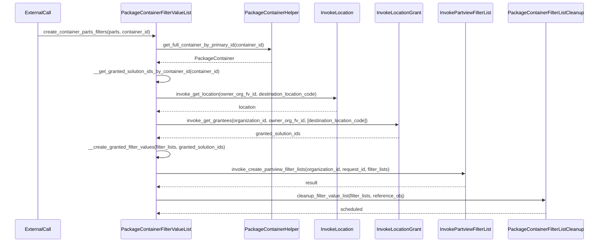

# Diagram: partview_service/partview_service/core/business/package_container/PackageContainerFilterValueList.py

> Auto-generated by Obscura crawlers

## Diagram 1

```mermaid
classDiagram
class PackageContainerFilterValueList {
  - __solution_id: str
  - __organization_id: str
  - __request_id: str
  - __partview_config: PartViewConfiguration
  - __container_helper: PackageContainerHelper
  - __package_container_filter_cleanup: PackageContainerFilterListCleanup
  + __init__(application_name, solution_id, organization_id, request_id)
  + create_asn_order_filters(asn_orders, trip_leg)
  + create_package_container_event_filters(package_container_event) : list<PartviewFilterList>
  + create_container_filters(package_containers)
  + set_package_filter_values(package_container, location_code, filter_lists, loc_value)
  + create_container_parts_filters(parts, container_id=None)
  + create_container_trip_leg_filters(trip_legs)
  - __create_filter_values(filter_lists, reference_obj, granted_solution_ids)
  - __create_granted_filter_values(filter_lists, granted_solutions_ids)
  - __get_granted_solution_ids_by_container_id(container_id)
  - __get_granted_solution_ids_by_trip_leg(trip_leg)
  - __get_granted_solution_ids(owner_org_fv_id, destination_location_code)
  - __get_carrier_label(carrier_organization_fv_id)
}
class PartviewFilterList
class PackageContainerHelper
class PackageContainerFilterListCleanup
class PartViewConfiguration
class InvokePartviewFilterList
class InvokeLocation
class InvokeLocationGrant
class InvokeOrganization
class PackageContainerFilterNames
class ASNOrder
class TripLeg
class PackageContainer
class Part
class PackageContainerEvent
PackageContainerFilterValueList --> PartviewFilterList : creates/uses
PackageContainerFilterValueList --> PackageContainerHelper : uses
PackageContainerFilterValueList --> PackageContainerFilterListCleanup : schedules cleanup
PackageContainerFilterValueList --> PartViewConfiguration : uses
PackageContainerFilterValueList --> InvokePartviewFilterList : invokes
PackageContainerFilterValueList --> InvokeLocation : invokes
PackageContainerFilterValueList --> InvokeLocationGrant : invokes
PackageContainerFilterValueList --> InvokeOrganization : invokes
PackageContainerFilterValueList --> PackageContainerFilterNames : references
PackageContainerFilterValueList --> ASNOrder : processes
PackageContainerFilterValueList --> TripLeg : processes
PackageContainerFilterValueList --> PackageContainer : processes
PackageContainerFilterValueList --> Part : processes
PackageContainerFilterValueList --> PackageContainerEvent : processes
```

### SVG

<svg id="container" width="2985.03125" xmlns="http://www.w3.org/2000/svg" class="classDiagram" height="726" viewBox="0 0 2985.03125 726" role="graphics-document document" aria-roledescription="class"><g><defs><marker id="container_class-aggregationStart" class="marker aggregation class" refX="18" refY="7" markerWidth="190" markerHeight="240" orient="auto"><path d="M 18,7 L9,13 L1,7 L9,1 Z"></path></marker></defs><defs><marker id="container_class-aggregationEnd" class="marker aggregation class" refX="1" refY="7" markerWidth="20" markerHeight="28" orient="auto"><path d="M 18,7 L9,13 L1,7 L9,1 Z"></path></marker></defs><defs><marker id="container_class-extensionStart" class="marker extension class" refX="18" refY="7" markerWidth="190" markerHeight="240" orient="auto"><path d="M 1,7 L18,13 V 1 Z"></path></marker></defs><defs><marker id="container_class-extensionEnd" class="marker extension class" refX="1" refY="7" markerWidth="20" markerHeight="28" orient="auto"><path d="M 1,1 V 13 L18,7 Z"></path></marker></defs><defs><marker id="container_class-compositionStart" class="marker composition class" refX="18" refY="7" markerWidth="190" markerHeight="240" orient="auto"><path d="M 18,7 L9,13 L1,7 L9,1 Z"></path></marker></defs><defs><marker id="container_class-compositionEnd" class="marker composition class" refX="1" refY="7" markerWidth="20" markerHeight="28" orient="auto"><path d="M 18,7 L9,13 L1,7 L9,1 Z"></path></marker></defs><defs><marker id="container_class-dependencyStart" class="marker dependency class" refX="6" refY="7" markerWidth="190" markerHeight="240" orient="auto"><path d="M 5,7 L9,13 L1,7 L9,1 Z"></path></marker></defs><defs><marker id="container_class-dependencyEnd" class="marker dependency class" refX="13" refY="7" markerWidth="20" markerHeight="28" orient="auto"><path d="M 18,7 L9,13 L14,7 L9,1 Z"></path></marker></defs><defs><marker id="container_class-lollipopStart" class="marker lollipop class" refX="13" refY="7" markerWidth="190" markerHeight="240" orient="auto"><circle stroke="black" fill="transparent" cx="7" cy="7" r="6"></circle></marker></defs><defs><marker id="container_class-lollipopEnd" class="marker lollipop class" refX="1" refY="7" markerWidth="190" markerHeight="240" orient="auto"><circle stroke="black" fill="transparent" cx="7" cy="7" r="6"></circle></marker></defs><g class="root"><g class="clusters"></g><g class="edgePaths"><path d="M1289.652,358.144L1088.705,397.954C887.758,437.763,485.863,517.381,284.916,562.357C83.969,607.333,83.969,617.667,83.969,622.833L83.969,628" id="id_PackageContainerFilterValueList_PartviewFilterList_1" class="edge-thickness-normal edge-pattern-solid relation" style=";;;" data-edge="true" data-et="edge" data-id="id_PackageContainerFilterValueList_PartviewFilterList_1" data-points="W3sieCI6MTI4OS42NTIzNDM3NSwieSI6MzU4LjE0NDI4NjU0MDc3MjI3fSx7IngiOjgzLjk2ODc1LCJ5Ijo1OTd9LHsieCI6ODMuOTY4NzUsInkiOjYzNH1d" marker-end="url(#container_class-dependencyEnd)"></path><path d="M1289.652,370.644L1126.695,408.37C963.737,446.096,637.822,521.548,474.864,564.441C311.906,607.333,311.906,617.667,311.906,622.833L311.906,628" id="id_PackageContainerFilterValueList_PackageContainerHelper_2" class="edge-thickness-normal edge-pattern-solid relation" style=";;;" data-edge="true" data-et="edge" data-id="id_PackageContainerFilterValueList_PackageContainerHelper_2" data-points="W3sieCI6MTI4OS42NTIzNDM3NSwieSI6MzcwLjY0NDQwOTA2NzUzMjY1fSx7IngiOjMxMS45MDYyNSwieSI6NTk3fSx7IngiOjMxMS45MDYyNSwieSI6NjM0fV0=" marker-end="url(#container_class-dependencyEnd)"></path><path d="M1289.652,394.423L1175.218,428.186C1060.784,461.949,831.915,529.474,717.481,568.404C603.047,607.333,603.047,617.667,603.047,622.833L603.047,628" id="id_PackageContainerFilterValueList_PackageContainerFilterListCleanup_3" class="edge-thickness-normal edge-pattern-solid relation" style=";;;" data-edge="true" data-et="edge" data-id="id_PackageContainerFilterValueList_PackageContainerFilterListCleanup_3" data-points="W3sieCI6MTI4OS42NTIzNDM3NSwieSI6Mzk0LjQyMjc5MzExNTg5MTM1fSx7IngiOjYwMy4wNDY4NzUsInkiOjU5N30seyJ4Ijo2MDMuMDQ2ODc1LCJ5Ijo2MzR9XQ==" marker-end="url(#container_class-dependencyEnd)"></path><path d="M1289.652,434.563L1222.356,461.636C1155.06,488.709,1020.467,542.854,953.171,575.094C885.875,607.333,885.875,617.667,885.875,622.833L885.875,628" id="id_PackageContainerFilterValueList_PartViewConfiguration_4" class="edge-thickness-normal edge-pattern-solid relation" style=";;;" data-edge="true" data-et="edge" data-id="id_PackageContainerFilterValueList_PartViewConfiguration_4" data-points="W3sieCI6MTI4OS42NTIzNDM3NSwieSI6NDM0LjU2MzAyOTA0OTM5M30seyJ4Ijo4ODUuODc1LCJ5Ijo1OTd9LHsieCI6ODg1Ljg3NSwieSI6NjM0fV0=" marker-end="url(#container_class-dependencyEnd)"></path><path d="M1289.652,503.345L1263.019,518.954C1236.385,534.563,1183.118,565.782,1156.485,586.557C1129.852,607.333,1129.852,617.667,1129.852,622.833L1129.852,628" id="id_PackageContainerFilterValueList_InvokePartviewFilterList_5" class="edge-thickness-normal edge-pattern-solid relation" style=";;;" data-edge="true" data-et="edge" data-id="id_PackageContainerFilterValueList_InvokePartviewFilterList_5" data-points="W3sieCI6MTI4OS42NTIzNDM3NSwieSI6NTAzLjM0NDk2MDUwMzIxODI2fSx7IngiOjExMjkuODUxNTYyNSwieSI6NTk3fSx7IngiOjExMjkuODUxNTYyNSwieSI6NjM0fV0=" marker-end="url(#container_class-dependencyEnd)"></path><path d="M1385.234,560L1379.008,566.167C1372.781,572.333,1360.328,584.667,1354.102,596C1347.875,607.333,1347.875,617.667,1347.875,622.833L1347.875,628" id="id_PackageContainerFilterValueList_InvokeLocation_6" class="edge-thickness-normal edge-pattern-solid relation" style=";;;" data-edge="true" data-et="edge" data-id="id_PackageContainerFilterValueList_InvokeLocation_6" data-points="W3sieCI6MTM4NS4yMzQyNTAxOTk2ODA0LCJ5Ijo1NjB9LHsieCI6MTM0Ny44NzUsInkiOjU5N30seyJ4IjoxMzQ3Ljg3NSwieSI6NjM0fV0=" marker-end="url(#container_class-dependencyEnd)"></path><path d="M1566.511,560L1564.335,566.167C1562.158,572.333,1557.806,584.667,1555.629,596C1553.453,607.333,1553.453,617.667,1553.453,622.833L1553.453,628" id="id_PackageContainerFilterValueList_InvokeLocationGrant_7" class="edge-thickness-normal edge-pattern-solid relation" style=";;;" data-edge="true" data-et="edge" data-id="id_PackageContainerFilterValueList_InvokeLocationGrant_7" data-points="W3sieCI6MTU2Ni41MTA4MDc3MDc2Njc3LCJ5Ijo1NjB9LHsieCI6MTU1My40NTMxMjUsInkiOjU5N30seyJ4IjoxNTUzLjQ1MzEyNSwieSI6NjM0fV0=" marker-end="url(#container_class-dependencyEnd)"></path><path d="M1761.317,560L1763.494,566.167C1765.67,572.333,1770.022,584.667,1772.199,596C1774.375,607.333,1774.375,617.667,1774.375,622.833L1774.375,628" id="id_PackageContainerFilterValueList_InvokeOrganization_8" class="edge-thickness-normal edge-pattern-solid relation" style=";;;" data-edge="true" data-et="edge" data-id="id_PackageContainerFilterValueList_InvokeOrganization_8" data-points="W3sieCI6MTc2MS4zMTczMTcyOTIzMzIzLCJ5Ijo1NjB9LHsieCI6MTc3NC4zNzUsInkiOjU5N30seyJ4IjoxNzc0LjM3NSwieSI6NjM0fV0=" marker-end="url(#container_class-dependencyEnd)"></path><path d="M1985.374,560L1992.557,566.167C1999.739,572.333,2014.104,584.667,2021.286,596C2028.469,607.333,2028.469,617.667,2028.469,622.833L2028.469,628" id="id_PackageContainerFilterValueList_PackageContainerFilterNames_9" class="edge-thickness-normal edge-pattern-solid relation" style=";;;" data-edge="true" data-et="edge" data-id="id_PackageContainerFilterValueList_PackageContainerFilterNames_9" data-points="W3sieCI6MTk4NS4zNzQ0MjU5MTg1MzAzLCJ5Ijo1NjB9LHsieCI6MjAyOC40Njg3NSwieSI6NTk3fSx7IngiOjIwMjguNDY4NzUsInkiOjYzNH1d" marker-end="url(#container_class-dependencyEnd)"></path><path d="M2038.176,484.89L2072.986,503.575C2107.797,522.26,2177.418,559.63,2212.229,583.482C2247.039,607.333,2247.039,617.667,2247.039,622.833L2247.039,628" id="id_PackageContainerFilterValueList_ASNOrder_10" class="edge-thickness-normal edge-pattern-solid relation" style=";;;" data-edge="true" data-et="edge" data-id="id_PackageContainerFilterValueList_ASNOrder_10" data-points="W3sieCI6MjAzOC4xNzU3ODEyNSwieSI6NDg0Ljg4OTg5MTQ3OTA5OTd9LHsieCI6MjI0Ny4wMzkwNjI1LCJ5Ijo1OTd9LHsieCI6MjI0Ny4wMzkwNjI1LCJ5Ijo2MzR9XQ==" marker-end="url(#container_class-dependencyEnd)"></path><path d="M2038.176,446.767L2095.749,471.806C2153.323,496.845,2268.47,546.922,2326.044,577.128C2383.617,607.333,2383.617,617.667,2383.617,622.833L2383.617,628" id="id_PackageContainerFilterValueList_TripLeg_11" class="edge-thickness-normal edge-pattern-solid relation" style=";;;" data-edge="true" data-et="edge" data-id="id_PackageContainerFilterValueList_TripLeg_11" data-points="W3sieCI6MjAzOC4xNzU3ODEyNSwieSI6NDQ2Ljc2Njk5OTE5NjcxNzR9LHsieCI6MjM4My42MTcxODc1LCJ5Ijo1OTd9LHsieCI6MjM4My42MTcxODc1LCJ5Ijo2MzR9XQ==" marker-end="url(#container_class-dependencyEnd)"></path><path d="M2038.176,416.185L2123.501,446.321C2208.826,476.457,2379.475,536.728,2464.8,572.031C2550.125,607.333,2550.125,617.667,2550.125,622.833L2550.125,628" id="id_PackageContainerFilterValueList_PackageContainer_12" class="edge-thickness-normal edge-pattern-solid relation" style=";;;" data-edge="true" data-et="edge" data-id="id_PackageContainerFilterValueList_PackageContainer_12" data-points="W3sieCI6MjAzOC4xNzU3ODEyNSwieSI6NDE2LjE4NTE0MTI3MDMzMTAzfSx7IngiOjI1NTAuMTI1LCJ5Ijo1OTd9LHsieCI6MjU1MC4xMjUsInkiOjYzNH1d" marker-end="url(#container_class-dependencyEnd)"></path><path d="M2038.176,396.559L2149.255,429.966C2260.333,463.373,2482.491,530.186,2593.57,568.76C2704.648,607.333,2704.648,617.667,2704.648,622.833L2704.648,628" id="id_PackageContainerFilterValueList_Part_13" class="edge-thickness-normal edge-pattern-solid relation" style=";;;" data-edge="true" data-et="edge" data-id="id_PackageContainerFilterValueList_Part_13" data-points="W3sieCI6MjAzOC4xNzU3ODEyNSwieSI6Mzk2LjU1ODkwMTQ2NjgxMjh9LHsieCI6MjcwNC42NDg0Mzc1LCJ5Ijo1OTd9LHsieCI6MjcwNC42NDg0Mzc1LCJ5Ijo2MzR9XQ==" marker-end="url(#container_class-dependencyEnd)"></path><path d="M2038.176,380.378L2178.376,416.482C2318.576,452.585,2598.975,524.793,2739.175,566.063C2879.375,607.333,2879.375,617.667,2879.375,622.833L2879.375,628" id="id_PackageContainerFilterValueList_PackageContainerEvent_14" class="edge-thickness-normal edge-pattern-solid relation" style=";;;" data-edge="true" data-et="edge" data-id="id_PackageContainerFilterValueList_PackageContainerEvent_14" data-points="W3sieCI6MjAzOC4xNzU3ODEyNSwieSI6MzgwLjM3ODE4NDA3MzY4NjA0fSx7IngiOjI4NzkuMzc1LCJ5Ijo1OTd9LHsieCI6Mjg3OS4zNzUsInkiOjYzNH1d" marker-end="url(#container_class-dependencyEnd)"></path></g><g class="edgeLabels"><g class="edgeLabel" transform="translate(83.96875, 597)"><g class="label" data-id="id_PackageContainerFilterValueList_PartviewFilterList_1" transform="translate(-46.578125, -12)"><foreignObject width="93.15625" height="24">

creates/uses

</foreignObject></g></g><g class="edgeLabel" transform="translate(311.90625, 597)"><g class="label" data-id="id_PackageContainerFilterValueList_PackageContainerHelper_2" transform="translate(-16.4921875, -12)"><foreignObject width="32.984375" height="24">

uses

</foreignObject></g></g><g class="edgeLabel" transform="translate(603.046875, 597)"><g class="label" data-id="id_PackageContainerFilterValueList_PackageContainerFilterListCleanup_3" transform="translate(-67.4296875, -12)"><foreignObject width="134.859375" height="24">

schedules cleanup

</foreignObject></g></g><g class="edgeLabel" transform="translate(885.875, 597)"><g class="label" data-id="id_PackageContainerFilterValueList_PartViewConfiguration_4" transform="translate(-16.4921875, -12)"><foreignObject width="32.984375" height="24">

uses

</foreignObject></g></g><g class="edgeLabel" transform="translate(1129.8515625, 597)"><g class="label" data-id="id_PackageContainerFilterValueList_InvokePartviewFilterList_5" transform="translate(-27.5859375, -12)"><foreignObject width="55.171875" height="24">

invokes

</foreignObject></g></g><g class="edgeLabel" transform="translate(1347.875, 597)"><g class="label" data-id="id_PackageContainerFilterValueList_InvokeLocation_6" transform="translate(-27.5859375, -12)"><foreignObject width="55.171875" height="24">

invokes

</foreignObject></g></g><g class="edgeLabel" transform="translate(1553.453125, 597)"><g class="label" data-id="id_PackageContainerFilterValueList_InvokeLocationGrant_7" transform="translate(-27.5859375, -12)"><foreignObject width="55.171875" height="24">

invokes

</foreignObject></g></g><g class="edgeLabel" transform="translate(1774.375, 597)"><g class="label" data-id="id_PackageContainerFilterValueList_InvokeOrganization_8" transform="translate(-27.5859375, -12)"><foreignObject width="55.171875" height="24">

invokes

</foreignObject></g></g><g class="edgeLabel" transform="translate(2028.46875, 597)"><g class="label" data-id="id_PackageContainerFilterValueList_PackageContainerFilterNames_9" transform="translate(-37.828125, -12)"><foreignObject width="75.65625" height="24">

references

</foreignObject></g></g><g class="edgeLabel" transform="translate(2247.0390625, 597)"><g class="label" data-id="id_PackageContainerFilterValueList_ASNOrder_10" transform="translate(-35.7890625, -12)"><foreignObject width="71.578125" height="24">

processes

</foreignObject></g></g><g class="edgeLabel" transform="translate(2383.6171875, 597)"><g class="label" data-id="id_PackageContainerFilterValueList_TripLeg_11" transform="translate(-35.7890625, -12)"><foreignObject width="71.578125" height="24">

processes

</foreignObject></g></g><g class="edgeLabel" transform="translate(2550.125, 597)"><g class="label" data-id="id_PackageContainerFilterValueList_PackageContainer_12" transform="translate(-35.7890625, -12)"><foreignObject width="71.578125" height="24">

processes

</foreignObject></g></g><g class="edgeLabel" transform="translate(2704.6484375, 597)"><g class="label" data-id="id_PackageContainerFilterValueList_Part_13" transform="translate(-35.7890625, -12)"><foreignObject width="71.578125" height="24">

processes

</foreignObject></g></g><g class="edgeLabel" transform="translate(2879.375, 597)"><g class="label" data-id="id_PackageContainerFilterValueList_PackageContainerEvent_14" transform="translate(-35.7890625, -12)"><foreignObject width="71.578125" height="24">

processes

</foreignObject></g></g></g><g class="nodes"><g class="node default" id="classId-PackageContainerFilterValueList-0" transform="translate(1663.9140625, 284)"><g class="basic label-container"><path d="M-374.26171875 -276 L374.26171875 -276 L374.26171875 276 L-374.26171875 276" stroke="none" stroke-width="0" fill="#ECECFF" style=""></path><path d="M-374.26171875 -276 C-151.74250125948834 -276, 70.77671623102333 -276, 374.26171875 -276 M-374.26171875 -276 C-203.4573829333127 -276, -32.65304711662537 -276, 374.26171875 -276 M374.26171875 -276 C374.26171875 -93.76667662532853, 374.26171875 88.46664674934294, 374.26171875 276 M374.26171875 -276 C374.26171875 -153.23784527623798, 374.26171875 -30.475690552475925, 374.26171875 276 M374.26171875 276 C118.87329393887404 276, -136.51513087225192 276, -374.26171875 276 M374.26171875 276 C157.83322452197507 276, -58.59526970604986 276, -374.26171875 276 M-374.26171875 276 C-374.26171875 95.37650680483284, -374.26171875 -85.24698639033431, -374.26171875 -276 M-374.26171875 276 C-374.26171875 142.63412931583213, -374.26171875 9.268258631664253, -374.26171875 -276" stroke="#9370DB" stroke-width="1.3" fill="none" stroke-dasharray="0 0" style=""></path></g><g class="annotation-group text" transform="translate(0, -252)"></g><g class="label-group text" transform="translate(-117.5390625, -252)"><g class="label" style="font-weight: bolder" transform="translate(0,-12)"><foreignObject width="235.078125" height="24">

PackageContainerFilterValueList

</foreignObject></g></g><g class="members-group text" transform="translate(-362.26171875, -204)"><g class="label" style="" transform="translate(0,-12)"><foreignObject width="136.90625" height="24">

- __solution_id: str

</foreignObject></g><g class="label" style="" transform="translate(0,12)"><foreignObject width="167.109375" height="24">

- __organization_id: str

</foreignObject></g><g class="label" style="" transform="translate(0,36)"><foreignObject width="132.34375" height="24">

- __request_id: str

</foreignObject></g><g class="label" style="" transform="translate(0,60)"><foreignObject width="309.03125" height="24">

- __partview_config: PartViewConfiguration

</foreignObject></g><g class="label" style="" transform="translate(0,84)"><foreignObject width="335.765625" height="24">

- __container_helper: PackageContainerHelper

</foreignObject></g><g class="label" style="" transform="translate(0,108)"><foreignObject width="526.671875" height="24">

- __package_container_filter_cleanup: PackageContainerFilterListCleanup

</foreignObject></g></g><g class="methods-group text" transform="translate(-362.26171875, -36)"><g class="label" style="" transform="translate(0,-12)"><foreignObject width="474.71875" height="24">

+ <strong>init</strong>(application_name, solution_id, organization_id, request_id)

</foreignObject></g><g class="label" style="" transform="translate(0,12)"><foreignObject width="339.96875" height="24">

+ create_asn_order_filters(asn_orders, trip_leg)

</foreignObject></g><g class="label" style="" transform="translate(0,36)"><foreignObject width="533.6875" height="24">

+ create_package_container_event_filters(package_container_event) : : list

</foreignObject></g><g class="label" style="" transform="translate(0,60)"><foreignObject width="335.703125" height="24">

+ create_container_filters(package_containers)

</foreignObject></g><g class="label" style="" transform="translate(0,84)"><foreignObject width="606.984375" height="24">

+ set_package_filter_values(package_container, location_code, filter_lists, loc_value)

</foreignObject></g><g class="label" style="" transform="translate(0,108)"><foreignObject width="420.328125" height="24">

+ create_container_parts_filters(parts, container_id=None)

</foreignObject></g><g class="label" style="" transform="translate(0,132)"><foreignObject width="318.953125" height="24">

+ create_container_trip_leg_filters(trip_legs)

</foreignObject></g><g class="label" style="" transform="translate(0,156)"><foreignObject width="517.328125" height="24">

- __create_filter_values(filter_lists, reference_obj, granted_solution_ids)

</foreignObject></g><g class="label" style="" transform="translate(0,180)"><foreignObject width="481.515625" height="24">

- __create_granted_filter_values(filter_lists, granted_solutions_ids)

</foreignObject></g><g class="label" style="" transform="translate(0,204)"><foreignObject width="436.046875" height="24">

- __get_granted_solution_ids_by_container_id(container_id)

</foreignObject></g><g class="label" style="" transform="translate(0,228)"><foreignObject width="366.3125" height="24">

- __get_granted_solution_ids_by_trip_leg(trip_leg)

</foreignObject></g><g class="label" style="" transform="translate(0,252)"><foreignObject width="542.6875" height="24">

- __get_granted_solution_ids(owner_org_fv_id, destination_location_code)

</foreignObject></g><g class="label" style="" transform="translate(0,276)"><foreignObject width="347.484375" height="24">

- __get_carrier_label(carrier_organization_fv_id)

</foreignObject></g></g><g class="divider" style=""><path d="M-374.26171875 -228 C-127.58561439664967 -228, 119.09048995670065 -228, 374.26171875 -228 M-374.26171875 -228 C-132.493495357695 -228, 109.27472803461 -228, 374.26171875 -228" stroke="#9370DB" stroke-width="1.3" fill="none" stroke-dasharray="0 0" style=""></path></g><g class="divider" style=""><path d="M-374.26171875 -60 C-197.59024781820855 -60, -20.918776886417106 -60, 374.26171875 -60 M-374.26171875 -60 C-174.70655088220514 -60, 24.84861698558973 -60, 374.26171875 -60" stroke="#9370DB" stroke-width="1.3" fill="none" stroke-dasharray="0 0" style=""></path></g></g><g class="node default" id="classId-PartviewFilterList-1" transform="translate(83.96875, 676)"><g class="basic label-container"><path d="M-75.96875 -42 L75.96875 -42 L75.96875 42 L-75.96875 42" stroke="none" stroke-width="0" fill="#ECECFF" style=""></path><path d="M-75.96875 -42 C-41.02791504762915 -42, -6.087080095258301 -42, 75.96875 -42 M-75.96875 -42 C-39.347477789331066 -42, -2.7262055786621318 -42, 75.96875 -42 M75.96875 -42 C75.96875 -22.71048585051665, 75.96875 -3.4209717010333023, 75.96875 42 M75.96875 -42 C75.96875 -13.421270192922222, 75.96875 15.157459614155556, 75.96875 42 M75.96875 42 C16.15027429716652 42, -43.66820140566696 42, -75.96875 42 M75.96875 42 C44.779927547702826 42, 13.59110509540566 42, -75.96875 42 M-75.96875 42 C-75.96875 13.472987621144796, -75.96875 -15.054024757710408, -75.96875 -42 M-75.96875 42 C-75.96875 16.38524829537137, -75.96875 -9.229503409257262, -75.96875 -42" stroke="#9370DB" stroke-width="1.3" fill="none" stroke-dasharray="0 0" style=""></path></g><g class="annotation-group text" transform="translate(0, -18)"></g><g class="label-group text" transform="translate(-63.96875, -18)"><g class="label" style="font-weight: bolder" transform="translate(0,-12)"><foreignObject width="127.9375" height="24">

PartviewFilterList

</foreignObject></g></g><g class="members-group text" transform="translate(-63.96875, 30)"></g><g class="methods-group text" transform="translate(-63.96875, 60)"></g><g class="divider" style=""><path d="M-75.96875 6 C-45.387978464219955 6, -14.807206928439918 6, 75.96875 6 M-75.96875 6 C-42.14168029829263 6, -8.314610596585254 6, 75.96875 6" stroke="#9370DB" stroke-width="1.3" fill="none" stroke-dasharray="0 0" style=""></path></g><g class="divider" style=""><path d="M-75.96875 24 C-32.51854732063129 24, 10.931655358737416 24, 75.96875 24 M-75.96875 24 C-31.27848474751064 24, 13.411780504978722 24, 75.96875 24" stroke="#9370DB" stroke-width="1.3" fill="none" stroke-dasharray="0 0" style=""></path></g></g><g class="node default" id="classId-PackageContainerHelper-2" transform="translate(311.90625, 676)"><g class="basic label-container"><path d="M-101.96875 -42 L101.96875 -42 L101.96875 42 L-101.96875 42" stroke="none" stroke-width="0" fill="#ECECFF" style=""></path><path d="M-101.96875 -42 C-24.419995280507194 -42, 53.12875943898561 -42, 101.96875 -42 M-101.96875 -42 C-23.588933675524657 -42, 54.790882648950685 -42, 101.96875 -42 M101.96875 -42 C101.96875 -18.270340701671973, 101.96875 5.459318596656054, 101.96875 42 M101.96875 -42 C101.96875 -11.951239629435054, 101.96875 18.09752074112989, 101.96875 42 M101.96875 42 C45.30012184053183 42, -11.36850631893634 42, -101.96875 42 M101.96875 42 C37.30397290104969 42, -27.36080419790062 42, -101.96875 42 M-101.96875 42 C-101.96875 21.293074297069957, -101.96875 0.5861485941399138, -101.96875 -42 M-101.96875 42 C-101.96875 14.612103720839755, -101.96875 -12.77579255832049, -101.96875 -42" stroke="#9370DB" stroke-width="1.3" fill="none" stroke-dasharray="0 0" style=""></path></g><g class="annotation-group text" transform="translate(0, -18)"></g><g class="label-group text" transform="translate(-89.96875, -18)"><g class="label" style="font-weight: bolder" transform="translate(0,-12)"><foreignObject width="179.9375" height="24">

PackageContainerHelper

</foreignObject></g></g><g class="members-group text" transform="translate(-89.96875, 30)"></g><g class="methods-group text" transform="translate(-89.96875, 60)"></g><g class="divider" style=""><path d="M-101.96875 6 C-39.47660977288621 6, 23.015530454227573 6, 101.96875 6 M-101.96875 6 C-57.931750214866206 6, -13.894750429732412 6, 101.96875 6" stroke="#9370DB" stroke-width="1.3" fill="none" stroke-dasharray="0 0" style=""></path></g><g class="divider" style=""><path d="M-101.96875 24 C-38.324705412329095 24, 25.31933917534181 24, 101.96875 24 M-101.96875 24 C-45.25793531563613 24, 11.452879368727736 24, 101.96875 24" stroke="#9370DB" stroke-width="1.3" fill="none" stroke-dasharray="0 0" style=""></path></g></g><g class="node default" id="classId-PackageContainerFilterListCleanup-3" transform="translate(603.046875, 676)"><g class="basic label-container"><path d="M-139.171875 -42 L139.171875 -42 L139.171875 42 L-139.171875 42" stroke="none" stroke-width="0" fill="#ECECFF" style=""></path><path d="M-139.171875 -42 C-44.39989394820962 -42, 50.37208710358075 -42, 139.171875 -42 M-139.171875 -42 C-62.01018648704489 -42, 15.151502025910219 -42, 139.171875 -42 M139.171875 -42 C139.171875 -11.696088611656684, 139.171875 18.607822776686632, 139.171875 42 M139.171875 -42 C139.171875 -14.277679649975763, 139.171875 13.444640700048474, 139.171875 42 M139.171875 42 C75.5135161669218 42, 11.855157333843607 42, -139.171875 42 M139.171875 42 C47.59944980454347 42, -43.972975390913064 42, -139.171875 42 M-139.171875 42 C-139.171875 15.96353178937137, -139.171875 -10.07293642125726, -139.171875 -42 M-139.171875 42 C-139.171875 18.157439439621772, -139.171875 -5.685121120756456, -139.171875 -42" stroke="#9370DB" stroke-width="1.3" fill="none" stroke-dasharray="0 0" style=""></path></g><g class="annotation-group text" transform="translate(0, -18)"></g><g class="label-group text" transform="translate(-127.171875, -18)"><g class="label" style="font-weight: bolder" transform="translate(0,-12)"><foreignObject width="254.34375" height="24">

PackageContainerFilterListCleanup

</foreignObject></g></g><g class="members-group text" transform="translate(-127.171875, 30)"></g><g class="methods-group text" transform="translate(-127.171875, 60)"></g><g class="divider" style=""><path d="M-139.171875 6 C-82.03837709814557 6, -24.904879196291148 6, 139.171875 6 M-139.171875 6 C-75.45907451563141 6, -11.746274031262843 6, 139.171875 6" stroke="#9370DB" stroke-width="1.3" fill="none" stroke-dasharray="0 0" style=""></path></g><g class="divider" style=""><path d="M-139.171875 24 C-71.82835819370474 24, -4.484841387409489 24, 139.171875 24 M-139.171875 24 C-29.323647475314743 24, 80.52458004937051 24, 139.171875 24" stroke="#9370DB" stroke-width="1.3" fill="none" stroke-dasharray="0 0" style=""></path></g></g><g class="node default" id="classId-PartViewConfiguration-4" transform="translate(885.875, 676)"><g class="basic label-container"><path d="M-93.65625 -42 L93.65625 -42 L93.65625 42 L-93.65625 42" stroke="none" stroke-width="0" fill="#ECECFF" style=""></path><path d="M-93.65625 -42 C-44.81673530431876 -42, 4.0227793913624765 -42, 93.65625 -42 M-93.65625 -42 C-55.856874678934986 -42, -18.057499357869972 -42, 93.65625 -42 M93.65625 -42 C93.65625 -23.57364496174106, 93.65625 -5.14728992348212, 93.65625 42 M93.65625 -42 C93.65625 -15.894731200410039, 93.65625 10.210537599179922, 93.65625 42 M93.65625 42 C36.54118874039674 42, -20.573872519206517 42, -93.65625 42 M93.65625 42 C55.392515378832584 42, 17.12878075766517 42, -93.65625 42 M-93.65625 42 C-93.65625 16.319544320369005, -93.65625 -9.36091135926199, -93.65625 -42 M-93.65625 42 C-93.65625 13.954583267138204, -93.65625 -14.090833465723591, -93.65625 -42" stroke="#9370DB" stroke-width="1.3" fill="none" stroke-dasharray="0 0" style=""></path></g><g class="annotation-group text" transform="translate(0, -18)"></g><g class="label-group text" transform="translate(-81.65625, -18)"><g class="label" style="font-weight: bolder" transform="translate(0,-12)"><foreignObject width="163.3125" height="24">

PartViewConfiguration

</foreignObject></g></g><g class="members-group text" transform="translate(-81.65625, 30)"></g><g class="methods-group text" transform="translate(-81.65625, 60)"></g><g class="divider" style=""><path d="M-93.65625 6 C-24.3052060020202 6, 45.0458379959596 6, 93.65625 6 M-93.65625 6 C-56.12143015610844 6, -18.586610312216877 6, 93.65625 6" stroke="#9370DB" stroke-width="1.3" fill="none" stroke-dasharray="0 0" style=""></path></g><g class="divider" style=""><path d="M-93.65625 24 C-40.04992077945079 24, 13.556408441098426 24, 93.65625 24 M-93.65625 24 C-38.32294773906297 24, 17.010354521874063 24, 93.65625 24" stroke="#9370DB" stroke-width="1.3" fill="none" stroke-dasharray="0 0" style=""></path></g></g><g class="node default" id="classId-InvokePartviewFilterList-5" transform="translate(1129.8515625, 676)"><g class="basic label-container"><path d="M-100.3203125 -42 L100.3203125 -42 L100.3203125 42 L-100.3203125 42" stroke="none" stroke-width="0" fill="#ECECFF" style=""></path><path d="M-100.3203125 -42 C-49.89955224762026 -42, 0.5212080047594867 -42, 100.3203125 -42 M-100.3203125 -42 C-48.81688757959898 -42, 2.686537340802033 -42, 100.3203125 -42 M100.3203125 -42 C100.3203125 -15.200825934393979, 100.3203125 11.598348131212042, 100.3203125 42 M100.3203125 -42 C100.3203125 -23.48319248043449, 100.3203125 -4.966384960868979, 100.3203125 42 M100.3203125 42 C25.804645077460336 42, -48.71102234507933 42, -100.3203125 42 M100.3203125 42 C44.50698847707285 42, -11.306335545854296 42, -100.3203125 42 M-100.3203125 42 C-100.3203125 20.55138219313815, -100.3203125 -0.8972356137237014, -100.3203125 -42 M-100.3203125 42 C-100.3203125 10.068556091752619, -100.3203125 -21.862887816494762, -100.3203125 -42" stroke="#9370DB" stroke-width="1.3" fill="none" stroke-dasharray="0 0" style=""></path></g><g class="annotation-group text" transform="translate(0, -18)"></g><g class="label-group text" transform="translate(-88.3203125, -18)"><g class="label" style="font-weight: bolder" transform="translate(0,-12)"><foreignObject width="176.640625" height="24">

InvokePartviewFilterList

</foreignObject></g></g><g class="members-group text" transform="translate(-88.3203125, 30)"></g><g class="methods-group text" transform="translate(-88.3203125, 60)"></g><g class="divider" style=""><path d="M-100.3203125 6 C-20.279564746472033 6, 59.761183007055934 6, 100.3203125 6 M-100.3203125 6 C-49.62030946406143 6, 1.0796935718771437 6, 100.3203125 6" stroke="#9370DB" stroke-width="1.3" fill="none" stroke-dasharray="0 0" style=""></path></g><g class="divider" style=""><path d="M-100.3203125 24 C-38.29415811281795 24, 23.731996274364107 24, 100.3203125 24 M-100.3203125 24 C-23.180499841858463 24, 53.959312816283074 24, 100.3203125 24" stroke="#9370DB" stroke-width="1.3" fill="none" stroke-dasharray="0 0" style=""></path></g></g><g class="node default" id="classId-InvokeLocation-6" transform="translate(1347.875, 676)"><g class="basic label-container"><path d="M-67.703125 -42 L67.703125 -42 L67.703125 42 L-67.703125 42" stroke="none" stroke-width="0" fill="#ECECFF" style=""></path><path d="M-67.703125 -42 C-21.32409900118381 -42, 25.05492699763238 -42, 67.703125 -42 M-67.703125 -42 C-28.75799498107928 -42, 10.187135037841443 -42, 67.703125 -42 M67.703125 -42 C67.703125 -11.801919350640265, 67.703125 18.39616129871947, 67.703125 42 M67.703125 -42 C67.703125 -19.132078602566416, 67.703125 3.7358427948671675, 67.703125 42 M67.703125 42 C15.905478635939097 42, -35.892167728121805 42, -67.703125 42 M67.703125 42 C19.517964793938795 42, -28.66719541212241 42, -67.703125 42 M-67.703125 42 C-67.703125 18.828598790079344, -67.703125 -4.342802419841313, -67.703125 -42 M-67.703125 42 C-67.703125 18.413914268874837, -67.703125 -5.172171462250326, -67.703125 -42" stroke="#9370DB" stroke-width="1.3" fill="none" stroke-dasharray="0 0" style=""></path></g><g class="annotation-group text" transform="translate(0, -18)"></g><g class="label-group text" transform="translate(-55.703125, -18)"><g class="label" style="font-weight: bolder" transform="translate(0,-12)"><foreignObject width="111.40625" height="24">

InvokeLocation

</foreignObject></g></g><g class="members-group text" transform="translate(-55.703125, 30)"></g><g class="methods-group text" transform="translate(-55.703125, 60)"></g><g class="divider" style=""><path d="M-67.703125 6 C-30.128811012253834 6, 7.445502975492332 6, 67.703125 6 M-67.703125 6 C-25.599713678078658 6, 16.503697643842685 6, 67.703125 6" stroke="#9370DB" stroke-width="1.3" fill="none" stroke-dasharray="0 0" style=""></path></g><g class="divider" style=""><path d="M-67.703125 24 C-28.21250346552106 24, 11.27811806895788 24, 67.703125 24 M-67.703125 24 C-35.41120222667619 24, -3.1192794533523767 24, 67.703125 24" stroke="#9370DB" stroke-width="1.3" fill="none" stroke-dasharray="0 0" style=""></path></g></g><g class="node default" id="classId-InvokeLocationGrant-7" transform="translate(1553.453125, 676)"><g class="basic label-container"><path d="M-87.875 -42 L87.875 -42 L87.875 42 L-87.875 42" stroke="none" stroke-width="0" fill="#ECECFF" style=""></path><path d="M-87.875 -42 C-22.043990702651016 -42, 43.78701859469797 -42, 87.875 -42 M-87.875 -42 C-42.54209388714445 -42, 2.790812225711093 -42, 87.875 -42 M87.875 -42 C87.875 -24.664832613042726, 87.875 -7.329665226085453, 87.875 42 M87.875 -42 C87.875 -8.401300740707079, 87.875 25.197398518585842, 87.875 42 M87.875 42 C43.965053319132004 42, 0.0551066382640073 42, -87.875 42 M87.875 42 C20.48323574510701 42, -46.90852850978598 42, -87.875 42 M-87.875 42 C-87.875 18.735864258429654, -87.875 -4.528271483140692, -87.875 -42 M-87.875 42 C-87.875 13.954283195027735, -87.875 -14.09143360994453, -87.875 -42" stroke="#9370DB" stroke-width="1.3" fill="none" stroke-dasharray="0 0" style=""></path></g><g class="annotation-group text" transform="translate(0, -18)"></g><g class="label-group text" transform="translate(-75.875, -18)"><g class="label" style="font-weight: bolder" transform="translate(0,-12)"><foreignObject width="151.75" height="24">

InvokeLocationGrant

</foreignObject></g></g><g class="members-group text" transform="translate(-75.875, 30)"></g><g class="methods-group text" transform="translate(-75.875, 60)"></g><g class="divider" style=""><path d="M-87.875 6 C-19.269323360891093 6, 49.336353278217814 6, 87.875 6 M-87.875 6 C-51.12361514872184 6, -14.372230297443679 6, 87.875 6" stroke="#9370DB" stroke-width="1.3" fill="none" stroke-dasharray="0 0" style=""></path></g><g class="divider" style=""><path d="M-87.875 24 C-27.512959921604867 24, 32.849080156790265 24, 87.875 24 M-87.875 24 C-49.4274863538905 24, -10.979972707781002 24, 87.875 24" stroke="#9370DB" stroke-width="1.3" fill="none" stroke-dasharray="0 0" style=""></path></g></g><g class="node default" id="classId-InvokeOrganization-8" transform="translate(1774.375, 676)"><g class="basic label-container"><path d="M-83.046875 -42 L83.046875 -42 L83.046875 42 L-83.046875 42" stroke="none" stroke-width="0" fill="#ECECFF" style=""></path><path d="M-83.046875 -42 C-20.29357500109292 -42, 42.45972499781416 -42, 83.046875 -42 M-83.046875 -42 C-31.42067649287207 -42, 20.205522014255862 -42, 83.046875 -42 M83.046875 -42 C83.046875 -18.3926985513486, 83.046875 5.214602897302797, 83.046875 42 M83.046875 -42 C83.046875 -23.76759218308943, 83.046875 -5.535184366178861, 83.046875 42 M83.046875 42 C24.682668943481445 42, -33.68153711303711 42, -83.046875 42 M83.046875 42 C30.53785779821031 42, -21.971159403579378 42, -83.046875 42 M-83.046875 42 C-83.046875 24.029961049169625, -83.046875 6.05992209833925, -83.046875 -42 M-83.046875 42 C-83.046875 16.991787703017504, -83.046875 -8.016424593964992, -83.046875 -42" stroke="#9370DB" stroke-width="1.3" fill="none" stroke-dasharray="0 0" style=""></path></g><g class="annotation-group text" transform="translate(0, -18)"></g><g class="label-group text" transform="translate(-71.046875, -18)"><g class="label" style="font-weight: bolder" transform="translate(0,-12)"><foreignObject width="142.09375" height="24">

InvokeOrganization

</foreignObject></g></g><g class="members-group text" transform="translate(-71.046875, 30)"></g><g class="methods-group text" transform="translate(-71.046875, 60)"></g><g class="divider" style=""><path d="M-83.046875 6 C-24.98626327688975 6, 33.0743484462205 6, 83.046875 6 M-83.046875 6 C-47.32185094337449 6, -11.596826886748985 6, 83.046875 6" stroke="#9370DB" stroke-width="1.3" fill="none" stroke-dasharray="0 0" style=""></path></g><g class="divider" style=""><path d="M-83.046875 24 C-24.704426039937452 24, 33.638022920125096 24, 83.046875 24 M-83.046875 24 C-18.616960984772504 24, 45.81295303045499 24, 83.046875 24" stroke="#9370DB" stroke-width="1.3" fill="none" stroke-dasharray="0 0" style=""></path></g></g><g class="node default" id="classId-PackageContainerFilterNames-9" transform="translate(2028.46875, 676)"><g class="basic label-container"><path d="M-121.046875 -42 L121.046875 -42 L121.046875 42 L-121.046875 42" stroke="none" stroke-width="0" fill="#ECECFF" style=""></path><path d="M-121.046875 -42 C-40.54572169038667 -42, 39.95543161922666 -42, 121.046875 -42 M-121.046875 -42 C-49.515601120119925 -42, 22.01567275976015 -42, 121.046875 -42 M121.046875 -42 C121.046875 -9.097382423981685, 121.046875 23.80523515203663, 121.046875 42 M121.046875 -42 C121.046875 -11.601612883413733, 121.046875 18.796774233172535, 121.046875 42 M121.046875 42 C70.30791533805406 42, 19.568955676108118 42, -121.046875 42 M121.046875 42 C56.548754129984914 42, -7.949366740030172 42, -121.046875 42 M-121.046875 42 C-121.046875 20.565541814665032, -121.046875 -0.8689163706699361, -121.046875 -42 M-121.046875 42 C-121.046875 18.87738204265322, -121.046875 -4.245235914693559, -121.046875 -42" stroke="#9370DB" stroke-width="1.3" fill="none" stroke-dasharray="0 0" style=""></path></g><g class="annotation-group text" transform="translate(0, -18)"></g><g class="label-group text" transform="translate(-109.046875, -18)"><g class="label" style="font-weight: bolder" transform="translate(0,-12)"><foreignObject width="218.09375" height="24">

PackageContainerFilterNames

</foreignObject></g></g><g class="members-group text" transform="translate(-109.046875, 30)"></g><g class="methods-group text" transform="translate(-109.046875, 60)"></g><g class="divider" style=""><path d="M-121.046875 6 C-34.93868887321081 6, 51.169497253578385 6, 121.046875 6 M-121.046875 6 C-40.005179965093134 6, 41.03651506981373 6, 121.046875 6" stroke="#9370DB" stroke-width="1.3" fill="none" stroke-dasharray="0 0" style=""></path></g><g class="divider" style=""><path d="M-121.046875 24 C-27.628614112291686 24, 65.78964677541663 24, 121.046875 24 M-121.046875 24 C-38.71423329836048 24, 43.618408403279034 24, 121.046875 24" stroke="#9370DB" stroke-width="1.3" fill="none" stroke-dasharray="0 0" style=""></path></g></g><g class="node default" id="classId-ASNOrder-10" transform="translate(2247.0390625, 676)"><g class="basic label-container"><path d="M-47.5234375 -42 L47.5234375 -42 L47.5234375 42 L-47.5234375 42" stroke="none" stroke-width="0" fill="#ECECFF" style=""></path><path d="M-47.5234375 -42 C-24.001747632833155 -42, -0.4800577656663094 -42, 47.5234375 -42 M-47.5234375 -42 C-15.342041234860005 -42, 16.83935503027999 -42, 47.5234375 -42 M47.5234375 -42 C47.5234375 -17.3570650240373, 47.5234375 7.285869951925399, 47.5234375 42 M47.5234375 -42 C47.5234375 -23.7092512202011, 47.5234375 -5.4185024404022, 47.5234375 42 M47.5234375 42 C21.110984911945494 42, -5.301467676109013 42, -47.5234375 42 M47.5234375 42 C15.080796426473789 42, -17.361844647052422 42, -47.5234375 42 M-47.5234375 42 C-47.5234375 16.87975771734007, -47.5234375 -8.24048456531986, -47.5234375 -42 M-47.5234375 42 C-47.5234375 16.73216264893315, -47.5234375 -8.535674702133697, -47.5234375 -42" stroke="#9370DB" stroke-width="1.3" fill="none" stroke-dasharray="0 0" style=""></path></g><g class="annotation-group text" transform="translate(0, -18)"></g><g class="label-group text" transform="translate(-35.5234375, -18)"><g class="label" style="font-weight: bolder" transform="translate(0,-12)"><foreignObject width="71.046875" height="24">

ASNOrder

</foreignObject></g></g><g class="members-group text" transform="translate(-35.5234375, 30)"></g><g class="methods-group text" transform="translate(-35.5234375, 60)"></g><g class="divider" style=""><path d="M-47.5234375 6 C-28.176067648816847 6, -8.828697797633694 6, 47.5234375 6 M-47.5234375 6 C-16.608270496092924 6, 14.306896507814152 6, 47.5234375 6" stroke="#9370DB" stroke-width="1.3" fill="none" stroke-dasharray="0 0" style=""></path></g><g class="divider" style=""><path d="M-47.5234375 24 C-27.354337208576464 24, -7.185236917152928 24, 47.5234375 24 M-47.5234375 24 C-22.33937344385724 24, 2.8446906122855182 24, 47.5234375 24" stroke="#9370DB" stroke-width="1.3" fill="none" stroke-dasharray="0 0" style=""></path></g></g><g class="node default" id="classId-TripLeg-11" transform="translate(2383.6171875, 676)"><g class="basic label-container"><path d="M-39.0546875 -42 L39.0546875 -42 L39.0546875 42 L-39.0546875 42" stroke="none" stroke-width="0" fill="#ECECFF" style=""></path><path d="M-39.0546875 -42 C-22.102978219617718 -42, -5.151268939235436 -42, 39.0546875 -42 M-39.0546875 -42 C-22.900853274399676 -42, -6.747019048799352 -42, 39.0546875 -42 M39.0546875 -42 C39.0546875 -23.32370251345207, 39.0546875 -4.6474050269041385, 39.0546875 42 M39.0546875 -42 C39.0546875 -23.0590622422319, 39.0546875 -4.118124484463799, 39.0546875 42 M39.0546875 42 C15.263823404107335 42, -8.52704069178533 42, -39.0546875 42 M39.0546875 42 C14.118424505412047 42, -10.817838489175905 42, -39.0546875 42 M-39.0546875 42 C-39.0546875 24.349208020913228, -39.0546875 6.698416041826455, -39.0546875 -42 M-39.0546875 42 C-39.0546875 24.752356294862786, -39.0546875 7.504712589725571, -39.0546875 -42" stroke="#9370DB" stroke-width="1.3" fill="none" stroke-dasharray="0 0" style=""></path></g><g class="annotation-group text" transform="translate(0, -18)"></g><g class="label-group text" transform="translate(-27.0546875, -18)"><g class="label" style="font-weight: bolder" transform="translate(0,-12)"><foreignObject width="54.109375" height="24">

TripLeg

</foreignObject></g></g><g class="members-group text" transform="translate(-27.0546875, 30)"></g><g class="methods-group text" transform="translate(-27.0546875, 60)"></g><g class="divider" style=""><path d="M-39.0546875 6 C-19.433829257961584 6, 0.18702898407683222 6, 39.0546875 6 M-39.0546875 6 C-16.570613970963556 6, 5.913459558072887 6, 39.0546875 6" stroke="#9370DB" stroke-width="1.3" fill="none" stroke-dasharray="0 0" style=""></path></g><g class="divider" style=""><path d="M-39.0546875 24 C-14.244126967523762 24, 10.566433564952476 24, 39.0546875 24 M-39.0546875 24 C-12.623843510080867 24, 13.807000479838266 24, 39.0546875 24" stroke="#9370DB" stroke-width="1.3" fill="none" stroke-dasharray="0 0" style=""></path></g></g><g class="node default" id="classId-PackageContainer-12" transform="translate(2550.125, 676)"><g class="basic label-container"><path d="M-77.453125 -42 L77.453125 -42 L77.453125 42 L-77.453125 42" stroke="none" stroke-width="0" fill="#ECECFF" style=""></path><path d="M-77.453125 -42 C-36.10378973433233 -42, 5.245545531335338 -42, 77.453125 -42 M-77.453125 -42 C-28.544228192891012 -42, 20.364668614217976 -42, 77.453125 -42 M77.453125 -42 C77.453125 -16.431045428920495, 77.453125 9.13790914215901, 77.453125 42 M77.453125 -42 C77.453125 -14.005528721388806, 77.453125 13.988942557222387, 77.453125 42 M77.453125 42 C33.86041169735004 42, -9.732301605299924 42, -77.453125 42 M77.453125 42 C20.58129966450229 42, -36.29052567099542 42, -77.453125 42 M-77.453125 42 C-77.453125 24.638907498377726, -77.453125 7.277814996755453, -77.453125 -42 M-77.453125 42 C-77.453125 22.23941896743514, -77.453125 2.4788379348702776, -77.453125 -42" stroke="#9370DB" stroke-width="1.3" fill="none" stroke-dasharray="0 0" style=""></path></g><g class="annotation-group text" transform="translate(0, -18)"></g><g class="label-group text" transform="translate(-65.453125, -18)"><g class="label" style="font-weight: bolder" transform="translate(0,-12)"><foreignObject width="130.90625" height="24">

PackageContainer

</foreignObject></g></g><g class="members-group text" transform="translate(-65.453125, 30)"></g><g class="methods-group text" transform="translate(-65.453125, 60)"></g><g class="divider" style=""><path d="M-77.453125 6 C-36.21021252616401 6, 5.032699947671986 6, 77.453125 6 M-77.453125 6 C-33.93235202522537 6, 9.58842094954926 6, 77.453125 6" stroke="#9370DB" stroke-width="1.3" fill="none" stroke-dasharray="0 0" style=""></path></g><g class="divider" style=""><path d="M-77.453125 24 C-33.34023358978419 24, 10.772657820431618 24, 77.453125 24 M-77.453125 24 C-45.69172029009131 24, -13.930315580182622 24, 77.453125 24" stroke="#9370DB" stroke-width="1.3" fill="none" stroke-dasharray="0 0" style=""></path></g></g><g class="node default" id="classId-Part-13" transform="translate(2704.6484375, 676)"><g class="basic label-container"><path d="M-27.0703125 -42 L27.0703125 -42 L27.0703125 42 L-27.0703125 42" stroke="none" stroke-width="0" fill="#ECECFF" style=""></path><path d="M-27.0703125 -42 C-7.159987535587213 -42, 12.750337428825574 -42, 27.0703125 -42 M-27.0703125 -42 C-8.020907279001669 -42, 11.028497941996662 -42, 27.0703125 -42 M27.0703125 -42 C27.0703125 -22.15949624282831, 27.0703125 -2.318992485656622, 27.0703125 42 M27.0703125 -42 C27.0703125 -20.465236722925194, 27.0703125 1.0695265541496113, 27.0703125 42 M27.0703125 42 C15.689507163575952 42, 4.3087018271519035 42, -27.0703125 42 M27.0703125 42 C13.064482636086842 42, -0.9413472278263164 42, -27.0703125 42 M-27.0703125 42 C-27.0703125 15.151252670045558, -27.0703125 -11.697494659908884, -27.0703125 -42 M-27.0703125 42 C-27.0703125 18.285709487064274, -27.0703125 -5.428581025871452, -27.0703125 -42" stroke="#9370DB" stroke-width="1.3" fill="none" stroke-dasharray="0 0" style=""></path></g><g class="annotation-group text" transform="translate(0, -18)"></g><g class="label-group text" transform="translate(-15.0703125, -18)"><g class="label" style="font-weight: bolder" transform="translate(0,-12)"><foreignObject width="30.140625" height="24">

Part

</foreignObject></g></g><g class="members-group text" transform="translate(-15.0703125, 30)"></g><g class="methods-group text" transform="translate(-15.0703125, 60)"></g><g class="divider" style=""><path d="M-27.0703125 6 C-9.006056538831889 6, 9.058199422336223 6, 27.0703125 6 M-27.0703125 6 C-14.403489774541233 6, -1.7366670490824667 6, 27.0703125 6" stroke="#9370DB" stroke-width="1.3" fill="none" stroke-dasharray="0 0" style=""></path></g><g class="divider" style=""><path d="M-27.0703125 24 C-14.361433306744843 24, -1.6525541134896855 24, 27.0703125 24 M-27.0703125 24 C-8.981359716534161 24, 9.107593066931678 24, 27.0703125 24" stroke="#9370DB" stroke-width="1.3" fill="none" stroke-dasharray="0 0" style=""></path></g></g><g class="node default" id="classId-PackageContainerEvent-14" transform="translate(2879.375, 676)"><g class="basic label-container"><path d="M-97.65625 -42 L97.65625 -42 L97.65625 42 L-97.65625 42" stroke="none" stroke-width="0" fill="#ECECFF" style=""></path><path d="M-97.65625 -42 C-32.56999590583014 -42, 32.51625818833972 -42, 97.65625 -42 M-97.65625 -42 C-34.563232952858 -42, 28.529784094283997 -42, 97.65625 -42 M97.65625 -42 C97.65625 -23.262717985137098, 97.65625 -4.525435970274195, 97.65625 42 M97.65625 -42 C97.65625 -18.779890365820645, 97.65625 4.44021926835871, 97.65625 42 M97.65625 42 C22.543221401311158 42, -52.569807197377685 42, -97.65625 42 M97.65625 42 C44.390327764668626 42, -8.875594470662747 42, -97.65625 42 M-97.65625 42 C-97.65625 18.926938591306495, -97.65625 -4.14612281738701, -97.65625 -42 M-97.65625 42 C-97.65625 8.596852398770572, -97.65625 -24.806295202458855, -97.65625 -42" stroke="#9370DB" stroke-width="1.3" fill="none" stroke-dasharray="0 0" style=""></path></g><g class="annotation-group text" transform="translate(0, -18)"></g><g class="label-group text" transform="translate(-85.65625, -18)"><g class="label" style="font-weight: bolder" transform="translate(0,-12)"><foreignObject width="171.3125" height="24">

PackageContainerEvent

</foreignObject></g></g><g class="members-group text" transform="translate(-85.65625, 30)"></g><g class="methods-group text" transform="translate(-85.65625, 60)"></g><g class="divider" style=""><path d="M-97.65625 6 C-44.94159113637747 6, 7.7730677272450635 6, 97.65625 6 M-97.65625 6 C-24.654416956368834 6, 48.34741608726233 6, 97.65625 6" stroke="#9370DB" stroke-width="1.3" fill="none" stroke-dasharray="0 0" style=""></path></g><g class="divider" style=""><path d="M-97.65625 24 C-39.56050630549813 24, 18.53523738900374 24, 97.65625 24 M-97.65625 24 C-40.25851521104757 24, 17.139219577904854 24, 97.65625 24" stroke="#9370DB" stroke-width="1.3" fill="none" stroke-dasharray="0 0" style=""></path></g></g></g></g></g></svg>

## Diagram 2

### SVG

<svg id="container" width="2101" xmlns="http://www.w3.org/2000/svg" height="855" viewBox="-50 -10 2101 855" role="graphics-document document" aria-roledescription="sequence"><g><rect x="1731" y="769" fill="#eaeaea" stroke="#666" width="270" height="65" name="Cleanup" rx="3" ry="3" class="actor actor-bottom"></rect><text x="1866" y="801.5" dominant-baseline="central" alignment-baseline="central" class="actor actor-box" style="text-anchor: middle; font-size: 16px; font-weight: 400;"><tspan x="1866" dy="0">PackageContainerFilterListCleanup</tspan></text></g><g><rect x="1489" y="769" fill="#eaeaea" stroke="#666" width="192" height="65" name="InvokePartview" rx="3" ry="3" class="actor actor-bottom"></rect><text x="1585" y="801.5" dominant-baseline="central" alignment-baseline="central" class="actor actor-box" style="text-anchor: middle; font-size: 16px; font-weight: 400;"><tspan x="1585" dy="0">InvokePartviewFilterList</tspan></text></g><g><rect x="1269" y="769" fill="#eaeaea" stroke="#666" width="170" height="65" name="InvokeGrant" rx="3" ry="3" class="actor actor-bottom"></rect><text x="1354" y="801.5" dominant-baseline="central" alignment-baseline="central" class="actor actor-box" style="text-anchor: middle; font-size: 16px; font-weight: 400;"><tspan x="1354" dy="0">InvokeLocationGrant</tspan></text></g><g><rect x="1069" y="769" fill="#eaeaea" stroke="#666" width="150" height="65" name="InvokeLoc" rx="3" ry="3" class="actor actor-bottom"></rect><text x="1144" y="801.5" dominant-baseline="central" alignment-baseline="central" class="actor actor-box" style="text-anchor: middle; font-size: 16px; font-weight: 400;"><tspan x="1144" dy="0">InvokeLocation</tspan></text></g><g><rect x="821" y="769" fill="#eaeaea" stroke="#666" width="198" height="65" name="Helper" rx="3" ry="3" class="actor actor-bottom"></rect><text x="920" y="801.5" dominant-baseline="central" alignment-baseline="central" class="actor actor-box" style="text-anchor: middle; font-size: 16px; font-weight: 400;"><tspan x="920" dy="0">PackageContainerHelper</tspan></text></g><g><rect x="381.5" y="769" fill="#eaeaea" stroke="#666" width="251" height="65" name="PCFV" rx="3" ry="3" class="actor actor-bottom"></rect><text x="507" y="801.5" dominant-baseline="central" alignment-baseline="central" class="actor actor-box" style="text-anchor: middle; font-size: 16px; font-weight: 400;"><tspan x="507" dy="0">PackageContainerFilterValueList</tspan></text></g><g><rect x="0" y="769" fill="#eaeaea" stroke="#666" width="150" height="65" name="Caller" rx="3" ry="3" class="actor actor-bottom"></rect><text x="75" y="801.5" dominant-baseline="central" alignment-baseline="central" class="actor actor-box" style="text-anchor: middle; font-size: 16px; font-weight: 400;"><tspan x="75" dy="0">ExternalCall</tspan></text></g><g><line id="actor6" x1="1866" y1="65" x2="1866" y2="769" class="actor-line 200" stroke-width="0.5px" stroke="#999" name="Cleanup"></line><g id="root-6"><rect x="1731" y="0" fill="#eaeaea" stroke="#666" width="270" height="65" name="Cleanup" rx="3" ry="3" class="actor actor-top"></rect><text x="1866" y="32.5" dominant-baseline="central" alignment-baseline="central" class="actor actor-box" style="text-anchor: middle; font-size: 16px; font-weight: 400;"><tspan x="1866" dy="0">PackageContainerFilterListCleanup</tspan></text></g></g><g><line id="actor5" x1="1585" y1="65" x2="1585" y2="769" class="actor-line 200" stroke-width="0.5px" stroke="#999" name="InvokePartview"></line><g id="root-5"><rect x="1489" y="0" fill="#eaeaea" stroke="#666" width="192" height="65" name="InvokePartview" rx="3" ry="3" class="actor actor-top"></rect><text x="1585" y="32.5" dominant-baseline="central" alignment-baseline="central" class="actor actor-box" style="text-anchor: middle; font-size: 16px; font-weight: 400;"><tspan x="1585" dy="0">InvokePartviewFilterList</tspan></text></g></g><g><line id="actor4" x1="1354" y1="65" x2="1354" y2="769" class="actor-line 200" stroke-width="0.5px" stroke="#999" name="InvokeGrant"></line><g id="root-4"><rect x="1269" y="0" fill="#eaeaea" stroke="#666" width="170" height="65" name="InvokeGrant" rx="3" ry="3" class="actor actor-top"></rect><text x="1354" y="32.5" dominant-baseline="central" alignment-baseline="central" class="actor actor-box" style="text-anchor: middle; font-size: 16px; font-weight: 400;"><tspan x="1354" dy="0">InvokeLocationGrant</tspan></text></g></g><g><line id="actor3" x1="1144" y1="65" x2="1144" y2="769" class="actor-line 200" stroke-width="0.5px" stroke="#999" name="InvokeLoc"></line><g id="root-3"><rect x="1069" y="0" fill="#eaeaea" stroke="#666" width="150" height="65" name="InvokeLoc" rx="3" ry="3" class="actor actor-top"></rect><text x="1144" y="32.5" dominant-baseline="central" alignment-baseline="central" class="actor actor-box" style="text-anchor: middle; font-size: 16px; font-weight: 400;"><tspan x="1144" dy="0">InvokeLocation</tspan></text></g></g><g><line id="actor2" x1="920" y1="65" x2="920" y2="769" class="actor-line 200" stroke-width="0.5px" stroke="#999" name="Helper"></line><g id="root-2"><rect x="821" y="0" fill="#eaeaea" stroke="#666" width="198" height="65" name="Helper" rx="3" ry="3" class="actor actor-top"></rect><text x="920" y="32.5" dominant-baseline="central" alignment-baseline="central" class="actor actor-box" style="text-anchor: middle; font-size: 16px; font-weight: 400;"><tspan x="920" dy="0">PackageContainerHelper</tspan></text></g></g><g><line id="actor1" x1="507" y1="65" x2="507" y2="769" class="actor-line 200" stroke-width="0.5px" stroke="#999" name="PCFV"></line><g id="root-1"><rect x="381.5" y="0" fill="#eaeaea" stroke="#666" width="251" height="65" name="PCFV" rx="3" ry="3" class="actor actor-top"></rect><text x="507" y="32.5" dominant-baseline="central" alignment-baseline="central" class="actor actor-box" style="text-anchor: middle; font-size: 16px; font-weight: 400;"><tspan x="507" dy="0">PackageContainerFilterValueList</tspan></text></g></g><g><line id="actor0" x1="75" y1="65" x2="75" y2="769" class="actor-line 200" stroke-width="0.5px" stroke="#999" name="Caller"></line><g id="root-0"><rect x="0" y="0" fill="#eaeaea" stroke="#666" width="150" height="65" name="Caller" rx="3" ry="3" class="actor actor-top"></rect><text x="75" y="32.5" dominant-baseline="central" alignment-baseline="central" class="actor actor-box" style="text-anchor: middle; font-size: 16px; font-weight: 400;"><tspan x="75" dy="0">ExternalCall</tspan></text></g></g><g></g><defs><symbol id="computer" width="24" height="24"><path transform="scale(.5)" d="M2 2v13h20v-13h-20zm18 11h-16v-9h16v9zm-10.228 6l.466-1h3.524l.467 1h-4.457zm14.228 3h-24l2-6h2.104l-1.33 4h18.45l-1.297-4h2.073l2 6zm-5-10h-14v-7h14v7z"></path></symbol></defs><defs><symbol id="database" fill-rule="evenodd" clip-rule="evenodd"><path transform="scale(.5)" d="M12.258.001l.256.004.255.005.253.008.251.01.249.012.247.015.246.016.242.019.241.02.239.023.236.024.233.027.231.028.229.031.225.032.223.034.22.036.217.038.214.04.211.041.208.043.205.045.201.046.198.048.194.05.191.051.187.053.183.054.18.056.175.057.172.059.168.06.163.061.16.063.155.064.15.066.074.033.073.033.071.034.07.034.069.035.068.035.067.035.066.035.064.036.064.036.062.036.06.036.06.037.058.037.058.037.055.038.055.038.053.038.052.038.051.039.05.039.048.039.047.039.045.04.044.04.043.04.041.04.04.041.039.041.037.041.036.041.034.041.033.042.032.042.03.042.029.042.027.042.026.043.024.043.023.043.021.043.02.043.018.044.017.043.015.044.013.044.012.044.011.045.009.044.007.045.006.045.004.045.002.045.001.045v17l-.001.045-.002.045-.004.045-.006.045-.007.045-.009.044-.011.045-.012.044-.013.044-.015.044-.017.043-.018.044-.02.043-.021.043-.023.043-.024.043-.026.043-.027.042-.029.042-.03.042-.032.042-.033.042-.034.041-.036.041-.037.041-.039.041-.04.041-.041.04-.043.04-.044.04-.045.04-.047.039-.048.039-.05.039-.051.039-.052.038-.053.038-.055.038-.055.038-.058.037-.058.037-.06.037-.06.036-.062.036-.064.036-.064.036-.066.035-.067.035-.068.035-.069.035-.07.034-.071.034-.073.033-.074.033-.15.066-.155.064-.16.063-.163.061-.168.06-.172.059-.175.057-.18.056-.183.054-.187.053-.191.051-.194.05-.198.048-.201.046-.205.045-.208.043-.211.041-.214.04-.217.038-.22.036-.223.034-.225.032-.229.031-.231.028-.233.027-.236.024-.239.023-.241.02-.242.019-.246.016-.247.015-.249.012-.251.01-.253.008-.255.005-.256.004-.258.001-.258-.001-.256-.004-.255-.005-.253-.008-.251-.01-.249-.012-.247-.015-.245-.016-.243-.019-.241-.02-.238-.023-.236-.024-.234-.027-.231-.028-.228-.031-.226-.032-.223-.034-.22-.036-.217-.038-.214-.04-.211-.041-.208-.043-.204-.045-.201-.046-.198-.048-.195-.05-.19-.051-.187-.053-.184-.054-.179-.056-.176-.057-.172-.059-.167-.06-.164-.061-.159-.063-.155-.064-.151-.066-.074-.033-.072-.033-.072-.034-.07-.034-.069-.035-.068-.035-.067-.035-.066-.035-.064-.036-.063-.036-.062-.036-.061-.036-.06-.037-.058-.037-.057-.037-.056-.038-.055-.038-.053-.038-.052-.038-.051-.039-.049-.039-.049-.039-.046-.039-.046-.04-.044-.04-.043-.04-.041-.04-.04-.041-.039-.041-.037-.041-.036-.041-.034-.041-.033-.042-.032-.042-.03-.042-.029-.042-.027-.042-.026-.043-.024-.043-.023-.043-.021-.043-.02-.043-.018-.044-.017-.043-.015-.044-.013-.044-.012-.044-.011-.045-.009-.044-.007-.045-.006-.045-.004-.045-.002-.045-.001-.045v-17l.001-.045.002-.045.004-.045.006-.045.007-.045.009-.044.011-.045.012-.044.013-.044.015-.044.017-.043.018-.044.02-.043.021-.043.023-.043.024-.043.026-.043.027-.042.029-.042.03-.042.032-.042.033-.042.034-.041.036-.041.037-.041.039-.041.04-.041.041-.04.043-.04.044-.04.046-.04.046-.039.049-.039.049-.039.051-.039.052-.038.053-.038.055-.038.056-.038.057-.037.058-.037.06-.037.061-.036.062-.036.063-.036.064-.036.066-.035.067-.035.068-.035.069-.035.07-.034.072-.034.072-.033.074-.033.151-.066.155-.064.159-.063.164-.061.167-.06.172-.059.176-.057.179-.056.184-.054.187-.053.19-.051.195-.05.198-.048.201-.046.204-.045.208-.043.211-.041.214-.04.217-.038.22-.036.223-.034.226-.032.228-.031.231-.028.234-.027.236-.024.238-.023.241-.02.243-.019.245-.016.247-.015.249-.012.251-.01.253-.008.255-.005.256-.004.258-.001.258.001zm-9.258 20.499v.01l.001.021.003.021.004.022.005.021.006.022.007.022.009.023.01.022.011.023.012.023.013.023.015.023.016.024.017.023.018.024.019.024.021.024.022.025.023.024.024.025.052.049.056.05.061.051.066.051.07.051.075.051.079.052.084.052.088.052.092.052.097.052.102.051.105.052.11.052.114.051.119.051.123.051.127.05.131.05.135.05.139.048.144.049.147.047.152.047.155.047.16.045.163.045.167.043.171.043.176.041.178.041.183.039.187.039.19.037.194.035.197.035.202.033.204.031.209.03.212.029.216.027.219.025.222.024.226.021.23.02.233.018.236.016.24.015.243.012.246.01.249.008.253.005.256.004.259.001.26-.001.257-.004.254-.005.25-.008.247-.011.244-.012.241-.014.237-.016.233-.018.231-.021.226-.021.224-.024.22-.026.216-.027.212-.028.21-.031.205-.031.202-.034.198-.034.194-.036.191-.037.187-.039.183-.04.179-.04.175-.042.172-.043.168-.044.163-.045.16-.046.155-.046.152-.047.148-.048.143-.049.139-.049.136-.05.131-.05.126-.05.123-.051.118-.052.114-.051.11-.052.106-.052.101-.052.096-.052.092-.052.088-.053.083-.051.079-.052.074-.052.07-.051.065-.051.06-.051.056-.05.051-.05.023-.024.023-.025.021-.024.02-.024.019-.024.018-.024.017-.024.015-.023.014-.024.013-.023.012-.023.01-.023.01-.022.008-.022.006-.022.006-.022.004-.022.004-.021.001-.021.001-.021v-4.127l-.077.055-.08.053-.083.054-.085.053-.087.052-.09.052-.093.051-.095.05-.097.05-.1.049-.102.049-.105.048-.106.047-.109.047-.111.046-.114.045-.115.045-.118.044-.12.043-.122.042-.124.042-.126.041-.128.04-.13.04-.132.038-.134.038-.135.037-.138.037-.139.035-.142.035-.143.034-.144.033-.147.032-.148.031-.15.03-.151.03-.153.029-.154.027-.156.027-.158.026-.159.025-.161.024-.162.023-.163.022-.165.021-.166.02-.167.019-.169.018-.169.017-.171.016-.173.015-.173.014-.175.013-.175.012-.177.011-.178.01-.179.008-.179.008-.181.006-.182.005-.182.004-.184.003-.184.002h-.37l-.184-.002-.184-.003-.182-.004-.182-.005-.181-.006-.179-.008-.179-.008-.178-.01-.176-.011-.176-.012-.175-.013-.173-.014-.172-.015-.171-.016-.17-.017-.169-.018-.167-.019-.166-.02-.165-.021-.163-.022-.162-.023-.161-.024-.159-.025-.157-.026-.156-.027-.155-.027-.153-.029-.151-.03-.15-.03-.148-.031-.146-.032-.145-.033-.143-.034-.141-.035-.14-.035-.137-.037-.136-.037-.134-.038-.132-.038-.13-.04-.128-.04-.126-.041-.124-.042-.122-.042-.12-.044-.117-.043-.116-.045-.113-.045-.112-.046-.109-.047-.106-.047-.105-.048-.102-.049-.1-.049-.097-.05-.095-.05-.093-.052-.09-.051-.087-.052-.085-.053-.083-.054-.08-.054-.077-.054v4.127zm0-5.654v.011l.001.021.003.021.004.021.005.022.006.022.007.022.009.022.01.022.011.023.012.023.013.023.015.024.016.023.017.024.018.024.019.024.021.024.022.024.023.025.024.024.052.05.056.05.061.05.066.051.07.051.075.052.079.051.084.052.088.052.092.052.097.052.102.052.105.052.11.051.114.051.119.052.123.05.127.051.131.05.135.049.139.049.144.048.147.048.152.047.155.046.16.045.163.045.167.044.171.042.176.042.178.04.183.04.187.038.19.037.194.036.197.034.202.033.204.032.209.03.212.028.216.027.219.025.222.024.226.022.23.02.233.018.236.016.24.014.243.012.246.01.249.008.253.006.256.003.259.001.26-.001.257-.003.254-.006.25-.008.247-.01.244-.012.241-.015.237-.016.233-.018.231-.02.226-.022.224-.024.22-.025.216-.027.212-.029.21-.03.205-.032.202-.033.198-.035.194-.036.191-.037.187-.039.183-.039.179-.041.175-.042.172-.043.168-.044.163-.045.16-.045.155-.047.152-.047.148-.048.143-.048.139-.05.136-.049.131-.05.126-.051.123-.051.118-.051.114-.052.11-.052.106-.052.101-.052.096-.052.092-.052.088-.052.083-.052.079-.052.074-.051.07-.052.065-.051.06-.05.056-.051.051-.049.023-.025.023-.024.021-.025.02-.024.019-.024.018-.024.017-.024.015-.023.014-.023.013-.024.012-.022.01-.023.01-.023.008-.022.006-.022.006-.022.004-.021.004-.022.001-.021.001-.021v-4.139l-.077.054-.08.054-.083.054-.085.052-.087.053-.09.051-.093.051-.095.051-.097.05-.1.049-.102.049-.105.048-.106.047-.109.047-.111.046-.114.045-.115.044-.118.044-.12.044-.122.042-.124.042-.126.041-.128.04-.13.039-.132.039-.134.038-.135.037-.138.036-.139.036-.142.035-.143.033-.144.033-.147.033-.148.031-.15.03-.151.03-.153.028-.154.028-.156.027-.158.026-.159.025-.161.024-.162.023-.163.022-.165.021-.166.02-.167.019-.169.018-.169.017-.171.016-.173.015-.173.014-.175.013-.175.012-.177.011-.178.009-.179.009-.179.007-.181.007-.182.005-.182.004-.184.003-.184.002h-.37l-.184-.002-.184-.003-.182-.004-.182-.005-.181-.007-.179-.007-.179-.009-.178-.009-.176-.011-.176-.012-.175-.013-.173-.014-.172-.015-.171-.016-.17-.017-.169-.018-.167-.019-.166-.02-.165-.021-.163-.022-.162-.023-.161-.024-.159-.025-.157-.026-.156-.027-.155-.028-.153-.028-.151-.03-.15-.03-.148-.031-.146-.033-.145-.033-.143-.033-.141-.035-.14-.036-.137-.036-.136-.037-.134-.038-.132-.039-.13-.039-.128-.04-.126-.041-.124-.042-.122-.043-.12-.043-.117-.044-.116-.044-.113-.046-.112-.046-.109-.046-.106-.047-.105-.048-.102-.049-.1-.049-.097-.05-.095-.051-.093-.051-.09-.051-.087-.053-.085-.052-.083-.054-.08-.054-.077-.054v4.139zm0-5.666v.011l.001.02.003.022.004.021.005.022.006.021.007.022.009.023.01.022.011.023.012.023.013.023.015.023.016.024.017.024.018.023.019.024.021.025.022.024.023.024.024.025.052.05.056.05.061.05.066.051.07.051.075.052.079.051.084.052.088.052.092.052.097.052.102.052.105.051.11.052.114.051.119.051.123.051.127.05.131.05.135.05.139.049.144.048.147.048.152.047.155.046.16.045.163.045.167.043.171.043.176.042.178.04.183.04.187.038.19.037.194.036.197.034.202.033.204.032.209.03.212.028.216.027.219.025.222.024.226.021.23.02.233.018.236.017.24.014.243.012.246.01.249.008.253.006.256.003.259.001.26-.001.257-.003.254-.006.25-.008.247-.01.244-.013.241-.014.237-.016.233-.018.231-.02.226-.022.224-.024.22-.025.216-.027.212-.029.21-.03.205-.032.202-.033.198-.035.194-.036.191-.037.187-.039.183-.039.179-.041.175-.042.172-.043.168-.044.163-.045.16-.045.155-.047.152-.047.148-.048.143-.049.139-.049.136-.049.131-.051.126-.05.123-.051.118-.052.114-.051.11-.052.106-.052.101-.052.096-.052.092-.052.088-.052.083-.052.079-.052.074-.052.07-.051.065-.051.06-.051.056-.05.051-.049.023-.025.023-.025.021-.024.02-.024.019-.024.018-.024.017-.024.015-.023.014-.024.013-.023.012-.023.01-.022.01-.023.008-.022.006-.022.006-.022.004-.022.004-.021.001-.021.001-.021v-4.153l-.077.054-.08.054-.083.053-.085.053-.087.053-.09.051-.093.051-.095.051-.097.05-.1.049-.102.048-.105.048-.106.048-.109.046-.111.046-.114.046-.115.044-.118.044-.12.043-.122.043-.124.042-.126.041-.128.04-.13.039-.132.039-.134.038-.135.037-.138.036-.139.036-.142.034-.143.034-.144.033-.147.032-.148.032-.15.03-.151.03-.153.028-.154.028-.156.027-.158.026-.159.024-.161.024-.162.023-.163.023-.165.021-.166.02-.167.019-.169.018-.169.017-.171.016-.173.015-.173.014-.175.013-.175.012-.177.01-.178.01-.179.009-.179.007-.181.006-.182.006-.182.004-.184.003-.184.001-.185.001-.185-.001-.184-.001-.184-.003-.182-.004-.182-.006-.181-.006-.179-.007-.179-.009-.178-.01-.176-.01-.176-.012-.175-.013-.173-.014-.172-.015-.171-.016-.17-.017-.169-.018-.167-.019-.166-.02-.165-.021-.163-.023-.162-.023-.161-.024-.159-.024-.157-.026-.156-.027-.155-.028-.153-.028-.151-.03-.15-.03-.148-.032-.146-.032-.145-.033-.143-.034-.141-.034-.14-.036-.137-.036-.136-.037-.134-.038-.132-.039-.13-.039-.128-.041-.126-.041-.124-.041-.122-.043-.12-.043-.117-.044-.116-.044-.113-.046-.112-.046-.109-.046-.106-.048-.105-.048-.102-.048-.1-.05-.097-.049-.095-.051-.093-.051-.09-.052-.087-.052-.085-.053-.083-.053-.08-.054-.077-.054v4.153zm8.74-8.179l-.257.004-.254.005-.25.008-.247.011-.244.012-.241.014-.237.016-.233.018-.231.021-.226.022-.224.023-.22.026-.216.027-.212.028-.21.031-.205.032-.202.033-.198.034-.194.036-.191.038-.187.038-.183.04-.179.041-.175.042-.172.043-.168.043-.163.045-.16.046-.155.046-.152.048-.148.048-.143.048-.139.049-.136.05-.131.05-.126.051-.123.051-.118.051-.114.052-.11.052-.106.052-.101.052-.096.052-.092.052-.088.052-.083.052-.079.052-.074.051-.07.052-.065.051-.06.05-.056.05-.051.05-.023.025-.023.024-.021.024-.02.025-.019.024-.018.024-.017.023-.015.024-.014.023-.013.023-.012.023-.01.023-.01.022-.008.022-.006.023-.006.021-.004.022-.004.021-.001.021-.001.021.001.021.001.021.004.021.004.022.006.021.006.023.008.022.01.022.01.023.012.023.013.023.014.023.015.024.017.023.018.024.019.024.02.025.021.024.023.024.023.025.051.05.056.05.06.05.065.051.07.052.074.051.079.052.083.052.088.052.092.052.096.052.101.052.106.052.11.052.114.052.118.051.123.051.126.051.131.05.136.05.139.049.143.048.148.048.152.048.155.046.16.046.163.045.168.043.172.043.175.042.179.041.183.04.187.038.191.038.194.036.198.034.202.033.205.032.21.031.212.028.216.027.22.026.224.023.226.022.231.021.233.018.237.016.241.014.244.012.247.011.25.008.254.005.257.004.26.001.26-.001.257-.004.254-.005.25-.008.247-.011.244-.012.241-.014.237-.016.233-.018.231-.021.226-.022.224-.023.22-.026.216-.027.212-.028.21-.031.205-.032.202-.033.198-.034.194-.036.191-.038.187-.038.183-.04.179-.041.175-.042.172-.043.168-.043.163-.045.16-.046.155-.046.152-.048.148-.048.143-.048.139-.049.136-.05.131-.05.126-.051.123-.051.118-.051.114-.052.11-.052.106-.052.101-.052.096-.052.092-.052.088-.052.083-.052.079-.052.074-.051.07-.052.065-.051.06-.05.056-.05.051-.05.023-.025.023-.024.021-.024.02-.025.019-.024.018-.024.017-.023.015-.024.014-.023.013-.023.012-.023.01-.023.01-.022.008-.022.006-.023.006-.021.004-.022.004-.021.001-.021.001-.021-.001-.021-.001-.021-.004-.021-.004-.022-.006-.021-.006-.023-.008-.022-.01-.022-.01-.023-.012-.023-.013-.023-.014-.023-.015-.024-.017-.023-.018-.024-.019-.024-.02-.025-.021-.024-.023-.024-.023-.025-.051-.05-.056-.05-.06-.05-.065-.051-.07-.052-.074-.051-.079-.052-.083-.052-.088-.052-.092-.052-.096-.052-.101-.052-.106-.052-.11-.052-.114-.052-.118-.051-.123-.051-.126-.051-.131-.05-.136-.05-.139-.049-.143-.048-.148-.048-.152-.048-.155-.046-.16-.046-.163-.045-.168-.043-.172-.043-.175-.042-.179-.041-.183-.04-.187-.038-.191-.038-.194-.036-.198-.034-.202-.033-.205-.032-.21-.031-.212-.028-.216-.027-.22-.026-.224-.023-.226-.022-.231-.021-.233-.018-.237-.016-.241-.014-.244-.012-.247-.011-.25-.008-.254-.005-.257-.004-.26-.001-.26.001z"></path></symbol></defs><defs><symbol id="clock" width="24" height="24"><path transform="scale(.5)" d="M12 2c5.514 0 10 4.486 10 10s-4.486 10-10 10-10-4.486-10-10 4.486-10 10-10zm0-2c-6.627 0-12 5.373-12 12s5.373 12 12 12 12-5.373 12-12-5.373-12-12-12zm5.848 12.459c.202.038.202.333.001.372-1.907.361-6.045 1.111-6.547 1.111-.719 0-1.301-.582-1.301-1.301 0-.512.77-5.447 1.125-7.445.034-.192.312-.181.343.014l.985 6.238 5.394 1.011z"></path></symbol></defs><defs><marker id="arrowhead" refX="7.9" refY="5" markerUnits="userSpaceOnUse" markerWidth="12" markerHeight="12" orient="auto-start-reverse"><path d="M -1 0 L 10 5 L 0 10 z"></path></marker></defs><defs><marker id="crosshead" markerWidth="15" markerHeight="8" orient="auto" refX="4" refY="4.5"><path fill="none" stroke="#000000" stroke-width="1pt" d="M 1,2 L 6,7 M 6,2 L 1,7" style="stroke-dasharray: 0, 0;"></path></marker></defs><defs><marker id="filled-head" refX="15.5" refY="7" markerWidth="20" markerHeight="28" orient="auto"><path d="M 18,7 L9,13 L14,7 L9,1 Z"></path></marker></defs><defs><marker id="sequencenumber" refX="15" refY="15" markerWidth="60" markerHeight="40" orient="auto"><circle cx="15" cy="15" r="6"></circle></marker></defs><text x="290" y="80" text-anchor="middle" dominant-baseline="middle" alignment-baseline="middle" class="messageText" dy="1em" style="font-size: 16px; font-weight: 400;">create_container_parts_filters(parts, container_id)</text><line x1="76" y1="113" x2="503" y2="113" class="messageLine0" stroke-width="2" stroke="none" marker-end="url(#arrowhead)" style="fill: none;"></line><text x="712" y="128" text-anchor="middle" dominant-baseline="middle" alignment-baseline="middle" class="messageText" dy="1em" style="font-size: 16px; font-weight: 400;">get_full_container_by_primary_id(container_id)</text><line x1="508" y1="161" x2="916" y2="161" class="messageLine0" stroke-width="2" stroke="none" marker-end="url(#arrowhead)" style="fill: none;"></line><text x="715" y="176" text-anchor="middle" dominant-baseline="middle" alignment-baseline="middle" class="messageText" dy="1em" style="font-size: 16px; font-weight: 400;">PackageContainer</text><line x1="919" y1="209" x2="511" y2="209" class="messageLine1" stroke-width="2" stroke="none" marker-end="url(#arrowhead)" style="stroke-dasharray: 3, 3; fill: none;"></line><text x="508" y="224" text-anchor="middle" dominant-baseline="middle" alignment-baseline="middle" class="messageText" dy="1em" style="font-size: 16px; font-weight: 400;">__get_granted_solution_ids_by_container_id(container_id)</text><path d="M 508,257 C 568,247 568,287 508,277" class="messageLine0" stroke-width="2" stroke="none" marker-end="url(#arrowhead)" style="fill: none;"></path><text x="824" y="302" text-anchor="middle" dominant-baseline="middle" alignment-baseline="middle" class="messageText" dy="1em" style="font-size: 16px; font-weight: 400;">invoke_get_location(owner_org_fv_id, destination_location_code)</text><line x1="508" y1="335" x2="1140" y2="335" class="messageLine0" stroke-width="2" stroke="none" marker-end="url(#arrowhead)" style="fill: none;"></line><text x="827" y="350" text-anchor="middle" dominant-baseline="middle" alignment-baseline="middle" class="messageText" dy="1em" style="font-size: 16px; font-weight: 400;">location</text><line x1="1143" y1="383" x2="511" y2="383" class="messageLine1" stroke-width="2" stroke="none" marker-end="url(#arrowhead)" style="stroke-dasharray: 3, 3; fill: none;"></line><text x="929" y="398" text-anchor="middle" dominant-baseline="middle" alignment-baseline="middle" class="messageText" dy="1em" style="font-size: 16px; font-weight: 400;">invoke_get_grantees(organization_id, owner_org_fv_id, [destination_location_code])</text><line x1="508" y1="431" x2="1350" y2="431" class="messageLine0" stroke-width="2" stroke="none" marker-end="url(#arrowhead)" style="fill: none;"></line><text x="932" y="446" text-anchor="middle" dominant-baseline="middle" alignment-baseline="middle" class="messageText" dy="1em" style="font-size: 16px; font-weight: 400;">granted_solution_ids</text><line x1="1353" y1="479" x2="511" y2="479" class="messageLine1" stroke-width="2" stroke="none" marker-end="url(#arrowhead)" style="stroke-dasharray: 3, 3; fill: none;"></line><text x="508" y="494" text-anchor="middle" dominant-baseline="middle" alignment-baseline="middle" class="messageText" dy="1em" style="font-size: 16px; font-weight: 400;">__create_granted_filter_values(filter_lists, granted_solution_ids)</text><path d="M 508,527 C 568,517 568,557 508,547" class="messageLine0" stroke-width="2" stroke="none" marker-end="url(#arrowhead)" style="fill: none;"></path><text x="1045" y="572" text-anchor="middle" dominant-baseline="middle" alignment-baseline="middle" class="messageText" dy="1em" style="font-size: 16px; font-weight: 400;">invoke_create_partview_filter_lists(organization_id, request_id, filter_lists)</text><line x1="508" y1="605" x2="1581" y2="605" class="messageLine0" stroke-width="2" stroke="none" marker-end="url(#arrowhead)" style="fill: none;"></line><text x="1048" y="620" text-anchor="middle" dominant-baseline="middle" alignment-baseline="middle" class="messageText" dy="1em" style="font-size: 16px; font-weight: 400;">result</text><line x1="1584" y1="653" x2="511" y2="653" class="messageLine1" stroke-width="2" stroke="none" marker-end="url(#arrowhead)" style="stroke-dasharray: 3, 3; fill: none;"></line><text x="1185" y="668" text-anchor="middle" dominant-baseline="middle" alignment-baseline="middle" class="messageText" dy="1em" style="font-size: 16px; font-weight: 400;">cleanup_filter_value_list(filter_lists, reference_obj)</text><line x1="508" y1="701" x2="1862" y2="701" class="messageLine0" stroke-width="2" stroke="none" marker-end="url(#arrowhead)" style="fill: none;"></line><text x="1188" y="716" text-anchor="middle" dominant-baseline="middle" alignment-baseline="middle" class="messageText" dy="1em" style="font-size: 16px; font-weight: 400;">scheduled</text><line x1="1865" y1="749" x2="511" y2="749" class="messageLine1" stroke-width="2" stroke="none" marker-end="url(#arrowhead)" style="stroke-dasharray: 3, 3; fill: none;"></line></svg>
