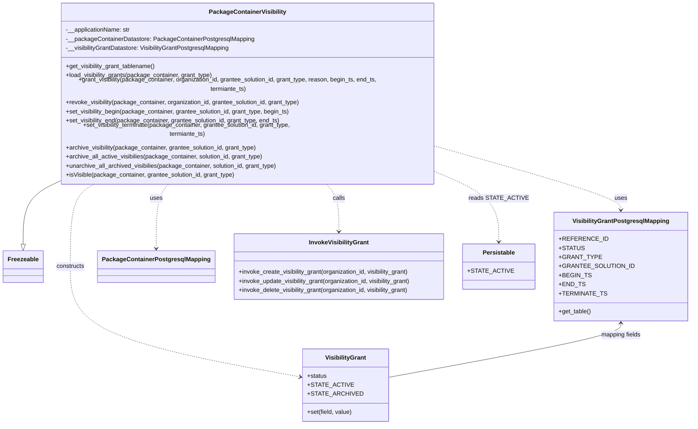
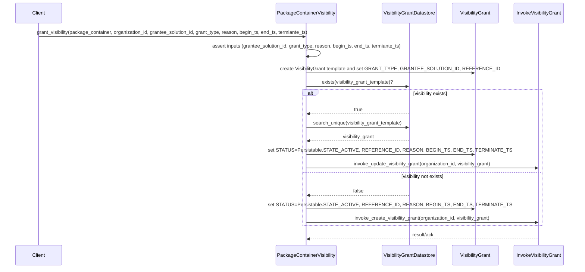
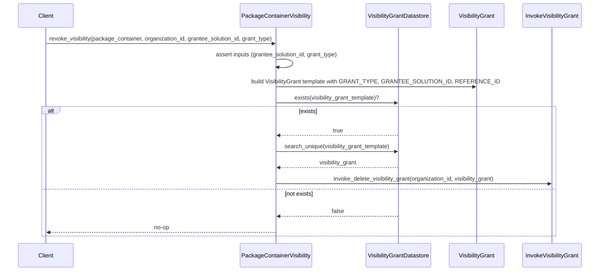

# Diagram: partview_service/partview_service/core/business/package_container/PackageContainerVisibilityGrant.py

> Auto-generated by Obscura crawlers

## Diagram 1

### SVG

<svg id="container" width="1771.25" xmlns="http://www.w3.org/2000/svg" class="classDiagram" height="1076" viewBox="0 0 1771.25 1076" role="graphics-document document" aria-roledescription="class"><g><defs><marker id="container_class-aggregationStart" class="marker aggregation class" refX="18" refY="7" markerWidth="190" markerHeight="240" orient="auto"><path d="M 18,7 L9,13 L1,7 L9,1 Z"></path></marker></defs><defs><marker id="container_class-aggregationEnd" class="marker aggregation class" refX="1" refY="7" markerWidth="20" markerHeight="28" orient="auto"><path d="M 18,7 L9,13 L1,7 L9,1 Z"></path></marker></defs><defs><marker id="container_class-extensionStart" class="marker extension class" refX="18" refY="7" markerWidth="190" markerHeight="240" orient="auto"><path d="M 1,7 L18,13 V 1 Z"></path></marker></defs><defs><marker id="container_class-extensionEnd" class="marker extension class" refX="1" refY="7" markerWidth="20" markerHeight="28" orient="auto"><path d="M 1,1 V 13 L18,7 Z"></path></marker></defs><defs><marker id="container_class-compositionStart" class="marker composition class" refX="18" refY="7" markerWidth="190" markerHeight="240" orient="auto"><path d="M 18,7 L9,13 L1,7 L9,1 Z"></path></marker></defs><defs><marker id="container_class-compositionEnd" class="marker composition class" refX="1" refY="7" markerWidth="20" markerHeight="28" orient="auto"><path d="M 18,7 L9,13 L1,7 L9,1 Z"></path></marker></defs><defs><marker id="container_class-dependencyStart" class="marker dependency class" refX="6" refY="7" markerWidth="190" markerHeight="240" orient="auto"><path d="M 5,7 L9,13 L1,7 L9,1 Z"></path></marker></defs><defs><marker id="container_class-dependencyEnd" class="marker dependency class" refX="13" refY="7" markerWidth="20" markerHeight="28" orient="auto"><path d="M 18,7 L9,13 L14,7 L9,1 Z"></path></marker></defs><defs><marker id="container_class-lollipopStart" class="marker lollipop class" refX="13" refY="7" markerWidth="190" markerHeight="240" orient="auto"><circle stroke="black" fill="transparent" cx="7" cy="7" r="6"></circle></marker></defs><defs><marker id="container_class-lollipopEnd" class="marker lollipop class" refX="1" refY="7" markerWidth="190" markerHeight="240" orient="auto"><circle stroke="black" fill="transparent" cx="7" cy="7" r="6"></circle></marker></defs><g class="root"><g class="clusters"></g><g class="edgePaths"><path d="M144.831,440L130.558,446.167C116.286,452.333,87.74,464.667,73.468,491.125C59.195,517.583,59.195,558.167,59.195,578.458L59.195,598.75" id="id_PackageContainerVisibility_Freezeable_1" class="edge-thickness-normal edge-pattern-solid relation" style=";;;" data-edge="true" data-et="edge" data-id="id_PackageContainerVisibility_Freezeable_1" data-points="W3sieCI6MTQ0LjgzMDY0OTM5NDc2Mjg3LCJ5Ijo0NDB9LHsieCI6NTkuMTk1MzEyNSwieSI6NDc3fSx7IngiOjU5LjE5NTMxMjUsInkiOjYxNn1d" marker-end="url(#container_class-extensionEnd)"></path><path d="M439.149,440L433.279,446.167C427.409,452.333,415.67,464.667,409.8,493C403.93,521.333,403.93,565.667,403.93,587.833L403.93,610" id="id_PackageContainerVisibility_PackageContainerPostgresqlMapping_2" class="edge-thickness-normal edge-pattern-dashed relation" style=";;;" data-edge="true" data-et="edge" data-id="id_PackageContainerVisibility_PackageContainerPostgresqlMapping_2" data-points="W3sieCI6NDM5LjE0OTMyNTI4NDA5MDksInkiOjQ0MH0seyJ4Ijo0MDMuOTI5Njg3NSwieSI6NDc3fSx7IngiOjQwMy45Mjk2ODc1LCJ5Ijo2MTZ9XQ==" marker-end="url(#container_class-dependencyEnd)"></path><path d="M1156.963,359.477L1231.017,379.064C1305.072,398.651,1453.18,437.826,1527.235,462.58C1601.289,487.333,1601.289,497.667,1601.289,502.833L1601.289,508" id="id_PackageContainerVisibility_VisibilityGrantPostgresqlMapping_3" class="edge-thickness-normal edge-pattern-dashed relation" style=";;;" data-edge="true" data-et="edge" data-id="id_PackageContainerVisibility_VisibilityGrantPostgresqlMapping_3" data-points="W3sieCI6MTE1Ni45NjI4OTA2MjUsInkiOjM1OS40NzcxMzYwNjA2MDI5Nn0seyJ4IjoxNjAxLjI4OTA2MjUsInkiOjQ3N30seyJ4IjoxNjAxLjI4OTA2MjUsInkiOjUxNH1d" marker-end="url(#container_class-dependencyEnd)"></path><path d="M250.73,440L239.48,446.167C228.231,452.333,205.733,464.667,194.484,501C183.234,537.333,183.234,597.667,183.234,658C183.234,718.333,183.234,778.667,283.447,827.631C383.661,876.596,584.087,914.192,684.3,932.99L784.513,951.788" id="id_PackageContainerVisibility_VisibilityGrant_4" class="edge-thickness-normal edge-pattern-dashed relation" style=";;;" data-edge="true" data-et="edge" data-id="id_PackageContainerVisibility_VisibilityGrant_4" data-points="W3sieCI6MjUwLjcyOTYxMTg0NTM1NTc1LCJ5Ijo0NDB9LHsieCI6MTgzLjIzNDM3NSwieSI6NDc3fSx7IngiOjE4My4yMzQzNzUsInkiOjY1OH0seyJ4IjoxODMuMjM0Mzc1LCJ5Ijo4Mzl9LHsieCI6NzkwLjQxMDE1NjI1LCJ5Ijo5NTIuODk0NTkwNDEwNDk4NX1d" marker-end="url(#container_class-dependencyEnd)"></path><path d="M850.362,440L856.232,446.167C862.102,452.333,873.842,464.667,879.712,485.5C885.582,506.333,885.582,535.667,885.582,550.333L885.582,565" id="id_PackageContainerVisibility_InvokeVisibilityGrant_5" class="edge-thickness-normal edge-pattern-dashed relation" style=";;;" data-edge="true" data-et="edge" data-id="id_PackageContainerVisibility_InvokeVisibilityGrant_5" data-points="W3sieCI6ODUwLjM2MjM5MzQ2NTkwOTEsInkiOjQ0MH0seyJ4Ijo4ODUuNTgyMDMxMjUsInkiOjQ3N30seyJ4Ijo4ODUuNTgyMDMxMjUsInkiOjU3MX1d" marker-end="url(#container_class-dependencyEnd)"></path><path d="M1156.963,420.465L1181.528,429.888C1206.094,439.31,1255.225,458.155,1279.79,486.744C1304.355,515.333,1304.355,553.667,1304.355,572.833L1304.355,592" id="id_PackageContainerVisibility_Persistable_6" class="edge-thickness-normal edge-pattern-dashed relation" style=";;;" data-edge="true" data-et="edge" data-id="id_PackageContainerVisibility_Persistable_6" data-points="W3sieCI6MTE1Ni45NjI4OTA2MjUsInkiOjQyMC40NjUyMTQ3NTIwODM4NX0seyJ4IjoxMzA0LjM1NTQ2ODc1LCJ5Ijo0Nzd9LHsieCI6MTMwNC4zNTU0Njg3NSwieSI6NTk4fV0=" marker-end="url(#container_class-dependencyEnd)"></path><path d="M1601.289,808L1601.289,813.167C1601.289,818.333,1601.289,828.667,1500.093,852.816C1398.897,876.965,1196.505,914.93,1095.309,933.912L994.113,952.895" id="id_VisibilityGrantPostgresqlMapping_VisibilityGrant_7" class="edge-thickness-normal edge-pattern-solid relation" style=";;;" data-edge="true" data-et="edge" data-id="id_VisibilityGrantPostgresqlMapping_VisibilityGrant_7" data-points="W3sieCI6MTYwMS4yODkwNjI1LCJ5Ijo4MDJ9LHsieCI6MTYwMS4yODkwNjI1LCJ5Ijo4Mzl9LHsieCI6OTk0LjExMzI4MTI1LCJ5Ijo5NTIuODk0NTkwNDEwNDk4NX1d" marker-start="url(#container_class-dependencyStart)"></path></g><g class="edgeLabels"><g class="edgeLabel"><g class="label" data-id="id_PackageContainerVisibility_Freezeable_1" transform="translate(0, 0)"><foreignObject width="0" height="0">

</foreignObject></g></g><g class="edgeLabel" transform="translate(403.9296875, 477)"><g class="label" data-id="id_PackageContainerVisibility_PackageContainerPostgresqlMapping_2" transform="translate(-16.4921875, -12)"><foreignObject width="32.984375" height="24">

uses

</foreignObject></g></g><g class="edgeLabel" transform="translate(1601.2890625, 477)"><g class="label" data-id="id_PackageContainerVisibility_VisibilityGrantPostgresqlMapping_3" transform="translate(-16.4921875, -12)"><foreignObject width="32.984375" height="24">

uses

</foreignObject></g></g><g class="edgeLabel" transform="translate(183.234375, 658)"><g class="label" data-id="id_PackageContainerVisibility_VisibilityGrant_4" transform="translate(-37.84375, -12)"><foreignObject width="75.6875" height="24">

constructs

</foreignObject></g></g><g class="edgeLabel" transform="translate(885.58203125, 477)"><g class="label" data-id="id_PackageContainerVisibility_InvokeVisibilityGrant_5" transform="translate(-16.4453125, -12)"><foreignObject width="32.890625" height="24">

calls

</foreignObject></g></g><g class="edgeLabel" transform="translate(1304.35546875, 477)"><g class="label" data-id="id_PackageContainerVisibility_Persistable_6" transform="translate(-70.9296875, -12)"><foreignObject width="141.859375" height="24">

reads STATE_ACTIVE

</foreignObject></g></g><g class="edgeLabel" transform="translate(1601.2890625, 839)"><g class="label" data-id="id_VisibilityGrantPostgresqlMapping_VisibilityGrant_7" transform="translate(-53.7265625, -12)"><foreignObject width="107.453125" height="24">

mapping fields

</foreignObject></g></g></g><g class="nodes"><g class="node default" id="classId-PackageContainerVisibility-0" transform="translate(644.755859375, 224)"><g class="basic label-container"><path d="M-512.20703125 -216 L512.20703125 -216 L512.20703125 216 L-512.20703125 216" stroke="none" stroke-width="0" fill="#ECECFF" style=""></path><path d="M-512.20703125 -216 C-223.42168369629388 -216, 65.36366385741223 -216, 512.20703125 -216 M-512.20703125 -216 C-103.31803776255435 -216, 305.5709557248913 -216, 512.20703125 -216 M512.20703125 -216 C512.20703125 -106.42852293028419, 512.20703125 3.142954139431623, 512.20703125 216 M512.20703125 -216 C512.20703125 -119.63499464055546, 512.20703125 -23.269989281110924, 512.20703125 216 M512.20703125 216 C145.19060809325111 216, -221.82581506349777 216, -512.20703125 216 M512.20703125 216 C241.7019689581483 216, -28.803093333703373 216, -512.20703125 216 M-512.20703125 216 C-512.20703125 73.92762348971812, -512.20703125 -68.14475302056377, -512.20703125 -216 M-512.20703125 216 C-512.20703125 72.78201400611192, -512.20703125 -70.43597198777616, -512.20703125 -216" stroke="#9370DB" stroke-width="1.3" fill="none" stroke-dasharray="0 0" style=""></path></g><g class="annotation-group text" transform="translate(0, -192)"></g><g class="label-group text" transform="translate(-97.2421875, -192)"><g class="label" style="font-weight: bolder" transform="translate(0,-12)"><foreignObject width="194.484375" height="24">

PackageContainerVisibility

</foreignObject></g></g><g class="members-group text" transform="translate(-500.20703125, -144)"><g class="label" style="" transform="translate(0,-12)"><foreignObject width="173.015625" height="24">

-__applicationName: str

</foreignObject></g><g class="label" style="" transform="translate(0,12)"><foreignObject width="495.609375" height="24">

-__packageContainerDatastore: PackageContainerPostgresqlMapping

</foreignObject></g><g class="label" style="" transform="translate(0,36)"><foreignObject width="439.546875" height="24">

-__visibilityGrantDatastore: VisibilityGrantPostgresqlMapping

</foreignObject></g></g><g class="methods-group text" transform="translate(-500.20703125, -48)"><g class="label" style="" transform="translate(0,-12)"><foreignObject width="241.40625" height="24">

+get_visibility_grant_tablename()

</foreignObject></g><g class="label" style="" transform="translate(0,12)"><foreignObject width="392.90625" height="24">

+load_visibility_grants(package_container, grant_type)

</foreignObject></g><g class="label" style="" transform="translate(0,36)"><foreignObject width="903.171875" height="24">

+grant_visibility(package_container, organization_id, grantee_solution_id, grant_type, reason, begin_ts, end_ts, termiante_ts)

</foreignObject></g><g class="label" style="" transform="translate(0,60)"><foreignObject width="629.671875" height="24">

+revoke_visibility(package_container, organization_id, grantee_solution_id, grant_type)

</foreignObject></g><g class="label" style="" transform="translate(0,84)"><foreignObject width="600.734375" height="24">

+set_visibility_begin(package_container, grantee_solution_id, grant_type, begin_ts)

</foreignObject></g><g class="label" style="" transform="translate(0,108)"><foreignObject width="574.875" height="24">

+set_visibility_end(package_container, grantee_solution_id, grant_type, end_ts)

</foreignObject></g><g class="label" style="" transform="translate(0,132)"><foreignObject width="661.203125" height="24">

+set_visibility_terminate(package_container, grantee_solution_id, grant_type, termiante_ts)

</foreignObject></g><g class="label" style="" transform="translate(0,156)"><foreignObject width="512.796875" height="24">

+archive_visibility(package_container, grantee_solution_id, grant_type)

</foreignObject></g><g class="label" style="" transform="translate(0,180)"><foreignObject width="529.1875" height="24">

+archive_all_active_visibilies(package_container, solution_id, grant_type)

</foreignObject></g><g class="label" style="" transform="translate(0,204)"><foreignObject width="567.3125" height="24">

+unarchive_all_archived_visibilies(package_container, solution_id, grant_type)

</foreignObject></g><g class="label" style="" transform="translate(0,228)"><foreignObject width="452.109375" height="24">

+isVisible(package_container, grantee_solution_id, grant_type)

</foreignObject></g></g><g class="divider" style=""><path d="M-512.20703125 -168 C-124.01796308634351 -168, 264.171105077313 -168, 512.20703125 -168 M-512.20703125 -168 C-179.03409498809583 -168, 154.13884127380834 -168, 512.20703125 -168" stroke="#9370DB" stroke-width="1.3" fill="none" stroke-dasharray="0 0" style=""></path></g><g class="divider" style=""><path d="M-512.20703125 -72 C-111.35074253467786 -72, 289.5055461806443 -72, 512.20703125 -72 M-512.20703125 -72 C-305.32964736267246 -72, -98.45226347534492 -72, 512.20703125 -72" stroke="#9370DB" stroke-width="1.3" fill="none" stroke-dasharray="0 0" style=""></path></g></g><g class="node default" id="classId-Freezeable-1" transform="translate(59.1953125, 658)"><g class="basic label-container"><path d="M-51.1953125 -42 L51.1953125 -42 L51.1953125 42 L-51.1953125 42" stroke="none" stroke-width="0" fill="#ECECFF" style=""></path><path d="M-51.1953125 -42 C-21.362862068934128 -42, 8.469588362131745 -42, 51.1953125 -42 M-51.1953125 -42 C-15.449028321578211 -42, 20.297255856843577 -42, 51.1953125 -42 M51.1953125 -42 C51.1953125 -10.169581386837969, 51.1953125 21.660837226324062, 51.1953125 42 M51.1953125 -42 C51.1953125 -13.843727884522522, 51.1953125 14.312544230954956, 51.1953125 42 M51.1953125 42 C30.495581976724107 42, 9.795851453448215 42, -51.1953125 42 M51.1953125 42 C16.675677961770347 42, -17.843956576459306 42, -51.1953125 42 M-51.1953125 42 C-51.1953125 9.890405811388668, -51.1953125 -22.219188377222665, -51.1953125 -42 M-51.1953125 42 C-51.1953125 11.287124229327176, -51.1953125 -19.425751541345647, -51.1953125 -42" stroke="#9370DB" stroke-width="1.3" fill="none" stroke-dasharray="0 0" style=""></path></g><g class="annotation-group text" transform="translate(0, -18)"></g><g class="label-group text" transform="translate(-39.1953125, -18)"><g class="label" style="font-weight: bolder" transform="translate(0,-12)"><foreignObject width="78.390625" height="24">

Freezeable

</foreignObject></g></g><g class="members-group text" transform="translate(-39.1953125, 30)"></g><g class="methods-group text" transform="translate(-39.1953125, 60)"></g><g class="divider" style=""><path d="M-51.1953125 6 C-26.85266948714386 6, -2.51002647428772 6, 51.1953125 6 M-51.1953125 6 C-13.777169206714724 6, 23.64097408657055 6, 51.1953125 6" stroke="#9370DB" stroke-width="1.3" fill="none" stroke-dasharray="0 0" style=""></path></g><g class="divider" style=""><path d="M-51.1953125 24 C-25.550107279738018 24, 0.09509794052396359 24, 51.1953125 24 M-51.1953125 24 C-21.030809907867862 24, 9.133692684264275 24, 51.1953125 24" stroke="#9370DB" stroke-width="1.3" fill="none" stroke-dasharray="0 0" style=""></path></g></g><g class="node default" id="classId-VisibilityGrant-2" transform="translate(892.26171875, 972)"><g class="basic label-container"><path d="M-101.8515625 -96 L101.8515625 -96 L101.8515625 96 L-101.8515625 96" stroke="none" stroke-width="0" fill="#ECECFF" style=""></path><path d="M-101.8515625 -96 C-43.9983239902958 -96, 13.854914519408396 -96, 101.8515625 -96 M-101.8515625 -96 C-47.16796280535198 -96, 7.515636889296033 -96, 101.8515625 -96 M101.8515625 -96 C101.8515625 -32.94637660006177, 101.8515625 30.107246799876464, 101.8515625 96 M101.8515625 -96 C101.8515625 -44.530202916754064, 101.8515625 6.939594166491872, 101.8515625 96 M101.8515625 96 C35.84167350776448 96, -30.168215484471034 96, -101.8515625 96 M101.8515625 96 C29.1320776166003 96, -43.5874072667994 96, -101.8515625 96 M-101.8515625 96 C-101.8515625 36.99094326446206, -101.8515625 -22.01811347107588, -101.8515625 -96 M-101.8515625 96 C-101.8515625 54.04486073270949, -101.8515625 12.089721465418975, -101.8515625 -96" stroke="#9370DB" stroke-width="1.3" fill="none" stroke-dasharray="0 0" style=""></path></g><g class="annotation-group text" transform="translate(0, -72)"></g><g class="label-group text" transform="translate(-51.96875, -72)"><g class="label" style="font-weight: bolder" transform="translate(0,-12)"><foreignObject width="103.9375" height="24">

VisibilityGrant

</foreignObject></g></g><g class="members-group text" transform="translate(-89.8515625, -24)"><g class="label" style="" transform="translate(0,-12)"><foreignObject width="52.390625" height="24">

+status

</foreignObject></g><g class="label" style="" transform="translate(0,12)"><foreignObject width="104.96875" height="24">

+STATE_ACTIVE

</foreignObject></g><g class="label" style="" transform="translate(0,36)"><foreignObject width="127.734375" height="24">

+STATE_ARCHIVED

</foreignObject></g></g><g class="methods-group text" transform="translate(-89.8515625, 72)"><g class="label" style="" transform="translate(0,-12)"><foreignObject width="119.390625" height="24">

+set(field, value)

</foreignObject></g></g><g class="divider" style=""><path d="M-101.8515625 -48 C-34.03830744299752 -48, 33.77494761400496 -48, 101.8515625 -48 M-101.8515625 -48 C-32.92773584365435 -48, 35.99609081269131 -48, 101.8515625 -48" stroke="#9370DB" stroke-width="1.3" fill="none" stroke-dasharray="0 0" style=""></path></g><g class="divider" style=""><path d="M-101.8515625 48 C-57.61376214550656 48, -13.375961791013125 48, 101.8515625 48 M-101.8515625 48 C-43.73605461134037 48, 14.379453277319257 48, 101.8515625 48" stroke="#9370DB" stroke-width="1.3" fill="none" stroke-dasharray="0 0" style=""></path></g></g><g class="node default" id="classId-VisibilityGrantPostgresqlMapping-3" transform="translate(1601.2890625, 658)"><g class="basic label-container"><path d="M-161.9609375 -144 L161.9609375 -144 L161.9609375 144 L-161.9609375 144" stroke="none" stroke-width="0" fill="#ECECFF" style=""></path><path d="M-161.9609375 -144 C-60.351456503544824 -144, 41.25802449291035 -144, 161.9609375 -144 M-161.9609375 -144 C-79.29829463704023 -144, 3.3643482259195423 -144, 161.9609375 -144 M161.9609375 -144 C161.9609375 -84.50818021043622, 161.9609375 -25.01636042087246, 161.9609375 144 M161.9609375 -144 C161.9609375 -36.527883423539066, 161.9609375 70.94423315292187, 161.9609375 144 M161.9609375 144 C80.26379234871311 144, -1.4333528025737792 144, -161.9609375 144 M161.9609375 144 C42.794259329328426 144, -76.37241884134315 144, -161.9609375 144 M-161.9609375 144 C-161.9609375 66.11824012881871, -161.9609375 -11.763519742362575, -161.9609375 -144 M-161.9609375 144 C-161.9609375 78.83657032568969, -161.9609375 13.673140651379384, -161.9609375 -144" stroke="#9370DB" stroke-width="1.3" fill="none" stroke-dasharray="0 0" style=""></path></g><g class="annotation-group text" transform="translate(0, -120)"></g><g class="label-group text" transform="translate(-122.375, -120)"><g class="label" style="font-weight: bolder" transform="translate(0,-12)"><foreignObject width="244.75" height="24">

VisibilityGrantPostgresqlMapping

</foreignObject></g></g><g class="members-group text" transform="translate(-149.9609375, -72)"><g class="label" style="" transform="translate(0,-12)"><foreignObject width="112.6875" height="24">

+REFERENCE_ID

</foreignObject></g><g class="label" style="" transform="translate(0,12)"><foreignObject width="59.03125" height="24">

+STATUS

</foreignObject></g><g class="label" style="" transform="translate(0,36)"><foreignObject width="97.78125" height="24">

+GRANT_TYPE

</foreignObject></g><g class="label" style="" transform="translate(0,60)"><foreignObject width="177.546875" height="24">

+GRANTEE_SOLUTION_ID

</foreignObject></g><g class="label" style="" transform="translate(0,84)"><foreignObject width="76.03125" height="24">

+BEGIN_TS

</foreignObject></g><g class="label" style="" transform="translate(0,108)"><foreignObject width="61.328125" height="24">

+END_TS

</foreignObject></g><g class="label" style="" transform="translate(0,132)"><foreignObject width="111.1875" height="24">

+TERMINATE_TS

</foreignObject></g></g><g class="methods-group text" transform="translate(-149.9609375, 120)"><g class="label" style="" transform="translate(0,-12)"><foreignObject width="86.125" height="24">

+get_table()

</foreignObject></g></g><g class="divider" style=""><path d="M-161.9609375 -96 C-48.974307104123696 -96, 64.01232329175261 -96, 161.9609375 -96 M-161.9609375 -96 C-45.4677953122105 -96, 71.025346875579 -96, 161.9609375 -96" stroke="#9370DB" stroke-width="1.3" fill="none" stroke-dasharray="0 0" style=""></path></g><g class="divider" style=""><path d="M-161.9609375 96 C-91.4502272282944 96, -20.93951695658879 96, 161.9609375 96 M-161.9609375 96 C-89.03120708258719 96, -16.101476665174374 96, 161.9609375 96" stroke="#9370DB" stroke-width="1.3" fill="none" stroke-dasharray="0 0" style=""></path></g></g><g class="node default" id="classId-PackageContainerPostgresqlMapping-4" transform="translate(403.9296875, 658)"><g class="basic label-container"><path d="M-147.8515625 -42 L147.8515625 -42 L147.8515625 42 L-147.8515625 42" stroke="none" stroke-width="0" fill="#ECECFF" style=""></path><path d="M-147.8515625 -42 C-40.32669329489865 -42, 67.1981759102027 -42, 147.8515625 -42 M-147.8515625 -42 C-69.20287000055117 -42, 9.445822498897655 -42, 147.8515625 -42 M147.8515625 -42 C147.8515625 -22.252406231056792, 147.8515625 -2.504812462113584, 147.8515625 42 M147.8515625 -42 C147.8515625 -23.137582429688678, 147.8515625 -4.275164859377355, 147.8515625 42 M147.8515625 42 C47.70921291735756 42, -52.43313666528488 42, -147.8515625 42 M147.8515625 42 C64.63269234192288 42, -18.586177816154247 42, -147.8515625 42 M-147.8515625 42 C-147.8515625 9.268968551274178, -147.8515625 -23.462062897451645, -147.8515625 -42 M-147.8515625 42 C-147.8515625 20.968873287155283, -147.8515625 -0.06225342568943404, -147.8515625 -42" stroke="#9370DB" stroke-width="1.3" fill="none" stroke-dasharray="0 0" style=""></path></g><g class="annotation-group text" transform="translate(0, -18)"></g><g class="label-group text" transform="translate(-135.8515625, -18)"><g class="label" style="font-weight: bolder" transform="translate(0,-12)"><foreignObject width="271.703125" height="24">

PackageContainerPostgresqlMapping

</foreignObject></g></g><g class="members-group text" transform="translate(-135.8515625, 30)"></g><g class="methods-group text" transform="translate(-135.8515625, 60)"></g><g class="divider" style=""><path d="M-147.8515625 6 C-68.03455855331474 6, 11.782445393370523 6, 147.8515625 6 M-147.8515625 6 C-70.59727319262866 6, 6.6570161147426745 6, 147.8515625 6" stroke="#9370DB" stroke-width="1.3" fill="none" stroke-dasharray="0 0" style=""></path></g><g class="divider" style=""><path d="M-147.8515625 24 C-40.18831431466177 24, 67.47493387067647 24, 147.8515625 24 M-147.8515625 24 C-41.31403235871146 24, 65.22349778257708 24, 147.8515625 24" stroke="#9370DB" stroke-width="1.3" fill="none" stroke-dasharray="0 0" style=""></path></g></g><g class="node default" id="classId-InvokeVisibilityGrant-5" transform="translate(885.58203125, 658)"><g class="basic label-container"><path d="M-283.80078125 -87 L283.80078125 -87 L283.80078125 87 L-283.80078125 87" stroke="none" stroke-width="0" fill="#ECECFF" style=""></path><path d="M-283.80078125 -87 C-98.8707869593043 -87, 86.0592073313914 -87, 283.80078125 -87 M-283.80078125 -87 C-161.8867264254734 -87, -39.972671600946825 -87, 283.80078125 -87 M283.80078125 -87 C283.80078125 -37.20847117109191, 283.80078125 12.583057657816184, 283.80078125 87 M283.80078125 -87 C283.80078125 -32.91392320748358, 283.80078125 21.172153585032845, 283.80078125 87 M283.80078125 87 C86.3830485585282 87, -111.0346841329436 87, -283.80078125 87 M283.80078125 87 C87.71652988633096 87, -108.36772147733808 87, -283.80078125 87 M-283.80078125 87 C-283.80078125 29.68488488150976, -283.80078125 -27.63023023698048, -283.80078125 -87 M-283.80078125 87 C-283.80078125 32.81795116873901, -283.80078125 -21.364097662521985, -283.80078125 -87" stroke="#9370DB" stroke-width="1.3" fill="none" stroke-dasharray="0 0" style=""></path></g><g class="annotation-group text" transform="translate(0, -63)"></g><g class="label-group text" transform="translate(-76.3203125, -63)"><g class="label" style="font-weight: bolder" transform="translate(0,-12)"><foreignObject width="152.640625" height="24">

InvokeVisibilityGrant

</foreignObject></g></g><g class="members-group text" transform="translate(-271.80078125, -15)"></g><g class="methods-group text" transform="translate(-271.80078125, 15)"><g class="label" style="" transform="translate(0,-12)"><foreignObject width="460.8125" height="24">

+invoke_create_visibility_grant(organization_id, visibility_grant)

</foreignObject></g><g class="label" style="" transform="translate(0,12)"><foreignObject width="467.28125" height="24">

+invoke_update_visibility_grant(organization_id, visibility_grant)

</foreignObject></g><g class="label" style="" transform="translate(0,36)"><foreignObject width="461.8125" height="24">

+invoke_delete_visibility_grant(organization_id, visibility_grant)

</foreignObject></g></g><g class="divider" style=""><path d="M-283.80078125 -39 C-156.10023685430536 -39, -28.399692458610758 -39, 283.80078125 -39 M-283.80078125 -39 C-115.67144675236693 -39, 52.457887745266135 -39, 283.80078125 -39" stroke="#9370DB" stroke-width="1.3" fill="none" stroke-dasharray="0 0" style=""></path></g><g class="divider" style=""><path d="M-283.80078125 -15 C-94.04550092668217 -15, 95.70977939663567 -15, 283.80078125 -15 M-283.80078125 -15 C-162.0412411101117 -15, -40.281700970223426 -15, 283.80078125 -15" stroke="#9370DB" stroke-width="1.3" fill="none" stroke-dasharray="0 0" style=""></path></g></g><g class="node default" id="classId-Persistable-6" transform="translate(1304.35546875, 658)"><g class="basic label-container"><path d="M-84.97265625 -60 L84.97265625 -60 L84.97265625 60 L-84.97265625 60" stroke="none" stroke-width="0" fill="#ECECFF" style=""></path><path d="M-84.97265625 -60 C-20.572760950334 -60, 43.827134349332 -60, 84.97265625 -60 M-84.97265625 -60 C-22.441760062369212 -60, 40.089136125261575 -60, 84.97265625 -60 M84.97265625 -60 C84.97265625 -20.43177798790849, 84.97265625 19.13644402418302, 84.97265625 60 M84.97265625 -60 C84.97265625 -20.271923898979814, 84.97265625 19.45615220204037, 84.97265625 60 M84.97265625 60 C34.013594317051314 60, -16.94546761589737 60, -84.97265625 60 M84.97265625 60 C32.86014097536055 60, -19.252374299278898 60, -84.97265625 60 M-84.97265625 60 C-84.97265625 32.54980135727911, -84.97265625 5.099602714558223, -84.97265625 -60 M-84.97265625 60 C-84.97265625 32.261643643934924, -84.97265625 4.523287287869849, -84.97265625 -60" stroke="#9370DB" stroke-width="1.3" fill="none" stroke-dasharray="0 0" style=""></path></g><g class="annotation-group text" transform="translate(0, -36)"></g><g class="label-group text" transform="translate(-40.9765625, -36)"><g class="label" style="font-weight: bolder" transform="translate(0,-12)"><foreignObject width="81.953125" height="24">

Persistable

</foreignObject></g></g><g class="members-group text" transform="translate(-72.97265625, 12)"><g class="label" style="" transform="translate(0,-12)"><foreignObject width="104.96875" height="24">

+STATE_ACTIVE

</foreignObject></g></g><g class="methods-group text" transform="translate(-72.97265625, 60)"></g><g class="divider" style=""><path d="M-84.97265625 -12 C-45.86380991045972 -12, -6.754963570919443 -12, 84.97265625 -12 M-84.97265625 -12 C-46.50475235914114 -12, -8.036848468282287 -12, 84.97265625 -12" stroke="#9370DB" stroke-width="1.3" fill="none" stroke-dasharray="0 0" style=""></path></g><g class="divider" style=""><path d="M-84.97265625 36 C-27.21059467777922 36, 30.55146689444156 36, 84.97265625 36 M-84.97265625 36 C-31.562912516018038 36, 21.846831217963924 36, 84.97265625 36" stroke="#9370DB" stroke-width="1.3" fill="none" stroke-dasharray="0 0" style=""></path></g></g></g></g></g></svg>

## Diagram 2

### SVG

<svg id="container" width="2027.5" xmlns="http://www.w3.org/2000/svg" height="925" viewBox="-50 -10 2027.5 925" role="graphics-document document" aria-roledescription="sequence"><g><rect x="1757.5" y="839" fill="#eaeaea" stroke="#666" width="170" height="65" name="Invoker" rx="3" ry="3" class="actor actor-bottom"></rect><text x="1842.5" y="871.5" dominant-baseline="central" alignment-baseline="central" class="actor actor-box" style="text-anchor: middle; font-size: 16px; font-weight: 400;"><tspan x="1842.5" dy="0">InvokeVisibilityGrant</tspan></text></g><g><rect x="1557.5" y="839" fill="#eaeaea" stroke="#666" width="150" height="65" name="VG" rx="3" ry="3" class="actor actor-bottom"></rect><text x="1632.5" y="871.5" dominant-baseline="central" alignment-baseline="central" class="actor actor-box" style="text-anchor: middle; font-size: 16px; font-weight: 400;"><tspan x="1632.5" dy="0">VisibilityGrant</tspan></text></g><g><rect x="1315.5" y="839" fill="#eaeaea" stroke="#666" width="192" height="65" name="Datastore" rx="3" ry="3" class="actor actor-bottom"></rect><text x="1411.5" y="871.5" dominant-baseline="central" alignment-baseline="central" class="actor actor-box" style="text-anchor: middle; font-size: 16px; font-weight: 400;"><tspan x="1411.5" dy="0">VisibilityGrantDatastore</tspan></text></g><g><rect x="934.5" y="839" fill="#eaeaea" stroke="#666" width="211" height="65" name="PCV" rx="3" ry="3" class="actor actor-bottom"></rect><text x="1040" y="871.5" dominant-baseline="central" alignment-baseline="central" class="actor actor-box" style="text-anchor: middle; font-size: 16px; font-weight: 400;"><tspan x="1040" dy="0">PackageContainerVisibility</tspan></text></g><g><rect x="0" y="839" fill="#eaeaea" stroke="#666" width="150" height="65" name="Client" rx="3" ry="3" class="actor actor-bottom"></rect><text x="75" y="871.5" dominant-baseline="central" alignment-baseline="central" class="actor actor-box" style="text-anchor: middle; font-size: 16px; font-weight: 400;"><tspan x="75" dy="0">Client</tspan></text></g><g><line id="actor4" x1="1842.5" y1="65" x2="1842.5" y2="839" class="actor-line 200" stroke-width="0.5px" stroke="#999" name="Invoker"></line><g id="root-4"><rect x="1757.5" y="0" fill="#eaeaea" stroke="#666" width="170" height="65" name="Invoker" rx="3" ry="3" class="actor actor-top"></rect><text x="1842.5" y="32.5" dominant-baseline="central" alignment-baseline="central" class="actor actor-box" style="text-anchor: middle; font-size: 16px; font-weight: 400;"><tspan x="1842.5" dy="0">InvokeVisibilityGrant</tspan></text></g></g><g><line id="actor3" x1="1632.5" y1="65" x2="1632.5" y2="839" class="actor-line 200" stroke-width="0.5px" stroke="#999" name="VG"></line><g id="root-3"><rect x="1557.5" y="0" fill="#eaeaea" stroke="#666" width="150" height="65" name="VG" rx="3" ry="3" class="actor actor-top"></rect><text x="1632.5" y="32.5" dominant-baseline="central" alignment-baseline="central" class="actor actor-box" style="text-anchor: middle; font-size: 16px; font-weight: 400;"><tspan x="1632.5" dy="0">VisibilityGrant</tspan></text></g></g><g><line id="actor2" x1="1411.5" y1="65" x2="1411.5" y2="839" class="actor-line 200" stroke-width="0.5px" stroke="#999" name="Datastore"></line><g id="root-2"><rect x="1315.5" y="0" fill="#eaeaea" stroke="#666" width="192" height="65" name="Datastore" rx="3" ry="3" class="actor actor-top"></rect><text x="1411.5" y="32.5" dominant-baseline="central" alignment-baseline="central" class="actor actor-box" style="text-anchor: middle; font-size: 16px; font-weight: 400;"><tspan x="1411.5" dy="0">VisibilityGrantDatastore</tspan></text></g></g><g><line id="actor1" x1="1040" y1="65" x2="1040" y2="839" class="actor-line 200" stroke-width="0.5px" stroke="#999" name="PCV"></line><g id="root-1"><rect x="934.5" y="0" fill="#eaeaea" stroke="#666" width="211" height="65" name="PCV" rx="3" ry="3" class="actor actor-top"></rect><text x="1040" y="32.5" dominant-baseline="central" alignment-baseline="central" class="actor actor-box" style="text-anchor: middle; font-size: 16px; font-weight: 400;"><tspan x="1040" dy="0">PackageContainerVisibility</tspan></text></g></g><g><line id="actor0" x1="75" y1="65" x2="75" y2="839" class="actor-line 200" stroke-width="0.5px" stroke="#999" name="Client"></line><g id="root-0"><rect x="0" y="0" fill="#eaeaea" stroke="#666" width="150" height="65" name="Client" rx="3" ry="3" class="actor actor-top"></rect><text x="75" y="32.5" dominant-baseline="central" alignment-baseline="central" class="actor actor-box" style="text-anchor: middle; font-size: 16px; font-weight: 400;"><tspan x="75" dy="0">Client</tspan></text></g></g><g></g><defs><symbol id="computer" width="24" height="24"><path transform="scale(.5)" d="M2 2v13h20v-13h-20zm18 11h-16v-9h16v9zm-10.228 6l.466-1h3.524l.467 1h-4.457zm14.228 3h-24l2-6h2.104l-1.33 4h18.45l-1.297-4h2.073l2 6zm-5-10h-14v-7h14v7z"></path></symbol></defs><defs><symbol id="database" fill-rule="evenodd" clip-rule="evenodd"><path transform="scale(.5)" d="M12.258.001l.256.004.255.005.253.008.251.01.249.012.247.015.246.016.242.019.241.02.239.023.236.024.233.027.231.028.229.031.225.032.223.034.22.036.217.038.214.04.211.041.208.043.205.045.201.046.198.048.194.05.191.051.187.053.183.054.18.056.175.057.172.059.168.06.163.061.16.063.155.064.15.066.074.033.073.033.071.034.07.034.069.035.068.035.067.035.066.035.064.036.064.036.062.036.06.036.06.037.058.037.058.037.055.038.055.038.053.038.052.038.051.039.05.039.048.039.047.039.045.04.044.04.043.04.041.04.04.041.039.041.037.041.036.041.034.041.033.042.032.042.03.042.029.042.027.042.026.043.024.043.023.043.021.043.02.043.018.044.017.043.015.044.013.044.012.044.011.045.009.044.007.045.006.045.004.045.002.045.001.045v17l-.001.045-.002.045-.004.045-.006.045-.007.045-.009.044-.011.045-.012.044-.013.044-.015.044-.017.043-.018.044-.02.043-.021.043-.023.043-.024.043-.026.043-.027.042-.029.042-.03.042-.032.042-.033.042-.034.041-.036.041-.037.041-.039.041-.04.041-.041.04-.043.04-.044.04-.045.04-.047.039-.048.039-.05.039-.051.039-.052.038-.053.038-.055.038-.055.038-.058.037-.058.037-.06.037-.06.036-.062.036-.064.036-.064.036-.066.035-.067.035-.068.035-.069.035-.07.034-.071.034-.073.033-.074.033-.15.066-.155.064-.16.063-.163.061-.168.06-.172.059-.175.057-.18.056-.183.054-.187.053-.191.051-.194.05-.198.048-.201.046-.205.045-.208.043-.211.041-.214.04-.217.038-.22.036-.223.034-.225.032-.229.031-.231.028-.233.027-.236.024-.239.023-.241.02-.242.019-.246.016-.247.015-.249.012-.251.01-.253.008-.255.005-.256.004-.258.001-.258-.001-.256-.004-.255-.005-.253-.008-.251-.01-.249-.012-.247-.015-.245-.016-.243-.019-.241-.02-.238-.023-.236-.024-.234-.027-.231-.028-.228-.031-.226-.032-.223-.034-.22-.036-.217-.038-.214-.04-.211-.041-.208-.043-.204-.045-.201-.046-.198-.048-.195-.05-.19-.051-.187-.053-.184-.054-.179-.056-.176-.057-.172-.059-.167-.06-.164-.061-.159-.063-.155-.064-.151-.066-.074-.033-.072-.033-.072-.034-.07-.034-.069-.035-.068-.035-.067-.035-.066-.035-.064-.036-.063-.036-.062-.036-.061-.036-.06-.037-.058-.037-.057-.037-.056-.038-.055-.038-.053-.038-.052-.038-.051-.039-.049-.039-.049-.039-.046-.039-.046-.04-.044-.04-.043-.04-.041-.04-.04-.041-.039-.041-.037-.041-.036-.041-.034-.041-.033-.042-.032-.042-.03-.042-.029-.042-.027-.042-.026-.043-.024-.043-.023-.043-.021-.043-.02-.043-.018-.044-.017-.043-.015-.044-.013-.044-.012-.044-.011-.045-.009-.044-.007-.045-.006-.045-.004-.045-.002-.045-.001-.045v-17l.001-.045.002-.045.004-.045.006-.045.007-.045.009-.044.011-.045.012-.044.013-.044.015-.044.017-.043.018-.044.02-.043.021-.043.023-.043.024-.043.026-.043.027-.042.029-.042.03-.042.032-.042.033-.042.034-.041.036-.041.037-.041.039-.041.04-.041.041-.04.043-.04.044-.04.046-.04.046-.039.049-.039.049-.039.051-.039.052-.038.053-.038.055-.038.056-.038.057-.037.058-.037.06-.037.061-.036.062-.036.063-.036.064-.036.066-.035.067-.035.068-.035.069-.035.07-.034.072-.034.072-.033.074-.033.151-.066.155-.064.159-.063.164-.061.167-.06.172-.059.176-.057.179-.056.184-.054.187-.053.19-.051.195-.05.198-.048.201-.046.204-.045.208-.043.211-.041.214-.04.217-.038.22-.036.223-.034.226-.032.228-.031.231-.028.234-.027.236-.024.238-.023.241-.02.243-.019.245-.016.247-.015.249-.012.251-.01.253-.008.255-.005.256-.004.258-.001.258.001zm-9.258 20.499v.01l.001.021.003.021.004.022.005.021.006.022.007.022.009.023.01.022.011.023.012.023.013.023.015.023.016.024.017.023.018.024.019.024.021.024.022.025.023.024.024.025.052.049.056.05.061.051.066.051.07.051.075.051.079.052.084.052.088.052.092.052.097.052.102.051.105.052.11.052.114.051.119.051.123.051.127.05.131.05.135.05.139.048.144.049.147.047.152.047.155.047.16.045.163.045.167.043.171.043.176.041.178.041.183.039.187.039.19.037.194.035.197.035.202.033.204.031.209.03.212.029.216.027.219.025.222.024.226.021.23.02.233.018.236.016.24.015.243.012.246.01.249.008.253.005.256.004.259.001.26-.001.257-.004.254-.005.25-.008.247-.011.244-.012.241-.014.237-.016.233-.018.231-.021.226-.021.224-.024.22-.026.216-.027.212-.028.21-.031.205-.031.202-.034.198-.034.194-.036.191-.037.187-.039.183-.04.179-.04.175-.042.172-.043.168-.044.163-.045.16-.046.155-.046.152-.047.148-.048.143-.049.139-.049.136-.05.131-.05.126-.05.123-.051.118-.052.114-.051.11-.052.106-.052.101-.052.096-.052.092-.052.088-.053.083-.051.079-.052.074-.052.07-.051.065-.051.06-.051.056-.05.051-.05.023-.024.023-.025.021-.024.02-.024.019-.024.018-.024.017-.024.015-.023.014-.024.013-.023.012-.023.01-.023.01-.022.008-.022.006-.022.006-.022.004-.022.004-.021.001-.021.001-.021v-4.127l-.077.055-.08.053-.083.054-.085.053-.087.052-.09.052-.093.051-.095.05-.097.05-.1.049-.102.049-.105.048-.106.047-.109.047-.111.046-.114.045-.115.045-.118.044-.12.043-.122.042-.124.042-.126.041-.128.04-.13.04-.132.038-.134.038-.135.037-.138.037-.139.035-.142.035-.143.034-.144.033-.147.032-.148.031-.15.03-.151.03-.153.029-.154.027-.156.027-.158.026-.159.025-.161.024-.162.023-.163.022-.165.021-.166.02-.167.019-.169.018-.169.017-.171.016-.173.015-.173.014-.175.013-.175.012-.177.011-.178.01-.179.008-.179.008-.181.006-.182.005-.182.004-.184.003-.184.002h-.37l-.184-.002-.184-.003-.182-.004-.182-.005-.181-.006-.179-.008-.179-.008-.178-.01-.176-.011-.176-.012-.175-.013-.173-.014-.172-.015-.171-.016-.17-.017-.169-.018-.167-.019-.166-.02-.165-.021-.163-.022-.162-.023-.161-.024-.159-.025-.157-.026-.156-.027-.155-.027-.153-.029-.151-.03-.15-.03-.148-.031-.146-.032-.145-.033-.143-.034-.141-.035-.14-.035-.137-.037-.136-.037-.134-.038-.132-.038-.13-.04-.128-.04-.126-.041-.124-.042-.122-.042-.12-.044-.117-.043-.116-.045-.113-.045-.112-.046-.109-.047-.106-.047-.105-.048-.102-.049-.1-.049-.097-.05-.095-.05-.093-.052-.09-.051-.087-.052-.085-.053-.083-.054-.08-.054-.077-.054v4.127zm0-5.654v.011l.001.021.003.021.004.021.005.022.006.022.007.022.009.022.01.022.011.023.012.023.013.023.015.024.016.023.017.024.018.024.019.024.021.024.022.024.023.025.024.024.052.05.056.05.061.05.066.051.07.051.075.052.079.051.084.052.088.052.092.052.097.052.102.052.105.052.11.051.114.051.119.052.123.05.127.051.131.05.135.049.139.049.144.048.147.048.152.047.155.046.16.045.163.045.167.044.171.042.176.042.178.04.183.04.187.038.19.037.194.036.197.034.202.033.204.032.209.03.212.028.216.027.219.025.222.024.226.022.23.02.233.018.236.016.24.014.243.012.246.01.249.008.253.006.256.003.259.001.26-.001.257-.003.254-.006.25-.008.247-.01.244-.012.241-.015.237-.016.233-.018.231-.02.226-.022.224-.024.22-.025.216-.027.212-.029.21-.03.205-.032.202-.033.198-.035.194-.036.191-.037.187-.039.183-.039.179-.041.175-.042.172-.043.168-.044.163-.045.16-.045.155-.047.152-.047.148-.048.143-.048.139-.05.136-.049.131-.05.126-.051.123-.051.118-.051.114-.052.11-.052.106-.052.101-.052.096-.052.092-.052.088-.052.083-.052.079-.052.074-.051.07-.052.065-.051.06-.05.056-.051.051-.049.023-.025.023-.024.021-.025.02-.024.019-.024.018-.024.017-.024.015-.023.014-.023.013-.024.012-.022.01-.023.01-.023.008-.022.006-.022.006-.022.004-.021.004-.022.001-.021.001-.021v-4.139l-.077.054-.08.054-.083.054-.085.052-.087.053-.09.051-.093.051-.095.051-.097.05-.1.049-.102.049-.105.048-.106.047-.109.047-.111.046-.114.045-.115.044-.118.044-.12.044-.122.042-.124.042-.126.041-.128.04-.13.039-.132.039-.134.038-.135.037-.138.036-.139.036-.142.035-.143.033-.144.033-.147.033-.148.031-.15.03-.151.03-.153.028-.154.028-.156.027-.158.026-.159.025-.161.024-.162.023-.163.022-.165.021-.166.02-.167.019-.169.018-.169.017-.171.016-.173.015-.173.014-.175.013-.175.012-.177.011-.178.009-.179.009-.179.007-.181.007-.182.005-.182.004-.184.003-.184.002h-.37l-.184-.002-.184-.003-.182-.004-.182-.005-.181-.007-.179-.007-.179-.009-.178-.009-.176-.011-.176-.012-.175-.013-.173-.014-.172-.015-.171-.016-.17-.017-.169-.018-.167-.019-.166-.02-.165-.021-.163-.022-.162-.023-.161-.024-.159-.025-.157-.026-.156-.027-.155-.028-.153-.028-.151-.03-.15-.03-.148-.031-.146-.033-.145-.033-.143-.033-.141-.035-.14-.036-.137-.036-.136-.037-.134-.038-.132-.039-.13-.039-.128-.04-.126-.041-.124-.042-.122-.043-.12-.043-.117-.044-.116-.044-.113-.046-.112-.046-.109-.046-.106-.047-.105-.048-.102-.049-.1-.049-.097-.05-.095-.051-.093-.051-.09-.051-.087-.053-.085-.052-.083-.054-.08-.054-.077-.054v4.139zm0-5.666v.011l.001.02.003.022.004.021.005.022.006.021.007.022.009.023.01.022.011.023.012.023.013.023.015.023.016.024.017.024.018.023.019.024.021.025.022.024.023.024.024.025.052.05.056.05.061.05.066.051.07.051.075.052.079.051.084.052.088.052.092.052.097.052.102.052.105.051.11.052.114.051.119.051.123.051.127.05.131.05.135.05.139.049.144.048.147.048.152.047.155.046.16.045.163.045.167.043.171.043.176.042.178.04.183.04.187.038.19.037.194.036.197.034.202.033.204.032.209.03.212.028.216.027.219.025.222.024.226.021.23.02.233.018.236.017.24.014.243.012.246.01.249.008.253.006.256.003.259.001.26-.001.257-.003.254-.006.25-.008.247-.01.244-.013.241-.014.237-.016.233-.018.231-.02.226-.022.224-.024.22-.025.216-.027.212-.029.21-.03.205-.032.202-.033.198-.035.194-.036.191-.037.187-.039.183-.039.179-.041.175-.042.172-.043.168-.044.163-.045.16-.045.155-.047.152-.047.148-.048.143-.049.139-.049.136-.049.131-.051.126-.05.123-.051.118-.052.114-.051.11-.052.106-.052.101-.052.096-.052.092-.052.088-.052.083-.052.079-.052.074-.052.07-.051.065-.051.06-.051.056-.05.051-.049.023-.025.023-.025.021-.024.02-.024.019-.024.018-.024.017-.024.015-.023.014-.024.013-.023.012-.023.01-.022.01-.023.008-.022.006-.022.006-.022.004-.022.004-.021.001-.021.001-.021v-4.153l-.077.054-.08.054-.083.053-.085.053-.087.053-.09.051-.093.051-.095.051-.097.05-.1.049-.102.048-.105.048-.106.048-.109.046-.111.046-.114.046-.115.044-.118.044-.12.043-.122.043-.124.042-.126.041-.128.04-.13.039-.132.039-.134.038-.135.037-.138.036-.139.036-.142.034-.143.034-.144.033-.147.032-.148.032-.15.03-.151.03-.153.028-.154.028-.156.027-.158.026-.159.024-.161.024-.162.023-.163.023-.165.021-.166.02-.167.019-.169.018-.169.017-.171.016-.173.015-.173.014-.175.013-.175.012-.177.01-.178.01-.179.009-.179.007-.181.006-.182.006-.182.004-.184.003-.184.001-.185.001-.185-.001-.184-.001-.184-.003-.182-.004-.182-.006-.181-.006-.179-.007-.179-.009-.178-.01-.176-.01-.176-.012-.175-.013-.173-.014-.172-.015-.171-.016-.17-.017-.169-.018-.167-.019-.166-.02-.165-.021-.163-.023-.162-.023-.161-.024-.159-.024-.157-.026-.156-.027-.155-.028-.153-.028-.151-.03-.15-.03-.148-.032-.146-.032-.145-.033-.143-.034-.141-.034-.14-.036-.137-.036-.136-.037-.134-.038-.132-.039-.13-.039-.128-.041-.126-.041-.124-.041-.122-.043-.12-.043-.117-.044-.116-.044-.113-.046-.112-.046-.109-.046-.106-.048-.105-.048-.102-.048-.1-.05-.097-.049-.095-.051-.093-.051-.09-.052-.087-.052-.085-.053-.083-.053-.08-.054-.077-.054v4.153zm8.74-8.179l-.257.004-.254.005-.25.008-.247.011-.244.012-.241.014-.237.016-.233.018-.231.021-.226.022-.224.023-.22.026-.216.027-.212.028-.21.031-.205.032-.202.033-.198.034-.194.036-.191.038-.187.038-.183.04-.179.041-.175.042-.172.043-.168.043-.163.045-.16.046-.155.046-.152.048-.148.048-.143.048-.139.049-.136.05-.131.05-.126.051-.123.051-.118.051-.114.052-.11.052-.106.052-.101.052-.096.052-.092.052-.088.052-.083.052-.079.052-.074.051-.07.052-.065.051-.06.05-.056.05-.051.05-.023.025-.023.024-.021.024-.02.025-.019.024-.018.024-.017.023-.015.024-.014.023-.013.023-.012.023-.01.023-.01.022-.008.022-.006.023-.006.021-.004.022-.004.021-.001.021-.001.021.001.021.001.021.004.021.004.022.006.021.006.023.008.022.01.022.01.023.012.023.013.023.014.023.015.024.017.023.018.024.019.024.02.025.021.024.023.024.023.025.051.05.056.05.06.05.065.051.07.052.074.051.079.052.083.052.088.052.092.052.096.052.101.052.106.052.11.052.114.052.118.051.123.051.126.051.131.05.136.05.139.049.143.048.148.048.152.048.155.046.16.046.163.045.168.043.172.043.175.042.179.041.183.04.187.038.191.038.194.036.198.034.202.033.205.032.21.031.212.028.216.027.22.026.224.023.226.022.231.021.233.018.237.016.241.014.244.012.247.011.25.008.254.005.257.004.26.001.26-.001.257-.004.254-.005.25-.008.247-.011.244-.012.241-.014.237-.016.233-.018.231-.021.226-.022.224-.023.22-.026.216-.027.212-.028.21-.031.205-.032.202-.033.198-.034.194-.036.191-.038.187-.038.183-.04.179-.041.175-.042.172-.043.168-.043.163-.045.16-.046.155-.046.152-.048.148-.048.143-.048.139-.049.136-.05.131-.05.126-.051.123-.051.118-.051.114-.052.11-.052.106-.052.101-.052.096-.052.092-.052.088-.052.083-.052.079-.052.074-.051.07-.052.065-.051.06-.05.056-.05.051-.05.023-.025.023-.024.021-.024.02-.025.019-.024.018-.024.017-.023.015-.024.014-.023.013-.023.012-.023.01-.023.01-.022.008-.022.006-.023.006-.021.004-.022.004-.021.001-.021.001-.021-.001-.021-.001-.021-.004-.021-.004-.022-.006-.021-.006-.023-.008-.022-.01-.022-.01-.023-.012-.023-.013-.023-.014-.023-.015-.024-.017-.023-.018-.024-.019-.024-.02-.025-.021-.024-.023-.024-.023-.025-.051-.05-.056-.05-.06-.05-.065-.051-.07-.052-.074-.051-.079-.052-.083-.052-.088-.052-.092-.052-.096-.052-.101-.052-.106-.052-.11-.052-.114-.052-.118-.051-.123-.051-.126-.051-.131-.05-.136-.05-.139-.049-.143-.048-.148-.048-.152-.048-.155-.046-.16-.046-.163-.045-.168-.043-.172-.043-.175-.042-.179-.041-.183-.04-.187-.038-.191-.038-.194-.036-.198-.034-.202-.033-.205-.032-.21-.031-.212-.028-.216-.027-.22-.026-.224-.023-.226-.022-.231-.021-.233-.018-.237-.016-.241-.014-.244-.012-.247-.011-.25-.008-.254-.005-.257-.004-.26-.001-.26.001z"></path></symbol></defs><defs><symbol id="clock" width="24" height="24"><path transform="scale(.5)" d="M12 2c5.514 0 10 4.486 10 10s-4.486 10-10 10-10-4.486-10-10 4.486-10 10-10zm0-2c-6.627 0-12 5.373-12 12s5.373 12 12 12 12-5.373 12-12-5.373-12-12-12zm5.848 12.459c.202.038.202.333.001.372-1.907.361-6.045 1.111-6.547 1.111-.719 0-1.301-.582-1.301-1.301 0-.512.77-5.447 1.125-7.445.034-.192.312-.181.343.014l.985 6.238 5.394 1.011z"></path></symbol></defs><defs><marker id="arrowhead" refX="7.9" refY="5" markerUnits="userSpaceOnUse" markerWidth="12" markerHeight="12" orient="auto-start-reverse"><path d="M -1 0 L 10 5 L 0 10 z"></path></marker></defs><defs><marker id="crosshead" markerWidth="15" markerHeight="8" orient="auto" refX="4" refY="4.5"><path fill="none" stroke="#000000" stroke-width="1pt" d="M 1,2 L 6,7 M 6,2 L 1,7" style="stroke-dasharray: 0, 0;"></path></marker></defs><defs><marker id="filled-head" refX="15.5" refY="7" markerWidth="20" markerHeight="28" orient="auto"><path d="M 18,7 L9,13 L14,7 L9,1 Z"></path></marker></defs><defs><marker id="sequencenumber" refX="15" refY="15" markerWidth="60" markerHeight="40" orient="auto"><circle cx="15" cy="15" r="6"></circle></marker></defs><g><line x1="1029" y1="297" x2="1853.5" y2="297" class="loopLine"></line><line x1="1853.5" y1="297" x2="1853.5" y2="771" class="loopLine"></line><line x1="1029" y1="771" x2="1853.5" y2="771" class="loopLine"></line><line x1="1029" y1="297" x2="1029" y2="771" class="loopLine"></line><line x1="1029" y1="587" x2="1853.5" y2="587" class="loopLine" style="stroke-dasharray: 3, 3;"></line><polygon points="1029,297 1079,297 1079,310 1070.6,317 1029,317" class="labelBox"></polygon><text x="1054" y="310" text-anchor="middle" dominant-baseline="middle" alignment-baseline="middle" class="labelText" style="font-size: 16px; font-weight: 400;">alt</text><text x="1466.25" y="315" text-anchor="middle" class="loopText" style="font-size: 16px; font-weight: 400;"><tspan x="1466.25">[visibility exists]</tspan></text><text x="1441.25" y="605" text-anchor="middle" class="loopText" style="font-size: 16px; font-weight: 400;">[visibility not exists]</text></g><text x="556" y="80" text-anchor="middle" dominant-baseline="middle" alignment-baseline="middle" class="messageText" dy="1em" style="font-size: 16px; font-weight: 400;">grant_visibility(package_container, organization_id, grantee_solution_id, grant_type, reason, begin_ts, end_ts, termiante_ts)</text><line x1="76" y1="113" x2="1036" y2="113" class="messageLine0" stroke-width="2" stroke="none" marker-end="url(#arrowhead)" style="fill: none;"></line><text x="1041" y="128" text-anchor="middle" dominant-baseline="middle" alignment-baseline="middle" class="messageText" dy="1em" style="font-size: 16px; font-weight: 400;">assert inputs (grantee_solution_id, grant_type, reason, begin_ts, end_ts, termiante_ts)</text><path d="M 1041,161 C 1101,151 1101,191 1041,181" class="messageLine0" stroke-width="2" stroke="none" marker-end="url(#arrowhead)" style="fill: none;"></path><text x="1335" y="206" text-anchor="middle" dominant-baseline="middle" alignment-baseline="middle" class="messageText" dy="1em" style="font-size: 16px; font-weight: 400;">create VisibilityGrant template and set GRANT_TYPE, GRANTEE_SOLUTION_ID, REFERENCE_ID</text><line x1="1041" y1="239" x2="1628.5" y2="239" class="messageLine0" stroke-width="2" stroke="none" marker-end="url(#arrowhead)" style="fill: none;"></line><text x="1224" y="254" text-anchor="middle" dominant-baseline="middle" alignment-baseline="middle" class="messageText" dy="1em" style="font-size: 16px; font-weight: 400;">exists(visibility_grant_template)?</text><line x1="1041" y1="287" x2="1407.5" y2="287" class="messageLine0" stroke-width="2" stroke="none" marker-end="url(#arrowhead)" style="fill: none;"></line><text x="1227" y="347" text-anchor="middle" dominant-baseline="middle" alignment-baseline="middle" class="messageText" dy="1em" style="font-size: 16px; font-weight: 400;">true</text><line x1="1410.5" y1="380" x2="1044" y2="380" class="messageLine1" stroke-width="2" stroke="none" marker-end="url(#arrowhead)" style="stroke-dasharray: 3, 3; fill: none;"></line><text x="1224" y="395" text-anchor="middle" dominant-baseline="middle" alignment-baseline="middle" class="messageText" dy="1em" style="font-size: 16px; font-weight: 400;">search_unique(visibility_grant_template)</text><line x1="1041" y1="428" x2="1407.5" y2="428" class="messageLine0" stroke-width="2" stroke="none" marker-end="url(#arrowhead)" style="fill: none;"></line><text x="1227" y="443" text-anchor="middle" dominant-baseline="middle" alignment-baseline="middle" class="messageText" dy="1em" style="font-size: 16px; font-weight: 400;">visibility_grant</text><line x1="1410.5" y1="476" x2="1044" y2="476" class="messageLine1" stroke-width="2" stroke="none" marker-end="url(#arrowhead)" style="stroke-dasharray: 3, 3; fill: none;"></line><text x="1335" y="491" text-anchor="middle" dominant-baseline="middle" alignment-baseline="middle" class="messageText" dy="1em" style="font-size: 16px; font-weight: 400;">set STATUS=Persistable.STATE_ACTIVE, REFERENCE_ID, REASON, BEGIN_TS, END_TS, TERMINATE_TS</text><line x1="1041" y1="524" x2="1628.5" y2="524" class="messageLine0" stroke-width="2" stroke="none" marker-end="url(#arrowhead)" style="fill: none;"></line><text x="1440" y="539" text-anchor="middle" dominant-baseline="middle" alignment-baseline="middle" class="messageText" dy="1em" style="font-size: 16px; font-weight: 400;">invoke_update_visibility_grant(organization_id, visibility_grant)</text><line x1="1041" y1="572" x2="1838.5" y2="572" class="messageLine0" stroke-width="2" stroke="none" marker-end="url(#arrowhead)" style="fill: none;"></line><text x="1227" y="632" text-anchor="middle" dominant-baseline="middle" alignment-baseline="middle" class="messageText" dy="1em" style="font-size: 16px; font-weight: 400;">false</text><line x1="1410.5" y1="665" x2="1044" y2="665" class="messageLine1" stroke-width="2" stroke="none" marker-end="url(#arrowhead)" style="stroke-dasharray: 3, 3; fill: none;"></line><text x="1335" y="680" text-anchor="middle" dominant-baseline="middle" alignment-baseline="middle" class="messageText" dy="1em" style="font-size: 16px; font-weight: 400;">set STATUS=Persistable.STATE_ACTIVE, REFERENCE_ID, REASON, BEGIN_TS, END_TS, TERMINATE_TS</text><line x1="1041" y1="713" x2="1628.5" y2="713" class="messageLine0" stroke-width="2" stroke="none" marker-end="url(#arrowhead)" style="fill: none;"></line><text x="1440" y="728" text-anchor="middle" dominant-baseline="middle" alignment-baseline="middle" class="messageText" dy="1em" style="font-size: 16px; font-weight: 400;">invoke_create_visibility_grant(organization_id, visibility_grant)</text><line x1="1041" y1="761" x2="1838.5" y2="761" class="messageLine0" stroke-width="2" stroke="none" marker-end="url(#arrowhead)" style="fill: none;"></line><text x="1443" y="786" text-anchor="middle" dominant-baseline="middle" alignment-baseline="middle" class="messageText" dy="1em" style="font-size: 16px; font-weight: 400;">result/ack</text><line x1="1841.5" y1="819" x2="1044" y2="819" class="messageLine1" stroke-width="2" stroke="none" marker-end="url(#arrowhead)" style="stroke-dasharray: 3, 3; fill: none;"></line></svg>

## Diagram 3

### SVG

<svg id="container" width="1750" xmlns="http://www.w3.org/2000/svg" height="781" viewBox="-50 -10 1750 781" role="graphics-document document" aria-roledescription="sequence"><g><rect x="1480" y="695" fill="#eaeaea" stroke="#666" width="170" height="65" name="Invoker2" rx="3" ry="3" class="actor actor-bottom"></rect><text x="1565" y="727.5" dominant-baseline="central" alignment-baseline="central" class="actor actor-box" style="text-anchor: middle; font-size: 16px; font-weight: 400;"><tspan x="1565" dy="0">InvokeVisibilityGrant</tspan></text></g><g><rect x="1280" y="695" fill="#eaeaea" stroke="#666" width="150" height="65" name="VG2" rx="3" ry="3" class="actor actor-bottom"></rect><text x="1355" y="727.5" dominant-baseline="central" alignment-baseline="central" class="actor actor-box" style="text-anchor: middle; font-size: 16px; font-weight: 400;"><tspan x="1355" dy="0">VisibilityGrant</tspan></text></g><g><rect x="1038" y="695" fill="#eaeaea" stroke="#666" width="192" height="65" name="Datastore2" rx="3" ry="3" class="actor actor-bottom"></rect><text x="1134" y="727.5" dominant-baseline="central" alignment-baseline="central" class="actor actor-box" style="text-anchor: middle; font-size: 16px; font-weight: 400;"><tspan x="1134" dy="0">VisibilityGrantDatastore</tspan></text></g><g><rect x="661.5" y="695" fill="#eaeaea" stroke="#666" width="211" height="65" name="PCV2" rx="3" ry="3" class="actor actor-bottom"></rect><text x="767" y="727.5" dominant-baseline="central" alignment-baseline="central" class="actor actor-box" style="text-anchor: middle; font-size: 16px; font-weight: 400;"><tspan x="767" dy="0">PackageContainerVisibility</tspan></text></g><g><rect x="0" y="695" fill="#eaeaea" stroke="#666" width="150" height="65" name="Client2" rx="3" ry="3" class="actor actor-bottom"></rect><text x="75" y="727.5" dominant-baseline="central" alignment-baseline="central" class="actor actor-box" style="text-anchor: middle; font-size: 16px; font-weight: 400;"><tspan x="75" dy="0">Client</tspan></text></g><g><line id="actor4" x1="1565" y1="65" x2="1565" y2="695" class="actor-line 200" stroke-width="0.5px" stroke="#999" name="Invoker2"></line><g id="root-4"><rect x="1480" y="0" fill="#eaeaea" stroke="#666" width="170" height="65" name="Invoker2" rx="3" ry="3" class="actor actor-top"></rect><text x="1565" y="32.5" dominant-baseline="central" alignment-baseline="central" class="actor actor-box" style="text-anchor: middle; font-size: 16px; font-weight: 400;"><tspan x="1565" dy="0">InvokeVisibilityGrant</tspan></text></g></g><g><line id="actor3" x1="1355" y1="65" x2="1355" y2="695" class="actor-line 200" stroke-width="0.5px" stroke="#999" name="VG2"></line><g id="root-3"><rect x="1280" y="0" fill="#eaeaea" stroke="#666" width="150" height="65" name="VG2" rx="3" ry="3" class="actor actor-top"></rect><text x="1355" y="32.5" dominant-baseline="central" alignment-baseline="central" class="actor actor-box" style="text-anchor: middle; font-size: 16px; font-weight: 400;"><tspan x="1355" dy="0">VisibilityGrant</tspan></text></g></g><g><line id="actor2" x1="1134" y1="65" x2="1134" y2="695" class="actor-line 200" stroke-width="0.5px" stroke="#999" name="Datastore2"></line><g id="root-2"><rect x="1038" y="0" fill="#eaeaea" stroke="#666" width="192" height="65" name="Datastore2" rx="3" ry="3" class="actor actor-top"></rect><text x="1134" y="32.5" dominant-baseline="central" alignment-baseline="central" class="actor actor-box" style="text-anchor: middle; font-size: 16px; font-weight: 400;"><tspan x="1134" dy="0">VisibilityGrantDatastore</tspan></text></g></g><g><line id="actor1" x1="767" y1="65" x2="767" y2="695" class="actor-line 200" stroke-width="0.5px" stroke="#999" name="PCV2"></line><g id="root-1"><rect x="661.5" y="0" fill="#eaeaea" stroke="#666" width="211" height="65" name="PCV2" rx="3" ry="3" class="actor actor-top"></rect><text x="767" y="32.5" dominant-baseline="central" alignment-baseline="central" class="actor actor-box" style="text-anchor: middle; font-size: 16px; font-weight: 400;"><tspan x="767" dy="0">PackageContainerVisibility</tspan></text></g></g><g><line id="actor0" x1="75" y1="65" x2="75" y2="695" class="actor-line 200" stroke-width="0.5px" stroke="#999" name="Client2"></line><g id="root-0"><rect x="0" y="0" fill="#eaeaea" stroke="#666" width="150" height="65" name="Client2" rx="3" ry="3" class="actor actor-top"></rect><text x="75" y="32.5" dominant-baseline="central" alignment-baseline="central" class="actor actor-box" style="text-anchor: middle; font-size: 16px; font-weight: 400;"><tspan x="75" dy="0">Client</tspan></text></g></g><g></g><defs><symbol id="computer" width="24" height="24"><path transform="scale(.5)" d="M2 2v13h20v-13h-20zm18 11h-16v-9h16v9zm-10.228 6l.466-1h3.524l.467 1h-4.457zm14.228 3h-24l2-6h2.104l-1.33 4h18.45l-1.297-4h2.073l2 6zm-5-10h-14v-7h14v7z"></path></symbol></defs><defs><symbol id="database" fill-rule="evenodd" clip-rule="evenodd"><path transform="scale(.5)" d="M12.258.001l.256.004.255.005.253.008.251.01.249.012.247.015.246.016.242.019.241.02.239.023.236.024.233.027.231.028.229.031.225.032.223.034.22.036.217.038.214.04.211.041.208.043.205.045.201.046.198.048.194.05.191.051.187.053.183.054.18.056.175.057.172.059.168.06.163.061.16.063.155.064.15.066.074.033.073.033.071.034.07.034.069.035.068.035.067.035.066.035.064.036.064.036.062.036.06.036.06.037.058.037.058.037.055.038.055.038.053.038.052.038.051.039.05.039.048.039.047.039.045.04.044.04.043.04.041.04.04.041.039.041.037.041.036.041.034.041.033.042.032.042.03.042.029.042.027.042.026.043.024.043.023.043.021.043.02.043.018.044.017.043.015.044.013.044.012.044.011.045.009.044.007.045.006.045.004.045.002.045.001.045v17l-.001.045-.002.045-.004.045-.006.045-.007.045-.009.044-.011.045-.012.044-.013.044-.015.044-.017.043-.018.044-.02.043-.021.043-.023.043-.024.043-.026.043-.027.042-.029.042-.03.042-.032.042-.033.042-.034.041-.036.041-.037.041-.039.041-.04.041-.041.04-.043.04-.044.04-.045.04-.047.039-.048.039-.05.039-.051.039-.052.038-.053.038-.055.038-.055.038-.058.037-.058.037-.06.037-.06.036-.062.036-.064.036-.064.036-.066.035-.067.035-.068.035-.069.035-.07.034-.071.034-.073.033-.074.033-.15.066-.155.064-.16.063-.163.061-.168.06-.172.059-.175.057-.18.056-.183.054-.187.053-.191.051-.194.05-.198.048-.201.046-.205.045-.208.043-.211.041-.214.04-.217.038-.22.036-.223.034-.225.032-.229.031-.231.028-.233.027-.236.024-.239.023-.241.02-.242.019-.246.016-.247.015-.249.012-.251.01-.253.008-.255.005-.256.004-.258.001-.258-.001-.256-.004-.255-.005-.253-.008-.251-.01-.249-.012-.247-.015-.245-.016-.243-.019-.241-.02-.238-.023-.236-.024-.234-.027-.231-.028-.228-.031-.226-.032-.223-.034-.22-.036-.217-.038-.214-.04-.211-.041-.208-.043-.204-.045-.201-.046-.198-.048-.195-.05-.19-.051-.187-.053-.184-.054-.179-.056-.176-.057-.172-.059-.167-.06-.164-.061-.159-.063-.155-.064-.151-.066-.074-.033-.072-.033-.072-.034-.07-.034-.069-.035-.068-.035-.067-.035-.066-.035-.064-.036-.063-.036-.062-.036-.061-.036-.06-.037-.058-.037-.057-.037-.056-.038-.055-.038-.053-.038-.052-.038-.051-.039-.049-.039-.049-.039-.046-.039-.046-.04-.044-.04-.043-.04-.041-.04-.04-.041-.039-.041-.037-.041-.036-.041-.034-.041-.033-.042-.032-.042-.03-.042-.029-.042-.027-.042-.026-.043-.024-.043-.023-.043-.021-.043-.02-.043-.018-.044-.017-.043-.015-.044-.013-.044-.012-.044-.011-.045-.009-.044-.007-.045-.006-.045-.004-.045-.002-.045-.001-.045v-17l.001-.045.002-.045.004-.045.006-.045.007-.045.009-.044.011-.045.012-.044.013-.044.015-.044.017-.043.018-.044.02-.043.021-.043.023-.043.024-.043.026-.043.027-.042.029-.042.03-.042.032-.042.033-.042.034-.041.036-.041.037-.041.039-.041.04-.041.041-.04.043-.04.044-.04.046-.04.046-.039.049-.039.049-.039.051-.039.052-.038.053-.038.055-.038.056-.038.057-.037.058-.037.06-.037.061-.036.062-.036.063-.036.064-.036.066-.035.067-.035.068-.035.069-.035.07-.034.072-.034.072-.033.074-.033.151-.066.155-.064.159-.063.164-.061.167-.06.172-.059.176-.057.179-.056.184-.054.187-.053.19-.051.195-.05.198-.048.201-.046.204-.045.208-.043.211-.041.214-.04.217-.038.22-.036.223-.034.226-.032.228-.031.231-.028.234-.027.236-.024.238-.023.241-.02.243-.019.245-.016.247-.015.249-.012.251-.01.253-.008.255-.005.256-.004.258-.001.258.001zm-9.258 20.499v.01l.001.021.003.021.004.022.005.021.006.022.007.022.009.023.01.022.011.023.012.023.013.023.015.023.016.024.017.023.018.024.019.024.021.024.022.025.023.024.024.025.052.049.056.05.061.051.066.051.07.051.075.051.079.052.084.052.088.052.092.052.097.052.102.051.105.052.11.052.114.051.119.051.123.051.127.05.131.05.135.05.139.048.144.049.147.047.152.047.155.047.16.045.163.045.167.043.171.043.176.041.178.041.183.039.187.039.19.037.194.035.197.035.202.033.204.031.209.03.212.029.216.027.219.025.222.024.226.021.23.02.233.018.236.016.24.015.243.012.246.01.249.008.253.005.256.004.259.001.26-.001.257-.004.254-.005.25-.008.247-.011.244-.012.241-.014.237-.016.233-.018.231-.021.226-.021.224-.024.22-.026.216-.027.212-.028.21-.031.205-.031.202-.034.198-.034.194-.036.191-.037.187-.039.183-.04.179-.04.175-.042.172-.043.168-.044.163-.045.16-.046.155-.046.152-.047.148-.048.143-.049.139-.049.136-.05.131-.05.126-.05.123-.051.118-.052.114-.051.11-.052.106-.052.101-.052.096-.052.092-.052.088-.053.083-.051.079-.052.074-.052.07-.051.065-.051.06-.051.056-.05.051-.05.023-.024.023-.025.021-.024.02-.024.019-.024.018-.024.017-.024.015-.023.014-.024.013-.023.012-.023.01-.023.01-.022.008-.022.006-.022.006-.022.004-.022.004-.021.001-.021.001-.021v-4.127l-.077.055-.08.053-.083.054-.085.053-.087.052-.09.052-.093.051-.095.05-.097.05-.1.049-.102.049-.105.048-.106.047-.109.047-.111.046-.114.045-.115.045-.118.044-.12.043-.122.042-.124.042-.126.041-.128.04-.13.04-.132.038-.134.038-.135.037-.138.037-.139.035-.142.035-.143.034-.144.033-.147.032-.148.031-.15.03-.151.03-.153.029-.154.027-.156.027-.158.026-.159.025-.161.024-.162.023-.163.022-.165.021-.166.02-.167.019-.169.018-.169.017-.171.016-.173.015-.173.014-.175.013-.175.012-.177.011-.178.01-.179.008-.179.008-.181.006-.182.005-.182.004-.184.003-.184.002h-.37l-.184-.002-.184-.003-.182-.004-.182-.005-.181-.006-.179-.008-.179-.008-.178-.01-.176-.011-.176-.012-.175-.013-.173-.014-.172-.015-.171-.016-.17-.017-.169-.018-.167-.019-.166-.02-.165-.021-.163-.022-.162-.023-.161-.024-.159-.025-.157-.026-.156-.027-.155-.027-.153-.029-.151-.03-.15-.03-.148-.031-.146-.032-.145-.033-.143-.034-.141-.035-.14-.035-.137-.037-.136-.037-.134-.038-.132-.038-.13-.04-.128-.04-.126-.041-.124-.042-.122-.042-.12-.044-.117-.043-.116-.045-.113-.045-.112-.046-.109-.047-.106-.047-.105-.048-.102-.049-.1-.049-.097-.05-.095-.05-.093-.052-.09-.051-.087-.052-.085-.053-.083-.054-.08-.054-.077-.054v4.127zm0-5.654v.011l.001.021.003.021.004.021.005.022.006.022.007.022.009.022.01.022.011.023.012.023.013.023.015.024.016.023.017.024.018.024.019.024.021.024.022.024.023.025.024.024.052.05.056.05.061.05.066.051.07.051.075.052.079.051.084.052.088.052.092.052.097.052.102.052.105.052.11.051.114.051.119.052.123.05.127.051.131.05.135.049.139.049.144.048.147.048.152.047.155.046.16.045.163.045.167.044.171.042.176.042.178.04.183.04.187.038.19.037.194.036.197.034.202.033.204.032.209.03.212.028.216.027.219.025.222.024.226.022.23.02.233.018.236.016.24.014.243.012.246.01.249.008.253.006.256.003.259.001.26-.001.257-.003.254-.006.25-.008.247-.01.244-.012.241-.015.237-.016.233-.018.231-.02.226-.022.224-.024.22-.025.216-.027.212-.029.21-.03.205-.032.202-.033.198-.035.194-.036.191-.037.187-.039.183-.039.179-.041.175-.042.172-.043.168-.044.163-.045.16-.045.155-.047.152-.047.148-.048.143-.048.139-.05.136-.049.131-.05.126-.051.123-.051.118-.051.114-.052.11-.052.106-.052.101-.052.096-.052.092-.052.088-.052.083-.052.079-.052.074-.051.07-.052.065-.051.06-.05.056-.051.051-.049.023-.025.023-.024.021-.025.02-.024.019-.024.018-.024.017-.024.015-.023.014-.023.013-.024.012-.022.01-.023.01-.023.008-.022.006-.022.006-.022.004-.021.004-.022.001-.021.001-.021v-4.139l-.077.054-.08.054-.083.054-.085.052-.087.053-.09.051-.093.051-.095.051-.097.05-.1.049-.102.049-.105.048-.106.047-.109.047-.111.046-.114.045-.115.044-.118.044-.12.044-.122.042-.124.042-.126.041-.128.04-.13.039-.132.039-.134.038-.135.037-.138.036-.139.036-.142.035-.143.033-.144.033-.147.033-.148.031-.15.03-.151.03-.153.028-.154.028-.156.027-.158.026-.159.025-.161.024-.162.023-.163.022-.165.021-.166.02-.167.019-.169.018-.169.017-.171.016-.173.015-.173.014-.175.013-.175.012-.177.011-.178.009-.179.009-.179.007-.181.007-.182.005-.182.004-.184.003-.184.002h-.37l-.184-.002-.184-.003-.182-.004-.182-.005-.181-.007-.179-.007-.179-.009-.178-.009-.176-.011-.176-.012-.175-.013-.173-.014-.172-.015-.171-.016-.17-.017-.169-.018-.167-.019-.166-.02-.165-.021-.163-.022-.162-.023-.161-.024-.159-.025-.157-.026-.156-.027-.155-.028-.153-.028-.151-.03-.15-.03-.148-.031-.146-.033-.145-.033-.143-.033-.141-.035-.14-.036-.137-.036-.136-.037-.134-.038-.132-.039-.13-.039-.128-.04-.126-.041-.124-.042-.122-.043-.12-.043-.117-.044-.116-.044-.113-.046-.112-.046-.109-.046-.106-.047-.105-.048-.102-.049-.1-.049-.097-.05-.095-.051-.093-.051-.09-.051-.087-.053-.085-.052-.083-.054-.08-.054-.077-.054v4.139zm0-5.666v.011l.001.02.003.022.004.021.005.022.006.021.007.022.009.023.01.022.011.023.012.023.013.023.015.023.016.024.017.024.018.023.019.024.021.025.022.024.023.024.024.025.052.05.056.05.061.05.066.051.07.051.075.052.079.051.084.052.088.052.092.052.097.052.102.052.105.051.11.052.114.051.119.051.123.051.127.05.131.05.135.05.139.049.144.048.147.048.152.047.155.046.16.045.163.045.167.043.171.043.176.042.178.04.183.04.187.038.19.037.194.036.197.034.202.033.204.032.209.03.212.028.216.027.219.025.222.024.226.021.23.02.233.018.236.017.24.014.243.012.246.01.249.008.253.006.256.003.259.001.26-.001.257-.003.254-.006.25-.008.247-.01.244-.013.241-.014.237-.016.233-.018.231-.02.226-.022.224-.024.22-.025.216-.027.212-.029.21-.03.205-.032.202-.033.198-.035.194-.036.191-.037.187-.039.183-.039.179-.041.175-.042.172-.043.168-.044.163-.045.16-.045.155-.047.152-.047.148-.048.143-.049.139-.049.136-.049.131-.051.126-.05.123-.051.118-.052.114-.051.11-.052.106-.052.101-.052.096-.052.092-.052.088-.052.083-.052.079-.052.074-.052.07-.051.065-.051.06-.051.056-.05.051-.049.023-.025.023-.025.021-.024.02-.024.019-.024.018-.024.017-.024.015-.023.014-.024.013-.023.012-.023.01-.022.01-.023.008-.022.006-.022.006-.022.004-.022.004-.021.001-.021.001-.021v-4.153l-.077.054-.08.054-.083.053-.085.053-.087.053-.09.051-.093.051-.095.051-.097.05-.1.049-.102.048-.105.048-.106.048-.109.046-.111.046-.114.046-.115.044-.118.044-.12.043-.122.043-.124.042-.126.041-.128.04-.13.039-.132.039-.134.038-.135.037-.138.036-.139.036-.142.034-.143.034-.144.033-.147.032-.148.032-.15.03-.151.03-.153.028-.154.028-.156.027-.158.026-.159.024-.161.024-.162.023-.163.023-.165.021-.166.02-.167.019-.169.018-.169.017-.171.016-.173.015-.173.014-.175.013-.175.012-.177.01-.178.01-.179.009-.179.007-.181.006-.182.006-.182.004-.184.003-.184.001-.185.001-.185-.001-.184-.001-.184-.003-.182-.004-.182-.006-.181-.006-.179-.007-.179-.009-.178-.01-.176-.01-.176-.012-.175-.013-.173-.014-.172-.015-.171-.016-.17-.017-.169-.018-.167-.019-.166-.02-.165-.021-.163-.023-.162-.023-.161-.024-.159-.024-.157-.026-.156-.027-.155-.028-.153-.028-.151-.03-.15-.03-.148-.032-.146-.032-.145-.033-.143-.034-.141-.034-.14-.036-.137-.036-.136-.037-.134-.038-.132-.039-.13-.039-.128-.041-.126-.041-.124-.041-.122-.043-.12-.043-.117-.044-.116-.044-.113-.046-.112-.046-.109-.046-.106-.048-.105-.048-.102-.048-.1-.05-.097-.049-.095-.051-.093-.051-.09-.052-.087-.052-.085-.053-.083-.053-.08-.054-.077-.054v4.153zm8.74-8.179l-.257.004-.254.005-.25.008-.247.011-.244.012-.241.014-.237.016-.233.018-.231.021-.226.022-.224.023-.22.026-.216.027-.212.028-.21.031-.205.032-.202.033-.198.034-.194.036-.191.038-.187.038-.183.04-.179.041-.175.042-.172.043-.168.043-.163.045-.16.046-.155.046-.152.048-.148.048-.143.048-.139.049-.136.05-.131.05-.126.051-.123.051-.118.051-.114.052-.11.052-.106.052-.101.052-.096.052-.092.052-.088.052-.083.052-.079.052-.074.051-.07.052-.065.051-.06.05-.056.05-.051.05-.023.025-.023.024-.021.024-.02.025-.019.024-.018.024-.017.023-.015.024-.014.023-.013.023-.012.023-.01.023-.01.022-.008.022-.006.023-.006.021-.004.022-.004.021-.001.021-.001.021.001.021.001.021.004.021.004.022.006.021.006.023.008.022.01.022.01.023.012.023.013.023.014.023.015.024.017.023.018.024.019.024.02.025.021.024.023.024.023.025.051.05.056.05.06.05.065.051.07.052.074.051.079.052.083.052.088.052.092.052.096.052.101.052.106.052.11.052.114.052.118.051.123.051.126.051.131.05.136.05.139.049.143.048.148.048.152.048.155.046.16.046.163.045.168.043.172.043.175.042.179.041.183.04.187.038.191.038.194.036.198.034.202.033.205.032.21.031.212.028.216.027.22.026.224.023.226.022.231.021.233.018.237.016.241.014.244.012.247.011.25.008.254.005.257.004.26.001.26-.001.257-.004.254-.005.25-.008.247-.011.244-.012.241-.014.237-.016.233-.018.231-.021.226-.022.224-.023.22-.026.216-.027.212-.028.21-.031.205-.032.202-.033.198-.034.194-.036.191-.038.187-.038.183-.04.179-.041.175-.042.172-.043.168-.043.163-.045.16-.046.155-.046.152-.048.148-.048.143-.048.139-.049.136-.05.131-.05.126-.051.123-.051.118-.051.114-.052.11-.052.106-.052.101-.052.096-.052.092-.052.088-.052.083-.052.079-.052.074-.051.07-.052.065-.051.06-.05.056-.05.051-.05.023-.025.023-.024.021-.024.02-.025.019-.024.018-.024.017-.023.015-.024.014-.023.013-.023.012-.023.01-.023.01-.022.008-.022.006-.023.006-.021.004-.022.004-.021.001-.021.001-.021-.001-.021-.001-.021-.004-.021-.004-.022-.006-.021-.006-.023-.008-.022-.01-.022-.01-.023-.012-.023-.013-.023-.014-.023-.015-.024-.017-.023-.018-.024-.019-.024-.02-.025-.021-.024-.023-.024-.023-.025-.051-.05-.056-.05-.06-.05-.065-.051-.07-.052-.074-.051-.079-.052-.083-.052-.088-.052-.092-.052-.096-.052-.101-.052-.106-.052-.11-.052-.114-.052-.118-.051-.123-.051-.126-.051-.131-.05-.136-.05-.139-.049-.143-.048-.148-.048-.152-.048-.155-.046-.16-.046-.163-.045-.168-.043-.172-.043-.175-.042-.179-.041-.183-.04-.187-.038-.191-.038-.194-.036-.198-.034-.202-.033-.205-.032-.21-.031-.212-.028-.216-.027-.22-.026-.224-.023-.226-.022-.231-.021-.233-.018-.237-.016-.241-.014-.244-.012-.247-.011-.25-.008-.254-.005-.257-.004-.26-.001-.26.001z"></path></symbol></defs><defs><symbol id="clock" width="24" height="24"><path transform="scale(.5)" d="M12 2c5.514 0 10 4.486 10 10s-4.486 10-10 10-10-4.486-10-10 4.486-10 10-10zm0-2c-6.627 0-12 5.373-12 12s5.373 12 12 12 12-5.373 12-12-5.373-12-12-12zm5.848 12.459c.202.038.202.333.001.372-1.907.361-6.045 1.111-6.547 1.111-.719 0-1.301-.582-1.301-1.301 0-.512.77-5.447 1.125-7.445.034-.192.312-.181.343.014l.985 6.238 5.394 1.011z"></path></symbol></defs><defs><marker id="arrowhead" refX="7.9" refY="5" markerUnits="userSpaceOnUse" markerWidth="12" markerHeight="12" orient="auto-start-reverse"><path d="M -1 0 L 10 5 L 0 10 z"></path></marker></defs><defs><marker id="crosshead" markerWidth="15" markerHeight="8" orient="auto" refX="4" refY="4.5"><path fill="none" stroke="#000000" stroke-width="1pt" d="M 1,2 L 6,7 M 6,2 L 1,7" style="stroke-dasharray: 0, 0;"></path></marker></defs><defs><marker id="filled-head" refX="15.5" refY="7" markerWidth="20" markerHeight="28" orient="auto"><path d="M 18,7 L9,13 L14,7 L9,1 Z"></path></marker></defs><defs><marker id="sequencenumber" refX="15" refY="15" markerWidth="60" markerHeight="40" orient="auto"><circle cx="15" cy="15" r="6"></circle></marker></defs><g><line x1="64" y1="297" x2="1576" y2="297" class="loopLine"></line><line x1="1576" y1="297" x2="1576" y2="675" class="loopLine"></line><line x1="64" y1="675" x2="1576" y2="675" class="loopLine"></line><line x1="64" y1="297" x2="64" y2="675" class="loopLine"></line><line x1="64" y1="539" x2="1576" y2="539" class="loopLine" style="stroke-dasharray: 3, 3;"></line><polygon points="64,297 114,297 114,310 105.6,317 64,317" class="labelBox"></polygon><text x="89" y="310" text-anchor="middle" dominant-baseline="middle" alignment-baseline="middle" class="labelText" style="font-size: 16px; font-weight: 400;">alt</text><text x="845" y="315" text-anchor="middle" class="loopText" style="font-size: 16px; font-weight: 400;"><tspan x="845">[exists]</tspan></text><text x="820" y="557" text-anchor="middle" class="loopText" style="font-size: 16px; font-weight: 400;">[not exists]</text></g><text x="420" y="80" text-anchor="middle" dominant-baseline="middle" alignment-baseline="middle" class="messageText" dy="1em" style="font-size: 16px; font-weight: 400;">revoke_visibility(package_container, organization_id, grantee_solution_id, grant_type)</text><line x1="76" y1="113" x2="763" y2="113" class="messageLine0" stroke-width="2" stroke="none" marker-end="url(#arrowhead)" style="fill: none;"></line><text x="768" y="128" text-anchor="middle" dominant-baseline="middle" alignment-baseline="middle" class="messageText" dy="1em" style="font-size: 16px; font-weight: 400;">assert inputs (grantee_solution_id, grant_type)</text><path d="M 768,161 C 828,151 828,191 768,181" class="messageLine0" stroke-width="2" stroke="none" marker-end="url(#arrowhead)" style="fill: none;"></path><text x="1060" y="206" text-anchor="middle" dominant-baseline="middle" alignment-baseline="middle" class="messageText" dy="1em" style="font-size: 16px; font-weight: 400;">build VisibilityGrant template with GRANT_TYPE, GRANTEE_SOLUTION_ID, REFERENCE_ID</text><line x1="768" y1="239" x2="1351" y2="239" class="messageLine0" stroke-width="2" stroke="none" marker-end="url(#arrowhead)" style="fill: none;"></line><text x="949" y="254" text-anchor="middle" dominant-baseline="middle" alignment-baseline="middle" class="messageText" dy="1em" style="font-size: 16px; font-weight: 400;">exists(visibility_grant_template)?</text><line x1="768" y1="287" x2="1130" y2="287" class="messageLine0" stroke-width="2" stroke="none" marker-end="url(#arrowhead)" style="fill: none;"></line><text x="952" y="347" text-anchor="middle" dominant-baseline="middle" alignment-baseline="middle" class="messageText" dy="1em" style="font-size: 16px; font-weight: 400;">true</text><line x1="1133" y1="380" x2="771" y2="380" class="messageLine1" stroke-width="2" stroke="none" marker-end="url(#arrowhead)" style="stroke-dasharray: 3, 3; fill: none;"></line><text x="949" y="395" text-anchor="middle" dominant-baseline="middle" alignment-baseline="middle" class="messageText" dy="1em" style="font-size: 16px; font-weight: 400;">search_unique(visibility_grant_template)</text><line x1="768" y1="428" x2="1130" y2="428" class="messageLine0" stroke-width="2" stroke="none" marker-end="url(#arrowhead)" style="fill: none;"></line><text x="952" y="443" text-anchor="middle" dominant-baseline="middle" alignment-baseline="middle" class="messageText" dy="1em" style="font-size: 16px; font-weight: 400;">visibility_grant</text><line x1="1133" y1="476" x2="771" y2="476" class="messageLine1" stroke-width="2" stroke="none" marker-end="url(#arrowhead)" style="stroke-dasharray: 3, 3; fill: none;"></line><text x="1165" y="491" text-anchor="middle" dominant-baseline="middle" alignment-baseline="middle" class="messageText" dy="1em" style="font-size: 16px; font-weight: 400;">invoke_delete_visibility_grant(organization_id, visibility_grant)</text><line x1="768" y1="524" x2="1561" y2="524" class="messageLine0" stroke-width="2" stroke="none" marker-end="url(#arrowhead)" style="fill: none;"></line><text x="952" y="584" text-anchor="middle" dominant-baseline="middle" alignment-baseline="middle" class="messageText" dy="1em" style="font-size: 16px; font-weight: 400;">false</text><line x1="1133" y1="617" x2="771" y2="617" class="messageLine1" stroke-width="2" stroke="none" marker-end="url(#arrowhead)" style="stroke-dasharray: 3, 3; fill: none;"></line><text x="423" y="632" text-anchor="middle" dominant-baseline="middle" alignment-baseline="middle" class="messageText" dy="1em" style="font-size: 16px; font-weight: 400;">no-op</text><line x1="766" y1="665" x2="79" y2="665" class="messageLine1" stroke-width="2" stroke="none" marker-end="url(#arrowhead)" style="stroke-dasharray: 3, 3; fill: none;"></line></svg>
