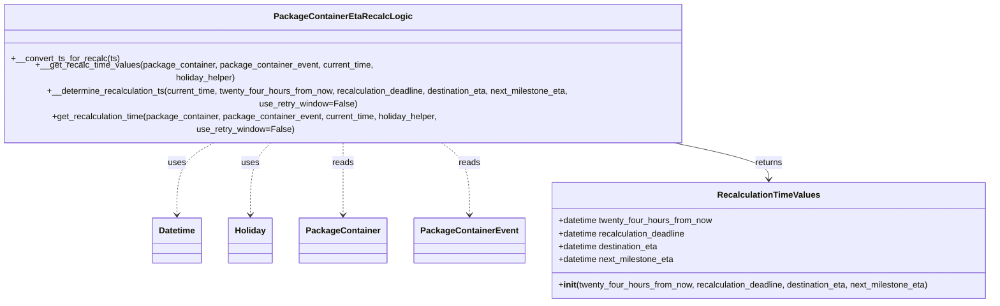
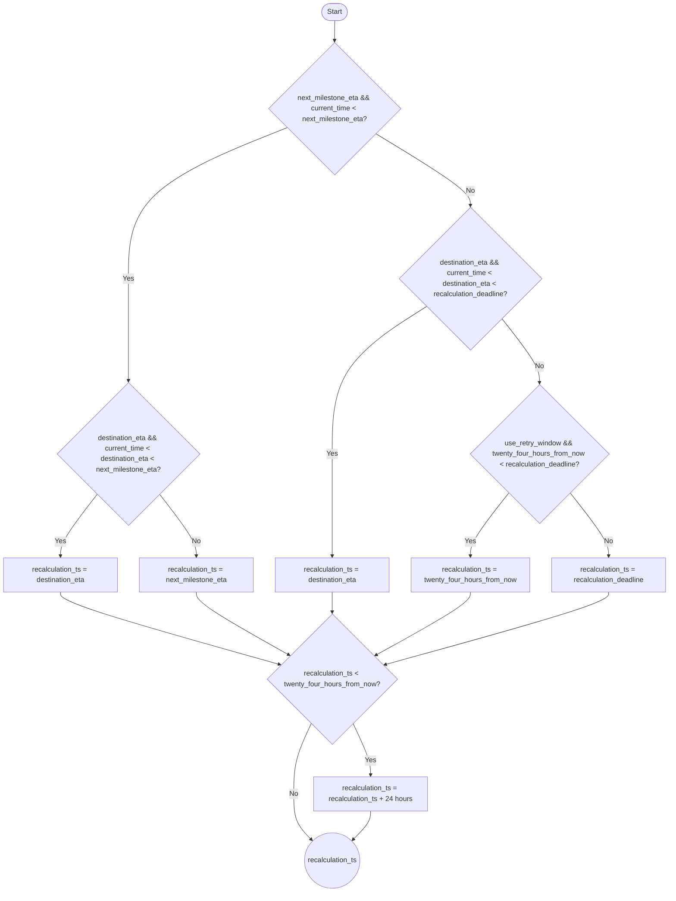

# Diagram: partview_service/partview_service/core/business/package_container/event/PackageContainerEtaRecalcLogic.py

> Auto-generated by Obscura crawlers

## Diagram 1

### SVG

<svg id="container" width="1868.7890625" xmlns="http://www.w3.org/2000/svg" class="classDiagram" height="504" viewBox="0 0 1868.7890625 504" role="graphics-document document" aria-roledescription="class"><g><defs><marker id="container_class-aggregationStart" class="marker aggregation class" refX="18" refY="7" markerWidth="190" markerHeight="240" orient="auto"><path d="M 18,7 L9,13 L1,7 L9,1 Z"></path></marker></defs><defs><marker id="container_class-aggregationEnd" class="marker aggregation class" refX="1" refY="7" markerWidth="20" markerHeight="28" orient="auto"><path d="M 18,7 L9,13 L1,7 L9,1 Z"></path></marker></defs><defs><marker id="container_class-extensionStart" class="marker extension class" refX="18" refY="7" markerWidth="190" markerHeight="240" orient="auto"><path d="M 1,7 L18,13 V 1 Z"></path></marker></defs><defs><marker id="container_class-extensionEnd" class="marker extension class" refX="1" refY="7" markerWidth="20" markerHeight="28" orient="auto"><path d="M 1,1 V 13 L18,7 Z"></path></marker></defs><defs><marker id="container_class-compositionStart" class="marker composition class" refX="18" refY="7" markerWidth="190" markerHeight="240" orient="auto"><path d="M 18,7 L9,13 L1,7 L9,1 Z"></path></marker></defs><defs><marker id="container_class-compositionEnd" class="marker composition class" refX="1" refY="7" markerWidth="20" markerHeight="28" orient="auto"><path d="M 18,7 L9,13 L1,7 L9,1 Z"></path></marker></defs><defs><marker id="container_class-dependencyStart" class="marker dependency class" refX="6" refY="7" markerWidth="190" markerHeight="240" orient="auto"><path d="M 5,7 L9,13 L1,7 L9,1 Z"></path></marker></defs><defs><marker id="container_class-dependencyEnd" class="marker dependency class" refX="13" refY="7" markerWidth="20" markerHeight="28" orient="auto"><path d="M 18,7 L9,13 L14,7 L9,1 Z"></path></marker></defs><defs><marker id="container_class-lollipopStart" class="marker lollipop class" refX="13" refY="7" markerWidth="190" markerHeight="240" orient="auto"><circle stroke="black" fill="transparent" cx="7" cy="7" r="6"></circle></marker></defs><defs><marker id="container_class-lollipopEnd" class="marker lollipop class" refX="1" refY="7" markerWidth="190" markerHeight="240" orient="auto"><circle stroke="black" fill="transparent" cx="7" cy="7" r="6"></circle></marker></defs><g class="root"><g class="clusters"></g><g class="edgePaths"><path d="M448.472,206L434.754,212.167C421.036,218.333,393.6,230.667,379.882,253C366.164,275.333,366.164,307.667,366.164,323.833L366.164,340" id="id_PackageContainerEtaRecalcLogic_Datetime_1" class="edge-thickness-normal edge-pattern-dashed relation" style=";;;" data-edge="true" data-et="edge" data-id="id_PackageContainerEtaRecalcLogic_Datetime_1" data-points="W3sieCI6NDQ4LjQ3MjQ4MzkxNTQ0MTIsInkiOjIwNn0seyJ4IjozNjYuMTY0MDYyNSwieSI6MjQzfSx7IngiOjM2Ni4xNjQwNjI1LCJ5IjozNDZ9XQ==" marker-end="url(#container_class-dependencyEnd)"></path><path d="M546.921,206L539.335,212.167C531.749,218.333,516.578,230.667,508.992,253C501.406,275.333,501.406,307.667,501.406,323.833L501.406,340" id="id_PackageContainerEtaRecalcLogic_Holiday_2" class="edge-thickness-normal edge-pattern-dashed relation" style=";;;" data-edge="true" data-et="edge" data-id="id_PackageContainerEtaRecalcLogic_Holiday_2" data-points="W3sieCI6NTQ2LjkyMDg0MDk5MjY0NzEsInkiOjIwNn0seyJ4Ijo1MDEuNDA2MjUsInkiOjI0M30seyJ4Ijo1MDEuNDA2MjUsInkiOjM0Nn1d" marker-end="url(#container_class-dependencyEnd)"></path><path d="M668.703,206L668.703,212.167C668.703,218.333,668.703,230.667,668.703,253C668.703,275.333,668.703,307.667,668.703,323.833L668.703,340" id="id_PackageContainerEtaRecalcLogic_PackageContainer_3" class="edge-thickness-normal edge-pattern-dashed relation" style=";;;" data-edge="true" data-et="edge" data-id="id_PackageContainerEtaRecalcLogic_PackageContainer_3" data-points="W3sieCI6NjY4LjcwMzEyNSwieSI6MjA2fSx7IngiOjY2OC43MDMxMjUsInkiOjI0M30seyJ4Ijo2NjguNzAzMTI1LCJ5IjozNDZ9XQ==" marker-end="url(#container_class-dependencyEnd)"></path><path d="M832.57,206L842.777,212.167C852.984,218.333,873.398,230.667,883.605,253C893.813,275.333,893.813,307.667,893.813,323.833L893.813,340" id="id_PackageContainerEtaRecalcLogic_PackageContainerEvent_4" class="edge-thickness-normal edge-pattern-dashed relation" style=";;;" data-edge="true" data-et="edge" data-id="id_PackageContainerEtaRecalcLogic_PackageContainerEvent_4" data-points="W3sieCI6ODMyLjU2OTUwODI3MjA1ODgsInkiOjIwNn0seyJ4Ijo4OTMuODEyNSwieSI6MjQzfSx7IngiOjg5My44MTI1LCJ5IjozNDZ9XQ==" marker-end="url(#container_class-dependencyEnd)"></path><path d="M1238.263,206L1273.741,212.167C1309.218,218.333,1380.174,230.667,1415.651,242C1451.129,253.333,1451.129,263.667,1451.129,268.833L1451.129,274" id="id_PackageContainerEtaRecalcLogic_RecalculationTimeValues_5" class="edge-thickness-normal edge-pattern-solid relation" style=";;;" data-edge="true" data-et="edge" data-id="id_PackageContainerEtaRecalcLogic_RecalculationTimeValues_5" data-points="W3sieCI6MTIzOC4yNjMwNjg3MDQwNDQxLCJ5IjoyMDZ9LHsieCI6MTQ1MS4xMjg5MDYyNSwieSI6MjQzfSx7IngiOjE0NTEuMTI4OTA2MjUsInkiOjI4MH1d" marker-end="url(#container_class-dependencyEnd)"></path></g><g class="edgeLabels"><g class="edgeLabel" transform="translate(366.1640625, 243)"><g class="label" data-id="id_PackageContainerEtaRecalcLogic_Datetime_1" transform="translate(-16.4921875, -12)"><foreignObject width="32.984375" height="24">

uses

</foreignObject></g></g><g class="edgeLabel" transform="translate(501.40625, 243)"><g class="label" data-id="id_PackageContainerEtaRecalcLogic_Holiday_2" transform="translate(-16.4921875, -12)"><foreignObject width="32.984375" height="24">

uses

</foreignObject></g></g><g class="edgeLabel" transform="translate(668.703125, 243)"><g class="label" data-id="id_PackageContainerEtaRecalcLogic_PackageContainer_3" transform="translate(-20.0078125, -12)"><foreignObject width="40.015625" height="24">

reads

</foreignObject></g></g><g class="edgeLabel" transform="translate(893.8125, 243)"><g class="label" data-id="id_PackageContainerEtaRecalcLogic_PackageContainerEvent_4" transform="translate(-20.0078125, -12)"><foreignObject width="40.015625" height="24">

reads

</foreignObject></g></g><g class="edgeLabel" transform="translate(1451.12890625, 243)"><g class="label" data-id="id_PackageContainerEtaRecalcLogic_RecalculationTimeValues_5" transform="translate(-26.265625, -12)"><foreignObject width="52.53125" height="24">

returns

</foreignObject></g></g></g><g class="nodes"><g class="node default" id="classId-RecalculationTimeValues-0" transform="translate(1451.12890625, 388)"><g class="basic label-container"><path d="M-409.66015625 -108 L409.66015625 -108 L409.66015625 108 L-409.66015625 108" stroke="none" stroke-width="0" fill="#ECECFF" style=""></path><path d="M-409.66015625 -108 C-127.14433857093417 -108, 155.37147910813167 -108, 409.66015625 -108 M-409.66015625 -108 C-92.20548747855236 -108, 225.2491812928953 -108, 409.66015625 -108 M409.66015625 -108 C409.66015625 -24.62433196356892, 409.66015625 58.75133607286216, 409.66015625 108 M409.66015625 -108 C409.66015625 -46.86167410364066, 409.66015625 14.276651792718681, 409.66015625 108 M409.66015625 108 C206.32548220868512 108, 2.9908081673702327 108, -409.66015625 108 M409.66015625 108 C146.68623520175487 108, -116.28768584649026 108, -409.66015625 108 M-409.66015625 108 C-409.66015625 58.685957815318744, -409.66015625 9.371915630637488, -409.66015625 -108 M-409.66015625 108 C-409.66015625 39.74261263586604, -409.66015625 -28.514774728267923, -409.66015625 -108" stroke="#9370DB" stroke-width="1.3" fill="none" stroke-dasharray="0 0" style=""></path></g><g class="annotation-group text" transform="translate(0, -84)"></g><g class="label-group text" transform="translate(-90.8359375, -84)"><g class="label" style="font-weight: bolder" transform="translate(0,-12)"><foreignObject width="181.671875" height="24">

RecalculationTimeValues

</foreignObject></g></g><g class="members-group text" transform="translate(-397.66015625, -36)"><g class="label" style="" transform="translate(0,-12)"><foreignObject width="292.734375" height="24">

+datetime twenty_four_hours_from_now

</foreignObject></g><g class="label" style="" transform="translate(0,12)"><foreignObject width="243.359375" height="24">

+datetime recalculation_deadline

</foreignObject></g><g class="label" style="" transform="translate(0,36)"><foreignObject width="191.703125" height="24">

+datetime destination_eta

</foreignObject></g><g class="label" style="" transform="translate(0,60)"><foreignObject width="220.0625" height="24">

+datetime next_milestone_eta

</foreignObject></g></g><g class="methods-group text" transform="translate(-397.66015625, 84)"><g class="label" style="" transform="translate(0,-12)"><foreignObject width="704.484375" height="24">

+<strong>init</strong>(twenty_four_hours_from_now, recalculation_deadline, destination_eta, next_milestone_eta)

</foreignObject></g></g><g class="divider" style=""><path d="M-409.66015625 -60 C-175.5500441988306 -60, 58.56006785233882 -60, 409.66015625 -60 M-409.66015625 -60 C-139.34505811071705 -60, 130.9700400285659 -60, 409.66015625 -60" stroke="#9370DB" stroke-width="1.3" fill="none" stroke-dasharray="0 0" style=""></path></g><g class="divider" style=""><path d="M-409.66015625 60 C-217.5593824149293 60, -25.458608579858605 60, 409.66015625 60 M-409.66015625 60 C-102.55542251425106 60, 204.54931122149787 60, 409.66015625 60" stroke="#9370DB" stroke-width="1.3" fill="none" stroke-dasharray="0 0" style=""></path></g></g><g class="node default" id="classId-PackageContainerEtaRecalcLogic-1" transform="translate(668.703125, 107)"><g class="basic label-container"><path d="M-660.703125 -99 L660.703125 -99 L660.703125 99 L-660.703125 99" stroke="none" stroke-width="0" fill="#ECECFF" style=""></path><path d="M-660.703125 -99 C-365.9685841991849 -99, -71.23404339836975 -99, 660.703125 -99 M-660.703125 -99 C-359.10183389633545 -99, -57.5005427926709 -99, 660.703125 -99 M660.703125 -99 C660.703125 -52.39522399369787, 660.703125 -5.790447987395737, 660.703125 99 M660.703125 -99 C660.703125 -50.654286636208475, 660.703125 -2.3085732724169503, 660.703125 99 M660.703125 99 C319.53369304076045 99, -21.635738918479092 99, -660.703125 99 M660.703125 99 C239.4729844559027 99, -181.75715608819462 99, -660.703125 99 M-660.703125 99 C-660.703125 49.34392908145846, -660.703125 -0.3121418370830753, -660.703125 -99 M-660.703125 99 C-660.703125 41.973097903186066, -660.703125 -15.053804193627869, -660.703125 -99" stroke="#9370DB" stroke-width="1.3" fill="none" stroke-dasharray="0 0" style=""></path></g><g class="annotation-group text" transform="translate(0, -75)"></g><g class="label-group text" transform="translate(-119.421875, -75)"><g class="label" style="font-weight: bolder" transform="translate(0,-12)"><foreignObject width="238.84375" height="24">

PackageContainerEtaRecalcLogic

</foreignObject></g></g><g class="members-group text" transform="translate(-648.703125, -27)"></g><g class="methods-group text" transform="translate(-648.703125, 3)"><g class="label" style="" transform="translate(0,-12)"><foreignObject width="200.296875" height="24">

+__convert_ts_for_recalc(ts)

</foreignObject></g><g class="label" style="" transform="translate(0,12)"><foreignObject width="745.625" height="24">

+__get_recalc_time_values(package_container, package_container_event, current_time, holiday_helper)

</foreignObject></g><g class="label" style="" transform="translate(0,36)"><foreignObject width="1177.984375" height="24">

+__determine_recalculation_ts(current_time, twenty_four_hours_from_now, recalculation_deadline, destination_eta, next_milestone_eta, use_retry_window=False)

</foreignObject></g><g class="label" style="" transform="translate(0,60)"><foreignObject width="910.015625" height="24">

+get_recalculation_time(package_container, package_container_event, current_time, holiday_helper, use_retry_window=False)

</foreignObject></g></g><g class="divider" style=""><path d="M-660.703125 -51 C-350.1554840072612 -51, -39.60784301452236 -51, 660.703125 -51 M-660.703125 -51 C-311.97236175213095 -51, 36.7584014957381 -51, 660.703125 -51" stroke="#9370DB" stroke-width="1.3" fill="none" stroke-dasharray="0 0" style=""></path></g><g class="divider" style=""><path d="M-660.703125 -27 C-277.78169757446744 -27, 105.13972985106511 -27, 660.703125 -27 M-660.703125 -27 C-142.74455974682576 -27, 375.2140055063485 -27, 660.703125 -27" stroke="#9370DB" stroke-width="1.3" fill="none" stroke-dasharray="0 0" style=""></path></g></g><g class="node default" id="classId-Datetime-2" transform="translate(366.1640625, 388)"><g class="basic label-container"><path d="M-45.3984375 -42 L45.3984375 -42 L45.3984375 42 L-45.3984375 42" stroke="none" stroke-width="0" fill="#ECECFF" style=""></path><path d="M-45.3984375 -42 C-10.423980612886567 -42, 24.550476274226867 -42, 45.3984375 -42 M-45.3984375 -42 C-18.022135597604272 -42, 9.354166304791455 -42, 45.3984375 -42 M45.3984375 -42 C45.3984375 -23.351658041488943, 45.3984375 -4.703316082977885, 45.3984375 42 M45.3984375 -42 C45.3984375 -18.68635068829514, 45.3984375 4.627298623409722, 45.3984375 42 M45.3984375 42 C15.763553816793753 42, -13.871329866412495 42, -45.3984375 42 M45.3984375 42 C11.348579521943009 42, -22.701278456113982 42, -45.3984375 42 M-45.3984375 42 C-45.3984375 21.537592314941072, -45.3984375 1.0751846298821448, -45.3984375 -42 M-45.3984375 42 C-45.3984375 16.57796185802369, -45.3984375 -8.844076283952617, -45.3984375 -42" stroke="#9370DB" stroke-width="1.3" fill="none" stroke-dasharray="0 0" style=""></path></g><g class="annotation-group text" transform="translate(0, -18)"></g><g class="label-group text" transform="translate(-33.3984375, -18)"><g class="label" style="font-weight: bolder" transform="translate(0,-12)"><foreignObject width="66.796875" height="24">

Datetime

</foreignObject></g></g><g class="members-group text" transform="translate(-33.3984375, 30)"></g><g class="methods-group text" transform="translate(-33.3984375, 60)"></g><g class="divider" style=""><path d="M-45.3984375 6 C-26.874453765742153 6, -8.350470031484306 6, 45.3984375 6 M-45.3984375 6 C-20.920408254731573 6, 3.5576209905368543 6, 45.3984375 6" stroke="#9370DB" stroke-width="1.3" fill="none" stroke-dasharray="0 0" style=""></path></g><g class="divider" style=""><path d="M-45.3984375 24 C-14.827089932220545 24, 15.74425763555891 24, 45.3984375 24 M-45.3984375 24 C-24.095412241207157 24, -2.792386982414314 24, 45.3984375 24" stroke="#9370DB" stroke-width="1.3" fill="none" stroke-dasharray="0 0" style=""></path></g></g><g class="node default" id="classId-Holiday-3" transform="translate(501.40625, 388)"><g class="basic label-container"><path d="M-39.84375 -42 L39.84375 -42 L39.84375 42 L-39.84375 42" stroke="none" stroke-width="0" fill="#ECECFF" style=""></path><path d="M-39.84375 -42 C-9.416369848654902 -42, 21.011010302690195 -42, 39.84375 -42 M-39.84375 -42 C-19.81238617334411 -42, 0.2189776533117822 -42, 39.84375 -42 M39.84375 -42 C39.84375 -24.49230142766327, 39.84375 -6.984602855326543, 39.84375 42 M39.84375 -42 C39.84375 -19.742069632768285, 39.84375 2.5158607344634305, 39.84375 42 M39.84375 42 C8.533780080584009 42, -22.776189838831982 42, -39.84375 42 M39.84375 42 C20.916915725691666 42, 1.9900814513833325 42, -39.84375 42 M-39.84375 42 C-39.84375 12.868138610972547, -39.84375 -16.263722778054905, -39.84375 -42 M-39.84375 42 C-39.84375 21.94283110468505, -39.84375 1.8856622093701034, -39.84375 -42" stroke="#9370DB" stroke-width="1.3" fill="none" stroke-dasharray="0 0" style=""></path></g><g class="annotation-group text" transform="translate(0, -18)"></g><g class="label-group text" transform="translate(-27.84375, -18)"><g class="label" style="font-weight: bolder" transform="translate(0,-12)"><foreignObject width="55.6875" height="24">

Holiday

</foreignObject></g></g><g class="members-group text" transform="translate(-27.84375, 30)"></g><g class="methods-group text" transform="translate(-27.84375, 60)"></g><g class="divider" style=""><path d="M-39.84375 6 C-22.658594451496384 6, -5.473438902992768 6, 39.84375 6 M-39.84375 6 C-10.185875201216138 6, 19.471999597567724 6, 39.84375 6" stroke="#9370DB" stroke-width="1.3" fill="none" stroke-dasharray="0 0" style=""></path></g><g class="divider" style=""><path d="M-39.84375 24 C-13.689585719353172 24, 12.464578561293656 24, 39.84375 24 M-39.84375 24 C-22.428013028802884 24, -5.012276057605767 24, 39.84375 24" stroke="#9370DB" stroke-width="1.3" fill="none" stroke-dasharray="0 0" style=""></path></g></g><g class="node default" id="classId-PackageContainer-4" transform="translate(668.703125, 388)"><g class="basic label-container"><path d="M-77.453125 -42 L77.453125 -42 L77.453125 42 L-77.453125 42" stroke="none" stroke-width="0" fill="#ECECFF" style=""></path><path d="M-77.453125 -42 C-30.87917365296927 -42, 15.694777694061457 -42, 77.453125 -42 M-77.453125 -42 C-34.9780138249143 -42, 7.497097350171401 -42, 77.453125 -42 M77.453125 -42 C77.453125 -8.937462904858045, 77.453125 24.12507419028391, 77.453125 42 M77.453125 -42 C77.453125 -11.48581270709602, 77.453125 19.02837458580796, 77.453125 42 M77.453125 42 C38.956575187811964 42, 0.4600253756239283 42, -77.453125 42 M77.453125 42 C20.339503849493333 42, -36.774117301013334 42, -77.453125 42 M-77.453125 42 C-77.453125 12.926822469026348, -77.453125 -16.146355061947304, -77.453125 -42 M-77.453125 42 C-77.453125 14.078557015322769, -77.453125 -13.842885969354462, -77.453125 -42" stroke="#9370DB" stroke-width="1.3" fill="none" stroke-dasharray="0 0" style=""></path></g><g class="annotation-group text" transform="translate(0, -18)"></g><g class="label-group text" transform="translate(-65.453125, -18)"><g class="label" style="font-weight: bolder" transform="translate(0,-12)"><foreignObject width="130.90625" height="24">

PackageContainer

</foreignObject></g></g><g class="members-group text" transform="translate(-65.453125, 30)"></g><g class="methods-group text" transform="translate(-65.453125, 60)"></g><g class="divider" style=""><path d="M-77.453125 6 C-46.09986927834238 6, -14.746613556684757 6, 77.453125 6 M-77.453125 6 C-20.975034921069977 6, 35.50305515786005 6, 77.453125 6" stroke="#9370DB" stroke-width="1.3" fill="none" stroke-dasharray="0 0" style=""></path></g><g class="divider" style=""><path d="M-77.453125 24 C-22.2097958121853 24, 33.0335333756294 24, 77.453125 24 M-77.453125 24 C-17.17978722692113 24, 43.09355054615774 24, 77.453125 24" stroke="#9370DB" stroke-width="1.3" fill="none" stroke-dasharray="0 0" style=""></path></g></g><g class="node default" id="classId-PackageContainerEvent-5" transform="translate(893.8125, 388)"><g class="basic label-container"><path d="M-97.65625 -42 L97.65625 -42 L97.65625 42 L-97.65625 42" stroke="none" stroke-width="0" fill="#ECECFF" style=""></path><path d="M-97.65625 -42 C-25.59108527904759 -42, 46.47407944190482 -42, 97.65625 -42 M-97.65625 -42 C-35.46187007959036 -42, 26.732509840819276 -42, 97.65625 -42 M97.65625 -42 C97.65625 -17.643128262565344, 97.65625 6.713743474869311, 97.65625 42 M97.65625 -42 C97.65625 -24.13283599537799, 97.65625 -6.265671990755983, 97.65625 42 M97.65625 42 C23.4468288443574 42, -50.7625923112852 42, -97.65625 42 M97.65625 42 C42.90117682213955 42, -11.853896355720906 42, -97.65625 42 M-97.65625 42 C-97.65625 11.410818969864845, -97.65625 -19.17836206027031, -97.65625 -42 M-97.65625 42 C-97.65625 13.636133692464, -97.65625 -14.727732615072, -97.65625 -42" stroke="#9370DB" stroke-width="1.3" fill="none" stroke-dasharray="0 0" style=""></path></g><g class="annotation-group text" transform="translate(0, -18)"></g><g class="label-group text" transform="translate(-85.65625, -18)"><g class="label" style="font-weight: bolder" transform="translate(0,-12)"><foreignObject width="171.3125" height="24">

PackageContainerEvent

</foreignObject></g></g><g class="members-group text" transform="translate(-85.65625, 30)"></g><g class="methods-group text" transform="translate(-85.65625, 60)"></g><g class="divider" style=""><path d="M-97.65625 6 C-26.083488450115652 6, 45.489273099768695 6, 97.65625 6 M-97.65625 6 C-41.88045158417914 6, 13.895346831641717 6, 97.65625 6" stroke="#9370DB" stroke-width="1.3" fill="none" stroke-dasharray="0 0" style=""></path></g><g class="divider" style=""><path d="M-97.65625 24 C-29.361131611801184 24, 38.93398677639763 24, 97.65625 24 M-97.65625 24 C-33.251645401430835 24, 31.15295919713833 24, 97.65625 24" stroke="#9370DB" stroke-width="1.3" fill="none" stroke-dasharray="0 0" style=""></path></g></g></g></g></g></svg>

## Diagram 2

### SVG

<svg id="container" width="1531.25" xmlns="http://www.w3.org/2000/svg" class="flowchart" height="2041.71875" viewBox="0 0 1531.25 2041.71875" role="graphics-document document" aria-roledescription="flowchart-v2"><g><marker id="container_flowchart-v2-pointEnd" class="marker flowchart-v2" viewBox="0 0 10 10" refX="5" refY="5" markerUnits="userSpaceOnUse" markerWidth="8" markerHeight="8" orient="auto"><path d="M 0 0 L 10 5 L 0 10 z" class="arrowMarkerPath" style="stroke-width: 1; stroke-dasharray: 1, 0;"></path></marker><marker id="container_flowchart-v2-pointStart" class="marker flowchart-v2" viewBox="0 0 10 10" refX="4.5" refY="5" markerUnits="userSpaceOnUse" markerWidth="8" markerHeight="8" orient="auto"><path d="M 0 5 L 10 10 L 10 0 z" class="arrowMarkerPath" style="stroke-width: 1; stroke-dasharray: 1, 0;"></path></marker><marker id="container_flowchart-v2-circleEnd" class="marker flowchart-v2" viewBox="0 0 10 10" refX="11" refY="5" markerUnits="userSpaceOnUse" markerWidth="11" markerHeight="11" orient="auto"><circle cx="5" cy="5" r="5" class="arrowMarkerPath" style="stroke-width: 1; stroke-dasharray: 1, 0;"></circle></marker><marker id="container_flowchart-v2-circleStart" class="marker flowchart-v2" viewBox="0 0 10 10" refX="-1" refY="5" markerUnits="userSpaceOnUse" markerWidth="11" markerHeight="11" orient="auto"><circle cx="5" cy="5" r="5" class="arrowMarkerPath" style="stroke-width: 1; stroke-dasharray: 1, 0;"></circle></marker><marker id="container_flowchart-v2-crossEnd" class="marker cross flowchart-v2" viewBox="0 0 11 11" refX="12" refY="5.2" markerUnits="userSpaceOnUse" markerWidth="11" markerHeight="11" orient="auto"><path d="M 1,1 l 9,9 M 10,1 l -9,9" class="arrowMarkerPath" style="stroke-width: 2; stroke-dasharray: 1, 0;"></path></marker><marker id="container_flowchart-v2-crossStart" class="marker cross flowchart-v2" viewBox="0 0 11 11" refX="-1" refY="5.2" markerUnits="userSpaceOnUse" markerWidth="11" markerHeight="11" orient="auto"><path d="M 1,1 l 9,9 M 10,1 l -9,9" class="arrowMarkerPath" style="stroke-width: 2; stroke-dasharray: 1, 0;"></path></marker><g class="root"><g class="clusters"></g><g class="edgePaths"><path d="M766.125,47.5L766.042,51.583C765.958,55.667,765.792,63.833,765.708,71.417C765.625,79,765.625,86,765.625,89.5L765.625,93" id="L_Start_CheckNext_0" class="edge-thickness-normal edge-pattern-solid edge-thickness-normal edge-pattern-solid flowchart-link" style=";" data-edge="true" data-et="edge" data-id="L_Start_CheckNext_0" data-points="W3sieCI6NzY2LjEyNSwieSI6NDcuNX0seyJ4Ijo3NjUuNjI1LCJ5Ijo3Mn0seyJ4Ijo3NjUuNjI1LCJ5Ijo5N31d" marker-end="url(#container_flowchart-v2-pointEnd)"></path><path d="M657.596,290.971L596.83,315.143C536.064,339.314,414.532,387.657,353.766,445.162C293,502.667,293,569.333,293,636C293,702.667,293,769.333,293,808.167C293,847,293,858,293,863.5L293,869" id="L_CheckNext_DestBeforeNext_0" class="edge-thickness-normal edge-pattern-solid edge-thickness-normal edge-pattern-solid flowchart-link" style=";" data-edge="true" data-et="edge" data-id="L_CheckNext_DestBeforeNext_0" data-points="W3sieCI6NjU3LjU5NjQyODU3MTQyODUsInkiOjI5MC45NzE0Mjg1NzE0Mjg2fSx7IngiOjI5MywieSI6NDM2fSx7IngiOjI5MywieSI6NjM2fSx7IngiOjI5MywieSI6ODM2fSx7IngiOjI5MywieSI6ODczfV0=" marker-end="url(#container_flowchart-v2-pointEnd)"></path><path d="M221.831,1127.831L207.859,1145.859C193.887,1163.887,165.944,1199.944,151.972,1223.472C138,1247,138,1258,138,1263.5L138,1269" id="L_DestBeforeNext_UseDest_0" class="edge-thickness-normal edge-pattern-solid edge-thickness-normal edge-pattern-solid flowchart-link" style=";" data-edge="true" data-et="edge" data-id="L_DestBeforeNext_UseDest_0" data-points="W3sieCI6MjIxLjgzMDk4NTkxNTQ5Mjk2LCJ5IjoxMTI3LjgzMDk4NTkxNTQ5Mjl9LHsieCI6MTM4LCJ5IjoxMjM2fSx7IngiOjEzOCwieSI6MTI3M31d" marker-end="url(#container_flowchart-v2-pointEnd)"></path><path d="M364.169,1127.831L378.141,1145.859C392.113,1163.887,420.056,1199.944,434.028,1223.472C448,1247,448,1258,448,1263.5L448,1269" id="L_DestBeforeNext_UseNext_0" class="edge-thickness-normal edge-pattern-solid edge-thickness-normal edge-pattern-solid flowchart-link" style=";" data-edge="true" data-et="edge" data-id="L_DestBeforeNext_UseNext_0" data-points="W3sieCI6MzY0LjE2OTAxNDA4NDUwNzA3LCJ5IjoxMTI3LjgzMDk4NTkxNTQ5Mjl9LHsieCI6NDQ4LCJ5IjoxMjM2fSx7IngiOjQ0OCwieSI6MTI3M31d" marker-end="url(#container_flowchart-v2-pointEnd)"></path><path d="M859.621,305.004L895.622,326.837C931.622,348.669,1003.624,392.335,1039.624,419.667C1075.625,447,1075.625,458,1075.625,463.5L1075.625,469" id="L_CheckNext_DestBeforeDeadline_0" class="edge-thickness-normal edge-pattern-solid edge-thickness-normal edge-pattern-solid flowchart-link" style=";" data-edge="true" data-et="edge" data-id="L_CheckNext_DestBeforeDeadline_0" data-points="W3sieCI6ODU5LjYyMDk4MzkzNTc0MywieSI6MzA1LjAwNDAxNjA2NDI1NzAzfSx7IngiOjEwNzUuNjI1LCJ5Ijo0MzZ9LHsieCI6MTA3NS42MjUsInkiOjQ3M31d" marker-end="url(#container_flowchart-v2-pointEnd)"></path><path d="M975.605,698.98L939.337,721.817C903.07,744.653,830.535,790.327,794.267,846.497C758,902.667,758,969.333,758,1036C758,1102.667,758,1169.333,758,1208.167C758,1247,758,1258,758,1263.5L758,1269" id="L_DestBeforeDeadline_UseDest2_0" class="edge-thickness-normal edge-pattern-solid edge-thickness-normal edge-pattern-solid flowchart-link" style=";" data-edge="true" data-et="edge" data-id="L_DestBeforeDeadline_UseDest2_0" data-points="W3sieCI6OTc1LjYwNDk1NjUzMjIzODYsInkiOjY5OC45Nzk5NTY1MzIyMzg2fSx7IngiOjc1OCwieSI6ODM2fSx7IngiOjc1OCwieSI6MTAzNn0seyJ4Ijo3NTgsInkiOjEyMzZ9LHsieCI6NzU4LCJ5IjoxMjczfV0=" marker-end="url(#container_flowchart-v2-pointEnd)"></path><path d="M1147.77,726.855L1162.214,745.046C1176.659,763.237,1205.548,799.618,1219.993,823.686C1234.438,847.753,1234.438,859.505,1234.438,865.382L1234.438,871.258" id="L_DestBeforeDeadline_RetryWindow_0" class="edge-thickness-normal edge-pattern-solid edge-thickness-normal edge-pattern-solid flowchart-link" style=";" data-edge="true" data-et="edge" data-id="L_DestBeforeDeadline_RetryWindow_0" data-points="W3sieCI6MTE0Ny43Njk3NDgzMDE2ODk2LCJ5Ijo3MjYuODU1MjUxNjk4MzEwNH0seyJ4IjoxMjM0LjQzNzUsInkiOjgzNn0seyJ4IjoxMjM0LjQzNzUsInkiOjg3NS4yNTc4MTI1fV0=" marker-end="url(#container_flowchart-v2-pointEnd)"></path><path d="M1163.292,1125.597L1148.681,1143.997C1134.07,1162.398,1104.847,1199.199,1090.236,1223.099C1075.625,1247,1075.625,1258,1075.625,1263.5L1075.625,1269" id="L_RetryWindow_Use24_0" class="edge-thickness-normal edge-pattern-solid edge-thickness-normal edge-pattern-solid flowchart-link" style=";" data-edge="true" data-et="edge" data-id="L_RetryWindow_Use24_0" data-points="W3sieCI6MTE2My4yOTIwNzI2NDYzMTYsInkiOjExMjUuNTk2NzYwMTQ2MzE2fSx7IngiOjEwNzUuNjI1LCJ5IjoxMjM2fSx7IngiOjEwNzUuNjI1LCJ5IjoxMjczfV0=" marker-end="url(#container_flowchart-v2-pointEnd)"></path><path d="M1305.583,1125.597L1320.194,1143.997C1334.805,1162.398,1364.028,1199.199,1378.639,1223.099C1393.25,1247,1393.25,1258,1393.25,1263.5L1393.25,1269" id="L_RetryWindow_UseDeadline_0" class="edge-thickness-normal edge-pattern-solid edge-thickness-normal edge-pattern-solid flowchart-link" style=";" data-edge="true" data-et="edge" data-id="L_RetryWindow_UseDeadline_0" data-points="W3sieCI6MTMwNS41ODI5MjczNTM2ODQsInkiOjExMjUuNTk2NzYwMTQ2MzE2fSx7IngiOjEzOTMuMjUsInkiOjEyMzZ9LHsieCI6MTM5My4yNSwieSI6MTI3M31d" marker-end="url(#container_flowchart-v2-pointEnd)"></path><path d="M138,1351L138,1355.167C138,1359.333,138,1367.667,221.18,1395.33C304.36,1422.994,470.72,1469.988,553.9,1493.486L637.081,1516.983" id="L_UseDest_PostAdjust_0" class="edge-thickness-normal edge-pattern-solid edge-thickness-normal edge-pattern-solid flowchart-link" style=";" data-edge="true" data-et="edge" data-id="L_UseDest_PostAdjust_0" data-points="W3sieCI6MTM4LCJ5IjoxMzUxfSx7IngiOjEzOCwieSI6MTM3Nn0seyJ4Ijo2NDAuOTI5OTA2MjY2NTgwMiwieSI6MTUxOC4wNzAwOTM3MzM0MTk4fV0=" marker-end="url(#container_flowchart-v2-pointEnd)"></path><path d="M448,1351L448,1355.167C448,1359.333,448,1367.667,483.097,1391.662C518.193,1415.657,588.386,1455.314,623.483,1475.142L658.579,1494.971" id="L_UseNext_PostAdjust_0" class="edge-thickness-normal edge-pattern-solid edge-thickness-normal edge-pattern-solid flowchart-link" style=";" data-edge="true" data-et="edge" data-id="L_UseNext_PostAdjust_0" data-points="W3sieCI6NDQ4LCJ5IjoxMzUxfSx7IngiOjQ0OCwieSI6MTM3Nn0seyJ4Ijo2NjIuMDYxNjQ0NDk3NDA3MywieSI6MTQ5Ni45MzgzNTU1MDI1OTI3fV0=" marker-end="url(#container_flowchart-v2-pointEnd)"></path><path d="M758,1351L758,1355.167C758,1359.333,758,1367.667,758,1375.333C758,1383,758,1390,758,1393.5L758,1397" id="L_UseDest2_PostAdjust_0" class="edge-thickness-normal edge-pattern-solid edge-thickness-normal edge-pattern-solid flowchart-link" style=";" data-edge="true" data-et="edge" data-id="L_UseDest2_PostAdjust_0" data-points="W3sieCI6NzU4LCJ5IjoxMzUxfSx7IngiOjc1OCwieSI6MTM3Nn0seyJ4Ijo3NTgsInkiOjE0MDF9XQ==" marker-end="url(#container_flowchart-v2-pointEnd)"></path><path d="M1075.625,1351L1075.625,1355.167C1075.625,1359.333,1075.625,1367.667,1039.401,1391.808C1003.177,1415.949,930.728,1455.897,894.504,1475.871L858.28,1495.846" id="L_Use24_PostAdjust_0" class="edge-thickness-normal edge-pattern-solid edge-thickness-normal edge-pattern-solid flowchart-link" style=";" data-edge="true" data-et="edge" data-id="L_Use24_PostAdjust_0" data-points="W3sieCI6MTA3NS42MjUsInkiOjEzNTF9LHsieCI6MTA3NS42MjUsInkiOjEzNzZ9LHsieCI6ODU0Ljc3NzA3NTM0MDA3NjcsInkiOjE0OTcuNzc3MDc1MzQwMDc2Nn1d" marker-end="url(#container_flowchart-v2-pointEnd)"></path><path d="M1393.25,1351L1393.25,1355.167C1393.25,1359.333,1393.25,1367.667,1307.633,1395.438C1222.016,1423.21,1050.782,1470.42,965.165,1494.024L879.549,1517.629" id="L_UseDeadline_PostAdjust_0" class="edge-thickness-normal edge-pattern-solid edge-thickness-normal edge-pattern-solid flowchart-link" style=";" data-edge="true" data-et="edge" data-id="L_UseDeadline_PostAdjust_0" data-points="W3sieCI6MTM5My4yNSwieSI6MTM1MX0seyJ4IjoxMzkzLjI1LCJ5IjoxMzc2fSx7IngiOjg3NS42OTI0MTc4MTU0ODI1LCJ5IjoxNTE4LjY5MjQxNzgxNTQ4MjV9XQ==" marker-end="url(#container_flowchart-v2-pointEnd)"></path><path d="M805.861,1653.421L812.479,1667.564C819.097,1681.707,832.334,1709.994,838.952,1729.638C845.57,1749.281,845.57,1760.281,845.57,1765.781L845.57,1771.281" id="L_PostAdjust_Adjust_0" class="edge-thickness-normal edge-pattern-solid edge-thickness-normal edge-pattern-solid flowchart-link" style=";" data-edge="true" data-et="edge" data-id="L_PostAdjust_Adjust_0" data-points="W3sieCI6ODA1Ljg2MDcxMzQwOTY5MiwieSI6MTY1My40MjA1MzY1OTAzMDh9LHsieCI6ODQ1LjU3MDMxMjUsInkiOjE3MzguMjgxMjV9LHsieCI6ODQ1LjU3MDMxMjUsInkiOjE3NzUuMjgxMjV9XQ==" marker-end="url(#container_flowchart-v2-pointEnd)"></path><path d="M710.139,1653.421L703.521,1667.564C696.903,1681.707,683.666,1709.994,677.048,1736.804C670.43,1763.615,670.43,1788.948,670.43,1812.281C670.43,1835.615,670.43,1856.948,676.99,1874.373C683.55,1891.798,696.67,1905.315,703.229,1912.073L709.789,1918.831" id="L_PostAdjust_EndNode_0" class="edge-thickness-normal edge-pattern-solid edge-thickness-normal edge-pattern-solid flowchart-link" style=";" data-edge="true" data-et="edge" data-id="L_PostAdjust_EndNode_0" data-points="W3sieCI6NzEwLjEzOTI4NjU5MDMwOCwieSI6MTY1My40MjA1MzY1OTAzMDh9LHsieCI6NjcwLjQyOTY4NzUsInkiOjE3MzguMjgxMjV9LHsieCI6NjcwLjQyOTY4NzUsInkiOjE4MTQuMjgxMjV9LHsieCI6NjcwLjQyOTY4NzUsInkiOjE4NzguMjgxMjV9LHsieCI6NzEyLjU3NTM5NjI3ODY2MDMsInkiOjE5MjEuNzAxNTk0ODEwMDYwN31d" marker-end="url(#container_flowchart-v2-pointEnd)"></path><path d="M845.57,1853.281L845.57,1857.448C845.57,1861.615,845.57,1869.948,839.01,1880.873C832.45,1891.798,819.33,1905.315,812.771,1912.073L806.211,1918.831" id="L_Adjust_EndNode_0" class="edge-thickness-normal edge-pattern-solid edge-thickness-normal edge-pattern-solid flowchart-link" style=";" data-edge="true" data-et="edge" data-id="L_Adjust_EndNode_0" data-points="W3sieCI6ODQ1LjU3MDMxMjUsInkiOjE4NTMuMjgxMjV9LHsieCI6ODQ1LjU3MDMxMjUsInkiOjE4NzguMjgxMjV9LHsieCI6ODAzLjQyNDYwMzcyMTMzOTcsInkiOjE5MjEuNzAxNTk0ODEwMDYwN31d" marker-end="url(#container_flowchart-v2-pointEnd)"></path></g><g class="edgeLabels"><g class="edgeLabel"><g class="label" data-id="L_Start_CheckNext_0" transform="translate(0, 0)"><foreignObject width="0" height="0">

</foreignObject></g></g><g class="edgeLabel" transform="translate(293, 636)"><g class="label" data-id="L_CheckNext_DestBeforeNext_0" transform="translate(-12.03125, -12)"><foreignObject width="24.0625" height="24">

Yes

</foreignObject></g></g><g class="edgeLabel" transform="translate(138, 1236)"><g class="label" data-id="L_DestBeforeNext_UseDest_0" transform="translate(-12.03125, -12)"><foreignObject width="24.0625" height="24">

Yes

</foreignObject></g></g><g class="edgeLabel" transform="translate(448, 1236)"><g class="label" data-id="L_DestBeforeNext_UseNext_0" transform="translate(-10.140625, -12)"><foreignObject width="20.28125" height="24">

No

</foreignObject></g></g><g class="edgeLabel" transform="translate(1075.625, 436)"><g class="label" data-id="L_CheckNext_DestBeforeDeadline_0" transform="translate(-10.140625, -12)"><foreignObject width="20.28125" height="24">

No

</foreignObject></g></g><g class="edgeLabel" transform="translate(758, 1036)"><g class="label" data-id="L_DestBeforeDeadline_UseDest2_0" transform="translate(-12.03125, -12)"><foreignObject width="24.0625" height="24">

Yes

</foreignObject></g></g><g class="edgeLabel" transform="translate(1234.4375, 836)"><g class="label" data-id="L_DestBeforeDeadline_RetryWindow_0" transform="translate(-10.140625, -12)"><foreignObject width="20.28125" height="24">

No

</foreignObject></g></g><g class="edgeLabel" transform="translate(1075.625, 1236)"><g class="label" data-id="L_RetryWindow_Use24_0" transform="translate(-12.03125, -12)"><foreignObject width="24.0625" height="24">

Yes

</foreignObject></g></g><g class="edgeLabel" transform="translate(1393.25, 1236)"><g class="label" data-id="L_RetryWindow_UseDeadline_0" transform="translate(-10.140625, -12)"><foreignObject width="20.28125" height="24">

No

</foreignObject></g></g><g class="edgeLabel"><g class="label" data-id="L_UseDest_PostAdjust_0" transform="translate(0, 0)"><foreignObject width="0" height="0">

</foreignObject></g></g><g class="edgeLabel"><g class="label" data-id="L_UseNext_PostAdjust_0" transform="translate(0, 0)"><foreignObject width="0" height="0">

</foreignObject></g></g><g class="edgeLabel"><g class="label" data-id="L_UseDest2_PostAdjust_0" transform="translate(0, 0)"><foreignObject width="0" height="0">

</foreignObject></g></g><g class="edgeLabel"><g class="label" data-id="L_Use24_PostAdjust_0" transform="translate(0, 0)"><foreignObject width="0" height="0">

</foreignObject></g></g><g class="edgeLabel"><g class="label" data-id="L_UseDeadline_PostAdjust_0" transform="translate(0, 0)"><foreignObject width="0" height="0">

</foreignObject></g></g><g class="edgeLabel" transform="translate(845.5703125, 1738.28125)"><g class="label" data-id="L_PostAdjust_Adjust_0" transform="translate(-12.03125, -12)"><foreignObject width="24.0625" height="24">

Yes

</foreignObject></g></g><g class="edgeLabel" transform="translate(670.4296875, 1814.28125)"><g class="label" data-id="L_PostAdjust_EndNode_0" transform="translate(-10.140625, -12)"><foreignObject width="20.28125" height="24">

No

</foreignObject></g></g><g class="edgeLabel"><g class="label" data-id="L_Adjust_EndNode_0" transform="translate(0, 0)"><foreignObject width="0" height="0">

</foreignObject></g></g></g><g class="nodes"><g class="node default" id="flowchart-Start-0" transform="translate(765.625, 27.5)"><g class="basic label-container outer-path"><path d="M-10.3984375 -19.5 C-2.2361708733363006 -19.5, 5.926095753327399 -19.5, 10.3984375 -19.5 C10.3984375 -19.5, 10.3984375 -19.5, 10.398437499999998 -19.5 C10.772672653614926 -19.487999007028105, 11.146907807229855 -19.475998014056213, 11.6478067896239 -19.45993515863156 C11.937870954138743 -19.43195301753401, 12.227935118653587 -19.403970876436457, 12.892042152847864 -19.3399052695533 C13.174753530642722 -19.294198686450905, 13.457464908437581 -19.248492103348514, 14.126030759676757 -19.140403561325776 C14.543505959971899 -19.04511757113869, 14.96098116026704 -18.949831580951603, 15.34470188623539 -18.862249829261074 C15.660202355629808 -18.76861094604057, 15.975702825024229 -18.674972062820064, 16.543047751460602 -18.50658706670804 C16.849283576633667 -18.393889452231416, 17.155519401806735 -18.28119183775479, 17.716144095147794 -18.074876768247425 C18.054140507480426 -17.925255782815107, 18.392136919813055 -17.775634797382786, 18.85917041279238 -17.568892924097174 C19.293103026271886 -17.34251055759202, 19.727035639751392 -17.11612819108687, 19.967429764076783 -16.990714730406097 C20.285887082889417 -16.797664032278945, 20.604344401702047 -16.60461333415179, 21.036368073605697 -16.342718045390892 C21.323758568228893 -16.14224687727575, 21.61114906285209 -15.94177570916061, 22.061592844578712 -15.627565626425154 C22.335789093175446 -15.408901414837874, 22.60998534177218 -15.190237203250595, 23.03889120850187 -14.848196188198123 C23.26862744928703 -14.63955581280488, 23.498363690072193 -14.430915437411638, 23.964247236767985 -14.007812326905688 C24.21247697187264 -13.751494745369863, 24.460706706977295 -13.495177163834036, 24.833858442968648 -13.10986736009568 C25.142004400945513 -12.747901583854333, 25.45015035892238 -12.385935807612983, 25.644151408126582 -12.158051136245305 C25.79441234120766 -11.956715174969272, 25.944673274288743 -11.755379213693239, 26.391796464640635 -11.156274872382312 C26.61090583678966 -10.819664037656738, 26.830015208938683 -10.483053202931163, 27.073721378604247 -10.108655082055241 C27.31433747189175 -9.68141684340178, 27.554953565179254 -9.25417860474832, 27.6871239742735 -9.019496659696287 C27.8732932892942 -8.632912093670587, 28.059462604314902 -8.246327527644889, 28.22948364880834 -7.893275190886684 C28.414282467625984 -7.436818535565001, 28.599081286443628 -6.9803618802433185, 28.698571729970325 -6.734618561215508 C28.78504869826846 -6.474163710935302, 28.871525666566594 -6.213708860655096, 29.09246063421488 -5.548287939305138 C29.198341471616263 -5.144518417248453, 29.30422230901765 -4.740748895191769, 29.40953178754556 -4.339158212148133 C29.466788593576158 -4.045156614411263, 29.524045399606752 -3.7511550166743923, 29.648482276581777 -3.1121979531509023 C29.69445930221477 -2.755609221532034, 29.740436327847767 -2.3990204899131653, 29.808330202509367 -1.872449005199798 C29.828159012409916 -1.5635992854714609, 29.847987822310465 -1.2547495657431238, 29.888418715913414 -0.6250057626472757 C29.888418715913414 -0.26455373498455453, 29.888418715913414 0.09589829267816663, 29.888418715913414 0.625005762647271 C29.86462340398672 0.9956369531356342, 29.840828092060022 1.3662681436239974, 29.808330202509367 1.8724490051997846 C29.745583667639515 2.3590987389455687, 29.682837132769663 2.8457484726913522, 29.648482276581777 3.1121979531508885 C29.558852650603395 3.5724271393217313, 29.46922302462501 4.0326563254925745, 29.40953178754556 4.339158212148129 C29.30637957683936 4.732522298021796, 29.203227366133156 5.125886383895463, 29.092460634214884 5.548287939305125 C28.960793585374947 5.944848112115691, 28.82912653653501 6.341408284926258, 28.69857172997033 6.734618561215495 C28.57300589403417 7.044768603628095, 28.44744005809801 7.354918646040696, 28.229483648808344 7.893275190886679 C28.013432315172192 8.341910407940139, 27.797380981536037 8.7905456249936, 27.687123974273504 9.019496659696284 C27.561991691574452 9.241681698646072, 27.4368594088754 9.463866737595861, 27.07372137860425 10.108655082055236 C26.819691257871973 10.498913564138661, 26.565661137139696 10.889172046222088, 26.39179646464064 11.156274872382301 C26.140512425966488 11.492972591758804, 25.889228387292334 11.829670311135304, 25.644151408126582 12.158051136245302 C25.332586067595045 12.524033513803747, 25.02102072706351 12.890015891362195, 24.83385844296866 13.10986736009567 C24.557988890032963 13.394725322813294, 24.282119337097264 13.679583285530917, 23.96424723676799 14.007812326905684 C23.774594387854744 14.180050026349285, 23.5849415389415 14.352287725792886, 23.038891208501887 14.848196188198111 C22.673822674886043 15.139328628875068, 22.3087541412702 15.430461069552026, 22.061592844578715 15.627565626425152 C21.782572904499897 15.822197858045602, 21.503552964421083 16.01683008966605, 21.036368073605708 16.34271804539089 C20.774973290483036 16.501177099046103, 20.513578507360368 16.65963615270132, 19.967429764076787 16.990714730406093 C19.690547322591602 17.135164122777248, 19.413664881106417 17.279613515148398, 18.859170412792388 17.56889292409717 C18.5160684495314 17.720773985474686, 18.172966486270415 17.872655046852202, 17.716144095147804 18.07487676824742 C17.34847042877154 18.210184076212, 16.980796762395276 18.34549138417658, 16.543047751460616 18.506587066708033 C16.122084016112538 18.631526893675606, 15.701120280764457 18.75646672064318, 15.344701886235413 18.86224982926107 C15.032902840701153 18.933415926725342, 14.721103795166893 19.004582024189613, 14.126030759676766 19.140403561325773 C13.860166085782451 19.183386499989666, 13.594301411888134 19.22636943865356, 12.892042152847878 19.3399052695533 C12.602357432776522 19.367850806101735, 12.312672712705165 19.39579634265017, 11.6478067896239 19.45993515863156 C11.373658443241142 19.46872656250267, 11.099510096858387 19.477517966373778, 10.398437500000004 19.5 C10.398437500000004 19.5, 10.398437500000002 19.5, 10.3984375 19.5 C3.9614770635336543 19.5, -2.4754833729326915 19.5, -10.398437499999996 19.5 C-10.890447228710233 19.484222205639103, -11.382456957420471 19.468444411278206, -11.647806789623893 19.45993515863156 C-12.013823790344574 19.424625938771882, -12.379840791065254 19.389316718912205, -12.892042152847871 19.3399052695533 C-13.271852492478462 19.278500479315, -13.651662832109054 19.2170956890767, -14.126030759676759 19.140403561325773 C-14.385335951629266 19.081218843387127, -14.644641143581772 19.022034125448485, -15.344701886235388 18.862249829261074 C-15.762569899422143 18.738228796381208, -16.180437912608898 18.61420776350134, -16.54304775146059 18.506587066708043 C-16.94956500476307 18.356984959688436, -17.356082258065545 18.20738285266883, -17.716144095147797 18.074876768247425 C-18.046455682420067 17.928657626907093, -18.376767269692333 17.782438485566757, -18.85917041279238 17.568892924097174 C-19.27408840130301 17.352430475258835, -19.689006389813642 17.135968026420493, -19.96742976407678 16.990714730406097 C-20.198075226238178 16.850896095820673, -20.428720688399576 16.711077461235245, -21.036368073605686 16.3427180453909 C-21.367496040530675 16.111737509962687, -21.698624007455663 15.880756974534478, -22.061592844578712 15.627565626425156 C-22.274087108816435 15.458107105405425, -22.48658137305416 15.288648584385694, -23.03889120850187 14.848196188198125 C-23.310651763951668 14.601390442128896, -23.582412319401463 14.354584696059664, -23.964247236767974 14.007812326905697 C-24.29943160820375 13.661706944249577, -24.634615979639527 13.315601561593459, -24.833858442968655 13.109867360095677 C-25.10760368791125 12.788310618840404, -25.381348932853843 12.46675387758513, -25.64415140812658 12.158051136245307 C-25.898050106724256 11.817850010771707, -26.15194880532193 11.477648885298105, -26.391796464640635 11.156274872382316 C-26.62195226585021 10.802693756238197, -26.85210806705979 10.449112640094077, -27.073721378604244 10.108655082055249 C-27.28711958828834 9.729744951849217, -27.500517797972435 9.350834821643183, -27.6871239742735 9.019496659696289 C-27.818690517319155 8.746295917988931, -27.950257060364812 8.473095176281571, -28.22948364880834 7.893275190886686 C-28.379280680804758 7.523273625726947, -28.529077712801172 7.153272060567209, -28.698571729970325 6.73461856121551 C-28.79653937267849 6.439555630402627, -28.894507015386658 6.144492699589744, -29.09246063421488 5.5482879393051325 C-29.16582900382739 5.268502547920101, -29.2391973734399 4.98871715653507, -29.409531787545557 4.339158212148136 C-29.496692731106588 3.891605188434193, -29.58385367466762 3.4440521647202496, -29.648482276581777 3.112197953150904 C-29.709828875042152 2.636405849748299, -29.77117547350253 2.160613746345694, -29.808330202509364 1.872449005199809 C-29.828166875014475 1.5634768190588364, -29.84800354751959 1.254504632917864, -29.888418715913414 0.6250057626472781 C-29.888418715913414 0.23565090506698233, -29.888418715913414 -0.15370395251331348, -29.888418715913414 -0.6250057626472687 C-29.86191830079668 -1.0377711188404761, -29.835417885679945 -1.4505364750336835, -29.808330202509367 -1.8724490051997822 C-29.76795590229218 -2.185584104876931, -29.72758160207499 -2.4987192045540803, -29.648482276581777 -3.112197953150895 C-29.55390699870619 -3.5978220165499892, -29.459331720830598 -4.083446079949083, -29.40953178754556 -4.339158212148126 C-29.320887042084834 -4.677199045465588, -29.232242296624108 -5.015239878783049, -29.092460634214884 -5.548287939305123 C-28.986935833800377 -5.866111825059939, -28.881411033385866 -6.183935710814755, -28.698571729970332 -6.734618561215485 C-28.580433025856326 -7.026423444433541, -28.46229432174232 -7.318228327651597, -28.229483648808344 -7.893275190886676 C-28.045559650314537 -8.275197309102204, -27.86163565182073 -8.657119427317731, -27.687123974273504 -9.019496659696282 C-27.457931175834517 -9.426451681612166, -27.22873837739553 -9.83340670352805, -27.073721378604247 -10.108655082055243 C-26.935412211088597 -10.321135104571018, -26.79710304357295 -10.533615127086794, -26.39179646464064 -11.156274872382308 C-26.172042370959712 -11.45072533790497, -25.952288277278782 -11.745175803427632, -25.644151408126586 -12.158051136245302 C-25.400523872273073 -12.444229902658344, -25.15689633641956 -12.730408669071387, -24.833858442968662 -13.10986736009567 C-24.518102673818284 -13.435911115774203, -24.202346904667905 -13.761954871452739, -23.964247236767996 -14.007812326905677 C-23.765885825817367 -14.187958911975704, -23.56752441486674 -14.368105497045732, -23.038891208501887 -14.848196188198107 C-22.789569039583427 -15.047023983169023, -22.54024687066497 -15.24585177813994, -22.06159284457872 -15.627565626425149 C-21.731251112985376 -15.857997718121585, -21.400909381392033 -16.08842980981802, -21.03636807360571 -16.342718045390885 C-20.634603989325786 -16.586269794309207, -20.23283990504586 -16.829821543227524, -19.96742976407679 -16.99071473040609 C-19.53944417062014 -17.213994540374568, -19.11145857716349 -17.43727435034305, -18.859170412792388 -17.56889292409717 C-18.621811127519926 -17.67396483867426, -18.38445184224747 -17.779036753251347, -17.716144095147804 -18.07487676824742 C-17.257311005549308 -18.243731586626254, -16.798477915950816 -18.412586405005083, -16.54304775146062 -18.506587066708033 C-16.096507134542296 -18.639117977869862, -15.649966517623975 -18.77164888903169, -15.344701886235413 -18.862249829261067 C-15.028201976713712 -18.93448886825447, -14.711702067192013 -19.00672790724787, -14.126030759676768 -19.140403561325773 C-13.640992036552975 -19.218820860548952, -13.155953313429182 -19.29723815977213, -12.89204215284788 -19.3399052695533 C-12.433701134304966 -19.38412087637641, -11.975360115762053 -19.428336483199523, -11.647806789623903 -19.45993515863156 C-11.225736111398492 -19.47347014377151, -10.803665433173082 -19.487005128911463, -10.398437500000005 -19.5 C-10.398437500000004 -19.5, -10.398437500000004 -19.5, -10.3984375 -19.5" stroke="none" stroke-width="0" fill="#ECECFF" style=""></path><path d="M-10.3984375 -19.5 C-2.354964733500644 -19.5, 5.688508032998712 -19.5, 10.3984375 -19.5 M-10.3984375 -19.5 C-4.892029610219821 -19.5, 0.6143782795603574 -19.5, 10.3984375 -19.5 M10.3984375 -19.5 C10.3984375 -19.5, 10.3984375 -19.5, 10.398437499999998 -19.5 M10.3984375 -19.5 C10.3984375 -19.5, 10.398437499999998 -19.5, 10.398437499999998 -19.5 M10.398437499999998 -19.5 C10.770772922726374 -19.4880599277001, 11.14310834545275 -19.4761198554002, 11.6478067896239 -19.45993515863156 M10.398437499999998 -19.5 C10.756954183280204 -19.488503067777593, 11.11547086656041 -19.47700613555519, 11.6478067896239 -19.45993515863156 M11.6478067896239 -19.45993515863156 C12.013174465133764 -19.42468857839404, 12.378542140643626 -19.389441998156524, 12.892042152847864 -19.3399052695533 M11.6478067896239 -19.45993515863156 C11.91983336141387 -19.433693082410798, 12.191859933203839 -19.407451006190037, 12.892042152847864 -19.3399052695533 M12.892042152847864 -19.3399052695533 C13.377416194033502 -19.261433758706314, 13.86279023521914 -19.182962247859326, 14.126030759676757 -19.140403561325776 M12.892042152847864 -19.3399052695533 C13.355089026191694 -19.265043442053205, 13.818135899535523 -19.190181614553108, 14.126030759676757 -19.140403561325776 M14.126030759676757 -19.140403561325776 C14.542015792274896 -19.045457692191277, 14.958000824873034 -18.95051182305678, 15.34470188623539 -18.862249829261074 M14.126030759676757 -19.140403561325776 C14.412038671567577 -19.075124121812742, 14.698046583458396 -19.00984468229971, 15.34470188623539 -18.862249829261074 M15.34470188623539 -18.862249829261074 C15.73130295628336 -18.747508660981264, 16.11790402633133 -18.632767492701454, 16.543047751460602 -18.50658706670804 M15.34470188623539 -18.862249829261074 C15.67493332277518 -18.76423887231625, 16.00516475931497 -18.666227915371422, 16.543047751460602 -18.50658706670804 M16.543047751460602 -18.50658706670804 C16.904880705343977 -18.3734291949318, 17.266713659227356 -18.240271323155554, 17.716144095147794 -18.074876768247425 M16.543047751460602 -18.50658706670804 C16.813296899318914 -18.407132882140445, 17.083546047177226 -18.307678697572847, 17.716144095147794 -18.074876768247425 M17.716144095147794 -18.074876768247425 C18.013916670086907 -17.943061682431473, 18.311689245026017 -17.811246596615526, 18.85917041279238 -17.568892924097174 M17.716144095147794 -18.074876768247425 C18.138788183412466 -17.887784767664083, 18.56143227167714 -17.70069276708074, 18.85917041279238 -17.568892924097174 M18.85917041279238 -17.568892924097174 C19.12986846866578 -17.427669921738403, 19.40056652453918 -17.286446919379628, 19.967429764076783 -16.990714730406097 M18.85917041279238 -17.568892924097174 C19.212748279542055 -17.384431577491302, 19.56632614629173 -17.19997023088543, 19.967429764076783 -16.990714730406097 M19.967429764076783 -16.990714730406097 C20.28446506240762 -16.79852606945173, 20.60150036073846 -16.60633740849736, 21.036368073605697 -16.342718045390892 M19.967429764076783 -16.990714730406097 C20.309048982479652 -16.783623152632913, 20.65066820088252 -16.57653157485973, 21.036368073605697 -16.342718045390892 M21.036368073605697 -16.342718045390892 C21.32133281703054 -16.143938976302646, 21.60629756045538 -15.945159907214398, 22.061592844578712 -15.627565626425154 M21.036368073605697 -16.342718045390892 C21.260773728724537 -16.18618237474423, 21.485179383843377 -16.029646704097573, 22.061592844578712 -15.627565626425154 M22.061592844578712 -15.627565626425154 C22.368278307132513 -15.382992131281407, 22.67496376968631 -15.13841863613766, 23.03889120850187 -14.848196188198123 M22.061592844578712 -15.627565626425154 C22.2907745460072 -15.444799318317143, 22.519956247435687 -15.262033010209132, 23.03889120850187 -14.848196188198123 M23.03889120850187 -14.848196188198123 C23.320845353440777 -14.592132893862482, 23.602799498379685 -14.33606959952684, 23.964247236767985 -14.007812326905688 M23.03889120850187 -14.848196188198123 C23.308369230251028 -14.603463378843283, 23.577847252000183 -14.358730569488444, 23.964247236767985 -14.007812326905688 M23.964247236767985 -14.007812326905688 C24.18652337117531 -13.778293968920101, 24.408799505582635 -13.548775610934513, 24.833858442968648 -13.10986736009568 M23.964247236767985 -14.007812326905688 C24.281032906010847 -13.680705114825294, 24.597818575253708 -13.353597902744902, 24.833858442968648 -13.10986736009568 M24.833858442968648 -13.10986736009568 C25.02631004547217 -12.883802756988638, 25.218761647975693 -12.657738153881597, 25.644151408126582 -12.158051136245305 M24.833858442968648 -13.10986736009568 C25.05278305004768 -12.852706059457613, 25.271707657126708 -12.595544758819548, 25.644151408126582 -12.158051136245305 M25.644151408126582 -12.158051136245305 C25.882961687743343 -11.838067117622883, 26.1217719673601 -11.51808309900046, 26.391796464640635 -11.156274872382312 M25.644151408126582 -12.158051136245305 C25.816618381160936 -11.926961104443743, 25.989085354195286 -11.695871072642182, 26.391796464640635 -11.156274872382312 M26.391796464640635 -11.156274872382312 C26.59826203402128 -10.839088314045407, 26.804727603401922 -10.5219017557085, 27.073721378604247 -10.108655082055241 M26.391796464640635 -11.156274872382312 C26.569103434867774 -10.883883752525392, 26.74641040509491 -10.61149263266847, 27.073721378604247 -10.108655082055241 M27.073721378604247 -10.108655082055241 C27.31071948273094 -9.687840949517932, 27.54771758685763 -9.267026816980621, 27.6871239742735 -9.019496659696287 M27.073721378604247 -10.108655082055241 C27.289914401347627 -9.724782478256941, 27.506107424091006 -9.340909874458639, 27.6871239742735 -9.019496659696287 M27.6871239742735 -9.019496659696287 C27.864244293018427 -8.651702528054738, 28.041364611763353 -8.283908396413187, 28.22948364880834 -7.893275190886684 M27.6871239742735 -9.019496659696287 C27.8854249397599 -8.607720461902826, 28.0837259052463 -8.195944264109366, 28.22948364880834 -7.893275190886684 M28.22948364880834 -7.893275190886684 C28.325996363410052 -7.654886919874056, 28.422509078011768 -7.416498648861428, 28.698571729970325 -6.734618561215508 M28.22948364880834 -7.893275190886684 C28.349561989063602 -7.596679368899417, 28.46964032931886 -7.300083546912149, 28.698571729970325 -6.734618561215508 M28.698571729970325 -6.734618561215508 C28.829575208030814 -6.340056957866991, 28.960578686091306 -5.945495354518473, 29.09246063421488 -5.548287939305138 M28.698571729970325 -6.734618561215508 C28.79086481404898 -6.456646496876579, 28.88315789812764 -6.178674432537649, 29.09246063421488 -5.548287939305138 M29.09246063421488 -5.548287939305138 C29.18445454901247 -5.197475271767037, 29.276448463810066 -4.8466626042289365, 29.40953178754556 -4.339158212148133 M29.09246063421488 -5.548287939305138 C29.19111668347985 -5.172069665655586, 29.28977273274482 -4.7958513920060355, 29.40953178754556 -4.339158212148133 M29.40953178754556 -4.339158212148133 C29.504233046190926 -3.8528872641222813, 29.59893430483629 -3.3666163160964295, 29.648482276581777 -3.1121979531509023 M29.40953178754556 -4.339158212148133 C29.462240609059833 -4.068509553685713, 29.514949430574106 -3.7978608952232937, 29.648482276581777 -3.1121979531509023 M29.648482276581777 -3.1121979531509023 C29.68471369441097 -2.8311942311703944, 29.720945112240162 -2.5501905091898864, 29.808330202509367 -1.872449005199798 M29.648482276581777 -3.1121979531509023 C29.711137961940043 -2.62625283027672, 29.77379364729831 -2.140307707402538, 29.808330202509367 -1.872449005199798 M29.808330202509367 -1.872449005199798 C29.82751769714199 -1.57358828842979, 29.84670519177461 -1.2747275716597821, 29.888418715913414 -0.6250057626472757 M29.808330202509367 -1.872449005199798 C29.83315483653306 -1.4857852921968697, 29.85797947055675 -1.0991215791939415, 29.888418715913414 -0.6250057626472757 M29.888418715913414 -0.6250057626472757 C29.888418715913414 -0.15382706719695283, 29.888418715913414 0.31735162825337004, 29.888418715913414 0.625005762647271 M29.888418715913414 -0.6250057626472757 C29.888418715913414 -0.23891826885399664, 29.888418715913414 0.14716922493928242, 29.888418715913414 0.625005762647271 M29.888418715913414 0.625005762647271 C29.871314216024732 0.8914221549173026, 29.85420971613605 1.157838547187334, 29.808330202509367 1.8724490051997846 M29.888418715913414 0.625005762647271 C29.857781288017943 1.1022084322059036, 29.827143860122476 1.5794111017645358, 29.808330202509367 1.8724490051997846 M29.808330202509367 1.8724490051997846 C29.755024218093613 2.2858796938711285, 29.70171823367786 2.699310382542473, 29.648482276581777 3.1121979531508885 M29.808330202509367 1.8724490051997846 C29.76415907504881 2.215031547208176, 29.719987947588248 2.5576140892165675, 29.648482276581777 3.1121979531508885 M29.648482276581777 3.1121979531508885 C29.59180897005025 3.403203404282722, 29.535135663518716 3.694208855414556, 29.40953178754556 4.339158212148129 M29.648482276581777 3.1121979531508885 C29.574557384285878 3.491786651058812, 29.50063249198998 3.871375348966736, 29.40953178754556 4.339158212148129 M29.40953178754556 4.339158212148129 C29.31960029110642 4.682105984627685, 29.229668794667276 5.025053757107242, 29.092460634214884 5.548287939305125 M29.40953178754556 4.339158212148129 C29.29721300616499 4.767478404820022, 29.184894224784422 5.195798597491915, 29.092460634214884 5.548287939305125 M29.092460634214884 5.548287939305125 C29.01336991152306 5.78649659465754, 28.934279188831237 6.024705250009953, 28.69857172997033 6.734618561215495 M29.092460634214884 5.548287939305125 C28.981656039965852 5.88201372286862, 28.87085144571682 6.215739506432115, 28.69857172997033 6.734618561215495 M28.69857172997033 6.734618561215495 C28.562189861561524 7.071484412949287, 28.425807993152723 7.4083502646830794, 28.229483648808344 7.893275190886679 M28.69857172997033 6.734618561215495 C28.53882512170999 7.129195772109095, 28.379078513449652 7.5237729830026945, 28.229483648808344 7.893275190886679 M28.229483648808344 7.893275190886679 C28.06178569411775 8.241503581963121, 27.894087739427153 8.589731973039562, 27.687123974273504 9.019496659696284 M28.229483648808344 7.893275190886679 C28.074706382565218 8.214673495943504, 27.91992911632209 8.536071801000329, 27.687123974273504 9.019496659696284 M27.687123974273504 9.019496659696284 C27.531878281702 9.295151107188017, 27.376632589130494 9.570805554679751, 27.07372137860425 10.108655082055236 M27.687123974273504 9.019496659696284 C27.530786242971594 9.297090132534766, 27.37444851166968 9.574683605373249, 27.07372137860425 10.108655082055236 M27.07372137860425 10.108655082055236 C26.84921275222009 10.45356062118875, 26.624704125835926 10.798466160322263, 26.39179646464064 11.156274872382301 M27.07372137860425 10.108655082055236 C26.86227921797244 10.433487020955802, 26.650837057340627 10.75831895985637, 26.39179646464064 11.156274872382301 M26.39179646464064 11.156274872382301 C26.23292640041473 11.369146285084426, 26.07405633618882 11.58201769778655, 25.644151408126582 12.158051136245302 M26.39179646464064 11.156274872382301 C26.14987231798947 11.48043118915171, 25.9079481713383 11.804587505921122, 25.644151408126582 12.158051136245302 M25.644151408126582 12.158051136245302 C25.329983470618757 12.527090672304059, 25.015815533110935 12.896130208362818, 24.83385844296866 13.10986736009567 M25.644151408126582 12.158051136245302 C25.4669712649413 12.366177014266489, 25.289791121756014 12.574302892287676, 24.83385844296866 13.10986736009567 M24.83385844296866 13.10986736009567 C24.49394515380866 13.460855738553414, 24.154031864648665 13.811844117011159, 23.96424723676799 14.007812326905684 M24.83385844296866 13.10986736009567 C24.646584400384295 13.303243184548867, 24.459310357799932 13.496619009002064, 23.96424723676799 14.007812326905684 M23.96424723676799 14.007812326905684 C23.687498138947507 14.259148535166371, 23.410749041127026 14.51048474342706, 23.038891208501887 14.848196188198111 M23.96424723676799 14.007812326905684 C23.671172944568095 14.27397464476078, 23.3780986523682 14.540136962615875, 23.038891208501887 14.848196188198111 M23.038891208501887 14.848196188198111 C22.778218727083807 15.056075555342973, 22.517546245665727 15.263954922487835, 22.061592844578715 15.627565626425152 M23.038891208501887 14.848196188198111 C22.790554257276426 15.046238298276604, 22.542217306050965 15.244280408355097, 22.061592844578715 15.627565626425152 M22.061592844578715 15.627565626425152 C21.846046061026954 15.777921731760989, 21.63049927747519 15.928277837096825, 21.036368073605708 16.34271804539089 M22.061592844578715 15.627565626425152 C21.768920188910016 15.831721401424572, 21.47624753324132 16.03587717642399, 21.036368073605708 16.34271804539089 M21.036368073605708 16.34271804539089 C20.61571786924837 16.597718671287296, 20.195067664891038 16.852719297183704, 19.967429764076787 16.990714730406093 M21.036368073605708 16.34271804539089 C20.622654639084214 16.593513560647825, 20.208941204562716 16.84430907590476, 19.967429764076787 16.990714730406093 M19.967429764076787 16.990714730406093 C19.56019095021445 17.203170958749165, 19.152952136352116 17.415627187092234, 18.859170412792388 17.56889292409717 M19.967429764076787 16.990714730406093 C19.53337820454371 17.217159150991208, 19.09932664501063 17.443603571576322, 18.859170412792388 17.56889292409717 M18.859170412792388 17.56889292409717 C18.601707438104768 17.68286414562359, 18.34424446341715 17.796835367150013, 17.716144095147804 18.07487676824742 M18.859170412792388 17.56889292409717 C18.562279154309632 17.700317877261217, 18.265387895826876 17.83174283042526, 17.716144095147804 18.07487676824742 M17.716144095147804 18.07487676824742 C17.344164793276107 18.211768589875177, 16.972185491404407 18.348660411502937, 16.543047751460616 18.506587066708033 M17.716144095147804 18.07487676824742 C17.285528865598963 18.233347153284942, 16.85491363605012 18.39181753832246, 16.543047751460616 18.506587066708033 M16.543047751460616 18.506587066708033 C16.302238537691007 18.578057977321496, 16.061429323921402 18.64952888793496, 15.344701886235413 18.86224982926107 M16.543047751460616 18.506587066708033 C16.158176553383505 18.620814818067178, 15.773305355306398 18.73504256942632, 15.344701886235413 18.86224982926107 M15.344701886235413 18.86224982926107 C14.858979697902162 18.973112749114637, 14.373257509568912 19.083975668968204, 14.126030759676766 19.140403561325773 M15.344701886235413 18.86224982926107 C14.960603998180586 18.949917665736624, 14.57650611012576 19.037585502212174, 14.126030759676766 19.140403561325773 M14.126030759676766 19.140403561325773 C13.636484387420282 19.219549622303383, 13.146938015163798 19.298695683280997, 12.892042152847878 19.3399052695533 M14.126030759676766 19.140403561325773 C13.773234318378003 19.197440953977694, 13.420437877079241 19.254478346629615, 12.892042152847878 19.3399052695533 M12.892042152847878 19.3399052695533 C12.550253560913482 19.37287720395629, 12.208464968979087 19.405849138359276, 11.6478067896239 19.45993515863156 M12.892042152847878 19.3399052695533 C12.604606340213433 19.367633856706004, 12.317170527578986 19.395362443858705, 11.6478067896239 19.45993515863156 M11.6478067896239 19.45993515863156 C11.395639052762066 19.468021687137995, 11.143471315900234 19.47610821564443, 10.398437500000004 19.5 M11.6478067896239 19.45993515863156 C11.186343175151864 19.47473339856324, 10.72487956067983 19.489531638494924, 10.398437500000004 19.5 M10.398437500000004 19.5 C10.398437500000004 19.5, 10.398437500000002 19.5, 10.3984375 19.5 M10.398437500000004 19.5 C10.398437500000002 19.5, 10.398437500000002 19.5, 10.3984375 19.5 M10.3984375 19.5 C5.1958269433619035 19.5, -0.0067836132761929235 19.5, -10.398437499999996 19.5 M10.3984375 19.5 C4.993604003971277 19.5, -0.41122949205744597 19.5, -10.398437499999996 19.5 M-10.398437499999996 19.5 C-10.684635293443831 19.490822193814466, -10.970833086887668 19.481644387628933, -11.647806789623893 19.45993515863156 M-10.398437499999996 19.5 C-10.83429353171852 19.486022945405086, -11.270149563437046 19.472045890810175, -11.647806789623893 19.45993515863156 M-11.647806789623893 19.45993515863156 C-12.085791507077182 19.41768329969253, -12.523776224530472 19.375431440753502, -12.892042152847871 19.3399052695533 M-11.647806789623893 19.45993515863156 C-12.06143712982782 19.42003273717535, -12.475067470031746 19.380130315719143, -12.892042152847871 19.3399052695533 M-12.892042152847871 19.3399052695533 C-13.235632946506017 19.28435617462105, -13.579223740164164 19.2288070796888, -14.126030759676759 19.140403561325773 M-12.892042152847871 19.3399052695533 C-13.171062851627722 19.29479536681241, -13.450083550407573 19.24968546407152, -14.126030759676759 19.140403561325773 M-14.126030759676759 19.140403561325773 C-14.49870753233876 19.05534251990889, -14.87138430500076 18.97028147849201, -15.344701886235388 18.862249829261074 M-14.126030759676759 19.140403561325773 C-14.491358190321007 19.057019959265503, -14.856685620965255 18.973636357205233, -15.344701886235388 18.862249829261074 M-15.344701886235388 18.862249829261074 C-15.687261610421036 18.76057990125546, -16.029821334606684 18.658909973249845, -16.54304775146059 18.506587066708043 M-15.344701886235388 18.862249829261074 C-15.631919466737813 18.7770051590038, -15.919137047240236 18.691760488746528, -16.54304775146059 18.506587066708043 M-16.54304775146059 18.506587066708043 C-16.827847734496363 18.401778040288697, -17.11264771753213 18.29696901386935, -17.716144095147797 18.074876768247425 M-16.54304775146059 18.506587066708043 C-16.846232371704026 18.39501232385055, -17.149416991947458 18.283437580993063, -17.716144095147797 18.074876768247425 M-17.716144095147797 18.074876768247425 C-18.167803307179938 17.87494063307529, -18.619462519212075 17.675004497903156, -18.85917041279238 17.568892924097174 M-17.716144095147797 18.074876768247425 C-18.1315228673666 17.891000907559643, -18.546901639585403 17.707125046871866, -18.85917041279238 17.568892924097174 M-18.85917041279238 17.568892924097174 C-19.174727839624207 17.404266816643187, -19.490285266456038 17.239640709189203, -19.96742976407678 16.990714730406097 M-18.85917041279238 17.568892924097174 C-19.11323497397967 17.436347605261883, -19.367299535166957 17.303802286426592, -19.96742976407678 16.990714730406097 M-19.96742976407678 16.990714730406097 C-20.360054854378006 16.752703093344355, -20.75267994467923 16.514691456282613, -21.036368073605686 16.3427180453909 M-19.96742976407678 16.990714730406097 C-20.299974450954487 16.789124186971332, -20.632519137832197 16.587533643536567, -21.036368073605686 16.3427180453909 M-21.036368073605686 16.3427180453909 C-21.2857721912392 16.168744529460003, -21.53517630887271 15.99477101352911, -22.061592844578712 15.627565626425156 M-21.036368073605686 16.3427180453909 C-21.31093476435396 16.151192207725384, -21.585501455102232 15.959666370059866, -22.061592844578712 15.627565626425156 M-22.061592844578712 15.627565626425156 C-22.290230037693338 15.445233549207474, -22.518867230807963 15.262901471989792, -23.03889120850187 14.848196188198125 M-22.061592844578712 15.627565626425156 C-22.428346311037085 15.335089496644228, -22.795099777495455 15.042613366863302, -23.03889120850187 14.848196188198125 M-23.03889120850187 14.848196188198125 C-23.322778024184036 14.590377693429122, -23.6066648398662 14.332559198660121, -23.964247236767974 14.007812326905697 M-23.03889120850187 14.848196188198125 C-23.228025503661996 14.676429425552925, -23.417159798822123 14.504662662907725, -23.964247236767974 14.007812326905697 M-23.964247236767974 14.007812326905697 C-24.247110498985872 13.715732785159993, -24.529973761203767 13.423653243414291, -24.833858442968655 13.109867360095677 M-23.964247236767974 14.007812326905697 C-24.185607557278654 13.779239621958114, -24.406967877789338 13.550666917010533, -24.833858442968655 13.109867360095677 M-24.833858442968655 13.109867360095677 C-25.13540000778594 12.755659479860185, -25.436941572603224 12.401451599624695, -25.64415140812658 12.158051136245307 M-24.833858442968655 13.109867360095677 C-25.100753317670286 12.796357453522548, -25.367648192371917 12.482847546949419, -25.64415140812658 12.158051136245307 M-25.64415140812658 12.158051136245307 C-25.88455387811173 11.83593372758077, -26.12495634809688 11.513816318916232, -26.391796464640635 11.156274872382316 M-25.64415140812658 12.158051136245307 C-25.808354971804775 11.938033320168914, -25.972558535482975 11.718015504092524, -26.391796464640635 11.156274872382316 M-26.391796464640635 11.156274872382316 C-26.552936079694696 10.908721151613976, -26.714075694748757 10.661167430845637, -27.073721378604244 10.108655082055249 M-26.391796464640635 11.156274872382316 C-26.546084179155176 10.9192475108356, -26.700371893669715 10.682220149288884, -27.073721378604244 10.108655082055249 M-27.073721378604244 10.108655082055249 C-27.300129970562327 9.706643700677688, -27.52653856252041 9.304632319300127, -27.6871239742735 9.019496659696289 M-27.073721378604244 10.108655082055249 C-27.251688238011614 9.792656902078805, -27.429655097418987 9.476658722102362, -27.6871239742735 9.019496659696289 M-27.6871239742735 9.019496659696289 C-27.809090070774282 8.766231450656015, -27.93105616727506 8.51296624161574, -28.22948364880834 7.893275190886686 M-27.6871239742735 9.019496659696289 C-27.806234756236396 8.772160572387877, -27.925345538199288 8.524824485079465, -28.22948364880834 7.893275190886686 M-28.22948364880834 7.893275190886686 C-28.32623585446449 7.6542953723393605, -28.422988060120634 7.415315553792034, -28.698571729970325 6.73461856121551 M-28.22948364880834 7.893275190886686 C-28.359126073919352 7.573055894396714, -28.48876849903036 7.252836597906742, -28.698571729970325 6.73461856121551 M-28.698571729970325 6.73461856121551 C-28.816344743679476 6.379905008504994, -28.93411775738863 6.025191455794478, -29.09246063421488 5.5482879393051325 M-28.698571729970325 6.73461856121551 C-28.789408895435614 6.461031491770911, -28.8802460609009 6.187444422326314, -29.09246063421488 5.5482879393051325 M-29.09246063421488 5.5482879393051325 C-29.188789407031784 5.180944579400048, -29.285118179848688 4.813601219494965, -29.409531787545557 4.339158212148136 M-29.09246063421488 5.5482879393051325 C-29.19224363876224 5.167772096738318, -29.2920266433096 4.787256254171503, -29.409531787545557 4.339158212148136 M-29.409531787545557 4.339158212148136 C-29.487824993558952 3.937139146544301, -29.56611819957235 3.535120080940466, -29.648482276581777 3.112197953150904 M-29.409531787545557 4.339158212148136 C-29.48736509086055 3.939500649700133, -29.565198394175543 3.5398430872521303, -29.648482276581777 3.112197953150904 M-29.648482276581777 3.112197953150904 C-29.693816591802072 2.760593956575399, -29.739150907022367 2.4089899599998934, -29.808330202509364 1.872449005199809 M-29.648482276581777 3.112197953150904 C-29.702673223509805 2.6919036699899888, -29.75686417043783 2.2716093868290734, -29.808330202509364 1.872449005199809 M-29.808330202509364 1.872449005199809 C-29.83138213791205 1.5133965041156225, -29.854434073314735 1.154344003031436, -29.888418715913414 0.6250057626472781 M-29.808330202509364 1.872449005199809 C-29.832762727591277 1.4918927054697524, -29.857195252673186 1.1113364057396955, -29.888418715913414 0.6250057626472781 M-29.888418715913414 0.6250057626472781 C-29.888418715913414 0.3154115748497911, -29.888418715913414 0.005817387052304057, -29.888418715913414 -0.6250057626472687 M-29.888418715913414 0.6250057626472781 C-29.888418715913414 0.19423029512627404, -29.888418715913414 -0.23654517239473005, -29.888418715913414 -0.6250057626472687 M-29.888418715913414 -0.6250057626472687 C-29.860300926197144 -1.062963033749503, -29.83218313648088 -1.5009203048517377, -29.808330202509367 -1.8724490051997822 M-29.888418715913414 -0.6250057626472687 C-29.860833403452528 -1.054669270689002, -29.833248090991646 -1.4843327787307352, -29.808330202509367 -1.8724490051997822 M-29.808330202509367 -1.8724490051997822 C-29.75478717520337 -2.287718151718458, -29.701244147897366 -2.702987298237135, -29.648482276581777 -3.112197953150895 M-29.808330202509367 -1.8724490051997822 C-29.776140039208794 -2.122109555092306, -29.743949875908218 -2.37177010498483, -29.648482276581777 -3.112197953150895 M-29.648482276581777 -3.112197953150895 C-29.57263184493763 -3.501673888649187, -29.496781413293483 -3.8911498241474787, -29.40953178754556 -4.339158212148126 M-29.648482276581777 -3.112197953150895 C-29.559622862933594 -3.568472261790585, -29.470763449285414 -4.024746570430275, -29.40953178754556 -4.339158212148126 M-29.40953178754556 -4.339158212148126 C-29.310521007527164 -4.716729227901779, -29.211510227508768 -5.094300243655432, -29.092460634214884 -5.548287939305123 M-29.40953178754556 -4.339158212148126 C-29.324418342664977 -4.6637326658781415, -29.239304897784397 -4.988307119608156, -29.092460634214884 -5.548287939305123 M-29.092460634214884 -5.548287939305123 C-29.00972066993576 -5.797487528890804, -28.926980705656632 -6.046687118476487, -28.698571729970332 -6.734618561215485 M-29.092460634214884 -5.548287939305123 C-28.968507483739256 -5.921615079285187, -28.844554333263627 -6.294942219265253, -28.698571729970332 -6.734618561215485 M-28.698571729970332 -6.734618561215485 C-28.598584495328474 -6.98158896390255, -28.498597260686616 -7.228559366589615, -28.229483648808344 -7.893275190886676 M-28.698571729970332 -6.734618561215485 C-28.532876894923334 -7.143888007273279, -28.367182059876335 -7.553157453331074, -28.229483648808344 -7.893275190886676 M-28.229483648808344 -7.893275190886676 C-28.039361279308753 -8.288068359119608, -27.849238909809163 -8.68286152735254, -27.687123974273504 -9.019496659696282 M-28.229483648808344 -7.893275190886676 C-28.02801233221118 -8.31163469059629, -27.826541015614016 -8.729994190305902, -27.687123974273504 -9.019496659696282 M-27.687123974273504 -9.019496659696282 C-27.460013805689023 -9.42275376141635, -27.232903637104542 -9.82601086313642, -27.073721378604247 -10.108655082055243 M-27.687123974273504 -9.019496659696282 C-27.5380746507502 -9.284148826492533, -27.389025327226893 -9.548800993288783, -27.073721378604247 -10.108655082055243 M-27.073721378604247 -10.108655082055243 C-26.874654703041305 -10.414474952606986, -26.67558802747836 -10.720294823158728, -26.39179646464064 -11.156274872382308 M-27.073721378604247 -10.108655082055243 C-26.88813652333446 -10.39376325626105, -26.702551668064668 -10.678871430466856, -26.39179646464064 -11.156274872382308 M-26.39179646464064 -11.156274872382308 C-26.239894206131407 -11.359810060204248, -26.087991947622168 -11.56334524802619, -25.644151408126586 -12.158051136245302 M-26.39179646464064 -11.156274872382308 C-26.175367689029596 -11.446269714634035, -25.95893891341855 -11.736264556885759, -25.644151408126586 -12.158051136245302 M-25.644151408126586 -12.158051136245302 C-25.340696438044166 -12.514506611181062, -25.03724146796175 -12.870962086116824, -24.833858442968662 -13.10986736009567 M-25.644151408126586 -12.158051136245302 C-25.438022258485972 -12.400182164494051, -25.23189310884536 -12.6423131927428, -24.833858442968662 -13.10986736009567 M-24.833858442968662 -13.10986736009567 C-24.5191914679373 -13.434786846454656, -24.204524492905943 -13.759706332813645, -23.964247236767996 -14.007812326905677 M-24.833858442968662 -13.10986736009567 C-24.6347088214038 -13.315505694849397, -24.435559199838938 -13.521144029603125, -23.964247236767996 -14.007812326905677 M-23.964247236767996 -14.007812326905677 C-23.683382997039477 -14.262885798166556, -23.402518757310958 -14.517959269427434, -23.038891208501887 -14.848196188198107 M-23.964247236767996 -14.007812326905677 C-23.711200889231396 -14.237622324498947, -23.4581545416948 -14.467432322092218, -23.038891208501887 -14.848196188198107 M-23.038891208501887 -14.848196188198107 C-22.749727301948337 -15.078796708699844, -22.460563395394786 -15.30939722920158, -22.06159284457872 -15.627565626425149 M-23.038891208501887 -14.848196188198107 C-22.79079291637811 -15.046047973993995, -22.54269462425433 -15.243899759789882, -22.06159284457872 -15.627565626425149 M-22.06159284457872 -15.627565626425149 C-21.83129065701417 -15.788214462849163, -21.600988469449614 -15.948863299273176, -21.03636807360571 -16.342718045390885 M-22.06159284457872 -15.627565626425149 C-21.850993049425107 -15.774470926806114, -21.640393254271494 -15.921376227187077, -21.03636807360571 -16.342718045390885 M-21.03636807360571 -16.342718045390885 C-20.73301758140112 -16.526610896450673, -20.42966708919653 -16.710503747510465, -19.96742976407679 -16.99071473040609 M-21.03636807360571 -16.342718045390885 C-20.68007600486444 -16.55870439126645, -20.32378393612317 -16.77469073714201, -19.96742976407679 -16.99071473040609 M-19.96742976407679 -16.99071473040609 C-19.64930619870389 -17.156679590693265, -19.331182633330986 -17.322644450980437, -18.859170412792388 -17.56889292409717 M-19.96742976407679 -16.99071473040609 C-19.649471185390876 -17.156593517244342, -19.331512606704962 -17.322472304082595, -18.859170412792388 -17.56889292409717 M-18.859170412792388 -17.56889292409717 C-18.58217511969876 -17.69151052357629, -18.305179826605134 -17.814128123055415, -17.716144095147804 -18.07487676824742 M-18.859170412792388 -17.56889292409717 C-18.41022016418385 -17.76762988152022, -17.961269915575315 -17.966366838943273, -17.716144095147804 -18.07487676824742 M-17.716144095147804 -18.07487676824742 C-17.43776882325369 -18.17732144157726, -17.159393551359578 -18.279766114907098, -16.54304775146062 -18.506587066708033 M-17.716144095147804 -18.07487676824742 C-17.362187953454676 -18.2051359003252, -17.008231811761547 -18.335395032402975, -16.54304775146062 -18.506587066708033 M-16.54304775146062 -18.506587066708033 C-16.15007925778756 -18.62321805289648, -15.757110764114499 -18.73984903908493, -15.344701886235413 -18.862249829261067 M-16.54304775146062 -18.506587066708033 C-16.227694957760654 -18.600182120557587, -15.912342164060691 -18.693777174407145, -15.344701886235413 -18.862249829261067 M-15.344701886235413 -18.862249829261067 C-14.890242353262659 -18.965977252036495, -14.435782820289905 -19.06970467481192, -14.126030759676768 -19.140403561325773 M-15.344701886235413 -18.862249829261067 C-14.970211099325248 -18.947724907592544, -14.595720312415082 -19.033199985924025, -14.126030759676768 -19.140403561325773 M-14.126030759676768 -19.140403561325773 C-13.733368608669057 -19.20388613276024, -13.340706457661346 -19.267368704194705, -12.89204215284788 -19.3399052695533 M-14.126030759676768 -19.140403561325773 C-13.662745309609416 -19.21530396006034, -13.199459859542065 -19.290204358794902, -12.89204215284788 -19.3399052695533 M-12.89204215284788 -19.3399052695533 C-12.558513831824031 -19.372080345555975, -12.224985510800183 -19.404255421558656, -11.647806789623903 -19.45993515863156 M-12.89204215284788 -19.3399052695533 C-12.51042018358148 -19.37671988196086, -12.128798214315083 -19.413534494368424, -11.647806789623903 -19.45993515863156 M-11.647806789623903 -19.45993515863156 C-11.282634431173417 -19.47164552540219, -10.91746207272293 -19.48335589217282, -10.398437500000005 -19.5 M-11.647806789623903 -19.45993515863156 C-11.315457111969435 -19.470592965914534, -10.983107434314967 -19.48125077319751, -10.398437500000005 -19.5 M-10.398437500000005 -19.5 C-10.398437500000004 -19.5, -10.398437500000004 -19.5, -10.3984375 -19.5 M-10.398437500000005 -19.5 C-10.398437500000004 -19.5, -10.398437500000004 -19.5, -10.3984375 -19.5" stroke="#9370DB" stroke-width="1.3" fill="none" stroke-dasharray="0 0" style=""></path></g><g class="label" style="" transform="translate(-17.5234375, -12)"><rect></rect><foreignObject width="35.046875" height="24">

Start

</foreignObject></g></g><g class="node default" id="flowchart-CheckNext-1" transform="translate(765.625, 248)"><polygon points="151,0 302,-151 151,-302 0,-151" class="label-container" transform="translate(-150.5, 151)"></polygon><g class="label" style="" transform="translate(-100, -36)"><rect></rect><foreignObject width="200" height="72">

next_milestone_eta &amp;&amp; current_time &lt; next_milestone_eta?

</foreignObject></g></g><g class="node default" id="flowchart-DestBeforeNext-3" transform="translate(293, 1036)"><polygon points="163,0 326,-163 163,-326 0,-163" class="label-container" transform="translate(-162.5, 163)"></polygon><g class="label" style="" transform="translate(-100, -48)"><rect></rect><foreignObject width="200" height="96">

destination_eta &amp;&amp; current_time &lt; destination_eta &lt; next_milestone_eta?

</foreignObject></g></g><g class="node default" id="flowchart-UseDest-5" transform="translate(138, 1312)"><rect class="basic label-container" style="" x="-130" y="-39" width="260" height="78"></rect><g class="label" style="" transform="translate(-100, -24)"><rect></rect><foreignObject width="200" height="48">

recalculation_ts = destination_eta

</foreignObject></g></g><g class="node default" id="flowchart-UseNext-7" transform="translate(448, 1312)"><rect class="basic label-container" style="" x="-130" y="-39" width="260" height="78"></rect><g class="label" style="" transform="translate(-100, -24)"><rect></rect><foreignObject width="200" height="48">

recalculation_ts = next_milestone_eta

</foreignObject></g></g><g class="node default" id="flowchart-DestBeforeDeadline-9" transform="translate(1075.625, 636)"><polygon points="163,0 326,-163 163,-326 0,-163" class="label-container" transform="translate(-162.5, 163)"></polygon><g class="label" style="" transform="translate(-100, -48)"><rect></rect><foreignObject width="200" height="96">

destination_eta &amp;&amp; current_time &lt; destination_eta &lt; recalculation_deadline?

</foreignObject></g></g><g class="node default" id="flowchart-UseDest2-11" transform="translate(758, 1312)"><rect class="basic label-container" style="" x="-130" y="-39" width="260" height="78"></rect><g class="label" style="" transform="translate(-100, -24)"><rect></rect><foreignObject width="200" height="48">

recalculation_ts = destination_eta

</foreignObject></g></g><g class="node default" id="flowchart-RetryWindow-13" transform="translate(1234.4375, 1036)"><polygon points="160.7421875,0 321.484375,-160.7421875 160.7421875,-321.484375 0,-160.7421875" class="label-container" transform="translate(-160.2421875, 160.7421875)"></polygon><g class="label" style="" transform="translate(-109.7421875, -36)"><rect></rect><foreignObject width="219.484375" height="72">

use_retry_window &amp;&amp; twenty_four_hours_from_now &lt; recalculation_deadline?

</foreignObject></g></g><g class="node default" id="flowchart-Use24-15" transform="translate(1075.625, 1312)"><rect class="basic label-container" style="" x="-137.625" y="-39" width="275.25" height="78"></rect><g class="label" style="" transform="translate(-107.625, -24)"><rect></rect><foreignObject width="215.25" height="48">

recalculation_ts = twenty_four_hours_from_now

</foreignObject></g></g><g class="node default" id="flowchart-UseDeadline-17" transform="translate(1393.25, 1312)"><rect class="basic label-container" style="" x="-130" y="-39" width="260" height="78"></rect><g class="label" style="" transform="translate(-100, -24)"><rect></rect><foreignObject width="200" height="48">

recalculation_ts = recalculation_deadline

</foreignObject></g></g><g class="node default" id="flowchart-PostAdjust-19" transform="translate(758, 1551.140625)"><polygon points="150.140625,0 300.28125,-150.140625 150.140625,-300.28125 0,-150.140625" class="label-container" transform="translate(-149.640625, 150.140625)"></polygon><g class="label" style="" transform="translate(-111.140625, -24)"><rect></rect><foreignObject width="222.28125" height="48">

recalculation_ts &lt; twenty_four_hours_from_now?

</foreignObject></g></g><g class="node default" id="flowchart-Adjust-29" transform="translate(845.5703125, 1814.28125)"><rect class="basic label-container" style="" x="-130" y="-39" width="260" height="78"></rect><g class="label" style="" transform="translate(-100, -24)"><rect></rect><foreignObject width="200" height="48">

recalculation_ts = recalculation_ts + 24 hours

</foreignObject></g></g><g class="node default" id="flowchart-EndNode-31" transform="translate(758, 1968.5)"><circle class="basic label-container" style="" r="65.21875" cx="0" cy="0"></circle><g class="label" style="" transform="translate(-57.71875, -12)"><rect></rect><foreignObject width="115.4375" height="24">

recalculation_ts

</foreignObject></g></g></g></g></g></svg>
