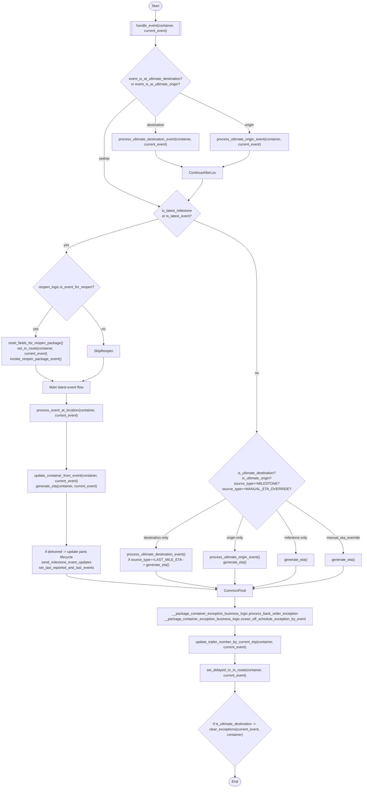

# Diagram: partview_service/partview_service/core/business/package_container/event/PackageContainerEventBusinessLogic.py

> Auto-generated by Obscura crawlers

## Diagram 1

```mermaid
classDiagram
    class PackageContainerEventBusinessLogic {
        -__application_name
        -__feature_name
        -__event_data_store
        -__package_container_data_store
        -__package_container_helper
        -__package_container_exception_business_logic
        -__eta_history_adapter
        -__open_search_producer
        +get_application_name()
        +handle_event(container, current_event)
        +generate_eta(container, event)
        +process_ultimate_destination_event(container, event)
        +process_ultimate_origin_event(container, event)
        +set_delivered(container, event)
        +set_in_route(container, event)
        +set_delayed(container, event, reason, allow_duplicates)
        +set_active_until(container, event)
        +update_container_from_event(container, event)
        +send_milestone_event_updates(container, event)
    }
    class PackageContainer {
        +id
        +tracking_number
        +destination_eta
        +effective_destination_eta
        +lifecycle_state
        +destination_location_code
        +origin_location_code
    }
    class PackageContainerEvent {
        +id
        +event_code
        +event_type
        +event_ts
        +location_code
        +location_detail
        +event_reason_code
        +processed_ts
    }
    class PackageContainerHelper
    class PackageContainerExceptionBusinessLogic
    class PackageContainerEventPostgresqlMapping
    class PackageContainerPostgresqlMapping
    class PackageContainerEtaHistoryPostgresqlMapping
    class InvokeEta
    class InvokeSubscription
    class PackageContainerReopenBusinessLogic
    class PackageContainerProgressLogic
    class PackageContainerTrailerNumberLogic
    PackageContainerEventBusinessLogic --> PackageContainer : operates on
    PackageContainerEventBusinessLogic --> PackageContainerEvent : processes
    PackageContainerEventBusinessLogic --> PackageContainerHelper : uses
    PackageContainerEventBusinessLogic --> PackageContainerExceptionBusinessLogic : delegates
    PackageContainerEventBusinessLogic --> PackageContainerEventPostgresqlMapping : persists events
    PackageContainerEventBusinessLogic --> PackageContainerPostgresqlMapping : updates containers
    PackageContainerEventBusinessLogic --> PackageContainerEtaHistoryPostgresqlMapping : writes eta history
    PackageContainerEventBusinessLogic --> InvokeEta : requests ETA
    PackageContainerEventBusinessLogic --> InvokeSubscription : notifies subscribers
    PackageContainerEventBusinessLogic --> PackageContainerReopenBusinessLogic : composes
    PackageContainerEventBusinessLogic --> PackageContainerProgressLogic : queries progress
    PackageContainerEventBusinessLogic --> PackageContainerTrailerNumberLogic : calculates trailer
```

### SVG

<svg id="container" width="3780.71875" xmlns="http://www.w3.org/2000/svg" class="classDiagram" height="930" viewBox="0 0 3780.71875 930" role="graphics-document document" aria-roledescription="class"><g><defs><marker id="container_class-aggregationStart" class="marker aggregation class" refX="18" refY="7" markerWidth="190" markerHeight="240" orient="auto"><path d="M 18,7 L9,13 L1,7 L9,1 Z"></path></marker></defs><defs><marker id="container_class-aggregationEnd" class="marker aggregation class" refX="1" refY="7" markerWidth="20" markerHeight="28" orient="auto"><path d="M 18,7 L9,13 L1,7 L9,1 Z"></path></marker></defs><defs><marker id="container_class-extensionStart" class="marker extension class" refX="18" refY="7" markerWidth="190" markerHeight="240" orient="auto"><path d="M 1,7 L18,13 V 1 Z"></path></marker></defs><defs><marker id="container_class-extensionEnd" class="marker extension class" refX="1" refY="7" markerWidth="20" markerHeight="28" orient="auto"><path d="M 1,1 V 13 L18,7 Z"></path></marker></defs><defs><marker id="container_class-compositionStart" class="marker composition class" refX="18" refY="7" markerWidth="190" markerHeight="240" orient="auto"><path d="M 18,7 L9,13 L1,7 L9,1 Z"></path></marker></defs><defs><marker id="container_class-compositionEnd" class="marker composition class" refX="1" refY="7" markerWidth="20" markerHeight="28" orient="auto"><path d="M 18,7 L9,13 L1,7 L9,1 Z"></path></marker></defs><defs><marker id="container_class-dependencyStart" class="marker dependency class" refX="6" refY="7" markerWidth="190" markerHeight="240" orient="auto"><path d="M 5,7 L9,13 L1,7 L9,1 Z"></path></marker></defs><defs><marker id="container_class-dependencyEnd" class="marker dependency class" refX="13" refY="7" markerWidth="20" markerHeight="28" orient="auto"><path d="M 18,7 L9,13 L14,7 L9,1 Z"></path></marker></defs><defs><marker id="container_class-lollipopStart" class="marker lollipop class" refX="13" refY="7" markerWidth="190" markerHeight="240" orient="auto"><circle stroke="black" fill="transparent" cx="7" cy="7" r="6"></circle></marker></defs><defs><marker id="container_class-lollipopEnd" class="marker lollipop class" refX="1" refY="7" markerWidth="190" markerHeight="240" orient="auto"><circle stroke="black" fill="transparent" cx="7" cy="7" r="6"></circle></marker></defs><g class="root"><g class="clusters"></g><g class="edgePaths"><path d="M1730.793,331.916L1467.899,376.097C1205.005,420.277,679.217,508.639,416.324,559.986C153.43,611.333,153.43,625.667,153.43,632.833L153.43,640" id="id_PackageContainerEventBusinessLogic_PackageContainer_1" class="edge-thickness-normal edge-pattern-solid relation" style=";;;" data-edge="true" data-et="edge" data-id="id_PackageContainerEventBusinessLogic_PackageContainer_1" data-points="W3sieCI6MTczMC43OTI5Njg3NSwieSI6MzMxLjkxNjA1NDI0NTQyMTV9LHsieCI6MTUzLjQyOTY4NzUsInkiOjU5N30seyJ4IjoxNTMuNDI5Njg3NSwieSI6NjQ2fV0=" marker-end="url(#container_class-dependencyEnd)"></path><path d="M1730.793,342.028L1521.992,384.523C1313.19,427.019,895.587,512.009,686.786,559.671C477.984,607.333,477.984,617.667,477.984,622.833L477.984,628" id="id_PackageContainerEventBusinessLogic_PackageContainerEvent_2" class="edge-thickness-normal edge-pattern-solid relation" style=";;;" data-edge="true" data-et="edge" data-id="id_PackageContainerEventBusinessLogic_PackageContainerEvent_2" data-points="W3sieCI6MTczMC43OTI5Njg3NSwieSI6MzQyLjAyNzk0Njk2NjA0MX0seyJ4Ijo0NzcuOTg0Mzc1LCJ5Ijo1OTd9LHsieCI6NDc3Ljk4NDM3NSwieSI6NjM0fV0=" marker-end="url(#container_class-dependencyEnd)"></path><path d="M1730.793,355.006L1568.84,395.338C1406.888,435.671,1082.983,516.335,921.031,578.834C759.078,641.333,759.078,685.667,759.078,707.833L759.078,730" id="id_PackageContainerEventBusinessLogic_PackageContainerHelper_3" class="edge-thickness-normal edge-pattern-solid relation" style=";;;" data-edge="true" data-et="edge" data-id="id_PackageContainerEventBusinessLogic_PackageContainerHelper_3" data-points="W3sieCI6MTczMC43OTI5Njg3NSwieSI6MzU1LjAwNjAwNzc3MDAwNzh9LHsieCI6NzU5LjA3ODEyNSwieSI6NTk3fSx7IngiOjc1OS4wNzgxMjUsInkiOjczNn1d" marker-end="url(#container_class-dependencyEnd)"></path><path d="M1730.793,378.908L1621.594,415.256C1512.396,451.605,1293.999,524.303,1184.8,582.818C1075.602,641.333,1075.602,685.667,1075.602,707.833L1075.602,730" id="id_PackageContainerEventBusinessLogic_PackageContainerExceptionBusinessLogic_4" class="edge-thickness-normal edge-pattern-solid relation" style=";;;" data-edge="true" data-et="edge" data-id="id_PackageContainerEventBusinessLogic_PackageContainerExceptionBusinessLogic_4" data-points="W3sieCI6MTczMC43OTI5Njg3NSwieSI6Mzc4LjkwNzcwNjA0ODUyMTF9LHsieCI6MTA3NS42MDE1NjI1LCJ5Ijo1OTd9LHsieCI6MTA3NS42MDE1NjI1LCJ5Ijo3MzZ9XQ==" marker-end="url(#container_class-dependencyEnd)"></path><path d="M1730.793,444.021L1685.364,469.517C1639.935,495.014,1549.077,546.007,1503.648,593.67C1458.219,641.333,1458.219,685.667,1458.219,707.833L1458.219,730" id="id_PackageContainerEventBusinessLogic_PackageContainerEventPostgresqlMapping_5" class="edge-thickness-normal edge-pattern-solid relation" style=";;;" data-edge="true" data-et="edge" data-id="id_PackageContainerEventBusinessLogic_PackageContainerEventPostgresqlMapping_5" data-points="W3sieCI6MTczMC43OTI5Njg3NSwieSI6NDQ0LjAyMDg5Mzc0NTE4NDZ9LHsieCI6MTQ1OC4yMTg3NSwieSI6NTk3fSx7IngiOjE0NTguMjE4NzUsInkiOjczNn1d" marker-end="url(#container_class-dependencyEnd)"></path><path d="M1846.803,560L1843.025,566.167C1839.247,572.333,1831.69,584.667,1827.911,613C1824.133,641.333,1824.133,685.667,1824.133,707.833L1824.133,730" id="id_PackageContainerEventBusinessLogic_PackageContainerPostgresqlMapping_6" class="edge-thickness-normal edge-pattern-solid relation" style=";;;" data-edge="true" data-et="edge" data-id="id_PackageContainerEventBusinessLogic_PackageContainerPostgresqlMapping_6" data-points="W3sieCI6MTg0Ni44MDM0Mzk0OTY4MDUxLCJ5Ijo1NjB9LHsieCI6MTgyNC4xMzI4MTI1LCJ5Ijo1OTd9LHsieCI6MTgyNC4xMzI4MTI1LCJ5Ijo3MzZ9XQ==" marker-end="url(#container_class-dependencyEnd)"></path><path d="M2185.025,560L2188.803,566.167C2192.582,572.333,2200.138,584.667,2203.917,613C2207.695,641.333,2207.695,685.667,2207.695,707.833L2207.695,730" id="id_PackageContainerEventBusinessLogic_PackageContainerEtaHistoryPostgresqlMapping_7" class="edge-thickness-normal edge-pattern-solid relation" style=";;;" data-edge="true" data-et="edge" data-id="id_PackageContainerEventBusinessLogic_PackageContainerEtaHistoryPostgresqlMapping_7" data-points="W3sieCI6MjE4NS4wMjQ2ODU1MDMxOTUsInkiOjU2MH0seyJ4IjoyMjA3LjY5NTMxMjUsInkiOjU5N30seyJ4IjoyMjA3LjY5NTMxMjUsInkiOjczNn1d" marker-end="url(#container_class-dependencyEnd)"></path><path d="M2301.035,471.766L2332.73,492.638C2364.424,513.51,2427.814,555.255,2459.508,598.294C2491.203,641.333,2491.203,685.667,2491.203,707.833L2491.203,730" id="id_PackageContainerEventBusinessLogic_InvokeEta_8" class="edge-thickness-normal edge-pattern-solid relation" style=";;;" data-edge="true" data-et="edge" data-id="id_PackageContainerEventBusinessLogic_InvokeEta_8" data-points="W3sieCI6MjMwMS4wMzUxNTYyNSwieSI6NDcxLjc2NTUyOTIwMDk3OTd9LHsieCI6MjQ5MS4yMDMxMjUsInkiOjU5N30seyJ4IjoyNDkxLjIwMzEyNSwieSI6NzM2fV0=" marker-end="url(#container_class-dependencyEnd)"></path><path d="M2301.035,420.054L2362.838,449.545C2424.641,479.036,2548.246,538.018,2610.049,589.676C2671.852,641.333,2671.852,685.667,2671.852,707.833L2671.852,730" id="id_PackageContainerEventBusinessLogic_InvokeSubscription_9" class="edge-thickness-normal edge-pattern-solid relation" style=";;;" data-edge="true" data-et="edge" data-id="id_PackageContainerEventBusinessLogic_InvokeSubscription_9" data-points="W3sieCI6MjMwMS4wMzUxNTYyNSwieSI6NDIwLjA1Mzk3MjEyOTU4NTUzfSx7IngiOjI2NzEuODUxNTYyNSwieSI6NTk3fSx7IngiOjI2NzEuODUxNTYyNSwieSI6NzM2fV0=" marker-end="url(#container_class-dependencyEnd)"></path><path d="M2301.035,378.401L2411.075,414.834C2521.115,451.267,2741.194,524.134,2851.234,582.734C2961.273,641.333,2961.273,685.667,2961.273,707.833L2961.273,730" id="id_PackageContainerEventBusinessLogic_PackageContainerReopenBusinessLogic_10" class="edge-thickness-normal edge-pattern-solid relation" style=";;;" data-edge="true" data-et="edge" data-id="id_PackageContainerEventBusinessLogic_PackageContainerReopenBusinessLogic_10" data-points="W3sieCI6MjMwMS4wMzUxNTYyNSwieSI6Mzc4LjQwMTAzMzgzMzAzMzA3fSx7IngiOjI5NjEuMjczNDM3NSwieSI6NTk3fSx7IngiOjI5NjEuMjczNDM3NSwieSI6NzM2fV0=" marker-end="url(#container_class-dependencyEnd)"></path><path d="M2301.035,353.71L2466.881,394.259C2632.727,434.807,2964.418,515.903,3130.264,578.618C3296.109,641.333,3296.109,685.667,3296.109,707.833L3296.109,730" id="id_PackageContainerEventBusinessLogic_PackageContainerProgressLogic_11" class="edge-thickness-normal edge-pattern-solid relation" style=";;;" data-edge="true" data-et="edge" data-id="id_PackageContainerEventBusinessLogic_PackageContainerProgressLogic_11" data-points="W3sieCI6MjMwMS4wMzUxNTYyNSwieSI6MzUzLjcxMDM4MDQ5NjE0MDE1fSx7IngiOjMyOTYuMTA5Mzc1LCJ5Ijo1OTd9LHsieCI6MzI5Ni4xMDkzNzUsInkiOjczNn1d" marker-end="url(#container_class-dependencyEnd)"></path><path d="M2301.035,339.512L2521.454,382.427C2741.872,425.341,3182.71,511.171,3403.128,576.252C3623.547,641.333,3623.547,685.667,3623.547,707.833L3623.547,730" id="id_PackageContainerEventBusinessLogic_PackageContainerTrailerNumberLogic_12" class="edge-thickness-normal edge-pattern-solid relation" style=";;;" data-edge="true" data-et="edge" data-id="id_PackageContainerEventBusinessLogic_PackageContainerTrailerNumberLogic_12" data-points="W3sieCI6MjMwMS4wMzUxNTYyNSwieSI6MzM5LjUxMTk5MzU2NTg1MDR9LHsieCI6MzYyMy41NDY4NzUsInkiOjU5N30seyJ4IjozNjIzLjU0Njg3NSwieSI6NzM2fV0=" marker-end="url(#container_class-dependencyEnd)"></path></g><g class="edgeLabels"><g class="edgeLabel" transform="translate(153.4296875, 597)"><g class="label" data-id="id_PackageContainerEventBusinessLogic_PackageContainer_1" transform="translate(-43.2890625, -12)"><foreignObject width="86.578125" height="24">

operates on

</foreignObject></g></g><g class="edgeLabel" transform="translate(477.984375, 597)"><g class="label" data-id="id_PackageContainerEventBusinessLogic_PackageContainerEvent_2" transform="translate(-35.7890625, -12)"><foreignObject width="71.578125" height="24">

processes

</foreignObject></g></g><g class="edgeLabel" transform="translate(759.078125, 597)"><g class="label" data-id="id_PackageContainerEventBusinessLogic_PackageContainerHelper_3" transform="translate(-16.4921875, -12)"><foreignObject width="32.984375" height="24">

uses

</foreignObject></g></g><g class="edgeLabel" transform="translate(1075.6015625, 597)"><g class="label" data-id="id_PackageContainerEventBusinessLogic_PackageContainerExceptionBusinessLogic_4" transform="translate(-35.0390625, -12)"><foreignObject width="70.078125" height="24">

delegates

</foreignObject></g></g><g class="edgeLabel" transform="translate(1458.21875, 597)"><g class="label" data-id="id_PackageContainerEventBusinessLogic_PackageContainerEventPostgresqlMapping_5" transform="translate(-54.4609375, -12)"><foreignObject width="108.921875" height="24">

persists events

</foreignObject></g></g><g class="edgeLabel" transform="translate(1824.1328125, 597)"><g class="label" data-id="id_PackageContainerEventBusinessLogic_PackageContainerPostgresqlMapping_6" transform="translate(-69.75, -12)"><foreignObject width="139.5" height="24">

updates containers

</foreignObject></g></g><g class="edgeLabel" transform="translate(2207.6953125, 597)"><g class="label" data-id="id_PackageContainerEventBusinessLogic_PackageContainerEtaHistoryPostgresqlMapping_7" transform="translate(-62.875, -12)"><foreignObject width="125.75" height="24">

writes eta history

</foreignObject></g></g><g class="edgeLabel" transform="translate(2491.203125, 597)"><g class="label" data-id="id_PackageContainerEventBusinessLogic_InvokeEta_8" transform="translate(-46.09375, -12)"><foreignObject width="92.1875" height="24">

requests ETA

</foreignObject></g></g><g class="edgeLabel" transform="translate(2671.8515625, 597)"><g class="label" data-id="id_PackageContainerEventBusinessLogic_InvokeSubscription_9" transform="translate(-71.1875, -12)"><foreignObject width="142.375" height="24">

notifies subscribers

</foreignObject></g></g><g class="edgeLabel" transform="translate(2961.2734375, 597)"><g class="label" data-id="id_PackageContainerEventBusinessLogic_PackageContainerReopenBusinessLogic_10" transform="translate(-36.453125, -12)"><foreignObject width="72.90625" height="24">

composes

</foreignObject></g></g><g class="edgeLabel" transform="translate(3296.109375, 597)"><g class="label" data-id="id_PackageContainerEventBusinessLogic_PackageContainerProgressLogic_11" transform="translate(-60.3984375, -12)"><foreignObject width="120.796875" height="24">

queries progress

</foreignObject></g></g><g class="edgeLabel" transform="translate(3623.546875, 597)"><g class="label" data-id="id_PackageContainerEventBusinessLogic_PackageContainerTrailerNumberLogic_12" transform="translate(-60.421875, -12)"><foreignObject width="120.84375" height="24">

calculates trailer

</foreignObject></g></g></g><g class="nodes"><g class="node default" id="classId-PackageContainerEventBusinessLogic-0" transform="translate(2015.9140625, 284)"><g class="basic label-container"><path d="M-285.12109375 -276 L285.12109375 -276 L285.12109375 276 L-285.12109375 276" stroke="none" stroke-width="0" fill="#ECECFF" style=""></path><path d="M-285.12109375 -276 C-152.9328908194522 -276, -20.744687888904423 -276, 285.12109375 -276 M-285.12109375 -276 C-118.90385049201504 -276, 47.31339276596992 -276, 285.12109375 -276 M285.12109375 -276 C285.12109375 -146.17426375496382, 285.12109375 -16.348527509927635, 285.12109375 276 M285.12109375 -276 C285.12109375 -162.3359884617621, 285.12109375 -48.67197692352417, 285.12109375 276 M285.12109375 276 C61.12968090290539 276, -162.86173194418922 276, -285.12109375 276 M285.12109375 276 C67.75541349855854 276, -149.61026675288292 276, -285.12109375 276 M-285.12109375 276 C-285.12109375 107.54834787203691, -285.12109375 -60.90330425592617, -285.12109375 -276 M-285.12109375 276 C-285.12109375 118.40163525150291, -285.12109375 -39.19672949699418, -285.12109375 -276" stroke="#9370DB" stroke-width="1.3" fill="none" stroke-dasharray="0 0" style=""></path></g><g class="annotation-group text" transform="translate(0, -252)"></g><g class="label-group text" transform="translate(-137.0703125, -252)"><g class="label" style="font-weight: bolder" transform="translate(0,-12)"><foreignObject width="274.140625" height="24">

PackageContainerEventBusinessLogic

</foreignObject></g></g><g class="members-group text" transform="translate(-273.12109375, -204)"><g class="label" style="" transform="translate(0,-12)"><foreignObject width="152.28125" height="24">

-__application_name

</foreignObject></g><g class="label" style="" transform="translate(0,12)"><foreignObject width="121.8125" height="24">

-__feature_name

</foreignObject></g><g class="label" style="" transform="translate(0,36)"><foreignObject width="147.40625" height="24">

-__event_data_store

</foreignObject></g><g class="label" style="" transform="translate(0,60)"><foreignObject width="241.953125" height="24">

-__package_container_data_store

</foreignObject></g><g class="label" style="" transform="translate(0,84)"><foreignObject width="211.734375" height="24">

-__package_container_helper

</foreignObject></g><g class="label" style="" transform="translate(0,108)"><foreignObject width="349.25" height="24">

-__package_container_exception_business_logic

</foreignObject></g><g class="label" style="" transform="translate(0,132)"><foreignObject width="167.46875" height="24">

-__eta_history_adapter

</foreignObject></g><g class="label" style="" transform="translate(0,156)"><foreignObject width="188.03125" height="24">

-__open_search_producer

</foreignObject></g></g><g class="methods-group text" transform="translate(-273.12109375, 12)"><g class="label" style="" transform="translate(0,-12)"><foreignObject width="179.859375" height="24">

+get_application_name()

</foreignObject></g><g class="label" style="" transform="translate(0,12)"><foreignObject width="293.609375" height="24">

+handle_event(container, current_event)

</foreignObject></g><g class="label" style="" transform="translate(0,36)"><foreignObject width="228.921875" height="24">

+generate_eta(container, event)

</foreignObject></g><g class="label" style="" transform="translate(0,60)"><foreignObject width="397.859375" height="24">

+process_ultimate_destination_event(container, event)

</foreignObject></g><g class="label" style="" transform="translate(0,84)"><foreignObject width="356.96875" height="24">

+process_ultimate_origin_event(container, event)

</foreignObject></g><g class="label" style="" transform="translate(0,108)"><foreignObject width="232.671875" height="24">

+set_delivered(container, event)

</foreignObject></g><g class="label" style="" transform="translate(0,132)"><foreignObject width="225.796875" height="24">

+set_in_route(container, event)

</foreignObject></g><g class="label" style="" transform="translate(0,156)"><foreignObject width="409.171875" height="24">

+set_delayed(container, event, reason, allow_duplicates)

</foreignObject></g><g class="label" style="" transform="translate(0,180)"><foreignObject width="249.171875" height="24">

+set_active_until(container, event)

</foreignObject></g><g class="label" style="" transform="translate(0,204)"><foreignObject width="352.09375" height="24">

+update_container_from_event(container, event)

</foreignObject></g><g class="label" style="" transform="translate(0,228)"><foreignObject width="364.984375" height="24">

+send_milestone_event_updates(container, event)

</foreignObject></g></g><g class="divider" style=""><path d="M-285.12109375 -228 C-63.998082059198 -228, 157.124929631604 -228, 285.12109375 -228 M-285.12109375 -228 C-122.49839156786393 -228, 40.12431061427213 -228, 285.12109375 -228" stroke="#9370DB" stroke-width="1.3" fill="none" stroke-dasharray="0 0" style=""></path></g><g class="divider" style=""><path d="M-285.12109375 -12 C-87.03010847172263 -12, 111.06087680655475 -12, 285.12109375 -12 M-285.12109375 -12 C-143.0943601273651 -12, -1.0676265047301854 -12, 285.12109375 -12" stroke="#9370DB" stroke-width="1.3" fill="none" stroke-dasharray="0 0" style=""></path></g></g><g class="node default" id="classId-PackageContainer-1" transform="translate(153.4296875, 778)"><g class="basic label-container"><path d="M-145.4296875 -132 L145.4296875 -132 L145.4296875 132 L-145.4296875 132" stroke="none" stroke-width="0" fill="#ECECFF" style=""></path><path d="M-145.4296875 -132 C-37.58682954505926 -132, 70.25602840988148 -132, 145.4296875 -132 M-145.4296875 -132 C-52.659868964864785 -132, 40.10994957027043 -132, 145.4296875 -132 M145.4296875 -132 C145.4296875 -57.6805087940477, 145.4296875 16.638982411904607, 145.4296875 132 M145.4296875 -132 C145.4296875 -38.11815580717486, 145.4296875 55.76368838565028, 145.4296875 132 M145.4296875 132 C56.358093674556784 132, -32.71350015088643 132, -145.4296875 132 M145.4296875 132 C79.98572030101307 132, 14.54175310202615 132, -145.4296875 132 M-145.4296875 132 C-145.4296875 34.33252948351212, -145.4296875 -63.33494103297576, -145.4296875 -132 M-145.4296875 132 C-145.4296875 63.50445568933054, -145.4296875 -4.991088621338918, -145.4296875 -132" stroke="#9370DB" stroke-width="1.3" fill="none" stroke-dasharray="0 0" style=""></path></g><g class="annotation-group text" transform="translate(0, -108)"></g><g class="label-group text" transform="translate(-65.453125, -108)"><g class="label" style="font-weight: bolder" transform="translate(0,-12)"><foreignObject width="130.90625" height="24">

PackageContainer

</foreignObject></g></g><g class="members-group text" transform="translate(-133.4296875, -60)"><g class="label" style="" transform="translate(0,-12)"><foreignObject width="22.078125" height="24">

+id

</foreignObject></g><g class="label" style="" transform="translate(0,12)"><foreignObject width="131.234375" height="24">

+tracking_number

</foreignObject></g><g class="label" style="" transform="translate(0,36)"><foreignObject width="122.21875" height="24">

+destination_eta

</foreignObject></g><g class="label" style="" transform="translate(0,60)"><foreignObject width="192.359375" height="24">

+effective_destination_eta

</foreignObject></g><g class="label" style="" transform="translate(0,84)"><foreignObject width="111.640625" height="24">

+lifecycle_state

</foreignObject></g><g class="label" style="" transform="translate(0,108)"><foreignObject width="201.40625" height="24">

+destination_location_code

</foreignObject></g><g class="label" style="" transform="translate(0,132)"><foreignObject width="160.5" height="24">

+origin_location_code

</foreignObject></g></g><g class="methods-group text" transform="translate(-133.4296875, 132)"></g><g class="divider" style=""><path d="M-145.4296875 -84 C-79.23411420948473 -84, -13.03854091896946 -84, 145.4296875 -84 M-145.4296875 -84 C-49.298444668374145 -84, 46.83279816325171 -84, 145.4296875 -84" stroke="#9370DB" stroke-width="1.3" fill="none" stroke-dasharray="0 0" style=""></path></g><g class="divider" style=""><path d="M-145.4296875 108 C-53.037602821323006 108, 39.35448185735399 108, 145.4296875 108 M-145.4296875 108 C-39.9480509736738 108, 65.5335855526524 108, 145.4296875 108" stroke="#9370DB" stroke-width="1.3" fill="none" stroke-dasharray="0 0" style=""></path></g></g><g class="node default" id="classId-PackageContainerEvent-2" transform="translate(477.984375, 778)"><g class="basic label-container"><path d="M-129.125 -144 L129.125 -144 L129.125 144 L-129.125 144" stroke="none" stroke-width="0" fill="#ECECFF" style=""></path><path d="M-129.125 -144 C-71.78297234120902 -144, -14.44094468241805 -144, 129.125 -144 M-129.125 -144 C-27.775993304190507 -144, 73.57301339161899 -144, 129.125 -144 M129.125 -144 C129.125 -70.92360349343922, 129.125 2.152793013121567, 129.125 144 M129.125 -144 C129.125 -40.609284673571295, 129.125 62.78143065285741, 129.125 144 M129.125 144 C50.45381525813272 144, -28.217369483734558 144, -129.125 144 M129.125 144 C36.19144251730225 144, -56.7421149653955 144, -129.125 144 M-129.125 144 C-129.125 32.403620826989425, -129.125 -79.19275834602115, -129.125 -144 M-129.125 144 C-129.125 41.787990300485006, -129.125 -60.42401939902999, -129.125 -144" stroke="#9370DB" stroke-width="1.3" fill="none" stroke-dasharray="0 0" style=""></path></g><g class="annotation-group text" transform="translate(0, -120)"></g><g class="label-group text" transform="translate(-85.65625, -120)"><g class="label" style="font-weight: bolder" transform="translate(0,-12)"><foreignObject width="171.3125" height="24">

PackageContainerEvent

</foreignObject></g></g><g class="members-group text" transform="translate(-117.125, -72)"><g class="label" style="" transform="translate(0,-12)"><foreignObject width="22.078125" height="24">

+id

</foreignObject></g><g class="label" style="" transform="translate(0,12)"><foreignObject width="91.28125" height="24">

+event_code

</foreignObject></g><g class="label" style="" transform="translate(0,36)"><foreignObject width="88.125" height="24">

+event_type

</foreignObject></g><g class="label" style="" transform="translate(0,60)"><foreignObject width="69.578125" height="24">

+event_ts

</foreignObject></g><g class="label" style="" transform="translate(0,84)"><foreignObject width="110.109375" height="24">

+location_code

</foreignObject></g><g class="label" style="" transform="translate(0,108)"><foreignObject width="117" height="24">

+location_detail

</foreignObject></g><g class="label" style="" transform="translate(0,132)"><foreignObject width="148.59375" height="24">

+event_reason_code

</foreignObject></g><g class="label" style="" transform="translate(0,156)"><foreignObject width="102.90625" height="24">

+processed_ts

</foreignObject></g></g><g class="methods-group text" transform="translate(-117.125, 144)"></g><g class="divider" style=""><path d="M-129.125 -96 C-52.43037538493576 -96, 24.264249230128485 -96, 129.125 -96 M-129.125 -96 C-49.12165651451011 -96, 30.881686970979786 -96, 129.125 -96" stroke="#9370DB" stroke-width="1.3" fill="none" stroke-dasharray="0 0" style=""></path></g><g class="divider" style=""><path d="M-129.125 120 C-63.735203327137754 120, 1.6545933457244928 120, 129.125 120 M-129.125 120 C-72.7424805175772 120, -16.3599610351544 120, 129.125 120" stroke="#9370DB" stroke-width="1.3" fill="none" stroke-dasharray="0 0" style=""></path></g></g><g class="node default" id="classId-PackageContainerHelper-3" transform="translate(759.078125, 778)"><g class="basic label-container"><path d="M-101.96875 -42 L101.96875 -42 L101.96875 42 L-101.96875 42" stroke="none" stroke-width="0" fill="#ECECFF" style=""></path><path d="M-101.96875 -42 C-36.56052692530653 -42, 28.847696149386934 -42, 101.96875 -42 M-101.96875 -42 C-51.314128765187576 -42, -0.6595075303751514 -42, 101.96875 -42 M101.96875 -42 C101.96875 -13.429219062529882, 101.96875 15.141561874940237, 101.96875 42 M101.96875 -42 C101.96875 -18.053189161441946, 101.96875 5.8936216771161085, 101.96875 42 M101.96875 42 C44.24201377109345 42, -13.484722457813106 42, -101.96875 42 M101.96875 42 C39.88494485109261 42, -22.198860297814775 42, -101.96875 42 M-101.96875 42 C-101.96875 19.843611673013747, -101.96875 -2.312776653972506, -101.96875 -42 M-101.96875 42 C-101.96875 14.55845236865003, -101.96875 -12.883095262699939, -101.96875 -42" stroke="#9370DB" stroke-width="1.3" fill="none" stroke-dasharray="0 0" style=""></path></g><g class="annotation-group text" transform="translate(0, -18)"></g><g class="label-group text" transform="translate(-89.96875, -18)"><g class="label" style="font-weight: bolder" transform="translate(0,-12)"><foreignObject width="179.9375" height="24">

PackageContainerHelper

</foreignObject></g></g><g class="members-group text" transform="translate(-89.96875, 30)"></g><g class="methods-group text" transform="translate(-89.96875, 60)"></g><g class="divider" style=""><path d="M-101.96875 6 C-51.498510994979355 6, -1.0282719899587107 6, 101.96875 6 M-101.96875 6 C-21.75949451642147 6, 58.44976096715706 6, 101.96875 6" stroke="#9370DB" stroke-width="1.3" fill="none" stroke-dasharray="0 0" style=""></path></g><g class="divider" style=""><path d="M-101.96875 24 C-48.352163683731355 24, 5.26442263253729 24, 101.96875 24 M-101.96875 24 C-40.95182713064009 24, 20.06509573871982 24, 101.96875 24" stroke="#9370DB" stroke-width="1.3" fill="none" stroke-dasharray="0 0" style=""></path></g></g><g class="node default" id="classId-PackageContainerExceptionBusinessLogic-4" transform="translate(1075.6015625, 778)"><g class="basic label-container"><path d="M-164.5546875 -42 L164.5546875 -42 L164.5546875 42 L-164.5546875 42" stroke="none" stroke-width="0" fill="#ECECFF" style=""></path><path d="M-164.5546875 -42 C-74.38198047079219 -42, 15.790726558415628 -42, 164.5546875 -42 M-164.5546875 -42 C-96.22012962174004 -42, -27.885571743480085 -42, 164.5546875 -42 M164.5546875 -42 C164.5546875 -13.342329169486707, 164.5546875 15.315341661026586, 164.5546875 42 M164.5546875 -42 C164.5546875 -17.292753900696514, 164.5546875 7.414492198606972, 164.5546875 42 M164.5546875 42 C46.689572804389556 42, -71.17554189122089 42, -164.5546875 42 M164.5546875 42 C44.99938386389715 42, -74.5559197722057 42, -164.5546875 42 M-164.5546875 42 C-164.5546875 11.711994228322851, -164.5546875 -18.576011543354298, -164.5546875 -42 M-164.5546875 42 C-164.5546875 15.330866245424012, -164.5546875 -11.338267509151976, -164.5546875 -42" stroke="#9370DB" stroke-width="1.3" fill="none" stroke-dasharray="0 0" style=""></path></g><g class="annotation-group text" transform="translate(0, -18)"></g><g class="label-group text" transform="translate(-152.5546875, -18)"><g class="label" style="font-weight: bolder" transform="translate(0,-12)"><foreignObject width="305.109375" height="24">

PackageContainerExceptionBusinessLogic

</foreignObject></g></g><g class="members-group text" transform="translate(-152.5546875, 30)"></g><g class="methods-group text" transform="translate(-152.5546875, 60)"></g><g class="divider" style=""><path d="M-164.5546875 6 C-77.43033418809263 6, 9.69401912381474 6, 164.5546875 6 M-164.5546875 6 C-36.7260723232272 6, 91.1025428535456 6, 164.5546875 6" stroke="#9370DB" stroke-width="1.3" fill="none" stroke-dasharray="0 0" style=""></path></g><g class="divider" style=""><path d="M-164.5546875 24 C-92.96723295395408 24, -21.379778407908162 24, 164.5546875 24 M-164.5546875 24 C-65.08274628241949 24, 34.389194935161015 24, 164.5546875 24" stroke="#9370DB" stroke-width="1.3" fill="none" stroke-dasharray="0 0" style=""></path></g></g><g class="node default" id="classId-PackageContainerEventPostgresqlMapping-5" transform="translate(1458.21875, 778)"><g class="basic label-container"><path d="M-168.0625 -42 L168.0625 -42 L168.0625 42 L-168.0625 42" stroke="none" stroke-width="0" fill="#ECECFF" style=""></path><path d="M-168.0625 -42 C-85.55936505030718 -42, -3.056230100614357 -42, 168.0625 -42 M-168.0625 -42 C-74.89000696051217 -42, 18.282486078975666 -42, 168.0625 -42 M168.0625 -42 C168.0625 -16.74796354121464, 168.0625 8.504072917570717, 168.0625 42 M168.0625 -42 C168.0625 -22.489137539917525, 168.0625 -2.9782750798350506, 168.0625 42 M168.0625 42 C78.29762224857491 42, -11.467255502850179 42, -168.0625 42 M168.0625 42 C61.88504054734807 42, -44.29241890530386 42, -168.0625 42 M-168.0625 42 C-168.0625 10.30890074929458, -168.0625 -21.38219850141084, -168.0625 -42 M-168.0625 42 C-168.0625 18.05493872465861, -168.0625 -5.890122550682783, -168.0625 -42" stroke="#9370DB" stroke-width="1.3" fill="none" stroke-dasharray="0 0" style=""></path></g><g class="annotation-group text" transform="translate(0, -18)"></g><g class="label-group text" transform="translate(-156.0625, -18)"><g class="label" style="font-weight: bolder" transform="translate(0,-12)"><foreignObject width="312.125" height="24">

PackageContainerEventPostgresqlMapping

</foreignObject></g></g><g class="members-group text" transform="translate(-156.0625, 30)"></g><g class="methods-group text" transform="translate(-156.0625, 60)"></g><g class="divider" style=""><path d="M-168.0625 6 C-40.38173871098758 6, 87.29902257802485 6, 168.0625 6 M-168.0625 6 C-46.443174510456615 6, 75.17615097908677 6, 168.0625 6" stroke="#9370DB" stroke-width="1.3" fill="none" stroke-dasharray="0 0" style=""></path></g><g class="divider" style=""><path d="M-168.0625 24 C-41.22328327882853 24, 85.61593344234294 24, 168.0625 24 M-168.0625 24 C-98.4458474765409 24, -28.82919495308181 24, 168.0625 24" stroke="#9370DB" stroke-width="1.3" fill="none" stroke-dasharray="0 0" style=""></path></g></g><g class="node default" id="classId-PackageContainerPostgresqlMapping-6" transform="translate(1824.1328125, 778)"><g class="basic label-container"><path d="M-147.8515625 -42 L147.8515625 -42 L147.8515625 42 L-147.8515625 42" stroke="none" stroke-width="0" fill="#ECECFF" style=""></path><path d="M-147.8515625 -42 C-62.079110380186464 -42, 23.693341739627073 -42, 147.8515625 -42 M-147.8515625 -42 C-73.45702873335092 -42, 0.9375050332981516 -42, 147.8515625 -42 M147.8515625 -42 C147.8515625 -12.83154507168727, 147.8515625 16.33690985662546, 147.8515625 42 M147.8515625 -42 C147.8515625 -15.843193934576924, 147.8515625 10.313612130846153, 147.8515625 42 M147.8515625 42 C33.77004090304665 42, -80.3114806939067 42, -147.8515625 42 M147.8515625 42 C53.23296767173531 42, -41.38562715652938 42, -147.8515625 42 M-147.8515625 42 C-147.8515625 11.982347920439068, -147.8515625 -18.035304159121864, -147.8515625 -42 M-147.8515625 42 C-147.8515625 20.879029721800016, -147.8515625 -0.24194055639996748, -147.8515625 -42" stroke="#9370DB" stroke-width="1.3" fill="none" stroke-dasharray="0 0" style=""></path></g><g class="annotation-group text" transform="translate(0, -18)"></g><g class="label-group text" transform="translate(-135.8515625, -18)"><g class="label" style="font-weight: bolder" transform="translate(0,-12)"><foreignObject width="271.703125" height="24">

PackageContainerPostgresqlMapping

</foreignObject></g></g><g class="members-group text" transform="translate(-135.8515625, 30)"></g><g class="methods-group text" transform="translate(-135.8515625, 60)"></g><g class="divider" style=""><path d="M-147.8515625 6 C-81.48567344667671 6, -15.119784393353427 6, 147.8515625 6 M-147.8515625 6 C-69.38124418759021 6, 9.089074124819575 6, 147.8515625 6" stroke="#9370DB" stroke-width="1.3" fill="none" stroke-dasharray="0 0" style=""></path></g><g class="divider" style=""><path d="M-147.8515625 24 C-69.97935576322477 24, 7.892850973550452 24, 147.8515625 24 M-147.8515625 24 C-56.77241129963775 24, 34.306739900724494 24, 147.8515625 24" stroke="#9370DB" stroke-width="1.3" fill="none" stroke-dasharray="0 0" style=""></path></g></g><g class="node default" id="classId-PackageContainerEtaHistoryPostgresqlMapping-7" transform="translate(2207.6953125, 778)"><g class="basic label-container"><path d="M-185.7109375 -42 L185.7109375 -42 L185.7109375 42 L-185.7109375 42" stroke="none" stroke-width="0" fill="#ECECFF" style=""></path><path d="M-185.7109375 -42 C-56.1831242136285 -42, 73.344689072743 -42, 185.7109375 -42 M-185.7109375 -42 C-64.6944016183379 -42, 56.32213426332419 -42, 185.7109375 -42 M185.7109375 -42 C185.7109375 -10.16539406518896, 185.7109375 21.66921186962208, 185.7109375 42 M185.7109375 -42 C185.7109375 -23.9242244179648, 185.7109375 -5.848448835929602, 185.7109375 42 M185.7109375 42 C99.7591280404328 42, 13.807318580865598 42, -185.7109375 42 M185.7109375 42 C89.15486144801041 42, -7.401214603979184 42, -185.7109375 42 M-185.7109375 42 C-185.7109375 14.689671724811273, -185.7109375 -12.620656550377454, -185.7109375 -42 M-185.7109375 42 C-185.7109375 12.600318733575083, -185.7109375 -16.799362532849834, -185.7109375 -42" stroke="#9370DB" stroke-width="1.3" fill="none" stroke-dasharray="0 0" style=""></path></g><g class="annotation-group text" transform="translate(0, -18)"></g><g class="label-group text" transform="translate(-173.7109375, -18)"><g class="label" style="font-weight: bolder" transform="translate(0,-12)"><foreignObject width="347.421875" height="24">

PackageContainerEtaHistoryPostgresqlMapping

</foreignObject></g></g><g class="members-group text" transform="translate(-173.7109375, 30)"></g><g class="methods-group text" transform="translate(-173.7109375, 60)"></g><g class="divider" style=""><path d="M-185.7109375 6 C-85.21322104786537 6, 15.28449540426925 6, 185.7109375 6 M-185.7109375 6 C-50.83224619455203 6, 84.04644511089595 6, 185.7109375 6" stroke="#9370DB" stroke-width="1.3" fill="none" stroke-dasharray="0 0" style=""></path></g><g class="divider" style=""><path d="M-185.7109375 24 C-79.56199207402233 24, 26.586953351955344 24, 185.7109375 24 M-185.7109375 24 C-37.66712167386373 24, 110.37669415227253 24, 185.7109375 24" stroke="#9370DB" stroke-width="1.3" fill="none" stroke-dasharray="0 0" style=""></path></g></g><g class="node default" id="classId-InvokeEta-8" transform="translate(2491.203125, 778)"><g class="basic label-container"><path d="M-47.796875 -42 L47.796875 -42 L47.796875 42 L-47.796875 42" stroke="none" stroke-width="0" fill="#ECECFF" style=""></path><path d="M-47.796875 -42 C-15.38014921134284 -42, 17.03657657731432 -42, 47.796875 -42 M-47.796875 -42 C-18.140577673183525 -42, 11.51571965363295 -42, 47.796875 -42 M47.796875 -42 C47.796875 -11.140536582100228, 47.796875 19.718926835799543, 47.796875 42 M47.796875 -42 C47.796875 -16.811101532907493, 47.796875 8.377796934185014, 47.796875 42 M47.796875 42 C20.69613593950498 42, -6.404603120990039 42, -47.796875 42 M47.796875 42 C13.077705608055702 42, -21.641463783888597 42, -47.796875 42 M-47.796875 42 C-47.796875 19.848943464966045, -47.796875 -2.302113070067911, -47.796875 -42 M-47.796875 42 C-47.796875 14.145630950161792, -47.796875 -13.708738099676417, -47.796875 -42" stroke="#9370DB" stroke-width="1.3" fill="none" stroke-dasharray="0 0" style=""></path></g><g class="annotation-group text" transform="translate(0, -18)"></g><g class="label-group text" transform="translate(-35.796875, -18)"><g class="label" style="font-weight: bolder" transform="translate(0,-12)"><foreignObject width="71.59375" height="24">

InvokeEta

</foreignObject></g></g><g class="members-group text" transform="translate(-35.796875, 30)"></g><g class="methods-group text" transform="translate(-35.796875, 60)"></g><g class="divider" style=""><path d="M-47.796875 6 C-11.827966806509444 6, 24.140941386981112 6, 47.796875 6 M-47.796875 6 C-24.96368309508137 6, -2.1304911901627435 6, 47.796875 6" stroke="#9370DB" stroke-width="1.3" fill="none" stroke-dasharray="0 0" style=""></path></g><g class="divider" style=""><path d="M-47.796875 24 C-17.739953690332772 24, 12.316967619334456 24, 47.796875 24 M-47.796875 24 C-11.23180262793111 24, 25.33326974413778 24, 47.796875 24" stroke="#9370DB" stroke-width="1.3" fill="none" stroke-dasharray="0 0" style=""></path></g></g><g class="node default" id="classId-InvokeSubscription-9" transform="translate(2671.8515625, 778)"><g class="basic label-container"><path d="M-82.8515625 -42 L82.8515625 -42 L82.8515625 42 L-82.8515625 42" stroke="none" stroke-width="0" fill="#ECECFF" style=""></path><path d="M-82.8515625 -42 C-28.9462048292281 -42, 24.959152841543798 -42, 82.8515625 -42 M-82.8515625 -42 C-49.3080470959451 -42, -15.764531691890198 -42, 82.8515625 -42 M82.8515625 -42 C82.8515625 -15.43588567337784, 82.8515625 11.12822865324432, 82.8515625 42 M82.8515625 -42 C82.8515625 -23.04670124174599, 82.8515625 -4.093402483491978, 82.8515625 42 M82.8515625 42 C43.829146877437864 42, 4.806731254875729 42, -82.8515625 42 M82.8515625 42 C42.643927054771886 42, 2.4362916095437726 42, -82.8515625 42 M-82.8515625 42 C-82.8515625 10.143568295195237, -82.8515625 -21.712863409609525, -82.8515625 -42 M-82.8515625 42 C-82.8515625 24.44918415050665, -82.8515625 6.898368301013299, -82.8515625 -42" stroke="#9370DB" stroke-width="1.3" fill="none" stroke-dasharray="0 0" style=""></path></g><g class="annotation-group text" transform="translate(0, -18)"></g><g class="label-group text" transform="translate(-70.8515625, -18)"><g class="label" style="font-weight: bolder" transform="translate(0,-12)"><foreignObject width="141.703125" height="24">

InvokeSubscription

</foreignObject></g></g><g class="members-group text" transform="translate(-70.8515625, 30)"></g><g class="methods-group text" transform="translate(-70.8515625, 60)"></g><g class="divider" style=""><path d="M-82.8515625 6 C-48.117403921229666 6, -13.383245342459333 6, 82.8515625 6 M-82.8515625 6 C-30.143551627931394 6, 22.56445924413721 6, 82.8515625 6" stroke="#9370DB" stroke-width="1.3" fill="none" stroke-dasharray="0 0" style=""></path></g><g class="divider" style=""><path d="M-82.8515625 24 C-28.96564206856152 24, 24.920278362876957 24, 82.8515625 24 M-82.8515625 24 C-39.567137975417324 24, 3.717286549165351 24, 82.8515625 24" stroke="#9370DB" stroke-width="1.3" fill="none" stroke-dasharray="0 0" style=""></path></g></g><g class="node default" id="classId-PackageContainerReopenBusinessLogic-10" transform="translate(2961.2734375, 778)"><g class="basic label-container"><path d="M-156.5703125 -42 L156.5703125 -42 L156.5703125 42 L-156.5703125 42" stroke="none" stroke-width="0" fill="#ECECFF" style=""></path><path d="M-156.5703125 -42 C-42.69904874650112 -42, 71.17221500699776 -42, 156.5703125 -42 M-156.5703125 -42 C-69.43992696137178 -42, 17.690458577256436 -42, 156.5703125 -42 M156.5703125 -42 C156.5703125 -19.594219708736155, 156.5703125 2.81156058252769, 156.5703125 42 M156.5703125 -42 C156.5703125 -11.35176731415989, 156.5703125 19.29646537168022, 156.5703125 42 M156.5703125 42 C85.77656991507412 42, 14.98282733014824 42, -156.5703125 42 M156.5703125 42 C71.4154030427928 42, -13.739506414414393 42, -156.5703125 42 M-156.5703125 42 C-156.5703125 16.055927969043392, -156.5703125 -9.888144061913216, -156.5703125 -42 M-156.5703125 42 C-156.5703125 13.168047454468507, -156.5703125 -15.663905091062986, -156.5703125 -42" stroke="#9370DB" stroke-width="1.3" fill="none" stroke-dasharray="0 0" style=""></path></g><g class="annotation-group text" transform="translate(0, -18)"></g><g class="label-group text" transform="translate(-144.5703125, -18)"><g class="label" style="font-weight: bolder" transform="translate(0,-12)"><foreignObject width="289.140625" height="24">

PackageContainerReopenBusinessLogic

</foreignObject></g></g><g class="members-group text" transform="translate(-144.5703125, 30)"></g><g class="methods-group text" transform="translate(-144.5703125, 60)"></g><g class="divider" style=""><path d="M-156.5703125 6 C-76.18425953797038 6, 4.201793424059247 6, 156.5703125 6 M-156.5703125 6 C-76.5425524093812 6, 3.485207681237597 6, 156.5703125 6" stroke="#9370DB" stroke-width="1.3" fill="none" stroke-dasharray="0 0" style=""></path></g><g class="divider" style=""><path d="M-156.5703125 24 C-72.4407831858959 24, 11.688746128208209 24, 156.5703125 24 M-156.5703125 24 C-48.32041049279965 24, 59.929491514400695 24, 156.5703125 24" stroke="#9370DB" stroke-width="1.3" fill="none" stroke-dasharray="0 0" style=""></path></g></g><g class="node default" id="classId-PackageContainerProgressLogic-11" transform="translate(3296.109375, 778)"><g class="basic label-container"><path d="M-128.265625 -42 L128.265625 -42 L128.265625 42 L-128.265625 42" stroke="none" stroke-width="0" fill="#ECECFF" style=""></path><path d="M-128.265625 -42 C-54.55177741758865 -42, 19.162070164822694 -42, 128.265625 -42 M-128.265625 -42 C-71.20659713753741 -42, -14.147569275074815 -42, 128.265625 -42 M128.265625 -42 C128.265625 -22.753777432955967, 128.265625 -3.507554865911935, 128.265625 42 M128.265625 -42 C128.265625 -12.498887552740356, 128.265625 17.002224894519287, 128.265625 42 M128.265625 42 C36.71103871547376 42, -54.843547569052475 42, -128.265625 42 M128.265625 42 C60.32236294798672 42, -7.620899104026563 42, -128.265625 42 M-128.265625 42 C-128.265625 9.48841750779247, -128.265625 -23.02316498441506, -128.265625 -42 M-128.265625 42 C-128.265625 21.23922080075087, -128.265625 0.47844160150174275, -128.265625 -42" stroke="#9370DB" stroke-width="1.3" fill="none" stroke-dasharray="0 0" style=""></path></g><g class="annotation-group text" transform="translate(0, -18)"></g><g class="label-group text" transform="translate(-116.265625, -18)"><g class="label" style="font-weight: bolder" transform="translate(0,-12)"><foreignObject width="232.53125" height="24">

PackageContainerProgressLogic

</foreignObject></g></g><g class="members-group text" transform="translate(-116.265625, 30)"></g><g class="methods-group text" transform="translate(-116.265625, 60)"></g><g class="divider" style=""><path d="M-128.265625 6 C-46.033375000418346 6, 36.19887499916331 6, 128.265625 6 M-128.265625 6 C-54.47125666673746 6, 19.32311166652508 6, 128.265625 6" stroke="#9370DB" stroke-width="1.3" fill="none" stroke-dasharray="0 0" style=""></path></g><g class="divider" style=""><path d="M-128.265625 24 C-49.44166415163319 24, 29.38229669673362 24, 128.265625 24 M-128.265625 24 C-64.07512509923833 24, 0.11537480152333046 24, 128.265625 24" stroke="#9370DB" stroke-width="1.3" fill="none" stroke-dasharray="0 0" style=""></path></g></g><g class="node default" id="classId-PackageContainerTrailerNumberLogic-12" transform="translate(3623.546875, 778)"><g class="basic label-container"><path d="M-149.171875 -42 L149.171875 -42 L149.171875 42 L-149.171875 42" stroke="none" stroke-width="0" fill="#ECECFF" style=""></path><path d="M-149.171875 -42 C-39.08554563544409 -42, 71.00078372911182 -42, 149.171875 -42 M-149.171875 -42 C-50.03928683650871 -42, 49.09330132698258 -42, 149.171875 -42 M149.171875 -42 C149.171875 -9.65392127207599, 149.171875 22.69215745584802, 149.171875 42 M149.171875 -42 C149.171875 -15.684245443950633, 149.171875 10.631509112098733, 149.171875 42 M149.171875 42 C85.63497705415277 42, 22.09807910830554 42, -149.171875 42 M149.171875 42 C60.021740243681975 42, -29.12839451263605 42, -149.171875 42 M-149.171875 42 C-149.171875 8.905442962879896, -149.171875 -24.18911407424021, -149.171875 -42 M-149.171875 42 C-149.171875 8.498088193106703, -149.171875 -25.003823613786594, -149.171875 -42" stroke="#9370DB" stroke-width="1.3" fill="none" stroke-dasharray="0 0" style=""></path></g><g class="annotation-group text" transform="translate(0, -18)"></g><g class="label-group text" transform="translate(-137.171875, -18)"><g class="label" style="font-weight: bolder" transform="translate(0,-12)"><foreignObject width="274.34375" height="24">

PackageContainerTrailerNumberLogic

</foreignObject></g></g><g class="members-group text" transform="translate(-137.171875, 30)"></g><g class="methods-group text" transform="translate(-137.171875, 60)"></g><g class="divider" style=""><path d="M-149.171875 6 C-31.387816595636835 6, 86.39624180872633 6, 149.171875 6 M-149.171875 6 C-60.18460062802869 6, 28.80267374394262 6, 149.171875 6" stroke="#9370DB" stroke-width="1.3" fill="none" stroke-dasharray="0 0" style=""></path></g><g class="divider" style=""><path d="M-149.171875 24 C-61.56205149216986 24, 26.047772015660286 24, 149.171875 24 M-149.171875 24 C-46.63459648276441 24, 55.902682034471184 24, 149.171875 24" stroke="#9370DB" stroke-width="1.3" fill="none" stroke-dasharray="0 0" style=""></path></g></g></g></g></g></svg>

## Diagram 2

### SVG

<svg id="container" width="2089.08203125" xmlns="http://www.w3.org/2000/svg" class="flowchart" height="3534.328125" viewBox="0 0 2089.08203125 3534.328125" role="graphics-document document" aria-roledescription="flowchart-v2"><g><marker id="container_flowchart-v2-pointEnd" class="marker flowchart-v2" viewBox="0 0 10 10" refX="5" refY="5" markerUnits="userSpaceOnUse" markerWidth="8" markerHeight="8" orient="auto"><path d="M 0 0 L 10 5 L 0 10 z" class="arrowMarkerPath" style="stroke-width: 1; stroke-dasharray: 1, 0;"></path></marker><marker id="container_flowchart-v2-pointStart" class="marker flowchart-v2" viewBox="0 0 10 10" refX="4.5" refY="5" markerUnits="userSpaceOnUse" markerWidth="8" markerHeight="8" orient="auto"><path d="M 0 5 L 10 10 L 10 0 z" class="arrowMarkerPath" style="stroke-width: 1; stroke-dasharray: 1, 0;"></path></marker><marker id="container_flowchart-v2-circleEnd" class="marker flowchart-v2" viewBox="0 0 10 10" refX="11" refY="5" markerUnits="userSpaceOnUse" markerWidth="11" markerHeight="11" orient="auto"><circle cx="5" cy="5" r="5" class="arrowMarkerPath" style="stroke-width: 1; stroke-dasharray: 1, 0;"></circle></marker><marker id="container_flowchart-v2-circleStart" class="marker flowchart-v2" viewBox="0 0 10 10" refX="-1" refY="5" markerUnits="userSpaceOnUse" markerWidth="11" markerHeight="11" orient="auto"><circle cx="5" cy="5" r="5" class="arrowMarkerPath" style="stroke-width: 1; stroke-dasharray: 1, 0;"></circle></marker><marker id="container_flowchart-v2-crossEnd" class="marker cross flowchart-v2" viewBox="0 0 11 11" refX="12" refY="5.2" markerUnits="userSpaceOnUse" markerWidth="11" markerHeight="11" orient="auto"><path d="M 1,1 l 9,9 M 10,1 l -9,9" class="arrowMarkerPath" style="stroke-width: 2; stroke-dasharray: 1, 0;"></path></marker><marker id="container_flowchart-v2-crossStart" class="marker cross flowchart-v2" viewBox="0 0 11 11" refX="-1" refY="5.2" markerUnits="userSpaceOnUse" markerWidth="11" markerHeight="11" orient="auto"><path d="M 1,1 l 9,9 M 10,1 l -9,9" class="arrowMarkerPath" style="stroke-width: 2; stroke-dasharray: 1, 0;"></path></marker><g class="root"><g class="clusters"></g><g class="edgePaths"><path d="M1011.227,47.5L1011.143,51.583C1011.06,55.667,1010.893,63.833,1010.88,71.5C1010.867,79.167,1011.008,86.334,1011.078,89.917L1011.148,93.501" id="L_Start_ReceiveEvent_0" class="edge-thickness-normal edge-pattern-solid edge-thickness-normal edge-pattern-solid flowchart-link" style=";" data-edge="true" data-et="edge" data-id="L_Start_ReceiveEvent_0" data-points="W3sieCI6MTAxMS4yMjY1NjI1LCJ5Ijo0Ny41fSx7IngiOjEwMTAuNzI2NTYyNSwieSI6NzJ9LHsieCI6MTAxMS4yMjY1NjI1LCJ5Ijo5Ny41fV0=" marker-end="url(#container_flowchart-v2-pointEnd)"></path><path d="M1011.227,160.5L1011.143,164.583C1011.06,168.667,1010.893,176.833,1010.81,184.417C1010.727,192,1010.727,199,1010.727,202.5L1010.727,206" id="L_ReceiveEvent_DetermineLocation_0" class="edge-thickness-normal edge-pattern-solid edge-thickness-normal edge-pattern-solid flowchart-link" style=";" data-edge="true" data-et="edge" data-id="L_ReceiveEvent_DetermineLocation_0" data-points="W3sieCI6MTAxMS4yMjY1NjI1LCJ5IjoxNjAuNX0seyJ4IjoxMDEwLjcyNjU2MjUsInkiOjE4NX0seyJ4IjoxMDEwLjcyNjU2MjUsInkiOjIxMH1d" marker-end="url(#container_flowchart-v2-pointEnd)"></path><path d="M1010.727,537.453L1010.727,543.62C1010.727,549.786,1010.727,562.12,1010.727,573.786C1010.727,585.453,1010.727,596.453,1010.727,601.953L1010.727,607.453" id="L_DetermineLocation_ProcDestination_0" class="edge-thickness-normal edge-pattern-solid edge-thickness-normal edge-pattern-solid flowchart-link" style=";" data-edge="true" data-et="edge" data-id="L_DetermineLocation_ProcDestination_0" data-points="W3sieCI6MTAxMC43MjY1NjI1LCJ5Ijo1MzcuNDUzMTI1fSx7IngiOjEwMTAuNzI2NTYyNSwieSI6NTc0LjQ1MzEyNX0seyJ4IjoxMDEwLjcyNjU2MjUsInkiOjYxMS40NTMxMjV9XQ==" marker-end="url(#container_flowchart-v2-pointEnd)"></path><path d="M1122.669,425.511L1176.331,450.334C1229.993,475.158,1337.317,524.806,1390.979,555.129C1444.641,585.453,1444.641,596.453,1444.641,601.953L1444.641,607.453" id="L_DetermineLocation_ProcOrigin_0" class="edge-thickness-normal edge-pattern-solid edge-thickness-normal edge-pattern-solid flowchart-link" style=";" data-edge="true" data-et="edge" data-id="L_DetermineLocation_ProcOrigin_0" data-points="W3sieCI6MTEyMi42NjkwNjIwNDIyMTc1LCJ5Ijo0MjUuNTEwNjI1NDU3NzgyNDV9LHsieCI6MTQ0NC42NDA2MjUsInkiOjU3NC40NTMxMjV9LHsieCI6MTQ0NC42NDA2MjUsInkiOjYxMS40NTMxMjV9XQ==" marker-end="url(#container_flowchart-v2-pointEnd)"></path><path d="M922.049,448.775L897.298,469.722C872.548,490.668,823.047,532.56,798.297,566.173C773.547,599.786,773.547,625.12,773.547,650.453C773.547,675.786,773.547,701.12,773.547,724.453C773.547,747.786,773.547,769.12,773.547,788.453C773.547,807.786,773.547,825.12,813.311,853.221C853.076,881.323,932.605,920.193,972.369,939.628L1012.133,959.063" id="L_DetermineLocation_CheckLatest_0" class="edge-thickness-normal edge-pattern-solid edge-thickness-normal edge-pattern-solid flowchart-link" style=";" data-edge="true" data-et="edge" data-id="L_DetermineLocation_CheckLatest_0" data-points="W3sieCI6OTIyLjA0ODY0MzU4NjUzNTcsInkiOjQ0OC43NzUyMDYwODY1MzU3fSx7IngiOjc3My41NDY4NzUsInkiOjU3NC40NTMxMjV9LHsieCI6NzczLjU0Njg3NSwieSI6NjUwLjQ1MzEyNX0seyJ4Ijo3NzMuNTQ2ODc1LCJ5Ijo3MjYuNDUzMTI1fSx7IngiOjc3My41NDY4NzUsInkiOjc5MC40NTMxMjV9LHsieCI6NzczLjU0Njg3NSwieSI6ODQyLjQ1MzEyNX0seyJ4IjoxMDE1LjcyNzEwNTIyODE3NTYsInkiOjk2MC44MTk3Njk3NzE4MjQ0fV0=" marker-end="url(#container_flowchart-v2-pointEnd)"></path><path d="M1010.727,689.453L1010.727,695.62C1010.727,701.786,1010.727,714.12,1030.992,726.265C1051.257,738.409,1091.788,750.365,1112.053,756.343L1132.318,762.321" id="L_ProcDestination_ContinueAfterLoc_0" class="edge-thickness-normal edge-pattern-solid edge-thickness-normal edge-pattern-solid flowchart-link" style=";" data-edge="true" data-et="edge" data-id="L_ProcDestination_ContinueAfterLoc_0" data-points="W3sieCI6MTAxMC43MjY1NjI1LCJ5Ijo2ODkuNDUzMTI1fSx7IngiOjEwMTAuNzI2NTYyNSwieSI6NzI2LjQ1MzEyNX0seyJ4IjoxMTM2LjE1NDg0NjE5MTQwNjIsInkiOjc2My40NTMxMjV9XQ==" marker-end="url(#container_flowchart-v2-pointEnd)"></path><path d="M1444.641,689.453L1444.641,695.62C1444.641,701.786,1444.641,714.12,1424.375,726.265C1404.11,738.409,1363.579,750.365,1343.314,756.343L1323.049,762.321" id="L_ProcOrigin_ContinueAfterLoc_0" class="edge-thickness-normal edge-pattern-solid edge-thickness-normal edge-pattern-solid flowchart-link" style=";" data-edge="true" data-et="edge" data-id="L_ProcOrigin_ContinueAfterLoc_0" data-points="W3sieCI6MTQ0NC42NDA2MjUsInkiOjY4OS40NTMxMjV9LHsieCI6MTQ0NC42NDA2MjUsInkiOjcyNi40NTMxMjV9LHsieCI6MTMxOS4yMTIzNDEzMDg1OTM4LCJ5Ijo3NjMuNDUzMTI1fV0=" marker-end="url(#container_flowchart-v2-pointEnd)"></path><path d="M1227.684,817.453L1227.684,821.62C1227.684,825.786,1227.684,834.12,1218.031,851.635C1208.379,869.15,1189.074,895.847,1179.422,909.195L1169.769,922.544" id="L_ContinueAfterLoc_CheckLatest_0" class="edge-thickness-normal edge-pattern-solid edge-thickness-normal edge-pattern-solid flowchart-link" style=";" data-edge="true" data-et="edge" data-id="L_ContinueAfterLoc_CheckLatest_0" data-points="W3sieCI6MTIyNy42ODM1OTM3NSwieSI6ODE3LjQ1MzEyNX0seyJ4IjoxMjI3LjY4MzU5Mzc1LCJ5Ijo4NDIuNDUzMTI1fSx7IngiOjExNjcuNDI1NTk5NjYwNjQ0NCwieSI6OTI1Ljc4NDk3NDY2MDY0NDV9XQ==" marker-end="url(#container_flowchart-v2-pointEnd)"></path><path d="M999.156,1035.515L906.516,1060.005C813.876,1084.495,628.596,1133.474,535.956,1163.464C443.316,1193.453,443.316,1204.453,443.316,1209.953L443.316,1215.453" id="L_CheckLatest_ReopenCheck_0" class="edge-thickness-normal edge-pattern-solid edge-thickness-normal edge-pattern-solid flowchart-link" style=";" data-edge="true" data-et="edge" data-id="L_CheckLatest_ReopenCheck_0" data-points="W3sieCI6OTk5LjE1NjA2Njk5MTExMzQsInkiOjEwMzUuNTE1NDQxOTkxMTEzNH0seyJ4Ijo0NDMuMzE2NDA2MjUsInkiOjExODIuNDUzMTI1fSx7IngiOjQ0My4zMTY0MDYyNSwieSI6MTIxOS40NTMxMjV9XQ==" marker-end="url(#container_flowchart-v2-pointEnd)"></path><path d="M367.616,1449.69L349.214,1468.474C330.812,1487.257,294.007,1524.824,275.605,1549.107C257.203,1573.391,257.203,1584.391,257.203,1589.891L257.203,1595.391" id="L_ReopenCheck_ReopenActions_0" class="edge-thickness-normal edge-pattern-solid edge-thickness-normal edge-pattern-solid flowchart-link" style=";" data-edge="true" data-et="edge" data-id="L_ReopenCheck_ReopenActions_0" data-points="W3sieCI6MzY3LjYxNjEyMzc5Njc2NjEsInkiOjE0NDkuNjkwMzQyNTQ2NzY2fSx7IngiOjI1Ny4yMDMxMjUsInkiOjE1NjIuMzkwNjI1fSx7IngiOjI1Ny4yMDMxMjUsInkiOjE1OTkuMzkwNjI1fV0=" marker-end="url(#container_flowchart-v2-pointEnd)"></path><path d="M525.715,1442.992L548.95,1462.892C572.185,1482.792,618.655,1522.591,641.89,1549.991C665.125,1577.391,665.125,1592.391,665.125,1599.891L665.125,1607.391" id="L_ReopenCheck_SkipReopen_0" class="edge-thickness-normal edge-pattern-solid edge-thickness-normal edge-pattern-solid flowchart-link" style=";" data-edge="true" data-et="edge" data-id="L_ReopenCheck_SkipReopen_0" data-points="W3sieCI6NTI1LjcxNDc3OTY0MzI1NTMsInkiOjE0NDIuOTkyMjUxNjA2NzQ0N30seyJ4Ijo2NjUuMTI1LCJ5IjoxNTYyLjM5MDYyNX0seyJ4Ijo2NjUuMTI1LCJ5IjoxNjExLjM5MDYyNX1d" marker-end="url(#container_flowchart-v2-pointEnd)"></path><path d="M257.203,1677.391L257.203,1683.557C257.203,1689.724,257.203,1702.057,274.505,1714.174C291.808,1726.29,326.413,1738.19,343.715,1744.14L361.017,1750.09" id="L_ReopenActions_MainLatestFlow_0" class="edge-thickness-normal edge-pattern-solid edge-thickness-normal edge-pattern-solid flowchart-link" style=";" data-edge="true" data-et="edge" data-id="L_ReopenActions_MainLatestFlow_0" data-points="W3sieCI6MjU3LjIwMzEyNSwieSI6MTY3Ny4zOTA2MjV9LHsieCI6MjU3LjIwMzEyNSwieSI6MTcxNC4zOTA2MjV9LHsieCI6MzY0Ljc5OTg2NTcyMjY1NjI1LCJ5IjoxNzUxLjM5MDYyNX1d" marker-end="url(#container_flowchart-v2-pointEnd)"></path><path d="M665.125,1665.391L665.125,1673.557C665.125,1681.724,665.125,1698.057,644.393,1712.206C623.662,1726.354,582.198,1738.318,561.467,1744.3L540.735,1750.282" id="L_SkipReopen_MainLatestFlow_0" class="edge-thickness-normal edge-pattern-solid edge-thickness-normal edge-pattern-solid flowchart-link" style=";" data-edge="true" data-et="edge" data-id="L_SkipReopen_MainLatestFlow_0" data-points="W3sieCI6NjY1LjEyNSwieSI6MTY2NS4zOTA2MjV9LHsieCI6NjY1LjEyNSwieSI6MTcxNC4zOTA2MjV9LHsieCI6NTM2Ljg5MTkwNjczODI4MTIsInkiOjE3NTEuMzkwNjI1fV0=" marker-end="url(#container_flowchart-v2-pointEnd)"></path><path d="M443.316,1805.391L443.316,1809.557C443.316,1813.724,443.316,1822.057,443.316,1829.724C443.316,1837.391,443.316,1844.391,443.316,1847.891L443.316,1851.391" id="L_MainLatestFlow_ProcessAtLocation_0" class="edge-thickness-normal edge-pattern-solid edge-thickness-normal edge-pattern-solid flowchart-link" style=";" data-edge="true" data-et="edge" data-id="L_MainLatestFlow_ProcessAtLocation_0" data-points="W3sieCI6NDQzLjMxNjQwNjI1LCJ5IjoxODA1LjM5MDYyNX0seyJ4Ijo0NDMuMzE2NDA2MjUsInkiOjE4MzAuMzkwNjI1fSx7IngiOjQ0My4zMTY0MDYyNSwieSI6MTg1NS4zOTA2MjV9XQ==" marker-end="url(#container_flowchart-v2-pointEnd)"></path><path d="M443.316,1933.391L443.316,1937.557C443.316,1941.724,443.316,1950.057,443.316,1984.814C443.316,2019.57,443.316,2080.75,443.316,2111.34L443.316,2141.93" id="L_ProcessAtLocation_UpdateAndETA_0" class="edge-thickness-normal edge-pattern-solid edge-thickness-normal edge-pattern-solid flowchart-link" style=";" data-edge="true" data-et="edge" data-id="L_ProcessAtLocation_UpdateAndETA_0" data-points="W3sieCI6NDQzLjMxNjQwNjI1LCJ5IjoxOTMzLjM5MDYyNX0seyJ4Ijo0NDMuMzE2NDA2MjUsInkiOjE5NTguMzkwNjI1fSx7IngiOjQ0My4zMTY0MDYyNSwieSI6MjE0NS45Mjk2ODc1fV0=" marker-end="url(#container_flowchart-v2-pointEnd)"></path><path d="M443.316,2247.93L443.316,2281.186C443.316,2314.443,443.316,2380.956,443.316,2421.712C443.316,2462.469,443.316,2477.469,443.316,2484.969L443.316,2492.469" id="L_UpdateAndETA_PostLatest_0" class="edge-thickness-normal edge-pattern-solid edge-thickness-normal edge-pattern-solid flowchart-link" style=";" data-edge="true" data-et="edge" data-id="L_UpdateAndETA_PostLatest_0" data-points="W3sieCI6NDQzLjMxNjQwNjI1LCJ5IjoyMjQ3LjkyOTY4NzV9LHsieCI6NDQzLjMxNjQwNjI1LCJ5IjoyNDQ3LjQ2ODc1fSx7IngiOjQ0My4zMTY0MDYyNSwieSI6MjQ5Ni40Njg3NX1d" marker-end="url(#container_flowchart-v2-pointEnd)"></path><path d="M443.316,2574.469L443.316,2580.635C443.316,2586.802,443.316,2599.135,594.737,2613.241C746.157,2627.347,1048.997,2643.225,1200.417,2651.164L1351.838,2659.103" id="L_PostLatest_CommonFinal_0" class="edge-thickness-normal edge-pattern-solid edge-thickness-normal edge-pattern-solid flowchart-link" style=";" data-edge="true" data-et="edge" data-id="L_PostLatest_CommonFinal_0" data-points="W3sieCI6NDQzLjMxNjQwNjI1LCJ5IjoyNTc0LjQ2ODc1fSx7IngiOjQ0My4zMTY0MDYyNSwieSI6MjYxMS40Njg3NX0seyJ4IjoxMzU1LjgzMjAzMTI1LCJ5IjoyNjU5LjMxMjQwMzc1MDcxODd9XQ==" marker-end="url(#container_flowchart-v2-pointEnd)"></path><path d="M1211.683,1042.864L1277.234,1066.129C1342.785,1089.393,1473.887,1135.923,1539.437,1190.85C1604.988,1245.776,1604.988,1309.099,1604.988,1372.422C1604.988,1435.745,1604.988,1499.068,1604.988,1543.396C1604.988,1587.724,1604.988,1613.057,1604.988,1638.391C1604.988,1663.724,1604.988,1689.057,1604.988,1712.391C1604.988,1735.724,1604.988,1757.057,1604.988,1776.391C1604.988,1795.724,1604.988,1813.057,1604.988,1832.391C1604.988,1851.724,1604.988,1873.057,1604.988,1894.391C1604.988,1915.724,1604.988,1937.057,1604.988,1951.224C1604.988,1965.391,1604.988,1972.391,1604.988,1975.891L1604.988,1979.391" id="L_CheckLatest_AltBranches_0" class="edge-thickness-normal edge-pattern-solid edge-thickness-normal edge-pattern-solid flowchart-link" style=";" data-edge="true" data-et="edge" data-id="L_CheckLatest_AltBranches_0" data-points="W3sieCI6MTIxMS42ODMyNzM1NjAzNjE2LCJ5IjoxMDQyLjg2MzYwMTQzOTYzODR9LHsieCI6MTYwNC45ODgyODEyNSwieSI6MTE4Mi40NTMxMjV9LHsieCI6MTYwNC45ODgyODEyNSwieSI6MTM3Mi40MjE4NzV9LHsieCI6MTYwNC45ODgyODEyNSwieSI6MTU2Mi4zOTA2MjV9LHsieCI6MTYwNC45ODgyODEyNSwieSI6MTYzOC4zOTA2MjV9LHsieCI6MTYwNC45ODgyODEyNSwieSI6MTcxNC4zOTA2MjV9LHsieCI6MTYwNC45ODgyODEyNSwieSI6MTc3OC4zOTA2MjV9LHsieCI6MTYwNC45ODgyODEyNSwieSI6MTgzMC4zOTA2MjV9LHsieCI6MTYwNC45ODgyODEyNSwieSI6MTg5NC4zOTA2MjV9LHsieCI6MTYwNC45ODgyODEyNSwieSI6MTk1OC4zOTA2MjV9LHsieCI6MTYwNC45ODgyODEyNSwieSI6MTk4My4zOTA2MjV9XQ==" marker-end="url(#container_flowchart-v2-pointEnd)"></path><path d="M1453.617,2259.098L1377.174,2290.493C1300.73,2321.888,1147.844,2384.678,1071.4,2421.574C994.957,2458.469,994.957,2469.469,994.957,2474.969L994.957,2480.469" id="L_AltBranches_DestBranch_0" class="edge-thickness-normal edge-pattern-solid edge-thickness-normal edge-pattern-solid flowchart-link" style=";" data-edge="true" data-et="edge" data-id="L_AltBranches_DestBranch_0" data-points="W3sieCI6MTQ1My42MTcxNTA1ODQwMTczLCJ5IjoyMjU5LjA5NzYxOTMzNDAxN30seyJ4Ijo5OTQuOTU3MDMxMjUsInkiOjI0NDcuNDY4NzV9LHsieCI6OTk0Ljk1NzAzMTI1LCJ5IjoyNDg0LjQ2ODc1fV0=" marker-end="url(#container_flowchart-v2-pointEnd)"></path><path d="M1518.702,2324.183L1504.769,2344.73C1490.837,2365.278,1462.971,2406.373,1449.038,2436.421C1435.105,2466.469,1435.105,2485.469,1435.105,2494.969L1435.105,2504.469" id="L_AltBranches_OriBranch_0" class="edge-thickness-normal edge-pattern-solid edge-thickness-normal edge-pattern-solid flowchart-link" style=";" data-edge="true" data-et="edge" data-id="L_AltBranches_OriBranch_0" data-points="W3sieCI6MTUxOC43MDIwNTYyMTQ0NjEsInkiOjIzMjQuMTgyNTI0OTY0NDYwOH0seyJ4IjoxNDM1LjEwNTQ2ODc1LCJ5IjoyNDQ3LjQ2ODc1fSx7IngiOjE0MzUuMTA1NDY4NzUsInkiOjI1MDguNDY4NzV9XQ==" marker-end="url(#container_flowchart-v2-pointEnd)"></path><path d="M1691.275,2324.183L1705.207,2344.73C1719.14,2365.278,1747.006,2406.373,1760.938,2436.421C1774.871,2466.469,1774.871,2485.469,1774.871,2494.969L1774.871,2504.469" id="L_AltBranches_MilestoneBranch_0" class="edge-thickness-normal edge-pattern-solid edge-thickness-normal edge-pattern-solid flowchart-link" style=";" data-edge="true" data-et="edge" data-id="L_AltBranches_MilestoneBranch_0" data-points="W3sieCI6MTY5MS4yNzQ1MDYyODU1MzksInkiOjIzMjQuMTgyNTI0OTY0NDYwOH0seyJ4IjoxNzc0Ljg3MTA5Mzc1LCJ5IjoyNDQ3LjQ2ODc1fSx7IngiOjE3NzQuODcxMDkzNzUsInkiOjI1MDguNDY4NzV9XQ==" marker-end="url(#container_flowchart-v2-pointEnd)"></path><path d="M1734.278,2281.179L1776.809,2308.894C1819.34,2336.609,1904.402,2392.039,1946.934,2429.254C1989.465,2466.469,1989.465,2485.469,1989.465,2494.969L1989.465,2504.469" id="L_AltBranches_ManualBranch_0" class="edge-thickness-normal edge-pattern-solid edge-thickness-normal edge-pattern-solid flowchart-link" style=";" data-edge="true" data-et="edge" data-id="L_AltBranches_ManualBranch_0" data-points="W3sieCI6MTczNC4yNzc2NDI3NjY4NDg3LCJ5IjoyMjgxLjE3OTM4ODQ4MzE1MTN9LHsieCI6MTk4OS40NjQ4NDM3NSwieSI6MjQ0Ny40Njg3NX0seyJ4IjoxOTg5LjQ2NDg0Mzc1LCJ5IjoyNTA4LjQ2ODc1fV0=" marker-end="url(#container_flowchart-v2-pointEnd)"></path><path d="M994.957,2586.469L994.957,2590.635C994.957,2594.802,994.957,2603.135,1054.441,2614.33C1113.925,2625.524,1232.892,2639.579,1292.376,2646.606L1351.86,2653.634" id="L_DestBranch_CommonFinal_0" class="edge-thickness-normal edge-pattern-solid edge-thickness-normal edge-pattern-solid flowchart-link" style=";" data-edge="true" data-et="edge" data-id="L_DestBranch_CommonFinal_0" data-points="W3sieCI6OTk0Ljk1NzAzMTI1LCJ5IjoyNTg2LjQ2ODc1fSx7IngiOjk5NC45NTcwMzEyNSwieSI6MjYxMS40Njg3NX0seyJ4IjoxMzU1LjgzMjAzMTI1LCJ5IjoyNjU0LjEwMzIzMDU1NTIxMDN9XQ==" marker-end="url(#container_flowchart-v2-pointEnd)"></path><path d="M1435.105,2562.469L1435.105,2570.635C1435.105,2578.802,1435.105,2595.135,1435.105,2606.802C1435.105,2618.469,1435.105,2625.469,1435.105,2628.969L1435.105,2632.469" id="L_OriBranch_CommonFinal_0" class="edge-thickness-normal edge-pattern-solid edge-thickness-normal edge-pattern-solid flowchart-link" style=";" data-edge="true" data-et="edge" data-id="L_OriBranch_CommonFinal_0" data-points="W3sieCI6MTQzNS4xMDU0Njg3NSwieSI6MjU2Mi40Njg3NX0seyJ4IjoxNDM1LjEwNTQ2ODc1LCJ5IjoyNjExLjQ2ODc1fSx7IngiOjE0MzUuMTA1NDY4NzUsInkiOjI2MzYuNDY4NzV9XQ==" marker-end="url(#container_flowchart-v2-pointEnd)"></path><path d="M1774.871,2562.469L1774.871,2570.635C1774.871,2578.802,1774.871,2595.135,1732.115,2609.846C1689.358,2624.556,1603.846,2637.644,1561.089,2644.187L1518.333,2650.731" id="L_MilestoneBranch_CommonFinal_0" class="edge-thickness-normal edge-pattern-solid edge-thickness-normal edge-pattern-solid flowchart-link" style=";" data-edge="true" data-et="edge" data-id="L_MilestoneBranch_CommonFinal_0" data-points="W3sieCI6MTc3NC44NzEwOTM3NSwieSI6MjU2Mi40Njg3NX0seyJ4IjoxNzc0Ljg3MTA5Mzc1LCJ5IjoyNjExLjQ2ODc1fSx7IngiOjE1MTQuMzc4OTA2MjUsInkiOjI2NTEuMzM2MjEzNzg0Nzc4fV0=" marker-end="url(#container_flowchart-v2-pointEnd)"></path><path d="M1989.465,2562.469L1989.465,2570.635C1989.465,2578.802,1989.465,2595.135,1910.948,2610.667C1832.43,2626.199,1675.396,2640.929,1596.879,2648.294L1518.361,2655.659" id="L_ManualBranch_CommonFinal_0" class="edge-thickness-normal edge-pattern-solid edge-thickness-normal edge-pattern-solid flowchart-link" style=";" data-edge="true" data-et="edge" data-id="L_ManualBranch_CommonFinal_0" data-points="W3sieCI6MTk4OS40NjQ4NDM3NSwieSI6MjU2Mi40Njg3NX0seyJ4IjoxOTg5LjQ2NDg0Mzc1LCJ5IjoyNjExLjQ2ODc1fSx7IngiOjE1MTQuMzc4OTA2MjUsInkiOjI2NTYuMDMyNzQ1NjAzMDMyN31d" marker-end="url(#container_flowchart-v2-pointEnd)"></path><path d="M1435.105,2690.469L1435.105,2694.635C1435.105,2698.802,1435.105,2707.135,1435.105,2714.802C1435.105,2722.469,1435.105,2729.469,1435.105,2732.969L1435.105,2736.469" id="L_CommonFinal_Exceptions_0" class="edge-thickness-normal edge-pattern-solid edge-thickness-normal edge-pattern-solid flowchart-link" style=";" data-edge="true" data-et="edge" data-id="L_CommonFinal_Exceptions_0" data-points="W3sieCI6MTQzNS4xMDU0Njg3NSwieSI6MjY5MC40Njg3NX0seyJ4IjoxNDM1LjEwNTQ2ODc1LCJ5IjoyNzE1LjQ2ODc1fSx7IngiOjE0MzUuMTA1NDY4NzUsInkiOjI3NDAuNDY4NzV9XQ==" marker-end="url(#container_flowchart-v2-pointEnd)"></path><path d="M1435.105,2794.469L1435.105,2798.635C1435.105,2802.802,1435.105,2811.135,1435.105,2818.802C1435.105,2826.469,1435.105,2833.469,1435.105,2836.969L1435.105,2840.469" id="L_Exceptions_Trailer_0" class="edge-thickness-normal edge-pattern-solid edge-thickness-normal edge-pattern-solid flowchart-link" style=";" data-edge="true" data-et="edge" data-id="L_Exceptions_Trailer_0" data-points="W3sieCI6MTQzNS4xMDU0Njg3NSwieSI6Mjc5NC40Njg3NX0seyJ4IjoxNDM1LjEwNTQ2ODc1LCJ5IjoyODE5LjQ2ODc1fSx7IngiOjE0MzUuMTA1NDY4NzUsInkiOjI4NDQuNDY4NzV9XQ==" marker-end="url(#container_flowchart-v2-pointEnd)"></path><path d="M1435.105,2922.469L1435.105,2926.635C1435.105,2930.802,1435.105,2939.135,1435.105,2946.802C1435.105,2954.469,1435.105,2961.469,1435.105,2964.969L1435.105,2968.469" id="L_Trailer_DelayedOrInRoute_0" class="edge-thickness-normal edge-pattern-solid edge-thickness-normal edge-pattern-solid flowchart-link" style=";" data-edge="true" data-et="edge" data-id="L_Trailer_DelayedOrInRoute_0" data-points="W3sieCI6MTQzNS4xMDU0Njg3NSwieSI6MjkyMi40Njg3NX0seyJ4IjoxNDM1LjEwNTQ2ODc1LCJ5IjoyOTQ3LjQ2ODc1fSx7IngiOjE0MzUuMTA1NDY4NzUsInkiOjI5NzIuNDY4NzV9XQ==" marker-end="url(#container_flowchart-v2-pointEnd)"></path><path d="M1435.105,3050.469L1435.105,3054.635C1435.105,3058.802,1435.105,3067.135,1435.105,3074.802C1435.105,3082.469,1435.105,3089.469,1435.105,3092.969L1435.105,3096.469" id="L_DelayedOrInRoute_ClearIfDest_0" class="edge-thickness-normal edge-pattern-solid edge-thickness-normal edge-pattern-solid flowchart-link" style=";" data-edge="true" data-et="edge" data-id="L_DelayedOrInRoute_ClearIfDest_0" data-points="W3sieCI6MTQzNS4xMDU0Njg3NSwieSI6MzA1MC40Njg3NX0seyJ4IjoxNDM1LjEwNTQ2ODc1LCJ5IjozMDc1LjQ2ODc1fSx7IngiOjE0MzUuMTA1NDY4NzUsInkiOjMxMDAuNDY4NzV9XQ==" marker-end="url(#container_flowchart-v2-pointEnd)"></path><path d="M1435.105,3437.328L1435.105,3441.495C1435.105,3445.661,1435.105,3453.995,1435.176,3461.745C1435.246,3469.495,1435.387,3476.662,1435.457,3480.245L1435.527,3483.829" id="L_ClearIfDest_End_0" class="edge-thickness-normal edge-pattern-solid edge-thickness-normal edge-pattern-solid flowchart-link" style=";" data-edge="true" data-et="edge" data-id="L_ClearIfDest_End_0" data-points="W3sieCI6MTQzNS4xMDU0Njg3NSwieSI6MzQzNy4zMjgxMjV9LHsieCI6MTQzNS4xMDU0Njg3NSwieSI6MzQ2Mi4zMjgxMjV9LHsieCI6MTQzNS42MDU0Njg3NSwieSI6MzQ4Ny44MjgxMjV9XQ==" marker-end="url(#container_flowchart-v2-pointEnd)"></path></g><g class="edgeLabels"><g class="edgeLabel"><g class="label" data-id="L_Start_ReceiveEvent_0" transform="translate(0, 0)"><foreignObject width="0" height="0">

</foreignObject></g></g><g class="edgeLabel"><g class="label" data-id="L_ReceiveEvent_DetermineLocation_0" transform="translate(0, 0)"><foreignObject width="0" height="0">

</foreignObject></g></g><g class="edgeLabel" transform="translate(1010.7265625, 574.453125)"><g class="label" data-id="L_DetermineLocation_ProcDestination_0" transform="translate(-41.5703125, -12)"><foreignObject width="83.140625" height="24">

destination

</foreignObject></g></g><g class="edgeLabel" transform="translate(1444.640625, 574.453125)"><g class="label" data-id="L_DetermineLocation_ProcOrigin_0" transform="translate(-21.125, -12)"><foreignObject width="42.25" height="24">

origin

</foreignObject></g></g><g class="edgeLabel" transform="translate(773.546875, 726.453125)"><g class="label" data-id="L_DetermineLocation_CheckLatest_0" transform="translate(-26.328125, -12)"><foreignObject width="52.65625" height="24">

neither

</foreignObject></g></g><g class="edgeLabel"><g class="label" data-id="L_ProcDestination_ContinueAfterLoc_0" transform="translate(0, 0)"><foreignObject width="0" height="0">

</foreignObject></g></g><g class="edgeLabel"><g class="label" data-id="L_ProcOrigin_ContinueAfterLoc_0" transform="translate(0, 0)"><foreignObject width="0" height="0">

</foreignObject></g></g><g class="edgeLabel"><g class="label" data-id="L_ContinueAfterLoc_CheckLatest_0" transform="translate(0, 0)"><foreignObject width="0" height="0">

</foreignObject></g></g><g class="edgeLabel" transform="translate(443.31640625, 1182.453125)"><g class="label" data-id="L_CheckLatest_ReopenCheck_0" transform="translate(-12.0078125, -12)"><foreignObject width="24.015625" height="24">

yes

</foreignObject></g></g><g class="edgeLabel" transform="translate(257.203125, 1562.390625)"><g class="label" data-id="L_ReopenCheck_ReopenActions_0" transform="translate(-12.0078125, -12)"><foreignObject width="24.015625" height="24">

yes

</foreignObject></g></g><g class="edgeLabel" transform="translate(665.125, 1562.390625)"><g class="label" data-id="L_ReopenCheck_SkipReopen_0" transform="translate(-9.3671875, -12)"><foreignObject width="18.734375" height="24">

no

</foreignObject></g></g><g class="edgeLabel"><g class="label" data-id="L_ReopenActions_MainLatestFlow_0" transform="translate(0, 0)"><foreignObject width="0" height="0">

</foreignObject></g></g><g class="edgeLabel"><g class="label" data-id="L_SkipReopen_MainLatestFlow_0" transform="translate(0, 0)"><foreignObject width="0" height="0">

</foreignObject></g></g><g class="edgeLabel"><g class="label" data-id="L_MainLatestFlow_ProcessAtLocation_0" transform="translate(0, 0)"><foreignObject width="0" height="0">

</foreignObject></g></g><g class="edgeLabel"><g class="label" data-id="L_ProcessAtLocation_UpdateAndETA_0" transform="translate(0, 0)"><foreignObject width="0" height="0">

</foreignObject></g></g><g class="edgeLabel"><g class="label" data-id="L_UpdateAndETA_PostLatest_0" transform="translate(0, 0)"><foreignObject width="0" height="0">

</foreignObject></g></g><g class="edgeLabel"><g class="label" data-id="L_PostLatest_CommonFinal_0" transform="translate(0, 0)"><foreignObject width="0" height="0">

</foreignObject></g></g><g class="edgeLabel" transform="translate(1604.98828125, 1714.390625)"><g class="label" data-id="L_CheckLatest_AltBranches_0" transform="translate(-9.3671875, -12)"><foreignObject width="18.734375" height="24">

no

</foreignObject></g></g><g class="edgeLabel" transform="translate(994.95703125, 2447.46875)"><g class="label" data-id="L_AltBranches_DestBranch_0" transform="translate(-59.25, -12)"><foreignObject width="118.5" height="24">

destination only

</foreignObject></g></g><g class="edgeLabel" transform="translate(1435.10546875, 2447.46875)"><g class="label" data-id="L_AltBranches_OriBranch_0" transform="translate(-38.8046875, -12)"><foreignObject width="77.609375" height="24">

origin only

</foreignObject></g></g><g class="edgeLabel" transform="translate(1774.87109375, 2447.46875)"><g class="label" data-id="L_AltBranches_MilestoneBranch_0" transform="translate(-53.6875, -12)"><foreignObject width="107.375" height="24">

milestone only

</foreignObject></g></g><g class="edgeLabel" transform="translate(1989.46484375, 2447.46875)"><g class="label" data-id="L_AltBranches_ManualBranch_0" transform="translate(-77.1953125, -12)"><foreignObject width="154.390625" height="24">

manual_eta_override

</foreignObject></g></g><g class="edgeLabel"><g class="label" data-id="L_DestBranch_CommonFinal_0" transform="translate(0, 0)"><foreignObject width="0" height="0">

</foreignObject></g></g><g class="edgeLabel"><g class="label" data-id="L_OriBranch_CommonFinal_0" transform="translate(0, 0)"><foreignObject width="0" height="0">

</foreignObject></g></g><g class="edgeLabel"><g class="label" data-id="L_MilestoneBranch_CommonFinal_0" transform="translate(0, 0)"><foreignObject width="0" height="0">

</foreignObject></g></g><g class="edgeLabel"><g class="label" data-id="L_ManualBranch_CommonFinal_0" transform="translate(0, 0)"><foreignObject width="0" height="0">

</foreignObject></g></g><g class="edgeLabel"><g class="label" data-id="L_CommonFinal_Exceptions_0" transform="translate(0, 0)"><foreignObject width="0" height="0">

</foreignObject></g></g><g class="edgeLabel"><g class="label" data-id="L_Exceptions_Trailer_0" transform="translate(0, 0)"><foreignObject width="0" height="0">

</foreignObject></g></g><g class="edgeLabel"><g class="label" data-id="L_Trailer_DelayedOrInRoute_0" transform="translate(0, 0)"><foreignObject width="0" height="0">

</foreignObject></g></g><g class="edgeLabel"><g class="label" data-id="L_DelayedOrInRoute_ClearIfDest_0" transform="translate(0, 0)"><foreignObject width="0" height="0">

</foreignObject></g></g><g class="edgeLabel"><g class="label" data-id="L_ClearIfDest_End_0" transform="translate(0, 0)"><foreignObject width="0" height="0">

</foreignObject></g></g></g><g class="nodes"><g class="node default" id="flowchart-Start-0" transform="translate(1010.7265625, 27.5)"><g class="basic label-container outer-path"><path d="M-10.3984375 -19.5 C-3.0719408095443885 -19.5, 4.254555880911223 -19.5, 10.3984375 -19.5 C10.3984375 -19.5, 10.398437499999998 -19.5, 10.398437499999998 -19.5 C10.884327659534295 -19.48441844831156, 11.370217819068591 -19.468836896623113, 11.6478067896239 -19.45993515863156 C11.943905426075194 -19.431370879283815, 12.24000406252649 -19.402806599936067, 12.892042152847864 -19.3399052695533 C13.243116809153454 -19.283146241746433, 13.594191465459042 -19.22638721393957, 14.126030759676757 -19.140403561325776 C14.42187264089507 -19.07287958248639, 14.717714522113384 -19.005355603647004, 15.34470188623539 -18.862249829261074 C15.756328467582389 -18.740081220589303, 16.167955048929386 -18.617912611917532, 16.543047751460602 -18.50658706670804 C16.955350287608578 -18.35485592212272, 17.367652823756558 -18.203124777537397, 17.716144095147794 -18.074876768247425 C18.12516082472448 -17.89381719511402, 18.53417755430117 -17.712757621980614, 18.85917041279238 -17.568892924097174 C19.16262399211605 -17.410581386135313, 19.466077571439715 -17.252269848173448, 19.967429764076783 -16.990714730406097 C20.23634491172685 -16.827696787579807, 20.505260059376916 -16.664678844753514, 21.036368073605697 -16.342718045390892 C21.393752112296045 -16.093422410906193, 21.751136150986394 -15.844126776421495, 22.061592844578712 -15.627565626425154 C22.26022291594557 -15.469163430278273, 22.458852987312426 -15.310761234131391, 23.03889120850187 -14.848196188198123 C23.29322209033176 -14.6172196105466, 23.54755297216165 -14.386243032895075, 23.964247236767985 -14.007812326905688 C24.165454993892208 -13.800048798210845, 24.366662751016435 -13.592285269516005, 24.833858442968648 -13.10986736009568 C24.997124765478393 -12.91808544755881, 25.160391087988135 -12.726303535021936, 25.644151408126582 -12.158051136245305 C25.921476487044746 -11.7864607953294, 26.19880156596291 -11.414870454413496, 26.391796464640635 -11.156274872382312 C26.540236986832973 -10.928230368433482, 26.688677509025315 -10.700185864484654, 27.073721378604247 -10.108655082055241 C27.30005313890512 -9.706780123065107, 27.526384899205993 -9.304905164074972, 27.6871239742735 -9.019496659696287 C27.83158868688138 -8.719512592916356, 27.976053399489256 -8.419528526136427, 28.22948364880834 -7.893275190886684 C28.343218645563798 -7.612347549984132, 28.456953642319256 -7.331419909081578, 28.698571729970325 -6.734618561215508 C28.82567589841185 -6.3518010571687045, 28.952780066853368 -5.968983553121902, 29.09246063421488 -5.548287939305138 C29.17819213492865 -5.2213565708160825, 29.26392363564242 -4.894425202327027, 29.40953178754556 -4.339158212148133 C29.49482182426318 -3.901211899658804, 29.5801118609808 -3.4632655871694746, 29.648482276581777 -3.1121979531509023 C29.6876699385038 -2.808266185762829, 29.72685760042582 -2.504334418374755, 29.808330202509367 -1.872449005199798 C29.832334235500536 -1.498566815655654, 29.856338268491704 -1.12468462611151, 29.888418715913414 -0.6250057626472757 C29.888418715913414 -0.17240763694642158, 29.888418715913414 0.28019048875443253, 29.888418715913414 0.625005762647271 C29.86966623711227 0.9170907567035192, 29.85091375831113 1.2091757507597674, 29.808330202509367 1.8724490051997846 C29.74621027446663 2.3542389001319735, 29.684090346423893 2.836028795064162, 29.648482276581777 3.1121979531508885 C29.560605150482463 3.5634284228336948, 29.472728024383148 4.0146588925165005, 29.40953178754556 4.339158212148129 C29.3435098972124 4.590928294056742, 29.27748800687924 4.842698375965357, 29.092460634214884 5.548287939305125 C29.009669275998263 5.797642319242031, 28.926877917781642 6.046996699178935, 28.69857172997033 6.734618561215495 C28.545587892058798 7.112491598598272, 28.392604054147267 7.490364635981048, 28.229483648808344 7.893275190886679 C28.109946083054695 8.141497503868305, 27.990408517301045 8.38971981684993, 27.687123974273504 9.019496659696284 C27.490101320124367 9.36933033284519, 27.29307866597523 9.719164005994097, 27.07372137860425 10.108655082055236 C26.82253347064839 10.494547162073086, 26.57134556269253 10.880439242090938, 26.39179646464064 11.156274872382301 C26.21624941260853 11.39149192943989, 26.040702360576418 11.62670898649748, 25.644151408126582 12.158051136245302 C25.32668818633816 12.530961500727036, 25.00922496454974 12.903871865208771, 24.83385844296866 13.10986736009567 C24.61983867769044 13.330860339094944, 24.40581891241222 13.551853318094219, 23.96424723676799 14.007812326905684 C23.69737029538603 14.25018290389185, 23.43049335400407 14.49255348087802, 23.038891208501887 14.848196188198111 C22.78446513320172 15.051094212687785, 22.530039057901558 15.253992237177457, 22.061592844578715 15.627565626425152 C21.74264396948892 15.85005055461352, 21.42369509439913 16.07253548280189, 21.036368073605708 16.34271804539089 C20.806164883314892 16.48226857216929, 20.575961693024077 16.62181909894769, 19.967429764076787 16.990714730406093 C19.629542049819985 17.166990534506457, 19.29165433556318 17.34326633860682, 18.859170412792388 17.56889292409717 C18.571415599945432 17.696273443801278, 18.283660787098476 17.823653963505382, 17.716144095147804 18.07487676824742 C17.37267780153917 18.201275539263012, 17.029211507930533 18.327674310278603, 16.543047751460616 18.506587066708033 C16.260635452627717 18.590405554589232, 15.978223153794817 18.67422404247043, 15.344701886235413 18.86224982926107 C15.048639823160164 18.929824063172482, 14.752577760084915 18.99739829708389, 14.126030759676766 19.140403561325773 C13.676497825649077 19.2130805599194, 13.22696489162139 19.285757558513026, 12.892042152847878 19.3399052695533 C12.621926595500526 19.36596299250911, 12.351811038153174 19.392020715464923, 11.6478067896239 19.45993515863156 C11.277270909138114 19.4718175231144, 10.90673502865233 19.48369988759724, 10.398437500000004 19.5 C10.398437500000002 19.5, 10.398437500000002 19.5, 10.3984375 19.5 C3.158400786487941 19.5, -4.081635927024118 19.5, -10.398437499999996 19.5 C-10.836245311028465 19.485960355641524, -11.274053122056934 19.47192071128305, -11.647806789623893 19.45993515863156 C-11.897621245477488 19.4358358585212, -12.147435701331082 19.411736558410848, -12.892042152847871 19.3399052695533 C-13.345077794353198 19.26666198037859, -13.798113435858527 19.193418691203878, -14.126030759676759 19.140403561325773 C-14.433197891087694 19.070294668034087, -14.740365022498628 19.0001857747424, -15.344701886235388 18.862249829261074 C-15.698445015164271 18.75726072543056, -16.052188144093154 18.65227162160004, -16.54304775146059 18.506587066708043 C-16.870828389889635 18.38596076179515, -17.198609028318675 18.265334456882254, -17.716144095147797 18.074876768247425 C-18.170356747715143 17.873810300695474, -18.62456940028249 17.672743833143528, -18.85917041279238 17.568892924097174 C-19.121663452330477 17.431950473504966, -19.384156491868573 17.295008022912757, -19.96742976407678 16.990714730406097 C-20.19001428436033 16.855782686158378, -20.412598804643878 16.720850641910655, -21.036368073605686 16.3427180453909 C-21.44624410048457 16.056806272287425, -21.856120127363454 15.77089449918395, -22.061592844578712 15.627565626425156 C-22.360425643195303 15.38925442180317, -22.659258441811897 15.150943217181181, -23.03889120850187 14.848196188198125 C-23.400979372044496 14.519357298396532, -23.763067535587123 14.190518408594938, -23.964247236767974 14.007812326905697 C-24.150479541030712 13.815512182797887, -24.336711845293447 13.623212038690077, -24.833858442968655 13.109867360095677 C-25.062305536902578 12.841520404553, -25.2907526308365 12.573173449010321, -25.64415140812658 12.158051136245307 C-25.925949464611875 11.780467412886084, -26.207747521097172 11.402883689526863, -26.391796464640635 11.156274872382316 C-26.585618896430496 10.858511568542658, -26.77944132822036 10.560748264703001, -27.073721378604244 10.108655082055249 C-27.233884954225896 9.824268435218318, -27.39404852984755 9.539881788381386, -27.6871239742735 9.019496659696289 C-27.86053753697272 8.65939968629552, -28.03395109967194 8.299302712894754, -28.22948364880834 7.893275190886686 C-28.384812994532524 7.509608703859351, -28.540142340256708 7.125942216832016, -28.698571729970325 6.73461856121551 C-28.778819564738793 6.492924868649017, -28.85906739950726 6.251231176082523, -29.09246063421488 5.5482879393051325 C-29.21554654947932 5.078907998628701, -29.33863246474376 4.609528057952269, -29.409531787545557 4.339158212148136 C-29.472168117089186 4.017533898134543, -29.534804446632815 3.69590958412095, -29.648482276581777 3.112197953150904 C-29.701582094218796 2.700366253303188, -29.754681911855815 2.2885345534554715, -29.808330202509364 1.872449005199809 C-29.829925453000502 1.5360855474278787, -29.85152070349164 1.1997220896559484, -29.888418715913414 0.6250057626472781 C-29.888418715913414 0.15371258543126387, -29.888418715913414 -0.3175805917847504, -29.888418715913414 -0.6250057626472687 C-29.857551666419123 -1.1057849739547325, -29.826684616924837 -1.5865641852621963, -29.808330202509367 -1.8724490051997822 C-29.772055919840053 -2.1537851784156734, -29.735781637170735 -2.435121351631565, -29.648482276581777 -3.112197953150895 C-29.566051197414964 -3.535464122857728, -29.48362011824815 -3.9587302925645607, -29.40953178754556 -4.339158212148126 C-29.332767274153458 -4.631894571662768, -29.25600276076136 -4.924630931177409, -29.092460634214884 -5.548287939305123 C-28.981822996378604 -5.8815108767543, -28.871185358542323 -6.214733814203478, -28.698571729970332 -6.734618561215485 C-28.580401788787764 -7.026500600596815, -28.4622318476052 -7.318382639978146, -28.229483648808344 -7.893275190886676 C-28.04033628772278 -8.286043733286041, -27.851188926637217 -8.678812275685408, -27.687123974273504 -9.019496659696282 C-27.461182312577236 -9.420678959112177, -27.235240650880968 -9.82186125852807, -27.073721378604247 -10.108655082055243 C-26.82001259045098 -10.49841991100743, -26.566303802297714 -10.888184739959616, -26.39179646464064 -11.156274872382308 C-26.14746968835729 -11.483650493974778, -25.90314291207394 -11.811026115567246, -25.644151408126586 -12.158051136245302 C-25.32788358144175 -12.529557321618455, -25.011615754756917 -12.901063506991608, -24.833858442968662 -13.10986736009567 C-24.57742448451289 -13.374656475820789, -24.320990526057113 -13.63944559154591, -23.964247236767996 -14.007812326905677 C-23.712313647258483 -14.236611747100712, -23.46038005774897 -14.465411167295748, -23.038891208501887 -14.848196188198107 C-22.812373587571283 -15.028837963003216, -22.585855966640683 -15.209479737808325, -22.06159284457872 -15.627565626425149 C-21.746739920102158 -15.847193396776571, -21.431886995625597 -16.066821167127994, -21.03636807360571 -16.342718045390885 C-20.692724844260198 -16.551036590491908, -20.349081614914688 -16.75935513559293, -19.96742976407679 -16.99071473040609 C-19.67479927790126 -17.14337986760509, -19.38216879172573 -17.296045004804096, -18.859170412792388 -17.56889292409717 C-18.62119272380653 -17.674238587653885, -18.383215034820672 -17.7795842512106, -17.716144095147804 -18.07487676824742 C-17.305655185108947 -18.22594048165961, -16.895166275070093 -18.377004195071795, -16.54304775146062 -18.506587066708033 C-16.14753878066771 -18.623972053170416, -15.7520298098748 -18.7413570396328, -15.344701886235413 -18.862249829261067 C-14.86609159457777 -18.971489505107893, -14.387481302920124 -19.080729180954716, -14.126030759676768 -19.140403561325773 C-13.70825807680299 -19.20794580881726, -13.290485393929211 -19.275488056308753, -12.89204215284788 -19.3399052695533 C-12.575501377170895 -19.370441577486876, -12.258960601493909 -19.400977885420456, -11.647806789623903 -19.45993515863156 C-11.286889560057832 -19.47150907170097, -10.92597233049176 -19.483082984770387, -10.398437500000005 -19.5 C-10.398437500000004 -19.5, -10.398437500000002 -19.5, -10.3984375 -19.5" stroke="none" stroke-width="0" fill="#ECECFF" style=""></path><path d="M-10.3984375 -19.5 C-3.1000697629347416 -19.5, 4.198297974130517 -19.5, 10.3984375 -19.5 M-10.3984375 -19.5 C-3.601559309913932 -19.5, 3.1953188801721364 -19.5, 10.3984375 -19.5 M10.3984375 -19.5 C10.3984375 -19.5, 10.398437499999998 -19.5, 10.398437499999998 -19.5 M10.3984375 -19.5 C10.3984375 -19.5, 10.3984375 -19.5, 10.398437499999998 -19.5 M10.398437499999998 -19.5 C10.695436682307738 -19.49047581429723, 10.992435864615478 -19.48095162859446, 11.6478067896239 -19.45993515863156 M10.398437499999998 -19.5 C10.89739539688901 -19.483999391409398, 11.396353293778022 -19.4679987828188, 11.6478067896239 -19.45993515863156 M11.6478067896239 -19.45993515863156 C12.071012319217484 -19.41910903017078, 12.494217848811068 -19.37828290171, 12.892042152847864 -19.3399052695533 M11.6478067896239 -19.45993515863156 C11.973205789615339 -19.42854430845194, 12.298604789606777 -19.397153458272317, 12.892042152847864 -19.3399052695533 M12.892042152847864 -19.3399052695533 C13.28189703420601 -19.276876555705073, 13.671751915564155 -19.21384784185685, 14.126030759676757 -19.140403561325776 M12.892042152847864 -19.3399052695533 C13.223715338172811 -19.28628292111393, 13.555388523497756 -19.23266057267456, 14.126030759676757 -19.140403561325776 M14.126030759676757 -19.140403561325776 C14.391881558401838 -19.079724851355365, 14.65773235712692 -19.01904614138496, 15.34470188623539 -18.862249829261074 M14.126030759676757 -19.140403561325776 C14.473927682445037 -19.0609983589435, 14.821824605213315 -18.981593156561228, 15.34470188623539 -18.862249829261074 M15.34470188623539 -18.862249829261074 C15.807595137007814 -18.724865542208075, 16.270488387780237 -18.587481255155076, 16.543047751460602 -18.50658706670804 M15.34470188623539 -18.862249829261074 C15.705563877005607 -18.75514788460372, 16.066425867775823 -18.64804593994636, 16.543047751460602 -18.50658706670804 M16.543047751460602 -18.50658706670804 C16.85251215217227 -18.392701306588584, 17.16197655288394 -18.27881554646913, 17.716144095147794 -18.074876768247425 M16.543047751460602 -18.50658706670804 C16.842320850476792 -18.396451799819882, 17.14159394949298 -18.28631653293172, 17.716144095147794 -18.074876768247425 M17.716144095147794 -18.074876768247425 C18.002469780677686 -17.948128880813027, 18.288795466207578 -17.82138099337863, 18.85917041279238 -17.568892924097174 M17.716144095147794 -18.074876768247425 C18.094759259897312 -17.90727506603263, 18.47337442464683 -17.739673363817836, 18.85917041279238 -17.568892924097174 M18.85917041279238 -17.568892924097174 C19.296396578958024 -17.340792313265283, 19.733622745123668 -17.112691702433395, 19.967429764076783 -16.990714730406097 M18.85917041279238 -17.568892924097174 C19.22336763160277 -17.378891468323246, 19.587564850413155 -17.188890012549322, 19.967429764076783 -16.990714730406097 M19.967429764076783 -16.990714730406097 C20.240450831839937 -16.825207754678186, 20.513471899603093 -16.659700778950278, 21.036368073605697 -16.342718045390892 M19.967429764076783 -16.990714730406097 C20.2198163751749 -16.83771648357006, 20.472202986273018 -16.68471823673402, 21.036368073605697 -16.342718045390892 M21.036368073605697 -16.342718045390892 C21.25885300132918 -16.187522191028282, 21.481337929052664 -16.032326336665676, 22.061592844578712 -15.627565626425154 M21.036368073605697 -16.342718045390892 C21.366631684824853 -16.112340447085714, 21.696895296044012 -15.881962848780535, 22.061592844578712 -15.627565626425154 M22.061592844578712 -15.627565626425154 C22.300930065659557 -15.436700561644116, 22.540267286740402 -15.245835496863076, 23.03889120850187 -14.848196188198123 M22.061592844578712 -15.627565626425154 C22.425333018918717 -15.337492516921552, 22.789073193258723 -15.047419407417951, 23.03889120850187 -14.848196188198123 M23.03889120850187 -14.848196188198123 C23.370400568348423 -14.547128158842495, 23.70190992819498 -14.246060129486867, 23.964247236767985 -14.007812326905688 M23.03889120850187 -14.848196188198123 C23.395536549864378 -14.52430032549133, 23.75218189122689 -14.200404462784537, 23.964247236767985 -14.007812326905688 M23.964247236767985 -14.007812326905688 C24.243296324693645 -13.719671233266249, 24.52234541261931 -13.431530139626808, 24.833858442968648 -13.10986736009568 M23.964247236767985 -14.007812326905688 C24.25642907989616 -13.706110585300399, 24.548610923024334 -13.40440884369511, 24.833858442968648 -13.10986736009568 M24.833858442968648 -13.10986736009568 C25.08336193017587 -12.81678636687147, 25.33286541738309 -12.523705373647262, 25.644151408126582 -12.158051136245305 M24.833858442968648 -13.10986736009568 C25.1434288554407 -12.746228338550528, 25.45299926791275 -12.382589317005376, 25.644151408126582 -12.158051136245305 M25.644151408126582 -12.158051136245305 C25.868226595049467 -11.857810799438115, 26.092301781972353 -11.557570462630926, 26.391796464640635 -11.156274872382312 M25.644151408126582 -12.158051136245305 C25.91286093295904 -11.798004852911124, 26.181570457791494 -11.437958569576944, 26.391796464640635 -11.156274872382312 M26.391796464640635 -11.156274872382312 C26.54938012358987 -10.914184055098902, 26.706963782539106 -10.672093237815492, 27.073721378604247 -10.108655082055241 M26.391796464640635 -11.156274872382312 C26.625250176269358 -10.79762728022144, 26.85870388789808 -10.438979688060568, 27.073721378604247 -10.108655082055241 M27.073721378604247 -10.108655082055241 C27.19966969990395 -9.88502108393713, 27.325618021203653 -9.661387085819017, 27.6871239742735 -9.019496659696287 M27.073721378604247 -10.108655082055241 C27.285985020746818 -9.73175949140661, 27.498248662889385 -9.35486390075798, 27.6871239742735 -9.019496659696287 M27.6871239742735 -9.019496659696287 C27.799971538950814 -8.785166277092765, 27.912819103628127 -8.550835894489243, 28.22948364880834 -7.893275190886684 M27.6871239742735 -9.019496659696287 C27.870820708793566 -8.638046459984903, 28.05451744331363 -8.256596260273518, 28.22948364880834 -7.893275190886684 M28.22948364880834 -7.893275190886684 C28.398339609096364 -7.47619770436736, 28.567195569384392 -7.059120217848036, 28.698571729970325 -6.734618561215508 M28.22948364880834 -7.893275190886684 C28.334289905783464 -7.6344017098669985, 28.439096162758588 -7.375528228847313, 28.698571729970325 -6.734618561215508 M28.698571729970325 -6.734618561215508 C28.83632740607593 -6.319720413171762, 28.974083082181536 -5.904822265128016, 29.09246063421488 -5.548287939305138 M28.698571729970325 -6.734618561215508 C28.826162879610347 -6.350334347388742, 28.95375402925037 -5.966050133561975, 29.09246063421488 -5.548287939305138 M29.09246063421488 -5.548287939305138 C29.17815610557164 -5.2214939663695805, 29.263851576928403 -4.894699993434022, 29.40953178754556 -4.339158212148133 M29.09246063421488 -5.548287939305138 C29.160124075312442 -5.290257912879261, 29.227787516410004 -5.032227886453383, 29.40953178754556 -4.339158212148133 M29.40953178754556 -4.339158212148133 C29.50271591735027 -3.8606774000737727, 29.595900047154974 -3.3821965879994127, 29.648482276581777 -3.1121979531509023 M29.40953178754556 -4.339158212148133 C29.46208603776337 -4.069303244624406, 29.514640287981177 -3.7994482771006783, 29.648482276581777 -3.1121979531509023 M29.648482276581777 -3.1121979531509023 C29.701919691598313 -2.6977479146938044, 29.75535710661485 -2.2832978762367064, 29.808330202509367 -1.872449005199798 M29.648482276581777 -3.1121979531509023 C29.709645538546937 -2.637827771401323, 29.770808800512096 -2.1634575896517436, 29.808330202509367 -1.872449005199798 M29.808330202509367 -1.872449005199798 C29.833299580314314 -1.4835307909687576, 29.858268958119258 -1.0946125767377175, 29.888418715913414 -0.6250057626472757 M29.808330202509367 -1.872449005199798 C29.837891615157247 -1.412006141666274, 29.867453027805123 -0.9515632781327498, 29.888418715913414 -0.6250057626472757 M29.888418715913414 -0.6250057626472757 C29.888418715913414 -0.1335945353306564, 29.888418715913414 0.3578166919859629, 29.888418715913414 0.625005762647271 M29.888418715913414 -0.6250057626472757 C29.888418715913414 -0.1608335673785824, 29.888418715913414 0.3033386278901109, 29.888418715913414 0.625005762647271 M29.888418715913414 0.625005762647271 C29.86526805195442 0.9855960406882007, 29.842117387995426 1.3461863187291305, 29.808330202509367 1.8724490051997846 M29.888418715913414 0.625005762647271 C29.862693576505027 1.0256955738916786, 29.83696843709664 1.4263853851360864, 29.808330202509367 1.8724490051997846 M29.808330202509367 1.8724490051997846 C29.74574990348969 2.357809446518595, 29.68316960447001 2.8431698878374054, 29.648482276581777 3.1121979531508885 M29.808330202509367 1.8724490051997846 C29.752661212230212 2.304206700719383, 29.696992221951056 2.7359643962389812, 29.648482276581777 3.1121979531508885 M29.648482276581777 3.1121979531508885 C29.579486185159066 3.46647830027742, 29.510490093736358 3.8207586474039523, 29.40953178754556 4.339158212148129 M29.648482276581777 3.1121979531508885 C29.574206972467497 3.49358594168664, 29.499931668353216 3.874973930222392, 29.40953178754556 4.339158212148129 M29.40953178754556 4.339158212148129 C29.333142342817457 4.630464272291163, 29.256752898089353 4.921770332434196, 29.092460634214884 5.548287939305125 M29.40953178754556 4.339158212148129 C29.33267352219373 4.63225208851758, 29.255815256841895 4.925345964887033, 29.092460634214884 5.548287939305125 M29.092460634214884 5.548287939305125 C28.961419363723856 5.942963367433024, 28.830378093232824 6.337638795560922, 28.69857172997033 6.734618561215495 M29.092460634214884 5.548287939305125 C28.93692996516103 6.016721534048468, 28.78139929610718 6.485155128791811, 28.69857172997033 6.734618561215495 M28.69857172997033 6.734618561215495 C28.56873580862117 7.0553157971546865, 28.438899887272015 7.376013033093878, 28.229483648808344 7.893275190886679 M28.69857172997033 6.734618561215495 C28.5266574930313 7.159250050190552, 28.354743256092277 7.583881539165609, 28.229483648808344 7.893275190886679 M28.229483648808344 7.893275190886679 C28.102642980143198 8.156662553325393, 27.975802311478056 8.420049915764109, 27.687123974273504 9.019496659696284 M28.229483648808344 7.893275190886679 C28.058896860057263 8.247502307700861, 27.888310071306186 8.601729424515044, 27.687123974273504 9.019496659696284 M27.687123974273504 9.019496659696284 C27.49333921948627 9.363581114655267, 27.299554464699035 9.707665569614251, 27.07372137860425 10.108655082055236 M27.687123974273504 9.019496659696284 C27.474136508814833 9.39767747193771, 27.261149043356163 9.775858284179135, 27.07372137860425 10.108655082055236 M27.07372137860425 10.108655082055236 C26.851791614978307 10.449598795470514, 26.629861851352363 10.790542508885794, 26.39179646464064 11.156274872382301 M27.07372137860425 10.108655082055236 C26.908835917575498 10.361963428141184, 26.743950456546745 10.615271774227132, 26.39179646464064 11.156274872382301 M26.39179646464064 11.156274872382301 C26.158279491150008 11.469166343025822, 25.924762517659374 11.782057813669342, 25.644151408126582 12.158051136245302 M26.39179646464064 11.156274872382301 C26.195435214693422 11.419381058433697, 25.999073964746202 11.682487244485094, 25.644151408126582 12.158051136245302 M25.644151408126582 12.158051136245302 C25.363814358584413 12.487350986267543, 25.083477309042244 12.816650836289785, 24.83385844296866 13.10986736009567 M25.644151408126582 12.158051136245302 C25.380200315461387 12.468103108932487, 25.116249222796196 12.778155081619675, 24.83385844296866 13.10986736009567 M24.83385844296866 13.10986736009567 C24.598244070409432 13.353158544062813, 24.362629697850206 13.596449728029958, 23.96424723676799 14.007812326905684 M24.83385844296866 13.10986736009567 C24.59377169294364 13.357776640985264, 24.35368494291862 13.605685921874857, 23.96424723676799 14.007812326905684 M23.96424723676799 14.007812326905684 C23.71414342700475 14.234949989548474, 23.46403961724151 14.462087652191263, 23.038891208501887 14.848196188198111 M23.96424723676799 14.007812326905684 C23.629382117644468 14.311927968048131, 23.294516998520944 14.616043609190578, 23.038891208501887 14.848196188198111 M23.038891208501887 14.848196188198111 C22.746822182280997 15.08111346432607, 22.454753156060104 15.314030740454028, 22.061592844578715 15.627565626425152 M23.038891208501887 14.848196188198111 C22.68332067577855 15.131754225915714, 22.327750143055212 15.415312263633316, 22.061592844578715 15.627565626425152 M22.061592844578715 15.627565626425152 C21.72955979656842 15.859177507238147, 21.397526748558125 16.090789388051142, 21.036368073605708 16.34271804539089 M22.061592844578715 15.627565626425152 C21.847320757471024 15.777032558702324, 21.633048670363333 15.926499490979497, 21.036368073605708 16.34271804539089 M21.036368073605708 16.34271804539089 C20.747973739298057 16.517544385641415, 20.459579404990407 16.69237072589194, 19.967429764076787 16.990714730406093 M21.036368073605708 16.34271804539089 C20.811080267024092 16.47928883767877, 20.58579246044248 16.61585962996665, 19.967429764076787 16.990714730406093 M19.967429764076787 16.990714730406093 C19.72368135772862 17.117878117869626, 19.479932951380455 17.24504150533316, 18.859170412792388 17.56889292409717 M19.967429764076787 16.990714730406093 C19.60397467054726 17.180329019896348, 19.240519577017736 17.369943309386603, 18.859170412792388 17.56889292409717 M18.859170412792388 17.56889292409717 C18.46595085701928 17.74295955699424, 18.072731301246172 17.917026189891313, 17.716144095147804 18.07487676824742 M18.859170412792388 17.56889292409717 C18.425343892768996 17.760935055505048, 17.991517372745605 17.95297718691292, 17.716144095147804 18.07487676824742 M17.716144095147804 18.07487676824742 C17.280813549038918 18.235082433366944, 16.845483002930035 18.395288098486468, 16.543047751460616 18.506587066708033 M17.716144095147804 18.07487676824742 C17.309432606231386 18.224550355768454, 16.902721117314968 18.374223943289483, 16.543047751460616 18.506587066708033 M16.543047751460616 18.506587066708033 C16.28393341745258 18.583490840922725, 16.024819083444545 18.660394615137417, 15.344701886235413 18.86224982926107 M16.543047751460616 18.506587066708033 C16.24550307288869 18.59489676546429, 15.947958394316766 18.68320646422055, 15.344701886235413 18.86224982926107 M15.344701886235413 18.86224982926107 C14.86408725744024 18.97194698198001, 14.383472628645066 19.081644134698955, 14.126030759676766 19.140403561325773 M15.344701886235413 18.86224982926107 C14.906620401313303 18.96223906944569, 14.468538916391191 19.062228309630306, 14.126030759676766 19.140403561325773 M14.126030759676766 19.140403561325773 C13.653896491805039 19.216734568299344, 13.181762223933314 19.293065575272912, 12.892042152847878 19.3399052695533 M14.126030759676766 19.140403561325773 C13.754401527924863 19.200485693487686, 13.38277229617296 19.2605678256496, 12.892042152847878 19.3399052695533 M12.892042152847878 19.3399052695533 C12.642198727498247 19.364007364316098, 12.392355302148614 19.388109459078894, 11.6478067896239 19.45993515863156 M12.892042152847878 19.3399052695533 C12.466478040759927 19.380958927630697, 12.040913928671978 19.422012585708096, 11.6478067896239 19.45993515863156 M11.6478067896239 19.45993515863156 C11.171231723355943 19.47521799340968, 10.694656657087988 19.490500828187802, 10.398437500000004 19.5 M11.6478067896239 19.45993515863156 C11.350626046676402 19.46946516663066, 11.053445303728905 19.478995174629762, 10.398437500000004 19.5 M10.398437500000004 19.5 C10.398437500000002 19.5, 10.398437500000002 19.5, 10.3984375 19.5 M10.398437500000004 19.5 C10.398437500000004 19.5, 10.398437500000002 19.5, 10.3984375 19.5 M10.3984375 19.5 C4.627903265042693 19.5, -1.1426309699146149 19.5, -10.398437499999996 19.5 M10.3984375 19.5 C2.371211234234373 19.5, -5.656015031531254 19.5, -10.398437499999996 19.5 M-10.398437499999996 19.5 C-10.691194263822863 19.490611860400673, -10.98395102764573 19.481223720801346, -11.647806789623893 19.45993515863156 M-10.398437499999996 19.5 C-10.85020580898249 19.4855126696446, -11.301974117964983 19.471025339289202, -11.647806789623893 19.45993515863156 M-11.647806789623893 19.45993515863156 C-11.977204191417847 19.428158587438833, -12.306601593211802 19.396382016246104, -12.892042152847871 19.3399052695533 M-11.647806789623893 19.45993515863156 C-11.95297332197682 19.430496110271925, -12.258139854329748 19.401057061912287, -12.892042152847871 19.3399052695533 M-12.892042152847871 19.3399052695533 C-13.143930089381135 19.29918198139472, -13.395818025914398 19.258458693236147, -14.126030759676759 19.140403561325773 M-12.892042152847871 19.3399052695533 C-13.229943807670596 19.28527595046803, -13.567845462493322 19.23064663138276, -14.126030759676759 19.140403561325773 M-14.126030759676759 19.140403561325773 C-14.389521389719594 19.080263544455548, -14.653012019762429 19.02012352758532, -15.344701886235388 18.862249829261074 M-14.126030759676759 19.140403561325773 C-14.43669586021352 19.0694962794075, -14.747360960750282 18.99858899748922, -15.344701886235388 18.862249829261074 M-15.344701886235388 18.862249829261074 C-15.653114179797594 18.770714679420976, -15.9615264733598 18.67917952958088, -16.54304775146059 18.506587066708043 M-15.344701886235388 18.862249829261074 C-15.800172031691487 18.727068680901287, -16.255642177147585 18.5918875325415, -16.54304775146059 18.506587066708043 M-16.54304775146059 18.506587066708043 C-16.785959300100636 18.417193371358767, -17.02887084874068 18.32779967600949, -17.716144095147797 18.074876768247425 M-16.54304775146059 18.506587066708043 C-17.011323024691038 18.334257437470065, -17.479598297921484 18.161927808232086, -17.716144095147797 18.074876768247425 M-17.716144095147797 18.074876768247425 C-17.963172075804767 17.965524809035273, -18.210200056461737 17.85617284982312, -18.85917041279238 17.568892924097174 M-17.716144095147797 18.074876768247425 C-18.126705299761994 17.89313350183014, -18.53726650437619 17.711390235412853, -18.85917041279238 17.568892924097174 M-18.85917041279238 17.568892924097174 C-19.096247337749794 17.44521004420191, -19.333324262707205 17.321527164306644, -19.96742976407678 16.990714730406097 M-18.85917041279238 17.568892924097174 C-19.296561324494974 17.340706365624182, -19.733952236197563 17.11251980715119, -19.96742976407678 16.990714730406097 M-19.96742976407678 16.990714730406097 C-20.227482371369153 16.83306931162671, -20.48753497866152 16.67542389284732, -21.036368073605686 16.3427180453909 M-19.96742976407678 16.990714730406097 C-20.183234986380413 16.85989233643338, -20.399040208684045 16.72906994246066, -21.036368073605686 16.3427180453909 M-21.036368073605686 16.3427180453909 C-21.410129972845134 16.081997924373308, -21.78389187208458 15.821277803355715, -22.061592844578712 15.627565626425156 M-21.036368073605686 16.3427180453909 C-21.295356326221665 16.162059051786752, -21.554344578837643 15.981400058182608, -22.061592844578712 15.627565626425156 M-22.061592844578712 15.627565626425156 C-22.35194813521742 15.39601500881957, -22.64230342585613 15.164464391213981, -23.03889120850187 14.848196188198125 M-22.061592844578712 15.627565626425156 C-22.439798802906868 15.325956439141684, -22.81800476123502 15.024347251858213, -23.03889120850187 14.848196188198125 M-23.03889120850187 14.848196188198125 C-23.354937714852255 14.56117111326303, -23.670984221202644 14.274146038327936, -23.964247236767974 14.007812326905697 M-23.03889120850187 14.848196188198125 C-23.402850204750347 14.517658257632599, -23.76680920099883 14.187120327067072, -23.964247236767974 14.007812326905697 M-23.964247236767974 14.007812326905697 C-24.247472370332325 13.715359123284587, -24.53069750389668 13.42290591966348, -24.833858442968655 13.109867360095677 M-23.964247236767974 14.007812326905697 C-24.151698439676537 13.814253569872632, -24.339149642585102 13.620694812839567, -24.833858442968655 13.109867360095677 M-24.833858442968655 13.109867360095677 C-25.021305040507798 12.889681920612645, -25.208751638046937 12.669496481129613, -25.64415140812658 12.158051136245307 M-24.833858442968655 13.109867360095677 C-25.082741197344465 12.817515514975941, -25.33162395172027 12.525163669856205, -25.64415140812658 12.158051136245307 M-25.64415140812658 12.158051136245307 C-25.805605457352108 11.94171741904957, -25.967059506577638 11.725383701853836, -26.391796464640635 11.156274872382316 M-25.64415140812658 12.158051136245307 C-25.861200206405663 11.86722552010364, -26.078249004684746 11.57639990396197, -26.391796464640635 11.156274872382316 M-26.391796464640635 11.156274872382316 C-26.584946537117613 10.859544493001003, -26.77809660959459 10.562814113619691, -27.073721378604244 10.108655082055249 M-26.391796464640635 11.156274872382316 C-26.54123017904316 10.926704558489186, -26.69066389344569 10.697134244596056, -27.073721378604244 10.108655082055249 M-27.073721378604244 10.108655082055249 C-27.206866555547887 9.872242337980666, -27.340011732491526 9.635829593906085, -27.6871239742735 9.019496659696289 M-27.073721378604244 10.108655082055249 C-27.2450447273359 9.80445312801194, -27.41636807606756 9.50025117396863, -27.6871239742735 9.019496659696289 M-27.6871239742735 9.019496659696289 C-27.824910731080486 8.733379511022271, -27.962697487887475 8.447262362348255, -28.22948364880834 7.893275190886686 M-27.6871239742735 9.019496659696289 C-27.86928874418881 8.641227617265471, -28.05145351410412 8.262958574834654, -28.22948364880834 7.893275190886686 M-28.22948364880834 7.893275190886686 C-28.381701458476417 7.517294258075393, -28.533919268144494 7.1413133252640995, -28.698571729970325 6.73461856121551 M-28.22948364880834 7.893275190886686 C-28.34308914562847 7.612667417328113, -28.456694642448596 7.332059643769538, -28.698571729970325 6.73461856121551 M-28.698571729970325 6.73461856121551 C-28.80074604142471 6.426885814380666, -28.902920352879093 6.119153067545823, -29.09246063421488 5.5482879393051325 M-28.698571729970325 6.73461856121551 C-28.811509616439537 6.394467641378791, -28.924447502908748 6.054316721542072, -29.09246063421488 5.5482879393051325 M-29.09246063421488 5.5482879393051325 C-29.20641583540394 5.113727368674626, -29.320371036593006 4.679166798044119, -29.409531787545557 4.339158212148136 M-29.09246063421488 5.5482879393051325 C-29.16586153452532 5.2683784942699985, -29.23926243483576 4.9884690492348644, -29.409531787545557 4.339158212148136 M-29.409531787545557 4.339158212148136 C-29.46396529788986 4.059653641056627, -29.518398808234164 3.7801490699651192, -29.648482276581777 3.112197953150904 M-29.409531787545557 4.339158212148136 C-29.48952565820684 3.928406593012999, -29.569519528868124 3.517654973877862, -29.648482276581777 3.112197953150904 M-29.648482276581777 3.112197953150904 C-29.696851871862318 2.7370529238119734, -29.745221467142862 2.3619078944730427, -29.808330202509364 1.872449005199809 M-29.648482276581777 3.112197953150904 C-29.712053483468104 2.6191522260952476, -29.77562469035443 2.126106499039591, -29.808330202509364 1.872449005199809 M-29.808330202509364 1.872449005199809 C-29.827844389448245 1.5684997920585537, -29.847358576387126 1.2645505789172984, -29.888418715913414 0.6250057626472781 M-29.808330202509364 1.872449005199809 C-29.82788269429743 1.5679031631133682, -29.847435186085498 1.2633573210269273, -29.888418715913414 0.6250057626472781 M-29.888418715913414 0.6250057626472781 C-29.888418715913414 0.3267632641366997, -29.888418715913414 0.02852076562612127, -29.888418715913414 -0.6250057626472687 M-29.888418715913414 0.6250057626472781 C-29.888418715913414 0.35180105086862545, -29.888418715913414 0.07859633908997277, -29.888418715913414 -0.6250057626472687 M-29.888418715913414 -0.6250057626472687 C-29.861485330790423 -1.0445149761750394, -29.83455194566743 -1.4640241897028101, -29.808330202509367 -1.8724490051997822 M-29.888418715913414 -0.6250057626472687 C-29.859766194939848 -1.0712919047092262, -29.831113673966282 -1.5175780467711837, -29.808330202509367 -1.8724490051997822 M-29.808330202509367 -1.8724490051997822 C-29.758138910597488 -2.2617227538766898, -29.707947618685605 -2.6509965025535975, -29.648482276581777 -3.112197953150895 M-29.808330202509367 -1.8724490051997822 C-29.75268127407679 -2.3040511049989787, -29.697032345644214 -2.735653204798176, -29.648482276581777 -3.112197953150895 M-29.648482276581777 -3.112197953150895 C-29.591374915799076 -3.405432181125097, -29.534267555016374 -3.6986664090992987, -29.40953178754556 -4.339158212148126 M-29.648482276581777 -3.112197953150895 C-29.58602820764936 -3.432886397446709, -29.523574138716945 -3.7535748417425228, -29.40953178754556 -4.339158212148126 M-29.40953178754556 -4.339158212148126 C-29.32208400023753 -4.672634525264404, -29.2346362129295 -5.006110838380682, -29.092460634214884 -5.548287939305123 M-29.40953178754556 -4.339158212148126 C-29.317615641838767 -4.6896743124376705, -29.225699496131977 -5.040190412727215, -29.092460634214884 -5.548287939305123 M-29.092460634214884 -5.548287939305123 C-29.005848766221643 -5.809149085973637, -28.919236898228405 -6.07001023264215, -28.698571729970332 -6.734618561215485 M-29.092460634214884 -5.548287939305123 C-29.00381030780219 -5.815288597948792, -28.915159981389497 -6.082289256592461, -28.698571729970332 -6.734618561215485 M-28.698571729970332 -6.734618561215485 C-28.5256296345142 -7.161788880600086, -28.352687539058067 -7.588959199984687, -28.229483648808344 -7.893275190886676 M-28.698571729970332 -6.734618561215485 C-28.575000323708696 -7.039842323772335, -28.451428917447064 -7.345066086329186, -28.229483648808344 -7.893275190886676 M-28.229483648808344 -7.893275190886676 C-28.029010795692237 -8.309561359814174, -27.828537942576133 -8.72584752874167, -27.687123974273504 -9.019496659696282 M-28.229483648808344 -7.893275190886676 C-28.10445024929302 -8.152909720266424, -27.979416849777696 -8.41254424964617, -27.687123974273504 -9.019496659696282 M-27.687123974273504 -9.019496659696282 C-27.52396232741571 -9.309206685600618, -27.36080068055791 -9.598916711504954, -27.073721378604247 -10.108655082055243 M-27.687123974273504 -9.019496659696282 C-27.520539508221013 -9.315284247678827, -27.353955042168522 -9.611071835661372, -27.073721378604247 -10.108655082055243 M-27.073721378604247 -10.108655082055243 C-26.819715840475684 -10.498875798658013, -26.565710302347117 -10.889096515260784, -26.39179646464064 -11.156274872382308 M-27.073721378604247 -10.108655082055243 C-26.825608489756156 -10.48982310696532, -26.577495600908062 -10.870991131875396, -26.39179646464064 -11.156274872382308 M-26.39179646464064 -11.156274872382308 C-26.138374603789828 -11.495837078715928, -25.884952742939014 -11.835399285049547, -25.644151408126586 -12.158051136245302 M-26.39179646464064 -11.156274872382308 C-26.11385443769394 -11.528691867451329, -25.83591241074724 -11.901108862520347, -25.644151408126586 -12.158051136245302 M-25.644151408126586 -12.158051136245302 C-25.46782142826075 -12.365178364055806, -25.291491448394908 -12.57230559186631, -24.833858442968662 -13.10986736009567 M-25.644151408126586 -12.158051136245302 C-25.350798078277766 -12.502640649763064, -25.05744474842895 -12.847230163280827, -24.833858442968662 -13.10986736009567 M-24.833858442968662 -13.10986736009567 C-24.5962215942661 -13.355246916729184, -24.35858474556354 -13.600626473362698, -23.964247236767996 -14.007812326905677 M-24.833858442968662 -13.10986736009567 C-24.65956569734477 -13.289838929652875, -24.485272951720884 -13.469810499210082, -23.964247236767996 -14.007812326905677 M-23.964247236767996 -14.007812326905677 C-23.637871360082954 -14.30421826267854, -23.311495483397916 -14.600624198451404, -23.038891208501887 -14.848196188198107 M-23.964247236767996 -14.007812326905677 C-23.61991490290186 -14.320525841988589, -23.275582569035727 -14.6332393570715, -23.038891208501887 -14.848196188198107 M-23.038891208501887 -14.848196188198107 C-22.77249860429267 -15.060637201050039, -22.50610600008346 -15.273078213901972, -22.06159284457872 -15.627565626425149 M-23.038891208501887 -14.848196188198107 C-22.750564645495793 -15.078128949503395, -22.462238082489698 -15.308061710808682, -22.06159284457872 -15.627565626425149 M-22.06159284457872 -15.627565626425149 C-21.756927197331606 -15.84008719318143, -21.452261550084494 -16.052608759937712, -21.03636807360571 -16.342718045390885 M-22.06159284457872 -15.627565626425149 C-21.74771955638092 -15.846510044916279, -21.433846268183117 -16.06545446340741, -21.03636807360571 -16.342718045390885 M-21.03636807360571 -16.342718045390885 C-20.757461741607052 -16.51179270288401, -20.47855540960839 -16.680867360377135, -19.96742976407679 -16.99071473040609 M-21.03636807360571 -16.342718045390885 C-20.699182892952823 -16.547121683422734, -20.36199771229993 -16.751525321454583, -19.96742976407679 -16.99071473040609 M-19.96742976407679 -16.99071473040609 C-19.53287934940816 -17.21741940339589, -19.098328934739524 -17.44412407638569, -18.859170412792388 -17.56889292409717 M-19.96742976407679 -16.99071473040609 C-19.699784936314014 -17.130344865615236, -19.43214010855124 -17.26997500082438, -18.859170412792388 -17.56889292409717 M-18.859170412792388 -17.56889292409717 C-18.492180492837825 -17.731348475291874, -18.125190572883263 -17.893804026486578, -17.716144095147804 -18.07487676824742 M-18.859170412792388 -17.56889292409717 C-18.62121710219992 -17.67422779606229, -18.383263791607458 -17.77956266802741, -17.716144095147804 -18.07487676824742 M-17.716144095147804 -18.07487676824742 C-17.447472535057308 -18.1737503859334, -17.178800974966812 -18.272624003619377, -16.54304775146062 -18.506587066708033 M-17.716144095147804 -18.07487676824742 C-17.247601736639098 -18.247304687336708, -16.779059378130395 -18.419732606425995, -16.54304775146062 -18.506587066708033 M-16.54304775146062 -18.506587066708033 C-16.261832496981125 -18.590050278108553, -15.980617242501626 -18.673513489509077, -15.344701886235413 -18.862249829261067 M-16.54304775146062 -18.506587066708033 C-16.27530048135321 -18.586053051041812, -16.0075532112458 -18.665519035375592, -15.344701886235413 -18.862249829261067 M-15.344701886235413 -18.862249829261067 C-15.025000806235077 -18.935219514526626, -14.705299726234744 -19.008189199792188, -14.126030759676768 -19.140403561325773 M-15.344701886235413 -18.862249829261067 C-15.059340088584685 -18.927381797415087, -14.773978290933956 -18.99251376556911, -14.126030759676768 -19.140403561325773 M-14.126030759676768 -19.140403561325773 C-13.726533696039192 -19.204991148428697, -13.327036632401617 -19.26957873553162, -12.89204215284788 -19.3399052695533 M-14.126030759676768 -19.140403561325773 C-13.760690071401637 -19.199469010546743, -13.395349383126508 -19.258534459767716, -12.89204215284788 -19.3399052695533 M-12.89204215284788 -19.3399052695533 C-12.442553749766214 -19.383266875209692, -11.993065346684547 -19.426628480866086, -11.647806789623903 -19.45993515863156 M-12.89204215284788 -19.3399052695533 C-12.464884884346759 -19.381112617513825, -12.03772761584564 -19.42231996547435, -11.647806789623903 -19.45993515863156 M-11.647806789623903 -19.45993515863156 C-11.333889369974479 -19.470001879276527, -11.019971950325052 -19.48006859992149, -10.398437500000005 -19.5 M-11.647806789623903 -19.45993515863156 C-11.300002388012436 -19.47108856883104, -10.952197986400968 -19.48224197903052, -10.398437500000005 -19.5 M-10.398437500000005 -19.5 C-10.398437500000004 -19.5, -10.398437500000002 -19.5, -10.3984375 -19.5 M-10.398437500000005 -19.5 C-10.398437500000004 -19.5, -10.398437500000002 -19.5, -10.3984375 -19.5" stroke="#9370DB" stroke-width="1.3" fill="none" stroke-dasharray="0 0" style=""></path></g><g class="label" style="" transform="translate(-17.5234375, -12)"><rect></rect><foreignObject width="35.046875" height="24">

Start

</foreignObject></g></g><g class="node default" id="flowchart-ReceiveEvent-1" transform="translate(1010.7265625, 128.5)"><polygon points="0,0 215,0 215,-63 0,-63 0,0 -8,0 223,0 223,-63 -8,-63 -8,0" class="label-container" transform="translate(-107.5,31.5)"></polygon><g class="label" style="" transform="translate(-100, -24)"><rect></rect><foreignObject width="200" height="48">

handle_event(container, current_event)

</foreignObject></g></g><g class="node default" id="flowchart-DetermineLocation-3" transform="translate(1010.7265625, 373.7265625)"><polygon points="163.7265625,0 327.453125,-163.7265625 163.7265625,-327.453125 0,-163.7265625" class="label-container" transform="translate(-163.2265625, 163.7265625)"></polygon><g class="label" style="" transform="translate(-124.7265625, -24)"><rect></rect><foreignObject width="249.453125" height="48">

event_is_at_ultimate_destination?\nor event_is_at_ultimate_origin?

</foreignObject></g></g><g class="node default" id="flowchart-ProcDestination-5" transform="translate(1010.7265625, 650.453125)"><rect class="basic label-container" style="" x="-202.1796875" y="-39" width="404.359375" height="78"></rect><g class="label" style="" transform="translate(-172.1796875, -24)"><rect></rect><foreignObject width="344.359375" height="48">

process_ultimate_destination_event(container, current_event)

</foreignObject></g></g><g class="node default" id="flowchart-ProcOrigin-7" transform="translate(1444.640625, 650.453125)"><rect class="basic label-container" style="" x="-181.734375" y="-39" width="363.46875" height="78"></rect><g class="label" style="" transform="translate(-151.734375, -24)"><rect></rect><foreignObject width="303.46875" height="48">

process_ultimate_origin_event(container, current_event)

</foreignObject></g></g><g class="node default" id="flowchart-CheckLatest-9" transform="translate(1109.09375, 1006.453125)"><polygon points="139,0 278,-139 139,-278 0,-139" class="label-container" transform="translate(-138.5, 139)"></polygon><g class="label" style="" transform="translate(-100, -24)"><rect></rect><foreignObject width="200" height="48">

is_latest_milestone\nor is_latest_event?

</foreignObject></g></g><g class="node default" id="flowchart-ContinueAfterLoc-11" transform="translate(1227.68359375, 790.453125)"><rect class="basic label-container" style="" x="-92.2890625" y="-27" width="184.578125" height="54"></rect><g class="label" style="" transform="translate(-62.2890625, -12)"><rect></rect><foreignObject width="124.578125" height="24">

ContinueAfterLoc

</foreignObject></g></g><g class="node default" id="flowchart-ReopenCheck-17" transform="translate(443.31640625, 1372.421875)"><polygon points="152.96875,0 305.9375,-152.96875 152.96875,-305.9375 0,-152.96875" class="label-container" transform="translate(-152.46875, 152.96875)"></polygon><g class="label" style="" transform="translate(-125.96875, -12)"><rect></rect><foreignObject width="251.9375" height="24">

reopen_logic.is_event_for_reopen?

</foreignObject></g></g><g class="node default" id="flowchart-ReopenActions-19" transform="translate(257.203125, 1638.390625)"><rect class="basic label-container" style="" x="-249.203125" y="-39" width="498.40625" height="78"></rect><g class="label" style="" transform="translate(-219.203125, -24)"><rect></rect><foreignObject width="438.40625" height="48">

reset_fields_for_reopen_package()\nset_in_route(container, current_event)\ninvoke_reopen_package_event()

</foreignObject></g></g><g class="node default" id="flowchart-SkipReopen-21" transform="translate(665.125, 1638.390625)"><rect class="basic label-container" style="" x="-73.0234375" y="-27" width="146.046875" height="54"></rect><g class="label" style="" transform="translate(-43.0234375, -12)"><rect></rect><foreignObject width="86.046875" height="24">

SkipReopen

</foreignObject></g></g><g class="node default" id="flowchart-MainLatestFlow-23" transform="translate(443.31640625, 1778.390625)"><rect class="basic label-container" style="" x="-110.3515625" y="-27" width="220.703125" height="54"></rect><g class="label" style="" transform="translate(-80.3515625, -12)"><rect></rect><foreignObject width="160.703125" height="24">

Main latest-event flow

</foreignObject></g></g><g class="node default" id="flowchart-ProcessAtLocation-27" transform="translate(443.31640625, 1894.390625)"><rect class="basic label-container" style="" x="-167.1875" y="-39" width="334.375" height="78"></rect><g class="label" style="" transform="translate(-137.1875, -24)"><rect></rect><foreignObject width="274.375" height="48">

process_event_at_location(container, current_event)

</foreignObject></g></g><g class="node default" id="flowchart-UpdateAndETA-29" transform="translate(443.31640625, 2196.9296875)"><rect class="basic label-container" style="" x="-179.5859375" y="-51" width="359.171875" height="102"></rect><g class="label" style="" transform="translate(-149.5859375, -36)"><rect></rect><foreignObject width="299.171875" height="72">

update_container_from_event(container, current_event)\ngenerate_eta(container, current_event)

</foreignObject></g></g><g class="node default" id="flowchart-PostLatest-31" transform="translate(443.31640625, 2535.46875)"><rect class="basic label-container" style="" x="-318.9609375" y="-39" width="637.921875" height="78"></rect><g class="label" style="" transform="translate(-288.9609375, -24)"><rect></rect><foreignObject width="577.921875" height="48">

if delivered -&gt; update parts lifecycle\nsend_milestone_event_updates\nset_last_reported_and_last_events

</foreignObject></g></g><g class="node default" id="flowchart-CommonFinal-33" transform="translate(1435.10546875, 2663.46875)"><rect class="basic label-container" style="" x="-79.2734375" y="-27" width="158.546875" height="54"></rect><g class="label" style="" transform="translate(-49.2734375, -12)"><rect></rect><foreignObject width="98.546875" height="24">

CommonFinal

</foreignObject></g></g><g class="node default" id="flowchart-AltBranches-35" transform="translate(1604.98828125, 2196.9296875)"><polygon points="213.5390625,0 427.078125,-213.5390625 213.5390625,-427.078125 0,-213.5390625" class="label-container" transform="translate(-213.0390625, 213.5390625)"></polygon><g class="label" style="" transform="translate(-150.5390625, -48)"><rect></rect><foreignObject width="301.078125" height="96">

is_ultimate_destination?\nis_ultimate_origin?\nsource_type==MILESTONE?\nsource_type==MANUAL_ETA_OVERRIDE?

</foreignObject></g></g><g class="node default" id="flowchart-DestBranch-37" transform="translate(994.95703125, 2535.46875)"><rect class="basic label-container" style="" x="-182.6796875" y="-51" width="365.359375" height="102"></rect><g class="label" style="" transform="translate(-152.6796875, -36)"><rect></rect><foreignObject width="305.359375" height="72">

process_ultimate_destination_event()\nif source_type==LAST_MILE_ETA -&gt; generate_eta()

</foreignObject></g></g><g class="node default" id="flowchart-OriBranch-39" transform="translate(1435.10546875, 2535.46875)"><rect class="basic label-container" style="" x="-207.46875" y="-27" width="414.9375" height="54"></rect><g class="label" style="" transform="translate(-177.46875, -12)"><rect></rect><foreignObject width="354.9375" height="24">

process_ultimate_origin_event()\ngenerate_eta()

</foreignObject></g></g><g class="node default" id="flowchart-MilestoneBranch-41" transform="translate(1774.87109375, 2535.46875)"><rect class="basic label-container" style="" x="-82.296875" y="-27" width="164.59375" height="54"></rect><g class="label" style="" transform="translate(-52.296875, -12)"><rect></rect><foreignObject width="104.59375" height="24">

generate_eta()

</foreignObject></g></g><g class="node default" id="flowchart-ManualBranch-43" transform="translate(1989.46484375, 2535.46875)"><rect class="basic label-container" style="" x="-82.296875" y="-27" width="164.59375" height="54"></rect><g class="label" style="" transform="translate(-52.296875, -12)"><rect></rect><foreignObject width="104.59375" height="24">

generate_eta()

</foreignObject></g></g><g class="node default" id="flowchart-Exceptions-53" transform="translate(1435.10546875, 2767.46875)"><rect class="basic label-container" style="" x="-645.9765625" y="-27" width="1291.953125" height="54"></rect><g class="label" style="" transform="translate(-615.9765625, -12)"><rect></rect><foreignObject width="1231.953125" height="24">

__package_container_exception_business_logic.process_back_order_exception\n__package_container_exception_business_logic.ocean_off_schedule_exception_by_event

</foreignObject></g></g><g class="node default" id="flowchart-Trailer-55" transform="translate(1435.10546875, 2883.46875)"><rect class="basic label-container" style="" x="-213.2734375" y="-39" width="426.546875" height="78"></rect><g class="label" style="" transform="translate(-183.2734375, -24)"><rect></rect><foreignObject width="366.546875" height="48">

update_trailer_number_by_current_trip(container, current_event)

</foreignObject></g></g><g class="node default" id="flowchart-DelayedOrInRoute-57" transform="translate(1435.10546875, 3011.46875)"><rect class="basic label-container" style="" x="-160" y="-39" width="320" height="78"></rect><g class="label" style="" transform="translate(-130, -24)"><rect></rect><foreignObject width="260" height="48">

set_delayed_or_in_route(container, current_event)

</foreignObject></g></g><g class="node default" id="flowchart-ClearIfDest-59" transform="translate(1435.10546875, 3268.8984375)"><polygon points="168.4296875,0 336.859375,-168.4296875 168.4296875,-336.859375 0,-168.4296875" class="label-container" transform="translate(-167.9296875, 168.4296875)"></polygon><g class="label" style="" transform="translate(-117.4296875, -36)"><rect></rect><foreignObject width="234.859375" height="72">

if is_ultimate_destination -&gt; clear_exceptions(current_event, container)

</foreignObject></g></g><g class="node default" id="flowchart-End-61" transform="translate(1435.10546875, 3506.828125)"><g class="basic label-container outer-path"><path d="M-6.5546875 -19.5 C-1.6126859724487872 -19.5, 3.3293155551024256 -19.5, 6.5546875 -19.5 C6.5546875 -19.5, 6.554687499999999 -19.5, 6.554687499999999 -19.5 C6.820317228352173 -19.491481771628646, 7.085946956704346 -19.482963543257295, 7.8040567896239 -19.45993515863156 C8.24350433646086 -19.417542182301197, 8.682951883297822 -19.375149205970832, 9.048292152847864 -19.3399052695533 C9.413768493905991 -19.28081788904238, 9.779244834964118 -19.221730508531454, 10.282280759676757 -19.140403561325776 C10.68461324755334 -19.04857379643279, 11.086945735429925 -18.956744031539806, 11.50095188623539 -18.862249829261074 C11.818171367568116 -18.768100752320557, 12.135390848900842 -18.673951675380042, 12.699297751460602 -18.50658706670804 C13.040331680394443 -18.381083428377305, 13.381365609328284 -18.25557979004657, 13.872394095147794 -18.074876768247425 C14.129059774589644 -17.961258485675383, 14.385725454031494 -17.84764020310334, 15.015420412792382 -17.568892924097174 C15.317689454146004 -17.41119935883555, 15.619958495499628 -17.25350579357393, 16.123679764076783 -16.990714730406097 C16.43514221117112 -16.801904364621002, 16.746604658265458 -16.61309399883591, 17.192618073605697 -16.342718045390892 C17.596304677089506 -16.061123746112, 17.999991280573315 -15.779529446833108, 18.217842844578712 -15.627565626425154 C18.426906142239954 -15.460843209948314, 18.635969439901192 -15.294120793471473, 19.19514120850187 -14.848196188198123 C19.47774726475109 -14.591540845259082, 19.760353321000316 -14.334885502320041, 20.120497236767985 -14.007812326905688 C20.439585673144556 -13.67832731869904, 20.758674109521127 -13.348842310492394, 20.990108442968648 -13.10986736009568 C21.26378858744752 -12.788387089549417, 21.537468731926396 -12.466906819003153, 21.800401408126582 -12.158051136245305 C21.98412660815391 -11.911876105918733, 22.16785180818124 -11.665701075592159, 22.548046464640635 -11.156274872382312 C22.817706754150933 -10.742004253767858, 23.087367043661228 -10.327733635153404, 23.229971378604247 -10.108655082055241 C23.373021168670075 -9.854655694431385, 23.5160709587359 -9.600656306807528, 23.8433739742735 -9.019496659696287 C24.01011524561644 -8.673254842061, 24.17685651695938 -8.327013024425714, 24.38573364880834 -7.893275190886684 C24.548964868410216 -7.490090922609116, 24.71219608801209 -7.086906654331546, 24.854821729970325 -6.734618561215508 C24.938275016839317 -6.483270557641674, 25.021728303708308 -6.2319225540678405, 25.24871063421488 -5.548287939305138 C25.337055536987933 -5.211390536108432, 25.42540043976098 -4.874493132911725, 25.56578178754556 -4.339158212148133 C25.6264218821549 -4.0277841426176995, 25.687061976764245 -3.7164100730872662, 25.804732276581777 -3.1121979531509023 C25.84448888334977 -2.803853561888373, 25.884245490117756 -2.4955091706258434, 25.964580202509367 -1.872449005199798 C25.982154353888557 -1.5987174118692171, 25.99972850526775 -1.3249858185386363, 26.044668715913414 -0.6250057626472757 C26.044668715913414 -0.17384140674211407, 26.044668715913414 0.27732294916304756, 26.044668715913414 0.625005762647271 C26.016112606359787 1.0697902190217885, 25.987556496806157 1.514574675396306, 25.964580202509367 1.8724490051997846 C25.92243063843035 2.1993527008237974, 25.880281074351327 2.52625639644781, 25.804732276581777 3.1121979531508885 C25.75657231538028 3.359489175309184, 25.70841235417878 3.60678039746748, 25.56578178754556 4.339158212148129 C25.447426675872627 4.790497548386897, 25.329071564199698 5.241836884625665, 25.248710634214884 5.548287939305125 C25.156027662880696 5.8274342819376175, 25.063344691546508 6.106580624570109, 24.85482172997033 6.734618561215495 C24.68652438369966 7.150316260311887, 24.51822703742899 7.56601395940828, 24.385733648808344 7.893275190886679 C24.183578117040213 8.313055478038663, 23.98142258527208 8.732835765190647, 23.843373974273504 9.019496659696284 C23.669177656210127 9.328799861707754, 23.494981338146747 9.638103063719223, 23.22997137860425 10.108655082055236 C23.000844922916652 10.460654847059622, 22.77171846722905 10.81265461206401, 22.54804646464064 11.156274872382301 C22.39669630746962 11.359070294708497, 22.245346150298605 11.561865717034692, 21.800401408126582 12.158051136245302 C21.588130215862574 12.407396957251617, 21.375859023598565 12.65674277825793, 20.99010844296866 13.10986736009567 C20.700046611966417 13.409380015124698, 20.40998478096418 13.708892670153725, 20.12049723676799 14.007812326905684 C19.82367222732064 14.27738094692638, 19.52684721787329 14.546949566947076, 19.195141208501887 14.848196188198111 C18.944830499014017 15.047812317966962, 18.694519789526147 15.247428447735812, 18.217842844578715 15.627565626425152 C17.943902526383436 15.818654533712934, 17.669962208188156 16.009743441000715, 17.192618073605708 16.34271804539089 C16.84874761498781 16.551174338212178, 16.504877156369915 16.759630631033467, 16.123679764076787 16.990714730406093 C15.853535512244761 17.13164881355121, 15.583391260412736 17.272582896696324, 15.015420412792386 17.56889292409717 C14.682764699738094 17.716149740385184, 14.3501089866838 17.863406556673198, 13.872394095147804 18.07487676824742 C13.504498824517322 18.21026562862604, 13.136603553886838 18.34565448900466, 12.699297751460616 18.506587066708033 C12.311872694958392 18.621572789842272, 11.92444763845617 18.736558512976515, 11.500951886235413 18.86224982926107 C11.250282995342744 18.91946336783994, 10.999614104450073 18.976676906418806, 10.282280759676766 19.140403561325773 C9.86572919924986 19.20774838721, 9.449177638822952 19.275093213094223, 9.048292152847878 19.3399052695533 C8.779588830219499 19.365826755924232, 8.51088550759112 19.391748242295165, 7.804056789623901 19.45993515863156 C7.4024421329504 19.47281415897557, 7.0008274762769 19.485693159319585, 6.5546875000000036 19.5 C6.554687500000003 19.5, 6.554687500000002 19.5, 6.5546875 19.5 C1.9776270236001174 19.5, -2.599433452799765 19.5, -6.5546874999999964 19.5 C-6.825083384849259 19.491328930266548, -7.095479269698523 19.48265786053309, -7.8040567896238935 19.45993515863156 C-8.21995554733217 19.419813905666878, -8.635854305040446 19.379692652702197, -9.048292152847871 19.3399052695533 C-9.426814888031737 19.278708649216423, -9.805337623215603 19.21751202887955, -10.282280759676759 19.140403561325773 C-10.667281416847946 19.05252967369053, -11.052282074019132 18.96465578605529, -11.500951886235388 18.862249829261074 C-11.873925778601315 18.75155313578678, -12.24689967096724 18.640856442312487, -12.699297751460593 18.506587066708043 C-13.036539138313442 18.38247911892099, -13.37378052516629 18.258371171133934, -13.872394095147797 18.074876768247425 C-14.103977748635781 17.972361554533293, -14.335561402123767 17.869846340819162, -15.01542041279238 17.568892924097174 C-15.436586175350275 17.349171015540264, -15.857751937908171 17.12944910698336, -16.12367976407678 16.990714730406097 C-16.39048665110121 16.828974827560582, -16.657293538125643 16.667234924715064, -17.192618073605686 16.3427180453909 C-17.426648876486897 16.17946828833114, -17.660679679368112 16.01621853127138, -18.217842844578712 15.627565626425156 C-18.428090598597326 15.459898637523018, -18.638338352615936 15.292231648620882, -19.19514120850187 14.848196188198125 C-19.52794937149836 14.545948620186174, -19.860757534494848 14.24370105217422, -20.120497236767974 14.007812326905697 C-20.439412776079983 13.678505849113325, -20.758328315391992 13.349199371320953, -20.990108442968655 13.109867360095677 C-21.19280874654875 12.871764049536479, -21.395509050128847 12.633660738977282, -21.80040140812658 12.158051136245307 C-22.07445259100317 11.79084751776705, -22.348503773879756 11.423643899288791, -22.548046464640635 11.156274872382316 C-22.701856386792972 10.919981528209156, -22.855666308945313 10.683688184035997, -23.229971378604244 10.108655082055249 C-23.379006097625886 9.844028847030566, -23.52804081664753 9.579402612005882, -23.8433739742735 9.019496659696289 C-23.96325212432767 8.770567116127294, -24.08313027438184 8.521637572558301, -24.38573364880834 7.893275190886686 C-24.512646736779068 7.579797409901354, -24.6395598247498 7.266319628916021, -24.854821729970325 6.73461856121551 C-24.971025376073023 6.384631693690865, -25.08722902217572 6.034644826166221, -25.24871063421488 5.5482879393051325 C-25.343602869571953 5.186422719333656, -25.438495104929025 4.8245574993621805, -25.565781787545557 4.339158212148136 C-25.643065563465182 3.942322356732698, -25.720349339384803 3.54548650131726, -25.804732276581777 3.112197953150904 C-25.83725385351753 2.859967024548947, -25.869775430453284 2.6077360959469895, -25.964580202509364 1.872449005199809 C-25.993034764103488 1.4292462402626236, -26.02148932569761 0.9860434753254383, -26.044668715913414 0.6250057626472781 C-26.044668715913414 0.21888277438988613, -26.044668715913414 -0.1872402138675059, -26.044668715913414 -0.6250057626472687 C-26.0247325930476 -0.9355269684310822, -26.004796470181784 -1.2460481742148957, -25.964580202509367 -1.8724490051997822 C-25.904970742217657 -2.3347682080029415, -25.845361281925946 -2.7970874108061015, -25.804732276581777 -3.112197953150895 C-25.756198003029116 -3.3614111901214625, -25.707663729476455 -3.6106244270920294, -25.56578178754556 -4.339158212148126 C-25.463407340793143 -4.729556346980979, -25.36103289404073 -5.119954481813831, -25.248710634214884 -5.548287939305123 C-25.132040701225968 -5.899679188638325, -25.015370768237055 -6.251070437971528, -24.854821729970332 -6.734618561215485 C-24.723944293279903 -7.057888360183947, -24.593066856589473 -7.381158159152408, -24.385733648808344 -7.893275190886676 C-24.235571305164395 -8.205090510422785, -24.085408961520447 -8.516905829958892, -23.843373974273504 -9.019496659696282 C-23.607625414595564 -9.43809209953474, -23.37187685491762 -9.856687539373198, -23.229971378604247 -10.108655082055243 C-23.06766148513915 -10.358006664726684, -22.90535159167406 -10.607358247398125, -22.54804646464064 -11.156274872382308 C-22.388482739001393 -11.370075728184451, -22.228919013362145 -11.583876583986594, -21.800401408126586 -12.158051136245302 C-21.562948435779735 -12.436976909020805, -21.32549546343288 -12.715902681796306, -20.990108442968662 -13.10986736009567 C-20.70834534705593 -13.400810889805959, -20.4265822511432 -13.691754419516247, -20.120497236767996 -14.007812326905677 C-19.781572887684046 -14.315614453296845, -19.442648538600093 -14.623416579688014, -19.195141208501887 -14.848196188198107 C-18.91393682024526 -15.072449204669724, -18.632732431988632 -15.29670222114134, -18.21784284457872 -15.627565626425149 C-17.85231236728305 -15.882543863827276, -17.48678188998738 -16.137522101229404, -17.19261807360571 -16.342718045390885 C-16.84437562062698 -16.553824666886403, -16.496133167648253 -16.76493128838192, -16.12367976407679 -16.99071473040609 C-15.789747525349355 -17.164926965456388, -15.455815286621919 -17.339139200506683, -15.01542041279239 -17.56889292409717 C-14.62634666576412 -17.74112433044395, -14.237272918735849 -17.913355736790727, -13.872394095147806 -18.07487676824742 C-13.493420779171723 -18.21434245171755, -13.114447463195642 -18.353808135187677, -12.699297751460618 -18.506587066708033 C-12.232405133413327 -18.645158344975105, -11.765512515366035 -18.783729623242177, -11.500951886235413 -18.862249829261067 C-11.078535927028534 -18.958663515428295, -10.656119967821656 -19.05507720159552, -10.282280759676768 -19.140403561325773 C-9.966597322884201 -19.19144081122478, -9.650913886091635 -19.242478061123787, -9.04829215284788 -19.3399052695533 C-8.635710991694166 -19.379706477968355, -8.223129830540454 -19.41950768638341, -7.804056789623903 -19.45993515863156 C-7.486028617827433 -19.47013370309679, -7.168000446030962 -19.480332247562018, -6.554687500000006 -19.5 C-6.554687500000004 -19.5, -6.554687500000003 -19.5, -6.5546875 -19.5" stroke="none" stroke-width="0" fill="#ECECFF" style=""></path><path d="M-6.5546875 -19.5 C-2.8010580823635554 -19.5, 0.9525713352728893 -19.5, 6.5546875 -19.5 M-6.5546875 -19.5 C-3.5955989878875774 -19.5, -0.6365104757751547 -19.5, 6.5546875 -19.5 M6.5546875 -19.5 C6.5546875 -19.5, 6.554687499999999 -19.5, 6.554687499999999 -19.5 M6.5546875 -19.5 C6.5546875 -19.5, 6.554687499999999 -19.5, 6.554687499999999 -19.5 M6.554687499999999 -19.5 C6.879699955620457 -19.48957748314662, 7.204712411240916 -19.47915496629324, 7.8040567896239 -19.45993515863156 M6.554687499999999 -19.5 C7.000602959649602 -19.485700359130828, 7.446518419299204 -19.471400718261652, 7.8040567896239 -19.45993515863156 M7.8040567896239 -19.45993515863156 C8.23790159799602 -19.41808267174262, 8.671746406368142 -19.376230184853682, 9.048292152847864 -19.3399052695533 M7.8040567896239 -19.45993515863156 C8.199164443910847 -19.421819598408973, 8.594272098197795 -19.383704038186387, 9.048292152847864 -19.3399052695533 M9.048292152847864 -19.3399052695533 C9.376619953903402 -19.286823776898764, 9.70494775495894 -19.233742284244233, 10.282280759676757 -19.140403561325776 M9.048292152847864 -19.3399052695533 C9.312443882167507 -19.297199266484157, 9.57659561148715 -19.25449326341501, 10.282280759676757 -19.140403561325776 M10.282280759676757 -19.140403561325776 C10.65271128946584 -19.055855210186532, 11.023141819254924 -18.971306859047285, 11.50095188623539 -18.862249829261074 M10.282280759676757 -19.140403561325776 C10.700542168766173 -19.044938124111887, 11.118803577855589 -18.949472686897998, 11.50095188623539 -18.862249829261074 M11.50095188623539 -18.862249829261074 C11.799162735947483 -18.773742414407216, 12.097373585659577 -18.685234999553362, 12.699297751460602 -18.50658706670804 M11.50095188623539 -18.862249829261074 C11.952690862128977 -18.728176072442132, 12.404429838022565 -18.594102315623186, 12.699297751460602 -18.50658706670804 M12.699297751460602 -18.50658706670804 C12.948058149443892 -18.41504094073428, 13.19681854742718 -18.323494814760515, 13.872394095147794 -18.074876768247425 M12.699297751460602 -18.50658706670804 C12.96099963342684 -18.410278354998788, 13.222701515393076 -18.313969643289532, 13.872394095147794 -18.074876768247425 M13.872394095147794 -18.074876768247425 C14.297168552058476 -17.886841716659635, 14.72194300896916 -17.698806665071842, 15.015420412792382 -17.568892924097174 M13.872394095147794 -18.074876768247425 C14.286451880618195 -17.891585669207483, 14.700509666088596 -17.708294570167542, 15.015420412792382 -17.568892924097174 M15.015420412792382 -17.568892924097174 C15.37965379675028 -17.378872600988956, 15.743887180708178 -17.188852277880738, 16.123679764076783 -16.990714730406097 M15.015420412792382 -17.568892924097174 C15.430551921812315 -17.352319081745897, 15.845683430832246 -17.135745239394623, 16.123679764076783 -16.990714730406097 M16.123679764076783 -16.990714730406097 C16.388000031237368 -16.830482231135043, 16.65232029839795 -16.670249731863994, 17.192618073605697 -16.342718045390892 M16.123679764076783 -16.990714730406097 C16.45187455717245 -16.79176111814482, 16.780069350268114 -16.592807505883542, 17.192618073605697 -16.342718045390892 M17.192618073605697 -16.342718045390892 C17.570788323656163 -16.078922849681963, 17.94895857370663 -15.815127653973033, 18.217842844578712 -15.627565626425154 M17.192618073605697 -16.342718045390892 C17.57941002598738 -16.072908723363184, 17.96620197836906 -15.803099401335478, 18.217842844578712 -15.627565626425154 M18.217842844578712 -15.627565626425154 C18.561018338694822 -15.353892302150987, 18.90419383281093 -15.08021897787682, 19.19514120850187 -14.848196188198123 M18.217842844578712 -15.627565626425154 C18.4437144468779 -15.447439034287319, 18.669586049177095 -15.267312442149485, 19.19514120850187 -14.848196188198123 M19.19514120850187 -14.848196188198123 C19.486895074659618 -14.583233046337947, 19.778648940817366 -14.318269904477768, 20.120497236767985 -14.007812326905688 M19.19514120850187 -14.848196188198123 C19.40374579037227 -14.658747026318208, 19.612350372242673 -14.469297864438294, 20.120497236767985 -14.007812326905688 M20.120497236767985 -14.007812326905688 C20.41957749084043 -13.698987409630366, 20.71865774491288 -13.390162492355046, 20.990108442968648 -13.10986736009568 M20.120497236767985 -14.007812326905688 C20.3193896095809 -13.802439622608862, 20.518281982393813 -13.597066918312034, 20.990108442968648 -13.10986736009568 M20.990108442968648 -13.10986736009568 C21.186008696855577 -12.879751774839868, 21.381908950742506 -12.649636189584053, 21.800401408126582 -12.158051136245305 M20.990108442968648 -13.10986736009568 C21.158083932958267 -12.912553791477725, 21.32605942294789 -12.71524022285977, 21.800401408126582 -12.158051136245305 M21.800401408126582 -12.158051136245305 C22.071212187449373 -11.795189363322299, 22.342022966772163 -11.432327590399293, 22.548046464640635 -11.156274872382312 M21.800401408126582 -12.158051136245305 C22.054744018279354 -11.81725520972905, 22.309086628432127 -11.476459283212794, 22.548046464640635 -11.156274872382312 M22.548046464640635 -11.156274872382312 C22.7221491662282 -10.888806369622383, 22.896251867815764 -10.621337866862456, 23.229971378604247 -10.108655082055241 M22.548046464640635 -11.156274872382312 C22.811041449226607 -10.7522439520166, 23.07403643381258 -10.34821303165089, 23.229971378604247 -10.108655082055241 M23.229971378604247 -10.108655082055241 C23.44364416565342 -9.729257411933544, 23.65731695270259 -9.349859741811846, 23.8433739742735 -9.019496659696287 M23.229971378604247 -10.108655082055241 C23.448902932828933 -9.7199199383055, 23.667834487053618 -9.331184794555758, 23.8433739742735 -9.019496659696287 M23.8433739742735 -9.019496659696287 C23.958948728639992 -8.779503209350679, 24.07452348300648 -8.53950975900507, 24.38573364880834 -7.893275190886684 M23.8433739742735 -9.019496659696287 C23.99740908667353 -8.699639452974196, 24.151444199073566 -8.379782246252104, 24.38573364880834 -7.893275190886684 M24.38573364880834 -7.893275190886684 C24.566648109643676 -7.4464129748802526, 24.747562570479015 -6.999550758873821, 24.854821729970325 -6.734618561215508 M24.38573364880834 -7.893275190886684 C24.53473983407773 -7.5252270324326815, 24.683746019347122 -7.157178873978679, 24.854821729970325 -6.734618561215508 M24.854821729970325 -6.734618561215508 C24.995023845438606 -6.312352127598562, 25.135225960906887 -5.890085693981616, 25.24871063421488 -5.548287939305138 M24.854821729970325 -6.734618561215508 C24.97205094406381 -6.381542846304686, 25.089280158157294 -6.028467131393866, 25.24871063421488 -5.548287939305138 M25.24871063421488 -5.548287939305138 C25.339747688515885 -5.201124195546489, 25.43078474281689 -4.85396045178784, 25.56578178754556 -4.339158212148133 M25.24871063421488 -5.548287939305138 C25.352978533037625 -5.1506692511008145, 25.457246431860366 -4.75305056289649, 25.56578178754556 -4.339158212148133 M25.56578178754556 -4.339158212148133 C25.659746583017434 -3.856668846866616, 25.75371137848931 -3.3741794815850987, 25.804732276581777 -3.1121979531509023 M25.56578178754556 -4.339158212148133 C25.644566541098833 -3.934615153815636, 25.723351294652108 -3.5300720954831393, 25.804732276581777 -3.1121979531509023 M25.804732276581777 -3.1121979531509023 C25.85325034633616 -2.7359013851124505, 25.901768416090547 -2.3596048170739987, 25.964580202509367 -1.872449005199798 M25.804732276581777 -3.1121979531509023 C25.841460239800202 -2.8273431231854786, 25.878188203018627 -2.5424882932200554, 25.964580202509367 -1.872449005199798 M25.964580202509367 -1.872449005199798 C25.995650974111108 -1.3884966576272302, 26.02672174571285 -0.9045443100546625, 26.044668715913414 -0.6250057626472757 M25.964580202509367 -1.872449005199798 C25.984135636409146 -1.5678573373486018, 26.003691070308925 -1.2632656694974056, 26.044668715913414 -0.6250057626472757 M26.044668715913414 -0.6250057626472757 C26.044668715913414 -0.18796798030293815, 26.044668715913414 0.2490698020413994, 26.044668715913414 0.625005762647271 M26.044668715913414 -0.6250057626472757 C26.044668715913414 -0.361628530439183, 26.044668715913414 -0.09825129823109036, 26.044668715913414 0.625005762647271 M26.044668715913414 0.625005762647271 C26.020590311738424 1.000046343410751, 25.996511907563438 1.375086924174231, 25.964580202509367 1.8724490051997846 M26.044668715913414 0.625005762647271 C26.025180341049015 0.9285529318933217, 26.005691966184617 1.2321001011393724, 25.964580202509367 1.8724490051997846 M25.964580202509367 1.8724490051997846 C25.926043853804277 2.171329315893689, 25.887507505099183 2.470209626587594, 25.804732276581777 3.1121979531508885 M25.964580202509367 1.8724490051997846 C25.925477050338017 2.1757253316499954, 25.886373898166664 2.4790016581002066, 25.804732276581777 3.1121979531508885 M25.804732276581777 3.1121979531508885 C25.75670953351388 3.358784589194193, 25.708686790445984 3.6053712252374974, 25.56578178754556 4.339158212148129 M25.804732276581777 3.1121979531508885 C25.727510000163935 3.508718021622604, 25.650287723746096 3.9052380900943198, 25.56578178754556 4.339158212148129 M25.56578178754556 4.339158212148129 C25.482857978598066 4.655382635071063, 25.399934169650574 4.971607057993996, 25.248710634214884 5.548287939305125 M25.56578178754556 4.339158212148129 C25.458783829166574 4.7471878006557136, 25.351785870787584 5.155217389163298, 25.248710634214884 5.548287939305125 M25.248710634214884 5.548287939305125 C25.165474795234072 5.798981024485378, 25.082238956253263 6.049674109665629, 24.85482172997033 6.734618561215495 M25.248710634214884 5.548287939305125 C25.117537059184787 5.9433618476248276, 24.98636348415469 6.338435755944529, 24.85482172997033 6.734618561215495 M24.85482172997033 6.734618561215495 C24.694273658087145 7.131175402752769, 24.53372558620396 7.527732244290043, 24.385733648808344 7.893275190886679 M24.85482172997033 6.734618561215495 C24.736326847734876 7.027303211279764, 24.61783196549942 7.319987861344034, 24.385733648808344 7.893275190886679 M24.385733648808344 7.893275190886679 C24.26130621378578 8.151651422031652, 24.13687877876321 8.410027653176625, 23.843373974273504 9.019496659696284 M24.385733648808344 7.893275190886679 C24.2516613608262 8.171679165569008, 24.117589072844055 8.450083140251339, 23.843373974273504 9.019496659696284 M23.843373974273504 9.019496659696284 C23.704610611551708 9.265885061522983, 23.565847248829908 9.512273463349683, 23.22997137860425 10.108655082055236 M23.843373974273504 9.019496659696284 C23.641042061369337 9.378757459385493, 23.438710148465166 9.738018259074703, 23.22997137860425 10.108655082055236 M23.22997137860425 10.108655082055236 C23.08552720343651 10.330560123804846, 22.94108302826877 10.552465165554457, 22.54804646464064 11.156274872382301 M23.22997137860425 10.108655082055236 C22.973644782527582 10.50244156695762, 22.717318186450914 10.896228051860005, 22.54804646464064 11.156274872382301 M22.54804646464064 11.156274872382301 C22.359254330715437 11.409239132524853, 22.170462196790233 11.662203392667404, 21.800401408126582 12.158051136245302 M22.54804646464064 11.156274872382301 C22.289871708292054 11.50220552568525, 22.031696951943466 11.848136178988199, 21.800401408126582 12.158051136245302 M21.800401408126582 12.158051136245302 C21.631266310647845 12.356726845803513, 21.462131213169105 12.555402555361722, 20.99010844296866 13.10986736009567 M21.800401408126582 12.158051136245302 C21.515984289707546 12.492143667332808, 21.231567171288507 12.826236198420315, 20.99010844296866 13.10986736009567 M20.99010844296866 13.10986736009567 C20.771934632518892 13.335149731788016, 20.55376082206913 13.56043210348036, 20.12049723676799 14.007812326905684 M20.99010844296866 13.10986736009567 C20.7775725655096 13.329328103092205, 20.56503668805054 13.54878884608874, 20.12049723676799 14.007812326905684 M20.12049723676799 14.007812326905684 C19.78477350238814 14.31270773970621, 19.449049768008294 14.617603152506739, 19.195141208501887 14.848196188198111 M20.12049723676799 14.007812326905684 C19.752573589257725 14.34195084884824, 19.384649941747462 14.676089370790795, 19.195141208501887 14.848196188198111 M19.195141208501887 14.848196188198111 C18.832930642234132 15.137049475968672, 18.470720075966376 15.425902763739234, 18.217842844578715 15.627565626425152 M19.195141208501887 14.848196188198111 C18.848586468998988 15.124564370742746, 18.502031729496093 15.400932553287381, 18.217842844578715 15.627565626425152 M18.217842844578715 15.627565626425152 C17.827482775566153 15.899863912153283, 17.43712270655359 16.172162197881413, 17.192618073605708 16.34271804539089 M18.217842844578715 15.627565626425152 C17.914793872795613 15.838959470362493, 17.611744901012514 16.050353314299834, 17.192618073605708 16.34271804539089 M17.192618073605708 16.34271804539089 C16.895238065594043 16.522991553846467, 16.597858057582375 16.703265062302048, 16.123679764076787 16.990714730406093 M17.192618073605708 16.34271804539089 C16.968034125108904 16.47886215477143, 16.743450176612097 16.61500626415197, 16.123679764076787 16.990714730406093 M16.123679764076787 16.990714730406093 C15.825366416489384 17.146344612763624, 15.527053068901981 17.30197449512115, 15.015420412792386 17.56889292409717 M16.123679764076787 16.990714730406093 C15.693412310156296 17.215184985516956, 15.263144856235806 17.43965524062782, 15.015420412792386 17.56889292409717 M15.015420412792386 17.56889292409717 C14.717741472950237 17.70066656043328, 14.420062533108089 17.832440196769394, 13.872394095147804 18.07487676824742 M15.015420412792386 17.56889292409717 C14.593605602794831 17.755617827791326, 14.171790792797275 17.942342731485482, 13.872394095147804 18.07487676824742 M13.872394095147804 18.07487676824742 C13.467225660865317 18.223982497399327, 13.06205722658283 18.37308822655123, 12.699297751460616 18.506587066708033 M13.872394095147804 18.07487676824742 C13.424215712061768 18.23981055613864, 12.97603732897573 18.404744344029858, 12.699297751460616 18.506587066708033 M12.699297751460616 18.506587066708033 C12.429656365625755 18.586615214647303, 12.160014979790896 18.666643362586573, 11.500951886235413 18.86224982926107 M12.699297751460616 18.506587066708033 C12.448752098169814 18.58094770146377, 12.198206444879013 18.655308336219512, 11.500951886235413 18.86224982926107 M11.500951886235413 18.86224982926107 C11.216547365230095 18.92716330526759, 10.932142844224776 18.99207678127411, 10.282280759676766 19.140403561325773 M11.500951886235413 18.86224982926107 C11.143528197756465 18.943829453748847, 10.786104509277516 19.025409078236624, 10.282280759676766 19.140403561325773 M10.282280759676766 19.140403561325773 C9.941575831270743 19.19548609194428, 9.60087090286472 19.25056862256278, 9.048292152847878 19.3399052695533 M10.282280759676766 19.140403561325773 C9.848333034914505 19.21056086415047, 9.414385310152245 19.280718166975166, 9.048292152847878 19.3399052695533 M9.048292152847878 19.3399052695533 C8.663082744198514 19.37706595792361, 8.27787333554915 19.41422664629392, 7.804056789623901 19.45993515863156 M9.048292152847878 19.3399052695533 C8.562350273842899 19.386783498190294, 8.076408394837918 19.43366172682729, 7.804056789623901 19.45993515863156 M7.804056789623901 19.45993515863156 C7.440651867902552 19.471588847146393, 7.077246946181204 19.483242535661226, 6.5546875000000036 19.5 M7.804056789623901 19.45993515863156 C7.49941924260998 19.46970429182328, 7.194781695596058 19.479473425015005, 6.5546875000000036 19.5 M6.5546875000000036 19.5 C6.554687500000003 19.5, 6.554687500000002 19.5, 6.5546875 19.5 M6.5546875000000036 19.5 C6.554687500000003 19.5, 6.554687500000001 19.5, 6.5546875 19.5 M6.5546875 19.5 C3.7435209710675346 19.5, 0.9323544421350691 19.5, -6.5546874999999964 19.5 M6.5546875 19.5 C1.7552227395914564 19.5, -3.0442420208170873 19.5, -6.5546874999999964 19.5 M-6.5546874999999964 19.5 C-6.818230571143648 19.491548686663894, -7.081773642287299 19.483097373327784, -7.8040567896238935 19.45993515863156 M-6.5546874999999964 19.5 C-6.916619363561347 19.488393549593223, -7.278551227122697 19.476787099186446, -7.8040567896238935 19.45993515863156 M-7.8040567896238935 19.45993515863156 C-8.201864315945794 19.421559145000835, -8.599671842267696 19.383183131370107, -9.048292152847871 19.3399052695533 M-7.8040567896238935 19.45993515863156 C-8.221951540775713 19.419621354579913, -8.639846291927531 19.379307550528267, -9.048292152847871 19.3399052695533 M-9.048292152847871 19.3399052695533 C-9.535234087152384 19.261180273906042, -10.022176021456897 19.18245527825879, -10.282280759676759 19.140403561325773 M-9.048292152847871 19.3399052695533 C-9.415373572593083 19.28055839236782, -9.782454992338296 19.22121151518234, -10.282280759676759 19.140403561325773 M-10.282280759676759 19.140403561325773 C-10.538072143235185 19.082020847223333, -10.793863526793613 19.023638133120894, -11.500951886235388 18.862249829261074 M-10.282280759676759 19.140403561325773 C-10.528024193339705 19.084314226217977, -10.773767627002652 19.02822489111018, -11.500951886235388 18.862249829261074 M-11.500951886235388 18.862249829261074 C-11.864033199456367 18.75448920134979, -12.227114512677346 18.646728573438512, -12.699297751460593 18.506587066708043 M-11.500951886235388 18.862249829261074 C-11.868126011869371 18.753274476109222, -12.235300137503355 18.644299122957374, -12.699297751460593 18.506587066708043 M-12.699297751460593 18.506587066708043 C-13.159168713876873 18.337350301538276, -13.619039676293152 18.16811353636851, -13.872394095147797 18.074876768247425 M-12.699297751460593 18.506587066708043 C-13.094381914085261 18.3611924427442, -13.48946607670993 18.21579781878036, -13.872394095147797 18.074876768247425 M-13.872394095147797 18.074876768247425 C-14.27949374123118 17.894665831108245, -14.686593387314561 17.714454893969066, -15.01542041279238 17.568892924097174 M-13.872394095147797 18.074876768247425 C-14.213255903824608 17.9239873568525, -14.554117712501418 17.773097945457575, -15.01542041279238 17.568892924097174 M-15.01542041279238 17.568892924097174 C-15.365533079550552 17.3862393701073, -15.715645746308722 17.20358581611743, -16.12367976407678 16.990714730406097 M-15.01542041279238 17.568892924097174 C-15.403912099802605 17.36621705982474, -15.79240378681283 17.16354119555231, -16.12367976407678 16.990714730406097 M-16.12367976407678 16.990714730406097 C-16.37145758835547 16.840510357224236, -16.619235412634154 16.690305984042375, -17.192618073605686 16.3427180453909 M-16.12367976407678 16.990714730406097 C-16.453486483123722 16.790783959160425, -16.783293202170668 16.590853187914753, -17.192618073605686 16.3427180453909 M-17.192618073605686 16.3427180453909 C-17.42303216255738 16.181991151403352, -17.65344625150907 16.0212642574158, -18.217842844578712 15.627565626425156 M-17.192618073605686 16.3427180453909 C-17.602269025777638 16.05696327465965, -18.011919977949592 15.771208503928406, -18.217842844578712 15.627565626425156 M-18.217842844578712 15.627565626425156 C-18.583951178794724 15.33560397243982, -18.950059513010736 15.043642318454486, -19.19514120850187 14.848196188198125 M-18.217842844578712 15.627565626425156 C-18.430786447425255 15.457748769822294, -18.643730050271802 15.287931913219431, -19.19514120850187 14.848196188198125 M-19.19514120850187 14.848196188198125 C-19.473549691287445 14.59535297041706, -19.75195817407302 14.342509752635994, -20.120497236767974 14.007812326905697 M-19.19514120850187 14.848196188198125 C-19.424726846413282 14.639692586350087, -19.65431248432469 14.43118898450205, -20.120497236767974 14.007812326905697 M-20.120497236767974 14.007812326905697 C-20.36837075284658 13.751862570760393, -20.61624426892519 13.495912814615089, -20.990108442968655 13.109867360095677 M-20.120497236767974 14.007812326905697 C-20.327970597641766 13.793579047923794, -20.535443958515557 13.57934576894189, -20.990108442968655 13.109867360095677 M-20.990108442968655 13.109867360095677 C-21.29064077295843 12.756844984515666, -21.591173102948208 12.403822608935654, -21.80040140812658 12.158051136245307 M-20.990108442968655 13.109867360095677 C-21.199074941359417 12.864403420555286, -21.40804143975018 12.618939481014893, -21.80040140812658 12.158051136245307 M-21.80040140812658 12.158051136245307 C-22.092332599287193 11.76688993556872, -22.384263790447807 11.375728734892133, -22.548046464640635 11.156274872382316 M-21.80040140812658 12.158051136245307 C-22.062033498494642 11.80748797032587, -22.323665588862706 11.456924804406432, -22.548046464640635 11.156274872382316 M-22.548046464640635 11.156274872382316 C-22.7405984378092 10.86046333415088, -22.933150410977763 10.564651795919445, -23.229971378604244 10.108655082055249 M-22.548046464640635 11.156274872382316 C-22.769705230156823 10.815747484836805, -22.99136399567301 10.475220097291295, -23.229971378604244 10.108655082055249 M-23.229971378604244 10.108655082055249 C-23.391790816501537 9.821328284073681, -23.55361025439883 9.534001486092116, -23.8433739742735 9.019496659696289 M-23.229971378604244 10.108655082055249 C-23.386678977426754 9.830404871980793, -23.54338657624927 9.552154661906336, -23.8433739742735 9.019496659696289 M-23.8433739742735 9.019496659696289 C-23.980210767845733 8.7353521300052, -24.117047561417962 8.45120760031411, -24.38573364880834 7.893275190886686 M-23.8433739742735 9.019496659696289 C-24.035251334450486 8.621059215770966, -24.227128694627467 8.222621771845644, -24.38573364880834 7.893275190886686 M-24.38573364880834 7.893275190886686 C-24.525312182169685 7.548513514916804, -24.66489071553103 7.203751838946922, -24.854821729970325 6.73461856121551 M-24.38573364880834 7.893275190886686 C-24.51230959690796 7.580630151901146, -24.638885545007582 7.267985112915605, -24.854821729970325 6.73461856121551 M-24.854821729970325 6.73461856121551 C-25.011254508735004 6.263467955754824, -25.16768728749968 5.792317350294137, -25.24871063421488 5.5482879393051325 M-24.854821729970325 6.73461856121551 C-25.00070545566555 6.29524002283666, -25.146589181360774 5.855861484457811, -25.24871063421488 5.5482879393051325 M-25.24871063421488 5.5482879393051325 C-25.357928909547937 5.131791319960234, -25.46714718488099 4.7152947006153365, -25.565781787545557 4.339158212148136 M-25.24871063421488 5.5482879393051325 C-25.31932970063443 5.278986832550389, -25.389948767053983 5.009685725795647, -25.565781787545557 4.339158212148136 M-25.565781787545557 4.339158212148136 C-25.63128006249794 4.002838413332979, -25.69677833745032 3.6665186145178223, -25.804732276581777 3.112197953150904 M-25.565781787545557 4.339158212148136 C-25.63145760278935 4.001926781459739, -25.69713341803314 3.6646953507713422, -25.804732276581777 3.112197953150904 M-25.804732276581777 3.112197953150904 C-25.844082959090905 2.8070018302813056, -25.88343364160003 2.501805707411707, -25.964580202509364 1.872449005199809 M-25.804732276581777 3.112197953150904 C-25.839116569699165 2.8455201656791256, -25.87350086281655 2.578842378207347, -25.964580202509364 1.872449005199809 M-25.964580202509364 1.872449005199809 C-25.986184986524734 1.5359370550926246, -26.007789770540107 1.19942510498544, -26.044668715913414 0.6250057626472781 M-25.964580202509364 1.872449005199809 C-25.991593360507334 1.451697264752748, -26.018606518505305 1.0309455243056869, -26.044668715913414 0.6250057626472781 M-26.044668715913414 0.6250057626472781 C-26.044668715913414 0.2600700125274797, -26.044668715913414 -0.10486573759231876, -26.044668715913414 -0.6250057626472687 M-26.044668715913414 0.6250057626472781 C-26.044668715913414 0.3282043002642549, -26.044668715913414 0.03140283788123166, -26.044668715913414 -0.6250057626472687 M-26.044668715913414 -0.6250057626472687 C-26.025327128641354 -0.9262665966578234, -26.0059855413693 -1.227527430668378, -25.964580202509367 -1.8724490051997822 M-26.044668715913414 -0.6250057626472687 C-26.025953136022594 -0.9165160263909993, -26.00723755613177 -1.2080262901347298, -25.964580202509367 -1.8724490051997822 M-25.964580202509367 -1.8724490051997822 C-25.901786895807092 -2.3594614920416888, -25.838993589104817 -2.846473978883595, -25.804732276581777 -3.112197953150895 M-25.964580202509367 -1.8724490051997822 C-25.924050700138366 -2.1867878221337627, -25.88352119776737 -2.501126639067744, -25.804732276581777 -3.112197953150895 M-25.804732276581777 -3.112197953150895 C-25.725757201111993 -3.5177182743001243, -25.64678212564221 -3.923238595449353, -25.56578178754556 -4.339158212148126 M-25.804732276581777 -3.112197953150895 C-25.732810098045473 -3.48150313917701, -25.660887919509165 -3.8508083252031247, -25.56578178754556 -4.339158212148126 M-25.56578178754556 -4.339158212148126 C-25.46610931520207 -4.719252547516641, -25.366436842858572 -5.099346882885156, -25.248710634214884 -5.548287939305123 M-25.56578178754556 -4.339158212148126 C-25.447834459809737 -4.788942491500018, -25.329887132073917 -5.23872677085191, -25.248710634214884 -5.548287939305123 M-25.248710634214884 -5.548287939305123 C-25.117750704165115 -5.942718382983781, -24.98679077411535 -6.33714882666244, -24.854821729970332 -6.734618561215485 M-25.248710634214884 -5.548287939305123 C-25.091886178388194 -6.02061821367132, -24.935061722561507 -6.492948488037518, -24.854821729970332 -6.734618561215485 M-24.854821729970332 -6.734618561215485 C-24.668833026612827 -7.194014254355476, -24.482844323255325 -7.653409947495469, -24.385733648808344 -7.893275190886676 M-24.854821729970332 -6.734618561215485 C-24.73041794648423 -7.041898311609692, -24.606014162998125 -7.349178062003898, -24.385733648808344 -7.893275190886676 M-24.385733648808344 -7.893275190886676 C-24.197561963818046 -8.2840177209981, -24.00939027882775 -8.674760251109525, -23.843373974273504 -9.019496659696282 M-24.385733648808344 -7.893275190886676 C-24.198893914827078 -8.28125189622866, -24.012054180845812 -8.669228601570644, -23.843373974273504 -9.019496659696282 M-23.843373974273504 -9.019496659696282 C-23.604653280926417 -9.443369423825475, -23.365932587579334 -9.867242187954668, -23.229971378604247 -10.108655082055243 M-23.843373974273504 -9.019496659696282 C-23.64413269013681 -9.373269735048742, -23.444891406000117 -9.727042810401205, -23.229971378604247 -10.108655082055243 M-23.229971378604247 -10.108655082055243 C-22.96785649748826 -10.51133392715019, -22.70574161637227 -10.914012772245139, -22.54804646464064 -11.156274872382308 M-23.229971378604247 -10.108655082055243 C-22.968353851624638 -10.510569857638423, -22.706736324645032 -10.912484633221604, -22.54804646464064 -11.156274872382308 M-22.54804646464064 -11.156274872382308 C-22.331188445067948 -11.446844862437711, -22.114330425495254 -11.737414852493115, -21.800401408126586 -12.158051136245302 M-22.54804646464064 -11.156274872382308 C-22.290590237355573 -11.501242762199483, -22.033134010070505 -11.84621065201666, -21.800401408126586 -12.158051136245302 M-21.800401408126586 -12.158051136245302 C-21.521433320804064 -12.485742925348188, -21.242465233481543 -12.813434714451072, -20.990108442968662 -13.10986736009567 M-21.800401408126586 -12.158051136245302 C-21.600665855577958 -12.392671881543823, -21.400930303029334 -12.627292626842344, -20.990108442968662 -13.10986736009567 M-20.990108442968662 -13.10986736009567 C-20.662930275875016 -13.447705679446939, -20.33575210878137 -13.785543998798206, -20.120497236767996 -14.007812326905677 M-20.990108442968662 -13.10986736009567 C-20.749173210872446 -13.358652768385447, -20.50823797877623 -13.607438176675224, -20.120497236767996 -14.007812326905677 M-20.120497236767996 -14.007812326905677 C-19.808921716524765 -14.290776970554061, -19.497346196281537 -14.573741614202445, -19.195141208501887 -14.848196188198107 M-20.120497236767996 -14.007812326905677 C-19.845153518793236 -14.257872206374792, -19.569809800818476 -14.507932085843908, -19.195141208501887 -14.848196188198107 M-19.195141208501887 -14.848196188198107 C-18.8465840995062 -15.126161207127952, -18.498026990510514 -15.404126226057798, -18.21784284457872 -15.627565626425149 M-19.195141208501887 -14.848196188198107 C-18.82879401770131 -15.140348323953393, -18.46244682690073 -15.432500459708681, -18.21784284457872 -15.627565626425149 M-18.21784284457872 -15.627565626425149 C-18.005441613736767 -15.775727530359404, -17.793040382894816 -15.92388943429366, -17.19261807360571 -16.342718045390885 M-18.21784284457872 -15.627565626425149 C-17.999937493712608 -15.779566966218743, -17.782032142846496 -15.931568306012336, -17.19261807360571 -16.342718045390885 M-17.19261807360571 -16.342718045390885 C-16.812837490424975 -16.572943266753484, -16.43305690724424 -16.803168488116082, -16.12367976407679 -16.99071473040609 M-17.19261807360571 -16.342718045390885 C-16.829786777097713 -16.562668509567406, -16.46695548058971 -16.78261897374393, -16.12367976407679 -16.99071473040609 M-16.12367976407679 -16.99071473040609 C-15.744871544729568 -17.188338735801292, -15.366063325382346 -17.385962741196494, -15.01542041279239 -17.56889292409717 M-16.12367976407679 -16.99071473040609 C-15.822948968300132 -17.147605793935504, -15.522218172523473 -17.30449685746492, -15.01542041279239 -17.56889292409717 M-15.01542041279239 -17.56889292409717 C-14.751927005171387 -17.685533639396763, -14.488433597550383 -17.802174354696355, -13.872394095147806 -18.07487676824742 M-15.01542041279239 -17.56889292409717 C-14.566224041153859 -17.767738832884618, -14.11702766951533 -17.966584741672065, -13.872394095147806 -18.07487676824742 M-13.872394095147806 -18.07487676824742 C-13.537722208451438 -18.19803911622469, -13.20305032175507 -18.321201464201962, -12.699297751460618 -18.506587066708033 M-13.872394095147806 -18.07487676824742 C-13.408364215332789 -18.245644053464535, -12.94433433551777 -18.416411338681648, -12.699297751460618 -18.506587066708033 M-12.699297751460618 -18.506587066708033 C-12.449831661247512 -18.580627292809055, -12.200365571034403 -18.654667518910074, -11.500951886235413 -18.862249829261067 M-12.699297751460618 -18.506587066708033 C-12.327111682010365 -18.617049938476324, -11.95492561256011 -18.727512810244612, -11.500951886235413 -18.862249829261067 M-11.500951886235413 -18.862249829261067 C-11.145567596087306 -18.94336397438815, -10.7901833059392 -19.02447811951523, -10.282280759676768 -19.140403561325773 M-11.500951886235413 -18.862249829261067 C-11.058336603341754 -18.963273879246895, -10.615721320448095 -19.064297929232723, -10.282280759676768 -19.140403561325773 M-10.282280759676768 -19.140403561325773 C-9.82231249953735 -19.214767662517982, -9.362344239397933 -19.28913176371019, -9.04829215284788 -19.3399052695533 M-10.282280759676768 -19.140403561325773 C-10.015319415134991 -19.18356380119514, -9.748358070593214 -19.226724041064507, -9.04829215284788 -19.3399052695533 M-9.04829215284788 -19.3399052695533 C-8.584469391302566 -19.38464969353109, -8.12064662975725 -19.429394117508885, -7.804056789623903 -19.45993515863156 M-9.04829215284788 -19.3399052695533 C-8.619730568956534 -19.381248090130583, -8.191168985065188 -19.422590910707868, -7.804056789623903 -19.45993515863156 M-7.804056789623903 -19.45993515863156 C-7.360767933511608 -19.474150569437665, -6.917479077399312 -19.48836598024377, -6.554687500000006 -19.5 M-7.804056789623903 -19.45993515863156 C-7.34473111296539 -19.474664839058804, -6.885405436306877 -19.48939451948605, -6.554687500000006 -19.5 M-6.554687500000006 -19.5 C-6.554687500000004 -19.5, -6.5546875000000036 -19.5, -6.5546875 -19.5 M-6.554687500000006 -19.5 C-6.554687500000004 -19.5, -6.5546875000000036 -19.5, -6.5546875 -19.5" stroke="#9370DB" stroke-width="1.3" fill="none" stroke-dasharray="0 0" style=""></path></g><g class="label" style="" transform="translate(-13.6796875, -12)"><rect></rect><foreignObject width="27.359375" height="24">

End

</foreignObject></g></g></g></g></g></svg>
