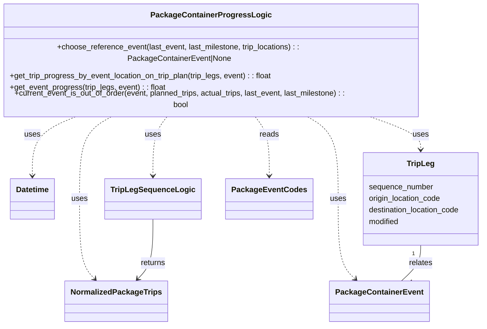

# Diagram: partview_service/partview_service/core/business/package_container/event/PackageContainerProgressLogic.py


> Auto-generated by Obscura crawlers

## Diagram 1



### SVG

<svg id="container" width="999.9296875" xmlns="http://www.w3.org/2000/svg" class="classDiagram" height="638" viewBox="0 0 999.9296875 638" role="graphics-document document" aria-roledescription="class"><style>#container{font-family:"trebuchet ms",verdana,arial,sans-serif;font-size:16px;fill:#333;}@keyframes edge-animation-frame{from{stroke-dashoffset:0;}}@keyframes dash{to{stroke-dashoffset:0;}}#container .edge-animation-slow{stroke-dasharray:9,5!important;stroke-dashoffset:900;animation:dash 50s linear infinite;stroke-linecap:round;}#container .edge-animation-fast{stroke-dasharray:9,5!important;stroke-dashoffset:900;animation:dash 20s linear infinite;stroke-linecap:round;}#container .error-icon{fill:#552222;}#container .error-text{fill:#552222;stroke:#552222;}#container .edge-thickness-normal{stroke-width:1px;}#container .edge-thickness-thick{stroke-width:3.5px;}#container .edge-pattern-solid{stroke-dasharray:0;}#container .edge-thickness-invisible{stroke-width:0;fill:none;}#container .edge-pattern-dashed{stroke-dasharray:3;}#container .edge-pattern-dotted{stroke-dasharray:2;}#container .marker{fill:#333333;stroke:#333333;}#container .marker.cross{stroke:#333333;}#container svg{font-family:"trebuchet ms",verdana,arial,sans-serif;font-size:16px;}#container p{margin:0;}#container g.classGroup text{fill:#9370DB;stroke:none;font-family:"trebuchet ms",verdana,arial,sans-serif;font-size:10px;}#container g.classGroup text .title{font-weight:bolder;}#container .nodeLabel,#container .edgeLabel{color:#131300;}#container .edgeLabel .label rect{fill:#ECECFF;}#container .label text{fill:#131300;}#container .labelBkg{background:#ECECFF;}#container .edgeLabel .label span{background:#ECECFF;}#container .classTitle{font-weight:bolder;}#container .node rect,#container .node circle,#container .node ellipse,#container .node polygon,#container .node path{fill:#ECECFF;stroke:#9370DB;stroke-width:1px;}#container .divider{stroke:#9370DB;stroke-width:1;}#container g.clickable{cursor:pointer;}#container g.classGroup rect{fill:#ECECFF;stroke:#9370DB;}#container g.classGroup line{stroke:#9370DB;stroke-width:1;}#container .classLabel .box{stroke:none;stroke-width:0;fill:#ECECFF;opacity:0.5;}#container .classLabel .label{fill:#9370DB;font-size:10px;}#container .relation{stroke:#333333;stroke-width:1;fill:none;}#container .dashed-line{stroke-dasharray:3;}#container .dotted-line{stroke-dasharray:1 2;}#container #compositionStart,#container .composition{fill:#333333!important;stroke:#333333!important;stroke-width:1;}#container #compositionEnd,#container .composition{fill:#333333!important;stroke:#333333!important;stroke-width:1;}#container #dependencyStart,#container .dependency{fill:#333333!important;stroke:#333333!important;stroke-width:1;}#container #dependencyStart,#container .dependency{fill:#333333!important;stroke:#333333!important;stroke-width:1;}#container #extensionStart,#container .extension{fill:transparent!important;stroke:#333333!important;stroke-width:1;}#container #extensionEnd,#container .extension{fill:transparent!important;stroke:#333333!important;stroke-width:1;}#container #aggregationStart,#container .aggregation{fill:transparent!important;stroke:#333333!important;stroke-width:1;}#container #aggregationEnd,#container .aggregation{fill:transparent!important;stroke:#333333!important;stroke-width:1;}#container #lollipopStart,#container .lollipop{fill:#ECECFF!important;stroke:#333333!important;stroke-width:1;}#container #lollipopEnd,#container .lollipop{fill:#ECECFF!important;stroke:#333333!important;stroke-width:1;}#container .edgeTerminals{font-size:11px;line-height:initial;}#container .classTitleText{text-anchor:middle;font-size:18px;fill:#333;}#container .label-icon{display:inline-block;height:1em;overflow:visible;vertical-align:-0.125em;}#container .node .label-icon path{fill:currentColor;stroke:revert;stroke-width:revert;}#container :root{--mermaid-font-family:"trebuchet ms",verdana,arial,sans-serif;}</style><g><defs><marker id="container_class-aggregationStart" class="marker aggregation class" refX="18" refY="7" markerWidth="190" markerHeight="240" orient="auto"><path d="M 18,7 L9,13 L1,7 L9,1 Z"></path></marker></defs><defs><marker id="container_class-aggregationEnd" class="marker aggregation class" refX="1" refY="7" markerWidth="20" markerHeight="28" orient="auto"><path d="M 18,7 L9,13 L1,7 L9,1 Z"></path></marker></defs><defs><marker id="container_class-extensionStart" class="marker extension class" refX="18" refY="7" markerWidth="190" markerHeight="240" orient="auto"><path d="M 1,7 L18,13 V 1 Z"></path></marker></defs><defs><marker id="container_class-extensionEnd" class="marker extension class" refX="1" refY="7" markerWidth="20" markerHeight="28" orient="auto"><path d="M 1,1 V 13 L18,7 Z"></path></marker></defs><defs><marker id="container_class-compositionStart" class="marker composition class" refX="18" refY="7" markerWidth="190" markerHeight="240" orient="auto"><path d="M 18,7 L9,13 L1,7 L9,1 Z"></path></marker></defs><defs><marker id="container_class-compositionEnd" class="marker composition class" refX="1" refY="7" markerWidth="20" markerHeight="28" orient="auto"><path d="M 18,7 L9,13 L1,7 L9,1 Z"></path></marker></defs><defs><marker id="container_class-dependencyStart" class="marker dependency class" refX="6" refY="7" markerWidth="190" markerHeight="240" orient="auto"><path d="M 5,7 L9,13 L1,7 L9,1 Z"></path></marker></defs><defs><marker id="container_class-dependencyEnd" class="marker dependency class" refX="13" refY="7" markerWidth="20" markerHeight="28" orient="auto"><path d="M 18,7 L9,13 L14,7 L9,1 Z"></path></marker></defs><defs><marker id="container_class-lollipopStart" class="marker lollipop class" refX="13" refY="7" markerWidth="190" markerHeight="240" orient="auto"><circle stroke="black" fill="transparent" cx="7" cy="7" r="6"></circle></marker></defs><defs><marker id="container_class-lollipopEnd" class="marker lollipop class" refX="1" refY="7" markerWidth="190" markerHeight="240" orient="auto"><circle stroke="black" fill="transparent" cx="7" cy="7" r="6"></circle></marker></defs><g class="root"><g class="clusters"></g><g class="edgePaths"><path d="M187.199,206L171.06,212.167C154.922,218.333,122.644,230.667,106.506,251C90.367,271.333,90.367,299.667,90.367,313.833L90.367,328" id="id_PackageContainerProgressLogic_Datetime_1" class="edge-thickness-normal edge-pattern-dashed relation" style=";;;" data-edge="true" data-et="edge" data-id="id_PackageContainerProgressLogic_Datetime_1" data-points="W3sieCI6MTg3LjE5ODg3NDA4MDg4MjM4LCJ5IjoyMDZ9LHsieCI6OTAuMzY3MTg3NSwieSI6MjQzfSx7IngiOjkwLjM2NzE4NzUsInkiOjMzNH1d" marker-end="url(#container_class-dependencyEnd)"></path><path d="M363.355,206L358.189,212.167C353.023,218.333,342.691,230.667,337.525,251C332.359,271.333,332.359,299.667,332.359,313.833L332.359,328" id="id_PackageContainerProgressLogic_TripLegSequenceLogic_2" class="edge-thickness-normal edge-pattern-dashed relation" style=";;;" data-edge="true" data-et="edge" data-id="id_PackageContainerProgressLogic_TripLegSequenceLogic_2" data-points="W3sieCI6MzYzLjM1NDk1MTc0NjMyMzU0LCJ5IjoyMDZ9LHsieCI6MzMyLjM1OTM3NSwieSI6MjQzfSx7IngiOjMzMi4zNTkzNzUsInkiOjMzNH1d" marker-end="url(#container_class-dependencyEnd)"></path><path d="M257.73,206L245.984,212.167C234.239,218.333,210.748,230.667,199.003,259C187.258,287.333,187.258,331.667,187.258,376C187.258,420.333,187.258,464.667,192.245,492.263C197.231,519.86,207.205,530.721,212.192,536.151L217.179,541.581" id="id_PackageContainerProgressLogic_NormalizedPackageTrips_3" class="edge-thickness-normal edge-pattern-dashed relation" style=";;;" data-edge="true" data-et="edge" data-id="id_PackageContainerProgressLogic_NormalizedPackageTrips_3" data-points="W3sieCI6MjU3LjcyOTU0OTYzMjM1MjksInkiOjIwNn0seyJ4IjoxODcuMjU3ODEyNSwieSI6MjQzfSx7IngiOjE4Ny4yNTc4MTI1LCJ5IjozNzZ9LHsieCI6MTg3LjI1NzgxMjUsInkiOjUwOX0seyJ4IjoyMjEuMjM3MjkyMzI1OTQ5MzcsInkiOjU0Nn1d" marker-end="url(#container_class-dependencyEnd)"></path><path d="M628.036,206L639.356,212.167C650.677,218.333,673.319,230.667,684.64,259C695.961,287.333,695.961,331.667,695.961,376C695.961,420.333,695.961,464.667,702.002,492.327C708.043,519.988,720.124,530.975,726.165,536.469L732.206,541.963" id="id_PackageContainerProgressLogic_PackageContainerEvent_4" class="edge-thickness-normal edge-pattern-dashed relation" style=";;;" data-edge="true" data-et="edge" data-id="id_PackageContainerProgressLogic_PackageContainerEvent_4" data-points="W3sieCI6NjI4LjAzNTUwMDkxOTExNzcsInkiOjIwNn0seyJ4Ijo2OTUuOTYwOTM3NSwieSI6MjQzfSx7IngiOjY5NS45NjA5Mzc1LCJ5IjozNzZ9LHsieCI6Njk1Ljk2MDkzNzUsInkiOjUwOX0seyJ4Ijo3MzYuNjQ0NjU0ODY1NTA2NCwieSI6NTQ2fV0=" marker-end="url(#container_class-dependencyEnd)"></path><path d="M754.501,206L773.699,212.167C792.898,218.333,831.295,230.667,850.493,242C869.691,253.333,869.691,263.667,869.691,268.833L869.691,274" id="id_PackageContainerProgressLogic_TripLeg_5" class="edge-thickness-normal edge-pattern-dashed relation" style=";;;" data-edge="true" data-et="edge" data-id="id_PackageContainerProgressLogic_TripLeg_5" data-points="W3sieCI6NzU0LjUwMTA2MjcyOTc3OTQsInkiOjIwNn0seyJ4Ijo4NjkuNjkxNDA2MjUsInkiOjI0M30seyJ4Ijo4NjkuNjkxNDA2MjUsInkiOjI4MH1d" marker-end="url(#container_class-dependencyEnd)"></path><path d="M529.223,206L534.389,212.167C539.555,218.333,549.887,230.667,555.053,251C560.219,271.333,560.219,299.667,560.219,313.833L560.219,328" id="id_PackageContainerProgressLogic_PackageEventCodes_6" class="edge-thickness-normal edge-pattern-dashed relation" style=";;;" data-edge="true" data-et="edge" data-id="id_PackageContainerProgressLogic_PackageEventCodes_6" data-points="W3sieCI6NTI5LjIyMzE3MzI1MzY3NjUsInkiOjIwNn0seyJ4Ijo1NjAuMjE4NzUsInkiOjI0M30seyJ4Ijo1NjAuMjE4NzUsInkiOjMzNH1d" marker-end="url(#container_class-dependencyEnd)"></path><path d="M332.359,418L332.359,433.167C332.359,448.333,332.359,478.667,327.373,499.263C322.386,519.86,312.412,530.721,307.425,536.151L302.438,541.581" id="id_TripLegSequenceLogic_NormalizedPackageTrips_7" class="edge-thickness-normal edge-pattern-solid relation" style=";;;" data-edge="true" data-et="edge" data-id="id_TripLegSequenceLogic_NormalizedPackageTrips_7" data-points="W3sieCI6MzMyLjM1OTM3NSwieSI6NDE4fSx7IngiOjMzMi4zNTkzNzUsInkiOjUwOX0seyJ4IjoyOTguMzc5ODk1MTc0MDUwNiwieSI6NTQ2fV0=" marker-end="url(#container_class-dependencyEnd)"></path><path d="M869.691,472L869.691,478.167C869.691,484.333,869.691,496.667,862.911,509C856.13,521.333,842.569,533.667,835.788,539.833L829.008,546" id="id_TripLeg_PackageContainerEvent_8" class="edge-thickness-normal edge-pattern-solid relation" style=";;;" data-edge="true" data-et="edge" data-id="id_TripLeg_PackageContainerEvent_8" data-points="W3sieCI6ODY5LjY5MTQwNjI1LCJ5Ijo0NzJ9LHsieCI6ODY5LjY5MTQwNjI1LCJ5Ijo1MDl9LHsieCI6ODI5LjAwNzY4ODg4NDQ5MzYsInkiOjU0Nn1d"></path></g><g class="edgeLabels"><g class="edgeLabel" transform="translate(90.3671875, 243)"><g class="label" data-id="id_PackageContainerProgressLogic_Datetime_1" transform="translate(-16.4921875, -12)"><foreignObject width="32.984375" height="24"><div xmlns="http://www.w3.org/1999/xhtml" class="labelBkg" style="display: table-cell; white-space: nowrap; line-height: 1.5; max-width: 200px; text-align: center;"><span class="edgeLabel"><p>uses</p></span></div></foreignObject></g></g><g class="edgeLabel" transform="translate(332.359375, 243)"><g class="label" data-id="id_PackageContainerProgressLogic_TripLegSequenceLogic_2" transform="translate(-16.4921875, -12)"><foreignObject width="32.984375" height="24"><div xmlns="http://www.w3.org/1999/xhtml" class="labelBkg" style="display: table-cell; white-space: nowrap; line-height: 1.5; max-width: 200px; text-align: center;"><span class="edgeLabel"><p>uses</p></span></div></foreignObject></g></g><g class="edgeLabel" transform="translate(187.2578125, 376)"><g class="label" data-id="id_PackageContainerProgressLogic_NormalizedPackageTrips_3" transform="translate(-16.4921875, -12)"><foreignObject width="32.984375" height="24"><div xmlns="http://www.w3.org/1999/xhtml" class="labelBkg" style="display: table-cell; white-space: nowrap; line-height: 1.5; max-width: 200px; text-align: center;"><span class="edgeLabel"><p>uses</p></span></div></foreignObject></g></g><g class="edgeLabel" transform="translate(695.9609375, 376)"><g class="label" data-id="id_PackageContainerProgressLogic_PackageContainerEvent_4" transform="translate(-16.4921875, -12)"><foreignObject width="32.984375" height="24"><div xmlns="http://www.w3.org/1999/xhtml" class="labelBkg" style="display: table-cell; white-space: nowrap; line-height: 1.5; max-width: 200px; text-align: center;"><span class="edgeLabel"><p>uses</p></span></div></foreignObject></g></g><g class="edgeLabel" transform="translate(869.69140625, 243)"><g class="label" data-id="id_PackageContainerProgressLogic_TripLeg_5" transform="translate(-16.4921875, -12)"><foreignObject width="32.984375" height="24"><div xmlns="http://www.w3.org/1999/xhtml" class="labelBkg" style="display: table-cell; white-space: nowrap; line-height: 1.5; max-width: 200px; text-align: center;"><span class="edgeLabel"><p>uses</p></span></div></foreignObject></g></g><g class="edgeLabel" transform="translate(560.21875, 243)"><g class="label" data-id="id_PackageContainerProgressLogic_PackageEventCodes_6" transform="translate(-20.0078125, -12)"><foreignObject width="40.015625" height="24"><div xmlns="http://www.w3.org/1999/xhtml" class="labelBkg" style="display: table-cell; white-space: nowrap; line-height: 1.5; max-width: 200px; text-align: center;"><span class="edgeLabel"><p>reads</p></span></div></foreignObject></g></g><g class="edgeLabel" transform="translate(332.359375, 509)"><g class="label" data-id="id_TripLegSequenceLogic_NormalizedPackageTrips_7" transform="translate(-26.265625, -12)"><foreignObject width="52.53125" height="24"><div xmlns="http://www.w3.org/1999/xhtml" class="labelBkg" style="display: table-cell; white-space: nowrap; line-height: 1.5; max-width: 200px; text-align: center;"><span class="edgeLabel"><p>returns</p></span></div></foreignObject></g></g><g class="edgeLabel" transform="translate(869.69140625, 509)"><g class="label" data-id="id_TripLeg_PackageContainerEvent_8" transform="translate(-24.734375, -12)"><foreignObject width="49.46875" height="24"><div xmlns="http://www.w3.org/1999/xhtml" class="labelBkg" style="display: table-cell; white-space: nowrap; line-height: 1.5; max-width: 200px; text-align: center;"><span class="edgeLabel"><p>relates</p></span></div></foreignObject></g></g><g class="edgeTerminals" transform="translate(854.6914081250001, 489.50000160714285)"><g class="inner" transform="translate(0, 0)"><foreignObject style="width: 9px; height: 12px;"><div xmlns="http://www.w3.org/1999/xhtml" style="display: inline-block; padding-right: 1px; white-space: nowrap;"><span class="edgeLabel">1</span></div></foreignObject></g></g><g class="edgeTerminals" transform="translate(847.0465982149578, 540.3227349139964)"><g class="inner" transform="translate(0, 0)"></g><foreignObject style="width: 9px; height: 12px;"><div xmlns="http://www.w3.org/1999/xhtml" style="display: inline-block; padding-right: 1px; white-space: nowrap;"><span class="edgeLabel">1</span></div></foreignObject></g></g><g class="nodes"><g class="node default" id="classId-PackageContainerProgressLogic-0" transform="translate(446.2890625, 107)"><g class="basic label-container"><path d="M-438.2890625 -99 L438.2890625 -99 L438.2890625 99 L-438.2890625 99" stroke="none" stroke-width="0" fill="#ECECFF" style=""></path><path d="M-438.2890625 -99 C-171.50373801342857 -99, 95.28158647314285 -99, 438.2890625 -99 M-438.2890625 -99 C-154.35689932820384 -99, 129.57526384359232 -99, 438.2890625 -99 M438.2890625 -99 C438.2890625 -22.87868120400468, 438.2890625 53.24263759199064, 438.2890625 99 M438.2890625 -99 C438.2890625 -45.83086359227247, 438.2890625 7.338272815455056, 438.2890625 99 M438.2890625 99 C164.32421257162548 99, -109.64063735674904 99, -438.2890625 99 M438.2890625 99 C103.41157948939315 99, -231.4659035212137 99, -438.2890625 99 M-438.2890625 99 C-438.2890625 26.66918901527727, -438.2890625 -45.66162196944546, -438.2890625 -99 M-438.2890625 99 C-438.2890625 49.23770783324452, -438.2890625 -0.5245843335109583, -438.2890625 -99" stroke="#9370DB" stroke-width="1.3" fill="none" stroke-dasharray="0 0" style=""></path></g><g class="annotation-group text" transform="translate(0, -75)"></g><g class="label-group text" transform="translate(-116.265625, -75)"><g class="label" style="font-weight: bolder" transform="translate(0,-12)"><foreignObject width="232.53125" height="24"><div xmlns="http://www.w3.org/1999/xhtml" style="display: table-cell; white-space: nowrap; line-height: 1.5; max-width: 278px; text-align: center;"><span class="nodeLabel markdown-node-label" style=""><p>PackageContainerProgressLogic</p></span></div></foreignObject></g></g><g class="members-group text" transform="translate(-426.2890625, -27)"></g><g class="methods-group text" transform="translate(-426.2890625, 3)"><g class="label" style="" transform="translate(0,-12)"><foreignObject width="726.109375" height="24"><div xmlns="http://www.w3.org/1999/xhtml" style="display: table-cell; white-space: nowrap; line-height: 1.5; max-width: 783px; text-align: center;"><span class="nodeLabel markdown-node-label" style=""><p>+choose_reference_event(last_event, last_milestone, trip_locations) : : PackageContainerEvent|None</p></span></div></foreignObject></g><g class="label" style="" transform="translate(0,12)"><foreignObject width="551" height="24"><div xmlns="http://www.w3.org/1999/xhtml" style="display: table-cell; white-space: nowrap; line-height: 1.5; max-width: 609px; text-align: center;"><span class="nodeLabel markdown-node-label" style=""><p>+get_trip_progress_by_event_location_on_trip_plan(trip_legs, event) : : float</p></span></div></foreignObject></g><g class="label" style="" transform="translate(0,36)"><foreignObject width="324.328125" height="24"><div xmlns="http://www.w3.org/1999/xhtml" style="display: table-cell; white-space: nowrap; line-height: 1.5; max-width: 382px; text-align: center;"><span class="nodeLabel markdown-node-label" style=""><p>+get_event_progress(trip_legs, event) : : float</p></span></div></foreignObject></g><g class="label" style="" transform="translate(0,60)"><foreignObject width="736.3125" height="24"><div xmlns="http://www.w3.org/1999/xhtml" style="display: table-cell; white-space: nowrap; line-height: 1.5; max-width: 794px; text-align: center;"><span class="nodeLabel markdown-node-label" style=""><p>+current_event_is_out_of_order(event, planned_trips, actual_trips, last_event, last_milestone) : : bool</p></span></div></foreignObject></g></g><g class="divider" style=""><path d="M-438.2890625 -51 C-205.3138635780483 -51, 27.661335343903374 -51, 438.2890625 -51 M-438.2890625 -51 C-167.30726186230044 -51, 103.67453877539913 -51, 438.2890625 -51" stroke="#9370DB" stroke-width="1.3" fill="none" stroke-dasharray="0 0" style=""></path></g><g class="divider" style=""><path d="M-438.2890625 -27 C-120.88066823242661 -27, 196.52772603514677 -27, 438.2890625 -27 M-438.2890625 -27 C-136.35813232876268 -27, 165.57279784247464 -27, 438.2890625 -27" stroke="#9370DB" stroke-width="1.3" fill="none" stroke-dasharray="0 0" style=""></path></g></g><g class="node default" id="classId-Datetime-1" transform="translate(90.3671875, 376)"><g class="basic label-container"><path d="M-45.3984375 -42 L45.3984375 -42 L45.3984375 42 L-45.3984375 42" stroke="none" stroke-width="0" fill="#ECECFF" style=""></path><path d="M-45.3984375 -42 C-26.770534448198447 -42, -8.142631396396894 -42, 45.3984375 -42 M-45.3984375 -42 C-12.23317755115636 -42, 20.93208239768728 -42, 45.3984375 -42 M45.3984375 -42 C45.3984375 -17.502499200693435, 45.3984375 6.995001598613129, 45.3984375 42 M45.3984375 -42 C45.3984375 -10.746528030162512, 45.3984375 20.506943939674976, 45.3984375 42 M45.3984375 42 C11.67272225218349 42, -22.05299299563302 42, -45.3984375 42 M45.3984375 42 C18.213148632343735 42, -8.97214023531253 42, -45.3984375 42 M-45.3984375 42 C-45.3984375 20.31222280938121, -45.3984375 -1.3755543812375777, -45.3984375 -42 M-45.3984375 42 C-45.3984375 12.385346536873726, -45.3984375 -17.229306926252548, -45.3984375 -42" stroke="#9370DB" stroke-width="1.3" fill="none" stroke-dasharray="0 0" style=""></path></g><g class="annotation-group text" transform="translate(0, -18)"></g><g class="label-group text" transform="translate(-33.3984375, -18)"><g class="label" style="font-weight: bolder" transform="translate(0,-12)"><foreignObject width="66.796875" height="24"><div xmlns="http://www.w3.org/1999/xhtml" style="display: table-cell; white-space: nowrap; line-height: 1.5; max-width: 116px; text-align: center;"><span class="nodeLabel markdown-node-label" style=""><p>Datetime</p></span></div></foreignObject></g></g><g class="members-group text" transform="translate(-33.3984375, 30)"></g><g class="methods-group text" transform="translate(-33.3984375, 60)"></g><g class="divider" style=""><path d="M-45.3984375 6 C-21.172527823192024 6, 3.053381853615953 6, 45.3984375 6 M-45.3984375 6 C-13.039441961819456 6, 19.319553576361088 6, 45.3984375 6" stroke="#9370DB" stroke-width="1.3" fill="none" stroke-dasharray="0 0" style=""></path></g><g class="divider" style=""><path d="M-45.3984375 24 C-10.937907477383561 24, 23.522622545232878 24, 45.3984375 24 M-45.3984375 24 C-11.417999277141412 24, 22.562438945717176 24, 45.3984375 24" stroke="#9370DB" stroke-width="1.3" fill="none" stroke-dasharray="0 0" style=""></path></g></g><g class="node default" id="classId-TripLegSequenceLogic-2" transform="translate(332.359375, 376)"><g class="basic label-container"><path d="M-93.609375 -42 L93.609375 -42 L93.609375 42 L-93.609375 42" stroke="none" stroke-width="0" fill="#ECECFF" style=""></path><path d="M-93.609375 -42 C-21.073321417147028 -42, 51.462732165705944 -42, 93.609375 -42 M-93.609375 -42 C-45.60855891410526 -42, 2.392257171789481 -42, 93.609375 -42 M93.609375 -42 C93.609375 -15.701881300956668, 93.609375 10.596237398086664, 93.609375 42 M93.609375 -42 C93.609375 -20.179032517680138, 93.609375 1.6419349646397237, 93.609375 42 M93.609375 42 C46.74224465994459 42, -0.1248856801108218 42, -93.609375 42 M93.609375 42 C31.033849152884102 42, -31.541676694231796 42, -93.609375 42 M-93.609375 42 C-93.609375 17.33440590367843, -93.609375 -7.33118819264314, -93.609375 -42 M-93.609375 42 C-93.609375 23.576682464325312, -93.609375 5.153364928650625, -93.609375 -42" stroke="#9370DB" stroke-width="1.3" fill="none" stroke-dasharray="0 0" style=""></path></g><g class="annotation-group text" transform="translate(0, -18)"></g><g class="label-group text" transform="translate(-81.609375, -18)"><g class="label" style="font-weight: bolder" transform="translate(0,-12)"><foreignObject width="163.21875" height="24"><div xmlns="http://www.w3.org/1999/xhtml" style="display: table-cell; white-space: nowrap; line-height: 1.5; max-width: 211px; text-align: center;"><span class="nodeLabel markdown-node-label" style=""><p>TripLegSequenceLogic</p></span></div></foreignObject></g></g><g class="members-group text" transform="translate(-81.609375, 30)"></g><g class="methods-group text" transform="translate(-81.609375, 60)"></g><g class="divider" style=""><path d="M-93.609375 6 C-51.07301657995108 6, -8.53665815990216 6, 93.609375 6 M-93.609375 6 C-42.41668012063352 6, 8.776014758732956 6, 93.609375 6" stroke="#9370DB" stroke-width="1.3" fill="none" stroke-dasharray="0 0" style=""></path></g><g class="divider" style=""><path d="M-93.609375 24 C-46.80002790644424 24, 0.009319187111515248 24, 93.609375 24 M-93.609375 24 C-21.588550474629074 24, 50.43227405074185 24, 93.609375 24" stroke="#9370DB" stroke-width="1.3" fill="none" stroke-dasharray="0 0" style=""></path></g></g><g class="node default" id="classId-NormalizedPackageTrips-3" transform="translate(259.80859375, 588)"><g class="basic label-container"><path d="M-101.734375 -42 L101.734375 -42 L101.734375 42 L-101.734375 42" stroke="none" stroke-width="0" fill="#ECECFF" style=""></path><path d="M-101.734375 -42 C-51.60164102971633 -42, -1.4689070594326665 -42, 101.734375 -42 M-101.734375 -42 C-29.647311735574107 -42, 42.43975152885179 -42, 101.734375 -42 M101.734375 -42 C101.734375 -13.581033508470252, 101.734375 14.837932983059495, 101.734375 42 M101.734375 -42 C101.734375 -14.252928752932775, 101.734375 13.49414249413445, 101.734375 42 M101.734375 42 C55.94276375762562 42, 10.15115251525124 42, -101.734375 42 M101.734375 42 C44.67216187045272 42, -12.390051259094562 42, -101.734375 42 M-101.734375 42 C-101.734375 15.324435703073362, -101.734375 -11.351128593853275, -101.734375 -42 M-101.734375 42 C-101.734375 19.722899729183066, -101.734375 -2.5542005416338682, -101.734375 -42" stroke="#9370DB" stroke-width="1.3" fill="none" stroke-dasharray="0 0" style=""></path></g><g class="annotation-group text" transform="translate(0, -18)"></g><g class="label-group text" transform="translate(-89.734375, -18)"><g class="label" style="font-weight: bolder" transform="translate(0,-12)"><foreignObject width="179.46875" height="24"><div xmlns="http://www.w3.org/1999/xhtml" style="display: table-cell; white-space: nowrap; line-height: 1.5; max-width: 227px; text-align: center;"><span class="nodeLabel markdown-node-label" style=""><p>NormalizedPackageTrips</p></span></div></foreignObject></g></g><g class="members-group text" transform="translate(-89.734375, 30)"></g><g class="methods-group text" transform="translate(-89.734375, 60)"></g><g class="divider" style=""><path d="M-101.734375 6 C-60.00035895832908 6, -18.26634291665816 6, 101.734375 6 M-101.734375 6 C-22.100213960471123 6, 57.533947079057754 6, 101.734375 6" stroke="#9370DB" stroke-width="1.3" fill="none" stroke-dasharray="0 0" style=""></path></g><g class="divider" style=""><path d="M-101.734375 24 C-44.76363130492413 24, 12.207112390151735 24, 101.734375 24 M-101.734375 24 C-40.194437914447235 24, 21.34549917110553 24, 101.734375 24" stroke="#9370DB" stroke-width="1.3" fill="none" stroke-dasharray="0 0" style=""></path></g></g><g class="node default" id="classId-PackageContainerEvent-4" transform="translate(782.826171875, 588)"><g class="basic label-container"><path d="M-97.65625 -42 L97.65625 -42 L97.65625 42 L-97.65625 42" stroke="none" stroke-width="0" fill="#ECECFF" style=""></path><path d="M-97.65625 -42 C-50.71738980239726 -42, -3.778529604794514 -42, 97.65625 -42 M-97.65625 -42 C-22.791566686430855 -42, 52.07311662713829 -42, 97.65625 -42 M97.65625 -42 C97.65625 -15.418896456580132, 97.65625 11.162207086839736, 97.65625 42 M97.65625 -42 C97.65625 -11.188694553621502, 97.65625 19.622610892756995, 97.65625 42 M97.65625 42 C21.267630950832654 42, -55.12098809833469 42, -97.65625 42 M97.65625 42 C23.684783662010588 42, -50.286682675978824 42, -97.65625 42 M-97.65625 42 C-97.65625 18.045925096772987, -97.65625 -5.908149806454027, -97.65625 -42 M-97.65625 42 C-97.65625 9.783022029733523, -97.65625 -22.433955940532954, -97.65625 -42" stroke="#9370DB" stroke-width="1.3" fill="none" stroke-dasharray="0 0" style=""></path></g><g class="annotation-group text" transform="translate(0, -18)"></g><g class="label-group text" transform="translate(-85.65625, -18)"><g class="label" style="font-weight: bolder" transform="translate(0,-12)"><foreignObject width="171.3125" height="24"><div xmlns="http://www.w3.org/1999/xhtml" style="display: table-cell; white-space: nowrap; line-height: 1.5; max-width: 219px; text-align: center;"><span class="nodeLabel markdown-node-label" style=""><p>PackageContainerEvent</p></span></div></foreignObject></g></g><g class="members-group text" transform="translate(-85.65625, 30)"></g><g class="methods-group text" transform="translate(-85.65625, 60)"></g><g class="divider" style=""><path d="M-97.65625 6 C-22.33415059340824 6, 52.98794881318352 6, 97.65625 6 M-97.65625 6 C-48.65103336543752 6, 0.35418326912495957 6, 97.65625 6" stroke="#9370DB" stroke-width="1.3" fill="none" stroke-dasharray="0 0" style=""></path></g><g class="divider" style=""><path d="M-97.65625 24 C-47.577334944838256 24, 2.501580110323488 24, 97.65625 24 M-97.65625 24 C-46.94016415963887 24, 3.775921680722263 24, 97.65625 24" stroke="#9370DB" stroke-width="1.3" fill="none" stroke-dasharray="0 0" style=""></path></g></g><g class="node default" id="classId-TripLeg-5" transform="translate(869.69140625, 376)"><g class="basic label-container"><path d="M-122.23828125 -96 L122.23828125 -96 L122.23828125 96 L-122.23828125 96" stroke="none" stroke-width="0" fill="#ECECFF" style=""></path><path d="M-122.23828125 -96 C-46.981157315300436 -96, 28.275966619399128 -96, 122.23828125 -96 M-122.23828125 -96 C-44.78590119821716 -96, 32.66647885356568 -96, 122.23828125 -96 M122.23828125 -96 C122.23828125 -37.35611457983036, 122.23828125 21.287770840339277, 122.23828125 96 M122.23828125 -96 C122.23828125 -44.60935376953706, 122.23828125 6.781292460925883, 122.23828125 96 M122.23828125 96 C46.95356998682328 96, -28.331141276353435 96, -122.23828125 96 M122.23828125 96 C73.18196519184329 96, 24.125649133686593 96, -122.23828125 96 M-122.23828125 96 C-122.23828125 33.74069716944856, -122.23828125 -28.51860566110288, -122.23828125 -96 M-122.23828125 96 C-122.23828125 27.596523696852017, -122.23828125 -40.806952606295965, -122.23828125 -96" stroke="#9370DB" stroke-width="1.3" fill="none" stroke-dasharray="0 0" style=""></path></g><g class="annotation-group text" transform="translate(0, -72)"></g><g class="label-group text" transform="translate(-27.0546875, -72)"><g class="label" style="font-weight: bolder" transform="translate(0,-12)"><foreignObject width="54.109375" height="24"><div xmlns="http://www.w3.org/1999/xhtml" style="display: table-cell; white-space: nowrap; line-height: 1.5; max-width: 103px; text-align: center;"><span class="nodeLabel markdown-node-label" style=""><p>TripLeg</p></span></div></foreignObject></g></g><g class="members-group text" transform="translate(-110.23828125, -24)"><g class="label" style="" transform="translate(0,-12)"><foreignObject width="134.03125" height="24"><div xmlns="http://www.w3.org/1999/xhtml" style="display: table-cell; white-space: nowrap; line-height: 1.5; max-width: 185px; text-align: center;"><span class="nodeLabel markdown-node-label" style=""><p>sequence_number</p></span></div></foreignObject></g><g class="label" style="" transform="translate(0,12)"><foreignObject width="152.515625" height="24"><div xmlns="http://www.w3.org/1999/xhtml" style="display: table-cell; white-space: nowrap; line-height: 1.5; max-width: 203px; text-align: center;"><span class="nodeLabel markdown-node-label" style=""><p>origin_location_code</p></span></div></foreignObject></g><g class="label" style="" transform="translate(0,36)"><foreignObject width="193.421875" height="24"><div xmlns="http://www.w3.org/1999/xhtml" style="display: table-cell; white-space: nowrap; line-height: 1.5; max-width: 243px; text-align: center;"><span class="nodeLabel markdown-node-label" style=""><p>destination_location_code</p></span></div></foreignObject></g><g class="label" style="" transform="translate(0,60)"><foreignObject width="64.625" height="24"><div xmlns="http://www.w3.org/1999/xhtml" style="display: table-cell; white-space: nowrap; line-height: 1.5; max-width: 115px; text-align: center;"><span class="nodeLabel markdown-node-label" style=""><p>modified</p></span></div></foreignObject></g></g><g class="methods-group text" transform="translate(-110.23828125, 96)"></g><g class="divider" style=""><path d="M-122.23828125 -48 C-33.506311603744365 -48, 55.22565804251127 -48, 122.23828125 -48 M-122.23828125 -48 C-38.285300626769924 -48, 45.66767999646015 -48, 122.23828125 -48" stroke="#9370DB" stroke-width="1.3" fill="none" stroke-dasharray="0 0" style=""></path></g><g class="divider" style=""><path d="M-122.23828125 72 C-55.461601862074886 72, 11.315077525850228 72, 122.23828125 72 M-122.23828125 72 C-68.07461502069316 72, -13.910948791386332 72, 122.23828125 72" stroke="#9370DB" stroke-width="1.3" fill="none" stroke-dasharray="0 0" style=""></path></g></g><g class="node default" id="classId-PackageEventCodes-6" transform="translate(560.21875, 376)"><g class="basic label-container"><path d="M-84.25 -42 L84.25 -42 L84.25 42 L-84.25 42" stroke="none" stroke-width="0" fill="#ECECFF" style=""></path><path d="M-84.25 -42 C-40.629464962765496 -42, 2.9910700744690075 -42, 84.25 -42 M-84.25 -42 C-33.585487003961745 -42, 17.07902599207651 -42, 84.25 -42 M84.25 -42 C84.25 -16.6875594447007, 84.25 8.6248811105986, 84.25 42 M84.25 -42 C84.25 -15.680922955651582, 84.25 10.638154088696837, 84.25 42 M84.25 42 C34.09417185885468 42, -16.06165628229064 42, -84.25 42 M84.25 42 C34.5614603359051 42, -15.127079328189794 42, -84.25 42 M-84.25 42 C-84.25 22.29782483341069, -84.25 2.59564966682138, -84.25 -42 M-84.25 42 C-84.25 16.91855866809242, -84.25 -8.16288266381516, -84.25 -42" stroke="#9370DB" stroke-width="1.3" fill="none" stroke-dasharray="0 0" style=""></path></g><g class="annotation-group text" transform="translate(0, -18)"></g><g class="label-group text" transform="translate(-72.25, -18)"><g class="label" style="font-weight: bolder" transform="translate(0,-12)"><foreignObject width="144.5" height="24"><div xmlns="http://www.w3.org/1999/xhtml" style="display: table-cell; white-space: nowrap; line-height: 1.5; max-width: 192px; text-align: center;"><span class="nodeLabel markdown-node-label" style=""><p>PackageEventCodes</p></span></div></foreignObject></g></g><g class="members-group text" transform="translate(-72.25, 30)"></g><g class="methods-group text" transform="translate(-72.25, 60)"></g><g class="divider" style=""><path d="M-84.25 6 C-46.872436739582 6, -9.494873479164 6, 84.25 6 M-84.25 6 C-24.80215180093971 6, 34.64569639812058 6, 84.25 6" stroke="#9370DB" stroke-width="1.3" fill="none" stroke-dasharray="0 0" style=""></path></g><g class="divider" style=""><path d="M-84.25 24 C-22.659769515316512 24, 38.930460969366976 24, 84.25 24 M-84.25 24 C-31.23041462343744 24, 21.78917075312512 24, 84.25 24" stroke="#9370DB" stroke-width="1.3" fill="none" stroke-dasharray="0 0" style=""></path></g></g></g></g></g></svg>

## Diagram 2

```mermaid
flowchart LR
Start([Start]) --> Extract[Extract normalized_trips via TripLegSequenceLogic]
Extract --> GetLocations[Set planned_locations & actual_locations]
GetLocations --> CheckPlanned{event.location_code in planned_locations?}
CheckPlanned -- yes --> UsePlanned[trips_for_progress = normalized_trips.planned_trips]
CheckPlanned -- no --> CheckActual{event.location_code in actual_locations?}
CheckActual -- yes --> UseActual[trips_for_progress = normalized_trips.actual_trips]
CheckActual -- no --> NoTrip[No relevant trip → return False]
UsePlanned --> BuildLocations[Collect origin/destination codes from trips_for_progress]
UseActual --> BuildLocations
BuildLocations --> ChooseRef[ref_event = choose_reference_event(last_event, last_milestone, locations_on_trip_for_progress)]
ChooseRef --> RefExists{ref_event exists?}
RefExists -- no --> ReturnFalse[return False]
RefExists -- yes --> CalcCurrent[current_progress = get_event_progress(trips_for_progress, event)]
CalcCurrent --> CalcRef[ref_progress = get_event_progress(trips_for_progress, ref_event)]
CalcRef --> Compare{current_progress < ref_progress?}
Compare -- true --> OutOfOrder[return True]
Compare -- false --> InOrder[return False]
```

> SVG rendering failed for this diagram.
