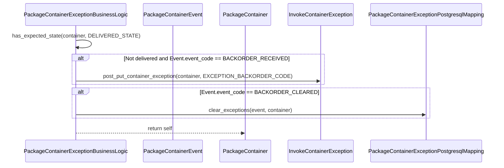

# Diagram: partview_service/partview_service/core/business/package_container/exception/package_container_exception_business_logic.py


> Auto-generated by Obscura crawlers

## Diagram 1

```mermaid
classDiagram
class PackageContainerExceptionBusinessLogic {
  - __application_name
  - __event_data_store
  - __package_container_exception_data_store
  - __package_container_exception_helper
  - __trip_leg_data_store
  - __dateHelper
  + process_back_order_exception(current_event, package_container)
  + clear_exceptions(event, package_container)
  + get_active_exceptions(container)
  + container_has_delaying_exception(container)
  + ocean_check_and_set_behind_schedule_exception(package_container, package_container_event)
  + ocean_off_schedule_exception_by_event(event, package_container)
  + ocean_off_schedule_exception_by_schedule_change(trip_leg)
  + ocean_missed_pickup_exception_by_trip_leg(trip_leg)
  + ocean_missed_pickup_exception(package_container)
  + ocean_planned_transship_exception(package_container, references)
  + ocean_unplanned_transship_exception_by_trip_leg(trip_leg)
  + ocean_unplanned_transship_exception(package_container)
  + _load_containers_for_trip_leg(trip_leg_id)
  + _count_port_to_port_trips(trips)
  + _is_port_to_port_trip(trip)
}
class PackageContainerEventPostgresqlMapping
class PackageContainerExceptionPostgresqlMapping
class PackageContainerExceptionHelper
class TripLegPostgresqlMapping
class DateHelper
class ContainerTripLegDAOLoader
class PackageContainerPostgresqlMapping
class ContainerToTripLegPostgressMapping
class PackageContainer
class PackageContainerEvent
class TripLeg
class PackageContainerException
class InvokeContainerException
class CanonicalExceptionCodes
class ExceptionCodes
class PackageEventCodes
class PersistableStatus
class Datetime
PackageContainerExceptionBusinessLogic --> PackageContainerEventPostgresqlMapping : uses
PackageContainerExceptionBusinessLogic --> PackageContainerExceptionPostgresqlMapping : uses
PackageContainerExceptionBusinessLogic --> PackageContainerExceptionHelper : uses
PackageContainerExceptionBusinessLogic --> TripLegPostgresqlMapping : uses
PackageContainerExceptionBusinessLogic --> DateHelper : uses
PackageContainerExceptionBusinessLogic --> ContainerTripLegDAOLoader : uses
PackageContainerExceptionBusinessLogic --> PackageContainerPostgresqlMapping : uses
PackageContainerExceptionBusinessLogic --> ContainerToTripLegPostgressMapping : uses
PackageContainerExceptionBusinessLogic --> InvokeContainerException : invokes
PackageContainerExceptionBusinessLogic --> PackageContainer : operates_on
PackageContainerExceptionBusinessLogic --> PackageContainerEvent : consumes
PackageContainerExceptionBusinessLogic --> TripLeg : queries
PackageContainerExceptionBusinessLogic --> PackageContainerException : queries
PackageContainerExceptionBusinessLogic --> Datetime : uses
PackageContainerExceptionBusinessLogic ..> ExceptionCodes : checks
PackageContainerExceptionBusinessLogic ..> PackageEventCodes : checks
PackageContainerExceptionBusinessLogic ..> CanonicalExceptionCodes : checks
PackageContainerExceptionBusinessLogic ..> PersistableStatus : checks
```



### SVG

<svg id="container" width="4629.640625" xmlns="http://www.w3.org/2000/svg" class="classDiagram" height="774" viewBox="0 0 4629.640625 774" role="graphics-document document" aria-roledescription="class"><style>#container{font-family:"trebuchet ms",verdana,arial,sans-serif;font-size:16px;fill:#333;}@keyframes edge-animation-frame{from{stroke-dashoffset:0;}}@keyframes dash{to{stroke-dashoffset:0;}}#container .edge-animation-slow{stroke-dasharray:9,5!important;stroke-dashoffset:900;animation:dash 50s linear infinite;stroke-linecap:round;}#container .edge-animation-fast{stroke-dasharray:9,5!important;stroke-dashoffset:900;animation:dash 20s linear infinite;stroke-linecap:round;}#container .error-icon{fill:#552222;}#container .error-text{fill:#552222;stroke:#552222;}#container .edge-thickness-normal{stroke-width:1px;}#container .edge-thickness-thick{stroke-width:3.5px;}#container .edge-pattern-solid{stroke-dasharray:0;}#container .edge-thickness-invisible{stroke-width:0;fill:none;}#container .edge-pattern-dashed{stroke-dasharray:3;}#container .edge-pattern-dotted{stroke-dasharray:2;}#container .marker{fill:#333333;stroke:#333333;}#container .marker.cross{stroke:#333333;}#container svg{font-family:"trebuchet ms",verdana,arial,sans-serif;font-size:16px;}#container p{margin:0;}#container g.classGroup text{fill:#9370DB;stroke:none;font-family:"trebuchet ms",verdana,arial,sans-serif;font-size:10px;}#container g.classGroup text .title{font-weight:bolder;}#container .nodeLabel,#container .edgeLabel{color:#131300;}#container .edgeLabel .label rect{fill:#ECECFF;}#container .label text{fill:#131300;}#container .labelBkg{background:#ECECFF;}#container .edgeLabel .label span{background:#ECECFF;}#container .classTitle{font-weight:bolder;}#container .node rect,#container .node circle,#container .node ellipse,#container .node polygon,#container .node path{fill:#ECECFF;stroke:#9370DB;stroke-width:1px;}#container .divider{stroke:#9370DB;stroke-width:1;}#container g.clickable{cursor:pointer;}#container g.classGroup rect{fill:#ECECFF;stroke:#9370DB;}#container g.classGroup line{stroke:#9370DB;stroke-width:1;}#container .classLabel .box{stroke:none;stroke-width:0;fill:#ECECFF;opacity:0.5;}#container .classLabel .label{fill:#9370DB;font-size:10px;}#container .relation{stroke:#333333;stroke-width:1;fill:none;}#container .dashed-line{stroke-dasharray:3;}#container .dotted-line{stroke-dasharray:1 2;}#container #compositionStart,#container .composition{fill:#333333!important;stroke:#333333!important;stroke-width:1;}#container #compositionEnd,#container .composition{fill:#333333!important;stroke:#333333!important;stroke-width:1;}#container #dependencyStart,#container .dependency{fill:#333333!important;stroke:#333333!important;stroke-width:1;}#container #dependencyStart,#container .dependency{fill:#333333!important;stroke:#333333!important;stroke-width:1;}#container #extensionStart,#container .extension{fill:transparent!important;stroke:#333333!important;stroke-width:1;}#container #extensionEnd,#container .extension{fill:transparent!important;stroke:#333333!important;stroke-width:1;}#container #aggregationStart,#container .aggregation{fill:transparent!important;stroke:#333333!important;stroke-width:1;}#container #aggregationEnd,#container .aggregation{fill:transparent!important;stroke:#333333!important;stroke-width:1;}#container #lollipopStart,#container .lollipop{fill:#ECECFF!important;stroke:#333333!important;stroke-width:1;}#container #lollipopEnd,#container .lollipop{fill:#ECECFF!important;stroke:#333333!important;stroke-width:1;}#container .edgeTerminals{font-size:11px;line-height:initial;}#container .classTitleText{text-anchor:middle;font-size:18px;fill:#333;}#container .label-icon{display:inline-block;height:1em;overflow:visible;vertical-align:-0.125em;}#container .node .label-icon path{fill:currentColor;stroke:revert;stroke-width:revert;}#container :root{--mermaid-font-family:"trebuchet ms",verdana,arial,sans-serif;}</style><g><defs><marker id="container_class-aggregationStart" class="marker aggregation class" refX="18" refY="7" markerWidth="190" markerHeight="240" orient="auto"><path d="M 18,7 L9,13 L1,7 L9,1 Z"></path></marker></defs><defs><marker id="container_class-aggregationEnd" class="marker aggregation class" refX="1" refY="7" markerWidth="20" markerHeight="28" orient="auto"><path d="M 18,7 L9,13 L1,7 L9,1 Z"></path></marker></defs><defs><marker id="container_class-extensionStart" class="marker extension class" refX="18" refY="7" markerWidth="190" markerHeight="240" orient="auto"><path d="M 1,7 L18,13 V 1 Z"></path></marker></defs><defs><marker id="container_class-extensionEnd" class="marker extension class" refX="1" refY="7" markerWidth="20" markerHeight="28" orient="auto"><path d="M 1,1 V 13 L18,7 Z"></path></marker></defs><defs><marker id="container_class-compositionStart" class="marker composition class" refX="18" refY="7" markerWidth="190" markerHeight="240" orient="auto"><path d="M 18,7 L9,13 L1,7 L9,1 Z"></path></marker></defs><defs><marker id="container_class-compositionEnd" class="marker composition class" refX="1" refY="7" markerWidth="20" markerHeight="28" orient="auto"><path d="M 18,7 L9,13 L1,7 L9,1 Z"></path></marker></defs><defs><marker id="container_class-dependencyStart" class="marker dependency class" refX="6" refY="7" markerWidth="190" markerHeight="240" orient="auto"><path d="M 5,7 L9,13 L1,7 L9,1 Z"></path></marker></defs><defs><marker id="container_class-dependencyEnd" class="marker dependency class" refX="13" refY="7" markerWidth="20" markerHeight="28" orient="auto"><path d="M 18,7 L9,13 L14,7 L9,1 Z"></path></marker></defs><defs><marker id="container_class-lollipopStart" class="marker lollipop class" refX="13" refY="7" markerWidth="190" markerHeight="240" orient="auto"><circle stroke="black" fill="transparent" cx="7" cy="7" r="6"></circle></marker></defs><defs><marker id="container_class-lollipopEnd" class="marker lollipop class" refX="1" refY="7" markerWidth="190" markerHeight="240" orient="auto"><circle stroke="black" fill="transparent" cx="7" cy="7" r="6"></circle></marker></defs><g class="root"><g class="clusters"></g><g class="edgePaths"><path d="M2316.586,366.277L1959.832,412.731C1603.078,459.185,889.57,552.092,532.816,603.713C176.063,655.333,176.063,665.667,176.063,670.833L176.063,676" id="id_PackageContainerExceptionBusinessLogic_PackageContainerEventPostgresqlMapping_1" class="edge-thickness-normal edge-pattern-solid relation" style=";;;" data-edge="true" data-et="edge" data-id="id_PackageContainerExceptionBusinessLogic_PackageContainerEventPostgresqlMapping_1" data-points="W3sieCI6MjMxNi41ODU5Mzc1LCJ5IjozNjYuMjc2NzcyODE3NjI2NX0seyJ4IjoxNzYuMDYyNSwieSI6NjQ1fSx7IngiOjE3Ni4wNjI1LCJ5Ijo2ODJ9XQ==" marker-end="url(#container_class-dependencyEnd)"></path><path d="M2316.586,376.981L2026.767,421.651C1736.948,466.321,1157.31,555.66,867.491,605.497C577.672,655.333,577.672,665.667,577.672,670.833L577.672,676" id="id_PackageContainerExceptionBusinessLogic_PackageContainerExceptionPostgresqlMapping_2" class="edge-thickness-normal edge-pattern-solid relation" style=";;;" data-edge="true" data-et="edge" data-id="id_PackageContainerExceptionBusinessLogic_PackageContainerExceptionPostgresqlMapping_2" data-points="W3sieCI6MjMxNi41ODU5Mzc1LCJ5IjozNzYuOTgxMDM3NDU1MjI0MzR9LHsieCI6NTc3LjY3MTg3NSwieSI6NjQ1fSx7IngiOjU3Ny42NzE4NzUsInkiOjY4Mn1d" marker-end="url(#container_class-dependencyEnd)"></path><path d="M2316.586,391.088L2088.637,433.406C1860.688,475.725,1404.789,560.363,1176.84,607.848C948.891,655.333,948.891,665.667,948.891,670.833L948.891,676" id="id_PackageContainerExceptionBusinessLogic_PackageContainerExceptionHelper_3" class="edge-thickness-normal edge-pattern-solid relation" style=";;;" data-edge="true" data-et="edge" data-id="id_PackageContainerExceptionBusinessLogic_PackageContainerExceptionHelper_3" data-points="W3sieCI6MjMxNi41ODU5Mzc1LCJ5IjozOTEuMDg3Njk0NzIxMTQ0NX0seyJ4Ijo5NDguODkwNjI1LCJ5Ijo2NDV9LHsieCI6OTQ4Ljg5MDYyNSwieSI6NjgyfV0=" marker-end="url(#container_class-dependencyEnd)"></path><path d="M2316.586,407.35L2138.158,446.958C1959.729,486.566,1602.872,565.783,1424.444,610.558C1246.016,655.333,1246.016,665.667,1246.016,670.833L1246.016,676" id="id_PackageContainerExceptionBusinessLogic_TripLegPostgresqlMapping_4" class="edge-thickness-normal edge-pattern-solid relation" style=";;;" data-edge="true" data-et="edge" data-id="id_PackageContainerExceptionBusinessLogic_TripLegPostgresqlMapping_4" data-points="W3sieCI6MjMxNi41ODU5Mzc1LCJ5Ijo0MDcuMzQ5NTI3NDUzNDk3OTZ9LHsieCI6MTI0Ni4wMTU2MjUsInkiOjY0NX0seyJ4IjoxMjQ2LjAxNTYyNSwieSI6NjgyfV0=" marker-end="url(#container_class-dependencyEnd)"></path><path d="M2316.586,423.551L2173.633,460.459C2030.68,497.367,1744.773,571.184,1601.82,613.258C1458.867,655.333,1458.867,665.667,1458.867,670.833L1458.867,676" id="id_PackageContainerExceptionBusinessLogic_DateHelper_5" class="edge-thickness-normal edge-pattern-solid relation" style=";;;" data-edge="true" data-et="edge" data-id="id_PackageContainerExceptionBusinessLogic_DateHelper_5" data-points="W3sieCI6MjMxNi41ODU5Mzc1LCJ5Ijo0MjMuNTUwNTUwODAyMTg3MDV9LHsieCI6MTQ1OC44NjcxODc1LCJ5Ijo2NDV9LHsieCI6MTQ1OC44NjcxODc1LCJ5Ijo2ODJ9XQ==" marker-end="url(#container_class-dependencyEnd)"></path><path d="M2316.586,446.801L2210.074,479.835C2103.563,512.868,1890.539,578.934,1784.027,617.134C1677.516,655.333,1677.516,665.667,1677.516,670.833L1677.516,676" id="id_PackageContainerExceptionBusinessLogic_ContainerTripLegDAOLoader_6" class="edge-thickness-normal edge-pattern-solid relation" style=";;;" data-edge="true" data-et="edge" data-id="id_PackageContainerExceptionBusinessLogic_ContainerTripLegDAOLoader_6" data-points="W3sieCI6MjMxNi41ODU5Mzc1LCJ5Ijo0NDYuODAxNDc3NDg3MTkzM30seyJ4IjoxNjc3LjUxNTYyNSwieSI6NjQ1fSx7IngiOjE2NzcuNTE1NjI1LCJ5Ijo2ODJ9XQ==" marker-end="url(#container_class-dependencyEnd)"></path><path d="M2316.586,502.985L2262.258,526.654C2207.93,550.323,2099.273,597.662,2044.945,626.497C1990.617,655.333,1990.617,665.667,1990.617,670.833L1990.617,676" id="id_PackageContainerExceptionBusinessLogic_PackageContainerPostgresqlMapping_7" class="edge-thickness-normal edge-pattern-solid relation" style=";;;" data-edge="true" data-et="edge" data-id="id_PackageContainerExceptionBusinessLogic_PackageContainerPostgresqlMapping_7" data-points="W3sieCI6MjMxNi41ODU5Mzc1LCJ5Ijo1MDIuOTg0ODgwMzkxNDczNjd9LHsieCI6MTk5MC42MTcxODc1LCJ5Ijo2NDV9LHsieCI6MTk5MC42MTcxODc1LCJ5Ijo2ODJ9XQ==" marker-end="url(#container_class-dependencyEnd)"></path><path d="M2385.412,608L2377.628,614.167C2369.843,620.333,2354.273,632.667,2346.488,644C2338.703,655.333,2338.703,665.667,2338.703,670.833L2338.703,676" id="id_PackageContainerExceptionBusinessLogic_ContainerToTripLegPostgressMapping_8" class="edge-thickness-normal edge-pattern-solid relation" style=";;;" data-edge="true" data-et="edge" data-id="id_PackageContainerExceptionBusinessLogic_ContainerToTripLegPostgressMapping_8" data-points="W3sieCI6MjM4NS40MTI0NTEzMTY3NjUzLCJ5Ijo2MDh9LHsieCI6MjMzOC43MDMxMjUsInkiOjY0NX0seyJ4IjoyMzM4LjcwMzEyNSwieSI6NjgyfV0=" marker-end="url(#container_class-dependencyEnd)"></path><path d="M2659.492,608L2657.341,614.167C2655.19,620.333,2650.888,632.667,2648.737,644C2646.586,655.333,2646.586,665.667,2646.586,670.833L2646.586,676" id="id_PackageContainerExceptionBusinessLogic_InvokeContainerException_9" class="edge-thickness-normal edge-pattern-solid relation" style=";;;" data-edge="true" data-et="edge" data-id="id_PackageContainerExceptionBusinessLogic_InvokeContainerException_9" data-points="W3sieCI6MjY1OS40OTIxMDYzNjEyNzYsInkiOjYwOH0seyJ4IjoyNjQ2LjU4NTkzNzUsInkiOjY0NX0seyJ4IjoyNjQ2LjU4NTkzNzUsInkiOjY4Mn1d" marker-end="url(#container_class-dependencyEnd)"></path><path d="M2868.781,608L2870.932,614.167C2873.083,620.333,2877.385,632.667,2879.536,644C2881.688,655.333,2881.688,665.667,2881.688,670.833L2881.688,676" id="id_PackageContainerExceptionBusinessLogic_PackageContainer_10" class="edge-thickness-normal edge-pattern-solid relation" style=";;;" data-edge="true" data-et="edge" data-id="id_PackageContainerExceptionBusinessLogic_PackageContainer_10" data-points="W3sieCI6Mjg2OC43ODEzMzExMzg3MjQsInkiOjYwOH0seyJ4IjoyODgxLjY4NzUsInkiOjY0NX0seyJ4IjoyODgxLjY4NzUsInkiOjY4Mn1d" marker-end="url(#container_class-dependencyEnd)"></path><path d="M3069.175,608L3075.446,614.167C3081.716,620.333,3094.256,632.667,3100.527,644C3106.797,655.333,3106.797,665.667,3106.797,670.833L3106.797,676" id="id_PackageContainerExceptionBusinessLogic_PackageContainerEvent_11" class="edge-thickness-normal edge-pattern-solid relation" style=";;;" data-edge="true" data-et="edge" data-id="id_PackageContainerExceptionBusinessLogic_PackageContainerEvent_11" data-points="W3sieCI6MzA2OS4xNzU0MzM1MTI2MTEsInkiOjYwOH0seyJ4IjozMTA2Ljc5Njg3NSwieSI6NjQ1fSx7IngiOjMxMDYuNzk2ODc1LCJ5Ijo2ODJ9XQ==" marker-end="url(#container_class-dependencyEnd)"></path><path d="M3211.688,592.913L3225.324,601.594C3238.961,610.275,3266.234,627.638,3279.871,641.485C3293.508,655.333,3293.508,665.667,3293.508,670.833L3293.508,676" id="id_PackageContainerExceptionBusinessLogic_TripLeg_12" class="edge-thickness-normal edge-pattern-solid relation" style=";;;" data-edge="true" data-et="edge" data-id="id_PackageContainerExceptionBusinessLogic_TripLeg_12" data-points="W3sieCI6MzIxMS42ODc1LCJ5Ijo1OTIuOTEyODI0MDMyMDU0Nn0seyJ4IjozMjkzLjUwNzgxMjUsInkiOjY0NX0seyJ4IjozMjkzLjUwNzgxMjUsInkiOjY4Mn1d" marker-end="url(#container_class-dependencyEnd)"></path><path d="M3211.688,514.164L3259.025,535.97C3306.362,557.776,3401.036,601.388,3448.374,628.361C3495.711,655.333,3495.711,665.667,3495.711,670.833L3495.711,676" id="id_PackageContainerExceptionBusinessLogic_PackageContainerException_13" class="edge-thickness-normal edge-pattern-solid relation" style=";;;" data-edge="true" data-et="edge" data-id="id_PackageContainerExceptionBusinessLogic_PackageContainerException_13" data-points="W3sieCI6MzIxMS42ODc1LCJ5Ijo1MTQuMTY0NDczMDE2NzcxNH0seyJ4IjozNDk1LjcxMDkzNzUsInkiOjY0NX0seyJ4IjozNDk1LjcxMDkzNzUsInkiOjY4Mn1d" marker-end="url(#container_class-dependencyEnd)"></path><path d="M3211.688,468.431L3293.783,497.859C3375.878,527.287,3540.068,586.144,3622.163,620.739C3704.258,655.333,3704.258,665.667,3704.258,670.833L3704.258,676" id="id_PackageContainerExceptionBusinessLogic_Datetime_14" class="edge-thickness-normal edge-pattern-solid relation" style=";;;" data-edge="true" data-et="edge" data-id="id_PackageContainerExceptionBusinessLogic_Datetime_14" data-points="W3sieCI6MzIxMS42ODc1LCJ5Ijo0NjguNDMxMDQ5MDI1NDMzfSx7IngiOjM3MDQuMjU3ODEyNSwieSI6NjQ1fSx7IngiOjM3MDQuMjU3ODEyNSwieSI6NjgyfV0=" marker-end="url(#container_class-dependencyEnd)"></path><path d="M3211.688,444.442L3321.331,477.869C3430.974,511.295,3650.26,578.147,3759.904,616.74C3869.547,655.333,3869.547,665.667,3869.547,670.833L3869.547,676" id="id_PackageContainerExceptionBusinessLogic_ExceptionCodes_15" class="edge-thickness-normal edge-pattern-dashed relation" style=";;;" data-edge="true" data-et="edge" data-id="id_PackageContainerExceptionBusinessLogic_ExceptionCodes_15" data-points="W3sieCI6MzIxMS42ODc1LCJ5Ijo0NDQuNDQyMjE3Nzg1Mzk1fSx7IngiOjM4NjkuNTQ2ODc1LCJ5Ijo2NDV9LHsieCI6Mzg2OS41NDY4NzUsInkiOjY4Mn1d" marker-end="url(#container_class-dependencyEnd)"></path><path d="M3211.688,423.173L3355.354,460.144C3499.021,497.115,3786.354,571.058,3930.021,613.195C4073.688,655.333,4073.688,665.667,4073.688,670.833L4073.688,676" id="id_PackageContainerExceptionBusinessLogic_PackageEventCodes_16" class="edge-thickness-normal edge-pattern-dashed relation" style=";;;" data-edge="true" data-et="edge" data-id="id_PackageContainerExceptionBusinessLogic_PackageEventCodes_16" data-points="W3sieCI6MzIxMS42ODc1LCJ5Ijo0MjMuMTcyNzg3MDY2MTc1NX0seyJ4Ijo0MDczLjY4NzUsInkiOjY0NX0seyJ4Ijo0MDczLjY4NzUsInkiOjY4Mn1d" marker-end="url(#container_class-dependencyEnd)"></path><path d="M3211.688,405.357L3395.294,445.297C3578.901,485.238,3946.115,565.119,4129.721,610.226C4313.328,655.333,4313.328,665.667,4313.328,670.833L4313.328,676" id="id_PackageContainerExceptionBusinessLogic_CanonicalExceptionCodes_17" class="edge-thickness-normal edge-pattern-dashed relation" style=";;;" data-edge="true" data-et="edge" data-id="id_PackageContainerExceptionBusinessLogic_CanonicalExceptionCodes_17" data-points="W3sieCI6MzIxMS42ODc1LCJ5Ijo0MDUuMzU2OTkwNjY4MDE0OH0seyJ4Ijo0MzEzLjMyODEyNSwieSI6NjQ1fSx7IngiOjQzMTMuMzI4MTI1LCJ5Ijo2ODJ9XQ==" marker-end="url(#container_class-dependencyEnd)"></path><path d="M3211.688,392.683L3433.936,434.736C3656.185,476.789,4100.682,560.894,4322.931,608.114C4545.18,655.333,4545.18,665.667,4545.18,670.833L4545.18,676" id="id_PackageContainerExceptionBusinessLogic_PersistableStatus_18" class="edge-thickness-normal edge-pattern-dashed relation" style=";;;" data-edge="true" data-et="edge" data-id="id_PackageContainerExceptionBusinessLogic_PersistableStatus_18" data-points="W3sieCI6MzIxMS42ODc1LCJ5IjozOTIuNjgzMzA5NjgyOTIzNjZ9LHsieCI6NDU0NS4xNzk2ODc1LCJ5Ijo2NDV9LHsieCI6NDU0NS4xNzk2ODc1LCJ5Ijo2ODJ9XQ==" marker-end="url(#container_class-dependencyEnd)"></path></g><g class="edgeLabels"><g class="edgeLabel" transform="translate(176.0625, 645)"><g class="label" data-id="id_PackageContainerExceptionBusinessLogic_PackageContainerEventPostgresqlMapping_1" transform="translate(-16.4921875, -12)"><foreignObject width="32.984375" height="24"><div xmlns="http://www.w3.org/1999/xhtml" class="labelBkg" style="display: table-cell; white-space: nowrap; line-height: 1.5; max-width: 200px; text-align: center;"><span class="edgeLabel"><p>uses</p></span></div></foreignObject></g></g><g class="edgeLabel" transform="translate(577.671875, 645)"><g class="label" data-id="id_PackageContainerExceptionBusinessLogic_PackageContainerExceptionPostgresqlMapping_2" transform="translate(-16.4921875, -12)"><foreignObject width="32.984375" height="24"><div xmlns="http://www.w3.org/1999/xhtml" class="labelBkg" style="display: table-cell; white-space: nowrap; line-height: 1.5; max-width: 200px; text-align: center;"><span class="edgeLabel"><p>uses</p></span></div></foreignObject></g></g><g class="edgeLabel" transform="translate(948.890625, 645)"><g class="label" data-id="id_PackageContainerExceptionBusinessLogic_PackageContainerExceptionHelper_3" transform="translate(-16.4921875, -12)"><foreignObject width="32.984375" height="24"><div xmlns="http://www.w3.org/1999/xhtml" class="labelBkg" style="display: table-cell; white-space: nowrap; line-height: 1.5; max-width: 200px; text-align: center;"><span class="edgeLabel"><p>uses</p></span></div></foreignObject></g></g><g class="edgeLabel" transform="translate(1246.015625, 645)"><g class="label" data-id="id_PackageContainerExceptionBusinessLogic_TripLegPostgresqlMapping_4" transform="translate(-16.4921875, -12)"><foreignObject width="32.984375" height="24"><div xmlns="http://www.w3.org/1999/xhtml" class="labelBkg" style="display: table-cell; white-space: nowrap; line-height: 1.5; max-width: 200px; text-align: center;"><span class="edgeLabel"><p>uses</p></span></div></foreignObject></g></g><g class="edgeLabel" transform="translate(1458.8671875, 645)"><g class="label" data-id="id_PackageContainerExceptionBusinessLogic_DateHelper_5" transform="translate(-16.4921875, -12)"><foreignObject width="32.984375" height="24"><div xmlns="http://www.w3.org/1999/xhtml" class="labelBkg" style="display: table-cell; white-space: nowrap; line-height: 1.5; max-width: 200px; text-align: center;"><span class="edgeLabel"><p>uses</p></span></div></foreignObject></g></g><g class="edgeLabel" transform="translate(1677.515625, 645)"><g class="label" data-id="id_PackageContainerExceptionBusinessLogic_ContainerTripLegDAOLoader_6" transform="translate(-16.4921875, -12)"><foreignObject width="32.984375" height="24"><div xmlns="http://www.w3.org/1999/xhtml" class="labelBkg" style="display: table-cell; white-space: nowrap; line-height: 1.5; max-width: 200px; text-align: center;"><span class="edgeLabel"><p>uses</p></span></div></foreignObject></g></g><g class="edgeLabel" transform="translate(1990.6171875, 645)"><g class="label" data-id="id_PackageContainerExceptionBusinessLogic_PackageContainerPostgresqlMapping_7" transform="translate(-16.4921875, -12)"><foreignObject width="32.984375" height="24"><div xmlns="http://www.w3.org/1999/xhtml" class="labelBkg" style="display: table-cell; white-space: nowrap; line-height: 1.5; max-width: 200px; text-align: center;"><span class="edgeLabel"><p>uses</p></span></div></foreignObject></g></g><g class="edgeLabel" transform="translate(2338.703125, 645)"><g class="label" data-id="id_PackageContainerExceptionBusinessLogic_ContainerToTripLegPostgressMapping_8" transform="translate(-16.4921875, -12)"><foreignObject width="32.984375" height="24"><div xmlns="http://www.w3.org/1999/xhtml" class="labelBkg" style="display: table-cell; white-space: nowrap; line-height: 1.5; max-width: 200px; text-align: center;"><span class="edgeLabel"><p>uses</p></span></div></foreignObject></g></g><g class="edgeLabel" transform="translate(2646.5859375, 645)"><g class="label" data-id="id_PackageContainerExceptionBusinessLogic_InvokeContainerException_9" transform="translate(-27.5859375, -12)"><foreignObject width="55.171875" height="24"><div xmlns="http://www.w3.org/1999/xhtml" class="labelBkg" style="display: table-cell; white-space: nowrap; line-height: 1.5; max-width: 200px; text-align: center;"><span class="edgeLabel"><p>invokes</p></span></div></foreignObject></g></g><g class="edgeLabel" transform="translate(2881.6875, 645)"><g class="label" data-id="id_PackageContainerExceptionBusinessLogic_PackageContainer_10" transform="translate(-45.015625, -12)"><foreignObject width="90.03125" height="24"><div xmlns="http://www.w3.org/1999/xhtml" class="labelBkg" style="display: table-cell; white-space: nowrap; line-height: 1.5; max-width: 200px; text-align: center;"><span class="edgeLabel"><p>operates_on</p></span></div></foreignObject></g></g><g class="edgeLabel" transform="translate(3106.796875, 645)"><g class="label" data-id="id_PackageContainerExceptionBusinessLogic_PackageContainerEvent_11" transform="translate(-36.375, -12)"><foreignObject width="72.75" height="24"><div xmlns="http://www.w3.org/1999/xhtml" class="labelBkg" style="display: table-cell; white-space: nowrap; line-height: 1.5; max-width: 200px; text-align: center;"><span class="edgeLabel"><p>consumes</p></span></div></foreignObject></g></g><g class="edgeLabel" transform="translate(3293.5078125, 645)"><g class="label" data-id="id_PackageContainerExceptionBusinessLogic_TripLeg_12" transform="translate(-27.2421875, -12)"><foreignObject width="54.484375" height="24"><div xmlns="http://www.w3.org/1999/xhtml" class="labelBkg" style="display: table-cell; white-space: nowrap; line-height: 1.5; max-width: 200px; text-align: center;"><span class="edgeLabel"><p>queries</p></span></div></foreignObject></g></g><g class="edgeLabel" transform="translate(3495.7109375, 645)"><g class="label" data-id="id_PackageContainerExceptionBusinessLogic_PackageContainerException_13" transform="translate(-27.2421875, -12)"><foreignObject width="54.484375" height="24"><div xmlns="http://www.w3.org/1999/xhtml" class="labelBkg" style="display: table-cell; white-space: nowrap; line-height: 1.5; max-width: 200px; text-align: center;"><span class="edgeLabel"><p>queries</p></span></div></foreignObject></g></g><g class="edgeLabel" transform="translate(3704.2578125, 645)"><g class="label" data-id="id_PackageContainerExceptionBusinessLogic_Datetime_14" transform="translate(-16.4921875, -12)"><foreignObject width="32.984375" height="24"><div xmlns="http://www.w3.org/1999/xhtml" class="labelBkg" style="display: table-cell; white-space: nowrap; line-height: 1.5; max-width: 200px; text-align: center;"><span class="edgeLabel"><p>uses</p></span></div></foreignObject></g></g><g class="edgeLabel" transform="translate(3869.546875, 645)"><g class="label" data-id="id_PackageContainerExceptionBusinessLogic_ExceptionCodes_15" transform="translate(-24.4921875, -12)"><foreignObject width="48.984375" height="24"><div xmlns="http://www.w3.org/1999/xhtml" class="labelBkg" style="display: table-cell; white-space: nowrap; line-height: 1.5; max-width: 200px; text-align: center;"><span class="edgeLabel"><p>checks</p></span></div></foreignObject></g></g><g class="edgeLabel" transform="translate(4073.6875, 645)"><g class="label" data-id="id_PackageContainerExceptionBusinessLogic_PackageEventCodes_16" transform="translate(-24.4921875, -12)"><foreignObject width="48.984375" height="24"><div xmlns="http://www.w3.org/1999/xhtml" class="labelBkg" style="display: table-cell; white-space: nowrap; line-height: 1.5; max-width: 200px; text-align: center;"><span class="edgeLabel"><p>checks</p></span></div></foreignObject></g></g><g class="edgeLabel" transform="translate(4313.328125, 645)"><g class="label" data-id="id_PackageContainerExceptionBusinessLogic_CanonicalExceptionCodes_17" transform="translate(-24.4921875, -12)"><foreignObject width="48.984375" height="24"><div xmlns="http://www.w3.org/1999/xhtml" class="labelBkg" style="display: table-cell; white-space: nowrap; line-height: 1.5; max-width: 200px; text-align: center;"><span class="edgeLabel"><p>checks</p></span></div></foreignObject></g></g><g class="edgeLabel" transform="translate(4545.1796875, 645)"><g class="label" data-id="id_PackageContainerExceptionBusinessLogic_PersistableStatus_18" transform="translate(-24.4921875, -12)"><foreignObject width="48.984375" height="24"><div xmlns="http://www.w3.org/1999/xhtml" class="labelBkg" style="display: table-cell; white-space: nowrap; line-height: 1.5; max-width: 200px; text-align: center;"><span class="edgeLabel"><p>checks</p></span></div></foreignObject></g></g></g><g class="nodes"><g class="node default" id="classId-PackageContainerExceptionBusinessLogic-0" transform="translate(2764.13671875, 308)"><g class="basic label-container"><path d="M-447.55078125 -300 L447.55078125 -300 L447.55078125 300 L-447.55078125 300" stroke="none" stroke-width="0" fill="#ECECFF" style=""></path><path d="M-447.55078125 -300 C-186.59700348613944 -300, 74.35677427772112 -300, 447.55078125 -300 M-447.55078125 -300 C-94.70073830488894 -300, 258.1493046402221 -300, 447.55078125 -300 M447.55078125 -300 C447.55078125 -107.94641973118931, 447.55078125 84.10716053762138, 447.55078125 300 M447.55078125 -300 C447.55078125 -80.8917950139591, 447.55078125 138.2164099720818, 447.55078125 300 M447.55078125 300 C103.41065476965167 300, -240.72947171069666 300, -447.55078125 300 M447.55078125 300 C268.2723601927349 300, 88.99393913546976 300, -447.55078125 300 M-447.55078125 300 C-447.55078125 65.66514894116682, -447.55078125 -168.66970211766636, -447.55078125 -300 M-447.55078125 300 C-447.55078125 72.97789627796226, -447.55078125 -154.04420744407548, -447.55078125 -300" stroke="#9370DB" stroke-width="1.3" fill="none" stroke-dasharray="0 0" style=""></path></g><g class="annotation-group text" transform="translate(0, -276)"></g><g class="label-group text" transform="translate(-152.5546875, -276)"><g class="label" style="font-weight: bolder" transform="translate(0,-12)"><foreignObject width="305.109375" height="24"><div xmlns="http://www.w3.org/1999/xhtml" style="display: table-cell; white-space: nowrap; line-height: 1.5; max-width: 351px; text-align: center;"><span class="nodeLabel markdown-node-label" style=""><p>PackageContainerExceptionBusinessLogic</p></span></div></foreignObject></g></g><g class="members-group text" transform="translate(-435.55078125, -228)"><g class="label" style="" transform="translate(0,-12)"><foreignObject width="157.796875" height="24"><div xmlns="http://www.w3.org/1999/xhtml" style="display: table-cell; white-space: nowrap; line-height: 1.5; max-width: 215px; text-align: center;"><span class="nodeLabel markdown-node-label" style=""><p>- __application_name</p></span></div></foreignObject></g><g class="label" style="" transform="translate(0,12)"><foreignObject width="152.921875" height="24"><div xmlns="http://www.w3.org/1999/xhtml" style="display: table-cell; white-space: nowrap; line-height: 1.5; max-width: 210px; text-align: center;"><span class="nodeLabel markdown-node-label" style=""><p>- __event_data_store</p></span></div></foreignObject></g><g class="label" style="" transform="translate(0,36)"><foreignObject width="326.234375" height="24"><div xmlns="http://www.w3.org/1999/xhtml" style="display: table-cell; white-space: nowrap; line-height: 1.5; max-width: 384px; text-align: center;"><span class="nodeLabel markdown-node-label" style=""><p>- __package_container_exception_data_store</p></span></div></foreignObject></g><g class="label" style="" transform="translate(0,60)"><foreignObject width="296.015625" height="24"><div xmlns="http://www.w3.org/1999/xhtml" style="display: table-cell; white-space: nowrap; line-height: 1.5; max-width: 354px; text-align: center;"><span class="nodeLabel markdown-node-label" style=""><p>- __package_container_exception_helper</p></span></div></foreignObject></g><g class="label" style="" transform="translate(0,84)"><foreignObject width="168.109375" height="24"><div xmlns="http://www.w3.org/1999/xhtml" style="display: table-cell; white-space: nowrap; line-height: 1.5; max-width: 225px; text-align: center;"><span class="nodeLabel markdown-node-label" style=""><p>- __trip_leg_data_store</p></span></div></foreignObject></g><g class="label" style="" transform="translate(0,108)"><foreignObject width="108.078125" height="24"><div xmlns="http://www.w3.org/1999/xhtml" style="display: table-cell; white-space: nowrap; line-height: 1.5; max-width: 166px; text-align: center;"><span class="nodeLabel markdown-node-label" style=""><p>- __dateHelper</p></span></div></foreignObject></g></g><g class="methods-group text" transform="translate(-435.55078125, -60)"><g class="label" style="" transform="translate(0,-12)"><foreignObject width="489.71875" height="24"><div xmlns="http://www.w3.org/1999/xhtml" style="display: table-cell; white-space: nowrap; line-height: 1.5; max-width: 547px; text-align: center;"><span class="nodeLabel markdown-node-label" style=""><p>+ process_back_order_exception(current_event, package_container)</p></span></div></foreignObject></g><g class="label" style="" transform="translate(0,12)"><foreignObject width="327.578125" height="24"><div xmlns="http://www.w3.org/1999/xhtml" style="display: table-cell; white-space: nowrap; line-height: 1.5; max-width: 385px; text-align: center;"><span class="nodeLabel markdown-node-label" style=""><p>+ clear_exceptions(event, package_container)</p></span></div></foreignObject></g><g class="label" style="" transform="translate(0,36)"><foreignObject width="251.4375" height="24"><div xmlns="http://www.w3.org/1999/xhtml" style="display: table-cell; white-space: nowrap; line-height: 1.5; max-width: 309px; text-align: center;"><span class="nodeLabel markdown-node-label" style=""><p>+ get_active_exceptions(container)</p></span></div></foreignObject></g><g class="label" style="" transform="translate(0,60)"><foreignObject width="341.375" height="24"><div xmlns="http://www.w3.org/1999/xhtml" style="display: table-cell; white-space: nowrap; line-height: 1.5; max-width: 399px; text-align: center;"><span class="nodeLabel markdown-node-label" style=""><p>+ container_has_delaying_exception(container)</p></span></div></foreignObject></g><g class="label" style="" transform="translate(0,84)"><foreignObject width="718.546875" height="24"><div xmlns="http://www.w3.org/1999/xhtml" style="display: table-cell; white-space: nowrap; line-height: 1.5; max-width: 776px; text-align: center;"><span class="nodeLabel markdown-node-label" style=""><p>+ ocean_check_and_set_behind_schedule_exception(package_container, package_container_event)</p></span></div></foreignObject></g><g class="label" style="" transform="translate(0,108)"><foreignObject width="503.5" height="24"><div xmlns="http://www.w3.org/1999/xhtml" style="display: table-cell; white-space: nowrap; line-height: 1.5; max-width: 561px; text-align: center;"><span class="nodeLabel markdown-node-label" style=""><p>+ ocean_off_schedule_exception_by_event(event, package_container)</p></span></div></foreignObject></g><g class="label" style="" transform="translate(0,132)"><foreignObject width="459.59375" height="24"><div xmlns="http://www.w3.org/1999/xhtml" style="display: table-cell; white-space: nowrap; line-height: 1.5; max-width: 517px; text-align: center;"><span class="nodeLabel markdown-node-label" style=""><p>+ ocean_off_schedule_exception_by_schedule_change(trip_leg)</p></span></div></foreignObject></g><g class="label" style="" transform="translate(0,156)"><foreignObject width="404.90625" height="24"><div xmlns="http://www.w3.org/1999/xhtml" style="display: table-cell; white-space: nowrap; line-height: 1.5; max-width: 462px; text-align: center;"><span class="nodeLabel markdown-node-label" style=""><p>+ ocean_missed_pickup_exception_by_trip_leg(trip_leg)</p></span></div></foreignObject></g><g class="label" style="" transform="translate(0,180)"><foreignObject width="396.703125" height="24"><div xmlns="http://www.w3.org/1999/xhtml" style="display: table-cell; white-space: nowrap; line-height: 1.5; max-width: 454px; text-align: center;"><span class="nodeLabel markdown-node-label" style=""><p>+ ocean_missed_pickup_exception(package_container)</p></span></div></foreignObject></g><g class="label" style="" transform="translate(0,204)"><foreignObject width="506.46875" height="24"><div xmlns="http://www.w3.org/1999/xhtml" style="display: table-cell; white-space: nowrap; line-height: 1.5; max-width: 564px; text-align: center;"><span class="nodeLabel markdown-node-label" style=""><p>+ ocean_planned_transship_exception(package_container, references)</p></span></div></foreignObject></g><g class="label" style="" transform="translate(0,228)"><foreignObject width="450.59375" height="24"><div xmlns="http://www.w3.org/1999/xhtml" style="display: table-cell; white-space: nowrap; line-height: 1.5; max-width: 508px; text-align: center;"><span class="nodeLabel markdown-node-label" style=""><p>+ ocean_unplanned_transship_exception_by_trip_leg(trip_leg)</p></span></div></foreignObject></g><g class="label" style="" transform="translate(0,252)"><foreignObject width="442.390625" height="24"><div xmlns="http://www.w3.org/1999/xhtml" style="display: table-cell; white-space: nowrap; line-height: 1.5; max-width: 500px; text-align: center;"><span class="nodeLabel markdown-node-label" style=""><p>+ ocean_unplanned_transship_exception(package_container)</p></span></div></foreignObject></g><g class="label" style="" transform="translate(0,276)"><foreignObject width="315.75" height="24"><div xmlns="http://www.w3.org/1999/xhtml" style="display: table-cell; white-space: nowrap; line-height: 1.5; max-width: 373px; text-align: center;"><span class="nodeLabel markdown-node-label" style=""><p>+ _load_containers_for_trip_leg(trip_leg_id)</p></span></div></foreignObject></g><g class="label" style="" transform="translate(0,300)"><foreignObject width="247.421875" height="24"><div xmlns="http://www.w3.org/1999/xhtml" style="display: table-cell; white-space: nowrap; line-height: 1.5; max-width: 305px; text-align: center;"><span class="nodeLabel markdown-node-label" style=""><p>+ _count_port_to_port_trips(trips)</p></span></div></foreignObject></g><g class="label" style="" transform="translate(0,324)"><foreignObject width="203.3125" height="24"><div xmlns="http://www.w3.org/1999/xhtml" style="display: table-cell; white-space: nowrap; line-height: 1.5; max-width: 261px; text-align: center;"><span class="nodeLabel markdown-node-label" style=""><p>+ _is_port_to_port_trip(trip)</p></span></div></foreignObject></g></g><g class="divider" style=""><path d="M-447.55078125 -252 C-108.42127669490378 -252, 230.70822786019244 -252, 447.55078125 -252 M-447.55078125 -252 C-222.65315132018046 -252, 2.2444786096390885 -252, 447.55078125 -252" stroke="#9370DB" stroke-width="1.3" fill="none" stroke-dasharray="0 0" style=""></path></g><g class="divider" style=""><path d="M-447.55078125 -84 C-242.06850510976 -84, -36.58622896951999 -84, 447.55078125 -84 M-447.55078125 -84 C-204.22514184562237 -84, 39.10049755875525 -84, 447.55078125 -84" stroke="#9370DB" stroke-width="1.3" fill="none" stroke-dasharray="0 0" style=""></path></g></g><g class="node default" id="classId-PackageContainerEventPostgresqlMapping-1" transform="translate(176.0625, 724)"><g class="basic label-container"><path d="M-168.0625 -42 L168.0625 -42 L168.0625 42 L-168.0625 42" stroke="none" stroke-width="0" fill="#ECECFF" style=""></path><path d="M-168.0625 -42 C-94.13286288115042 -42, -20.203225762300832 -42, 168.0625 -42 M-168.0625 -42 C-35.90359401903547 -42, 96.25531196192907 -42, 168.0625 -42 M168.0625 -42 C168.0625 -23.298231780809477, 168.0625 -4.596463561618954, 168.0625 42 M168.0625 -42 C168.0625 -9.239037846111302, 168.0625 23.521924307777397, 168.0625 42 M168.0625 42 C34.972929827339186 42, -98.11664034532163 42, -168.0625 42 M168.0625 42 C70.55426452522211 42, -26.95397094955578 42, -168.0625 42 M-168.0625 42 C-168.0625 10.635459935502514, -168.0625 -20.729080128994973, -168.0625 -42 M-168.0625 42 C-168.0625 10.047241122678177, -168.0625 -21.905517754643647, -168.0625 -42" stroke="#9370DB" stroke-width="1.3" fill="none" stroke-dasharray="0 0" style=""></path></g><g class="annotation-group text" transform="translate(0, -18)"></g><g class="label-group text" transform="translate(-156.0625, -18)"><g class="label" style="font-weight: bolder" transform="translate(0,-12)"><foreignObject width="312.125" height="24"><div xmlns="http://www.w3.org/1999/xhtml" style="display: table-cell; white-space: nowrap; line-height: 1.5; max-width: 357px; text-align: center;"><span class="nodeLabel markdown-node-label" style=""><p>PackageContainerEventPostgresqlMapping</p></span></div></foreignObject></g></g><g class="members-group text" transform="translate(-156.0625, 30)"></g><g class="methods-group text" transform="translate(-156.0625, 60)"></g><g class="divider" style=""><path d="M-168.0625 6 C-35.13773348144389 6, 97.78703303711222 6, 168.0625 6 M-168.0625 6 C-65.11303482848253 6, 37.83643034303495 6, 168.0625 6" stroke="#9370DB" stroke-width="1.3" fill="none" stroke-dasharray="0 0" style=""></path></g><g class="divider" style=""><path d="M-168.0625 24 C-50.6034495682094 24, 66.8556008635812 24, 168.0625 24 M-168.0625 24 C-41.36884254671911 24, 85.32481490656178 24, 168.0625 24" stroke="#9370DB" stroke-width="1.3" fill="none" stroke-dasharray="0 0" style=""></path></g></g><g class="node default" id="classId-PackageContainerExceptionPostgresqlMapping-2" transform="translate(577.671875, 724)"><g class="basic label-container"><path d="M-183.546875 -42 L183.546875 -42 L183.546875 42 L-183.546875 42" stroke="none" stroke-width="0" fill="#ECECFF" style=""></path><path d="M-183.546875 -42 C-41.671282427992566 -42, 100.20431014401487 -42, 183.546875 -42 M-183.546875 -42 C-106.86366353875731 -42, -30.180452077514616 -42, 183.546875 -42 M183.546875 -42 C183.546875 -11.416450815957752, 183.546875 19.167098368084496, 183.546875 42 M183.546875 -42 C183.546875 -20.060125113626093, 183.546875 1.8797497727478145, 183.546875 42 M183.546875 42 C74.14108216489967 42, -35.26471067020066 42, -183.546875 42 M183.546875 42 C96.47398928818394 42, 9.401103576367888 42, -183.546875 42 M-183.546875 42 C-183.546875 22.776350842794972, -183.546875 3.5527016855899447, -183.546875 -42 M-183.546875 42 C-183.546875 22.23381099141004, -183.546875 2.467621982820077, -183.546875 -42" stroke="#9370DB" stroke-width="1.3" fill="none" stroke-dasharray="0 0" style=""></path></g><g class="annotation-group text" transform="translate(0, -18)"></g><g class="label-group text" transform="translate(-171.546875, -18)"><g class="label" style="font-weight: bolder" transform="translate(0,-12)"><foreignObject width="343.09375" height="24"><div xmlns="http://www.w3.org/1999/xhtml" style="display: table-cell; white-space: nowrap; line-height: 1.5; max-width: 388px; text-align: center;"><span class="nodeLabel markdown-node-label" style=""><p>PackageContainerExceptionPostgresqlMapping</p></span></div></foreignObject></g></g><g class="members-group text" transform="translate(-171.546875, 30)"></g><g class="methods-group text" transform="translate(-171.546875, 60)"></g><g class="divider" style=""><path d="M-183.546875 6 C-51.9197723871589 6, 79.7073302256822 6, 183.546875 6 M-183.546875 6 C-42.41296041430874 6, 98.72095417138252 6, 183.546875 6" stroke="#9370DB" stroke-width="1.3" fill="none" stroke-dasharray="0 0" style=""></path></g><g class="divider" style=""><path d="M-183.546875 24 C-65.49694671527546 24, 52.55298156944909 24, 183.546875 24 M-183.546875 24 C-40.81071667559232 24, 101.92544164881537 24, 183.546875 24" stroke="#9370DB" stroke-width="1.3" fill="none" stroke-dasharray="0 0" style=""></path></g></g><g class="node default" id="classId-PackageContainerExceptionHelper-3" transform="translate(948.890625, 724)"><g class="basic label-container"><path d="M-137.671875 -42 L137.671875 -42 L137.671875 42 L-137.671875 42" stroke="none" stroke-width="0" fill="#ECECFF" style=""></path><path d="M-137.671875 -42 C-61.40589601227815 -42, 14.860082975443703 -42, 137.671875 -42 M-137.671875 -42 C-29.063496126871414 -42, 79.54488274625717 -42, 137.671875 -42 M137.671875 -42 C137.671875 -20.06418711800006, 137.671875 1.8716257639998801, 137.671875 42 M137.671875 -42 C137.671875 -16.192197137088364, 137.671875 9.615605725823272, 137.671875 42 M137.671875 42 C44.913693681331225 42, -47.84448763733755 42, -137.671875 42 M137.671875 42 C72.28893590629913 42, 6.905996812598261 42, -137.671875 42 M-137.671875 42 C-137.671875 16.638743496427434, -137.671875 -8.722513007145132, -137.671875 -42 M-137.671875 42 C-137.671875 23.90389174655667, -137.671875 5.807783493113341, -137.671875 -42" stroke="#9370DB" stroke-width="1.3" fill="none" stroke-dasharray="0 0" style=""></path></g><g class="annotation-group text" transform="translate(0, -18)"></g><g class="label-group text" transform="translate(-125.671875, -18)"><g class="label" style="font-weight: bolder" transform="translate(0,-12)"><foreignObject width="251.34375" height="24"><div xmlns="http://www.w3.org/1999/xhtml" style="display: table-cell; white-space: nowrap; line-height: 1.5; max-width: 299px; text-align: center;"><span class="nodeLabel markdown-node-label" style=""><p>PackageContainerExceptionHelper</p></span></div></foreignObject></g></g><g class="members-group text" transform="translate(-125.671875, 30)"></g><g class="methods-group text" transform="translate(-125.671875, 60)"></g><g class="divider" style=""><path d="M-137.671875 6 C-78.50800007080669 6, -19.344125141613375 6, 137.671875 6 M-137.671875 6 C-67.74797218673125 6, 2.1759306265375074 6, 137.671875 6" stroke="#9370DB" stroke-width="1.3" fill="none" stroke-dasharray="0 0" style=""></path></g><g class="divider" style=""><path d="M-137.671875 24 C-67.74665833024183 24, 2.178558339516343 24, 137.671875 24 M-137.671875 24 C-37.84489827260887 24, 61.982078454782254 24, 137.671875 24" stroke="#9370DB" stroke-width="1.3" fill="none" stroke-dasharray="0 0" style=""></path></g></g><g class="node default" id="classId-TripLegPostgresqlMapping-4" transform="translate(1246.015625, 724)"><g class="basic label-container"><path d="M-109.453125 -42 L109.453125 -42 L109.453125 42 L-109.453125 42" stroke="none" stroke-width="0" fill="#ECECFF" style=""></path><path d="M-109.453125 -42 C-25.66221784330962 -42, 58.12868931338076 -42, 109.453125 -42 M-109.453125 -42 C-45.150536078416394 -42, 19.152052843167212 -42, 109.453125 -42 M109.453125 -42 C109.453125 -20.74141208870737, 109.453125 0.5171758225852585, 109.453125 42 M109.453125 -42 C109.453125 -19.756031795568816, 109.453125 2.4879364088623674, 109.453125 42 M109.453125 42 C42.407742517723094 42, -24.637639964553813 42, -109.453125 42 M109.453125 42 C23.418088383504156 42, -62.61694823299169 42, -109.453125 42 M-109.453125 42 C-109.453125 15.570735176111846, -109.453125 -10.858529647776308, -109.453125 -42 M-109.453125 42 C-109.453125 17.149773701013032, -109.453125 -7.7004525979739356, -109.453125 -42" stroke="#9370DB" stroke-width="1.3" fill="none" stroke-dasharray="0 0" style=""></path></g><g class="annotation-group text" transform="translate(0, -18)"></g><g class="label-group text" transform="translate(-97.453125, -18)"><g class="label" style="font-weight: bolder" transform="translate(0,-12)"><foreignObject width="194.90625" height="24"><div xmlns="http://www.w3.org/1999/xhtml" style="display: table-cell; white-space: nowrap; line-height: 1.5; max-width: 241px; text-align: center;"><span class="nodeLabel markdown-node-label" style=""><p>TripLegPostgresqlMapping</p></span></div></foreignObject></g></g><g class="members-group text" transform="translate(-97.453125, 30)"></g><g class="methods-group text" transform="translate(-97.453125, 60)"></g><g class="divider" style=""><path d="M-109.453125 6 C-47.13672835550277 6, 15.179668288994463 6, 109.453125 6 M-109.453125 6 C-50.16587248497814 6, 9.121380030043724 6, 109.453125 6" stroke="#9370DB" stroke-width="1.3" fill="none" stroke-dasharray="0 0" style=""></path></g><g class="divider" style=""><path d="M-109.453125 24 C-62.93545907923882 24, -16.417793158477636 24, 109.453125 24 M-109.453125 24 C-39.73433064588376 24, 29.984463708232482 24, 109.453125 24" stroke="#9370DB" stroke-width="1.3" fill="none" stroke-dasharray="0 0" style=""></path></g></g><g class="node default" id="classId-DateHelper-5" transform="translate(1458.8671875, 724)"><g class="basic label-container"><path d="M-53.3984375 -42 L53.3984375 -42 L53.3984375 42 L-53.3984375 42" stroke="none" stroke-width="0" fill="#ECECFF" style=""></path><path d="M-53.3984375 -42 C-23.106292650442153 -42, 7.185852199115693 -42, 53.3984375 -42 M-53.3984375 -42 C-12.249481987762309 -42, 28.899473524475383 -42, 53.3984375 -42 M53.3984375 -42 C53.3984375 -11.083745395380042, 53.3984375 19.832509209239916, 53.3984375 42 M53.3984375 -42 C53.3984375 -24.917033151085246, 53.3984375 -7.834066302170491, 53.3984375 42 M53.3984375 42 C11.781805923268273 42, -29.834825653463454 42, -53.3984375 42 M53.3984375 42 C16.13894681639799 42, -21.12054386720402 42, -53.3984375 42 M-53.3984375 42 C-53.3984375 11.34458006622694, -53.3984375 -19.31083986754612, -53.3984375 -42 M-53.3984375 42 C-53.3984375 14.797881916321586, -53.3984375 -12.404236167356828, -53.3984375 -42" stroke="#9370DB" stroke-width="1.3" fill="none" stroke-dasharray="0 0" style=""></path></g><g class="annotation-group text" transform="translate(0, -18)"></g><g class="label-group text" transform="translate(-41.3984375, -18)"><g class="label" style="font-weight: bolder" transform="translate(0,-12)"><foreignObject width="82.796875" height="24"><div xmlns="http://www.w3.org/1999/xhtml" style="display: table-cell; white-space: nowrap; line-height: 1.5; max-width: 133px; text-align: center;"><span class="nodeLabel markdown-node-label" style=""><p>DateHelper</p></span></div></foreignObject></g></g><g class="members-group text" transform="translate(-41.3984375, 30)"></g><g class="methods-group text" transform="translate(-41.3984375, 60)"></g><g class="divider" style=""><path d="M-53.3984375 6 C-19.38649976676642 6, 14.62543796646716 6, 53.3984375 6 M-53.3984375 6 C-12.223460015713187 6, 28.951517468573627 6, 53.3984375 6" stroke="#9370DB" stroke-width="1.3" fill="none" stroke-dasharray="0 0" style=""></path></g><g class="divider" style=""><path d="M-53.3984375 24 C-30.052102262836435 24, -6.70576702567287 24, 53.3984375 24 M-53.3984375 24 C-20.272502444384912 24, 12.853432611230176 24, 53.3984375 24" stroke="#9370DB" stroke-width="1.3" fill="none" stroke-dasharray="0 0" style=""></path></g></g><g class="node default" id="classId-ContainerTripLegDAOLoader-6" transform="translate(1677.515625, 724)"><g class="basic label-container"><path d="M-115.25 -42 L115.25 -42 L115.25 42 L-115.25 42" stroke="none" stroke-width="0" fill="#ECECFF" style=""></path><path d="M-115.25 -42 C-26.580557975596946 -42, 62.08888404880611 -42, 115.25 -42 M-115.25 -42 C-65.05960347354002 -42, -14.869206947080045 -42, 115.25 -42 M115.25 -42 C115.25 -22.837092399796973, 115.25 -3.674184799593945, 115.25 42 M115.25 -42 C115.25 -9.31168604639236, 115.25 23.37662790721528, 115.25 42 M115.25 42 C47.16174337115177 42, -20.926513257696456 42, -115.25 42 M115.25 42 C58.826210011961194 42, 2.4024200239223887 42, -115.25 42 M-115.25 42 C-115.25 23.234968613113523, -115.25 4.469937226227046, -115.25 -42 M-115.25 42 C-115.25 8.550801691567251, -115.25 -24.898396616865497, -115.25 -42" stroke="#9370DB" stroke-width="1.3" fill="none" stroke-dasharray="0 0" style=""></path></g><g class="annotation-group text" transform="translate(0, -18)"></g><g class="label-group text" transform="translate(-103.25, -18)"><g class="label" style="font-weight: bolder" transform="translate(0,-12)"><foreignObject width="206.5" height="24"><div xmlns="http://www.w3.org/1999/xhtml" style="display: table-cell; white-space: nowrap; line-height: 1.5; max-width: 254px; text-align: center;"><span class="nodeLabel markdown-node-label" style=""><p>ContainerTripLegDAOLoader</p></span></div></foreignObject></g></g><g class="members-group text" transform="translate(-103.25, 30)"></g><g class="methods-group text" transform="translate(-103.25, 60)"></g><g class="divider" style=""><path d="M-115.25 6 C-62.46135630036246 6, -9.672712600724921 6, 115.25 6 M-115.25 6 C-28.906887097559604 6, 57.43622580488079 6, 115.25 6" stroke="#9370DB" stroke-width="1.3" fill="none" stroke-dasharray="0 0" style=""></path></g><g class="divider" style=""><path d="M-115.25 24 C-52.27379853343075 24, 10.7024029331385 24, 115.25 24 M-115.25 24 C-60.62262998097395 24, -5.995259961947895 24, 115.25 24" stroke="#9370DB" stroke-width="1.3" fill="none" stroke-dasharray="0 0" style=""></path></g></g><g class="node default" id="classId-PackageContainerPostgresqlMapping-7" transform="translate(1990.6171875, 724)"><g class="basic label-container"><path d="M-147.8515625 -42 L147.8515625 -42 L147.8515625 42 L-147.8515625 42" stroke="none" stroke-width="0" fill="#ECECFF" style=""></path><path d="M-147.8515625 -42 C-78.82357373568142 -42, -9.795584971362842 -42, 147.8515625 -42 M-147.8515625 -42 C-29.995036498374063 -42, 87.86148950325187 -42, 147.8515625 -42 M147.8515625 -42 C147.8515625 -8.995874007876452, 147.8515625 24.008251984247096, 147.8515625 42 M147.8515625 -42 C147.8515625 -17.539130473413522, 147.8515625 6.921739053172956, 147.8515625 42 M147.8515625 42 C43.36715928924977 42, -61.11724392150046 42, -147.8515625 42 M147.8515625 42 C37.17283362351054 42, -73.50589525297892 42, -147.8515625 42 M-147.8515625 42 C-147.8515625 13.077221569155306, -147.8515625 -15.845556861689388, -147.8515625 -42 M-147.8515625 42 C-147.8515625 21.80850464670475, -147.8515625 1.6170092934095024, -147.8515625 -42" stroke="#9370DB" stroke-width="1.3" fill="none" stroke-dasharray="0 0" style=""></path></g><g class="annotation-group text" transform="translate(0, -18)"></g><g class="label-group text" transform="translate(-135.8515625, -18)"><g class="label" style="font-weight: bolder" transform="translate(0,-12)"><foreignObject width="271.703125" height="24"><div xmlns="http://www.w3.org/1999/xhtml" style="display: table-cell; white-space: nowrap; line-height: 1.5; max-width: 317px; text-align: center;"><span class="nodeLabel markdown-node-label" style=""><p>PackageContainerPostgresqlMapping</p></span></div></foreignObject></g></g><g class="members-group text" transform="translate(-135.8515625, 30)"></g><g class="methods-group text" transform="translate(-135.8515625, 60)"></g><g class="divider" style=""><path d="M-147.8515625 6 C-63.954450931180006 6, 19.94266063763999 6, 147.8515625 6 M-147.8515625 6 C-40.85059247143003 6, 66.15037755713993 6, 147.8515625 6" stroke="#9370DB" stroke-width="1.3" fill="none" stroke-dasharray="0 0" style=""></path></g><g class="divider" style=""><path d="M-147.8515625 24 C-66.01504792440413 24, 15.821466651191741 24, 147.8515625 24 M-147.8515625 24 C-68.43535870902197 24, 10.980845081956062 24, 147.8515625 24" stroke="#9370DB" stroke-width="1.3" fill="none" stroke-dasharray="0 0" style=""></path></g></g><g class="node default" id="classId-ContainerToTripLegPostgressMapping-8" transform="translate(2338.703125, 724)"><g class="basic label-container"><path d="M-150.234375 -42 L150.234375 -42 L150.234375 42 L-150.234375 42" stroke="none" stroke-width="0" fill="#ECECFF" style=""></path><path d="M-150.234375 -42 C-42.68627295464711 -42, 64.86182909070578 -42, 150.234375 -42 M-150.234375 -42 C-68.71060547584588 -42, 12.813164048308238 -42, 150.234375 -42 M150.234375 -42 C150.234375 -8.77623853305667, 150.234375 24.44752293388666, 150.234375 42 M150.234375 -42 C150.234375 -13.94772079354923, 150.234375 14.10455841290154, 150.234375 42 M150.234375 42 C50.99003838053879 42, -48.254298238922416 42, -150.234375 42 M150.234375 42 C88.50012720425934 42, 26.76587940851867 42, -150.234375 42 M-150.234375 42 C-150.234375 25.083692131084856, -150.234375 8.167384262169712, -150.234375 -42 M-150.234375 42 C-150.234375 18.946041693705126, -150.234375 -4.107916612589747, -150.234375 -42" stroke="#9370DB" stroke-width="1.3" fill="none" stroke-dasharray="0 0" style=""></path></g><g class="annotation-group text" transform="translate(0, -18)"></g><g class="label-group text" transform="translate(-138.234375, -18)"><g class="label" style="font-weight: bolder" transform="translate(0,-12)"><foreignObject width="276.46875" height="24"><div xmlns="http://www.w3.org/1999/xhtml" style="display: table-cell; white-space: nowrap; line-height: 1.5; max-width: 322px; text-align: center;"><span class="nodeLabel markdown-node-label" style=""><p>ContainerToTripLegPostgressMapping</p></span></div></foreignObject></g></g><g class="members-group text" transform="translate(-138.234375, 30)"></g><g class="methods-group text" transform="translate(-138.234375, 60)"></g><g class="divider" style=""><path d="M-150.234375 6 C-43.79400959180268 6, 62.646355816394646 6, 150.234375 6 M-150.234375 6 C-84.84812830630608 6, -19.46188161261216 6, 150.234375 6" stroke="#9370DB" stroke-width="1.3" fill="none" stroke-dasharray="0 0" style=""></path></g><g class="divider" style=""><path d="M-150.234375 24 C-47.56582492178636 24, 55.10272515642728 24, 150.234375 24 M-150.234375 24 C-51.346016636804606 24, 47.54234172639079 24, 150.234375 24" stroke="#9370DB" stroke-width="1.3" fill="none" stroke-dasharray="0 0" style=""></path></g></g><g class="node default" id="classId-PackageContainer-9" transform="translate(2881.6875, 724)"><g class="basic label-container"><path d="M-77.453125 -42 L77.453125 -42 L77.453125 42 L-77.453125 42" stroke="none" stroke-width="0" fill="#ECECFF" style=""></path><path d="M-77.453125 -42 C-31.316358591700293 -42, 14.820407816599413 -42, 77.453125 -42 M-77.453125 -42 C-22.29554786281856 -42, 32.86202927436288 -42, 77.453125 -42 M77.453125 -42 C77.453125 -12.98598372639194, 77.453125 16.02803254721612, 77.453125 42 M77.453125 -42 C77.453125 -12.135411861077138, 77.453125 17.729176277845724, 77.453125 42 M77.453125 42 C24.617605550557144 42, -28.217913898885712 42, -77.453125 42 M77.453125 42 C16.738074427717777 42, -43.976976144564446 42, -77.453125 42 M-77.453125 42 C-77.453125 22.2691672481546, -77.453125 2.538334496309197, -77.453125 -42 M-77.453125 42 C-77.453125 24.326099073750623, -77.453125 6.652198147501245, -77.453125 -42" stroke="#9370DB" stroke-width="1.3" fill="none" stroke-dasharray="0 0" style=""></path></g><g class="annotation-group text" transform="translate(0, -18)"></g><g class="label-group text" transform="translate(-65.453125, -18)"><g class="label" style="font-weight: bolder" transform="translate(0,-12)"><foreignObject width="130.90625" height="24"><div xmlns="http://www.w3.org/1999/xhtml" style="display: table-cell; white-space: nowrap; line-height: 1.5; max-width: 179px; text-align: center;"><span class="nodeLabel markdown-node-label" style=""><p>PackageContainer</p></span></div></foreignObject></g></g><g class="members-group text" transform="translate(-65.453125, 30)"></g><g class="methods-group text" transform="translate(-65.453125, 60)"></g><g class="divider" style=""><path d="M-77.453125 6 C-27.110938756141273 6, 23.231247487717454 6, 77.453125 6 M-77.453125 6 C-45.52727777988119 6, -13.601430559762385 6, 77.453125 6" stroke="#9370DB" stroke-width="1.3" fill="none" stroke-dasharray="0 0" style=""></path></g><g class="divider" style=""><path d="M-77.453125 24 C-17.523766334264486 24, 42.40559233147103 24, 77.453125 24 M-77.453125 24 C-44.899049738730135 24, -12.34497447746027 24, 77.453125 24" stroke="#9370DB" stroke-width="1.3" fill="none" stroke-dasharray="0 0" style=""></path></g></g><g class="node default" id="classId-PackageContainerEvent-10" transform="translate(3106.796875, 724)"><g class="basic label-container"><path d="M-97.65625 -42 L97.65625 -42 L97.65625 42 L-97.65625 42" stroke="none" stroke-width="0" fill="#ECECFF" style=""></path><path d="M-97.65625 -42 C-30.438828940348387 -42, 36.77859211930323 -42, 97.65625 -42 M-97.65625 -42 C-48.79163847191222 -42, 0.07297305617555594 -42, 97.65625 -42 M97.65625 -42 C97.65625 -20.28187747332768, 97.65625 1.436245053344642, 97.65625 42 M97.65625 -42 C97.65625 -9.179036453091364, 97.65625 23.641927093817273, 97.65625 42 M97.65625 42 C57.18237176800337 42, 16.708493536006742 42, -97.65625 42 M97.65625 42 C54.984796011184905 42, 12.31334202236981 42, -97.65625 42 M-97.65625 42 C-97.65625 22.282013474894462, -97.65625 2.564026949788925, -97.65625 -42 M-97.65625 42 C-97.65625 15.475693193708715, -97.65625 -11.048613612582571, -97.65625 -42" stroke="#9370DB" stroke-width="1.3" fill="none" stroke-dasharray="0 0" style=""></path></g><g class="annotation-group text" transform="translate(0, -18)"></g><g class="label-group text" transform="translate(-85.65625, -18)"><g class="label" style="font-weight: bolder" transform="translate(0,-12)"><foreignObject width="171.3125" height="24"><div xmlns="http://www.w3.org/1999/xhtml" style="display: table-cell; white-space: nowrap; line-height: 1.5; max-width: 219px; text-align: center;"><span class="nodeLabel markdown-node-label" style=""><p>PackageContainerEvent</p></span></div></foreignObject></g></g><g class="members-group text" transform="translate(-85.65625, 30)"></g><g class="methods-group text" transform="translate(-85.65625, 60)"></g><g class="divider" style=""><path d="M-97.65625 6 C-53.99649211696893 6, -10.336734233937861 6, 97.65625 6 M-97.65625 6 C-51.37766899784785 6, -5.099087995695697 6, 97.65625 6" stroke="#9370DB" stroke-width="1.3" fill="none" stroke-dasharray="0 0" style=""></path></g><g class="divider" style=""><path d="M-97.65625 24 C-46.210293094761404 24, 5.235663810477192 24, 97.65625 24 M-97.65625 24 C-55.00809842573551 24, -12.359946851471022 24, 97.65625 24" stroke="#9370DB" stroke-width="1.3" fill="none" stroke-dasharray="0 0" style=""></path></g></g><g class="node default" id="classId-TripLeg-11" transform="translate(3293.5078125, 724)"><g class="basic label-container"><path d="M-39.0546875 -42 L39.0546875 -42 L39.0546875 42 L-39.0546875 42" stroke="none" stroke-width="0" fill="#ECECFF" style=""></path><path d="M-39.0546875 -42 C-21.014121984649837 -42, -2.973556469299673 -42, 39.0546875 -42 M-39.0546875 -42 C-18.914389262405205 -42, 1.22590897518959 -42, 39.0546875 -42 M39.0546875 -42 C39.0546875 -15.836578011363482, 39.0546875 10.326843977273036, 39.0546875 42 M39.0546875 -42 C39.0546875 -17.847290862253992, 39.0546875 6.305418275492016, 39.0546875 42 M39.0546875 42 C10.359647174198894 42, -18.33539315160221 42, -39.0546875 42 M39.0546875 42 C16.660392921600284 42, -5.733901656799432 42, -39.0546875 42 M-39.0546875 42 C-39.0546875 13.494745825967222, -39.0546875 -15.010508348065557, -39.0546875 -42 M-39.0546875 42 C-39.0546875 13.581371392538035, -39.0546875 -14.83725721492393, -39.0546875 -42" stroke="#9370DB" stroke-width="1.3" fill="none" stroke-dasharray="0 0" style=""></path></g><g class="annotation-group text" transform="translate(0, -18)"></g><g class="label-group text" transform="translate(-27.0546875, -18)"><g class="label" style="font-weight: bolder" transform="translate(0,-12)"><foreignObject width="54.109375" height="24"><div xmlns="http://www.w3.org/1999/xhtml" style="display: table-cell; white-space: nowrap; line-height: 1.5; max-width: 103px; text-align: center;"><span class="nodeLabel markdown-node-label" style=""><p>TripLeg</p></span></div></foreignObject></g></g><g class="members-group text" transform="translate(-27.0546875, 30)"></g><g class="methods-group text" transform="translate(-27.0546875, 60)"></g><g class="divider" style=""><path d="M-39.0546875 6 C-20.75583837808476 6, -2.4569892561695212 6, 39.0546875 6 M-39.0546875 6 C-20.718440701721086 6, -2.3821939034421717 6, 39.0546875 6" stroke="#9370DB" stroke-width="1.3" fill="none" stroke-dasharray="0 0" style=""></path></g><g class="divider" style=""><path d="M-39.0546875 24 C-11.014705726661216 24, 17.02527604667757 24, 39.0546875 24 M-39.0546875 24 C-17.52479602055669 24, 4.005095458886622 24, 39.0546875 24" stroke="#9370DB" stroke-width="1.3" fill="none" stroke-dasharray="0 0" style=""></path></g></g><g class="node default" id="classId-PackageContainerException-12" transform="translate(3495.7109375, 724)"><g class="basic label-container"><path d="M-113.1484375 -42 L113.1484375 -42 L113.1484375 42 L-113.1484375 42" stroke="none" stroke-width="0" fill="#ECECFF" style=""></path><path d="M-113.1484375 -42 C-61.41968711537695 -42, -9.690936730753904 -42, 113.1484375 -42 M-113.1484375 -42 C-60.712164368699554 -42, -8.275891237399108 -42, 113.1484375 -42 M113.1484375 -42 C113.1484375 -11.380356250057826, 113.1484375 19.239287499884348, 113.1484375 42 M113.1484375 -42 C113.1484375 -13.499968314016993, 113.1484375 15.000063371966014, 113.1484375 42 M113.1484375 42 C49.32007853031824 42, -14.508280439363517 42, -113.1484375 42 M113.1484375 42 C54.889444737709816 42, -3.369548024580368 42, -113.1484375 42 M-113.1484375 42 C-113.1484375 24.0750843445954, -113.1484375 6.150168689190799, -113.1484375 -42 M-113.1484375 42 C-113.1484375 9.066032315472697, -113.1484375 -23.867935369054607, -113.1484375 -42" stroke="#9370DB" stroke-width="1.3" fill="none" stroke-dasharray="0 0" style=""></path></g><g class="annotation-group text" transform="translate(0, -18)"></g><g class="label-group text" transform="translate(-101.1484375, -18)"><g class="label" style="font-weight: bolder" transform="translate(0,-12)"><foreignObject width="202.296875" height="24"><div xmlns="http://www.w3.org/1999/xhtml" style="display: table-cell; white-space: nowrap; line-height: 1.5; max-width: 249px; text-align: center;"><span class="nodeLabel markdown-node-label" style=""><p>PackageContainerException</p></span></div></foreignObject></g></g><g class="members-group text" transform="translate(-101.1484375, 30)"></g><g class="methods-group text" transform="translate(-101.1484375, 60)"></g><g class="divider" style=""><path d="M-113.1484375 6 C-40.25360043677307 6, 32.64123662645386 6, 113.1484375 6 M-113.1484375 6 C-67.63340001067445 6, -22.118362521348885 6, 113.1484375 6" stroke="#9370DB" stroke-width="1.3" fill="none" stroke-dasharray="0 0" style=""></path></g><g class="divider" style=""><path d="M-113.1484375 24 C-40.0944030128706 24, 32.9596314742588 24, 113.1484375 24 M-113.1484375 24 C-56.94660781816696 24, -0.7447781363339203 24, 113.1484375 24" stroke="#9370DB" stroke-width="1.3" fill="none" stroke-dasharray="0 0" style=""></path></g></g><g class="node default" id="classId-InvokeContainerException-13" transform="translate(2646.5859375, 724)"><g class="basic label-container"><path d="M-107.6484375 -42 L107.6484375 -42 L107.6484375 42 L-107.6484375 42" stroke="none" stroke-width="0" fill="#ECECFF" style=""></path><path d="M-107.6484375 -42 C-58.250899354564375 -42, -8.85336120912875 -42, 107.6484375 -42 M-107.6484375 -42 C-27.39585600737189 -42, 52.85672548525622 -42, 107.6484375 -42 M107.6484375 -42 C107.6484375 -13.916902401279646, 107.6484375 14.166195197440707, 107.6484375 42 M107.6484375 -42 C107.6484375 -12.418834409578938, 107.6484375 17.162331180842124, 107.6484375 42 M107.6484375 42 C47.735101119592294 42, -12.178235260815413 42, -107.6484375 42 M107.6484375 42 C39.018892077032675 42, -29.61065334593465 42, -107.6484375 42 M-107.6484375 42 C-107.6484375 20.62496758278532, -107.6484375 -0.7500648344293595, -107.6484375 -42 M-107.6484375 42 C-107.6484375 17.625398680617295, -107.6484375 -6.749202638765411, -107.6484375 -42" stroke="#9370DB" stroke-width="1.3" fill="none" stroke-dasharray="0 0" style=""></path></g><g class="annotation-group text" transform="translate(0, -18)"></g><g class="label-group text" transform="translate(-95.6484375, -18)"><g class="label" style="font-weight: bolder" transform="translate(0,-12)"><foreignObject width="191.296875" height="24"><div xmlns="http://www.w3.org/1999/xhtml" style="display: table-cell; white-space: nowrap; line-height: 1.5; max-width: 239px; text-align: center;"><span class="nodeLabel markdown-node-label" style=""><p>InvokeContainerException</p></span></div></foreignObject></g></g><g class="members-group text" transform="translate(-95.6484375, 30)"></g><g class="methods-group text" transform="translate(-95.6484375, 60)"></g><g class="divider" style=""><path d="M-107.6484375 6 C-24.400592279379907 6, 58.847252941240185 6, 107.6484375 6 M-107.6484375 6 C-52.775219538356026 6, 2.0979984232879474 6, 107.6484375 6" stroke="#9370DB" stroke-width="1.3" fill="none" stroke-dasharray="0 0" style=""></path></g><g class="divider" style=""><path d="M-107.6484375 24 C-44.18061493207536 24, 19.287207635849285 24, 107.6484375 24 M-107.6484375 24 C-21.90786874171812 24, 63.83270001656376 24, 107.6484375 24" stroke="#9370DB" stroke-width="1.3" fill="none" stroke-dasharray="0 0" style=""></path></g></g><g class="node default" id="classId-CanonicalExceptionCodes-14" transform="translate(4313.328125, 724)"><g class="basic label-container"><path d="M-105.390625 -42 L105.390625 -42 L105.390625 42 L-105.390625 42" stroke="none" stroke-width="0" fill="#ECECFF" style=""></path><path d="M-105.390625 -42 C-34.94828960670375 -42, 35.494045786592494 -42, 105.390625 -42 M-105.390625 -42 C-41.47456972626689 -42, 22.441485547466215 -42, 105.390625 -42 M105.390625 -42 C105.390625 -19.565699904270726, 105.390625 2.8686001914585475, 105.390625 42 M105.390625 -42 C105.390625 -21.32745079704953, 105.390625 -0.6549015940990586, 105.390625 42 M105.390625 42 C53.40282776521281 42, 1.415030530425625 42, -105.390625 42 M105.390625 42 C42.13093148698669 42, -21.12876202602662 42, -105.390625 42 M-105.390625 42 C-105.390625 14.415244757304968, -105.390625 -13.169510485390063, -105.390625 -42 M-105.390625 42 C-105.390625 24.38228126190438, -105.390625 6.764562523808763, -105.390625 -42" stroke="#9370DB" stroke-width="1.3" fill="none" stroke-dasharray="0 0" style=""></path></g><g class="annotation-group text" transform="translate(0, -18)"></g><g class="label-group text" transform="translate(-93.390625, -18)"><g class="label" style="font-weight: bolder" transform="translate(0,-12)"><foreignObject width="186.78125" height="24"><div xmlns="http://www.w3.org/1999/xhtml" style="display: table-cell; white-space: nowrap; line-height: 1.5; max-width: 235px; text-align: center;"><span class="nodeLabel markdown-node-label" style=""><p>CanonicalExceptionCodes</p></span></div></foreignObject></g></g><g class="members-group text" transform="translate(-93.390625, 30)"></g><g class="methods-group text" transform="translate(-93.390625, 60)"></g><g class="divider" style=""><path d="M-105.390625 6 C-45.260020639979246 6, 14.870583720041509 6, 105.390625 6 M-105.390625 6 C-44.42717187869354 6, 16.536281242612915 6, 105.390625 6" stroke="#9370DB" stroke-width="1.3" fill="none" stroke-dasharray="0 0" style=""></path></g><g class="divider" style=""><path d="M-105.390625 24 C-34.139591780604974 24, 37.11144143879005 24, 105.390625 24 M-105.390625 24 C-45.11626413675574 24, 15.158096726488523 24, 105.390625 24" stroke="#9370DB" stroke-width="1.3" fill="none" stroke-dasharray="0 0" style=""></path></g></g><g class="node default" id="classId-ExceptionCodes-15" transform="translate(3869.546875, 724)"><g class="basic label-container"><path d="M-69.890625 -42 L69.890625 -42 L69.890625 42 L-69.890625 42" stroke="none" stroke-width="0" fill="#ECECFF" style=""></path><path d="M-69.890625 -42 C-24.119632936075895 -42, 21.65135912784821 -42, 69.890625 -42 M-69.890625 -42 C-33.693407475375096 -42, 2.5038100492498074 -42, 69.890625 -42 M69.890625 -42 C69.890625 -21.757397348985315, 69.890625 -1.514794697970629, 69.890625 42 M69.890625 -42 C69.890625 -15.519423400738173, 69.890625 10.961153198523654, 69.890625 42 M69.890625 42 C21.889781109211675 42, -26.11106278157665 42, -69.890625 42 M69.890625 42 C26.068375852975656 42, -17.753873294048688 42, -69.890625 42 M-69.890625 42 C-69.890625 12.309810308860548, -69.890625 -17.380379382278903, -69.890625 -42 M-69.890625 42 C-69.890625 21.212435882327622, -69.890625 0.42487176465524357, -69.890625 -42" stroke="#9370DB" stroke-width="1.3" fill="none" stroke-dasharray="0 0" style=""></path></g><g class="annotation-group text" transform="translate(0, -18)"></g><g class="label-group text" transform="translate(-57.890625, -18)"><g class="label" style="font-weight: bolder" transform="translate(0,-12)"><foreignObject width="115.78125" height="24"><div xmlns="http://www.w3.org/1999/xhtml" style="display: table-cell; white-space: nowrap; line-height: 1.5; max-width: 164px; text-align: center;"><span class="nodeLabel markdown-node-label" style=""><p>ExceptionCodes</p></span></div></foreignObject></g></g><g class="members-group text" transform="translate(-57.890625, 30)"></g><g class="methods-group text" transform="translate(-57.890625, 60)"></g><g class="divider" style=""><path d="M-69.890625 6 C-22.196656764459533 6, 25.497311471080934 6, 69.890625 6 M-69.890625 6 C-21.823943167569546 6, 26.24273866486091 6, 69.890625 6" stroke="#9370DB" stroke-width="1.3" fill="none" stroke-dasharray="0 0" style=""></path></g><g class="divider" style=""><path d="M-69.890625 24 C-17.967794485597338 24, 33.955036028805324 24, 69.890625 24 M-69.890625 24 C-15.742548955440576 24, 38.40552708911885 24, 69.890625 24" stroke="#9370DB" stroke-width="1.3" fill="none" stroke-dasharray="0 0" style=""></path></g></g><g class="node default" id="classId-PackageEventCodes-16" transform="translate(4073.6875, 724)"><g class="basic label-container"><path d="M-84.25 -42 L84.25 -42 L84.25 42 L-84.25 42" stroke="none" stroke-width="0" fill="#ECECFF" style=""></path><path d="M-84.25 -42 C-32.88311561935128 -42, 18.48376876129744 -42, 84.25 -42 M-84.25 -42 C-17.270879534832062 -42, 49.708240930335876 -42, 84.25 -42 M84.25 -42 C84.25 -21.043477084249027, 84.25 -0.08695416849805326, 84.25 42 M84.25 -42 C84.25 -19.38456921175836, 84.25 3.230861576483278, 84.25 42 M84.25 42 C37.702345341918495 42, -8.84530931616301 42, -84.25 42 M84.25 42 C37.617104650272815 42, -9.01579069945437 42, -84.25 42 M-84.25 42 C-84.25 21.249514848238203, -84.25 0.4990296964764056, -84.25 -42 M-84.25 42 C-84.25 15.853474989138913, -84.25 -10.293050021722173, -84.25 -42" stroke="#9370DB" stroke-width="1.3" fill="none" stroke-dasharray="0 0" style=""></path></g><g class="annotation-group text" transform="translate(0, -18)"></g><g class="label-group text" transform="translate(-72.25, -18)"><g class="label" style="font-weight: bolder" transform="translate(0,-12)"><foreignObject width="144.5" height="24"><div xmlns="http://www.w3.org/1999/xhtml" style="display: table-cell; white-space: nowrap; line-height: 1.5; max-width: 192px; text-align: center;"><span class="nodeLabel markdown-node-label" style=""><p>PackageEventCodes</p></span></div></foreignObject></g></g><g class="members-group text" transform="translate(-72.25, 30)"></g><g class="methods-group text" transform="translate(-72.25, 60)"></g><g class="divider" style=""><path d="M-84.25 6 C-37.45060830370678 6, 9.34878339258644 6, 84.25 6 M-84.25 6 C-45.116219934838725 6, -5.9824398696774495 6, 84.25 6" stroke="#9370DB" stroke-width="1.3" fill="none" stroke-dasharray="0 0" style=""></path></g><g class="divider" style=""><path d="M-84.25 24 C-35.35666657514531 24, 13.536666849709377 24, 84.25 24 M-84.25 24 C-20.60397663213937 24, 43.04204673572126 24, 84.25 24" stroke="#9370DB" stroke-width="1.3" fill="none" stroke-dasharray="0 0" style=""></path></g></g><g class="node default" id="classId-PersistableStatus-17" transform="translate(4545.1796875, 724)"><g class="basic label-container"><path d="M-76.4609375 -42 L76.4609375 -42 L76.4609375 42 L-76.4609375 42" stroke="none" stroke-width="0" fill="#ECECFF" style=""></path><path d="M-76.4609375 -42 C-35.82861762429997 -42, 4.803702251400054 -42, 76.4609375 -42 M-76.4609375 -42 C-45.098302594322945 -42, -13.735667688645897 -42, 76.4609375 -42 M76.4609375 -42 C76.4609375 -16.86850067437007, 76.4609375 8.262998651259863, 76.4609375 42 M76.4609375 -42 C76.4609375 -22.02359016227579, 76.4609375 -2.047180324551583, 76.4609375 42 M76.4609375 42 C41.42553896741235 42, 6.390140434824701 42, -76.4609375 42 M76.4609375 42 C43.79319314208431 42, 11.125448784168626 42, -76.4609375 42 M-76.4609375 42 C-76.4609375 19.95436250286077, -76.4609375 -2.091274994278457, -76.4609375 -42 M-76.4609375 42 C-76.4609375 9.144070220128341, -76.4609375 -23.711859559743317, -76.4609375 -42" stroke="#9370DB" stroke-width="1.3" fill="none" stroke-dasharray="0 0" style=""></path></g><g class="annotation-group text" transform="translate(0, -18)"></g><g class="label-group text" transform="translate(-64.4609375, -18)"><g class="label" style="font-weight: bolder" transform="translate(0,-12)"><foreignObject width="128.921875" height="24"><div xmlns="http://www.w3.org/1999/xhtml" style="display: table-cell; white-space: nowrap; line-height: 1.5; max-width: 176px; text-align: center;"><span class="nodeLabel markdown-node-label" style=""><p>PersistableStatus</p></span></div></foreignObject></g></g><g class="members-group text" transform="translate(-64.4609375, 30)"></g><g class="methods-group text" transform="translate(-64.4609375, 60)"></g><g class="divider" style=""><path d="M-76.4609375 6 C-26.638418418820308 6, 23.184100662359384 6, 76.4609375 6 M-76.4609375 6 C-22.6963129377951 6, 31.0683116244098 6, 76.4609375 6" stroke="#9370DB" stroke-width="1.3" fill="none" stroke-dasharray="0 0" style=""></path></g><g class="divider" style=""><path d="M-76.4609375 24 C-27.384610757698717 24, 21.691715984602567 24, 76.4609375 24 M-76.4609375 24 C-28.38734181064722 24, 19.686253878705557 24, 76.4609375 24" stroke="#9370DB" stroke-width="1.3" fill="none" stroke-dasharray="0 0" style=""></path></g></g><g class="node default" id="classId-Datetime-18" transform="translate(3704.2578125, 724)"><g class="basic label-container"><path d="M-45.3984375 -42 L45.3984375 -42 L45.3984375 42 L-45.3984375 42" stroke="none" stroke-width="0" fill="#ECECFF" style=""></path><path d="M-45.3984375 -42 C-25.146609869728085 -42, -4.89478223945617 -42, 45.3984375 -42 M-45.3984375 -42 C-26.273424776975048 -42, -7.148412053950096 -42, 45.3984375 -42 M45.3984375 -42 C45.3984375 -12.931712134215744, 45.3984375 16.136575731568513, 45.3984375 42 M45.3984375 -42 C45.3984375 -11.762377379274543, 45.3984375 18.475245241450914, 45.3984375 42 M45.3984375 42 C14.267064849108287 42, -16.864307801783426 42, -45.3984375 42 M45.3984375 42 C20.19638824736819 42, -5.005661005263619 42, -45.3984375 42 M-45.3984375 42 C-45.3984375 9.555448933747797, -45.3984375 -22.889102132504405, -45.3984375 -42 M-45.3984375 42 C-45.3984375 11.204937043595404, -45.3984375 -19.590125912809192, -45.3984375 -42" stroke="#9370DB" stroke-width="1.3" fill="none" stroke-dasharray="0 0" style=""></path></g><g class="annotation-group text" transform="translate(0, -18)"></g><g class="label-group text" transform="translate(-33.3984375, -18)"><g class="label" style="font-weight: bolder" transform="translate(0,-12)"><foreignObject width="66.796875" height="24"><div xmlns="http://www.w3.org/1999/xhtml" style="display: table-cell; white-space: nowrap; line-height: 1.5; max-width: 116px; text-align: center;"><span class="nodeLabel markdown-node-label" style=""><p>Datetime</p></span></div></foreignObject></g></g><g class="members-group text" transform="translate(-33.3984375, 30)"></g><g class="methods-group text" transform="translate(-33.3984375, 60)"></g><g class="divider" style=""><path d="M-45.3984375 6 C-14.847995533357196 6, 15.702446433285608 6, 45.3984375 6 M-45.3984375 6 C-21.84314750173758 6, 1.7121424965248409 6, 45.3984375 6" stroke="#9370DB" stroke-width="1.3" fill="none" stroke-dasharray="0 0" style=""></path></g><g class="divider" style=""><path d="M-45.3984375 24 C-13.481909279244814 24, 18.434618941510372 24, 45.3984375 24 M-45.3984375 24 C-26.11796702973192 24, -6.837496559463837 24, 45.3984375 24" stroke="#9370DB" stroke-width="1.3" fill="none" stroke-dasharray="0 0" style=""></path></g></g></g></g></g></svg>

## Diagram 2



### SVG

<svg id="container" width="1543.5" xmlns="http://www.w3.org/2000/svg" height="503" viewBox="-66.5 -10 1543.5 503" role="graphics-document document" aria-roledescription="sequence"><g><rect x="1069" y="417" fill="#eaeaea" stroke="#666" width="358" height="65" name="DataStore" rx="3" ry="3" class="actor actor-bottom"></rect><text x="1248" y="449.5" dominant-baseline="central" alignment-baseline="central" class="actor actor-box" style="text-anchor: middle; font-size: 16px; font-weight: 400;"><tspan x="1248" dy="0">PackageContainerExceptionPostgresqlMapping</tspan></text></g><g><rect x="810" y="417" fill="#eaeaea" stroke="#666" width="209" height="65" name="Invoke" rx="3" ry="3" class="actor actor-bottom"></rect><text x="914.5" y="449.5" dominant-baseline="central" alignment-baseline="central" class="actor actor-box" style="text-anchor: middle; font-size: 16px; font-weight: 400;"><tspan x="914.5" dy="0">InvokeContainerException</tspan></text></g><g><rect x="610" y="417" fill="#eaeaea" stroke="#666" width="150" height="65" name="Container" rx="3" ry="3" class="actor actor-bottom"></rect><text x="685" y="449.5" dominant-baseline="central" alignment-baseline="central" class="actor actor-box" style="text-anchor: middle; font-size: 16px; font-weight: 400;"><tspan x="685" dy="0">PackageContainer</tspan></text></g><g><rect x="371" y="417" fill="#eaeaea" stroke="#666" width="189" height="65" name="Event" rx="3" ry="3" class="actor actor-bottom"></rect><text x="465.5" y="449.5" dominant-baseline="central" alignment-baseline="central" class="actor actor-box" style="text-anchor: middle; font-size: 16px; font-weight: 400;"><tspan x="465.5" dy="0">PackageContainerEvent</tspan></text></g><g><rect x="0" y="417" fill="#eaeaea" stroke="#666" width="321" height="65" name="Logic" rx="3" ry="3" class="actor actor-bottom"></rect><text x="160.5" y="449.5" dominant-baseline="central" alignment-baseline="central" class="actor actor-box" style="text-anchor: middle; font-size: 16px; font-weight: 400;"><tspan x="160.5" dy="0">PackageContainerExceptionBusinessLogic</tspan></text></g><g><line id="actor4" x1="1248" y1="65" x2="1248" y2="417" class="actor-line 200" stroke-width="0.5px" stroke="#999" name="DataStore"></line><g id="root-4"><rect x="1069" y="0" fill="#eaeaea" stroke="#666" width="358" height="65" name="DataStore" rx="3" ry="3" class="actor actor-top"></rect><text x="1248" y="32.5" dominant-baseline="central" alignment-baseline="central" class="actor actor-box" style="text-anchor: middle; font-size: 16px; font-weight: 400;"><tspan x="1248" dy="0">PackageContainerExceptionPostgresqlMapping</tspan></text></g></g><g><line id="actor3" x1="914.5" y1="65" x2="914.5" y2="417" class="actor-line 200" stroke-width="0.5px" stroke="#999" name="Invoke"></line><g id="root-3"><rect x="810" y="0" fill="#eaeaea" stroke="#666" width="209" height="65" name="Invoke" rx="3" ry="3" class="actor actor-top"></rect><text x="914.5" y="32.5" dominant-baseline="central" alignment-baseline="central" class="actor actor-box" style="text-anchor: middle; font-size: 16px; font-weight: 400;"><tspan x="914.5" dy="0">InvokeContainerException</tspan></text></g></g><g><line id="actor2" x1="685" y1="65" x2="685" y2="417" class="actor-line 200" stroke-width="0.5px" stroke="#999" name="Container"></line><g id="root-2"><rect x="610" y="0" fill="#eaeaea" stroke="#666" width="150" height="65" name="Container" rx="3" ry="3" class="actor actor-top"></rect><text x="685" y="32.5" dominant-baseline="central" alignment-baseline="central" class="actor actor-box" style="text-anchor: middle; font-size: 16px; font-weight: 400;"><tspan x="685" dy="0">PackageContainer</tspan></text></g></g><g><line id="actor1" x1="465.5" y1="65" x2="465.5" y2="417" class="actor-line 200" stroke-width="0.5px" stroke="#999" name="Event"></line><g id="root-1"><rect x="371" y="0" fill="#eaeaea" stroke="#666" width="189" height="65" name="Event" rx="3" ry="3" class="actor actor-top"></rect><text x="465.5" y="32.5" dominant-baseline="central" alignment-baseline="central" class="actor actor-box" style="text-anchor: middle; font-size: 16px; font-weight: 400;"><tspan x="465.5" dy="0">PackageContainerEvent</tspan></text></g></g><g><line id="actor0" x1="160.5" y1="65" x2="160.5" y2="417" class="actor-line 200" stroke-width="0.5px" stroke="#999" name="Logic"></line><g id="root-0"><rect x="0" y="0" fill="#eaeaea" stroke="#666" width="321" height="65" name="Logic" rx="3" ry="3" class="actor actor-top"></rect><text x="160.5" y="32.5" dominant-baseline="central" alignment-baseline="central" class="actor actor-box" style="text-anchor: middle; font-size: 16px; font-weight: 400;"><tspan x="160.5" dy="0">PackageContainerExceptionBusinessLogic</tspan></text></g></g><style>#container{font-family:"trebuchet ms",verdana,arial,sans-serif;font-size:16px;fill:#333;}@keyframes edge-animation-frame{from{stroke-dashoffset:0;}}@keyframes dash{to{stroke-dashoffset:0;}}#container .edge-animation-slow{stroke-dasharray:9,5!important;stroke-dashoffset:900;animation:dash 50s linear infinite;stroke-linecap:round;}#container .edge-animation-fast{stroke-dasharray:9,5!important;stroke-dashoffset:900;animation:dash 20s linear infinite;stroke-linecap:round;}#container .error-icon{fill:#552222;}#container .error-text{fill:#552222;stroke:#552222;}#container .edge-thickness-normal{stroke-width:1px;}#container .edge-thickness-thick{stroke-width:3.5px;}#container .edge-pattern-solid{stroke-dasharray:0;}#container .edge-thickness-invisible{stroke-width:0;fill:none;}#container .edge-pattern-dashed{stroke-dasharray:3;}#container .edge-pattern-dotted{stroke-dasharray:2;}#container .marker{fill:#333333;stroke:#333333;}#container .marker.cross{stroke:#333333;}#container svg{font-family:"trebuchet ms",verdana,arial,sans-serif;font-size:16px;}#container p{margin:0;}#container .actor{stroke:hsl(259.6261682243, 59.7765363128%, 87.9019607843%);fill:#ECECFF;}#container text.actor&gt;tspan{fill:black;stroke:none;}#container .actor-line{stroke:hsl(259.6261682243, 59.7765363128%, 87.9019607843%);}#container .innerArc{stroke-width:1.5;stroke-dasharray:none;}#container .messageLine0{stroke-width:1.5;stroke-dasharray:none;stroke:#333;}#container .messageLine1{stroke-width:1.5;stroke-dasharray:2,2;stroke:#333;}#container #arrowhead path{fill:#333;stroke:#333;}#container .sequenceNumber{fill:white;}#container #sequencenumber{fill:#333;}#container #crosshead path{fill:#333;stroke:#333;}#container .messageText{fill:#333;stroke:none;}#container .labelBox{stroke:hsl(259.6261682243, 59.7765363128%, 87.9019607843%);fill:#ECECFF;}#container .labelText,#container .labelText&gt;tspan{fill:black;stroke:none;}#container .loopText,#container .loopText&gt;tspan{fill:black;stroke:none;}#container .loopLine{stroke-width:2px;stroke-dasharray:2,2;stroke:hsl(259.6261682243, 59.7765363128%, 87.9019607843%);fill:hsl(259.6261682243, 59.7765363128%, 87.9019607843%);}#container .note{stroke:#aaaa33;fill:#fff5ad;}#container .noteText,#container .noteText&gt;tspan{fill:black;stroke:none;}#container .activation0{fill:#f4f4f4;stroke:#666;}#container .activation1{fill:#f4f4f4;stroke:#666;}#container .activation2{fill:#f4f4f4;stroke:#666;}#container .actorPopupMenu{position:absolute;}#container .actorPopupMenuPanel{position:absolute;fill:#ECECFF;box-shadow:0px 8px 16px 0px rgba(0,0,0,0.2);filter:drop-shadow(3px 5px 2px rgb(0 0 0 / 0.4));}#container .actor-man line{stroke:hsl(259.6261682243, 59.7765363128%, 87.9019607843%);fill:#ECECFF;}#container .actor-man circle,#container line{stroke:hsl(259.6261682243, 59.7765363128%, 87.9019607843%);fill:#ECECFF;stroke-width:2px;}#container :root{--mermaid-font-family:"trebuchet ms",verdana,arial,sans-serif;}</style><g></g><defs><symbol id="computer" width="24" height="24"><path transform="scale(.5)" d="M2 2v13h20v-13h-20zm18 11h-16v-9h16v9zm-10.228 6l.466-1h3.524l.467 1h-4.457zm14.228 3h-24l2-6h2.104l-1.33 4h18.45l-1.297-4h2.073l2 6zm-5-10h-14v-7h14v7z"></path></symbol></defs><defs><symbol id="database" fill-rule="evenodd" clip-rule="evenodd"><path transform="scale(.5)" d="M12.258.001l.256.004.255.005.253.008.251.01.249.012.247.015.246.016.242.019.241.02.239.023.236.024.233.027.231.028.229.031.225.032.223.034.22.036.217.038.214.04.211.041.208.043.205.045.201.046.198.048.194.05.191.051.187.053.183.054.18.056.175.057.172.059.168.06.163.061.16.063.155.064.15.066.074.033.073.033.071.034.07.034.069.035.068.035.067.035.066.035.064.036.064.036.062.036.06.036.06.037.058.037.058.037.055.038.055.038.053.038.052.038.051.039.05.039.048.039.047.039.045.04.044.04.043.04.041.04.04.041.039.041.037.041.036.041.034.041.033.042.032.042.03.042.029.042.027.042.026.043.024.043.023.043.021.043.02.043.018.044.017.043.015.044.013.044.012.044.011.045.009.044.007.045.006.045.004.045.002.045.001.045v17l-.001.045-.002.045-.004.045-.006.045-.007.045-.009.044-.011.045-.012.044-.013.044-.015.044-.017.043-.018.044-.02.043-.021.043-.023.043-.024.043-.026.043-.027.042-.029.042-.03.042-.032.042-.033.042-.034.041-.036.041-.037.041-.039.041-.04.041-.041.04-.043.04-.044.04-.045.04-.047.039-.048.039-.05.039-.051.039-.052.038-.053.038-.055.038-.055.038-.058.037-.058.037-.06.037-.06.036-.062.036-.064.036-.064.036-.066.035-.067.035-.068.035-.069.035-.07.034-.071.034-.073.033-.074.033-.15.066-.155.064-.16.063-.163.061-.168.06-.172.059-.175.057-.18.056-.183.054-.187.053-.191.051-.194.05-.198.048-.201.046-.205.045-.208.043-.211.041-.214.04-.217.038-.22.036-.223.034-.225.032-.229.031-.231.028-.233.027-.236.024-.239.023-.241.02-.242.019-.246.016-.247.015-.249.012-.251.01-.253.008-.255.005-.256.004-.258.001-.258-.001-.256-.004-.255-.005-.253-.008-.251-.01-.249-.012-.247-.015-.245-.016-.243-.019-.241-.02-.238-.023-.236-.024-.234-.027-.231-.028-.228-.031-.226-.032-.223-.034-.22-.036-.217-.038-.214-.04-.211-.041-.208-.043-.204-.045-.201-.046-.198-.048-.195-.05-.19-.051-.187-.053-.184-.054-.179-.056-.176-.057-.172-.059-.167-.06-.164-.061-.159-.063-.155-.064-.151-.066-.074-.033-.072-.033-.072-.034-.07-.034-.069-.035-.068-.035-.067-.035-.066-.035-.064-.036-.063-.036-.062-.036-.061-.036-.06-.037-.058-.037-.057-.037-.056-.038-.055-.038-.053-.038-.052-.038-.051-.039-.049-.039-.049-.039-.046-.039-.046-.04-.044-.04-.043-.04-.041-.04-.04-.041-.039-.041-.037-.041-.036-.041-.034-.041-.033-.042-.032-.042-.03-.042-.029-.042-.027-.042-.026-.043-.024-.043-.023-.043-.021-.043-.02-.043-.018-.044-.017-.043-.015-.044-.013-.044-.012-.044-.011-.045-.009-.044-.007-.045-.006-.045-.004-.045-.002-.045-.001-.045v-17l.001-.045.002-.045.004-.045.006-.045.007-.045.009-.044.011-.045.012-.044.013-.044.015-.044.017-.043.018-.044.02-.043.021-.043.023-.043.024-.043.026-.043.027-.042.029-.042.03-.042.032-.042.033-.042.034-.041.036-.041.037-.041.039-.041.04-.041.041-.04.043-.04.044-.04.046-.04.046-.039.049-.039.049-.039.051-.039.052-.038.053-.038.055-.038.056-.038.057-.037.058-.037.06-.037.061-.036.062-.036.063-.036.064-.036.066-.035.067-.035.068-.035.069-.035.07-.034.072-.034.072-.033.074-.033.151-.066.155-.064.159-.063.164-.061.167-.06.172-.059.176-.057.179-.056.184-.054.187-.053.19-.051.195-.05.198-.048.201-.046.204-.045.208-.043.211-.041.214-.04.217-.038.22-.036.223-.034.226-.032.228-.031.231-.028.234-.027.236-.024.238-.023.241-.02.243-.019.245-.016.247-.015.249-.012.251-.01.253-.008.255-.005.256-.004.258-.001.258.001zm-9.258 20.499v.01l.001.021.003.021.004.022.005.021.006.022.007.022.009.023.01.022.011.023.012.023.013.023.015.023.016.024.017.023.018.024.019.024.021.024.022.025.023.024.024.025.052.049.056.05.061.051.066.051.07.051.075.051.079.052.084.052.088.052.092.052.097.052.102.051.105.052.11.052.114.051.119.051.123.051.127.05.131.05.135.05.139.048.144.049.147.047.152.047.155.047.16.045.163.045.167.043.171.043.176.041.178.041.183.039.187.039.19.037.194.035.197.035.202.033.204.031.209.03.212.029.216.027.219.025.222.024.226.021.23.02.233.018.236.016.24.015.243.012.246.01.249.008.253.005.256.004.259.001.26-.001.257-.004.254-.005.25-.008.247-.011.244-.012.241-.014.237-.016.233-.018.231-.021.226-.021.224-.024.22-.026.216-.027.212-.028.21-.031.205-.031.202-.034.198-.034.194-.036.191-.037.187-.039.183-.04.179-.04.175-.042.172-.043.168-.044.163-.045.16-.046.155-.046.152-.047.148-.048.143-.049.139-.049.136-.05.131-.05.126-.05.123-.051.118-.052.114-.051.11-.052.106-.052.101-.052.096-.052.092-.052.088-.053.083-.051.079-.052.074-.052.07-.051.065-.051.06-.051.056-.05.051-.05.023-.024.023-.025.021-.024.02-.024.019-.024.018-.024.017-.024.015-.023.014-.024.013-.023.012-.023.01-.023.01-.022.008-.022.006-.022.006-.022.004-.022.004-.021.001-.021.001-.021v-4.127l-.077.055-.08.053-.083.054-.085.053-.087.052-.09.052-.093.051-.095.05-.097.05-.1.049-.102.049-.105.048-.106.047-.109.047-.111.046-.114.045-.115.045-.118.044-.12.043-.122.042-.124.042-.126.041-.128.04-.13.04-.132.038-.134.038-.135.037-.138.037-.139.035-.142.035-.143.034-.144.033-.147.032-.148.031-.15.03-.151.03-.153.029-.154.027-.156.027-.158.026-.159.025-.161.024-.162.023-.163.022-.165.021-.166.02-.167.019-.169.018-.169.017-.171.016-.173.015-.173.014-.175.013-.175.012-.177.011-.178.01-.179.008-.179.008-.181.006-.182.005-.182.004-.184.003-.184.002h-.37l-.184-.002-.184-.003-.182-.004-.182-.005-.181-.006-.179-.008-.179-.008-.178-.01-.176-.011-.176-.012-.175-.013-.173-.014-.172-.015-.171-.016-.17-.017-.169-.018-.167-.019-.166-.02-.165-.021-.163-.022-.162-.023-.161-.024-.159-.025-.157-.026-.156-.027-.155-.027-.153-.029-.151-.03-.15-.03-.148-.031-.146-.032-.145-.033-.143-.034-.141-.035-.14-.035-.137-.037-.136-.037-.134-.038-.132-.038-.13-.04-.128-.04-.126-.041-.124-.042-.122-.042-.12-.044-.117-.043-.116-.045-.113-.045-.112-.046-.109-.047-.106-.047-.105-.048-.102-.049-.1-.049-.097-.05-.095-.05-.093-.052-.09-.051-.087-.052-.085-.053-.083-.054-.08-.054-.077-.054v4.127zm0-5.654v.011l.001.021.003.021.004.021.005.022.006.022.007.022.009.022.01.022.011.023.012.023.013.023.015.024.016.023.017.024.018.024.019.024.021.024.022.024.023.025.024.024.052.05.056.05.061.05.066.051.07.051.075.052.079.051.084.052.088.052.092.052.097.052.102.052.105.052.11.051.114.051.119.052.123.05.127.051.131.05.135.049.139.049.144.048.147.048.152.047.155.046.16.045.163.045.167.044.171.042.176.042.178.04.183.04.187.038.19.037.194.036.197.034.202.033.204.032.209.03.212.028.216.027.219.025.222.024.226.022.23.02.233.018.236.016.24.014.243.012.246.01.249.008.253.006.256.003.259.001.26-.001.257-.003.254-.006.25-.008.247-.01.244-.012.241-.015.237-.016.233-.018.231-.02.226-.022.224-.024.22-.025.216-.027.212-.029.21-.03.205-.032.202-.033.198-.035.194-.036.191-.037.187-.039.183-.039.179-.041.175-.042.172-.043.168-.044.163-.045.16-.045.155-.047.152-.047.148-.048.143-.048.139-.05.136-.049.131-.05.126-.051.123-.051.118-.051.114-.052.11-.052.106-.052.101-.052.096-.052.092-.052.088-.052.083-.052.079-.052.074-.051.07-.052.065-.051.06-.05.056-.051.051-.049.023-.025.023-.024.021-.025.02-.024.019-.024.018-.024.017-.024.015-.023.014-.023.013-.024.012-.022.01-.023.01-.023.008-.022.006-.022.006-.022.004-.021.004-.022.001-.021.001-.021v-4.139l-.077.054-.08.054-.083.054-.085.052-.087.053-.09.051-.093.051-.095.051-.097.05-.1.049-.102.049-.105.048-.106.047-.109.047-.111.046-.114.045-.115.044-.118.044-.12.044-.122.042-.124.042-.126.041-.128.04-.13.039-.132.039-.134.038-.135.037-.138.036-.139.036-.142.035-.143.033-.144.033-.147.033-.148.031-.15.03-.151.03-.153.028-.154.028-.156.027-.158.026-.159.025-.161.024-.162.023-.163.022-.165.021-.166.02-.167.019-.169.018-.169.017-.171.016-.173.015-.173.014-.175.013-.175.012-.177.011-.178.009-.179.009-.179.007-.181.007-.182.005-.182.004-.184.003-.184.002h-.37l-.184-.002-.184-.003-.182-.004-.182-.005-.181-.007-.179-.007-.179-.009-.178-.009-.176-.011-.176-.012-.175-.013-.173-.014-.172-.015-.171-.016-.17-.017-.169-.018-.167-.019-.166-.02-.165-.021-.163-.022-.162-.023-.161-.024-.159-.025-.157-.026-.156-.027-.155-.028-.153-.028-.151-.03-.15-.03-.148-.031-.146-.033-.145-.033-.143-.033-.141-.035-.14-.036-.137-.036-.136-.037-.134-.038-.132-.039-.13-.039-.128-.04-.126-.041-.124-.042-.122-.043-.12-.043-.117-.044-.116-.044-.113-.046-.112-.046-.109-.046-.106-.047-.105-.048-.102-.049-.1-.049-.097-.05-.095-.051-.093-.051-.09-.051-.087-.053-.085-.052-.083-.054-.08-.054-.077-.054v4.139zm0-5.666v.011l.001.02.003.022.004.021.005.022.006.021.007.022.009.023.01.022.011.023.012.023.013.023.015.023.016.024.017.024.018.023.019.024.021.025.022.024.023.024.024.025.052.05.056.05.061.05.066.051.07.051.075.052.079.051.084.052.088.052.092.052.097.052.102.052.105.051.11.052.114.051.119.051.123.051.127.05.131.05.135.05.139.049.144.048.147.048.152.047.155.046.16.045.163.045.167.043.171.043.176.042.178.04.183.04.187.038.19.037.194.036.197.034.202.033.204.032.209.03.212.028.216.027.219.025.222.024.226.021.23.02.233.018.236.017.24.014.243.012.246.01.249.008.253.006.256.003.259.001.26-.001.257-.003.254-.006.25-.008.247-.01.244-.013.241-.014.237-.016.233-.018.231-.02.226-.022.224-.024.22-.025.216-.027.212-.029.21-.03.205-.032.202-.033.198-.035.194-.036.191-.037.187-.039.183-.039.179-.041.175-.042.172-.043.168-.044.163-.045.16-.045.155-.047.152-.047.148-.048.143-.049.139-.049.136-.049.131-.051.126-.05.123-.051.118-.052.114-.051.11-.052.106-.052.101-.052.096-.052.092-.052.088-.052.083-.052.079-.052.074-.052.07-.051.065-.051.06-.051.056-.05.051-.049.023-.025.023-.025.021-.024.02-.024.019-.024.018-.024.017-.024.015-.023.014-.024.013-.023.012-.023.01-.022.01-.023.008-.022.006-.022.006-.022.004-.022.004-.021.001-.021.001-.021v-4.153l-.077.054-.08.054-.083.053-.085.053-.087.053-.09.051-.093.051-.095.051-.097.05-.1.049-.102.048-.105.048-.106.048-.109.046-.111.046-.114.046-.115.044-.118.044-.12.043-.122.043-.124.042-.126.041-.128.04-.13.039-.132.039-.134.038-.135.037-.138.036-.139.036-.142.034-.143.034-.144.033-.147.032-.148.032-.15.03-.151.03-.153.028-.154.028-.156.027-.158.026-.159.024-.161.024-.162.023-.163.023-.165.021-.166.02-.167.019-.169.018-.169.017-.171.016-.173.015-.173.014-.175.013-.175.012-.177.01-.178.01-.179.009-.179.007-.181.006-.182.006-.182.004-.184.003-.184.001-.185.001-.185-.001-.184-.001-.184-.003-.182-.004-.182-.006-.181-.006-.179-.007-.179-.009-.178-.01-.176-.01-.176-.012-.175-.013-.173-.014-.172-.015-.171-.016-.17-.017-.169-.018-.167-.019-.166-.02-.165-.021-.163-.023-.162-.023-.161-.024-.159-.024-.157-.026-.156-.027-.155-.028-.153-.028-.151-.03-.15-.03-.148-.032-.146-.032-.145-.033-.143-.034-.141-.034-.14-.036-.137-.036-.136-.037-.134-.038-.132-.039-.13-.039-.128-.041-.126-.041-.124-.041-.122-.043-.12-.043-.117-.044-.116-.044-.113-.046-.112-.046-.109-.046-.106-.048-.105-.048-.102-.048-.1-.05-.097-.049-.095-.051-.093-.051-.09-.052-.087-.052-.085-.053-.083-.053-.08-.054-.077-.054v4.153zm8.74-8.179l-.257.004-.254.005-.25.008-.247.011-.244.012-.241.014-.237.016-.233.018-.231.021-.226.022-.224.023-.22.026-.216.027-.212.028-.21.031-.205.032-.202.033-.198.034-.194.036-.191.038-.187.038-.183.04-.179.041-.175.042-.172.043-.168.043-.163.045-.16.046-.155.046-.152.048-.148.048-.143.048-.139.049-.136.05-.131.05-.126.051-.123.051-.118.051-.114.052-.11.052-.106.052-.101.052-.096.052-.092.052-.088.052-.083.052-.079.052-.074.051-.07.052-.065.051-.06.05-.056.05-.051.05-.023.025-.023.024-.021.024-.02.025-.019.024-.018.024-.017.023-.015.024-.014.023-.013.023-.012.023-.01.023-.01.022-.008.022-.006.023-.006.021-.004.022-.004.021-.001.021-.001.021.001.021.001.021.004.021.004.022.006.021.006.023.008.022.01.022.01.023.012.023.013.023.014.023.015.024.017.023.018.024.019.024.02.025.021.024.023.024.023.025.051.05.056.05.06.05.065.051.07.052.074.051.079.052.083.052.088.052.092.052.096.052.101.052.106.052.11.052.114.052.118.051.123.051.126.051.131.05.136.05.139.049.143.048.148.048.152.048.155.046.16.046.163.045.168.043.172.043.175.042.179.041.183.04.187.038.191.038.194.036.198.034.202.033.205.032.21.031.212.028.216.027.22.026.224.023.226.022.231.021.233.018.237.016.241.014.244.012.247.011.25.008.254.005.257.004.26.001.26-.001.257-.004.254-.005.25-.008.247-.011.244-.012.241-.014.237-.016.233-.018.231-.021.226-.022.224-.023.22-.026.216-.027.212-.028.21-.031.205-.032.202-.033.198-.034.194-.036.191-.038.187-.038.183-.04.179-.041.175-.042.172-.043.168-.043.163-.045.16-.046.155-.046.152-.048.148-.048.143-.048.139-.049.136-.05.131-.05.126-.051.123-.051.118-.051.114-.052.11-.052.106-.052.101-.052.096-.052.092-.052.088-.052.083-.052.079-.052.074-.051.07-.052.065-.051.06-.05.056-.05.051-.05.023-.025.023-.024.021-.024.02-.025.019-.024.018-.024.017-.023.015-.024.014-.023.013-.023.012-.023.01-.023.01-.022.008-.022.006-.023.006-.021.004-.022.004-.021.001-.021.001-.021-.001-.021-.001-.021-.004-.021-.004-.022-.006-.021-.006-.023-.008-.022-.01-.022-.01-.023-.012-.023-.013-.023-.014-.023-.015-.024-.017-.023-.018-.024-.019-.024-.02-.025-.021-.024-.023-.024-.023-.025-.051-.05-.056-.05-.06-.05-.065-.051-.07-.052-.074-.051-.079-.052-.083-.052-.088-.052-.092-.052-.096-.052-.101-.052-.106-.052-.11-.052-.114-.052-.118-.051-.123-.051-.126-.051-.131-.05-.136-.05-.139-.049-.143-.048-.148-.048-.152-.048-.155-.046-.16-.046-.163-.045-.168-.043-.172-.043-.175-.042-.179-.041-.183-.04-.187-.038-.191-.038-.194-.036-.198-.034-.202-.033-.205-.032-.21-.031-.212-.028-.216-.027-.22-.026-.224-.023-.226-.022-.231-.021-.233-.018-.237-.016-.241-.014-.244-.012-.247-.011-.25-.008-.254-.005-.257-.004-.26-.001-.26.001z"></path></symbol></defs><defs><symbol id="clock" width="24" height="24"><path transform="scale(.5)" d="M12 2c5.514 0 10 4.486 10 10s-4.486 10-10 10-10-4.486-10-10 4.486-10 10-10zm0-2c-6.627 0-12 5.373-12 12s5.373 12 12 12 12-5.373 12-12-5.373-12-12-12zm5.848 12.459c.202.038.202.333.001.372-1.907.361-6.045 1.111-6.547 1.111-.719 0-1.301-.582-1.301-1.301 0-.512.77-5.447 1.125-7.445.034-.192.312-.181.343.014l.985 6.238 5.394 1.011z"></path></symbol></defs><defs><marker id="arrowhead" refX="7.9" refY="5" markerUnits="userSpaceOnUse" markerWidth="12" markerHeight="12" orient="auto-start-reverse"><path d="M -1 0 L 10 5 L 0 10 z"></path></marker></defs><defs><marker id="crosshead" markerWidth="15" markerHeight="8" orient="auto" refX="4" refY="4.5"><path fill="none" stroke="#000000" stroke-width="1pt" d="M 1,2 L 6,7 M 6,2 L 1,7" style="stroke-dasharray: 0, 0;"></path></marker></defs><defs><marker id="filled-head" refX="15.5" refY="7" markerWidth="20" markerHeight="28" orient="auto"><path d="M 18,7 L9,13 L14,7 L9,1 Z"></path></marker></defs><defs><marker id="sequencenumber" refX="15" refY="15" markerWidth="60" markerHeight="40" orient="auto"><circle cx="15" cy="15" r="6"></circle></marker></defs><g><line x1="149.5" y1="153" x2="925.5" y2="153" class="loopLine"></line><line x1="925.5" y1="153" x2="925.5" y2="246" class="loopLine"></line><line x1="149.5" y1="246" x2="925.5" y2="246" class="loopLine"></line><line x1="149.5" y1="153" x2="149.5" y2="246" class="loopLine"></line><polygon points="149.5,153 199.5,153 199.5,166 191.1,173 149.5,173" class="labelBox"></polygon><text x="175" y="166" text-anchor="middle" dominant-baseline="middle" alignment-baseline="middle" class="labelText" style="font-size: 16px; font-weight: 400;">alt</text><text x="562.5" y="171" text-anchor="middle" class="loopText" style="font-size: 16px; font-weight: 400;"><tspan x="562.5">[Not delivered and Event.event_code == BACKORDER_RECEIVED]</tspan></text></g><g><line x1="149.5" y1="256" x2="1259" y2="256" class="loopLine"></line><line x1="1259" y1="256" x2="1259" y2="349" class="loopLine"></line><line x1="149.5" y1="349" x2="1259" y2="349" class="loopLine"></line><line x1="149.5" y1="256" x2="149.5" y2="349" class="loopLine"></line><polygon points="149.5,256 199.5,256 199.5,269 191.1,276 149.5,276" class="labelBox"></polygon><text x="175" y="269" text-anchor="middle" dominant-baseline="middle" alignment-baseline="middle" class="labelText" style="font-size: 16px; font-weight: 400;">alt</text><text x="729.25" y="274" text-anchor="middle" class="loopText" style="font-size: 16px; font-weight: 400;"><tspan x="729.25">[Event.event_code == BACKORDER_CLEARED]</tspan></text></g><text x="162" y="80" text-anchor="middle" dominant-baseline="middle" alignment-baseline="middle" class="messageText" dy="1em" style="font-size: 16px; font-weight: 400;">has_expected_state(container, DELIVERED_STATE)</text><path d="M 161.5,113 C 221.5,103 221.5,143 161.5,133" class="messageLine0" stroke-width="2" stroke="none" marker-end="url(#arrowhead)" style="fill: none;"></path><text x="536" y="203" text-anchor="middle" dominant-baseline="middle" alignment-baseline="middle" class="messageText" dy="1em" style="font-size: 16px; font-weight: 400;">post_put_container_exception(container, EXCEPTION_BACKORDER_CODE)</text><line x1="161.5" y1="236" x2="910.5" y2="236" class="messageLine0" stroke-width="2" stroke="none" marker-end="url(#arrowhead)" style="fill: none;"></line><text x="703" y="306" text-anchor="middle" dominant-baseline="middle" alignment-baseline="middle" class="messageText" dy="1em" style="font-size: 16px; font-weight: 400;">clear_exceptions(event, container)</text><line x1="161.5" y1="339" x2="1244" y2="339" class="messageLine0" stroke-width="2" stroke="none" marker-end="url(#arrowhead)" style="fill: none;"></line><text x="421" y="364" text-anchor="middle" dominant-baseline="middle" alignment-baseline="middle" class="messageText" dy="1em" style="font-size: 16px; font-weight: 400;">return self</text><line x1="161.5" y1="397" x2="681" y2="397" class="messageLine1" stroke-width="2" stroke="none" marker-end="url(#arrowhead)" style="stroke-dasharray: 3, 3; fill: none;"></line></svg>

## Diagram 3

```mermaid
flowchart TD
    Start([Start clear_exceptions]) --> A{get_event_on_trip_leg_location(event)?}
    A -- Yes --> C[clear_exceptions(types: SHORT, MISROUTED, MISSING, HELD)]
    A -- No --> B{event.event_code in [ARRIVED, DEPARTED]?}
    B -- Yes --> D[clear_exceptions(types: MISROUTED, LOST, HELD, SHORT, RECYCLED, MISSING)]
    B -- No --> E{event.event_code == DELIVERED?}
    E -- Yes --> F[clear_exceptions(types: HELD, RECYCLED, LOST, MISSING, MISROUTED, SHORT, TRANSSHIP, MISSED_PICKUP, OFF_SCHEDULE, BEHIND_SCHEDULE)]
    E -- No --> G{event.event_code == BACKORDER_CLEARED?}
    G -- Yes --> H[clear_exceptions(types: BACKORDER)]
    G -- No --> I[No matching clear action]
    C --> Z[ocean_missed_pickup_exception_cancel_or_clear(event, package_container)]
    D --> Z
    F --> Z
    H --> Z
    I --> Z
    Z --> End([End])
```

> SVG rendering failed for this diagram.
