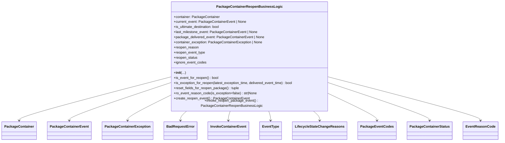
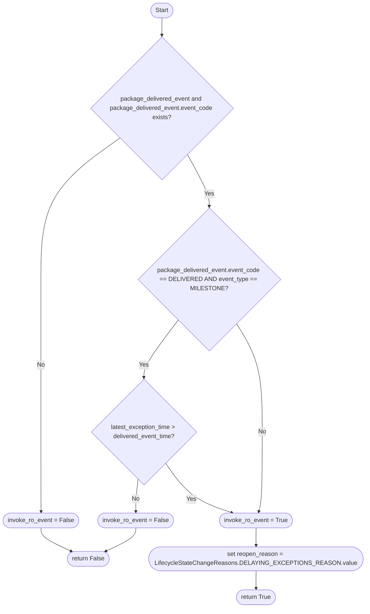

# Diagram: partview_service/partview_service/core/business/package_container/reopen/package_container_reopen_business_logic.py


> Auto-generated by Obscura crawlers

## Diagram 1



### SVG

<svg id="container" width="2240.375" xmlns="http://www.w3.org/2000/svg" class="classDiagram" height="654" viewBox="0 0 2240.375 654" role="graphics-document document" aria-roledescription="class"><style>#container{font-family:"trebuchet ms",verdana,arial,sans-serif;font-size:16px;fill:#333;}@keyframes edge-animation-frame{from{stroke-dashoffset:0;}}@keyframes dash{to{stroke-dashoffset:0;}}#container .edge-animation-slow{stroke-dasharray:9,5!important;stroke-dashoffset:900;animation:dash 50s linear infinite;stroke-linecap:round;}#container .edge-animation-fast{stroke-dasharray:9,5!important;stroke-dashoffset:900;animation:dash 20s linear infinite;stroke-linecap:round;}#container .error-icon{fill:#552222;}#container .error-text{fill:#552222;stroke:#552222;}#container .edge-thickness-normal{stroke-width:1px;}#container .edge-thickness-thick{stroke-width:3.5px;}#container .edge-pattern-solid{stroke-dasharray:0;}#container .edge-thickness-invisible{stroke-width:0;fill:none;}#container .edge-pattern-dashed{stroke-dasharray:3;}#container .edge-pattern-dotted{stroke-dasharray:2;}#container .marker{fill:#333333;stroke:#333333;}#container .marker.cross{stroke:#333333;}#container svg{font-family:"trebuchet ms",verdana,arial,sans-serif;font-size:16px;}#container p{margin:0;}#container g.classGroup text{fill:#9370DB;stroke:none;font-family:"trebuchet ms",verdana,arial,sans-serif;font-size:10px;}#container g.classGroup text .title{font-weight:bolder;}#container .nodeLabel,#container .edgeLabel{color:#131300;}#container .edgeLabel .label rect{fill:#ECECFF;}#container .label text{fill:#131300;}#container .labelBkg{background:#ECECFF;}#container .edgeLabel .label span{background:#ECECFF;}#container .classTitle{font-weight:bolder;}#container .node rect,#container .node circle,#container .node ellipse,#container .node polygon,#container .node path{fill:#ECECFF;stroke:#9370DB;stroke-width:1px;}#container .divider{stroke:#9370DB;stroke-width:1;}#container g.clickable{cursor:pointer;}#container g.classGroup rect{fill:#ECECFF;stroke:#9370DB;}#container g.classGroup line{stroke:#9370DB;stroke-width:1;}#container .classLabel .box{stroke:none;stroke-width:0;fill:#ECECFF;opacity:0.5;}#container .classLabel .label{fill:#9370DB;font-size:10px;}#container .relation{stroke:#333333;stroke-width:1;fill:none;}#container .dashed-line{stroke-dasharray:3;}#container .dotted-line{stroke-dasharray:1 2;}#container #compositionStart,#container .composition{fill:#333333!important;stroke:#333333!important;stroke-width:1;}#container #compositionEnd,#container .composition{fill:#333333!important;stroke:#333333!important;stroke-width:1;}#container #dependencyStart,#container .dependency{fill:#333333!important;stroke:#333333!important;stroke-width:1;}#container #dependencyStart,#container .dependency{fill:#333333!important;stroke:#333333!important;stroke-width:1;}#container #extensionStart,#container .extension{fill:transparent!important;stroke:#333333!important;stroke-width:1;}#container #extensionEnd,#container .extension{fill:transparent!important;stroke:#333333!important;stroke-width:1;}#container #aggregationStart,#container .aggregation{fill:transparent!important;stroke:#333333!important;stroke-width:1;}#container #aggregationEnd,#container .aggregation{fill:transparent!important;stroke:#333333!important;stroke-width:1;}#container #lollipopStart,#container .lollipop{fill:#ECECFF!important;stroke:#333333!important;stroke-width:1;}#container #lollipopEnd,#container .lollipop{fill:#ECECFF!important;stroke:#333333!important;stroke-width:1;}#container .edgeTerminals{font-size:11px;line-height:initial;}#container .classTitleText{text-anchor:middle;font-size:18px;fill:#333;}#container .label-icon{display:inline-block;height:1em;overflow:visible;vertical-align:-0.125em;}#container .node .label-icon path{fill:currentColor;stroke:revert;stroke-width:revert;}#container :root{--mermaid-font-family:"trebuchet ms",verdana,arial,sans-serif;}</style><g><defs><marker id="container_class-aggregationStart" class="marker aggregation class" refX="18" refY="7" markerWidth="190" markerHeight="240" orient="auto"><path d="M 18,7 L9,13 L1,7 L9,1 Z"></path></marker></defs><defs><marker id="container_class-aggregationEnd" class="marker aggregation class" refX="1" refY="7" markerWidth="20" markerHeight="28" orient="auto"><path d="M 18,7 L9,13 L1,7 L9,1 Z"></path></marker></defs><defs><marker id="container_class-extensionStart" class="marker extension class" refX="18" refY="7" markerWidth="190" markerHeight="240" orient="auto"><path d="M 1,7 L18,13 V 1 Z"></path></marker></defs><defs><marker id="container_class-extensionEnd" class="marker extension class" refX="1" refY="7" markerWidth="20" markerHeight="28" orient="auto"><path d="M 1,1 V 13 L18,7 Z"></path></marker></defs><defs><marker id="container_class-compositionStart" class="marker composition class" refX="18" refY="7" markerWidth="190" markerHeight="240" orient="auto"><path d="M 18,7 L9,13 L1,7 L9,1 Z"></path></marker></defs><defs><marker id="container_class-compositionEnd" class="marker composition class" refX="1" refY="7" markerWidth="20" markerHeight="28" orient="auto"><path d="M 18,7 L9,13 L1,7 L9,1 Z"></path></marker></defs><defs><marker id="container_class-dependencyStart" class="marker dependency class" refX="6" refY="7" markerWidth="190" markerHeight="240" orient="auto"><path d="M 5,7 L9,13 L1,7 L9,1 Z"></path></marker></defs><defs><marker id="container_class-dependencyEnd" class="marker dependency class" refX="13" refY="7" markerWidth="20" markerHeight="28" orient="auto"><path d="M 18,7 L9,13 L14,7 L9,1 Z"></path></marker></defs><defs><marker id="container_class-lollipopStart" class="marker lollipop class" refX="13" refY="7" markerWidth="190" markerHeight="240" orient="auto"><circle stroke="black" fill="transparent" cx="7" cy="7" r="6"></circle></marker></defs><defs><marker id="container_class-lollipopEnd" class="marker lollipop class" refX="1" refY="7" markerWidth="190" markerHeight="240" orient="auto"><circle stroke="black" fill="transparent" cx="7" cy="7" r="6"></circle></marker></defs><g class="root"><g class="clusters"></g><g class="edgePaths"><path d="M753.633,358.284L642.27,388.07C530.906,417.856,308.18,477.428,196.816,510.381C85.453,543.333,85.453,549.667,85.453,552.833L85.453,556" id="id_PackageContainerReopenBusinessLogic_PackageContainer_1" class="edge-thickness-normal edge-pattern-solid relation" style=";;;" data-edge="true" data-et="edge" data-id="id_PackageContainerReopenBusinessLogic_PackageContainer_1" data-points="W3sieCI6NzUzLjYzMjgxMjUsInkiOjM1OC4yODQ0NTgyNzQzOTg4NH0seyJ4Ijo4NS40NTMxMjUsInkiOjUzN30seyJ4Ijo4NS40NTMxMjUsInkiOjU2Mn1d" marker-end="url(#container_class-dependencyEnd)"></path><path d="M753.633,385.581L679.788,410.817C605.943,436.054,458.253,486.527,384.408,514.93C310.563,543.333,310.563,549.667,310.563,552.833L310.563,556" id="id_PackageContainerReopenBusinessLogic_PackageContainerEvent_2" class="edge-thickness-normal edge-pattern-solid relation" style=";;;" data-edge="true" data-et="edge" data-id="id_PackageContainerReopenBusinessLogic_PackageContainerEvent_2" data-points="W3sieCI6NzUzLjYzMjgxMjUsInkiOjM4NS41ODA5MzM3MDAyNDYyNX0seyJ4IjozMTAuNTYyNSwieSI6NTM3fSx7IngiOjMxMC41NjI1LCJ5Ijo1NjJ9XQ==" marker-end="url(#container_class-dependencyEnd)"></path><path d="M753.633,445.159L723.255,460.466C692.878,475.773,632.122,506.386,601.745,524.86C571.367,543.333,571.367,549.667,571.367,552.833L571.367,556" id="id_PackageContainerReopenBusinessLogic_PackageContainerException_3" class="edge-thickness-normal edge-pattern-solid relation" style=";;;" data-edge="true" data-et="edge" data-id="id_PackageContainerReopenBusinessLogic_PackageContainerException_3" data-points="W3sieCI6NzUzLjYzMjgxMjUsInkiOjQ0NS4xNTkzOTYyOTUwNTkzN30seyJ4Ijo1NzEuMzY3MTg3NSwieSI6NTM3fSx7IngiOjU3MS4zNjcxODc1LCJ5Ijo1NjJ9XQ==" marker-end="url(#container_class-dependencyEnd)"></path><path d="M836.983,512L832.285,516.167C827.588,520.333,818.192,528.667,813.495,536C808.797,543.333,808.797,549.667,808.797,552.833L808.797,556" id="id_PackageContainerReopenBusinessLogic_BadRequestError_4" class="edge-thickness-normal edge-pattern-solid relation" style=";;;" data-edge="true" data-et="edge" data-id="id_PackageContainerReopenBusinessLogic_BadRequestError_4" data-points="W3sieCI6ODM2Ljk4Mjg2NjA4NzU0NTEsInkiOjUxMn0seyJ4Ijo4MDguNzk2ODc1LCJ5Ijo1Mzd9LHsieCI6ODA4Ljc5Njg3NSwieSI6NTYyfV0=" marker-end="url(#container_class-dependencyEnd)"></path><path d="M1033.893,512L1032.452,516.167C1031.01,520.333,1028.126,528.667,1026.684,536C1025.242,543.333,1025.242,549.667,1025.242,552.833L1025.242,556" id="id_PackageContainerReopenBusinessLogic_InvokeContainerEvent_5" class="edge-thickness-normal edge-pattern-solid relation" style=";;;" data-edge="true" data-et="edge" data-id="id_PackageContainerReopenBusinessLogic_InvokeContainerEvent_5" data-points="W3sieCI6MTAzMy44OTM0MDMwOTExNTUzLCJ5Ijo1MTJ9LHsieCI6MTAyNS4yNDIxODc1LCJ5Ijo1Mzd9LHsieCI6MTAyNS4yNDIxODc1LCJ5Ijo1NjJ9XQ==" marker-end="url(#container_class-dependencyEnd)"></path><path d="M1208.302,512L1209.744,516.167C1211.186,520.333,1214.069,528.667,1215.511,536C1216.953,543.333,1216.953,549.667,1216.953,552.833L1216.953,556" id="id_PackageContainerReopenBusinessLogic_EventType_6" class="edge-thickness-normal edge-pattern-solid relation" style=";;;" data-edge="true" data-et="edge" data-id="id_PackageContainerReopenBusinessLogic_EventType_6" data-points="W3sieCI6MTIwOC4zMDE5MDk0MDg4NDQ3LCJ5Ijo1MTJ9LHsieCI6MTIxNi45NTMxMjUsInkiOjUzN30seyJ4IjoxMjE2Ljk1MzEyNSwieSI6NTYyfV0=" marker-end="url(#container_class-dependencyEnd)"></path><path d="M1408.588,512L1413.342,516.167C1418.095,520.333,1427.602,528.667,1432.356,536C1437.109,543.333,1437.109,549.667,1437.109,552.833L1437.109,556" id="id_PackageContainerReopenBusinessLogic_LifecycleStateChangeReasons_7" class="edge-thickness-normal edge-pattern-solid relation" style=";;;" data-edge="true" data-et="edge" data-id="id_PackageContainerReopenBusinessLogic_LifecycleStateChangeReasons_7" data-points="W3sieCI6MTQwOC41ODg0NjE3NTU0MTUyLCJ5Ijo1MTJ9LHsieCI6MTQzNy4xMDkzNzUsInkiOjUzN30seyJ4IjoxNDM3LjEwOTM3NSwieSI6NTYyfV0=" marker-end="url(#container_class-dependencyEnd)"></path><path d="M1488.563,438.303L1522.464,454.752C1556.365,471.202,1624.167,504.101,1658.068,523.717C1691.969,543.333,1691.969,549.667,1691.969,552.833L1691.969,556" id="id_PackageContainerReopenBusinessLogic_PackageEventCodes_8" class="edge-thickness-normal edge-pattern-solid relation" style=";;;" data-edge="true" data-et="edge" data-id="id_PackageContainerReopenBusinessLogic_PackageEventCodes_8" data-points="W3sieCI6MTQ4OC41NjI1LCJ5Ijo0MzguMzAyNTMyNDUxMDkyNH0seyJ4IjoxNjkxLjk2ODc1LCJ5Ijo1Mzd9LHsieCI6MTY5MS45Njg3NSwieSI6NTYyfV0=" marker-end="url(#container_class-dependencyEnd)"></path><path d="M1488.563,386.28L1561.66,411.4C1634.758,436.52,1780.953,486.76,1854.051,515.047C1927.148,543.333,1927.148,549.667,1927.148,552.833L1927.148,556" id="id_PackageContainerReopenBusinessLogic_PackageContainerStatus_9" class="edge-thickness-normal edge-pattern-solid relation" style=";;;" data-edge="true" data-et="edge" data-id="id_PackageContainerReopenBusinessLogic_PackageContainerStatus_9" data-points="W3sieCI6MTQ4OC41NjI1LCJ5IjozODYuMjc5NTg5NDMzNDM1Nn0seyJ4IjoxOTI3LjE0ODQzNzUsInkiOjUzN30seyJ4IjoxOTI3LjE0ODQzNzUsInkiOjU2Mn1d" marker-end="url(#container_class-dependencyEnd)"></path><path d="M1488.563,358.429L1599.673,388.19C1710.784,417.952,1933.005,477.476,2044.116,510.405C2155.227,543.333,2155.227,549.667,2155.227,552.833L2155.227,556" id="id_PackageContainerReopenBusinessLogic_EventReasonCode_10" class="edge-thickness-normal edge-pattern-solid relation" style=";;;" data-edge="true" data-et="edge" data-id="id_PackageContainerReopenBusinessLogic_EventReasonCode_10" data-points="W3sieCI6MTQ4OC41NjI1LCJ5IjozNTguNDI4NTA0NTE1ODAyNX0seyJ4IjoyMTU1LjIyNjU2MjUsInkiOjUzN30seyJ4IjoyMTU1LjIyNjU2MjUsInkiOjU2Mn1d" marker-end="url(#container_class-dependencyEnd)"></path></g><g class="edgeLabels"><g class="edgeLabel"><g class="label" data-id="id_PackageContainerReopenBusinessLogic_PackageContainer_1" transform="translate(0, 0)"><foreignObject width="0" height="0"><div xmlns="http://www.w3.org/1999/xhtml" class="labelBkg" style="display: table-cell; white-space: nowrap; line-height: 1.5; max-width: 200px; text-align: center;"><span class="edgeLabel"></span></div></foreignObject></g></g><g class="edgeLabel"><g class="label" data-id="id_PackageContainerReopenBusinessLogic_PackageContainerEvent_2" transform="translate(0, 0)"><foreignObject width="0" height="0"><div xmlns="http://www.w3.org/1999/xhtml" class="labelBkg" style="display: table-cell; white-space: nowrap; line-height: 1.5; max-width: 200px; text-align: center;"><span class="edgeLabel"></span></div></foreignObject></g></g><g class="edgeLabel"><g class="label" data-id="id_PackageContainerReopenBusinessLogic_PackageContainerException_3" transform="translate(0, 0)"><foreignObject width="0" height="0"><div xmlns="http://www.w3.org/1999/xhtml" class="labelBkg" style="display: table-cell; white-space: nowrap; line-height: 1.5; max-width: 200px; text-align: center;"><span class="edgeLabel"></span></div></foreignObject></g></g><g class="edgeLabel"><g class="label" data-id="id_PackageContainerReopenBusinessLogic_BadRequestError_4" transform="translate(0, 0)"><foreignObject width="0" height="0"><div xmlns="http://www.w3.org/1999/xhtml" class="labelBkg" style="display: table-cell; white-space: nowrap; line-height: 1.5; max-width: 200px; text-align: center;"><span class="edgeLabel"></span></div></foreignObject></g></g><g class="edgeLabel"><g class="label" data-id="id_PackageContainerReopenBusinessLogic_InvokeContainerEvent_5" transform="translate(0, 0)"><foreignObject width="0" height="0"><div xmlns="http://www.w3.org/1999/xhtml" class="labelBkg" style="display: table-cell; white-space: nowrap; line-height: 1.5; max-width: 200px; text-align: center;"><span class="edgeLabel"></span></div></foreignObject></g></g><g class="edgeLabel"><g class="label" data-id="id_PackageContainerReopenBusinessLogic_EventType_6" transform="translate(0, 0)"><foreignObject width="0" height="0"><div xmlns="http://www.w3.org/1999/xhtml" class="labelBkg" style="display: table-cell; white-space: nowrap; line-height: 1.5; max-width: 200px; text-align: center;"><span class="edgeLabel"></span></div></foreignObject></g></g><g class="edgeLabel"><g class="label" data-id="id_PackageContainerReopenBusinessLogic_LifecycleStateChangeReasons_7" transform="translate(0, 0)"><foreignObject width="0" height="0"><div xmlns="http://www.w3.org/1999/xhtml" class="labelBkg" style="display: table-cell; white-space: nowrap; line-height: 1.5; max-width: 200px; text-align: center;"><span class="edgeLabel"></span></div></foreignObject></g></g><g class="edgeLabel"><g class="label" data-id="id_PackageContainerReopenBusinessLogic_PackageEventCodes_8" transform="translate(0, 0)"><foreignObject width="0" height="0"><div xmlns="http://www.w3.org/1999/xhtml" class="labelBkg" style="display: table-cell; white-space: nowrap; line-height: 1.5; max-width: 200px; text-align: center;"><span class="edgeLabel"></span></div></foreignObject></g></g><g class="edgeLabel"><g class="label" data-id="id_PackageContainerReopenBusinessLogic_PackageContainerStatus_9" transform="translate(0, 0)"><foreignObject width="0" height="0"><div xmlns="http://www.w3.org/1999/xhtml" class="labelBkg" style="display: table-cell; white-space: nowrap; line-height: 1.5; max-width: 200px; text-align: center;"><span class="edgeLabel"></span></div></foreignObject></g></g><g class="edgeLabel"><g class="label" data-id="id_PackageContainerReopenBusinessLogic_EventReasonCode_10" transform="translate(0, 0)"><foreignObject width="0" height="0"><div xmlns="http://www.w3.org/1999/xhtml" class="labelBkg" style="display: table-cell; white-space: nowrap; line-height: 1.5; max-width: 200px; text-align: center;"><span class="edgeLabel"></span></div></foreignObject></g></g></g><g class="nodes"><g class="node default" id="classId-PackageContainerReopenBusinessLogic-0" transform="translate(1121.09765625, 260)"><g class="basic label-container"><path d="M-367.46484375 -252 L367.46484375 -252 L367.46484375 252 L-367.46484375 252" stroke="none" stroke-width="0" fill="#ECECFF" style=""></path><path d="M-367.46484375 -252 C-215.89461451050673 -252, -64.32438527101345 -252, 367.46484375 -252 M-367.46484375 -252 C-107.77116278935648 -252, 151.92251817128704 -252, 367.46484375 -252 M367.46484375 -252 C367.46484375 -118.17435564844914, 367.46484375 15.651288703101727, 367.46484375 252 M367.46484375 -252 C367.46484375 -129.7034147042624, 367.46484375 -7.406829408524828, 367.46484375 252 M367.46484375 252 C84.59782232821323 252, -198.26919909357355 252, -367.46484375 252 M367.46484375 252 C176.7609064282671 252, -13.943030893465789 252, -367.46484375 252 M-367.46484375 252 C-367.46484375 57.30730202270931, -367.46484375 -137.38539595458138, -367.46484375 -252 M-367.46484375 252 C-367.46484375 149.59198192049485, -367.46484375 47.18396384098969, -367.46484375 -252" stroke="#9370DB" stroke-width="1.3" fill="none" stroke-dasharray="0 0" style=""></path></g><g class="annotation-group text" transform="translate(0, -228)"></g><g class="label-group text" transform="translate(-144.5703125, -228)"><g class="label" style="font-weight: bolder" transform="translate(0,-12)"><foreignObject width="289.140625" height="24"><div xmlns="http://www.w3.org/1999/xhtml" style="display: table-cell; white-space: nowrap; line-height: 1.5; max-width: 335px; text-align: center;"><span class="nodeLabel markdown-node-label" style=""><p>PackageContainerReopenBusinessLogic</p></span></div></foreignObject></g></g><g class="members-group text" transform="translate(-355.46484375, -180)"><g class="label" style="" transform="translate(0,-12)"><foreignObject width="214" height="24"><div xmlns="http://www.w3.org/1999/xhtml" style="display: table-cell; white-space: nowrap; line-height: 1.5; max-width: 272px; text-align: center;"><span class="nodeLabel markdown-node-label" style=""><p>+container: PackageContainer</p></span></div></foreignObject></g><g class="label" style="" transform="translate(0,12)"><foreignObject width="338.796875" height="24"><div xmlns="http://www.w3.org/1999/xhtml" style="display: table-cell; white-space: nowrap; line-height: 1.5; max-width: 396px; text-align: center;"><span class="nodeLabel markdown-node-label" style=""><p>+current_event: PackageContainerEvent | None</p></span></div></foreignObject></g><g class="label" style="" transform="translate(0,36)"><foreignObject width="220.390625" height="24"><div xmlns="http://www.w3.org/1999/xhtml" style="display: table-cell; white-space: nowrap; line-height: 1.5; max-width: 278px; text-align: center;"><span class="nodeLabel markdown-node-label" style=""><p>+is_ultimate_destination: bool</p></span></div></foreignObject></g><g class="label" style="" transform="translate(0,60)"><foreignObject width="392.65625" height="24"><div xmlns="http://www.w3.org/1999/xhtml" style="display: table-cell; white-space: nowrap; line-height: 1.5; max-width: 450px; text-align: center;"><span class="nodeLabel markdown-node-label" style=""><p>+last_milestone_event: PackageContainerEvent | None</p></span></div></foreignObject></g><g class="label" style="" transform="translate(0,84)"><foreignObject width="420.90625" height="24"><div xmlns="http://www.w3.org/1999/xhtml" style="display: table-cell; white-space: nowrap; line-height: 1.5; max-width: 478px; text-align: center;"><span class="nodeLabel markdown-node-label" style=""><p>+package_delivered_event: PackageContainerEvent | None</p></span></div></foreignObject></g><g class="label" style="" transform="translate(0,108)"><foreignObject width="415.34375" height="24"><div xmlns="http://www.w3.org/1999/xhtml" style="display: table-cell; white-space: nowrap; line-height: 1.5; max-width: 473px; text-align: center;"><span class="nodeLabel markdown-node-label" style=""><p>+container_exception: PackageContainerException | None</p></span></div></foreignObject></g><g class="label" style="" transform="translate(0,132)"><foreignObject width="116.65625" height="24"><div xmlns="http://www.w3.org/1999/xhtml" style="display: table-cell; white-space: nowrap; line-height: 1.5; max-width: 174px; text-align: center;"><span class="nodeLabel markdown-node-label" style=""><p>+reopen_reason</p></span></div></foreignObject></g><g class="label" style="" transform="translate(0,156)"><foreignObject width="147.484375" height="24"><div xmlns="http://www.w3.org/1999/xhtml" style="display: table-cell; white-space: nowrap; line-height: 1.5; max-width: 205px; text-align: center;"><span class="nodeLabel markdown-node-label" style=""><p>+reopen_event_type</p></span></div></foreignObject></g><g class="label" style="" transform="translate(0,180)"><foreignObject width="112.078125" height="24"><div xmlns="http://www.w3.org/1999/xhtml" style="display: table-cell; white-space: nowrap; line-height: 1.5; max-width: 169px; text-align: center;"><span class="nodeLabel markdown-node-label" style=""><p>+reopen_status</p></span></div></foreignObject></g><g class="label" style="" transform="translate(0,204)"><foreignObject width="152.40625" height="24"><div xmlns="http://www.w3.org/1999/xhtml" style="display: table-cell; white-space: nowrap; line-height: 1.5; max-width: 210px; text-align: center;"><span class="nodeLabel markdown-node-label" style=""><p>+ignore_event_codes</p></span></div></foreignObject></g></g><g class="methods-group text" transform="translate(-355.46484375, 84)"><g class="label" style="" transform="translate(0,-12)"><foreignObject width="54.3125" height="24"><div xmlns="http://www.w3.org/1999/xhtml" style="display: table-cell; white-space: nowrap; line-height: 1.5; max-width: 143px; text-align: center;"><span class="nodeLabel markdown-node-label" style=""><p>+<strong>init</strong>(...)</p></span></div></foreignObject></g><g class="label" style="" transform="translate(0,12)"><foreignObject width="210.6875" height="24"><div xmlns="http://www.w3.org/1999/xhtml" style="display: table-cell; white-space: nowrap; line-height: 1.5; max-width: 268px; text-align: center;"><span class="nodeLabel markdown-node-label" style=""><p>+is_event_for_reopen() : bool</p></span></div></foreignObject></g><g class="label" style="" transform="translate(0,36)"><foreignObject width="566.359375" height="24"><div xmlns="http://www.w3.org/1999/xhtml" style="display: table-cell; white-space: nowrap; line-height: 1.5; max-width: 624px; text-align: center;"><span class="nodeLabel markdown-node-label" style=""><p>+is_exception_for_reopen(latest_exception_time, delivered_event_time) : bool</p></span></div></foreignObject></g><g class="label" style="" transform="translate(0,60)"><foreignObject width="306.640625" height="24"><div xmlns="http://www.w3.org/1999/xhtml" style="display: table-cell; white-space: nowrap; line-height: 1.5; max-width: 364px; text-align: center;"><span class="nodeLabel markdown-node-label" style=""><p>+reset_fields_for_reopen_package() : tuple</p></span></div></foreignObject></g><g class="label" style="" transform="translate(0,84)"><foreignObject width="391.09375" height="24"><div xmlns="http://www.w3.org/1999/xhtml" style="display: table-cell; white-space: nowrap; line-height: 1.5; max-width: 448px; text-align: center;"><span class="nodeLabel markdown-node-label" style=""><p>+ro_event_reason_code(is_exception=false) : str|None</p></span></div></foreignObject></g><g class="label" style="" transform="translate(0,108)"><foreignObject width="351.71875" height="24"><div xmlns="http://www.w3.org/1999/xhtml" style="display: table-cell; white-space: nowrap; line-height: 1.5; max-width: 409px; text-align: center;"><span class="nodeLabel markdown-node-label" style=""><p>+create_reopen_event() : PackageContainerEvent</p></span></div></foreignObject></g><g class="label" style="" transform="translate(0,132)"><foreignObject width="538.015625" height="24"><div xmlns="http://www.w3.org/1999/xhtml" style="display: table-cell; white-space: nowrap; line-height: 1.5; max-width: 596px; text-align: center;"><span class="nodeLabel markdown-node-label" style=""><p>+invoke_reopen_package_event() : PackageContainerReopenBusinessLogic</p></span></div></foreignObject></g></g><g class="divider" style=""><path d="M-367.46484375 -204 C-171.1587186070559 -204, 25.147406535888194 -204, 367.46484375 -204 M-367.46484375 -204 C-136.8788670235769 -204, 93.7071097028462 -204, 367.46484375 -204" stroke="#9370DB" stroke-width="1.3" fill="none" stroke-dasharray="0 0" style=""></path></g><g class="divider" style=""><path d="M-367.46484375 60 C-204.1435197865399 60, -40.822195823079824 60, 367.46484375 60 M-367.46484375 60 C-171.22539021210397 60, 25.01406332579205 60, 367.46484375 60" stroke="#9370DB" stroke-width="1.3" fill="none" stroke-dasharray="0 0" style=""></path></g></g><g class="node default" id="classId-PackageContainer-1" transform="translate(85.453125, 604)"><g class="basic label-container"><path d="M-77.453125 -42 L77.453125 -42 L77.453125 42 L-77.453125 42" stroke="none" stroke-width="0" fill="#ECECFF" style=""></path><path d="M-77.453125 -42 C-17.64348337939743 -42, 42.16615824120514 -42, 77.453125 -42 M-77.453125 -42 C-41.731136541558016 -42, -6.009148083116031 -42, 77.453125 -42 M77.453125 -42 C77.453125 -23.544663623752108, 77.453125 -5.089327247504215, 77.453125 42 M77.453125 -42 C77.453125 -23.465250165360786, 77.453125 -4.930500330721571, 77.453125 42 M77.453125 42 C21.54280063906922 42, -34.36752372186156 42, -77.453125 42 M77.453125 42 C40.6537307232329 42, 3.854336446465794 42, -77.453125 42 M-77.453125 42 C-77.453125 22.423950327976655, -77.453125 2.8479006559533104, -77.453125 -42 M-77.453125 42 C-77.453125 18.663025639877553, -77.453125 -4.673948720244894, -77.453125 -42" stroke="#9370DB" stroke-width="1.3" fill="none" stroke-dasharray="0 0" style=""></path></g><g class="annotation-group text" transform="translate(0, -18)"></g><g class="label-group text" transform="translate(-65.453125, -18)"><g class="label" style="font-weight: bolder" transform="translate(0,-12)"><foreignObject width="130.90625" height="24"><div xmlns="http://www.w3.org/1999/xhtml" style="display: table-cell; white-space: nowrap; line-height: 1.5; max-width: 179px; text-align: center;"><span class="nodeLabel markdown-node-label" style=""><p>PackageContainer</p></span></div></foreignObject></g></g><g class="members-group text" transform="translate(-65.453125, 30)"></g><g class="methods-group text" transform="translate(-65.453125, 60)"></g><g class="divider" style=""><path d="M-77.453125 6 C-29.27823732571766 6, 18.896650348564677 6, 77.453125 6 M-77.453125 6 C-27.166945750913293 6, 23.119233498173415 6, 77.453125 6" stroke="#9370DB" stroke-width="1.3" fill="none" stroke-dasharray="0 0" style=""></path></g><g class="divider" style=""><path d="M-77.453125 24 C-15.644423198522013 24, 46.164278602955974 24, 77.453125 24 M-77.453125 24 C-40.87904858266112 24, -4.304972165322241 24, 77.453125 24" stroke="#9370DB" stroke-width="1.3" fill="none" stroke-dasharray="0 0" style=""></path></g></g><g class="node default" id="classId-PackageContainerEvent-2" transform="translate(310.5625, 604)"><g class="basic label-container"><path d="M-97.65625 -42 L97.65625 -42 L97.65625 42 L-97.65625 42" stroke="none" stroke-width="0" fill="#ECECFF" style=""></path><path d="M-97.65625 -42 C-50.411975194014936 -42, -3.1677003880298713 -42, 97.65625 -42 M-97.65625 -42 C-50.62196790945689 -42, -3.5876858189137835 -42, 97.65625 -42 M97.65625 -42 C97.65625 -24.189597102353183, 97.65625 -6.379194204706366, 97.65625 42 M97.65625 -42 C97.65625 -12.321821489009615, 97.65625 17.35635702198077, 97.65625 42 M97.65625 42 C27.857327827942868 42, -41.941594344114264 42, -97.65625 42 M97.65625 42 C25.491156316626842 42, -46.673937366746316 42, -97.65625 42 M-97.65625 42 C-97.65625 22.427424024038423, -97.65625 2.854848048076846, -97.65625 -42 M-97.65625 42 C-97.65625 17.311959789364767, -97.65625 -7.376080421270466, -97.65625 -42" stroke="#9370DB" stroke-width="1.3" fill="none" stroke-dasharray="0 0" style=""></path></g><g class="annotation-group text" transform="translate(0, -18)"></g><g class="label-group text" transform="translate(-85.65625, -18)"><g class="label" style="font-weight: bolder" transform="translate(0,-12)"><foreignObject width="171.3125" height="24"><div xmlns="http://www.w3.org/1999/xhtml" style="display: table-cell; white-space: nowrap; line-height: 1.5; max-width: 219px; text-align: center;"><span class="nodeLabel markdown-node-label" style=""><p>PackageContainerEvent</p></span></div></foreignObject></g></g><g class="members-group text" transform="translate(-85.65625, 30)"></g><g class="methods-group text" transform="translate(-85.65625, 60)"></g><g class="divider" style=""><path d="M-97.65625 6 C-42.95219215083421 6, 11.751865698331585 6, 97.65625 6 M-97.65625 6 C-36.125513141929495 6, 25.40522371614101 6, 97.65625 6" stroke="#9370DB" stroke-width="1.3" fill="none" stroke-dasharray="0 0" style=""></path></g><g class="divider" style=""><path d="M-97.65625 24 C-32.43682302892438 24, 32.78260394215124 24, 97.65625 24 M-97.65625 24 C-39.60053629302997 24, 18.455177413940064 24, 97.65625 24" stroke="#9370DB" stroke-width="1.3" fill="none" stroke-dasharray="0 0" style=""></path></g></g><g class="node default" id="classId-PackageContainerException-3" transform="translate(571.3671875, 604)"><g class="basic label-container"><path d="M-113.1484375 -42 L113.1484375 -42 L113.1484375 42 L-113.1484375 42" stroke="none" stroke-width="0" fill="#ECECFF" style=""></path><path d="M-113.1484375 -42 C-49.11838692066672 -42, 14.911663658666555 -42, 113.1484375 -42 M-113.1484375 -42 C-42.998258738700386 -42, 27.151920022599228 -42, 113.1484375 -42 M113.1484375 -42 C113.1484375 -12.468535910401169, 113.1484375 17.062928179197662, 113.1484375 42 M113.1484375 -42 C113.1484375 -14.071138240804792, 113.1484375 13.857723518390415, 113.1484375 42 M113.1484375 42 C49.225963030517754 42, -14.696511438964492 42, -113.1484375 42 M113.1484375 42 C63.039544951970115 42, 12.930652403940229 42, -113.1484375 42 M-113.1484375 42 C-113.1484375 16.444864545324634, -113.1484375 -9.110270909350731, -113.1484375 -42 M-113.1484375 42 C-113.1484375 14.975497996577193, -113.1484375 -12.049004006845614, -113.1484375 -42" stroke="#9370DB" stroke-width="1.3" fill="none" stroke-dasharray="0 0" style=""></path></g><g class="annotation-group text" transform="translate(0, -18)"></g><g class="label-group text" transform="translate(-101.1484375, -18)"><g class="label" style="font-weight: bolder" transform="translate(0,-12)"><foreignObject width="202.296875" height="24"><div xmlns="http://www.w3.org/1999/xhtml" style="display: table-cell; white-space: nowrap; line-height: 1.5; max-width: 249px; text-align: center;"><span class="nodeLabel markdown-node-label" style=""><p>PackageContainerException</p></span></div></foreignObject></g></g><g class="members-group text" transform="translate(-101.1484375, 30)"></g><g class="methods-group text" transform="translate(-101.1484375, 60)"></g><g class="divider" style=""><path d="M-113.1484375 6 C-55.28369866994101 6, 2.581040160117979 6, 113.1484375 6 M-113.1484375 6 C-64.74764719116405 6, -16.346856882328083 6, 113.1484375 6" stroke="#9370DB" stroke-width="1.3" fill="none" stroke-dasharray="0 0" style=""></path></g><g class="divider" style=""><path d="M-113.1484375 24 C-59.28253242858905 24, -5.4166273571781005 24, 113.1484375 24 M-113.1484375 24 C-66.49091577040352 24, -19.83339404080705 24, 113.1484375 24" stroke="#9370DB" stroke-width="1.3" fill="none" stroke-dasharray="0 0" style=""></path></g></g><g class="node default" id="classId-BadRequestError-4" transform="translate(808.796875, 604)"><g class="basic label-container"><path d="M-74.28125 -42 L74.28125 -42 L74.28125 42 L-74.28125 42" stroke="none" stroke-width="0" fill="#ECECFF" style=""></path><path d="M-74.28125 -42 C-17.664642073377912 -42, 38.951965853244175 -42, 74.28125 -42 M-74.28125 -42 C-26.793343168478778 -42, 20.694563663042445 -42, 74.28125 -42 M74.28125 -42 C74.28125 -13.937566743504274, 74.28125 14.124866512991453, 74.28125 42 M74.28125 -42 C74.28125 -16.854430255466397, 74.28125 8.291139489067206, 74.28125 42 M74.28125 42 C34.73992172342675 42, -4.801406553146506 42, -74.28125 42 M74.28125 42 C14.86923808451401 42, -44.54277383097198 42, -74.28125 42 M-74.28125 42 C-74.28125 20.274982777434175, -74.28125 -1.4500344451316494, -74.28125 -42 M-74.28125 42 C-74.28125 21.37627720931535, -74.28125 0.7525544186307016, -74.28125 -42" stroke="#9370DB" stroke-width="1.3" fill="none" stroke-dasharray="0 0" style=""></path></g><g class="annotation-group text" transform="translate(0, -18)"></g><g class="label-group text" transform="translate(-62.28125, -18)"><g class="label" style="font-weight: bolder" transform="translate(0,-12)"><foreignObject width="124.5625" height="24"><div xmlns="http://www.w3.org/1999/xhtml" style="display: table-cell; white-space: nowrap; line-height: 1.5; max-width: 174px; text-align: center;"><span class="nodeLabel markdown-node-label" style=""><p>BadRequestError</p></span></div></foreignObject></g></g><g class="members-group text" transform="translate(-62.28125, 30)"></g><g class="methods-group text" transform="translate(-62.28125, 60)"></g><g class="divider" style=""><path d="M-74.28125 6 C-29.752461761535343 6, 14.776326476929313 6, 74.28125 6 M-74.28125 6 C-15.540836142181327 6, 43.199577715637346 6, 74.28125 6" stroke="#9370DB" stroke-width="1.3" fill="none" stroke-dasharray="0 0" style=""></path></g><g class="divider" style=""><path d="M-74.28125 24 C-22.150180672509656 24, 29.98088865498069 24, 74.28125 24 M-74.28125 24 C-18.467442532806402 24, 37.346364934387196 24, 74.28125 24" stroke="#9370DB" stroke-width="1.3" fill="none" stroke-dasharray="0 0" style=""></path></g></g><g class="node default" id="classId-InvokeContainerEvent-5" transform="translate(1025.2421875, 604)"><g class="basic label-container"><path d="M-92.1640625 -42 L92.1640625 -42 L92.1640625 42 L-92.1640625 42" stroke="none" stroke-width="0" fill="#ECECFF" style=""></path><path d="M-92.1640625 -42 C-21.516685872083684 -42, 49.13069075583263 -42, 92.1640625 -42 M-92.1640625 -42 C-48.61376239185786 -42, -5.063462283715722 -42, 92.1640625 -42 M92.1640625 -42 C92.1640625 -16.162485265044495, 92.1640625 9.67502946991101, 92.1640625 42 M92.1640625 -42 C92.1640625 -15.957766047207866, 92.1640625 10.084467905584269, 92.1640625 42 M92.1640625 42 C52.135039622723916 42, 12.106016745447832 42, -92.1640625 42 M92.1640625 42 C33.27927808297724 42, -25.605506334045515 42, -92.1640625 42 M-92.1640625 42 C-92.1640625 24.099335478186504, -92.1640625 6.198670956373007, -92.1640625 -42 M-92.1640625 42 C-92.1640625 20.281145642699933, -92.1640625 -1.4377087146001344, -92.1640625 -42" stroke="#9370DB" stroke-width="1.3" fill="none" stroke-dasharray="0 0" style=""></path></g><g class="annotation-group text" transform="translate(0, -18)"></g><g class="label-group text" transform="translate(-80.1640625, -18)"><g class="label" style="font-weight: bolder" transform="translate(0,-12)"><foreignObject width="160.328125" height="24"><div xmlns="http://www.w3.org/1999/xhtml" style="display: table-cell; white-space: nowrap; line-height: 1.5; max-width: 209px; text-align: center;"><span class="nodeLabel markdown-node-label" style=""><p>InvokeContainerEvent</p></span></div></foreignObject></g></g><g class="members-group text" transform="translate(-80.1640625, 30)"></g><g class="methods-group text" transform="translate(-80.1640625, 60)"></g><g class="divider" style=""><path d="M-92.1640625 6 C-26.298869422531 6, 39.566323654938 6, 92.1640625 6 M-92.1640625 6 C-23.247522724871274 6, 45.66901705025745 6, 92.1640625 6" stroke="#9370DB" stroke-width="1.3" fill="none" stroke-dasharray="0 0" style=""></path></g><g class="divider" style=""><path d="M-92.1640625 24 C-28.243484028609643 24, 35.677094442780714 24, 92.1640625 24 M-92.1640625 24 C-40.24469210586087 24, 11.674678288278258 24, 92.1640625 24" stroke="#9370DB" stroke-width="1.3" fill="none" stroke-dasharray="0 0" style=""></path></g></g><g class="node default" id="classId-EventType-6" transform="translate(1216.953125, 604)"><g class="basic label-container"><path d="M-49.546875 -42 L49.546875 -42 L49.546875 42 L-49.546875 42" stroke="none" stroke-width="0" fill="#ECECFF" style=""></path><path d="M-49.546875 -42 C-14.455631494320393 -42, 20.635612011359214 -42, 49.546875 -42 M-49.546875 -42 C-19.192579201585026 -42, 11.161716596829947 -42, 49.546875 -42 M49.546875 -42 C49.546875 -13.039836176446265, 49.546875 15.92032764710747, 49.546875 42 M49.546875 -42 C49.546875 -9.482426132008115, 49.546875 23.03514773598377, 49.546875 42 M49.546875 42 C15.728449749671569 42, -18.089975500656863 42, -49.546875 42 M49.546875 42 C12.545589659540418 42, -24.455695680919163 42, -49.546875 42 M-49.546875 42 C-49.546875 16.336483495768995, -49.546875 -9.32703300846201, -49.546875 -42 M-49.546875 42 C-49.546875 8.513702219234816, -49.546875 -24.97259556153037, -49.546875 -42" stroke="#9370DB" stroke-width="1.3" fill="none" stroke-dasharray="0 0" style=""></path></g><g class="annotation-group text" transform="translate(0, -18)"></g><g class="label-group text" transform="translate(-37.546875, -18)"><g class="label" style="font-weight: bolder" transform="translate(0,-12)"><foreignObject width="75.09375" height="24"><div xmlns="http://www.w3.org/1999/xhtml" style="display: table-cell; white-space: nowrap; line-height: 1.5; max-width: 124px; text-align: center;"><span class="nodeLabel markdown-node-label" style=""><p>EventType</p></span></div></foreignObject></g></g><g class="members-group text" transform="translate(-37.546875, 30)"></g><g class="methods-group text" transform="translate(-37.546875, 60)"></g><g class="divider" style=""><path d="M-49.546875 6 C-24.630611274462755 6, 0.28565245107449044 6, 49.546875 6 M-49.546875 6 C-15.409099704896661 6, 18.728675590206677 6, 49.546875 6" stroke="#9370DB" stroke-width="1.3" fill="none" stroke-dasharray="0 0" style=""></path></g><g class="divider" style=""><path d="M-49.546875 24 C-27.346094601289522 24, -5.145314202579044 24, 49.546875 24 M-49.546875 24 C-22.009611644094008 24, 5.527651711811984 24, 49.546875 24" stroke="#9370DB" stroke-width="1.3" fill="none" stroke-dasharray="0 0" style=""></path></g></g><g class="node default" id="classId-LifecycleStateChangeReasons-7" transform="translate(1437.109375, 604)"><g class="basic label-container"><path d="M-120.609375 -42 L120.609375 -42 L120.609375 42 L-120.609375 42" stroke="none" stroke-width="0" fill="#ECECFF" style=""></path><path d="M-120.609375 -42 C-40.57461568322972 -42, 39.460143633540554 -42, 120.609375 -42 M-120.609375 -42 C-50.85089133493754 -42, 18.907592330124913 -42, 120.609375 -42 M120.609375 -42 C120.609375 -24.607135639000518, 120.609375 -7.214271278001036, 120.609375 42 M120.609375 -42 C120.609375 -14.448531449018468, 120.609375 13.102937101963064, 120.609375 42 M120.609375 42 C68.64848626173237 42, 16.687597523464746 42, -120.609375 42 M120.609375 42 C35.98877406775415 42, -48.6318268644917 42, -120.609375 42 M-120.609375 42 C-120.609375 11.169823677430351, -120.609375 -19.660352645139298, -120.609375 -42 M-120.609375 42 C-120.609375 14.74477396344367, -120.609375 -12.51045207311266, -120.609375 -42" stroke="#9370DB" stroke-width="1.3" fill="none" stroke-dasharray="0 0" style=""></path></g><g class="annotation-group text" transform="translate(0, -18)"></g><g class="label-group text" transform="translate(-108.609375, -18)"><g class="label" style="font-weight: bolder" transform="translate(0,-12)"><foreignObject width="217.21875" height="24"><div xmlns="http://www.w3.org/1999/xhtml" style="display: table-cell; white-space: nowrap; line-height: 1.5; max-width: 263px; text-align: center;"><span class="nodeLabel markdown-node-label" style=""><p>LifecycleStateChangeReasons</p></span></div></foreignObject></g></g><g class="members-group text" transform="translate(-108.609375, 30)"></g><g class="methods-group text" transform="translate(-108.609375, 60)"></g><g class="divider" style=""><path d="M-120.609375 6 C-56.59844746996326 6, 7.412480060073477 6, 120.609375 6 M-120.609375 6 C-47.673576157992514 6, 25.262222684014972 6, 120.609375 6" stroke="#9370DB" stroke-width="1.3" fill="none" stroke-dasharray="0 0" style=""></path></g><g class="divider" style=""><path d="M-120.609375 24 C-55.038306435575024 24, 10.532762128849953 24, 120.609375 24 M-120.609375 24 C-63.41047255412204 24, -6.211570108244075 24, 120.609375 24" stroke="#9370DB" stroke-width="1.3" fill="none" stroke-dasharray="0 0" style=""></path></g></g><g class="node default" id="classId-PackageEventCodes-8" transform="translate(1691.96875, 604)"><g class="basic label-container"><path d="M-84.25 -42 L84.25 -42 L84.25 42 L-84.25 42" stroke="none" stroke-width="0" fill="#ECECFF" style=""></path><path d="M-84.25 -42 C-37.05819597394468 -42, 10.133608052110645 -42, 84.25 -42 M-84.25 -42 C-43.2308828503582 -42, -2.2117657007163984 -42, 84.25 -42 M84.25 -42 C84.25 -9.40209010869303, 84.25 23.19581978261394, 84.25 42 M84.25 -42 C84.25 -21.54522207299013, 84.25 -1.090444145980257, 84.25 42 M84.25 42 C32.98735590830864 42, -18.275288183382713 42, -84.25 42 M84.25 42 C28.141775724786505 42, -27.96644855042699 42, -84.25 42 M-84.25 42 C-84.25 10.50582481976307, -84.25 -20.98835036047386, -84.25 -42 M-84.25 42 C-84.25 14.95030866945742, -84.25 -12.099382661085158, -84.25 -42" stroke="#9370DB" stroke-width="1.3" fill="none" stroke-dasharray="0 0" style=""></path></g><g class="annotation-group text" transform="translate(0, -18)"></g><g class="label-group text" transform="translate(-72.25, -18)"><g class="label" style="font-weight: bolder" transform="translate(0,-12)"><foreignObject width="144.5" height="24"><div xmlns="http://www.w3.org/1999/xhtml" style="display: table-cell; white-space: nowrap; line-height: 1.5; max-width: 192px; text-align: center;"><span class="nodeLabel markdown-node-label" style=""><p>PackageEventCodes</p></span></div></foreignObject></g></g><g class="members-group text" transform="translate(-72.25, 30)"></g><g class="methods-group text" transform="translate(-72.25, 60)"></g><g class="divider" style=""><path d="M-84.25 6 C-19.466302179490512 6, 45.317395641018976 6, 84.25 6 M-84.25 6 C-35.82653904988431 6, 12.59692190023138 6, 84.25 6" stroke="#9370DB" stroke-width="1.3" fill="none" stroke-dasharray="0 0" style=""></path></g><g class="divider" style=""><path d="M-84.25 24 C-43.15257979535528 24, -2.0551595907105593 24, 84.25 24 M-84.25 24 C-40.815194645402315 24, 2.6196107091953706 24, 84.25 24" stroke="#9370DB" stroke-width="1.3" fill="none" stroke-dasharray="0 0" style=""></path></g></g><g class="node default" id="classId-PackageContainerStatus-9" transform="translate(1927.1484375, 604)"><g class="basic label-container"><path d="M-100.9296875 -42 L100.9296875 -42 L100.9296875 42 L-100.9296875 42" stroke="none" stroke-width="0" fill="#ECECFF" style=""></path><path d="M-100.9296875 -42 C-38.865484328197034 -42, 23.19871884360593 -42, 100.9296875 -42 M-100.9296875 -42 C-32.700318373635696 -42, 35.52905075272861 -42, 100.9296875 -42 M100.9296875 -42 C100.9296875 -11.319435247116498, 100.9296875 19.361129505767003, 100.9296875 42 M100.9296875 -42 C100.9296875 -16.364913298149055, 100.9296875 9.27017340370189, 100.9296875 42 M100.9296875 42 C44.133390114918356 42, -12.662907270163288 42, -100.9296875 42 M100.9296875 42 C58.91299452559952 42, 16.896301551199045 42, -100.9296875 42 M-100.9296875 42 C-100.9296875 17.41935358054363, -100.9296875 -7.161292838912743, -100.9296875 -42 M-100.9296875 42 C-100.9296875 17.214091427881467, -100.9296875 -7.571817144237066, -100.9296875 -42" stroke="#9370DB" stroke-width="1.3" fill="none" stroke-dasharray="0 0" style=""></path></g><g class="annotation-group text" transform="translate(0, -18)"></g><g class="label-group text" transform="translate(-88.9296875, -18)"><g class="label" style="font-weight: bolder" transform="translate(0,-12)"><foreignObject width="177.859375" height="24"><div xmlns="http://www.w3.org/1999/xhtml" style="display: table-cell; white-space: nowrap; line-height: 1.5; max-width: 224px; text-align: center;"><span class="nodeLabel markdown-node-label" style=""><p>PackageContainerStatus</p></span></div></foreignObject></g></g><g class="members-group text" transform="translate(-88.9296875, 30)"></g><g class="methods-group text" transform="translate(-88.9296875, 60)"></g><g class="divider" style=""><path d="M-100.9296875 6 C-30.953569905435643 6, 39.022547689128714 6, 100.9296875 6 M-100.9296875 6 C-30.651624682403053 6, 39.626438135193894 6, 100.9296875 6" stroke="#9370DB" stroke-width="1.3" fill="none" stroke-dasharray="0 0" style=""></path></g><g class="divider" style=""><path d="M-100.9296875 24 C-36.04876073459907 24, 28.832166030801858 24, 100.9296875 24 M-100.9296875 24 C-58.40858872737772 24, -15.887489954755438 24, 100.9296875 24" stroke="#9370DB" stroke-width="1.3" fill="none" stroke-dasharray="0 0" style=""></path></g></g><g class="node default" id="classId-EventReasonCode-10" transform="translate(2155.2265625, 604)"><g class="basic label-container"><path d="M-77.1484375 -42 L77.1484375 -42 L77.1484375 42 L-77.1484375 42" stroke="none" stroke-width="0" fill="#ECECFF" style=""></path><path d="M-77.1484375 -42 C-18.24365678521481 -42, 40.66112392957038 -42, 77.1484375 -42 M-77.1484375 -42 C-17.956213594307577 -42, 41.236010311384845 -42, 77.1484375 -42 M77.1484375 -42 C77.1484375 -9.085653318260071, 77.1484375 23.828693363479857, 77.1484375 42 M77.1484375 -42 C77.1484375 -19.523570768085044, 77.1484375 2.9528584638299122, 77.1484375 42 M77.1484375 42 C45.35512106243435 42, 13.561804624868692 42, -77.1484375 42 M77.1484375 42 C35.15090181238252 42, -6.846633875234957 42, -77.1484375 42 M-77.1484375 42 C-77.1484375 21.28530172237349, -77.1484375 0.570603444746979, -77.1484375 -42 M-77.1484375 42 C-77.1484375 9.492256282557491, -77.1484375 -23.015487434885017, -77.1484375 -42" stroke="#9370DB" stroke-width="1.3" fill="none" stroke-dasharray="0 0" style=""></path></g><g class="annotation-group text" transform="translate(0, -18)"></g><g class="label-group text" transform="translate(-65.1484375, -18)"><g class="label" style="font-weight: bolder" transform="translate(0,-12)"><foreignObject width="130.296875" height="24"><div xmlns="http://www.w3.org/1999/xhtml" style="display: table-cell; white-space: nowrap; line-height: 1.5; max-width: 179px; text-align: center;"><span class="nodeLabel markdown-node-label" style=""><p>EventReasonCode</p></span></div></foreignObject></g></g><g class="members-group text" transform="translate(-65.1484375, 30)"></g><g class="methods-group text" transform="translate(-65.1484375, 60)"></g><g class="divider" style=""><path d="M-77.1484375 6 C-23.373884150417922 6, 30.400669199164156 6, 77.1484375 6 M-77.1484375 6 C-16.580506822120853 6, 43.987423855758294 6, 77.1484375 6" stroke="#9370DB" stroke-width="1.3" fill="none" stroke-dasharray="0 0" style=""></path></g><g class="divider" style=""><path d="M-77.1484375 24 C-16.972077753795396 24, 43.20428199240921 24, 77.1484375 24 M-77.1484375 24 C-30.73758480430005 24, 15.673267891399902 24, 77.1484375 24" stroke="#9370DB" stroke-width="1.3" fill="none" stroke-dasharray="0 0" style=""></path></g></g></g></g></g></svg>

## Diagram 2

```mermaid
flowchart TD
SE0([Start]) --> SE1{current_event exists?}
SE1 -- No --> SER1([return False])
SE1 -- Yes --> SE2([Compute event_is_post_delivery])
SE2 --> SE3{event.event_type == reopen_event_type?}
SE3 -- No --> SER1
SE3 -- Yes --> SE4{is_ultimate_destination == False?}
SE4 -- No --> SER1
SE4 -- Yes --> SE5{container.lifecycle_state == DELIVERED_STATE.value?}
SE5 -- No --> SER1
SE5 -- Yes --> SE6{event.event_code NOT in ignore_event_codes?}
SE6 -- No --> SER1
SE6 -- Yes --> SE7{NOT (event_code == DEPARTED AND event.location_code == container.origin_location_code)?}
SE7 -- No --> SER1
SE7 -- Yes --> SE8{event_is_post_delivery == True?}
SE8 -- No --> SER1
SE8 -- Yes --> SER2([return True])
```

> SVG rendering failed for this diagram.

## Diagram 3



### SVG

<svg id="container" width="925.9931640625" xmlns="http://www.w3.org/2000/svg" class="flowchart" height="1598.5625" viewBox="0 0 925.9931640625 1598.5625" role="graphics-document document" aria-roledescription="flowchart-v2"><style>#container{font-family:"trebuchet ms",verdana,arial,sans-serif;font-size:16px;fill:#333;}@keyframes edge-animation-frame{from{stroke-dashoffset:0;}}@keyframes dash{to{stroke-dashoffset:0;}}#container .edge-animation-slow{stroke-dasharray:9,5!important;stroke-dashoffset:900;animation:dash 50s linear infinite;stroke-linecap:round;}#container .edge-animation-fast{stroke-dasharray:9,5!important;stroke-dashoffset:900;animation:dash 20s linear infinite;stroke-linecap:round;}#container .error-icon{fill:#552222;}#container .error-text{fill:#552222;stroke:#552222;}#container .edge-thickness-normal{stroke-width:1px;}#container .edge-thickness-thick{stroke-width:3.5px;}#container .edge-pattern-solid{stroke-dasharray:0;}#container .edge-thickness-invisible{stroke-width:0;fill:none;}#container .edge-pattern-dashed{stroke-dasharray:3;}#container .edge-pattern-dotted{stroke-dasharray:2;}#container .marker{fill:#333333;stroke:#333333;}#container .marker.cross{stroke:#333333;}#container svg{font-family:"trebuchet ms",verdana,arial,sans-serif;font-size:16px;}#container p{margin:0;}#container .label{font-family:"trebuchet ms",verdana,arial,sans-serif;color:#333;}#container .cluster-label text{fill:#333;}#container .cluster-label span{color:#333;}#container .cluster-label span p{background-color:transparent;}#container .label text,#container span{fill:#333;color:#333;}#container .node rect,#container .node circle,#container .node ellipse,#container .node polygon,#container .node path{fill:#ECECFF;stroke:#9370DB;stroke-width:1px;}#container .rough-node .label text,#container .node .label text,#container .image-shape .label,#container .icon-shape .label{text-anchor:middle;}#container .node .katex path{fill:#000;stroke:#000;stroke-width:1px;}#container .rough-node .label,#container .node .label,#container .image-shape .label,#container .icon-shape .label{text-align:center;}#container .node.clickable{cursor:pointer;}#container .root .anchor path{fill:#333333!important;stroke-width:0;stroke:#333333;}#container .arrowheadPath{fill:#333333;}#container .edgePath .path{stroke:#333333;stroke-width:2.0px;}#container .flowchart-link{stroke:#333333;fill:none;}#container .edgeLabel{background-color:rgba(232,232,232, 0.8);text-align:center;}#container .edgeLabel p{background-color:rgba(232,232,232, 0.8);}#container .edgeLabel rect{opacity:0.5;background-color:rgba(232,232,232, 0.8);fill:rgba(232,232,232, 0.8);}#container .labelBkg{background-color:rgba(232, 232, 232, 0.5);}#container .cluster rect{fill:#ffffde;stroke:#aaaa33;stroke-width:1px;}#container .cluster text{fill:#333;}#container .cluster span{color:#333;}#container div.mermaidTooltip{position:absolute;text-align:center;max-width:200px;padding:2px;font-family:"trebuchet ms",verdana,arial,sans-serif;font-size:12px;background:hsl(80, 100%, 96.2745098039%);border:1px solid #aaaa33;border-radius:2px;pointer-events:none;z-index:100;}#container .flowchartTitleText{text-anchor:middle;font-size:18px;fill:#333;}#container rect.text{fill:none;stroke-width:0;}#container .icon-shape,#container .image-shape{background-color:rgba(232,232,232, 0.8);text-align:center;}#container .icon-shape p,#container .image-shape p{background-color:rgba(232,232,232, 0.8);padding:2px;}#container .icon-shape rect,#container .image-shape rect{opacity:0.5;background-color:rgba(232,232,232, 0.8);fill:rgba(232,232,232, 0.8);}#container .label-icon{display:inline-block;height:1em;overflow:visible;vertical-align:-0.125em;}#container .node .label-icon path{fill:currentColor;stroke:revert;stroke-width:revert;}#container :root{--mermaid-font-family:"trebuchet ms",verdana,arial,sans-serif;}</style><g><marker id="container_flowchart-v2-pointEnd" class="marker flowchart-v2" viewBox="0 0 10 10" refX="5" refY="5" markerUnits="userSpaceOnUse" markerWidth="8" markerHeight="8" orient="auto"><path d="M 0 0 L 10 5 L 0 10 z" class="arrowMarkerPath" style="stroke-width: 1; stroke-dasharray: 1, 0;"></path></marker><marker id="container_flowchart-v2-pointStart" class="marker flowchart-v2" viewBox="0 0 10 10" refX="4.5" refY="5" markerUnits="userSpaceOnUse" markerWidth="8" markerHeight="8" orient="auto"><path d="M 0 5 L 10 10 L 10 0 z" class="arrowMarkerPath" style="stroke-width: 1; stroke-dasharray: 1, 0;"></path></marker><marker id="container_flowchart-v2-circleEnd" class="marker flowchart-v2" viewBox="0 0 10 10" refX="11" refY="5" markerUnits="userSpaceOnUse" markerWidth="11" markerHeight="11" orient="auto"><circle cx="5" cy="5" r="5" class="arrowMarkerPath" style="stroke-width: 1; stroke-dasharray: 1, 0;"></circle></marker><marker id="container_flowchart-v2-circleStart" class="marker flowchart-v2" viewBox="0 0 10 10" refX="-1" refY="5" markerUnits="userSpaceOnUse" markerWidth="11" markerHeight="11" orient="auto"><circle cx="5" cy="5" r="5" class="arrowMarkerPath" style="stroke-width: 1; stroke-dasharray: 1, 0;"></circle></marker><marker id="container_flowchart-v2-crossEnd" class="marker cross flowchart-v2" viewBox="0 0 11 11" refX="12" refY="5.2" markerUnits="userSpaceOnUse" markerWidth="11" markerHeight="11" orient="auto"><path d="M 1,1 l 9,9 M 10,1 l -9,9" class="arrowMarkerPath" style="stroke-width: 2; stroke-dasharray: 1, 0;"></path></marker><marker id="container_flowchart-v2-crossStart" class="marker cross flowchart-v2" viewBox="0 0 11 11" refX="-1" refY="5.2" markerUnits="userSpaceOnUse" markerWidth="11" markerHeight="11" orient="auto"><path d="M 1,1 l 9,9 M 10,1 l -9,9" class="arrowMarkerPath" style="stroke-width: 2; stroke-dasharray: 1, 0;"></path></marker><g class="root"><g class="clusters"></g><g class="edgePaths"><path d="M412.682,47.5L412.598,51.583C412.515,55.667,412.348,63.833,412.265,71.417C412.182,79,412.182,86,412.182,89.5L412.182,93" id="L_EX0_EX1_0" class="edge-thickness-normal edge-pattern-solid edge-thickness-normal edge-pattern-solid flowchart-link" style=";" data-edge="true" data-et="edge" data-id="L_EX0_EX1_0" data-points="W3sieCI6NDEyLjY4MTcxMzEwNDI0ODA1LCJ5Ijo0Ny41fSx7IngiOjQxMi4xODE3MTMxMDQyNDgwNSwieSI6NzJ9LHsieCI6NDEyLjE4MTcxMzEwNDI0ODA1LCJ5Ijo5N31d" marker-end="url(#container_flowchart-v2-pointEnd)"></path><path d="M303.785,364.885L270.845,389.117C237.905,413.35,172.026,461.816,139.086,523.572C106.146,585.328,106.146,660.375,106.146,735.422C106.146,810.469,106.146,885.516,106.146,952.372C106.146,1019.229,106.146,1077.896,106.146,1136.563C106.146,1195.229,106.146,1253.896,106.221,1288.813C106.295,1323.729,106.444,1334.896,106.518,1340.479L106.593,1346.063" id="L_EX1_EX2_0" class="edge-thickness-normal edge-pattern-solid edge-thickness-normal edge-pattern-solid flowchart-link" style=";" data-edge="true" data-et="edge" data-id="L_EX1_EX2_0" data-points="W3sieCI6MzAzLjc4NTA3MDMwMTIyMDMsInkiOjM2NC44ODQ2MDcxOTY5NzIyNH0seyJ4IjoxMDYuMTQ2MjMyNjA0OTgwNDcsInkiOjUxMC4yODEyNX0seyJ4IjoxMDYuMTQ2MjMyNjA0OTgwNDcsInkiOjczNS40MjE4NzV9LHsieCI6MTA2LjE0NjIzMjYwNDk4MDQ3LCJ5Ijo5NjAuNTYyNX0seyJ4IjoxMDYuMTQ2MjMyNjA0OTgwNDcsInkiOjExMzYuNTYyNX0seyJ4IjoxMDYuMTQ2MjMyNjA0OTgwNDcsInkiOjEzMTIuNTYyNX0seyJ4IjoxMDYuNjQ2MjMyNjA0OTgwNDcsInkiOjEzNTAuMDYyNX1d" marker-end="url(#container_flowchart-v2-pointEnd)"></path><path d="M106.646,1389.063L106.563,1393.146C106.48,1397.229,106.313,1405.396,119.411,1415.57C132.51,1425.745,158.874,1437.927,172.056,1444.018L185.237,1450.109" id="L_EX2_EXR1_0" class="edge-thickness-normal edge-pattern-solid edge-thickness-normal edge-pattern-solid flowchart-link" style=";" data-edge="true" data-et="edge" data-id="L_EX2_EXR1_0" data-points="W3sieCI6MTA2LjY0NjIzMjYwNDk4MDQ3LCJ5IjoxMzg5LjA2MjV9LHsieCI6MTA2LjE0NjIzMjYwNDk4MDQ3LCJ5IjoxNDEzLjU2MjV9LHsieCI6MTg4Ljg2ODQ1MjQzMDMwNzAzLCJ5IjoxNDUxLjc4NjM5Mzk1ODEwOTN9XQ==" marker-end="url(#container_flowchart-v2-pointEnd)"></path><path d="M478.704,406.759L488.141,424.013C497.579,441.266,516.453,475.774,525.891,498.528C535.328,521.281,535.328,532.281,535.328,537.781L535.328,543.281" id="L_EX1_EX3_0" class="edge-thickness-normal edge-pattern-solid edge-thickness-normal edge-pattern-solid flowchart-link" style=";" data-edge="true" data-et="edge" data-id="L_EX1_EX3_0" data-points="W3sieCI6NDc4LjcwMzkxNjQ2Mjc2MjI3LCJ5Ijo0MDYuNzU5MDQ2NjQxNDg1N30seyJ4Ijo1MzUuMzI3OTQ1NzA5MjI4NSwieSI6NTEwLjI4MTI1fSx7IngiOjUzNS4zMjc5NDU3MDkyMjg1LCJ5Ijo1NDcuMjgxMjV9XQ==" marker-end="url(#container_flowchart-v2-pointEnd)"></path><path d="M456.656,844.89L442.8,864.169C428.945,883.448,401.235,922.005,387.38,946.784C373.525,971.563,373.525,982.563,373.525,988.063L373.525,993.563" id="L_EX3_EX4_0" class="edge-thickness-normal edge-pattern-solid edge-thickness-normal edge-pattern-solid flowchart-link" style=";" data-edge="true" data-et="edge" data-id="L_EX3_EX4_0" data-points="W3sieCI6NDU2LjY1NTYyODcxNDE4MiwieSI6ODQ0Ljg5MDE4MzAwNDk1MzR9LHsieCI6MzczLjUyNDYzNTMxNDk0MTQsInkiOjk2MC41NjI1fSx7IngiOjM3My41MjQ2MzUzMTQ5NDE0LCJ5Ijo5OTcuNTYyNX1d" marker-end="url(#container_flowchart-v2-pointEnd)"></path><path d="M430.448,1218.639L441.305,1234.293C452.162,1249.947,473.875,1281.255,501.847,1302.937C529.818,1324.62,564.047,1336.677,581.161,1342.705L598.276,1348.734" id="L_EX4_EX5_0" class="edge-thickness-normal edge-pattern-solid edge-thickness-normal edge-pattern-solid flowchart-link" style=";" data-edge="true" data-et="edge" data-id="L_EX4_EX5_0" data-points="W3sieCI6NDMwLjQ0ODM1ODE2MTI2NzA0LCJ5IjoxMjE4LjYzODc3NzE1MzY3NDV9LHsieCI6NDk1LjU4ODgzNjY2OTkyMTksInkiOjEzMTIuNTYyNX0seyJ4Ijo2MDIuMDQ4NTI2NjYyNjQwOCwieSI6MTM1MC4wNjI1fV0=" marker-end="url(#container_flowchart-v2-pointEnd)"></path><path d="M358.653,1260.691L357.617,1269.336C356.582,1277.982,354.51,1295.272,353.549,1309.501C352.588,1323.729,352.736,1334.896,352.811,1340.479L352.885,1346.063" id="L_EX4_EX6_0" class="edge-thickness-normal edge-pattern-solid edge-thickness-normal edge-pattern-solid flowchart-link" style=";" data-edge="true" data-et="edge" data-id="L_EX4_EX6_0" data-points="W3sieCI6MzU4LjY1MzIyNzY5NjEyMDMsInkiOjEyNjAuNjkxMDkyMzgxMTc4OH0seyJ4IjozNTIuNDM4Njk3ODE0OTQxNCwieSI6MTMxMi41NjI1fSx7IngiOjM1Mi45Mzg2OTc4MTQ5NDE0LCJ5IjoxMzUwLjA2MjV9XQ==" marker-end="url(#container_flowchart-v2-pointEnd)"></path><path d="M606.85,852.04L617.943,870.127C629.036,888.214,651.222,924.388,662.315,971.809C673.408,1019.229,673.408,1077.896,673.408,1136.563C673.408,1195.229,673.408,1253.896,671.915,1288.835C670.422,1323.774,667.435,1334.986,665.942,1340.591L664.449,1346.197" id="L_EX3_EX5_0" class="edge-thickness-normal edge-pattern-solid edge-thickness-normal edge-pattern-solid flowchart-link" style=";" data-edge="true" data-et="edge" data-id="L_EX3_EX5_0" data-points="W3sieCI6NjA2Ljg1MDQxODQ0ODMyMTIsInkiOjg1Mi4wNDAwMjcyNjA5MDc0fSx7IngiOjY3My40MDc3NzIwNjQyMDksInkiOjk2MC41NjI1fSx7IngiOjY3My40MDc3NzIwNjQyMDksInkiOjExMzYuNTYyNX0seyJ4Ijo2NzMuNDA3NzcyMDY0MjA5LCJ5IjoxMzEyLjU2MjV9LHsieCI6NjYzLjQxOTY2MzY1NzEyOTQsInkiOjEzNTAuMDYyNX1d" marker-end="url(#container_flowchart-v2-pointEnd)"></path><path d="M657.892,1389.063L657.809,1393.146C657.725,1397.229,657.559,1405.396,657.546,1413.063C657.533,1420.729,657.673,1427.896,657.743,1431.48L657.814,1435.063" id="L_EX5_EX7_0" class="edge-thickness-normal edge-pattern-solid edge-thickness-normal edge-pattern-solid flowchart-link" style=";" data-edge="true" data-et="edge" data-id="L_EX5_EX7_0" data-points="W3sieCI6NjU3Ljg5MjE0NzA2NDIwOSwieSI6MTM4OS4wNjI1fSx7IngiOjY1Ny4zOTIxNDcwNjQyMDksInkiOjE0MTMuNTYyNX0seyJ4Ijo2NTcuODkyMTQ3MDY0MjA5LCJ5IjoxNDM5LjA2MjQ5OTk5OTk5OTh9XQ==" marker-end="url(#container_flowchart-v2-pointEnd)"></path><path d="M657.892,1502.062L657.809,1506.146C657.725,1510.229,657.559,1518.396,657.546,1526.063C657.533,1533.729,657.673,1540.896,657.743,1544.48L657.814,1548.063" id="L_EX7_EXR2_0" class="edge-thickness-normal edge-pattern-solid edge-thickness-normal edge-pattern-solid flowchart-link" style=";" data-edge="true" data-et="edge" data-id="L_EX7_EXR2_0" data-points="W3sieCI6NjU3Ljg5MjE0NzA2NDIwOSwieSI6MTUwMi4wNjI0OTk5OTk5OTk4fSx7IngiOjY1Ny4zOTIxNDcwNjQyMDksInkiOjE1MjYuNTYyNX0seyJ4Ijo2NTcuODkyMTQ3MDY0MjA5LCJ5IjoxNTUyLjA2MjV9XQ==" marker-end="url(#container_flowchart-v2-pointEnd)"></path><path d="M352.939,1389.063L352.855,1393.146C352.772,1397.229,352.605,1405.396,339.506,1415.567C326.406,1425.739,300.373,1437.915,287.356,1444.003L274.34,1450.092" id="L_EX6_EXR1_0" class="edge-thickness-normal edge-pattern-solid edge-thickness-normal edge-pattern-solid flowchart-link" style=";" data-edge="true" data-et="edge" data-id="L_EX6_EXR1_0" data-points="W3sieCI6MzUyLjkzODY5NzgxNDk0MTQsInkiOjEzODkuMDYyNX0seyJ4IjozNTIuNDM4Njk3ODE0OTQxNCwieSI6MTQxMy41NjI1fSx7IngiOjI3MC43MTY0NzY4OTg0MDM4NywieSI6MTQ1MS43ODYzOTQ0NTg3NjE0fV0=" marker-end="url(#container_flowchart-v2-pointEnd)"></path></g><g class="edgeLabels"><g class="edgeLabel"><g class="label" data-id="L_EX0_EX1_0" transform="translate(0, 0)"><foreignObject width="0" height="0"><div xmlns="http://www.w3.org/1999/xhtml" class="labelBkg" style="display: table-cell; white-space: nowrap; line-height: 1.5; max-width: 200px; text-align: center;"><span class="edgeLabel"></span></div></foreignObject></g></g><g class="edgeLabel" transform="translate(106.14623260498047, 960.5625)"><g class="label" data-id="L_EX1_EX2_0" transform="translate(-10.140625, -12)"><foreignObject width="20.28125" height="24"><div xmlns="http://www.w3.org/1999/xhtml" class="labelBkg" style="display: table-cell; white-space: nowrap; line-height: 1.5; max-width: 200px; text-align: center;"><span class="edgeLabel"><p>No</p></span></div></foreignObject></g></g><g class="edgeLabel"><g class="label" data-id="L_EX2_EXR1_0" transform="translate(0, 0)"><foreignObject width="0" height="0"><div xmlns="http://www.w3.org/1999/xhtml" class="labelBkg" style="display: table-cell; white-space: nowrap; line-height: 1.5; max-width: 200px; text-align: center;"><span class="edgeLabel"></span></div></foreignObject></g></g><g class="edgeLabel" transform="translate(535.3279457092285, 510.28125)"><g class="label" data-id="L_EX1_EX3_0" transform="translate(-12.03125, -12)"><foreignObject width="24.0625" height="24"><div xmlns="http://www.w3.org/1999/xhtml" class="labelBkg" style="display: table-cell; white-space: nowrap; line-height: 1.5; max-width: 200px; text-align: center;"><span class="edgeLabel"><p>Yes</p></span></div></foreignObject></g></g><g class="edgeLabel" transform="translate(373.5246353149414, 960.5625)"><g class="label" data-id="L_EX3_EX4_0" transform="translate(-12.03125, -12)"><foreignObject width="24.0625" height="24"><div xmlns="http://www.w3.org/1999/xhtml" class="labelBkg" style="display: table-cell; white-space: nowrap; line-height: 1.5; max-width: 200px; text-align: center;"><span class="edgeLabel"><p>Yes</p></span></div></foreignObject></g></g><g class="edgeLabel" transform="translate(495.18114, 1311.97466)"><g class="label" data-id="L_EX4_EX5_0" transform="translate(-12.03125, -12)"><foreignObject width="24.0625" height="24"><div xmlns="http://www.w3.org/1999/xhtml" class="labelBkg" style="display: table-cell; white-space: nowrap; line-height: 1.5; max-width: 200px; text-align: center;"><span class="edgeLabel"><p>Yes</p></span></div></foreignObject></g></g><g class="edgeLabel" transform="translate(353.31534, 1305.24532)"><g class="label" data-id="L_EX4_EX6_0" transform="translate(-10.140625, -12)"><foreignObject width="20.28125" height="24"><div xmlns="http://www.w3.org/1999/xhtml" class="labelBkg" style="display: table-cell; white-space: nowrap; line-height: 1.5; max-width: 200px; text-align: center;"><span class="edgeLabel"><p>No</p></span></div></foreignObject></g></g><g class="edgeLabel" transform="translate(673.407772064209, 1136.5625)"><g class="label" data-id="L_EX3_EX5_0" transform="translate(-10.140625, -12)"><foreignObject width="20.28125" height="24"><div xmlns="http://www.w3.org/1999/xhtml" class="labelBkg" style="display: table-cell; white-space: nowrap; line-height: 1.5; max-width: 200px; text-align: center;"><span class="edgeLabel"><p>No</p></span></div></foreignObject></g></g><g class="edgeLabel"><g class="label" data-id="L_EX5_EX7_0" transform="translate(0, 0)"><foreignObject width="0" height="0"><div xmlns="http://www.w3.org/1999/xhtml" class="labelBkg" style="display: table-cell; white-space: nowrap; line-height: 1.5; max-width: 200px; text-align: center;"><span class="edgeLabel"></span></div></foreignObject></g></g><g class="edgeLabel"><g class="label" data-id="L_EX7_EXR2_0" transform="translate(0, 0)"><foreignObject width="0" height="0"><div xmlns="http://www.w3.org/1999/xhtml" class="labelBkg" style="display: table-cell; white-space: nowrap; line-height: 1.5; max-width: 200px; text-align: center;"><span class="edgeLabel"></span></div></foreignObject></g></g><g class="edgeLabel"><g class="label" data-id="L_EX6_EXR1_0" transform="translate(0, 0)"><foreignObject width="0" height="0"><div xmlns="http://www.w3.org/1999/xhtml" class="labelBkg" style="display: table-cell; white-space: nowrap; line-height: 1.5; max-width: 200px; text-align: center;"><span class="edgeLabel"></span></div></foreignObject></g></g></g><g class="nodes"><g class="node default" id="flowchart-EX0-0" transform="translate(412.18171310424805, 27.5)"><g class="basic label-container outer-path"><path d="M-10.3984375 -19.5 C-2.8718908190494927 -19.5, 4.6546558619010145 -19.5, 10.3984375 -19.5 C10.3984375 -19.5, 10.3984375 -19.5, 10.398437499999998 -19.5 C10.890530998255365 -19.484219519312838, 11.382624496510731 -19.46843903862568, 11.6478067896239 -19.45993515863156 C12.005889576242375 -19.42539134286403, 12.36397236286085 -19.390847527096508, 12.892042152847864 -19.3399052695533 C13.221514128620697 -19.28663879560368, 13.550986104393532 -19.233372321654063, 14.126030759676757 -19.140403561325776 C14.386296915769991 -19.080999509592885, 14.646563071863227 -19.02159545786, 15.34470188623539 -18.862249829261074 C15.62696494568731 -18.778475634844778, 15.90922800513923 -18.69470144042848, 16.543047751460602 -18.50658706670804 C16.961767087721498 -18.352494480364914, 17.380486423982397 -18.19840189402179, 17.716144095147794 -18.074876768247425 C18.08620733063535 -17.91106075143293, 18.456270566122907 -17.747244734618437, 18.85917041279238 -17.568892924097174 C19.17576488395155 -17.40372579128187, 19.49235935511072 -17.23855865846657, 19.967429764076783 -16.990714730406097 C20.297558001047115 -16.79058905310582, 20.627686238017446 -16.590463375805538, 21.036368073605697 -16.342718045390892 C21.29558815108249 -16.161897340799378, 21.554808228559285 -15.981076636207861, 22.061592844578712 -15.627565626425154 C22.33198945039216 -15.411931528844802, 22.602386056205614 -15.19629743126445, 23.03889120850187 -14.848196188198123 C23.40372895872598 -14.516860196522485, 23.768566708950093 -14.185524204846846, 23.964247236767985 -14.007812326905688 C24.223778185723663 -13.739825314221767, 24.483309134679345 -13.471838301537844, 24.833858442968648 -13.10986736009568 C25.076244004264954 -12.82514748766789, 25.31862956556126 -12.540427615240098, 25.644151408126582 -12.158051136245305 C25.795386331100698 -11.955410117244911, 25.94662125407481 -11.752769098244515, 26.391796464640635 -11.156274872382312 C26.53875779508847 -10.930502804171644, 26.685719125536302 -10.704730735960974, 27.073721378604247 -10.108655082055241 C27.245152394870782 -9.804261953401236, 27.416583411137317 -9.49986882474723, 27.6871239742735 -9.019496659696287 C27.799451600109645 -8.786245941221365, 27.911779225945786 -8.552995222746445, 28.22948364880834 -7.893275190886684 C28.40664815471166 -7.4556754360627835, 28.583812660614978 -7.018075681238883, 28.698571729970325 -6.734618561215508 C28.801992316616694 -6.423132232069388, 28.905412903263066 -6.11164590292327, 29.09246063421488 -5.548287939305138 C29.17535408514832 -5.2321792846470325, 29.258247536081765 -4.916070629988926, 29.40953178754556 -4.339158212148133 C29.495267486181 -3.898923519901474, 29.58100318481644 -3.458688827654815, 29.648482276581777 -3.1121979531509023 C29.712266957573384 -2.6174965630899503, 29.776051638564986 -2.1227951730289987, 29.808330202509367 -1.872449005199798 C29.828818717931327 -1.5533238394707873, 29.849307233353287 -1.2341986737417767, 29.888418715913414 -0.6250057626472757 C29.888418715913414 -0.2214245866061862, 29.888418715913414 0.18215658943490332, 29.888418715913414 0.625005762647271 C29.86416320951373 1.0028048535147351, 29.839907703114044 1.3806039443821991, 29.808330202509367 1.8724490051997846 C29.75836192977141 2.259993061203843, 29.708393657033454 2.647537117207901, 29.648482276581777 3.1121979531508885 C29.577694879965772 3.4756762738524976, 29.50690748334977 3.8391545945541066, 29.40953178754556 4.339158212148129 C29.311320904472577 4.713678874171397, 29.21311002139959 5.088199536194665, 29.092460634214884 5.548287939305125 C28.95275578046927 5.969056699841288, 28.813050926723662 6.38982546037745, 28.69857172997033 6.734618561215495 C28.576289365113553 7.036658366580427, 28.454007000256773 7.33869817194536, 28.229483648808344 7.893275190886679 C28.03680434836345 8.29337788093709, 27.844125047918556 8.693480570987502, 27.687123974273504 9.019496659696284 C27.453274409046653 9.434720242592789, 27.2194248438198 9.849943825489294, 27.07372137860425 10.108655082055236 C26.813880398062125 10.507840605240927, 26.55403941752 10.90702612842662, 26.39179646464064 11.156274872382301 C26.227941275068492 11.375825898894123, 26.064086085496346 11.595376925405944, 25.644151408126582 12.158051136245302 C25.349246338617313 12.504463411464716, 25.054341269108047 12.85087568668413, 24.83385844296866 13.10986736009567 C24.600055541031644 13.351288051920877, 24.36625263909463 13.592708743746082, 23.96424723676799 14.007812326905684 C23.630210692709582 14.311175478096889, 23.296174148651176 14.614538629288091, 23.038891208501887 14.848196188198111 C22.817338293268214 15.024878742326283, 22.59578537803454 15.201561296454457, 22.061592844578715 15.627565626425152 C21.80818864631632 15.804329425442058, 21.554784448053923 15.981093224458963, 21.036368073605708 16.34271804539089 C20.768916490128703 16.50484876701461, 20.5014649066517 16.666979488638333, 19.967429764076787 16.990714730406093 C19.613723257934467 17.175243188100712, 19.260016751792143 17.35977164579533, 18.859170412792388 17.56889292409717 C18.468099373132784 17.742008472644258, 18.077028333473177 17.91512402119135, 17.716144095147804 18.07487676824742 C17.40952775892097 18.187714414309237, 17.102911422694138 18.300552060371054, 16.543047751460616 18.506587066708033 C16.236819476264525 18.597474011361214, 15.930591201068431 18.6883609560144, 15.344701886235413 18.86224982926107 C14.975402116628763 18.946540091767574, 14.60610234702211 19.030830354274077, 14.126030759676766 19.140403561325773 C13.802634119250838 19.192687822171433, 13.479237478824908 19.244972083017096, 12.892042152847878 19.3399052695533 C12.427070522258974 19.38476052354601, 11.96209889167007 19.42961577753872, 11.6478067896239 19.45993515863156 C11.257343221374551 19.472456565274086, 10.866879653125205 19.484977971916614, 10.398437500000004 19.5 C10.398437500000004 19.5, 10.398437500000002 19.5, 10.3984375 19.5 C5.6155360318115095 19.5, 0.832634563623019 19.5, -10.398437499999996 19.5 C-10.88231403961089 19.484483021183227, -11.366190579221783 19.468966042366453, -11.647806789623893 19.45993515863156 C-12.009334588658113 19.42505900665952, -12.370862387692334 19.39018285468748, -12.892042152847871 19.3399052695533 C-13.371590213833228 19.26237565800394, -13.851138274818585 19.184846046454584, -14.126030759676759 19.140403561325773 C-14.563963760813076 19.040448211596313, -15.001896761949391 18.940492861866858, -15.344701886235388 18.862249829261074 C-15.656893465905023 18.76959300714217, -15.969085045574658 18.676936185023266, -16.54304775146059 18.506587066708043 C-16.894363556596577 18.377299602890297, -17.245679361732563 18.24801213907255, -17.716144095147797 18.074876768247425 C-18.150906941740438 17.882420152842485, -18.585669788333078 17.689963537437542, -18.85917041279238 17.568892924097174 C-19.21698925688931 17.382219062325714, -19.574808100986242 17.195545200554253, -19.96742976407678 16.990714730406097 C-20.391718734458877 16.733508263161717, -20.816007704840974 16.476301795917337, -21.036368073605686 16.3427180453909 C-21.2891234526951 16.16640683454214, -21.541878831784512 15.990095623693378, -22.061592844578712 15.627565626425156 C-22.33562850230532 15.409029481783302, -22.609664160031922 15.190493337141447, -23.03889120850187 14.848196188198125 C-23.225620383085065 14.678613692424891, -23.41234955766826 14.509031196651655, -23.964247236767974 14.007812326905697 C-24.18754906867951 13.777234852035683, -24.410850900591043 13.546657377165669, -24.833858442968655 13.109867360095677 C-25.115149401286303 12.779446994546811, -25.39644035960395 12.449026628997945, -25.64415140812658 12.158051136245307 C-25.905045344696656 11.808477029167978, -26.165939281266734 11.45890292209065, -26.391796464640635 11.156274872382316 C-26.61461854251662 10.813960324659048, -26.837440620392606 10.47164577693578, -27.073721378604244 10.108655082055249 C-27.24118933100539 9.811298774597974, -27.408657283406537 9.513942467140698, -27.6871239742735 9.019496659696289 C-27.90231435208976 8.572649235824343, -28.117504729906017 8.125801811952398, -28.22948364880834 7.893275190886686 C-28.402721927926226 7.46537329213124, -28.57596020704411 7.037471393375793, -28.698571729970325 6.73461856121551 C-28.840523342986877 6.307082919727751, -28.98247495600343 5.8795472782399925, -29.09246063421488 5.5482879393051325 C-29.210688644918562 5.0974332941480265, -29.328916655622244 4.6465786489909195, -29.409531787545557 4.339158212148136 C-29.474422442329296 4.005958414478386, -29.539313097113034 3.672758616808638, -29.648482276581777 3.112197953150904 C-29.69463792324771 2.754223872073267, -29.740793569913645 2.3962497909956295, -29.808330202509364 1.872449005199809 C-29.832175026427393 1.501046625481043, -29.856019850345426 1.129644245762277, -29.888418715913414 0.6250057626472781 C-29.888418715913414 0.24383470667595125, -29.888418715913414 -0.13733634929537564, -29.888418715913414 -0.6250057626472687 C-29.860640269126105 -1.0576774937183109, -29.832861822338792 -1.490349224789353, -29.808330202509367 -1.8724490051997822 C-29.77145742479761 -2.158426987778645, -29.73458464708585 -2.4444049703575077, -29.648482276581777 -3.112197953150895 C-29.596903413825935 -3.377044512205636, -29.545324551070095 -3.641891071260376, -29.40953178754556 -4.339158212148126 C-29.298673783996293 -4.761907825844154, -29.18781578044702 -5.1846574395401825, -29.092460634214884 -5.548287939305123 C-29.01315758993842 -5.787136073441626, -28.933854545661955 -6.02598420757813, -28.698571729970332 -6.734618561215485 C-28.512612808395218 -7.1939406927771845, -28.326653886820104 -7.653262824338883, -28.229483648808344 -7.893275190886676 C-28.08671317262497 -8.189741139480269, -27.9439426964416 -8.486207088073863, -27.687123974273504 -9.019496659696282 C-27.463225074730442 -9.417051828057062, -27.23932617518738 -9.81460699641784, -27.073721378604247 -10.108655082055243 C-26.824570725646964 -10.49141739131572, -26.575420072689678 -10.874179700576198, -26.39179646464064 -11.156274872382308 C-26.144598412405582 -11.487497742171445, -25.897400360170522 -11.818720611960584, -25.644151408126586 -12.158051136245302 C-25.468792342384674 -12.364037873079262, -25.293433276642762 -12.570024609913222, -24.833858442968662 -13.10986736009567 C-24.57657327601702 -13.375535418478293, -24.319288109065372 -13.641203476860916, -23.964247236767996 -14.007812326905677 C-23.678102405819665 -14.267681491395601, -23.391957574871334 -14.527550655885525, -23.038891208501887 -14.848196188198107 C-22.748090261205096 -15.080102205129094, -22.457289313908305 -15.312008222060081, -22.06159284457872 -15.627565626425149 C-21.808636155000556 -15.804017262756272, -21.555679465422397 -15.980468899087393, -21.03636807360571 -16.342718045390885 C-20.815898372492835 -16.47636807382929, -20.595428671379956 -16.610018102267688, -19.96742976407679 -16.99071473040609 C-19.599037848433305 -17.182904556831012, -19.23064593278982 -17.375094383255938, -18.859170412792388 -17.56889292409717 C-18.59071502996043 -17.687730158630888, -18.32225964712847 -17.806567393164606, -17.716144095147804 -18.07487676824742 C-17.33146726907507 -18.216441396155787, -16.94679044300234 -18.358006024064153, -16.54304775146062 -18.506587066708033 C-16.20024475989301 -18.608329195195676, -15.857441768325398 -18.710071323683323, -15.344701886235413 -18.862249829261067 C-15.059562291293203 -18.927331081096877, -14.774422696350992 -18.992412332932687, -14.126030759676768 -19.140403561325773 C-13.833611319168705 -19.187679668720488, -13.54119187866064 -19.2349557761152, -12.89204215284788 -19.3399052695533 C-12.61100561148196 -19.367016526702976, -12.329969070116043 -19.394127783852657, -11.647806789623903 -19.45993515863156 C-11.355460870241876 -19.46931012324933, -11.063114950859847 -19.4786850878671, -10.398437500000005 -19.5 C-10.398437500000004 -19.5, -10.398437500000002 -19.5, -10.3984375 -19.5" stroke="none" stroke-width="0" fill="#ECECFF" style=""></path><path d="M-10.3984375 -19.5 C-5.677034720079988 -19.5, -0.9556319401599769 -19.5, 10.3984375 -19.5 M-10.3984375 -19.5 C-3.42710218932866 -19.5, 3.54423312134268 -19.5, 10.3984375 -19.5 M10.3984375 -19.5 C10.3984375 -19.5, 10.398437499999998 -19.5, 10.398437499999998 -19.5 M10.3984375 -19.5 C10.3984375 -19.5, 10.398437499999998 -19.5, 10.398437499999998 -19.5 M10.398437499999998 -19.5 C10.75589867689739 -19.488536915812873, 11.113359853794782 -19.477073831625745, 11.6478067896239 -19.45993515863156 M10.398437499999998 -19.5 C10.6609967929482 -19.491580234515812, 10.923556085896402 -19.483160469031624, 11.6478067896239 -19.45993515863156 M11.6478067896239 -19.45993515863156 C12.021467851319644 -19.423888525402944, 12.395128913015387 -19.387841892174333, 12.892042152847864 -19.3399052695533 M11.6478067896239 -19.45993515863156 C12.058922198204598 -19.420275349604395, 12.470037606785297 -19.380615540577235, 12.892042152847864 -19.3399052695533 M12.892042152847864 -19.3399052695533 C13.307059125637787 -19.272808543897316, 13.72207609842771 -19.205711818241337, 14.126030759676757 -19.140403561325776 M12.892042152847864 -19.3399052695533 C13.248458324212557 -19.282282667015746, 13.60487449557725 -19.224660064478194, 14.126030759676757 -19.140403561325776 M14.126030759676757 -19.140403561325776 C14.371626846307718 -19.0843478572165, 14.617222932938681 -19.028292153107227, 15.34470188623539 -18.862249829261074 M14.126030759676757 -19.140403561325776 C14.458521943047108 -19.064514618429236, 14.791013126417461 -18.988625675532692, 15.34470188623539 -18.862249829261074 M15.34470188623539 -18.862249829261074 C15.707871493751815 -18.75446299606637, 16.07104110126824 -18.646676162871668, 16.543047751460602 -18.50658706670804 M15.34470188623539 -18.862249829261074 C15.617612880660557 -18.78125127865473, 15.890523875085727 -18.70025272804838, 16.543047751460602 -18.50658706670804 M16.543047751460602 -18.50658706670804 C16.90481788176046 -18.373452314591265, 17.266588012060318 -18.24031756247449, 17.716144095147794 -18.074876768247425 M16.543047751460602 -18.50658706670804 C16.7780118084007 -18.42011812177015, 17.0129758653408 -18.33364917683226, 17.716144095147794 -18.074876768247425 M17.716144095147794 -18.074876768247425 C18.062303227503303 -17.921642388799462, 18.408462359858813 -17.768408009351504, 18.85917041279238 -17.568892924097174 M17.716144095147794 -18.074876768247425 C18.17209113648774 -17.87304253823466, 18.62803817782769 -17.671208308221896, 18.85917041279238 -17.568892924097174 M18.85917041279238 -17.568892924097174 C19.111989053766987 -17.43699760103879, 19.364807694741593 -17.305102277980406, 19.967429764076783 -16.990714730406097 M18.85917041279238 -17.568892924097174 C19.10497604224482 -17.440656284657855, 19.350781671697263 -17.312419645218537, 19.967429764076783 -16.990714730406097 M19.967429764076783 -16.990714730406097 C20.21387504739502 -16.84131815138534, 20.46032033071326 -16.69192157236458, 21.036368073605697 -16.342718045390892 M19.967429764076783 -16.990714730406097 C20.27226889175623 -16.805919459773254, 20.57710801943568 -16.621124189140414, 21.036368073605697 -16.342718045390892 M21.036368073605697 -16.342718045390892 C21.419548343715924 -16.075428076568546, 21.80272861382615 -15.808138107746199, 22.061592844578712 -15.627565626425154 M21.036368073605697 -16.342718045390892 C21.42840614422595 -16.069249258380754, 21.820444214846205 -15.79578047137062, 22.061592844578712 -15.627565626425154 M22.061592844578712 -15.627565626425154 C22.407228598376076 -15.351930310525447, 22.75286435217344 -15.076294994625739, 23.03889120850187 -14.848196188198123 M22.061592844578712 -15.627565626425154 C22.323448343760376 -15.418742834095257, 22.585303842942043 -15.209920041765361, 23.03889120850187 -14.848196188198123 M23.03889120850187 -14.848196188198123 C23.258158644436353 -14.649063304380869, 23.477426080370833 -14.449930420563616, 23.964247236767985 -14.007812326905688 M23.03889120850187 -14.848196188198123 C23.265671676449312 -14.642240167490632, 23.492452144396758 -14.436284146783139, 23.964247236767985 -14.007812326905688 M23.964247236767985 -14.007812326905688 C24.29096757040576 -13.670446758186433, 24.617687904043528 -13.33308118946718, 24.833858442968648 -13.10986736009568 M23.964247236767985 -14.007812326905688 C24.183725867918774 -13.781182620711764, 24.403204499069563 -13.554552914517839, 24.833858442968648 -13.10986736009568 M24.833858442968648 -13.10986736009568 C25.093548970711673 -12.804820089399088, 25.353239498454695 -12.499772818702498, 25.644151408126582 -12.158051136245305 M24.833858442968648 -13.10986736009568 C25.02713369574331 -12.882835250513134, 25.220408948517967 -12.655803140930585, 25.644151408126582 -12.158051136245305 M25.644151408126582 -12.158051136245305 C25.84948387938163 -11.882924330936493, 26.054816350636678 -11.60779752562768, 26.391796464640635 -11.156274872382312 M25.644151408126582 -12.158051136245305 C25.917037648657544 -11.792408434381755, 26.189923889188506 -11.426765732518204, 26.391796464640635 -11.156274872382312 M26.391796464640635 -11.156274872382312 C26.557295247640425 -10.902024299048843, 26.722794030640213 -10.647773725715375, 27.073721378604247 -10.108655082055241 M26.391796464640635 -11.156274872382312 C26.545271766943955 -10.920495594155256, 26.698747069247275 -10.684716315928197, 27.073721378604247 -10.108655082055241 M27.073721378604247 -10.108655082055241 C27.291309420457516 -9.722305480566328, 27.508897462310784 -9.335955879077416, 27.6871239742735 -9.019496659696287 M27.073721378604247 -10.108655082055241 C27.19958595256191 -9.885169785823257, 27.325450526519575 -9.661684489591273, 27.6871239742735 -9.019496659696287 M27.6871239742735 -9.019496659696287 C27.86646179202316 -8.647097843924533, 28.045799609772818 -8.274699028152776, 28.22948364880834 -7.893275190886684 M27.6871239742735 -9.019496659696287 C27.873512630782635 -8.632456626376696, 28.059901287291773 -8.245416593057104, 28.22948364880834 -7.893275190886684 M28.22948364880834 -7.893275190886684 C28.36594459901267 -7.556214005588998, 28.502405549217002 -7.219152820291313, 28.698571729970325 -6.734618561215508 M28.22948364880834 -7.893275190886684 C28.35149129179749 -7.591913953846176, 28.473498934786644 -7.290552716805667, 28.698571729970325 -6.734618561215508 M28.698571729970325 -6.734618561215508 C28.799098935481105 -6.431846635052112, 28.89962614099188 -6.129074708888717, 29.09246063421488 -5.548287939305138 M28.698571729970325 -6.734618561215508 C28.833759568531036 -6.327454330727629, 28.96894740709175 -5.920290100239749, 29.09246063421488 -5.548287939305138 M29.09246063421488 -5.548287939305138 C29.18284390057915 -5.203617372302737, 29.273227166943425 -4.858946805300335, 29.40953178754556 -4.339158212148133 M29.09246063421488 -5.548287939305138 C29.166384347099175 -5.266384783337493, 29.24030805998347 -4.984481627369848, 29.40953178754556 -4.339158212148133 M29.40953178754556 -4.339158212148133 C29.482144360870393 -3.9663079947979196, 29.55475693419523 -3.593457777447706, 29.648482276581777 -3.1121979531509023 M29.40953178754556 -4.339158212148133 C29.467889077790247 -4.039505860559329, 29.526246368034933 -3.7398535089705236, 29.648482276581777 -3.1121979531509023 M29.648482276581777 -3.1121979531509023 C29.697714151627085 -2.7303652522328443, 29.746946026672394 -2.348532551314786, 29.808330202509367 -1.872449005199798 M29.648482276581777 -3.1121979531509023 C29.70051840023494 -2.7086160537918484, 29.752554523888104 -2.305034154432795, 29.808330202509367 -1.872449005199798 M29.808330202509367 -1.872449005199798 C29.836639011701596 -1.4315164515713321, 29.864947820893825 -0.9905838979428664, 29.888418715913414 -0.6250057626472757 M29.808330202509367 -1.872449005199798 C29.83448574751155 -1.4650552794148703, 29.86064129251373 -1.0576615536299427, 29.888418715913414 -0.6250057626472757 M29.888418715913414 -0.6250057626472757 C29.888418715913414 -0.13685894360794754, 29.888418715913414 0.3512878754313806, 29.888418715913414 0.625005762647271 M29.888418715913414 -0.6250057626472757 C29.888418715913414 -0.3001472822044762, 29.888418715913414 0.02471119823832335, 29.888418715913414 0.625005762647271 M29.888418715913414 0.625005762647271 C29.86024393934826 1.0638506499198797, 29.832069162783103 1.502695537192488, 29.808330202509367 1.8724490051997846 M29.888418715913414 0.625005762647271 C29.862613022001373 1.0269502753085142, 29.836807328089332 1.4288947879697573, 29.808330202509367 1.8724490051997846 M29.808330202509367 1.8724490051997846 C29.759791164610053 2.248908198029672, 29.71125212671074 2.625367390859559, 29.648482276581777 3.1121979531508885 M29.808330202509367 1.8724490051997846 C29.757793828549385 2.2643991420975937, 29.707257454589406 2.656349278995403, 29.648482276581777 3.1121979531508885 M29.648482276581777 3.1121979531508885 C29.556766764703763 3.583137722564188, 29.465051252825752 4.054077491977488, 29.40953178754556 4.339158212148129 M29.648482276581777 3.1121979531508885 C29.570796065367944 3.5111002287473823, 29.493109854154106 3.9100025043438764, 29.40953178754556 4.339158212148129 M29.40953178754556 4.339158212148129 C29.3116934809592 4.712258078552228, 29.21385517437284 5.085357944956327, 29.092460634214884 5.548287939305125 M29.40953178754556 4.339158212148129 C29.283181582171252 4.820986305765775, 29.156831376796944 5.30281439938342, 29.092460634214884 5.548287939305125 M29.092460634214884 5.548287939305125 C28.996670516778227 5.836792510941751, 28.900880399341574 6.125297082578377, 28.69857172997033 6.734618561215495 M29.092460634214884 5.548287939305125 C28.97045266845108 5.915756492856268, 28.848444702687278 6.283225046407409, 28.69857172997033 6.734618561215495 M28.69857172997033 6.734618561215495 C28.513955581422604 7.1906240174387905, 28.329339432874878 7.646629473662086, 28.229483648808344 7.893275190886679 M28.69857172997033 6.734618561215495 C28.60382048101152 6.968655978034531, 28.50906923205271 7.202693394853568, 28.229483648808344 7.893275190886679 M28.229483648808344 7.893275190886679 C28.11695953175813 8.126933927571857, 28.004435414707917 8.360592664257036, 27.687123974273504 9.019496659696284 M28.229483648808344 7.893275190886679 C28.040351285196706 8.286012590710545, 27.85121892158507 8.67874999053441, 27.687123974273504 9.019496659696284 M27.687123974273504 9.019496659696284 C27.512016480687148 9.330417746115327, 27.336908987100795 9.64133883253437, 27.07372137860425 10.108655082055236 M27.687123974273504 9.019496659696284 C27.54002554586221 9.28068481467161, 27.392927117450913 9.541872969646933, 27.07372137860425 10.108655082055236 M27.07372137860425 10.108655082055236 C26.899724374339836 10.3759612053431, 26.725727370075425 10.643267328630962, 26.39179646464064 11.156274872382301 M27.07372137860425 10.108655082055236 C26.926005856985487 10.335585790433141, 26.77829033536672 10.562516498811046, 26.39179646464064 11.156274872382301 M26.39179646464064 11.156274872382301 C26.237453398541607 11.363080520012426, 26.083110332442573 11.569886167642549, 25.644151408126582 12.158051136245302 M26.39179646464064 11.156274872382301 C26.154658178514428 11.474018572049134, 25.91751989238821 11.791762271715967, 25.644151408126582 12.158051136245302 M25.644151408126582 12.158051136245302 C25.333976273676274 12.522400498635772, 25.023801139225966 12.886749861026242, 24.83385844296866 13.10986736009567 M25.644151408126582 12.158051136245302 C25.39882339287891 12.446227382514744, 25.153495377631234 12.734403628784184, 24.83385844296866 13.10986736009567 M24.83385844296866 13.10986736009567 C24.6551288622227 13.29442032618735, 24.47639928147674 13.47897329227903, 23.96424723676799 14.007812326905684 M24.83385844296866 13.10986736009567 C24.572359643628534 13.37988633986505, 24.310860844288413 13.649905319634431, 23.96424723676799 14.007812326905684 M23.96424723676799 14.007812326905684 C23.767691173001253 14.18631934343017, 23.571135109234515 14.364826359954659, 23.038891208501887 14.848196188198111 M23.96424723676799 14.007812326905684 C23.625975343696343 14.315021910009518, 23.287703450624697 14.622231493113352, 23.038891208501887 14.848196188198111 M23.038891208501887 14.848196188198111 C22.658341863529742 15.151674163970029, 22.277792518557593 15.455152139741944, 22.061592844578715 15.627565626425152 M23.038891208501887 14.848196188198111 C22.67783701197875 15.136127301869632, 22.316782815455614 15.42405841554115, 22.061592844578715 15.627565626425152 M22.061592844578715 15.627565626425152 C21.80321266657938 15.807800453499857, 21.544832488580045 15.98803528057456, 21.036368073605708 16.34271804539089 M22.061592844578715 15.627565626425152 C21.69305977346116 15.884638343297237, 21.324526702343608 16.14171106016932, 21.036368073605708 16.34271804539089 M21.036368073605708 16.34271804539089 C20.619754008754253 16.59527193979984, 20.203139943902798 16.847825834208795, 19.967429764076787 16.990714730406093 M21.036368073605708 16.34271804539089 C20.66574139969876 16.567394113157373, 20.295114725791816 16.79207018092386, 19.967429764076787 16.990714730406093 M19.967429764076787 16.990714730406093 C19.5482492955155 17.209400912356614, 19.129068826954214 17.42808709430713, 18.859170412792388 17.56889292409717 M19.967429764076787 16.990714730406093 C19.615443734533077 17.174345616561236, 19.263457704989364 17.357976502716376, 18.859170412792388 17.56889292409717 M18.859170412792388 17.56889292409717 C18.591054604954433 17.687579838854177, 18.322938797116482 17.806266753611183, 17.716144095147804 18.07487676824742 M18.859170412792388 17.56889292409717 C18.545956405967765 17.707543473755035, 18.232742399143145 17.846194023412895, 17.716144095147804 18.07487676824742 M17.716144095147804 18.07487676824742 C17.267115268076612 18.240123527386594, 16.81808644100542 18.40537028652577, 16.543047751460616 18.506587066708033 M17.716144095147804 18.07487676824742 C17.358546583568774 18.206475958103663, 17.000949071989744 18.338075147959906, 16.543047751460616 18.506587066708033 M16.543047751460616 18.506587066708033 C16.14605668836804 18.624411930385296, 15.749065625275465 18.74223679406256, 15.344701886235413 18.86224982926107 M16.543047751460616 18.506587066708033 C16.077532404059426 18.644749578276787, 15.612017056658232 18.78291208984554, 15.344701886235413 18.86224982926107 M15.344701886235413 18.86224982926107 C15.034247734315482 18.933108963534124, 14.72379358239555 19.003968097807174, 14.126030759676766 19.140403561325773 M15.344701886235413 18.86224982926107 C14.987523169454702 18.943773540557316, 14.63034445267399 19.02529725185356, 14.126030759676766 19.140403561325773 M14.126030759676766 19.140403561325773 C13.782343710042714 19.19596821817773, 13.438656660408661 19.25153287502969, 12.892042152847878 19.3399052695533 M14.126030759676766 19.140403561325773 C13.82210438043131 19.189540021337905, 13.518178001185857 19.238676481350037, 12.892042152847878 19.3399052695533 M12.892042152847878 19.3399052695533 C12.632120840256292 19.364979565977894, 12.372199527664705 19.390053862402493, 11.6478067896239 19.45993515863156 M12.892042152847878 19.3399052695533 C12.609540046127337 19.367157908030137, 12.327037939406795 19.394410546506975, 11.6478067896239 19.45993515863156 M11.6478067896239 19.45993515863156 C11.200576133881539 19.474276975279555, 10.753345478139178 19.48861879192755, 10.398437500000004 19.5 M11.6478067896239 19.45993515863156 C11.22422871978594 19.473518482886565, 10.800650649947977 19.48710180714157, 10.398437500000004 19.5 M10.398437500000004 19.5 C10.398437500000002 19.5, 10.3984375 19.5, 10.3984375 19.5 M10.398437500000004 19.5 C10.398437500000002 19.5, 10.398437500000002 19.5, 10.3984375 19.5 M10.3984375 19.5 C4.3384645521547895 19.5, -1.721508395690421 19.5, -10.398437499999996 19.5 M10.3984375 19.5 C4.4725082084515515 19.5, -1.453421083096897 19.5, -10.398437499999996 19.5 M-10.398437499999996 19.5 C-10.838669026903592 19.485882631790886, -11.278900553807187 19.471765263581773, -11.647806789623893 19.45993515863156 M-10.398437499999996 19.5 C-10.866096730858889 19.485003078709827, -11.333755961717781 19.470006157419654, -11.647806789623893 19.45993515863156 M-11.647806789623893 19.45993515863156 C-11.975844546802744 19.42828975071964, -12.303882303981593 19.39664434280772, -12.892042152847871 19.3399052695533 M-11.647806789623893 19.45993515863156 C-12.0529094570584 19.42085539151139, -12.458012124492905 19.38177562439122, -12.892042152847871 19.3399052695533 M-12.892042152847871 19.3399052695533 C-13.337724140094661 19.26785086217067, -13.78340612734145 19.195796454788038, -14.126030759676759 19.140403561325773 M-12.892042152847871 19.3399052695533 C-13.290908391433451 19.275419669352658, -13.68977463001903 19.21093406915202, -14.126030759676759 19.140403561325773 M-14.126030759676759 19.140403561325773 C-14.388726746952571 19.08044491648159, -14.651422734228383 19.02048627163741, -15.344701886235388 18.862249829261074 M-14.126030759676759 19.140403561325773 C-14.57418332140242 19.038115663580662, -15.022335883128084 18.93582776583555, -15.344701886235388 18.862249829261074 M-15.344701886235388 18.862249829261074 C-15.781723112025274 18.73254422341786, -16.21874433781516 18.60283861757465, -16.54304775146059 18.506587066708043 M-15.344701886235388 18.862249829261074 C-15.77316919485282 18.73508298113422, -16.20163650347025 18.607916133007365, -16.54304775146059 18.506587066708043 M-16.54304775146059 18.506587066708043 C-16.841780559610818 18.396650631852953, -17.14051336776105 18.28671419699786, -17.716144095147797 18.074876768247425 M-16.54304775146059 18.506587066708043 C-16.969782582924886 18.349544704035644, -17.396517414389177 18.192502341363245, -17.716144095147797 18.074876768247425 M-17.716144095147797 18.074876768247425 C-18.168515068763305 17.87462555733599, -18.62088604237881 17.674374346424557, -18.85917041279238 17.568892924097174 M-17.716144095147797 18.074876768247425 C-18.13184749075324 17.89085720641599, -18.547550886358685 17.706837644584553, -18.85917041279238 17.568892924097174 M-18.85917041279238 17.568892924097174 C-19.177980063619174 17.402570133468164, -19.49678971444597 17.23624734283915, -19.96742976407678 16.990714730406097 M-18.85917041279238 17.568892924097174 C-19.142237908797618 17.421216792744627, -19.425305404802852 17.27354066139208, -19.96742976407678 16.990714730406097 M-19.96742976407678 16.990714730406097 C-20.188249501602005 16.856852507837488, -20.409069239127234 16.722990285268875, -21.036368073605686 16.3427180453909 M-19.96742976407678 16.990714730406097 C-20.24347589064414 16.82337394625386, -20.519522017211504 16.656033162101618, -21.036368073605686 16.3427180453909 M-21.036368073605686 16.3427180453909 C-21.384456096073247 16.099906909405163, -21.732544118540808 15.857095773419424, -22.061592844578712 15.627565626425156 M-21.036368073605686 16.3427180453909 C-21.270522285497258 16.179382203547803, -21.50467649738883 16.016046361704706, -22.061592844578712 15.627565626425156 M-22.061592844578712 15.627565626425156 C-22.35490685389261 15.393655509410916, -22.64822086320651 15.159745392396674, -23.03889120850187 14.848196188198125 M-22.061592844578712 15.627565626425156 C-22.42787068334685 15.335468797070206, -22.794148522114988 15.043371967715256, -23.03889120850187 14.848196188198125 M-23.03889120850187 14.848196188198125 C-23.37463791208921 14.543279915371086, -23.710384615676553 14.238363642544044, -23.964247236767974 14.007812326905697 M-23.03889120850187 14.848196188198125 C-23.359209810604508 14.557291308934294, -23.67952841270715 14.266386429670463, -23.964247236767974 14.007812326905697 M-23.964247236767974 14.007812326905697 C-24.17686122628247 13.788270926798807, -24.389475215796963 13.568729526691918, -24.833858442968655 13.109867360095677 M-23.964247236767974 14.007812326905697 C-24.296113277547633 13.665133393092033, -24.62797931832729 13.32245445927837, -24.833858442968655 13.109867360095677 M-24.833858442968655 13.109867360095677 C-25.08591523753806 12.813787106756537, -25.337972032107466 12.517706853417398, -25.64415140812658 12.158051136245307 M-24.833858442968655 13.109867360095677 C-25.000174457381476 12.914503105917063, -25.166490471794297 12.719138851738451, -25.64415140812658 12.158051136245307 M-25.64415140812658 12.158051136245307 C-25.863353101291846 11.864340837088909, -26.082554794457117 11.570630537932512, -26.391796464640635 11.156274872382316 M-25.64415140812658 12.158051136245307 C-25.83561887323558 11.901502176044156, -26.02708633834458 11.644953215843003, -26.391796464640635 11.156274872382316 M-26.391796464640635 11.156274872382316 C-26.66313985204184 10.73941856343236, -26.934483239443043 10.322562254482404, -27.073721378604244 10.108655082055249 M-26.391796464640635 11.156274872382316 C-26.600002120435132 10.836415074035104, -26.80820777622963 10.51655527568789, -27.073721378604244 10.108655082055249 M-27.073721378604244 10.108655082055249 C-27.304835726522178 9.698288154461508, -27.535950074440116 9.287921226867768, -27.6871239742735 9.019496659696289 M-27.073721378604244 10.108655082055249 C-27.24719360647537 9.8006375755022, -27.4206658343465 9.492620068949151, -27.6871239742735 9.019496659696289 M-27.6871239742735 9.019496659696289 C-27.798456546155872 8.788312192047119, -27.90978911803824 8.557127724397949, -28.22948364880834 7.893275190886686 M-27.6871239742735 9.019496659696289 C-27.864265655783264 8.651658167816462, -28.041407337293027 8.283819675936638, -28.22948364880834 7.893275190886686 M-28.22948364880834 7.893275190886686 C-28.329512531181297 7.6462019174986064, -28.429541413554254 7.399128644110527, -28.698571729970325 6.73461856121551 M-28.22948364880834 7.893275190886686 C-28.40765391853269 7.453191179979719, -28.58582418825704 7.013107169072752, -28.698571729970325 6.73461856121551 M-28.698571729970325 6.73461856121551 C-28.80978302635714 6.399667855612196, -28.920994322743955 6.064717150008883, -29.09246063421488 5.5482879393051325 M-28.698571729970325 6.73461856121551 C-28.792990416782338 6.450244520112511, -28.88740910359435 6.165870479009512, -29.09246063421488 5.5482879393051325 M-29.09246063421488 5.5482879393051325 C-29.21556560883503 5.078835317045004, -29.338670583455176 4.609382694784877, -29.409531787545557 4.339158212148136 M-29.09246063421488 5.5482879393051325 C-29.16660165264959 5.265556103092933, -29.2407426710843 4.982824266880733, -29.409531787545557 4.339158212148136 M-29.409531787545557 4.339158212148136 C-29.497512861806058 3.8873939906271007, -29.58549393606656 3.435629769106066, -29.648482276581777 3.112197953150904 M-29.409531787545557 4.339158212148136 C-29.495771955561565 3.896333176251912, -29.58201212357757 3.453508140355688, -29.648482276581777 3.112197953150904 M-29.648482276581777 3.112197953150904 C-29.69514024868785 2.7503279351549246, -29.741798220793925 2.388457917158945, -29.808330202509364 1.872449005199809 M-29.648482276581777 3.112197953150904 C-29.70858610526021 2.6460445267644137, -29.76868993393864 2.1798911003779233, -29.808330202509364 1.872449005199809 M-29.808330202509364 1.872449005199809 C-29.836499054266497 1.4336964015945948, -29.864667906023627 0.9949437979893806, -29.888418715913414 0.6250057626472781 M-29.808330202509364 1.872449005199809 C-29.827280835005688 1.5772776073943633, -29.846231467502008 1.2821062095889175, -29.888418715913414 0.6250057626472781 M-29.888418715913414 0.6250057626472781 C-29.888418715913414 0.2826915655747511, -29.888418715913414 -0.05962263149777591, -29.888418715913414 -0.6250057626472687 M-29.888418715913414 0.6250057626472781 C-29.888418715913414 0.3594098923880433, -29.888418715913414 0.0938140221288084, -29.888418715913414 -0.6250057626472687 M-29.888418715913414 -0.6250057626472687 C-29.862995627484747 -1.0209908860713846, -29.83757253905608 -1.4169760094955004, -29.808330202509367 -1.8724490051997822 M-29.888418715913414 -0.6250057626472687 C-29.8643974265335 -0.9991567343752223, -29.840376137153587 -1.373307706103176, -29.808330202509367 -1.8724490051997822 M-29.808330202509367 -1.8724490051997822 C-29.76796002113036 -2.185552159981369, -29.72758983975135 -2.498655314762956, -29.648482276581777 -3.112197953150895 M-29.808330202509367 -1.8724490051997822 C-29.774190042541207 -2.1372333441757014, -29.740049882573047 -2.4020176831516205, -29.648482276581777 -3.112197953150895 M-29.648482276581777 -3.112197953150895 C-29.577183754801567 -3.47830079354436, -29.505885233021356 -3.8444036339378247, -29.40953178754556 -4.339158212148126 M-29.648482276581777 -3.112197953150895 C-29.5885841848953 -3.419761994494797, -29.528686093208822 -3.7273260358386993, -29.40953178754556 -4.339158212148126 M-29.40953178754556 -4.339158212148126 C-29.319351026789274 -4.683056537500802, -29.229170266032984 -5.026954862853478, -29.092460634214884 -5.548287939305123 M-29.40953178754556 -4.339158212148126 C-29.298988882640305 -4.760706218149907, -29.188445977735054 -5.182254224151687, -29.092460634214884 -5.548287939305123 M-29.092460634214884 -5.548287939305123 C-28.988672306168837 -5.8608818469554365, -28.88488397812279 -6.173475754605749, -28.698571729970332 -6.734618561215485 M-29.092460634214884 -5.548287939305123 C-28.972929657844567 -5.908296195457755, -28.85339868147425 -6.268304451610387, -28.698571729970332 -6.734618561215485 M-28.698571729970332 -6.734618561215485 C-28.548571621163685 -7.105121730022722, -28.398571512357037 -7.475624898829959, -28.229483648808344 -7.893275190886676 M-28.698571729970332 -6.734618561215485 C-28.56246308221319 -7.070809552657315, -28.426354434456048 -7.407000544099146, -28.229483648808344 -7.893275190886676 M-28.229483648808344 -7.893275190886676 C-28.069169325103015 -8.226171314237815, -27.908855001397686 -8.559067437588952, -27.687123974273504 -9.019496659696282 M-28.229483648808344 -7.893275190886676 C-28.120499837454243 -8.11958240704347, -28.011516026100143 -8.345889623200264, -27.687123974273504 -9.019496659696282 M-27.687123974273504 -9.019496659696282 C-27.49423153327174 -9.361996721172591, -27.30133909226998 -9.704496782648901, -27.073721378604247 -10.108655082055243 M-27.687123974273504 -9.019496659696282 C-27.513273162337573 -9.328186380592184, -27.339422350401637 -9.636876101488086, -27.073721378604247 -10.108655082055243 M-27.073721378604247 -10.108655082055243 C-26.862460855706267 -10.433207976620082, -26.65120033280829 -10.757760871184919, -26.39179646464064 -11.156274872382308 M-27.073721378604247 -10.108655082055243 C-26.840423345448798 -10.467063510275647, -26.607125312293345 -10.825471938496051, -26.39179646464064 -11.156274872382308 M-26.39179646464064 -11.156274872382308 C-26.128595505251674 -11.508940179862847, -25.86539454586271 -11.861605487343386, -25.644151408126586 -12.158051136245302 M-26.39179646464064 -11.156274872382308 C-26.14320347801882 -11.48936682716857, -25.894610491396996 -11.822458781954833, -25.644151408126586 -12.158051136245302 M-25.644151408126586 -12.158051136245302 C-25.378830106937098 -12.469712633832195, -25.113508805747614 -12.781374131419089, -24.833858442968662 -13.10986736009567 M-25.644151408126586 -12.158051136245302 C-25.353197649870427 -12.499821976430836, -25.062243891614266 -12.84159281661637, -24.833858442968662 -13.10986736009567 M-24.833858442968662 -13.10986736009567 C-24.62547763193017 -13.32503765587567, -24.417096820891683 -13.54020795165567, -23.964247236767996 -14.007812326905677 M-24.833858442968662 -13.10986736009567 C-24.525570650199107 -13.428199817028739, -24.217282857429552 -13.746532273961808, -23.964247236767996 -14.007812326905677 M-23.964247236767996 -14.007812326905677 C-23.714951343639367 -14.234216261037217, -23.465655450510738 -14.460620195168756, -23.038891208501887 -14.848196188198107 M-23.964247236767996 -14.007812326905677 C-23.701326700685 -14.246589801280072, -23.438406164602007 -14.485367275654466, -23.038891208501887 -14.848196188198107 M-23.038891208501887 -14.848196188198107 C-22.755793675436625 -15.073958937275911, -22.472696142371362 -15.299721686353715, -22.06159284457872 -15.627565626425149 M-23.038891208501887 -14.848196188198107 C-22.785641811731924 -15.050155842872675, -22.53239241496196 -15.252115497547244, -22.06159284457872 -15.627565626425149 M-22.06159284457872 -15.627565626425149 C-21.701883875284654 -15.878483031854378, -21.34217490599059 -16.129400437283607, -21.03636807360571 -16.342718045390885 M-22.06159284457872 -15.627565626425149 C-21.72193186995343 -15.86449841863714, -21.382270895328144 -16.10143121084913, -21.03636807360571 -16.342718045390885 M-21.03636807360571 -16.342718045390885 C-20.631777412716996 -16.58798328166026, -20.22718675182828 -16.833248517929636, -19.96742976407679 -16.99071473040609 M-21.03636807360571 -16.342718045390885 C-20.629197539737106 -16.589547215821685, -20.222027005868505 -16.836376386252486, -19.96742976407679 -16.99071473040609 M-19.96742976407679 -16.99071473040609 C-19.549738760174897 -17.20862385959785, -19.132047756273003 -17.426532988789614, -18.859170412792388 -17.56889292409717 M-19.96742976407679 -16.99071473040609 C-19.624026646606694 -17.169867916830043, -19.280623529136598 -17.349021103254, -18.859170412792388 -17.56889292409717 M-18.859170412792388 -17.56889292409717 C-18.527890210786797 -17.71554084244701, -18.196610008781203 -17.86218876079685, -17.716144095147804 -18.07487676824742 M-18.859170412792388 -17.56889292409717 C-18.50958530673794 -17.72364388047375, -18.16000020068349 -17.878394836850337, -17.716144095147804 -18.07487676824742 M-17.716144095147804 -18.07487676824742 C-17.293488040149697 -18.230418103476467, -16.870831985151593 -18.385959438705513, -16.54304775146062 -18.506587066708033 M-17.716144095147804 -18.07487676824742 C-17.381113775816925 -18.198171022747506, -17.046083456486045 -18.321465277247594, -16.54304775146062 -18.506587066708033 M-16.54304775146062 -18.506587066708033 C-16.2083098550536 -18.605935517286564, -15.873571958646577 -18.705283967865093, -15.344701886235413 -18.862249829261067 M-16.54304775146062 -18.506587066708033 C-16.205708137088447 -18.606707693521923, -15.86836852271627 -18.706828320335816, -15.344701886235413 -18.862249829261067 M-15.344701886235413 -18.862249829261067 C-14.988985909801109 -18.943439679618518, -14.633269933366805 -19.024629529975968, -14.126030759676768 -19.140403561325773 M-15.344701886235413 -18.862249829261067 C-14.979449197807224 -18.94561637189826, -14.614196509379036 -19.028982914535455, -14.126030759676768 -19.140403561325773 M-14.126030759676768 -19.140403561325773 C-13.642086578313506 -19.218643903525408, -13.158142396950247 -19.296884245725042, -12.89204215284788 -19.3399052695533 M-14.126030759676768 -19.140403561325773 C-13.663484311835791 -19.215184483911425, -13.200937863994815 -19.28996540649708, -12.89204215284788 -19.3399052695533 M-12.89204215284788 -19.3399052695533 C-12.451884435577584 -19.38236675517126, -12.011726718307289 -19.42482824078922, -11.647806789623903 -19.45993515863156 M-12.89204215284788 -19.3399052695533 C-12.556860427279254 -19.372239847503902, -12.221678701710628 -19.404574425454506, -11.647806789623903 -19.45993515863156 M-11.647806789623903 -19.45993515863156 C-11.223740644993818 -19.473534134495168, -10.799674500363732 -19.48713311035878, -10.398437500000005 -19.5 M-11.647806789623903 -19.45993515863156 C-11.284310667384828 -19.471591771769486, -10.920814545145753 -19.483248384907412, -10.398437500000005 -19.5 M-10.398437500000005 -19.5 C-10.398437500000004 -19.5, -10.398437500000002 -19.5, -10.3984375 -19.5 M-10.398437500000005 -19.5 C-10.398437500000004 -19.5, -10.398437500000002 -19.5, -10.3984375 -19.5" stroke="#9370DB" stroke-width="1.3" fill="none" stroke-dasharray="0 0" style=""></path></g><g class="label" style="" transform="translate(-17.5234375, -12)"><rect></rect><foreignObject width="35.046875" height="24"><div xmlns="http://www.w3.org/1999/xhtml" style="display: table-cell; white-space: nowrap; line-height: 1.5; max-width: 200px; text-align: center;"><span class="nodeLabel"><p>Start</p></span></div></foreignObject></g></g><g class="node default" id="flowchart-EX1-1" transform="translate(412.18171310424805, 285.140625)"><polygon points="188.140625,0 376.28125,-188.140625 188.140625,-376.28125 0,-188.140625" class="label-container" transform="translate(-187.640625, 188.140625)"></polygon><g class="label" style="" transform="translate(-137.140625, -36)"><rect></rect><foreignObject width="274.28125" height="72"><div xmlns="http://www.w3.org/1999/xhtml" style="display: table; white-space: break-spaces; line-height: 1.5; max-width: 200px; text-align: center; width: 200px;"><span class="nodeLabel"><p>package_delivered_event and package_delivered_event.event_code exists?</p></span></div></foreignObject></g></g><g class="node default" id="flowchart-EX2-3" transform="translate(106.14623260498047, 1369.0625)"><g class="basic label-container outer-path"><path d="M-78.65625 -19.5 C-31.71950273152938 -19.5, 15.217244536941237 -19.5, 78.65625 -19.5 C78.65625 -19.5, 78.65625 -19.5, 78.65625 -19.5 C78.92971497339708 -19.491230510570436, 79.20317994679418 -19.48246102114087, 79.9056192896239 -19.45993515863156 C80.24987956663323 -19.426724783742028, 80.59413984364254 -19.393514408852496, 81.14985465284786 -19.3399052695533 C81.63072810843828 -19.262161378482784, 82.1116015640287 -19.184417487412272, 82.38384325967675 -19.140403561325776 C82.80493262240789 -19.04429266214729, 83.22602198513901 -18.9481817629688, 83.60251438623538 -18.862249829261074 C83.91562174201204 -18.769321209600612, 84.2287290977887 -18.676392589940153, 84.8008602514606 -18.50658706670804 C85.19228199336078 -18.36254024742586, 85.58370373526095 -18.218493428143677, 85.9739565951478 -18.074876768247425 C86.24479801336969 -17.954983306625806, 86.51563943159158 -17.83508984500419, 87.11698291279238 -17.568892924097174 C87.4458031063197 -17.39734763975336, 87.77462329984701 -17.225802355409545, 88.22524226407678 -16.990714730406097 C88.58525054578881 -16.772475594388766, 88.94525882750085 -16.554236458371435, 89.2941805736057 -16.342718045390892 C89.67975789043604 -16.073756000543078, 90.06533520726637 -15.804793955695267, 90.31940534457871 -15.627565626425154 C90.69318520445906 -15.329486134870388, 91.0669650643394 -15.03140664331562, 91.29670370850187 -14.848196188198123 C91.66296535173083 -14.515567054569628, 92.02922699495979 -14.18293792094113, 92.22205973676799 -14.007812326905688 C92.4078129353857 -13.81600689871166, 92.59356613400342 -13.624201470517633, 93.09167094296865 -13.10986736009568 C93.40094056201102 -12.746581667628668, 93.71021018105337 -12.383295975161655, 93.90196390812658 -12.158051136245305 C94.18386910952981 -11.780323848457162, 94.46577431093303 -11.402596560669018, 94.64960896464063 -11.156274872382312 C94.9017011700273 -10.76899354867288, 95.15379337541397 -10.381712224963449, 95.33153387860425 -10.108655082055241 C95.50259211829244 -9.804923855963814, 95.67365035798062 -9.501192629872387, 95.9449364742735 -9.019496659696287 C96.09343722965853 -8.711131663732115, 96.24193798504356 -8.40276666776794, 96.48729614880834 -7.893275190886684 C96.67162759603646 -7.437972952427154, 96.85595904326458 -6.982670713967624, 96.95638422997033 -6.734618561215508 C97.11342736339462 -6.261629664766873, 97.27047049681892 -5.7886407683182375, 97.35027313421489 -5.548287939305138 C97.42848525020014 -5.250031243707854, 97.5066973661854 -4.951774548110571, 97.66734428754556 -4.339158212148133 C97.72954009294564 -4.0197958965068254, 97.79173589834573 -3.7004335808655187, 97.90629477658177 -3.1121979531509023 C97.96545459800049 -2.6533660606554776, 98.02461441941921 -2.1945341681600534, 98.06614270250937 -1.872449005199798 C98.09477248624121 -1.4265170140309547, 98.12340226997304 -0.9805850228621115, 98.14623121591342 -0.6250057626472757 C98.14623121591342 -0.1264317627530145, 98.14623121591342 0.3721422371412467, 98.14623121591342 0.625005762647271 C98.12402528899653 0.970880998679384, 98.10181936207964 1.3167562347114972, 98.06614270250937 1.8724490051997846 C98.0102635326189 2.3058368122800594, 97.95438436272843 2.7392246193603347, 97.90629477658177 3.1121979531508885 C97.82575497400211 3.52575281730419, 97.74521517142244 3.939307681457491, 97.66734428754556 4.339158212148129 C97.55661851708 4.761403563785819, 97.44589274661443 5.18364891542351, 97.35027313421489 5.548287939305125 C97.26299669982266 5.81115065408309, 97.17572026543044 6.074013368861055, 96.95638422997033 6.734618561215495 C96.8003371409273 7.12005788811699, 96.64429005188428 7.505497215018485, 96.48729614880834 7.893275190886679 C96.33474938728007 8.210041805177953, 96.1822026257518 8.526808419469226, 95.9449364742735 9.019496659696284 C95.82133919861799 9.238956138203935, 95.69774192296249 9.458415616711589, 95.33153387860425 10.108655082055236 C95.11020276868378 10.448679102617875, 94.88887165876332 10.788703123180513, 94.64960896464065 11.156274872382301 C94.42112134954532 11.462427460960095, 94.19263373444998 11.768580049537888, 93.90196390812659 12.158051136245302 C93.64754052791281 12.45691131574485, 93.39311714769904 12.7557714952444, 93.09167094296866 13.10986736009567 C92.83546385141786 13.374422217115292, 92.57925675986705 13.638977074134914, 92.22205973676799 14.007812326905684 C91.89541826262291 14.304459471264437, 91.56877678847782 14.601106615623191, 91.2967037085019 14.848196188198111 C91.08601857071343 15.016211979017427, 90.87533343292498 15.184227769836744, 90.31940534457871 15.627565626425152 C90.01025864616655 15.843212980492591, 89.7011119477544 16.05886033456003, 89.2941805736057 16.34271804539089 C88.9278538051568 16.564787485199655, 88.56152703670791 16.786856925008422, 88.22524226407678 16.990714730406093 C87.98551930316864 17.11577804556198, 87.74579634226052 17.24084136071787, 87.11698291279238 17.56889292409717 C86.81136419925745 17.70418126272206, 86.50574548572251 17.839469601346945, 85.9739565951478 18.07487676824742 C85.73514277357658 18.162762462156394, 85.49632895200537 18.25064815606537, 84.80086025146062 18.506587066708033 C84.53064216102189 18.586786377546545, 84.26042407058317 18.66698568838506, 83.60251438623541 18.86224982926107 C83.30458986370189 18.930249157390147, 83.00666534116839 18.998248485519223, 82.38384325967677 19.140403561325773 C82.04769138399675 19.194749989688987, 81.71153950831675 19.2490964180522, 81.14985465284788 19.3399052695533 C80.6733498321708 19.385873116523126, 80.19684501149372 19.431840963492952, 79.9056192896239 19.45993515863156 C79.57874072269382 19.470417518042474, 79.25186215576373 19.48089987745339, 78.65625 19.5 C78.65625 19.5, 78.65625 19.5, 78.65625 19.5 C39.33872342051246 19.5, 0.021196841024917035 19.5, -78.65625 19.5 C-78.97872013129027 19.489659010539555, -79.30119026258053 19.47931802107911, -79.9056192896239 19.45993515863156 C-80.35194950429558 19.4168782196128, -80.79827971896724 19.373821280594044, -81.14985465284786 19.3399052695533 C-81.61975630699658 19.26393521425229, -82.08965796114528 19.18796515895128, -82.38384325967675 19.140403561325773 C-82.70275869328299 19.067613194722846, -83.02167412688922 18.994822828119915, -83.60251438623538 18.862249829261074 C-83.92498441096471 18.766542418601112, -84.24745443569404 18.67083500794115, -84.80086025146059 18.506587066708043 C-85.24567832930227 18.342889902209073, -85.69049640714394 18.1791927377101, -85.9739565951478 18.074876768247425 C-86.26946784191937 17.94406270533133, -86.56497908869092 17.81324864241524, -87.11698291279238 17.568892924097174 C-87.39126408336638 17.425800613094193, -87.66554525394038 17.282708302091212, -88.22524226407678 16.990714730406097 C-88.6170141839982 16.753220290242382, -89.00878610391962 16.515725850078663, -89.29418057360569 16.3427180453909 C-89.53717823333001 16.173213397166357, -89.78017589305435 16.003708748941815, -90.31940534457871 15.627565626425156 C-90.56500237017438 15.43170853412394, -90.81059939577004 15.235851441822723, -91.29670370850187 14.848196188198125 C-91.52954529189081 14.636735622814987, -91.76238687527976 14.425275057431847, -92.22205973676797 14.007812326905697 C-92.40577943885067 13.818106650837255, -92.58949914093337 13.628400974768812, -93.09167094296865 13.109867360095677 C-93.38815917798455 12.761595408587505, -93.68464741300045 12.413323457079334, -93.90196390812658 12.158051136245307 C-94.1633651376889 11.80779730277371, -94.42476636725122 11.457543469302115, -94.64960896464063 11.156274872382316 C-94.91873135557915 10.74283061042011, -95.18785374651766 10.329386348457904, -95.33153387860425 10.108655082055249 C-95.53474924777147 9.74782561631133, -95.7379646169387 9.386996150567413, -95.9449364742735 9.019496659696289 C-96.14754454363596 8.59877666854693, -96.35015261299841 8.178056677397572, -96.48729614880834 7.893275190886686 C-96.59654609394161 7.6234257142035045, -96.70579603907488 7.353576237520322, -96.95638422997033 6.73461856121551 C-97.1086348099646 6.276064072108396, -97.26088538995887 5.817509583001282, -97.35027313421489 5.5482879393051325 C-97.41441030468596 5.30370511107343, -97.47854747515703 5.059122282841728, -97.66734428754556 4.339158212148136 C-97.73878791022034 3.972310309328173, -97.8102315328951 3.6054624065082104, -97.90629477658177 3.112197953150904 C-97.95618834646167 2.7252332777621957, -98.00608191634157 2.338268602373487, -98.06614270250937 1.872449005199809 C-98.09544277468444 1.4160767304803716, -98.12474284685953 0.9597044557609343, -98.14623121591342 0.6250057626472781 C-98.14623121591342 0.15475372289211348, -98.14623121591342 -0.3154983168630512, -98.14623121591342 -0.6250057626472687 C-98.12381942288943 -0.9740875294695571, -98.10140762986545 -1.3231692962918455, -98.06614270250937 -1.8724490051997822 C-98.02455217174636 -2.1950169488184232, -97.98296164098335 -2.517584892437064, -97.90629477658177 -3.112197953150895 C-97.83386545938133 -3.4841071890335797, -97.76143614218088 -3.8560164249162643, -97.66734428754556 -4.339158212148126 C-97.58635327307837 -4.648012052039206, -97.5053622586112 -4.956865891930287, -97.35027313421489 -5.548287939305123 C-97.26075924294739 -5.817889517701087, -97.17124535167989 -6.087491096097052, -96.95638422997033 -6.734618561215485 C-96.79872339064185 -7.1240438825217876, -96.64106255131337 -7.51346920382809, -96.48729614880834 -7.893275190886676 C-96.35258677624525 -8.17300208533279, -96.21787740368214 -8.452728979778904, -95.9449364742735 -9.019496659696282 C-95.77052919973228 -9.329174436295839, -95.59612192519104 -9.638852212895397, -95.33153387860425 -10.108655082055243 C-95.12975000759361 -10.41864929448377, -94.92796613658298 -10.728643506912297, -94.64960896464063 -11.156274872382308 C-94.47012553678682 -11.396766314429767, -94.29064210893301 -11.637257756477226, -93.90196390812659 -12.158051136245302 C-93.68873219919685 -12.408525234782122, -93.47550049026712 -12.658999333318944, -93.09167094296866 -13.10986736009567 C-92.88621529872297 -13.322017181001442, -92.68075965447728 -13.534167001907216, -92.22205973676799 -14.007812326905677 C-91.89816579974813 -14.30196423074315, -91.57427186272827 -14.596116134580624, -91.2967037085019 -14.848196188198107 C-91.09931928108647 -15.005605016441699, -90.90193485367104 -15.16301384468529, -90.31940534457871 -15.627565626425149 C-90.09892762607355 -15.781361338527745, -89.87844990756838 -15.935157050630343, -89.29418057360571 -16.342718045390885 C-88.89881291282248 -16.58239224479595, -88.50344525203924 -16.822066444201017, -88.22524226407678 -16.99071473040609 C-87.93864710057814 -17.140231243630375, -87.65205193707948 -17.289747756854663, -87.1169829127924 -17.56889292409717 C-86.84781092058789 -17.688047380342653, -86.57863892838338 -17.807201836588135, -85.97395659514781 -18.07487676824742 C-85.50588354821444 -18.247131976338714, -85.03781050128109 -18.419387184430004, -84.80086025146062 -18.506587066708033 C-84.38392335962278 -18.630331747659095, -83.96698646778495 -18.75407642861016, -83.60251438623541 -18.862249829261067 C-83.17720532852059 -18.9593238462835, -82.75189627080577 -19.056397863305932, -82.38384325967677 -19.140403561325773 C-81.91101146019373 -19.21684733980082, -81.43817966071069 -19.29329111827587, -81.14985465284788 -19.3399052695533 C-80.74162306402133 -19.37928687995708, -80.33339147519477 -19.41866849036086, -79.9056192896239 -19.45993515863156 C-79.52903783460371 -19.47201139292272, -79.15245637958353 -19.48408762721388, -78.65625 -19.5 C-78.65625 -19.5, -78.65625 -19.5, -78.65625 -19.5" stroke="none" stroke-width="0" fill="#ECECFF" style=""></path><path d="M-78.65625 -19.5 C-17.589172452475346 -19.5, 43.47790509504931 -19.5, 78.65625 -19.5 M-78.65625 -19.5 C-19.00299400073755 -19.5, 40.6502619985249 -19.5, 78.65625 -19.5 M78.65625 -19.5 C78.65625 -19.5, 78.65625 -19.5, 78.65625 -19.5 M78.65625 -19.5 C78.65625 -19.5, 78.65625 -19.5, 78.65625 -19.5 M78.65625 -19.5 C79.0524238617686 -19.487295475358724, 79.4485977235372 -19.474590950717445, 79.9056192896239 -19.45993515863156 M78.65625 -19.5 C79.09644952567506 -19.485883658008, 79.53664905135011 -19.471767316016, 79.9056192896239 -19.45993515863156 M79.9056192896239 -19.45993515863156 C80.28147772968113 -19.423676546955146, 80.65733616973837 -19.387417935278734, 81.14985465284786 -19.3399052695533 M79.9056192896239 -19.45993515863156 C80.3160763442911 -19.420338860214645, 80.72653339895831 -19.380742561797728, 81.14985465284786 -19.3399052695533 M81.14985465284786 -19.3399052695533 C81.4711421920221 -19.287961991841687, 81.79242973119634 -19.236018714130076, 82.38384325967675 -19.140403561325776 M81.14985465284786 -19.3399052695533 C81.6112464207031 -19.265311026673064, 82.07263818855834 -19.19071678379283, 82.38384325967675 -19.140403561325776 M82.38384325967675 -19.140403561325776 C82.81995600770534 -19.040863672489895, 83.25606875573393 -18.941323783654013, 83.60251438623538 -18.862249829261074 M82.38384325967675 -19.140403561325776 C82.854311939971 -19.03302215514367, 83.32478062026524 -18.92564074896156, 83.60251438623538 -18.862249829261074 M83.60251438623538 -18.862249829261074 C83.9374353853091 -18.762847034772193, 84.27235638438283 -18.66344424028331, 84.8008602514606 -18.50658706670804 M83.60251438623538 -18.862249829261074 C83.8459516016262 -18.7899989415611, 84.08938881701701 -18.717748053861126, 84.8008602514606 -18.50658706670804 M84.8008602514606 -18.50658706670804 C85.15611252465179 -18.37585094625767, 85.51136479784296 -18.245114825807303, 85.9739565951478 -18.074876768247425 M84.8008602514606 -18.50658706670804 C85.2425789056042 -18.344030518780716, 85.6842975597478 -18.181473970853396, 85.9739565951478 -18.074876768247425 M85.9739565951478 -18.074876768247425 C86.37781335229107 -17.89610136184515, 86.78167010943433 -17.717325955442874, 87.11698291279238 -17.568892924097174 M85.9739565951478 -18.074876768247425 C86.32596836740295 -17.919051598728288, 86.67798013965809 -17.76322642920915, 87.11698291279238 -17.568892924097174 M87.11698291279238 -17.568892924097174 C87.37816014995511 -17.432636926761383, 87.63933738711783 -17.296380929425595, 88.22524226407678 -16.990714730406097 M87.11698291279238 -17.568892924097174 C87.4380366830988 -17.40139937777307, 87.75909045340522 -17.233905831448965, 88.22524226407678 -16.990714730406097 M88.22524226407678 -16.990714730406097 C88.63790557606603 -16.740555805599413, 89.05056888805528 -16.49039688079273, 89.2941805736057 -16.342718045390892 M88.22524226407678 -16.990714730406097 C88.44485494415844 -16.85758423315324, 88.66446762424009 -16.72445373590038, 89.2941805736057 -16.342718045390892 M89.2941805736057 -16.342718045390892 C89.5581402819351 -16.158591179491918, 89.82209999026448 -15.974464313592945, 90.31940534457871 -15.627565626425154 M89.2941805736057 -16.342718045390892 C89.51623770742214 -16.187820601538945, 89.73829484123856 -16.032923157686994, 90.31940534457871 -15.627565626425154 M90.31940534457871 -15.627565626425154 C90.64243820954216 -15.369955512882353, 90.96547107450563 -15.112345399339553, 91.29670370850187 -14.848196188198123 M90.31940534457871 -15.627565626425154 C90.57544343730449 -15.423382060936149, 90.83148153003025 -15.219198495447142, 91.29670370850187 -14.848196188198123 M91.29670370850187 -14.848196188198123 C91.51857982574583 -14.646694169037524, 91.7404559429898 -14.445192149876922, 92.22205973676799 -14.007812326905688 M91.29670370850187 -14.848196188198123 C91.55225861552371 -14.616107983253196, 91.80781352254557 -14.38401977830827, 92.22205973676799 -14.007812326905688 M92.22205973676799 -14.007812326905688 C92.4503164828934 -13.772118496303825, 92.67857322901881 -13.536424665701965, 93.09167094296865 -13.10986736009568 M92.22205973676799 -14.007812326905688 C92.49598314919578 -13.724963914043578, 92.76990656162359 -13.442115501181467, 93.09167094296865 -13.10986736009568 M93.09167094296865 -13.10986736009568 C93.29426128038327 -12.87189322205171, 93.49685161779787 -12.633919084007738, 93.90196390812658 -12.158051136245305 M93.09167094296865 -13.10986736009568 C93.4085326824362 -12.737663530973345, 93.72539442190376 -12.365459701851009, 93.90196390812658 -12.158051136245305 M93.90196390812658 -12.158051136245305 C94.19619167627168 -11.763812731631967, 94.49041944441679 -11.36957432701863, 94.64960896464063 -11.156274872382312 M93.90196390812658 -12.158051136245305 C94.0731566757324 -11.928668423635461, 94.24434944333824 -11.699285711025617, 94.64960896464063 -11.156274872382312 M94.64960896464063 -11.156274872382312 C94.83702908075563 -10.868347244681726, 95.02444919687063 -10.580419616981139, 95.33153387860425 -10.108655082055241 M94.64960896464063 -11.156274872382312 C94.87803198143287 -10.805355778421003, 95.1064549982251 -10.454436684459694, 95.33153387860425 -10.108655082055241 M95.33153387860425 -10.108655082055241 C95.57062527199045 -9.684124102469136, 95.80971666537667 -9.25959312288303, 95.9449364742735 -9.019496659696287 M95.33153387860425 -10.108655082055241 C95.49348231031101 -9.821099242502935, 95.65543074201776 -9.533543402950627, 95.9449364742735 -9.019496659696287 M95.9449364742735 -9.019496659696287 C96.13229847477595 -8.630435456748348, 96.31966047527841 -8.241374253800409, 96.48729614880834 -7.893275190886684 M95.9449364742735 -9.019496659696287 C96.14577610528609 -8.602448868618948, 96.34661573629869 -8.18540107754161, 96.48729614880834 -7.893275190886684 M96.48729614880834 -7.893275190886684 C96.64743044464615 -7.497740384181317, 96.80756474048395 -7.10220557747595, 96.95638422997033 -6.734618561215508 M96.48729614880834 -7.893275190886684 C96.60286855470389 -7.607809113884224, 96.71844096059944 -7.322343036881764, 96.95638422997033 -6.734618561215508 M96.95638422997033 -6.734618561215508 C97.0528958034031 -6.443941079066979, 97.14940737683588 -6.1532635969184515, 97.35027313421489 -5.548287939305138 M96.95638422997033 -6.734618561215508 C97.09333437631766 -6.322146540459949, 97.23028452266499 -5.909674519704389, 97.35027313421489 -5.548287939305138 M97.35027313421489 -5.548287939305138 C97.47054919274225 -5.089623200166783, 97.5908252512696 -4.630958461028429, 97.66734428754556 -4.339158212148133 M97.35027313421489 -5.548287939305138 C97.41756732312045 -5.291666031522267, 97.48486151202601 -5.035044123739395, 97.66734428754556 -4.339158212148133 M97.66734428754556 -4.339158212148133 C97.7606046583423 -3.8602859186931986, 97.85386502913904 -3.381413625238264, 97.90629477658177 -3.1121979531509023 M97.66734428754556 -4.339158212148133 C97.74079870429657 -3.9619853067282147, 97.81425312104756 -3.5848124013082963, 97.90629477658177 -3.1121979531509023 M97.90629477658177 -3.1121979531509023 C97.96015516363371 -2.694467427112527, 98.01401555068564 -2.2767369010741514, 98.06614270250937 -1.872449005199798 M97.90629477658177 -3.1121979531509023 C97.93952712092661 -2.854454452881007, 97.97275946527145 -2.596710952611111, 98.06614270250937 -1.872449005199798 M98.06614270250937 -1.872449005199798 C98.08335208230768 -1.604399023679702, 98.100561462106 -1.3363490421596065, 98.14623121591342 -0.6250057626472757 M98.06614270250937 -1.872449005199798 C98.08933655549482 -1.5111860232101577, 98.11253040848028 -1.1499230412205175, 98.14623121591342 -0.6250057626472757 M98.14623121591342 -0.6250057626472757 C98.14623121591342 -0.3236931806251788, 98.14623121591342 -0.022380598603081947, 98.14623121591342 0.625005762647271 M98.14623121591342 -0.6250057626472757 C98.14623121591342 -0.24521217511816756, 98.14623121591342 0.13458141241094057, 98.14623121591342 0.625005762647271 M98.14623121591342 0.625005762647271 C98.1154337123441 1.104701740036854, 98.08463620877478 1.584397717426437, 98.06614270250937 1.8724490051997846 M98.14623121591342 0.625005762647271 C98.12564262122258 0.9456897437715506, 98.10505402653175 1.2663737248958302, 98.06614270250937 1.8724490051997846 M98.06614270250937 1.8724490051997846 C98.02638747302535 2.180782714519793, 97.98663224354134 2.4891164238398016, 97.90629477658177 3.1121979531508885 M98.06614270250937 1.8724490051997846 C98.02113501843198 2.2215197151314894, 97.9761273343546 2.5705904250631946, 97.90629477658177 3.1121979531508885 M97.90629477658177 3.1121979531508885 C97.84500276425287 3.426919482388457, 97.78371075192395 3.741641011626025, 97.66734428754556 4.339158212148129 M97.90629477658177 3.1121979531508885 C97.85618799773849 3.3694856724396796, 97.80608121889522 3.6267733917284706, 97.66734428754556 4.339158212148129 M97.66734428754556 4.339158212148129 C97.5572032891731 4.759173574352967, 97.44706229080064 5.1791889365578045, 97.35027313421489 5.548287939305125 M97.66734428754556 4.339158212148129 C97.56571908952232 4.7266991368502, 97.46409389149908 5.11424006155227, 97.35027313421489 5.548287939305125 M97.35027313421489 5.548287939305125 C97.27099855661271 5.787050336354225, 97.19172397901053 6.025812733403325, 96.95638422997033 6.734618561215495 M97.35027313421489 5.548287939305125 C97.26447706519714 5.80669202943936, 97.1786809961794 6.065096119573595, 96.95638422997033 6.734618561215495 M96.95638422997033 6.734618561215495 C96.84720652610926 7.004289600559627, 96.7380288222482 7.273960639903759, 96.48729614880834 7.893275190886679 M96.95638422997033 6.734618561215495 C96.81861775858009 7.07490440908292, 96.68085128718984 7.4151902569503445, 96.48729614880834 7.893275190886679 M96.48729614880834 7.893275190886679 C96.27977535842957 8.324196552341807, 96.0722545680508 8.755117913796933, 95.9449364742735 9.019496659696284 M96.48729614880834 7.893275190886679 C96.36004960091275 8.157505370231837, 96.23280305301716 8.421735549576995, 95.9449364742735 9.019496659696284 M95.9449364742735 9.019496659696284 C95.80768241276003 9.263205144394284, 95.67042835124656 9.506913629092285, 95.33153387860425 10.108655082055236 M95.9449364742735 9.019496659696284 C95.81349447301967 9.252885242868366, 95.68205247176584 9.486273826040449, 95.33153387860425 10.108655082055236 M95.33153387860425 10.108655082055236 C95.07657814023047 10.500335561399151, 94.82162240185669 10.892016040743064, 94.64960896464065 11.156274872382301 M95.33153387860425 10.108655082055236 C95.1730980661189 10.352055036005396, 95.01466225363353 10.595454989955554, 94.64960896464065 11.156274872382301 M94.64960896464065 11.156274872382301 C94.37427033968648 11.525203545956131, 94.09893171473232 11.894132219529961, 93.90196390812659 12.158051136245302 M94.64960896464065 11.156274872382301 C94.3816670001745 11.51529269475181, 94.11372503570836 11.87431051712132, 93.90196390812659 12.158051136245302 M93.90196390812659 12.158051136245302 C93.61504072846525 12.495087429466944, 93.3281175488039 12.832123722688586, 93.09167094296866 13.10986736009567 M93.90196390812659 12.158051136245302 C93.59054432431918 12.523862299661785, 93.27912474051179 12.889673463078267, 93.09167094296866 13.10986736009567 M93.09167094296866 13.10986736009567 C92.89217167960922 13.315866728708434, 92.69267241624976 13.521866097321196, 92.22205973676799 14.007812326905684 M93.09167094296866 13.10986736009567 C92.87197394792705 13.336722544934881, 92.65227695288543 13.563577729774092, 92.22205973676799 14.007812326905684 M92.22205973676799 14.007812326905684 C91.92206684188 14.280257936665922, 91.62207394699199 14.55270354642616, 91.2967037085019 14.848196188198111 M92.22205973676799 14.007812326905684 C91.85680150755255 14.339530186475988, 91.4915432783371 14.671248046046292, 91.2967037085019 14.848196188198111 M91.2967037085019 14.848196188198111 C90.94140973807524 15.131533674843743, 90.58611576764858 15.414871161489373, 90.31940534457871 15.627565626425152 M91.2967037085019 14.848196188198111 C91.02730620112821 15.06303353135987, 90.75790869375453 15.277870874521629, 90.31940534457871 15.627565626425152 M90.31940534457871 15.627565626425152 C89.99119312918222 15.856512259807937, 89.66298091378572 16.085458893190722, 89.2941805736057 16.34271804539089 M90.31940534457871 15.627565626425152 C90.11263651503137 15.771798611039006, 89.90586768548404 15.91603159565286, 89.2941805736057 16.34271804539089 M89.2941805736057 16.34271804539089 C89.06014014205238 16.48459473037276, 88.82609971049904 16.626471415354626, 88.22524226407678 16.990714730406093 M89.2941805736057 16.34271804539089 C89.0301345941402 16.50278426984929, 88.7660886146747 16.66285049430769, 88.22524226407678 16.990714730406093 M88.22524226407678 16.990714730406093 C87.98510625802636 17.115993530948145, 87.74497025197594 17.241272331490194, 87.11698291279238 17.56889292409717 M88.22524226407678 16.990714730406093 C87.93930123095645 17.139889984231, 87.65336019783611 17.289065238055905, 87.11698291279238 17.56889292409717 M87.11698291279238 17.56889292409717 C86.6959600565831 17.755267253341728, 86.27493720037384 17.941641582586286, 85.9739565951478 18.07487676824742 M87.11698291279238 17.56889292409717 C86.79136522460331 17.71303421555294, 86.46574753641424 17.857175507008712, 85.9739565951478 18.07487676824742 M85.9739565951478 18.07487676824742 C85.63300298089997 18.200350850031285, 85.29204936665214 18.325824931815145, 84.80086025146062 18.506587066708033 M85.9739565951478 18.07487676824742 C85.69735058373848 18.176670337363987, 85.42074457232917 18.278463906480557, 84.80086025146062 18.506587066708033 M84.80086025146062 18.506587066708033 C84.34776692215726 18.641062788509853, 83.89467359285389 18.775538510311673, 83.60251438623541 18.86224982926107 M84.80086025146062 18.506587066708033 C84.35224279518764 18.63973437288877, 83.90362533891467 18.772881679069513, 83.60251438623541 18.86224982926107 M83.60251438623541 18.86224982926107 C83.22998605455295 18.947276989993043, 82.85745772287049 19.03230415072501, 82.38384325967677 19.140403561325773 M83.60251438623541 18.86224982926107 C83.24106213655257 18.944748946554817, 82.87960988686974 19.027248063848564, 82.38384325967677 19.140403561325773 M82.38384325967677 19.140403561325773 C81.93969986379933 19.21220922118776, 81.49555646792189 19.28401488104975, 81.14985465284788 19.3399052695533 M82.38384325967677 19.140403561325773 C82.07253793199892 19.190732992495853, 81.76123260432108 19.241062423665934, 81.14985465284788 19.3399052695533 M81.14985465284788 19.3399052695533 C80.8007027619691 19.373587532549788, 80.45155087109035 19.407269795546277, 79.9056192896239 19.45993515863156 M81.14985465284788 19.3399052695533 C80.77511238147171 19.376056205779438, 80.40037011009557 19.412207142005574, 79.9056192896239 19.45993515863156 M79.9056192896239 19.45993515863156 C79.55394809705331 19.471212569290845, 79.20227690448272 19.482489979950135, 78.65625 19.5 M79.9056192896239 19.45993515863156 C79.55824285339494 19.471074844814208, 79.21086641716599 19.482214530996853, 78.65625 19.5 M78.65625 19.5 C78.65625 19.5, 78.65625 19.5, 78.65625 19.5 M78.65625 19.5 C78.65625 19.5, 78.65625 19.5, 78.65625 19.5 M78.65625 19.5 C29.98260559063653 19.5, -18.691038818726938 19.5, -78.65625 19.5 M78.65625 19.5 C23.57799599505786 19.5, -31.500258009884277 19.5, -78.65625 19.5 M-78.65625 19.5 C-79.14127674852953 19.48444613622195, -79.62630349705908 19.468892272443902, -79.9056192896239 19.45993515863156 M-78.65625 19.5 C-78.91126192900978 19.491822263787263, -79.16627385801955 19.48364452757453, -79.9056192896239 19.45993515863156 M-79.9056192896239 19.45993515863156 C-80.39802502762682 19.41243336929096, -80.89043076562973 19.364931579950362, -81.14985465284786 19.3399052695533 M-79.9056192896239 19.45993515863156 C-80.20684836479664 19.43087595203061, -80.5080774399694 19.401816745429663, -81.14985465284786 19.3399052695533 M-81.14985465284786 19.3399052695533 C-81.43125743705687 19.29441024971357, -81.71266022126588 19.248915229873845, -82.38384325967675 19.140403561325773 M-81.14985465284786 19.3399052695533 C-81.51199363597921 19.28135744719038, -81.87413261911055 19.222809624827462, -82.38384325967675 19.140403561325773 M-82.38384325967675 19.140403561325773 C-82.82608822730316 19.039464033383165, -83.26833319492955 18.938524505440554, -83.60251438623538 18.862249829261074 M-82.38384325967675 19.140403561325773 C-82.72822573454178 19.0618005087435, -83.07260820940681 18.98319745616123, -83.60251438623538 18.862249829261074 M-83.60251438623538 18.862249829261074 C-83.96212085601273 18.75552051664404, -84.32172732579006 18.648791204027003, -84.80086025146059 18.506587066708043 M-83.60251438623538 18.862249829261074 C-84.03184580432392 18.734826517979, -84.46117722241246 18.607403206696926, -84.80086025146059 18.506587066708043 M-84.80086025146059 18.506587066708043 C-85.16828911814738 18.371369847292094, -85.53571798483418 18.236152627876145, -85.9739565951478 18.074876768247425 M-84.80086025146059 18.506587066708043 C-85.17000609094717 18.370737985430246, -85.53915193043376 18.234888904152452, -85.9739565951478 18.074876768247425 M-85.9739565951478 18.074876768247425 C-86.38665703365326 17.892186526444593, -86.79935747215873 17.70949628464176, -87.11698291279238 17.568892924097174 M-85.9739565951478 18.074876768247425 C-86.31577807290078 17.92356253982005, -86.65759955065376 17.772248311392676, -87.11698291279238 17.568892924097174 M-87.11698291279238 17.568892924097174 C-87.49756133335701 17.370345405860718, -87.87813975392164 17.171797887624262, -88.22524226407678 16.990714730406097 M-87.11698291279238 17.568892924097174 C-87.50489834816989 17.366517689932426, -87.8928137835474 17.164142455767674, -88.22524226407678 16.990714730406097 M-88.22524226407678 16.990714730406097 C-88.6232386651712 16.749446973176198, -89.0212350662656 16.5081792159463, -89.29418057360569 16.3427180453909 M-88.22524226407678 16.990714730406097 C-88.45445746034885 16.85176313140796, -88.68367265662091 16.712811532409823, -89.29418057360569 16.3427180453909 M-89.29418057360569 16.3427180453909 C-89.67129419997516 16.07965990462132, -90.04840782634466 15.816601763851743, -90.31940534457871 15.627565626425156 M-89.29418057360569 16.3427180453909 C-89.58221651849709 16.141796639109753, -89.87025246338848 15.940875232828606, -90.31940534457871 15.627565626425156 M-90.31940534457871 15.627565626425156 C-90.66669335101018 15.350612683018042, -91.01398135744164 15.073659739610926, -91.29670370850187 14.848196188198125 M-90.31940534457871 15.627565626425156 C-90.55590340513182 15.43896471661176, -90.7924014656849 15.250363806798363, -91.29670370850187 14.848196188198125 M-91.29670370850187 14.848196188198125 C-91.65610019933462 14.521801804333887, -92.01549669016737 14.195407420469648, -92.22205973676797 14.007812326905697 M-91.29670370850187 14.848196188198125 C-91.62626199933396 14.548900068098964, -91.95582029016607 14.249603947999804, -92.22205973676797 14.007812326905697 M-92.22205973676797 14.007812326905697 C-92.43895079770307 13.783854499402933, -92.65584185863818 13.55989667190017, -93.09167094296865 13.109867360095677 M-92.22205973676797 14.007812326905697 C-92.42241701623533 13.80092698621708, -92.6227742957027 13.594041645528463, -93.09167094296865 13.109867360095677 M-93.09167094296865 13.109867360095677 C-93.2606014237871 12.91143200490966, -93.42953190460555 12.712996649723642, -93.90196390812658 12.158051136245307 M-93.09167094296865 13.109867360095677 C-93.38528385974854 12.764972920997764, -93.67889677652843 12.42007848189985, -93.90196390812658 12.158051136245307 M-93.90196390812658 12.158051136245307 C-94.19018513293453 11.771860952496391, -94.4784063577425 11.385670768747474, -94.64960896464063 11.156274872382316 M-93.90196390812658 12.158051136245307 C-94.10583671847614 11.884880143571996, -94.3097095288257 11.611709150898685, -94.64960896464063 11.156274872382316 M-94.64960896464063 11.156274872382316 C-94.86241086495596 10.829354008186645, -95.07521276527129 10.502433143990974, -95.33153387860425 10.108655082055249 M-94.64960896464063 11.156274872382316 C-94.7901396791052 10.940381957184133, -94.93067039356976 10.724489041985949, -95.33153387860425 10.108655082055249 M-95.33153387860425 10.108655082055249 C-95.4840014913038 9.83793339668726, -95.63646910400335 9.567211711319272, -95.9449364742735 9.019496659696289 M-95.33153387860425 10.108655082055249 C-95.48340257630433 9.838996830915542, -95.63527127400441 9.569338579775835, -95.9449364742735 9.019496659696289 M-95.9449364742735 9.019496659696289 C-96.05795441370171 8.784812490277119, -96.1709723531299 8.550128320857949, -96.48729614880834 7.893275190886686 M-95.9449364742735 9.019496659696289 C-96.10245549734726 8.692405037916448, -96.25997452042103 8.365313416136605, -96.48729614880834 7.893275190886686 M-96.48729614880834 7.893275190886686 C-96.65717979797807 7.47365929296053, -96.82706344714781 7.054043395034374, -96.95638422997033 6.73461856121551 M-96.48729614880834 7.893275190886686 C-96.65491881092952 7.479243974683662, -96.8225414730507 7.065212758480639, -96.95638422997033 6.73461856121551 M-96.95638422997033 6.73461856121551 C-97.07966639781763 6.363312314005379, -97.20294856566494 5.9920060667952475, -97.35027313421489 5.5482879393051325 M-96.95638422997033 6.73461856121551 C-97.0691679111559 6.394932083123823, -97.18195159234148 6.055245605032137, -97.35027313421489 5.5482879393051325 M-97.35027313421489 5.5482879393051325 C-97.47155662644113 5.085781418848428, -97.59284011866737 4.623274898391723, -97.66734428754556 4.339158212148136 M-97.35027313421489 5.5482879393051325 C-97.44585296465829 5.183800621263908, -97.54143279510168 4.819313303222682, -97.66734428754556 4.339158212148136 M-97.66734428754556 4.339158212148136 C-97.72756614033678 4.029931725958367, -97.78778799312798 3.7207052397685967, -97.90629477658177 3.112197953150904 M-97.66734428754556 4.339158212148136 C-97.72343232290898 4.0511580047674665, -97.77952035827239 3.763157797386798, -97.90629477658177 3.112197953150904 M-97.90629477658177 3.112197953150904 C-97.93994022505584 2.851250498831412, -97.9735856735299 2.59030304451192, -98.06614270250937 1.872449005199809 M-97.90629477658177 3.112197953150904 C-97.96404912293214 2.664266647743173, -98.0218034692825 2.2163353423354413, -98.06614270250937 1.872449005199809 M-98.06614270250937 1.872449005199809 C-98.08660969547905 1.5536590690375853, -98.10707668844874 1.2348691328753616, -98.14623121591342 0.6250057626472781 M-98.06614270250937 1.872449005199809 C-98.0914672980647 1.4779979877799212, -98.11679189362003 1.0835469703600333, -98.14623121591342 0.6250057626472781 M-98.14623121591342 0.6250057626472781 C-98.14623121591342 0.2506173532404146, -98.14623121591342 -0.1237710561664489, -98.14623121591342 -0.6250057626472687 M-98.14623121591342 0.6250057626472781 C-98.14623121591342 0.30424122671105275, -98.14623121591342 -0.016523309225172644, -98.14623121591342 -0.6250057626472687 M-98.14623121591342 -0.6250057626472687 C-98.1271087889327 -0.9228529982170366, -98.107986361952 -1.2207002337868045, -98.06614270250937 -1.8724490051997822 M-98.14623121591342 -0.6250057626472687 C-98.12659913201054 -0.9307913161675341, -98.10696704810765 -1.2365768696877995, -98.06614270250937 -1.8724490051997822 M-98.06614270250937 -1.8724490051997822 C-98.0071309928205 -2.3301321723664543, -97.94811928313165 -2.787815339533126, -97.90629477658177 -3.112197953150895 M-98.06614270250937 -1.8724490051997822 C-98.00810491146733 -2.3225786516637026, -97.95006712042529 -2.772708298127623, -97.90629477658177 -3.112197953150895 M-97.90629477658177 -3.112197953150895 C-97.85091946051533 -3.3965384975748814, -97.7955441444489 -3.680879041998868, -97.66734428754556 -4.339158212148126 M-97.90629477658177 -3.112197953150895 C-97.81186646798687 -3.597067360355655, -97.71743815939196 -4.081936767560415, -97.66734428754556 -4.339158212148126 M-97.66734428754556 -4.339158212148126 C-97.58272117226316 -4.661862826610065, -97.49809805698077 -4.984567441072003, -97.35027313421489 -5.548287939305123 M-97.66734428754556 -4.339158212148126 C-97.57909095639695 -4.675706413053421, -97.49083762524836 -5.012254613958715, -97.35027313421489 -5.548287939305123 M-97.35027313421489 -5.548287939305123 C-97.23526416135122 -5.89467664137912, -97.12025518848756 -6.241065343453117, -96.95638422997033 -6.734618561215485 M-97.35027313421489 -5.548287939305123 C-97.22970155261487 -5.9114303326116815, -97.10912997101485 -6.274572725918239, -96.95638422997033 -6.734618561215485 M-96.95638422997033 -6.734618561215485 C-96.82734780288936 -7.0533410308550595, -96.6983113758084 -7.372063500494634, -96.48729614880834 -7.893275190886676 M-96.95638422997033 -6.734618561215485 C-96.77299357093361 -7.187597034653372, -96.58960291189689 -7.64057550809126, -96.48729614880834 -7.893275190886676 M-96.48729614880834 -7.893275190886676 C-96.28327946708781 -8.316920195737064, -96.07926278536726 -8.74056520058745, -95.9449364742735 -9.019496659696282 M-96.48729614880834 -7.893275190886676 C-96.27555771874151 -8.332954571397098, -96.06381928867467 -8.772633951907519, -95.9449364742735 -9.019496659696282 M-95.9449364742735 -9.019496659696282 C-95.75766573400921 -9.352014822254285, -95.57039499374493 -9.684532984812288, -95.33153387860425 -10.108655082055243 M-95.9449364742735 -9.019496659696282 C-95.7086148348729 -9.439109660612937, -95.4722931954723 -9.85872266152959, -95.33153387860425 -10.108655082055243 M-95.33153387860425 -10.108655082055243 C-95.06668842899306 -10.515528813619111, -94.80184297938189 -10.92240254518298, -94.64960896464063 -11.156274872382308 M-95.33153387860425 -10.108655082055243 C-95.1929705171717 -10.321525614687994, -95.05440715573916 -10.534396147320745, -94.64960896464063 -11.156274872382308 M-94.64960896464063 -11.156274872382308 C-94.4524293311246 -11.420477617859643, -94.25524969760856 -11.684680363336977, -93.90196390812659 -12.158051136245302 M-94.64960896464063 -11.156274872382308 C-94.47271599484507 -11.393295336627297, -94.2958230250495 -11.630315800872287, -93.90196390812659 -12.158051136245302 M-93.90196390812659 -12.158051136245302 C-93.63062257021897 -12.476784111511105, -93.35928123231136 -12.795517086776906, -93.09167094296866 -13.10986736009567 M-93.90196390812659 -12.158051136245302 C-93.72162625697038 -12.369886002796429, -93.54128860581417 -12.581720869347556, -93.09167094296866 -13.10986736009567 M-93.09167094296866 -13.10986736009567 C-92.85404595210679 -13.355234672535122, -92.61642096124493 -13.600601984974576, -92.22205973676799 -14.007812326905677 M-93.09167094296866 -13.10986736009567 C-92.86937332347509 -13.33940790319677, -92.6470757039815 -13.56894844629787, -92.22205973676799 -14.007812326905677 M-92.22205973676799 -14.007812326905677 C-92.01066173332106 -14.19979840035151, -91.79926372987414 -14.391784473797344, -91.2967037085019 -14.848196188198107 M-92.22205973676799 -14.007812326905677 C-92.03409047965235 -14.178521032824088, -91.84612122253672 -14.349229738742501, -91.2967037085019 -14.848196188198107 M-91.2967037085019 -14.848196188198107 C-91.09023011890025 -15.012853381412445, -90.88375652929861 -15.177510574626782, -90.31940534457871 -15.627565626425149 M-91.2967037085019 -14.848196188198107 C-90.9648959387037 -15.112804054836575, -90.63308816890553 -15.377411921475042, -90.31940534457871 -15.627565626425149 M-90.31940534457871 -15.627565626425149 C-89.93205649847992 -15.897763413402377, -89.54470765238112 -16.167961200379608, -89.29418057360571 -16.342718045390885 M-90.31940534457871 -15.627565626425149 C-89.95815615463677 -15.87955742310326, -89.59690696469484 -16.13154921978137, -89.29418057360571 -16.342718045390885 M-89.29418057360571 -16.342718045390885 C-88.97866202408001 -16.53398724430618, -88.66314347455429 -16.725256443221472, -88.22524226407678 -16.99071473040609 M-89.29418057360571 -16.342718045390885 C-88.98937574440494 -16.527492524084394, -88.68457091520416 -16.712267002777903, -88.22524226407678 -16.99071473040609 M-88.22524226407678 -16.99071473040609 C-87.97260810454786 -17.122513809612432, -87.71997394501894 -17.25431288881877, -87.1169829127924 -17.56889292409717 M-88.22524226407678 -16.99071473040609 C-87.81281219434443 -17.205879233611395, -87.40038212461207 -17.421043736816703, -87.1169829127924 -17.56889292409717 M-87.1169829127924 -17.56889292409717 C-86.87250485350707 -17.677116108758828, -86.62802679422174 -17.785339293420485, -85.97395659514781 -18.07487676824742 M-87.1169829127924 -17.56889292409717 C-86.74646759195254 -17.732909065686496, -86.37595227111267 -17.896925207275817, -85.97395659514781 -18.07487676824742 M-85.97395659514781 -18.07487676824742 C-85.70976148964044 -18.17210300926692, -85.44556638413306 -18.269329250286415, -84.80086025146062 -18.506587066708033 M-85.97395659514781 -18.07487676824742 C-85.68480394223647 -18.181287617416615, -85.39565128932514 -18.28769846658581, -84.80086025146062 -18.506587066708033 M-84.80086025146062 -18.506587066708033 C-84.42440499307179 -18.618317011343862, -84.04794973468296 -18.73004695597969, -83.60251438623541 -18.862249829261067 M-84.80086025146062 -18.506587066708033 C-84.32988059826529 -18.646371355553757, -83.85890094506996 -18.786155644399482, -83.60251438623541 -18.862249829261067 M-83.60251438623541 -18.862249829261067 C-83.34699616945575 -18.920570194828834, -83.09147795267609 -18.9788905603966, -82.38384325967677 -19.140403561325773 M-83.60251438623541 -18.862249829261067 C-83.2908428303053 -18.93338682805514, -82.97917127437518 -19.004523826849216, -82.38384325967677 -19.140403561325773 M-82.38384325967677 -19.140403561325773 C-82.05408698449799 -19.19371599859857, -81.7243307093192 -19.247028435871368, -81.14985465284788 -19.3399052695533 M-82.38384325967677 -19.140403561325773 C-82.05388512938389 -19.19374863296801, -81.723926999091 -19.247093704610243, -81.14985465284788 -19.3399052695533 M-81.14985465284788 -19.3399052695533 C-80.74507197624233 -19.378954167543043, -80.34028929963677 -19.418003065532787, -79.9056192896239 -19.45993515863156 M-81.14985465284788 -19.3399052695533 C-80.69160217373191 -19.384112335084378, -80.23334969461592 -19.428319400615457, -79.9056192896239 -19.45993515863156 M-79.9056192896239 -19.45993515863156 C-79.4675803708082 -19.47398221416695, -79.02954145199247 -19.488029269702334, -78.65625 -19.5 M-79.9056192896239 -19.45993515863156 C-79.62962142072377 -19.468785873089924, -79.35362355182363 -19.47763658754829, -78.65625 -19.5 M-78.65625 -19.5 C-78.65625 -19.5, -78.65625 -19.5, -78.65625 -19.5 M-78.65625 -19.5 C-78.65625 -19.5, -78.65625 -19.5, -78.65625 -19.5" stroke="#9370DB" stroke-width="1.3" fill="none" stroke-dasharray="0 0" style=""></path></g><g class="label" style="" transform="translate(-85.78125, -12)"><rect></rect><foreignObject width="171.5625" height="24"><div xmlns="http://www.w3.org/1999/xhtml" style="display: table-cell; white-space: nowrap; line-height: 1.5; max-width: 200px; text-align: center;"><span class="nodeLabel"><p>invoke_ro_event = False</p></span></div></foreignObject></g></g><g class="node default" id="flowchart-EXR1-5" transform="translate(229.29246520996094, 1470.0625)"><g class="basic label-container outer-path"><path d="M-35.6875 -19.5 C-10.601843413023133 -19.5, 14.483813173953735 -19.5, 35.6875 -19.5 C35.6875 -19.5, 35.6875 -19.5, 35.6875 -19.5 C36.015571392009555 -19.48947938901048, 36.34364278401912 -19.47895877802096, 36.9368692896239 -19.45993515863156 C37.31692357612848 -19.423271778694616, 37.696977862633055 -19.38660839875767, 38.181104652847864 -19.3399052695533 C38.477877406712295 -19.29192535221558, 38.77465016057672 -19.24394543487786, 39.41509325967676 -19.140403561325776 C39.71902608744162 -19.0710328767355, 40.02295891520647 -19.001662192145226, 40.63376438623539 -18.862249829261074 C41.046918665033886 -18.739627808004744, 41.46007294383239 -18.617005786748418, 41.832110251460605 -18.50658706670804 C42.12530393735204 -18.39868908004727, 42.41849762324347 -18.2907910933865, 43.0052065951478 -18.074876768247425 C43.27711026471124 -17.954513079467468, 43.54901393427469 -17.83414939068751, 44.14823291279238 -17.568892924097174 C44.432203191521275 -17.420745811575955, 44.71617347025017 -17.272598699054736, 45.25649226407678 -16.990714730406097 C45.619162454898046 -16.770861929443637, 45.981832645719315 -16.551009128481173, 46.3254305736057 -16.342718045390892 C46.641085586635555 -16.122530772786547, 46.95674059966541 -15.902343500182205, 47.35065534457871 -15.627565626425154 C47.60436177067136 -15.425241503027806, 47.85806819676401 -15.222917379630456, 48.327953708501866 -14.848196188198123 C48.55481425099068 -14.642167445910816, 48.781674793479496 -14.436138703623511, 49.25330973676799 -14.007812326905688 C49.49952683832655 -13.75357295474649, 49.74574393988511 -13.49933358258729, 50.12292094296865 -13.10986736009568 C50.382386698535456 -12.805084119587175, 50.64185245410226 -12.500300879078667, 50.93321390812658 -12.158051136245305 C51.10241688135951 -11.931334566821151, 51.271619854592444 -11.704617997396996, 51.680858964640635 -11.156274872382312 C51.93588523885807 -10.764486031041018, 52.190911513075505 -10.372697189699725, 52.36278387860425 -10.108655082055241 C52.58840047915966 -9.708049961610953, 52.81401707971507 -9.307444841166665, 52.976186474273504 -9.019496659696287 C53.12759756647778 -8.705088287055718, 53.27900865868206 -8.39067991441515, 53.51854614880834 -7.893275190886684 C53.62902334519109 -7.620394379890011, 53.73950054157384 -7.347513568893339, 53.987634229970325 -6.734618561215508 C54.08770044687679 -6.433235059279755, 54.18776666378325 -6.131851557344001, 54.38152313421488 -5.548287939305138 C54.486409395651755 -5.148311166453067, 54.59129565708864 -4.748334393600997, 54.69859428754556 -4.339158212148133 C54.77026097805073 -3.9711649031644973, 54.8419276685559 -3.6031715941808615, 54.937544776581774 -3.1121979531509023 C54.9933526659655 -2.679362983604965, 55.04916055534923 -2.246528014059027, 55.09739270250937 -1.872449005199798 C55.12825540122326 -1.3917375608089069, 55.15911809993715 -0.9110261164180157, 55.17748121591342 -0.6250057626472757 C55.17748121591342 -0.27526125111760075, 55.17748121591342 0.0744832604120742, 55.17748121591342 0.625005762647271 C55.15517354738284 0.9724657064369889, 55.13286587885226 1.3199256502267067, 55.09739270250937 1.8724490051997846 C55.05641220270946 2.190285669132831, 55.01543170290956 2.5081223330658777, 54.937544776581774 3.1121979531508885 C54.856864332266206 3.5264749828933826, 54.776183887950644 3.9407520126358766, 54.69859428754556 4.339158212148129 C54.61242605526465 4.667755027383342, 54.526257822983744 4.996351842618556, 54.38152313421489 5.548287939305125 C54.24914038736577 5.947003680488337, 54.11675764051666 6.34571942167155, 53.987634229970325 6.734618561215495 C53.84738697378649 7.081031995485806, 53.70713971760266 7.427445429756117, 53.51854614880834 7.893275190886679 C53.364447217944544 8.213264918014268, 53.210348287080755 8.533254645141858, 52.976186474273504 9.019496659696284 C52.81837535761649 9.299706277429195, 52.660564240959474 9.579915895162106, 52.36278387860425 10.108655082055236 C52.09046077592962 10.52701649675555, 51.818137673255 10.945377911455866, 51.68085896464064 11.156274872382301 C51.48918361434181 11.413102379799094, 51.29750826404298 11.669929887215885, 50.93321390812658 12.158051136245302 C50.6144079215351 12.532538788670202, 50.295601934943605 12.907026441095102, 50.12292094296866 13.10986736009567 C49.80023574154682 13.443066323511461, 49.47755054012497 13.77626528692725, 49.25330973676799 14.007812326905684 C48.89723027006801 14.33119427721619, 48.54115080336803 14.654576227526695, 48.32795370850189 14.848196188198111 C47.98699534788452 15.120101407507427, 47.64603698726716 15.392006626816745, 47.35065534457871 15.627565626425152 C47.0205232190882 15.857851505977957, 46.69039109359769 16.08813738553076, 46.32543057360571 16.34271804539089 C45.937869323717344 16.577659952635926, 45.55030807382898 16.81260185988096, 45.25649226407678 16.990714730406093 C44.911277609538324 17.170812994558272, 44.56606295499986 17.350911258710447, 44.14823291279239 17.56889292409717 C43.9181284642064 17.670753337680242, 43.688024015620414 17.77261375126331, 43.005206595147804 18.07487676824742 C42.559041400073696 18.239069684340542, 42.112876204999594 18.403262600433667, 41.83211025146062 18.506587066708033 C41.44435650635059 18.621670342895747, 41.05660276124056 18.736753619083466, 40.63376438623541 18.86224982926107 C40.185384189357045 18.964589683244327, 39.73700399247868 19.066929537227587, 39.415093259676766 19.140403561325773 C39.07366076661679 19.19560371895518, 38.73222827355681 19.25080387658459, 38.18110465284788 19.3399052695533 C37.68873238928952 19.387403829654488, 37.19636012573116 19.43490238975568, 36.9368692896239 19.45993515863156 C36.68647353498863 19.467964863116944, 36.43607778035335 19.475994567602324, 35.68750000000001 19.5 C35.68750000000001 19.5, 35.68750000000001 19.5, 35.6875 19.5 C13.683683196950984 19.5, -8.320133606098032 19.5, -35.68749999999999 19.5 C-36.13526276825932 19.48564111953928, -36.58302553651863 19.471282239078562, -36.93686928962389 19.45993515863156 C-37.211359609373254 19.433455407608246, -37.485849929122615 19.406975656584933, -38.18110465284787 19.3399052695533 C-38.64902492869778 19.26425554812982, -39.11694520454769 19.18860582670634, -39.41509325967676 19.140403561325773 C-39.7891146576432 19.05503561795765, -40.163136055609655 18.969667674589527, -40.633764386235384 18.862249829261074 C-40.95796428486407 18.766029001108077, -41.28216418349275 18.66980817295508, -41.83211025146059 18.506587066708043 C-42.23578046615503 18.35803269621393, -42.63945068084947 18.209478325719818, -43.0052065951478 18.074876768247425 C-43.452172120986035 17.877018388720078, -43.89913764682427 17.679160009192728, -44.14823291279238 17.568892924097174 C-44.40573823187328 17.4345525640727, -44.66324355095417 17.300212204048226, -45.25649226407678 16.990714730406097 C-45.66040234501952 16.7458620656995, -46.064312425962264 16.501009400992906, -46.325430573605686 16.3427180453909 C-46.55825768793448 16.180307929358474, -46.79108480226326 16.017897813326048, -47.35065534457871 15.627565626425156 C-47.624591730510616 15.409108648397844, -47.89852811644251 15.190651670370531, -48.327953708501866 14.848196188198125 C-48.58414752214168 14.615527745167308, -48.84034133578149 14.38285930213649, -49.253309736767974 14.007812326905697 C-49.43059468020444 13.824751067442994, -49.60787962364091 13.641689807980292, -50.122920942968655 13.109867360095677 C-50.337592905250006 12.857701458019307, -50.552264867531356 12.605535555942936, -50.933213908126575 12.158051136245307 C-51.17470551049938 11.834474389403315, -51.41619711287218 11.510897642561325, -51.680858964640635 11.156274872382316 C-51.82701278092805 10.931743362769957, -51.973166597215474 10.7072118531576, -52.36278387860425 10.108655082055249 C-52.52884405968678 9.813798415126474, -52.69490424076931 9.518941748197701, -52.976186474273504 9.019496659696289 C-53.19042360456225 8.574628674711459, -53.404660734850985 8.12976068972663, -53.51854614880834 7.893275190886686 C-53.655228161077645 7.555667978014566, -53.791910173346956 7.218060765142445, -53.987634229970325 6.73461856121551 C-54.13751624078485 6.283197825097557, -54.28739825159937 5.831777088979604, -54.38152313421488 5.5482879393051325 C-54.451292697525076 5.282226356083333, -54.52106226083528 5.016164772861534, -54.69859428754556 4.339158212148136 C-54.77353055354227 3.9543763240404393, -54.848466819538984 3.5695944359327427, -54.937544776581774 3.112197953150904 C-54.98700173381277 2.728619559248161, -55.03645869104377 2.3450411653454175, -55.09739270250937 1.872449005199809 C-55.1240962104774 1.4565203139140463, -55.150799718445434 1.0405916226282836, -55.17748121591342 0.6250057626472781 C-55.17748121591342 0.26551730786978656, -55.17748121591342 -0.09397114690770503, -55.17748121591342 -0.6250057626472687 C-55.14604551526015 -1.1146421747628255, -55.11460981460687 -1.6042785868783822, -55.09739270250937 -1.8724490051997822 C-55.04041315381504 -2.314371132988438, -54.98343360512071 -2.756293260777094, -54.937544776581774 -3.112197953150895 C-54.842676431877756 -3.599326852774296, -54.74780808717373 -4.086455752397697, -54.69859428754556 -4.339158212148126 C-54.629555118368486 -4.602434485985518, -54.560515949191405 -4.86571075982291, -54.38152313421489 -5.548287939305123 C-54.26103298191919 -5.911185080521057, -54.1405428296235 -6.274082221736991, -53.98763422997033 -6.734618561215485 C-53.83688193702326 -7.106979639392072, -53.686129644076175 -7.479340717568658, -53.51854614880834 -7.893275190886676 C-53.33265086412415 -8.279290727055317, -53.14675557943995 -8.66530626322396, -52.976186474273504 -9.019496659696282 C-52.76892766368175 -9.387505665132295, -52.56166885308999 -9.755514670568308, -52.36278387860425 -10.108655082055243 C-52.104469110068855 -10.505495933753286, -51.84615434153346 -10.902336785451329, -51.68085896464064 -11.156274872382308 C-51.52735253968539 -11.361959497099342, -51.373846114730135 -11.567644121816377, -50.93321390812659 -12.158051136245302 C-50.75915491894736 -12.362510729172282, -50.58509592976813 -12.566970322099264, -50.12292094296866 -13.10986736009567 C-49.87671190901165 -13.364098401793903, -49.63050287505464 -13.618329443492138, -49.253309736767996 -14.007812326905677 C-48.94664295300055 -14.286318985964806, -48.6399761692331 -14.564825645023936, -48.32795370850189 -14.848196188198107 C-47.95740162028413 -15.143701617746572, -47.58684953206638 -15.439207047295037, -47.35065534457872 -15.627565626425149 C-46.9625886073568 -15.898264183172863, -46.57452187013488 -16.168962739920577, -46.325430573605715 -16.342718045390885 C-46.027757099491204 -16.523169454722606, -45.7300836253767 -16.703620864054326, -45.25649226407679 -16.99071473040609 C-44.898123981708 -17.17767523377205, -44.5397556993392 -17.36463573713801, -44.14823291279239 -17.56889292409717 C-43.78092508120395 -17.731489205341678, -43.413617249615506 -17.894085486586185, -43.005206595147804 -18.07487676824742 C-42.64599054459981 -18.207071595405854, -42.286774494051826 -18.339266422564283, -41.83211025146062 -18.506587066708033 C-41.36495308321648 -18.64523686208488, -40.897795914972335 -18.783886657461725, -40.63376438623541 -18.862249829261067 C-40.37149835990989 -18.922110338324103, -40.109232333584366 -18.98197084738714, -39.415093259676766 -19.140403561325773 C-38.99262340561738 -19.208705211027446, -38.57015355155799 -19.277006860729117, -38.18110465284788 -19.3399052695533 C-37.87254099233611 -19.369672034780773, -37.56397733182435 -19.399438800008248, -36.9368692896239 -19.45993515863156 C-36.62738381844018 -19.469859755315497, -36.31789834725647 -19.47978435199943, -35.68750000000001 -19.5 C-35.68750000000001 -19.5, -35.6875 -19.5, -35.6875 -19.5" stroke="none" stroke-width="0" fill="#ECECFF" style=""></path><path d="M-35.6875 -19.5 C-19.891314444760376 -19.5, -4.095128889520748 -19.5, 35.6875 -19.5 M-35.6875 -19.5 C-9.688612328138984 -19.5, 16.310275343722033 -19.5, 35.6875 -19.5 M35.6875 -19.5 C35.6875 -19.5, 35.6875 -19.5, 35.6875 -19.5 M35.6875 -19.5 C35.6875 -19.5, 35.6875 -19.5, 35.6875 -19.5 M35.6875 -19.5 C35.99919946774904 -19.490004404755496, 36.310898935498074 -19.480008809510995, 36.9368692896239 -19.45993515863156 M35.6875 -19.5 C36.18559545063837 -19.484027048382007, 36.683690901276734 -19.468054096764014, 36.9368692896239 -19.45993515863156 M36.9368692896239 -19.45993515863156 C37.320455506305706 -19.422931057638184, 37.70404172298752 -19.385926956644813, 38.181104652847864 -19.3399052695533 M36.9368692896239 -19.45993515863156 C37.39677143366255 -19.4155689519094, 37.8566735777012 -19.371202745187244, 38.181104652847864 -19.3399052695533 M38.181104652847864 -19.3399052695533 C38.464683540450245 -19.294058434192863, 38.748262428052634 -19.24821159883243, 39.41509325967676 -19.140403561325776 M38.181104652847864 -19.3399052695533 C38.48690944916878 -19.290465121635748, 38.792714245489684 -19.2410249737182, 39.41509325967676 -19.140403561325776 M39.41509325967676 -19.140403561325776 C39.740065929840135 -19.06623067000584, 40.06503860000352 -18.992057778685908, 40.63376438623539 -18.862249829261074 M39.41509325967676 -19.140403561325776 C39.89663797479148 -19.030494122473776, 40.378182689906204 -18.920584683621776, 40.63376438623539 -18.862249829261074 M40.63376438623539 -18.862249829261074 C40.96224392035121 -18.76475882775976, 41.29072345446703 -18.667267826258445, 41.832110251460605 -18.50658706670804 M40.63376438623539 -18.862249829261074 C40.9846868365575 -18.758097888035003, 41.33560928687961 -18.653945946808932, 41.832110251460605 -18.50658706670804 M41.832110251460605 -18.50658706670804 C42.139660956905445 -18.39340556413678, 42.447211662350284 -18.280224061565526, 43.0052065951478 -18.074876768247425 M41.832110251460605 -18.50658706670804 C42.06741977557086 -18.41999098665807, 42.30272929968111 -18.3333949066081, 43.0052065951478 -18.074876768247425 M43.0052065951478 -18.074876768247425 C43.37483556236493 -17.911252989114136, 43.74446452958207 -17.747629209980847, 44.14823291279238 -17.568892924097174 M43.0052065951478 -18.074876768247425 C43.454915829789684 -17.87580383022193, 43.90462506443156 -17.67673089219644, 44.14823291279238 -17.568892924097174 M44.14823291279238 -17.568892924097174 C44.54008267318374 -17.364465155092752, 44.9319324335751 -17.160037386088334, 45.25649226407678 -16.990714730406097 M44.14823291279238 -17.568892924097174 C44.586655802610494 -17.34016798330233, 45.02507869242861 -17.11144304250748, 45.25649226407678 -16.990714730406097 M45.25649226407678 -16.990714730406097 C45.614159394348476 -16.773894814150033, 45.97182652462017 -16.557074897893973, 46.3254305736057 -16.342718045390892 M45.25649226407678 -16.990714730406097 C45.61832182685614 -16.77137152310272, 45.980151389635495 -16.552028315799344, 46.3254305736057 -16.342718045390892 M46.3254305736057 -16.342718045390892 C46.67046355710101 -16.102037972341687, 47.015496540596324 -15.861357899292484, 47.35065534457871 -15.627565626425154 M46.3254305736057 -16.342718045390892 C46.60121267829092 -16.150344387577384, 46.87699478297613 -15.957970729763874, 47.35065534457871 -15.627565626425154 M47.35065534457871 -15.627565626425154 C47.62048966199046 -15.412379938882035, 47.89032397940221 -15.197194251338916, 48.327953708501866 -14.848196188198123 M47.35065534457871 -15.627565626425154 C47.669608077124614 -15.373209309908466, 47.988560809670524 -15.11885299339178, 48.327953708501866 -14.848196188198123 M48.327953708501866 -14.848196188198123 C48.67186849924649 -14.53586187473058, 49.01578328999113 -14.223527561263037, 49.25330973676799 -14.007812326905688 M48.327953708501866 -14.848196188198123 C48.68938539930263 -14.519953489571375, 49.0508170901034 -14.191710790944626, 49.25330973676799 -14.007812326905688 M49.25330973676799 -14.007812326905688 C49.53600892787097 -13.715902202056622, 49.81870811897395 -13.423992077207554, 50.12292094296865 -13.10986736009568 M49.25330973676799 -14.007812326905688 C49.526608981384705 -13.72560841855365, 49.79990822600141 -13.443404510201614, 50.12292094296865 -13.10986736009568 M50.12292094296865 -13.10986736009568 C50.35014669514783 -12.842955062074438, 50.577372447327015 -12.576042764053193, 50.93321390812658 -12.158051136245305 M50.12292094296865 -13.10986736009568 C50.3895582607448 -12.796659994542624, 50.65619557852095 -12.48345262898957, 50.93321390812658 -12.158051136245305 M50.93321390812658 -12.158051136245305 C51.10852145212324 -11.923154998135592, 51.2838289961199 -11.688258860025877, 51.680858964640635 -11.156274872382312 M50.93321390812658 -12.158051136245305 C51.09434726283404 -11.942147120487906, 51.25548061754151 -11.726243104730509, 51.680858964640635 -11.156274872382312 M51.680858964640635 -11.156274872382312 C51.92537066902372 -10.780639233863917, 52.16988237340681 -10.405003595345521, 52.36278387860425 -10.108655082055241 M51.680858964640635 -11.156274872382312 C51.89523663226407 -10.826933206448606, 52.10961429988752 -10.497591540514899, 52.36278387860425 -10.108655082055241 M52.36278387860425 -10.108655082055241 C52.56183619670355 -9.755217535037058, 52.76088851480285 -9.401779988018873, 52.976186474273504 -9.019496659696287 M52.36278387860425 -10.108655082055241 C52.600104985423215 -9.687267425530235, 52.837426092242175 -9.26587976900523, 52.976186474273504 -9.019496659696287 M52.976186474273504 -9.019496659696287 C53.128319777711674 -8.7035885999757, 53.28045308114984 -8.387680540255111, 53.51854614880834 -7.893275190886684 M52.976186474273504 -9.019496659696287 C53.14061079580014 -8.67806603792933, 53.30503511732678 -8.336635416162373, 53.51854614880834 -7.893275190886684 M53.51854614880834 -7.893275190886684 C53.65826145972181 -7.548175671718648, 53.79797677063527 -7.203076152550612, 53.987634229970325 -6.734618561215508 M53.51854614880834 -7.893275190886684 C53.70136291668525 -7.441714239708975, 53.88417968456215 -6.990153288531265, 53.987634229970325 -6.734618561215508 M53.987634229970325 -6.734618561215508 C54.1009584725642 -6.3933039982887925, 54.21428271515808 -6.051989435362077, 54.38152313421488 -5.548287939305138 M53.987634229970325 -6.734618561215508 C54.11298426694072 -6.357084221676842, 54.23833430391112 -5.9795498821381745, 54.38152313421488 -5.548287939305138 M54.38152313421488 -5.548287939305138 C54.4585390209807 -5.254592984170592, 54.53555490774652 -4.960898029036046, 54.69859428754556 -4.339158212148133 M54.38152313421488 -5.548287939305138 C54.50422875660878 -5.08035822016403, 54.62693437900269 -4.612428501022922, 54.69859428754556 -4.339158212148133 M54.69859428754556 -4.339158212148133 C54.750815001351235 -4.07101588360778, 54.8030357151569 -3.802873555067427, 54.937544776581774 -3.1121979531509023 M54.69859428754556 -4.339158212148133 C54.751155855838306 -4.069265667856288, 54.803717424131044 -3.7993731235644437, 54.937544776581774 -3.1121979531509023 M54.937544776581774 -3.1121979531509023 C54.993157441473016 -2.680877106217263, 55.04877010636426 -2.2495562592836245, 55.09739270250937 -1.872449005199798 M54.937544776581774 -3.1121979531509023 C54.97360284599727 -2.8325386872355027, 55.009660915412766 -2.5528794213201036, 55.09739270250937 -1.872449005199798 M55.09739270250937 -1.872449005199798 C55.11528057093437 -1.5938310156528916, 55.13316843935937 -1.3152130261059856, 55.17748121591342 -0.6250057626472757 M55.09739270250937 -1.872449005199798 C55.12044106205927 -1.5134522009091234, 55.14348942160917 -1.1544553966184488, 55.17748121591342 -0.6250057626472757 M55.17748121591342 -0.6250057626472757 C55.17748121591342 -0.20902703086970564, 55.17748121591342 0.2069517009078644, 55.17748121591342 0.625005762647271 M55.17748121591342 -0.6250057626472757 C55.17748121591342 -0.32378617503559803, 55.17748121591342 -0.02256658742392037, 55.17748121591342 0.625005762647271 M55.17748121591342 0.625005762647271 C55.15569133616114 0.9644007282633458, 55.133901456408864 1.3037956938794206, 55.09739270250937 1.8724490051997846 M55.17748121591342 0.625005762647271 C55.14708055146972 1.098520650332477, 55.116679887026024 1.572035538017683, 55.09739270250937 1.8724490051997846 M55.09739270250937 1.8724490051997846 C55.05011268066942 2.2391435180940538, 55.002832658829476 2.605838030988323, 54.937544776581774 3.1121979531508885 M55.09739270250937 1.8724490051997846 C55.05307690023582 2.216153616488393, 55.008761097962285 2.559858227777001, 54.937544776581774 3.1121979531508885 M54.937544776581774 3.1121979531508885 C54.84793271653734 3.5723369419634414, 54.75832065649292 4.032475930775994, 54.69859428754556 4.339158212148129 M54.937544776581774 3.1121979531508885 C54.847612339055935 3.5739820126186967, 54.75767990153009 4.0357660720865045, 54.69859428754556 4.339158212148129 M54.69859428754556 4.339158212148129 C54.583554928195554 4.777853147723445, 54.46851556884555 5.216548083298763, 54.38152313421489 5.548287939305125 M54.69859428754556 4.339158212148129 C54.57591172226504 4.807000004522891, 54.45322915698452 5.274841796897653, 54.38152313421489 5.548287939305125 M54.38152313421489 5.548287939305125 C54.29273414169747 5.8157062381627656, 54.20394514918006 6.083124537020407, 53.987634229970325 6.734618561215495 M54.38152313421489 5.548287939305125 C54.253025119723596 5.935303485574614, 54.12452710523231 6.322319031844103, 53.987634229970325 6.734618561215495 M53.987634229970325 6.734618561215495 C53.87219642834621 7.019752163065127, 53.756758626722096 7.30488576491476, 53.51854614880834 7.893275190886679 M53.987634229970325 6.734618561215495 C53.868226510140595 7.029557937786147, 53.74881879031086 7.324497314356798, 53.51854614880834 7.893275190886679 M53.51854614880834 7.893275190886679 C53.33963052142693 8.26479731932533, 53.16071489404553 8.636319447763983, 52.976186474273504 9.019496659696284 M53.51854614880834 7.893275190886679 C53.32205525463126 8.301292736877024, 53.12556436045418 8.709310282867367, 52.976186474273504 9.019496659696284 M52.976186474273504 9.019496659696284 C52.77748222188696 9.372316180795984, 52.57877796950042 9.725135701895685, 52.36278387860425 10.108655082055236 M52.976186474273504 9.019496659696284 C52.774056317394404 9.378399221132968, 52.571926160515304 9.737301782569652, 52.36278387860425 10.108655082055236 M52.36278387860425 10.108655082055236 C52.12711485990034 10.470705980776838, 51.89144584119643 10.832756879498438, 51.68085896464064 11.156274872382301 M52.36278387860425 10.108655082055236 C52.14500787001234 10.443217512298832, 51.92723186142043 10.777779942542427, 51.68085896464064 11.156274872382301 M51.68085896464064 11.156274872382301 C51.4791531626001 11.426542271340033, 51.27744736055956 11.696809670297766, 50.93321390812658 12.158051136245302 M51.68085896464064 11.156274872382301 C51.505220935754544 11.391613830136068, 51.32958290686845 11.626952787889836, 50.93321390812658 12.158051136245302 M50.93321390812658 12.158051136245302 C50.638981202937074 12.503673614076117, 50.34474849774756 12.84929609190693, 50.12292094296866 13.10986736009567 M50.93321390812658 12.158051136245302 C50.766131924465675 12.354315141487598, 50.599049940804775 12.550579146729895, 50.12292094296866 13.10986736009567 M50.12292094296866 13.10986736009567 C49.89041946102878 13.349944228925272, 49.657917979088886 13.590021097754873, 49.25330973676799 14.007812326905684 M50.12292094296866 13.10986736009567 C49.89046536252865 13.349896831858063, 49.65800978208865 13.589926303620455, 49.25330973676799 14.007812326905684 M49.25330973676799 14.007812326905684 C48.900950641788704 14.327815534055096, 48.54859154680942 14.64781874120451, 48.32795370850189 14.848196188198111 M49.25330973676799 14.007812326905684 C48.89747334881241 14.330973519532039, 48.54163696085683 14.654134712158395, 48.32795370850189 14.848196188198111 M48.32795370850189 14.848196188198111 C47.98916261910461 15.118373066382915, 47.65037152970734 15.38854994456772, 47.35065534457871 15.627565626425152 M48.32795370850189 14.848196188198111 C47.94528053255303 15.15336786265644, 47.56260735660417 15.458539537114769, 47.35065534457871 15.627565626425152 M47.35065534457871 15.627565626425152 C46.99504485160227 15.875624112195386, 46.639434358625834 16.12368259796562, 46.32543057360571 16.34271804539089 M47.35065534457871 15.627565626425152 C47.08752956579944 15.811110779170189, 46.82440378702018 15.994655931915227, 46.32543057360571 16.34271804539089 M46.32543057360571 16.34271804539089 C45.92756268484649 16.58390789768797, 45.52969479608728 16.825097749985048, 45.25649226407678 16.990714730406093 M46.32543057360571 16.34271804539089 C45.93886824383115 16.577054401392626, 45.552305914056596 16.811390757394367, 45.25649226407678 16.990714730406093 M45.25649226407678 16.990714730406093 C44.84269780361233 17.206591035382395, 44.42890334314789 17.422467340358697, 44.14823291279239 17.56889292409717 M45.25649226407678 16.990714730406093 C44.81815428896341 17.219395371253867, 44.37981631385004 17.44807601210164, 44.14823291279239 17.56889292409717 M44.14823291279239 17.56889292409717 C43.90508627996587 17.676526725760873, 43.661939647139356 17.784160527424575, 43.005206595147804 18.07487676824742 M44.14823291279239 17.56889292409717 C43.70159744841859 17.766605195205138, 43.25496198404479 17.964317466313105, 43.005206595147804 18.07487676824742 M43.005206595147804 18.07487676824742 C42.59588132189055 18.225512252567437, 42.1865560486333 18.376147736887454, 41.83211025146062 18.506587066708033 M43.005206595147804 18.07487676824742 C42.63564873446113 18.210877477135536, 42.266090873774445 18.34687818602365, 41.83211025146062 18.506587066708033 M41.83211025146062 18.506587066708033 C41.58684803185257 18.57937960608004, 41.34158581224452 18.65217214545205, 40.63376438623541 18.86224982926107 M41.83211025146062 18.506587066708033 C41.491644137774884 18.607635622106862, 41.15117802408915 18.70868417750569, 40.63376438623541 18.86224982926107 M40.63376438623541 18.86224982926107 C40.3333928883862 18.930807663537948, 40.03302139053698 18.99936549781483, 39.415093259676766 19.140403561325773 M40.63376438623541 18.86224982926107 C40.30041110612492 18.938335540112842, 39.96705782601442 19.014421250964617, 39.415093259676766 19.140403561325773 M39.415093259676766 19.140403561325773 C38.98211103810243 19.210404769082633, 38.549128816528096 19.280405976839496, 38.18110465284788 19.3399052695533 M39.415093259676766 19.140403561325773 C39.153073717192164 19.182764848962783, 38.89105417470756 19.225126136599794, 38.18110465284788 19.3399052695533 M38.18110465284788 19.3399052695533 C37.83644351978489 19.373154314544227, 37.49178238672191 19.406403359535155, 36.9368692896239 19.45993515863156 M38.18110465284788 19.3399052695533 C37.80386943659405 19.37629669717358, 37.42663422034022 19.412688124793863, 36.9368692896239 19.45993515863156 M36.9368692896239 19.45993515863156 C36.463254167843054 19.47512307375116, 35.98963904606221 19.49031098887076, 35.68750000000001 19.5 M36.9368692896239 19.45993515863156 C36.47944525863226 19.474603856983595, 36.02202122764062 19.489272555335635, 35.68750000000001 19.5 M35.68750000000001 19.5 C35.68750000000001 19.5, 35.6875 19.5, 35.6875 19.5 M35.68750000000001 19.5 C35.68750000000001 19.5, 35.6875 19.5, 35.6875 19.5 M35.6875 19.5 C13.014618215648738 19.5, -9.658263568702523 19.5, -35.68749999999999 19.5 M35.6875 19.5 C8.326790274643773 19.5, -19.033919450712453 19.5, -35.68749999999999 19.5 M-35.68749999999999 19.5 C-36.124354298026006 19.48599093294761, -36.56120859605202 19.471981865895227, -36.93686928962389 19.45993515863156 M-35.68749999999999 19.5 C-36.090574887050195 19.487074172909974, -36.49364977410039 19.474148345819945, -36.93686928962389 19.45993515863156 M-36.93686928962389 19.45993515863156 C-37.40379883733024 19.41489102672927, -37.870728385036585 19.369846894826978, -38.18110465284787 19.3399052695533 M-36.93686928962389 19.45993515863156 C-37.244979093998985 19.43021217635975, -37.553088898374085 19.400489194087935, -38.18110465284787 19.3399052695533 M-38.18110465284787 19.3399052695533 C-38.46250241114279 19.294411062264384, -38.743900169437715 19.248916854975466, -39.41509325967676 19.140403561325773 M-38.18110465284787 19.3399052695533 C-38.57776046143431 19.27577703453278, -38.97441627002075 19.21164879951226, -39.41509325967676 19.140403561325773 M-39.41509325967676 19.140403561325773 C-39.72002041053661 19.07080592897763, -40.02494756139646 19.00120829662949, -40.633764386235384 18.862249829261074 M-39.41509325967676 19.140403561325773 C-39.81176545258951 19.049865721821405, -40.20843764550227 18.959327882317037, -40.633764386235384 18.862249829261074 M-40.633764386235384 18.862249829261074 C-40.958807062097456 18.765778869249036, -41.28384973795952 18.669307909236995, -41.83211025146059 18.506587066708043 M-40.633764386235384 18.862249829261074 C-40.89237664876137 18.78549506722683, -41.15098891128736 18.708740305192585, -41.83211025146059 18.506587066708043 M-41.83211025146059 18.506587066708043 C-42.2404401936243 18.356317873431188, -42.64877013578802 18.206048680154336, -43.0052065951478 18.074876768247425 M-41.83211025146059 18.506587066708043 C-42.07508990830098 18.417168306911456, -42.318069565141364 18.327749547114866, -43.0052065951478 18.074876768247425 M-43.0052065951478 18.074876768247425 C-43.36997544326845 17.913404419667838, -43.7347442913891 17.75193207108825, -44.14823291279238 17.568892924097174 M-43.0052065951478 18.074876768247425 C-43.24806328120587 17.967371317417143, -43.49091996726395 17.859865866586865, -44.14823291279238 17.568892924097174 M-44.14823291279238 17.568892924097174 C-44.490134238436575 17.39052322150685, -44.83203556408077 17.212153518916526, -45.25649226407678 16.990714730406097 M-44.14823291279238 17.568892924097174 C-44.55017700975606 17.359198946168704, -44.95212110671974 17.149504968240237, -45.25649226407678 16.990714730406097 M-45.25649226407678 16.990714730406097 C-45.65928134766989 16.746541620880564, -46.06207043126299 16.502368511355026, -46.325430573605686 16.3427180453909 M-45.25649226407678 16.990714730406097 C-45.67342349322934 16.737968569133947, -46.0903547223819 16.485222407861798, -46.325430573605686 16.3427180453909 M-46.325430573605686 16.3427180453909 C-46.5990123255898 16.15187925836995, -46.872594077573915 15.961040471348998, -47.35065534457871 15.627565626425156 M-46.325430573605686 16.3427180453909 C-46.67405217104159 16.099534710605337, -47.02267376847748 15.856351375819777, -47.35065534457871 15.627565626425156 M-47.35065534457871 15.627565626425156 C-47.64551369230819 15.39242394062106, -47.94037204003767 15.15728225481696, -48.327953708501866 14.848196188198125 M-47.35065534457871 15.627565626425156 C-47.70640772801675 15.343862567601828, -48.062160111454794 15.0601595087785, -48.327953708501866 14.848196188198125 M-48.327953708501866 14.848196188198125 C-48.626936205757424 14.576668194834017, -48.925918703012975 14.305140201469909, -49.253309736767974 14.007812326905697 M-48.327953708501866 14.848196188198125 C-48.61120692765398 14.590953109033668, -48.8944601468061 14.333710029869211, -49.253309736767974 14.007812326905697 M-49.253309736767974 14.007812326905697 C-49.48929134971755 13.764141937084526, -49.72527296266712 13.520471547263355, -50.122920942968655 13.109867360095677 M-49.253309736767974 14.007812326905697 C-49.46134234133109 13.793001582899805, -49.669374945894205 13.578190838893915, -50.122920942968655 13.109867360095677 M-50.122920942968655 13.109867360095677 C-50.3556941248537 12.836438735484235, -50.58846730673874 12.563010110872794, -50.933213908126575 12.158051136245307 M-50.122920942968655 13.109867360095677 C-50.417889356686146 12.763380677164891, -50.712857770403645 12.416893994234103, -50.933213908126575 12.158051136245307 M-50.933213908126575 12.158051136245307 C-51.127824913984234 11.897290117823404, -51.3224359198419 11.636529099401502, -51.680858964640635 11.156274872382316 M-50.933213908126575 12.158051136245307 C-51.11567581613599 11.913568802134467, -51.29813772414541 11.669086468023627, -51.680858964640635 11.156274872382316 M-51.680858964640635 11.156274872382316 C-51.82495129870873 10.934910353044325, -51.969043632776824 10.713545833706336, -52.36278387860425 10.108655082055249 M-51.680858964640635 11.156274872382316 C-51.925614071051584 10.780265302986523, -52.17036917746254 10.404255733590732, -52.36278387860425 10.108655082055249 M-52.36278387860425 10.108655082055249 C-52.59741291783946 9.692047464126583, -52.832041957074686 9.275439846197916, -52.976186474273504 9.019496659696289 M-52.36278387860425 10.108655082055249 C-52.562493298695244 9.754050783912017, -52.76220271878624 9.399446485768788, -52.976186474273504 9.019496659696289 M-52.976186474273504 9.019496659696289 C-53.091106753708395 8.780862240549672, -53.20602703314328 8.542227821403053, -53.51854614880834 7.893275190886686 M-52.976186474273504 9.019496659696289 C-53.084818858745564 8.793919188979379, -53.19345124321763 8.568341718262468, -53.51854614880834 7.893275190886686 M-53.51854614880834 7.893275190886686 C-53.648468347021726 7.572364849424795, -53.77839054523512 7.251454507962903, -53.987634229970325 6.73461856121551 M-53.51854614880834 7.893275190886686 C-53.63959148357512 7.594290873760405, -53.760636818341894 7.295306556634125, -53.987634229970325 6.73461856121551 M-53.987634229970325 6.73461856121551 C-54.12292168322835 6.327154307130779, -54.25820913648637 5.919690053046048, -54.38152313421488 5.5482879393051325 M-53.987634229970325 6.73461856121551 C-54.13168956459871 6.300746845415437, -54.27574489922709 5.866875129615365, -54.38152313421488 5.5482879393051325 M-54.38152313421488 5.5482879393051325 C-54.44629308710613 5.301292037455651, -54.511063039997374 5.054296135606171, -54.69859428754556 4.339158212148136 M-54.38152313421488 5.5482879393051325 C-54.472064139448115 5.203015845630928, -54.56260514468134 4.857743751956724, -54.69859428754556 4.339158212148136 M-54.69859428754556 4.339158212148136 C-54.769838106935154 3.973336256969141, -54.84108192632474 3.607514301790146, -54.937544776581774 3.112197953150904 M-54.69859428754556 4.339158212148136 C-54.79297706572488 3.854522594004579, -54.88735984390419 3.3698869758610224, -54.937544776581774 3.112197953150904 M-54.937544776581774 3.112197953150904 C-54.9839110955744 2.7525899391094155, -55.030277414567024 2.392981925067927, -55.09739270250937 1.872449005199809 M-54.937544776581774 3.112197953150904 C-54.97780296427221 2.799963399302282, -55.018061151962634 2.4877288454536597, -55.09739270250937 1.872449005199809 M-55.09739270250937 1.872449005199809 C-55.12204468313914 1.488474508170513, -55.14669666376891 1.104500011141217, -55.17748121591342 0.6250057626472781 M-55.09739270250937 1.872449005199809 C-55.12529539318123 1.4378420753389498, -55.1531980838531 1.0032351454780906, -55.17748121591342 0.6250057626472781 M-55.17748121591342 0.6250057626472781 C-55.17748121591342 0.24849270786766925, -55.17748121591342 -0.12802034691193964, -55.17748121591342 -0.6250057626472687 M-55.17748121591342 0.6250057626472781 C-55.17748121591342 0.1654076241144915, -55.17748121591342 -0.29419051441829513, -55.17748121591342 -0.6250057626472687 M-55.17748121591342 -0.6250057626472687 C-55.16088660681277 -0.8834801943172521, -55.144291997712116 -1.1419546259872355, -55.09739270250937 -1.8724490051997822 M-55.17748121591342 -0.6250057626472687 C-55.15105095889364 -1.0366783498497818, -55.12462070187386 -1.448350937052295, -55.09739270250937 -1.8724490051997822 M-55.09739270250937 -1.8724490051997822 C-55.05126632865159 -2.230196052157892, -55.00513995479382 -2.587943099116002, -54.937544776581774 -3.112197953150895 M-55.09739270250937 -1.8724490051997822 C-55.0496164881015 -2.24299188966656, -55.00184027369363 -2.6135347741333375, -54.937544776581774 -3.112197953150895 M-54.937544776581774 -3.112197953150895 C-54.851928591678416 -3.551818967642564, -54.76631240677506 -3.991439982134233, -54.69859428754556 -4.339158212148126 M-54.937544776581774 -3.112197953150895 C-54.85777051264681 -3.5218219381603064, -54.77799624871184 -3.9314459231697176, -54.69859428754556 -4.339158212148126 M-54.69859428754556 -4.339158212148126 C-54.610615511927115 -4.674659413823822, -54.52263673630867 -5.010160615499519, -54.38152313421489 -5.548287939305123 M-54.69859428754556 -4.339158212148126 C-54.589369640974134 -4.755679127786257, -54.48014499440271 -5.172200043424388, -54.38152313421489 -5.548287939305123 M-54.38152313421489 -5.548287939305123 C-54.23903106905732 -5.977451336532263, -54.09653900389975 -6.406614733759403, -53.98763422997033 -6.734618561215485 M-54.38152313421489 -5.548287939305123 C-54.28345589299369 -5.8436508449703775, -54.1853886517725 -6.139013750635633, -53.98763422997033 -6.734618561215485 M-53.98763422997033 -6.734618561215485 C-53.851995632846716 -7.069648518504694, -53.7163570357231 -7.4046784757939035, -53.51854614880834 -7.893275190886676 M-53.98763422997033 -6.734618561215485 C-53.87832103115822 -7.004624275708324, -53.769007832346105 -7.274629990201163, -53.51854614880834 -7.893275190886676 M-53.51854614880834 -7.893275190886676 C-53.39608571397713 -8.147566904047235, -53.273625279145925 -8.401858617207793, -52.976186474273504 -9.019496659696282 M-53.51854614880834 -7.893275190886676 C-53.320951187921956 -8.303585355022125, -53.12335622703558 -8.713895519157575, -52.976186474273504 -9.019496659696282 M-52.976186474273504 -9.019496659696282 C-52.84789764958795 -9.247286458577637, -52.7196088249024 -9.475076257458994, -52.36278387860425 -10.108655082055243 M-52.976186474273504 -9.019496659696282 C-52.80019548190586 -9.331986487665457, -52.624204489538215 -9.644476315634632, -52.36278387860425 -10.108655082055243 M-52.36278387860425 -10.108655082055243 C-52.1039967024828 -10.506221678664662, -51.84520952636136 -10.903788275274081, -51.68085896464064 -11.156274872382308 M-52.36278387860425 -10.108655082055243 C-52.166169320412216 -10.410707841839548, -51.96955476222019 -10.71276060162385, -51.68085896464064 -11.156274872382308 M-51.68085896464064 -11.156274872382308 C-51.38498200721712 -11.552723040384492, -51.0891050497936 -11.949171208386677, -50.93321390812659 -12.158051136245302 M-51.68085896464064 -11.156274872382308 C-51.477058768260704 -11.429348568951587, -51.27325857188076 -11.702422265520868, -50.93321390812659 -12.158051136245302 M-50.93321390812659 -12.158051136245302 C-50.61772742167713 -12.528639514918462, -50.30224093522767 -12.899227893591622, -50.12292094296866 -13.10986736009567 M-50.93321390812659 -12.158051136245302 C-50.73072112626169 -12.395910679989505, -50.528228344396794 -12.633770223733707, -50.12292094296866 -13.10986736009567 M-50.12292094296866 -13.10986736009567 C-49.92727223472044 -13.31189071441964, -49.73162352647221 -13.51391406874361, -49.253309736767996 -14.007812326905677 M-50.12292094296866 -13.10986736009567 C-49.90731599423542 -13.33249717115824, -49.69171104550217 -13.555126982220811, -49.253309736767996 -14.007812326905677 M-49.253309736767996 -14.007812326905677 C-49.00531618159661 -14.233033512162416, -48.757322626425236 -14.458254697419155, -48.32795370850189 -14.848196188198107 M-49.253309736767996 -14.007812326905677 C-48.983023976521075 -14.2532787029926, -48.712738216274154 -14.498745079079521, -48.32795370850189 -14.848196188198107 M-48.32795370850189 -14.848196188198107 C-48.06358853498914 -15.059020379021804, -47.799223361476386 -15.269844569845503, -47.35065534457872 -15.627565626425149 M-48.32795370850189 -14.848196188198107 C-48.04225232724085 -15.07603543692073, -47.75655094597982 -15.30387468564335, -47.35065534457872 -15.627565626425149 M-47.35065534457872 -15.627565626425149 C-47.12624661668806 -15.784103440504415, -46.901837888797395 -15.94064125458368, -46.325430573605715 -16.342718045390885 M-47.35065534457872 -15.627565626425149 C-47.04891031811187 -15.838049894556752, -46.74716529164503 -16.048534162688355, -46.325430573605715 -16.342718045390885 M-46.325430573605715 -16.342718045390885 C-46.02774790532171 -16.523175028282182, -45.730065237037714 -16.70363201117348, -45.25649226407679 -16.99071473040609 M-46.325430573605715 -16.342718045390885 C-45.89998118610433 -16.600627964312345, -45.474531798602946 -16.858537883233804, -45.25649226407679 -16.99071473040609 M-45.25649226407679 -16.99071473040609 C-45.00915976240203 -17.119747938105785, -44.76182726072726 -17.248781145805484, -44.14823291279239 -17.56889292409717 M-45.25649226407679 -16.99071473040609 C-44.8228924616423 -17.21692346960224, -44.3892926592078 -17.443132208798385, -44.14823291279239 -17.56889292409717 M-44.14823291279239 -17.56889292409717 C-43.69699600867953 -17.768642116080763, -43.24575910456666 -17.96839130806435, -43.005206595147804 -18.07487676824742 M-44.14823291279239 -17.56889292409717 C-43.86466297286032 -17.6944209247017, -43.58109303292825 -17.81994892530623, -43.005206595147804 -18.07487676824742 M-43.005206595147804 -18.07487676824742 C-42.592653584687646 -18.226700089694983, -42.180100574227495 -18.37852341114254, -41.83211025146062 -18.506587066708033 M-43.005206595147804 -18.07487676824742 C-42.556219085343194 -18.24010832225056, -42.107231575538584 -18.405339876253702, -41.83211025146062 -18.506587066708033 M-41.83211025146062 -18.506587066708033 C-41.55611748520073 -18.588500271018376, -41.28012471894083 -18.67041347532872, -40.63376438623541 -18.862249829261067 M-41.83211025146062 -18.506587066708033 C-41.417933285401034 -18.62951261617526, -41.003756319341456 -18.75243816564248, -40.63376438623541 -18.862249829261067 M-40.63376438623541 -18.862249829261067 C-40.3315062175743 -18.931238283839086, -40.02924804891318 -19.0002267384171, -39.415093259676766 -19.140403561325773 M-40.63376438623541 -18.862249829261067 C-40.3496982577505 -18.927086069383023, -40.06563212926558 -18.99192230950498, -39.415093259676766 -19.140403561325773 M-39.415093259676766 -19.140403561325773 C-39.154343114001826 -19.182559622730917, -38.89359296832688 -19.22471568413606, -38.18110465284788 -19.3399052695533 M-39.415093259676766 -19.140403561325773 C-39.13145439118822 -19.186260093930724, -38.847815522699676 -19.232116626535674, -38.18110465284788 -19.3399052695533 M-38.18110465284788 -19.3399052695533 C-37.904508757956556 -19.366588142878232, -37.62791286306523 -19.393271016203165, -36.9368692896239 -19.45993515863156 M-38.18110465284788 -19.3399052695533 C-37.90096862055865 -19.36692965567537, -37.62083258826942 -19.39395404179744, -36.9368692896239 -19.45993515863156 M-36.9368692896239 -19.45993515863156 C-36.64698163166268 -19.46923129159028, -36.357093973701474 -19.478527424549, -35.68750000000001 -19.5 M-36.9368692896239 -19.45993515863156 C-36.6711036722737 -19.468457744698586, -36.405338054923504 -19.476980330765617, -35.68750000000001 -19.5 M-35.68750000000001 -19.5 C-35.68750000000001 -19.5, -35.6875 -19.5, -35.6875 -19.5 M-35.68750000000001 -19.5 C-35.68750000000001 -19.5, -35.68750000000001 -19.5, -35.6875 -19.5" stroke="#9370DB" stroke-width="1.3" fill="none" stroke-dasharray="0 0" style=""></path></g><g class="label" style="" transform="translate(-42.8125, -12)"><rect></rect><foreignObject width="85.625" height="24"><div xmlns="http://www.w3.org/1999/xhtml" style="display: table-cell; white-space: nowrap; line-height: 1.5; max-width: 200px; text-align: center;"><span class="nodeLabel"><p>return False</p></span></div></foreignObject></g></g><g class="node default" id="flowchart-EX3-7" transform="translate(535.3279457092285, 735.421875)"><polygon points="188.140625,0 376.28125,-188.140625 188.140625,-376.28125 0,-188.140625" class="label-container" transform="translate(-187.640625, 188.140625)"></polygon><g class="label" style="" transform="translate(-137.140625, -36)"><rect></rect><foreignObject width="274.28125" height="72"><div xmlns="http://www.w3.org/1999/xhtml" style="display: table; white-space: break-spaces; line-height: 1.5; max-width: 200px; text-align: center; width: 200px;"><span class="nodeLabel"><p>package_delivered_event.event_code == DELIVERED AND event_type == MILESTONE?</p></span></div></foreignObject></g></g><g class="node default" id="flowchart-EX4-9" transform="translate(373.5246353149414, 1136.5625)"><polygon points="139,0 278,-139 139,-278 0,-139" class="label-container" transform="translate(-138.5, 139)"></polygon><g class="label" style="" transform="translate(-100, -24)"><rect></rect><foreignObject width="200" height="48"><div xmlns="http://www.w3.org/1999/xhtml" style="display: table; white-space: break-spaces; line-height: 1.5; max-width: 200px; text-align: center; width: 200px;"><span class="nodeLabel"><p>latest_exception_time &gt; delivered_event_time?</p></span></div></foreignObject></g></g><g class="node default" id="flowchart-EX5-11" transform="translate(657.392147064209, 1369.0625)"><g class="basic label-container outer-path"><path d="M-76.4921875 -19.5 C-34.69366108316367 -19.5, 7.104865333672663 -19.5, 76.4921875 -19.5 C76.4921875 -19.5, 76.4921875 -19.5, 76.4921875 -19.5 C76.8379965863674 -19.48891057567675, 77.18380567273478 -19.477821151353503, 77.7415567896239 -19.45993515863156 C78.1994978826371 -19.415758132143317, 78.65743897565031 -19.371581105655075, 78.98579215284786 -19.3399052695533 C79.36867097342969 -19.278004391111228, 79.75154979401152 -19.21610351266916, 80.21978075967675 -19.140403561325776 C80.49113819241711 -19.078467998075524, 80.76249562515748 -19.01653243482527, 81.43845188623538 -18.862249829261074 C81.73415371492075 -18.774487078677833, 82.02985554360612 -18.68672432809459, 82.6367977514606 -18.50658706670804 C82.92171487926367 -18.401734929931454, 83.20663200706673 -18.296882793154868, 83.8098940951478 -18.074876768247425 C84.19199811600323 -17.90573065292778, 84.57410213685866 -17.736584537608138, 84.95292041279238 -17.568892924097174 C85.23824714189185 -17.420038152286473, 85.52357387099133 -17.27118338047577, 86.06117976407678 -16.990714730406097 C86.48778926711856 -16.732101542626456, 86.91439877016033 -16.473488354846815, 87.1301180736057 -16.342718045390892 C87.35586866066896 -16.185244208440974, 87.5816192477322 -16.027770371491055, 88.15534284457871 -15.627565626425154 C88.52962972466116 -15.329081799751574, 88.90391660474363 -15.030597973077994, 89.13264120850187 -14.848196188198123 C89.38485562324648 -14.6191417299548, 89.6370700379911 -14.390087271711476, 90.05799723676799 -14.007812326905688 C90.24621849427595 -13.813458425276089, 90.4344397517839 -13.61910452364649, 90.92760844296865 -13.10986736009568 C91.16503702630138 -12.830970236043948, 91.40246560963409 -12.552073111992215, 91.73790140812658 -12.158051136245305 C91.9189088387168 -11.91551766937056, 92.09991626930703 -11.672984202495817, 92.48554646464063 -11.156274872382312 C92.69058333967928 -10.841283172212862, 92.89562021471792 -10.526291472043413, 93.16747137860425 -10.108655082055241 C93.4090206335939 -9.679759920306756, 93.65056988858355 -9.250864758558272, 93.7808739742735 -9.019496659696287 C93.94025938636571 -8.688529441185329, 94.0996447984579 -8.357562222674371, 94.32323364880834 -7.893275190886684 C94.48511364889664 -7.493428460931688, 94.64699364898495 -7.093581730976692, 94.79232172997033 -6.734618561215508 C94.92476685428915 -6.335714949032031, 95.05721197860798 -5.936811336848554, 95.18621063421489 -5.548287939305138 C95.26031785817196 -5.265684976082804, 95.33442508212902 -4.9830820128604705, 95.50328178754556 -4.339158212148133 C95.55552824652582 -4.070883687577474, 95.60777470550609 -3.802609163006815, 95.74223227658177 -3.1121979531509023 C95.79833724187127 -2.677058921544178, 95.85444220716074 -2.241919889937454, 95.90208020250937 -1.872449005199798 C95.92377397306264 -1.5345510179361206, 95.94546774361592 -1.1966530306724434, 95.98216871591342 -0.6250057626472757 C95.98216871591342 -0.133274002036599, 95.98216871591342 0.3584577585740777, 95.98216871591342 0.625005762647271 C95.96055780926642 0.9616130776842091, 95.9389469026194 1.2982203927211473, 95.90208020250937 1.8724490051997846 C95.8470632533001 2.2991495989412987, 95.79204630409086 2.7258501926828123, 95.74223227658177 3.1121979531508885 C95.65282482383617 3.5712863267277695, 95.56341737109055 4.03037470030465, 95.50328178754556 4.339158212148129 C95.40598047080913 4.710210303521615, 95.30867915407268 5.0812623948951, 95.18621063421489 5.548287939305125 C95.03905868370947 5.991486168748082, 94.89190673320405 6.434684398191039, 94.79232172997033 6.734618561215495 C94.60847375765361 7.1887266072965295, 94.42462578533689 7.642834653377563, 94.32323364880834 7.893275190886679 C94.171589514233 8.208167480997071, 94.01994537965766 8.523059771107462, 93.7808739742735 9.019496659696284 C93.54030227190535 9.446656077777373, 93.29973056953719 9.87381549585846, 93.16747137860425 10.108655082055236 C93.00104555938722 10.364329831962452, 92.83461974017021 10.620004581869667, 92.48554646464065 11.156274872382301 C92.30479267984497 11.39846847699996, 92.12403889504928 11.640662081617622, 91.73790140812659 12.158051136245302 C91.54245865415612 12.38762931606676, 91.34701590018565 12.617207495888218, 90.92760844296866 13.10986736009567 C90.59717517623015 13.451066837078915, 90.26674190949163 13.79226631406216, 90.05799723676799 14.007812326905684 C89.77067687811008 14.268749074558688, 89.48335651945217 14.529685822211691, 89.1326412085019 14.848196188198111 C88.93293931152766 15.007453136744395, 88.73323741455343 15.16671008529068, 88.15534284457871 15.627565626425152 C87.92407761228667 15.788886241161533, 87.69281237999462 15.950206855897914, 87.1301180736057 16.34271804539089 C86.74585606067636 16.5756599358029, 86.361594047747 16.80860182621491, 86.06117976407678 16.990714730406093 C85.73356384861175 17.161631743656187, 85.40594793314673 17.332548756906284, 84.95292041279238 17.56889292409717 C84.61229865224185 17.719676073307365, 84.27167689169133 17.870459222517557, 83.8098940951478 18.07487676824742 C83.40001629111524 18.225715589000288, 82.99013848708269 18.376554409753155, 82.63679775146062 18.506587066708033 C82.18084136232343 18.641912529640024, 81.72488497318624 18.77723799257202, 81.43845188623541 18.86224982926107 C81.1534379179778 18.927302407625913, 80.86842394972017 18.992354985990755, 80.21978075967677 19.140403561325773 C79.81527706281275 19.205800582061727, 79.41077336594874 19.27119760279768, 78.98579215284788 19.3399052695533 C78.5554924716663 19.381415762285805, 78.1251927904847 19.42292625501831, 77.7415567896239 19.45993515863156 C77.28959220194332 19.474428783262773, 76.83762761426273 19.488922407893988, 76.4921875 19.5 C76.4921875 19.5, 76.4921875 19.5, 76.4921875 19.5 C17.613008291359023 19.5, -41.266170917281954 19.5, -76.4921875 19.5 C-76.75237288905919 19.49165636099301, -77.01255827811838 19.483312721986017, -77.7415567896239 19.45993515863156 C-78.06942816625347 19.428305801251128, -78.39729954288303 19.396676443870692, -78.98579215284786 19.3399052695533 C-79.40532551691736 19.27207836878037, -79.82485888098685 19.204251468007445, -80.21978075967675 19.140403561325773 C-80.60178607928336 19.05321333994324, -80.98379139888996 18.966023118560713, -81.43845188623538 18.862249829261074 C-81.84672532854492 18.741076414654636, -82.25499877085446 18.619903000048197, -82.63679775146059 18.506587066708043 C-83.02941438835906 18.362100515021, -83.42203102525751 18.217613963333964, -83.8098940951478 18.074876768247425 C-84.2024764724047 17.90109219537825, -84.5950588496616 17.727307622509073, -84.95292041279238 17.568892924097174 C-85.18829050328954 17.446100498646544, -85.42366059378669 17.323308073195918, -86.06117976407678 16.990714730406097 C-86.3263849143846 16.82994580977104, -86.59159006469243 16.669176889135986, -87.13011807360569 16.3427180453909 C-87.44045283806402 16.126241947880203, -87.75078760252235 15.909765850369505, -88.15534284457871 15.627565626425156 C-88.49415930822529 15.357368512951767, -88.83297577187187 15.087171399478379, -89.13264120850187 14.848196188198125 C-89.39813467237684 14.607082048878992, -89.66362813625182 14.365967909559856, -90.05799723676797 14.007812326905697 C-90.244097246116 13.815648788158942, -90.43019725546402 13.623485249412187, -90.92760844296865 13.109867360095677 C-91.09732658151965 12.910506777318012, -91.26704472007064 12.711146194540348, -91.73790140812658 12.158051136245307 C-91.90124371377851 11.939187327461884, -92.06458601943045 11.720323518678459, -92.48554646464063 11.156274872382316 C-92.6567970255203 10.893188023656727, -92.82804758639998 10.630101174931136, -93.16747137860425 10.108655082055249 C-93.40886092592005 9.680043497453829, -93.65025047323586 9.251431912852409, -93.7808739742735 9.019496659696289 C-93.95914669014999 8.649309550753683, -94.1374194060265 8.279122441811078, -94.32323364880834 7.893275190886686 C-94.48566767649439 7.492060002053853, -94.64810170418045 7.090844813221019, -94.79232172997033 6.73461856121551 C-94.93693061572172 6.299079637629324, -95.08153950147312 5.863540714043139, -95.18621063421489 5.5482879393051325 C-95.26268226290874 5.256668476081953, -95.33915389160259 4.965049012858772, -95.50328178754556 4.339158212148136 C-95.56584546847868 4.017906933395187, -95.62840914941181 3.696655654642237, -95.74223227658177 3.112197953150904 C-95.79276947229188 2.720241442921354, -95.843306668002 2.3282849326918034, -95.90208020250937 1.872449005199809 C-95.9298834317936 1.4393912667351394, -95.95768666107783 1.0063335282704697, -95.98216871591342 0.6250057626472781 C-95.98216871591342 0.2017106051365472, -95.98216871591342 -0.22158455237418373, -95.98216871591342 -0.6250057626472687 C-95.95039434774144 -1.119917194734203, -95.91861997956946 -1.6148286268211371, -95.90208020250937 -1.8724490051997822 C-95.85272621619274 -2.2552287770245774, -95.80337222987612 -2.6380085488493723, -95.74223227658177 -3.112197953150895 C-95.68349697713182 -3.4137913021164312, -95.62476167768189 -3.7153846510819672, -95.50328178754556 -4.339158212148126 C-95.40328523435169 -4.7204884082566805, -95.30328868115781 -5.101818604365236, -95.18621063421489 -5.548287939305123 C-95.10417128443255 -5.795377389654224, -95.02213193465022 -6.042466840003325, -94.79232172997033 -6.734618561215485 C-94.65716968346203 -7.068446729078032, -94.52201763695373 -7.40227489694058, -94.32323364880834 -7.893275190886676 C-94.17890741857074 -8.192971696061683, -94.03458118833314 -8.492668201236688, -93.7808739742735 -9.019496659696282 C-93.6455407226337 -9.259794551960503, -93.51020747099388 -9.500092444224725, -93.16747137860425 -10.108655082055243 C-93.02196384726246 -10.332193724439305, -92.87645631592066 -10.555732366823367, -92.48554646464063 -11.156274872382308 C-92.27195746027427 -11.44246467987465, -92.0583684559079 -11.728654487366992, -91.73790140812659 -12.158051136245302 C-91.55967542756015 -12.367405514364219, -91.38144944699373 -12.576759892483134, -90.92760844296866 -13.10986736009567 C-90.6799644198244 -13.365580145944532, -90.43232039668015 -13.621292931793395, -90.05799723676799 -14.007812326905677 C-89.74633442850471 -14.29085624322436, -89.43467162024143 -14.57390015954304, -89.1326412085019 -14.848196188198107 C-88.76113377459478 -15.144463480511016, -88.38962634068767 -15.440730772823924, -88.15534284457871 -15.627565626425149 C-87.75130377853515 -15.909405788327875, -87.34726471249158 -16.191245950230602, -87.13011807360571 -16.342718045390885 C-86.71545257015995 -16.59409071042469, -86.30078706671418 -16.845463375458497, -86.06117976407678 -16.99071473040609 C-85.78316471503395 -17.1357550034146, -85.50514966599111 -17.280795276423117, -84.9529204127924 -17.56889292409717 C-84.64110781007857 -17.70692311372636, -84.32929520736474 -17.844953303355553, -83.80989409514781 -18.07487676824742 C-83.56635448461955 -18.164501596177303, -83.32281487409128 -18.254126424107184, -82.63679775146062 -18.506587066708033 C-82.34185399187618 -18.594124826361305, -82.04691023229175 -18.681662586014582, -81.43845188623541 -18.862249829261067 C-81.049630116814 -18.950995860832336, -80.66080834739259 -19.039741892403605, -80.21978075967677 -19.140403561325773 C-79.96592461719972 -19.181445053757674, -79.71206847472268 -19.222486546189575, -78.98579215284788 -19.3399052695533 C-78.70504682619894 -19.366988433569468, -78.42430149955 -19.394071597585636, -77.7415567896239 -19.45993515863156 C-77.36043446570748 -19.472157009749957, -76.97931214179108 -19.484378860868357, -76.4921875 -19.5 C-76.4921875 -19.5, -76.4921875 -19.5, -76.4921875 -19.5" stroke="none" stroke-width="0" fill="#ECECFF" style=""></path><path d="M-76.4921875 -19.5 C-45.52186928671243 -19.5, -14.55155107342486 -19.5, 76.4921875 -19.5 M-76.4921875 -19.5 C-15.544298235314947 -19.5, 45.403591029370105 -19.5, 76.4921875 -19.5 M76.4921875 -19.5 C76.4921875 -19.5, 76.4921875 -19.5, 76.4921875 -19.5 M76.4921875 -19.5 C76.4921875 -19.5, 76.4921875 -19.5, 76.4921875 -19.5 M76.4921875 -19.5 C76.8651732678591 -19.488039072397513, 77.23815903571821 -19.47607814479503, 77.7415567896239 -19.45993515863156 M76.4921875 -19.5 C76.75645370277618 -19.491525497239927, 77.02071990555237 -19.483050994479854, 77.7415567896239 -19.45993515863156 M77.7415567896239 -19.45993515863156 C78.03323828374906 -19.431796995691627, 78.3249197778742 -19.40365883275169, 78.98579215284786 -19.3399052695533 M77.7415567896239 -19.45993515863156 C78.09568133739803 -19.425773189404868, 78.44980588517215 -19.391611220178177, 78.98579215284786 -19.3399052695533 M78.98579215284786 -19.3399052695533 C79.46580250876116 -19.262300917745144, 79.94581286467444 -19.184696565936992, 80.21978075967675 -19.140403561325776 M78.98579215284786 -19.3399052695533 C79.27329820173975 -19.293423521211167, 79.56080425063163 -19.24694177286904, 80.21978075967675 -19.140403561325776 M80.21978075967675 -19.140403561325776 C80.58614588831544 -19.056783111469887, 80.95251101695413 -18.973162661613998, 81.43845188623538 -18.862249829261074 M80.21978075967675 -19.140403561325776 C80.57732627649627 -19.058796130314267, 80.93487179331579 -18.977188699302758, 81.43845188623538 -18.862249829261074 M81.43845188623538 -18.862249829261074 C81.8376790768934 -18.743761294660064, 82.2369062675514 -18.625272760059055, 82.6367977514606 -18.50658706670804 M81.43845188623538 -18.862249829261074 C81.85025370924367 -18.740029209784094, 82.26205553225198 -18.61780859030711, 82.6367977514606 -18.50658706670804 M82.6367977514606 -18.50658706670804 C83.08173902655697 -18.342844564480515, 83.52668030165334 -18.17910206225299, 83.8098940951478 -18.074876768247425 M82.6367977514606 -18.50658706670804 C83.04412931363521 -18.356685286496102, 83.45146087580981 -18.20678350628416, 83.8098940951478 -18.074876768247425 M83.8098940951478 -18.074876768247425 C84.04941181731881 -17.9688493776831, 84.28892953948984 -17.862821987118775, 84.95292041279238 -17.568892924097174 M83.8098940951478 -18.074876768247425 C84.21248418794748 -17.89666207657579, 84.61507428074718 -17.718447384904156, 84.95292041279238 -17.568892924097174 M84.95292041279238 -17.568892924097174 C85.27559658892352 -17.40055296969351, 85.59827276505466 -17.23221301528985, 86.06117976407678 -16.990714730406097 M84.95292041279238 -17.568892924097174 C85.36596152143552 -17.353409642283506, 85.77900263007866 -17.137926360469834, 86.06117976407678 -16.990714730406097 M86.06117976407678 -16.990714730406097 C86.37379686977931 -16.801204403787192, 86.68641397548183 -16.61169407716829, 87.1301180736057 -16.342718045390892 M86.06117976407678 -16.990714730406097 C86.38720026240108 -16.793079188412797, 86.71322076072538 -16.5954436464195, 87.1301180736057 -16.342718045390892 M87.1301180736057 -16.342718045390892 C87.44908440374627 -16.12022094131472, 87.76805073388684 -15.897723837238546, 88.15534284457871 -15.627565626425154 M87.1301180736057 -16.342718045390892 C87.36212853586414 -16.180877590490443, 87.59413899812259 -16.01903713558999, 88.15534284457871 -15.627565626425154 M88.15534284457871 -15.627565626425154 C88.41710511007777 -15.41881718547608, 88.67886737557684 -15.210068744527005, 89.13264120850187 -14.848196188198123 M88.15534284457871 -15.627565626425154 C88.36444641676374 -15.460811092087345, 88.57354998894876 -15.294056557749537, 89.13264120850187 -14.848196188198123 M89.13264120850187 -14.848196188198123 C89.39284861700077 -14.61188270451018, 89.65305602549967 -14.375569220822237, 90.05799723676799 -14.007812326905688 M89.13264120850187 -14.848196188198123 C89.38363485905585 -14.62025039569309, 89.63462850960981 -14.392304603188055, 90.05799723676799 -14.007812326905688 M90.05799723676799 -14.007812326905688 C90.3076791956721 -13.749995205067133, 90.55736115457621 -13.492178083228579, 90.92760844296865 -13.10986736009568 M90.05799723676799 -14.007812326905688 C90.37705224741184 -13.678361833512382, 90.69610725805568 -13.348911340119075, 90.92760844296865 -13.10986736009568 M90.92760844296865 -13.10986736009568 C91.1441434847708 -12.855512978801961, 91.36067852657293 -12.601158597508242, 91.73790140812658 -12.158051136245305 M90.92760844296865 -13.10986736009568 C91.11576890426562 -12.888843375622699, 91.3039293655626 -12.667819391149717, 91.73790140812658 -12.158051136245305 M91.73790140812658 -12.158051136245305 C91.96856996496827 -11.848976284415267, 92.19923852180997 -11.539901432585227, 92.48554646464063 -11.156274872382312 M91.73790140812658 -12.158051136245305 C92.0319369161545 -11.76407034267372, 92.32597242418244 -11.370089549102136, 92.48554646464063 -11.156274872382312 M92.48554646464063 -11.156274872382312 C92.74816125689303 -10.752828029536923, 93.0107760491454 -10.349381186691533, 93.16747137860425 -10.108655082055241 M92.48554646464063 -11.156274872382312 C92.75125479193102 -10.748075528988089, 93.0169631192214 -10.339876185593866, 93.16747137860425 -10.108655082055241 M93.16747137860425 -10.108655082055241 C93.37367526568832 -9.742519200129719, 93.57987915277238 -9.376383318204196, 93.7808739742735 -9.019496659696287 M93.16747137860425 -10.108655082055241 C93.37010974469258 -9.748850143705804, 93.5727481107809 -9.389045205356368, 93.7808739742735 -9.019496659696287 M93.7808739742735 -9.019496659696287 C93.95828801954121 -8.65109259864542, 94.13570206480894 -8.282688537594552, 94.32323364880834 -7.893275190886684 M93.7808739742735 -9.019496659696287 C93.92756646083042 -8.71488657264446, 94.07425894738732 -8.410276485592634, 94.32323364880834 -7.893275190886684 M94.32323364880834 -7.893275190886684 C94.49256194864728 -7.475031016544543, 94.66189024848622 -7.056786842202402, 94.79232172997033 -6.734618561215508 M94.32323364880834 -7.893275190886684 C94.4717085530813 -7.52653930676548, 94.62018345735426 -7.159803422644276, 94.79232172997033 -6.734618561215508 M94.79232172997033 -6.734618561215508 C94.90298780918856 -6.401309962855425, 95.01365388840678 -6.068001364495343, 95.18621063421489 -5.548287939305138 M94.79232172997033 -6.734618561215508 C94.9195135405717 -6.351537092947097, 95.04670535117309 -5.968455624678685, 95.18621063421489 -5.548287939305138 M95.18621063421489 -5.548287939305138 C95.29670899856384 -5.126909785748485, 95.40720736291281 -4.705531632191834, 95.50328178754556 -4.339158212148133 M95.18621063421489 -5.548287939305138 C95.29942656908233 -5.116546511559007, 95.41264250394977 -4.6848050838128765, 95.50328178754556 -4.339158212148133 M95.50328178754556 -4.339158212148133 C95.57758911555847 -3.9576057876611745, 95.65189644357137 -3.5760533631742155, 95.74223227658177 -3.1121979531509023 M95.50328178754556 -4.339158212148133 C95.55300110476249 -4.08386002642063, 95.60272042197941 -3.828561840693127, 95.74223227658177 -3.1121979531509023 M95.74223227658177 -3.1121979531509023 C95.79014461224796 -2.7405993390848558, 95.83805694791413 -2.369000725018809, 95.90208020250937 -1.872449005199798 M95.74223227658177 -3.1121979531509023 C95.78306418015245 -2.7955137722281362, 95.82389608372311 -2.4788295913053697, 95.90208020250937 -1.872449005199798 M95.90208020250937 -1.872449005199798 C95.92290268151747 -1.5481220870461407, 95.94372516052556 -1.2237951688924835, 95.98216871591342 -0.6250057626472757 M95.90208020250937 -1.872449005199798 C95.92775846020264 -1.4724894145106435, 95.9534367178959 -1.0725298238214893, 95.98216871591342 -0.6250057626472757 M95.98216871591342 -0.6250057626472757 C95.98216871591342 -0.2581716344211823, 95.98216871591342 0.10866249380491111, 95.98216871591342 0.625005762647271 M95.98216871591342 -0.6250057626472757 C95.98216871591342 -0.13893742211571097, 95.98216871591342 0.34713091841585375, 95.98216871591342 0.625005762647271 M95.98216871591342 0.625005762647271 C95.96189520957739 0.9407819883105917, 95.94162170324137 1.2565582139739124, 95.90208020250937 1.8724490051997846 M95.98216871591342 0.625005762647271 C95.95469325718808 1.0529582100855546, 95.92721779846273 1.480910657523838, 95.90208020250937 1.8724490051997846 M95.90208020250937 1.8724490051997846 C95.85938755319128 2.2035647626936385, 95.8166949038732 2.534680520187493, 95.74223227658177 3.1121979531508885 M95.90208020250937 1.8724490051997846 C95.84630005790784 2.305068791693804, 95.79051991330631 2.7376885781878233, 95.74223227658177 3.1121979531508885 M95.74223227658177 3.1121979531508885 C95.69245406581533 3.367798544808024, 95.64267585504888 3.6233991364651597, 95.50328178754556 4.339158212148129 M95.74223227658177 3.1121979531508885 C95.67061403576047 3.479942483247777, 95.59899579493914 3.847687013344666, 95.50328178754556 4.339158212148129 M95.50328178754556 4.339158212148129 C95.3938206130609 4.7565811112312835, 95.28435943857623 5.174004010314439, 95.18621063421489 5.548287939305125 M95.50328178754556 4.339158212148129 C95.38477940770045 4.791059145753844, 95.26627702785534 5.242960079359561, 95.18621063421489 5.548287939305125 M95.18621063421489 5.548287939305125 C95.07076103059696 5.896003751006021, 94.95531142697901 6.243719562706916, 94.79232172997033 6.734618561215495 M95.18621063421489 5.548287939305125 C95.03430841138803 6.005793232127147, 94.88240618856118 6.463298524949169, 94.79232172997033 6.734618561215495 M94.79232172997033 6.734618561215495 C94.61223691894523 7.179431526150439, 94.43215210792015 7.624244491085382, 94.32323364880834 7.893275190886679 M94.79232172997033 6.734618561215495 C94.62037141171169 7.159339171747581, 94.44842109345305 7.584059782279667, 94.32323364880834 7.893275190886679 M94.32323364880834 7.893275190886679 C94.13505386753694 8.284034533099057, 93.94687408626552 8.674793875311433, 93.7808739742735 9.019496659696284 M94.32323364880834 7.893275190886679 C94.11194059357958 8.332029741016344, 93.90064753835082 8.77078429114601, 93.7808739742735 9.019496659696284 M93.7808739742735 9.019496659696284 C93.57857133572338 9.378705479805541, 93.37626869717324 9.737914299914799, 93.16747137860425 10.108655082055236 M93.7808739742735 9.019496659696284 C93.65429891403608 9.244243496262515, 93.52772385379866 9.468990332828747, 93.16747137860425 10.108655082055236 M93.16747137860425 10.108655082055236 C93.00861387654028 10.35270286443765, 92.84975637447631 10.596750646820063, 92.48554646464065 11.156274872382301 M93.16747137860425 10.108655082055236 C93.00704507544401 10.355112964203597, 92.84661877228378 10.601570846351958, 92.48554646464065 11.156274872382301 M92.48554646464065 11.156274872382301 C92.32923967684607 11.365711728185733, 92.17293288905148 11.575148583989167, 91.73790140812659 12.158051136245302 M92.48554646464065 11.156274872382301 C92.18690940862442 11.556421321048564, 91.88827235260818 11.956567769714827, 91.73790140812659 12.158051136245302 M91.73790140812659 12.158051136245302 C91.56961339290727 12.355731814781246, 91.40132537768795 12.55341249331719, 90.92760844296866 13.10986736009567 M91.73790140812659 12.158051136245302 C91.44220274022821 12.505395617289583, 91.14650407232985 12.852740098333866, 90.92760844296866 13.10986736009567 M90.92760844296866 13.10986736009567 C90.64193336131609 13.404850336262342, 90.35625827966352 13.699833312429016, 90.05799723676799 14.007812326905684 M90.92760844296866 13.10986736009567 C90.69944523654733 13.345464603273319, 90.471282030126 13.581061846450966, 90.05799723676799 14.007812326905684 M90.05799723676799 14.007812326905684 C89.83748601683838 14.20807478243859, 89.61697479690878 14.408337237971496, 89.1326412085019 14.848196188198111 M90.05799723676799 14.007812326905684 C89.84592086077774 14.200414480346605, 89.6338444847875 14.393016633787527, 89.1326412085019 14.848196188198111 M89.1326412085019 14.848196188198111 C88.81331109911817 15.102853452700543, 88.49398098973442 15.357510717202976, 88.15534284457871 15.627565626425152 M89.1326412085019 14.848196188198111 C88.91222507330157 15.023972190500672, 88.69180893810125 15.199748192803233, 88.15534284457871 15.627565626425152 M88.15534284457871 15.627565626425152 C87.87289540853061 15.824588730859862, 87.59044797248252 16.02161183529457, 87.1301180736057 16.34271804539089 M88.15534284457871 15.627565626425152 C87.77318133263063 15.894144953654912, 87.39101982068256 16.160724280884672, 87.1301180736057 16.34271804539089 M87.1301180736057 16.34271804539089 C86.78616970034852 16.55122157052439, 86.44222132709135 16.75972509565789, 86.06117976407678 16.990714730406093 M87.1301180736057 16.34271804539089 C86.8268686189484 16.526549646895752, 86.52361916429109 16.710381248400612, 86.06117976407678 16.990714730406093 M86.06117976407678 16.990714730406093 C85.71051900002097 17.173654226405073, 85.35985823596515 17.356593722404053, 84.95292041279238 17.56889292409717 M86.06117976407678 16.990714730406093 C85.79316890516955 17.130535823828847, 85.52515804626232 17.2703569172516, 84.95292041279238 17.56889292409717 M84.95292041279238 17.56889292409717 C84.67180566814763 17.693334082578787, 84.39069092350287 17.817775241060403, 83.8098940951478 18.07487676824742 M84.95292041279238 17.56889292409717 C84.51293916175126 17.763659572352985, 84.07295791071014 17.958426220608796, 83.8098940951478 18.07487676824742 M83.8098940951478 18.07487676824742 C83.39971716081025 18.225825671717654, 82.98954022647271 18.376774575187888, 82.63679775146062 18.506587066708033 M83.8098940951478 18.07487676824742 C83.376134926219 18.234504152039023, 82.9423757572902 18.394131535830628, 82.63679775146062 18.506587066708033 M82.63679775146062 18.506587066708033 C82.3540695878678 18.59049930159197, 82.07134142427498 18.6744115364759, 81.43845188623541 18.86224982926107 M82.63679775146062 18.506587066708033 C82.18005691305811 18.642145350064315, 81.7233160746556 18.777703633420597, 81.43845188623541 18.86224982926107 M81.43845188623541 18.86224982926107 C81.1289868838598 18.932883196605438, 80.81952188148418 19.003516563949802, 80.21978075967677 19.140403561325773 M81.43845188623541 18.86224982926107 C80.99457884099783 18.963560955294234, 80.55070579576024 19.064872081327394, 80.21978075967677 19.140403561325773 M80.21978075967677 19.140403561325773 C79.75643938475531 19.215313001557046, 79.29309800983386 19.29022244178832, 78.98579215284788 19.3399052695533 M80.21978075967677 19.140403561325773 C79.77190239939736 19.212813061267187, 79.32402403911797 19.285222561208602, 78.98579215284788 19.3399052695533 M78.98579215284788 19.3399052695533 C78.5450830476449 19.382419946901987, 78.10437394244191 19.42493462425067, 77.7415567896239 19.45993515863156 M78.98579215284788 19.3399052695533 C78.73188974718704 19.364398929265082, 78.4779873415262 19.388892588976862, 77.7415567896239 19.45993515863156 M77.7415567896239 19.45993515863156 C77.3944240643675 19.47106702947767, 77.04729133911111 19.482198900323784, 76.4921875 19.5 M77.7415567896239 19.45993515863156 C77.48056242311777 19.468304739970694, 77.21956805661165 19.47667432130983, 76.4921875 19.5 M76.4921875 19.5 C76.4921875 19.5, 76.4921875 19.5, 76.4921875 19.5 M76.4921875 19.5 C76.4921875 19.5, 76.4921875 19.5, 76.4921875 19.5 M76.4921875 19.5 C25.085566221109275 19.5, -26.32105505778145 19.5, -76.4921875 19.5 M76.4921875 19.5 C18.396211485251065 19.5, -39.69976452949787 19.5, -76.4921875 19.5 M-76.4921875 19.5 C-76.8445130652145 19.48870160488368, -77.196838630429 19.477403209767363, -77.7415567896239 19.45993515863156 M-76.4921875 19.5 C-76.77375360844496 19.49097072293735, -77.05531971688991 19.481941445874707, -77.7415567896239 19.45993515863156 M-77.7415567896239 19.45993515863156 C-78.22473730792065 19.413323315141064, -78.7079178262174 19.366711471650568, -78.98579215284786 19.3399052695533 M-77.7415567896239 19.45993515863156 C-78.08297312881075 19.426999135003427, -78.4243894679976 19.394063111375292, -78.98579215284786 19.3399052695533 M-78.98579215284786 19.3399052695533 C-79.35346457353177 19.28046284391933, -79.72113699421567 19.221020418285367, -80.21978075967675 19.140403561325773 M-78.98579215284786 19.3399052695533 C-79.3877996244114 19.274911819165407, -79.78980709597495 19.20991836877752, -80.21978075967675 19.140403561325773 M-80.21978075967675 19.140403561325773 C-80.4657119571714 19.084271370348667, -80.71164315466604 19.02813917937156, -81.43845188623538 18.862249829261074 M-80.21978075967675 19.140403561325773 C-80.54548045417275 19.066064731446197, -80.87118014866874 18.99172590156662, -81.43845188623538 18.862249829261074 M-81.43845188623538 18.862249829261074 C-81.76924363634616 18.764072574189527, -82.10003538645694 18.66589531911798, -82.63679775146059 18.506587066708043 M-81.43845188623538 18.862249829261074 C-81.6825787331099 18.789794262556686, -81.92670557998443 18.7173386958523, -82.63679775146059 18.506587066708043 M-82.63679775146059 18.506587066708043 C-83.08578241047788 18.34135656182099, -83.53476706949516 18.176126056933942, -83.8098940951478 18.074876768247425 M-82.63679775146059 18.506587066708043 C-83.10207107604887 18.33536218232009, -83.56734440063715 18.164137297932136, -83.8098940951478 18.074876768247425 M-83.8098940951478 18.074876768247425 C-84.25282729352526 17.878803380472217, -84.69576049190272 17.68272999269701, -84.95292041279238 17.568892924097174 M-83.8098940951478 18.074876768247425 C-84.13707236862732 17.93004465197669, -84.46425064210683 17.78521253570596, -84.95292041279238 17.568892924097174 M-84.95292041279238 17.568892924097174 C-85.30371705954364 17.38588253818302, -85.65451370629489 17.202872152268863, -86.06117976407678 16.990714730406097 M-84.95292041279238 17.568892924097174 C-85.25677951596293 17.410369824604143, -85.56063861913348 17.251846725111108, -86.06117976407678 16.990714730406097 M-86.06117976407678 16.990714730406097 C-86.40275832083911 16.78364780195836, -86.74433687760146 16.57658087351062, -87.13011807360569 16.3427180453909 M-86.06117976407678 16.990714730406097 C-86.28094141982893 16.857493923226308, -86.50070307558107 16.724273116046515, -87.13011807360569 16.3427180453909 M-87.13011807360569 16.3427180453909 C-87.34895716497151 16.19006536864568, -87.56779625633735 16.03741269190046, -88.15534284457871 15.627565626425156 M-87.13011807360569 16.3427180453909 C-87.48480795373425 16.095301739290658, -87.83949783386281 15.84788543319042, -88.15534284457871 15.627565626425156 M-88.15534284457871 15.627565626425156 C-88.46436184373053 15.381131197942505, -88.77338084288235 15.134696769459854, -89.13264120850187 14.848196188198125 M-88.15534284457871 15.627565626425156 C-88.38834462542734 15.441752906636163, -88.62134640627598 15.25594018684717, -89.13264120850187 14.848196188198125 M-89.13264120850187 14.848196188198125 C-89.4016930158372 14.60385045549691, -89.67074482317251 14.359504722795696, -90.05799723676797 14.007812326905697 M-89.13264120850187 14.848196188198125 C-89.40817797359408 14.597960988444685, -89.68371473868629 14.347725788691246, -90.05799723676797 14.007812326905697 M-90.05799723676797 14.007812326905697 C-90.29602550953292 13.762028592791246, -90.53405378229789 13.516244858676796, -90.92760844296865 13.109867360095677 M-90.05799723676797 14.007812326905697 C-90.26542341428532 13.793627768613153, -90.47284959180266 13.579443210320607, -90.92760844296865 13.109867360095677 M-90.92760844296865 13.109867360095677 C-91.13287900174569 12.868744881530473, -91.33814956052275 12.627622402965269, -91.73790140812658 12.158051136245307 M-90.92760844296865 13.109867360095677 C-91.24038943111718 12.74245701367399, -91.55317041926573 12.375046667252304, -91.73790140812658 12.158051136245307 M-91.73790140812658 12.158051136245307 C-92.02442780330958 11.77413186979168, -92.31095419849258 11.390212603338052, -92.48554646464063 11.156274872382316 M-91.73790140812658 12.158051136245307 C-91.99297691620053 11.816273193283031, -92.2480524242745 11.474495250320755, -92.48554646464063 11.156274872382316 M-92.48554646464063 11.156274872382316 C-92.64198417770194 10.915944535712327, -92.79842189076324 10.675614199042338, -93.16747137860425 10.108655082055249 M-92.48554646464063 11.156274872382316 C-92.72736540920468 10.784776036053222, -92.96918435376872 10.41327719972413, -93.16747137860425 10.108655082055249 M-93.16747137860425 10.108655082055249 C-93.33730046408378 9.80710634372665, -93.50712954956332 9.505557605398051, -93.7808739742735 9.019496659696289 M-93.16747137860425 10.108655082055249 C-93.31416934425258 9.848177989266823, -93.4608673099009 9.587700896478397, -93.7808739742735 9.019496659696289 M-93.7808739742735 9.019496659696289 C-93.95181056137285 8.664543179127437, -94.1227471484722 8.309589698558582, -94.32323364880834 7.893275190886686 M-93.7808739742735 9.019496659696289 C-93.99379855242624 8.577354217305992, -94.20672313057898 8.135211774915696, -94.32323364880834 7.893275190886686 M-94.32323364880834 7.893275190886686 C-94.49640839717007 7.465530214327209, -94.66958314553182 7.037785237767732, -94.79232172997033 6.73461856121551 M-94.32323364880834 7.893275190886686 C-94.48473776484256 7.494356901812498, -94.64624188087679 7.0954386127383104, -94.79232172997033 6.73461856121551 M-94.79232172997033 6.73461856121551 C-94.94569941653427 6.27266940670061, -95.09907710309821 5.8107202521857095, -95.18621063421489 5.5482879393051325 M-94.79232172997033 6.73461856121551 C-94.87625021881263 6.481839325011224, -94.96017870765492 6.229060088806938, -95.18621063421489 5.5482879393051325 M-95.18621063421489 5.5482879393051325 C-95.25314908134752 5.2930226290819, -95.32008752848016 5.037757318858667, -95.50328178754556 4.339158212148136 M-95.18621063421489 5.5482879393051325 C-95.27985784794843 5.191170526379923, -95.373505061682 4.834053113454714, -95.50328178754556 4.339158212148136 M-95.50328178754556 4.339158212148136 C-95.59147136079498 3.8863233923852554, -95.6796609340444 3.4334885726223745, -95.74223227658177 3.112197953150904 M-95.50328178754556 4.339158212148136 C-95.57733668786166 3.95890195053371, -95.65139158817775 3.5786456889192837, -95.74223227658177 3.112197953150904 M-95.74223227658177 3.112197953150904 C-95.79752177315314 2.68338353588942, -95.85281126972451 2.254569118627936, -95.90208020250937 1.872449005199809 M-95.74223227658177 3.112197953150904 C-95.77616310832839 2.849037122524784, -95.81009394007499 2.5858762918986646, -95.90208020250937 1.872449005199809 M-95.90208020250937 1.872449005199809 C-95.92011427663414 1.5915537438639344, -95.93814835075891 1.3106584825280598, -95.98216871591342 0.6250057626472781 M-95.90208020250937 1.872449005199809 C-95.93349033277158 1.3832108725650365, -95.9649004630338 0.893972739930264, -95.98216871591342 0.6250057626472781 M-95.98216871591342 0.6250057626472781 C-95.98216871591342 0.13816627572720547, -95.98216871591342 -0.3486732111928672, -95.98216871591342 -0.6250057626472687 M-95.98216871591342 0.6250057626472781 C-95.98216871591342 0.3733852943295703, -95.98216871591342 0.12176482601186245, -95.98216871591342 -0.6250057626472687 M-95.98216871591342 -0.6250057626472687 C-95.95074679160001 -1.1144275971494124, -95.91932486728659 -1.6038494316515561, -95.90208020250937 -1.8724490051997822 M-95.98216871591342 -0.6250057626472687 C-95.95223414893832 -1.0912608060319393, -95.92229958196323 -1.55751584941661, -95.90208020250937 -1.8724490051997822 M-95.90208020250937 -1.8724490051997822 C-95.86056314467605 -2.194447107284627, -95.81904608684273 -2.5164452093694725, -95.74223227658177 -3.112197953150895 M-95.90208020250937 -1.8724490051997822 C-95.85143220572283 -2.265264866697987, -95.80078420893628 -2.6580807281961913, -95.74223227658177 -3.112197953150895 M-95.74223227658177 -3.112197953150895 C-95.6695915611395 -3.4851926743263197, -95.59695084569724 -3.858187395501744, -95.50328178754556 -4.339158212148126 M-95.74223227658177 -3.112197953150895 C-95.6520982294506 -3.575017235331838, -95.56196418231944 -4.037836517512781, -95.50328178754556 -4.339158212148126 M-95.50328178754556 -4.339158212148126 C-95.40079419739253 -4.729987811804203, -95.2983066072395 -5.12081741146028, -95.18621063421489 -5.548287939305123 M-95.50328178754556 -4.339158212148126 C-95.38948387726532 -4.7731189643730065, -95.27568596698507 -5.207079716597887, -95.18621063421489 -5.548287939305123 M-95.18621063421489 -5.548287939305123 C-95.03806174887384 -5.994488777633004, -94.88991286353279 -6.440689615960885, -94.79232172997033 -6.734618561215485 M-95.18621063421489 -5.548287939305123 C-95.0984854437001 -5.81250223602466, -95.01076025318532 -6.076716532744197, -94.79232172997033 -6.734618561215485 M-94.79232172997033 -6.734618561215485 C-94.61841433597831 -7.164173186646481, -94.4445069419863 -7.593727812077477, -94.32323364880834 -7.893275190886676 M-94.79232172997033 -6.734618561215485 C-94.67317001932827 -7.028925590142976, -94.55401830868621 -7.323232619070469, -94.32323364880834 -7.893275190886676 M-94.32323364880834 -7.893275190886676 C-94.16227847782041 -8.227502047332079, -94.00132330683248 -8.56172890377748, -93.7808739742735 -9.019496659696282 M-94.32323364880834 -7.893275190886676 C-94.14361504917704 -8.266257056243418, -93.96399644954576 -8.63923892160016, -93.7808739742735 -9.019496659696282 M-93.7808739742735 -9.019496659696282 C-93.62608716164593 -9.29433631938095, -93.47130034901834 -9.56917597906562, -93.16747137860425 -10.108655082055243 M-93.7808739742735 -9.019496659696282 C-93.63472353246847 -9.279001568458138, -93.48857309066344 -9.538506477219995, -93.16747137860425 -10.108655082055243 M-93.16747137860425 -10.108655082055243 C-92.9092954611379 -10.505282621224485, -92.65111954367157 -10.901910160393728, -92.48554646464063 -11.156274872382308 M-93.16747137860425 -10.108655082055243 C-92.9914482579374 -10.379073864225674, -92.81542513727055 -10.649492646396103, -92.48554646464063 -11.156274872382308 M-92.48554646464063 -11.156274872382308 C-92.29339319795083 -11.413742744223923, -92.10123993126103 -11.671210616065538, -91.73790140812659 -12.158051136245302 M-92.48554646464063 -11.156274872382308 C-92.28997475020826 -11.418323152771972, -92.0944030357759 -11.680371433161637, -91.73790140812659 -12.158051136245302 M-91.73790140812659 -12.158051136245302 C-91.47696902146106 -12.464557165096052, -91.21603663479551 -12.771063193946802, -90.92760844296866 -13.10986736009567 M-91.73790140812659 -12.158051136245302 C-91.49769635211682 -12.440209663089263, -91.25749129610705 -12.722368189933222, -90.92760844296866 -13.10986736009567 M-90.92760844296866 -13.10986736009567 C-90.63694875970117 -13.409997346673158, -90.34628907643366 -13.710127333250647, -90.05799723676799 -14.007812326905677 M-90.92760844296866 -13.10986736009567 C-90.74518708177531 -13.298232392600088, -90.56276572058196 -13.486597425104504, -90.05799723676799 -14.007812326905677 M-90.05799723676799 -14.007812326905677 C-89.73772995020222 -14.298670602756658, -89.41746266363646 -14.58952887860764, -89.1326412085019 -14.848196188198107 M-90.05799723676799 -14.007812326905677 C-89.81487713035035 -14.228607574948661, -89.5717570239327 -14.449402822991647, -89.1326412085019 -14.848196188198107 M-89.1326412085019 -14.848196188198107 C-88.8905267656 -15.041276013476454, -88.6484123226981 -15.2343558387548, -88.15534284457871 -15.627565626425149 M-89.1326412085019 -14.848196188198107 C-88.78252551300835 -15.12740413838426, -88.43240981751481 -15.406612088570414, -88.15534284457871 -15.627565626425149 M-88.15534284457871 -15.627565626425149 C-87.78762075993784 -15.884072634238139, -87.41989867529698 -16.14057964205113, -87.13011807360571 -16.342718045390885 M-88.15534284457871 -15.627565626425149 C-87.88234352406901 -15.8179981344626, -87.60934420355933 -16.008430642500052, -87.13011807360571 -16.342718045390885 M-87.13011807360571 -16.342718045390885 C-86.73918133455439 -16.579706194003084, -86.34824459550305 -16.816694342615286, -86.06117976407678 -16.99071473040609 M-87.13011807360571 -16.342718045390885 C-86.82913886170572 -16.525173412394842, -86.52815964980572 -16.707628779398796, -86.06117976407678 -16.99071473040609 M-86.06117976407678 -16.99071473040609 C-85.71987276058343 -17.168774375511006, -85.37856575709007 -17.346834020615926, -84.9529204127924 -17.56889292409717 M-86.06117976407678 -16.99071473040609 C-85.70393351202834 -17.177089871272617, -85.3466872599799 -17.363465012139145, -84.9529204127924 -17.56889292409717 M-84.9529204127924 -17.56889292409717 C-84.6379671665128 -17.708313383469047, -84.3230139202332 -17.847733842840924, -83.80989409514781 -18.07487676824742 M-84.9529204127924 -17.56889292409717 C-84.54492740776041 -17.749499324742345, -84.13693440272843 -17.930105725387516, -83.80989409514781 -18.07487676824742 M-83.80989409514781 -18.07487676824742 C-83.55333638843928 -18.169292375909603, -83.29677868173076 -18.263707983571784, -82.63679775146062 -18.506587066708033 M-83.80989409514781 -18.07487676824742 C-83.53581195026047 -18.175741531153538, -83.26172980537312 -18.276606294059654, -82.63679775146062 -18.506587066708033 M-82.63679775146062 -18.506587066708033 C-82.17712313141344 -18.643016081056718, -81.71744851136626 -18.779445095405404, -81.43845188623541 -18.862249829261067 M-82.63679775146062 -18.506587066708033 C-82.25177226967149 -18.620860608663047, -81.86674678788238 -18.735134150618062, -81.43845188623541 -18.862249829261067 M-81.43845188623541 -18.862249829261067 C-81.01711473299578 -18.95841728500614, -80.59577757975615 -19.054584740751206, -80.21978075967677 -19.140403561325773 M-81.43845188623541 -18.862249829261067 C-80.98071800161928 -18.966724601431956, -80.52298411700313 -19.071199373602845, -80.21978075967677 -19.140403561325773 M-80.21978075967677 -19.140403561325773 C-79.8164855235081 -19.205605207508253, -79.41319028733946 -19.270806853690736, -78.98579215284788 -19.3399052695533 M-80.21978075967677 -19.140403561325773 C-79.88231897505702 -19.194961765607868, -79.54485719043727 -19.249519969889963, -78.98579215284788 -19.3399052695533 M-78.98579215284788 -19.3399052695533 C-78.65949155989541 -19.371383095321544, -78.33319096694295 -19.40286092108979, -77.7415567896239 -19.45993515863156 M-78.98579215284788 -19.3399052695533 C-78.72120720420268 -19.365429461339144, -78.4566222555575 -19.39095365312499, -77.7415567896239 -19.45993515863156 M-77.7415567896239 -19.45993515863156 C-77.4418317867438 -19.469546756094598, -77.14210678386371 -19.479158353557636, -76.4921875 -19.5 M-77.7415567896239 -19.45993515863156 C-77.27230874882822 -19.474983029963973, -76.80306070803255 -19.49003090129639, -76.4921875 -19.5 M-76.4921875 -19.5 C-76.4921875 -19.5, -76.4921875 -19.5, -76.4921875 -19.5 M-76.4921875 -19.5 C-76.4921875 -19.5, -76.4921875 -19.5, -76.4921875 -19.5" stroke="#9370DB" stroke-width="1.3" fill="none" stroke-dasharray="0 0" style=""></path></g><g class="label" style="" transform="translate(-83.6171875, -12)"><rect></rect><foreignObject width="167.234375" height="24"><div xmlns="http://www.w3.org/1999/xhtml" style="display: table-cell; white-space: nowrap; line-height: 1.5; max-width: 200px; text-align: center;"><span class="nodeLabel"><p>invoke_ro_event = True</p></span></div></foreignObject></g></g><g class="node default" id="flowchart-EX6-13" transform="translate(352.4386978149414, 1369.0625)"><g class="basic label-container outer-path"><path d="M-78.65625 -19.5 C-31.71928962743955 -19.5, 15.217670745120898 -19.5, 78.65625 -19.5 C78.65625 -19.5, 78.65625 -19.5, 78.65625 -19.5 C79.06009615643467 -19.487049439801996, 79.46394231286934 -19.474098879603996, 79.9056192896239 -19.45993515863156 C80.21134252276671 -19.430442406016255, 80.51706575590953 -19.40094965340095, 81.14985465284786 -19.3399052695533 C81.49829663089463 -19.283571872750596, 81.84673860894138 -19.227238475947896, 82.38384325967675 -19.140403561325776 C82.6641984312224 -19.07641432290895, 82.94455360276805 -19.012425084492126, 83.60251438623538 -18.862249829261074 C83.92969957595969 -18.765142982381008, 84.256884765684 -18.66803613550094, 84.8008602514606 -18.50658706670804 C85.15823170115172 -18.375071069716242, 85.51560315084284 -18.243555072724444, 85.9739565951478 -18.074876768247425 C86.3912798923514 -17.890140124031156, 86.808603189555 -17.70540347981489, 87.11698291279238 -17.568892924097174 C87.48334525914238 -17.377761922672665, 87.84970760549237 -17.186630921248153, 88.22524226407678 -16.990714730406097 C88.45797783587061 -16.849629059078648, 88.69071340766443 -16.7085433877512, 89.2941805736057 -16.342718045390892 C89.63067124267353 -16.107996721095468, 89.96716191174137 -15.873275396800041, 90.31940534457871 -15.627565626425154 C90.61874755292651 -15.38884818109849, 90.91808976127432 -15.150130735771826, 91.29670370850187 -14.848196188198123 C91.61851705620172 -14.5559338205317, 91.94033040390158 -14.263671452865276, 92.22205973676799 -14.007812326905688 C92.45360545974522 -13.76872235767429, 92.68515118272246 -13.529632388442892, 93.09167094296865 -13.10986736009568 C93.31506747401413 -12.847453083106936, 93.53846400505961 -12.585038806118192, 93.90196390812658 -12.158051136245305 C94.11655491469504 -11.870518737086424, 94.33114592126353 -11.582986337927544, 94.64960896464063 -11.156274872382312 C94.87734019200525 -10.806418552753303, 95.10507141936985 -10.456562233124295, 95.33153387860425 -10.108655082055241 C95.5190691764281 -9.775667170760881, 95.70660447425195 -9.442679259466521, 95.9449364742735 -9.019496659696287 C96.15673599356404 -8.57969042610575, 96.36853551285458 -8.139884192515213, 96.48729614880834 -7.893275190886684 C96.67051809439356 -7.440713442935877, 96.85374003997876 -6.988151694985071, 96.95638422997033 -6.734618561215508 C97.10813419732206 -6.277571837625925, 97.2598841646738 -5.820525114036341, 97.35027313421489 -5.548287939305138 C97.44994588947374 -5.168192525057763, 97.54961864473258 -4.788097110810388, 97.66734428754556 -4.339158212148133 C97.75300833640974 -3.89929142633371, 97.83867238527392 -3.4594246405192868, 97.90629477658177 -3.1121979531509023 C97.9426360033698 -2.8303425745699142, 97.97897723015782 -2.548487195988926, 98.06614270250937 -1.872449005199798 C98.0955254250799 -1.4147893838569974, 98.12490814765043 -0.9571297625141968, 98.14623121591342 -0.6250057626472757 C98.14623121591342 -0.16315819567654705, 98.14623121591342 0.2986893712941816, 98.14623121591342 0.625005762647271 C98.11839286072919 1.058610615357481, 98.09055450554496 1.4922154680676911, 98.06614270250937 1.8724490051997846 C98.01950973491637 2.2341250931300514, 97.97287676732337 2.5958011810603177, 97.90629477658177 3.1121979531508885 C97.83492710027566 3.4786558874190123, 97.76355942396957 3.845113821687136, 97.66734428754556 4.339158212148129 C97.5596589786135 4.7498089662142045, 97.45197366968144 5.160459720280281, 97.35027313421489 5.548287939305125 C97.24788976805725 5.856650325597828, 97.14550640189961 6.165012711890531, 96.95638422997033 6.734618561215495 C96.80770805804092 7.101851580339367, 96.6590318861115 7.469084599463239, 96.48729614880834 7.893275190886679 C96.33158705749474 8.21660845064019, 96.17587796618116 8.539941710393702, 95.9449364742735 9.019496659696284 C95.80126950449434 9.274591912397394, 95.65760253471518 9.529687165098505, 95.33153387860425 10.108655082055236 C95.18441755076695 10.33466526787874, 95.03730122292967 10.560675453702245, 94.64960896464065 11.156274872382301 C94.42903950909235 11.45181784852624, 94.20847005354406 11.747360824670176, 93.90196390812659 12.158051136245302 C93.71027640793842 12.38321818129407, 93.51858890775026 12.60838522634284, 93.09167094296866 13.10986736009567 C92.81292975050002 13.39769052639705, 92.53418855803137 13.685513692698427, 92.22205973676799 14.007812326905684 C92.01330943989284 14.197393823297505, 91.80455914301768 14.386975319689327, 91.2967037085019 14.848196188198111 C91.00757505473071 15.078768595544027, 90.71844640095951 15.309341002889944, 90.31940534457871 15.627565626425152 C89.97326400062985 15.869018843746597, 89.62712265668101 16.11047206106804, 89.2941805736057 16.34271804539089 C88.91682427553638 16.571473650872264, 88.53946797746707 16.80022925635364, 88.22524226407678 16.990714730406093 C87.98496213964535 17.116068717415207, 87.74468201521391 17.24142270442432, 87.11698291279238 17.56889292409717 C86.71899866465948 17.745068744962346, 86.32101441652658 17.92124456582752, 85.9739565951478 18.07487676824742 C85.54004853577783 18.234558945097703, 85.10614047640786 18.394241121947985, 84.80086025146062 18.506587066708033 C84.53264270571935 18.586192626381415, 84.26442515997809 18.665798186054793, 83.60251438623541 18.86224982926107 C83.11619067780713 18.973250042151044, 82.62986696937884 19.08425025504102, 82.38384325967677 19.140403561325773 C81.91938839550552 19.215493021863715, 81.45493353133429 19.290582482401653, 81.14985465284788 19.3399052695533 C80.84390082439289 19.369420267421038, 80.5379469959379 19.398935265288777, 79.9056192896239 19.45993515863156 C79.42909088662108 19.47521649700959, 78.95256248361827 19.49049783538762, 78.65625 19.5 C78.65625 19.5, 78.65625 19.5, 78.65625 19.5 C27.876217307561838 19.5, -22.903815384876324 19.5, -78.65625 19.5 C-78.97384924444437 19.489815210400096, -79.29144848888875 19.47963042080019, -79.9056192896239 19.45993515863156 C-80.36419069413238 19.415697326751427, -80.82276209864087 19.3714594948713, -81.14985465284786 19.3399052695533 C-81.39854625066017 19.29969874065115, -81.64723784847247 19.259492211749002, -82.38384325967675 19.140403561325773 C-82.74356010848163 19.05830053795787, -83.10327695728652 18.976197514589966, -83.60251438623538 18.862249829261074 C-83.8956728450457 18.775241937506326, -84.188831303856 18.68823404575158, -84.80086025146059 18.506587066708043 C-85.18299316010757 18.365958623928073, -85.56512606875455 18.2253301811481, -85.9739565951478 18.074876768247425 C-86.42127711319401 17.87686124420008, -86.8685976312402 17.678845720152733, -87.11698291279238 17.568892924097174 C-87.55987128152813 17.337838345811274, -88.00275965026388 17.106783767525375, -88.22524226407678 16.990714730406097 C-88.45547389017318 16.851146965675245, -88.68570551626958 16.711579200944392, -89.29418057360569 16.3427180453909 C-89.6685971497002 16.08154125013971, -90.04301372579474 15.820364454888521, -90.31940534457871 15.627565626425156 C-90.5951360643282 15.40767771492755, -90.87086678407768 15.187789803429942, -91.29670370850187 14.848196188198125 C-91.63629748905231 14.539786101861274, -91.97589126960276 14.231376015524424, -92.22205973676797 14.007812326905697 C-92.52167052413435 13.698439590446807, -92.82128131150071 13.389066853987917, -93.09167094296865 13.109867360095677 C-93.32983625673876 12.83010483055104, -93.56800157050887 12.550342301006403, -93.90196390812658 12.158051136245307 C-94.11873028819178 11.867603934781394, -94.33549666825701 11.577156733317484, -94.64960896464063 11.156274872382316 C-94.86558115383947 10.824483593119803, -95.08155334303831 10.49269231385729, -95.33153387860425 10.108655082055249 C-95.56652983834226 9.691395959619129, -95.80152579808029 9.27413683718301, -95.9449364742735 9.019496659696289 C-96.14745443468598 8.59896378170959, -96.34997239509846 8.17843090372289, -96.48729614880834 7.893275190886686 C-96.65046610306239 7.490242249202753, -96.81363605731642 7.087209307518819, -96.95638422997033 6.73461856121551 C-97.04126844168759 6.478960839985597, -97.12615265340484 6.223303118755686, -97.35027313421489 5.5482879393051325 C-97.45223258654462 5.159472358065675, -97.55419203887436 4.770656776826218, -97.66734428754556 4.339158212148136 C-97.71958364188947 4.070920168383634, -97.77182299623337 3.8026821246191327, -97.90629477658177 3.112197953150904 C-97.96270907697583 2.6746597795583376, -98.01912337736987 2.237121605965771, -98.06614270250937 1.872449005199809 C-98.08786195740056 1.53415407880234, -98.10958121229177 1.195859152404871, -98.14623121591342 0.6250057626472781 C-98.14623121591342 0.1885565518448859, -98.14623121591342 -0.24789265895750634, -98.14623121591342 -0.6250057626472687 C-98.118169185366 -1.0620945396866992, -98.09010715481858 -1.4991833167261297, -98.06614270250937 -1.8724490051997822 C-98.01346157574244 -2.281033421338924, -97.96078044897551 -2.689617837478066, -97.90629477658177 -3.112197953150895 C-97.81911229576022 -3.5598615661457598, -97.73192981493865 -4.007525179140624, -97.66734428754556 -4.339158212148126 C-97.58969088782956 -4.635284280461549, -97.51203748811356 -4.931410348774971, -97.35027313421489 -5.548287939305123 C-97.19347441329673 -6.02054070422712, -97.03667569237857 -6.492793469149117, -96.95638422997033 -6.734618561215485 C-96.78948772411051 -7.146856157413656, -96.6225912182507 -7.559093753611826, -96.48729614880834 -7.893275190886676 C-96.3307647069939 -8.218316079050682, -96.17423326517945 -8.543356967214688, -95.9449364742735 -9.019496659696282 C-95.71268763035648 -9.431877999816567, -95.48043878643948 -9.844259339936855, -95.33153387860425 -10.108655082055243 C-95.08219829706846 -10.491701491272572, -94.83286271553267 -10.8747479004899, -94.64960896464063 -11.156274872382308 C-94.4649672460631 -11.403677954069614, -94.28032552748554 -11.65108103575692, -93.90196390812659 -12.158051136245302 C-93.62684513651591 -12.481221300080785, -93.35172636490523 -12.804391463916268, -93.09167094296866 -13.10986736009567 C-92.84152742227265 -13.36816108237929, -92.59138390157663 -13.626454804662911, -92.22205973676799 -14.007812326905677 C-91.91259419931944 -14.28886074000702, -91.6031286618709 -14.569909153108362, -91.2967037085019 -14.848196188198107 C-91.08786502991596 -15.01473947693976, -90.87902635133001 -15.18128276568141, -90.31940534457871 -15.627565626425149 C-89.95210834431587 -15.88377611377763, -89.58481134405304 -16.13998660113011, -89.29418057360571 -16.342718045390885 C-88.98654835166828 -16.529206506176966, -88.67891612973082 -16.715694966963046, -88.22524226407678 -16.99071473040609 C-87.9783001281595 -17.119544284540154, -87.73135799224221 -17.248373838674215, -87.1169829127924 -17.56889292409717 C-86.69823100180749 -17.754261973256096, -86.27947909082259 -17.939631022415025, -85.97395659514781 -18.07487676824742 C-85.68915411982461 -18.17968671185158, -85.40435164450142 -18.28449665545574, -84.80086025146062 -18.506587066708033 C-84.33301252696313 -18.645441815556065, -83.86516480246566 -18.7842965644041, -83.60251438623541 -18.862249829261067 C-83.18214802998921 -18.958195706927427, -82.76178167374302 -19.05414158459379, -82.38384325967677 -19.140403561325773 C-82.07384349686976 -19.190521918892344, -81.76384373406276 -19.240640276458915, -81.14985465284788 -19.3399052695533 C-80.84942680250246 -19.36888718295877, -80.54899895215705 -19.397869096364236, -79.9056192896239 -19.45993515863156 C-79.44869195150235 -19.474587929010006, -78.99176461338081 -19.489240699388453, -78.65625 -19.5 C-78.65625 -19.5, -78.65625 -19.5, -78.65625 -19.5" stroke="none" stroke-width="0" fill="#ECECFF" style=""></path><path d="M-78.65625 -19.5 C-35.23880026545767 -19.5, 8.178649469084661 -19.5, 78.65625 -19.5 M-78.65625 -19.5 C-21.71516586363633 -19.5, 35.22591827272734 -19.5, 78.65625 -19.5 M78.65625 -19.5 C78.65625 -19.5, 78.65625 -19.5, 78.65625 -19.5 M78.65625 -19.5 C78.65625 -19.5, 78.65625 -19.5, 78.65625 -19.5 M78.65625 -19.5 C78.98905852945946 -19.489327478232738, 79.32186705891893 -19.47865495646548, 79.9056192896239 -19.45993515863156 M78.65625 -19.5 C78.90710895926453 -19.49195544144373, 79.15796791852907 -19.483910882887457, 79.9056192896239 -19.45993515863156 M79.9056192896239 -19.45993515863156 C80.25110826163639 -19.426606253012796, 80.59659723364886 -19.39327734739403, 81.14985465284786 -19.3399052695533 M79.9056192896239 -19.45993515863156 C80.28128809944151 -19.4236948403563, 80.65695690925912 -19.38745452208104, 81.14985465284786 -19.3399052695533 M81.14985465284786 -19.3399052695533 C81.42743613125246 -19.29502804880136, 81.70501760965706 -19.25015082804942, 82.38384325967675 -19.140403561325776 M81.14985465284786 -19.3399052695533 C81.47270139959576 -19.287709911253014, 81.79554814634366 -19.23551455295273, 82.38384325967675 -19.140403561325776 M82.38384325967675 -19.140403561325776 C82.83177796135541 -19.038165388714724, 83.27971266303408 -18.93592721610367, 83.60251438623538 -18.862249829261074 M82.38384325967675 -19.140403561325776 C82.856585866486 -19.032503146255376, 83.32932847329525 -18.924602731184976, 83.60251438623538 -18.862249829261074 M83.60251438623538 -18.862249829261074 C83.89453640515185 -18.775579226901524, 84.18655842406834 -18.68890862454197, 84.8008602514606 -18.50658706670804 M83.60251438623538 -18.862249829261074 C84.03335263015946 -18.734379299980503, 84.46419087408351 -18.606508770699936, 84.8008602514606 -18.50658706670804 M84.8008602514606 -18.50658706670804 C85.09154342439517 -18.39961297202233, 85.38222659732972 -18.292638877336614, 85.9739565951478 -18.074876768247425 M84.8008602514606 -18.50658706670804 C85.04158170125017 -18.417999347980796, 85.28230315103971 -18.32941162925355, 85.9739565951478 -18.074876768247425 M85.9739565951478 -18.074876768247425 C86.2772436064909 -17.94062060501537, 86.58053061783401 -17.806364441783312, 87.11698291279238 -17.568892924097174 M85.9739565951478 -18.074876768247425 C86.29140032597293 -17.934353845244843, 86.60884405679805 -17.79383092224226, 87.11698291279238 -17.568892924097174 M87.11698291279238 -17.568892924097174 C87.39703820066666 -17.422788259797137, 87.67709348854093 -17.2766835954971, 88.22524226407678 -16.990714730406097 M87.11698291279238 -17.568892924097174 C87.52389557418282 -17.356606849289783, 87.93080823557325 -17.144320774482395, 88.22524226407678 -16.990714730406097 M88.22524226407678 -16.990714730406097 C88.48513948749893 -16.83316350624198, 88.74503671092106 -16.675612282077864, 89.2941805736057 -16.342718045390892 M88.22524226407678 -16.990714730406097 C88.54375690750408 -16.797629281760656, 88.86227155093138 -16.604543833115216, 89.2941805736057 -16.342718045390892 M89.2941805736057 -16.342718045390892 C89.5659838101194 -16.153119873771406, 89.83778704663311 -15.963521702151917, 90.31940534457871 -15.627565626425154 M89.2941805736057 -16.342718045390892 C89.5458572702806 -16.167159276699078, 89.79753396695553 -15.991600508007263, 90.31940534457871 -15.627565626425154 M90.31940534457871 -15.627565626425154 C90.60728122561385 -15.397992271998552, 90.895157106649 -15.168418917571948, 91.29670370850187 -14.848196188198123 M90.31940534457871 -15.627565626425154 C90.65983770852722 -15.356079875461893, 91.00027007247571 -15.084594124498631, 91.29670370850187 -14.848196188198123 M91.29670370850187 -14.848196188198123 C91.5978763432646 -14.574679169897856, 91.89904897802735 -14.301162151597586, 92.22205973676799 -14.007812326905688 M91.29670370850187 -14.848196188198123 C91.53701297962057 -14.629953666403015, 91.77732225073927 -14.411711144607906, 92.22205973676799 -14.007812326905688 M92.22205973676799 -14.007812326905688 C92.45210402365585 -13.770272713706762, 92.68214831054372 -13.532733100507835, 93.09167094296865 -13.10986736009568 M92.22205973676799 -14.007812326905688 C92.39919386319778 -13.82490679838468, 92.57632798962759 -13.642001269863673, 93.09167094296865 -13.10986736009568 M93.09167094296865 -13.10986736009568 C93.26892240871955 -12.901657702530555, 93.44617387447045 -12.69344804496543, 93.90196390812658 -12.158051136245305 M93.09167094296865 -13.10986736009568 C93.32271146135707 -12.838474020618705, 93.55375197974551 -12.567080681141727, 93.90196390812658 -12.158051136245305 M93.90196390812658 -12.158051136245305 C94.18761276652549 -11.775307689137112, 94.4732616249244 -11.39256424202892, 94.64960896464063 -11.156274872382312 M93.90196390812658 -12.158051136245305 C94.13641047106901 -11.843914100423715, 94.37085703401145 -11.529777064602124, 94.64960896464063 -11.156274872382312 M94.64960896464063 -11.156274872382312 C94.90113492393367 -10.769863454731059, 95.15266088322672 -10.383452037079808, 95.33153387860425 -10.108655082055241 M94.64960896464063 -11.156274872382312 C94.79624238222385 -10.931006566388632, 94.94287579980707 -10.705738260394952, 95.33153387860425 -10.108655082055241 M95.33153387860425 -10.108655082055241 C95.55639205356256 -9.709396623057515, 95.78125022852088 -9.31013816405979, 95.9449364742735 -9.019496659696287 M95.33153387860425 -10.108655082055241 C95.46821140647315 -9.865970291223537, 95.60488893434206 -9.623285500391834, 95.9449364742735 -9.019496659696287 M95.9449364742735 -9.019496659696287 C96.13018138868294 -8.634831631318882, 96.31542630309238 -8.250166602941476, 96.48729614880834 -7.893275190886684 M95.9449364742735 -9.019496659696287 C96.084123362198 -8.730472108798752, 96.2233102501225 -8.441447557901217, 96.48729614880834 -7.893275190886684 M96.48729614880834 -7.893275190886684 C96.66219951090744 -7.461260504975438, 96.83710287300654 -7.02924581906419, 96.95638422997033 -6.734618561215508 M96.48729614880834 -7.893275190886684 C96.61666176028969 -7.573739629413819, 96.74602737177102 -7.254204067940954, 96.95638422997033 -6.734618561215508 M96.95638422997033 -6.734618561215508 C97.11219066144372 -6.2653544140013055, 97.2679970929171 -5.796090266787103, 97.35027313421489 -5.548287939305138 M96.95638422997033 -6.734618561215508 C97.10644705514463 -6.282653241054781, 97.25650988031892 -5.8306879208940545, 97.35027313421489 -5.548287939305138 M97.35027313421489 -5.548287939305138 C97.44139329979402 -5.200807256222346, 97.53251346537314 -4.853326573139553, 97.66734428754556 -4.339158212148133 M97.35027313421489 -5.548287939305138 C97.42784042173332 -5.252490254122276, 97.50540770925176 -4.956692568939415, 97.66734428754556 -4.339158212148133 M97.66734428754556 -4.339158212148133 C97.74536724559981 -3.9385268126975976, 97.82339020365406 -3.5378954132470626, 97.90629477658177 -3.1121979531509023 M97.66734428754556 -4.339158212148133 C97.72356167303586 -4.050493819204075, 97.77977905852616 -3.7618294262600163, 97.90629477658177 -3.1121979531509023 M97.90629477658177 -3.1121979531509023 C97.960100542333 -2.694891059134669, 98.01390630808422 -2.2775841651184354, 98.06614270250937 -1.872449005199798 M97.90629477658177 -3.1121979531509023 C97.96015103501061 -2.6944994478979707, 98.01400729343945 -2.276800942645039, 98.06614270250937 -1.872449005199798 M98.06614270250937 -1.872449005199798 C98.09599223637929 -1.4075184210656178, 98.12584177024922 -0.9425878369314374, 98.14623121591342 -0.6250057626472757 M98.06614270250937 -1.872449005199798 C98.08236646553783 -1.6197508004457708, 98.09859022856628 -1.3670525956917436, 98.14623121591342 -0.6250057626472757 M98.14623121591342 -0.6250057626472757 C98.14623121591342 -0.23565306466577596, 98.14623121591342 0.15369963331572378, 98.14623121591342 0.625005762647271 M98.14623121591342 -0.6250057626472757 C98.14623121591342 -0.3320981454791576, 98.14623121591342 -0.03919052831103953, 98.14623121591342 0.625005762647271 M98.14623121591342 0.625005762647271 C98.12875921682375 0.8971462516125974, 98.11128721773409 1.1692867405779237, 98.06614270250937 1.8724490051997846 M98.14623121591342 0.625005762647271 C98.1222269238164 0.9988919879742465, 98.09822263171937 1.3727782133012219, 98.06614270250937 1.8724490051997846 M98.06614270250937 1.8724490051997846 C98.02452409766396 2.1952346858576512, 97.98290549281855 2.5180203665155183, 97.90629477658177 3.1121979531508885 M98.06614270250937 1.8724490051997846 C98.018536394553 2.241674128780537, 97.97093008659664 2.6108992523612895, 97.90629477658177 3.1121979531508885 M97.90629477658177 3.1121979531508885 C97.81336529258103 3.589371212841324, 97.72043580858029 4.06654447253176, 97.66734428754556 4.339158212148129 M97.90629477658177 3.1121979531508885 C97.82281130170838 3.5408679523870905, 97.739327826835 3.969537951623292, 97.66734428754556 4.339158212148129 M97.66734428754556 4.339158212148129 C97.54662305335 4.799520599049673, 97.42590181915443 5.259882985951218, 97.35027313421489 5.548287939305125 M97.66734428754556 4.339158212148129 C97.59253356136017 4.624443934266859, 97.51772283517478 4.90972965638559, 97.35027313421489 5.548287939305125 M97.35027313421489 5.548287939305125 C97.24292070827325 5.871616341955064, 97.13556828233162 6.194944744605002, 96.95638422997033 6.734618561215495 M97.35027313421489 5.548287939305125 C97.26805277417475 5.7959225637106515, 97.18583241413462 6.043557188116177, 96.95638422997033 6.734618561215495 M96.95638422997033 6.734618561215495 C96.84169088885037 7.017913331226678, 96.72699754773042 7.3012081012378625, 96.48729614880834 7.893275190886679 M96.95638422997033 6.734618561215495 C96.83258339854228 7.04040900836899, 96.70878256711426 7.346199455522486, 96.48729614880834 7.893275190886679 M96.48729614880834 7.893275190886679 C96.33553143634187 8.208417863567972, 96.18376672387538 8.523560536249263, 95.9449364742735 9.019496659696284 M96.48729614880834 7.893275190886679 C96.28828297264077 8.306530309398468, 96.08926979647319 8.719785427910258, 95.9449364742735 9.019496659696284 M95.9449364742735 9.019496659696284 C95.72047457605456 9.418051489215893, 95.49601267783561 9.816606318735502, 95.33153387860425 10.108655082055236 M95.9449364742735 9.019496659696284 C95.72588504814156 9.408444648155697, 95.50683362200962 9.797392636615113, 95.33153387860425 10.108655082055236 M95.33153387860425 10.108655082055236 C95.10319672933721 10.459442260439198, 94.87485958007017 10.81022943882316, 94.64960896464065 11.156274872382301 M95.33153387860425 10.108655082055236 C95.10082873818381 10.463080130745485, 94.87012359776335 10.817505179435734, 94.64960896464065 11.156274872382301 M94.64960896464065 11.156274872382301 C94.45005709956413 11.423656192035926, 94.25050523448763 11.691037511689553, 93.90196390812659 12.158051136245302 M94.64960896464065 11.156274872382301 C94.49770664756151 11.359810138682574, 94.34580433048238 11.563345404982845, 93.90196390812659 12.158051136245302 M93.90196390812659 12.158051136245302 C93.629334704728 12.478296911598427, 93.3567055013294 12.798542686951555, 93.09167094296866 13.10986736009567 M93.90196390812659 12.158051136245302 C93.63304444288602 12.473939242067928, 93.36412497764546 12.789827347890556, 93.09167094296866 13.10986736009567 M93.09167094296866 13.10986736009567 C92.86261457823173 13.346386862563838, 92.6335582134948 13.582906365032008, 92.22205973676799 14.007812326905684 M93.09167094296866 13.10986736009567 C92.77490826475622 13.436950832049549, 92.4581455865438 13.764034304003427, 92.22205973676799 14.007812326905684 M92.22205973676799 14.007812326905684 C91.97460046948 14.232548286043222, 91.72714120219199 14.45728424518076, 91.2967037085019 14.848196188198111 M92.22205973676799 14.007812326905684 C91.89918469980644 14.301038892668814, 91.5763096628449 14.594265458431943, 91.2967037085019 14.848196188198111 M91.2967037085019 14.848196188198111 C91.0171873340265 15.071103058599121, 90.73767095955111 15.29400992900013, 90.31940534457871 15.627565626425152 M91.2967037085019 14.848196188198111 C91.01113167649716 15.075932284330962, 90.72555964449242 15.303668380463812, 90.31940534457871 15.627565626425152 M90.31940534457871 15.627565626425152 C90.06150214950877 15.807467730856567, 89.80359895443883 15.987369835287982, 89.2941805736057 16.34271804539089 M90.31940534457871 15.627565626425152 C90.08889396048772 15.788360389290032, 89.85838257639675 15.949155152154912, 89.2941805736057 16.34271804539089 M89.2941805736057 16.34271804539089 C88.91864153544682 16.57037201723515, 88.54310249728795 16.798025989079413, 88.22524226407678 16.990714730406093 M89.2941805736057 16.34271804539089 C88.99189250145129 16.52596685117279, 88.68960442929686 16.70921565695469, 88.22524226407678 16.990714730406093 M88.22524226407678 16.990714730406093 C87.83481784219097 17.194398901225142, 87.44439342030518 17.398083072044187, 87.11698291279238 17.56889292409717 M88.22524226407678 16.990714730406093 C87.78898686632887 17.21830889197626, 87.35273146858096 17.445903053546427, 87.11698291279238 17.56889292409717 M87.11698291279238 17.56889292409717 C86.71632361147456 17.746252911654675, 86.31566431015675 17.923612899212177, 85.9739565951478 18.07487676824742 M87.11698291279238 17.56889292409717 C86.6750199122384 17.76453683407582, 86.23305691168441 17.96018074405447, 85.9739565951478 18.07487676824742 M85.9739565951478 18.07487676824742 C85.57077158426067 18.22325257925527, 85.16758657337354 18.371628390263115, 84.80086025146062 18.506587066708033 M85.9739565951478 18.07487676824742 C85.58516523043166 18.21795558441094, 85.19637386571551 18.36103440057446, 84.80086025146062 18.506587066708033 M84.80086025146062 18.506587066708033 C84.3230506074598 18.64839846097347, 83.845240963459 18.790209855238913, 83.60251438623541 18.86224982926107 M84.80086025146062 18.506587066708033 C84.41621163183969 18.620748757949723, 84.03156301221874 18.73491044919141, 83.60251438623541 18.86224982926107 M83.60251438623541 18.86224982926107 C83.35258393177807 18.919294824542323, 83.10265347732073 18.976339819823576, 82.38384325967677 19.140403561325773 M83.60251438623541 18.86224982926107 C83.24547447570747 18.943741858935915, 82.88843456517952 19.02523388861076, 82.38384325967677 19.140403561325773 M82.38384325967677 19.140403561325773 C82.1081386142206 19.18497735028167, 81.83243396876442 19.229551139237564, 81.14985465284788 19.3399052695533 M82.38384325967677 19.140403561325773 C82.08935811684267 19.188013635452798, 81.79487297400857 19.235623709579826, 81.14985465284788 19.3399052695533 M81.14985465284788 19.3399052695533 C80.87532567331252 19.366388750039672, 80.60079669377716 19.392872230526045, 79.9056192896239 19.45993515863156 M81.14985465284788 19.3399052695533 C80.6688139611676 19.38631068654362, 80.18777326948734 19.43271610353394, 79.9056192896239 19.45993515863156 M79.9056192896239 19.45993515863156 C79.49947910058499 19.472959283990114, 79.09333891154607 19.485983409348673, 78.65625 19.5 M79.9056192896239 19.45993515863156 C79.65397537630977 19.46800488913638, 79.40233146299565 19.4760746196412, 78.65625 19.5 M78.65625 19.5 C78.65625 19.5, 78.65625 19.5, 78.65625 19.5 M78.65625 19.5 C78.65625 19.5, 78.65625 19.5, 78.65625 19.5 M78.65625 19.5 C33.12624922981833 19.5, -12.403751540363345 19.5, -78.65625 19.5 M78.65625 19.5 C20.891707362533197 19.5, -36.87283527493361 19.5, -78.65625 19.5 M-78.65625 19.5 C-78.91710551040447 19.491634871505777, -79.17796102080892 19.483269743011558, -79.9056192896239 19.45993515863156 M-78.65625 19.5 C-79.05137144687569 19.487329224255937, -79.44649289375138 19.474658448511875, -79.9056192896239 19.45993515863156 M-79.9056192896239 19.45993515863156 C-80.32524940275218 19.41945394629712, -80.74487951588046 19.378972733962684, -81.14985465284786 19.3399052695533 M-79.9056192896239 19.45993515863156 C-80.17066571375278 19.434366448860807, -80.43571213788167 19.408797739090055, -81.14985465284786 19.3399052695533 M-81.14985465284786 19.3399052695533 C-81.51275288053306 19.281234698418945, -81.87565110821824 19.222564127284592, -82.38384325967675 19.140403561325773 M-81.14985465284786 19.3399052695533 C-81.54218830545935 19.27647580719199, -81.93452195807083 19.213046344830683, -82.38384325967675 19.140403561325773 M-82.38384325967675 19.140403561325773 C-82.63248366368272 19.08365301164168, -82.88112406768869 19.026902461957587, -83.60251438623538 18.862249829261074 M-82.38384325967675 19.140403561325773 C-82.78896228784124 19.04793778679595, -83.19408131600574 18.955472012266124, -83.60251438623538 18.862249829261074 M-83.60251438623538 18.862249829261074 C-83.92438832159633 18.76671933479671, -84.24626225695728 18.671188840332345, -84.80086025146059 18.506587066708043 M-83.60251438623538 18.862249829261074 C-83.88778214527156 18.77758385578016, -84.17304990430773 18.69291788229925, -84.80086025146059 18.506587066708043 M-84.80086025146059 18.506587066708043 C-85.26872026285722 18.33441025766355, -85.73658027425384 18.162233448619055, -85.9739565951478 18.074876768247425 M-84.80086025146059 18.506587066708043 C-85.06377253491699 18.409832916061582, -85.3266848183734 18.31307876541512, -85.9739565951478 18.074876768247425 M-85.9739565951478 18.074876768247425 C-86.23115451912064 17.961022876809984, -86.48835244309348 17.847168985372544, -87.11698291279238 17.568892924097174 M-85.9739565951478 18.074876768247425 C-86.21831964669121 17.96670449410153, -86.46268269823462 17.858532219955638, -87.11698291279238 17.568892924097174 M-87.11698291279238 17.568892924097174 C-87.42800204402468 17.406634442550548, -87.73902117525697 17.24437596100392, -88.22524226407678 16.990714730406097 M-87.11698291279238 17.568892924097174 C-87.43352192619913 17.40375472355579, -87.75006093960589 17.2386165230144, -88.22524226407678 16.990714730406097 M-88.22524226407678 16.990714730406097 C-88.485060783793 16.833211216891023, -88.74487930350922 16.67570770337595, -89.29418057360569 16.3427180453909 M-88.22524226407678 16.990714730406097 C-88.52211954180868 16.810745980000487, -88.81899681954056 16.63077722959488, -89.29418057360569 16.3427180453909 M-89.29418057360569 16.3427180453909 C-89.57984838839923 16.14344854415132, -89.86551620319277 15.944179042911735, -90.31940534457871 15.627565626425156 M-89.29418057360569 16.3427180453909 C-89.59622150946618 16.132027363676002, -89.89826244532667 15.921336681961103, -90.31940534457871 15.627565626425156 M-90.31940534457871 15.627565626425156 C-90.54326744863712 15.449041555659349, -90.76712955269554 15.270517484893544, -91.29670370850187 14.848196188198125 M-90.31940534457871 15.627565626425156 C-90.59021870634419 15.411599177063403, -90.86103206810967 15.19563272770165, -91.29670370850187 14.848196188198125 M-91.29670370850187 14.848196188198125 C-91.50116709653507 14.662507948991166, -91.70563048456827 14.476819709784206, -92.22205973676797 14.007812326905697 M-91.29670370850187 14.848196188198125 C-91.6511287768901 14.526316718661366, -92.00555384527833 14.20443724912461, -92.22205973676797 14.007812326905697 M-92.22205973676797 14.007812326905697 C-92.50295282188135 13.717767154774956, -92.78384590699473 13.427721982644215, -93.09167094296865 13.109867360095677 M-92.22205973676797 14.007812326905697 C-92.52866822546628 13.691213889299629, -92.83527671416456 13.374615451693561, -93.09167094296865 13.109867360095677 M-93.09167094296865 13.109867360095677 C-93.26941924298676 12.90107409272961, -93.44716754300487 12.692280825363545, -93.90196390812658 12.158051136245307 M-93.09167094296865 13.109867360095677 C-93.26985758673163 12.900559189224412, -93.44804423049463 12.691251018353148, -93.90196390812658 12.158051136245307 M-93.90196390812658 12.158051136245307 C-94.19943072380316 11.759472703023096, -94.49689753947973 11.360894269800886, -94.64960896464063 11.156274872382316 M-93.90196390812658 12.158051136245307 C-94.17659280069077 11.790073439416098, -94.45122169325496 11.42209574258689, -94.64960896464063 11.156274872382316 M-94.64960896464063 11.156274872382316 C-94.87341953532724 10.81244173425445, -95.09723010601384 10.468608596126586, -95.33153387860425 10.108655082055249 M-94.64960896464063 11.156274872382316 C-94.88241183434991 10.798627148185252, -95.11521470405917 10.440979423988187, -95.33153387860425 10.108655082055249 M-95.33153387860425 10.108655082055249 C-95.54602653079468 9.727801658354888, -95.76051918298512 9.346948234654526, -95.9449364742735 9.019496659696289 M-95.33153387860425 10.108655082055249 C-95.53515128892863 9.747111751525718, -95.73876869925301 9.38556842099619, -95.9449364742735 9.019496659696289 M-95.9449364742735 9.019496659696289 C-96.14136922395897 8.611599851986877, -96.33780197364443 8.203703044277466, -96.48729614880834 7.893275190886686 M-95.9449364742735 9.019496659696289 C-96.11445733407292 8.66748296715745, -96.28397819387234 8.31546927461861, -96.48729614880834 7.893275190886686 M-96.48729614880834 7.893275190886686 C-96.58843284054647 7.643465606948594, -96.6895695322846 7.393656023010502, -96.95638422997033 6.73461856121551 M-96.48729614880834 7.893275190886686 C-96.59483589432435 7.627649940322601, -96.70237563984037 7.362024689758515, -96.95638422997033 6.73461856121551 M-96.95638422997033 6.73461856121551 C-97.11022859667857 6.2712638404613585, -97.26407296338681 5.807909119707208, -97.35027313421489 5.5482879393051325 M-96.95638422997033 6.73461856121551 C-97.05154090510999 6.4480218168521075, -97.14669758024965 6.161425072488704, -97.35027313421489 5.5482879393051325 M-97.35027313421489 5.5482879393051325 C-97.43639773941958 5.219857493019649, -97.52252234462426 4.891427046734165, -97.66734428754556 4.339158212148136 M-97.35027313421489 5.5482879393051325 C-97.42940602616025 5.246519925905115, -97.50853891810563 4.944751912505099, -97.66734428754556 4.339158212148136 M-97.66734428754556 4.339158212148136 C-97.75409931829287 3.8936894649429243, -97.84085434904019 3.4482207177377133, -97.90629477658177 3.112197953150904 M-97.66734428754556 4.339158212148136 C-97.75341553615603 3.8972005416981994, -97.8394867847665 3.4552428712482635, -97.90629477658177 3.112197953150904 M-97.90629477658177 3.112197953150904 C-97.94437965046994 2.816819191983336, -97.9824645243581 2.5214404308157676, -98.06614270250937 1.872449005199809 M-97.90629477658177 3.112197953150904 C-97.95395631886416 2.742544443044765, -98.00161786114656 2.372890932938626, -98.06614270250937 1.872449005199809 M-98.06614270250937 1.872449005199809 C-98.08471978781058 1.5830959064799166, -98.10329687311182 1.293742807760024, -98.14623121591342 0.6250057626472781 M-98.06614270250937 1.872449005199809 C-98.08845093350665 1.524980300537161, -98.11075916450393 1.1775115958745128, -98.14623121591342 0.6250057626472781 M-98.14623121591342 0.6250057626472781 C-98.14623121591342 0.22408860175455253, -98.14623121591342 -0.17682855913817308, -98.14623121591342 -0.6250057626472687 M-98.14623121591342 0.6250057626472781 C-98.14623121591342 0.26052579032935186, -98.14623121591342 -0.10395418198857442, -98.14623121591342 -0.6250057626472687 M-98.14623121591342 -0.6250057626472687 C-98.11507954490646 -1.1102181837568195, -98.08392787389951 -1.5954306048663702, -98.06614270250937 -1.8724490051997822 M-98.14623121591342 -0.6250057626472687 C-98.11919069429405 -1.0461837135852283, -98.09215017267466 -1.4673616645231882, -98.06614270250937 -1.8724490051997822 M-98.06614270250937 -1.8724490051997822 C-98.02092163214486 -2.22317469703646, -97.97570056178037 -2.5739003888731373, -97.90629477658177 -3.112197953150895 M-98.06614270250937 -1.8724490051997822 C-98.01421698675395 -2.2751746027064383, -97.96229127099853 -2.6779002002130947, -97.90629477658177 -3.112197953150895 M-97.90629477658177 -3.112197953150895 C-97.82361367250098 -3.5367479479482324, -97.74093256842019 -3.9612979427455697, -97.66734428754556 -4.339158212148126 M-97.90629477658177 -3.112197953150895 C-97.83956869409096 -3.4548222841787, -97.77284261160014 -3.7974466152065056, -97.66734428754556 -4.339158212148126 M-97.66734428754556 -4.339158212148126 C-97.54661378600554 -4.7995559394506, -97.42588328446551 -5.2599536667530735, -97.35027313421489 -5.548287939305123 M-97.66734428754556 -4.339158212148126 C-97.5846365158758 -4.654558791299915, -97.50192874420604 -4.969959370451704, -97.35027313421489 -5.548287939305123 M-97.35027313421489 -5.548287939305123 C-97.24200142765108 -5.874385068721589, -97.13372972108725 -6.200482198138054, -96.95638422997033 -6.734618561215485 M-97.35027313421489 -5.548287939305123 C-97.23242769385924 -5.9032196295352835, -97.11458225350357 -6.258151319765444, -96.95638422997033 -6.734618561215485 M-96.95638422997033 -6.734618561215485 C-96.85539982967127 -6.984051982354715, -96.75441542937222 -7.233485403493946, -96.48729614880834 -7.893275190886676 M-96.95638422997033 -6.734618561215485 C-96.82337482347359 -7.06315436682436, -96.69036541697685 -7.391690172433236, -96.48729614880834 -7.893275190886676 M-96.48729614880834 -7.893275190886676 C-96.30861543141516 -8.264309523708516, -96.12993471402197 -8.635343856530357, -95.9449364742735 -9.019496659696282 M-96.48729614880834 -7.893275190886676 C-96.33405968085343 -8.211473995330225, -96.18082321289852 -8.529672799773774, -95.9449364742735 -9.019496659696282 M-95.9449364742735 -9.019496659696282 C-95.80083237625323 -9.275368077853535, -95.65672827823293 -9.53123949601079, -95.33153387860425 -10.108655082055243 M-95.9449364742735 -9.019496659696282 C-95.7385841682044 -9.385896074558799, -95.53223186213529 -9.752295489421316, -95.33153387860425 -10.108655082055243 M-95.33153387860425 -10.108655082055243 C-95.11492289113932 -10.441427726995828, -94.89831190367438 -10.774200371936413, -94.64960896464063 -11.156274872382308 M-95.33153387860425 -10.108655082055243 C-95.07002502980171 -10.510402898774254, -94.80851618099918 -10.912150715493267, -94.64960896464063 -11.156274872382308 M-94.64960896464063 -11.156274872382308 C-94.4553189848061 -11.416605745179295, -94.26102900497158 -11.67693661797628, -93.90196390812659 -12.158051136245302 M-94.64960896464063 -11.156274872382308 C-94.37133901120883 -11.529131259066652, -94.09306905777703 -11.901987645750994, -93.90196390812659 -12.158051136245302 M-93.90196390812659 -12.158051136245302 C-93.6655015171945 -12.435813315725337, -93.42903912626242 -12.713575495205372, -93.09167094296866 -13.10986736009567 M-93.90196390812659 -12.158051136245302 C-93.58517869464245 -12.53016507359306, -93.26839348115831 -12.902279010940822, -93.09167094296866 -13.10986736009567 M-93.09167094296866 -13.10986736009567 C-92.83800714811717 -13.371796054464708, -92.58434335326567 -13.633724748833744, -92.22205973676799 -14.007812326905677 M-93.09167094296866 -13.10986736009567 C-92.88265395684408 -13.32569455888301, -92.67363697071949 -13.541521757670349, -92.22205973676799 -14.007812326905677 M-92.22205973676799 -14.007812326905677 C-91.93800480644525 -14.265783498943179, -91.65394987612252 -14.523754670980681, -91.2967037085019 -14.848196188198107 M-92.22205973676799 -14.007812326905677 C-92.036429095924 -14.176397163402575, -91.85079845508001 -14.34498199989947, -91.2967037085019 -14.848196188198107 M-91.2967037085019 -14.848196188198107 C-91.04906075593901 -15.045684852811272, -90.80141780337613 -15.243173517424434, -90.31940534457871 -15.627565626425149 M-91.2967037085019 -14.848196188198107 C-90.98723221456409 -15.094991469231188, -90.67776072062628 -15.341786750264268, -90.31940534457871 -15.627565626425149 M-90.31940534457871 -15.627565626425149 C-89.98705226650256 -15.85940074635821, -89.6546991884264 -16.09123586629127, -89.29418057360571 -16.342718045390885 M-90.31940534457871 -15.627565626425149 C-90.10794536031125 -15.775070957494956, -89.89648537604377 -15.92257628856476, -89.29418057360571 -16.342718045390885 M-89.29418057360571 -16.342718045390885 C-88.9867086061642 -16.52910935895977, -88.6792366387227 -16.715500672528655, -88.22524226407678 -16.99071473040609 M-89.29418057360571 -16.342718045390885 C-88.86712984748931 -16.60159870519128, -88.4400791213729 -16.860479364991672, -88.22524226407678 -16.99071473040609 M-88.22524226407678 -16.99071473040609 C-87.8411703377812 -17.191084808344694, -87.45709841148559 -17.3914548862833, -87.1169829127924 -17.56889292409717 M-88.22524226407678 -16.99071473040609 C-87.90266327475005 -17.15900398251614, -87.58008428542334 -17.327293234626193, -87.1169829127924 -17.56889292409717 M-87.1169829127924 -17.56889292409717 C-86.70829878288131 -17.74980526522483, -86.29961465297023 -17.93071760635249, -85.97395659514781 -18.07487676824742 M-87.1169829127924 -17.56889292409717 C-86.88438262959042 -17.671858169628436, -86.65178234638844 -17.774823415159698, -85.97395659514781 -18.07487676824742 M-85.97395659514781 -18.07487676824742 C-85.63819467641918 -18.198440258088713, -85.30243275769054 -18.32200374793, -84.80086025146062 -18.506587066708033 M-85.97395659514781 -18.07487676824742 C-85.5510970295982 -18.230492997240653, -85.12823746404858 -18.386109226233884, -84.80086025146062 -18.506587066708033 M-84.80086025146062 -18.506587066708033 C-84.35377985987581 -18.63927818015754, -83.906699468291 -18.771969293607047, -83.60251438623541 -18.862249829261067 M-84.80086025146062 -18.506587066708033 C-84.4489768139312 -18.611024223892912, -84.09709337640177 -18.715461381077787, -83.60251438623541 -18.862249829261067 M-83.60251438623541 -18.862249829261067 C-83.24761252979081 -18.9432538620435, -82.89271067334622 -19.024257894825926, -82.38384325967677 -19.140403561325773 M-83.60251438623541 -18.862249829261067 C-83.24342013009807 -18.944210749915403, -82.88432587396073 -19.026171670569735, -82.38384325967677 -19.140403561325773 M-82.38384325967677 -19.140403561325773 C-82.10577441459529 -19.185359575742446, -81.82770556951382 -19.23031559015912, -81.14985465284788 -19.3399052695533 M-82.38384325967677 -19.140403561325773 C-81.9329989279136 -19.21329257653523, -81.48215459615044 -19.28618159174469, -81.14985465284788 -19.3399052695533 M-81.14985465284788 -19.3399052695533 C-80.65979503276863 -19.387180731719422, -80.16973541268938 -19.434456193885545, -79.9056192896239 -19.45993515863156 M-81.14985465284788 -19.3399052695533 C-80.83149168919805 -19.370617361769117, -80.51312872554821 -19.401329453984932, -79.9056192896239 -19.45993515863156 M-79.9056192896239 -19.45993515863156 C-79.53943522582594 -19.471677968823517, -79.17325116202797 -19.48342077901548, -78.65625 -19.5 M-79.9056192896239 -19.45993515863156 C-79.4082375934302 -19.47588522153375, -78.9108558972365 -19.49183528443594, -78.65625 -19.5 M-78.65625 -19.5 C-78.65625 -19.5, -78.65625 -19.5, -78.65625 -19.5 M-78.65625 -19.5 C-78.65625 -19.5, -78.65625 -19.5, -78.65625 -19.5" stroke="#9370DB" stroke-width="1.3" fill="none" stroke-dasharray="0 0" style=""></path></g><g class="label" style="" transform="translate(-85.78125, -12)"><rect></rect><foreignObject width="171.5625" height="24"><div xmlns="http://www.w3.org/1999/xhtml" style="display: table-cell; white-space: nowrap; line-height: 1.5; max-width: 200px; text-align: center;"><span class="nodeLabel"><p>invoke_ro_event = False</p></span></div></foreignObject></g></g><g class="node default" id="flowchart-EX7-17" transform="translate(657.392147064209, 1470.0625)"><g class="basic label-container outer-path"><path d="M-229.1171875 -31.5 C-135.82161922724634 -31.5, -42.52605095449269 -31.5, 229.1171875 -31.5 C229.1171875 -31.5, 229.1171875 -31.5, 229.1171875 -31.5 C229.59776838871366 -31.484588706292907, 230.07834927742732 -31.46917741258581, 231.13539942939246 -31.435279871635593 C231.59981773352223 -31.390477996380927, 232.06423603765197 -31.345676121126257, 233.14531809306195 -31.241385435432253 C233.61660321684076 -31.165191711490415, 234.08788834061957 -31.088997987548577, 235.13868430409323 -30.91911344521856 C235.68492112196603 -30.794438456067454, 236.23115793983882 -30.669763466916347, 237.10730689314948 -30.469788185729428 C237.59840547740865 -30.32403270375038, 238.08950406166784 -30.178277221771328, 239.04309636774406 -29.895256030836062 C239.5399200320302 -29.712420329791147, 240.03674369631636 -29.529584628746232, 240.93809815370028 -29.197877856399685 C241.67323724422633 -28.87245358815012, 242.40837633475238 -28.54702931990055, 242.78452528220308 -28.380519338926202 C243.30850162446194 -28.107161216792615, 243.8324779667208 -27.833803094659032, 244.57479038812403 -27.44653917988677 C245.0769779889316 -27.142110105095313, 245.57916558973915 -26.83768103030386, 246.3015368881323 -26.399775304092984 C246.7937259112933 -26.056445548055265, 247.28591493445433 -25.713115792017547, 247.9576692104733 -25.244529088840633 C248.28999877772262 -24.979505102620514, 248.6223283449719 -24.714481116400396, 249.5363819521953 -23.985547688627737 C250.06664629054245 -23.503975646566445, 250.5969106288896 -23.02240360450515, 251.03118784400982 -22.62800452807842 C251.36150141116653 -22.286928650740915, 251.6918149783232 -21.94585277340341, 252.43594440787243 -21.177478043231485 C252.9509587554071 -20.572512885470697, 253.4659731029418 -19.96754772770991, 253.74487919774293 -19.63992875855011 C254.14057067609588 -19.10973822579242, 254.53626215444885 -18.57954769303473, 254.95261351980412 -18.02167479384835 C255.38070657043414 -17.364008909000773, 255.80879962106414 -16.706343024153195, 256.0541845346684 -16.329365901781543 C256.39981770325153 -15.715659211808731, 256.74545087183463 -15.10195252183592, 257.0450656507495 -14.56995614258631 C257.3894161787236 -13.85490490332715, 257.7337667066977 -13.139853664067989, 257.9211851249981 -12.750675308355413 C258.1434445991853 -12.201690110018426, 258.36570407337246 -11.652704911681436, 258.67894279456743 -10.878999214271206 C258.8852311260396 -10.257691627458996, 259.0915194575119 -9.636384040646785, 259.3152248706548 -8.962618978877531 C259.46853587192885 -8.377977685611357, 259.62184687320286 -7.793336392345185, 259.82741673372743 -7.009409419623907 C259.9663389054245 -6.296073429170846, 260.1052610771216 -5.582737438717786, 260.2134136775552 -5.027396693551458 C260.30956889331617 -4.281635828104319, 260.40572410907714 -3.5358749626571813, 260.47162955789975 -3.024725316091981 C260.51194615459315 -2.3967617796216016, 260.5522627512865 -1.768798243151222, 260.6010033103217 -1.0096246935071378 C260.6010033103217 -0.2944141186320982, 260.6010033103217 0.4207964562429414, 260.6010033103217 1.00962469350713 C260.5584883453575 1.6718295902865146, 260.5159733803933 2.334034487065899, 260.47162955789975 3.02472531609196 C260.4040174125987 3.5491117635185696, 260.33640526729766 4.073498210945179, 260.2134136775552 5.027396693551435 C260.1141612891131 5.537036731201719, 260.01490890067106 6.046676768852003, 259.82741673372743 7.0094094196239 C259.63548809403795 7.741316505158472, 259.4435594543485 8.473223590693044, 259.3152248706548 8.96261897887751 C259.1863474225399 9.350777318766877, 259.0574699744249 9.738935658656242, 258.67894279456743 10.878999214271184 C258.4811537449419 11.367541990837514, 258.28336469531627 11.856084767403843, 257.9211851249981 12.750675308355405 C257.6552178922321 13.302961957981163, 257.3892506594661 13.855248607606919, 257.0450656507495 14.569956142586303 C256.7194779387837 15.148070094512523, 256.39389022681786 15.72618404643874, 256.0541845346684 16.329365901781536 C255.6470523200582 16.954830313730145, 255.23992010544796 17.58029472567875, 254.95261351980412 18.021674793848334 C254.61925989788048 18.46833827808628, 254.28590627595688 18.915001762324223, 253.74487919774293 19.639928758550102 C253.28513217502484 20.17997377178147, 252.82538515230672 20.72001878501284, 252.43594440787246 21.177478043231467 C252.0640725572461 21.561466260249915, 251.69220070661976 21.945454477268363, 251.03118784400982 22.628004528078414 C250.50302377238867 23.107669163469193, 249.97485970076752 23.587333798859976, 249.53638195219537 23.985547688627715 C249.13341215828746 24.30690537579269, 248.73044236437957 24.628263062957668, 247.9576692104733 25.24452908884063 C247.4840106346162 25.574932807009272, 247.01035205875908 25.90533652517792, 246.3015368881323 26.399775304092973 C245.7912628646467 26.709106415832945, 245.28098884116113 27.018437527572917, 244.57479038812403 27.446539179886766 C243.95733265844254 27.768666481961045, 243.33987492876105 28.090793784035323, 242.78452528220308 28.3805193389262 C242.10776070260422 28.68010294280665, 241.43099612300537 28.979686546687095, 240.9380981537003 29.197877856399682 C240.36768819911993 29.407793992497076, 239.79727824453957 29.617710128594474, 239.04309636774408 29.895256030836055 C238.51954780700046 30.050642495502288, 237.99599924625684 30.20602896016852, 237.1073068931495 30.46978818572942 C236.41958047735466 30.626757252300326, 235.7318540615598 30.783726318871228, 235.13868430409323 30.919113445218557 C234.51562192836653 31.019845338205158, 233.89255955263985 31.120577231191763, 233.14531809306195 31.24138543543225 C232.61215737297098 31.292818808879847, 232.07899665288002 31.34425218232744, 231.13539942939246 31.435279871635593 C230.55837335129144 31.453783974847166, 229.9813472731904 31.472288078058742, 229.1171875 31.5 C229.1171875 31.5, 229.1171875 31.5, 229.1171875 31.5 C105.24677674978913 31.5, -18.62363400042173 31.5, -229.1171875 31.5 C-229.73989371788036 31.4800310236167, -230.36259993576073 31.4600620472334, -231.13539942939244 31.435279871635593 C-231.87592004105775 31.363842738834578, -232.61644065272304 31.29240560603356, -233.14531809306195 31.24138543543225 C-233.91436890611735 31.117051264055583, -234.68341971917272 30.99271709267892, -235.13868430409323 30.919113445218557 C-235.72117456324398 30.786163844671574, -236.3036648223947 30.65321424412459, -237.10730689314948 30.469788185729428 C-237.6235012902724 30.316584398223025, -238.13969568739532 30.163380610716626, -239.04309636774403 29.89525603083607 C-239.5610794051706 29.704633484880382, -240.07906244259718 29.514010938924695, -240.93809815370028 29.197877856399685 C-241.49796640545998 28.95004078924727, -242.0578346572197 28.702203722094858, -242.78452528220308 28.380519338926206 C-243.36262221327144 28.078926540276605, -243.94071914433977 27.777333741627004, -244.57479038812403 27.446539179886773 C-244.9517137764735 27.218046006821623, -245.328637164823 26.989552833756473, -246.30153688813226 26.399775304092994 C-246.7013181116185 26.120905228839238, -247.10109933510472 25.842035153585485, -247.95766921047328 25.244529088840636 C-248.52053962722314 24.795654910093464, -249.08341004397303 24.346780731346293, -249.5363819521953 23.98554768862774 C-250.10787047098322 23.466536936622184, -250.67935898977115 22.94752618461663, -251.03118784400982 22.628004528078435 C-251.31317461215414 22.336830038425187, -251.5951613802985 22.04565554877194, -252.43594440787246 21.177478043231478 C-252.88871471236337 20.645628280216275, -253.34148501685428 20.11377851720107, -253.74487919774293 19.639928758550113 C-254.19213761027382 19.040643231838324, -254.63939602280473 18.441357705126535, -254.95261351980412 18.021674793848355 C-255.18982118740726 17.657260117232454, -255.42702885501038 17.29284544061655, -256.05418453466837 16.329365901781557 C-256.2628307565216 15.958893407160176, -256.4714769783748 15.588420912538794, -257.0450656507495 14.569956142586314 C-257.383693755238 13.866787638135149, -257.72232185972655 13.163619133683984, -257.9211851249981 12.750675308355417 C-258.1953641146945 12.073447902915111, -258.46954310439094 11.396220497474806, -258.67894279456743 10.878999214271209 C-258.84966668227173 10.36480606566337, -259.02039056997603 9.850612917055528, -259.3152248706548 8.962618978877522 C-259.4436491705508 8.47288146393032, -259.57207347044687 7.983143948983118, -259.82741673372743 7.009409419623911 C-259.97290417744625 6.262362144909858, -260.11839162116513 5.5153148701958035, -260.2134136775552 5.027396693551461 C-260.30008458154947 4.355194277277528, -260.3867554855438 3.682991861003595, -260.47162955789975 3.024725316091999 C-260.5148552777995 2.351449837480176, -260.5580809976993 1.678174358868353, -260.6010033103217 1.0096246935071416 C-260.6010033103217 0.3742720462579763, -260.6010033103217 -0.261080600991189, -260.6010033103217 -1.0096246935071262 C-260.5535046474715 -1.7494547076286118, -260.5060059846214 -2.4892847217500975, -260.47162955789975 -3.024725316091956 C-260.41635109478034 -3.4534541600790147, -260.3610726316609 -3.882183004066073, -260.2134136775552 -5.027396693551446 C-260.11660220747274 -5.524503131313396, -260.0197907373903 -6.021609569075346, -259.82741673372743 -7.009409419623896 C-259.62604845265855 -7.7773139489045775, -259.42468017158967 -8.545218478185259, -259.3152248706548 -8.962618978877506 C-259.17518689012724 -9.384391064204346, -259.0351489095997 -9.806163149531187, -258.67894279456743 -10.878999214271168 C-258.5065628801371 -11.304780935653053, -258.33418296570676 -11.730562657034938, -257.9211851249981 -12.750675308355401 C-257.6709308352047 -13.270333695695474, -257.42067654541125 -13.789992083035548, -257.0450656507495 -14.5699561425863 C-256.79805598022097 -15.008546825051113, -256.5510463096924 -15.447137507515926, -256.0541845346684 -16.329365901781546 C-255.73736006458714 -16.81609336710883, -255.42053559450585 -17.30282083243612, -254.95261351980412 -18.021674793848344 C-254.4710021587015 -18.66699014202821, -253.98939079759893 -19.31230549020808, -253.74487919774293 -19.639928758550102 C-253.2836600796663 -20.181702978754192, -252.82244096158968 -20.72347719895828, -252.43594440787246 -21.177478043231467 C-251.99903986312205 -21.628617856216493, -251.56213531837165 -22.07975766920152, -251.03118784400985 -22.628004528078403 C-250.71598882254688 -22.914259939661978, -250.40078980108387 -23.20051535124555, -249.53638195219537 -23.98554768862771 C-249.0162705860478 -24.400322662385665, -248.49615921990025 -24.815097636143616, -247.9576692104733 -25.244529088840626 C-247.5440109165081 -25.53307920773181, -247.13035262254292 -25.821629326622997, -246.3015368881323 -26.39977530409297 C-245.82675430581546 -26.687591295625587, -245.35197172349862 -26.975407287158202, -244.57479038812403 -27.446539179886763 C-244.16165972784617 -27.662069180730906, -243.7485290675683 -27.877599181575054, -242.78452528220308 -28.3805193389262 C-242.2844348697835 -28.60189452984934, -241.78434445736391 -28.823269720772483, -240.9380981537003 -29.19787785639968 C-240.21462713120133 -29.464121880372126, -239.49115610870234 -29.730365904344577, -239.04309636774408 -29.895256030836055 C-238.50030639204016 -30.056353246462262, -237.9575164163362 -30.217450462088465, -237.1073068931495 -30.469788185729417 C-236.36295227216846 -30.639682270600495, -235.6185976511874 -30.809576355471577, -235.13868430409323 -30.919113445218553 C-234.50089284661206 -31.02222662191749, -233.86310138913086 -31.125339798616423, -233.14531809306197 -31.24138543543225 C-232.7221912197876 -31.28220397601251, -232.2990643465132 -31.323022516592776, -231.13539942939246 -31.435279871635593 C-230.63435019404332 -31.451347545380067, -230.1333009586942 -31.46741521912454, -229.1171875 -31.5 C-229.1171875 -31.5, -229.1171875 -31.5, -229.1171875 -31.5" stroke="none" stroke-width="0" fill="#ECECFF" style=""></path><path d="M-229.1171875 -31.5 C-91.24470712756332 -31.5, 46.62777324487337 -31.5, 229.1171875 -31.5 M-229.1171875 -31.5 C-101.71636448738957 -31.5, 25.68445852522086 -31.5, 229.1171875 -31.5 M229.1171875 -31.5 C229.1171875 -31.5, 229.1171875 -31.5, 229.1171875 -31.5 M229.1171875 -31.5 C229.1171875 -31.5, 229.1171875 -31.5, 229.1171875 -31.5 M229.1171875 -31.5 C229.87766047339542 -31.475613111914054, 230.63813344679082 -31.45122622382811, 231.13539942939246 -31.435279871635593 M229.1171875 -31.5 C229.5546708562681 -31.485970760274178, 229.9921542125362 -31.471941520548352, 231.13539942939246 -31.435279871635593 M231.13539942939246 -31.435279871635593 C231.72382553950303 -31.378515112479164, 232.31225164961356 -31.321750353322734, 233.14531809306195 -31.241385435432253 M231.13539942939246 -31.435279871635593 C231.77790937719328 -31.373297709702516, 232.4204193249941 -31.311315547769436, 233.14531809306195 -31.241385435432253 M233.14531809306195 -31.241385435432253 C233.5929696432049 -31.169012604394762, 234.04062119334785 -31.09663977335727, 235.13868430409323 -30.91911344521856 M233.14531809306195 -31.241385435432253 C233.71108487930206 -31.14991664901991, 234.27685166554215 -31.058447862607565, 235.13868430409323 -30.91911344521856 M235.13868430409323 -30.91911344521856 C235.62848876746122 -30.807318772727644, 236.11829323082924 -30.69552410023673, 237.10730689314948 -30.469788185729428 M235.13868430409323 -30.91911344521856 C235.65737773312208 -30.800725054833677, 236.17607116215092 -30.682336664448794, 237.10730689314948 -30.469788185729428 M237.10730689314948 -30.469788185729428 C237.83426485831666 -30.254030877548036, 238.56122282348386 -30.03827356936664, 239.04309636774406 -29.895256030836062 M237.10730689314948 -30.469788185729428 C237.52491020152073 -30.34584571584934, 237.94251350989197 -30.221903245969255, 239.04309636774406 -29.895256030836062 M239.04309636774406 -29.895256030836062 C239.50130393867494 -29.726631409109142, 239.95951150960582 -29.558006787382226, 240.93809815370028 -29.197877856399685 M239.04309636774406 -29.895256030836062 C239.5982265599849 -29.690962988524188, 240.15335675222573 -29.48666994621231, 240.93809815370028 -29.197877856399685 M240.93809815370028 -29.197877856399685 C241.53634905224544 -28.93304993009611, 242.13459995079063 -28.668222003792536, 242.78452528220308 -28.380519338926202 M240.93809815370028 -29.197877856399685 C241.44390419495343 -28.97397252614003, 241.94971023620658 -28.75006719588038, 242.78452528220308 -28.380519338926202 M242.78452528220308 -28.380519338926202 C243.1642643575396 -28.182409706557632, 243.54400343287608 -27.984300074189065, 244.57479038812403 -27.44653917988677 M242.78452528220308 -28.380519338926202 C243.48957943357482 -28.012693039764308, 244.19463358494653 -27.644866740602417, 244.57479038812403 -27.44653917988677 M244.57479038812403 -27.44653917988677 C245.13301670446756 -27.108139106417358, 245.6912430208111 -26.769739032947946, 246.3015368881323 -26.399775304092984 M244.57479038812403 -27.44653917988677 C245.04382988740318 -27.1622046790417, 245.51286938668233 -26.877870178196634, 246.3015368881323 -26.399775304092984 M246.3015368881323 -26.399775304092984 C246.83894406396277 -26.02490332221533, 247.37635123979325 -25.65003134033768, 247.9576692104733 -25.244529088840633 M246.3015368881323 -26.399775304092984 C246.76995258115454 -26.0730287940292, 247.2383682741768 -25.74628228396541, 247.9576692104733 -25.244529088840633 M247.9576692104733 -25.244529088840633 C248.3194761034992 -24.955997719738264, 248.68128299652508 -24.66746635063589, 249.5363819521953 -23.985547688627737 M247.9576692104733 -25.244529088840633 C248.48217243641608 -24.826251723768298, 249.00667566235884 -24.40797435869596, 249.5363819521953 -23.985547688627737 M249.5363819521953 -23.985547688627737 C249.90817070052674 -23.647898984384373, 250.27995944885816 -23.310250280141005, 251.03118784400982 -22.62800452807842 M249.5363819521953 -23.985547688627737 C249.89679593974293 -23.65822924116856, 250.25720992729052 -23.33091079370938, 251.03118784400982 -22.62800452807842 M251.03118784400982 -22.62800452807842 C251.31706246630307 -22.332815509817664, 251.6029370885963 -22.037626491556907, 252.43594440787243 -21.177478043231485 M251.03118784400982 -22.62800452807842 C251.39949369690356 -22.24769849649274, 251.76779954979733 -21.867392464907052, 252.43594440787243 -21.177478043231485 M252.43594440787243 -21.177478043231485 C252.94190580844665 -20.583146992097735, 253.44786720902087 -19.988815940963985, 253.74487919774293 -19.63992875855011 M252.43594440787243 -21.177478043231485 C252.85532567114123 -20.684848947926042, 253.27470693441003 -20.1922198526206, 253.74487919774293 -19.63992875855011 M253.74487919774293 -19.63992875855011 C254.15883230583447 -19.085269305611416, 254.572785413926 -18.530609852672722, 254.95261351980412 -18.02167479384835 M253.74487919774293 -19.63992875855011 C254.1219319588314 -19.134712408904758, 254.49898471991986 -18.629496059259402, 254.95261351980412 -18.02167479384835 M254.95261351980412 -18.02167479384835 C255.31408967990558 -17.46635034199246, 255.67556584000704 -16.911025890136568, 256.0541845346684 -16.329365901781543 M254.95261351980412 -18.02167479384835 C255.22842115103924 -17.59796020755217, 255.50422878227437 -17.17424562125599, 256.0541845346684 -16.329365901781543 M256.0541845346684 -16.329365901781543 C256.3127093018792 -15.870328999127503, 256.5712340690899 -15.411292096473463, 257.0450656507495 -14.56995614258631 M256.0541845346684 -16.329365901781543 C256.3834703642587 -15.744685567538067, 256.712756193849 -15.160005233294589, 257.0450656507495 -14.56995614258631 M257.0450656507495 -14.56995614258631 C257.2714377888429 -14.099889554247621, 257.4978099269362 -13.629822965908934, 257.9211851249981 -12.750675308355413 M257.0450656507495 -14.56995614258631 C257.3662899982386 -13.902926911925277, 257.68751434572766 -13.235897681264245, 257.9211851249981 -12.750675308355413 M257.9211851249981 -12.750675308355413 C258.1779025382999 -12.11657833420638, 258.43461995160175 -11.482481360057346, 258.67894279456743 -10.878999214271206 M257.9211851249981 -12.750675308355413 C258.1064448492145 -12.29308020778787, 258.2917045734308 -11.835485107220329, 258.67894279456743 -10.878999214271206 M258.67894279456743 -10.878999214271206 C258.80691100854625 -10.493579342732975, 258.9348792225251 -10.108159471194746, 259.3152248706548 -8.962618978877531 M258.67894279456743 -10.878999214271206 C258.8829898949713 -10.264441858345219, 259.0870369953752 -9.649884502419233, 259.3152248706548 -8.962618978877531 M259.3152248706548 -8.962618978877531 C259.4208368234962 -8.559874830183388, 259.5264487763376 -8.157130681489244, 259.82741673372743 -7.009409419623907 M259.3152248706548 -8.962618978877531 C259.4753072983856 -8.352155301777021, 259.63538972611633 -7.741691624676509, 259.82741673372743 -7.009409419623907 M259.82741673372743 -7.009409419623907 C259.9359033684581 -6.452353478940086, 260.0443900031889 -5.895297538256266, 260.2134136775552 -5.027396693551458 M259.82741673372743 -7.009409419623907 C259.9505599316493 -6.377095124619086, 260.07370312957124 -5.744780829614267, 260.2134136775552 -5.027396693551458 M260.2134136775552 -5.027396693551458 C260.2959156950162 -4.387527337989874, 260.37841771247724 -3.747657982428291, 260.47162955789975 -3.024725316091981 M260.2134136775552 -5.027396693551458 C260.2821228774575 -4.49450170727564, 260.3508320773597 -3.9616067209998227, 260.47162955789975 -3.024725316091981 M260.47162955789975 -3.024725316091981 C260.49780475343306 -2.6170255174234756, 260.5239799489663 -2.2093257187549704, 260.6010033103217 -1.0096246935071378 M260.47162955789975 -3.024725316091981 C260.51696643590464 -2.3185668458963464, 260.5623033139096 -1.6124083757007122, 260.6010033103217 -1.0096246935071378 M260.6010033103217 -1.0096246935071378 C260.6010033103217 -0.23312833390263998, 260.6010033103217 0.5433680257018578, 260.6010033103217 1.00962469350713 M260.6010033103217 -1.0096246935071378 C260.6010033103217 -0.5842581853975557, 260.6010033103217 -0.1588916772879735, 260.6010033103217 1.00962469350713 M260.6010033103217 1.00962469350713 C260.5661515720582 1.552468648778419, 260.5312998337946 2.095312604049708, 260.47162955789975 3.02472531609196 M260.6010033103217 1.00962469350713 C260.5613555063707 1.6271712431748075, 260.52170770241975 2.2447177928424846, 260.47162955789975 3.02472531609196 M260.47162955789975 3.02472531609196 C260.39504321738036 3.6187138494768085, 260.318456876861 4.212702382861657, 260.2134136775552 5.027396693551435 M260.47162955789975 3.02472531609196 C260.37796234743735 3.751189703755393, 260.284295136975 4.4776540914188265, 260.2134136775552 5.027396693551435 M260.2134136775552 5.027396693551435 C260.095641586954 5.63213148764822, 259.97786949635287 6.236866281745003, 259.82741673372743 7.0094094196239 M260.2134136775552 5.027396693551435 C260.132993148378 5.440339113991424, 260.0525726192008 5.853281534431414, 259.82741673372743 7.0094094196239 M259.82741673372743 7.0094094196239 C259.63285526820476 7.751356611134287, 259.43829380268215 8.493303802644673, 259.3152248706548 8.96261897887751 M259.82741673372743 7.0094094196239 C259.6867952609935 7.545660040890154, 259.5461737882596 8.081910662156409, 259.3152248706548 8.96261897887751 M259.3152248706548 8.96261897887751 C259.09384473076585 9.629380688087815, 258.87246459087686 10.296142397298121, 258.67894279456743 10.878999214271184 M259.3152248706548 8.96261897887751 C259.0704999557367 9.699691430990757, 258.8257750408186 10.436763883104005, 258.67894279456743 10.878999214271184 M258.67894279456743 10.878999214271184 C258.4320156158134 11.488914119805912, 258.18508843705933 12.09882902534064, 257.9211851249981 12.750675308355405 M258.67894279456743 10.878999214271184 C258.40185226562795 11.563418177932611, 258.1247617366885 12.24783714159404, 257.9211851249981 12.750675308355405 M257.9211851249981 12.750675308355405 C257.5753710861556 13.46876555924696, 257.2295570473131 14.186855810138514, 257.0450656507495 14.569956142586303 M257.9211851249981 12.750675308355405 C257.5864660635152 13.44572660136523, 257.25174700203235 14.140777894375057, 257.0450656507495 14.569956142586303 M257.0450656507495 14.569956142586303 C256.751273894917 15.091613154708151, 256.4574821390845 15.613270166829999, 256.0541845346684 16.329365901781536 M257.0450656507495 14.569956142586303 C256.8185421089535 14.97217162904097, 256.5920185671576 15.374387115495637, 256.0541845346684 16.329365901781536 M256.0541845346684 16.329365901781536 C255.6509200836482 16.948888390215963, 255.24765563262795 17.56841087865039, 254.95261351980412 18.021674793848334 M256.0541845346684 16.329365901781536 C255.80521098834325 16.711856127695288, 255.55623744201807 17.094346353609037, 254.95261351980412 18.021674793848334 M254.95261351980412 18.021674793848334 C254.58336766171035 18.51643060470429, 254.21412180361656 19.011186415560246, 253.74487919774293 19.639928758550102 M254.95261351980412 18.021674793848334 C254.64865270582956 18.428954593174417, 254.344691891855 18.8362343925005, 253.74487919774293 19.639928758550102 M253.74487919774293 19.639928758550102 C253.38834159195062 20.058738117878235, 253.03180398615834 20.477547477206368, 252.43594440787246 21.177478043231467 M253.74487919774293 19.639928758550102 C253.231166760978 20.243364617839934, 252.71745432421307 20.846800477129765, 252.43594440787246 21.177478043231467 M252.43594440787246 21.177478043231467 C251.98802203726746 21.639994665991683, 251.54009966666243 22.1025112887519, 251.03118784400982 22.628004528078414 M252.43594440787246 21.177478043231467 C252.04930043814318 21.57671968603721, 251.6626564684139 21.975961328842956, 251.03118784400982 22.628004528078414 M251.03118784400982 22.628004528078414 C250.53959076546195 23.07445998786966, 250.04799368691408 23.520915447660904, 249.53638195219537 23.985547688627715 M251.03118784400982 22.628004528078414 C250.6628124135641 22.962553347329443, 250.29443698311837 23.29710216658047, 249.53638195219537 23.985547688627715 M249.53638195219537 23.985547688627715 C249.09583711239674 24.336870474976582, 248.6552922725981 24.68819326132545, 247.9576692104733 25.24452908884063 M249.53638195219537 23.985547688627715 C249.20129285803776 24.252772324123125, 248.86620376388012 24.51999695961854, 247.9576692104733 25.24452908884063 M247.9576692104733 25.24452908884063 C247.34800206858637 25.669806494955754, 246.73833492669942 26.095083901070875, 246.3015368881323 26.399775304092973 M247.9576692104733 25.24452908884063 C247.45115380520022 25.59785230886064, 246.94463839992713 25.951175528880654, 246.3015368881323 26.399775304092973 M246.3015368881323 26.399775304092973 C245.71242516683157 26.75689829155022, 245.12331344553087 27.11402127900746, 244.57479038812403 27.446539179886766 M246.3015368881323 26.399775304092973 C245.64054191212387 26.80047434298693, 244.9795469361154 27.201173381880885, 244.57479038812403 27.446539179886766 M244.57479038812403 27.446539179886766 C243.96487132637003 27.76473356373202, 243.35495226461603 28.082927947577275, 242.78452528220308 28.3805193389262 M244.57479038812403 27.446539179886766 C244.20641884563105 27.63871837765212, 243.83804730313807 27.83089757541747, 242.78452528220308 28.3805193389262 M242.78452528220308 28.3805193389262 C242.33906311260742 28.577712227240433, 241.8936009430118 28.774905115554667, 240.9380981537003 29.197877856399682 M242.78452528220308 28.3805193389262 C242.25354347601422 28.615569233510367, 241.72256166982532 28.85061912809454, 240.9380981537003 29.197877856399682 M240.9380981537003 29.197877856399682 C240.43031233587237 29.384747731281006, 239.92252651804444 29.571617606162334, 239.04309636774408 29.895256030836055 M240.9380981537003 29.197877856399682 C240.42373593482571 29.387167907657766, 239.90937371595112 29.576457958915846, 239.04309636774408 29.895256030836055 M239.04309636774408 29.895256030836055 C238.38068722254064 30.09185558807588, 237.7182780773372 30.288455145315705, 237.1073068931495 30.46978818572942 M239.04309636774408 29.895256030836055 C238.49541674872287 30.057804466932563, 237.9477371297017 30.220352903029067, 237.1073068931495 30.46978818572942 M237.1073068931495 30.46978818572942 C236.48344441184696 30.612180726003576, 235.8595819305444 30.75457326627773, 235.13868430409323 30.919113445218557 M237.1073068931495 30.46978818572942 C236.49012318475954 30.61065633966934, 235.8729394763696 30.751524493609264, 235.13868430409323 30.919113445218557 M235.13868430409323 30.919113445218557 C234.66986124150603 30.994909122200504, 234.20103817891885 31.07070479918245, 233.14531809306195 31.24138543543225 M235.13868430409323 30.919113445218557 C234.534884116448 31.01673117701665, 233.93108392880276 31.114348908814737, 233.14531809306195 31.24138543543225 M233.14531809306195 31.24138543543225 C232.61581944131896 31.292465533550597, 232.08632078957595 31.34354563166895, 231.13539942939246 31.435279871635593 M233.14531809306195 31.24138543543225 C232.55795830239398 31.29804732803449, 231.97059851172602 31.35470922063673, 231.13539942939246 31.435279871635593 M231.13539942939246 31.435279871635593 C230.6632220295783 31.45042168181008, 230.19104462976412 31.465563491984565, 229.1171875 31.5 M231.13539942939246 31.435279871635593 C230.33836772062804 31.46083912720756, 229.5413360118636 31.48639838277953, 229.1171875 31.5 M229.1171875 31.5 C229.1171875 31.5, 229.1171875 31.5, 229.1171875 31.5 M229.1171875 31.5 C229.1171875 31.5, 229.1171875 31.5, 229.1171875 31.5 M229.1171875 31.5 C60.08230529032679 31.5, -108.95257691934643 31.5, -229.1171875 31.5 M229.1171875 31.5 C79.60445020909557 31.5, -69.90828708180885 31.5, -229.1171875 31.5 M-229.1171875 31.5 C-229.60866455979755 31.484239287294358, -230.10014161959506 31.468478574588712, -231.13539942939244 31.435279871635593 M-229.1171875 31.5 C-229.81749988848227 31.477542344776744, -230.51781227696452 31.45508468955349, -231.13539942939244 31.435279871635593 M-231.13539942939244 31.435279871635593 C-231.53946556557185 31.396300097438992, -231.94353170175125 31.357320323242394, -233.14531809306195 31.24138543543225 M-231.13539942939244 31.435279871635593 C-231.8589731386615 31.36547758612711, -232.58254684793056 31.29567530061863, -233.14531809306195 31.24138543543225 M-233.14531809306195 31.24138543543225 C-233.6155212431131 31.165366636611868, -234.08572439316424 31.08934783779149, -235.13868430409323 30.919113445218557 M-233.14531809306195 31.24138543543225 C-233.90557449100908 31.11847307688858, -234.6658308889562 30.99556071834491, -235.13868430409323 30.919113445218557 M-235.13868430409323 30.919113445218557 C-235.86531283495304 30.753265224744105, -236.59194136581286 30.58741700426965, -237.10730689314948 30.469788185729428 M-235.13868430409323 30.919113445218557 C-235.79892684229037 30.76841739436027, -236.4591693804875 30.617721343501984, -237.10730689314948 30.469788185729428 M-237.10730689314948 30.469788185729428 C-237.52604371658785 30.345509294527364, -237.9447805400262 30.221230403325297, -239.04309636774403 29.89525603083607 M-237.10730689314948 30.469788185729428 C-237.77382818538246 30.27196816483634, -238.44034947761543 30.07414814394325, -239.04309636774403 29.89525603083607 M-239.04309636774403 29.89525603083607 C-239.71458346842545 29.648142570626593, -240.38607056910686 29.401029110417113, -240.93809815370028 29.197877856399685 M-239.04309636774403 29.89525603083607 C-239.70193968192177 29.65279560093782, -240.36078299609954 29.410335171039574, -240.93809815370028 29.197877856399685 M-240.93809815370028 29.197877856399685 C-241.35649452621305 29.012666193575694, -241.77489089872586 28.827454530751698, -242.78452528220308 28.380519338926206 M-240.93809815370028 29.197877856399685 C-241.6766233852653 28.87095464395848, -242.41514861683027 28.544031431517276, -242.78452528220308 28.380519338926206 M-242.78452528220308 28.380519338926206 C-243.44752610732095 28.034632233134506, -244.11052693243883 27.688745127342806, -244.57479038812403 27.446539179886773 M-242.78452528220308 28.380519338926206 C-243.43708380053596 28.040079977895616, -244.08964231886887 27.699640616865025, -244.57479038812403 27.446539179886773 M-244.57479038812403 27.446539179886773 C-245.02621669739267 27.172881898332662, -245.4776430066613 26.899224616778554, -246.30153688813226 26.399775304092994 M-244.57479038812403 27.446539179886773 C-245.18549976090722 27.076323569178957, -245.79620913369044 26.70610795847114, -246.30153688813226 26.399775304092994 M-246.30153688813226 26.399775304092994 C-246.64175493686304 26.162453921100358, -246.98197298559384 25.925132538107718, -247.95766921047328 25.244529088840636 M-246.30153688813226 26.399775304092994 C-246.68805417817606 26.130157574622245, -247.0745714682199 25.860539845151493, -247.95766921047328 25.244529088840636 M-247.95766921047328 25.244529088840636 C-248.58606503788948 24.74340013879148, -249.21446086530568 24.242271188742322, -249.5363819521953 23.98554768862774 M-247.95766921047328 25.244529088840636 C-248.30883249531237 24.964485714028935, -248.65999578015146 24.684442339217235, -249.5363819521953 23.98554768862774 M-249.5363819521953 23.98554768862774 C-249.8426479906525 23.70740497585627, -250.14891402910965 23.429262263084805, -251.03118784400982 22.628004528078435 M-249.5363819521953 23.98554768862774 C-249.87435615902484 23.678608456292654, -250.21233036585437 23.371669223957564, -251.03118784400982 22.628004528078435 M-251.03118784400982 22.628004528078435 C-251.51959588845304 22.123683123144616, -252.0080039328963 21.619361718210794, -252.43594440787246 21.177478043231478 M-251.03118784400982 22.628004528078435 C-251.31816015759443 22.33168205343721, -251.60513247117905 22.035359578795983, -252.43594440787246 21.177478043231478 M-252.43594440787246 21.177478043231478 C-252.7579493339841 20.799232734421373, -253.07995426009575 20.42098742561127, -253.74487919774293 19.639928758550113 M-252.43594440787246 21.177478043231478 C-252.7444359691676 20.815106301667075, -253.05292753046277 20.452734560102677, -253.74487919774293 19.639928758550113 M-253.74487919774293 19.639928758550113 C-254.1463987615256 19.101929122266114, -254.54791832530827 18.56392948598212, -254.95261351980412 18.021674793848355 M-253.74487919774293 19.639928758550113 C-254.17762498966584 19.06008882132608, -254.61037078158878 18.480248884102046, -254.95261351980412 18.021674793848355 M-254.95261351980412 18.021674793848355 C-255.1887783856951 17.658862140693806, -255.42494325158606 17.296049487539257, -256.05418453466837 16.329365901781557 M-254.95261351980412 18.021674793848355 C-255.2583898568117 17.55192022776136, -255.56416619381932 17.082165661674363, -256.05418453466837 16.329365901781557 M-256.05418453466837 16.329365901781557 C-256.44880665987046 15.628674358661991, -256.84342878507255 14.927982815542427, -257.0450656507495 14.569956142586314 M-256.05418453466837 16.329365901781557 C-256.35765928032606 15.790515760716128, -256.6611340259837 15.251665619650698, -257.0450656507495 14.569956142586314 M-257.0450656507495 14.569956142586314 C-257.2556826386823 14.132605460662333, -257.466299626615 13.695254778738354, -257.9211851249981 12.750675308355417 M-257.0450656507495 14.569956142586314 C-257.2245825724819 14.197185413562234, -257.4040994942143 13.824414684538155, -257.9211851249981 12.750675308355417 M-257.9211851249981 12.750675308355417 C-258.08741888812915 12.340074699510563, -258.25365265126015 11.92947409066571, -258.67894279456743 10.878999214271209 M-257.9211851249981 12.750675308355417 C-258.1639508603075 12.151039248584922, -258.40671659561696 11.551403188814428, -258.67894279456743 10.878999214271209 M-258.67894279456743 10.878999214271209 C-258.86078841603666 10.331309175571104, -259.0426340375058 9.783619136870998, -259.3152248706548 8.962618978877522 M-258.67894279456743 10.878999214271209 C-258.84579498273786 10.376467007787777, -259.01264717090834 9.873934801304344, -259.3152248706548 8.962618978877522 M-259.3152248706548 8.962618978877522 C-259.4846723349405 8.316442358560527, -259.65411979922624 7.670265738243533, -259.82741673372743 7.009409419623911 M-259.3152248706548 8.962618978877522 C-259.42524285174756 8.543072734876143, -259.5352608328403 8.123526490874765, -259.82741673372743 7.009409419623911 M-259.82741673372743 7.009409419623911 C-259.957213393655 6.342931003429595, -260.0870100535826 5.6764525872352785, -260.2134136775552 5.027396693551461 M-259.82741673372743 7.009409419623911 C-259.9599276169991 6.32899404020915, -260.0924385002707 5.648578660794389, -260.2134136775552 5.027396693551461 M-260.2134136775552 5.027396693551461 C-260.26969032826344 4.590926103740101, -260.3259669789716 4.15445551392874, -260.47162955789975 3.024725316091999 M-260.2134136775552 5.027396693551461 C-260.2843796993471 4.476998242359736, -260.3553457211389 3.9265997911680097, -260.47162955789975 3.024725316091999 M-260.47162955789975 3.024725316091999 C-260.51270430402695 2.384952990222254, -260.5537790501542 1.7451806643525096, -260.6010033103217 1.0096246935071416 M-260.47162955789975 3.024725316091999 C-260.5118474589524 2.3982990438918477, -260.55206536000503 1.7718727716916964, -260.6010033103217 1.0096246935071416 M-260.6010033103217 1.0096246935071416 C-260.6010033103217 0.2874215701956806, -260.6010033103217 -0.4347815531157804, -260.6010033103217 -1.0096246935071262 M-260.6010033103217 1.0096246935071416 C-260.6010033103217 0.5865692772516622, -260.6010033103217 0.1635138609961827, -260.6010033103217 -1.0096246935071262 M-260.6010033103217 -1.0096246935071262 C-260.56346505629045 -1.5943133003765428, -260.5259268022593 -2.1790019072459597, -260.47162955789975 -3.024725316091956 M-260.6010033103217 -1.0096246935071262 C-260.56802257064186 -1.523326335594315, -260.53504183096203 -2.0370279776815035, -260.47162955789975 -3.024725316091956 M-260.47162955789975 -3.024725316091956 C-260.3965387621016 -3.6071146999473824, -260.3214479663035 -4.1895040838028095, -260.2134136775552 -5.027396693551446 M-260.47162955789975 -3.024725316091956 C-260.37105345130544 -3.8047737378389392, -260.2704773447111 -4.584822159585922, -260.2134136775552 -5.027396693551446 M-260.2134136775552 -5.027396693551446 C-260.06547201669036 -5.787045854611197, -259.91753035582553 -6.546695015670947, -259.82741673372743 -7.009409419623896 M-260.2134136775552 -5.027396693551446 C-260.1309166138381 -5.45100167997818, -260.04841955012097 -5.874606666404914, -259.82741673372743 -7.009409419623896 M-259.82741673372743 -7.009409419623896 C-259.7096020006471 -7.4586880580874775, -259.59178726756676 -7.907966696551059, -259.3152248706548 -8.962618978877506 M-259.82741673372743 -7.009409419623896 C-259.64142116837144 -7.718691121314146, -259.4554256030155 -8.427972823004396, -259.3152248706548 -8.962618978877506 M-259.3152248706548 -8.962618978877506 C-259.07602862919873 -9.683039947397608, -258.8368323877427 -10.403460915917712, -258.67894279456743 -10.878999214271168 M-259.3152248706548 -8.962618978877506 C-259.09081270268274 -9.638512673586048, -258.86640053471064 -10.314406368294591, -258.67894279456743 -10.878999214271168 M-258.67894279456743 -10.878999214271168 C-258.4378240808101 -11.474567098964926, -258.1967053670528 -12.070134983658683, -257.9211851249981 -12.750675308355401 M-258.67894279456743 -10.878999214271168 C-258.48798106111826 -11.350678387884575, -258.2970193276691 -11.822357561497983, -257.9211851249981 -12.750675308355401 M-257.9211851249981 -12.750675308355401 C-257.7328081676385 -13.141844090933837, -257.54443121027884 -13.533012873512275, -257.0450656507495 -14.5699561425863 M-257.9211851249981 -12.750675308355401 C-257.7413286939041 -13.124151035833185, -257.5614722628101 -13.497626763310969, -257.0450656507495 -14.5699561425863 M-257.0450656507495 -14.5699561425863 C-256.8092755796733 -14.988625290115923, -256.57348550859706 -15.407294437645547, -256.0541845346684 -16.329365901781546 M-257.0450656507495 -14.5699561425863 C-256.6802592350008 -15.217706874403417, -256.31545281925213 -15.865457606220536, -256.0541845346684 -16.329365901781546 M-256.0541845346684 -16.329365901781546 C-255.61928392173903 -16.997490030407423, -255.1843833088096 -17.6656141590333, -254.95261351980412 -18.021674793848344 M-256.0541845346684 -16.329365901781546 C-255.70810754347275 -16.861033094942325, -255.36203055227705 -17.3927002881031, -254.95261351980412 -18.021674793848344 M-254.95261351980412 -18.021674793848344 C-254.65237273349132 -18.42397009500916, -254.35213194717852 -18.826265396169973, -253.74487919774293 -19.639928758550102 M-254.95261351980412 -18.021674793848344 C-254.65691806603837 -18.417879763484436, -254.3612226122726 -18.814084733120527, -253.74487919774293 -19.639928758550102 M-253.74487919774293 -19.639928758550102 C-253.47551888777676 -19.956334705672198, -253.2061585778106 -20.27274065279429, -252.43594440787246 -21.177478043231467 M-253.74487919774293 -19.639928758550102 C-253.36439392460088 -20.08686841060812, -252.98390865145885 -20.533808062666132, -252.43594440787246 -21.177478043231467 M-252.43594440787246 -21.177478043231467 C-252.1046204607969 -21.51959722078892, -251.77329651372136 -21.861716398346378, -251.03118784400985 -22.628004528078403 M-252.43594440787246 -21.177478043231467 C-252.05613064297532 -21.56966693877779, -251.67631687807818 -21.96185583432411, -251.03118784400985 -22.628004528078403 M-251.03118784400985 -22.628004528078403 C-250.659087721449 -22.965936014158416, -250.28698759888817 -23.303867500238432, -249.53638195219537 -23.98554768862771 M-251.03118784400985 -22.628004528078403 C-250.59243077922125 -23.026472085443622, -250.15367371443264 -23.424939642808845, -249.53638195219537 -23.98554768862771 M-249.53638195219537 -23.98554768862771 C-249.1321417046974 -24.307918528722567, -248.72790145719947 -24.630289368817422, -247.9576692104733 -25.244529088840626 M-249.53638195219537 -23.98554768862771 C-249.17579544298968 -24.27310583410925, -248.815208933784 -24.560663979590785, -247.9576692104733 -25.244529088840626 M-247.9576692104733 -25.244529088840626 C-247.32088393171594 -25.68872293331133, -246.6840986529586 -26.132916777782032, -246.3015368881323 -26.39977530409297 M-247.9576692104733 -25.244529088840626 C-247.41040058627482 -25.62627999020458, -246.86313196207632 -26.008030891568534, -246.3015368881323 -26.39977530409297 M-246.3015368881323 -26.39977530409297 C-245.86478427118348 -26.6645373071306, -245.42803165423467 -26.929299310168236, -244.57479038812403 -27.446539179886763 M-246.3015368881323 -26.39977530409297 C-245.66323377918408 -26.78671839982281, -245.02493067023585 -27.173661495552647, -244.57479038812403 -27.446539179886763 M-244.57479038812403 -27.446539179886763 C-244.1849705869821 -27.649907920451, -243.7951507858402 -27.85327666101524, -242.78452528220308 -28.3805193389262 M-244.57479038812403 -27.446539179886763 C-243.91815692505753 -27.789104436974746, -243.26152346199103 -28.131669694062733, -242.78452528220308 -28.3805193389262 M-242.78452528220308 -28.3805193389262 C-242.13855725229604 -28.66647022380527, -241.49258922238897 -28.952421108684344, -240.9380981537003 -29.19787785639968 M-242.78452528220308 -28.3805193389262 C-242.34482945616008 -28.57515963800218, -241.9051336301171 -28.769799937078158, -240.9380981537003 -29.19787785639968 M-240.9380981537003 -29.19787785639968 C-240.26148998845423 -29.446875915707558, -239.58488182320812 -29.695873975015438, -239.04309636774408 -29.895256030836055 M-240.9380981537003 -29.19787785639968 C-240.3103247452482 -29.428904273783825, -239.6825513367961 -29.659930691167972, -239.04309636774408 -29.895256030836055 M-239.04309636774408 -29.895256030836055 C-238.35094899097894 -30.100681739104232, -237.65880161421376 -30.306107447372412, -237.1073068931495 -30.469788185729417 M-239.04309636774408 -29.895256030836055 C-238.32536742345548 -30.108274214064807, -237.60763847916687 -30.321292397293554, -237.1073068931495 -30.469788185729417 M-237.1073068931495 -30.469788185729417 C-236.69501744310782 -30.563890562261342, -236.2827279930661 -30.657992938793264, -235.13868430409323 -30.919113445218553 M-237.1073068931495 -30.469788185729417 C-236.40766828087453 -30.629476133412563, -235.70802966859952 -30.78916408109571, -235.13868430409323 -30.919113445218553 M-235.13868430409323 -30.919113445218553 C-234.3916960162647 -31.039880718613983, -233.64470772843615 -31.160647992009412, -233.14531809306197 -31.24138543543225 M-235.13868430409323 -30.919113445218553 C-234.64199885162571 -30.999413697320293, -234.1453133991582 -31.07971394942203, -233.14531809306197 -31.24138543543225 M-233.14531809306197 -31.24138543543225 C-232.65676791134052 -31.28851528389536, -232.16821772961907 -31.335645132358472, -231.13539942939246 -31.435279871635593 M-233.14531809306197 -31.24138543543225 C-232.3559026019261 -31.317539398451096, -231.5664871107902 -31.393693361469943, -231.13539942939246 -31.435279871635593 M-231.13539942939246 -31.435279871635593 C-230.40944627414086 -31.458559776342415, -229.68349311888926 -31.481839681049237, -229.1171875 -31.5 M-231.13539942939246 -31.435279871635593 C-230.6205559462624 -31.451789900057527, -230.1057124631324 -31.46829992847946, -229.1171875 -31.5 M-229.1171875 -31.5 C-229.1171875 -31.5, -229.1171875 -31.5, -229.1171875 -31.5 M-229.1171875 -31.5 C-229.1171875 -31.5, -229.1171875 -31.5, -229.1171875 -31.5" stroke="#9370DB" stroke-width="1.3" fill="none" stroke-dasharray="0 0" style=""></path></g><g class="label" style="" transform="translate(-245.2421875, -24)"><rect></rect><foreignObject width="490.484375" height="48"><div xmlns="http://www.w3.org/1999/xhtml" style="display: table; white-space: break-spaces; line-height: 1.5; max-width: 200px; text-align: center; width: 200px;"><span class="nodeLabel"><p>set reopen_reason = LifecycleStateChangeReasons.DELAYING_EXCEPTIONS_REASON.value</p></span></div></foreignObject></g></g><g class="node default" id="flowchart-EXR2-19" transform="translate(657.392147064209, 1571.0625)"><g class="basic label-container outer-path"><path d="M-33.5234375 -19.5 C-10.608718195176674 -19.5, 12.306001109646651 -19.5, 33.5234375 -19.5 C33.5234375 -19.5, 33.5234375 -19.5, 33.5234375 -19.5 C33.98482746668622 -19.485204121809463, 34.44621743337243 -19.470408243618927, 34.7728067896239 -19.45993515863156 C35.141634596933756 -19.424354783640712, 35.51046240424362 -19.388774408649866, 36.017042152847864 -19.3399052695533 C36.3541041654567 -19.28541169730965, 36.69116617806553 -19.230918125066005, 37.25103075967676 -19.140403561325776 C37.697067575146725 -19.038598568856994, 38.143104390616685 -18.93679357638821, 38.46970188623539 -18.862249829261074 C38.73761633145917 -18.78273422823028, 39.00553077668295 -18.70321862719948, 39.668047751460605 -18.50658706670804 C39.90348657026314 -18.419943405016124, 40.13892538906568 -18.333299743324204, 40.8411440951478 -18.074876768247425 C41.27920627390367 -17.88095963636503, 41.717268452659546 -17.687042504482637, 41.98417041279238 -17.568892924097174 C42.288613286284665 -17.410065272001216, 42.59305615977696 -17.251237619905258, 43.09242976407678 -16.990714730406097 C43.36322670637371 -16.826556032606227, 43.634023648670635 -16.662397334806354, 44.1613680736057 -16.342718045390892 C44.54686210148151 -16.073814099312237, 44.932356129357316 -15.804910153233578, 45.18659284457871 -15.627565626425154 C45.44598580929627 -15.420706639799588, 45.70537877401382 -15.213847653174025, 46.163891208501866 -14.848196188198123 C46.5303064032967 -14.515427603100255, 46.89672159809153 -14.182659018002386, 47.08924723676799 -14.007812326905688 C47.34719700354369 -13.741458014640063, 47.605146770319394 -13.475103702374437, 47.95885844296865 -13.10986736009568 C48.19167074475781 -12.836392783018876, 48.424483046546975 -12.562918205942074, 48.76915140812658 -12.158051136245305 C49.029976293380074 -11.808569551641499, 49.29080117863356 -11.459087967037693, 49.516796464640635 -11.156274872382312 C49.674054329483916 -10.914684562333614, 49.8313121943272 -10.673094252284914, 50.19872137860425 -10.108655082055241 C50.36386942490255 -9.815418002799532, 50.52901747120085 -9.522180923543825, 50.812123974273504 -9.019496659696287 C50.934159105501635 -8.766088098567565, 51.05619423672976 -8.512679537438842, 51.35448364880834 -7.893275190886684 C51.464771465831284 -7.620862150570127, 51.57505928285423 -7.3484491102535685, 51.823571729970325 -6.734618561215508 C51.94388948384743 -6.372240656568406, 52.06420723772454 -6.009862751921305, 52.21746063421488 -5.548287939305138 C52.319367085771596 -5.159674472983907, 52.421273537328304 -4.771061006662675, 52.53453178754556 -4.339158212148133 C52.62587403881266 -3.8701350570832225, 52.717216290079755 -3.401111902018312, 52.773482276581774 -3.1121979531509023 C52.82685928396846 -2.698216424342083, 52.880236291355146 -2.284234895533264, 52.93333020250937 -1.872449005199798 C52.95398028572129 -1.5508072907268762, 52.97463036893322 -1.2291655762539544, 53.01341871591342 -0.6250057626472757 C53.01341871591342 -0.3591409673678099, 53.01341871591342 -0.09327617208834416, 53.01341871591342 0.625005762647271 C52.981592240758104 1.120728803059619, 52.94976576560279 1.6164518434719668, 52.93333020250937 1.8724490051997846 C52.87558354712434 2.320320660999107, 52.81783689173932 2.7681923167984297, 52.773482276581774 3.1121979531508885 C52.71964117988355 3.3886606053764354, 52.66580008318533 3.665123257601982, 52.53453178754556 4.339158212148129 C52.42187206923299 4.768778545104743, 52.30921235092042 5.198398878061356, 52.21746063421489 5.548287939305125 C52.094594980690026 5.91833971173858, 51.971729327165164 6.288391484172034, 51.823571729970325 6.734618561215495 C51.71844252460848 6.9942897309941765, 51.61331331924663 7.253960900772859, 51.35448364880834 7.893275190886679 C51.16336582518069 8.29013544091583, 50.97224800155305 8.68699569094498, 50.812123974273504 9.019496659696284 C50.6067493767175 9.384160054090055, 50.4013747791615 9.748823448483824, 50.19872137860425 10.108655082055236 C49.965305746553895 10.467244173757939, 49.731890114503535 10.82583326546064, 49.51679646464064 11.156274872382301 C49.356611265890784 11.370908445535298, 49.19642606714092 11.585542018688296, 48.76915140812658 12.158051136245302 C48.52351674484634 12.446587588742567, 48.2778820815661 12.735124041239832, 47.95885844296866 13.10986736009567 C47.678602696172085 13.399254428087861, 47.398346949375515 13.688641496080052, 47.08924723676799 14.007812326905684 C46.74816524500075 14.317573967293718, 46.407083253233516 14.62733560768175, 46.16389120850189 14.848196188198111 C45.963139098457155 15.008290653720776, 45.76238698841242 15.168385119243442, 45.18659284457871 15.627565626425152 C44.80099610067588 15.896541222757756, 44.41539935677305 16.16551681909036, 44.16136807360571 16.34271804539089 C43.75276843511843 16.590413547439876, 43.344168796631166 16.838109049488864, 43.09242976407678 16.990714730406093 C42.772073607300676 17.157844332198277, 42.45171745052457 17.324973933990464, 41.98417041279239 17.56889292409717 C41.661066541070646 17.711921423572573, 41.3379626693489 17.854949923047972, 40.841144095147804 18.07487676824742 C40.60599565774517 18.16141356689992, 40.370847220342526 18.247950365552416, 39.66804775146062 18.506587066708033 C39.36810530656587 18.595608409922775, 39.06816286167112 18.684629753137514, 38.46970188623541 18.86224982926107 C38.01088347518557 18.966972137513253, 37.55206506413573 19.071694445765434, 37.251030759676766 19.140403561325773 C36.95131353166763 19.18885951840847, 36.6515963036585 19.237315475491172, 36.01704215284788 19.3399052695533 C35.75383730223331 19.36529632494194, 35.490632451618744 19.390687380330583, 34.7728067896239 19.45993515863156 C34.396298197990774 19.472009056335718, 34.01978960635765 19.484082954039877, 33.52343750000001 19.5 C33.52343750000001 19.5, 33.52343750000001 19.5, 33.5234375 19.5 C7.197272247312181 19.5, -19.128893005375637 19.5, -33.52343749999999 19.5 C-33.90031657708793 19.48791422154841, -34.277195654175856 19.475828443096823, -34.77280678962389 19.45993515863156 C-35.21648113235544 19.417134428384713, -35.66015547508699 19.374333698137864, -36.01704215284787 19.3399052695533 C-36.50284366703882 19.261364648185914, -36.988645181229764 19.182824026818533, -37.25103075967676 19.140403561325773 C-37.71227933427184 19.035126584102688, -38.17352790886692 18.929849606879603, -38.469701886235384 18.862249829261074 C-38.920666315966045 18.728405953677612, -39.3716307456967 18.594562078094153, -39.66804775146059 18.506587066708043 C-40.07629882890535 18.35634689637678, -40.48454990635011 18.20610672604552, -40.8411440951478 18.074876768247425 C-41.13573283056395 17.944471073743042, -41.43032156598011 17.814065379238663, -41.98417041279238 17.568892924097174 C-42.2341839501369 17.438461021805853, -42.48419748748142 17.30802911951453, -43.09242976407678 16.990714730406097 C-43.4407776718111 16.77954418161802, -43.789125579545406 16.56837363282995, -44.161368073605686 16.3427180453909 C-44.526082278301764 16.088309204418373, -44.89079648299785 15.83390036344585, -45.18659284457871 15.627565626425156 C-45.47957433495593 15.393920684414217, -45.77255582533315 15.160275742403279, -46.163891208501866 14.848196188198125 C-46.4810744280585 14.560138780404905, -46.798257647615124 14.272081372611686, -47.089247236767974 14.007812326905697 C-47.37627929610542 13.711428159869449, -47.663311355442865 13.415043992833203, -47.958858442968655 13.109867360095677 C-48.234434785039134 12.786159707961607, -48.51001112710962 12.462452055827539, -48.769151408126575 12.158051136245307 C-48.93910269264775 11.930331897867468, -49.10905397716893 11.70261265948963, -49.516796464640635 11.156274872382316 C-49.728837829915925 10.83052239424039, -49.940879195191215 10.504769916098464, -50.19872137860425 10.108655082055249 C-50.40466937470515 9.742973560482104, -50.610617370806054 9.377292038908962, -50.812123974273504 9.019496659696289 C-51.011023250928304 8.606478055959835, -51.2099225275831 8.193459452223381, -51.35448364880834 7.893275190886686 C-51.53306567789904 7.452174126384015, -51.71164770698974 7.011073061881342, -51.823571729970325 6.73461856121551 C-51.943180951964514 6.374374641710533, -52.062790173958696 6.014130722205557, -52.21746063421488 5.5482879393051325 C-52.31182189828202 5.188447542986594, -52.40618316234916 4.828607146668057, -52.53453178754556 4.339158212148136 C-52.61806643801352 3.910225437049789, -52.70160108848148 3.481292661951442, -52.773482276581774 3.112197953150904 C-52.81524630685211 2.788284381614793, -52.857010337122446 2.4643708100786816, -52.93333020250937 1.872449005199809 C-52.96246179874964 1.4187008791562954, -52.99159339498991 0.9649527531127817, -53.01341871591342 0.6250057626472781 C-53.01341871591342 0.2025113723476264, -53.01341871591342 -0.21998301795202535, -53.01341871591342 -0.6250057626472687 C-52.991578775978965 -0.9651804560085903, -52.96973883604451 -1.3053551493699118, -52.93333020250937 -1.8724490051997822 C-52.87872562303157 -2.295951340735719, -52.824121043553774 -2.7194536762716557, -52.773482276581774 -3.112197953150895 C-52.72486928785922 -3.36181537588239, -52.676256299136675 -3.611432798613885, -52.53453178754556 -4.339158212148126 C-52.44638816182101 -4.675288058724873, -52.358244536096464 -5.01141790530162, -52.21746063421489 -5.548287939305123 C-52.08026874397224 -5.961488054156705, -51.9430768537296 -6.374688169008287, -51.82357172997033 -6.734618561215485 C-51.66637123716938 -7.122906817698606, -51.509170744368426 -7.511195074181726, -51.35448364880834 -7.893275190886676 C-51.2415345630484 -8.127816384190485, -51.12858547728845 -8.362357577494295, -50.812123974273504 -9.019496659696282 C-50.6539654320858 -9.300323166639592, -50.49580688989809 -9.5811496735829, -50.19872137860425 -10.108655082055243 C-49.95489408705864 -10.483239278664692, -49.711066795513034 -10.857823475274143, -49.51679646464064 -11.156274872382308 C-49.30616543535131 -11.43850126274849, -49.09553440606199 -11.720727653114672, -48.76915140812659 -12.158051136245302 C-48.55199599781032 -12.413134237695674, -48.334840587494064 -12.668217339146047, -47.95885844296866 -13.10986736009567 C-47.69506900928765 -13.382251607886595, -47.43127957560664 -13.654635855677517, -47.089247236767996 -14.007812326905677 C-46.77522143414169 -14.293002252183447, -46.461195631515395 -14.578192177461219, -46.16389120850189 -14.848196188198107 C-45.886666449414406 -15.069275556309707, -45.60944169032693 -15.290354924421308, -45.18659284457872 -15.627565626425149 C-44.95270118779531 -15.790718321190617, -44.718809531011914 -15.953871015956086, -44.161368073605715 -16.342718045390885 C-43.93577801570632 -16.47947206420383, -43.71018795780692 -16.616226083016773, -43.09242976407679 -16.99071473040609 C-42.7409837324568 -17.174063899990312, -42.389537700836804 -17.357413069574537, -41.98417041279239 -17.56889292409717 C-41.69905754217652 -17.695103934346008, -41.41394467156065 -17.821314944594842, -40.841144095147804 -18.07487676824742 C-40.43019264675539 -18.226110700049375, -40.01924119836297 -18.37734463185133, -39.66804775146062 -18.506587066708033 C-39.189431834465495 -18.64863775856597, -38.71081591747037 -18.790688450423907, -38.46970188623541 -18.862249829261067 C-38.174901270541405 -18.929536146039425, -37.880100654847396 -18.99682246281778, -37.251030759676766 -19.140403561325773 C-36.98137608835535 -19.183999237381812, -36.71172141703393 -19.22759491343785, -36.01704215284788 -19.3399052695533 C-35.68476814324306 -19.37195934364191, -35.352494133638245 -19.40401341773053, -34.7728067896239 -19.45993515863156 C-34.355605468815035 -19.47331399295679, -33.93840414800617 -19.486692827282024, -33.52343750000001 -19.5 C-33.52343750000001 -19.5, -33.5234375 -19.5, -33.5234375 -19.5" stroke="none" stroke-width="0" fill="#ECECFF" style=""></path><path d="M-33.5234375 -19.5 C-15.968356616667805 -19.5, 1.5867242666643904 -19.5, 33.5234375 -19.5 M-33.5234375 -19.5 C-7.914208766777964 -19.5, 17.69501996644407 -19.5, 33.5234375 -19.5 M33.5234375 -19.5 C33.5234375 -19.5, 33.5234375 -19.5, 33.5234375 -19.5 M33.5234375 -19.5 C33.5234375 -19.5, 33.5234375 -19.5, 33.5234375 -19.5 M33.5234375 -19.5 C33.99231887676946 -19.484963886869238, 34.46120025353892 -19.469927773738476, 34.7728067896239 -19.45993515863156 M33.5234375 -19.5 C33.86275293192108 -19.489118814535715, 34.202068363842166 -19.478237629071426, 34.7728067896239 -19.45993515863156 M34.7728067896239 -19.45993515863156 C35.11476155972894 -19.426947193220307, 35.45671632983398 -19.393959227809052, 36.017042152847864 -19.3399052695533 M34.7728067896239 -19.45993515863156 C35.193266946097566 -19.419373873013864, 35.61372710257123 -19.378812587396173, 36.017042152847864 -19.3399052695533 M36.017042152847864 -19.3399052695533 C36.44685864268256 -19.27041587275349, 36.87667513251725 -19.20092647595368, 37.25103075967676 -19.140403561325776 M36.017042152847864 -19.3399052695533 C36.309520091847396 -19.292619704576147, 36.60199803084692 -19.245334139599, 37.25103075967676 -19.140403561325776 M37.25103075967676 -19.140403561325776 C37.54088674330499 -19.074245824549692, 37.830742726933224 -19.00808808777361, 38.46970188623539 -18.862249829261074 M37.25103075967676 -19.140403561325776 C37.50677745826057 -19.082031046277198, 37.762524156844385 -19.023658531228616, 38.46970188623539 -18.862249829261074 M38.46970188623539 -18.862249829261074 C38.72860092751484 -18.785409952798133, 38.98749996879429 -18.708570076335192, 39.668047751460605 -18.50658706670804 M38.46970188623539 -18.862249829261074 C38.77137129083627 -18.772715933470554, 39.07304069543714 -18.68318203768003, 39.668047751460605 -18.50658706670804 M39.668047751460605 -18.50658706670804 C39.9381692267102 -18.407179866840643, 40.20829070195979 -18.30777266697325, 40.8411440951478 -18.074876768247425 M39.668047751460605 -18.50658706670804 C39.9668747742561 -18.39661595999258, 40.2657017970516 -18.28664485327712, 40.8411440951478 -18.074876768247425 M40.8411440951478 -18.074876768247425 C41.12033190397415 -17.951288607092096, 41.39951971280049 -17.827700445936767, 41.98417041279238 -17.568892924097174 M40.8411440951478 -18.074876768247425 C41.23349825558243 -17.901193220195655, 41.62585241601706 -17.72750967214389, 41.98417041279238 -17.568892924097174 M41.98417041279238 -17.568892924097174 C42.26148989207643 -17.424215529386288, 42.53880937136049 -17.2795381346754, 43.09242976407678 -16.990714730406097 M41.98417041279238 -17.568892924097174 C42.37452511049973 -17.365245128337367, 42.764879808207084 -17.16159733257756, 43.09242976407678 -16.990714730406097 M43.09242976407678 -16.990714730406097 C43.35514430593786 -16.831455631247895, 43.61785884779894 -16.67219653208969, 44.1613680736057 -16.342718045390892 M43.09242976407678 -16.990714730406097 C43.46747311954255 -16.763361244323352, 43.84251647500832 -16.536007758240608, 44.1613680736057 -16.342718045390892 M44.1613680736057 -16.342718045390892 C44.3829833239478 -16.188128840321813, 44.60459857428989 -16.033539635252733, 45.18659284457871 -15.627565626425154 M44.1613680736057 -16.342718045390892 C44.3682987274085 -16.19837217918169, 44.5752293812113 -16.054026312972482, 45.18659284457871 -15.627565626425154 M45.18659284457871 -15.627565626425154 C45.41895713843431 -15.442261285548863, 45.65132143228991 -15.25695694467257, 46.163891208501866 -14.848196188198123 M45.18659284457871 -15.627565626425154 C45.562678825774285 -15.327647064489954, 45.938764806969864 -15.027728502554751, 46.163891208501866 -14.848196188198123 M46.163891208501866 -14.848196188198123 C46.393409180327325 -14.639754038899007, 46.622927152152776 -14.431311889599888, 47.08924723676799 -14.007812326905688 M46.163891208501866 -14.848196188198123 C46.35075000335802 -14.67849597472255, 46.53760879821419 -14.508795761246976, 47.08924723676799 -14.007812326905688 M47.08924723676799 -14.007812326905688 C47.42236527628676 -13.663840601602875, 47.75548331580554 -13.319868876300061, 47.95885844296865 -13.10986736009568 M47.08924723676799 -14.007812326905688 C47.40206253434276 -13.684804849546174, 47.71487783191753 -13.361797372186658, 47.95885844296865 -13.10986736009568 M47.95885844296865 -13.10986736009568 C48.191715787707466 -12.836339873007192, 48.42457313244629 -12.562812385918706, 48.76915140812658 -12.158051136245305 M47.95885844296865 -13.10986736009568 C48.281240095918704 -12.731179526504828, 48.60362174886876 -12.352491692913976, 48.76915140812658 -12.158051136245305 M48.76915140812658 -12.158051136245305 C49.02259750848741 -11.818456451176534, 49.276043608848234 -11.47886176610776, 49.516796464640635 -11.156274872382312 M48.76915140812658 -12.158051136245305 C49.029319782508985 -11.80944921639938, 49.289488156891395 -11.460847296553455, 49.516796464640635 -11.156274872382312 M49.516796464640635 -11.156274872382312 C49.75761418790229 -10.78631418083925, 49.99843191116395 -10.41635348929619, 50.19872137860425 -10.108655082055241 M49.516796464640635 -11.156274872382312 C49.71567920766338 -10.850737571605123, 49.91456195068612 -10.545200270827936, 50.19872137860425 -10.108655082055241 M50.19872137860425 -10.108655082055241 C50.35320806157321 -9.834348332970869, 50.507694744542185 -9.560041583886498, 50.812123974273504 -9.019496659696287 M50.19872137860425 -10.108655082055241 C50.339595470156446 -9.858518867455697, 50.480469561708645 -9.608382652856152, 50.812123974273504 -9.019496659696287 M50.812123974273504 -9.019496659696287 C50.931466443395045 -8.771679469045639, 51.05080891251658 -8.52386227839499, 51.35448364880834 -7.893275190886684 M50.812123974273504 -9.019496659696287 C50.96224187504633 -8.707773626732985, 51.11235977581916 -8.396050593769683, 51.35448364880834 -7.893275190886684 M51.35448364880834 -7.893275190886684 C51.534692347660496 -7.448156220623682, 51.71490104651266 -7.003037250360681, 51.823571729970325 -6.734618561215508 M51.35448364880834 -7.893275190886684 C51.52579599696016 -7.470130378852753, 51.697108345111985 -7.0469855668188215, 51.823571729970325 -6.734618561215508 M51.823571729970325 -6.734618561215508 C51.95714279136307 -6.332323805959094, 52.09071385275581 -5.9300290507026805, 52.21746063421488 -5.548287939305138 M51.823571729970325 -6.734618561215508 C51.94775679989008 -6.360592916821073, 52.07194186980984 -5.986567272426637, 52.21746063421488 -5.548287939305138 M52.21746063421488 -5.548287939305138 C52.28292663123411 -5.29863771952823, 52.348392628253336 -5.0489874997513216, 52.53453178754556 -4.339158212148133 M52.21746063421488 -5.548287939305138 C52.294869381749734 -5.253094835791342, 52.37227812928459 -4.957901732277546, 52.53453178754556 -4.339158212148133 M52.53453178754556 -4.339158212148133 C52.599330853355106 -4.0064287045035405, 52.664129919164644 -3.6736991968589474, 52.773482276581774 -3.1121979531509023 M52.53453178754556 -4.339158212148133 C52.625660932576196 -3.87122931256744, 52.71679007760683 -3.403300412986747, 52.773482276581774 -3.1121979531509023 M52.773482276581774 -3.1121979531509023 C52.82276780144788 -2.729949154817117, 52.87205332631398 -2.347700356483332, 52.93333020250937 -1.872449005199798 M52.773482276581774 -3.1121979531509023 C52.82304531475386 -2.7277968164171256, 52.872608352925944 -2.3433956796833493, 52.93333020250937 -1.872449005199798 M52.93333020250937 -1.872449005199798 C52.95906104535423 -1.471670358328503, 52.9847918881991 -1.0708917114572079, 53.01341871591342 -0.6250057626472757 M52.93333020250937 -1.872449005199798 C52.95719007959847 -1.5008121601908722, 52.98104995668758 -1.1291753151819464, 53.01341871591342 -0.6250057626472757 M53.01341871591342 -0.6250057626472757 C53.01341871591342 -0.14421092460960716, 53.01341871591342 0.3365839134280614, 53.01341871591342 0.625005762647271 M53.01341871591342 -0.6250057626472757 C53.01341871591342 -0.31960237890498133, 53.01341871591342 -0.014198995162686967, 53.01341871591342 0.625005762647271 M53.01341871591342 0.625005762647271 C52.99451673486725 0.9194193748458479, 52.97561475382108 1.2138329870444249, 52.93333020250937 1.8724490051997846 M53.01341871591342 0.625005762647271 C52.99447509343097 0.9200679738282456, 52.97553147094852 1.2151301850092202, 52.93333020250937 1.8724490051997846 M52.93333020250937 1.8724490051997846 C52.89245528162389 2.189466819921478, 52.8515803607384 2.506484634643172, 52.773482276581774 3.1121979531508885 M52.93333020250937 1.8724490051997846 C52.87989798637849 2.2868587221263605, 52.82646577024761 2.7012684390529365, 52.773482276581774 3.1121979531508885 M52.773482276581774 3.1121979531508885 C52.70514042084602 3.463118938297652, 52.636798565110276 3.814039923444416, 52.53453178754556 4.339158212148129 M52.773482276581774 3.1121979531508885 C52.70422747020472 3.4678067468885674, 52.63497266382766 3.823415540626246, 52.53453178754556 4.339158212148129 M52.53453178754556 4.339158212148129 C52.45055997019569 4.65937914531904, 52.36658815284582 4.979600078489952, 52.21746063421489 5.548287939305125 M52.53453178754556 4.339158212148129 C52.458029367187216 4.630895097333219, 52.38152694682887 4.922631982518309, 52.21746063421489 5.548287939305125 M52.21746063421489 5.548287939305125 C52.129230754351035 5.814022279932748, 52.041000874487175 6.07975662056037, 51.823571729970325 6.734618561215495 M52.21746063421489 5.548287939305125 C52.062066353169705 6.016310755096833, 51.906672072124515 6.484333570888541, 51.823571729970325 6.734618561215495 M51.823571729970325 6.734618561215495 C51.691105169002086 7.0618135278737695, 51.55863860803385 7.389008494532044, 51.35448364880834 7.893275190886679 M51.823571729970325 6.734618561215495 C51.71277065026441 7.008299370282251, 51.601969570558495 7.281980179349007, 51.35448364880834 7.893275190886679 M51.35448364880834 7.893275190886679 C51.19007198281963 8.234679533158335, 51.02566031683093 8.57608387542999, 50.812123974273504 9.019496659696284 M51.35448364880834 7.893275190886679 C51.19282524507466 8.228962325175406, 51.03116684134097 8.564649459464134, 50.812123974273504 9.019496659696284 M50.812123974273504 9.019496659696284 C50.6415173019743 9.322426082162416, 50.470910629675096 9.625355504628546, 50.19872137860425 10.108655082055236 M50.812123974273504 9.019496659696284 C50.59670409655942 9.401996466205636, 50.381284218845344 9.78449627271499, 50.19872137860425 10.108655082055236 M50.19872137860425 10.108655082055236 C49.970531061770984 10.459216686390885, 49.74234074493772 10.809778290726536, 49.51679646464064 11.156274872382301 M50.19872137860425 10.108655082055236 C50.06085036715355 10.320461979193865, 49.92297935570286 10.532268876332493, 49.51679646464064 11.156274872382301 M49.51679646464064 11.156274872382301 C49.289628352261545 11.460659447529506, 49.062460239882455 11.765044022676712, 48.76915140812658 12.158051136245302 M49.51679646464064 11.156274872382301 C49.21903068681465 11.55525388764872, 48.921264908988654 11.954232902915138, 48.76915140812658 12.158051136245302 M48.76915140812658 12.158051136245302 C48.49657623209583 12.478233447977917, 48.22400105606508 12.798415759710533, 47.95885844296866 13.10986736009567 M48.76915140812658 12.158051136245302 C48.52512402817885 12.444699582283185, 48.28109664823112 12.73134802832107, 47.95885844296866 13.10986736009567 M47.95885844296866 13.10986736009567 C47.6800985765452 13.397709808788564, 47.40133871012173 13.685552257481458, 47.08924723676799 14.007812326905684 M47.95885844296866 13.10986736009567 C47.63101260751336 13.448395101846938, 47.30316677205806 13.786922843598207, 47.08924723676799 14.007812326905684 M47.08924723676799 14.007812326905684 C46.78694589581249 14.282354406306295, 46.48464455485698 14.556896485706906, 46.16389120850189 14.848196188198111 M47.08924723676799 14.007812326905684 C46.9019335400175 14.177925670245646, 46.71461984326701 14.348039013585607, 46.16389120850189 14.848196188198111 M46.16389120850189 14.848196188198111 C45.825413733501726 15.118122967246848, 45.486936258501565 15.388049746295584, 45.18659284457871 15.627565626425152 M46.16389120850189 14.848196188198111 C45.83341723460449 15.111740388099502, 45.50294326070709 15.375284588000895, 45.18659284457871 15.627565626425152 M45.18659284457871 15.627565626425152 C44.94217050060562 15.798064072708046, 44.69774815663253 15.968562518990941, 44.16136807360571 16.34271804539089 M45.18659284457871 15.627565626425152 C44.79637721853649 15.899763154990012, 44.406161592494264 16.17196068355487, 44.16136807360571 16.34271804539089 M44.16136807360571 16.34271804539089 C43.8144945634514 16.55299480570144, 43.46762105329709 16.763271566011998, 43.09242976407678 16.990714730406093 M44.16136807360571 16.34271804539089 C43.874308882722325 16.516735013851452, 43.587249691838934 16.690751982312012, 43.09242976407678 16.990714730406093 M43.09242976407678 16.990714730406093 C42.688954866287155 17.20120732614494, 42.28547996849752 17.411699921883784, 41.98417041279239 17.56889292409717 M43.09242976407678 16.990714730406093 C42.76568630775103 17.161176582282064, 42.43894285142529 17.331638434158034, 41.98417041279239 17.56889292409717 M41.98417041279239 17.56889292409717 C41.556404055163405 17.758252401381373, 41.128637697534415 17.947611878665576, 40.841144095147804 18.07487676824742 M41.98417041279239 17.56889292409717 C41.69107459149403 17.69863774980733, 41.397978770195664 17.828382575517484, 40.841144095147804 18.07487676824742 M40.841144095147804 18.07487676824742 C40.53403766868925 18.187894772044853, 40.2269312422307 18.30091277584229, 39.66804775146062 18.506587066708033 M40.841144095147804 18.07487676824742 C40.56988407053699 18.17470296480438, 40.29862404592618 18.27452916136134, 39.66804775146062 18.506587066708033 M39.66804775146062 18.506587066708033 C39.239814202042844 18.633684536331458, 38.81158065262507 18.760782005954887, 38.46970188623541 18.86224982926107 M39.66804775146062 18.506587066708033 C39.36686119843858 18.595977654684496, 39.06567464541654 18.68536824266096, 38.46970188623541 18.86224982926107 M38.46970188623541 18.86224982926107 C38.1717021025404 18.930266335259134, 37.87370231884539 18.998282841257193, 37.251030759676766 19.140403561325773 M38.46970188623541 18.86224982926107 C37.996760539511676 18.970195605420052, 37.52381919278794 19.078141381579034, 37.251030759676766 19.140403561325773 M37.251030759676766 19.140403561325773 C36.98018973678336 19.184191037503677, 36.709348713889945 19.22797851368158, 36.01704215284788 19.3399052695533 M37.251030759676766 19.140403561325773 C37.0014117706303 19.180760023650635, 36.75179278158384 19.221116485975493, 36.01704215284788 19.3399052695533 M36.01704215284788 19.3399052695533 C35.549904536307366 19.384969473605782, 35.082766919766854 19.430033677658265, 34.7728067896239 19.45993515863156 M36.01704215284788 19.3399052695533 C35.637816087675986 19.37648875197436, 35.2585900225041 19.413072234395422, 34.7728067896239 19.45993515863156 M34.7728067896239 19.45993515863156 C34.422936522153954 19.471154817128156, 34.07306625468401 19.482374475624756, 33.52343750000001 19.5 M34.7728067896239 19.45993515863156 C34.44944067943595 19.470304880391335, 34.126074569248004 19.48067460215111, 33.52343750000001 19.5 M33.52343750000001 19.5 C33.52343750000001 19.5, 33.5234375 19.5, 33.5234375 19.5 M33.52343750000001 19.5 C33.52343750000001 19.5, 33.52343750000001 19.5, 33.5234375 19.5 M33.5234375 19.5 C12.693080741652096 19.5, -8.137276016695807 19.5, -33.52343749999999 19.5 M33.5234375 19.5 C19.772207864368553 19.5, 6.0209782287371105 19.5, -33.52343749999999 19.5 M-33.52343749999999 19.5 C-33.96867991275411 19.485721942434758, -34.41392232550823 19.471443884869515, -34.77280678962389 19.45993515863156 M-33.52343749999999 19.5 C-33.84980936218222 19.48953388962411, -34.17618122436445 19.479067779248215, -34.77280678962389 19.45993515863156 M-34.77280678962389 19.45993515863156 C-35.25506808572393 19.413411991400856, -35.737329381823955 19.36688882417015, -36.01704215284787 19.3399052695533 M-34.77280678962389 19.45993515863156 C-35.130519029178934 19.425427089093596, -35.48823126873397 19.390919019555632, -36.01704215284787 19.3399052695533 M-36.01704215284787 19.3399052695533 C-36.46897821269232 19.266839752214135, -36.92091427253676 19.193774234874976, -37.25103075967676 19.140403561325773 M-36.01704215284787 19.3399052695533 C-36.36630179030357 19.283439679918402, -36.71556142775927 19.226974090283505, -37.25103075967676 19.140403561325773 M-37.25103075967676 19.140403561325773 C-37.70541623507836 19.036693041707693, -38.159801710479954 18.93298252208961, -38.469701886235384 18.862249829261074 M-37.25103075967676 19.140403561325773 C-37.590882482022 19.062834623440217, -37.93073420436725 18.985265685554662, -38.469701886235384 18.862249829261074 M-38.469701886235384 18.862249829261074 C-38.948877416290784 18.720033047184316, -39.428052946346185 18.577816265107558, -39.66804775146059 18.506587066708043 M-38.469701886235384 18.862249829261074 C-38.77694509971181 18.77106165625381, -39.08418831318824 18.679873483246542, -39.66804775146059 18.506587066708043 M-39.66804775146059 18.506587066708043 C-39.98696025334064 18.389224318021334, -40.30587275522069 18.271861569334625, -40.8411440951478 18.074876768247425 M-39.66804775146059 18.506587066708043 C-40.09669790726691 18.348839846972716, -40.525348063073224 18.191092627237385, -40.8411440951478 18.074876768247425 M-40.8411440951478 18.074876768247425 C-41.11502990479823 17.953635644849054, -41.388915714448665 17.832394521450688, -41.98417041279238 17.568892924097174 M-40.8411440951478 18.074876768247425 C-41.18388627366743 17.923154972902267, -41.526628452187076 17.771433177557114, -41.98417041279238 17.568892924097174 M-41.98417041279238 17.568892924097174 C-42.26071416045177 17.424620228077995, -42.53725790811116 17.28034753205882, -43.09242976407678 16.990714730406097 M-41.98417041279238 17.568892924097174 C-42.42152062705793 17.34072759745102, -42.85887084132347 17.11256227080487, -43.09242976407678 16.990714730406097 M-43.09242976407678 16.990714730406097 C-43.308750736324704 16.85957968578627, -43.52507170857262 16.728444641166444, -44.161368073605686 16.3427180453909 M-43.09242976407678 16.990714730406097 C-43.50829254798699 16.738616266918743, -43.924155331897204 16.48651780343139, -44.161368073605686 16.3427180453909 M-44.161368073605686 16.3427180453909 C-44.544180434453395 16.075684714143552, -44.9269927953011 15.808651382896203, -45.18659284457871 15.627565626425156 M-44.161368073605686 16.3427180453909 C-44.536649079451514 16.080938261365763, -44.91193008529734 15.819158477340622, -45.18659284457871 15.627565626425156 M-45.18659284457871 15.627565626425156 C-45.47775238147413 15.395373643831732, -45.768911918369554 15.16318166123831, -46.163891208501866 14.848196188198125 M-45.18659284457871 15.627565626425156 C-45.47792082714398 15.395239312892556, -45.76924880970925 15.162912999359957, -46.163891208501866 14.848196188198125 M-46.163891208501866 14.848196188198125 C-46.36320489568029 14.667184771053863, -46.562518582858715 14.4861733539096, -47.089247236767974 14.007812326905697 M-46.163891208501866 14.848196188198125 C-46.44800683740016 14.5901698913203, -46.732122466298456 14.332143594442478, -47.089247236767974 14.007812326905697 M-47.089247236767974 14.007812326905697 C-47.302708930219644 13.787395602885889, -47.51617062367131 13.56697887886608, -47.958858442968655 13.109867360095677 M-47.089247236767974 14.007812326905697 C-47.40541724330144 13.681340837119604, -47.721587249834904 13.354869347333512, -47.958858442968655 13.109867360095677 M-47.958858442968655 13.109867360095677 C-48.270082707837005 12.744285629418963, -48.58130697270535 12.37870389874225, -48.769151408126575 12.158051136245307 M-47.958858442968655 13.109867360095677 C-48.20915826203823 12.815850950153376, -48.459458081107805 12.521834540211074, -48.769151408126575 12.158051136245307 M-48.769151408126575 12.158051136245307 C-49.005063445448435 11.841950498262745, -49.2409754827703 11.525849860280182, -49.516796464640635 11.156274872382316 M-48.769151408126575 12.158051136245307 C-48.95006084058732 11.91564897793626, -49.13097027304806 11.673246819627215, -49.516796464640635 11.156274872382316 M-49.516796464640635 11.156274872382316 C-49.70144758238636 10.872601169757111, -49.88609870013208 10.588927467131905, -50.19872137860425 10.108655082055249 M-49.516796464640635 11.156274872382316 C-49.722205215102846 10.840711871699735, -49.92761396556506 10.525148871017155, -50.19872137860425 10.108655082055249 M-50.19872137860425 10.108655082055249 C-50.37902378610215 9.788509899944177, -50.55932619360005 9.468364717833106, -50.812123974273504 9.019496659696289 M-50.19872137860425 10.108655082055249 C-50.35873682263116 9.824531457864735, -50.51875226665807 9.540407833674221, -50.812123974273504 9.019496659696289 M-50.812123974273504 9.019496659696289 C-50.979151693045154 8.672660027846293, -51.1461794118168 8.325823395996295, -51.35448364880834 7.893275190886686 M-50.812123974273504 9.019496659696289 C-50.9436888740731 8.74629933022453, -51.075253773872696 8.473102000752773, -51.35448364880834 7.893275190886686 M-51.35448364880834 7.893275190886686 C-51.46465763059438 7.621143325806135, -51.57483161238042 7.349011460725583, -51.823571729970325 6.73461856121551 M-51.35448364880834 7.893275190886686 C-51.49382935210365 7.549088609681362, -51.63317505539897 7.204902028476037, -51.823571729970325 6.73461856121551 M-51.823571729970325 6.73461856121551 C-51.906881267703554 6.483703507135276, -51.99019080543678 6.232788453055042, -52.21746063421488 5.5482879393051325 M-51.823571729970325 6.73461856121551 C-51.97291088287502 6.284832826629308, -52.12225003577971 5.835047092043106, -52.21746063421488 5.5482879393051325 M-52.21746063421488 5.5482879393051325 C-52.292086135794165 5.263708558886352, -52.36671163737345 4.979129178467572, -52.53453178754556 4.339158212148136 M-52.21746063421488 5.5482879393051325 C-52.30406651607443 5.2180221765480574, -52.39067239793397 4.887756413790983, -52.53453178754556 4.339158212148136 M-52.53453178754556 4.339158212148136 C-52.6102704144486 3.9502563703654974, -52.68600904135164 3.561354528582859, -52.773482276581774 3.112197953150904 M-52.53453178754556 4.339158212148136 C-52.58997103682301 4.054489384197934, -52.64541028610045 3.7698205562477325, -52.773482276581774 3.112197953150904 M-52.773482276581774 3.112197953150904 C-52.83606192723171 2.626842540459775, -52.89864157788165 2.1414871277686465, -52.93333020250937 1.872449005199809 M-52.773482276581774 3.112197953150904 C-52.810974278982016 2.8214173861678953, -52.848466281382265 2.5306368191848865, -52.93333020250937 1.872449005199809 M-52.93333020250937 1.872449005199809 C-52.962072856806145 1.4247589638744953, -52.99081551110293 0.9770689225491815, -53.01341871591342 0.6250057626472781 M-52.93333020250937 1.872449005199809 C-52.960706428571115 1.4460421865961743, -52.98808265463286 1.0196353679925394, -53.01341871591342 0.6250057626472781 M-53.01341871591342 0.6250057626472781 C-53.01341871591342 0.26302959038620655, -53.01341871591342 -0.09894658187486505, -53.01341871591342 -0.6250057626472687 M-53.01341871591342 0.6250057626472781 C-53.01341871591342 0.1909036940033827, -53.01341871591342 -0.24319837464051275, -53.01341871591342 -0.6250057626472687 M-53.01341871591342 -0.6250057626472687 C-52.98736621987354 -1.030794417664623, -52.96131372383367 -1.4365830726819775, -52.93333020250937 -1.8724490051997822 M-53.01341871591342 -0.6250057626472687 C-52.990171113001665 -0.987105943125133, -52.96692351008991 -1.3492061236029973, -52.93333020250937 -1.8724490051997822 M-52.93333020250937 -1.8724490051997822 C-52.89133284170603 -2.1981722422735457, -52.84933548090269 -2.523895479347309, -52.773482276581774 -3.112197953150895 M-52.93333020250937 -1.8724490051997822 C-52.899863929014245 -2.132006813764745, -52.86639765551912 -2.3915646223297076, -52.773482276581774 -3.112197953150895 M-52.773482276581774 -3.112197953150895 C-52.70806627885592 -3.448095275797149, -52.64265028113007 -3.7839925984434024, -52.53453178754556 -4.339158212148126 M-52.773482276581774 -3.112197953150895 C-52.68564484346267 -3.563224607769449, -52.59780741034356 -4.014251262388003, -52.53453178754556 -4.339158212148126 M-52.53453178754556 -4.339158212148126 C-52.42318156858138 -4.763784856548729, -52.3118313496172 -5.188411500949332, -52.21746063421489 -5.548287939305123 M-52.53453178754556 -4.339158212148126 C-52.448627267212345 -4.666749379433303, -52.36272274687913 -4.99434054671848, -52.21746063421489 -5.548287939305123 M-52.21746063421489 -5.548287939305123 C-52.07764836225435 -5.969380226389863, -51.937836090293814 -6.390472513474604, -51.82357172997033 -6.734618561215485 M-52.21746063421489 -5.548287939305123 C-52.07808903483051 -5.968052990802107, -51.93871743544614 -6.387818042299092, -51.82357172997033 -6.734618561215485 M-51.82357172997033 -6.734618561215485 C-51.663761564800424 -7.1293527589045045, -51.503951399630516 -7.524086956593524, -51.35448364880834 -7.893275190886676 M-51.82357172997033 -6.734618561215485 C-51.70316359548397 -7.032028981329716, -51.5827554609976 -7.3294394014439455, -51.35448364880834 -7.893275190886676 M-51.35448364880834 -7.893275190886676 C-51.21834693367119 -8.175965992728042, -51.082210218534044 -8.458656794569409, -50.812123974273504 -9.019496659696282 M-51.35448364880834 -7.893275190886676 C-51.24066281438866 -8.129626588934855, -51.12684197996899 -8.365977986983033, -50.812123974273504 -9.019496659696282 M-50.812123974273504 -9.019496659696282 C-50.66658802529216 -9.27791047422554, -50.52105207631081 -9.536324288754797, -50.19872137860425 -10.108655082055243 M-50.812123974273504 -9.019496659696282 C-50.65747755968548 -9.294087028444869, -50.50283114509746 -9.568677397193458, -50.19872137860425 -10.108655082055243 M-50.19872137860425 -10.108655082055243 C-50.0330740123639 -10.363133919146401, -49.86742664612355 -10.617612756237559, -49.51679646464064 -11.156274872382308 M-50.19872137860425 -10.108655082055243 C-50.053259930349085 -10.332122928443205, -49.907798482093924 -10.555590774831167, -49.51679646464064 -11.156274872382308 M-49.51679646464064 -11.156274872382308 C-49.25679844822312 -11.504648528075215, -48.9968004318056 -11.853022183768122, -48.76915140812659 -12.158051136245302 M-49.51679646464064 -11.156274872382308 C-49.22717203572014 -11.544345221807514, -48.93754760679963 -11.932415571232722, -48.76915140812659 -12.158051136245302 M-48.76915140812659 -12.158051136245302 C-48.503398006541865 -12.47022020354365, -48.23764460495714 -12.782389270842001, -47.95885844296866 -13.10986736009567 M-48.76915140812659 -12.158051136245302 C-48.53023800345543 -12.438692415929888, -48.29132459878427 -12.719333695614475, -47.95885844296866 -13.10986736009567 M-47.95885844296866 -13.10986736009567 C-47.62557041670725 -13.454014610666428, -47.292282390445834 -13.798161861237185, -47.089247236767996 -14.007812326905677 M-47.95885844296866 -13.10986736009567 C-47.658427449895896 -13.420087026286556, -47.35799645682313 -13.73030669247744, -47.089247236767996 -14.007812326905677 M-47.089247236767996 -14.007812326905677 C-46.76786845739019 -14.299680031120058, -46.446489678012384 -14.59154773533444, -46.16389120850189 -14.848196188198107 M-47.089247236767996 -14.007812326905677 C-46.89449292383317 -14.184683040996335, -46.69973861089835 -14.361553755086993, -46.16389120850189 -14.848196188198107 M-46.16389120850189 -14.848196188198107 C-45.847303353964186 -15.1006665774353, -45.530715499426485 -15.353136966672492, -45.18659284457872 -15.627565626425149 M-46.16389120850189 -14.848196188198107 C-45.9029912945498 -15.056256926736605, -45.64209138059772 -15.264317665275103, -45.18659284457872 -15.627565626425149 M-45.18659284457872 -15.627565626425149 C-44.93912566277198 -15.800188019771891, -44.69165848096524 -15.972810413118632, -44.161368073605715 -16.342718045390885 M-45.18659284457872 -15.627565626425149 C-44.95148692356105 -15.791565339355786, -44.716381002543386 -15.955565052286426, -44.161368073605715 -16.342718045390885 M-44.161368073605715 -16.342718045390885 C-43.83587614858302 -16.54003316314251, -43.51038422356032 -16.73734828089414, -43.09242976407679 -16.99071473040609 M-44.161368073605715 -16.342718045390885 C-43.825532493401504 -16.546303547699612, -43.48969691319729 -16.749889050008335, -43.09242976407679 -16.99071473040609 M-43.09242976407679 -16.99071473040609 C-42.79546885277514 -17.14563904761962, -42.49850794147348 -17.300563364833156, -41.98417041279239 -17.56889292409717 M-43.09242976407679 -16.99071473040609 C-42.76461014155113 -17.161738017499236, -42.43679051902547 -17.332761304592385, -41.98417041279239 -17.56889292409717 M-41.98417041279239 -17.56889292409717 C-41.7327334489333 -17.68019660938506, -41.48129648507422 -17.791500294672947, -40.841144095147804 -18.07487676824742 M-41.98417041279239 -17.56889292409717 C-41.623906618651226 -17.728371018917713, -41.26364282451006 -17.88784911373826, -40.841144095147804 -18.07487676824742 M-40.841144095147804 -18.07487676824742 C-40.55566612183161 -18.17993530135724, -40.27018814851541 -18.284993834467056, -39.66804775146062 -18.506587066708033 M-40.841144095147804 -18.07487676824742 C-40.50698601344259 -18.197850031238385, -40.17282793173739 -18.320823294229346, -39.66804775146062 -18.506587066708033 M-39.66804775146062 -18.506587066708033 C-39.32951384749526 -18.60706215240423, -38.990979943529894 -18.707537238100425, -38.46970188623541 -18.862249829261067 M-39.66804775146062 -18.506587066708033 C-39.28382523765598 -18.62062229198012, -38.899602723851345 -18.734657517252206, -38.46970188623541 -18.862249829261067 M-38.46970188623541 -18.862249829261067 C-38.02519468996215 -18.9637056961299, -37.58068749368889 -19.065161562998735, -37.251030759676766 -19.140403561325773 M-38.46970188623541 -18.862249829261067 C-37.988496423709975 -18.972081835923394, -37.50729096118454 -19.08191384258572, -37.251030759676766 -19.140403561325773 M-37.251030759676766 -19.140403561325773 C-36.90683963545831 -19.19604971304738, -36.56264851123986 -19.251695864768987, -36.01704215284788 -19.3399052695533 M-37.251030759676766 -19.140403561325773 C-36.971223011828776 -19.185640708056344, -36.69141526398079 -19.230877854786915, -36.01704215284788 -19.3399052695533 M-36.01704215284788 -19.3399052695533 C-35.684792490484 -19.371956994892862, -35.35254282812012 -19.404008720232422, -34.7728067896239 -19.45993515863156 M-36.01704215284788 -19.3399052695533 C-35.582778363123225 -19.381798175069417, -35.14851457339857 -19.423691080585535, -34.7728067896239 -19.45993515863156 M-34.7728067896239 -19.45993515863156 C-34.355614079495105 -19.47331371682904, -33.93842136936631 -19.486692275026524, -33.52343750000001 -19.5 M-34.7728067896239 -19.45993515863156 C-34.445006455237646 -19.470447077330682, -34.117206120851385 -19.480958996029806, -33.52343750000001 -19.5 M-33.52343750000001 -19.5 C-33.52343750000001 -19.5, -33.5234375 -19.5, -33.5234375 -19.5 M-33.52343750000001 -19.5 C-33.52343750000001 -19.5, -33.5234375 -19.5, -33.5234375 -19.5" stroke="#9370DB" stroke-width="1.3" fill="none" stroke-dasharray="0 0" style=""></path></g><g class="label" style="" transform="translate(-40.6484375, -12)"><rect></rect><foreignObject width="81.296875" height="24"><div xmlns="http://www.w3.org/1999/xhtml" style="display: table-cell; white-space: nowrap; line-height: 1.5; max-width: 200px; text-align: center;"><span class="nodeLabel"><p>return True</p></span></div></foreignObject></g></g></g></g></g></svg>
