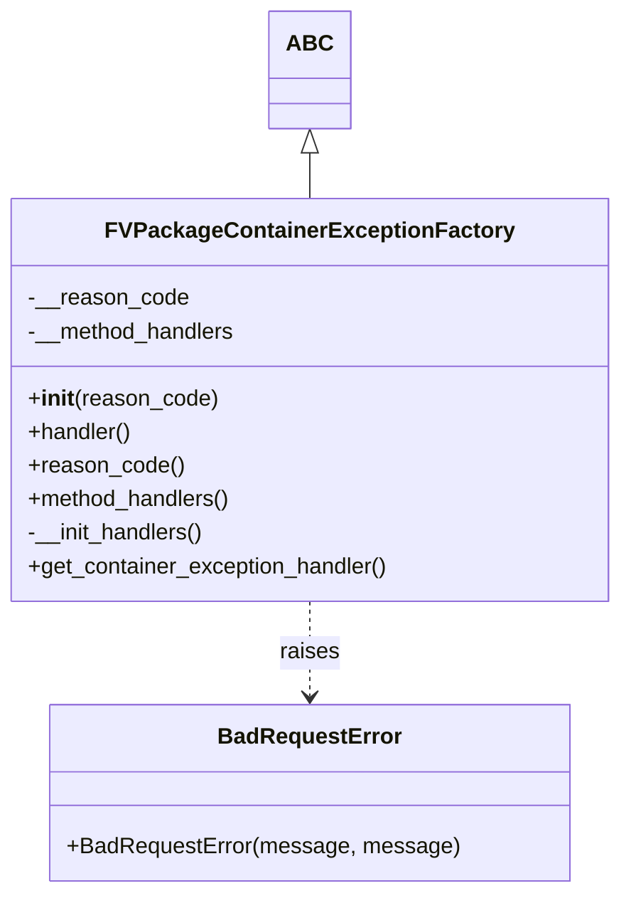

# Diagram: partview_service/partview_service/core/business/package_container_exception_status/FVPackageContainerExceptionFactory.py


> Auto-generated by Obscura crawlers

## Diagram 1



### SVG

<svg id="container" width="436.640625" xmlns="http://www.w3.org/2000/svg" class="classDiagram" height="638" viewBox="0 0 436.640625 638" role="graphics-document document" aria-roledescription="class"><style>#container{font-family:"trebuchet ms",verdana,arial,sans-serif;font-size:16px;fill:#333;}@keyframes edge-animation-frame{from{stroke-dashoffset:0;}}@keyframes dash{to{stroke-dashoffset:0;}}#container .edge-animation-slow{stroke-dasharray:9,5!important;stroke-dashoffset:900;animation:dash 50s linear infinite;stroke-linecap:round;}#container .edge-animation-fast{stroke-dasharray:9,5!important;stroke-dashoffset:900;animation:dash 20s linear infinite;stroke-linecap:round;}#container .error-icon{fill:#552222;}#container .error-text{fill:#552222;stroke:#552222;}#container .edge-thickness-normal{stroke-width:1px;}#container .edge-thickness-thick{stroke-width:3.5px;}#container .edge-pattern-solid{stroke-dasharray:0;}#container .edge-thickness-invisible{stroke-width:0;fill:none;}#container .edge-pattern-dashed{stroke-dasharray:3;}#container .edge-pattern-dotted{stroke-dasharray:2;}#container .marker{fill:#333333;stroke:#333333;}#container .marker.cross{stroke:#333333;}#container svg{font-family:"trebuchet ms",verdana,arial,sans-serif;font-size:16px;}#container p{margin:0;}#container g.classGroup text{fill:#9370DB;stroke:none;font-family:"trebuchet ms",verdana,arial,sans-serif;font-size:10px;}#container g.classGroup text .title{font-weight:bolder;}#container .nodeLabel,#container .edgeLabel{color:#131300;}#container .edgeLabel .label rect{fill:#ECECFF;}#container .label text{fill:#131300;}#container .labelBkg{background:#ECECFF;}#container .edgeLabel .label span{background:#ECECFF;}#container .classTitle{font-weight:bolder;}#container .node rect,#container .node circle,#container .node ellipse,#container .node polygon,#container .node path{fill:#ECECFF;stroke:#9370DB;stroke-width:1px;}#container .divider{stroke:#9370DB;stroke-width:1;}#container g.clickable{cursor:pointer;}#container g.classGroup rect{fill:#ECECFF;stroke:#9370DB;}#container g.classGroup line{stroke:#9370DB;stroke-width:1;}#container .classLabel .box{stroke:none;stroke-width:0;fill:#ECECFF;opacity:0.5;}#container .classLabel .label{fill:#9370DB;font-size:10px;}#container .relation{stroke:#333333;stroke-width:1;fill:none;}#container .dashed-line{stroke-dasharray:3;}#container .dotted-line{stroke-dasharray:1 2;}#container #compositionStart,#container .composition{fill:#333333!important;stroke:#333333!important;stroke-width:1;}#container #compositionEnd,#container .composition{fill:#333333!important;stroke:#333333!important;stroke-width:1;}#container #dependencyStart,#container .dependency{fill:#333333!important;stroke:#333333!important;stroke-width:1;}#container #dependencyStart,#container .dependency{fill:#333333!important;stroke:#333333!important;stroke-width:1;}#container #extensionStart,#container .extension{fill:transparent!important;stroke:#333333!important;stroke-width:1;}#container #extensionEnd,#container .extension{fill:transparent!important;stroke:#333333!important;stroke-width:1;}#container #aggregationStart,#container .aggregation{fill:transparent!important;stroke:#333333!important;stroke-width:1;}#container #aggregationEnd,#container .aggregation{fill:transparent!important;stroke:#333333!important;stroke-width:1;}#container #lollipopStart,#container .lollipop{fill:#ECECFF!important;stroke:#333333!important;stroke-width:1;}#container #lollipopEnd,#container .lollipop{fill:#ECECFF!important;stroke:#333333!important;stroke-width:1;}#container .edgeTerminals{font-size:11px;line-height:initial;}#container .classTitleText{text-anchor:middle;font-size:18px;fill:#333;}#container .label-icon{display:inline-block;height:1em;overflow:visible;vertical-align:-0.125em;}#container .node .label-icon path{fill:currentColor;stroke:revert;stroke-width:revert;}#container :root{--mermaid-font-family:"trebuchet ms",verdana,arial,sans-serif;}</style><g><defs><marker id="container_class-aggregationStart" class="marker aggregation class" refX="18" refY="7" markerWidth="190" markerHeight="240" orient="auto"><path d="M 18,7 L9,13 L1,7 L9,1 Z"></path></marker></defs><defs><marker id="container_class-aggregationEnd" class="marker aggregation class" refX="1" refY="7" markerWidth="20" markerHeight="28" orient="auto"><path d="M 18,7 L9,13 L1,7 L9,1 Z"></path></marker></defs><defs><marker id="container_class-extensionStart" class="marker extension class" refX="18" refY="7" markerWidth="190" markerHeight="240" orient="auto"><path d="M 1,7 L18,13 V 1 Z"></path></marker></defs><defs><marker id="container_class-extensionEnd" class="marker extension class" refX="1" refY="7" markerWidth="20" markerHeight="28" orient="auto"><path d="M 1,1 V 13 L18,7 Z"></path></marker></defs><defs><marker id="container_class-compositionStart" class="marker composition class" refX="18" refY="7" markerWidth="190" markerHeight="240" orient="auto"><path d="M 18,7 L9,13 L1,7 L9,1 Z"></path></marker></defs><defs><marker id="container_class-compositionEnd" class="marker composition class" refX="1" refY="7" markerWidth="20" markerHeight="28" orient="auto"><path d="M 18,7 L9,13 L1,7 L9,1 Z"></path></marker></defs><defs><marker id="container_class-dependencyStart" class="marker dependency class" refX="6" refY="7" markerWidth="190" markerHeight="240" orient="auto"><path d="M 5,7 L9,13 L1,7 L9,1 Z"></path></marker></defs><defs><marker id="container_class-dependencyEnd" class="marker dependency class" refX="13" refY="7" markerWidth="20" markerHeight="28" orient="auto"><path d="M 18,7 L9,13 L14,7 L9,1 Z"></path></marker></defs><defs><marker id="container_class-lollipopStart" class="marker lollipop class" refX="13" refY="7" markerWidth="190" markerHeight="240" orient="auto"><circle stroke="black" fill="transparent" cx="7" cy="7" r="6"></circle></marker></defs><defs><marker id="container_class-lollipopEnd" class="marker lollipop class" refX="1" refY="7" markerWidth="190" markerHeight="240" orient="auto"><circle stroke="black" fill="transparent" cx="7" cy="7" r="6"></circle></marker></defs><g class="root"><g class="clusters"></g><g class="edgePaths"><path d="M218.32,109.25L218.32,110.542C218.32,111.833,218.32,114.417,218.32,119.875C218.32,125.333,218.32,133.667,218.32,137.833L218.32,142" id="id_ABC_FVPackageContainerExceptionFactory_1" class="edge-thickness-normal edge-pattern-solid relation" style=";;;" data-edge="true" data-et="edge" data-id="id_ABC_FVPackageContainerExceptionFactory_1" data-points="W3sieCI6MjE4LjMyMDMxMjUsInkiOjkyfSx7IngiOjIxOC4zMjAzMTI1LCJ5IjoxMTd9LHsieCI6MjE4LjMyMDMxMjUsInkiOjE0Mn1d" marker-start="url(#container_class-extensionStart)"></path><path d="M218.32,430L218.32,436.167C218.32,442.333,218.32,454.667,218.32,466C218.32,477.333,218.32,487.667,218.32,492.833L218.32,498" id="id_FVPackageContainerExceptionFactory_BadRequestError_2" class="edge-thickness-normal edge-pattern-dashed relation" style=";;;" data-edge="true" data-et="edge" data-id="id_FVPackageContainerExceptionFactory_BadRequestError_2" data-points="W3sieCI6MjE4LjMyMDMxMjUsInkiOjQzMH0seyJ4IjoyMTguMzIwMzEyNSwieSI6NDY3fSx7IngiOjIxOC4zMjAzMTI1LCJ5Ijo1MDR9XQ==" marker-end="url(#container_class-dependencyEnd)"></path></g><g class="edgeLabels"><g class="edgeLabel"><g class="label" data-id="id_ABC_FVPackageContainerExceptionFactory_1" transform="translate(0, 0)"><foreignObject width="0" height="0"><div xmlns="http://www.w3.org/1999/xhtml" class="labelBkg" style="display: table-cell; white-space: nowrap; line-height: 1.5; max-width: 200px; text-align: center;"><span class="edgeLabel"></span></div></foreignObject></g></g><g class="edgeLabel" transform="translate(218.3203125, 467)"><g class="label" data-id="id_FVPackageContainerExceptionFactory_BadRequestError_2" transform="translate(-21.25, -12)"><foreignObject width="42.5" height="24"><div xmlns="http://www.w3.org/1999/xhtml" class="labelBkg" style="display: table-cell; white-space: nowrap; line-height: 1.5; max-width: 200px; text-align: center;"><span class="edgeLabel"><p>raises</p></span></div></foreignObject></g></g></g><g class="nodes"><g class="node default" id="classId-ABC-0" transform="translate(218.3203125, 50)"><g class="basic label-container"><path d="M-26.2578125 -42 L26.2578125 -42 L26.2578125 42 L-26.2578125 42" stroke="none" stroke-width="0" fill="#ECECFF" style=""></path><path d="M-26.2578125 -42 C-14.677032410288385 -42, -3.0962523205767702 -42, 26.2578125 -42 M-26.2578125 -42 C-10.583663859759437 -42, 5.090484780481127 -42, 26.2578125 -42 M26.2578125 -42 C26.2578125 -24.157973337410496, 26.2578125 -6.315946674820992, 26.2578125 42 M26.2578125 -42 C26.2578125 -22.874557157270026, 26.2578125 -3.7491143145400514, 26.2578125 42 M26.2578125 42 C7.442895254903572 42, -11.372021990192856 42, -26.2578125 42 M26.2578125 42 C12.280864641440754 42, -1.6960832171184919 42, -26.2578125 42 M-26.2578125 42 C-26.2578125 16.306009930067482, -26.2578125 -9.387980139865036, -26.2578125 -42 M-26.2578125 42 C-26.2578125 8.576720644957874, -26.2578125 -24.846558710084253, -26.2578125 -42" stroke="#9370DB" stroke-width="1.3" fill="none" stroke-dasharray="0 0" style=""></path></g><g class="annotation-group text" transform="translate(0, -18)"></g><g class="label-group text" transform="translate(-14.2578125, -18)"><g class="label" style="font-weight: bolder" transform="translate(0,-12)"><foreignObject width="28.515625" height="24"><div xmlns="http://www.w3.org/1999/xhtml" style="display: table-cell; white-space: nowrap; line-height: 1.5; max-width: 78px; text-align: center;"><span class="nodeLabel markdown-node-label" style=""><p>ABC</p></span></div></foreignObject></g></g><g class="members-group text" transform="translate(-14.2578125, 30)"></g><g class="methods-group text" transform="translate(-14.2578125, 60)"></g><g class="divider" style=""><path d="M-26.2578125 6 C-5.293063223560427 6, 15.671686052879146 6, 26.2578125 6 M-26.2578125 6 C-10.529019160835754 6, 5.199774178328493 6, 26.2578125 6" stroke="#9370DB" stroke-width="1.3" fill="none" stroke-dasharray="0 0" style=""></path></g><g class="divider" style=""><path d="M-26.2578125 24 C-11.334333203366448 24, 3.5891460932671038 24, 26.2578125 24 M-26.2578125 24 C-14.122254579361027 24, -1.9866966587220531 24, 26.2578125 24" stroke="#9370DB" stroke-width="1.3" fill="none" stroke-dasharray="0 0" style=""></path></g></g><g class="node default" id="classId-BadRequestError-1" transform="translate(218.3203125, 567)"><g class="basic label-container"><path d="M-180.0625 -63 L180.0625 -63 L180.0625 63 L-180.0625 63" stroke="none" stroke-width="0" fill="#ECECFF" style=""></path><path d="M-180.0625 -63 C-93.36499860600813 -63, -6.667497212016258 -63, 180.0625 -63 M-180.0625 -63 C-90.49287011896313 -63, -0.923240237926251 -63, 180.0625 -63 M180.0625 -63 C180.0625 -20.243766663095066, 180.0625 22.512466673809868, 180.0625 63 M180.0625 -63 C180.0625 -36.26259942011202, 180.0625 -9.525198840224036, 180.0625 63 M180.0625 63 C39.63762004634711 63, -100.78725990730578 63, -180.0625 63 M180.0625 63 C46.04603773153707 63, -87.97042453692586 63, -180.0625 63 M-180.0625 63 C-180.0625 29.99346271277335, -180.0625 -3.0130745744532987, -180.0625 -63 M-180.0625 63 C-180.0625 18.92459856452747, -180.0625 -25.150802870945057, -180.0625 -63" stroke="#9370DB" stroke-width="1.3" fill="none" stroke-dasharray="0 0" style=""></path></g><g class="annotation-group text" transform="translate(0, -39)"></g><g class="label-group text" transform="translate(-62.28125, -39)"><g class="label" style="font-weight: bolder" transform="translate(0,-12)"><foreignObject width="124.5625" height="24"><div xmlns="http://www.w3.org/1999/xhtml" style="display: table-cell; white-space: nowrap; line-height: 1.5; max-width: 174px; text-align: center;"><span class="nodeLabel markdown-node-label" style=""><p>BadRequestError</p></span></div></foreignObject></g></g><g class="members-group text" transform="translate(-168.0625, 9)"></g><g class="methods-group text" transform="translate(-168.0625, 39)"><g class="label" style="" transform="translate(0,-12)"><foreignObject width="273.84375" height="24"><div xmlns="http://www.w3.org/1999/xhtml" style="display: table-cell; white-space: nowrap; line-height: 1.5; max-width: 331px; text-align: center;"><span class="nodeLabel markdown-node-label" style=""><p>+BadRequestError(message, message)</p></span></div></foreignObject></g></g><g class="divider" style=""><path d="M-180.0625 -15 C-61.31254772592828 -15, 57.437404548143434 -15, 180.0625 -15 M-180.0625 -15 C-64.30182190898144 -15, 51.458856182037124 -15, 180.0625 -15" stroke="#9370DB" stroke-width="1.3" fill="none" stroke-dasharray="0 0" style=""></path></g><g class="divider" style=""><path d="M-180.0625 9 C-92.91950371010971 9, -5.776507420219417 9, 180.0625 9 M-180.0625 9 C-91.37735872243096 9, -2.6922174448619103 9, 180.0625 9" stroke="#9370DB" stroke-width="1.3" fill="none" stroke-dasharray="0 0" style=""></path></g></g><g class="node default" id="classId-FVPackageContainerExceptionFactory-2" transform="translate(218.3203125, 286)"><g class="basic label-container"><path d="M-210.3203125 -144 L210.3203125 -144 L210.3203125 144 L-210.3203125 144" stroke="none" stroke-width="0" fill="#ECECFF" style=""></path><path d="M-210.3203125 -144 C-116.26102295664722 -144, -22.20173341329445 -144, 210.3203125 -144 M-210.3203125 -144 C-107.28325754863255 -144, -4.246202597265096 -144, 210.3203125 -144 M210.3203125 -144 C210.3203125 -45.73881586205789, 210.3203125 52.52236827588422, 210.3203125 144 M210.3203125 -144 C210.3203125 -69.33323323590355, 210.3203125 5.333533528192902, 210.3203125 144 M210.3203125 144 C86.49787638044032 144, -37.324559739119366 144, -210.3203125 144 M210.3203125 144 C74.75325379466827 144, -60.813804910663464 144, -210.3203125 144 M-210.3203125 144 C-210.3203125 61.01286036787913, -210.3203125 -21.974279264241744, -210.3203125 -144 M-210.3203125 144 C-210.3203125 49.512748150671754, -210.3203125 -44.97450369865649, -210.3203125 -144" stroke="#9370DB" stroke-width="1.3" fill="none" stroke-dasharray="0 0" style=""></path></g><g class="annotation-group text" transform="translate(0, -120)"></g><g class="label-group text" transform="translate(-136.203125, -120)"><g class="label" style="font-weight: bolder" transform="translate(0,-12)"><foreignObject width="272.40625" height="24"><div xmlns="http://www.w3.org/1999/xhtml" style="display: table-cell; white-space: nowrap; line-height: 1.5; max-width: 318px; text-align: center;"><span class="nodeLabel markdown-node-label" style=""><p>FVPackageContainerExceptionFactory</p></span></div></foreignObject></g></g><g class="members-group text" transform="translate(-198.3203125, -72)"><g class="label" style="" transform="translate(0,-12)"><foreignObject width="113.609375" height="24"><div xmlns="http://www.w3.org/1999/xhtml" style="display: table-cell; white-space: nowrap; line-height: 1.5; max-width: 171px; text-align: center;"><span class="nodeLabel markdown-node-label" style=""><p>-__reason_code</p></span></div></foreignObject></g><g class="label" style="" transform="translate(0,12)"><foreignObject width="150.234375" height="24"><div xmlns="http://www.w3.org/1999/xhtml" style="display: table-cell; white-space: nowrap; line-height: 1.5; max-width: 208px; text-align: center;"><span class="nodeLabel markdown-node-label" style=""><p>-__method_handlers</p></span></div></foreignObject></g></g><g class="methods-group text" transform="translate(-198.3203125, 0)"><g class="label" style="" transform="translate(0,-12)"><foreignObject width="134.75" height="24"><div xmlns="http://www.w3.org/1999/xhtml" style="display: table-cell; white-space: nowrap; line-height: 1.5; max-width: 224px; text-align: center;"><span class="nodeLabel markdown-node-label" style=""><p>+<strong>init</strong>(reason_code)</p></span></div></foreignObject></g><g class="label" style="" transform="translate(0,12)"><foreignObject width="74.890625" height="24"><div xmlns="http://www.w3.org/1999/xhtml" style="display: table-cell; white-space: nowrap; line-height: 1.5; max-width: 132px; text-align: center;"><span class="nodeLabel markdown-node-label" style=""><p>+handler()</p></span></div></foreignObject></g><g class="label" style="" transform="translate(0,36)"><foreignObject width="110.3125" height="24"><div xmlns="http://www.w3.org/1999/xhtml" style="display: table-cell; white-space: nowrap; line-height: 1.5; max-width: 168px; text-align: center;"><span class="nodeLabel markdown-node-label" style=""><p>+reason_code()</p></span></div></foreignObject></g><g class="label" style="" transform="translate(0,60)"><foreignObject width="146.9375" height="24"><div xmlns="http://www.w3.org/1999/xhtml" style="display: table-cell; white-space: nowrap; line-height: 1.5; max-width: 204px; text-align: center;"><span class="nodeLabel markdown-node-label" style=""><p>+method_handlers()</p></span></div></foreignObject></g><g class="label" style="" transform="translate(0,84)"><foreignObject width="128.28125" height="24"><div xmlns="http://www.w3.org/1999/xhtml" style="display: table-cell; white-space: nowrap; line-height: 1.5; max-width: 186px; text-align: center;"><span class="nodeLabel markdown-node-label" style=""><p>-__init_handlers()</p></span></div></foreignObject></g><g class="label" style="" transform="translate(0,108)"><foreignObject width="260.4375" height="24"><div xmlns="http://www.w3.org/1999/xhtml" style="display: table-cell; white-space: nowrap; line-height: 1.5; max-width: 318px; text-align: center;"><span class="nodeLabel markdown-node-label" style=""><p>+get_container_exception_handler()</p></span></div></foreignObject></g></g><g class="divider" style=""><path d="M-210.3203125 -96 C-65.64642367495102 -96, 79.02746515009795 -96, 210.3203125 -96 M-210.3203125 -96 C-125.51665091115218 -96, -40.71298932230437 -96, 210.3203125 -96" stroke="#9370DB" stroke-width="1.3" fill="none" stroke-dasharray="0 0" style=""></path></g><g class="divider" style=""><path d="M-210.3203125 -24 C-103.52485911106962 -24, 3.2705942778607664 -24, 210.3203125 -24 M-210.3203125 -24 C-43.89635707639181 -24, 122.52759834721638 -24, 210.3203125 -24" stroke="#9370DB" stroke-width="1.3" fill="none" stroke-dasharray="0 0" style=""></path></g></g></g></g></g></svg>

## Diagram 2

```mermaid
flowchart TD
    Start([Start:get_container_exception_handler])
    A{method_handlers.keys() non-empty?}
    B{unique keys?}
    C[method_handler := method_handlers.get(reason_code)]
    D{method_handler exists?}
    E[raise BadRequestError("Unsuported method {reason_code}")]
    F[return method_handler(reason_code)]
    Start --> A
    A -- No --> A_assert[AssertionError: "No handlers found"]
    A -- Yes --> B
    B -- No --> B_assert[AssertionError: "Duplicate handlers found"]
    B -- Yes --> C
    C --> D
    D -- No --> E
    D -- Yes --> F
    F --> End([End])
```

> SVG rendering failed for this diagram.
