# Diagram: partview_service/partview_service/core/business/package_container_exception_status/FVPackageContainerExceptionStatus.py

> Auto-generated by Obscura crawlers

## Mermaid

```mermaid
classDiagram
    class FVPackageContainerExceptionFactory
    class FVPackageContainerExceptionHandlerFactory {
        +handlers: dict
        +__init__(reason_code)
    }
    FVPackageContainerExceptionFactory <|-- FVPackageContainerExceptionHandlerFactory

    class FVPackageContainerExceptionStatus {
        -milestone_codes_to_reason_codes: dict
        -reason_codes_to_reason_codes: dict
        -__package_container_helper: PackageContainerExceptionHelper
        +__get_reason_codes_by_event_code(event_code)
        +__get_reason_codes_by_reason_code(reason_code)
        +handle_new_package_container_event(container, event)
        +handle_new_package_container_exception(container, container_business, exception, attributes)
    }

    class PackageContainerExceptionHelper {
        +get_container_exception_type(solution_id, exception_type_id)
    }
    FVPackageContainerExceptionStatus *-- PackageContainerExceptionHelper

    class PackageContainerArchiveHelper {
        +upsert_container_orchestrator_with_new_active_until_ts(container, active_until, soft_archive_until, reason, event_type)
        +set_container_status_based_on_archive_dates(container, active_until, soft_archive_until)
    }
    FVPackageContainerExceptionStatus --> PackageContainerArchiveHelper : calls

    class PackageContainerEventBusinessLogic
    FVPackageContainerExceptionStatus --> PackageContainerEventBusinessLogic : uses

    class PackageContainer
    class PackageContainerEvent
    class PackageContainerException

    FVPackageContainerExceptionStatus --> PackageContainer : manipulates
    FVPackageContainerExceptionStatus --> PackageContainerEvent : consumes
    FVPackageContainerExceptionStatus --> PackageContainerException : consumes

    %% Exception hierarchy
    class PackageContainerException
    class ShortException
    class MissingException
    class LostException
    class HeldException
    class MisroutedException
    class RecycledException
    class BackorderException

    PackageContainerException <|-- ShortException
    PackageContainerException <|-- MissingException
    PackageContainerException <|-- LostException
    PackageContainerException <|-- HeldException
    PackageContainerException <|-- MisroutedException
    PackageContainerException <|-- RecycledException
    PackageContainerException <|-- BackorderException

    %% Factory to exceptions mapping
    FVPackageContainerExceptionHandlerFactory --> ShortException : "SH"
    FVPackageContainerExceptionHandlerFactory --> MissingException : "MS"
    FVPackageContainerExceptionHandlerFactory --> LostException : "LS"
    FVPackageContainerExceptionHandlerFactory --> HeldException : "HE"
    FVPackageContainerExceptionHandlerFactory --> MisroutedException : "MR"
    FVPackageContainerExceptionHandlerFactory --> RecycledException : "RE"
    FVPackageContainerExceptionHandlerFactory --> BackorderException : "BO"

    %% Constants and utilities
    class ArchiveDays
    class ArchiveReasons
    class ArchiveExceptions
    class EventType
    class GenerateApplicationName
    FVPackageContainerExceptionStatus --> ArchiveDays : reads
    FVPackageContainerExceptionStatus --> ArchiveReasons : reads
    FVPackageContainerExceptionStatus --> ArchiveExceptions : reads
    FVPackageContainerExceptionStatus --> EventType : reads
    FVPackageContainerExceptionStatus --> GenerateApplicationName : uses
```

### SVG

<svg id="container" width="4205.083984375" xmlns="http://www.w3.org/2000/svg" class="classDiagram" height="662" viewBox="0 0 4205.083984375 662" role="graphics-document document" aria-roledescription="class"><g><defs><marker id="container_class-aggregationStart" class="marker aggregation class" refX="18" refY="7" markerWidth="190" markerHeight="240" orient="auto"><path d="M 18,7 L9,13 L1,7 L9,1 Z"></path></marker></defs><defs><marker id="container_class-aggregationEnd" class="marker aggregation class" refX="1" refY="7" markerWidth="20" markerHeight="28" orient="auto"><path d="M 18,7 L9,13 L1,7 L9,1 Z"></path></marker></defs><defs><marker id="container_class-extensionStart" class="marker extension class" refX="18" refY="7" markerWidth="190" markerHeight="240" orient="auto"><path d="M 1,7 L18,13 V 1 Z"></path></marker></defs><defs><marker id="container_class-extensionEnd" class="marker extension class" refX="1" refY="7" markerWidth="20" markerHeight="28" orient="auto"><path d="M 1,1 V 13 L18,7 Z"></path></marker></defs><defs><marker id="container_class-compositionStart" class="marker composition class" refX="18" refY="7" markerWidth="190" markerHeight="240" orient="auto"><path d="M 18,7 L9,13 L1,7 L9,1 Z"></path></marker></defs><defs><marker id="container_class-compositionEnd" class="marker composition class" refX="1" refY="7" markerWidth="20" markerHeight="28" orient="auto"><path d="M 18,7 L9,13 L1,7 L9,1 Z"></path></marker></defs><defs><marker id="container_class-dependencyStart" class="marker dependency class" refX="6" refY="7" markerWidth="190" markerHeight="240" orient="auto"><path d="M 5,7 L9,13 L1,7 L9,1 Z"></path></marker></defs><defs><marker id="container_class-dependencyEnd" class="marker dependency class" refX="13" refY="7" markerWidth="20" markerHeight="28" orient="auto"><path d="M 18,7 L9,13 L14,7 L9,1 Z"></path></marker></defs><defs><marker id="container_class-lollipopStart" class="marker lollipop class" refX="13" refY="7" markerWidth="190" markerHeight="240" orient="auto"><circle stroke="black" fill="transparent" cx="7" cy="7" r="6"></circle></marker></defs><defs><marker id="container_class-lollipopEnd" class="marker lollipop class" refX="1" refY="7" markerWidth="190" markerHeight="240" orient="auto"><circle stroke="black" fill="transparent" cx="7" cy="7" r="6"></circle></marker></defs><g class="root"><g class="clusters"></g><g class="edgePaths"><path d="M4019.795,199.25L4019.795,217.542C4019.795,235.833,4019.795,272.417,4019.795,297.375C4019.795,322.333,4019.795,335.667,4019.795,342.333L4019.795,349" id="id_FVPackageContainerExceptionFactory_FVPackageContainerExceptionHandlerFactory_1" class="edge-thickness-normal edge-pattern-solid relation" style=";;;" data-edge="true" data-et="edge" data-id="id_FVPackageContainerExceptionFactory_FVPackageContainerExceptionHandlerFactory_1" data-points="W3sieCI6NDAxOS43OTQ5MjE4NzUsInkiOjE4Mn0seyJ4Ijo0MDE5Ljc5NDkyMTg3NSwieSI6MzA5fSx7IngiOjQwMTkuNzk0OTIxODc1LCJ5IjozNDl9XQ==" marker-start="url(#container_class-extensionStart)"></path><path d="M2024.89,174.957L1739.407,197.297C1453.924,219.638,882.958,264.319,597.475,294.826C311.992,325.333,311.992,341.667,311.992,349.833L311.992,358" id="id_FVPackageContainerExceptionStatus_PackageContainerExceptionHelper_2" class="edge-thickness-normal edge-pattern-solid relation" style=";;;" data-edge="true" data-et="edge" data-id="id_FVPackageContainerExceptionStatus_PackageContainerExceptionHelper_2" data-points="W3sieCI6MjA0Mi4wODc4OTA2MjUsInkiOjE3My42MTA5MzQxMDE0NjM3Nn0seyJ4IjozMTEuOTkyMTg3NSwieSI6MzA5fSx7IngiOjMxMS45OTIxODc1LCJ5IjozNTh9XQ==" marker-start="url(#container_class-compositionStart)"></path><path d="M2042.088,195.861L1897.105,214.718C1752.122,233.574,1462.157,271.287,1317.174,295.31C1172.191,319.333,1172.191,329.667,1172.191,334.833L1172.191,340" id="id_FVPackageContainerExceptionStatus_PackageContainerArchiveHelper_3" class="edge-thickness-normal edge-pattern-solid relation" style=";;;" data-edge="true" data-et="edge" data-id="id_FVPackageContainerExceptionStatus_PackageContainerArchiveHelper_3" data-points="W3sieCI6MjA0Mi4wODc4OTA2MjUsInkiOjE5NS44NjEyNzMxNTMzMzI0M30seyJ4IjoxMTcyLjE5MTQwNjI1LCJ5IjozMDl9LHsieCI6MTE3Mi4xOTE0MDYyNSwieSI6MzQ2fV0=" marker-end="url(#container_class-dependencyEnd)"></path><path d="M2042.088,262.174L2014.651,269.978C1987.215,277.782,1932.342,293.391,1904.905,311.862C1877.469,330.333,1877.469,351.667,1877.469,362.333L1877.469,373" id="id_FVPackageContainerExceptionStatus_PackageContainerEventBusinessLogic_4" class="edge-thickness-normal edge-pattern-solid relation" style=";;;" data-edge="true" data-et="edge" data-id="id_FVPackageContainerExceptionStatus_PackageContainerEventBusinessLogic_4" data-points="W3sieCI6MjA0Mi4wODc4OTA2MjUsInkiOjI2Mi4xNzM2MTQ2MDM5ODI0fSx7IngiOjE4NzcuNDY4NzUsInkiOjMwOX0seyJ4IjoxODc3LjQ2ODc1LCJ5IjozNzl9XQ==" marker-end="url(#container_class-dependencyEnd)"></path><path d="M2223.526,272L2211.937,278.167C2200.348,284.333,2177.17,296.667,2165.581,313.5C2153.992,330.333,2153.992,351.667,2153.992,362.333L2153.992,373" id="id_FVPackageContainerExceptionStatus_PackageContainer_5" class="edge-thickness-normal edge-pattern-solid relation" style=";;;" data-edge="true" data-et="edge" data-id="id_FVPackageContainerExceptionStatus_PackageContainer_5" data-points="W3sieCI6MjIyMy41MjU4Mjk3ODkyMDEsInkiOjI3Mn0seyJ4IjoyMTUzLjk5MjE4NzUsInkiOjMwOX0seyJ4IjoyMTUzLjk5MjE4NzUsInkiOjM3OX1d" marker-end="url(#container_class-dependencyEnd)"></path><path d="M2399.351,272L2395.976,278.167C2392.601,284.333,2385.851,296.667,2382.476,313.5C2379.102,330.333,2379.102,351.667,2379.102,362.333L2379.102,373" id="id_FVPackageContainerExceptionStatus_PackageContainerEvent_6" class="edge-thickness-normal edge-pattern-solid relation" style=";;;" data-edge="true" data-et="edge" data-id="id_FVPackageContainerExceptionStatus_PackageContainerEvent_6" data-points="W3sieCI6MjM5OS4zNTA5MDM3NTM2OTgzLCJ5IjoyNzJ9LHsieCI6MjM3OS4xMDE1NjI1LCJ5IjozMDl9LHsieCI6MjM3OS4xMDE1NjI1LCJ5IjozNzl9XQ==" marker-end="url(#container_class-dependencyEnd)"></path><path d="M2603.056,272L2609.198,278.167C2615.34,284.333,2627.623,296.667,2633.765,313.5C2639.906,330.333,2639.906,351.667,2639.906,362.333L2639.906,373" id="id_FVPackageContainerExceptionStatus_PackageContainerException_7" class="edge-thickness-normal edge-pattern-solid relation" style=";;;" data-edge="true" data-et="edge" data-id="id_FVPackageContainerExceptionStatus_PackageContainerException_7" data-points="W3sieCI6MjYwMy4wNTYzNDAxNDQyMzEsInkiOjI3Mn0seyJ4IjoyNjM5LjkwNjI1LCJ5IjozMDl9LHsieCI6MjYzOS45MDYyNSwieSI6Mzc5fV0=" marker-end="url(#container_class-dependencyEnd)"></path><path d="M2510.448,465.585L2477.824,476.821C2445.2,488.057,2379.951,510.528,2362.049,529.21C2344.146,547.892,2373.589,562.784,2388.31,570.23L2403.031,577.677" id="id_PackageContainerException_ShortException_8" class="edge-thickness-normal edge-pattern-solid relation" style=";;;" data-edge="true" data-et="edge" data-id="id_PackageContainerException_ShortException_8" data-points="W3sieCI6MjUyNi43NTc4MTI1LCJ5Ijo0NTkuOTY4MzM3MDk3MDA2Njd9LHsieCI6MjMxNC43MDMxMjUsInkiOjUzM30seyJ4IjoyNDAzLjAzMTI1LCJ5Ijo1NzcuNjc2NTcwNjI4MjUxM31d" marker-start="url(#container_class-extensionStart)"></path><path d="M2536.94,470.47L2515.249,480.892C2493.558,491.314,2450.175,512.157,2458.81,531.895C2467.445,551.633,2528.098,570.266,2558.424,579.583L2588.75,588.899" id="id_PackageContainerException_MissingException_9" class="edge-thickness-normal edge-pattern-solid relation" style=";;;" data-edge="true" data-et="edge" data-id="id_PackageContainerException_MissingException_9" data-points="W3sieCI6MjU1Mi40ODg3Njk1MzEyNSwieSI6NDYzfSx7IngiOjI0MDYuNzkyOTY4NzUsInkiOjUzM30seyJ4IjoyNTg4Ljc1LCJ5Ijo1ODguODk5MTgxMjM2ODAzM31d" marker-start="url(#container_class-extensionStart)"></path><path d="M2578.546,474.314L2567.289,484.095C2556.032,493.876,2533.518,513.438,2568.617,533.947C2603.716,554.456,2696.428,575.912,2742.785,586.64L2789.141,597.368" id="id_PackageContainerException_LostException_10" class="edge-thickness-normal edge-pattern-solid relation" style=";;;" data-edge="true" data-et="edge" data-id="id_PackageContainerException_LostException_10" data-points="W3sieCI6MjU5MS41Njc4NzEwOTM3NSwieSI6NDYzfSx7IngiOjI1MTEuMDAzOTA2MjUsInkiOjUzM30seyJ4IjoyNzg5LjE0MDYyNSwieSI6NTk3LjM2Nzc5MjI4NTA3MDJ9XQ==" marker-start="url(#container_class-extensionStart)"></path><path d="M2624.193,479.663L2621.812,488.552C2619.431,497.442,2614.669,515.221,2710.112,535.972C2805.556,556.723,3001.206,580.446,3099.031,592.308L3196.855,604.17" id="id_PackageContainerException_HeldException_11" class="edge-thickness-normal edge-pattern-solid relation" style=";;;" data-edge="true" data-et="edge" data-id="id_PackageContainerException_HeldException_11" data-points="W3sieCI6MjYyOC42NTYyNSwieSI6NDYzfSx7IngiOjI2MDkuOTA2MjUsInkiOjUzM30seyJ4IjozMTk2Ljg1NTQ2ODc1LCJ5Ijo2MDQuMTY5NjczNDIzNjI2fV0=" marker-start="url(#container_class-extensionStart)"></path><path d="M2769.368,465.495L2802.103,476.746C2834.838,487.997,2900.308,510.498,3003.997,532.736C3107.687,554.973,3249.596,576.946,3320.551,587.932L3391.506,598.919" id="id_PackageContainerException_MisroutedException_12" class="edge-thickness-normal edge-pattern-solid relation" style=";;;" data-edge="true" data-et="edge" data-id="id_PackageContainerException_MisroutedException_12" data-points="W3sieCI6Mjc1My4wNTQ2ODc1LCJ5Ijo0NTkuODg4NDYwMDE3MDIxNjZ9LHsieCI6Mjk2NS43NzczNDM3NSwieSI6NTMzfSx7IngiOjMzOTEuNTA1ODU5Mzc1LCJ5Ijo1OTguOTE4NjY1MjMyNDIwNn1d" marker-start="url(#container_class-extensionStart)"></path><path d="M2769.779,453.818L2822.005,467.015C2874.23,480.212,2978.682,506.606,3118.797,531.231C3258.913,555.856,3434.694,578.712,3522.584,590.14L3610.475,601.568" id="id_PackageContainerException_RecycledException_13" class="edge-thickness-normal edge-pattern-solid relation" style=";;;" data-edge="true" data-et="edge" data-id="id_PackageContainerException_RecycledException_13" data-points="W3sieCI6Mjc1My4wNTQ2ODc1LCJ5Ijo0NDkuNTkxNzU0MzU4MTMzN30seyJ4IjozMDgzLjEzMjgxMjUsInkiOjUzM30seyJ4IjozNjEwLjQ3NDYwOTM3NSwieSI6NjAxLjU2ODQxOTE5MTUxMzN9XQ==" marker-start="url(#container_class-extensionStart)"></path><path d="M2769.971,446.969L2841.786,461.307C2913.6,475.646,3057.23,504.323,3261.549,530.553C3465.868,556.784,3730.876,580.567,3863.381,592.459L3995.885,604.351" id="id_PackageContainerException_BackorderException_14" class="edge-thickness-normal edge-pattern-solid relation" style=";;;" data-edge="true" data-et="edge" data-id="id_PackageContainerException_BackorderException_14" data-points="W3sieCI6Mjc1My4wNTQ2ODc1LCJ5Ijo0NDMuNTkxMjM3MDEyODk2NTZ9LHsieCI6MzIwMC44NTkzNzUsInkiOjUzM30seyJ4IjozOTk1Ljg4NDc2NTYyNSwieSI6NjA0LjM1MTE2ODk4NzkyNzR9XQ==" marker-start="url(#container_class-extensionStart)"></path><path d="M3842.506,446.368L3741.596,460.806C3640.686,475.245,3438.867,504.123,3222.569,530.459C3006.271,556.796,2775.495,580.592,2660.106,592.49L2544.718,604.387" id="id_FVPackageContainerExceptionHandlerFactory_ShortException_15" class="edge-thickness-normal edge-pattern-solid relation" style=";;;" data-edge="true" data-et="edge" data-id="id_FVPackageContainerExceptionHandlerFactory_ShortException_15" data-points="W3sieCI6Mzg0Mi41MDU4NTkzNzUsInkiOjQ0Ni4zNjc1MTc3ODQ2NDc5M30seyJ4IjozMjM3LjA0Njg3NSwieSI6NTMzfSx7IngiOjI1MzguNzUsInkiOjYwNS4wMDI4NzU1NTU3MzY5fV0=" marker-end="url(#container_class-dependencyEnd)"></path><path d="M3842.506,451.097L3762.097,464.748C3681.689,478.398,3520.872,505.699,3337.971,530.981C3155.071,556.263,2950.086,579.526,2847.594,591.158L2745.102,602.79" id="id_FVPackageContainerExceptionHandlerFactory_MissingException_16" class="edge-thickness-normal edge-pattern-solid relation" style=";;;" data-edge="true" data-et="edge" data-id="id_FVPackageContainerExceptionHandlerFactory_MissingException_16" data-points="W3sieCI6Mzg0Mi41MDU4NTkzNzUsInkiOjQ1MS4wOTcyNjI0NzYwNTc0fSx7IngiOjMzNjAuMDU0Njg3NSwieSI6NTMzfSx7IngiOjI3MzkuMTQwNjI1LCJ5Ijo2MDMuNDY2MjQwOTM3MzUyN31d" marker-end="url(#container_class-dependencyEnd)"></path><path d="M3842.506,457.779L3782.075,470.316C3721.643,482.853,3600.781,507.926,3447.287,532.178C3293.794,556.43,3107.671,579.861,3014.609,591.576L2921.547,603.291" id="id_FVPackageContainerExceptionHandlerFactory_LostException_17" class="edge-thickness-normal edge-pattern-solid relation" style=";;;" data-edge="true" data-et="edge" data-id="id_FVPackageContainerExceptionHandlerFactory_LostException_17" data-points="W3sieCI6Mzg0Mi41MDU4NTkzNzUsInkiOjQ1Ny43Nzk0NDU1NDc4NDk4M30seyJ4IjozNDc5LjkxNzk2ODc1LCJ5Ijo1MzN9LHsieCI6MjkxNS41OTM3NSwieSI6NjA0LjA0MDY0NjYxMTAxODh9XQ==" marker-end="url(#container_class-dependencyEnd)"></path><path d="M3868.593,493L3854.593,499.667C3840.593,506.333,3812.592,519.667,3723.151,537.725C3633.709,555.784,3482.827,578.568,3407.386,589.96L3331.944,601.352" id="id_FVPackageContainerExceptionHandlerFactory_HeldException_18" class="edge-thickness-normal edge-pattern-solid relation" style=";;;" data-edge="true" data-et="edge" data-id="id_FVPackageContainerExceptionHandlerFactory_HeldException_18" data-points="W3sieCI6Mzg2OC41OTI5MTI5NDY0Mjg0LCJ5Ijo0OTN9LHsieCI6Mzc4NC41OTE3OTY4NzUsInkiOjUzM30seyJ4IjozMzI2LjAxMTcxODc1LCJ5Ijo2MDIuMjQ4MzE5MDY1NzcwMX1d" marker-end="url(#container_class-dependencyEnd)"></path><path d="M3949.794,493L3943.312,499.667C3936.831,506.333,3923.867,519.667,3859.965,536.764C3796.062,553.861,3681.22,574.721,3623.799,585.151L3566.378,595.582" id="id_FVPackageContainerExceptionHandlerFactory_MisroutedException_19" class="edge-thickness-normal edge-pattern-solid relation" style=";;;" data-edge="true" data-et="edge" data-id="id_FVPackageContainerExceptionHandlerFactory_MisroutedException_19" data-points="W3sieCI6Mzk0OS43OTM4MDU4MDM1NzE2LCJ5Ijo0OTN9LHsieCI6MzkxMC45MDQyOTY4NzUsInkiOjUzM30seyJ4IjozNTYwLjQ3NDYwOTM3NSwieSI6NTk2LjY1MzgyODg4MTQyNDF9XQ==" marker-end="url(#container_class-dependencyEnd)"></path><path d="M4035.831,493L4037.316,499.667C4038.801,506.333,4041.771,519.667,3998.596,536.299C3955.421,552.931,3866.103,572.861,3821.443,582.826L3776.784,592.792" id="id_FVPackageContainerExceptionHandlerFactory_RecycledException_20" class="edge-thickness-normal edge-pattern-solid relation" style=";;;" data-edge="true" data-et="edge" data-id="id_FVPackageContainerExceptionHandlerFactory_RecycledException_20" data-points="W3sieCI6NDAzNS44MzExOTQxOTY0Mjg0LCJ5Ijo0OTN9LHsieCI6NDA0NC43NDAyMzQzNzUsInkiOjUzM30seyJ4IjozNzcwLjkyNzczNDM3NSwieSI6NTk0LjA5ODMwNzQ3ODQyOTh9XQ==" marker-end="url(#container_class-dependencyEnd)"></path><path d="M4121.894,493L4131.347,499.667C4140.801,506.333,4159.708,519.667,4162.328,531.87C4164.947,544.074,4151.279,555.149,4144.445,560.686L4137.611,566.223" id="id_FVPackageContainerExceptionHandlerFactory_BackorderException_21" class="edge-thickness-normal edge-pattern-solid relation" style=";;;" data-edge="true" data-et="edge" data-id="id_FVPackageContainerExceptionHandlerFactory_BackorderException_21" data-points="W3sieCI6NDEyMS44OTM2OTQxOTY0MjgsInkiOjQ5M30seyJ4Ijo0MTc4LjYxNTIzNDM3NSwieSI6NTMzfSx7IngiOjQxMzIuOTQ4ODQ3OTAzNDgxLCJ5Ijo1NzB9XQ==" marker-end="url(#container_class-dependencyEnd)"></path><path d="M2774.366,272L2788.511,278.167C2802.655,284.333,2830.945,296.667,2845.09,313.5C2859.234,330.333,2859.234,351.667,2859.234,362.333L2859.234,373" id="id_FVPackageContainerExceptionStatus_ArchiveDays_22" class="edge-thickness-normal edge-pattern-solid relation" style=";;;" data-edge="true" data-et="edge" data-id="id_FVPackageContainerExceptionStatus_ArchiveDays_22" data-points="W3sieCI6Mjc3NC4zNjU4ODE1NjQzNDk0LCJ5IjoyNzJ9LHsieCI6Mjg1OS4yMzQzNzUsInkiOjMwOX0seyJ4IjoyODU5LjIzNDM3NSwieSI6Mzc5fV0=" marker-end="url(#container_class-dependencyEnd)"></path><path d="M2901.096,268.895L2923.369,275.579C2945.642,282.263,2990.188,295.632,3012.461,312.982C3034.734,330.333,3034.734,351.667,3034.734,362.333L3034.734,373" id="id_FVPackageContainerExceptionStatus_ArchiveReasons_23" class="edge-thickness-normal edge-pattern-solid relation" style=";;;" data-edge="true" data-et="edge" data-id="id_FVPackageContainerExceptionStatus_ArchiveReasons_23" data-points="W3sieCI6MjkwMS4wOTU3MDMxMjUsInkiOjI2OC44OTQ4MTgwNzI0MTAzfSx7IngiOjMwMzQuNzM0Mzc1LCJ5IjozMDl9LHsieCI6MzAzNC43MzQzNzUsInkiOjM3OX1d" marker-end="url(#container_class-dependencyEnd)"></path><path d="M2901.096,235.398L2956.325,247.665C3011.553,259.932,3122.011,284.466,3177.24,307.4C3232.469,330.333,3232.469,351.667,3232.469,362.333L3232.469,373" id="id_FVPackageContainerExceptionStatus_ArchiveExceptions_24" class="edge-thickness-normal edge-pattern-solid relation" style=";;;" data-edge="true" data-et="edge" data-id="id_FVPackageContainerExceptionStatus_ArchiveExceptions_24" data-points="W3sieCI6MjkwMS4wOTU3MDMxMjUsInkiOjIzNS4zOTgwMjcwNTA0MDd9LHsieCI6MzIzMi40Njg3NSwieSI6MzA5fSx7IngiOjMyMzIuNDY4NzUsInkiOjM3OX1d" marker-end="url(#container_class-dependencyEnd)"></path><path d="M2901.096,217.315L2985.985,232.596C3070.874,247.877,3240.652,278.438,3325.541,304.386C3410.43,330.333,3410.43,351.667,3410.43,362.333L3410.43,373" id="id_FVPackageContainerExceptionStatus_EventType_25" class="edge-thickness-normal edge-pattern-solid relation" style=";;;" data-edge="true" data-et="edge" data-id="id_FVPackageContainerExceptionStatus_EventType_25" data-points="W3sieCI6MjkwMS4wOTU3MDMxMjUsInkiOjIxNy4zMTQ5MDI2OTA5NTE0NH0seyJ4IjozNDEwLjQyOTY4NzUsInkiOjMwOX0seyJ4IjozNDEwLjQyOTY4NzUsInkiOjM3OX1d" marker-end="url(#container_class-dependencyEnd)"></path><path d="M2901.096,203.327L3020.546,220.939C3139.996,238.552,3378.896,273.776,3498.347,302.055C3617.797,330.333,3617.797,351.667,3617.797,362.333L3617.797,373" id="id_FVPackageContainerExceptionStatus_GenerateApplicationName_26" class="edge-thickness-normal edge-pattern-solid relation" style=";;;" data-edge="true" data-et="edge" data-id="id_FVPackageContainerExceptionStatus_GenerateApplicationName_26" data-points="W3sieCI6MjkwMS4wOTU3MDMxMjUsInkiOjIwMy4zMjczNzYxNzUxMTU5Mn0seyJ4IjozNjE3Ljc5Njg3NSwieSI6MzA5fSx7IngiOjM2MTcuNzk2ODc1LCJ5IjozNzl9XQ==" marker-end="url(#container_class-dependencyEnd)"></path></g><g class="edgeLabels"><g class="edgeLabel"><g class="label" data-id="id_FVPackageContainerExceptionFactory_FVPackageContainerExceptionHandlerFactory_1" transform="translate(0, 0)"><foreignObject width="0" height="0">

</foreignObject></g></g><g class="edgeLabel"><g class="label" data-id="id_FVPackageContainerExceptionStatus_PackageContainerExceptionHelper_2" transform="translate(0, 0)"><foreignObject width="0" height="0">

</foreignObject></g></g><g class="edgeLabel" transform="translate(1172.19140625, 309)"><g class="label" data-id="id_FVPackageContainerExceptionStatus_PackageContainerArchiveHelper_3" transform="translate(-16.4453125, -12)"><foreignObject width="32.890625" height="24">

calls

</foreignObject></g></g><g class="edgeLabel" transform="translate(1877.46875, 309)"><g class="label" data-id="id_FVPackageContainerExceptionStatus_PackageContainerEventBusinessLogic_4" transform="translate(-16.4921875, -12)"><foreignObject width="32.984375" height="24">

uses

</foreignObject></g></g><g class="edgeLabel" transform="translate(2153.9921875, 309)"><g class="label" data-id="id_FVPackageContainerExceptionStatus_PackageContainer_5" transform="translate(-45.0859375, -12)"><foreignObject width="90.171875" height="24">

manipulates

</foreignObject></g></g><g class="edgeLabel" transform="translate(2379.1015625, 309)"><g class="label" data-id="id_FVPackageContainerExceptionStatus_PackageContainerEvent_6" transform="translate(-36.375, -12)"><foreignObject width="72.75" height="24">

consumes

</foreignObject></g></g><g class="edgeLabel" transform="translate(2639.90625, 309)"><g class="label" data-id="id_FVPackageContainerExceptionStatus_PackageContainerException_7" transform="translate(-36.375, -12)"><foreignObject width="72.75" height="24">

consumes

</foreignObject></g></g><g class="edgeLabel"><g class="label" data-id="id_PackageContainerException_ShortException_8" transform="translate(0, 0)"><foreignObject width="0" height="0">

</foreignObject></g></g><g class="edgeLabel"><g class="label" data-id="id_PackageContainerException_MissingException_9" transform="translate(0, 0)"><foreignObject width="0" height="0">

</foreignObject></g></g><g class="edgeLabel"><g class="label" data-id="id_PackageContainerException_LostException_10" transform="translate(0, 0)"><foreignObject width="0" height="0">

</foreignObject></g></g><g class="edgeLabel"><g class="label" data-id="id_PackageContainerException_HeldException_11" transform="translate(0, 0)"><foreignObject width="0" height="0">

</foreignObject></g></g><g class="edgeLabel"><g class="label" data-id="id_PackageContainerException_MisroutedException_12" transform="translate(0, 0)"><foreignObject width="0" height="0">

</foreignObject></g></g><g class="edgeLabel"><g class="label" data-id="id_PackageContainerException_RecycledException_13" transform="translate(0, 0)"><foreignObject width="0" height="0">

</foreignObject></g></g><g class="edgeLabel"><g class="label" data-id="id_PackageContainerException_BackorderException_14" transform="translate(0, 0)"><foreignObject width="0" height="0">

</foreignObject></g></g><g class="edgeLabel" transform="translate(3192.09833, 537.63474)"><g class="label" data-id="id_FVPackageContainerExceptionHandlerFactory_ShortException_15" transform="translate(-16.1875, -12)"><foreignObject width="32.375" height="24">

"SH"

</foreignObject></g></g><g class="edgeLabel" transform="translate(3292.71398, 540.64236)"><g class="label" data-id="id_FVPackageContainerExceptionHandlerFactory_MissingException_16" transform="translate(-16.7734375, -12)"><foreignObject width="33.546875" height="24">

"MS"

</foreignObject></g></g><g class="edgeLabel" transform="translate(3381.46003, 545.3945)"><g class="label" data-id="id_FVPackageContainerExceptionHandlerFactory_LostException_17" transform="translate(-14.53125, -12)"><foreignObject width="29.0625" height="24">

"LS"

</foreignObject></g></g><g class="edgeLabel" transform="translate(3601.29959, 560.67821)"><g class="label" data-id="id_FVPackageContainerExceptionHandlerFactory_HeldException_18" transform="translate(-16.109375, -12)"><foreignObject width="32.21875" height="24">

"HE"

</foreignObject></g></g><g class="edgeLabel" transform="translate(3763.13477, 559.84161)"><g class="label" data-id="id_FVPackageContainerExceptionHandlerFactory_MisroutedException_19" transform="translate(-17.453125, -12)"><foreignObject width="34.90625" height="24">

"MR"

</foreignObject></g></g><g class="edgeLabel" transform="translate(3927.83223, 559.08676)"><g class="label" data-id="id_FVPackageContainerExceptionHandlerFactory_RecycledException_20" transform="translate(-15.5078125, -12)"><foreignObject width="31.015625" height="24">

"RE"

</foreignObject></g></g><g class="edgeLabel" transform="translate(4174.27055, 529.93613)"><g class="label" data-id="id_FVPackageContainerExceptionHandlerFactory_BackorderException_21" transform="translate(-16.7890625, -12)"><foreignObject width="33.578125" height="24">

"BO"

</foreignObject></g></g><g class="edgeLabel" transform="translate(2859.234375, 309)"><g class="label" data-id="id_FVPackageContainerExceptionStatus_ArchiveDays_22" transform="translate(-20.0078125, -12)"><foreignObject width="40.015625" height="24">

reads

</foreignObject></g></g><g class="edgeLabel" transform="translate(3034.734375, 309)"><g class="label" data-id="id_FVPackageContainerExceptionStatus_ArchiveReasons_23" transform="translate(-20.0078125, -12)"><foreignObject width="40.015625" height="24">

reads

</foreignObject></g></g><g class="edgeLabel" transform="translate(3232.46875, 309)"><g class="label" data-id="id_FVPackageContainerExceptionStatus_ArchiveExceptions_24" transform="translate(-20.0078125, -12)"><foreignObject width="40.015625" height="24">

reads

</foreignObject></g></g><g class="edgeLabel" transform="translate(3410.4296875, 309)"><g class="label" data-id="id_FVPackageContainerExceptionStatus_EventType_25" transform="translate(-20.0078125, -12)"><foreignObject width="40.015625" height="24">

reads

</foreignObject></g></g><g class="edgeLabel" transform="translate(3617.796875, 309)"><g class="label" data-id="id_FVPackageContainerExceptionStatus_GenerateApplicationName_26" transform="translate(-16.4921875, -12)"><foreignObject width="32.984375" height="24">

uses

</foreignObject></g></g></g><g class="nodes"><g class="node default" id="classId-FVPackageContainerExceptionFactory-0" transform="translate(4019.794921875, 140)"><g class="basic label-container"><path d="M-148.203125 -42 L148.203125 -42 L148.203125 42 L-148.203125 42" stroke="none" stroke-width="0" fill="#ECECFF" style=""></path><path d="M-148.203125 -42 C-67.6423865115108 -42, 12.918351976978414 -42, 148.203125 -42 M-148.203125 -42 C-86.26935176861696 -42, -24.33557853723393 -42, 148.203125 -42 M148.203125 -42 C148.203125 -22.57399501455576, 148.203125 -3.1479900291115186, 148.203125 42 M148.203125 -42 C148.203125 -22.193040919741108, 148.203125 -2.386081839482216, 148.203125 42 M148.203125 42 C46.2881760848568 42, -55.6267728302864 42, -148.203125 42 M148.203125 42 C33.74751500819971 42, -80.70809498360057 42, -148.203125 42 M-148.203125 42 C-148.203125 23.59431492458958, -148.203125 5.188629849179158, -148.203125 -42 M-148.203125 42 C-148.203125 12.21700991026976, -148.203125 -17.56598017946048, -148.203125 -42" stroke="#9370DB" stroke-width="1.3" fill="none" stroke-dasharray="0 0" style=""></path></g><g class="annotation-group text" transform="translate(0, -18)"></g><g class="label-group text" transform="translate(-136.203125, -18)"><g class="label" style="font-weight: bolder" transform="translate(0,-12)"><foreignObject width="272.40625" height="24">

FVPackageContainerExceptionFactory

</foreignObject></g></g><g class="members-group text" transform="translate(-136.203125, 30)"></g><g class="methods-group text" transform="translate(-136.203125, 60)"></g><g class="divider" style=""><path d="M-148.203125 6 C-62.839783731738194 6, 22.52355753652361 6, 148.203125 6 M-148.203125 6 C-50.798021097386 6, 46.607082805228 6, 148.203125 6" stroke="#9370DB" stroke-width="1.3" fill="none" stroke-dasharray="0 0" style=""></path></g><g class="divider" style=""><path d="M-148.203125 24 C-65.38437275540721 24, 17.434379489185574 24, 148.203125 24 M-148.203125 24 C-68.2434646245126 24, 11.716195750974805 24, 148.203125 24" stroke="#9370DB" stroke-width="1.3" fill="none" stroke-dasharray="0 0" style=""></path></g></g><g class="node default" id="classId-FVPackageContainerExceptionHandlerFactory-1" transform="translate(4019.794921875, 421)"><g class="basic label-container"><path d="M-177.2890625 -72 L177.2890625 -72 L177.2890625 72 L-177.2890625 72" stroke="none" stroke-width="0" fill="#ECECFF" style=""></path><path d="M-177.2890625 -72 C-68.56975945025115 -72, 40.14954359949769 -72, 177.2890625 -72 M-177.2890625 -72 C-90.12776545867365 -72, -2.9664684173473006 -72, 177.2890625 -72 M177.2890625 -72 C177.2890625 -27.183531413555613, 177.2890625 17.632937172888774, 177.2890625 72 M177.2890625 -72 C177.2890625 -39.28964453132044, 177.2890625 -6.579289062640882, 177.2890625 72 M177.2890625 72 C97.1810295302632 72, 17.072996560526406 72, -177.2890625 72 M177.2890625 72 C96.05369303508539 72, 14.818323570170776 72, -177.2890625 72 M-177.2890625 72 C-177.2890625 26.56846256781114, -177.2890625 -18.863074864377722, -177.2890625 -72 M-177.2890625 72 C-177.2890625 35.52723348692904, -177.2890625 -0.9455330261419164, -177.2890625 -72" stroke="#9370DB" stroke-width="1.3" fill="none" stroke-dasharray="0 0" style=""></path></g><g class="annotation-group text" transform="translate(0, -48)"></g><g class="label-group text" transform="translate(-165.2890625, -48)"><g class="label" style="font-weight: bolder" transform="translate(0,-12)"><foreignObject width="330.578125" height="24">

FVPackageContainerExceptionHandlerFactory

</foreignObject></g></g><g class="members-group text" transform="translate(-165.2890625, 0)"><g class="label" style="" transform="translate(0,-12)"><foreignObject width="107.34375" height="24">

+handlers: dict

</foreignObject></g></g><g class="methods-group text" transform="translate(-165.2890625, 48)"><g class="label" style="" transform="translate(0,-12)"><foreignObject width="134.75" height="24">

+<strong>init</strong>(reason_code)

</foreignObject></g></g><g class="divider" style=""><path d="M-177.2890625 -24 C-87.44611730495713 -24, 2.3968278900857456 -24, 177.2890625 -24 M-177.2890625 -24 C-102.13967861705304 -24, -26.990294734106072 -24, 177.2890625 -24" stroke="#9370DB" stroke-width="1.3" fill="none" stroke-dasharray="0 0" style=""></path></g><g class="divider" style=""><path d="M-177.2890625 24 C-49.81916742700301 24, 77.65072764599398 24, 177.2890625 24 M-177.2890625 24 C-51.72962490193426 24, 73.82981269613148 24, 177.2890625 24" stroke="#9370DB" stroke-width="1.3" fill="none" stroke-dasharray="0 0" style=""></path></g></g><g class="node default" id="classId-FVPackageContainerExceptionStatus-2" transform="translate(2471.591796875, 140)"><g class="basic label-container"><path d="M-429.50390625 -132 L429.50390625 -132 L429.50390625 132 L-429.50390625 132" stroke="none" stroke-width="0" fill="#ECECFF" style=""></path><path d="M-429.50390625 -132 C-185.1556811465991 -132, 59.192543956801785 -132, 429.50390625 -132 M-429.50390625 -132 C-232.54000861528857 -132, -35.57611098057714 -132, 429.50390625 -132 M429.50390625 -132 C429.50390625 -33.83776814234892, 429.50390625 64.32446371530216, 429.50390625 132 M429.50390625 -132 C429.50390625 -39.69168802778505, 429.50390625 52.616623944429904, 429.50390625 132 M429.50390625 132 C130.09046315794012 132, -169.32297993411976 132, -429.50390625 132 M429.50390625 132 C257.30707704753553 132, 85.11024784507106 132, -429.50390625 132 M-429.50390625 132 C-429.50390625 62.79799697700325, -429.50390625 -6.404006045993498, -429.50390625 -132 M-429.50390625 132 C-429.50390625 75.34319699238988, -429.50390625 18.686393984779755, -429.50390625 -132" stroke="#9370DB" stroke-width="1.3" fill="none" stroke-dasharray="0 0" style=""></path></g><g class="annotation-group text" transform="translate(0, -108)"></g><g class="label-group text" transform="translate(-133.0859375, -108)"><g class="label" style="font-weight: bolder" transform="translate(0,-12)"><foreignObject width="266.171875" height="24">

FVPackageContainerExceptionStatus

</foreignObject></g></g><g class="members-group text" transform="translate(-417.50390625, -60)"><g class="label" style="" transform="translate(0,-12)"><foreignObject width="294.140625" height="24">

-milestone_codes_to_reason_codes: dict

</foreignObject></g><g class="label" style="" transform="translate(0,12)"><foreignObject width="271.453125" height="24">

-reason_codes_to_reason_codes: dict

</foreignObject></g><g class="label" style="" transform="translate(0,36)"><foreignObject width="467.953125" height="24">

-__package_container_helper: PackageContainerExceptionHelper

</foreignObject></g></g><g class="methods-group text" transform="translate(-417.50390625, 36)"><g class="label" style="" transform="translate(0,-12)"><foreignObject width="363.4375" height="24">

+__get_reason_codes_by_event_code(event_code)

</foreignObject></g><g class="label" style="" transform="translate(0,12)"><foreignObject width="381.0625" height="24">

+__get_reason_codes_by_reason_code(reason_code)

</foreignObject></g><g class="label" style="" transform="translate(0,36)"><foreignObject width="413.53125" height="24">

+handle_new_package_container_event(container, event)

</foreignObject></g><g class="label" style="" transform="translate(0,60)"><foreignObject width="701.921875" height="24">

+handle_new_package_container_exception(container, container_business, exception, attributes)

</foreignObject></g></g><g class="divider" style=""><path d="M-429.50390625 -84 C-222.00123899616563 -84, -14.49857174233125 -84, 429.50390625 -84 M-429.50390625 -84 C-130.13887683460013 -84, 169.22615258079975 -84, 429.50390625 -84" stroke="#9370DB" stroke-width="1.3" fill="none" stroke-dasharray="0 0" style=""></path></g><g class="divider" style=""><path d="M-429.50390625 12 C-121.58184151372683 12, 186.34022322254634 12, 429.50390625 12 M-429.50390625 12 C-130.16143962365624 12, 169.18102700268753 12, 429.50390625 12" stroke="#9370DB" stroke-width="1.3" fill="none" stroke-dasharray="0 0" style=""></path></g></g><g class="node default" id="classId-PackageContainerExceptionHelper-3" transform="translate(311.9921875, 421)"><g class="basic label-container"><path d="M-303.9921875 -63 L303.9921875 -63 L303.9921875 63 L-303.9921875 63" stroke="none" stroke-width="0" fill="#ECECFF" style=""></path><path d="M-303.9921875 -63 C-105.57490246678623 -63, 92.84238256642755 -63, 303.9921875 -63 M-303.9921875 -63 C-71.11508110446832 -63, 161.76202529106337 -63, 303.9921875 -63 M303.9921875 -63 C303.9921875 -29.641574166452997, 303.9921875 3.716851667094005, 303.9921875 63 M303.9921875 -63 C303.9921875 -22.400253784741622, 303.9921875 18.199492430516756, 303.9921875 63 M303.9921875 63 C112.14376652850004 63, -79.70465444299992 63, -303.9921875 63 M303.9921875 63 C129.17924915728176 63, -45.63368918543648 63, -303.9921875 63 M-303.9921875 63 C-303.9921875 13.609596235218838, -303.9921875 -35.780807529562324, -303.9921875 -63 M-303.9921875 63 C-303.9921875 16.184367729995373, -303.9921875 -30.631264540009255, -303.9921875 -63" stroke="#9370DB" stroke-width="1.3" fill="none" stroke-dasharray="0 0" style=""></path></g><g class="annotation-group text" transform="translate(0, -39)"></g><g class="label-group text" transform="translate(-125.671875, -39)"><g class="label" style="font-weight: bolder" transform="translate(0,-12)"><foreignObject width="251.34375" height="24">

PackageContainerExceptionHelper

</foreignObject></g></g><g class="members-group text" transform="translate(-291.9921875, 9)"></g><g class="methods-group text" transform="translate(-291.9921875, 39)"><g class="label" style="" transform="translate(0,-12)"><foreignObject width="458.3125" height="24">

+get_container_exception_type(solution_id, exception_type_id)

</foreignObject></g></g><g class="divider" style=""><path d="M-303.9921875 -15 C-147.9770919748003 -15, 8.038003550399424 -15, 303.9921875 -15 M-303.9921875 -15 C-170.64636656395732 -15, -37.30054562791463 -15, 303.9921875 -15" stroke="#9370DB" stroke-width="1.3" fill="none" stroke-dasharray="0 0" style=""></path></g><g class="divider" style=""><path d="M-303.9921875 9 C-179.82679233309423 9, -55.661397166188465 9, 303.9921875 9 M-303.9921875 9 C-175.07619538778346 9, -46.160203275566914 9, 303.9921875 9" stroke="#9370DB" stroke-width="1.3" fill="none" stroke-dasharray="0 0" style=""></path></g></g><g class="node default" id="classId-PackageContainerArchiveHelper-4" transform="translate(1172.19140625, 421)"><g class="basic label-container"><path d="M-506.20703125 -75 L506.20703125 -75 L506.20703125 75 L-506.20703125 75" stroke="none" stroke-width="0" fill="#ECECFF" style=""></path><path d="M-506.20703125 -75 C-169.61040491923808 -75, 166.98622141152384 -75, 506.20703125 -75 M-506.20703125 -75 C-113.71688967678227 -75, 278.77325189643545 -75, 506.20703125 -75 M506.20703125 -75 C506.20703125 -22.993935346837745, 506.20703125 29.01212930632451, 506.20703125 75 M506.20703125 -75 C506.20703125 -32.033868065441304, 506.20703125 10.932263869117392, 506.20703125 75 M506.20703125 75 C287.354034541008 75, 68.50103783201598 75, -506.20703125 75 M506.20703125 75 C293.63180719110517 75, 81.05658313221033 75, -506.20703125 75 M-506.20703125 75 C-506.20703125 25.392794571806235, -506.20703125 -24.21441085638753, -506.20703125 -75 M-506.20703125 75 C-506.20703125 37.40532719192648, -506.20703125 -0.18934561614703682, -506.20703125 -75" stroke="#9370DB" stroke-width="1.3" fill="none" stroke-dasharray="0 0" style=""></path></g><g class="annotation-group text" transform="translate(0, -51)"></g><g class="label-group text" transform="translate(-116.8203125, -51)"><g class="label" style="font-weight: bolder" transform="translate(0,-12)"><foreignObject width="233.640625" height="24">

PackageContainerArchiveHelper

</foreignObject></g></g><g class="members-group text" transform="translate(-494.20703125, -3)"></g><g class="methods-group text" transform="translate(-494.20703125, 27)"><g class="label" style="" transform="translate(0,-12)"><foreignObject width="871.59375" height="24">

+upsert_container_orchestrator_with_new_active_until_ts(container, active_until, soft_archive_until, reason, event_type)

</foreignObject></g><g class="label" style="" transform="translate(0,12)"><foreignObject width="653.890625" height="24">

+set_container_status_based_on_archive_dates(container, active_until, soft_archive_until)

</foreignObject></g></g><g class="divider" style=""><path d="M-506.20703125 -27 C-247.9797324981521 -27, 10.247566253695823 -27, 506.20703125 -27 M-506.20703125 -27 C-112.2554418123649 -27, 281.6961476252702 -27, 506.20703125 -27" stroke="#9370DB" stroke-width="1.3" fill="none" stroke-dasharray="0 0" style=""></path></g><g class="divider" style=""><path d="M-506.20703125 -3 C-143.83648593331827 -3, 218.53405938336346 -3, 506.20703125 -3 M-506.20703125 -3 C-142.7196169629966 -3, 220.76779732400678 -3, 506.20703125 -3" stroke="#9370DB" stroke-width="1.3" fill="none" stroke-dasharray="0 0" style=""></path></g></g><g class="node default" id="classId-PackageContainerEventBusinessLogic-5" transform="translate(1877.46875, 421)"><g class="basic label-container"><path d="M-149.0703125 -42 L149.0703125 -42 L149.0703125 42 L-149.0703125 42" stroke="none" stroke-width="0" fill="#ECECFF" style=""></path><path d="M-149.0703125 -42 C-54.53384564612334 -42, 40.00262120775332 -42, 149.0703125 -42 M-149.0703125 -42 C-72.65699566086676 -42, 3.7563211782664894 -42, 149.0703125 -42 M149.0703125 -42 C149.0703125 -16.280223527844985, 149.0703125 9.43955294431003, 149.0703125 42 M149.0703125 -42 C149.0703125 -9.13022387607353, 149.0703125 23.73955224785294, 149.0703125 42 M149.0703125 42 C77.09212555589588 42, 5.1139386117917525 42, -149.0703125 42 M149.0703125 42 C69.08276264421659 42, -10.904787211566827 42, -149.0703125 42 M-149.0703125 42 C-149.0703125 11.229351471380301, -149.0703125 -19.541297057239397, -149.0703125 -42 M-149.0703125 42 C-149.0703125 20.23777053137893, -149.0703125 -1.5244589372421373, -149.0703125 -42" stroke="#9370DB" stroke-width="1.3" fill="none" stroke-dasharray="0 0" style=""></path></g><g class="annotation-group text" transform="translate(0, -18)"></g><g class="label-group text" transform="translate(-137.0703125, -18)"><g class="label" style="font-weight: bolder" transform="translate(0,-12)"><foreignObject width="274.140625" height="24">

PackageContainerEventBusinessLogic

</foreignObject></g></g><g class="members-group text" transform="translate(-137.0703125, 30)"></g><g class="methods-group text" transform="translate(-137.0703125, 60)"></g><g class="divider" style=""><path d="M-149.0703125 6 C-61.44960173901619 6, 26.171109021967624 6, 149.0703125 6 M-149.0703125 6 C-70.45881820916206 6, 8.152676081675878 6, 149.0703125 6" stroke="#9370DB" stroke-width="1.3" fill="none" stroke-dasharray="0 0" style=""></path></g><g class="divider" style=""><path d="M-149.0703125 24 C-47.632722484013925 24, 53.80486753197215 24, 149.0703125 24 M-149.0703125 24 C-70.8216283485491 24, 7.427055802901805 24, 149.0703125 24" stroke="#9370DB" stroke-width="1.3" fill="none" stroke-dasharray="0 0" style=""></path></g></g><g class="node default" id="classId-PackageContainer-6" transform="translate(2153.9921875, 421)"><g class="basic label-container"><path d="M-77.453125 -42 L77.453125 -42 L77.453125 42 L-77.453125 42" stroke="none" stroke-width="0" fill="#ECECFF" style=""></path><path d="M-77.453125 -42 C-20.0963509840797 -42, 37.2604230318406 -42, 77.453125 -42 M-77.453125 -42 C-26.272537621152324 -42, 24.908049757695352 -42, 77.453125 -42 M77.453125 -42 C77.453125 -17.84132866249383, 77.453125 6.317342675012341, 77.453125 42 M77.453125 -42 C77.453125 -16.585549543247744, 77.453125 8.828900913504512, 77.453125 42 M77.453125 42 C42.02065202572771 42, 6.588179051455427 42, -77.453125 42 M77.453125 42 C22.094443142219582 42, -33.264238715560836 42, -77.453125 42 M-77.453125 42 C-77.453125 22.924528563678887, -77.453125 3.8490571273577743, -77.453125 -42 M-77.453125 42 C-77.453125 20.761382653197316, -77.453125 -0.47723469360536797, -77.453125 -42" stroke="#9370DB" stroke-width="1.3" fill="none" stroke-dasharray="0 0" style=""></path></g><g class="annotation-group text" transform="translate(0, -18)"></g><g class="label-group text" transform="translate(-65.453125, -18)"><g class="label" style="font-weight: bolder" transform="translate(0,-12)"><foreignObject width="130.90625" height="24">

PackageContainer

</foreignObject></g></g><g class="members-group text" transform="translate(-65.453125, 30)"></g><g class="methods-group text" transform="translate(-65.453125, 60)"></g><g class="divider" style=""><path d="M-77.453125 6 C-37.64666299149167 6, 2.1597990170166668 6, 77.453125 6 M-77.453125 6 C-41.267813469054204 6, -5.082501938108408 6, 77.453125 6" stroke="#9370DB" stroke-width="1.3" fill="none" stroke-dasharray="0 0" style=""></path></g><g class="divider" style=""><path d="M-77.453125 24 C-27.42722361553251 24, 22.598677768934976 24, 77.453125 24 M-77.453125 24 C-16.594983293194943 24, 44.263158413610114 24, 77.453125 24" stroke="#9370DB" stroke-width="1.3" fill="none" stroke-dasharray="0 0" style=""></path></g></g><g class="node default" id="classId-PackageContainerEvent-7" transform="translate(2379.1015625, 421)"><g class="basic label-container"><path d="M-97.65625 -42 L97.65625 -42 L97.65625 42 L-97.65625 42" stroke="none" stroke-width="0" fill="#ECECFF" style=""></path><path d="M-97.65625 -42 C-56.51753368516879 -42, -15.378817370337586 -42, 97.65625 -42 M-97.65625 -42 C-54.85687128637605 -42, -12.057492572752096 -42, 97.65625 -42 M97.65625 -42 C97.65625 -21.407664204539483, 97.65625 -0.8153284090789654, 97.65625 42 M97.65625 -42 C97.65625 -16.91084061528992, 97.65625 8.178318769420159, 97.65625 42 M97.65625 42 C30.56198653451743 42, -36.53227693096514 42, -97.65625 42 M97.65625 42 C21.952456103650235 42, -53.75133779269953 42, -97.65625 42 M-97.65625 42 C-97.65625 21.850487218763647, -97.65625 1.700974437527293, -97.65625 -42 M-97.65625 42 C-97.65625 21.742980694540208, -97.65625 1.4859613890804155, -97.65625 -42" stroke="#9370DB" stroke-width="1.3" fill="none" stroke-dasharray="0 0" style=""></path></g><g class="annotation-group text" transform="translate(0, -18)"></g><g class="label-group text" transform="translate(-85.65625, -18)"><g class="label" style="font-weight: bolder" transform="translate(0,-12)"><foreignObject width="171.3125" height="24">

PackageContainerEvent

</foreignObject></g></g><g class="members-group text" transform="translate(-85.65625, 30)"></g><g class="methods-group text" transform="translate(-85.65625, 60)"></g><g class="divider" style=""><path d="M-97.65625 6 C-36.33128292480507 6, 24.993684150389853 6, 97.65625 6 M-97.65625 6 C-53.42714732527979 6, -9.19804465055958 6, 97.65625 6" stroke="#9370DB" stroke-width="1.3" fill="none" stroke-dasharray="0 0" style=""></path></g><g class="divider" style=""><path d="M-97.65625 24 C-29.471158585747432 24, 38.713932828505136 24, 97.65625 24 M-97.65625 24 C-32.141296211807514 24, 33.37365757638497 24, 97.65625 24" stroke="#9370DB" stroke-width="1.3" fill="none" stroke-dasharray="0 0" style=""></path></g></g><g class="node default" id="classId-PackageContainerException-8" transform="translate(2639.90625, 421)"><g class="basic label-container"><path d="M-113.1484375 -42 L113.1484375 -42 L113.1484375 42 L-113.1484375 42" stroke="none" stroke-width="0" fill="#ECECFF" style=""></path><path d="M-113.1484375 -42 C-65.22122104913325 -42, -17.294004598266497 -42, 113.1484375 -42 M-113.1484375 -42 C-59.6397192807139 -42, -6.131001061427796 -42, 113.1484375 -42 M113.1484375 -42 C113.1484375 -21.0337058468744, 113.1484375 -0.06741169374880229, 113.1484375 42 M113.1484375 -42 C113.1484375 -15.228331428017714, 113.1484375 11.543337143964571, 113.1484375 42 M113.1484375 42 C30.264898773942406 42, -52.61863995211519 42, -113.1484375 42 M113.1484375 42 C38.0660196085846 42, -37.01639828283081 42, -113.1484375 42 M-113.1484375 42 C-113.1484375 22.845435072874267, -113.1484375 3.6908701457485336, -113.1484375 -42 M-113.1484375 42 C-113.1484375 12.81555375284271, -113.1484375 -16.36889249431458, -113.1484375 -42" stroke="#9370DB" stroke-width="1.3" fill="none" stroke-dasharray="0 0" style=""></path></g><g class="annotation-group text" transform="translate(0, -18)"></g><g class="label-group text" transform="translate(-101.1484375, -18)"><g class="label" style="font-weight: bolder" transform="translate(0,-12)"><foreignObject width="202.296875" height="24">

PackageContainerException

</foreignObject></g></g><g class="members-group text" transform="translate(-101.1484375, 30)"></g><g class="methods-group text" transform="translate(-101.1484375, 60)"></g><g class="divider" style=""><path d="M-113.1484375 6 C-47.95245465746396 6, 17.24352818507208 6, 113.1484375 6 M-113.1484375 6 C-28.468894625195574 6, 56.21064824960885 6, 113.1484375 6" stroke="#9370DB" stroke-width="1.3" fill="none" stroke-dasharray="0 0" style=""></path></g><g class="divider" style=""><path d="M-113.1484375 24 C-31.309084827575205 24, 50.53026784484959 24, 113.1484375 24 M-113.1484375 24 C-41.38068878067955 24, 30.387059938640903 24, 113.1484375 24" stroke="#9370DB" stroke-width="1.3" fill="none" stroke-dasharray="0 0" style=""></path></g></g><g class="node default" id="classId-ShortException-9" transform="translate(2470.890625, 612)"><g class="basic label-container"><path d="M-67.859375 -42 L67.859375 -42 L67.859375 42 L-67.859375 42" stroke="none" stroke-width="0" fill="#ECECFF" style=""></path><path d="M-67.859375 -42 C-30.12434437611767 -42, 7.6106862477646615 -42, 67.859375 -42 M-67.859375 -42 C-19.365037297607877 -42, 29.129300404784246 -42, 67.859375 -42 M67.859375 -42 C67.859375 -14.329160815500558, 67.859375 13.341678368998885, 67.859375 42 M67.859375 -42 C67.859375 -10.13465521838441, 67.859375 21.73068956323118, 67.859375 42 M67.859375 42 C39.13160415241842 42, 10.403833304836844 42, -67.859375 42 M67.859375 42 C36.16719669928093 42, 4.475018398561858 42, -67.859375 42 M-67.859375 42 C-67.859375 10.256636025508453, -67.859375 -21.486727948983095, -67.859375 -42 M-67.859375 42 C-67.859375 8.79143788966563, -67.859375 -24.41712422066874, -67.859375 -42" stroke="#9370DB" stroke-width="1.3" fill="none" stroke-dasharray="0 0" style=""></path></g><g class="annotation-group text" transform="translate(0, -18)"></g><g class="label-group text" transform="translate(-55.859375, -18)"><g class="label" style="font-weight: bolder" transform="translate(0,-12)"><foreignObject width="111.71875" height="24">

ShortException

</foreignObject></g></g><g class="members-group text" transform="translate(-55.859375, 30)"></g><g class="methods-group text" transform="translate(-55.859375, 60)"></g><g class="divider" style=""><path d="M-67.859375 6 C-34.89311053499526 6, -1.9268460699905177 6, 67.859375 6 M-67.859375 6 C-26.533466416343913 6, 14.792442167312174 6, 67.859375 6" stroke="#9370DB" stroke-width="1.3" fill="none" stroke-dasharray="0 0" style=""></path></g><g class="divider" style=""><path d="M-67.859375 24 C-27.828563836911627 24, 12.202247326176746 24, 67.859375 24 M-67.859375 24 C-14.99514912181521 24, 37.86907675636958 24, 67.859375 24" stroke="#9370DB" stroke-width="1.3" fill="none" stroke-dasharray="0 0" style=""></path></g></g><g class="node default" id="classId-MissingException-10" transform="translate(2663.9453125, 612)"><g class="basic label-container"><path d="M-75.1953125 -42 L75.1953125 -42 L75.1953125 42 L-75.1953125 42" stroke="none" stroke-width="0" fill="#ECECFF" style=""></path><path d="M-75.1953125 -42 C-32.068760889352234 -42, 11.057790721295532 -42, 75.1953125 -42 M-75.1953125 -42 C-43.25070840443341 -42, -11.306104308866828 -42, 75.1953125 -42 M75.1953125 -42 C75.1953125 -11.410901984807502, 75.1953125 19.178196030384996, 75.1953125 42 M75.1953125 -42 C75.1953125 -13.061166590880521, 75.1953125 15.877666818238957, 75.1953125 42 M75.1953125 42 C39.79913438575485 42, 4.402956271509694 42, -75.1953125 42 M75.1953125 42 C29.227575780002184 42, -16.740160939995633 42, -75.1953125 42 M-75.1953125 42 C-75.1953125 12.516959726010679, -75.1953125 -16.966080547978642, -75.1953125 -42 M-75.1953125 42 C-75.1953125 21.50283947057479, -75.1953125 1.0056789411495828, -75.1953125 -42" stroke="#9370DB" stroke-width="1.3" fill="none" stroke-dasharray="0 0" style=""></path></g><g class="annotation-group text" transform="translate(0, -18)"></g><g class="label-group text" transform="translate(-63.1953125, -18)"><g class="label" style="font-weight: bolder" transform="translate(0,-12)"><foreignObject width="126.390625" height="24">

MissingException

</foreignObject></g></g><g class="members-group text" transform="translate(-63.1953125, 30)"></g><g class="methods-group text" transform="translate(-63.1953125, 60)"></g><g class="divider" style=""><path d="M-75.1953125 6 C-34.07901931387985 6, 7.037273872240306 6, 75.1953125 6 M-75.1953125 6 C-28.156687851043145 6, 18.88193679791371 6, 75.1953125 6" stroke="#9370DB" stroke-width="1.3" fill="none" stroke-dasharray="0 0" style=""></path></g><g class="divider" style=""><path d="M-75.1953125 24 C-30.674267205863295 24, 13.84677808827341 24, 75.1953125 24 M-75.1953125 24 C-21.52018426208187 24, 32.15494397583626 24, 75.1953125 24" stroke="#9370DB" stroke-width="1.3" fill="none" stroke-dasharray="0 0" style=""></path></g></g><g class="node default" id="classId-LostException-11" transform="translate(2852.3671875, 612)"><g class="basic label-container"><path d="M-63.2265625 -42 L63.2265625 -42 L63.2265625 42 L-63.2265625 42" stroke="none" stroke-width="0" fill="#ECECFF" style=""></path><path d="M-63.2265625 -42 C-34.48931598865129 -42, -5.752069477302584 -42, 63.2265625 -42 M-63.2265625 -42 C-21.025958162642297 -42, 21.174646174715406 -42, 63.2265625 -42 M63.2265625 -42 C63.2265625 -22.160150904491122, 63.2265625 -2.3203018089822436, 63.2265625 42 M63.2265625 -42 C63.2265625 -23.883486868414753, 63.2265625 -5.766973736829506, 63.2265625 42 M63.2265625 42 C31.25259974276998 42, -0.7213630144600387 42, -63.2265625 42 M63.2265625 42 C20.352243300051448 42, -22.522075899897104 42, -63.2265625 42 M-63.2265625 42 C-63.2265625 13.087255075122119, -63.2265625 -15.825489849755762, -63.2265625 -42 M-63.2265625 42 C-63.2265625 18.747294188877568, -63.2265625 -4.505411622244864, -63.2265625 -42" stroke="#9370DB" stroke-width="1.3" fill="none" stroke-dasharray="0 0" style=""></path></g><g class="annotation-group text" transform="translate(0, -18)"></g><g class="label-group text" transform="translate(-51.2265625, -18)"><g class="label" style="font-weight: bolder" transform="translate(0,-12)"><foreignObject width="102.453125" height="24">

LostException

</foreignObject></g></g><g class="members-group text" transform="translate(-51.2265625, 30)"></g><g class="methods-group text" transform="translate(-51.2265625, 60)"></g><g class="divider" style=""><path d="M-63.2265625 6 C-14.462372501657505 6, 34.30181749668499 6, 63.2265625 6 M-63.2265625 6 C-17.63546413764862 6, 27.955634224702763 6, 63.2265625 6" stroke="#9370DB" stroke-width="1.3" fill="none" stroke-dasharray="0 0" style=""></path></g><g class="divider" style=""><path d="M-63.2265625 24 C-13.779442793351897 24, 35.667676913296205 24, 63.2265625 24 M-63.2265625 24 C-34.65338800663758 24, -6.0802135132751545 24, 63.2265625 24" stroke="#9370DB" stroke-width="1.3" fill="none" stroke-dasharray="0 0" style=""></path></g></g><g class="node default" id="classId-HeldException-12" transform="translate(3261.43359375, 612)"><g class="basic label-container"><path d="M-64.578125 -42 L64.578125 -42 L64.578125 42 L-64.578125 42" stroke="none" stroke-width="0" fill="#ECECFF" style=""></path><path d="M-64.578125 -42 C-17.310088327900182 -42, 29.957948344199636 -42, 64.578125 -42 M-64.578125 -42 C-15.047554235999002 -42, 34.483016528002 -42, 64.578125 -42 M64.578125 -42 C64.578125 -19.005457966272132, 64.578125 3.9890840674557353, 64.578125 42 M64.578125 -42 C64.578125 -19.71219792418536, 64.578125 2.5756041516292782, 64.578125 42 M64.578125 42 C29.819464485700898 42, -4.939196028598204 42, -64.578125 42 M64.578125 42 C32.04069342409535 42, -0.49673815180929637 42, -64.578125 42 M-64.578125 42 C-64.578125 19.845301157153436, -64.578125 -2.3093976856931278, -64.578125 -42 M-64.578125 42 C-64.578125 14.466628116029266, -64.578125 -13.066743767941468, -64.578125 -42" stroke="#9370DB" stroke-width="1.3" fill="none" stroke-dasharray="0 0" style=""></path></g><g class="annotation-group text" transform="translate(0, -18)"></g><g class="label-group text" transform="translate(-52.578125, -18)"><g class="label" style="font-weight: bolder" transform="translate(0,-12)"><foreignObject width="105.15625" height="24">

HeldException

</foreignObject></g></g><g class="members-group text" transform="translate(-52.578125, 30)"></g><g class="methods-group text" transform="translate(-52.578125, 60)"></g><g class="divider" style=""><path d="M-64.578125 6 C-25.838117234369037 6, 12.901890531261927 6, 64.578125 6 M-64.578125 6 C-25.2736293709048 6, 14.0308662581904 6, 64.578125 6" stroke="#9370DB" stroke-width="1.3" fill="none" stroke-dasharray="0 0" style=""></path></g><g class="divider" style=""><path d="M-64.578125 24 C-29.653559251609643 24, 5.271006496780714 24, 64.578125 24 M-64.578125 24 C-20.9968665167031 24, 22.5843919665938 24, 64.578125 24" stroke="#9370DB" stroke-width="1.3" fill="none" stroke-dasharray="0 0" style=""></path></g></g><g class="node default" id="classId-MisroutedException-13" transform="translate(3475.990234375, 612)"><g class="basic label-container"><path d="M-84.484375 -42 L84.484375 -42 L84.484375 42 L-84.484375 42" stroke="none" stroke-width="0" fill="#ECECFF" style=""></path><path d="M-84.484375 -42 C-45.1623056343677 -42, -5.840236268735396 -42, 84.484375 -42 M-84.484375 -42 C-23.509084504933348 -42, 37.466205990133304 -42, 84.484375 -42 M84.484375 -42 C84.484375 -11.56199069088565, 84.484375 18.8760186182287, 84.484375 42 M84.484375 -42 C84.484375 -8.736526157551062, 84.484375 24.526947684897877, 84.484375 42 M84.484375 42 C46.174739923400786 42, 7.865104846801572 42, -84.484375 42 M84.484375 42 C39.36403396054106 42, -5.756307078917885 42, -84.484375 42 M-84.484375 42 C-84.484375 9.498781806738613, -84.484375 -23.002436386522774, -84.484375 -42 M-84.484375 42 C-84.484375 9.976851204114467, -84.484375 -22.046297591771065, -84.484375 -42" stroke="#9370DB" stroke-width="1.3" fill="none" stroke-dasharray="0 0" style=""></path></g><g class="annotation-group text" transform="translate(0, -18)"></g><g class="label-group text" transform="translate(-72.484375, -18)"><g class="label" style="font-weight: bolder" transform="translate(0,-12)"><foreignObject width="144.96875" height="24">

MisroutedException

</foreignObject></g></g><g class="members-group text" transform="translate(-72.484375, 30)"></g><g class="methods-group text" transform="translate(-72.484375, 60)"></g><g class="divider" style=""><path d="M-84.484375 6 C-25.696707659572866 6, 33.09095968085427 6, 84.484375 6 M-84.484375 6 C-32.16473048543896 6, 20.154914029122082 6, 84.484375 6" stroke="#9370DB" stroke-width="1.3" fill="none" stroke-dasharray="0 0" style=""></path></g><g class="divider" style=""><path d="M-84.484375 24 C-45.85113274972592 24, -7.2178904994518405 24, 84.484375 24 M-84.484375 24 C-37.07057528300954 24, 10.343224433980922 24, 84.484375 24" stroke="#9370DB" stroke-width="1.3" fill="none" stroke-dasharray="0 0" style=""></path></g></g><g class="node default" id="classId-RecycledException-14" transform="translate(3690.701171875, 612)"><g class="basic label-container"><path d="M-80.2265625 -42 L80.2265625 -42 L80.2265625 42 L-80.2265625 42" stroke="none" stroke-width="0" fill="#ECECFF" style=""></path><path d="M-80.2265625 -42 C-24.35841759235084 -42, 31.50972731529832 -42, 80.2265625 -42 M-80.2265625 -42 C-27.968724151381274 -42, 24.289114197237453 -42, 80.2265625 -42 M80.2265625 -42 C80.2265625 -16.13481157566643, 80.2265625 9.730376848667142, 80.2265625 42 M80.2265625 -42 C80.2265625 -13.985932398807222, 80.2265625 14.028135202385556, 80.2265625 42 M80.2265625 42 C40.1450890348215 42, 0.06361556964300519 42, -80.2265625 42 M80.2265625 42 C18.07408427525082 42, -44.07839394949836 42, -80.2265625 42 M-80.2265625 42 C-80.2265625 18.687292175757822, -80.2265625 -4.625415648484356, -80.2265625 -42 M-80.2265625 42 C-80.2265625 18.938097911718284, -80.2265625 -4.123804176563432, -80.2265625 -42" stroke="#9370DB" stroke-width="1.3" fill="none" stroke-dasharray="0 0" style=""></path></g><g class="annotation-group text" transform="translate(0, -18)"></g><g class="label-group text" transform="translate(-68.2265625, -18)"><g class="label" style="font-weight: bolder" transform="translate(0,-12)"><foreignObject width="136.453125" height="24">

RecycledException

</foreignObject></g></g><g class="members-group text" transform="translate(-68.2265625, 30)"></g><g class="methods-group text" transform="translate(-68.2265625, 60)"></g><g class="divider" style=""><path d="M-80.2265625 6 C-28.38451286766601 6, 23.457536764667978 6, 80.2265625 6 M-80.2265625 6 C-16.32738280341856 6, 47.57179689316288 6, 80.2265625 6" stroke="#9370DB" stroke-width="1.3" fill="none" stroke-dasharray="0 0" style=""></path></g><g class="divider" style=""><path d="M-80.2265625 24 C-44.17356742323688 24, -8.120572346473764 24, 80.2265625 24 M-80.2265625 24 C-28.875264727034455 24, 22.47603304593109 24, 80.2265625 24" stroke="#9370DB" stroke-width="1.3" fill="none" stroke-dasharray="0 0" style=""></path></g></g><g class="node default" id="classId-BackorderException-15" transform="translate(4081.111328125, 612)"><g class="basic label-container"><path d="M-85.2265625 -42 L85.2265625 -42 L85.2265625 42 L-85.2265625 42" stroke="none" stroke-width="0" fill="#ECECFF" style=""></path><path d="M-85.2265625 -42 C-38.78839873504144 -42, 7.64976502991712 -42, 85.2265625 -42 M-85.2265625 -42 C-35.50516913973321 -42, 14.216224220533576 -42, 85.2265625 -42 M85.2265625 -42 C85.2265625 -13.64091300477235, 85.2265625 14.718173990455298, 85.2265625 42 M85.2265625 -42 C85.2265625 -11.468632514172715, 85.2265625 19.06273497165457, 85.2265625 42 M85.2265625 42 C27.187108295291154 42, -30.852345909417693 42, -85.2265625 42 M85.2265625 42 C24.21935196614742 42, -36.78785856770516 42, -85.2265625 42 M-85.2265625 42 C-85.2265625 21.45321589034517, -85.2265625 0.9064317806903404, -85.2265625 -42 M-85.2265625 42 C-85.2265625 18.621648611647466, -85.2265625 -4.756702776705069, -85.2265625 -42" stroke="#9370DB" stroke-width="1.3" fill="none" stroke-dasharray="0 0" style=""></path></g><g class="annotation-group text" transform="translate(0, -18)"></g><g class="label-group text" transform="translate(-73.2265625, -18)"><g class="label" style="font-weight: bolder" transform="translate(0,-12)"><foreignObject width="146.453125" height="24">

BackorderException

</foreignObject></g></g><g class="members-group text" transform="translate(-73.2265625, 30)"></g><g class="methods-group text" transform="translate(-73.2265625, 60)"></g><g class="divider" style=""><path d="M-85.2265625 6 C-38.25781086667778 6, 8.710940766644441 6, 85.2265625 6 M-85.2265625 6 C-47.23338510235278 6, -9.240207704705554 6, 85.2265625 6" stroke="#9370DB" stroke-width="1.3" fill="none" stroke-dasharray="0 0" style=""></path></g><g class="divider" style=""><path d="M-85.2265625 24 C-26.438960942807206 24, 32.34864061438559 24, 85.2265625 24 M-85.2265625 24 C-41.381035618043185 24, 2.4644912639136294 24, 85.2265625 24" stroke="#9370DB" stroke-width="1.3" fill="none" stroke-dasharray="0 0" style=""></path></g></g><g class="node default" id="classId-ArchiveDays-16" transform="translate(2859.234375, 421)"><g class="basic label-container"><path d="M-56.1796875 -42 L56.1796875 -42 L56.1796875 42 L-56.1796875 42" stroke="none" stroke-width="0" fill="#ECECFF" style=""></path><path d="M-56.1796875 -42 C-20.895559692669885 -42, 14.388568114660231 -42, 56.1796875 -42 M-56.1796875 -42 C-33.32829069833755 -42, -10.476893896675094 -42, 56.1796875 -42 M56.1796875 -42 C56.1796875 -9.00222669974842, 56.1796875 23.99554660050316, 56.1796875 42 M56.1796875 -42 C56.1796875 -19.706160245060772, 56.1796875 2.5876795098784555, 56.1796875 42 M56.1796875 42 C28.640007095803032 42, 1.100326691606064 42, -56.1796875 42 M56.1796875 42 C20.689293790861164 42, -14.801099918277671 42, -56.1796875 42 M-56.1796875 42 C-56.1796875 21.043971253359047, -56.1796875 0.08794250671809323, -56.1796875 -42 M-56.1796875 42 C-56.1796875 17.07325360043584, -56.1796875 -7.853492799128318, -56.1796875 -42" stroke="#9370DB" stroke-width="1.3" fill="none" stroke-dasharray="0 0" style=""></path></g><g class="annotation-group text" transform="translate(0, -18)"></g><g class="label-group text" transform="translate(-44.1796875, -18)"><g class="label" style="font-weight: bolder" transform="translate(0,-12)"><foreignObject width="88.359375" height="24">

ArchiveDays

</foreignObject></g></g><g class="members-group text" transform="translate(-44.1796875, 30)"></g><g class="methods-group text" transform="translate(-44.1796875, 60)"></g><g class="divider" style=""><path d="M-56.1796875 6 C-32.05634158688087 6, -7.932995673761738 6, 56.1796875 6 M-56.1796875 6 C-22.441543188573064 6, 11.296601122853872 6, 56.1796875 6" stroke="#9370DB" stroke-width="1.3" fill="none" stroke-dasharray="0 0" style=""></path></g><g class="divider" style=""><path d="M-56.1796875 24 C-16.476047121348607 24, 23.227593257302786 24, 56.1796875 24 M-56.1796875 24 C-27.77691791967082 24, 0.6258516606583626 24, 56.1796875 24" stroke="#9370DB" stroke-width="1.3" fill="none" stroke-dasharray="0 0" style=""></path></g></g><g class="node default" id="classId-ArchiveReasons-17" transform="translate(3034.734375, 421)"><g class="basic label-container"><path d="M-69.3203125 -42 L69.3203125 -42 L69.3203125 42 L-69.3203125 42" stroke="none" stroke-width="0" fill="#ECECFF" style=""></path><path d="M-69.3203125 -42 C-16.016084323153713 -42, 37.288143853692574 -42, 69.3203125 -42 M-69.3203125 -42 C-33.651805016014606 -42, 2.016702467970788 -42, 69.3203125 -42 M69.3203125 -42 C69.3203125 -17.965456944915285, 69.3203125 6.06908611016943, 69.3203125 42 M69.3203125 -42 C69.3203125 -21.268931664399236, 69.3203125 -0.5378633287984727, 69.3203125 42 M69.3203125 42 C20.257072261583552 42, -28.806167976832896 42, -69.3203125 42 M69.3203125 42 C26.790187331958897 42, -15.739937836082206 42, -69.3203125 42 M-69.3203125 42 C-69.3203125 15.690299889696195, -69.3203125 -10.61940022060761, -69.3203125 -42 M-69.3203125 42 C-69.3203125 14.917098333546434, -69.3203125 -12.165803332907132, -69.3203125 -42" stroke="#9370DB" stroke-width="1.3" fill="none" stroke-dasharray="0 0" style=""></path></g><g class="annotation-group text" transform="translate(0, -18)"></g><g class="label-group text" transform="translate(-57.3203125, -18)"><g class="label" style="font-weight: bolder" transform="translate(0,-12)"><foreignObject width="114.640625" height="24">

ArchiveReasons

</foreignObject></g></g><g class="members-group text" transform="translate(-57.3203125, 30)"></g><g class="methods-group text" transform="translate(-57.3203125, 60)"></g><g class="divider" style=""><path d="M-69.3203125 6 C-29.97635573974552 6, 9.367601020508957 6, 69.3203125 6 M-69.3203125 6 C-25.53483195125733 6, 18.250648597485338 6, 69.3203125 6" stroke="#9370DB" stroke-width="1.3" fill="none" stroke-dasharray="0 0" style=""></path></g><g class="divider" style=""><path d="M-69.3203125 24 C-18.30604468380352 24, 32.70822313239296 24, 69.3203125 24 M-69.3203125 24 C-27.49898860539389 24, 14.32233528921222 24, 69.3203125 24" stroke="#9370DB" stroke-width="1.3" fill="none" stroke-dasharray="0 0" style=""></path></g></g><g class="node default" id="classId-ArchiveExceptions-18" transform="translate(3232.46875, 421)"><g class="basic label-container"><path d="M-78.4140625 -42 L78.4140625 -42 L78.4140625 42 L-78.4140625 42" stroke="none" stroke-width="0" fill="#ECECFF" style=""></path><path d="M-78.4140625 -42 C-20.28784780446093 -42, 37.83836689107814 -42, 78.4140625 -42 M-78.4140625 -42 C-25.610363183557986 -42, 27.193336132884028 -42, 78.4140625 -42 M78.4140625 -42 C78.4140625 -22.263353442110205, 78.4140625 -2.5267068842204097, 78.4140625 42 M78.4140625 -42 C78.4140625 -9.15379208138593, 78.4140625 23.69241583722814, 78.4140625 42 M78.4140625 42 C19.72680900265525 42, -38.9604444946895 42, -78.4140625 42 M78.4140625 42 C32.09199779435785 42, -14.230066911284297 42, -78.4140625 42 M-78.4140625 42 C-78.4140625 18.54747625212334, -78.4140625 -4.9050474957533226, -78.4140625 -42 M-78.4140625 42 C-78.4140625 20.160330545217228, -78.4140625 -1.6793389095655442, -78.4140625 -42" stroke="#9370DB" stroke-width="1.3" fill="none" stroke-dasharray="0 0" style=""></path></g><g class="annotation-group text" transform="translate(0, -18)"></g><g class="label-group text" transform="translate(-66.4140625, -18)"><g class="label" style="font-weight: bolder" transform="translate(0,-12)"><foreignObject width="132.828125" height="24">

ArchiveExceptions

</foreignObject></g></g><g class="members-group text" transform="translate(-66.4140625, 30)"></g><g class="methods-group text" transform="translate(-66.4140625, 60)"></g><g class="divider" style=""><path d="M-78.4140625 6 C-25.41481672330623 6, 27.584429053387538 6, 78.4140625 6 M-78.4140625 6 C-24.4625592377474 6, 29.4889440245052 6, 78.4140625 6" stroke="#9370DB" stroke-width="1.3" fill="none" stroke-dasharray="0 0" style=""></path></g><g class="divider" style=""><path d="M-78.4140625 24 C-22.8911909587707 24, 32.6316805824586 24, 78.4140625 24 M-78.4140625 24 C-42.93368494630361 24, -7.453307392607215 24, 78.4140625 24" stroke="#9370DB" stroke-width="1.3" fill="none" stroke-dasharray="0 0" style=""></path></g></g><g class="node default" id="classId-EventType-19" transform="translate(3410.4296875, 421)"><g class="basic label-container"><path d="M-49.546875 -42 L49.546875 -42 L49.546875 42 L-49.546875 42" stroke="none" stroke-width="0" fill="#ECECFF" style=""></path><path d="M-49.546875 -42 C-28.355296982061503 -42, -7.163718964123007 -42, 49.546875 -42 M-49.546875 -42 C-28.65871943327422 -42, -7.770563866548443 -42, 49.546875 -42 M49.546875 -42 C49.546875 -14.475692289914821, 49.546875 13.048615420170357, 49.546875 42 M49.546875 -42 C49.546875 -24.476219650675812, 49.546875 -6.952439301351625, 49.546875 42 M49.546875 42 C10.379775071301367 42, -28.787324857397266 42, -49.546875 42 M49.546875 42 C27.34730473973009 42, 5.147734479460183 42, -49.546875 42 M-49.546875 42 C-49.546875 9.32822476135756, -49.546875 -23.34355047728488, -49.546875 -42 M-49.546875 42 C-49.546875 12.118140326629511, -49.546875 -17.763719346740977, -49.546875 -42" stroke="#9370DB" stroke-width="1.3" fill="none" stroke-dasharray="0 0" style=""></path></g><g class="annotation-group text" transform="translate(0, -18)"></g><g class="label-group text" transform="translate(-37.546875, -18)"><g class="label" style="font-weight: bolder" transform="translate(0,-12)"><foreignObject width="75.09375" height="24">

EventType

</foreignObject></g></g><g class="members-group text" transform="translate(-37.546875, 30)"></g><g class="methods-group text" transform="translate(-37.546875, 60)"></g><g class="divider" style=""><path d="M-49.546875 6 C-13.432667714827168 6, 22.681539570345663 6, 49.546875 6 M-49.546875 6 C-26.457744755118803 6, -3.368614510237606 6, 49.546875 6" stroke="#9370DB" stroke-width="1.3" fill="none" stroke-dasharray="0 0" style=""></path></g><g class="divider" style=""><path d="M-49.546875 24 C-18.348530080353786 24, 12.849814839292428 24, 49.546875 24 M-49.546875 24 C-21.12575026848323 24, 7.295374463033539 24, 49.546875 24" stroke="#9370DB" stroke-width="1.3" fill="none" stroke-dasharray="0 0" style=""></path></g></g><g class="node default" id="classId-GenerateApplicationName-20" transform="translate(3617.796875, 421)"><g class="basic label-container"><path d="M-107.8203125 -42 L107.8203125 -42 L107.8203125 42 L-107.8203125 42" stroke="none" stroke-width="0" fill="#ECECFF" style=""></path><path d="M-107.8203125 -42 C-52.86537199035607 -42, 2.089568519287866 -42, 107.8203125 -42 M-107.8203125 -42 C-35.39982133649826 -42, 37.02066982700347 -42, 107.8203125 -42 M107.8203125 -42 C107.8203125 -10.939928823093204, 107.8203125 20.12014235381359, 107.8203125 42 M107.8203125 -42 C107.8203125 -13.418648004406052, 107.8203125 15.162703991187897, 107.8203125 42 M107.8203125 42 C61.43313131115229 42, 15.045950122304575 42, -107.8203125 42 M107.8203125 42 C26.148669351432787 42, -55.522973797134426 42, -107.8203125 42 M-107.8203125 42 C-107.8203125 15.907268291918555, -107.8203125 -10.18546341616289, -107.8203125 -42 M-107.8203125 42 C-107.8203125 14.551933494910411, -107.8203125 -12.896133010179177, -107.8203125 -42" stroke="#9370DB" stroke-width="1.3" fill="none" stroke-dasharray="0 0" style=""></path></g><g class="annotation-group text" transform="translate(0, -18)"></g><g class="label-group text" transform="translate(-95.8203125, -18)"><g class="label" style="font-weight: bolder" transform="translate(0,-12)"><foreignObject width="191.640625" height="24">

GenerateApplicationName

</foreignObject></g></g><g class="members-group text" transform="translate(-95.8203125, 30)"></g><g class="methods-group text" transform="translate(-95.8203125, 60)"></g><g class="divider" style=""><path d="M-107.8203125 6 C-28.378697289358513 6, 51.062917921282974 6, 107.8203125 6 M-107.8203125 6 C-50.50339272782469 6, 6.8135270443506215 6, 107.8203125 6" stroke="#9370DB" stroke-width="1.3" fill="none" stroke-dasharray="0 0" style=""></path></g><g class="divider" style=""><path d="M-107.8203125 24 C-54.00219206637824 24, -0.18407163275648486 24, 107.8203125 24 M-107.8203125 24 C-53.93124518939441 24, -0.04217787878882007 24, 107.8203125 24" stroke="#9370DB" stroke-width="1.3" fill="none" stroke-dasharray="0 0" style=""></path></g></g></g></g></g></svg>
