# Diagram: partview_service/partview_service/core/business/package_container_exception_status/package_container_exceptions/BasePackageContainerException.py

> Auto-generated by Obscura crawlers

## Mermaid

```mermaid
classDiagram
class BasePackageContainerException {
  <<abstract>>
  -__reason_code
  -__package_container_helper
  -__data_store
  -_container_data_store_helper
  -__package_container_event_bl
  +clear_exception(event, exception, status)
  -__save_package_container_exception_history(exception, event, changed_exception_id)
  +handleMilestoneEvent(container, event)
  +handleContainerException(container, container_business, exception, attributes)
  +handle_eta_and_lcs_on_exception_change(container, last_event, delivered_event, exception)
}
class PackageContainerExceptionHelper {
  +get_active_exception(solution_id, container_id, reason_code)
}
class PackageContainerHelper {
  +get_active_exception(solution_id, container_id, reason_code)
  +update_exception(package_container_exception)
  +get_container_exception_type(solution_id, exception_type_id)
}
class PackageContainerEventBusinessLogic {
  +set_is_reprocessing()
  +set_delayed_or_in_route(container, last_event)
  +generate_eta(container, last_event, arg)
  +set_delayed(container, delivered_event, reason)
}
class PackageContainerExceptionHistoryPostgresMapping {
  +write(exception_history)
}
class PackageContainerExceptionHistory {
  +set(field, value)
}
class PackageContainerException {
  +id
  +solution_id
  +container_id
  +status
  +resolved_ts
  +activation_ts
  +exception_type_id
  +set(field, value)
}
class PackageContainerEvent {
  +id
  +actor_id
  +container_id
  +solution_id
  +event_ts
}
class PackageContainer {
  +lifecycle_state
}
class Datetime {
  +get_datetime()
}
class BidirectionalMap {
  +add(key, value)
}
class CanonicalExceptionCodeEnum {
  <<enumeration>>
  +EXCEPTION_MISROUTED_CODE
}
class PackageContainerStatus {
  <<enumeration>>
  +DELIVERED_STATE
}
class LifecycleStateChangeReasons {
  <<enumeration>>
  +DELAYING_EXCEPTIONS_REASON
}

BasePackageContainerException o-- PackageContainerExceptionHelper : packageContainerExceptionHelper
BasePackageContainerException o-- PackageContainerHelper : containerDataStoreHelper
BasePackageContainerException o-- PackageContainerEventBusinessLogic : packageContainerEventBL
BasePackageContainerException o-- PackageContainerExceptionHistoryPostgresMapping : dataStore
BasePackageContainerException --> PackageContainerException : reads/updates
BasePackageContainerException --> PackageContainerEvent : reads/uses
BasePackageContainerException --> Datetime : uses
BasePackageContainerException --> BidirectionalMap : uses mapping
PackageContainerExceptionHistoryPostgresMapping --> PackageContainerExceptionHistory : writes
PackageContainerException --> CanonicalExceptionCodeEnum : compares
PackageContainer --> PackageContainerStatus : state is
BasePackageContainerException ..> PackageContainerHelper : get_container_exception_type()
```

### SVG

<svg id="container" width="4005.13671875" xmlns="http://www.w3.org/2000/svg" class="classDiagram" height="956" viewBox="0 0 4005.13671875 956" role="graphics-document document" aria-roledescription="class"><g><defs><marker id="container_class-aggregationStart" class="marker aggregation class" refX="18" refY="7" markerWidth="190" markerHeight="240" orient="auto"><path d="M 18,7 L9,13 L1,7 L9,1 Z"></path></marker></defs><defs><marker id="container_class-aggregationEnd" class="marker aggregation class" refX="1" refY="7" markerWidth="20" markerHeight="28" orient="auto"><path d="M 18,7 L9,13 L1,7 L9,1 Z"></path></marker></defs><defs><marker id="container_class-extensionStart" class="marker extension class" refX="18" refY="7" markerWidth="190" markerHeight="240" orient="auto"><path d="M 1,7 L18,13 V 1 Z"></path></marker></defs><defs><marker id="container_class-extensionEnd" class="marker extension class" refX="1" refY="7" markerWidth="20" markerHeight="28" orient="auto"><path d="M 1,1 V 13 L18,7 Z"></path></marker></defs><defs><marker id="container_class-compositionStart" class="marker composition class" refX="18" refY="7" markerWidth="190" markerHeight="240" orient="auto"><path d="M 18,7 L9,13 L1,7 L9,1 Z"></path></marker></defs><defs><marker id="container_class-compositionEnd" class="marker composition class" refX="1" refY="7" markerWidth="20" markerHeight="28" orient="auto"><path d="M 18,7 L9,13 L1,7 L9,1 Z"></path></marker></defs><defs><marker id="container_class-dependencyStart" class="marker dependency class" refX="6" refY="7" markerWidth="190" markerHeight="240" orient="auto"><path d="M 5,7 L9,13 L1,7 L9,1 Z"></path></marker></defs><defs><marker id="container_class-dependencyEnd" class="marker dependency class" refX="13" refY="7" markerWidth="20" markerHeight="28" orient="auto"><path d="M 18,7 L9,13 L14,7 L9,1 Z"></path></marker></defs><defs><marker id="container_class-lollipopStart" class="marker lollipop class" refX="13" refY="7" markerWidth="190" markerHeight="240" orient="auto"><circle stroke="black" fill="transparent" cx="7" cy="7" r="6"></circle></marker></defs><defs><marker id="container_class-lollipopEnd" class="marker lollipop class" refX="1" refY="7" markerWidth="190" markerHeight="240" orient="auto"><circle stroke="black" fill="transparent" cx="7" cy="7" r="6"></circle></marker></defs><g class="root"><g class="clusters"></g><g class="edgePaths"><path d="M1620.695,241.513L1401.983,268.761C1183.271,296.009,745.846,350.504,527.134,397.419C308.422,444.333,308.422,483.667,308.422,503.333L308.422,523" id="id_BasePackageContainerException_PackageContainerExceptionHelper_1" class="edge-thickness-normal edge-pattern-solid relation" style=";;;" data-edge="true" data-et="edge" data-id="id_BasePackageContainerException_PackageContainerExceptionHelper_1" data-points="W3sieCI6MTYzNy44MTI1LCJ5IjoyMzkuMzgwNzAwNzc4NjQyOTN9LHsieCI6MzA4LjQyMTg3NSwieSI6NDA1fSx7IngiOjMwOC40MjE4NzUsInkiOjUyM31d" marker-start="url(#container_class-aggregationStart)"></path><path d="M1620.796,259.462L1475.033,283.718C1329.269,307.975,1037.742,356.487,909.183,396.41C780.624,436.333,815.034,467.667,832.238,483.333L849.443,499" id="id_BasePackageContainerException_PackageContainerHelper_2" class="edge-thickness-normal edge-pattern-solid relation" style=";;;" data-edge="true" data-et="edge" data-id="id_BasePackageContainerException_PackageContainerHelper_2" data-points="W3sieCI6MTYzNy44MTI1LCJ5IjoyNTYuNjMwNTI2NDA3MjMyNH0seyJ4Ijo3NDYuMjE0ODQzNzUsInkiOjQwNX0seyJ4Ijo4NDkuNDQzMjE5MDk1MzAzOSwieSI6NDk5fV0=" marker-start="url(#container_class-aggregationStart)"></path><path d="M1621.935,369.899L1608.16,375.749C1594.385,381.599,1566.835,393.3,1553.06,412.816C1539.285,432.333,1539.285,459.667,1539.285,473.333L1539.285,487" id="id_BasePackageContainerException_PackageContainerEventBusinessLogic_3" class="edge-thickness-normal edge-pattern-solid relation" style=";;;" data-edge="true" data-et="edge" data-id="id_BasePackageContainerException_PackageContainerEventBusinessLogic_3" data-points="W3sieCI6MTYzNy44MTI1LCJ5IjozNjMuMTU1NDYyNzk1MTk1ODN9LHsieCI6MTUzOS4yODUxNTYyNSwieSI6NDA1fSx7IngiOjE1MzkuMjg1MTU2MjUsInkiOjQ4N31d" marker-start="url(#container_class-aggregationStart)"></path><path d="M2050.234,385.25L2050.234,388.542C2050.234,391.833,2050.234,398.417,2050.234,421.375C2050.234,444.333,2050.234,483.667,2050.234,503.333L2050.234,523" id="id_BasePackageContainerException_PackageContainerExceptionHistoryPostgresMapping_4" class="edge-thickness-normal edge-pattern-solid relation" style=";;;" data-edge="true" data-et="edge" data-id="id_BasePackageContainerException_PackageContainerExceptionHistoryPostgresMapping_4" data-points="W3sieCI6MjA1MC4yMzQzNzUsInkiOjM2OH0seyJ4IjoyMDUwLjIzNDM3NSwieSI6NDA1fSx7IngiOjIwNTAuMjM0Mzc1LCJ5Ijo1MjN9XQ==" marker-start="url(#container_class-aggregationStart)"></path><path d="M2370.143,368L2381.103,374.167C2392.063,380.333,2413.983,392.667,2424.943,404C2435.902,415.333,2435.902,425.667,2435.902,430.833L2435.902,436" id="id_BasePackageContainerException_PackageContainerException_5" class="edge-thickness-normal edge-pattern-solid relation" style=";;;" data-edge="true" data-et="edge" data-id="id_BasePackageContainerException_PackageContainerException_5" data-points="W3sieCI6MjM3MC4xNDMyODkxNzA1MDcsInkiOjM2OH0seyJ4IjoyNDM1LjkwMjM0Mzc1LCJ5Ijo0MDV9LHsieCI6MjQzNS45MDIzNDM3NSwieSI6NDQyfV0=" marker-end="url(#container_class-dependencyEnd)"></path><path d="M2462.656,321.073L2506.008,335.061C2549.359,349.048,2636.063,377.024,2679.414,402.179C2722.766,427.333,2722.766,449.667,2722.766,460.833L2722.766,472" id="id_BasePackageContainerException_PackageContainerEvent_6" class="edge-thickness-normal edge-pattern-solid relation" style=";;;" data-edge="true" data-et="edge" data-id="id_BasePackageContainerException_PackageContainerEvent_6" data-points="W3sieCI6MjQ2Mi42NTYyNSwieSI6MzIxLjA3MjY5NjQzNjAzOTJ9LHsieCI6MjcyMi43NjU2MjUsInkiOjQwNX0seyJ4IjoyNzIyLjc2NTYyNSwieSI6NDc4fV0=" marker-end="url(#container_class-dependencyEnd)"></path><path d="M2462.656,286.099L2545.969,305.916C2629.283,325.732,2795.909,365.366,2879.222,403.85C2962.535,442.333,2962.535,479.667,2962.535,498.333L2962.535,517" id="id_BasePackageContainerException_Datetime_7" class="edge-thickness-normal edge-pattern-solid relation" style=";;;" data-edge="true" data-et="edge" data-id="id_BasePackageContainerException_Datetime_7" data-points="W3sieCI6MjQ2Mi42NTYyNSwieSI6Mjg2LjA5ODcyODc0NjQzMDF9LHsieCI6Mjk2Mi41MzUxNTYyNSwieSI6NDA1fSx7IngiOjI5NjIuNTM1MTU2MjUsInkiOjUyM31d" marker-end="url(#container_class-dependencyEnd)"></path><path d="M2462.656,265.847L2585.524,289.039C2708.392,312.232,2954.128,358.616,3076.995,400.475C3199.863,442.333,3199.863,479.667,3199.863,498.333L3199.863,517" id="id_BasePackageContainerException_BidirectionalMap_8" class="edge-thickness-normal edge-pattern-solid relation" style=";;;" data-edge="true" data-et="edge" data-id="id_BasePackageContainerException_BidirectionalMap_8" data-points="W3sieCI6MjQ2Mi42NTYyNSwieSI6MjY1Ljg0NzMzNTI0NzQ0NzR9LHsieCI6MzE5OS44NjMyODEyNSwieSI6NDA1fSx7IngiOjMxOTkuODYzMjgxMjUsInkiOjUyM31d" marker-end="url(#container_class-dependencyEnd)"></path><path d="M2050.234,649L2050.234,668.667C2050.234,688.333,2050.234,727.667,2050.234,754C2050.234,780.333,2050.234,793.667,2050.234,800.333L2050.234,807" id="id_PackageContainerExceptionHistoryPostgresMapping_PackageContainerExceptionHistory_9" class="edge-thickness-normal edge-pattern-solid relation" style=";;;" data-edge="true" data-et="edge" data-id="id_PackageContainerExceptionHistoryPostgresMapping_PackageContainerExceptionHistory_9" data-points="W3sieCI6MjA1MC4yMzQzNzUsInkiOjY0OX0seyJ4IjoyMDUwLjIzNDM3NSwieSI6NzY3fSx7IngiOjIwNTAuMjM0Mzc1LCJ5Ijo4MTN9XQ==" marker-end="url(#container_class-dependencyEnd)"></path><path d="M2435.902,730L2435.902,736.167C2435.902,742.333,2435.902,754.667,2435.902,766C2435.902,777.333,2435.902,787.667,2435.902,792.833L2435.902,798" id="id_PackageContainerException_CanonicalExceptionCodeEnum_10" class="edge-thickness-normal edge-pattern-solid relation" style=";;;" data-edge="true" data-et="edge" data-id="id_PackageContainerException_CanonicalExceptionCodeEnum_10" data-points="W3sieCI6MjQzNS45MDIzNDM3NSwieSI6NzMwfSx7IngiOjI0MzUuOTAyMzQzNzUsInkiOjc2N30seyJ4IjoyNDM1LjkwMjM0Mzc1LCJ5Ijo4MDR9XQ==" marker-end="url(#container_class-dependencyEnd)"></path><path d="M3474.84,248L3474.84,274.167C3474.84,300.333,3474.84,352.667,3474.84,396C3474.84,439.333,3474.84,473.667,3474.84,490.833L3474.84,508" id="id_PackageContainer_PackageContainerStatus_11" class="edge-thickness-normal edge-pattern-solid relation" style=";;;" data-edge="true" data-et="edge" data-id="id_PackageContainer_PackageContainerStatus_11" data-points="W3sieCI6MzQ3NC44Mzk4NDM3NSwieSI6MjQ4fSx7IngiOjM0NzQuODM5ODQzNzUsInkiOjQwNX0seyJ4IjozNDc0LjgzOTg0Mzc1LCJ5Ijo1MTR9XQ==" marker-end="url(#container_class-dependencyEnd)"></path><path d="M1637.813,285.095L1552.928,305.079C1468.044,325.064,1298.275,365.032,1198.217,399.98C1098.16,434.929,1067.814,464.858,1052.641,479.822L1037.468,494.787" id="id_BasePackageContainerException_PackageContainerHelper_12" class="edge-thickness-normal edge-pattern-dashed relation" style=";;;" data-edge="true" data-et="edge" data-id="id_BasePackageContainerException_PackageContainerHelper_12" data-points="W3sieCI6MTYzNy44MTI1LCJ5IjoyODUuMDk1MzQzNTM5NzU3NH0seyJ4IjoxMTI4LjUwNTg1OTM3NSwieSI6NDA1fSx7IngiOjEwMzMuMTk2MzU5MjAyMzQ4LCJ5Ijo0OTl9XQ==" marker-end="url(#container_class-dependencyEnd)"></path></g><g class="edgeLabels"><g class="edgeLabel" transform="translate(308.421875, 405)"><g class="label" data-id="id_BasePackageContainerException_PackageContainerExceptionHelper_1" transform="translate(-124.4609375, -12)"><foreignObject width="248.921875" height="24">

packageContainerExceptionHelper

</foreignObject></g></g><g class="edgeLabel" transform="translate(1123.15354, 342.27418)"><g class="label" data-id="id_BasePackageContainerException_PackageContainerHelper_2" transform="translate(-94.5625, -12)"><foreignObject width="189.125" height="24">

containerDataStoreHelper

</foreignObject></g></g><g class="edgeLabel" transform="translate(1539.28515625, 405)"><g class="label" data-id="id_BasePackageContainerException_PackageContainerEventBusinessLogic_3" transform="translate(-93.5546875, -12)"><foreignObject width="187.109375" height="24">

packageContainerEventBL

</foreignObject></g></g><g class="edgeLabel" transform="translate(2050.234375, 405)"><g class="label" data-id="id_BasePackageContainerException_PackageContainerExceptionHistoryPostgresMapping_4" transform="translate(-35.328125, -12)"><foreignObject width="70.65625" height="24">

dataStore

</foreignObject></g></g><g class="edgeLabel" transform="translate(2435.90234375, 405)"><g class="label" data-id="id_BasePackageContainerException_PackageContainerException_5" transform="translate(-53.328125, -12)"><foreignObject width="106.65625" height="24">

reads/updates

</foreignObject></g></g><g class="edgeLabel" transform="translate(2722.765625, 405)"><g class="label" data-id="id_BasePackageContainerException_PackageContainerEvent_6" transform="translate(-40.4140625, -12)"><foreignObject width="80.828125" height="24">

reads/uses

</foreignObject></g></g><g class="edgeLabel" transform="translate(2962.53515625, 405)"><g class="label" data-id="id_BasePackageContainerException_Datetime_7" transform="translate(-16.4921875, -12)"><foreignObject width="32.984375" height="24">

uses

</foreignObject></g></g><g class="edgeLabel" transform="translate(3199.86328125, 405)"><g class="label" data-id="id_BasePackageContainerException_BidirectionalMap_8" transform="translate(-50.4296875, -12)"><foreignObject width="100.859375" height="24">

uses mapping

</foreignObject></g></g><g class="edgeLabel" transform="translate(2050.234375, 767)"><g class="label" data-id="id_PackageContainerExceptionHistoryPostgresMapping_PackageContainerExceptionHistory_9" transform="translate(-21.9453125, -12)"><foreignObject width="43.890625" height="24">

writes

</foreignObject></g></g><g class="edgeLabel" transform="translate(2435.90234375, 767)"><g class="label" data-id="id_PackageContainerException_CanonicalExceptionCodeEnum_10" transform="translate(-35.1640625, -12)"><foreignObject width="70.328125" height="24">

compares

</foreignObject></g></g><g class="edgeLabel" transform="translate(3474.83984375, 405)"><g class="label" data-id="id_PackageContainer_PackageContainerStatus_11" transform="translate(-26.1640625, -12)"><foreignObject width="52.328125" height="24">

state is

</foreignObject></g></g><g class="edgeLabel" transform="translate(1318.00776, 360.38609)"><g class="label" data-id="id_BasePackageContainerException_PackageContainerHelper_12" transform="translate(-113.703125, -12)"><foreignObject width="227.40625" height="24">

get_container_exception_type()

</foreignObject></g></g></g><g class="nodes"><g class="node default" id="classId-BasePackageContainerException-0" transform="translate(2050.234375, 188)"><g class="basic label-container"><path d="M-412.421875 -180 L412.421875 -180 L412.421875 180 L-412.421875 180" stroke="none" stroke-width="0" fill="#ECECFF" style=""></path><path d="M-412.421875 -180 C-175.30403958492053 -180, 61.81379583015894 -180, 412.421875 -180 M-412.421875 -180 C-158.2836719668046 -180, 95.85453106639079 -180, 412.421875 -180 M412.421875 -180 C412.421875 -66.20284004700189, 412.421875 47.59431990599623, 412.421875 180 M412.421875 -180 C412.421875 -56.15056045309372, 412.421875 67.69887909381256, 412.421875 180 M412.421875 180 C187.87206403759777 180, -36.67774692480447 180, -412.421875 180 M412.421875 180 C235.05115973726907 180, 57.68044447453815 180, -412.421875 180 M-412.421875 180 C-412.421875 89.20393998106763, -412.421875 -1.5921200378647313, -412.421875 -180 M-412.421875 180 C-412.421875 102.10277712498684, -412.421875 24.205554249973687, -412.421875 -180" stroke="#9370DB" stroke-width="1.3" fill="none" stroke-dasharray="0 0" style=""></path></g><g class="annotation-group text" transform="translate(-38.609375, -156)"><g class="label" style="" transform="translate(0,-12)"><foreignObject width="77.21875" height="24">

«abstract»

</foreignObject></g></g><g class="label-group text" transform="translate(-118.671875, -132)"><g class="label" style="font-weight: bolder" transform="translate(0,-12)"><foreignObject width="237.34375" height="24">

BasePackageContainerException

</foreignObject></g></g><g class="members-group text" transform="translate(-400.421875, -84)"><g class="label" style="" transform="translate(0,-12)"><foreignObject width="113.609375" height="24">

-__reason_code

</foreignObject></g><g class="label" style="" transform="translate(0,12)"><foreignObject width="211.734375" height="24">

-__package_container_helper

</foreignObject></g><g class="label" style="" transform="translate(0,36)"><foreignObject width="99.0625" height="24">

-__data_store

</foreignObject></g><g class="label" style="" transform="translate(0,60)"><foreignObject width="222.015625" height="24">

-_container_data_store_helper

</foreignObject></g><g class="label" style="" transform="translate(0,84)"><foreignObject width="227.078125" height="24">

-__package_container_event_bl

</foreignObject></g></g><g class="methods-group text" transform="translate(-400.421875, 60)"><g class="label" style="" transform="translate(0,-12)"><foreignObject width="303.234375" height="24">

+clear_exception(event, exception, status)

</foreignObject></g><g class="label" style="" transform="translate(0,12)"><foreignObject width="634.1875" height="24">

-__save_package_container_exception_history(exception, event, changed_exception_id)

</foreignObject></g><g class="label" style="" transform="translate(0,36)"><foreignObject width="295.703125" height="24">

+handleMilestoneEvent(container, event)

</foreignObject></g><g class="label" style="" transform="translate(0,60)"><foreignObject width="584.28125" height="24">

+handleContainerException(container, container_business, exception, attributes)

</foreignObject></g><g class="label" style="" transform="translate(0,84)"><foreignObject width="682.171875" height="24">

+handle_eta_and_lcs_on_exception_change(container, last_event, delivered_event, exception)

</foreignObject></g></g><g class="divider" style=""><path d="M-412.421875 -108 C-160.2914934924957 -108, 91.83888801500859 -108, 412.421875 -108 M-412.421875 -108 C-229.35473186627556 -108, -46.287588732551114 -108, 412.421875 -108" stroke="#9370DB" stroke-width="1.3" fill="none" stroke-dasharray="0 0" style=""></path></g><g class="divider" style=""><path d="M-412.421875 36 C-136.10827808182586 36, 140.20531883634828 36, 412.421875 36 M-412.421875 36 C-195.56998750634344 36, 21.281899987313125 36, 412.421875 36" stroke="#9370DB" stroke-width="1.3" fill="none" stroke-dasharray="0 0" style=""></path></g></g><g class="node default" id="classId-PackageContainerExceptionHelper-1" transform="translate(308.421875, 586)"><g class="basic label-container"><path d="M-300.421875 -63 L300.421875 -63 L300.421875 63 L-300.421875 63" stroke="none" stroke-width="0" fill="#ECECFF" style=""></path><path d="M-300.421875 -63 C-107.90827543902128 -63, 84.60532412195744 -63, 300.421875 -63 M-300.421875 -63 C-178.1050280332226 -63, -55.78818106644522 -63, 300.421875 -63 M300.421875 -63 C300.421875 -14.41834629608605, 300.421875 34.1633074078279, 300.421875 63 M300.421875 -63 C300.421875 -24.91677262906775, 300.421875 13.166454741864499, 300.421875 63 M300.421875 63 C109.71403109104727 63, -80.99381281790545 63, -300.421875 63 M300.421875 63 C129.61905611277763 63, -41.183762774444745 63, -300.421875 63 M-300.421875 63 C-300.421875 15.427938741927107, -300.421875 -32.144122516145785, -300.421875 -63 M-300.421875 63 C-300.421875 16.460929660408425, -300.421875 -30.07814067918315, -300.421875 -63" stroke="#9370DB" stroke-width="1.3" fill="none" stroke-dasharray="0 0" style=""></path></g><g class="annotation-group text" transform="translate(0, -39)"></g><g class="label-group text" transform="translate(-125.671875, -39)"><g class="label" style="font-weight: bolder" transform="translate(0,-12)"><foreignObject width="251.34375" height="24">

PackageContainerExceptionHelper

</foreignObject></g></g><g class="members-group text" transform="translate(-288.421875, 9)"></g><g class="methods-group text" transform="translate(-288.421875, 39)"><g class="label" style="" transform="translate(0,-12)"><foreignObject width="451.171875" height="24">

+get_active_exception(solution_id, container_id, reason_code)

</foreignObject></g></g><g class="divider" style=""><path d="M-300.421875 -15 C-153.0739563520517 -15, -5.726037704103419 -15, 300.421875 -15 M-300.421875 -15 C-168.38358128736584 -15, -36.345287574731685 -15, 300.421875 -15" stroke="#9370DB" stroke-width="1.3" fill="none" stroke-dasharray="0 0" style=""></path></g><g class="divider" style=""><path d="M-300.421875 9 C-78.56939253265304 9, 143.28308993469392 9, 300.421875 9 M-300.421875 9 C-161.76734868674146 9, -23.112822373482913 9, 300.421875 9" stroke="#9370DB" stroke-width="1.3" fill="none" stroke-dasharray="0 0" style=""></path></g></g><g class="node default" id="classId-PackageContainerHelper-2" transform="translate(944.984375, 586)"><g class="basic label-container"><path d="M-286.140625 -87 L286.140625 -87 L286.140625 87 L-286.140625 87" stroke="none" stroke-width="0" fill="#ECECFF" style=""></path><path d="M-286.140625 -87 C-129.3065900212843 -87, 27.527444957431385 -87, 286.140625 -87 M-286.140625 -87 C-57.50071757498435 -87, 171.1391898500313 -87, 286.140625 -87 M286.140625 -87 C286.140625 -27.85399766499441, 286.140625 31.29200467001118, 286.140625 87 M286.140625 -87 C286.140625 -45.81406007960186, 286.140625 -4.628120159203718, 286.140625 87 M286.140625 87 C163.50970195197397 87, 40.878778903947904 87, -286.140625 87 M286.140625 87 C117.55128098791548 87, -51.03806302416905 87, -286.140625 87 M-286.140625 87 C-286.140625 23.743318437775343, -286.140625 -39.51336312444931, -286.140625 -87 M-286.140625 87 C-286.140625 40.07466592972352, -286.140625 -6.850668140552955, -286.140625 -87" stroke="#9370DB" stroke-width="1.3" fill="none" stroke-dasharray="0 0" style=""></path></g><g class="annotation-group text" transform="translate(0, -63)"></g><g class="label-group text" transform="translate(-89.96875, -63)"><g class="label" style="font-weight: bolder" transform="translate(0,-12)"><foreignObject width="179.9375" height="24">

PackageContainerHelper

</foreignObject></g></g><g class="members-group text" transform="translate(-274.140625, -15)"></g><g class="methods-group text" transform="translate(-274.140625, 15)"><g class="label" style="" transform="translate(0,-12)"><foreignObject width="451.171875" height="24">

+get_active_exception(solution_id, container_id, reason_code)

</foreignObject></g><g class="label" style="" transform="translate(0,12)"><foreignObject width="361.46875" height="24">

+update_exception(package_container_exception)

</foreignObject></g><g class="label" style="" transform="translate(0,36)"><foreignObject width="458.3125" height="24">

+get_container_exception_type(solution_id, exception_type_id)

</foreignObject></g></g><g class="divider" style=""><path d="M-286.140625 -39 C-119.13831600621018 -39, 47.86399298757965 -39, 286.140625 -39 M-286.140625 -39 C-97.99548508206297 -39, 90.14965483587406 -39, 286.140625 -39" stroke="#9370DB" stroke-width="1.3" fill="none" stroke-dasharray="0 0" style=""></path></g><g class="divider" style=""><path d="M-286.140625 -15 C-80.98268807161423 -15, 124.17524885677153 -15, 286.140625 -15 M-286.140625 -15 C-136.2771327269697 -15, 13.586359546060578 -15, 286.140625 -15" stroke="#9370DB" stroke-width="1.3" fill="none" stroke-dasharray="0 0" style=""></path></g></g><g class="node default" id="classId-PackageContainerEventBusinessLogic-3" transform="translate(1539.28515625, 586)"><g class="basic label-container"><path d="M-258.16015625 -99 L258.16015625 -99 L258.16015625 99 L-258.16015625 99" stroke="none" stroke-width="0" fill="#ECECFF" style=""></path><path d="M-258.16015625 -99 C-99.311543717065 -99, 59.537068815869986 -99, 258.16015625 -99 M-258.16015625 -99 C-60.70801549292875 -99, 136.7441252641425 -99, 258.16015625 -99 M258.16015625 -99 C258.16015625 -52.70274579173365, 258.16015625 -6.405491583467295, 258.16015625 99 M258.16015625 -99 C258.16015625 -42.19672157416976, 258.16015625 14.606556851660486, 258.16015625 99 M258.16015625 99 C151.49039798088552 99, 44.82063971177104 99, -258.16015625 99 M258.16015625 99 C87.0933072460864 99, -83.9735417578272 99, -258.16015625 99 M-258.16015625 99 C-258.16015625 37.06319710936893, -258.16015625 -24.873605781262143, -258.16015625 -99 M-258.16015625 99 C-258.16015625 56.626063167507844, -258.16015625 14.252126335015689, -258.16015625 -99" stroke="#9370DB" stroke-width="1.3" fill="none" stroke-dasharray="0 0" style=""></path></g><g class="annotation-group text" transform="translate(0, -75)"></g><g class="label-group text" transform="translate(-137.0703125, -75)"><g class="label" style="font-weight: bolder" transform="translate(0,-12)"><foreignObject width="274.140625" height="24">

PackageContainerEventBusinessLogic

</foreignObject></g></g><g class="members-group text" transform="translate(-246.16015625, -27)"></g><g class="methods-group text" transform="translate(-246.16015625, 3)"><g class="label" style="" transform="translate(0,-12)"><foreignObject width="160.625" height="24">

+set_is_reprocessing()

</foreignObject></g><g class="label" style="" transform="translate(0,12)"><foreignObject width="347.890625" height="24">

+set_delayed_or_in_route(container, last_event)

</foreignObject></g><g class="label" style="" transform="translate(0,36)"><foreignObject width="294.421875" height="24">

+generate_eta(container, last_event, arg)

</foreignObject></g><g class="label" style="" transform="translate(0,60)"><foreignObject width="355.25" height="24">

+set_delayed(container, delivered_event, reason)

</foreignObject></g></g><g class="divider" style=""><path d="M-258.16015625 -51 C-78.21386392352463 -51, 101.73242840295075 -51, 258.16015625 -51 M-258.16015625 -51 C-143.25748624354844 -51, -28.354816237096856 -51, 258.16015625 -51" stroke="#9370DB" stroke-width="1.3" fill="none" stroke-dasharray="0 0" style=""></path></g><g class="divider" style=""><path d="M-258.16015625 -27 C-54.821995452356106 -27, 148.5161653452878 -27, 258.16015625 -27 M-258.16015625 -27 C-53.33051346955716 -27, 151.49912931088568 -27, 258.16015625 -27" stroke="#9370DB" stroke-width="1.3" fill="none" stroke-dasharray="0 0" style=""></path></g></g><g class="node default" id="classId-PackageContainerExceptionHistoryPostgresMapping-4" transform="translate(2050.234375, 586)"><g class="basic label-container"><path d="M-202.7890625 -63 L202.7890625 -63 L202.7890625 63 L-202.7890625 63" stroke="none" stroke-width="0" fill="#ECECFF" style=""></path><path d="M-202.7890625 -63 C-88.36307775681225 -63, 26.06290698637551 -63, 202.7890625 -63 M-202.7890625 -63 C-71.4749156661492 -63, 59.8392311677016 -63, 202.7890625 -63 M202.7890625 -63 C202.7890625 -17.086442005533762, 202.7890625 28.827115988932476, 202.7890625 63 M202.7890625 -63 C202.7890625 -26.96257103951738, 202.7890625 9.074857920965243, 202.7890625 63 M202.7890625 63 C78.8270579845366 63, -45.13494653092681 63, -202.7890625 63 M202.7890625 63 C54.053347362653966 63, -94.68236777469207 63, -202.7890625 63 M-202.7890625 63 C-202.7890625 37.77217201584094, -202.7890625 12.544344031681874, -202.7890625 -63 M-202.7890625 63 C-202.7890625 19.021453610432488, -202.7890625 -24.957092779135024, -202.7890625 -63" stroke="#9370DB" stroke-width="1.3" fill="none" stroke-dasharray="0 0" style=""></path></g><g class="annotation-group text" transform="translate(0, -39)"></g><g class="label-group text" transform="translate(-190.7890625, -39)"><g class="label" style="font-weight: bolder" transform="translate(0,-12)"><foreignObject width="381.578125" height="24">

PackageContainerExceptionHistoryPostgresMapping

</foreignObject></g></g><g class="members-group text" transform="translate(-190.7890625, 9)"></g><g class="methods-group text" transform="translate(-190.7890625, 39)"><g class="label" style="" transform="translate(0,-12)"><foreignObject width="184.140625" height="24">

+write(exception_history)

</foreignObject></g></g><g class="divider" style=""><path d="M-202.7890625 -15 C-48.43472326734556 -15, 105.91961596530888 -15, 202.7890625 -15 M-202.7890625 -15 C-118.48857949283361 -15, -34.18809648566722 -15, 202.7890625 -15" stroke="#9370DB" stroke-width="1.3" fill="none" stroke-dasharray="0 0" style=""></path></g><g class="divider" style=""><path d="M-202.7890625 9 C-63.410896768579846 9, 75.96726896284031 9, 202.7890625 9 M-202.7890625 9 C-55.56206027235399 9, 91.66494195529202 9, 202.7890625 9" stroke="#9370DB" stroke-width="1.3" fill="none" stroke-dasharray="0 0" style=""></path></g></g><g class="node default" id="classId-PackageContainerExceptionHistory-5" transform="translate(2050.234375, 876)"><g class="basic label-container"><path d="M-139.5625 -63 L139.5625 -63 L139.5625 63 L-139.5625 63" stroke="none" stroke-width="0" fill="#ECECFF" style=""></path><path d="M-139.5625 -63 C-78.56514099905282 -63, -17.56778199810563 -63, 139.5625 -63 M-139.5625 -63 C-71.3857670964953 -63, -3.2090341929906003 -63, 139.5625 -63 M139.5625 -63 C139.5625 -17.061798943189203, 139.5625 28.876402113621594, 139.5625 63 M139.5625 -63 C139.5625 -30.982300951351682, 139.5625 1.0353980972966355, 139.5625 63 M139.5625 63 C61.7681318040719 63, -16.0262363918562 63, -139.5625 63 M139.5625 63 C62.41459489940145 63, -14.7333102011971 63, -139.5625 63 M-139.5625 63 C-139.5625 30.884134380493528, -139.5625 -1.2317312390129445, -139.5625 -63 M-139.5625 63 C-139.5625 33.77372773456804, -139.5625 4.547455469136075, -139.5625 -63" stroke="#9370DB" stroke-width="1.3" fill="none" stroke-dasharray="0 0" style=""></path></g><g class="annotation-group text" transform="translate(0, -39)"></g><g class="label-group text" transform="translate(-127.5625, -39)"><g class="label" style="font-weight: bolder" transform="translate(0,-12)"><foreignObject width="255.125" height="24">

PackageContainerExceptionHistory

</foreignObject></g></g><g class="members-group text" transform="translate(-127.5625, 9)"></g><g class="methods-group text" transform="translate(-127.5625, 39)"><g class="label" style="" transform="translate(0,-12)"><foreignObject width="119.390625" height="24">

+set(field, value)

</foreignObject></g></g><g class="divider" style=""><path d="M-139.5625 -15 C-67.16924573524514 -15, 5.224008529509717 -15, 139.5625 -15 M-139.5625 -15 C-37.07314072057629 -15, 65.41621855884742 -15, 139.5625 -15" stroke="#9370DB" stroke-width="1.3" fill="none" stroke-dasharray="0 0" style=""></path></g><g class="divider" style=""><path d="M-139.5625 9 C-38.11041433762931 9, 63.341671324741384 9, 139.5625 9 M-139.5625 9 C-64.13841068679754 9, 11.285678626404916 9, 139.5625 9" stroke="#9370DB" stroke-width="1.3" fill="none" stroke-dasharray="0 0" style=""></path></g></g><g class="node default" id="classId-PackageContainerException-6" transform="translate(2435.90234375, 586)"><g class="basic label-container"><path d="M-132.87890625 -144 L132.87890625 -144 L132.87890625 144 L-132.87890625 144" stroke="none" stroke-width="0" fill="#ECECFF" style=""></path><path d="M-132.87890625 -144 C-63.06279820794258 -144, 6.7533098341148445 -144, 132.87890625 -144 M-132.87890625 -144 C-52.03830362711197 -144, 28.802298995776056 -144, 132.87890625 -144 M132.87890625 -144 C132.87890625 -34.3697936600212, 132.87890625 75.2604126799576, 132.87890625 144 M132.87890625 -144 C132.87890625 -56.96729914594006, 132.87890625 30.06540170811988, 132.87890625 144 M132.87890625 144 C38.158161260485045 144, -56.56258372902991 144, -132.87890625 144 M132.87890625 144 C50.37808273419482 144, -32.12274078161036 144, -132.87890625 144 M-132.87890625 144 C-132.87890625 83.48521593480876, -132.87890625 22.970431869617514, -132.87890625 -144 M-132.87890625 144 C-132.87890625 42.008898839881624, -132.87890625 -59.98220232023675, -132.87890625 -144" stroke="#9370DB" stroke-width="1.3" fill="none" stroke-dasharray="0 0" style=""></path></g><g class="annotation-group text" transform="translate(0, -120)"></g><g class="label-group text" transform="translate(-101.1484375, -120)"><g class="label" style="font-weight: bolder" transform="translate(0,-12)"><foreignObject width="202.296875" height="24">

PackageContainerException

</foreignObject></g></g><g class="members-group text" transform="translate(-120.87890625, -72)"><g class="label" style="" transform="translate(0,-12)"><foreignObject width="22.078125" height="24">

+id

</foreignObject></g><g class="label" style="" transform="translate(0,12)"><foreignObject width="90.21875" height="24">

+solution_id

</foreignObject></g><g class="label" style="" transform="translate(0,36)"><foreignObject width="98.3125" height="24">

+container_id

</foreignObject></g><g class="label" style="" transform="translate(0,60)"><foreignObject width="52.390625" height="24">

+status

</foreignObject></g><g class="label" style="" transform="translate(0,84)"><foreignObject width="91.09375" height="24">

+resolved_ts

</foreignObject></g><g class="label" style="" transform="translate(0,108)"><foreignObject width="100.96875" height="24">

+activation_ts

</foreignObject></g><g class="label" style="" transform="translate(0,132)"><foreignObject width="140.609375" height="24">

+exception_type_id

</foreignObject></g></g><g class="methods-group text" transform="translate(-120.87890625, 120)"><g class="label" style="" transform="translate(0,-12)"><foreignObject width="119.390625" height="24">

+set(field, value)

</foreignObject></g></g><g class="divider" style=""><path d="M-132.87890625 -96 C-78.04314414664276 -96, -23.207382043285506 -96, 132.87890625 -96 M-132.87890625 -96 C-74.0421569511468 -96, -15.205407652293587 -96, 132.87890625 -96" stroke="#9370DB" stroke-width="1.3" fill="none" stroke-dasharray="0 0" style=""></path></g><g class="divider" style=""><path d="M-132.87890625 96 C-62.68356634263725 96, 7.511773564725502 96, 132.87890625 96 M-132.87890625 96 C-52.22858020447248 96, 28.421745841055042 96, 132.87890625 96" stroke="#9370DB" stroke-width="1.3" fill="none" stroke-dasharray="0 0" style=""></path></g></g><g class="node default" id="classId-PackageContainerEvent-7" transform="translate(2722.765625, 586)"><g class="basic label-container"><path d="M-103.984375 -108 L103.984375 -108 L103.984375 108 L-103.984375 108" stroke="none" stroke-width="0" fill="#ECECFF" style=""></path><path d="M-103.984375 -108 C-33.341708225796026 -108, 37.30095854840795 -108, 103.984375 -108 M-103.984375 -108 C-24.82585005773406 -108, 54.33267488453188 -108, 103.984375 -108 M103.984375 -108 C103.984375 -31.21690409865026, 103.984375 45.56619180269948, 103.984375 108 M103.984375 -108 C103.984375 -61.37587824011862, 103.984375 -14.751756480237233, 103.984375 108 M103.984375 108 C30.885608700942413 108, -42.213157598115174 108, -103.984375 108 M103.984375 108 C42.33603324006898 108, -19.312308519862043 108, -103.984375 108 M-103.984375 108 C-103.984375 40.41629568571021, -103.984375 -27.16740862857958, -103.984375 -108 M-103.984375 108 C-103.984375 43.37985846511691, -103.984375 -21.24028306976618, -103.984375 -108" stroke="#9370DB" stroke-width="1.3" fill="none" stroke-dasharray="0 0" style=""></path></g><g class="annotation-group text" transform="translate(0, -84)"></g><g class="label-group text" transform="translate(-85.65625, -84)"><g class="label" style="font-weight: bolder" transform="translate(0,-12)"><foreignObject width="171.3125" height="24">

PackageContainerEvent

</foreignObject></g></g><g class="members-group text" transform="translate(-91.984375, -36)"><g class="label" style="" transform="translate(0,-12)"><foreignObject width="22.078125" height="24">

+id

</foreignObject></g><g class="label" style="" transform="translate(0,12)"><foreignObject width="66.28125" height="24">

+actor_id

</foreignObject></g><g class="label" style="" transform="translate(0,36)"><foreignObject width="98.3125" height="24">

+container_id

</foreignObject></g><g class="label" style="" transform="translate(0,60)"><foreignObject width="90.21875" height="24">

+solution_id

</foreignObject></g><g class="label" style="" transform="translate(0,84)"><foreignObject width="69.578125" height="24">

+event_ts

</foreignObject></g></g><g class="methods-group text" transform="translate(-91.984375, 108)"></g><g class="divider" style=""><path d="M-103.984375 -60 C-58.42976386272909 -60, -12.875152725458179 -60, 103.984375 -60 M-103.984375 -60 C-53.41811835546507 -60, -2.8518617109301374 -60, 103.984375 -60" stroke="#9370DB" stroke-width="1.3" fill="none" stroke-dasharray="0 0" style=""></path></g><g class="divider" style=""><path d="M-103.984375 84 C-45.27066847845774 84, 13.443038043084513 84, 103.984375 84 M-103.984375 84 C-47.31393855336812 84, 9.356497893263764 84, 103.984375 84" stroke="#9370DB" stroke-width="1.3" fill="none" stroke-dasharray="0 0" style=""></path></g></g><g class="node default" id="classId-PackageContainer-8" transform="translate(3474.83984375, 188)"><g class="basic label-container"><path d="M-100.546875 -60 L100.546875 -60 L100.546875 60 L-100.546875 60" stroke="none" stroke-width="0" fill="#ECECFF" style=""></path><path d="M-100.546875 -60 C-54.875766308247655 -60, -9.204657616495311 -60, 100.546875 -60 M-100.546875 -60 C-41.430890572804095 -60, 17.68509385439181 -60, 100.546875 -60 M100.546875 -60 C100.546875 -20.376593420352187, 100.546875 19.246813159295627, 100.546875 60 M100.546875 -60 C100.546875 -16.387296917689262, 100.546875 27.225406164621475, 100.546875 60 M100.546875 60 C47.43448429099398 60, -5.677906418012043 60, -100.546875 60 M100.546875 60 C44.85780156462902 60, -10.831271870741958 60, -100.546875 60 M-100.546875 60 C-100.546875 15.955774007722852, -100.546875 -28.088451984554297, -100.546875 -60 M-100.546875 60 C-100.546875 29.74368091174487, -100.546875 -0.5126381765102579, -100.546875 -60" stroke="#9370DB" stroke-width="1.3" fill="none" stroke-dasharray="0 0" style=""></path></g><g class="annotation-group text" transform="translate(0, -36)"></g><g class="label-group text" transform="translate(-65.453125, -36)"><g class="label" style="font-weight: bolder" transform="translate(0,-12)"><foreignObject width="130.90625" height="24">

PackageContainer

</foreignObject></g></g><g class="members-group text" transform="translate(-88.546875, 12)"><g class="label" style="" transform="translate(0,-12)"><foreignObject width="111.640625" height="24">

+lifecycle_state

</foreignObject></g></g><g class="methods-group text" transform="translate(-88.546875, 60)"></g><g class="divider" style=""><path d="M-100.546875 -12 C-25.732536800717696 -12, 49.08180139856461 -12, 100.546875 -12 M-100.546875 -12 C-30.54700344833607 -12, 39.45286810332786 -12, 100.546875 -12" stroke="#9370DB" stroke-width="1.3" fill="none" stroke-dasharray="0 0" style=""></path></g><g class="divider" style=""><path d="M-100.546875 36 C-20.718761276646305 36, 59.10935244670739 36, 100.546875 36 M-100.546875 36 C-21.818494864923778 36, 56.909885270152444 36, 100.546875 36" stroke="#9370DB" stroke-width="1.3" fill="none" stroke-dasharray="0 0" style=""></path></g></g><g class="node default" id="classId-Datetime-9" transform="translate(2962.53515625, 586)"><g class="basic label-container"><path d="M-85.78515625 -63 L85.78515625 -63 L85.78515625 63 L-85.78515625 63" stroke="none" stroke-width="0" fill="#ECECFF" style=""></path><path d="M-85.78515625 -63 C-22.086399152586537 -63, 41.612357944826925 -63, 85.78515625 -63 M-85.78515625 -63 C-26.621410812557663 -63, 32.542334624884674 -63, 85.78515625 -63 M85.78515625 -63 C85.78515625 -35.84334277320306, 85.78515625 -8.686685546406132, 85.78515625 63 M85.78515625 -63 C85.78515625 -24.15498940524912, 85.78515625 14.690021189501763, 85.78515625 63 M85.78515625 63 C20.414749176362804 63, -44.95565789727439 63, -85.78515625 63 M85.78515625 63 C25.290873665146563 63, -35.203408919706874 63, -85.78515625 63 M-85.78515625 63 C-85.78515625 30.797488396699627, -85.78515625 -1.4050232066007453, -85.78515625 -63 M-85.78515625 63 C-85.78515625 34.076182022711805, -85.78515625 5.152364045423603, -85.78515625 -63" stroke="#9370DB" stroke-width="1.3" fill="none" stroke-dasharray="0 0" style=""></path></g><g class="annotation-group text" transform="translate(0, -39)"></g><g class="label-group text" transform="translate(-33.3984375, -39)"><g class="label" style="font-weight: bolder" transform="translate(0,-12)"><foreignObject width="66.796875" height="24">

Datetime

</foreignObject></g></g><g class="members-group text" transform="translate(-73.78515625, 9)"></g><g class="methods-group text" transform="translate(-73.78515625, 39)"><g class="label" style="" transform="translate(0,-12)"><foreignObject width="114.171875" height="24">

+get_datetime()

</foreignObject></g></g><g class="divider" style=""><path d="M-85.78515625 -15 C-34.21241581303572 -15, 17.360324623928562 -15, 85.78515625 -15 M-85.78515625 -15 C-34.33760269168546 -15, 17.109950866629077 -15, 85.78515625 -15" stroke="#9370DB" stroke-width="1.3" fill="none" stroke-dasharray="0 0" style=""></path></g><g class="divider" style=""><path d="M-85.78515625 9 C-20.766258673497845 9, 44.25263890300431 9, 85.78515625 9 M-85.78515625 9 C-20.698822917682605 9, 44.38751041463479 9, 85.78515625 9" stroke="#9370DB" stroke-width="1.3" fill="none" stroke-dasharray="0 0" style=""></path></g></g><g class="node default" id="classId-BidirectionalMap-10" transform="translate(3199.86328125, 586)"><g class="basic label-container"><path d="M-101.54296875 -63 L101.54296875 -63 L101.54296875 63 L-101.54296875 63" stroke="none" stroke-width="0" fill="#ECECFF" style=""></path><path d="M-101.54296875 -63 C-33.72122657472052 -63, 34.100515600558964 -63, 101.54296875 -63 M-101.54296875 -63 C-29.484932906618027 -63, 42.573102936763945 -63, 101.54296875 -63 M101.54296875 -63 C101.54296875 -24.24500161847213, 101.54296875 14.509996763055739, 101.54296875 63 M101.54296875 -63 C101.54296875 -20.247960367534624, 101.54296875 22.504079264930752, 101.54296875 63 M101.54296875 63 C50.7240792120681 63, -0.09481032586380422 63, -101.54296875 63 M101.54296875 63 C30.46744683793648 63, -40.60807507412704 63, -101.54296875 63 M-101.54296875 63 C-101.54296875 29.869936902863515, -101.54296875 -3.2601261942729707, -101.54296875 -63 M-101.54296875 63 C-101.54296875 25.82952141521954, -101.54296875 -11.340957169560923, -101.54296875 -63" stroke="#9370DB" stroke-width="1.3" fill="none" stroke-dasharray="0 0" style=""></path></g><g class="annotation-group text" transform="translate(0, -39)"></g><g class="label-group text" transform="translate(-62.2265625, -39)"><g class="label" style="font-weight: bolder" transform="translate(0,-12)"><foreignObject width="124.453125" height="24">

BidirectionalMap

</foreignObject></g></g><g class="members-group text" transform="translate(-89.54296875, 9)"></g><g class="methods-group text" transform="translate(-89.54296875, 39)"><g class="label" style="" transform="translate(0,-12)"><foreignObject width="116.859375" height="24">

+add(key, value)

</foreignObject></g></g><g class="divider" style=""><path d="M-101.54296875 -15 C-52.65215078378224 -15, -3.7613328175644796 -15, 101.54296875 -15 M-101.54296875 -15 C-36.42136588867329 -15, 28.700236972653414 -15, 101.54296875 -15" stroke="#9370DB" stroke-width="1.3" fill="none" stroke-dasharray="0 0" style=""></path></g><g class="divider" style=""><path d="M-101.54296875 9 C-44.133947842026295 9, 13.27507306594741 9, 101.54296875 9 M-101.54296875 9 C-38.94058881478786 9, 23.661791120424283 9, 101.54296875 9" stroke="#9370DB" stroke-width="1.3" fill="none" stroke-dasharray="0 0" style=""></path></g></g><g class="node default" id="classId-CanonicalExceptionCodeEnum-11" transform="translate(2435.90234375, 876)"><g class="basic label-container"><path d="M-179.06640625 -72 L179.06640625 -72 L179.06640625 72 L-179.06640625 72" stroke="none" stroke-width="0" fill="#ECECFF" style=""></path><path d="M-179.06640625 -72 C-72.01466335822956 -72, 35.03707953354089 -72, 179.06640625 -72 M-179.06640625 -72 C-71.41643646400973 -72, 36.23353332198053 -72, 179.06640625 -72 M179.06640625 -72 C179.06640625 -21.256864622927402, 179.06640625 29.486270754145195, 179.06640625 72 M179.06640625 -72 C179.06640625 -19.311309579298474, 179.06640625 33.37738084140305, 179.06640625 72 M179.06640625 72 C36.09589320512757 72, -106.87461983974487 72, -179.06640625 72 M179.06640625 72 C103.43863293953557 72, 27.810859629071132 72, -179.06640625 72 M-179.06640625 72 C-179.06640625 37.53647676903225, -179.06640625 3.072953538064496, -179.06640625 -72 M-179.06640625 72 C-179.06640625 33.7081556216168, -179.06640625 -4.583688756766406, -179.06640625 -72" stroke="#9370DB" stroke-width="1.3" fill="none" stroke-dasharray="0 0" style=""></path></g><g class="annotation-group text" transform="translate(-55.5546875, -48)"><g class="label" style="" transform="translate(0,-12)"><foreignObject width="111.109375" height="24">

«enumeration»

</foreignObject></g></g><g class="label-group text" transform="translate(-109.6015625, -24)"><g class="label" style="font-weight: bolder" transform="translate(0,-12)"><foreignObject width="219.203125" height="24">

CanonicalExceptionCodeEnum

</foreignObject></g></g><g class="members-group text" transform="translate(-167.06640625, 24)"><g class="label" style="" transform="translate(0,-12)"><foreignObject width="224.53125" height="24">

+EXCEPTION_MISROUTED_CODE

</foreignObject></g></g><g class="methods-group text" transform="translate(-167.06640625, 72)"></g><g class="divider" style=""><path d="M-179.06640625 0 C-46.30090849426381 0, 86.46458926147238 0, 179.06640625 0 M-179.06640625 0 C-58.727128763051766 0, 61.61214872389647 0, 179.06640625 0" stroke="#9370DB" stroke-width="1.3" fill="none" stroke-dasharray="0 0" style=""></path></g><g class="divider" style=""><path d="M-179.06640625 48 C-103.6487210940891 48, -28.231035938178195 48, 179.06640625 48 M-179.06640625 48 C-87.01345144280249 48, 5.039503364395017 48, 179.06640625 48" stroke="#9370DB" stroke-width="1.3" fill="none" stroke-dasharray="0 0" style=""></path></g></g><g class="node default" id="classId-PackageContainerStatus-12" transform="translate(3474.83984375, 586)"><g class="basic label-container"><path d="M-123.43359375 -72 L123.43359375 -72 L123.43359375 72 L-123.43359375 72" stroke="none" stroke-width="0" fill="#ECECFF" style=""></path><path d="M-123.43359375 -72 C-44.867937576499244 -72, 33.69771859700151 -72, 123.43359375 -72 M-123.43359375 -72 C-33.528342203496734 -72, 56.37690934300653 -72, 123.43359375 -72 M123.43359375 -72 C123.43359375 -27.65288385339572, 123.43359375 16.694232293208557, 123.43359375 72 M123.43359375 -72 C123.43359375 -15.163778907316093, 123.43359375 41.672442185367814, 123.43359375 72 M123.43359375 72 C54.711295914612975 72, -14.01100192077405 72, -123.43359375 72 M123.43359375 72 C68.60475372407521 72, 13.775913698150418 72, -123.43359375 72 M-123.43359375 72 C-123.43359375 18.211998435400254, -123.43359375 -35.57600312919949, -123.43359375 -72 M-123.43359375 72 C-123.43359375 39.51741823613637, -123.43359375 7.034836472272744, -123.43359375 -72" stroke="#9370DB" stroke-width="1.3" fill="none" stroke-dasharray="0 0" style=""></path></g><g class="annotation-group text" transform="translate(-55.5546875, -48)"><g class="label" style="" transform="translate(0,-12)"><foreignObject width="111.109375" height="24">

«enumeration»

</foreignObject></g></g><g class="label-group text" transform="translate(-88.9296875, -24)"><g class="label" style="font-weight: bolder" transform="translate(0,-12)"><foreignObject width="177.859375" height="24">

PackageContainerStatus

</foreignObject></g></g><g class="members-group text" transform="translate(-111.43359375, 24)"><g class="label" style="" transform="translate(0,-12)"><foreignObject width="133.9375" height="24">

+DELIVERED_STATE

</foreignObject></g></g><g class="methods-group text" transform="translate(-111.43359375, 72)"></g><g class="divider" style=""><path d="M-123.43359375 0 C-47.651161892960616 0, 28.13126996407877 0, 123.43359375 0 M-123.43359375 0 C-47.99474864098019 0, 27.444096468039618 0, 123.43359375 0" stroke="#9370DB" stroke-width="1.3" fill="none" stroke-dasharray="0 0" style=""></path></g><g class="divider" style=""><path d="M-123.43359375 48 C-39.86879279363177 48, 43.69600816273646 48, 123.43359375 48 M-123.43359375 48 C-69.75114246121865 48, -16.068691172437312 48, 123.43359375 48" stroke="#9370DB" stroke-width="1.3" fill="none" stroke-dasharray="0 0" style=""></path></g></g><g class="node default" id="classId-LifecycleStateChangeReasons-13" transform="translate(3811.26171875, 188)"><g class="basic label-container"><path d="M-185.875 -72 L185.875 -72 L185.875 72 L-185.875 72" stroke="none" stroke-width="0" fill="#ECECFF" style=""></path><path d="M-185.875 -72 C-110.4230302235351 -72, -34.97106044707019 -72, 185.875 -72 M-185.875 -72 C-58.111932696460414 -72, 69.65113460707917 -72, 185.875 -72 M185.875 -72 C185.875 -19.709075531494882, 185.875 32.581848937010236, 185.875 72 M185.875 -72 C185.875 -38.58573082313297, 185.875 -5.171461646265939, 185.875 72 M185.875 72 C89.22038996311323 72, -7.434220073773531 72, -185.875 72 M185.875 72 C66.19487272584269 72, -53.48525454831463 72, -185.875 72 M-185.875 72 C-185.875 25.973067786799078, -185.875 -20.053864426401844, -185.875 -72 M-185.875 72 C-185.875 42.81674551453088, -185.875 13.633491029061759, -185.875 -72" stroke="#9370DB" stroke-width="1.3" fill="none" stroke-dasharray="0 0" style=""></path></g><g class="annotation-group text" transform="translate(-55.5546875, -48)"><g class="label" style="" transform="translate(0,-12)"><foreignObject width="111.109375" height="24">

«enumeration»

</foreignObject></g></g><g class="label-group text" transform="translate(-108.609375, -24)"><g class="label" style="font-weight: bolder" transform="translate(0,-12)"><foreignObject width="217.21875" height="24">

LifecycleStateChangeReasons

</foreignObject></g></g><g class="members-group text" transform="translate(-173.875, 24)"><g class="label" style="" transform="translate(0,-12)"><foreignObject width="239.140625" height="24">

+DELAYING_EXCEPTIONS_REASON

</foreignObject></g></g><g class="methods-group text" transform="translate(-173.875, 72)"></g><g class="divider" style=""><path d="M-185.875 0 C-62.98414465683709 0, 59.90671068632582 0, 185.875 0 M-185.875 0 C-58.412401046642714 0, 69.05019790671457 0, 185.875 0" stroke="#9370DB" stroke-width="1.3" fill="none" stroke-dasharray="0 0" style=""></path></g><g class="divider" style=""><path d="M-185.875 48 C-59.92954059616068 48, 66.01591880767864 48, 185.875 48 M-185.875 48 C-68.6709010250675 48, 48.53319794986501 48, 185.875 48" stroke="#9370DB" stroke-width="1.3" fill="none" stroke-dasharray="0 0" style=""></path></g></g></g></g></g></svg>
