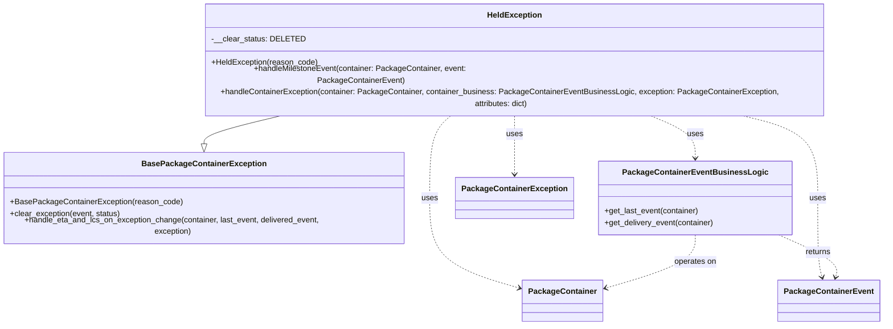

# Diagram: partview_service/partview_service/core/business/package_container_exception_status/package_container_exceptions/PackageContainerHeldException.py

> Auto-generated by Obscura crawlers

## Mermaid

### SVG

<svg id="container" width="1777.5234375" xmlns="http://www.w3.org/2000/svg" class="classDiagram" height="614" viewBox="0 0 1777.5234375 614" role="graphics-document document" aria-roledescription="class"><g><defs><marker id="container_class-aggregationStart" class="marker aggregation class" refX="18" refY="7" markerWidth="190" markerHeight="240" orient="auto"><path d="M 18,7 L9,13 L1,7 L9,1 Z"></path></marker></defs><defs><marker id="container_class-aggregationEnd" class="marker aggregation class" refX="1" refY="7" markerWidth="20" markerHeight="28" orient="auto"><path d="M 18,7 L9,13 L1,7 L9,1 Z"></path></marker></defs><defs><marker id="container_class-extensionStart" class="marker extension class" refX="18" refY="7" markerWidth="190" markerHeight="240" orient="auto"><path d="M 1,7 L18,13 V 1 Z"></path></marker></defs><defs><marker id="container_class-extensionEnd" class="marker extension class" refX="1" refY="7" markerWidth="20" markerHeight="28" orient="auto"><path d="M 1,1 V 13 L18,7 Z"></path></marker></defs><defs><marker id="container_class-compositionStart" class="marker composition class" refX="18" refY="7" markerWidth="190" markerHeight="240" orient="auto"><path d="M 18,7 L9,13 L1,7 L9,1 Z"></path></marker></defs><defs><marker id="container_class-compositionEnd" class="marker composition class" refX="1" refY="7" markerWidth="20" markerHeight="28" orient="auto"><path d="M 18,7 L9,13 L1,7 L9,1 Z"></path></marker></defs><defs><marker id="container_class-dependencyStart" class="marker dependency class" refX="6" refY="7" markerWidth="190" markerHeight="240" orient="auto"><path d="M 5,7 L9,13 L1,7 L9,1 Z"></path></marker></defs><defs><marker id="container_class-dependencyEnd" class="marker dependency class" refX="13" refY="7" markerWidth="20" markerHeight="28" orient="auto"><path d="M 18,7 L9,13 L14,7 L9,1 Z"></path></marker></defs><defs><marker id="container_class-lollipopStart" class="marker lollipop class" refX="13" refY="7" markerWidth="190" markerHeight="240" orient="auto"><circle stroke="black" fill="transparent" cx="7" cy="7" r="6"></circle></marker></defs><defs><marker id="container_class-lollipopEnd" class="marker lollipop class" refX="1" refY="7" markerWidth="190" markerHeight="240" orient="auto"><circle stroke="black" fill="transparent" cx="7" cy="7" r="6"></circle></marker></defs><g class="root"><g class="clusters"></g><g class="edgePaths"><path d="M595.283,200L566.139,206.167C536.996,212.333,478.709,224.667,449.565,234.125C420.422,243.583,420.422,250.167,420.422,253.458L420.422,256.75" id="id_HeldException_BasePackageContainerException_1" class="edge-thickness-normal edge-pattern-solid relation" style=";;;" data-edge="true" data-et="edge" data-id="id_HeldException_BasePackageContainerException_1" data-points="W3sieCI6NTk1LjI4Mjk1MzQ3NzQ0MzYsInkiOjIwMH0seyJ4Ijo0MjAuNDIxODc1LCJ5IjoyMzd9LHsieCI6NDIwLjQyMTg3NSwieSI6Mjc0fV0=" marker-end="url(#container_class-extensionEnd)"></path><path d="M930.138,200L922.505,206.167C914.871,212.333,899.603,224.667,891.97,251.5C884.336,278.333,884.336,319.667,884.336,361C884.336,402.333,884.336,443.667,913.833,473.29C943.329,502.913,1002.322,520.826,1031.819,529.782L1061.315,538.739" id="id_HeldException_PackageContainer_2" class="edge-thickness-normal edge-pattern-dashed relation" style=";;;" data-edge="true" data-et="edge" data-id="id_HeldException_PackageContainer_2" data-points="W3sieCI6OTMwLjEzODIxNjYzNTMzODQsInkiOjIwMH0seyJ4Ijo4ODQuMzM1OTM3NSwieSI6MjM3fSx7IngiOjg4NC4zMzU5Mzc1LCJ5IjozNjF9LHsieCI6ODg0LjMzNTkzNzUsInkiOjQ4NX0seyJ4IjoxMDY3LjA1NjY0MDYyNSwieSI6NTQwLjQ4MTg4OTM2MTgyOTl9XQ==" marker-end="url(#container_class-dependencyEnd)"></path><path d="M1481.884,200L1509.693,206.167C1537.501,212.333,1593.118,224.667,1620.926,251.5C1648.734,278.333,1648.734,319.667,1648.734,361C1648.734,402.333,1648.734,443.667,1650.259,469.54C1651.784,495.414,1654.833,505.828,1656.358,511.035L1657.883,516.242" id="id_HeldException_PackageContainerEvent_3" class="edge-thickness-normal edge-pattern-dashed relation" style=";;;" data-edge="true" data-et="edge" data-id="id_HeldException_PackageContainerEvent_3" data-points="W3sieCI6MTQ4MS44ODQ0NTcyMzY4NDIsInkiOjIwMH0seyJ4IjoxNjQ4LjczNDM3NSwieSI6MjM3fSx7IngiOjE2NDguNzM0Mzc1LCJ5IjozNjF9LHsieCI6MTY0OC43MzQzNzUsInkiOjQ4NX0seyJ4IjoxNjU5LjU2ODczMDIyMTUxOSwieSI6NTIyfV0=" marker-end="url(#container_class-dependencyEnd)"></path><path d="M1305.728,200L1322.22,206.167C1338.713,212.333,1371.698,224.667,1388.191,238C1404.684,251.333,1404.684,265.667,1404.684,272.833L1404.684,280" id="id_HeldException_PackageContainerEventBusinessLogic_4" class="edge-thickness-normal edge-pattern-dashed relation" style=";;;" data-edge="true" data-et="edge" data-id="id_HeldException_PackageContainerEventBusinessLogic_4" data-points="W3sieCI6MTMwNS43Mjc1MDIzNDk2MjQsInkiOjIwMH0seyJ4IjoxNDA0LjY4MzU5Mzc1LCJ5IjoyMzd9LHsieCI6MTQwNC42ODM1OTM3NSwieSI6Mjg2fV0=" marker-end="url(#container_class-dependencyEnd)"></path><path d="M1048.977,200L1048.977,206.167C1048.977,212.333,1048.977,224.667,1048.977,243.5C1048.977,262.333,1048.977,287.667,1048.977,300.333L1048.977,313" id="id_HeldException_PackageContainerException_5" class="edge-thickness-normal edge-pattern-dashed relation" style=";;;" data-edge="true" data-et="edge" data-id="id_HeldException_PackageContainerException_5" data-points="W3sieCI6MTA0OC45NzY1NjI1LCJ5IjoyMDB9LHsieCI6MTA0OC45NzY1NjI1LCJ5IjoyMzd9LHsieCI6MTA0OC45NzY1NjI1LCJ5IjozMTl9XQ==" marker-end="url(#container_class-dependencyEnd)"></path><path d="M1404.684,436L1404.684,444.167C1404.684,452.333,1404.684,468.667,1375.187,485.79C1345.69,502.913,1286.697,520.826,1257.201,529.782L1227.704,538.739" id="id_PackageContainerEventBusinessLogic_PackageContainer_6" class="edge-thickness-normal edge-pattern-dashed relation" style=";;;" data-edge="true" data-et="edge" data-id="id_PackageContainerEventBusinessLogic_PackageContainer_6" data-points="W3sieCI6MTQwNC42ODM1OTM3NSwieSI6NDM2fSx7IngiOjE0MDQuNjgzNTkzNzUsInkiOjQ4NX0seyJ4IjoxMjIxLjk2Mjg5MDYyNSwieSI6NTQwLjQ4MTg4OTM2MTgyOTl9XQ==" marker-end="url(#container_class-dependencyEnd)"></path><path d="M1580.278,436L1599.398,444.167C1618.519,452.333,1656.759,468.667,1674.355,482.04C1691.951,495.414,1688.901,505.828,1687.376,511.035L1685.852,516.242" id="id_PackageContainerEventBusinessLogic_PackageContainerEvent_7" class="edge-thickness-normal edge-pattern-dashed relation" style=";;;" data-edge="true" data-et="edge" data-id="id_PackageContainerEventBusinessLogic_PackageContainerEvent_7" data-points="W3sieCI6MTU4MC4yNzgxOTQzMDQ0MzU2LCJ5Ijo0MzZ9LHsieCI6MTY5NSwieSI6NDg1fSx7IngiOjE2ODQuMTY1NjQ0Nzc4NDgxLCJ5Ijo1MjJ9XQ==" marker-end="url(#container_class-dependencyEnd)"></path></g><g class="edgeLabels"><g class="edgeLabel"><g class="label" data-id="id_HeldException_BasePackageContainerException_1" transform="translate(0, 0)"><foreignObject width="0" height="0">

</foreignObject></g></g><g class="edgeLabel" transform="translate(884.3359375, 361)"><g class="label" data-id="id_HeldException_PackageContainer_2" transform="translate(-16.4921875, -12)"><foreignObject width="32.984375" height="24">

uses

</foreignObject></g></g><g class="edgeLabel" transform="translate(1648.734375, 361)"><g class="label" data-id="id_HeldException_PackageContainerEvent_3" transform="translate(-16.4921875, -12)"><foreignObject width="32.984375" height="24">

uses

</foreignObject></g></g><g class="edgeLabel" transform="translate(1404.68359375, 237)"><g class="label" data-id="id_HeldException_PackageContainerEventBusinessLogic_4" transform="translate(-16.4921875, -12)"><foreignObject width="32.984375" height="24">

uses

</foreignObject></g></g><g class="edgeLabel" transform="translate(1048.9765625, 237)"><g class="label" data-id="id_HeldException_PackageContainerException_5" transform="translate(-16.4921875, -12)"><foreignObject width="32.984375" height="24">

uses

</foreignObject></g></g><g class="edgeLabel" transform="translate(1404.68359375, 485)"><g class="label" data-id="id_PackageContainerEventBusinessLogic_PackageContainer_6" transform="translate(-43.2890625, -12)"><foreignObject width="86.578125" height="24">

operates on

</foreignObject></g></g><g class="edgeLabel" transform="translate(1655.36659, 468.07177)"><g class="label" data-id="id_PackageContainerEventBusinessLogic_PackageContainerEvent_7" transform="translate(-26.265625, -12)"><foreignObject width="52.53125" height="24">

returns

</foreignObject></g></g></g><g class="nodes"><g class="node default" id="classId-BasePackageContainerException-0" transform="translate(420.421875, 361)"><g class="basic label-container"><path d="M-412.421875 -87 L412.421875 -87 L412.421875 87 L-412.421875 87" stroke="none" stroke-width="0" fill="#ECECFF" style=""></path><path d="M-412.421875 -87 C-105.48040121144248 -87, 201.46107257711503 -87, 412.421875 -87 M-412.421875 -87 C-237.27052278153872 -87, -62.11917056307743 -87, 412.421875 -87 M412.421875 -87 C412.421875 -46.806231373633636, 412.421875 -6.612462747267273, 412.421875 87 M412.421875 -87 C412.421875 -38.80262874805112, 412.421875 9.39474250389776, 412.421875 87 M412.421875 87 C159.3264874168441 87, -93.76890016631182 87, -412.421875 87 M412.421875 87 C84.94920854080772 87, -242.52345791838457 87, -412.421875 87 M-412.421875 87 C-412.421875 45.35798818054851, -412.421875 3.7159763610970202, -412.421875 -87 M-412.421875 87 C-412.421875 30.014684045080045, -412.421875 -26.97063190983991, -412.421875 -87" stroke="#9370DB" stroke-width="1.3" fill="none" stroke-dasharray="0 0" style=""></path></g><g class="annotation-group text" transform="translate(0, -63)"></g><g class="label-group text" transform="translate(-118.671875, -63)"><g class="label" style="font-weight: bolder" transform="translate(0,-12)"><foreignObject width="237.34375" height="24">

BasePackageContainerException

</foreignObject></g></g><g class="members-group text" transform="translate(-400.421875, -15)"></g><g class="methods-group text" transform="translate(-400.421875, 15)"><g class="label" style="" transform="translate(0,-12)"><foreignObject width="344.078125" height="24">

+BasePackageContainerException(reason_code)

</foreignObject></g><g class="label" style="" transform="translate(0,12)"><foreignObject width="224.40625" height="24">

+clear_exception(event, status)

</foreignObject></g><g class="label" style="" transform="translate(0,36)"><foreignObject width="682.171875" height="24">

+handle_eta_and_lcs_on_exception_change(container, last_event, delivered_event, exception)

</foreignObject></g></g><g class="divider" style=""><path d="M-412.421875 -39 C-175.21372248841294 -39, 61.99443002317412 -39, 412.421875 -39 M-412.421875 -39 C-202.58356887067032 -39, 7.254737258659361 -39, 412.421875 -39" stroke="#9370DB" stroke-width="1.3" fill="none" stroke-dasharray="0 0" style=""></path></g><g class="divider" style=""><path d="M-412.421875 -15 C-103.05968119505025 -15, 206.3025126098995 -15, 412.421875 -15 M-412.421875 -15 C-97.0522707073689 -15, 218.3173335852622 -15, 412.421875 -15" stroke="#9370DB" stroke-width="1.3" fill="none" stroke-dasharray="0 0" style=""></path></g></g><g class="node default" id="classId-HeldException-1" transform="translate(1048.9765625, 104)"><g class="basic label-container"><path d="M-659.3203125 -96 L659.3203125 -96 L659.3203125 96 L-659.3203125 96" stroke="none" stroke-width="0" fill="#ECECFF" style=""></path><path d="M-659.3203125 -96 C-238.88866409482154 -96, 181.54298431035693 -96, 659.3203125 -96 M-659.3203125 -96 C-360.9020136581493 -96, -62.48371481629863 -96, 659.3203125 -96 M659.3203125 -96 C659.3203125 -53.131690037619485, 659.3203125 -10.26338007523897, 659.3203125 96 M659.3203125 -96 C659.3203125 -57.36767281994243, 659.3203125 -18.735345639884855, 659.3203125 96 M659.3203125 96 C392.6512541908632 96, 125.9821958817264 96, -659.3203125 96 M659.3203125 96 C246.23648252294828 96, -166.84734745410344 96, -659.3203125 96 M-659.3203125 96 C-659.3203125 29.40578784204972, -659.3203125 -37.18842431590056, -659.3203125 -96 M-659.3203125 96 C-659.3203125 21.76597710808616, -659.3203125 -52.46804578382768, -659.3203125 -96" stroke="#9370DB" stroke-width="1.3" fill="none" stroke-dasharray="0 0" style=""></path></g><g class="annotation-group text" transform="translate(0, -72)"></g><g class="label-group text" transform="translate(-52.578125, -72)"><g class="label" style="font-weight: bolder" transform="translate(0,-12)"><foreignObject width="105.15625" height="24">

HeldException

</foreignObject></g></g><g class="members-group text" transform="translate(-647.3203125, -24)"><g class="label" style="" transform="translate(0,-12)"><foreignObject width="179.078125" height="24">

-__clear_status: DELETED

</foreignObject></g></g><g class="methods-group text" transform="translate(-647.3203125, 24)"><g class="label" style="" transform="translate(0,-12)"><foreignObject width="214.828125" height="24">

+HeldException(reason_code)

</foreignObject></g><g class="label" style="" transform="translate(0,12)"><foreignObject width="609.125" height="24">

+handleMilestoneEvent(container: PackageContainer, event: PackageContainerEvent)

</foreignObject></g><g class="label" style="" transform="translate(0,36)"><foreignObject width="1242.0625" height="24">

+handleContainerException(container: PackageContainer, container_business: PackageContainerEventBusinessLogic, exception: PackageContainerException, attributes: dict)

</foreignObject></g></g><g class="divider" style=""><path d="M-659.3203125 -48 C-277.6896781469494 -48, 103.94095620610119 -48, 659.3203125 -48 M-659.3203125 -48 C-354.52944462509856 -48, -49.738576750197126 -48, 659.3203125 -48" stroke="#9370DB" stroke-width="1.3" fill="none" stroke-dasharray="0 0" style=""></path></g><g class="divider" style=""><path d="M-659.3203125 0 C-308.83816405211326 0, 41.64398439577349 0, 659.3203125 0 M-659.3203125 0 C-299.39826766429957 0, 60.523777171400866 0, 659.3203125 0" stroke="#9370DB" stroke-width="1.3" fill="none" stroke-dasharray="0 0" style=""></path></g></g><g class="node default" id="classId-PackageContainer-2" transform="translate(1144.509765625, 564)"><g class="basic label-container"><path d="M-77.453125 -42 L77.453125 -42 L77.453125 42 L-77.453125 42" stroke="none" stroke-width="0" fill="#ECECFF" style=""></path><path d="M-77.453125 -42 C-20.575352869715687 -42, 36.30241926056863 -42, 77.453125 -42 M-77.453125 -42 C-39.10802096228738 -42, -0.7629169245747534 -42, 77.453125 -42 M77.453125 -42 C77.453125 -24.60273050305049, 77.453125 -7.2054610061009825, 77.453125 42 M77.453125 -42 C77.453125 -24.247115067489666, 77.453125 -6.4942301349793325, 77.453125 42 M77.453125 42 C22.84696468601856 42, -31.75919562796288 42, -77.453125 42 M77.453125 42 C43.766984854549335 42, 10.08084470909867 42, -77.453125 42 M-77.453125 42 C-77.453125 19.448083899278377, -77.453125 -3.1038322014432467, -77.453125 -42 M-77.453125 42 C-77.453125 16.42346109382874, -77.453125 -9.153077812342516, -77.453125 -42" stroke="#9370DB" stroke-width="1.3" fill="none" stroke-dasharray="0 0" style=""></path></g><g class="annotation-group text" transform="translate(0, -18)"></g><g class="label-group text" transform="translate(-65.453125, -18)"><g class="label" style="font-weight: bolder" transform="translate(0,-12)"><foreignObject width="130.90625" height="24">

PackageContainer

</foreignObject></g></g><g class="members-group text" transform="translate(-65.453125, 30)"></g><g class="methods-group text" transform="translate(-65.453125, 60)"></g><g class="divider" style=""><path d="M-77.453125 6 C-36.075209519170286 6, 5.302705961659427 6, 77.453125 6 M-77.453125 6 C-18.290054957905724 6, 40.87301508418855 6, 77.453125 6" stroke="#9370DB" stroke-width="1.3" fill="none" stroke-dasharray="0 0" style=""></path></g><g class="divider" style=""><path d="M-77.453125 24 C-43.55703687432942 24, -9.66094874865884 24, 77.453125 24 M-77.453125 24 C-25.086848749713027 24, 27.279427500573945 24, 77.453125 24" stroke="#9370DB" stroke-width="1.3" fill="none" stroke-dasharray="0 0" style=""></path></g></g><g class="node default" id="classId-PackageContainerEvent-3" transform="translate(1671.8671875, 564)"><g class="basic label-container"><path d="M-97.65625 -42 L97.65625 -42 L97.65625 42 L-97.65625 42" stroke="none" stroke-width="0" fill="#ECECFF" style=""></path><path d="M-97.65625 -42 C-25.10783785617909 -42, 47.44057428764182 -42, 97.65625 -42 M-97.65625 -42 C-22.352480803841644 -42, 52.95128839231671 -42, 97.65625 -42 M97.65625 -42 C97.65625 -16.40240863128403, 97.65625 9.195182737431942, 97.65625 42 M97.65625 -42 C97.65625 -23.727439520560083, 97.65625 -5.454879041120165, 97.65625 42 M97.65625 42 C38.851591572380244 42, -19.953066855239513 42, -97.65625 42 M97.65625 42 C43.03515131466562 42, -11.585947370668762 42, -97.65625 42 M-97.65625 42 C-97.65625 20.07965474502776, -97.65625 -1.84069050994448, -97.65625 -42 M-97.65625 42 C-97.65625 21.726607781432175, -97.65625 1.4532155628643508, -97.65625 -42" stroke="#9370DB" stroke-width="1.3" fill="none" stroke-dasharray="0 0" style=""></path></g><g class="annotation-group text" transform="translate(0, -18)"></g><g class="label-group text" transform="translate(-85.65625, -18)"><g class="label" style="font-weight: bolder" transform="translate(0,-12)"><foreignObject width="171.3125" height="24">

PackageContainerEvent

</foreignObject></g></g><g class="members-group text" transform="translate(-85.65625, 30)"></g><g class="methods-group text" transform="translate(-85.65625, 60)"></g><g class="divider" style=""><path d="M-97.65625 6 C-24.527021331050676 6, 48.60220733789865 6, 97.65625 6 M-97.65625 6 C-28.530302638999828 6, 40.595644722000344 6, 97.65625 6" stroke="#9370DB" stroke-width="1.3" fill="none" stroke-dasharray="0 0" style=""></path></g><g class="divider" style=""><path d="M-97.65625 24 C-55.93794670679139 24, -14.219643413582773 24, 97.65625 24 M-97.65625 24 C-30.711411679657786 24, 36.23342664068443 24, 97.65625 24" stroke="#9370DB" stroke-width="1.3" fill="none" stroke-dasharray="0 0" style=""></path></g></g><g class="node default" id="classId-PackageContainerEventBusinessLogic-4" transform="translate(1404.68359375, 361)"><g class="basic label-container"><path d="M-192.55859375 -75 L192.55859375 -75 L192.55859375 75 L-192.55859375 75" stroke="none" stroke-width="0" fill="#ECECFF" style=""></path><path d="M-192.55859375 -75 C-76.17493048320016 -75, 40.208732783599686 -75, 192.55859375 -75 M-192.55859375 -75 C-89.66564867535597 -75, 13.227296399288065 -75, 192.55859375 -75 M192.55859375 -75 C192.55859375 -41.48265674226051, 192.55859375 -7.965313484521019, 192.55859375 75 M192.55859375 -75 C192.55859375 -16.769959562174655, 192.55859375 41.46008087565069, 192.55859375 75 M192.55859375 75 C92.09224370931771 75, -8.374106331364572 75, -192.55859375 75 M192.55859375 75 C54.369672734575545 75, -83.81924828084891 75, -192.55859375 75 M-192.55859375 75 C-192.55859375 41.091221201938886, -192.55859375 7.182442403877772, -192.55859375 -75 M-192.55859375 75 C-192.55859375 43.434802655410934, -192.55859375 11.86960531082186, -192.55859375 -75" stroke="#9370DB" stroke-width="1.3" fill="none" stroke-dasharray="0 0" style=""></path></g><g class="annotation-group text" transform="translate(0, -51)"></g><g class="label-group text" transform="translate(-137.0703125, -51)"><g class="label" style="font-weight: bolder" transform="translate(0,-12)"><foreignObject width="274.140625" height="24">

PackageContainerEventBusinessLogic

</foreignObject></g></g><g class="members-group text" transform="translate(-180.55859375, -3)"></g><g class="methods-group text" transform="translate(-180.55859375, 27)"><g class="label" style="" transform="translate(0,-12)"><foreignObject width="193.015625" height="24">

+get_last_event(container)

</foreignObject></g><g class="label" style="" transform="translate(0,12)"><foreignObject width="224.046875" height="24">

+get_delivery_event(container)

</foreignObject></g></g><g class="divider" style=""><path d="M-192.55859375 -27 C-103.39196422097886 -27, -14.225334691957727 -27, 192.55859375 -27 M-192.55859375 -27 C-39.06487129656452 -27, 114.42885115687096 -27, 192.55859375 -27" stroke="#9370DB" stroke-width="1.3" fill="none" stroke-dasharray="0 0" style=""></path></g><g class="divider" style=""><path d="M-192.55859375 -3 C-42.75340057398307 -3, 107.05179260203386 -3, 192.55859375 -3 M-192.55859375 -3 C-61.508119644775206 -3, 69.54235446044959 -3, 192.55859375 -3" stroke="#9370DB" stroke-width="1.3" fill="none" stroke-dasharray="0 0" style=""></path></g></g><g class="node default" id="classId-PackageContainerException-5" transform="translate(1048.9765625, 361)"><g class="basic label-container"><path d="M-113.1484375 -42 L113.1484375 -42 L113.1484375 42 L-113.1484375 42" stroke="none" stroke-width="0" fill="#ECECFF" style=""></path><path d="M-113.1484375 -42 C-29.333417073328434 -42, 54.48160335334313 -42, 113.1484375 -42 M-113.1484375 -42 C-41.25913587602594 -42, 30.630165747948126 -42, 113.1484375 -42 M113.1484375 -42 C113.1484375 -24.890875421391353, 113.1484375 -7.7817508427827065, 113.1484375 42 M113.1484375 -42 C113.1484375 -22.89845643381826, 113.1484375 -3.7969128676365216, 113.1484375 42 M113.1484375 42 C36.5299053793166 42, -40.088626741366795 42, -113.1484375 42 M113.1484375 42 C66.24024379376539 42, 19.33205008753076 42, -113.1484375 42 M-113.1484375 42 C-113.1484375 24.89599525737616, -113.1484375 7.791990514752321, -113.1484375 -42 M-113.1484375 42 C-113.1484375 15.990767403410942, -113.1484375 -10.018465193178116, -113.1484375 -42" stroke="#9370DB" stroke-width="1.3" fill="none" stroke-dasharray="0 0" style=""></path></g><g class="annotation-group text" transform="translate(0, -18)"></g><g class="label-group text" transform="translate(-101.1484375, -18)"><g class="label" style="font-weight: bolder" transform="translate(0,-12)"><foreignObject width="202.296875" height="24">

PackageContainerException

</foreignObject></g></g><g class="members-group text" transform="translate(-101.1484375, 30)"></g><g class="methods-group text" transform="translate(-101.1484375, 60)"></g><g class="divider" style=""><path d="M-113.1484375 6 C-37.55548116650712 6, 38.03747516698576 6, 113.1484375 6 M-113.1484375 6 C-27.991735722110363 6, 57.164966055779274 6, 113.1484375 6" stroke="#9370DB" stroke-width="1.3" fill="none" stroke-dasharray="0 0" style=""></path></g><g class="divider" style=""><path d="M-113.1484375 24 C-40.63566149259755 24, 31.8771145148049 24, 113.1484375 24 M-113.1484375 24 C-33.49049524780017 24, 46.16744700439966 24, 113.1484375 24" stroke="#9370DB" stroke-width="1.3" fill="none" stroke-dasharray="0 0" style=""></path></g></g></g></g></g></svg>
