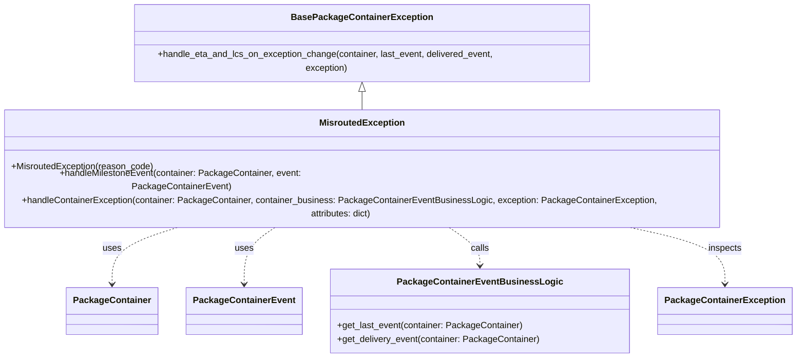

# Diagram: partview_service/partview_service/core/business/package_container_exception_status/package_container_exceptions/PackageContainerMisroutedException.py

> Auto-generated by Obscura crawlers

## Mermaid

### SVG

<svg id="container" width="1426.833984375" xmlns="http://www.w3.org/2000/svg" class="classDiagram" height="590" viewBox="0 0 1426.833984375 590" role="graphics-document document" aria-roledescription="class"><g><defs><marker id="container_class-aggregationStart" class="marker aggregation class" refX="18" refY="7" markerWidth="190" markerHeight="240" orient="auto"><path d="M 18,7 L9,13 L1,7 L9,1 Z"></path></marker></defs><defs><marker id="container_class-aggregationEnd" class="marker aggregation class" refX="1" refY="7" markerWidth="20" markerHeight="28" orient="auto"><path d="M 18,7 L9,13 L1,7 L9,1 Z"></path></marker></defs><defs><marker id="container_class-extensionStart" class="marker extension class" refX="18" refY="7" markerWidth="190" markerHeight="240" orient="auto"><path d="M 1,7 L18,13 V 1 Z"></path></marker></defs><defs><marker id="container_class-extensionEnd" class="marker extension class" refX="1" refY="7" markerWidth="20" markerHeight="28" orient="auto"><path d="M 1,1 V 13 L18,7 Z"></path></marker></defs><defs><marker id="container_class-compositionStart" class="marker composition class" refX="18" refY="7" markerWidth="190" markerHeight="240" orient="auto"><path d="M 18,7 L9,13 L1,7 L9,1 Z"></path></marker></defs><defs><marker id="container_class-compositionEnd" class="marker composition class" refX="1" refY="7" markerWidth="20" markerHeight="28" orient="auto"><path d="M 18,7 L9,13 L1,7 L9,1 Z"></path></marker></defs><defs><marker id="container_class-dependencyStart" class="marker dependency class" refX="6" refY="7" markerWidth="190" markerHeight="240" orient="auto"><path d="M 5,7 L9,13 L1,7 L9,1 Z"></path></marker></defs><defs><marker id="container_class-dependencyEnd" class="marker dependency class" refX="13" refY="7" markerWidth="20" markerHeight="28" orient="auto"><path d="M 18,7 L9,13 L14,7 L9,1 Z"></path></marker></defs><defs><marker id="container_class-lollipopStart" class="marker lollipop class" refX="13" refY="7" markerWidth="190" markerHeight="240" orient="auto"><circle stroke="black" fill="transparent" cx="7" cy="7" r="6"></circle></marker></defs><defs><marker id="container_class-lollipopEnd" class="marker lollipop class" refX="1" refY="7" markerWidth="190" markerHeight="240" orient="auto"><circle stroke="black" fill="transparent" cx="7" cy="7" r="6"></circle></marker></defs><g class="root"><g class="clusters"></g><g class="edgePaths"><path d="M677.273,151.25L677.273,152.542C677.273,153.833,677.273,156.417,677.273,161.875C677.273,167.333,677.273,175.667,677.273,179.833L677.273,184" id="id_BasePackageContainerException_MisroutedException_1" class="edge-thickness-normal edge-pattern-solid relation" style=";;;" data-edge="true" data-et="edge" data-id="id_BasePackageContainerException_MisroutedException_1" data-points="W3sieCI6Njc3LjI3MzQzNzUsInkiOjEzNH0seyJ4Ijo2NzcuMjczNDM3NSwieSI6MTU5fSx7IngiOjY3Ny4yNzM0Mzc1LCJ5IjoxODR9XQ==" marker-start="url(#container_class-extensionStart)"></path><path d="M375.99,358L354.634,364.167C333.279,370.333,290.568,382.667,269.213,399.5C247.857,416.333,247.857,437.667,247.857,448.333L247.857,459" id="id_MisroutedException_PackageContainer_2" class="edge-thickness-normal edge-pattern-dashed relation" style=";;;" data-edge="true" data-et="edge" data-id="id_MisroutedException_PackageContainer_2" data-points="W3sieCI6Mzc1Ljk4OTYyMDA4NTY4NTUsInkiOjM1OH0seyJ4IjoyNDcuODU3NDIxODc1LCJ5IjozOTV9LHsieCI6MjQ3Ljg1NzQyMTg3NSwieSI6NDY1fV0=" marker-end="url(#container_class-dependencyEnd)"></path><path d="M533.929,358L523.769,364.167C513.608,370.333,493.288,382.667,483.127,399.5C472.967,416.333,472.967,437.667,472.967,448.333L472.967,459" id="id_MisroutedException_PackageContainerEvent_3" class="edge-thickness-normal edge-pattern-dashed relation" style=";;;" data-edge="true" data-et="edge" data-id="id_MisroutedException_PackageContainerEvent_3" data-points="W3sieCI6NTMzLjkyOTI2MjIyMjc4MjIsInkiOjM1OH0seyJ4Ijo0NzIuOTY2Nzk2ODc1LCJ5IjozOTV9LHsieCI6NDcyLjk2Njc5Njg3NSwieSI6NDY1fV0=" marker-end="url(#container_class-dependencyEnd)"></path><path d="M820.618,358L830.778,364.167C840.938,370.333,861.259,382.667,871.42,394C881.58,405.333,881.58,415.667,881.58,420.833L881.58,426" id="id_MisroutedException_PackageContainerEventBusinessLogic_4" class="edge-thickness-normal edge-pattern-dashed relation" style=";;;" data-edge="true" data-et="edge" data-id="id_MisroutedException_PackageContainerEventBusinessLogic_4" data-points="W3sieCI6ODIwLjYxNzYxMjc3NzIxNzgsInkiOjM1OH0seyJ4Ijo4ODEuNTgwMDc4MTI1LCJ5IjozOTV9LHsieCI6ODgxLjU4MDA3ODEyNSwieSI6NDMyfV0=" marker-end="url(#container_class-dependencyEnd)"></path><path d="M1118.175,358L1149.427,364.167C1180.679,370.333,1243.182,382.667,1274.434,399.5C1305.686,416.333,1305.686,437.667,1305.686,448.333L1305.686,459" id="id_MisroutedException_PackageContainerException_5" class="edge-thickness-normal edge-pattern-dashed relation" style=";;;" data-edge="true" data-et="edge" data-id="id_MisroutedException_PackageContainerException_5" data-points="W3sieCI6MTExOC4xNzU0ODE5ODA4NDY4LCJ5IjozNTh9LHsieCI6MTMwNS42ODU1NDY4NzUsInkiOjM5NX0seyJ4IjoxMzA1LjY4NTU0Njg3NSwieSI6NDY1fV0=" marker-end="url(#container_class-dependencyEnd)"></path></g><g class="edgeLabels"><g class="edgeLabel"><g class="label" data-id="id_BasePackageContainerException_MisroutedException_1" transform="translate(0, 0)"><foreignObject width="0" height="0">

</foreignObject></g></g><g class="edgeLabel" transform="translate(247.857421875, 395)"><g class="label" data-id="id_MisroutedException_PackageContainer_2" transform="translate(-16.4921875, -12)"><foreignObject width="32.984375" height="24">

uses

</foreignObject></g></g><g class="edgeLabel" transform="translate(472.966796875, 395)"><g class="label" data-id="id_MisroutedException_PackageContainerEvent_3" transform="translate(-16.4921875, -12)"><foreignObject width="32.984375" height="24">

uses

</foreignObject></g></g><g class="edgeLabel" transform="translate(881.580078125, 395)"><g class="label" data-id="id_MisroutedException_PackageContainerEventBusinessLogic_4" transform="translate(-16.4453125, -12)"><foreignObject width="32.890625" height="24">

calls

</foreignObject></g></g><g class="edgeLabel" transform="translate(1305.685546875, 395)"><g class="label" data-id="id_MisroutedException_PackageContainerException_5" transform="translate(-30.2421875, -12)"><foreignObject width="60.484375" height="24">

inspects

</foreignObject></g></g></g><g class="nodes"><g class="node default" id="classId-BasePackageContainerException-0" transform="translate(677.2734375, 71)"><g class="basic label-container"><path d="M-412.421875 -63 L412.421875 -63 L412.421875 63 L-412.421875 63" stroke="none" stroke-width="0" fill="#ECECFF" style=""></path><path d="M-412.421875 -63 C-196.90150874107707 -63, 18.618857517845868 -63, 412.421875 -63 M-412.421875 -63 C-220.10809538150997 -63, -27.794315763019938 -63, 412.421875 -63 M412.421875 -63 C412.421875 -30.761903931407787, 412.421875 1.4761921371844267, 412.421875 63 M412.421875 -63 C412.421875 -30.718032575644337, 412.421875 1.5639348487113267, 412.421875 63 M412.421875 63 C153.7962784721031 63, -104.8293180557938 63, -412.421875 63 M412.421875 63 C137.6598441055487 63, -137.1021867889026 63, -412.421875 63 M-412.421875 63 C-412.421875 32.72602926116432, -412.421875 2.4520585223286417, -412.421875 -63 M-412.421875 63 C-412.421875 25.502442442978854, -412.421875 -11.995115114042292, -412.421875 -63" stroke="#9370DB" stroke-width="1.3" fill="none" stroke-dasharray="0 0" style=""></path></g><g class="annotation-group text" transform="translate(0, -39)"></g><g class="label-group text" transform="translate(-118.671875, -39)"><g class="label" style="font-weight: bolder" transform="translate(0,-12)"><foreignObject width="237.34375" height="24">

BasePackageContainerException

</foreignObject></g></g><g class="members-group text" transform="translate(-400.421875, 9)"></g><g class="methods-group text" transform="translate(-400.421875, 39)"><g class="label" style="" transform="translate(0,-12)"><foreignObject width="682.171875" height="24">

+handle_eta_and_lcs_on_exception_change(container, last_event, delivered_event, exception)

</foreignObject></g></g><g class="divider" style=""><path d="M-412.421875 -15 C-108.287117248181 -15, 195.847640503638 -15, 412.421875 -15 M-412.421875 -15 C-203.83784012215384 -15, 4.746194755692329 -15, 412.421875 -15" stroke="#9370DB" stroke-width="1.3" fill="none" stroke-dasharray="0 0" style=""></path></g><g class="divider" style=""><path d="M-412.421875 9 C-221.74760951591466 9, -31.073344031829322 9, 412.421875 9 M-412.421875 9 C-139.09581563846706 9, 134.23024372306588 9, 412.421875 9" stroke="#9370DB" stroke-width="1.3" fill="none" stroke-dasharray="0 0" style=""></path></g></g><g class="node default" id="classId-MisroutedException-1" transform="translate(677.2734375, 271)"><g class="basic label-container"><path d="M-669.2734375 -87 L669.2734375 -87 L669.2734375 87 L-669.2734375 87" stroke="none" stroke-width="0" fill="#ECECFF" style=""></path><path d="M-669.2734375 -87 C-239.64695640849618 -87, 189.97952468300764 -87, 669.2734375 -87 M-669.2734375 -87 C-186.63606285249926 -87, 296.00131179500147 -87, 669.2734375 -87 M669.2734375 -87 C669.2734375 -47.89229652050531, 669.2734375 -8.784593041010623, 669.2734375 87 M669.2734375 -87 C669.2734375 -28.432199318487974, 669.2734375 30.13560136302405, 669.2734375 87 M669.2734375 87 C147.35541975727824 87, -374.5625979854435 87, -669.2734375 87 M669.2734375 87 C352.28849007174585 87, 35.30354264349171 87, -669.2734375 87 M-669.2734375 87 C-669.2734375 20.08725324626289, -669.2734375 -46.82549350747422, -669.2734375 -87 M-669.2734375 87 C-669.2734375 38.967685481277705, -669.2734375 -9.06462903744459, -669.2734375 -87" stroke="#9370DB" stroke-width="1.3" fill="none" stroke-dasharray="0 0" style=""></path></g><g class="annotation-group text" transform="translate(0, -63)"></g><g class="label-group text" transform="translate(-72.484375, -63)"><g class="label" style="font-weight: bolder" transform="translate(0,-12)"><foreignObject width="144.96875" height="24">

MisroutedException

</foreignObject></g></g><g class="members-group text" transform="translate(-657.2734375, -15)"></g><g class="methods-group text" transform="translate(-657.2734375, 15)"><g class="label" style="" transform="translate(0,-12)"><foreignObject width="253.65625" height="24">

+MisroutedException(reason_code)

</foreignObject></g><g class="label" style="" transform="translate(0,12)"><foreignObject width="609.125" height="24">

+handleMilestoneEvent(container: PackageContainer, event: PackageContainerEvent)

</foreignObject></g><g class="label" style="" transform="translate(0,36)"><foreignObject width="1242.0625" height="24">

+handleContainerException(container: PackageContainer, container_business: PackageContainerEventBusinessLogic, exception: PackageContainerException, attributes: dict)

</foreignObject></g></g><g class="divider" style=""><path d="M-669.2734375 -39 C-146.1891968403571 -39, 376.8950438192858 -39, 669.2734375 -39 M-669.2734375 -39 C-365.29473908447835 -39, -61.3160406689567 -39, 669.2734375 -39" stroke="#9370DB" stroke-width="1.3" fill="none" stroke-dasharray="0 0" style=""></path></g><g class="divider" style=""><path d="M-669.2734375 -15 C-134.63449052956025 -15, 400.0044564408795 -15, 669.2734375 -15 M-669.2734375 -15 C-315.28269613135154 -15, 38.708045237296915 -15, 669.2734375 -15" stroke="#9370DB" stroke-width="1.3" fill="none" stroke-dasharray="0 0" style=""></path></g></g><g class="node default" id="classId-PackageContainer-2" transform="translate(247.857421875, 507)"><g class="basic label-container"><path d="M-77.453125 -42 L77.453125 -42 L77.453125 42 L-77.453125 42" stroke="none" stroke-width="0" fill="#ECECFF" style=""></path><path d="M-77.453125 -42 C-23.463869550969775 -42, 30.52538589806045 -42, 77.453125 -42 M-77.453125 -42 C-18.327432446321254 -42, 40.79826010735749 -42, 77.453125 -42 M77.453125 -42 C77.453125 -14.914779897669227, 77.453125 12.170440204661546, 77.453125 42 M77.453125 -42 C77.453125 -17.966403417556887, 77.453125 6.067193164886227, 77.453125 42 M77.453125 42 C23.61743916193302 42, -30.21824667613396 42, -77.453125 42 M77.453125 42 C27.493200806677187 42, -22.466723386645626 42, -77.453125 42 M-77.453125 42 C-77.453125 22.031869952517894, -77.453125 2.0637399050357885, -77.453125 -42 M-77.453125 42 C-77.453125 23.75646820800514, -77.453125 5.512936416010277, -77.453125 -42" stroke="#9370DB" stroke-width="1.3" fill="none" stroke-dasharray="0 0" style=""></path></g><g class="annotation-group text" transform="translate(0, -18)"></g><g class="label-group text" transform="translate(-65.453125, -18)"><g class="label" style="font-weight: bolder" transform="translate(0,-12)"><foreignObject width="130.90625" height="24">

PackageContainer

</foreignObject></g></g><g class="members-group text" transform="translate(-65.453125, 30)"></g><g class="methods-group text" transform="translate(-65.453125, 60)"></g><g class="divider" style=""><path d="M-77.453125 6 C-45.269128555377314 6, -13.085132110754628 6, 77.453125 6 M-77.453125 6 C-43.155444334077934 6, -8.857763668155869 6, 77.453125 6" stroke="#9370DB" stroke-width="1.3" fill="none" stroke-dasharray="0 0" style=""></path></g><g class="divider" style=""><path d="M-77.453125 24 C-40.71102479669722 24, -3.9689245933944335 24, 77.453125 24 M-77.453125 24 C-43.711691111544084 24, -9.970257223088169 24, 77.453125 24" stroke="#9370DB" stroke-width="1.3" fill="none" stroke-dasharray="0 0" style=""></path></g></g><g class="node default" id="classId-PackageContainerEvent-3" transform="translate(472.966796875, 507)"><g class="basic label-container"><path d="M-97.65625 -42 L97.65625 -42 L97.65625 42 L-97.65625 42" stroke="none" stroke-width="0" fill="#ECECFF" style=""></path><path d="M-97.65625 -42 C-36.39545111567887 -42, 24.865347768642266 -42, 97.65625 -42 M-97.65625 -42 C-42.686411848844656 -42, 12.283426302310687 -42, 97.65625 -42 M97.65625 -42 C97.65625 -17.8821659562585, 97.65625 6.235668087482999, 97.65625 42 M97.65625 -42 C97.65625 -18.66152357160863, 97.65625 4.676952856782741, 97.65625 42 M97.65625 42 C25.24782356657319 42, -47.16060286685362 42, -97.65625 42 M97.65625 42 C38.58279192654969 42, -20.490666146900622 42, -97.65625 42 M-97.65625 42 C-97.65625 15.22857578791287, -97.65625 -11.54284842417426, -97.65625 -42 M-97.65625 42 C-97.65625 13.975047488643838, -97.65625 -14.049905022712323, -97.65625 -42" stroke="#9370DB" stroke-width="1.3" fill="none" stroke-dasharray="0 0" style=""></path></g><g class="annotation-group text" transform="translate(0, -18)"></g><g class="label-group text" transform="translate(-85.65625, -18)"><g class="label" style="font-weight: bolder" transform="translate(0,-12)"><foreignObject width="171.3125" height="24">

PackageContainerEvent

</foreignObject></g></g><g class="members-group text" transform="translate(-85.65625, 30)"></g><g class="methods-group text" transform="translate(-85.65625, 60)"></g><g class="divider" style=""><path d="M-97.65625 6 C-43.17528170141563 6, 11.305686597168744 6, 97.65625 6 M-97.65625 6 C-55.89142333931968 6, -14.126596678639359 6, 97.65625 6" stroke="#9370DB" stroke-width="1.3" fill="none" stroke-dasharray="0 0" style=""></path></g><g class="divider" style=""><path d="M-97.65625 24 C-55.36214779559987 24, -13.068045591199734 24, 97.65625 24 M-97.65625 24 C-46.923362170223406 24, 3.809525659553188 24, 97.65625 24" stroke="#9370DB" stroke-width="1.3" fill="none" stroke-dasharray="0 0" style=""></path></g></g><g class="node default" id="classId-PackageContainerEventBusinessLogic-4" transform="translate(881.580078125, 507)"><g class="basic label-container"><path d="M-260.95703125 -75 L260.95703125 -75 L260.95703125 75 L-260.95703125 75" stroke="none" stroke-width="0" fill="#ECECFF" style=""></path><path d="M-260.95703125 -75 C-93.64372558759584 -75, 73.66958007480832 -75, 260.95703125 -75 M-260.95703125 -75 C-141.222469161204 -75, -21.487907072407978 -75, 260.95703125 -75 M260.95703125 -75 C260.95703125 -32.98362236237088, 260.95703125 9.03275527525824, 260.95703125 75 M260.95703125 -75 C260.95703125 -29.166598665846422, 260.95703125 16.666802668307156, 260.95703125 75 M260.95703125 75 C147.28032753851687 75, 33.60362382703377 75, -260.95703125 75 M260.95703125 75 C129.25929533914808 75, -2.438440571703836 75, -260.95703125 75 M-260.95703125 75 C-260.95703125 20.03758079743892, -260.95703125 -34.92483840512216, -260.95703125 -75 M-260.95703125 75 C-260.95703125 40.455171079212185, -260.95703125 5.9103421584243705, -260.95703125 -75" stroke="#9370DB" stroke-width="1.3" fill="none" stroke-dasharray="0 0" style=""></path></g><g class="annotation-group text" transform="translate(0, -51)"></g><g class="label-group text" transform="translate(-137.0703125, -51)"><g class="label" style="font-weight: bolder" transform="translate(0,-12)"><foreignObject width="274.140625" height="24">

PackageContainerEventBusinessLogic

</foreignObject></g></g><g class="members-group text" transform="translate(-248.95703125, -3)"></g><g class="methods-group text" transform="translate(-248.95703125, 27)"><g class="label" style="" transform="translate(0,-12)"><foreignObject width="329.8125" height="24">

+get_last_event(container: PackageContainer)

</foreignObject></g><g class="label" style="" transform="translate(0,12)"><foreignObject width="360.84375" height="24">

+get_delivery_event(container: PackageContainer)

</foreignObject></g></g><g class="divider" style=""><path d="M-260.95703125 -27 C-78.45802172672086 -27, 104.04098779655828 -27, 260.95703125 -27 M-260.95703125 -27 C-110.11529864479357 -27, 40.72643396041286 -27, 260.95703125 -27" stroke="#9370DB" stroke-width="1.3" fill="none" stroke-dasharray="0 0" style=""></path></g><g class="divider" style=""><path d="M-260.95703125 -3 C-84.78923912768633 -3, 91.37855299462734 -3, 260.95703125 -3 M-260.95703125 -3 C-53.75183055839503 -3, 153.45337013320994 -3, 260.95703125 -3" stroke="#9370DB" stroke-width="1.3" fill="none" stroke-dasharray="0 0" style=""></path></g></g><g class="node default" id="classId-PackageContainerException-5" transform="translate(1305.685546875, 507)"><g class="basic label-container"><path d="M-113.1484375 -42 L113.1484375 -42 L113.1484375 42 L-113.1484375 42" stroke="none" stroke-width="0" fill="#ECECFF" style=""></path><path d="M-113.1484375 -42 C-49.38598756968463 -42, 14.37646236063074 -42, 113.1484375 -42 M-113.1484375 -42 C-35.81170349815176 -42, 41.525030503696485 -42, 113.1484375 -42 M113.1484375 -42 C113.1484375 -23.080545816968943, 113.1484375 -4.161091633937886, 113.1484375 42 M113.1484375 -42 C113.1484375 -18.131972043606474, 113.1484375 5.736055912787052, 113.1484375 42 M113.1484375 42 C62.794057889916914 42, 12.439678279833828 42, -113.1484375 42 M113.1484375 42 C40.01671829300062 42, -33.115000913998756 42, -113.1484375 42 M-113.1484375 42 C-113.1484375 21.776993311650877, -113.1484375 1.5539866233017534, -113.1484375 -42 M-113.1484375 42 C-113.1484375 23.164563299834015, -113.1484375 4.3291265996680295, -113.1484375 -42" stroke="#9370DB" stroke-width="1.3" fill="none" stroke-dasharray="0 0" style=""></path></g><g class="annotation-group text" transform="translate(0, -18)"></g><g class="label-group text" transform="translate(-101.1484375, -18)"><g class="label" style="font-weight: bolder" transform="translate(0,-12)"><foreignObject width="202.296875" height="24">

PackageContainerException

</foreignObject></g></g><g class="members-group text" transform="translate(-101.1484375, 30)"></g><g class="methods-group text" transform="translate(-101.1484375, 60)"></g><g class="divider" style=""><path d="M-113.1484375 6 C-63.99814725674936 6, -14.847857013498725 6, 113.1484375 6 M-113.1484375 6 C-22.775541669706342 6, 67.59735416058732 6, 113.1484375 6" stroke="#9370DB" stroke-width="1.3" fill="none" stroke-dasharray="0 0" style=""></path></g><g class="divider" style=""><path d="M-113.1484375 24 C-37.01365632164503 24, 39.12112485670994 24, 113.1484375 24 M-113.1484375 24 C-44.70089861245735 24, 23.746640275085298 24, 113.1484375 24" stroke="#9370DB" stroke-width="1.3" fill="none" stroke-dasharray="0 0" style=""></path></g></g></g></g></g></svg>
